# 암의 생명정보학 (Bioinformatics in Cancer)

개빈 J. 고든 (Gavin J. Gordon)

# 서문

생명정보학은 컴퓨터와 수학적 알고리즘을 활용하여 생화학 및 생물학 정보를 수집, 분류, 저장, 분석하는 학문으로 정의할 수 있습니다. 특정 개인이나 단체가 독자적으로 개척한 분야는 아니지만, 보스턴 대학교의 템플 스미스(Temple Smith) 박사가 이 용어를 처음 만든 것으로 널리 알려져 있습니다. 생명정보학은 역사적으로 서로 독립된 학문으로 존재해 왔던 생물학, 의학, 컴퓨터 과학, 물리학, 수학의 융합을 상징합니다.

지난 20년 동안 우리는 컴퓨터를 활용한 생명정보학 기반의 암 분석 분야에서 비약적인 발전을 목격했습니다. 이러한 실험 과학적 접근 방식이 아주 새로운 것은 아니지만, 최근 들어 다양한 배경을 가진 학계와 산업계 전문가들 사이에서 큰 주목을 받고 있습니다. 이와 동시에 생명정보학은 신문과 잡지 등을 통해 대중의 관심을 끌었으며, 특히 (개인 맞춤형) DNA 시퀀싱 분야에서 두드러진 성과를 보였습니다. 그 결과 생명정보학은 암의 임상적 관리에서 나타나는 현 한계를 극복할 만능 해결책으로 기대를 모으고 있습니다. 일부 측면에서 과도하게 낙관적인 전망도 있으나, 암의 진단과 예후 판정 분야에서 생명정보학이 지닌 잠재력은 분명히 유망합니다.

본 저서의 핵심 목적은 다음과 같습니다. (1) 생명정보학 실험에 쓰이는 분석 기술, 방법론, 플랫폼에 대한 역사적 및 기술적 관점을 제공하고, (2) 생명정보학적 접근 방식이 다양한 암 관련 과정을 규명하는 데 어떻게 활용되어 왔는지 보여주며, (3) 생명정보학이 기초 과학과 임상 영역을 잇는 가교로서 환자 치료와 관리에 실질적으로 어떤 긍정적 영향을 미치고 있는지 증명하고자 합니다.

매사추세츠주 보스턴

개빈 J. 고든

# 1 생명정보학의 출현: 역사적 관점, 빠른 개요 및 미래 트렌드

Christos A. Ouzounis

## 초록

우리는 생명정보학의 역사, 현재 상태 및 가능한 몇 가지 미래 트렌드에 대해 간결한 개요를 제공하며, 특히 암 연구에 중점을 둡니다.

주요 단어: 생명정보학, 계산 생물학, 유전체 연구, 암 유전체학, 역사적 관점, 미래 트렌드

## 1 서론

생명정보학 분야의 출현을 단 몇 페이지로 압축하려는 시도는 큰 도전이 될 수 있습니다. 그러한 모든 노력은 제목 자체가 암시하듯이 필연적으로 과거, 현재, 미래를 수반합니다: 역사적 서사, 현황 보고, 그리고 가능한 미래 트렌드입니다. 이 책 전체의 맥락과 암 연구에서 생명정보학의 역할을 고려할 때, 유전체 연구라는 추상적인 분야의 성과를 인류의 건강과 복지를 위한 응용 분야로 전환해야 하기에 이 작업은 더욱 까다롭습니다. 이러한 응용 분야는 다음 장들에서 설득력 있게 설명되어 있으며, 생명정보학 실험에 사용되는 방법론과 플랫폼에 대한 귀중한 요약, 다양한 암 관련 과정의 특징 분석, 그리고 이 분야가 기초 과학과 임상 영역을 연결하여 환자 치료 및 관리에 어떻게 긍정적인 영향을 미쳤는지를 보여줍니다. 따라서 이 도입 장의 미천한 역할은 이러한 모든 활동이 수행되고 있는 역사적 및 실천적 맥락을 제공하는 것입니다. 이전 연구에 대한 인용은 드물게 사용될 것이며, 관련 리뷰에 대한 포인터는 몇 가지 진정한 고전을 제외하고는 반드시 독창적인 연구가 아니라 생명정보학의 하위 분야에 대한 진입점 역할을 할 수 있도록 할 것입니다. 과거 역사를 탐구하고 이 분야의 현재 상태에 대한 빠른 개요를 제공함으로써, 생명정보학이 다른 학문과의 접점에서, 이번에는 소프트웨어보다는 하드웨어에 더 가까운 곳에서 발생할 가능성이 있는 특정 미래 트렌드를 식별하는 것이 가능합니다.

# 마이크로어레이 실험의 통계적 설계 및 해석

케빈 K. 도빈(Kevin K. Dobbin) 및 리차드 M. 사이먼(Richard M. Simon)

## 초록(ABSTRACT)

이 장에서는 마이크로어레이 실험의 설계 및 해석과 관련된 주요 이슈들을 검토한다. 설계 측면에서는 실험 목적의 식별, 배치 효과(batch effects)의 처리, 반복 및 풀링(pooling) 수준의 선택, 클래스 비교 및 클래스 예측을 위한 샘플 크기 결정, 이중 레이블 실험에서의 샘플 할당 최적화 등을 다룬다. 해석 측면에서는 케이스 선택, 외부 대 내부 검증, 교차 검증의 함정 등 클래스 예측 문제에 초점을 맞춘다.

주요 용어: 마이크로어레이, 실험 설계, 샘플 크기, 예측, 검증

## 1 마이크로어레이 연구의 실험 목적

마이크로어레이 실험의 목적은 특정 가설이나 가설 세트를 테스트하는 것이어야 한다. 가설은 일반적으로 개별 유전자의 발현이 아니라 전반적인 유전자 발현 패턴과 관련된다. 예를 들어, 특정 암의 서로 다른 표현형, 단계 또는 예후 그룹에서 일부 유전자가 차등적으로 발현된다는 가설을 세울 수 있다. 실험의 목적은 이 가설을 증명하거나 반증하는 것이며, 가설이 참일 경우 추가 연구를 위해 차등 발현된 후보 유전자 목록을 식별하는 것이다. 많은 마이크로어레이 실험의 목적은 클래스 비교(class comparison), 클래스 발견(class discovery), 클래스 예측(class prediction)의 세 가지 광범위한 범주 중 하나에 속한다. 각 범주에 등장하는 "클래스"라는 단어는 목적이 단순히 개별 RNA 샘플 간의 발현 차이에 대한 결론을 도출하는 것이 아니라, 샘플의 표현형, 샘플이 노출된 환경, 또는 세포주 실험의 경우 세포가 자란 조건에 따른 유전자 발현의 차이를 식별하는 데 있음을 나타낸다.

G.J. Gordon (ed.), Cancer Drug Discovery and Development: Bioinformatics in Cancer and Cancer Therapy, DOI: 10.1007/978-1-59745-576-3_2, © Humana Press, a part of Springer Science $^ +$ Business Media, LLC 2009

따라서 샘플의 "클래스"는 문맥에 따라 표현형, 노출 또는 성장 조건을 의미한다.

클래스 비교 실험의 목적은 서로 다른 클래스의 샘플에서 차등적으로 발현되는 유전자를 식별하는 것이다. 이 유형의 실험에서 클래스 레이블은 미리 알려져 있으며 유전자 발현 패턴과는 독립적으로 결정된다. 클래스 발견 목적의 실험에서는 클래스 레이블이 미리 알려져 있지 않으며, 샘플의 클러스터 분석을 통해 유전자 발현 데이터로부터 결정된다. 클래스 발견의 목표는 유사한 유전자 발현 프로필을 공유하는 샘플의 하위 그룹을 찾는 것이다. 클러스터 분석은 때때로 유전자에 적용되기도 하며, 이 경우 샘플 전체에서 유사한 발현 패턴을 공유하는 유전자 하위 그룹을 식별하는 것이 목표가 된다. 마지막으로, 클래스 예측 실험의 목적은 미래의 샘플에 적용하여 클래스 소속을 예측할 수 있는 유전자 발현 기반 예측기(predictor)를 만드는 것이다. 클래스는 종종 보조 화학 요법의 혜택을 받을 사람과 받지 못할 사람을 예측하는 것과 같이 임상적 의사 결정을 내리는 데 잠재적인 유용성을 가질 수 있다 (Paik et al., 2004).

# 2 품질 관리 및 교란(CONFOUNDING)

마이크로어레이를 이용한 유전자 발현 측정은 많은 단계를 거치는 복잡한 과정이며, 관련 프로토콜은 매우 상세하다. 프로토콜의 일부 측면이 변하면 결과 유전자 발현 측정에 영향을 미칠 수 있다 (예: Bammler et al., 2005). 분석의 기술적 측면 변화로 인한 측정 변화를 샘플의 실제 유전자 발현 변화와 혼동하지 않기 위해, 공통 프로토콜, 실험실 인원 및 분석 시간을 포함하여 실험의 모든 어레이를 가능한 한 균일한 방식으로 분석하여 기기 설정 및 기타 실험실 조건이 균일하도록 노력해야 한다. 그러나 많은 수의 어레이를 동시에 동일한 조건에서 실행하는 것이 불가능한 경우가 많으므로 마이크로어레이는 서로 다른 배치(batch)로 나뉘며, 각 배치는 가능한 한 가장 균일한 조건 하에서 동시에 실행된다. 배치는 서로 다른 실험실, 동일한 실험실의 서로 다른 인원, 또는 동일한 실험실의 동일한 인원이 서로 다른 시간에 작업하는 것을 나타낼 수 있다. 서로 다른 배치를 가능한 한 균일하게 실행하도록 노력해야 한다. 균일한 프로토콜과 측정 조건은 서로 다른 실험실 간에도 재현 가능한 결과를 생성할 수 있다 (Dobbin et al., 2005).

실험에 여러 배치가 포함될 경우, 배치 효과와 관심 효과를 혼동(교란)하지 않는 것이 중요하다. 교란은 관찰된 유전자 발현의 차이가 두 가지 이상의 원인 중 어느 것에 기인하는지 결정할 수 없을 때 발생한다. 예를 들어, 모든 종양은 어느 한 날에 분석하고 모든 정상 조직은 다른 날에 분석한다면, 배치 간의 차이가 암 특이적 차이 때문인지 아니면 배치 이상 때문인지 알 수 없게 된다. 이러한 이유로 설계에는 각 배치에 각 클래스의 샘플이 포함되어야 하며, 이상적으로는 각 클래스에서 동일한 수의 샘플이 포함되어야 한다.

데이터가 배치로 그룹화될 때, 마이크로어레이의 예비 탐색적 분석을 사용하여 배치 간에 체계적인 차이가 있는지 평가할 수 있다. 일부 소프트웨어 분석 도구와 관련된 품질 지표를 사용하여 배치 품질을 비교할 수 있다. 그러나 품질 지표가 가능한 모든 기술적 문제를 다루지는 못한다. 배치 간의 체계적인 차이는 각 샘플 쌍 간의 거리를 확인하여 동일한 배치의 샘플들이 서로 다른 배치의 샘플들보다 더 가까운 경향이 있는지 확인함으로써 "배치" 효과를 식별할 수도 있다. 전형적인 거리 지표는 1에서 상관관계를 뺀 값이나 유전자 발현 벡터 간의 유클리드 거리(Euclidean distance)이다. 다차원 척도법(MDS) 플롯, 주성분 플롯, 클러스터 분석 등을 포함한 그래픽 도구들이 이러한 유형의 예비 분석에 유용하다. 이러한 분석에서 샘플이 배치별로 분리되거나 나머지 배치와 분리되는 한두 개의 배치가 있다면 이는 잠재적인 품질 관리 또는 일관성 문제를 나타낸다. 공식적인 데이터 분석을 수행하기 전에 이러한 유형의 품질 관리 문제를 식별하도록 노력해야 한다. 그렇지 않으면 연구가 잘못된 결론으로 이어질 수 있다. 이후의 하류 데이터 분석에서 품질 관리 문제가 식별되더라도, 그 시점에서 문제를 해결하기 위해 되돌아가는 것은 전체 분석의 통계적 타당성을 손상시킬 수 있다.

# 3 암의 전장 유전체 분석 (Whole-Genome Analysis of Cancer)

Steven A. Enkemann , James M. McLoughlin , Eric H. Jensen, and Timothy J. Yeatman

## 초록 (ABSTRACT)

인간 게놈 프로젝트의 완료와 함께, 인간 게놈의 방대한 부분을 동시에 평가할 수 있는 수많은 기술이 발명되었습니다. 연구들은 대개 게놈(genome), 전사체(transcriptome) 또는 단백체(proteome)에 집중하여 인간 질병의 기원을 설명하고 잠재적으로 미래의 결과를 예측할 수 있는 고유한 특성을 식별하고자 합니다. 이러한 연구 활동의 목표는 궁극적으로 각 환자의 고유한 유전자 발현 패턴에 기초하여 개별화된 치료를 제공하는 것입니다.

주요 단어: 게놈 (Genome), 전사체 (Transcriptome), 단백체 (Proteome), 기능 유전체학 (Functional genomics), 마이크로어레이 (Microarray), 유전자 칩 (GeneChip), 시퀀싱 (Sequencing), 암 (Cancer)

## 1 서론 (INTRODUCTION)

"유전자(gene)"라는 용어는 1909년 유전의 기능적 단위를 설명하기 위해 처음 사용되었으며(Johannsen, 1909), 1920년대 초에는 독일 과학자들에 의해 널리 사용되었습니다(Carlson, 1966). 당시 유전자는 세대에서 세대로 전달될 수 있는 특성에 의해 정의되었습니다. 따라서 유전자의 진정한 정의는 형질을 결정하는 유전적 요인이며, "게놈(genome)"은 한 생물체의 이러한 유전적 요인의 총합으로 정의됩니다. "유전자"라는 용어가 사용된 지 30년이 지난 후, 에이버리(Avery), 매카티(McCarty), 매클라우드(McCloud)는 유전적 요인이 DNA임을 처음으로 증명했습니다(Avery et al., 1944). 따라서 유전자는 단순한 DNA 서열 그 이상입니다. 이는 유전자가 암호화하는 측정 가능한 활동과 불가분하게 연결되어 있습니다. 그것은 유전된 DNA 조각의 기능적 결과입니다.

생물학자들은 이제 어린 나이에 생물학의 중심 원리(central dogma)를 배웁니다: DNA는 RNA 분자의 전사를 지시하고, RNA 분자는 다시 단백질의 번역을 지시합니다(그림 1). 이러한 단백질은 궁극적으로 세포나 유기체의 기능적 결과로 관찰되는 활동을 생성합니다. 이러한 표현형(phenotype)은 유전자를 정의하는 최종 척도입니다. 따라서 최근 "기능 유전체학(functional genomics)"이라고 불리는 유전자에 대한 연구는 DNA 자체에서부터 유전자가 암호화하는 외부 특성에 이르기까지 세포와 유기체 연구의 모든 측면을 포함합니다. 기능 유전체학은 유전자, 그들이 암호화하는 단백질, 그리고 그들과 관련된 생물학적 과정에 대한 연구입니다. 기능 유전체학 분야는 유전체가 시간이 지남에 따라 그리고 다양한 생물학적 상태에서 어떻게 작동하는지에 대한 비밀을 밝히고자 합니다. 그것은 모든 유전자의 기능적 중요성을 조사하고자 합니다. 그러나 이러한 유전자들을 하나씩 조사하기보다는 일반적으로 한 번에 대규모 유전자 그룹을 조사하는 기술을 사용합니다.

인간 게놈의 완전한 서열 분석은 과학 연구의 많은 새로운 길과 새로운 조사 메커니즘을 열어주었습니다. 이는 생물학 분야에서 '거대 과학(big science)'의 개념을 개척했으며, 방대한 양의 데이터가 생성되고 이러한 결과를 처리하기 위해 고급 계산 알고리즘이 필요하게 되었습니다. 또한 여러 새로운 기술에 의한 게놈 조사의 길을 열었습니다. 이러한 새로운 기술 중 일부는 게놈을 평가하기 위해 전통적인 실험 방법보다는 컴퓨터를 필요로 했습니다. 예를 들어, 유전자를 발견하기 위해 표현형에서 시작하여 DNA 서열을 추적하는 대신, 이제 게놈 서열에서 시작하여 프로모터, 오픈 리딩 프레임(ORF), 스플라이스 접합부, 알려진 서열과의 상동성을 나타내는 구조를 찾아 새로운 유전자를 발견할 수 있습니다. 새로운 유전자를 정의하기 위해 더 이상 표현형을 알 필요가 없습니다. 실제로 대부분의 유전자는 이제 DNA 서열을 기반으로 발견됩니다. 비교 게놈 분석을 통해 진화적으로 관련된 유기체에서 유전자가 확인되면 두 번째 유기체에서 상동 유전자를 신속하게 찾을 수 있습니다. 이 기술은 또한 밀접하게 관련된 유기체 사이의 차이점을 신속하게 식별하는 데 사용될 수 있습니다. 이 기술은 병원성 및 비병원성 박테리아 균주를 비교하여 병원성 인자를 식별하는 데 사용되었습니다(Dobrindt, 2005; Dobrindt et al., 2003; Schmidt et al., 2004; Wick et al., 2005).

암 연구에도 매우 유사한 개념이 사용되었습니다. 예를 들어, 핵형 분석(karyotyping)을 통해 정상 조직 대비 종양 게놈을 비교하는 연구가 수년 동안 수행되어 왔습니다.

인간 게놈의 30억 염기쌍은 인간이라는 생명체의 진정한 복잡성을 이제 막 드러내기 시작했습니다(Schmidt et al., 2004). 인간 게놈은 약 25,000개에서 35,000개의 유전적 유전자 좌위(loci)를 포함하고 있습니다(Ewing and Green, 2000; Lander et al., 2001). 전사체가 발생하는 이러한 영역은 전체 게놈 서열의 1.5%만을 차지합니다. 비부호화 영역(noncoding regions)은 언젠가 기능적 유기체의 조직화에 중요한 것으로 증명될 수도 있지만, 현재로서는 종종 "정크(junk)" DNA라고 불립니다(Cawley et al., 2004; Graveley, 2001; Kapranov et al., 2002; Lander et al., 2001; Venter et al., 2001). 35,000개의 유전자 좌위는 전사 시작 및 종료 지점의 변화와 전사체의 대안적 스플라이싱(alternative splicing)으로 인해 약 120,000개의 전사체를 생성합니다(Camargo et al., 2001; Das et al., 2001; Liang et al., 2000). 번역 후 변화를 고려할 때 이러한 전사체로부터 아마도 100만 개의 독특한 기능적 단백질이 생성될 수 있으며, 이러한 기능적 단백질은 훨씬 더 많은 관찰 가능한 표현형을 생성할 수 있습니다(Anderson, 2005). 따라서 인간의 "유전자" 수는 단백질 암호화 가능성이 있는 유전자 좌위만 센다면 25,000개 정도로 적을 수 있고, 결과물인 단백질이나 표현형을 센다면 100만 개 이상으로 열거될 수 있습니다. 생물학자들이 생물체 연구를 위한 시스템 접근 방식으로 이동함에 따라, 수천 개의 유전자로부터 수집된 정보를 동시에 생성, 저장 및 처리하기 위해 고처리량(high-throughput) 기술과 생물정보학(bioinformatics) 도구가 필요하다는 것이 분명해졌습니다.

## 2 유전체 (THE GENOME)

현재 세대의 과학자들에게 유전체(genome)는 생물체의 생식 세포의 완전한 DNA 서열로 생각됩니다. 이 DNA 서열에 대한 지식은 유전자의 기능과 오작동에 대한 귀중한 정보를 제공할 수 있습니다. 인간과 같은 생물체에서 게놈은 염색체로 세분화되며, 이는 분열하는 세포에서 시각화할 수 있습니다. 염색체 밴드와 같은 더 작은 단위도 현미경 수준에서 관찰될 수 있습니다. 이러한 단위들은 세포 기능에 대한 게놈의 영향을 연구하기 위해 수년 동안 사용되어 왔습니다(Jackson, 1978; Martin and Hoehn, 1974; Pogosianz and Prigogina, 1972). 인간 게놈의 완료와 함께 우리는 뉴클레오타이드 수준에서 게놈을 평가할 수도 있습니다. 전장 유전자 분석은 특정 질병 과정에 영향을 미칠 수 있는 유전자를 포함할 수 있는 게놈 영역을 식별하는 데 사용됩니다. 유전자 내 또는 근처의 단일 뉴클레오타이드 변화는 암의 발생으로 이어지는 유전적 또는 자발적 돌연변이의 빈번한 원인이 됩니다(Claus, 1995; Den Otter et al., 1990; Weinberg, 1983). 따라서 전장 유전체 분석과 집중적인 접근법의 조합은 암과 관련된 유전적 영향을 발견하는 데 유용합니다.

종양 유전자(oncogenes)와 종양 억제 유전자(tumor suppressors)의 돌연변이가 암의 발생에 영향을 미칠 수 있다는 사실은 수년 전부터 알려져 왔습니다. 게놈의 대규모 서열 분석은 단일 종양에서 특정 돌연변이를 식별하거나 많은 암에서 발견되는 돌연변이 스펙트럼을 식별하는 데 사용될 수 있습니다(Capella et al., 1991; Casey et al., 2005; Frank et al., 1999; Li et al., 1998). 이러한 연구들의 약속은 단일 종양이 포함하고 있는 돌연변이 유형에 의해 식별될 수 있으며, 이러한 지식이 더 나은 치료 선택으로 이어질 수 있다는 것입니다. 또한 대규모 게놈 재배열이 암과 관련이 있다는 것도 알려져 있습니다. 이러한 변화 중 가장 큰 것은 현미경으로 관찰할 수 있지만, 이제는 기능 유전체학 기술로 더 작은 변화도 분석할 수 있습니다(Beheshti et al., 2003; Hoque et al., 2003; Mundle and Sokolova, 2004; Squire et al., 2003; Weiss et al., 2003).

## 3 전사체 (THE TRANSCRIPTOME)

전사체(transcriptome)라는 용어는 게놈의 일부를 복제하고 스플라이싱하여 생성될 수 있는 방대한 수의 전사체를 설명하기 위해 만들어졌습니다(Velculescu et al., 1997). 전사체는 유전자의 기능을 발현하는 데 필요한 다양한 단백질을 암호화하는 수많은 RNA 메시지를 나타냅니다. 이 용어는 종종 특정 생물학적 조건 하에서 세포 내 모든 전사체의 총합을 설명하는 데 사용되며, 가능한 모든 조건 하에서의 모든 가능한 전사체를 설명하는 데에도 사용됩니다. 이들을 암호화하는 유전자 좌위의 수보다 훨씬 더 많은 전사체가 존재합니다.

전사체에 대한 연구는 기능적 세포의 거시적인 모습을 정의할 것입니다. 전사체의 차이는 세포, 조직 또는 생물체의 기능성 차이로 이어집니다. 전사체의 요소들은 수년 동안 하나씩 확인되어 왔지만, 이제는 마이크로어레이 기술과 대규모 시퀀싱 프로젝트 덕분에 대규모 그룹으로 평가될 수 있습니다. 과학자들은 이제 세포나 조직의 거시적인 관점을 가질 수 있습니다. 생물정보학 기술을 사용하면 거시적인 관점을 사용하거나 개별 전사체의 차이점을 자세히 분석할 수 있습니다(Kapranov et al., 2002; Liu, 2005). 암과 관련하여 전사체에 대한 지식은 종양의 하위 그룹을 정의하는 데 사용되어 치료 결정에 도움을 줄 것입니다(Golub et al., 1999; Perou et al., 2000; Ramaswamy et al., 2001). 대규모 전사체 그룹이 분류에 사용될 수 있지만, 소규모 그룹이나 심지어 단일 전사체만으로도 환자의 예후에 대한 통찰력을 제공할 수 있습니다. 예를 들어, 에스트로겐 수용체(ER)의 발현 수준에 대한 지식은 일부 유방암의 임상 경과를 결정하는 데 도움이 됩니다(Leal et al., 1995; Perin et al., 1996). 다른 종양들도 유사한 생물학적 표지자를 가질 수 있습니다. 이 기술의 장점은 많은 전사체를 스크리닝함으로써 하나의 중요한 전사 표지자를 식별할 가능성을 높인다는 것입니다.

전사체의 또 다른 중요한 측면은 대안적 스플라이싱(alternative splicing) 현상입니다. 인간 게놈 유전자의 40% 이상이 대안적 스플라이싱을 거치는 것으로 생각됩니다(Brett et al., 2000; Mironov et al., 1999; Modrek and Lee, 2003). 결합된 엑손(exons)의 조합과 전사체의 시작 및 종료 위치를 변경하면 단백질 발현의 다양성이 생성됩니다. 스플라이싱에 의해 생성된 전사체 유형의 변화는 암에 기여할 수 있습니다(Mercatante and Kole, 2000; Milani et al., 2006). 대안적 스플라이싱은 때때로 동일한 종양 유형의 개체군 사이에서 치료에 대한 종양 반응의 이질성을 설명할 수 있습니다(Mercatante and Kole, 2000). 유전자 발현 어레이는 이러한 변이체를 식별하고 잠재적으로 이를 임상 반응과 상관관계가 있도록 하는 데 사용되고 있습니다(Bracco and Kearsey, 2003; Veuger et al., 2002).

# 암 동물 모델 전사체 분석을 위한 생물정보학적 접근법

Mark J. Hoenerhoff, Aleksandra M. Michalowski, Ting-Hu Qiu, 그리고 Jeffery E. Green

## 초록

인간 질병의 유전공학적 마우스(GEM) 모델의 개발은 암 발생 및 진행에 관여하는 다양한 유전자 군의 작용 기전을 이해하는 데 핵심적인 역할을 해왔습니다. 특히 최근의 전역적 유전체 접근 방식 및 생물정보학 기술과 결합되었을 때, 이러한 모델들은 전체 유기체 내에서 발생하는 생물학적 과정 간의 복잡한 상호작용을 탐구하는 데 필수적이었습니다. 유방암은 이질적인 질병임이 밝혀졌으며, 인간 질병의 다양한 형태를 나타내기 위해 여러 GEM 모델을 통합하여 활용해야 합니다. 의심할 여지 없이, 이러한 모델과 방법론은 다양한 하위 유형의 유방암 환자를 위한 바이오마커 수립 및 새로운 치료적 접근법 개발에 귀중한 자산이 될 것입니다.

색인어: 유방암, 유전공학적 마우스 모델, 유전자 발현 프로파일링, 생물정보학

## 1 동물 모델의 관련성

인간 암의 생체 내(in vivo) 모델 개발은 인간 질병 기전을 이해하는 데 매우 중요했습니다. 비록 시험관 내(in vitro) 조직 배양 시스템을 이용한 연구가 세포 수준에서의 분자 경로를 분석하는 데 매우 유용하지만, 이러한 시스템은 마우스 모델의 생체 내 상황처럼 전체 유기체 내에서 발생하는 상호작용의 복잡성을 통합하지 못합니다. 온전한 유기체 내에서는 다수의 세포 유형 간의 국소적 및 원격적 상호작용을 평가할 수 있습니다(Hennighausen, 2000; Kavanaugh and Green, 2003; Barkan, 2004). 유전공학적 마우스(GEM) 모델은 암 유전자(oncogenes), 종양 억제 유전자, 세포 주기 조절 유전자, 성장 인자 등 암의 발생 및 진행에 관여하는 다양한 유전자 군의 작용 기전에 대한 엄청난 통찰력을 제공해 왔습니다(Kavanaugh et al., 2002; Barkan, 2004).

의학 연구에서 동물 모델의 활용은 인간 연구에 내재된 여러 어려움을 극복하는 데 도움이 될 수 있습니다. 인간 집단 내의 엄청난 유전적 배경 차이는 종종 인간 연구 결과의 해석을 제한하거나 매우 많은 수의 환자 샘플을 필요로 하게 만듭니다. 반면, GEM 모델은 잘 정의된 유전적 배경에서 개발되므로 유전적 이질성으로 인한 차이를 크게 줄일 수 있습니다. 또한, 특정 형질을 가진 마우스를 그 형질이 변화하는 다른 배경 계통과 교배시키는 방식은 생물학적 행동을 수정하는 유전자를 식별하기 위한 강력한 유전학적 접근법입니다(Balmain and Nagase, 1998; Hunter et al., 2003; Kavanaugh and Green, 2003). 아울러, 많은 유전공학적 마우스는 예측 가능한 시간 후에 종양을 발현하므로, 발암 경로의 단계별 변화와 치료제에 대한 반응을 평가할 수 있으며 이를 인간 암 진행의 해당 단계로 번역할 가능성이 있습니다. 이러한 단계별 연구는 일반적으로 인간 환자에게는 불가능합니다. 종양은 대개 후기 단계에서 진단되며 임상적으로 정당화되지 않는 한 다회 샘플링이 불가능하기 때문입니다(Kavanaugh and Green, 2003; Barkan, 2004). 이런 방식으로 GEM 모델은 암의 촉진 및 진행과 관련된 분자 신호 경로를 정의하는 데 중요한 역할을 해왔으며, 전임상 시험 및 예방 연구에서 단계별 반응을 평가하는 데 유용하게 사용되고 있습니다.

특정 유전적 변이를 마우스에 도입함으로써 수많은 마우스 종양 모델이 탄생했습니다. 인간 유방암과 관련된 많은 유전자가 마우스에서 비정상적으로 조절될 때 유방 종양 형성을 유발할 수 있으며(Cardiff and Wellings, 1999; Cardiff, 2001, 2003; Barkan, 2004), 중요하게도 이러한 종양 중 일부는 인간에서 발생하는 병변과 유사한 형태학적 특징을 공유합니다(Cardiff and Wellings, 1999; Cardiff, 2001, 2003). 비록 형질전환 마우스 모델의 활용이 인간 암에서 발생하는 유사한 과정을 연구하는 강력한 도구이지만, 여전히 이러한 모델에는 많은 한계가 있습니다. 진정으로 대표성 있는 질병 모델은 인간 질병에 존재하는 유전형(genotypic) 및 표현형(phenotypic) 변화를 모두 반영해야 합니다. 안타깝게도 항상 그런 것은 아닙니다. 인간 암의 동물 모델은 상관관계가 있는 인간 질병과의 유사성을 바탕으로 평가되어야 하며, 이러한 모델의 검증 기준은 여러 비교 구성 요소에 기반해야 합니다(그림 1).

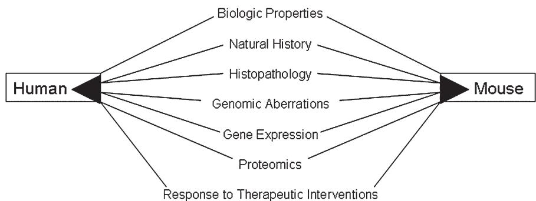  
검증 기준  
그림 1. 모델 검증 기준. 관련성 있는 암 모델은 인간 질병의 중요한 측면을 재현해야 함.

전역적 유전자 발현 프로파일링 및 비교 유전체 하이브리드화(CGH)와 같은 새로운 유전체 기술의 등장은 마우스 모델과 그들이 대변하고자 하는 인간 질병 사이의 유전자 발현 및 암 진화의 유사점과 차이점을 비교할 수 있는 중요한 수단을 제공합니다. 그러나 이러한 GEM 모델들이 인간 암에 관여하는 분자 경로를 전역적 수준에서 얼마나 잘 재현하는지는 이제 막 평가되기 시작했습니다(Ried et al., 1995; Lee et al., 2005; Sweet-Cordero et al., 2005).

## 2 분자적 이미지를 투영한 마우스 설계

인간 암의 진행 과정에서 발생하는 특정 돌연변이를 재현하기 위해 다양한 GEM 모델이 제작되었습니다. 중요하게도 GEM 모델은 다음과 같은 방법을 통해 인간 질병을 모방하도록 설계되었습니다: (1) 인간 암 발생과 관련된 유전자(암 유전자)의 과발현 또는 활성화, (2) 유전자 녹아웃 전략을 통한 표적(억제) 유전자의 제거, (3) 유전자 기능을 방해하는 우성 음성(dominant negative) 단백질의 생성(Hutchinson and Muller, 2000; Kavanaugh and Green, 2003), (4) 위 방법들의 조합. 원암유전자(proto-oncogenes), 성장 인자, 생존 및 조절 경로, 전사 인자 등의 비정상적 발현을 표적으로 하여 많은 형질전환 마우스 모델이 개발되었습니다(표 1). 단일 유전적 변이를 가진 형질전환 동물 외에도, 여러 발암 경로 간의 상호작용을 조사하기 위해 복합적 유전적 변이를 가진 GEM 모델이 생성되었습니다. 녹아웃 및 녹인(knock-in) 전략과 조건부 조직 특이적 유전자 표적화의 사용은 인간 질병을 더 잘 대변하는 모델의 생성으로 이어졌으며 수백 개 유전자의 생물학적 기능을 더욱 명확히 정의했습니다(Hutchinson and Muller, 2000; Green and Hudson, 2005).

유전자 녹아웃 전략은 생식계열 또는 표적 체세포에서 유전자를 변이시키거나 제거하여, 종종 암 촉진 또는 진행에서 종양 억제제 역할을 하는 해당 유전자의 기능적 역할을 평가하는 데 사용됩니다(Hutchinson and Muller, 2000). 단순 표적 녹아웃 모델은 생식계열 돌연변이를 일으켜 종종 배아 치사(embryonic lethality)를 초래합니다(Hutchinson and Muller, 2000; Green and Hudson, 2005). 배아 치사 문제를 극복하고 특정 조직에서 유전자 기능을 연구하기 위해, cre-loxP 기술을 이용한 조직 특이적 및 시간적 조절이 가능한 조건부 유도 돌연변이를 사용할 수 있습니다. 이를 통해 동물의 특정 발달 단계에서 특정 조직에 유전적 변이를 도입할 수 있습니다(Sauer, 1998; Hutchinson and Muller, 2000; Grisendi and Pandolfi, 2004).

cre-loxP 시스템에서 생식계열은 설계된 내부 서열을 측면에 둔 한 쌍의 특정 뉴클레오타이드 서열(loxP)을 포함하도록 수정될 수 있습니다. loxP 사이트는 cre recombinase가 존재할 때 재조합되어 사이에 있는 내부 서열을 절제합니다(Sauer, 1998; Hutchinson and Muller, 2000). 특정 유전자나 돌연변이를 조직 특이적이고 시간적으로 제어된 방식으로 켜거나 끄기 위해 이 시스템의 변형들이 개발되었습니다(Sauer, 1998; Gunther et al., 2002). 또한, 구성적 조직 특이적 유전자 표적 모델은 관심 있는 특정 조직에서 유전자의 표적 결실 또는 구성적 과발현을 허용하여 인간 질병을 더 잘 반영합니다.

유전자 발현의 다른 조건부 및 표적화된 변화는 테트라사이클린 또는 독시사이클린의 존재 하에 표적 유전자의 침묵(silence) 또는 과발현을 유도하도록 설계되었습니다(Gossen et al., 1995; Gunther et al., 2002). 이 방법은 특정 발달 시점이나 추가적인 유전적 변이의 맥락에서 조절될 수 있는 유전적 변이를 가진 마우스 모델을 만드는 또 다른 강력한 방법을 제공합니다. 최근 박테리아 인공 염색체(BAC) 재조합 기술을 이용한 고급 형질전환 기술의 등장은 BAC 클론(최대 200kb의 유전체 DNA를 포함하는 박테리아 벡터)으로의 신속한 표적 돌연변이 도입을 가능하게 합니다(Copeland et al., 2001; Abe et al., 2004). 이 기술을 사용한 새로운 세대의 마우스 모델은 특히 유전적 유전자좌(locus)의 내인성 조절을 모방하는 것과 관련하여 마우스에서 인간 암을 모델링하는 데 추가적인 이점을 제공할 것입니다.

## 3 모델 검증

고급 유전체 기술은 인간 질병을 더 잘 나타내는 마우스 모델의 생성을 가능하게 했습니다. 인간 질병 연구를 위한 동물 모델의 관련성은 생물학적 검증, 조직병리학적 검증 및 분자적 검증에 기반해야 합니다(그림 1).

### 3.1 생물학적 검증

동물 모델의 생물학적 검증은 마우스에서의 질병 과정의 병태생리가 인간의 상태를 얼마나 잘 모방하는지에 기초합니다. 진행 시간 과정, 호르몬 반응성, 전이율, 전이 부위 등을 포함한 질병의 자연사(natural history)는 동물 모델의 생물학적 행동을 인간 질병과 비교하는 중요한 척도를 제공합니다. 예를 들어, ErbB2의 과발현은 인간 유방암의 25-30%에서 보고되었으며 높은 전이율과 관련이 있습니다. 유사하게, 유방 상피에서 her2neu를 과발현하는 마우스 모델에서 폐로 전이되는 고형 유방 종양이 발생합니다(Jolicoeur et al., 1998; Jager et al., 2005). 또 다른 예로, 마우스에서 BRCA1의 엑손 11 결실은 긴 잠복기 후에 유방 종양이 형성되는 인간 질병과 유사한 임상적 진행을 초래합니다(Xu et al., 1999; Weaver et al., 2002). 그러나 종종 GEM 모델의 질병 진행 자연사에 대해 보고된 정보가 상대적으로 적은 경우가 많습니다(Cardiff et al., 2000).

생물학적 검증을 평가하는 또 다른 수단은 바이오마커의 활용입니다(Cardiff, 2001). 마우스 유선과 해당 인간 유선에서 비교 가능한 바이오마커의 면역조직화학적 염색 유사성은 비교 연구에서 모델의 적절성에 대한 추가 정보를 제공하는 데 사용되어야 합니다(Cardiff et al., 2000; Cardiff, 2001). 마커는 또한 종양의 세포 기원에 대한 중요한 통찰력을 제공할 가능성이 있습니다.

하지만 GEM 모델을 사용할 때 고려해야 할 몇 가지 중요한 종간 생물학적 차이가 있습니다. 예를 들어, 인간 유방암의 절반 이상이 에스트로겐 수용체(ER) 양성인 반면, ER 양성 종양을 발현하는 GEM 모델은 거의 없습니다(Nandi et al., 1995; Cardiff et al., 2000; Cardiff, 2001). 그러나 최근 p53 유전자가 결실된 모델이 생성되었는데, 여기서 발생하는 종양은 ER 양성과 ER 음성을 모두 포함하여 인간 유방암 생물학의 핵심적인 측면을 재현하고 있습니다(Medina et al., 2001; Lin et al., 2004). 또한, 마우스에서 형질전환 발현을 표적으로 하는 데 사용되는 프로모터가 인간 암에서 발생하는 발현 수준을 유도할 가능성은 낮습니다. 예를 들어, WAP 프로모터와 MMTV-LTR은 호르몬 조절 프로모터로, 호르몬 반응성 유선에서의 발암 연구를 혼란스럽게 할 수 있습니다(Hutchinson and Muller, 2000; Cardiff, 2001). 임신은 이러한 프로모터를 사용하는 이식 유전자를 가진 마우스에서 종양 형성을 향상시키지만, 초기 임신은 여성의 유방암에 대해 보호 효과가 있습니다(Cardiff, 2001; Medina et al., 2001).

마우스 모델의 전이성 유방암은 인간 환자에서 관찰되는 것과 상당히 다릅니다. 일부 GEM 모델의 종양은 폐로 전이되지만, 인간의 유방암은 지역 림프절로 가장 자주 전이되며 간, 폐, 뼈로도 흔히 전이됩니다(Cardiff and Wellings, 1999; Cardiff et al., 2000; Cardiff, 2001, 2003; Green et al., 2004). 마우스에서는 지역 림프절로의 확산이 드물며, 아직 뼈로의 자발적인 전이성 유방 종양 확산을 보여주는 유방암 모델은 개발되지 않았습니다(Cardiff and Wellings, 1999; Cardiff et al., 2000; Cardiff, 2001, 2003; Green et al., 2004).

### 3.2 조직병리학적 검증

GEM 모델에서의 특정 유형 암에 대한 조직병리학적 특성화는 잘 정의되어 있습니다. 예를 들어, 유방암 GEM 모델에서 현재의 분류 체계는 생물학적 잠재력, 지형적 분포, 조직학적 패턴, 세포학적 등급, 유도 요인(에티올로지) 및 알려진 경우 임상적 맥락을 통합한 기술적 명명법을 채택하고 있습니다(Cardiff et al., 2000). 유사한 조직병리학적 분류 체계가 다른 여러 장기 부위의 GEM 종양 특성화에도 적용되었습니다(Weiss et al., 2002; Nikitin et al., 2004; Shappell et al., 2004). 그러나 Desai 등(2002b)의 연구에서의 마우스 모델 계층적 군집 분석 결과와 유사하게, 많은 형질전환 마우스 유방 종양은 "시그니처 종양 패턴"을 기반으로 분류될 수 있습니다. 시그니처 종양 패턴은 erbB, myc, ras, ret-1 이식 유전자와 관련하여 나타나며, 특정 조직학적 패턴과 세포학적 외형에 기초하여 서로 구별될 수 있습니다(Cardiff et al., 2000). 유사하게, 독특한 세포 이형성(atypia)과 중앙 괴사를 갖는 면면상관상피내암(comedo ductal carcinoma in situ, DCIS)이나 BRCA1 및 BRCA2 종양을 구별하는 형태학적 특징과 같이 인간 유방암에서도 일부 시그니처 종양 표현형이 관찰되었습니다(Barnes et al., 1993; Lakhani et al., 1998; Cardiff et al., 2000). 중요하게도, 이러한 종양의 독특한 형태는 생물학적 표현형이 특정 유전자 발현 패턴과 상관관계가 있을 수 있음을 나타냅니다(Cardiff and Wellings, 1999; Cardiff et al., 2000). 형질전환 마우스 유방암 모델의 유방 종양 및 시그니처 종양 분류에 대한 정보는 http://mammary.nih.gov/atlas/histology/jaxworkshop/index.html 에서 확인할 수 있습니다.

### 3.3 분자적 검증

인간 암의 마우스 모델에 적용된 유전체 기술은 암 전사체에 관한 중요한 정보를 제공합니다. 이는 암 발병 기전, 암 유전자 특이적 발현 시그니처, 잠재적인 분자 치료 표적에 대한 이해를 높이고 특정 실험 목적에 적합한 마우스 모델을 선택하는 데 귀중한 정보를 제공합니다(Kavanaugh et al., 2002; Kavanaugh and Green, 2003; Green et al., 2004; Ye et al., 2004). 유전자 발현 프로파일링은 암의 분자적 기초에 대한 분류와 이해를 발전시킨 강력한 도구이며, 표준 조직병리학적 종양 등급화 방법으로는 불가능했던 새로운 진단 범주를 식별해 냈습니다(Perou et al., 1999; Luzzi et al., 2001; Liu, 2003; Seth et al., 2003; Sorlie et al., 2003; Cleator and Ashworth, 2004). 형태학적으로 유사한 종양을 분자적으로 하위 유형화할 수 있으며, 질병의 자연적 진행과 분자 하위 유형 또는 치료 반응 사이의 상관관계를 도출할 수 있습니다(Perou et al., 1999; Sorlie et al., 2003). 발현 프로파일링을 활용하는 마이크로어레이 기술은 분자 경로에 기반하여 마우스 모델을 더 완벽하게 정의함으로써 인간 질병과의 비교를 위한 더 완벽한 그림을 제공할 것입니다(Fargiano et al., 2003; Ye et al., 2004). 연구자들은 어레이 데이터 분석을 통해 형질전환 모델 간의 유전자 발현을 비교함으로써 각 모델의 인간 질병과의 유전적 관계를 평가하고 분자 프로필에 근거하여 연구에 가장 적합한 모델을 결정할 수 있습니다(Kavanaugh et al., 2002; Kavanaugh and Green, 2003).

본 실험실의 초기 연구에 따르면, 형질전환 조작으로 인한 종양들이 많은 분자적 특성(세포 주기 조절 인자 유도, 해당 경로, 대사 조절 인자, 아연 집게 단백질 및 단백질 티로신 인산화효소 등)을 공유함에도 불구하고, 개시 암 유전자에 따라 뚜렷한 유전자 발현 패턴을 확인할 수 있었습니다. 이는 개시 발암 사건에 근거하여 각 모델을 차별화하는 "시그니처" 유전자 발현 패턴을 제공합니다(Desai et al., 2002b; Kavanaugh et al., 2002; Kavanaugh and Green, 2003). 예를 들어, c-myc, c-neu, c-ha-ras, PyMT 및 SV40 형질전환 마우스 모델(Desai et al., 2002b)과 최근의 p53 및 BRCA1 녹아웃 모델(A.M. Michalowski 등, 미발표 데이터)에서 유방 발암과 관련된 공통 및 암 유전자 특이적 사건이 식별되었습니다. 모델들은 암 유전자 특이적 차별적 유전자 발현에 기초하여 여러 뚜렷한 그룹으로 나뉠 수 있습니다. 모든 MMTV-myc 종양은 한 그룹으로 묶였고, 모든 C3(1)-Tag 및 WAP-Tag 종양은 두 번째 그룹으로, MMTV-neu, MMTV-ras 및 MMTV-PyMT는 세 번째 그룹으로 묶였습니다(Desai et al., 2002b).

암 유전자 유래 종양의 비교 유전자 발현 프로파일링은 암 유전자 특이적 경로에 대한 이해를 넓혀줄 것이며, 이는 인간 유방암과 관련된 유전적 변화의 잠재적 다중성 때문에 인간 질병에서는 수행하기 어려운 연구입니다(Desai et al., 2002b). 이 데이터는 http://gedp.nci.nih.gov/dc/index.jsp 에서 이용 가능합니다. 인간 환자의 경우, 일부 연구에서는 생물학적 이질성을 해결하기 위해 단일 유전자 발현 패턴이 아닌 다중 유전자 발현 패턴을 비교하여 개별 질병의 특성을 정의하고 임상 결과를 예측하는 데 힘을 보태는 유사한 전략을 사용해 왔습니다(Nevins et al., 2003). 다중 유전자 마이크로어레이 발현 패턴과 임상적 위험 요인을 결합함으로써, 이러한 전략은 개별 환자 프로필을 특성화할 수 있으며 이는 개인 맞춤형 의료라는 최종 목표로 이어집니다(Nevins et al., 2003).

## 4 어레이 데이터 분석을 위한 통계적 고려사항

유전체 데이터의 고차원 분석을 위한 전략은 크게 비지도(unsupervised) 접근법과 지도(supervised) 접근법으로 분류될 수 있습니다(그림 2). 비지도 방식은 숨겨진 분류 체계의 발견(클래스 발견)을 목적으로 하며 실험 데이터에서 얻은 유전자 발현 측정값만을 필요로 합니다. 마이크로어레이 데이터에서 그룹 패턴을 발견하기 위한 여러 통계적 및 계산적 기술이 존재하며, 이는 종양의 분자적 하위 유형과 특정 전사체 상태와 관련된 유사하게 조절되는 유전자 그룹을 식별하기 위한 매우 유용한 탐색 및 시각화 방법입니다. 비지도 유전자 발현 분석과 대조적으로,

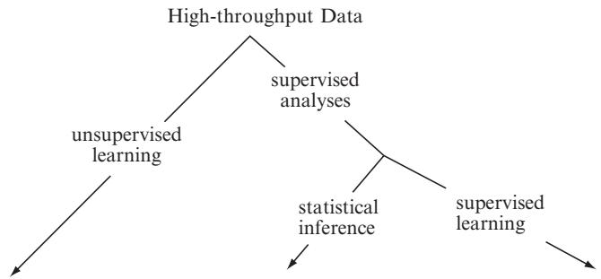  
그림 2. 마이크로어레이 데이터 분석에 사용되는 주요 통계적 접근법 유형

<table><tr><td>클래스 발견(Class Discovery)</td><td>클래스 비교(Class Comparison)</td><td>클래스 예측(Class Prediction)</td></tr><tr><td>분자 표현형 식별: 
•마우스 암 모델의 암 유전자 특이적 분류 
•기원 세포 암 프로필 발견 
•인간과 유사한 마우스 암 모델 찾기</td><td>차별적 유전자 발현 식별: 
•종양 대 정상 조직 유전자 발현 수준 
•처리에 따른 유전자 발현 수준 변화 
•암 진행 중 유전자 발현 변화 (다중 시점)</td><td>주어진 상태 또는 결과를 예측하는 발현 시그니처 식별: 
•종양 하위 유형의 종간 예측 
•치료 표적에 대한 반응 예측 
•기능적 유전자 클래스 예측</td></tr></table>

지도 방식은 발현 프로필이 도출된 특정 클래스를 특성화하는 사전 정보(예: 조직 샘플의 '정상' 또는 '종양' 지정, 또는 유전자 기능에 기반한 분석 지도를 위한 특정 유전자 온톨로지)를 필요로 합니다. 지도 접근법은 관심 있는 사전 지정된 클래스 간의 차별적 유전자 발현을 밝혀내거나(클래스 비교), 오직 유전자 발현 프로필만을 근거로 미래 표본의 관심 특성을 예측하기 위한 수학적 모델을 생성하는 데(클래스 예측) 활용될 수 있습니다.

비지도 학습 접근법은 고차원 마이크로어레이 데이터의 단순화된 추상화를 얻기 위해 사용되어 왔습니다. 다양한 군집(clustering) 기술이 이 목적으로 가장 흔히 적용됩니다. 군집 분석의 분석적 목표는 동일한 군집 내에서 공통된 발현 패턴을 공유하는 균질한 샘플 또는 유전자 그룹을 찾는 것입니다. 군집 과정은 근접성 측정과 샘플 또는 유전자를 그룹화하는 알고리즘을 고려하여 적절한 패턴 표현을 위한 특징 선택 및/또는 변환을 포함합니다. 비지도 학습을 위한 어레이 특징의 하위 집합 선택은 군집화에 의미가 없는 유전자를 걸러내되 데이터에서 "자연스러운" 그룹화가 나타나도록 해야 합니다. 이러한 선택은 데이터의 무정보적 노이즈와 차원을 줄임으로써 분류 성능을 향상시키지만, 임의의 분류를 정의하지는 않습니다. 이는 일반적으로 정규화된 발현이 군집된 샘플 전반에 걸쳐 평탄한 유전자들을 제외함으로써 수행됩니다. 그러나 비지도 분류 맥락에서 노이즈가 많거나 중복되는 특징을 식별하는 특정 계산 알고리즘도 이 목적으로 개발되었습니다(Roth and Lange, 2004).

일반적으로 유전자 발현은 근접성 지표 및 군집 결과에 대한 고발현 유전자의 지배적인 영향을 제거하기 위해 군집화 전에 어레이 전반에 대해 중앙값 또는 평균 중심으로 정렬됩니다. 이중 채널 설정에서 유전자 중심화는 대조군 샘플의 유전자 발현량에 대한 비율의 의존성을 추가로 제거합니다. 거리(또는 역수로서의 유사성) 개념은 군집화의 기초이며 대개 데이터 객체 간의 쌍별 거리로 측정됩니다. 유클리드 거리 또는 1에서 피어슨 상관계수를 뺀 값이 마이크로어레이 데이터 군집화에 주로 사용되는 근접성 지표입니다. 유클리드 거리는 절대 거리를 측정하므로 두 프로필이 함께 군집되려면 엄격한 근접성이 필요합니다. 반면 상관관계 기반 지표를 사용하면 절대 거리의 차이가 크더라도 유전자 발현 프로필이 선형 함수로 근사될 수 있다면 두 프로필이 함께 그룹화될 수 있습니다. 군집을 생성하는 그룹화 알고리즘의 주요 구분은 프로필의 단일 분할을 초래하는 분할 군집화(K-평균 군집화, 자기 조직화 지도)와 중첩된 분할 세트를 초래하는 계층적 군집화(병합형 또는 분할형)로 나뉩니다. 사용 가능한 많은 군집 방법에 대한 추가 설명은 본 장의 범위를 벗어나며 다른 문헌에서 찾을 수 있습니다(Jain, 1999; McShane et al., 2003; Simon, 2003).

유방암 연구에 대한 클래스 발견 접근법의 예가 그림 3 a, b의 병합형 계층적 군집 분석 결과에 예시되어 있습니다. 계층적 군집은 덴드로그램(dendrogram)이라고 불리는 트리 구조로 그래픽화하여 나타낼 수 있습니다. 계층적 군집을 사용하여 덴드로그램을 구축하려면 프로필 쌍에 대해 지정된 근접 거리 외에도 병합되는 군집 간의 거리를 찾는 연결 방법(linkage method)이 필요합니다. 단일 연결(single linkage)은 두 군집 간의 거리를 그들 사이의 최소 거리로 정의합니다. 완전 연결(complete linkage)은 단일 연결과 반대로 두 군집 간의 거리를 그들 사이의 최대 거리로 정의합니다. 평균 연결(average linkage)은 병합될 두 군집의 모든 가능한 구성원 쌍 간의 평균 거리를 사용합니다. 병합 알고리즘은 각 객체를 자체 단일 군집에 배치하는 것으로 시작하여 모든 객체와 군집이 단일 군집으로 병합될 때까지 가장 큰 유사성 순서대로 객체 또는 객체 그룹을 병합하는 방식으로 진행됩니다. 그림 3 a, b는 암 유전자 특이적 유전자 발현 패턴에 기인한 유방 모델 간의 구분을 식별하는 계층적 군집 분석 결과를 보여줍니다.

마이크로어레이 데이터의 관계를 밝혀내기 위해 자주 사용되는 또 다른 방법은 다차원 척도법(MDS)입니다. MDS는 저차원 공간에 투영된 다변량 데이터의 구조를 그래픽으로 시각화하는 데 사용되는 일련의 수학적 기술을 나타냅니다. MDS는 객체 간의 원래 근접성 지표로부터 쌍별 거리를 보존하면서 데이터의 차원을 줄이는 방법입니다. 최대 분산을 포착하고 서로 독립적인 원래 변수들의 가중 선형 조합인 주성분(Principal components)이 3차원 디스플레이의 점들 사이의 거리를 결정하는 데 사용될 수 있습니다. 그림 3 c는 그림 3 a, b의 계층적 군집/덴드로그램을 생성하는 데 사용된 것과 동일한 데이터에 대한 MDS 플롯을 보여줍니다. MDS 표현은 샘플 계층적 덴드로그램으로 얻은 데이터 구조를 추가로 확인해 줍니다.

GEM 모델은 특히 실험 그룹 간에 차별적으로 발현되는 유전자를 밝혀내는 것을 목표로 하는 마이크로어레이 데이터 연구(클래스 비교)에 적합합니다. 일반적으로 한 번에 테스트되는 다중 귀무 가설을 고려하여 단변량 모수적 또는 비모수적 통계 테스트가 수행됩니다. 한 예로 형질전환 마우스 모델에서 종양 조직과 정상 유선 조직 간에 차별적으로 발현되는 유전자를 식별하기 위해 Student t-테스트나 Wilcoxon 테스트가 사용될 수 있습니다. 개별 p-값은 관찰된 유전자 발현 차이가 오직 우연에 의해 발생할 확률을 측정하며 테스트의 위양성률(예: $\alpha = 0.05$)을 제어하도록 설계되었습니다. 다중 가설을 테스트할 때 일부 테스트가 단지 우연히 유의미하게 나타날 가능성이 항상 존재합니다. 만약 예시에서 단변량 t-통계량을 $\alpha = 0.05$로 하여 $N = 20,000$개 유전자에 별도로 적용했다면, 유방 종양과 정상 조직 사이에 실제 차이가 없더라도 1,000개 유전자가 차별적으로 발현되는 것으로 선언될 것으로 예상됩니다($\alpha N$ 위양성). 방대한 가짜 발견을 피하기 위해 p-값을 조정하거나 다중 테스트 문제를 수정하는 다양한 절차들이 사용되어 왔습니다. 본페로니 교정(Bonferroni correction, 대개 마이크로어레이 데이터에는 너무 보수적임)이나 다변량 순열 조정(Callow et al., 2000) 등이 일부 위양성을 방어합니다. 가장 흔하게는 SAM 절차(Tusher et al., 2001)에서와 같이 선언된 양성 중 가짜 발견의 기대 수나 비율을 제어합니다. 선택된 가짜 발견의 수나 비율이 높은 신뢰도로 제어되도록 하는 다변량 순열 접근법도 존재합니다(예: 유의미하다고 식별된 유전자 중 위양성이 10% 이하임을 95% 신뢰도로 보장)(Korn, 2004).

마이크로어레이 기술은 변수의 수 측면에서 방대한 양의 데이터를 생성하지만, 생물학적 반복 샘플의 크기는 상대적으로 매우 작습니다. 이로 인한 결과는 종종 차별적으로 발현되는 유전자를 검출하기 위한 낮은 통계적 검정력과 높은 가짜 발견율입니다. 실험에 필요한 샘플 크기에 대한 표준 검정력 계산은 탐지하고자 하는 발현 변화, 모집단 변동성의 크기, 선택된 검정력 및 허용 가능한 오류율(유의 수준)을 고려합니다. 유전적 배경으로 인해 유전자 발현의 변동성은 유전적 다양성이 매우 높은 인간 피험자에 비해 동물 모델 및 세포주에서 일반적으로 훨씬 낮습니다. Wei 등(2004)은 근교계 동물에서 동일한 검정력을 얻기 위해 필요한 피험자 수가 혈연관계가 없는 인간 그룹에 비해 훨씬 적음을 보여주었습니다. 여기 몇 가지 마우스 및 인간 마이크로어레이 데이터 세트의 변동성 사례를 제시하며, 각각 두 그룹의 일차 유방 종양을 프로파일링한 것입니다(데이터 세트 설명은 표 2 참조). 그림 4는 분석된 데이터 세트에서 추정된 공통 표준 편차의 누적 분포를 보여주며 마우스와 인간 프로필 간의 변동성 변화를 보여줍니다. 표 2에는 25, 50, 75%의 최소 변동 유전자에 대해 두 샘플 t-테스트로 마이크로어레이 연구에서 차별적 발현을 감지하기 위해 필요한 추정 검정력과 샘플 크기를 제시합니다. 마우스에서 그룹당 단 5개의 독립적인 생물학적 반복 샘플 크기만으로도 50%의 최소 변동 유전자에 대해 0.001 위양성률로 2배 차이를 감지할 수 있는 매우 높은 검정력(97-98%)을 보장하는 반면, 5개의 인간

표 2 마우스 및 인간 마이크로어레이 데이터 세트에서 최소 변동 유전자의 25, 50, 75%에 대해 주어진 위양성률 $\mathbf{\left(\mathbf{Q}=0.001\right)}$에서 2배 발현 변화를 감지하기 위한 검정력 및 샘플 크기 계산

<table><tr><td>데이터 세트</td><td colspan="3">A</td><td colspan="3">B</td><td colspan="3">C</td><td colspan="3">D</td></tr><tr><td>백분위수</td><td>25th</td><td>50th</td><td>75th</td><td>25th</td><td>50th</td><td>75th</td><td>25th</td><td>50th</td><td>75th</td><td>25th</td><td>50th</td><td>75th</td></tr><tr><td>표준 편차 (σ)</td><td>0.12</td><td>0.19</td><td>0.33</td><td>0.14</td><td>0.20</td><td>0.32</td><td>0.27</td><td>0.34</td><td>0.46</td><td>0.22</td><td>0.29</td><td>0.42</td></tr><tr><td>샘플 크기 (n=5)</td><td>0.99</td><td>0.98</td><td>0.48</td><td>0.99</td><td>0.97</td><td>0.52</td><td>0.73</td><td>0.45</td><td>0.18</td><td>0.92</td><td>0.65</td><td>0.24</td></tr><tr><td>검정력 (1 - β)</td><td></td><td></td><td></td><td></td><td></td><td></td><td></td><td></td><td></td><td></td><td></td><td></td></tr><tr><td>검정력 (1 - β = 0.95)</td><td>3</td><td>5</td><td>9</td><td>4</td><td>5</td><td>8</td><td>7</td><td>9</td><td>14</td><td>6</td><td>7</td><td>12</td></tr><tr><td>샘플 크기 (n)</td><td></td><td></td><td></td><td></td><td></td><td></td><td></td><td></td><td></td><td></td><td></td><td></td></tr></table>

검정력 및 샘플 계산은 R 버전 2.1을 사용하여 양측 두 샘플 t-테스트 및 그룹당 동일한 피험자 수를 가정하여 수행됨. 발현 데이터는 Affymetrix 올리고뉴클레오타이드 어레이로 얻었으며 전처리에서 로버스트 멀티어레이 평균(RMA) 방법(Irizarry et al., 2003)과 분위수 정규화(quantile normalization)가 각 데이터 세트에 적용되어 정규화된 로그 밑 2 유전자 요약 측정값을 생성함.

데이터 세트 A: 마우스 모델: $\mathsf{p}53^{-/-}$ ; 이식(Jerry et al., 2000); 클래스: 전이성($n=14$) 및 비전이성($n=10$) 일차 유방 종양; Affymetrix 칩: U74Av2

데이터 세트 B: 마우스 모델: $\mathsf{p}53^{\mathrm{fp/fp}}$ ; WAP cre(Lin et al., 2004); 클래스: ERα 양성($n=5$) 및 ERα 음성($n=5$) 일차 유방 종양; Affymetrix 칩: U74Av2

데이터 세트 C: 인간 데이터: West et al. (2001); 클래스: ERα 양성($n=25$) 및 ERα 음성($n=24$) 일차 유방 종양; Affymetrix 칩: HuGeneFL

데이터 세트 D: 인간 데이터: Huang et al. (2003a, b); 클래스: ERα 양성($n=73$) 및 ERα 음성($n=14$) 일차 유방 종양; Affymetrix 칩: U95Av2

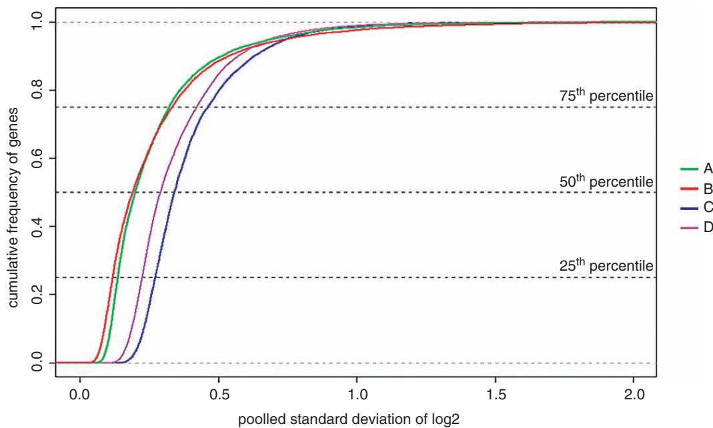  
그림 4. 마우스 및 인간 유방 종양 그룹에서의 공통 표준 편차의 누적 분포. 이 그래프는 각 마우스 및 인간 데이터 세트 내 유방 종양 그룹에서 풀링된 로그 2 강도의 공통 표준 편차에 대한 경험적 분포 함수(cdf)를 보여줌. 경험적 cdf $F(x)$는 $x$ 이하의 값을 가진 비율로 정의됨. $x$축은 표준 편차이고 $y$축은 표준 편차가 $x$ 값보다 낮은 유전자의 비율임. 인간 데이터 세트에서 추정된 표준 편차 분포는 마우스 데이터 세트에 비해 더 큰 값 쪽으로 이동되어 있음. 예를 들어 마우스 데이터에서 유전자의 75%는 로그 2 강도의 표준 편차가 0.32–0.33 이하인 반면, 인간 데이터 세트에서는 0.42–0.46 이하임. 데이터 세트 A–D는 표 2의 설명과 같음.

샘플을 사용하면 통계적 검정력의 엄청난 손실(45% 및 65%)을 초래합니다. 중요하게도, 다중 테스트와 가짜 발견율을 고려하는 마이크로어레이 데이터를 위한 통계적 검정력 및 샘플 크기 계산을 위한 새로운 접근법들이 개발되었습니다(Pawitan et al., 2005; Gadbury, 2004).

마이크로어레이 데이터를 이용한 지도 학습은 특징 선택, 클래스 예측기 설계 및 검증을 포함합니다. 예측기를 구축하기 위해 일반적으로 클래스 구분에 잠재적으로 관련이 있다는 가정하에 클래스 간 차별적으로 발현되는 유전자 하위 집합이 선택됩니다. 때때로 단변량 통계량 대신 주성분 분석과 같은 차원 축소 방법이 예측 유전자를 식별하는 데 사용됩니다(Khan et al., 2001; West et al., 2001). 다음 단계는 훈련에 사용된 샘플 세트를 기반으로 유전자 발현 프로필을 사전 지정된 클래스 레이블과 올바르게 연관시킬 알고리즘을 식별하는 것입니다. Fisher 선형 판별 분석, 가중치 방법, 복합 공변량 예측기, 최근접 이웃 분류, 서포트 벡터 머신 및 신경망을 포함하여 마이크로어레이 데이터를 위한 수많은 분류기 훈련 알고리즘이 개발되었습니다(Simon, 2003). 다변량 분류기 발견을 위한 이러한 방법들은 마이크로어레이 기술이 등장하기 전부터 있었으며 샘플 수가 분류기의 변수 수를 실질적으로 초과하는 상황을 모델링하도록 설계되었습니다. 그 결과, 유전체 분류기는 예측 정확도의 편향된 과대평가에 매우 취약합니다. 즉, 훈련 데이터 세트에서는 클래스 멤버십을 매우 잘 예측할 수 있지만 독립적인 데이터에 적용할 때는 성능이 떨어질 수 있습니다. 미래 샘플에 대한 예측기의 정확도를 적절히 추정하기 위해, 분류기 구축 과정과 성능 검증을 분리하기 위한 분할 세트 검증(split-set validation) 또는 교차 검증(cross-validation)이 가장 흔히 사용됩니다(Simon, 2003, 2004).

클래스 예측 방법은 예후 및 진단 유전체 분류기 개발이 큰 관심사인 인간 마이크로어레이 데이터를 포함하는 생물학 및 임상 연구에서 널리 사용됩니다. 마우스 모델에서 유전자 발현 프로필의 지도 분류 사용은 덜 빈번하지만, 암 모델의 검증 및 종 간에 보존되고 암에서 탈조절되는 발현 시그니처의 식별을 위한 도구로서 종간 비교에 사용되어 왔습니다(Lee et al., 2005; Sweet-Cordero et al., 2005). 마우스 모델에서 약물 치료 반응을 예견하기 위한 클래스 예측의 사용은 앞으로 그 중요성이 더욱 커질 것으로 보입니다(Huang et al., 2003b; Bild et al., 2006).

# 5 암세포에서 miRNA의 비정상적 발현의 중요성

George A. Calin* , Chang-gong Liu , Manuela Ferracin , Stefano Volinia , Massimo Negrini , 및 Carlo M. Croce

## 초록 (ABSTRACT)

miRNA 유전자 및 기타 비코딩 RNA(non-coding RNAs)의 변화는 모든 인간 암의 병태생리학에서 중요한 역할을 합니다. 암의 발생과 진행에는 유전자 발현을 조절할 수 있는 작은 비코딩 RNA인 마이크로RNA(miRNAs)가 관여할 수 있습니다. 현재 암세포에서 마이크로RNA놈(microRNoma, 게놈에 존재하는 miRNA의 전체 집합으로 정의됨) 변화의 주요 메커니즘은 비정상적인 유전자 발현으로 보이며, 이는 해당 정상 조직과 비교하여 성숙 및/또는 전구체 miRNA 서열의 비정상적인 발현 수준으로 특징지어집니다. miRNA 발현 프로파일링은 인간 암의 병인에 잠재적으로 관여하는 miRNA를 식별하는 데 활용되어 왔습니다. 다양한 방법으로 수행된 miRNA 및 기타 비코딩 RNA 프로파일링을 통해 인간 종양의 진단, 병기 결정, 진행, 예후 및 치료 반응과 관련된 지표(signature)를 식별할 수 있게 되었습니다.

색인어: 암, miRNA, 종양유전자, 종양억제인자

# 1 miRNA란 무엇이며 어떻게 작동하는가

# 1.1 miRNA는 작은 비코딩 조절 RNA이다

miRNA는 1993년 하버드 대학교의 Ambros 그룹에 의해 C. elegans에서 처음 기술되었습니다 (Lee et al., 1993). 현재, miRNA라고 불리는 새로운 종류의 작은 비코딩 RNA(ncRNA)는 지난 7년 동안 척추동물, 파리, 벌레, 식물 및 바이러스에서 6,000개 이상의 구성원이 확인되었습니다 (Griffiths-Jones et al., 2006). 인간의 경우, miRBase(http://miRNA.sanger.ac.uk/cgi-bin/sequences/)에 따르면 마이크로RNA놈(miRNA의 전체 스펙트럼으로 정의됨)은 650개 이상의 실험적 또는 "인실리코(in silico)"로 복제된 miRNA를 포함하며, 총 숫자는 1,000개를 넘어설 것으로 예상됩니다 (Bentwich et al., 2005).

단백질 코딩 유전자(PCG)와 비교할 때, miRNA 유전자는 게놈 은하계에서 낯선 존재처럼 행동합니다. miRNA는 일반적인 PCG 크기의 1% 미만이므로 오랫동안 클로닝을 피할 수 있었습니다. 자연적으로 발생하는 miRNA는 더 큰 일차 전사체(pri-miRNA라고 함)로부터 전사된 70~100nt의 헤어핀 전구체 RNA(pre-miRNA라고 함) 구조에서 절단된 19~25nt 전사체입니다 (Ambros, 2003). miRNA를 암호화하는 게놈의 작은 조각에서는 오픈 리딩 프레임(ORF)을 식별할 수 없습니다. miRNA는 유전자 내부 또는 외부에 위치할 수 있지만, 알려진 모든 miRNA의 절반 이상이 PCG 또는 기타 ncRNA의 인트론이나 엑손에 위치합니다 (Rodriguez et al., 2004). 기능적으로 miRNA는 많은 표적 전사체의 수준뿐만 아니라 이러한 전사체에 의해 암호화된 단백질의 양을 감소시키는 것으로 나타났습니다 (Lim et al., 2005). miRNA가 도입된 세포의 마이크로어레이 실험에서 입증된 바와 같이, 유전자의 약 1/3이 다양한 miRNA와 상호작용하는 것으로 추정됩니다 (Lim et al., 2005). 특정 표적 mRNA에 대한 여러 miRNA의 조합 효과 (Krek et al., 2005 ; Cimmino et al., 2005)와 특정 miRNA에 대한 표적의 중복성 (Yekta et al., 2004)이 기술되었습니다. 표적에 대한 효과는 주로 억제적이지만, 바이러스의 5' 비코딩 영역에 결합하여 C형 간염 바이러스 복제의 강화 인자로 작용하는 miR-122의 경우와 같이 긍정적인 효과도 확인되었습니다 (Jopling et al., 2005).

# 1.2 miRNA에 의한 유전자 조절의 미세 조정

안티센스 단일 가닥 miRNA는 표적 mRNA와 완전히 일치하지는 않지만 상당히 상보적인 서열을 통해 특정 mRNA 전사체에 결합할 수 있습니다. 이 과정은 사후 전사 유전자 조절(PTGS)로도 알려져 있습니다. miRNA는 식물에서 포유류에 이르기까지 모든 생물체에서 발달 및 분화와 같은 섬세한 과정 동안 세포 표현형을 "조정(tuning)"하는 유전자 발현의 미세 조절을 담당하는 것으로 보입니다 (Sevignani et al., 2006). 많은 miRNA는 멀리 떨어진 생물체 간에 서열이 보존되어 있으며, 이는 이러한 분자들이 필수적인 과정에 참여함을 시사합니다 (Pasquinelli, 2002 ; Ambros, 2004). 예를 들어, 인간 림프종에 관여하는 13번 염색체의 클러스터 구성원인 miR-17–92는 분석된 모든 영장류 종에서 고도로 보존되어 있습니다 (Berezikov et al., 2005).

동물의 경우 식물과 달리 miRNA가 표적에 완벽하게 결합하지 않는다는 사실 때문에 표적 식별이 어려웠습니다. 일반적으로 몇 개의 뉴클레오타이드가 결합되지 않은 상태로 남아 복잡한 이차 구조를 생성합니다. 포유류 유전자는 3' UTR에 하나 이상의 miRNA 표적 부위를 가질 수 있으며, 하나의 miRNA는 하나 이상의 mRNA를 표적으로 삼을 수 있습니다. 열역학적으로 가장 유리한 miRNA :: mRNA 이중 가닥 상호작용을 찾기 위해 생물정보학적 접근 방식이 개발되었습니다. TargetScan (http://genes.mit.edu/targetscan/) (Lewis et al., 2005), DianaMicroT (http://www.diana.pcbi.upenn.edu) (Kiriakidou et al., 2004), miRanda (http://www.miRNA.org/) (John et al., 2004) 및 PicTar (http://pictar.bio.nyu.edu/) (Krek et al., 2005)와 같이 miRNA 표적을 예측하기 위한 여러 계산 절차를 사용할 수 있습니다. 실험적으로 입증되고 시험관 내(in vitro)에서 연구된 표적 mRNA의 수는 제한적이지만, 예측 도구가 매일 더 정교하고 정확해짐에 따라 확인된 상호작용의 수는 급격히 증가할 것으로 예상됩니다. miRNA :: mRNA 상호작용에 대한 이해의 진전을 보여주는 증거로, 최근 Tarbase라는 데이터베이스가 개발되었습니다.

Tarbase는 인간과 마우스를 포함한 다양한 생물체에서 실험적으로 뒷받침되는 miRNA 표적의 포괄적인 세트를 검색할 수 있는 수단을 제공합니다 (Sethupathy et al., 2006). 현재 버전에는 8가지 생물체의 128개 miRNA에 대한 표적으로 입증된 570개의 PCG가 포함되어 있습니다.

# 2 miRNA의 비정상적 발현은 인간 암의 특징이다

# 2.1 miRNA 발현은 많은 세포 과정에 중요하다

miRNA의 기능은 식물의 잎과 꽃 발달 조절에서부터 포유류의 조혈 계통 분화 조절에 이르기까지 어디에나 존재합니다 (Chen et al., 2004). 여러 그룹에서 발달 중 세포 증식과 사멸의 조정, 그리고 스트레스 저항성 및 지방 대사에서 miRNA의 역할을 밝혀냈습니다 (Ambros, 2003). 예를 들어, 초파리 miRNA 유전자(miR-14)는 세포 사멸을 억제하고 정상적인 지방 대사에 필요하며 (Xu et al., 2003), bantam 로커스는 초파리에서 세포 증식을 제어하고 친세포사멸 유전자 hid를 조절하는 발달적으로 조절되는 miRNA를 암호화합니다 (Brennecke et al., 2003). 필수적인 생물학적 과정에 참여하는 miRNA의 다른 예로는 miR-125b 및 let-7(세포 증식 제어), miR-181(조혈 B세포 계통 운명), miR-15a 및 miR-16–1(B세포 생존), miR-430(뇌 패턴 형성), miR-375(췌장 세포 인슐린 분비) 및 miR-143(지방세포 발달) 등이 있습니다 (리뷰는 Harfe, (2005), Miska (2005), 및 Hwang과 Mendell (2006) 참조).

# 2.2 암세포에서 miRNA 발현의 조절 장애

2002년까지 정상 세포와 종양 세포에서 miRNA 유전자의 발현 수준에 대해서는 알려진 바가 거의 없었습니다. 전통적인 기술로 수백 개의 miRNA에 대해 암 특이적 발현 수준을 평가하는 것은 시간이 많이 걸리고 대량의 총 RNA와 방사성 동위원소의 사용이 필요합니다. cDNA 마이크로어레이는 많은 샘플에서 서로 다른 발현 패턴을 식별하는 데 유용한 도구입니다. 수백 개의 인간 전구체 및 성숙 miRNA 프로브를 포함하는 최초로 개발된 올리고뉴클레오타이드 miRNA 마이크로어레이 칩 (Liu et al., 2004)은 인간 및 마우스 조직에서 뚜렷한 miRNA 발현 패턴(조직 특이적 miRNA 발현 지표)을 확인했습니다. 지난 몇 년 동안 miRNA의 게놈 전체 발현을 조사하기 위해 전 세계적으로 12개 이상의 마이크로어레이 플랫폼이 개발되었습니다. 이 기술의 신뢰성은 거의 항상 노던 블롯(Northern-blot) 분석 및 실시간 RT-PCR과 같은 RNA 발현 정량을 위한 다른 전통적인 방법에 의해 확인되었습니다. miRNA 발현 수준을 결정하는 또 다른 방법은 비드 기반 유세포 분석 기술을 사용하는 것입니다 (Lu et al., 2005). 전역적 miRNA 발현을 평가하는 이 두 가지 방법이 개발된 이후, miRNA 유전자 발현 프로파일링을 위해 상업적으로 이용 가능한 여러 플랫폼이 개발되었습니다 (표 1).

miRNA 유전자 발현의 전역적 분석은 이러한 프로파일이 종양의 발달 계통 및 분화 상태를 분류하는 데 사용될 수 있음을 보여주었습니다. 또한, miRNA 프로파일은 종양에 대한 뚜렷한 지표를 제공하며, 이는 단백질 코딩 유전자가 제공하는 것보다 더 정밀한 것으로 보입니다 (Lu et al., 2005). 이러한 발견은 종양 진단에 이러한 miRNA 프로파일을 사용할 수 있는 독특한 기회를 제공합니다.

miRNA와 암을 연결한 첫 번째 보고 (Calin et al., 2002)는 서구 사회에서 성인 백혈병의 가장 흔한 형태인 만성 림프구성 백혈병(CLL)에 관한 것이었습니다. CLL 사례의 절반 이상에서 13번 염색체 13q14 부위의 이형접합 및/또는 동형접합 소실이 발생합니다. 13q14 염색체의 소실은 맨틀 세포 림프종의 50% 이상, 다발성 골수종의 약 30%, 전립선암의 약 2/3에서도 발견되며, 이는 13q14의 하나 이상의 종양 억제 유전자가 인간 종양의 병인에 관여함을 시사합니다. 그러나 광범위한 이형접합성 상실(LOH), 돌연변이 및 발현 연구를 포함한 상세한 유전 분석은 결실된 지역 내부 또는 근처에 위치한 12개의 단백질 코딩 유전자의 일관된 관여를 입증하는 데 실패했습니다. 두 개의 miRNA 클러스터인 mir-15a와 mir-16–1이 13q14의 최소 결실 영역(~30kb) 내에 위치하며, CLL 샘플의 약 70%에서 결실되거나 하향 조절되는 것으로 밝혀졌습니다. 또한, 이러한 miRNA는 B세포의 세포 사멸 프로그램을 조절하는 데 필수적인 역할을 하므로 (Cimmino et al., 2005), 종양 억제 miRNA의 첫 번째 사례로 간주될 수 있습니다. CLL에서 특정 miRNA 지표가 확인된 후, 유방암, 교모세포종, 간세포암, 대장암, 폐암 및 뇌하수체 종양과 같은 여러 종양 유형에 대해 종양과 정상 대조군 사이에 차등적으로 발현되는 miRNA가 확인되었습니다 (표 2 및 포함된 참고 문헌 참조). CLL, 유방암 및 뇌하수체 종양에서의 miR-16–1 하향 조절과 같은 공통된 miRNA 조절 패턴이 확인되었습니다 (Calin et al., 2004 ; Iorio et al., 2005 ; Bottoni et al., 2005). 조절 장애가 일어난 miRNA는 암 특이적 치료를 위한 흥미로운 표적으로 간주될 수 있습니다.

# 3 조절 장애가 일어난 miRNA의 표적은 악성 과정의 주요 행위자이다

명확한 암 연결성을 가진 miRNA::mRNA의 첫 번째 중요한 상호작용은 예일 대학교의 Slack 그룹에 의해 우아하게 입증되었습니다 (Johnson et al., 2005). 폐암에서 점 돌연변이에 의한 RAS 유전자의 활성화가 초기 사건이라는 것은 오랫동안 알려져 왔습니다 (Malumbres and Barbacid, 2003). 폐 종양에서는 정상 폐 조직보다 RAS 단백질이 현저히 높은 반면, 폐암 세포에서는 let-7 발현이 낮습니다. 이러한 상관관계는 let-7 miRNA 패밀리에 의한 RAS의 직접적인 조절을 확인하는 계기가 되었습니다 (Johnson et al., 2005). 폐에 let-7을 외부에서 주입하면 (전암 병변으로부터) 폐 종양 형성을 예방하거나 RAS 돌연변이를 활성화하여 종양을 축소할 수 있습니다 (Slack and Weidhans, 2006).

암 표현형에 중요한 miRNA::mRNA 상호작용에 대한 또 다른 흥미로운 분자적 분석은 존스 홉킨스 대학교의 Mendell 그룹 (O’Donnell et al., 2005)과 채플힐 소재 노스캐롤라이나 대학교의 Hammond 그룹 (He et al., 2005b)에 의해 수행되었습니다. 종양유전자 c-MYC는 E2F1 전사 인자를 포함한 여러 표적을 통해 세포 증식과 생존을 조절하는 전사 인자를 암호화합니다 (Dang et al., 2005). MYC가 직접 결합하여 miR-17–92 클러스터의 전사를 활성화하고, 이 클러스터가 직접적인 상호작용을 통해 E2F1을 부정적으로 조절하는 한편, c-MYC가 E2F1의 발현을 직접 유도하고 E2F1은 다시 c-MYC를 유도하는 피드백 조절 루프가 설명되었습니다 (O’Donnell et al., 2005). 중요한 세포 경로에 대한 이러한 정교한 분자적 분석은 암과 관련이 있는데, c-MYC와 miR-17–92가 협력하며 이러한 협력이 B세포 종양 형성을 가속화한다는 것이 밝혀졌기 때문입니다 (He et al., 2005b). 이러한 결과는 표적 치료를 위한 합리적인 근거를 제공합니다. 예를 들어, 클러스터링된 miRNA에 대한 안티센스 miRNA를 사용하면 조절 루프에 과부하를 주어 c-MYC – E2F1 피드백을 가속화하고 결과적으로 ARF-p53 경로에 의해 세포 사멸을 유도할 수 있습니다 (Hammond, 2006).

miRNA는 진핵생물의 생존 및 세포 주기 프로그램의 행위자들과 상호작용하는 천연 안티센스 인자입니다. 항세포사멸 단백질 BCL2의 과발현은 여포성 림프종, 폐암 및 B세포 CLL을 포함한 인간 종양 발생의 주요 유전적 사건입니다 (Cory et al., 2003). 이 활성화는 전위 t(14;18)가 원인인 모든 여포성 림프종의 경우를 제외하고는 메커니즘이 알려져 있지 않았습니다 (Tsujimoto et al., 1984, 1985). CLL에서 miR-15a / miR-16–1의 소실은 BCL2 과발현을 초래하며, 최근 우리 그룹은 백혈병 세포에서 mir-15/miR-16을 복원하면 BCL2 mRNA와 직접 상호작용하여 세포 사멸을 유도한다는 것을 입증했습니다 (Cimmino et al., 2005). 이러한 결과는 암 치료를 위한 화학 요법 민감제로서 안티센스 Bcl2의 치료적 잠재력에 관한 새로운 유망한 결과에 비추어 볼 때 고무적입니다 (Kim et al., 2004).

# 4 "miRNA 카스케이드": 인간 암에서 miRNA 관여 모델

고전적인 종양 발생 모델은 종양 억제 유전자(TSG)에 대한 이대립유전자(bi-allelic) 변화와 종양유전자(OG)의 이형접합 변화 간의 협력을 가정합니다. 최근에는 기능 상실과 함께 하나의 대립유전자가 변화하는 것으로 정의되는 반배수체 불충분성(haploinsufficiency)이 TSG 불활성화의 중요한 메커니즘으로 제안되었습니다 (Fodde and Smits, 2002). miRNA는 종양 억제 인자(TS)(miR-15a / miR-16–1 클러스터의 경우) 또는 종양 유전자(OG)(miR-155 또는 miR17–92 클러스터의 경우)로 기능하여 종양 발생에 기여합니다 (그림 1) (Calin et al., 2004 ; Cimmino et al., 2005 ; Chen, 2005 ; Berezikov and Plasterk, 2005 ; Gregory and Shiekhattar, 2005).

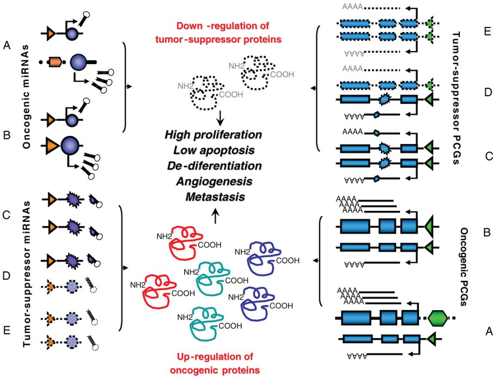  
그림 1. 인간 종양 발생에서 miRNA 활성화 및 불활성화 메커니즘. miRNA와 암 특이적 PCG에 공통적인 주요 메커니즘은 염색체 전위/재배열, 게놈 증폭, 이대립유전자 돌연변이, 결실/프로모터 메틸화 및 돌연변이, 그리고 이대립유전자 결실/프로모터 메틸화 또는 이들의 조합으로 나타납니다. 종양 형성 miRNA 활성화의 효과는 종양 억제 PCG의 불활성화 효과와 동일합니다. 반대로, 억제 miRNA 불활성화의 효과는 종양 형성 PCG의 활성화 효과와 동일합니다. 예를 들어, 백혈병 세포에서 t(14;18), (q32;q21) 또는 del13q13.4의 효과는 동일하게 항세포사멸 BCL2 단백질의 과발현입니다. 전자의 경우 종양유전자 Bcl2가 Ig 인핸서 옆에 병치되어 발생하며, 후자의 경우 BCL2 생산을 부정적으로 조절하는 억제 인자인 miR-16-1 및 miR-15a의 하향 조절에 의해 발생합니다. 프로모터 영역은 삼각형으로 표시되고 구조 유전자는 miRNA의 경우 원으로, PCG의 경우 직사각형으로 표시됩니다.

우리는 게놈 전체 miRNA 발현 프로파일링을 통해 miRNA 발현 수준의 비교적 사소한 변화나 miRNA::mRNA 페어링의 형태에 적절히 영향을 미치는 돌연변이가 세포에 치명적인 결과를 초래할 수 있음을 입증했습니다. 그 이유는 각 miRNA의 표적 수가 많고 변화된 miRNA의 수도 비교적 많기 때문이며, 이로 인해 동일한 분자 경로 또는 상호작용하는 경로에 있는 두 개 이상의 PCG가 방해받을 가능성이 매우 높습니다. 인간 고형암에서 차등적으로 발현되는 miRNA는 RB1(Retinoblastoma 1) 및 TGFBR2(transforming growth factor beta receptor II)와 같은 중요한 PCG를 표적으로 삼는 것으로 나타났습니다 (Volinia et al., 2006). 억제 인자인 miR-15a/miR-16–1의 하향 조절은 BCL2 및 종양 발생에 중요할 수 있는 기타 유전자의 과발현을 유도하는 반면, 종양 형성 miR-17–92의 과발현은 증식을 자극하는 c-MYC와 협력합니다. 따라서 miRNA는 여러 암 특이적 PCG에 대해 "카스케이드(in cascade)" 방식으로 작용할 수 있으며, 이는 다시 miRNA를 포함한 여러 다른 PCG 및 ncRNA의 전사 또는 기능에 영향을 미칠 수 있습니다. 이러한 변화가 체세포에서 발생하면 miRNA 변화는 종양 발생을 시작하거나 기여하며, 생식 계통에 존재하면 암 소인 사건이 될 수 있습니다. 또한 miRNA 또는 miRNA의 상호작용 영역에서 특정 돌연변이 또는 매우 드문 다형성은 암 발생을 위한 소인 사건이 될 수 있습니다 (Calin et al., 2005a ; He et al., 2005a).

miRNA의 활동에 영향을 미치는 것으로 밝혀진 이상은 염색체 재배열, 게놈 증폭 또는 결실, 돌연변이를 포함하여 PCG를 표적으로 하는 것으로 기술된 것과 동일합니다 (그림 1). 특정 종양에서는 PCG와 miRNA 모두에서 이상이 확인될 수 있습니다. 종양 억제 PCG의 불활성화와 종양 형성 miRNA의 활성화는 동일한 분자적 결과를 가져옵니다. 즉, 증식을 차단하고 세포 사멸을 활성화하는 단백질 수준이 감소합니다. 반대로, 종양 형성 PCG의 활성화와 억제 miRNA의 불활성화는 증식을 자극하고 세포 사멸을 감소시키는 단백질의 축적으로 이어집니다. 이 모델의 패러다임은 인간 B세포 CLL입니다. 여기에서 miR-15a와 miR-16–1은 가장 빈번하게 결실되는 게놈 영역에 위치하며, 대부분의 경우 하향 조절되고, 가족성 사례에서 돌연변이를 보유하며, 도처에 과발현된 항세포사멸 BCL2 유전자를 표적으로 삼아 백혈병 모델에서 세포 사멸을 유도합니다.

# 5 연구실에서 환자 곁으로: miRNA 이야기

# 5.1 인간 암 진단에 사용되는 새로운 종류의 바이오마커로서의 miRNA

miRNA가 인간 종양 발생의 활발한 행위자라면 암의 진단과 예후에 영향을 미칠 것입니다 (표 2). 실제로 miRNA가 인간 암의 새로운 진단 및 예후 인자임을 보여주는 증거가 빠르게 축적되고 있습니다 (Croce and Calin, 2005 ; Calin et al., 2005b). B세포 CLL에서 독특한 miRNA 지표는 예후 인자(예: 70-kD Zeta 관련 단백질(ZAP-70)의 발현 수준 및 면역글로불린 중쇄 가변 영역 유전자(IgVH)의 돌연변이 존재 여부) 및 진단 후 치료 시작까지의 시간과 관련이 있습니다 (Calin et al., 2005a). 미만성 거대 B세포 림프종(DLBCL)에서 독립적인 연구를 통해 생식 중심 표현형보다 예후가 더 나쁜 사례(활성화된 B세포 표현형)에서 miR-155 수치가 유의하게 더 높게 확인되었습니다 (Eis et al., 2005 ; Kluiver et al., 2005).

# 6 암 연구에서의 단백질체학 방법론

Scot Weinberger 및 Egisto Boschetti

# 초록 (ABSTRACT)

단백질체학(proteomics) 기술 및 연구 프로토콜의 최근 진보와 발전은 임상 조사, 특히 암 연구 분야에 실질적인 영향을 미치고 있습니다. 본 장에서는 암 연구 및 치료 분야에서의 성과를 중점적으로 검토하면서, 임상 단백질체학 연구에 포함된 전반적인 요구 사항과 접근 방식을 검토합니다. 임상 단백질체학 연구의 과제에 대한 상세한 논의와 함께 단백질 정제 및 단백질 분석 플랫폼에 대한 유용한 검토 내용을 제시합니다. 또한 다양한 임상 단백질체 질량 분석법 접근 방식의 사용에 대한 광범위한 논의를 제공합니다.

주요어: 중개 단백질체학, 임상 단백질체학, 단백질체학, 단백질 정제, 질량 분석법, 전기영동, 단백질 마이크로어레이

# 1 서론 (INTRODUCTION)

단백질체(proteome)라는 용어와 그 연관어인 단백질체학(proteomics)이 만들어진 이래(Wasinger et al., 1995 ; Wilkins et al., 1996a – c ; Williams et al., 1996), 과거에 단백질 또는 효소 분석 및 단백질 생화학으로 불리던 분야에 대한 관심과 연구가 폭발적으로 증가하는 것을 목격해 왔습니다. 당연하게도, 현대 단백질체학 기법과 기술의 진화하는 열정과 가능성은 암 연구에 실질적인 영향을 미쳤습니다. 단백질체학 기반 암 연구 간행물에 대한 최근 PubMed 인용 검색 결과, 2001년부터 2006년 5월까지 총 약 1,250편의 논문이 발표된 것으로 나타났습니다(그림 1 참조). 더욱이 단백질체학 기반 암 연구의 입증된 성장세는 2008년에 약 800편의 저작물이 발표될 것임을 시사합니다. 이 연구의 대부분은 다양한 장기 시스템의 암 연구에 단백질체학 기술을 적용하는 데 집중된 반면(그림 2 참조), 언급된 모든 암 단백질체학 간행물의 30%만이 단백질체학 기술의 개발 및 테스트에 할당되었습니다.

G.J. Gordon (ed.), Cancer Drug Discovery and Development: Bioinformatics in Cancer and Cancer Therapy, DOI: 10.1007/978-1-59745-576-3_6, © Humana Press, a part of Springer Science $^ +$ Business Media, LLC 2009

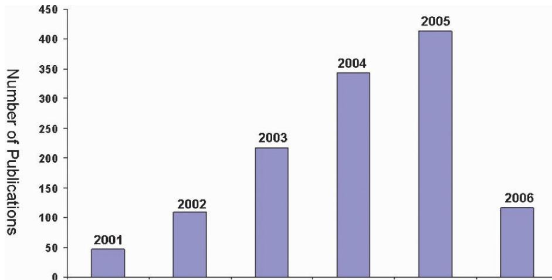  
그림 1. 단백질체 암 관련 간행물. 이 그림은 'proteomics'와 'cancer'라는 용어를 포함하는 총 PubMed 인용 횟수를 나타냅니다. 2001년부터 2005년까지 성장 추세가 나타납니다. 2006년 데이터는 2006년 5월까지의 총 간행물을 나타내므로 불완전합니다. 자세한 내용은 본문을 참조하십시오.

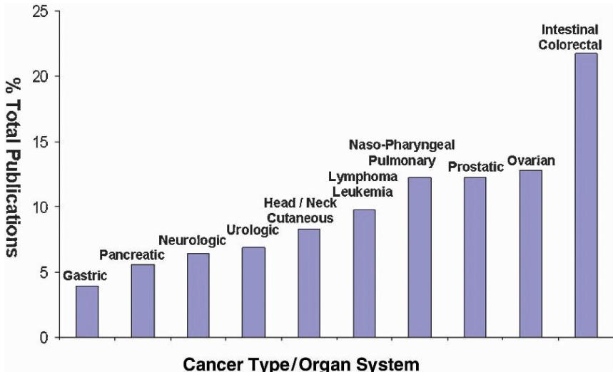  
그림 2. 암 유형별 단백질체학 간행물. 이 그림은 그림 1에 언급된 모든 초록에 대해 암 유형 및 장기 시스템별 단백질체학 연구 비율을 보여줍니다. 보시다시피 단백질체학 암 연구는 비뇨생식기, 피부, 신경 및 소화기 계통을 거의 균일하게 연구하며 광범위하게 적용되고 있습니다. 유방암 연구가 모든 단백질체학 기반 암 초록의 1% 미만을 차지하여 이 그림에 포착되지 않았다는 점은 다소 놀라운 일입니다.

유전체학(genomics) 연구와 대략적으로 비교할 때, 임상 단백질체학 접근 방식은 덜 성숙했으며 실제 시스템에서 단백질을 연구할 때 부과되는 고유한 분석적 요구 사항으로 인해 훨씬 더 많은 도전에 직면해 있습니다. 단백질체학 연구는 광범위한 단백질 존재비(abundance) 범위를 다루어야 합니다. 더욱이 원래 극미량으로 존재하는 단백질을 분리 및 정제하거나 그 존재비를 증폭할 수 있는 직접적이거나 쉽게 달성 가능한 수단이 없습니다. 임상 검체의 수집, 처리 및 저장에 있어 호환되지 않는 관행과 방법은 이러한 도전을 가중시킵니다. 많은 경우, 확립된 임상 시료 수집 프로토콜은 원래의 분석이나 조직학적 평가에는 적합하지만, 단백질 분해 절단, 단백질 고정 또는 화학적 변형뿐만 아니라 원치 않는 수준의 전해질이나 배지 안정화 단백질과 같은 원치 않는 아티팩트(artifact)를 유입시킵니다. 이러한 도전 과제들을 고려할 때, 단백질체학 연구 기법이 명확하게 우세한 접근 방식 없이 진화의 초기 단계에 머물러 있는 것은 그리 놀라운 일이 아닙니다(그림 3 참조).

오늘날 가장 인기 있는 임상 단백질체학 연구 활동 중 하나는 차등 단백질 디스플레이(differential protein display) 또는 발현 모니터링입니다. 차등 단백질 디스플레이는 서로 다른 유기체, 개체, 병원성 및/또는 대사 조건, 환경적 또는 화학적 도전에 대한 표현형 반응 간의 단백질 프로파일을 대조하는 비교 기법입니다. 거의 보편적으로, 단백질 표현형 연구는 당면한 임상 문제와 상관관계를 가질 수 있는 현상학적 모델을 생성하는 첫 번째 접근 방식으로 사용됩니다. 암 연구에서 이러한 현상학적 연구는 가장 빈번하게 정상 세포와 형질 전환 또는 전이 세포를 구별하고, 건강한 개체와 질환이 있는 집단을 구별하려고 시도합니다.

기초 단백질체학 연구와 임상 단백질체학 연구에서 수행되는 차등 발현 분석은 그 목표와 분석 요구 사항 측면에서 다릅니다. 예를 들어, 기초 연구 활동은 종종 수확된 세포의 용해물(lysates)이나 분비물, 배양된 박테리아의 용해물이나 생성물, 또는 많은 실험동물이나 인간 피험자의 생체 유체 및 조직을 혼합한 시료를 대상으로 수행되는 연구를 포함합니다. 이러한 조건에서 기초 연구 연구는 시료 제한으로 인해 방해받지 않으며, 단백질 정제는 종종 저압 및 고압 액체 크로마토그래피, 직렬 크로마토그래피 및 다양한 전기영동 접근 방식과 같은 확립된 기술에 의존합니다. 종종 기초 연구 연구의 목표는 특정 시료와 관련된 모든 단백질을 목록화하고 식별하는 것입니다. 이 경우 단백질은 일반적으로 전기분무 이온화(electrospray ionization) 또는 매트릭스 보조 레이저 탈착/이온화(matrix-assisted laser desorption/ ionization) 질량 분석법에 의한 단백질 식별 및 특성 분석을 목적으로 펩타이드로 환원됩니다.

대조적으로, 임상 단백질체학 연구는 진단제 또는 새로운 약물 표적으로서 잠재적으로 유용한 바이오마커를 찾는 최종 목표를 가지고 개인 또는 소규모 집단에서 질병의 진행을 추적하려고 노력합니다. 그러한 상황에서는 시료나 조직의 가용성이 제한적이며 고효율의 소규모 기술에 대한 의존도가 높습니다. 일반적으로 그룹 간의 단백질 집단은 단변량 또는 다변량 분석 체계를 사용하여 비교되며, 최종 목표는 발현 수준이 주어진 임상 상태와 상관관계가 있는 단백질 또는 단백질 그룹을 규명하는 것입니다(Weinberge et al., 2002).

이 장에서는 현대 암 연구에 사용되는 다양한 단백질체학 방법 및 기술을 검토합니다. 단백질체학 분석의 과제를 탐구하고 다양한 분석 수단에 대한 검토 내용을 제시합니다.

# 2 단백질체 복잡성과 분획화의 필요성 (PROTEOME COMPLEXITY AND THE NEEDFOR FRACTIONATION)

조직 추출물 및 생체 유체의 단백질 구성은 수많은 암호화 유전자뿐만 아니라 가능한 번역 후 변형(post-translational modifications)의 수가 매우 많기 때문에 극도로 복잡하다는 것이 잘 알려져 있습니다. 인간 게놈은 25,000개 이상의 서로 다른 유전자로 구성되어 있지만, 단백질은 스플라이스 변이체(splice variants), 조절된 및 조절되지 않은 단백질 분해, 그리고 물론 성숙 과정에서 발생하는 모든 가능한 변형으로 인해 그 수가 더 많습니다. 더욱이 단백질은 다양하게 발현됩니다. 임상 시료 내에서 일부 단백질은 고도로 농축되어 있는 반면, 다른 단백질은 단 몇 개의 복사본으로만 존재하며 세포 주기의 특정 단계에서만 존재합니다. 혈청 단백질은 농도 차이가 10차수 또는 심지어 12차수(order of magnitude)에 달할 수 있는 것으로 알려져 있습니다(Adkins et al., 2002 ; Castagna et al., 2005 ; Thadikkaran et al., 2005).

이러한 요인들 때문에, 신중하게 설계된 임상 단백질체학 연구는 임상 시료의 분획화(fractionation)에서 시작해야 합니다. 선택된 시료 수집 및 분획화 체계가 잠재적인 바이오마커로 잘못 해석될 수 있는 원치 않는 아티팩트를 유입하지 않는 것이 필수적입니다. 초기 프로토콜이 길거나 실온에서 수행되는 경우, 초기 단백질 혼합물의 변형을 초래하는 초기 단백질 분해 효소(proteases)의 원치 않는 활성화가 실질적인 우려 사항입니다. 후자는 특히 혈장이나 혈청 시료에서 문제가 됩니다. 원치 않는 단백질 분해를 완화하기 위해 수집된 시료는 가능한 한 빨리 $4 ^ { \circ } \mathbf { C }$로 냉각해야 하며, 시료 분획화도 유사한 조건에서 수행하는 것이 가장 좋습니다. 대안적인 접근 방식은 단백질 분해 효소 억제제를 즉시 첨가하는 것이지만, 이는 초기 단백질체를 변형시키고 다른 기원의 아티팩트를 유입할 위험이 있다는 것이 인정되고 있습니다.

# 3 시료 사전 분획화 방법 (SAMPLE PRE-FRACTIONATION METHODS)

초기 시료 수집 및 저장 문제를 넘어, 성공적인 시료 분획화의 핵심은 최상의 조건에서 단백질을 분리하기 위해 단백질의 물리화학적 특성을 신중하게 활용하는 데 있습니다. 임상 시료는 일반적으로 용해되어야 할 수도 있는 생체 유체 또는 조직입니다. 작업 가능한 단백질 용액을 생성하기 위한 조직 분획화, 세포 분리 및 세포하 분획화(sub-cellular fractionation), 그리고 가용화(solubilization) 기술은 이 섹션에서 설명하지 않을 것입니다. 대신 최신 분획화 또는 분리 방법을 사용하여 단백질 용액으로부터 시작하는 분리 기술에 대한 논의를 검토할 것입니다.

# 3.1 단백질체학에 적용되는 크로마토그래피 기술

수년 동안 액체 크로마토그래피(liquid chromatographic, LC) 분리 방법은 단백질 분리 및 정제에 사용되어 왔습니다. 임상 단백질체학 분야에서 LC 사용에 대한 제한은 시료 가용성 및 부하량을 제외하고는 거의 없습니다. 임상 시료의 희소성으로 인해 종종 수많은 작은 분획을 수집하는 데 어려움이 있는 작거나 매우 작은 컬럼을 사용해야 합니다. 더욱이 단백질체학 연구의 일반적인 목표는 단일 단백질의 분리가 아니라 분획화이며, 이를 통해 후속 단백질 검출을 보다 보편적으로 만들고 데이터 분석 해석을 더 단순하게 만듭니다. LC 분리는 천연 단백질, 변성 단백질 및 단백질 분해 효소에 의한 완전 또는 부분 가수분해 후의 단백질 단편에 적용됩니다. 크로마토그래피 방법은 매우 다양한 고체상 흡착제(solid phase adsorbents)를 사용하여 구현될 수 있습니다. 특이성이 낮은 것 중에는 이온 교환체와 소수성 상호작용 흡착제(hydrophobic interaction sorbents)가 있습니다. 공통 잔기를 공유하는 단백질 그룹을 표적으로 하는 중간 특이성 흡착제에는 IMAC 흡착제(금속 이온과 상호작용할 수 있는 단백질), 당단백질용 붕산(boronic acids), 고정화 렉틴(lectin, 당단백질 하위 그룹용), 하이드록시아파타이트(hydroxyapatite) 및 고정화 효소 억제제(예: 세린 단백질 분해 효소 포획을 위한 벤자미딘)가 포함됩니다. 고정화된 단백질 A 또는 단백질 G와 같이 매우 특이적인 흡착제도 이용 가능하며, 이는 항체 또는 FC 융합 산물의 선택적 추출 및 고정화에 잘 알려져 있습니다.

# 3.1.1 이온 교환 크로마토그래피 (Ion Exchange Chromatography)

이온 교환(IEX)은 단백질 분리에 가장 널리 사용되는 크로마토그래피 방법입니다. 이는 주어진 pH에서 전하를 띤 단백질과 동일한 pH에서 고체상 수지의 보완 전하 사이에서 발생하는 상호작용에 기초합니다. 그 분리 효율은 이론적 및 실제적 수준에서 심도 있게 연구된 여러 요인에 따라 달라집니다(Fernandez et al., 1996). 다양한 기능기가 기술되었지만, 가장 인기 있는 것은 약한 및 강한 양이온 교환체와 약한 및 강한 음이온 교환체입니다. 다양한 응용 분야, 다양한 입자 크기, 다양한 리간드 밀도 및 기공 크기를 갖는 수지를 쉽게 구할 수 있습니다(Boschetti, 1994).

인간 혈청은 IEX 크로마토그래피로 분획된 가장 널리 기술된 단백질 혼합물 중 하나입니다. 단백질체학 연구의 경우, IEX는 초기 시료를 단순화한 다음 새로운 종을 식별할 목적으로 분획을 분석하는 데 광범위하게 기술되었습니다(Tirumalai et al., 2003). 가용한 문헌 전반에 걸쳐 이온 교환 크로마토그래피에 기반한 단백질체 분획화 방법의 많은 사례가 보고되었습니다(Link et al., 1997 ; Lopez, 2000 ; Washburn et al., 2001 ; Wagner et al., 2002). 이온 교환 크로마토그래피는 크기 배제(size exclusion)(Opiteck et al., 1998), 크로마토포커싱(chromatofocusing)(Wall et al., 2000), 친화성 포획(affinity capture)(Geng et al., 2001) 또는 역상 크로마토그래피(reverse phase chromatography)(Tomlinson and Chicz, 2003)와 같은 다른 분리 방법과 함께 사용됩니다. 그러나 단백질체 분획화에 사용되는 다차원 크로마토그래피는 관리(pH 조정, 탈염, 다음 차원으로 재주입) 및 분석해야 할 분획의 수가 많기 때문에 일반적으로 2차원을 초과하지 않습니다.

# 3.1.2 소수성 상호작용 크로마토그래피 (Hydrophobic Interaction Chromatography)

소수성 상호작용 크로마토그래피(HIC)는 단백질 혼합물을 분획화하는 또 다른 수단입니다. HIC는 수용액에서 단백질의 비극성 잔기(소수성 아미노산 클러스터)가 고체상의 소수성 사슬과 결합하는 능력에 기초합니다. 이러한 복합체의 형성은 전체 응집의 자유 에너지에 대한 높은 엔트로피 기여로 특징지어지며 엔탈피 기여는 낮거나 심지어 음의 값입니다. 단백질과 소수성 수지 사이의 결합은 일반적으로 강한 친성(lyotropic) 효과를 갖는 고농도의 염 존재에 의해 촉진됩니다. 특정 친성 염 농도에서 주어진 단백질의 결합 강도와 용량 인자(capacity factor)를 설명하기 위해 여러 메커니즘 유지 모델이 기술되었습니다(Melander et al., 1984 ; Staby and Mollerup, 1996). 전형적인 예로, HIC 사전 분획화는 페닐 컬럼에서 *H. influenzae*의 세포질 가용성 분획으로부터 새로운 단백질을 검출할 수 있게 했습니다. 컬럼에 결합된 약 150개의 단백질이 확인되었지만, 그중 30개만이 처음으로 확인된 것이었습니다(Fountoulakis et al., 1999).

# 3.1.3 친화성 크로마토그래피 및 면역 침전 (Affinity Chromatography and Immunoprecipitation)

친화성 크로마토그래피는 다양한 형태로, 특별히 설계된 고체상으로의 흡착을 통해 표적 단백질 그룹 또는 단일 단백질을 추출하는 구체적인 수단을 제공합니다. 이는 단백질 또는 다른 생체 고분자가 천연 또는 합성 파트너를 인식하는 능력에 기초합니다. 친화성 크로마토그래피 흡착제는 선택된 리간드(미끼 분자, bait molecule)가 직접 또는 스페이서 암(spacer arm)을 통해 화학적으로 부착된 다공성 매트릭스로 구성됩니다. 메커니즘 수준에서 친화성 크로마토그래피는 단백질 마이크로어레이 사용 중에 수행되며, 여기서 미끼는 적절하게 조건화된 평면 표면에 선택적으로 고정화된 다음, 생물학적 혼합물에서 상응하는 친화력을 가진 단백질(종종 먹이, prey라고 함)을 선별하는 데 사용됩니다.

친화성 크로마토그래피는 이온 교환체 및 소수성 흡착제에 비해 미끼-먹이 상호작용의 선택성이 더 높습니다. 이 상호작용의 특이성은 기본적으로 결합 및 해리 상수가 포함된 질량 작용의 법칙에 의해 지배됩니다. 친화성 크로마토그래피에서는 부하 및 세척 중 높은 결합률과 용리 중 높은 해리율이 필요합니다. 높은 해리 상수 비율은 카오트로픽제(chaotropic agents) 또는 변형제를 용리 완충액에 첨가하거나 $Ca^{++}$ 결합 단백질에 대한 EDTA와 같은 선택적 용리에 의해 달성될 수 있습니다. 유리 리간드와의 경쟁은 렉틴-당단백질 복합체의 경우 빈번하게 발생하는 것처럼 경쟁 분자의 이익을 위해 단백질이 탈착되도록 강제하는 또 다른 모드입니다.

친화성 크로마토그래피는 다양한 유형의 크로마토그래피 인식을 포함하는 용어입니다. 어떤 경우에는 단일 단백질이 고체상에 선택적으로 결합될 수 있고(예: 면역 흡착제), 다른 경우에는 동종 단백질 그룹이 선택적으로 포획됩니다. 이 경우 그룹은 설탕, 아미노산, 금속 이온 또는 심지어 염료 분자에 대한 인식과 같은 하나 또는 몇 가지 공통된 특성을 공유합니다.

친화성 크로마토그래피는 단백질을 분리하는 수단으로 광범위하게 사용되어 왔습니다. 대부분의 경우 이 기술은 추가 분석을 위해 단백질을 그룹으로 분리하는 데 사용됩니다. 그러나 잘 알려진 응용 분야는 이 장의 뒷부분에서 설명하는 고함량 단백질(high abundance protein) 제거에 사용됩니다. 그룹 단백질 결합을 위한 렉틴 친화성 크로마토그래피는 당단백질 분리에 널리 사용되어 왔습니다(Geng et al., 2001). 보고된 바와 같이, 렉틴 친화성 흡착은 단백질체 분석 전에 다양한 발현 단백질 혼합물로부터 당접합체(glycoconjugates)를 분리하는 데 사용되었습니다(Corthals et al., 2000b ; Lopez et al., 2000 ; Geng et al., 2001 ; Brzeski et al., 2003 ; Ghosh et al., 2004).

면역 침전(Immunoprecipitation)은 유사한 에피토프(epitope)를 공유하는 하나 또는 그룹의 단백질에 대해 선택적인 항체를 사용합니다. 이 접근 방식은 인산화된 단백질(Ramamoorthy et al., 2004) 및 종양 괴사 인자(tumor necrosis factor)와 같은 단백질 이소형(isoforms)(Watts et al., 1997)의 분리/분석에 흔히 사용됩니다. 실제로는 선택된 항체를 단백질 추출물과 혼합하고 면역 복합체를 형성하는 데 필요한 시간 동안 배양합니다. 그런 다음 면역 복합체는 단백질 A 컬럼을 사용하여 분리됩니다. 이 접근 방식은 문헌에 많이 보고되지는 않았지만, 높은 수준의 특이성 때문에 2차원 전기영동 또는 질량 분석법에 의한 분석 전의 사전 분획화 방법으로서 주목할 가치가 있습니다. 매우 특이적인 항체를 사용함으로써 세린/트레오닌-인산화 단백질의 순도가 유의하게 향상되었으며, 결과적으로 키나아제에 대한 기질의 특이성이 좋아졌습니다(Gronborg et al., 2002).

단독으로 또는 다른 분리 방법과 함께 사용되는 면역 침전은 뇌척수액 내 포스포티로실 단백질(phosphotyrosyl proteins) 분석(Yuan and Desiderio, 2003) 및 인간 T세포의 인산화 부위 매핑(Brill et al., 2004)을 위한 수단으로도 널리 기술되었습니다. 더욱이 면역 침전 원리는 단백질-단백질 복합체의 형성을 조사하고 따라서 일부 경로의 규명에 기여하는 데에도 흥미롭습니다(Figeys et al., 2001 ; Ren et al., 2003 ; Schulze and Mann, 2004). 면역 침전 방법에는 항체가 공유 결합된 고체상을 사용하는 면역 흡착도 포함됩니다. 이 접근 방식에서 얻은 이점은 항체에 의한 포획된 단백질의 오염을 방지하는 것입니다. 이 기술은 지난 30년 동안 바이오 제약 응용 분야에서 분취 단백질 정제에 광범위하게 사용된 면역 흡착에서 직접 파생되었습니다.

# 3.1.4 고정화 금속 친화성 크로마토그래피 (Immobilized Metal Affinity Chromatography)

고정화 금속 친화성 크로마토그래피(IMAC)는 히스티딘 노출 단백질을 분리하는 효과적인 수단으로 반복적으로 보고되었습니다(Ren et al., 2003 ; Smith et al., 2004). IMAC 크로마토그래피는 칼슘 결합 단백질(Lopez et al., 2000) 및 인산 단백질(phospho-proteins) 분리(Ficarro et al., 2002)에도 적용되었습니다. 표면 증강 레이저 탈착 분석(Surface Enhanced Laser Desorption analysis)에서 IMAC 타겟은 추정 암 바이오마커 발견에 자주 사용되어 왔습니다(Fung et al., 2001 ; Wilson et al., 2004 ; Zhang et al., 2004a).

# 3.2 전기영동 기반 방법 (Electrophoresis Based Methods)

임상 단백질체 분석에 일상적으로 사용되는 다양한 전기영동 방법 중에는 SDS-폴리아크릴아미드 겔 전기영동, 2차원 전기영동 및 등전점 포커싱(isoelectric focusing)이 있습니다. 미세 분취용 겔 전기영동 및 자유 액체 필름에서의 연속 전기영동은 이러한 전기영동 방식의 두 가지 구체적인 버전입니다. 전자는 수십 개의 분획을 순차적으로 용리함으로써 저함량 뇌 단백질을 풍부하게 하는 데 최근 적용되었습니다(Fountoulakis and Juranville, 2003).

# 3.2.1 연속 전기영동 (Continuous Electrophoresis)

자유 액체 필름에서의 연속 전기영동(자유 흐름 전기영동: FFE라고도 함)은 전기장 힘의 선에 수직인 방향으로 전해질이 연속적으로 흐르는 것을 기초로 하며, 분리될 단백질 혼합물은 흐르는 매질의 작은 점에 연속적으로 추가됩니다. 초기 혼합물의 구성 요소는 대각선 궤적으로 편향되어 전기영동 이동도에 따라 분리되며 챔버 하단에서 별개의 분획으로 수집될 수 있습니다. 이 기술은 비교적 큰 시료를 처리할 수 있다는 장점이 있습니다. FFE는 높은 확산 계수로 인해 어려움을 겪지만, 이 현상을 제한하기 위해 단백질의 연속 분리에 유용한 미세 제작 FFE 장치와 같은 가능한 해결책이 보고되었습니다(Kobayashi et al., 2003).

# 3.2.2 등전점 접근 방식 (Isoelectric Point Approaches)

단백질 분획화를 위한 등전점(isoelectric point) 기반 응용 분야가 보고되었습니다. 이러한 종류의 단백질 이동에 내재된 내장된 힘은 엔트로피 피크 소산을 방지합니다. 이 방법의 상당한 이점은 표준 등전점 포커싱 방법을 사용하는 동안 항상 문제가 되었던 큰 크기의 단백질 분리에서 즉시 나타납니다. 후자는 2차원 지도의 첫 번째 차원으로 제안되었으며, 용리된 분획은 직교 SDS-폴리아크릴아미드 겔 전기영동에 의해 직접 분석됩니다(Hoffman et al., 2001). 그런 다음 두 번째 차원의 개별 밴드를 용리하여 전기분무 이온화, 탠덤(tandem) MS로 분석함으로써 많은 수의 단백질을 식별할 수 있습니다.

또 다른 분취용 등전점 분리 방법은 Rotofor입니다. 이 장치는 양끝에 양이온 및 음이온 교환 막이 배치된 것을 제외하고는 액체 투과성 나일론 스크린으로 분리된 20개의 시료 챔버로 조립됩니다. 이는 2차원 전기영동 유사 공정에서 첫 번째 차원으로 사용될 수 있으며, 보고된 바와 같이 크로마토그래피를 사용하여 각 분획을 추가로 분획화할 수 있습니다(Zhu and Lubman, 2004). 상당한 장점이 있는 캐리어 양쪽성 전해질(carrier ampholytes)을 대체하는 등전점 막을 수용하는 소형화된 장치와 같이 원래 원리에 대한 수정 사항이 기술되었습니다(Zuo and Speicher, 2002 ; Shang et al., 2003).

단백질의 등전점에 기초한 또 다른 미세 준비 전기 이동 기술은 "Off-gel IEF"입니다(Ros et al., 2002). 마찬가지로 다구획 분리 기술에서 시스템은 IPG 연속 겔 슬래브 위에 배치된 액체 챔버로 구성됩니다. 액체 챔버에 수직으로 전기장을 가하면, 하전된 종(IPG 겔의 pH보다 높거나 낮은 pI 값을 갖는 종)이 챔버의 전기장에서 추출되어 나갑니다. 분리 후 전체적으로 중성인 종(pI = IPG 겔의 pH)만이 용액에 남습니다. 이 초기 원리의 실제적인 확장은 분리에 사용되는 현재 기기들과 호환되는 작은 부피의 일련의 구획들로 구성된 멀티웰 장치를 사용합니다(Michel et al., 2003).

분취용 단백질 분리를 위한 전기영동 기반 방법으로서의 분취용 등전점 포커싱은 등전점 막을 사용하는 다구획 전해조가 고안되었을 때 상당한 진전을 이루었습니다(Wenger et al., 1987 ; Righetti et al., 1990). 이러한 장치의 장점은 즉각적으로 분명해졌습니다. 첫째, 단백질 침전의 위험이 매우 제한적인 상태에서 용액 내에서 명확하게 정의된 등전점 그룹별로 단백질을 분리할 수 있게 해주었습니다. 둘째, 이 접근 방식은 단백질 농도를 높이는 추가적인 이점과 함께 추가적인 하위 분획화와 직접 호환되었습니다.

마지막으로, 또 다른 분취용 전기 구동 단백질 분리는 캐리어 양쪽성 전해질이 박힌 중성 덱스트란 비드의 얇은 층을 사용하는 것을 기초로 하며, 여기서 단백질은 전기장이 가해질 때 등전점에 따라 이동합니다(Gorg et al., 2002). 포커싱 공정은 캐리어 양쪽성 전해질의 존재에 의해 유도됩니다. 덱스트란 비드는 단백질이 등전점에 도달하기 위해 자유롭게 이동하는 대류 방지 매질로 사용됩니다. 분리된 단백질은 비드와 함께 수집된 다음 추가 분석에 사용됩니다. 그러나 일부 다운스트림 분석은 복잡합니다. 질량 분석법의 경우가 그러한데, 매우 많고 질량 분석법과 호환되지 않는 양쪽성 전해질 캐리어를 제거하기 어렵기 때문입니다.

# 3.3 고함량 단백질의 고갈 및 발현 동적 범위의 압축 (Depletion of High Abundance Proteins and Compression of Expression Dynamic Range)

# 3.3.1 고갈 기술 (Depletion Technologies)

혈장, 혈청 또는 심지어 뇌척수액(CSF)에 들어 있는 알부민, 면역글로불린, 트랜스페린 및 기타 몇 가지 매우 높은 함량의 단백질은 많은 저농도 단백질의 적절한 검출에 어려움을 줍니다. 예를 들어 알부민은 수많은 다른 종의 검출을 억제하기 때문에 질량 분석법에서 골칫거리입니다. 유사하게 2차원 전기영동은 알부민 신호에 의해 가려진 종을 드러낼 수 없습니다. 상황을 해결하기 위해 질량 분석 및 2차원 전기영동 분석 전에 하나 이상의 고함량 종을 제거하는 것이 제안되었습니다.

혈청 알부민은 Cibacron Blue 염료 또는 크로마토그래피 비드에 부착된 항알부민 항체를 사용하여 제거됩니다. 면역글로불린 G는 고정화된 단백질 A 또는 단백질 G 또는 심지어 항-IgG 항체를 사용하여 제거됩니다. 알부민과 IgG는 두 가지 다른 흡착제를 혼합하여 동시에 제거할 수도 있습니다. 최근에는 알부민, IgG, IgA, 트랜스페린, 헵토글로빈 및 α1-안티트립신과 같은 주요 혈장 단백질에 대한 면역 흡착제 혼합물을 사용하여 한 번에 여러 단백질을 제거하는 것이 제안되었습니다(Martosella et al., 2005 ; Zolotarjova et al., 2005).

겉으로는 유리해 보이지만, 면역 흡착을 포함한 이러한 모든 고갈 방법은 제거된 종과 밀접하게 연관될 수 있는 표적 단백질을 제거하는 동시에 원치 않는 희석을 초래할 수 있기 때문에 문제가 될 수 있습니다(Zhou et al., 2004b ; Zolotarjova et al., 2005). 최근 고갈 방법이 질병의 유의성 측면에서 아티팩트를 생성할 수 있다는 보고가 있었습니다(Mehta et al., 2003 ; Tirumalai et al., 2003).

# 3.3.2 압축 기술 (Compression Technologies)

앞서 언급했듯이 임상 시료 단백질체는 그 다양성과 발현 수준 면에서 매우 복잡합니다. 가장 대표적인 예가 인간 혈청으로, 알부민 하나가 전체 단백질 부하의 60%를 차지하며 가장 풍부한 9가지 종(알부민, 면역글로불린 G, 헵토글로빈, 트랜스페린, 트랜스레티닌, $\alpha _ { 1 }$-안티트립신, $\alpha _ { 1 }$-산성 당단백질, 헤모펙신 및 ${ \mathfrak { a } } _ { 2 }$-마크로글로불린)이 전체 혈청 단백질체의 약 90%를 구성합니다. 일반적으로 상위 50개의 단백질이 단백질 질량의 99%를 차지하고 나머지 1%가 100,000개 이상의 다른 단백질로 구성된다고 인정됩니다.

함량 문제에 대한 한 가지 가능한 해결책은 다양한 친화성 리간드 라이브러리를 사용하여 저복제수 단백질(low copy number proteins)을 포획함으로써 이들의 함량을 선택적으로 농축하는 것입니다. 고체상 흡착 원리는 고갈의 경우처럼 표적 단백질을 희석하는 대신 선택적으로 농축하기 때문에 유리할 것입니다. 친화성 비드를 과포화시키는 원리에 기초하여 이를 한 번에 모든 혈청 단백질로 확장하면, 많은 수의 저함량 종을 농축할 수 있으며, 따라서 함량의 동적 범위를 압축할 수 있습니다. 이 방법은 매우 많은 수의 고도의 선택적 리간드가 필요하며, 각각은 표적 단백질의 수를 초과하는 수의 별개 비드에 부착됩니다. 이러한 다양한 비드를 함께 혼합하고 (혈청에서와 같이 단백질 농도 차이가 큰) 대량의 과잉 단백질 혼합물을 부하하면, 고함량 단백질은 해당 비드를 매우 빠르게 포화시키는 반면 저함량 종은 시료가 있는 한 계속 흡착됩니다. 이 원리에 기초하여 고체상 리간드 라이브러리를 사용하는 새로운 접근 방식이 기술되었습니다(Righetti et al., 2005 ; Thulasiraman et al., 2005). 라이브러리는 별개의 비드들로 구성되며, 각각은 동일한 리간드의 상대적으로 많은 복사본을 운반하며, 리간드는 비드마다 다릅니다.

과부하 조건에서 이러한 고도로 다양한 조합 친화성 리간드 라이브러리를 사용하면 단백질 농도 차이가 크게 줄어듭니다. 알부민, IgG 및 기타 고함량 단백질은 부분적으로 제거되는 반면, 저함량 단백질은 고체상이 지속적으로 공급됨에 따라 동시에 점진적으로 농축됩니다. 보류된 단백질은 이온 강도, pH, 카오트로픽제 또는 유기 용매와 같은 완충액 변형제를 사용하여 친화성 라이브러리로부터 한꺼번에 또는 순차적으로 용리된 후 임의의 수의 분석 방법으로 분석됩니다.

다운스트림 2-D 겔 및/또는 MS 분석과 함께 임상 시료에 적용되었을 때, 이 압축 접근 방식은 생체 유체에 존재하는 단백질의 새로운 발견으로 이어졌습니다. 예를 들어, 인간 소변을 동일한 리간드 라이브러리를 사용하여 처리 전후에 분석하여 이전에는 기술되지 않았던 251개의 단백질을 발견했습니다(Castagna et al., 2005).

# 4 임상 단백질체 분석 방법 (CLINICAL PROTEOMIC ANALYTICAL METHODS)

이 섹션에서는 임상 단백질체학 연구 분야에 적용되는 가장 중요한 분석 방법을 설명합니다. 대부분의 경우 임상 단백질체 분석은 전기영동, 액체 크로마토그래피, 질량 분석, 단백질 어레이 및 생물 정보학 기술과 제품에 의존하며, 이들 중 다수가 여기서 논의됩니다.

# 4.1 탑다운(Top-Down) 대 바텀업(Bottom-Up) 접근 방식

임상 단백질체 분석에서 기본 분석 접근 방식은 크게 두 가지 체계로 분류될 수 있습니다. 즉, 살아있는 시스템에 존재하는 천연 단백질을 직접 분석하는 방식(탑다운)과 단백질 분해 조각을 직접 검사하는 방식(바텀업)입니다. 탑다운 방법론에는 다음이 포함됩니다: 표면 증강 레이저 탈착/이온화(SELDI) 분석(Merchant and Weinberger, 2000), 2-D 겔 전기영동(Jain, 2002), 차등 겔 전기영동(Friedman et al., 2004 ; Alfonso et al., 2005), 가상 2-D 겔 전기영동(Loo et al., 1996 , 2001), 질량 분석법(MS)과 결합된 하이픈(hyphenated) LC(Chong et al., 2001 ; Kachman et al., 2002), 단백질 어레이(Geho et al., 2004 ; Alessandro et al., 2005 ; Clarke and Chan, 2005), 전기분무 이온화(ESI) 푸리에 변환 이온 사이클로트론 공명 질량 분석법(FT ICRMS)(Ge et al., 2002 ; Meng et al., 2004).

탑다운 접근 방식은 해당 단백질을 직접 연구할 수 있다는 장점이 있습니다. 따라서 연구자는 추정 펩타이드 서열, 측정된 단백질 물리적 특성(등전점 및 소수성 지수 등)을 관찰된 단백질 분자량과 연관시킬 수 있어 단백질 식별을 위한 추가적인 경로를 제공할 뿐만 아니라 번역 후 변형의 손쉬운 검출을 가능하게 합니다. SELDI MS와 같은 고처리량 체계의 경우, 탑다운 바이오마커 발견 프로토콜은 진단 검증 목적의 분석으로 즉시 전환될 수 있습니다. 그러나 탑다운 분석의 이점에는 특히 MS 검출 분야에서 몇 가지 요구 사항이 따릅니다.

단백질체 시료는 종종 유용한 MS 신호 생성을 방해하는 복잡한 용액이기 때문에, MS 검출은 거의 보편적으로 적어도 하나의 분리 체계와 결합됩니다. 그럼에도 불구하고 대부분의 단백질 분리 체계는 충분한 분해능을 제공하지 못하여 종종 각 분획에 복잡한 단백질 하위 집단을 생성합니다. 온전한 단백질의 이온화 전위는 크게 다를 수 있어 신뢰할 수 있는 정성 및 정량 분석을 다소 어렵게 만듭니다. 후자는 양친매성(amphiphobic) 및 소수성 단백질뿐만 아니라 번역 후 변형(PTMs, 즉 당화 및 인산화)이 있는 단백질의 경우 특히 그렇습니다. 이온 수율에 관계없이 복잡한 단백질 분획의 분석은 특히 ESI를 이온화원으로 사용하는 탑다운 연구의 경우 MS 분해능에 높은 요구 사항을 부과합니다. 분자량이 약 $10 \mathrm{kDa}$를 초과하는 단백질의 경우, 단백질 정체 및 PTM에 대한 신뢰할 수 있는 추론은 질량 정확도에 점점 더 의존하게 되며 종종 정교한 MS 플랫폼의 사용을 필요로 합니다.

바텀업 연구는 천연 단백질의 펩타이드 조각을 분석하기 때문에, 탑다운 접근 방식에서 직면했던 앞에서 설명한 많은 과제들이 우회됩니다. 가장 흔히 사용되는 단백질 분해 접근 방식은 분자량이 $5 \mathrm{kDa}$ 미만인 단백질 가수분해물을 생성하여 단백질 정체 또는 펩타이드 PTM을 결정하기 위한 질량 정확도 요구 사항을 줄여줍니다. 모단백질과 비교할 때 펩타이드는 더 균일하게 이온화되어 정성 및 정량 검출의 어려움을 다소 완화해 줍니다.

가장 빈번하게, 바텀업 MS 분석은 적어도 하나의 온라인 펩타이드 분리 체계와 결합됩니다. 일반적인 플랫폼은 역상(RP) HPLC 시스템으로 구성되며 ESI MS와 결합됩니다. 보다 완전한 단백질체 커버리지가 필요한 경우, 바텀업 MS 분석은 복합 이온 교환(IEX) 및 RP 크로마토그래피와 같은 탠덤 펩타이드 분리 체계에 의존합니다. 일반적으로 첫 번째 차원에 대해 5-10개의 분획을 수집한 다음 RP HPLC MS 분석을 수행합니다.

바텀업 접근 방식은 단백질 집단을 목록화하는 데 유용하지만, 실질적인 분석법을 만드는 측면에서는 확장성이 좋지 않습니다. 또한 바텀업 연구의 최종 결과는 정제 과정 중에 검출된 펩타이드 또는 펩타이드들에 대한 데이터베이스 식별입니다. 모단백질에 대한 펩타이드 커버리지가 100% 달성되지 않는 한, 분석가는 살아있는 시스템에 있는 바이오마커의 진정한 특성에 대해 확신할 수 없습니다. 중요한 PTM의 검출이 간과될 수 있는데, 이는 특히 병리학적 또는 대사적 변화의 직접적인 결과로 비정상적인 단백질 분해가 관찰될 때 문제가 됩니다. 종종 분석가는 PTM 및 분석법 개발 문제를 해결하기 위해 천연 단백질을 검색해야 할 수밖에 없습니다. 분명히 임상 단백질체학 세계에서 데 노보(de novo) 바텀업 연구는 결국 직접적인 탑다운 연구로 이어집니다(그림 4 참조).

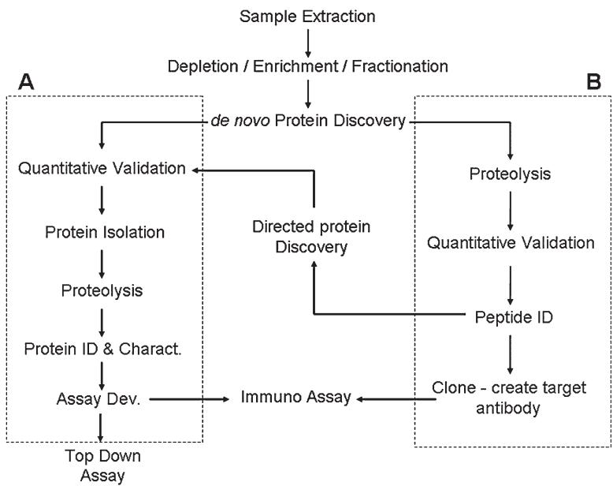  
그림 4. 임상 단백질체 작업 흐름. (a) 탑다운 단백질체학 연구; (b) 바텀업 단백질체학 연구. 임상 단백질체 분석은 종종 비지시적 또는 데 노보 단백질 발견 접근 방식을 사용하여 먼저 수행됩니다. 탑다운 및 바텀업 방법론 모두 적용될 수 있습니다. 일단 단백질 식별이 확립되면, 비지시적 연구는 특히 분석법 개발 또는 바이오마커 검증 단계 동안 지시적 분석으로 이어지는 경우가 많습니다.

# 4.2 탑다운 방법론 (Top-Down Methodologies)

# 4.2.1 2차원 겔 전기영동-질량 분석법

가장 널리 사용되는 탑다운 단백질 발견 접근 방식은 2차원 겔 전기영동/질량 분석법(2-D MS)입니다(Goerg et al., 2004). 2-D 겔이 단백질을 질량 분석법으로 직접 연구하지는 않지만, 실제 시료의 단백질 프로파일을 생성하는 수단은 제공합니다. 간단히 말해서, 단백질은 먼저 고정화된 pH 구배를 통해 등전점에 따라 분리된 다음 소듐 도데실 설페이트 폴리아크릴아미드 겔 전기영동(SDS PAGE)을 사용하여 추가로 분획화됩니다. 그런 다음 PAGE 슬래브를 염색하여 스팟(spot)의 2차원 어레이를 만듭니다. 슬래브는 광학 스캐너를 사용하여 디지털 이미지로 생성되며, 스캔된 이미지는 스팟 위치와 염색 강도에 특히 중점을 두어 차등적으로 비교될 수 있습니다. 따라서 각 시료에 대해 3차원 패턴(단백질 pI, 단백질 분자량 및 단백질 함량)을 생성할 수 있습니다.

2-D 겔 프로파일을 해석하려는 초기 시도는 인공 지능 및 머신 러닝 프로그램을 사용하여 촉진되었습니다. MELANIE(Medical Electrophoresis Analysis Interactive Expert System)라고 불리는 한 특정 프로그램은 휴리스틱 클러스터링 분석 및 계층적 분류를 사용하여 2-D 프로파일을 자동으로 분류하기 위해 만들어졌습니다(Appel et al., 1988 ; Pun et al., 1988). 이 작업의 전반적인 목표는 컴퓨터 기반 진단 요법을 만들려는 의도로 질병 관련 패턴을 결정하는 수단을 만드는 것이었습니다. 이는 간경변 진단 및 암 생검으로부터 다양한 암 유형을 구별하는 데 성공적으로 적용되었습니다(Appel et al., 1991). 나중에 이 작업은 겉보기에 건강한 개체와 알려진 몇몇 특정 질병이 있는 환자로부터 얻은 혈장/혈청의 비교 분석으로 확장되었습니다. 겉으로 보이는 복잡성에도 불구하고, 환자의 전기영동도(electropherograms)는 선택된 질병에 대한 참조 단백질 프로파일의 쉽게 검출 가능한 수정을 드러냈습니다. 단클론 감마글로불린혈증(monoclonal gammopathies), 저감마글로불린혈증(hypogammaaglobulinemia), 간부전, 만성 신부전 및 용혈성 빈혈 환자로부터 몇 가지 질병 관련 스팟 패턴이 규명되었습니다(Tissot et al., 1991).

초기에는 성공적이었으나, 2-D 접근 방식은 임상으로 이어지는 데 실패했습니다. 제한된 재현성, 좁은 검출 동적 범위, 그리고 수고스럽고 느린 처리량 문제로 인해 본질적으로 어려움을 겪었습니다. 최근에는 재현성과 처리량을 개선할 수 있는 수단으로 DIGE(Difference Gel Electrophoresis)라고 불리는 새로운 2-D 접근 방식이 도입되었습니다(Unlu et al., 1997). DIGE는 동일한 겔 내에서 여러 시료를 분석할 수 있는 고전적인 2-D 접근 방식의 변형으로, 실험군과 대조군 집단의 동시 분석을 가능하게 합니다. DIGE는 여러 시료를 서로 다른 아민 반응성 염료로 형광 태깅하고, 동일한 2-D 겔에서 실행한 다음, 겔의 사후 실행 형광 이미징을 수행하여 그룹을 직접 중첩시킴으로써 수행됩니다. 이러한 방식으로 처리 및 이미징되는 겔의 수가 감소하는 것을 볼 수 있습니다. 또한 겔 간 재현성 부족의 영향이 어느 정도 최소화됩니다. DIGE 기반 분석은 대장암 연구에서 성공적으로 수행되었습니다(Friedman et al., 2004 ; Alfonso et al., 2005).

2-D 겔 패턴이 유익할 수 있지만, 궁극적으로 고유한 마커의 정체가 확립되어야 합니다. 이를 위해 2-D 겔 분석은 ESI 및 매트릭스 보조 레이저 탈착/이온화(MALDI) 질량 분석법과 결합되었습니다. 관심 있는 단백질 스팟은 일반적으로 겔에서 절단된 다음 탈색됩니다. 절단된 겔 플러그는 트립신, endo-Lys-c 및 V-8 프로테아제와 같은 특정 단백질 분해 활성을 갖는 단백질 분해 효소를 사용하여 소화됩니다. 유리된 펩타이드는 겔 플러그 밖으로 확산되어 후속 MS 분석에 활용됩니다. 권장 프로토콜과 함께 이 프로세스에 대한 개요는 Corthals et al(Gygi et al., 2000)에 의해 제공됩니다. MS 기반 단백질 식별의 구체적인 세부 사항은 이 장의 뒷부분에서 논의됩니다.

# 4.2.2 가상 2-D 겔 분석 (Virtual 2-D Gel Analysis)

고전적인 2-D 겔 분석과 관련된 재현성 및 처리량 문제를 해결하기 위해, 여러 연구자들은 SDS PAGE 단계를 제거하고 폴리아크릴아미드 겔의 직접 분석을 MALDI 질량 분석법과 결합했습니다(Loo et al., 1996). 건조 시 초박형(10 $\mu$m 미만) 겔을 MALDI 매트릭스 용액에 담근 다음 MALDI-TOF 질량 분석기에서 직접 분석했습니다. 초기 스펙트럼은 등전점 포커싱, 천연 및 SDS 겔로부터 획득되었습니다. 가상 2-D 겔은 등전점 겔을 MALDI 스캐닝하여 생성되었습니다. 가상 2-D 겔은 *E. coli* 단백질체 연구로 확장되었습니다(Loo et al., 2001). 동일한 단백질체에 대한 고전적인 2-D 연구와 비교할 때, 가상 2-D 분석은 개선된 분자 질량 결정 및 pI($\pm 0.3$ pH 단위)를 기반으로 단백질 정체($< 50$ kDa)를 상정할 수 있게 해주었습니다.

가상 2-D 결과를 용이하게 보고 연구할 수 있도록 데이터 축소 및 디스플레이 알고리즘이 만들어졌습니다(Walker et al., 2001). 가장 발전된 상태에서 가상 2-D 겔 분석은 고전적인 2-D 분석과 비교할 때 높은 감도(은 염색 검출 한계와 유사)와 개선된 처리량, 분해능 및 질량 정확도를 입증했습니다. 그러나 겔을 MALDI MS 시스템과 인터페이싱하는 것과 관련된 복잡성이 이 접근 방식의 광범위한 채택을 근본적으로 제한했습니다.

# 4.2.3 표면 증강 레이저 탈착/이온화 (Surface Enhanced Laser Desorption/Ionization)

SELDI 단백질 어레이 기술은 단백질 분리, 단백질 정제 및 질량 분석법에 의한 단백질 검출의 과제를 해결하는 분석 도구 및 프로토콜의 모음입니다(Merchant and Weinberger, 2000 ; Fung et al., 2001 ; Lin et al., 2003). SELDI 어레이 표면은 질량 분석 조사 전에 분석물의 온-프로브(on-probe) 분리 및 정제를 지원하는 고체상 추출 매체 역할을 합니다. 어레이 표면 기능기와 상보적인 물리적 및 화학적 특성을 가진 분석물은 흡착되는 반면, 다른 분석물은 시료 준비 과정에서 씻겨 나갑니다.

어레이 표면에서 흡착 및 정제된 후, 보류된 단백질은 매트릭스 보조 레이저 탈착/이온화를 사용하여 탈착 및 이온화되며 일반적으로 비행 시간형(time-of-flight) 질량 분석기에 의해 검출됩니다. 현재까지 암 연구에서 SELDI를 사용한 220개 이상의 연구가 발표되었습니다. 최근 SELDI 기술은 단백질 바이오마커의 근본적인 발견을 상피성 난소암(epithelial ovarian carcinoma)의 존재를 진단하기 위한 예측 분석법으로 전환하는 능력을 입증했습니다(Zhang et al., 2004b). 관련 연구에서 연구자들은 SELDI를 사용하여 암 하위 유형을 분류할 수 있는 숙주 특정 단백질 PTM을 발견했습니다(Fung et al., 2005).

SELDI는 패턴 인식 진단 테스트 개발의 정성적, 정량적 및 처리량 과제를 해결하는 가장 성공적인 탑다운 접근 방식 중 하나입니다. 자동화된 시료 준비, MS 분석 및 통계 분석의 상당한 발전은 연구자에게 종종 총 시료의 $100$ uL 미만을 사용하여 데 노보 바이오마커 발견을 위한 광범위한 단백질 프로파일을 생성할 수 있는 능력을 제공합니다. 단백질이 물리화학적 특성에 따라 격리되기 때문에 MALDI 또는 ESI MS 분석과 비교할 때 경쟁적 이온 억제가 크게 감소하여 분석의 정성적 및 정량적 신뢰도가 향상됩니다. SELDI는 진정한 탑다운 MS 발견 접근 방식이므로, 초기 단백질 발견 조건을 활용하여 단백질 정제 또는 지시된 단백질 발견 체계를 만들 수 있습니다.

데 노보 또는 지시된 SELDI 단백질 발견과 비교할 때, SELDI 기반 단백질 식별은 훨씬 더 수고스럽고 바텀업 연구에서 달성 가능한 처리량에 비해 뒤떨어집니다. 그러나 통계적으로 의미 있는 바이오마커만 식별하면 되기 때문에 단백질 식별의 추가 부담이 전체 분석법 개발 프로세스에 큰 영향을 미치지 않으며, 따라서 SELDI 기반 진단 테스트 개발은 잘 특성화된 단백질 임상 분석법을 생성하는 가장 신속한 접근 방식 중 하나로 남아 있습니다.

# 4.2.4 액체 크로마토그래피: 질량 분석법 (LC-MS)

가상 2-D 겔 분석과 유사한 방식으로, 연구자들은 단백질 등전점 포커싱을 비다공성 실리카 RP HPLC-ESI 비행 시간형(TOF) MS 분석과 결합하여 액체상 3차원 단백질 분리 방법을 만들었습니다(Wall et al., 2001). TOF MS 분석기의 빠른 스캔 속도, 고분해능/질량 정확도 및 감도는 인간 에리트로루케미아(erythroleukemia) 세포주 용해물의 세포질 분획에서 4.8-8.5의 pI 범위에 있는 수백 개의 고유한 단백질을 검출할 수 있게 해주었습니다. 단백질은 결정된 pI($\pm 0.5$ 단위)와 온전한 분자량($\pm 150$ ppm 오차)을 결합하여 식별되었습니다. 분자량 및 펩타이드 지문 결과(peptide fingerprinting results)를 사용하여 PTM 및 서열 수정이 확인되었습니다. pI, RP 용리 시간 및 MW의 조합은 단백질이 밴드로 표시되는 2-D pI-MS 단백질 지도를 만드는 데에도 사용되었으며, 이 밴드의 회색조는 단백질 분자 이온 피크의 강도에 비례했습니다.

2차원 크로마토포커싱 액체 분리는 인간 유방 상피 세포 용해물로부터 단백질을 분리하고 분석하기 위해 RP HPLC-ESI TOF MS 분석과도 결합되었습니다(Chong et al., 2001). 등전점 분리가 이제 LC 컬럼을 사용하여 달성되었기 때문에 처리량이 현저히 개선되었습니다. 탑다운 LC-MS 방법론은 전암성 및 악성 인간 유방 세포주의 차등 연구(Chong et al., 2001) 및 상피성 난소암 연구(Kachman et al., 2002)에 성공적으로 적용되었습니다.

# 4.2.5 탑다운 푸리에 변환 이온 사이클로트론 공명 MS (FT-ICR-MS) 분석

FT-ICR-MS에 의해 제공되는 높은 질량 분해능과 정확도의 출현은 사전 LC 분리 여부와 관계없이 깊은 인상을 주는 결과와 함께 단백질의 직접 연구를 가능하게 했습니다(Kelleher et al., 1999). ESI는 FT-ICR과 결합되어 온전한 단백질뿐만 아니라 질량 합이 온전한 모단백질과 쉽게 일치하는 단백질의 큰 조각들에 대해 정확한 질량 할당을 가능하게 했습니다. 확인된 단백질 또는 관심 있는 단백질 조각은 저에너지 충돌 유도 해리(CID), 전자 포획 해리(ECD)뿐만 아니라 적외선 다광자 해리(IRMPD)를 사용하여 직접 서열 분석이 가능합니다(McLafferty, 2001 ; Reid and McLuckey, 2002). 이러한 목적을 달성하기 위해 여러 데이터 처리 개선 사항이 필요했습니다.

ESI는 다중 하전 이온을 생성하여 큰 분자를 FT-ICR 분석에 적합한 질량(m) 대 전하(z) 비로 낮추는 능력이 있는 반면, 전하가 확실하게 확립되지 않는 한 결정된 질량이 모호해진다는 근본적인 단점도 제공합니다. 순수 화합물이나 최대 3개의 다중 하전 이온만 형성하는 저분자량 종의 경우, 서로 다른 전하 상태를 가진 동일한 질량의 다중 피크를 사용하는 간단한 알고리즘을 사용하여 후자를 쉽게 달성할 수 있습니다. 그러나 큰 펩타이드와 단백질의 복잡한 혼합물의 경우, 많은 다중 전하 엔벨로프(envelopes)가 겹치게 되어 이 직접적인 접근 방식은 실패하게 됩니다. FT-ICR의 높은 분해능은 주어진 동위원소 분포에 대한 점진적인 m/z 차이에 기초하여 전하 상태를 직접적이고 명확하게 결정할 수 있게 해줍니다. 후자는 디컨볼루션된(deconvoluted) 동위원소 엔벨로프로부터 패턴 인식 기반의 자동 전하 상태 할당 알고리즘을 만드는 데 활용되어, 복잡한 혼합물의 경우에도 즉석에서 단백질 프로파일을 결정할 수 있게 했습니다(Senko et al., 1995). 나중에 단백질 신호 디컨볼루션 및 식별을 더욱 가속화하기 위해 THRASH(Thorough High Resolution Analysis of Spectra by Horn)로 알려진 새로운 컴퓨터 알고리즘이 개발되었습니다. THRASH는 가능한 동위원소 클러스터를 찾기 위한 감산 피크 찾기 루틴과 일차 전하 결정을 위한 푸리에 변환/패터슨(Patterson) 방법을 결합합니다. 그런 다음 최종 m/z 결정을 위해 이론적으로 도출된 동위원소 존재비 분포에 대한 최소 제곱 피팅이 사용되었습니다. 또한 기준선 및 배경 노이즈의 정확한 결정을 위해 새로운 신호 대 노이즈 계산 절차가 고안되었습니다(Horn et al., 2000b). ESI FT-ICR에서 생성된 ECD 조각화 단백질로부터 데 노보 단백질 서열을 도출하는 것과 관련하여, McLafferty와 동료들은 조각 이온 질량 값을 가장 확률이 높은 단백질 서열로 변환하는 알고리즘을 개발했습니다(Horn et al., 2000a). 이 알고리즘은 성공적... [중략]

탑다운 FT-ICR-MS 측정은 *Bacillus cerus* T 포자(Demirev et al., 2001), 티아민 생합성 단백질(Ge et al., 2002), 그리고 인간 폐암 세포주(Yan et al., 2005) 연구에서 효과적으로 수행되었습니다. 크기 배제 - 나노 LC 분리와 결합되었을 때, 폐경 후 연령이 일치하는 대조군과 III/IV기 상피성 난소암을 구별하는 다수의 바이오마커가 강조되었습니다(Bergen et al., 2003).

앞서 논의된 탑다운 접근 방식 중 FT-ICR은 틀림없이 가장 흥미롭고 유망한 발전을 나타냅니다. 그러나 몇 가지 과제가 남아 있습니다. FT-ICR-MS 기기는 매우 고가이며 숙련된 작동이 까다로워 상당한 부담 경감 없이는 광범위한 채택 가능성이 낮습니다. 더욱이 m/z 범위 제한으로 인해 탑다운 FT-ICR 접근 방식은 본질적으로 전기분무 이온화와 연결되어야 합니다. 따라서 정량적 결과는 경쟁적인 이온 억제에 의해 필연적으로 영향을 받게 되며, 크로마토그래피 분해능 및 유지 시간 재현성에 대한 높은 요구 사항이 부과됩니다. 또한 큰 ESI 형성 이온의 서열 결정은 전하 상태에 크게 의존합니다(Reid and McLuckey, 2002 ; Yan et al., 2005). 따라서 복합 서열 결정을 생성하기 위한 자동화된 전하 상태 선택 및 다중 MS/MS 분석 정제를 위한 고급 알고리즘이 여전히 필요합니다.

# 4.3 바텀업 방법론 (Bottom-Up Methodologies)

# 4.3.1 샷건(Shotgun) LC-MS 및 LC-MS/MS 분석

샷건 LC-MS 및 LC-MS/MS 분석은 관심 있는 단백질체를 목록화할 뿐만 아니라 단백질 기반 바이오마커를 발견하는 인기 있는 접근 방식으로 등장했습니다. 단백질 집단은 알려진 특이성을 가진 효소로 전체 소화를 수행하기 전에 비가역적으로 환원됩니다. 대부분의 경우 트립신이 사용됩니다. 소수의 사례에서 단백질은 전체 소화 전에 IEX, 등전점 포커싱 또는 친화성 크로마토그래피를 사용하여 먼저 분획화됩니다. 생성된 매우 복잡한 펩타이드 풀은 LC-MS/MS 분석에 제공됩니다. 초기 연구는 종종 적당한 복잡성의 특정 단백질체에 초점을 맞추었으며 단일 단계의 LC 분리(RP HPLC)를 사용했습니다. 인간 소변 단백질체는 저유량 구배 HPLC를 ESI 쿼드러폴(quadrupole) TOF MS 및 MS/MS 분석과 결합하여 평가되었습니다(Davis et al., 2001b). 24시간의 분석 기간 동안 총 약 200개의 단백질이 식별되었습니다.

# 4.3.2 MudPIT: 더 높은 샷건 분해능을 향하여

전체 소화 체계에서 생성되는 광범위한 펩타이드 복잡성을 해결하기 위해, 한 연구 그룹은 현재까지 다차원 단백질 식별 기술(MudPIT)로 알려진 샷건 단백질체학에서 가장 널리 채택된 방법을 창안했습니다(Wolters et al., 2001). MudPIT은 단일 바이페이직(biphasic) 컬럼에 SCX 및 RP 수지를 통합하는 다차원 LC 방법입니다. 많은 획기적인 발전의 경우와 마찬가지로, 공통된 주제에 대한 변형이 나타나고 있으며, 오늘날 많은 연구자들은 별개의 SCX 및 RP 컬럼을 사용하여 2단계 분리 체계를 결합합니다. 예를 들어, 자동화된 SCX 교환 - 구배 RP HPLC-MS/MS 시스템이 복잡한 펩타이드 소화 혼합물을 평가하는 데 사용되었습니다. 연구자들은 RP LC 대조군과 비교할 때 펩타이드 및 단백질 검출 수가 40% 이상 증가했음을 확인했습니다(Davis et al., 2001a). 이 검토의 목적을 위해, 우리는 통합 MudPIT 분석과 개별 MudPIT 분석을 구별하지 않을 것입니다.

도입 이후 MudPIT 분석은 전체 단백질체, 세포 소기관, 단백질 복합체(Paoletti et al., 2004 ; Washburn, 2004), 막 결합 단백질(Wolters, 2004) 및 식물 단백질체(Park, 2004) 연구로 확장되었습니다. 보다 최근에는 MudPIT이 발달, 생리 및 질병 과정의 함수로서 세포 및 조직 내의 전체 단백질 발현 패턴의 변화를 모니터링하는 데 사용되었습니다(Kislinger and Emili, 2005). 암 연구의 관점에서 MudPIT은 상피성 난소암(Somiari et al., 2005), 침묵된 p53 이펙터(Benzinger et al., 2005), 폐 미세혈관 내피 세포(Durr et al., 2004), 세린 단백질 분해 효소 억제제(Chen et al., 2005), 췌장암(Mauri et al., 2005) 및 유방암(Jessani et al., 2005 ; Somiari et al., 2005) 연구에 적용되었습니다.

대부분의 탑다운 접근 방식과 달리 MudPIT 분석은 사실상 운영의 일부로서 많은 수의 단백질 식별을 제공합니다. 종종 단일 분석에서 수백에서 수천 개의 추정 식별 및 측정된 펩타이드 신호가 생성되어 데이터 해석 및 품질 보증 작업을 어렵게 만듭니다. 이를 위해 Pep-Miner로 알려진 고급 데이터 관리 프로그램이 개발되었습니다(Beer et al., 2004). Pep-Miner는 여러 LC-MS/MS 실행에서 유사한 스펙트럼을 클러스터링함으로써 작동합니다. 주요 효과는

방대한 양의 데이터를 관리 가능한 크기로 현저하게 줄여주어, 획득한 스펙트럼의 편리한 저장 및 사후 처리를 가능하게 합니다. 한 연구에서 Pep-Miner는 폐암 세포의 MudPIT 분석에 적용되어 초기 517,000개의 스펙트럼을 20,900개의 클러스터로 줄이면서 830개의 단백질에서 파생된 2,518개의 펩타이드를 식별했습니다(Beer et al., 2004).

주요 계산적 노력은 보고된 펩타이드 식별의 신뢰도를 높이는 데 집중되었습니다. SEQUEST(Yates et al., 1995)는 가장 널리 사용되는 자동 펩타이드 식별 도구 중 하나입니다. SEQUEST는 저에너지 충돌 조건에서 생성된 변형된 펩타이드의 해석되지 않은 탠덤 질량 스펙트럼을 단백질 데이터베이스의 아미노산 서열과 상관시키는 기능을 수행합니다. 탠덤 질량 스펙트럼에서 관찰된 펩타이드 조각화 패턴은 데이터베이스에 선형 아미노산 서열을 직접 검색하고 맞추는 데 사용됩니다. 그러나 식별된 펩타이드에 대한 신뢰도는 스펙트럼 품질에 따라 달라지는 것으로 나타났습니다. 최근에는 SEQUEST 식별 전에 스펙트럼 품질을 평가하기 위한 두 가지 다른 전처리 접근 방식에 작업이 진행되었습니다. 하나는 SEQUEST가 식별을 수행할 수 있는지 여부를 예측하는 이진 분류(binary classification)이고, 다른 하나는 b- 및 y이온 피크의 수를 포함하는 보다 보편적인 품질 지표를 예측하는 통계 회귀(statistical regression)입니다(Bern et al., 2004). LIP(Logistic Identification of Peptides)로 알려진 또 다른 알고리즘이 개발되었으며 수동으로 검증된 골드 표준(gold standards)과 비교할 때 펩타이드 분류에 대해 높은 민감도와 선택성을 달성하는 것으로 보고되었습니다. LIP 지수는 로지스틱 회귀 모델을 기반으로 한 SEQUEST 출력 변수의 가중 평균입니다(Higdon et al., 2004). 펩타이드 조성 및 길이와 관련하여 보고된 점수를 정규화하기 위해 신경망 및 특정 통계 모델도 SEQUEST 마이닝 결과에 적용되었습니다. 연구자들은 표준 SEQUEST 필터링 절차와 비교하여 펩타이드 식별의 개선된 민감도 및 특이성을 보고했습니다(Razumovskaya et al., 2004).

대규모 탠덤 MS 실험의 데이터베이스 마이닝 실험에서 발생할 수 있는 잠재적인 위양성(false positive) 식별의 전반적인 의미는 Cargile et al.(2004)에서 논의됩니다. 저자들은 이전에 제안된 확률 점수 임계값이 적용된 경우에도 유의미한 위양성 식별률이 나타남을 지적합니다. 다른 연구자들은 검색 선택성 및 민감도와 관련하여 여러 단백질 식별 프로그램을 평가했습니다(Chamrad et al., 2004).

현재의 소프트웨어 발전에도 불구하고, 분석가는 샷건 연구에서 나온 추정 단백질 정체를 수동으로 확인할 것을 권장받습니다. 명백히 수동 검사는 전역적인 수준에서 비실용적이며, 샷건 단백질체 인벤토리 연구를 위한 품질 보증 루틴을 개선해야 한다는 압박을 지속시키고 있습니다. 그러나 바이오마커 발견 분야에서는 그룹 간에 차등 알고리즘을 적용하여 마커의 한정된 하위 집합을 식별할 수 있습니다. 그러한 상황에서 수동 검증은 터무니없는 작업이 아닙니다.

# 4.3.3 샷건 분석의 정량적 과제

단백질 차등 디스플레이 요법의 경우와 마찬가지로, 샷건 차등 단백질체 연구는 정성적 및 정량적 성능 지표를 모두 해결해야 합니다. 이를 위해 MS 유래 이온 크로마토그램으로부터 펩타이드 이온 전류 비율을 계산하기 위해 최소 제곱 회귀를 사용하는 RelEx라는 컴퓨터 프로그램이 만들어졌습니다(MacCoss et al., 2003).

정량적 오차를 억제하기 위한 노력의 일환으로, 정량적 바텀업 연구는 특정 라벨링 모티프를 사용해 왔습니다. ICAT(Isotope Coded Affinity Tags)는 복잡한 혼합물 내 개별 단백질의 정량적 정확도 및 동시 서열 식별을 더욱 향상시키기 위한 접근 방식으로 도입되었습니다(Gygi et al., 1999). 간단히 말해서, ICAT 태그는 환원된 시스테인에 대해 특정 반응성을 갖는 비오틴 함유 동위원소 질량 태그입니다. 전체 소화된 단백질 풀은 서로 다른 ICAT 태그로 라벨링된 후 시스테인 함유 펩타이드를 아비딘 비드를 사용하여 추출합니다. 차등 라벨링된 집단은 LC-MS/MS를 사용하여 동시 분석을 위해 재결합됩니다. 처음에 이 접근 방식은 *Saccharomyces cerevisiae* 내의 단백질 발현을 비교하는 데 사용되었습니다. 나중에 ICAT는 동일한 효모에서 mRNA 풍부도와 단백질 발현 사이의 차이를 설명하는 데 사용되었습니다(Aebersold et al., 2000). 이후 ICAT는 천연 및 캠토테신(camptothecin) 처리된 피질 뉴런 분석(Yu et al., 2002), LNCap 전립선암 세포의 정량적 프로파일링(Meehan and Sadar, 2004), 유방암(Pawlik et al., 2006) 및 인간 전립선암 세포의 안드로겐 공동 조절 단백질 네트워크 식별(Wright et al., 2004)로 확장되었습니다. 안정 동위원소 친화성 태그를 조사하는 여러 리뷰가 저술되었습니다(Tao and Aebersold, 2003 ; Wright and Aebersold, 2003 ; Zhou et al., 2004a).

ICAT 라벨링 체계의 한 가지 복잡한 점은 공유 결합된 태그가 이온 조각화에 측정 가능한 차이를 유발하여 자동 서열 해석에 추가적인 부담을 준다는 것입니다. ICAT 시약으로 라벨링된 펩타이드의 저에너지 CID 조각화 패턴을 수정되지 않은 펩타이드의 패턴과 비교한 연구에 따르면 변형된 Cys 펩타이드에 기인한 이온뿐만 아니라 라벨링 시약에 고유한 이온의 형성도 밝혀졌습니다(Borisov et al., 2002). 또한 라벨링은 연구된 펩타이드 내 Cys의 존재 여부에 달려 있기 때문에 주어진 단백질 커버리지의 대부분이 버려지게 되며, 종종 주요 번역 후 변형을 놓칠 위험이 큽니다.

ICAT 라벨링 체계보다 더 보편적인 펩타이드 커버리지를 가진 또 다른 정량적 라벨링 모티프는 iTRAQ™(Isobaric Tags for Relative and Absolute Quantitation)입니다(Chong et al., 2006). iTRAQ 방법은 1차 아민에 대해 구체적으로 반응하는 4개의 이소바릭(isobaric) 시약의 멀티플렉스 세트를 사용하며, 따라서 이론적으로 c-말단 리신 또는 아르기닌 특정 단백질 분해 효소(즉, 트립신 또는 endo-Lys-C)에 의해 소화된 단백질로부터의 모든 펩타이드를 라벨링합니다. 결과적인 펩타이드는 질량 및 단일 ms 분석 모드에서 동일하지만 매우 특이적인 탠덤 MS 시그니처를 생성합니다. 암 연구 측면에서 iTRAQ는 유방암(Overall and Dean, 2006)뿐만 아니라 자궁내막암(DeSouza et al., 2005) 연구에 사용되었습니다. 상대 및 절대 정량 연구를 용이하게 하기 위해 I-Tracker로 알려진 특정 소프트웨어 프로그램이 개발되었습니다(Shadforth et al., 2005).

최근 연구에서는 6개 단백질 혼합물, 재구성된 단백질 혼합물(6개의 풍부한 단백질이 제거된 인간 혈장에 BSA를 스파이킹한 것) 및 복잡한 HCT-116 세포 용해물을 시료로 사용하여 ICAT, DIGE 및 iTRAQ의 정량적 성능을 비교했습니다(Wu et al., 2006). 세 가지 기술 모두 6개 단백질 또는 재구성된 단백질 혼합물을 사용했을 때 합리적인 정확도로 정량적 결과를 산출했습니다. DIGE에서는 단백질의 공동 이동 또는 부분 공동 이동으로 인해 정확한 정량이 때때로 손상되었습니다. iTRAQ 방법은 전구체 이온 격리 오차에 더 취약한 것으로 나타났으며, 이는 시료 복잡성이 증가함에 따라 악화될 수 있습니다. 각 방법의 정량 감도는 각 단백질에 대해 검출된 펩타이드 수로 추정되었습니다. 이와 관련하여 글로벌 태깅 iTRAQ 기술은 시스테인 특정 cICAT 방법보다 민감했으며, cICAT 방법은 DIGE 기술만큼 또는 그보다 더 민감했습니다. HCT-116 및 HCT-116 p53 −/− 세포 용해물에 대한 단백질 프로파일링은 세 가지 방법에 의해 식별된 단백질들 사이에서 제한된 중첩을 보여주었으며, 이는 이러한 방법들의 상호 보완적인 특성을 시사합니다.

# 4.4 단백질 식별 및 특성 분석 (Protein Identification and Characterization)

질량 분석 바이오마커 발견과 질량 분석 단백질 식별의 분석적 및 계산적 과제는 밀접하게 연결되어 있습니다. 이 상호 관계를 충분히 이해하려면 패턴 기반 바이오마커 발견에 대한 기본 접근 방식과 단백질 식별에 대한 내재적 요구 사항을 고려해야 합니다. 발견 접근 방식에 관계없이 진단용 단백질은 정체를 확실히 확인하고 정밀한 일차 서열과 모든 주요 번역 후 변형(PTMs)을 확립함으로써 잘 특성화되어야 하기 때문입니다. 이 섹션에서는 MS 단백질 식별 방법에 대한 간단한 개요를 제시합니다.

앞서 언급했듯이 바이오마커 발견 체계에 관계없이 통계적으로 검증된 진단 후보는 일차 아미노산 서열 및 나타나는 PTM 측면에서 식별되어야 합니다. 오늘날 단백질 식별 및 특성 분석은 전산 알고리즘과 결합된 단일 또는 탠덤 질량 분석법을 사용하여 거의 보편적으로 달성됩니다.

# 4.4.1 펩타이드 질량 지문법 (Peptide Mass Fingerprinting)

단백질 서열 데이터베이스의 지속적인 성장과 cDNA 데이터베이스의 출현으로, MS 측정값을 이전에 알려진 서열의 이론적 펩타이드 조각과 상관시킴으로써 펩타이드 서열과 단백질 정체를 도출하는 것이 가능해졌습니다. Henzel 등은 2-D 겔에 의해 분리된 단백질의 자동 정체 결정을 위해 나중에 Fragfit으로 명명된 컴퓨터 알고리즘을 도입했습니다(Henzel et al., 1993 ; Arnott et al., 1996). 펩타이드는 환원, 알킬화 및 트립신 소화에 의해 생성된 후 MALDI TOF를 통해 분석되었습니다. Fragfit은 측정된 질량과 일치하는 개별 단백질의 다중 펩타이드를 기존 단백질 서열 데이터베이스에서 검색함으로써 작동했습니다. 병행된 노력으로 Mann과 동료들은 MS 결과를 단백질 데이터베이스 내에서 발견된 단백질 정체와 상관시키는 루틴을 만들었습니다(Mann et al., 1993).

오늘날 단백질 또는 cDNA 데이터베이스를 검색하여 특정 단백질 분해 조각의 단일 MS 측정값을 기반으로 단백질을 식별하는 프로세스를 통칭하여 펩타이드 질량 지문법(PMF)이라고 합니다. 고처리량(HT) PMF 분석은 하이픈으로 연결된 2-D 겔 MALDI MS 분석에서 자주 수행됩니다. 대안적으로 여러 인-겔 소화(in-gel digestions)가 LC ESI MS를 사용한 자동 분석을 위해 대기합니다. 샷건 실험의 경우와 마찬가지로 HT PMF 연구는 엄청난 양의 데이터를 생성하여 단백질 식별의 품질 보장과 관련된 과제를 야기합니다. 이에 따라 PMF 연구로부터 단백질 식별을 개선하기 위한 컴퓨터 알고리즘이 개발되었습니다.

# 4.4.2 MS/MS를 통한 서열 분석 및 단백질 식별

PMF가 초기 단백질 식별을 제공할 수 있는 경우가 많지만, 충분한 단백질 정제가 이루어지지 않은 경우나 펩타이드 커버리지가 제한적인 연구, 실질적인 불규칙 펩타이드 절단 및/또는 PTM이 있는 연구에서 PMF 알고리즘은 일반적으로 원래 시료에서 발견된 모든 단백질에 대한 신뢰할 수 있고 완전한 목록을 제공하지 못합니다. 결과적으로 탠덤 MS 분석은 펩타이드 일차 서열, PTM 및 단백질 식별을 확립하기 위한 골드 표준으로 신뢰받습니다. 1990년, 오늘날의 현대 펩타이드 ${ \bf M S } ^ { ( \mathrm { n } ) }$ 분석을 위한 선구적인 작업이 Cooks와 Stafford에 의해 사중극자 이온 트랩 질량 분석기(QIT MS)를 사용하여 수행되었습니다(Kaiser et al., 1990). 다수의 작은 펩타이드가 $Cs +$ 표면 이온화를 사용하여 이온화되고, 트랩에 주입되어 질량이 선택된 다음 저에너지 CID에 의해 활성화되어 해리되었습니다. 생성 이온은 질량 선택적으로 방출된 후 분석되어 일차 서열을 결정했습니다. 그람시딘 S의 서브-펨토몰 수준에 대한 탠덤 MS 데이터가 시연되었습니다. 같은 해에 Van Berkel 등은 ESI를 QIT 단일 및 다중 MS 분석과 결합하여 저에너지 CID 조각화 및 펩타이드 서열 분석을 시연했습니다(Van Berkel et al., 1990). 1년 후, 온라인 모세관 RP LC가 ESI QIT MS 분석과 결합되었습니다(McLuckey et al., 1991). ESI 외에도 MALDI 생성 이온도 QIT MS를 사용하여 분석되었습니다(Qin and Chait, 1995). 오늘날 탠덤 ms 실험의 대부분은 ESI 이온 트랩 장치와 함께 온라인 모세관 RP HPLC를 사용하여 수행됩니다. 서열은 자동으로 처리되며 SEQUEST와 같은 다양한 알고리즘을 사용하여 단백질 식별이 수여됩니다.

펩타이드 서열 결정에 현재 사용되는 다른 탠덤 MS 체계로는 ESI 탠덤 사중극자 TOF MS 분석기(Shevchenko et al., 1997), ESI FTICR MS (Wu et al., 1995), MALDI 사후 소스 감쇄(post source decay, PSD) 분석(Kaufman et al., 1993), MALDI 사중극자 TOF 분석(Krutchinksy et al., 1998), MALDI TOF–TOF MS 2 분석(Bienvenut et al., 2002 ; Juhasz et al., 2002 ; Yergey et al., 2002), 그리고 MALDI QIT–TOF MS 분석(Ding et al., 1999)이 있습니다.

# 5 결론 (CONCLUSIONS)

지금까지 이루어진 모든 기술적 진보에도 불구하고, 임상 단백질체 연구는 여전히 몇 가지 중요한 차원에서 도전에 직면해 있습니다. 아마도 가장 중요한 것은 저복제수 단백질을 상대적으로 간단한 방식으로 효과적으로 검출할 수 있는 능력일 것입니다. 현재의 단백질 분획화 및 분석 검출의 개선에도 불구하고, 실제적인 하한 검출 한계는 아토몰(attomole) 범위에 머물러 있어 극미량 수준에서의 검출을 어렵게 만들고 있습니다. 이 분야에서의 실질적인 발전 없이는 혈액 및 소변과 같은 생체 유체로의 단백질 "누출(leakage)"의 초기 징후인 질병의 조기 발병을 나타내는 병리학적 징후를 감지하는 것은 진정한 과제로 남을 것입니다.

정성적 및 정량적 검출의 동적 범주의 동반된 발전도 필요합니다. 사실 일부 경우에는 동적 범위를 최대화하는 것과 분석 감도 목표가 타협과 상충 관계 측면에서 흥미로운 선택을 제기할 수 있습니다. 종종 주어진 분석 플랫폼은 고정된 동적 응답 범위를 가집니다. 후자는 대개 신호의 물리적 생성이나 획득된 전자 시그니처의 다운스트림 처리에 대한 근본적인 제한 때문입니다. 더 깊이 파고들수록 주요 구성 요소를 정확하게 검출하고 정량화하는 능력을 잃기 쉬워집니다. 참으로 "나무만 보고 숲을 보지 못한다"는 속담이 분명히 적용됩니다.

장비 접근성 및 자동화도 흥미로운 딜레마를 제기합니다. 현대 단백질체 연구 장치들은 공학 및 자동화의 발전으로부터 큰 혜택을 입었으며, 진정한 초보자나 야심 찬 중개 연구자의 손에서도 접근 가능하고 사용하기 쉬워졌습니다. 오늘날에도 자동화된 질량 분석, 단백질 마이크로어레이, 전기영동 및 크로마토그래피 장치들은 장치들이 적절하게 사용되도록 합리적인 수준의 요령(savvy)을 여전히 요구합니다. 참으로, 특히 암과 같은 유의미한 이환율과 사망률을 동반하는 질병을 연구할 때 종종 환희를 불러일으키는 대량의 데이터와 결과를 생성하는 것이 그 어느 때보다 쉬워졌습니다. 중개 연구자는 각 플랫폼의 운영 원리에 대한 실질적인 이해를 발전시키는 것이 가장 좋습니다. 더욱이 실험 결과가 진정으로 유의미한 임상적 발견을 반영하고 채택된 분석 요법의 알려지지 않았거나 통제되지 않은 아티팩트의 직접적인 결과가 아님을 보장하기 위해 널리 채택된 동료 검토 표준 프로토콜 및 통제 수단이 사용되어야 합니다.

임상 검체 수집 및 처리는 단백질체학 연구에서 여전히 우려되는 영역으로 남아 있습니다. 대부분의 임상 시료는 임상 화학의 태동기 이후 효과적으로 진화해 온 프로토콜을 사용하여 획득됩니다. 이러한 프로토콜은 기존 분석 요구 사항뿐만 아니라 의료 산업이 가하는 재정적 압력에 대응하여 성숙해 왔습니다. 많은 경우, 시료 수집 및 저장은 효과적인 단백질체 분석을 방해하는 완충 및 안정화 매질을 유입시킵니다. 더욱이 혈액을 채취하거나 소변을 수집하는 관행이 매우 다양하여 아티팩트성 단백질체 시그니처가 생성될 수 있으며, 다변량 분석을 사용할 때 시료 기원의 차별화가 가능해집니다. 분명히 추정 바이오마커의 다기관 검증이 일상적으로 실현될 수 있으려면 단백질체 임상 시료 수집 및 저장에 대한 표준이 광범위하게 채택되어야 합니다. 또한 이러한 새로운 단백질체 호환 프로토콜은 광범위하게 채택된 모든 단백질체 분석이 재정적으로 달성 가능해야 하므로 의료 기업에 대한 범위 및 재정적 영향 측면에서 실용적이어야 합니다.

# 참고 문헌 (REFERENCES)

Adkins, J. N. et al. 2002. Toward a human blood serum proteome: analysis by multidimensional separation coupled with mass spectrometry. Mol Cell Proteomics 1:947–955.   
Aebersold, R. et al. 2000. New approaches to quantitative proteome analysis. Biotecnol Apl 17:46–47.   
Alessandro, R. et al. 2005. Proteomic approaches in colon cancer: promising tools for new cancer markers and drug target discovery. Clin Colorectal Cancer 4:396–402.   
Alfonso, P. et al. 2005. Proteomic expression analysis of colorectal cancer by two-dimensional differential gel electrophoresis. Proteomics 5:2602–2611.   
Appel, R. et al. 1988. Automatic classification of two-dimensional gel electrophoresis pictures by heuristic clustering analysis: a step toward machine learning. Electrophoresis 9:136–142.   
Appel, R. D. et al. 1991. The MELANIE project: from a biopsy to automatic protein map interpretation by computer. Electrophoresis 12:722–735.   
Arnott, D. P. et al. 1996. Identification of proteins from two-dimensional electrophoresis gels by peptide mass fingerprinting. ACS Symp Ser 619:226–243.   
Beer, I. et al. 2004. Improving large-scale proteomics by clustering of mass spectrometry data. Proteomics 4:950–960.   
Benzinger, A. et al. 2005. Targeted proteomic analysis of 14-3-3s, a p53 effector commonly silenced in cancer. Mol Cell Proteomics 4:785–795.   
Bergen, H. R. III et al. 2003. Discovery of ovarian cancer biomarkers in serum using NanoLC electrospray ionization TOF and FT-ICR mass spectrometry. Dis Markers 19:239–249.   
Bern, M. et al. 2004. Automatic quality assessment of Peptide tandem mass spectra. Bioinformatics 20(Suppl 1):I49–I54.   
Bienvenut, W. V. et al. 2002. Matrix-assisted laser desorption/ionization-tandem mass spectrometry with high resolution and sensitivity for identification and characterization of proteins. Proteomics 2:868–876.

Borisov, O. V. et al. 2002. Low-energy collision-induced dissociation fragmentation analysis of cysteinylmodified peptides. Anal Chem 74:2284–2292.   
Boschetti, E. 1994. Advanced sorbents for preparative protein separation purposes. J Chromatogr 658:207.   
Brill, L. M. et al. 2004. Robust phosphoproteomic profiling of tyrosine phosphorylation sites from human T cells using immobilized metal affinity chromatography and tandem mass spectrometry. Anal Chem 76:2763.   
Brzeski, H. et al. 2003. Albumin depletion method for improved plasma glycoprotein analysis by twodimensional difference gel electrophoresis. Biotechniques 35:1128.   
Cargile, B. J. et al. 2004. Potential for false positive identifications from large databases through tandem mass spectrometry. J Proteome Res 3:1082–1085.   
Castagna, A. et al. 2005. Exploring the hidden human urinary proteome via ligand library beads. J Proteome Res 4:1917–1930.   
Chamrad, D. C. et al. 2004. Evaluation of algorithms for protein identification from sequence databases using mass spectrometry data. Proteomics 4:619–628.   
Chen, E. I. et al. 2005. Maspin alters the carcinoma proteome. FASEB J 19:1123–1124, 10 1096/fj 04-2970fje.   
Chong, B. E. et al. 2001. Differential screening and mass mapping of proteins from premalignant and cancer cell lines using nonporous reversed-phase HPLC coupled with mass spectrometric analysis. Anal Chem 73:1219–1227.   
Chong, P. K. et al. 2006. Isobaric tags for relative and absolute quantitation (iTRAQ) reproducibility: Implication of multiple injections. J Proteome Res 5:1232–1240.   
Clarke, W., and Chan, D. W. 2005. ProteinChips: the essential tools for proteomic biomarker discovery and future clinical diagnostics. Clin Chem Lab Med 43:1279–1280.   
Corthals, G. L. et al. 2000b. The dynamic range of protein expression: a challenge for proteomic research. Electrophoresis 21:1104.   
Davis, M. T. et al. 2001a. Automated LC-LC-MS-MS platform using binary ion-exchange and gradient reversed-phase chromatography for improved proteomic analyses. J Chromatogr B: Biomed Sci Appl 752:281–291.   
Davis, M. T. et al. 2001b. Towards defining the urinary proteome using liquid chromatography-tandem mass spectrometry. II. Limitations of complex mixture analyses. Proteomics 1:108–117.   
Demirev, P. A. et al. 2001. Tandem mass spectrometry of intact proteins for characterization of biomarkers from Bacillus cereus T spores. Anal Chem 73:5725–5731.   
DeSouza, L. et al. 2005. Search for cancer markers from endometrial tissues using differentially labeled tags iTRAQ and cICAT with multidimensional liquid chromatography and tandem mass spectrometry. J Proteome Res 4:377–386.   
Ding, L. et al. 1999. High-efficiency MALDI-QIT-ToF mass spectrometer. Proc SPIE-Int Soc Opt Eng 3777:144–155.   
Durr, E. et al. 2004. Direct proteomic mapping of the lung microvascular endothelial cell surface in vivo and in cell culture. Nat Biotechnol 22:985–992.   
Fernandez, M. A. et al. 1996. Characterization of protein adsorption by composite silica-polyacrylamide gel anion exchangers II. Mass transfer in packed columns and predictability of breakthrough behavior. J Chromatogr 746:185–198.   
Ficarro, S. B. et al. 2002. Phosphoproteome analysis by mass spectrometry and its application to Saccharomyces cervisiae. Nat Biotechnol 20:301–305.   
Figeys, D. et al. 2001. Mass spectrometry for the study of protein–protein interactions. Methods 24:230.   
Fountoulakis, M., and Juranville, J. F. 2003. Enrichment of low-abundance brain proteins by preparative electrophoresis. Anal Biochem 313:267.   
Fountoulakis, M. et al. 1999. Enrichment of low-copy-number gene products by hydrophobic interaction chromatography. J Chromatogr A 833:157–168.   
Friedman, D. B. et al. 2004. Proteome analysis of human colon cancer by two-dimensional difference gel electrophoresis and mass spectrometry. Proteomics 4:793–811.   
Fung, E. T. et al. 2001. Protein biochips for differential profiling. Curr Opin Biotechnol 12:65–69.

Fung, E. T. et al. 2005. Classification of cancer types by measuring variants of host response proteins using SELDI serum assays. Int J Cancer 115:783–789.   
Ge, Y. et al. 2002. Top down characterization of larger proteins (45 kDa) by electron capture dissociation mass spectrometry. J Am Chem Soc 124:672–678.   
Geho, D. H. et al. 2004. Opportunities for nanotechnology-based innovation in tissue proteomics. Biomed Microdevices 6:231–239.   
Geng, M. et al. 2001. Proteomics of glycoproteins based on affinity selection of glycopeptides from tryptic digests. J Chromatogr 752:293.   
Ghosh, D. et al. 2004. Lect인 affinity as an approach to the proteomic analysis of membrane glycoproteins. J Proteome Res 3:841.   
Goerg, A. et al. 2004. Current two-dimensional electrophoresis technology for proteomics. Proteomics 4:3665–3685.   
Gorg, A. et al. 2002. Sample prefractionation with Sephadex isoelectric focusing prior to narrow pH range two-dimensional gels. Proteomics 2:1652–1657.   
Gronborg, M. et al. 2002. A mass spectrometry-based proteomic approach for identification of serine/threonine-phosphorylated proteins by enrichment with phospho-specific antibodies: identification of a novel protein, Frigg, as a protein kinase A substrate. Mol Cell Proteomics 1:517–527.   
Gygi, S. P. et al. 1999. Quantitative analysis of complex protein mixtures using isotope-coded affinity tags. Nat Biotechnol 17:994–999.   
Gygi et al. 2000. Evaluation of two-dimensional gel electrophoresis-based proteome analysis technology. Proc Natl Acad Sci USA 17:9390–9395.   
Henzel, W. J. et al. 1993. Identifying proteins from two-dimensional gels by molecular mass searching of peptide fragments in protein sequence databases. Proc Nat Acad Sci USA 90:5011–5015   
Higdon, R. et al. 2004. LIP index for peptide classification using MS/MS and SEQUEST search via logistic regression. OMICS 8:357–369.   
Hoffman, P. et al. 2001. Continuous free-flow electrophoresis separation of cytosolic proteins from the human colon carcinoma cell line LIM 1215: a non two-dimensional gel electrophoresis-based proteome analysis strategy. Proteomics 1:807–818.   
Horn, D. M. et al. 2000a. Automated de novo sequencing of proteins by tandem high-resolution mass spectrometry. Proc Nat Acad Sci USA 97:10313–10317.   
Horn, D. M. et al. 2000b. Automated reduction and interpretation of high resolution electrospray mass spectra of large molecules. J Am Soc Mass Spectrom 11:320–332.   
Jain, K. K. 2002. Role of Proteomics in diagnosis of Cancer. Technol Cancer Res Treat 4: 281–286   
Jessani, N. et al. 2005. A streamlined platform for high-content functional proteomics of primary human specimens. Nat Methods 2:691–697.   
Juhasz, P. et al. 2002. MALDI-TOF/TOF technology for peptide sequencing and protein identification. Mass Spectrom Hyphenated Techn Neuropeptide Res 375–413.   
Kachman, M. T. et al. 2002. A 2-D liquid separations/mass mapping method for interlysate comparison of ovarian cancers. Anal Chem 74:1779–1791.   
Kaiser, R. E. Jr. et al. 1990. Collisionally activated dissociation of peptides using a quadrupole ion-trap mass spectrometer. Rapid Commun Mass Spectrom 4:30–33.   
Kaufman, R. et al. 1993. Mass spectrometric sequencing of linear peptides by product-ion analysis in a felfectron time-of-flight mass spectrometer using matrix-assisted laser desorption ionization. Rapid Commun Mass Spectrom 7:902–910.   
Kelleher, N. L. et al. 1999. Top down versus bottom up protein characterization by tandem high-resolution mass spectrometry. J Am Chem Soc 121:806–812.   
Kislinger, T., and Emili, A. 2005. Multidimensional protein identification technology: current status and future prospects. Expert Rev Proteomics 2:27–39.   
Kobayashi, H. et al. 2003. Free-flow electrophoresis in a microfabricated chamber with a micromodule fraction separator continuous separation of proteins. J Chromatogr A 990:169–178.   
Krutchinksy, A. N. et al. 1998. Orthogonal injection of matrix-assisted laser desorption/ionization ions into a timeof-flight spectrometer through a collisional damping interface. Rapid Commun Mass Spectrom 12:508–518.   
Lin , S. et al. 2003. Means of hydrolyzing proteins isolated upon ProteinChip array surfaces: Chemical and enzymatic approaches. P. Michael Conn (ed.). Handbook of Proteomic Methods. Totowa, NJ: Humana, pp. 59–72.

Link, A. J. et al. 1997. A strategy for the identification of proteins localized to subcellular spaces: applications to E. coli periplasmic proteins. Int J Mass Spectrom Ion Proc 160:303–316.   
Loo, R. R. O. et al. 1996. Interfacing polyacrylamide gel electrophoresis with mass spectrometry. Techniques in Protein Chemistry VII Symposium of the Protein Society, 9th, Boston, July 8–12, 1995, 305–313.   
Loo, R. R. O. et al. 2001. Virtual 2-D gel electrophoresis: visualization and analysis of the E. coli proteome by mass spectrometry. Anal Chem 73:4063–4070.   
Lopez, M. F. 2000. Better approaches to finding the needle in a haystack: optimizing proteome analysis through automation. Electrophoresis 21:1082–1093.   
Lopez, M. F. et al. 2000. High-throughput profiling of the mitochondrial proteome using affinity fractionation and automation. Electrophoresis 21:3427–3440.   
MacCoss, M. J. et al. 2003. A correlation algorithm for the automated quantitative analysis of shotgun proteomics data. Anal Chem 75:6912–6921.   
Mann, M. et al. 1993. Use of mass spectrometric molecular weight information to identify proteins in sequence databases. Biol Mass Spectrom 22:338–345.   
Martosella, J. et al. 2005. Reversed-phase high-performance liquid chromatographic prefractionation of immunodepleted human serum proteins to enhance mass spectrometry identification of lower abundant proteins. J Proteome Res 4:1522–1537.   
Mauri, P. et al. 2005. Identification of proteins released by pancreatic cancer cells by multidimensional protein identification technology: a strategy for identification of novel cancer markers. FASEB J 19:1125–1127, doi:10.1096/fj 04–3000fje.   
McLafferty, F. W. 2001. Tandem mass spectrometric analysis of complex biological mixtures. Int J Mass Spectrom 212:81–87.   
McLuckey, S. A. et al. 1991. Ion spray liquid chromatography/ion trap mass spectrometry determination of biomolecules. Anal Chem 63:375–383.   
Meehan, K. L., and Sadar, M. D. 2004. Quantitative profiling of LNCaP prostate cancer cells using isotopecoded affinity tags and mass spectrometry. Proteomics 4:1116–1134.   
Mehta, A. I. et al. 2003. Biomarker amplification by serum carrier protein binding. Disease Markers 19:1–10.   
Melander, W. R. et al. 1984. Salt-mediated retention of proteins in hydrophobic-interaction chromatography. Application of solvophobic theory. J Chromatogr 317:67–85.   
Meng, F. et al. 2004. Molecular-level description of proteins from saccharomyces cerevisiae using Q-FT mass spectrometry for top down proteomics. Anal Chem 76:2852–2858.   
Merchant, M., and Weinberger, S. R. 2000. Recent advancements in surface-enhanced laser desoprtion/ ionization time-of-flight mass spectrometry. Electrophoresis 21:1164–1177.   
Michel, P. et al. 2003. Protein fractionation in a multicompartment device using Off-Gel isoelectric focusing. Electrophoresis 24:3–11.   
Opiteck, G. J. et al. 1998. Comprehensive two-dimensional higher-performance liquid chromatography for the isolation of overexpressed proteins and proteome mapping. Anal Biochem 258:349–361.   
Overall, C. M., and Dean, R. A. 2006. Degradomics: Systems biology of the protease web. Pleiotropic roles of MMPs in cancer. Cancer Metastasis Rev 25:69–75.   
Paoletti, A. C. et al. 2004. Principles and applications of multidimensional protein identification technology. Exp Review of Proteomics 1:275–282.   
Park, O. K. 2004. Proteomic studies in plants. J Biochem Mol Biol 37:133–138.   
Pawlik, T. M. et al. 2006. Proteomic analysis of nipple aspirate fluid from women with early-stage breast cancer using isotope-coded affinity tags and tandem mass spectrometry reveals differential expression of vitamin D binding protein. BMC Cancer 6:68.   
Pun, T. et al. 1988. Computerized classification of two-dimensional gel electrophoretograms by correspondence analysis and ascendant hierarchical clustering. Appl Theor Electrophor 1:3–9.   
Qin, J., and Chait, B. T. 1995. Preferential fragmentation of protonated gas-phase peptide ions adjacent to acidic amino acid residues. J Am Chem Soc 117:5411–5412.   
Ramamoorthy, S. et al. 2004. Intracellular mechanisms mediating the anti-apoptotic action of gastrin. Biochem Biophys Res Commun 323:44–48.   
Razumovskaya, J. et al. 2004. A computational method for assessing peptide- identification reliability in tandem mass spectrometry analysis with SEQUEST. Proteomics 4:961–969.   
Reid, G. E., and McLuckey, S. A. 2002.\“Top down\” protein characterization via tandem mass spectrometry. J Mass Spectrom 37:663–675.

Ren, L. et al. 2003. Improved immunomatrix methods to detect protein:protein interactions. J Biochem Biophys Methods 57:143–157.   
Righetti, P. G. et al. 1990. Preparative purification of human monoclonal antibody isoforms in a multicompartment electrolyser with immobiline membranes. J Chromatogr 500:681–696.   
Righetti, P. G. et al. 2005. Proteome analysis in the clinical chemistry laboratory: Myth or reality? Clinica Chimica Acta 357:123–139.   
Ros, A. et al. 2002. Protein purification by off-gel electrophoresis. Proteomics 2:151–156.   
Schulze, W. X., and Mann, M. 2004. Novel proteomic screen for peptide-protein interactions. J Biol Chem 279:10756–10764.   
Senko, M. W. et al. 1995. Automated assignment of charge states from resolved isotopic peaks for multiply charged ions. J Am Soc Mass Spectrom 6:52–56.   
Shadforth, I. P. et al. 2005. i-Tracker: for quantitative proteomics using iTRAQ. BMC Genomics 6:145.   
Shang, T. Q. et al. 2003. Carrier ampholyte-free solution isoelectric focusing as a prefractionation method for the proteomic analysis of complex protein mixtures. Electrophoresis 24:2359–2368.   
Shevchenko, A. et al. 1997. Rapid ‘de Novo’ peptide sequencing by a combination of nanoelectrospray isotopic labeling and a quadrupole/time-of-flight mass spectrometer. Rapid Commun Mass Spectrom 11:1015–1024.   
Smith, S. D. et al. 2004. Using immobilized metal affinity chromatography, two-dimensional electrophoresis and mass spectrometry to identify hepatocellular proteins with copper-binding ability. J Proteome Res 3:834–840.   
Somiari, R. I. et al. 2005. Proteomics of breast carcinoma. J Chromatogr B Anal Technol Biomed Life Sci 815:215–225.   
Staby, A., and Mollerup, J. 1996. Solute retention of lysozyme in hydrophobic interaction perfusion chromatography. J Chromatogr A 734:205–212.   
Tao, W. A., and Aebersold, R. 2003. Advances in quantitative proteomics via stable isotope tagging and mass spectrometry. Curr Opin Biotechnol 14:110–118.   
Thadikkaran, L. et al. 2005. Recent advances in blood-related proteomics. Proteomics 5:3019–3034.   
Thulasiraman, V. et al. 2005. Reduction of the concentration difference of proteins in biological liquids using a library of combinatorial ligands. Electrophoresis 26:3561–3571.   
Tirumalai, R. S. et al. 2003. Characterization of the low molecular weight human serum proteome. Mol Cell Proteomics 2:1096–1103.   
Tissot, J. D. et al. 1991. High-resolution two-dimensional protein electrophoresis of pathological plasma/ serum. Appl Theor Electrophoresis 2:7–12.   
Tomlinson, A. J., and Chicz, R. M. 2003. Microcapillary liquid chromatography/tandem mass spectrometry using alkaline pH mobile phases and positive ion detection. Rapid Commun Mass Spectrom 17:909–916.   
Unlu, M. et al. 1997. Difference gel electrophoresis. A single gel method for detecting changes in protein extracts. Electrophoresis 18:2071–2077.   
Van Berkel, G. J. et al. 1990. Electrospray ionization combined with ion trap mass spectrometry. Anal Chem 62:1284–1295.   
Wagner, K. et al. 2002. An automated on-line multidimensional HPLC system for protein and peptide mapping with integrated sample preparation. Anal Chem 74:809–820.   
Walker, A. K. et al. 2001. Mass spectrometric imaging of immobilized pH gradient gels and creation of\“virtual\” two-dimensional gels. Electrophoresis 22:933–945.   
Wall, D. B. et al. 2000. Isoelectric focusing nonporous RP HPLC: a two-dimensional liquid-phase separation method for mapping of cellular proteins with identification using MALDI-TOF mass spectrometry. Anal Chem 72:1099–1111.   
Wall, D. B. et al. 2001. Isoelectric focusing nonporous silica reversed-phase high-performance liquid chromatography/electrospray ionization time-of-flight mass spectrometry: a three-dimensional liquid-phase protein separation method as applied to the human erythroleukemia cell-line. Rapid Commun Mass Spectrom 15:1649–1661.   
Washburn, M. P. 2004. Technique review: Utilisation of proteomics datasets generated via multidimensional protein identification technology (MudPIT). Brief Funct Genomic Proteomic 3:280–286.   
Washburn, M. P. et al. 2001. Large-scale analysis of the yeast proteome by multidimensional protein identification technology. Nat Biotechnol 19:242–247.

Wasinger, V. C. et al. 1995. Progress with gene-product mapping of the Mollicutes: Mycoplasma genitalium. Electrophoresis 16:1090–1094.   
Watts, A. D. et al. 1997. Separation of tumor necrosis factor alpha isoforms by two-dimensional polyacrylamide gel electrophoresis. Electrophoresis 18:1806–1091.   
Weinberger, S. R. et al. 2002. Current achievements using ProteinChip array technology. Curr Opin Chem Biol 6:86–91.   
Wenger, P. et al. 1987. Amphoteric, isoelectric immobiline membranes for preparative isoelectric focusing. J Biochem Biophys Methods 14:29–43.   
Wilkins, M. R. et al. 1996a. From proteins to proteomes: large scale protein identification by two-dimensional electrophoresis and amino acid analysis. Bio/technology 14:61–65.   
Wilkins, M. R. et al. 1996b. Progress with proteome projects: why all proteins expressed by a genome should be identified and how to do it. Biotechnol Genetic Eng Rev 13:19–50.   
Wilkins, M. R. et al. 1996c. Current challenges and future applications for protein maps and post-translational vector maps in proteome projects. Electrophoresis 17:830–838.   
Williams, K. L. et al. 1996. Analytical biotechnology and proteome analysis. Australasian Biotechnol 6:162–164, 166–167.   
Wilson, L. L. et al. 2004. Detection of differentially expressed proteins in early-stage melanoma patients using SELDI-TOF mass spectrometry. Ann N Y Acad Sci 1022:317–322.   
Wolters, D. A. 2004. Applications of MudPIT technology. BIOspektrum 10:162–164.   
Wolters, D. A. et al. 2001. An automated multidimensional protein identification technology for shotgun proteomics. Anal Chem 73:5683–5690.   
Wright, M. E., and Aebersold, R. 2003. Differential expression proteomic analysis using isotope coded affinity tags. Proteomic Genomic Anal Cardiovasc Dis 213–233.   
Wright, M. E. et al. 2004. Identification of androgen-coregulated protein networks from the microsomes of human prostate cancer cells. Genome Biol 5(1):R4.   
Wu, Q. et al. 1995. Characterization of cytochrome c variants with high-resolution FTICR mass spectrometry: Correlation of fragmentation and structure. Anal Chem 67:2498–2509.   
Wu, W. W. et al. 2006. Comparative study of three proteomic quantitative methods, DIGE, cICAT, and iTRAQ, using 2D gel- or LC-MALDI TOF/TOF. J Proteome Res 5:651–658.   
Yan, B. et al. 2005. A graph-theoretic approach for the separation of b and y ions in tandem mass spectra. Bioinformatics 21:563–574.   
Yates, J. R. III et al. 1995. Method to correlate tandem mass spectra of modified peptides to amino acid sequences in the protein database. Anal Chem 67:1426–1436.   
Yergey, A. L. et al. 2002. De novo sequencing of peptides using MALDI/TOF-TOF. J Am Soc Mass Spectrom 13:784–791.   
Yu, L. R. et al. 2002. Isotope-coded affinity tag analysis of native and camptothecin-treated cortical neurons. Bioforum Int 6:328–331.   
Yuan, X., and Desiderio, D. M. 2003. Proteomics analysis of phosphotyrosyl-proteins in human lumbar cerebrospinal fluid. J Proteome Res 5:476–487.   
Zhang, Z. et al. 2004a. Three biomarkers identified from serum proteomic analysis for the detection of early stage ovarian cancer. Cancer Res 64:5882–5890.   
Zhang, Z. et al. 2004b. Three biomarkers identified from serum proteomic analysis for the detection of early stage ovarian cancer. Cancer Res 64:5882–5890.   
Zhou, H. et al. 2004a. Quantitative protein analysis by solid phase isotope tagging and mass spectrometry. Methods Mol Biol 261:511–518.   
Zhou, M. et al. 2004b. An investigation into the human serum “interactome”. Electrophoresis 25:1289.   
Zhu, Y., and Lubman, D. M. 2004. Narrow-band fractionation of proteins from whole cell lysates using isoelectric membrane focusing and nonporous reversed-phase separations. Electrophoresis 25:949–958.   
Zolotarjova, N. et al. 2005. Differences among techniques for high-abundant protein depletion. Proteomics 5:3304–3313.   
Zuo, X., and Speicher, D. W. 2002. Comprehensive analysis of complex proteomes using microscale solution isoelectricfocusing prior to narrow pH range two-dimensional electrophoresis. Proteomics 2:58–68.

# 7 향후 방향

# 7

# 암 검출, 진단 및 예후를 위한 바이오마커 발굴을 위한 포괄적 게놈 프로파일링

Xiaofeng Zhou, Nagesh P. Rao, Steven W. Cole, 및 David T. Wong

# 초록 (ABSTRACT)

종양은 유전적 불안정성과 선택의 결합된 과정을 통해 발생하며, 결과적으로 가장 유리한 유전적 수차(genetic aberrations) 세트를 축적한 세포의 클론 확장(clonal expansion)을 초래합니다. 이러한 유전적 불안정성은 이산적 돌연변이(discrete mutations) 및 염색체 수차를 포함한 일련의 유전적 변화로 나타납니다. 인간 게놈이 해독됨에 따라, 고처리량 기술은 게놈 전체의 유전자 발현 및 돌연변이 프로파일을 생물학적 및 질병 표현형과 연결하는 연구를 촉진하고 있습니다. 포괄적 게놈 특성 분석의 최근 발전은 암 치료를 진전시킬 수 있는 전례 없는 기회를 제공하지만, 암 예측, 진단, 치료 및 예후를 위해 게놈 마커/타겟을 완전히 활용하기 위해서는 여전히 극복해야 할 많은 과제가 남아 있습니다. 여기서는 DNA 수준에서 포괄적인 게놈 특성 분석의 최근 발전을 검토하고, 종양의 정밀한 게놈 초상화를 정의하는 데 남아 있는 몇 가지 과제를 고려합니다. 그런 다음 이러한 과제를 극복하는 데 도움이 될 수 있는 몇 가지 잠재적인 해결책을 제시합니다.

주요 단어: 대립유전자 소실(Loss of heterozygosity), 비교 게놈 하이브리드 형성(Comparative genomic hybridization), 스펙트럼 핵형 분석(Spectral karyotyping), 다색 형광 인 시추 하이브리드 형성(Multicolor fluorescence in situ hybridization), 타일링 어레이(Tiling array), SNP 어레이, 개인 맞춤형 치료법

# 1 서론 (INTRODUCTION)

게놈 수차에 대한 분자적 이해는 암의 진단, 치료 및 예후에 있어 중요한 임상적 가치를 가질 수 있습니다. 40년 전, 만성 골수성 백혈병(CML)의 일차적인 유전적 변화로서 필라델피아 염색체(9번 염색체와 22번 염색체 사이의 전좌로, Bcr 유전자와 Abl 티로신 키나아제 유전자를 융합함)의 획기적인 발견이 있었습니다 (Nowell and Hungerford, 1960). 이는 암에 대한 최초의 효과적인 표적 치료제 중 하나인 티로신 키나아제 억제제 이마티닙(글리벡)을 이용한 CML 치료로 이어졌습니다. 그 이후로 종양 게놈에 대한 지식이 증가함에 따라 많은 흥미로운 임상적 진전이 이루어졌습니다. 인간 게놈 프로젝트의 완료 (Lander et al., 2001 ; Venter et al., 2001)로 이제 이전에는 불가능했던 방식으로 암 게놈을 체계적으로 조사할 수 있게 되었습니다. 다양한 암과 관련된 표적 게놈 영역을 분석하기 위해 설계된 마이크로어레이가 개발되고 있습니다. 예를 들어, 만성 림프구성 백혈병(CLL)에서는 특정 게놈 수차를 기반으로 치료 옵션을 최적화하려는 노력이 진행되고 있습니다 (Schwaenen et al., 2004 ; Stilgenbauer and Dohner, 2005). 전립선암 (Paris et al., 2004), 유방암 (Callagy et al., 2005), 위암 (Weiss et al., 2004), 두경부암 (Rosin et al., 2000) 및 림프종 (Martinez-Climent et al., 2003 ; Rubio-Moscardo et al., 2005)을 포함한 다양한 종양 유형에서 게놈 수차와 질병 예후 간의 연관성이 발견되었습니다. 더 많은 연구가 진행 중이거나 거의 완료 단계에 있습니다. 이러한 발견은 질병에 대한 게놈적 관점에 의해 근본적으로 안내되는 암 치료의 새로운 패러다임을 제공할 것입니다 (Futreal et al., 2004 ; Mundle and Sokolova, 2004 ; Avivi and Rowe, 2005 ; Granville and Dennis, 2005 ; Jeffrey et al., 2005 등에서 검토됨).

암 예측, 진단, 치료 및 예후를 위한 게놈 마커/타겟의 식별 및 최종적인 전환에 직면한 중요한 생물학적 어려움은 악성 세포 성장을 주도하는 게놈 수차와 비정상적인 증식의 부산물인 수차를 구별하는 것입니다 (Zhou et al., 2006). 이러한 핵심 과정 중에는 유전성 암 소인을 유발하는 생식선 변이, 암 바이러스로부터 변형된 DNA 또는 RNA 서열의 획득, 암 게놈의 체세포 돌연변이, 그리고 암 관련 유전자를 수정하여 발암을 촉진하는 후성유전학적 기제(예: DNA 메틸화 또는 히스톤 변형) 등이 있습니다. 점 돌연변이, 게놈 증폭 또는 결실, 대립유전자 이형접합성 소실 및 염색체 전좌와 같은 체세포 게놈 변화는 대부분의 고형 종양의 발달에서 중심적인 역할을 하는 것으로 믿어집니다 (Weir et al., 2004). 염색체 핵형 분석, 대립유전자 소실(LOH), 비교 게놈 하이브리드 형성(CGH), 디지털 핵형 분석(DK) (Wang et al., 2002), 형광 인 시추 하이브리드 형성(FISH), 제한 랜드마크 게놈 스캐닝(RLGS) (Imoto et al., 1994), 대표 차이 분석(RDA) (Lisitsyn and Wigler, 1993), 유전자 발현 데이터로부터 염색체 변화의 통계적 추론 (Crawley and Furge, 2002 ; Zhou et al., 2004a , 2005) 등 광범위한 유전적 이상을 식별할 수 있는 다양한 고처리량 유전 및 분자 기술이 개발되었습니다. 다색 형광 인 시추 하이브리드 형성(M-FISH) 및 스펙트럼 핵형 분석(SKY)과 같은 다색 염색 기반 세포유전학 기술의 최근 발전은 종양 게놈 분석 능력을 더욱 향상시켰습니다 (Liehr et al., 2002). 그러나 기존의 게놈 기술 중 어느 것도 단일 분석으로 이러한 모든 유전적 변화를 포착할 수는 없습니다 (그림 1; Albertson et al., 2003 ; Zhou et al., 2006 등에서 검토됨).

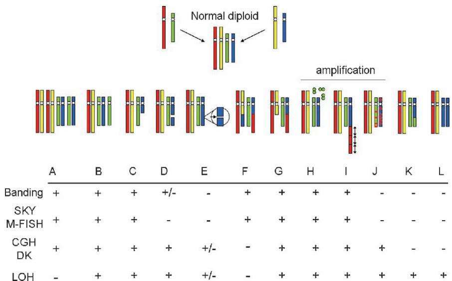  
그림 1. 다양한 게놈 및 세포유전학적 접근법을 이용한 염색체 이상 검출 및 매핑. A, 다배체(polyploid); B, 이배체(aneuploid); C, 거대 결실(gross deletion); D, 사이질 결실(interstitial deletion); E, 미세 결실(microdeletion); F, 상호 전좌(reciprocal translocation); G, 비상호 전좌(nonreciprocal translocation); H, 이중 미세 염색체(double minutes); I, HSR; J, 분산 삽입(distributed insertion); K, 체세포 재조합(somatic recombination); L, 중복 및 소실 (Zhou et al., 2006에서 수정됨; Future Drugs Ltd의 허가를 받아 게재) (컬러 플레이트 참조)

이 장에서는 DNA 수준에서 종양 게놈 특성 분석의 최근 기술적 발전을 조사하고, 암 예측, 진단, 치료 및 예후를 위한 게놈 마커/타겟을 정의하는 데 남아 있는 주요 과제들을 고려합니다. 또한 고형 조직 악성 종양의 진단 및 치료를 개선하기 위해 이러한 뛰어난 과제들을 극복할 수 있는 잠재적인 해결책을 식별합니다.

# 2 널리 사용되는 게놈 접근법의 기술적 개요

# 2.1 체계적 복제수 분석

CGH는 게놈 전체에 걸쳐 유전자 복제수 이상(증폭 및 결실)을 조사하기 위해 개발되었습니다 (Kallioniemi et al., 1992). 전형적인 CGH 분석에서는 차등적으로 표지된 테스트/질병 및 대조 게놈 DNA를 정상 중기 염색체에 공동 하이브리드 형성하여 DNA 복제수 변이의 세포유전학적 표현을 제공하는 염색체 길이를 따른 형광 비율을 생성합니다. 이는 DNA 함량 변이에 대해 전체 게놈을 스캔하는 최초의 효과적인 접근법이었습니다 (Pinkel and Albertson, 2005a , b). 그러나 염색체 기반 CGH는 매핑 해상도가 제한적입니다(~10-20Mb). 어레이 기반 CGH는 마이크로어레이된 DNA 요소의 형광 비율이 유전자 복제수 변이의 위치별 측정을 제공하는 2세대 접근법입니다 (Pinkel et al., 1998 ; Ishkanian et al., 2004) (그림 2). 이 접근법은 잠재적으로 매핑 해상도를 높일 수 있지만, 대부분의 어레이 CGH 방법은 공간적 민감도를 제한하는 큰 게놈 클론(예: 박테리아 인공 염색체(BAC))을 활용해 왔습니다. 또한 큰 게놈 클론은 일반적인 반복 서열(예: Alu 및 LINEs), 중복 서열(예: 저복제 반복 서열(LCRs), 분절 중복(segmental duplications)이라고도 함), 광범위한 서열 유사성 세그먼트(위유전자(pseudogenes) 또는 파랄로그 유전자(paralogous genes))의 포함으로 인해 특이성이 감소하는 문제도 겪습니다 (Mantripragada et al., 2004).

최근 인간 게놈 서열의 완성으로 CGH 분석을 위한 몇 가지 추가적인 고밀도 도구들이 사용 가능해졌습니다. 여기에는 cDNA 어레이 기반 CGH (Pollack et al., 1999 ; Zhou et al., 2004b), 올리고뉴클레오티드 어레이 기반 CGH (Lucito et al., 2003 ; Brennan et al., 2004), 타일링 어레이 기반 CGH (Ishkanian et al., 2004), 그리고 고밀도 SNP 마이크로어레이를 이용한 복제수 분석 (Bignell et al., 2004 ; Zhao et al., 2004 , 2005 ; Zhou et al., 2004d) 등이 포함됩니다. 타일링 및 SNP 어레이 기반 접근법은 높은 해상도로 인해 가장 많은 주목을 받았습니다. 타일링 어레이는 표적 프로브 사이의 거리로 인해 많은 간격이 포함된 마커 기반 게놈 어레이가 놓칠 수 있는 작은(유전자 수준) 이득 및 손실(해상도 40kb)을 해결할 수 있는 잠재력이 있습니다 (Ishkanian et al., 2004 ; Davies et al., 2005). 미래에는 훨씬 더 높은 해상도의 타일링 어레이가 사용 가능해져 게놈 변화를 거의 염기쌍 해상도로 매핑할 수 있는 기회를 제공할 것으로 예상됩니다. SNP 어레이 기반 접근법은 동시 CGH 및 LOH 분석의 고유한 장점을 제공하며, 이는 아래에서 더 자세히 논의됩니다 (Zhao et al., 2004 ; Zhou et al., 2004d).

# 2.2 체계적 대립유전자 불균형 분석

염색체 수차에는 다형성 유전자좌(polymorphic loci)에서 LOH로 식별 가능한 대립유전자 불균형 세그먼트가 포함되며, 이는 종양 억제 유전자를 보유한 영역을 식별하는 데 사용될 수 있습니다. 유사 분열 재조합, 유전자 전환(gene conversion) 또는 비분리(nondisjunction)로 인해 발생하는 대립유전자 손실은 CGH로 검출할 수 없으므로 식별을 위해 LOH 분석이 필요합니다. 이 접근법은 종양 억제 유전자를 찾기 위한 너드슨의 2-히트 가설(Knudson two-hit hypothesis) (Knudson, 1971 , 1996)에 의해 "선호"됩니다. 최초의 종양 억제 유전자인 RB1 (Friend et al., 1986)의 발견은 종양 억제 유전자가 한 대립유전자의 열성 돌연변이에 이어 다른 야생형 대립유전자의 소실(LOH로 검출 가능)에 의해 비활성화된다는 너드슨의 2-히트 가설을 따랐습니다. 전통적으로 암 샘플과 일치하는 정상 샘플의 DNA 대립형(allelotypic) 비교를 통해 LOH를 검출하기 위해 제한 효소 조각 길이 다형성(RFLPs) 및 마이크로새틀라이트 마커와 같은 다형성 마커가 사용되었습니다 (Vogelstein et al., 1989). 그러나 이 접근법은 지루하고 노동 집약적이며 대량의 샘플 DNA가 필요하여 적은 수의 마커만 스크리닝할 수 있었습니다. 고밀도 전 게놈 대립유전자형 분석(allelotyping)은 쉽게 수행할 수 없었습니다. 인간 게놈 매핑을 통해 수백만 개의 SNP 유전자좌(http://www.ncbi.nlm.nih.gov/SNP/)를 식별할 수 있게 되었으며, 이는 LOH를 포함한 다양한 유전 분석에 이상적인 마커가 되었습니다. 풍부함, 고른 간격 및 게놈 전체의 안정성으로 인해 SNP는 정확한 복제수 측정과 함께 고해상도 전 게놈 대립유전자형 분석의 기초로서 RFLPs 및 마이크로새틀라이트 마커에 비해 상당한 장점이 있습니다. 최근 대규모 고처리량 SNP 분석을 지원하기 위해 고밀도 올리고뉴클레오티드 어레이가 생성되었습니다 (Wang et al., 1998). 이제 Affymetrix Mapping 500K SNP 올리고뉴클레오티드 어레이를 사용하여 500,000개 이상의 SNP 마커를 유전자형 분석할 수 있습니다. SNP 어레이 분석에 의해 생성된 LOH 패턴은 높은 해상도를...

(Hoque et al., 2003 ; Lieberfarb et al., 2003 ; Wang et al., 2004 ; Zhou et al., 2004c , d). 이 SNP 어레이 기반 접근법의 한 가지 독특한 장점은 어레이 프로브에 대한 샘플 하이브리드 형성 강도를 사용하여 (CGH와 유사하게) 복제수 변화를 추론할 수 있다는 것입니다 (그림 3) (Bignell et al., 2004 ; Zhao et al., 2004 ; Zhou et al., 2004d). 이 고유한 기능은 dChipSNP (Zhao et al., 2004) 및 복제수 분석 도구(Copy Number Analysis Tool) (Huang et al., 2004)를 포함한 여러 독립적인 생물정보학/통계 소프트웨어 패키지에 구현된 알고리즘에 의해 탐구되었습니다. 고밀도 SNP 어레이의 데이터를 분석하기 위한 이러한 새로운 분석 도구의 사용으로 이제 DNA 복제수 분석을 LOH 분석과 결합하여 복제수 증가, 복제수 중립 대립유전자 소실 및 복제수 감소를 구별하고 종양 게놈의 구성을 포괄적으로 매핑할 수 있게 되었습니다 (Zhao et al., 2004).

# 2.3 세포유전학 기반 접근법: 새로운 변화가 가미된 오래된 기술

세포유전학은 1969년 염색체 분염법(chromosome-banding techniques)의 도입 이후 번창했습니다 (Caspersson et al., 1969a , b). 이러한 접근법의 주요 단점 중 하나는 관심 세포의 시험관 내 배양 및 중기 표본 준비가 필요하다는 점이며, 이는 고형암 연구에 대한 적용을 제한합니다. 그럼에도 불구하고 세포유전학적 접근법은 염색체 이상의 직접적인 가시화를 용이하게 하기 때문에 게놈 프로파일링에서 계속해서 중요한 역할을 하고 있습니다. 이러한 세포유전학 기술은 DNA 복제수 분석으로는 해결되지 않는 염색체 구조적 재배열에 대한 정보를 제공함으로써 CGH 및 LOH를 보완합니다. 예를 들어, 전좌(translocation)는 암에서 가장 흔한 게놈 이상 중 하나이지만 (Futreal et al., 2004), CGH나 LOH로는 검출할 수 없습니다. 그러나 숙련된 세포유전학자는 핵형 분석(염색체 분염)과 같은 고전적인 세포유전학 기술을 사용하여 다양한 형태의 염색체 전좌를 쉽게 검출할 수 있습니다. 핵형 분석은 일반적으로 세포의 유사 분열을 차단하고, 아데닌(A)과 티민(T) 염기쌍이 풍부한 염색체 영역을 기엠사(Giemsa) 염료로 염색하여 어두운 띠를 생성한 후 응축된 염색체를 현미경으로 관찰하는 과정을 포함합니다. 핵형 분석은 미국과 캐나다에서 산전 및 산후 스크리닝뿐만 아니라 암(특히 혈액암) 진단을 위한 표준 임상 시험의 일부로 연간 500,000회 이상 수행됩니다. 그러나 많은 암세포는 해석하기 어려운 복잡한 핵형을 가지고 있습니다 (그림 1에 예시됨). 최근에는 분자 세포유전학 분야에서 스펙트럼 핵형 분석(SKY), 다중 형광 인 시추 하이브리드 형성(M-FISH), 종간 컬러 분염(Rx-FISH), 색 변화 핵형 분석(CCK) (Henegariu et al., 1999) 및 다색 염색체 분염을 포함한 몇 가지 새로운 표지 기술이 도입되었습니다. 이러한 기술들은 모든 염색체를 동시에 볼 수 있게 해줍니다...

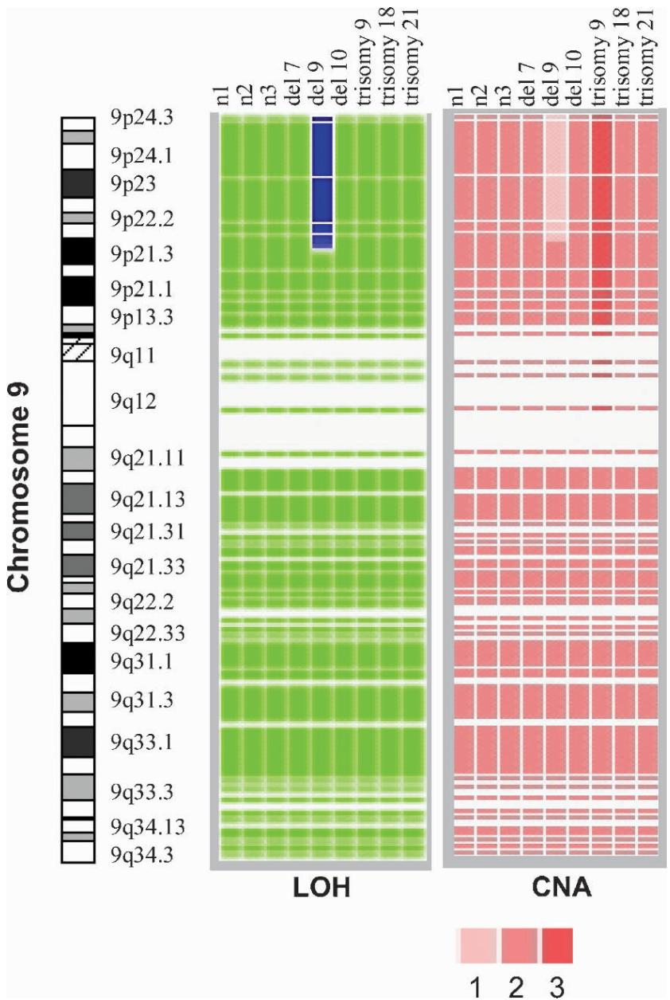  
그림 3. 고밀도 SNP 어레이를 이용한 LOH 및 CNA 동시 분석. LOH 영역과 CNA 영역은 이전에 설명된 대로 검출 및 구획화되었습니다 (Lin et al., 2004 ; Zhao et al., 2004 ; Zhou et al., 2004c , d). 9개 세포주에 대한 9번 염색체의 LOH 및 CNA 패턴이 표시되었습니다: 정상 세포(n1, n2, n3), 삼염색체 세포(삼염색체 9, 삼염색체 18, 삼염색체 21, 각각 9pter > q13, 18, 21의 추가 복제본 포함) 및 결실 세포(del(7), del(9), del(10), 각각 7pter > q34, 9pter > p21, 10qter > p11에서 결실 포함). 각 열은 하나의 샘플을 나타내고, 각 행은 하나의 SNP 마커를 나타냅니다. LOH 프로파일링 색상 코드(오른쪽 패널): 파란색 = LOH; 연한 녹색 = 유지됨; 회색 = 비정보성; 흰색 = 호출 없음. 복제수(왼쪽 패널)는 그림에 표시된 대로 빨간색의 강도 차이로 표현되었습니다 (Zhou et al., 2004d에서 수정됨; Springer Science and Business Media의 허가를 받아 게재) (컬러 플레이트 참조)

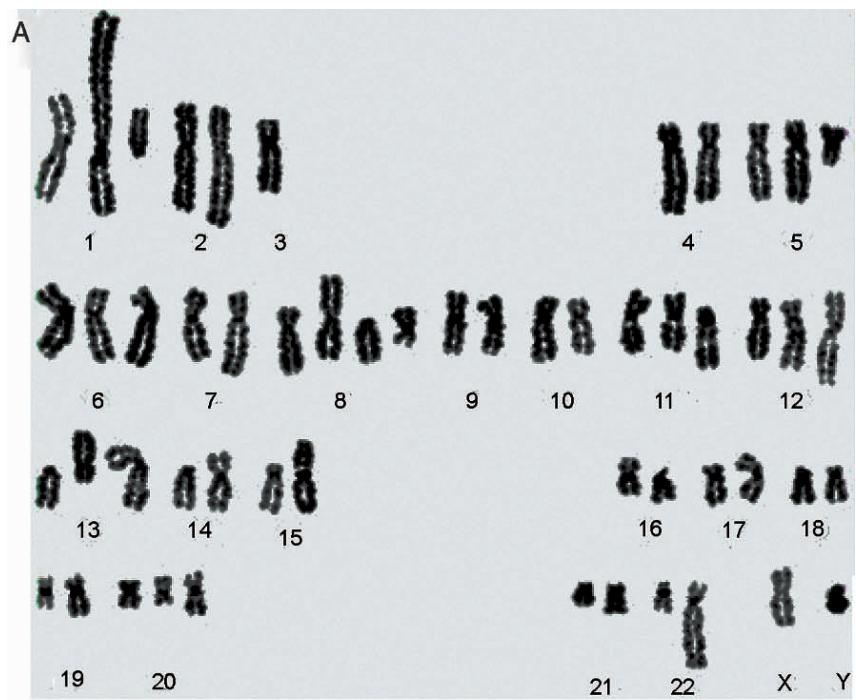

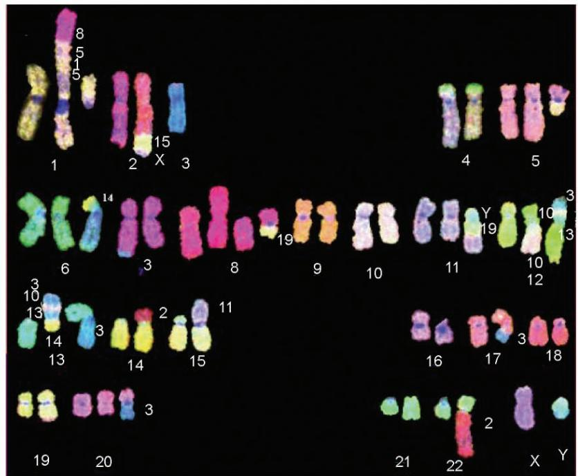  
B   
그림 4. 급성 골수성 백혈병(AML) 환자의 비정상 골수 세포에 대한 포괄적 세포유전학적 특성 분석. (A) 표준 트립신 기엠사 분염법 기반 핵형 분석. (B) Abbott-Vysis SpectraVysion 분석을 이용한 M-FISH 수행. 이 CML 환자의 고배수체 핵형은 수많은 복잡한 구조적 재배열을 가지고 있습니다. 핵형 분석과 M-FISH 분석의 동시 수행은 게놈 이상의 복잡한 특성을 명확하게 묘사했습니다 (컬러 플레이트 참조)

# 2.4 포괄적 게놈 접근법

암 연구의 핵심 목표는 종양 세포의 행동과 임상 결과를 결정짓는 복잡한 게놈 수차를 포괄적으로 기술하는 것입니다. 이 문제에 대한 한 가지 잠재적 접근법은 게놈 변화의 포괄적인 스크리닝을 위해 CGH 또는 LOH와 같은 분자 유전 기술을 분자 세포유전학 분석과 결합하는 것입니다. 이러한 기술들은 각각 고유한 장점과 개별적인 한계를 가지고 있으며, 이는 그림 5에 표시된 것처럼 여러 접근법을 결합하려는 노력을 자극합니다. 이 예에서 SNP 어레이 기반 LOH 및 CGH 분석은 복제수 이상의 고해상도 매핑을 제공하지만, 염색체 구조/공간적 변화(예: 암 유전자 조사에서 등록된 가장 흔한 체세포 돌연변이 클래스인 전좌; Futreal et al., 2004)에 대한 정보는 거의 제공하지 않습니다. 반면, 현대적인 세포유전학 기술은 거시적인 염색체 구조/공간적 변화의 명확한 그림을 제공하지만 해상도는 제한적입니다. 이는 골수이형성 증후군(MDS)의 세 가지 게놈 샘플에 대해 세포유전학 및 SNP 어레이 기반 LOH 분석을 동시에 수행한 그림 5에 잘 나타나 있습니다. 세 사례 중 두 사례는 핵형 분석과 SNP 어레이 기반 LOH 사이에 일치하는 결과를 보였습니다. 그러나 그림 5a에 표시된 사례 1의 경우, SNP 어레이 기반 접근법은 염색체 팔 5q의 소실을 식별했지만, 중심근처 영역(pericentromeric region)에서 14번 염색체가 5번 염색체로 전좌된 것을 식별하지 못했습니다. 이 전좌는 핵형 분석에 의해 확인되었으며 전체 염색체 페인팅(whole chromosome paint)에 의해 더욱 확인되었습니다 (그림 5b, c). 이러한 결과는 어레이 기반 접근법과 세포유전학적 접근법의 상호 보완적인 강점을 결합한 다중 모드(multimodal) 종양 게놈 분석 접근법의 장점을 잘 보여줍니다.

마이크로어레이 기반 유전자 발현 분석의 최근 기술적 발전은 암의 진단, 치료 및 예후 단계를 획기적으로 개선할 수 있는 기회를 제공합니다. 마이크로어레이 기반 발현 분석의 지속적인 발전과 대규모 공공 마이크로어레이 데이터 저장소는 정적인 RNA 전사 수준 외에도 이러한 데이터로부터 추가적인 생물학적 정보를 추출하려는 새로운 노력을 자극했습니다. 그러한 시도 중 하나는 마이크로어레이 발현 데이터에서 공간적으로 연결된 변화로부터 염색체 구조적 변화를 추론하는 것입니다. 몇몇 어레이 CGH 연구는 유전자 발현과 복제수 변화 사이의 게놈 전반의 상관관계를 보여주었으며 개별 앰플리콘(amplicon) 정제에 유용함을 입증했습니다 (Pollack et al., 2002 ; Wolf et al., 2004). 예를 들어, 조직 마이크로어레이 FISH 및 RT-PCR을 통해 다수의 유방암 종양에서 ERBB2 (Her2) 주변의 최소 증폭 영역이 식별되었으며, 또한 유전자 증폭이 해당 샘플의 하위 집합에서 유전자 발현 증가와 상관관계가 있음이 발견되었습니다 (Kauraniemi et al., 2003). 최근 몇몇 그룹은 염색체 변화가 인간 종양 및 종양 유래 세포주에서 지역적 유전자 발현 편향을 초래할 수 있음을 관찰했습니다 (Phillips et al., 2001 ; Virtaneva et al., 2001 ; Crawley and Furge, 2002 ; Zhou et al., 2004a , 2005). 최근의 한 연구는 또한 SNP 어레이 기반 LOH 프로파일과 발현 프로파일 사이의 상관관계를 입증했습니다 (Wang et al., 2004). 이러한 연구들은 유전자 발현 값의 일부(15–25%)가 염색체 DNA 함량과 일치하게 조절됨을 시사합니다 (Phillips et al., 2001 ; Virtaneva et al., 2001 ; Crawley and Furge, 2002 ; Zhou et al., 2004a , 2005). 차등적 유전자 발현을 기반으로 DNA 복제수 이상을 검출하기 위해 몇 가지 통계적 방법이 개발되었으며 유망한 결과를 보여주었습니다 (Crawley and Furge, 2002 ; Myers et al., 2004 ; Zhou et al., 2004a , 2005). 그림 6에 나타난 바와 같이, RNA 발현 데이터로부터 DNA 변화의 "역추론(reverse inference)" 기술은 CGH 및 LOH와 같은 DNA 기반 접근법과 결합될 때 여러 생물학적 수준에서 기능적 게놈 변화의 교차 검증을 제공할 수 있는 게놈 프로파일링의 새로운 접근법을 제공합니다.

상향 전사 인자 역학(upstream transcription factor dynamics)의 생물정보학적 분석을 사용하여 마이크로어레이 유전자 발현 데이터로부터 추가적인 기능적 게놈 정보를 도출할 수 있습니다. 최근 발현 변화를 보이는 큰 유전자 그룹의 프로모터 내 서열 유사성을 기반으로 비정상적인 전사 인자 활성을 식별하기 위한 몇 가지 도구들이 개발되었습니다 (Frith et al., 2004 ; Cole et al., 2005). 비정상적인 전사 인자 활성은 많은 고형 종양에서 중심적인 역할을 하며, 마이크로어레이 유전자 발현 데이터로부터 이러한 변화를 역추론하는 것은 특정 전사 조절 경로가 종양에서 변경되었을 수 있음을 암시하는 구조적 게놈 조사의 결과를 교차 검증하기 위한 또 다른 메커니즘을 제공합니다.

# 3 암 치료와의 관련성

종양학자들은 오랫동안 개별 환자의 종양에 존재하는 특정 유전적 병변에 초점을 맞춘 암 표적 치료법을 찾아왔습니다. 이 개념의 구현에는 질병에 대한 정밀한 특성 분석뿐만 아니라 환자의 배경(예: 유전적 및 환경적 특성)에 대한 지식이 필요합니다. 상대적으로 좁은 범위의 핵심 유전적 결함(예: 급성 전골수성 백혈병 및 만성기 만성 골수성 백혈병)을 가진 종양의 경우, 표적 치료법의 개발 및 배포는 더 복잡하고 이질적인 종양 유형(예: 유방암 및 비소세포폐암 — NSCLC)보다 더 쉽게 달성되었습니다. 신속하고 고해상도의 게놈 분석 도구의 등장은 기초 연구(예: 발병 기전 정의)와 임상 치료 선택(예: 특정 성장 조절 경로를 표적으로 하는 치료에 적합한 환자 결정) 수준 모두에서 이러한 더 이질적인 악성 종양에 대처할 수 있는 기회를 제공합니다. 다음은 암에 대한 표적 치료의 몇 가지 성공적인 사례와 이 분야의 지속적인 발전입니다.

유전적 특징과 환자 케어 사이의 이러한 관계를 보여주는 대표적인 사례는 CLL입니다. CLL은 악성 CD5+ B 세포의 축적을 특징으로 하는 임상적으로 이질적인 질병입니다. 이는 성인에서 가장 흔한 유형의 백혈병으로, 새로 진단된 모든 백혈병의 최대 25%를 차지합니다. CLL 환자 중 일부는 비공격적인 경과를 보이며 종종 치료가 필요하지 않지만, 다른 환자들은 급격한 진행을 보입니다. 한 가지 주요한 최근 발전은 세포유전학적 특징(11q 결실), 돌연변이 상태(예: 면역글로불린 중쇄 가변 유전자의 돌연변이), 유전자 발현 마커(예: CD38 및 ZAP-70) 및 일부 혈청 마커를 포함한 분자 및 유전적 예후 인자의 식별이며, 이는 초기 환자에서 급격히 진행될 가능성이 있는 환자를 식별하는 데 사용될 수 있습니다 (Stilgenbauer and Dohner, 2005). 이는 질병의 예측 가능한 공격성을 기반으로 환자 관리를 맞춤화할 수 있는 기회를 제공합니다. 따라서 분자 및 유전적 발견은 CLL 관리 결정과 궁극적으로 신약 개발에 점점 더 많은 영향을 미치고 있습니다.

유전적 특성 분석을 사용하여 약물 개발 및 배포를 안내하는 또 다른 좋은 예는 CML입니다. CML 환자에게서 발견되는 특정 염색체 이상으로 인해 발생하는 BCR-ABL 융합 단백질을 표적으로 하는 약물을 설계하기 위한 여러 노력이 진행되고 있습니다. 그러한 예 중 하나는 대부분의 환자에서 CML의 진행을 성공적으로 제어한 이마티닙(노바티스 온콜로지)입니다 (Druker et al., 2001 ; O’Brien et al., 2003). 그러나 4.5년 후 재발률이 전체적으로 약 16%이고 질병의 진행 단계에 있는 환자에서 더 높기 때문에 질병을 완치시키는 것으로 보이지는 않습니다. 암세포가 BCR-ABL 단백질이 더 이상 약물의 표적으로 인식되지 않도록 돌연변이를 일으킴에 따라 환자들은 이 약물에 대해 내성을 갖게 되는 것으로 보입니다. 따라서 AMN107(브리스톨 마이어스 스퀴브)과 이마티닙을 결합하는 것과 같은 다양한 CML 임상 연구가 진행 중입니다 (Shah et al., 2004 ; Burgess et al., 2005). 다른 접근법은 BCR-ABL에 의해 영향을 받는 경로의 다른 분자를 표적으로 하는 약물과의 병용 요법을 검토하고 있습니다. 따라서 어떤 BCR-ABL 돌연변이가 발생하는지 감지하여 치료 전략을 각 환자에게 맞춤화할 수 있는 검사법이 개발될 것입니다.

악성 성장의 기계적 특성에 대한 지식 증가는 특정 타겟에 작용할 수 있는 분자 기반 치료법의 개발을 촉진했습니다. 비소세포폐암(NSCLC) 세포에서 상피세포 성장인자 수용체(EGFR)의 돌연변이가 식별되었으며, EGFR 및 그 리간드의 과발현은 많은 암의 공통적인 특징입니다. 이에 따라 EGFR은 다양한 항종양 약물 개발 전략의 매력적인 타겟이 되었습니다. 항 EGFR 항체 및 EGFR 티로신 키나아제 억제제는 이전 치료 요법에 실패한 진행성 NSCLC 환자를 치료하는 데 효능을 보여주었습니다 (Arteaga, 2003 ; Lynch et al., 2004). 이러한 발견은 진행성 NSCLC 환자의 임상 결과와 삶의 질을 개선하기 위해 표적 제제를 사용하는 것을 지지합니다. 폐암에 대한 분자 표적 치료는 단일 제제 사용에서 병용 요법(Combinational therapy) 사용으로 진화할 것으로 널리 예측됩니다. 현재 연구자들은 돌연변이가 발생했을 때 폐암에서 중요할 수 있는 최소 4개의 유전자를 알고 있습니다: EGFR, HER2, RAS, 및 BRAF (Shigematsu and Gazdar, 2006). 이러한 유전자(및 새로운 표적 유전자)에 돌연변이가 있는 환자를 식별하고 그 지식을 사용하여 이러한 돌연변이 유전자에 의해 암호화된 모든 비정상 단백질을 표적으로 삼는 것은 매우 유망한 접근법입니다.

요약하자면, 게놈 전반의 프로파일링 기술의 발전은 암의 개인 맞춤형 치료 확장에 핵심적인 역할을 할 것입니다. 위에서 설명한 게놈 전반의 분석 기술은 생물학적/임상적 상태 또는 종양의 기능적 측면과 상관관계를 가질 수 있는 포괄적인 게놈 프로파일을 제공하는 증가하는 "탑다운(top-down)" 접근법의 일부입니다. 가까운 미래에 이러한 분석은 임상 치료 결정을 내리는 데 도움을 줄 것이며, 장기적으로는 종양 진행에 대한 우리의 근본적인 이해를 실질적으로 진전시킬 수 있습니다. 개별 유전자나 단백질에 초점을 맞춘 보다 전통적인 "바텀업(bottom-up)" 연구(소위 기초 연구)는 탑다운/글로벌 접근법으로는 엿볼 수 없는 세부 사항을 계속 제공할 것입니다. 반대로, 집중 연구는 글로벌 정보의 부족으로 인해 오해를 불러일으킬 수 있습니다. 따라서 바텀업 정보와 탑다운 정보의 통합은 암의 기능적 발병 기전을 정의하고 치료법을 형성하는 데 중요한 역할을 할 것입니다. 탑다운 분석과 바텀업 분석의 통합은 또한 악성 세포 성장을 완화할 수 있는 중재법(예: 정의된 유전적 손상 부위에서 발생하는 것의 하류에 있는 성장 수차를 표적으로 하는 약물 선택)의 식별을 앞당길 수 있습니다.

# 8 백혈병의 유전자 발현 프로파일링: 발암 기전, 약물 반응성 및 임상 결과 예측 (Gene Expression Profiling of the Leukemias: Oncogenesis, Drug Responsiveness, and Prediction of Clinical Outcome)

# 8

# 백혈병의 유전자 발현 프로파일링: 종양 발생, 약물 반응성 및 임상 결과의 예측

Lars Bullinger, Hartmut Dohner, 그리고 Jonathan R. Pollack

# 초록 (ABSTRACT)

지난 수십 년 동안 치료법의 개선으로 백혈병 사이의 현저한 임상적 이질성이 드러났으며, 클론 핵형 이상(clonal karyotypic abnormalities)의 확인을 통해 형태학적으로 유사한 백혈병들이 생물학적으로는 이질적인 조혈 장애임이 밝혀졌습니다. 생물학적 및 임상적으로 관련 있는 엔티티를 정의하기 위해, 형태학적, 면역표현형적, 유전적 및 임상적 특징에 관한 현재의 지식이 새로운 WHO 백혈병 분류법에 통합되었습니다. 그럼에도 불구하고 새로 정의된 많은 백혈병 클래스는 여전히 상당한 이질성을 특징으로 하며, 이는 분자 수준에서 추가적인 질병 하위 유형이 존재함을 시사합니다. 궁극적으로 이상적인 분류 시스템은 비정상적인 유전자 발현에 반영되는 기저의 분자 유전학적 및 후성유전학적 병리 기전에 기초해야 합니다. 최근 DNA 마이크로어레이 기술을 사용하여 게놈 규모에서 백혈병 유전자 발현 패턴을 조사하는 것이 가능해졌습니다. 발현 프로파일링 방법과 혁신적인 생물정보학 분석의 결합은 백혈병 발생에 대한 새로운 통찰력을 얻고, 약물 반응성을 조사하며, 백혈병의 임상 결과를 예측하는 강력한 접근 방식을 나타냅니다. 여전히 많은 과제가 남아 있지만, 본문에서는 유전자 발현 프로파일링이 어떻게 정교한 백혈병 분자 분류학에 기여할 수 있는지 개설할 것입니다. 또한, 다른 전전체(whole genome) 접근 방식과 결합하여 새로운 치료 표적과 새로운 치료법이 확인되고, 약물 반응 및 임상 결과의 예측이 개선되어 백혈병 환자를 위한 위험 적응형 개인 맞춤형 치료 전략이 가능해질 것으로 기대합니다.

주요 단어: 백혈병, 마이크로어레이 기술, 유전자 발현 프로파일링, 클래스 발견(Class discovery), 클래스 예측(Class prediction), 약물 반응, 결과 예측

# 1 서론 (INTRODUCTION)

# 1.1 백혈병: 역사적 측면

1845년 베넷(Bennett)과 피르호(Virchow)는 독립적으로 백혈병의 첫 사례를 설명하는 두 개의 보고서를 발표했으며(Bennett, 1845; Virchow, 1845), 피르호는 이 질병을 처음으로 "백혈병(leukemia)" 또는 "흰 피(white blood)"라고 불렀습니다(Virchow, 1845). 그 이후로 생화학, 세포유전학, 세포화학, 면역학 및 이후 분자생물학의 발전은 20세기에 들어와 많은 다양한 악성 조혈계 질환을 인식하게 했습니다(Hoffbrand and Fantini, 1999). 지난 30년 동안 조혈계에 대한 이해가 비약적으로 확대되면서 백혈병이 놀라운 형태학적, 생물학적 및 임상적 이질성을 보여준다는 사실이 밝혀졌습니다. 따라서 종양 생물학을 반영하는 임상적으로 유의미한 분류 시스템이 필요합니다.

# 1.2 백혈병의 분류

백혈병의 분류는 광범위하게 기원 세포(예: 골수성 또는 림프구성)뿐만 아니라 임상 경과 속도(예: 급성 또는 만성)와 관련이 있지만, 지난 수년 동안 현대적인 분류법은 형태학적, 면역표현형적, 유전적 및 임상적 특징을 바탕으로 특정 백혈병 하위 유형을 식별해 왔습니다. 생물학적 및 임상적으로 관련 있는 백혈병 엔티티를 정의하기 위해, 현재의 세계보건기구(WHO)는 이러한 지식을 조혈 및 림프 조직 종양의 새로운 분류에 통합했습니다(Harris et al., 1999; Vardiman et al., 2002) (표 1에 요약됨). 그 결과 더욱 정교한 분류가 이루어졌으며,

표 1 조혈 및 림프 조직 종양의 WHO 분류

<table><tr><td>급성 백혈병</td><td>만성 백혈병</td></tr><tr><td>골수성 백혈병</td><td></td></tr><tr><td>재발성 유전적 이상을 동반한 AML</td><td>골수증식성 질환</td></tr><tr><td>t(8;21)(q22;q22), (AML1/ETO)를 동반한 AML</td><td>만성 골수단핵구성 백혈병</td></tr><tr><td>inv(16)(p13q22), (CBFβ/MYH11)를 동반한 AML</td><td>비정형 만성 골수성 백혈병</td></tr><tr><td>t(15;17)(q22;q12), (PML/RARα)를 동반한 AML</td><td>연소성 골수단핵구성 백혈병</td></tr><tr><td>11q23 (MLL) 이상을 동반한 AML</td><td></td></tr><tr><td>다계통 형성 이상을 동반한 AML</td><td>만성 골수증식성 질환</td></tr><tr><td></td><td>t(9;22)(q34;q11), (BCR/ABL)을 동반한 CML</td></tr><tr><td>치료 관련 AML</td><td>만성 중성구 백혈병</td></tr><tr><td></td><td>만성 호산구 백혈병</td></tr><tr><td>달리 분류되지 않은 AML</td><td></td></tr><tr><td>림프구성 백혈병</td><td></td></tr><tr><td>전구 B세포 종양</td><td>성숙 B세포 종양</td></tr><tr><td>전구 B-ALL</td><td>CLL</td></tr><tr><td>버킷 백혈병</td><td>B세포 전림프구성 백혈병</td></tr><tr><td></td><td>헤어리 세포 백혈병(Hairy cell leukemia)</td></tr><tr><td>전구 T세포 종양</td><td>성숙 T세포 종양</td></tr><tr><td>전구 T-ALL</td><td>T세포 전림프구성 백혈병</td></tr><tr><td></td><td>T세포 과립 림프구성 백혈병</td></tr></table>

예를 들어 급성 골수성 백혈병(AML)을 4가지 큰 하위 클래스(재발성 세포유전학적 이상을 동반한 AML, 다계통 형성 이상을 동반한 AML, 치료 관련 AML, 달리 분류되지 않은 AML)로 나누고, 이들은 다시 여러 개의 뚜렷한 AML 하위 유형으로 세분화됩니다. 그러나 많은 골수성 백혈병 하위 유형에 대해서는 아직 구체적인 유전적 또는 병원성 사건이 발견되지 않았습니다. 그리고 t(8;21)(q22;q22) 또는 inv(16)((p13q22)를 가진 사례와 같이 잘 정의된 AML 하위 그룹 내에서도 상당한 임상적 이질성이 관찰됩니다(Schlenk et al., 2004). 따라서 동일한 세포유전학적 범주 내에서도 분자적으로 뚜렷한 여러 하위 유형이 존재할 수 있으며, 현재의 백혈병 분류를 더욱 정교하게 다듬기 위해서는 이러한 질병에 대한 더 깊은 분자적 이해가 필요합니다.

# 1.3 세포유전학 및 분자유전학

염색체 분염법(chromosomal banding techniques)의 발명은 백혈병 생물학을 조사하는 새로운 시대를 열었습니다. 만성 골수성 백혈병(CML)은 재발성 염색체 이상인 필라델피아 염색체(Nowell and Hungerford, 1960)가 한 염색체에서 다른 염색체로의 유전 물질 전좌[t(9;22)]의 결과로 발견된 첫 번째 악성 종양입니다(Rowley, 1973). 10년 후 이 전좌로 인한 융합 유전자인 BCR-ABL(de Klein et al., 1982)이 CML에서 관찰되는 골수 증식의 원인임이 밝혀졌습니다(Konopka et al., 1985; Shtivelman et al., 1985). 그 이후로 100개 이상의 염색체 전좌가 발견되고 백혈병 세포에서 다수의 재발성 염색체 증가 및 소실이 확인되면서 백혈병 발생과 관련된 유전적 기전에 대한 우리의 이해가 바뀌었습니다(Rowley, 1999).

최근 분자유전학의 발전으로 t(8;21) 또는 inv(16)으로 인해 발생하는 단일 융합 유전자(예: RUNX1-CBFA2T1 또는 CBFB-MYH11)의 발현이 골수 분화를 차단할 수는 있지만, 그 자체만으로는 백혈병을 유발하지 않는다는 사실이 밝혀졌습니다(Okuda et al., 1998; Castilla et al., 1999). 그러나 FLT3 또는 RAS 패밀리 구성원과 같이 지속적으로 활성화된 신호 전달 분자는 골수 증식 표현형을 유도할 수 있습니다(Kelly et al., 2002; Chan et al., 2004). 오늘날 백혈병의 다단계 발병 기전을 주장하는 더 많은 증거가 있으며, 골수성(Frohling et al., 2005; Licht and Sternberg, 2005) 및 림프구성(Armstrong and Look, 2005; Pui and Evans, 2006) 악성 종양 모두에서 병인학적으로 중요한 많은 돌연변이가 확인되었습니다.

# 1.4 치료 옵션: 새로운 약물

세포 독성 약물의 병용 요법과 줄기세포 이식의 병행은 백혈병의 완치율을 높였으며(Brenner and Pinkel, 1999), 특히 소아 급성 림프구성 백혈병(ALL)은 80% 이상의 전체 완치율을 보입니다(Pui and Evans, 2006). 그러나 세포 독성 약물의 최적 사용과 위험 지향 치료를 위한 현재 예후 인자의 엄격한 적용에도 불구하고 성인의 완치율은 훨씬 낮아 새로운 표적 치료법의 필요성을 시사합니다.

급성 전골수성 백혈병(APL)은 t(15;17)로 인해 발생하는 융합 유전자 산물인 PML-RARA의 변형 잠재력을 구체적으로 겨냥하는 분자 표적 제제인 all-trans retinoic acid(ATRA)로 성공적으로 치료된 최초의 인간 백혈병이었습니다(Huang et al., 1988). 마찬가지로 CML은 BCR-ABL로 인한 분자적 결함을 구체적으로 겨냥하도록 소분자 억제제가 설계된 최초의 질환이었습니다(Buchdunger et al., 1996; Druker et al., 1996). 그 이후로 추가적인 티로신 키나아제 억제제(예: PKC412와 같은 FLT3 억제제), 파네실전이효소 억제제(예: tipifarnib), 탈메틸화제(예: decitabine), 히스톤 탈아세틸화효소 억제제(예: valproic acid), 단클론 항체(예: 항-CD33 항체인 gemtuzumab ozogamicin) 등을 포함하여 많은 새로운 약물이 백혈병에 효과가 있는 것으로 나타났으며(Tallman, 2005), 현재 임상 치료 시험에서 연구되고 있습니다. 새로운 치료 접근 방식이 개발되는 동안, 효율적인 환자 관리를 안내하기 위해 질병의 생물학적 및 임상적 이질성을 반영하는 개선된 위험 계층화도 필요합니다.

# 1.5 예후 인자

세포유전학은 백혈병에서 가장 강력한 예후 인자 중 하나를 나타냅니다. AML에서 환자는 기저 백혈병 핵형에 따라 위험군으로 분류됩니다(Grimwade et al., 1998; Slovak et al., 2000; Byrd et al., 2002). 최근 새로운 분자 마커의 확인으로 정상 핵형 질환을 나타내는 대규모 AML 환자 그룹과 같이 기존의 예후 하위 클래스를 추가로 분석할 수 있게 되었습니다(Frohling et al., 2005; Licht and Sternberg, 2005). 이 AML 그룹에서는 FLT3 유전자의 내부 탠덤 중복(ITD)(Frohling et al., 2002), MLL 유전자의 부분 탠덤 중복(PTD)(Dohner et al., 2002), CEBPA(Frohling et al., 2004) 및 NPM1(Dohner et al., 2005)의 돌연변이가 예후와 관련이 있으며, EVI1(Barjesteh van Waalwijk van Doorn-Khosrovani et al., 2003) 및 BAALC(Baldus et al., 2003)의 발현 수준도 예후와 관련이 있습니다. 마찬가지로 만성 림프구성 백혈병(CLL)에서 세포유전학적 수차는 면역글로불린 가변 중쇄 유전자(VH) 돌연변이 상태 외에도 예후 정보를 제공하는 중요한 마커를 제공합니다(Krober et al., 2002; Dighiero, 2005). 그러나 이러한 최근의 진전에도 불구하고, 많은 백혈병 하위 유형에 대해 백혈병 발생 기전이 아직 완전히 이해되지 않았기 때문에 여전히 일반적으로 인정되는 위험 계층화가 존재하지 않습니다.

# 2 종양 발생: 백혈병 생물학에 대한 통찰력

# 2.1 백혈병의 클래스 예측

# 2.1.1 백혈병의 유전자 발현 프로파일링

오늘날 유전학은 백혈병의 생물학적 및 임상적 이질성의 기초가 되는 분자적 변이를 포착하기 위한 다양한 실험적 접근 방식을 제공합니다. 이러한 새로운 기술 중 DNA 마이크로어레이에 기초한 전전체 유전자 발현 프로파일링(GEP)은 가장 강력한 도구 중 하나를 나타냅니다(Liotta and Petricoin, 2000; Ramaswamy and Golub, 2002). 인간 악성 종양 연구를 위한 DNA 마이크로어레이의 유용성과 가능성은 AML 및 ALL 샘플 분석에서 처음으로 입증되었습니다(Golub et al., 1999). 골룹 등(Golub et al.)의 이 획기적인 연구에서 백혈병은 유전자 발현 프로파일링 기반 종양 분류의 잠재력을 입증하는 초기 시험 사례가 되었습니다. 비지도 클래스 발견 방법(자기 조직화 지도)은

이러한 클래스에 대한 사전 지식 없이도 AML과 ALL 사이의 구분을 인식했으며, 근접 분석에서 파생되어 가중 투표 절차를 사용하여 적용된 지도 클래스 예측기는 새로운 백혈병 사례의 클래스를 높은 정확도와 예측력으로 할당했습니다(Golub et al., 1999). 예기치 않게도 많은 차별적 유전자는 조혈 계통의 마커가 아니라 암 발병 기전과 관련된 중요한 유전자를 인코딩하고 있었으며, 이는 암 분류에 유용한 유전자가 암 생물학에 대한 통찰력도 제공할 수 있음을 시사했습니다.

# 2.1.2 재발성 세포유전학적 수차와 관련된 유전자 발현 패턴

이 획기적인 연구가 발표된 이후 DNA 마이크로어레이 기술은 백혈병 연구 분야에 크게 기여했습니다(Staudt, 2003; Ebert and Golub, 2004). 첫째, 8번 삼염색체성(trisomy 8)을 가진 AML 사례는 8번 염색체에 위치한 유전자의 유전자 용량 효과(gene dosage effect)를 바탕으로 정상 세포유전학 사례와 다르다는 것이 밝혀졌습니다(Virtaneva et al., 2001). 이후 AML의 다른 염색체 증가 및 소실뿐만 아니라 CLL과 같은 다른 백혈병에서도 유사한 유전자 용량 효과가 발견되었습니다(Haslinger et al., 2004).

지도 학습 분석 접근 방식을 사용하여 요 등(Yeoh et al.)은 소아 ALL에서 뚜렷한 발현 프로파일이 T-ALL, E2A-PBX1, BCR-ABL, TEL-AML1, MLL 재배열 및 과이면성(hyperdiploid) 핵형(50개 이상의 염색체)을 가진 ALL을 포함하여 예후적으로 중요한 백혈병 하위 유형을 식별한다는 것을 처음으로 설명했습니다(Yeoh et al., 2002). 소아 및 성인 ALL 모두에서 후속 연구를 통해 확인되었듯이(Armstrong et al., 2002; Ross et al., 2003; Fine et al., 2004), 유전자 발현 기반의 차별화는 inv(16), t(8;21), t(15;17) 및 t(11q23)/MLL을 포함하여 세포유전학적으로 정의된 AML 하위 그룹에 대해서도 입증될 수 있었습니다(Schoch et al., 2002; Debernardi et al., 2003; Kohlmann et al., 2003; Bullinger et al., 2004; Ross et al., 2004; Valk et al., 2004) (그림 1). 중요한 것은 이러한 뚜렷하고 생물학적으로 의미 있는 유전자 서명을 사용하여 각각의 세포유전학적으로 정의된 백혈병 하위 그룹을 정확하게 예측할 수 있으며(Ross et al., 2004; Haferlach et al., 2005), 소아 백혈병 샘플에서 생성된 분류기는 동일한 유전적 이상을 나타내는 성인 백혈병 사례를 정확하게 분류하는 데 사용될 수 있다는 것입니다(Kohlmann et al., 2004; Ross et al., 2004). 표본 추출 및 표적 준비의 기술적 측면에 대한 이러한 서명의 견고함을 바탕으로(Mitchell et al., 2004; Kohlmann et al., 2005), GEP는 높은 정확도로 알려진 백혈병 하위 그룹을 진단하기 위한 유용한 대안적 접근 방식을 제공할 수 있습니다(Haferlach et al., 2005; Kern et al., 2005).

# 2.1.3 분자 유전적 수차와 관련된 유전자 발현 패턴

CLL에 대한 첫 번째 GEP 연구는 VH 돌연변이 상태와 관계없이 균일한 표현형을 보여주었지만(Klein et al., 2001; Rosenwald et al., 2001), 두 연구 모두에서 지도 분석을 통해 VH 돌연변이와 연관된 발현 패턴이 밝혀졌으며, 이는 VH 돌연변이 상태의 임상적으로 중요한 대리 마커인 ZAP-70의 식별로 이어졌습니다(섹션 4.1.2 참조)(Rosenwald et al., 2001).

그 이후로 FLT3 ITD(Bullinger et al., 2004; Lacayo et al., 2004; Valk et al., 2004; Neben et al., 2005), CEBPA(Valk et al., 2004), NPM1 돌연변이(Alcalay et al., 2005; Verhaak et al., 2005) 등에 대해 AML에서 분자 유전적 수차와 연관된 유전자 발현 패턴도 설명되었습니다. 지도 분석을 통해 또한

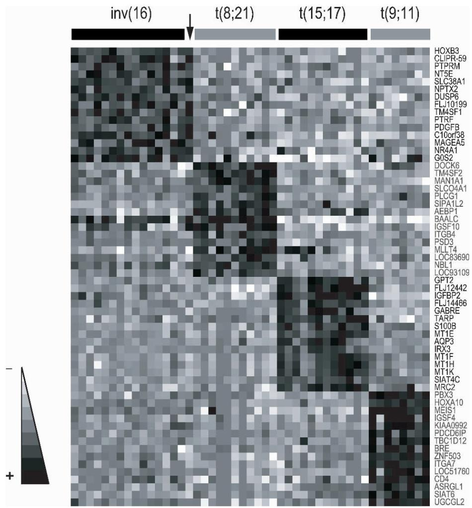  
그림 1. 백혈병 세포유전학 클래스의 유전자 발현 서명. 여기에 inv(16), t(8;21), t(15;17) 및 t(9;11)을 포함한 특정 AML 세포유전학 수차와 유의하게 상관관계가 있는 것으로 지도 분석을 통해 확인된 선택된 유전자들의 "히트 맵" 표현이 나타나 있습니다. 유전자 발현 수준은 회색조로 묘사되며, 어두운 음영일수록 높은 발현 수준을 나타냅니다. 표시된 분석은 공개적으로 사용 가능한 마이크로어레이 데이터를 사용하여 마이크로어레이 유의성 분석(SAM)을 수행했습니다(Tusher et al., 2001; Bullinger et al., 2004). 이와 같은 유전자 발현 서명은 새로운 표본의 세포유전학 그룹을 높은 정확도로 분류하는 데 사용될 수 있습니다. 화살표는 세포유전학적으로는 "정상 핵형"으로 특징지어졌으나, 이후 RT-PCR을 통해 inv(16) 사례의 특징인 진단적 CBFB-MYH11 융합 전사체가 확인된 표본을 나타냅니다.

중심체 수차(centrosome aberrations)와 상관관계가 있는 유의미한 패턴도 확인되었습니다(Neben et al., 2004). 그러나 뚜렷한 유전자 발현 서명을 보이는 MLL 유전자 관련 전좌와는 대조적으로, 대규모 연구에서 MLL PTD 사례에 대해서는 특징적인 패턴이 확인되지 않았습니다(Bullinger et al., 2004; Ross et al., 2004). 이는 MLL PTD 사례가 분자 수준에서 더 이질적이며 t(11q23)을 동반한 AML과는 상당히 다를 수 있음을 시사합니다. 마찬가지로 NRAS 돌연변이가 있는 AML 사례와 관련된 서명도 아직 발견되지 않았으며(Neben et al., 2005), 이는 백혈병의 모든 유전적 변화가 정의 가능하게 변경된 유전자 발현 패턴을

초래하는 것은 아님을 강조합니다. 가능한 설명으로는 해당 돌연변이가 전사 후 수준에서 신호 전달 경로에 영향을 미치거나(즉, mRNA 수준을 변경하지 않고), 관련 발현 패턴이 미묘하거나 추가적인 기저 병인 기전에 의해 가려졌기 때문일 수 있습니다.

# 2.2 백혈병의 클래스 발견

유전자 발현 데이터에 비지도 분석 접근 방식을 적용함으로써 임상적으로 유의미한 암의 새로운 하위 유형을 식별할 수 있습니다. 유전자 발현 기반의 새로운 임상 관련 종양 하위 클래스 발견은 미만성 대형 B세포 림프종(DLBCL)이라는 조혈계 악성 종양에 대해 처음 보고되었습니다(Alizadeh et al., 2000). 계층적 군집 분석을 사용하여 알리자데 등(Alizadeh et al.)은 B세포 분화의 서로 다른 단계를 나타내는 패턴으로 특징지어지는 분자적으로 뚜렷한 두 가지 DLBCL 하위 유형을 확인했습니다. 이러한 패턴은 이후 독립적인 연구에서 확인되었으며 그 임상적 중요성도 입증되었습니다(Rosenwald et al., 2002; Shipp et al., 2002).

골룹 등(Golub et al., 1999)의 중추적인 연구 외에도 백혈병에서 GEP 기반 클래스 발견의 잠재력을 입증한 초기 연구 중 하나는 치료 관련 AML(t-AML) 사례를 조사했습니다(Qian et al., 2002). 저자들은 초기 전구 세포에서 분화가 중단된 전형적인 공통 패턴을 보이는 t-AML 하위 그룹을 식별했지만, 각 t-AML 하위 그룹은 t-AML의 생물학에 대한 새로운 통찰력을 제공하는 특징적인 유전자 발현 서명도 보여주었습니다(Qian et al., 2002).

285명의 AML 환자를 대상으로 한 최근 연구에서 발크 등(Valk et al.)은 유전자 발현 패턴의 비지도 군집 분석을 통해 16개의 AML 표본 클러스터(하위 그룹)를 식별했습니다(Valk et al., 2004). 양호한 세포유전학을 가진 표본은 일반적으로 균일한 군집을 나타낸 반면, 새로운 클러스터는 종종 특정 분자적 변화의 높은 빈도를 특징으로 했습니다. 예를 들어 두 개의 클러스터(그들의 클러스터 #1 및 #16)는 둘 다 주로 t(11q23)/MLL 이상이 있는 사례를 포함했습니다. 그러나 발크 등은 비지도 분석에 원래의 2,856개 프로브 세트보다 더 많은 수를 포함했을 때 inv(16) 또는 t(8;21)가 있는 사례와 같이 "균일하게 그룹화된" 클래스 내에서도 분자적 변이를 관찰했습니다(Valk et al., 2004).

그에 맞춰 당사의 AML 연구에서도 세포유전학적으로 잘 특성화된 t(8;21) 및 inv(16) 그룹 내에서 상당한 분자적 이질성을 발견했으며, 각 클래스는 6,283개 유전자를 사용한 비지도 군집 분석을 통해 주로 두 그룹으로 나뉘었습니다(Bullinger et al., 2004). 일차 전좌/역위 사건 자체만으로는 백혈병 발생에 충분하지 않기 때문에(Okuda et al., 1998; Castilla et al., 1999), 이러한 t(8;21) 및 inv(16) 하위 그룹 내의 뚜렷한 유전자 발현 패턴은 형질 전환으로 이어지는 대안적인 협력 돌연변이/탈규제 경로를 시사할 수 있습니다.

흥미롭게도 당사 연구의 정상 핵형 사례도 주로 두 개의 뚜렷한 그룹으로 분리되었으며(그림 2), 각 그룹에는 다른 세포유전학적 클래스의 소수 사례가 포함되어 있었습니다(Bullinger et al., 2004). 한 하위 그룹에서는 FLT3 수차가 더 널리 퍼져 있었고, 다른 하위 그룹에서는 FAB(French American British) M4/M5 형태학적 하위 유형이 더 많이 나타났습니다. 특히 카플란-마이어(Kaplan-Meier) 분석을 통해 두 하위 클래스 사이의 전체 생존율에서 통계적으로 유의미한 차이가 확인되었습니다(Bullinger et al., 2004). 이러한 결과와 일치하게 발크 등은 FLT3 ITD와 연관된 정상 핵형 주도 클러스터뿐만 아니라 주로 AML 하위 유형 M4 또는 M5 환자의 표본을 포함하는 클러스터를 식별했습니다(Valk et al., 2004).

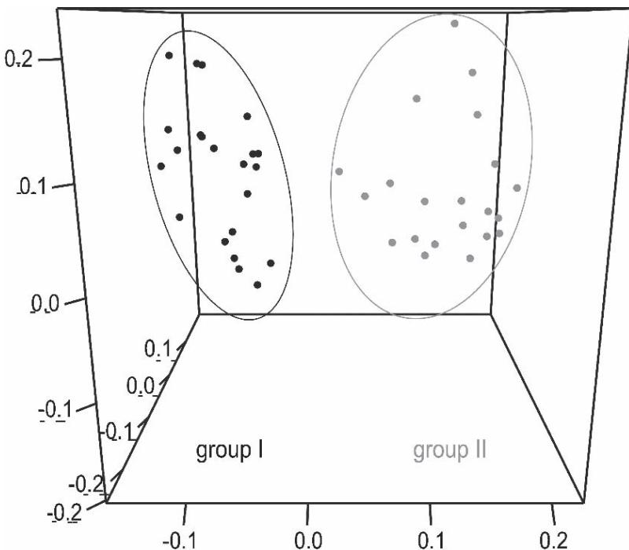  
그림 2. 백혈병의 새로운 분자 하위 유형 발견. 정상 핵형을 가진 AML 표본에 대해 가변 유전자 발현의 세 가지 주요 성분 투영을 보여주는 비지도 주성분 분석(PCA) 결과가 나타나 있습니다. PCA는 뚜렷한 유전자 발현 패턴을 바탕으로 정상 핵형 AML 사례의 두 가지 새로운 하위 그룹(각각 검은색과 회색 점으로 표시됨)을 식별합니다. 그룹 II 사례는 골수단핵구성 분화가 더 빈번하게 나타나는 반면, 그룹 I 사례는 FLT3 돌연변이를 더 자주 보유하며 짧은 전체 생존 기간과 관련이 있습니다. 데이터 출처: (Bullinger et al., 2004)

또한 발크 등의 연구(Valk et al., 2004)는 증가된 EVI1 발현 및 좋지 않은 치료 결과와 연관된 독특한 클러스터를 밝혀냈으며, 더 짧은 생존 기간과 연관된 또 다른 클러스터에는 7번 및 5번 염색체 결손(monosomy), 전좌 t(9;22)와 같이 알려진 다양한 유해 세포유전학 마커가 있는 사례들이 포함되어 있었습니다(Valk et al., 2004). 이러한 환자들의 백혈병 세포는 CD34+ 세포 샘플과 유사한 서명을 보여주었으며, 이는 이러한 백혈병 세포가 CD34+ 조혈 전구 세포와 같이 치료에 저항력이 있을 수 있음을 시사합니다. 이러한 초기 연구들은 새로운 백혈병 하위 유형 발견을 위한 GEP의 힘을 분명히 보여줍니다(Bullinger and Valk, 2005).

# 3 약물 반응성

# 3.1 백혈병에서의 약물 효과에 대한 유전자 발현 기반 분석

# 3.1.1 레티노산 치료의 분자 서명

APL 유래 세포주에서 all-trans retinoic acid(ATRA) 치료 효과를 모니터링하는 것은 백혈병에서 DNA 마이크로어레이 기술을 적용한 첫 번째 사례 중 하나였습니다(Tamayo et al., 1999). NB4 세포에서 ATRA는 UBE1(ubiquitin-activating enzyme E1-like)의 과발현을 유도하여 APL 세포의 사멸을 촉발하고

PML-RARA 융합 유전자 산물의 분해를 일으키는 것으로 밝혀졌습니다(Tamayo et al., 1999; Kitareewan et al., 2002). NB4에서 ATRA에 의해 조절되는 다른 유전자에는 종양 괴사(TNF) 경로의 구성원이 포함되어 있어, 이 경로가 ATRA 신호 전달과 교차할 수 있음을 시사했습니다(Park et al., 2003; Witcher et al., 2003). ATRA와 TNF는 함께 NF-κB 활성을 증가시키고 이어서 NF-κB 표적 유전자의 시너지 유도를 가져왔습니다(Witcher et al., 2003). 이는 ATRA가 세포를 다른 경로의 분화 효과에 더 취약하게 만든다는 아이디어를 뒷받침합니다. 흥미롭게도 ATRA 표적 유전자의 프로모터에는 NF-κB 결합 부위가 풍부하여, ATRA에 반응하는 세포 생존 조절에서 이 경로의 역할을 더욱 뒷받침합니다(Meani et al., 2005).

# 3.1.2 이마티닙 메실레이트(Imatinib Mesylate)에 대한 CML의 감수성

전전체 DNA 마이크로어레이 기술은 BCR-ABL 융합의 ABL 키나아제 활성을 표적으로 하는 이마티닙 메실레이트에 대한 CML의 감수성을 평가하는 데에도 성공적으로 사용되었습니다(Kaneta et al., 2002; Ohno and Nakamura, 2003; Tipping et al., 2003). 세포주 모델을 사용하여 이마티닙 메실레이트 내성과 상관관계가 있는 차별적으로 발현된 유전자를 식별할 수 있었으며, 이는 대안적인 경로가 BCR-ABL과 독립적으로 생존을 유지하고 성장을 촉진할 수 있음을 시사합니다(Tipping et al., 2003). 또한 CML 환자 18명의 표본 분석에서 반응자와 비반응자는 단 몇 개의 유전자 발현 패턴만으로 명확하게 구분될 수 있었습니다(Kaneta et al., 2002; Ohno and Nakamura, 2003). 이러한 발견을 입증하기 위해 더 큰 샘플 세트에 대한 조사가 필요하겠지만, 이마티닙 내성과 연관된 유전자 발현 패턴은 CML 치료 결정을 안내하는 데 도움이 될 수 있습니다.

# 3.1.3 CLL에서의 플루다라빈(Fludarabine) 반응 서명

퓨린 유사체인 플루다라빈은 B세포 CLL의 현재 표준 치료 요법의 구성 요소입니다. 플루다라빈은 시험관 내에서 CLL 세포의 사멸을 유도할 수 있지만, 여러 분자 기전이 관찰된 세포 독성에 기여할 수 있습니다. 로젠월드 등(Rosenwald et al.)은 최근 GEP를 사용하여 CLL 환자 샘플에 대한 플루다라빈 치료의 분자적 결과를 조사했습니다(Rosenwald et al., 2004). 시험관 내 및 생체 내 플루다라빈 노출 모두에서 p53 표적 유전자와 DNA 복구에 관여하는 유전자로 특징지어지는 일관된 "반응 서명"이 나타났습니다. 동종 p53 야생형 및 결실 림프모구 세포주에서의 기능 분석은 플루다라빈 반응 서명 유전자의 상당수가 p53 표적 유전자이기도 하다는 추가 증거를 제공했습니다. 이러한 발견은 p53 돌연변이가 있는 CLL 환자에서 종종 나타나는 약물 내성과 공격적인 임상 경과에 대한 분자적 설명을 제공하며, 플루다라빈 치료가 p53 돌연변이 CLL 세포를 선택할 가능성이 있으므로 치료가 필요한 환자만 치료하는 것이 중요하다는 것을 시사합니다(Rosenwald et al., 2004).

# 3.1.4 L-아스파라기나아제(L-Asparaginase)에 대한 시험관 내 반응

L-아스파라기나아제는 대부분의 ALL 치료 요법의 중요한 구성 요소이며, L-아스파라기나아제에 대한 시험관 내 및 생체 내 내성은 좋지 않은 장기 결과와 관련이 있습니다(Pui and Evans, 2006). 내성 기전에 대한 더 나은 분자적 이해는 ALL 환자의 관리를 개선할 수 있습니다. 세포주 및 소아 ALL 샘플을 L-아스파라기나아제에 노출시킨 후 GEP를 수행한 결과, tRNA 합성효소(tRNA synthetases), 용질 운반체(solute transporters), 활성 전사 인자 및 CCAAT/인핸서 결합 단백질 패밀리 구성원의 발현 증가가 밝혀졌습니다(Fine et al., 2005). 이러한 변화는

세포주와 임상 샘플 모두에서 아스파라긴 기아에 대한 일관되고 조율된 반응을 반영하는 것으로 보이며, 이는 아스파라긴 합성효소의 기저 발현 수준과는 무관합니다. 따라서 ALL 세포의 아미노산 기아 반응에 관여하는 특정 유전자를 표적으로 삼는 것은 L-아스파라기나아제 내성을 극복하는 새로운 방법을 제공할 수 있습니다(Fine et al., 2005).

# 3.2 백혈병의 약물 반응성 예측

# 3.2.1 유전자 발현 기반의 화학 요법 감수성 예측

약물 반응 예측에 대한 최초의 유전학 기반 접근 방식은 유전자 발현 프로파일을 기초로 세포주의 화학 요법 감수성을 분류하는 알고리즘의 개발이었습니다(Staunton et al., 2001). 수천 개의 화학 화합물에 대한 화학 요법 감수성 프로파일이 결정된 60개의 인간 암 세포주(NCI-60 패널)의 발현 패턴을 사용하여, 저자들은 232개 화합물에 대한 감수성 또는 내성을 예측하기 위한 유전자 발현 기반 분류기를 생성할 수 있었습니다. 독립적인 데이터 세트에 대한 평가에서 상당수의 발현 기반 분류기가 정확하게 작동하여, 화학 요법 감수성 예측에 대한 유전학적 접근이 가능하다는 것을 입증했습니다(Staunton et al., 2001).

# 3.2.2 백혈병의 화학 요법 감수성 예측

화학 요법 제제에 의해 유발되는 세포 반응의 뚜렷한 특성을 밝히기 위해, 척 등(Cheok et al.)은 메토트렉세이트(methotrexate)와 머캅토퓨린(mercaptopurine)을 단독 또는 병용으로 생체 내 투여하기 전후의 소아 ALL 세포 유전자 발현을 프로파일링했습니다(Cheok et al., 2003). 124개 유전자로 구성된 서명은 60명의 환자에게 무작위로 할당된 치료법을 정확하게 차별화했습니다. 세포 사멸, 미스매치 복구, 세포 주기 조절 및 스트레스 반응에 관여하는 유전자를 포함하는 이 서명은 단일 제제 대비 약물 병용에 대한 세포 반응의 차이를 보여주었으며, 서로 다른 ALL 하위 유형이 동일한 치료에 대해 게놈 반응의 공통 경로를 공유함을 시사했습니다.

이후 프레드니솔론(prednisolone), 빈크리스틴(vincristine), 아스파라기나아제 및 다우노루비신(daunorubicin)에 대한 시험관 내 감수성을 테스트한 연구에서 윌리엄 에반스(William Evans) 그룹은 173명의 소아 환자의 약물 감수성 및 약물 내성 ALL 백혈병 세포에서 차별적으로 발현되는 유전자를 식별했습니다(Holleman et al., 2004). 네 가지 약물에 대한 감수성 또는 내성에 따라 달라지는 유전자 발현 패턴을 바탕으로, 저자들은 내성에 대한 복합 유전자 발현 점수를 생성했으며, 이는 소아 ALL에서 예후적 관련성이 있는 것으로 나타났습니다(섹션 4.1.3 참조).

# 3.3 약물 발견

# 3.3.1 약물 발견에서의 GEP 적용

DNA 마이크로어레이 기술은 약물 표적 발견 과정의 필수적인 부분을 차지하며, 새로운 화합물의 최적화 및 임상 검증을 위한 귀중한 도구를 제공합니다. GEP는 관련 차별적 발현 패턴을 가진 것과 같은 잠재적 치료 표적의 초기 식별 및 우선순위 지정을 지원합니다. 이후 발현 프로파일링은 약물 발견 및 독성학을 보조하며, 여기서 다양한 생물정보학 접근 방식을 사용하여 발현 프로파일로부터 새로운 약물의 작용 기전뿐만 아니라 오프-타겟(off-target) 효과를 유추할 수 있습니다(Gerhold et al., 2002). mRNA의 양을

측정하는 것만으로 약물 반응을 해석하는 데 한계가 있다는 점을 고려하는 것이 중요하지만, 그럼에도 불구하고 발현 프로파일링은 약물 유전학(pharmacogenomics)에서 유용한 도구를 제공하여 환자 집단의 더 나은 특성화와 예후 및 약물 반응의 더 나은 예측을 약속합니다(Walgren et al., 2005).

# 3.3.2 반응성 서명에 기초한 항백혈병 약물 발견

최근에는 마이크로어레이를 사용하여 AML에서 분화 유도 활성을 가진 화학 화합물을 스크리닝하는 유전자 발현 기반의 고처리량 스크리닝(high-throughput screening) 접근 방식이 설명되었습니다(Stegmaier et al., 2004). 마이크로어레이 데이터에서 추출한 5개 유전자 분화 서명을 정의하고 검증한 후, 다중 RT-PCR, 단일 염기 연장 반응 및 MALDI-TOF(매트릭스 보조 레이저 탈착/이온화 비행 시간형) 질량 분석법을 사용하는 고처리량 스크리닝 방법을 설계하여 5개 유전자 패턴을 감지했습니다. 1,739개의 서로 다른 화합물로 HL-60 세포를 처리한 결과, 8개의 화학 물질이 분화 서명을 안정적으로 유도하는 것으로 나타났습니다(Stegmaier et al., 2004). 이 중 DAPH1(4,5-dianilinophthalimide)은 상피세포 성장인자 수용체(EGFR) 키나아제 활성을 억제하는 것으로 보고되었습니다(Buchdunger et al., 1994).

후속 연구에서 저자들은 식품의약국(FDA) 승인을 받은 EGFR 억제제인 게피티닙(gefitinib)이 마찬가지로 시험관 내에서 AML 세포주 및 일차 환자 유래 AML 모세포의 분화를 촉진한다는 것을 보여주었습니다(Stegmaier et al., 2005). 그러나 분석된 AML 세포는 EGFR을 발현하지 않아 게피티닙 유도 분화가 EGFR 독립적 기전일 수 있음을 시사했습니다. 따라서 이 고처리량 절차는 핵심 표적이 아직 알려지지 않은 임상적으로 유용한 화합물을 체계적으로 식별하는 데 성공적임이 입증되었습니다.

# 4 임상 결과의 예측

# 4.1 알려진 예후 인자에 대한 대리 마커 식별

# 4.1.1 "양호" 및 "불량" 세포유전학을 예측하는 서명

앞서 언급했듯이 GEP는 inv(16), t(8;21) 또는 t(15;17)을 가진 AML 사례와 같이 "양호한 위험" 세포유전학 수차와 상관관계가 있는 특정 서명의 식별 및 예측을 가능하게 합니다(Bullinger et al., 2004; Valk et al., 2004; Haferlach et al., 2005). 또는 t(12;21)이나 과이면성(백혈병 세포당 50개 이상의 염색체)을 가진 B세포 전구 ALL 사례도 마찬가지입니다(Yeoh et al., 2002; Ross et al., 2003). 마찬가지로 "불량한 위험" 세포유전학 하위 그룹뿐만 아니라 예후적으로 유의미한 분자 유전적 수차도 예측될 수 있습니다(Bullinger and Valk, 2005).

# 4.1.2 ZAP-70, GEP로 식별된 대리 마커의 임상 적용

GEP로 식별된 대리 마커 중 ZAP-70은 임상적으로 적용된 첫 번째 사례입니다. T세포 신호 전달에 필수적인 티로신 키나아제를 코딩하지만 정상 B세포에서는 발현되지 않는 ZAP-70은 돌연변이가 없는 VH 유전자를 가진 환자에서 돌연변이가 있는 유전자를 가진 환자에 비해 5배 더 높은 발현 수준을 보였으며, 두 그룹 사이의 가장 좋은 차별화 요소였습니다(Rosenwald et al., 2001). 최근 여러 연구에서 이 새로운 마커의 임상적 유용성이 입증되었습니다(Orchard et al., 2004;

Rassenti et al., 2004). 특히 ZAP-70의 발현은 백혈병 치료를 전문으로 하는 대형 임상 센터에서 흔히 사용할 수 있는 유세포 분석기(flow cytometry)를 통해 단백질 수준에서 쉽게 측정할 수 있습니다.

# 4.1.3 치료 내성의 예측

최근 화학 요법 제제에 감수성이 있거나 내성이 있는 백혈병에서 차별적으로 발현되는 유전자의 발현이 ALL의 치료 결과와 유의하고 독립적으로 연관되어 있음이 밝혀졌으며, 동일한 치료법으로 치료받은 독립적인 환자 세트에서도 결과가 확인되었습니다(Holleman et al., 2004; Lugthart et al., 2005). 마찬가지로 휴저 등(Heuser et al.)은 AML에서 화학 요법 내성과 연관된 특징적인 유전자 발현 패턴을 식별할 수 있었으며, 이는 독립적인 예후 인자였으며 AML 환자의 독립적인 테스트 세트 및 다변량 분석에서 결과를 예측하는 데 사용될 수 있었습니다(Heuser et al., 2005). 난치성 환자와 유도 화학 요법에 반응한 환자의 비교를 통해 성인 T세포 ALL의 예후 유전자도 식별되었습니다(Chiaretti et al., 2004). 또한 발현 프로파일링은 백혈병에서 높은 정확도로 미세 잔류 질환(MRD)을 예측하는 데 사용되었습니다. 치료 내성이 치료 전에 예측될 수 있는 ALL 세포의 고유한 특징을 반영한다는 가설을 세우고, 카리오 등(Cario et al.)은 높은 MRD 부하를 가진 ALL 샘플의 발현을 프로파일링했습니다(Cario et al., 2005). MRD 음성 샘플과 비교하여 내성 샘플과 감수성 ALL 샘플을 구분하는 예후 서명을 정의할 수 있었습니다.

# 4.2 예후 서명의 식별
# 4.2.1 지도 학습 접근 방식

골룹 등(Golub et al.)의 중추적인 연구는 화학 요법 반응을 예측하는 유전자를 탐구하기 위해 지도 분석을 적용한 첫 번째 연구이기도 했습니다(Golub et al., 1999). 통계적으로 유의하지는 않았지만 치료에 실패한 AML 환자에서 잠재적인 생물학적 중요성을 지닌 후보 유전자에는 AML 사례의 하위 집합에서 발현되는 것으로 알려져 있고(Dorsam et al., 2004) 최근 NPM1 돌연변이와 연관된 것으로 밝혀진 HOXA9의 과발현이 포함되었습니다(Alcalay et al., 2005). 소아 AML에서 지도 분석 접근 방식을 사용하여 좋은 결과와 나쁜 결과를 보인 환자들을 비교하여 예후 서명을 생성했지만(Yagi et al., 2003), 독립적인 데이터 세트에서는 해당 유전자 발현 패턴이 유의미한 위험 계층화를 허용하지 않았습니다(Ross et al., 2004).

CML에서는 "공격적인" 임상 경과와 "완만한" 임상 경과를 보인 환자의 CD34+ 세포를 비교하여 CML 환자의 더 긴 생존 기간을 예측하는 새로운 마커인 CD7 및 PR-3(proteinase 3)을 식별했습니다(Yong et al., 2006). 이러한 발견이 독립적인 연구를 통해 검증되기를 기다리고 있지만, 이러한 결과가 "이마티닙 이전" 시대의 샘플에서 도출되었다는 점에 주목하는 것이 중요합니다. 따라서 보고된 서명은 이마티닙으로 치료받은 CML 환자들에게서도 평가될 필요가 있습니다.

# 4.2.2 환자 결과를 예측하기 위한 반지도(Semi-supervised) 방법

결과 예측에 대한 엄격한 지도 분석 접근 방식의 한계는 생존 및 생존 기간이 종양 세포 자체 이외의 많은 것들에 의해 영향을 받기 때문에, 기저의 예후적으로 유의미한 종양 하위 클래스에 대한 대리 지표로서 매우 노이즈가 많을 가능성이 크다는 점입니다. 반면에 백혈병의 엄격한 비지도 분석은

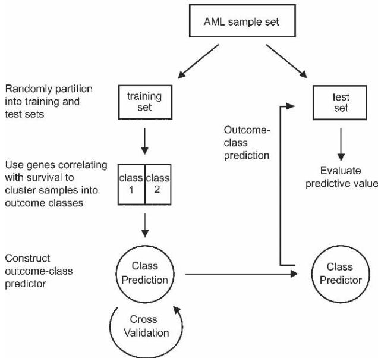  
A

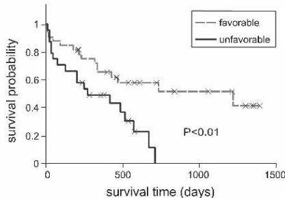  
B   
그림 3. 백혈병 결과 예측을 위한 반지도 접근 방식. (A) 지도 군집 전략의 개략적인 개요. AML 표본은 별도의 훈련 및 테스트 세트로 무작위화됩니다. 훈련 세트에서 생존과 상관관계가 있는 유전자 발현을 사용하여 샘플을 유리한 결과와 불리한 결과 클래스로 군집화합니다. 이러한 결과 클래스에 대해 최적의 유전자 발현 예측기를 구성한 다음, 독립적인 테스트 세트에서 결과를 예측하여 검증합니다. (B) 결과 예측기 평가. 독립적인 테스트 세트에 대한 카플란-마이어 생존 분석을 통해 유전자 발현 분류기(여기서는 133개 유전자로 구성됨)가 전체 생존율의 유의미한 예측 인자임을 검증합니다. 데이터 출처: (Bullinger et al., 2004)

이미 알려진 예후 가치를 지닌 세포유전학 그룹화에 의해 크게 좌우됩니다. 따라서 추가적인 예후 가치를 지닌 유전자 발현 서명을 발견하기 위해 당사는 지도 분석과 비지도 분석 접근 방식의 장점을 결합한 새로운 반지도 전략을 적용했습니다(Bair and Tibshirani, 2004). 아이디어는 표본의 지도 군집에서 생존 기간과 상관관계가 있는 유전자의 하위 집합을 사용하여 기저의 예후 관련 종양 하위 유형을 밝혀내고, 해당 하위 유형에 대한 예측기를 구축하는 것이었습니다(그림 3). 이 접근 방식을 AML 환자 코호트에 적용하여 당사는 모든 세포유전학 클래스와 임상적으로 중요한 정상 핵형 AML 사례의 대규모 하위 집합 모두에서 유의미하고 독립적인 결과 예측 인자로서 133개 유전자 서명을 정의하고 검증했습니다(Bullinger et al., 2004). 이 서명은 또한 최근 다른 마이크로어레이 플랫폼을 사용한 68명의 정상 핵형 AML 사례의 독립적인 세트에서도 검증되었습니다(Marcucci et al., 2006).

# 4.2.3 결과 예측에 대한 통합적 접근 방식

최근 글린스키 등(Glinsky et al., 2005)은 전립선암 진행의 쥐 모델과 BMI1 기반 줄기세포 자기 복제 모델의 발현 서명을 통합하여 인간 전립선암뿐만 아니라 AML을 포함한 10가지 다른 인간 암 유형에서 임상 결과를 예측하는 11개 유전자 서명을 정의했습니다. 이 연구는 중요한 기저 생물학을 포착하고 예후 정보를 제공하는 많은 다양한 유전자 세트가 나타날 가능성이 높음을 강조합니다. 또한 이 연구는 관련 임상 주석이 포함된 마이크로어레이 데이터 세트의 공개 가용성이 중요하다는 점을 강조하며, 이는 제안된 다양한 예후 서명을 평가하는 데 필수적인 역할을 할 것입니다.

이러한 발견과 위에서 언급한 다른 결과들이 분명히 고무적이지만, 백혈병에서 임상 적용이 가능해지기 전에는 더 큰 코호트와 독립적인 연구에서의 추가적인 결과 검증이 분명히 필요합니다.

# 5 결론 (CONCLUSIONS)

# 5.1 GEP: 백혈병 연구의 중요한 새로운 측면

지난 수년 동안 조혈계 악성 종양은 DNA 마이크로어레이 기술과 같은 유전학적 접근 방식을 사용한 매력적인 연구 분야였으며(Ramaswamy and Golub, 2002; Staudt, 2003; Ebert and Golub, 2004), GEP는 백혈병 탐구에 중요한 새로운 측면을 기여했습니다(Bullinger et al., 2005; Chiaretti et al., 2005; Kern et al., 2005). 조혈 작용 및 백혈병 유전학에 대한 기존 지식은 유전자 발현 데이터 해석을 안내하여 생물학적으로 의미 있는 가설 생성을 촉진했습니다.

미래에 이 기술은 포괄적인 백혈병 분자 분류에 더욱 기여할 것입니다. 특징적인 발현 패턴은 암 치료의 개별화를 지원하고 치료 내성 가능성이 높거나 재발 위험이 높은 사례를 개별적으로 식별하는 데 도움이 될 것입니다. 개선된 백혈병 환자의 위험 적응형 관리 또한 DNA 마이크로어레이 기술의 도움으로 개발된 새로운 치료법에 의해 보완될 것입니다. 궁극적으로 단일 마이크로어레이 분석만으로도 백혈병을 적절히 진단하고, 경과를 예측하며, 개인 맞춤형 치료 전략을 가능하게 하는 데 충분할 수 있습니다.

# 5.2 마이크로어레이 데이터의 검증

유전자 발현 패턴을 환자 결과와 연관시키는 것은 초기 연구 결과를 임상적 이익이 검증된 견고한 진단으로 전환하는 데 있어 더 많은 과제를 안겨줍니다. 그러나 성공적이지 못한 검증 시도를 방지하기 위해 초기 연구는 예를 들어 다중 무작위 검증 전략을 포함한 정교한 알고리즘에 기초해야 하며, 그렇지 않으면 결과가 지나치게 낙관적일 수 있습니다(Michiels et al., 2005). 또한 더 많은 연구가 필요하지만 적절히 해결될 경우 결과 검증을 용이하게 할 수 있는 해결되지 않은 데이터 분석 문제(예: 결과 세트 간의 교차점 검사)가 남아 있습니다(Allison et al., 2006).

보고된 분류기들이 종종 결과를 예측하는 데 인상적인 정확도를 보여주지만, 내부 분할 샘플 검증 및 교차 검증 외에도 진정으로 독립적인 데이터에 기반한 외부 검증을 요구할 많은 이유가 있으며, 이 외부 검증의 목적은 예후 분류기를 사용하는 것이 환자에게 이익이 되는지 여부를 결정하는 것이어야 합니다(Simon, 2005).

# 5.3 미래의 과제: 전전체(Whole Genome) 접근 방식의 통합

일차 분석을 통해 백혈병의 분자적 이질성을 해독하기 시작했지만, 미래의 뛰어난 과제는 DNA 마이크로어레이 기술과 다른 전전체 접근 방식을 통합하여 유전자 발현 데이터가 시사하는 수많은 생물학적 가설을 검증하는 것입니다. SNP(단일 염기 다형성) 어레이, 어레이 비교 게놈 혼성화(array CGH), 타일링(tiling) 어레이, 프로모터 어레이 및 프로테오믹스와 같은 다른 데이터 소스의 맥락에서 백혈병 전사체를 평가하는 통합 분석은 데이터로부터 추가적인 생물학적 통찰력을 추출할 수 있게 해줄 것입니다. 새로운 통합적 계산 및 분석 접근 방식에는 메타 분석, 기능 강화 분석, 전사 네트워크 분석 및 통합 모델 시스템 분석이 포함됩니다(Rhodes and Chinnaiyan, 2005). 그러나 성공적인 통합을 위한 전제 조건은 다양한 실험 시스템 전반에서 유전체 프로파일을 전달하기 위한 공통 언어를 정의하고, 이러한 프로파일을 공유하고 분석하기 위한 통합 생물정보학 솔루션을 개발하는 것입니다.

# 9 대장암 임상 관리의 맞춤 의학 (Personalized Medicine in the Clinical Management of Colorectal Cancer)

앤서니 엘후이리 (Anthony El-Khoueiry), 하인츠 요제프 렌츠 (Heinz Josef Lenz)

주요어: 대장암, 결장암, 예후, 화학 요법, 맞춤 치료

# 9.1 서론

맞춤 의학(personalized medicine)의 실천은 수세기 동안 의사들의 목표였습니다. 개별 환자에게 치료를 맞춤화하려는 시도는 많은 질병 치료에 대한 일상적인 접근 방식에서 찾아볼 수 있습니다. 예를 들어, 세균성 폐렴 치료를 위한 항생제 선택은 환자의 연령, 동반 질환, 그리고 노출 이력에 따른 가장 가능성 높은 감염원에 따라 달라집니다. 마찬가지로, 가장 적절한 항고혈압제 선택은 환자의 연령, 인종, 신장 기능 및 기타 동반 질환에 따라 달라집니다. 화학 요법으로 암을 치료하는 환경에서 맞춤 의학의 목표는 효능을 극대화하고 독성을 최소화하는 것입니다. 다시 말해, 맞춤 의학은 환자를 언제 치료할지, 그리고 어떤 약제(들)를 사용할지 결정하는 데 필요한 도구들을 종양학자에게 제공할 것입니다. 이러한 접근 방식은 약물 유전체학(pharmacogenomics)이라는 학문에 의해 실제 적용에 한 걸음 더 다가서게 되었습니다 (Rioux, 2000; Lenz, 2003).

앞서 설명한 것과 같이 광범위한 임상적 및 환경적 특징에 기초하여 치료를 개별화하려는 시도보다는, 약물 유전체학은 새로운 유전체 기술을 사용하여 약물에 대한 개별 반응의 가변성에 미치는 환자의 유전적 구성의 영향을 규명합니다 (McLeod and Yu, 2003). 환자들 사이의 유전적 가변성을 식별하고, 치료를 맞춤화하며 "모두에게 맞는 하나(one size fits all)"의 접근 방식에서 벗어나는 데 사용될 수 있는 유전적 서명이나 프로파일을 규명하기 위해 다양한 기술들이 개발되었습니다. 본 장에서는 맞춤 의학의 개념을 설명하기 위해 대장암의 임상 관리에서 약물 유전체학의 역할을 논의할 것입니다. 분자 마커들과 그들의 예측 또는 예후적 역할에 관한 현재의 데이터를 검토하면서, 우리가 맞춤 의학을 추구함에 있어 극복해야 할 몇 가지 함정과 한계들도 강조할 것입니다.

# 9.2 전이성 대장암 치료의 맞춤 의학

# 9.2.1 전이성 대장암 임상 관리의 현재 실태

지난 10년 동안 전이성 대장암(mCRC) 치료는 상당한 진화를 겪었습니다. 옥살리플라틴(oxaliplatin) 및 이리노테칸(irinotecan)과 같은 새로운 세포독성 화학 요법 약제뿐만 아니라 베바시주맙(bevacizumab, BV) 및 세투시맙(cetuximab, CB)과 같은 새로운 표적 약제들의 통합은 mCRC 환자들에게 상당한 생존 혜택을 가져왔습니다 (Tournigand et al., 2004; Hurwitz et al., 2004; Cunningham et al., 2003). 중앙 생존 기간은 5-플루오로유라실(5-FU) 및 류코보린(LV)을 사용했을 때의 12개월에서 더 최근의 병용 요법을 사용했을 때 24개월 이상으로 증가했습니다. mCRC 치료에 대한 표준 접근 방식은 세포독성 약제와 표적 약제를 모두 포함하는 여러 활성 요법들의 순차적 적용을 수반합니다. 5-FU, LV, 옥살리플라틴 및 BV의 조합(FOLFOX/BV) 또는 5-FU, LV, 이리노테칸 및 BV의 조합(FOLFIRI/BV)은 대다수의 환자에게 효과적인 1차 선택이며 반응률은 $50\%$ 를 상회합니다 (Venook et al., 2006; Hochster et al., 2006). 환자가 1차 요법에서 질병의 진행을 보일 경우, 여러 2차 및 3차 치료 옵션이 존재합니다. 2차 및 3차 요법의 선택은 치료 목표, 1차 요법의 유형, 그리고 다양한 화학 요법 옵션의 독성 프로파일에 따라 달라집니다. mCRC 치료의 임상 알고리즘을 논의하는 것은 본 장의 범위를 벗어나지만, 치료 선택에 영향을 미치는 약물 유전체학의 잠재적 역할에 대해서는 강조할 것입니다. 구체적으로, 효능 및 독성의 예측 분자 마커에 관한 현재의 데이터를 검토하고 이들이 mCRC 치료 접근 방식에 어떻게 통합될 수 있는지 살펴볼 것입니다.

# 9.2.2 효능 예측 마커

# 9.2.2.1 5-FU (그림 1)

5-FU는 여전히 mCRC 치료에 사용되는 대부분의 병용 화학 요법 요법의 필수 구성 요소로 남아 있습니다. 그러나 5-FU를 포함하지 않는 새로운 조합들이 가용해졌으며, 환자가 5-FU에 대한 저항성의 유전적 마커를 가지고 있을 경우 우월한 치료 옵션을 제공할 수 있습니다. 그러한 조합에는 이리노테칸과 옥살리플라틴(IROX) 또는 베바시주맙 유무에 따른 이리노테칸과 세투시맙 등이 포함됩니다 (Goldberg et al., 2004; Saltz et al., 2005). 5-FU 대사에 관여하는 효소들은 5-FU 기반 요법에 대한 반응 확률에 미치는 그들의 역할에 대해 평가되어 왔습니다 (Rich et al., 2004). 티미딘 포스포릴라아제(TP) 및 티미딘 키나아제(TK)는 플루오로데옥시유리딘 모노포스페이트(FdUMP)를 생성하며, 이는 티미딜레이트 합성효소(TS) 및 엽산과 안정적인 삼원 복합체(ternary complex)를 형성하여 결과적으로 DNA 합성을 억제합니다. TS의 억제는 세포로부터 유일한 데 노보(*de novo*) 티미딘 공급원을 박탈합니다. 디히드로피리미딘 탈수소효소(DPD)는 5-FU의 이화 작용과 그 제거에 관여합니다.

그림 1. 5-플루오로유라실 또는 카페시타빈(capecitabine)과 같은 그 전구 약물들은 위장관 악성 종양 치료에서 계속해서 중심적인 역할을 함. 5-FU 대사에 관여하는 효소들은 5-FU 기반 요법에 대한 반응 확률에 미치는 그들의 역할에 대해 평가되어 왔음. TP 및 TK는 FdUMP를 생성하며, 이는 TS 및 엽산과 안정적인 삼원 복합체를 형성하여 결과적으로 DNA 합성을 억제함. OPRT는 5-FU를 FUMP로 전환하는 역할을 하며, FUMP는 이후 활성 대사물인 FUTP로 인산화됨. FUTP는 RNA에 통합되어 정상적인 RNA 처리 및 기능을 방해함. DPD는 5-FU의 이화 작용과 그 제거를 담당함. FUMP: 플루오로유리딘 모노포스페이트, FUTP: 플루오로유리딘 트리포스페이트, FUH2: 디히드로플루오로유라실, FBAL: 플루오로-β-알라닌, FdUMP: 플루오로데옥시유리딘 모노포스페이트, dUMP: 데옥시유리딘 모노포스페이트, dTMP: 데옥시티미딘 모노포스페이트, OPRT: 오로테이트 포스포리보실트랜스퍼라아제.

# 9.2.2.2 TS

TS 유전자의 발현에 영향을 미치는 여러 분자 기전들이 5-FU 기반 요법에 대한 반응 확률에 영향을 미치는 것으로 밝혀졌습니다. 이러한 분자 기전들에는 RNA나 단백질 수준에서의 발현 증가, 5' 프로모터 영역에서의 28-염기쌍(bp) 반복 횟수, 3' 테일 영역에서의 결실, 그리고 5' 영역의 28-bp 반복 내에서의 단일 염기 다형성(SNPs) 등이 포함됩니다.

# 9.2.2.3 TS 유전자 발현

Leichman et al. (1997)은 mCRC 환자 46명을 대상으로 한 후향적 연구에서 종양 내 TS 유전자 발현과 주입형 5-FU에 대한 반응 사이의 유의미한 역상관관계를 입증했습니다. 반응군의 중앙 TS mRNA 수준은 1.9 $\times 10^{-3}$ 인 반면 무반응군의 mRNA 수준은 $5.6 \times 10^{-3}$ 이었습니다. 종양 내 TS mRNA 수준이 $3.5 \times 10^{-3}$ 이하인 환자들의 중앙 생존 기간은 13.6개월이었으며, 수준이 $3.5 \times 10^{-3}$ 초과인 환자들의 8.2개월과 비교되었습니다 ($p = 0.02$). 마찬가지로, 면역조직화학적 염색(IHC)에 의해 평가된 단백질 수준에서의 TS 발현 증가는 108명의 mCRC 환자에서 주입형 5-FU 기반 요법에 대한 저항성 증가와 상관관계가 있었습니다. TS에 대해 IHC 양성인 환자들의 객관적 반응률(RR)은 $15\%$ 인 반면 IHC 음성인 환자들은 $30\%$ 였습니다 (HR 2.0; $95\%$ CI: 3.5–1.2; $p < 0.04$) (Paradiso et al., 2000).

# 9.2.2.4 TS 유전자 다형성

RNA 수준에서의 유전자 발현 평가는 레이저 캡처 미세 절제를 사용하여 종양 세포를 정상 점막으로부터 분리하고, 이어서 RNA 추출, cDNA 준비 및 형광 기반 실시간 검출을 사용하여 관련 유전자들을 정량화하는 특수 기술에 의존합니다 (Bonner et al., 1997). 단백질 수준에서 유전자 발현을 평가하기 위해 IHC를 사용하는 것은 사용된 항체의 품질과 실험실의 경험 수준에 의해 제한되며 노동 집약적입니다. 말초 혈액과 PCR 기술을 사용하여 평가될 수 있는 유전체 다형성은 유전자 발현 분석에 대한 잠재적으로 더 저렴하고 효율적인 대안을 제공할 수 있습니다. 약물의 효능에 결정적인 효소의 활성이나 기능에 영향을 미치는 다형성들은 임상 결과와 연관될 수 있으며 반응의 예측 인자 역할을 할 수 있습니다 (McLeod and Yu, 2003). 이 개념은 TS 유전자의 5' 말단 조절 영역에 있는 28-bp 반복 서열 사례에서 잘 강조됩니다. 전이성 대장암 환자 52명을 대상으로 한 후향적 연구에서, 3회 반복(3R/3R) 28-bp 서열에 대해 동형 접합인 환자들의 TS 유전자 발현 수준은 2회 반복 변이체(2R/2R)에 대해 동형 접합인 환자들에 비해 3.6배 높았습니다 ($p = 0.004$). 2회 반복(2R/2R)에 대해 동형 접합인 환자들은 3회 반복(3R/3R)에 대해 동형 접합인 환자들에 비해 5-FU에 대해 유의미하게 더 좋은 반응률을 보였습니다 ($50\%$ vs. $9\%$ ; $p = 0.04$) (Pullarkat et al., 2001). Kawakami et al. (2001)은 3R/3R 유전형에서 더 높은 TS 단백질 발현 수준을 보고했으며, 이는 발현에서의 유전형 의존적 차이에 대한 잠재적 기전적 설명으로서 향상된 번역 효율을 시사했습니다. 5-FU로 치료받은 전이성 대장암 환자 102명을 대상으로 한 전향적 연구 결과, 2R/2R 유전형이 가장 긴 생존 기간을 부여하는 것으로 나타났습니다 (2R/2R의 중앙 생존 기간 19개월, 2R/3R 10개월, 3R/3R 14개월; $p = ...$).

# 9.2.2.5 5-FU에 대한 반응은 TS에만 의존하는가?

앞서 강조했듯이, 5-FU의 대사 및 작용 기전은 TS, DPD, 그리고 TP를 포함한 여러 유전자에 의해 영향을 받습니다. 5-FU와 류코보린으로 치료받은 전이성 대장암 환자 38명을 대상으로 한 연구에서, 치료 전 종양 내 TP 발현 수준의 범위는 반응군(16배)에 비해 무반응군(205배)에서 훨씬 더 넓었습니다. TP 수준이 18을 초과하는 환자 중 반응한 사람은 없었습니다 ($p = 0.037$) (Mandola et al., 2003). 이러한 결과는 증가된 TP 수준과 5-FU에 대한 감수성 증가 사이의 상관관계를 보여준 시험관 내 데이터와 일치하지 않는 것으로 보입니다. 이러한 명백한 불일치는 TP가 혈소판 유래 내피 세포 성장 인자로도 알려진 혈관 신생 인자라는 사실 때문일 수 있습니다. TP의 혈관 신생 역할은 더 높은 TP 수준이 더 높은 침습성 및 악성 잠재력을 가진 더 공격적인 종양의 마커가 될 수 있는 생체 내 환경에서 더 관련이 있을 가능성이 높습니다 (Allen and Johnston, 2005). 5-FU 기반 요법으로 치료받은 mCRC 환자 33명을 대상으로 한 또 다른 후향적 연구에서, DPD 발현 범위는 반응군($0.60 \times 10^{-3}$ 에서 $2.5 \times 10^{-3}$ 까지, 4.2배)에서 무반응군($0.2 \times 10^{-3}$ 에서 $16 \times 10^{-3}$ 까지, 80배)에 비해 더 좁았습니다. 동일한 연구에서 TS 발현과 DPD 발현 사이에는 상관관계가 없었으며, 이는 두 유전자가 독립적으로 조절됨을 시사합니다. DPD 수준이 컷오프 값인 $2.5 \times 10^{-3}$ 미만인 여러 환자들이 무반응군이었으며 이들은 상승된 TS 수준을 가지고 있었습니다. TS와 DPD 모두 낮은 수준을 가진 환자들의 반응률은 $92\%$ 였습니다. TP 발현 수준이 분석에 포함되었을 때, 모든 반응군이 세 유전자 모두의 낮은 발현에 의해 식별될 수 있었습니다. 무반응군들은 적어도 하나의 유전자에서 높은 발현 값을 가지고 있었습니다 (Salonga et al., 2000). 이러한 데이터들은 5-FU 대사에 관여하는 다른 독립적인 반응 결정 인자들을 통합함으로써 임상 결과에 대한 TS 발현의 예측력을 향상시킬 수 있음을 시사합니다.

# 9.2.2.6 임상에서 5-FU에 대한 반응을 예측할 수 있는 단계에 얼마나 도달했는가?

현재의 반응 결정 분자 인자들에 기초하여 어떤 환자들이 mCRC 치료의 일부로 5-FU를 받아야 하는지 결정할 수 있게 되는 것은 맞춤 의학 개념의 적용을 향한 결정적인 단계가 될 것입니다. 그러나 위에서 논의된 분자 데이터들을 임상 현장에 통합하려면 전향적 방식의 검증뿐만 아니라 TS 유전자 발현 조절의 복잡성과 5-FU 대사에서의 다른 유전자들과의 상호작용에 대한 더 나은 이해가 필요합니다. TS 발현의 예측 가치에 관한 데이터에 대한 비판 중 하나는 그것이 후향적 방식으로 그리고 소규모 환자 그룹에서 도출되었다는 점입니다. 최근 Medical Research Council (MRC) 조사관들은 전향적 임상 시험(FOCUS)에서 5-FU, 5-FU 및 이리노테칸, 또는 5-FU 및 옥살리플라틴으로 치료받은 846명의 mCRC 환자들의 임상 결과와 관련하여 13개의 분자 마커에 대한 탐색적 분석을 실시함으로써 이 문제를 다루고자 시도했습니다. 846명의 환자로 구성된 테스트 세트에서, IHC에 의한 높은 TS 수준 발현과 종양 등급은 무실패 생존(failure-free survival, FFS)과 유의미하게 연관되어 있었습니다. 그러나 449명의 환자로 구성된 검증 세트에서는 TS 수준과 FFS 사이의 통계적으로 유의미한 연관성이 없었습니다. 테스트 세트와 검증 세트를 모두 합쳐 탐색적 분석을 수행했을 때, IHC에 의한 높은 TS 발현은 여전히 감소된 FFS와 유의미하게 연관되어 있었습니다 (Richman et al., 2006). 검증 세트에서 TS 발현과 FFS 간의 상관관계 결여는 TS와 같은 예측 마커를 평가할 때 임상 결과의 대리 지표로 FFS를 선택한 것과 관련이 있을 수 있습니다. FFS는 진행뿐만 아니라 독성으로 인해 치료에 실패한 환자 수에 의해서도 영향을 받습니다. 더욱이 IHC 평가를 수행하기 위해 활용된 조직의 출처가 TS 발현 정도와 그 임상 결과에 영향을 미칠 수 있습니다. 여러 조사관들은 원발 종양에서의 IHC에 의한 TS 발현이 ... 복잡한 기술을 필요로 하지 않고 저렴하지만, RNA 수준에서 유전자 발현을 정량화하기 위해 RT-PCR을 사용하는 것은 정량적이며 기술 및 판독자의 해석에 따른 변동의 영향을 덜 받습니다. 우리가 분자 예측 모델의 전향적 검증 시대로 나아감에 따라, TS 유전자 발현을 평가하는 데 사용되는 방법들이 표준화되고, RNA 발현에 대한 컷오프 지점이 균일하며, 통계적 설계가 높은 수준의 위음성이나 위양성 없이 연관성의 유의미함을 포착하기에 적절한 것이 중요합니다. 더욱이 TS의 경우, 비번역 영역의 다형성과 결합하여 유전자 발현 수준을 평가하는 것이 유전자의 예측 가치에 대한 더 나은 평가를 가져올 수 있습니다.

# 9.2.2.7 옥살리플라틴 및 이리노테칸에 대한 반응의 분자 예측 모델

병용 화학 요법의 사용은 mCRC 치료 접근 방식에서 표준입니다. 결과적으로, 한 가지 조합과 다른 조합에 대한 반응을 예측할 수 있는 능력은 5-FU와 병용되는 옥살리플라틴 및 이리노테칸에 대한 반응 예측 모델을 식별할 것을 필요로 합니다. FOLFOX 및 FOLFIRI와 같은 조합들에 대한 반응을 예측할 수 있게 되면 1차 화학 요법에 대한 반응 확률을 높일 수 있습니다. 환자에게 "딱 맞는" 치료를 선택하는 것은 여러 임상적 이점을 가질 수 있습니다. 예를 들어, 광범위한 mCRC로 인해 증상이 있는 환자는 수행 상태가 악화되어 치료 기회의 창을 놓치기 전에 더 즉각적인 완화를 얻을 수 있습니다. 간이나 폐로의 전이가 제한적인 환자들의 경우, 가장 효과적인 요법을 선택할 수 있게 되면 질병의 병기를 낮추고(down-staging) 후속적인 전이 절제를 가능케 하여 완치로 이어질 수 있는 기회를 높일 수 있습니다.

# 9.2.2.8 옥살리플라틴

옥살리플라틴(엘록사틴, 사노피-아벤티스)은 가닥 내(intrastrand) DNA 부가물(adducts) 형성을 통해 DNA 합성을 억제하는 백금 유사체입니다 (Simpson et al., 2003). 옥살리플라틴을 다른 백금 화합물과 구별 짓는 디아미노시클로헥산(diaminocyclohexane) 모이어티는 더 부피가 큰 부가물 형성을 통해 그 세포 독성을 강화하는 것으로 생각됩니다. 여러 세포 내 기전들이 옥살리플라틴에 대한 유전적 또는 획득적 저항성에 관여합니다. 세포 내 섭취 대 유출의 균형 외에도, 해독 및 DNA 수선 증가가 옥살리플라틴에 대한 감수성에 영향을 미치는 것으로 밝혀졌습니다. 절제 수선 교차 보충 그룹 1 효소(ERCC1), XRCC1, 그리고 색소성 건피증 그룹(XPD)은 모두 백금-DNA 부가물 형성에 의해 유발된 DNA 손상 수선에 관여하는 뉴클레오티드 절제 수선(NER) 경로의 멤버들입니다. NER 경로를 통한 DNA 손상 수선 능력의 증가는 백금 약물에 대한 저항성 증가로 이어지는 것으로 생각됩니다 (Kweekel et al., 2005). 5-FU 또는 5-FU 및 이리노테칸 실패 후 2차 요법으로 FOLFOX 치료를 받은 mCRC 환자 그룹에서 상승된 ERCC1 mRNA 수준은 4.2배 증가한 사망 위험($95\%$ CI: 1.4, 13.3; $p = 0.008$)과 연관되어 있음이 발견되었습니다 (Shirota et al., 2001). ERCC1, XPD 및 XRCC1의 유전체 다형성들은 mCRC 환자들에서 FOLFOX를 이용한 2차 화학 요법에 대한 반응 확률과 연관되어 있음이 밝혀졌습니다. 아르기닌을 글리신(Gln)으로 치환시키는 XRCC1의 엑손 10 내 다형성은 DNA 부가물에 의한 DNA 손상 수선 능력의 감소를 초래하는 것으로 생각됩니다. 적어도 하나의 Gln 대립 유전자의 존재는 5-FU/옥살리플라틴 요법 실패 위험의 5배 증가와 연관되어 왔습니다 (Stoehlmacher et al., 2001). XPD 유전자의 엑손 23에서의 A to C 치환은 리신(Lys)을 글루타민(Gln)으로 치환시킵니다. FOLFOX로 치료받은 환자들에서, 하나 이상의 Gln 대립 유전자의 존재는 더 낮은 RR을 초래했습니다 (Lys/Lys 환자들의 $24\%$ 에 비해 $10\%$ ) (Park et al., 2001). 글루타티온-S-전이효소 P1 (GSTP1)은 환원된 글루타티온의 접합을 촉매함으로써 발암성 및 화학 요법 약제에 의해 유발되는 손상으로부터 세포 거대 분자들을 보호하는 효소 가족에 속합니다 (Srivastava et al., 1999). 313번 위치에서 이소류신을 발린으로 치환시키는 다형성은 GSTP1–105Val 변이체의 효소 활성 감소를 초래합니다. 107명의 전이성 대장암 환자 중 FOLFOX 치료를 받은 환자들 사이에서, 동형 접합 Val/Val 유전형은 Val/Ile 또는 Ile/Ile 유전형에 비해 개선된 생존율과 상관관계가 있는 것으로 나타났습니다 (25개월 vs. 13개월 vs. 9.6개월; $p < 0.001$) (Stoehlmacher et al., 2002). 그러나 이러한 결과는 이 GSTP1 다형성과 옥살리플라틴 기반 화학 요법 간의 연관성을 확인할 수 없었던 McLeod et al. (2003)의 연구와 대조적입니다. 5-FU 및 옥살리플라틴의 임상 결과와 연관된 가장 최근의 유전적 다형성은 신경 전압 개폐 나트륨 채널(VGSC)의 SCN1A 다형성으로, 이는 5-FU 또는 5-FU 및 이리노테칸 실패 후 5-FU와 옥살리플라틴을 투여받은 173명의 mCRC 환자 그룹에서 평가되었습니다. SCN1A T1067A SNP T/T 유전형 환자들은 T/A 유전형 환자들에 비해 유의미하게 더 좋은 반응률 ($21.9\%$ [23/105] vs. $11.3\%$ [5/44]; $p = 0.02$), 무진행 기간 (4.6개월 vs. 3.4개월; $p = 0.02$), 그리고 전체 생존 기간 (12.3개월 vs. 8개월; $p = 0.002$)을 보였습니다 (Nagashima et al., 2006).

임상 적용 수준에서, 병용 화학 요법 요법에 대한 반응이 오직 하나의 유전지나 하나의 경로에만 의존할 가능성은 낮습니다. 따라서 관련된 다수의 유전자들을 고려하고 반응군과 무반응군을 분리할 수 있는 더 종합적인 유전적 서명이나 프로파일을 식별하는 것이 시급합니다. 이러한 맥락에서 Stoehlmacher et al. (2004)은 XPD-751, ERCC1–118, GSTP1–105 및 TS-3' 비번역 영역의 다형성들로부터 유리한 유전형들의 조합 분석을 사용하여 FOLFOX 치료를 받은 mCRC 환자들을 세 그룹으로 분리할 수 있었습니다. 두 개 이상의 유리한 유전형을 보유한 환자들은 유리한 유전형이 없는 환자들의 5.4개월에 비해 중앙값 17.4개월을 생존했습니다. 하나의 유리한 유전형을 가진 환자들은 10.2개월의 중간 생존 기간을 보였습니다. Daud et al. (2006)은 전이성 대장암 환자들을 카페시타빈, 이리노테칸 및 베바시주맙 투여군 vs. 카페시타빈, 옥살리플라틴 및 베바시주맙 투여군으로 무작위 배정하는 2상 연구를 수행 중입니다. 두 그룹에서의 환자 반응은 간 생검의 분자 분석과 상관관계가 규명될 것이며, U133A 유전자 칩이 치료 반응군과 무반응군을 위한 마이크로어레이 분류기를 개발하는 데 사용될 것입니다.

# 9.2.2.9 이리노테칸

이리노테칸은 카르복실에스테라아제(CES)에 의해 SN38로 활성화되는 전구 약물로, 초나선 DNA의 이완에 관여하는 효소인 DNA 토포이소메라아제 I을 억제함으로써 항종양 효과를 달성합니다. SN38은 인체 간에서 UGT1A1에 의해 비활성 화합물인 SN38G로 대사됩니다 (Mathijssen et al., 2001). UGT1A1 다형성들은 이리노테칸에 대한 독성을 예측하는 것으로 생각되는데, 이 주제는 뒤에서 더 자세히 논의될 것입니다. 간의 UGT1A6 및 UGT1A9, 그리고 간 외의 UGT1A7을 포함하여 UGT1A 가족의 다른 멤버들이 이리노테칸 대사에 관여합니다. UGT1A7은 위장관에서 발현되며 장 내 SN38 처리에 영향을 미칠 수 있습니다. 카페시타빈과 이리노테칸으로 치료받은 67명의 mCRC 환자를 대상으로 한 2상 연구에서, 낮은 효소 활성의 UGT1A7 유전형인 UGT1A7*2/*2 (6명) 및 UGT1A7*3/*3 (7명)은 다른 유전형 환자들($44\%$)에 비해 유의미하게 향상된 반응 확률($85\%$)과 연관되어 있었습니다 ($p = 0.013$). 유사한 발견이 UGT1A9–118 (dT)9/9 유전형에서도 관찰되었습니다 (UGT1A9–118 (dT)9/9 환자들에서의 RR $74\%$ vs. 다른 유전형 환자들의 $43\%$). UGT1A9–118 (dT)10 대립 유전자는 시험관 내에서 (dT)9 대립 유전자보다 2.6배 더 큰 전사 활성과 연관되어 왔습니다. 이러한 데이터들은 UGT1A9–118 (dT)9/9 유전형이 더 낮은 UGT1A9 활성을 초래하며 따라서 활성 대사물인 SN-38의 수준은 더 높고 SN-38G 수준은 더 낮게 만듦을 시사합니다 (Carlini et al., 2005).

33명의 전이성 대장암 환자를 대상으로 한 후향적 연구로부터 얻은 예비 데이터는 ERCC1, GSTP1, 상피 성장 인자 수용체(EGFR) 및 다제 내성(MDR1)의 유전자 발현 수준이 이리노테칸 기반 요법에 대한 반응과 연관되어 있을 수 있음을 시사합니다 (Yang et al., 2005). 이러한 데이터들은 더 큰 코호트에서 검증될 필요가 있습니다.

현시점에서 FOLFOX와 FOLFIRI는 mCRC의 1차 치료에서 동등한 효능을 가진 것으로 간주됩니다 (Tournigand et al., 2004). 효능 예측 분자 인자들에 관한 가용한 데이터들은 연구의 후향적 성격, 적은 환자 수, 그리고 관여된 여러 다형성들의 기능적 의의에 대한 더 깊은 이해의 필요성 등에 의해 제한됩니다. 여러 진행 중인 연구들이 이러한 마커들과 다른 마커들을 전향적 방식으로 평가하고 있습니다. 동시에, mCRC 치료 환경의 지속적인 변화는 분자 마커들을 검증할 수 있는 우리의 능력에 도전을 제시합니다. 이러한 도전은 치료 조합의 진화와 베바시주맙 및 세투시맙과 같은 표적 약제들의 치료 알고리즘으로의 통합 때문입니다. 베바시주맙 및 세투시맙에 대한 반응의 분자 예측 인자들을 식별하기 위한 노력이 계속되고 있습니다.

# 9.2.3 독성 예측 분자 마커

mCRC 환자를 치료할 때, 특정 약물에 대한 독성을 예측할 수 있는 능력은 부작용을 최소화하고 삶의 질을 보존하려는 희망과 함께 치료 선택에 영향을 미칠 수 있습니다. 새로운 치료 조합들에 의해 제공되는 전체 생존 기간의 연장은 문제의 약물들에 대한 더 긴 노출과 부분적으로 관련된 독성 위험 증가를 동반합니다. 임상 시험 N9741에서 FOLFOX로 치료받은 mCRC 환자의 $62\%$ 가 질병 진행 이외의 이유로 치료를 중단해야 했습니다. 그 환자들 중 $53\%$ 는 신경 독성, 골수 억제 및 과민 반응을 포함한 독성 때문에 치료를 중단했습니다. 그 결과, 질병 진행 이외의 이유로 인한 치료 실패까지 고려하는 치료 실패 기간(TTF)은 종양 진행 기간(TTP)보다 짧았습니다 (5.8개월 vs. 9.2개월) (Green et al., 2005). 이 예시는 효능을 훼손하지 않으면서 독성을 최소화하는 방식으로 개별 환자에게 치료를 맞춤화하는 것의 중요성을 강조합니다. 이어서 5-FU, 이리노테칸 및 옥살리플라틴에 대한 독성의 잠재적 예측 마커 사례들을 논의합니다.

# 9.2.3.1 5-FU

TS의 5' UTR에 있는 28-bp 서열의 반복 횟수(2R vs. 3R)는 위에서 논의한 바와 같이 TS 발현과 상관관계가 있는 것으로 밝혀졌습니다. 3R 대립 유전자는 5-FU의 주요 표적인 TS 발현 증가와 연관됩니다. 볼러스(bolus) 5-FU와 LV로 치료받은 52명의 mCRC 환자 그룹에서, 2급 이상의 이상 반응은 2R/2R 유전형을 가진 모든 환자들과 3R 대립 유전자를 가진 41명 중 14명의 환자들에서 보고되었습니다 ($p < 0.0001$, 단순 로지스틱 회귀 분석). 동일한 연구에서, 오로테이트 포스포리보실트랜스퍼라아제(OPRT)의 엑손 3에 있는 SNP (G to A)가 독성 위험과 연관되어 있음이 발견되었습니다. OPRT는 5-FU를 플루오로유리딘 모노포스페이트(FUMP)로 전환하는 역할을 하며, 이는 이후 활성 대사물인 플루오로유리딘 트리포스페이트(FUTP)로 인산화됩니다. G to A 돌연변이는 OPRT의 활성을 증가시켜 활성 대사물인 FUTP의 수준을 높이는 것으로 생각됩니다. G213A 대립 유전자를 가진 20명의 모든 환자들이 2급 이상의 이상 반응을 경험한 반면, G213A 대립 유전자가 없는 32명 중에서는 5명만이 경험했습니다 ($p < 0.0001$, 단순 로지스틱 회귀 분석) (Ichikawa et al., 2003).

DPD는 5-FU 이화 작용의 약 $80\%$ 를 담당하는 효소입니다. 엑손 14를 측면에 두는 불변의 GT 스플라이스 공여 부위에서의 G to A 돌연변이(IVS14+1G > A)는 DPD 활성 감소 및 결과적으로 심각하고 잠재적으로 치명적인 독성을 초래하는 것으로 생각됩니다 (Van Kuilenburg et al., 2001).

# 9.2.3.2 이리노테칸

앞서 언급했듯이, UGT1A1은 이리노테칸의 활성 대사물인 SN38을 비활성 대사물인 SN38G로 글루쿠론산 포합(glucuronidation)시키는 데 관여합니다. UGT1A1의 활성을 감소시키는 다형성들은 이후 SN38에 대한 노출을 증가시키고 잠재적으로 독성 위험을 악화시킬 것으로 예상됩니다. UGT1A1 프로모터 영역의 TATA 박스에 있는 2-bp (TA) 삽입은 6개 대신 7개의 TA 반복을 초래하며 변이 대립 유전자인 UGT1A1*28을 낳습니다. UGT1A1*28은 UGT1A1의 단백질 발현 감소를 초래하며 7개 TA 반복에 대해 동형 접합인 환자들에서 이리노테칸 투여 시 중성구 감소증 위험 증가를 초래합니다 (Iyer et al., 2002; Innocenti et al., 2004). 이러한 데이터들은 UGT1A1 분자 분석 정보를 통합한 이리노테칸 약물 라벨 변경으로 이어졌습니다. 그러나 동일한 다형성이 mCRC 환자들을 FOLFOX vs. IFL vs. 이리노테칸과 옥살리플라틴 조합(IROX)으로 무작위 배정한 임상 시험 N9741에서 볼러스 5-FU/LV 및 이리노테칸(IFL)을 투여받은 환자들의 독성 위험을 예측하지는 못했습니다. 7/7 유전형과 4급 중성구 감소증 위험 사이의 통계적으로 유의미한 연관성은 IROX 치료 환자들 ($p = 0.004$) 및 모든 환자들 ($p = 0.007$)에서 발견되었습니다 (McLeod et al., 2006). IFL 치료 환자들에서 7/7 유전형이 독성을 예측하는 데 실패한 이유 중 일부는 7/7 유전형의 낮은 빈도 때문입니다. 또 다른 이유는 여러 다른 효소들이 이리노테칸과 SN-38의 수송 및 대사에서 역할을 하며 독성 예측 알고리즘에 통합되어야 한다는 사실일 수 있습니다. 더욱이 UGT1A1 7/7 유전형 환자를 식별하는 것의 임상적 영향은 동일한 연구에서 4급 중성구 감소증 위험을 $18\%$ 에서 $17\%$ 로만 낮추는 것으로 밝혀져 제한적이었습니다. 이리노테칸 독성 위험에 대한 더 종합적인 평가를 개발하기 위한 수많은 노력이 진행 중입니다. 예를 들어, Innocenti et al. (2005)은 여러 ... 간세포막에 위치하며 혈액에서 간으로 SN-38을 운반하는 역할과 관련된 역할을 조사했습니다. ABCC2의 12개 하플로타입(haplotypes)이 식별되었으며 하플로타입 4는 SN-38G/SN-38 AUC 비율과 상관관계가 있었습니다 ($p < 0.0001$). SLCO1B1*5 (521 T > C) CT 및 CC 유전형은 TT 유전형에 비해 더 높은 이리노테칸 AUC를 가졌습니다 ($p = 0.0001$). 이 차이는 SLCO1B1*5 변이체의 감소된 수송 기능에 기인합니다. 65명의 환자를 대상으로 한 이 후향적 연구에서 다변량 모델을 사용하여, 총 빌리루빈과 함께 SLCO1B1, ABCC2 및 UGT1A1 유전자 변이들이 중성구 감소증 위험과 연관되었습니다. 다시 한번, 이러한 데이터들은 약물 독성을 결정하는 데 있어 여러 유전적 변이들 간의 상호작용의 중요성을 강조합니다.

# 9.2.3.3 옥살리플라틴

만성 말초 감각 신경병증은 옥살리플라틴의 용량 제한 독성으로, $1,000 \text{mg/m}^{-2}$ 이상의 용량에 도달한 환자의 최대 $50\%$ 에서 3급 신경병증이 보고되었습니다 (Cersosimo, 2005). 최근 GSTP1 I105V 다형성이 옥살리플라틴 유도 신경 독성의 조기 발병과 연관되어 있음이 발견되었습니다. Intergroup 연구 N9741에서 FOLFOX를 투여받은 299명의 환자들을 대상으로 한 후향적 평가에서, 해독 및 DNA 수선에 관여하는 유전자들의 4가지 유전적 변이들이 옥살리플라틴 매개 신경병증에 대한 감수성 예측 인자로서의 잠재적 역할에 대해 평가되었습니다. GSTP1 C/C 다형성(위에서 언급한 Val/Val 유전형과 동일) 환자들은 T/T ($9.2\%$) 또는 C/T ($10\%$) 환자들에 비해 신경병증으로 인해 FOLFOX를 중단할 가능성이 더 높았습니다 ($23.7\%$ ; $p = 0.039$). 신경병증 발병까지의 누적 용량은 T/T 또는 C/T 환자들에 비해 C/C 다형성 환자들에서 더 낮았습니다 ($p = 0.05$) (Grothey et al., 2005). 더 최근에는 신경 VGSC의 다형성들이 옥살리플라틴 독성을 예측하는 역할에 대해 평가되었습니다. 주입형 5-FU와 옥살리플라틴으로 치료받은 152명의 mCRC 환자를 대상으로 한 전향적 연구에서, SCN1A T1067A SNP T/T 유전형은 3/4급 독성의 낮은 위험과 유의미한 연관성을 보였습니다 ($p = 0.002$) (Nagashima et al., 2006). 이러한 예비 데이터들은 어떤 환자들이 옥살리플라틴 관련 말초 신경병증 위험이 높은지 결정할 수 있는 가능성을 제시하지만 다른 전향적 연구들에서 검증될 필요가 있습니다. 임상 적용 가능성과 관련하여, 환자가 말초 신경병증 위험이 높은지 여부를 결정할 수 있게 되면 치료 의사가 1차 요법으로 이리노테칸 기반 조합을 선택하거나 OPTIMOX 1... 에서 예시된 것과 같이 "중단 및 재개(stop-and-go)" 접근 방식을 사용하여 투여되는 옥살리플라틴의 총 용량을 최소화하도록 유도할 것입니다.

# 9.3 대장암의 보조 요법에서의 맞춤 의학

보조 화학 요법의 목적은 근치적 치료(대개 수술) 후 미세 전이의 억제를 통해 암의 재발 위험을 줄이는 것입니다. FOLFOX는 3기 대장암 환자들을 위한 표준 보조 치료가 되었습니다 (Wolmark et al., 2005; De Gramont et al., 2005). 그러나 모든 2기 대장암 환자들에게 보조 화학 요법을 사용하는 것에 대해서는 논란이 있습니다. 우려는 재발 위험이 낮은 환자들을 화학 요법과 잠재적 독성에 불필요하게 노출시키는 것입니다. 종양의 행동뿐만 아니라 숙주/종양 상호작용을 예측하는 데 도움을 주는 예후 분자 마커들은 위험 계층화 및 가장 큰 혜택을 받을 환자들로 치료를 제한하는 데 도움이 될 수 있습니다. 대장암에 관한 방대한 예후 마커 데이터를 모두 검토하는 것은 본 장의 범위를 벗어납니다. 그러나 우리는 대장암 환자들을 위한 보조 화학 요법 개별화 가능성을 설명하기 위해 TS와 마이크로위성 불안정성(microsatellite instability, MSI) 사례를 사용할 것입니다. TS 발현은 낮은 종양 내 수준이 더 긴 생존 기간을 예측하는 예후 가치를 가진 것으로 나타났습니다 (Johnston et al., 1994; Lenz et al., 1998). 더 최근에는 1,326명의 2기 및 3기 CRC 환자 종양에서 면역조직화학에 의해 평가된 낮은 TS 발현이 통계적으로 유효한 독립적 예후 인자로 밝혀졌습니다. TS의 예후적 가치는 확립되었으나, 보조 5-FU 기반 화학 요법의 혜택을 예측하는 역할은 적은 환자 수와 발현 수준 평가 방법론(IHC vs. RT-PCR)의 차이 등으로 인해 다소 논란이 있어 왔습니다 (Johnston et al., 2005; Popat et al., 2004). 여러 최근 및 진행 중인 연구들이 이 문제를 다루고자 시도합니다. 예를 들어, 한국에서 경구 5-FU 요법(doxifluridine)으로 치료받은 121명의 연속적인 2기 및 3기 대장암 환자 시리즈에서, 3R/3R TS 유전형 환자들은 2R/2R 유전형 환자들보다 짧은 생존 기간을 보였습니다 ($53\%$ vs. $80\%$ ; $p = 0.0481$) (Suh et al., 2005). 이러한 데이터는 3R/3R 유전형에서 더 높은 수준의 TS 발현을 보여주는 연구들과 일치하지만, 다른 발표들은 TS 다형성의 예후적 역할의 복잡성을 강조합니다. Dotor et al. (2006)은 129명의 CRC 환자로 구성된 전향적 코호트에서 3가지 TS 유전자 다형성의 예후 가치를 조사했습니다. 환자들은 등록 날짜에 따라 보조 치료로서 1년 동안 볼러스 5-FU와 레바미솔을 투여받거나 6개월 동안 볼러스 5-FU와 류코보린을 투여받았습니다. TS 인핸서 영역은 2R 또는 3R 28-bp 반복의 존재에 대해 평가되었으며...

MSI는 CRC의 약 $15\%$ 에 존재하며 미스매치 수선(MMR) 유전자의 불활성화를 반영합니다. Popat et al.에 의한 발표된 연구들의 풀링 분석 결과, 높은 MSI를 가진 CRC는 더 좋은 예후를 가집니다 (HR 0.65, $95\%$ CI: 0.59–0.71). MSI 종양들은 보조 5-FU로부터 혜택을 받지 못하는 것으로 보였으나 데이터는 HR 1.24 및 $95\%$ CI 0.72–2.14로 제한적입니다 (Popat et al., 2005). 결핍된 MMR이나 높은 MSI의 긍정적인 예후적 영향에 대해서는 전반적인 합의가 있으나, 결핍된 MMR 환자들이 화학 요법으로부터 혜택을 받는지 여부는 여전히 불분명합니다. 두 개의 최근 연구는 보조 5-FU 기반 화학 요법의 혜택이 MMR 기능이 온전한 종양들에 국한됨을 시사합니다 (Jover et al., 2006; Lanza et al., 2006). 화학 요법 혜택을 예측함에 있어 MMR이나 MSI 상태의 역할은 현재의 표준 보조 화학 요법 조합인 5-FU/LV 및 옥살리플라틴에 대해 추가로 평가될 필요가 있습니다. 이리노테칸 기반 조합인 FOLFIRI는 여러 임상 시험에서 CRC 보조 치료 환자들에게 5-FU/LV보다 우월함을 보여주는 데 실패했습니다. 그러나 CALGB 89803의 초기 결과에서 보듯 높은 MSI 종양 환자들은 5-FU/LV 및 이리노테칸 보조 화학 요법으로부터 혜택을 받을 수 있습니다 (Bertagnolli et al., 2006). 이러한 발견들이 검증된다면, 이는 맞춤 의학의 개념을 강력하게 뒷받침할 것이며 높은 MSI를 발현하는 종양을 가진 CRC 환자 하위 집단의 보조 치료에 이리노테칸이 통합되는 결과를 가져올 것입니다.

여러 다른 유전자들이 2기 및 3기 대장암에서 그들의 예후적 역할에 대해 평가되어 왔습니다. 가장 정확한 예후 평가는 한 경로 내의 하나 이상의 유전자에 의존할 가능성이 높습니다. 이 문제를 해결하기 위해, 2기 및 3기 대장암 환자들의 분자 병기 결정에 사용될 수 있는 분자 서명을 개발하려는 수많은 시도들이 있습니다. 목표는 환자들을 과잉 치료하거나 과소 치료하는 것을 피하기 위해 더 나은 위험 계층화를 달성하는 것입니다. Eschrich et al. (2005)은 32,000개 cDNA 마이크로어레이를 사용하여 78개의 인체 대장암 표본을 평가하고 그 결과를 생존율과 상관시켰습니다. 저자들은 36개월 전체 생존율을 예측하는 데 $90\%$ 정확했으며 Duke 병기 결정보다 더 우수했던 ($p = 0.03878$) 43개의 핵심 유전자 세트를 식별했습니다. Johnston et al. (2006)은 예후적 유전 서명을 결정하기 위해 또 다른 방법을 사용했습니다. 그들은 정상 및 질환이 있는 대장 조직에서 발현되는 52,500개 이상의 전사체를 인코딩하는 고처리량 전사체 기반 접근 방식을 사용하여 대장암 전용 마이크로어레이를 개발했습니다. 이 접근 방식을 사용하여, 48개의 유전자를 포함하는 유전자 서명은 32명의 2기 CRC 환자에서 재발 예측에 대해 $100\%$ 의 정확도를 입증했습니다. 이러한 연구들과 다른 연구들은 큰 약속과 동시에 중대한 과제를 제시합니다. 많은 기술적 문제들이 단순화되고 표준화되어야 합니다. 예를 들어, 마이크로어레이는 여전히 널리 가용하지 않거나 수행하기 쉽지 않은 과정인 미세 절제를 필요로 합니다. 동시에 어레이는 분자 프로파일을 결과로 내놓지만 관여된 유전자들이나 경로들의 기능적 의의는 드러내지 않습니다. 반면에 후보 유전자 접근 방식은 중요한 유전자들이 간과되거나 놓쳐지는 결과를 초래할 수 있습니다. 과학계가 이러한 문제들과 다른 많은 문제들을 해결하고자 노력함에 따라, 이러한 기술들과 서명들의 전향적 검증이 임상 적용 전에 반드시 이루어져야 합니다.

# 9.4 맞춤 의학의 개념을 종양학의 일상적 진료로 어떻게 가져올 것인가? (그림 2)

미국 임상 종양 학회(ASCO) 연례 회의의 종양 생물학 구두 발표 세션 중 여러 초록들에 관한 토론에서, Carmen Allegra 박사의 개요는 임상 마커를 위한 개발 이정표들을 제안했습니다. 1A상 연구는 후향적 데이터와 조직 및 후향적으로 결정된 "컷포인트(cut-points)"를 사용한 마커의 첫 번째 임상 조사를 나타냅니다. 1B상 연구는 초기 연구를 반박하거나 지지하는 후향적 연구들입니다. 2상 연구는 1A상 및 1B상 연구의 발견 사항들에 대한 전향적 검증을 나타냅니다. 이들은 여전히 후향적 조직을 사용할 수 있으나 반드시 사전에 정의된 마커 컷포인트/유전자 세트를 가지고 있어야 하며 적절한 검정력을 갖추어야 합니다. 다시 말해, 이는 테스트 세트의 개념과 일치합니다. 3상 연구는 치료 의사 결정을 위해 마커를 사용함으로써 임상적 혜택을 전향적으로 증명하는 것으로 구성됩니다. 수많은 조사관들이 이제 표준 접근 방식보다 분자적으로 선택된 치료의 우월성을 전향적으로 증명하도록 설계된 연구들에 참여하고 있습니다. McLeod et al. (2005)에 의한 현재 연구는 5-FU에 대한 반응 확률에 기초하여 T3 및 T4 직장암 환자들을 5-FU vs. 이리노테칸 기반 화학 요법에 할당합니다. TS의 5'UTR 영역에 3R 반복에 대해 동형 접합인 환자들은 "나쁜 위험" 환자로 간주되어 이리노테칸과 방사선 치료를 받도록 할당되는 반면, 2R/3R 및 2R/2R 환자들은 5-FU와 방사선 치료를 받습니다. 이리노테칸과 방사선 치료를 받은 3R/3R 유전형의 13명 "나쁜 위험" 환자들에 대한 예비 결과는 $85\%$ 의 병기 하향과 $62\%$ 의 병리학적 완전 반응률을 보여줍니다. 이러한 자극적인 데이터들은 무작위 배정 환경에서 검증될 필요가 있으나, 여전히 맞춤 치료의 잠재적 이점을 설명하는 역할을 합니다. 마커의 관련성을 결정하기 위한 선호되는 임상 시험 설계 중 하나는 비소세포 폐암 환자들을 대조군(도세탁셀 및 시스플라틴) vs. 유전형군으로 치료 할당한 연구에서 잘 나타납니다. 후자 그룹에서, 백금 저항성이 예상되는 높은 ERCC1 수준의 환자들은 젬시타빈과 도세탁셀을 투여받은 반면, 낮은 ERCC1 발현 환자들은 도세탁셀과 시스플라틴을 투여받았습니다. 이 연구의 최종 결과는 아직 나오지 않았으나 예비 결과는 ... 에 대한 유의미한 역할을 드러냅니다.

우리가 미래로 나아감에 따라, 치료를 개별화하는 데 사용되는 도구들의 혜택은 예측 및 예후 마커들을 넘어서 확장되어야 합니다. 예를 들어, 만약 분자 마커가 CRC 환자에서 간 외 전이 위험을 식별한다면, 마커 발현이 상승된 환자들이 완치를 위해 간 전이 절제를 받아야 하는지 여부를 결정하는 목적으로 임상 시험이 설계될 수 있습니다. 이는 분자 마커들이 임상 시험의 종점(endpoints) 변화를 가져올 수 있음을 시사합니다. 약물 개발은 약물 유전체학 분야로부터 혜택을 입어야 할 또 다른 분야입니다. 만약 약물에 대한 저항성의 유전적 마커가 식별된다면, 관여된 유전자는 저항성을 극복하기 위한 약물 개발의 이상적인 표적이 될 수 있습니다. 마찬가지로, 환자들에게서 특정 약물에 대한 저항성 기전을 더 잘 이해하는 것은 더 합리적인 치료 조합을 위한 근거를 제공할 수 있습니다.

# 9.5 결론

대장암 치료에서의 맞춤 의학은 치료 의사가 혜택이나 반응을 극대화하고 독성을 최소화하는 방식으로 치료를 맞춤화할 수 있게 하므로 환자들에게 큰 이익이 될 것입니다. 또한 보조 요법 환경에서 더 나은 위험 계층화에 기초하여 필요하지 않은 치료에 노출되는 것을 피할 수 있게 해줄 것입니다. 그러나 이러한 개념들을 임상에 적용하려면 분자 생물학, 정보학 및 잘 설계된 임상 시험을 포함하는 대규모의 조정된 노력이 필요합니다. 진행 중인 그리고 계획된 연구들은 우리를 이러한 현실에 더 가깝게 데려다줄 것을 약속합니다.

그림 2. 대장암 치료 알고리즘에서의 약물 유전체학: 잠재적인 미래 적용.

# 10 인간 암의 PIK3CA 유전자 변이 (PIK3CA Gene Alterations in Human Cancers)

세르지아 벨류 (Sérgia Velho), 카를라 올리베이라 (Carla Oliveira), 라켈 세루카 (Raquel Seruca)

# 초록

PI3K의 클래스 IA 중 p110α 촉매 하위 단위를 코딩하는 *PIK3CA* 유전자를 포함하는 염색체 영역의 돌연변이나 증폭이 다양한 종양 모델에서 기술되었습니다. 본 리뷰에서는 다양한 종양 유형에서 *PIK3CA* 돌연변이의 위치와 유형, 그리고 신호 전달 경로 및 세포 효과와의 연관성에 초점을 맞출 것입니다.

주요어: PI3K PIK3CA, PI3K 신호 전달, PIK3CA 돌연변이, PIK3CA 증폭, 암, AKT, PTEN, BRAF, KRAS, 키나아제, 분자 표적

# 10.1 포스포이노시톨 3-키나아제 (PI3K) 개요

PI3-키나아제(PI3K)는 여러 폴리오마 미들 T 돌연변이체들의 면역침전물에서 포스파티딜이노시톨 키나아제 활성과 그 출현이 상관관계가 있는 85-kDa 인산 단백질로 처음 식별되었습니다 (Domin and Waterfield, 1997). 오늘날 이들은 이노시톨 고리의 3' 위치에서 이노시톨 지질의 인산화를 담당하며, 3-포스포이노시티드인 PtdIns(3)P, PtdIns(3,4)P2 및 PtdIns(3,4,5)P3를 생성하는 지질 키나아제로 정의됩니다 (Vanhaesebroeck and Waterfield, 1999; Katso et al., 2001; Vivanco and Sawyers, 2002).

PI3K의 분자 클로닝 결과, PI3-키나아제는 세 가지 클래스(I, II, III)를 포함하는 크고 복잡한 단백질 가족의 일부이며, 일차 구조, 조절 방식 및 시험관 내 지질 기질 특이성에 기초하여 정의됨이 입증되었습니다 (Domin and Waterfield, 1997; Wymann and Pirola, 1998; Vanhaesebroeck and Waterfield, 1999; Katso et al., 2001; Vivanco and Sawyers, 2002).

클래스 I PI3K는 촉매 하위 단위와 복합체가 리간드 자극에 반응하게 만드는 어댑터/조절 하위 단위로 구성된 이형 이량체(heterodimeric) 복합체를 형성합니다 (Domin and Waterfield, 1997; Wymann and Pirola, 1998; Vanhaesebroeck and Waterfield, 1999; Katso et al., 2001; Vivanco and Sawyers, 2002). 시험관 내에서 클래스 I PI3K는 PtdIns(4)P 및 PtdIns(4,5)P2 모두를 기질로 사용할 수 있으나, 생체 내에서는 우선적으로 PtdIns(4,5)P2를 PtdIns(3,4,5)P3로 전환하는 과정을 촉매합니다 (Domin and Waterfield, 1997; Katso et al., 2001).

그림 1. PI3K 촉매 하위 단위 도메인. p85 BD: p85 결합 도메인, RAS BD: RAS 결합 도메인, C2: 단백질 키나아제 C 상동성-2 (C2) 도메인, Helical: 헬리컬 도메인, Kinase: 키나아제 도메인.

이 클래스의 PI3K는 구조적 및 기능적 차이에 기초하여 IA와 IB의 두 가지 하위 클래스로 분리될 수 있습니다 (Domin and Waterfield, 1997; Wymann and Pirola, 1998; Katso et al., 2001). 티로신 인산화효소 수용체(RTK)와 RAS 단백질로부터 신호를 전달하는 하위 클래스 IA는, p85(α 또는 β), p55(α 또는 γ), 또는 p50α 어댑터/조절 하위 단위와 결합된 p110 (α, β, δ) 촉매 하위 단위를 가진 이형 이량체 단백질입니다 (Wymann and Pirola, 1998; Katso et al., 2001). 촉매 하위 단위는 N-말단의 p85 결합 도메인, RAS 결합 도메인, 단백질 키나아제 C 상동성-2(C2) 도메인, 그리고 단백질의 C-말단에 있는 헬리컬 및 키나아제 도메인으로 특징지어집니다 (Katso et al., 2001) (그림 1).

모든 클래스 IA 어댑터/조절 하위 단위는 수용체 단백질뿐만 아니라 다른 신호 전달 단백질 내의 인산화된 티로신 잔기에 특이적으로 결합하는 두 개의 SH2 도메인을 가지고 있습니다 (Wymann and Pirola, 1998; Katso et al., 2001). 조절 하위 단위의 주요 기능은 p110 촉매 하위 단위를 세포막의 티로신 인산화 단백질로 모집하는 것이며, 여기서 p110 촉매 하위 단위는 그 지질 기질을 인산화합니다 (Katso et al., 2001). p85와 p110 사이의 상호작용은 p110의 촉매 활성을 억제하나, 이 억제는 p85의 SH2 도메인과 티로신 인산화 펩타이드 간의 상호작용 시 해제됩니다. 따라서 p85에 의한 p110의 막 모집은 p110에 두 가지 효과를 미칩니다 (Wymann and Pirola, 1998; Yu et al., 1998a, b). 첫째, p110을 이노시톨 지질 기질 근처로 가져오고, 둘째, p85가 티로신 인산화효소 수용체나 다른 티로신 인산화 어댑터에 결합함에 따라 p110의 촉매 활성이 강화됩니다 (Yu et al., 1998a, b). p85는 p110의 활성뿐만 아니라 세포 내 위치에도 영향을 미치기 때문에, p85는 어댑터 하위 단위라기보다는 조절 하위 단위로 더 정확하게 설명됩니다 (Wymann and Pirola, 1998; Yu et al., 1998a, b).

PI3K 활성화 시, 인산화된 지질이 세포막에서 생성되어 다양한 신호 전달 구성 성분들의 모집 및 활성화에 기여합니다 (Domin and Waterfield, 1997; Wymann and Pirola, 1998; Vanhaesebroeck and Waterfield, 1999; Katso et al., 2001; Vivanco and Sawyers, 2002).

특히 주목할 만한 것은 PI3K 경로에 관여하는 결정적인 키나아제인 세린/트레오닌 키나아제 AKT/PKB입니다. 일단 활성화되면 PI3K는 포스파티딜이노시톨-3,4,5-삼인산(PIP(3))을 생성하며, 이는 AKT/PKB가 세포막으로 이동하는 데 필수적입니다. 여기서 AKT/PKB는 포스포이노시티드 의존성 키나아제-1(PDK-1) 및 어쩌면 다른 키나아제들에 의해 인산화되고 활성화됩니다. 활성화된 AKT/PKB는 GSK-3, MDM2, mTOR, IKK, Forkhead 가족 단백질, BAD, Caspase 9 및 AFX와 같이 세포 항상성 유지 및 조절을 담당하는 많은 세포 단백질들을 인산화하고 그 기능을 조절합니다 (Domin and Waterfield, 1997; Wymann and Pirola, 1998; Cantley and Neel, 1999; Vanhaesebroeck and Waterfield, 1999; Katso et al., 2001; Vivanco and Sawyers, 2002; Osaki et al., 2004b; Samuels and Ericson, 2006).

또한, PI3K는 AKT 독립적인 방식으로 혈청 및 당질코르티코이드 유도성 키나아제(SGK), 작은 GTP 결합 단백질인 RAC1 및 CDC42, 그리고 단백질 키나아제 C(PKC)와 같은 다른 세포 표적들의 활성을 조절하는 것으로 나타났습니다. 그러나 이러한 표적들의 활성화 기전은 아직 미흡하게 규명되어 있습니다 (Vivanco and Sawyers, 2002). 그림 2는 PI3K에 의해 활성화되는 경로들을 요약합니다.

PI3K-AKT 경로의 음성 조절은 주로 이중 기능 지질 및 단백질 탈인산화효소인 PTEN (10번 염색체에서 결실된 인산화효소 및 텐신 상동체)에 의해 수행됩니다.

그림 2. 클래스 IA PI3K 활성화, 신호 전달 및 효과. 하위 클래스 IA PI3K는 p110 촉매 하위 단위와 결합된 p85 조절 하위 단위를 가진 이형 이량체 단백질로 구성됨. 정상 세포에서 하위 클래스 IA PI3K 경로는 p85 하위 단위와 어댑터 단백질(*ad*로 도식화됨)의 결합 또는 p110 하위 단위의 RAS 결합 도메인에 특이적으로 결합하는 활성 형태의 RAS 단백질들을 통한 수용체 티로신 인산화효소(RTK)의 자극에 의해 활성화됨. 세포막에서 활성 PI3K는 $\text{PIP}_2$ 의 인산화를 통해 $\text{PIP}_2$ 를 $\text{PIP}_3$ 로 전환함. 인산화된 지질들은 세린/트레오닌 키나아제 AKT가 세포막으로 이동하는 데 필수적이며, 여기서 AKT는 포스포이노시티드 의존성 키나아제(PDK)에 의해 인산화되고 활성화됨. 활성화된 AKT는 세포 항상성 유지 및 조절을 담당하는 많은 세포 단백질들을 인산화하고 기능을 조절함. 또한, PI3K는 AKT 독립적인 방식으로 혈청 및 당질코르티코이드 유도성 키나아제(SGK), 작은 GTP 결합 단백질 RAC1 및 CDC42, 그리고 단백질 키나아제 C(PKC)의 활성을 조절함. PI3K-AKT 경로의 음성 조절은 주로 PTEN에 의해 수행되며, PTEN은 PI3K의 포스포이노시티드 산물들을 탈인산화함으로써 억제 효과를 나타냄.

PTEN은 원래 종양 억제 인자로 식별되었으며 인체 암에서 생식세포 및 체세포 돌연변이에 의해 빈번하게 영향을 받습니다 (Cantley and Neel, 1999). PTEN은 AKT의 활성화를 방해하는 PI3K의 포스포이노시티드 산물들을 탈인산화함으로써 PI3K-AKT 경로에서 억제 효과를 발휘합니다 (Maehama and Dixon, 1999).

PI3K-AKT 경로의 교란된 활성화는 당뇨병, 자가면역 질환 및 암과 같은 질병 발생과 연관되어 왔습니다. 이 경로는 세포 증식, 접착, 운동성, 생존 및 분화 조절에 관여하므로 세포 항상성에서 중요한 역할을 합니다. PI3K-AKT 경로는 세포 골격 재배열 및 세포 내 수송(trafficking)을 방해할 수 있음이 밝혀졌습니다 (Domin and Waterfield, 1997; Wymann and Pirola, 1998; Cantley and Neel, 1999; Vanhaesebroeck and Waterfield, 1999; Katso et al., 2001; Hill and Hemmings, 2002; Vivanco and Sawyers, 2002; Osaki et al., 2004b; Samuels and Ericson, 2006).

PI3K 신호 전달의 이득을 초래하는 유전적 수차는 인체 암에서 흔히 관찰됩니다. 최근에는 발암 과정에서의 역할에 대한 증거가 증가함에 따라 p110α 촉매 하위 단위를 코딩하는 유전자인 *PIK3CA*에 많은 관심이 쏠리고 있습니다.

# 10.2 PI3K 신호 전달과 암

PI3K 신호 전달의 이득을 초래하는 유전적 변화는 (1) p85의 활성화 돌연변이, (2) 티로신 인산화효소 수용체의 돌연변이, (3) 돌연변이 또는 전사 하향 조절에 의한 PTEN의 기능 상실, (4) 증폭, 과발현 또는 인산화 증가에 의한 AKT 활성화, 그리고 (5) 증폭 및 과발현 또는 체세포 돌연변이에 의한 p110α의 기능 이득 등이 있습니다 (Vivanco and Sawyers, 2002; Osaki et al., 2004b; Bader et al., 2005).

PI3K의 조절 하위 단위인 p85의 돌연변이는 대장 및 난소의 인체 종양 샘플에서 식별되었으며 (Philp et al., 2001), 이는 p85 하위 단위의 inter-SH2 영역에서 결실을 생성하고, 아마도 p85–p110 복합체를 음성 조절로부터 해제함으로써 PI3K 활성화를 유도하며, PI3K 활성화에서 RTK 신호 전달의 정상적인 역할을 우회합니다 (Vivanco and Sawyers, 2002).

RTK 자체의 활성화 돌연변이는 인체 암에서 PI3K-AKT 경로의 중요성에 대한 추가적인(비록 덜 직접적이긴 하지만) 증거를 제공합니다. 한 예로, 세포 외 도메인이 결여된 상피 성장 인자 수용체(EGFR)의 절단된 변이체는 PI3K-AKT 신호 전달을 강력하게 활성화합니다 (Vivanco and Sawyers, 2002).

PI3K 경로의 주요 하향 조절 인자인 *PTEN*은 자궁내막, 뇌, 전립선, 난소, 유방, 갑상선, 두경부, 신장, 폐, 흑색종, 위, 림프종, 간세포암 및 신세포암과 같은 많은 종양 유형에서 불활성화되어 있습니다 (Ali et al., 1999; Vivanco and Sawyers, 2002). *PTEN* 유전자의 체세포 돌연변이는 다양한 산발성 인체 종양에서 빈번하게 발견되며, 여기서 유전자의 야생형 대립 유전자는 주로 결실에 의해 불활성화되어 종양 억제 유전자의 고전적인 패러다임을 따릅니다 (Ali et al., 1999). 암세포에 기능적인 PTEN이 없으면 AKT 및 mTOR 키나아제를 포함하여 PI3K 경로의 하류 구성 성분들이 지속적으로 활성화됩니다 (Sansal and Sellers, 2004). 모델 생물체에서 이러한 키나아제들의 불활성화는 *PTEN* 상실 효과를 역전시킬 수 있습니다. 이러한 데이터는 이러한 키나아제들이나 PI3K 자체를 표적으로 하는 약물들이 *PTEN* 결손 암에서 유의미한 치료 활성을 가질 수 있는 가능성을 제기합니다 (Sansal and Sellers, 2004).

증폭, 과발현 또는 과잉 활성화로 인한 AKT 활성화 상태의 변화는 난소암, 유방암 및 갑상선암에서 관찰되었으며 PI3K 경로 활성화의 중요한 기전을 나타냅니다 (Vivanco and Sawyers, 2002; Bader et al., 2005).

PI3K의 p110α 촉매 하위 단위는 *PIK3CA* 유전자에 의해 코딩됩니다. *PIK3CA* 유전자는 염색체 3q26.3에 위치하며 (Volinia et al., 1994), 1,068개 아미노산 단백질을 예측하는 20개의 엑손으로 구성됩니다. 여러 저자들에 의해 *PIK3CA* 유전자가 여러 종양 모델에서 탈조절되어 있음이 증명되었습니다. Samuels et al. (2004)은 35개의 대장암에서 8개의 PI3K 및 8개의 PI3K 유사 유전자의 예측된 키나아제 도메인을 코딩하는 117개 엑손에 대해 대규모 서열 분석을 수행했으며, *PIK3CA* 유전자가 체세포 돌연변이를 보유한 유일한 유전자임을 발견했습니다. 이어서 Samuels와 동료들은 199개의 추가적인 대장암에서 *PIK3CA* 유전자의 모든 코딩 엑손을 분석했습니다. 총 74개의 대장 종양($32\%$)에서 돌연변이가 관찰되었습니다 (Samuels et al., 2004). 이 연구에 이어 수많은 저자들이 다른 종양 모델에서 *PIK3CA* 유전자 돌연변이의 빈도와 역할을 결정하고자 했습니다.

인체 종양에서의 *PIK3CA* 돌연변이는 체세포성이고, 암 특이적이며, 이형 접합성입니다 (Bachman et al., 2004; Broderick et al., 2004; Campbell et al., 2004; Samuels and Velculescu, 2004; Samuels et al., 2004, 2005; Lee et al., 2005; Samuels and Ericson, 2006). 이들은 대부분 미스센스(missense) 돌연변이입니다. 종결(nonsense) 돌연변이는 식별되지 않았으나 틀 유지(in-frame) 결실 및 삽입 사례가 몇 건 감지되었습니다 (Bader et al., 2005). 두 개의 아미노산 잔기가 변경된 이중 돌연변이의 드문 사례들도 보고되었습니다 (Lee et al., 2005; Saal et al., 2005). *PIK3CA*에서 발견되는 암 특이적 돌연변이들은 코딩 서열을 따라 무작위로 분포되어 있지 않습니다 (Bader et al., 2005). 돌연변이의 대다수($85\%$)는 각각 p110α 단백질의 촉매 및 키나아제 도메인을 코딩하는 엑손 9와 20에 밀집되어 있으며, 이 두 엑손은 *PIK3CA* 유전자의 돌연변이 핫스팟(hotspots)으로 간주됩니다 (Broderick et al., 2004; Campbell et al., 2004; Samuels and Velculescu, 2004; Samuels et al., 2004, 2005; Bader et al., 2005; Oda et al., 2005; Samuels and Ericson, 2006). 이러한 비무작위성은 유리한 조건을 부여하고 우성 온코단백질(oncoproteins)로 작용하는 돌연변이들에 대한 선택(selection)의 증거이며 (Samuels et al., 2004, 2005; Bader et al., 2005; Samuels and Ericson, 2006), 이는 *KRAS* 및 *BRAF* 유전자의 활성화 돌연변이 경우와 유사합니다.

엑손 9와 20에서의 돌연변이 밀집 외에도, 이들은 특정 코돈들, 즉 엑손 9의 542 및 545번 코돈과 엑손 20의 1,047번 코돈과 연관되어 있습니다 (Ma et al., 2000; Bachman et al., 2004; Broderick et al., 2004; Campbell et al., 2004; Osaki et al., 2004b; Samuels et al., 2004; Buttitta et al., 2005; Garcia-Rostan et al., 2005; Lee et al., 2005; Levine et al., 2005; Oda et al., 2005; Saal et al., 2005; Velho et al., 2005; Wang et al., 2005; Wu et al., 2005b; Li et al., 2006). 이러한 코돈 내의 아미노산 변화와 관련하여, E542K, E545K 및 H1047R이 (Ma et al., 2000; Bachman et al., 2004; Broderick et al., 2004; Campbell et al., 2004; Osaki et al., 2004b; Samuels et al., 2004; Buttitta et al., 2005; Garcia-Rostan et al., 2005; Lee et al., 2005; Levine et al., 2005; Oda et al., 2005; Saal et al., 2005; Velho et al., 2005; Wang et al., 2005; Wu et al., 2005b; Li et al., 2006) 가장 빈번한 변화로 밝혀졌으며, 이는 음전하에서 강한 양전하 잔기로의 변화를 초래합니다 (Levine et al., 2005).

*PIK3CA*의 결정 구조는 아직 기술되지 않았습니다. Levine et al. (2005)은 고도로 상동인 PIK3CG 단백질의 잘 알려진 구조에 기초하여 *PIK3CA* 단백질 구조 모델링을 시도했습니다. 이에 따르면 E542K 및 E545K는 분자의 노출된 표면에 위치하는 것으로 보이며 이러한 변화에 의한 전하 변화는 단백질-단백질 또는 다른 분자 간 상호작용에 영향을 미칠 수 있습니다 (Levine et al., 2005). H1047R은 *PIK3CA*의 활성화 루프 양측에 놓인 kα11 헬릭스 내에 위치합니다. 활성화 루프의 돌연변이는 지질 기질의 특이성과 *PIK3CA*의 촉매 핵으로의 접근에 영향을 미치는 것으로 나타났습니다 (Levine et al., 2005).

*PIK3CA* 유전자 증폭은 PI3K 경로 활성화의 또 다른 기전을 나타냅니다. 그 발생은 난소암 (Iwabuchi et al., 1995; Shayesteh et al., 1999; Campbell et al., 2004), 자궁경부암 (Ma et al., 2000; Zhang et al., 2002; Bertelsen et al., 2005), 두경부 편평 세포 암종(HNSCCs) (Woenckhaus et al., 2002; Pedrero et al., 2005), 비인두 종양 (Or et al., 2005), 폐종양 (Massion et al., 2002, 2004) 및 위암 (Byun et al., 2003) 등 다양한 종양 유형에서 입증되었습니다. *PIK3CA* 유전자 증폭은 일반적으로 *PIK3CA* 발현 증가, PI3K 활성 및 AKT 활성화와 연관되어 있어 *PIK3CA* 증폭의 발암적 역할을 뒷받침합니다 (Wu et al., 2005a, b).

# 10.2.1 다양한 종양 모델에서의 PIK3CA 유전자 변이

여러 암 유형에서 *PIK3CA* 유전자의 돌연변이 및 증폭이 발생한다는 것은 이 경로가 이러한 암들을 위한 새로운 치료법 개발의 가치 있는 표적이 될 수 있음을 의미합니다. *PIK3CA* 유전자 돌연변이와 PI3K 신호 전달을 활성화하는 대안적 기전들(즉, 증폭이나 PTEN 상실)은 서로 배타적으로 나타나는 것으로 보입니다 (Byun et al., 2003; Saal et al., 2005). 아래에서 다양한 종양 모델에서의 PI3K 경로 변화를 설명하겠습니다.

# 10.2.1.1 뇌종양

*PIK3CA* 유전자 돌연변이는 교모세포종, 역행성 희소돌기아교세포종, 수모세포종, 역행성 성상세포종, 저등급 성상세포종 및 뇌실막세포종과 같은 뇌종양 유형에서 연구되었습니다.

발견된 *PIK3CA* 돌연변이 빈도는 그리 높지 않았습니다. 일반적으로 뇌종양은 사례의 약 $5\%$ 에서 돌연변이가 발생합니다 (Broderick et al., 2004). 더 높은 돌연변이율은 역행성 희소돌기아교세포종($14\%$)에서 발견되었습니다 (Broderick et al., 2004). 교모세포종은 분석된 종양의 5-7%에서 *PIK3CA* 돌연변이를 보유하고 있습니다 (Broderick et al., 2004). 이 빈도는 이전에 Samuels et al. (2004)이 발견한 것($27\%$)보다 낮습니다. 이러한 차이는 비핫스팟 엑손에서의 돌연변이 발생률 증가 때문이거나 샘플 선택에 따른 것일 수 있습니다. 수모세포종에서 *PIK3CA* 돌연변이는 0에서 $5\%$ 사이의 빈도로 발견되었습니다 (Broderick et al., 2004). 역행성 성상세포종의 $3\%$ 에서 *PIK3CA* 유전자 돌연변이가 확인된 반면, 저등급 성상세포종 및 뇌실막세포종에서는 돌연변이가 식별되지 않아, *PIK3CA* 돌연변이가 뇌 발암 과정의 후기에 발생함을 시사합니다 (Broderick et al., 2004). 뇌종양에서의 *PIK3CA* 돌연변이는 *PTEN* 돌연변이를 보유하지 않은 종양들에서만 발생합니다 (Broderick et al., 2004).

뇌종양에서의 *PIK3CA* 증폭 빈도는 여전히 매우 논란이 많습니다. 일부 저자들은 수모세포종 및 교모세포종에서 *PIK3CA* 증폭이 빈번하게 발견된다고 주장하는 반면 (Hui et al., 2001; Mizoguchi et al., 2004; Tong et al., 2004), 다른 이들은 *PIK3CA* 유전자 증폭을 위해 서로 다른 시리즈들을 평가함으로써 이러한 결과들을 확인할 수 없었습니다 (Knobbe and Reifenberger, 2003; Broderick et al., 2004).

# 10.2.1.2 두경부 편평 세포 암종

*PIK3CA* 유전자 증폭은 HNSCCs에서 빈번한 초기 사건입니다 (Woenckhaus et al., 2002; Pedrero et al., 2005). *PIK3CA* 유전자 증폭은 전암성 병변에서 진행된 종양($37\%$)과 유의미하게 다르지 않은 빈도($39\%$)로 발견되었습니다.

*PIK3CA* 증폭의 존재와 HNSCCs의 임상병리학적 특징 간의 연관성 연구는 통계적 유의성에 도달하지 못했습니다 (Pedrero et al., 2005).

다른 종양 모델에서 발견되는 것과 대조적으로, HNSCCs에서 *PIK3CA* 유전자 증폭은 p110α 단백질 과발현과 상관관계가 없으며, 이는 HNSCC에서 p110α 발현 패턴을 설명하기 위해 유전자 증폭과는 구별되는 다른 기전들을 가리킵니다. 한 가지 가능한 설명은 HNSCC와 같이 담배 관련 종양인 폐암에서 AKT의 니코틴성 활성화가 PI3K 및 특정 니코틴성 아세틸콜린 수용체(nAchRs)에 의존함을 입증한 West et al. (2003)의 가설입니다. 그러나 nAchRs가 PI3K/AKT 경로에 결합하는 기전은 알려져 있지 않습니다 (West et al., 2003; Pedrero et al., 2005).

# 10.2.1.3 바렛 선암 (Barrett’s Adenocarcinomas)

바렛 선암은 수많은 유전적 변화로부터 발생합니다. 이러한 유전적 변화에는 *p16INK4A, p53, APC, Rb* 등과 같은 종양 억제 유전자의 돌연변이 및 대립 유전자 상실이 포함됩니다 (Blount et al., 1991; Huang et al., 1992; Gonzalez et al., 1997; Wong et al., 2001). 또한, *PIK3CA* 유전자를 포함하여 여러 세포 종양 유전자들이 이 종양 모델에서 증폭되어 있음이 발견되었습니다 (Miller et al., 2003). *PIK3CA* 유전자는 바렛 선암의 $5.7\%$ 에서 증폭되어 있음이 발견되었으며 그 증폭은 종양의 특정 프로파일과 상관관계가 있었습니다. 이는 조기 종양 단계, 절제 시점의 작은 종양 크기, 그리고 림프절 침범 부재와 유의미하게 상관관계가 있었으며, 모든 증폭은 I기 및 IIA기 종양에서 발생했습니다 (Miller et al., 2003). 이러한 종양들은 낮은 종양-노드-전이(TNM) 단계에 있었습니다 (Miller et al., 2003).

# 10.2.1.4 비인두 종양

*PIK3CA* 로커스의 복제수 이득/증폭은 원발성 비인두 암종(NPCs)의 $75\%$ 에서 발견된 반면, 이 유형의 원발성 종양에서 *PIK3CA* 돌연변이는 감지되지 않았습니다. 이러한 관찰 결과는 이 유형의 종양 발생 과정에서 *PIK3CA* 활성화를 위한 일반적인 기전으로 돌연변이 대신 복제수 이득이 작용할 수 있음을 시사합니다 (Or et al., 2005).

# 10.2.1.5 폐종양

폐종양에서 *PIK3CA* 돌연변이는 드물게 발생합니다 (Samuels et al., 2004; Lee et al., 2005). 반면에 *PIK3CA* 유전자 증폭은 이 종양 모델에서 흔한 사건임이 밝혀졌습니다. *PIK3CA*는 편평 세포 암종의 $70\%$ , 대세포 암종의 $38\%$ , 선암의 $19\%$ , 그리고 소세포 폐암의 $67\%$ 에서 증폭되었습니다 (Massion et al., 2002, 2004). 폐종양에서 *PIK3CA* 유전자 복제수는 예후적 유의성을 갖지 않았습니다 (Massion et al., 2002, 2004). 전침습 병변에서 *PIK3CA* 증폭은 심각한 이형성과 연관되어 있었습니다. 이러한 관찰 결과들은 폐암에서 PI3-키나아제 경로의 빈번하고 조기적인 관여를 시사합니다 (Massion et al., 2002, 2004).

# 10.2.1.6 유방암

유방암에서 *PIK3CA* 돌연변이 스크리닝을 목표로 여러 연구가 수행되었습니다. 돌연변이 빈도는 18에서 $40\%$ 에 달합니다 (Bachman et al., 2004; Campbell et al., 2004; Lee et al., 2005; Li et al., 2006). 이러한 연구들은 *PIK3CA* 유전자를 유방암에서 가장 빈번하게 돌연변이가 일어나는 유전자로 자리매김하게 합니다 (Levine et al., 2005). Samuels et al. (2004)에 의해 더 낮은 빈도($8\%$)가 발견되었으나 단 12건의 사례만이 연구되었습니다. 이 낮은 빈도를 설명할 또 다른 가능성은 사용된 종양의 등급 상태일 수 있습니다. 모든 분석된 유방 종양이 고등급이었던 연구에서, *PIK3CA* 돌연변이는 종양의 $20.6\%$ 에서 발견되었습니다 (Wu et al., 2005b).

에스트로겐 및 프로게스테론 수용체(ER/PR) 상태뿐만 아니라 Her-2/neu 증폭의 유무는 유방암 예후의 독립적인 결정 인자이자 표적 치료 반응의 예측 인자입니다 (Clemons and Goss, 2001; Ross et al., 2004). *PIK3CA* 돌연변이와 이러한 임상병리학적 마커들 간의 연관성에 관해서는 상반된 결과들이 얻어졌습니다. 일부 연구에서는 *PIK3CA* 돌연변이 상태와 진단 시 연령, 에스트로겐/프로게스테론, Her-2/neu 또는 림프절 상태 사이에 연관성이 발견되지 않은 반면 (Bachman et al., 2004; Campbell et al., 2004; Levine et al., 2005), 다른 연구에서는 *PIK3CA* 돌연변이, 림프절 상태, ER 및 PR 양성, 그리고 ERBB2 과발현 사이에 강한 연관성이 얻어졌으며 이러한 상관관계는 II기 종양들이 분석되었을 때만 개선되었습니다 (Saal et al., 2005). Li et al. (2006)은 *PIK3CA* 돌연변이가 더 큰 종양 크기, 그리고 양성 에스트로겐 및 프로게스테론 수용체 상태와 연관되어 있으며 잘 분화된 조직학을 가진 종양에서 더 빈번하게 발생함을 발견했습니다. 더욱이 *PIK3CA* 돌연변이를 가진 환자들은 특히 에스트로겐 수용체 발현 양성이거나 ERBB2가 증폭되지 않은 경우 유의미하게 더 나쁜 생존율을 보였습니다 (Li et al., 2006). *PIK3CA* 돌연변이는 ERBB2가 증폭되지 않은 유방암 환자에서 불량한 생존율에 대한 독립적인 인자였습니다 (Li et al., 2006).

유방 종양의 조직학적 하위 유형과 관련하여, 일부 저자들은 *PIK3CA* 돌연변이가 유방암의 조직학적 유형(관상/소엽상)과 상관관계가 없다고 주장하는 반면 (Bachman et al., 2004; Campbell et al., 2004; Levine et al., 2005), 다른 이들은 원발성 침습성 유방 종양에서 *PIK3CA* 유전자 돌연변이가 소엽상(lobular)에서 더 빈번하게 발견되고 관상(ductal)에서 덜 빈번하며 수양성(medullary), 점액성(mucinous) 및 유두상(papillary) 종양에서는 흔하지 않다고 가설을 세웁니다 (Buttitta et al., 2005).

관상 유형에서, 관내 유방암종(intraductal breast carcinomas)에 대해 추정된 *PIK3CA* 돌연변이 빈도는 $13\%$ 인 반면, 침습성 관암종의 $31\%$ 가 *PIK3CA* 돌연변이를 보유하고 있어 (Wu et al., 2005b), *PIK3CA* 돌연변이가 암세포에 침습 잠재력을 부여할 수 있음을 시사합니다.

유방암에서의 *PIK3CA* 돌연변이는 (PI3K 경로의 억제 인자인) PTEN의 상실과 서로 배타적인 것으로 밝혀졌습니다 (Saal et al., 2005).

*PIK3CA*의 유전자 복제수 이득보다는 체세포 돌연변이가 인체 유방암 진행에 기여하는 빈번한 유전적 변화입니다 (Wu et al., 2005b). 비록 *PIK3CA* 증폭이 유방암 발생에서 빈번한 사건은 아니지만 (Bachman et al., 2004; Levine et al., 2005; Wu et al., 2005b), 유방암에서 AKT2 증폭 및 *PIK3CA* 돌연변이의 관찰은 지금까지 기술된 산발성 유방암의 근저에 있는 가장 중요한 분자 기전들 중 하나로서 PI3K-AKT 경로를 지목합니다 (Levine et al., 2005).

# 10.2.1.7 위암

위암에서 *PIK3CA* 돌연변이는 사례의 4~11%에서 식별되었습니다 (Lee et al., 2005; Li et al., 2005; Velho et al., 2005). Samuels et al. (2004)에 의해 더 높은 빈도($25\%$)가 발견되었으나 이 연구는 소규모 종양 시리즈($n=12$)에 대해 수행되었습니다. 위암에서 미스매치 수선(mismatch repair) 상태는 *PIK3CA* 돌연변이 빈도를 결정할 때 고려해야 할 중요한 매개변수입니다. *PIK3CA* 돌연변이는 마이크로위성 안정(MSS) 위암보다는 마이크로위성 불안정성(MSI) 맥락에서 우선적으로 발생하는 것으로 보입니다. 우리의 연구에서 (Velho et al., 2005), 미스매치 수선 능력이 온전한 21개의 종양에서는 *PIK3CA* 유전자 돌연변이가 발견되지 않았습니다. 우리의 데이터에 따르면, Li et al. (2005)은 분석된 73개의 MSS 위암 중 단 한 건만이 *PIK3CA* 돌연변이임을 발견했습니다. 위암에서 *PIK3CA*의 돌연변이 분포는 MSI 하위 집단에서만 돌연변이가 일어나는 *KRAS*에서 관찰되는 것과 유사합니다 (Brennetot et al., 2003). 미스매치 수선 능력이 온전한 위암에서 *KRAS* 및 *BRAF* 돌연변이에 대해 관찰되는 것과 유사하게, *PIK3CA* 돌연변이가 MSS 위암의 발생/진행에 중요한 발암적 사건을 나타내지 않을 가능성이 높습니다 (Brennetot et al., 2003; Oliveira et al., 2003). MSI 위암에서 우리는 사례의 $19.2\%$ 가 *PIK3CA* 돌연변이임을 발견했습니다 (Velho et al., 2005). 더욱이, 우리는 MSI 위암 발생 과정에서 *PIK3CA*와 *KRAS* 돌연변이가 서로 배타적인 사건임을 확인했습니다 (Velho et al., 2005). PI3K가 RAS 경로의 하류 이펙터로 기능할 수 있기 때문에 이러한 발견은 놀라운 일이 아닙니다 (Wymann and Pirola, 1998; Katso et al., 2001). 동일한 신호 전달 경로에 관여하는 유전자들은 아마도 이미 변경된 경로에서 두 번째 타격을 입는 것이 선택적 성장 이점을 주지 못하기 때문에 암세포에서 상호 배타적인 방식으로 돌연변이를 나타낼 수 있음이 입증되었습니다 (Li et al., 2005). 위암에서...

*PIK3CA*의 유전체 증폭은 위 종양의 $36.4\%$ 에서 발생하는 것으로 밝혀졌으며 이는 *PIK3CA* 전사체 발현 증가 및 인산화된 AKT 수준 상승과 강력하게 연관되어 있었습니다 (Byun et al., 2003). 더욱이, *PIK3CA* 증폭은 PTEN 변화가 없는 종양들에서 주로 감지되어 위 종양 발생 과정에서 PTEN 상실과 *PIK3CA* 유전자 활성화가 서로 배타적인 사건임을 시사했습니다 (Byun et al., 2003).

*PIK3CA* 유전자 증폭은 여러 위암 세포주에서 조사되었으며 (Byun et al., 2003) 그들 중 $60\%$ 에 존재하는 것으로 나타났습니다 (Byun et al., 2003). 위암 세포주의 *PIK3CA* 증폭 결과와 이러한 세포주들의 마이크로위성 상태에 관한 문헌 데이터를 교차 확인해 보면, *PIK3CA* 증폭을 보유한 일부 세포주들이 마이크로위성 안정 상태로 간주된다는 점이 흥미롭습니다 (Yao et al., 2004). 이러한 관찰 결과는 MSS 위암에서 *PIK3CA* 증폭을 통한 PI3K 경로 활성화의 잠재적 역할을 시사합니다. 마이크로위성 불안정 종양들은 반복 및 비반복 서열에서의 돌연변이 축적에 더 취약하므로 (Ionov et al., 1993; Philp et al., 2000), *PIK3CA* 돌연변이는 MSI 위암에 국한된 사건일 수 있습니다. 이 종양 유형에서의 *PIK3CA* 변화 패턴과 역할을 더 잘 이해하기 위해 이러한 고려 사항들이 명확해질 필요가 있습니다.

# 10.2.1.8 대장암

대장암에서 *PIK3CA* 돌연변이 발생률을 규명하기 위해 여러 연구가 수행되었습니다. 이 종양 모델에서 발견된 돌연변이 빈도는 10에서 $32\%$ 에 달합니다 (Campbell et al., 2004; Samuels et al., 2004; Velho et al., 2005). 더 높은 돌연변이 빈도($32\%$)는 더 많은 수의 엑손이 분석되었을 때 발견되었습니다 (Samuels et al., 2004). 그러나 돌연변이의 $85\%$ 가 핫스팟 엑손(9 및 20)에 밀집되어 있기 때문에 이 사실이 이러한 불일치의 주요 원인은 아닐 수 있습니다 (Ma et al., 2000; Bachman et al., 2004; Broderick et al., 2004; Campbell et al., 2004; Osaki et al., 2004b; Samuels et al., 2004; Buttitta et al., 2005; Garcia-Rostan et al., 2005; Lee et al., 2005; Levine et al., 2005; Oda et al., 2005; Saal et al., 2005; Velho et al., 2005; Wang et al., 2005; Wu et al., 2005b; Li et al., 2006).

전암성 대장 병변에서는 76건 중 단 2건만이 유전자 돌연변이를 보유하고 있어 *PIK3CA* 돌연변이가 대장암 발생의 후기에 발생함을 나타냅니다 (Samuels et al., 2004).

산발성 대장암의 $15\%$ 는 미스매치 수선 결핍으로 인한 마이크로위성 불안정성을 갖습니다 (Ionov et al., 1993; Philp et al., 2000). 두 연구가 대장암에서 마이크로위성 불안정성과 *PIK3CA* 유전자 돌연변이 간의 관계를 분석했습니다. *PIK3CA* 돌연변이는 MSI 및 MSS 대장암 모두에서 유사한 빈도로 식별되었으며, 이는 *PIK3CA* 돌연변이가 대장암의 두 하위 집단 모두의 발생/진행에 역할을 할 수 있음을 시사합니다 (Samuels et al., 2004; Velho et al., 2005).

MAP 키나아제 경로가 산발성 MSI 및 MSS 대장암종에 관여한다는 것이 잘 알려져 있으므로 동일한 연구들이 *PIK3CA* 돌연변이의 존재와 *KRAS/BRAF* 돌연변이의 존재 간의 상관관계를 분석했습니다 (Oliveira et al., 2003; Deng et al., 2004; Domingo et al., 2004). 우리는 대장암에서 *PIK3CA* 돌연변이가 *KRAS*나 *BRAF* 돌연변이가 없는 경우보다 이러한 돌연변이를 보유한 경우에 유의미하게 더 빈번함을 발견했습니다 (Velho et al., 2005). MSI 및 MSS 대장암들 사이에서 *PIK3CA/KRAS* 또는 *BRAF* 돌연변이의 동시 발생에 차이는 없었습니다 (Velho et al., 2005). 이러한 발견들은 이 두 경로가 대장암 발생 과정에서 동시에 그리고 시너지적으로 작동할 수 있으며 MSI 및 MSS 대장 종양들이 그들의 발달 과정 동안 동일한 경로들을 유발할 수 있음을 시사합니다.

대장암에서 *PIK3CA* 유전자 증폭은 이 종양 모델에서 흔한 활성화 기전은 아닌 것으로 보입니다 (Samuels et al., 2004). *PIK3CA* 돌연변이와 PTEN 단백질 탈조절은 대장 종양에서 서로 배타적인 사건인 것으로 밝혀졌습니다 (Frattini et al., 2005).

# 10.2.1.9 간세포암

간세포암(HCC)에서 *PIK3CA* 돌연변이는 분석된 73개 샘플의 $35.6\%$ 에서 식별되었습니다 (Lee et al., 2005). 사례의 $50\%$ 가 동일한 프레임 이동(frameshift) 돌연변이(3204_3205insA)를 보였습니다 (Lee et al., 2005). 이 3204_3205insA 돌연변이는 *PIK3CA* 돌연변이에 대해 분석된 어떤 암 유형에서도 기술된 적이 없습니다 (Lee et al., 2005).

이 돌연변이는 *PIK3CA* 단백질의 마지막 C-말단 아미노산을 변경하고(N1068K) 단백질 내에 세 개의 추가 아미노산을 생성합니다 (Lee et al., 2005). 이 돌연변이가 발암 활성을 갖는지 그리고 어떻게 종양 형성에 기여하는지는 아직 규명되지 않았습니다. Lee et al. (2005)의 연구에서 간세포암에서 발견된 또 다른 빈번한 *PIK3CA* 돌연변이는 미스센스 돌연변이인 A1634C였습니다. Campbell et al. (2005)은 이 돌연변이가 *PIK3CA* 엑손 9에서 13까지와 거의 정확하게 일치하는 22번 염색체의 위유전자 증폭 결과라고 기술했습니다. 일본 샘플들을 대상으로 한 간세포암의 *PIK3CA* 핫스팟 돌연변이 빈도 식별을 목표로 한 또 다른 연구에서는 돌연변이가 관찰되지 않았습니다 (Tanaka et al., 2005). 또한, 그들은 PCR 크로마토그램에서 엑손 9의 끝부분 근처에서 비정상적으로 이동하는 파동(waves)을 발견했습니다. PCR 증폭과 후속적인 클로닝 및 시퀀싱 결과, 이 크로마토그램은 야생형 p110α 서열과 22q11.2 염색체에 해당하는 또 다른 서열이라는 두 가지 뚜렷한 서열을 포함하고 있음이 드러났습니다 (Tanaka et al., 2005). 따라서 Lee et al. (2005)이 간세포암에서 발견한 *PIK3CA* 돌연변이 빈도는 이전에 발견된 것만큼 높지는 않을 것으로 예상됩니다. Lee et al. (2005)은 간세포암뿐만 아니라 더 넓은 범위의 일반적인 인체 암들을 분석했으며 A1634C 돌연변이를 오직 간세포암에서만 발견했습니다. 이 결과는 비특이적인 PCR이 다른 종양 모델이 아닌 간세포암의 일부에서만 특이적으로 발생할 것인지에 대한 의문을 제기합니다.

# 10.2.1.10 갑상선 종양

갑상선 종양에서 *PIK3CA* 유전자 돌연변이는 양성 갑상선 선종, PTC (유두상 갑상선암), FTC (여포상 갑상선암) 및 수질 갑상선 종양에서 흔한 사건은 아닌 것으로 보입니다 (Wu et al., 2005a). 갑상선암의 역행성 변이(ATC)와 관련하여, *PIK3CA* 돌연변이 빈도에 대해 상반된 결과들이 얻어졌습니다. Wu et al. (2005a)의 연구에서는 *PIK3CA* 유전자 돌연변이가 관찰되지 않은 반면, Garcia-Rostan et al. (2005)의 연구에서는 이 갑상선암 변이에서 돌연변이가 빈번하게 관찰되었습니다.

*PIK3CA* 유전자 증폭은 FTC, PTC, 선종, MTC (방여포 C세포 유래 수질 갑상선암), 그리고 더 빈번하게 관찰되는 것으로 보이는 ATC에서 발견되었습니다 (Liu et al., 2005; Wu et al., 2005a).

# 10.2.1.11 난소암

*PIK3CA* 유전자 돌연변이는 난소 종양에서 낮은 빈도로 발생합니다. 난소암의 4~12%가 *PIK3CA* 유전자 돌연변이를 보유하고 있습니다 (Campbell et al., 2004; Levine et al., 2005; Wang et al., 2005).

*PIK3CA* 돌연변이와 환자 연령이나 생존율, 또는 종양의 단계 및 등급 사이에는 어떠한 연관성도 식별되지 않았습니다 (Levine et al., 2005). 난소암의 조직학적 하위 유형 간의 돌연변이 분포는 합의에 도달하지 못한 것으로 보입니다. 이들은 자궁내막양(endometrioid), 투명 세포(clear cell), 장액성(serous), 점액성(mucinous) 및 미분화 하위 유형에서 발견되었으나 (Campbell et al., 2004; Levine et al., 2005; Wang et al., 2005), 문헌상으로 *PIK3CA* 유전자 돌연변이는 자궁내막양, 투명 세포 및 장액성 조직학적 하위 유형에서 더 빈번하게 나타나는 것으로 보입니다 (Campbell et al., 2004; Levine et al., 2005). 한 연구는 자궁내막양 및 투명 세포 조직학적 하위 유형에서의 *PIK3CA* 돌연변이 사이의 강한 연관성을 기술한 반면 (Campbell et al., 2004), 다른 연구들은 그러한 연관성을 보고하지 않았습니다 (Levine et al., 2005). 진행된 난소 종양이 분석되었을 때, *PIK3CA* 돌연변이는 저등급 및 점액성 또는 투명 세포 종양에서 더 흔하게 감지되었습니다 (Wang et al., 2005).

*PIK3CA* 유전자를 품고 있는 3q26 염색체 영역의 증폭은 난소 종양에서 흔한 사건으로 보고되어 왔습니다 (Iwabuchi et al., 1995; Shayesteh et al., 1999; Campbell et al., 2004). 이는 저등급 및 저단계 종양에서 더 빈번하게 발견되어 난소암 발달의 초기 사건으로 작용할 수 있습니다 (Iwabuchi et al., 1995; Campbell et al., 2004).

*PIK3CA* 유전자 증폭과 난소암의 조직학적 하위 유형(장액성, 자궁내막양, 투명 세포, 점액성 및 미분화) 간의 연관성은 Campbell et al. (2004)에 의해 분석되었으나 두 매개변수 사이의 연관성은 발견되지 않았습니다.

난소암에서 *PIK3CA* 돌연변이와 *PIK3CA* 유전자 증폭은 난소암에서의 대안적인 변화들입니다 (Shayesteh et al., 1999; Campbell et al., 2004; Wang et al., 2005).

# 10.2.1.12 자궁내막암

자궁내막암은 여성 생식기에서 발생하는 가장 흔한 악성 종양입니다 (Kanamori et al., 2001).

자궁내막암에서의 *PIK3CA* 돌연변이 발생률은 분석된 모든 암 유형 중에서 가장 높은 것 중 하나입니다. 자궁내막암의 약 $36\%$ 가 *PIK3CA* 돌연변이를 보유하고 있습니다 (Oda et al., 2005). *PIK3CA* 로커스의 증폭 또한 자궁내막암에서 감지되었습니다 (Oda et al., 2005). *PTEN* 유전자 돌연변이는 자궁내막암의 약 30~50%에서 발생하는 것으로 밝혀졌으며 이는 *PTEN* 유전자를 이 유형의 암에서 가장 흔하게 돌연변이가 일어나는 유전자들 중 하나로 만듭니다 (Risinger et al., 1997; Tashiro et al., 1997; Di Cristofano and Pandolfi, 2000). 더욱이, PTEN 상실에 의해 유발되는 PI3K/AKT 경로의 활성화가 자궁내막 발암 기전에 관여함이 밝혀졌습니다 (Kanamori et al., 2001).

유방암, 교모세포종 및 대장암에서 보고된 바와 같이 *PIK3CA*와 *PTEN* 유전자의 동시 돌연변이는 상호 배타적인 것으로 생각되어 왔습니다 (Broderick et al., 2004; Frattini et al., 2005; Saal et al., 2005). 종양의 $26\%$ 에서 두 돌연변이 사건의 공존이 관찰된 자궁내막암에서는 그렇지 않습니다 (Oda et al., 2005).

자궁내막암에서 *PIK3CA* 돌연변이는 종양의 조직학적 등급, 국제산부인과연맹(FIGO) 단계, 림프절 전이, 그리고 에스트로겐/프로게스테론 수용체 상태와 연관되어 있지 않은 것으로 보입니다 (Oda et al., 2005).

# 10.2.1.13 자궁경부 종양

자궁경부암은 염색체 3번 장완의 이득이 흔히 관찰되는 재발성 세포유전학적 불안정 패턴을 보입니다 (Bertelsen et al., 2005). 이 영역의 잠재적 종양 유전자는 3q26.3에 위치한 *PIK3CA*입니다 (Bertelsen et al., 2005). *PIK3CA* 유전자 복제수 이득은 자궁경부 종양에서 빈번하게 관찰되며 AKT의 인산화를 명확하게 동반합니다 (Ma et al., 2000; Zhang et al., 2002; Bertelsen et al., 2005).

자궁경부암에서 *PIK3CA*가 증폭된 세포주들은 *PIK3CA*(p110α)의 발현 증가를 보였으며 이는 이후 높은 키나아제 활성과 연관되었습니다 (Ma et al., 2000). 또한, 증가된 세포 성장 및 감소된 세포 사멸을 포함하여 이러한 세포주들에서의 형질전환 표현형은 특정 PI3-키나아제 억제제 치료에 의해 유의미하게 영향을 받는 것으로 밝혀졌으며, 이는 자궁경부암에서 *PIK3CA*의 발현 증가가 세포 증식 촉진 및 세포 사멸 감소를 초래할 수 있음을 시사합니다 (Ma et al., 2000). 이러한 증거들은 *PIK3CA*가 자궁경부암의 종양 유전자이며 *PIK3CA* 증폭이 자궁경부 종양 형성과 연결될 수 있음을 뒷받침합니다 (Ma et al., 2000).

# 10.2.2 기능 연구

서로 다른 유형의 종양들 전반에서 감지된 비무작위적인 *PIK3CA* 돌연변이의 높은 발생률은 종양 형성에서의 기능적 의의를 강력하게 시사합니다 (Kang et al., 2005a). 종결 돌연변이는 관찰되지 않았으며 변화의 $85\%$ 가 헬리컬 및 키나아제 도메인의 두 작은 클러스터에서 발생했습니다. 이는 *RAS, BRAF, CTNNB1* 및 티로신 키놈(kinome) 멤버들과 같은 다른 종양 유전자들의 활성화 돌연변이에서 관찰되는 것과 유사합니다. 돌연변이의 위치는 그들이 키나아제 활성을 증가시킬 가능성이 높음을 암시하며 (Samuels et al., 2004) 영향을 받은 잔기들은 진화적으로 고도로 보존되어 있습니다 (Samuels et al., 2004). 이러한 모든 관찰 결과는 인체 암에서 *PIK3CA* 변화의 발암적 역할을 시사합니다.

종양 형성에서 *PIK3CA* 돌연변이의 역할을 이해하기 위해 여러 저자들에 의해 기능 연구가 수행되었습니다 (그림 3). 닭 배아 섬유아세포(CEFs) (Kang et al., 2005a), NIH 3T3 세포 (Ikenoue et al., 2005), 인간 유방 상피 세포 (Isakoff et al., 2005; Zhao et al., 2005) 또는 대장암 세포주(CRC 세포주) (Samuels et al., 2005)의 형질전환을 이용한 시험관 내 연구들이 수행되었습니다. 암에서 *PIK3CA* 돌연변이의 기능적 의의를 테스트하기 위한 실험 시스템으로 마우스를 이용한 생체 내 실험들도 선택되었습니다 (Samuels et al., 2005; Zhao et al., 2005). 이러한 연구들은 가장 빈번한 *PIK3CA* 돌연변이체들(E542K, E545K 및 H1047R)과 p85 결합 도메인(R38H 및 G106V), C2 도메인(C420R 및 E453Q) 및 키나아제 도메인(M1043I)에서 보고된 일부 다른 돌연변이체들이 야생형 단백질보다 높은 지질 키나아제 활성을 가짐을 입증했습니다 (Ikenoue et al., 2005; Isakoff et al., 2005; Kang et al., 2005a; Samuels et al., 2005; Zhao et al., 2005).

또한, 이러한 돌연변이체들은 향상된 형질전환 잠재력과 접촉 저해 상실 (Ikenoue et al., 2005), 부착 및 성장 인자 독립적 증식 (Ikenoue et al., 2005; Isakoff et al., 2005; Kang et al., 2005a; Zhao et al., 2005)과 같은 암세포의 전형적인 형태학적 변화를 보유하고 있음이 밝혀졌습니다. E545K 및 H1047R 돌연변이는 앞서 기술된 효과들 외에도 세포 사멸에 대한 저항성을 부여하는 것으로 나타났습니다 (Samuels et al., 2005).

그림 3. PI3K의 p110 촉매 하위 단위의 서로 다른 도메인 내에서 기능 연구가 수행된 *PIK3CA* 돌연변이들.

또 다른 흥미로운 관찰 결과는 *PIK3CA* 돌연변이를 보유한 CRC 세포주 및 유방 상피 세포주가 생체 내에서 종양 형성을 유도할 수 있다는 것이었습니다 (Samuels et al., 2005; Zhao et al., 2005). *PIK3CA* 돌연변이 CRC 세포주가 마우스에 주입되었을 때, 종양 세포들은 인접한 조직층으로 이동 및 침습하여 전이를 일으킬 수 있었습니다 (Samuels et al., 2005). 이러한 전이 유도 능력은 CRC 세포주에서만 발견되었으며 유방 상피 세포주에서는 발견되지 않았습니다 (Zhao et al., 2005). 이러한 서로 다른 종양 세포 모델들 사이의 전이 형성 능력의 차이는 *PIK3CA* 돌연변이가 종양 유형에 따라 전이 형성에 대해 서로 다른 효과를 가질 수 있음을 나타낼 수 있습니다.

돌연변이 *PIK3CA*(R38H, G106V, C420R, E453Q, E542K, E545K, M1043I 및 H1047R)에 의해 활성화되는 하류 경로들과 관련하여, phospho-AKT 수준의 미미한 증가만을 보인 R38H를 제외하고 이러한 모든 돌연변이들이 AKT 신호 전달을 고도로 활성화함이 결정되었습니다 (Ikenoue et al., 2005; Isakoff et al., 2005; Kang et al., 2005a; Samuels et al., 2005; Zhao et al., 2005). 기이하게도, *PIK3CA* 돌연변이 세포에서 인산화 후 활성화되는 AKT 하류 표적들은 사용된 실험 시스템에 따라 다릅니다. *PIK3CA* 돌연변이 CEFs나 NIH 3T3 세포가 모델로 사용되었을 때 활성 AKT의 표적들은 TOR, p70S6 키나아제 및 4E-결합 단백질 1인 것으로 보이며, 이는 PI3K 유도 발암 형질전환에 비정상적인 단백질 번역 조절이 관여함을 시사합니다 (Ikenoue et al., 2005; Kang et al., 2005a). 반면에 돌연변이 *PIK3CA* CRC 세포주가 연구되었을 때 활성 AKT의 하류 이펙터들은 FKHR 및 FKHRL1 단백질들입니다 (Samuels et al., 2005). 활성 AKT에 의한 forkhead 전사 인자들의 억제는 Pro-apoptotic 유전자들의 전사를 억제함으로써 CRC 세포주에 세포 사멸 저항성을 부여하는 것으로 생각됩니다 (Osaki et al., 2004b; Samuels et al., 2005). Samuels et al. (2005)이 가설을 세웠듯이, 이러한 AKT 활성화 표적의 차이는 세포 유형, 종, 또는 분석된 실험 시스템에 따라 달라질 수 있습니다. 인체 종양에서 발암성 *PIK3CA*의 역할을 식별하기 위해 *PIK3CA* 활성화 시 어떤 경로들이 표적이 되는지 다루기 위한 추가적인 실험들이 수행되어야 합니다. *PIK3CA* 유전자 돌연변이가 p110α 하위 단위의 지속적인 활성화를 초래하는 기전은 명확하지 않습니다.

PI3K의 p110α 촉매 하위 단위의 발암적 활성화는 p85 조절 하위 단위와의 결합 친화력 증가 및 그에 따른 단백질 안정화 때문이 아닙니다. 이 가정을 뒷받침하는 증거들은 다음과 같습니다. (1) 연구된 두 개의 p85 결합 돌연변이체(R38H 및 G106V)는 p85에 대한 결합 친화력의 완만한 감소를 보였습니다 (Ikenoue et al., 2005). (2) 분석된 모든 돌연변이들 중에서 R38H가 PI3K의 하류 이펙터인 AKT를 활성화하는 데 가장 덜 효과적이었습니다 (Ikenoue et al., 2005; Zhao et al., 2005). (3) p85 결합 도메인을 완전히 제거한 *PIK3CA* 돌연변이체들을 가진 세포들은 증가된 PI3K 활성을 보입니다 (Ikenoue et al., 2005; Zhao et al., 2005).

C2 도메인에 영향을 미치는 *PIK3CA* 유전자 돌연변이들은 p110α 촉매 하위 단위의 세포막에 대한 영구적인 정착을 유발할 수 있습니다. 그러나 미리스토일화(myristoylation)에 의한 p110α의 막 정착은 E545K 및 H1047R 돌연변이에 비해 훨씬 낮은 수준의 PI3K 활성을 초래했습니다 (Zhao et al., 2005).

H1047R 돌연변이는 *PIK3CA*의 촉매 도메인 내 활성화 루프 근처에 위치하며 PI3K의 지질 기질에 대한 p110α의 특이성이나 친화력에 영향을 미칠 가능성이 높습니다 (Bader et al., 2005). 더욱이, *PIK3CA*의 헬리컬 도메인 돌연변이는 효소 형태의 변화를 유발하고 아마도 아직 알려지지 않은 조절 단백질과 상호작용하는 능력을 방해할 수 있습니다 (Bader et al., 2005).

# 10.3 PIK3CA 변화의 임상적 및 치료적 시사점

여러 암 유형에서 *PIK3CA* 유전자의 돌연변이 및 증폭이 발생하고 *PIK3CA* 내에서 빈번한 밀집 돌연변이가 관찰된다는 점은, 이 경로가 암의 조기 발견이나 종양 진행 모니터링을 위한 매력적인 분자 마커이자 p110α 하위 단위의 특이적 억제제 개발을 위한 유망한 치료 표적임을 의미합니다.

PI3K의 p110 하위 단위 촉매 활성을 억제하는 워트마닌(wortmannin) 및 LY294002와 같이 시험관 내 및 생체 내 연구에서 광범위하게 사용되어 온 몇몇 PI3K 경로 억제제들이 있습니다 (Vivanco and Sawyers, 2002; Osaki et al., 2004a; Samuels and Velculescu, 2004). 이러한 화합물들은 PI3K-AKT 경로 억제를 통해 암세포의 증식을 저해하고/하거나 세포 사멸을 유도하는 것으로 밝혀졌으며 방사선 또는 화학 요법의 효과를 높이는 역할도 합니다 (Sarkaria et al., 1998; Ng et al., 2000; Osaki et al., 2004a, b; Kim et al., 2006). 이러한 억제제들은 *PIK3CA* 돌연변이체들의 형질전환 잠재력이 LY294002와 같이 광범위하게 작용하는 PI3K 억제제들에 의해 여전히 억제될 수 있다는 점을 고려할 때 *PIK3CA*의 돌연변이 형태에도 적용될 수 있을 것입니다 (Samuels et al., 2005). 활성 PI3K 경로 억제에 대한 효능에도 불구하고, 이러한 억제제들은 비선택성이라는 단점을 가지고 있습니다 (Kim et al., 2006). PI3K는 많은 포유류 세포에 도처에 존재하므로 (Kim et al., 2006), 워트마닌 및 LY294002의 사용은 경로의 변화가 나타나지 않는 세포들에게 독성이 될 수 있습니다. 워트마닌의 안정성 부족과 LY294002의 용해성 부족은 이러한 약제들의 추가적인 임상 연구를 방해한 부가적인 이유들입니다 (Kim et al., 2006).

또 다른 치료 가능성은 PI3K 경로의 하류 표적 억제제를 사용하는 것입니다. 밝혀졌듯이, *PIK3CA* 돌연변이는 AKT의 인산화 증가와 그에 수반되는 활성화를 초래합니다 (Ikenoue et al., 2005; Isakoff et al., 2005; Kang et al., 2005b; Samuels et al., 2005; Zhao et al., 2005). AKT 활성화의 억제는 PI3K 경로를 저해하는 매력적인 가능성을 나타내나, 아직 작은 AKT 억제제들은 확립되지 않았습니다 (Osaki et al., 2004a).

더 나아가, PI3K-AKT 표적 유전자들의 억제는 승산 있는 기회가 될 수 있습니다. mTOR은 이러한 가능성의 한 예입니다. 라파마이신(rapamycin)과 그 유도체들(Rad001, CCI-779, 및 AP23573)과 같이 전임상 및 임상 조사 중인 일부 mTOR 억제제들이 있으며 (Chan, 2004), 이들은 시험관 내에서 내피 세포의 강력한 방사선 감수성제로 작동하며 생체 내에서 글리옴(glioma) 이종 이식편의 종양 성장 지연을 개선하는 것으로 나타났습니다 (Kim et al., 2006). 더욱이, 인체 암에서 흔히 발견되는 *PIK3CA* 돌연변이를 보유한 CEFs에서 mTOR이 활성화의 표적이자 이러한 돌연변이 세포들의 형질전환 잠재력의 주요 주역임이 입증되었습니다 (Kang et al., 2005b). 이러한 세포들을 라파마이신으로 치료하는 것은 암 유래 돌연변이 *PIK3CA*에 의해 유도된 발암성에 간섭합니다 (Kang et al., 2005b). 종합하면, 이러한 결과들은 하류 표적의 억제가 활성화된 PI3K-AKT 경로의 발암 능력을 간접적으로 차단하는 가치 있는 접근 방식이 될 수 있음을 의미합니다. 그러나 경로의 탈조절 시 활성화되는 PI3K의 하류 이펙터들은 세포 유형이나 종양 모델에 따라 달라질 수 있음을 고려해야 합니다. 만약 그러한 억제제들이 현실화된다면 각 종양에 대해 침묵시켜야 할 활성 표적에 접근하는 것이 중요할 것입니다.

돌연변이 *PIK3CA*의 형질전환 능력을 방지하는 가장 좋은 옵션은 p110α 하위 단위에 대한 특이적 억제제를 사용하는 것입니다. 개별 p110 촉매 이소형(isoforms)에 대해 일부 선택성을 보이는 화합물들을 포함하여 PI3K 억제제들을 기술한 특허 명세서들이 발표되었습니다 (Ward et al., 2003; Ward and Finan, 2003). 이미다조피리딘(imidazopyridine) 유도체들은 특히 p110α에 대해 우수한 PI3K 억제 활성을 보이는 것으로 주장되나 이소형 선택성 데이터는 제공되지 않았습니다 (Ward et al., 2003). LY294002와 밀접하게 연관된 퀴놀론(quinolone) 및 피리도피리미딘(pyridopyrimidine) 화합물들은 δ 이소형에 비해 α/β 이소형에 대해 약 100배 더 강력합니다 (Ward et al., 2003).

미래에는 가능하다면 *PIK3CA*의 돌연변이 형태만을 구체적으로 표적화하는 억제제 개발이 특히 흥미로울 것입니다. 이러한 방식으로 오직 *PIK3CA* 돌연변이 암세포들만이 억제제의 작용에 영향을 받게 되므로 이미 알려진 억제제들의 독성을 극복할 수 있을 것입니다.
