# Streamlining Your Research Laboratory with Python

Mark F. Russo, PhD


# Preface

Python [1] is a powerful and versatile programming language that has found widespread adoption in numerous scientific disciplines, including the research laboratory. Its simplicity, readability, and extensive libraries make it an invaluable tool for scientists and researchers who need to process data, conduct data analysis, visualize results, and automate routine tasks. In the context of research laboratories, Python’s user-friendly nature, coupled with its vast ecosystem of scientific libraries and tools, can transform the way experiments are automated as well as the way data is collected and analyzed.

Python’s appeal lies in the fact that it is at once both accessible to novice programmers and sufficiently powerful for experienced programmers. It boasts a straightforward syntax that minimizes the learning curve, enabling researchers to quickly grasp the essentials of programming and apply them to their specific scientific endeavors. Furthermore, its open-source nature ensures that a vibrant community continuously enhances and extends its capabilities, offering an ever-evolving set of tools tailored to the needs of a broad and diverse community.

We do not assume that the reader has prior knowledge of Python programming. Early chapters of this book provide a thorough introduction to the aspects of Python programming that are critical to its application by researchers, especially in a research laboratory setting. That said, we do not intend to cover Python programming in its entirety. Our focus is on helping researchers streamline their laboratory operations, including experimental data collection, analysis, and reporting.

We survey the broad variety of ways in which Python may be used in a research laboratory. We delve into the various aspects of Python that make it an ideal choice for scientists and researchers. We examine its key features, its role in automation, data collection, data analysis, visualization, and scientific computing, and how it can be integrated seamlessly into laboratory workflows. Additionally, we explore some real-world examples of Python’s application in research settings, demonstrating its potential to streamline processes, improve productivity, and foster innovation.

Throughout the book, we develop numerous Python programs to solve real practical problems faced by research scientists. All source code may be downloaded from the book’s GitHub repository at https://github.com/russomf/syrlwp. All corrections and updates will be found there as well.

Whether you are a biologist analyzing genetic data, a chemist scouting synthesis routes, an engineer optimizing machine parameters, or a social scientist studying human behavior, Python has the flexibility and adaptability to be a powerful and indispensable tool in your research toolkit. Join us on a journey into the world of Python programming for research laboratories. You will gain insights into how this versatile language can empower you to unlock new possibilities, accelerate your research, and contribute to scientific advancements.

# Introduction

Python is one of the most popular programming languages, and for good reasons. Among the principles that guide the design of the language, called the Zen of Python, is the principle that Readability Counts. You will discover this repeatedly throughout your learning journey. Unlike source code that you may have encountered in the past written in other programming languages, Python will not appear to the untrained eye as an undiscovered form of hieroglyphics. If written well, Python source code can be relatively easy to read and understand, and it can be equally straightforward to write. Perhaps this is what has driven the popularity of Python.

As a general-purpose programming language, you will find that learning Python provides you with the power to solve virtually any computing problem that you may encounter. This includes data collection and processing, instrument control, scientific computations, publication quality graphing, report generation, and much more. Many of these packages are designed to solve the kinds of scientific problems encountered in a research laboratory. We will cover many of the most popular and widely used scientific Python packages. When combining Python’s clean and simple syntax with over 600,000 packages that are freely available in the Python Package Index (PyPI), you will find that you have at your fingertips an incredibly powerful toolkit to solve authentic scientific and research laboratory problems.

Another incredible feature of Python is that it has been selected as one of the two most popular languages used for Data Science. As a research scientist, experimental data is likely the lens through which you learn about the world. While you may never need the full range of advanced numerical, statistical, and modeling features required by a professional data scientist, it is no doubt that you will benefit from the power of Python to operate legitimately in the Data Science field.

Finally, it is worth noting that Python is an open-source language, which means it is free to use and has a large and active community of developers. This community continuously maintains and improves Python’s vast array of libraries and other tools, making it a robust platform for scientific research. Python is available for most operating systems, which ensures that you will be able to run it wherever you need it, even on microcontrollers.

# 1.1 Python Implementations

Although not formally standardized like other programming languages such as C, $\mathrm { C } + +$ , and JavaScript, the Python language syntax is defined by The Python Language Reference [1] as well as its reference implementation in C called CPython, which is available for all major operating systems. Both the language reference documentation and CPython implementation are available from Python’s official website at https://www.python.org [2].

Python may be implemented by anyone on any platform. Consequently, and due to its significant popularity, you will find Python available on almost every computing platform. In addition to CPython, which is available for all major operating systems, including Windows, MacOS, and Linux, an implementation of Python called IronPython has been implemented for the .Net runtime [3], Jython has been implemented for the Java Virtual Machine (JVM) [4], and at least two Python subsets that run on microcontrollers: MicroPython [5] and CircuitPython [6]. A version of Python has even been implemented in Python itself, appropriately called PyPy [7].

More recently, CPython and many of its most important packages have been compiled to WebAssembly [8]. WebAssembly is a stack-based virtual machine that runs entirely in and is confined by, a web browser. The WebAssembly port of Python is called Pyodide [9]. Pyodide allows us to run Python in a web browser without the need to install it first. Pyodide is an important option for laboratory scientists because laboratory computers are often locked down for security reasons. Typically, the primary purpose of a lab computer is to operate an attached instrument or process data, not to perform general-purpose computing. For security reasons, it is often the case that installing new software is strictly forbidden. Fortunately, because the entire Pyodide Python environment may be loaded into a web browser directly, Pyodide provides a means to access the power of Python without the need to convince your IT team to grant you the elevated privileges required to install software.

No matter which implementation of Python you choose, your knowledge of the Python programming language will be instrumental in helping you streamline your laboratory operations.

# 1.2 Installing the Python Toolkit

To install CPython, visit the official Python home page at https://www.python.org/ and click the Downloads link [2]. An appropriate installer for your operating system will be offered. Download and run the installer. Python will be installed for you on your computer.

To test your installation, open a terminal program and enter the python command. Many terminal programs are available and will change based upon your computer’s operating system. On MacOS and Linux, you should find Terminal as one of your program options. On Windows, you may use PowerShell, Command Prompt, or another option. But no matter which terminal program you use, simply enter the python or python3 command into the terminal program and press Enter. This command will run the Python Interactive Console, which you may use to execute Python commands interactively.

To exit the Python console, enter the Python command exit(). See Figure 1.1 for an example.

If the installation of Python is successful but you are still having problems starting the Python console, our experience suggests that the problem lies with your operating system’s ability to find the Python executable. Investigate where Python was installed and make sure that the path location is included in your PATH environment variable. Also check that you have the necessary permissions to access and execute the python program.

# 1.3 Python 3 vs. Python 2

Python 3 was introduced to the community in 2008 as a “breaking change” version of Python. Programs written for the previous Python 2 would not run in Python 3 due to significant changes to syntax and other implementation details. This change was necessary because several of the design decisions made for Python 2 needed an upgrade to make the language more suitable for modern

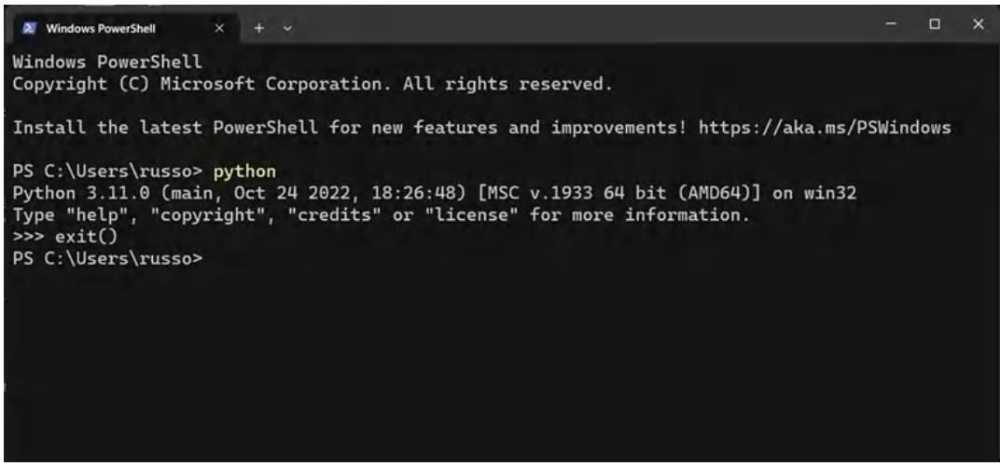  
Figure 1.1 The Python Interactive Console running in Windows PowerShell.

applications. Some changes made to Python 3 were fundamental, including the way binary data is stored and processed.

There was a significant number of existing Python 2 programs in production around the world when Python 3 was announced. It is no surprise that many Python 2 programmers were less than enthusiastic about porting their source code to Python 3. Nevertheless, Python 2 was scheduled to be retired in 2015, but the resistance was so strong that this date had to be delayed. It wasn’t until January 1, 2020 that Python 2 was finally and fully retired.

Even though Python 2 has been retired and it no longer receives security patches, you can still install and use it. If you have a version of Python 2 installed, please resist the urge to use it to write new programs and install Python 3 instead. For guidance porting Python 2 code to Python 3, refer to Python’s own porting guide [10]. If you need both versions of Python available, you may install Python 3 with Python 2 and use them both simultaneously. With both versions of Python installed, run Python 3 from a terminal using the python3 command in place of the python command. To make sure you have a recent version of Python 3 installed, you can enter the following command into a terminal. In this book we use Python 3 exclusively.

```batch
python --version 
```

# 1.4 Python Package Index

One of Python’s mottos is “batteries included,” and for a good reason. A Python distribution comes with a huge library of prewritten modules for you to use and build upon. While it’s true that a Python distribution includes quite a few “batteries,” it is not possible to include them all.

If a module is not shipped with Python, there is a good chance someone in the Python community has contributed a module that will help you. Additional Python modules are distributed through a Python package repository, with the two most popular being the PyPI [11] and the Package Repository for Anaconda [12]. Anaconda is an exceptional platform that provides high quality Python installations, package distributions, and other open-source resources. Importantly, it also offers paid support

plans, which may be critical for businesses that depend upon Python as part of their core operations. In the following, we describe how to use PyPI for installing additional Python packages.

The PyPI provides a way for package authors to post their open-source Python packages, and for package users to find and install Python packages that are not distributed with Python. The PyPI hosts over 600,000 freely available Python packages ready for you to install and use. If you need something specific, there is a good chance that the PyPI has a package for that.

Python packages are downloaded from the PyPI and installed in your computing environment using a program and module distributed with Python called pip (package installer for Python). If you have a Python distribution, you have pip.

As an example, consider the watchfiles Python package, which is a toolkit for monitoring and responding to file system events [13]. The watchfiles package can help if you may want to execute a Python program automatically to parse data when a new file is written. Before you can use watchfiles, you must install it with the pip module. Python ships with a script named pip that is a convenient way to invoke the pip module. Our experience has been that this can be troublesome in some environments. To avoid the trouble, we skip the script and invoke the module directly to perform an installation from the PyPI using a command like the following.

```batch
python -m pip install watchdogs 
```

This installs the watchfiles package so that it can be used by anyone logged in to the computer. To limit the installation to yourself only, add the --user option to the command.

```batch
python -m pip install --user watchdogs 
```

To install a particular version of a package, add the package version to the pip command. For example, if you want to install version 0.24 of watchfiles, execute the following terminal command, which ensures that the version is exactly equal to 0.24.

```batch
python -m pip install --upgrade watchdogs==0.24 
```

The pip package is updated frequently. When executed, it checks if there is a more recent version available and lets you know if there is. To ensure that you have the latest version of pip installed (or any module), add the --upgrade option.

```batch
python -m pip install --upgrade pip 
```

If you are working in a networked environment that is behind a proxy server, which is the case with most sizable organizations, the pip command may be unable to access the PyPI repository directly. Fortunately, if you provide proxy server parameters to pip, it will use the proxy server to access PyPI. Add the --proxy option to the pip command along with the proxy server domain name and port number, as well as username and password, if necessary, using the following syntax.

```batch
python -m pip installpackageName --proxy [user:passwd@]proxy.server:port 
```

For many more details describing the options for installing Python packages from the PyPI, refer to the Python Packaging User Guide [14].

# 1.5 Programming Editors

In the next chapter you will learn that Python depends heavily on indentation to properly parse and interpret its source code structure. Statements in the same code block must be indented uniformly, otherwise they are considered to be in different code blocks, which often results in an incorrect interpretation of what you intended your program to do. Leading whitespace like tabs and spaces can be extremely important to Python programs. You must get it right.

It is possible to write Python programs using a simple text editor, but it can be difficult to ensure that all indentations are correct. An extra leading space character on one line can completely change the meaning of your program or break it entirely. For example, a plain text editor might use a sequence of space characters or a tab character to indent a statement on a line. Two consecutive lines of code, one above the other but using different whitespace characters for indentation, can appear to be indented identically. Despite the way the lines look, Python will consider these two lines to be in different code blocks. To ensure you don’t end up with an incorrect Python program due to line indentation inconsistencies, it is strongly recommended that you write your programs using an editor designed for programming in Python. Fortunately, there are many good options.

One good option that is freely available is the Visual Studio Code editor, often called VSCode [15]. Note that VSCode is not the same as the Visual Studio Integrated Development Environment, which is far more sophisticated than VSCode. Because VSCode is a general-purpose programming editor, after installation it is necessary to add extensions to the editor specifically for Python. A good extension for Python programming is the Python extension for Visual Studio Code distributed by Microsoft, which is freely available through the Visual Studio Code Marketplace [16]. This extension adds several functions to VSCode for Python programming, including syntax highlighting and checking, debugging, outlining and navigation, formatting, refactoring, variable explorer, and more.

To install VSCode, visit https://code.visualstudio.com/ and download an installer for your operating system. Run the installer to set up the editor on your computer. After installation is complete, start the program and find the icon bar docked to the left side of the window. Click the icon for Extensions, or enter Control-Shift-X. The Extensions icon is composed of four small boxes, one of which is being added to the others. Clicking this icon opens the Extensions Marketplace panel. Search for “Python” and find the “Python extension for Visual Studio Code” extension. Click the [Install] button. Once installed, this extension will configure your editor for advanced Python program editing, syntax highlighting, and much more. It is well worth the effort to seek out and install the VSCode extension pack for Python.

# 1.6 Notebook Editors

When working with experimental data, it helps to use a different style of editor called a Notebook. The idea was first described by Donald Knuth [17] when he introduced the concept of literate programming. In that paper, Knuth proposed extending our attitude toward computer programming as merely a way to instruct a computer but also to include a description for humans that explains a larger concept that is supported by the program. In this way, we consider such an extended computer program a work of literature.

The modern version of literate programming is best embodied in the Notebook-style editor, which intermingles formatted text with code snippets that analyze data and generate illustrative output. For Python, Jupyter and JupyterLab are among the most popular Notebook editors [18]. JupyterLab itself is composed of a Jupyter notebook coupled with a file system browser and other utilities. Jupyter is the de facto standard Notebook editor for Data Scientists who use Python.

Jupyter and JupyterLab leverage a web browser for its user interface, with a computer language kernel running behind it. A kernel is the compute engine that executes code snippets. Once the user enters code into a code cell of a notebook and submits it, the code is transmitted by the notebook to its running backend kernel. The kernel executes submitted code and results are returned to the notebook. If appropriate, returned results are rendered in a new notebook cell. For example, the result of a computation might be a chart or interactive widget. This architecture is illustrated in Figure 1.2.

To install Jupyter and JupyterLab, open a terminal and use the pip module to install the package.

python -m pip install jupyterlab

Once installed, Jupyter may be started by executing the following command in a terminal.

jupyter-notebook

To start JupyterLab, replace “notebook” with “lab,” as follows.

jupyter-lab

In both cases, a local notebook server program with the Python language kernel is started, followed by the opening of a browser window, which is automatically navigated back to the notebook server to load the initial interface.

To shut down the notebook server, click the [Quit] button in a Jupyter Notebook, choose the “File | Shut Down” menu option from JupyterLab, or simply enter Ctrl-C in or Cmd-C the terminal window that is running the notebook server program.

The modular architecture of Jupyter allows one kernel of a notebook to be swapped out for another kernel. With a standard communication protocol in place for transmitting code snippets to a kernel and returning results, it is possible to develop kernels for other programming languages in addition to Python. Currently, notebook kernels are available for Perl, Ruby, JavaScript, Fortran, Java, and other languages. The landscape of available kernels is advancing all the time. If you have an interest in a kernel for another language, consult the Jupyter Project documentation [18].

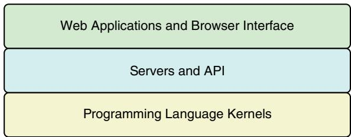  
Figure 1.2 Jupyter notebook architecture.

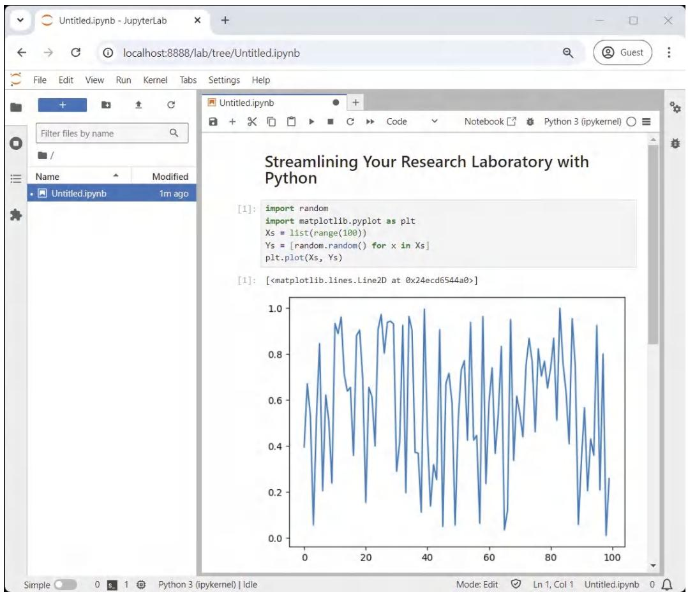  
Figure 1.3 JupyterLab in action.

Figure 1.3 demonstrates a simple example of JupyterLab with formatted descriptive text, a short Python program, and a chart resulting from the execution of the code in the code cell. This notebook illustrates how we may intermingle text, programs, and dynamically generated results, in a single document, thereby embodying Knuth’s concept of literate programming.

# 1.7 Using the Jupyter Notebook Interface

Notebook documents are composed of a linear stack of three kinds of cells: Markdown cells (formatted text), code cells (program snippets), and raw cells (unprocessed text). These cells may be added to a notebook, deleted, edited, and rearranged at will. Individual cells in a notebook may be executed in any order, or all cells may be executed from the top of the notebook to the bottom.

The content of any cell in a notebook is entered directly through the notebook interface. Executing a cell, whether it is a Markdown cell or a code cell, is performed by entering the key sequence Shift-Enter. This will either process and display the formatted text of a Markdown cell

as HTML or it will transmit code to the language kernel for execution with results displayed upon return. To learn more about Markdown text formatting syntax implemented in a Jupyter Notebook, explore the Jupyter Notebook documentation site [19]. Python language syntax will be explored in great detail in the chapters that follow.

From the perspective of a laboratory scientist, it is easy to see how a notebook may be used to perform the kind of analysis and results that are entered into a classic laboratory notebook. A Jupyter notebook used to document an experiment might open with formatted text describing the experiment performed, including detailed procedures, source materials, and an experimental design. Experimental data might be added to a cell in a tabular format suitable for processing. A code cell should contain the full source code for a short program used to process experimental data. Capturing the actual source code for the program used to process raw experimental data has the side benefit of documenting the analysis in a way that allows it to be reproduced easily. After analysis, additional code cells might generate charts, tables, and other illustrations rendered right in the notebook. Once the notebook document is written and tested, it might be possible to reuse it by updating experimental data and rerunning the entire notebook.

Of course, notebook documents like those created with JupyterLab are not and cannot be used as laboratory notebooks because they lack the required tracking, signature capabilities, and other security features. But they can form the basis of a report to be entered into a notebook, complete with an ability to reproduce the analysis at a later time by rerunning a copy of the notebook. It’s easy to see how notebook editors can be a valuable tool for a research scientist.

# 1.8 JupyterLite

Earlier we described one implementation of Python called Pyodide. The authors of Pyodide recognized that several of Python’s core data processing libraries could reach even more users if compiled to a WebAssembly target so that they were available to run in Pyodide. These additional packages are the tools used most often by Data Scientists. With these additional packages compiled to WebAssembly, and because JupyterLab uses the browser as its user interface, it was possible to combine JupyterLab with Pyodide and a set of additional libraries compiled to WebAssembly to create a fully in-browser data science environment. Add a lightweight browser-based file system, and the result is an environment named JupyterLite (Figure 1.4) [20].

JupyterLite is a complete notebook environment that runs entirely in a web browser – no installation necessary. This includes both the notebook front end as well as the Python kernel language back end. You may load this complete environment at the Jupyter website [21]. This is a tremendous benefit, especially when you are blocked from installing software, such as in a tightly controlled lab computing environment managed by large organizations.

Note that the JupyterLite environment is indeed a “lite” version of the toolkit. For example, the file system is simulated and exists entirely in browser storage. It is possible to upload files from a local disk to the browser-based simulated file system and download files from the browser to local disk, but accessing the local file system from the JupyterLite environment directly is impossible due to the tight security constraints implemented by web browsers. This limits the amount of data that can be analyzed. Also, while any pure Python package may be used in JupyterLite, more high-performance packages that depend on utilities written in another language, such as C or Rust, are not available unless they have been precompiled to WebAssembly.

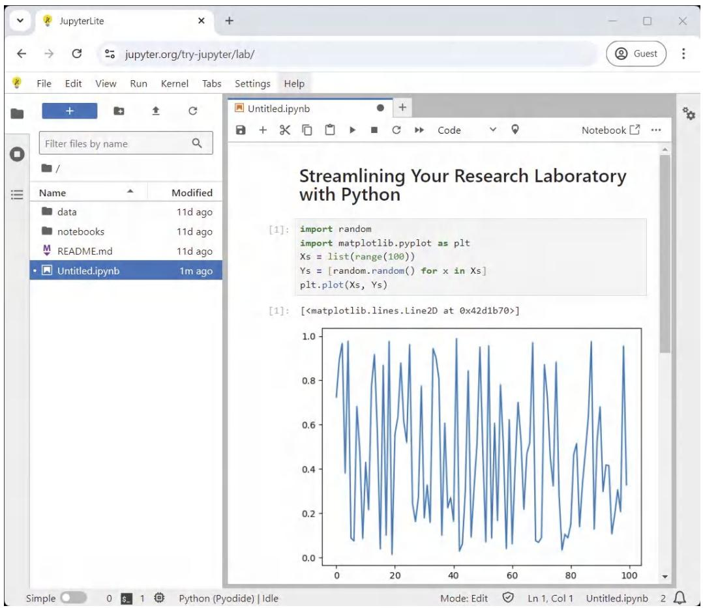  
Figure 1.4 JupyterLite demonstration.

# 1.9 Things Change

Computing environments develop and change quickly. Unfortunately, this means that the information here may become out of date. It is worth taking some time to research the implementations of Python, programming editors, and other tools currently available. Better options may appear, and you will want to benefit from them.

# 1.10 Key Takeaways

1.	 Currently, Python is one of the most popular general-purpose programming languages.   
2.	 Learning Python will provide you with the power to solve virtually any computing problem you may encounter.   
3.	 The PyPI includes approximately 600,000 additional packages for you to download.   
4.	 Python is one of the two most popular languages used for Data Science.

5.	 Python is an open-source language, which means it is free to use and has a large and active community of developers.   
6. There are many implementations of Python for you to use. The CPython implementation is the reference standard by which other implementations are compared.   
7.	 Install Python by visiting the language home page [2], clicking the Downloads link to download a suitable installer and running the installer program.   
8.	 Additional packages are installable from the PyPI using the pip module, provided with the standard Python distribution.   
9.	 Because Python syntax depends heavily on uniform indentation, a good programming editor will be a great benefit. Visual Studio Code is one very good option. To install VSCode, download an installer [15].   
10.	 Notebook editors are another style of editor that support literate programming, a style of programming in which documentation, code, and results are intermingled.   
11.	 The JupyterLab notebook editor is a very popular notebook style of editor used for Python programming in the field of Data Science. Notebooks are useful for research scientists as well.   
12.	 Things change quickly in technology fields. Always check for the most recent releases and the latest options available for solving computing-related problems.

# 2

# Language Basics

In this chapter we introduce the basics of Python programming with variables and expressions. Fundamental Python data types are described along with how they may be combined into expressions using operators and global functions.

# 2.1 Python Interactive Console

Even if you never write a complete Python program, being able to write and evaluate Python expressions interactively will give you an immediate advantage. You can use the Python Interactive Console to perform a wide range of ad hoc calculations, just like you would with an interactive calculator. If you need to calculate a dilution volume or the number of tubes or microplates required to perform an experiment, you’ll find yourself popping open the Python Interactive Console to perform a quick calculation.

To start the Python Interactive Console, open a terminal program and enter the command python (or python3). If you are using Microsoft Windows, you can run PowerShell or Command Prompt as your terminal. On a Macintosh or Linux computer, the standard terminal program will do the trick. After entering the python command, the Python console will start in your terminal and offer you the $> > >$ prompt. This is where you can enter any Python statement you want to be evaluated, even multi-line statements.

Figure 2.1 demonstrates the Python console started in Windows PowerShell. It will look the same, no matter which terminal program or operating system you use. To exit the console, enter the quit() or the exit() command and press the Enter or Return key. Make sure to add a pair of parentheses after the command and before pressing Enter or Return.

With the Python console running, go ahead and enter an expression. You will find that performing basic calculations is straightforward.

```txt
>>> 1.1 * 65000 / (5 * 8 * 52)  
34.375 
```

# 2.2 Data Types

Python provides several different fundamental types of data for you to work with, right out of the box. These include three kinds of numbers, including integers, floating-point numbers, and even complex numbers. Other built-in data types are strings of characters, Boolean values

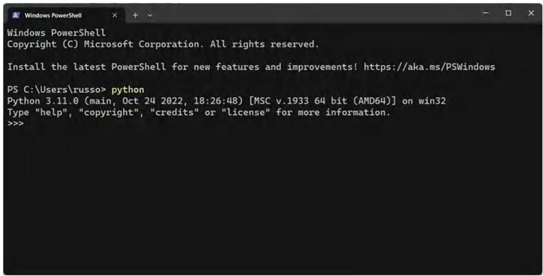  
Figure 2.1 Python Interactive Console.

(True and False), and a special keyword used to indicate the absence of a value, called None. These are summarized in Table 2.1.

The first column of Table 2.1 lists the class of the Python data type. These predefined Python terms will be useful to you. The second column provides a description of each data type, the third column indicates the approximate range of values that can be represented by the type, and the last column provides several examples of each data type written in a way that is recognized by Python.

Every data type is stored in a finite amount of memory, which is why the range of values that can be represented by each type is limited. We won’t discuss how these fundamental data values are stored, but it is important to understand that every value has a data type, and each type has its own way of encoding itself in memory. It is worth verifying that the types chosen to represent values used in your calculations will not approach the limits given in the third column of Table 2.1, either from the perspective of a range or in the number of required significant digits.

Table 2.1 Fundamental Python data types.   

<table><tr><td>Data type</td><td>Description</td><td>Approximate range</td><td>Literal examples</td></tr><tr><td>int</td><td>An integer. A whole number with no decimal or fractional part.</td><td>-9223372036854775808 to 9223372036854775807</td><td>0, 1, -2, 1234</td></tr><tr><td>float</td><td>A base-10 number with a decimal and optionally places to the right of the decimal.</td><td>±5.0 × 10-324 to ±1.7 × 10308</td><td>0.0, 0.1, 3.1415926, 10., -2e3</td></tr><tr><td>complex</td><td>A complex number with both real and imaginary parts.</td><td>Same as float, for real and imaginary parts,</td><td>1j, -1 + 0j, -1.2 + 3.4j</td></tr><tr><td>str</td><td>A sequence of 0 or more characters delimited by pairs of matching single quotes or double quotes.</td><td>Any sequence of characters from a character set.</td><td>&quot;hello&quot;, &#x27;goodbye&#x27;, &quot;&quot;, &quot;A&quot;, &#x27;@&#x27;, &quot;12&quot;</td></tr><tr><td>bool</td><td>One of the Python values True or False.</td><td>True or False</td><td>True, False</td></tr><tr><td>NONE</td><td>The Python value None.</td><td>None</td><td>None</td></tr></table>

When comparing floating-point numbers (numbers with decimal places), be especially careful when they differ only in the $1 5 ^ { \mathrm { t h } }$ or $1 6 ^ { \mathrm { t h } }$ significant digit. As you’ll learn in the subsection 2.5.6, Comparing Floating-Point Numbers, this can be problematic and deserves extra attention.

Each data type has a unique syntax that allows Python to recognize it when encountered in a program. This syntax is referred to as literal notation because values are written in Python literally. Any value entered into the Python console using valid literal notation will be recognized automatically. Python will interpret the characters entered and store the data internally in memory as the appropriate type. Refer to the last column in Table 2.1 for examples of literal notation for each data type.

Take a moment to test this for yourself. Enter the examples from Table 2.1 into a Python console and press Enter or Return. You will see that Python interprets the entered value and echoes it back. Now enter values that are not valid. For example, see the console session below. Keywords like true, false, and none are not valid because Python expects these expressions to begin with a capital letter. Strings may be delimited with either single quotes (' ') or double quotes (" "), but they must match. Mixing quote characters is invalid. Numbers must follow the standard syntax, with at most a single leading sign (+ or −), and possibly a single decimal point (.). Python does not understand other formats and will let you know with a SyntaxError. See the example below.

```txt
>>> true
Traceback (most recent call last):
    File "<stdin>", line 1, in <module>
NameError: name 'true' is not defined. Did you mean: 'True'? 
>>> false
Traceback (most recent call last):
    File "<stdin>", line 1, in <module>
NameError: name 'false' is not defined. Did you mean: 'False'? 
>>> "abc"
    File "<stdin>", line 1
    "abc"
^ SyntaxError: unterminated string literal (detected at line 1)
>>> none
Traceback (most recent call last):
    File "<stdin>", line 1, in <module>
NameError: name 'none' is not defined. Did you mean: 'None'? 
>>> -1-
    File "<stdin>", line 1
    -1-
^ SyntaxError: invalid syntax
>>> 0.1.2.3
    File "<stdin>", line 1
    0.1.2.3
^ SyntaxError: invalid syntax
>>> 
```

You may interrogate a data value for its type using the built-in type(…) function. This function returns the special class of the data indicating its type, which corresponds with the identifiers listed in the first column of Table 2.1.

```txt
>>> type(1)
<class 'int'> 
>>> type(3.1415826) 
<class 'float'> 
>>> type("DMSO") 
<class 'str'> 
>>> type(True) 
<class 'bool'> 
>>> type(None) 
<class 'NoneType'> 
```

# 2.3 Variables and Literals

Just like we use variables in algebra to represent changing values, we can do the same in a Python program. Variables are identifiers (i.e., names) that may be assigned to some value in Python, including practically anything, such as numbers, strings, Booleans, functions, etc. The value assigned to a variable name can change through assignment, which is why they are variable.

Unlike other popular programming languages, Python variable names have no preassigned data type. In other words, there is no restriction on the value that you may assign to a variable name. At one point in your program, the variable name x might refer to data with type int and at another point it may refer to a string (str). This streamlines your programming work because you don’t have to worry about predeclaring variables with a specific type (known as static typing) and worry about making sure that you always assign data of the preassigned type to the variable. Python’s dynamic typing of variables allows you to assign data having any type to any variable at any time. This is usually not a problem for small programs, but can lead to bugs on larger programs. Statically typed languages help avoid unintentionally using the same variable name for multiple purposes. Fortunately, the Python community provides tools for validating data format and types, which helps to avoid bugs and support large-scale development projects. In the simplest case, Python’s built-in type(…) function is an easy way to verify a data type. In the following Python console session, the variable x is first assigned to an integer, then to a float, and finally to a string, with no trouble.

```txt
>>> x = 96   
>>> type(x)   
<class 'int'>   
>>> x = 3.1415926   
>>> type(x)   
<class 'float'>   
>>> x = "CH3CH20H"   
>>> type(x)   
<class 'str'>   
>>> 
```

Variable names must begin with a letter or underscore, followed by zero or more letters, digits, or underscores. Unlike other popular programming languages, in Python, a variable is created by assigning a name to a value using the $=$ operator. There is no explicit syntax to declare a new variable name in Python. To bring a variable into existence, assign it a value. That’s it. Once assigned, these variables may be used in place of the value itself in any statement.

```txt
>>> vol = 23.4  
>>> count = 12  
>>> aqueous = False  
>>> solvent = "DMSO"  
>>> result = None 
```

For example, to create the variable pi with the value 3.1415926, enter the following assignment statement into the Python console. To view the value of pi, enter the variable name and press Enter or Return. To check the type of the value assigned to the variable, use the type(…) global function.

```txt
>>> pi = 3.1415926  
>>> pi  
3.1415926  
>>> type(pi)  
<class 'float'>  
>>> 
```

Literal values of type bool and NoneType are limited. A bool value may be the literal True or False, and NoneType is the literal None. Similarly, assigning any one of these literals to a name will create the variable name and assign the value.

>>>hit $=$ True   
>>>type-hit   
<class 'bool'>   
>>>hit $=$ None   
>>>type-hit   
<class 'NONE'>   
>>>

# 2.4 Strings

Python strings (the str type) are sequences of characters with a length limited only by available memory. Python string literals may be written using one of several notations.

# 2.4.1 Simple Strings

To create a simple string literal in Python, we delimit a sequence of characters with a pair of single quotes (' ') or a pair of double quotes (" "). Python accepts either of these styles as long as they come in a matched pair. Note that Python itself uses single quotes when rendering string types to the console. Most characters entered directly between matching quotes are captured in a string, including spaces. One special character not captured in a simple string when entered directly is a newline because this character is interpreted by the console as an instruction to process the statement or by an editor to move to the next line in a program file. See the following two string examples entered into the Python console.

```txt
>>> formula = "CH3CH2OH"
>>> name = 'ethanol' 
```

# 2.4.2 Multi-Line Strings

While not possible with simple strings, Python’s triple-quoted strings can capture special characters like tab and newline exactly as they are entered. Use triple-quoted strings to print messages consisting of longer blocks of text, especially when they extend over multiple lines. Try the following examples in a Python console. Note that to see the multi-line string formatted using its special characters, you must use the built-in print(…) function to interpret the command characters in the string variable as the block of text is being rendered in the console.

```txt
>>> steps = '''1. Remove lid
... 2. Insert the loop
... 3. Lightly drag loop in a zig-zag pattern
... 4. Close lid
... 5. Flame loop''
>>> steps
'1. Remove lid\n2. Insert the loop\n3. Lightly drag loop in a zig-zag pattern\n4. Close lid\n5. Flame loop'
>>> print(steps)
1. Remove lid
2. Insert the loop
3. Lightly drag loop in a zig-zag pattern
4. Close lid
5. Flame loop
>>> 
```

# 2.4.3 Escape Characters in a String

In the previous example, when we entered the multi-line string variable steps into the console, rather than print the string on multiple lines, the newline command character was printed inline using the special character sequence \n. With a single-quoted Python string, although we cannot enter characters like newline directly into a Python string, we can enter an escaped version of the special character, which is a character sequence that encodes the special character. Escape characters always begin with a backslash (\). When entering an escaped version of a special character rather than the original, the escaped version escapes interpretation, which might otherwise cause unwanted behavior, like moving to the next line. A single-quoted string will accept escape characters entered directly.

In the example above, the steps string variable includes a \n in the string at every location where a newline special character should appear. The \n is the escape character sequence for the newline special command character. Entering this sequence into a simple single-quoted Python string provides a way to enter the newline command character without requiring the use of a triple-quoted string. When a string containing escape characters is reproduced in the console, the escape character sequences are displayed. When the same string is printed using the built-in Python command print(…), the escaping no longer works and special characters are interpreted as output instructions, such as tabbing to the right when a \t is encountered and moving to the next line when a \n is encountered.

Another use for escape characters is to enter characters that would otherwise be interpreted as a string delimiter. For example, if you type a string using single quotes, how might you include a single quote character within the string without inadvertently terminating the string prematurely? The solution is to escape the single quote by preceding it with a backslash, \'. This tells Python to treat the single quote as a simple character, devoid of any special meaning. Of course, another

solution to this problem is to delimit string literals containing single quote characters with double quotes, and to delimit string literals containing double quotes with single quotes. See the following console session for examples of this technique.

```txt
>>> rule = 'Please don't mix acids and bases'  
File "<stdin>", line 1  
rule = 'Please don't mix acids and bases'  
SyntaxError: invalid syntax  
>>> rule = 'Please don\'t mix acids and bases'  
>>> print(rule)  
Please don't mix acids and bases  
>>> 
```

Another important example of character escaping is the backslash itself. If the \ character is used to start an escape character, how might you enter the \ character into a string as a simple character? This is particularly important when using Windows file paths because in Windows the backslash character is used to separate directories in a file path. The solution is to escape the \ character by adding an additional \ before it. In other words, to enter a \ into a simple Python string, you must enter it as \\. See the following example and Table 2.2, which contains several Python escape character sequences with the special character that they encode.

```perl
>>> path = "C:\Users\Albert\programs\general relativity.py"
File "<stdin>", line 1
    path = "C:\Users\Albert\programs\general relativity.py"
SyntaxError: (unicode error) 'unicodesescape' codec can't decode bytes in position 2-3: truncated \UXXXXXXX escape
>>> path = "C:\Users\Albert\programs\general relativity.py"
>>> path
'C:\Users\Albert\programs\general relativity.py'
>>> print(path)
C:\Users\Albert\programs\general relativity.py 
```

Table 2.2 Python escape characters and their meanings.   

<table><tr><td>Escape character</td><td>Actual character</td></tr><tr><td>\&#x27;</td><td>Single quote</td></tr><tr><td>\&quot;</td><td>Double quote</td></tr><tr><td>\</td><td>Backslash</td></tr><tr><td>\n</td><td>Newline</td></tr><tr><td>\r</td><td>Carriage return</td></tr><tr><td>\t</td><td>Tab</td></tr><tr><td>\b</td><td>Backspace</td></tr><tr><td>\f</td><td>Form feed</td></tr></table>

# 2.4.4 Raw Strings

Wouldn’t it be great if we could turn off all special characters in a Python string and tell Python to accept what we type between quotes, exactly as entered? This would eliminate the need to escape special characters because they all would be simple characters, by default. In fact, we can do this. In Python this is possible with what is called a raw string. If you precede a pair of quotes with the “r” character, the string becomes a raw string and all characters are interpreted as simple characters, except of course the closing quote.

```txt
>>> path = r"C:\Users\Albert\programs\general relativity.py"
>>> print(path)
C:\Users\Albert\programs\general relativity.py
>>> 
```

# 2.4.5 Formatted Strings

One more Python string is worth mentioning, the f-string. Just as a raw string starts with a leading “r” before the first quote, an f-string starts with a leading “f”. An f-string is like a simple string with one additional feature. An f-string may also include one or more pairs of curly brackets ({…}) containing a Python expression. When an f-string is interpreted, each expression in a pair of curly brackets is evaluated to a value and a string version of the evaluated value is substituted into the string at the same location. This process is called string interpolation.

Let’s say we want to print the volume of a cylinder where the radius is stored by the variable r and the height by the variable h. Because they are variables, their values can change. One option to print the volume using a nicely formatted output is to first compute the volume, convert the volume to a string using the str(…) global function, assemble a temporary string using string concatenation, and then print that temporary string.

Another option is to do all of the above at once using an f-string, which is demonstrated by the following example. Note how the f-string includes several pairs of curly brackets containing embedded expressions. When rendered in the console, the expressions are evaluated and interpolated (substituted) into the final string.

```txt
>>> pi = 3.1415926
>>> r = 1.75
>>> h = 7.5
>>> f'A cylinder with radius {r} cms and height {h} cms has volume {pi*r*r*h}
mls'
'A cylinder with radius 1.75 cms and height 7.5 cms has volume 72.15845503125
mls'
>>> 
```

In this example, the computed volume includes too many decimal places, most of which are not significant. To reduce the number of decimal places in the output of the computed volume to two, an f-string permits the inclusion of additional formatting specifiers, which change the way the computed expressions are formatted before being interpolated into the string. A format specifier is added to the embedded expression within the curly brackets after a colon. For example, if we wanted to print each of the values stored in variables r, h and the computed volume with two decimal places, we could add the format specifier :.2f to the right of the expression in a pair of curly brackets.

In the following updated example, we add format specifiers to the f-string expressions, which change the formats of the numeric values in the output.

```txt
>>> f'A cylinder with radius {r:.2f} cms and height {h:.2f} cms has volume {pi*r*r*h:.2f} mls'  
'A cylinder with radius 1.75 cms and height 7.50 cms has volume 72.16 mls'  
>>> 
```

Table 2.3 lists several additional examples of format specifiers for Python types, including floating-point numbers, integers, and strings. For each example, there is a description, a sample f-string, and the resulting output. The examples assume that the variable pi is 3.1415926, c is 15, and s is the string 'EtOH'.

Using an f-string to assemble and print custom formatted output is much more convenient than manually assembling a string by converting each expression and concatenating. In fact, Python f-strings are handy for assembling any formatted string you might need using a single expression.

# 2.4.6 Strings as Objects

Everything in Python can be considered a kind of object. You can think of an object as a kind of software container that may encapsulate two broad categories of things: data values unique to the object, and behaviors that operate on the encapsulated data. As an example, consider a Python integer. In other programming languages, an integer is nothing more than a numeric value stored in memory. In Python, an integer is much more.

In Python we know that the literal 1 is an object of class int. This is revealed when we enter the expression type(1), which returns <class 'int'>. Because a Python int is an object, it must encapsulate more than just a numeric value. To see what is encapsulated by any Python

Table 2.3 Examples of common f-string format specifiers.   

<table><tr><td>Format specifier</td><td>Description</td><td>Example</td><td>Formatted output</td></tr><tr><td>.2f</td><td>Fixed-point notation with two decimal places</td><td>f{&#x27;pi:.2f}&#x27;</td><td>3.14</td></tr><tr><td>08.2f</td><td>Fixed-point notation with two decimal places, eight significant digits, padded with 0</td><td>f{&#x27;pi:08.2f&#x27;}</td><td>00003.14</td></tr><tr><td>.4g</td><td>Exponential notation with four significant digits</td><td>f{&#x27;pi:.4g&#x27;}</td><td>3.142</td></tr><tr><td>.0%</td><td>Percent with no decimal places</td><td>f{&#x27;pi:.0%&#x27;}</td><td>314%</td></tr><tr><td>.2%</td><td>Percent with two decimal places</td><td>f{&#x27;pi:2%&#x27;}</td><td>314.16%</td></tr><tr><td>4d</td><td>Decimal integer with four significant digits</td><td>f{&#x27;c:4d&#x27;}</td><td>15</td></tr><tr><td>04d</td><td>Decimal integer with four significant digits, padded with 0</td><td>f{&#x27;c:04d&#x27;}</td><td>0015</td></tr><tr><td>b</td><td>Binary</td><td>f{&#x27;c:b&#x27;}</td><td>1111</td></tr><tr><td>08b</td><td>Binary zero padded to eight digits</td><td>f{&#x27;c:08b&#x27;}</td><td>00001111</td></tr><tr><td>x</td><td>Hexadecimal</td><td>f{&#x27;c:x&#x27;}</td><td>f</td></tr><tr><td>&gt;10</td><td>Right-justified string in a field of width 10</td><td>f{&#x27;s:&gt;10&#x27;}</td><td>EtOH</td></tr><tr><td>&lt;10</td><td>Left-justified string in a field of width 10</td><td>f{&#x27;s:&lt;10&#x27;}</td><td>EtOH</td></tr><tr><td>^10</td><td>Centered string in a field of width 10</td><td>f{&#x27;s:^10&#x27;}</td><td>EtOH</td></tr><tr><td>0&gt;10</td><td>Right-justified string in a field of width 10 with pad character of 0</td><td>f{&#x27;s:0&gt;10&#x27;}</td><td>000000EtOH</td></tr></table>

object, you can pass the object to the global dir(…) function. For example, enter dir(1) into the Python console and see what it returns.

A string in Python is also an object of class str. We know this because the expression type('A') returns <class 'str'>. Data encapsulated by a str object is a sequence of characters that make up the string. To learn what else is encapsulated by a str object, pass a string to dir(…). As you can see by the example below, a Python string contains quite a lot of functionality.

```txt
>>> dir('A')
['__add', '__class', '__contains', '__delattr', '__dir', '__doc'],
'__eq', '__format', '__ge', '__getattribute', '__getitem',
'__getnewargs', '__getstate', 'gt', 'hash', 'init',
'__initsubclass', '__iter', '__le', '__len', 'lt', 'mod',
'mul', 'ne', 'new', 'reduce', 'reduce_ex', 'repr',
'rmod', 'rmul', 'setattr', 'sizeof', 'str',
'__subclasshook', 'capitalize', 'casefold', 'center', 'count', 'encode',
'endswith', 'expandtabs', 'find', 'format', 'format_map', 'index', 'isalnum',
'isalpha', 'isascii', 'isdecimal', 'isdigit', 'isidentifier', 'islower',
'isnumeric', 'isprintable', 'isspace', 'istitle', 'isupper', 'join', 'ljust',
'lower', 'lstrip', 'maketrans', 'partition', 'removeprefix', 'removesuffix',
'replace', 'rfind', 'rindex', 'rjust', 'rpartition', 'rsplit', 'rstrip',
'split', 'splitlines', 'startswith', 'strip', 'swapcase', 'title',
'translate', 'upper', 'zfill'] 
```

Most of the names printed by dir('A') are string methods, which are functions encapsulated by an object that implement behaviors. Accessing a method defined within an object involves joining the object and the method name with a “.”. This is called dot notation. The first column in Table 2.4 shows several examples of invoking methods of a string referenced by a variable name s. Note how methods of the string object s are accessed by joining the object with each method using a “.” and then adding trailing parentheses with arguments expected by the method. The second column describes what each encapsulated method does when invoked.

Table 2.4 Common string methods.   

<table><tr><td>Method</td><td>Description</td></tr><tr><td>s.startswith(x)</td><td>True if s starts with the string x.</td></tr><tr><td>s.endsWith(x)</td><td>True if s ends with the string x.</td></tr><tr><td>s.find(x)</td><td>Return the index where x starts in s, or -1 if not found.</td></tr><tr><td>s.lower()</td><td>Return a new string with all lowercase letters replaced with uppercase.</td></tr><tr><td>s_upper()</td><td>Return a new string with all uppercase letters replaced with lowercase.</td></tr><tr><td>s.strip()</td><td>Return a new string with whitespace removed from the start and end.</td></tr><tr><td>s.lstrip()</td><td>Return a new string with whitespace removed from the start (left).</td></tr><tr><td>s.rstrip()</td><td>Return a new string with whitespace removed from the end (right).</td></tr><tr><td>S.zfill(1)</td><td>Left pad string s with zeros producing a new string of length l.</td></tr><tr><td>s.isnumeric()</td><td>Return True if all characters in s are numeric.</td></tr><tr><td>s.split(x)</td><td>Divide s on the substring x and return a list of strings.</td></tr><tr><td>x.join(l)</td><td>Concatenate elements of the sequence l into a string with x as separator.</td></tr></table>

For example, to test if a string starts with the string 'A', invoke the string’s startswith('A') method using dot notation with the argument 'A'. To obtain an uppercase version of a string, use the upper() method. See examples below. We’ll explore several additional string methods in the many examples programs that you’ll find throughout this book.

```txt
>>> lbl1 = 'A01'  
>>> lbl2 = 'B01'  
>>> lbl1.startswith('A')  
True  
>>> lbl2.startswith('A')  
False  
>>> lbl3 = 'c01'  
>>> lbl3.upper()  
'C01'  
>>> 
```

# 2.4.7 Characters and Encodings

In the 1960s, a standard was adopted by a subcommittee of what is now known as the American National Standards Institute (ANSI) [22] that maps common English characters, digits, punctuation, and other terminal commands to numeric values capable of being stored by a digital device. This standard is called ASCII, an acronym for the American Standard Code for Information Interchange. The ASCII standard table includes 128 entries (also known as code points), of which only 95 are printable characters having an associated symbol. In addition to the standard English alphabet, the 10 digits (0–9), and common punctuation and whitespace characters, ASCII includes important terminal commands; for example, the tab code point (ASCII 9) and the newline code point (ASCII 10). As we’ve discussed, strings with these special commands embedded translate into commands that format the output instead of printing symbols. Refer to Appendix A for a complete ASCII table of character encodings.

As the popularity of computing increased all over the world, the ASCII standard became inadequate. After multiple intermediate expanded versions, the current widely adopted character encoding standard has evolved to The Unicode Standard, which is capable of mapping millions of code points. Importantly, despite the dramatic expansion in size, the first 128 code points in one of the Unicode standards is the same as the ASCII set, not unlike the fictitious V’Ger lifeform encountered by the United Federation of Planets in the movie Star Trek: The Motion Picture.

In fact, Unicode includes multiple standards, the most popular being UTF-8 (Unicode Transformation Format – 8-bit). While Python can encode/decode its strings using any one of the Unicode standards, by default Python strings are represented using UTF-8. The most important fact to understand about UTF-8 is that each code point may be represented with 1, 2, 3, or 4 bytes, but the first 128 code points match the ASCII standard. The remaining code points are designed to be distinguishable from ASCII encoded characters so that a string encoded using the ASCII standard alone is compatible with a UTF-8 encoding, no translations required.

Python includes two built-in commands that translate between a Unicode code point as an integer and an encoded character. The global function chr(…) takes the Unicode code point as a number and returns a single-character string. The global function ord(…) takes a single-character string and returns the Unicode code point. These functions will be useful when we want to generate strings using integers. See the following Python console session for an example.

```txt
>>>ord('A')   
65   
>>>chr(65)   
'A'   
>>>chr(960)   
'pi'   
>>>ord('pi')   
960   
>>>chr(956)   
'\mu '   
>>>ord('\mu '）   
956
```

# 2.5 Expressions Using Operators

Standard operators are available in Python to form and evaluate simple expressions. The syntax is natural, matching standard mathematical notation for expressions. Interestingly, expressions in Python extend pure mathematical expressions by adding new operand types, such as strings and Booleans, as well as new operators, including logical and comparison operators that accept these new operand types. While beyond our scope, it may interest you to know that it is possible to define custom behavior for an operator in Python based entirely on the types of its operands.

# 2.5.1 Arithmetic Operators

The following table lists many of the binary infix operators you are likely to encounter. As binary operators, each accepts two operands. As infix operators, the operands appear on the left and right of the operator. See Examples in Table 2.5.

Table 2.5 Common Python binary operators.   

<table><tr><td>Operator</td><td>Notation</td><td>Name</td><td>Description</td><td>Example</td></tr><tr><td>+</td><td>infix</td><td>Addition</td><td>Adds numeric operands or concatenates string operands.</td><td>1 + 1
&quot;A&quot; + &quot;1&quot;</td></tr><tr><td>+</td><td>prefix</td><td>Unary plus</td><td>Leaves operand unchanged.</td><td>+1</td></tr><tr><td>-</td><td>infix</td><td>Subtraction</td><td>Subtracts numeric operands.</td><td>1 - 1</td></tr><tr><td>-</td><td>prefix</td><td>Unary minus (negation)</td><td>Negates numeric operand.</td><td>-1</td></tr><tr><td>*</td><td>infix</td><td>Multiplication</td><td>Multiplies operands, including two numeric operands, an integer and a string, or an integer and a list.</td><td>2 * 2
3 * &quot;A&quot;
4 * [0]</td></tr><tr><td>/</td><td>infix</td><td>True division</td><td>Divides two numeric operands producing a float.</td><td>5 / 2</td></tr><tr><td>//</td><td>infix</td><td>Floor division</td><td>Divides two numeric operands producing an integer. Decimal places in the result are discarded.</td><td>5 // 2</td></tr><tr><td>%</td><td>infix</td><td>Modulo (remainder)</td><td>The remainder after dividing the left numeric operand by the right.</td><td>5 % 2</td></tr><tr><td>**</td><td>infix</td><td>Power</td><td>Raises the left numeric operand to the power of the right numeric operand.</td><td>3 ** 2</td></tr></table>

Note that operators support certain types of operands only. For example, the multiplication operator $( \star )$ supports a pair of numeric operands, as well as an integer with a string operand. In the latter case the expression produces a final string that is the string operand repeated the number of times indicated by the integer operand.

```txt
>>> "=" * 60  
'===  
>>> 
```

In Python, the addition operator $( + )$ is very flexible. With two numeric operands, the $^ +$ operator performs addition. With two strings, the $^ +$ operator performs string concatenation. As we’ll see when we cover data structures like lists, the $^ +$ operator will merge two lists into one list.

Python is strict about the operand types an operator will operate upon. For example, Python will not add strings and numbers with the $^ +$ operator. The $^ +$ operator expects compatible types like two strings or two numbers. As is the case with other programming languages, Python will not convert the number to a string automatically. Nor will Python convert a string operand of the subtraction operator (−) to a number and expect it to perform arithmetic subtraction. In this case we must either convert the number to a string before the operation using the str(…) built-in function before string concatenation can occur, or the string to a number using the int(…) built-in function before an arithmetic operation can occur.

```txt
>>> 1 + "1"
Traceback (most recent call last):
    File "<stdin>", line 1, in <module>
TypeError: unsupported operand type(s) for+: 'int' and 'str'
>>> 1 - "1"
Traceback (most recent call last):
    File "<stdin>", line 1, in <module>
TypeError: unsupported operand type(s) for -: 'int' and 'str'
>>> 
```

Other programming languages perform automatic type conversion between numbers and strings. Python does not. Binary operators defined to accept mixed-type operands must be predefined explicitly to do so. If you have any doubt that an operand may be of the wrong type, convert the operand type yourself to ensure that you perform the operation you intend. Recall that because variables are not typed, when operating with variables as operands there is no guarantee that the referenced data type is correct without employing type-checking helper notation.

As is common with most programming languages, when an expression is encountered, it is evaluated immediately to produce a value. When a variable is encountered in an expression, the variable’s value is substituted. Let’s demonstrate this.

In all the examples below, you will see the # character followed by descriptive text. In Python, the # character is used to signal that everything written from that point to the end of the line should be ignored; in other words, it is a comment. In the following examples we add comments on each line to describe the variable being defined and initialized.

What is the molar mass of glucose?

```txt
>>> C = 12.0107 # Atomic weight of carbon  
>>> O = 15.9994 # Atomic weight of oxygen 
```

```txt
>>> H = 1.00794 # Atomic weight of hydrogen  
>>> C*6 + H*12 + O*6 # Calculate molar mass  
180.15588 
```

How many 96-well microtiter plates will I need to test 1000 samples?

```txt
>>> N = 1000 # Number of samples  
>>> W = 96 # Wells per plate  
>>> N // W + 1 # Number of full plates with one extra for overflow  
11  
>>> N % W # Number of empty wells in last plate  
40 
```

What is the magnitude of the electric force between a proton and an electron at a distance of $5 . 2 9 \times 1 0 ^ { - 1 1 }$ meters, given Coulomb’s law.

$$
\left| F _ {1 2} \right| = \frac {1}{4 \pi \varepsilon_ {0}} \frac {\left| q _ {1} q _ {2} \right|}{r _ {1 2} ^ {2}}
$$

```txt
>>> e0 = 8.85e-12 # Permittivity of free space (C^2/Nm^2)  
>>> pi = 3.1415926 # Pi  
>>> q1 = 1.602e-19 # Charge of a proton I  
>>> q2 = -1.602e-19 # Charge of an electron I  
>>> r = 5.29e-11 # Distance between them (m)  
>>> F = (1 / (4*pi*e0)) * ((q1*q2)/r**2)  
>>> F  
-8.246326995943618e-08  
>>> 
```

Note that floating-point arithmetic produces results with 15 to 16 decimal places, but that doesn’t mean they are significant. Standard significant digit rules must be applied post computation.

I have a 5 M NaCl stock solution and I’d like to prepare 200 mL of a normal saline solution (at 0.16 M NaCl). What volume (v) of the stock solution must I use?

$$
v = \frac {2 0 0 m L s \times 0 . 1 6 \mathrm {M}}{5 \mathrm {M}}
$$

```txt
>>> c1 = 5.0  
>>> c2 = 0.16  
>>> v2 = 200.0  
>>> v1 = (v2 * c2) / c1  
>>> v1  
6.4  
>>> # 6.4 mLs 
```

# 2.5.2 Assignment Operators

We have used the assignment operator $( = )$ extensively to initialize and update variable values. In addition to this pure assignment operator, Python provides a few augmented assignment operators that first perform some operation on a variable before updating the variable value. Refer to Table 2.6 for a summary.

Table 2.6 Common assignment and augmented assignment operators.   

<table><tr><td>Operator</td><td>Notation</td><td>Name</td><td>Description</td><td>Example</td></tr><tr><td>=</td><td>infix</td><td>Assignment</td><td>Assign the value on the right to the identifier on the left.</td><td>Pi = 3.1415926</td></tr><tr><td>+=</td><td>infix</td><td>Augmented addition</td><td>Add value on right to identifier on left and reassign result to identifier.</td><td>I += 1</td></tr><tr><td>--</td><td>infix</td><td>Augmented subtraction</td><td>Subtract value on right from identifier on left and reassign result to identifier.</td><td>I -- 1</td></tr><tr><td>* =</td><td>infix</td><td>Augmented multiplication</td><td>Multiply value on right with identifier on left and reassign result to identifier.</td><td>I *= 2</td></tr><tr><td>/ =</td><td>infix</td><td>Augmented true division</td><td>Divide identifier with value on right and reassign result to identifier.</td><td>I / = 2</td></tr><tr><td>// =</td><td>infix</td><td>Augmented floor division</td><td>Compute floor division of identifier with value on right and reassign result to identifier.</td><td>I // = 2</td></tr><tr><td>%=</td><td>infix</td><td>Augmented modulo</td><td>Compute modulo of identifier with value on right as modulus and reassign result to identifier.</td><td>I %= 2</td></tr><tr><td>** =</td><td>infix</td><td>Augmented power</td><td>Raise identifier to power on right and reassign result to identifier.</td><td>I ** = 2</td></tr></table>

For example, rather than write the expression $\begin{array} { r c c c c c } { \mathbb { T } } & { = } & { \mathbb { I } } & { + } & { \mathbb { 1 } } \end{array}$ to add 1 to the variable I and then overwrite I with the incremented value, we can write the same expression as I $\ + \ \ b { \mathrm { ~ \bot ~ } }$ . Similar augmented assignment operators are available for other arithmetic operators.

Using augmented assignment operators has the advantages of being more concise and slightly more efficient. Shorter expressions mean fewer ways to make mistakes. Also, with augmented assignment operators, Python is able to provide a more efficient internal implementation by accessing the variable only once instead of twice using the more verbose operation.

# 2.5.3 Comparison Operators

Python comparison operators include the familiar inequalities, such as less than $( < )$ , greater than or equal to $( > = )$ , etc. A list of the more common comparison operators with descriptions is given in Table 2.7. Comparison operators using binary infix notation and comparison expressions always yield a Boolean value, True or False. As with other operators, the operand types

Table 2.7 Common Python comparison operators.   

<table><tr><td>Operator</td><td>Notation</td><td>Name</td><td>Description</td></tr><tr><td>&lt;</td><td>infix</td><td>Less than</td><td>Test if the left operand is less than the right operand.</td></tr><tr><td>&lt;=</td><td>infix</td><td>Less than or equal to</td><td>Test if left operand is less than or equal to right operand.</td></tr><tr><td>&gt;</td><td>infix</td><td>Greater than</td><td>Test if the left operand is greater than the right operand.</td></tr><tr><td>&gt;=</td><td>infix</td><td>Greater than or equal to</td><td>Test if left operand is greater than or equal to right operand.</td></tr><tr><td>==</td><td>infix</td><td>Equals</td><td>Test if left operand is equal to right operand.</td></tr><tr><td>!=</td><td>infix</td><td>Not equals</td><td>Test if left operand is not equal to right operand.</td></tr></table>

accepted by comparison operators vary and depend upon what has been defined. Comparison operators work with all numeric operands and test for standard numerical ordering. For example, see the following.

```txt
>>> 10 < 20   
True   
>>> 10 > 20   
False   
>>> 15 <= 15   
True   
>>> 15 >= 15   
True   
>>> 15 == 15   
True   
>>> 15 != 15   
False 
```

Python accepts strings as operands for comparison operators as well. String operands are compared using a lexicographical order. Ultimately, lexicographical order is a superset of the standard alphabetical order with additional rules, such as lowercase characters being considered greater than (ordered after) uppercase equivalents. String comparison testing uses the underlying numeric code for each character to determine order. Refer to the character codes in Appendix A. Note how a capital “A” is encoded with a 65 while the lowercase “a” is encoded with a 97. This explains the following result.

```txt
>>> 'A' > 'a'  
False  
>>> 'A' < 'a'  
True  
>>> 
```

# 2.5.4 Boolean Operators

Python implements three Boolean operators that express the common logical operations conjunction (and), disjunction (or), and negation (not) (see Table 2.8). Unlike other programming languages, Python uses the name of the operation as the operator instead of a symbol. The Python

Table 2.8 Python Boolean operators.   

<table><tr><td>Operator</td><td>Notation</td><td>Name</td><td>Description</td></tr><tr><td>and</td><td>infix</td><td>conjunction</td><td>True if both the left and right operands evaluate to True. False otherwise.</td></tr><tr><td>or</td><td>infix</td><td>disjunction</td><td>True if either the left or right operands evaluates to True. False otherwise.</td></tr><tr><td>not</td><td>infix</td><td>negation</td><td>False if the single operand evaluates to True. True if the single operand evaluates to False.</td></tr></table>

operator for conjunction is the keyword “and,” disjunction is “or,” and negation is “not.” The “and” and “or” operators use a binary infix notation while the “not” operator is a unary prefix operator.

These operators have natural interpretations, each summarized in Table 2.9, Table 2.10, and Table 2.11. Two expressions joined using the and operator yield True when both expressions are True, and False in all other cases (Table 2.9). Two expressions joined using the or operator yield True when either expression is True, and False when both are False (Table 2.10). An expression preceded with the not operator yields True when the expression is False, and False when the expression is True (Table 2.11).

Like comparison operators, Python Boolean operators accept a variety of operand types. But, in the case of Boolean operators, prior to evaluating the expression, Python attempts to convert the operands to a bool using the global bool(…) function to determine its truthiness (refer to subsection 4.1.5 for further details).

If you examine the truth tables for these three Boolean operators, you might suspect that there is a missing operator. It can be useful to have the option to test if one or the other operand is True, but not both. Alternatively, we might want to test if two conditions yield the same result, be it True or False. This operation is called exclusive-or (XOR) and is represented by the truth table in Table 2.12.

While there is no built-in exclusive-or operator in Python, the equivalent truth table can be constructed from the existing Boolean operators. Two ways to produce the truth table for exclusive-or are demonstrated.

Table 2.9 Truth table for “and” operator (logical conjunction).   

<table><tr><td>A</td><td>B</td><td>A and B</td></tr><tr><td>False</td><td>False</td><td>False</td></tr><tr><td>False</td><td>True</td><td>False</td></tr><tr><td>True</td><td>False</td><td>False</td></tr><tr><td>True</td><td>True</td><td>True</td></tr></table>

Table 2.10 Truth table for “or” operator (logical disjunction).   

<table><tr><td>A</td><td>B</td><td>A or B</td></tr><tr><td>False</td><td>False</td><td>False</td></tr><tr><td>False</td><td>True</td><td>True</td></tr><tr><td>True</td><td>False</td><td>True</td></tr><tr><td>True</td><td>True</td><td>True</td></tr></table>

Table 2.11 Truth table for “not” operator (negation).   

<table><tr><td>A</td><td>not A</td></tr><tr><td>False</td><td>True</td></tr><tr><td>True</td><td>False</td></tr></table>

Table 2.12 Truth table for missing operator exclusive-or.   

<table><tr><td>A</td><td>B</td><td>XOR</td></tr><tr><td>False</td><td>False</td><td>False</td></tr><tr><td>False</td><td>True</td><td>True</td></tr><tr><td>True</td><td>False</td><td>True</td></tr><tr><td>True</td><td>True</td><td>False</td></tr></table>

```txt
(A or B) and not (A and B)  
(A and not B) or (not A and B) 
```

Regardless of the values assigned to A and B, be they True or False, evaluating either of the above two expressions, when evaluated, produces the truth table in Table 2.12.

In certain situations, the outcome of a Boolean expression involving the “and” or the “or” operator can be known without evaluating both operands. For example, if the left operand of an “and” operator yields False, then there is no reason to evaluate the right operand because it is known already that the outcome must be False. Similarly, if the left operand of an “or” expression yields a True, then there is no reason to evaluate the right operand because the outcome will always be True. In these cases, to save computational resources, Python will avoid evaluating the right operand and instead yield the correct result immediately. This is called short-circuit evaluation and is generally advantageous. One situation in which short-circuit evaluation might not be useful is when the right operand triggers some desired side effect when it is evaluated, such as printing a message to the terminal. In this case, understanding how short-circuit evaluation works will help explain why the expected side effect does not occur.

# 2.5.5 Chaining Comparisons

One very interesting and unique feature of Python comparison expressions is the ability to chain comparison operators arbitrarily in a single expression. For example, if we want to test whether a variable value is within a range, we can do so by testing if the value is greater than or equal to the lower bound and if it is less than or equal to the upper bound. For example, to check if the value of the variable reading is both greater than 0 but less than 1.0, we could use the following expression.

>>>reading $= 0.5$ >>>reading $>0.0$ and reading $\ll = 1.0$ True   
>>>

An alternative way to test these same two inequalities is to use the more standard mathematical notation and combine both in a single expression.

```txt
>>> 0.0 < reading <= 1.0  
True  
>>> 
```

This syntax, called chained comparisons, is unusual in the world of programming languages. As Python programmers, it gives us a more natural way to express a set of conditions to be satisfied simultaneously. One additional benefit to using a chained comparison as opposed to multiple separate comparison expressions with a Boolean operator is that with a chained comparison the variable to be tested is accessed in memory once, as compared to multiple expressions, which must access the variable multiple times.

# 2.5.6 Comparing Floating-Point Numbers

Consider the following simple expression entered in the Python console. The result might be surprising.

>>0.1+0.2 $= = 0.3$ False

The root of the problem is related to the way floating-point numbers are stored in memory. All significant digits of every floating-point number cannot be stored exactly in allocated memory. Sooner or later, some rounding must occur. Considering all the potential intermediate floating-point values stored during complex floating-point computations, it is not uncommon to end with values that do not match expected results in the $1 5 ^ { \mathrm { t h } }$ or $1 6 ^ { \mathrm { t h } }$ decimal place, which is the limit for storing floating-point numbers.

To avoid this situation, the $^ { 6 6 } = = ^ { 5 9 }$ operator should be avoided when comparing the result of a floating-point computation with another floating-point value. Instead, it is better to decide what it means to be sufficiently close and to represent that as a minimum tolerance, which we will call epsilon. Comparing two floating-point numbers should be performed by testing if the absolute value of the difference is smaller than epsilon.

Consider the following console session in which we have measured two temperatures, with values that differ in the fourth decimal place. In this hypothetical case, the two values are sufficiently close as to be equal because our fictitious temperature measurement equipment is significant to the third decimal place only. Comparing the two values using $^ { \bullet } = =$ ” yields False, which is not the correct result.

The correct approach is to choose a suitable value for epsilon and then test if the difference between the two measurements falls within that epsilon. In the example below, we chose an epsilon of $1 0 ^ { - 3 }$ and used Python’s ability to chain comparison operators to test if the difference was within that tolerance.

>>>temperature1 $=$ 12.0235   
>>>temperature2 $=$ 12.0231   
>>>temperature1 $= =$ temperature2   
False   
>>>epsilon $= 1\mathrm{e} - 3$ >>>-epsilon<- (temperature1 - temperature2) < epsilon   
True   
>>>

# 2.6 Functions and How to Use Them

Functions are named procedures that can be executed by invoking them using the proper syntax, which includes the function name followed by any parameters that it accepts. As we’ve seen, Python starts with quite a few built-in functions that are available immediately, as well as a very

large number of functions that are provided as part of the Python Standard Library [24], which must be imported before they can be used.

Just as we can assign anything in Python to a valid identifier (a name), functions follow these same rules. A name that refers to a function is just another Python identifier, which can be managed and reassigned like any other variable name.

# 2.6.1 Invoking Functions

The basic syntax for invoking a function is to follow a name referencing a function with parentheses and a comma-separated list of parameters placed between the parentheses, if any. Once invoked, any value returned by the function execution may be considered to replace the function invocation as the program continues its execution. The print(…) function is a good example of a function that we’ve used extensively. In this case, the print identifier is the function name, and the items that follow it between the parentheses and separated by commas are its arguments. The print(…) function has no return value.

```txt
>>> print('MTOR','FGFR2','RET','MET', 'MAP2K2')  
MTOR FGFR2 RET MET MAP2K2  
>>> 
```

Values passed to a function within parentheses are called its arguments. Variables within the function that are assigned to passed argument values are called parameters. Python defines two ways in which arguments are received as parameters by a function: positional parameters and keyword parameters. Refer to Section 5.2 for more details.

The Python print(…) function is a good example of a function that accepts both kinds of arguments. In general, print(…) accepts as many positional arguments as you care to provide and renders a string representation of each to the terminal. Rendered output includes all printed values separated by a space, with a newline added to the end. In the example above, you will see the output followed by the console prompt $> > >$ on the following line indicating that a final newline was printed.

The print(…) function accepts two additional and optional keyword arguments as parameters that change the way positional arguments are rendered. The sep keyword is used to specify the string to be printed between all positional arguments, and the end keyword is used to set the string to be printed at the end of the output. Keyword arguments are added after positional arguments when a function is invoked using the form keyword $. =$ value. Consider the updated example below where we added the $\tt S e p = 1$ , ' and end $. = 1$ ' to the print(…) function invocation. Observe how it changed the output.

```html
>>> print('MTOR','FGFR2','RET','MET','MAP2K2',sep=','end='')  
MTOR, FGFR2, RET, MET, MAP2K2>>> 
```

Rather than printing a single space between positional arguments, the $\tt S e p = 1$ , ' keyword argument tells the print(…) function to add a ', ' between each positional argument in the output and the end='' tells the print(…) function not to print a newline at the end of the output, but instead to print an empty string without the newline and remain on the same line, which is why the next $> > >$ appears on the same line as the printed output. When a Python function

is declared to have one or more keyword arguments, each is assigned a default value, which is used when the keyword argument is not included in the arguments passed to the function when it is invoked. In Chapter 5, we’ll learn how to define our own functions, including the nature of its arguments, positional or keyword.

# 2.6.2 Built-in Functions

Python starts with a long list of predefined functions that are built into the language. We’ve seen several of these functions already, including the type(…) function and the print(…) function, as well as functions with names corresponding to each data type, used to convert from one type to another.

There are many more built-in Python functions. Several are listed and described in Table 2.13. For a complete list with all argument options, refer to Python’s Built-in Function reference [25]. Try some of the built-in function examples by entering them into the Python console.

# 2.6.3 The math Module for Additional Mathematical Functions

Not all functionality provided by a Python installation is available immediately. It might be necessary to import additional capability into your program before it can be used. This is a good thing. If Python started up with access to everything it knew how to do, it would be a bloated cacophony of conflicting identifiers. In general, accessing additional functionality in Python is accomplished using the import statement.

Table 2.13 Common Python global functions.   

<table><tr><td>Function</td><td>Description</td><td>Example</td><td>Result</td></tr><tr><td>int()</td><td>Converts argument to an int.</td><td>int(&#x27;64&#x27;)</td><td>64</td></tr><tr><td>float()</td><td>Converts argument to a float.</td><td>float(&#x27;9.8067&#x27;)</td><td>9.8067</td></tr><tr><td>str()</td><td>Converts argument to a string.</td><td>str(&#x27;123&#x27;)</td><td>123</td></tr><tr><td>bool()</td><td>Converts argument to a B42boolean.</td><td>bool(1)</td><td>True</td></tr><tr><td>type()</td><td>Return type class of argument.</td><td>type(123)</td><td>int</td></tr><tr><td>abs()</td><td>Computes the absolute value of a number.</td><td>abs(-123)</td><td>123</td></tr><tr><td>pow()</td><td>Raises base argument to the power arg.</td><td>pow(2,3)</td><td>8</td></tr><tr><td>round()</td><td>Round a number to number of digits.</td><td>round(1.9)</td><td>2</td></tr><tr><td>chr()</td><td>Return character given ASCII encoding.</td><td>chr(65)</td><td>&#x27;A&#x27;</td></tr><tr><td>ord()</td><td>Return numeric ASCII encoding of a character.</td><td>ord(&#x27;A&#x27;)</td><td>65</td></tr><tr><td>print()</td><td>Print all arguments to the terminal.</td><td>print(&#x27;mLs&#x27;)</td><td>mLs</td></tr><tr><td>input()</td><td>Prompt user and read input from terminal.</td><td>input(&#x27;Quantity?&#x27;)</td><td></td></tr><tr><td>len()</td><td>Compute argument length, such as the number of characters in a string argument.</td><td>len(&#x27;ABC&#x27;)</td><td>3</td></tr><tr><td>min()</td><td>Yield the minimum value of all parameters.</td><td>min(3,2,4)</td><td>2</td></tr><tr><td>max()</td><td>Yield the maximum value of all parameters.</td><td>max(3,2,4)</td><td>4</td></tr><tr><td>sum()</td><td>Compute the sum of a sequence.</td><td>sum([1,2,3])</td><td>6</td></tr><tr><td>dir(...)</td><td>Returns the namespace of names in a scope.</td><td></td><td></td></tr></table>

A good example of a useful module that must be imported before its functions can be used is the math module. This module includes mathematical constants and functions that provide all the most common mathematical capabilities you are likely to need. Table 2.14 lists examples of what you will have access to once you import math.

Execute the following statement in the Python console or a Python program file to access the math module.

```txt
>>> import math  
>>>
```

Once executed, the name math will be defined. More specifically, we say that the name math is included in the namespace of your local scope. You can think of a scope as a region of your program,

Table 2.14 Common mathematical functions and constants available from the math module.   

<table><tr><td>math
Module Name</td><td>Description</td><td>Example</td><td>Result</td></tr><tr><td>ceil(x)</td><td>Ceiling of x</td><td>math. ceil(1.2)</td><td>2</td></tr><tr><td>floor(x)</td><td>Floor of x</td><td>math.fLOOR(1.8)</td><td>1</td></tr><tr><td>gcd(*ints)</td><td>Greatest common divisor of all integer arguments ints</td><td>gcd(68, 119)</td><td>17</td></tr><tr><td>exp(x)</td><td>e to the power of x</td><td>math.exp(-1)</td><td>0.36787944117144233</td></tr><tr><td>log(x)</td><td>Natural logarithm of x</td><td>math.log(math.e)</td><td>1.0</td></tr><tr><td>log2(x)</td><td>base-2 logarithm of x</td><td>math.log2(256)</td><td>8.0</td></tr><tr><td>log10(x)</td><td>base-10 logarithm of x</td><td>math.log10(100)</td><td>2.0</td></tr><tr><td>pow(x, y)</td><td>x to the power of y</td><td>math.pow(2,3)</td><td>8.0</td></tr><tr><td>sqrt(x)</td><td>Square root of x</td><td>math.sqrt(4)</td><td>2.0</td></tr><tr><td>sin(x)</td><td>sine of x in radians</td><td>math.sin(math.pi/2)</td><td>1.0</td></tr><tr><td>asin(x)</td><td>arc sine of x in radians</td><td>2*math.asin(1)</td><td>3.141592653589793</td></tr><tr><td>cos(x)</td><td>cosine of x in radians</td><td>math.cos(0)</td><td>1.0</td></tr><tr><td>acos(x)</td><td>arc cosine of x in radians</td><td>math.acos(1)</td><td>0.0</td></tr><tr><td>tan(x)</td><td>tangent of x in radians</td><td>math.tan(0)</td><td>0.0</td></tr><tr><td>atan(x)</td><td>arc tangent of x in radians</td><td>math atan(0)</td><td>0.0</td></tr><tr><td>atan2(y, x)</td><td>arc tangent of y / x in radians. Properly handles case when x = 0</td><td>2*math atan2(1, 0)</td><td>3.141592653589793</td></tr><tr><td>pi</td><td>The mathematical constant π</td><td>math.pi</td><td>3.141592653589793</td></tr><tr><td>e</td><td>The mathematical constant e</td><td>math.e</td><td>2.718281828459045</td></tr><tr><td>inf</td><td>A floating-point constant representing ∞</td><td>math.inf</td><td>inf</td></tr><tr><td>nan</td><td>A floating-point constant representing a result that is not a number</td><td>math.nan</td><td>nan</td></tr></table>

and a namespace as a list of names that are available to access from within that region. You can verify that math is in the namespace of your local scope by executing the dir() global function, listed in Table 2.13. You’ll find the name math in the list of names. There is only one local scope, the namespace of which is listed using the dir() global function invoked with no arguments.

The name math references a module, which you can verify by using the type(…) global function. Every Python module manages its own namespace, which you can list by passing a module to the dir(…) function. See below.

```matlab
>>>dir() ['annotations'，'builtins'，'doc'，'loader'，'name'， 'package'，'spec'，'math']   
>>>type(math)   
<class 'module'>   
>>>   
>>> dir(math) ['doc'，'loader'，'name'，'package'，'spec'，'acos'， 'acosh'，'asin'，'asinh'，'atan'，'atan2'，'atanh'，'cbrt'，'ceil',...   
>>>
```

Use dot notation to access a name defined within the namespace of a module in a manner analogous to the way we access methods encapsulated by an object (recall subsection 2.4.6). To access a name in a module, join the module and the name with a “.”. We can do anything with a name in the module’s namespace that we would do normally, including checking its type and invoking it.

```txt
>>> type(math.sqrt)
<class 'builtin_function_or_method'> 
>>> math.sqrt(2) 
1.4142135623730951 
>>> math.pi 
3.141592653589793 
>>> 
```

You may use the same dot notation to access other names in math, or a name in any other Python module that you import.

# 2.6.4 The random Module for Pseudo-Random Number Generation

Another very useful module that comes with the Python Standard Library is random. The random module provides a wide range of methods for generating pseudo-random numbers drawn from different statistical distributions as well as a collection of closely related functions that provide utilities such as randomly shuffling a sequence of values (like one does with a deck of playing cards) and randomly selecting a subset from a collection without replacing it (like one does when dealing playing cards).

Table 2.15 lists and describes several useful functions available from the random module.

The random() function within the random module is the core function upon which many of the other functions in the random module depend. The random() function generates and returns a uniformly distributed pseudo-random floating-point number in the range [0.0, 1.0).

Table 2.15 Useful random module functions.   

<table><tr><td>Function</td><td>Description</td></tr><tr><td>seed(a=None)</td><td>Set seed for pseudo-random number generation.</td></tr><tr><td>random()</td><td>Returns a uniformly distributed pseudo-random float in range [0.0, 1.0).</td></tr><tr><td>uniform(a, b)</td><td>Returns a uniformly distributed pseudo-random float in range [a, b].</td></tr><tr><td>normalvariate(mu=0.0, sigma=1.0)</td><td>Returns a normally distributed pseudo-random float from a Gaussian distribution with mean 0.0 and standard deviation 1.0.</td></tr><tr><td>randint(a, b)</td><td>Returns a uniformly distributed pseudo-random integer in [a, b].</td></tr><tr><td>choice(seq)</td><td>Randomly choose and return one element from seq, with replacement.</td></tr><tr><td>choices(pop, k=1)</td><td>Randomly choose and return k elements from the population pop with replacement.</td></tr><tr><td>sample(pop, k)</td><td>Randomly choose and return k elements from the population pop without replacement.</td></tr><tr><td>shuffle(seq)</td><td>Randomly shuffle the elements of seq in place.</td></tr></table>

Note that this range is inclusive of 0.0, but exclusive of 1.0. That is to say, the function will eventually return 0.0 and 0.9999999999999999, but it will never return 1.0. Each time the random() function is invoked, a new pseudo-random number is computed and returned.

Computational experiments generate statistical results by performing the same computation over and over with input parameters that are sampled from a pseudo-random distribution. To make a statistical computation repeatable, it must be possible for the exact same sequence of pseudo-random numbers to be generated. Fortunately, because the numbers generated by functions in the random module are pseudo-random, and not truly random, it is possible to regenerate an identical random sequence of numbers. The key to making this happen is to set the seed of the random number generator to a known value. The seed is the first number in the pseudo-random number sequence and is usually initialized automatically to something arbitrary, like a number representing the current time.

In the following Python console session, we import the random module and then generate three pseudo-random numbers, which produces three floats in the range [0.0, 1.0). When we repeat the command, another three entirely different pseudo-random numbers are generated. Continuing to execute the same command will always result in three new pseudo-random numbers.

We then execute the function seed(123), which sets the seed for the pseudo-random number generator. Repeating the command to generate three pseudo-random numbers produces three new numbers. If we then reset the seed to 123 by executing the function seed(123) once again, and regenerate three pseudo-random numbers, we get the exact same three numbers!

The sequence of pseudo-random numbers generated by the random() function is deterministic. If we start at the same point in the sequence, the pseudo-random numbers that are produced will always be the same. This repeatable sequence property is why the numbers generated are pseudo-random and not purely random. But note that this does not mean that the numbers are not uniformly distributed. Much research has gone into the functions that generate these pseudo-random sequences to ensure that the distribution is as faithful to the distribution as possible. An ability to generate the exact same sequence of pseudo-random numbers is an important feature to have when repeating computational experiments that produce statistical results.

```txt
>>> import random
>>> random.random(), random.random(), random.random()
(0.26234129391821215, 0.4794110480324375, 0.6448569464173275)
>>> random.random(), random.random(), random.random()
(0.30347176267378173, 0.13444136475070756, 0.8255355889868441)
>>> random.seed(123)
>>> random.random(), random.random(), random.random()
(0.052363598850944326, 0.08718667752263232, 0.4072417636703983)
>>> random.seed(123)
>>> random.random(), random.random(), random.random()
(0.052363598850944326, 0.08718667752263232, 0.4072417636703983)
>>> 
```

The normalvariate(…) function samples a normal or Gaussian distribution with mean 0.0 and standard deviation 1.0. The mean and standard deviation of the distribution samples can be modified by setting the mu parameter to the desired mean, and the sigma parameter to the desired standard deviation. Many natural phenomena are thought to produce measurements that follow a normal distribution. Having the ability to generate pseudo-random numbers drawn from a normal distribution is valuable when you would like to perform a computational experiment with input that is based on such a phenomenon.

The randint(a, b) function is useful when you need to randomly pick an integer, for example, between 1 and 10. The random integers produced by this function are inclusive of both a and b; sooner or later the function will generate a and b as part of the pseudo-random sequence generated.

```diff
>>> random.randint(1, 10)  
2  
>>> random.randint(1, 10)  
1  
>>> random.randint(1, 10)  
7  
>>> random.randint(1, 10)  
10  
>>> 
```

Descriptions of the functions choices(…) and sample(…) might seem to suggest that they perform the same operation. But, in fact, they differ in one very important way. The choices(…) function selects items from a population, with replacement, while the sample(…) function selects items from a population, without replacement. When a selection of elements is made with replacement, it means that the same element may be selected multiple times from the population during the selection process. In effect, an element is selected and then replaced before the next element is chosen. When a selection of elements is made without replacement, it means that the same element cannot be selected multiple times from the population during a selection process because it is removed from the available options. In effect, a chosen element is not replaced until after all elements are selected. This prevents the same element from being selected multiple times in one selection process.

In the following Python console session, we use choices(…) to randomly select three integers from the population [0,1,2,3,4,5,6,7,8,9]. By repeating the function, eventually we obtain a sample with a repeated value, in this case [8, 3, 3]. The reason is that choices(…) selects with replacement. By contrast, no matter how many times we perform the same operation with the sample(…) function, the three selected values never repeat. Because sample(…) selects without replacement, we will never find repeated values from the population in the same selection.

```txt
>>> pop = [0,1,2,3,4,5,6,7,8,9]
>>> random Choices(pop, k=3)
[7, 3, 8]
>>> random Choices(pop, k=3)
[2, 6, 5]
>>> random Choices(pop, k=3)
[8, 3, 3]
>>> random.sample(pop, k=3)
[8, 6, 7]
>>> random.sample(pop, k=3)
[8, 6, 5]
>>> random.sample(pop, k=3)
[8, 0, 2]
>>> random.sample(pop, k=3)
[1, 7, 4]
>>> random.sample(pop, k=3)
[2, 5, 8]
>>> random.sample(pop, k=3)
[8, 6, 1]
>>> 
```

The shuffle(…) function of the random module randomly rearranges a sequence in place. The shuffle(…) function does not return a new sequence. It randomly shuffles the existing sequence in place, changing the original sequence. The shuffle(…) function is useful when you want to randomize the layout of a sequence of experiments to reduce variation of your data due to positional effects.

```txt
>>> pop   
[0,1,2,3,4,5,6,7,8,9]   
>>> random shuffle (pop)   
>>> pop   
[7,4,9,1,3,2,5,0,8,6]   
>>> random shuffle (pop)   
>>> pop   
[8,4,2,3,7,5,1,0,6,9] 
```

# 2.6.5 The time and datetime Modules for Handling Dates and Times

Managing the world’s dates and times is surprisingly complex. The precise passage of time as measured by an atomic clock does not match the passage of time as measured by the observed solar time, which is dictated by the rotation of the Earth. The Earth’s rotation is slowing, making our solar days longer. To keep the two clocks in sync, since 1972, an extra second has been added to the official time on many occasions. These extra seconds are called leap seconds. On top of this, add leap years, time zones, Daylight Savings Time, and other irregularities in time keeping at various locations on the planet, and it will not surprise you that creating a module for managing dates and times can be a formidable task. Fortunately, Python provides two such modules for us to use. The time module provides various time-related functions, and the datetime module provides functions for working with both dates and times.

Fundamental to many of the functions in these modules is the concept of the epoch. Most computer operating systems represent time as seconds that have elapsed since the epoch, which

occurred on January 1, 1970 (midnight, Coordinated Universal Time [UTC] or Greenwich Mean Time [GMT]). An ability to obtain the number of seconds that has elapsed since the epoch forms the basis of most computer timing functions. Note that the time that has elapsed since the epoch is not impacted by leap seconds or other irregularities, it is simply the elapsed number of seconds since that arbitrarily chosen moment in the past.

This section covers two date- and time-related Python modules, time and datetime. Note that Python uses the computer system’s time resources as the basis for its own functions. If the computer on which a program is running has an incorrect time or date setting, this will be reflected in the associated Python date and time functions. Fortunately, most computer operating systems read the current time when it boots from a standard networked facility, like that offered by the National Institute of Standards and Technology (NIST) in the United States [26]. Even if a computer does not have access to a networked standard resource, it can keep track of time itself using its own internal clock.

The time module includes many useful functions and properties, many of which are described in Table 2.16. The two most useful of these functions are time() and sleep(…).

The sleep(secs) function takes a number of seconds as its single argument and suspends the program for that period of time. This function is useful when your program should take a beat. For example, if you are waiting for an external resource to reach some state or finish processing, you may be forced to query that resource over and over. Python programs can run very fast. Rather than swamp that external resource with status requests, a well-placed sleep(secs) with a suitable delay will help your entire system run more smoothly.

The time() function in the time module returns the number of seconds since the epoch. This number of seconds has limited value on its own. But it is very useful when used to compute an elapsed time. It is very common to read the start time at some point in a program by invoking time.time() and store the result in a variable, then allow the program to proceed before invoking time.time() again, subtracting the saved start time. The result is the number of seconds that have elapsed. This technique is very useful for measuring the amount of time required to complete the execution of the whole or part of a program. In the example below, we invoke time.time() and save the result, use sleep(1) to suspend the program for 1 second, measure the time again, and subtract the saved start time. The computed elapsed time is very close to 1 second, allowing for losses due to execution overhead.

```diff
>>> start = time.time()
>>> time.sleep(1)
>>> time.time() - start
1.0033400058746338
>>> 
```

Table 2.16 Useful functions and properties of the time module.   

<table><tr><td>Function/Property</td><td>Description</td></tr><tr><td>timezone</td><td>Offset in seconds of currenttimezone compared to UTC.</td></tr><tr><td>daylight</td><td>Nonzero value if a daylight standardtimezone is defined.</td></tr><tr><td>time()</td><td>The number of seconds that have elapsed since the epoch, a float.</td></tr><tr><td>time_ns()</td><td>The number of nanoseconds that have elapsed since the epoch, an int.</td></tr><tr><td>sleep(secs)</td><td>Suspend execution for the given number of seconds.</td></tr></table>

The second related Python module is datetime. The datetime module defines several types, including a date type, a time type, and a datetime type, which encapsulates all information associated with both a date and a time. The module also includes a timedelta type, which encapsulates an elapsed time, and a timezone type, which represents a time zone.

Table 2.17 describes several functions of the datetime type that let us construct new datetime objects, called constructors. New datetime objects can be created when given year, month, and day, as well as hour, minute, second, and even microsecond. It is also possible to create a new datetime object given a timestamp integer, the elapsed time in seconds since the epoch. Possibly the most useful option to create a new datetime is the now() method, which creates a new datetime representing the current date and time. Look ahead at Listing 7.5 for an example of how the now() function is used to write a log file.

With a datetime object created, several of its encapsulated methods and properties can be used to inspect and manipulate it. Table 2.18 describes many of these, which include the year, month, day, hour, minute, second, and microsecond, which are encapsulated within the datetime as its properties. Using the timestamp() method, we can extract the equivalent number of seconds since the epoch. Also, the weekday() methods provide an integer representing the datetime’s corresponding day of the week.

In Table 2.3 of subsection 2.4.5, we introduced the f-string and many of its format specifiers. A datetime object has its own format specifies that may be used to format the way a datetime object is printed in an f-string expression. Many of these format specifiers are described in Table 2.19.

In the following console session, the datetime type is imported from the datetime module and then a new datetime object is created, representing September 1, 2025, 12:34:56 PM.

Table 2.17 datetime type functions to create new datetime objects.   

<table><tr><td>datetime constructors</td><td>Description</td></tr><tr><td>datetime(year, month, day, ...)</td><td>Create a new datetime object at given parameters.</td></tr><tr><td>now(tz=None)</td><td>Return a datetime set to the current local date and time.</td></tr><tr><td>fromtimestamp(timestamp)</td><td>Return a datetime given seconds since the epoch.</td></tr><tr><td>fromisoformat(string)</td><td>Parse a string into a datetime object.</td></tr></table>

Table 2.18 datetime object methods.   

<table><tr><td>datetime object Methods/Properties</td><td>Description</td></tr><tr><td>year</td><td>datetime year</td></tr><tr><td>month</td><td>datetime month in [1, 12]</td></tr><tr><td>day</td><td>datetime day number from 1 to the number of the day in the month</td></tr><tr><td>hour</td><td>datetime hour in [0, 23]</td></tr><tr><td>minute</td><td>datetime minute in [0, 59]</td></tr><tr><td>second</td><td>datetime second in [0, 59]</td></tr><tr><td>microsecond</td><td>datetime microsecond in [0, 1000000]</td></tr><tr><td>timestamp()</td><td>Seconds since epoch represented by this datetime</td></tr><tr><td>weekday()</td><td>Day of week as integer where Monday is 0 and Sunday is 6</td></tr></table>

Table 2.19 Several useful datetime object format specifiers.   

<table><tr><td>datetime format specifier</td><td>Description</td><td>Example formatted output</td></tr><tr><td>%y, %Y</td><td>Year without and with zero-padded century as decimal number.</td><td>25, 2025</td></tr><tr><td>%m</td><td>Month as zero-padded decimal number.</td><td>01, ..., 12</td></tr><tr><td>%b, %B</td><td>Month name in abbreviated and full notation.</td><td>Jan, January</td></tr><tr><td>%d</td><td>Day of month as zero-padded decimal number.</td><td>01, ..., 31</td></tr><tr><td>%w</td><td>Weekday as a decimal number.</td><td>0, ..., 6</td></tr><tr><td>%a, %A</td><td>Weekday name in abbreviation and full notation.</td><td>Mon, Monday</td></tr><tr><td>%H, %I</td><td>Zero-padded hour as decimal number in 24-hour and 12-hour clock notation.</td><td>13, 01</td></tr><tr><td>%M</td><td>Minute as zero-padded decimal number.</td><td>01, ..., 59</td></tr><tr><td>%S</td><td>Second as zero-padded decimal number.</td><td>01, ..., 59</td></tr><tr><td>%p</td><td>Locale&#x27;s equivalent of AM or PM.</td><td>AM, PM</td></tr><tr><td>%Z</td><td>Time zone name.</td><td>UTC, GMT</td></tr><tr><td>%j</td><td>Day of the year as a zero-padded decimal number.</td><td>001, ..., 366</td></tr></table>

The datetime object is printed within an f-string and formatted using format specifiers in Table 2.19. Both the date and time are formatted in different ways. Long versions of the names for weekday and month are printed as part of the format.

```txt
>>> from datetime import datetime
>>> sept1 = datetime(2025, 9, 1, 12, 34, 56)  # Create datetime
>>> sept1  # Display object
datetime.datetime(2025, 9, 1, 12, 34, 56)
>>> f{'sept1'}  # Print default format
'2025-09-01 12:34:56'
>>> f{'sept1:%Y-%m-%d'}  # Format date only
'2025-09-01'
>>> f{'sept1:%H:%M:%S%p'}  # Format time only
'12:34:56PM'
>>> f{'sept1:%Y-%m-%d %H:%M:%S%p'}  # Format both date and time
'2025-09-01 12:34:56PM'
>>> f{'sept1:%A %B %d, %Y at %H:%M:%S%p'}  # Alternative format with day
'Monday September 01, 2025 at 12:34:56PM'  # of week name and month names.
>>> 
```

# 2.6.6 The sys Module for System Interactions

The Python sys module provides functions and properties that can be used to reach outside a Python program and access the operating system on which the program is running. Several useful functions and properties from the sys module are described in Table 2.20.

In Listing 7.3, we demonstrate the use of sys.argv, which is a list that includes the name of a Python program executed and any additional arguments that followed the program name in the terminal when it was executed. This list is useful when you’d like to pass parameters into a program as it is executed from a terminal.

Table 2.20 Useful functions and properties of the Python sys module.   

<table><tr><td>Function/Property</td><td>Description</td></tr><tr><td>argv</td><td>List of program file name and command line arguments passed to a Python script.</td></tr><tr><td>executable</td><td>A string with the absolute path of the executable Python binary.</td></tr><tr><td>path</td><td>List of search paths for the system.</td></tr><tr><td>platform</td><td>A string identifying the platform on which the program is running.</td></tr><tr><td>stdin, stdout, stderr</td><td>File objects used by the interpreter to read input, write output, and write errors. By default, these access the terminal running the program.</td></tr><tr><td>version</td><td>A string containing the version number of the Python interpreter plus additional information.</td></tr><tr><td>exit(status=0)</td><td>Exit the interpreter with the status.</td></tr><tr><td>exception()</td><td>Returns the current exception when the program is handling an exception (see Section 5.7).</td></tr></table>

Other module properties such as executable, path, platform, and version provide quite a bit of information about the system on which the program is running. The stdin, stdout, and stderr are file objects used by the interpreter to read input, write output, and write errors. By default, these file objects access the terminal running the program. Chapter 7 will introduce the file object in much more detail.

The sys.exit() function is used to terminate the execution of a program immediately, optionally returning an integer code to the operating system indicating the exit status of the program. An exit status of 0, the default value, usually indicates that the program terminated normally, with no error. Other integer values greater than 0 indicate that program termination was due to some error identified by the integer.

# 2.6.7 Scope and Namespace

Maintaining a related group of names within the scope of a module using its namespace is a powerful organizational tool. In fact, because a name is permitted to exist only once in a scope, if you have another function with the same name as one in the math module, the only way the two can coexist in the same program is to keep each name in separate namespaces.

If there is no potential for a name conflict in a local scope, you may want to copy the name from the namespace of a module into the namespace of the local scope. This is possible using an alternative import statement format. For example, if you intend to use the square root function from the math module very frequently, you have the option to import the name from math into the local scope’s namespace. This is accomplished with the statement from math import sqrt, as demonstrated in the following example. After importing sqrt into the local namespace, note how it may be invoked directly without preceding it with “math.”. You can verify that the sqrt name is now in the local scope’s namespace by invoking dir() and type(sqrt).

```txt
>>> from math import sqrt
>>> sqrt(2)
1.4142135623730951
>>> dir() 
```

```python
['__annotations__', '__builtin__', '__doc__', '__loader__', '__name__', '__package__', '__spec__', 'math', 'sqrt']
>>> type(square)
<class 'builtin_function_or_method'> 
```

It may be helpful to think of a namespace as a box of names. It is possible to make copies of items in one box and place these copies into another box, and to put boxes inside other boxes. The same is the case with Python namespaces. For example, we saw how we could put the math box of names into the local box using the statement import math. Reaching into the math box to access its contents required using dot notation. Copying an item from the math box into the local box was accomplished with the statement like from math import sqrt. Note that this does not remove the sqrt item from the math box, it makes a copy of the name only. Use the dir(…) function to view the namespace of anything in Python that holds a list of names.

# 2.7 Your First Python Program

Implicit in the examples given in the previous sections is the idea that Python statements are evaluated in order, from top to bottom. This is fundamental to the way Python operates. A Python program is nothing more than a file containing statements to be executed, top to bottom, usually named with a “.py” extension.

To write programs that are more generally useful, we need a way to query the user for input and then perform some calculation with user-provided values. The Python global function input(…) (Table 2.13) provides the ability to prompt for a value and then collect a response from the user of a program.

The input(…) function takes a single string argument with the prompt to print before waiting for a value to be entered, which is returned as a string. The input(…) function always returns a string, regardless of the type of data desired. This means that if we want a value other than a string, we must always convert the value returned by input(…) before proceeding with subsequent calculations. Converting a string to one of Python’s types, such as int, float, and bool, is easy enough using the corresponding type conversion functions (also listed in Table 2.13).

Let’s say we want a small Python program to convert temperature in Celsius to Fahrenheit. The plan is to prompt the user for a floating-point number representing temperature in Celsius and then use the formula Fahrenhei $\dot { \bf \Phi } = C e l s i u s \times 1 . 8 + 3 2$ $=$ to compute and print the equivalent temperature in Fahrenheit. Our complete program might look like the following.

Listing 2.1 Simple Python program to convert temperature in Celsius to Fahrenheit.   
C2F.py   
# Convert a temperature in Celsius to Fahrenheit.   
# Prompt the user for Celsius   
resp $=$ input("Please enter a temperature in $^\circ C$ ..")   
# Convert the response string to a float

(Continued)

Listing 2.1 (Continued)   
C $=$ float(resp)   
# Convert to Fahrenheit $\mathbf{F} = 1.8$ \* C +32   
# Output   
print(f' {C} 'C is {F} 'F')

Recall that Python comments start with the # character and continue until the end of the line. All characters after # are ignored. Comments are useful to describe the steps of your program and should be used frequently.

Add the code in Listing 2.1 to a file named C2F.py, open a terminal at the same directory location where you saved the file, and execute all Python commands in the file by passing the file name to the python terminal command. You’ll know your terminal is located at the same directory as your program file if you see your file in the directory’s file list. The command to list files differs depending upon the terminal program you are using. Try the ls command for a terminal program running in MacOS or Linux and dir for a terminal program in Windows.

The example below demonstrates how to execute your program file, how it prompts for input from the user, and then performs a calculation before printing the result and exiting back to the terminal. Take note of the difference between our terminal prompt, which is a single $\mathbf { \vec { \Sigma } } ^ { 6 6 } > \mathbf { \vec { \Sigma } } ^ { 5 }$ , and the Python console prompt, which is $\mathrm { \Phi ^ { 6 6 } > > > } ^ { > }$ . Throughout the remaining examples we will use this difference in notation to distinguish between running a program in a terminal and executing statements interactively using the Python console.

> python C2F.py  
Please enter a temperature in $^\circ \mathrm{C}$ : 100 $100.0^{\circ} \mathrm{C}$ is $212.0^{\circ} \mathrm{F}$ >

In the source code of the program, note that we had to convert the user’s response (resp) to a float using the statement C = float(resp) before we could continue with the calculation. This was necessary because the input(…) function always returns a string. Also note how convenient it was to construct the result to print using an f-string.

Congratulations! You have written and executed your first Python program!

# 2.8 Key Takeaways

1.	 The Python console provides a way to write and test Python statements and expressions, interactively.   
2.	 To start the Python console, enter the python or python3 command in a terminal program.   
3.	 Every Python data element has a type, which dictates how it is stored in memory.   
4.	 Python provides several different fundamental types of data for you to work with, including int, float, complex, str, and bool.   
5.	 Query the type of a variable using the type(…) function.

6.	 Python variable names have no preassigned data type.   
7.	 A Python variable is brought into existence by assigning a name to a value.   
8.	 Python strings are sequences of characters delimited by a pair of matching single quotes (' ') or a pair of double quotes (" ").   
9.	 Multi-line strings may be written in Python using matching triple-single or triple-double quotes.   
10.	 Escape characters beginning with a \ provide a way to enter a special character into a string directly. Special command characters include newline (\n) and tab (\t).   
11.	 To avoid interpreting any special character in a string, use a raw string, which is written by preceding the first quote with an “r.”   
12.	 To interpolate arbitrary expressions into a string, use an f-string, which is written by preceding the first quote with an “f,” and embedding expressions to be evaluated in the string surrounded by curly brackets $( \{ \ldots \} )$ .   
13.	 F-strings allow results from embedded expressions to be formatted using format specifiers, which are added to the end of embedded curly bracket expressions following a “:” character.   
14.	 Everything in Python is an object, meaning that all things encapsulate data and behavior associated with the object.   
15.	 You may observe all names encapsulated within an object by passing the object to the built-in dir(…) function.   
16.	 Python strings are objects that contain a variety of methods, which may be used to modify the string’s character sequence.   
17.	 Python uses the UTF-8 Unicode standard to encode all characters.   
18.	 Arbitrary expressions may be formed using a large number of Python operators. Standard operator precedence rules apply.   
19.	 Python operators include standard arithmetic operators, comparison operators, and logical operators.   
20.	 Python is strict about the operand types an operator will operate upon. Few automatic operand type conversions are performed.   
21.	 Functions are named procedures that can be executed by invoking them using the proper syntax, which includes the function name followed by parentheses containing a comma-separated list of any parameters that it accepts.   
22.	 Python provides many built-in functions for you to use immediately.   
23.	 Most of the additional functionality provided by the Python Standard Library is accessed by importing modules.   
24.	 The math module provides a wide range of additional math functions. The math module must be imported before its functions can be used.   
25.	 The random module provides a wide range of additional functions associated with generating random numbers from a variety of standard statistical distributions.   
26.	 The time and datetime modules provide a wide range of additional functions associated with creating and manipulating dates and times.   
27.	 The sys module provides additional functions for accessing the operating system upon which a Python program is executing.   
28.	 Managing defined names can be problematic, especially when the same name is used in different contexts. Python’s namespaces solve this problem by grouping names together for a common purpose.   
29.	 A Python program is a file with a sequence of commands executed from the top to the bottom.   
30.	 To run a Python program, enter the python command into a terminal followed by the name of the Python file containing commands to execute.

# 3

# Data Structures

As the number of data values to be managed starts to grow, assigning each value to its own variable quickly becomes unwieldy. The solution to this problem is a data structure, which is a single software construct holding a collection of values that can be individually stored, accessed, and updated. Python’s built-in linear data structures include the list, dictionary, tuple, and set. A data structure may be assigned to a single variable and values accessed by an index or key, thereby solving the “too many variables” problem.

Python provides several data structures out of the box. Each has its own unique functionality designed to excel in different situations. When taken together, Python’s built-in data structures give us a broad range of features capable of handling the most common data storage and management requirements. When built-in data structures become inadequate, numerous extensions may be called upon to address the need.

In this chapter we dive deep into the built-in Python data structures, including how to create them, access and modify elements, and slice and dice their contents. In Chapter 9, we’ll explore other data structures commonly added to Python including an n-dimensional array and a tabular structure called a DataFrame.

# 3.1 Lists

# 3.1.1 Introducing Lists

Python lists are ordered collections of elements, each of which can be of a different data type, such as an integer, a floating point number, a string, or even other list. Python lists have a literal notation, meaning that it is possible to simply enter a list in Python source code, literally. A Python list literal is a pair of matching square brackets containing a comma-separated sequence of data elements. For example, let’s say we want to hold a list of the microtiter plate well labels to be analyzed by an autosampler. In Python, this would be a list of strings, which could be written as follows. Note that all three strings are assigned to the single variable name wells.

```txt
>>> wells = ['A1', 'B2', 'E8']  
>>> 
```

The elements of a list are not required to share a uniform data type, which is typical with arrays in other programming languages. For example, you may want to use a list to collect and keep

together a variety of information about a single entity. The following list assigned to the variable tube1 contains a string, float, int, and another list.

```prolog
>>> tube1 = ['SAMPLE123', 25.0, 11, [0.1, 0.01, 0.001]]  
>>> 
```

# 3.1.2 Global Functions That Operate on Lists

Several global functions are designed to accept a list as a parameter. Examples include the type(…), sum(…), and len(…) global functions. As with other Python elements, the type(…) function tells us the type of its argument. The len(…) function counts and returns the number of elements in the list. The sum(…) function returns the sum of all elements of a list provided they are numbers. We can combine sum(…) and len(…) to compute the average of a list of numbers. See examples below.

```txt
>>> type(tube1)
<class class 'list'> 
>>> len(tube1) 
4 
>>> len()
>>> data = [2.34, 2.01, 1.99, 2.26, 2.13, 1.95, 2.05, 1.98] 
>>> sum(data)/len(data) 
2.08875 
>>> 
```

# 3.1.3 Accessing List Elements

Individual elements in a linear data structure like a list are accessed by following the data structure with a pair of square brackets containing the element’s list index. The first element in a list is at index 0, and the last element is at an index with a value equal to the length of the list minus 1. Refer to Figure 3.1 for an illustration of a list with corresponding element indexes.

An alternative way to access elements in a list is to use a negative index, starting with $^ { - 1 }$ to indicate the last element and becoming more negative as elements progress from the last element to the first. The bottom of Figure 3.1 shows negative indexes below the corresponding list element.

Let’s add the first element and last list element in the data list. List elements are accessed using square bracket notation. The final element in a list of length 8 is accessed at index 7. For a list of unknown length, the final index can be computed as len(data) - 1, or the negative index $^ { - 1 }$ may be used. The following console session demonstrates all three methods. One way to think of negative indexes is as an expression where the len(…) function is implied.

```txt
>>> data[0] + data[7]  
4.32  
>>> data[0] + data[len(data) - 1]  
4.32  
>>> data[0] + data[-1]  
4.32  
>>> 
```

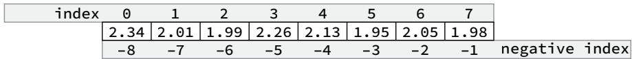  
Figure 3.1 Diagram of a list with positive and negative indexes.

Python lists are mutable, meaning that their contents can be modified in place. Individual elements are modified by assigning new values to list elements using the same square bracket index notation used to access individual list elements, only on the left side of an assignment. For example, we can update the last element in the previous list using an assignment like the following, where the list element access appears on the left side of the assignment.

```txt
>>> data[-1] = 1.97  
>>> data  
[2.34, 2.01, 1.99, 2.26, 2.13, 1.95, 2.05, 1.97]  
>>> 
```

It is also possible to delete an element in a list using square bracket notation by preceding the expression with the del keyword, forming a del statement. The identified list element will be deleted from the list, in place.

```txt
>>> data  
[2.34, 2.01, 1.99, 2.26, 2.13, 1.95, 2.05, 1.97]  
>>> del data[1]  
>>> del data[-1]  
>>> data  
[2.34, 1.99, 2.26, 2.13, 1.95, 2.05]  
>>> 
```

# 3.1.4 Slicing Lists

Not only can we operate on individual elements of a list, but we can also both access and update ranges of a list at the same time. Python provides a notation for selecting a contiguous range of elements from a list, called a slice. Slice notation can be used to obtain a copy of a range of elements as well as to overwrite a range of elements in a list.

Like accessing single list elements, slices are updated using square brackets. The difference lies in what we enter between the square brackets. A slice uses a colon to separate the index of the first element to slice and one greater than the index of the last element to slice. For example, if we wanted to copy the second and third elements from the data list in our previous example, we’d use the index 1 as the first part of the slice (the second element in the list is at index 1) and index 3 as the second part of the slice (the third element is at index 2, so the second part of our slice is one past index 2, which is index 3). To slice a copy of the second and third elements from the list, we would use the notation data[1:3]. Note that a slice does not remove elements from the list. A slice makes a copy only. In the example below, we display the data list after the slice, which demonstrates that the sliced elements are not removed from the list.

```txt
>>>data[1:3][2.01，1.99]
```

```txt
>>> data  
[2.34, 2.01, 1.99, 2.26, 2.13, 1.95, 2.05, 1.97]  
>>> 
```

Both positive and negative indexes may be used to slice a list. For example, if we want to slice all elements from the data list except the first and last, we could use the convenient slice notation data[1:-1].

```html
>>>data[1:-1] [2.01，1.99，2.26，2.13，1.95，2.05] >>>
```

One or both indexes may be left out of a slice. When the first index is not specified, the first index is assumed to be the first index of the list. When the second index is not specified, the second index is assumed to be one past the last index in the list. When neither index is specified leaving only the colon, it is called a bare slice. A bare slice yields a copy of the entire list. In fact, a bare slice is a standard way to make a copy of a list or any other linear data structure capable of being sliced.

In the example below, we demonstrate each case where one or both slice indexes are not specified. We use the $^ { 6 6 } = = ^ { 9 9 }$ operator to prove that the two lists contain the same element values in the same order, and the “is” operator to prove that the lists are distinct objects. See subsection 3.1.5 for more information about “is” and other operators that work with lists.

```txt
>>> data[: -1] # Slice beginning up to by not including last element [2.34, 2.01, 1.99, 2.26, 2.13, 1.95, 2.05]  
>>> data[1:] # Slice element at index 1 to the last element [2.01, 1.99, 2.26, 2.13, 1.95, 2.05, 1.97]  
>>> data2 = data[: ] # Perform bare slice to make a complete copy  
>>> data == data2 # Check that list values are the same  
True  
>>> data is data2 # Prove they are different lists  
False 
```

A list slice can appear on the left side of an assignment with the updated value being another list or other linear data structure.

Let’s assume we have constructed a list of well labels to be tested containing the strings 'A1', 'C3', 'E5', and 'G7'. We decide to insert strings 'H8', 'F6', 'D4', and 'B2' at the correct locations within the list to maintain a certain order. One way to do this is to assign lists to slices, replacing each slice with the elements in the list. The following example does the desired insertion by reassigning slices. There are other ways to accomplish this task, which we’ll discuss in the following sections.

```python
>>> wells = ['A1', 'C3', 'E5', 'G7']
>>> wells[-1:] = ['G7', 'H8']
>>> wells[2:4] = ['E5', 'F6', 'G7']
>>> wells[1:3] = ['C3', 'D4', 'E5']
>>> wells[:2] = ['A1', 'B2', 'C3']
>>> wells 
```

```txt
['A1', 'B2', 'C3', 'D4', 'E5', 'F6', 'G7', 'H8'] >>> 
```

Finally, note that a del statement removes slices from a list, in place, in a manner that is similar to how it removes individual list elements.

```txt
>>> wells  
['A1', 'B2', 'C3', 'D4', 'E5', 'F6', 'G7', 'H8']  
>>> del wells[1:-1]  
>>> wells  
['A1', 'H8']  
>>> 
```

# 3.1.5 Lists Operators

Many operators are defined to accept lists as operands. See Table 3.1 for several examples.

The $" + >$ operator takes two list operands and produces a new list that is the concatenation of the two operands. A surprising operator that accepts one list and one integer operand is “*.” This operator concatenates the list operand to itself a number of times, producing a new repeated list.

Following are a couple of examples of these operators. Joining lists into new lists is accomplished easily by adding them. If we need a list containing 50 zeros, rather than typing out the entire list, we can multiply a list with one zero by 50.

```txt
>>> ['A1', 'B1', 'C1'] + ['F12', 'G12', 'H12']
['A1', 'B1', 'C1', 'F12', 'G12', 'H12'] 
```

Table 3.1 Several operators that accept lists as operands.   

<table><tr><td>Operator</td><td>Description</td></tr><tr><td>l1 + l2</td><td>Concatenate lists l1 and l2.</td></tr><tr><td>L1 += l2</td><td>Concatenate lists and reassign to l1.</td></tr><tr><td>L * n</td><td>Assemble a new list by repeating an existing list n times.</td></tr><tr><td>L *= n</td><td>Repeat a list n times and reassign.</td></tr><tr><td>V in l</td><td>Test if v is a member of l.</td></tr><tr><td>v not in l</td><td>Test if v is not a member of l.</td></tr><tr><td>l1 == l2</td><td>Test if l1 and l2 are equivalent, including elements.</td></tr><tr><td>L1 != l2</td><td>Test if l1 and l2 are not equivalent.</td></tr><tr><td>L1 &lt; l2</td><td>Compare l1 and l2 elementwise with &lt; operator.</td></tr><tr><td>L1 &lt;= l2</td><td>Compare l1 and l2 elementwise with &lt;= operator.</td></tr><tr><td>L1 &gt; l2</td><td>Compare l1 and l2 elementwise with &gt; operator.</td></tr><tr><td>L1 &gt;= l2</td><td>Compare l1 and l2 elementwise with &gt;= operator.</td></tr><tr><td>L1 is l2</td><td>Test if l1 and l2 are two names for the same list.</td></tr><tr><td>L1 is not l2</td><td>Test if l1 and l2 do not refer to the same list.</td></tr></table>

```erlang
>>> [0] \*50   
[0, 0, 0, 0, 0, 0, 0, 0, 0, 0, 0, 0, 0, 0, 0, 0, 0, 0, 0, 0, 0, 0, 0, 0, 0, 0, 0, 0, 0, 0]   
>>> 
```

The “in” and “not in” operators are handy because these operators test for list membership. For example, continuing with our previous wells list, we can test if the string 'B1' is a member of the wells list and if 'B1' is not a member of the wells list. Both operators yield a value of type bool. The “in” operator will be used again in subsection 4.2.2 with a for-statement to access each element in a list, one at a time.

```txt
>>> wells = ['A1', 'B2', 'C3', 'D4', 'E5', 'F6', 'G7', 'H8']
>>> 'B1' in wells
False
>>> 'B1' not in wells
True
>>> 
```

Comparison operators accept list operands as well. As we’ve seen, the $^ { 6 6 } = = ^ { 5 9 }$ operator tests if two lists contain the same sequence of values in the same order. This operator does not test identity.

The inequality operators compare lists, element by element, until a difference is found. For example, consider the following two lists assigned to the variables exp1 and exp2. The exp1 list is longer than the exp2 list, but they differ in the third list element. When evaluating the exp1 > exp2 expression, Python starts by comparing the first two elements of each list. Finding that they are the same, it moves to the second pair. On the third pair, it finds that $^ { \prime } { \bf C } \bf { 1 } ^ { \prime } > \bf { \sigma } ^ { \prime } { \bf C } \bf { 2 } ^ { \prime }$ yields False, and so the result for comparing the two lists is also False. The fact that the first list is longer than the second is only a factor when all previous values are equivalent. In this case, the presence of a list element is considered to be ordered after the absence of a value. Consequently, $[ \mathbf { \partial } ^ { \prime } \mathbb { A } ] \cdot ] \quad > \quad [ ]$ evaluates to True because there is a value in the first element of the first list and no value in the first element of the second empty list. Also recall that strings (and therefore string-typed list elements) are compared lexicographically, which means that their underlying character encoding is used as a stand-in for value to compare.

```txt
>>> exp1 = ['A1', 'B1', 'C1', 'D1']  
>>> exp2 = ['A1', 'B1', 'C2']  
>>> exp1 > exp2  
False  
>>> 
```

A similar comparison procedure is performed when applying the other inequality comparison operators to list operands or other linear data structures in Python.

It is especially important to understand how the “is” and “is not” operators differ from the “==” and “! $\vdots = \ '$ operators. The “is” and “is not” operators check that the two operands are identical objects in memory. That is, the variables are two different names for the same object. By comparison, the $^ { 6 6 } = = ^ { 5 5 }$ and “!=” operators test the contents of the list, element by element. We saw this come into play in subsection 3.1.4 when we performed a bare slice of a list, which yields a copy of the list.

The following example demonstrates these facts. The variable exp3 is assigned to exp1, making it another name for the exp1 list. The variable exp4 is assigned to a bare slice of the exp1 list, making it a copy of the exp1 list. When comparing exp1 with exp3 and with exp4 using the $^ { 6 6 } = = ^ { 9 9 }$ operator, both results yield True because all three lists are equivalent, element by element. When comparing exp1 with exp3 and exp1 with exp4 using the “is” operator, we have different results. Because exp1 and exp3 refer to the same list, the expression “exp1 is exp3” yields True. Because exp1 and exp4 are different list objects, the expression “exp1 is exp4” yields False.

A further demonstration that exp1 and exp3 refer to the same list and exp4 to a different list is apparent when changing the value of the first list element using the exp1 variable. Changes made using exp1 are evident when viewing through exp3. But no list modifications are made to the exp4 list because it is a distinct list object.

```txt
>>> exp1 = ['A1', 'B1', 'C1', 'D1']  
>>> exp3 = exp1  # exp3 is another name for the exp1 list  
>>> exp4 = exp1[.]  # exp4 is a copy of the exp1 list  
>>> exp1 == exp3  # Tests for element equality  
True  
>>> exp1 == exp4  # Both lists are equal elementwise  
True  
>>> exp1 is exp3  # Tests for identical list objects  
True  
>>> exp1 is exp4  # These lists are not the same  
False  
>>> exp1[0] = 'H12'  # Changing the value of the first element...  
>>> exp3  # ...is apparent when using exp3  
['H12', 'B1', 'C1', 'D1']  
>>> exp4  # The list copy is not modified  
['A1', 'B1', 'C1', 'D1']  
>>> 
```

# 3.1.6 Lists as Objects

We’ve seen how a list’s contents may be modified using square bracket notation, both by modifying individual elements as well as modifying slices. List objects may be modified in many additional ways using list methods. As we’ve mentioned, a method is like a function that belongs to an object. Invoking a method uses a similar but slightly different syntax than a function. With a method, the object that owns the method is written to the left of the method name and joined to the method with a dot (.). Like functions, a method name must be followed with a pair of parentheses containing zero or more arguments.

For example, one list method is named append(…). As its name implies, the append(…) list method adds a new element to the end of a list. There is no need to reassign a list variable to the result of invoking the append(…) method, the addition is made to the list in place. In the example below we added 'E1' to the exp1 list using its append(…) method. Note the syntax used to invoke a method. The exp1 variable is written first and joined to the append(…) method using a “.”. Following the method name is a pair of parentheses containing the argument to be appended to the end of the list. Viewing the exp1 list variable after the method is invoked demonstrates that 'E1' is now the last element in the list, no reassignment required. Refer to Table 3.2 for several additional list methods.

Table 3.2 Several list methods.   

<table><tr><td>Method</td><td>Description</td></tr><tr><td>1.append(x)</td><td>Add x to the end of a list.</td></tr><tr><td>1.clear()</td><td>Remove all elements from the list.</td></tr><tr><td>1.copy()</td><td>Make a shallow copy of a list.</td></tr><tr><td>1.count(x)</td><td>Return the count of x elements found in a list.</td></tr><tr><td>1.extend(12)</td><td>Extends a list l with the contents of the list l2, similar to the += operator.</td></tr><tr><td>1.index(x)</td><td>Return the index of the first x found, or an exception if not found.</td></tr><tr><td>1.insert(i,x)</td><td>Insert x into a list at index i, shifting other elements to the right.</td></tr><tr><td>1.pop([i])</td><td>Remove the element with index i, or the last element if the index is omitted.</td></tr><tr><td>1.remove(x)</td><td>Remove x from the list, if found.</td></tr><tr><td>1.reverse()</td><td>Reverse the order of list elements in place.</td></tr><tr><td>1.sort()</td><td>Sort list elements in place.</td></tr></table>

```txt
>>>exp1 ['H12'，'B1'，'C1'，'D1']   
>>>exp1.append('E1')   
>>>exp1 ['H12'，'B1'，'C1'，'D1'，'E1']   
>>>
```

In addition to the append(…) method, elements can be added to list objects using the extend(…) and the insert(…) methods. The extend(…) method works like append(…) except that it takes as an argument another linear sequence of elements to be added to the end of the list. The result is similar to using the “ $\cdot _ { + = }$ ” operator to extend a list. The insert(…) method is like append(…) except that the new element is inserted into the list at the index specified as the first argument. Remaining elements in the list are shifted to the right to make room for the newly inserted element.

```txt
>>> exp1 = ['H12', 'B1', 'C1', 'D1', 'E1']
>>> exp1 extend(['G1', 'H1'])  
>>> exp1
['H12', 'B1', 'C1', 'D1', 'E1', 'G1', 'H1']
>>> exp1.insert(5, 'F1')
>>> exp1
['H12', 'B1', 'C1', 'D1', 'E1', 'F1', 'G1', 'H1']
>>> 
```

There are several ways to remove an element from a list. These are distinguished by the way they identify the element to be removed. It is possible to remove an element by its list index or by its value.

The list pop(…) method and del statement may be used to remove an element by its index. The pop() method with no index argument removes the last list element. The remove(…) method removes a list element by matching its value. Only the first matching element is removed. See the following console session for examples.

```python
>>> exp1  
['B1', 'C1', 'D1', 'E1', 'F1', 'G1']  
>>> exp1 = ['H12', 'B1', 'C1', 'D1', 'E1', 'F1', 'G1', 'H1']  
>>> del exp1[0] # Remove an element from a list using element index  
>>> exp1  
['B1', 'C1', 'D1', 'E1', 'F1', 'G1', 'H1']  
>>> item = exp1.pop(1) # Remove an element using index and return it  
>>> item, exp1  
('C1', ['B1', 'D1', 'E1', 'F1', 'G1', 'H1'])  
>>> last = exp1.pop() # Remove and return the last element from a list  
>>> last, exp1  
('H1', ['B1', 'D1', 'E1', 'F1', 'G1'])  
>>> exp1.remove('E1') # Remove an element from a list by its value  
>>> exp1  
['B1', 'D1', 'F1', 'G1']  
>>> 
```

Two list methods that rearrange the order of its elements are sort() and reverse(). The sort() method orders the elements in a list based on pairwise comparison using the “<” operator. The reverse() method reverses the order of elements in a list, once again, in place.

Consider the effect of sort() and reverse() on the following example list of numbers, list of strings, and list of lists. Make sure to note how each method operates on the list in place. Each variable is not reassigned after invoking a method.

```prolog
>>> data = [1.9, 3.2, 2, 5]  
>>> data.sort()  
>>> data.reverse()  
>>> data  
[5, 3.2, 2, 1.9]  
>>> wells = ['B12', 'B10', 'B03']  
>>> wells.sort()  
>>> wells.reverse()  
>>> wells  
['B12', 'B10', 'B03']  
>>> lists = [[3, 2, 1], [2, 3], [4]]  
>>> lists.sort()  
>>> lists  
[[2, 3], [3, 2, 1], [4]]  
>>> lists.reverse()  
>>> lists  
[[4], [3, 2, 1], [2, 3]]  
>>> 
```

One final point to note is the way a list’s copy() method works, especially when copying lists of lists, or similar. The copy() method performs a shallow copy, meaning that it duplicates elements only at the first level. Remaining referenced elements are unchanged.

Consider the following scenario in which we have planned three assays to be run on different wells of a microtiter plate. The variables assay1, assay2, and assay3 reference lists holding the well labels for each run. We then group these together in a list of lists and assign the group to the experiment1 variable. Entering the variable name in the console reveals the list of list structure of experiment1.

```python
>>> assay1 = ['A1', 'B1', 'C1']
>>> assay2 = ['A2', 'B2', 'C2']
>>> assay3 = ['A3', 'B3', 'C3']
>>> experiment1 = [assay1, assay2, assay3]
>>> experiment1
[['A1', 'B1', 'C1'], ['A2', 'B2', 'C2'], ['A3', 'B3', 'C3']] 
```

Let’s say that we want to make a copy of experiment1 and save it to the backup variable for safe keeping. Referring to the continuation of the console session below, we use the copy() list method on experiment1 to make a copy and assign it to the variable backup. We even prove that experiment1 and backup are distinct lists by testing them with the is operator, which yields False.

Next, we want to update assay1 by appending 'D1' to the list. This append(…) had the intended effect on experiment1, which is to add the new element 'D1' to the first sublist. But when checking backup, you'll note that changing assay1 also changed the content of the backup list, which is not what we intended. The intention was to make a backup copy of the original list. How did that happen?

```coffeescript
>>> backup = experiment1.copy()
>>> backup
[[A1', B1', C1'], ['A2', B2', C2'], ['A3', B3', C3]]
>>> backup is experiment1
False
>>> assay1.append('D1')
>>> experiment1
[[A1', B1', C1', D1'], ['A2', B2', C2'], ['A3', B3', C3]]
>>> backup
[[A1', B1', C1', D1'], ['A2', B2', C2'], ['A3', B3', C3]]
>>> 
```

Of course, the reason for this behavior is that the copy() list method is a shallow copy. Only references to the assay1, assay2, and assay3 sublists were copied into backup, the sublists themselves were not copied. Even though backup is a copy of experiment1, its sublists are unchanged.

To solve this problem, we must perform a deep copy of the experiment1 list. The list object does not have a method to perform deep copies. Instead, we must use a helper method, which is available from the copy module provided by Python.

Like the math module, the copy module must be imported before its functions can be used. Once imported, the deepcopy(…) function in the copy module will copy the experiment1 list and all its sublists to a new list. If the list’s sublists themselves contain additional lists, deepcopy(…) will copy them all by recursing down through the nested data structure and making a copy at each level, for every level of the data structure.

In the following update, we import the copy module and use its deepcopy(…) function to make a copy of experiment1, which is saved to backup2. Then we add the new well label 'D2' to the assay2 list, and check the lists referenced by experiment1 and backup2. Success! We have achieved what we wanted, which is deep copy of experiment1 that does not change after modifying the original list's elements.

```python
>>> import copy
>>> experiment1
[[A1', B1', C1', D1'], ['A2', B2', C2'], ['A3', B3', C3]]
>>> backup2 = copy.deepcopy(experiment1)
>>> backup2
[[A1', B1', C1', D1'], ['A2', B2', C2'], ['A3', B3', C3]]
>>> assay2.append('D2')
>>> experiment1
[[A1', B1', C1', D1'], ['A2', B2', C2', D2'], ['A3', B3', C3]]
>>> backup2
[[A1', B1', C1', D1'], ['A2', B2', C2'], ['A3', B3', C3]]
>>> 
```

# 3.2 Tuples

Another linear data structure provided by Python is the tuple. Tuples are very similar to lists, with one very important difference; tuples are immutable. Once a tuple is created, it cannot be changed. This immutability feature makes tuples useful in situations where the mutability of lists makes them unsuitable for the purpose. We’ll learn about one of these situations in Section 3.3, which is that tuples can be used as dictionary keys, but lists cannot. Stay tuned.

# 3.2.1 Introducing Tuples

Like lists, tuples may be created using literal notation. A tuple is written as a simple comma-separated sequence of values. One potential difficulty with this literal notation is that it may be ambiguous with other comma-separated sequences in your code, such as with notation for arguments passed to a function. To avoid any ambiguity, you will often find tuples delimited with parenthesis. This serves to ensure that the sequence is itself interpreted as a tuple by prioritizing its evaluation as a single standalone unit.

Let’s repeat our previous example, only this time using tuples.

```txt
>>> assay1 = 'A1', 'B1', 'C1'  
>>> assay2 = 'A2', 'B2', 'C2'  
>>> assay3 = 'A3', 'B3', 'C3'  
>>> type(assay1)  
<class 'tuple'>  
>>> experiment1 = assay1, assay2, assay3  
>>> experiment1  
(( 'A1', 'B1', 'C1'), ('A2', 'B2', 'C2'), ('A3', 'B3', 'C3'))  
>>> 
```

Many of the same operators that take list operands can also take tuple operands (Table 3.1). Tuple element access and slicing of tuples uses square brackets and indexes, in a manner identical to lists.

But, because tuples are immutable, they do not support operators or methods that modify the sequence of elements. For example, you cannot assign a value to a tuple index using square bracket access on the left of an assignment. Nor can you replace a slice. You cannot use the del statement to remove elements from a tuple. Note that the “+” operator is supported by tuples because it yields a new tuple made up of copies of its tuple operands.

Table 3.3 Tuple methods.   

<table><tr><td>Method</td><td>Description</td></tr><tr><td>t.count(x)</td><td>Return the count of x elements found in a list.</td></tr><tr><td>t.index(x)</td><td>Return the index of the first x found, or an exception if not found.</td></tr></table>

Most list methods do not appear as tuple methods because most list methods modify the list. Tuples are left with only two methods, count(…) and index(…) (see Table 3.3). All other list methods make changes to the sequence of values. Even though tuples are simple, they are very useful for situations when a linear data structure is required but its elements should not be changed.

# 3.3 Dictionaries

Competing with the list as the most important data structure in Python is the dictionary. Like a list, a dictionary is a linear collection of stored items. Unlike a list, items in the dictionary are an unordered collection key-value pairs, where each key is mapped to a value. The dictionary type dict is called a mapping type. Dictionaries are useful when you’d like to group together a set of values of any type and access them by a key rather than an index.

# 3.3.1 Introducing Dictionaries

Literal notation for a dictionary is a comma-separated linear sequence of key-value pairs that is delimited by curly brackets $( \{ \ldots \} )$ instead of square brackets ([…]) or parentheses. As with lists and tuples, square bracket notation is used to access individual values in a dictionary. What is different is that a key is placed between the square brackets instead of an index.

Values in a dictionary may be any Python object, even other dictionaries, but dictionary keys must be immutable. Python strings and tuples are immutable Python objects often used as dictionary keys. The reason for this constraint is due to the way keys are associated with their corresponding values in a dictionary. A key is hashed to an integer which is associated with each value. If the key changes, so does its hash, making it impossible to find it in the dictionary.

In the example below, we construct a dictionary saved to the variable readings1 with strings as keys and floating-point numbers as values. This example uses a dictionary to store measurements on the wells of a microtiter plate, the labels of which are used as the dictionary’s keys.

```txt
>>> readings1 = {'A1': 1.23, 'B1': 2.95, 'C1': 8.03, 'D1': 0.02}
>>> readings1
{'A1': 1.23, 'B1': 2.95, 'C1': 8.03, 'D1': 0.02}
>>> 
```

Like lists, dictionaries can hold data with multiple types. This makes a dictionary a convenient way to create an ad hoc group of related labeled data elements. For example, here is a dictionary that collects a set of fields describing a hypothetical sample tube.

```python
t1 = {'sample': 'S-002', 'type': 'microtube', 'volume': 0.12, 'units': 'mLs', 'box': 'B00002', 'position': (2, 5), 'shelf': 2, 'freeze': 'F1', 'temperature': -80, 'room': '102', 'owner': 'Bill'} 
```

In our t1 dictionary, all keys are strings, but values include strings, integers, floating-point numbers, and even tuples.

# 3.3.2 Global Functions That Operate on Dictionaries

Few global functions accept dictionaries as a parameter. One is the len(…) global function that returns the number of key-value pairs, not the number of keys plus the number of values. This reinforces the idea that a dictionary is a collection of pairs. The type(…) global function demonstrates that a variable is a dictionary, which has the Python class dict.

```txt
>>>len(readings1)   
4   
>>>type(readings1)   
<class 'dict'>   
>>> 
```

# 3.3.3 Accessing Dictionary Items

A pair of square brackets following a variable referencing a dictionary and enclosing a dictionary key is used to access the associated dictionary value, both to read and to modify the value. In the example below, we use expressions like t1['box'] to access the values of the dictionary t1 and substitute these expressions into an f-string. In the example, the value in the t1 dictionary stored at the key 'box' is modified by assignment and the f-string is repeated to demonstrate the change.

```txt
>>> f"Sample {t1['sample']} is in box {t1['box']} of freezer {t1['freeze']}"
'Sample S-002 is in box B00002 of freezer F1'
>>> t1['box'] = 'B00003'
>>> f"Sample {t1['sample']} is in box {t1['box']} of freezer {t1['freeze']}"
'Sample S-002 is in box B00003 of freezer F1'
>>> 
```

Adding a new key-value pair to a dictionary is accomplished by assigning a value to a dictionary's key using square bracket notation, not unlike creating a new variable is accomplished by assigning a new value to a variable name.

```python
>>> readings1 = {'A1': 1.23, 'B1': 2.95, 'C1': 8.03, 'D1': 0.02}  
>>> readings1 
```

```txt
{'A1': 1.23, 'B1': 2.95, 'C1': 8.03, 'D1': 0.02}  
>>> readings1['E1'] = 3.14  
>>> readings1  
{'A1': 1.23, 'B1': 2.95, 'C1': 8.03, 'D1': 0.02, 'E1': 3.14}  
>>> 
```

A del statement with square brackets and a key can be used to delete items from a dictionary in a manner that is analogous to how elements are deleted from a list using square brackets and an index. In the following example we delete the key 'E1' and its associated value from the readings1 list using a del statement.

```txt
>>> del readings1['E1']  
>>> readings1  
{'A1': 1.23, 'B1': 2.95, 'C1': 8.03, 'D1': 0.02}  
>>> 
```

# 3.3.4 Dictionary Operators

Table 3.4 includes several operators that accept dictionaries as operands. The “ $\stackrel { \cdot } { = } \stackrel { - } { = }$ ,” “! $\downarrow =$ ,” “is” and “is not” operators work in a manner similar to the way they work with lists. That is that the $^ { 6 6 } = = ^ { 5 9 }$ and “!=” operators check that the two dictionaries have the same keys and values, whereas the “is” and “is not” operators test that the two names refer to the identical dictionary or different dictionaries, regardless of content.

See the following for a quick demonstration of the difference between the $^ { 6 6 } = = ^ { 9 9 }$ and “is” operators with dictionary operands. Two distinct dictionaries are created in place using literal notation and then tested with the $^ { 6 6 } = =$ ” operator. This test yields True because both dictionaries contain the same key and value. When the same test is performed with the “is” operator, the result is False even though the two dictionaries contain the same key and the same value. This is because the two dictionaries are created separately and therefore they are distinct objects in memory.

```txt
>>> {'a':1} == {'a':1} True   
>>> {'a':1} is {'a':1} False   
>>> 
```

Table 3.4 Operators that accept dictionaries as operands.   

<table><tr><td>Operator</td><td>Description</td></tr><tr><td>k in d</td><td>Test if key k is used in the dictionary d.</td></tr><tr><td>k not in d</td><td>Test if key k is not used in the dictionary d.</td></tr><tr><td>d1 == d2</td><td>Test if two dictionaries d1 and d2 contain equivalent data.</td></tr><tr><td>d1 != d2</td><td>Test if two dictionaries d1 and d2 contain different data.</td></tr><tr><td>d1 is d2</td><td>Test if dictionaries d1 and d2 refer to the exact same dictionary.</td></tr><tr><td>d1 is not d2</td><td>Test if dictionaries d1 and d2 refer to different dictionaries.</td></tr></table>

To understand the “in” and “not in” operators it is helpful to refine our mental model of a dictionary a bit further, beyond the collection of pairs model. It is helpful to think of a dictionary as a list of keys as well, with each key having an associated value that comes along for the ride. With this refinement in mind, the way the “in” and “not in” operators work is expected. Recall that with a list as the right operand, the “in” operator tests if the left operand is found as an element in the list. With a dictionary as the right operand, the “in” operator tests if the left operand is one of the keys in the dictionary. Similarly, the “not in” operator tests if the left operand is not a key in the dictionary. The “in” operator will be used again in subsection 4.2.2 with a for-statement to access each key in a dictionary, one at a time, which can be used to access the values associated with each key.

```txt
>>> 'box' in t1   
True   
>>> 'row' in t1   
False   
>>> 
```

# 3.3.5 Dictionaries as Objects

As with a list, dictionaries implement several methods that provide a wider range of options. The same syntax is used to invoke methods of a dictionary that we use for invoking methods of any object, which is to follow a dictionary with a dot (.), name of the method to invoke, and end with a pair of parentheses containing the parameters to be passed to the method, if any. Table 3.5 defines several useful dictionary methods.

The keys() method returns a collection of keys in the dictionary, the values() method returns a collection of values and the items() method returns a collection of (key, value) tuples. Note that these methods do not return a list or tuple, but rather the specialized class types named dict_keys, dict_values, and dict_items. These specialized classes do not copy the items in each collection, but instead produce an object that is a kind of view on the existing collection of items in the dictionary. This allows us to access and iterate the items without duplicating the memory that would be required when making a copy. If an explicit copy is required, you may convert each class to a linear data structure like a list or tuple using the associated global conversion function. In the example below we first access keys, values, and items of the readings1 dictionary and obtain a

Table 3.5 Several dictionary methods.   

<table><tr><td>Method</td><td>Description</td></tr><tr><td>d.clear()</td><td>Remove all items from the dictionary d.</td></tr><tr><td>d.copy()</td><td>Make a shallow copy of the dictionary d.</td></tr><tr><td>d.get(k [,default])</td><td>Get item with key k. Return default if not found.</td></tr><tr><td>d.items()</td><td>Return a collection of (key, value) tuples in dictionary d.</td></tr><tr><td>d.keys()</td><td>Return a collection of keys used in the dictionary d.</td></tr><tr><td>d.pop(k [,default])</td><td>Remove the value with key k or default if not found.</td></tr><tr><td>d.update(d2)</td><td>Update the contents of d with dictionary d2.</td></tr><tr><td>d.values()</td><td>Return a collection of values in the dictionary d.</td></tr></table>

specialized view class. Then we repeat the access, only converting each to a list, explicitly, using the list(…) conversion function.

```prolog
>>> readings1 = {'A1': 1.23, 'B1': 2.95, 'C1': 8.03, 'D1': 0.02}
>>> readings1.keys()
dict_keys(['A1', 'B1', 'C1', 'D1}]
>>> readings1.values()
dict_values([1.23, 2.95, 8.03, 0.02])
>>> readings1.items()
dict_items([(A1', 1.23), ('B1', 2.95), ('C1', 8.03), ('D1', 0.02)]
>>> # Repeat, but convert each result to a list
>>> list(readings1.keys())
['A1', 'B1', 'C1', 'D1']
>>> list(readings1.values())
[1.23, 2.95, 8.03, 0.02]
>>> list(readings1.items())
(['A1', 1.23), ('B1', 2.95), ('C1', 8.03), ('D1', 0.02)]
>>> 
```

The get(…) method is a useful alternative to using square brackets when the dictionary does not have the specified key and a default value should be returned instead. This ensures that a value is always returned, whether or not the dictionary has the key. In the example below we use the get(…) method twice on the t1 dictionary. In the first case, we attempt to get the value of the 'box' key and set the default value to 'NOBOX'. Because the t1 dictionary has the key, the corresponding value is returned. In the second case we attempt to get the value associated with the 'row' key and set the default value to −1. Because there is no 'row' key in the t1 dictionary, the result is −1. As you can see, attempting to get a value using a key not in the dictionary results in a KeyError. Using the get(…) method ensures that no exception will occur because the default value will be returned instead.

```txt
>>> t1.get('box', 'NOBOX')
'B00003'
>>> t1.get('row', -1)
-1
>>> t1['row']
Traceback (most recent call last):
    File "<stdin>", line 1, in <module>
KeyError: 'row'
>>> 
```

The dictionary pop(…) method works in a manner similar to get(…) in that if the provided key argument does not exist in the dictionary, rather than raise a KeyError, the default argument provided is returned. Unlike the get(…) method, the pop(…) method will also delete the key and value from the dictionary, if the key is found. To demonstrate, let’s try to delete the 'D1' key a second time from the readings1 dictionary, but with a default value.

```txt
>>> readings1.pop('D1', 'not found')  
'not found'  
>>> 
```

The update(…) dictionary method is very useful when you’d like to add or update the values of several dictionary keys. It is not necessary to assign keys one at a time. In the example below we add the keys 'A2', 'B2', 'C2' and 'D2' to the readings1 dictionary all at once using update(…).

```html
>>> readings1.update({'A2':0.0,'B2':0.0,'C2':0.0,'D2':0.0})
>>> readings1
{'A1':1.23,'B1':2.95,'C1':8.03,'D1':0.02,'A2':0.0,'B2':0.0,'C2':0.0,'D2':0.0} 
```

# 3.4 Sets

The final built-in linear data structure we’ll cover is the set. A Python set mimics a mathematical set in many ways, the most important of which is that it is not possible for two elements having the same value to be in the set simultaneously. In other words, the value of every element in a set is unique.

# 3.4.1 Introducing Sets

To determine the uniqueness of each element, set elements must be hashable, just like the keys of a dictionary. This implies that sets may contain immutable elements like numbers, strings, and tuples. Sets may not contain mutable elements like lists, dictionaries, and other sets. Another way that sets are like dictionaries is that the elements they hold are not ordered. Lists and tuples maintain the order of their elements, but dictionaries and sets do not.

A set may be created using literal notation by writing a sequence of values delimited by curly brackets $( \{ \ldots \} )$ . This works well until you want to create an empty set with a plain pair of curly brackets ({}), which would have the exact same syntax as an empty dictionary. Python chooses to reserve the empty curly brackets for an empty dictionary, which means that our only way to create an empty set is to use the global set() function. See the console session below with comments.

```txt
>>> tested = {'D1', 'B1', 'C1', 'A1'} # Create a new set of strings  
>>> tested # Display the set  
{'D1', 'A1', 'B1', 'C1'} # Elements print in a different order!  
>>> type(tested) # Check the type  
<class 'set'>  
>>> empty = {} # Try to create an empty set  
>>> type(empty) # The type is a dictionary  
<class 'dict'>  
>>> empty = set() # Use the global function instead  
>>> type(empty) # Now we have an empty set  
<class 'set'> 
```

Finally, note that if your application requires more of a cross between a set and a tuple, have a look at the frozenset class provided in the Python Standard Library. Unlike a standard set, a frozenset cannot be modified once it is created. This allows a frozenset to be hashed, which makes it eligible to be used as keys in a dictionary or as elements in a plain set.

# 3.4.2 Global Functions That Operate on Sets

In addition to the type(…) global function, demonstrated above, the len(…) function will return the number of elements in the set. Several global type conversion functions may be used to convert a set to another linear data structure. For example, the list(…) global function will convert a set to a list, and the tuple(…) global function will convert the set to a tuple. Nevertheless, the order of the resulting list or tuple is undefined.

Most operations on the set data structure are performed using its rich set of operators and the set’s own methods, covered below.

```txt
>>>len(tested)   
4   
>>>len(empty)   
0   
>>> 
```

# 3.4.3 Accessing Set Elements

Note that because set elements are not ordered, elements cannot be accessed using square brackets and an index. In addition, because there is no index, it is also the case that sets cannot be sliced. Furthermore, because there is no key associated with each element in a set, which we have with a dictionary, we cannot use a key to access set elements either.

The best we can do is to convert a set to a list or tuple before accessing elements using square brackets and an index. Because order cannot be guaranteed during conversion, if you need a well-defined order in the result, you will have to sort the list as well. Alternatively, the global function sorted(…) will do both. This function will convert a set to a list and sort it before returning it for further processing. See the example below.

```txt
>>> tmp = sorted(tested) # Convert tested to sorted list  
>>> tmp ['A1', 'B1', 'C1', 'D1'] # Display it to make sure  
>>> tmp[1] + tmp[3] # Access items individually  
'B1D1'  
>>> tmp[1:3] # Slice  
['B1', 'C1'] 
```

# 3.4.4 Set Operators

Perhaps the most powerful and useful feature of a set is its operators. Sets support rich and interesting operators, listed in Table 3.6. This is where sets really shine and provide the kind of enhanced functionality that will be beneficial.

As with our other data structures, sets support the equality operators $\scriptstyle ( = = , \ ! = )$ , membership operators (in, not in), and identity operators (is, is not). Beyond that, sets also support a wide range of operators that perform standard set operations.

The inequality operators with set operands test if operands are subsets $( < , < = )$ or supersets $\left( > , > = \right)$ of one another, returning True or False. Strict inequality operators $( < , > )$ test for a proper subset or superset. Being strict, one set must be smaller (or larger) in size than the other for the operation to be True. To satisfy a strict inequality, the two sets must not be equal.

Table 3.6 Operators that accept sets as operands.   

<table><tr><td>Operator</td><td>Description</td></tr><tr><td>x in s</td><td>Test if element x is in the set (s).</td></tr><tr><td>x not in s</td><td>Test if element x is not in the set (s).</td></tr><tr><td>s1 is s2</td><td>Test is s1 and s2 reference the same set data structure.</td></tr><tr><td>s1 is not s2</td><td>Test is s1 and s2 reference different set data structures.</td></tr><tr><td>s1 == s2</td><td>Test if s1 and s2 contain the same elements.</td></tr><tr><td>s1 != s2</td><td>Test if s1 and s2 contain different elements.</td></tr><tr><td>s1 &lt;= s2</td><td>Test if s1 is a subset of s2.</td></tr><tr><td>s1 &lt; s2</td><td>Test if s1 is a proper subset of s2.</td></tr><tr><td>s1 &gt;= s2</td><td>Test of s1 is a superset of s2.</td></tr><tr><td>s1 &gt; s2</td><td>Test if s1 is a proper superset of s2.</td></tr><tr><td>s1 | s2</td><td>Return the union of s1 and s2.</td></tr><tr><td>s1 |= s2</td><td>Update s1 by adding elements from s2.</td></tr><tr><td>s1 &amp; s2</td><td>Return the intersection of s1 with s2.</td></tr><tr><td>s1 &amp;= s2</td><td>Update s1, keeping only elements found in it and s2.</td></tr><tr><td>s1 - s2</td><td>Return a set with elements of s2 removed from s1.</td></tr><tr><td>s1 -= s2</td><td>Update s1 by removing elements found in s2.</td></tr><tr><td>s1 ^ s2</td><td>Return a new set with elements in either the set or the other but not both.</td></tr><tr><td>s1 ^= s2</td><td>Keep all elements found in s1 or s2, but not both.</td></tr></table>

By contrast, weak inequality operators $\left( < = , > = \right)$ ) yield True when one set is smaller (or larger) or equal, and False otherwise.

Let’s add a new set referenced by the variable test_set1 to our tested set of well labels. We can check if the tested set is a strict subset of test_set1, implying that not all wells have been tested.

```txt
>>> tested
{'D1', 'B1', 'C1', 'A1'}
>>> test_set1 = {'A1', 'B1', 'C1', 'D1', 'E1', 'F1', 'G1', 'H1'}
>>> tested < test_set1
True
>>> 
```

New sets may be computed by combining existing sets. Set union, intersection, difference, and symmetric difference may be calculated using the special set operators “|,” " “&,” “−,” and “^,” respectively. Each of these operators has an alternative form that combines the performance of the operation and an update to a set variable. These alternative operators are formed by adding an “=” to the end of the set operator, similar to the $\mathrm { \Phi ^ { * } } + = \mathrm { \Phi } ^ { \mathrm { p } }$ combination operator and its related arithmetic update combination operators (see Table 3.7).

Let’s define a second test_set2 set in our console session as well as a set of wells that have been contaminated. Using set operators, we can perform some very useful calculations, like removing contaminated wells from the test set. Refer to the comments in the following console session.

```txt
>>> # Add two new sets  
>>> test_set2 = {'A1', 'A2', 'A3', 'B1', 'B2', 'B3'}  
>>> contaminated = {'A1', 'A2', 'B1', 'B2', 'H1', 'H2'}  
>>> The union of test_set1 and test_set2 provides all unique wells to test  
>>> test_set1 | test_set2  
{'B2', 'B1', 'A2', 'G1', 'F1', 'D1', 'B3', 'A3', 'E1', 'H1', 'C1', 'A1'}  
>>> # Remove wells tested from this union to find wells yet to be tested  
>>> (test_set1 | test_set2) - tested  
{'B2', 'A2', 'G1', 'F1', 'B3', 'A3', 'E1', 'H1'}  
>>> # Further remove the contaminated wells for the remaining test set  
>>> (test_set1 | test_set2) - tested - contaminated  
{'G1', 'F1', 'B3', 'A3', 'E1'}  
>>> 
```

# 3.4.5 Sets as Objects

A larger range of set functionality is available by using its methods. Table 3.7 lists set methods and the equivalent operator, if there is one.

Set methods help to modify set elements, such as adding items using the add(…) method, and removing elements using methods like remove(…), discard(…), pop(), and clear().

Table 3.7 Several set methods.   

<table><tr><td>Method</td><td>Oper. 
Equiv.</td><td>Description</td></tr><tr><td>s.clear()</td><td></td><td>Remove all elements from the set s.</td></tr><tr><td>s.copy()</td><td></td><td>Make a shallow copy of the set s.</td></tr><tr><td>s1.isdisjoint(s2)</td><td></td><td>True if no common elements in s1 and s2.</td></tr><tr><td>S1.issubset(s2)</td><td>&lt;=</td><td>True if s1 &lt;= s2.</td></tr><tr><td>s1.issuperset(s2)</td><td>&gt;=</td><td>True of s1 &gt;= s2.</td></tr><tr><td>s1.union(s2)</td><td>|</td><td>Return union of s1 and s2.</td></tr><tr><td>s1.update(s2)</td><td>| =</td><td>s1 = s1 | s2</td></tr><tr><td>s1.intersection(s2)</td><td>&amp;</td><td>Return intersection of s1 and s2.</td></tr><tr><td>s1intersection_update(s2)</td><td>&amp;=</td><td>s1 = s1 &amp; s2</td></tr><tr><td>s1.difference(s2)</td><td>-</td><td>Remove s2 elements from s1.</td></tr><tr><td>s1.difference_update(s2)</td><td>- =</td><td>s1 = s1 - s2</td></tr><tr><td>s1.symmetric_difference(s2)</td><td>^</td><td>Return set with s1 or s2 elements, not both.</td></tr><tr><td>s1.symmetric_difference_update(s2)</td><td>^ =</td><td>s1 = s1 ^ s2</td></tr><tr><td>s1.add(x)</td><td></td><td>Add x to s1</td></tr><tr><td>s1.remove(x)</td><td></td><td>Remove x from s1. Otherwise, raise error.</td></tr><tr><td>s1/discard(x)</td><td></td><td>Remove x from s1, if present.</td></tr><tr><td>s1.pop()</td><td></td><td>Remove an arbitrary element from s1.</td></tr></table>

As with other data structures, the copy() method of a set produces a shallow copy of a set. For a deep copy, use the deepcopy(…) function in the copy module. An additional operation on sets is provided using the isdisjoint(…) method, which tests if two sets have no elements in common.

It is important to note that while set operators accept only set objects as their operands, the set method equivalents of the operators “|,” “&,” “−,” “^,” “<=”, and , ${ \bf \ddot { \Psi } } > = { \bf \vec { \Psi } }$ accept any Python object that can produce a sequence of elements (known as an iterator). This makes these set methods more versatile and broadly applicable.

# 3.5 Destructuring Assignment

Before leaving the topic of linear data structures, let’s consider one more capability of Python known as destructuring assignment. With destructuring assignment, the elements of a data structure are separated (destructured) and assigned to individual variables. Consider the following example.

```csv
>>> x, y, z = 1.2, 2.3, 3.4  
>>> x  
1.2  
>>> y  
2.3  
>>> z  
3.4 
```

The tuple literal “1.2, 2.3, 3.4” is assigned to the three variables “x, y, z” in one statement. During the assignment, the tuple values are separated and assigned to the variables, individually. This is evident when we display the values of each variable after the assignment. Using a tuple data structure on the right side of the assignment gives us a very natural syntax for performing multiple variable assignments using one statement.

Destructuring assignment is possible with lists as well. For example, we can perform the same assignment as the previous example, only this time using a list on the right side of the assignment.

```txt
>>> x, y, z = [5.6, 6.7, 7.8]  
>>> x  
5.6  
>>> y  
6.7  
>>> z  
7.8  
>>> 
```

It might be surprising to learn that dictionaries and sets can also be placed on the right side of a destructuring assignment. In the case of a dictionary, only the dictionary’s keys are assigned to the variables. Unfortunately, because we cannot guarantee the order of keys in a dictionary or the order of elements in set, we cannot know which variables will be assigned to the keys in a dictionary or values in a set. This makes destructuring assignment with dictionaries and sets of limited utility.

In fact, we can do much more with destructuring assignments. In our previous examples, the data structures we used had only one level of values. We can destructure nested data structures by assigning them to nested variable structures. The following example of destructuring assignment assigns x to 1, y to the list [2, 3], and z to 4. Destructuring assignments can be very useful when you need to take apart a more complex data structure.

```txt
>>> x, [y, z] = 1, [[2, 3], 4]  
>>> x  
1  
>>> y  
[2, 3]  
>>> z  
4  
>>> 
```

# 3.6 Key Takeaways

1.	 A Python data structure is a single software construct holding a collection of values that can be individually stored, accessed, and updated.   
2.	 Python’s built-in linear data structures include the list, dictionary, tuple, and set.   
3.	 A list is a mutable, ordered collection of elements having any data type, even a mixture.   
4.	 A tuple is also an ordered collection of elements having any data type, but it is immutable.   
5.	 A dictionary is a mutable, unordered linear sequence of key-value pairs.   
6.	 A set is an unordered, mutable linear sequence of unique elements.   
7.	 Lists, tuples, dictionaries, and sets have literal notation, meaning they may be written literally in a Python program.   
8.	 Global functions like len(…) and sum(…) operate on lists and other Python data structures.   
9.	 Elements in a list and dictionary may be accessed using square brackets. In the case of a list, the element index is specified. In the case of a dictionary, the element key is specified.   
10.	 Because lists and tuples are ordered, it is possible to copy a range of elements from each using slice notation.   
11.	 Many operators take data structures as operands. Set operators are particularly useful when it comes to manipulating sets, including set unions and differences.   
12.	 Python data structures are objects. Each has its own set of methods that may be used to operate on the data structure.   
13.	 Python implements destructuring assignment, which allows the elements of a data structure to be assigned to individual variables.   
14.	 Destructuring assignment can be very useful when it is necessary to access several parts of a more complex data structure.

# Controlling the Flow of a Program

The order in which the statements of a program are executed is called a program’s flow. The default flow in Python’s execution model is to start with the statement at the top of a program and continue to execute each subsequent statement, in order, until the last statement is reached or a runtime error is encountered. This is fine when a computation is composed of a sequence of calculations, where every statement is expected to be executed in order. In general, we need much more control over which program statements are executed, including when they are executed and how many times.

Two core models for modifying the default top-down control flow paradigm in a programming language’s execution model are conditional code execution and repeated code execution. Python includes statements that support both models which are critical to solve many computational problems.

# 4.1 Conditional Execution

With conditional execution, a block of code may be executed or skipped entirely. The decision to execute is determined by an expression that you provide. If that expression evaluates to a truthy value, then the block of code executes. Otherwise, it is skipped.

We use the term truthy here and not just True because in Python an expression can evaluate to a range of values that Python will accept as being essentially True and allow program control flow to proceed. We’ll discuss this further in subsection 4.1.5, but the short answer for what is truthy and falsy can be determined using the global bool(…) conversion function. If bool(…) converts a Python value to True, it is truthy. If bool(…) converts a Python value to False, it is falsy.

# 4.1.1 If-Statements

The purpose of an if-statement is to determine if a block of code should be executed based on the truthiness of an evaluated expression. The schematic layout of a simple if-statement is depicted in Figure 4.1.

The first line of an if-statement starts with the if keyword which is followed by a single expression and ends with a colon (:).

Under the first line of an if-statement is the block of code to be executed when the expression evaluates to a value that is truthy. Python uses indentation with whitespace characters to identify which lines of code are part of a code block, including an if-block. Every line of code with

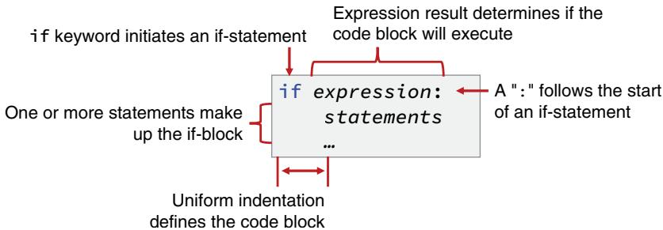  
Figure 4.1 Schematic diagram of a basic if-statement.

consistent indentation is considered part of the same block. The exact makeup of the indentation is not important so long as it uses identical whitespace characters for every indented line in the block of code. When the expression evaluates to a truthy value, the entire code block is executed.

Be mindful of the indentation used to define a block of code in your Python programs. A good programmer’s editor with a Python mode will solve the problem of maintaining consistent indentation. If you must use a plain text editor which is not aware of Python syntax, it is easy to indent one line of a code block with a tab character and the next with four spaces. The editor may display these consecutive lines with the appearance of consistent indentation, but Python will consider them different, likely producing an IndentationError.

Consider the following simple example that tests if a measurement is outside the acceptable range [1, 10]. If it is out of range, the program prints a message. Note the use of the if keyword and the colon. The test expression is multi-part, with two inequalities combined by a disjunction (or). Because the if-statement’s code block consists of only one statement, the whitespace indentation is consistent. Listing 4.1 shows the contents of a file named check1.py which contains our Python commands including an if-statement. The console session that follows shows the program being executed in a terminal and the output produced.

Listing 4.1 Example of a simple if-statement.   
check1.py measurement $=$ int( input("Enter measurement:")) if measurement $<  1$ or measurement $>10$ .. print(f' {measurement} is out of range.'

```txt
> python check1.py  
Enter measurement: 11  
11 is out of range. 
```

# 4.1.2 If-Else Statements

An if-else statement expands the simple if-statement by adding a second code block. Follow the first code block with the keyword else and a colon, which is not indented. Then add a second indented code block. The else keyword must not be indented otherwise it would be considered part of the if code block, and it must appear at the same indentation level as the initial if

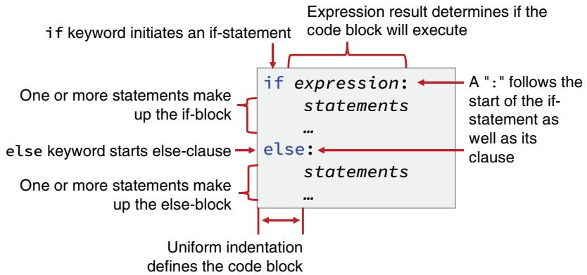  
Figure 4.2 Schematic of an if-else statement.

keyword to signal that it belongs to the if-statement. Figure 4.2 provides a schematic of the Python if-else statement.

As a demonstration, consider Listing 4.2, which expands upon Listing 4.1. When querying the user, we cannot guarantee that a numeric string will be entered. Let’s use a simple if-statement with an expression that first checks that the entered string is numeric by invoking the string’s isnumeric() method (see Table 2.4). If the value entered is not numeric, an error is printed.

If the string entered by the user is not numeric, the if-block is executed, printing an error message. Otherwise, if the entered string is numeric, the if-condition is false, the if-block is skipped, and the else-block is executed instead. The else-block itself converts the entered string into an integer, and then performs another nested if-else statement to validate the value of the integer. Note how the nested if-else is properly indented to indicate that it is part of the outer if-else statement’s else-block. Also note how the nested if-else statement itself has code blocks that are further indented. Levels of indentation are how Python programs identify the statements that belong together in each code block.

In the console session that follows Listing 4.2 we run the program several times, entering different values that test each path through the code to make sure that all parts of the program work correctly.

Listing 4.2 Example of an if-else statement, with a nested if-else statement.   
check2.py   
resp $=$ input("Enter measurement:")   
# Proceed only if entry is numeric   
if not resp.isnumeric(): print('Error. Please enter numeric digits only.')   
else: # Convert string to float measurement $=$ int(resp) if measurement $<  1$ or measurement $>10$ . print(f{'measurement}is out of range.") else: print('Proceed with computation.')

```txt
> python check2.py  
Enter measurement: 11mm  
Error. Please enter numeric digits only.  
> python check2.py  
Enter measurement: 11  
11 is out of range.  
> python check2.py  
Enter measurement: 10  
Proceed with computation. 
```

# 4.1.3 If-Elif-Else Statements

An if-statement is not limited to executing one of only two code blocks. In fact, an if-statement can be expanded to include any number of alternative code blocks. Intermediate code blocks with test expressions are written using an elif keyword. An elif is formatted just like an if, with an expression that must be satisfied before the code block will be executed, but it appears in the middle of the statement (see Figure 4.3). Note that the else keyword and its associated code block is optional. You may write an if-elif statement without the else. But if an else appears, there can be no more than one and it must identify the last block in the statement.

A multi-block if-elif-else statement executes by first evaluating the test expression guarding the if, and if it is truthy, the associated code block executes. Only when the first expression is falsy will the second test expression be evaluated. When all expressions evaluate to values that are falsy, the code block associated with else is executed, if one has been defined.

It is important to understand that only one code block will execute in a multi-block if-elif-else statement. Even when an elif expression is truthy, if an earlier test expression is truthy, the second code block will not execute. This execution model has important implications for how to order expressions to produce the desired flow control.

The example in Listing 4.3 improves upon Listing 4.2 in that the error messages are more descriptive. This is possible by using an if-elif-else statement with the first and second expressions testing

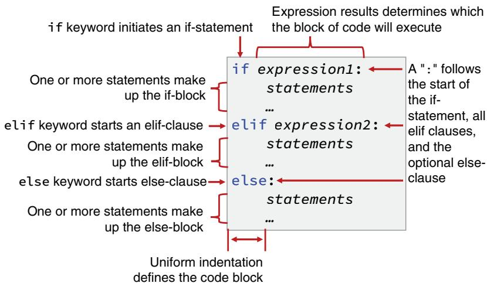  
Figure 4.3 Schematic of an if-elif-else statement.

individual error conditions and printing a more informative error message. It is only when the value entered does not trigger an error will the else-block allow the program to proceed with the main computation. See the console session following Listing 4.3 that tests the program.

Listing 4.3 Example of an if-else statement, with an embedded if-elif-else statement.  
```python
# check3.py
resp = input("Enter measurement:.")
# Proceed only if entry is numeric
if not resp.isnumeric():
    print('Error. Please enter numeric digits only.') 
```

```txt
> python check3.py  
Enter measurment: 11mm  
Error. Please enter numeric digits only.  
> python check3.py  
Enter measurment: 11  
Measurement values cannot be greater than 10.  
> python check3.py  
Enter measurment: 0  
Measurement values cannot be less than 1.  
> python check3.py  
Enter measurment: 10  
Proceed with computation. 
```

# 4.1.4 If-Statement Strategies

Care must be taken when ordering the multiple expressions that guard the options of an expanded if-statement. Only the code block associated with the first truthy expression will execute. One strategy for ensuring that the correct code block of an expanded if-statement is executed is to write all expressions in a mutually exclusive manner. When using a set of mutually exclusive expressions it is impossible for a code block to execute unintentionally.

Listing 4.4 is an example program that computes a shipping method to use based on how fast an ordered item is needed. The user enters a number of days within which the item must be received, and the options for shipment include Overnight, First-Class, Ground, and “cheapest.” After querying the user for a number of days and verifying the input, an expanded inner if-statement makes use of a set of mutually exclusive expressions; only one can ever be true. Consequently, any order

of expressions can be used in the expanded if-statement because the correct result will always be selected. See the console session that follows for a demonstration.

Listing 4.4 Shipping method program using mutually exclusive expressions.   
```python
# shipping1.py
# Query user when needed (days in future)
resp = input('How soon do you need the shipment? (days):')
# Validate response
if not resp.isnumeric():
    print("Error. Please enter a whole number of days.")
else:
    # Convert response to integers
ndays = int(response)
# Mutually exclusive tests permit any order of expressions
if ndays > 5:
    print("Use cheapest shipping method available.")
elif ndays > 1 and ndays <= 3:
    print("Use First-Class shipping.")
elif ndays <= 0:
    print('Fastest delivery is 1 day (overnight).')
elif ndays == 1:
    print("Use Overnight shipping.")
elif ndays > 3 and ndays <= 5:
    print("Use Ground shipping.")
endays 
```

```txt
> python shipping1.py  
How soon do you need the shipment? (days): -1  
Error. Please enter a whole number of days.  
> python shipping1.py  
How soon do you need the shipment? (days): 0  
Fastest delivery is 1 day (overnight).  
> python shipping1.py  
How soon do you need the shipment? (days): 1  
Use Overnight shipping.  
> python shipping1.py  
How soon do you need the shipment? (days): 2  
Use First-Class shipping.  
> python shipping1.py  
How soon do you need the shipment? (days): 3  
Use First-Class shipping.  
> python shipping1.py  
How soon do you need the shipment? (days): 4  
Use Ground shipping.  
> python shipping1.py  
How soon do you need the shipment? (days): 5  
Use Ground shipping. 
```

```txt
> python shipping1.py  
How soon do you need the shipment? (days): 6  
Use cheapest shipping method available.  
> 
```

The trouble with this mutually exclusive approach is the burden of writing all test expressions correctly. Writing a more complex set of expressions is more likely to introduce errors.

We can use a simpler set of expressions that produce the same result, but care must be taken to order the test expressions correctly. The key fact to leverage is the knowledge that when a particular test expression is reached, it must be the case that all earlier test expressions have evaluated to False.

For example, if we check for ndays $\qquad < = \quad 0$ and ndays $\qquad = = \quad \beth$ first, then when selecting the First-Class shipping option, it is not necessary to check that ndays > 1. Knowing that the previous two expressions are false tells us that ndays > 1. We need only the additional check that ndays $< 3$ to choose First-Class. Likewise, to select USPS Ground, if we already know that the ndays $< 3$ expression is false, we need only check that ndays $< = ~ 5$ to select Ground shipping.

The updated program in Listing 4.5 uses the alternative approach, which is demonstrated to be correct in the console session that follows.

Listing 4.5 Shipping method program using simpler but carefully ordered expressions.   
```python
# shipping2.py
# Query user when needed (days in future)
resp = input('How soon do you need the shipment? (days):')
# Validate response
if not resp.isnumeric():
    print("Error. Please enter a whole number of days.")
else:
    # Convert response to integers
ndays = int(resp)
# Carefully ordering permits the use of simpler expressions
if ndays <= 0:
    print('Fastest delivery is 1 day (overnight).')
elif ndays == 1:
    print("Use Overnight shipping.")
elif ndays <= 3:
    print("Use First-Class shipping.")
elif ndays <= 5:
    print("Use Ground shipping.")
else:
    print("Use cheapest shipping method available.")
endays 
```

```txt
> python shipping2.py  
How soon do you need the shipment? (days): -1  
Error. Please enter a whole number of days. 
```

```txt
> python shipping2.py   
How soon do you need the shipment? (days): 0   
Fastest delivery is 1 day (overnight).   
> python shipping2.py   
How soon do you need the shipment? (days): 1   
Use Overnight shipping.   
> python shipping2.py   
How soon do you need the shipment? (days): 2   
Use First-Class shipping.   
> python shipping2.py   
How soon do you need the shipment? (days): 3   
Use First-Class shipping.   
> python shipping2.py   
How soon do you need the shipment? (days): 4   
Use Ground shipping.   
> python shipping2.py   
How soon do you need the shipment? (days): 5   
Use Ground shipping.   
> python shipping2.py   
How soon do you need the shipment? (days): 6   
Use cheapest shipping method available. 
```

# 4.1.5 Truthy and Falsy Values

Test expressions of an if-statement are not required to evaluate to the constant True for the associated code block to be executed, they must evaluate only to a value that is truthy. A truthy value is anything that is not falsy. Falsy values include the following.

•	 Any numeric type with a value of zero, including 0 and 0.0   
•	 The empty string, ''   
•	 An empty data structure, including [], (), $\{ \}$ , and set().

The easiest way to test if a value is truthy or falsy is to use the bool(…) conversion function. The following console session demonstrates which of several sample values are truthy and which are falsy.

```txt
>>> bool()
False
>>> bool (0.0)
False
>>> bool (set())
False
>>> bool (3.14)
True
>>> bool(['A1']) True
>>> bool(['A1']) True
>>> 
```

# 4.1.6 Conditional Expressions

A compact way to perform the equivalent of an if-statement that ends with a resulting value is to make use of the Python conditional expression. When any Python expression is evaluated, it results in a value, otherwise it would not be an expression. This is also the case for a conditional expression.

The purpose of a conditional expression is to evaluate a test expression and yield one result if the test expression is truthy and another if it is falsy. This is written in Python as one statement using both the keywords if and else in a kind of ternary operator that accepts three operands. See Figure 4.4 for a schematic of the conditional expression.

The three operands in a conditional expression are 1) the test expression in the center used to check for truthyness, 2) the expression on the left which yields when the test expression is truthy, and 3) the expression on the right which yields when the test expression is falsy. The left and middle expressions are separated by the if keyword and the middle and right expressions by the else keyword. Because a conditional expression yields a value, it can be assigned to a variable or used in some other way that requires a value, such as when substituting into an f-string.

As an example, consider the following single conditional expression that tests some variable N and evaluates to the string 'a Pyrimidine' if N is the string 'T', 'C', or 'U', and evaluates to the string 'a Purine' otherwise.

```python
'a Pyrimidine' if N in ['T', 'C', 'U'] else 'a Purine' 
```

Note the use of the in operator to test list membership in the middle expression between the if and else keywords. One nice feature of a conditional expression is the way it reads, almost like natural language.

The previous example does not quite do the whole job. While the three Pyrimidine codes are identified correctly, any other value for N will yield 'Purine', which may be incorrect. Fortunately, we can nest conditional expressions. That is, any of the three subexpressions in a conditional expression can themselves be other conditional expressions. To solve our incorrectly identified Purine issue, let’s change the right expression in the example above to another conditional expression.

```txt
'a Pyrimidine' if N in ['T', 'C', 'U'] else 'a Purine' if N in ['G', 'A'] else 'not a nucleic acid symbol' 
```

Take a moment to study this example. Notice how the string 'a Purine' is not a simple string value, as it was in the first example, but it is the start of another conditional expression that executes when the first test expression is false.

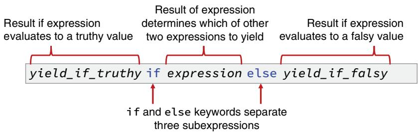  
Figure 4.4 Schematic of a conditional expression.

Listing 4.6 is a complete Python program to run our nucleic acid symbol identifier. The program queries the user for an input, converts to uppercase, strips whitespace, and validates that a single character was entered. It then performs the nested conditional expression and assigns the result to the temporary variable result. Finally, it substitutes this result into a string that is printed. See an example of running the program in the console session that follows.

Listing 4.6 Complete program to identify nucleic acid symbols.   
```python
# nucleic_acid identities.py
# Query user
N = input('Enter a nucleic acid symbol:')
# Condition and validate
N = N upper().strip()
if len(N) != 1:
    print('Please enter one character only.')
else:
    # Use a nested conditional expression to identify the symbol
result = 'a Pyrimidine' if N in ['T', 'C', 'U'] else 'a Purine' if N in ['G', 'A'] else 'not a nucleic acid symbol'
print(f'[N] is {result}') 
```

```txt
> python nucleic_acid identities.py  
Enter a nucleic acid symbol: a  
A is a Purine  
> python nucleic_acid identities.py  
Enter a nucleic acid symbol: T  
T is a Pyrimidine  
> python nucleic_acid identities.py  
Enter a nucleic acid symbol: b  
B is not a nucleic acid symbol  
> python nucleic_acid identities.py  
Enter a nucleic acid symbol: ATGC  
Please enter one character only. 
```

# 4.2 Repeated Execution

The second primary way to control the flow of a program is with the repeated execution of a code block, typically changing something each time the block is executed, such as the index of the element in a list to be processed. Python provides two core statements that support repeated execution, the while-statement and the for-statement.

# 4.2.1 While-Statements

The best way to think about a while-statement is as a single-clause if-statement that continues to execute its code block while its test expression remains true. When a while-statement is encountered

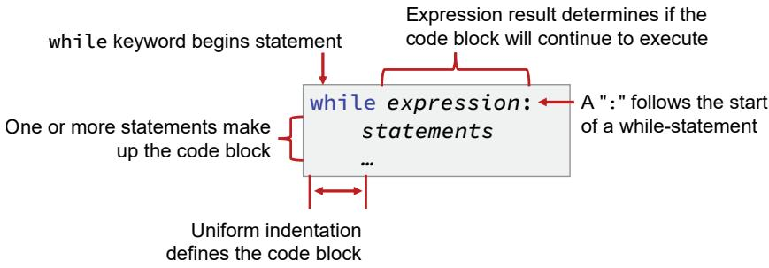  
Figure 4.5 Schematic of a while-statement.

in a running Python program, its test expression is evaluated. If the expression is True, the associated code block is executed. Unlike an if-statement, when the code block of a while-statement completes, the program returns to re-evaluate the test condition. If it remains True, the code block is executed again. This repeats until the while-statement test expression is False.

Figure 4.5 depicts a schematic of a while-statement. Note how its syntax is identical to a single-clause if-statement (Figure 4.1) except for the initial keyword, which is while instead of if.

One of the most important ways to use a while-statement is to supplement it with a counter that increments each time the while-statement’s code block executes. We can use such a counter in several ways, such as by monitoring the counter’s value and terminating repetition when a maximum count is reached or using the counter as an index to access elements of a list or tuple.

For example, let’s say we want to compute the sum of squared numbers in a list. We must first access each item in the list. We can do this by generating the index of each list element, and then use each index in square brackets to access list elements. The following code snippet uses a while-statement with a counter to access and print each list element in the data list.

Listing 4.7 Accessing items of a list using a while-statement and counter variable.   
```python
data = [2.34, 2.01, 1.99, 2.26, 2.13, 1.95, 2.05, 1.98]  
i = 0 # Initialize counter  
while i < len(data): # Test for repetition  
print(data[i])  
i += 1 # Increment counter 
```

Augmenting a while-statement so that it counts requires the addition of three important elements.

1)	 Counter initialization   
2)	 Test for execution of the while block   
3)	 Counter increment

Each of these steps is noted in the comments of Listing 4.7. The counter i is initialized to 0, the first index of the list. Within the code block the counter i is incremented by 1. The while-statement code block is repeated while i remains less than the length of the list. The moment the counter is assigned to a value equal to the length of the list, the index would be out of bounds so repetition should terminate. In Listing 4.7, when i is equal to or greater than len(data), the while-statement test expression inequality evaluates to False and the while-statement terminates.

The next addition to the while-statement is computation of the sum of squares. Once we can access each item in the list it is easy to square the value. Because we compute one square at a time, the sum will have to accumulate one square at a time. To accomplish this, we add another variable named sum and initialize it to the value of 0.0. Within the while-statement the square is computed and accumulated as sum.

Our program computing the sum of squares is given in Listing 4.8. Take note of the steps required to assemble the program. We start with a while-statement, add a counter to limit the number of repetitions which also doubles as a list index, access and computed the sum of each element and accumulate the square using another variable. This is a good example of using repetition to implement a reduce strategy which reduces a sequence of elements to a single value.

Listing 4.8 Compute the sum of squares of list elements using a while-statement.   
```txt
while1.py  
data = [2.34, 2.01, 1.99, 2.26, 2.13, 1.95, 2.05, 1.98]  
sum = 0.0  
i = 0  
while i < len(data):  
    sum += data[i] * data[i]  
    i += 1  
print(sum) 
```

Another strategy for using repetition is to select a value from a sequence by comparing it with all the others. For example, we may want to find the overall maximum and minimum values from the previous data list. To accomplish this, we can use the assume and improve strategy. We first assume the values of minimum and minimum, and then improve each by comparing to the other list elements as we iterate through the list. In this case it is convenient to initialize the minimum and maximum values as the first element of the list. Note that when we do this, there is no reason to compare the first item of the list with itself, so we can start the loop at index 1 instead of 0. Within the code block we use an if-statement to compare each item in the list to the overall minimum and overall maximum. If the current element is a better option, a variable is updated.

Listing 4.9 demonstrates this technique. Note how we implement the select strategy by overlaying the assume and improve technique on a while-statement with an added counter.

Listing 4.9 Compute the minimum and maximum values in a list.   
```julia
while2.py  
data = [2.34, 2.01, 1.99, 2.26, 2.13, 1.95, 2.05, 1.98]  
# Assume overall min and max to be the first list item  
min, max = data[0], data[0]  
i = 1 # Initialize counter  
while i < len(data): # Test for repetition of code block  
if data[i] < min: # Test for better minimum  
min = data[i] # Improve overall minimum  
if data[i] > max: # Test for better maximum  
max = data[i] # Improve overall maximum  
i += 1 # Increment counter  
print([min, max]) 
```

Note that Python provides us with the built-in global functions named min(…) and max(…) which we could have used to solve this particular problem, but it would not have been as much fun.

A third strategy for using repetition is to map one sequence to another, and a fourth is to filter one sequence to form another sequence containing a subset. In these cases, we start with an empty list and accumulate all mapped or filtered items.

Let’s write a program that asks the user to enter a space-separated string of well labels. There is no telling what the user will enter, so we must start by processing the string entered by the user into a well-formed list of valid well labels.

We can use the global input(…) function to query the user, and the string’s split(…) method to divide it into an initial list of strings. If we split on the space character, and the user accidentally enters more than one space between labels, we’ll end up with empty strings in the list which must be filtered out of the result. In fact, we want to filter any element from the list that is less than two characters long because we know that a well label must include at least two characters. The following demonstration includes a string with extra spaces, which results in unwanted empty strings in the resulting list.

```txt
>>> print('a1 b2 c3'.split(''))  
['a1', ' ', 'b2', ' ', 'c3']  
>>> 
```

In addition to filtering invalid values from the list, we want to map all elements to uppercase versions for consistency. The program in Listing 4.10 implements both the filtering and mapping strategies on top of repetition using a while-statement that solves the data entry problem. The program is tested in the console session that follows.

Listing 4.10 Enter, format, and validate a user-entered list of well labels.   
```python
# labels.py
resp = input('Enter a comma-separated list of well labels:')
items = resp.split()
labels = []
i = 0
while i < len(items):
    lbl = items[i].upper()
    if len(lbl) >= 2:
        labels.append(lbl)
    i += 1
print(labels) 
```

```txt
> python labels.py  
Enter a comma-separated list of well labels: a1 b2 c3 d 4 e5 ['A1', 'B2', 'C3', 'E5'] 
```

A Monte Carlo simulation is an interesting way to use computation to help characterize a system, and repetition is at the heart of the technique. With Monte Carlo simulation we start by writing a computational model that takes input parameters and produces some result in response to its input. The model simulation is repeated many times with a range of input parameters and collecting all outputs. The outputs are then used to better understand the simulated system.

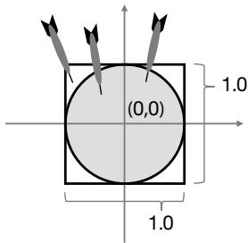  
Figure 4.6 Unit square with inscribed unit circle for the Monte Carlo dartboard simulation.

A simple but illustrative example is to use a Monte Carlo technique to estimate the value of $\pi$ . Let’s assume we have a unit square with sides of length 1 which is centered at the origin (0, 0) of x-y axes. Within the unit square we perfectly inscribe a unit circle with diameter 1 (Figure 4.6).

We can think of the circle as a dartboard hung on a small wall and simulate a game of darts played by a very unskilled player whose darts land at purely random locations anywhere on the dartboard or the surrounding wall. We assume that every dart will land somewhere on the wall (within the unit square), but only a fraction of the darts hit the dartboard (within the circle). Assuming all darts land at locations dictated by a uniform random distribution, we are able to estimate the fraction of darts that land on the dartboard by com-

puting the ratio of the area of the circle divided by the area of square. A uniform random distribution allows us to estimate probability using the area ratio.

We know that the area of the square is width $\times$ height $= 1 . 0$ , and the area of the circle is $\pi \mathrm { r } ^ { 2 } = $ $\pi ( 0 . 5 ) ^ { 2 } = 0 . 2 5 \pi$ . The ratio of these areas is $0 . 2 5 \pi / 1$ or just $0 . 2 5 \pi$ .

Using a Monte Carlo technique, we can compute an estimate for this ratio by asking our unskilled dart player to throw many darts at the dartboard, and then count the number that land on the dartboard, and divide that number by the total number of darts thrown. This ratio will be an estimate for $0 . 2 5 \pi$ . If we multiply this computed ratio by 4, we should end up with an estimate for the constant π. Let’s give it a try.

The program in Listing 4.11 performs the Monte Carlos simulation to estimate $\pi$ . The darts variable specifies the number of times a dart is thrown, and the hits variable is used to count the number of times a dart hits the dartboard. A while-statement is set up to repeat once for each dart thrown. Inside the while-statement’s code block the random dart landing location is simulated using the random module’s random() method, which you will recall computes a uniformly distributed pseudo-random floating-point number in the range [0.0, 1.0). Our unit square is centered at (0.0, 0.0)_ so we subtract 0.5 from the simulated coordinates to correspond with the coordinates of the unit square. Using the distance formula $\left( d i s t a n c e = \ \sqrt { \Delta x ^ { 2 } + \Delta y ^ { 2 } } \right)$ we compute the distance between the dart’s landing location and the center of the circle and check if it is less than the circle’s radius of 0.5. If so, the dart must have landed within the circle, and we increment the hits counter. After the while-statement completes, we compute the estimate for $\pi$ as $4 ^ { \star }$ hits/darts and print the result.

Listing 4.11 Monte Carlo simulation to estimate the value of π.   
```python
# estimate_pi.py
import random, math
darts = 1000
hits = 0
i = 0
while i < darts:
    x = random.random() - 0.5
    y = random.random() - 0.5
    dist = math.sqrt(x * x + y * y)
    if dist < 0.5:
        hits += 1
# import helpers
# Darts to throw
# Count of hits
# Loop counter
# Stop when all darts thrown
# Simulate dart landing position
# Compute distance to center
# Hits dartboard when distance < radius
# Count hits 
```

Listing 4.11 (Continued)   
```txt
i += 1 #Increment counter  
pi = 4*hits/darts #Compute estimate  
print(f'Pi estimate is {pi}') #Print result 
```

The following shows several tests of the program’s computed estimate for $\pi$ . This estimate can be improved significantly by performing more iterations of the simulation. Increase the value of darts by a factor of 10 and rerun the simulation. Did the estimate improve? Try another factor of 10 and watch how the estimate changes.

```txt
> python estimate_pi.py  
Pi estimate is 3.124  
> python estimate_pi.py  
Pi estimate is 3.176  
> python estimate_pi.py  
Pi estimate is 3.108 
```

# 4.2.2 For-Statements

It is clear from previous examples that iterating over the elements in a sequence is an important capability that will be useful for many applications. This capability is so fundamental that Python provides a statement specifically for this task. The for-statement is an alternative way to repeat a code block specifically for each element of a sequence, from the first to the last, without the need for a counter, an index, and explicit element access.

If the intention of your program is to access each element of a sequence, then a dedicated statement that does this exact task for you is usually a better option. Using a while-statement with a counter increases the risk of introducing errors. You will have to correctly initialize the counter and write the expression to test when to terminate repetition. You must also make sure that the counter properly computes sequence index so elements are accessed correctly. It’s good to have the option to do this yourself when you need to do more than simply access all element in order, such as when we wanted to skip the first element in Listing 4.9. But, if your need fits, use the statement that was designed specifically to solve your problem.

A schematic of the for-statement is given in Figure 4.7. The two keywords used in a for-statement are for and in. Recall how we used the in operator to test for sequence membership (for example, Table 3.1). In the for-statement we use the same keyword for a similar purpose, which is to access each element in the sequence. A sequence that supports the in operator is called an iterable.

Each element in the sequence is assigned to the target and then the for-statement code block is executed. This avoids the need for a counter variable or an index. The for-statement accesses each element for us, assigns each to the variable, and then executes the code block. In a very real sense, if accessing each item in a sequence is what we need, the for-statement simplifies the task.

To illustrate the use of the for-statement, let’s compute the GC content of a short nucleotide sequence. Our goal is to count the number of G and C characters that appear in a nucleotide sequence string, divide that count by the total string length and multiply by 100 to obtain a percentage. Listing 4.12 implements the solution.

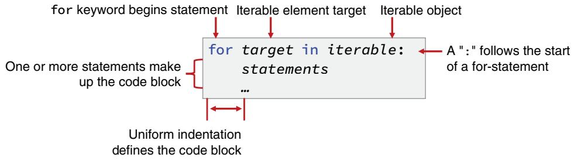  
Figure 4.7 Schematic of a for-statement.

Listing 4.12 Compute the GC content of a sequence using the for-statement.   
gc_content.py   
# Data from https://bioinformatics.ccr.cancer.gov/docs/b4b/   
seq $=$ 'GGGTGATGGCCGCTGCCGATGGCGTCAAATCCCACCAAGTTACCCTTAACAACTTAAGGGTTTTCAAATAGA'   
count $= 0$ for n in seq: if n in $\left( \begin{array}{l}\prime G^{\prime},\end{array} \right)$ count $+ = 1$ print(f'The sequence has a GC content of {count/len(seq)*100:.1f}\%')

The for-statement accesses every character in the string, assigning each to the variable n and then running the code block. Each time through the code block n is checked to see if it is a member of the tuple $( \because , \ { } ^ { \prime } \subset \ { } ^ { \prime } \ )$ . If so, the counter variable count is incremented by 1. When the for-statement completes the count is divided by the length of the string and multiplied by 100 to compute percentage. Additionally, the percentage is printed using an f-string with a format that shows 1 decimal place.

> python gc_content.py  
The sequence has a GC content of $48.6\%$ >

Many of the previous examples that performed repeated execution with the while-statement can be simplified using the for-statement. For example, consider Listing 4.13, which is another way to write the sum of squares program given in Listing 4.8. In this case all elements of the data list are accessed one by one, squared, and added to the squares list. The final sum is computed using the sum(…) global function after the squares are collected rather than accumulating the sum of squares incrementally, which is what is done in Listing 4.8.

Listing 4.13 Compute sum of squares using a for-statement.   
```python
for1.py  
data = [2.34, 2.01, 1.99, 2.26, 2.13, 1.95, 2.05, 1.98]  
squares = [] # Used to collect squares  
for x in data: # Access each element  
    squares.append(x * x) # Square each element and collect  
ssq = sum(squares) # Sum  
print(ssq) # Print 
```

# 4.2.3 For-Statements with Range

Even when using the for-statement we don’t have to give up access to a counter. A built-in Python function named range(…) creates an object that is essentially an immutable sequence if integers. When used as the iterator of a for-statement, it works as if it was a sequence of integers. It differs from an integer sequence in that the range of integers is not materialized into a concrete data structure beforehand. Instead, a range object produces integers on demand as the iteration proceeds. This has the effect of being far more space efficient, especially when you must iterate over a very large sequence of integers.

When instantiating a range object, you may pass one, two, or three argument values. When passing one argument, the immutable integer sequence produced by the resulting range object starts at 0 and ends at 1 less than the argument. Consider the output from the following for-range as entered into the Python console. Note how the output of the for-range iterating over a range(5) starts at 0 and ends at 4, which is 1 less than 5. We can use a for-range construct like the following to generate integers useful to access elements of a sequential data structure like a list or a tuple.

```txt
>>> for i in range(5):
... print(i)
...
0
1
2
3
4
>>> 
```

When a range object is created with two arguments, the first is used for the first integer in the resulting sequence and the second is 1 greater than the last integer in the sequence. In other words, when not specified, the start of the sequence defaults to 0. With this additional argument we have the flexibility to start the sequence at any integer we like.

```txt
>>> for i in range(1, 5):
... print(i)
...
1
2
3
4
>>> 
```

A third argument specifies the step between integers generated in the sequence. By default, this step is 1. But if we wanted to start at 0 and continue until 10 but increment by 2 instead of 1, we need only specify these three arguments in that order.

```txt
>>> for i in range(0,10,2): print(i)   
0 
```

```txt
4   
6   
8   
>>> 
```

The range object can generate decreasing as well as increasing integer sequences. In this case the rules are the same.

•	 The first argument is the first integer in the sequence.   
•	 The second argument is the limit that is not included in the sequence.   
•	 The last argument is the step size.

It is a simple matter to substitute a for-range for a while-statement when used for counting and element access.

```txt
>>> for i in range(10, 0, -2):  
    ... print(i)  
    ...  
10  
8  
6  
4  
2  
>>> 
```

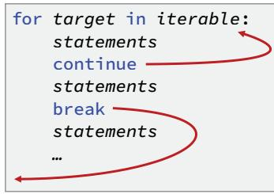  
Figure 4.8 Flow of a break and continue in a for-statement.

# 4.2.4 Break and Continue

The flow of a for- or while-statement can be modified using two additional statements. The break statement immediately exits an iteration, picking up the execution of the program after the while-statement or for-statement code block. Using break is like performing an abort on the repetition.

The continue statement stops execution of a code block, but only that of the currently executing code block, not the entire iteration. The continue statement tells the program to stop what it’s doing and to continue to the next iteration,

which is determined by the iterable. The arrows in Figure 4.8 illustrate how these statements control the flow of a program while executing a for-statement.

# Listing 4.14 Menu program that makes use of while, continue, and break.

# menu.py

# Print menu options print Choose an option:

1. Do thing 1   
2. Do thing 2

Listing 4.14 (Continued)   
3.Exit   
'   
#Get response from user   
while True: #Query for response resp $=$ input('Enter an option:'） #Validate if not resp.isnumeric(): print('Please enter 1,2 or 3') continue # Try again option $=$ int(resp) if option $<  1$ or option $>3$ . print('Please enter 1,2,or 3') continue # Try again # Break out of loop on valid option break   
print(f'Option {option} chosen')

The break and continue statements work the same way when used with a while-statement. For example, the program in Listing 4.14 uses a while-statement with break and continue to implement a console-based menu program. The program starts by printing the options and then queries the user for a response. If the user enters an invalid value, the program prints an error and queries again. This continues until the user enters a valid response. The test expression for the while-statement in Listing 4.14 is the constant True, which means that it will iterate forever. The actual flow control is modified by the break and continue statements.

The program expects the user to enter an integer. If the entered value is not numeric, it cannot be one of the valid options. The first if-statement tests for a non-numeric value. If true, the program informs the user and invokes the continue statement, which halts execution of the code block and returns control to the top of the while-statement. Because the test expression is True, code block repeats again.

The second if-statement in the code block checks the value of the response after converting it to an integer. If the value is out of range, once again, the user is informed of the error and a continue statement restarts the code block.

When all input validations have been satisfied, a break forces the exit of the entire while-statement so execution can continue afterwards. A break is necessary in this case because the while-statement test expression will never terminate the repetition otherwise.

# 4.2.5 Comprehensions

Python includes a very powerful way to write a single-line expression that does the equivalent of running a for-statement that collects results as a list, a set, or a dictionary. This type of expression is called a comprehension. Each of the three comprehension expression types begin by writing the style of brackets used to write the associated data structure with literal notation, but that’s where the similarities end.

A schematic of a list comprehension is given in Figure 4.9. First, within the outer square brackets there is an initial expression, which is what is to be collected in the final list. Next is the keyword

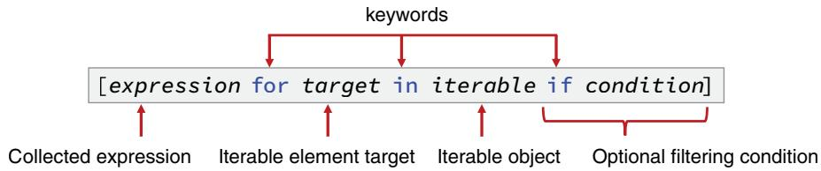  
Figure 4.9 Schematic of a list comprehension.

for and the target variable that matches each element in an iterable. The in keyword after the target is followed by the iterable that produces all the elements to be processed. An optional if keyword and a test condition can finish a list comprehension if target elements are to be excluded if they do not satisfy the condition. This acts as a kind of filter on top of the collection task.

The best way to understand a comprehension is to compare it to the equivalent written using multiple statements. The core of the sum of squares program given in Listing 4.13 is listed in Figure 4.10 on the left, and its equivalent list comprehension is written on the right. The expression that is collected is $\tt x ^ { \star } \tt x$ , the target element is $_ \textrm { x }$ , and the iterator is the list referenced by the data variable.

A nearly identical syntax is used to assemble a set data structure using a set comprehension. The only difference is the outer brackets, which are replaced with curly brackets in a set comprehension. The result of a set comprehension differs from a list comprehension in that sets exclude duplicates.

The following console session illustrates the creation of a set comprehension which is used to find a unique list of invalid characters entered mistakenly in a nucleotide sequence. The seq variable is assigned to a nucleotide sequence that may have had typos introduced inadvertently. The set comprehension includes the optional filter expression on the right, which limits characters collected to those that are not in the four nucleotides. It is hard to find by visual inspection, but clearly the sequence string includes the unwanted character 'I'.

```txt
>>> seq = 
'GGGTGATGGCCGCTGCCGATGGCGTCAAATCCIACCAAGTTACCCTTAACAACTTIAGGGTTTTCAAATAGA'
>>> typos = {x for x in seq if x not in ('A', 'T', 'G', 'C')} 
>>> print(typos)
{'I'} 
```

The syntax of a dictionary comprehension is very similar to a set comprehension, only the initial expression accumulated by the comprehension is a key-value pair, with the key and value separated by a colon (:). A dictionary comprehension can be particularly useful for initializing a dictionary from a given set of keys. In the following example we wanted to create a dictionary with keys made up of the letters A through H, represented as string, and values initialized as an empty list. This dictionary can be used to separate items into one of eight buckets labelling each dictionary key.

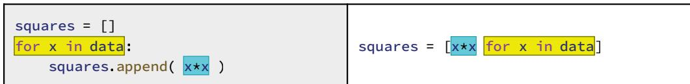  
Figure 4.10 Squares accumulation on the left, rewritten as a list comprehension on the right.

```txt
>>> {k:[]) for k in 'ABCDEFGH'}  
{'A': [], 'B': [], 'C': [], 'D': [], 'E': [], 'F': [], 'G': [], 'H':[]}  
>>> 
```

It takes practice to become adept at writing list, set, and dictionary comprehensions. It is helpful to start by writing a small program that solves a problem using multiple statements, and then working to rewrite the program with a single comprehension.

# 4.3 Key Takeaways

1.	 Managing the order in which the statements of a program are executed is called flow control.   
2.	 Python provides several statements for managing the flow of a program, including the if-statement, while-statement, and for-statement.   
3.	 Each statement includes one or more test expressions which must be truthy for an associated code block to execute. If the test expression is falsy, the block is skipped.   
4. If-statements may have one or more alternative blocks to be executed (elif blocks), and an optional final block that is executed when no other block does (else block).   
5.	 Only the code block with the first successful test expression is the one that executes. Other code blocks are skipped, even when their test expression is truthy.   
6.	 Python expressions that evaluate to values other than True of False can be used as test expressions. Python values are considered truthy or falsy depending upon whether the bool(…) conversion function converts the value to a True or a False.   
7.	 A compact way to perform the equivalent of an if-statement that ends with a resulting value is to make use of the Python conditional expression.   
8.	 A conditional expression is like an if-statement written in a single line of code and using a format that is closer to natural language.   
9.	 Unlike an if-statement, which controls program flow only, a conditional expression evaluates to a value.   
10.	 While-statements execute a code block repeatedly while its test expression continues to evaluate to True.   
11.	 To construct a while-statement so that it repeats a fixed number of times, initialize a counter, increment the counter in the while-statement code block, and test for the counter exceeding some cutoff.   
12.	 A for-statement is an alternative way to repeat a code block when the code block is to be executed for each element of a list.   
13.	 The range(…) function is a generator that creates an iterator capable of generating a sequence of numbers with user-specified start, stop, and increment values. A range(…) is often paired with a for-statement as its source of elements to iterate over.   
14.	 Strategies for using code repetition include reducing a sequence to a value, mapping a sequence to another transformed sequence, and filtering a sequence to a subset.   
15.	 The flow of a while- or for-statement may be modified using the break and continue statements.   
16.	 The break statement breaks out of the entire repetition and continues execution with the statement immediately following.   
17.	 The continue statement stops the current execution only, re-evaluating the test expression to determine if another iteration of the code block should be executed.

18.	 A compact way to perform iteration while collecting results in Python is a comprehension.   
19.	 Parts of a comprehension include the expression to be accumulated, the iterator that produces each element to be processed, and an optional test expression used to filter elements from the result.   
20.	 Python includes statements for list comprehensions, set comprehensions, and dictionary comprehensions.

# Custom Functions and Exceptions

Every modern programming language provides the core capability of grouping statements into a reusable named block of code called a function. Named functions are fundamental building blocks that support the creation of complex programs by assembling smaller groups of related statements. It gives us the tools to encapsulate the details of a specific computation as a reusable named block of code and then to use these blocks to reason at higher levels of abstraction. Functions allow us to organize our code in meaningful ways and to test individual blocks of code independent of the others. The utilization of functions enables us to more easily and reliably assemble logical procedures that solve increasingly complex problems without becoming mired in detail. The benefits of using functions and other related tools in Python will become more evident as we begin to define and use functions to solve problems.

# 5.1 Defining Custom Functions

A custom Python function is defined using a format outlined in Figure 5.1. Function definitions begin with a line that starts with the def keyword, followed by a function name, parentheses, and ends with a colon. Arguments may be passed into a function when the function is invoked by placing the argument values between the parentheses. These argument values are assigned to variables that appear between the parentheses of a function definition, referred to as the function’s parameters. The top line of a Python function is an example of a function signature, which includes the function name and its parameters.

Following the function signature line is the function body. This is composed of one or more lines of code to be executed using any received parameter variables, if provided. Python uses line indentation with whitespace characters to identify which lines of code are part of the function’s body, in the same way that code blocks for an if-statement, while-statement, or for-statement are determined. Every line of code following the function signature with a consistent indentation is considered part of the function body.

If a value is to be returned by a function, a return statement is added to the end of the function block with the return value. If a function definition contains no return statement, the value returned by a Python function is the special Python value None.

In general, a function definition can occur anywhere within a Python program, but the function must be defined before it can be invoked. A common practice is to place all function definitions at the top of a Python program file and to defer the start of execution of the program itself until the last line of the file.

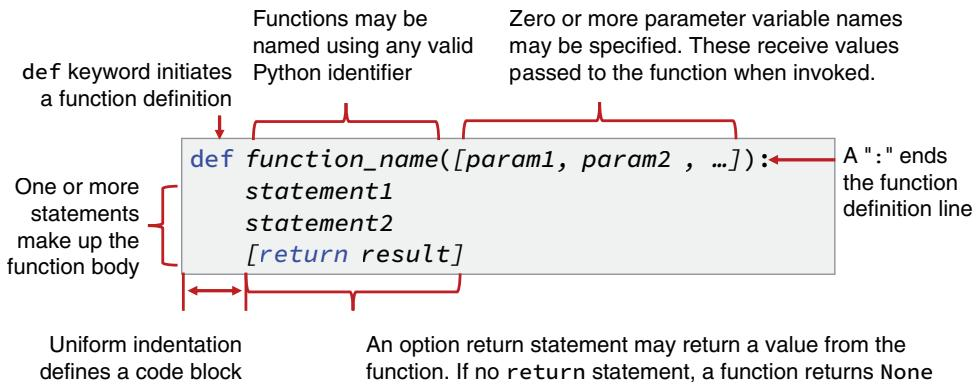  
Figure 5.1 Schematic diagram of a Python function definition.

Let’s write two functions that convert temperature from Celsius to Fahrenheit and back, which expands upon the work we started in Listing 2.1 of Section 2.7. We’ll use the functions signatures F2C(F) and C2F(F) . Refer to their definitions at the top of Listing 5.1. Take note of the def keyword followed by the function name, parentheses, and a colon. Each function receives one parameter. We place a parameter variable between the parentheses of each function definition which is assigned to the argument value passed to the function when it is invoked.

Listing 5.1 Temperature conversion function in the file convert.py.   
# convert.py
# Convert $^\circ \mathrm{F}$ to $^\circ \mathrm{C}$ def F2C(F):
    C = (F - 32) / 1.8
    return C
# Convert $^\circ \mathrm{C}$ to $^\circ \mathrm{F}$ def C2F(C):
    F = 1.8 * C + 32
    return F
# Invoke temperature conversion functions
# Prompt the user for Celsius
resp = input("Please enter a temperature in °C:.")
# Convert the response string to a float
C = float(resp)
# Convert the temperature and print the result
F = C2F(C)
print(f' {C}°C is {F}°F')
# Prompt the user for Fahrenheit
resp = input("Please enter a temperature in °F:.")
# Convert the response string to a float
F = float(resp)

Listing 5.1 (Continued)   
Convert the temperature and print the result $C = F2C(F)$ print(f' {F}°F is {C}°C')

At the bottom of Listing 5.1 we test the functions by querying the user first for a temperature in $^ \circ \mathrm { C }$ , converting to ${ } ^ { \circ } \mathrm { F } ,$ , and then printing the result. Then we query the user for a temperature in $^ { \circ } \mathrm { F }$ , convert to $^ \circ \mathrm { C }$ , and print once again. Recall that the input(…) function returns a string which must be converted to a float before invoking the conversion functions and passing the argument value.

The program was run at the terminal twice using different input values. The results produced are those expected demonstrating that the functions work correctly.

> python convert.py  
Please enter a temperature in $^\circ \mathrm{C}$ : 100 $100.0^{\circ}C$ is $212.0^{\circ}F$ Please enter a temperature in $^\circ \mathrm{F}$ : 212 $212.0^{\circ}F$ is $100.0^{\circ}C$ >  
> python convert.py  
Please enter a temperature in $^\circ \mathrm{C}$ : 0 $0.0^{\circ}C$ is $32.0^{\circ}F$ Please enter a temperature in $^\circ \mathrm{F}$ : 32 $32.0^{\circ}F$ is $0.0^{\circ}C$

Let’s write two more functions. One will receive row and column numbers of a well in a microtiter plate and return the corresponding well label as a string. This function will have the signature rowCol2Well(row, col). The second will convert a well label back to row and column. This second function will have the signature well2RowCol(lbl). These examples will prove to be a bit trickier.

Recall that the wells in a microtiter plate are labeled by row and column, where row is designated with a letter starting with “A” as the first/top row and increasing as rows proceed downward, and columns are numbered starting with 1 on the left and increasing to the right. Refer to the schematic diagram of a typical 96-well microtiter plate in Figure 5.2.

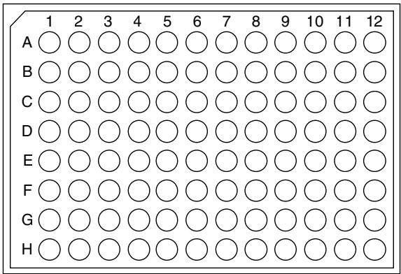  
Figure 5.2 Schematic of a typical 96-well microtiter plate.

Our functions have a few more requirements. Specifically, we want the format of the well label generated by rowCol2Well(row, col) always to be a single capital row letter followed by the column number as two digits, for example, A01. If the column number is a single digit, it must be zero-padded on the left out to two total characters to ensure any subsequent sorting operations work as expected. The well2RowCol(lbl) function must be more forgiving. It must accept well labels with uppercase or lowercase row letters, and column numbers that may or may not have a leading zero. We’ll have to take extra steps to ensure that these conditions are satisfied. Refer to the definition of these functions in Listing 5.2.

Listing 5.2 Microplate well label conversion functions.   
#plateconv1.py   
# Convert row-column pair to an A01-style well label   
defrowCol2Label(row,col): #Convert row to letter col $=$ str(col).zfill(2) # Convert col to string and left-pad with 0's return f'\{row\}\{col\}' # Format as well label and return string   
# Convert an A01-style well label to a row-column pair of integers   
def label2RowCol(lbl): lbl $=$ lbl.strip().upper() # Remove spaces and uppercase row $=$ ord(lbl[0]-64 #Get char code for first char and subtract 64 col $=$ int(lbl[1:]) # Convert remaining chars to an int return row, col # Return pair as tuple   
# Test plate well translation functions   
row $=$ input("Enter a well row:"） col $=$ input("Enter a well column:"） row, col $=$ int(row), int(col) lbl $=$ rowCol2Label(row, col) print(f'Well at (\{row\}, \{col\}) has label {lbl}')   
lbl $=$ input("Enter well label:"） row,col $=$ label2RowCol(lbl) print(f'Well with label {lbl} is at (\{row\}, \{col\})')

To implement rowCol2Well(row, col), we will take advantage of Python’s chr(…) global function (see Table 2.13). The chr(…) function takes a single int argument and returns a single-character string that corresponds to the character that the integer encodes, including those defined by the ASCII table in Appendix A. We want to convert from row 1 into the letter “A", and because we know that “A” has the ASCII code of 65, we can add 64 to a row number argument and pass that sum to chr(…) to produce the row letter. Fortunately, ASCII letter encodings increase in number in the exact same way as row numbers, so the chr(row + 64) expression works for all microplate rows when converting row number to row letter.

To ensure that single-digit column numbers are padded on the left with a “0,” we can use of the string object’s zfill(…) method (Table 2.4). This string method takes an integer argument that specifies the number of characters to be contained by the final string after padding with zeros. In our case, we want to ensure that strings are padded out to 2 characters. Of course, we must convert the column number to a string before the zfill(…) method can be invoked. The final expression that converts a column integer to a zero-padded string is str(col).zfill(2).

The final step in the rowCol2Well(row, col) function is to combine the results of the previous two expressions into a final string and to return it using a return statement. The function uses an f-string for this purpose, but other options will work as well.

The complementary label2RowCol(lbl) function is a little more involved because the lbl parameter may reference a wider range of string values. Our function must start by formatting the string parameter, including removing any extraneous whitespace from the beginning and end of the string, and converting any lowercase letters to uppercase. Remove whitespace from a string with the strip() string method, and convert all lowercase letters to uppercase with the upper() method (Table 2.4). Because each of these methods returns a string, we can chain the methods together to perform all transformations and reassign the variable with the following single statement.

```python
lbl = lb1.strip().upper() 
```

We’ll assume that the first character in the resulting string is the row character and access it using square brackets with index 0. This character is passed to the global ord(…) function, which you will recall takes a single character string and returns the ASCII encoding integer (see Table 2.13). To convert this to the row number, we subtract 64 from the encoding. The resulting expression to compute row is then the following.

row $=$ ord(lbl[0])-64

Column number is obtained by first slicing all the characters remaining after the first. We can use a slice on the string that starts at index 1 but specifies no second index. This slices out all characters from the character at index 1 all the way to the end of the string. This sliced substring is passed to the int(…) global conversion function that converts it to an int type. The resulting expression for computing column number is as follows.

```txt
col = int(lbl[1:]) 
```

We have both the row and col variables that must be returned. Fortunately, we can group these two variables into a tuple literal and return the tuple as the single return value. When invoking the function, we can use destructuring assignment (Section 3.5) to separate the row and column values and assign each to a different variable.

The bottom of Listing 5.2 includes code to test our two functions. The program is executed and tested in following console session.

```txt
> python plateconv1.py  
Enter a well row: 2  
Enter a well column: 7  
Well at (2,7) has label B07  
Enter well label: b7  
Well with label b7 is at (2,7) 
```

As another example, you may need to generate the column labels of a spreadsheet given a column number. Recall that spreadsheet columns are typically labeled with capital letters, beginning with

“A” for column 1 and proceeding through “Z” for column 26. Column 27 is labeled “AA,” then “AB” through column 52, which is “AZ.” Column 53 is “BA,” “BB,” etc. Recognize that these column labels are effectively a base-26 number, where the 26 symbols used are the capital letters of the alphabet, “A” through “Z.”

We can use this model to write a function that converts a 1-based spreadsheet column number to the equivalent letter label. The function contains a while-statement that uses the modulo operator within each iteration to compute a base-26 number for the final column label. The chr(…) function turns that number into a capital letter and prepends it to a list using the insert(…) list method. Before the next iteration the floor-div operator $( / / )$ is used to discard the rightmost digit of the number. The process repeats until the column number is reduced to 0. Finally, the list of capital letters is joined and returned as a final column label string. Listing 5.3 provides the entire function with a test. Output is given in the console session.

Listing 5.3 A function that converts a spreadsheet column number to letter designation.   
```python
# col2x1.py
# Convert a 1-based column number to an Excel column letter designation
def col2x1(col):
    lets = []
    while col > 0:
        let = chr((col - 1) % 26 + 65)
        lets.insert(0, let)
        col = (col - 1) // 26
        return False. join(lets) 
```

```txt
>pythoncol2xl.py A Z AZ ALL 
```

# 5.2 Arguments and Parameters

Let’s take a moment to reinforce the difference between arguments and parameters. Arguments are the values passed to a function when it is invoked, while parameters are the variables defined between the parentheses when a function is defined. Parameter variables are assigned argument values when a function is invoked. It is very common to confuse these two terms. Nevertheless, the meaning is usually apparent by the context in which each is used.

In the previous example, the rowCol2Label(row, col) function is invoked with two argument values that are assigned to the parameters row and col. The order in which the arguments are passed to the function dictates which parameter variable is assigned to which argument value. Arguments passed to a function in a certain order are called positional arguments because their position determines the parameter to which they are assigned.

Python provides another type of argument called a keyword argument. When a keyword argument is passed to a function, it is preceded by a parameter name and an equals $( = )$ . When a function is defined to accept keyword arguments, the function parameters must be assigned default values in

the function signature. If the keyword argument is not included in the function invocation, the default value is used.

Keyword arguments are matched to parameter variables by name, not by position. This allows the function to be called with the keyword arguments specified in any order because the names assigned to arguments are matched with the function parameter names before assigned. When positional arguments and keyword arguments are combined, all positional arguments must appear to the left of any keyword argument in the function signature.

Let’s assume that we have a laboratory instrument with a rectangular autosampler rack. The instrument processes samples in all containers, one at a time, in a row-major (row-wise) order. When results are written, the output identifies the tube with a sequential order only. We want to investigate edge effects and other potential impacts that autosampler position might have on the results, so we need to know the row and column of the container when it was placed in the autosampler. Let’s write a function that computes row and column from sequence number when row-major rack traversal is used. Computing these values depends upon the number of columns in the rack. We want to make this function generally applicable, so we want to include the number of columns in the rack as a parameter, but because most of our autosampler racks have 12 columns, we want 12 to be the default value when the number of columns is not specified.

The function in Listing 5.4 does the job for us. Note that it receives two arguments, the first is positional, followed by the second named ncols, which is keyword. Assigning the ncols parameter in the function signature to 12 ensures that if a keyword argument with name ncols is not passed to the function, the ncols parameter variable will get the default value 12 automatically. Changing the keyword parameter to ncols=24 will compute the row and column of a 384 well plate.

We can compute the row and column given a sequence number using the floor-div (//) and modulo $( \% )$ operators. Recall that floor-div performs the division and then discards the decimals. Because our denominator is the number of columns, this gives us the number of rows. The modulo operator returns what’s left over after removing as many whole denominator values from the numerator as possible. The amount left over is the result, which corresponds to the column number. Both are adjusted by 1 due to the assumption of a 1-based row and column number.

Listing 5.4 A function that converts container sequence number to row, col given ncols.   
# seq2RowCol.py   
# Compute the row, col for a well in a tube rack   
#given a row-major sequence number starting with 1.   
#Assume 12 columns in the rack as the default.   
def seq2RowCol(n, ncols=12): row $=$ (n - 1) // ncols + 1 col $=$ (n - 1) % ncols + 1 return row, col   
# Test seq2RowCol()   
seq $= 13$ row, col $=$ seq2RowCol(seq)   
print(f'Seq{seq} is at {row,col}')   
row, col $=$ seq2RowCol(seq, ncols=5)   
print(f'Seq{seq} in rack with 5 cols is at {row,col}')

Listing 5.4 (Continued)   
```txt
seq = 25  
row, col = seq2RowCol(seq)  
print(f'Seq {seq} is at {row,col}')  
row, col = seq2RowCol(seq, ncols=10)  
print(f'Seq {seq} in rack with 10 cols is at {row,col}') 
```

Listing 5.4 includes several test cases. The following console session shows the output from running the program. Notice how container number 13 in a rack with 12 columns is positioned at row 2, column 1, but the same sequence number in a rack with 5 columns is positioned at row 3, column 3. The only difference between these two examples and the two that follow is the second ncols keyword argument passed to seq2RowCol(…).

```txt
> python seq2RowCol.py  
Seq 13 is at (2, 1)  
Seq 13 in rack with ncols 5 is at (3, 3)  
Seq 25 is at (3, 1)  
Seq 25 in rack with ncols 10 is at (3, 5) 
```

Python provides a way to receive an arbitrary number of positional arguments by defining a special positional argument in the function signature preceded by *. The same is the case for receiving an arbitrary number of keyword arguments, which is to precede another function parameter with a $\star \star$ .

Consider the example program in Listing 5.5 and the console session that follows it. The run samples(…) function is defined with the two parameters *samples and **params. Because the samples parameter is preceded with a “*” it collects all positional arguments into a single tuple. Similarly, because the params parameter is preceded with “**” it collects all keyword arguments into a single dictionary. The run_samples(…) function prints the two data structures. Note how the function prints all arguments in their respective data structures, no matter the number of positional and keyword arguments are passed, even when no arguments are passed. This capability allows the definition of a function that accepts an arbitrary number of parameters, which will then be processed by the function.

Listing 5.5 A function that accepts an arbitrary number of positional and keyword arguments.   
```python
run_samples.py   
def run_samples(\*samples, \*\*params): print(f'Run samples {samples} with parameters {params}')   
# Test run_samples   
run_samples('sample1','sample2','sample3',temp=125，vol=20) run_samples('cmpd1','cmpd2',solvent='DMSO'，duration=100) run_samples() 
```

```txt
> python run_samples.py  
Run samples ('sample1', 'sample2', 'sample3') with parameters {'temp': 125, 'vol': 20}  
Run samples ('cmpd1', 'cmpd2') with parameters {'solvent': 'DMSO', 'duration': 100}  
Run samples () with parameters {} 
```

# 5.3 Names and Scope

If a variable is defined by assigning it a value within a function, its access is limited to statements within the function’s code block. In this case we say that the scope of the variable name is the function’s code block. The interplay between the way Python initializes variables and scope can appear confusing at first. Rest assured; this will make more sense once you see examples.

# 5.3.1 Local vs. Global

Consider the program in Listing 5.6. The program starts by defining the two functions print elapsed() and reset_start(). The print_elapsed() function computes the elapsed time in seconds by subtracting the value of start from time.time(). Recall that time. time() returns the UNIX timestamp, the current elapsed seconds since the epoch. The reset_ start() function resets the start variable to the current timestamp.

After functions are defined, the program initializes the start variable for the first time, sleeps for approximately 1 second by invoking time.sleep(1), and then prints the time that has elapsed in seconds. Observing the program output in the console session that follows, it is not surprising to see an elapsed time of approximately 1 second.

The program then invokes reset_start(), sleeps for another second, and prints the elapsed time again. The console session demonstrates that despite the program sleeping again for only one second, the program computes and prints an elapsed time of approximately 2 seconds. Is there a mistake?

Listing 5.6 Demonstration of variable scope in a function.   
```python
# scope1.py
import time
# Print seconds elapsed since start
def print_elapsed():
    print(time.time() - start)
# Attempt to reset start
def reset_start():
    start = time.time()
start = time.time()
time.sleep(1) # Sleep for one second
print_elapsed()
print睡眠start()
print睡眠(1) # Sleep for one second
print elapsed()
print sleep 
```

```txt
> python scope1.py  
1.004331111907959  
2.0047507286071777  
> 
```

The reason we see an elapsed time of approximately 2 seconds when the program sleeps for only 1 second is related to the start variable in the reset_start() function. It turns out that the start variable in reset_start() is not the same start variable that is set in the global scope of the program. In fact, when the start variable is assigned in reset_start(), a new start variable is created within the scope of the function, which is different than the start variable initialized in the global scope. Assigning the locally scoped start within reset_start() has no impact on the value of the globally scope start. Consequently, the second elapsed time calculation continues to use the original value for start, not the updated value.

The fact that the print_elapsed() function works at all illustrates another feature of variables and scope in Python. Note that the start variable within print_elapsed() is referenced only, but never assigned. Variables come into existence within a scope only when assigned for the first time. Because no start variable exists within the print_elapsed() function, Python cannot find a suitable binding for the start name. Before giving up, Python searches the outer global scope, where it does find a variable named start, so it uses that variable to perform the elapsed time calculation.

Note the scope related variable access rules in play. When a variable name is assigned within a function, that name is created within the function scope. When a variable is referenced within the scope of a function, if a preexisting binding for the name is not found within the function’s scope but a globally-scoped binding can be found, it uses the globally scope variable.

Despite the apparent limitation, Python does provide a way to assign a name in a function’s local scope, but have it reference the name that exists in the global scope. This is accomplished by stating explicitly that the name belongs in the global scope using the global statement. Listing 5.7 is identical to Listing 5.6 except for the global start statement, which was added to the reset_ start() function. This states that the start variable name should be globally scoped. The assignment within that function now modifies the start name in the global scope.

Listing 5.7 Demonstration of variable scope in a function using global.   
```python
# scope2.py
import time
# Print seconds elapsed since start
def print_elapsed():
    print(time.time() - start)
# Attempt to reset start
def reset_start():
    global start # The start variable is global
    start = time.time()
start = time.time() # Record the current time
time.sleep(1) # Sleep for one second
print_elapsed()
print睡眠(1) # Print the seconds elapsed
reset_start()
time.sleep(1) # Sleep for one second
print_elapsed()
printSleep(1) # Print the seconds elapsed 
```

The impact can be seen by running the modified program. You will see below that the second printed elapsed time is now correctly computed as being approximately 1 second, not 2. The updated reset_start() function modifies the start variable in the global scope.

```txt
> python scope2.py  
1.0004820823669434  
1.0007665157318115  
> 
```

Global and local are not the only scopes in Python. Other scopes in Python beyond local include enclosing (nonlocal) scope, global scope in a different module, and built-in scope.

# 5.3.2 Built-in and Nonlocal Scope

If a function defines the limits of a local scope, which is nested within an outer global scope, then if we continue to move in the same direction, we’ll find that there is an outermost scope called the built-in scope. It is in the built-in scope that we can find all the predefined built-in names, like Python’s predefined global functions and other keywords. Of course, the contents of the built-in scope cannot be modified.

Let’s move in the other direction and look inside the innermost local scope of a function. If a function definition establishes a local scope, then it stands to reason that if we define a new function inside an existing function, we will have a new inner local scope. And indeed, this is possible to do in Python.

Consider the example in Listing 5.8. The purpose of the clipall(…) function is to round all positional argument to the nearest integer and to clip all values to the range [0, 255]. If a passed value is less than 0, it is replaced with 0, and if it is greater than 255, it is replaced with 255. The components parameter receives all positional arguments passed to the function.

Listing 5.8 Demonstration of nested functions and use of nonlocal.   
#clipall.py   
#Clip all components to [0, 255]   
def clipall( \*components): clipbelow $= 0$ # Count clips clipabove $= 0$ #Helper function to clip one val to [0, 255] def clip(val): nonlocal clipbelow, clipabove #Names in outer local scope val $=$ round(val) #Round to int if val $<  0$ .. val $= 0$ #Clip from below clipbelow $+ = 1$ #Keep count elif val >255: val $= 255$ #Clip from above clipabove $+ = 1$ #Keep count return val

Listing 5.8 (Continued)   
#Clip all positional arguments and collect clipped $=$ [clip(comp) for comp in components] #Print counts print(f{'clipbelow} clipped from below and {clipabove} clipped from above.） #Returned all clipped values return clipped   
#Test print(clipall(259.2，45.3，129，300，-1））

Because we must apply the same test and clipping rules to all arguments, we define an inner helper function named clip(…) that does the job on one value. This function is not useful outside the clipall(…) function, so we define it within the local scope of the function and use it only while clipall(…) is executing.

For debugging purposes, we decided to count the number of times a value is clipped from below and number of times it is clipped from above. We maintain these counts in the variables clipbelow and clipabove. These variables are created within the scope of the clipall(…) function, but they must be accessible within the helper clip(…) function so that they can be incremented. In Listing 5.7, we used the global start statement to indicate that the start variable was actually in the global scope, but in this example, the clipbelow and clipabove variables are not in the global scope. Instead, they are in the local scope of clipall(…) but outside the inner local scope of clip(…). As you’ll see in the example, this conundrum is solved using the Python nonlocal statement. nonlocal changes the scope of a variable just like global, except instead of changing the scope from local to global, it changes an inner local scope to an outer local scope, which is exactly what we need. We want the clipbelow and clipabove variables inside clip(…) to reference the variables in clipall(…) but not in the global scope. This lets the helper function update the two counts variables but the clipall(…) function print the final counts before it exits.

Running the program performs the given tests, which produces the expected output and correct counts.

```txt
> python clipall.py  
1 clipped from below and 2 clipped from above.  
[255, 45, 129, 255, 0]  
> 
```

# 5.4 Scope vs. Namespace

The Python terms scope and namespace are closely related, but different concepts. It is important to understand how they differ in order to have a full understanding of Python’s model of execution.

As we’ve seen, scope refers to the section of code from which a name is accessible. It is useful to think of scope in terms of a telescope, which allows us to see objects in a particular visible range.

When we want to observe a particular celestial body, we focus a telescope at the region of the sky where it can be found. When considering the scope of a variable, we identify the region of code from which the variable can be seen.

A namespace is nothing more than a list of names that are defined and accessible within a particular scope. Inspecting a namespace tells us a lot about what is possible within a block of code.

The dir(…) function is a global Python function that returns a list with all the names defined within a namespace. With no arguments, invoking dir() returns a list of names defined within the current scope’s namespace. If we start a Python console and execute dir(), we’ll see all the names defined by default in the global namespace.

```txt
>>>dir()
['__annotations__', '__builtin__', '__doc__', '__loader__', '__name__',
'__package__', '__spec__']
>>> 
```

If we then import a module or define a new variable and execute the dir() function again, we’ll see the new names added to the current global namespace.

```txt
>>> import time
>>> pi = 3.1415926
>>> dir()
['annotations', 'builtins', 'doc', 'loader', 'name'],
'package', 'spec', 'pi', 'time']
>>> 
```

We can inspect the namespace of a function’s scope by printing the list that dir() yields from within the function as it executes. For example, from within the following distance(…) function, the local namespace includes ['d', 'math', 'x', 'y'], which are all the names defined within the function. Not only do we find the variable $" \mathrm { d } "$ , but we also find the function parameters variables $" \times "$ and $" \mathrm { y } \prime$ as well as the imported math module name.

```diff
>>> def distance(x, y):
...
...
...
...
...
...
...
...
>>> distance(2.3, 4.5)
['d', 'math', 'x', 'y']
5.053711507397311
>>> 
```

The related global functions named locals() and globals() return not only a list of names within the namespace of a scope, but entire dictionaries that show both the names and assigned values within a local scope (using locals()) and the names and assigned values within the current global scope (using globals()).

Note that if you pass the name of an object to the dir(…) function, it returns something that is related but slightly different than the names in the current namespace. Executing the dir(…)

function with an object name argument will return a list of attributes for that object. In the next section we’ll use dir(…) to list the names defined within a module.

# 5.5 Organizing Your Code with Modules

Similar to the way a function is a Python mechanism for defining a local scope, a module is a Python mechanism for defining a global scope. Ultimately, when a program is executing, it is always doing so within the context of some module. Even when a module is not imported, the part of a Python program that kicks off execution will be in the main module by default, which has the name '__main__' (pronounced dunder-main).

As your program grows, it becomes very useful to organize the logically related parts of your program into modules, which has many benefits. One benefit of modules is that it gives you a way to import code as needed without having to predefine all methods up front. Predefining all functions in the same module requires you to ensure that all functions have distinct names. The more functions are defined, the harder it becomes to avoid name conflicts. The result is a kind of pollution of the namespace. By contrast, grouping functions into different modules gives us a way to organize them into different global scopes and use the individual namespaces to keep the names separated.

For example, we are free to define a sqrt(…) function in a program and still have access to the sqrt(…) function defined in the math module. When we import the math module using a statement like import math, that module’s sqrt(…) function remains within the scope of the module. As we saw previously, only the math module name is within the scope, not its contents. Accessing any name within that module requires dot-notation, for example, math.sqrt(2.0). This is sufficient to distinguish the sqrt(…) function in the scope of math with the hypothetical function having the same name that we might define within the current scope. In this case, no name conflict occurs.

Creating modules in Python could not be easier. Simply save related functions to be included in a single module to a Python file with a useful name and place this file in the same directory as your primary Python program file. At this point you may import anything you need from that file into the main program using the same import statement as we have used for the built-in modules math, random, and time. Only, in this case the name of the module is the root name of the file, so the file name defines the module name. No additional steps are required. Additionally, if we import the module name only, then all names in the module remain within the namespace of the module so all imported objects must be qualified with the root name of the file in order to access them. This gives us the organizing strategy that we want.

Let’s demonstrate this concept by building a utils module to collect utility functions that may be useful across several programs. Create a file named utils.py and copy into it the functions rowCol2Label(…) and label2RowCol(…) from Listing 5.2 (see Listing 5.9). Nothing else is needed in that file.

Open a second file named platetest.py and copy the test code from the bottom of Listing 5.2. To the top of platetest.py, add the statement import utils. Although the utils.py file has a “.py” extension, the import statement uses the base file name only. After importing, the platetest.py program now has the name utils in its namespace, which references a module object with its own scope including the names label2RowCol and rowCol2Label. Because the names are in the utils module namespace and not the global namespace of platetest.py, we must access these names with the dot-notation scoping mechanism by preceding the names

Listing 5.9 Start of the utils module.   
#utils.py   
# Convert row-column pair to an A01-style well label   
defrowCol2Label(row,col): #Convert row to letter col $=$ str(col).zfill(2) # Convert col to string and left-pad with 0's return f'\{row\}\{col\}' # Format as well label and return string   
# Convert an A01-style well label to a row-column pair of integers   
def label2RowCol(lbl): lbl $=$ lbl.strip().upper() # Remove spaces and uppercase row $=$ ord(lbl[0]-64 #Get char code for first char and subtract 64 col $=$ int(lbl[1:]) # Convert remaining chars to an int return row, col # Return pair as tuple

with “utils.” After making these updates, we have Listing 5.10, which is a program that works identically to the program from Listing 5.2, only better organized into a main program in one file and a second file containing a module of related utility functions.

Listing 5.10 Second Python program to test functions in the utils module.   
```python
# platetest.py
import utils
# Import the utils module
# Test plate well translation functions
row = input("Enter a well row:.")
col = input("Enter a well column:.")
row, col = int(row), int(col)
lbl = utils rowspan2Label(row, col)  # Access function within utils module
print(f'Well at ({row},{col}) has label {lbl}')
lbl = input("Enter well label:.")
row, col = utils.label2RowCollbl)  # Access function within utils module
print(f'Well with label {lbl} is at ({row},{col})) 
```

```txt
> python platetest.py  
Enter a well row: 2  
Enter a well column: 7  
Well at (2,7) has label B07  
Enter well label: b7  
Well with label b7 is at (2,7) > 
```

As we did with modules included with the Python standard library, we have the option to import a name from one module into the current namespace using an import statement like the following.

This is a useful alternative when you find that scoping every name in the imported module with the module name is too tedious and you are certain that there will be no name conflicts.

We can always inspect the name of the current module within a Python program using the built-in _name variable (pronounced dunder-name). Coupling this with the fact that the main module has the name '_ main__' we can devise a way to execute a block of code only when the program is running as the primary Python program in the main module and not from within an imported module. It is useful to make this distinction when adding tests to your code modules. We want our tests to be performed only when the module is run directly, and to be skipped when a module is imported to another program. You will often see a test like the following in a program that doubles as an importable module.

```python
if __name__ == 'main': 
```

Only when the module is run directly will the if-statement test be true. When the same file is imported as a module, the __name__ global variable will be set to the name of the module, not _main__', and so the test is false, and the if-statement code block is skipped. You will see this very common idiom when inspecting Python source code from any number of external sources. We will begin to use it as well to distinguish the part of a program that is meant to be the entry point or start location for program execution.

# 5.6 Decorators

Python names are used for more than variables. New names are created when a function is declared and when a module is imported. In each of these cases, a Python identifier is assigned a value to create a name in a namespace. In spite of these multiple mechanisms, a name is just a name, and all names can be treated similarly.

Functions can receive arguments that are assigned to parameter values. We saw several examples of functions receiving numeric, string, and other simple data types as parameter values. However, if a name is just a name, which can be assigned to any Python object, we should be able to pass other named items to a function. For example, can we pass the name of a function as a parameter to another function and invoke it? Furthermore, can we build and return a new function from an existing function? Let’s investigate.

The decorator pattern in Python does exactly what we have described above. A decorator is a special function that receives another function as a parameter, wraps it in a new function with added functionality, and then returns the newly defined wrapper function. If you are keeping count, that is three distinct functions.

Let’s imagine that we want to measure the length of time it takes to run any given function. We’d like to do this by wrapping a function in another function that adds timing functions and reports elapsed time. Study the duration(…) function given in Listing 5.11, which implements this functionality.

The duration(…) function takes the function to be wrapped as its only parameter fn. It defines a new function called wrapper(…), which captures start time, invokes the passed function argument, computes and prints elapsed time, and finally returns the value from the passed function. The duration(…) function finishes by returning the newly created

Listing 5.11 Demonstration of how a function can be wrapped with added timing functionality.   
```python
# duration.py
import time, random
# Wraps fn with new timing functionality
def duration(fn):
    def wrapper(*args, **kwargs):
        start = time.time()  # Record start time
        resp = fn(*args, ** kwargs)  # Invoke decorated function
        elapsed = time.time() - start  # Compute elapsed time and print
        print(f{'fn._name'}) took {elapsed} seconds')
        return resp  #Return original result
        return wrapper  #Return decorated function
# Test wrapped function
if __name__ == '__main__':
    # Original function
    def dowork(x):
        time.sleep(1 + random.random())
        return 2*x
    # Wrap dowork with timing
    dowork时限d = duration(dowork)
    #Invoke it
    dowork时限d(1) 
```

wrapper(…) function. Note that the only thing that wrapper(…) does is invoke the original function while adding timing functionality.

If the program in Listing 5.11 is executed, the test code at the bottom of the file is invoked. This defines a test function named dowork(…) to be wrapped. When a value is passed to dowork(…), it sleeps for a random amount of time and then returns double the value. The dowork function name is passed to duration(…) and the newly created wrapped function is returned and saved to the name dowork_timed, which is invoked.

The following console session illustrates the outcome. Note how the elapsed time is printed in addition to running the dowork(…) function.

```txt
> python duration.py  
dowork took 1.2427880764007568 seconds  
2  
> 
```

In Python, this pattern of wrapping a function has a name; it is called a decorator. It is not necessary to explicitly wrap and rename a function, like we did in Listing 5.11. Instead, we can simply add the decorator syntax before the function, and the wrapping will happen automatically. Because our wrapping function is named duration(…), we add the statement @duration before the dowork(…) function declaration, and Python handles the rest. Listing 5.12 illustrates the simplified decorator syntax, and how to use it. This is possible because function names may be passed to, and returned from, other functions.

Listing 5.12 Wrapping a function using the @decorator Python syntax.   
```python
# decorate.py
# <snip> ...
# Test decorated function
if __name__ == '__main__':
    # Decorate the original function
    @duration
    def dowork(x):
        time.sleep(1 + random.random())
        return 2*x
    #Invoke it
print(dowork(1)) 
```

# 5.7 How Things Go Wrong

There are three broad ways in which things can go poorly when programming. The first is when you write a program that has invalid syntax. In Python, this occurs when indentation is not uniform, when you forget to capitalize True or False, and any number of other syntactic details. These syntax errors are caught by good Python editors or the Python compiler as soon as you attempt to run the program.

The second way that things go wrong is when your program compiles and runs but produces the wrong results. These are caused by logic errors, which can be identified only by thoroughly testing your code after writing it. Logic errors can be hard to find, which is why testing is an important activity to complete before using your programs in critical situations.

The third way that things go wrong is when your program runs, but something unexpected happens while it is running. For example, your program may attempt to divide a number by 0, access an element of a list with an index that is not valid, or use a variable that has not been assigned. There are quite a few ways that things can go wrong while a program is running, which is why they are called runtime errors.

When a runtime error occurs, Python raises an exception and your program stops running with a trace printed to the terminal of everything that was going on when the error occurred. You’ve probably seen examples of this already. Rather than accepting such rude behavior, Python gives us the ability to catch raised exceptions and handle them in a more civilized manner. For example, if Python tells us that an expression in our program attempted to divide by 0, because we wrote the program and know what the program was trying to do, we might be able to decipher why the denominator was 0 and print a more useful message for the user of the program, or even better, fix the problem on the fly and avoid terminating the program at all. Let’s explore Python exceptions, how to catch and handle them when they are raised, or even raise new exceptions ourselves.

# 5.8 Python Exceptions

Knowing the type of the exception that Python raises at runtime will help us understand what went wrong. Python comes with many different exception types, and each is raised when a certain problem occurs. A raised exception that is not handled causes a traceback to be printed to the terminal. We can

Table 5.1 Common Python exception types.   

<table><tr><td>An exception object with type...</td><td>is raised when...</td></tr><tr><td>NameError</td><td>a name is used that was not found.</td></tr><tr><td>SyntaxError</td><td>the compiler finds a syntax error.</td></tr><tr><td>ZeroDivisionError</td><td>there is an attempt to divide by 0.</td></tr><tr><td>ValueError</td><td>an argument has the right type but an inappropriate value.</td></tr><tr><td>IndexError</td><td>a sequence subscript is out of range.</td></tr><tr><td>KeyError</td><td>a dictionary key is not found.</td></tr><tr><td>AttributeError</td><td>a property or method of an object does not exist.</td></tr><tr><td>OSError</td><td>a system function returns a system-related error.</td></tr><tr><td>TypeError</td><td>an argument type is inappropriate for a function.</td></tr><tr><td>FileNotFoundError</td><td>a file or directory accessed does not exist.</td></tr></table>

generate examples quite easily, by dividing by 0, computing the square root of $^ { - 1 }$ , and accessing an element of a list with an index that is out of range. See the following console session in which we cause Python to raise a ZeroDivisionError, ValueError, and IndexError.

```txt
>>> 1/0
Traceback (most recent call last):
    File "<stdin>", line 1, in <module>
ZeroDivisionError: division by zero
>>> import math
>>> math.sqrt(-1)
Traceback (most recent call last):
    File "<stdin>", line 1, in <module>
ValueError: math domain error
>>> lst = [1,2,3]
>>> lst[3]
Traceback (most recent call last):
    File "<stdin>", line 1, in <module>
IndexError: list index out of range
>>> 
```

Table 5.1 lists several common Python exception types and describes when they are raised. Understanding what causes each to be raised will help us identify any runtime error that has occurred.

```typescript
try: statements except: statements 
```

Figure 5.3 A basic try-statement.

# 5.9 Handling Exceptions

Rather than terminate the program and dump a traceback, we have the option to handle an exception in a program when it is raised at runtime. A runtime exception is handled by wrapping a block of code that may raise an exception in a try-statement. Refer to Figure 5.3 for the format of a basic try-statement.

```typescript
try: statements except ExceptionType1: statements except ExceptionType2: statements except: statements else: statements finally: statements 
```

Figure 5.4 A full try-statement with all options.

If the indented statements of the try-clause that follow the try keyword execute without an error, execution picks up at the first statement after the except-clause. All statements in the except-clause are skipped. On the other hand, if an exception is raised by any statement within the try-clause, control is transferred to the first statement in the except-clause and its statements are executed.

This is good for baseline exception handling, but what we’d really like to do is define different code blocks that execute based on the type of exception that is raised. We can accomplish this by adding multiple except-clauses after the first try-clause, each with a different exception type following the except keyword. When an exception having the named type is raised in the try-clause, control is transferred to the first statement in the except-clause with the matching exception

type, skipping all other except-clauses. In this way we can specify distinct ways to handle each of several different exception types that may be raised by statements in the try-clause. See Figure 5.4 for the full syntax of a try-statement.

As Figure 5.4 suggests, there are several additional clauses that may be added to a try-statement. Note that it is not necessary to write a try-statement using every clause in Figure 5.4. These additional clauses are optional.

One except-clause without a named exception class may be included as the last except-clause in a try-statement. In this case that clause identifies the block of code to execute when an exception is raised but no previous except-clause was matched.

Statements in an optional else-clause are executed when no exception is raised by statements in the try-clause. An else-clause in a try-statement is like the else-clause in an if-statement, which executes when the if-statement test expression is false. In a try-statement, else-clause statements execute when no exception is raised.

An optional finally-clause may be added to the end of a try-statement. This block of code always executes. For example, if a try-clause statement raises an exception, finally-clause statements are executed. If no exception is raised in the try-clause, again, the finally-clause statements are executed.

Let’s say we have a data set stored in a list. We want to process the data set by computing the range of values as the last element in the list minus the first, and then dividing all elements of the list by that range. We wrote a function to perform the calculation, but we recognize that a number of things can go wrong. For example, the list might be empty, the range of data might be 0, or something else unexpected might go wrong. When the list is empty, we simply return the empty list. When the range of data in the list is 0, such as when the list has only one element, we return the list without normalizing its elements. Also, we always want to compute the amount of time it takes to perform the computation, regardless of whether an exception occurs. We could predict and check for each error condition, or we can respond to raised exceptions, as appropriate.

The program in Listing 5.13 defines the process_data(…) function that handles all these cases using a try-statement and several optional except-, else-, and finally-clauses. At the bottom of the function are several test cases to check for each condition.

Listing 5.13 Handling exceptions with exception-specific behavior.   
```python
# process_data.py
import time
# Process and return a list of data values
def process_data(data):
    print(f'---\ndata: {data}')
    try:
        # Try to process data
            start = time.time()
            # Record the start time
            range = data[-1] - data[0]
            # Process data list
            resp = [el/range for el in data]
except IndexError:
    print("Found an empty data list.")
    resp = []
except ZeroDivisionError:
    print("Data has a zero-length range. No processing.")
    resp = data
except:
    print("Something went wrong. Please check your data.")
    resp = None  # Respond with None on another error
else:
    print("No exceptions. Processing completed.")
finally:
    # Always sleep and compute and print the elapsed time.
    time.sleep(0.1)
    elapsed = time.time() - start
print(f'Elapsed time { elapsed} ' )
return resp  # Returned processed data
# Tests
if __name__ == __main__ :
print(process_data())
print(process_data([1]))
print(process_data())
print(process_data())
print(process_data([1,2,3]))
printprocess_data 
```

The main calculation performed by the process_data(…) function is to compute the range by subtracting the first and last values in the list and then dividing all list elements by that range. In the function we use a list comprehension to divide all elements by the range and collect the results.

```txt
range = data[-1] - data[0] # Process data list
resp = [el/range for el in data] 
```

This calculation is performed in a try-clause with multiple except clauses. If an IndexError is raised, then the list must be empty, so we set resp $=$ []. A ZeroDivisionError means that the indexes into the list were valid, but the computed range was 0. In this case we return the original data by setting resp $=$ data. If something else is wrong, control is transferred to the final except-clause which sets resp $=$ None. An else-clause is added to notify the user when no exceptions are raised. Finally, because we want to compute elapsed time, we save the start time in the try-clause and compute elapsed time in a finally-clause to ensure that the computation is always performed, exception or no exception.

At the end of Listing 5.13, a number of tests are run on the process_data(…) function with a variety of input values, and results are printed. The following console session shows the result of running all tests, and how the try-statement handles all raised runtime exceptions.

```txt
> python process_data.py  
---  
data: []  
Found an empty data list.  
Elapsed time 0.10134029388427734  
[]  
---  
data: [1]  
Data has a zero-length range. No processing.  
Elapsed time 0.10062336921691895  
[1]  
---  
data: {}  
Something went wrong. Please check your data.  
Elapsed time 0.1008913516998291  
None  
---  
data: [1, 2, 3]  
No exceptions. Processing completed.  
Elapsed time 0.10048222541809082  
[0.5, 1.0, 1.5] 
```

# 5.10 Raising Your Own Exceptions

In addition to exceptions being raised by Python directly, a Python program may also raise exceptions to indicate that it has detected that something is wrong. Exceptions are created and raised from a program using the raise statement. To create a particular exception object, invoke the exception type, passing it an optional error message string.

The example program in Listing 5.14 adds parameter validation to the functions rowCol2Label(…) and label2RowCol(…), originally defined in Listing 5.2. In the case of the rowCol2Label(…) function, if the row or col parameter has a value less than 0, then the function raises a ValueError with a helpful explanation identifying the problem with the particular parameter. Without this check, when the original version of the function received an incorrect row or col value, it was possible for it to succeed, producing an invalid value. With the addition of these two tests, an invalid result is not possible. This check is implemented by adding the following two lines to the top of the function.

if row $< 1$ : raise ValueError('row value must be $>1$ ') if col $< 1$ : raise ValueError('col value must be $>1$ ')

Additionally, if the string passed to the label2RowCol(…) function has a length less than 2, then the label value cannot represent both a row and a column. In this case we raise a ValueError again with a helpful explanation that identifies the problem. Without a more specific explanation of the problem, the exception that is raised requires that the function implementation is known in order for the error to be understood. With a custom exception, the user is notified immediately about what is wrong and is able to correct the problem, with no investigation required. The check is implemented by the following line of code, which is added to the top of the label2RowCol(…) function after the label has been stripped of whitespace and converted to uppercase characters.

```txt
if len(lbl) < 2: raise ValueError('label must be at least 2 characters') 
```

The bottom of Listing 5.14 adds interactive tests to the program. The tests are performed within a try-statement, which catches an exception if one is raised. The except-clause in the try-statement gives us an opportunity to demonstrate another useful technique. If the format of an except-clause specifies the most general exception type, which is named Exception, and is followed with

Listing 5.14 Updated well label conversion functions that raise exceptions on invalid parameters.   
#plateconv2.py   
import sys   
from pathlib import Path   
# Convert row-column pair to an A01-style well label   
defrowCol2Label(row,col): #Validate parameter values if row $<  1$ : raise ValueError('row value must be $>1$ '） if col $<  1$ : raise ValueError('col value must be $>1$ '）   
row $=$ chr(row+64) #Convert row to letter col $=$ str(col).zfill(2) #Convert col to string and left-pad with O's return f'\{row\}\{col\}' #Format as well label and return string   
# Convert an A01-style well label to a row-column pair of integers   
def label2RowCol(lbl): lbl $=$ lbl.strip().upper() #Remove spaces and uppercase #Validate parameter values if len(lbl) $<  2$ : raise ValueError('label must be at least 2 characters')   
row $=$ ord(lbl[0])-64 #Get char code for first char and subtract 64 col $=$ int(lbl[1:]) #Convert remaining chars to an int return row, col #Return pair as tuple   
#Test utilities   
if_name $\equiv =$ 'main': #Test plate well translation functions try: row $=$ input("Enter a well row:"） col $=$ input("Enter a well column:"） row,col $=$ int(row)，int(col) lb1 $=$ rowCol2Label(row,col) print(f'Well at({row},{col})has label{lbl}\n') lbl $=$ input("Enter well label:"） row,col $=$ label2RowCol(lbl) print(f'Well with label{lbl}is at({row},{col})') except Exception as e: print(e) info $=$ sys.exc_info(-1] lineno $=$ info.tb_lineno fpath $=$ info.tb_frame.f_code.coFilename fname $=$ Path(fpath).name print(f'(see line{lineno}in{fname}))

an “as e,” then any raised exception object will transfer control to this except-clause, and that exception will be assigned to the variable e. This allows the except-block to inspect the exception object, including its specific exception string property, which was set when the object was created. Printing any exception object results in the exception string to be printed to the terminal, which is exactly what the except-clause does at the bottom of Listing 5.14. Furthermore, with a little help from the sys and pathlib modules, we can find out more about the raised exception, including the file name and line number where the exception was raised. Refer to the final lines in Listing 5.14 to see how to extract and print that information.

When we run the program and provide invalid arguments, the result is always a useful message that describes the problem. This gives us a chance to correct the way we invoke the function to avoid problems occurring at runtime.

> python plateconv2.py   
Enter a well row: 0   
Enter a well column: 4   
row value must be $>1$ (see line 32)   
> python plateconv2.py   
Enter a well row: 1   
Enter a well column: 2   
Well at (1,2) has label A02   
Enter well label: C   
label must be at least 2 characters   
(see line 36)

Trapping runtime error conditions and providing useful explanations is an incredibly valuable way to improve the quality of your programs. It helps you find bugs before they can impact another part of your program and gives you a chance to fix the problem that triggered the raised exception. Without the benefit of custom explanations added to your own raised exception objects, your job of finding and fixing runtime errors would be much more difficult. Even worse, if your program works but produces the wrong result, like rowCol2Label(…) did without the parameter value test, problems may not show up until long after a significant amount of time and resources are wasted.

# 5.11 Key Takeaways

1.	 With Python we can define a reusable named block of code called a function.   
2.	 Custom functions provide us with the tools to encapsulate the details of a specific computation as a reusable named block of code and then to use these blocks to reason at higher levels of abstraction.   
3.	 Function definitions begin with a line that starts with the def keyword, followed by a function name, parentheses, and ends with a colon.   
4.	 If a value is to be returned by a function, a return statement is added to the end of the function block with the return value.   
5.	 A function definition can occur anywhere within a Python program, but the function must be defined before it can be invoked.

6.	 Arguments are the values passed to a function when it is invoked, while parameters are the variables defined between the parentheses when a function is defined. Parameter variables are assigned argument values when a function is invoked.   
7.	 Python functions can receive two argument types, positional arguments and keyword arguments.   
8.	 When a function is defined with a keyword parameter, the parameter name is assigned a default value.   
9.	 Positional arguments are assigned to parameter variables based on the order in which they were passed to the function.   
10.	 Keyword arguments passed to a function are assigned to keyword parameters with matching parameter names.   
11.	 Keyword arguments may be passed to a function in any order.   
12.	 When a keyword is omitted from a function invocation, the default parameter value is used.   
13.	 Preceding a function parameter with a $\star$ causes it to receive all positional parameters as a tuple.   
14.	 Preceding a function parameter with $\star \star$ causes it to receive all keyword parameters as a dictionary.   
15.	 If a variable is defined within a function, the scope of the variable name is the code block of a function.   
16.	 For a variable within a function to exist within the outer global scope, define it within the function using the global keyword.   
17.	 The outer scope is called the global scope.   
18.	 The scope in which predefined Python functions and other items is defined is called the built-in scope.   
19.	 A scope defines a namespace, which holds all names defined within the scope.   
20.	 Use the dir() function to see the names in the namespace of the global scope. Pass a module or object name to dir(…) to list the names in the namespace of these elements.   
21.	 A separate Python file can be used to define a module with its own scope and namespace.   
22.	 Import a Python file into another Python program using the file root name and the standard module import syntax.   
23.	 A decorator is a way to wrap one function with another function, returning a third new function that composes the two.   
24.	 Three kinds of errors occur when running a Python program, a syntax error, logic error, and a runtime error.   
25.	 Runtime errors occur when something goes wrong while a program is running.   
26.	 Runtime errors result in a raised exception which describes the problem that occurred.   
27.	 Raised exceptions may be caught and handled using a try-except clause.   
28.	 A Python program may create and raise its own exceptions when a problem is identified by the program.

# Regular Expressions

There is a huge difference between holding the character sequence "CH3OH" in a variable and understanding its significance. Processing and interpreting a character sequence can be a complex task. Regular expressions give us a compact way to store a stepwise procedure for recognizing a text pattern, processing the text, and extracting important information.

Let’s assume you have a physical library of samples. Each sample in the library is assigned a unique identifier of some sort. For example, a sample may be assigned to an identifier like ABC-123456-01. While a library database likely stores much more information about each sample, some information can be extracted immediately from the sample identifier itself. For example, let’s assume that an identifier is composed of the library name (ABC) sample number (123456) and sample lot (01).

If identifiers always appeared in the standard format:

1.	 three capital letters,   
2.	 a dash,   
3.	 six digits,   
4.	 a dash,   
5.	 two digits,

then it would be easy to split the text on "-" and extract the three pieces of information from the identifier. In practice, dashes are forgotten, letters are not capitalized, digits are missing, a lowercase "l" is entered instead of the digit "1" or a capital "O" is entered instead of the digit $" 0 "$ , extra spaces are entered, the leading 0 in the trailing lot number is dropped or the lot is not entered at all, etc. We need a way to process the text of a library id to determine when the id is valid, to extract the important elements, and correct the formatting so that other information is properly extracted from the library database.

Whether we are recognizing library identifiers, currencies, temperatures, chemical formulas, dates, times, instrument file header lines, or other data elements or formats, we need a way to encode a procedure to recognize each format and all its valid variations. A regular expression can provide this functionality in a compact and convenient form.

# 6.1 Matching Literal Text

Literal text is matched in a regular expression by specifying the text directly. For example, if we want to match the string "Quantity" exactly, the regular expression is "Quantity".

Table 6.1 Non-glyph characters and their matching escape sequence.   

<table><tr><td>Non-glyph character</td><td>Match sequence</td></tr><tr><td>tab</td><td>\t</td></tr><tr><td>newline</td><td>\n</td></tr><tr><td>carriage return</td><td>\r</td></tr><tr><td>form feed</td><td>\f</td></tr><tr><td>vertical tab</td><td>\v</td></tr></table>

As we’ve learned, certain special command characters have no associated graphical symbol (glyph). Examples include tab, newline, and carriage return. Both in strings and in regular expressions, special escape sequences are used to match these characters. Table 6.1 lists several nonglyph characters and the sequences that match them when using a regular expression.

Later we will find that several other symbols are used for special purposes in a regular expression pattern. These are called metacharacters and include the following:

```txt
Regular Expression Metacharacters: ^ $ * + ? { } [ ] \ | ( ) . 
```

To match any of these metacharacters exactly in a regular expression pattern, they must be escaped as well by preceding the character with a backslash (\) in order to signal that they are in fact not metacharacters. In the best case, leaving out the backslash when matching a metacharacter literally may cause the pattern to be interpreted incorrectly, and fail entirely in the worst case. For example, to match the string "Quantity?" with the trailing "?", you must use the pattern "Quantity\?". Otherwise, if you leave out the escape character (\) you will find that "Quantit" and "Quantity" match, but "Quantity?" does not. As another example, to match the string "3.14" exactly, use the pattern "3\.14" so that the decimal symbol is considered a plain character and not a metacharacter.

# 6.2 Alternation

The first way we can expand the strings that a pattern will match is to introduce alternation. Alternation allows a pattern to match one of several alternatives. We can specify more than one alternative sequence to match by separating the character sequences with a vertical bar (|). For example, if we want to match a string against the sequence "UP" or "DOWN", and only those sequences, we use the regular expression pattern "UP|DOWN". The alternation operator "|" indicates a kind of "or" operator that matches either the first sequence on the left or the second sequence on the right. Extending further to match "UP", "DOWN", "LEFT" or "RIGHT", we use the pattern "UP|DOWN|LEFT|RIGHT".

# 6.3 Defining and Matching Character Classes

Beyond simple alternation, you may specify an entire class of characters to be matched. A character class is defined by surrounding one or more patterns to match with square brackets. One of those patterns may be a range of characters formed by separating two characters defining the ends of

Table 6.2 Regular expression character classes.   

<table><tr><td>Character class</td><td>Description</td><td>Matches</td><td>Fails</td></tr><tr><td>[a-z]</td><td>Match a lowercase letter.</td><td>a</td><td>A</td></tr><tr><td>[0-9]</td><td>Match a digit.</td><td>1</td><td>A</td></tr><tr><td>[^0-9]</td><td>Match a non-digit character.</td><td>A</td><td>1</td></tr><tr><td>[a-zA-Z]</td><td>Match a lowercase or uppercase letter.</td><td>b</td><td>1</td></tr><tr><td>[a-zA-Z0-9_]</td><td>Match any letter, digit, or underscore.</td><td>_</td><td>=</td></tr><tr><td>[^a-zA-Z0-9_]</td><td>Match a character that is not a letter, digit, or underscore.</td><td>=</td><td>-</td></tr><tr><td>[\t\n\r\f\v]</td><td>Match any whitespace character.</td><td>tab)</td><td>A</td></tr><tr><td>[^\t\n\r\f\v]</td><td>Match any non-whitespace character.</td><td>A</td><td>(tab)</td></tr></table>

a range with a dash. Another variation is a negated character class, which is any character not included in the character class. A negated character class is formed by defining a character class and then inserting a "^" after the opening left bracket.

Table 6.2 lists character class examples, descriptions, strings that match, and strings that fail to match.

# 6.4 Metaclasses

Several very useful character classes are predefined for easy access. Table 6.3 lists several of Python’s predefined regular expression metaclasses, equivalent character classes, and a description of each.

# 6.5 Pattern Sequences

We can write a more complex regular expression pattern by specifying characters and character classes to match in a left-to-right sequence. In this case, the regular expression matches only if individual patterns match, in the given order. Consider the following examples, match descriptions, strings that match, and strings that fail to match (Table 6.4).

Table 6.3 Regular expression metaclasses.   

<table><tr><td>Metaclass</td><td>Equivalent character class</td><td>Description</td></tr><tr><td>\d</td><td>[0-9]</td><td>Match a digit.</td></tr><tr><td>\D</td><td>[^0-9]</td><td>Match any non-digit.</td></tr><tr><td>\s</td><td>[\t\n\r\f\v]</td><td>Match any whitespace character.</td></tr><tr><td>\S</td><td>[^ \t\n\r\f\v]</td><td>Match any non-whitespace character.</td></tr><tr><td>\w</td><td>[a-zA-Z0-9_]</td><td>Match any alphanumeric (word) character.</td></tr><tr><td>\W</td><td>[a-zA-Z0-9_]</td><td>Match any non-alphanumeric character.</td></tr><tr><td>.</td><td></td><td>Match any character that is not a newline.</td></tr></table>

Table 6.4 Sample regular expression patterns and descriptions, with matching and failing patterns.   

<table><tr><td>RegEx pattern</td><td>Match description</td><td>Matches</td><td>Fails</td></tr><tr><td>[A-Z] \d\d</td><td>Uppercase character and two digits</td><td>A01</td><td>AB1</td></tr><tr><td>.., \s..</td><td>Two characters, a comma, space, two characters</td><td>10, 11</td><td>A</td></tr><tr><td>\d\d\sgps</td><td>Two digits, a space, and the literal string &quot;gps&quot;</td><td>12 gms</td><td>1.2 gms</td></tr><tr><td>\d\d\.dF</td><td>Match two digits, a decimal, one digit and &quot;F&quot;</td><td>98.6F</td><td>98.6C</td></tr><tr><td>[A-Z] [A-Z] \d</td><td>Two capital letters followed by one digit</td><td>CH4</td><td>Ch4</td></tr><tr><td>\dE- \d</td><td>A digit, &quot;E&quot; and a negative digit</td><td>1E-3</td><td>1E3</td></tr></table>

# 6.6 Repeating Patterns with Quantifiers

When characters or classes are to be matched multiple times in a sequence, we can repeat the match in the pattern. This works well for a handful of repeated matches, but we need another approach for a large or unknown number of matches. In this case we can use quantifiers.

A quantifier is a special symbol or sequence that follows a match pattern specifying the number of times the preceding pattern may be matched.

Table 6.5 lists the regular expression quantifier symbols with definitions.

Table 6.6 lists several example regular expression patterns that use quantifiers with example strings that match and strings that fail to match.

Table 6.5 Regular expression quantifiers.   

<table><tr><td>Quantifier</td><td>Consecutive matches</td></tr><tr><td>*</td><td>0 or more</td></tr><tr><td>+</td><td>1 or more</td></tr><tr><td>?</td><td>0 or 1</td></tr><tr><td>{m}</td><td>exactly m</td></tr><tr><td>{m,n}</td><td>m to n</td></tr><tr><td>{m,}</td><td>m or more</td></tr><tr><td>{,n}</td><td>0 to n</td></tr></table>

Table 6.6 Regular expression quantifiers with examples.   

<table><tr><td>Pattern</td><td>Description</td><td>Matches</td><td>Fails</td></tr><tr><td>\d+</td><td>Match 1 or more digits</td><td>1234</td><td>ABCD</td></tr><tr><td>\w*</td><td>Match 0 or more word chars</td><td>.</td><td>A1B2C3</td></tr><tr><td>^{\$}\d+\.\.d{2}</td><td>Match currency at start of string</td><td>$123.45 min</td><td>$.45</td></tr><tr><td>.+\\w*, \\w*.+</td><td>Comma-separated strings, any whitespace</td><td>Abc ,123</td><td>,123</td></tr><tr><td>\d{3}-\d{2}-\d{4}</td><td>Match social security number</td><td>123-45-6789</td><td>123456789</td></tr></table>

Table 6.7 Greedy and non-greedy regular expression pattern matching.   

<table><tr><td>Text to match</td><td>Pattern</td><td>All matches</td></tr><tr><td>H2O</td><td>\w+</td><td>H2O</td></tr><tr><td>H2O</td><td>\w+?</td><td>H, 2, O</td></tr></table>

We can modify a quantifier to specify whether it matches in a greedy or non-greedy manner. By default, quantifiers use a greedy form of matching. Greedy matching consumes as many characters as possible before continuing with the next step in the regular expression pattern. We can change the way quantifiers consume characters to be non-greedy. In this case, the quantifier consumes as few characters as possible from the source text before continuing to the next step in the pattern. We can make a quantifier non-greedy by appending a "?" to the right of the quantifier. This idea is best understood with a few simple examples.

The regular expression pattern $" \mathrm { \backslash } \mathrm { w } + \mathrm { \prime \prime }$ matches any word character (\w) one or more times $( + )$ . If we apply the pattern to the source string "H2O", the match will be completed by consuming the entire string. The reason for this is that the pattern uses a quantifier $( + )$ which operates in a greedy manner; it consumes as many characters as possible.

Alternatively, we can change our match pattern to be non-greedy by adding a trailing "?" to the quantifier, that is $" \downarrow \setminus \mathsf { w } + ? \mathrm { ~ \textmu ~ }$ . In contrast to the greedy pattern, this will match as few characters as possible before continuing. When applied to the string "H2O", the match will complete once the "H" is found. No additional characters will be consumed. Once the pattern finds one matching character, the $" + ? "$ quantifier is satisfied and the match succeeds.

It is important to understand that both the greedy and non-greedy regular expression patterns successfully match the string $\ " \mathrm { H } 2 \mathrm { O } ^ { \prime \prime }$ . The pattern $" \mathrm { \backslash } \mathrm { w } + \mathrm { \ " }$ matches once, consuming the entire string. The pattern $" \lor + ? "$ matches as well but consumes only one character. When applied to the entire string, the non-greedy version produces three matches, one for each character. This difference will matter once we start capturing matched substrings. A summary of results is given in Table 6.7.

# 6.7 Anchors

Two additional metacharacters are used to specify that a match must occur at the beginning of a string and/or at the end of a string. Add "^" to the front of a pattern to indicate that the match must start at the beginning of the string. Add $" \varsigma "$ to the end of a pattern to indicate that the match must conclude at the end of the string.

For example, let’s assume that every line must start with an integer followed by a decimal and one or more space characters. To satisfy these constraints, we can use the following regular expression pattern, which is explained in the following list, step-by-step.

Regular expression: $\hat { \bf \Phi } \backslash \ d + \backslash . \backslash \ s +$

1.	 ^ ensure that the match occurs at the start of a string   
$2 . \ \backslash \mathtt { d } +$ match 1 or more consecutive digits   
3.	 \. match 1 literal dot character   
4.	 \s+ match one or more consecutive whitespace characters

The previous regular expression pattern matches the leading digits, dot, and whitespace characters in the following strings. The remaining characters on each line are not consumed.

10. Nothing   
20. Anything

Let’s expand the previous pattern to match two additional comma-delimited word character sequences with optional space characters followed by the end of the string. The following expanded regular expression adds a final $" \varsigma "$ anchor, which indicates that nothing else can appear in the string for the match to succeed. The stepwise explanation continues below.

Regular expression: $\mathbf { \hat { \mu } } \langle \mathbf { d } + \mathbf { \hat { \mu } } \langle \mathbf { \sigma } \cdot \mathbf { \sigma } \rangle \mathbf { s } + \mathbf { \bar { \mu } } \mathbf { w } + \mathbf { \beta } \mathbf { \bar { \sigma } } \langle \mathbf { \sigma } \mathbf { w } + \mathbf { \bar { \mu } } \mathbf { s } \star \mathbf { \dot { \sigma } }$

1.	 \w+ match 1 or more consecutive word characters [a–zA–Z0–9_]   
2.	 , match a literal comma character   
$3 , \ \backslash \mathtt { s } ^ { \star }$ match 0 or more consecutive whitespace characters   
4.	 \w+ match 1 or more consecutive word characters   
5.	 \s* match 0 or more whitespace characters   
6.	 $ ensure the match completes at the end of the string

The following expanded strings are matched successfully with the previous regular expression pattern:

```csv
1.H，1   
2.C,6   
3.O,8
```

By contrast, the following additional strings fail to match because either the "^" and/or the "$" anchor constraint is not satisfied.

```txt
1.F， 9More Next2.C1，17 Last3.Br，35End
```

# 6.8 Capturing Groups

Regular expressions are great for matching patterns in strings, but once we complete the match, it is very often the case that we need to know the substring that satisfies a match. We can achieve this by adding capturing groups to the regular expression pattern. A capturing group may be specified by surrounding part of a pattern with parentheses. For example, the pattern $\mathfrak { n } ^ { \star } ( \setminus \mathbf { w } \left\{ 3 \right\} ) \setminus \mathbf { s } ^ { \star \mathfrak { n } }$ will match a string that starts with three word characters followed by whitespace. By surrounding the $\setminus w \left\{ 3 \right\}$ portion of the pattern with parentheses, after the pattern matches, the first three characters will be captured and held so that they can be retrieved afterwards.

To group a portion of a match pattern without capturing it, add a "?:" immediately after the left parenthesis. For example, to group, but not capture the first three characters, modify the previous match pattern to $\mathfrak { w } \overset { \cdot } { ( } \mathfrak { z } : \backslash \mathbf { w } \left\{ 3 \right\} ) \backslash \mathbf { s } ^ { \star \mathfrak { n } }$ . In this case, the subexpression is evaluated as a single unit, but it is not captured.

Let’s assume we have an instrument that scans samples in the wells of a 96-well plate and writes results to a file, line-by-line. A line in the file begins with a name for the data that follows, then a colon, an arbitrary number of whitespace characters, and finally a value. Some lines in the file are blank. The format of a line changes based on the initial substring. We are interested only in the lines that contain experimental data. These lines start with a well label in A1-notation and end with a numeric reading or the token FAIL if the instrument failed to read the sample in the named well. An instrument data file might look like Listing 6.1.

Listing 6.1 Hypothetical instrument data file containing data to be extracted.   
```txt
MODEL: SCANNER1  
SERNUM: 12345  
FIRMWARE: A1-Beta  
RUN NUM: 1 OF 10  
SAMPLES: 89  
A1: 123.0  
A2: 234.4  
A3: -21.0  
A10: 33.3  
A11: -31.0  
A12: FAIL  
B1: 0.0  
B2: 0.0  
B3: -41.0  
B10: 44.0  
B11: -51.0  
B12: FAIL 
```

To recognize a line of data in the instrument’s output we must first be able to recognize a well label, uniquely. A well label is recognized with the following pattern sequence:

1.	 An uppercase letter in the range A to H   
2.	 One or two digits

We can assemble the regular expression pattern as the following.

Regular expression: $\left[ \mathtt { A } \mathrm { - } \mathrm { H } \right] \setminus \partial ^ { \aa } \left\{ 1 , 2 \right\}$

Note that we use a character class with a range for matching the first letter ([A-H]), followed by the digit metaclass (\d) with a quantifier that specifies either 1 or 2 matches of the digit metaclass ({1,2}). When this pattern matches the start of a line, we know we have a line of data.

A next item to find is the numeric value that ends a data line. Let’s assume that numbers are limited to the following description.

1.	 An optional "-"   
2.	 At least one leading digit   
3.	 A decimal   
4.	 At least one digit after the decimal   
5.	 An optional "E"   
6.	 An optional "-" if there is an "E"   
7.	 At least one digit as the exponent if there is an "E"

Following the description above, we define the following sequence to recognize a numeric reading in a data file. Note how we have added a non-capturing set of parentheses to group the

exponent with a "?" quantifier applied to the entire non-capturing group. This ensures that either all of the exponent subexpression parts are present, or none of it is included. See the pattern and explanation below.

Regular expression: - $- ? \setminus \mathrm { d } + \setminus . \setminus \mathrm { d } + ( ? : \mathrm { E } - ? \setminus \mathrm { d } + ) \ ;$

1.	 -? optionally match a "–"   
2.	 \d+ match 1 or more digits   
3.	 \. match a dot character   
4.	 \d+ match one or more digits   
5.	 (?: start a non-capturing group   
6.	 E match an "E"   
7.	 -? optionally match a "–"   
8.	 \d+ match one or more digits   
9.	 ) close the non-capturing group   
10.	 ? make the entire group optional

Let’s join our well label and well reading value patterns with additional terms to create an overall pattern capable of matching an entire data line.

First, we need to insert a ":" and whitespace characters between the two previous patterns to match the additional characters that separate well label and well readings. Well readings may also be the string "FAIL" instead of a number. We can match this case as well using alternation with the previous pattern to match a numeric reading. Finally, we add capturing group parentheses around the patterns matching well label and reading to capture these matched substrings for further processing. The complete pattern to match a file’s data line is as follows. Make sure you can identify each part of the final expression. We will use this pattern to extract all data from the hypothetical instrument file.

Regular expression: ( $[ \mathbb { A } - \mathbb { H } ] \setminus \mathbb { d } \{ 1 , 2 \} ) : \setminus \mathtt { S } ^ { \star } \left( - ? \setminus \mathbb { d } + \setminus . \setminus \mathbb { d } + ( ? : \mathbb { E } - ? \setminus \mathbb { d } + ) \ge \left| \mathbb { F } \mathbb { A } \mathrm { I } \mathrm { L } \right. \right)$

# 6.9 Regular Expressions in Python

Python’s re module is a full featured implementation of regular expressions. It is included with the Python standard library and therefore is installed with Python.

To apply a regular expression in Python the first step is to write and compile the pattern. We use the re module’s compile(…) method to compile an expression to produce a Pattern object. Due to the collection symbols in a regular expression pattern, it is recommended that the pattern be stored as a Python raw string. In the example below, the Pattern object is assigned to the variable p_data.

```python
import re
p_data = re.compile(r'([A-H]\d{1,2}):\s*(-? \d+.\d+(?:E-? \d+) ?|FAIL)') 
```

Once we have the Pattern object, we can apply it to a string. The simplest way to accomplish this is to use the Pattern object’s findall(…) method. This applies the compiled pattern to a string and returns a list of all matches. When capturing groups are used, each element of the returned list is a tuple with all captured matches. See the following extract_data(…) method in Listing 6.2. It assumes the plate data is stored in a file with a name assigned to plate_file.

Listing 6.2 Extract data from a plate file with a format like the example in Listing 6.1.   
```python
# extract.py
import re
p_data = re.compile(r'([A-H]\d{1,2}):\\s*(-?\\d+.\d+(?:E-?\\d+) ?|FAIL)')
def extract_data(plate_file):
    matches = []
    with open(plate_file, 'r') as fp:
        content = fp.read()
        matches = p_data.findall(content)
        return matches
if __name__ == '__main__(   )': 
    print( extract_data('plate.txt')) 
```

Table 6.8 Several useful Pattern object methods.   

<table><tr><td>Pattern object method</td><td>Description</td></tr><tr><td>.search(str, pos=0)</td><td>Find the first Pattern match in str and return a Match object.</td></tr><tr><td>.match(str, pos=0)</td><td>Match the regular expression to str and return a Match object.</td></tr><tr><td>.split(str, pos=0)</td><td>Split a string str using the compiled pattern and return a list.</td></tr><tr><td>.findall(str, pos=0)</td><td>Find all matched in the string str and return a list.</td></tr></table>

Invoking p_data.findall(content) extracts all matches from the file at once. If we invoke the following command on the data file named plate.txt, we’ll produce the output that follows. All data is extracted and returned as a list of (well label, reading) tuples. This list can be processed further, as necessary.

```txt
print(extract_data('plate.txt')) 
```

```latex
[ \begin{bmatrix} \text{['A1', '123.0']} \\ \text{['A2', '234.4']} \\ \text{['A3', '-21.0']} \\ \text{['A10', '33.3']} \\ \text{['A11', '-31.0']} \\ \text{['A12', 'FAIL']} \\ \text{['B1', '0.0']} \\ \text{['B2', '0.0']} \\ \text{['B3', '-41.0']} \\ \text{['B10', '44.0']} \\ \text{['B11', '-51.0']} \\ \text{['B12', 'FAIL']} \end{bmatrix} ] 
```

The Pattern object has many other useful methods. See Table 6.8 for a few with descriptions. Each method starts work at the beginning of a string str, unless a pos start position is provided.

# 6.10 Project – A Formula Mass Calculator

Let’s use what we’ve learned about regular expressions to write a program that calculates formula mass from a molecular formula stored as a string.

Molecular formulas are strings of characters that include atom types and their frequency in a molecule. For example, "C2H5OH" is a molecular formula for ethanol and "(CH3)2CH(OH)" is a molecular formula for Isopropanol. The molecular mass of Isopropanol is computed by adding up

the masses of each of its atoms multiplied by the number of times that each atom appears in the molecule.

Molecular formula strings are composed of characters that specify an atom type, digits that specify the relative number of an atom, and optionally parentheses that allow us to group certain parts of a formula for the purposes of identifying substructure and the number of times and atom or substructure is repeated. In the case of Isopropanol, the molecular formula "(CH3)2CH(OH)" tells us that there are two methyl groups and a hydroxide group in the molecule along with an additional Carbon and Hydrogen atom.

To compute the molecular mass, the first task is to divide the molecular formula string into individual tokens. A token is a substring that identifies a unique element of the formula. For example, each atom substring is a token. The substring "C" indicates a Carbon atom, but the substring "Ca" indicates a Calcium atom. When tokenizing a molecular formula, we must distinguish between these two tokens. Calcium carbonate has the molecular formula "CaCO3". We must avoid mistakenly labelling the first "C" as Carbon when we can see that it is the first of two characters for Calcium.

To start, we need a way to recognize the tokens that occur in a molecular formula string. Regular expressions provide us with a powerful technique for encoding the patterns that define these tokens. We are interested in identifying parentheses, integers containing one or more digits, atom symbols from the periodic table, parentheses, and any extraneous whitespace characters that may have been entered erroneously so that we can discard them. Refer to Listing 6.3 for the entire program.

Left and right parentheses are matched by looking for their unique characters, "(" and ")". We must be careful to escape these characters in our regular expression pattern because they are used in regular expressions for grouping. Adding a backslash before each does the trick. See the patterns compiled for the p_left and p_right variables in Listing 6.3.

Any number that appears in a regular expression will be a simple sequence of digits. With regular expressions we have the special metacharacter "\d" which matches any single digit. Adding the $" + "$ multiplicity quantifier to the pattern captures 1 or more digits in a sequence. Finally, surrounding the entire pattern in parentheses produces a capturing group, which tells the regular expression matching algorithm to save anything that matches it using the grouped pattern. The final regular expression pattern is $( \backslash \bar { \mathsf { d } } + )$ . Refer to the pattern compiled and saved to the p_num variable in Listing 6.3.

Atom symbols are written as a single capital letter followed by zero or more lower case letters. This is a good use for a character class of all uppercase letters [A–Z] and all lowercase letters [a–z]. To match exactly one uppercase letter followed by zero or more lowercase letters, and capture the result, we can use the regular expression pattern "([A–Z][a–z]?)". Note how the "?" quantifier following the lowercase letter class indicates that a lowercase letter is matched zero or more times. Also note that the pattern is defined with a capturing group by adding parentheses. See the variable p_atom in Listing 6.3.

Finally, to match any whitespace character, we use the meta character "\s". Adding a $" + "$ multiplicity quantifier tells the pattern to match one or more times. No grouping parentheses are used to capture whitespace because we discard them. See the p_ws variable in Listing 6.3.

With all regular expression component patterns defined, all that remains is to start matching tokens from the start to the end of the molecular formula string. Every time we find a match, we append the substring obtained from the capturing group to a tokens list. After each match we move the current formula string start location to the character after the match. After proceeding through the entire list, we will have completed the tokenization of the entire molecular formula into its elements.

Listing 6.3 is the complete function for tokenizing a molecular formula. After the regular expression patterns are compiled, an empty token list and string location variable named next set to 0 are initialized. For convenience, we also compute and save the length of the molecular formula string.

Using a while statement, we step down the string attempting to match each pattern to a token starting at position next. When a match is found, if there is a token captured, it is appended to the token list and the next location is updated to the character just past the end of the match. If none of our regular expressions match at position next, an error is raised. This iteration continues until the value of next exceeds the length of the molecular formula string.

Listing 6.3 Tokenize a molecular formula using regular expressions.   
```python
# Tokenize a molecular formula
def tokenizer(formula):
    # Compile regex patterns for matching formula tokens
    p_left = re.compile(r'\{'')  # Literal left parenthesis
    p_right = re.compile(r')  #Literal right parenthesis
    p_num = re.compile(r'(\d+))  #One or more digits
    p Atom = re.compile(r'[A-Z][a-z]?)  #Upper & optional lowercase letter
    p.ws = re.compile(r'\s+')  #One or more whitespace chars
    tokens = []
    next = 0  #Init token list
    form_len = len(formula)  #Init next char index to 0
    #Tokenize the formula.
while next < form_len:
    if m := p.ws.match(formula, next):
        next += m.end()  #Move to next character position
        #Look for atom token
    elif m := p Atom.match(formula, next):
        tokens.append(m.group())
        next = m.end()
    #Add to token list
    #Move to next character position
    #Look for integer token
elif m := p_num.match(formula, next):
    tokens.append(int(m.group()))  #Add to token list
    next = m.end()
    #Move to next character position
    #Look for left delim token
elif m := p_left.match(formula, next):
    tokens.append''
next = m.end()
    #Add to token list
    #Move to next character position
    #Look for right delim token
elif m := p_right.match(formula, next):
    tokens.append''
next = m.end()
    #Add to token list
    #Move to next character position
else:
    msg = f''Invalid character: {formula}
{'* (next + 20)}^''
raise SyntaxError(msg) 
```

As a test, we tokenized the molecular formula for Isopropanol. Listing 6.4 shows the output. All tokens were identified properly and saved to a list.

Listing 6.4 Testing our tokenize() function.   
```python
>>> from formula_mass import tokenize
>>> tokenize((CH3)2CH(OH))
['(', 'C', 'H', 3, ',)', 2, 'C', 'H', ('', 'O', 'H', ')' 
```

To compute the molecular mass, we need a database of atomic masses associated with atom symbols. A Python dictionary does a nice job of holding this information for us. See the partial data set in Listing 6.5.

Listing 6.5 Dictionary of atom symbols with masses.   
am.py   
AM $= \{$ H' : 1.007941, He' : 4.002602, Li' : 6.94, Be' : 9.0121831, B' : 10.811, C' : 12.01074, N' : 14.006703, O' : 15.999405, # ... <snip> Mt': 276.1516

To compute the formula mass, we iterate over the token list and process each token using the following set of rules. Atom masses and other tokens are collected in a second list called masses. Refer to Listing 6.6 for the complete function.

1.	 If the token is an atom, look up the atom mass and add it to the masses list.   
2.	 If the token is an integer, multiply the last mass added to the masses list by the integer, and replace the last mass with the new value.   
3.	 If the token is a left parenthesis, temporarily add the token to the end of the masses list. We’ll remove it later.   
4. If the token is a right parenthesis, loop backwards over the masses list starting at the end and moving toward the beginning. Remove each mass and add to a sum. When the matching left parenthesis is found, replace the token with the calculated mass total.

Listing 6.6 Function to sum masses in token list.   
```python
Sum up all masses in a tokenized molecular formula  
def sum_masses(tokens):  
    masses = []  
    for token in tokens: # Process tokens into a mass list  
        if token == '(' # Push left delim bound onto masses  
            masses.append(token) 
```

Listing 6.6 (Continued)   
elif token $= =$ '）': #On right, sum masses to left delim. total $= 0$ try: # Sum masses while masses[-1] $! =$ ('':total $+ =$ masses.pop() except IndexError: # Missing delim is a syntax error. raise SyntaxError("Missing left delimiter") masses[-1] $\equiv$ total #Replace delim with total elifisinstance(token,str): #Get atom mass and append masses.append(AW(token)]） elseifisinstance(token,int): # Multiply last mass by int masses[-1] $\equiv$ token\*masses[-1] #Replace delim with scaled mass if'(in masses: #Unmatched delim is SyntaxError raise SyntaxError("Missing right delimiter") return sum(masses) #Sum total formula mass

With this simple and systematic algorithm leveraging regular expressions, we are able to compute a formula mass from molecular formula string. Listing 6.7 adds tests to the program for the formula_mass(…) function. The terminal session that follows demonstrates that the function is working properly.

Listing 6.7 Testing the formula_mass(…) function.   
```python
# formula_mass.py
import re
from am import AM
# ...
# Tests
if __name__ == '__main__':
    CalCarb = "CaCO3"
    print(f'Calcium Carbonate: Formula={CalCarb}, MW={formula_mass(CalCarb)}')
    Water = "H2O"
    print(f'Water: Formula={Water}, MW={formula_mass(Water)}')
    Ethanol = "C2H5OH"
    print(f'Ethanol: Formula={Ethanol}, MW={formula_mass(Ethanol)}
Aspartame = "C14H18N205"
print(f'Aspartame: Formula={Aspartame}, MW={formula_mass(Aspartame)}
AlumOx = "Al2O3"
print(f'Aluminum Oxide: Formula={AlumOx}, MW={formula_mass(AlumOx)}') 
```

(Continued)

Listing 6.7 (Continued)   
PenG $=$ "C16H18N2O4S" print( f'Penicillin G: Formula $\equiv$ {PenG}, MW $\equiv$ {formula_mass(PenG)}') Cholest $=$ "C27H460" print( f'Cholesterol: Formula $\equiv$ {Cholest}, MW $\equiv$ {formula_mass(Cholest)}') Isopro $=$ "(CH3)2CH(OH)" print( f'Isopropanol: Formula $\equiv$ {Isopro}, MW $\equiv$ {formula_mass (Isopro)}') AcetylSal $=$ "CH3COOC6H4COOH" print( f'Acetylsalicylic Acid: Formula $\equiv$ {AcetylSal}, MW $\equiv$ {formula_mass (AcetylSal)}') ATP $=$ "C10H16N5013P3" print( f'ATP: Formula $\equiv$ {ATP}, MW $\equiv$ {formula_mass(ATP)}') AlumSulfate $=$ "Al2(SO4)3" print( f'Aluminum Sulfate: Formula $\equiv$ {AlumSulfate}, MW $\equiv$ {formula_mass (AlumSulfate)}') # Ammonium Carbonate and Barium Nitrate form $=$ ((NH4)2 CO3)2 (Ba(NO3)2 3" print( f'Ammonium Carbonate and Barium Nitrate: Formula $\equiv$ {form}, MW={formula_mass(form)}') form $=$ "C6H2(NO2)3CH3" print( f'Formula $\equiv$ {form}, MW $\equiv$ {formula_mass(form)}') form $=$ "(CH3)16(Tc(H2O)3CO(BrFe3(ReCl)3(SO4)2)2)2MnO4" print( f'Formula $\equiv$ {form}, MW $\equiv$ {formula_mass(form)}') form $=$ "(Tc(H2O)3CO(BrFe3(ReCl)3(SO4)2)2)2MnO4" print( f'Formula $\equiv$ {form}, MW $\equiv$ {formula_mass(form)}') # Error Checks # Broken1 $=$ "CH3COO_C6H4COOH" # formula_mass (Broken1) # # Missing left delimiter # form $=$ "CH4(Si))" # print(form, $= =$ , formula_mass(form)) # # Missing right delimiter # form $=$ "CH4(Si") # print(form, $= =$ , formula_mass(form))

>python formula_mass.py   
Calcium Carbonate:Formula $\equiv$ CaCO3，MW $= 100$ .086955   
Water:Formula $\equiv$ H2O，MW $= 2$ .015882   
Ethanol:Formula $\equiv$ C2H5OH，MW $= 46$ .068531   
Aspartame:Formula $\equiv$ C14H18N205，MW $= 294$ .303729   
Aluminum Oxide:Formula $\equiv$ Al203，MW $= 101$ .961292

```txt
Penicillin G: Formula=C16H18N204S, MW=334.390604  
Cholesterol: Formula=C27H46O, MW=386.654671  
Isopropanol: Formula=(CH3)2CH(OH), MW=60.095152999999996  
Ethanol: Formula=C2H5OH, MW=46.068531  
Aspartame: Formula=C14H18N205, MW=294.303729  
Aluminum Oxide: Formula=A1203, MW=101.961292  
Penicillin G: Formula=C16H18N204S, MW=334.390604  
Cholesterol: Formula=C27H46O, MW=386.654671  
Isopropanol: Formula=(CH3)2CH(OH), MW=60.095152999999996  
Aspartame: Formula=C14H18N205, MW=294.303729  
Aluminum Oxide: Formula=A1203, MW=101.961292  
Penicillin G: Formula=C16H18N204S, MW=334.390604  
Cholesterol: Formula=C27H46O, MW-386.654671  
Isopropanol: Formula=(CH3)2CH(OH), MW=60.095152999999996  
Aluminum Oxide: Formula=A1203, MW=101.961292  
Penicillin G: Formula=C16H18N204S, MW=334.390604  
Cholesterol: Formula=C27H46O, MW=386.654671  
Isopropanol: Formula=(CH3)2CH(OH), MW= 60.095152999999996  
Cholesterol: Formula=C27H46O, MW=386.654671  
Isopropanol: Formula=(CH3)2CH(OH), MW=60.095152999999996  
Acetylsalicylic Acid: Formula=CH3COOC6H4COOH, MW=180.1578080000002  
ATP: Formula=C10H16N5O13P3, MW=507.181521994  
Acetylsalicylic Acid: Formula=CH3COOC6H4COOH, MW=180.1578080000002  
ATP: Formula=C10H16N5O13P3, MW=507.181521994  
Aluminum Sulfate: Formula=Al2(SO4)3, MW=342.1503370000004  
Ammonium Carbonate and Barium Nitrate: Formula=( (NH4)2 CO3)2 ( Ba(NO3)2 ) 3, MW=297.41377  
ATP: Formula=C10H16N5O13P3, MW=507.181521994  
Aluminum Sulfate: Formula=Al2(SO4)3, MW=342.1503370000004  
Ammonium Carbonate and Barium Nitrate: Formula=( (NH4)2 CO3)2 ( Ba(NO3)2 ), MW=297.41377  
Aluminum Sulfate: Formula=Al2(SO4)3, MW=342.1503370000004  
Ammonium Carbonate and Barium Nitrate: Formula=( (NH4)2 CO3)2 ( Ba(NO3)2 ), MW=297.41377  
Formula=C6H2 (NO2) 3CH3, MW=227.131424  
Ammonium Carbonate and Barium Nitrate: Formula=( (NH4)2 CO3)2 ( Ba(NO3)2 ), MW=297.41377  
Formula=C6H2 (NO2) 3CH3, MW=227.131424  
Formula=C6H2 (NO2) 3CH3, MW=227.131424  
Formula=(CH3) 16 (Tc (H2O) 3CO (BrFe3 (ReCl) 3 (SO4) 2) 2) 2MnO4, MW=5137.587244000001  
Formula=(CH3) 16 (Tc (H2O) 3CO (BrFe3 (ReCl) 3 (SO4) 2) 2) 2MnO4, MW=5137.587244000001  
Formula=(Tc (H2O) 3CO (BrFe3 (ReCl) 3 (SO4) 2) 2) 2MnO4, MW=4897.034236 
```

In this chapter we demonstrated two powerful applications of regular expressions. The first extracted all data from a data file and the second computed molecular mass from a molecular formula string. Regular expressions are a very powerful and broadly applicable technique for programmatically recognizing complex patterns and extracting data of interest.

# 6.11 Key Takeaways

1.	 Regular expressions provide a way to encode a procedure for recognizing data formats and its variations.   
2.	 In its simplest form, regular expressions can match a literal text sequence in a larger string.   
3.	 Regular expressions provide for many more complex matching procedures beyond literal character-by-character matches.   
4.	 Alternation matches one of several patterns.   
5.	 Character classes can be defined to match any one of several characters within the class in both positive match and negative match modes.   
6.	 Many additional predefined character classes known as metaclasses match known character groups like digits, non-digits, whitespace, non-whitespace, words, non-words, and any character.   
7.	 Quantifier symbols may be added to classes to specify that the quantity of each class should be matched in sequence. Quantifiers include 0 or more (*), 1 or more $( + )$ , 0 or 1 (?), and an exact number of matches, a range of matches, or a minimum number of matches.   
8.	 Multiple classes and quantifiers are sequenced to build more complex match patterns.   
9.	 Anchors require a match starting at the beginning of a matched string $( { } ^ { \star } )$ and/or extend to the end of the matched string ($).   
10.	 Capturing groups allow matched sub-patterns to be captured and saved while the regular expression is processing. This can be useful when a matched pattern is required for further processing.

# Working with Data

The core function of any research laboratory is to run experiments and collect data. In this chapter, we take a deep dive into some of the most important tools available in Python for working with data.

# 7.1 A File System Primer

Before we get started, let’s review the file system. Recall that a file can be thought of as a stored sequence of bytes. A computer’s file system provides a way to store and organize files permanently on disk. The computer’s operating system includes software that is used to access and modify these files and their content.

Files in a file system are organized as a hierarchy with a single root directory or folder at the top. The terms folder and directory are used interchangeably. We’ll try to stick with the term directory because Python uses that term in several of its commands. A directory can contain files and additional nested subdirectories, forming a multi-level data structure. Each file and directory in a file system is identified uniquely using a path starting at the file system root. A path is the location of the file or directory as found by navigating the file system from the root directory.

For example, let’s assume we have the file hierarchy of Figure 7.1. The root directory of the file system is named "/" and it contains one subdirectory named Documents. The Documents directory contains the Instruments directory, which itself contains the two subdirectories Data and Backup. The Data directory contains the file named run001.csv.

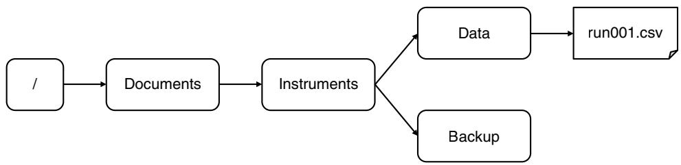  
Figure 7.1 Sample file system hierarchy.

The complete path to the run001.csv file can be written using one of the following notations, depending upon the operating system you are using.

```txt
/Documents/Instruments/Data/run001.csv 
```

or

```txt
\Documents\Instruments\Data\run001.csv 
```

The character that separates one directory from a subdirectory or file is dependent upon your operating system. Flavors of Unix and the Macintosh use the forward slash as a path’s separator (/) while Windows paths are separated using the backslash (\). When working with paths, Python allows you to use either separator. We’ll try to stick with the forward slash.

Another option for accessing a resource using a path is to use the Universal Naming Convention (UNC) standard to specify the path. The format of a UNC path extends a standard file system path to access resources over a network, using path notation. With the UNC standard, the path is extended with a leading server or host computer name and a possible share point. The operating system handles all network communications required, automatically. The following two examples illustrate the format of a UNC path on Windows, and a second on a UNIX-based operating system. Refer to your operating system’s documentation for details.

```txt
\<server name>\<share point>\<path to resource> 
```

```txt
//<host>/<path to resource> 
```

Terminal programs have the notion of a current working directory. When a program is executed in a terminal, it is executed relative to the terminal’s current working directory. When a program attempts to access a file, the path to the file must start either at the file system root or relative to the current working directory. When a file path is composed of nothing more than the file name, it is assumed that the file is within the current working directory.

Two special file system path symbols are the single dot (.) and the double dot (..). The single dot in a path means this directory. For example, one way to write the path to the file named run001. csv in the current directory is. $/ \mathtt { r u n o 0 1 }$ .csv which means, starting in this directory, find the file named run001.csv. When the file is in a subdirectory named Instrument1, the path from the current directory is./Instrument1/run001.csv.

When ".." is used in a file path, the location moves up the file hierarchy one level. For example, if our current directory is Data, as illustrated in the Figure 7.1 hierarchy, to access the Backup directory, we can form an absolute path from the root directory or a relative path from the current directory. A relative path from Data to Backup would be written as../Backup. From the Data directory we move up the hierarchy one level using ".." and then down to Backup.

Understanding how a file system hierarchy is managed and navigated is necessary to access files stored at other locations. Python provides a rich set of tools for working with and managing all aspects of a file system, programmatically. Even better, the Python toolkit strives to be operating system-independent, meaning that the code we write will be useful regardless of the specific features of the operating system, such as the path separator character.

# 7.2 Text Files

The term plain text file is used to describe a file stored as a sequence of characters encoded as bytes defined by a simple encoding scheme, such as the ASCII standard table, listed in Appendix A and described in subsection 2.4.7. There is nothing fancy about a plain text file. If the file contains the letters ABC in that order, the memory that stores the file will almost certainly include the bytes 65, 66, and 67, corresponding to ASCII table entries for each of the three characters.

The 128 characters in the ASCII table are quite limited, significantly restricting the text that can be written to a file. Taken together, all the written languages of the world include thousands of characters. Unicode solves this limitation by defining text encoding standards capable of representing characters in all the world’s digitizable writing systems [23].

The most widely used encoding in the Unicode standard is referred to as Unicode Transformation Format – 8-bit (UTF-8). The popularity of UTF-8 likely stems from its frequent use to encode text in web pages. The UTF-8 encoding is a variable length coding capable of representing over one million characters, also known as code points. UTF-8 uses between one and four bytes to represent each code point.

One of the more important features of the UTF-8 encoding is that it was designed to be backward compatible with the ASCII encoding standard. Specifically, the first 128 code points in UTF-8 are identical to the 128 characters in the standard ASCII table. Because of this, an ASCII-encoded file is compatible with a UTF-8-encoded file. The genius of UTF-8 is how text readers are able to determine, on-the-fly, how many bytes are used to encode the current code point.

The number of bytes used to encode the next UTF-8 code point is in the bits of its first byte. A code point can be decoded quickly by inspecting the bits in the first byte. Fortunately, each of the 128 characters in the ASCII standard can be encoded using 7 of the 8 bits in a single byte. When the first bit of the first byte of a code point is 0, the code point uses an ASCII encoding and so only that byte is read and decoded. Alternative bit arrangements in the first byte indicate when two, three, or four bytes are used to store the entire code point. This feature of the UTF-8 encoding standard makes it compatible with an ASCII-encoded file. Plain text files using a pure ASCII encoding are indistinguishable from a UTF-8 encoding, so the two can coexist seamlessly.

As a brief demonstration, let’s consider the string $\bf { " } 2 1 2 ^ { \circ } F ^ { \prime \prime }$ stored in a file. The string contains four distinct characters, three of which have 7-bit ASCII encodings (1, 2, F), and one that does not (°). Because the degrees character (°) is not included in the ASCII table, it cannot be stored using a pure ASCII encoding. It must be stored using an extended encoding like UTF-8. Table 7.1 lists the code points that make up the string, the number of bytes used in UTF-8 to store it, and the bytes in decimal notation as well as in bit sequences.

Note how the bit sequence for the characters 1, 2, and F, all begin with a 0 bit. This indicates that the encoding is accomplished with a single byte, and the ASCII table may be used to decode that byte into a character. On the other hand, the first byte of the "°" character encoding starts with the bits 110, which is the way that UTF-8 indicates that the encoding is made up of two bytes.

Table 7.1 A few sample code points and their UTF-8 encodings.   

<table><tr><td>Code point</td><td>Number of bytes</td><td>Decimal encoding</td><td>Bit sequence encoding</td></tr><tr><td>1</td><td>1</td><td>49</td><td>00110001</td></tr><tr><td>2</td><td>1</td><td>50</td><td>00110010</td></tr><tr><td>F</td><td>1</td><td>70</td><td>01000110</td></tr><tr><td>°</td><td>2</td><td>194, 176</td><td>11000010, 10110000</td></tr></table>

Finally, note that the default encoding is set by the system on which a Python program is being executed. You can interrogate the default system encoding by importing the locale module and inspecting the string returned from executing the module’s getpreferredencoding() function. This value can change. If a file’s character encoding is critical to the correct execution of your program, rather than relying on a default encoding, it is wise to set the encoding explicitly.

```txt
The default encoding is determined by the system.  
>>> import locale  
>>> print(locate.getpreferredencoding())  
cp1252 
```

# 7.3 Reading and Writing Text Files

Whether reading or writing a text file in Python, the file must first be opened. When finished reading or writing the file, the file must be closed. Forgetting to close a file can cause problems. For example, in order to optimize the way a program works with disk storage, data written to a file is often buffered in memory and written to disk periodically. Closing a file flushes buffered data to disk, ensuring that everything is written as intended. If a program terminates before a file is closed, there is no guarantee that all data has made it to disk.

One way to open a text file is by invoking the open(…) global Python function and providing the function with the file name and mode string arguments. File mode strings include characters listed in Table 7.2. These may be concatenated into a single string and passed as the second argument to open(…). Other optional keyword arguments include the file’s encoding. The open(…) function returns a file object which is then used to access the file’s contents.

To read and write to a file, we can use the file object’s methods. See Table 7.3 for several common file object methods and fields. After creating a file object using open(…), the actions that are available depend upon the mode that was set while opening.

For example, to read a line from a text file, open it using read mode $" \boldsymbol { \mathbf { \mathit { x } } } ^ { \mathrm { ~ I ~ } }$ and then invoke the readline() method on the file object. Don’t forget to invoke the close() method when file access is complete. You can inspect the mode with which a file was opened using the file object’s mode property, and whether a file is open or closed by inspecting the closed property of the file object.

Consider the file named data.txt, given in Listing 7.1. The file is a plain text file consisting of 10 floating point numbers listed in a single column. We can open, read, and close the file, interactively. The Python console session that follows demonstrates this.

Table 7.2 File open mode characters.   

<table><tr><td>File mode</td><td>Meaning</td></tr><tr><td>&#x27;r&#x27;</td><td>Read from a file.</td></tr><tr><td>&#x27;w&#x27;</td><td>Write to a file.</td></tr><tr><td>&#x27;a&#x27;</td><td>Write to the end of a file (append).</td></tr><tr><td>&#x27;+&#x27;</td><td>Open for updating, both reading and writing.</td></tr><tr><td>&#x27;x&#x27;</td><td>Open a file with exclusive access.</td></tr><tr><td>&#x27;b&#x27;</td><td>Read and write in binary mode, as bytes.</td></tr><tr><td>&#x27;t&#x27;</td><td>Read and write in text mode (default).</td></tr></table>

Table 7.3 Common file object fields and methods.   

<table><tr><td>File method</td><td>Description</td></tr><tr><td>open(name, mode)</td><td>Open a file given a name and mode.</td></tr><tr><td>close()</td><td>Close a file.</td></tr><tr><td>read(...)</td><td>Read and return the entire contents of a file.</td></tr><tr><td>readline(...)</td><td>Read one line from a file and return.</td></tr><tr><td>readlines(...)</td><td>Read all lines from the file and return a list.</td></tr><tr><td>write(s)</td><td>Write a string s to a file and return the number of characters written.</td></tr><tr><td>writelines Lines)</td><td>Write a list of lines to a file. Line separators must be added manually.</td></tr><tr><td>seek(offset, whence)</td><td>Set stream position. whence may be 0, 1, or 2.</td></tr><tr><td>tell()</td><td>Get the current stream position.</td></tr><tr><td>flush()</td><td>Write any buffered data to the open file.</td></tr><tr><td>fileno()</td><td>Integer file descriptor used by the underlying implementation.</td></tr><tr><td>truncate(...)</td><td>Resize the file to the current file location or a given size parameter.</td></tr><tr><td>readable()</td><td>True if the stream can be read.</td></tr><tr><td>writable()</td><td>True if the stream can be written.</td></tr><tr><td>seekable()</td><td>True if the stream location can be changed.</td></tr><tr><td>encoding</td><td>The standard name used to encode the file&#x27;s bytes into characters.</td></tr><tr><td>closed</td><td>True if the file is closed.</td></tr><tr><td>mode</td><td>The mode used to open the file.</td></tr></table>

Listing 7.1 Contents of the text file data.txt.   
```csv
0.36758217  
0.070849495  
0.347101331  
0.64016518  
0.678830901  
0.66819609  
0.180810664  
0.261484745  
0.142275355  
0.194054923 
```

```txt
>>> file = open('data.txt', 'r')  # Open the file for reading  
>>> line = file.readline()  # Read the first line  
>>> print(line)  # Print what was read  
0.36758217  
>>> line = file.readline()  # Read the next line  
>>> print(line)  # Print what was read  
0.070849495  
>>> print(file.close, fileemode)  # file object closed and mode  
False r  
>>> file.close()  # Close the file  
>>> print(file.close, fileemode)  # file object closed and mode  
True r 
```

In the previous console session, the file is first opened for reading text, by specifying the $" \Sigma ^ { 1 }$ mode. The first line is read from the file using the readline() method. This method reads the entire first line and returns it as a string. The second time readline() is invoked, the second line from the file is read. This illustrates an important feature of file objects. A file object keeps track of file location. When opened, the file location is initialized to the beginning of the file. The first read command starts reading from the beginning. Once a certain amount of data is read, the file location is updated to the byte immediately after the last character is read. This way, when the next read command is invoked, reading commences with the first unread part of the file. As read commands are executed one after the other, the contents of the file are read in order, from the beginning to the end. Also note how the closed and mode properties tell us the state of the file object.

To ensure that a file is always closed, Python provides an alternative way to open it, which is by using a with statement. When using a with statement to open a resource and assign it to a name, the with statement creates a context associated with the code block, within which that named resource remains open. When the code block is exited and the context goes out of scope, the resource is closed automatically. This behavior frees us from the need to remember to close an open file. When a file is intended to be used momentarily, to read its data once, it is helpful to do all the work in a with statement so that the file is closed automatically.

Another feature of a file object is that it is a kind of iterator that returns all lines from a file within an iteration. What this means is that you may iterate over the lines of a file in a manner identical to the way you iterate over the elements of a list. Using a for-in statement with an open file is the easiest way to read and process every line from a text file in Python.

Listing 7.2 includes a complete program that opens a file, reads each line from the file, converts each line to a floating-point number, and collects all numbers in a list. Note how the program uses the with statement to open the file so that it is closed automatically, and how it uses a for-in statement to read all lines from the file, in order. The program in Listing 7.2 demonstrates a common way to read all lines from a text file using Python.

Listing 7.2 Read all lines from a data file, convert to floats, and add to a list.   
```python
# read1.py
# Read lines from a file
def readlines(name):
    data = []
    with open(name, 'r') as file:
        for line in file:
            item = float(line)
            data.append(item)
        return data
if __name__ == __main__:
    print(readLines('data.txt')) 
```

If a file is sufficiently small, such as what you might have with a configuration file, it is possible to read the entire contents of the file at once. This can be done using the file object’s read() method. Depending upon the format of the file, this approach may be preferential. Another option when opening a file is to read its contents as bytes instead of characters. This is achieved by adding a 'b' to the file’s open mode. Let’s demonstrate these two options and use them to illustrate how non-ASCII characters are written to a file using multi-byte encodings, like UTF-8.

Assume we have a file named temperature.txt with contents $\bf { " } 2 1 2 ^ { \circ } F ^ { \prime \prime }$ . This tiny file contains only five characters, but one of them is not included in the ASCII table. A standard text editor was used to create the file and the default UTF-8 encoding was used when the file was saved.

In subsection 2.6.6, we introduced Python’s sys module. Another feature of that module is to provide a list containing all strings that make up the command entered at the terminal to run the program. This list may contain extra strings entered after the program file name, which are meant to be read and processed by the program. Refer to Listing 7.3 and the following console session that tests the program. After importing the sys module, sys.argv will contain the list of all strings that appear after the python command. In the terminal, after the name of the Python program we passed the additional strings "hello" and "world". The list referenced by sys.argv contains three strings, including the program name as well as the two additional command line parameters. We can use sys.argv as an alternative to input(…) as to read strings into a program when executed.

Listing 7.3 Demonstration of sys.argv.   
read_argv.py   
import sys   
# Print command line string list if_name $= =$ 'main': print(sys.argv)

```txt
> python read_argv.py hello world ['read_argv.py', 'hello', 'world'] > 
```

The sys.argv technique in Listing 7.4 is used to receive the name of a file to process. Note how we test the length of the list to ensure that the user has entered the expected number of command line arguments and print a helpful message when a command line argument was not provided. If the correct number of arguments is not provided in the command line, we use the sys.exit() function to terminate the program.

Listing 7.4 Utility that reads and prints the contents of a file as bytes and UTF-8 code points.   
```python
# read_bytes.py
import sys
# Read a file and print bytes
def read_bytes(name):
    with open(name, 'rb') as file:
        bytes = file.read()
        print(f'[name] contains {len(bytes)} bytes')
        for b in bytes:
            print(f'[b] {'b:08b}', end='')
        print()
# Read a file and print UTF-8 encoded characters
def readutf8(name):
    with open(name, 'r', encoding='utf-8') as file: 
```

Listing 7.4 (Continued)   
```python
cpoints = file.read() # Read entire contents  
print(f'[name] contains {len(cpoints)} code points')  
for c in cpoints: # Print each code point  
    print(c, end='')  
print()  
if __name__ == '__main__':  
    if len(sys.argv) < 2:  
        print("Please enter a file name")  
sys.exit()  
read_bytes(sys.argv[1]) # Read and print bytes  
read utf8(sys.argv[1]) # Read and print code points 
```

The program in Listing 7.4 defines two functions, both of which are invoked when the program is run from a terminal. The read_bytes(…) function opens the file in binary read mode using the recommended with statement. It then reads the entire contents of the file into the bytes variable, prints the number of bytes, and then prints each byte as a decimal number. The read_ utf8(…) function opens the file in read text mode but sets the optional encoding keyword argument to 'utf-8'. It then prints the length in code points (characters) and prints each as a UTF-8 character.

See the following terminal session for the output when we run the program, passing the name of our temperature.txt example file on the command line. The read_bytes(…) function tells us that there are six bytes in the file, not five, which is what we expect. Recall from Section 7.2 that the "°" symbol cannot be represented as a single ASCII byte. In UTF-8 it is stored using the two bytes 194 and 176. This is exactly what we see in the output. Note how each byte is printed as an integer as well as a sequence of bits. The single byte for all ASCII-encoded characters starts with a 0 bit. The first byte of the one non-ASCII character starts with the bits 110, which tells us that the character is encoded as two bytes, per the UTF-8 standard. The read_utf8(…) function tells us that the file contains only five code points. By setting the encoding to UTF-8, the two bytes that encode the "°" character are recognized as a single code point and decoded correctly.

```txt
> python read_bytes.py temperature.txt  
temperature.txt contains 6 bytes  
50 (00110010) 49 (00110001) 50 (00110010) 194 (11000010) 176 (10110000) 70 (01000110)  
temperature.txt contains 5 code points  
2 1 2 °F 
```

Writing a text file follows a similar process. The file is first opened with a mode of "w" to write or "a" to append text to the file. Ideally, the file is opened using a with statement to ensure it is closed automatically, but this is not a requirement. The main difference between the "w" and "a" modes is the file location where writing begins. When a file is opened with "w" mode, text is written starting at the beginning of the file. This means that if the file contains text already, it is lost because it is overwritten. By contrast, writing a file opened in "a" mode starts writing at the end of a file, effectively appending text to the file.

The two primary file object methods for writing text to a file are write(…) and writelines(…) (see Table 7.3). These methods are complementary to the read(…) and readlines(…) methods.

The write(…) method writes a single string to a file starting from the current file location. The writelines(…) method writes a list of strings to the file, again, starting from the current file location. Note that neither the write(…) nor the writelines(…) method adds line separators to the end of each string written to the file. It is up to you to add the appropriate newline characters to each line before it is written to a file, if you intend for each string to appear on a separate line.

An interesting way to use the file writing ability of Python is to build a small function that writes a message to a simple log file. Each time a message is to be written to a log file we want it to be appended to the end of the file as a new line, so we want to open the file with the append mode "a". Another nice feature of a log file function would be to prepend each message with the current datetime. Listing 7.5 provides an example of a $\Im { \mathrm { o g } \left( \dots \right) }$ function that does the job. A few things to note about this function include:

1.	 The $\Im { \mathrm { o g } \left( \dots \right) }$ function takes both the message string and log file name as parameters.   
2.	 The log file name is a keyword argument with the default value of log.txt. Not passing this argument will cause the message to be written to the file named log.txt.   
3.	 The file is opened for append using a with statement, guaranteeing that it will be closed when the code block exits. If the file does not exist, a new one is created automatically.   
4.	 The datetime module is imported in order to invoke its now() function, which returns the current datetime.   
5.	 An f-string is used to build a string to be written to the log file, which is prepended with a formatted current datetime, the message, and a final "\n" character necessary for moving to the next line in the file.   
6.	 The formatted string is then added to the end of the file using the file object’s write(…) method.

The resulting $\Im { \mathrm { o g } \left( \dots \right) }$ function is very useful and worth keeping close by for whenever you need to generate a quick log file.

Listing 7.5 Basic function to log messages to a file.   
```python
# log.py   
from datetime import datetime   
def log(msg, name='log.txt'): with open(name, 'a') as file: file.write(f{'datetime但现在():%Y-%m-%d %I:%M:%S %p}, {msg}\n') 
```

For more sophisticated applications, note that Python has a much more powerful logging framework available in its built-in logging module [27]. This module allows you to log a message with a level including: debug, info, warning, error, and critical. Messages can be filtered on level, formatted, and routed to an appropriate destination.

# 7.4 Working with Comma-Separated Values (CSV) Files

Tables of data written to a text file are frequently written with each row on its own line and each value in a row separated by a character like a comma, tab, or even a space. When a comma is used as the separator the file is referred to as a comma-separated values, or CSV file, which often is signaled by the file name having the extension ".csv". Listing 7.6 shows the top several lines from

a sample data file named table.csv. Not only does this file contain row values on each line separated by commas, but the first line in the file contains column titles. Adding a line devoted to column titles presents a small complication because the first line of the file must be treated differently than the remaining lines.

Listing 7.7 provides a compact solution to the problem of reading a CSV file with column headers. The console session following Listing 7.7 demonstrates execution.

Listing 7.6 Several rows from the sample file table.csv.   
```csv
Col1, Col2, Col3, Col4  
0.125289657, 0.828870889, 0.965628913, 0.218631891  
0.700986081, 0.207323874, 0.050580735, 0.369552467  
0.271518018, 0.476406271, 0.754785173, 0.34805011  
0.568659343, 0.929579582, 0.385451014, 0.61892352  
0.785334943, 0.662716029, 0.556120334, 0.095806875  
... 
```

Listing 7.7 Read a CSV file with column titles.   
```python
# read_csv_table1.py
import sys
# Read a table of comma-delimited data and assemble as a list of lists
def read_csv_table1(name, sep=','):
    table = []
    with open(name, 'r', encoding='utf-8') as file:
        # Split and strip titles
        titles = [title.strip() for title in file.readlines().split寰)]
        table.append(titles)  # Add column titles to table
        while (line := file.readlines():
            # Walrus operator to detect EOF
            row = [float(item) for item in line.split(sep)] # Split and convert
            table.append(row)  # Add row data to table
        return table  # Return table as list of lists
if __name__ == '__main__':
    if len(sys.argv) < 2:
        print('Please provide CSV file name')
        sys.exit()
    tbl = read_csv_table('table.csv')
    for row in tbl:
        print(row) 
```

```txt
> python read_csv_table1.py table.csv ['Col1', 'Col2', 'Col3', 'Col4']  
[0.125289657, 0.828870889, 0.965628913, 0.218631891]  
[0.700986081, 0.207323874, 0.050580735, 0.369552467]  
[0.271518018, 0.476406271, 0.754785173, 0.34805011]  
[0.568659343, 0.929579582, 0.385451014, 0.61892352]  
[0.785334943, 0.662716029, 0.556120334, 0.095806875] 
```

The goal of the read_csv_table1(…) function is to return a list of lists of table data, where the first list contains column titles as strings, and the remaining lists contain each row of numbers, properly split and converted.

The first thing this function does is initialize an empty list named table that will collect all column titles and row data. The file is opened using the with statement and a UTF-8 encoding. Column titles are expected on the first line of the file. All column titles are read and processed with the following single list comprehension.

```txt
titles = [title.strip() for title in file.readlines().split('\n') 
```

Let’s break down this line of code.

1.	 file.readline() reads one line of code from the file.   
2.	 The.split(',') method invoked on the returned string divides it at "," into a list of strings.   
3.	 for title in … iterates over each element of that string list, assigning each list element to the variable title, one at a time.   
4.	 title.strip() removes any extraneous whitespace from each title.   
5.	 The outer square brackets […] forms the list comprehension that collects and assigns all stripped title strings to the variable titles.

The newly assembled titles list is appended to the table list, and the program continues.

Our next step is to read the remaining lines from the file. In this case, we cannot use the standard for-in statement to read all lines in a file because for-in reads from the start of the file and we want to pick up reading the line starting from the current file location, after column titles. The file object’s readline() method does that for us, so we use a while-statement and the readline() file object method to complete reading all lines in the file. When readline() reaches the end of the file it returns an empty string, which stops the while-statement iteration.

Pay close attention to the test expression inside the while-statement in Listing 7.7, repeated below. The expression does more than just read and assign the string returned from readline() to the variable line. It uses the special assignment operator ": $= "$ called the walrus operator.

```javascript
while (line := file.readline()); 
```

The walrus operator $( : = )$ works just like the standard assignment operator $( = )$ with an extra step. An assignment statement is not like an expression which evaluates to a value. Assignment evaluates the expression on its right and assigns the result to the variable on its left. The assignment yields nothing, unlike other operators like $^ +$ and /. If we attempt to print the result of an assignment, we receive a syntax error. In this case, Python assumes the assignment operator is a keyword argument passed to the print(…) function, which the print(…) function does not define. The standard assignment statement does not yield a value, so there is nothing to print. In the console session below an attempt to print a standard assignment produces a syntax error.

```txt
>>> print(x = 1 + 1)
Traceback (most recent call last):
    File "<stdin>", line 1, in <module>
TypeError: 'x' is an invalid keyword argument for print()
>>> 
```

By contrast, the walrus operator does two things for us. It assigns the result of the expression on the right to the variable on the left, plus it yields the value that is assigned. This lets us use the walrus operator to assign a variable and use the assigned value for another purpose. Printing an assignment using the walrus operator succeeds by yielding the assigned value, which is passed to the print(…) function.

```txt
>>> print(x := 1 + 1)  
2  
>>> x  
2  
>>> 
```

Similarly, the expression in our while-statement in Listing 7.7 reads the next line using readline(), assigns what is read to the line variable, and yields the assigned value. The assigned value is tested each time before repeating the while-statement. When the result is an empty string indicating the end of a file, the while-statement stops iterating. The while-statement code block will execute only while non-empty lines are read from the file.

The first line in the while-statement code block performs a similar list comprehension used to read and process column titles. But, instead of stripping each item, the line converts each item to a float number and collects converted numbers into a list. The final list of numbers is assigned to the variable row, which is then appended to the table list. Once all lines in the file have been processed, the table list of lists is returned and printed.

```txt
row = [float(item) for item in line.split(sep)] 
```

This technique works well when you have a simple table of numbers and simple column titles, but it can fall apart when the elements of a CSV file are not simple numbers. The CSV file format has some surprising complexities. For example, what happens when the data of a table element contains a comma character? Items containing a comma character should not be used to split a row. How can we know when a comma belongs to row element and when it is meant to divide row elements?

Figure 7.2 depicts a hypothetical spreadsheet assembled by a lab manager assigning follow-up sample analyses to bench scientists. The first column contains the names of each scientist, the second column identifies the assigned samples, the third column is a dilution factor, and the fourth column includes additional comments, if any.

This spreadsheet is intended to be saved as a CSV file, and then read and processed further by a Python program. A quick scan of the spreadsheet’s contents raises some concerns. Scientist names in the first column do not have uniform formatting. Some names use the format "first last", and others use the format "last, first". The second Samples column includes well labels. When there is more than one label, the list is comma-separated. The final Comments column is free form, and may also contain any character, including commas and double quotes.

The file table2.csv (Listing 7.8) is the CSV file exported from the spreadsheet in Figure 7.2. A closer inspection reveals how special characters in the original spreadsheet are handled. We see that all cells containing commas as data are written to the file delimited by double quotes. For example, the cell containing A01, B01, C01 was written as "A01, B01, C01", adding an outer pair of double quotes. Reading and writing a CSV file must take into consideration the use of

<table><tr><td>Scientist</td><td>Samples</td><td>Dilution</td><td>Comments</td></tr><tr><td>Calypso, Almog</td><td>A01, B01, C01</td><td>0.01</td><td>Don&#x27;t forget to dilute each well</td></tr><tr><td>Margita Mathieu</td><td>B02, C02</td><td>0.01</td><td></td></tr><tr><td>Sadie, Tania</td><td>A03, C03</td><td>0.01</td><td></td></tr><tr><td>Gulbrand Lewin</td><td>A04, C04, D04, E04</td><td>0.01</td><td></td></tr><tr><td>Tenney, Patka</td><td>B05</td><td>0.01</td><td>Aliquot, dilute, and run</td></tr><tr><td>Remigio, Marganita</td><td>A06, C06, E06</td><td>0.01</td><td></td></tr><tr><td>Viorela Kephalos</td><td>B07, D07</td><td>0.01</td><td></td></tr><tr><td>Siva, Alfredo</td><td>F08</td><td>0.01</td><td>Return to &quot;Lab 012&quot;</td></tr></table>

Figure 7.2 A spreadsheet holding a hypothetical set of instructions for sample follow up.

double quotes to group the content of a single cell. The second issue we see is associated with cells containing double quotes as data. When is a double quote character meant to be data from a cell and when is it used to delimit the content of a cell? The answer is that double quotes as cell contents are themselves doubled up. For example, the cell containing the text "Return to "Lab 012"" is written to the CSV file as "Return to ""Lab 012""". The entire content of the cell is double quoted, and the double quote characters themselves are written twice in sequence to indicate that they are characters in the cell content and not delimiters.

Listing 7.8 Contents of the file table2.csv. Saved from a spreadsheet containing three columns.   
```csv
Scientist, Samples, Dilution, Comments
"Calypso, Almog", "A01, B01, C01", 0.01, Don't forget the dilute each well
Margita Mathieu, "B02, C02", 0.01,
"Sadie, Tania", "A03, C03", 0.01,
Gulbrand Lewin, "A04, C04, D04, E04", 0.01,
"Tenney, Patka", B05, 0.01, "Aliquot, dilute, and run"
"Remigio, Marganita", "A06, C06, E06", 0.01,
Viorela Kephalos, "B07, D07", 0.01,
"Siva, Alfredo", F08, 0.01, "Return to ""Lab 012''
" 
```

A program capable of reading and parsing any CSV file must account for the complex ways that cell contents are formatted. To complicate the situation further, the handling of special characters in a CSV file can change based on which program is writing it. This is called a CSV dialect. Our previous read_csv_file(…) function fails spectacularly when attempting to read this file, as illustrated below. Fortunately, Python provides us with a module named csv that is designed to handle the advanced formats in a CSV file.

```txt
> python read_csv_table1.py table2.csv  
Traceback (most recent call last):  
    File " \read_csv_table1.py", line 19, in <module>  
    tb1 = read_csv_table1(sys.argv[1]) 
```

```python
File " \read_csv_table1.py", line 11, in read_csv_table1 row = [float(item) for item in line.split(sep)] # Split and convert ValueError: could not convert string to float: "'Calypso' 
```

# 7.5 The csv Module

The Python csv module included in Python’s standard library [28] is designed to read the contents of any delimited text file and handle its special formats. Despite the module’s name, the text file can use any single character as its delimiter. Furthermore, it can use any quote character, any escape character, any line terminating character, and more. Taken together, all these settings are considered the CSV file’s dialect. CSV file dialects available in the csv module can be listed by importing the csv module and invoking the csv.list_dialects() module function.

The csv module works by defining a specialized reader object that processes the contents of an opened text file. As with the simple approach we used in the last section, reading a CSV file using the csv module starts by opening the text file as usual, but then wrapping the file in a csv module reader object before processing each line in the file. The reader object handles all specialized formatting based on the CSV file dialect chosen. Note that the default dialect used by a csv reader object follows the settings used by Microsoft® Excel. Because we are using Excel to generate our CSV files, we can choose the default. Double-check the dialect settings to make sure they match your chosen CSV file dialect.

Listing 7.9 A program that correctly reads a CSV file with specialized formatting.   
```python
# read_csv_table2.py
import sys, csv
def read_csv_table2(name):
    with open(name, 'r', encoding='utf-8') as file:
        rdr = csv-reader(file)  # Create a reader that wraps the file
        table = []
        for row in rdr:
            table.append(row)  # Add row data to table
        return table
if __name__ == '__main__':
    if len(sys.argv) < 2:
        print('Please provide CSV file name')
        sys.exit()
    tb1 = read_csv_table2(sys.argv[1])
    for row in tb1:
        print(row) 
```

Listing 7.9 demonstrates the use of the csv module for reading a CSV file with specialized formatting. As with any module, we must first import it before it can be used. The read_csv_ table2(…) function opens the CSV file using a with statement to ensure it is closed automatically. The opened file object is then passed to csv.reader(file) which creates a reader object

that wraps the opened file. The reader is an iterator so it can be used in a for-in statement to read each row from the file, returning all cell data as a list, properly parsed and separated, accounting for all specialized formatting. With the csv module’s reader object, we are not required to split and strip individual rows to obtain individual cell content as we did in Listing 7.7. The csv module does not automatically detect data types, so we must add a post processing step to our programs to convert data element types, as necessary.

Running the program in Listing 7.9 produces the following output. All cell elements are properly processed and separated into elements of each row list. Note that numeric values in the third column have not been converted to the proper type. Assuming that we want to use the data in the third column to perform follow-up numeric computations, we must manually post-process the data by manually converting the type from string to float.

```python
> python read_csv_table2.py table2.csv  
['Operator', 'Samples', 'Dilution', 'Comments']  
['Calypso, Almog', 'A01, B01, C01', '0.01', "Don't forget to dilute each well"]  
['Margita Mathieu', 'B02, C02', '0.01',.']  
['Sadie, Tania', 'A03, C03', '0.01', ']  
['Gulbrand Lewin', 'A04, C04, D04, E04', '0.01', ']  
['Tenney, Patka', 'B05', '0.01', 'Aliquot, dilute, and run']  
['Remigio, Marganita', 'A06, C06, E06', '0.01', ']  
['Viorela Kephalos', 'B07, D07', '0.01', ']  
['Siva, Alfredo', 'F08', '0.01', 'Return to "Lab 012"'] 
```

# 7.6 Reading and Writing Excel Spreadsheet

If Microsoft® Excel is your spreadsheet application of choice, the open-source Python ecosystem offers several modules capable of manipulating the spreadsheet files directly. These include modules named openpyxl, xlrd, xlwt, xlsxwriter, and xlutils. None of these modules is included in the Python standard library, so using any one of them requires an initial installation process using Python’s pip module (see Section 1.4). Please note that each module has its strengths, which may differ.

One important factor to consider is the file format standard of your Excel files. In the 2003 release of Microsoft® Office, Microsoft incorporated its Office Open XML file format standards for all its Office files [29]. Files saved prior to that time may use an earlier format. Several of the Python modules available for working with Excel files can read earlier formats. Choose a module that suits your file format requirements. Note that all modules read and modify Excel files, but none interact with a running Excel program.

In this section, we will focus exclusively on the excellent openpyxl module [30]. To install the openpyxl module from the Python Package Index, use the pip module as follows.

```batch
python -m pip install openpyxl 
```

If you are behind a proxy server, add the --proxy option.

```batch
python -m pip install openpyxl --proxy [user:passwd@]proxy.server:port 
```

One nice feature of the openpyxl module is that it is organized in a way that matches the structure of a typical Excel workbook. Three main openpyxl objects used when interacting with an Excel file are Workbook, Worksheet, and Cell.

A Workbook object corresponds one-to-one with an Excel file, and it encapsulates much of the properties and functionality of an Excel Workbook. A new Workbook object can be created programmatically, or a Workbook object can be created by opening an existing Excel file. A Workbook has a collection of Worksheet objects, one for each tab in the Workbook. A Worksheet encapsulates the properties and functionality of a single worksheet in a Workbook. A Worksheet has a collection of Cell objects arranged in a rectangular grid. Each Cell encapsulates the properties and functionality of a single cell. A nested arrangement made up of these three object types forms the structure that you can use to interrogate and modify an Excel file in memory. Let’s consider each in a bit more detail.

# 7.6.1 openpyxl Workbook Object

The Workbook object is the top-level container that holds all other openpyxl objects. Before we can do anything, we must first create a new Workbook object. We have the option of creating an empty Workbook or loading one from an existing file. Listing 7.10 demonstrates both options.

After importing the openpyxl module, a new Workbook object can be created by invoking the Workbook() object creation method available inside the module. This returns a Workbook with one empty Worksheet, ready to be filled with data. The second option is to use the openpyxl module’s top-level load_workbook(…) module function which loads data from an existing file given the file name.

Listing 7.10 Methods for creating a new openpyxl Workbook object.   
import openpyxl   
#Instatiate a blank Workbook object wb $=$ openpyxl.Workbook() #Load an existing workbook from a file wb $=$ openpyxl.load_workbook('forecast.x1sx')

Like most openpyxl objects, the Workbook object has both properties and methods that can be invoked to interrogate and modify the object. Refer to Table 7.4 for several of the more common properties, methods, and other ways to work with Workbook objects. Test these properties and methods interactively in a Python console.

In general, a Workbook object is primarily a collection of Worksheet objects, and the properties and methods of the Workbook object provide us with the ability to manage this collection. Referring to Table 7.4, note how we can access a list of Worksheet names and a list of Worksheet objects using the sheetnames and worksheets properties, respectively. The currently active Worksheet is referenced by the Workbook’s active property. A particular Worksheet object can be accessed by name using the same square bracket notation used for accessing dictionary elements with a key. Finally, note that it is possible to iterate over all Worksheets using the for-in statement.

New Worksheets may be added to the Workbook using the Workbook’s create_sheet(sname) method and removed using either its remove(…) method or using the del wb[sname] statement, similar to the way key-value pairs are removed from a Python dictionary.

Table 7.4 Common properties and methods of the openpyxl Workbook object.   

<table><tr><td>Property/method/usage</td><td>Description</td></tr><tr><td>active</td><td>Get the currently active Worksheet.</td></tr><tr><td>sheetnames</td><td>Returns the list of the Worksheets names in this workbook.</td></tr><tr><td>worksheets</td><td>A list of Worksheets in this Workbook.</td></tr><tr><td>wb[sname]</td><td>Get Worksheet named sname from the Workbook wb.</td></tr><tr><td>for ws in wb: ...</td><td>Iterate over all Worksheets ws in a Workbook wb.</td></tr><tr><td>create_sheet(sname)</td><td>Create a new Worksheet in this Workbook.</td></tr><tr><td>remove(ws)</td><td>Remove Worksheet object ws from this Workbook.</td></tr><tr><td>del wb[sname]</td><td>Delete worksheet named sname from the Workbook wb.</td></tr><tr><td>save(filename)</td><td>Save the current Workbook to a file with filename.</td></tr><tr><td>close()</td><td>Close the Workbook file if it is open.</td></tr></table>

After changes are complete, use the Workbook’s save(filename) method to save the Workbook to a file and the close() method to close the Workbook.

# 7.6.2 openpyxl Worksheet Object

Worksheet objects manage a rectangular array of Cell objects. Refer to Table 7.5 for common object properties, methods, and other ways to interact with Worksheet objects.

We can use the Worksheet object’s active_cell, selected_cell, and values properties to access the named individual Cell objects and to iterate over all values in the Worksheet. The cell(row, column) method is used to access individual Cell objects at the given row, and column indexes. The append(…) method adds items to the end of the Worksheet. Rows and columns of data may be inserted and deleted using the insert_rows(…), insert_cols(…), delete_rows(…), and delete_cols(…) methods.

Table 7.5 Common properties and methods of the openpyxl Worksheet object.   

<table><tr><td>Property/method/usage</td><td>Description</td></tr><tr><td>active_cell</td><td>Get the currently active cell.</td></tr><tr><td>selected_cell</td><td>Return the currently selected cell.</td></tr><tr><td>values</td><td>Return all cell values in the worksheet, by row.</td></tr><tr><td>cell(row, column)</td><td>Return a Cell at given row and column.</td></tr><tr><td>append(iterable)</td><td>Append a group of values to the bottom of the current sheet.</td></tr><tr><td>delete_cols(idx, amt=1)</td><td>Delete column or columns from column at idx.</td></tr><tr><td>delete_rows(idx, amt=1)</td><td>Delete row or rows at idx.</td></tr><tr><td>insert_cols(idx, amt=1)</td><td>Insert column or columns at idx.</td></tr><tr><td>insert_rows(idx, amt=1)</td><td>Insert row or rows at idx.</td></tr></table>

Table 7.6 Common properties and methods of the openpyxl Cell object.   

<table><tr><td>Property</td><td>Description</td></tr><tr><td>column</td><td>Column number of this Cell (1-based).</td></tr><tr><td>row</td><td>Row number of this Cell (1-based).</td></tr><tr><td>value</td><td>Get or set the value held in the Cell.</td></tr></table>

# 7.6.3 openpyxl Cell Object

Cell objects manage the properties and contents of individual cells in a Worksheet. Common properties of Cell objects are given in Table 7.6. These include the expected properties of row, column, and value. The value property is used to access a Cell’s value. It may be used to both read and update the contents of a Cell.

# 7.7 Project – Generate a Random Sample Layout in a Spreadsheet

Assume you have 24 samples to test and want to randomize them in quadruplicate over an 8 row by 12 column range of cells in an Excel spreadsheet. Sample IDs are S01 through S24. We’d also like to set the standard row titles to A through H and column titles to 1 through 12. Figure 7.3 is an example of the kind of layout we want to generate.

We start our program with a list comprehension that generates all sample IDs to be written to a cell in the spreadsheet. Because we need our samples in quadruplicate, we can add $\star 4$ to the end of the generated list to replicate it four times. Once generated, we use the random module’s shuffle(…) method to randomize the order of sample IDs, in place.

Figure 7.3 Automatically generated random sample layout in a spreadsheet.   

<table><tr><td></td><td>A</td><td>B</td><td>C</td><td>D</td><td>E</td><td>F</td><td>G</td><td>H</td><td>I</td><td>J</td><td>K</td><td>L</td><td>M</td></tr><tr><td>1</td><td></td><td>1</td><td>2</td><td>3</td><td>4</td><td>5</td><td>6</td><td>7</td><td>8</td><td>9</td><td>10</td><td>11</td><td>12</td></tr><tr><td>2</td><td>A</td><td>S20</td><td>S17</td><td>S24</td><td>S18</td><td>S19</td><td>S08</td><td>S06</td><td>S18</td><td>S11</td><td>S15</td><td>S09</td><td>S21</td></tr><tr><td>3</td><td>B</td><td>S13</td><td>S02</td><td>S23</td><td>S13</td><td>S22</td><td>S18</td><td>S07</td><td>S22</td><td>S22</td><td>S19</td><td>S04</td><td>S06</td></tr><tr><td>4</td><td>C</td><td>S17</td><td>S24</td><td>S23</td><td>S01</td><td>S01</td><td>S24</td><td>S13</td><td>S04</td><td>S11</td><td>S20</td><td>S24</td><td>S22</td></tr><tr><td>5</td><td>D</td><td>S15</td><td>S09</td><td>S07</td><td>S16</td><td>S17</td><td>S12</td><td>S10</td><td>S07</td><td>S16</td><td>S20</td><td>S01</td><td>S14</td></tr><tr><td>6</td><td>E</td><td>S21</td><td>S15</td><td>S03</td><td>S07</td><td>S14</td><td>S01</td><td>S10</td><td>S04</td><td>S02</td><td>S05</td><td>S05</td><td>S03</td></tr><tr><td>7</td><td>F</td><td>S03</td><td>S21</td><td>S17</td><td>S13</td><td>S14</td><td>S12</td><td>S03</td><td>S12</td><td>S08</td><td>S16</td><td>S16</td><td>S11</td></tr><tr><td>8</td><td>G</td><td>S15</td><td>S06</td><td>S09</td><td>S23</td><td>S19</td><td>S02</td><td>S06</td><td>S04</td><td>S20</td><td>S19</td><td>S08</td><td>S18</td></tr><tr><td>9</td><td>H</td><td>S02</td><td>S11</td><td>S23</td><td>S05</td><td>S08</td><td>S14</td><td>S05</td><td>S10</td><td>S12</td><td>S09</td><td>S21</td><td>S10</td></tr></table>

```python
samples = [f'S{i:02d}' for i in range(1, 25)] * 4 random.shuffle( samples ) 
```

Next, we produce a list of cell coordinates for each sample ID. This is done easily using nested list comprehensions. The first list comprehension generates all row indexes from 2 through 9, and for each row index, it uses a second nested list comprehension to generate column indexes from 2 through 13. The result is a list with all 96 spreadsheet cell coordinate pairs (row, column). We start with row index 2 and column index 2 to leave room in the spreadsheet for row and column titles.

```latex
[ \text{coordinates} = [(r, c) \text{ for } r \text{ in range}(2, 10) \text{ for } c \text{ in range}(2, 14)] ] 
```

A new Excel Workbook object is created using openpyxl. Because all new openpyxl Workbook objects start with a single Worksheet, we get a reference to that Worksheet right away using the Workbook’s active property.

```txt
wb = openpyxl.Workbook()
ws = wb.active 
```

Two for-in statements are used to set row and column titles. Each Cell object is accessed using the Worksheet’s cell(…) method, and each Cell value using the object’s value property. Row label letters are generated using the global chr(…) function and a for-in counter.

```txt
for i in range(8): ws.cell(i+2, 1).value = chr(i+65)  
for i in range(12): ws.cell(1, i+2).value = i+1 
```

To write all sample IDs in samples to the Cell coordinates in coords, we use a for-in statement to generate indexes between 0 and the number of the generated coordinate pairs. Each row and column index in coords is unpacked using the "*" argument prefix operator and passed to the cell(…) Worksheet method to get a reference to the Cell object at the given coordinates. The sample ID at the samples list index i is written to the corresponding Cell by assigning its value property.

```python
for i in range(len(coords)): ws.cell(*coordinates[i]).value = samples[i] 
```

The program must finish by saving the Excel file and closing the Workbook.

```txt
wb.save('plate_map.xlsx')  
wb.close() 
```

Listing 7.11 is the complete program that solves the problem using the openpyxl module.

Listing 7.11 Randomly map 24 sample IDs to an 8 by 12 layout of cells.   
```python
# random.layout.py  
import random, openpyxl  
# Generate 24 sample names in quadruplicate and randomize samples = [f'S{i:02d}' for i in range(1, 25)] * 4  
randomshuffle( samples )  
# Generate all well locations as (row, column) pairs coords = [(r,c) for r in range(2, 10) for c in range(2,14)]  
# Create, fill, and save a Workbook with sample names wb = openpyxl.Workbook()  
ws = wb.active  
# Write row and column titles for i in range(8): ws.cell(i+2, 1).value = chr(i+65) for i in range(12): ws.cell(1, i+2).value = i+1  
# Write sample IDs to Cells for i in range(len(coords)): ws.cell(*coords[i]).value = samples[i]  
# Save file and close Workbook wb.save('plate_map.xlsx') wb.close() 
```

# 7.8 Project – Forecast Monthly Sample Processing

Your manager asks you to project sample throughput for the next four weeks (28 days) and to estimate the probability that your lab will be able to process 200 samples. Fortunately, you recorded the daily sample throughput for the last eight weeks (56 days) in a spreadsheet (Figure 7.4). Daily sample counts include all days of the week, including weekends and holidays.

With a little Python programming knowledge, you can use the Monte Carlo method to forecast throughput for the next four weeks. The Monte Carlo method attempts to predict the future by mimicking the past. To carry out the method, we predict daily throughput for each of the next 28 days by randomly selecting a throughput from one of the past 56 days. Once all 28 days are predicted, we can compute the total as one estimate for throughput. This process is repeated tens of thousands of times, and results from all simulated throughputs are collected and plotted on a histogram, where the x-axis is the throughput count, and the y-axis is the number of times a simulation predicted each throughput count (left axis in Figure 7.5). The histogram data is used to produce a normalized cumulative sum ordered from the highest throughput to the lowest throughput, producing a statistic from 0.0 to 1.0. This represents the probability of achieving each throughput over the simulation period. Refer to Figure 7.5. Higher throughputs will have a lower probability. As the estimated throughput decreases, the estimated probability increases until we reach a probability of 1.0.

Our historical daily throughput has been recorded in a spreadsheet of an Excel workbook named forecast.xlsx. Furthermore, we want to write simulation results back to a new spreadsheet in the same workbook for inspection and plotting. To accomplish this, we’ll use openpyxl to read historical data and write results to the workbook. Listing 7.12 is a complete program to perform the simulation. Let’s explore the program in detail.

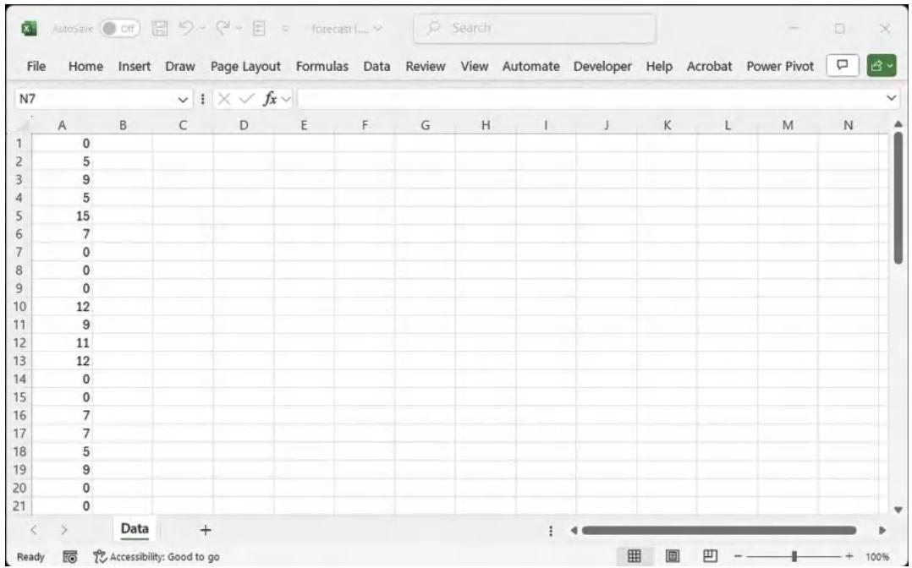  
Figure 7.4 Sample throughput recorded in a spreadsheet.

As always, we start by importing the required modules.

```txt
import random, openpyxl 
```

Our measured data is in the Data worksheet of the workbook, so we open the Workbook and get a reference to the Worksheet using its name.

```python
Load an existing workbook from a file
wb = openpyxl.load_workbook('forecast.xlsx')
# Get throughput sample counts Data from worksheet.
ws_dailly = wb['Data'] 
```

We don’t want to assume the number of daily throughput records in case we want to add new data later to improve our simulation. So, let’s read down the column of data in the Data spreadsheet until we find a blank cell and collect data values into a list. Note how we can use the walrus operator trick as we did in Listing 7.7. This lets us read and assign a value but use the value in a while-statement test at the same time. The loop needs a row counter to keep track of the spreadsheet rows that have been read.

```python
daily = [ ] # List to collect daily throughput  
row = 1 # Count rows until no data remaining  
while (nsamples := ws_daily.cell(row, 1).value) != None:  
    daily.append(nsamples)  
    row += 1 
```

Simulated throughput counts are accumulated in a list where the list index corresponds to a throughput count. If we assume a maximum throughput of 15 samples per day over the next 4 weeks, the absolute maximum throughput for any single trial can be no more than $1 5 { \times } 4 { \times } 7$ . So, we initialize a list of the appropriate number of 0’s to accumulate each trial’s throughput count and assign it to the variable histogram. As its name suggests, this list will hold the simulated throughput counts for plotting the histogram. List values will keep count of the number of times a simulation predicted a throughput with a value equal to the corresponding list index.

Perform Monte Carlo simulation to generate forecast histogram $= [0]*(15*4*7)$ #Max is 15/day\*7 days/week\*4 weeks

The simulation itself is comprised of two nested for-statements. The outer for-statement iterates for the desired number of trial simulations to be performed. The inner for-statement randomly chooses a throughput from historical data and fills a forecast list. After each inner for-statement iteration, the sum of the list is the simulated four-week throughput for one trial. The corresponding histogram list element is incremented by 1.

```python
Perform 1000000 trial simulations  
for i in range(1000000): # Trials to run for simulation  
    forecast = [0] * (4*7) # Forecast over a 4 week time period  
    for j in range(len(forecast)): # Set daily throughput for four weeks  
        idx = random.randint(0, len(daily)-1)  
    forecast[j] = daily[idx] # Randomly select throughput from data.  
    total = sum(forecast) # Month sum for this trial  
    histogram[total] += 1 # Accumulate histogram counts 
```

Once all trials are computed and accumulated, the sum is computed and all resulting data is written to a new Worksheet in the Workbook.

First, a new Worksheet is added to the Workbook using the openpyxl Workbook method create_sheet(). Then titles for each result column are written by accessing each Cell object using the Cell(…) method and each Cell object’s value property is assigned.

```txt
Insert a new results worksheet with default name and set column titles
ws_results = wb.create_sheet()
ws_results.cell(1, 1).value = 'Count'
ws_results.cell(1, 2).value = 'Frequency'
ws_results.cell(1, 3).value = 'Probability' 
```

Next, all histogram values are written to columns in the new Worksheet, starting from a high throughput count of 300 and proceeding down to 50. We chose this range based on observations from previous simulations. The overall total count from the entire histogram is used for the normalized cumulative sum, which is summed within the loop and saved to the Worksheet. In the end, three columns of simulation results are written: throughput, histogram counts, and cumulative sum.

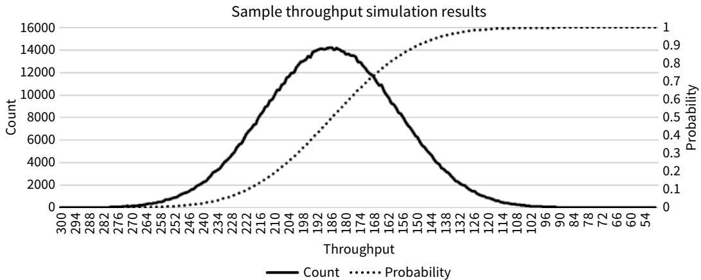  
Figure 7.5 Results from the Monte Carlo simulation of sample throughput.

```python
# Compute normalized cumulative sum in [0.0, 1.0].  
row = 2 #Skip column title row  
cumulative_sum = 0 #To compute cumulative sum  
total_count = sum(history) #Total count for cumulative sum  
for i in range(300, 49, -1): #Accumulate from max to min  
cumulative_sum += histogram[i]/total_count  
ws_results.cell(row, 1).value = i #Write results to spreadsheet  
ws_results.cell(row, 2).value = histogram[i]  
ws_results.cell(row, 3).value = cumulative_sum  
row += 1 
```

Finally, the Workbook is saved and closed.

```txt
wb.save('forecast.xlsx') # Save update to file  
wb.close() # Close the workbook 
```

Once the data is written, we open the Workbook and plot the saved results interactively. Note that it is possible to use openpyxl’s methods to extend the program so that the plot is generated automatically. The complete program is given in Listing 7.12 and the results are plotted in Figure 7.5.

Listing 7.12 Forecast monthly sample processing throughput using a Monte Carlo technique.   
```python
# forecast.py
# Forecast of sample processing throughput using a Monte Carlo method
# given historical data.
import openpyxl, random
# Load an existing workbook from a file
wb = openpyxl.load_workbook('forecast.xlsx')
# Get throughput sample counts Data from worksheet.
ws_daily = wb['Data'] 
```

Listing 7.12 (Continued)   
```python
daily = [] # List to collect daily throughput  
row = 1 # Count rows until no data remaining  
while (nsamples := ws_daily.cell(row, 1).value) != None:  
    daily.append(nsamples)  
    row += 1  
# Perform Monte Carlo simulation to generate forecast  
histogram = [0] * (15*4*7) # Max is 15/day*7 days/week*4 weeks  
# Perform 1000000 trial simulations  
for i in range(1000000): # Trials to run for simulation  
    forecast = [0] * (4*7) # Forecast over a 4 week time period  
    for j in range(len(forecast)): # Set daily throughput for four weeks  
        idx = random.randint(0, len(daily)-1)  
        forecast[j] = daily[idx] # Randomly select throughput from data.  
    total = sum(forecast) # Month sum for this trial  
    histogram[total] += 1 # Accumulate histogram counts  
# Insert a new results worksheet with default name and set column titles  
ws_results = wb.create_sheet()  
ws_results.cell(1, 1).value = 'Count'  
ws_results.cell(1, 2).value = 'Frequency'  
ws_results.cell(1, 3).value = 'Probability'  
# Compute normalized cumulative sum in [0.0, 1.0].  
row = 2 # Skip column title row  
cumulative_sum = 0 # To compute cumulative sum  
total_count = sum(history) # Total count for cumulative sum  
for i in range(300, 49, -1): # Accumulate from max to min  
cumulative_sum += histogram[i]/total_count  
ws_results.cell(row, 1).value = i # Write results to spreadsheet  
ws_results.cell(row, 2).value = histogram[i]  
ws_results.cell(row, 3).value = cumulative_sum  
row += 1  
wb.save('forecast.xlsx') # Save update to file  
wb.close() # Close the workbook 
```

Using simulation results saved to the new Worksheet, we can look up the probability of completing 200 samples in the next 28 days to have a value of 0.321463. This means that the answer to be relayed to the manager is that there is approximately a $3 2 \%$ chance of processing 200 samples in the next four weeks. Time to hire some extra help.

# 7.9 Managing the File System

With the amount of data being generated by modern laboratories, you might find that your data files becoming hard to manage. Python provides us with a large set of capabilities that we can use to automate file system management. In Section 7.1 we reviewed the organization and navigation of file systems. In this section, we’ll investigate how to work with file systems using Python.

Python provides multiple modules which can be used to manage the file system. These include a set of functions in the os module and the os.path submodule. We will focus on another option called the pathlib module which defines multiple objects including the Path object. The pathlib module provides all the functionality you will find in other modules, but using a modern interface.

# 7.9.1 The Path Object

The core of the pathlib module is the Path object. To access this object import it from pathlib, which is included with the Python standard library. You will find the following import statement in all examples in this section.

```python
from pathlib import Path 
```

Once imported, a new Path object can be created by passing a path string to the Path(…) constructor. A path string can be relative or absolute, it can exist on your file system, or not, and it can refer to a file, a directory, or other elements that may be stored in a file system such as a symbolic link or an external file system mount point. Listing 7.13 provides several examples of how to create new Path objects. Note that the path string format is flexible. The path string can be provided using multiple formats, depending upon the operating system you are using. Additional module functions like cwd() and home() return Path objects that encapsulate known paths, like the current working directory and the current user’s home directory.

Listing 7.13 Several examples of creating Path objects.   
# Path object encapsulating the current directory here $=$ Path('.') # Path object encapsulating /Users/Public directory public $=$ Path('/Users/Public') # Path object encapsulating the Data subdirectory data $=$ Path(r'\Documents\Instruments\Data') # Path object encapsulating an existing data file run001 $=$ Path(r'\Documents\Instruments\Data\run001.csv') # Path object encapsulating a data file that does not yet exist run002 $=$ Path(r'\Documents\Instruments\Data\run002.csv') # Path object encapsulating the current working directory cwd $=$ Path.cwd() # Path object representing the user's home directory home $=$ Path.home()

# 7.9.2 Path Properties

Once you have created a new Path object, you can start to query it. Table 7.7 lists several useful Path object properties and methods. For example, it is easy to get the file name, extension (suffix), and

Table 7.7 Methods and properties describing a path.   

<table><tr><td>Method/property</td><td>Description</td></tr><tr><td>name</td><td>The Path&#x27;s file name or final directory name as a string.</td></tr><tr><td>suffix</td><td>The extension of a file name as a string.</td></tr><tr><td>stem</td><td>The base file name or final directory name as a string.</td></tr><tr><td>parts</td><td>A tuple of the Path components at each level.</td></tr><tr><td>parent</td><td>The parent Path of the Path object.</td></tr><tr><td>exists()</td><td>True of the Path exists. False otherwise.</td></tr><tr><td>is_file()</td><td>True if the Path is a file.</td></tr><tr><td>is_dir()</td><td>True if the Path is a directory.</td></tr><tr><td>isabsolute()</td><td>True if the Path location is absolute.</td></tr><tr><td>stat()</td><td>An object with Path attributes, like owner and creation date.</td></tr><tr><td>iterdir()</td><td>Yields a Path object for every item in the main Path.</td></tr></table>

base name (stem) using the Path object’s properties. We can even check if the object exists, and if it is a file or a directory. See the following console session for examples.

```txt
>>> from pathlib import Path
>>> run001 = Path('run001.csv')
>>> run001.name
'run001.csv'
>>> run001 suffix
'.csv'
>>> run001.stem
'run001'
>>> run001.exists()
True
>>> run001.is_dir()
False
>>> run001.is_file()
True
>>> 
```

# 7.9.3 Path Attributes

The stat() method of a Path object returns a stat object that contains information about the Path, usually held by the file system in its properties. Information in the stat object includes data like the date-time it was created and modified, size, owner, etc. Not all attributes are available on all operating systems. Table 7.8 lists and describes several of the attributes available from the object returned from invoking stat() on a Path object. See the console session that follows for an example.

```python
>>> from pathlib import Path  
>>> run001 = Path("run001.csv")  
>>> attrs = run001.stat()  
>>> attrs.st_size  
2481 
```

Table 7.8 Attributes of the object returned by invoking stat() on a Path.   

<table><tr><td>stat object attribute</td><td>Description</td></tr><tr><td>st_size</td><td>The size of a file in bytes</td></tr><tr><td>st_birthtime</td><td>The time a file was created as seconds since the epoch (UNIX timestamp)</td></tr><tr><td>st_time</td><td>Time the file was most recently accessed in seconds.</td></tr><tr><td>st_mtime</td><td>Time the file was most recently modified in seconds.</td></tr><tr><td>stuid</td><td>ID of the user who owns the file</td></tr></table>

# 7.9.4 Operating On a Path

A Path object can be operated upon in ways that result in file system side effects. These operations often return a new Path object. See Table 7.9 for several useful Path methods that provide the ability to make changes to parts of the file system using a Path object.

When a Path object is created, it can be identified using a relative path from the current working directory. A Path does not have to know its absolute location. But, if the location exists, a Path object can compute its absolute location and return a new Path object using the absolute() method.

A Path object is not a file object. But a Path object can be opened with a mode and a new file object returned. This allows Path objects to be used along with everything that we learned about file objects.

If a Path object’s location does not exist, a new file or directory can be created by the Path object. The touch() method will create a new empty file at the Path object’s location and the mkdir(…)

Table 7.9 Methods and Properties to operate on a Path.   

<table><tr><td>Method</td><td>Description</td></tr><tr><td>absolute()</td><td>Return a new Path encapsulating the full hierarchy up to the root directory.</td></tr><tr><td>open (mode)</td><td>Open a Path with a mode. Return a standard file object.</td></tr><tr><td>touch (exist.ok=True)</td><td>Create a new file at the Path location. Ignore if already exists, or raise an exception when exist.ok=False.</td></tr><tr><td>mkdir(parents=False, exist.ok=False)</td><td>Make a directory at the Path location. If parents=True, also create any missing parent directories. If exists.ok=True, do not raise an exception if already exists.</td></tr><tr><td>rmdir()</td><td>Remove a directory at the Path location.</td></tr><tr><td>unlink (missing.ok=False)</td><td>Delete the file at the Path location. If missing.ok=True, do not raise an error if the file does not exist.</td></tr><tr><td>Rename (target)</td><td>Change the name of Path to target.</td></tr><tr><td>iterdir()</td><td>Iterator that yields all path objects of the directory.</td></tr><tr><td>glob (pattern)</td><td>Return all files that match the pattern.</td></tr><tr><td>walk(top_down=True)</td><td>Yields 3-tuples of (dirpath, dirnames, filenames) for each item in a directory tree by walking the tree, top-down, or bottom-up when top_down=False.</td></tr></table>

method will create a new directory at the Path object’s location. In addition, a directory can be deleted using the rmdir() method and a file can be deleted using unlink(…) method.

One of the most useful options of the mkdir(…) method is the parents parameter. By default, a new directory cannot be created unless its parent directory already exists. But, if the mkdir(parents ${ } _ { 1 } = { }$ True) method is invoked with the parents parameter set to True, the method will create all parent directories in the Path if they don’t already exist. That lets us create deep file system hierarchies automatically using a single command without worrying about which of the subdirectories do not already exist.

The following console session is a continuation of the last one. The is_absolute() method is invoked on the run001 Path variable to discover that it has a relative location. The Path is printed to see the location. We want the absolute Path of run001, so the absolute() method is invoked on run001 and the new Path is assigned to the abs_run001 variable. The new Path is absolute, which we verify by printing it.

Next, a new Path is created with the location run002.csv, and checked to see if the file at the relative location exists using the exists() Path method to find that it does not exist. So the touch() method is invoked on run002 and then the exists() method is invoked again. Now the file at the Path location does exist because it was created using touch(). Note that it was not necessary to check if the file exists before invoking touch(). The touch(…) method’s exist_ok parameter has a default value of True, the method automatically creates the file if it does not exist, and does nothing if it does.

```txt
>>> run001.is Absolutely()
False
>>> print(run001)
run001.csv
>>> abs_run001 = run001absolute()
>>> abs_run001.is Absolutely()
True
>>> print(abs_run001)
C:\Documents\Instruments\Data\run001.csv
>>> run002 = Path('run002.csv')
>>> run002_exists()
False
>>> run002_touch()
>>> run002_existss()
True
>>> 
```

# 7.9.5 Combining Paths

A particularly nice feature of Path objects is that they can be used as operands of the binary infix / operator. When two Paths or one Path and a string are used as operands of the / operator, the result is a new Path with the left operand set as the parent Path and the right operand as the child Path.

In the following console session, we want to create a directory adjacent to the Data directory under Instruments. The parent of the abs_run001 Path is the Data directory. The parent of Data is the Instruments directory. To create a subdirectory adjacent to the current directory obtain the parent of the parent of the abs_run001 Path and combine it with the string 'Backup' as the child Path using the / operator. The result is a new Path with a new location that does not exist. Invoking the mkdir() method on the new Path creates the new directory, which can now be used to store new file and subdirectories.

```txt
>>> backup = abs_run001.parent.parent / 'Backup'
>>> printbackup)
C:\Documents\Instruments\Data\Backup
>>> backup.exists()
False
>>> backup.mkdir()
>>> backup.exists()
True 
```

# 7.9.6 The shutil Module for High-Level File Operations

While the pathlib module can do most of what you might want to do with the file system, a few remaining high-level operations must be performed using other modules. One of particular interest is the shutil module. This module includes functions that can copy, remove, and move an entire file system hierarchy. It also includes a function that lets us inspect the amount of memory on a disk given a path. The shutil module disk_usage(…) method returns the total, used, and free amounts of storage available on a disk. This can be useful when saving very large data files that might exceed the ability of a disk to store them. Refer to Table 7.10 for descriptions of several additional shutil module functions.

# 7.10 Walking a File System Tree

The ability to visit every file and directory in a file system hierarchy forms the baseline functionality of several other file system management tools. For example, if you want to search a file system hierarchy for files of various types and/or sizes, you must inspect every item in the tree. To count the number of directories with a certain name prefix, again, you must be able to inspect every item in the hierarchy.

The Path object’s walk() method provides this fundamental capability (see Table 7.9). The walk() method produces an iterator that yields a sequence of 3-tuples of (dirpath, dirnames, filenames) for each item in a directory hierarchy by walking the hierarchy top-down, by default. In each triple, dirpath is a Path object with a location of the directory currently being visited, dirnames is a list of directory name strings for subdirectories in dirpath, and filenames is a list of file name strings of the non-directory files in dirpath.

The following console session demonstrates how the Path object’s walk() method works. We can use a for-in statement to iterate over the triples returned from invoking walk() on the Path object named top. We use destructuring assignment to separate each (path, dirs, files) triple

Table 7.10 Useful functions of the shutil module.   

<table><tr><td>Function</td><td>Description</td></tr><tr><td>copytree(src, dst)</td><td>Recursively copy an entire directory tree rooted at src to a directory named dst and return the destination directory.</td></tr><tr><td>rmdir(path)</td><td>Delete an entire directory tree at the location path.</td></tr><tr><td>move(src, dst)</td><td>Recursively move a file or directory (src) to another location and return the destination.</td></tr><tr><td>diskusage(path)</td><td>Return disk usage statistics about the given path.</td></tr></table>

yielded by the walk() iterator, and print the triple to the terminal. The for-in statement visits each and every item in the hierarchy in a top-down order. There is no need to use recursion or other techniques for tracking directories and subdirectories.

```txt
>>> from pathlib import Path
>>> top = Path('/Documents')
>>> for path, dirs, files in top.walk():
...
...     print(path, dirs, files)
...
\Documents ['Instruments'] []
\Documents\Instruments ['Backup', 'Data']
\Documents\Instruments\Backup []
\Documents\Instruments\Data []
['run001.csv', 'run002.csv']
>>> 
```

The example in Listing 7.14 uses the Path object’s walk() method to visit all items in a file system hierarchy and prints the entire tree using special characters and indentations. The size of each file visited is read and printed in the output tree as well. Note how the program uses a for-in statement with the walk() iteartor to perform the main iteration. Another for-in is used to iterate over all files at each hierarchy location, if any. This inner for-statement inspects the metadata of each file, and reads and prints each file name with file size. The remainder of the program performs formatting, including the tracking of hierarchy depth, indentation based on depth, and the addition of special characters to draw the tree in the terminal. The console session that follows demonstrates the program in action.

Listing 7.14 Walk a file system tree and print all files and directories.   
# walk_tree.py   
from pathlib import Path   
import sys   
# Walk the current directory, list files, and recurse into subdirectories   
def walk_tree(top $\equiv$ '.'): # Expand top directory and get some formatting parameters   
top $=$ Path(top) # Create Path object abspath $=$ topabsolute() # Get absolute path offset $=$ len(abspath-parts) # Save initial depth   
# Visit all files and directories from top down to all tree leaves for path,dirs,files in top.walk(): abspath $=$ pathabsolute() # Expand to absolute path base $=$ abspath-parts[-1] # Base path name depth $=$ len(abspath-parts) # Depth in file system print(f'\*\*depth-offset)}L- $\{\mathrm{base}\} /$ ） #Get file name and metadata # Print files using extended characters: | L - with depth indent for file in files: file_path $=$ path / file # Join root path and file metadata $=$ file_path.stat( # Get metadata fsiz e $=$ metadata.st_size # Size in bytes print(f'\*\*(depth+1-offset)}- $\{\mathrm{file}\}$ ( $\{\mathrm{fsize}\}$ bytes))

Listing 7.14 (Continued)   
if name $= =$ 'main'： if len(sys.argv) $<  2$ ： print("Please enter a path") sys.exit() walk_tree(sys.argv[1])

```txt
> python walk_tree.py /Documents
- Documents/
- Instruments/
- Backup/
- Data/
- run001.csv (392 bytes)
- run002.csv (0 bytes) 
```

It is easy to imagine how the example program in Listing 7.14 can be extended. For example, you might want to keep data files on disk for some period of time in case they are needed, and then delete them. In Listing 7.14, after inspecting the metadata of each file, if you find that the creation date is older than some cutoff, you might want to delete the file using its unlink(…) method.

# 7.11 Project – Find Duplicate Files

After repeatedly backing up files to an external disk drive, you might find that the backup has several copies of the exact same file. This duplication of files in the backup can waste large amounts of storage space. In this project, we want to use what we’ve learned about the Path object and its ability to walk a file system to find duplicate files.

In addition to the ability to visit every file in a file system hierarchy, we need a way to identify identical files, even when they have different names, without inspecting each and every byte in both files. We can do this by computing and comparing secure hashes of each file’s contents.

A hash is a fixed length string computed by digesting the content of the file, which is usually a much larger block of data. A secure hash algorithm has several additional properties, including the ability to generate hashes that can be computed quickly and most importantly, that resist collisions. A collision occurs when a hash algorithm generates identical hashes for two different files. With a good hash algorithm, changing as few as a single byte in the original data should produce a different hash. Currently, the secure hash algorithm SHA-256 is a good option.

Python provides the hashlib module in its standard library for computing secure hash digests using a variety of different algorithms, including SHA-256. A hash is computed by creating an object that implements a specific algorithm from the hashlib module and then feeding the object all data from the file to be hashed. Once completed, the final hash digest is returned in hexadecimal format by invoking the hexdigest() method on the object.

Refer to the hash_file(…) function in Listing 7.15 for an example of how to generate a hash digest from a file. The function receives a Path object that contains the data to be hashed. The hashlib module is imported and a sha256 object is created and used to produce the hash. Binary data is read from the file in 64 kilobyte blocks and passed to the sha256 object using its update(…) method. Note that the file is opened using the with statement and the Path object’s

open(…) method with the 'rb' mode to read data as bytes. Reading continues until all data is read from the file. When finished, the hexdigest() method of the sha256 object is invoked and returned from the function.

Listing 7.15 Walk a directory hierarchy and find duplicate files.   
```python
# duplicate_files.py
import hashlib
from pathlib import Path
# Hash a file and return unique digest
def hash_file(path):
    sha256 = hashlibsha256()
    with path.open('rb') as file:
        while block := file.read(65536):
            sha256.update(block)
            return sha256.hexdigest()
        # Create a SHA256 hash object
        # Read 64KB byte blocks
        # Update the hash with bytes.
        # Compute and return unique digest
# Walk the current directory, list files, and recurse into subdirectories
# Return a list of lists containing file duplicates
def findDuplicates(top=None):
    top = Path(top)
    abspath = topabsolute()
    digest_dict = {}
    # Walk all files and directories
    for path, dirs, files in abspath.walk():
        for file in files:
            file_path = path / file
            digest = hash_file(file_path)
            if digest in digest_dict:
                digest_dict[digest].append(file_path)
            else:
                digest_dict[digest] = [file_path]
        # Filter to lists with length > 1 and return
        dups = [digest_dict[k] for k in digest_dict if len(digest_dict[k]) > 1]
        return dups
if __name__ == '__main__':
    dups = findDuplicates().')
    # Print identified duplicates
    for dup in dups:
        print('-')
    for file in dup:
        print(file) 
```

The find_duplicates(…) function in Listing 7.15 walks the file system tree exactly like Listing 7.14. Within the inner for-statement that iterates over all files, the hash_file(…) function is used to compute a unique hexadecimal hash string for each file. Each hash is added to the digest_dict dictionary as the key with the corresponding value being a list of all file paths that have the hash. Before the function completes the digest_dict dictionary is filtered using a list comprehension to those dictionary values that are lists with length greater than 1, in other

words, lists of Path objects referring to files that have been found two or more times. The program prints all Path objects that have been found two or more times.

# 7.12 Working with Zip Files

A Zip file is an archive capable of holding compressed versions of multiple files. Each file in the archive is compressed separately using a lossless compression algorithm, meaning that it is possible to decompress a file without loss of information. The end of a zip archive contains a listing of all files in the archive and where they can be found, allowing each to be accessed individually. Because of the way a zip file is organized, individual files may be extracted from the archive and decompressed individually without having to decompress the entire archive. This makes the zip archive a very powerful and flexible utility for archiving files that no longer need to be available in uncompressed formats, thereby saving valuable storage space.

The Python standard library provides several modules that provide functions and objects for interacting with zip archives. Modules available come with interfaces that are both high level and very low level. In this section, we will cover the zipfile module, which gives us a general set of useful capabilities.

# 7.12.1 ZipFile Object

The most useful objects in the zipfile module are ZipFile and Path. The ZipFile object implements several methods to work with a zip archive including the ability to add files to and extract files from the archive. Refer to Table 7.11 for several methods and properties of the zipfile module’s ZipFile object.

# 7.12.2 zipfile Path Object

It may surprise you to see a Path object in the zipfile module. This Path object is different from the pathlib Path object from Section 7.9, but it implements many of the same methods. What is remarkable about the zipfile Path object is that it gives you the ability to inspect and read files

Table 7.11 Several methods and properties of the zipfile.ZipFile object.   

<table><tr><td>Method/property</td><td>Description</td></tr><tr><td>ZipFile(file, mode=&#x27;r&#x27;)</td><td>Create a new ZipFile given a file location string.</td></tr><tr><td>close()</td><td>Close an archive.</td></tr><tr><td>namelist()</td><td>Return a list of archive members by name.</td></tr><tr><td>open(name, mode=&#x27;r&#x27;)</td><td>Access a member of the archive as a binary file-like object.</td></tr><tr><td>extract(full_name)</td><td>Extract a member of the archive given its full name.</td></tr><tr><td>extractall()</td><td>Extract all members of the archive.</td></tr><tr><td>printdir()</td><td>Print names of all archive members.</td></tr><tr><td>read(name)</td><td>Return the bytes of the file name in the archive.</td></tr><tr><td>write(filename)</td><td>Write the file named filename to the archive, with an archive name as filename.</td></tr></table>

Table 7.12 Several methods and properties of the zipfile Path object.   

<table><tr><td>Method/property</td><td>Description</td></tr><tr><td>Path(zfile, at=&#x27;&#x27;)</td><td>Create a Path object from a ZipFile zfile. Path has location of archive root unless at parameter is set to a file name in archive.</td></tr><tr><td>open(mode=&#x27;r&#x27;)</td><td>Open a file within the zip archive for read or write, text or binary.</td></tr><tr><td>exists()</td><td>True if Path exists in zip archive.</td></tr><tr><td>is_dir()</td><td>True if Path is a directory in zip archive.</td></tr><tr><td>is_file()</td><td>True if Path is a file in zip archive.</td></tr><tr><td>iterdir()</td><td>Enumerate children of current archive directory.</td></tr><tr><td>read_text()</td><td>Read the current file as Unicode text.</td></tr><tr><td>read_bytes()</td><td>Read the current file as bytes.</td></tr><tr><td>name</td><td>Name of the file in the zip archive.</td></tr><tr><td>suffix</td><td>Extension of the file in the zip archive.</td></tr><tr><td>stem</td><td>The final path component of file in zip archive, without suffix.</td></tr></table>

using the pathlib Path object interface, but without the need to extract the file from the zip archive. Much of what you know already about the Path object can be applied to files within a zip archive. This is incredibly useful because it allows you to compress and store several data files in a single zip archive, and to read those data files directly into a Python program without the need to extract the archive. Refer to Table 7.12 for several methods and properties of the zipfile Path object.

# 7.12.3 Creating Zip Archives

The way to create a new zip archive and to compress and add files to the archive is demonstrated in the zip_directory(…) function in Listing 7.16. The first step is to create a list of file paths to be written to the zip archive. In the zip_directory(…) function we use the Path object’s glob(…) method in a list comprehension to collect all files that match a pattern, which is formed by substituting the extension into an f-string that has the necessary wildcard and dot character. The final list of path locations is saved in the file_paths variable.

```python
file_paths = [str(f) for f in top.glob(f'*.{ext}')] 
```

With that list in hand, create and open a new ZipFile object for writing at the given archive location. Because the ZipFile object is a context manager, we can open it using a with-statement like a file object, and avoid the need to close it explicitly.

```txt
with ZipFile(archive, 'w') as zip: 
```

With the zip archive open, we iterate over all file paths in file_paths, and use the ZipFile write(…) method to compress and add to the archive. Note that a file in a zip archive can have a different location in the archive than it does on the file system. By default, the filename is used as the zip archive name as well.

```txt
zip.write(name) 
```

The zip_directory(…) function in Listing 7.16 takes the zip archive file name and extension string as parameters to make the function more generally useful.

Listing 7.16 Get all files in a directory with a given file extension and add to a zip archive.   
makezip.py   
from pathlib import Path   
from zipfile import ZipFile   
def zip_directory archive,ext，top $= 1$ .）： #Get all matching file path strings top $=$ Path(top) file_paths $=$ [str(f) for f in top.glob(f'*.{ext}')] #Create new zip archive withZipFilearchive，'w')aszip: #Add all files to zip archive fornamein file_paths: zip.write(name)   
if_name $\equiv$ 'main': zip_directory('archive.zip'，'csv')

There is quite a bit more that you can do with objects and methods in the zipfile module. Refer to the zipfile module documentation for all the details.

# 7.13 Working with Standard Data Formats

Thus far the only preformatted file we have worked with is the CSV file. This format is useful for tabular data, but the need to organize data with more complex structure has led to additional more flexible standard file formats. In this section, we explore a few of these formats and the Python modules that help us work with them.

# 7.13.1 JSON – JavaScript Object Notation

One popular standard data format is JSON, which stands for JavaScript Object Notation [31]. JSON provides a standard way to express data structures in a plain text format so that data may be easily serialized, parsed, saved, and transmitted. The JSON format is particularly appealing to Python programmers due to the strong similarity between the syntax of serialized JSON data structures and Python dictionaries and lists.

JSON defines two core data structures. A JSON array is a comma-separated list of elements surrounded by a pair of square brackets. A JSON object is a comma-separated sequence of key-value pairs, where each key and value of a pair are separated by a colon. Each key must be an immutable string and the entire sequence is surrounded by curly brackets. The syntax of a JSON array is exactly that of a Python list, and the syntax of a JSON object is exactly that of a Python dictionary with strings as keys.

Table 7.13 JSON objects, descriptions, and examples.   

<table><tr><td>JSON type</td><td>Description</td><td>Example</td></tr><tr><td>number</td><td>Standard numeric format.</td><td>3.1415926, 123</td></tr><tr><td>string</td><td>Sequence of characters surrounded by double quotes.</td><td>&quot;A1&quot;, &quot;EtOH&quot;</td></tr><tr><td>boolean</td><td>One of the symbols true or false</td><td>true, false</td></tr><tr><td>null</td><td>The symbol null represents the absence of a value.</td><td>null</td></tr><tr><td>array</td><td>Square brackets surrounding a comma-separated list of elements.</td><td>[&quot;A1&quot;, 1.23, true, null]</td></tr><tr><td>object</td><td>Curly brackets surrounding a comma-separated list of key:value pairs.</td><td>{&quot;A1&quot;:1.23, &quot;H12&quot;:4.56}</td></tr></table>

In addition to data structures, JSON defines the format of four basic value types: a string, a number, a Boolean, and a null value. A JSON string is a sequence of characters surrounded by double quotes. Single quotes are not valid. A number can be written using all the standard numeric formats used in popular programming languages. The JSON standard [31] does not distinguish between an integer and a floating-point number type, although the format of the way a number is written can be used to make the distinction. A JSON Boolean is one of two symbols, true or false. Note the lowercase first letters in these symbols, which is different than the equivalent symbols in Python (True, False). The absence of a value is the symbol null. Table 7.13 describes the JSON types and provides examples.

Although JSON object keys are limited to strings, corresponding values can be any other JSON type, including arrays or other objects. Similarly, JSON arrays may contain other arrays, objects, or any other JSON type. Like Python lists, JSON arrays are not limited to holding elements having a uniform type.

# 7.13.2 json Python Module

The Python json module provides all the functionality you will need to parse a JSON string into Python objects, and to serialize Python objects to a JSON string. Not all Python objects may be serialized. Python objects that are serialized into JSON include: list, tuple, dictionary, int, float, bool, str, and None. Python lists and tuples become JSON arrays, Python dictionaries become JSON objects, int and float types become JSON numbers, and bool and None types become a JSON Boolean types and null.

The two core capabilities provided by the json module are the ability to serialize a Python object to a JSON string, and to parse a JSON string into a Python object. This can be done to and from a Python string or a Python file. Table 7.14 lists these methods with a brief description of each.

JSON is very popular for creating and managing configurations. You will find JSON used widely for formatting complex configurations and serializing to a file. The JSON standard is incredibly powerful for this application because configuration data may be complex and organized as several nested data structures. The information may be assembled in Python data structures quite easily, and then serialized all at once and written to a file. Similarly, configuration data in a JSON-formatted configuration may be parsed into a Python data structures using a single command. Furthermore,

Table 7.14 Common json module functions.   

<table><tr><td>Function</td><td>Description</td></tr><tr><td>dumps(obj, indent=None)</td><td>Serializer obj to a string with optional indent space indenting.</td></tr><tr><td>dump(obj, file, indent=None)</td><td>Serializer obj to a string and write to file.</td></tr><tr><td>loads_ser)</td><td>Parse ser as a JSON string and return Python objects.</td></tr><tr><td>load(file)</td><td>Parse file content as JSON and return Python objects.</td></tr></table>

the open nature of the format allows configuration data to be read and written with a wide variety of other tools. Inventing a custom format and writing the code to serialize and parse such a format would require unnecessary effort and not be sharable with external tools.

Let’s demonstrate the loads(…) and dumps(…) methods of the json module with an example. Let’s assume we want to save the configuration details of a program that wakes up on a periodic basis and runs a Python program in a directory with command line parameters. Listing 7.17 is a sample of this configuration file. From a JSON perspective, it is an outer object with keys that have a range of corresponding values, including one with a value of an array. Listing 7.18 is a program with three functions to help us read, write, and update this configuration file.

Listing 7.17 Config file for automated processing script.   
```javascript
"program": "analyze.py", "version": 1.4, "directory": "/Documents/Instrument/Data", "frequency": 3600, "parameters": [60, true] 
```

The program in Listing 7.18 imports the json module as well as the Path object from pathlib. The read_config(…) function creates a Path object that wraps the configuration file path, with "config.json" as the default value. The function assumes a default config object to be an empty dictionary, and then attempts to open, read, and parse the contents of the file. The f.read() method reads the entire contents of the opened file f, and uses the json.loads(…) method to parse it into Python objects. The write_config(…) function does the inverse of read_config(…). It opens the file for writing, serializes the configuration object to a string, and writes the string to the file. Note that the json.dumps(…) method adds an indent $. = 4$ argument to format the serialized data structure with a four-space indentation. This makes the file easy to read, but it is not necessary for any of the functions to work properly. The loads(…) and dumps(…) variations of the json module functions were used in this example. Note that we could have used the load(…) and dump(…) variations instead, which would have read and written the file for us. Finally, the set_config_frequency(…) method uses the read function to load the config, updates the frequency key in the config dictionary and then writes the updated config back to the file.

Parsing and serializing the configuration data in Listing 7.17 was a simple task. We did not have to worry about recognizing the configuration file organization, the difference between string, number, and Boolean data types, or the need to group parameters into an array. If the configuration

information is more complex, for example, by the addition of a new key and value to the outer object, we can simply add it and the program will continue to work as expected. Using a standard format capable of representing a number of data types as well as complex and nested data structures truly streamlines the program of managing configuration data.

Listing 7.18 Sample program with functions to read, parse, update, serialize, and write a JSON config.   
```python
# update_config.py
import json
from pathlib import Path
# Read config file and return dictionary
def read_config(file='config.json') :
    path = Path(file) # Create Path object
    config = {}
    with path.open('r') as f :
        txt = f.read()
        config = json.dumps(txt) # Read contents
        return config # Return
# Write config file
def write_config(config, file='config.json') :
    path = Path(file) # Create Path object
    txt = json.dumps(config, indent=4) # serialize with indent
    with path.open('w') as f :
        f.write(txt) # Write serialized config
# Load config. Modify frequency. Save config.
def set_config_freqency(freq, file='config.json') :
    config = read_config(file) # Read and parse config file
    config["frequency"] = freq # Update dictionary
    write_config(config) # Write config file
# Test
if __name__ == '__main__() :
    set_config_freqency(7200) 
```

# 7.13.3 XML – Extensible Markup Language

Another widely used standard data format with tools available for reading and writing is Extensible Markup Language, abbreviated XML [32].

Like JSON, XML data is expressed using a standard character set which can be written to a file or transmitted over a network. Also, like JSON, the contents of an XML document can be divided into two categories: the markup that identifies and organizes data into a hierarchical structure, and the data itself. Markup with its enclosed data is called an element. It is these entities that are organized into a hierarchy, an inverted tree, with the top-most root element referred to as the document element. Refer to Listing 7.19 for an example.

An element is comprised of a start tag, the contents of the element, and an end tag, in that order. Both start and end tags are written with angle brackets that surround a tag name (<name>). An end tag has an additional forward slash after the opening bracket but before the tag name (</name>). Between the start and end tag is the element data. This can include character data as well as other entities. Nesting entities are how the element hierarchy is formed.

A start tag may also contain attributes, which are made up of zero or more attribute $=$ "value" pairs added to the start tag after the tag name but before the closing angle bracket. These tag attributes provide additional metadata that describes the element.

When an element has a tag name and optional attributes, but no data, the element is called an empty element. This can be written using a single tag, with the closing bracket preceded by a forward slash  (<empty />). A closing tag is not necessary for an empty element.

Before the root element start tag, an XML document should include a text declaration, which is enclosed by angle brackets and question marks $( < ? \dots ? > )$ . The data in a text declaration may include the version of the XML standard followed by the document and possibly the character encoding standard used.

The fictive example in Listing 7.19 is adapted from Ref. [33]. This XML starts with a proper text declaration indicating that the document follows version 1.0 of the XML standard and uses a UTF-8 character-encoding. The root element has the tag name experiment. Its start tag is near the top of the document right after the text declaration and its end tag is at the bottom of the document. Everything between these tags makes up the data that is subordinate to the experiment element. In the XML of Listing 7.19, the plate element is the one child element of experiment. In a larger example, there could be multiple plate entities as children or other content.

Listing 7.19 XML document specifying assays performed on compounds with measurements.   
```xml
<?xml version="1.0" encoding="UTF-8"?>
<experiment>
    <plate barcode="10001" type="96shallow">
        <well row="1" column="1">
            <compound id="AAA10001" />
            <compound id="AAA10002" />
            <measurement test="T2001">45.3</measurement>
        </well>
        <well row="2" column="1">
            <compound id="AAA10002" />
            <compound id="AAA10003" />
            <measurement test="T2002">52.6</measurement>
        </well>
    ...
</plate>
</experiment> 
```

The plate element has two attributes, barcode and type, which provide additional information describing the plate element. Within the plate element are two well elements, both with row and column attributes. Within each row element are compound and measurement elements, both with additional attributes. The measurement element contains a value, but the compound element is empty. Because compound elements are empty, they can be written using the empty element tag shorthand notation, which is a pair of angle brackets, with the closing angle bracket preceded by a forward slash.

```xml
<compound id="AAA10001" /> 
```

An XML document is well-formed when it follows all specified XML formatting rules, including: the element hierarchy has a single root element, all element tags are written with

valid tag and attribute syntax, every start tag must have a corresponding and properly nested end tag or the tag must follow the empty tag format, and all data must use the prescribed character encoding.

Like JSON-formatted data, the benefits of organizing and storing data in an XML format include the ability for the data to be structured, parsed, loaded into memory, modified, and reserialized, all using prewritten and optimized tools.

Note that the example XML in Listing 7.19 is truncated – the ellipsis (…) is not part of the file. It is not hard to imagine this XML structure being used to store a much larger amount of data.

# 7.13.4 Python XML modules

There are several modules included with the Python standard library designed to manipulate XML data. These include xml.dom, xml.sax, and xml.etree.ElementTree, each with different and complementary strengths. But perhaps the most generally useful module for working with XML is not included with the standard library at all. The module we focus on here is version 4 of BeautifulSoup [34]. The BeautifulSoup module is popular and widely used to read and modify both XML and HTML documents as well. We will use it again in the next chapter.

The BeautifulSoup module is not included in the Python standard library. It must be installed separately and is available from all major Python package indexes. When installing, make sure to specify version 4 of the module by using the module name beautifulsoup4 or bs4. The module with the shortened name beautifulsoup is version 3, and is still used, so it remains available for installation.

```batch
python -m pip install beautifulsoup4 
```

The most important objects in the BeautifulSoup module are described in Table 7.15. The top-level BeautifulSoup object represents a complete parsed document, be it XML or HTML. This is the object that is created at the start of the data management process. To access the BeautifulSoup object, you must import it first.

```txt
>>> from bs4 import BeautifulSoup 
```

To create a BeautifulSoup object, pass a string or an opened file object to the BeautifulSoup constructor function, as follows.

```prolog
>>> with open('experiment.xml', 'r') as file:  
... bs = BeautifulSoup(file, 'xml')  
...  
>>> 
```

The functionality implemented by the resulting BeautifulSoup object closely matches our next object to be considered, the Tag object. Refer to Tag below for more details about what the BeautifulSoup object can do.

Table 7.15 Important objects in the BeautifulSoup module.   

<table><tr><td>Object</td><td>Description</td></tr><tr><td>Tag</td><td>An XML or HTML tagged element.</td></tr><tr><td>BeautifulSoup</td><td>Top-level object encapsulating all other properties and methods.</td></tr><tr><td>NavigableString</td><td>A Python string with enhanced abilities.</td></tr><tr><td>Comment</td><td>An XML or HTML comment node.</td></tr></table>

The Tag object exposes a lot of functionality and is likely the object you will work with most. Table 7.16 describes the most useful properties and methods of the Tag object. This object is very powerful for searching and modifying XML and HTML documents.

As you can see by entries in Table 7.16, once we have a Tag object, we can access its name using the name property, and its attribute-value pairs using the attrs dictionary with attribute names as keys that map to values. A shorthand for accessing the attribute values of the Tag is the use of the square-bracket notation with an attribute name on the Tag element directly.

There are multiple ways to access an element as a Tag object in a parsed XML document. Using the find(…) method of the Tag and BeautifulSoup objects with a tag name argument, we can access the first element in the hierarchy having a matching element name. In the following, the bs

Table 7.16 Useful BeautifulSoup Tag object properties and methods.   

<table><tr><td>Property/method</td><td>Description</td></tr><tr><td>name</td><td>Name of the tag.</td></tr><tr><td>attrs</td><td>A dictionary of tag attributes and values.</td></tr><tr><td>tag[attr_name]</td><td>Access tag attribute values using an attribute name in square brackets, similar to a dictionary.</td></tr><tr><td>string</td><td>A string version of the tag&#x27;s contents.</td></tr><tr><td>contents</td><td>A list of the tag&#x27;s direct children.</td></tr><tr><td>children</td><td>A generator that generates the tag&#x27;s direct children.</td></tr><tr><td>descendants</td><td>A generator yielding all tag&#x27;s children in its hierarchy, recursively.</td></tr><tr><td>parent</td><td>The Tag&#x27;s parent Tag.</td></tr><tr><td>get_text(...)</td><td>Returns only the text portion of a document or tag.</td></tr><tr><td>find(...)</td><td>Find the first Tag that matches the given criteria.</td></tr><tr><td>find_all(...)</td><td>Find all Tags that match the given criteria. Calling a tag is like invoking find_all() on the Tag.</td></tr><tr><td>find_parent(), find-parents()</td><td>Find immediate and all parent Tags.</td></tr><tr><td>find_next_sibling(), find_next_siblings()</td><td>Find first and all following sibling Tags.</td></tr><tr><td>find Previous_sibling(), find_Previous_siblings()</td><td>Find first and all previous sibling Tags.</td></tr></table>

variable references a BeautifulSoup object, and then invokes the find('experiment') method on that object to get the Tag object with the name experiment.

```txt
>>> type(bs)
<class 'bs4.BeautifulSoup'> 
>>> tag = bs.find('experiment')
>>> tag.name 
'experiment' 
```

The find_all(…) method of Tag and BeautifulSoup objects searches the entire document hierarchy and returns a list with all matching Tag elements. As with the find(…) method, when a string is passed to the method, Tag elements with matching Tag names are returned in a list. In fact, the find_all(…) method is so popular that invoking the Tag and BeautifulSoup objects directly is the same as invoking the find_all(…) method on the object.

>>>measurements $=$ bs.find_all('measurement')   
>>>len(measurements)   
8   
>>>measurements[0]   
<measurement test $\coloneqq$ "T2001">45.3</measurement>   
>>>   
>>>measurements $=$ bs('measurement')   
>>>len(measurements)   
8   
>>>

Another nice feature of both the Tag and BeautifulSoup objects is the ability to find the first child element using an element tag name as a property. The only element in the experiment.xml document named experiment is the top-level element. We can access the experiment Tag object directly using the experiment property of the BeautifulSoup object bs. In the following, we verify that the bs.experiment property is a Tag object and that the tag name of bs. experiment is the expected "experiment".

```txt
>>> type(bsexperiment)
<class 'bs4.element Tag'>  
>>> bsexperiment.name  
'experiment'  
>>> 
```

Other properties of the Tag and BeautifulSoup objects include:

1.	 The string property, which returns the inner Tag data as a string,   
2.	 The parent property, which returns the parent Tag,   
3.	 The contents property, which returns a list of all the child element objects, and   
4.	 The children and descendants properties, which return iterators.

The children property returns a generator that yields each direct child element one at a time, and the descendants property returns all child elements in the entire tree under the Tag, again,

one element at a time. Note that the list obtained using the contents property and generators yielded by both children and descendants properties return more than just Tag objects. NavigableString objects are also returned by these generators and are contained in the contents property list, so the type of the object must be considered when iterating.

```txt
>>> [tag.string for tag in bs descendeds if tag.name == 'measurement'] ['45.3', '52.6', '35.1', '45.9', '39.0', '48.2', '41.9', '51.2']  
>>> 
```

The find(…) and find_all(…) methods can receive many argument types than a simple string to match on a tag name. These include the options in Table 7.17.

Because the find(…) method returns the first matching Tag object, it is possible to chain find(…) to descend down the element tree in the XML document. For example, in the following console session, the first expression chains the find(…) method to drill down the hierarchy to get the string content of the first measurement element.

```txt
>>> bs.find('plate').find('well').find('measurement').string '45.3'   
>>> 
```

An alternative to invoking find(…)is to access Tag object properties using the name of the child Tag. Using this feature, it is possible to navigate an element tree by specifying a dotted sequence of tag names. In this case, the first child Tag with a matching name is identified and returned before looking for the next child Tag with a matching name. Using a dotted sequence of tag names is like performing a sequence of find(name) methods.

```txt
>>>bs plate.wellmeasurement.string '45.3'   
>>> 
```

We’ve demonstrated examples of passing a string to find(…) and find_all(…) to search for child Tag elements. Following are some examples of the remaining types of filter expressions described in Table 7.17.

Table 7.17 find(…) and find_all(…) filter method argument options.   

<table><tr><td>Filter argument</td><td>Type</td><td>Matches...</td></tr><tr><td>str type</td><td>Positional</td><td>A Tag object&#x27;s name property.</td></tr><tr><td>list of strings</td><td>Positional</td><td>All tags with a name matching any string in the list.</td></tr><tr><td>regular expression</td><td>Positional</td><td>Tag name using the regex to look for a match.</td></tr><tr><td>key = value</td><td>Keyword</td><td>attributes with matching values in a Tag object.</td></tr><tr><td>class_ = class_name</td><td>Keyword</td><td>Tag with class of class_name.</td></tr><tr><td>function</td><td>Positional</td><td>Using positional Tag argument. Returns True if the Tag matches and False otherwise. The function can perform very complex tests on the Tag itself as well as the state of the surrounding tree.</td></tr></table>

Find the name for all Tag objects with names "compound" and "measurement" using a list.

```txt
>>> [tag.name for tag in bs(['compound', 'measurement'])]
['compound', 'compound', 'measurement', 'compound', 'measurement', 'measurement', 'compound', 'measurement', 'measurement', 'measurement', 'measurement', 'measurement', 'measurement', 'measurement', 'measurement', 'measurement', 'measurement', 'measurement', 'measurement'] 
```

Find all Tags with names that begin with "com" using a regular expression.

```txt
>>> compounds = bs.find_all(re.compile("com*")  
>>> len(compounds)  
16  
>>> 
```

Find all Tags with name "compound" having "id" attributes with a value of "AAA10002" using keyword arguments passed to find_all(…).

```diff
>>> compounds = bs.find_all("compound", id="AAA10002")  
>>> compounds  
[ <compound id="AAA10002"/> >, <compound id="AAA10002"/> > ]  
>>> 
```

Find all Tag objects with name "well" with a child "measurement" Tag with content greater than 48.0 by passing a function that returns True when all conditions are met.

```txt
>>> def well_over_48 (tag):  
... return tag.name == 'well' and float (tagmeasurement_string) > 48.0  
...  
>>> wells = bs( well_over_48 )  
>>> measurements = [float (tag.measurement_string) for tag in wells]  
>>> measurements  
[52.6, 48.2, 51.2]  
>>> 
```

The well_over_48(…) function in the previous example demonstrates how an arbitrarily complex function can be used to test each Tag argument for a match, returning True when there is a match and False otherwise. The function parameter passed to find_all(…) accepts the Tag object only. There is no way to pass additional parameters to this filter function. Fortunately, with the flexibility of Python, there is an easy way to accomplish the equivalent.

In Python, it is possible to write a function that defines and returns a new function, similar to the decorator described in Section 5.6. We can use this capability to write a function that takes a cutoff parameter and defines and returns a new function that tests for the cutoff argument value, specifically. The following function is an example. Notice how the cutoff argument is used in the inner fxn(…) function definition.

```python
def well_with_cutoff(cutoff):
    def fxn tag): # Inner function defined to test measurement cutoff
        return tag.name == 'well' and float tagmeasurement.string) > cutoff
    return fxn 
```

Using the well_with_cutoff(…) function, it is possible to define the filter function for find_all(…) on the fly and then pass it immediately as the filter function. The command that does this in the following console session is bs.find_all( well_with_cutoff( 50.0 ) ).

```python
>>> def well_with_cutoff(cutoff):
...
    def fxn tag):
...
    return tag.name == 'well' and float tagmeasurement_string) > cutoff
...
    return fxn
...
>>> bs.find_all( well_with_cutoff( 50.0 ) )
>>> measurements = [float (tag.measurement_string) for tag in wells]
>>> measurements
[52.6, 51.2]
>>> 
```

The experiment.py program in Listing 7.20 pulls together several techniques to process the experiment.xml file data to remove key data from the file. The program extracts compound IDs, the test name, and measurement value, for all wells will measurement values greater than 50.0. A second utility function named get_well_data(…) is added to help extract key data from each well and its child elements. The program takes the name of the XML file from the command line and then processes the file to extract the desired information.

# Listing 7.20 Extract data for tests with measurements exceeding a cutoff.

```python
# experiment.py
import sys
from bs4 import BeautifulSoup
# Makes a function that tests for measurement tags with a cutoff
def well_with_cutoff(cutoff):
    def fxn(tag):  # Inner function defined to test measurement cutoff
        return tag.name == 'well' and float tag.measurement.string) > cutoff
        return fxn
# Given a well element, extract and return desired information.
def get_well_data(well):
    cmpds = [el['id'] for el in well('compound'])  # Implied find_all()
    test = wellmeasurement['test']
    value = float(well.measurement.string)  # Measured value
    return {'compounds': cmpds, 'test': test, 'value': value}  # Return dictionary 
```

(Continued)

Listing 7.20 (Continued)   
Test   
if_name $= =$ 'main': fname $\equiv$ sys.argv[1] #Expect file name with open(fname, $\mathbf{\dot{r}}^{\prime}$ ) as file: #Open file bs $=$ BeautifulSoup(file,'xml') #Parse as XML wells $=$ bs.find_all(well_with_cutoff(50)) #Get well elements data $=$ [get_well_data(well) for well in wells] #Get data from wells print(data) #Print data

```txt
> python experiment.py experiment.xml  
[ \{['compounds': ['AAA10002', 'AAA10003'], 'test': 'T2002', 'value': 52.6\}, \{['compounds': ['AAA10008', 'AAA10001'], 'test': 'T2002', 'value': 51.2\} ] 
```

# 7.13.5 Other Standard Data Formats

In this chapter, we have described in detail several popular and widely used file formats to store, organize, and describe data sets. These include CSV, Excel®, Zip, JSON, and XML formatted files. Many additional data file formats exist. For every popular file format, it is likely that a Python module is available to load and process its data.

If you are looking for another file format to read, have a look at the SciPy [35] Python submodule scipy.io and the pandas Python module [36], both of which include functions that parse and load a variety of additional scientific data formats. The scipy.io submodule has functions to load formats including MATLAB® files, NetCDF files [37], Wav audio files, and others. The pandas module is able to load SAS files, SPSS files, HDF5 files, and more. It is likely that you will be able to find the tools you need to load and manage scientific data in any common format.

# 7.14 Key Takeaways

1.	 The file system is organized as a hierarchy of files and directories (folders) with a single root directory at the top.   
2.	 A path is the location of a file or directory as found by navigating the file system from the root directory (an absolute path) or navigating relative to the current working directory (a relative path).   
3.	 The path separator character used is operating system dependent. MacOS and UNIX use the forward slash $( / )$ and Windows uses backslash (\). Python modules are designed to be operating system independent, and will work with either notation.   
4.	 A plain text file is used to describe a file stored as a sequence of characters encoded as bytes defined by a simple encoding based on a standard like ASCII.   
5.	 Unicode solves the limitations of ASCII by defining text encoding standards capable of representing characters in all the world’s digitizable writing systems, with the UTF-8 standard likely being the most used.   
6.	 A Python file is a software abstraction that provides the ability to open, read, write, and append, content to a disk file, and close it when finished.

7.	 A way to read strings from the command line provided as part of the command that runs a program is to use the sys module. After the sys module is imported into a program and the program is executed, sys.argv contains the list of all strings specified after the python command. This is used to pass command line parameters to a Python program.   
8.	 A CSV file is a plain text file containing a table of data written with each row on its own line and each value in a row separated by a comma character.   
9.	 Simple CSV files may be read in Python using a file object.   
10.	 CSV files can be more complex, such as when table data elements contain special characters like double-quotes (”) or commas (,). In this case, use the Python csv module to read and write CSV files. The csv module handles all formatting and character encoding complexities.   
11.	 The Python ecosystem offers several external modules to read and write Microsoft Excel® formatted files.   
12.	 The opennpyxl module supports the reading and writing of Excel files by encapsulating Excel file concepts like Workbook, Worksheet, and Cell as Python objects.   
13.	 The Python standard library module named pathlib provides a powerful way to interrogate, modify, and manage a file system and its contents.   
14.	 The pathlib module’s main Path object implements functionality for managing any object stored by a file system, including files and directories.   
15.	 A file system hierarchy can be walked with the Path object walk() method. This extremely useful iterator forms the baseline function for searching and processing large numbers of disk files and directories.   
16.	 Higher-level file system operations can be performed with the Python shutil module, including copying and removing entire file system trees and examining available disk usage.   
17.	 The Python standard library zipfile module provides the ability to create and work with the contents of Zip files as if they were uncompressed files and folders.   
18.	 Standard data file formats abound. Popular standard formats include CSV, JSON, and XML.   
19.	 JSON formatted files store structured data in a format that closely resembles Python lists and dictionaries. The Python json module provides functions for parsing JSON-formatted data into Python data structures, and serializing Python data structures to a JSON-formatted string.   
20.	 XML is another standard for managing data in a format composed of a tagged hierarchy.   
21.	 Python includes several libraries for working with XML-formatted data. The external and very popular BeautifulSoup library provides a high-level interface for loading, navigating, and interrogating large XML files.

# Web Resources

Once a valid address is entered into a web browser, digital resources at that address are received over the Internet, rendered, and made ready to use. This process is possible by the widespread adoption of multiple standard communication protocols, developed to operate the World Wide Web.

This standardized mechanism used for delivering web pages over the Internet can be repurposed for fetching remote data sets and even for invoking remote functions on computing services that run on the other end of an Internet connection. Services that are available to be accessed over the Internet using its standard protocols are called web services.

The collection of available web services is diverse and always changing. Some require registration and a fee. Others are free but require you to register to obtain a special key that must be used for access. A few web services are freely available, especially those provided in the public interest by a governmental agency. Some of these services provide chemistry data as well as associated services, others provide biology and genomic data and services. The United States Government makes hundreds of thousands of data sets available for download over the Internet at https://data. gov/. Weather information is available from the National Weather Service at https://www.weather. gov/, and geological data is available from the U.S. Geological Survey, U.S. Department of the Interior, at https://www.usgs.gov/. Many commercial entities set up private web services for use by their employees. Python can be used to access these services over a network connection to invoke remote functions as well as to load remote data sets.

Another form of data available over the Internet is embedded in a formatted web page. Fortunately, it also is possible to download a web page as HTML and extract data from the formatted document. This process is called web scraping. It is another useful way to access data sets that are published on the World Wide Web as a web page.

In this chapter, we will review the standard protocols used for exchanging data over the World Wide Web. We will introduce and demonstrate the powerful Python modules available for fetching data from the World Wide Web, either by using remote web services or by simply fetching and scraping data from the content of an HTML-formatted web page.

# 8.1 TCP/IP Networks – What You Need to Know

To gain an understanding of how to access data over the Internet, it is important to have a basic understanding of TCP/IP networks. TCP/IP networks are multi-layered with multiple associated standardized communications protocols. Fortunately, a thorough understanding of these protocols is not necessary to use a TCP/IP network like the Internet.

The purpose of any network is to establish communication channels that permit one networked device (like a computer, printer, or mobile device) to exchange data with another networked device. The two main protocols that define how a network like the Internet operates are Transmission Control Protocol (TCP) and Internet Protocol (IP), hence the name TCP/IP.

# 8.1.1 Internet Protocol

Broadly speaking, IP is a connectionless protocol for routing packets (datagrams) across a network of connected devices, from a source address to a destination address. An IP packet is made up of a data payload with additional header information that includes the addresses of the two endpoints. The IP protocol defines the unique addresses used by networked devices and how IP packets are routed from one network endpoint address to the other, but it does nothing to ensure that the packets are arranged in the correct order when they arrive, or that they arrive at all.

# 8.1.2 Transmission Control Protocol

Transmission Control Protocol is a connection-oriented protocol that adds many additional features to an IP network. TCP ensures packets are delivered reliably, error-free, and ordered correctly. For example, if a receiver finds that a packet is missing or has been corrupted, TCP submits a retransmission request to ensure the entire sequence of packets has been received and is free of errors. TCP also handles other tasks, such as metering the rate at which packets are transmitted to avoid buffer overflows, and it manages congestion to limit packet loss. Before data can be transmitted over TCP, a connection must be requested, accepted, and opened. When communication is complete, the TCP connection is closed.

# 8.1.3 Connections and Ports

Computers can do more than one thing at a time, including the management of multiple simultaneous network connections. To help manage network connections, more than just the remote network address is necessary. Unfortunately, a single network endpoint typically has only one unique network address. To manage multiple simultaneous connections, an additional unique port number is used to distinguish packets associated with one network connection from that of another, connected simultaneously. Consequently, to successfully establish a complete connection over a TCP/IP network, in addition to the addresses of the source and remote network endpoints, ports of the two networked endpoints also must be known. A complete connection between two networked devices includes both the IP address of each device and the port number through which each is connected and may exchange data. (See Figure 8.1.) When modeled in software, the address-port pair on one end of a network connection is referred to as a network socket.

TCP/IP ports are logical constructs that model the hardware ports you might find on the side or back of a computer. TCP/IP ports are assigned unique numbers which can be integers in the range 0 through 65535. To simplify their use and selection, port numbers below 1024 are called well-known ports, and are reserved and assigned for use by specific network applications and their

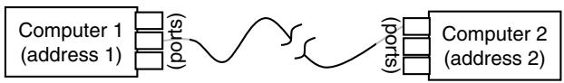  
Figure 8.1 Schematic of two computers connected over a TCP/IP network.

protocols. For example, ports 20 and 21 are used to transfer files over a network using File Transfer Protocol (FTP). Port 25 is usually used to exchange email messages between mail servers using the Simple Mail Transport Protocol (SMTP) while 587 is used for encrypted email. Port 80 is reserved for Hypertext Transfer Protocol (HTTP) to request and deliver web pages, while port 443 is used to exchange encrypted web pages using HTTP Secure (HTTPS).

# 8.1.4 Application Layer Protocols

Protocols like FTP, SMTP, and HTTP are referred to as application layer protocols because they run on top of the TCP and IP network layers to perform specific tasks associated with an application. These and many other application layer protocols each have their own definitions and procedures for correct usage. The Python standard library provides modules that implement many of these application layer protocols. These modules provide a set of functions that abstract protocol details and encapsulate the application’s higher-level operations.

# 8.1.5 IPv4 vs. IPv6 Addresses

Currently, two IP address formats are in wide use. They are IP version 4 (IPv4) and IP version 6 (IPv6). Because we need to specify an IP address when opening a network connection, it is important to understand how these formats are written. IPv4 addresses are made up of four bytes (32 bits), usually written as decimal numbers in the range 0–255 and separated by a dot. For example, the address 192.168.1.97 is an example of an IPv4 address. Because a byte in decimal notation is a number from 0 through 255, the total number of IPv4 addresses is only $2 5 6 ^ { 4 } =$ 4,294,967,296, or about 4 billion addresses. With 8 billion people on the planet and given that many people use multiple network-enabled devices, each requiring their own unique address, a total of 4 billion addresses is far too few.

IPv6 postpones the shortage issue by expanding the address size to be made up of eight 16-bit numbers (128 bits), which translates to $3 . 4 \times 1 0 ^ { 3 8 }$ unique addresses, or about 340 trillion trillion trillion. That should keep us from running out of network addresses for a while.

The eight numbers that make up an IPv6 address are written using hexadecimal notation and are separated by colons. Each hexadecimal number is in the range 0000 through FFFF. To shorten an IPv6 address, leading zeros in any number are often dropped, and double colons (::) may be used in place of a sequence of zeros in the address, but only one zero sequence. For example, the arbitrary IPv6 address 2001:00db:0000:0000:0000:0000:0123:0ABC, may be written as 2001:db::123:ABC.

Both IPv4 and IPv6 formats have special reserved loopback addresses. These IP addresses do not refer to endpoints on a network, instead they refer back to the computer requesting the connection. Essentially, these addresses loop back to the same computer. The IPv4 loopback address is 127.0.0.1, also known by the name localhost. In fact, any IP address starting with 127.0.0 will be treated as a loopback address. The IPv6 loopback address is  ::1, which, in long form is written 0000:0000:0000:0000:0000:0000:0000:0001. A loopback IP address is very useful when testing network connections using a single computer. We’ll make use of loopback addresses in several examples.

# 8.1.6 Proxy Servers

In practice, both IPv4 and IPv6 addresses are usually handled simultaneously in what is referred to as a dual stack strategy. That is, networked devices may be assigned both an IPv4 and an IPv6 address when connecting to a network. Given the shortage of IPv4 addresses, you may be

wondering how this is possible. The answer to this question is the introduction of a proxy server to the network configuration.

A proxy server is a network device that intercepts a network message, sends the message on your behalf using its own IP address, and then receives and returns the result. It acts as a go-between for a computer and the Internet. With a proxy server, an isolated network can be set up at an organization like a school or company. All internal networked devices connected to that isolated network can be assigned a unique IPv4 address without exhausting available addresses. Because the network is isolated, there is no risk that an assigned IPv4 address will conflict with another computer on a different network. The proxy server is connected to both the isolated network and the Internet. When a computer connected to the private network sends a message to an external computer, the proxy server intercepts the messages and performs the network operation as its proxy. Because the network is isolated, only the proxy server needs to have a unique address on the Internet because only the proxy server establishes network connections with external devices.

One obvious characteristic of a proxy server that follows from how it operates is that external networked computers are unable to connect with computers internal to the private network. Computers on the internal network are assigned IP addresses that are unique only within the network. There is no globally unique IP address with which an external computer can request a connection with an internal computer, so a connection is not possible. This can be a feature because it acts to isolate and protect internal computers from malicious external actors.

Having the IP address of the remote device is necessary before a connection can be established, but the format of these addresses makes them difficult to remember and prone to errors when typed. Fortunately, IP addresses can be assigned friendly names, called domain names, which are stored in a shared hierarchical database that is accessible over a network. This shared database and the added functionality that makes it useful is called a Domain Name System (DNS). When opening a connection with a networked computer given only its domain name (like data.gov), a DNS can be used to look up the assigned IP address by searching for the domain name in the DNS database. In fact, a web browser uses a DNS by default whenever a domain name is used in the address of the remote system.

A domain name is organized as a sequence of parts, separated by dots. For example, consider the domain name catalog.data.gov. The right-most part of the domain name is referred to as the top-level domain or TLD. In this case, the TLD of api.weather.gov is "gov". Other TLD examples include "com", "org", "net", "edu", country-specific character sequences, and many others. The TLD of a domain name often implies something about the purpose of the domain.

The next part prior to the TLD is the domain itself. The domain of api.weather.gov is "weather". The domain combined with the TLD form the complete domain name. Additional parts of a domain name may precede the domain name. These are referred to as subdomains. The api. weather.gov example includes the subdomain "api". For computers on your local network with a specific purpose, such as controlling a particular instrument, using a subdomain name that identifies the attached instrument is a good way to help you find it easily.

# 8.2 Introduction to Hypertext Transfer Protocol

As mentioned, the primary standard used for requesting and transmitting web content over the Internet is Hypertext Transfer Protocol, or HTTP. The HTTP protocol is introduced here in the context of a web browser fetching a web page. Ultimately, we want to use a Python program to perform the same task.

When a browser (or any program) requests a web page from a web server, the first step is for the browser to establish a connection with the web server using the server’s network address and selecting the correct port. Port 80 is reserved for unencrypted HTTP content, while port 443 is used when HTTP requests and responses are transmitted using an encrypted channel. Once the network connection is established, the browser sends a request to the server. The format of a request is straightforward and useful to understand. The content of an HTTP request is usually easy to examine because the default character encoding standard used is based on ASCII (ISO-8859-1). Nevertheless, it will not be necessary to create an HTTP request from scratch because we have available the very powerful requests Python module, which will do the heavy lifting for us. We’ll cover the requests module in more detail in the next section.

# 8.2.1 The Uniform Resource Locator

A Uniform Resource Locator, or URL, specifies several important items at once [38]. These include:

1.	 The protocol scheme to use for communication.   
2.	 The domain name and subdomains of the remote computer to which the request will be sent.   
3.	 The port through which a network connection will be established.   
4.	 A path to the resource requested at the remote computer.   
5.	 Any additional parameters with values to be passed with the request (query string).

Consider the following URL for the PubChem Power User Gateway (PUG) [39], a resource made available by the National Library of Medicine [40]. For reference, the response from invoking the URL is given in Listing 8.1. The content of the response is a JSON-formatted document identifying the PubChem compound ID (CID) for DMSO. Parts of the example URL are labeled in Table 8.1 and described further.

```txt
https://pubchem.ncbi.nlm.nih.gov:443/rest/pug/compound/name/dmso/cids/JSON?name_type=complete 
```

Listing 8.1 Response returned from a PubChem URL.   
```json
{
    "IdentifierList": {
        "CID": [679]
    }
} 
```

The scheme of the URL identifies the protocol to be used to send the request and receive a response. In this case, the scheme is set as "https" which means that the HTTP protocol will be used and transmitted over an encrypted network connection.

The domain name with its subdomain prefixes is pubchem.ncbi.nlm.nih.gov. This is the name that will be provided to a Domain Name System to look up an IP address. The IP address identifies the network endpoint with which the local computer will attempt to establish a connection.

Table 8.1 Parts of the example PubChem URL.   

<table><tr><td>URL part</td><td>URL text</td></tr><tr><td>scheme</td><td>https</td></tr><tr><td>domain name with subdomains</td><td>pubchem.ncbi.nlm.nih.gov</td></tr><tr><td>port</td><td>443 (default for https)</td></tr><tr><td>path to resource</td><td>/rest/pug/compound/name/dmso/cids/JSON</td></tr><tr><td>query string</td><td>name_type=complete</td></tr></table>

The port specified in the URL is 443. It was not necessary to include the port number because the default port for the "https" scheme is 443 and would be assumed if excluded. If for some unusual reason, the remote server was expecting a secure HTTP connection request on a different port, this would have had to be specified in the URL.

The path to the requested resource is /rest/pug/compound/name/dmso/cids/JSON. Originally, paths were considered file paths to files on the remote computer, but that interpretation has long since been abandoned. The meaning of this path is defined by the server receiving the request. In the case of PubChem, the path in the example URL requests access to the Power User Gateway (PUG) resource with a specific request to look up the compound ID (CID) for the compound with the name "dmso" and return results in JSON format (subsection 7.13.1). Other formats available from the PubChem PUG web service include XML, CSV, PNG (image), SDF (structure-data file), and more.

The final part of the URL after the "?" is called a query string, which adds information about how the chemical ID lookup is to match records in the PubChem database. Setting "name_type" to "complete" tells the PUG that data is to be returned only for complete name matches. Partial matches are excluded.

Each part of a URL can be significant when accessing a resource over a network using HTTP. When we perform the same kind of HTTP request programmatically, it will be critical to correctly build a URL string to access the specific resource of interest and receive it in the format desired.

# 8.2.2 Anatomy of an HTTP Request

An HTTP request is sent by a local computer to a remote computer running an HTTP server program. The format of an HTTP request is made up of four parts.

1.	 The request’s first line, containing the HTTP method to use, a path to the requested resource, and the HTTP version standard.   
2.	 An optional set of request headers, which are name:value pairs (one per line) that add information about the request.   
3.	 A required blank line, which separates the head of the request from its body.   
4.	 An optional request body, which contains data to be passed with the request, such as in the case of a POST method.

When issuing an HTTP request, in addition to a path to the requested resource to be found at the URL, the request method must be specified. There are at least nine different request methods that indicate the desired actions to be performed by the server, but we’ll focus on two only: GET and POST.

The HTTP GET method asks the remote computer to return a representation of the resource named in the path of the URL. GET is used for simple requests for relatively static resources. Note that it is possible for the response of a GET request to be cached locally using the URL as a key. This means that sending the identical request a second time might not make it all the way to the server. Instead, a cached version of the response may be returned to conserve network resources and optimize performance. This may not be what you want. One simple way to circumvent this caching behavior is by passing a random number in the query string, a technique called busting the cache. This ensures that the URL is always changing and therefore a cached response is never returned. In any case, if you are not seeing an updated response from a repeated GET request, make sure the response is not being cached inadvertently.

Once a network connection is made with the remote computer, the text of the request is sent. Because the request is sent after the connection is established, the request does not need to include information about the network address.

The text version of a GET request is straightforward to examine. The following is the simplest GET request issued based on our previous PubChem URL example. It is made up of only two lines. The first line includes the HTTP method (GET), the path to the resource requested, and the version of HTTP used. The second line is blank, signaling the end of the header section of the request. In this simple example, no request headers were included.

```batch
GET /rest/pug/compound/name/dmso/cids/JSON?name_type=complete HTTP/1.1 
```

The HTTP POST method differs from a GET method in that it sends a data payload (request body) with the request. The request body follows the blank line in the HTTP request. The way the data are formatted in the body must be specified in a request header for the HTTP server running on the remote computer to properly parse it. Because of this, it is not possible to use a URL to make a request using a POST method by typing the URL into the address bar of a browser. HTTP POST requests using a browser require a little extra work. Fortunately, it is relatively easy to submit a POST request using the Python requests module.

The PubChem PUG allows parameters to be moved from the query string to the body of a request when the POST method is used. For example, it could be very inconvenient to pass a very long list of CIDs in the URL query string. Instead, we can use a POST request and pass the CIDs in the body of the request.

Let’s say we want to look up the molecular formula and molecular weight of dimethyl sulfoxide, isopropanol, and trimethylpentane. We know that the PubChem CIDs for these three solvents are 679, 3776, and 11551. Following is the PUG path to the PubChem PUG resource to obtain the molecular formula and molecular weight in a CSV format. Other information can be fetched using a PUG path, including SMILES strings.

```javascript
/rest/pug/compound/cid/property/MolecularFormula,MolecularWeight/CSV 
```

Rather than specifying the CIDs in the URL, they can be passed in the POST body of the request in the format "cid=679,3776,11551". This example of a POST body is relatively short, but imagine if you wanted the information for a much longer list of CIDs. URLs may be long, but they have a maximum length of a few thousand characters. It is much a better practice to send data in the POST body of an HTTP request.

The POST request should contain additional information in the request headers to help the remote server properly parse the payload. Two headers to be added to the POST request specify the length of the POST body and the way it was encoded. Encoding of the POST body is important for several reasons. Not only does it help define the structure of the data, but it also ensures that special characters are encoded properly so as not to interfere with its interpretation.

Listing 8.2 is what a full POST request looks like for the molecular formula and molecular weight requests, including proper headers and the three CIDs in the POST body. Note how the two header lines are formatted, the blank line between the headers and POST body, and that the comma characters in the POST body are encoded as $" \% 2 \mathrm { { C " } }$ . The hexadecimal number 2C is 44 in decimal notation, which corresponds to the comma character in the ASCII table (Appendix A).

# Listing 8.2 POST HTTP request to PubChem for molecular formula and molecular weight of three CIDs.

```txt
POST /rest/pug/compound/cid/property/MolecularFormula, MolecularWeight/CSV HTTP/1.1  
Content-Length: 22  
Content-Type: application/x-ww-form-urls-encoded  
cid=679%2C3776%2C11551 
```

# 8.2.3 Anatomy of an HTTP Response

Once the remote computer receives the request, it assembles and returns an HTTP Response. There are four parts to an HTTP Response:

1.	 The response’s status line, which includes the version of the protocol being used, the response status code, and a status description;   
2.	 A set of response headers, which are name:value pairs (one per line) that add information about the response;   
3.	 A required blank line, which separates the head of the response from its body; and   
4.	 The body of the response, which contains the main response content.

When a response is received, the first action item is always to check the response status code. This will inform you about the outcome of the request. Response status codes are three-digit numbers subcategorized by their hundreds digit, 1 through 5 (see Table 8.2).

There are quite a few response status code options that have diverse meanings indicating the outcome of the request, including response status code 418, which has the description “I’m a

Table 8.2 HTTP Response status code ranges and descriptions.   

<table><tr><td>HTTP Response status code range</td><td>Description</td></tr><tr><td>100–199</td><td>Informational responses</td></tr><tr><td>200–299</td><td>Successful responses</td></tr><tr><td>300–399</td><td>Redirection messages</td></tr><tr><td>400–499</td><td>Client error responses</td></tr><tr><td>500–599</td><td>Server error responses</td></tr></table>

teapot”. According to Internet lore, response status code 418 is appropriate when asking an HTTP teapot server to brew coffee, should you make such a request. Refer to the HTTP standard for more detailed descriptions [41]. Ideally, we want to receive a status code in the range 200–299, but more often than not, a 200 is the status code that lets us know the HTTP request was successful.

Part of the HTTP response from the request in Listing 8.2 is given in Listing 8.3. The status line shows the HTTP version, status code, and status description. Immediately after the status line are several header lines that describe the response. Several of the actual headers have been removed for brevity. Among the headers listed, note the content type returned is specified as "text/csv", exactly what we requested. After all headers a blank line is inserted that separates headers from the body of the response. We requested the molecular formula and molecular weight of three CIDs, formatted as a CSV table. You will see that this is exactly what we received in the response body.

Listing 8.3 HTTP response from the request in Listing 8.2.   
HTTP/1.1 200 OK   
Server: Apache   
Referrer-Policy: origin-when-cross-origin   
Content-Security-Policy: upgrade-insecure-requests   
Cache-Control: private   
Content-Type: textcsv   
Vary:Accept-Encoding   
Content-Encoding:gzip   
X-UA-Compatible:IE=Edge   
X-XSS-Protection:1;mode $\equiv$ block   
Access-Control-Allow-Origin:*   
Keep-Alive:timeout $= 4$ ，max $= 40$ Connection:Keep-Alive   
Transfer-Encoding: chunked   
"CID","MolecularFormula","MolecularWeight"   
679,"C2H6OS",78.14   
3776,"C3H8O",60.10   
11551,"C8H18",114.23

There is a vast landscape of standards, protocols, formats, codes, and other details associated with HTTP. Fortunately, we don’t need to understand it all in great detail to use it. It is sufficient to understand the core elements of establishing a network connection over a TCP/IP network, the components of building and sending an HTTP request, and how to receive and interpret an HTTP response. Most of the details have been abstracted away and handled by prewritten Python modules, the most popular being the requests module.

# 8.3 Web Services and the Python Requests Module

A browser uses HTTP to request web content intended to be rendered and displayed. But HTTP requests can be used for a different purpose, which is to programmatically request data from a remote service or even to trigger a remote action. When a server is set up to deliver data instead of HTML pages, the server is called a web service. In fact, the HTTP framework may be used for requesting any kind of digital data, including HTML pages, formatted data sets, images, video, audio, and more. In this section, we use HTTP primarily for accessing data sets, like configuration or reference data.

As is the case with other utilities available with Python, we often have multiple options to choose from, including modules in the Python Standard Library and external options that must be installed separately. Performing HTTP requests with Python is no different. For working with the HTTP protocol, the Python Standard Library itself includes modules like http and urllib. Externally, a wider variety of options are available that are both special purpose as well as part of larger frameworks. Among all the available options, it is the requests module that is perhaps the most popular. The Python community has considered moving requests into the standard library but decided against it to allow the module to develop and improve on its own schedule, without the constraints of core Python language releases.

Because it is not included in the Python standard library, the requests module must be installed before it can be used.

```batch
python -m pip install requests 
```

Once installed, the module is ready to be imported. Quite a bit of what you can do using the requests module is implemented as top-level functions in the module’s namespace.

# 8.3.1 HTTP GET Requests and the Response Object

All the HTTP request methods are available as functions in the requests module, including get(…), post(…), and the remaining methods defined in the HTTP standard [41]. Function names match each HTTP method, only the function names are lowercase. These functions return a requests module Response object, which holds all parts of the HTTP response.

Recall the URL in subsection 8.2.1, which requests the PubChem CID for DMSO. When the URL is entered into a browser’s address bar, the browser performs a GET request and displays the result. The same GET request can be performed by invoking the get(…) method of the Requests module, which returns a Response object. The returned content is available by accessing the text property of the Response object.

In the following console session, we import requests, invoke the get(…) method with the PubChem URL, verify the status_code property of the Response, and display the text property of the Response object.

```python
>>> import requests
>>> url = 'https://pubchem.ncbi.nlm.nih.gov:443/rest/pug/compound/name/dmso/cids/JSON?name_type=complete'
>>> resp = requests.get(url)
>>> resp.status_code
200
>>> resp.text
{'\n "IdentifierList": {'\n "CID": ['\n 679\n ]\n }}\n' 
```

The Response object exposes mostly properties that provide predigested access to parts of the HTTP response. Table 8.3 lists and describes the most useful properties of the Response object. Below, note how the headers property of the Response object provides a Python dictionary containing all the returned name:value header pairs, which match up with the example HTTP response headers in Listing 8.3. Some headers have been removed.

Table 8.3 Useful Request module Response object methods and properties.   

<table><tr><td>Response property/method</td><td>Description</td></tr><tr><td>status_code</td><td>Three-digit integer HTTP response code.</td></tr><tr><td>ok</td><td>True if status_code is less than 400.</td></tr><tr><td>reason</td><td>Description of status_code.</td></tr><tr><td>content</td><td>Response content as bytes.</td></tr><tr><td>text</td><td>Response content in Unicode text.</td></tr><tr><td>encoding</td><td>The character encoding that must be used to decode content in text.</td></tr><tr><td>headers</td><td>A dictionary of headers provided in the response.</td></tr><tr><td>request</td><td>The PreparedRequest object that generated the Response.</td></tr><tr><td>url</td><td>The URL that generated the Response.</td></tr><tr><td>json(...)</td><td>Returns JSON-encoded content, if present.</td></tr><tr><td>iter_content(...)</td><td>Read content in chunks as bytes into memory.</td></tr></table>

```txt
>>> resp.headers
{'Server': 'Apache', 'Referrer-Policy': 'origin-when-cross-origin',
'Content-Security-Policy': 'upgrade-insecure-requests', 'Cache-Control':
'private', 'X-Throttling-Control': 'Request Count status: Green (0%),
Request Time status: Green (0%), Service status: Green (13%), 'Content-Type':
'application/json', domain=.nih.gov; path=/; 'Vary': 'Accept-Encoding',
'Content-Encoding': 'gzip', 'X-UA-Compatible': 'IE=Edge', 'X-XSS-Protection':
1; mode=block', 'Access-Control-Allow-Origin': '*', 'Keep-Alive':
'timeout=4, max=40', 'Connection': 'Keep-Alive', 'Transfer-Encoding':
'chunked', ...) 
```

The URL requested content in JSON format. The 'Content-Type': 'application/json' Response header verifies this. Using the Response object's json(…) method we can parse the JSON response into a Python dictionary immediately. This returns a data structure with the response data in a format that is ready to use in subsequent calculations.

```txt
>>>resp.json() {IdentifierList':{'CID':[679]}}   
>>> 
```

I think you’ll agree that this example is a good demonstration of why the “HTTP for Humans” tagline of the requests module lives up to its promise.

# 8.3.2 HTTP POST Requests

An HTTP POST request, like that described in Listing 8.2, is equally easy to perform with the requests module. Recall that POST requests send along additional data with the HTTP request. The requests module’s post(…) method takes this additional data as a Python dictionary. It encodes and serializes the data, computes and inserts additional headers, like content-length and the method of encoding, assembles the HTTP request according to established standards,

makes the network connection, and sends the request. Once again, the response from a POST request is returned as a Response object, which can be interrogated for status and results.

The example below demonstrates how to perform the POST request given in Listing 8.2. Besides using the requests module post(…) function and providing the URL as the first parameter, additional data to be included in the request is collected in a Python dictionary and added to post(…) as the data keyword parameter.

Recall that this particular request fetches the molecular formula and molecular weight for the compounds with CIDs 679, 3776, and 11551, and requests that response data is formatted as CSV. In the following console session, note how the post(…) function is invoked with the URL as the first positional parameter and data dictionary as the data keyword parameter. The response content is verified to be in a CSV format by inspecting the “content-type” header in the response. The text of the response is indeed formatted as CSV, which is more easily visualized when printed.

```python
>>> import requests
>>> url = 'https://pubchem.ncbi.nlm.nih.gov/rest/pug/compound/cid/property/MolecularFormula, MolecularWeight/CSV'
>>> data = {'cid': '679,3776,11551'}
>>> resp = requests.post(url, data=data)
>>> resp headers['content-type']
'text/csv'
>>> resp.text
"CID", "MolecularFormula", "MolecularWeight"\n679, "C2H6OS", 78.14\n3776, "C3H8O", 60.10\n11551, "C8H18", 114.23\n'
>>> print(resp.text)
"CID", "MolecularFormula", "MolecularWeight"
679, "C2H6OS", 78.14
3776, "C3H8O", 60.10
11551, "C8H18", 114.23
>>> 
```

# 8.3.3 Binary Responses

One of the response types available from the PubChem web service is the PNG image format. A URL formatted to request a record in PNG format will return an image of the molecule. The query string parameter record_type added to the URL selects the type of image. When set to “3d” a three-dimensional rendering of the molecule is generated and returned.

The following URL demonstrates how to build a URL that returns a PNG image of the structure of DMSO in three-dimensions. Entering this URL in a browser will return the structure image. Right-mouse on the image in the browser for an option to save the image to a file. This approach is fine for one or two images, but if you want more than that, a script is necessary.

```txt
https://pubchem.ncbi.nlm.nih.gov/rest/pug/compound/name/dmso/record/PNG?record_type=3d 
```

A URL like this works well, but it is useful to be able to save the returned binary data to a file so that it can be used in other applications and documents. The iter_content(…) Response object method does this for us.

After a URL is requested and the response is received successfully, the binary data in the response may be written directly to a binary file using the file methods described in Chapter 7. Because the data returned may be streaming over the network as it is being saved, the best practice is to

continue to read the response as it arrives and write it in chunks to a binary file. Listing 8.4 demonstrates how to do this, where fname is the name of the binary file to open and write and resp is the Response object created with a successful status code.

# Listing 8.4 Demonstration of how to receive and write binary data as it arrives.

```python
Save returned binary data to a file with open(fname, 'wb') as file: for chunk in resp_iter_content(chunk_size=128): file.write(chunk) 
```

With the core functionality of Listing 8.4 and the URL pattern that requests a response in the form of an image, we can write a general-purpose function that takes a molecule name and saves an image of the molecule to a file. The fetch_and_save_image(…) function in Listing 8.5 does the job.

The entire program in Listing 8.5 is designed to accept the name of a molecule and optionally the name of the file to which the molecule image will be written, all on the command line. The program uses the standard sys.argv utility to test and read command line arguments. A missing molecule name is an error, but a molecule name with no file name causes the default file name to be created by adding a “.png” to the molecule name.

The fetch_and_save_image(…) function expects both the molecule name and the file name. It assembles the correct URL by substituting the molecule name and then performs the request using the requests module’s get(…) method. The Response object’s status code is first verified, and if it has a value of 200 then a file is opened for writing in binary format and the iter_content(…) method of the Response object is used to read 128 bytes at a time from the response and write the bytes to the file.

# Listing 8.5 Program to fetch and save a PNG image for a named molecule from the PubChem PUG.

# fetch_and_save_image.py   
import requests,sys   
# Request and save binary image of molecule   
def fetch_and_save_image(mname,fname): #Substitute name into URL url $=$ f'https://pubchem.ncbi.nlm.nih.gov/rest/pug/compound/name/{mname}/ record/PNG?record_type $\equiv$ 3d' # Perform the HTTP request and check status resp $=$ requests.get(url) if resp.status_code $! = 200$ . print(f'Unexpected response:{respreason}') sys.exit() # Save returned binary data to a file with open(fname,'wb') as file: for chunk in resp_iter_content(chunk_size=128): file.write(chunk)

Listing 8.5 (Continued)   
```python
print(f'Image saved to {fname}')  
if __name__ == '__main__':  
    # Validate parameter  
    if len(sys.argv) < 2:  
        print("Please pass a molecule name and an optional image file name")  
        sys.exit()  
    # Get molecule name parameter  
    mname = sys.argv[1].strip()  
    # Get file name parameter or create a default name based on molecule name  
    if len(sys.argv) >= 3:  
        fname = sys.argv[2].strip()  
    else:  
        fname = f'\{mname\}.png'  
    # Invoke function  
    fetch_and_save_image(mname, fname) 
```

The following is an example of running the program to generate and save a 3D structure image of adenosine triphosphate (ATP) and a second 3D structure image of glycogen (Figure 8.2).

```txt
> python get_image.py atp  
Image saved to atp.png  
> python fetch_and_save_image.py glycogen  
Image saved to glycogen.png 
```

  
Figure 8.2 Image files returned from running fetch_and_save_image.py with the parameter “atp” (left) and “glycogen” (right).

It is easy to see how the program in Listing 8.5 may be expanded to download hundreds or thousands of molecules images very quickly. Resist the urge. Most web services like the PubChem PUG

Table 8.4 Useful keyword parameters of Request module functions that customize the Request object.   

<table><tr><td>Keyword parameter</td><td>Description</td></tr><tr><td>data</td><td>Python dictionary formatted and included in request body.</td></tr><tr><td>params</td><td>Python dictionary transformed into query string and added to URL.</td></tr><tr><td>headers</td><td>Python dictionary of headers to add to Request object.</td></tr><tr><td>auth</td><td>(xurname, password) tuple used for required web service authorization.</td></tr><tr><td>proxies</td><td>Python dictionary that maps protocol name to the URL of a proxy server.</td></tr></table>

will monitor and limit the number and rate of requests that may be made from a script. This ensures that this valuable open resource remains available to everyone. The maximum rate of requests that the PUG permits is approximately three per second, but this can change at any time. If you abuse the service, chances are good that your IP address will be banned and your access blocked. Please be a good digital citizen so we can continue to have nice things, like the PubChem PUG.

# 8.3.4 Customizing the Request Object

Under the hood, the requests module functions like get(…) and post(…) start by creating an internal Request object from the given URL parameter and the optional data dictionary. Most of the time this is handled flawlessly by the requests module. But, on occasion, it may be necessary to customize the Request object before the HTTP request is performed. Nearly everything that can be customized is available as keyword parameters which may be passed to top-level requests module functions.

We’ve seen already how the post(…) function accepts the data keyword parameter as a dictionary of data to be serialized, formatted, and added to the HTTP request body. This and other keyword parameters that perform additional underlying Request object customizations are listed and described in Table 8.4.

# 8.3.5 Verifying Certificates and Encryption

All modern web browsers expect to exchange information over an encrypted network connection with a trusted server. The protocol used is Hypertext Transfer Protocol-Secure (HTTPS), not HTTP, so the scheme specified at the beginning of the URL is “https.”

It is the job of the browser to do three things:

1.	 Verify the trustworthiness of the server,   
2.	 Encrypt all information sent to the server, and   
3.	 Decrypt encrypted data received from the server.

This ensures that the server is who they say they are, and it protects all communications through encryption. Both can be accomplished using a server certificate.

A certificate is a kind of digital document that proves the server’s identity. It includes data such as:

1.	 The organization name and domain name of the website,   
2.	 The authority issuing the certificate,   
3.	 The certificate’s expiration date,   
4.	 A public key used to establish an encrypted connection.

It is helpful to think of a certificate as a kind of identification (ID) card that is issued to you by an authority, such as a school, company, or governmental body. To prove your identity, you might be asked to produce your ID card. If the card is valid, the card demonstrates a kind of trust that the authority issuing the card has transferred to you. The ID card allows you to enjoy the rights and privileges granted to you by the authority issuing you the ID card.

The initial handshake that occurs when establishing a trusted and encrypted HTTPS connection works in a very similar manner to the ID card. In this case, a certificate is used instead of an ID card.

1.	 When an HTTPS connection is initiated, the client asks the server for its certificate, which the server returns to the client over the network.   
2.	 The certificate is verified by the browser using information obtained directly from the trusted authority that issued the certificate. Because the browser trusts the third-party authority and the authority has vouched for the server’s host, if the certificate is verified, that trust transfers to the host operating the server.   
3.	 Once verified, the certificate’s information is used to validate the connection, such as by comparing the domain name in the certificate with the domain name used to establish the connection.   
4.	 If everything checks out, a public key in the certificate is used to encrypt a second secret session key which is sent back to the server. This session key is used by both sides of the connection to encrypt and decrypt data sent over the network connection.

Fortunately, the requests module performs this handshake seamlessly when establishing a connection using the HTTPS protocol. The requests module uses another Python module named certifi, which includes a collection of trusted Root Certificates used for validating the trustworthiness of the certificates obtained from remote servers and confirming the identity of the server’s host. These certificates are bundled from a curated collection made available by the Mozilla Foundation [42].

The good news is that there is nothing for you to do to establish an HTTPS connection other than to appreciate that the server’s host is verified by a trusted authority and all transmitted data is encrypted simply by using the requests module. Huzzah!

# 8.3.6 Other requests Module Options

While the requests module provides a powerful set of high-level functions that fulfill the vast majority of its functionality, it is also possible to manage the minute details of a network exchange, if necessary.

A requests Session object captures the state of an extended multi-exchange interaction between two networked devices. Data managed by a Session object includes information such as authentication information, certificate information, special headers, query string parameters, and additional application-specific key-value pairs called cookies.

A requests PreparedRequest object is a version of the internal Request object that has been prepared and is ready to transmit. Inspecting a PreparedRequest object can help to debug a failed request when the exact format is known. A PreparedRequest can be produced by creating a Request object, invoking the Request object’s prepare() method, and reading the request property of a Response object. Table 8.5 includes several useful properties of a PreparedRequest object.

Table 8.5 Useful properties of the PreparedRequest object.   

<table><tr><td>Property</td><td>Description</td></tr><tr><td>method</td><td>The method used to send the request.</td></tr><tr><td>url</td><td>The HTTP request URL.</td></tr><tr><td>headers</td><td>A dictionary of HTTP headers in the request.</td></tr><tr><td>body</td><td>The request body in the request.</td></tr></table>

# 8.4 Project – Print Weather Forecast for a Location

The United States National Weather Service (NWS) of the National Oceanic and Atmospheric Administration (NOAA) provides weather forecasts and warnings as a governmental service to the public. Data published by the NWS is freely available, including through its API Web Service [43]. In this project, we’ll use the NWS API to load temperature forecast data, compute the amount of time into the future of the forecast, and print time versus temperature in a table. Certain laboratory instrumentation is known to behave poorly when the weather changes. Collecting weather conditions along with experimental data can explain variability. In the next chapter, we extend the project and demonstrate how to plot the results as well.

# 8.4.1 National Weather Service API Web Service

The National Weather Service’s API Web Service specification defines URLs that provide information on a variety of resources, including alerts, information about weather observation stations and offices, radar stations, forecasts at geographic coordinates, and more. Details about the API are available on the National Weather Service’s website [43]. For this project, we will focus on the following two URLs.

```txt
https://api weather.gov/gridpoints/gridpoints/{wfo}/\{x\}, {y}  
https://api weather.gov/points/{lat}, {lon} 
```

The first API URL with “gridpoints” as the top-level path segment, returns a full hourly forecast for a seven-day period into the future. Forecast properties returned include air temperature, atmospheric pressure, dew point, relative humidity, probability of precipitation, heat index, wind speed and direction, sky cover and visibility, and much more. This URL expects three parameters: the weather forecast office symbol (wfo) and the office’s closest x and y grid coordinates.

Fortunately, the second API URL with “points” as the top-level path segment, receives the latitude and longitude for the forecast location as its parameters and returns in its response properties information about the closest weather forecast office and grid coordinates. Also included in the response properties are several preconfigured URLs for accessing a variety of forecast data, including the forecastGridData property, which is a fully substituted version of the first API URL above, including weather forecast office code and closest grid coordinates. Rather than extract the weather forecast office code and grid location, we’ll make use of the provided forecast URL.

Data returned by both API URLs are formatted as JSON. When deserialized into a Python dictionary, all information we are seeking is found in the returned dictionary’s properties key. For example, a partial response to the API URL https://api.weather.gov/points/40.2757,-74.7763 is given in Listing 8.6. Note how the dictionary referenced by the response’s properties key itself has a forecastGridData key, which provides the substituted URL for the API URL that provides the closest weather forecast data. To obtain the forecast data itself, we can use the API URL provided by the forecastGridData key’s value directly.

Listing 8.6 Partial response to “points” API URLs with latitude and longitude 40.2757,-74.7763.   
```json
{
    "properties": {
        "@id": "https://api.weather.gov/points/40.2757,-74.7763",
        "@type": "wx:Point",
        "cwa": "PHI",
        "forecastOffice": "https://api.weather.gov/offices/PHI",
        "gridId": "PHI",
        "gridX": 61,
        "gridY": 92,
        "forecast": "https://api.weather.gov/gridpoints/PHI/61,92/forecast",
        "forecastHourly": "https://api.weather.gov/gridpoints/PHI/61,92/forecast/hourly",
        "forecastGridData": "https://api.weather.gov/gridpoints/PHI/61,92",
        "observationStations": "https://api.weather.gov/gridpoints/PHI/61,92/stations",
        "forecastZone": "https://api.weather.gov/zones/forecast/NJZ015",
        "county": "https://apiweather.gov/zones/county/NJC021",
        "fireWeatherZone": "https://apiweather.gov/zones/fire/NJZ015",
        "timeZone": "America/New_York",
        "radarStation": "KDIX"
   },
} 
```

Once again, the result returned from the second URL is formatted as JSON. When deserialized into a Python dictionary, the desired information is found on the dictionary’s properties key. In this response, the properties key references another dictionary containing the temperature key as well as keys that identify a wide range of forecast data. The temperature key references an embedded dictionary with a values key, which itself has a list of dictionaries, each with the following structure.

```json
{"validTime":...,"value":...} 
```

Each dictionary in the values list contains two keys. The validTime key is a timestamp formatted using the standard ISO 8601 date-time standard [44]. The value key is a floating-point number representing forecasted $^ \circ \mathrm { C }$ at that time in the future. Clearly, the returned JSON data is organized and nested at multiple levels. But, once deserialized to a Python dictionary, it is easy to navigate and explore this data structure to better identify how to access desired information.

# 8.4.2 Getting Forecast URL from Geolocation

In the following console session, we demonstrate how to access the forecast API URL starting with latitude and longitude values, which are used in the final program in Listing 8.7. We begin by importing the requests module and setting the lat and lon variables to the desired latitude and longitude.

```txt
>>> import requests  
>>> lat, lon = 40.2757, -74.7763 
```

A URL is formed for the “points” API using an f-string and the requests.get(…) method is used to fetch the data. We always check the status code to ensure the request is successful.

>>>url $=$ f'https://api.weather.gov/points/{lat},{lon}   
>>>resp $=$ requests.get(url)   
>>>resp.status_code   
200

The Response object’s json() method is invoked to deserialize the response data into a Python dictionary and its “properties” key is accessed and copied to a separate prop variable for further processing.

```txt
>>> prop = resp.json()['properties'] 
```

The prop dictionary’s keys() method is invoked to inspect names for all available data, which includes forecastGridData. The value of the forecastGridData key is saved to the url variable and inspected to reveal the desired forecast API URL.

```python
>>> prop.keys()
dict_keys(['@id', '@type', 'cwa', 'forecastOffice', 'gridId', 'gridX', 'gridY', 'forecast', 'forecastHourly', 'forecastGridData',
'observationStations', 'relativeLocation', 'forecastZone', 'county', 'fireWeatherZone', 'timeZone', 'radarStation'])  
>>> url = prop['forecastGridData']
>>> url
'<https://api weather.gov/gridpoints/PHI/61,92>' 
```

# 8.4.3 Loading and Processing Forecast Data

We can use the returned forecast URL to fetch all forecast data by following a similar approach. The console session continued below demonstrates how to access temperature forecast data.

The forecast URL is requested and the Response object’s status_code is checked.

>>>resp $\equiv$ requests.get(url)   
>>>resp.status_code   
200

The returned data is deserialized by invoking the Response object’s json() method and the value at its properties key is saved to the prop variable for further processing.

```txt
>>> prop = resp.json()['properties'] 
```

The prop dictionary’s keys list the kinds of forecast data returned by the response, which includes the “temperature” key.

```javascript
>>> prop.keys()
dict_keys(['@id', '@type', 'updateTime', 'validTimes', 'elevation',
'forecastOffice', 'gridId', 'gridX', 'gridY', 'temperature', 'dewpoint',
'maxTemperature', 'minTemperature', 'relativeHumidity', 'apparentTemperature',
'wetBulbGlobeTemperature', 'heatIndex', 'windChill', 'skyCover',
'windDirection', 'windSpeed', 'windGust', 'weather', 'hazards',
'probabilityOfPrecipitation', 'quantitativePrecipitation', 'iceAccumulation',
'snowfallAmount', 'snowLevel', 'ceilingHeight', 'visibility',
'transportWindSpeed', 'transportWindDirection', 'mixingHeight', 'hainesIndex',
'lightningActivityLevel', 'twentyFootWindSpeed', 'twentyFootWindDirection',
'waveHeight', 'wavePeriod', 'waveDirection', 'primarySwellHeight',
'primarySwellDirection', 'secondarySwellHeight', 'secondarySwellDirection',
'wavePeriod2', 'windWaveHeight', 'dispersionIndex', 'pressure',
'probabilityOfTropicalStormWinds', 'probabilityOfHurricaneWinds',
'potentialOf15mphWinds', 'potentialOf25mphWinds', 'potentialOf35mphWinds',
'potentialOf45mphWinds', 'potentialOf20mphWindGusts',
'potentialOf30mphWindGusts', 'potentialOf40mphWindGusts',
'potentialOf50mphWindGusts', 'potentialOf60mphWindGusts',
'grasslandFireDangerIndex', 'probabilityOfThunder', 'davisStabilityIndex',
'atmosphericDispersionIndex', 'lowVisibilityOccurrenceRiskIndex',
'stability', 'redFlagThreatIndex']) 
```

The data of the temperature key is a dictionary with a values key that references a list of time-temperature pairs, which is assigned to the vals variable. A look at the keys for the first element of the vals list illustrates that each item is a dictionary with two keys: validTime and value, which correspond to a forecast time in ISO 8601 format and the forecast temperature in $^ \circ \mathrm { C }$ . The vals list contains 157 of these two-key time-temperature dictionaries.

```txt
>>> vals = prop['temperature'] ['values']
>>> vals[0].keys()
dict_keys(['validTime', 'value'])  
>>> lenvals)
157  
>>> 
```

# 8.4.4 Completed Program to Generate Temperature Forecast

All steps are assembled into a final program named weather_forcast.py, given in Listing 8.7. The program includes three functions and a dunder-main for testing.

Listing 8.7 Fetch, format, and print temperature forecast in °F for relative hours from now.   
```python
# weather_forecast.py
import requests, datetime
# Convert °C to °F
def C2F(C):
    F = 1.8 * C + 32
    return F
# Get closest weather forecast URL for latitude, longitude
def get_forecast_url(lat, lon):
    url = f'https://api.weather.gov/points/{lat},{lon}'
    resp = requests.get(url)  # Get office info
    if resp.status_code != 200: return None  # Return None if failed
        prop = resp.json() ['properties']  # Parse and get properties
        return prop['forecastGridData']
# Fetch and compute relative temperature forecast at geolocation
# Returns a list of (delta-hours, temp °F) tuple pairs
def get_temperature_forecast(lat, lon):
    url = get_forecast_url(lat, lon)  # Get forecast URL
    if not url: return None  # Return None if failed
        resp = requests.get(url)  # Get forecast data
        if resp.status_code != 200: return None  # Return None if failed
    prop = resp.json() ['properties']
    vals = prop['temperature'] ['values']
    # Extract time-temperature pairs
    data = []
for pair in vals:
    iso = pair['validTime'].split('//') [0]  # Remove any suffix
    d = datetime+datetime.fromisoformat(iso)# Convert to datetime
    h = (d - now).totalSeconds()/3600  # Future time in hours
    t = C2F(pair['value'])  # Convert temp to °F
    data.append(h,t))  # Accumulate data
return data
# Fetch and print forecast
if __name__ == __main__:
    # Check command line arguments
    if len(sys.argv) < 3:
        print('Please enter latitude and longitude')
        sys.exit()
    # Convert latitude and longitude and get forecast data
lat, lon = float(sys.argv[1]), float(sys.argv[2])
data = get_temperature_forecast(lat, lon)
if not data:
    print("Forecast data fetch failed")
sys.exit()
# Print result
for point in data:
    print(f{'point[1]'}^F in {point[0]:.1f} hours') 
```

Our C2F(…) function from Listing 5.1 is included in the program as a utility for converting Celsius to Fahrenheit. The get_forcast_url(…) function was written separately as a utility function. It takes latitude and longitude parameters and returns the forecast URL for the closest weather forecast office grid point to the given geolocation. The get_temperature_forecast(…) function invokes the get_forcast_url(…) function and uses the forecast URL to access the forecast data. The remainder of this function processes the returned data into a usable format and returns it. A few extra steps were required.

We are interested in the time difference between the moment the script is executed and the time of the forecast. To compute that difference, we need to save the current moment in time. Because all times in the forecast are given in UTC time, we also record the current time in UTC by passing the time zone parameter to the now(…) function of the datetime type.

```txt
now = datetimedatetime-now(datetime 时间zone UTC) 
```

The date and time returned by the API URL contain an additional suffix that causes the fromisoformat(…) function to fail (Table 2.17). This suffix is separated from the time with a “/” character. To get the ISO 8601 formatted time alone, we split the string on “/” and pass only the first item from the resulting list to the fromisformat(…) function to get a Python datetime object.

iso $=$ pair['validTime'].split('//') [0] d $=$ datetimedatetime.fromisoformat(iso)

To compute the elapsed time in hours, we can subtract two datetime objects to produce another Python object called a timedelta. The total_seconds() method is invoked on that timedelta object to get elapsed seconds, and divided by 3600 (60 seconds times 60 minutes) to convert to hours.

$\mathrm{h} = \mathrm{(d - now).total\_seconds() / (60*60)}$

The C2F(…) helper function is used to convert the returned value to Fahrenheit and all pairs are accumulated in a list and returned.

The dunder-main section reads and converts latitude and longitude command line arguments, invokes the get_temperature_forecast(…) function, and prints results to the terminal.

Sample output from running the weather_forcast.py program follows.

```txt
> python weather_forecast.py 40.2757 -74.7763  
68.0°F in -8.1 hours  
64.0°F in -6.1 hours  
66.0°F in -4.1 hours  
68.0°F in -3.1 hours  
69.0°F in -2.1 hours  
71.0°F in -1.1 hours  
75.0°F in -0.1 hours  
78.0°F in 0.9 hours  
82.0°F in 1.9 hours  
83.0°F in 2.9 hours  
84.0°F in 3.9 hours  
85.0°F in 4.9 hours 
```

```txt
86.0°F in 7.9 hours  
84.0°F in 8.9 hours  
... 
```

# 8.5 Project – Scraping HTML Page Content

A significant amount of useful data is embedded in the text of web pages accessible on the internet. While these data sets may not have been designed for direct programmatic download, we can do it nonetheless. Fortunately, using a combination of the requests and BeautifulSoup modules we can download HTML page content and extract embedded data into a usable format. The process of extracting information from a web page is called web scraping. You’ll need a little knowledge of HTML tags in order to find the data of interest in a BeautifulSoup object. Fortunately, all popular browsers provide a way to inspect raw HTML content from a web page. You will not have to become an HTML expert to find the HTML tags that allow you to find and scrape the data you want.

Wikipedia [45] publishes several data tables in its wiki data page categories. As a demonstration, let’s use Python to download the table of shear moduli for all elements in a table on the Elastic properties of the elements (data page) at the Wikipedia URL https://en.wikipedia.org/wiki/Elastic_ properties_of_the_elements_(data_page). The program will scape, process, and save the shear modulus data to a file. This way we can reload and use it in a program at another time. We’ll need both a function to download and update the saved file and a function to reload the data from the saved file.

Let’s explore the options interactively before writing a final program. For this project, in addition to the requests and BeautifulSoup modules, we’ll make use of regular expressions to extract numeric data from several cells that have unwanted comments, and we’ll serialize and deserialize collected data using a JSON format, so we import both the re and json modules as well.

```txt
>>> import re, json, requests  
>>> from bs4 import BeautifulSoup  
>>> 
```

The Wikipedia page URL needs no modification, so we can download it directly using a requests module’s get(…) function.

>>>url $=$ 'https://en.wikipedia.org/wiki/Elastic_propertysof the_elements_(data_page)'   
>>>resp $=$ requests.get(url)   
>>>resp.status_code   
200

Once successfully downloaded, to work with it further, we parse the returned text with BeautifulSoup and the 'html.parser' option, and assign the result to the soup variable. This produces a BeautifulSoup object that enables us to do much more with the data.

>>>soup $\equiv$ BeautifulSoup(resp.text，'html.parser')   
>>>

Observing the Wikipedia page, we see four tables. Knowing that the HTML tag that defines a table is <table>, let’s count the number <table> tags that we find in the resulting soup object.

```txt
>>> tuples = soup.find_all('table')
>>> len(tuples)
10
>>> 
```

BeautifulSoup finds ten tables, which is too many. We need a way to narrow down the data we select to the table with the title “Shear modulus.” Opening the table in a browser and clicking with the right mouse on a table element usually shows a context menu with the option to “Inspect.” Selecting this option opens a developer window showing the raw HTML. We find that the opening tag to the Shear modulus table is the following.

```twig
<table class="wikitable sortable javascript-tablesorter"> 
```

In addition to the table tag name, we have three CSS classes that we can use to narrow down the selection. The 'wikitable' class looks interesting because that class likely sets the style of the table to have the classic Wikipedia look. Let’s add the class as an additional condition to find_all(…) in an attempt to narrow down the number of results. Recall that we can do this by adding the keyword class_ to the function keyword parameters.

```prolog
>>> wikitables = soup.find_all('table', class='wikitable')  
>>> len(wikitables)  
4  
>>> 
```

There are four wikitables on the Wikipedia page, and we have found the four <table> tags with the class 'wikitable'. This is progress.

The fourth table on the page is the Shear modulus table. While inspecting the raw HTML we noticed that every <table> element includes its own <caption> element containing text for the caption of the table. We can verify that the fourth table element returned from the above find_all(…) is the Shear modulus table by checking the text of its <caption> element. To do this we use the Tag object’s find(…) method and pass the 'caption' tag name to get the first child <caption> element in the table element. We invoke its get_text() method to extract all the text in the element.

```txt
>>> tbl = wikitables[3]  
>>>caption = tbl.find('caption')  
>>>caption.getText()  
'Shear modulus G (GPa) \n'  
>>> 
```

The caption element was found, and its text matches the table that we want to scrape. So, the fourth wikitable on the page is the one containing the data that we want to scrape.

Some of the cells in the wikitable contain more than just a simple number, for example “(α form) 14.3.” We need to extract only the number from each table cell, discarding the additional notation. A regular expression will handle this nicely. Refresh your memory by reviewing Chapter 6.

We need to write and compile a regular expression that matches using the following plan:

1.	 One or more digits   
2.	 Followed by an optional decimal   
3.	 And ending with 0 or more digits

No constraints are set that anchor the matched expression to the beginning or end of the searched string. This way we can exclude annotations to the left or the right of the number, or even both. The regular expression that satisfies all these rules is $\cdot \bigcup + . \left\{ 0 , 1 \right\} \setminus \partial ^ { \star } \cdot$ .

To test the regular expression, let’s define several example strings that cover all possible cases. We’ll compile the regular expression and run it on the sample strings to see if it finds the embedded number.

In the interactive example below, we defined four sample strings that spanned the possible format of cells in the wikitable, compiled the regular expression, and used the re.search(…) method to test if the number was found in each. All tests were successful with the proposed regular expression.

```python
>>> sample1 = "(α form) 14.3"
>>> sample2 = "275 (possibly incorrectly [3])"
>>> sample3 = "4.2"
>>> sample4 = "132"
>>> re_num = re.compile(r'\\d+.{0,1}\d*')
>>> mat = re.search(re_num, sample1)
>>> mat.group()
'14.3'
>>> mat = re.search(re_num, sample2)
>>> mat.group()
'275'
>>> mat = re.search(re_num, sample3)
>>> mat.group()
'4.2'
>>> mat = re.search(re_num, sample4)
>>> mat.group()
'132'
>>> 
```

In HTML a <table> tag contains a number of <tr> tags – one for each table row in the table. Each <tr> tag contains a number of <td> tags – one for each cell or table-data element. To process all cells, we start by finding all <tr> tags in the table. The first <tr> in the rows is the table column titles. We will skip this during processing.

```python
>>>TRS = tbl.find_all('tr')
>>>TRS[0].get_text()
'\\nnumber\\nsymbol\\nname\\n\\nuse\\n\\nWEL[1] \\n\\nCRC[2] \\n'
>>> 
```

To test if we can extract the text from all columns in a row, we select row 32 in the table that has an unwanted notation in the data cell, which is stored at trs[32]. We start by finding all child “td” elements, and then invoking get_text() and strip() on all the found elements, accumulating all results in a list. The example below demonstrates that this approach is successful. The resulting list has six strings that correspond to the text in cells of the test row.

>>> tds =TRS[32].find_all('td')   
>>> txt $=$ [td.get_text().strip() for td in tds]   
>>> txt   
['57'，'La'，'lanthanum'，'（α form）14.3'，'14'，'(α form)14.3']   
>>>

We want to return a dictionary that maps all element names (column 3) to its corresponding shear modulus (as given in column 4). For each row then we can use the element name as a dictionary key and we’ll use our regular expression to extract the shear modulus number as the dictionary value. Let’s test that approach.

>>>key $=$ txt[2]   
>>>mat $=$ re.search(re_num, txt[3])   
>>>val $=$ float(mat.group())   
>>> {key: val}   
{'lanthanum':14.3}   
>>>

We have now verified all our Python techniques for processing the returned HTML data into element names and modulus values. It’s time to write and examine the final program, which is given in the program named scrape_shear_moduli.py in Listing 8.8.

Listing 8.8 Scrape data and save a dictionary that maps element name to shear modulus.   
```python
# scrape_shear_moduli.py
import re, json, requests
from bs4 import BeautifulSoup
# Get the shear modulus data from the Wikipedia table and save to file
def update_shear_moduli(fname):
    # Fetch HTML from Wikipedia page with a table of material elastic properties
    url = 'https://en.wikipedia.org/wiki/Elastic_propertyson_the_
elements_(data_page}'
    resp = requests.get(url)
    # Process HTML into a BeautifulSoup document
soup = BeautifulSoup(res.text, 'html.parser')
    # Find all wikitables on the page. There are four.
wikitables = soup.find_all('table', class='wikitable')
# Extract the fourth wikitable with shear modulus data
tbl = wikitables[3]
# Regular expression to match on a number with an optional decimal
re_num = re.compile(r'\d{0,1}\d*')
# Get all rows from the table
trs = tbl.find_all('tr') 
```

Listing 8.8 (Continued)   
# Process all rows of data. # Skip first row which holds column headers. data $=$ {} for tr inTRS[1]: tds $=$ tr.find_all('td') #Get all columns and text txt $=$ [td.get_text().strip()for td in tds] key $=$ txt[2] #Get material name mat $=$ re.search(re_num, txt[3]) #Try to extract number if mat: #If number found... data[key] $=$ float(mat.group()) #...add to dictionary # serialize and save to file with open(fname,'w') as file: file.write (json.dumps(data)) #Also return data return data #Reload shear moduli data from file and return def load_shear_moduli(fname): with open(fname,'r') as file: sdata $=$ file.read() return json loads(sdata) #Test the function by loading and printing the data if_name $= =$ __main__ update_shear_moduli('shear_moduli.json') moduli $=$ load_shear_moduli('shear_moduli.json') print(moduli)

The program in Listing 8.8 defines two functions and a dunder-main. The update_shear moduli(…) function takes a file name as its own parameter, fetches the Wikipedia data page, and performs all the tested techniques to extract shear modulus data for all elements of the wikitable. All rows after the first column title row are processed. Results are collected into a single Python dictionary referenced by the variable named data. Before the function ends, the data dictionary is serialized to a JSON format using the json.dumps(…) function and written to a file with the name given as the function parameter.

To reload the data from the file, the load_shear_moduli(…) function is also defined in the program. This opens the file using the given file name parameter, reads the entire file contents, deserializes the contents using the json.load(…) function, and returns the result.

The program’s dunder-main tests both functions by invoking the first function with a file name update_shear_moduli('shear_moduli.json') to download and save the element name to shear modulus mapping dictionary, then invoking load_shear_moduli() to read and deserialize the saved data back into the program. The reloaded dictionary is printed to the terminal for visual confirmation of the result. Listing 8.9 shows the result from running the scrape_shear_ moduli.py function.

Listing 8.9 Shear modulus data scraped from Wikipedia.   
```jsonl
> python scrape_shear_moduli.py
{'lithium': 4.2, 'beryllium': 132.0, 'sodium': 3.3, 'magnesium': 17.0,
'aluminium': 26.0, 'potassium': 1.3, 'calcium': 7.4, 'scandium': 29.1,
'titanium': 44.0, 'vanadium': 47.0, 'chromium': 115.0, 'iron': 82.0,
'cobalt': 75.0, 'nickel': 76.0, 'copper': 48.0, 'zinc': 43.0, 'selenium': 3.7,
'strontium': 6.1, 'yttrium': 25.6, 'zirconium': 33.0, 'niobium': 38.0,
'molybdenum': 120.0, 'ruthenium': 173.0, 'rhodium': 150.0, 'palladium': 44.0,
'silver': 30.0, 'cadmium': 19.0, 'tin': 18.0, 'antimony': 20.0,
'tellurium': 16.0, 'barium': 4.9, 'lanthanum': 14.3, 'cerium': 13.5,
'praseodymium': 14.8, 'neodymium': 16.3, 'promethium': 18.0, 'samarium': 19.5,
'echromium': 7.9, 'gadolinium': 21.8, 'terbium': 22.1, 'dysprosium': 24.7,
'holmium': 26.3, 'erbium': 28.3, 'thulium': 30.5, 'ytterbium': 9.9,
'luetetium': 27.2, 'hafnium': 30.0, 'tantalum': 69.0, 'tungsten': 161.0,
'rhenium': 178.0, 'osmium': 222.0, 'iridium': 210.0, 'platinum': 61.0,
'gold': 27.0, 'thallium': 2.8, 'lead': 5.6, 'bismuth': 12.0, 'thorium': 31.0,
'uranium': 111.0, 'plutonium': 43.0} 
```

# 8.6 Key Takeaways

1.	 The mechanism used for delivering web pages over the Internet can be repurposed for fetching remote data sets.   
2.	 Resources available to be accessed programmatically over the Internet using its standard protocols are called web services.   
3.	 The process of extracting data from a downloaded HTML page is called web scraping.   
4.	 The Internet operates as a TCP/IP network, Transmission Control Protocol (TCP) and Internet Protocol (IP).   
5.	 IP routes data packets over the network while TCP ensures packets are delivered reliably, error-free, and ordered correctly.   
6.	 Network endpoints, like a server computer, are identified using IP addresses.   
7.	 Network connections are established through an unused virtual port at an IP address.   
8.	 IP addresses come in two formats, IPv4 and IPv6.   
9.	 The limited number of IPv4 addresses is managed by the addition of a proxy server, which issues requests on behalf of computers on the local network and returns results.   
10.	 Application layer protocols run on top of the TCP and IP network layers and perform specific tasks associated with an application, like email, file transfer, or web page delivery.   
11.	 A Domain Name Server (DNS) is a database that maps friendly domain names with IP addresses. A DNS is useful for establishing network connections using friendly names instead of IP addresses.   
12.	 Hypertext Transfer Protocol (HTTP) is the standard for fetching remote resources over a network.   
13.	 A Uniform Resource Locator (URL) specifies the remote resource to fetch using HTTP at a specified network location.   
14.	 HTTP Requests define several methods for requesting the resource, which include GET and POST.   
15.	 An HTTP Response returns the fetched resource from a server. The Response indicates the status of the request as well as the requested content.

16.	 The requests Python module simplifies the process of requesting resources over the Internet by encapsulating the concepts of an HTTP Request and an HTTP Response in objects with the same name, and providing a wide selection of object methods to manage Request and Response data.   
17.	 The BeautifulSoup module excels in parsing HTML response text and making that data navigable and ready for extraction and reuse.   
18.	 requests and BeautifulSoup together comprise a powerful pair of modules that give Python the ability to scrape data from the Internet.

# Data Analysis and Visualization

The Python language has become one of the most popular languages for data science. The Python community has developed a rich collection of powerful libraries and other utilities used broadly by professional data scientists. These same tools can be leveraged by laboratory scientists to work with their own data. After all, data is what the laboratory is all about. In this chapter we will introduce those libraries with a special focus on areas that are most useful for scientific data.

The modules introduced in this chapter are part of what is known informally as the Scientific Python Stack. Libraries listed in Table 9.1 are widely considered to be core to the stack even though you may discover others that you rely upon frequently. We’ll introduce the libraries listed in Table 9.1 in the sections of this chapter.

# 9.1 JupyterLab

Data exploration is rarely a deterministic linear process. Intermediate steps in a computation often reveal aspects about our data that suggest the backtracking and refinement of previous steps. Ideally, we want to be able to interactively update early steps and rerun an entire computation without the need to start all over again.

As computations are performed and observations made, we want to document our observations with the results. Code comments can help, but they are limited in terms of style and formatting. It is much better to add rich descriptive content to accompany computations, including properly formatted equations or chemical formulas, like what we might be able to do using an advanced document editor. Donald Knuth introduced this idea and gave it the name, Literate Programming [46].

Powerful features like these are available in a style of editor called a notebook. A notebook editor combines both live computations with rich descriptive content, both in the same document. Python’s most widely used notebook editor is called JupyterLab [18]. In fact, JupyterLab has become so popular, that it is now used with multiple programming languages and computing environments. We’ll use JupyterLab with Python for all examples in this chapter.

JupyterLab is distributed as a Python module. You can install it from the Python Package Index using the pip module. Once installed, run the terminal command jupyter-lab. After several startup messages have been printed to the terminal, a browser will open and the JupyterLab editor will be displayed. Click on the “Python 3” Notebook option to open a new Notebook. You will see something similar to Figure 9.1.

Table 9.1 Core Libraries in the Python Scientific Stack.   

<table><tr><td>Library</td><td>Description</td><td>URL</td></tr><tr><td>NumPy</td><td>Adds an optimized N-dimensional array data structure with fast computations.</td><td>https://numpy.org/</td></tr><tr><td>pandas</td><td>Adds an optimized table data structure for working with tables of data.</td><td>https://pandas.pydata.org/</td></tr><tr><td>scikit-learn</td><td>Provides a wide range of prewritten machine learning algorithms.</td><td>https://scikit-learn.org/</td></tr><tr><td>SciPy</td><td>Provides a wide range of prewritten scientific algorithms.</td><td>https://scipy.org/</td></tr><tr><td>matplotlib</td><td>Produces publication-quality scientific charting and visualization.</td><td>https://matplotlib.org/</td></tr><tr><td>Jupyter</td><td>A notebook-style editor for Python.</td><td>https://jupyter.org/</td></tr></table>

```txt
> python -m pip install jupyter lab  
...  
> jupyter-lab  
... 
```

The JupyterLab program is actually a bespoke HTTP server running on your computer. The notebook interface is implemented using a web browser which communicates with the server. The JupyterLab server receives and queues messages from the notebook interface. Messages are processed by a programming language kernel and formatted responses are returned to and rendered in the notebook. The server itself is separate from programming language kernels. Currently, JupyterLab kernels are available for over 40 programming languages. Because the notebook and the backend server are separated by a network connection, it is possible to run JupyterLab on a

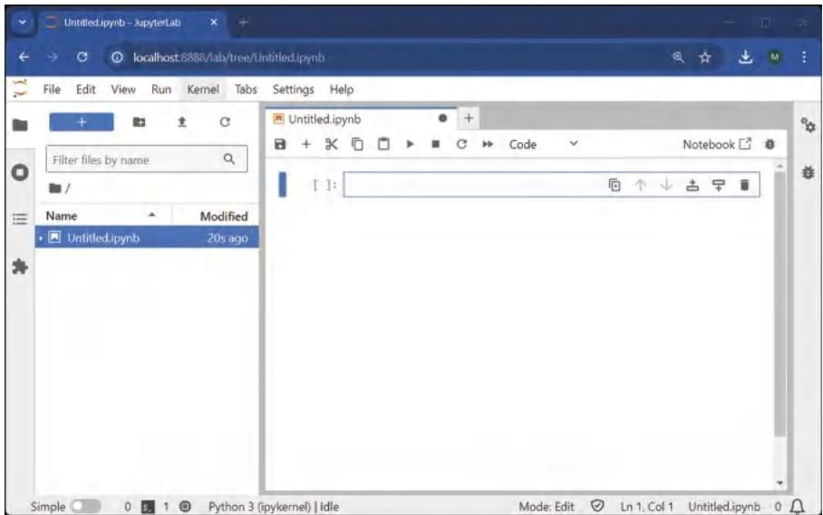  
Figure 9.1 A new notebook opened in JupyterLab with a Python 3 kernel.

[1]: 1 + 2   
[1]: 3   
[ ]:

Figure 9.2 Entering and executing a simple expression in a JupyterLab Code cell.

local computer and perform all computations on a remote computer at the other end of a network. This model is widely used and is one that you will likely encounter.

A notebook is a kind of executable document composed of a vertical stack of cells. Each cell has a type. A cell can be a Code cell, a Markdown cell, or a Raw cell. Source code is entered into Code cells. When the cell is executed, it sends its code to the server for execution and receives and displays results. Markdown cells are for entering formatted text. Raw cells are for raw notebook content that is not processed. We will be focused on Code cells.

Because we started the example notebook with a Python 3 kernel backend, all code entered into a Code cell will be executed by a Python 3 kernel running on your computer. Any returned results are displayed in the notebook right after the Code cell. Because the notebook runs in a browser, the display of results can be as simple as printed output, like what you might see in the console, and as sophisticated as an interactive 3D chart.

To run a Python source code snippet in a notebook, enter your Python snippet into a Code cell and press Shif $^ +$ Enter. Code cells accept any number of lines of Python. The Enter key is used for moving to the next line of code in a Code cell. You must press both Shift $^ +$ Enter to execute the code snippet and see the output. See the example in Figure 9.2.

One of the nice features of a notebook is that its cells may be deleted, inserted, modified, reordered, and re-executed, at any time and in any order. All the cell editing options are in the toolbar above the notebook cells, as well as within an active toolbar floated to the right. With this feature it is possible to write your programs incrementally. Previous steps can be modified without reproducing the entire program from the beginning. Clicking the double right triangle icon in the toolbar $\left( \left| \blacktriangleright \right. \right.$ will restart the Python kernel and rerun all your cells from top to bottom.

# 9.2 Scientific Plotting with Matplotlib

Good visualizations are a huge advantage when working with data. The Python ecosystem provides a wealth of mature libraries for generating publication-quality scientific plots and related visualizations. In this chapter we’ll introduce the granddaddy of them all, matplotlib.

The matplotlib library was created for science! John D. Hunter introduced it to the world in 2008 to solve a problem he had, which was to visualize electroencephalography (EEG) traces and to generate publication-quality plots [47]. With an admiration for the MATLAB plotting interface, he sought to emulate the best parts while maintaining a flexible target-independent underlying architecture. You will recognize these guiding principles within matplotlib to this day. Now under continuous development by the matplotlib developer community, a core principle in the matplotlib mission remains to “make common plots easy, and novel or complex visualizations possible.”

The matplotlib library can be installed from the Python Package Index like any other Python library.

python -m pip install matplotlib

# 9.2.1 The pyplot Submodule

matplotlib is made up of many submodules, but the place to start is with pyplot. The pyplot submodule is the fastest way to generate the most common plots. It is common to import just pyplot and to shorten its name to plt, using the following import statement.

```python
from matplotlib import pyplot as plt 
```

Once imported, the plt name may be used to access the pyplot module, which is known as the stateful matplotlib API. The pyplot module stores the state of your plot as you generate it. There is no need to create and assemble multiple plot objects and invoke their methods. Instead, pyplot lets you start generating plots quickly.

# 9.2.2 The pyplot.plot() function

To begin, let’s take a look at the plot(…) function of the pyplot submodule using JupyterLab. Refer to Figure 9.3. In cell [1] of the following notebook we import the pyplot and random

```python
[1]: # Import the random module and the matplotlib pyplot submodule from matplotlib import pyplot as plt import random 
```

```python
[2]: # Generate X and Y data  
Xs = list(range(100))  
Ys = [random.random() for in range(100)] 
```

```txt
[3]: plt.plot(Xs, Ys) 
```

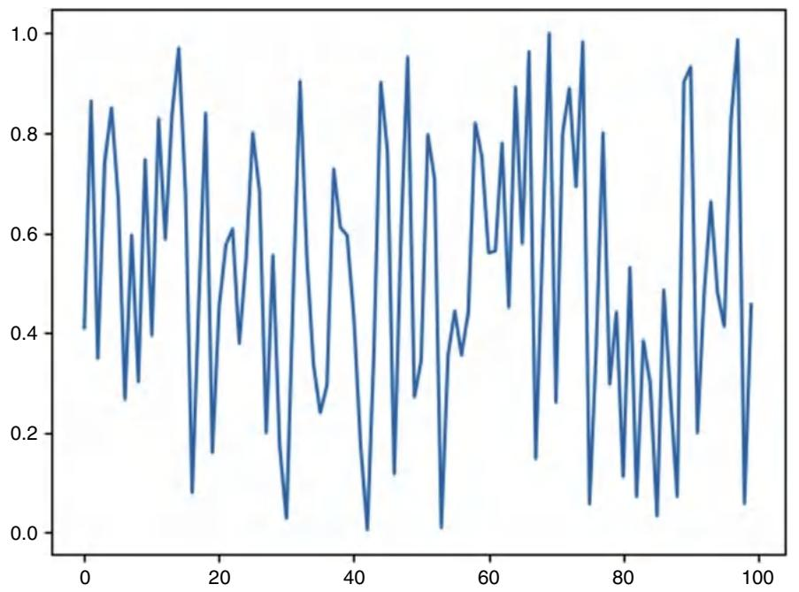  
Figure 9.3 Rendering a plot in JupyterLab with matplotlib’s pyplot.plot(…) function.

modules. In cell [2] we generate a sequence of x-values and an equal number of random y-values in the range [0.0, 1.0). The variable named “_” is valid, but generally used as a throwaway variable when the value assigned will not be used further. Finally in cell [3] we invoke the plot(…) function with the lists Xs and Ys, which generates a default x-y line chart and displays the results in the notebook following the last cell. This illustrates how easy it is to generate a reasonable default starting plot using a single matplotlib function.

# 9.2.3 Customizing a Plot

We can customize this plot further. Table 9.2 lists and describes several functions available from the matplotlib.pyplot submodule that can be used to enhance a default plot.

Optional keyword arguments may be passed to the plot(…) function to specify the style of a curve, including color, linestyle, linewidth, marker, and markersize. A more convenient way to set curve styling is to include a single optional format argument. The plot(…) function format argument is a single string with concatenated characters that specify the curve’s marker type, line style, and color.

```coffeescript
format = ['marker] [line] [color]' 
```

Marker style characters include “o” for circles, “s” for squares, $" + "$ for plusses, “x” for X’s, “*” for stars, “^” for upward pointing triangles, and “v” for downward pointing triangles. Line styles include “-” for a solid line, “--” for a dashed line, “:” for a dotted line, and “-.” for a dash-dot line. Line and marker color characters include “r” for red, “b” for blue”, “g” for green, “k” for black, “y” for yellow, “c” for cyan, and “m” for magenta. Table 9.3 lists several examples of format strings with descriptions that may be passed as arguments to the plot(…) function.

Table 9.2 Common functions of the matplotlib.pyplot submodule to customize a plot.   

<table><tr><td>pyplot functions</td><td>Description</td></tr><tr><td>plot(x, y, format, label=None, ...)</td><td>Plot y vs. x, using optional format and series label.</td></tr><tr><td>title淋巴1, ...)</td><td>Set the plot title to淋巴1.</td></tr><tr><td>xlabel淋巴1,...), ylabel淋巴1,...)</td><td>Set the x-axis and y-axis label to淋巴1.</td></tr><tr><td>xlim(bot, top),ylim(bot, top)</td><td>Gets the axis limits or turns off autoscaling on the x- or y-axis and sets the range limits to [bot, top].</td></tr><tr><td>xticks(ticks=None, labels=None, ...)</td><td rowspan="2">Gets or sets the tick locations and labels of the x-axis or y-axis.</td></tr><tr><td>yticks(ticks=None, labels=None, ...)</td></tr><tr><td>legend(...)</td><td>Place a legend on the plot.</td></tr><tr><td>gridvisible=True, ...)</td><td>Set or hide plot grid.</td></tr><tr><td>colorbar(...)</td><td>Add a color bar to the plot.</td></tr><tr><td>axis(...)</td><td>A convenience method for configuring axes.</td></tr><tr><td>text(x, y, s, ...)</td><td>Add the text s to the plot at coordinates x, y.</td></tr><tr><td>imshow(data, ...)</td><td>Display data as an image on a 2D regular raster.</td></tr><tr><td>subplots(nrows=1, ncols=1, ...)</td><td>Return a Figure and set of Axes objects.</td></tr><tr><td>savefig(fname, ...)</td><td>Save the figure to a file with name fname.</td></tr></table>

Table 9.3 Several examples of plot(…) function format string parameters.   

<table><tr><td>Format</td><td>Description</td></tr><tr><td>&quot;ro&quot;</td><td>Red circles with no line.</td></tr><tr><td>&quot;b^ - &quot;</td><td>Blue triangle-up markers with a solid line.</td></tr><tr><td>&quot;gv- - &quot;</td><td>Green triangle-down markers with a dashed line.</td></tr><tr><td>&quot;k+ : &quot;</td><td>Black plus markers with dotted line.</td></tr><tr><td>&quot;cx- . &quot;</td><td>Cyan X-markers with dash-dot line.</td></tr><tr><td>&quot;ms &quot;</td><td>Magenta square markers with no line.</td></tr><tr><td>&quot;y*&quot;</td><td>Yellow star markers with no line.</td></tr><tr><td>&quot;: &quot;</td><td>Dotted line with no marker.</td></tr></table>

# 9.2.4 Multiple Curves on a Single Plot

Multiple curves can be added to the same plot by repeatedly calling the plot(…) function or by adding multiple sets of arguments to the same plot(…) function. To draw a curve with a line having one color and markers having another color, call the plot(…) function once for the line only and a second time for the markers only.

Consider the example notebook in Figure 9.4, which generates a plot with two curves, each with different line styles, marker types, and colors. In addition to unique formats, data series are given a label, plot title and axis titles are set, the plot has gridlines and a legend is added.

Note that in the examples above we never saved a plot object in a variable of its own. That is what is meant when we say that the pyplot module is stateful. The module’s functions remember the state of the program, which includes the last plot that was generated, and applies all updates to that plot, automatically.

# 9.2.5 Additional Plot Types

The pyplot submodule includes many additional shorthand functions for generating a wide range of plots. Many of these functions are listed in Table 9.4. Each function has its own set of required and optional parameters. Refer to the matplotlib.pyplot submodule documentation for all details [48].

# 9.2.6 Multiple Axes on a Single Figure

The stateful matplotlib.pyplot submodule helps us get started creating a single figure with multiple subplots, but to do so we must leave behind the stateful module and move to the separate creation and management of multiple graphical objects.

The pyplot subplots(…) function lays out a number of plots in a rectangular arrangement and returns all created objects. The main object created is a Figure object, and the plots laid out on the Figure object are Axes objects. The subplots(…) function accepts nrows and ncols keyword arguments that define the size of the grid that lays out Axes objects, and then returns a tuple of two values. The first object returned in the tuple is the instance of the outer Figure object and the second is an array of Axes objects in the same arrangement. The methods of an Axes object closely match familiar functions in the pyplot submodule, with notable exceptions including the

[1]: # multiple Curves.py # Import the random module and the matplotlib pyplot submodule from matplotlib import pyplot as plt import random # Generate X and Y data Xs $=$ list(range(20)) Yls $=$ [random.random() for in range(20)] Y2s $=$ [random.random() for in range(20)] # Curve 1 has a red dashed line and black circle markers plt.plot(Xs,Yls,'r--',label $\coloneqq$ "Curve 1") plt.plot(Xs,Yls,'ko') # Curve 2 has a black dotted line and black x markers plt.plot(Xs,Y2s,'b:','label $\coloneqq$ "Curve 2") plt.plot(Xs,Y2s,'kx') # Add a plot title, x-axis title, y-axis title plt.title("Uniformly Distributed Random Numbers") plt.xlabel("Number Count") pltylabel("Random Number") # Add a gridlines and a legend plt.grid () pltlegend()

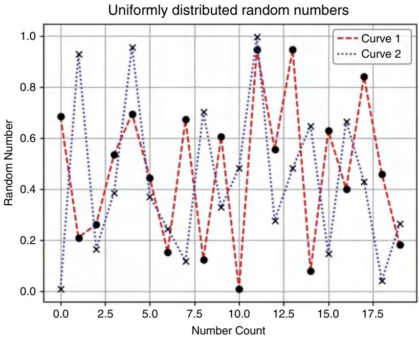  
Figure 9.4 Notebook with multiple formatted curves on a single plot.

Table 9.4 Several pyplot submodule functions that generate different types of plots.   

<table><tr><td>pyplot functions</td><td>Description</td></tr><tr><td>bar(x, heights, ...)</td><td>A bar plot of x with heights.</td></tr><tr><td>barh(y, widths, ...)</td><td>A horizontal bar plot of y with widths.</td></tr><tr><td>boxplot(x, ...)</td><td>A box and whisker plot of x data.</td></tr><tr><td>contour([x, y,] z,...)</td><td>Contour lines of z data with optional x and y coordinates.</td></tr><tr><td>contourf([x, y,] z,...)</td><td>Filled contour lines of z data with optional x and y coordinates.</td></tr><tr><td>errorbar(x, y, yerr, ...)</td><td>Plot y vs. x with attached errorbars having sizes yerr.</td></tr><tr><td>hist(x, bins=None,...)</td><td>Plot a histogram of bins at x.</td></tr><tr><td>hist2d(x, y, bins=10, ...)</td><td>Plot a 2D histogram of bins at x, y coordinates.</td></tr><tr><td>pcolormap(z, ...)</td><td>Plot a rectangular array of z mesh data as a range of colors.</td></tr><tr><td>pie(x, labels=None, ...)</td><td>A pie chart with x wedge sizes and labels.</td></tr><tr><td>polar(theta, r, ...)</td><td>A polar plot at theta angles with radii r.</td></tr><tr><td>scatter(x, y, ...)</td><td>A scatter plot of y vs. x.</td></tr><tr><td>stackplot(x, y1, y2, ...)</td><td>A stacked area plot of y1 and y2 at x.</td></tr></table>

set_title(…), set_xlabel(…) and set_ylabel(…) functions for setting Axes title and axis labels.

The source code of the notebook in Figure 9.5 generates a Figure with four Axes objects laid out in a $2 { \times } 2$ arrangement. All five objects are returned in a data structure that can be destructured and assigned to individual variables. Once we have the four Axes objects, we can invoke their methods to generate four different plot styles. Note the use of the set_title(…) method instead of the title(…) function to set Axes titles. The final step is to invoke the Figure object’s tight_ layout() method, which adjusts the padding between and around subplots in an attempt to prevent figure elements from overwriting one another.

# 9.2.7 Other Useful Functions

To save a Figure to an image file, both the Figure object and the pyplot submodule provide a method and function named savefig(filepath, …). This function takes a path for the file to be saved and several other parameters that set the properties of the saved image file. Saving an image is often necessary when assembling a final report.

The matplotlib module can be used just as easily without a notebook editor. In this case, to visualize the generated plot, both the Figure object and pyplot submodule provide a method and function named show(). This function opens a window and draws the plot in the window. When not using a notebook editor, make sure to invoke the show() method after a plot is generated.

# 9.2.8 Project – Plotting Weather Forecast

With the ability to generate plots, we can improve our weather_forecast.py program from Listing 8.7. In Listing 9.1 we added a new function named plot_temperature_forecast(…), which makes use of the pyplot module’s functions to generate a line plot. Temperature data is plotted against time in hours. Title and axis labels are added, as is a grid. Note that this program

[1]: # Import modules from matplotlib import pyplot as plt import random   
# Create a Figure and four Axes in a 2x2 arrangement fig，((ax1，ax2)，(ax3，ax4)) $=$ plt.subplot(nrows=2，ncols=2)   
#Create a bar plot on Axes 1 ax1.bar([1,2,3,4],[1,5,2,4]) ax1.set_title('Bar Plot')   
#Create a plot with error bars on Axes 2 ax2(errorbar([1,2,3,4]，[1,5,2,4]，[0.5,0.75,0.6,0.4]，capsize=3) ax2.set_title('Error Bars')   
#Create a pie chart on Axes 3 ax3Pie([0.1,0.2,0.3,0.4]，labels $\coloneqq$ ['A'，'B'，'C'，'D']) ax3.set_title('Pie Chart')   
#Create a scatter plot with red plusses on Axes 4 ax4scatter(list(range(20))，[random.random() for_in range(20)]， marker $\coloneqq$ ' $^+$ '，color $\coloneqq$ 'red') ax4.set_title('Scatter Plot')   
#Ensure labels do not overwrite other figure elements figtight.layout()

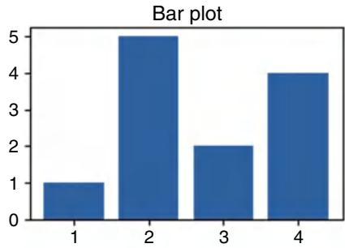

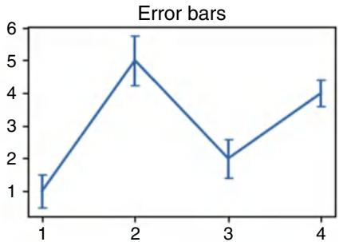

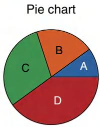

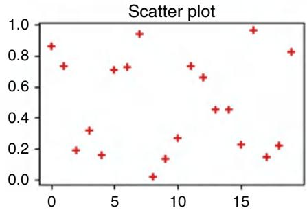  
Figure 9.5 Four axes objects, each with a different plot style, all drawn on a single figure.

was not executed in JupyterLab, so the final statement in the added function is plt.show(). This function opens a window to display the generated plot.

The program in Listing 9.1 was executed using the following command. See Figure 9.6 for the plot generated by the updated program.

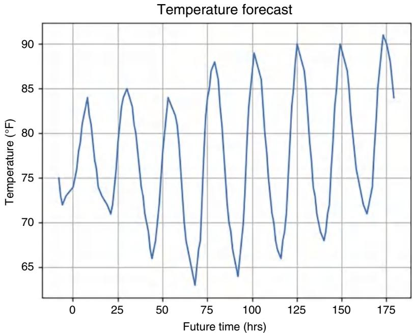  
Figure 9.6 Output plot generated by the updated weather_forecast.py program.

```txt
> python weather_forecast.py 40.2757 -74.7763 
```

Listing 9.1 Updated weather_forecast.py program with temperature plot.   
```python
# weather_forecast.py
# ...
# Fetch temperature forecast data and plot
def plot_temperature_forecast(data):
    hours = [pt[0] for pt in data]
    temps = [pt[1] for pt in data]
    plt.plot(hours, temps)
    plt.title('Temperature Forecast')
    pltxlabel('Future Time (hrs)')
    pltylabel('Temperature (°F)')
    plt.grid()
    plt.show()
# Fetch and plot forecast
if __name__ == '__main__':
    # Check command line arguments
    if len(sys.argv) < 3:
        print('Please enter latitude and longitude')
        sys.exit()
    # Convert latitude and longitude and get forecast data
    lat, lon = float(sys.argv[1]), float(sys.argv[2])
    data = get_temperature_forecast(lat, lon)
    if not data: 
```

Listing 9.1 (Continued)   
```python
sys.exit()   
# Plot data plot_temperature_forecast(data)   
# Print result   
# for point in data:   
# print(f'\{point[1]\}\*F in \{point[0]:.1f\} hours') 
```

# 9.2.9 Project – A Custom Microplate Heat Map

When a preconfigured matplotlib visualization doesn’t quite satisfy a requirement, it is possible to build a customized visualization with relative ease due to its modular design. In this project, we will build a custom heat map to visualize 96-well microplate data in an ${ 8 } { \times } 1 2$ layout. Measured values must be displayed in a rectangular grid corresponding to the microplate wells, and layout fill colors must reflect measurements for ease of observation and identification of outliers. Rows of the rectangular grid must be labeled with row letters and columns with column numbers. Finally, the visualization should have a title.

Among the various options in matplotlib, the pcolormap visualization is a good starting point. The shortcoming of an unmodified pcolormap is that its axes do not match the desired formatting. Figure 9.7 illustrates how a default pcolormap looks with an added color bar but no further modifications. The rectangular array and fill colors are a good starting point, but the visualization must be modified.

Fortunately, matplotlib provides an option to turn off axis rendering entirely. Once turned off, we can annotate the pcolormap visualization with custom text labels.

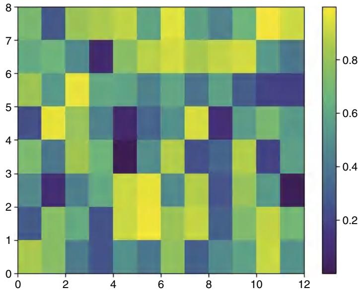  
Figure 9.7 A matplotlib pcolormap visualization with default axis formatting.

After importing the pyplot submodule, we use the subplots(…) function to create a new Figure and a single Axes object. Even though we are generating only a single visualization, we must get a reference to the Axes object because axis rendering can be turned off only by invoking the axis('off') method of that object.

```python
import matplotlib.pyplot as plt  
fig, ax = plt.subplot(nrows=1, ncols=1) 
```

Assuming the data variable holds the ${ 8 } { \times } { 1 2 }$ array of measured data and the title variable is the title for the visualization, we can generate an initial pcolormesh object, turn off axis rendering, and add a title and a color bar.

```txt
heapmap = ax.pcolormesh(data)
ax(axis('off'))
ax.set_title(title)
fig.colorbar(heap) 
```

To add the desired text labels to the unannotated pcolormesh, we use four for-in statements. The first two are nested and used to label each well in the visualization with data values. Note how each measurement is formatted to include only two decimal digits, the font is set to 'x-small' and the horizontal and vertical alignment is set so the text is centered on each grid location.

Label wells with data values   
for r in range(8): for c in range(12): ax.text(c+0.5,r+0.5,f{'data[r][c]:.2f} '， fontsize $\equiv$ 'x-small', horizontalalignment $\equiv$ 'center' verticalalignment $=$ 'center')

The last two for-in statements are not nested. One labels the rows of the grid using the built-in chr(…) function to convert a number to a row label, and the second converts an integer to a string, which is used to label columns.

```python
# Label rows with letter  
for r in range(8):  
    lbl = chr(r+65)  
ax.text(-0.25, 7-r+0.5, lbl, horizontalalignment='center', verticalalignment='center')  
# Label columns with number  
for c in range(12):  
    lbl = str(c+1)  
ax.text(c+0.5, -0.25, lbl, horizontalalignment='center', verticalalignment='center') 
```

These techniques are brought together into a function named microplate_heatmap(…). This function is tested in the JupyterLab notebook of Figure 9.8 with the custom heatmap generated in Figure 9.9. Note how the default axes are not drawn, but all the additional text annotations have been drawn over each grid location as well as on each axis. The final generated heatmap image is saved to a file using the savefig(…) pyplot module function.

[1]:

import matplotlib.pyplot as plt   
# Generate a heat map for an 8x12 array of microplate data   
def microplate_heatmap(data, title): # Create single Axes Figure fig, ax $=$ plt.subplot(nrows=1, ncols=1) # Draw color mesh with data and default color map heatmap $=$ ax.pcolomesh(data) # Turn off axes, set title, add colorbar ax-axis('off') ax.set_title(title) fig.colorbar(heatmap) # Label wells with data values for r in range(8): for c in range(12): ax.text $(c + 0.5$ , $r + 0.5$ , f' {data[r] [c]:.2f} ' fontsize $\equiv$ 'x-small', horizontalalignment $\equiv$ 'center', verticalalignment $\equiv$ 'center') # Label rows with letter for r in range(8): lbl $=$ chr(r+65) ax.text(-0.25,7-r+0.5,lbl, horizontalalignment $\equiv$ 'center', verticalalignment $\equiv$ 'center') # Label columns with number for c in range(12): lbl $=$ str(c+1) ax.text $(c + 0.5$ , -0.25,lbl, horizontalalignment $\equiv$ 'center', verticalalignment $\equiv$ 'center') # Return final figure return fig

[2]:

Generate random data and plot heatmap from random import random data $=$ [[random() for col in range(12)] for row in range(8)] fig $=$ microplate_heatmap(data, "Plate A0123456") plt.savefig('heat1.png')

Figure 9.8 Notebook demonstrating the heat_map(…) function in JupyterLab.

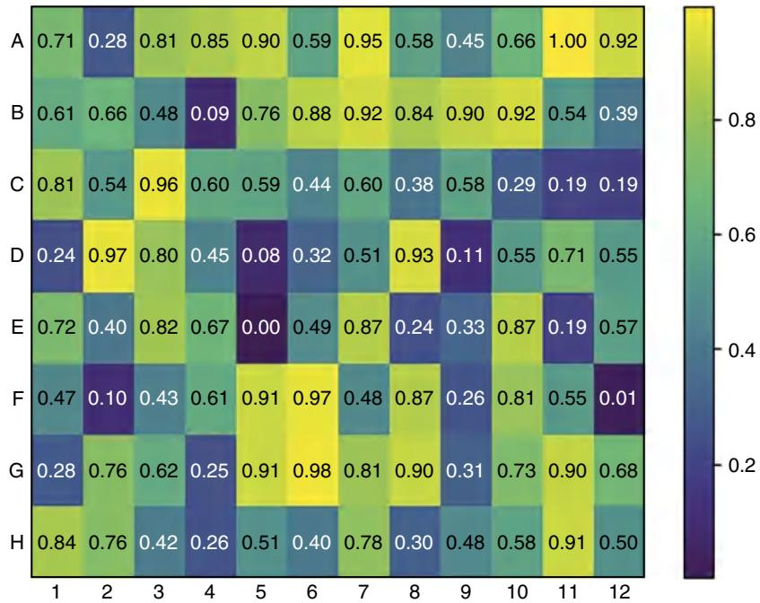  
Plate A0123456   
Figure 9.9 Custom heatmap illustration.

# 9.2.10 Other Scientific Plotting Libraries

While matplotlib continues to be a dominant library for performing scientific plotting and visualizations using Python, many additional scientific plotting libraries of note have become available. Two additional libraries worth investigating are Seaborn and Plotly.

Seaborn [49] is built on the matplotlib core and is designed to provide an attractive, higher-level interface for creating statistical graphics in Python. Seaborn is more focused on visualizations starting with the entire data set. Unlike functions in matplotlib which often receive separate parameters with different data sets to be visualized together, Seaborn functions receive the entire data set as a single parameter. Seaborn’s functions use the organization of the data in the data set to deduce the relationships of the data set components, perform statistical aggregations where necessary, and generate statistical visualizations.

Plotly [50] is another powerful scientific visualization library that is especially useful when interactive visualizations are desired. Plotly is available for several programming languages, including Python. Visualizations are rendered in a browser, including JupyterLab. Plotly visualizations react to the mouse in a number of ways. Hovering over any point, bar, bubble, or other marker on a graph usually reveals all values associated with its rendering. In 3D visualizations, the mouse pointer is used to rotate the graph to different viewpoints, and the mouse wheel will zoom the graph in and out at the current viewpoint. This can be a huge benefit when trying to fully appreciate the nature of a multidimensional scientific data set.

# 9.3 NumPy – Numerical Python

One data structure that Python lacks natively is a classic array of uniform data types. In native Python we have a list, and a list of lists, but not a uniformly typed and optimized array. NumPy, which is short for Numerical Python, fills this gap by providing an array data structure to Python [51]. Specifically, NumPy gives Python programmers the ability to create a new object called an ndarray (pronounced N-D array) which is an “N-dimensional” array.

# 9.3.1 Creating ndarray Objects

You may create 1-dimensional ndarray objects (similar to uniformly typed lists), 2-dimensional ndarray objects (similar to a matrix of numbers), 3-dimensional ndarray objects (similar to a Rubik’s Cube) and even structures in higher dimensions. Table 9.5 lists several functions in the numpy module, including functions for creating new ndarray objects.

The type of values in an ndarray must be uniform across all elements. A uniform type, and thus a constant element storage size in bytes, allows element location in memory to be computed very quickly. In spite of the uniform type constraint, NumPy permits a wide range of type options, from 16-, 32-, 64-, and 128-bit floating-point numbers to 8-, 16-, 32-, and 64-bit integers. An ndarray can hold Booleans, complex numbers, and strings of fixed size. Numeric types can have signs or be unsigned. The default floating-point type is float64, a 64-bit floating-point number, and the default integer type is int32, a 32-bit integer.

# 9.3.2 Working with ndarray Objects

Once created, the ndarray object supports a range of properties and methods. In fact, the ndarray object implements nearly every possible operation on one or multiple arrays that you might ever need. Table 9.6 lists and describes several of these.

Table 9.5 Common NumPy functions, including ndarray object creation functions.   

<table><tr><td>ndarray constructors</td><td>Description</td></tr><tr><td>ndarray(size, dtype=None, ...)</td><td>Returns an ndarray object of size tuple. Default dtype is float64.</td></tr><tr><td>zeros(size, dtype=None, ...)</td><td>Returns an ndarray object of size tuple initialized with 0&#x27;s. Default dtype is float64.</td></tr><tr><td>ones(size, dtype=None, ...)</td><td>Returns an ndarray object of size tuple initialized with 1&#x27;s. Default dtype is float64.</td></tr><tr><td>identity(n, dtype=None, ...)</td><td>Returns a 2D ndarray with n rows and 1&#x27;s on the diagonal. Default dtype is float.</td></tr><tr><td>array(a, dtype=None, ...)</td><td>a is an array-like structure. dtype is inferred if omitted.</td></tr><tr><td>loadtxt(file, delimiter=[&#x27;&#x27;, ])</td><td>Return an ndarray object initialized by reading data from a file.</td></tr><tr><td>linspace(start, stop, num=50, ...)</td><td>Returns a 1D ndarray of num evenly spaced numbers over the interval from start to stop.</td></tr><tr><td>copy( arr )</td><td>Returns a copy of the ndarray.</td></tr><tr><td>sum( arr, axis number )</td><td>Sums the elements of an ndarray or along a given axis.</td></tr></table>

Table 9.6 Common properties, methods, and operators of the ndarray object.   

<table><tr><td>ndarray properties, methods, and operators</td><td>Description</td></tr><tr><td>dtype</td><td>Data type of elements stored in ndarray.</td></tr><tr><td>ndim</td><td>Number of dimensions of an array.</td></tr><tr><td>shape</td><td>Dimensions and extents.</td></tr><tr><td>T</td><td>View of transposed array.</td></tr><tr><td>base</td><td>None if the original ndarray, or a reference to the original array if a view.</td></tr><tr><td>dot( arr2 )</td><td>Perform dot-product of arr and arr2.</td></tr><tr><td>copy()</td><td>Return a copy of the ndarray.</td></tr><tr><td>sum(axis=None)</td><td>Compute sum of all array elements, or along an axis.</td></tr><tr><td>mean(axis=None)</td><td>Compute ndarray mean, standard deviation, and variance of the entire ndarray or along an axis.</td></tr><tr><td>std(axis=None)</td><td></td></tr><tr><td>var(axis=None)</td><td></td></tr><tr><td>min(axis=None)</td><td>Return minimum and maximum values of the entire ndarray or along an axis.</td></tr><tr><td>max(axis=None)</td><td></td></tr><tr><td>cumsum(axis=None)</td><td>Compute cumulative sum and product of the entire ndarray or along an axis.</td></tr><tr><td>cumprod(axis=None)</td><td></td></tr><tr><td>arr1 + arr2</td><td>Add corresponding elements in arr1 and arr2.</td></tr><tr><td>arr1 - arr2</td><td>Subtract elements in arr2 from arr1.</td></tr><tr><td>arr1 * arr2</td><td>Multiply array elements in arr1 and arr2.</td></tr><tr><td>arr1 @ arr2</td><td>Perform matrix multiplication of arr1 and arr2.</td></tr><tr><td>arr1 / arr2</td><td>Divide or floor divide (truncating the remainder) of arr1 and arr2.</td></tr><tr><td>arr1 // arr2</td><td></td></tr><tr><td>arr1 ** arr2</td><td>Raise elements in arr1 to powers indicated in arr2.</td></tr><tr><td>arr1 % arr2</td><td>Element-wise modulus (remainder of division) of arr1 with arr2</td></tr><tr><td>arr1 &gt; arr2</td><td>Perform element-wise comparison between arr1 and arr2, yielding Boolean array (equivalent to infix operators&gt;, &gt;=, &lt;=, ==, !=).</td></tr><tr><td>arr1 &gt;= arr2</td><td></td></tr><tr><td>arr1 &lt; arr2</td><td></td></tr><tr><td>arr1 &lt;= arr2</td><td></td></tr><tr><td>arr1 == arr2</td><td></td></tr><tr><td>arr1 != arr2</td><td></td></tr></table>

Individual elements in an ndarray can be accessed using multiple indexes passed between square brackets and separated by commas. An ndarray can be sliced like a list using the slice operator (:), only the operation is extended to multiple dimensions.

# 9.3.3 Accessing and Updating ndarray Elements

The numpy module is frequently imported with the shortened name “np.” In the notebook of Figure 9.10 we use the same shorthand, create a new 2D array of integers using the array(…) function, and initialize it with a list of lists. Note how the array(…) method infers the type

```python
[1]: import numpy as np arr = np.array([[1, 2, 3, 4], [5, 6, 7, 8], [9, 10, 11, 13]])
arrdtype
dtype('int32') 
```

```txt
[2]: arr[2,3] 13 
```

```txt
[3]: arr[2,3] = 12 arr array([[1, 2, 3, 4], [5, 6, 7, 8], [9, 10, 11, 12]) 
```

Figure 9.10 Creating and accessing the elements of an ndarray.

int32 from the data in the list of lists used for initialization. Individual items are accessible using a comma-separated sequence of integer indexes. Because our example is a 2D array, we need two indexes to access a single item in the array.

The slice operator can be used to narrow down the view on an ndarray in an individual dimension or in multiple dimensions all at once. But note that what is returned is only a view on the original ndarray, not a copy. Changing a value in the view changes the original array. The notebook in Figure 9.11 has a demonstration.

Get a view on the first row, the third column, and the lower right $2 { \times } 2$ subarray using the “:” operator as appropriate. The lower right $2 { \times } 2$ subarray is assigned to the variable sub. The element

```lisp
[1]: arr[0,:] array([1,2,3,4]) 
```

```javascript
[2]: arr(:,2] array([3，7，11])
```

```txt
[3]: arr[1:,2:] array([[7,8],[11，12]])
```

```txt
[4]: sub = arr[1:,2:]  
sub  
array([[7,8], [11,12]]) 
```

```txt
[5]: sub [1, 1] 12 
```

```txt
[6]: sub[1,1] = 13  
sub  
array([[7,8], [11,13]]) 
```

```txt
[7]: arr array([[1, 2, 3, 4], [5, 6, 7, 8], [9, 10, 11, 13]]) 
```

Figure 9.11 An ndarray slice is a view on the original data structure.

at index [1,1] is assigned to a new value, which changes the array referenced by sub. Because sub is a view on the original arr array, the corresponding value in the original array is changed as well. If this is not the intended behavior, make sure to copy the ndarray before operating on it using the copy() method.

# 9.3.4 Broadcasting

When two arrays are combined using an operator but the dimensions of the two arrays are not compatible, the smaller dimension is stretched automatically to make the arrays compatible. This process is called broadcasting, and it applies equally when one of the two operands is a scalar.

When operating on an array and a scalar, the scalar is expanded into an array of compatible size and applied element by element. This automatic broadcast step lets us perform all operations with an array and a scalar as operands without the need to perform any special array creation or expansion. Refer to the notebook in Figure 9.12 for an example.

# 9.4 pandas DataFrame

Another data structure missing from Python is a table, similar to the kind of table you might find in a spreadsheet or relational database. The pandas Python library [36] provides a solution with the addition of another new data structure called a DataFrame. Along with the DataFrame object, pandas defines other objects including the Series, which models a single column in the DataFrame.

DataFrames differ from NumPy arrays in several critical ways. DataFrames are column-oriented data structures in which there is a single data type for all elements within a column, but data types of elements between columns may differ. As you’ll see, when accessing a single column in

```txt
[1]: arr array([[1, 2, 3, 4], [5, 6, 7, 8], [9, 10, 11, 13]]) 
```

```txt
[2]: arr * 2  
array([[2, 4, 6, 8], [10, 12, 14, 16], [18, 20, 22, 26]]) 
```

```typescript
[3]: arr/2 array([0.5，1.，1.5，2.][2.5，3.，3.5，4.][4.5，5.，5.5，6.5])
```

```python
[4]: arr // 2  
array([[0, 1, 1, 2], [2, 3, 3, 4], [4, 5, 5, 6]], dtype=int32) 
```

```txt
[5]: arr % 2  
array([[1, 0, 1, 0], [1, 0, 1, 0], [1, 0, 1, 1]], dtype=int32) 
```

Figure 9.12 An example of broadcasting a scalar over all elements of an ndarray.

a DataFrame, a Series object is returned. In fact, it is convenient to think of a DataFrame as a collection of Series objects that are managed together. For example, sorting a DataFrame on one column will cause all others to rearrange to follow the same reordering.

Each column of data in a DataFrame has a unique label, a kind of column title. Similarly, each row in a DataFrame may also be assigned labels as part of the DataFrame’s index. Rows and columns in a DataFrame may be accessed using one or more indexes or one or more names.

DataFrames are very flexible. They can be created, updated, filtered, sliced, indexed, and more. This powerful feature is at the heart of what makes the pandas DataFrame so powerful.

# 9.4.1 Creating and Inspecting DataFrames

Another way to think of the structure of a DataFrame is as a dictionary of uniformly typed lists. The keys in the dictionary are column titles and the lists are the elements in each column. While this is a useful model, it would be very difficult to manage the lists in such a dictionary when working with data from a single row. Any modification such as deleting, inserting, or sorting rows would require the same operation to be performed over all columns. Fortunately, the DataFrame does the work for us in an optimized fashion.

Still, the dictionary of lists model is useful for initializing a data set before passing it to a DataFrame constructor function as its initialization data, with the result being a new DataFrame object. Other ways to create a DataFrame is to read data from a formatted file. Table 9.7 lists several

Table 9.7 Several pandas functions to read and write a DataFrame to/from a formatted file.   

<table><tr><td>Function</td><td>Description</td></tr><tr><td>read_table(filepath, ...)</td><td>Read general delimited file.</td></tr><tr><td>read_csv(filepath, ...)</td><td>Read comma-delimited file.</td></tr><tr><td>read_fwf(filepath, ...)</td><td>Read fixed-width file.</td></tr><tr><td>read_excel(filepath, ...)</td><td>Read data from an Excel file.</td></tr><tr><td>read_json(filepath, ...)</td><td>Read data from a file or string that is JSON formatted.</td></tr><tr><td>read_html(filepath, ...)</td><td>Read HTML table data.</td></tr><tr><td>read_xml(filepath, ...)</td><td>Read XML data.</td></tr><tr><td>read_hdf(filepath, ...)</td><td>Read data from an HDF store.</td></tr><tr><td>read_parquet(filepath, ...)</td><td>Read a parquet object from a file.</td></tr><tr><td>read_sas(filepath, ...)</td><td>Read data from a SAS file.</td></tr><tr><td>read_spss(filepath, ...)</td><td>Read data from an SPSS file.</td></tr><tr><td>read_stata(filepath, ...)</td><td>Read data from a STATA file.</td></tr><tr><td>to_csv(filepath, ...)</td><td>Write data to a comma-delimited file.</td></tr><tr><td>to_excel(filepath, ...)</td><td>Write data to an Excel worksheet in a file.</td></tr><tr><td>to_json(filepath, ...)</td><td>Write data to a JSON-formatted file.</td></tr><tr><td>to_html(filepath, ...)</td><td>Render data in an HTML format.</td></tr><tr><td>to_xml(filepath, ...)</td><td>Write data to an XML-formatted file.</td></tr><tr><td>to_parquet(filepath, ...)</td><td>Write data to a file using a binary parquet format.</td></tr><tr><td>to_stata(filepath, ...)</td><td>Write data to a file in STATA format.</td></tr></table>

pandas functions to load data into a DataFrame from a formatted file and to write data back to a formatted file.

Let’s create a DataFrame initialized with a dictionary of lists. The DataFrame is to have three columns labeled sample, group, and volume, which will be keys in the initialization dictionary. First, we’ll build the dictionary with some randomly generated data, and then create the DataFrame. Column data is generated using list comprehensions and random module functions. The “sample” column contains strings "s01" through $" \mathtt { S 4 0 " }$ . The group column contains 40 randomly selected integers in [1, 4], and the volume column contains 40 random floats in [0.0, 1.0).

Displaying the DataFrame df variable in JupyterLab renders the data as a formatted table. Once created, the DataFrame can be inspected and filtered using properties and methods described in Table 9.8 and the pandas module functions in Table 9.9. Figure 9.13 demonstrates these concepts in several cells of a JupyterLab notebook.

# 9.4.2 Filtering DataFrames

Filtering a DataFrame down to rows and/or columns of interest is a fundamental capability and frequent need when working with data in JupyterLab. There are quite a few ways to filter a DataFrame. The notebooks in Figures 9.14, 9.15, and 9.16 demonstrate several examples using JupyterLab. Comments in the code cells of each notebook describe the filtering method and syntax.

Pay close attention to the last example in Figure 9.16. A Boolean list is generated using the special conjunction operator (&). Corresponding conditions in the conjunction expression must be True for the conjunction to be True and the corresponding rows are selected by the Boolean

Table 9.8 Several DataFrame properties and methods.   

<table><tr><td>DataFrame properties and methods</td><td>Description</td></tr><tr><td>columns</td><td>Return column titles.</td></tr><tr><td>dtypes</td><td>Return data types of all columns.</td></tr><tr><td>shape</td><td>Return the number of rows and columns as a two-tuple.</td></tr><tr><td>info()</td><td>Print a summary of the DataFrame.</td></tr><tr><td>head(n=5)</td><td>Return the top n rows.</td></tr><tr><td>tail(n=5)</td><td>Return the last n rows.</td></tr><tr><td>mean(axis=0, ...)</td><td>Compute the mean along the given axis.</td></tr><tr><td>std(axis=0, ...)</td><td>Compute the standard deviation along the given axis.</td></tr><tr><td>copy(deep=True)</td><td>Return a copy of the DataFrame.</td></tr><tr><td>transpose(...)</td><td>Reflect the DataFrame along its main diagonal by replacing rows with columns and columns with rows.</td></tr><tr><td>at[]</td><td>Access a single table element at a row, column label pair.</td></tr><tr><td>iat[]</td><td>Access a single table element at a row, column index pair.</td></tr><tr><td>loc[]</td><td>Access one or more rows and columns by label(s).</td></tr><tr><td>iloc[]</td><td>Access one or more rows and columns by integer position(s).</td></tr><tr><td>describe()</td><td>Compute descriptive statistics on all numeric columns. Includes: count, mean, standard deviation, minimum, maximum, and quartiles.</td></tr></table>

Table 9.9 Several useful pandas module functions.   

<table><tr><td>pandas function</td><td>Description</td></tr><tr><td>concat(dfs, axis=0, ...)</td><td>Concatenate DataFrames in the sequence dfs along an axis.</td></tr><tr><td>merge(left, right, how=&#x27;inner&#x27;, on=col)</td><td>Merge left DataFrame with right DataFrame by matching the col column, using the method given by how.</td></tr></table>

[1]:

```python
# Import modules  
import pandas as pd  
import random  
# Build and create init dictionary and DataFrame  
init = {'sample': [f's{i+1:02d}' for i in range(8)], 'group': [random.randint(1,4) for _ in range(8)], 'volume': [random.random() for _ in range(8)]}  
df = pd.DataFrame(init)  
df 
```

<table><tr><td></td><td>sample</td><td>group</td><td>volume</td></tr><tr><td>0</td><td>s01</td><td>2</td><td>0.550785</td></tr><tr><td>1</td><td>s02</td><td>2</td><td>0.191744</td></tr><tr><td>2</td><td>s03</td><td>3</td><td>0.717148</td></tr><tr><td>3</td><td>s04</td><td>4</td><td>0.540974</td></tr><tr><td>4</td><td>s05</td><td>1</td><td>0.549631</td></tr><tr><td>5</td><td>s06</td><td>1</td><td>0.397135</td></tr><tr><td>6</td><td>s07</td><td>4</td><td>0.861022</td></tr><tr><td>7</td><td>s08</td><td>3</td><td>0.231922</td></tr></table>

[2]:

```python
df.shape, df.columns  
((8, 3), Index(['sample', 'group', 'volume'], dtype='object')) 
```

[3]:

df.info()   
RangeIndex:8 entries,0 to 7   
Data columns (total 3 columns): # Column Non-Null Count Dtype 0 sample 8 non-null object 1 group 8 non-null int64 2 volume 8 non-null float64 dtypes:float64(1)，int64(1)，object(1) memory usage: $324.0+$ bytes

Figure 9.13 Initializing a DataFrame with a dictionary of lists.

```txt
[4]: # Select a column using square brackets and column label df['sample'] 0 s01 1 s02 2 s03 3 s04 4 s05 5 s06 6 s07 7 s08 Name: sample, dtype: object 
```

```txt
[5]: # Select a column and compute descriptive statistics. df['volume'].describe() count 8.000000 mean 0.505045 std 0.227243 min 0.191744 25% 0.355831 50% 0.545303 75% 0.592375 max 0.861022 Name: volume, dtype: float64 
```

```python
[6]: # Select multiple columns using square brackets and a list of column labels df['sample','volume'] 
```

<table><tr><td></td><td>sample</td><td>volume</td></tr><tr><td>0</td><td>s01</td><td>0.550785</td></tr><tr><td>1</td><td>s02</td><td>0.191744</td></tr><tr><td>2</td><td>s03</td><td>0.717148</td></tr><tr><td>3</td><td>s04</td><td>0.540974</td></tr><tr><td>4</td><td>s05</td><td>0.549631</td></tr><tr><td>5</td><td>s06</td><td>0.397135</td></tr><tr><td>6</td><td>s07</td><td>0.861022</td></tr><tr><td>7</td><td>s08</td><td>0.231922</td></tr></table>

Figure 9.14 Examples of filtering a DataFrame using column title.

index. Note that the two broadcast conditions are surrounded by parentheses. This is necessary for Python to parse the conjunction expression correctly. Another option is to use the disjunction operator (|) to construct more complex conditions that select rows from a DataTable.

# 9.4.3 Project – A Screening Experiment

The pandas DataFrame is ideal for setting up and analyzing screening data. High throughput screens are experiments designed to perform a large number of tests, looking for promising substances or conditions to act as starting points for subsequent analyses performed in greater detail.

[7]: # Select a single row using .loc[] method and a row index, 0-based df.loc[3]

sample s04

group 1

volume 0.835765

Name: 3, dtype: object

[8]: # Select multiple rows using .iloc[] with index slice notation. df.iloc[3:6]

<table><tr><td></td><td>sample</td><td>group</td><td>volume</td></tr><tr><td>3</td><td>s04</td><td>4</td><td>0.540974</td></tr><tr><td>4</td><td>s05</td><td>1</td><td>0.549631</td></tr><tr><td>5</td><td>s06</td><td>1</td><td>0.397135</td></tr></table>

Figure 9.15 Examples of filtering a DataFrame using row index.

[9]: # Select rows by passing a list of Booleans to .loc[] bool _idx $=$ [True, False, True, False, True, False, True, False] df.loc[bool _idx]

<table><tr><td></td><td>sample</td><td>group</td><td>volume</td></tr><tr><td>0</td><td>s01</td><td>2</td><td>0.550785</td></tr><tr><td>2</td><td>s03</td><td>3</td><td>0.717148</td></tr><tr><td>4</td><td>s05</td><td>1</td><td>0.549631</td></tr><tr><td>6</td><td>s07</td><td>4</td><td>0.861022</td></tr></table>

[10]: # Combine dynamic Boolean list generation and Boolean indexing df[ df['volume'] >= 0.5

<table><tr><td></td><td>sample</td><td>group</td><td>volume</td></tr><tr><td>0</td><td>s01</td><td>2</td><td>0.550785</td></tr><tr><td>2</td><td>s03</td><td>3</td><td>0.717148</td></tr><tr><td>3</td><td>s04</td><td>4</td><td>0.540974</td></tr><tr><td>4</td><td>s05</td><td>1</td><td>0.549631</td></tr><tr><td>6</td><td>s07</td><td>4</td><td>0.861022</td></tr></table>

[11]: # Combine Boolean list conditions with conjunction operator & df[ (df['volume'] >= 0.5) & (df['group'] $= = ~ 4$ )]

<table><tr><td></td><td>sample</td><td>group</td><td>volume</td></tr><tr><td>3</td><td>s04</td><td>4</td><td>0.540974</td></tr><tr><td>6</td><td>s07</td><td>4</td><td>0.861022</td></tr></table>

Figure 9.16 Examples of filtering a DataFrame with Boolean indexing.

Table 9.10 Source rack map for all substances used in screening experiment.   

<table><tr><td></td><td>1</td><td>2</td><td>3</td><td>4</td><td>5</td><td>6</td><td>7</td><td>8</td></tr><tr><td>A</td><td>T01</td><td>T02</td><td>T03</td><td>T04</td><td>T05</td><td></td><td>N01</td><td>P01</td></tr><tr><td>B</td><td>T06</td><td>T07</td><td>T08</td><td>T09</td><td>T10</td><td></td><td>N02</td><td>P02</td></tr><tr><td>C</td><td>T11</td><td>T12</td><td>T13</td><td>T14</td><td>T15</td><td></td><td>N03</td><td>P03</td></tr><tr><td>D</td><td>T16</td><td>T17</td><td>T18</td><td>T19</td><td>T20</td><td></td><td>N04</td><td>P04</td></tr><tr><td>E</td><td>T21</td><td>T22</td><td>T23</td><td>T24</td><td>T25</td><td></td><td></td><td></td></tr><tr><td>F</td><td>T26</td><td>T27</td><td>T28</td><td>T29</td><td>T30</td><td></td><td></td><td></td></tr><tr><td>G</td><td>T31</td><td>T32</td><td>T33</td><td>T34</td><td>T35</td><td></td><td></td><td></td></tr><tr><td>H</td><td>T36</td><td>T37</td><td>T38</td><td>T39</td><td>T40</td><td></td><td></td><td></td></tr></table>

In this project we assume that we want to screen a small set of 40 substances to determine if any has a sufficiently large inhibitory impact on some reaction. All tests are to be performed in duplicate, along with four negative and four positive controls.

In our hypothetical experiment, test substances have IDs T01 through T40, negative controls have IDs N01 through N04, and positive controls P01 through P04. The source for each substance is a tube in a rack assumed to be laid out in an $8 { \times } 8$ mapping, as illustrated by Table 9.10.

This mapping is saved in a CSV file named source_map.csv. The file has three columns: the source rack tube location using A01-notation (src), the substance ID (ID), and the type of the substance at the location, which is “T” for test substance, “N” for negative control, and “P” for positive control. Listing 9.2 provides a snapshot of the file.

Listing 9.2 Several lines from the source_map.csv file documenting source tube mapping.   
```csv
src,ID,type   
A01,T01,T   
A02,T02,T   
A03,T03,T   
A04,T04,T   
A05,T05,T   
B08,P02,P   
C07,N03,N   
C08,P03,P   
D07,N04,N   
D08,P04,P
```

To manage all experiments, we want to build a single DataFrame to hold all data associated with every experiment to be performed. We start by loading the data from the source_map.csv file using the DataFrame’s read_csv(…) method. The DataFrame read from the file has the columns “src,” “ID,” and “type.”

```txt
Read Source Map into DataFrame  
sdf = pd.read_csv('source_map.csv') 
```

Because we want to run all tests in duplicate, we initialize a new DataFrame by concatenating the source_map DataFrame to itself once, essentially making a duplicate of everything in the

source rack. The concat(…) function of the pandas module is used to accomplish this (Table 9.9). We are concatenating along axis 0 by default, which is along the DataFrame rows. By adding the ignore_index $: =$ True keyword argument when invoking the function, the new DataFrame ignores the index in the file and defines new sequential row indexes.

```txt
Duplicate source map using concat() method df = pd.concat([sdf, sdf], ignore_index=True) 
```

For convenience, we set the transfer volume from each tube in the source rack to each well in the destination plate to be $1 0 0 \mu \mathrm { L }$ . The list of transfer volumes is built easily by multiplying a list and assigning the list to the 'vol' column of the DataFrame. This appends the list of data as a new column.

```txt
Add transfer volumes to 'vol' column. 100 mL each.  
df['vol'] = [100] * 96 
```

A column of destination plate locations is required, which defines where each test will be performed. The plate locations for each test must be randomized to minimize the impact of edge effects or other systematic errors, which we can do using the shuffle(…) function of Python’s random module. We start by generating all 96 well labels in the test plate and assign the list to the dests variable. The random.shuffle(…) function handles the randomization of plate well labels. Because the function works in place, it is not necessary to assign the result to a variable. Like the 'vol' column, once the dests list is generated and shuffled, the 'dest' column is added to the DataFrame by assignment.

```txt
Generate well labels, shuffle randomly. Add to 'dest' column.  
dests = [f{'chr(i//12+65)}{i%12+1:02d}' for i in range(96)]  
randomshuffle(dests)  
df['dest'] = dests 
```

The resulting DataFrame is saved to a file named experiment.csv for further processing using the DataFrame’s to_csv(…) method. The keyword argument index $: =$ False is added to suppress the index of the DataFrame from being written to the file. Listing 9.3 includes several lines from the results experiment.csv file.

# Listing 9.3 Several lines from the experiment.csv file containing test data.

```txt
Save entire experiment DataFrame to file for use in future df.to_csv('experiment.csv', index=False)  
src, ID, type, dest, vol  
A01, T01, T, G01, 100  
A02, T02, T, F04, 100  
A03, T03, T, H12, 100  
A04, T04, T, E04, 100  
A05, T05, T, C01, 100  
...  
B08, P02, P, F12, 100  
C07, N03, N, A05, 100  
C08, P03, P, F01, 100  
D07, N04, N, C10, 100  
D08, P04, P, D06, 100 
```

All steps for building the initial experiment DataFrame are collected into a function named build_duplicate_experiment(…) function, given in Listing 9.4.

Listing 9.4 Source code for the build_duplicate_experiment(…) function.   
Build initial experiment DataFrame with duplicate tests and save def buildDuplicateexoperiment(sfile $\equiv$ 'source_map.csv'): # Read Source Map into DataFrame sdf $=$ pd.read_csv(sfile) # Generate DataFrame with randomized plate layout for testing # Duplicate source map using concat() method df $=$ pd.concat([sdf,sdf],ignore_index $\equiv$ True) # Add transfer volumes to 'vol' column. $100~\mathrm{mL}$ each. df['vol'] $= [100]*96$ # Generate well labels, shuffle randomly. Add to 'dest' column. {_sts $=$ [f'\{chr(i//12+65)}{i%12+1:02d}'for i in range(96)] random shuffle {_sts} df['dest'] $=$ {_sts # Return generated DataFrame return df

Once we have constructed the experiment DataFrame, we can use it to generate other required data sets and files. For example, we can use it to write a worklist for a liquid handler robot. In general, worklists include the source container, the destination container, and the amount of liquid to transfer. This corresponds with three columns in the DataFrame: 'src', 'dest', and 'vol'. As we demonstrated earlier, we can filter columns from a DataFrame by passing a list of column titles in square brackets to the DataFrame. The filtered DataFrame is written to a file using the DataFrame’s to_csv(…) method, and the file is used for the transfer worklist.

Listing 9.5 sets up the experiment DataFrame and saves it to a file named experiment. csv. A liquid handler worklist is written by filtering the main DataFrame and saving the filtered columns to a file named worklist.csv. Listing 9.6 shows several lines from the written worklist file.

Listing 9.5 Set up the main experiment DataFrame and save to file along with a transfer worklist.   
```txt
To start analysis build the experiment DataFrame df = buildDuplicate_experience(sfile='source_map.csv') # Save entire experiment DataFrame to file for use in future df.to_csv('experiment.csv', index=False) # Write worklist for liquid handler wl = df[['src','dest','vol']] wl.to_csv('worklist.csv', index=False) 
```

Listing 9.6 Several lines from a generated liquid handler volume transfer worklist.   
```csv
src,dest,vol  
A01,G01,100  
A02,F04,100  
A03,H12,100  
A04,E04,100  
A05,C01,100  
...  
B08,F12,100  
C07,A05,100  
C08,F01,100  
D07,C10,100  
D08,D06,100 
```

After the test rack is run and data measured, we assume test plate measurements are written to a CSV file named data_screen.csv as two columns: well label and measured value. The data file is configured so that the first column is titled dest and the second column is titled meas (see Listing 9.7).

Listing 9.7 Several lines from sample data_screen.csv file.   
```csv
dest,meas  
A01,0.416  
A02,0.375  
A03,0.404  
A04,0.405  
A05,0.489  
...  
H08,0.387  
H09,0.423  
H10,0.416  
H11,0.01  
H12,0.434 
```

Our next task is to merge the measured data back into the main DataFrame. Of course, it is critical to add measurements to the correct row in the DataFrame by matching with well label. The pandas merge(…) function will help us take care of this (Table 9.9). The merge(…) function receives two DataFrames as the first two positional arguments. The on keyword parameter defines the title of the column the two DataFrames are matched on before merging. The resulting merged DataFrame has a single column with the title specified by on where data from the left and right DataFrames are joined together, reordering rows as necessary. When the merge(…) method’s how keyword parameter is not specified, the default merge method used is 'inner', which uses an inner join procedure. When using an inner join the resulting DataFrame will contain rows from source tables only when the matched column is present in both DataFrames. A how argument value of 'outer' retains row data from both DataTables, even when a match is not found. This is an outer join procedure. A how argument value of 'left' or 'right' retains unmatched rows from only the left DataFrame or the right DataFrame, respectively.

In the notebook depicted in Figure 9.17, we read the main experiment DataFrame and the measured data into a second DataFrame. Measured data is then merged into the main DataFrame using the merge(…) method. No how keyword argument is specified in merge(…) because we expect that both DataFrames will have a complete set of matching well labels.

[1]: #Merge measured data into main experiment DataFrame   
def mergemeasurements(efile $\equiv$ 'experiment.csv',mfile $\equiv$ 'dataScreen.csv'): #Read experiment data df $=$ pd.read_csv(efile) #Read measurements data $=$ pd.read_csv(mfile) #Merge experimental data into DataFrame df $=$ pd.merge(df,data,on $\equiv$ 'dest') #Add a computed column to DataFrame with NPI mpos $=$ df.loc[df.type $= =$ P']['meas'].mean() mneg $=$ df.loc[df.type $= =$ N']['meas'].mean() df['NPI'] $= 100.0^{*}$ (1.0-(mpos - df['meas'])/(mpos-mneg)) return df

```python
[2]: # Read data, merge measurements, and add NPI df = mergemeasurements(efile='experiment.csv', mfile='data screen.csv') # Visualize NPI as histogram plt.hist(df['NPI'], bins=[5*b for b in range(21)]) pltatorys([5*b for b in range(21)]) plt.grid() 
```

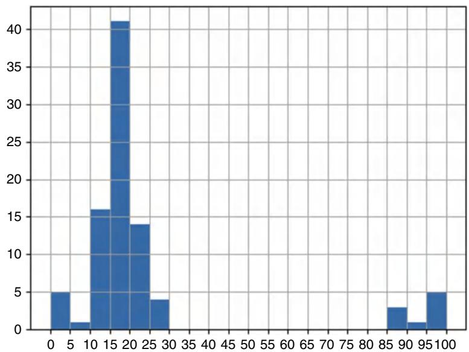  
Figure 9.17 JupyterLab notebook with merge_measurements(…) and a histogram of NPI.

After measured data is merged into the DataFrame, a normalized percent inhibition (NPI) value must be computed and added. Normalization of data within each plate is necessary to enable comparable results across plates or experiments and for setting a single cut-off value for the selection of hits across plates when multiple test plates are used in the experiment [52].

For our hypothetical experiment, NPI is computed using the following formula, where $\mu _ { \mathrm { P } }$ is the mean of positive controls, $\mu _ { \mathrm { N } }$ is the mean of negative controls, and $\mathrm { T _ { i } }$ is the $\mathrm { i ^ { \mathrm { t h } } }$ measurement.

$$
\mathrm {N P I} _ {\mathrm {i}} = 1 0 0 \times \left(1 - \frac {\mu_ {\mathrm {P}} - \mathrm {T} _ {\mathrm {i}}}{\mu_ {\mathrm {P}} - \mu_ {\mathrm {N}}}\right) \tag {9.1}
$$

Expressions written with pandas data structures uses the same style of broadcasting as NumPy. With this feature, we can write a single expression that computes the NPI for all measurements in the 'meas' column and add the result as a new column to the DataFrame with the title “NPI.” In the following single expression, the mean of positive controls is computed and saved as mpos, the mean of negative controls as mneg, and then both are used in the final expression to compute NPI, which is added directly as a new column to the DataFrame.

```txt
df['NPI'] = 100.0 * (1.0 - (mpos - df['meas']) / (mpos - mneg)) 
```

Figure 9.17 depicts JupyterLab cells with the resulting merge_measurements(…) function defined in the first code cell. The function brings together all steps by reading and merging measured data into a DataFrame and then computing and adding NPI to the DataFrame. The second code cell invokes the merge_measurements(…) function and plots a histogram of the NPI in the range $[ 0 \% , 1 0 0 \% ]$ to visualize the normalized data set. Bars resulting from the positive and negative controls are visible at the ends of the histogram. Bars skewed to the left of the histogram come from measured data points for substances not considered a hit.

With NPI computed and saved we are ready to run quality control on the measured data. One QC measurement is the Z-factor, computed using the following formula, where $\mu _ { \mathrm { P } }$ is the mean of positive controls, $\mu _ { \mathrm { N } }$ is the mean of negative controls, $\sigma _ { \mathrm { P } }$ is the standard deviation of positive controls and $\sigma _ { \mathrm { N } }$ is the standard deviation of negative controls [52].

$$
Z \text {f a c t o r} = 1 - \frac {3 \left(\sigma_ {\mathrm {P}} + \sigma_ {\mathrm {N}}\right)}{\left| \mu_ {\mathrm {P}} - \mu_ {\mathrm {N}} \right|} \tag {9.2}
$$

Computed Z-factors measure the quality of an assay. Z-factor ranges characterize an assay based on its computed Z-factor value. See Table 9.11 for typical Z-factor range interpretations.

To select hits in the resulting data, we’ll use the quartile-based hit selection method, which is based on the idea that true hits are statistical outliers. A hit can be identified by setting upper and lower cut-off boundaries based on the quartiles. The interquartile range (IQR) is the distance between the $2 5 ^ { \mathrm { t h } }$ percentile (Q1) and the $7 5 ^ { \mathrm { t h } }$ percentile (Q3), which measures the spread of the middle $5 0 \%$ of values. Any data value that is 1.5 times greater than the IQR or 1.5 times less than the IQR is considered an outlier, and therefore a hit.

Table 9.11 Interpretation of Z-factor QC values.   

<table><tr><td>Z-factor</td><td>Interpretation</td></tr><tr><td>1.0</td><td>Ideal assay</td></tr><tr><td>1.0 &gt; Z ≥ 0.5</td><td>Excellent assay</td></tr><tr><td>0.5 &gt; Z &gt; 0</td><td>Marginal assay</td></tr><tr><td>≤ 0</td><td>Unable to produce meaningful results</td></tr></table>

A convenient way to compute the IQR is to use the DataFrame’s describe() method, which was described in Table 9.8 and demonstrated in Figure 9.14. This function computes several descriptive statistics on all numeric columns including count, mean, standard deviation, minimum, maximum, and quartiles. Quartile values are saved in the result using the $12 5 \%$ , $1 5 0 \%$ , and $1 7 5 \% 1$ keys corresponding to the quartile cutoffs. Invoking the describe() method on the DataFrame and subtracting the description’s $12 5 \%$ key from the $1 7 5 \%$ key produces the IQR.

The Z_factor(…) and find_hits(…) functions are defined in the first JupyterLab notebook code cell in Figure 9.18. Both functions receive the experiment DataFrame as its parameter. The Z_factor(…) function computes and returns the Z-factor statistic. The find_hits(…) function uses the $1 . 5 \times \mathrm { I Q R }$ method to find and return all test results considered statistical outliners. The second code cell in Figure 9.18 runs each function with the test results. A Z-factor of 0.34 is calculated, which indicates that the quality of the assay is marginal. The find_hits(…) method identified four tests with results that are outliers. These results consider measurements obtained for the substance IDs T04 and T18 as hits, and therefore, candidates for follow-up.

```python
[3]: # Z-factor QC measure
def Z_factor(df):
    sdpos = df.loc[df.type == 'P'] ['NPI'].std()  # P-stdev
    sdsamp = df.loc[df.type == 'T'] ['NPI'].std()  # N-stdev
    mpos = df.loc[df.type == 'P'] ['NPI'].mean()  # P-mean
    msamp = df.loc[df.type == 'T'] ['NPI'].mean()  # N-mean
    zprime = 1.0 - 3.0 * (sdpos + sdsamp) / abs(mpos - msamp)
    return zprime
# Find hits as tests with NPI outlier values
def find_hits(df):
    desc = df.loc[df.type == 'T'] ['NPI'].describe()  # Describe data set
    IQR = desc['75%'] - desc['25%']  # Compute IQR
    hits = df[(df.type == 'T') & (df.NPI >= (desc['75%'] + 1.5 * IQR))]
    return hits 
```

```python
[4]: # Compute Z-factor as a quality control method  
z = Z_factor(df)  
print(f'Z-factor: {z}')  
# Get hits by looking for outliers where NPI >= Quartile3 + 1.5 * IQR  
hits = find_hits(df)  
display(hits)  
Z-factor: 0.3410549880920045 
```

<table><tr><td></td><td>src</td><td>ID</td><td>type</td><td>vol</td><td>dest</td><td>meas</td><td>NPI</td></tr><tr><td>3</td><td>A04</td><td>T04</td><td>T</td><td>100</td><td>E04</td><td>0.077</td><td>85.484707</td></tr><tr><td>17</td><td>D03</td><td>T18</td><td>T</td><td>100</td><td>E05</td><td>0.057</td><td>89.631934</td></tr><tr><td>51</td><td>A04</td><td>T04</td><td>T</td><td>100</td><td>D11</td><td>0.035</td><td>94.193883</td></tr><tr><td>65</td><td>D03</td><td>T18</td><td>T</td><td>100</td><td>B04</td><td>0.074</td><td>86.106791</td></tr></table>

Figure 9.18 Helper functions to compute Z-factor QC statistic and to select hits using $1 . 5 { \times } | \mathrm { Q R }$ outliers.

The pandas DataFrame is a very flexible data structure that adds a large amount of table-like functionality for building, reading, writing, filtering, and sorting the tabular data. This project demonstrates many of its capabilities for building and managing a table of data for setting up, running, and analyzing screening experiments.

# 9.5 SciPy – A Library for Mathematics, Science, and Engineering

SciPy [53] is a large Python module containing a vast collection of mathematical algorithms grouped under multiple subpackages. Algorithms include clustering, Fourier transforms, interpolation, numerical integration, image processing, optimization, signal processing, and statistics. SciPy is built on and tightly integrated with NumPy. To use SciPy most effectively, you should have knowledge of NumPy as you will find references to it throughout SciPy subpackages. Practically any mathematical algorithm you might need you will find in SciPy.

In this section, we focus on the SciPy subpackages most likely to be useful to research laboratory scientists.

# 9.5.1 Descriptive Statistics with SciPy

The scipy.stats submodule includes a large number of utilities useful for performing statistical computations. It includes functions for computing statistical distributions, summary and frequency statistics, hypothesis testing, and much more. Most functions expect to receive an array-like parameter, which is often a NumPy ndarray.

Similar to the pandas DataFrame, the scipy.stats submodule defines a function named describe(…) which computes several descriptive statistics about data in an array. Note that this function returns results that are different from those computed by the DataFrame method with the same name. The first argument for this function is an array-like object, and one of the more important keyword parameters is axis, which has a default value of 0. The axis keyword parameter sets the axis along which statistics are calculated. For example, if the array passed to describe(…) is a two-dimensional array, and if axis $\mathrel { \mathop : } = 0$ (the default value) then statistics are computed down rows on all values in each column of the array. If axis $^ { = 1 }$ , then statics are computed down columns for all values in each row of the array. With higher dimensional arrays, larger axis indexes can be set and descriptive statistics are computed with all data on remaining axes. Finally, if axis=None, then descriptive statistics are computed for the entire array, no matter the number of its dimensions.

The describe(…) function computes and returns seven statistics about data along the specified axis, or for the entire array. These descriptive statistics are listed and described in Table 9.12. The function returns an object of type DescribeResult, which has properties that reference each computed result.

It is not a surprise that the scipy.stats submodule implements many additional functions for performing computations of all kinds. This includes the scipy.stats.iqr(…) function which computes the IQR of an array along an axis, directly.

# 9.5.2 Hypothesis Testing

Hypothesis testing is a fundamental tool used in laboratory science. It is a method of statistical inference that allows us to compare and make decisions about populations based on sampling. Hypothesis testing starts with two hypotheses. The null hypothesis states that there is no

Table 9.12 Computed statistics returned from the scipy.stats.describe(…) function.   

<table><tr><td>Computed statistic</td><td>Description</td></tr><tr><td>nobs</td><td>Number of values in each group along the axis.</td></tr><tr><td>minmax</td><td>A two-tuple with an array of minimum values and an array of maximum values.</td></tr><tr><td>mean</td><td>Arithmetic mean of observations along the axis.</td></tr><tr><td>variance</td><td>Unbiased variance of the array along the given axis. The denominator is one minus the number of values.</td></tr><tr><td>skewness</td><td>Skewness of the array along the given axis. Based on moment calculations computed with number of values as the denominator.</td></tr><tr><td>kurtosis</td><td>Kurtosis of the array along the given axis, normalized to zero for the normal distribution.</td></tr></table>

relationship between chosen variables that describe populations. The alternative hypothesis states that there is a relationship and is usually the original research question of interest.

The process of performing a hypothesis test is often described as having four steps.

1.	 State your null and alternative hypotheses, where the null hypothesis states there is no difference between populations. In a research laboratory, these two populations are often a treated population and an untreated population.   
2.	 Design and run experiments that carefully measure the effect of interest in populations in a way that minimizes the impact of other factors on the outcome. It is important to sample all parts of your populations uniformly and to collect measured data from this sampling. It is good practice to decide what constitutes a significant difference between the populations prior to running experiments, usually a probability cutoff value.   
3.	 Perform a statistical test that compares within-group variance with between-group variance. Within-group variance estimates the spread of data within a single population, whereas the between-group variance estimates how well the two populations are separated. This is quantified using a significance statistic called the $p$ -value, which is the probability that the null hypothesis is correct. A very small p-value indicates that the null hypothesis is very unlikely. Stated differently, the p-value is the probability that any treatment effect observed occurred by chance.   
4. Reject or fail to reject the null hypothesis. This is done by comparing the computed p-value with the significance level cutoff chosen prior to starting experimental work. A common level of significance chosen is a p-value of 0.05, which states that there is less than a $5 \%$ chance that results would be obtained if the null hypothesis were correct.

It is always a good idea to consult a knowledgeable statistician to ensure your experimental plan is designed to collect data that allow the statistical techniques to produce significant results.

# 9.5.3 Project – Running Hypothesis Tests on Two Samples

The SciPy stats submodule implements a very large set of statistical functions. The number of functions available is mind boggling, and best understood by studying the scipy.stats submodule documentation directly [53]. In this section we demonstrate the use of one function named scipy.stats.ttest_ind(…), which performs a T-test on the mean of two groups of

data. This function tests the null hypothesis, which is that the mean (expected value) of a set of independent observations is equal to the given population mean.

To demonstrate the scipy.stats.ttest_ind(…) function, a set of hypothetical test data was generated, and listed in the CSV file of Listing 9.8. The data set has four columns. The first and second columns are 10 replicates of positive (pos) and negative (neg) controls. The third and fourth columns are measurements for two samples (samp1 and samp2).

Listing 9.8 data_ttest.csv file containing sample data for performing a T-test with SciPy.stats.   
```csv
pos,neg,samp1,samp2 0.0,0.495,0.497,0.068 0.015,0.483,0.49,0.05 0.018,0.481,0.483,0.101 0.019,0.498,0.483,0.068 0.018,0.495,0.485,0.031 0.018,0.498,0.494,0.067 0.012,0.488,0.492,0.051 0.004,0.481,0.484,0.06 0.009,0.494,0.499,0.056 0.001,0.484,0.497,0.03 
```

One convenient feature of the Python stack of scientific modules is that they work well together. We can use the pandas functions to load data from the data_ttest.csv file into a DataFrame and access its columns by title, and then pass column data structures (Series objects) to SciPy functions without the need to convert type.

Listing 9.9 is a complete program that performs the following steps.

1.	 Import modules, including pandas and SciPy stats.   
2.	 Reads experimental data from the file data_ttest.csv into a pandas DataFrame.   
3.	 Uses DataFrame columns to compute NPI and save as a Series object.   
4. Compute variances of the Series objects and their ratio. If the ratio is in the range [0.25, 4] then equal variances are assumed. The result is saved to be passed as a parameter when running the T-test.   
5.	 Run a T-test on percent inhibition of sample 1 and negative control data using the stats. ttest_ind(…) SciPy function, and print the computed p-value.   
6.	 Repeat the computation and T-test for percent inhibition of sample 2. Print p-value.

Listing 9.9 A complete Python program for loading data and computing a T-test on two samples.   
```python
# ttest.py
# Perform Two-sample T-tests
# 1. Import modules
import pandas as pd
import scipy.stats as stats
# 2. Read experimental data into DataFrame 
```

Listing 9.9 (Continued)   
df $=$ pd.read_csv('data_ttest.csv')   
#3. Compute S for three columns   
mpos $=$ df['pos'].mean()   
mneg $=$ df['neg'].mean()   
pi_neg $= 100.0$ \* (1.0 - (mpos - df['neg'])/(mpos - mneg))   
pi_smp1 $= 100.0$ \* (1.0 - (mpos - df['samp1'])/(mpos - mneg))   
pi_smp2 $= 100.0$ \* (1.0 - (mpos - df['samp2'])/(mpos - mneg))   
#4. Check the variance of samp1 and negative control groups and print ratio. # If ratio is in [0.25, 4] assume equal variances.   
ratio1 $=$ pi_smp1.var()/pi_neg.var()   
print(f'ratio1:{ratio1}')   
eq_var1 $=$ False   
if $0.25 <   \mathrm{ratio}1 <   4$ : eq_var1 $=$ True   
#5. Two-sample T-test using SciPy stats submodule.   
# Compare samp1 with negative control.   
# Null hypothesis: two population means are equal.   
rslt1 $=$ stats.ttest_ind(a=pi_smp1,b=pi_neg, equal_var=eq_var1)   
print(f'pvalue for samp1:{rlst1.pvalue}')   
#6. Repeat analysis with sample 2.   
# If ratio is in [0.25, 4] assume equal variances.   
ratio2 $=$ pi_smp2.var()/pi_neg.var()   
print(f'ratio2:{ratio2}')   
eq_var2 $=$ False   
if $0.25 <   \mathrm{ratio}2 <   4$ : eq_var2 $=$ True   
# Two-sample T-test using SciPy stats submodule.   
#Null hypothesis: two population means are equal.   
rlst2 $=$ stats.ttest_ind(a=pi_smp2,b=pi_neg, equal_var=eq_var2)   
print(f'pvalue for samp2:{rlst2.pvalue}')

```txt
ratio1: 0.8025219545147428  
pvalue for samp1: 0.817080125498422  
ratio2: 8.47466786759731  
pvalue for samp2: 1.5473136695932168e-15 
```

The scipy.stat.ttest_ind(…) function expects at least two data sets to be compared. If an equal_var keyword argument is set to True, that indicates that the variances of the two data sets can be assumed equal. As a rule of thumb, this is the case when the ratio of the two data set variances is in the range [0.25, 4]. In this case a Student’s T-test is performed. If equal_var keyword argument is set to False, we do not assume equal variances and a Welch’s t-test is performed, automatically.

From the program output that follows Listing 9.9 we learn that the first variance ratio is within the range, and so the ttest_ind(…) function is invoked assuming an equal population variance. The result of the Student’s T-test is a p-value of 0.80, indicating that there is a high probability that the means of the negative control data and sample 1 data are equal, so we cannot reject the null hypothesis.

The second ratio is out of range so we cannot assume equal population variances. The Welch’s t-test produces a p-value of $1 . 5 5 \times 1 0 ^ { - 1 5 }$ indicating a very low probability that the negative control data and sample 2 data have equal means. In this case, we reject the null hypothesis and proceed with sample 2 as a promising lead for further study.

# 9.5.4 Project – Comparing Liquid Handler Syringe Performance

A multi-syringe robotic liquid handler can speed up experiment preparation by dispensing reagents in parallel. But the ability to draw conclusions from data measured from experiments prepared by the liquid handler depends significantly upon how well the liquid handler performs. If liquid handler syringe volumes dispensed vary significantly, the resulting experimental data may not be useful to reach accurate conclusions.

For this project, we measured the performance of eight parallel syringes on a liquid handler to compare their dispense volumes. Each of the eight syringes was instructed to dispense $2 5 \mu \mathrm { L }$ of water and the results were collected. The dispenses were repeated multiple times and all data was saved to the CSV file lhdata_ttest.csv. Table 9.13 shows the first several lines from the data set.

Following a similar pattern as that of the last project, we use the pandas and scipy.stats modules to load and analyze the data, and perform a T-test to compare two selected syringes.

The program in Listing 9.10 is a complete program that performs the following steps.

1.	 Import modules, including pandas and SciPy stats.   
2.	 Set parameters to guide analysis, include the selection of two syringes to compare.   
3.	 Read experimental data from the file lh_ttest.csv into a pandas DataFrame and filter on syringe number and solvent.   
4.	 Compute several statistics of interest on two columns of data.   
5.	 Check ratio of variances and set parameter for T-test function.   
6.	 Run a T-test on columns using stats.ttest_ind(…) SciPy function.   
7.	 Print the computed results and conclusion.

Table 9.13 Liquid handler syringe comparison data set lhdata_ttest.csv.   

<table><tr><td>Solvent</td><td>Syringe</td><td>RepNum</td><td>Weight (mg)</td><td>Density (mg/uL)</td><td>ExpectedVolume (uL)</td><td>Measured</td><td>InAccuracy</td></tr><tr><td>Water</td><td>1</td><td>1</td><td>22.5</td><td>1</td><td>25</td><td>22.5</td><td>10</td></tr><tr><td>Water</td><td>2</td><td>1</td><td>24</td><td>1</td><td>25</td><td>24</td><td>4</td></tr><tr><td>Water</td><td>3</td><td>1</td><td>24.1</td><td>1</td><td>25</td><td>24.1</td><td>3.6</td></tr><tr><td>Water</td><td>4</td><td>1</td><td>22.9</td><td>1</td><td>25</td><td>22.9</td><td>8.4</td></tr><tr><td>Water</td><td>5</td><td>1</td><td>22.3</td><td>1</td><td>25</td><td>22.3</td><td>10.8</td></tr><tr><td>Water</td><td>6</td><td>1</td><td>23.8</td><td>1</td><td>25</td><td>23.8</td><td>4.8</td></tr><tr><td>Water</td><td>7</td><td>1</td><td>24.9</td><td>1</td><td>25</td><td>24.9</td><td>0.4</td></tr><tr><td>Water</td><td>8</td><td>1</td><td>24.9</td><td>1</td><td>25</td><td>24.9</td><td>0.4</td></tr><tr><td>Water</td><td>1</td><td>2</td><td>22.5</td><td>1</td><td>25</td><td>22.5</td><td>10</td></tr><tr><td>Water</td><td>2</td><td>2</td><td>25.3</td><td>1</td><td>25</td><td>25.3</td><td>1.2</td></tr><tr><td>...</td><td></td><td></td><td></td><td></td><td></td><td></td><td></td></tr></table>

Listing 9.10 A complete program to load and analyze liquid handler syringe volumes dispensed.   
# lh_ttest.py
# T-test for comparing liquid handler syringe dispensed volume data
# 1. Import modules
import pandas as pd
import scipy.stats as stats
# 2. Set Parameters
ptarg = .05 # Target p-value
syrg1 = 1 # First syringe to compare
syrg2 = 3 # Second syringe to compare
solvent = 'Water' # Solvent to compare
evol = 25.0 # Expected volume in $\mu$ L
# 3. Read experimental data into DataFrame
# Filter data based on syringe number and solvent to compare
df = pd.read_csv(r'lhdata_ttest.csv')
dfs1 = df[(df['Syringe'] == syrg1) & (df['Solvent'] == solvent)]
dfs2 = df[(df['Syringe'] == syrg2) & (df['Solvent'] == solvent)]
# 4. Compute general statistical measures
vol1 = dfs1['Measured']
vol2 = dfs2['Measured']
var1 = vol1.var()
var2 = vol2.var()
mean1 = vol1.mean()
mean2 = vol2.mean()
cv1 = vol1.std()/mean1*100 # Coefficients of variation
cv2 = vol2.std()/mean2*100
inacc1 = (mean1-evol)/evol*100 # Inaccuracy
inacc2 = (mean2-evol)/evol*100
# 5. Check equal variances
ratio = var1/var2
eq_var = False
if 0.25 < ratio < 4.0: eq_var = False
# 6. Perform t-test
rslt = stats.ttest_ind(a=vol1, b=vol2, equal_var=eq_var)
# 7. Print results
print(f'Compare volume data for syringes {syrg1} and {syrg2} @{evol} $\mu$ L for {solvent}])
print(f'syringe {syrg1}: mean={mean1:.2f}, CV={cv1:.2f}, inacc={inacc1:.2f}])
print(f'syringe {syrg2}: mean={mean2:.2f}, CV={cv2:.2f}, inacc={inacc2:.2f}])
print(f'p-value : {rslt.pvalue}')
print(f't-stat : {rslt.statistic}')
if rslt.pvalue >= ptarg:
    print(f'Syringe vols are NOT significantly different at p-value of {ptarg}')

```txt
> python lh_ttest.py  
Compare volume data for syringes 1 and 3 @25.0μL for Water  
syringe 1: mean=23.61, CV = 3.27, inacc=-5.56  
syringe 3: mean=24.31, CV = 1.26, inacc=-2.76  
p-value : 0.029033958120514652  
t-stat : -2.5286119458975937  
Syringe vols are significantly different at p-value of 0.05 
```

# 9.5.5 Linear Regression

Another useful feature of the SciPy stats module is its ability to fit a line to x-y data, where the mathematical model to fit is the equation of a line, $y = m x + b$ , where m is the slope of the line and $b$ is the y-intercept.

Linear regression is the standard deterministic technique for estimating the parameters m and b given the x-y data as two numeric sequences. The stats module’s linregress(…) function will perform the linear regression algorithm on the data, returning an object with the attributes in Table 9.14.

Listing 9.11 demonstrates how to use the linregress(…) function with a list of x-data and a list of y-data. The estimated slope and intercept are printed along with the Pearson correlation coefficient indicating that the data have a very strong positive correlation.

Listing 9.11 Example of using scipy.stats.linregress(…) to fit a line to x-y data.   
linregress.py   
from scipy.stats import linregress   
Xs $= [0,1,2,3,4,5,6,7,8,9]$ Ys $= [0.0,0.54,1.02,1.5,2.03,2.52,3.02,3.51,4.05,4.53]$ rslt $=$ linregress(Xs,Ys)   
print(f'm={rslt.slope:.3f},b={rslt.intercept:.3f},r-value={rslt. rvalue:.5f}')

$m = 0.502$ ， $b = 0.013$ ，r-value=0.9995

Table 9.14 Attributes of the LinregressResult object returned from the linregress(…) function.   

<table><tr><td>Attribute</td><td>Description</td></tr><tr><td>slope</td><td>Slope of the regression line (m).</td></tr><tr><td>intercept</td><td>Intercept of the regression line (b).</td></tr><tr><td>rvalue</td><td>Pearson correlation coefficient in [−1, 1].</td></tr><tr><td>pvalue</td><td>p-value for T-test with a null hypothesis that the slope (m) is zero.</td></tr><tr><td>stderr</td><td>Standard error of the estimated slope (m).</td></tr><tr><td>intercept Stderr</td><td>Standard error of the estimated intercept (b).</td></tr></table>

# 9.5.6 Fitting Nonlinear Models to Data

Among the many additional submodules in SciPy is the optimize submodule. As the name suggests, the optimize module provides a wide range of optimization methods for finding an optimal solution to a potentially nonlinear model based on some objective function. SciPy’s optimize submodule includes numerous nonlinear and linear optimization algorithms, that are scalar and multivariate, using both global and local techniques, and with the option to constrain solutions. Linear programming and mixed-integer linear programming algorithms are available as well. We are interested in fitting models to experimental data, so we’ll focus on one function in scipy.optimize named curve_fit(…).

The curve_fit(…) function takes several parameters, many of which are described in Table 9.15. The first parameter is the model to be optimized by adjusting its parameter values. The second and third parameters are the x- and y-data to use to fit the model. In addition to these, you may pass an optional initial guess for parameters, which can be necessary for convergence, and optional lower and upper bounds for parameters. Parameter bounds are particularly useful when you know the range in which fitted parameters must fall. Parameter bounds also provide the ability to prevent parameters from straying into regions where values are nonsensical, such as preventing a concentration from becoming negative.

It is interesting to note that the model passed to curve_fit(…) is just a Python function. You are free to define any function that takes as its parameters an array of x-values followed by any number of model parameters. The Python function returns the model evaluated at the given x-values and model parameters provided.

To demonstrate the use of the curve_fit(…) function, let’s fit the Michaelis–Menten model of Enzyme Kinetics to a set of experimental data. Michaelis–Menten Kinetics assumes the following reaction schema,

$$
E + S \xrightarrow [ k _ {- 1} ]{k _ {1}} E S \xrightarrow [ k _ {- 2} ]{k _ {2}} E + P \tag {9.3}
$$

where $E$ is enzyme, $S$ is substrate, $P$ is product, and ES is the enzyme–substrate complex, and $k _ { 1 }$ , $k _ { - 1 } , k _ { 2 }$ , and $k _ { - 2 }$ are the rate constants. Using this reaction schema, the rate of change of product concentration [P] over time is expressed as the following differential equation.

$$
\frac {d [ P ]}{d t} = k _ {2} [ E S ] - k _ {- 2} [ E ] [ P ] \tag {9.4}
$$

Table 9.15 Common parameters of the scipy.optimize.curve_fit(…) function.   

<table><tr><td>curve_fit(...) parameters</td><td>Description</td></tr><tr><td>f</td><td>A Python function implementing the model to fit.</td></tr><tr><td>xdata</td><td>Independent variable data for the model fit.</td></tr><tr><td>ydata</td><td>Dependent variable data for the model fit.</td></tr><tr><td>p0</td><td>Initial guess for parameters (optional).</td></tr><tr><td>bounds</td><td>2-tuple of (lower bounds array, upper bounds array) (optional).</td></tr></table>

If we measure the reaction rate as the reaction starts, we can assume that the initial product concentration $[ \mathrm { P } ] _ { 0 } \cong 0$ , simplifying the last differential equation to the following.

$$
\left. \frac {d [ P ]}{d t} \right| _ {t = 0} = k _ {2} [ E S ] \tag {9.5}
$$

The forward and reverse rates for $[ E S ]$ can be written as the following two differential equations.

$$
\frac {d [ E S ]}{d t} = k _ {1} [ E ] [ S ] = k _ {1} \left([ E ] _ {0} - [ E S ]\right) [ S ], - \frac {d [ E S ]}{d t} = k _ {- 1} [ E S ] + k _ {2} [ E S ] \tag {9.6}
$$

Under the so-called quasi-steady-state assumption, the binding and dissociation of $E$ and $s$ is sufficiently fast to be assumed in equilibrium relative to the catalytic step producing $P$ from the $E S$ complex. Under this assumption, we can set the two equations in Eq. (9.6) equal to one another.

$$
k _ {1} ([ E ] _ {0} - [ E S ]) [ S ] = k _ {- 1} [ E S ] + k _ {2} [ E S ] \tag {9.7}
$$

Rearranging, we have the following approximation, where $K _ { m }$ is the Michaelis constant.

$$
[ E S ] = \frac {[ E ] _ {0} [ S ]}{\frac {k _ {- 1} + k _ {2}}{k _ {1}} + [ S ]} = \frac {[ E ] _ {0} [ S ]}{K _ {m} + [ S ]}, \text {w h e r e} K _ {m} = \frac {k _ {- 1} + k _ {2}}{k _ {1}} \tag {9.8}
$$

By substituting Eq. (9.8) into Eq. (9.5) we derive the following, where $\nu _ { 0 }$ is the initial reaction rate.

$$
v _ {0} = \left. \frac {d [ P ]}{d t} \right| _ {t = 0} = k _ {2} \frac {[ E ] _ {0} [ S ]}{K _ {m} + [ S ]} \tag {9.9}
$$

The maximum reaction rate $( V _ { \mathrm { m a x } } )$ can be derived from the initial value for enzyme concentration $[ E ] _ { 0 }$ , giving $V _ { \mathrm { m a x } } = k _ { 2 } \left[ \mathrm { E } \right] _ { 0 }$ . Also, at this initial point in the reaction, the substrate concentration is $[ S ] _ { 0 }$ . Substituting this definition for $V _ { \mathrm { m a x } }$ and replacing $[ S ] _ { 0 }$ in Eq. (9.9) we arrive at Eq. (9.10), our final Michaelis–Menten model.

$$
v _ {0} = V _ {\max } \frac {[ S ] _ {0}}{K _ {m} + [ S ] _ {0}} \tag {9.10}
$$

Several experiments can be run with different values for $\nu _ { 0 }$ and $[ S ] _ { 0 }$ . By fitting this model to experimental data, we can approximate the important kinetic constants $V _ { \mathrm { m a x } }$ and $K _ { m }$ .

To demonstrate the curve_fit(…) function we start with Michaelis–Menten experimental data listed in Table 9.16, which was borrowed from Aledo [54].

The curve_fit(…) function needs a Python function parameter defining the Michaelis– Menten model, Eq. (9.10). The MM(…) Python function in Listing 9.12 implements the model. MM(…) takes an array of $[ S ] _ { 0 } ( x )$ values as well as the two parameters $K _ { m }$ and $V _ { \mathrm { m a x } }$ . The function uses a list comprehension to compute and return $\nu _ { 0 } \left( y \right)$ values for each $[ S ] _ { 0 } ( x )$ value provided.

Data from Table 9.16 are entered directly in two lists named S0 and $\mathtt { v 0 }$ . A guess for $K _ { m }$ of 10 and $V _ { \mathrm { m a x } }$ of 100 are added to a list named guess. We know from the units of both parameters that they cannot be negative. Also, we estimate that these parameters cannot exceed a $K _ { m }$ of 20 and $V _ { \mathrm { m a x } }$ of 1000. These lower and upper bounds are assigned to a lists of lists and saved in the variable bounds.

The curve_fit(…) function is invoked, passing the model function, measured data, and the optional initial guess list and bounds list of lists. The function returns two values: an array of optimal parameter values derived by the fitting algorithm and a covariance matrix for the estimated parameter values. In Listing 9.12 we assign the optimal parameter estimates to the params variable. The program is run and results are printed in the terminal session that follows.

Table 9.16 Sample experimental data measuring Michaelis–Menten kinetics.   

<table><tr><td>S0 [mM]</td><td>v0 [μM/min]</td></tr><tr><td>0.05</td><td>3.00</td></tr><tr><td>0.10</td><td>6.00</td></tr><tr><td>0.25</td><td>17.00</td></tr><tr><td>0.50</td><td>31.00</td></tr><tr><td>1.00</td><td>48.00</td></tr><tr><td>2.50</td><td>101.00</td></tr><tr><td>5.00</td><td>121.00</td></tr><tr><td>8.00</td><td>139.00</td></tr><tr><td>20.00</td><td>152.00</td></tr><tr><td>30.00</td><td>181.00</td></tr></table>

Listing 9.12 Demonstration of the scipy.optimize.curve_fit(…)function to estimate enzyme kinetics parameters.   
```python
# fit_MM.py   
from scipy.optimize import curve_fit   
# Michaelis-Menten kinetics   
def MM(Xs, Km, Vmax): return [(Vmax*X)/(Km + X) for X in Xs]   
# Experimental data from initial velocity experiments   
S0 = [0.05, 0.10, 0.25, 0.50, 1.00, 2.50, 5.00, 8.00, 20.00, 30.00] # [mM] v0 = [3.0, 6.0, 17.0, 31.0, 48.0, 101.0, 121.0, 139.0, 152.0, 181.0] # μM/min   
# Initial guess and estimated bounds   
guess = [10, 100] # Lit values: KM=2.5 mM and Vmax=0.19 mM/min bounds = [[0,0], [20,1000]] # Parameter bounds   
# Fit and print results   
params, _ = curve_fit(MM, S0, v0, p0=guess, bounds=bounds)   
print(f'Km={params[0]:0.3f} mM, Vmax={params[1] *0.001:0.3f} mM/min') 
```

```txt
> python fit_MM.py  
Km=2.479 mM, Vmax=0.184 mM/min 
```

# 9.5.7 Project – Four-Parameter Logistic Regression

The four-parameter logistic (4PL) model is widely used to model processes that switch from one state to another. This includes numerous bioassays that measure the response of a range of dose concentrations of a molecule between baseline and maximum, usually on a log scale.

The analytical form of the 4PL model is given as Eq. (9.11). As its name suggests, the 4PL model is characterized by four parameters: a lower plateau (A), an upper plateau $( D )$ , the inflection points between the two (C), and a parameter associated with the slope at the inflection point $( B )$ .

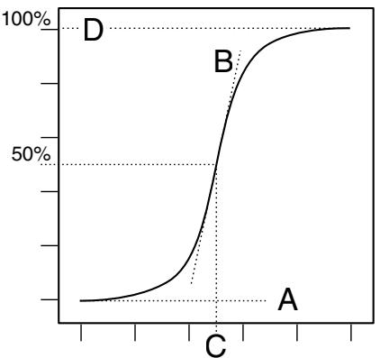  
Figure 9.20 Sample plate layout with experimental concentrations.

Figure 9.19 Illustration of the parameters of the 4PL model.

$$
y = D + \frac {A - D}{1 + \left(\frac {x}{C}\right) ^ {B}} \tag {[9.11]}
$$

The 4PL model and the role of its parameters is illustrated in Figure 9.19. The 4PL model has been used to measure the therapeutic effect of a treatment, the toxic effect of a substance, and the lethal effect of a poison. Of all the parameters, $C$ represents the concentration at which $5 0 \%$ of the effect is observed. The $C$ parameter is the one that is considered characteristic and most often of interest.

After initial screening and hit selection, confirmatory screens are frequently executed to examine dose-response behavior. Responses are collected experimentally at concentrations over several orders of magnitude, the 4PL model is fit to response vs. the log of concentration, and the optimal parameters are collected and reported.

This project will read experimental data for eight samples from a CSV file, fit data to the 4PL model, print parameters, and plot measured data as a scatter plot along with a line plot of the 4PL model computed using computed optimized parameters.

The layout of the plate used in Figure 9.20 assigns a single sample to the 10 wells of a single row, each at a different concentration that varies by powers of 10. Eight samples are assigned to the plate, one for each row. For this dose-response experiment, we use $\log _ { 1 0 }$ (concentration) as the x-data for the 4PL model. In other words, the powers of 10 for each concentration will be used as x-data for the model. Measurements are saved to a file named data_plate.csv.

<table><tr><td></td><td></td><td>1</td><td>2</td><td>3</td><td>4</td><td>5</td><td>6</td><td>7</td><td>8</td><td>9</td><td>10</td><td>11</td><td>12</td></tr><tr><td>Sample 1</td><td>A</td><td>\(10^{-9}\)</td><td>\(10^{-8}\)</td><td>\(10^{-7}\)</td><td>\(10^{-6}\)</td><td>\(10^{-5}\)</td><td>\(10^{-4}\)</td><td>\(10^{-3}\)</td><td>\(10^{-2}\)</td><td>\(10^{-1}\)</td><td>\(10^{0}\)</td><td></td><td></td></tr><tr><td>Sample 2</td><td>B</td><td>\(10^{-9}\)</td><td>\(10^{-8}\)</td><td>\(10^{-7}\)</td><td>\(10^{-6}\)</td><td>\(10^{-5}\)</td><td>\(10^{-4}\)</td><td>\(10^{-3}\)</td><td>\(10^{-2}\)</td><td>\(10^{-1}\)</td><td>\(10^{0}\)</td><td></td><td></td></tr><tr><td>Sample 3</td><td>C</td><td>\(10^{-9}\)</td><td>\(10^{-8}\)</td><td>\(10^{-7}\)</td><td>\(10^{-6}\)</td><td>\(10^{-5}\)</td><td>\(10^{-4}\)</td><td>\(10^{-3}\)</td><td>\(10^{-2}\)</td><td>\(10^{-1}\)</td><td>\(10^{0}\)</td><td></td><td></td></tr><tr><td>Sample 4</td><td>D</td><td>\(10^{-9}\)</td><td>\(10^{-8}\)</td><td>\(10^{-7}\)</td><td>\(10^{-6}\)</td><td>\(10^{-5}\)</td><td>\(10^{-4}\)</td><td>\(10^{-3}\)</td><td>\(10^{-2}\)</td><td>\(10^{-1}\)</td><td>\(10^{0}\)</td><td></td><td></td></tr><tr><td>Sample 5</td><td>E</td><td>\(10^{-9}\)</td><td>\(10^{-8}\)</td><td>\(10^{-7}\)</td><td>\(10^{-6}\)</td><td>\(10^{-5}\)</td><td>\(10^{-4}\)</td><td>\(10^{-3}\)</td><td>\(10^{-2}\)</td><td>\(10^{-1}\)</td><td>\(10^{0}\)</td><td></td><td></td></tr><tr><td>Sample 6</td><td>F</td><td>\(10^{-9}\)</td><td>\(10^{-8}\)</td><td>\(10^{-7}\)</td><td>\(10^{-6}\)</td><td>\(10^{-5}\)</td><td>\(10^{-4}\)</td><td>\(10^{-3}\)</td><td>\(10^{-2}\)</td><td>\(10^{-1}\)</td><td>\(10^{0}\)</td><td></td><td></td></tr><tr><td>Sample 7</td><td>G</td><td>\(10^{-9}\)</td><td>\(10^{-8}\)</td><td>\(10^{-7}\)</td><td>\(10^{-6}\)</td><td>\(10^{-5}\)</td><td>\(10^{-4}\)</td><td>\(10^{-3}\)</td><td>\(10^{-2}\)</td><td>\(10^{-1}\)</td><td>\(10^{0}\)</td><td></td><td></td></tr><tr><td>Sample 8</td><td>H</td><td>\(10^{-9}\)</td><td>\(10^{-8}\)</td><td>\(10^{-7}\)</td><td>\(10^{-6}\)</td><td>\(10^{-5}\)</td><td>\(10^{-4}\)</td><td>\(10^{-3}\)</td><td>\(10^{-2}\)</td><td>\(10^{-1}\)</td><td>\(10^{0}\)</td><td></td><td></td></tr></table>

To get started with our analysis, we import all the modules and define the model function to be used, which is given as the fourPL(…) function (Listing 9.13). Parameters for this function follow the required pattern, with x-values passed as the first positional parameter and all four model parameters afterwards.

Listing 9.13 Load modules and define the fourPL(…) model functions.   
import math   
import numpy as np   
import pandas as pd   
import matplotlib.pyplot as plt   
from scipy.optimize import curve_fit   
# Compute the 4-parameters logistic function at Xs given the parameters   
def fourPL(Xs,A,B,C,D): return $[D + (A - D) / (1 + \text{math.pow}((X / C),B))$ for X in Xs]

The fit_4PLs(…) function fits data from all samples with given initial guess and parameter bounds, and returns all computed optimal parameter sets (Listing 9.14). Measured data for all samples are passed to the function as a DataFrame, with data for each sample in a different column. The plate layout has samples in rows, so we must adjust the data before passing to fit_4PL(…). The function then fits each column to the 4PL model, one at a time. Optimal parameter sets are accumulated in the param_sets list and returned.

Listing 9.14 Fit all data in a DataFrame to the 4PL model.   
```python
# Fit all plate data to 4PLs
def fit_4PLs(df, Xs, guess, bounds):
    # For each row, copy data into a List, fit and accumulate fitted params
    param_sets = []
    for col in df.columns:
        # Fit the data to the 4PL
        params, _ = curve_fit(fourPL, Xs, df[col], p0=guess, bounds=bounds)
        param_sets.append.params)
    return param_sets 
```

Once all data are processed and optimal parameters computed, we want to visualize the results. For each sample we will plot the experimental data as a scatter plot and add a line plot computed using the sample’s optimized parameters. All display tasks are implemented in the plots_ fits(…) function of Listing 9.15.

The layout chosen for the final figure is two rows and four columns, so the matplotlib submodule function pyplot.subplots(…) is used to create eight Axes objects. The pyplot. scatter(…) submodule function draws measured data from a column in the DataFrame (a Series object) passed to the function as its first parameter. In most cases, functions expect an object that is array-like, which includes both a list and a Series object. See the first nested for-statements in Listing 9.15 for the implementation.

Once scatter plots are added to each Axes for measured data, optimal parameters are used to compute and plot each model as a line plot, which is added to the axes with the corresponding measured data scatter plot. To produce the data for the final model, NumPy’s linspace(…)

function is used to create a larger equally-spaced ndarray of x-values. This expanded ndarray is then passed to the exact same model function used by curve_fit(…) to compute the y-data for drawing the model’s line plot. We can use the fourPL(…) model function twice – once for fitting and a second time for computing model data with optimized parameters for plotting. See the second nested for-statements in Listing 9.15 for the implementation.

The plot_fits(…) function closes by invoking the Figure object’s tight_layout() function, ensuring all titles are visible, and returning the Figure object.

Listing 9.15 Plot all measured data with module computed with optimized parameters.   
```python
# Plot data in columns 1-10 in each row
def plot_fits(df, Xs, param_sets=None):
    # Dimensions of subplot layout
    nrows = 2
    ncols = 4
    # Create a panel of plots for measured data scatter plots
    fig, axis = plt.subplot(nrows, ncols, figsize=(10, 6))
    # For all rows of wells, create scatter plot
    for r in range(nrows):
        for c in range(ncols):
            col = r*ncols + c
            ax = axis[r][c]
            Ys = df[col]
            axscatter(Xs, Ys, marker='+'))
            ax.set_title(f'Sample{col}') 
```

Now that all utility functions are defined, the main analysis can be performed in JupyterLab. Note, in the following we assume all functions in Listings 9.13, 9.14, and 9.15 are predefined in the same JupyterLab notebook.

In the notebook of Figure 9.21, the experimental data is loaded from the file data_plate.csv and immediately transformed to change sample data from rows to columns.

Initial parameter guesses are selected as well as parameter bounds. Note that we set the upper bound for the D parameter to 1.0 and the lower bound for the A parameter to 0.0. In this experiment, the D parameter should not be higher than 1.0. When the optimized parameters are printed you will notice that all D values are pegged at 1.0 because the measured data exceeded the upper value.

[1]: # Read data and transpose so columns hold data for single samples df = pd.read_csv("data_plate.csv", header=None) df = df.transpose() # Fit all data guess $= [0,2, - 5,1]$ # Parameter guesses bounds $= [[0,0, - 9,0],[1,1000,0,1]]$ # Parameter bounds concs $= [-9, - 8, - 7, - 6, - 5, - 4, - 3, - 2, - 1,0]$ # log(concentrations) param_sets $=$ fit_4PLs(df,concsc,guess,bounds) # Fit all data for ps in param_sets: # Print all parameters print(f'A={ps[0]:.3f} B={ps[1]:.3f} C={ps[2]:.3f} D={ps[3]:.3f}') # Create a plot showing all data on eight axes. fig1 $=$ plot_fits(df,concsc,param_sets $\equiv$ param_sets)

$\mathrm{A = 0.045}$ $\mathrm{B = 10.177}$ $C = -4.930$ D=1.000 $\mathrm{A = 0.070}$ $\mathrm{B = 11.418}$ $C = -4.913$ D=1.000 $\mathrm{A = 0.058}$ $\mathrm{B = 12.668}$ $C = -5.022$ D=1.000 $\mathrm{A = 0.053}$ $\mathrm{B = 12.611}$ $C = -4.985$ D=1.000 $\mathrm{A = 0.042}$ $\mathrm{B = 10.311}$ $C = -4.981$ D=1.000 $\mathrm{A = 0.058}$ $\mathrm{B = 11.981}$ $C = -4.988$ D=1.000 $\mathrm{A = 0.043}$ $\mathrm{B = 11.847}$ $C = -5.022$ D=1.000 $\mathrm{A = 0.061}$ $\mathrm{B = 12.444}$ $C = -5.005$ D=1.000

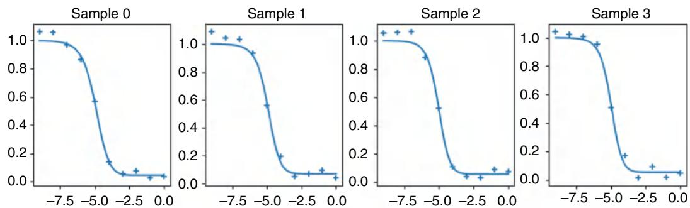

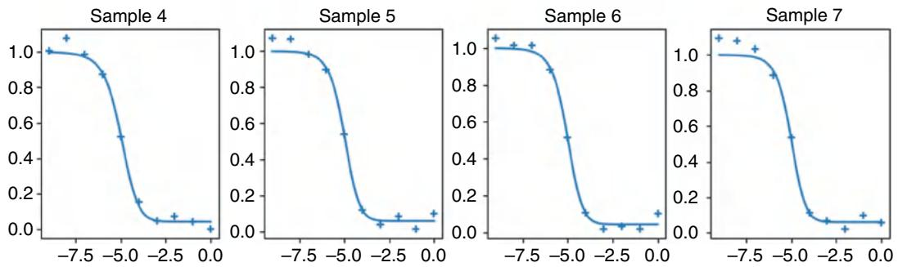  
Figure 9.21 Loading, fitting, and plotting all dose-response data.

Nevertheless, the curve_fit(…) function enforced the upper bound, not allowing D to be set to a value above 1.0.

All eight sets of optimal parameters are printed, and finally, the experimental data is plotted along with the model for each, computed using the optimal parameters.

# 9.6 Key Takeaways

1.	 Python is one of the most popular languages for data science due to its rich collection of modules designed for efficient collection and processing of large data sets.   
2.	 Python’s data science toolkit applies equally well to experimental data.   
3.	 JupyterLab is a notebook-style editor originally developed for Python that fulfills Donald Knuth’s vision of Literate Programming, in which code and documentation are intermixed.   
4. The JupyterLab notebook editor has three kinds of cells, a code cell, a markdown cell for formatted text, and a raw cell.   
5.	 The matplotlib module is a Python module designed for generating publication-quality scientific visualization.   
6.	 The pyplot submodule of matplotlib implements a stateful interface in which the module itself tracks the state of your plots which streamlines the creation of several basic scientific plots.   
7.	 Plot styles available in matplotlib include a scatter plot, bar plot boxplot, contour plot, histogram, pie chart, and several others.   
8.	 The object-oriented nature of matplotlib makes it possible to customize many kinds of custom plots by allowing you to modify the details of each plot element.   
9. Other scientific plotting libraries for Python include Seaborn and Plotly. Seaborn is designed to deduce and leverage the structure of source data. Plotly is exceptional at generating interactive visualizations.   
10.	 The NumPy Python module adds a uniform type, highly optimized, n-dimensional array data structure to Python named ndarray. Many other scientific Python modules are built on NumPy.   
11.	 Elements of an ndarray may be updated and extracted in powerful ways, similar to the ways that the elements of a Python list are manipulated, including multidimensional slicing.   
12.	 When ndarrays with incompatible sizes and/or scalar values are combined using array operators, NumPy makes them compatible automatically using a process called broadcasting.   
13.	 The pandas Python library adds a column-oriented, highly optimized, table data structure to Python called a DataFrame.   
14.	 Both the columns and rows of a DataFrame may be labeled and accessed by their labels.   
15.	 The pandas module provides a variety of functions for reading data from files in standard scientific formats into a DataFrame.   
16.	 The data in a DataFrame may be updated, filtered, sliced, indexed, and more.   
17.	 The SciPy Python library contains a vast collection of mathematical algorithms grouped under multiple subpackages. It is likely that any scientific algorithm you might need will be found in SciPy.   
18.	 Taken together, the NumPy, matplotlib, pandas, and SciPy family of scientific Python libraries form the core of what is known as the Python scientific stack.

# 10

# Report Generation

No investigation is complete without documenting and reporting results. The task of assembling experimental data and analysis results can be tedious, especially when a large amount of data is involved. Fortunately, many Python tools are available to make the job easier by automating the repetitive data assembly, visualization, and results dissemination.

Numerous Python modules provide simple programming interfaces that enable the programmatic generation of documents, presentations, and spreadsheets. In this chapter, we will introduce several modules for creating Microsoft Word, PowerPoint, and PDF documents. In Section 7.6, we introduced the openpyxl module, which can be used to create and programmatically populate Excel files.

Once generated, reports are often shared with colleagues. One convenient way to share reports is to deliver them through email. Another is to offer report downloads through a web browser. We’ll close this chapter with an introduction to the standards that form the basis for email and demonstrate how Python’s native modules are used to attach and email documents. We’ll also demonstrate how to start a built-in Python HTTP server, which can be used by others to access and download files from a remote computer.

# 10.1 BytesIO Object

The reports that we generate will include several images, especially those obtained from plotting data. We could save generated plots to temporary image files and then read the data back out of the temporary file and insert them into a report document, but this would result in many extraneous files that must be cleaned up later. Instead, we’d like a way to save a plot as an image to an in-memory file-like buffer, and then insert that into a document without ever creating a file on disk. Fortunately, the BytesIO Python object in the io standard library module gives us exactly this ability when working with binary data, such as the data that makes up an image. The StringIO object in the io module provides a similar capability for text data. We’ll use ByteIO frequently when generating report files programmatically that include images.

The BytesIO and StringIO objects are available from the io module in Python’s standard library. To access either object, you must import it first. To create one of these objects, use the BytesIO() or StringIO() function.

```python
from io import BytesIO  
bfile = BytesIO() 
```

Table 10.1 File-like methods of the io module BytesIO object.   

<table><tr><td>BytesIO object methods and properties</td><td>Description</td></tr><tr><td>write(...)</td><td>Write to the stream.</td></tr><tr><td>read(...)</td><td>Read from the stream.</td></tr><tr><td>flush()</td><td>Flush buffers to stream.</td></tr><tr><td>seek(offset, whence)</td><td>Set stream position, whence may be 0, 1, or 2.</td></tr><tr><td>tell()</td><td>Get the current stream position.</td></tr><tr><td>readable()</td><td>True if stream can be read.</td></tr><tr><td>writable()</td><td>True if stream can be written.</td></tr><tr><td>seekable()</td><td>True if stream location can be changed.</td></tr><tr><td>tell()</td><td>Get the current stream position.</td></tr><tr><td>close()</td><td>Discard buffer.</td></tr><tr><td>closed</td><td>True if closed.</td></tr></table>

BytesIO and StringIO are file-like stream objects, which means one can be used as a drop-in replacement for an open file. Both the BytesIO and StringIO objects are good examples of Python’s Duck Typing principle, which says that if it walks like a duck and quacks like a duck, then we can treat it like a duck. In other words, if a BytesIO or StringIO object does everything a file can do, then we can use one as if it was a file. Because both BytesIO and StringIO act like an open file object, one can be substituted when an open file object is expected. Table 10.1 lists several of the methods implemented by BytesIO that make it act like an open file object. Compare these to file object methods listed in Table 7.3.

When writing binary data, create a BytesIO object and write data to it like you would a binary file. The data can be read back out without closing the object. But before rereading, you must remember to reset the file position to the place in the stream where the data to be read begins. When writing to a file, recall that the file keeps track of where it left off. This way, by default, subsequent writes add data to the end of the file stream. This is why it is necessary to reset the current file position using the BytesIO object’s seek(…) method before data written can be reread. Attempting to read without first seeking to the start of the data to be read will attempt to read starting at the end of the stream and find nothing.

In the sections that follow there will be numerous situations in which we’ll need a matplotlib Figure as an image file to insert into a generated document. To help us avoid constantly writing figures to files just to read them again, let’s use a small utility function called fig2BytesIO(fig) that does the same job, only entirely in-memory using the BytesIO object. The definition of this utility function, which is given in Listing 10.1, takes a matplotlib Figure object as its only parameter, saves that object to a new BytesIO object, resets the file location to the start of the data, and returns the BytesIO. We’ll find many uses for this utility function.

# Listing 10.1 Utility function that writes a matplotlib Figure to a BytesIO object and returns it.

Save a matplotlib Figure to a BytesIO and return def fig2BytesIO(fig): bfile $=$ BytesIO() fig.savefig(bfile,format $\equiv$ 'png') bfile.seek(0) return bfile

# 10.2 Generating Reports in Microsoft Word

Similar to the way that the openpyxl module provides us with objects that mimic the structure of a Microsoft Excel workbook, the python-docx module provides us with objects that mimic a Microsoft Word document, with the Document object at the root [55]. To generate a Word document programmatically, we can create objects and use their properties and methods to configure them. Once completed, invoking the top-level Document object’s save(…) method will generate the Word document and save it to a file.

The python-docx module is not included in the Python standard library and must be installed from the Python Package Index before it can be used [55].

```batch
> python -m pip install python-docx 
```

Once installed, all imports are made from the docx module. For example, to access the Document object, import it from docx, and to create a new Document object, use the Document() constructor function. See the following for an example. Many of the object types included in the python-docx module are listed and described in Table 10.2.

```python
from docx import Document  
doc = Document() # Create a Word Document object 
```

# 10.2.1 Document Object

Most of the work required to generate a new Word document is accomplished using the methods and properties of the Document object. Table 10.3 lists and describes several of these methods.

A new Word document with a heading and paragraph can be created with a few commands. In the following Python console session, a new Document object is created, and its add_heading(…) and add_paragraph(…) methods are invoked with text content. The save(…) method writes the Word document to a file with the given file name. If you execute the following commands and open the generated report.docx file with Microsoft Word, you will find the heading and paragraph text in the document. Figure 10.1 illustrates the resulting document.

Table 10.2 Common objects provided by the python-docx module.   

<table><tr><td>python-docx module object</td><td>Description</td></tr><tr><td>Document</td><td>The top-level object representing the entire document.</td></tr><tr><td>Section</td><td>A single section of a document.</td></tr><tr><td>Paragraph</td><td>A paragraph in the document.</td></tr><tr><td>Run</td><td>A text sequence in a paragraph with a shared font and text style.</td></tr><tr><td>Font</td><td>A proxy for a font, including font style.</td></tr><tr><td>Table</td><td>A rectangular table of cells, embedded within a document.</td></tr><tr><td>InlineShape</td><td>A shape in a document, which can contain a variety of graphics, including a picture, drawing, and equation.</td></tr></table>

Table 10.3 Common Document object methods and properties.   

<table><tr><td>Document object method/ property</td><td>Description</td></tr><tr><td>add Heading(text, lvl)</td><td>Add a new heading with text and style set for heading level lvl. Returns a Paragraph object with heading style set.</td></tr><tr><td>add_section(...)</td><td>Add a new section and return a Section object.</td></tr><tr><td>addParagraph(text)</td><td>Add a new paragraph of text and return a Paragraph object.</td></tr><tr><td>add_table Rows, cols)</td><td>Add a new table with given size and return a Table object.</td></tr><tr><td>add_picture (img)</td><td>Create a paragraph with an InlineShape holding a Picture object.</td></tr><tr><td>sections</td><td>A sequence of all document Section objects, in order of appearance.</td></tr><tr><td>paragraphs</td><td>A sequence of all document Paragraph objects, in order of appearance.</td></tr><tr><td>pictures</td><td>A sequence of all document Table objects, in order of appearance.</td></tr><tr><td>tables</td><td>A sequence of all Table objects in Document, in order of appearance.</td></tr><tr><td>save (fname)</td><td>Save the Word Document to a given file name.</td></tr></table>

# Screening Report

Lorem ipsum dolor sit amet, consectetur adipiscing elit, sed do eiusmod tempor incididunt ut labore et dolore magna aliqua.

Figure 10.1 Generated Word document.   
```txt
>>> from docx import Document
>>> doc = Document()
>>> hdg = doc.add Heading("Screening Report", 1)
>>> par = doc.addparagraph("Lorem ipsum dolor sit amet, consectetur adipiscing elit, sed do eiusmod tempor incididunt ut labore et dolore magna aliqua.")
>>> doc.save("report.docx")
>>> 
```

# 10.2.2 Paragraph Object

A Paragraph object is created using the add_paragraph(…) method of the Document object. A Paragraph object has its own methods for adding and formatting text in the Paragraph, several of which are listed and described in Table 10.4.

Table 10.4 Common Paragraph object methods and properties.   

<table><tr><td>Paragraph object method/property</td><td>Description</td></tr><tr><td>add_run(text)</td><td>Add a new Run object containing text.</td></tr><tr><td>clear()</td><td>Clears all text from the paragraph, preserving its style.</td></tr><tr><td>alignment</td><td>A member of the python-docx module&#x27;s WD_PARAGRAPH Alignment enumeration, which specifies how the paragraph should be justified.</td></tr><tr><td>runs</td><td>A sequence of Run objects in the paragraph.</td></tr><tr><td>style</td><td>Access to a python-docx ParagraphStyle object, which sets the paragraph style.</td></tr><tr><td>text</td><td>Access to all the text in the paragraph.</td></tr></table>

# 10.2.3 Run Object

To style runs of text in different ways, add several Run objects to a Paragraph. Each Run object can have its own style, which is configured using the methods and properties listed and described in Table 10.5. Note how the bold, italic, and underline properties are used to set the style of the Run text. If the Run should have a font that is different than the default inherited font, create a Font object and set it to the Run object’s font property.

The following Python console session expands the previous example by adding an empty Paragraph object, and then adding two Run objects to the Paragraph. Creating separate Run objects allows us to set the style of each Run individually. In the example, we set the style of the text in the first Run to italic, and the second run to bold. See Figure 10.2 for the resulting Word document.

```python
>>> doc = Document()
>>> hed = doc.add Heading("Screening Report", 1)
>>> par = doc.addParagraph()
>>> run1 = par.add_run("Lorem ipsum dolor sit amet, consectetur adipiscing elit, sed do eiusmod tempor incididunt ut labore et dolore magna aliqua.")
>>> run2 = par.add_run("Ut enim ad minim veniam, quis nostrud exercitation ullamco laboris nisi ut aliquip ex ea commodo consecuat.")
>>> run1.italic = True
>>> run2.Bold = True 
```

Table 10.5 Common Run object methods and properties.   

<table><tr><td>Run object method/property</td><td>Description</td></tr><tr><td>add_text(...)</td><td>Add text to the Run object.</td></tr><tr><td>add_picture(...)</td><td>Add a picture to the Run object encapsulated in an InlineShape object.</td></tr><tr><td>clear()</td><td>Clear all the content of the Run.</td></tr><tr><td>text</td><td>Access to all the text in the Run.</td></tr><tr><td>bold</td><td>If True, text is bold. If False, not bold. If None, style is inherited.</td></tr><tr><td>italic</td><td>If True, text is in italics. If False, not in italics. If None, style is inherited.</td></tr><tr><td>underline</td><td>If True, text is underlined. If False, not underlined. If None, style is inherited.</td></tr><tr><td>font</td><td>Access to the Font object describing the font of the text.</td></tr></table>

Screening Report

Lorem ipsum dolor sit amet, consectetur adipiscing elit, sed do eiusmod tempor incididunt ut labore et dolore magna aliqua.Ut enim ad minim veniam, quis nostrud exercitation ullamco laboris nisi ut aliquip ex ea commodo consequat.

Figure 10.2 Generated Word document containing a paragraph with styled text runs.

# 10.2.4 Picture and InlineShape Objects

Nontextual elements are added to a document as an InlineShape object containing other types of content. When a Picture object is added to a document, an InlineShape object is created automatically with the Picture object inside it. The Document method add_picture(…) returns an InlineShape containing the Picture.

The following Python console session demonstrates how easy it is to add a Picture to a document using the add_picture(…) method of the Document object. The image file heat1. png generated in Figure 9.8 is inserted into the Document. The generated document is given in Figure 10.3.

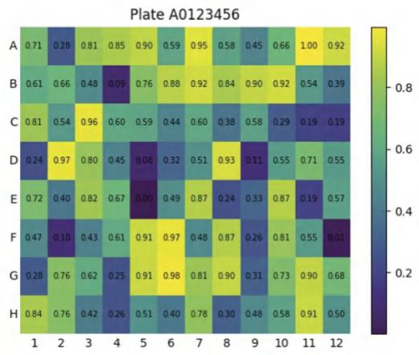  
Picture Demo   
Figure 10.3 Generated document with the “heat1.png” file inserted.

```txt
>>> from docx import Document
>>> doc = Document()
>>> hed = doc.add Heading("Picture Demo")
>>> ils = doc.add_picture("heat1.png")
>>> doc.save("report2.docx")
>>> 
```

# 10.2.5 Table Object

The python-docx module defines a Table object, which provides a way to build, style, and insert a Table into a Word document. As you might expect, the Table object is composed of a rectangular grid of _Cell objects. Note that the name of the _Cell object type begins with an underscore. Tables 10.6 and 10.7 list and describe several common methods and properties of the Table and _Cell objects.

The add_table(rows, cols) method of the Document object is used to add a new Table object to the document, where the first two positional arguments are the number of rows and columns in the Table. Once created, the individual cells in the table may be accessed using the Table’s cell(row, col) method. Given an individual _Cell object in the table, the content of the cell can be set using its text property. Note that a Table _Cell object may contain any other content, like a paragraph, an InlineShape, or even another Table. The style of a _Cell’s contents is determined by the contents itself.

A style for the entire Table may be set using the Table object style property. This property is assigned to a string that is the title of a Table style obtained from Word. When editing a table in Word, the Table Design tab becomes visible. On the ribbon under that tab is a group called Table Styles with a number of predefined table styles from which to choose. Hovering over each graphic in that group reveals a tooltip with the name of the design. You may set the style property of a Table object to a string matching any one of these predefined Table designs to format the entire table.

Table 10.6 Common Table object properties and methods.   

<table><tr><td>Table object methods and properties</td><td>Description</td></tr><tr><td>add_column(...)</td><td>Add a new column to the table.</td></tr><tr><td>add_row()</td><td>Add a new row to the table.</td></tr><tr><td>cell(row, col)</td><td>The_Cell object at row, col.</td></tr><tr><td>columns</td><td>Sequence of table columns.</td></tr><tr><td>rows</td><td>Sequence of table rows.</td></tr><tr><td>style</td><td>The named table style.</td></tr></table>

Table 10.7 Common _Cell object properties and methods.   

<table><tr><td>_Cell object methods and properties</td><td>Description</td></tr><tr><td>text</td><td>Text contents of Table cell.</td></tr><tr><td>addParagraph(...)</td><td>Add a paragraph to the cell.</td></tr><tr><td>width</td><td>Width of the cell.</td></tr></table>

In the following Python console session, we create a new Word document and insert a Table. Data for the table is provided in a list of lists, where each inner list contains data for a single table row. The first inner list contains the Table column headings.

Once the Table is added to the Document, nested loops generate the row and column indexes, and the cell(r, c) Table method accesses each _Cell object individually and then sets each text property to the _Cell contents. The contents of each _Cell must be a string, so prior to assigning a value to the text property of a _Cell, each data value is converted to a string.

After the Table is filled, the predefined style string “Light Grid Accent ${ \tt T ^ { \prime \prime } }$ is applied to the entire Table and the document is saved. See Figure 10.4 for the generated Word document.

```python
>>> from docx import Document
>>> 
>>> # Data to add to table
>>> data = ["Element", "Symbol", "Atomic Number"], ["Carbon", "C",
6], ["Hydrogen", "H", 1], ["Oxygen", "O", 16]]
>>> nrows = len(data)
>>> ncols = len(data[0])
>>> 
>>> # Document and heading
>>> doc = Document()
>>> hed = doc.add Heading("Table Demo")
>>> 
>>> # Create Table, add data to cells, set style.
>>> tbl = doc.add_table(nrows, ncols)
>>> for r in range(nrows):
...     for c in range(ncols):
...         tbl.cell(r, c).text = str(data[r][c])
>>> tbl.style = "Light Grid Accent 1"
>>> 
>>> # Save document
>>> doc.save("report3.docx")
>>> 
```

There is much more that you can do to generate Word documents with the python-docx library. Refer to the documentation [56] for all details.

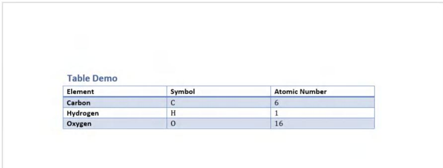  
Figure 10.4 Generated document with an added Table.

# 10.2.6 Project – Generate a Complete Word Report

Applying everything we’ve learned about the python-docx module, let’s write a function that receives report parameters and generates a report document. Our goal is to write a function with the following signature,

```python
def generate_docx(fig1, fig2, lol, fname): ... 
```

# where

•	 fig1 and fig2 are the matplotlib Figure objects containing the heatmap and $\mathrm { I C } _ { 5 0 }$ curves,   
•	 lol is a list of lists containing table data, and   
•	 fname is the name of the report Word file to generate.

We start our file by creating a new Python file, importing all the necessary supporting modules, including the fig2BytesIO(…) function from Listing 10.1, and starting the function definition (Listing 10.2).

Listing 10.2 Start of function to generate screening report document.   
# report_docx.py   
from io import BytesIO   
from docx import Document   
# Save a matplotlib Figure to a BytesIO and return   
def fig2BytesIO(fig): bfile $=$ BytesIO() fig.savefig(bfile,format $\equiv$ 'png') bfile.seek(0) return bfile   
# Generate a Word Report   
def generate_docx(fig1,fig2,lol,fname):

Within the function we create a new Document object, add a report title and a formatted paragraph with introductory comments. Note how a paragraph is added to the document with some initial text, but then a new Run is appended separately so that it can be assigned a bold style (Listing 10.3).

Listing 10.3 Add title and formatted paragraph to the document.   
Create a Word Document object doc $=$ Document() #Add a heading doc.add Heading('Screening Report'，0) #Add a paragraph with bolded text p1 $=$ doc.addparagraph('This report summarizes results from all dose-response experiments.') r1 $=$ p1.add_run('Consult assay documentation for detailed experimental procedures.） r1.Bold $=$ True

The function parameters include two matplotlib Figure objects (named fig1 and fig2), which are not images. We need images to add them to the document. We must convert a Figure to an image first, and then add the image to the document. We can do this in-memory using our fig2BytesIO(…) function and then use the Document object’s add_picture(…) method to insert the image into the document after first adding a descriptive heading (Listing 10.4).

# Listing 10.4 Save Figure to in-memory BytesIO file-like object and then add image to Word document.

```python
Add Heatmap figure  
doc.add Heading("Experimental Data Heat Map", 2)  
doc.add_picture(fig2BytesIO(fig1)) # Wrap and insert image to document 
```

The function’s lol parameter holds a list of lists of sample IDs and $\mathrm { I C } _ { 5 0 }$ parameter values estimated by fitting the four-parameter logistic model to the experimental data. After adding another new document heading, we build a formatted table containing this data (Listing 10.5).

# Listing 10.5 Build and style table, and fill cells with data.

Add IC50 Table   
doc.add Heading("Sample IC50s",2)   
# Add a table sized to hold all results.   
nrows $=$ len(lol) #Get number rows and columns   
ncols $=$ max([len(row) for row in lol])   
tbl $=$ doc.add_table Rows=nrows, cols=ncols)   
# Fill table   
for i in range(nrows): tb1.cell(i,0).text $=$ lol[i][0] tb1.cell(i,1).text $=$ str Lol[i][1])

To complete the function, we add the second Figure (fig2) using the same technique as above and save the document to the given file name (Listing 10.6).

# Listing 10.6 Convert and add second figure image and save report document.

```txt
Add scatter and fits plots doc.add Heading("Model Fits",2) doc.add_picture(fig2BytesIO(fig2)) # Wrap and add image to document Save Word document doc.save(fname) 
```

The complete function is a sequential combination of Listing 10.2 through Listing 10.6. The next job is to test the function. To the end of our Python file let’s add a dunder-main with code to test our new generate_docx(…) function.

We’ve moved several functions developed and adapted from previous examples into the report_utils.py files for easy import, including plot_fits(…), and fit_4PLs(…) (see Listing 9.14 and Listing 9.15). An updated version of the microplate_heatmap(…) function (Figure 9.8) is added to report_utils.py and renamed to plot_heatmap(…). This adapted function receives a DataFrame as its first argument instead of a list of lists.

For the dunder-main, we’ll run the entire process of loading and fitting data before generating the report document. In Listing 10.7, we

1.	 Import utility functions   
2.	 Read measurement data using the Pandas read_csv(…) file into a DataFrame, and transpose that data so rows contain data for a single sample   
3.	 Generate a heatmap Figure from the DataFrame   
4.	 Fit all measurement data to a four-parameter logistic model   
5.	 Generate a fits Figure with fitted parameters   
6.	 Collect sample names and estimated $\mathrm { I C } _ { 5 0 }$ parameters for a results table   
7.	 Pass all Figures and table data to the generate_docx(…) function.

Listing 10.7 Generate results from a measurement data file and test generate_docx(…).   
```python
# report_docx.py
# <snip>...
if __name__ == '__main__':
from report_utils import *
# Read data and transpose so columns hold data for single samples
df = pd.read_csv("data_plate.csv", header=None)
df = df.transpose()
# Generate heatmap Figure from data
fig1 = plot_heatmap(df, "Experimental Data")
# Fit all data to four-parameter logistic model
guess = [0, 2, -5, 1]
bounds = [[0,0,-9,0], [1,1000,0,1]]
concscs = [-9, -8, -7, -6, -5, -4, -3, -2, -1, 0]
param_sets = fit_4PLs(df, concscs, guess, bounds) # Fit all data
# Create a plot showing all data on eight axes.
fig2 = plot_fits(df, concscs, param_sets=param_sets)
# Collect IC50 results as list of lists
IC50s = [f{'pow(10, float(pset[2])):0.3E}]' for pset in param_sets]
lol = [(f'Sample {i+1}', IC50s[i]) for i in range(len(IC50s)) ]
lol.insert(0, ["Sample ID", "IC50 [M]']) # Add column headers
# Generate report Word document
generate_docx(fig1, fig2, lol, "report.docx") 
```

The resulting file named report.docx is a Word document containing all plots and fitted data. This report can easily be modified and expanded as needed.

# 10.3 Generating Microsoft PowerPoint Presentations

In a manner similar to the way we generate Word documents programmatically, we can get a head start on PowerPoint presentations by automatically generating a presentation document containing figures of interest and tables of data. Additional textual descriptions and other notations may be added afterward. A Python module that can help programmatically generate PowerPoint documents is python-pptx [56]. This module follows an approach that is similar to the one taken by the python-docx module.

Because the python-pptx module is not included in the Python standard library, it must be installed from the Python Package Index before it can be used.

```batch
> python -m pip install python-pptx 
```

Once installed, all imports are made from the module named pptx. For example, to access the Presentation object, import it from pptx. To create a new Presentation object, use the Presentation() constructor function.

```python
from pptx import Presentation
prs = Presentation() # Create a PowerPoint Presentation object 
```

The python-pptx module contains many object types that will be used to generate a presentation. Let’s consider the main object types, several common methods and properties for each, and how they can be used.

# 10.3.1 Presentation Object

The Presentation object is the top-level object encapsulating a Microsoft PowerPoint presentation document. Table 10.8 lists and describes many of the properties and methods of the Presentation object. If you have used PowerPoint to create a presentation, you know that the document is essentially a collection of slides. Each slide in a presentation can have a layout selected from a collection of layouts also stored in the document. These are reflected in the Presentation object as a slides property referencing a Slides object, which is a sequence of Slide objects, and a slide_layouts property referencing a SlideLayouts object, which is a sequence of SlideLayout objects.

Because the slides and slide_layouts properties reference objects that are sequences, individual items in each sequence are accessed like you would access the elements of a list using

Table 10.8 Common methods and properties of the python-pptx module Presentation object.   

<table><tr><td>Presentation object methods and properties</td><td>Description</td></tr><tr><td>slides</td><td>A Slide object, a sequence of all Slide objects in the Presentation.</td></tr><tr><td>slide layouts</td><td>A SlideLayouts object, a sequence of all slide layouts belonging to the first master slide.</td></tr><tr><td>save (fname)</td><td>Saves the PowerPoint document to the given filename.</td></tr></table>

the standard square-bracket notation and an index. In the following Python console session, we create a new Presentation object and verify that it starts with no slides by observing the Slides object length. There are 11 predefined SlideLayout objects in the Presentation so we print all the SlideLayout names. If you have used PowerPoint layouts to any extent, these names will be familiar to you. Note that an individual SlideLayout object may be obtained from a SlideLayouts sequence using its get_by_name(…) method. The Presentation object also implements a save(…) method, which generates the PowerPoint document and saves it to the named file.

```python
>>> from pptx import Presentation
>>> prs = Presentation()
>>> len(prs.slides)
0
>>> len(prsslide layouts)
11
>>> for layout in prsslide layouts:
...     print.layout.name)
...
Title Slide
Title and Content
Section Header
Two Content
Comparison
Title Only
Blank
Content with Caption
Picture with Caption
Title and Vertical Text
Vertical Title and Text
>>> blank.layout = prsslide layouts.get_by_name("Blank")
>>> blank.layout.name
'Blank' 
```

# 10.3.2 Slide Objects

A Presentation maintains its collection of Slide objects in a single object of type Slides, accessed using the Presentation’s slides property. To add a new Slide object to the Presentation, it is added to the Presentation’s Slides collection using the method add_slide(layout), where layout, a reference to a SlideLayout object, is obtained from the slide_layouts Presentation object property referencing the sequence of SlideLayout objects. If you have a unique id for a Slide in the Presentation, the get(id) method may be used to get a reference (refer to Table 10.9).

Individual slides in a Presentation are encapsulated by the Slide object. Every Slide object has a unique id, a single SlideLayout, and a collection of shapes (see Table 10.10).

Table 10.9 Important slides object collection methods.   

<table><tr><td>Slides object methods</td><td>Description</td></tr><tr><td>add_slide layout)</td><td>Add a new Slide to the presentation with layout.</td></tr><tr><td>get(id)</td><td>Get a Slide object from the Slides collection using Slide ID.</td></tr></table>

Table 10.10 Important slide object properties.   

<table><tr><td>Slide object properties</td><td>Description</td></tr><tr><td>shapes</td><td>Sequence of shape objects on the Slide.</td></tr><tr><td>slide_id</td><td>Unique integer for the slide in the Presentation.</td></tr><tr><td>slide.layout</td><td>Layout for this slide.</td></tr></table>

# 10.3.3 SlideShapes Object

The shapes property of a Slide object refers to a SlideShapes object, which manages all the items you find on a slide, collectively referred to as shapes. These shapes include the slide title, textboxes, tables, images, and more. Shapes stored in the SlideShapes sequence are ordered in increasing z-order, which is the order in which they are rendered on a slide. An object rendered later in a sequence may appear on top of an object rendered earlier. In other words, the first item in the sequence may be drawn behind all other shapes and the last item in the sequence may be drawn on top of all other shapes. You may access individual shape items in a slide’s SlideShapes collection using standard square bracket notation with an index. Table 10.11 lists several useful SlideShape object methods and properties.

In the following Python console session, we create a new Presentation, add two slides with the “Title and Content” layout and verify that the slides have been added by checking the length of the Slides object. As expected, we found two shapes in the first slide. We loop over these Shape objects and print the name of each, which are “Title 1” and “Content Placeholder 2.” This is expected based on the layout used when creating the slide.

```python
>>> from pptx import Presentation
>>> prs = Presentation()
>>> content.layout = prsslide layouts.get_by_name("Title and Content")
>>> slide1 = prs.slides.add Slide(content.layout)
>>> slide2 = prs.slides.add Slide(content.layout)
>>> len(prs.slides)
2
>>> len(slide1.shape)
2
>>> for shape in slide1.shape:
...     print(shape.name)
...
Title 1
Content Positioner 2 
```

Table 10.11 Common SlideShapes object properties and methods.   

<table><tr><td>SlideShapes object methods and properties</td><td>Description</td></tr><tr><td>add_picture (...)</td><td>Add an image to the slide.</td></tr><tr><td>add_table (...)</td><td>Add a table to the slide.</td></tr><tr><td>add_textbox (...)</td><td>Add a text box to the slide.</td></tr><tr><td>title</td><td>The title placeholder shape on the slide of None.</td></tr></table>

Table 10.12 Several length object types defined by the pptx.util submodule.   

<table><tr><td>pptx.util module types</td><td>Description</td></tr><tr><td>Inches</td><td>Object type representing integer length in inches.</td></tr><tr><td>Cm</td><td>Object type representing floating point length in centimeters.</td></tr><tr><td>Mm</td><td>Object type representing floating point length in millimeters.</td></tr><tr><td>Pt</td><td>Object type representing floating point length in points.</td></tr></table>

# 10.3.4 Length Objects

When adding shapes to a slide, we often want to specify the shape’s dimensions using a length measurement. In the python-pptx module as well as the python-docx module, lengths are not simple numeric values. Length measurements are objects that must be created before they can be used. All length object types are defined in the pptx.util submodule, which must be imported separately. Several example length object types are listed and described in Table 10.12.

Consider the following Python console session which demonstrates length objects. Note that we start by importing both Presentation from the pptx module and Inches from pptx.util submodule. For convenience, we start by creating two Inches objects, one representing a 1-inch length and the second representing an 8-inch length.

A Presentation object is created, and a single slide is added having a "Blank" layout. The Slide method add_picture(…) is invoked to insert the heat1.png image onto the slide. The method requires at least three parameters, including a source for the picture and the upper left coordinates for where to place the picture on the slides. An optional width keyword parameter representing the width of the picture shape. The image added to the shape will be scaled to fit the shape. The resulting Presentation is depicted in Figure 10.5 showing a slide with a blank layout that contains a picture shape inserted at a location that is 1 inch from the top and 1 inch from the left. The heat1. png image is inserted into the shape and scaled to a width of 8 inches. In the figure, the shape is selected to highlight the starting location and width.

```python
>>> from pptx import Presentation
>>> from pptx.util import Inches
>>> in1 = Inches(1)
>>> in8 = Inches(8)
>>> prs = Presentation()
>>> blank.layout = prsslide layouts.get_by_name("Blank")
>>> slide1 = prs.slides.add Slide(blank.layout)
>>> shape1 = slide1shapes.add_picture("heat1.png", in1, in1, width=in8)
>>> prs.save("report1.pptx")
>>> 
```

# 10.3.5 Table Object

In the python-pptx module, a Table on a slide is also embedded within an outer Shape object. Similar to other shapes, Tables are created using the add_table(…) method of the SlideShapes object. The add_table(…) method expects six parameters, including the

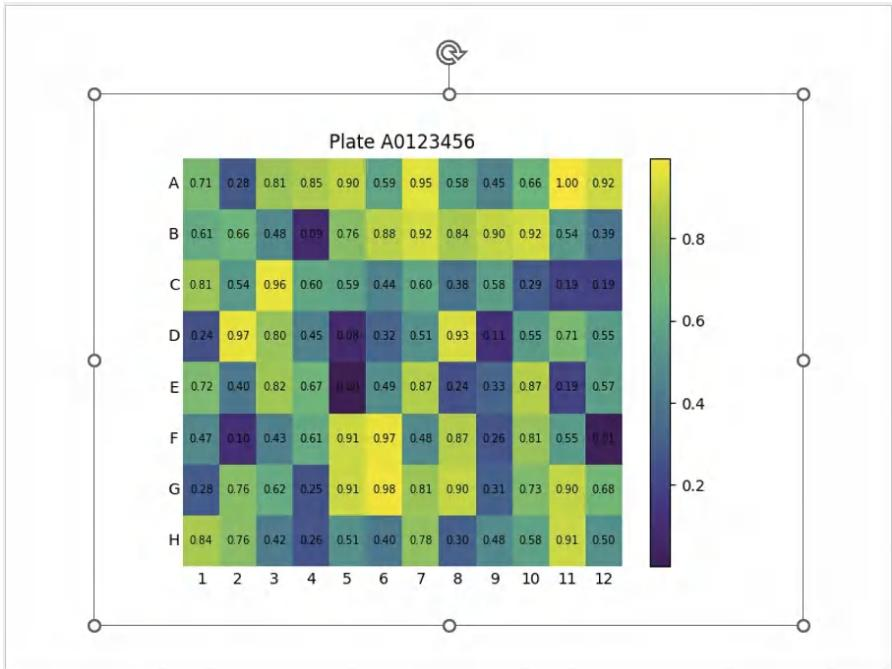  
Figure 10.5 Generated Presentation with a blank slide and a single picture shape.

number of rows and columns, the left and top position of the table, and its width and height. Recall that the left, top, width, and height parameters must be Length objects, including those in Table 10.12. The method returns a new container object of type GraphicFrame. This object has a table property referencing a Table object with methods and properties including those listed in Table 10.13.

```txt
gframe = add_table(nrows, ncols, left, top, width, height) 
```

The python-pptx module’s Table object is similar to the python-docx module’s Table object in that both have a cell(row, col) method that returns a _Cell object at location (row, col). We’ll concern ourselves with the _Cell object’s text property only, which is used to access the text within the table cell.

In the following Python console session, we repeat the task performed in Figure 10.4, only this time we add a Table to a title slide in a PowerPoint presentation. Figure 10.6 shows the generated slide and table.

Table 10.13 Common Table object methods.   

<table><tr><td>Table object methods and properties</td><td>Description</td></tr><tr><td>cell(row, col)</td><td>The_Cell object at row, col.</td></tr><tr><td>rows</td><td>Collection of Table rows.</td></tr><tr><td>columns</td><td>Collection of Table columns.</td></tr></table>

```python
>>> from pptx import Presentation
>>> from pptx.util import Inches
>>> 
>>> # Create a few Length objects
>>> in2 = Inches(2)
>>> in6 = Inches(6)
>>> 
>>> # Data to add to table
>>> data = ["Element", "Symbol", "Atomic Number"], ["Carbon", "C",
6], ["Hydrogen", "H", 1], ["Oxygen", "O", 16]]
>>> nrows = len(data)
>>> ncols = len(data[0])
>>> 
>>> # Create Presentation, Title slide and set title
>>> prs = Presentation()
>>> title.layout = prsslide layouts.get_by_name("Title Only")
>>> slide1 = prs.slides.add Slide(title.layout)
>>> slide1.shape[0].text = "Table Demo"
>>> 
>>> # Create Table and add data to cells.
>>> frame = slide1shapes.add_table(nrows, ncols, in2, in2, in6, in2)
>>> tbl = frame.table
>>> for r in range(nrows):
...     for c in range(ncols):
...         tbl.cell(r, c).text = str(data[r][c])
...
>>> # Save presentation
>>> prs.save("report2.pptx")
>>> 
```

Table Demo   

<table><tr><td>Element</td><td>Symbol</td><td>Atomic Number</td></tr><tr><td>Carbon</td><td>C</td><td>6</td></tr><tr><td>Hydrogen</td><td>H</td><td>1</td></tr><tr><td>Oxygen</td><td>O</td><td>16</td></tr></table>

Figure 10.6 Generated Presentation with an added Table.

# 10.3.6 Project – Generate a PowerPoint Document with Figures and Tables

The purpose of this project is to generate a PowerPoint presentation to be used as a starting point for a more detailed presentation of experimental results. The presentation that we want to generate will have each plot on a separate slide and a table of results on a final slide. The idea is to automate the tedious copying and pasting that we must do to generate a presentation of results every time a series of experiments is complete.

For this project we’d like to put the heat map and each $\mathrm { I C } _ { 5 0 }$ plot on a separate slide in our presentation. We’ll need a new function that generates an $\mathrm { I C } _ { 5 0 }$ matplotlib plot Figure object with only one plot, not the eight plots on one Figure that was generated by the plot_fits(…) function in Listing 9.15. To our report_utils.py file, we’ll add the plot_fit(…) method in Listing 10.8. This function is a simplified version of the plot_fits(…) from Listing 9.15. It builds and returns a Figure with a single plot.

Listing 10.8 Generate a Figure having one four-parameter logistic plot with measured data.   
```python
# Plot one set of data
def plot_fit(Ys, Xs, title, params):
    # Create a figure for measured data scatter plots and fit
    fig, ax = plt.subplot(1, 1,figsize=(6,6))
    # Generate a list of log(conc) to be used for plotting all 4PL fits
    plot_concs = np.linspace(Xs[0],Xs[-1],100)
    ax.set_title(title) # Add title
    ax.scatter(Xs,Ys,marker='+') # Add scatter and line plots
    ax.plot(plot_concs,fourPL(plot_concs,\*params))
    fig.tight.layout()
    return fig 
```

As we did with the project in subsection 10.2.6, for this project we want to generate each Figure in memory to avoid creating unnecessary image files. Also, we want to encapsulate all the functionality for generating the new PowerPoint document in a function named generate_pptx(…). Module imports, our fig2BytesIO(…) helper function, and the new function signature are given in Listing 10.9. Function parameters include figs, a sequence of all Figures to be inserted in the presentation, one slide at a time, as well as lol, a list of lists containing table data, and fname, the file name to use when generating and saving the PowerPoint file.

Listing 10.9 Start of function to generate screening report presentation.   
# report_pptx.py   
from io import BytesIO   
from pptx import Presentation   
from pptx.util import Inches   
# Save a matplotlib Figure to a BytesIO and return   
def fig2BytesIO(fig): bfile $=$ BytesIO() fig.savefig(bfile,format $\equiv$ 'png') bfile.seek(0) return bfile   
def generate_pptx(figs,lol,fname):

The first step is to create a new Presentation object, get references to the slide layout objects we will use to create new slides and create several Length objects for sizing (Listing 10.10).

Listing 10.10 Create Presentation, get slide layouts and create Length objects.   
```python
Create new Presentation
prs = Presentation()
Get useful layouts and create Length objects
title.layout = prsslide layouts.get_by_name("Title Slide")
content.layout = prsslide layouts.get_by_name("Title and Content")
in1 = Inches(1)
in2 = Inches(2)
in3 = Inches(3)
in4 = Inches(4)
in6 = Inches(6) 
```

Next, we add the first Slide with a "Title Slide" layout and add text to the title shape on that slide (Listing 10.11).

Listing 10.11 Add and configure Title slide.   
```txt
Add Title slide and title
slide = prs.slides.addslide(title.layout)
slide.shape.title.text = "Experimental Data" 
```

A loop is used to loop over all Figures passed to the function. Each Figure is saved to an in-memory BytesIO object and then inserted into a new Slide (Listing 10.12).

Listing 10.12 Create all slides with Figures.   
Generate all figures and add each to a separate slide for fig in figs: slide $=$ prs.slides.addslide(content.layout) slide.shapes.add_picture(fig2BytesIO(fig),in2,in1, width $\equiv$ in6)

The final slide is created, and a table is inserted on the slide at the given location with the given size, as determined by the Length objects. The Presentation is then saved as a PowerPoint file using the given filename (Listing 10.13).

Listing 10.13 Add final slide and build a table containing all tabular data.   
```python
Add final slide with generated table  
slide = prs.slides.add Slide(content.layout)  
nrows = len(lol) # Get Table size and add Table  
ncols = max([len(row) for row in lol])  
frame = slide.shape.add_table(nrows, ncols, in3, in2, in4, in4)  
tbl = frame.table # Get a Table reference  
for r in range(nrows): # Add data to table cells  
for c in range(ncols):  
    tbl.cell(r, c).text = str(lol[r][c])  
# Generate presentation and save  
prs.save(fname) 
```

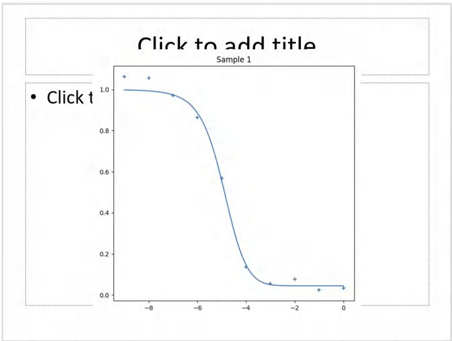  
Figure 10.7 One Figure slide from the generated presentation.

Figure 10.7 shows one of the Figure slides from the generated PowerPoint presentation file. It demonstrates how a Figure image is inserted on to a new slide, but the title and content text boxes remain to be filled.

The dunder-main we’ll use to test our generate_pptx(…) function is very similar to the one we used in Listing 10.7. The main difference between the new version in Listing 10.14 and the version in Listing 10.7 is that the new version uses our new plot_fit(…) function from Listing 10.8 and collects all Figures in a figs list. This is passed to the generate_pptx(…) function which generates and save the PowerPoint presentation to a file.

Listing 10.14 Generate results from a measurement data file and test generate_pptx(…).   
report_pptx.py   
from io import BytesIO   
from pptx import Presentation   
from pptx.util import Inches   
#... <snip> if_name $= =$ 'main': from report_utils import \* #Read data and transpose so columns hold data for single samples df $=$ pd.read_csv("data_plate.csv",header $\equiv$ None) df $=$ df.transpose()

Listing 10.14 (Continued)   
```python
# Generate heatmap Figure from data
fig1 = plot_heatmap(df, "Experimental Data")
figs = [fig1]
# Fit all data to four-parameter logistic model
guess = [0, 2, -5, 1] # Parameter guesses
bounds = [[0,0,-9,0], [1,1000,0,1]] # Parameter bounds
concsc = [-9, -8, -7, -6, -5, -4, -3, -2, -1, 0] # log(concentrations)
params = fit_4PLs(df, concsc, guess, bounds) # Fit all data
# Create eight Figures with a single plot for data and parameter set.
for col in range(8):
    title = f"Sample {col+1}" 
    fig = plot_fit(df[col], concsc, title, params[col])
    figs.append(fig)
# Collect IC50 results as list of lists
IC50s = [f{'pow(10, float(pset[2])):0.3E}] ' for pset in params]
lol = [(f'Sample {i+1}', IC50s[i]) for i in range(8)]
lol.insert(0, ["Sample ID", "IC50 [M]")] # Add column headers
# Generate presentation document
generate_pptx(figs, lol, 'report.pptx') 
```

# 10.4 Generating PDF File Reports

The Python ecosystem of open-source modules includes several options for reading and writing Adobe’s Portable Document Format (PDF) files. We’ll focus on one Python library designed primarily for generating new PDF documents called the ReportLab PDF Toolkit [57].

ReportLab is an external toolkit not included in the standard Python library and must be installed from the Python Package Index (PyPI) before it can be used.

# > python -m pip install reportlab

Unlike Microsoft Word and PowerPoint files, a PDF does not include inherent styles that can be applied to text or a table, nor does it include layouts that can be applied to a document, and it does not flow long elements from one line to the next automatically. Generating PDF files is performed at a more basic level, requiring you to set up and do all the formatting and positioning for each document element that is written to the file. Generating a PDF is much more like painting on a canvas rather than typing into a word processor.

ReportLab has its own sophisticated templating and flow framework called PLATYPUS, which is an acronym for Page Layout And TYPography Using Scripts. After exploring the more fundamental functions of ReportLab for rendering text and images on the page of a PDF document directly, we’ll introduce PLATYPUS and use it to lay out and generate a final report.

# 10.4.1 ReportLab PDF Generation Process

Generating a PDF using ReportLab follows a well-defined process. The first step is to create and size a new Canvas object. The Canvas object’s methods are then used to set its graphic properties

including fonts, sizes, colors, etc. and paint elements on the Canvas using those properties. The Canvas object provides a long list of methods that allow you to paint elements of various types, such as strings, images, and a variety of graphics like straight lines, arcs, Bezier curves, grids, rectangles, ellipses, circles, etc.

# 10.4.2 Creating a Canvas Object

The core Canvas object is defined in the reportlab.pdfgen.canvas submodule. Creating a new Canvas object requires importing the submodule and invoking the Canvas object creation function with the name of the PDF file as its argument.

When all pages are rendered, invoking the Canvas object’s save() method generates the PDF file using the file name specified when the Canvas was created.

The following creates a US letter-sized page $( 8 ^ { 1 / 2 ^ { \prime \prime } } \times 1 1 " )$ ) and saves it to a blank PDF file named report1.pdf. The values 612 and 792 represent the width and height of the page in points, where 1 inch $= 7 2$ points.

```txt
>>> from reportlab.pdfgen import canvas
>>> cvs = canvas.Canvas("report1.pdf")
>>> cvs.setPageSize(612, 792)
>>> cvs.save()
>>> 
```

# 10.4.3 Setting Canvas Styles

Rather than invoking a Canvas drawing method with styles passed as parameters, the Canvas drawing model requires us to set its graphic styles first, and then invoke drawing methods that make use of the preset styles. This model is advantageous when a single style setting is to be used for several drawing operations, like setting a font name and font size once before drawing a large amount of text. The style can be set once at the beginning of the document generation process and used throughout without requiring it to be set again.

Text styles include font names with various typographical emphasis options like bold and italics, font size, fill and outline (stroke) color, line width, and other line properties such as line join and end cap formats. To select styles, invoke one of the many Canvas methods including those in Table 10.14. The style will be used for everything drawn afterward, when applicable.

The Canvas object supports a variety of methods to draw graphics on a PDF page, many are listed in Table 10.15. Text can be written to a PDF page using the drawString(…) which takes the x, y coordinates and a string with the text to be drawn. Note that the origin of a PDF page as well as all objects drawn to the page, including text, has coordinates at the lower-left corner. This is different than a typical computer graphics coordinate system, which sets the origin to be the upper left corner of the graphic object and the page.

In addition to text, Table 10.15 describes several other Canvas methods for drawing on a PDF. These include lines, rectangles, ellipses, arcs, bezier curves, and images.

The interactive example below demonstrates line and text drawing graphics methods. Lines drawn start at the page origin (0, 0) and extend in the positive x and positive y directions. At the end of each line an arrow is drawn pointing in the positive direction. Note that a font family and size is set and a string is drawn with its anchor point at the page origin.

Table 10.14 Common Canvas methods for setting graphic styles prior to drawing.   

<table><tr><td>Canvas style setting methods</td><td>Description</td></tr><tr><td>setFont (fontname, size)</td><td>Set font given name and size in points.</td></tr><tr><td>setFillColorRGB (R,G,B)</td><td>Sets fill color. RGB color components are in range [0.0, 1.0].</td></tr><tr><td>setStrokeColorRGB (...)</td><td>Sets stroke color. RGB color components are in range [0.0, 1.0].</td></tr><tr><td>setLineWidth (width)</td><td>Set line width.</td></tr><tr><td>setLineCap (mode)</td><td>0=butt, 1=round, 2=square</td></tr><tr><td>setLineJoin (mode)</td><td>0=mitre, 1=round, 2=bevel</td></tr></table>

Table 10.15 Common Canvas graphics drawing methods.   

<table><tr><td>Canvas drawing methods</td><td>Description</td></tr><tr><td>drawString(x, y, str)</td><td>Draws str at (x, y) using current font and size.</td></tr><tr><td>line(x1, y1, x2, y2)</td><td>Draw a line from (x1, y1) to (x2, y2).</td></tr><tr><td>lines(list)</td><td>Draw all lines given list of coordinate endpoints.</td></tr><tr><td>grid(xlist, ylist)</td><td>Draws a grid using coordinates from xlist and ylist.</td></tr><tr><td>rect(x, y, width, height)</td><td>Draws rectangle at (x, y) of size width by height.</td></tr><tr><td>roundrect(x, y, width, height, radius)</td><td>Draws rectangle at (x, y) of size width by height and a corner radius of radius.</td></tr><tr><td>ellipse(x1, y1, x2, y2)</td><td>Draws an ellipse inscribed in bounding box defined by corners at (x1, y1) and (x2, y2).</td></tr><tr><td>arc(x1, y1, x2, y2, startAng=0, extent=90)</td><td>Draws part of ellipse in (x1, y1) and (x2, y2) starting at angle startAng and continuing for extent degrees.</td></tr><tr><td>wedge(x1, y1, x2, y2, startAng, extent)</td><td>Like arc but draws lines from endpoints to center of ellipse.</td></tr><tr><td>bezier(x1, y1, x2, y2, x3, y3, x4, y4)</td><td>Draws Bezier curve with control points (x1, y1), (x2, y2), (x3, y3), (x4, y4).</td></tr><tr><td>drawImage(image, x, y, width=None, height=None, preserveAspectRatio=False)</td><td>Draws image at (x, y) with optional width and height and optionally preserving aspect ratio.</td></tr></table>

Figure 10.8 shows the bottom of the first page of the generated PDF. Both lines start at the lower left. One proceeds up and the other to the right. The string "Python" appears with its lower left corner coinciding with the page origin at the lower left, which illustrates that text drawing follows the same pattern and direction.

```python
>>> from reportlab.pdfgen import canvas
>>> 
>>> # Create and size Canvas
>>> cvs = canvas.Canvas("report1.pdf")
>>> cvs.setSize((612, 792))
>>> 
>>> # Draw Axes
>>> cvs.line(1, 1, 1, 100) 
```

```txt
>>> cvs.line(1, 1, 100, 1)  
>>> cvs-lines([(1, 110, 5, 100), (5, 100, -5, 100), (-5, 100, 1, 110)])  
>>> cvs-lines([(110, 1, 100, 5), (100, 5, 100, -5), (100, -5, 110, 1)])  
>>> # Draw text  
>>> cvs.setFont("Helvetica-Bold", 14)  
>>> cvs.drawString(1, 1, "Python")  
>>> # Generate PDF document  
>>> cvs.save()  
>>> 
```

When drawing is complete for one page of a PDF, the Canvas object’s showPage() method is invoked to wrap up current page rendering and to create a new blank page. Because rendering at this level does not support the automatic flow of items from one page to the next, you must decipher when a page is complete and it is time to move to the next page. In other words, you must perform the tricky task of element flow management yourself. Drawing an element at a location that is outside the bounds of the page will not cause the content to flow to the next page. Instead, the element will not be visible in the PDF document. Fortunately, ReportLab gives us the tools to measure the size and location of rendered items on the page, so it is possible to perform some rudimentary element flow ourselves.

# 10.4.4 Managing Text Blocks with PDFTextObjects

The ReportLab PDFTextObject type helps manage and assemble larger blocks of text. Create a new PDFTextObject by invoking the Canvas object’s beginText(x, y) method, to be anchored at the location $( \mathbf { x } , \mathbf { \mu } _ { \mathrm { y } } )$ . Once you are finished adding text to the PDFTextObject, it is rendered in its entirety by invoking the Canvas drawText(…) method with the PDFTextObject as the argument (Table 10.16).

The main responsibility of a PDFTextObject is to encapsulate a block of text with formatting to be rendered, and to track where the text will appear on a PDF page. Table 10.17 lists and describes several PDFTextObject methods that can be used to add and format an entire block of text.

The Canvas stringWidth(…) method helps us compute the location of the rightmost part of a string rendered on the PDF page by adding the computed string width to the string starting x-location. By combining the rich functionality of a PDFTextObject with the stringWidth(…)

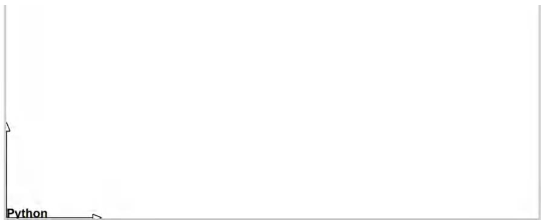  
Figure 10.8 Generated PDF with drawn lines and text.

Table 10.16 Common Canvas text methods.   

<table><tr><td>Canvas string/text methods</td><td>Description</td></tr><tr><td>beginText(x, y)</td><td>Create and return a PDFTextObject object at (x, y).</td></tr><tr><td>drawText(tobj)</td><td>Draw the PDFTextObject tobj to the Canvas.</td></tr><tr><td>stringWidth(word)</td><td>Returns width of word using current font and font size.</td></tr></table>

Table 10.17 Common PDFTextObject methods.   

<table><tr><td>PDFTextObject methods</td><td>Description</td></tr><tr><td>getCursor()</td><td>Get current cursor position relative to PDFTextObject origin.</td></tr><tr><td>getX()</td><td>Get the current x-location relative to PDFTextObject origin.</td></tr><tr><td>getY()</td><td>Get the current y-location relative to PDFTextObject origin.</td></tr><tr><td>setFont(name, size)</td><td>Set font name and point size.</td></tr><tr><td>textOut(text)</td><td>Add text to the PDFTextObject and move the cursor.</td></tr><tr><td>textLine(text=&#x27;&#x27;)</td><td>Draw text and move to next line.</td></tr><tr><td>textLines(multilines)</td><td>Draw a multi-line string, moving down after each line.</td></tr></table>

method’s ability to measure text width, we can layout a block of text that flows left to right and inserts linefeeds when the text flows off the right side of the page.

Listing 10.15 is a function that takes a Canvas object, an anchor location, the maximum width for the paragraph, and a list of string tokens to be written to the paragraph with line wrapping. The method sets font and fill color and creates a new PDFTextObject. All string tokens are added to the PDFTextObject in the provided order using the textOut(…) method. But before adding each token, the expected rightmost coordinate of the token is computed. If that position exceeds the given paragraph width, the paragraph is wrapped by invoking the textLine() method. Once all tokens are added to the PDFTextObject, it is drawn using the Canvas drawText(…) method.

Listing 10.15 Helper function to render a string token list as a wrapped paragraph.   
```python
Draw a token list as a paragraph with wrapping
def drawParagraph(cvs, x, y, width, tokens):
    cvs.saveState()
    cvs.setFont("Helvetica", 12)
    cvs.setFillColorRGB(0, 0, 0)
    to = cvs.beginText(x, y)
    for token in tokens:
        currx = to.getX()
        strw = cvs.stringWidth(token)
        if currx + strw > x + width:
            to.textLine()
        to.textOut(token + " ") 
```

To demonstrate the drawParagraph(…) helper function, consider the small dunder-main code snippet given in Listing 10.16. A large multi-line string is used to initialize the variable para. After creating and sizing a new Canvas, this large string is split into individual string tokens and rendered on the Canvas with a narrow width of only 200 points. The resulting PDF document shown in Figure 10.9 demonstrates how the words are wrapped into a narrow paragraph.

Listing 10.16 Test of the drawParagraph(…) method.   
# lorem_ipsum.py   
from reportlab.pdfgen import canvas   
#...<snip>   
if_name $= =$ 'main': para $= 111$ Lorem ipsum dolor sit amet, consectetur adipiscing elit, sed do eiusmod tempor incididunt ut labore et dolore magna aliqua. Ut enim ad minim veniam, quis nostrud exercitation ullamco laboris nisi ut aliquip ex ea commodo consecut. Duis aute irure dolor in reprehenderit in voluptate velit esse cillum dolore eu fugiat nulla pariatur. Excepteur sint occaecat cupidatat non proident, sunt in culpa qui officia deserunt mollit anim id est laborum.''' cvs $=$ canvas.Canvas("lorem_ipsum.pdf") cvs.setSizePageSize((612，792)) tokens $=$ para.split() drawParagraph(cvs，50，742，200，tokens) cvs.save()

The Canvas object provides several additional methods, listed and described in Table 10.18. PDF file metadata may be added to a document, including title, author, and subject. The showPage() method draws the current page and moves to the next page, and the getPageNumber() method lets us know which page we are building.

```txt
LoremIPSumdolor sit amet,   
consectetur adipiscing elit, sed do   
eiusmod tempor incidunt ut labore   
et dolore magna aliqua. Ut enim ad   
minim veniam, quis nostrud   
exercitation ullamco laboris nisi ut aliquip ex ea commodo consecuat.   
Duis aute irure dolor in reprehenderit in voluptate velit esse cillum dolore eu fugiat nulla pariatur. Excepteur sint occaecat cupidatat non proident, sunt in culpa qui officia deserunt mollit anim id est laborum. 
```

Figure 10.9 Output PDF document generated by Listing 10.16.

Table 10.18 Other common Canvas methods.   

<table><tr><td>Canvas methods</td><td>Description</td></tr><tr><td>setAuthor (name)</td><td>Set internal author file annotation.</td></tr><tr><td>setTitle (title)</td><td>Set internal title file annotation.</td></tr><tr><td>setSubject (subject)</td><td>Set internal subject file annotation.</td></tr><tr><td>showPage()</td><td>Render the current page to the PDF document.</td></tr><tr><td>getPageNumber()</td><td>Returns the number of the current page being generated.</td></tr><tr><td>saveState()</td><td>Saves current graphics state on a stack, to be restored later.</td></tr><tr><td>restoreState()</td><td>Restores last saved graphics state.</td></tr><tr><td>save()</td><td>Save the PDF document to a file.</td></tr></table>

# 10.4.5 Canvas State Stack

To help manage frequent state changes, ReportLab implements a state stack. The Canvas saveState() method saves a complete snapshot of the entire drawing state, including font family, font size, fill and stroke colors, line width, etc. Once saved, the state can be updated to new values, which are used for styling future objects to be drawn to the document. Once completed, the saved state settings can be restored all at once using the Canvas restoreState() method. In fact, the drawing state of a Canvas can be saved, modified, and saved again, operating like a stack and saving multiple states in order. Each time a restoreState() is invoked, the last state is popped off the state stack and used for future drawing operations.

To ensure helper functions are self-contained, always save the current state at the start of the function by invoking the Canvas saveState() method. Make state changes as desired and perform all drawing operations within the function. Before exiting the function, restore the original saved state by invoking the restoreState() method. This ensures that the drawing state is set back to the original settings. The drawParagraph(…) helper function in Listing 10.15 uses this technique.

Note, according to the ReportLab documentation, all state changes are lost when advancing to a new page using showPage(). Any state settings you wish to preserve must be set again for drawing on each new page.

# 10.4.6 Drawing Images

One of the Canvas graphics drawing methods in Table 10.15 is the drawImage(…) method. This method draws an image on the PDF document at the given location with given dimensions. The image expected by the method may be one of two types, an image file name or an object of type ImageReader.

In the console session below, the existing image file named heat1.pdf is written to a PDF file using the Canvas drawImage(…) function at the location (0, 300) and saved to a file. See the resulting PDF file in Figure 10.10. Recall that the origin is at the lower left corner of the page and the image anchor point is also at its lower left corner. Selecting the y-coordinate of the image on the PDF page must be selected as a distance from the bottom of the page.

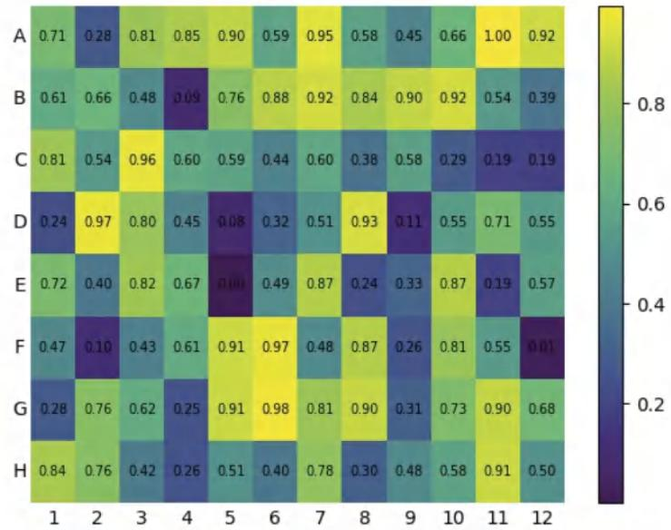  
Plate A0123456   
Figure 10.10 PDF file with an image.

```python
>>> from reportlab.pdfgen import canvas
>>> 
>>> cvs = canvas.Canvas("heat1.pdf")
>>> cvs.drawImage("heat1.png", 0, 300)
(640, 480)
>>> cvs.save()
>>> 
```

ImageReader is a utility object provided by ReportLab, which can be imported from the reportlab.lib.utils submodule, as follows.

from reportlab.lib.utils import ImageReader

When created, the ImageReader object wraps one of several other objects that contain image data and makes the data available to ReportLab for drawing into a PDF document. This object is useful when generating images in memory, similar to what we have done previously by saving matplotlib Figures to a BytesIO object.

The drawFigure(…) function in Listing 10.17 takes as parameters a Canvas object, a matplotlib Figure object, an (x, y) location, and an image width. It saves the Figure to a BytesIO object, wraps it in an ImageReader object and draws the image to the PDF by passing the ImageReader to the Canvas drawImage(…) method. Several steps are required to draw a matplotlib Figure on a PDF page, but this function hides the details. The saveState() and restoreState() Canvas methods are not used in drawFigure(…) because the function makes no state changes.

Listing 10.17 Helper function to draw matplotlib Figures onto a PDF document.   
```python
Draw a matplotlib Figure on a PDF
def drawFigure(cvs, fig, x, y, width):
    bfile = BytesIO()
    fig.savefig(bfile, format='png')
    bfile.seek(0)
    ir = ImageReader(bfile)  # Save figure image to a BytesIO
    cvs.drawImage(ir, x, y, width=width, preserveAspectRatio=True) 
```

# 10.4.7 PLATYPUS for Page Layout

The previous low-level drawing functions are ideal when you want fine control over what is drawn to a PDF document. The downside of this approach is that the drawing locations for every item in the document must be computed. This job can become very tedious, very quickly.

Fortunately, ReportLab provides us with a solution to this problem called PLATYPUS (Page Layout And TYPography Using Scripts). All PLATYPUS functionality is available in the platypus submodule.

PLATYPUS implements the concepts of document templates and style sheets. You may create your own templates and style sheets and then apply them to the parts of your document or make use of default prebuilt templates and styles. We’ll use the default options to demonstrate how a PDF file may be formatted and generated. You can build your own document templates and style sheets to fine tune the look of the PDFs that you generate.

A core object type in PLATYPUS is the Flowable. Generating a document with parts that are nicely laid out involves creating and accumulating multiple Flowable objects and then asking the PLATYPUS engine to build the document. During the build process, all Flowable objects are flowed into a document according to their formatting and styling rules. Flowables include paragraphs, images, tables, and more. Rather than drawing report elements from scratch and computing exact positions for each element, we’ll ask the PLATYPUS engine to lay out a document for us.

Table 10.19 lists and describes a few of the Flowable objects types available in PLATYPUS. In the next section, we will describe several of these object types in more detail, as we use each to generate a final PDF report programmatically.

# 10.4.8 Project – Generate a Complete PDF Report

For this project we want to repeat the overall goal of generating a report programmatically, as we did in subsection 10.2.6, only this time we want to create a PDF file instead of Word document.

As we’ve done before, the project starts with all imports and helper function definitions, the first few lines of our new generate_pdf(…) function, and a few variable initializations (Listing 10.18). Many different objects in the PLATYPUS submodule will be used, so everything

Table 10.19 A few of the Flowable object types in PLATYPUS.   

<table><tr><td>PLATYPUS flowable object type</td><td>Description</td></tr><tr><td>Paragraph</td><td>A paragraph of wrapped text.</td></tr><tr><td>Figure</td><td>An image with a caption.</td></tr><tr><td>Image</td><td>A plain Image.</td></tr><tr><td>Table</td><td>A rectangular grid of cells.</td></tr><tr><td>Spacer</td><td>A block of blank space, often used to shift elements down.</td></tr><tr><td>PageBreak</td><td>A forced page break, forcing flow to continue on the next page.</td></tr><tr><td>Preformatted</td><td>A block of text in a fixed-width font.</td></tr></table>

from the module is imported using a “*” wildcard. Also, a sample style sheet provided by ReportLab will be used so the getSampleStyleSheet(…) function is imported as well.

Listing 10.18 Imports, helper functions, and signature of the function that starts our project file.   
```python
# report(pdf.py
import pandas as pd
from io import BytesIO
from reportlab.platypus import *
from reportlab.libstyles import getSampleStyleSheet
# Save a matplotlib Figure to a BytesIO and return
def fig2BytesIO(fig):
    bfile = BytesIO()
    fig.savefig(bfile, format='png')
    bfile.seek(0)
    return bfile
# Generate report as PDF file
def generate(pdf(fig1, fig2, lol, fname):
    inch = 72
    parts = []
# Points per inch
# Parts of the report 
```

One object type provided in the platypus submodule is a SimpleDocTemplate type. The constructor function used to create a new object takes several keyword parameters describing the intended document layout. In addition to the name of the new PDF file, page and margin sizes are specified in points (Listing 10.19).

Listing 10.19 Create a PLATYPUS document template.   
```python
Initialize simple document template  
doc = SimpleDocTemplate(fname,  
    page_size = (8.5*inch, 11*inch),  
    bottomMargin = 0.5*inch,  
    topMargin = 0.5*inch,  
    rightMargin = 1.0*inch,  
    leftMargin = 1.0*inch) 
```

Invoking the getSampleStyleSheet() method builds and returns a style sheet containing styles that can be used to create various Flowable objects. Several of these styles are copied out of the style sheet for easy access in the functions that follow, including Normal, Heading1, and Heading2 (Listing 10.20).

# Listing 10.20 Get sample style sheet and copy styles to be used in the document.

Get a sample style sheet and copy styles styles $=$ getSampleStyleSheet() N，H1， $\mathrm{H2} =$ styles['Normal'],styles['Heading1'],styles['Heading2']

To start the document, the first Flowable called a Paragraph is created with the document title and the style Heading1 (Listing 10.21). The new Paragraph object is appended to a parts list, which will be used to build the final document after all Flowable objects are created. A second Paragraph object is created with a string of "_" characters and the style Normal, and appended to the parts list.

Following this we want to add vertical space to the document. A second Flowable object type called Spacer is created and added to the parts list. The Spacer constructor function takes two parameters, width and height. The Spacer object added to the parts list in Listing 10.21 is 1 point wide, but 12 points in height. This puts some space between the title and the next element in the document flow.

A second Paragraph object is created with more introductory text and a Normal style. Once again, this Paragraph is added to the parts list along with another Spacer.

# Listing 10.21 Start PDF document with a title, an introductory paragraph, and spacers.

Report title with line and space   
parts.append(Paragraph("Screening Report",style $\equiv$ H1)   
parts.append(Paragraph("_\*"78，style $\equiv$ N））   
parts.append(Spacer(1，12)) #width $= 1$ ，height $= 12$ #Introductory Paragraph   
text $=$ ""This report summarizes results from all dose-response experiments.Consult assay documentation for detailed experimental procedures."   
parts.append(Paragraph(text，style $\equiv$ N））   
parts.append(Spacer(1，12))

After the introductory paragraph, we want to add a subsection title and a matplotlib Figure (Listing 10.22). The section title uses a Paragraph object again, this time with a Heading2 style. A third Flowable type called Image is created for rendering the fig1 matplotlib Figure. The first argument passed to the Image constructor function must be bytes, so the fig2Bytes IO(…) helper function is used to write the fig1 matplotlib Figure to a BytesIO object. To set the size of the Image, start by getting the Figure dimensions using its get_figwidth() and get_figheight() methods. Measurements returned by these functions are in units of inches, so we multiply by the inch variable to convert to points. The computed Figure width and height in points are passed to the image constructor function as keyword parameters width and height. Both the new Paragraph and Image Flowable object types are appended to the growing parts list.

Listing 10.22 Insert a section title and a matplotlib Figure.   
```txt
# Section Title  
parts.append(Paragraph("Experimental Data Heat Map", style=H2))  
# Heatmap Figure  
w, h = fig1.get_figurewidth() * inch, fig1.get_figheight() * inch  
parts.append(Image(fig2BytesIO(fig1), width=w, height=h)) 
```

In the next section of the report, we want a title and a fourth Flowable object type called a Table (Listing 10.23). The Table is constructed in two steps. The first is a single-row Table containing data from the first row in the lol list of lists parameter. This is the table header. The second is another Table constructed with the remaining rows, which represent the body of the Table. Constructing both in sequence causes them to be rendered one right under the other. The table header uses a plain list style, which has no border. The table body uses a table style imported from the tables submodule with the name LIST_STYLE, which draws a table in the form of a list having upper and lower borders. The tables submodule includes other table styles that you can use to format your tables in different manners.

Before finishing Listing 10.23 we decided to force a page break so the remainder of the report starts on the next page of the PDF. This is achieved by creating another Flowable object type called PageBreak. The new Paragraph, Tables, and PageBreak Flowables are appended to the parts list in order.

Listing 10.23 Insert a section title and a Table.   
```python
# Section Title  
parts.append(Paragraph("Sample IC50s", style=H2))  
# IC50 Table  
parts.append(Table([lol[0]]) # Table header and body  
parts.append(Table(lol[1:], style=tables.LISTSTYLE))  
parts.append(PageBreak()) # Move to new page 
```

We finish our report by adding a final section title as a Paragraph object and a final Image obtained from the fig2 parameter, a matplotlib Figure (Listing 10.24). Both are appended to the parts list. To build the PDF document, the SimpleDocTemplate object’s build() method is invoked.

Listing 10.24 Add a final section title and matplotlib Figure, then build the PDF.   
# Model Fit Parameters Section  
parts.append(Paragraph("Model Fits", style $\equiv$ H2))  
# Fits Figure  
w, h = fig2.get_figurewidth()\*inch, fig2.get_figheight()\*inch  
parts.append(Image(fig2BytesIO(fig2), width $\equiv$ w, height $\equiv$ h)）  
# Build PDF  
doc.build(parts)

# Screening Report

This report summarizes results from all dose-response experiments. Consult assay documentation for detailed experimental procedures.

# Experimental Data Heat Map

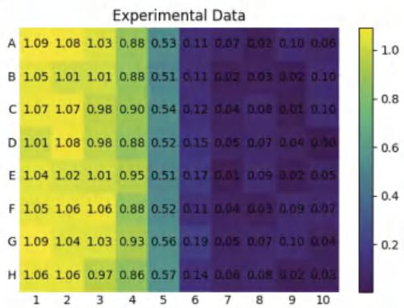  
Figure 10.11 First page of the generated PDF report file.

# Sample IC50s

<table><tr><td>Sample ID</td><td>IC50 [M]</td></tr><tr><td>Sample 1</td><td>1.175E-05</td></tr><tr><td>Sample 2</td><td>1.222E-05</td></tr><tr><td>Sample 3</td><td>9.502E-06</td></tr><tr><td>Sample 4</td><td>1.036E-05</td></tr><tr><td>Sample 5</td><td>1.044E-05</td></tr><tr><td>Sample 6</td><td>1.028E-05</td></tr><tr><td>Sample 7</td><td>9.515E-06</td></tr><tr><td>Sample 8</td><td>9.896E-06</td></tr></table>

The top-level dunder-main used to test PDF report generation is identical to the code in Listing 10.7, with the generate_docx(…) function invocation replaced with the following generate_ pdf(…) function. Refer to Figure 10.11 for the first page of the generated report PDF document.

generate_pdf(fig1, fig2, lol, 'report.pdf')

# 10.5 Sending Email Programmatically

With a final report or presentation generated and ready to go, it is time to distribute that report to key stakeholders. One way to do that is as an attachment to an email message. Python provides all the tools necessary to programmatically send email messages with attachments, allowing you to send multiple emails at once, or to send email messages automatically, on a schedule.

# 10.5.1 Simple Mail Transfer Protocol

One way to transfer email over a network is to use the application-layer network protocol called Simple Mail Transfer Protocol (SMTP) [58] (see subsection 8.1.4). Once you have finished authoring an email message in an email client program like Thunderbird [59] and press the [Send] button, your email client will open a network connection with your mail server and exchange your message with all attachments using the SMTP protocol. We’ll do the same, only programmatically, using Python.

# 10.5.2 SMTP Mail Server

One of the first items you’ll need to identify is the TCP/IP network address for your SMTP server. As we discussed in Section 8.1, the address consists of an IP address and a port. You may need to contact your IT administrator or internet service provider to get these two key values before you are able to send email. These two values will be used when configuring the Python module. The well-known port for SMTP is 25, and for transmission when using Transport Layer Security (TLS) the port is 587, but other ports have been used. It is very likely that port 587 is the port that you will use, but it is important to verify the port used by your email service.

For testing and debugging purposes, we will use an SMTP server running locally. This allows us to see the email that we send as it arrives at the server. To run a local SMTP server, we will use the module called aiosmtpd [60] which takes advantage of the latest asynchronous libraries available in Python.

As usual, use the pip module to install the aiosmtpd module from the Python Package Index.

```batch
> python -m pip install aiosmtpd 
```

Once installed, start the server for testing and debugging by entering the following command in a terminal, which runs the module. The aiosmtpd server tries to set the user id running the program to nobody. If you are not running the server with elevated privileges, this change will not be possible. Adding the -n option tells the server to skip the attempt.

```batch
> python -m aiosmtpd -n 
```

This command starts a server listening on port 8025 of your localhost computer (subsection 8.1.5). Remember that this local server program will be used for testing purposes only. The server cannot send email messages to another networked server because no remote connections are established. To stop the server, press Ctrl-C.

# 10.5.3 Send a Simple Email Message

To send an email message with Python we will use smtplib, a module included in the Python standard library. The smtplib module includes several object definitions, including the SMTP object.

Sending a simple message requires that we provide the address and port of the SMTP server to which the message will be sent as well as the to and from email addresses. We must create an SMTP object before it can be used to send an email message. Because the object supports the context manager interface, we can use the with statement, which guarantees it will be closed when the code block is exited. Listing 10.25 is possibly the simplest program to send an email

message. Once the host, port, email addresses, and message text are set, an SMTP object is created and opened, and its sendmail(…) method invoked. If you have the aiosmtpd test mail server running in one terminal, and then run the program in Listing 10.25 from another terminal, you will see the debugging message that follows the listing printed in the server terminal containing the sent message text. This demonstrates that your email message has succeeded.

Listing 10.25 Simplest way to send an unencrypted email message.   
from smtplib import SMTP   
# SMTP server network address   
host $=$ 'localhost'   
port $=$ 8025   
#Email message parameters   
to_email $=$ 'thomas@yourdomain.com'   
from_email $=$ 'alexander@mydomain.com'   
message $=$ Mr.Watson,come here;Iwant you.'   
# Open SMTP connection and send mail   
with SMTP(host $\equiv$ host，port $\equiv$ port）assmtp:smtp.sendmail(from_email,to_email，message)

```txt
MESSAGEFOLLOWS Mr.Watson，comehere;Iwantyou.ENDMESSAGE 
```

The SMTP standard permits the inclusion of additional name-value headers in the body of the message. The SMTP server will parse these headers and use them, as appropriate. For example, we can set the to and from headers in the message, as well as the subject line. Each message header is added as a separate line to the top of the message text. Each header line is formatted as the header name and value, separated by a single colon. The header section of a message must be separated from the message itself by a full blank line.

Listing 10.26 sends a simple email message, but this time it adds the to, from, and subject headers to the message, then a blank line, and finally the message body. For convenience, we collected each line of the message in a list and then joined them together into a single message string with a newline character. The blank line must be added after header lines but before the message body. Output from the aiosmtpd debugging SMTP server follows the listing. The aiosmtpd server added its own X-Peer header, which includes the sender’s IPv6 network address and randomly selected port number.

Listing 10.26 Simple email sent with headers in message.   
```python
from smtplib import SMTP   
#SMTP server network address   
host = 'localhost'   
port = 8025 
```

Listing 10.26 (Continued)   
```txt
# Email message parameters
to_email = 'thomas@yourdomain.com'
from_email = 'alexander@mydomain.com'
subject = 'First Message'
message = 'Mr. Watson, come here; I want you.' 
```

MESSAGE FOLLOWS   
To: thomas@yourdomain.com   
From: alexander@mydomain.com   
Subject: First Message   
X-Peer: $(^{\prime}::1^{\prime}}$ ,62046,0,0)   
Mr. Watson, come here; I want you. ENDMESSAGE

As email messages become more complex, formatting the message body according to the standard becomes more difficult. Fortunately, another Python module named email and its submodules can be used to help us build very complex email messages while ensuring that the standard is followed precisely. The email and other modules that we use in this and the next section to format email message bodies are also part of the standard Python library, so no additional installations are required.

One of the objects that helps us format email messages is email.message.EmailMessage. This is a special object that helps us build up the message properly. Once created, headers are set in an EmailMessage object using square brackets, where the header name is the key and the header value is the text assigned. This operates just like the way you would assign a value to a key in a Python dictionary. You may add the message content to an EmailMessage object using its set_content(…) method.

One final important point is the way an EmailMessage object is sent. Unlike the examples above where the SMTP object’s sendmail(…) message was used to send the message, to send an EmailMessage object you must pass it to the SMTP object’s send_message(…) method. This method handles the additional task of serializing the EmailMessage object before sending.

A complete example is given in Listing 10.27. Note how EmailMessage is imported from email. message and an EmailMessage object created. Headers are set using square brackets and the message content is set using its set_content(…) method. As before, an SMTP object is opened, but the send_message(…) method is used to send the EmailMessage object instead of sendmail(…).

Output from the debugging SMTP server follows Listing 10.27. Notice how this new method sets more headers for the email message.

Listing 10.27 Building an email message with the EmailMessage object and sending.   
from smtplib import SMTP   
from email.message import EmailMessage   
# SMTP server network address   
host $=$ 'localhost'   
port $= 8025$ #Email message parameters   
to_email $=$ 'thomas@yourdomain.com'   
from_email $=$ 'alexander@mydomain.com'   
subject $=$ 'First Message'   
message $=$ Mr.Watson, come here; I want you.'   
#Build formatted email message   
email $=$ EmailMessage() #Create an EmailMessage   
email['From'] $=$ from_email #Sender   
email['To'] $=$ to_email #Receiver   
email['Subject'] $=$ subject #Subject   
email.set_content(message) #Message   
with SMTP(host $\equiv$ host, port $\equiv$ port) assmtp: smtp.send_message(email) # Send Message object

```txt
MESSAGE FOLLOWS   
From: alexander@mydomain.com   
To: thomas@yourdomain.com   
Subject: First Message   
Content-Type: text/plain; charset="utf-8"   
Content-Transfer-Encoding: 7bit   
MIME-Version: 1.0   
X-Peer: ('::1', 62304, 0, 0)   
Mr. Watson, come here; I want you. ENDMESSAGE 
```

# 10.5.4 Sending Email Messages over a Secure Connection

All examples thus far have used an unencrypted network connection to send email messages. This is suitable for debugging, but it is not acceptable for production. It is standard practice to send email over encrypted connections using TLS (Transmission Layer Security).

SMTP is not a secure protocol by default. Instead, an SMTP connection is established and then upgraded to the TLS cryptographic protocol. The standard port for relaying encrypted email message is 587, but this is not guaranteed. Ask your IT administrator to share the address and port on which your organization’s secure SMTP server is running.

Upgrading your SMTP connection to use TLS will require two additional steps before sending an email message. The first is to request the upgrade by invoking the SMTP objects starttls() method, and the second is to login to the server by invoking the SMTP objects login(…) method with valid credentials. Never enter credentials into a program. Always prompt for the password, and possibly username, if different than the sender’s email address.

Listing 10.28 demonstrates additions to Listing 10.27 required to send email using an encrypted TLS network connection. In this case, the host and port must be changed to match your own production SMTP server address. In this example, the user’s login ID is assumed to be the from_email, and the user is prompted for a password using the tkinter.simpledialog. askstring(…) method with a mask character used to hide the password while being entered. It is never a good idea to add credentials to a program. The EmailMessage object is created and populated as in Listing 10.27, but this time the SMTP object’s starttls() and login(…) methods are invoked before it’s send_message(…) method is attempted.

Listing 10.28 Additions to Listing 10.27 required to use TLS to encrypt the network connection.   
from smtplib import SMTP   
from email.message import EmailMessage   
import tkinter/simpledialog as sd   
# SMTP production server network address   
host $=$ 'smtp.mycompany.com' # Change to proper address   
port $= 587$ # No passwords in source code   
password $=$ sd.askstring("Password", "Enter password:"，show $\coloneqq$ \*\*）   
with SMTP(host $\equiv$ host，port $\equiv$ port）assmtp: smtp.starttls() # Upgrade to TLS smtp login(from_email, password) # authenticate smtp.send_message(email) # Send Message object

# 10.5.5 Building an Email Message with Attachments

More complex email messages require more complex message formatting. To manage messages composed of multiple parts with different content types, such as a message with attachments, a new standard is used called the Multipurpose Internet Mail Extensions (MIME) specification [58]. The MIME standard expands the format of an email message from a simple block of plain text to more like a chest of drawers. The message is like the chest, and each message part is stored in a separate drawer. With the MIME standard, we can build email messages that are made up of parts such as HTML documents, images, and other binary content. We’ll focus on creating plain text messages with one or more documents as attachments.

Once again, we don’t have to concern ourselves with the details of the MIME message format. Python provides us with a module and objects that help us assemble these complex email messages according to all MIME standard specifications.

To build multi-part email messages, we’ll move away from the EmailMessage object and start using the MIMEMultipart object in its place. A MIMEMultipart object is used to manage all parts of the MIME message. Our text message will be added to the MIME message by encapsulating it in a MIMEText object, and our report document will be added as a MIMEBase object. Start the new program by importing all the required MIME objects. Also import the encoders utility module, which is used below to encode binary attachment data.

```python
from emailmimemultipart import MIMEMultipart  
from emailmime.text import MIMEMtext  
from emailmime.base import MIMEBase  
from email import encoders 
```

To build the MIME message, start by creating a MIMEMultiPart object and configuring it in a manner identical to the EmailMessage object.

```python
email = MIMEMultiPart()
email['From'] = from_email
email['To'] = to_email
email['Subject'] = subject 
```

```txt
Create message object   
#Sender   
#Receiver   
#Subject 
```

The main email message is encapsulated by a MIMEText message and then attached to the main MIMEMultipart object using its attach(…) method.

```txt
Add plain text part to message  
part = MIMEText(message, "plain")  
email.attach(part) 
```

```txt
Build text part #Attach 
```

Adding a binary attachment to the MIME message requires a few additional steps. Create a generic MIMEBase object and set its type to "application" and subtype to "octet-stream". This allows us to encapsulate and attach any binary file to an email message.

To insert the binary document data into the MIMEBase object, first open the attachment file in binary read mode. Read all the bytes from the file and use the MIMEBase set_payload(…) method to add the binary data to the message part. Our email message is plain text, but the binary file data is not. We must encode the attachment in a base-64 format, a text-based encoding, which allows the attachment data to be transmitted as part of the email message. The email module provides a utility module named encoders with an encode_base64(…) method. Passing the MIMEBase object to this function results in its content being encoded as base-64.

Before attaching the MIMEBase object to the message, we must add a new header using the MIMEBase object’s add_header(…) method and set the Content-Disposition header name to indicate that the email part is an attachment with its file name. This is required because the generic MIMEBase object can be used for any MIME email message part. Finally, we use the MIMEMultipart object’s attach(…) method to add the now encoded and configured MIMEBase object to the MIME message.

```python
# Attach the file as binary using the MIMEBase class
part = MIMEBase("application", "octet-stream")  # Create a container
with open(attach, "rb") as file:  # Open binary file
    part.set_payload(file.read())
    encoders.encode_base64(part)  # Encode bytes
part.add_header("Content-Disposition", f"attachment; filename={attach}")  
email.attach(part)  # Add header and part 
```

Listing 10.29 lists the complete program for assembling a MIME message with a text part and an attachment, and sends the message to the debugging SMTP server. If you run this program, you will see a long message printed by the test SMTP server. This is how the attachment appears after encoding in base-64. You are free to add as many attachments as you like to the message. Also, note that there are other MIME objects that may be used to attach different parts to a MIME message, including the object types MIMEImage, MIMEMessage, MIMEAudio, and MIMEApplication.

Listing 10.29 Send a multi-part email with a document attached.   
```python
# send_email.py   
from smtplib import SMTP   
from emailmime multipartite import MIMEMultipart   
from emailmime.text import MIMEText   
from emailmime.base import MIMEBase   
from email import encoders   
# SMTP server network address   
host = 'localhost'   
port = 8025   
def sendmultipart(to_email, from_email, subject, message, attach):   
email = MIMEMultipart() # Create message object   
email['From'] = from_email # Sender   
email['To'] = to_email # Receiver   
email['Subject'] = subject # Subject   
# Add plain text part to message   
part = MIMEText(message, "plain") # Build text part   
email.attach(part) # Attach   
# Attach the file as binary using the MIMEBase class   
part = MIMEBase("application", "octet-stream") # Create a container   
with open(attach, "rb") as file: # Open binary file   
part.setPGAoad( file.read()) # Read bytes   
encoders. encode_base64(part) # Encode bytes   
part.add_header("Content-Disposition", f"attachment; filename={attach}")   
email.attach(part) # Add header and part   
with SMTP(host=host, port=port) as smtp: # Send MIME message smtp.send_message(email)   
if __name__ == __main__ :   
to_email = 'thomas@yourdomain.com'   
from_email = 'alexander@mydomain.com'   
subject = 'Report Delivery'   
message = 'Mr. Watson, attached is the report.'   
sendmultipart(to_email, from_email, subject, message, 'report.pdf') 
```

# 10.6 Serving Results with an HTTP Server

A simpler way to distribute report files is to have intended recipients download them directly using a browser. The Python standard library comes with the http.server module, which implements a rudimentary HTTP server that is useful for testing. While not recommended for production, the

HTTP server program that starts when the module is run is designed to list and serve files from a remote computer, which others can access and download. This provides a simple way to offer files for remote download using techniques discussed in Chapter 8.

The simple HTTP server is started by running the http.server module directly using the python command’s -m option, as follows.

```txt
> python -m http.server
Serving HTTP on :: port 8000 (http://[:]:8000/) ... 
```

The startup message tells us that the server was started on localhost, the loopback network address, and is listening on port 8000. Open a browser and navigate to http://localhost:8000 or http://127.0.0.1:8000. The page returned provides a list of links to all files in the directory where the server was started, like the one in Figure 10.12.

Listening on localhost will not provide us with the ability to download files over a network connection. We must stop the server and start it again using the IP address assigned to your computer by the local network. Refer to your system settings to find your IP address. Alternatively, on Windows, open a terminal and enter the command ipconfig and look for the IPv4 address. On a Mac or Linux computer, open a terminal and enter the command ifconfig | grep "inet" and look for the IPv4 address.

Restart the HTTP server using the -b option and your local IPv4 address. This will bind the server to the network address that your computer is known by on your network. Optionally, add a space and a port number to your command to change the listening port from the default value of 8000 to another option.

The following example runs the server and binds it to the IPv4 address 192.168.1.250 on port 80, the default port for HTTP.

```txt
> python -m http.server -b 192.168.1.250 80
Serving HTTP on 192.168.1.250 port 80 (http://192.168.1.250:80/) ... 
```

Find another computer connected to your network and use a browser to visit the address similar to http://192.168.1.250, substituting your local IP address into the URL and an optional port number if you did not or could not listen on port 80. You will see a list of links to the file in the

  
Figure 10.12 Example page returned by the http.server module’s default HTTP server.

  
Figure 10.13 Example page from the http.server bound to a local network address.

directory where you started the server, like that in Figure 10.13. While simple, this provides a quick and easy way to transfer files over a local network.

# 10.7 Key Takeaways

1.	 There are a variety of Python modules that you may use to generate report documents in multiple formats and distribute them to recipients.   
2.	 The io module’s BytesIO Python object is a file-like object that allows binary content to be saved in memory without ever having to create a temporary file. These can then be used in place of disk files for handing off binary content to report generation programs.   
3.	 The python-docx module may be used to programmatically build and save a Microsoft Word document.   
4. The python-docx module implements a set of objects that mimic the structure of a Word Document, including Document, Paragraph, Run, Picture, InlineShape, and Table.   
5.	 The python-pptx module may be used to programmatically build and save a Microsoft PowerPoint document.   
6. The python-pptx module implements a set of objects that mimic the structure of a PowerPoint document, including Presentation, Slide, SlideShape, Table, and Length.   
7.	 Numerous modules are available that support the programmatic generation of PDF files. One such module is called ReportLab.   
8.	 The core ReportLab object is Canvas, which is the object upon which other items are rendered, including strings, lines, grids, shapes, and images.   
9.	 Programmatically generating PDF files requires page item layout to be performed. ReportLab implements a page layout tool called PLATYPUS, which lays out a series of objects that are subtypes of a Flowable.   
10.	 Python provides a rich set of modules for programmatically building and sending complex email messages, include attachments of all kinds. These modules include smtplib and email.   
11.	 To test the programmatic sending of email messages, the aiosmtp module can be used to run a debugging SMTP server.   
12.	 A simpler way to distribute files is to start a simple HTTP server using Python’s http.server submodule. This server will serve files from a folder automatically.   
13.	 For the Python HTTP server to be visible from a remote computer, the server must be started and bound to the server computer’s IP address, as assigned by the local network.

# 11

# Control and Automation

The final step to fully streamline your research laboratory is to manage the execution of your laboratory processes. In this chapter we’ll discuss how to invoke tasks remotely, on a schedule, and in response to file system changes, such as when a data file is created. We’ll also describe current best practices for coordinating multiple concurrent tasks, which might be necessary for processing a large number of data files through a sequence of programs, or correctly executing an assay by coordinating multiple instruments like a robot or autosampler with other automated instruments like an analytical balance or microplate reader. Knowledge of best practices for concurrent task execution is necessary for reliable system control. We’ll demonstrate how robust and powerful control programs are created using modern Python techniques.

# 11.1 Concurrency in Python

Concurrency in computing is a broad topic describing a scenario in which programs run essentially at the same time. There are multiple ways to achieve concurrency in computing.

The obvious way to run tasks concurrently is to run separate programs on separate CPUs (central processing units) or CPU cores. Whether distributing programs amongst multiple CPUs or multiple cores of a single CPU, using distinct processors to run each program is the only way to enable true concurrent execution, in its purest form. Python supports this style of concurrent execution using its multiprocessing module, which is part of the Python Standard Library [24].

A second way to run tasks concurrently is to run them on multiple distinct threads of a single CPU or CPU core. The operating system manages the execution of multiple threads on a single CPU by context switching. In short, the operating system allocates a certain number of processor cycles to execute one thread before it preempts its execution and switches context to another thread. This repeats very quickly for all executing threads, resulting in the appearance of simultaneous execution, which is referred to as preemptive multitasking. In reality, with preemptive multitasking, the resources of a single CPU are being shared. One potential benefit of multithreading over multiprocessing is that multiple threads share the same address space and so may access the same data. Python supports a multithreading style of execution with its threading module, also part of the Python Standard Library [24].

Historically, Python has prevented true concurrent execution due to the use of its global interpreter lock (GIL). The GIL allows only one thread of execution to access the Python interpreter at a time. This was necessary because Python’s memory management does not permit the same memory locations to be accessed safely amongst multiple threads. Without the GIL, multiple threads could

access and modify Python objects at the same time, which could lead to data corruption. More modern versions of Python permit the GIL to be disabled for potentially improved performance but require more careful programming.

Both multiprocessing and multithreading can be fraught with pitfalls, especially when simultaneously executing tasks that must be executed in sequence or in a carefully coordinate manner. Consider the simple program in Listing 11.1 which increments a count value in a file by

1.	 opening the file,   
2.	 reading the stored value,   
3.	 incrementing the value,   
4. overwriting the stored value, and   
5.	 closing the file.

Listing 11.1 A Python program that updates a count value in the file count.txt.   
```lua
print("Begin count increment")  
f = open('count.txt', 'r+')  
c = f.read()  
c = int(c) + 1  
f.seek(0)  
f.write(str(c))  
f.close()  
print(f"Count incremented to {c}") 
```

If you create a file named count.txt containing the initial value of 0, and then run this program multiple times while watching the file’s content, you will see the number increase each time the program is executed. If this program is executed using a multiprocessing or multithreading concurrent style, you might find that the final count is incorrect. The reason may be due to what’s called a race condition.

Table 11.1 illustrates how a race condition can cause a problem. Table columns illustrate the sequential execution of the steps in Listing 11.1 by two hypothetical program copies running concurrently. The count.txt file starts with a value of 0, two instances of the program that increment the count are executed, but the file ends with a value of 1, not 2. How is this possible?

The core of the problem that is caused by the race condition occurs because the second program reads the count value from the file before the first program has a chance to update the file with a new value. To solve the problem, what we need to do is ensure that program statements from open(…) through close(…) in the first program are allowed to run to completion before the open(…) statement in the second program begins. All program steps in this critical section must be executed by only one concurrent process at a time to avoid problems caused by a race condition. Identifying such critical sections of a program can be difficult.

Various advanced tools and techniques are used to ensure concurrently executing sequential activities operate in a coordinated manner. For example, one way to avoid the race condition illustrated in Table 11.1 is to use a Lock object, which is available both in the multiprocessing and threading Python modules. A critical section of a program can be protected by acquiring a shared Lock object before entering a critical section of code and then releasing it when exiting the critical section. A Lock cannot be acquired if another thread or process has acquired the Lock but has not yet released it. An attempt to acquire a Lock will pause a program until it is released.

Imagine two concurrent tasks executing, and both need to acquire two locks before they can continue into a critical region. If the first task acquires the first lock while the second task acquires the

Table 11.1 Two tasks racing to increment a count in a single file.   

<table><tr><td>Step</td><td>Task 1</td><td>Task 2</td><td>Count</td></tr><tr><td>1</td><td>print(&quot;Begin count increment&quot;)</td><td></td><td></td></tr><tr><td>2</td><td></td><td>print(&quot;Begin count increment&quot;)</td><td></td></tr><tr><td>3</td><td>f = open(&#x27;count.txt&#x27;, &#x27;r+&#x27;)</td><td></td><td>0</td></tr><tr><td>4</td><td></td><td>f = open(&#x27;count.txt&#x27;, &#x27;r+&#x27;)</td><td>0</td></tr><tr><td>5</td><td>c = f.read()</td><td></td><td>0</td></tr><tr><td>6</td><td></td><td>c = f.read()</td><td>0</td></tr><tr><td>7</td><td>c = int(c) + 1</td><td></td><td>0</td></tr><tr><td>8</td><td></td><td>c = int(c) + 1</td><td>0</td></tr><tr><td>9</td><td>f.write(str(c))</td><td></td><td>1</td></tr><tr><td>10</td><td></td><td>f.write(str(c))</td><td>1</td></tr><tr><td>11</td><td>f.close()</td><td></td><td>1</td></tr><tr><td>12</td><td></td><td>f.close()</td><td>1</td></tr><tr><td>13</td><td>print(f&quot;New count is {c}&quot;)</td><td></td><td></td></tr><tr><td>14</td><td></td><td>print(f&quot;New count is {c}&quot;)</td><td></td></tr></table>

second lock, the first task will wait until the second task releases the second lock, but the second task will wait for the first task to release the first lock. The result is called deadlock. Neither task can proceed because both are waiting on the other task to release a Lock. Deadlocks can be very difficult to detect and avoid.

# 11.2 Asynchronous Execution

Fortunately, there is a third way to run programs concurrently in Python. This is the newest style of concurrent execution in Python called asynchronous I/O. While the concurrency of multiple processes is managed by separate CPU cores, and the concurrency of multiple threads is managed by operating system context switching, the concurrency in asynchronous I/O programs is managed by a Python library itself.

Like multithreading, asynchronous I/O does not implement true concurrency because only a single sequential task is executed by a program at any one time. Unlike multithreading in which the operating system switches thread contexts, the asynchronous I/O programming toolkit itself manages the switch between distinct sequential activities. With the asynchronous I/O style of concurrency, Python takes back the management of context switching between tasks, which opens up the opportunity for more fine-grained control and careful management to avoid problems like deadlock.

When a program spends most of its time performing computations, it is said that the program is CPU-bound because execution speed is limited by the CPU. Programs written to coordinate other tasks or automated instrumentation tend to spend most of their time sending messages and waiting for responses. In this case, program execution is limited by the rate at which its

messages are sent and the delay in time before a message is received. As a result, programs tasked with coordination and control tend to be I/O bound. An I/O bound program spends more execution time waiting on responses from other concurrent tasks than it does running its own program statements. With asynchronous I/O, we simulate concurrency by doing other things while waiting for a response.

When writing a control program, after initiating an external operation, it is tempting to enter a “tight loop” that does nothing more than wait for the remote task to respond or poll the status of the remote task waiting for it to change. This ties up the control program because it is only performing this one task, making it impossible to handle anything else that might be occurring at the same time. As a general rule, using a “tight loop” should be avoided whenever possible.

Ideally, a Python program should be able to issue a command and then go about performing other tasks while waiting for a response. Tying up the CPU by waiting for a response that may not come for some time produces a program that appears to hang, or operate very poorly. Python’s asyncio module [60] provides the framework for handling I/O bound scenarios efficiently, without the need for a “tight loop.”

# 11.3 Concurrent Programs with AsyncIO

The core of the ascyncio style of programming in Python is a special kind of asynchronous function called a coroutine. Python coroutines are like standard Python functions, but with a very special additional feature: coroutines can temporarily suspend and yield control back to a calling function without terminating execution. When a Python coroutine yields control, it does not disappear like it would when executing a return statement. Instead, the coroutine suspends temporarily but remains available to be resumed at a later point. Compare this to a standard Python function, which yields control back to the caller only by returning, which terminates function execution entirely.

When a standard function goes into a tight loop while waiting for a response, the entire program blocks until the loop exits. But, if we replace the standard function with a coroutine that yields control from within the tight loop, other parts of the program are allowed to make progress before returning to the waiting coroutine to check if a response was received in the intervening time period. In this sense, multiple coroutines can cooperate with one another by giving each other a chance to run. This style of concurrent programming is called cooperative multitasking. Recall that with preemptive multitasking, the tasks are programmed to run without stopping, and it is the operating system that decides which task will use the CPU to progress at any moment in time. With cooperative multitasking, the tasks themselves must play together nicely, yielding control whenever possible and safe to do so.

Note that the cooperative style of multitasking gives the programmer the ability to avoid race conditions like that illustrated in Table 11.1. As long as a coroutine does not yield control within a critical region of code, we can guarantee that the critical region will execute to completion before another coroutine is able to run.

Consider the program in Listing 11.2. The do_task(n) method simulates the execution of a single task by sleeping for 3 seconds. A message is printed at the start of the task and at the end of the task to visualize how the program runs. The et() helper function returns the number of whole seconds that have elapsed since the start of execution. The output in the console session

following Listing 11.2 should not be surprising. Because each task takes 3 seconds to execute and the task_sequence() method executes three do_task(n) methods, the entire program runs for a total of 9 seconds.

Listing 11.2 Execution of three synchronous tasks.   
sync_demo.py   
import time   
#Helper to return elapsed time in fractions of a second   
start $=$ time.time()   
def et(): return round(time.time() - start,1)   
#One synchronous task   
def do_task(n): print(f{'et})Begin task{n}') time.sleep(3) print(f{'et})End task{n}')   
#All synchronous tasks   
def task_sequence(): do_task(1) do_task(2) do_task(3)   
if_name $\equiv$ 'main': task_sequence()

> python sync_demo.py

0.0 Begin task 1   
3.0 End task 1   
3.0 Begin task 2   
6.0 End task 2   
6.0 Begin task 3   
9.0 End task 3

What if the three tasks were not required to run in sequence? What if we needed only for the three tasks to run to completion, in any order, or even concurrently? After all, if no task depends upon another to be completed before starting, all we care about is that all three are completed. In this case, the three tasks could run concurrently. Can we achieve this concurrency by converting the do_task(…) and task_sequence() methods into asynchronous methods and executing three instances of do_task(…)? Listing 11.3 is a version of Listing 11.2 modified in what we’ll learn is a failed attempt to run the methods asynchronously.

Take note of the added async keyword before def in the updated definition of do_task(n) and task_sequence(). Also note that we replaced time.sleep(3) with await asyncio. sleep(3). The async modifier indicates that the function is asynchronous (a coroutine), and the await modifier indicates when to yield execution. It is both the async and await keywords taken together that identify an asynchronous coroutine and set it to be executed concurrently with other coroutines. Kicking off asynchronous execution is the responsibility of the asyncio.

run(…) function, which starts the asynchronous version of task_sequence() in the program’s dunder-main.

Listing 11.3 Failed attempt at running three asynchronous tasks concurrently.   
```python
# async_demo.py
import asyncio, time
# Helper to return elapsed time in fractions of a second
start = time.time()
def et():
    return round(time.time() - start, 1)
# One asynchronous task execution
async def do_task(n):
    print(f' {et}') Begin task {n}')
    await asyncio.sleep(3)
    print(f' {et}') End task {n}')
# Failed asynchronous execution. Still executes sequentially.
async def task_sequence():
    await do_task(1)
    await do_task(2)
    await do_task(3)
if __name__ == '__main__':
# Begin asynchronous execution
async.run(task_sequence()) 
```

```txt
> python async_demo.py  
0.0 Begin task 1  
3.0 End task 1  
3.0 Begin task 2  
6.0 End task 2  
6.0 Begin task 3  
9.0 End task 3 
```

Unfortunately, the output from running Listing 11.3 demonstrates that the program continues to run synchronously. It is not enough to run coroutines in sequence; we must gather them and run them as a group of tasks in a framework that supports cooperative multitasking. The simplest way to achieve this using the asyncio module is to use the asyncio. gather(…) method, which collects all coroutines and runs them concurrently on a single main event loop. Each coroutine is passed to asyncio.gather(…) and then that higher-level method is awaited. The event loop is the core of any asynchronous Python program. It is the event loop that manages all coroutines and decides how coroutine will execute cooperatively to produce concurrency.

Refer to the updated task_sequence(…) method in Listing 11.4. Output from executing this last modification demonstrates that we have finally achieved concurrent execution. Because all tasks can now run concurrently, total elapsed time for running all three tasks reduces from 9 seconds to 3 seconds. Because all tasks are permitted to sleep concurrently, the entire program is completed in 3 total seconds.

Listing 11.4 Successful concurrent execution of asynchronous tasks as a group.   
```python
# async_demo.py
import asyncio, time
# Helper to return elapsed time in fractions of a second
start = time.time()
def et():
    return round(time.time() - start, 1)
# One asynchronous task execution
async def do_task(n):
    print(f'[et()]: Begin task {n}')
    await asyncio.sleep(3)
    print(f'[et()]: End task {n}')
# Failed asynchronous execution. Still executes sequentially.
# async def task_sequence():
# await do_task(1)
# await do_task(2)
# await do_task(3)
# All asynchronous tasks gathered into an executing task group
async def task_sequence():
    await asynciogather(
        do_task(1),
        do_task(2),
        do_task(3)
    )
if __name__ == '__main__':
# Begin asynchronous execution
async.run(task_sequence()) 
```

> python async_demo.py

0.0 Begin task 1   
0.0 Begin task 2  
0.0 Begin task 3  
3.0 End task 1   
3.0 End task 2   
3.0 End task 3

For coroutines to run asynchronously, three things must occur.

1.	 Python functions must be converted to coroutines by adding the async keyword to their definitions, and optionally the await keyword in the body of the code to identify when yielding is possible and safe.   
2.	 All coroutines must be created and collected into a framework capable of executing coroutines concurrently, like asyncio.gather(…), and placed within an asynchronous function.   
3.	 The entire framework must be kicked off using the asyncio.run(…) function.

Although the asyncio module provides several models for performing asynchronous execution of coroutines, we’ll be sticking with asyncio.run(…) and asyncio.gather(…) in our examples.

The asyncio module implements a powerful new concurrent programming paradigm capable of speeding up execution of I/O bound processes. Many Python modules have adopted this asynchronous execution paradigm providing significant execution speed increases through cooperative multitasking.

Modules that have adopted the asynchronous style of execution include the aiosmtpd module [61], which we used in subsection 10.5.2, the aiohttp module [62] used for asynchronous fetching of web resources, aioserial for asynchronous serial port communications [63], websockets for communicating with web browsers [64], aiofiles and aiopath for working with files and the file system [65, 66], numerous modules for database communications, and many more.

While the asynchronous style of programming is very powerful, there is one point of caution to keep in mind. Asynchronous programming is like adding anchovies to your pizza. One anchovy on one slice makes the whole pie an anchovy pizza. There is no half-plain half-anchovy. It is the same with asynchronous programming. Once you choose to adopt the asynchronous programming paradigm, its asynchronous functions all the way down.

# 11.4 Asynchronous Instrument Control and Coordination

Let’s apply the asynchronous execution paradigm to the control and coordination of laboratory instruments that perform the same test procedure on several samples, possibly with several instruments. The test procedure is a sequence of ordered steps that are to be applied to every sample. However, each step is executed by an external resource, such as a laboratory instrument, so the control program spends most of its time waiting for one step to complete on a given sample before proceeding to the next step. An added level of complexity is introduced by the fact that there are usually far fewer instruments available to process samples than there are samples to process. With multiple samples to test, multiple sequential steps in a single test, and limited instruments available for processing, to maximize throughput samples must be processed concurrently to the extent possible.

# 11.4.1 Project – Integrated Laboratory System Control and Coordination

Let’s assume you need to write a program to control an integrated laboratory automation system that is designed to analyze samples in a store using an analytical laboratory instrument. You have a robotic device capable of transferring samples from the store to the analytical instrument and returning them from the instrument back to the store. All components are controllable through a programmatic interface. There is the option to integrate multiple analytical instruments, if there is a benefit in doing so. See Figure 11.1 for a simple schematic.

Listing 11.5 is a first attempt at a program to control an integrated system to process three samples, named s1, s2, and s3. The three steps of the overall procedure to analyze a single sample is encapsulated in the three asynchronous functions: instrument_to_store(…), store_to_ instrument(…), and analyze_sample(…). When executed, coroutines generated by each function sleep for a predefined amount of time to simulate the duration of the activity. Robotic transfers are assumed to take one unit of time, while sample analysis is assumed to take four units of time. We use seconds as the unit of time in the program for quick, faster than real life simulations. Resource names are set and the three functions are sequenced using the resources for the overall procedures in the asynchronous function test_sample(…). The main() method creates three coroutines to run the procedure, one to analyze each sample, and then it initiates concurrent execution using asyncio.gather(…), which is invoked from the dunder-main.

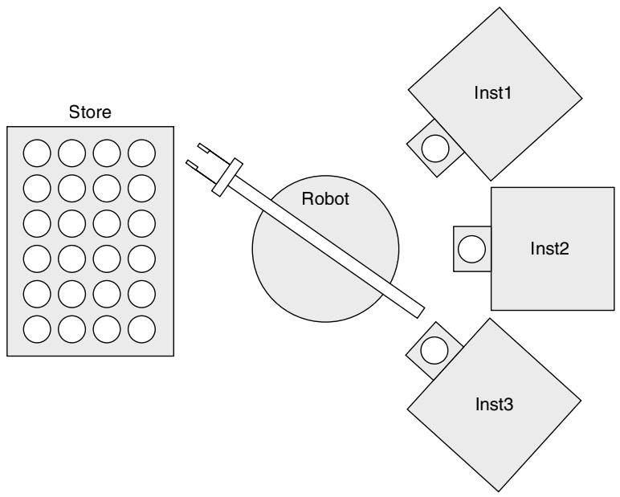  
Figure 11.1 An integrated laboratory automation system.

Listing 11.5 First attempt to control an integrated laboratory automation system.   
```python
# schedule1.py
import asyncio, time
# Helper to return elapsed time in fractions of a second
start = time.time()
def et():
    return round(time.time() - start, 1)
# Move sample from store to instrument with robot
async def instrument_to/store(sample, robot, store, instr):
    print(f'({et}):
    {robot} started moving {sample} from {instr} to {store}.')
    await asyncio.sleep(1)
    print(f'({et}):
    {robot} finished moving {sample} from {instr} to {store}.')
# Move sample to instrument to store with robot
async def store_to_sample(sample, robot, store, instr):
    print(f'({et}):
    {robot} started moving {sample} from {store} to {instr}.')
    await asyncio.sleep(1)
    print(f'({et}):
    {robot} finished moving {sample} from {store} to {instr}.')
# Analyze sample with instrument
async def analyze_sample(sample, instr):
    print(f'({et}):
    {instr} started analyzing {sample}.')
    await asyncio.sleep(4)
    print(f'({et}):
    {instr} finished analyzing {sample}.')
# Run test procedure on one sample
async def test_sample(sample): 
```

Listing 11.5 (Continued)   
```python
# Resource names
robot, store, instr = 'robot', 'store', 'instrument'
# Move from store to instrument
await store_to_instrument(sample, robot, store, instr)
# Analyze sample
await analyze_sample(sample, instr)
# Move from instrument to store
await instrument_to/store(sample, robot, store, instr)
async def main():
    t1 = test_sample('s1')
    t2 = test_sample('s2')
    t3 = test_sample('s3')
    await asyncio.gather(t1, t2, t3)
if __name__ == '__main__':
asyncio.run(main()) 
```

> python schedule1.py   
```txt
(0.0): robot started moving s1 from store to instrument.  
(0.0): robot started moving s2 from store to instrument.  
(0.0): robot started moving s3 from store to instrument.  
(1.0): robot finished moving s1 from store to instrument.  
(1.0): instrument started analyzing s1.  
(1.0): robot finished moving s2 from store to instrument.  
(1.0): instrument started analyzing s2.  
(1.0): robot finished moving s3 from store to instrument.  
(1.0): instrument started analyzing s3.  
(5.0): instrument finished analyzing s1.  
(5.0): robot started moving s1 from instrument to store.  
(5.0): instrument finished analyzing s1.  
(5.0): robot started moving s1 from instrument to store.  
(5.0): instrument finished analyzing s2.  
(5.0): robot started moving s2 from instrument to store.  
(5.0): instrument finished analyzing s2.  
(5.0): robot started moving s2 from instrument to store.  
(5.0): robot started moving s2 from instrument to store.  
(5.0): instrument finished analyzing s3.  
(5.0): robot started moving s3 from instrument to store.  
(6.0): robot finished moving s1 from instrument to store.  
(6.0): robot finished moving s2 from instrument to store.  
(6.0): robot finished moving s3 from instrument to store. 
```

The console session following Listing 11.5 demonstrates that the program appears to achieve its goal, which is to process the three samples concurrently. Only six units of time are required to process all three samples. Unfortunately, if this program was used to control a real system, you’d have a mess. The robot is instructed to transfer all three samples to the analytical instrument at the same

time. The instrument is instructed to analyze all three samples at the same time. After analysis, the robot is instructed to return all three samples to the store. This is impossible due to resource constraints. The robot is capable of transferring only one sample at a time. Likewise, the analytical instrument is capable of analyzing only one sample at a time.

To address this issue, we must add resource tracking to the program. When the robot is busy it cannot be used for another task simultaneously. Similarly, when the sample store is being accessed to remove a sample, the store cannot be accessed for another reason, such as removing or replacing other samples. When an instrument is analyzing a sample, it cannot be used to analyze another sample. The control program must account for the dependency of a task on the resources needed to carry it out.

Listing 11.6 demonstrates one way to track available resources. The available dictionary holds system resources in the three categories: 'robot', 'store', and 'instrument'. Each category key in the dictionary references a list of available resources within the category. Each is given a unique name to distinguish it from the others. In Listing 11.6 we have a single robot named 'Robby', a store called 'Corner', and an instrument named 'Inst1'.

Listing 11.6 Added functionality to store, acquire, and release available resources.   
Resources available   
available $=$ {'robot':['Robby'], 'store':['Corner'], 'instrument':['Inst1']}   
# Wait until all resources are available and acquire them   
async def acquire/resources): # Check if one of each resource is available while not all([len(available[res] $\rightharpoondown$ 0 for res in resources]): # Release to allow other processing await asyncio.sleep(0.1) # Acquire the first of each available resource # and return a dictionary of acquired resources return {res:available[res].pop(0) for res in resources}   
# Release resources   
def release(acquired): for res in acquired_keys(): available[res].append(acquired[res])

The asynchronous acquire(…) method receives a list of resource types and attempts to acquire one of each from the available dictionary using the built-in all(…) Python function, which evaluates to True only when all conditions are true. If one of each resource is available, a new dictionary is constructed with the name of each resource removed from the available dictionary and returned from the function. If one of each resource is not available, the asynchronous method returns control and sleeps, allowing other tasks to run while waiting for required resources.

The release(…) method takes a dictionary of previously acquired resource names and returns them to the proper lists in the available dictionary category keys. The release(…) method executes instantaneously, and so it is not necessary run it asynchronously.

Listing 11.7 provides an updated version of test_sample(…), adding the previously described utility functions to acquire and release resources, as necessary. Before store_to instrument(…) is initiated, the program waits to acquire the store, robot, and an instrument

resource. After the sample is moved to the instrument, the robot and store resource is released. The instrument resource is not released because it is used to execute analyze_sample(…). Once the analysis is complete, the method waits to acquire the robot and the store resource before it moves the sample from the instrument back to the store by invoking instrument_ to_store(…). When the entire test procedure has finished, all resources are released to be used by another coroutine.

Listing 11.7 Update to test_sample(…) with resource dependencies added.   
```python
# Run test procedure on one sample
async def test_sample(sample):
    # Wait for resources and unpack
    res = await acquire(['robot', 'store', 'instrument}]
    robot, store, instr = res['robot'], res['store'], res['instrument']
    # Move from store to instrument with robot
    await store_to_instrument(sample, robot, store, instr)
    # Release resources
    release({'robot': robot, 'store': store})
    # Analyze sample with instrument
    await analyze_sample(sample, instr)
    # Wait for resources
    res = await acquire(['robot', 'store']
    robot, store = res['robot'], res['store']
    # Move from instrument to store
    await instrument_to/store(sample, robot, store, instr)
    # Release resources
    release{'robot': robot, 'store': store, 'instrument': instr} 
```

The console session following Listing 11.7 demonstrates the result of running this updated version of the control program. Required resources are acquired and released as needed, and no collisions or resource conflicts are observed. Unfortunately, due to resource limitations, the three samples are executed in sequence as well, requiring 18.2 units of time to process all three samples.

What if we integrated three analytical instruments instead of one? Would that improve throughput? This is easily accomplished by adding instrument names to the instrument category of the available dictionary, as in Listing 11.8, and rerunning the program. Updated output follows the listing. We see that with three instruments instead of only one, we have reduced throughput to 8.2 units of time from 18.2, and again, no collisions or resource conflicts occur. This is a significant reduction in elapsed time to process three samples. For reference, see Listing 11.9 for the complete program.

Listing 11.8 Updates to available to add two more instrument names to the system.   
Resources available available $=$ {'robot':['Robby'], 'store': ['Corner'], 'instrument': ['Inst1', 'Inst2', 'Inst3']}

```txt
> python schedule2.py  
(0.0): Robby started moving s1 from Corner to Inst1.  
(1.0): Robby finished moving s1 from Corner to Inst1.  
(1.0): Inst1 started analyzing s1.  
(1.1): Robby started moving s2 from Corner to Inst2.  
(2.1): Robby finished moving s2 from Corner to Inst2.  
(2.1): Inst2 started analyzing s2.  
(2.2): Robby started moving s3 from Corner to Inst3.  
(3.2): Robby finished moving s3 from Corner to Inst3.  
(3.2): Inst3 started analyzing s3.  
(5.0): Inst1 finished analyzing s1.  
(5.0): Robby started moving s1 from Inst1 to Corner.  
(6.0): Robby finished moving s1 from Inst1 to Corner.  
(6.1): Inst2 finished analyzing s2.  
(6.1): Robby started moving s2 from Inst2 to Corner.  
(7.1): Robby finished moving s2 from Inst2 to Corner.  
(7.2): Inst3 finished analyzing s3.  
(7.2): Robby started moving s3 from Inst3 to Corner.  
(8.2): Robby finished moving s3 from Inst3 to Corner. 
```

Listing 11.9 Control program that manages all resources.   
```python
# schedule2.py
import asyncio, time
# Resources available
available = {'robot': ['Robby'], 'store': ['Corner'], 'instrument': ['Inst1', 'Inst2', 'Inst3']} 
```

Listing 11.9 (Continued)   
```python
Wait until all resources are available and acquire them
async def acquire/resources:
    # Check if one of each resource is available
    while not all([len-available[res]) > 0 for res in resources]):
        # Release to allow other processing
        await asyncio.sleep(0.1)
    # Acquire the first of each available resource
    # and return a dictionary of acquired resources
    return {res:available[res].pop(0) for res in resources}
# Release resources
def release-acquired):
    for res in acquired_keys():
        available[res].append(acquired[res])
# Move sample from store to instrument with robot
async def instrument_to/store(sample, robot, store, instr):
    print(f'({et})):{robot} started moving {sample} from {instr} to {store}.')
    await asyncio.sleep(1)
    print(f'({et})):{robot} finished moving {sample} from {instr} to {store}.')
# Move sample to instrument to store with robot
async def store_toInstrument(sample, robot, store, instr):
    print(f'({et})):{robot} started moving {sample} from {store} to {instr}.')
    await asyncio.sleep(1)
    print(f'({et})):{robot} finished moving {sample} from {store} to {instr}.')
# Analyze sample with instrument
async def analyze_sample(sample, instr):
    print(f'({et})):{instr} started analyzing {sample}.')
    await asyncio.sleep(4)
    print(f'({et})):{instr} finished analyzing {sample}.')
# Run test procedure on one sample
async def test_sample(sample):
    # Wait for resources
    res = await acquire(['robot', 'store', 'instrument}]
    robot, store, instr = res['robot'], res['store'], res['instrument']
    # Move from store to instrument with robot
    await store_to_sample(sample, robot, store, instr)
    # Release resources
    release{'robot':robot, 'store':store}
    # Analyze sample with instrument
    await analyze_sample(sample, instr)
    # Wait for resources and unpack
    res = await acquire(['robot', 'store']
    robot, store = res['robot'], res['store']) 
```

Listing 11.9 (Continued)   
```python
Move from instrument to store await instrument_to/store(sample, robot, store, instr) # Release resources release({'robot':robot, 'store':store, 'instrument':instr}) async def main(): t1 = test_sample('s1') t2 = test_sample('s2') t3 = test_sample('s3') await asyncio.gather(t1, t2, t3) if __name__ == __main__: asyncio.run(main()) 
```

With a working control program that manages resources properly, it is now possible to run many more computational experiments to understand throughput. For example, what is the throughput for 96 samples instead of three? If you replace the async main() in Listing 11.9 with the following async function, you can watch how all samples are processed, and discover that 96 samples will be executed in only 208.4 units of time.

```python
async def main():
    tasks = [test_sample(f's{i}') for i in range(96)]
    await asyncio.gather(*tasks) 
```

# 11.5 Communicating over a Serial Port

Most computers include one or more Universal Serial Bus (USB) ports used to interface and communicate with external hardware of all kinds, including external displays and keyboards, printers, pointing devices like a mouse or trackpad, external storage devices, modems, barcode readers, various laboratory instruments, and much more.

Not only does the USB standard provide for high-speed serial data transfer, but it can also include an electric power supply used for powering devices. The latest USB standards are capable of transmitting data up to 80 gigabits/second. While a wide variety of serial port configurations have been used, the Standard Type-A and Type-C designs are the most common and recognizable (Figure 11.2). A program that controls and coordinates external devices will almost always need to communicate through a USB connection of one type or another.

Many devices have their own command sets which can be used to communicate and control the instrument. Commands are sent over a serial port and responses are received. These command sets may be defined by the manufacturer, who must provide detailed documentation.

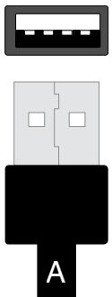

  
Figure 11.2 USB plug and port diagrams.

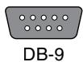

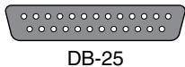  
Figure 11.3 Common RS-232C physical port designs.

A legacy serial interface still widely used is the Communications (COM) Port. The communications standard used to exchange data using a COM port is referred to as RS-232C. The name RS-232C comes from the current version of the Recommended Standard number 232, which was proposed by the Electronic Industries Association (EIA) and renamed to EIA-232. It was

accepted as a standard by the International Standards Organization (ISO) and is described in ISO document 2110 [67]. Despite the updated standards and name changes, the protocol is still widely referred to as RS-232C.

The standard that resulted from RS-232C includes both electrical signaling characteristics as well as mechanical characteristics such as plug design and pin definitions. The serial connection is directional, with one end connected to the Data Terminal Equipment (DTE), which is usually a computer. The device at the other end of the connection is the Data Communications Equipment (DCE). This asymmetry is part of the communications specification and must be considered when establishing a connection.

Physical port designs used most commonly were the DB-25 and DB-9 styles (Figure 11.3). Rarely will you find one of these physical ports on a modern computer. Nevertheless, the communication standard continues to be used over other serial interfaces, like USB. We’ll demonstrate one example in the next section.

When setting up RS-232C communications, several data exchange parameters must match between the DTE and DCE ends of the connection, including those listed in Table 11.2. While the exact meaning of each parameter is beyond our scope, it is important to know that the settings used by the equipment on each end of the connection must match for communication to occur. Always check your external equipment’s serial communication settings and match them when configuring a connection.

# 11.5.1 Reading Barcodes from a Serial Port

The Python ecosystem of contributed modules includes several options that support serial communications over a USB port using the RS-232C standard. Python modules for serial communications include both synchronous and asynchronous variations. We’ll introduce a synchronous Python module for communicating with RS-232C called pySerial [68].

Table 11.2 RS-232-C communication parameter settings.   

<table><tr><td>Parameter</td><td>Description</td><td>Typical values</td></tr><tr><td>Baud rate</td><td>Times per second the signal changes.</td><td>300, 600, 1200, 2400, 4800, 9600, 19200, 38400, 57600, 115200</td></tr><tr><td>Data bits</td><td>Number of bits used to represent a single data character.</td><td>8 data bits, 7 data bits</td></tr><tr><td>Parity</td><td>Extra bit used for error checking.</td><td>None, Even, Odd</td></tr><tr><td>Handshake</td><td>Techniques for managing flow control.</td><td>None, DTR/DSR, Modem, RTS/CTS, XON/XOFF</td></tr><tr><td>Start, stop bits</td><td>For timing or synchronizing.</td><td>1 bit, 2 bits</td></tr></table>

The pySerial module may be installed from the Python Package Index (PyPI) using the pip module.

```batch
> python -m pip install pyserial 
```

Once installed, available COM ports can be printed using a pySerial utility. The program in Listing 11.10 demonstrates the process. Note that even though the module is called pySerial in the PyPI, once installed, all imports are made from the module named serial. To access the port listing utility, import serial.tools.list_ports. This provides access to the comport() function, which returns a list of ListPortInfo objects. Printing a ListPortInfo object gives a string representation describing the COM port. The terminal session following Listing 11.10 shows that the computer has one COM port available named COM4. You may find that this utility returns an empty list. On Windows, COM ports are not available unless explicitly created. Fortunately, Windows will detect, configure, and name a COM port after a serial device is plugged in to the USB port. If you have a serial device but do not see any COM ports listed, try plugging in the device first and execute Listing 11.10 again.

Listing 11.10 List of available COM ports.   
```python
# list_com_ports.py
import serial.tools.list_ports
if __name__ == '__main__': 
    # List all com ports
    ports = serial.tools.list_ports.comports()
    for port in ports:
        print.port) 
```

```txt
> python list_com_ports.py COM4 - USB Serial Device (COM4) 
```

The COM port listed above was created automatically in response to plugging in a consumer grade, USB wired, handheld gun-style barcode scanner, and configuring it to communicate using a COM port.

Once the COM port is available, a serial module Serial object may be created and used to manage communications with the port. The Serial object constructor parameters are listed in Table 11.3, which include all configuration parameters listed in Table 11.2. Once constructed, the Serial object is opened immediately. It is not necessary to open the object using its open() method.

Common Serial object methods and parameters are listed in Table 11.4. We’ll consider the read(…), read_until(…) and write(…) methods in more detail.

The timeout parameter is important to highlight because it determines how the Serial object works when reading bytes from the COM port. Table 11.5 describes the timeout parameter value options.

When timeout is None (the default) the read waits indefinitely and returns only when the number of bytes is received, as specified in the read(…) method. Be careful with setting timeout to None because it can cause your program to hang indefinitely.

Table 11.3 Serial constructor parameters and default values.   

<table><tr><td>Serial constructor parameter</td><td>Description</td><td>Default</td></tr><tr><td>port</td><td>Name of COM port.</td><td>None</td></tr><tr><td>baudrate</td><td>Rate of serial data transfer.</td><td>9600</td></tr><tr><td>bytesize</td><td>Number of data bits.</td><td>EIGHTBITS</td></tr><tr><td>parity</td><td>Error correction.</td><td>PARITY_NONE</td></tr><tr><td>stopbits</td><td>Number of stop bits.</td><td>STOPBITS_ONE</td></tr><tr><td>timeout</td><td>Read timeout parameter value.</td><td>None</td></tr><tr><td>write_timeout</td><td>Write timeout in seconds.</td><td>None</td></tr><tr><td>xonxoff</td><td>Enable software flow control.</td><td>False</td></tr><tr><td>rtscts</td><td>Enable send hardware flow control.</td><td>False</td></tr><tr><td>dsrdtr</td><td>Enable receive hardware flow control.</td><td>False</td></tr><tr><td>inter_byte_timeout</td><td>Inter-character timeout.</td><td>None</td></tr><tr><td>exclusive</td><td>Enable exclusive port access.</td><td>None</td></tr></table>

Table 11.4 Common Serial object methods and parameters with descriptions.   

<table><tr><td>Serial method/parameter</td><td>Description</td></tr><tr><td>open()</td><td>Open the Serial object. Note that the object is opened automatically when created.</td></tr><tr><td>close()</td><td>Close the Serial object.</td></tr><tr><td>read(size=1)</td><td>Read size bytes from the port. Read 1 byte by default. Follow behavior dictated by timeout parameter value.</td></tr><tr><td>read_until(expected=LF,size=None)</td><td>Continue reading the port until the expected string is found, size number of bytes are read, or a timeout occurs.</td></tr><tr><td>write(data)</td><td>Write byte data to port. Returns number of bytes read.</td></tr><tr><td>flush()</td><td>Flush to port any data waiting in output buffer.</td></tr><tr><td>in_waiting</td><td>Number of bytes in buffer waiting to be read.</td></tr><tr><td>out_waiting</td><td>Number of bytes in buffer waiting to be written.</td></tr><tr><td>is_open</td><td>True if port is open.</td></tr><tr><td>name</td><td>Name of serial port.</td></tr><tr><td>timeout</td><td>Get/set timeout parameter value.</td></tr></table>

Table 11.5 Meaning of timeout parameter values.   

<table><tr><td>timeout</td><td>Description</td></tr><tr><td>None</td><td>Wait indefinitely until the requested number of bytes is received.</td></tr><tr><td>0</td><td>Non-blocking. Returns immediately with buffer contents, including 0 bytes.</td></tr><tr><td>&gt;0</td><td>Wait for timeout seconds before returning with buffer contents, including 0 bytes.</td></tr></table>

When timeout is 0 a read will return immediately with all bytes currently in the serial port read buffer, including an empty byte string when there is nothing in the buffer. Reading in an infinite loop with a timeout of 0 is a good example of a “tight loop,” which should be avoided. If you are using this strategy, it is always wise to include within the loop an external time.sleep(…) and/or some other mechanism to signal for-loop termination, such as running the coroutine with asyncio.sleep(…) in an asynchronous task group.

A positive value for timeout causes a read(…) to wait for the given number of seconds before returning with the contents of the read buffer, including an empty byte string. This is a built-in way to sleep between reads, but using synchronous sleep. When part of an asyncio task group, consider using a timeout of 0 and your own asyncio.sleep(…). As described previously, the asyncio alternative for sleeping releases the main event loop to process other tasks concurrently.

Listing 11.11 is a simple program that creates a Serial object and executes an infinite loop that reads and prints all data received. In this case, the program will be reading barcodes using a handheld barcode scanner connected to the COM port named COM4. The Serial object’s read(10) method invoked in the loop specifies that the read will wait and return only after 10 bytes of data have been received. But, the Serial object was created with a timeout parameter set to 10, which causes the read(…) method in the loop to return after 10 seconds if nothing is received. Both of these parameters set how the read(…) method behaves.

Listing 11.11 Simple serial port read and print loop.   
```python
# scan_barcodes1.py  
import serial  
if __name__ == '__main__':  
    # Create a Serial object with configuration parameter values.  
    # Return after 10 seconds if no data is received.  
    port = serial SERIAL('COM4', 115200, timeout=10)  
while True:  
    data = port.read(10)  
print(data) 
```

```txt
> python scan_barcodes1.py  
b'A000001\rA0'  
b'00002\rA000'  
b'003\r'  
b''  
b'' 
```

The terminal session after Listing 11.11 shows an example of running the program. Once started, the barcode scanner is used to read three barcodes: A000001, A000002, A000003 (Figure 11.4). Each read includes seven bytes for the code with a final carriage return byte, displayed as “\r.”


  
Figure 11.4 Three sample barcodes.

Because a single read transmits data that is only eight bytes long, the read(…) method does not return until the next barcode is read, which is necessary to fill the buffer to the requested 10 bytes, and then it returns only the first two bytes from the second read. As a result, the first response from read(10) is the Python byte string $\mathtt { b } ^ { \prime } \mathtt { A } 0 0 0 0 0 0 1 \setminus \mathtt { r a } 0 ^ { \prime }$ . The third read is necessary to refill the buffer to 10 bytes, which results in the second response containing the end of the second barcode and start of the third: $\mathsf { b } ^ { \prime } 0 0 0 0 2 \setminus \mathtt { r a d } 0 0 0 ^ { \prime }$ . Because no more barcodes are scanned, the third read does not return until the 10 second timeout elapses. All subsequent reads occur at 10-second intervals and return empty byte strings.

An alternative to reading a fixed number of bytes with read(…) is to use the read until(expected $\therefore$ ) method. This method reads data until a certain byte string is found and returns the buffer contents at that point. Note that the expected parameter value of read_ until(…) must be a Python byte string, not a regular Python string. Precede the expected characters with a leading “b” to ensure the value is a byte string.

In Listing 11.12, we use the fact that our barcodes are terminated with a carriage-return and read the serial port using read_until(expected=b'\r'). As soon as the carriage-return is detected in the buffer, the read_until(…) method returns with buffer contents as a byte string. Note that the timeout parameter is still set to 10, so the read_until(…) will return regardless, with the contents of the read buffer after 10 seconds have elapsed. In this program we added a few additional features, including the decoding of the byte string into a normal string using the decode(…) method, and terminating the loop when an empty string is found. Running the program and scanning the same three barcodes results in a much cleaner output following Listing 11.12.

Listing 11.12 Read barcodes until a $" \setminus \Sigma ^ { \prime }$ byte string is found and exit on an empty byte string.   
```python
# scan_barcodes2.py
import serial
if __name__ == __main__:
    # Create a Serial object with configuration parameter values.
    # Return after 10 seconds if no data is received.
    port = serial SERIAL('COM4', 115200, timeout=10)
while True:
    data = port.readuntil(expected=b'\r')
    barcode = datadecode('utf8').strip()
    if len(barcode) == 0: break
    print(barcode)
port.close()
# Clean up 
```

```txt
> python scan_barcodes2.py  
A000001  
A000002  
A000003  
> 
```

To incorporate the synchronous reading behavior of pySerial into an asynchronous program, we want to use a timeout $\mathtt { \Lambda } = 0$ to prevent the read(…) or read_until(…) methods from

performing any synchronous sleeping, which would hang the program. But, using a timeout $\mathord { \left. \kern - delimiterspace \right.} = 0 $ introduces a new complexity to our program, which is that a read(…) will occur so fast that it will continually return partial barcodes. Consequently, we need to manage a byte string buffer that accumulates all bytes read from the port.

In Listing 11.13, we define an asynchronous function called read_barcode(). This initializes a byte string called buff. Like previously, we enter an infinite loop that reads the serial port. With a timeout of 0, this method will return immediately with all bytes in the input serial buffer, even an empty byte string. Because we are managing the byte buffer ourselves, we append returned bytes to the buff byte string, immediately.

The next step is to look for the barcode terminator character $" \setminus \Sigma ^ { \prime }$ in the byte string using its find(…) method and assign the result to idx. The find(…) method returns the start index indicating where the substring was found, or $^ { - 1 }$ if not found. If idx $\scriptstyle > = 0$ we conclude that the byte buffer has a complete barcode and remove it from the buffer, leaving any remaining characters on the buffer. The barcode bytes are sliced from the front of the byte buffer and decoded into a string. Then the buffer is reset to the remaining characters in the buffer, being careful to exclude the trailing $" \setminus \Sigma ^ { \prime }$ character.

Whether or not a complete barcode is found on the front of the byte buffer, an asynchronous sleep is performed with asyncio.sleep(1) and the loop repeats.

Listing 11.13 Incorporate synchronous Serial read(…) into an asynchronous program.   
# scan_barcodes3.py
import asyncio, serial
# Wait for a barcode asynchronously
async def readBARcode(   ) :
	 Buff = b''
	 while True :
		N buff $+  =$ port.read(100)
			if len(buffer) > 0 : print(f'Buffer: \{buff\} ' )
			if idx == 0 :
				N barcode = buff[:end].decode('utf-8')
				N buff = buff[end+1:] 
				N strip barcode from buffer
				print (f'Read \{barcode\}') 
			 await asyncio.sleep(1)

```txt
> python scan_barcodes3.py  
Buffer: b'A000001\r'  
Read A000001  
Buffer: b'A000002\rA000003\r'  
Read A000002  
Buffer: b'A000003\rA000004\rA000005\r'  
Read A000003 
```

```txt
Buffer: b'A000004\rA000005\r'  
Read A000004  
Buffer: b'A000005\r'  
Read A000005 
```

The terminal session following Listing 11.13 is revealing. This output shows each barcode that has been read, and the instantaneous state of the byte buffer while running the program and scanning several barcodes in quick succession. Note how the buff byte buffer accumulates all bytes as they arrive but strips a barcode from the front of the buffer only when a complete barcode is found. This is all managed while allowing the program to run asynchronously.

# 11.5.2 Project – Scanning Sample Tasks into a Running Controller

Now that we know how to open and read a serial port, let’s integrate the barcode reader into our controller from Listing 11.9. Listing 11.14 includes modifications required to be made to Listing 11.9 to enable scheduling of samples by scanning a barcode. The updated program is saved in the file schedule3.py.

After importing the serial module, the only other changes to the original program are the replacement of the main() function with the read_and_schedule() function, and an update to the dunder-main that opens the serial port and runs read_and_schedule() asynchronously, on the event loop.

The Serial object is created with a timeout parameter set to 0, which causes the read(…) method to return immediately. This is the behavior we prefer because when running asynchronously, we want to use asyncio.sleep(…) instead to allow other tasks to execute concurrently rather than waiting synchronously on a serial port to respond.

The new asynchronous read_and_schedule() function adopts the approach introduced in Listing 11.13. Once a new barcode is read, the method gets a reference to the asynchronous event loop using asyncio.get_running_loop(), creates a new coroutine using task_ async(barcode) and adds it to the loop to be managed using loop.create_task(…).

Refer to the terminal session following Listing 11.14 and note that when the program starts, the only task running in the asynchronous event loop is read_and_schedule(). Three sample barcodes are scanned in succession: A000001, A000002, and A000003. The read_and_schedule() function reads each barcode and schedules the task to analyze the corresponding sample. Because we have three analytical instruments, the output demonstrates how the three samples are analyzed concurrently.

Listing 11.14 Modifications to Listing 11.9 allowing samples to be scheduled using a barcode reader.   
```python
# schedule3.py
# Added serial port task with automatic sample scheduling
import asyncio, time, serial
# <snip> ...
# Wait for a barcode and schedule sample for analysis 
```

Listing 11.14 (Continued)   
async def read_and_schedule():   
buff $=$ b'' # Init byte buffer while True: # Poll serial port buff $+ =$ port.read(100) # Append to buffer idx $=$ buff.find(b'\r') # Look for complete barcode if idx $\geq 0$ # If found... barcode $=$ buff[:idx].decode('utf-8') # Decode barcode buff $=$ buff[ idx+1:] # Strip bytes from front loop $=$ asyncio.get_running_loop() # Get event loop loop.create_task(task_async(barcode)) # Schedule sample await asyncio.sleep(1) # Asynchronous sleep   
if _name $\equiv =$ 'main': start $=$ time.time() # Init timer port $=$ serial.Serai('COM4'，115200，timeout=0) # Open port with no timeout asyncio.run( read_and_schedule()) #Get started port.close()

```txt
> python schedule3.py  
(5.1): Robby started moving A000001 from Corner to Inst1.  
(6.1): Robby finished moving A000001 from Corner to Inst1.  
(6.1): Inst1 started measuring A000001.  
(6.1): Robby started moving A000002 from Corner to Inst2.  
(7.1): Robby finished moving A000002 from Corner to Inst2.  
(7.1): Inst2 started measuring A000002.  
(7.1): Robby started moving A000003 from Corner to Inst3.  
(8.1): Robby finished moving A000003 from Corner to Inst3.  
(8.1): Inst3 started measuring A000003.  
(10.1): Inst1 finished measuring A000001.  
(10.1): Robby started moving A000001 from Inst1 to Corner.  
(11.1): Inst2 finished measuring A000002.  
(11.1): Robby finished moving A000001 from Inst1 to Corner.  
(11.2): Robby started moving A000002 from Inst2 to Corner.  
(12.1): Inst3 finished measuring A000003.  
(12.2): Robby finished moving A000002 from Inst2 to Corner.  
(12.2): Robby started moving A000003 from Inst3 to Corner.  
(13.3): Robby finished moving A000003 from Inst3 to Corner. 
```

# 11.6 Execute Remote Commands over HTTP

In Section 10.6 we demonstrated how to use the http.server module provided in the Python standard library to serve files from a remote location. In this section we’ll explore the asynchronous module named aiohttp, which supports asynchronous execution of the HTTP protocol, both from the client and server perspectives [62]. The aiohttp library will be used to access remote files as well as to invoke commands remotely. To install aiohttp with all speedups, execute the following command at a terminal.

```txt
> python -m pip install aiohttp[speedups] 
```

# 11.6.1 A Basic HTTP Server with aiohttp

For a quick introduction to the aiohttp module, have a look at Listing 11.15. This short program works like the server that we started in Section 10.6 and is used to browse and download files on a remote computer. The aiohttp.web submodule includes everything you need to start a local web server and respond to HTTP requests.

A popular way to configure HTTP servers is to map the path of a requested URL to a server function. This way, when an HTTP request is received by the server, the path of the URL dictates which function is invoked as well as its arguments. Refer to subsection 8.2.1 for a refresher on the anatomy of a URL. For aiohttp.web, the mapping between a requested path and a Python server function is stored in a data structure called a RouteTableDef. In Listing 11.15, after importing the web submodule from aiohttp, a RouteTableDef object is created and saved in the routes variable. To serve all files in a directory as files (static resources), a static route is added to the routes table by invoking its routes.static(…) method and passing the mapping between the URL path and the local file system path. In the example program we map the default URL path (/) to a local subdirectory named data which is relative to the file system location from which the server was started. The additional keyword argument show_index $: =$ True tells the route to return a listing of all files in the data subdirectory when no file name is included in the URL path. Each file and directory in the returned listing are rendered as HTML links to either download the file or navigate to the directory. By default, the server starts listening on port 8080, which is indicated when the server starts (see the console session following Listing 11.15).

To start the HTTP server, create an Application object, which is available from the aiohttp. web submodule. The routes table is added to the Application by invoking the method app. add_routes(routes) so that it knows how to route incoming requests, and the Application is started with the command web.run_app(app). The aiohttp.web submodule differs from the http.server submodule in that the former uses asynchronous coroutines to handle incoming requests. The top-level web.run_app(…) function starts the asynchronous event loop, which listens for and handles requests.

Listing 11.15 Remote HTTP server for disk navigation and file download.   
data_download.py   
from aiohttp import web   
# Create and initialize routes table   
# Add static default route to data directory with file index.   
routes $=$ webRouteTableDef()   
routes(static('/','data',show_index $\equiv$ True)   
if_name $= =$ 'main': app $=$ web.Application() app.addRoutes(routess) web.run_app(app)

```txt
> python data_download.py
>>> Running on http://0.0.0.0:8080
(Press CTRL+C to quit) 
```

  
Figure 11.5 Listing returned from the HTTP server started using the program in Listing 11.15.

To demonstrate how the asynchronous HTTP server functions for navigating and downloading files, open a browser and navigate to the server’s URL. Recall that if you open a browser on the same computer running the server, you may use the loopback domain localhost, as in: http://localhost:8080/. If on a remote computer connected to the same network, use the server computer’s IP address. In Figure 11.5 we used a browser to access the server program, which was executed on a machine assigned the IPv4 address in the URL when it connected to the network. The port 8080 was added to the URL as this is the default port used by the aiohttp web.Application object.

# 11.6.2 Routing an HTTP Request to a Custom Python Function

In Section 8.2 we introduced the concepts of an HTTP Request and an HTTP Response. As is the case with the Requests module (Section 8.3), the aiohttp module encapsulates these as objects as well. When an HTTP request is submitted to a running server application of type web.Application, it receives a web.Request object, which is passed to a custom function that handles the request. It is the responsibility of the function to create, configure, and return a web.Response object. Both web.Request and web.Response types are defined in the aiohttp module.

As mentioned, a custom function is mapped to the URL of a request by pattern-matching on the URL path. To simultaneously add a new route to the RouteTableDef data structure and link it to a custom handler function, a Python decorator is used to decorate the handler function that will receive the Request object when the URL includes a matching path, and return a Response object. For an example, have a look at the decorated count_files(…) function in Listing 11.16.

The count_files(…) function has been designed to return the number of files in the data subdirectory when a matching HTTP Request is received. The function received a single parameter which is the Request object. The function is mapped to the URL path by the decorator @routes. get('/count_files'). In this case it is assumed that routes is a web.RouteTableDef object, and it's get(…) function is used to associate the matching URL path with a request that uses a GET method. When a URL path matches “/count_files,” the web.Request object is passed to the function as its only parameter.

Listing 11.16 Example of an HTTP Request handler for an aiohttp web.Application server.   
```python
# Count the number of files in the data directory  
@routes.get('/count_files') # Associate URL with function  
def count_files(req):  
    fldr = Path('data')  # Create a Path object  
    num_files = len(list(fldr_iterdir()))  # Count files  
    resp = web.Response()  # Create a Response object  
    resp.text = str(num_files)  # Set its text content  
    return resp  # Return Response 
```

Within the function we create a new pathlib.Path object that encapsulates the data subdirectory and assigns it to the variable fldr. By invoking the iterdir() method of fldr within the list(…) function, we are able to enumerate all objects in the subdirectory all at once into a list of Path objects, each encapsulating one item in the subdirectory. The length of that list is computed with len(…) and saved to the num_files variable. A new web.Response object is instantiated and its text parameter is set to a string version of num_files. The final step is to return the Response object.

The new function in Listing 11.16 is added to the program in Listing 11.15 and saved with the new name command_server.py. Because we used the Path object in this function, we must import it by adding the statement "from pathlib import Path". Refer to Listing 11.17 for the complete command server program.

Run the new server program command_server.py on the local computer or a remote computer on the same network. Use a browser to visit the new URL with the /count_files path. Recall that if you are on the same computer as the server program, you may use the URL http://localhost:8080/ count_files. If on another computer, you’ll have to substitute localhost with the IP address or domain name of the remote computer. As you can see in the example illustrated in Figure 11.6, your response will be the number of files in the data subdirectory. In this example you have used the HTTP protocol and a small server program to invoke a custom Python function remotely, over a network.

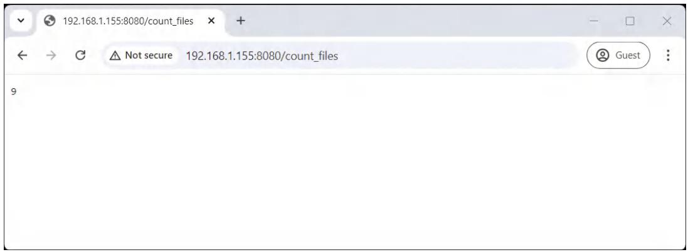  
Figure 11.6 Response from invoking a URL with the path /count_files.

Listing 11.17 HTTP Server program for executing commands on a remote computer.   
```python
command_server.py from aiohttp import web from pathlib import Path 
```

Listing 11.17 (Continued)   
```python
Create routes table
routes = webRouteTableDef()
Create and initialize routes table
Add static default route to data directory with file index.
routes = webRouteTableDef()
routes(static('/', 'data', show_index=True)
Count the number of files in the data directory
@routes.get('/count_files')
def count_files(req):
    fldr = Path('data')
    num_files = len(list(fldr_iterdir))
    resp = web.Response()
    resp.text = str(num_files)
    return resp
# Check if a file exists given name
@routes.get('/exists/{name}'))
def file_existsreq):
    data_fold = Path('data')
    # Create a Path object
    # Find all file name matches
    matches = [f.name for f in data_fold_iterdir()
        if f.name == req.match_info['name']
            resp = web.Response()
            if len(matches) > 0:
                resp.text = "True"
            else:
                resp.text = ""
            return resp
# Launch server
if_name__ == '__main__':
app = web.Application()
app.addRoutes(routess)
web.run_app(app) 
```

We can invoke the count_files(…) remote function programmatically instead of using a browser. As we saw in Section 8.3, the Requests modules is ideal for this purpose. Refer to the count_files() client function in Listing 11.18 for an example.

In the definition of the count_files() client function the remote URL is assembled and invoked using the requests.get(…) function. The status code of the HTTP response is tested and the return value is converted to an integer if the request was successful, or another negative HTTP status code is returned to signal an error. Because requests.get(…) is synchronous, invoking the client version of count_files() will not return until server responds.

Listing 11.18 Encapsulating remote function invocations in local function stubs.   
```txt
command_client.py   
# Functions for remote command execution   
import requests 
```

Listing 11.18 (Continued)   
Global URL for the command server   
command_server $=$ 'http://192.168.1.155:8080'   
# Count files on remote computer   
def count_files(): url $=$ f'\{command_server}/count_files' # Form URL resp $=$ requests.get(url) #Invoke command ifresp.status_code $\equiv$ 200: # Check response return int(response) # Return converted response else: return -resp.status_code # Negative error status   
# Check if a data file exists on remote computer   
def file_exists(fname): url $=$ f'\{command_server}/exists/\{fname\}' resp $=$ requests.get(url) #Invoke command ifresp.status_code $\equiv$ 200: # Check response return bool(response) #Return converted response else: return False #Error status   
# Tests   
if_name $\equiv$ main': # print(count_files()) print(file_exists("plate1.txt")）

URL paths used to configure the RouteTableDef object can be more than path string constants that must be matched exactly. A path can also include patterns that will be resolved against the path, resulting in a set of matched values that are extracted from the path. This can be useful when you want to include function parameters as part of the path.

For example, note that the @routes.get(…) decorator for the file_exists(…) function definition in Listing 11.17 sets the matching path string as "/exists/{name}". This tells the RouteTableDef object to look for a matching path by resolving the path against the given pattern. A path will resolve when the path starts with the fixed "/exists" string but the last part matches any string, which is assigned to the key name. In this case, the Request object passed to the function will have a match_info attribute that references a data structure including all key-value matches resulting from path resolution. This data structure can be referenced in the function set up to handle the route and used as function parameters. In the case of the file_exists(…) function with the assigned '/exists/{name}' path pattern, the given Request object’s match_info data structure will include a key with the string value 'name'.

The file_exists(…) function looks for all files in the data subdirectory that match the name obtained by resolving the URL path. It uses a Path object and its iterdir() method to examine all files in the directory and count the ones that match. If the count is greater than 0, the Response object returns a string "True". If no file was found, then an empty response is returned.

The matching client function for the server version is also given in Listing 11.18. Like the count_files() client function, file_exists(…) assembles a complete URL and requests it from the server. This time, the file name being sought is substituted into the requested URL. The server function extracts the file name from the URL and searches for the file in the data

Table 11.6 Common aiohttp Request object methods and properties.   

<table><tr><td>Request method/property</td><td>Description</td></tr><tr><td>url</td><td>A URL object with the complete URL in the Request.</td></tr><tr><td>method</td><td>The HTTP method. “GET,” “POST,” etc.</td></tr><tr><td>scheme</td><td>The scheme used. “https,” “http,” etc.</td></tr><tr><td>path</td><td>Path portion of the URL.</td></tr><tr><td>query</td><td>A dictionary-like object of Request query string parameters.</td></tr><tr><td>cookies</td><td>A dictionary-like object of Request incoming cookie parameters.</td></tr><tr><td>headers</td><td>A dictionary-like object of Request incoming header parameters.</td></tr><tr><td>async text()</td><td>Read Request body using charset encoding or UTF-8, if not specified. Returns a string with the body of the Request.</td></tr></table>

Table 11.7 Common aiohttp Response object methods and properties.   

<table><tr><td>Response method/property</td><td>Description</td></tr><tr><td>set.status(status, reason=None)</td><td>Set the Response status code.</td></tr><tr><td>headers</td><td>A dictionary-like object of Response outgoing header parameters.</td></tr><tr><td>set_cookie(name, value, ...)</td><td>Set outgoing cookie parameter with optional settings.</td></tr><tr><td>content_type</td><td>MIME type of outgoing content, like “text/plain.”</td></tr><tr><td>text</td><td>Read-write attribute for storing response&#x27;s body as a string.</td></tr></table>

subdirectory. As with the client version of file_exists(…), the returned response_code is used to evaluate the success of the response and a suitable Boolean value is returned.

With the aiohttp asynchronous module for starting simple HTTP servers, the module’s routing framework for matching URL paths to handler functions with parameters, and the Requests module used for making HTTP requests that are encapsulated within a matching client-side function, we can set up full-featured remote function invocations that invoke functions on a remote computer, allowing it to perform remote functions or interrogate and return its status.

The aiohttp module’s Request and Response objects have much more functionality, which you may need while invoking HTTP requests. Tables 11.6 and 11.7 list and describe several of their methods and properties.

# 11.7 Persistent Network Connections using a WebSocket

In Section 8.1 we introduced the basic network concepts, including the software abstraction of a connection point on one end of a network connection called a network socket. Recall that a socket includes both the IP address of a device on the network and the logical port number through which a connection is made and all data is sent and received.

When a web browser requests a resource from a network endpoint using the HTTP protocol, it opens a socket connection to a server, sends the request, receives the response, and closes the

socket. In this model, the network connection is open just long enough for one request/response exchange to complete.

When multiple exchanges are to be made between a browser and a server within a short period, it is advantageous to establish a persistent network connection over which data can be transmitted continuously, in both directions. This avoids the unnecessary overhead of repeatedly building up and shutting down network connections. To provide a web browser with an HTTP-compatible technique for opening persistent connections with a server, the WebSocket protocol was introduced [69].

# 11.7.1 A User Interface for Asynchronous Networked Programs

One interesting application of a persistent bidirectional network connection with a web browser is that the browser can now be used as a persistent graphical user interface for an asynchronous server program. In this model, the web browser displays an HTML web page containing all the required interface widgets for working with a program, which can be updated at any time by the connected server.

In addition to the common HTTP request/response exchange, which requires a temporary network connection, the aiohttp module supports persistent WebSocket connections with a suitable client program. With this capability available on the server, a small amount of JavaScript within an HTML page can be used to establish a persistent WebSocket connection with an aiohttp HTTP server. The server-side WebSocket receives commands communicated through the persistent network connection and safely dispatches the commands to other asynchronous tasks running concurrently under the server’s main event loop. When a response is available, the persistent bidirectional WebSocket connection is used to return responses to the browser WebSocket, which updates its HTML interface.

There are several advantages of using this model for developing user interfaces for asynchronous programs like system controllers. One advantage is that additional Python graphical user interface libraries are unnecessary because everything required for the interface is built into a standard web browser. It is not necessary to learn a new library because existing knowledge of HTML can be reused to create the interface. An additional benefit is that the browser-based user interface can connect to a controller remotely, over a network. There is no reason to be in the same location as the server to monitor a system as it runs.

# 11.7.2 WebSocketResponse and FileResponse Objects

Establishing a connection from a browser to an aiohttp HTTP server requires that the browser open an HTML file that both initiates a WebSocket connection as well as sends and receives messages. To deliver an entire file from an aiohttp HTTP server, the aiohttp.web submodule includes the definition of a special kind of HTTP response called a FileResponse. To return a file from an HTTP request, a FileResponse object is created with a file path, and that object is returned. In reality, the FileResponse object reads and formats the named file, and returns its content in the response to the HTTP request. The following async function named index(…) demonstrates how to return an entire file named ui.html from an HTTP request made to the default route.

```txt
@routes.get('//') # Default route  
async def index(req):  
    return web.FileResponse('ui.html') # Returns HTML page with WebSocket 
```

When a client requests the formation of a new WebSocket connection with an aiohttp HTTP server, another kind of request is created, also defined in the aiohttp.web submodule. This is the WebSocketResponse type, which creates a WebSocket on the server and accepts the client connection request. Because WebSocket connections are persistent, the server-side async function that handles the WebSocket request should not return immediately, but instead go into an async loop that awaits messages from the client WebSocket. When the client WebSocket connection closes, the async loop will exit and the server WebSocket can be closed.

# 11.7.3 Project – A Browser-Based WebSocket Message Broadcaster

To demonstrate both the FileResponse and WebSocketResponse objects, let’s create a small server that accepts all WebSocket requests and broadcasts all messages received by one connected client WebSocket to all other connected WebSockets.

To enable this functionality, the program must manage references to all WebSocket objects in a global data structure so that a message received from one WebSocket can be broadcast to all others. To ensure we have a unique collection of WebSockets, we’ll use a set data structure to hold all references.

connected $=$ set()

```txt
Current WebSocket connections 
```

A small example of such an HTML file with JavaScript that opens a WebSocket with a server is given as Listing 11.19 and rendered in a browser, as depicted in Figure 11.7.

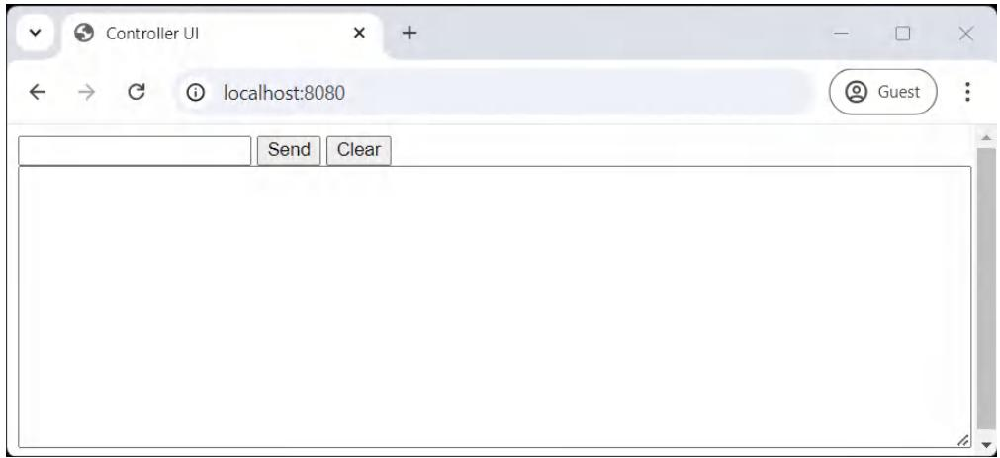  
Figure 11.7 Simple browser client for sending messages to a server using a WebSocket.

Listing 11.19 HTML file defining a simple browser client for sending messages through a WebSocket.   
```twig
<!DOCTYPE html>   
<html>   
<head> <meta charset="utf-8"> <title>Controller UI</title> 
```

(Continued)

Listing 11.19 (Continued)   
```html
<! -- ui.html -->
<style>
    #txt_log { width:100%; height:200px; font-family:monospace; }
</style>
</head>
<body>
    <input id="txt msg" type="text">
        <button id="btn_send">Send</button>
        <button id="btn_clear">Clear</button>
        <textarea id="txt_log"></textarea>
    </script defer>
    // Open a WebSocket at /ws on port 8080
    const ws = new WebSocket({document.location.host}/ws);
    // Accumulate log message
    function log(msg) {
        document.getElementById('txt_log').value += ${msg}\n;
    }
    // Clear log
    function clear_log() {
        document.getElementById('txt_log').value = "";
    }
    // Log onopen and onmessage events.
    ws.onopen = (ev) => log('Connected to server');
    ws.onmessage = (ev) => log({ev.data})};
    // Send message to open WebSocket
    document.getElementById('btn_send').onclick = (ev) => {
        const txt msg = document.getElementById('txt msg');
        ws.send(msg.value);
        log({Sent: ${txt msg.value}});
        txt msg.value = '';
    };
    // Clear log
    document.getElementById('btn_clear').onclick = (ev) => clear_log();
</script>
</body>
</html> 
```

There are only three key lines of JavaScript in Listing 11.19 that are associated with the client WebSocket (see below). The first line attempts to open a WebSocket with the originating server listening on the route named /ws. The expression document.location.host substitutes the host of the server into the request to open a WebSocket. The second and third lines set up event handler functions which react to the WebSocket when it opens a new connection and when it receives a new message. It is remarkable how few lines of code are necessary to establish and manage a WebSocket connection with a server using JavaScript in a web browser.

```javascript
// Open a WebSocket at /ws on port 8080
const ws = new WebSocket({ws://${document.location.host}/ws}); 
```

```javascript
// Log onopen and onmessage events.  
ws.onopen = (ev) => log('Connected to server');  
ws.onmessage = (ev) => log({Received: ${ev.data} `}); 
```

The HTML page of Figure 11.7 has only four user interface elements. An input box for entering messages to send to the WebSocket is created first. This is followed by one button that triggers a function to send the message and a second to clear the message log. A textarea element is placed after the first three widgets to collect all logged messages, including when a connection is opened, when a message is sent, and when a message is received.

Accepting and managing WebSocket requests is a bit more involved. Fortunately, the aiohttp module makes the process simple. Refer to Listing 11.20 for an HTTP request handler that handles the entire lifetime of a server-side WebSocket connection.

Listing 11.20 Server async function to establish WebSocket connection and broadcast messages.   
@routes.get('/ws') # Connect a new websocket   
async def websocket_handler(reg): ws $=$ web.WebSocketResponse() # Create WebSocket await ws.prepare的要求） # Start WebSocket connected.add(ws) # Add WebSocket instance to set print(f'Connected:{reqremote} {hash(ws)}{len万股}）' async for msg in ws: # Broadcast messages if msg.type $= =$ aiohttp.WSMsgType.TXT: print(f'Received:{msg.data}') for ws in connected: if ws != ws and not ws.closed: await ws.send_str(msg.data) elif msg.type $= =$ aiohttp.WSMsgType.ERROR: print(f'Websocket exception:{ws_exception()}') # Close WebSocket,if not already closed,and remove from the set. if not ws.closed: ws.close() connected.remove(ws) print(f'Closed:{hash(ws)}{len(connected)})') return ws

Once the WebSocket connection request is received, a web.WebSocketResponse object is created and its prepare(…) method invoked, passing the received Request object. This performs all the handshaking required to set up the persistent WebSocket connection.

```txt
ws = web WebSocketResponse() # Create WebSocket await ws.prepare(req) # Start WebSocket 
```

Because we must track all current WebSocket connections to be used for broadcasting messages later, we add the new WebSocketResponse object to the global connected set and log the action.

```javascript
connected.add(ws) # Add WebSocket instance to set  
print(f'Connected: {reqremote} {hash(ws)} ({len(connected)})') 
```

At this point an async-for loop is initiated to wait for a message to be received by the server WebSocket. Because WebSocket message objects have a type, the body of the async-for tests the message type and reacts appropriately to each. In this example, only the TEXT and ERROR message types are handled. When a TEXT message type is received, the program loops over all WebSocketResponse objects in the connected set. If the object is open, and not the same WebSocket that received the message, the message is sent to the client WebSocket by awaiting its send_str(…) method.

```python
if msg.type == aiohttp.WSMsgType.TXT:  
    print(f'Received: {msg.data}')  
    for _ws in connected:  
        if _ws != ws and not _ws.close:  
            await _ws.send_str(msg.data) 
```

When the async-for loop exits, such as when the client WebSocket closes, if the server WebSocket is not already closed, it closes it and removes the server-side WebSocketResponse object from the connected set.

```txt
Close WebSocket, if not already closed, and remove from the set.  
if not ws.close: ws.close()  
connected.remove(ws) 
```

See Listing 11.21 for the complete aiohttp-based HTTP server for handling WebSocket connections and message broadcasting named broadcast.py. Note that this program includes a RouteTableDef object with two routes. The default route returns the ui.html file from Listing 11.19 and the /ws route handles the WebSocket connection and message broadcasting.

Listing 11.21 Complete aiohttp-based HTTP server handling WebSocket connections and message broadcasting.   
```python
# broadcast.py
import aiohttp
from aiohttp import web
routines = web��RouteTableDef()
connected = set()
@routes.get('//')
async def index(request):
    return web.FileResponse('ui.html')
@routes.get('/ws')
async def websocket_handler(request):
    ws = web.WebSocketResponse()
    await ws.prepare(request))
connected.add(ws)
print(f'Connected: {reqremote} {hash(ws)} ({len(connected)})')
async for msg in ws:
    # Broadcast messages 
```

Listing 11.21 (Continued)   
if msg.type $= =$ aiohttp.WSMsgType.TXT: print(f'Received:{msg.data}') for ws in connected: if ws! $\equiv$ ws and not ws.closed: await ws.send_str(msg.data) elif msg.type $= =$ aiohttp.WSMsgType.ERROR: print(f'Websocket exception:{ws_exception()}') # Close WebSocket, if not already closed, and remove from the set. if not ws.closed: ws.close(   ) connected.remove(ws) print(f'Closed:{hash(ws)}({len万股}）') return ws   
# Start HTTP server if_name $= =$ 'main': app $=$ web.Application(   ) app.addRoutes(routess) web.run_app(app)

To test the project, the broadcast.py server program was run in a directory that also contains the ui.html file. Two browser windows are opened. Refer to Figures 11.8 and 11.9 for the browser windows, and Listing 11.22 for server test output.

Visit the address http://localhost:8080 from both browser windows. This is the default route on the server that responds with the ui.html file. You will see connection messages in the browser window logs as well as the server log.

Type a message into one browser window and click the [Send] button. The server receives the message and broadcasts it to all clients other than the one that sent the message, which includes the second browser. Send a second message from the second browser window, which is broadcast to the first browser window. Once again, both messages are printed to the logs of both browser

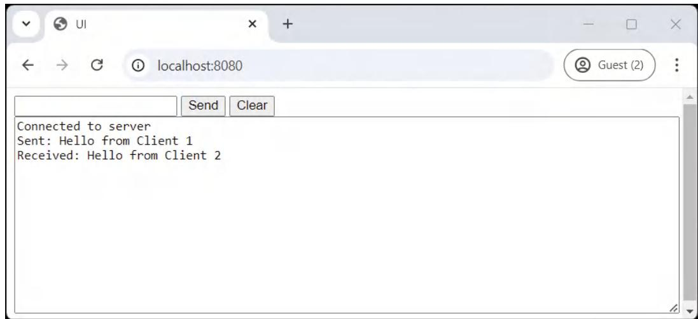  
Figure 11.8 First browser window connected to the broadcast server.

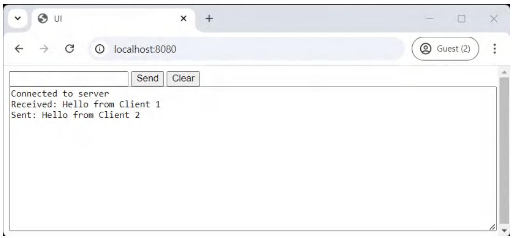  
Figure 11.9 Second browser window connected to the broadcast server.

windows as well as the server log. Finally, close both browser windows. Two close messages are printed to the server log.

Listing 11.22 The broadcast server messages during testing.   
```txt
> python broadcast.py   
\(= = = = = = = = = = = = = = = = = = = = = = = = = = = = = = = = = = = = = = = = = = = = = = = = = = = = = = = =   
\)\equiv\( Running on http://0.0.0.0:8080 \)\equiv\(   
(Press CTRL+C to quit)   
Connected: ::1 1898792660880 (1)   
Connected: ::1 1898792662512 (2)   
Received: Hello from Client 1   
Received: Hello from Client 2   
Closed: 1898792660880 (1)   
Closed: 1898792662512 (0) 
```

A WebSocket client connection can be established with the server from a Python client program as well as a browser. This is useful for sending commands to the broadcast server from an asynchronous task running within an event loop that may be performing tasks like monitoring sensors or performing feedback control. A client WebSocket connection is established using an aiohttp ClientConnection object. Listing 11.23 provides a complete program that establishes a connection and exchanges messages with a WebSocket server. Messages are received from the client by prompting the user with the synchronous Python prompt(…) function. To avoid blocking the execution of any concurrent asynchronous task running under the same event loop, the prompt(…) function is executed in its own thread.

Listing 11.23 Connect to a WebSocket server with an aiohttp.ClientSession object.   
```python
# client.py
import asyncio
import aiohttp 
```

Listing 11.23 (Continued)   
```python
# Server address
URL = "ws://localhost:8080/ws"
# Create client WebSocket and connect.
# Start async methods to manage connection send and receive.
async def main():
    client = aiohttp(ClientSession()
    async with client.ws_connect(URL) as ws:
        await ayncio"gather(incoming(ws), outgoing("Enter message: ", ws))"
# Handle incoming messages
async def incoming(ws):
    async for msg in ws:
        # Print received message and re-prompt user.
        print(f'\nReceived: {msg.data}\nEnter command: ', end=' )
        # Close connection
        if msg.type in (aiohttp.WSMsgType.CLOSED, aiohttp.WSMsgType ErfORR):
            break
# Prompt and send outgoing messages
async def outgoing(prompt, ws):
    while True:
        msg = await ayncio.to_thread(input, f{'prompt'})
        await ws.send_str(msg)
if __name__ == '__main__':
    ayncio.run( main()) 
```

The example client program in Listing 11.23 establishes a connection with a WebSocket server running on the same computer, which is assumed to be at the URL ws://localhost:8080/ws. The async main(…) function is the top-level asynchronous function. It creates an aiohttp.ClientSession object and attempts to connect with the server at the URL address. With the client WebSocket, two asynchronous tasks are gathered under a single event loop. The incoming(…) async function manages incoming messages from the server and outgoing(…) manages outgoing messages.

Similar to the way the WebSocket server program in Listing 11.21 manages incoming messages, the incoming(…) async function in Listing 11.23 enters an async-for loop that receives and processes all received messages. In the example the message is printed only, and the prompt message is printed again. The message type is tested as well to check if it is time to terminate the loop. Instead of just printing the received message it could be used to initiate the performance of some data processing or instrument control task.

The outgoing(…) async function in Listing 11.23 is designed to prompt the user for a message using the Python input(…) function and wait until one is entered. Because input(…) is a synchronous I/O Python function that has the potential to block other asynchronous tasks, the input(…) function is executed on the event loop within its own thread. The asyncio. to_thread(…) async function is a convenient utility for executing synchronous tasks without blocking the event loop. Once the user enters a text message, the message is sent out to the client WebSocket connection by awaiting the WebSocket’s send_str(…) function.

To test the interactive Python WebSocket client program in Listing 11.23, the broadcast.py server program is started again (Listing 11.24). A browser is opened and used to load the browser

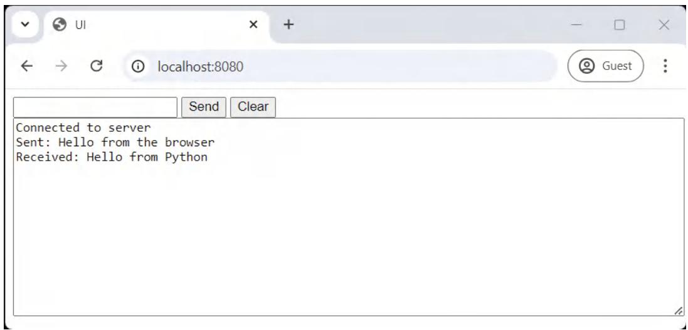  
Figure 11.10 Browser client for testing the Python client.

client by visiting http://localhost:8080 (Figure 11.10). Finally, the WebSocket Python client program is executed from a terminal (Listing 11.25). Once everything is running and connected, the browser client is used to broadcast the message “Hello from the browser,” which is received and printed by the Python client program. The Python client program is then used to broadcast the message “Hello from Python,” which is received by the browser. The server program log displays both received messages before broadcasting to other WebSocket connections.

Listing 11.24 The broadcast.py server program for testing with a Python client.   
```txt
> python broadcast.py   
\(= = = = = = = = = = = = = = = = = = = = = = = = = = = = = = = = = = = = = = = = = = = = = = = = = = = = = = = =   
\)\equiv\( Running on http://0.0.0.0:8080 \)\equiv\(   
(Press CTRL+C to quit)   
Connected: ::1 2240997405520 (1)   
Connected: ::1 2240997406864 (2)   
Received: Hello from the browser   
Received: Hello from Python 
```

Listing 11.25 Python client program execution and log message.   
```txt
> python client.py  
Enter command:  
Received: Hello from the browser  
Enter command: Hello from Python  
Enter command: 
```

This project outlines the essential components of a powerful model for connecting and communicating between a variety of networked Python and browser client programs. How to handle each received message can be customized to suit your application’s needs.

# 11.7.4 Project – A Browser User Interface to Schedule Samples for Analysis

As a final project in this section, let’s replace the sample scheduling in the asynchronous integrated system controller from Listing 11.9 with a WebSocket server and browser interface. This project will merge the features of the broadcast server program of Listing 11.21 with the sample scheduling and test execution features of Listing 11.9. Adding a WebSocket server to the asynchronous controller gives us the ability to integrate a browser-based user interface to schedule samples interactively. Refer to the files schedule4.py and sample_scheduler. html files in the book’s GitHub repository at https://github.com/russomf/syrlwp for all project source code.

The updated HTML page to be displayed in a browser and used to interact with the asynchronous controller is shown in Figure 11.11. The page’s HTML and JavaScript are substantially similar to the code in Listing 11.19, with a few extra elements, including an interactive selection of sample container location in the storage rack.

Messages sent to the controller will now consist of two data items: the sample ID and the storage rack location. For this reason, we combine the two data items into a Python dictionary and serialize it into a JSON-formatted string before sending. An example of a serialized JSON data structure containing sample ID and storage rack location is given below. This message string is a serialized data structure, not the simple string message we sent in the broadcast WebSocket server from the project in subsection 11.7.3, but it is still a string.

```json
{"sample_id":"A000001","sample_location":"1"} 
```

Because the WebSocket server event loop starts its own main event loop, instead of starting our own event loop with asyncio.run(…) like we did in Listing 11.9, we’ll use the existing running event loop started by the WebSocket server and schedule sample tasks on that loop instead.

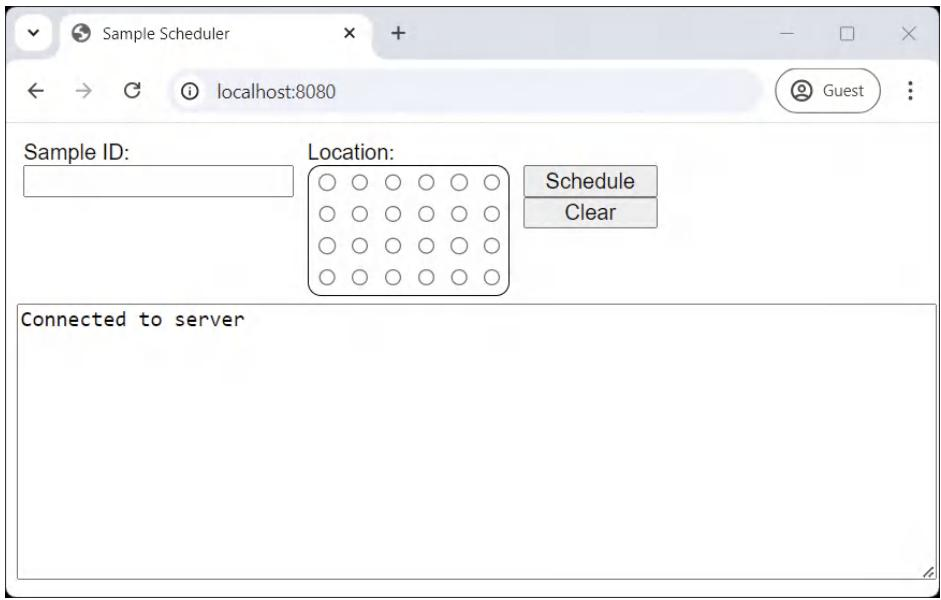  
Figure 11.11 Browser interface for interactively scheduling samples in the asynchronous controller.

To start, all features of the broadcast server in Listing 11.21 are merged into the system controller in Listing 11.9. The most important modification is in the route that handles WebSocket connection requests because this is where messages requesting sample scheduling will arrive and be processed. Listing 11.26 is the modified route for handling WebSocket requests. The implementation is nearly identical to the same route in Listing 11.21 except for the way TEXT messages are handled.

Listing 11.26 Updated route to handle WebSocket connections and message processing.   
# Connect socket   
@routes.get('/ws')   
async def socket_handlerreq): ws $=$ web.WebSocketResponse() # Create WebSocket await ws.prepare的要求） # StartWebSocket connected.add(ws) # Add WebSocket instance to set print(f'Connected:{reqremote} {hash(ws)}{len(connected)})') async for msg in ws: # Broadcast messages if msg.type $= =$ aiohttp.WSMsgType.TXT: print(f'Received:{msg.data}') #Schedule sample loop $=$ asyncio.get_running_loop() loop.create_task(task_async(msg.data)) elif msg.type $= =$ aiohttp.WSMsgType.ERROR: print(f'Websocket exception:{ws_exception()}') # Close WebSocket,if not already closed,and remove from the set. if not ws.close: ws.close() connected.remove(ws) print(f'Closed:{hash(ws)} {len万股}） return ws

When a TEXT message is received by the updated WebSocket connection request route, the currently running aiohttp Application server’s event loop is accessed using the provided asyncio.get_running_loop() function, and that loop is then used to schedule a new sample by invoking the loop.create_task(…) with a new task_async(…) coroutine provided with the WebSocket’s message data. Compare this to the previous example in which we scheduled all samples up front as the controller started.

To test the new controller, we start by running the schedule4.py Python program in the same directory containing the new sample_scheduler.html user interface file. We can load the sample_scheduler.html file by opening a browser and visiting the default server route on port 8080. When the page loads it establishes a WebSocket connection with the server. The page should look like Figure 11.11.

Enter a sample ID into the displayed page, select the sample’s storage location, and click the [Schedule] button. This assembles the JSON serialized messages with the sample data and sends it to the server over the WebSocket, where the sample is scheduled for analysis. Note that the new task_async(…) coroutine receives the JSON-formatted message with sample ID and sample location. It must first deserialize the JSON message before scheduling the sample.

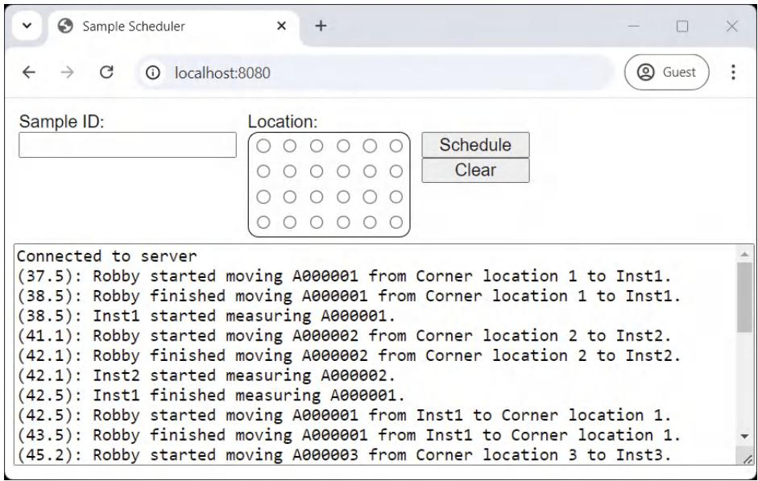  
Figure 11.12 Sample Scheduler user interface used to schedule four samples and receive log messages.

Four samples in total are scheduled and allowed to run to completion. Figure 11.12 and Listing 11.27 show the result. By studying the server log you will see that the schedule4.py asynchronous server program has managed multiple tasks concurrently. Not only did it receive multiple sample requests over the WebSocket connection, and schedule samples for analysis, it managed all instrumentation according to resource availability and preconditions and completed the analysis of all samples. Importantly, all tasks were executed concurrently and efficiently using available resources and no resource conflicts.

# Listing 11.27 Controller log after scheduling four samples for analysis.

```txt
> python schedule4.py
>>> Running on http://0.0.0.0:8080 >>>>
(Press CTRL+C to quit)
Connected: ::1 2720768337216 (1)
Received: {"sample_id":"A000001","sample_location":"1"}
(37.5): Robby started moving A000001 from Corner location 1 to Inst1.
(38.5): Robby finished moving A000001 from Corner location 1 to Inst1.
(38.5): Inst1 started measuring A000001.
Received: {"sample_id":"A000002","sample_location":"2"}
(41.1): Robby started moving A000002 from Corner location 2 to Inst2.
(42.1): Robby finished moving A000002 from Corner location 2 to Inst2.
(42.1): Inst2 started measuring A000002.
(42.5): Inst1 finished measuring A000001.
(42.5): Robby started moving A000001 from Inst1 to Corner location 1.
(43.5): Robby finished moving A000001 from Inst1 to Corner location 1.
Received: {"sample_id":"A000003","sample_location":"3"}
(45.2): Robby started moving A000003 from Corner location 3 to Inst3.
(46.1): Inst2 finished measuring A000002. 
```

(Continued)

Listing 11.27 (Continued)   
```txt
(46.2): Robby finished moving A000003 from Corner location 3 to Inst3.  
(46.2): Inst3 started measuring A000003.  
(46.3): Robby started moving A000002 from Inst2 to Corner location 2.  
(47.3): Robby finished moving A000002 from Inst2 to Corner location 2.  
Received: {"sample_id":"A000004","sample_location":"4"}  
(49.1): Robby started moving A000004 from Corner location 4 to Inst1.  
(50.1): Robby finished moving A000004 from Corner location 4 to Inst1.  
(50.1): Inst1 started measuring A000004.  
(50.2): Inst3 finished measuring A000003.  
(50.2): Robby started moving A000003 from Inst3 to Corner location 3.  
(51.2): Robby finished moving A000003 from Inst3 to Corner location 3.  
(54.1): Inst1 finished measuring A000004.  
(54.1): Robby started moving A000004 from Inst1 to Corner location 4.  
(55.1): Robby finished moving A000004 from Inst1 to Corner location 4. 
```

# 11.8 Responding to File System Changes

Changes to files on the file system often can be used as an indication that it’s time to get to work. For example, an instrument has completed its analysis procedures and created a new data file in a directory, a file used for signaling a process was deleted, a configuration file was updated, or a report PDF was generated and written to a file. File system changes can be detected automatically and used to trigger Python programs.

One option is to repeatedly poll a directory in the file system looking for changes. This requires that the state of the file system is saved so that the new state can be compared when next inspected. Polling the file system is a legitimate approach to detecting changes, but it can be hard to implement and expensive to execute.

# 11.8.1 Watching a Directory for Changes with watchfiles

A better option is to make use of a capability that is built-in to most operating systems, which is to send notifications when the file system changes. A Python module named watchfiles integrates this functionality into Python [13]. The watchfiles module knows how to register with a diversity of operating systems to receive file system events and to trigger custom Python functions when they do. Fortunately, when the file system does not have the automatic notification feature, watchfiles automatically falls back to using a polling approach to monitor for changes. The watchfiles module handles the idiosyncrasies of each operating system and exposes a uniform set of features. We can use watchfiles to detect events, like when a data file has been created in a directory, to invoke a custom Python function such as making a backup of the file, generating a PDF report, or sending an email with a notification that the file has been created.

As usual, the watchfiles module is available for installation from the Python Package Index and may be installed using the pip module.

```txt
> python -m pip install watchdogs 
```

The watchfiles module implements both a synchronous and asynchronous interface, so we have the option to use either, depending on our needs.

The main function implemented by the watchfiles module is watch(…). This function is an iterator that yields a set of changes when detected. This means that watch(…) can be used in a for-in statement, waiting for a change to occur. When one or more changes are detected the body of the loop executes. Each change can be inspected, and the appropriate action initiated programmatically. The program in Listing 11.28 is a simple example of how to use the watch(…) iterator of the watchfiles module.

Listing 11.28 Watch the data subdirectory and print a message when any change occurs.   
# notify.py   
from watchfiles import watch, Change   
from pathlib import Path   
# Store program root path   
rootpath $=$ Path(".").absolute()   
def display_changes(changes): for change in changes: # For all changes tchange, tpath $=$ change # Unpack change parts path $=$ Path(tpath) # Create a Path object relpath $=$ path(relative_to(rootpath) # Path relative to root if tchange $= =$ Change.added: # On an addition print(f'Added {reelpath}') elif tchange $= =$ Change_modified: # On a modification print(f'Modified {relpath}') elif tchange $= =$ Changedeleted: # On a deletion print(f'Deleted {relpath}') if not changes: print('No changes in this batch')   
# Monitor a directory_path for changes and notify when detected   
def notify directory_path: for changes in watch directory_path): # A change was detected display_changes(changes)   
if _name $\equiv =$ __main': notify('data')

The notify(…) function in Listing 11.28 receives a single argument, which is a string identifying the path to a directory to be monitored. This string is passed to the watch(…) iterator in a for-in loop. When one or more changes are detected, the watch(…) iterator yields a set of changes, which is assigned to the changes variable. The helper function display_ changes(…) is used to iterate over each change in the changes set and print a message indicating the change.

Each change reported by watch(…) is a tuple with two items:

1.	 A Change Enum identifying the change type: added, deleted, or modified, and   
2.	 A string path to the file system item that changed.

The display_changes(…) function in Listing 11.28 unpacks the two items in the change tuple and assigns them to the tchange and tpath variables. The tpath string is wrapped in a pathlib.Path object and assigned to a path variable to make it simple to inspect and use.

The tpath variable is a Change Enum which can have one of three values: added, deleted, and modified. We can determine which of the three change types is being reported by comparing this first element of the change tuple with the Enum values: Change.added, Change. modified, or Change.deleted. Make sure to import Change from watchfiles to get access to this Enum and its values. Note that these values are just shorthand notation for the integers 1, 2, and 3. But, it is better to use the Enum notation to make the comparison because your code’s intentions will be clearer and your program will continue to work properly if Enum definitions are updated in a future module release.

In the example below, the program in Listing 11.28 was run in a parent directory having a data subdirectory. After starting, the file plate1.txt was copied into data, the file was edited and resaved, and then the file was deleted, in that order. The terminal log below demonstrates that the program correctly identified each change by executing the corresponding print statement.

```batch
> python notify.py  
Added plate1.txt  
Modified plate1.txt  
Deleted plate1.txt 
```

With this capability, it is easy to imagine the triggering of automatic report generation when all data files have been created or attaching and emailing generated files, all using the techniques described in Chapter 10.

There are many ways to use watchfiles for automatic monitoring and notification. For example, when a log file changes, a Python script could be triggered to examine the changes, and an email could be sent automatically if immediate attention is required. All files deleted from a directory could be monitored and an alert raised when a file was deleted erroneously. A list of all data files in a directory could be compared against a known list of samples, and a notification sent only when all sample data files have been generated. The possibilities are limited only by your imagination.

# 11.8.2 File System Monitoring Options

The watch(…) function in watchfiles provides many more options for customizing how the iterator waits and reports identified file system changes.

The watch(…) function accepts multiple positional parameters and a set of keyword parameters. All positional parameters are file system paths to monitor. All path strings passed to watch(…) are monitored simultaneously, so one watch(…) can handle multiple paths. Additional keyword parameters of watch(…) are listed in Table 11.8.

Table 11.8 Keyword parameters that customize the behavior of the watch(…) method of watchfiles.   

<table><tr><td>watch (...) keyword parameter</td><td>Description</td></tr><tr><td>step</td><td>Report changes in this span of time in milliseconds.</td></tr><tr><td>yield_on_timeout</td><td>Whether to yield, even if no changes detected.</td></tr><tr><td>recursive</td><td>Recursively monitor and report events in subdirectories.</td></tr><tr><td>watch_filter</td><td>A callable used to filter changes.</td></tr><tr><td>force_polling</td><td>Force a polling mode of operation.</td></tr></table>

The notify_batch(…) function in Listing 11.29 demonstrates the use of watch(…) configured to report changes from all files in directory_path and its subdirectories, but batch up changes and report all at once every delay milliseconds. By setting yield_on_timeout to True, the watch(…) function will return after delay milliseconds, even when no changes are detected. Normal behavior is to wait until at least one change is detected before yielding. Replace the notify(…) function in Listing 11.28 with notify_batch(…) to test this modified functionality.

Listing 11.29 Batch changes for delay milliseconds but always yield, even when no changed detected.   
Batch all changes over delay milliseconds. Always return changes after the same time period. def notify_batch directory_path, delay): for changes in watch directory_path, step $\equiv$ delay, yield_on_timeout=True): display Changes (changes)

The two functions in Listing 11.30 demonstrate the use of watch(…) configured to report changes from all files in directory_path but not its subdirectories. Recursive monitoring is disabled by setting the recursive keyword parameter to False. Changes are limited to files with names that end with the string ".txt" by setting the watch_filter keyword parameter to the function txt_ only(…), which tests the path that is reporting a change. Like the previous example, replace the notify(…) function in Listing 11.28 with notify_txt(…) to test this modified functionality.

Listing 11.30 Report changes from "*.txt" files in given directory paths, not subdirectories.   
```python
Return True when path ends with ".txt"  
def txt_only(change,spath):  
    return swath.endsWith(".txt")  
# Report all changes on .txt files only.  
# Report changes in current directories only. Do not monitor subdirectories.  
def notify txt directory_path):  
    for changes in watch directory_path, watch_filter=txt_only, recursive=False):  
        display Changes(changes) 
```

Automatically detecting file system changes offers an easy way to initiate automatic data processing and trigger notifications. Both the changes to a file or the lack of a change within some amount of time, can be meaningful to the progress of an automated process. Being notified when things are changing in expected and unexpected ways makes it possible to detect problems early and take corrective action if necessary.

The appearance of a data file on the file system can indicate the completion of an analysis. A watchfiles script can be used to send a notification about the completion, start a script to process the data, plot it, and generate a PDF report, all automatically.

# 11.9 Executing Tasks on a Schedule

Without a way to be notified automatically that it is time to trigger a processing script, you may need to schedule the script to run periodically and check if it is time to start a task. For example, you may need to monitor the temperature of a room, invoke a web service to check on the weather,

verify that a program is still running, scan a file for an error message, or even snap a picture of a liquid nitrogen tank to monitor usage or an automated system when an error occurs. Fortunately, the Python sched module provides a very natural way to schedule tasks to run in the future, which helps us solve all these problems.

# 11.9.1 sched Module

The sched module comes with the Python standard library so no additional installation is required. Scheduling tasks for future execution is a three-step process.

1.	 Instantiate a scheduler object with desired timing functions.   
2.	 Schedule events for future execution.   
3.	 Run the scheduler.

Table 11.9 lists several common functions defined in the sched Python modules that are used for creating a scheduler with default or custom timing functions, scheduling tasks for future execution either using a time that is relative to the scheduling time or a time that is absolute with respect to the timing function. Also listed are attributes to inspect the future task queue, and methods for cancelling scheduled events and running the scheduler.

The scheduler(…) function in the sched module accepts two optional parameters, timefunc and delayfunc. The timefunc parameter is a function that returns the current time, in any units you prefer. The default value for timefunc is the Python time module’s monotonic() function, which has an undefined starting point. This works well when the elapsed time is most important, but it does not help when we want to schedule tasks to run at absolute future times.

For an absolute future time, the UNIX timestamp is a better option, which is available in Python using the time module’s time() function as well as several functions in the Python datetime module. Recall that the UNIX timestamp is the number of seconds that have elapsed since midnight on January 1, 1970, Universal Coordinate Time (UTC) (refer to subsection 2.6.5). We’ll use time.time() for our scheduler(…) timefunc parameter so absolute future times will be in seconds, and can be computed readily using functions provided by the time and datetime Python modules.

The second scheduler(…) function parameter is delayfunc. This must be a function that receives a number of time units and delays for that amount of time. The time.sleep(…) function is a good option for the delayfunc parameter if timefunc is measured in seconds.

Table 11.9 Common functions in the sched module for scheduling future task execution.   

<table><tr><td>sched function</td><td>Description</td></tr><tr><td>schedule(...)</td><td>Start a new scheduler with default timing.</td></tr><tr><td>ev = enter(delay, priority, action, ...)</td><td>Schedule event at relative delay time.</td></tr><tr><td>ev = enterabs(time, priority, action, ...)</td><td>Schedule event at absolute time.</td></tr><tr><td>queue</td><td>List of upcoming events in execution order.</td></tr><tr><td>cancel(ev)</td><td>Remove the event from the queue.</td></tr><tr><td>run()</td><td>Start the scheduler and block.</td></tr></table>

With time.time as the timefunc and time.sleep as the delayfunc, a new scheduler can be created as follows:

```python
import sched, time  
queue = schedulers(time.time, time.sleep) 
```

Future tasks are Python functions, with or without parameters. A Python function may be scheduled to run at a time relative to the time it was scheduled using the sched module’s enter(…) function. This function expects three required positional parameters and two optional keyword parameters.

The first positional parameter for enter(…) is the amount of time to delay before running the task, the second is the priority for the task in case multiple tasks are to be executed at the same time, and the third is the Python function implementing the task. One optional parameter is set with the keyword argument. This can be assigned to a tuple of positional arguments to be passed to the scheduled task function. Another optional parameter is set with the keyword kwargs, which may be assigned to a dictionary of key-value pairs to be passed to the task function as its own keyword parameters.

To help test the sched module, Listing 11.31 defines the elapsed(…) function, which receives a task name and prints the name as well as the amount of time in seconds that have elapsed since the start variable was assigned to the current timestamp.

Listing 11.31 Utility function to test scheduler by printing elapsed time.   
```txt
# Print elapsed time in seconds  
start = time.time() # Save start time  
def elapsed(tname):  
    timestamp = time.time()  
print(f'Task {tname}. Elapsed time: {tstamp - start} seconds') 
```

Once a scheduler(…) has been created and assigned to the variable queue, an elapsed(…) task can be scheduled for 5 seconds in the future using the following enter(…) function execution.

```javascript
ev1 = queue-enter(5, 1, elapsed, argument='First'), 
```

In this case the task elapsed('First') is scheduled for 5 seconds in the future with priority 1. Note that the function returns an event object, which can be used later to cancel a task by passing the event to the sched module cancel(…) function.

The alternate enterabs(…) function defined by the sched module gives us the ability to schedule a task for execution at an absolute time in the future. The only difference between the parameters of enter(…) and enterabs(…) is with the meaning of the first positional parameter. Rather than an amount of time to delay, the first positional parameter of enterabs(…) is the absolute time to run the task, as measured by the scheduler(…) timefunc parameter. The example below schedules the elapsed('Second') at a time set by adding 10 seconds to the previously recorded timestamp, which was saved to the start variable. The new time is an absolute value that is 10 seconds in the future. Once again, the function returns an event that may be saved and used to cancel the event at a later time.

```txt
ev2 = queue-enterabs(start+10, 1, elapsed, argument='Second')) 
```

The scheduler is executed in a blocking mode by invoking the sched module’s run() function. This will block until all scheduled tasks are executed. Invoking run(False) will run scheduled tasks that are due, but it will return the time of the next scheduled task immediately. In this case the scheduler must be run again for remaining tasks in the queue to be executed.

Listing 11.32 shows the complete program demonstrating the use of the sched module, and following it is example output from execution of the program. Note that the elapsed('First') task scheduled for 5 seconds in the future is executed and prints its message at approximately 5 seconds later. The elapsed('Second') task is scheduled using an absolute time that is computed as the current time plus 10 seconds. It executes and prints its time at approximately 10 seconds in the future.

Listing 11.32 Schedule two tasks and run scheduler.   
future.py   
import sched, time   
start $=$ time.time() # Save start time   
# Print elapsed time in seconds   
def elapsed(tname): tstamp $=$ time.time() print(f'Task{tname}.Elapsed time:{tstamp - start} seconds')   
if_name $\equiv$ 'main': # Start scheduler with timestamp as time function queue $=$ schedulersched(time.time, time.sleep) #Schedule relative and absolute timed future events ev1 $=$ queue-enter(5, 1, elapsed, argument $=$ ('First'),)) ev2 $=$ queue entersabs(start+10, 1, elapsed, argument $=$ ('Second',)) # Run until no more events scheduled queue.run()

```txt
> python future.py  
Task First. Elapsed time: 5.002584457397461 seconds  
Task Second. Elapsed time: 10.00098466873169 seconds 
```

# 11.9.2 Project – Taking and Sending Images on a Schedule

To demonstrate a practical use for the sched module, in this project, let’s define a few Python functions that take a picture using a computer’s camera and then email that picture to a designated e-mail address. These tasks will be grouped into a single function and scheduled for multiple times in the future.

An easy way to read an image from a camera is using the opencv-python module [70]. OpenCV is a sophisticated, open-source computer vision library capable of a wide variety of computer vision tasks. The opencv-python module is a Python wrapper around OpenCV functions.

We’ll use the library for the simplest of tasks, to read an image from a camera. To install the opencv-python module, run the following command in a terminal. Once installed, the module is imported using the name cv2.

```txt
> python -m pip install openvypython 
```

The default camera on a computer is opened using OpenCV with a VideoCapture object, and passing a 0 as the argument. Whether or not the VideoCapture object opened successfully can be tested by invoking its isOpened() method.

```python
cam = cv2 VideoCapture(0) # Open default video stream
if not cam.isOpened():
    print("Camera not open") 
```

Once opened, the next video frame can be read by invoking the VideoCapture object’s read() method, which returns two values. The first returned value indicates if the image read was successful, and the second is the video frame image itself.

```txt
result, image = cam.read() 
```

Once captured successfully, the image can be written to a file using the module’s imwrite(…) function, which expects two arguments, the name of the file to which the image is to be saved, and the image retrieved from the read() method. The format of the image file is determined by the filename extension. For example, if the filename ends with the string ".jpg" the image is written in JPEG format, and if it ends with ".png" the image is written in PNG format.

```txt
cv2.imwrite(filename, image) 
```

With the ability to open a camera, read a video frame, and save it to a file, we have what we need to capture images programmatically. The snap() function in Listing 11.33 uses necessary functions for capturing an image from an open VideoCapture object and saving it to a file with a name based on the current date and time, and using the file extension ".png". The dunder-main attempts to open the default camera before invoking snap().

Listing 11.33 A function that uses OpenCV to capture and save an image from the default camera.   
```python
# snap.py
# Snap a picture and save to a file with dated file name
import datetime, sys
import cv2
# Snap a picture and save to a file
def snap():
    filename = None 
```

(Continued)

Listing 11.33 (Continued)   
```python
result, image = cam.read() # Read the camera
if result:
    now = datetime.datetime-now()
    filename = now.strftime("%Y%m%d%H&M%S.png")
    cv2_imwrite(filename, image)
    print(f'Wrote {filename}')
return filename
if __name__ == '__main__':
cam = cv2 VideoCapture(0)
if not cam.isOpened():
    print("Camera cannot be opened")
sys.exit(1)
filename = snap()
print(f'Created {filename}') 
```

The next step is to send the image as an email attachment. We’ll use the techniques developed in subsection 10.5.5 to email an attachment. But this time let’s attach a special MIME object from the Python module email.mime.image named MIMEImage. This object is like MIMEBase used in subsection 10.5.5 but customized with extra functionality for attaching image files to an email.

The following snippet of code may be used to attach an image saved to a file with a name assigned to the variable name to a MIMEMultipart email object saved in the variable email, and whose binary data is read into a variable named data. A MIMEImage object is created. This is an object that encapsulates image data and image file name. A special attachment header is added to the MIMEImage object with the email attachment name, and the MIMEImage object is attached to the email message. Note the similarity between the MIMEImage and MIMEBase object used in Listing 10.29. The MIMEImage object itself handles the attachment and base64 encoding of image data. These extra steps are not required with a MIMEImage object like they were with MIMEBase.

```python
image = MIMEImage(data, name) # Create a container object  
image.add_header('Content-Disposition', f'attachment; filename={'name'})  
email.attach(image) # Attach image 
```

Finally, let’s combine our ability to capture a video frame and save it to a file, and to attach the file to an email and send it. These functions are combined into the snap_send() function of Listing 11.34. After invoking the snap() function to capture and save an image, the snap_send() function invokes the send_image(…) function which sends the image as an email attachment. The send_ image(…) function is a modification of the send_multipart(…) function from Listing 10.29.

The SMTP server address, port, and test email addresses used in Listing 11.34 are encoded in this example. Make sure to change these values to match your own environment. Listing 11.34 assumes Python’s test SMTP server is being used to test the program’s email sending function. Recall that to start the test SMTP server you must enter the following command into a terminal (refer to subsection 10.5.2).

```batch
python -m aiosmtpd -n 
```

After opening the VideoCapture device in the dunder-main of Listing 11.34, a new scheduler is created and 24 snap_send() functions are scheduled, one for each of the next 24 hours. Run this program on a computer with a working camera pointed in a direction of interest. You should expect to receive an email with an image attachment each of the next 24 hours. All images are saved as files as a backup strategy.

Listing 11.34 A program that schedules events to capture a video frame and email it every hour for 24 hours into the future.   
```python
# snap_send.py   
import sys, time, datetime, pathlib, sched   
from smtplib import SMTP, SMTP_SSL   
from emailmime multipart import MIMEMultipart   
from emailmime.text import MIMEText   
from emailmime(image import MIMEImage   
import cv2   
# SMTP server network address   
# Start test SMTP server: python -m aiosmtpd -n   
host = 'localhost'   
port = 8025   
# Send an email with an attached image   
def send_image(to_email, from_email, subject, message, image_file):   
email = MIMEMultipart() # Create message object   
email['From'] = from_email # Sender   
email['To'] = to_email # Receiver   
email['Subject'] = subject # Subject   
# Add plain text part to message   
part = MIMEText(message, "plain") # Build text part   
email.attach(part) # Attach message   
# Attach the image file to email using the MIMEImage class   
with open(image_file, "rb") as file: # Open image file to read binary   
name = pathlib.Path(image_file).name # Get base file name   
data = file.read(); # Read image data   
image = MIMEImage(data, name) # Create a container object   
image.add_header('Content-Disposition', f'attachment; filename= {name}')   
email.attach(image) # Attach image   
with SMTP(host=host, port=port) assmtp: # Send MIME message   
smtp.ehlo()   
smtp.send_message(email)   
# Snap a picture and save to a dated file   
def snap():   
filename = None   
result, image = cam.read() # Read the camera   
if result: # If successful now = datetimedatetime-now() # Create file name filename = now.strftime("%y%m%d%H%M%S.png') cv2.imwrite(filename, image) # Save the image print(f'Wrote{filename}')   
return filename 
```

Listing 11.34 (Continued)   
```python
# Snap image and send file
def snap_send():
    filename = snap()
    if filename:
        to_email = 'thomas@yourdomain.com'
        from_email = 'alexander@mydomain.com'
        subject = filename
        send_image(to_email, from_email, subject, '', filename)
if __name__ == '__main__':
    cam = cv2 VideoCapture(0)  # Open default video stream
    if not cam.isOpened():
        print("Camera not opened")
        sys.exit(1)
    # Start scheduler with timestamp as time function
    queue = schedulers(time.time, time.sleep)
    # Schedule a snap every hour for the next 24 hours
    now = datetime.datetime现在已经)
    for hour in range(24):
        abstime = now.timestamp() + hour*60*60
        queue.enterabs(abstime, 1, snap_send)
    # Run until no more events schedule
    queue.run() 
```

# 11.10 Key Takeaways

1.	 Three types of concurrency available in Python are multiprocessing, multithreading, and asynchronous I/O.   
2.	 The asynchronous I/O model of concurrent execution is particularly useful when a program’s concurrent tasks are I/O bound instead of compute bound.   
3.	 Concurrent execution of multiple tasks can be difficult to manage when multiple tasks race each other in an attempt access a shared resource at the same time. Such race conditions can cause data integrity issues.   
4.	 Python’s multiprocessing module supports the concurrent execution of multiple Python programs on individual CPU cores.   
5.	 Python’s threading module supports the concurrent execution of multiple tasks on the same CPU core by using the operating system’s ability to quickly swap execution contexts from task to task, producing the illusion of true concurrency.   
6.	 Python’s asyncio module operates in a manner similar to the context switching technique of multithreading, but tasks are Python coroutines, and control over context switching is managed by the library, not the operating system.   
7.	 To operate coroutines using asyncio, coroutines are gathered and run using the module’s main event loop.

8.	 Sharing of limited resources amongst multiple tasks can be managed by requiring every task to acquire a resource when starting to use it, and releasing it when finished. In this model, other tasks wanting to acquire a shared resource must wait for it to be released if it is already acquired.   
9. When one task has acquired one resource and is waiting on a second to be released, but a second task has acquired the second resource and is waiting on the first to be released, a deadlock occurs and a program cannot proceed. Careful management of resource acquisition and release is necessary to avoid deadlock conditions.   
10.	 An asyncio version of a simple HTTP server is provided in Python’s aiohttp module. This module enables the remote downloading of files, but also the remote execution of commands on the computer running the server.   
11.	 The aiohttp module also supports the creation and management of persistent network connections using the WebSocket protocol, all operated in an asynchronous framework.   
12.	 File system events can be monitored and Python programs triggered automatically using the watchfiles Python module.   
13.	 File system changes that may be monitored include files or directories being created, deleted, or modified.   
14.	 Future tasks may be scheduled for execution using the Python sched module. Scheduling times may be relative to the current time or set to an absolute future time.

# Postface

In this book, we covered the Python language and a diverse range of tools and toolkits useful to research scientists interested in streamlining their laboratory operations. In spite of the broad range of material covered, what we have presented here only touches on what is available to you from the world of Python. There is a very good chance that anything you can think of has likely been attempted. Seek out what has been done already. This can both help you get a head start on solving your own problems and teach you more about what is possible.

The first place to look is the Python Package Index [11], now hosting well over 600,000 packages. If you are interested in using Python to interact with commercial software or instrumentation, and the PyPI does not have something for you, then the next place to seek Python tools is with the software or instrument vendor. If they do not have a Python package for you to use, it would not be surprising if there was a project in the works, which you can influence. If that fails, check the open-source community, including projects available from GitHub [71]. Finally, if none of these avenues are fruitful, you can always create a new Python package yourself and share it with the community.

The breadth of tools and toolkits that are freely available to you as a Python programmer is hard to fully appreciate. It is the community of Pythonistas and our dedication to giving back that makes being a part of such a joy.

No matter what comes next, rest assured that you now have the knowledge and power of Python behind you.