## Chapter 1: 치료에 사용되는 승인된 바이오의약품과 그 이상반응

생물의약품 치료를 다루는 이들에게 특히 "유사(analogous)"라는 용어는 명확히 정의되지 않은 채 다양한 정도의 관련성을 포괄했다. 1902년부터 의회는 백신, 혈액제제 및 기타 일부 단백질을 포함한 제품으로 바이오의약품 목록을 확대해 왔으나, 화학적으로 합성된 폴리펩타이드는 계속 제외했다. 1938년 연방 식품, 의약품 및 화장품법에서 "의약품"은 질병의 조사, 예방 또는 치료를 위한 물질로 정의되었으나, 생물의약품과 비생물의약품 의약품을 구별하는 지침은 마련되지 않았다. 그러나 1944년 의회는 신약신청(NDA) 요건이 생물의약품에는 적용되지 않는다고 선언했다. 생물의약품은 현재 공중보건서비스법의 규정 하에 제제가 "안전하고, 순도 높으며, 효능이 있는" 것을 보여주는 생물의약품면허신청(BLA)을 요구받아 시판되고 있다. 1947년까지 호르몬은 생물의약품 목록에서 제외되었으며 1980년대 중후반 바이오기술의 새 시대가 도래하면서 미국 식품의약국(FDA)은 "각 제품의 의도된 사용에 따라 사례별로 생물의약품으로 간주한다"는 정책 성명을 발표했다. 2003년 6월, Intercenter Agreement에 따라 FDA는 생물의약품평가연구센터(CBER)에서 이전에 심사·관리하던 일부 치료용 생물의약품을 의약품평가연구센터(CDER)로 이관했다. CDER로 이관된 치료용 생물의약품에는 단클론항체(mAbs), 사이토카인, 융합단백질, 일부 효소, 성장인자, 비백신 면역조절제, 그리고 동물·식물·미생물에서 유래한 치료용 단백질 및 이들의 재조합 버전이 포함된다. 인류·동물 또는 세균 유래의 세포 제품, 핵산·바이러스 및 유전자 전달 시스템을 포함한 유전자치료 제품, 인체 및 인체유래 세포·조직·세포기반 제품, 백신 및 예방접종 관련 제품, 알레르겐 추출물, 혈액제제(전혈, 혈소판제제, 혈장제제 등), 단백질 분해효소 및 복합제제 등은 CBER에 남아있다.

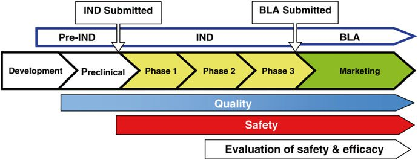

그림 1.1 조사용 신약(IND) 신청 하에서 임상시험, 생물의약품면허신청(BLA), 허가 및 시판에 이르는 생물학적 제품 개발 단계. Vatsan RS, Bross PF, Liu K 등에서 재현. J Immunother Cancer 2013;1:5. 크리에이티브 커먼즈 저작자표시 라이선스로 배포된 오픈 액세스 기사.

'유사'라는 말의 범위가 명확하지 않은 이유는 상세한 법률 지침이 없었기 때문이다. 최근 FDA는 단백질을 구별하려고 소위 명확선 규칙(bright-line rule)을 언급하며 임의 판단에서 관할권 기반 결정으로 바꾸겠다고 시사했다.

## 유럽 지침
2001년 유럽의회 및 이사회의 인간용 의약품에 관한 공동 규칙에 관한 지침에서 "생물학적 의약품"은 "활성 물질이 생물학적 물질인 제품"으로 정의된다. "생물학적 물질"은 "생물학적 원료에서 생산되거나 추출되며 그 특성 파악 및 품질 결정을 위해 물리화학적-생물학적 시험과 생산 공정 및 그 관리를 조합해야 하는 물질"로 정의된다. 유럽연합에서 유럽의약품청(EMA)은 "생물학적 의약품"을 "치료 또는 체외 진단 목적으로 사용되는 단백질 또는 핵산 기반 의약품 물질로, 기존(비조작된) 생물학적 원료로부터 직접 추출하는 방법 이외의 수단으로 생산되는 것"으로 정의한다. 이 정의는 본질적으로 "생물학적 의약품"을 재조합 제제로 제한하는 것으로 보인다.

## 바이오의약품과 소분자 약물
정제된 균질 바이오의약품 제제를 의약품으로 사용되는 다른 "소분자" 기존 약리학적 제제와 구별할 때, 즉시적이고 명백한 비교는 바이오의약품 제제의 일반적으로 더 큰 분자량과 복잡성, 그리고 소분자 약물이 일반적으로 화학적으로 합성된다는 사실이다. 표 1.1은 바이오의약품 치료 제제와 소분자 약물 간의 특성 및 물성의 많은 뚜렷한 차이를 요약한다. 이 목록 외에도, 바이오의약품, 특히 mAbs 및 기타 재조합 단백질은 치료 제제로서 여러 잠재적 이점을 가질 수 있다. 먼저, 일반적으로 소분자 약물의 7-8년에 비해 3-5년으로 짧은 개발 주기를 갖는다. 자주 표 1.1 바이오의약품 제품a과 소분자 약물의 특성 비교 바이오의약품 소분자 약물 일반적으로 고분자량b 일반적으로 저분자량c 흔히 이질적 혼합물; 변이체 포함 가능 균질 구조가 잘 정의되지 않았거나 알려지지 않음 잘 정의된 구조·물리화학적 특성 물리화학적으로 훨씬 덜 복잡 합성될 수 있음(예: 짧은 펩타이드) 그러나 일반적으로 화학적으로 합성된 유기 분자임 보통 살아있는 세포와 생물체의 도움을 받거나 생물체에서 제조됨 준비 및 제조에 일반적으로 많은 핵심 공정 단계 핵심 단계가 더 적음 일반적으로 특성화하기 어려움 특성화하기 어렵지 않으므로 일반적으로 잘 특성화됨 보통 안정적이지 않음; 열에 민감 보통 상대적으로 안정 불안정성을 극복하기 위해 종종 통제된 저장 조건 필요 장기간 상온에서 보관해도 안정적인 경우가 많음 일반적으로 비경구 투여 종종 경구 투여 긴 반감기(수일~수주) 가능 짧은 반감기로 용량 조절이 필요...

바이오의약품이 보여주는 독특한 차이점은 생물학적 효과에서의 다중효과(pleiotropism)로, 이는 예를 들어 많은 사이토카인(5장)에서 잘 입증된다. 바이오의약품은 재조합 방법론, 정밀 표적화, 뛰어난 특이성 및 높은 결합 친화력을 바탕으로, 때로는 특정 대사물질이나 수용체(일부는 새로 의심되거나 확인된)와 상호작용하기 위한 소분자 작용제와 길항제를 찾고 개발하는 데 수반되는 어려움 때문에 이전에는 길고, 어렵고, 불확실하며 비용이 많이 드는 과정으로 여겨지던 새로운 치료법을 제공한다. 이는 예를 들어 mAbs(2장, 3장, 4장)와 융합단백질(6장)에서 볼 수 있는데, 이들은 특정 질병의 기전을 밝히는 연구를 기반으로 개발되었다. 예를 들어, 미세혈관 야간 혈색소뇨증 치료를 위해 보체 성분 C5를 표적으로 하는 mAb eculizumab(Soliris®), 류마티스 관절염 치료를 위해 종양 괴사 인자 수용체를 인간 IgG Fc에 연결하여 개발한 융합단백질 etanercept(Enbrel®), 그리고 인터루킨-6 수용체(IL-6R)를 표적으로 하는 mAb tocilizumab에 의한 관절염 치료(4장)다. 천연 원료에서 추출하거나 합성하기에 종종 너무 어렵거나/비용이 많이 드는 고품질 고순도 물질의 신속한 제작 및 충분한 양의 조달 능력은, 예를 들어 라이소좀 충적질환 치료를 위해 고아약물 지정 프로그램 하에서 제조 및 시장에 출시된 재조합 효소(하단 "단백질 치료제" 절 및 9장 참조)가 이에 해당하며 이는 소분자 약리학적 치료의 범위를 벗어난다고 여겨지던 질병에 대한 현대적 재조합 기술의 성공적 활용의 효율성, 효율 및 속도를 보여주는 또 하나의 예다. 바이오의약품은 또한 대부분의 소분자 약물로 달성하기 어려운 심각한 결함/부작용을 극복하도록 조작하고 변경할 수 있는 고유한 다재다능성을 지닌다...

재조합 형태를 포함하여 FDA 및 EMA 승인 바이오의약품의 대부분을 차지하고 있다. 지난 10년간, 현재 FDA에서 승인한 50종의 mAbs로 대표되는 지속적으로 증가하는 이 집단만큼 성공적인 사용 역사를 보유한 치료 제제 그룹은 아마도 없다. 혈액암, 고형 종양 및 피부암을 포함하는 승인 적응증을 가진 25종의 항체부터 만성 천식, Cryopyrin 연관 주기성 증후군, 황반변성, 미세혈관 야간 혈색소뇨증, 크론병 및 류마티스 관절염과 같은 자가면역질환, 골 손실, 건선, 전신 홍반성 루푸스, 고콜레스테롤혈증 및 장기 거부 반응 예방을 포함한 다양한 질병 관리를 위해 특별히 개발된 유사한 규모의 다른 항체까지, mAb 개발은 계속 확장되고 정교해지고 있다. 이러한 항체의 생물학적 기술적 발전, 약동학, 임상 적용 및 이상반응은 계속 잘 연구되고 있으며 FcRn 수용체 매개 재활용을 달성하기 위해 IgG Fc 단편을 활용하는 융합단백질의 확대 목록과 함께, 정밀하고 고친화력의 승인된 표적 치료법은 계속 확장될 것으로 확신된다. 이처럼 세심한 주목은 아직 상대적으로 느리게 확대되고 있는 승인된 사이토카인 목록에 집중되지 않았는데, 그 중 상당수는 효소 대체 요법에 사용되는 효소처럼 고아약물로 개발되어 고품질, 잘 특성화된 재조합 형태로 제공되고 있다. 이들 바이오의약품은 FDA 고아제품개발국(OOPD)에서 관리하는 프로그램을 거쳐 임상 사용을 위해 개발되었다. OOPD는 미국에서 200,000명 미만의 사람에게 영향을 미치는 드문 질병 또는 장애, 또는 개발자/제조사...

아미노산 서열의 변화, 당화의 유무 및 정도, 단백질 접힘, 단백질-단백질 상호작용 등으로 인한 이질성의 가능성이 있다. 종종 제어하기 어려운 작은 차이조차도 단백질의 순도, 특이성, 효능 및 안전성에 영향을 준다. 일부 단백질은 혈중에서 짧은 반감기를 가져 빈번한 비경구 투여가 필요하고 궁극적으로 환자의 순응도가 낮을 수 있다. 이는 적어도 어느 정도는 당화의 정도로 상쇄되며 당화는 다시 단백질의 활성, 효능 및 면역원성에 영향을 준다. 부작용 측면에서, 구조적으로 자연 인간 단백질과 동일하거나 거의 동일하면 자동으로 더 제한적인 이상반응 프로파일을 보장한다고 가정하는 경우가 있으나, 이후 장에서 밝히겠지만 이는 반드시 사실이 아니다.

## 진화하는 바이오의약품 시장
최초의 바이오의약품 재조합 제제인 인간 인슐린(Humulin®)은 1982년 미국 시장에서 승인되었다. 2009년까지 바이오의약품 매출은 약 930억 달러에 도달했으며, 2013-2014년까지 200종 이상의 바이오의약품이 시장에 출시되었고, 생물의약품 연구개발 파이프라인의 약 3분의 1이 바이오의약품으로 구성되었다. 2014년 FDA가 승인한 모든 신약의 약 4분의 1이 바이오의약품이었다. 2016년까지 바이오의약품이 세계에서 판매량 상위 20개 약물의 절반을 차지할 것으로 예측되며 2018년까지 바이오의약품 매출은 세계 100대 약물의 거의 절반을 차지할 것으로 예상된다. 미국 기반 의료정보 제공업체 IMS Health는 2017년 1.2조 달러의 글로벌 의약품 지출에서 바이오의약품의 점유율이 2,210억 달러, 즉 전체 시장의 약 20%가 될 것으로 전망했다. 이 성장은 주로 mAbs에 의해 주도되고 있다; 2012년 상위 5개 바이오의약품 중 4개가 mAbs였으며 이 지배력은 계속되고 있다. 2012년 융합단백질 etanercept는 전 세계 매출 83.7억 달러를 기록했으며 이는 역대 최대 판매 약물 중 하나인 adalimum...

가장 큰 시장인 미국이 적절하고 지원적인 규제 프레임워크와 함께 본격적으로 활약할 때까지 증가할 것이다(13장). 그 동안 대규모 및 소규모 바이오의약품 기업들은 종종 "바이오베터(biobetters)" 또는 "바이오슈페리어(biosuperiors)"로 불리는 차세대 바이오의약품을 추구하고 있다. 이들은 기존 시판 바이오의약품의 복제품이 아니라, 다른 일차 구조 및/또는 당화 또는 지질 함량과 같은 다른 차이점을 가진 약물이다.

## 약물 이상반응 정의
40년 이상 전, 세계보건기구(WHO)는 약물 이상반응을 "인간에서 질병의 예방, 진단 또는 치료 또는 생리학적 기능의 조절을 위해 일반적으로 사용되는 용량에서 발생하는 유해하고 의도하지 않은 반응"으로 정의했다. 이 정의, 예를 들어 그 모호함과 경미한 반응을 포괄하는 적절성, "유해"의 포함, 그리고 "약물" 용어의 사용에 대한 의문이 제기된 후, Edwards와 Aronson은 기존 정의를 개선하고 기존의 모호함을 없애려 시도했다. 그들이 제안한 정의 "의약품 사용과 관련된 개입으로 인한 상당히 유해하거나 불쾌한 반응으로, 향후 투여 시 위험을 예측하고 예방이나 특별한 치료, 또는 투여 요법의 변경, 또는 제품의 중단이 필요한 것"은 간결하고 만족스러운 포괄성을 담고 종종 인용되지만 많은 이들에게 FDA 정의의 직접적이고 단순한 특성, "환자에서 의약품 사용과 관련된 모든 바람직하지 않은 경험"이 충분하다고 여겨진다. 환자 결과가 사망, 생명 위협, 입원(초기 또는 연장), 장애 또는 영구적 손상, 선천적 기형/출생 결함, 영구적 손상이나 손상을 예방하기 위한 개입이 필요한 경우(기기), 기타 심각한 중요한 의학적 사건(예: 알레르기성 기관지연축)인 경우 이 사건은 심각한 것으로 간주된다.

용어 간의 차이점은 이상반응이 약물 사용과 직접 관련된 반응인 반면, 환자의 이상반응은 치료 기간 동안 반드시 약물과 직접 관련이 있는 것은 아닐 수 있다는 것이다. CTCAE v. 4에서 이상반응은 "의료 치료 또는 시술의 사용과 시간적으로 연관된 불리하고 의도하지 않은 징후(비정상적인 검사 결과 포함), 증상 또는 질병으로, 의료 치료 또는 시술과 관련이 있다고 간주될 수도 있고 그렇지 않을 수도 있다"고 정의된다. 마찬가지로, "이상반응(adverse effect)"은 관찰된 효과가 투여된 제제의 직접적인 결과였든 아니든, 치료 기간 중 또는 이후에 경험한 유해하거나 해로운 결과를 의미해야 한다. "부작용(side effect)"의 의미는 약물 투여와 관련된 용어 중 가장 모호하지 않아야 한다. 부작용은 원하는 치료 효과 외에 투여된 제제에 의해 유발된 모든 사건으로, 그 효과가 유익하든 해롭든 관계없다. 위 용어들의 일부 또는 전부가 동의어로 사용되는 것을 보는 것은 드문 일이 아니어야 한다. 널리 합의된 정의가 없는 상태에서, 관찰된 이상반응과 투여된 제제 간의 직접적인 연결을 명확하고 분명하게 확립하기 위한 빈번한 어려움을 염두에 두면, "이상반응(adverse event)"이라는 용어의 사용이 아마도 가장 적절하며 논의된 네 가지 용어(이상반응, 이상반응, 이상반응, 부작용) 중 잘못 사용될 가능성이 가장 적다.

CTCAE 지침은 이상반응의 등급을 1-5로 부여하고 각 이상반응에 대한 임상적 심각도 설명을 함께 담아 이상반응의 심각도를 나타낸다. 등급 설명은 표 1.2에 나와 있다. 등급 1과 2는 경미함에서 중등도까지의 심각도와 관련되며, 등급 3은 심각하지만 생명을 위협하지 않는 것으로 간주되고, 등급 4는 생명을 위협하며, 등급 5(일부 이상반응에는 해당하지 않음)는 사망을 나타낸다. 점점...

## 약물 이상반응의 분류
약리학 및 약물감시 분야에서, 약물 이상반응은 원래 용량 관련 반응과 비용량 관련 반응에 기초하여 구별되었으며 각각 A형 및 B형 반응으로도 알려져 있다(표 1.3). 약물의 약리학적 작용에서 예측 가능하고 예측 가능하며 용량에 의존적인 A형 반응은 용량을 줄이거나 치료를 중단하면 사라진다. 이는 반응의 약 80% 이상을 차지한다. B형 반응은 일반적으로 약물의 약리학적 작용과 관련이 없고, 예측 불가능하며 용량과 독립적이고, 치료를 중단하면 일반적으로 사라지지만, 반응이 지속되거나 진행될 수도 있다. 이 예측 불가능한 반응은 때로 기형적 반응(bizarre reactions)으로 불리며 광범위하게 면역매개 과민반응과 비면역 민감성으로 구별될 수 있는 서로 다른 반응으로 구성된다. 후자는 브라디키닌의 활성화 및 아라키돈산 대사를 사이클로옥시게나제 경로에서 리포옥시게나제 경로로의 유도체 전환과 같은 메커니즘을 포함할 수 있으며 더 이상 의사알레르기 반응, 특이체질 반응 및 불내성으로 분류된다(표 1.3, 그림 1.2). 의사알레르기의 예는 프로스타노이드의 합성을 위한 바이오신합성 경로에 간섭하는 비스테로이드성 항염증제에 의한 대부분의 반응과, 신경근육 차단제, 일부 오피오이드, 조영제 및 밴코마이신에서 볼 수 있는 비만세포 직접 탈과립화이다. 할로탄 간염과 악성 고열은 특이체질 반응의 예이며 비스테로이드성 항염증제와 조영제는 일부 환자에서 비면역 불내성도 유발할 수 있다.

## 과민반응
Gell과 Coombs의 면역매개 반응 분류에 기반하여 과민반응은 I형, II형, III형, IV형의 네 가지 범주로 세분된다...

표 1.3 약물 이상반응의 분류 반응 유형 반응의 예 반응의 주요 특징 A. 강화된(Augmented) - 독성(불내성) 반응-예: 오피오이드, 항우울제에 의한 세로토닌 증후군; 디곡신 독성 - ADR의 대부분 - 흔한 효과a - 예측 가능 - 부작용-예: 고혈압 환자에서의 β-차단제에 의한 기관지 연축; 항우울제로 인한 구강건조 - 일반적으로 용량 의존적 - 약물의 약리학적 반응과 관련 - 낮은 사망률 B. 기형적(Bizarre)b (그림 1.1 참조) - 면역학적 반응 - 상대적으로 드묾 - 특이체질 반응 - 예측 불가능 - 의사알레르기 - 거의 용량 비의존적c - 불내성 - 약물의 약리학적 작용과 무관 - 높은 사망률 C. 만성(지속적) - 코르티코스테로이드에 의한 시상하부-뇌하수체-부신 축 억제 - 드묾 - 누적 용량 및 장기간 노출 필요 - 페나세틴에 의한 신장 유두 괴사 D. 지연된 - 발암성 - 시간 관련-약물 노출 후 일부 효과가 명백 - 기형 유발-예: 디에틸스틸베스트롤에 의한 질 선암 - 드묾 - 일반적으로 용량 관련 E. 치료 종료 시 효과(탈퇴 효과) - 오피오이트 금단 증후군 - 약물 투약 중단 후 지연 없거나 거의 없음 - β-차단제 투약 중단 - 드묾 F. 치료 실패 - 약물 작용에 대한 내성-예: 항생제에 대한 내성 세포종 또는 화학요법에 대한 종양 - 흔함 - 일반적으로 용량 관련 - 경구 피임약 용량 부족 - 약물 상호작용에 의해 유발될 수 있음 G. 유전적 반응b,d - 유전적 요인(P450(CYP), N-아세틸트랜스퍼레이즈, 가짜콜린에스테라제)에 의한 비정상적 약물 대사 - 비정상적 약물 대사는 드문 것으로 보임 - HLA-약물 과민반응 연관(예: 아바카비르, 카르바마제핀, 알로푸리놀) - 약물유전학적 연구는 아직 초기 단계 - 인종이 일부 약물에 중요한 것으로 보임, 예: 카르바마제핀 - 예: Succinylcholine(숙사메토니움) 과민성 - 포르피린 Baldo BA, Pham NH에서...

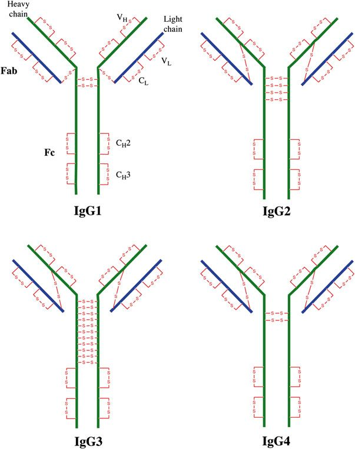

그림 1.2 치료에 사용되는 바이오의약품을 포함한 약물에 대한 면역 및 비면역 민감성의 분류. 네 가지 면역 반응 유형(I형, II형, III형, IV형)은 여기서 과민반응, 비면역 민감성은 불내성으로 언급된다. I형 과민반응은 흔히 "알레르기"로 불린다. 네 가지 과민반응 유형 각각에 대한 바이오의약품의 예는 본문에 언급되어 있다. Baldo BA, Pham NH에서 개조. Drug allergy. Clinical aspects, diagnosis, mechanisms, structure-activity relationships. New York: Springer; 2013. Springer Science + Business Media의 친절한 허가로 재현.

I형(즉시성) 과민반응, 아나필락시스 및 두드러기는 바이오요법 후에는 드물게 관찰되지만 두 반응 모두 많은 다양한 바이오의약품에서 발생하는 것으로 알려져 있다. mAbs, 특히 마우스 항체 ibritumomab tiuxetan과 blinatumomab, 쥐-마우스 키메라 catumaxomab, 인간-마우스 키메라 abciximab, basiliximab, brentuximab, cetuximab, infliximab, rituximab, siltuximab 및 dinutuximab의 면역원성 잠재력 때문에, mAbs는 흔히 아나필락시스를 포함한 과민반응 가능성에 대한 경고를 담고 있다. 이 작은 위험은 소위 휴마니즈드(humanized) mAbs, 즉 보충결정영역(보통 마우스 유래)을 인간 프레임워크 V 및 V 영역에 이식한 인간 항체로 감소하며, 완전 휴마니즈드 mAbs(HL)로 추가로 감소하지만, 항이디오타입 항체 생성 가능성과 일부 약물(mAbs 포함)에 대한 항체의 정상 혈청 및 사전 치료 환자 혈청에서의 존재는 여전히 남아있다(2장, "치료용 단클론항체" 및 "치료용 단클론항체의 진화: 마우스에서 인간으로" 절 참조). 아나필락시스는 mAbs cetuximab, rituximab, trastuzumab, pertuzumab, ibritumomab tiuxetan, brentuximab, adalimumab, infliximab 및 belimumab에서 기록되었으며 기타 I형 과민반응인 두드러기 및 안...

**표 1.4** Gell과 Coombs 과민반응 분류(계속)

| 유형 | 과민성 감수성/반응 메커니즘 | 반응까지 최대 시간 | 조직학 | 이펙터 면역 메커니즘 | 과민반응 전이 및 질환의 예 |
| --- | --- | --- | --- | --- | --- |
| I | IgE 항체(두드러기 및 피부발적(wheal and flare)) | 수초~30분; 아나필락시스 | 즉시형 반응; 홍반, 두드러기, 혈관부종, 호흡기 증상, 호중구를 포함한 위장관 침윤 | 비만세포 및 호염기구 활성화; 탈과립된 비만세포 | 아나필락시스; 호흡기 증상^(b)^; 두드러기 및 혈관부종^(b)^; IgE 항체에 의해 전이되는 약물 반응 |
| II | 세포 독성(면역형) | 수시간(~1일) | 용해 및 괴사; 면역형광에서 NK세포(Fc 수용체 세포) 확인; 약물 유발 용혈성 빈혈, 혈소판감소증, 무과립구증 | 보체 고정; 탐식작용; 호중구 | Gell과 Coombs 분류에 따른 약물 과민반응^(a)^ |
| III | 혈청 항체(IgG 및/또는 IgM); 면역복합체 | 3~10시간 | 주로 호중구; 홍반 및 부종 | 탐식작용; 보체 | 혈청병; 약물 유발 혈관염; 과민성 폐렴; 급성 염증 반응 |
| IV | 지연형; 세포 매개; T세포 | 24~72시간 | 주로 단핵세포; 혈관주위 염증; 홍피증 | 세포 독성 림프구; 대식세포 활성화; 호산구 활성화 | 알레르기성 접촉 피부염; DRESS; SJS; TEN; EM; 구진발진성 발진; AGEP; FDE; 건선 |

^(a)^ Coombs RRA, Gell PGH. In: Gell PGH 외(편). Clinical Aspects of Immunology. Oxford: Blackwells. 1975, p.761-81. Springer의 허가를 받아 사용.
^(b)^ 지연 반응은 즉시 반응 후 약 3-4시간에 발생할 수 있으며 약 12시간에 최고조에 달하고 약 24시간에 소실된다.
^(c)^ 예: Cetuximab, rituximab, trastuzumab, pertuzumab, ibritumomab tiuxetan, brentuximab, adalimumab, infliximab, belimumab.
^(d)^ 예: 알글루코시다아제, 엘로술파제 알파, 이두르술파제, 라로니다아제, 탈리글루세라제 알파, 벨라글루세라제, 아갈시다제 베타, 갈술파제, 글루카르피다제, 이미글루세라제; 승인된 효소는 효소 대체 요법에 사용되지 않음.
^(e)^ 예: Etanercept.
^(f)^ 예: 인터페론 베타-1a, 오프렐베킨, 아나킨라, 다르베포에틴 알파.
^(g)^ 예: Rituximab, alemtuzumab, bevacizumab.
^(h)^ 예: Rituximab, adalimumab, infliximab, certolizumab pegol, alirocumab, omalizumab.
^(i)^ 예: Brentuximab, adalimumab, ibritumomab tiuxetan, rituximab, infliximab.

약어: DRESS(호산구증가증 및 전신 증상을 동반한 약물 반응), SJS(스티븐스-존슨 증후군), TEN(독성 표피 괴사용해), EM(다형 홍반), FDE(고정 약진), AGEP(급성 전신성 발진성 농포증), NSAIDs(비스테로이드성 항염증제), mAbs(단클론항체), NMBDs(신경근 차단제).

출처: Baldo BA, Pham NH. Drug allergy. Clinical aspects, diagnosis, mechanisms, structure-activity relationships. New York: Springer; 2013에서 각색. Science + Business Media.

reteplase, collagenase, pegloticase 및 rasburicase는 아나필락시스를 일으킨 바 있으며 후자의 두 효소에 대해서는 FDA 블랙박스 경고로 강조되고 있다. 대부분의 단백질에서, 아나필락시스를 포함한 과민반응 유발 가능성은 현실적이며 예측이 필요하지만 승인된 사이토카인, 융합단백질(특히 etanercept), 응고 단백질 및 백신에 대한 I형 과민반응의 발생률은 mAbs 및 효소에서 관찰되는 것보다 현저히 낮다. I형 반응, 아나필락시스 포함,에 관련된 사이토카인은 인터페론 beta-1a, oprelvekin, anakinra 및 darbepoetin alfa이다. 아나필락시스, 두드러기 및 혈관부종으로 나타나는 약물 이상반응은 일반적으로 IgE 항체 관련 I형 과민반응으로 쉽게 식별되지만 사이토카인 방출 증후군(절 "사이토카인 방출 증후군"), 아나필락시스/아나필락토이드 반응 및 직접적 독성의 하나 이상의 징후와 증상을 동반하는 많은 주입 반응의 기저 메커니즘(들)은 신뢰성과 정밀함으로 정의하기가 종종 더 어렵다. 많은 바이오의약품, 특히 mAbs의 주입은 특유의 주입 증후군을 유발하며 이는 일반적으로 첫 투여 시 또는 그 직후 1시간 이내 또는 수시간 내에 발생한다. 대부분의 반응이 발열, 오한, 떨림, 두통, 메스꺼움, 무력감, 발진 및 가려움증과 같은 "독감" 유사 증상으로 묘사되는 경미함에서 중등도까지인 반면, 소수의 환자, 주로 첫 번째 또는 두 번째 주입 시, IgE 항체 매개 반응과 유사한 저혈압, 심정지, 기관지 연축 및 두드러기와 같은 잠재적으로 치명적인 증상을 보인다. Trastuzumab, rituximab 및 cetuximab는 가장 높은 발생률의 주입 반응을 유발한다; rituximab에 대한 치명적 반응의 약 80%가 첫 번째 주입 후 발생했으며 네 번째 및 여덟 번째 주입 후에도 각각 30% 및 14%의 환자에서 반응이 지속되었다(3장, "주입 반응 및 사이토카인 방출 증후군" 절 참조...

일부 혈구감소증, 종양 용해 증후군(절 "종양 용해 증후군"), 신장, 배아-태아, 신경학적, 일부 폐, 간 및 심장 독성은 직접적 세포 독성 작용 및/또는 기타 비면역 메커니즘에 기인하는 것으로 보인다. 그러나 일부 소위 약물 유발 이상반응, 예: 혈구감소증(혈소판감소증, 호중구감소증 및 빈혈); 일부 폐, 간 및 심장 독성; 및 여러 증후군(모세혈관 누출 [절 "모세혈관 누출 증후군"], 사이토카인 방출 [절 "사이토카인 방출 증후군"], 전신 염증 반응 [절 "전신 염증 반응 증후군"], 면역 재건 염증 [절 "면역 재건 염증 증후군"], 및 대식세포 활성화 [절 "대식세포 활성화 증후군"])은 적어도 간접적으로 면역 과정과 연관될 수 있다. Rituximab는 II형 세포 독성 과민반응을 일으킬 수 있으며 자가면역형 혈소판감소증과 용혈성 빈혈(AIHA), 모두 II형 과민반응,은 주로 림프구 백혈병 환자, 종종 mAbs로 치료받는 환자에서 발생한다. 혈소판감소증 및 빈혈 외에도, late onset neutropenia(LON)는 mAbs, 특히 rituximab로 치료받은 일부 암 환자에서 발생한다. LON의 메커니즘은 잘 알려지지 않았으나, 직접적 세포 독성은 가능성이 낮고, 자가항체가 관련될 수 있으며, 이 질환은 진정한 II형 과민반응 반응일 수 있다. Rituximab 단독 요법을 받은 환자의 1.1-5.2%에서 심각한 빈혈이 보고되었으며 자가면역성 항프리 냉응집소에 의한 심각한 AIHA, 혈관내 용혈 및 다장기 허혈 사례가 rituximab 요법 후 발생한 바 있다. Alemtuzumab도 AIHA에 관련되었으며 bevacizumab는 신장 혈전성 미세혈관병증 사례와 연관되었다. "과민반응"이 I-IV형 Gell과 Coombs 정의의 과민반응에서...

## 기타 약물 이상반응 범주
약물 이상반응 분류에서 A형(강화된 약리학적 효과) 및 B형(기형적) 반응 외에, 다섯 가지 다른 반응 유형을 구별한다. 1980년대 초부터 이 범주의 세 가지, C, D, E는 분류에 포함되었다. 코르티코스테로이드에 의한 억제로 입증된 C형 반응은 만성 또는 지속적 효과라 하며 드물게 나타나며 누적 용량 및 장기간 노출과 관련한 시간과 관련된다. D형 반응은 지연 효과라 하며, 디에틸스틸베스트롤에 의한 질암으로 설명되며, 드물고 시간 및 용량 관련이다. E 범주, 치료 종료(또는 중단) 효과는, 예를 들어 오피오이트 금단 증후군에서 보듯이, 지연 없거나 거의 없이 나타날 수 있다. 최근 여섯 번째 범주 F, 치료 실패가 추가되었다. 흔히 관찰되는 이 반응 유형은 약물 상호작용으로 유발될 수 있으며 일반적으로 용량 관련이다. 면역치료에 대한 종양 내성은 F형 반응의 예다. 일부 약물 이상반응 분류에서는 일곱 번째 범주 G, 유전적 반응을 포함한다. 예: Succinylcholine(숙사메토니움) 과민성 및 일부 HLA-약물 과민반응 연관이 이러한 반응의 예로, 이 초기 단계에서 드문 것으로 보인다. 이미 사용 중인 다양한 바이오의약품의 광범위한 범위에 대해, 향후 몇 년간 이상반응이 더욱 면밀히 조사되고 안전성 데이터가 계속 확대됨에 따라 약물 이상반응 범주 A-G에 대한 관심이 높아질 것이다. A 및 B 범주에 해당하는 반응 목록은 이미 승인된 바이오의약품 치료법에 대해 상당히 방대하며, 누적 용량, 시간 및 용량, 약물 중단, 약물 작용에 대한 내성 및 유전학과 관련된 효과는 점진적으로 확대되고, 더 잘 정의되고, 해석되고 이해될 것이다.

## 바이오의약품 치료와 연관될 수 있는 증후군
다양한 바이오의약품을 투여 중이거나 투여한 뒤에 전신성으로 생명을 위협하는 증후군이 드물게 생길 수 있다. 모세혈관 누출, 사이토카인 방출, 혈구탐식 림프조직구증, 대식세포 활성화, 전신 염증 반응, 종양 용해, 가역성 뇌병증, 면역 재건 염증, 다초점 백질뇌병증이 여기 들어간다.

### 모세혈관 누출 증후군
투여 뒤 24시간 안에 혈관 투과성이 커지면서 체액과 단백질이 간질로 새어 나간다. 말초와 간질 부종, 흉막·심낭 삼출, 복수가 생기고 심하면 폐와 심혈관 기능이 떨어진다. 합병증으로 신부전, 뇌졸중, 허혈, 심부정맥 혈전증, 횡문근융해증이 올 수 있다. 홍반성 피부 발진은 사이토카인이 내피세포를 건드려서 생긴다고 본다. 모세혈관 누출 증후군과 연관된 바이오의약품에는 mAbs(alemtuzumab, basiliximab, bevacizumab, catumaxomab, dinutuximab), IL-1, IL-2, oprelvekin(재조합 IL-11), 인터페론 alfa 및 beta-1b, filgrastim, 및 융합단백질 denileukin diftitox가 포함된다.

## 사이토카인 방출 증후군
사이토카인 방출 증후군(CRS), 급성 주입 반응 또는 사이토카인 폭풍이라고도 불리며 필라델피아 아동병원의 S. A. Grupp과 동료들에 의해 "T 세포 결합 및 증식과 연관된 사이토카인 상승으로 인한 염증 증상의 집합"으로 설명되었다. 반응이 일반적으로 단기(24시간 이내 해소)이고 경미하며 발열, 독감 유사 증상, 근육통을 동반하지만 일부 환자들은 저혈압, 폐부종, 혈관 누출, 응고장애, 심지어 다장기 부전을 동반한 급성 염증 반응을 경험한다. CRS는 mAbs 및 T 세포의 CD3, CD20 및 CD52, B 세포의 CD20, 단핵세포의 CD52, 그리고 B7.1(CD80) 및 B7.2(CD86)의 수용체인 CD28과 연관되었다. CRS는 CD3 및 CD19을 표적으로 하는 이특이성 T세포 결합 융합단백질 blinatumomab(3장, "Blinatumomab" 절)과 가장 흔히 연관된 독성이며 최근 이 제제에 의해 유발된 사망 사례에 관련되었다. I형 과민반응 및 CRS...

증후군의 두 가지 형태를 구별한다: 일차 HLH, 가족성 HLH 또는 가족성 적혈구 식작 림프조직구증이라고도 하며 상염색체 열성 장애인 HLH, 및 감염, 악성종양 또는 면역결핍 후 발생하는 이차(또는 후천성) HLH. HLH의 진단을 확립하기 위한 진단 기준은 7일 이상의 발열, 비장종대, 혈구감소증, 혈구 식작 및 저섬유소원혈증 또는 고트리글리세리드혈증이다. 고페리틴혈증도 발생할 수 있으며(페리틴 수치가 질환의 마커로 사용될 수 있음), 홍반, 자반점 및 구진, 홍역양 발진의 피부 침범은 환자의 절반 이상에서 관찰된다. HLH의 메커니즘은 불명확하지만 고도로 활성화된 면역 반응은 증식 및 활성화된 T 세포, 대식세포 활성화, 면역 세포의 제한된 apoptosis, 구멍 형성 단백질 perforin 및 자연살해(NK) 세포의 관여를 포함한다. NK 세포 활성 감소와 T 세포 활성화 및 확대에 따라 대량의 사이토카인, 특히 IFN 감마, TNF 및 과립구-대식세포 콜로니 자극인자(GM-CSF)가 방출된다. 그 결과 대식세포 활성화 및 IL-1 및 IL-6 생산이 염증 반응, 조직 손상 및 관련 증상을 유발한다. HLH는 T세포 결합 치료 blinatumomab 치료 후 보고된 바 있다.

## 대식세포 활성화 증후군
MAS(4장 "Tocilizumab의 승인 적응증 및 안전성" 절도 참조)는 류마티스 질환의 심각한 합병증으로, 가장 흔히 전신성 소아 특발성 관절염(SJIA)(환자의 최소 10%에서 발생) 및 성인형 스틸병에서 관찰되지만 전신성 홍반성 루푸스 소아, 가와사키병 및 주기적 열 증후군에서도 보고된 바 있다. MAS 환자는 고열, 간비장종대, 범혈구감소증, 림프절비대, 전신성 혈관내 응고 고트리글리세리드혈증 및 저섬유소원혈증으로...

## 전신 염증 반응 증후군
전신 염증 반응 증후군(SIRS)은 패혈증과 관련된 심각한 전신 염증성 장애로, 장기 기능 장애 및 부전의 위험이 있다. 감염 또는 허혈, 외상, 췌장염, 출혈, 부신 기능 부전, 아나필락시스 또는 바이오의약품을 포함한 치료와 같은 다양한 비감염성 자극으로 유발될 수 있다. SIRS는 체온, 심박수, 빠른호흡 및 백혈구 수와 관련된 두 가지 이상의 증상에 기초하여 진단될 수 있다. 감염이 없는 SIRS는 신부전, 심부정맥 혈전증, 전신성 혈관내 응고 위장관 출혈, 빈혈 및 고혈당을 포함할 수 있다. 감염이 있는 SIRS는 패혈증, 패혈증 쇼크 및 다장기 기능 장애 증후군(MODS)으로 진행될 수 있다. SIRS의 초기 사건에서, 외상, 감염 또는 기타 관련 자극 후, 염증 연쇄가 활성화되어 다수의 사이토카인, 특히 프로염증성 사이토카인 IL-1, TNF, IL-6, IL-8 및 IFN 감마가 생성된다. 감염은 더 많은 TNF 방출을 자극하며 이는 다시 더 많은 IL-6 및 IL-8과 외상 유발 SIRS에서 관찰되는 것보다 높은 발열 빈도로 이어진다. SIRS는 catumaxomab 및 eculizumab 주입 후 보고된 바 있다.

## 종양 용해 증후군
CRS의 일부 사례와 달리, 종양 용해 증후군(TLS)은 항암치료 시작 후 48-72시간 후에 발생할 수 있으며 I형 즉시 과민반응과 구별하기 어렵지 않다. TLS는 백혈병 및 고등급 림프종 환자, 특히 높은 종양 부하를 가진 환자에서 가장 흔히 관찰되며 고형 종양과 연관되는 경우는 드물다. 이 증후군은 대량의 암 세포 사멸의 결과로, 고칼륨혈증, 고칼슘혈증, 고인산혈증 및 고요산혈증을 초래하며 모두 뚜렷한 이온 불균형 및 급성 신부전, 심장...

피질 회백질이 피질 하 백질과 함께 관여한다는 것이 늦게 입증되면서 더 일반적으로 사용되는 이름과 약어인 후방가역성 백질 뇌병증 증후군(RPLS)은 이를 반영하도록 PRES로 수정되었다. 이 장애의 기저 병태생리학은 고혈압으로 인한 과관류와 뇌혈관 손상에 의한 혈관성 부종으로 인한 간질 체액 및 단백질 유출로 생각된다. 그러나 왜 PRES가 고혈압이 없는 상태에서 때로 발생하는지, 그리고 부종의 정도가 항상 혈압과 직접적으로 관련되지 않는지는 불명확하다. 대안적 설명은 PRES가 내피세포 기능 장애, 저산소증 및 혈관성 부종을 유발하는 전신 염증의 결과라는 것이지만 일부 PRES 사례는 관찰된 염증 없이 발생하는 것으로 보인다. 관련 임상 장애에는 암, 자간전증 및 자가면역이 포함된다. 관련 약물에는 면역억제제, 화학요법제, 항혈관신생제 및 인터페론 alfa, IL-2, 과립구-콜로니 자극인자(G-CSF), 에리스로포이에틴, 융합단백질 etanercept, 및 mAbs bevacizumab, certolizumab, infliximab, ramucirumab, rituximab 및 ustekinumab을 포함한 바이오의약품이 있다. 최근, 항디사이알로간글리오시드(GD2) 키메라 mAb 요법을 받은 신경아세포종 환자에서 PRES가 보고되었다. 많은 PRES 사례에서 관찰되는 증상의 명백한 심각성에도 불구하고 신속한 진단과 유발 제제의 즉시 중단, 항고혈압제 및 항경련제 투여, 관련 질환 치료를 포함한 올바른 치료는 종종 뇌 손상을 예방하고 환자를 PRES 이전 상태로 회복시킬 수 있다.

## 면역 재건 염증 증후군

면역 재건 염증 증후군(IRIS), 면역 회복 증후군이라고도 하며(4장, "Natalizumab에 대한 FDA 경고 및 예방조치 면역..." 절도 참조)...

## 진행성 다중 초점 백질 뇌병증

진행성 다중 초점 백질 뇌병증(PML)은 뇌 백질의 염증 및 진행적 손상을 특징으로 하는 드물고 일반적으로 치명적인 탈수초성 질환이다. JC 바이러스 감염에 의해 유발되며 이는 보통 흔하고 널리 분포된 무해한 바이러스이나, AIDS 및 면역억제 환자뿐만 아니라 자가면역질환 및 화학요법을 받는 환자에서만 중증 면역결핍 환자에서 치명적이 될 수 있다. PML은 융합단백질 belatacept 및 mAbs belimumab, infliximab, eculizumab, ofatumumab, natalizumab 및 rituximab을 포함한 현재 승인된 여러 바이오의약품 치료 후 보고된 바 있다. 2009년 HIV 음성 환자에서 rituximab 투여 후 57건의 PML이 기록되었다. 이 mAb의 라벨링은 JC 바이러스를 포함한 감염 위험을 나타내도록 수정된 바 있다. PML에 대한 상세한 논의는 4장, "후방 다중 초점 백질 뇌병증 및 Natalizumab" 절을 참조한다.

## 요약
* 생물학자, 화학자 또는 임상의는 치료에 사용되는 바이오의약품을 생물체에서 유래하거나 관련된 물질로 볼 수 있지만 규제 당국은 이러한 제제가 특성화, 제조 및 관리, 제품 개발, 그리고 동일성, 순도 및 효능을 위해 어떻게 분류되고 평가될 것인지도 고려한다.
* 2012년 FDA는 단백질, 펩타이드 및 화학적으로 합성된 폴리펩타이드 간의 오랜 제안된 차이점을 다루고 구별하는 초안 지침을 발표했다. 단백질은 40개 이상의 아미노산으로 구성된 특정 정의된 서열을 가진 알파 아미노산 중합체로 정의되었다. 이 정의에 따라 펩타이드는 40개 미만의 아미노산을 가지므로 단백질이 아니다. 화학적으로 합성된 폴리펩타이드는 전적으로 화학적으로 합성되어 100개 미만의 아미노산을 가진 알파 아미노산 중합체로 정의되었다. 바이오의약품의 범위에서, 여기서 40개 미만의 아미노산을 가진 펩타이드와 인간에서의 치료용 사용에 대한 규제 승인을 받은 화학적으로 합성된 폴리펩타이드는 크기나 제조 방법에 관계없이 바이오의약품으로 간주된다.
* 유럽연합에서 유럽의약품청은 "생물학적 의약품"을 "치료 또는 체외 진단 목적으로 사용되는 단백질 또는 핵산 기반 의약품 물질로, 기존(비조작된) 생물학적 원료로부터 직접 추출하는 방법 이외의 수단으로 생산되는 것"으로 정의한다. 이 정의는 본질적으로 "생물학적 의약품"을 재조합 제제로 제한하는 것으로 보인다.
* 정제된 균질 바이오의약품 제제를 의약품으로 사용되는 다른 "소분자" 기존 약리학적 제제와 구별할 때, 즉시적이고 명백한 비교는 바이오의약품 제제의 일반적으로 더 큰 분자량과 복잡성, 그리고 소분자 약물이 화학적으로 합성된다는 사실이다.

* 바이오의약품, 특히 mAbs 및 기타 재조합 단백질은 치료 제제로서 여러 잠재적 이점을 지닐 수 있다. 짧은 개발 주기 외에도, 바이오의약품은 재조합 방법론, 정밀 표적화, 뛰어난 특이성 및 높은 결합 친화력을 바탕으로, 소분자 작용제와 길항제를 찾고 개발하는 데 수반되는 어려움 때문에 이전에는 길고, 어렵고, 불확실하며 비용이 많이 드는 과정으로 여겨지던 새로운 치료법을 때로는 제공한다.
* 희귀질환 치료를 위해 고아약물 지정 프로그램 하에서 시장에 출시된 재조합 제제는, 시장 규모가 너무 작아 적절한 재정적 수익을 기대하기 어렵고 소분자 약리학적 치료의 범위를 벗어나는 것으로 여겨지던 일부 질병에 대한 현대적 재조합 기술의 성공적 활용의 효율성, 효율 및 속도를 보여주는 예다.
* 일부 바이오의약품은 생물학적 성분(일반적으로 단백질)과 부착된 소분자 모두를 가지며 이 둘 모두가 Conjugeate의 치료 작용에 필요하다. 항체-약물 결합체가 이 제품 형태의 예다.
* 현재 FDA에 의해 승인된 50종의 mAbs로 대표되는 지속적으로 증가하는 이 집단만큼 성공적인 사용 역사를 보유한 치료 제제 그룹은 없다. 이 중 절반은 혈액암, 고형 종양 및 피부암을 포함하는 적응증에 대해 승인되었다. 다른 것들은 만성 천식, Cryopyrin 연관 주기성 증후군, 황반변성, 미세혈관 야간 혈색소뇨증, 크론병 및 류마티스 관절염과 같은 자가면역질환, 골 손실, 건선, 전신 홍반성 루푸스, 고콜레스테롤혈증 및 장기 거부 반응 예방을 포함한 다양한 질병 관리를 위해 특별히 개발되었다.
* 바이오의약품은 아미노산 서열의 변화, 당화의 유무 및 정도, 단백질 접힘, 단백질-단백질 상호작용 등으로 인한 이질성을 나타낼 수 있다. 종종 제어하기 어려운 작은 차이조차도 단백질의 순도, 특이성, 효능 및 안전성에 영향을 준다.
* 2013-2014년까지 200종 이상의 바이오의약품이 시장에 출시되었고 생물의약품 연구개발 파이프라인의 약 3분의 1이 바이오의약품으로 구성되었다. 2014년 FDA가 승인한 모든 신약의 약 4분의 1이 바이오의약품이었다. 2016년까지 바이오의약품이 세계에서 판매량 상위 20개 약물의 절반을 차지할 것으로 예측되며 2018년까지 바이오의약품 매출은 세계 100대 약물의 거의 절반을 차지할 것으로 예상된다. 2017년 1.2조 달러의 글로벌 의약품 지출에서 바이오의약품의 점유율이 2,210억 달러, 즉 전체 시장의 약 20%가 될 것으로 전망된다.
* 바이오시밀러는 원래 특허 만료 후 시판을 위해 개발되었으며 원래 제품과 동등 이상의 치료를 더 낮은 비용으로 제공하여 비용이 많이 드는 승인된 치료법을 더 많은 환자에게 접근 가능하게 하는 동시에 저비용 경쟁을 촉진할 잠재력을 제공한다. 개발에 연간 약 6억 달러가 투자되고 있음에도 불구하고 바이오시밀러는 현재 바이오의약품 매출의 0.5% 미만을 차지하고 있다.
* 약물 이상반응은 "의약품 사용과 관련된 개입으로 인한 상당히 유해하거나 불쾌한 반응으로, 향후 투여 시 위험을 예측하고 예방이나 특별한 치료, 또는 투여 요법의 변경, 또는 제품의 중단이 필요한 것"으로 정의될 수 있다. 많은 이들에게 FDA 정의의 직접적이고 단순한 특성, "환자에서 의약품 사용과 관련된 모든 바람직하지 않은 경험"이 충분하다고 여겨진다.

미국 보건복지부는 이상반응에 대한 공통 용어 기준(CTCAE)에서 CTCAE를 "이상반응 보고에 활용될 수 있는 기술 용어"로 정의한다. 이러한 보고를 위해 등급 체계 또는 심각도 척도가 발표되었다. CTCAE는 이상반응을 "의료 치료 또는 시술의 사용과 시간적으로 연관된 불리하고 의도하지 않은 징후(비정상적인 검사 결과 포함), 증상 또는 질병으로, 의료 치료 또는 시술과 관련이 있다고 간주될 수도 있고 그렇지 않을 수도 있다"고 정의한다. 이상반응의 심각도는 1-5로 등급이 매겨지며 각 이상반응에 대한 임상적 심각도 설명이 함께 제공된다. 등급 1과 2는 경미함에서 중등도까지의 심각도와 관련되며, 등급 3은 심각하지만 생명을 위협하지 않는 것으로 간주되고, 등급 4는 생명을 위협하며, 등급 5는 사망을 나타낸다.
* 의사가 이상반응을 과소평가하고 과소보고하며 환자의 이상반응 보고가 임상시험에서 데이터의 식별, 정확성 및 완전성을 향상시킨다는 증거가 있다. NCI는 이상반응을 더 잘 식별하고, 독성 및 내약성을 이해하며, 위험을 평가하고 궁극적으로 안전성을 개선하기 위한 목표로, 의사 보고를 보완하는 환자 중심 이상반응 평가 접근법을 개발했다.
* 약물 이상반응은 원래 용량 관련 반응과 비용량 관련 반응에 기초하여 구별되었으며 각각 A형 및 B형 반응으로도 알려져 있다. A형 반응은 약물의 약리학적 작용에서 예측 가능하고, 예측 가능하며 용량에 의존적이며, 용량을 줄이거나 치료를 중단하면 사라진다. 이는 반응의 약 80% 이상을 차지한다. B형 반응은 일반적으로 약물의 약리학적 작용과 관련이 없고, 예측 불가능하며 용량과 독립적이며, 치료를 중단하면 일반적으로 사라지지만, 반응이 지속되거나 진행될 수도 있다.
* B형 반응은 때로 기형적 반응으로 불리며 광범위하게 면역매개 과민반응과 비면역 민감성으로 구별될 수 있는 서로 다른 반응으로 구성된다. 후자는 더 이상 의사알레르기 반응, 특이체질 반응 및 불내성으로 분류된다.
* Gell과 Coombs의 면역매개 반응 분류에 기반하여 과민반응은 I형, II형, III형, IV형의 네 가지 범주로 세분된다. I형 반응은 흔히 "진정한" 알레르기로 불리며 일반적으로 즉시 발생(초~약 1시간)하고 IgE 항체에 의해 매개된다; II형 과민반응 또는 세포 독성 반응은 IgG 또는 IgM에 의해 매개된다; III형 또는 면역복합체 반응은 다시 IgG 또는 IgM 항체에 의해 매개된다; IV형 과민반응은 지연 과민반응이라고도 하며 T 세포 매개 반응이다.
* I형 과민반응, 아나필락시스 및 두드러기는 바이오요법 후에는 드물게 관찰되지만 두 반응 모두 많은 다양한 바이오의약품에서 발생하는 것으로 알려져 있다. mAbs, 특히 마우스 항체 ibritumomab tiuxetan과 blinatumomab, 쥐-마우스 키메라 catumaxomab, 인간-마우스 키메라 abciximab, basiliximab, brentuximab, cetuximab, infliximab, rituximab, siltuximab 및 dinutuximab의 면역원성 잠재력 때문에, mAbs는 흔히 아나필락시스를 포함한 과민반응 가능성에 대한 경고를 담고 있다. 이 위험은 소위 휴마니즈드 mAbs, 즉 보충결정영역(보통 마우스 유래)을 인간 프레임워크 V 및 V 영역에 이식한 인간 항체로 감소하며, 완전 휴마니즈드 mAbs(HL)로 추가로 감소하지만, 항이디오타입 항체 생성 가능성은 여전히 남아있다.
* 아나필락시스는 mAbs cetuximab, rituximab, trastuzumab,

* 약물 이상반응 분류에서 A형 및 B형 반응 외에, 다섯 가지 다른 반응 유형을 구별한다. C형 반응은 코르티코스테로이드에 의한 억제로 입증되며 만성 또는 지속적 효과라 하며 드물게 나타난다; D형 반응은 지연 효과라 하며 디에틸스틸베스트롤에 의한 질암으로 설명되며 시간 및 용량 관련이다; E 범주, 치료 종료(또는 중단) 효과는, 예를 들어 오피오이트 금단 증후군에서 보듯이, 지연 없거나 거의 없이 나타날 수 있다; F 범주, 치료 실패는 약물 상호작용으로 유발될 수 있으며 일반적으로 용량 관련이다; G 범주, 유전적 반응은 예: Succinylcholine(숙사메토니움) 과민성 및 일부 HLA-약물 과민반응 연관으로 볼 수 있다.
* 많은 전신성 잠재적으로 생명을 위협하는 증후군이 다양한 바이오의약품 투여 중 또는 투여 후 저빈도로 발생할 수 있다. 여기에는 모세혈관 누출 증후군, 사이토카인 방출 증후군, 혈구 식작 림프조직구증, 대식세포 활성화 증후군, 전신 염증 반응 증후군, 종양 용해 증후군, 후방가역성 뇌병증 증후군, 면역 재건 염증 증후군 및 진행성 다중 초점 백질 뇌병증이 포함된다.

## 추가 참조 자료
Baldo BA. Adverse events to monoclonal antibodies used for cancer therapy. Focus on hypersensitivity responses. OncoImmunology. 2013;2(10):e26333. doi: 10.4161/onci.26333.
Baldo BA, Pham NH. Drug allergy. Clinical aspects, diagnosis, mechanisms, structure-activity relationships. New York: Springer; 2013. p. 1-13.
Basch E, Reeve BB, Mitchell SA, et al. Development of the National Cancer Institute's patient reported outcomes version of the Common Terminology Criteria for adverse events (PRO-CTCAE). J Natl Cancer Inst. 2014;106:dju244. doi: 10.1093/jnci/dju244.

## 추가 참조 자료
Druey KM, Greipp PR. Narrative review: the systemic capillary leak syndrome. Ann Intern Med. 2010;153:90-8.
Edwards IR, Aronson JK. Adverse drug reactions: definitions, diagnosis, and management. Lancet. 2000;356:1255-9.
Feske SK. Posterior reversible encephalopathy syndrome: a review. Semin Neurol. 2011;31:202-15.
Giezen TJ, Mantel-Teeuwisse AK, Straus SMJM, et al. Safety-related regulatory actions for biologicals approved in the United States and the European Union. JAMA. 2008;300:1887-96.
Ho RJY. Biotechnology and biopharmaceuticals. Transforming proteins and genes into drugs. 2nd ed. Hoboken, New Jersey. John Wiley and Sons; 2013.
Howard SC, Jones DP, Pui C-H. The tumor lysis syndrome. N Engl J Med. 2002;364:1844-54.
Kinch MS. An overview of FDA-approved biologics medicines. Drug Discov Today. 2015;20:393-8.
Leader B, Baca QJ, Golan DE. Protein therapeutics: a summary and pharmacological classification. Nat Rev Drug Discov. 2008;7:21-39.
Maude SL, Barrett D, Teachey DT, et al. Managing cytokine release syndrome associated with novel T cell-engaging therapies. Cancer J. 2014;20:119-22.
Rare diseases: common issues in drug development. Guidance for industry. U.S. Department of Health and Human Services; Food and Drug Administration Center for Drug Evaluation and Research; Center for Biologics Evaluation and Research, August 2015. http://www.fda.gov/downloads/Drugs/GuidanceComplianceRegulatoryInformation/Guidances/UCM458485.pdf. Accessed 30 Sept 2015.
Rawlins MD, Thomas SHL. Mechanisms of adverse drug reactions. In: Davies DM, Ferner ER, de Glanville H, editors. Davies' textbook of adverse drug reactions. 5th ed. London: Chapman and Hall Medical; 1998. p. 40-64.
Talbot J, Aronson JK, editors. Stephen's detection and evaluation of adverse drug reactions. 6th ed. Chichester: Wiley-Blackwell; 2012.
Wang W, Singh M, editors. Biological drug products: development and strategies. Hoboken: Wiley; 2014.
## Chapter 2

# 단클론항체: 서론

## 치료용 단클론항체의 진화: 쥐에서 사람으로

Köhler와 Milstein의 하이브리도마(hybridoma) 기술 전략과 방법이 발표된 지 겨우 10년 만에, 최초의 치료용 단클론항체(mAb)인 muromonab-CD3(Orthoclone OKT3)가 규제 승인을 받았다. 이 마우스(murine) IgG2a 단클론항체는 인간 T 림프구 표면의 CD3(T3) 수용체를 표적하며 면역억제제로 투여되어 신장, 간, 심장 이식 환자의 스테로이드 불응성 급성 동종이식 거부반응과 급성 graft-versus-host disease(GVHD)를 치료한다.

예상대로, 마우스 단백질에 대한 인간 면역반응과 단클론항체의 열악한 약동학(pharmacokinetics)이 반복적이고 장기적인 치료에 심각한 문제라는 것이 곧 명백해졌다. muromonab-CD3의 제조는 유사한 효능과 적은 부작용을 가진 다른 치료법의 등장으로 인한 판매 감소로 2010년에 중단되었다. 마우스 항체와 관련된 이상반응(adverse events)에는 사이토카인(cytokine) 방출 증후군(1장), 감염 및 악성종양 위험 증가, 뇌병증, 폐부종, 심정지, 경련 및 흉통이 포함되었으며 예상대로 일부 경고 및 안전 문제는 이물성 마우스 항원이 직접 일으킨 결과였다. 예를 들어, 아나필락시스 유사 반응/anaphylactic 반응의 유도 등이 그에 해당한다.

muromonab-CD3 외에, 인간 치료용으로 승인된 다른 마우스 단클론항체에는 CD20을 표적으로 하여 비호지キン 림프종(non-Hodgkin lymphoma)에 적응증을 가진 ibritumomab tiuxetan과 tositumomab-¹³¹I이 있다(표 2.1). EpCAM/CD3을 표적으로 하여 악성 복수에 사용된 마우스/랫트 하이브리드 하이브리도마인 catumaxomab도 규제 승인을 받았다.

그러나 더 "인간화된(humanized)" 단클론항체가 필요하다는 것이 곧 명확해졌다. 지속적인 반복적 과정의 첫 번째 단계는 소위 키메릭(chimeric) 항체의 생산으로 시작되었다. 키메릭 항체는 마우스 항체의 가변(variable, 항원결합) 영역을 인간 면역글로불린의 불변(constant) 영역에 결합한 것이다(2장 4절). 중요한 기술적 발전에도 불구하고, 인간-마우스 면역반응의 위험은 제거되지 않았으며, 특히 잠재적으로 심각한 과민반응(hypersensitivity)이 여전히 간헐적으로 발생하였다.

종의 인식 차이를 제거해야 할 필요성은 소위 인간화 단클론항체의 생산으로 이어졌으며 이는 마우스 과변이 영역 또는 상보결정 영역(CDRs)을 인간 서열로 대체하는 동시에 항체의 나머지 부분을 인간으로 유지하는 방식으로 달성되었다.

이러한 약물에 대한 환자의 내성이 향상되고 눈에 띄게 부작용이 줄었음이 곧 분명해졌지만 궁극적인 목표는 항상 완전 인간 항체를 개발하는 것이었다. 이는 파지 디스플레이(phage display)와 형질전환 마우스(transgenic mouse) 기술의 발전으로 가능해졌다. 미국 시장에 도달한 최초의 완전 인간 단클론항체인 adalimumab은 파지 디스플레이 기술로 개발되었다.

인간 치료용 단클론항체의 진화는 하이브리도마 기술에서 시작하여 Epstein-Barr 바이러스를 이용한 인간 B세포의 불멸화(immortalization), 파지 디스플레이, 형질전환( 녹아웃) 마우스의 활용, 및 단일 인간 B세포로부터의 유전자 클로닝을 통한 단클론항체 생산에 이르기까지 기술적 발전을 거치며 진행되었다.

현재 치료용으로 승인된 모든 단클론항체 및 파생 제품은 IgG 아이소타입에 속한다. 아포지속 반감기(elimination half-life)는 IgG1, IgG2, IgG4에서는 약 20-21일, IgG3에서는 약 7일이다. IgG1은 가장 자주 선택되는 아형(subclass)으로, IgG2와 IgG4는 간헐적으로 사용된다. 긴 반감기 외에도, IgG1은 암 세포 치료에서 세포 사멸에 중요한 항체의존세포매개세포독성(ADCC; antibody-dependent cell-mediated cytotoxicity)에 선택되며 세포독성을 매개하지 않는 IgG2와 IgG4는 세포 사멸을 피해야 하는 경우에 선택된다.

IgG1 Fc 단편은 FcγRs, C1q 및 FcRn에 결합하여 이펙터(effector) 기능을 시작한다. IgG4는 C1q에 대한 친화력이 거의 없거나 없으므로, 이 이펙터 기능의 관여가 필요하지 않은 경우에 사용된다.

당화(glycosylation)는 항체 이펙터 기능에 중요한 역할을 하는 일반적인 번역후 수정(posttranslational modification)이다. 중국 햄스터 난소(CHO) 세포와 같은 포유류 세포에서 생산된 인간 IgG 분자는 보존된 당화 위치인 각 CH2 영역의 아스파라진 297(Asn297)에 단일 N-결합 양분지(biantennary) 글리칸을 가진다. D-갈랙토스 단위와 L-푸코스를 포함하는 광범위하게 시알화된 N-결합 양분지 글리칸은 다클론 인간 IgG Fab 영역의 약 15-20%에 존재한다.

Fc 당화는 두 개의 β-D-N-아세틸-D-글루코사민 가지로 형성된 양분지 heptasaccharide 코어로 구성되며, 이는 각각 α(1-6)- 및 α(1-3)-결합으로 D-만노스 잔기에 연결되고, D-만노스는 다시 분기점 D-만노스에 연결되며, Asn297에 부착된 diacetylchitobiose에 연결된다(그림 2.3). L-푸코스, D-갈랙토스, N-아세틸뉴라민산 및 N-아세틸-D-글루코사민과 같은 추가 당이 코어에 부착된다. 인간 IgG Fc 글리칸의 92% 이상이 고도로 푸코실화되어 있으며, IgG Fc 올리고사카라이드의 10% 미만이 시알화되어 있고, 2개의 시알산을 가진 것은 1% 미만이다.

## 항체의존세포매개세포독성 및 보체의존세포독성

그림 2.4는 항체로 코팅된 표적 세포의 자연살생세포(NK) ADCC를 도식적으로 요약한 것이다. 항체의 Fc 영역과 킬러 세포 표면의 FcγRIIIa(CD16a) 상호작용이 이를 매개한다.

In vitro에서, 단클론항체 유도 ADCC는 암 환자에서 세포 사멸에 필요한 in vivo 혈청 농도보다 수 배 더 효과적이다. In vitro와 in vivo 세포독성 간의 이러한 불일치는 in vivo에서 혈청 IgG와 단클론항체 간의 경쟁에 기인하는 것으로 생각되며 전자가 NK 세포와 같은 이펙터 세포의 FcγRIIIa에 대한 단클론항체의 결합을 억제하기 때문이다.

임상적 효능에 대한 ADCC의 중요성은 논란이 되기도 하지만 이제는 infliximab(anti-TNF), rituximab(anti-CD20), trastuzumab(anti-HER2) 등 여러 단클론항체에 대한 연구 결과와 임상 반응과 관련된 FcγR 다형성의 유전적 분석에 의해 널리 인정되고 지지되고 있다. 예를 들어, rituximab으로 치료받은 암 환자에서, 고친화력 FcγRIIIa 아형(allotype)인 FcγRIIIa-Val158을 보유한 환자는 저친화력 아형인 FcγRIIIa-Phe158을 가진 환자보다 더 좋은 임상 반응을 보인다.

ADCC를 강화하고 단클론항체의 임상적 효능을 향상시키는 기술이 이제 일상적으로 추구된다. ADCC를 강화하는 한 방법은 FcγRIIIa에 대한 결합과 그 결과인 ADCC를 모두 향상시키는 아미노산 Fc 치환을 하는 것이다. 또 다른 성공적인 방법은 당화가 IgG Fc의 Fcγ 수용체 결합을 조절하여 ADCC에 중요한 기능을 한다는 지식에 기반한 것이다. 양분지 글리칸 코어 구조(그림 2.3)에서 L-푸코스를 제거하면 항원 결합이나 CDC를 방해하지 않으면서 FcγRIIIa 결합을 향상시키고 ADCC를 증강하며 반대로 고도로 푸코실화된 IgG1은 ADCC를 감소시킨다. 이러한 연구 결과는 이제 잘 확립되어 있다. 비푸코실화 단클론항체 사용의 이점에도 불구하고 Fc-결합 올리고사카라이드에서 당을 제거해야 한다는 규제 요건은 아직 없다. 물론 이를 실행하고 표준화하기는 어렵지만, α-1,6-푸코실전이효소 유전자 FUT8 녹아웃 세포의 사용이 유망하며, CHO 푸코실전이효소 결핍 세포주와 변이 담배 종과 같은 일부 발현 시스템이 무푸코실화 재조합 인간 IgG를 생산하는 데 활용되었다.

## 단클론항체의 명명법

단클론항체에 사용되는 명명법은 국제 비독점 명칭(International Nonproprietary Name, INN) 체계를 따른다. 모든 단클론항체는 접미사(-mab)와 각 제품을 식별하는 고유 접두사를 가진다(표 2.3).

**표 2.3 단클론항체의 명명법^a^**

| INN 하위접사(prestem)^b^ |  | 표적^c^ |  |
| --- | --- | --- | --- |
| -o- | 마우스 | -ba-/b-/bac- | 세균 |
| -a- | 랫트 | -ci-/c- | 심혈관/순환계 |
| -axo- | 랫트-마우스 키메릭 | -fu-/f- | 항진균 |
| -e- | 햄스터 | -ki-/k- | 인터루킨 |
| -i- | 영장류 | -le-/les- | 염증성 병변 |
| -xi- | 키메릭 | -li-/l- | 면역조절 |
| -xizu- | 키메릭-인간화 | -ne-/n- | 신경계 |
| -zu- | 인간화 | -so-/os-/s- | 뼈 |
| -u- | 완전 인간화/인간 | -tox-/toxa- | 독소 |
|  |  | -tu-/td- | 종양 |
|  |  | -vi-/v- | 바이러스 |

INN 국제 비독점 명칭

^a^ 모든 단클론항체는 접미사(suffix) -mab를 가지며 개별 제품을 식별하는 데 사용되는 특별한 의미가 없는 고유 접두사가 있다.
^b^ 동물 종을 식별하기 위한 것.
^c^ 표적 또는 질병을 식별하기 위한 것. 하위접사 앞에 배치됨.
^d^ 종양에 대한 추가 하위접사 세분화: co/col 대장, go/got 고환, go/gov 난소, ma/mar 유방, me/mel 흑색종, pr/pro 전립선, tu/tum 기타 종양.

명명법 규칙의 적용을 설명하는 예시:
- **Palivizumab**: Pali- 고유 접두사 식별자; -vi- 바이러스(호흡기 세포융합 바이러스)를 표적으로 함; -zu- 인간화 INN 하위접사; -mab 모든 단클론항체의 접미사.
- **Canakinumab**: Cana- 고유 접두사 식별자; -ki- 인터루킨 IL-1β를 표적으로 함; -u- 완전 인간 단클론항체 INN 하위접사; -mab 모든 단클론항체의 접미사.

## 현재 승인된 단클론항체의 항체 유형 및 승인된 적응증 분석

2015년 FDA의 9개 단클론항체 승인(secukinumab 1월, dinutuximab 3월, alirocumab 7월, evolocumab 8월, idarucizumab 10월, mepolizumab·necitumumab·daratumumab·elotuzumab 11월)과 2016년 3월의 obiltoxaximab·ixekizumab·reslizumab 승인, 2016년 5월의 atezolizumab 승인에 힘입어, 현재(2016년 6월) 미국 및/또는 유럽에서 50개의 단클론항체가 승인되어 있다. 49개 단클론항체에 대한 데이터는 항체 유형, 생산에 사용된 세포 배양, 항체 표적, 작용 기전 및 적응증과 함께 표 2.1에 제시되어 있다.

본서의 후기 생산 단계에서, PD-L1에 결합하는 인간화 atezolizumab(Tecentriq®)이라는 50번째 단클론항체가 FDA에 의해 요로상피세포암(Chap. 3, "최근 승인: Atezolizumab") 치료용으로 승인되었다. 일부 분류와 달리, 항체 불변 영역이 비항체 이펙터 단백질 영역과 융합된 Fc 융합단백질(fusion protein)은 본서에서 단클론항체로 간주하지 않는다(6장 융합단백질 참조).

## 단클론항체의 명명법 및 특성

17개의 완전 인간(-umab)과 21개의 인간화(-zumab) 단클론항체가 현재 승인된 50개 단클론항체 중 가장 큰 그룹을 형성한다. 나머지 승인된 제품은 9개의 인간-마우스 키메릭(-ximab), 2개의 마우스(-omab), 1개의 랫트-마우스 키메릭(-axomab) 항체로 구성된다. 50개 항체 모두 IgG 아이소타입에 속하며 대부분이 아형 IgG1이다. 47개는 카파(kappa) 경쇄를 가지며 3개(belimumab, raxibacumab, evolocumab)만 람다(lambda) 경쇄를 가진다. 4개의 단클론항체는 IgG1κ Fab 단편(abciximab, certolizumab, ranibizumab, idarucizumab)이며, 4개는 아형 IgG2(catumaxomab 랫트 IgG2b-마우스 IgG2a, denosumab, panitumumab, evolocumab), 5개는 IgG4(natalizumab, pembrolizumab, nivolumab, ixekizumab, reslizumab)이며, eculizumab은 인간 IgG2 및 IgG4 서열의 영역과 인간 가변 영역에 이식된 마우스 상보결정 영역을 포함하는 IgG2/4κ 하이브리드이다. Blinatumomab은 각각 H 및 L 체인에서 유래한 두 개의 단일사슬 가변 단편(scFv)으로 구성된 유일한 BiTE 이중특이성 융합단백질이다(표 2.1). Atezolizumab은 Fc 엔지니어링 및 비당화(non-glycosylated)되어 있다.

승인된 단클론항체 중 25개는 종양학적 치료를 위한 적응증을 가지며(다중중심성 Castleman병에 대한 siltuximab 포함), 12개는 염증성 및/또는 자가면역 질환을 위한 것이며 15개의 개별 단클론항체는 이식 거부반응, 간헐적 야간 혈색소뇨증, 천식, CAPS, 황반변성, 골다공증, 고지혈증, 탄저 및 RSV 감염을 포함한 다른 질환을 위한 것이다(표 2.1 및 2.4). Alemtuzumab과 denosumab은 각각 둘 이상의 질환에 적응증을 가진다: 전자는 림프구성 백혈병 및 다발성 경화증, 후자는 골다공증 및 골전이이다.

암 치료를 위한 단클론항체 수에 있어, 만성 백혈병과 유방암이 목록의 선두를 달리고 있다: alemtuzumab, blinatumomab, obinutuzumab, ofatumumab, rituximab(비호지킨 림프병/만성 림프구성 백혈병); brentuximab vedotin, nivolumab, pembrolizumab(호지킨 림프종/기타); trastuzumab(유방암); ramucirumab, cetuximab, panitumumab(대장직장암); bevacizumab(다수 고형 종양); ipilimumab, nivolumab, pembrolizumab(흑색종); ibritumomab tiuxetan, tositumomab, obinutuzumab, ofatumumab(비호지킨 림프종) 등이다.

**표 2.1 단클론항체 명칭^a^**

| 범용명(Generic name) | 상표명(Brand name) | 유형 | 세포주 | 표적 | 작용 기전 | 적응증 |
| --- | --- | --- | --- | --- | --- | --- |
| Abciximab | ReoPro® | 키메릭/인간 IgG1κ | CHO | GPIIb/IIIa | 혈소판 응집 억제, PAF 결합 차단 | 심혈관 허혈 합병증 |
| Adalimumab | Humira® | 완전 인간/인간 IgG1κ | CHO | TNF | 이펙터 기능 매개 종양세포 사멸 | 류마티스 관절염, 크론병 등 |
| Alemtuzumab | Campath®/Lemtrada® | 인간화/인간 IgG1κ | CHO | CD52 | ADCC 및 CDC 매개 세포 사멸 | B세포 만성 림프구성 백혈병, 다발성 경화증 |
| Atezolizumab | Tecentriq® | 인간화/인간 IgG1κ | CHO | PD-L1 | 면역관문 억제 | 요로상피세포암 |
| Basiliximab | Simulect® | 키메릭/인간 IgG1κ | CHO | IL-2Rα(CD25) | IL-2 수용체 경쟁적 차단 | 장기 이식 거부반응 |
| Bevacizumab | Avastin® | 인간화/인간 IgG1κ | CHO | VEGF | VEGF-A 결합 및 수용체 활성화 차단 | 대장직장암, 비소세포폐암 등 |
| Belimumab | Benlysta® | 인간화/인간 IgG1κ | CHO | BAFF/BLyS | B세포 생존 신호 차단 | 전신홍반루푸스 |
| Blinatumomab | Blincyto® | BiTE/인간 IgG1κ | CHO | CD19/CD3 | T세포와 B세포 교차결합, T세포 활성화 | 급성 림프구성 백혈병 |
| Brentuximab vedotin | Adcetris® | 키메릭/인간 IgG1κ | CHO | CD30 | ADC, 마이틴 젤소틴 전달 | 호지킨 림프종, 전신성 ALCL |
| Canakinumab | Ilaris® | 완전 인간/인간 IgG1κ | CHO | IL-1β | IL-1β 중화 | CAPS, 다발성 류마티스 열 |
| Catumaxomab | Removab® | 랫트-마우스 키메릭 | 막이배양 | EpCAM/CD3 | 이중특이성, T세포 활성화 | 악성 복수 |
| Certolizumab pegol | Cimzia® | 키메릭(PEG-Fab)/인간 IgG1κ | CHO | TNF | TNF 중화, 이펙터 기능 없음 | 크론병, 류마티스 관절염 |
| Cetuximab | Erbitux® | 키메릭/인간 IgG1κ | CHO | EGFR | EGFR 경쟁적 차단, ADCC 매개 세포 독성 | 대장직두부 편평세포암 |
| Daratumumab | Darzalex® | 완전 인간/인간 IgG1κ | CHO | CD38 | ADCC, CDC, ADCP 매개 세포 독성 | 다발성 골수종 |
| Denosumab | Prolia®/Xgeva® | 완전 인간/인간 IgG1κ | CHO | RANKL | RANKL 결합 차단 | 골다공증, 골전이 |
| Dinutuximab | Unituxin® | 키메릭/인간 IgG1κ | CHO | GD2 | ADCC 매개 세포 독성 | 신경아세포종 |
| Elotuzumab | Empliciti® | 인간화/인간 IgG1κ | CHO | SLAMF7 | NK세포 활성화, 종양세포 사멸 | 다발성 골수종 |
| Evolocumab | Repatha® | 완전 인간/인간 IgG1κ | CHO | PCSK9 | LDL 수용체 재활용 촉진 | 고콜레스테롤혈증 |
| Golimumab | Simponi® | 완전 인간/인간 IgG1κ | CHO | TNF | TNF 중화, 이펙터 기능 매개 세포 사멸 | 류마티스 관절염, 건선 관절염 |
| Ibritumomab tiuxetan | Zevalin® | 마우스/인간 IgG1κ | CHO | CD20 | RAD, ADCC 매개 세포 독성 | 비호지킨 림프종 |
| Idarucizumab | Praxbind® | 인간화/인간 IgG1κ | CHO | Dabigatran | 직접 혈전응고억제제 역전 | Dabigatran 역전 |
| Infliximab | Remicade® | 키메릭/인간 IgG1κ | CHO | TNF | TNF 중화, 이펙터 기능 매개 세포 사멸 | 크론병, 궤양성 대장염 등 |
| Ipilimumab | Yervoy® | 완전 인간/인간 IgG1κ | CHO | CTLA-4 | 면역관문 억제 | 흑색종 |
| Ixekizumab | Taltz® | 인간화/인간 IgG1κ | CHO | IL-17A | IL-17A 중화 | 건선, 건선 관절염 |
| Mepolizumab | Nucala® | 인간화/인간 IgG1κ | CHO | IL-5 | IL-5 중화, 호산구 수 감소 | 호산구 천식 |
| Necitumumab | Portrazza® | 인간화/인간 IgG1κ | CHO | EGFR | EGFR 경쟁적 차단, ADCC | 편평세포 비소세포폐암 |
| Nivolumab | Opdivo® | 완전 인간/인간 IgG1κ | CHO | PD-1 | 면역관문 억제 | 흑색종, 비소세포폐암 등 |
| Obinutuzumab | Gazyva® | 인간화(당화-인간 IgG1κ) | CHO | CD20 | ADCC 강화, 직접 세포 독성, CDC | B세포 만성 림프구성 백혈병 |
| Obiltoxaximab | Anthim® | 인간화/인간 IgG1κ | CHO | B. anthracis PA | 중화, 오타크시스 억제 | 탄저 |
| Ofatumumab | Arzerra® | 완전 인간/인간 IgG1κ | CHO | CD20 | CDC, ADCC 매개 세포 독성 | B세포 만성 림프구성 백혈병 |
| Omalizumab | Xolair® | 인간화/인간 IgG1κ | CHO | IgE | 자유 IgE 중화, 피험세포 FcεRI 차단 | 알레르기성 천식, 두드러기 |
| Palivizumab | Synagis® | 인간화/인간 IgG1κ | CHO | RSV F 단백질 | 바이러스 세포 침입 억제 | RSV 감염 예방 |
| Panitumumab | Vectibex® | 완전 인간/인간 IgG2 | CHO | EGFR | EGFR 경쟁적 차단 | 대장직장암 |
| Pembrolizumab | Keytruda® | 인간화/인간 IgG4κ | CHO | PD-1 | 면역관문 억제 | 흑색종, 비소세포폐암 등 |
| Pertuzumab | Perjeta® | 인간화/인간 IgG1κ | CHO | HER2 | HER2 이량체화 억제 | 유방암 |
| Ramucirumab | Cyramza® | 인간화/인간 IgG2κ | CHO | VEGFR2 | VEGF-A 결합 및 수용체 활성화 차단 | 대장직장암, 위암 |
| Ranibizumab | Lucentis® | 인간화(단일도메인)/인간 IgG1κ | CHO | VEGF-A | VEGF-A 중화 | 황반변성 |
| Raxibacumab | ABthrax® | 완전 인간/인간 IgG1κ | CHO | B. anthracis PA | 중화 | 탄저 |
| Reslizumab | Cinqair® | 인간화/인간 IgG4κ | CHO | IL-5 | IL-5 중화 | 호산구 천식 |
| Rituximab | Rituxan®/MabThera® | 키메릭/인간 IgG1κ | CHO | CD20 | ADCC, CDC, 직접 세포 독성 | 비호지킨 림프종, 류마티스 관절염 |
| Secukinumab | Cosentyx® | 인간화/인간 IgG1κ | CHO | IL-17A | IL-17A 중화 | 건선, 건선 관절염, 강직성 척추염 |
| Siltuximab | Sylvant® | 키메릭/인간 IgG1κ | CHO | IL-6 | IL-6 중화 | 다중중심성 Castleman병 |
| Tocilizumab | Actemra® | 인간화/인간 IgG1κ | CHO | IL-6R | IL-6 수용체 차단 | 류마티스 관절염, 전신형 유아 특발관절염 |
| Trastuzumab | Herceptin® | 인간화/인간 IgG1κ | CHO | HER2 | HER2 표적, ADCC 매개 세포 독성 | 유방암, 위암 |
| Trastuzumab emtansine | Kadcyla® | 인간화(ADC)/인간 IgG1κ | CHO | HER2 | ADC, DM1 독소 전달 | HER2 양성 유방암 |
| Ustekinumab | Stelara® | 완전 인간/인간 IgG1κ | CHO | IL-12/IL-23 | IL-12 및 IL-23 중화 | 건선, 건선 관절염 |
| Vedolizumab | Entyvio® | 인간화/인간 IgG1κ | CHO | α4β7 인테그린 | 장내 백혈구 유입 억제 | 궤양성 대장염, 크론병 |

**표 2.2 단클론항체 치료용으로서의 IgG 아형 특성**

| IgG 아형 | 혈청 내 비율(%) | 반감기(일) | FcγRIIIa^a^에 대한 결합 친화력 | 보체 활성화^b^ |
| --- | --- | --- | --- | --- |
| IgG1 | 66 | ~21 | +++ | ++ |
| IgG2 | 23 | ~21 | +/− | + |
| IgG3 | 7 | ~7 | +++ | +++ |
| IgG4 | 4 | ~21 | +에서 − | _ |

+++ 고친화력, ++ 중간 친화력, + 저친화력, − 친화력 없음

^a^ FcγRIIIa(CD16a)는 성체 자연살생세포(NK), 대식세포 및 호중구에 존재한다. 항체의존세포매개세포독성(ADCC)과 관련된 수용체. ADCC에 대해: IgG1 ≥ IgG3 > IgG4 >> IgG2
^b^ 보체 성분 C1q의 Fc에 대한 결합에 의해 매개되어 보체의존세포독성(CDC)을 생성함. CDC에 대해: IgG3 > IgG1 > IgG2

[중복 문단 삭제: IgG1 ADCC 선택 문단 - 앞 문단과 동일]

IgG1 Fc 단편은 FcγRs, C1q 및 FcRn에 결합하여 이펙터 기능을 시작한다. 그러나 IgG4는 C1q에 대한 친화력이 거의 없거나 없으므로, 이 숙주 이펙터 기능의 관여가 필요하지 않은 경우에 사용된다. 예를 들어, 다발성 경화증 및 크론병에 적응증을 가진 natalizumab이 그러하다.

내인성 IgG4 분자 간 및 치료용으로 투여된 IgG4 항체 간에 원치 않는 Fab 교환이 발생할 수 있다. 예를 들어, natalizumab은 이 단클론항체를 투여받은 환자에서 내인성 IgG4와 Fab 팔을 교환하는 것으로 밝혀졌다. 이러한 교환은 IgG4 치료용 단클론항체의 약동학적 및 약력학적 특성과 이 항체에 의해 유발되는 이상반응에 중요한 함의를 가진다.

IgG4와 마찬가지로, IgG2는 가용성 항원을 표적하고 중화만 원하며 이펙터 기능이 없거나 감소된 경우에 선택된다. 이러한 상황은 예를 들어 골다공증에 사용되는 denosumab에서 존재한다. 동일한 사고방식이 Fc 융합단백질의 구축에도 적용된다. 예를 들어, dulaglutide(7장 "GLP-1 수용체 작용제" 절)에서와 같이 치료용 단백질을 Fc 영역과 융합시키면 반감기가 크게 연장된다.

## 단클론항체 생산의 기술적 발전

### 하이브리도마 기술 및 인간 B세포의 불멸화

인간 치료용 단클론항체의 진화는 하이브리도마 기술로 시작하여 여러 기술적 발전을 거쳤다. 초기에는 하이브리도마 기술로 마우스 B세포와 골수종 세포를 융합하여 불멸화된 혼종 세포를 생산하고 이 세포에서 원하는 항원에 특이적인 단클론항체를 분리하는 것이었다. 그러나 마우스 기원의 단클론항체는 인간에서 면역원성(immunogenicity)을 유발하는 경향이 있어 반복 투여에 적합하지 않았다.

Epstein-Barr 바이러스(EBV)를 이용한 인간 B세포의 불멸화는 인간 단클론항체를 생산하는 한 방법이었다. EBV는 B세포를 감염시켜 체외에서 무한히 증식하도록 한다. 그러나 이 방법은 단클론항체의 대량 생산에 적합하지 않았고 생산되는 항체의 품질도 일정하지 않았다.

### 파지 디스플레이(Phage Display)

1985년에 최초로 개발되어 많은 펩타이드와 단백질을 생산하는 데 사용된 파지 디스플레이에서는 해당 유전자를 파지 단백질 코트 유전자에 삽입한 후, 항체 단편이 세균파지(bacteriophage) 표면에 "디스플레이"된다. 표적 단백질(또는 DNA 서열)을 고체상(solid phase, 예: 마이크로티터 플레이트)에 부착하면, 표적에 상보적인 디스플레이 단백질을 세척 및 용출(elution)로 분리한다. 용출된 파지는 세균에서 재생산되어 표적 특이적 항체 단편의 대규모 라이브러리를 생성한다. 반복적인 세균 내 증폭 후, 바이오 패닝(bio-panning)으로 확인된 항원 특이적 항체 단편은 상호작용하는 파지의 DNA를 시퀀싱하여 확인한다.

인간 항체를 생산하기 위해, 인간 B세포의 mRNA를 역전사하고 PCR 증폭을 사용하여 면역글로불린 중쇄 및 경쇄 가변 영역(V~H~ 및 V~L~, 각각) 유전자 단편의 라이브러리를 준비한다. 중합효소 연쇄 반응(PCR)을 사용하여 V~H~ 및 V~L~ 유전자 단편의 무작위 조합을 단일 사슬 가변 단편(scFv)의 유전자를 만드는 데 사용한다. 이것은 조합적 감염과 재조합으로 파지에 디스플레이되어 대규모 항체 레퍼토리를 생성한다. 좋은 친화력을 가진 항체 단편은 바이오 패닝으로 확인된다. 이제 어떤 원하는 항원에 대해서도 인간 단클론항체를 준비하는 것이 가능해졌다.

### 형질전환(녹아웃) 마우스

마우스 배아의 줄기세포에서 유전자를 불활성화하거나 "녹아웃(knockout)"하고 원하는 DNA 단편으로 대체함으로써, 변경된 줄기세포는 in vivo에서 성장하여 변이된 유전체 프로파일을 가진 동물 모델을 생산한다. 이 방법은 형질전환 마우스를 사용하여 인간 항체 레퍼토리를 발현하는 데 사용된다.

마우스 면역글로불린 H 및 L 체인 유전자좌(locus)의 파괴 후, 동등한 인간 H 및 L 유전자의 도입은 인간 B세포를 생산하는 녹아웃 마우스를 생성하였고 추가 V 유전자 단편의 발현과 이펙터 기능을 갖춘 잠재적 항체 레퍼토리의 인상적인 확대를 가능케 하였다. 형질전환 마우스에서 생산된 여러 인간 단클론항체가 이미 시판 승인되었으며 점점 더 많은 단클론항체가 임상 시험으로 진행되고 있다. 이러한 항체에 대한 과민반응의 거의 완전한 부재 외에도, 이들은 일반적으로 인간에서 만들어진 항체와 유사한 친화력과 약동학을 보인다.

### 단일 인간 B세포에서의 유전자 클로닝을 통한 단클론항체

단일 인간 B세포에서 단클론항체를 생산하는 이 접근법은 역전사-중합효소 연쇄 반응(RT-PCR)과 발현 벡터 클로닝의 적용으로 단일세포 수준에서 면역글로불린 유전자 레퍼토리 및 반응성을 분석하는 데 기반한다. 선별된 세포 표면 마커의 인식을 통해, 개별 마우스 또는 인간 B세포가 분리되며(예: 형광활성세포 분류), V~H~ 및 V~L~ 단편을 코딩하는 유전자가 각각 RT-PCR로 증폭되고 PCR로 결합된다. 최종적인 인간 단클론항체의 in vitro 생산을 위해, 각 세포에서의 H 및 L 체인 유전자 전사체가 클로닝과 포유류 시스템에서의 발현에 앞서 RT-PCR로 증폭된다. 이 방법은 짧은 기간에 많은 특이적 인간 단클론항체를 생산한다는 장점이 있다.

단일 인간 B세포에서 클로닝 단계 없이 면역글로불린 유전자를 고처리량(high-throughput)으로 분리하기 위한 소위 면역글로불린 유전자 발현 캐세트가 개발되었다.

## IgG 항체 아형

면역글로불린은 5개의 클래스(class)가 있지만 IgG는 치료용 단클론항체로 선호된다. 치료용으로 승인된 제품(abciximab, certolizumab, blinatumomab 등)은 모두 IgG 아이소타입이다. 이에 대한 주요 이유는 아형들의 제거 반감기가 IgG1, IgG2, IgG4에서는 약 20-21일, IgG3에서는 약 7일로 길기 때문이다. 긴 제거율 외에도, IgG4의 일부 생물학적 특성은 일부 이펙터 기능을 강화하거나 조작하는 데 유용하다. 표 2.2는 특정 치료용 항체의 원하는 특성을 선택할 때 고려되는 4개 아형의 특성을 요약하고 있다.

현재 승인된 46개 단클론항체(표 2.1)의 목록을 보면, IgG1이 가장 자주 선택되는 아형이며 IgG2와 IgG4는 간헐적으로 사용된다. 카파 경쇄가 람다 경쇄보다 압도적으로 많다.

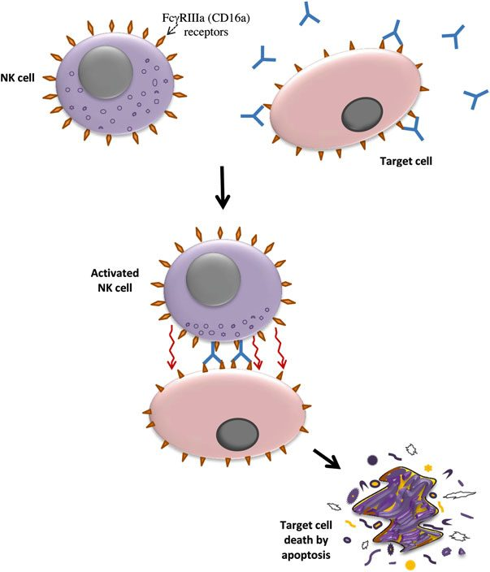

그림 2.2 네 가지 인간 IgG 아형(IgG1, IgG2, IgG3, IgG4)의 도식적 표현. 사슬간 및 사슬 내 이황화 결합의 수와 위치를 보여준다.

## 단클론항체의 당화

당화(glycosylation)는 항체 이펙터 기능에 중요한 역할을 하는 번역후 수정(posttranslational modification)이다. 이것은 포유류 세포, 특히 중국 햄스터 난소(CHO) 세포 또는 마우스 단클론 NSO 또는 Sp2/0 세포에 의해 생산되는 인간형 당성분(glycoform) 패턴을 정의하는 제조 사양에 의해 뒷받침된다. 이러한 시스템에서 생산된 인간 IgG 분자는 보존된 당화 위치인 각 CH2 영역의 아스파라진 297(Asn297)에 단일 N-결합 양분지(biantennary) 글리칸을 가진다.

다클론 인간 IgG Fab 영역의 약 15-20%에, L-푸코스를 포함하여 여러 D-갈랙토스 단위를 함유하는 광범위하게 시알화된 N-결합 양분지 글리칸이 존재한다. IgG Fab 당화의 기능은 명확하지 않으며 항원 결합에 대한 효과 없음, 양성 효과 또는 중립적 영향에 대한 주장이 있다. 동일한 항원에 특이적이지만 V~H~ 영역의 잠재적 N-당화 위치가 다른 3개 단클론항체의 항원 결합 친화력에 대한 한 연구에서, 2개의 당화된 항체는 세 번째 비당화 형태에 비해 항원에 대해 10-50배 더 높은 친화력을 보였다.

Fc 당화는 2개의 β-D-N-아세틸-D-글루코사 가지로 형성된 양분지 heptasaccharide 코어로 구성되며, 이 가지들은 각각 α(1-6)- 및 α(1-3)-결합으로 D-만노스 잔기에 연결되고, D-만노스는 다시 diacetylchitobiose에 연결되어 Asn297에 부착된다(그림 2.3). L-푸코스, D-갈랙토스, N-아세틸뉴라민산 및 N-아세틸-D-글루코사민과 같은 추가 당이 코어에 부착된다. 인간 IgG Fc 글리칸의 92% 이상이 고도로 푸코실화되어 있으며, IgG Fc 올리고사카라이드의 10% 미만이 시알화되어 있고, 2개의 시알산을 가진 것은 1% 미만이다. 존재하는 경우, N-아세틸뉴라민산은 말단 α(2-6)-결합된다.

## 항체의존세포매개 및 보체의존 세포독성

IgG Fc 부분은 힌지 영역의 이황화 결합, C~H~3 영역의 비공유 결합 쌍, 및 C~H~2-결합 올리고사카라이드와 C~H~2 단백질 표면 간의 비공유 상호작용으로 결합된 동종이량체(homodimer)이다. 이것은 다시 두 C~H~2 영역이 형성한 공동(cavity) 내의 올리고사카라이스의 구조에 영향을 미치며 이것이 Fc의 H 체인을 열린 구조(open conformation)로 유지하는 데 도움이 된다. 올리고사카라이드의 제거는 탈당화된 조제 및 무당화 형태에서 보듯 공동의 붕괴를 초래하며 중요한 것은 인간 IgG의 열린 Fc 구조는 Fc 수용체(FcγRI, FcγRII, FcγRIII), 신생아 Fc 수용체(FcRn) 및 보체의 C1q 성분을 통한 정상적인 이펙터 기능에 필요하다는 것이다.

IgG Fc 부분의 당화는 Fcγ 수용체 및 C1q가 매개하는 생물학적 활성에 필요하지만(아래 "항체의존세포매개 및 보체의존 세포독성" 절 참조), 신생아 수용체, 세균 Fc-결합 단백질 SpA 및 SpG, 그리고 류마티스 인자에는 필요하지 않다. 이 마지막 네 가지 위치와 상호작용하는 Fc 위치는 두 H 체인 모두에서 C~H~2 및 C~H~3 영역의 경계에 위치한 잔기를 포함한다.

CHO, NSO 및 Sp2/0 세포는 치료용 단클론항체를 위한 원하는 인간 당성분을 생산하지만 주로 heptasaccharide 코어 플러스 L-푸코스(G0F) 및 이 구조 플러스 각 가지에 β-D-갈랙토스(1-4)-결합 N-아세틸-D-글루코사민(G1F)(그림 2.3)이다. 생산 중의 배양 조건 및 기타 요인에 따라, 당성분은 클론마다 일관되지 않을 수 있다. 특이성과 효능이 부족하고 과도한 면역원성을 가진 바람직하지 못한 특성의 당화된 제품이 생산된다.

면역원성과 관련하여 특별한 위험은 인간에게 자연적으로 존재하지 않는 당의 포함, 즉 이당류 α-D-갈랙토스-(1-3)-D-갈랙토스의 포함이다. 이 이당류는 CHO 세포에서 공통적으로 발견되지만 인간에서는 드물다. CHO 세포의 시간적 발현 패턴이 Connexin43과 같은 인간 단백질의 발현 패턴과 상당히 다를 수 있다는 사실은 CHO에서 생산된 재조합 단백질의 면역원성에 대한 몇몇 연구가 입증했다. CHO 세포에서 생산된 제품의 당화된 특정 잔기가 인간 수준과 다를 경우, 면역원성을 유발하는 항원 결정인자(epitope)를 형성한다.

## 항체의존세포매개 및 보체의존 세포독성

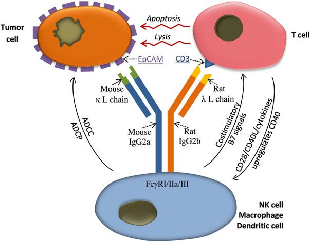

그림 2.4 항체의존세포매개세포독성(ADCC)의 도식적 표현. 표면 FcγRIIIa(CD16a)를 가진 자연살생세포(NK), 항체 분자(파란색) 및 표적 세포 간의 상호작용을 보여준다. 표적 세포 표면의 상보적 항원에 결합된 항체는 Fc 영역을 통해 NK 세포의 FcγRIIIa 수용체와 상호작용한다. 이 교차연결(cross-linking) 신호는 NK 세포를 활성화시켜 표적 세포를 사멸시키며 이는 이후 apoptose에 의해 사멸한다.

[중복 문단 삭제: In vitro ADCC 농도 비교 문단 - 앞 문단과 동일]
[중복 문단 삭제: ADCC 임상 효능 인정 문단 - 앞 문단과 동일]
[중복 문단 삭제: ADCC 강화 기술 문단 - 앞 문단과 동일]

표 2.3 단클론항체의 명명법^a^

FcγRIIIa의 존재는 ADCC의 강화를 위한 초점이 된다. 이는 대식세포에서 사이토카인 방출을 유도하며 중요하게도 항체 치료에서 ADCC를 유도하는 것으로 알려져 있다. 그림 2.4는 항체로 코팅된 표적 세포의 자연살생세포(NK) ADCC를 도식적으로 요약한 것이다. 항체의 Fc 영역과 킬러 세포 표면의 FcγRIIIa(CD16a) 상호작용이 이를 매개한다.

표 2.3 단클론항체의 명명법^a^

| INN 하위접사(prestem)^b^ |  | 표적^c^ |  |
| --- | --- | --- | --- |
| -o- | 마우스 | -ba-/b-/bac- | 세균 |
| -a- | 랫트 | -ci-/c- | 심혈관/순환계 |
| -axo- | 랫트-마우스 키메릭 | -fu-/f- | 항진균 |
| -e- | 햄스터 | -ki-/k- | 인터루킨 |
| -i- | 영장류 | -le-/les- | 염증성 병변 |
| -xi- | 키메릭 | -li-/l- | 면역조절 |
| -xizu- | 키메릭-인간화 | -ne-/n- | 신경계 |
| -zu- | 인간화 | -so-/os-/s- | 뼈 |
| -u- | 완전 인간화/인간 | -tox-/toxa- | 독소 |
|  |  | -tu-/td- | 종양 |
|  |  | -vi-/v- | 바이러스 |

INN 국제 비독점 명칭^a^

^a^ 모든 단클론항체는 접미사(suffix) -mab를 가지며 개별 제품을 식별하는 데 사용되는 특별한 의미가 없는 고유 접두사가 있다.
^b^ 동물 종을 식별하기 위한 것.
^c^ 표적 또는 질병을 식별하기 위한 것. 하위접사 앞에 배치됨.
^d^ 종양에 대한 추가 하위접사 세분화: co/col 대장, go/got 고환, go/gov 난소, ma/mar 유방, me/mel 흑색종, pr/pro 전립선, tu/tum 기타 종양.

명명법 규칙의 적용을 설명하는 예시:
- **Palivizumab**: Pali- 고유 접두사 식별자; -vi- 바이러스(호흡기 세포융합 바이러스)를 표적으로 함; -zu- 인간화 INN 하위접사; -mab 모든 단클론항체의 접미사.
- **Canakinumab**: Cana- 고유 접두사 식별자; -ki- 인터루킨 IL-1β를 표적으로 함; -u- 완전 인간 단클론항체 INN 하위접사; -mab 모든 단클론항체의 접미사.

## 현재 승인된 단클론항체의 항체 유형 및 승인된 적응증 분석

**표 2.4 2016년 6월 기준 승인된 단클론항체의 치료 응용**

| 종양학^a^ | 염증성 및 자가면역 질환^e^ | 기타 질환^e^ |
| --- | --- | --- |
| Alemtuzumab^b^ | Adalimumab | Abciximab-허혈성 심혈관 합병증 |
| Atezolizumab | Bevacizumab | Alemtuzumab^f^ |
| Blinatumomab | Belimumab | Alirocumab-가족성 고콜레스테롤혈증 |
| Brentuximab vedotin | Certolizumab pegol | Basiliximab-장기 이식 거부반응 |
| Cetuximab | Golimumab | Canakinumab-CAPS |
| Daratumumab | Infliximab | Catumaxomab |
| Dinutuximab | Ixekizumab | Denosumab^g^-골다공증 및 골질량 증가 |
| Elotuzumab | Natalizumab | Eculizumab-PNH, AHUS |
| Ibritumomab tiuxetan | Nivolumab | Evolocumab^h^-원발성 고지혈증, 혼합 고지혈증 |
| Ipilimumab | Secukinumab | Idarucizumab-항응고제 dabigatran 역전 |
| Necitumumab | Tocilizumab | Mepolizumab-호산구성 천식 |
| Nivolumab | Ustekinumab | Obiltoxaximab-탄저 |
| Obinutuzumab | Vedolizumab | Omalizumab-천식, 두드러기 |
| Ofatumumab |  | Palivizumab-RSV 감염 |
| Panitumumab |  | Ranibizumab-황반변성 |
| Pembrolizumab |  | Raxibacumab-탄저 |
| Pertuzumab |  | Reslizumab-호산구성 천식 |
| Ramucirumab |  | Siltuximab^d^ |
| Rituximab |  | Trastuzumabemtansine |
| Trastuzumab |  |  |

AHUS 비전형 용혈성 요독 증후군, CAPS 크료린관련 주기성 증후군, PNH 간헐적 야간 혈색소뇨증, RSV 인간 호흡기 세포융합 바이러스

^a^ 단클론항체 표적, 작용 기전 및 승인된 적응증에 대해서는 표 2.1 및 3장을 참조한다.
^b^ 2001년 FDA에 의해 림프구성 백혈병으로 승인; 2012년 미국 및 유럽에서 철수 후 다발성 경화증 치료제로 Lemtrada®로 재출시.
^c^ FDA에 의해 Xgeva®로 고형 종양의 골전이 및 골거대세포종으로 승인됨.
^d^ 다중중심성 Castleman병에 적응증을 가짐. 림프증식성 장애로, 림프종과 여러 면에서 유사하지만 진정한 암으로 간주되지 않음. Castleman병은 미국 암 협회의 암 정보에 포함되어 있다.
^e^ 단클론항체 표적, 작용 기전 및 승인된 적응증에 대해서는 표 2.1 및 3장을 참조한다.
^f^ Campath®로 림프구성 백혈병에 승인됨.
^g^ Prolia®로 골다공증, Xgeva®로 골전이에 각각 승인됨.
^h^ Repatha®로 고콜레스테롤혈증 및 혼합 고지혈증에 승인됨.

2015년 9개의 단클론항체 승인과 2016년 초반 3개의 추가 승인으로, 현재(2016년 6월) 미국 및/또는 유럽에서 50개의 단클론항체가 승인되어 있다. 17개의 완전 인간(-umab)과 21개의 인간화(-zumab) 단클론항체가 가장 큰 그룹을 형성하며 나머지 승인된 제품은 9개의 인간-마우스 키메릭(-ximab), 2개의 마우스(-omab), 1개의 랫트-마우스 키메릭(-axomab) 항체로 구성된다.

25개의 승인된 단클론항체는 종양학적 치료를 위한 적응증을 가지며(다중중심성 Castleman병에 대한 siltuximab 포함), 12개는 염증성 및/또는 자가면역 질환을 위한 것이며 15개는 기타 다양한 질환을 위한 것이다. 두 개의 단클론항체가 둘 이상의 적응증으로 승인되었다: 전자는 림프구성 백혈병(Campath®)과 다발성 경화증(Lemtrada®)에 대한 alemtuzumab, 후자는 골 손실(Prolia®)과 골전이(Xgeva®)에 대한 denosumab이다.

10개 이상의 승인된 항체가 TNF, CD20, α4β7 인테그린, EGFR, HER2, VEGF, B. anthracis PA, PD-1, IL-17A, IL-5 또는 PCSK9를 표적한다. 그러나 서로 다른 표적을 대상으로 하는 단클론항체가 도입되고 있다. 항원 IL-6, GD2, CD38, SLAMF7 및 항응고제 dabigatran이 이미 표적이 되고 있으며 새로운 질환인 Castleman병, 신경아세포종, 고콜레스테롤혈증, 고지혈증, 다발성 골수종, 요로상피세포암 및 호산구성 천식이 단클론항체 치료가 가능한 질환 목록에 추가되었다.

현재 두 개의 단클론항체-약물 결합체(ADC; antibody-drug conjugate), brentuximab vedotin과 trastuzumab emtansine이 FDA와 EMA에 승인되어 각각 항암 치료제로 사용되고 있다. Ibritumomab은 세포 사멸을 위한 방사성 표지가 부착되어 있다. ADC의 개념, 전략 및 기본 원리는 단순해 보이지만 실제에서는 네 가지 요소를 고려해야 한다: 표적, 단클론항체, 연결(linker) 구조 및 약물/독소 탑재체(payload). 이것은 효과적이고 안전한 표적 치료 제품을 생산하는 데 있어많은 복잡한 개발 및 생산 과제를 제시한다.

## 단클론항체 치료의 미래 전망

과거 규제 승인율이 연간 약 4개이면, 2020년까지 약 65개의 단클론항체가 시장에 나올 것으로 예상되지만 8%의 지속적인 시장 성장률 예측, 2020년까지 전 세계 매출 약 1,250억 달러, 300개 이상의 단클론항체가 개발 중이라는 점은 이 수치가 과소평가임을 입증한다. 예를 들어, 2014년에 ramucirumab, siltuximab, vedolizumab, pembrolizumab, blinatumomab 및 nivolumab의 6개 단클론항체가 FDA/EMA에 의해 최초 승인을 받았지만 이것은 이미 2015년에 secukinumab(2014년 12월 일본에서 최초 승인), dinutuximab, alirocumab, evolocumab, daratumumab, necitumumab, idarucizumab, mepolizumab 및 elotuzumab의 9개로 초과되었다. 2016년 첫 3개월 동안 ixekizumab, obiltoxaximab, reslizumab의 3개 단클론항체가 FDA 승인을 받았다. ADC inotuzumab ozogamicin과 venetoclax(BCL-2 억제제)도 2016년 말까지 승인을 받을 것으로 예상된다.

현재 임상 시험에서 30개 이상의 ADC가 보고되어 있으며 많은 수가 비임상 개발 단계에 있어, 이 예측은 향후 3-5년 내에 증가할 것으로 보인다. 새로운 항체 표적에 대한 지속적인 검토와 적응증의 확대는 단클론항체 치료,더 비용 효율적인효과적인 제품, 더 넓은 시장 침투에 대한 지속적이고 확대되는 수요를 가리킨다.

## 요약

- 정확한 표적 지정, "영속적" 항체 공급, 더 큰 정밀도 및 재현성이 필요한 체액 면역 치료를 위해서는 단일 장수 클론 세포주에서 나온 균일하고 잘 정의된 항체가 필요하다.
- 1986년에, 최초의 치료용 단클론항체인 muromonab-CD3(Orthoclone OKT3), 인간 T 림프구 표면의 CD3(T3) 수용체를 표적으로 하는 마우스 IgG2a 단클론항체가 규제 승인을 받았다. 마우스 단백질에 대한 인간 면역반응이 심각한 문제라는 것이 곧 명백해졌고 더 "인간화된" 단클론항체가 필요했다.
- 지속적인 반복적 과정의 첫 번째 단계는 소위 키메릭 항체의 생산이었다. 키메릭 항체는 마우스 항체의 가변(항원결합) 영역을 인간 면역글로불린의 불변 영역과 결합한 것이다. 중요한 기술적 발전에도 불구하고, 인간-마우스 면역반응의 위험은 제거되지 않았으며, 특히 잠재적으로 심각한 과민반응이 여전히 간헐적으로 발생하였다.
- 종의 인식 차이를 제거해야 할 필요성은 소위 인간화 단클론항체의 생산으로 이어졌으며 이는 마우스 과변이 영역 또는 상보결정 영역(CDRs)을 인간 서열로 대체하는 동시에 항체의 나머지 부분을 인간으로 유지하는 방식으로 달성되었다.
- 이러한 약물에 대한 환자의 내성이 향상되고 눈에 띄게 부작용이 줄었음이 곧 분명해졌지만 궁극적인 목표는 항상 완전 인간 항체를 개발하는 것이었다. 이는 파지 디스플레이와 형질전환 마우스 기술의 발전으로 가능해졌다. 미국 시장에 도달한 최초의 완전 인간 단클론항체인 adalimumab은 파지 디스플레이 기술로 개발되었다.
- 인간 치료용 단클론항체의 진화는 하이브리도마 기술에서 시작하여 Epstein-Barr 바이러스를 이용한 인간 B세포의 불멸화, 파지 디스플레이, 형질전환(녹아웃) 마우스의 활용, 및 단일 인간 B세포로부터의 유전자 클로닝을 통한 단클론항체 생산에 이르기까지 기술적 발전을 거치며 진행되었다.
- 현재 치료용으로 승인된 모든 단클론항체 및 파생 제품은 IgG 아이소타입에 속한다. 아포지속 반감기는 IgG1, IgG2, IgG4에서는 약 20-21일, IgG3에서는 약 7일이다. IgG1은 가장 자주 선택되는 아형이며 IgG2와 IgG4는 간헐적으로 사용된다. 긴 반감기 외에도, IgG1은 항체의존세포매개세포독성(ADCC)의 선택으로서, 암 세포 치료에서 세포 사멸에 중요하다. 세포독성을 매개하지 않는 IgG2와 IgG4는 세포 사멸을 피해야 하는 경우에 선택된다.
- IgG1 Fc 단편은 FcγRs, C1q 및 FcRn에 결합하여 이펙터 기능을 시작한다. IgG4는 C1q에 대한 친화력이 거의 없거나 없으므로, 이 이펙터 기능의 관여가 필요하지 않은 경우에 사용된다.
- 당화는 항체 이펙터 기능에 중요한 역할을 하는 일반적인 번역후 수정이다. CHO 세포와 같은 포유류 세포에서 생산된 인간 IgG 분자는 보존된 당화 위치인 각 CH2 영역의 아스파라진 297(Asn297)에 단일 N-결합 양분지 글리칸을 가진다. D-갈랙토스 단위와 L-푸코스를 포함하는 광범위하게 시알화된 N-결합 양분지 글리칸은 다클론 인간 IgG Fab 영역의 약 15-20%에 존재한다.
- Fc 당화는 두 개의 β-D-갈랙토스-β-D-N-아세틸-D-글루코사민 가지로 형성된 양분지 heptasaccharide 코어로 구성되며, α(1-6)- 및 α(1-3)-결합으로 D-만노스를 통해 diacetylchitobiose에 연결되고, 이것이 다시 Asn297에 연결된다. 인간 IgG Fc 글리칸의 92% 이상이 고도로 푸코실화되어 있으며 IgG Fc 올리고사카라이드의 10% 미만이 시알화되어 있다. IgG Fc 부분의 당화는 Fcγ 수용체 및 C1q가 매개하는 생물학적 활성에 필요하다.
- L-푸코스의 부재는 이펙터 기능 수행과 관련이 있으며 비푸코실화 단클론항체에 의한 향상된 ADCC로 입증되었다. 표적세포에 결합된 항체의 불변 영역에 대한 C1q의 결합으로 시작되는 CDC는 세포 사멸에 사용되는 항체의 최적 효능에 중요하다.
- FcRn은 인간 IgG1 아이소타입의 주요 항상성 조절자이며 항체 반감기를 증가시키고 항체 수송을 향상시키려는 시도의 초점이다. FcRn에 대한 변경된 결합은 FcγRs 및 C1q에 대한 결합에도 영향을 미쳐, 궁극적으로 ADCC 및 CDC와 같은 세포 기전을 변화시킨다.
- 현재 미국 및/또는 유럽에서 50개의 단클론항체가 승인되어 있다. 21개의 인간화와 17개의 완전 인간 단클론항체가 가장 큰 그룹을 형성하며 이어서 9개의 인간-마우스 키메릭, 2개의 마우스, 1개의 랫트-마우스 키메릭 단클론항체가 있다.
- 항체는 IgG 아이소타입에 속하며 대부분이 아형 IgG1이다. 이 중 47개는 카파 경쇄를 가지며 3개(belimumab, raxibacumab, evolocumab)만 람다 경쇄를 가진다. 4개의 단클론항체는 IgG1κ Fab 단편(abciximab, certolizumab, ranibizumab, idarucizumab)이며, 4개는 아형 IgG2(catumaxomab 랫트 IgG2b-마우스 IgG2a, denosumab, panitumumab, evolocumab), 5개는 IgG4(natalizumab, pembrolizumab, nivolumab, ixekizumab, reslizumab)이며, eculizumab은 IgG2/4κ 하이브리드이다.
- Blinatumomab은 각각 H 및 L 체인에서 유래한 두 개의 단일사슬 가변 단편(scFv)으로 구성된 유일한 BiTE 이중특이성 융합단백질이다.
- 25개의 승인된 단클론항체는 종양학적 치료를 위한 적응증을 가지며(다중중심성 Castleman병에 대한 siltuximab 포함), 12개는 염증성 및/또는 자가면역 질환을 위한 것이며 15개는 기타 다양한 질환을 위한 것이다. 두 개의 단클론항체가 둘 이상의 적응증으로 승인되었다: 전자는 림프구성 백혈병(Campath®)과 다발성 경화증(Lemtrada®)에 대한 alemtuzumab, 후자는 골 손실(Prolia®)과 골전이(Xgeva®)에 대한 denosumab이다.
- 50개 승인된 항체 중 1개 이상이 TNF, CD20, α4β7 인테그린, EGFR, HER2, VEGF, B. anthracis PA, PD-1, IL-17A, IL-5 또는 PCSK9를 표적한다. 그러나 서로 다른 표적을 대상으로 하는 단클론항체가 도입되고 있다. 항원 IL-6, GD2, CD38, SLAMF7 및 항응고제 dabigatran이 이미 표적이 되고 있으며 Castleman병, 신경아세포종, 고콜레스테롤혈증, 고지혈증, 다발성 골수종, 요로상피세포암 및 호산구성 천식이 단클론항체 치료가 가능한 새로운 질환으로 추가되었다.
- 현재 두 개의 단클론항체-약물 결합체(ADC), brentuximab vedotin과 trastuzumab emtansine이 FDA와 EMA에 승인되어 각각 항암 치료제로 사용되고 있다. Ibritumomab은 세포 사멸을 위한 방사성 표지가 부착되어 있다. ADC의 개념, 전략 및 기본 원리는 단순해 보이지만 실제에서는 네 가지 요소를 고려해야 한다: 표적, 단클론항체, 연결 구조 및 약물/독소 탑재체. 이것은 효과적이고 안전한 표적 치료 제품을 생산하는 데 있어많은 복잡한 개발 및 생산 과제를 제시한다.

## 추가 참고문헌

Chernajovsky Y, Nissim A, editors. Therapeutic antibodies. Handbook of experimental pharmacology, vol. 181. Berlin: Springer; 2008.

Hammers CM, Stanley JR. Antibody phage display: technique and applications. J Invest Dermatol. 2013;134:e17. doi: 10.1038/jid.2013.521.

Hwang WYK, Foote J. Immunogenicity of engineered antibodies. Methods. 2005;36:3-10.

Irani V, Guy AJ, Andrew D, et al. Molecular properties of human IgG subclasses and their implications for designing therapeutic monoclonal antibodies against infectious diseases. Mol Immunol. 2015;67:171-82.

Jefferis R. Glycosylation of recombinant antibody therapeutics. Biotechnol Prog. 2005;21:11-6.

Jones TD, Carter PJ, Plückthun A, et al. The INNs and outs of antibody nonproprietary names. mAbs. 2016;8:1-9.

Liu L. Antibody glycosylation and its impact on the pharmacokinetics and pharmacodynamics of monoclonal antibodies and Fc fusion proteins. J Pharm Sci. 2015;104:1866-84.

Lönberg N. Fully human antibodies from transgenic mouse and phage display platforms. Curr Opin Immunol. 2008;20:450-9.

Meyer-Tamaki KB. Preclinical development of monoclonal antibodies. In: Faqi AS, editor. A comprehensive guide to toxicology in preclinical drug development. London: Academic; 2013. p. 489-516.

Nelson AL, Dhimolea E, Reichert JM. Development trends for human monoclonal antibody therapeutics. Nat Rev Drug Discov. 2010;9:767-74.

Ossipow V, Fischer N, editors. Monoclonal antibodies: methods and protocols. Methods in molecular biology, vol. 907. New York: Springer; 2013.

Saito H, et al. Challenges of glycosylation analysis and control: an integrated approach to producing optimal and consistent therapeutic drugs. Drug Discov Today. 2016;21:740-65.

Strohl WR, Strohl LM. Therapeutic antibody engineering: Current and future advances driving the strongest growth area in the pharmaceutical industry. Woodhead publishing series in biomedicine no. 11. Cambridge: Woodhead Publishing Ltd; 2012.

Vidarsson G, Dekkers G, Rispens T. IgG subclasses and allotypes: from structure to effector functions. Front Immunol. 2014;5:520. doi: 10.3389/fimmu.2014.00520.

Waterman S. Technology advances enable creation of better ADCs. BioProcess Int. 2014;12 Suppl 6:37-40.

Zhang P, Woen S, Wang T, et al. Challenges of glycosylation analysis and control: an integrated approach to producing optimal and consistent therapeutic drugs. Drug Discov Today. 2016;21:740-65. doi: 10.1016/j.drudis.2016.01.006.
## Chapter 3

# 암 치료용 승인 단클론항체

단클론항체(mAb)는 이점이 크고 성공적인 치료법 개발은 상업적으로 큰 보상으로 이어진다. 암 치료에 쓰는 승인 단클론항체에는 확인되거나 제안된 작용 기전이 여럿 있다. 관련 분자기전은 주로 암세포를 직접 죽이는 작용, 성장 촉진 신호전달 경로 억제, 암세포를 간접적으로 파괴하는 면역조절 효과이다. 소수 승인 단클론항체와 개발 파이프라인에 있는 더 많은 항체에서, 소위 항체-약물 접합체(ADC)(2장, "항체-약물 접합체" 절)로 직접 세포독성 작용을 나타낸다. 이는 잠재적으로 치명적인 독소, 약물, 사이토카인 또는 방사성 핵종의 생체활성 페이로드를 부착하여 세포 사멸을 유도하는 방식이다. 예로는 ibritumomab tiuxetan("Ibritumomab Tiuxetan" 절), brentuximab vedotin("Brentuximab Vedotin" 절), trastuzumab emtansine("Ado-trastuzumab Emtansine" 절)이 있다. 세포 파괴적 면역조절 효과의 예로는 항체의존세포매개세포독성(ADCC)과 T세포와 항원제시세포 간 신호전달을 조절하는 억제 경로를 표적으로 하는 면역관문 조절이 있다. ADCC를 유도하는 항체와 면역관문을 조절하는 항체, 즉 세포독성 T 림프구 항원 4(CTLA-4)와 프로그래밍된 세포사멸 단백질 1(PD-1)을 표적으로 하는 단클론항체는 본 장 후반부에서 다룬다. 단클론항체의 작용 기전을 이해하는 일은 종양 인식과 세포 파괴 과정을 이해하는 데 중요하다. 마찬가지로 환자의 반응을 예측하는 바이오마커를 규명하면 특정 단클론항체로 가장 이익을 얻을 환자를 고르는 데 도움이 된다. 따라서 암 환자는 표적 약물에 좋은 반응이나 나쁜 반응을 예측한다고 알려진 특정 바이오마커 검사를 자주 받는다.

암 치료용 승인 단클론항체 59

피부 반응: 발진, 홍반, 소양증, 두드러기, 건선양 발진, 습진, 독성피부괴사, 스티븐스-존슨 증후군, 독성표피탈리증, 수포성 피부염, 다형홍반, 편평태선양 발진, 탈모

시스템: 발열, 오심, 구토, 호흡곤란, 기침, 피로, 두통, 복통, 설사, 비감염성 발진, 저칼륨혈증, 고혈압, 부종, 체중증가

주의사항: 과민반응, 면역억제, 감염, C형간염 재활성, 장폐색, 진행성 다초점 백질뇌병증(PML), 종양 용해 증후군(TLS), 심근병증, 부정맥, 심부전, 간독성, 신독성, 골수억제, 세포감소증, 호중구감소증, 림프구감소증, 혈소판감소증, 빈혈, 폐렴, 기관지염, 폐부종, 폐출혈, 폐 섬유화, 간염, 대상포진, JC 바이러스 감염, 말초신경병증, 뇌척수액 순환 장애, 백혈구감소증, 각막염, 결막염, 안구건조증, 비장비대, 림프절병증, 호산구증가증, 동맥혈전색전증, 정맥혈전색전증

| 종양표적 | CD20 | CD30 | CD52 | HER2 | EGFR | VEGF/VEGFR | PD-1 | PD-L1 | CTLA-4 | CD33 | CD38 | CD19 | RANKL | IL-6 | CS1 |
|---|---|---|---|---|---|---|---|---|---|---|---|---|---|---|---|
| 단클론항체 | 리툭시맙® | | | | | | | | | | | | | | |
| | | 브렌툭시맙베도틴® | | | | | | | | | | | | | |
| | | | 알레무주맙® | | | | | | | | | | | | |
| | | | | 트라스투주맙® | | | | | | | | | | | |
| | | | | | 세툭시맙® | | | | | | | | | | |
| | | | | | 파니투무맙® | | | | | | | | | | |
| | | | | | | 베바시주맙® | | | | | | | | | |
| | | | | | | 라무시루맙® | | | | | | | | | |
| | | | | | | | 퍼투주맙® | | | | | | | | |
| | | | | | | | 펨브롤리주맙® | | | | | | | | |
| | | | | | | | 니볼루맙® | | | | | | | | |
| | | | | | | | | | | | | | | | |
| | | | | | | | | | | | | | | | |
| | | | | | | | | | | | | | | | |
| | | | | | | | | | | | | | | | |
| | | | | | | | | | | | | | | | |

| 종양표적 | CD20 | CD30 | CD52 | HER2 | EGFR | VEGF/VEGFR | PD-1 | PD-L1 | CTLA-4 | CD33 | CD38 | CD19 | RANKL | IL-6 | CS1 |
|---|---|---|---|---|---|---|---|---|---|---|---|---|---|---|---|
| (이상반응) | 호중구감소증, 감염 | 호중구감소증 | 호중구감소증 | 심근병증 | 피부 발진 | 고혈압, 출혈 | 자가면역 반응 | 자가면역 반응 | 자가면역 반응 | 세포감소증 | 세포감소증 | 림프구감소증 | 골수억제 | 과민반응 | 감염 |

| 종양표적 | PD-1 | PD-L1 | HER2 | EGFR | VEGF/VEGFR |
|---|---|---|---|---|---|
| 단클론항체 | | | | | |
| 이상반응 종류 | 자가면역 | 자가면역 | 심장독성 | 피부독성 | 출혈/천공 |

FDA 블랙박스 경고: 폐렴, 폐출혈, 종양유발 부종, 비장비대, 뇌척수액 이상, 호중구감소증, 백혈구감소증, 혈소판감소증, 빈혈, 골수억제

| 종양표적 | PD-1 | HER2 | VEGFR-2 | EGFR | CTLA-4 |
|---|---|---|---|---|---|
| 단클론항체 | 니볼루맙® | | | | |
| | 펨브롤리주맙® | | | | |
| | | 트라스투주맙® | | | |
| | | | 베바시주맙® | | |
| | | | | 세툭시맙® | |
| | | | | 파니투무맙® | |
| | | | | | |

| 종양표적 | CD20 | CD30 | CD52 | HER2 | EGFR | VEGF/VEGFR | PD-1 | PD-L1 | CTLA-4 |
|---|---|---|---|---|---|---|---|---|---|
| 단클론항체 (상품명) | 리툭시맙® | | | | | | | | |
| | | 브렌툭시맙베도틴® | | | | | | | |
| | | | 알레무주맙® | | | | | | |
| | | | | 트라스투주맙® | | | | | |
| | | | | | 세툭시맙® | | | | |
| | | | | | | 베바시주맙® | | | |
| | | | | | | | 펨브롤리주맙® | | |
| | | | | | | | 니볼루맙® | | |
| | | | | | | | | | |

63 -암 치료용 승인 단클론항체의 이상반응 분류

1~4형 과민반응 및 세포감소증

면역원성은 완전 인간 단클론항체를 포함한 모든 단클론항체에서 늘 따지는 안전성 문제이다. 항이디오타입 항체가 생길 여지가 남기 때문이다. 따라서 단클론항체 투여 뒤 면역매개 이상반응 가능성을 완전히 배제할 수 없다. 여기에는 아나필락시스, 두드러기, 혈관부종 같은 I형 IgE 항체매개 즉각 반응부터 II형 약물유도 혈소판감소증, 용혈성 빈혈, 무과립구증, III형 혈청병 및 약물유도 혈관염, Th1, Th2, Th17 림프구가 매개하는 여러 IV형 피부 과민반응, 그리고 세포독성 림프구, 대식세포, 호산구 등 여러 세포 유형이 얽힌 이펙터 기전이 포함된다. 사실 "과민반응"은 오용되고 종종 잘못 이해되는 용어이며 의학 분야 전반에 공통 정의 수용이 시급하다(1장, "과민반응" 절 참조). 반응이 진정한 과민반응인지, 어떤 면역 과정이 직접 또는 간접으로 관여하는지 늘 분명하지는 않다. 우선 과민반응을 기술하는 용어를 표준화해야 많은 이상반응을 정확히 해석한다. 면역원성 잠재력 때문에 단클론항체는 보통 아나필락시스를 포함한 면역 반응 경고를 달고 있다. 그러나 관찰된 발생률은 실제로 꽤 낮다. 쥐 서열을 포함한 키메라 단백질(catumaxomab, blinatumomab, ibritumomab tiuxetan, brentuximab vedotin, cetuximab, 리툭시맙, siltuximab, dinutuximab)(표 3.1)에 대한 IgE 매개 반응은 위험이 더 높다고 보며 전반적으로 예상대로 사실로 확인되었다. 아나필락시스는 적어도 cetuximab, 리툭시맙, brentuximab, bevacizumab, trastuzumab, pertuzumab, ibritumomab, dinutuximab에서 보고되었다.

세포감소증: 단클론항체는 면역원성 잠재력 탓에 투여 뒤 세포감소증을 일으킬 수 있다. 암 치료 단클론항체 중에는 혈소판감소증을 특징으로 하는 안티체마크로바트용 혈소판감소증이 있다. 진단 및 치료 때 따져야 할 세포감소증 종류로는 혈소판감소증, 호중구감소증, 빈혈, 림프구감소증 등이 있다.

| 종양표적 | CD20 | CD30 | CD52 | HER2 | EGFR | VEGF/VEGFR | PD-1 | PD-L1 | CTLA-4 |
|---|---|---|---|---|---|---|---|---|---|
| 세포감소증 | 리툭시맙: 호중구감소증, 혈소판감소증 | 브렌툭시맙베도틴: 호중구감소증 | 알레무주맙: 호중구감소증, 빈혈, 혈소판감소증 | 트라스투주맙: 호중구감소증, 혈소판감소증 | | | 펨브롤리주맙: 림프구감소증 | | |

| 종양표적 | CD20 | CD30 | CD52 | HER2 | EGFR | VEGF/VEGFR | PD-1 | PD-L1 | CTLA-4 |
|---|---|---|---|---|---|---|---|---|---|
| 기타 이상반응 | CATUMAXOMAB: 과민반응 | BRENTUXIMAB: 말초신경병증 | ALEMTUZUMAB: 감염 | TRASTUZUMAB: 심장독성 | CETUXIMAB: 피부발진 | BEVACIZUMAB: 고혈압, 출혈 | PEMBROLIZUMAB: 자가면역 반응 | | |

| 종양표적 | CD20 | CD30 | CD52 | HER2 | EGFR | VEGF/VEGFR | PD-1 | PD-L1 | CTLA-4 |
|---|---|---|---|---|---|---|---|---|---|
| 면역매개 이상반응 | | | | | | | 펨브롤리주맙: 폐렴, 간염, 장염, 갑상선기능이상, 신부전, 신염 | | |

| 종양표적 | CD20 | CD30 | CD52 | HER2 | EGFR | VEGF/VEGFR | PD-1 | PD-L1 | CTLA-4 |
|---|---|---|---|---|---|---|---|---|---|
| 기타 면역매개 | | | | | | | 니볼루맙: 폐렴, 간염, 장염, 갑상선기능이상, 신부전, 신염 | | |

자가면역성 혈소판감소증 및 용혈성 빈혈은 II형 과민반응이다. 혈소판, 적혈구, 호중구 수치 감소, 특히 림프증식 질환에서 보이는 감소는 때때로 면역학적 바탕을 둔다. 혈소판감소증은 많은 소분자 화학요법 약물 사용 뒤 잘 알려졌으나, 단클론항체 치료 중 및 뒤에는 훨씬 드물게 관찰된다. 리툭시맙은 승인 단클론항체 가운데 혈소판감소증과 가장 자주 관련된다. 발생률은 ~1.7%로 보이며 단독 및 병합요법에서 비슷하다. 그러나 비호드킨 림프종 환자 72명에게 총 317회 리툭시맙을 투여한 한 연구에서 10.4%라는 높은 발생률을 보고했다. 리툭시맙 유도 혈소판감소증 사례와 문헌 고찰에서 리툭시맙 의존 항체를 확인하지 못했고 IL-1 및 IL-6도 오르지 않았으나, 보체 수준은 올랐다. 이에 저자들은 단클론항체 유도 일시적 혈소판감소증이 보체 활성화로 매개되고 CRS와 관련된다고 결론지었다. 리툭시맙 치료 중 일시적 중증 혈소판감소증 2건, 하나는 맨틀세포 림프종 환자, 다른 하나는 모발세포 백혈병 환자에서 항체 중단 뒤 며칠 만에 회복되었으나, 기전은 밝혀지지 않았다. 아나필락시스 위험을 줄이려면 백신은 리툭시맙 투여 전에 접종해야 하며 최소 4주 간격을 둔다.

65 약물유도 과민반응성 혈관염은 III형 반응의 표현형이며 리툭시맙을 포함한 소수 단클론항체가 피부 혈관염 사례와 관련되었다. 단클론항체에 대한 혈청병 반응, 또 다른 III형 과민반응은 과소 진단 및 보고되고 있을 가능성이 높다. 키메라 항체, 특히 리툭시맙이 이 반응을 일으킬 가능성이 가장 큰 단클론항체로 지목되었다. 리툭시맙의 혈청병 유사 반응이 치료받은 환자의 최대 20%에서 생길 수 있다고 주장된 바 있으며 특히 자가면역 질환(특히 자가면역 혈소판감소증) 및 고감마글로불린혈증 환자에서 그렇다.

자가면역 질환이 항암 단클론항체로 유발되는 경우는 드물지만 ipilimumab이 가장 흔한 원인으로 떠올랐다. CTLA-4를 표적으로 하여 면역자극제로 작용하므로 ipilimumab은 항종양 반응을 만들고 T세포 활성화를 강화하여 때때로 면역매개 장염, 간염, 신염, 갑상선기능저하증, 갑상선기능항진증으로 이어진다. PD-1 수용체를 차단하므로, 니볼루맙과 펨브롤리주맙은 비슷한 범위의 자가면역 반응 및 면역매개 폐렴을 일으킬 수 있다.

IV형 피부 반응은 보통 노출 뒤 7~21일 뒤에 나타나지만 이후 반응은 재노출 뒤 1~2일 뒤에 나타날 수 있다. 스티븐스-존슨 증후군 및 독성표피탈리증 같은 피부 독성피부발진 사례에서는 피부 검사로 원인 항원의 특이성을 확립할 때 큰 주의, 또는 바람직하게는 회피가 필요하다. 이 두 가지 드물고 생명을 위협할 수 있는 질환 외에도, IV형 피부 반응에는 알레르기 접촉피부염, 건선, 구진발진, 고정형 약물발진, 급성 범발성 농포성 발진, 홍반, 편평태선양 발진 등이 포함된다.

Catumaxomab, cetuximab, 리툭시맙, siltuximab(표 3.1). 단클론항체가 유발하는 주사반응은 보통 첫 투여 뒤 수 시간 안에 시작된다. 반응은 보통 가벼운 열, 오한, 감기, 두통, 오심, 무력증, 가려움증, 발진으로 나타나는 경미~중등도 "독감" 유사 증상이다. 소수 환자에서, 특히 첫 번째 또는 두 번째 주사 중에, I형 IgE 항체매개 아나필락시스, 특히 저혈압, 기관지연축, 심정지, 두드러기와 같은 중증의 생명을 위협하는 증상이 생길 수 있다(1장, "과민반응" 절). 징후 및 증상이 비슷하므로 주사반응과 진정한 알레르기 과민반응을 구별하기 어려울 수 있다. 그러나 IgE 매개 반응은 보통 수 분 안에 더 빠르고 심각하게 시작된다. 모든, 또는 거의 모든 단클론항체에서 중증 반응을 보고한 바 있으며 키메라 리툭시맙과 인간화 트라스투주맙 항체가 가장 흔한 원인이다. cetuximab에서 반응 발생률은 ~15~20%(3~4등급, 3%)이고 트라스투주맙 첫 투여 때 ~40%(3~4등급, <1%), 리툭시맙 첫 투여 때 ~77%(3~4등급, 10%)이다. 리툭시맙에 대한 치명적 주사반응의 약 80%가 첫 투여 뒤 발생했으며 30%와 14% 환자가 각각 네 번째 및 여덟 번째 투여 뒤에도 여전히 반응을 보였다. 트라스투주맙이 인간화 단클론항체임에도 상당한 빈도로 주사반응을 일으킨다. 반면 bevacizumab은 다른 인간화 항체로 <3% 반응 발생률을 보이며 완전 인간 파니투무맙(3%, 3~4등급 ~1%)과 비슷하다. 최근 다발성골수종 치료로 승인된 엘로투주맙은 상당수 환자에서 주사반응을 일으키며 사전투약이 필요하다(표 3.1).

주사반응 기전은 아직 완전히 밝혀지지 않았다. 사이토카인, 특히 TNF와 IL-6 같은 인터루킨이 관여할 수 있다. 이들이 일으키는 증상이 주사 및 I형 알레르기 반응에서 보는 증상과 비슷하기 때문이다. 중요한 발견은 주사반응 중증도가 순환 림프구 수와 관련된다는 관찰이었다.

67 암 치료용 승인 단클론항체 124

사이토카인 방출 증후군, 일명 사이토카인 스톰은 악성 면역세포를 표적으로 하는 단클론항체 사용 뒤 관찰될 수 있으며 예를 들어 리툭시맙이 있다. 현재 승인된 암 치료용 단클론항체 가운데 적어도 10개가 치료받은 암 환자에서 폐독성을 기록하고 있다. 단클론항체로 유발되는 폐 관련 이상반응으로는 간질성 폐렴 및 섬유화, ARDS, 폐쇄성 기관지염-조직화 폐렴(BOOP), 과민성 폐렴이 있다. 일부 항암제에 대한 과민성 폐렴은 Th1/Th17 반응에서 III형 및 IV형 과민반응이 합쳐진 것으로 보인다. 심혈관 이상반응은 최소 11종 암 치료 단클론항체에서 발생했다. EGFR을 표적으로 하는 단클론항체로 유발되는 피부 반응은 보통 면역매개가 아니다. 피부 반응은 구진농포 발진으로 나타나며 환자 50~100%에서 그리고 소분자 티로신 키나제 억제제에서보다 더 심각한 형태로 나타난다. 발진은 피지선, 피지샘, 모낭이 있는 지성 피부 부위로 제한되는 경향이 있다. EGFR을 표적으로 하는 단클론항체로 유발되는 다른 부작용으로는 손발톱 주위염, 균열, 건조증, 손바닥-발바닥 발진, 모발 변화, 각화증, 구내염, 발열성 육아종, 피부 과색소침착이 있다.

종양 용해 증후군(TLS)은 보통 백혈병 및 고등급 림프종 환자에서 발생한다. 대량 악성 세포가 짧은 시간에 파괴되어 고칼륨혈증, 고칼슘혈증, 고인산혈증, 고요산혈증을 일으킬 수 있다. 이는 칼륨, 인산칼슘, 요산의 심각한 전해질 불균형을 초래하고 급성신부전, 부정맥, 경련, 사망으로 진행될 수 있다. 이 상태는 종양 용해 증후군(TLS)으로 알려져 있으며 CRS와 달리 반응은 I형 즉각적 과민반응과 쉽게 구별한다. TLS는 보통 CD20 표적 단클론항체 및 CD30을 표적으로 하는 브렌툭시맙베도틴 사용과 잘 알려져 있으나, 리툭시맙으로 유발되는 반응은 다소 비정형적이고 추가 특성이 필요하다. FDA는 리툭시맙에 TLS 블랙박스 경고를 발표했으며 obinutuzumab, 브렌툭시맙베도틴, blinatumomab에는 경고 및 예방조치를 발표했다.

진행성 다초점 백질뇌병증(PML)은 약 1/3 인구에서 무증상으로 지속되는 폴리오마바이러스 JC 바이러스 때문에 발생하며 이식 및 AIDS 환자 같은 심각한 면역결핍 환자에서 PML을 일으킨다. PML은 신경세포 수초를 파괴하여 신경 전달에 영향을 미치는 다발성경화증과 비슷한 진행성, 보통 치명적인 질환이다. 드물지만 이 질환은 B세포를 표적으로 하는 일부 단클론항체 투여 때 간헐적으로 관찰된다.

69 암 치료용 승인 단클론항체

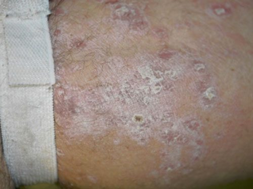

그림 3.2 여포성 비호드킨 림프종으로 obinutuzumab 치료를 받은 62세 남성의 편평태선양 발진. 건선양의 외관을 가진 이 반응은 몸통, 등, 팔, 다리에 광범위하게 퍼진 자색 편평태선양 구진발진이었다. Bakkour W와 Coulson IH에서 재인용. GA101 (새로운 anti-CD20 단클론항체)-유도 편평태선양 발진. Dermatol Ther 2012;2:3. doi: 10.1007/s13555-012-0003-9, Creative Commons Attribution License에 따라 배포된 오픈액세스 기사

다른 anti-CD20 단클론항체에서 과민반응은 놀랍도록 드물다. obinutuzumab 때문으로 추정된 편평태선양 발진(그림 3.2)의 비교적 최근 사례는 이 단클론항체에 대한 피부 부작용의 첫 사례 보고로 주장되었다. 최근 FDA 승인된 여포성 림프종 적응증에서, obinutuzumab은 벤다마스틴과의 병합 뒤 리툭시맙 포함 요법에 불응하거나 재발한 환자에서 obinutuzumab 유지치료로 이어진다. 치료받은 환자에서 가장 흔한 이상반응은 호중구감소증, 발열, 빈혈, 혈소판감소증, 주사반응, 호흡기 및 요로감염, 관절통, 무력증, 위장관 증상, 피로, 부비동염이었다. 가장 흔한 3/4등급 이상반응은 호중구감소증, 호중구감소증, 폐렴, 주사반응, 패혈증, 발열이었다(표 3.1). obinutuzumab 치료 뒤 최대 1년까지, 치료받은 70명 가운데 9명(12.9%)이 이 단클론항체에 대한 항체 양성으로 검사되었다. 항체의 중화 활성은 조사하지 않았다.

Brentuximab Vedotin (브렌툭시맙베도틴)

Brentuximab vedotin(Adcetris®)(표 2.1 및 3.1)은 세포독성 제제인 모노메틸 auristatin E(MMAE)와 공유결합한 키메라 IgG1κ 단클론항체로, 활성화된 T 및 B 림프구에서 발현되는 종양괴사인자 수용체 패밀리의 120 kDa 세포막 글리코단백질인 CD30 또는 TNFRSF8을 표적으로 한다. 2007년 호드킨 림프종에 대한 희귀약물로 인정되었고 이후 전신성 역형성 거대세포 림프종(sALCL), 최근에는 균상식육종에 승인되었다. 브렌툭시맙베도틴은 2011년 FDA에서 호드킨 림프종에 자가조혈모세포이식(ASCT) 실패 뒤 또는 ASCT 적격자가 아닌 환자에서 최소 2회 이상 이전 다중 화학요법 실패 뒤, sALCL에 최소 1회 이상 이전 다중 화학요법 실패 뒤 가속 승인을 받았다. 2015년 9월, FDA는 브렌툭시맙베도틴 승인 범위를 호드킨 림프종 환자의 자가조혈모세포이식 뒤 공고요법으로 넓혀 재발 또는 진행 위험이 있는 환자에게 적용하도록 했다.

CD30은 호드킨 림프종, ALCL, 피부 T세포 림프종, 종격동 B세포 림프종에서 과발현된다. 이 비교적 제한된 발현과 대부분의 건강한 세포에서는 발현되지 않는다는 점은 CD30을 면역치료의 매력적인 표적으로 만든다. CD30은 자가반응성 CD8 T세포의 증식 가능성을 제한하여 자가면역을 막고 활성화된 B세포의 핵 인자 카파-경쇄-강화자(NF-κB) 활성화를 거쳐 세포자멸사를 조절한다. 활성화된 T 및 B 세포가 발현하는 CD30 수용체와 TNF 수용체 관련 인자 2 및 5(TRAF2, TRAF5)가 상호작용하여 NF-κB 활성화로 이어지는 신호전달을 매개한다. CD30을 발현하는 세포에 결합한 뒤, 세포독성 페이로드 MMAE가 붙은 항체-약물 접합체인 브렌툭시맙이 세포 안으로 들어가며 MMAE가 리소좀에 닿아 방출되어 미세소관을 교란하고 끝내 세포자멸사를 유도한다. 유리 MMAE는 방관자 세포에 독성 효과를 내기도 한다. 항체-약물 접합체 반감기는 4~6일인 반면 MMAE는 3~4일이다. 브렌툭시맙베도틴은 CDC나 ADCC로 작용하지 않지만 포식을 유도한다. FDA가 발표한 브렌툭시맙베도틴 경고 및 예방조치 목록은 말초신경병증, 주사 관련 반응, 혈액학적 독성, 중증 감염, TLS, 간독성, PML, 배·태아 독성, 중증 피부 반응을 포함한 11개 항목을 포함한다. 아나필락시스 사례가 소수 보고되었다.

71 암 치료용 승인 단클론항체 130

전반적으로 브렌툭시맙베도틴 안전성 자료는 호중구감소증, 말초신경병증, 감염 위험, 그리고 가끔 나오는 PML 사례가 아마도 가장 중요한 이상반응임을 보여준다. 스티븐스-존슨 증후군과 독성표피탈리증은 드물지만 잠재적으로 치명적인 두 가지 다른 심각한 이상반응이다.

Alemtuzumab (알레무주맙)

Alemtuzumab(Campath®, MabCampath®)(표 2.1 및 3.1)은 쥐 단클론항체의 상보성결정부위을 가진 인간화 단클론항체로, 21~28 kDa 12-아미노산 글리코단백질인 CD52(Campath-1 항원)을 표적으로 한다. 2001년에 FDA와 EMA 모두 알킬화제에 불응하는 B세포 CLL 치료를 위해 승인하였고 이후 단독요법으로도 승인하였다. Alemtuzumab은 Campath® 및 MabCampath®로 암 치료에 널리 쓰였으나 2012년에 미국과 유럽 시장에서 철수되었으며 일부 CLL 환자는 특정 접근 프로그램을 거쳐 계속 투여받을 수 있다. 2012년 이후 alemtuzumab은 다발성경화증 치료제인 Lemtrada®로 재출시되었다(2장, 표 2.1, 4장 "Alemtuzumab" 절 참조).

Alemtuzumab 작용 기전에 따른 세포감소증은 가장 큰 관심사이며 FDA 블랙박스 경고 근거가 되었다. 호중구감소증(75~85%)의 높은 발생률 외에도, 호중구감소증 및 혈소판감소증(57%에서 심각)이 생길 수 있다. 감염 관련 이상반응이 최대 80% 발생률로 보고되었으며 심각한 이벤트는 최대 50%에 달했다. T세포 파괴에 따른 림프구감소증 및 그 결과로의 사이토카인 방출은 CRS로 이어질 수 있으며 종양세포의 빠르고 대규모 파괴 탓에 잠재적으로 신독성 TLS가 생길 수 있다. 주사반응은 보통 치료 첫 주에 가장 흔하다. 심각한 반응은 치명적일 수 있다.

EGFR (상피성장인자 수용체)

EGFR은 EGF, TGFα, HB-EGF, amphiregulin, betacellulin, epigen, epiregulin 등 특이적 리간드 결합으로 활성화되는 막관통형 글리코단백질 세포표면 수용체이다. 리간드 결합 뒤 EGFR은 동종이량체화되지만 ErbB 수용체 패밀리 다른 구성원(예: HER2)과 이량체를 이루기도 한다. 이량체화 뒤 수용체-리간드 복합체가 세포 안으로 들어가고 자가인산화가 일어나며 티로신 키나제 신호전달 경로는 세포 성장과 생존, 운동성, 증식과 관련된 유전자 전사 조절로 이어진다. EGFR의 자연 리간드 유도 활성화는 와일드타입 KRAS 단백질 활성화로 이어진다. KRAS 돌연변이가 있는 종양에서는 돌연변이 KRAS 단백질이 계속 활성 상태이며 EGFR 조절과 무관한 것으로 보인다. EGFR 발현은 혈관신생, 세포주기 진행, 세포자멸사 억제, 전이에 대한 효과를 거쳐 암세포 발전에 기여할 수 있다. 여러 종양에서 EGFR과 그 리간드는 세포 성장과 관련되며 유방, 신장, 두경부, 대장, 비소세포 폐암, 췌장, 난소, 전립선, 교모세포종, 방광암을 포함한 많은 고형 종양에서 높은 EGFR 티로신 키나제 활성이 발견된다. 악성 세포의 EGFR 발현은 보통 정상 세포 수보다 많다. 표 3.2는 EGFR을 과발현하는 다양한 유형 종양의 백분율을 나열한다.

73 암 치료용 승인 단클론항체

EGFR 표적 단클론항체에 대한 내성

Anti-EGFR 단클론항체인 cetuximab 등은 천연 리간드보다 5~10배 높은 친화력으로 EGFR에 결합하여 리간드 결합과 뒤이은 티로신 키나제 매개 신호전달 경로 활성화를 차단한다. EGFR을 표적으로 하는 단클론항체는 따라서 전통적 세포독성 화학요법 및 방사선 요법과 관련된 일부 한계와 안전성 문제를 잠재적으로 피할 새로운 접근법으로 간주되었다.

이에 단클론항체 독성 양상은 전통 치료법 독성과는 다르지만 불행히도 단클론항체는 다른 표적 항암 치료와 마찬가지로 효과가 10%에서 약 90%까지 변하는 소수 환자에게만 종종 효과적이었다. 이 상황은 EGFR 신호전달에 결합하여 억제하는 cetuximab과 panitumumab에서 분명히 나타난다.

EGFR 수준과 대장암 환자의 cetuximab에 대한 임상적으로 개선된 반응 사이에 유의미한 연관성이 없음은, KRAS 유전자 코돈 12와 13에 돌연변이가 있는 환자가 cetuximab과 panitumumab 치료에서 거의 이익을 보지 못하지만 와일드타입 유전자를 가진 환자 10~30%가 이 단클론항체에 반응한다는 발견으로 이어졌다. 이 이해 결과 규제기관은 cetuximab과 panitumumab 사용을 와일드타입 KRAS 유전자를 발현하는 대장암 환자로 제한했으며 미국임상종양학회(ASCO)는 "전이성 대장암 환자 중 항-EGFR 항체 치료 대상자는 KRAS 유전자 와일드타입 상태에 대해 검사해야 한다"는 임상 의견을 발표했다.

Cetuximab (세툭시맙)

Cetuximab(Erbitux®)(표 2.1 및 3.1)은 사람 EGFR 세포외 영역에 결합하는 재조합 키메라(인간-마우스) IgG1κ 단클론항체(MW 152 kDa)이다. 마우스 anti-EGFR 항체 Fv 영역을 인간 IgG1 H 및 L 면역글로불린 사슬 상수 영역과 결합하여 제조한다. cetuximab의 강력한 EGFR 억제 구조적 기반은 두 가지 효과 때문으로 밝혀졌다. EGFR 가용성 세포외 영역(sEGFR)과 복합체를 이룬 cetuximab Fab 항원결합 단편의 X선 결정 구조 분석에서, 이 단클론항체가 sEGFR 도메인 III과 상호작용하여 리간드 결합 영역 접근을 막고 수용체 이량체화를 입체적으로 차단함을 보여주었다.

Cetuximab은 FDA와 EMA에서 전이성 대장암과 두경부암 치료로 승인되었다. 구체적으로 cetuximab 대장암 승인은 이리노테칸 및 옥살리플라틴 기반 요법 실패 뒤 또는 이리노테칸 불내성 환자에서 EGFR 발현 종양 단독 치료제이다. 추가로 cetuximab은 이리노테칸 치료에 불응하는 환자에서 이리노테칸과 병합 사용이 승인되었다. 두경부암에서는 방사선 요법과 병합하여 편평세포암종 치료, 또는 백금 및 5-플루오로우라실 기반 요법과 병합하여 재발 또는 전이성 편평세포암종, 또는 백금 요법 뒤 진행성 암종 치료로 승인되었다. cetuximab 결합은 천연 리간드 유도 수용체 자가인산화와 수용체 키나제 활성화를 차단하여 세포 성장 억제, 세포자멸사, 매트릭스 메탈로프로테아제, 프로염증성 사이토카인, IL-8, 혈관내피 성장인자 생성 감소로 이어진다.

75 암 치료용 승인 단클론항체

최소 1건 cetuximab 유도 즉각 반응에 대한 성공적인 탈감작 프로토콜이 발표되었다. 사전투약은 시술 시작 12시간 전과 1시간 전에 프레드니솔론, 30분 전에 디펜히드라민으로 시작하였다. cetuximab 초기 주사 용량은 1μg이었으며 64mg에 도달할 때까지 15분마다 용량을 2배로 늘렸고 최종 용량 325mg을 투여하여 누적 총 용량 844mg을 달성했다. 블랙박스 경고 두 번째 항목인 심폐정지 및/또는 급사는 cetuximab과 방사선 또는 cetuximab과 백금 요법으로 치료받은 환자 2~3%에서 발생했다. 대부분 사망 사례는 심장 질환 이력이 있는 환자에서 나타났다. 규제기관이 발표한 다른 경고 및 예방조치로는 간질성 폐질환 가능성, 발진(발생률 76~88%, 17%까지 심각), 건조 및 균열, 손발톱 주위 염증, 다모증, 봉소직염 및 결막염 같은 감염 후유증을 포함한 다양한 피부과적 이벤트, 저마그네슘혈증 및 전해질 이상이 있다. 저마그네슘혈증은 cetuximab을 투여받은 365명 임상시험 환자 55%에서 발생했으며 6~17% 참여자에서 중증(3, 4등급)으로 확인되었다.

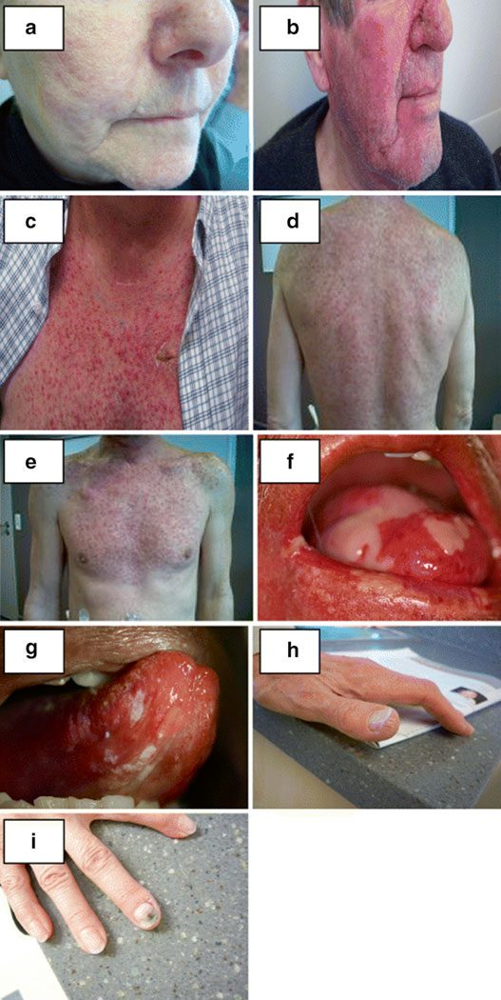

그림 3.3 EGFR에 결합하는 티로신 키나제 억제제가 유발하는 전형적인 여드름양 발진 또는 구진농포 발진은 홍반성 가려움증이 있는 구진과 농포로 나타난다. 발진은 ...

77 구진농포 발진, 무균성 뇌염 3건, PML 2건. 이 결과와 약간 다른 자료는 거의 6,000건 보고와 13,656건 이상반응을 담은 유럽 약물감시 데이터베이스이며 특히 997건 주사 관련 반응, 585건 과민반응, 354건 아나필락시스 반응, 38건 아나필락시스 유사 반응 기록이 놀라울 정도로 많다. 아나필락시스 사례 수가 놀라울 정도로 많다는 점은 반응을 진정한 I형 IgE 항체 매개 과민반응으로 분류할 때 쓴 기준에 의문을 제기한다. 아나필락시스는 19건 보고에서 언급되었고 PML은 2건에서 언급되었다.

Panitumumab (파니투무맙)

Panitumumab(Vectibix®)(표 2.1 및 3.1)은 높은 친화력으로 EGFR에 결합하는 재조합 완전 인간 IgG2κ 단클론항체이다. cetuximab과 마찬가지로 대장암 치료로 승인되었으나 두경부암에는 아직 승인되지 않았으며 현재 악성 교모세포종 치료를 위해 연구 중이다. cetuximab과 panitumumab이 인식하는 항원 구조는 EGFR 도메인 III에서 서로 다른 영역이다. 이 결론은 cetuximab 하에서 질환이 진행된 환자에 대한 panitumumab 효과적인 치료와 EGFR 도메인 점 돌연변이(468번 위치에서 Arg for Ser)를 획득한 대장암 환자에서 cetuximab 내성 발생으로 뒷받침된다.

2006년 panitumumab 첫 승인 때 FDA는 피부 독성 및 주사반응에 블랙박스 경고를 발표했다. 2014년에 개정한 처방정보에서 블랙박스 경고 중 주사반응 참조를 빼고 피부 독성이 환자 15%에서 중증이라고 명시하였다.

Panitumumab이 일으키는 점막피부 질환은 홍반, 발진, 가려움증, 피부 박탈, 여드름양 피부염, 건조증, 손발톱 주위염, 피부 균열은 물론 괴사성 근막염 및 농양과 같은 생명을 위협하는 감염 합병증을 포함한 넓은 임상 양상에 기여한다. Panitumumab 뒤 미란, 수포, 피부 박탈이 있는 생명을 위협하는 수포성 점막피부 질환은 알려져 있다.

다른 경고 및 예방조치로는 중증(치명적 포함) 주사반응, 중증 저마그네슘혈증, 저칼슘혈증, 저칼륨혈증, 화학요법과 병합 사용 때 중증 설사 및 탈수로 인한 급성신부전, 간질성 폐질환 및 폐 섬유화, 각막염 및 궤양성 각막염 같은 안과 독성, 햇빛 노출로 인한 피부 독성, bevacizumab과 화학요법과 병합 투여 때 독성 및 사망률 증가 가능성이 있다.

79 암 치료용 승인 단클론항체

Necitumumab (니시티무맙)

Necitumumab(Portrazza®)(표 2.1 및 3.1)은 2015년 11월 FDA에서 승인한 재조합 인간 IgG1κ 단클론항체(MW ~144.8 kDa)로, 인간 EGFR을 표적으로 한다. 전이성 편평세포 비소세포 폐암 환자 1차 치료에 gemcitabine 및 cisplatin과 병합 사용으로 승인되었으며 심폐정지 및/또는 급사, 저마그네슘혈증에 대한 FDA 블랙박스 경고를 포함한다. 다른 5개 경고/예방조치로는 정맥 및 동맥혈전색전증 이벤트 가능성, 일부 치명적 주사 관련 반응, 배·태아 독성, 비편평 비소세포 폐암 환자에서 이 단클론항체, pemetrexed, cisplatin으로 치료 때 독성 및 사망률 증가, 피부 독성이 있다.

VEGF (혈관내피세포 성장인자)

VEGF는 수용체 결합 시스틴-결절 구조를 가진 고도로 보존된 분비 단백질 패밀리로 5개 구성원으로 이루어져 있다. 1983년에 발견되어 종종 이 패밀리 "시조 구성원"으로 묘사되는 VEGF-A(VEGF 및 혈관투과성인자[VPF]라고도 불림)는 건강과 질병에서 혈관 형성의 가장 중요한 조절자로 간주된다. VEGF 패밀리 5개 구성원은 VEGF-A, VEGF-B, VEGF-C, VEGF-D, 태반 성장인자(PlGF, PGF)로 구별된다. VEGF-A는 VEGFR-1(Flt-1) 및 VEGFR-2(KDR/Flk-1) 수용체에 결합하지만 후자 수용체가 VEGF에 대한 세포 반응 대부분(전부일 수도 있음)을 매개하는 것으로 보인다(그림 3.4). VEGF-A는 인지 수용체 티로신 키나제 패밀리를 거쳐 혈관내피세포에서 작용한다. 건강한 사람에서 혈관 형성 촉진 기능 외에도 VEGF-A 유도 혈관신생은 암, 류마티스 관절염, 안과 질환을 포함한 다양한 인간 질병 병인에 주요 역할을 한다.

81 암 치료용 승인 단클론항체

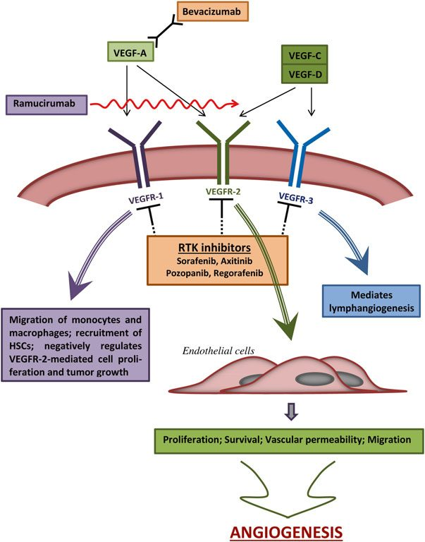

그림 3.4 VEGFR-2(Flk1)와 그 리간드의 결합은 수용체 이량체화를 개시하고 이어서 자가인산화; PLC-γ, MAPK, Akt, Src를 포함한 다수의 하위 경로 활성화; 혈관내피세포 증식; 그리고 궁극적으로 PI3K를 통해 세포 생존 증가, 세포 이동, 혈관내피세포 산화질소 합성효소를 통한 혈관투과성 매개. VEGFR-1(Flt1)은 구조적으로 VEGFR-2와 유사하지만 VEGFR-2와 달리 키나제 기능이 결핍되어 있다. VEGFR-3(Flt4)는 VEGF-C 및 VEGF-D에 반응하여 림프관신생을 매개한다. bevacizumab, ramucirumab, 소분자 수용체 티로신 키나제 억제제의 표적을 보여준다.

Bevacizumab (베바시주맙)

Bevacizumab(Avastin®)(표 2.1 및 3.1)은 사람 혈관내피세포 성장인자-A(VEGF-A)에 결합하여 그 생물학적 작용을 억제하는 재조합 인간화 IgG1κ 단클론항체이다. 건강한 사람에서 혈관 형성 촉진 기능 외에도 VEGF-A 유도 혈관신생은 암, 류마티스 관절염, 안과 질환을 포함한 다양한 인간 질병 병인에 주요 역할을 한다. bevacizumab으로 치료하는 비교적 다양한 종양(시험 단계 및 예비 연구 포함 약 30종)은 결과적으로 이상반응이 많고 다양할 수밖에 없다(표 3.1). 광범위한 경고 및 예방조치 목록 첫 번째는 위장관 천공(치료받은 환자에서 최대 3.2% 발생률), 수술 및 상처 치유 합병증, 중증 또는 치명적 출혈에 대한 FDA 블랙박스 경고이다. bevacizumab 유도 위장관 천공 발생률은 0.7~1.2%로 추정되며 사망률은 11.5~37%이다.

83 암 치료용 승인 단클론항체

비염, 미각이상, 요통. bevacizumab과 관련된 다른 흔한 이상반응(모든 등급)으로는 무력증, 통증, 두통, 설사, 오심, 구토, 변비, 구내염이 있다.

사후판매 감시를 고려하면, 2010년 말까지 프랑스 약물감시 데이터베이스에 기록된 bevacizumab 관련 심각한 351건 사례 분석 결과, 위장관(21.9%), 혈전색전증 이벤트(4%), 폐색전증(3.2%), 고혈압(2.7%), 위장관 출혈(2.7%), 뇌출혈 또는 혈관사고(2.6%)가 가장 빈번하게 보고된 이상반응이었다.

Ramucirumab (라무시루맙)

Ramucirumab(Cyramza®)(표 2.1 및 3.1)은 파지 디스플레이 라이브러리와 친화력 성숙 선별로 제조한 재조합 완전 인간 IgG1κ 단클론항체(MW ~147 kDa)로, 혈관신생을 매개하는 수용체인 VEGFR-2[CD309, 키나제 삽입 영역 함유 수용체(KDR)로도 알려짐]에 대한 결합 특이성을 가진다. 혈관신생 표적 억제는 허용되는 항종양 전략이며 최소 네 가지 방법으로 추구할 수 있다. 소분자 티로신 키나제 수용체 억제제 투여, pegaptanib, VEGF에 결합하는 단클론항체 또는 융합단백질 aflibercept, 또는 VEGFR-2 수용체 표적이다. Ramucirumab은 그런 항체로 높은 친화력으로 VEGFR-2를 표적으로 하여 수용체 활성화 및 신호전달, 세포내 Ca2+ 유리, 혈관내피세포 증식 및 이동을 억제한다(그림 3.4).

85 암 치료용 승인 단클론항체

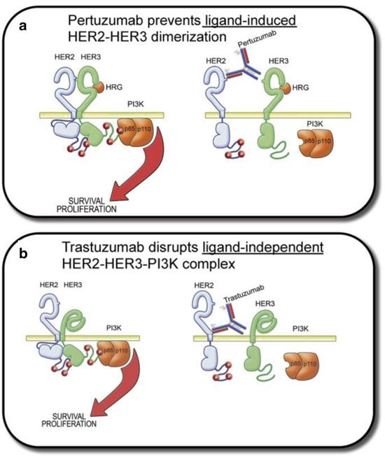
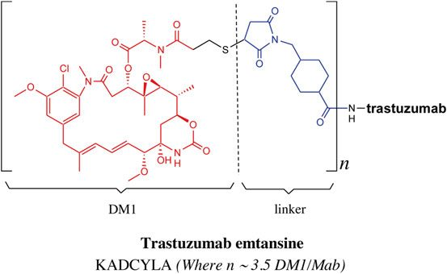

그림 3.5 Pertuzumab과 trastuzumab이 각각 리간드 비의존적 및 리간드 의존적 HER2/HER3 상호작용을 교란하여 HER2 양성 종양 세포에서 항증식 효과를 나타내는 일반적 작용 기전의 도식적 표현. (a) Pertuzumab은 HER2 세포외 하위도메인 II에 결합하여 리간드 유도 HER2-HER3 이량체화를 차단한다. (b) 리간드 비의존적 HER2/HER3 상호작용은 HER3 인산화를 촉진하여 PI3K 신호전달 경로를 활성화하고 이는 세포 생존 및 증식으로 이어진다. Trastuzumab은 HER2의 세포외 하위도메인 IV에 결합하여 HER2-HER3 상호작용을 교란한다. Junttila TT 외에서 재인용. Cancer Cell 2009;15:429-40. Elsevier Limited의 허가를 받아 수정 및 재인쇄

HER2

HER2는 EGFR 패밀리 구성원으로서, 11종 성장인자(EGF, TGFα, HB-EGF 등)로 활성화되는 막관통형 글리코단백질 세포표면 수용체이다. HER2에 알려진 자연 리간드는 없다. HER2 과발현은 성장인자 신호전달 경로의 상시 활성화를 초래하여 유방암 세포 성장에 유리한 환경을 조성한다. HER2 과발현은 인구 유방암 약 15~25%에서 발견되며 더 공격적이고 예후가 불량한 종양 쪽으로 기울어진다. HER2를 표적으로 하는 3종 단클론항체가 현재 FDA와 EMA에서 승인되었는데, pertuzumab, trastuzumab, ado-trastuzumab emtansine(ADC)이 있다.

87 암 치료용 승인 단클론항체

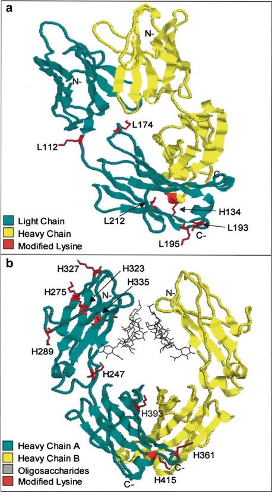

그림 3.5 (상동)

Pertuzumab은 HER2 양성 전이성 유방암에서 trastuzumab 및 docetaxel과 병합요법으로 2012년 6월 FDA 승인을 받았다. FDA는 심근병증과 배·태아 독성에 대한 pertuzumab 블랙박스 경고를 발표했다. 주사 관련 반응 및 아나필락시스를 포함한 과민반응도 경고 대상이다.

Trastuzumab (트라스투주맙)

Trastuzumab(Herceptin®)(표 2.1 및 3.1)은 HER2 세포외 영역에 결합하는 인간화 IgG1κ 단클론항체(MW ~148 kDa)이다. Trastuzumab은 HER2 하위도메인 IV에 결합하여 리간드가 없는 상태에서 HER2를 과발현하는 종양 세포의 PI3K/AKT 신호전달을 하향 조절하지만 리간드 활성화된 HER1(EGFR) 또는 HER3와 HER2 이량체화를 차단하지 않는다고 받아들여졌다. 2000년대 초기에 HER3 발현이나 HER2와 상호작용을 억제하면 HER2 양성 유방암 세포에서 항증식 효과가 나타남이 밝혀졌다.

Trastuzumab 작용 기전에 대한 현재 이해는 다음과 같다. Trastuzumab은 HER2 세포외 영역에 결합하여 세포 표면 HER2 발현을 하향 조절하고 이 영역 절단을 막아 상시 활성 막 결합 단백질 p95-HER2 형성을 막는다. Trastuzumab은 또한 리간드 비의존적 HER2-HER3 이량체화를 선택적으로 억제하고 HER2-HER3-PI3K 복합체를 교란한다(그림 3.5).

89 암 치료용 승인 단클론항체

Trastuzumab 내성 잠재 기전으로는 교차 신호전달, PI3K 하위 경로 활성화, ADCC 활성 부족 등이 있다. Trastuzumab은 심근병증, 주사반응, 폐독성에 FDA 블랙박스 경고 대상이다. Trastuzumab 단독 또는 병합요법을 투여받은 환자에서 증상성 심근기능장애 발생률이 4~6배 증가한다.

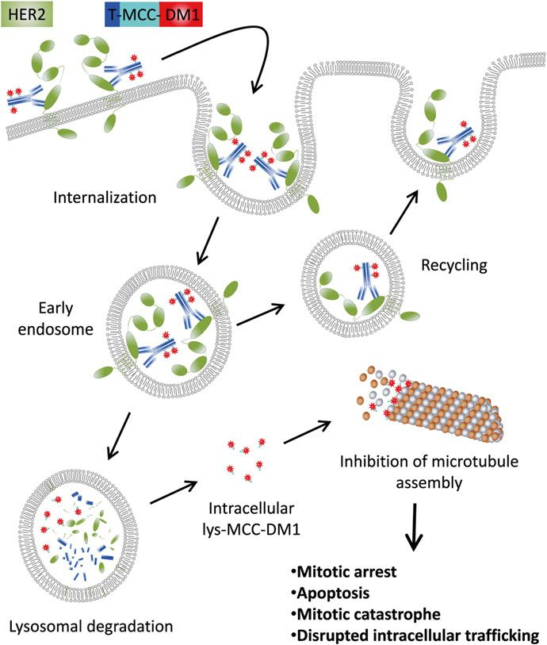

그림 3.4 (상동)

91 암 치료용 승인 단클론항체

Ado-trastuzumab Emtansine (ado-트라스투주맙 엠탄신)

Ado-trastuzumab emtansine(Kadcyla®; trastuzumab emtansine, T-DM1)(표 2.1 및 3.1)은 미세소관 억제 화합물 mertansine(DM1)을 trastuzumab과 공유결합한 인간화 IgG1κ 단클론항체-약물 접합체이다. 각 trastuzumab 분자는 최대 8개 DM1 분자와 결합할 수 있지만 평균은 3.5이다.

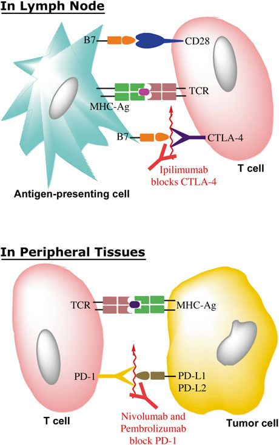

그림 3.6 ado-trastuzumab emtansine의 구조: trastuzumab을 세포독성 미세소관 억제제 mertansine(DM1)(빨간색)과 이종이작용성 교차결합제 SMCC(파란색)를 통해 공유결합하여 형성됨.

93 암 치료용 승인 단클론항체

Trastuzumab에 DM1을 연결해도 단클론항체 HER2 결합 능력이나 항종양 작용에 영향을 미치지 않으며 결합은 환원 불가능하고 분해 불가능하다. 이 접합체 체내 안정성은 순환기와 종양 환경 모두에서 유지되며 DM1 방출은 결합된 단클론항체 단백질 분해로만 발생한다.

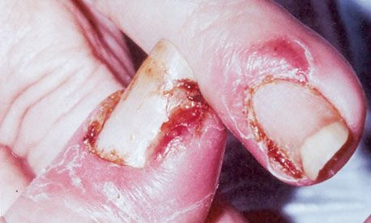

그림 3.8 ado-trastuzumab emtansine(T-MCC-DM1)의 항종양 작용에 관련된 세포내 이벤트. 항체-독소 접합체가 HER2에 결합한 후, 수용체 매개 내재화, 복합체의 세포막으로의 일부 재순환, 그리고 내포체를 통한 리소좀으로의 운반 후, 단백질분해에 의해 방출된 DM1-MCC 교련-리신 복합체가 미세소관 조립을 억제한다. 이는 세포주기 정지, 세포내 수송 교란, 세포자멸사로 이어진다. MCC: 4-[N-maleimidomethyl] cyclohexane-1-carboxylate; T: trastuzumab. Barok M 외에서 재인용. Breast Cancer Res 2014;16:209, Creative Commons Attribution License에 따라 배포된 오픈액세스 기사

95 암 치료용 승인 단클론항체

FDA 블랙박스 경고는 간독성(간부전 및 사망 포함), 심장 독성(특히 LVEF 감소), 그리고 배·태아 잠재적 위험을 언급하며 ADC는 trastuzumab으로 대체하거나 대체해서는 안 된다는 점을 상기시킨다.

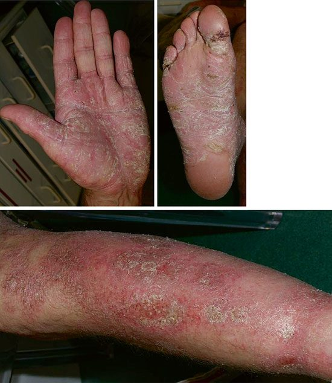

그림 3.5 (상동)

Pertuzumab과 trastuzumab이 HER2/HER3 상호작용을 교란하는 기전. (a) Pertuzumab은 HER2 세포외 하위도메인 II에 결합하여 리간드 유도 HER2-HER3 이량체화를 차단한다. (b) Trastuzumab은 HER2의 세포외 하위도메인 IV에 결합하여 HER2-HER3 상호작용을 교란한다.

97 암 치료용 승인 단클론항체

Pertuzumab (퍼투주맙)

Pertuzumab(Perjeta®)(표 2.1 및 3.1)은 HER2 세포외 하위도메인 II에 결합하여 리간드 유도 HER2-HER3 이량체화를 차단하는 인간화 IgG1κ 단클론항체이다. HER2 양성 전이성 유방암 환자에서 trastuzumab 및 docetaxel과 병합요법으로 2012년 6월 FDA 승인을 받았다.

FDA는 심근병증과 배·태아 독성에 대한 pertuzumab 블랙박스 경고를 발표했다. 이전에 안트라사이클린으로 치료를 받았거나 흉부 방사선 치료를 받은 환자가 좌심실 박출률 감소 위험이 더 높을 수 있다.

99 암 치료용 승인 단클론항체

Pertuzumab 안전성 자료는 trastuzumab과 비슷하게 낮은 심장 기능장애 발생률을 보인다. 두 항체를 함께 써도 심장 이상이 가중되지는 않았다.

Trastuzumab (트라스투주맙) - HER2를 표적으로 하는 최초의 생물학적 제제로 유방암 치료를 위해 개발 및 승인되었으나, 진행된 질환 환자의 약 30%만 단독요법에서 효과를 본다.

101 암 치료용 승인 단클론항체

Trastuzumab은 심근병증, 주사반응, 폐독성에 대한 FDA 블랙박스 경고 대상이다.

Trastuzumab 단독 또는 병합요법을 투여받은 환자에서 증상성 심근기능장애 발생률이 4~6배 증가한다. 안트라사이클린 약물 공동 투여 때 발생률이 가장 높다.

103 암 치료용 승인 단클론항체

Ado-trastuzumab Emtansine (ado-트라스투주맙 엠탄신)

Ado-trastuzumab emtansine(Kadcyla®)(표 2.1 및 3.1)은 미세소관 억제 화합물 mertansine(DM1)을 trastuzumab과 공유결합한 인간화 IgG1κ 단클론항체-약물 접합체이다. FDA 블랙박스 경고는 간독성, 심장 독성(LVEF 감소), 배·태아 독성 잠재적 위험을 포함한다.

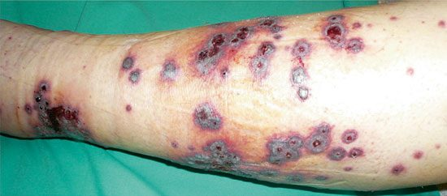

그림 3.6 ado-trastuzumab emtansine의 구조 (상동)

105 암 치료용 승인 단클론항체

Trastuzumab에 DM1을 연결해도 단클론항체 기능에 영향을 미치지 않으며 이 접합체는 체내에서 안정적이다. Ado-trastuzumab emtansine은 HER2 양성 전이성 유방암 환자 2차 치료제로 승인되었다.

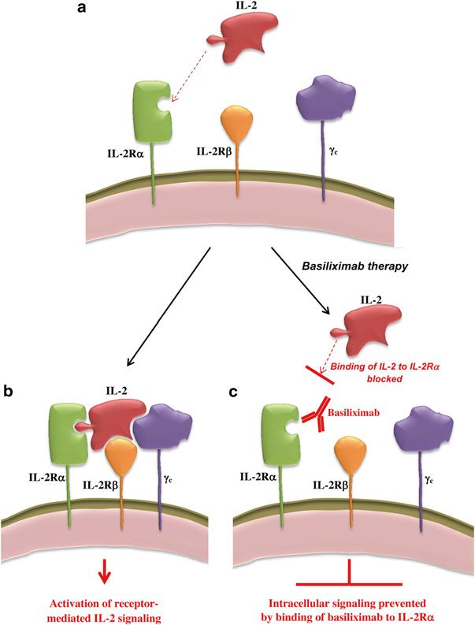

그림 3.8 ado-trastuzumab emtansine의 작용 기전 (상동)

107 암 치료용 승인 단클론항체

Denosumab (데노수맙)

Denosumab(Xgeva®, Prolia®)(표 2.1 및 3.1)은 형질전환 마우스에서 생산한 완전 인간 IgG2κ 단클론항체(MW ~147 kDa)로, RANKL에 높은 특이성과 친화력을 보인다. RANKL은 골흡수를 맡는 사이토카인으로, 파골세포 형성, 활성화, 부착, 생존, 끝내 골 흡수를 촉진한다. RANKL 억제는 골밀도, 부피, 강도 증가로 이어진다.

Denosumab은 Prolia®와 Xgeva® 두 상품명으로 판매된다. Prolia®는 골절 고위험군 전립선암 환자(안드로겐 차단요법 중)와 유방암 환자(보조 아로마타제 억제제 요법 중) 치료로 승인되었다. Xgeva®는 고형 종양 골전이 환자 골 관련 이벤트 예방과 거대세포종 치료로 승인되었다. 주의사항으로는 저칼슘혈증(치명적 사례 기록), 악골괴사, 배·태아 독성이 있다.

109 암 치료용 승인 단클론항체

Ipilimumab (이필리무맙)

Ipilimumab(Yervoy®)(표 2.1 및 3.1)은 CTLA-4 세포외 영역에 높은 친화력으로 결합하는 재조합 완전 인간 IgG1κ 단클론항체(MW ~148 kDa)이다. CTLA-4는 T세포 확장 초기 단계에서 억제 조절자로 중요한 역할을 한다. Ipilimumab은 면역관문 표적 최초 단클론항체 예시이다. CTLA-4는 B7 리간드와 경쟁적 상호작용으로 과활성 T세포를 조절한다(그림 3.9).

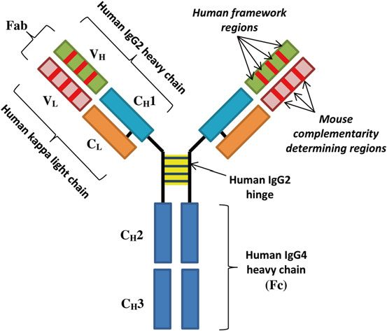
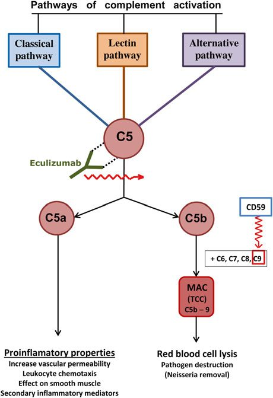

그림 3.9 Anti-CTLA-4 및 anti-PD-1 단클론항체를 이용한 면역관문 표적. 세포독성 T 림프구 항원 4(CTLA-4)는 첫 번째 관문에서 B7 리간드와의 경쟁을 통해 과활성 T세포를 조절한다. CTLA-4는 T세포 활성화가 시작된 후에야 기능적이 되어 B7 리간드와 경쟁적으로 상호작용함으로써 T세포 반응의 하향 조절로 이어진다. 면역 반응을 억제하여 암세포를 자기로 인식하게 하고 항종양 면역 공격이 없는 상태에서 증식하게 하는 것은 ipilimumab에 의한 수용체 차단 전략으로 이어졌다. 프로그래밍된 세포사멸 1(PD-1) 수용체는 또 다른 중요한 면역관문으로 기능한다.

111 암 치료용 승인 단클론항체

298명 흑색종 환자 기록 검토에서 85%가 어떤 등급이든 면역매개 이상반응을 경험했고, 19%가 이 때문에 치료를 중단해야 했으며, 35%가 이상반응에 전신 코르티코스테로이드가 필요했다. Ipilimumab은 정상 조직에 대한 면역 반응을 활성화하여 설사, 간염, 뇌하수체염, 발진으로 이어질 수 있다.

IL-6 (인터루킨-6)

IL-6은 염증성 및 항염증성 다기능 사이토카인으로, 림프구, 단핵세포, 섬유아세포, 혈관내피세포 및 암세포를 포함한 다양한 세포에서 생산된다. 암종양과 관련된 IL-6 생산 증가는 신세포암, 전립선 및 방광암, 일부 신경학적 악성종양, 특히 다발성골수종 및 B세포 림프증식 장애인 Castleman병이 있다.

113 암 치료용 승인 단클론항체

Siltuximab (실툭시맙)

Siltuximab(Sylvant®)(표 2.1 및 3.1)은 IL-6을 표적으로 하는 재조합 키메라(인간-마우스) IgG1κ 단클론항체이다. Siltuximab은 HIV 및 HHV-8 음성 환자 다중심성 Castleman병 치료로 승인되었다. IL-6 수치 상승은 다양한 질병, 특히 다발성골수종 및 Castleman병과 관련된다. 아나필락시스는 siltuximab 사용과 관련된 가장 심각한 이상반응이며 감염, 소양증, 구진발진이 가장 흔한 이벤트이다(표 3.1). 주사 또는 과민반응 발생률은 4.8%이며 0.8% 환자가 중증 반응을 경험했다.

Pembrolizumab (펨브롤리주맙)

Pembrolizumab(Keytruda®)(표 2.1 및 3.1)은 PD-1을 표적으로 하는 인간화 IgG4κ 단클론항체(MW ~149 kDa)로, 2014년 9월 FDA에서 돌파치료 지정을 거쳐 전이성 흑색종 환자 치료로 승인되었다. PD-1을 표적으로 하여 리간드와 상호작용을 차단한다.

115 암 치료용 승인 단클론항체

체크포인트 억제제와 PD-1

PD-1은 T세포를 포함한 여러 면역세포에서 발현되는 막관통형 단백질 수용체이다. PD-1은 PD-L1과 PD-L2 두 가지 리간드를 가진다. PD-1은 상보적 리간드와 결합하지 않을 때 정상 면역 반응을 방해하지 않지만 PD-L1 및 PD-L2와 결합하면 신호전달이 유도되어 T세포 증식 및 활성을 억제한다. 악성 세포는 종종 PD-L1을 발현하며 이는 활성화된 T세포 확장을 억제하여 종양 세포가 면역 공격을 피하게 한다. Anti-PD-1 항체로 경로를 선택적으로 차단하면 관문 억제를 되돌리고 종양에 대한 T세포 매개 반응을 회복시킨다.

Nivolumab (니볼루맙)

Nivolumab(BMS-936558, ONO-4538)(표 2.1 및 3.1)은 PD-1을 표적으로 하는 완전 인간 IgG4κ 단클론항체(MW ~149 kDa)로, 이필리무맙 뒤 진행된 전이성 또는 절제 불가능한 흑색종 환자 치료로 승인되었다. BRAF V600 돌연변이 양성이면 BRAF 억제제도 투여해야 한다. 비소세포 폐암 및 전이성 신세포암에 대한 적응증도 최근 승인되었다.

117 암 치료용 승인 단클론항체

Dinutuximab (디누티욱시맙)

비정형 당화는 악성 세포 변형의 특징인 경우가 많다. 안전성 관점에서 주목할 점은 GD2는 정상 조직에 없고 뇌와 말초신경에서는 최소한으로 발현된다는 점이다. Dinutuximab(ch14.18, Unituxin®)(표 2.1 및 3.1)은 GD2에 결합하는 인간-마우스 키메라 IgG1κ 단클론항체로, 2015년 3월 FDA에서 신경아세포종 치료 승인을 받았다.

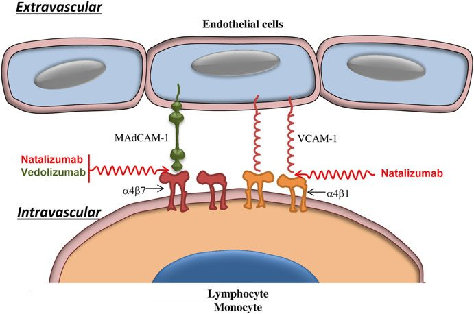

그림 3.10 GD2의 구조: 신경외배엽 기원 인간 종양에서 발현되는 이당 글리코스핑고리피드(갈락토실화 지질). 디시알릴화 다당 구조는 β-글리코시드 결합을 통해 세라마이드에 연결된다.

Dinutuximab은 GM-CSF, IL-2, 13-cis-레티노인산과 병합하여 고위험 신경아세포종 소아 환자 치료로 승인되었다. FDA 블랙박스 경고는 잠재적으로 생명을 위협하는 주사반응과 신경병증(특히 중증 신경병증성 통증 및 신경 손상)을 포함한다. 중증(3 또는 4등급) 주사반응이 환자 거의 1/4에서 발생했다. 통증이 가장 흔히 보고되었다.

119 암 치료용 승인 단클론항체

Daratumumab (다라투무맙)

Daratumumab(Darzalex®)(표 2.1 및 3.1)은 다발성골수종 세포 및 CD4+, CD8+, B 림프구, NK세포 등 여러 면역세포에서 발현되는 48 kDa 글리코단백질 CD38(고리형 ADP 리보스 가수분해효소)을 표적으로 하는 최초 다발성골수종 면역치료제이다. CDC, ADCC, ADCP를 거쳐 세포자멸사로 이어지는 Fc 매개 교차교련 및 세포 용해를 유도한다. 프로테아좀 억제제, 면역조절제를 포함한 최소 3회 이상 이전 치료를 받은 다발성골수종 환자 치료로 승인되었다.

Elotuzumab (엘로투주맙)

Elotuzumab(Empliciti®)(표 2.1 및 3.1)은 세포표면 글리코단백질 수용체 CS1(SLAMF7)을 표적으로 하는 인간화 IgG1κ 단클론항체로, 재발 또는 불응성 다발성골수종 치료를 위해 레날리도마이드 및 덱사메타손과 병합 사용으로 2015년 9월 FDA 승인을 받았다. 주사반응이 흔하며 사전투약이 필요하다.

121 암 치료용 승인 단클론항체

Atezolizumab (아테졸리주맙)

Atezolizumab(Tecentriq™)은 PD-L1을 표적으로 하는 인간화 IgG1 kappa 항체로, PD-1 및 B7.1 수용체와 상호작용을 차단한다. 요로상피암종 치료로 2016년 5월 FDA 승인을 받았다.

범위의 부작용: 1~4형 과민반응 및 세포감소증

암 치료용 승인 단클론항체는 전체 범위 과민반응을 나타낸다. I형 IgE 항체매개 즉각 반응(아나필락시스, 두드러기, 혈관부종), II형 약물유도 혈소판감소증, 용혈성 빈혈, 무과립구증, III형 혈청병 및 약물유도 혈관염, Th1, Th2, Th17 림프구가 매개하는 IV형 피부 과민반응이다.

면역원성은 완전 인간 단클론항체를 포함한 모든 단클론항체에서 늘 따지는 안전성 문제이다. 아나필락시스 경고가 자주 나가지만 관찰된 발생률은 실제로 꽤 낮다. 쥐 서열을 포함한 키메라 단백질에 대한 IgE 매개 반응은 위험이 더 높다고 본다.

세포감소증은 단클론항체로 치료받은 일부 환자에서 생기지만 기전은 자주 파고들지 않는다. II형 및 III형 과민반응은 과소 진단되고 있을 가능성이 높다.

123 암 치료용 승인 단클론항체

혈소판감소증은 리툭시맙으로 치료받은 환자 ~1.7%에서 발생한다. 리툭시맙이 일으키는 일시적 혈소판감소증은 보체 활성화로 매개되고 CRS와 관련될 수 있다. 약물유도 과민반응성 혈관염은 III형 반응 표현형이며 리툭시맙이 관련되었다. 혈청병 반응은 과소 진단 및 보고되고 있을 가능성이 높다.

IV형 피부 과민반응은 드물며 주로 ibritumomab tiuxetan, brentuximab vedotin, 리툭시맙으로 제한된다.

주사반응 기전은 아직 완전히 밝혀지지 않았다. 사이토카인, 특히 TNF와 IL-6이 관여할 수 있다. 주사반응 중증도가 순환 림프구 수와 관련된다는 점이 중요한 발견이었다.

125 암 치료용 승인 단클론항체

표 3.3 승인된 암 치료용 단클론항체가 유발하는 폐 이상반응

| 단클론항체 | 폐 이상반응 |
|---|---|
| 리툭시맙(MabThera®, Rituxan®) | ARDS, BOOP, 폐쇄성 기관지염, 기관지연축, 범 폐포출혈, 과민성 폐렴, 간질성 폐질환, 간질성 폐렴 |
| 브렌툭시맙베도틴(Adcetris®) | 블레오마이신과 병합 시: 기침, 호흡곤란, 간질성 침윤 / 호드킨 림프종: 폐렴, 기흉 |
| 알레무주맙(Campath®, MabCampath®) | 기관지연축, 범 폐포출혈, 폐 감염 |
| 세툭시맙(Erbitux®) | 간질성 폐질환 |
| 파니투무맙(Vectibix®) | 간질성 폐질환, 폐 침윤, 폐렴, 폐 섬유화 |
| 베바시주맙(Avastin®) | 기관지연축/아나필락시스, 폐렴, 종양 부위 폐출혈 |
| 트라스투주맙(Herceptin®) | ARDS, BOOP, 호흡곤란, 간질성 폐렴, 흉수삼출액, 폐 침윤/섬유화/부종/기능부전 및 저산소증 |
| ado-trastuzumab emtansine(Kadcyla®) | 간질성 폐질환 - 폐렴, ARDS, 폐 침윤 포함 |
| 니볼루맙(Opdivo®) | 중증 폐렴 또는 간질성 폐질환 (치명적 사례 포함) |
| 펨브롤리주맙(Keytruda®) | 면역매개 폐렴 |

ARDS: 급성호흡곤란증후군, BOOP: 폐쇄성 기관지염-조직화 폐렴
a BOOP이 가장 흔한 임상 진단이며 그 뒤를 간질성 폐렴, ARDS, 과민성 폐렴이 잇는다
b 치명적 사례 발생
c Hamman-Rich 증후군이라고도 함
d 브렌툭시맙베도틴과 블레오마이신의 병용은 금기 (예: ABVD 병합요법)
e 중증 치명적 주사반응에는 기관지연축, ARDS, 폐 침윤, 아나필락시스 포함
f 예: 결핵, 곰팡이 감염
g 비소세포 폐암 환자에서 파니투무맙 중단 필요

표 3.4 승인된 암 치료용 단클론항체가 유발하는 심장 이상반응

| 단클론항체 | 심장 이상반응 |
|---|---|
| ibritumomab tiuxetan(Zevalin®) | 주사 관련 심정지 |
| obinutuzumab(Gazyva®, Gazyvaro®) | 기존 심장 질환 악화로 인한 치명적 심장 이벤트 |
| 리툭시맙(MabThera®, Rituxan®) | 부정맥 및 협심증, a 치명적 심부전 |
| 브렌툭시맙베도틴(Adcetris®) | 전신성 역형성 거대세포 림프종에서 상심실성 부정맥 |
| 알레무주맙(Campath®, MabCampath®) | 심근병증, LVEF 감소, b 주사 관련 부정맥 c |
| 세툭시맙(Erbitux®) | 심폐정지/급사 d |
| 베바시주맙(Avastin®) | CHF: LVD 3등급 반응 발생률 1% |
| 라무시루맙(Cyramza®) | 중증의 때로는 치명적 심근경색 |
| 퍼투주맙(Perjeta®) | CHF 및 LVEF 감소로 발현되는 심근병증 b |
| trastuzumab(Herceptin®) | CHF 및 LVEF 감소로 발현되는 심근병증 b |
| ado-trastuzumab emtansine(Kadcyla®) | LVEF 감소 b |

CHF: 만성심부전, LVD: 좌심실 기능장애, LVEF: 좌심실 박출률
a 생명을 위협할 수 있음. 주사 중단. 부정맥/협심증 환자에게 각 주사 후 심장 모니터링 수행
b 단클론항체를 안트라사이클린 같은 심장독성 약물과 공동 투여 시 발생률 가장 높음
c 이전에 치료받지 않은 환자의 ~14%. 대부분의 반응은 주사와 일시적으로 관련
d 세툭시맙과 방사선 치료를 투여받은 환자에서
e Trastuzumab 단독 또는 병합요법 투여 환자에서 심근기능장애 발생률이 4~6배 증가; 심각 및/또는 치명적 사례 보고

127 암 치료용 승인 단클론항체

심장 이상반응은 최소 11종 단클론항체에서 발생했다(표 3.4). Trastuzumab, bevacizumab, panitumumab, cetuximab, pertuzumab, ado-trastuzumab emtansine, alemtuzumab 투여 뒤 심각하거나 때로는 치명적인 사례가 발생했다. LVEF 감소는 HER2 활성을 차단하는 단클론항체 및 기타 약물에서 잘 알려져 있으며 안트라사이클린이나 흉부 방사선 치료를 받은 환자에서 이 위험이 커진다. Necitumumab은 심폐정지에 FDA 블랙박스 경고를 포함한다.

EGFR을 표적으로 하는 단클론항체의 점막피부 반응

이런 피부 반응은 면역매개가 아니다. 피부 반응은 구진농포 발진(때로는 덜 정확하게 여드름양 발진으로 부름)으로 나타나며 환자 50~100%에서 그리고 소분자 티로신 키나제 억제제에서보다 더 심각한 형태로 나타난다. 발진은 지성 피부 부위(피지선, 피지샘, 모낭)로 제한되는 경향이 있다(그림 3.3a-c). EGFR 억제제 하에서 상피 장벽이 약해져 세균 침입을 허용하고 끝내 특징적인 발진이 발생한다. EGFR을 표적으로 하는 단클론항체로 유발되는 다른 부작용으로는 손발톱 주위염(그림 3.11), 균열, 건조증(그림 3.3h), 손바닥-발바닥 발진, 모발 변화, 각화증, 구내염(그림 3.3f, g), 발열성 육아종(그림 3.3i), 피부 과색소침착이 있다.

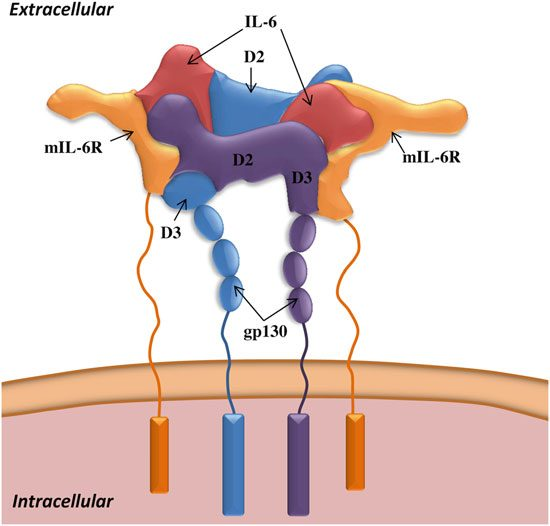

그림 3.11 Cetuximab에 의해 유발된 부종과 홍반을 동반한 손발톱 주위 육아종형 손발톱 주위염 사례. Boucher KW 외에서 재인용. J Amer Acad Dermatol 2002;47:632-3. Elsevier Limited의 허가를 받아 수정 및 재인쇄

129 암 치료용 승인 단클론항체

기타 드문 이상반응

종양 용해 증후군(TLS): 항암제 사용 뒤 48~72시간 안에 대량 악성 세포가 단시간에 파괴되어 고칼륨혈증, 고칼슘혈증, 고인산혈증, 고요산혈증을 일으킬 수 있다. 이는 급성신부전, 부정맥, 경련, 사망으로 진행될 수 있다. TLS는 백혈병 및 고등급 림프종 환자에서 흔히 발생하며 CD20 표적 단클론항체 및 브렌툭시맙베도틴 사용과 잘 알려져 있다. FDA는 리툭시맙에 TLS 블랙박스 경고를, obinutuzumab, 브렌툭시맙베도틴, blinatumomab에는 경고 및 예방조치를 발표했다.

진행성 다초점 백질뇌병증(PML): JC 바이러스 때문에 발생하며 B세포를 표적으로 하는 단클론항체(특히 리툭시맙, ofatumumab, obinutuzumab, 브렌툭시맙베도틴) 투여 때 간헐적으로 관찰된다.
## 요약

* 현재 FDA 및/또는 EMA가 승인한 50종의 단클론항체 중 24종이 혈액학적, 피부 또는 고형 종양 악성종양의 치료 적응증을 보유한다.

* Catumaxomab(Removab®)은 EpCAM과 CD3에 대한 이중 항원 인식 특이성을 보이며 잡종 Fc 단편은 대식세포 및 NK세포의 FcγRI, FcγRIIa, FcγRIIIa에 결합한다.

* Blinatumomab(Blincyto®)은 BiTE 융합단백질로, CD19과 CD3을 표적으로 한다. FDA 승인 시 REMS를 포함했다.

* CD20은 모든 발달 단계의 B세포 표면에 발현한다(형질세포 제외). NHL B세포 발현과 세포 내재화 특성 때문에 암 치료용 단클론항체의 활용 가능한 표적으로 간주한다. 4종의 CD20 표적 단클론항체가 현재 승인됐다: 리툭시맙, ibritumomab, ofatumumab, obinutuzumab.

131 암 치료용 승인 단클론항체

* 리툭시맙(MabThera®, Rituxan®)은 재발 또는 불응성 NHL 치료를 위해 승인된 최초의 단클론항체이자 암 치료를 위해 특별히 승인된 최초의 단클론항체이다.

* 리툭시맙의 부작용 목록은 FDA 블랙박스 경고에 명시한 주사반응, PML, TLS, 중증 점막피부 반응을 포함한다.

* 리툭시맙 주사반응은 악성 환자의 최대 77%에서 첫 주사 시 발생하며 두 번째 주사 후 약 10%로 감소한다.

* 리툭시맙의 사후판매 감시는 감염 및 호흡기/혈액학적 이벤트의 중요성을 확인했다. 2010년 WHO 보고에 따르면 JC 바이러스 유도 PML 182건 중 114건이 리툭시맙과 관련됐다.

* Ibritumomab tiuxetan(Zevalin®)은 이트륨-90 또는 인듐-111로 방사성 표지한 쥐 단클론항체이다. 블랙박스 경고는 중증 주사반응과 중증 세포감소증을 포함한다.

* Ofatumumab(Arzerra®)은 CLL을 위한 완전 인간 IgG1κ 단클론항체이다. B형간염바이러스 재활성, 세포감소증, 장폐색, PML에 대한 경고가 있다.

* Obinutuzumab(Gazyva®, Gazyvaro®)은 리툭시맙보다 강력한 효과를 입증했다. 3~4등급 호중구감소증, 주사반응, 빈혈, 혈소판감소증, 발열, 근골격계 통증이 가장 흔한 이상반응이다.

* Brentuximab vedotin(Adcetris®)은 MMAE와 공유결합한 키메라 단클론항체로 CD30을 표적으로 한다.

* FDA 경고 및 예방조치는 말초신경병증, 주사 관련 반응, 혈액학적 독성, 중증 감염, TLS, 간독성, PML, 배·태아 독성, 중증 피부 반응을 포함한다.

* Alemtuzumab(Campath®, MabCampath®)은 CD52를 표적으로 하는 인간화 단클론항체이다.

* 세포감소증이 가장 큰 관심사이며 FDA 블랙박스 경고의 근거이다. 감염 관련 이상반응이 최대 80%의 발생률로 보고됐다.

133 암 치료용 승인 단클론항체

* EGFR과 그 리간드는 여러 종양에서 세포 성장과 관련이 있다.

* KRAS 돌연변이 환자는 cetuximab과 panitumumab 치료에서 거의 효과를 보지 않는다.

* Cetuximab의 블랙박스 경고는 중증 주사반응과 심폐정지 가능성을 포함한다.

* Panitumumab은 EGFR에 높은 친화력으로 결합하는 완전 인간 단클론항체이다.

* Necitumumab(Portrazza®)은 EGFR을 표적으로 하는 재조합 인간 단클론항체이다.

* Bevacizumab(Avastin®)은 VEGF-A에 결합하여 그 생물학적 작용을 억제한다. 위장관 천공에 대한 FDA 블랙박스 경고가 있다.

* Ramucirumab(Cyramza®)은 VEGFR-2를 표적으로 한다. 출혈 위험 증가에 대한 FDA 블랙박스 경고가 있다.

* HER2 과발현은 유방암 세포 성장에 유리한 환경을 조성한다. 3종의 HER2 표적 단클론항체가 승인됐다: pertuzumab, trastuzumab, ado-trastuzumab emtansine.

* Pertuzumab과 trastuzumab은 서로 다른 결합 부위를 인식한다. Trastuzumab은 리간드 비의존적 신호전달을 억제하고 pertuzumab은 HER2-HER3 간 리간드 의존적 신호전달을 억제한다.

* Pertuzumab의 블랙박스 경고는 심근병증과 배·태아 독성을 포함한다.

* Pertuzumab은 단독 또는 trastuzumab과 병합 투여 시 낮은 심장 기능장애 발생률을 보인다.

135 암 치료용 승인 단클론항체

* Trastuzumab은 유방암 치료를 위해 최초로 개발 및 승인된 생물학적 제제이지만 진행된 질환 환자의 약 30%만 단독요법에서 효과를 보인다.

* Trastuzumab의 블랙박스 경고는 심근병증, 주사반응, 폐독성을 포함한다. 심근기능장애 발생률이 4~6배 증가한다.

* Ado-trastuzumab emtansine(Kadcyla®)은 DM1과 공유결합한 ADC이다. 간독성, 심장 독성, 배·태아 독성에 대한 FDA 블랙박스 경고가 있다.

* Denosumab(Xgeva®, Prolia®)은 RANKL에 대한 높은 특이성과 친화력을 가진다.

* Ipilimumab(Yervoy®)은 CTLA-4를 표적으로 하는 최초의 면역관문 표적 단클론항체이다.

* Siltuximab(Sylvant®)은 IL-6을 표적으로 한다. Castleman병 치료를 위해 승인됐다.

* PD-1은 또 다른 중요한 면역관문이다. PD-1/PD-L1 경로의 선택적 차단은 억제 신호를 풀어낸다.

* Pembrolizumab(Keytruda®)과 nivolumab(Opdivo®)은 PD-1을 표적으로 한다.

* Dinutuximab(Unituxin®)은 GD2를 표적으로 하는 키메라 단클론항체이다. 주사반응 및 신경병증에 대한 블랙박스 경고가 있다.

* Daratumumab(Darzalex®)은 CD38을 표적으로 하는 최초의 다발성골수종 면역치료제이다.

* Elotuzumab(Empliciti®)은 CS1(SLAMF7)을 표적으로 하는 인간화 단클론항체이다.

* Atezolizumab(Tecentriq™)은 PD-L1을 표적으로 하는 단클론항체로 2016년 5월 FDA 승인받았다.

137 암 치료용 승인 단클론항체

* 승인된 암 치료용 단클론항체는 전체 범위의 과민반응을 나타낸다.

* 면역원성은 항상 안전성 관심사이다. 아나필락시스에 대한 경고가 자주 발표하지만 관찰된 발생률은 실제로 상당히 작다.

* 세포감소증은 일부 환자에서 발생하지만 기전은 자주 탐구하지 않는다.

* II형 및 III형 과민반응은 과소 진단한다.

* 약물유도 과민반응성 혈관염은 III형 반응의 표현형이다.

* IV형 피부 과민반응은 드물며 ibritumomab tiuxetan, brentuximab vedotin, 리툭시맙으로 제한된다.

* 주사반응의 기전은 아직 완전히 이해하지 못했다.

* 사이토카인 방출 증후군은 악성 면역세포를 겨냥한 리툭시맙 같은 단클론항체 사용 후 관찰한다.

* 최소 10종의 승인된 단클론항체가 폐독성을 기록하고 있다.

* 최소 11종의 단클론항체에서 심혈관 이상반응이 발생했다.

* EGFR을 표적으로 하는 단클론항체의 피부 반응은 일반적으로 면역매개하지 않는다.

* 종양 용해 증후군은 일반적으로 백혈병 및 고등급 림프종 환자에서 발생한다.

* 진행성 다초점 백질뇌병증(PML)은 드물지만 B세포를 표적으로 하는 단클론항체 투여 시 관찰한다.

139 암 치료용 승인 단클론항체

추가 문헌

Ahmed M, Hu J, Cheung N-KV. Structure based refinement of a humanized monoclonal antibody that targets tumor antigen disialoganglioside GD2. Front Immunol. 2014;5:372.

Alinari L, Lapalombella R, Andritsos L, et al. Alemtuzumab (Campath-1H) in the treatment of chronic lymphocytic leukemia. Oncogene. 2007;26:3644-53.

Baldo BA. Adverse events to monoclonal antibodies used for cancer therapy. Focus on hypersensitivity responses. OncoImmunology. 2013;2(10):e26333.

Baldo BA, Pagani M. Adverse events to nontargeted and targeted chemotherapeutic agents. Immunol Allergy Clin N Am. 2014;34:565-96.

Bargou R, Leo E, Zugmaier G, et al. Tumor regression in cancer patients by very low doses of a T cell-engaging antibody. Science. 2008;321:974-7.

Boross P, Leusen JHW. Mechanism of action of CD20 antibodies. Am J Cancer Res. 2012;2:676-90.

Bryan LJ, Gordon LI. Releasing the brake on the immune system: the PD-1 strategy for hematologic malignancies. Oncology. 2015;29:431-9.

Callahan MK, Wolchok JD. At the bedside: CTLA-4- and PD-1-blocking antibodies in cancer immunotherapy. J Leukoc Biol. 2013;94:41-53.

Castellano D, Sepulveda JM, Garcia-Escobar I, et al. The role of RANK-Ligand inhibition in cancer: the story of denosumab. Oncologist. 2011;16:136-45.

Chavez-MacGregor M, Zhang N, Buchholz TA, et al. Trastuzumab-related cardiotoxicity among older patients with breast cancer. J Clin Oncol. 2013;31:4222-8.

Cheung CH. Managing premedications and the risk for reactions to infusional monoclonal antibody therapy. Oncologist. 2008;13:725-32.

Clarke JM, Hurwitz HI. Targeted inhibition of VEGF Receptor-2: an update on ramucirumab. Expert Opin Biol Ther. 2013;13:1187-96.

De Roock W, Claes B, Bernasconi D, et al. Effects of KRAS, BRAF, NRAS, and PIK3CA mutations on the efficacy of cetuximab plus chemotherapy in chemotherapy-refractory metastatic colorectal cancer: a retrospective consortium analysis. Lancet Oncol. 2010;11:753-62.

Duffy MJ, O'Donovan N, Crown J. Use of molecular markers for predicting therapy response in cancer patients. Cancer Treat Rev. 2011;37:151-9.

Ellis LM. Mechanisms of action of bevacizumab as a component of therapy for metastatic colorectal cancer. Semin Oncol. 2006;33 Suppl 10:S1-7.

Goltsov A, Deeni Y, Khalil HS, et al. Systems analysis of drug-induced receptor tyrosine kinase reprogramming following targeted mono- and combination anti-cancer therapy. Cells. 2014;3:563-91.

Holmes K, O'Brien Thomas AM, et al. Vascular endothelial growth factor receptor-2: structure, function, intracellular signalling and therapeutic inhibition. Cell Signal. 2007;19:2003-12.

Merelli B, Massi D, Cattaneo L, et al. Targeting the PD-1/PD-L1 axis in melanoma: biological rationale, clinical challenges and opportunities. Crit Rev Oncol Hematol. 2014;89:140-65.

Miao H-Q, Hu K, Jiminez X, et al. Potent neutralization of VEGF biological activities with a fully human antibody Fab fragment directed against VEGF receptor 2. Biochem Biophys Res Commun. 2006;345:438-45.

Ohaegbulam KC, Assal A, Lazar-Molnar E, et al. Human cancer immunotherapy with antibodies to the PD-1 and PD-L1 pathway. Trends Mol Med. 2015;21:24-33.

Rose-John S. IL-6 trans-signaling via the soluble IL-6 receptor: importance for the proinflammatory activities of IL-6. Int J Biol Sci. 2012;8:1237-47.

Peggs KS, Quezada SA, Chambers CA, et al. Blockade of CTLA-4 on both effector and regulatory T cell compartments contributes to the antitumor activity of anti-CTLA-4 antibodies. J Exp Med. 2009;206:1717-25.

Portera CC, Walshe JM, Rosing DR, et al. Cardiac toxicity and efficacy of trastuzumab combined with pertuzumab in patients with trastuzumab-insensitive human epidermal growth factor receptor 2-positive metastatic breast cancer. Clin Cancer Res. 2008;14:2710-6.

Sartore-Bianchi A, Martini M, Molinari F, et al. PIK3CA mutations in colorectal cancer are associated with clinical resistance to EGFR-targeted monoclonal antibodies. Cancer Res. 2009;69:1851-7.

Senter PD, Sievers EL. The discovery and development of brentuximab vedotin for use in relapsed Hodgkin lymphoma and systemic anaplastic large cell lymphoma. Nat Biotechnol. 2012;30:631-7.

Tarhini A. Immune-mediated adverse events associated with ipilimumab CTLA-4 blockade therapy: the underlying mechanisms and clinical management. Scientifica. 2013;Article ID 857519:19 p.

Teeling JL, Mackus WJM, Wiegman LJJM, et al. The biological activity of human CD20 monoclonal antibodies is linked to unique epitopes on CD20. J Immunol. 2006;177:362-71.

Thatcher N, Hirsch FR, Abober-Abyad N, et al. 34th ESMO Congress - Highlights of the unsolved issues and emerging therapies in lung cancer. Ann Oncol. 2009;20:1495-503.
## Chapter 4

아달리무맙(Adalimumab), 세르톨리주맙 페골(Certolizumab Pegol), 인플릭시맙(Infliximab), 골리무맙(Golimumab)에 대한 블랙박스 경고 및 주의사항

네 가지 승인된 항-TNF 단클론항체 모두에 대해 FDA 블랙박스 경고(black box warning)의 대상이 되는 것은 심각한 감염과 악성종양의 위험이다(표 4.1). 세균, 진균, 바이러스, 및 기생충에 의한 기회감염에 주의가 촉구되며 특히 아스페르길루스증(aspergillosis), 분아균증(blastomycosis), 칸디다증(candidiasis), 콕시디오이데스진균증(coccidioidomycosis), 히스토플라스마증(histoplasmosis), 레지오넬라증(legionellosis), 리스테리아증(listeriosis), 폐포자충증(pneumocystosis), 결핵(tuberculosis)이 특별히 언급된다. 이는 모두 TNF 차단제에서 이미 보고된 질환들이다. 감염이 발생하면 TNF 표적 단클론항체로 치료받는 환자는 국소 질환보다는 파종성 질환으로 나타날 가능성이 더 높다. 말할 필요도 없이 활동성 감염이 있는 환자는 항-TNF 단클론항체로 치료해서는 안 되며 65세 이상의 환자와 면역억제제를 복용 중인 환자는 감염 위험이 더 클 수 있다. 재활성화된 결핵 또는 새로운 감염으로서의 결핵이 특별히 강조되며, 단클론항체 치료 시작 전 잠복 감염 검사를 시행하고, 과거력이 있는 환자에게는 항결핵 요법을 시행하며, 치료 중 환자를 면밀히 모니터링할 것을 권고한다. 일부 치명적일 수 있는 악성종양의 가능성도 항-TNF 단클론항체의 블랙박스 경고에서 언급된다. 소아, 청소년, 및 젊은 성인에서 보고된 경우 중 항-TNF 제제와 관련된 사례의 약 절반이 림프종이었다. 대부분의 환자는 병용 면역억제제를 복용 중이었으며 악성종양은 중앙값 30개월 후에 발생하였다. 단, TNF 차단 요법이 없더라도 크론병, 류마티스관절염, 및 판상 건선(특히 면역억제제 요법 중) 환자는 일반 인구보다 림프종 발생 위험이 더 높을 수 있다는 점에 유의해야 한다. 백혈병의 경우도 마찬가지로 보인다. 드물지만 공격적인 간비장 T세포 림프종의 치명적 사례가 크론병이나 궤양성 대장염으로 아달리무맙 또는 인플릭시맙과 같은 TNF 차단제를 투여받은 주로 젊은 성인 남성에서 발생하였다. 모든 환자가 면역억제제를 투여받았었다. 흑색종(Melanoma)과 메르켈세포암종(Merkel cell carcinoma)도 TNF 차단제로 치료받은 환자에서 보고된 바 있다.

아달리무맙

파지 디스플레이 기술을 이용해 만들어진 아달리무맙(Humira®)(표 2.1 및 4.1)은 완전 인간 재조합 IgG1κ 단클론항체로, 분자량 약 148 kDa이며 인간의 용해성 및 막결합 TNF에 높은 친화력으로 결합하여 세포 표면 TNF 수용체인 TNFR1 p55와 TNFR2 p75와의 상호작용을 차단한다. TNF 차단 작용 외에도 아달리무맙은 세포자멸(apoptosis) 활성, 보체의존세포독성(CDC), 및 항체의존세포매개세포독성(ADCC)을 나타낸다(2장, "항체의존세포매개 및 보체의존 세포독성" 절). 아달리무맙은 또한 일부 부착분자(예: ICAM-1)의 발현을 조절하며 막관통 수용체 차단으로 일부 전염증성 사이토카인의 활성을 억제한다. 염증이 있는 장관 내 활성화된 T세포와 대식세포가 다량의 막관통 TNF를 발현하며 이러한 세포의 조절 또는 사멸이 항-TNF 항체 요법의 효능에 적어도 부분적으로 기여하는 것으로 생각된다. 아달리무맙과 인플릭시맙은 시험관 내에서 단핵구의 세포자멸을 유도하고 지질다당류(LPS)로 유도된 IL-10과 IL-12 생산을 하향 조절하는 것으로 입증되었다. 다른 단클론항체 TNF 차단제는 반드시 동일한 작용 기전을 가지는 것은 아니며(아래 세르톨리주맙 페골 참조), 이는 서로 다른 면역매개 염증성 질환의 치료에서 항체들이 보이는 때로는 상이한 임상 효능과 네 가지 승인된 단클론항체의 이상반응 프로파일에서의 가끔의 변이를 설명할 수 있다.

적응증, 경고 주의사항, 및 이상반응

아달리무맙에 대한 FDA 승인 적응증 목록은 오랫동안 관리가 어려운 것으로 입증된 여러 중요한 면역매개 염증성 질환을 포함한다: 류마티스관절염, 소아 특발성 관절염, 강직성 척추염, 크론병, 소아 크론병, 궤양성 대장염, 및 판상 건선. 2012년에 EMA는 아달리무맙의 적응증을 궤양성 대장염, 중등도 크론병, 기타 염증성 장질환, 그리고 강직성 척추염의 증상이 있거나 없는 성인 축성 척추관절염 환자로 확대하였다. "아달리무맙, 세르톨리주맙 페골, 인플릭시맙, 및 골리무맙에 대한 블랙박스 경고 및 주의사항" 절에서 설명한 바와 같이, 아달리무맙의 FDA 블랙박스 경고의 일부인 심각한 감염은 단클론항체 투여 중 또는 투여 후 가장 빈번한 이상반응이며 특히 기회감염과 결핵의 재활성화 또는 새로운 발병이 우려된다. 흔히 관찰되는 감염 관련 사건은 폐렴, 요로 감염, 위장염, 충수염, 봉와직염, 및 대상포진 감염이다. 히스토플라스마증 240건 중 약 20%가 치명적이었다. 표 4.1에 나열된 아달리무맙 요법에 대한 기타 경고 및 주의사항에는 B형 간염 바이러스 재활성화 가능성, 심부전 환자에서의 불량한 결과와의 연관성, 재생불량성 빈혈을 포함한 드문 백혈구감소증, 호중구감소증, 혈소판감소증, 및 범혈구감소증, 제1형 및 제4형 반응을 포함한 과민반응, 중추신경계 탈수초 질환(다발성 경화증 및 시신경염 포함)과 말초 탈수초 질환(길랭-바레 증후군 등)으로 나타나는 드문 신경학적 반응, 그리고 드물게 루푸스 유사 증후군으로 발생할 수 있는 자가면역이 포함된다. 아달리무맙을 투여받는 환자의 감염 위험을 고려하여 단클론항체와 동시에 생백신을 투여해서는 안 된다고 권고된다. 유사한 맥락에서, 아바타셉트(abatacept)(6장)의 병용 투여는 감염 위험 증가와 연관되었으며 아나킨라(anakinra)(5장) 및 에타너셉트(etanercept)(6장)의 병용 사용 시 심각한 감염과 호중구감소증이 관찰되었다.

류마티스관절염 환자에서 주사 부위 반응이 가장 흔히 관찰되는 이상반응이며 아달리무맙 치료 환자의 약 20%에서 발생한다. 반응은 대개 경미하고 일시적이며 홍반, 두드러기성 판, 및 가려움증으로 나타난다. 아달리무맙 투여 후 아나필락시스와 혈관신경성 부종이 발생한 바 있다. 적어도 일부 전신 반응에 IgE 항체가 관여한다는 것은 단클론항체에 대한 양성 피부 검사 소견으로 추론할 수 있다. 완전 인간 항체로서 아달리무맙은 일찍이 인플릭시맙에 불내성인 환자에서 인플릭시맙의 대체제가 될 수 있는 것으로 여겨졌다. 이는 실제로 인플릭시맙에 과민반응을 경험했던 7명의 환자에서 입증되었다. 2002년 처음 승인된 이후 수년에 걸쳐 아달리무맙에 의해 유도된 광범위한 명백한 과민반응이 밝혀졌다. 아나필락시스 외에도 기관지경련, 천식, 자가면역성 간염, 두드러기, 건선, 손바닥·발바닥 농포성 건선의 악화, 그리고 다형홍반, 스티븐스-존슨 증후군, 및 독성 표피괴사용해 등의 중증 약물피부염의 드문 사례를 포함한 다양한 기타 피부 반응이 포함된다. FDA 이상반응보고체계(FAERS) 데이터베이스의 시판 후 보고에서는 77,000건 이상의 보고 중 7%의 감염률이 나타났으며 B형 간염 바이러스 재활성화 보고가 많았다. 덜 흔하게 관찰되지만 흥미로운 기타 보고된 사건으로는 위장관 질환, 게실염, 대장 천공, 충수염과 연관된 천공, 췌장염, 사르코이드증, 전신 혈관염, 및 폐섬유증과 폐색전증을 포함한 간질성 폐질환이 있다. 유럽 약물감시보고체계(EVRS) 데이터베이스의 21,000건 이상의 보고 중 감염과 악성종양이 각각 약 46%와 17%를 차지한다. 간비장 T세포 림프종은 전체 보고의 0.05%(11건)를 차지한다. 네 가지 승인된 항-TNF 단클론항체를 포함한 TNF 억제제로 치료받은 일부 환자에서 관찰되는 흥미로운 사건은 건선의 역설적 유도(그림 4.1)로, 많은 환자가 작은 농포와 함께 손바닥·발바닥 분포를 보인다. 다른 단클론항체 TNF 차단제와 에타너셉트(6장, "피부 사건" 절) 및 아달리무맙의 관여를 고려할 때, 이러한 반응은 계열 효과(class effect)로 보인다. 영향을 받은 환자에서 인터페론 알파(IFNα) 생산 증가가 진피 병변의 혈관과 림프구 침윤에서 입증되어 TNF 억제제가 비정상적 IFNα 발현, 증가된 Th17 기능, 및 조절 T세포 감소를 자극할 수 있음을 시사한다. 루푸스 유사 피부 사건, 피부근염 유사 발진, 및 피부 혈관염(그림 4.2)을 포함한 TNF 억제제와 연관된 기타 역설적 피부 발진과 유도된 대장염 사례가 기술되었으며 IFNα 생산 증가와 연관되었다. 그러나 항-TNF 요법 시작과 후속 이상반응 사이의 지연은 역설적 병변의 출현에 다른 요인과 기전이 관여함을 시사한다고 제안되었다. 표 4.1은 현재 기록된 단클론항체의 심각하고 흔한 전신 및 피부 이상반응의 범위와 함께 아달리무맙에 대해 발행된 경고를 요약한다.

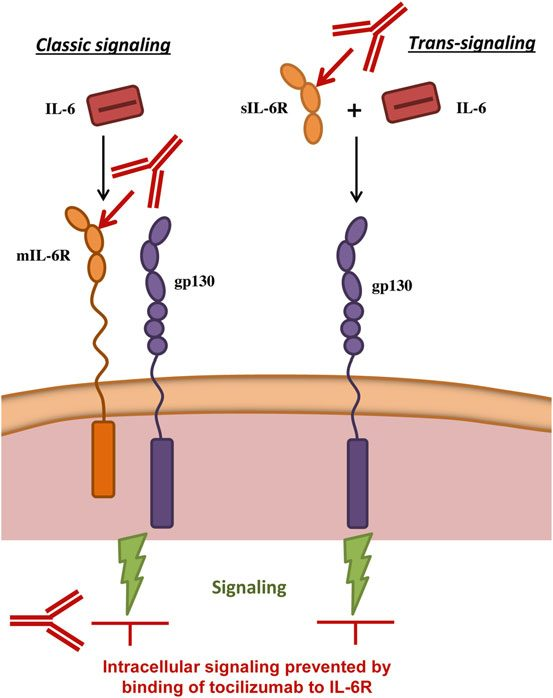

그림 4.1 아달리무맙으로 류마티스관절염을 치료하는 동안 건선형 발진의 역설적 유도. 많은 환자 반응이 작은 농포와 함께 손바닥·발바닥 분포를 보인다. Aubin F 등에서 재인용. The complexity of adverse side effects to biological agents. J Crohn's Colitis 2013;7:257-62. 크리에이티브 커먼즈 라이선스에 따라 배포됨; Elsevier Limited의 허가를 받아 재인용.

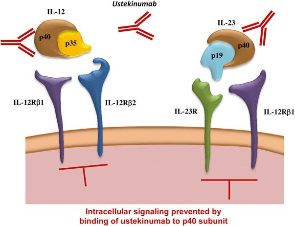

그림 4.2 아달리무맙 치료에 의해 유도된 제3형 면역복합체 매개 반응인 피부 혈관염. Aubin F 등에서 재인용. The complexity of adverse side effects to biological agents. J Crohn's Colitis. 2013;7:257-62. 크리에이티브 커먼즈 라이선스에 따라 배포됨; Elsevier Limited의 허가를 받아 재인용.

아달리무맙의 면역원성

아달리무맙은 완전 인간 단클론항체이지만 인간 항인간 항체 반응이 검출되었으며 그러나 최근까지 양질의 데이터는 찾기 어려웠다. EMA의 아달리무맙 면역원성에 대한 모호한 요약에서, 항-아달리무맙 항체는 이전에 단클론항체에 노출되었던 궤양성 대장염 환자 218명 중 8명(3.7%)과 이전에 노출된 적이 없는 환자 269명 중 11명(4.1%)에서 발견되었다. 아달리무맙을 최대 56주 동안 투여받은 크론병 환자 269명 중 7명(2.6%)이 항체 양성으로 입증되었다. 최근 영국에서 류마티스관절염 유전학 및 유전체학 연구 신디케이트(BRAGGSS)가 수행한 전향적 연구는 류마티스관절염의 장기 아달리무맙 치료 효능에 대한 면역원성의 영향을 평가하였다. 기준시점에서 활성 질환이 있고 기준을 충족하는 환자가 아달리무맙 치료를 시작하도록 선정되었다. 항체 측정을 위한 혈청 검체는 치료 시작 후 3, 6, 및 12개월에 채취되었다. 항-아달리무맙 항체는 12개월 치료 기간 동안 하나 이상의 시점에서 125명 중 31명(24.8%)에서 검출되었다. 12개월 후, 항체가 있는 환자는 항체가 없는 환자보다 질환 활성도 개선이 적었으며 항체가 발생하지 않은 환자는 발생한 환자보다 메토트렉세이트를 복용 중일 가능성이 더 높았다. 연구자들은 항-아달리무맙 항체가 류마티스관절염에서 아달리무맙의 효과 감소와 연관되며 병용 메토트렉세이트가 항체 형성을 감소시킬 수 있다고 결론지었다. 임상 반응, 아달리무맙 농도, 및 항-아달리무맙 항체 역가 간의 관계는 단클론항체로 치료받은 강직성 척추염 환자 115명을 대상으로 한 네덜란드-대만 공동 연구에서 조사되었다. 24주 추적 기간이 끝날 때 31명(27%)의 환자에서 항체가 검출 가능한 수준으로 나타났다.

특히 아달리무맙과 인플릭시맙. 낮은 농도의 항약물 항체는 단클론항체 치료의 효능에 영향을 미치지 않을 수 있지만 높은 항약물 농도는 유리(free) 항-TNF 단클론항체의 수준을 낮추어 효능을 감소시킬 수 있는 것으로 보인다.

세르톨리주맙 페골

세르톨리주맙 페골(CDP870, Cimzia®)(표 2.1 및 4.1)은 인간 TNF에 특이적인 재조합 인간화 Fab' 항체 단편으로, Fab'의 용해도, 안정성, 및 반감기를 증가시키기 위해 분자량 약 40 kDa의 폴리에틸렌 글리콜 거대분자에 접합된 것이다. 이로 2-4주마다 피하 주사가 가능하며 분자의 면역원성을 감소시킨다고 한다. 세르톨리주맙 Fab'는 214개의 아미노산으로 구성된 경쇄와 229개의 아미노산으로 구성된 중쇄로 이루어져 있으며 펩신으로 생성된 항체 단편이므로 Fc 부분이 없어, 페길화된 분자의 최종 분자량은 91 kDa이다.

작용 기전

세르톨리주맙 페골은 용해성 및 막결합 TNF 모두에 결합하며 아달리무맙과 인플릭시맙보다 더 높은 친화력으로 결합한다. 다른 두 TNF 차단제와 마찬가지로 세르톨리주맙 페골은 지질다당류에 대한 반응으로 IL-1β의 방출을 억제하지만, 아달리무맙 및 인플릭시맙과 달리 세포자멸을 촉진하지 않으며, 항체 Fc 조각이 없기 때문에 보체 경로를 활성화하지 않고 세포 및 항체의존 세포독성을 매개하지 않는다. 세르톨리주맙 페골, 인플릭시맙, 및 아달리무맙이 크론병에서 효과적이지만 후자의 두 단클론항체가 세포자멸을 유발한다는 사실은 류마티스관절염, 크론병, 염증성 장질환 등과 같은 면역매개 염증성 질환의 발병기전에 차이가 있을 뿐만 아니라 TNF 억제제의 기능적 특성에도 차이가 존재함을 시사한다. 실제로 서로 다른 TNF 억제제의 작용 기전은 원래 생각했던 것보다 더 복잡하고 현재 덜 설명되어 있는 것으로 보인다. 세르톨리주맙 페골과 인플릭시맙에 의해 유도된 역방향 신호 전달(reverse signaling)의 전사 반응에 대한 최근 분석에서, 성장분화인자-1(GDF-1)이 크론병 환자의 염증 조직에서 상향 조절되지만 치료 후 상태가 개선된 환자에서는 인플릭시맙 치료 후 하향 조절되는 것으로 밝혀졌다. GDF-1은 IL-6과 신호전달 및 전사 활성화 인자 3(STAT3)을 유도하는 전염증성 인자이다. 세르톨리주맙 페골과 인플릭시맙 모두 형질전환성장인자-β(TGFβ)의 방출으로 비세포자멸 경로로 GDF-1을 하향 조절한다. 이러한 잠재적으로 중요한 발견은 염증 과정에서 GDF-1의 정확한 역할에 대한 조사가 일부 면역매개 염증성 질환에 대한 이해를 더욱 높이고 어쩌면 유망한 새로운 치료 표적을 제공할 수 있음을 시사한다.

적응증, 경고 주의사항, 및 이상반응

세르톨리주맙 페골은 2008년 FDA로부터 크론병 치료 승인을 받았다. 그 다음 해에 FDA, EMA, 및 캐나다 보건부(Health Canada)는 류마티스관절염 치료에 대해 이 단클론항체를 승인했지만 EMA가 축성 척추관절염, 강직성 척추염, 방사선학적 증거가 없는 축성 척추관절염, 및 건선성 관절염으로 승인을 확대한 반면, 이 기관은 크론병에 대한 승인 부재를 유지하고 있다. FDA 블랙박스 경고를 포함한 세르톨리주맙 페골에 대한 FDA 경고 및 주의사항 목록은 아달리무맙에 발행된 것과 유사하며 심각한 감염, 악성종양, 심부전, 과민반응, B형 간염 감염 재활성화, 신경학적 반응, 혈액학적 반응, 자가면역, 생백신 또는 약독화 생물에 의한 감염의 2차 전파의 가능한 위험, 면역억제의 가능성, 그리고 IL-1 길항제 아나킨라, 아바타셉트, 및 리툭시맙의 병용 사용에 의한 심각한 감염의 가능한 더 높은 위험이 포함된다(표 4.1). 다른 TNF 차단제와 마찬가지로 감염이 세르톨리주맙 페골 요법에서 관찰되는 가장 흔한 이상반응이다. 상기도 및 요로 감염이 가장 자주 관찰된다. 한 26주 연구에서 심각한 이상반응과 심각한 감염이 각각 6%와 3%의 빈도로 발생하였다. 세르톨리주맙 페골을 투여받은 류마티스관절염 환자 4049명에서 가장 빈번하게 발생한 심각한 감염은 폐렴과 결핵이었으며 후자는 환자-년 100당 0.47의 발생률을 보였다. 관찰된 기타 심각한 감염에는 진균성 식도염, 폐포자충증, 노카르디아증, 및 대상포진 감염이 포함된다. 2011년 코크란(Cochrane) 메타분석 및 개관은 항-TNF 제제가 전체 이상반응 비율에서 유의한 차이를 보이지 않았지만 세르톨리주맙 페골은 유의하게 더 높은 감염률과 연관되었음을 입증하였다. 80주 시험에서 심각한 이상반응이 환자의 17-19%에서 보고되었다. 흥미롭게도, EMA의 크론병 승인 적응증 제외를 염두에 두고 이 질환의 악화가 가장 흔하게 보고된 이상반응이었다. 감염 외에도 악성종양, 자가면역, 주사 부위 반응, 및 항-세르톨리주맙 항체 발생에 대한 일부 안전성 평가가 수행되었다. 4049명의 환자를 대상으로 한 류마티스관절염 시험에서 림프종과 흑색종이 각각 환자-년 100당 0.05와 0.08의 발생률로 발생하였다. 단, 류마티스관절염 환자는 어쨌든 악성종양 및 림프종의 위험이 더 높은 것으로 생각된다는 점에 유의하라. 자가면역 부작용과 관련하여, 세르톨리주맙 페골로 치료받은 류마티스관절염 환자의 16.7%와 2.2%에서 각각 항핵항체와 항이중가닥 DNA 항체가 발생하였으며, 이 단클론항체를 투여받은 환자에서 루푸스 유사 증후군의 몇몇 사례가 보고되었다. 위약 대조 류마티스관절염 시험에서 세르톨리주맙 페골 치료 환자의 5.8%에서 주사 부위 반응이 나타난 것은 위약군에서 관찰된 4.8%보다 약간 높을 뿐이었다. 기록된 증상에는 홍반, 통증, 부종, 가려움, 혈종, 및 타박상이 포함되었다. 흔히 관찰되는 이상반응은 표 4.1에 나열되어 있다.

시판 후 기간과 2013년 4월 기준으로 FAERS 데이터베이스에는 14,800건의 보고가 기록되었으며 이 중 7.2%가 감염, 9.4%가 위장관 관련, 5%가 피부 질환, 4.6%가 주사 부위 반응이었다. 가장 빈번하게 보고된 감염은 폐렴, 비인두염, 및 요로 및 상기도 감염이었다. 결핵이 79건 있었다. 발진, 두드러기, 및 아나필락시스/아나필락시스 쇼크 순으로 가장 흔하게 관찰된 과민반응이었다. 기타 주목할 만한 보고는 악성종양(39건, 림프종 25건 포함), 폐 신생물(34건), 흑색종(20건), 및 말초신경병증(41건)이었다. 2012년 말 기준 EVRS 데이터베이스에는 2797건의 보고(거의 모두 심각)가 있었으며 위장관 사건(18.5%), 감염(14%), 피부 반응(8%), 신경계 장애(6%), 및 근골격계 문제가 가장 자주 보고된 사건이었다. 가장 흔한 감염은 폐렴, 요로 감염, 패혈증, 및 비인두염이었고 결핵 15건이 기록되었다. 과민반응에는 주로 발진, 두드러기, 및 아나필락시스/아나필락시스양 반응이 포함되었다. 말초신경병증 12건, 시신경염 6건, 림프종 6건, 및 흑색종 5건이 있었다.

세르톨리주맙 페골의 면역원성

발표된 면역원성 데이터에서 자주 그런 것처럼, 명확하고 설득력 있는 결과와 확고한 결론이 부족하거나/모호하다. 세르톨리주맙 페골을 투여받은 류마티스관절염 환자의 위약 대조 시험에서 환자의 9.6%가 단클론항체에 대한 항체가 발생했으며 이 중 약 1/3이 시험관 내에서 중화 활성을 보였다. EMA에 따르면 "항체 형성은 낮아진 약물 혈장 농도와 연관되었고 일부 환자에서는 효능 감소와 연관되었다." 메토트렉세이트와 같은 면역억제제와의 병용 투여는 항체 발생률을 낮추었다. 5년에 걸친 두 개의 공개 라벨 연구에서 노출된 환자의 8.4%에서 세르톨리주맙 페골에 대한 일시적 항체 형성이 발생한 반면 4.7%의 환자는 지속적 항체 형성을 보였다. 단클론항체 혈장 농도의 지속적 감소를 보이는 항체 양성 환자의 비율은 9.1%였으며 이는 "일부 환자에서" 효능 감소와 연관된다고 했다. 축성 척추관절염 또는 건선성 관절염 환자의 3상 위약 대조 시험에서 24주까지 적어도 한 번 세르톨리주맙 페골에 대한 항체가 발생한 환자의 비율은 각각 4.4%와 11.7%였으며 다시 항체 형성은 낮아진 단클론항체 혈장 농도와 연관되었다. FDA는 처방 정보에서 무작위 위약 대조 연구(662명)와 무작위 치료 중단 연구(428명)에서 활동성 크론병 환자의 8%가 24주에 걸친 단클론항체 지속 노출 후 세르톨리주맙 페골에 대해 항체 양성임을 명시한다. 환자의 약 6%가 시험관 내에서 중화하는 항체를 가졌지만 항체 발생과 관찰된 이상반응 또는 효능 사이의 명백한 상관관계는 없었다. 또한 면역억제제를 투여받은 환자는 항체를 덜 생성했다(3% 대 11%). 류마티스관절염 위약 대조 연구에서 7%

(1509명 중 105명)이 적어도 한 번 세르톨리주맙 페골에 대한 항체를 생성했다. 이 중 39명(37%)에서 항체는 중화 활성을 가졌고 혈장 단클론항체 수준 감소 및 효능 감소와 연관되었다. 다시, 병용 메토트렉세이트 면역억제를 받는 환자에서 항체 발생이 더 낮았다.

인플릭시맙

인플릭시맙(Remicade®)(표 2.1 및 4.1)은 원래 cA2로 명명되었으며 인간 TNF에 높은 친화력과 특이성으로 결합하여 막관통 및 용해성 TNF를 모두 억제하고 안정적이고 생물학적으로 비활성인 면역복합체를 형성하는 인간-마우스 키메라 IgG1κ 단클론항체로, 분자량 약 149 kDa이다. 인플릭시맙은 용해성 TNF의 단량체 및 삼량체 형태 모두에 결합하며 각 인플릭시맙 분자는 두 개의 TNF 분자에 결합할 수 있다. 예를 들어 크론병에서 인플릭시맙은 IL-6, sTNFR1, 및 TNFR2와 같은 여러 질환 표지자의 수준을 감소시키고, TNF, IL-19, 및 IFN-γ를 발현하는 장점막 고유판 단핵세포의 감소를 초래하며, CD4, CD8, 및 CD68 양성 염색 세포의 수를 감소시킨다. 인플릭시맙으로 치료한 류마티스관절염 환자와 인플릭시맙 요법의 보통 건선 환자에서 IL-6, IL-1R, 및 TNF 수용체와 같은 염증 표지자의 억제에 대한 유사한 소견이 관찰되었으며 CD3 양성 T세포와 ICAM-1 발현의 감소가 관찰되었다. 아달리무맙과 마찬가지로, 그러나 세르톨리주맙 페골과 달리, 인플릭시맙은 CDC와 ADCC를 매개하고 세포자멸을 겪는 세포의 비율과 과립구 탈과립 수준을 증가시킨다. 그러나 인플릭시맙 유도 세포자멸이 류마티스관절염 환자에서 활막 대식세포 수 감소의 설명으로 제안되었지만 일부 연구자들은 인플릭시맙 치료 후 세포자멸 증가를 발견하지 못했다. 세 가지 단클론항체 TNF 차단제 모두 지질다당류 유도 IL-1β 생산을 억제한다.

적응증, 경고 주의사항, 및 이상반응

1998-1999년 FDA와 EMA의 활동성 및 누공성 크론병에 대한 최초 승인 이후, 인플릭시맙의 승인 적응증 목록은 꾸준히 증가하여 현재 소아 크론병, 궤양성 대장염, 류마티스관절염(메토트렉세이트와 병용), 강직성 척추염, 건선성 관절염, 및 판상 건선을 포함한다. 심각한 감염과 악성종양의 위험은 인플릭시맙에 대한 FDA 블랙박스 경고의 대상이며 다른 세 가지 승인된 항-TNF 단클론항체인 아달리무맙, 세르톨리주맙 페골, 및 골리무맙에 대해 나열된 다른 경고 및 주의사항과 함께(표 4.1). 새로운 결핵 및 재활성화 사례의 발생률은 약 400,000명의 치료 환자에서 0.08%로 추정되는 반면, 심각한 감염의 전반적 위험은 인플릭시맙을 투여받은 환자에서 두 배 더 높다.

2007-2013년 기간 동안 미국, 캐나다, 및 이스라엘의 피부과 센터에서 생물학적 및 전신 건선 치료의 감염 위험을 평가하기 위해 설계된 건선 종단 평가 및 레지스트리에서 11,466명(22,311 환자-년)의 데이터가 분석되었다. 심각한 감염의 누적 발생률은 환자 100명당 1.45였으며 가장 흔하게 보고된 심각한 감염은 폐렴과 봉와직염이었다. 인플릭시맙과 아달리무맙은 감염률 증가와 관련되었을 뿐만 아니라 비생물학적 및 비메토트렉세이트 요법보다 더 높은 심각한 감염 위험과도 관련되었다. 반면, 단클론항체 우스테키누맙("우스테키누맙" 절)과 융합단백질 에타너셉트(6장, "에타너셉트" 및 "에타너셉트" 절)에서는 증가된 위험이 관찰되지 않았다. 인플릭시맙 치료 환자 5707명에서 1년 이내에 나타난 악성종양의 전체 비율은 0.08-0.1%로, 일반 인구에서 발견되는 발생률보다 3배 높다. 사례의 약 50%가 림프종과 피부암이었다. 약 200건의 간비장 T세포 림프종 중 28건(14%)이 크론병 환자에서 발생했다. 표 4.1에 나열된 인플릭시맙 요법에 대한 기타 경고 및 주의사항은 B형 간염 바이러스 재활성화 가능성, 간독성(간부전, 황달, 간염, 및 담즙정체), 심부전 환자에서의 불량한 결과와의 연관성, 잠재적으로 치명적인 백혈구감소증, 호중구감소증, 혈소판감소증, 및 범혈구감소증, 혈청병 유사 반응을 포함한 과민반응, 전신 혈관염, 중추신경계 탈수초 질환(다발성 경화증 및 시신경염 포함) 및 말초 탈수초 질환(길랭-바레 증후군 등)으로 나타나는 드문 신경학적 반응, 그리고 드물게 루푸스 유사 증후군으로 발생할 수 있는 자가면역을 포함한다. 인플릭시맙을 투여받는 환자의 감염 위험을 고려하여 단클론항체와 동시에 생백신 및 약독화 세균과 같은 치료용 감염원을 투여해서는 안 된다고 권고된다. 유사한 맥락에서, 아바타셉트의 병용 투여는 감염 위험 증가와 연관되었으며 아나킨라와 에타너셉트의 병용 사용 시 심각한 감염과 호중구감소증이 관찰되었다. 인플릭시맙 총 479회 주입을 받은 165명의 환자에서 주입 반응의 전체 발생률은 6.1%였고 환자의 9.7%가 영향을 받았다. 심각한 반응은 주입의 1%에서 발생했다. 14명의 환자 중 11명의 급성 반응은 비즉시형 과민반응으로 결정되었으며 지연 반응은 주입의 0.6%에서만 관찰되었다. 성인 52명과 소아 34명에게 304회의 인플릭시맙 주입에 대한 반응 검사에서 성인 11명(21.2%)과 소아 단 1명(2.9%)에서 심각한 전신 반응이 관찰되었다. 반응은 저혈압과 후두경련이 특징이었으며 에피네프린, 항히스타민제, 및/또는 코르티코스테로이드로 치료가 필요했다. 관절통, 발열, 및 근육통으로 나타난 지연 반응이 성인 8명(9.3%)에서 발생했지만 소아에서는 발생하지 않았다. 인플릭시맙을 투여받은 류마티스관절염 환자 84명 중 16명(19

%)이 이상반응으로 치료를 중단했으며 이 중 9명(11%)이 즉시형 과민반응을 경험했다. 실제로 다양한 면역매개 전신 및 피부 이상반응이 인플릭시맙 요법에 이어 보고되었다. 두드러기를 포함한 인플릭시맙에 대한 즉시 반응, 특히 아나필락시스에 대한 수많은 보고가 있으며 1999-2012년 기간 동안 후자의 발생률은 약 0.9%로 650건 이상이었다. 아나필락시스 반응의 거의 70%가 치료 첫 달 동안 발생했다. 반응자의 약 60%가 여성이었고 10세 미만의 소아가 반응자의 7.5%를 차지했다. 일부 아나필락시스 사례에서 인플릭시맙 반응성 IgE 항체가 확인되었으며 인플릭시맙에 대한 아나필락시스/아나필락시스양 반응을 경험한 환자의 성공적 탈감작이 발표되었다. 혈관염 및 혈청병 유사 반응의 일부 사례를 포함한 인플릭시맙에 대한 제3형 과민반응이 발생하는 것으로 알려져 있다. 기록된 제4형 과민반응에는 반구진성 발진, 건선, 다형홍반, 및 스티븐스-존슨 증후군이 포함된다. 흥미롭게도, 여러 독성 표피괴사용해 사례에서 인플릭시맙이 병변의 빠른 회복을 유도한다는 보고가 있다. 흔히 관찰되는 심각한 반응은 표 4.1에 나열되어 있다. FAERS 데이터베이스에 대한 57,600건 이상의 시판 후 보고 중 6%가 감염, 4%가 각각 호흡기 및 피부 사건, 3%가 주사 부위 반응, 3% 각각이 신경학적 및 위장관 이상반응이었다. 결핵이 1963건의 감염을 차지했다. 피부암과 위장관 신생물이 가장 빈번한 악성종양이었다. 간비장 T세포 림프종 321건, 아나필락시스 460건, 혈청병 유사 반응 201건, 전신 홍반성 루푸스(SLE) 821건, 루푸스 유사 증후군 1460건, PML 96건, PRES 보고 37건이 있었다. EVRS 데이터베이스에 대한 47,300건의 보고 중 감염이 전체의 13%, 위장관 장애 9%, 호흡기 문제 8%, 및 피부 이상반응 7%를 구성했다. 신생물은 보고의 5%를 차지했으며 간비장 T세포 림프종 63건, 주사 부위 반응 4921건, 과민반응 970건, PML 35건, 및 PRES 22건이 있었다.

인플릭시맙의 면역원성

인플릭시맙에 대한 항체가 발생한 환자는 주입 반응을 경험할 가능성이 2-3배 더 높다. 면역억제제의 병용 투여 없이, 인플릭시맙 요법을 받는 환자의 24%에서 항체가 발견되었다. 면역억제와 함께 이 비율은 절반으로 줄었다. 건선성 관절염에 대한 메토트렉세이트 없이/함께한 해당 수치는 26% 및 4%였고 크론병의 경우 13.3% 및 3.3%였다. 인플릭시맙과 메토트렉세이트를 투여받는 류마티스관절염 환자의 비율은 8%였다. EMA는 고역가의 항-인플릭시맙 항체가 발생한 일부 환자가 단클론항체의 효능 감소 증거를 보였다고 명시한다. 유지 용량의 인플릭시맙을 투여받는 건선 환자는 28%의 사례에서 항체가 발생했다. FDA는 3회 용량 유도 요법 후 유지 요법으로 인플릭시맙을 투여받은 환자가 1-2년 기간에 걸쳐 평가한 약 10%의 항체 발생률을 보였다고 보고했다. 크론병 환자와 191명의 건선성 관절염 환자에서 더 높은 발생률이 관찰되었는데, 이 중 15%에서 항-인플릭시맙 항체가 발견되었다. 대부분의 양성 반응자는 저역가 항체를 가졌지만 항체의 존재는 일반적으로 인플릭시맙의 더 높은 제거율, 약물 효능 감소, 및 주입 반응의 발현과 상응했다. 예상대로 메토트렉세이트, 6-메르캅토퓨린, 또는 아자티오프린에 의한 면역억제 요법은 더 적은 항체 생산을 초래했다. 류마티스관절염에서 인플릭시맙 장기 치료의 효능에 대한 면역원성의 영향에 대한 스페인 연구에서 85명의 환자가 중앙값 4.42년(범위 0.4-10.2년) 동안 인플릭시맙으로 치료받았다. 항-인플릭시맙 항체가 28명(32.9%)에서 발생했으며 유럽 류마티스연맹(EULAR) 척도의 무반응, 중등도, 및 양호 반응자로 분류된 모든 무반응 환자에서 발견되었다. 가장 높은 항체 수준이 연구 전 기간 동안 EULAR 무반응자에서 발생했다. 모두 높은 항체 수준을 가진 9명(10.6%)이 주입 반응이 발생했다. 항-인플릭시맙 항체의 존재는 종종 인플릭시맙 용량 증가의 필요성을 수반했다. 메토트렉세이트 병용 요법은 항체가 있는 환자를 더 적게 만들지 않았지만 항-인플릭시맙 항체 수준을 감소시켰다. 앞서 언급한 소견과 해석에도 불구하고, 일부 연구자들은 항-인플릭시맙 항체가 단클론항체의 효능과 안전성에 대해 임상적 중요성이 있다는 것을 의심하며, 항체 발생에 관여하는 환자 및 치료 관련 요인이 복잡하고 잘 이해되지 않는다고 믿는다. 또한 항체가 주입 반응과 약하게 그리고 가변적으로 연관될 수 있지만 실제 임상적 중요성을 가진 항체는 거의 없기 때문에 일반적으로 소위 "임상 의사 결정"과는 관련이 없다고 주장되었다. 항-인플릭시맙 항체가 약물 효능과 안전성에 영향을 미친다는 증거가 부족하다는 인식에 비추어, 이를 측정하거나 예방할 필요가 없으며 투여된 약물의 순환 농도를 측정하는 것이 더 바람직할 것이라고 제안되었다.

골리무맙

골리무맙(CNTO148, Simponi®)(표 2.1 및 4.1)은 인간 TNF로 면역화되고 인간 IgG를 발현하도록 조작된 형질전환 마우스에서 유래한 여러 글리코형으로 존재하는 완전 인간 TNF 특이적 IgG1κ 단클론항체로, 분자량 150-151 kDa이다. 골리무맙은 TNF를 중화하는 높은 능력을 가지며 용해성 TNF에 인플릭시맙보다 2.4배, 아달리무맙보다 7.1배 높은 친화력으로 결합하고 막결합 TNF에는 인플릭시맙과 유사하지만 아달리무맙보다 더 큰 친화력으로 결합한다. 다른 인간 IgG1 항체와 마찬가지로 골리무맙은 Fc 수용체에 결합하여 CDC와 ADCC를 일으키는 특성이 반영되며 정맥 및 피하 주사 후 2-3주의 긴 말기 반감기는 낮은 pH에서 FcRn 결합을 반영한다(2장, "항체의존세포매개 및 보체의존 세포독성" 절). 인플릭시맙과 마찬가지로 골리무맙은 인간 TNF를 과발현하는 세포의 용해를 매개하지만 인플릭시맙과 아달리무맙 모두와 마찬가지로 지질다당류로 자극된 인간 단핵구를 용해하지 않는다.

류마티스관절염의 관절 혈관에서 상향 조절되는 E-셀렉틴과 ICAM-1과 같은 부착 단백질은 골리무맙에 의해 생체 내(in vivo)에서 인플릭시맙과 아달리무맙의 값보다 유의하게 낮은 IC50 값으로 억제된다. 마찬가지로, 전염증성 사이토카인과 케모카인의 혈청 수준은 인플릭시맙에 대해 보고된 결과와 유사한 결과로 골리무맙에 의해 감소된다. 골리무맙 치료 마우스에서 과립구-대식세포 콜로니 자극 인자(GM-CSF), 과립구 콜로니 자극 인자(G-CSF), 각질세포 화학유인물질, 인터페론 유도 단백질-10(IP-10), 및 IL-6의 혈청 수준 각각이 치료 후 23일에 명확한 감소를 보인다. 골리무맙은 2009년 FDA와 EMA 승인을 받아 메토트렉세이트와 병용한 중등도에서 중증 류마티스관절염, 메토트렉세이트와 병용한 성인의 활동성 건선성 관절염, 및 성인의 강직성 척추염 치료에 사용된다. 규제 기관이 발행한 사용에 대한 경고 주의사항, 및 심각하고 흔한 이상반응은 다른 세 가지 승인된 단클론항체 TNF 차단제와 유사하다. 골리무맙에 대한 블랙박스 경고는 심각한 감염과 악성종양에 대해 강조되며 B형 간염 재활성화, 심부전, 탈수초 질환, 과민반응, 및 혈구감소증 발생 가능성의 위험이 언급된다(표 4.1). 특히 결핵(재활성화 또는 새로운 감염 가능성), 침습성 진균 감염, 및 B형 간염 바이러스 재활성화를 포함한 기회감염에 주의가 촉구된다. 대조 임상 시험에서 림프종이 대조 환자보다 골리무맙을 투여받는 환자에서 더 자주 관찰되었으며 3상 연구 동안 림프종 및 비흑색종 피부암 이외의 악성종양 발생률이 환자-년 100당 0.56으로 위약군의 0과 비교되었다. 다시, 아달리무맙, 인플릭시맙, 및 세르톨리주맙 페골과 마찬가지로 골리무맙은 심각한 감염의 가능성을 증가시킬 수 있는 아나킨라 및 아바타셉트와 같은 바이오의약품과 함께 사용해서는 안 되며 생백신 투여 회피가 권고된다. 주사 부위 반응은 경미한 경향이 있으며 제1형(아나필락시스) 및 제3형(혈청병) 과민반응은 극히 드물다. 최근 몇 건의 포도막염이 보고되었다. 시판 후 기간 동안 FAERS 데이터베이스에 대한 2125건의 보고 중 대부분은 감염(18%)에 관한 것이며 호흡기, 신경학적, 및 피부과적 사건보다 약 6배 더 많았다. 따라서 사르코이드증, 간질성 폐질환, 및 피부 박리와 같은 이상반응 보고는 다소 예상치 못하고 특이하여 관심을 끈다. EVRS 데이터베이스에서 다시 감염이 우세하며 폐렴 41건과 결핵 7건이 있었다. 아나필락시스 4건이 보고되었다. 전반적으로 골리무맙은 더 장기적인 모니터링이 필요하지만 다른 등록된 단클론항체 TNF 억제제보다 더 나은 안전성 프로파일을 보이는 것으로 보인다. 2015년에 발표된 골리무맙의 3년 안전성 업데이트는 류마티스관절염, 건선성 관절염, 및 강직성 척추염 시험에서 3년까지 피하 투여 용량 50과 100mg을 비교했다. 분석 결과 안전성이 다른 승인된 TNF 억제제와 일치함을 보여주었다. 100mg 용량은 50mg보다 심각한 감염, 탈수초 사건, 및 림프종의 발생률이 더 높았다.

류마티스관절염, 건선성 관절염, 및 강직성 척추염 환자에서 52주에 걸친 3상 연구에서 2115명 중 105명(5%)에서 항-골리무맙 항체가 발생했다. 시험관 내 검사는 대부분의 항체가 중화성이었음을 보여주었다. 골리무맙-메토트렉세이트와 골리무맙 단독 치료의 비교에서 항체가 각각 환자의 3%와 8%에서 발견되었다. 54주 기간의 2상 및 3상 궤양성 대장염 연구에서 골리무맙에 대한 항체가 946명 중 26명(3%)에서 검출되었다. 시험관 내에서 확인된 중화 항체는 항체 양성 환자의 68%에서 발생했다. 단클론항체가 아자티오프린, 6-메르캅토퓨린, 또는 메토트렉세이트와 함께 투여되었을 때 항체가 있는 환자가 더 적었다(3%에 비해 1%). 골리무맙 요법 후 항체 수준을 평가하기 위한 원본 임상 시험의 메타분석은 수준이 더 높지도 유의한 차이도 없으며 골리무맙 유도 항체와 루푸스 유사 증후군 또는 주입 반응 사이에 명백한 연관성이 없다고 결론지었다.

앱시시맙

앱시시맙(단클론항체 7E3, ReoPro®)(표 2.1 및 4.1)은 혈소판 활성화를 돕는 당단백질 GPIIb/IIIa(CD41/CD61) 수용체를 표적으로 하는 인간-마우스 키메라 IgG1κ 단클론항체의 Fab 단편으로, 분자량 약 47.6 kDa이다. 인테그린 αIIbβ3로도 알려진 이 당단백질은 피브리노겐과 폰 빌레브란트 인자의 수용체이다(10장, "혈소판 활성화 및 폰 빌레브란트 인자" 절). 혈소판 활성화에서 GPIIb와 GpIIIa는 Ca2+ 의존 단계에서 결합한다. ADP, 에피네프린, 콜라겐, 세로토닌, 및 트롬빈을 포함한 국소 작용제에 의한 활성화는 수용체의 형태 변화를 유도하여 피브리노겐 결합, 혈소판 응집, 및 혈전 형성을 초래한다. GPIIb/IIIa 수용체는 티로피반(Aggrastat®) 및 에프티피바티드(Integrilin®)(10장, "혈소판 활성화 및 폰 빌레브란트 인자" 절)를 포함한 여러 중요 약물의 표적이며 일반적으로 혈소판당 50,000-100,000개의 수용체 분자가 있다. 앱시시맙은 수용체 길항제로 작용하여 GPIIb/IIIa RGD(아르기닌-글리신-아스파르트산) 결합 부위와의 직접 상호작용이 아니라 입체 장애 또는 형태 효과에 의해 GPIIb/IIIa 수용체에 대한 천연 리간드 결합을 방지한다. GPIIb/IIIa 수용체의 ≥80%가 앱시시맙에 의해 차단될 때 혈소판 응집의 최대 억제가 관찰된다.

앱시시맙에 의한 인테그린 인식

α- 및 β-소단위를 공유하는 수용체 계열인 인테그린은 상처 치유, 염증, 및 지혈에 중요한 세포 부착 분자 부류이다. 앱시시맙은 혈소판 GPIIb/IIIa(CD41/CD61)에 선택적이지 않으며, 혈소판, 백혈구, 혈관 내피 세포, 및 평활근 세포에 존재하는 비트로넥틴 수용체 αvβ3(CD51/CD61)에도 유사한 친화력으로 결합하며, 이는

혈소판의 응고촉진 특성과 세포 증식을 매개한다. 앱시시맙은 세포 부착을 포함한 αvβ3 매개 효과를 차단한다. 앱시시맙은 또한 단핵구와 호중구에서 발견되는 CD11b(인테그린 αM)와 CD18(인테그린 βM)로 구성된 αMβ2로 지정된 인테그린인 대식세포-1 항원(Mac-1, 보체 수용체 3 또는 CR3)과 교차 반응한다. 교차 반응은 Mac-1의 CD11b 서브유닛으로 발생하여 세포-세포 및 세포-세포외 기질 상호작용을 방해하며 이는 순환 단핵구의 혈관 손상 부위로의 모집에 영향을 미쳐 심근 허혈 영역의 침윤과 염증을 감소시킬 수 있다는 제안으로 이어진다. 앱시시맙의 GPIIb/IIIa 표적 기능과 함께, 단클론항체 Fab의 인테그린 인식 특성은 혈관 복구 조절에 기여할 수 있으며 혈관성형술 후 앱시시맙 사용으로 인한 임상적 이점의 기초가 될 수 있다.

적응증, 경고 주의사항, 및 이상반응

임상 사용이 승인된 최초의 피브리노겐 수용체 길항제인 앱시시맙은 경피 경혈관 관상동맥 성형술을 받는 환자에서 반복 경피 관상동맥 중재술 및 관상동맥 우회술의 발생률을 유의하게 감소시킨다. 앱시시맙은 이러한 중재술을 받는 환자와 24시간 내에 경피 관상동맥 중재술이 계획된 통상 요법에 반응하지 않는 불안정 협심증 환자에서 심장 허혈성 합병증 예방을 위한 경피 중재술의 보조제로 승인되었다. 앱시시맙에 대해 발행된 주요 경고는 출혈이며 이 위험 때문에 출혈이 활동적이거나 위협이 될 수 있는 다양한 질환, 혈소판감소증, 최근의 주요 수술 또는 외상, 중증 조절되지 않는 고혈압, 뇌혈관 사고 또는 혈관염 병력이 있는 환자, 및 두개내 신생물, 동정맥 기형, 또는 동맥류를 포함하는 경우에 금기이다. 헤파린, 기타 항응고제, 또는 혈전용해제와 같은 항응고 요법을 받는 환자에서 앱시시맙의 출혈 위험 증가 가능성이 특히 두드러진다. 중증 사례를 포함한 혈소판감소증이 발생할 수 있어 앱시시맙 치료 전, 중, 후에 혈소판 수치 모니터링이 필요함을 시사한다. 혈소판감소증은 환자의 최대 2%에서 발생할 수 있다. 때때로 치명적일 수 있는 아나필락시스를 포함한 알레르기 반응의 가능성에 대한 경고도 발행되었다. 기타 심각하고 빈번한 이상반응은 표 4.1에 나열되어 있다. 시판 후 이상반응 보고는 주로 심혈관 및 혈액학적 장애와 사망에 집중되었다. 아나필락시스를 포함한 과민반응이 보고의 최대 0.3%를 차지했다.

앱시시맙의 면역원성

앱시시맙의 재투여는 알레르기 반응, 혈소판감소증, 또는 단클론항체 Fab의 임상적 이점 감소를 잠재적으로 일으킬 수 있는 인간 항키메라 항체의 생성을 유도할 수 있다. 1200명 이상의 환자를 대상으로 한 한 연구에서 인간

항키메라 항체가 앱시시맙 재투여 전 환자의 6%에서, 재투여 후 27%에서 발견되었지만 과민반응 보고는 없었다. 앱시시맙에 4회 이상 노출된 36명의 환자 중 인간 항키메라 항체가 16명(44%)에서 발견되었다. 혈소판감소증 비율은 제제 재투여 후 환자에서 더 높은 경향이 있으며 재투여는 혈소판감소증의 증가된 중증도와 연관될 수 있다. 예를 들어, 경피 관상동맥 중재술 중 최소 두 번째로 앱시시맙을 투여받은 500명의 환자 연구에서 혈소판감소증이 23명(4.6%)에서 발견되었다. 이 중 12명(2.3%)이 중증 혈소판감소증이 발생했다. 첫 재투여 전 인간 항키메라 항체가 454명 중 22명(4.8%)에 존재했다. 이 비율은 첫 재투여 후 19%(432명 중 82명)로 증가했다. 항체는 앱시시맙에 의한 시험관 내 혈소판 응집을 억제하지 않았으며 임상 사건과 상관관계가 없었다. 주요 출혈, 과민반응, 또는 사망 사례는 없었다. 전반적으로 소견은 경증에서 중증 혈소판감소증으로의 전이와 지연 및 재발성 혈소판감소증 사례가 관찰된 것을 제외하고는 앱시시맙의 첫 치료에 대한 무작위 임상 시험 결과와 일치했다. 관상동맥 중재술에서 앱시시맙 재투여의 안전성과 효능에 대한 또 다른 연구에서 164명의 환자에서 얻은 결과가 후향적으로 분석되었다. 이상반응에는 사망(2%), 두개내 출혈(2%), 및 심근경색(3%)이 포함되었다. 앱시시맙 재투여 후 환자의 4%에서 심각한 혈소판감소증이 발생했지만 과민반응은 관찰되지 않았으며 첫 투여 후 2주 이내에 앱시시맙을 투여받은 환자는 심각한 혈소판감소증의 발생률이 더 높았다(12% 대 2%). 저자들은 앱시시맙이 재투여 시 임상적으로 효과적이지만 초기 투여 후 며칠 내에 재투여하는 경우 용량 감소가 필요할 수 있다고 결론지었다. 두 번째로 앱시시맙을 투여받은 후 몇 시간 내에 중증 혈소판감소증이 발생한 소수의(9명) 환자에 대한 연구는 앱시시맙의 마우스 서열에 특이적인 IgG 항체가 발생했으며 이러한 항체가 생명을 위협하는 혈소판감소증을 유발할 수 있다고 제안했다. 흥미롭게도, 건강한 피험자에서 발견되고 혈소판감소증을 일으키지 않는 앱시시맙과 반응하는 항체는 모든 IgG Fab 단편의 파파인 절단 부위에 특이적인 것으로 주장된다.

알렘투주맙

알렘투주맙(Campath®, MabCampath®)(표 2.1 및 3.1)은 B세포 만성 림프구성 백혈병의 치료제로서 3장, "알렘투주맙" 절에 제시되어 있다. Lemtrada®(표 2.1 및 4.1)로서 알렘투주맙은 정상 및 악성 T세포와 B세포, 단핵구, 대식세포, 및 일부 과립구, NK세포, 및 수지상세포에서 발현되는 21-28 kDa 당단백질 CD52를 표적으로 하는 재조합 인간화 IgG1κ 단클론항체로, 분자량 약 150 kDa이며 재발 완화형 다발성 경화증 성인 환자의 치료를 위해 판매 및 승인되었다. 다발성 경화증에서 알렘투주맙의 치료 효과의 상세한 기전은 아직

완전히 이해되지 않았지만 NK세포, 대식세포, 및 단핵구의 표적 항원 CD52로 작용하여 단클론항체의 CDC와 ADCC 작용이 관여하여 림프구를 고갈시키고 재증식시키는 것으로 추정된다. 순환 T세포와 B세포 수준의 감소 후 세포 재증식은 질환 진행을 지연시키고 재발을 줄일 수 있다. 자가면역, 주입 반응, 및 악성종양이 Lemtrada®에 대한 FDA 블랙박스 경고를 구성하며 이 약은 Lemtrada® REMS 프로그램이라는 제한적 유통 체계로서만 이용 가능하다. 때때로 치명적인 심각한 자가면역 장애는 혈소판감소증 및 항사구체기저막 질환으로 나타날 수 있으며 마지막 투여 후 48개월 기간 동안 분화 혈청 크레아티닌 수치와 소변 검사와 함께 정기적인 완전혈구계산이 필요하다. 혈소판감소증, 사구체 신병증, 및 갑상선 장애에 대해 각각 2%, 0.3%, 및 34%의 발생률이 보고되었다. Lemtrada® 치료 환자에서 호중구감소증과 용혈성 빈혈, 그리고 범혈구감소증이라는 다른 자가면역 혈구감소증의 발생 가능성에도 주의가 촉구된다. 자가면역 질환의 증가된 위험은 알렘투주맙에 의해 유도된 광범위한 자가항체 형성 때문일 수 있는 것으로 생각된다. 심각하고 생명을 위협하는 주입 반응과 아나필락시스가 발생할 수 있어, 반응을 관리하기 위한 적절한 인력과 장비를 갖춘 적절한 환경에서 항체를 투여할 필요가 있다. 주입 첫 3일 동안 코르티코스테로이드 사전 투여와 함께 항히스타민제 및/또는 해열제가 권장되지만 전처치에도 불구하고 반응이 발생할 수 있다. Lemtrada®를 투여받는 환자는 악성종양 및 림프증식성 질환의 위험이 증가할 수 있어 기준 및 연간 피부 검사 시행이 필요하다. 갑상선암과 흑색종이 각각 0.3%의 발생률로 보고되었다. 기타 경고 및 주의사항은 감염 및 폐렴의 위험에 주의를 촉구하며 후자는 과민반응 형태 또는 섬유증을 동반한 폐렴으로 관찰된다. 대조 임상 시험에서 Lemtrada® 치료 환자의 71%에서 감염이 발생한 반면 인터페론 베타-1a로 치료한 대조 환자는 53%였다(5장, "인터페론 베타" 절). 기록된 심각한 감염에는 헤르페스 바이러스 감염, 인간 유두종 바이러스, 결핵, 진균 감염(특히 칸디다증), 및 리스테리아 수막염이 포함된다. 표 4.1은 알렘투주맙이 다발성 경화증 치료에 사용될 때 유발되는 더 빈번하게 관찰되고 때로는 심각한 이상반응 중 일부를 나열한다. 아직, 더 높고 더 빈번한 용량으로 B세포 만성 림프구성 백혈병 치료에 사용될 때 알렘투주맙에 대해 이용 가능한 정보와는 달리, 다발성 경화증에 대한 Lemtrada® 요법에 대한 시판 후 정보는 거의 없다. 백혈병 치료를 위한 알렘투주맙 시판 후 사용 중, 이전에 안트라사이클린으로 치료받은 환자에서 치명적 빈혈을 포함한 추가 자가면역 혈구감소증과 심장 장애가 보고되었다(3장, "알렘투주맙" 절). 이는 다발성 경화증에 대한 Lemtrada® 요법이 계속됨에 따라 염두에 둘 것이다. 다발성 경화증 환자 치료에 사용된 알렘투주맙의 면역원성에 대한 일부 데이터가 있다. 첫 치료 과정에서 항-알렘투주맙 항체가 1, 3, 12개월에 Lemtrada® 치료 환자의 각각 62%, 67%, 및 29%에서, 두 번째 치료 과정에서 13, 15, 24개월에 환자의 각각 83%, 83%, 및 75%에서 발견되었다. 대응하는

항체 양성 환자에서 중화 항체의 백분율은 87, 46, 5%와 94, 88, 42%였다. 검출된 항체는 두 번째 치료 과정에서 알렘투주맙 혈청 농도의 감소와 연관되었지만 첫 번째는 아니었으며 항체는 임상 결과, 림프구 수, 또는 이상반응에 영향을 미치지 않는 것으로 보였다. 이러한 소견은 해석에 어려움이 있다.

바실릭시맙

바실릭시맙(Simulect®)(표 2.1 및 4.1)은 활성화된 T 림프구 표면에서 발현되는 IL-2 수용체(IL-2R) 알파 사슬에 특이적인 재조합 인간-마우스 키메라 IgG1κ 단클론항체로, 분자량 약 144 kDa이다.

IL-2 수용체 및 바실릭시맙의 작용 기전

IL-2의 생물학적 효과는 주로 알파 사슬 IL-2Rα(CD25, p55, 또는 Tac Ag), 베타 사슬 IL-2Rβ(CD122, p75), 및 공통 감마 사슬 γc(CD132, p65)로 구성된 고친화성 IL-2R 복합체로 매개된다. IL-2R 복합체의 조립은 활성화된 T세포에서 풍부하게 발현되는 IL-2Rα가 IL-2에 결합하고 그 형태를 유리한 IL-2Rβ 결합 상태로 변화시키는 것으로 시작되는 순차적 방식으로 진행된다. 그런 다음 IL-2Rβ와 IL-2/IL-2Rα 복합체는 세포 표면 내 확산에 의해 더 가까이 근접하여 IL-2/IL-2Rαβ 복합체를 형성한다. γc의 동원은 생물학적으로 활성인 최종 수용체 복합체를 완성하여 궁극적으로 세포독성 T세포의 성장, 분화, 및 생존을 초래하는 IL-2 신호 전달 경로 Ras/Raf/MAPK, JAK/STAT, 및 PI3K/AKT를 촉발한다. IL-2Rα는 휴지 T세포에서는 발현되지 않지만 활성화된 T세포에서 풍부하게 발현되며 특히 일부 자가면역 질환, T세포 백혈병, 및 장기 동종이식 거부 반응의 T세포에서 발현된다. 이것이 장기 이식 거부 반응 예방을 위한 바실릭시맙의 개발과 적용의 근거이다. 바실릭시맙은 IL-2Rα D2 도메인의 잔기 116-122에서 IL-2Rα에 결합하여 IL-2 신호 전달을 차단한다. 단클론항체의 수용체에 대한 결합 친화력은 천연 리간드보다 약 70배 높다. 그림 4.3은 IL-2R 복합체 조립으로 이어지는 사건의 도식적 표현이며 IL-2-IL-2R 상호작용 서열에서 단클론항체의 개입 지점을 보여준다.

바실릭시맙 적응증, 경고 주의사항, 및 이상반응

바실릭시맙은 사이클로스포린 및 코르티코스테로이드와 함께 동종 신장 이식을 받는 성인 및 소아 환자(1-17세)에서 급성 장기 거부 반응 예방을 위해 승인되었다. 다른 고형 장기 동종이식에서 급성 거부 반응 예방을 위한 바실릭시맙의 효과는 입증되지 않았지만 심장 이식에서 면역억제 유도와 중증 거부 반응, 간 이식에서의 유도 요법, 및 폐 이식에 성공적으로 사용되었다. 전반적으로 안전성 프로파일은 신장 이식 거부 반응 적용에서 바실릭시맙의 경험과 유사한 것으로 밝혀졌다.

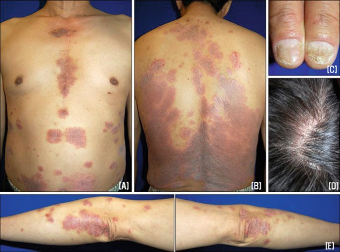

그림 4.3 바실릭시맙의 작용 기전에 대한 도식적 표현. (a) IL-2 신호 전달 경로는 IL-2가 수용체의 알파 사슬 IL-2Rα에 결합하면서 시작된다. (b) 이는 생물학적으로 활성인 수용체 형태인 IL-2/IL-2Rα/IL-2Rβ/γc 복합체의 순차적 조립을 촉발하며 이는 수용체 β-사슬 IL-2Rβ와 공통 γc 사슬의 세포 표면 막을 통한 확산 후에 발생한다. 신호 전달은 그런 다음 활성화된 수용체를 통해 진행된다. (c) 바실릭시맙의 IL-2Rα 결합은 수용체 알파 사슬에 대한 IL-2의 결합을 차단하여 IL-2 신호 전달을 방지한다.

바실릭시맙에 대한 FDA 블랙박스 경고는 이 단클론항체가 면역억제 요법과 장기 이식 환자 관리에 경험이 있는 의사에 의해서만 처방되어야 하며 적절한 시설, 필요한 직원, 실험실 시설, 및 기타 지원 의료 자원을 갖춘 환경에서 관리가 이루어져야 한다고 명시한다. 면역억제 요법에 의해 유도된 감염에 대한 감수성 증가와 치명적 패혈증의 가능성 때문에 감염과 관련하여 주의가 필요하다. 다른 경고 및 주의사항은 아나필락시스 및 면역원성을 포함한 과민반응의 잠재적 위험을 다룬다. 4개의 무작위, 이중맹검, 위약 대조 임상 시험에서 연구된 바실릭시맙 치료 환자의 96%에서 이상반응이 보고되었지만 위약 치료군에서도 동일한 발생률이 관찰되었다. 심각한 이상반응의 양상과 발생률은 위약(8-39%) 및 치료(7-40%) 그룹의 약 590명 환자에서 유사했다. 위장관 장애는 치료 환자(69%)와 위약 치료 환자(67%) 모두에서 가장 자주 보고된 이상반응이었으며, 심각한 감염(76%) 및 악성종양(1%)의 유사한 발생률도 관찰되었지만, 한 연구에서 이식 후 림프증식성 질환이 연구 그룹의 18%와 위약 환자의 5.4%에서 발생했다. 표 4.1은 가장 자주 관찰되는 이상반응을 나열한다. 바실릭시맙을 투여받는 소아 환자에서 아나필락시스 4건이 발생한 반면 위약 치료 환자에서는 2건이었다. 바실릭시맙의 안전성을 항흉선세포 글로불린(ATG)과 비교한 평가가 ATG와 타크로리무스 및 스테로이드를 투여받은 60명과 단클론항체를 투여받은 60명으로 수행되었다. ATG 치료 그룹에서 유의하게 더 높은 감염률(58% 대 33%), 거대세포바이러스 감염(22% 대 5%), 및 빈혈(57% 대 20%), 혈소판감소증(37% 대 2%) 및 백혈구감소증(60% 대 23%)과 같은 혈액학적 합병증이 기록되었다. 신장 이식 환자에서 두 면역억제제의 상대적 안전성 프로파일에 대한 중국 후향 연구에서 바실릭시맙을 투여받은 146명과 ATG를 투여받은 116명에서 얻은 결과는 바실릭시맙 치료 그룹에서 폐 감염, 과립구감소증, 및 혈소판감소증의 발생률이 유의하게 더 낮음을 보여주었다. 이식 후 심장 기능 장애의 발생률에서 두 그룹 사이에 차이는 없었다. 지금까지의 시판 후 기간 동안 아나필락시스와 두드러기를 포함한 심각한 과민반응과 모세혈관 누출 및 사이토카인 방출 증후군(1장, "모세혈관 누출 증후군" 및 "사이토카인 방출 증후군" 절)이 보고되었다. 2012년 말까지 특히 바이러스 감염인 감염과 신장 장애가 FAERS 데이터베이스에 가장 자주 보고되는 이상반응이었으며 EVRS 데이터베이스에서는 감염과 면역 장애가 가장 두드러졌다. 악성종양 122건, 이식 후 림프증식성 질환 30건, 및 아나필락시스 17건이 있었다.

바실릭시맙의 면역원성

바실릭시맙 치료 환자 339명 중 4명(1.2%)에서 검출된 항-이디오타입 항체와 환자의 3.5%에서 인간 항-마우스 항체는 단클론항체의 가속 제거와 같은 임상적 부작용을 가져오지 않는 것으로 보였다. 몇 가지 즉시형 제1형 바실릭시맙 과민반응 보고가 있다.

여기에는 신장 이식 중 두 번째 바실릭시맙 과정을 받은 후 아나필락시스 쇼크 반응을 경험한 소아에서 IgE 부류의 항-이디오타입 항체의 검출이 포함된다. 대조 마우스 IgG 단클론항체에 대한 IgE 반응성은 검출되지 않아 바실릭시맙 이디오타입의 배타적 인식을 나타냈다. 바실릭시맙에 대한 첫 노출 후 아나필락시스도 보고되었다.

벨리무맙

전신 홍반성 루푸스(SLE) 치료 승인을 받은 벨리무맙(Benlysta®, 이전에는 LymphoStat-B로 알려짐)(표 2.1 및 4.1)은 B세포 생존 인자인 용해성 인간 B 림프구 자극 단백질(BLyS)에 특이적인 재조합 완전 인간 IgG1λ 단클론항체로, 분자량 약 147 kDa이다.

BLyS 및 벨리무맙

TNF 리간드 계열에 속하는 사이토카인인 BLyS는 B세포 활성화 인자(BAFF), 종양괴사인자 리간드 슈퍼패밀리 구성원 13B(TNFSF13B), TNF- 및 APOL 관련 백혈구 발현 리간드(TALL-1), 및 CD257을 포함한 다양한 이름으로 알려진 285-아미노산 당단백질이다. 단핵구/대식세포, 활성화된 T세포, 수지상세포, 호중구, 일부 B세포, 및 비조혈 세포에서 동형삼량체 막관통 단백질로 발현되는 BLyS는 용해성 동형삼량체로 절단될 수 있지만 20개의 삼량체 또는 60-머 구조의 용해성 형태로도 존재한다. BLyS는 세 가지 TNF 수용체, BAFF-R(BR3로도 알려짐), TACI(막관통 활성제 및 칼슘 조절제 및 사이클로필린 리간드 상호작용자), 및 BCMA(B세포 성숙 항원)의 천연 리간드이다. 이 각각의 수용체는 주로 성숙한 B 림프구에서 발현된다. 골수 형질세포를 제외한 모든 B세포에서 발현되는 BAFF-R은 BLyS에 매우 특이적이다. 기억 B세포와 골수 형질세포에서 발현되는 TACI는 B세포 성숙의 음성 조절자이다. BCMA는 세포 생존에 중요한 장수명 형질세포에서 세 가지 수용체 중 가장 중요하다. 활성화된 골수 세포에서 분비되고 B세포에 자극 작용을 하는 TNF 슈퍼패밀리의 또 다른 구성원인 증식 유도 리간드 APRIL은 TACI와 BCMA 수용체를 BLyS와 공유하지만 BLyS는 또한 BAFF-R과 상호작용한다. 두 리간드 모두 B세포 활성화를 유지함으로써 자가면역 질환의 발병을 강화하는 반면, 이들의 억제는 반응성 B세포의 생존을 감소시켜 자가면역으로부터 보호를 제공하는 것으로 생각된다(아래 "APRIL, 루푸스 및 아타시셉트" 절도 참조). 이러한 이해, SLE 환자에서 BLyS 수준의 상승, 및 BLyS를 과발현하는 형질전환 마우스가 SLE 및 쇼그렌 증후군과 유사한 상태를 발달시킨다는 관찰은 SLE에서 자가항체 생산을 조절하기 위한 BLyS/APRIL 경로의 표적화에 기여했다.

2011년에 벨리무맙은 FDA, EMA, 및 캐나다 보건부로부터 SLE 치료 승인을 받았다. 성숙한 B세포, 기억 B세포, 및 초기 형질세포에서 발현되는 BAFF-R의 하류 신호 전달을 조절하며 CDC와 ADCC를 일으키지 않고 B세포를 직접 죽이지 않는다. 생명을 위협하지 않는 형태의 SLE 관리에서 단클론항체의 유익한 효과에도 불구하고 그 작용 기전은 아직 완전히 이해되지 않고 있다.

벨리무맙 경고 주의사항, 및 이상반응

면역 반응에 영향을 미치는 많은 제제와 마찬가지로, 일부는 심각한 감염이 벨리무맙을 투여받는 환자에서 발생한다. 대조 임상 시험에서 감염 발생률은 71%(위약 67%)였으며 상기도 및 요로 감염, 비인두염, 부비동염, 기관지염, 및 인플루엔자가 우세했다. 가장 빈번하게 발생한 심각한 감염은 폐렴, 요로 감염, 기관지염, 및 봉와직염이었다. 기존 감염이 있는 환자에서 벨리무맙 사용 전 주의가 권장되며, 치료 중 감염이 발생한 환자는 치료 중단이 필요할 수 있고, 벨리무맙 요법 전 30일 동안 또는 병용하여 생백신을 투여해서는 안 된다. 벨리무맙을 투여받는 SLE 환자에서 일부 치명적인 JC 바이러스 연관 PML 사례(2장, "진행성 다발성 백질뇌병증" 및 "진행성 다초점 백질뇌병증 및 나탈리주맙" 절)가 보고되었음을 유의하라. 벨리무맙의 작용 기전은 악성종양의 증가된 위험 가능성을 시사하지만 현재까지 그러한 위험이 실제라는 명확한 데이터는 없다. 대조 임상 시험에서 악성종양 발생률은 벨리무맙과 위약 그룹 모두에서 0.4%였다. 벨리무맙 사용과 관련된 아나필락시스를 포함한 과민반응도 규제 기관이 발행한 경고 및 주의사항 목록에 포함된다. 대조 임상 시험에서 과민반응으로 진단된 반응(아나필락시스 포함)이 벨리무맙을 투여받는 환자의 13%와 0.6%, 위약을 투여받는 환자의 11%와 0.4%에서 각각 관찰되었다. 진정한 제1형 즉시형 과민반응과 구별하기 어려운 때가 있는 주입 반응은 시험 그룹(단클론항체를 투여받는 환자에서 17%, 심각 0.5%)과 대조군(15%, 심각 0.4%)에서 유사한 발생률을 보였다. 대조 시험에서 벨리무맙 치료 환자에서 정신과적 사건의 발생률이 약간 더 높음이 밝혀진 것은 장기 조사의 필요성과 일부 SLE 환자에서 정신과적 장애의 알려진 발생과 함께 평가되어야 한다. 정신과적 사건 및 우울증 관련 사건으로 분류된 발생률은 벨리무맙 치료 및 위약 환자에서 각각 16%와 6.3% 및 12%와 4.7%였다. FAERS 및 EVRS 데이터베이스의 시판 후 감시 데이터는 위장관 반응(오심, 구토, 설사), 감염(특히 폐렴과 요로 감염), 및 피부 반응(가려움, 발진, 및 두드러기)이 가장 자주 보고되는 사건임을 보여준다. 2012년 말까지 EVRS 데이터베이스에서 과민반응 18건, 아나필락시스 8건, 및 아나필락시스양 반응 1건이 보고되었다. 전반적으로 벨리무맙은 위약과 치료 그룹 사이에 심각한 이상반응에서 유의한 차이가 없는 경우가 많고 대체로 수용 가능한 안전성 프로파일을 보이는 것으로 보인다.

위의 논의에서 다루지 않은 벨리무맙에 의해 유발되는 더 흔히 관찰되고 때로는 심각한 전신 및 피부 이상반응 중 일부가 표 4.1에 나열되어 있다.

벨리무맙의 면역원성

그 작용 기전에 부합하여 벨리무맙은 1년 반 치료 후 최대 약 60% 감소까지 총 B세포 수의 점진적인 감소를 유도한다. 결과적으로 순환 면역글로불린도 감소하며 1년 후 IgM과 IgG 수준이 각각 약 18%와 6% 감소한다. 초기 임상 시험에서 항-벨리무맙 항체가 환자의 1-13%에서 검출되었다. 이후 환자의 최대 4.8%가 항체가 발생한 것으로 밝혀졌으며 가장 높은 발생률은 더 낮은 용량의 단클론항체와 일치했는데, 이는 높은 약물 농도 존재 하에서 검사 민감도가 감소했기 때문일 수 있다. 가장 낮은 용량의 벨리무맙(1mg/kg)을 투여받은 3명의 환자가 중화 항체를 가졌고 항체가 있는 3명의 환자가 피부 증상이 있는 경미한 주입 반응을 경험했다.

APRIL, 루푸스 및 아타시셉트

벨리무맙은 용해성(막 아님) BLyS에 결합하지만 단클론항체는 APRIL에 결합하지 않아 수용체를 통한 신호 전달이 완전히 차단되지는 않는다. 따라서 BLyS와 APRIL을 모두 중화하는 것이 BLyS만 중화하는 것보다 더 효과적일 수 있다고 제안되었다. 실제로 루푸스 신염 환자에서 APRIL 혈청 수준과 신장 질환 활성도 사이의 상관관계가 주장되었으며 사이토카인의 높은 수준이 루푸스 신염의 바이오마커일 수 있고 APRIL 길항제가 효과적인 치료를 제공할 수 있다고 결론지어졌다. 그러나 SLE와 같은 B세포 유발 자가면역 질환 촉진에서 BLyS의 역할은 확립되어 있지만, APRIL에 대한 유사한 역할은 논란의 여지가 있으며, B세포 매개 자가면역에서 APRIL이 유의한 역할을 한다는 증거는 부족하다. BLyS의 억제를 강화하고 B세포 생존을 억제하기 위한 치료 옵션으로 APRIL을 억제하는 전략이 활동성 루푸스 신염 환자에게 BLyS/APRIL 중화제 아타시셉트를 투여한 이중맹검, 위약 대조 2/3상 연구에서 조사되었다. 아타시셉트는 TACI 수용체의 세포외 리간드 결합 부분을 인간 IgG1의 변형된 Fc 단편에 융합하여 B세포의 활성화를 차단하도록 설계된 완전 인간 재조합 융합단백질(6장, "아타시셉트" 절)이다. 이는 혈청 면역글로불린의 현저한 감소와 심각한 감염의 발생을 초래하여 시험의 조기 종료로 이어졌다. SLE 환자의 플레어 예방을 위해 평가된 아타시셉트에 대한 또 다른 최근 시험에서 플레어 비율 또는 첫 플레어까지의 시간에 대해 융합단백질과 위약 사이에 차이가 관찰되지 않았다.

카나키누맙

카나키누맙(ACZ885, Ilaris®)(표 2.1 및 4.1)은 인간 IL-1β를 높은 친화력으로 표적으로 하는 재조합 완전 인간 IgG1κ 단클론항체이다. 2009년 카나키누맙은 FDA와 EMA로부터 처음 승인을 받아, 중증도가 다양한 희귀 유전성 자가염증성 질환 그룹의 치료에 사용되었으며 이는 거의 모든 장기를 포함하는 겹치는 임상 특징의 스펙트럼을 보여주고 집합적으로 크리오피린 연관 주기 증후군(CAPS)으로 알려져 있다. CAPS 질환 그룹의 추정 인구 빈도는 0.5-300만 명이다. CAPS 환자는 일반적으로 호중구에 의해 매개되는 전신 염증을 동반한 평생의 재발성 발열 에피소드를 경험한다.

CAPS 및 카나키누맙의 작용 기전

11개 사이토카인(5장)의 IL-1 계열에서 가장 많이 연구된 구성원인 IL-1β와 IL-1α는 모두 전염증성 분자이며 천연 길항제 IL-1Ra를 가진다. 아나킨라(5장, "아나킨라" 절)는 천연 수용체와 아미노 말단에 단일 메티오닌이 추가된 점에서 다른 IL-1Ra의 재조합 형태(IL-1RA)이다. IL-1β, IL-1α, 및 IL-1Ra는 각각 I형과 II형의 두 가지 형태로 존재하는 IL-1 수용체 IL-1R에 결합한다. CAPS는 크리오피린을 코딩하고 IL-1 계열 구성원 IL-1β, IL-18, 및 IL-33의 전구체를 활성 형태로 절단하는 효소인 카스파제-1의 과활성화를 초래하는 1q44 염색체의 한랭 유발 자가염증 증후군-1(CIAS1)(결절 유사 수용체 단백질 3[NLRP3]로도 알려짐) 유전자의 상염색체 우성 또는 새로운 돌연변이의 결과이다. 이는 건강한 피험자보다 CAPS에서 5배 더 높은 농도를 보이는 IL-1β 생산의 증가를 초래하며 염증을 유도하는 과활성 인플라마좀을 초래하는 것이 바로 이 사이토카인이다. 이 결론에 대한 지지가 재조합 IL-1 수용체 길항제(IL-1RA) 아나킨라(5장, "아나킨라" 절)와 IL-1 함정(trap) 융합단백질 릴로나셉트(6장, "릴로나셉트" 절)의 결과로 나타나며 둘 다 IL-1β와 마찬가지로 IL-1RI로 작용한다. 따라서 인간 항-IL-1β 항체 카나키누맙을 투여함으로써 IL-1β의 생물학적 활성은 수용체 IL-1RI와의 상호작용을 차단하여 중화된다.

CAPS 질환 및 카나키누맙의 승인 적응증

CAPS는 각각 동일한 CIAS1/NLRP3 유전자의 결함과 관련된 세 가지 질환을 포함한다: 가족성 한랭 자가염증 증후군(FCAS), 머클-웰스 증후군(MWS), 및 가장 중증 형태인 신생아 발병 다계통 염증성 질환(NOMID)으로, 만성 염증성(유아) 신경

피부 관절 증후군(CINCA)이라고도 한다. 주요 증상에는 발열, 관절 통증과 부종, 가려움 없는 두드러기 유사 발진, 충혈된 눈, 청력 상실, 및 중추신경계 손상이 포함된다. NOMID의 발병은 거의 항상 생후 3개월 이전이다. 카나키누맙의 FDA 승인 적응증 목록이 FCAS와 MWS를 포함한 4세 이상 성인 및 소아의 CAPS와 활동성 전신 소아 특발성 관절염(SJIA)을 다루는 반면, EMA의 승인 치료 적응증 목록은 더 광범위하다. 카나키누맙은 한랭 유발 두드러기성 피부 발진을 넘어 징후와 증상을 나타내는 중증 형태의 FCAS/가족성 한랭 두드러기, NOMID/CINCA, 2세 이상 환자의 SJIA, 그리고 비스테로이드성 항염증제, 콜히친, 및 코르티코스테로이드를 사용할 수 없는 경우 통풍성 관절염을 포함하여 MWS를 포함한 체중 7.5kg 이상 2세 이상 성인, 청소년, 및 소아의 CAPS에 대해 승인되었다. 카나키누맙의 특이성과 전염증성 IL-1β에 대한 높은 결합 친화력은 다양한 염증성 질환의 잠재적 치료로서 유망한 선택이 되게 하며 이러한 점을 염두에 두고 단클론항체는 현재 여러 비적응증 연구와 일부 임상 시험에서 조사되고 있다.

카나키누맙에 대한 경고, 주의사항, 및 이상반응

카나키누맙 사용과 관련된 가장 흔한 이상반응은 감염이며, 일반적으로 비인두염, 바이러스 감염, 및 요로 및 상기도 감염과 때때로 아스페르길루스, 비정형 마이코박테리아, 거대세포바이러스, 및 대상포진의 기회감염이 있다. 심각한 감염의 위험 때문에 카나키누맙은 TNF 억제제와 함께 투여해서는 안 되며 생백신 회피가 권장된다. 기록된 과민반응의 가능성과 면역억제에 대한 경고도 있으며 후자는 기록된 경험보다는 IL-1 및 TNF 차단제의 잠재적 면역억제 활성으로 인한 예방적 성격이다. 카나키누맙으로 호중구감소증과 백혈구감소증이 관찰되었으며 이러한 혈구감소증이 있는 환자를 치료하기 전에 염두에 두어야 한다. 이는 또한 치료 시작 전과 후에 백혈구 수 측정의 필요성을 강조한다. 카나키누맙 유도 대식세포 활성화 증후군(MAS)(1장, "단백질 치료제" 절)의 가능성에 대한 경고는 다시 단클론항체의 경험이 아니라 SJIA에서 이 생명을 위협하는 장애가 때때로 발생하는 것으로 알려져 있다는 지식에 기반한다("토실리주맙의 승인 적응증 및 안전성" 절). 감염, 특히 비인두염과 인플루엔자 외에도 CAPS 환자에서 카나키누맙에 대한 흔히 보고된 이상반응에는 두통, 오심, 설사, 어지럼증/현훈, 및 주사 부위 반응이 포함된다(표 4.1). 9-14%의 발생률로 보고되고 적어도 두 건의 심각한 사례가 있는 현훈은 MWS 환자에 국한된 것으로 보인다. 피하 주사 부위 반응이 환자의 9%에서 관찰되었다. SJIA 치료에서 카나키누맙과 관련된 이상반응은 감염, 복부

통증, 및 주사 부위 반응이다. 폐렴, 수두, 위장염, 홍역, 패혈증, 중이염, 부비동염, 아데노바이러스, 및 인두염과 같은 다양한 유기체가 심각한 감염(발생률 약 4-5%)을 일으킬 수 있다. 카나키누맙 시판 후 기간 중 2012년 말까지 EVRS 데이터베이스에 대한 가장 빈번한 보고는 감염(43건), 호흡기 장애(30건), 피부 반응(28건, 두드러기 5건 포함), 및 위장관 장애(24건)였다. 현훈 1건과 사이토카인 방출 증후군 1건이 있었다. FAERS 데이터베이스에 대한 462건의 보고 중 199건이 감염, 131건이 피부 반응(두드러기 16건 포함), 그리고 약 100건이 위장관 및 호흡기 사건이었다. 더 적은 수에서 관찰된 가장 흥미로운 이상반응 보고는 골수억제 32건, 현훈 7건, 및 파종성 혈관내 응고 6건이었다. 항-카나키누맙 항체가 카나키누맙으로 치료받은 CAPS 및 SJIA 환자의 1.5%와 3.1%에서 검출되었지만 중화 항체나 임상 반응 또는 이상반응과의 상관관계는 발견되지 않았다.

데노수맙

3장, "데노수맙" 절 및 표 3.1도 참조. 형질전환 마우스에서 생산된 데노수맙(Xgeva®, Prolia®)(표 2.1 및 4.1)은 핵인자 카파B 리간드(RANKL)에 대한 높은 특이성과 친화력을 가진 완전 인간 IgG2κ 단클론항체로, 분자량 약 147 kDa이다. 두 개의 상표명으로 시판되는 데노수맙은 Xgeva®로서 고형 종양의 골 전이 환자에서 골격 관련 사건의 예방과 거대세포 종양의 치료에 승인되었다(3장, "데노수맙" 절). Prolia®로서 데노수맙은 골절 위험이 높은 남성과 폐경 여성의 골다공증, 비전이성 전립선암에 대한 안드로겐 박탈 요법을 받는 골절 위험이 높은 남성, 및 유방암에 대한 보조 아로마타제 억제제 요법을 받는 골절 위험이 높은 여성의 치료에 규제 승인을 받았다. 골다공증 및 암 치료 관련 골량/골절 문제와 관련된 데노수맙의 적응증과 사용에 관한 안전성 문제를 여기서 논의할 것이다. 사이토카인이며 종양괴사인자(TNF) 계열(TNFSF11이라고도 함)의 구성원인 RANKL은 조골세포 계열의 세포와 활성화된 T세포에 의해 생산 및 발현된다. 그것은 파골세포 형성, 활성화, 부착, 생존, 및 궁극적으로 골 흡수를 자극한다. RANKL의 억제는 골 밀도, 부피, 및 강도의 증가를 초래한다. RANKL과 수용체 RANK의 상호작용 및 오스테오프로테게린의 역할을 포함한 후속 사건의 세부 사항은 3장, "데노수맙" 절을 참조하라. 3장에서 언급한 바와 같이, 저칼슘혈증은 데노수맙 요법에 의해 악화될 수 있다. 중증 신장애 환자에서 추가 위험인 저칼슘혈증은 따라서 Prolia® 치료 시작 전에 치료되어야 하며 칼슘, 마그네슘, 및 인 수준의 모니터링이 권장된다. 턱의

일반적으로 발치나 국소 치유와 관련된 턱골괴사(osteonecrosis of the jaw)는 잘 알려져 있으며, 아나필락시스를 포함한 과민반응이 보고되었고, 최소 또는 전혀 무력한 외상에서 흔히 발생하는 비정형 대퇴골 골절이 발생할 수 있다. 턱골괴사와 비정형 골절 및 골절의 지연 치유 모두 폐경 후 골다공증 여성의 일부 임상 시험에서 관찰된 골 재형성의 유의한 억제의 결과일 수 있으며 데노수맙으로 치료받았다. 요로, 복부, 귀, 및 피부에 영향을 미치는 심각한 감염과 심내막염이 임상 시험에서 관찰되었다. 시험은 또한 위약 그룹에서보다 유의하게 더 높은 빈도로 발진, 피부염, 및 습진을 포함한 데노수맙에 대한 피부 반응을 밝혔고, 광감수성 반응, 발진, 피부 발진, 및 수포성 및 박탈성 반응에 대한 다른 보고, 그리고 시판 후 기간의 상대적으로 높은 피부과적 반응 발생률 보고(아래 참조)는 데노수맙의 장기 피부 이상반응이 우려될 수 있음을 시사한다. FAERS 데이터베이스의 시판 후 감시 데이터는 Prolia® 투여 후 가장 흔한 이상반응이 피부과적 반응, 근골격계 장애, 및 감염이며 후자가 Xgeva®보다 Prolia®에서 더 자주 보고되었음을 보여준다. 심각한 사건은 근골격계 장애, 피부과적 반응, 감염, 위장관 장애, 및 신경학적 사건이었다. 2012년 말 EVRS 데이터베이스에서 위장관 장애(8.7%), 피부 반응(7.3%), 및 감염(7%)이 가장 높게 보고된 이상반응이었다. 폐렴(61건), 요로 감염(43건), 봉와직염(42건), 및 패혈증이 가장 두드러진 감염이었으며 아나필락시스 11건을 포함한 과민반응 53건이 있었다. 발진 69건, 홍반 38건, 및 두드러기 29건은 다시 데노수맙 치료 중/후 피부과적 사건이 원래 인식했던 것보다 더 큰 문제가 되고 있음을 나타냈다. 이 잠정적 결론은 Prolia® 투여와 관련된 일관되고 높은 이상반응 비율을 보여주는 것으로 보이는 FDA 데이터의 최근 분석에 의해 강화되었다. 중증 신장애 또는 투석 중인 환자에서 Prolia® 투여 후 심각한 근골격계 통증, 중증 증상성 저칼슘혈증, 및 혈청 부갑상선 호르몬의 현저한 상승 사례가 시판 후 기간에 보고되었다. Prolia®로 치료받은 골다공증 여성 및 남성 환자에서 관찰된 가장 흔한 이상반응의 요약이 표 4.1에 나와 있다. 데노수맙은 인간 항체이므로 면역원성이 낮을 것으로 예상되며 항-이디오타입 반응의 가능성이 항상 있지만 이는 실제로 입증되었다. 최대 5년 동안 Prolia®로 치료받은 8113명 중 55명(0.7%)이 데노수맙에 대한 항체가 발생했다. 어떤 항체도 단클론항체의 생물학적 작용을 중화하지 못했다.

에쿨리주맙

에쿨리주맙(h5G1.1 mAb, Soliris®)(표 2.1 및 4.1)은 보체 구성요소 C5에 특이적인 인간화 IgG2/4κ 단클론항체로, 분자량 약 148 kDa이다. 인간 카파 경쇄가 사용되며 중쇄는 인간 IgG2 서열로 구성된다.

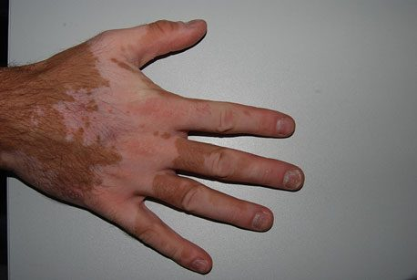

그림 4.4 에쿨리주맙(Soliris®)은 보체 구성요소 C5에 특이적인 인간화 IgG2/4κ 단클론항체로, 마우스 상보성 결정 영역(CDR)을 인간 항체 프레임워크 영역에 이식하여 면역원성을 줄이도록 설계되었다. Fc 수용체에 결합하지 않는 인간 IgG2 이소타입과 C1q에 결합하지 않고 보체 계단식 반응을 활성화하지 않는 IgG4의 특성을 이용하여 항체 유도 염증 반응의 가능성을 줄이기 위해 인간 IgG2와 IgG4 중쇄 하이브리드 불변 영역을 구성했다. 상보성 결정 영역(CDR)이 인간 항체 프레임워크 영역에 이식되어 항체 결합 부위를 형성한다(그림 4.4). 에쿨리주맙 개발에서 인간 IgG2와 IgG4 서열이 사용된 것은 인간 IgG2 이소타입이 Fc 수용체에 결합하지 않고 IgG4가 C1q에 결합하지 않으며 보체 계단식 반응을 활성화하지 않기 때문에 항체 유도 염증 반응의 가능성을 줄이기 위해서였다.

승인 적응증

에쿨리주맙에 대한 희귀의약품(orphan drug) 지위는 2003년 발작성 야간 혈색소뇨증(PNH) 치료, 2009년 비정형 용혈성 요독 증후군(AHUS), 및 2011년 시가 독소 유도 용혈성 요독 증후군(HUS)에 대해 FDA에 의해 인정되었다. 희귀의약품 지위는 EMA에 의해 2003년 PNH, 2009년 AHUS, 및 2012년 감염 관련 HUS에 대해 지정되었다. 에쿨리주맙은 2007년 FDA와 EMA로부터 PNH 치료 승인을 받았고 그 다음 2009년 캐나다 보건부와 호주 치료제청으로부터 승인되었다. 2011년 FDA와 EMA는 적응증을 AHUS로 확대했다. 구체적으로, 에쿨리주맙은 용혈을 줄이기 위한 PNH 환자와 보체 매개 혈전성 미세혈관병증을 억제하기 위한 AHUS 환자의 치료에 표시된다. 에쿨리주맙은 시가 유사 독소 E. coli 관련 HUS(FDA) 또는 감염 관련 HUS(EMA) 환자의 치료에는 표시되지 않는다.

발작성 야간 혈색소뇨증, 비정형 용혈성 요독 증후군, 및 에쿨리주맙의 작용 기전

PNH는 세포막에 CD59(프로텍틴, MAC-억제 단백질[MAC-I])를 포함한 다양한 단백질을 부착 및 고정하는 당지질인 글리코실포스파티딜이노시톨의 결핍을 초래하는 PIGA 유전자의 체세포 돌연변이에서 유래한 희귀 용혈성 질환이다. CD59는 보체 막공격 복합체(MAC, 말단 보체 복합체[TCC]라고도 함)에 C9이 통합되는 것을 억제하므로, PNH에서 CD59의 결핍은 적혈구 표면에서 MAC의 방해받지 않은 조립을 초래하여 만성 보체 매개 혈관내 용혈을 유발한다. 보체 활성화의 고전적, 렉틴, 및 대체 경로는 C5가 C5a와 C5b로 절단되는 지점에서 수렴하여 말단 보체 계단식 반응을 시작한다. MAC 또는 C5b-9, 즉 TCC는 C5b에 의해 C6, C7, C8, 및 C9가 동원되어 형성된다. 따라서 C5는 매력적인 표적이며 이것이 에쿨리주맙 개발로 이어진 전략이었다(그림 4.5). 에쿨리주맙은 C5와 C5 컨버테이즈 사이의 접촉 경계면에 결합하는 것으로 생각된다.

C5를 C5a와 C5b로 전환하는 세린 프로테아제인 C5 컨버테이즈는 효소와 기질의 밀접한 결합과 강력한 아나필라톡신 C5a 및 C5b-9 MAC의 최종 형성을 방지한다. PNH에서 세포 용해를 방지할 뿐만 아니라, 단클론항체에 의한 C5 절단 방지는 혈관 투과성 증가와 백혈구 주화성을 매개하고 평활근 긴장도를 변화시키며 아라키돈산 대사산물과 사이토카인을 포함한 2차 염증 매개체의 방출을 유도하는 강력한 전염증성 분자인 C5a의 형성을 차단한다. 소아와 성인 모두에 영향을 미치는 희귀하고 진행성이며 생명을 위협하는 질환인 AHUS는 혈전성 미세혈관병증(TMA)으로 알려진 질환 범주에 속한다. TMA의 병리학에는 소혈관벽의 비후, 내피 부종, 소혈관의 응고 및 궁극적으로 뇌졸중, 심장마비, 신부전, 및 사망을 동반한 조직 허혈이 포함된다. AHUS는 보체의 대체 경로의 조절 장애와 관련되며 환자의 약 60-70%에서 대체 경로의 조절에 관여하는 유전자 돌연변이 또는 보체 조절 단백질에 대한 자가항체(예: 항-H 인자)가 확인될 수 있다. AHUS에서 적어도 8개의 유전자에서 돌연변이가 확인되었지만, 현재 선별 검사는 환자의 35-40%에서 돌연변이를 검출하지 못하며, 유전학이 잘 기술된 경우에도 환자의 약 50%에서 질환의 원인은 불명확하다. PNH와 마찬가지로 AHUS 치료에서 에쿨리주맙은 C5 컨버테이즈에 의한 C5 절단을 방지하여 C5a와 C5b-9의 형성을 억제하고 보체의 전염증성, 전혈전성, 및 용해성 작용을 차단하는 것으로 생각된다. 에쿨리주맙은 이제 성인 AHUS 및 질환의 첫 에피소드가 있는 소아의 일차 요법으로 간주된다.

유전적으로 결정된 C5 결핍 환자는 재발성 감염, 특히 나이세리아 유발 수막염에 취약하다. PNH 환자의 에쿨리주맙에 대한 반응을 조사한 임상 시험에서 나이세리아 감염률은 환자-년 1000당 4.2건이었다. 그러나 중요하게도, C5에서의 항체 차단은 보체 매개 옵소닌화와 면역복합체 제거에 필요한 초기 구성요소가 제공하는 보호 기능을 손상시키지 않는다.

경고 주의사항, 및 이상반응

아마도 적어도 부분적으로 C5를 억제하는 작용 기전과 나이세리아 감염과의 알려진 연관성 때문에, 에쿨리주맙에 대해 심각한 수막구균 감염에 대한 블랙박스 경고가 발행되어 생명을 위협하고 치명적인 감염이 치료 환자에서 발생했거나 발생할 수 있다고 명시한다. 이 경고의 결과는 약물이 REMS 프로그램에 따라 발행되어야 한다는 요구사항, 가능하다면(및 위험 평가에 따라) 환자가 에쿨리주맙 첫 투여 2주 전에 수막구균 백신으로 면역화되어야 한다는 점, 및 환자가 수막구균 감염의 초기 징후에 대해 모니터링되어야 한다는 점이다. PNH 환자와의 임상 연구에서 나이세리아 감염 3건과 수막구균 패혈증 2건이 관찰되었으며 후자는 474 환자-년의 에쿨리주맙 요법에 걸쳐 발생했다. 말단 보체 활성화의 차단으로 환자는 감염, 특히 피막형 세균에 대한 전반적 감수성이 증가할 수 있다. 아스페르길루스종, 폐렴구균, 및 인플루엔자균에 의한 심각한 감염이 발생할 수 있다. 후자의 두 유기체에 대한 예방접종을 고려해야 한다. 에쿨리주맙 중단 후 환자를 용혈에 대해 최소 8주, AHUS 환자를 최소 12주 동안 예방적 모니터링하는 것이 권장된다. 임상 시험에서 탈퇴를 요구하는 주입 반응을 경험한 환자는 없었지만 진정한 과민반응을 포함한 그러한 반응의 가능성에 대한 경고가 발행되었다. PNH 환자에서 두드러진 이상반응(표 4.1)에는 두통, 비인두염, 오심, 피로, 부비동염, URTI, 변비, 근육통, 사지 통증, 단순 헤르페스 감염, 및 독감 유사 증상이 포함된다. 40명 중 37명이 에쿨리주맙을 투여받은 AHUS 핵심 연구에서 54%가 주로 고혈압과 감염인 심각한 반응을 경험했으며 가장 흔한 이상반응은 위장관 장애, 발열, URTI, 기침, 비강 충혈, 및 빈맥이었다. 7500건 이상의 보고가 있는 FAERS 데이터베이스에서 4-8% 빈도의 두통 및 위장관, 혈액학적, 및 호흡기 징후와 증상이 가장 흔하게 보고된 이상반응이었다. 3000건이 조금 넘는 감염 중 63건이 수막구균 패혈증, 29건이 수막염, 9건이 나이세리아 감염, 8건이 연쇄상구균 패혈증, 16건이 폐렴구균증이었다. 독감 유사 증후군 102건, 과민반응 78건(아나필락시스 사례 없음), 약물 과민반응 11건, 주입 반응 49건, PML 7건, 및 전신 염증 반응 증후군(SIRS) 1건이 있었다(1장, "전신 염증 반응 증후군" 절). 2012년 말 EVRS 데이터베이스에서 보고된 6775건의 이상반응 중 감염(14.5%), 위장관 사건(13.6%), 및 혈액학적 장애(7.9%)가 가장 높은 발생 빈도를 보였다. 986건의 감염 보고 중 90건이 폐렴, 77건이 패혈증(및 28건이 패혈성 쇼크), 56건이 요로 감염, 29건이 바이러스 감염이었다. 20건의 패혈증이 수막구균 감염에 의한 것이었고 나이세리아가 5명의 환자를 감염시켰다. 아나필락시스 4건과 혈청병 2건을 포함한 과민반응 12건이 보고되었다. 주입 반응 15건, SIRS 2건, PML 1건이 있었다.

에쿨리주맙의 면역원성

PNH 환자에게 에쿨리주맙을 투여할 때, 두 가지 다른 검사 방법을 사용하여 357명의 환자 중 1.5-3%에서 단클론항체에 대한 인간 항인간 항체가 검출되었다. AHUS 환자에서 100명의 환자 중 3%가 항체를 가졌다. 두 그룹의 항체 양성 환자 총 8명 중 PNH 그룹에서 2명과 AHUS 그룹에서 1명이 중화 항체를 가졌다.

단클론항체 인테그린 억제제: 나탈리주맙 및 베돌리주맙

단클론항체 인테그린 억제제 앱시시맙에 대해서는 위의 "앱시시맙" 절을 참조하라. 인테그린은 비공유 결합된 α- 및 β-소단위의 막관통 당단백질 이종이량체로, 일반적으로 각각 1000개와 750개의 아미노산으로 구성된다. 척추동물에는 18개의 α- 및 8개의 β-소단위가 있으며 이는 다양한 조합으로 24개의 다른 인테그린 수용체를 생성할 수 있다. 이들은 서로 다른 결합 특성과 조직 분포를 보여주고, 세포-세포 및 세포-세포외 기질 부착을 매개하며, 수용체 티로신 키나제 신호 전달과 세포 내부에서 외부로의 신호 전달으로 세포 외부에서 내부로의 신호를 전달한다.

나탈리주맙

나탈리주맙(Tysabri®)(표 2.1 및 4.1)은 T 및 B 림프구, NK세포, 대부분의 단핵구, 대식세포, 및 과립구(호중구는 제외)에서 발견되는 인간 α4 인테그린 소단위에 대해 생성된 재조합 인간화 IgG4κ 단클론항체이다. 단클론항체 개발의 선구자 작업은 α4 인테그린 표적화가 다발성 경화증의 마우스 모델에서 탈수초 병변의 발생을 예방한다는 것을 보여주는 초기 연구였다. 나탈리주맙은 표적화에 있어 절대적으로 특이적이지 않은데, α4β1(매우 늦은 항원 4, VLA-4; CD49d[α4], CD29[β1])과 α4β7 이종이량체 백혈구 부착 분자 모두와 상호작용하기 때문이다. 수용체 α4β1은

세포 부착 분자(CAM)인 혈관 부착 분자-1(VCAM-1, CD106)에 결합하는 반면, VCAM-1과 세정맥 내피의 세포외 단백질인 점막 어드레신 세포 부착 분자-1(MAdCAM-1, 어드레신)은 α4β7과 리간드로 상호작용하지만 VCAM-1은 더 낮은 친화력으로 α4β7에 결합한다. α4β1과 VCAM-1의 상호작용은 내피 세포에서 발생하는 반면, α4β7-MAdCAM-1 상호작용은 백혈구에서 일어난다. 면역글로불린 유사 막관통 분자인 VCAM-1은 뇌혈관 내피 세포를 포함한 혈관 내피에 대한 세포 부착을 매개하며 MAdCAM-1과 함께 크론병에서 장 내피에서 상향 조절된다. α4β1과 VCAM-1의 상호작용은 혈액에서 세정맥 벽을 통과하여 조직의 염증 부위로의 림프구 이동을 시작한다. 따라서 다발성 경화증에서, 염증이 있는 뇌혈관 내피 세포에 발현된 VCAM-1에 대한 α4β1의 부착을 차단함으로써, 나탈리주맙은 자가반응성 백혈구가 혈관 밖으로 나와 염증을 일으키는 표적 기관으로 이동하는 것을 방지하여 염증을 억제한다. 마찬가지로, 백혈구 부착 인자 α4β1 및 α4β7의 α4 소단위에 대한 나탈리주맙의 유사한 결합이 VCAM-1과 MAdCAM-1 모두의 장 내피 부착을 차단하는 것은 크론병에서 단클론항체의 유익한 효과의 기저 메커니즘으로 여겨진다(그림 4.6).

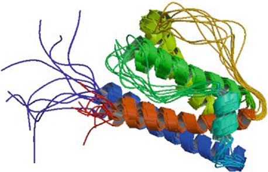

그림 4.6 VCAM-1과 MAdCAM-1은 크론병에서 장 내피에서 상향 조절된다. 나탈리주맙은 인테그린 소단위 α4β1과 VCAM-1 사이 및 α4β7과 MAdCAM-1 사이의 상호작용을 차단하여 림프구의 내피 세포 부착을 방지한다. 이는 자가반응성 림프구가 혈관을 벗어나 표적 기관으로 이동하는 것을 방지하여 염증을 예방한다. 궤양성 대장염과 크론병 치료에 사용되는 베돌리주맙도 α4β7과 MAdCAM-1 사이의 상호작용을 억제하여 기억 T 림프구의 혈관 상피를 가로지르는 장으로의 이동을 방지함으로써 작용한다.

나탈리주맙의 승인 적응증

다발성 경화증과 크론병 치료가 승인된 최초의 인테그린 억제제인 나탈리주맙은 2004년 재발성 다발성 경화증 치료 및 2008년 중등도에서 중증 크론병에 대해 FDA 승인을 받았다. 또한 2006년 캐나다 보건부와 2008년 일본 규제 당국에 의해 다발성 경화증에 대해 승인되었다. 2006년 재발 완화형 다발성 경화증에 대해 EMA 승인을 받았지만 그 기관은 아직 크론병 치료에 대해 단클론항체를 승인하지 않았다. 인테그린 수용체 길항제로서 나탈리주맙은 재발성 형태의 다발성 경화증 치료에서 임상 악화를 줄이고 장애를 지연시키기 위한 단독 요법으로, 그리고 통상 요법과 TNF 억제제가 적합하지 않은 성인의 크론병 치료에 표시된다. 나탈리주맙은 면역억제제나 TNF 억제제와 함께 투여해서는 안 된다. 다발성 경화증과 관련하여 2015년 5월 FDA는 다음과 같이 밝혔다: "Tysabri는 PML 위험을 증가시킵니다. Tysabri 치료를 시작하고 계속할 때, 의사는 Tysabri의 기대 이점이 위험을 상쇄하기에 충분한지 고려해야 합니다."

진행성 다초점 백질뇌병증 및 나탈리주맙

PML(1장, "진행성 다발성 백질뇌병증" 절도 참조)은 PML 환자인 John Cunningham의 이니셜로 명명된 인간 폴리오마바이러스 JC 바이러스에 의한 희소돌기아교세포 감염으로 인한 뇌의 희귀하고 대개 치명적인 탈수초 질환이다. 임상적으로 이 장애는 운동 증상, 시력 손상, 진행성 쇠약, 언어 변화, 및 인지 장애 증상으로 나타나며 일반적으로 실명, 치매, 혼수, 및 사망으로 진행된다. 인간에서만 발생하는 것으로 보이는 JC 바이러스는 미국과 영국에서 44-77%, 독일, 일본, 및 브라질에서 최대 92%의 보고된 발생률로 널리 퍼져 있다. 편도 및/또는 위장관을 통한 감염은 소아기 또는 청소년기에 발생하는 것으로 보이며 바이러스는 1-5세 어린이의 약 10%와 17세 청소년의 약 65%에서 발견된다. 그것은 위장관에 잠복해 있지만 신장과 골수에 있을 수 있고 혈액-뇌 장벽을 통과할 수 있다. 대장암과 관련이 있다고 제안되었지만 입증되지는 않았다. JC 바이러스가 정상적으로 기능하는 면역 체계에 의해 억제된다는 것은 분명하지만, 면역결핍과 면역억제는 PML의 발병을 돕고, 이는 후천성 면역결핍 증후군(AIDS) 환자와 화학요법을 포함한 면역억제 약물을 투여받는 환자에서 상대적으로 높은 발생률로 반영된다. 그러한 환자의 잠재적 목록에는 이식 환자, 자가면역 질환, 다발성 경화증, 건선, 및 림프종 환자가 포함된다. 1984년 이전에 알려진 230건의 사례는 이식, 악성종양, 및 다양한 혈액학적 및 염증성 장애와 관련된 것으로 판단되었으며 HIV 감염으로 인한 것은 약 5%에 불과했다. 최근에는 HIV 관련이 사례의 약 85%를 차지한다. 면역억제 또는 면역결핍이 때때로 바이러스를 "재활성화"하여 희소돌기아교세포를 파괴한다고 하지만 PML은 아마도

뇌의 1차 바이러스 감염 또는 바이러스 재활성화의 결과가 아니라, B 림프구에 의해 뇌로 운반되어 복제되는 돌연변이 바이러스에 의한 감염의 결과이다. 정상적인 면역 능력이 있는 사람에서 보조 및 세포독성 T세포가 바이러스를 억제하지만 면역 저하 개인에서는 이것이 발생하지 않는다. 코르티코스테로이드, 세포독성 화학요법제, 및 타크로리무스와 같은 이식 약물과 같은 면역억제 요법뿐만 아니라, 다양한 현대 생물학적 요법이 면역 반응을 저하시켜 돌연변이 JC 바이러스가 정상적으로 활성인 면역 방어를 회피하고 PML로 이어지는 병리학적 과정을 방해받지 않고 매개할 수 있다. PML 발생에 일부 위험을 지니는 이러한 바이오의약품 목록에는 단클론항체 나탈리주맙, 리툭시맙, 오비누투주맙, 오파투무맙, 브렌툭시맙 베도틴, 및 에팔리주맙과 융합단백질 벨라타셉트(6장, "벨라타셉트" 및 "벨라타셉트 안전성" 절)가 포함된다. 2005년 초 단클론항체와 관련된 PML 3건(환자 1000명당 약 1건의 발생률)의 보고 후, 나탈리주맙은 FDA에 의해 시장에서 중단되었다가 2006년 말에 약물이 REMS 프로그램으로서만 이용 가능한 제한적 유통 하에 재도입되었다(아래 참조). 2015년 나탈리주맙에 대한 지식 축적과 PML 위험에 비추어, 유럽 위원회는 EMA에 나탈리주맙을 검토하고 PML 위험 인자 관리에 대한 조언을 개정해야 하는지 평가하도록 요청했다. 검토는 유럽 약물감시 위험 평가 위원회에 의해 수행될 것이다. 위험 추정치, 임상 증상 발생 전 PML 진단, 및 항-JC 바이러스 항체의 세 가지 핵심 문제가 평가될 것이다. 나탈리주맙이 2006년 재도입된 시점과 2010년 초 사이에 나탈리주맙 치료 환자에서 PML 42건이 보고되었으며 2012년 2월까지 거의 100,000명의 환자 중 212건이 확정되어 환자 1000명당 2.1건의 발생률이었다. 시판 후 기간에 61,000명 이상의 크론병 환자에서 PML 34건이 기록되었다. 2011년 11건, 2012년 8건이 보고되었다. FDA의 2005년 나탈리주맙 중단과 2006년 시장 재도입 후, FDA는 단클론항체에 대해 PML에 대한 블랙박스 경고를 발행했다. 여전히 현재의 경고는 나탈리주맙이 PML 위험을 증가시킨다고 명시하며, 치료 기간, 이전 면역억제제 사용, 및 항-JC 바이러스 항체 존재와 같은 위험 인자에 주의를 촉구하고, 뇌 스캔, 가돌리늄 자기공명영상, 및 JC 바이러스 DNA에 대한 뇌척수액 분석을 활용하여 증상에 대해 환자를 모니터링하기 위한 진단 요건을 제시한다. 블랙박스 경고는 또한 나탈리주맙용으로 TOUCH® 처방 프로그램이라는 제한적 가용성 프로그램을 다루며 이는 다발성 경화증 환자를 위한 MS TOUCH®와 크론병 환자를 위한 CD TOUCH®로 나뉜다. 프로그램의 요구사항에는 첫 주입 후 및 나탈리주맙 요법 중단 후 환자의 정기 평가, 6개월 치료 승인, 재승인 및 중단 설문지와 PML 사례, 감염, 및 사망 보고를 약물 제조업체에 제출, 및 나탈리주맙을 조제하기 위한 약국 및 주입 센터의 특별 인증이 포함된다.

나탈리주맙의 경고 주의사항, 및 이상반응

PML의 위험 외에도, 감염, TGF-β에 의해 유도된 간 손상, 과민반응, 및 면역 재구성 염증성 증후군(IRIS)을 포함한 단클론항체로 치료받는 환자에 대한 추가 경고 및 주의사항이 FDA에 의해 발행되었다. 감염에 대한 경고는 나탈리주맙과 관련되어 비정상적으로 드물지 않은 것으로 관찰된 헤르페스 감염에 특히 주의를 촉구한다. 헤르페스 수막염과 헤르페스 뇌염 사례가 보고되었다. 단, 감염은 일반 인구와 유사한 발생률로 다발성 경화증 환자에서 발생한다. 크론병 환자에서 관찰된 더 빈번한 심각한 사건에는 설사, 장 천공, 소화불량, 및 복강 농양이 포함된다. 표 4.1에 나열된 나탈리주맙에 의해 유발되는 가장 흔한 이상반응은 두통, 감염, 피로, 불면, 우울증, 관절통, 요로 감염, 다발성 경화증 발작, 코인두염, 경련 유사 증상, 독감, 위장염, 변비, 말초 부종, 월경 과다, 및 발진이었다. 간 손상과 관련하여, 나탈리주맙으로 치료받은 환자에서 치명적인 간부전 사례가 보고되었으며, 간 효소 수준 모니터링이 권장된다. 심각한 이상반응은 나탈리주맙을 투여받은 환자(19.9%)와 위약을 투여받은 환자(17.6%)에서 유사한 발생률을 보였다. 과민반응은 대개 두드러기, 두통, 발열, 오한, 오심, 홍조, 및 구토로 나타나며 주입 중 또는 완료 후 1시간 이내에 발생할 수 있다. 아나필락시스 반응은 중단, 아나필락시스양 반응 6건, 속발성 호산구 증가증 1건과 함께 6건에서 보고되었다. 주입 반응은 시간이 지나면서 감소하는 경향이 있고 이 반응과 독립적인 재발성 반응은 경증이며 보통 아나필락시스양 반응보다 늦게 발생하며 반응은 종종 항히스타민제에 의해 조절된다. IRIS(면역억제 또는 면역결핍으로 인한 병원체 반응), 특히 PML과 관련된 IRIS가 나탈리주맙으로 치료받는 환자에서 발생할 수 있으며, 임상적 악화, 발작, 시야 변화, 정신 상태 변화, 및 뇌종양과 같은 진행성 증상으로 나타날 수 있지만, 이 패턴은 나탈리주맙 중단 3개월 후에 발생하는 것으로 알려져 있다. 혈액-뇌 장벽을 통한 림프구 모집의 회복은 IRIS의 발병 기전에서 완전히 이해되지 않은 역할을 하며 건강한 환자를 포함한 일부 환자에서 치료를 받은 환자와 IRIS의 발생 사이에 시간 지연이 관찰될 수 있다. 림프구의 다른 아집단의 다양한 재증식 속도, JC 바이러스 유발 림프구 반응의 강도, 및 백혈구 모집의 회복 속도는 모두 바이러스에 대한 과도한 또는 적절한 면역 반응을 설명할 수 있다. FDA가 나탈리주맙에 대해 발행한 다른 경고 및 주의사항은 가돌리늄 조영제 사용 모니터링의 필요성, 생백신 회피, 및 임산부 사용을 다룬다.

다발성 경화증에서 나탈리주맙 사용. 임상 경험 및 PML 위험 계층화

재발 완화형 다발성 경화증에서 나탈리주맙의 안전성과 효능에 대한 초기 임상 연구 결과는 유망했다. 악화율, 감각 기능, 정신 건강, 및 삶의 질 지표에서 개선이 기록되었다. 그러나 나탈리주맙의 사용은 PML의 위험을 동반하며 발생률은 요법 기간과 이전 면역억제제 사용에 따라 0.1%에서 약 0.5%에 이르는 것으로 추정되었다. 위험은 치료 2년차와 3년차에 증가하는 것으로 나타났다. 치료 24개월 후 위험은 1000명 중 약 4명으로 추정되었다.

67%가 항-JC 바이러스 항체 음성인 66,119명의 다발성 경화증 환자에 대한 분석에서, 항체 음성 환자에서 PML 사례가 없었다. 항체 양성 환자 중 PML 발생률은 이전 면역억제제 사용 유무와 치료 기간(1-24, 25-48, 49-72개월)에 따라 1000명 중 0.09명에서 11.1명에 이르렀다. 후자 분석과 후속 관찰은 어떤 위험이 존재하면 대부분 요법 18-48개월 후에 나타남을 보여주었다. 치료 5년 후, 이전 면역억제제 사용 유무에 관계없이 항체 양성 환자에서 낮은 PML 위험(1000명 중 약 1명)이 관찰되었다. 2014년 보고에 따르면 잠시 중단 없이 나탈리주맙을 4년 이상 투여받은 항-JC 바이러스 항체 양성 환자에서 PML 위험이 특히 높았으며 이전 면역억제제 사용 유무와 무관하게 환자 1000명당 약 11명으로 증가했다. 전체적으로 나탈리주맙의 사용은 PML 위험(연령에 따른 논쟁이 있는 항-JC 바이러스 항체 상태, 이전 면역억제제 사용, 및 치료 기간에 의해 강하게 영향받음)과 PML 발병 위험 인자를 평가하기 위한 기준 뇌 스캔의 필요성, 연 1회 자기공명영상, 유증상/무증상 환자에서의 상태 재평가, 및 약물 중단 후 뇌 재영상화의 필요성에 따라 제한된다. PML의 위험을 예측하는 데 필요한 항-JC 바이러스 항체에 대한 기준선 및 반복 검사 검출 방법은 ELISA(효소결합면역흡착검사) 및 이차 항체와 경쟁하는 형광 비드 검사로, 후자는 검출 한계를 개선한다. 항체 상태가 이전에 발견되지 않았거나 재평가 중 변경되면, PML 위험의 재계산이 필요하며 적절하다면 일부 요법에서 나탈리주맙을 중단하는 것으로 이어질 수 있다. 2014-2015년의 또 다른 중요한 고려 사항은 2014년 4월부터 스핑고신 1-인산 수용체 표적 경구약 핑골리모드가 출시됐으며 핑골리모드는 나탈리주맙과 유사한 효능으로 다발성 경화증에서 우수한 반응을 보였다. 2015년 중반 현재 제한적 가용성이 있는 나탈리주맙 사용의 증가가 관찰되었다.

나탈리주맙의 면역원성

나탈리주맙을 투여받는 일부 환자에서 지속적인 항체 형성과 함께 검출 가능한 항체가 형성된다. 처음 12개월 동안 추적된 625명의 다발성 경화증 환자에서, 단클론항체에 대한 항체가 6% 및 9%의 환자에서 각각 발생하고 지속되었다. 24개월까지 지속적으로 혈청 양성인 환자는 단회 사용 또는 중간 항체 발생 환자와 비교하여 약물 효과의 감소와 경미한 이상반응의 증가를 보였다. 검출 가능한 항체가 있는 환자 중에서도 지속 항체가 있는 환자에서 그 차이가 가장 뚜렷했다. 일시적 항체 형성을 보이는 환자는 검출 가능한 항체가 없는 환자와 유사한 결과를 보였다. 중단된 사용 후 임신 기간 연장 환자에서 나탈리주맙의 지속적인 존재는 항체 측정을 방해할 수 있다.

베돌리주맙

베돌리주맙(MLN0002, Entyvio®, LDP-02로도 알려짐)(표 2.1 및 4.1)은 인간 α4β7 인테그린에 특이적인 인간화 IgG1 단클론항체로, 분자량 약 146-147 kDa이다. TNF 억제제와 달리, 크론병과 궤양성 대장염의 치료제로 2014년 FDA에 의해, 2015년 EMA에 의해 승인된 베돌리주맙은 장-선택적 항염증 작용을 하는 것으로 설계되었다.

α4β7 및 베돌리주맙의 작용 기전

α4β7 인테그린은 부분적으로 활성화된 기억 T 림프구에서 선택적으로 발현됨으로써, 궤양성 대장염과 크론병과 같은 염증성 장질환의 병인에서 중요한 역할을 하며 이러한 세포는 장으로 이동하여 조직 손상을 유발한다. 장으로의 이동을 수행하기 위해, 기억 T 림프구는 혈관 내피 세포의 표면에서 발견되는 MAdCAM-1과 점막 어드레신 세포 부착 분자와의 상호작용을 필요로 한다(나탈리주맙, 그림 4.6). MAdCAM-1은 일반적으로 대장의 세정맥과 고유판 혈관에서 발현되지만 궤양성 대장염과 크론병에서는 그 발현이 증가한다. α4β7- 및 MAdCAM-1-매개 세포 이동의 차단은 장과 창자 관련 림프 조직으로의 림프구 이동을 억제하여 베돌리주맙에 제공되는 장-선택적 특성을 설명한다. α4β7 인테그린은 장의 창자 관련 림프조직으로의 림프구 이동에 중요하지만 뇌로의 이동에 관여하는 것으로 보이지 않는데, 후자는 나탈리주맙의 표적인 α4β1 인테그린을 필요로 한다. 이것이 바로 나탈리주맙 치료에서 관찰되는 PML과 같은, 인테그린의 보편적 차단에 의한 뇌에 대한 부작용이 베돌리주맙에서 발생하지 않는 이유이다. 베돌리주맙은 나탈리주맙과 대조적으로 α4β1 인테그린에 결합하지 않는다.

적응증, 경고 주의사항, 및 이상반응

베돌리주맙은 크론병과 궤양성 대장염의 둘 다 치료에 승인되어 있으며, FDA는 중등도에서 중증 활동성 크론병과 궤양성 대장염의 성인 치료 적응증을 명시하고, 통상 요법 또는 TNF 차단제에 적절한 반응을 보이지 않았거나 불내성인 환자에게 사용하도록 지시한다. 패턴은 EMA의 승인 적응증에서 유사하다. 베돌리주맙은 면역억제제나 TNF 억제제와 함께 투여해서는 안 되며 여러 경고와 주의사항이 발행되었다. 감염의 위험에 주의를 촉구하며 환자가 심각한 감염에 걸리면 단클론항체 투여가 중단되어야 한다. 결핵 검사는 치료 시작 전에 수행되어야 하며 BCG를 포함한 생백신은 회피되어야 한다. 진행성 다발성 백질뇌병증의 잠재적 위험에 대한 논의가 이루어졌으며, 베돌리주맙에 대한 PML 사례는 아직 보고되지 않았지만 다른 α4 인테그린 억제제 나탈리주맙에서 발생한 PML로 인해 우려가 제기되었고, 임상 시험에서 JC 바이러스 감염 6건이 보고되었다.

궤양성 대장염과 크론병을 모두 포함하는 통합 데이터베이스에서 베돌리주맙을 투여받은 환자의 4-6%에서 관찰된 주입 반응은 두드러기, 발진, 가려움증, 오심, 두통, 발열, 홍조, 및 호흡곤란과 같은 증상으로 아나필락시스 반응을 닮을 수 있다. 과민반응, 주입 반응, 사르코이드증, 또는 아나필락시스와 같은 반응의 가능성에 주의가 촉구된다. FDA의 크론병 및 궤양성 대장염 시험에서 관찰된 가장 흔한 이상반응(발생률 ≥3%)은 비인두염, 두통, 관절통, 오심, 발열, 상기도 감염, 피로, 기침, 기관지염, 독감, 요통, 발진, 가려움증, 부비동염, 인후통, 및 사지 통증이었다(표 4.1).

베돌리주맙의 면역원성

베돌리주맙에 대해 항체가 관찰되었지만 비교적 드물게 발생한다. 6주 동안 베돌리주맙을 투여받은 환자 중 한 연구에서 약 4%의 발생률이 발견되었고 다른 합성 분석에서 총 11%가 항체 양성이었다. 항체는 약 5-8%의 환자에서 지속적이었다. 항체의 존재는 베돌리주맙 혈청 수준 감소와 연관되었으며 중화 항체는 임상 시험 그룹 전체에서 환자의 3.9%에서 검출되었다. 항체와 이상반응 사이의 연관성은 검출되지 않았다.

오말리주맙

오말리주맙(rhuMAb-E25, Xolair®)(표 2.1 및 4.1)은 인간 IgE에 대해 생성된 재조합 인간화 IgG1κ 단클론항체로, 분자량 약 149 kDa이다.

IgE 및 오말리주맙의 작용 기전

알레르기성 천식과 관련하여 특히 중요한 방어 단백질인 IgE는 Th2형 CD4+ T 림프구에 의해 유도된 재조합 클래스 전환 후 항원-특이적 플라즈마 세포에 의해 합성된다(5장, "인터루킨-4 및 인터루킨-13" 절을 포함한 수많은 절). 인간의 혈청 IgE 농도는 일반적으로 면역글로불린의 다른 등급보다 낮으며 각 IgE 분자는 막 표면에 고정된 Ig(막-IgE) 부위와 마스트 세포와 호염기구에서 발견되는 CD23(FcεRII) 및 고친화성 FcεRI 수용체로 세포 막에 IgE 분자를 고정하는 FcεRI/II 부위를 포함한다. IgE-수용체 상호작용은 표적 세포에 알레르겐 특이성을 제공한다. 알레르겐에 의한 막 결합 IgE의 가교 또는 여러 IgE 분자의 결합으로 인한 응집은 일부 경우 알레르기 증상을 초래하는 탈과립 반응을 촉발한다(그림 4.7). 천식에서 마스트 세포와 호염기구에 대한 알레르겐 결합은 즉시형 기도 과민 반응을 유도한다. 즉시 반응은 전형적으로 알레르겐 노출 후 10분에서 수 시간 이내에 발생하며 히스타민, 류코트리엔, 프로스타글란딘, 단백질분해효소, 및 전염증성 사이토카인과 케모카인과 같은 미리 형성되고 새로 합성된 매개체의 방출을 포함한다. 후기 반응은 노출 수 시간 후에 발생하여 알레르기성 염증 반응인 호산구, 호중구, 및 T 림프구의 모집과 함께 기도 염증을 유도한다.

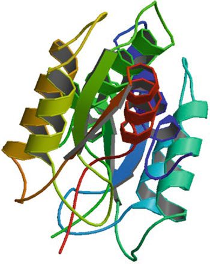
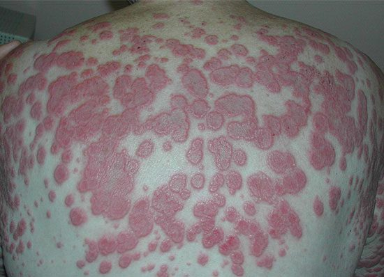

그림 4.7 알레르겐 특이적 IgE는 고친화성 FcεRI 수용체를 통해 마스트 세포 막에 고정될 수 있다(막-IgE). 알레르겐에 의한 IgE의 가교는 일부 경우 알레르기 증상을 초래하는 마스트 세포에 의한 매개체 방출 및 탈과립을 유발한다. 오말리주맙은 막 결합 IgE와 고친화성 수용체 FcεRI의 상호작용을 차단하고 혈중 유리 IgE를 중화하여 사이토카인과 알레르기 매개체의 방출을 감소시킨다.

알레르겐에 대한 IgE 결합을 차단하는 것은 알레르기 반응을 예방할 것으로 예상된다. 이것이 오말리주맙의 접근 방식이며 이는 FcεRI 부위와 결합 영역을 공유하고 마스트 세포와 호염기구의 수용체에 IgE 결합을 차단하도록 설계된 인간화 항-IgE 단클론항체이다. 오말리주맙은 또한 호염기구와 마스트 세포 표면의 FcεRI를 하향 조절하고 항원-유발 실린더성 세포 질환을 억제한다. 안전하게, 오말리주맙은 이미 세포에 결합된 IgE와 반응하지 않으므로 알레르기 세포와 반응과 관련된 아나필락시스 반응을 유발하지 않는다. 사이토카인과 알레르기 매개체의 방출을 감소시키고 세포에 결합된 FcεRI를 하향 조절함으로써, 오말리주맙은 알레르기 반응의 더 완전한 억제를 달성한다(그림 4.7).

적응증, 경고, 주의사항, 및 이상반응

오말리주맙은 중등도에서 중증 지속성 천식, 만성 특발성 두드러기, 및 2014년부터 소아 천식(6-12세)에 대해 승인되었으며, 습진, 두드러기, 및 기타 알레르기 질환이 연구되고 있다. 오말리주맙은 알레르기성 천식에도 사용된다. 천식 치료에서 흡입성 코르티코스테로이드를 사용하는 알레르기성 천식 환자에서 악화율 감소와 생명을 위협하는 중증 천식 발작의 발생 감소가 관찰되었다. 17,973명의 환자를 대상으로 한 백서(white paper) 분석에서 천식-관련 사망의 발생률은 관찰되지 않았지만 아나필락시스 발생률은 0.1% 미만이었다. 개별 환자의 치료에 아나필락시스가 연관될 경우, 마취 또는 중증 정맥주사 시술 중 아나필락시스 반응을 포함한 반응이 발생할 수 있다. 2,000분까지 관찰되어야 하며 반응은 아나필락시스/MAB 반응 또는 "아나필락시스 유사 증상"으로 분류된다.

오말리주맙에 대한 아나필락시스 반응은 드물지만 발생할 수 있으며(발생률 0.1%, 사망 보고 없음), 기침, 목의 긴장감, 홍조, 가려움, 두드러기, 및 쌕쌕거림으로 나타난다. 진정한 제1형 즉시형 아나필락시스 반응의 진단은 IgE 매개 반응에 대한 증거를 필요로 한다. 아나필락시스 증상에 대한 오말리주맙의 시험에서 308건의 아나필락시스 의심 사례가 확인되었고 15건이 IgE 매개 즉시형 과민반응으로 확인되었다. 아나필락시스 반응을 조사하는 데 사용된 검사에는 오말리주맙 피부 시험, 기저 세포에서 유래한 구조물을 이용한 활성화 검사, 및 혈청 반응성 패널이 포함되었다. 아나필락시스 증상은 처음 2시간 내에 그리고 첫 4건의 주입 중 발생했으며 반응은 첫 번째, 두 번째, 그리고 세 번째와 네 번째 주입에서 각각 2건, 그리고 더 많은 주입 후 2건 발생했다. 이러한 발견은 단일 오말리주맙 노출과 후속 주입 모두에서 아나필락시스가 발생할 수 있음을 강조한다.

이상반응: 주입 반응, 주사 부위 반응, 및 기타

표 4.1의 흔한 이상반응은 주사 부위 반응, 두통, 피로, 관절통, 인후통, 부비동염, 귀 감염, 호흡기 이상, 상기도 감염이다. 주입(정맥) 반응은 대개 경증이나 드물게 아나필락시스로 진행할 수 있어 주입 후 최소 2시간 관찰한다. 주입 반응은 첫 주입 후 1시간 안에, 주사 부위 반응(통증·홍반·부종·가려움·작열감·타박상)은 주입 후 24시간~7일 안에 나타난다. 17,973명 연구에서 주입 반응은 5% 이상에서 보고됐다.

오말리주맙의 면역원성

오말리주맙에 대한 항체가 문서화되었으며 이는 드물지만 시간이 지남에 따라 증가한다. 천식 환자에서 항-오말리주맙 항체의 발생은 1-2%였으며 2016년에 발표된 연구에서 오말리주맙에 대한 항체는 환자의 1.4%에서 검출되었다. 오말리주맙 항체의 발달은 오말리주맙에 대한 반응성을 측정하는 일부의 경우 반응성을 간섭할 수 있다. 그러나 항체의 존재는 오말리주맙의 효능에 광범위한 영향과 연관되지 않았다.

팔리비주맙

팔리비주맙(Synagis®)(표 2.1 및 4.1)은 호흡기 세포융합 바이러스(RSV)의 융합 단백질에 대한 에피토프의 카복시말(C-말단) 부분과 반응하는 인간화 IgG1 단클론항체이다. 이 융합 단백질은 바이러스의 주요 외피(envelope) 당단백질로, RSV에 대한 바이러스 중화 활성 항체의 우세한 표적이며 바이러스 부착과 세포간 융합을 매개한다. 팔리비주맙은 예방 목적으로 전 세계적으로 승인되었으며 어린 영아에서 RSV 하기도 질환을 예방한다.

작용 기전과 상호작용

팔리비주맙은 RSV 융합단백질 A(RSV-F)에 붙어 바이러스 부착·세포간 융합을 막아 복제를 억제한다.

이상반응과 면역원성

어린 영아에서 주로 관찰되는 이상반응은 발열, 상기도 감염, 비염, 발진, 기관지염, 중이염, RTI, 및 식욕 부진이었다.

관련된 시판 후 데이터는 과민반응, 주입 부위 반응, 및 감각 이상 반응(예: 신경학적 사건)을 확인했다. 감각 이상은 주입 중 발생했다. 단클론항체에 대한 항체가 보고되었으며 첫 5개월 동안 팔리비주맙으로 치료한 영아에서 항-팔리비주맙 항체가 검출되었다. 항체는 환자의 1% 미만에서 중화 활성을 나타냈다. 항체 발생은 팔리비주맙의 결과를 반영하지 않을 수 있다. 면역원성은 혈청 항체 검출 후 환자가 면역학적으로 재구성될 때 나타날 수 있지만 팔리비주맙은 효능이 입증된 약물이다.

라니비주맙

라니비주맙(Lucentis®)(표 2.1 및 4.1)은 혈관 내피 성장 인자-A(VEGF-A)에 대해 생성된 재조합 인간화 IgG1 항체 단편(Fab)이다. 분자량 48 kDa의 이 Fab는 혈관신생 억제제로 승인되었다.

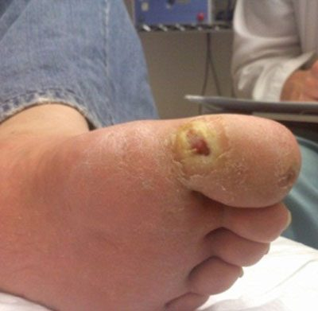

그림 4.8 라니비주맙은 소분자 IgG1 항체 단편이다. 맥락막 신생혈관화(CNV)에서, 이 Fab는 혈관 내피 성장 인자-A(VEGF-A)에 결합하여 활성화된 내피 세포에 의한 혈관 투과성 증가와 내피 세포 증식을 방해하여 결국 혈관을 통해 누출되는 것을 줄이고 신생혈관 성장을 차단한다.

나이 관련 황반 변성(AMD) 및 황반부종과 관련된 기타 질환, 그리고 당뇨병성 황반부종(GMF), DME에 대해 승인되었다. 라니비주맙은 맥락막 신생혈관화(CNV)를 억제하고 나이 관련 황반 변성에서 비정상적인 신생혈관 성장을 차단한다(그림 4.8). 라니비주맙은 유리체강내 주사용으로 승인됐다(FDA 라벨). 라니비주맙의 적응증은 신생혈관(습성)성 나이 관련 황반 변성, 황반부종, DME, 및 맥락막 신생혈관화를 동반한 근시성 황반 변성의 치료이다. FDA 승인 적응증에는 습성(신생혈관)성 AMD, DME 및 맥락막 새로운 맥락막 신생혈관화(치료)가 포함된다. 2015년 금액은 2006년 최초 승인 당시의 승인 패턴과 유사하다. 라니비주맙과 다른 의약품(예: 베바시주맙(아바스틴))의 병용 사용은 비적응증 사용으로 규제 승인을 받지 못했다. 라니비주맙은 특이한 이상반응 프로파일을 가진 유리체강내 주사와 연관되어 있다. 유리체강내 주사는 안구 통증, 움직임, 출혈, 및 유리체 박리의 발생과 관련이 있으며 이는 이상반응의 발생과 혼동될 수 있다. 라니비주맙과 관련된 더 우려되는 이상반응에는 안내염(염증), 유리체 출혈(눈에서의 출혈), 안료 이상, 안구 조직 손상, 및 망막 박리가 포함될 수 있다. 이들은 라니비주맙과 연관된 것으로 문서화된 이상반응이며 2015년 라니비주맙 초기 승인 당시에 보고되었다. 드물지만 심각한 반응이 보고되었으며 특히 관상동맥 우회술 및 생명을 위협하는 주요 출혈 등이 있는데, 이는 수술 후 30일 이내에 발생하는 주요 출혈, 심근경색, 및 뇌졸중을 포함한다.

2015년에 VIVID-DME 시험, VISTA-DME 시험, 및 RISE와 RIDE 시험에서 연구된 반응 이상반응으로 인해 라니비주맙과 관련된 특이한 이상반응이 보고되었으며 이는 군집 분석에서 관찰되었다. 안구 이상반응(안내염, 유리체 출혈, 망막 박리, 및 백내장)이 DME 시험에서 관찰되었고 더 흔한 비안구 이상반응이 포함되었다. 대조군과 비교한 일부 임상 시험에서 라니비주맙과 관련된 추가 이상반응에는 비인두염, 오심, 변비, 빈혈, 요로 감염, 만성 폐쇄성 폐질환, 두통, 고혈압, 기관지염, 관절염, 및 불면이 포함된다. VIVID-DME 시험에서 관찰된 이상반응은 대조군에서 관찰된 것과 유사했다. 라니비주맙에서 관찰된 추가 이상반응에는 항-라니비주맙 항체의 생성을 포함하는 면역원성의 발생이 포함된다. 5상 임상 시험에서 라니비주맙을 투여받은 환자의 1-6%에서 항-라니비주맙 항체가 검출되었다. 항체는 환자의 1-6%에서 검출되었으며 잔류 최종 라니비주맙 항체 역가가 증가했는데, 이는 혈청 면역글로불린 수준에 영향을 미칠 수 있다. 국소 및 전신 모두에서 관찰된 이상반응의 종류는 라니비주맙 시작 후 6-12개월, 그리고 최대 2년까지의 치료 기간 동안 관찰되었다.

세쿠키누맙

세쿠키누맙(Cosentyx®, AIN457)(표 2.1 및 4.1)은 IL-17A(IL-17A)에 대해 생성된 재조합 완전 인간 IgG1κ 단클론항체로, 분자량 약 151 kDa이다. 종양괴사인자 계열에 속하는 사이토카인이며 면역 반응 중에 발현되는 IL-17A는 활발히 논의되는 전염증성 사이토카인 계열의 구성원이다. 이 계열에는 IL-17A, IL-17B, IL-17C, IL-17D, IL-17E(또는 IL-25) 및 IL-17F를 포함한 6개의 상동성 구성원이 있으며 각각 한 쌍의 분자를 포함한다. IL-17A는 Th1, Th2, 및 조절 T세포와 구별되는 CD4+ Th17 세포에 의해 우세하게 생산된다.

IL-17A를 표적화한 세쿠키누맙의 작용 기전

IL-17A는 세포 자체는 물론 내피 세포와 섬유아세포에 대한 작용뿐만 아니라 조절 T세포의 밀집한 집단에 대한 억제성 작용으로 면역 반응을 조절하고 다수의 전염증성 사이토카인과 케모카인의 생산을 촉진한다. IL-17A는 류마티스관절염, 건선성 관절염, 다발성 경화증, 및 크론병에서 상향 조절된다. IL-17A 수준은 중등도의 골 파괴와 함께 만성 염증에서 상향 조절되며 활액 내 높은 수준이 미란성 질환과 상관관계가 있는 것으로 나타났다. IL-17R 결핍 마우스 실험에서 IL-17A가 없는 마우스가 과립구의 모집을 촉진하여 다양한 염증 모델에서 염증을 감소시키는 것으로 나타났고 실험적 자가면역 뇌척수염에서 T세포와 자가면역 염증을 촉진한다. IL-17A의 수준은 류마티스관절염 환자의 분비액과 활액에서 상승하며 IL-17A 수준은 활액 내 CD68+ 대식세포의 수와 상관관계가 있다.

IL-17A는 IL-17 수용체에 결합하며 연구는 결합 신호 전달을 조절하는 것에 초점을 맞추었다. 세쿠키누맙은 IL-17A 및 IL-17F(가장 가까운 상동체)에 결합하여 IL-17 수용체 A 복합체의 조절을 방해한다. Th17 세포는 류마티스관절염 환자의 활액에서 관찰되었으며 Th17 세포와 연관된 사이토카인은 만성 관절염의 발병에 중요한 것으로 여겨진다. 세쿠키누맙은 시험관 내 및 생체 내에서 시험되었으며 IL-17A 신호 전달을 차단하는 능력은 염증을 감소시키는 효과와 함께 입증되었다. 세쿠키누맙은 세포 배양에서 시험되었다. IL-17A 및 IL-17F에 대한 세쿠키누맙의 결합 특성은 IL-17 수용체 복합체의 형성을 억제하는 효과와 함께 나타났으며 이는 시험된 염증, 사이토카인, 및 케모카인의 수준을 감소시켰다.

세쿠키누맙의 적응증, 이상반응, 및 면역원성

세쿠키누맙은 2015년 성인의 중등도~중증 판상 건선 치료용으로 승인됐고(류마티스 관절염·강직성 척추염·건선성 관절염), 이후 다른 적응증으로 확대됐다. 판상 건선에서 관찰된 이상반응에는 두드러기를 포함한 과민반응, 주입 반응, 설사, 및 기관지염, 비인두염, 상기도 감염, 결막염, 및 요로 감염과 같은 감염이 포함된다. 보고된 주요 이상반응은 두통, 관절통, 피로, 인후통, 비인두염, 설사 및 오심이었다. 판상 건선에서 관찰된 이상반응에는 두드러기, 아나필락시스, 및 과민 반응이 포함되며 드물게 무과립구증(과립구 생산 감소)과 치명적 감염이 관련된 광범위한 이상반응이 있었다. 세쿠키누맙 관련 이상반응에는 골절(관절) 및 치명적 감염과 관련된 여러 보고가 포함된다. 세쿠키누맙에 대한 항체가 시험대상자의 0.4%에서 검출되었다. 항체는 단클론항체의 노출 수준에 영향을 미치는 것으로 보고되었다. 판상 건선에 대한 세쿠키누맙의 용량은 300mg 피하 주사로 승인되었다.

토실리주맙

토실리주맙(ACTEMRA®/RoActemra®)(표 2.1 및 4.1)은 류마티스관절염 치료용으로 승인된 최초의 생물학적 제제 중 하나로, IL-6 수용체(IL-6R)를 표적화하여 결합하고 차단하는 재조합 인간화 IgG1κ 단클론항체로, 분자량 약 148 kDa이다. IL-6R 신호 전달의 차단은 류마티스관절염의 염증을 감소시킨다. 단클론항체는 인간 인터루킨-6 수용체(인터루킨-6 수용체[IL-6R])에 대해 생성되었다. 류마티스관절염, 전신 소아 특발성 관절염, 및 소아 특발성 관절염의 류마티스관절염 유사 유형을 포함한 여러 적응증에 대해 승인되었다.

IL-6 수용체 및 토실리주맙의 작용 기전

IL-6은 IL-6 수용체(IL-6R)에 결합하는 다중 작용 사이토카인으로, 신호전달 단백질 gp130과 상호작용하여 신호 전달을 유발한다. IL-6은 gp130과 IL-6 수용체(IL-6R)로 작용하며 sIL-6R(용해성 IL-6 수용체)과의 상호작용과 독립적이지 않다. IL-6의 신호 전달과 JAK/STAT 경로를 통한 기능 결정 신호 전달에 대한 활성이 중요하다.

토실리주맙은 IL-6R 알파사슬에 붙어 류마티스관절염 관련 IL-6 신호와 세포내 신호전달 연쇄(cascade)를 막기 위해 개발됐다.

토실리주맙의 승인 적응증 및 안전성

토실리주맙은 성인의 중등도에서 중증 활동성 류마티스관절염, 소아 특발성 관절염의 전신형(SJIA), 및 다관절형 소아 특발성 관절염(pJIA)에 대해 승인되었다. 병용 면역억제 요법과 신체 기능장애 예방, TEN 관련 류마티스관절염의 방사선학적 진행 감소는 승인된 유익한 효과로 간주된다. 류마티스관절염에서 관찰된 이상반응에는 상기도 감염(28.6%), 두통(7.1%), 요로 감염(6.1%), 비인두염(6.1%), 및 고혈압(6.1%)이 포함된다. 이상반응(감염)의 관리는 감염의 위험(활성 및 잠복 결핵 재활성화 포함) 및 상처 치유에 주의를 기울여 시행된다. 예상대로, 토실리주맙으로 치료한 류마티스관절염 환자는 감염, 특히 하기도 감염에 걸리기 쉽다. 지난 10년 동안 토실리주맙의 안전성 프로파일에 대한 광범위한 검토가 수행되었다. 2006년에 발표된 최초의 평가는 위약-대조 연구와 개방 라벨 연구에서 대규모 데이터 세트를 사용했다.

류마티스관절염 환자를 대상으로 한 6개의 연구에서 토실리주맙을 투여받은 환자에서 사망률과 심각한 이상반응이 위약보다 약간 더 높았다. 흥미롭게도, 그러나 정말로 놀랍게도, 토실리주맙으로 치료한 류마티스관절염 환자에서 심각한 감염의 발생률(환자-년 100당 4.7건)은 대상 환자-년 수가 감소함에 따라 증가했다. 또한 24주 위약 비교 시험의 위약군과 토실리주맙군 사이에 이상반응에서 큰 차이가 없었다. 환자-년 100당 4.7건의 심각한 감염 발생률은 류마티스관절염 환자(환자-년 100당 4.6건)와 유사했으며 특히 388명의 환자를 대상으로 한 건강한 인구에서 관찰된 것과 유사했다. 12개월에 걸쳐 새로운 이상반응이 발생했다. 이후 다수의 ESCORT 연구(기존 치료제와의 토실리주맙 안전성 비교)가 발표되었으며 2008년 ESCORT-18, 2009년 STOP-18, 그리고 기타 시험에서 토실리주맙의 안전성 프로파일이 문서화되었다. 2009년 Fih-Leung의 관찰: 약 1000명의 류마티스관절염 환자에게 토실리주맙을 투여했으며 중증 감염 31건, 결핵 7건, 기회 감염 4건이 관찰되었다. 다른 곳에서 심장 질환의 발생률 변화가 관찰되었다. 아나필락시스 반응이 다음 용량 후 및 감염 관찰 중에 발생했다. 2011년 유럽 약물감시 데이터베이스(EVRS)는 류마티스관절염에 대한 토실리주맙의 시판 후 연구에서 심각한 이상반응과 감염을 보고했다. 이상반응은 다음과 같았다: 심각한 이상반응(감염, 특히) 및 감염으로 인한 사망. 토실리주맙은 감염과 후속 소화기 천공(천공, 특히 하부 위장관)의 위험을 증가시키는 것으로 추정된다.

토실리주맙의 면역원성

토실리주맙에 대한 항체 형성에 대한 데이터가 수집되었으며 검출되었지만 중대한 이상반응으로 간주되지는 않았다. 항체는 류마티스관절염 환자의 약 1-2%에서 나타났고 토실리주맙에 대한 항체가 IV 정맥 주사 요법 후 류마티스관절염 환자의 약 2%에서 발생했다.

우스테키누맙

우스테키누맙(CNTO 1275, Stelara®)(표 2.1 및 4.1)은 사이토카인 IL-12와 IL-23의 공통 p40 소단위에 대해 생성된 재조합 완전 인간 IgG1κ 단클론항체로, 분자량 약 148-149 kDa이다. IL-12와 IL-23은 둘 다 전염증성 사이토카인이며 각각 p40 소단위를 공유하는 헤테로이량체 단백질이다. IL-12는 p35와 함께 p40을 포함하고 IL-23은 p19 소단위와 함께 p40을 포함한다. IL-12는 Th1 세포의 분화와 유지를 촉진하고 IL-23은 Th17 세포의 생존과 증식을 필요로 한다. 우스테키누맙

p40 소단위에 결합하여 IL-12와 IL-23의 생물학적 활성을 차단한다. 우스테키누맙은 2009년 판상 건선용으로 승인됐고 이후 건선성 관절염·크론병(EMA 2016년)·궤양대장염으로 확대됐다.

우스테키누맙의 적응증과 안전성

우스테키누맙은 판상 건선, 건선성 관절염, 및 크론병에 대해 승인되었으며 판상 건선에서 관찰된 이상반응에는 비인두염, 상기도 감염, 두통, 및 피로가 포함된다. 감염은 성인 판상 건선 연구에서 우스테키누맙으로 치료한 환자의 3-4%에서 발생했으며 심각한 감염(예: 디스크염, 봉와직염)이 발생했다. 크론병 연구에서도 감염이 관찰되었는데, 위약 대비 6-12일로 증가했지만 우스테키누맙 치료와 관련된 심각한 감염은 보고되지 않았다. 주목할 이상반응에는 신경 사건이 포함되었다. 판상 건선 시험에서 47건의 사건이 보고되었고 그 중 일부는 진행성 다발성 백질뇌병증(PML)과 일치하는 것으로 여겨졌다. 우스테키누맙과 관련된 추가 이상반응에는 심혈관 사건(심근경색, 뇌졸중) 및 폐렴이 포함된다. 2016년 판상 건선에 대한 우스테키누맙의 시판 후 기간에 광범위한 이상반응이 보고되었다.

우스테키누맙의 면역원성

우스테키누맙에 대한 항체가 드물게 발생하며 소수의 환자에서 생성된다. 우스테키누맙 치료로 위약과 유사한 항체 발생률이 관찰되었으며 판상 건선 환자에서 항-우스테키누맙 항체가 발생했다. 우스테키누맙으로 치료한 판상 건선 환자의 5-6%에서 항체가 발생했다.

PCSK9 억제제: 알리로쿠맙 및 에볼로쿠맙

HDL-콜레스테롤과 마찬가지로 LDL-콜레스테롤은 저밀도 지질 단백질(LDL)의 농도를 반영한다(7장, "지질 대사" 절). LDL 콜레스테롤 조절에서 가장 중요한 발견 중 하나는 프로단백질 전환효소 서브틸리신/켁신 9형(PCSK9)의 역할이었다. 이 분자는 간세포 표면 LDL 수용체에 붙어 리소솜 분해를 촉진하며 이로 인해 수용체가 세포질로 재활용되지 않고 분해되거나 파괴되므로 간이 LDL 콜레스테롤을 혈액에서 제거하는 능력이 감소한다. 따라서 LDL 수용체가 없으면 LDL 콜레스테롤은 더 많이 순환하고 반대로 PCSK9 기능이 손상되면 LDL 수용체는 더 많이 존재하고 LDL 콜레스테롤은 더 적게 존재한다. PCSK9에 처음 붙는 핵심 약물인 PCSK9 억제제인 알리로쿠맙(Praluent®, REGN727)(알리로쿠맙은 완전 인간 IgG1 단클론항체의 형태로 생성됨)(표 2.1 및 4.1) 및 에볼로쿠맙(Repatha®, AMG145)이 2015년 승인되었다. 이 두 가지 PCSK9 억제제는 2015년 승인되었지만 이 장에서 검토된 일부 단클론항체는 허가된 적응증에 포함되지 않았다. 알리로쿠맙과 에볼로쿠맙은 둘 다 PCSK9를 차단하는 완전 인간 단클론항체이며 모두 간 LDL 수용체의 수를 유지하여 PCSK9의 생물학적 활성을 억제하고 궁극적으로 혈장 LDL 콜레스테롤을 낮춘다. 두 억제제 모두 LDL 콜레스테롤을 상당히 낮추고 PCSK9에 의해 유도되는 LDL 수용체 분해를 방지하는데, 이는 LDL-콜레스테롤 수치를 낮추고(임상 시험에서), 높은 LDL 콜레스테롤을 가진 환자 및 스타틴에 불내성인 환자의 재발 사건 비율을 감소시킨다. 일반적으로 두 PCSK9 억제제 모두 피하 주사로 투여된다. PCSK9 억제제의 이상반응에는 주입 부위 반응, 요로 감염, 인후통, 비인두염, 및 우연한 전신 반응이 포함된다. FDA 시판 후 데이터는 알리로쿠맙에 대해 과민반응, 즉시형 반응, 혈관부종, 발진, 아나필락시스, 및 기타 반응을 보고했다. 에볼로쿠맙에 대해 FDA는 과민 반응 및 아나필락시스 반응을 보고했다. 알리로쿠맙을 투여받은 환자의 이상반응의 발생률은 에볼로쿠맙을 투여받은 환자와 유사했다. PCSK9 억제제는 면역원성, 즉 항체 형성을 유도할 수 있다. 18-19%의 환자에서 항-알리로쿠맙 항체가 검출되었고 항-에볼로쿠맙 항체가 검출된 환자도 있었다. 항-에볼로쿠맙 항체는 환자의 12%에서 검출되었으며 중화 항체(환자의 0.2%)가 관찰되었다.

알리로쿠맙 및 에볼로쿠맙의 적응증

알리로쿠맙의 적응증에는 성인의 이형접합 가족성 고콜레스테롤혈증 및 임상적 죽상경화성 심혈관 질환을 가진 환자의 치료가 포함되며 이는 추가적인 LDL-C 감소가 요구되는 경우이다. 에볼로쿠맙은 이형접합 가족성 고콜레스테롤혈증 및 동형접합 가족성 고콜레스테롤혈증에 대해 승인되었으며 이는 특정 임상 시나리오에서 추가적인 LDL-C 감소가 필요한 경우이다.

또한 죽상경화성 심혈관 질환 환자에서 LDL-콜레스테롤, 심근경색, 뇌졸중, 및 관상동맥 혈관재생술의 재발 사건을 감소시키기 위해 승인되었다. 알리로쿠맙 또는 에볼로쿠맙과 스타틴 요법의 병용이 강조된다.

아이다루시주맙

아이다루시주맙(Praxbind®)(표 2.1 및 4.1)은 항응고제 다비가트란에 대해 만든 재조합 인간화 Fab 단편(~47.8kDa)이다. Fc가 없어 반감기가 짧고 전장 항체와 성질이 다르다. 트롬빈 결합자리와 다른 자리에 붙어 다비가트란의 항응고 효과를 무력화한다.

아이다루시주맙은 2015년 진료에 도입되었으며 응급 수술 또는 응급 개입이 요구되거나 생명을 위협하거나 조절되지 않는 출혈이 있는 경우 다비가트란의 항응고 효과를 역전시키기 위해 승인된 최초의 항체 단편이다(표 4.1은 제시되지 않음). 내과 의사는 환자의 출혈 위험, 다비가트란의 투약 병력, 및 아이다루시주맙의 항응고 능력을 고려해야 한다.

아이다루시주맙에 대한 경고 주의사항, 및 이상반응

아이다루시주맙 투여 뒤에도 다비가트란은 체내에 남는다. 아이다루시주맙이 다비가트란에 붙어 혈중 농도를 낮추고 이 복합체는 콩팥으로 빠져나가 항응고 활성이 직접 무력화된다.

이상반응: 아이다루시주맙에 대한 이상반응은 위약과 유사하거나 더 높다.

면역원성: 항-아이다루시주맙 항체가 발생했지만 이상반응 없이 발생했다.

라시바쿠맙

라시바쿠맙(ABthrax®)(표 2.1 및 4.1)은 탄저균의 보호항원에 대해 만든 재조합 완전 인간 IgG1κ 단클론항체로, 분자량 약 149 kDa이다. 2012년 FDA 승인을 받은 이 단클론항체는 탄저균 포자 흡입으로 인한 흡입성 탄저병 치료제로 승인받았다. 라시바쿠맙은 항독소이며 독소가 세포에 붙는 것을 막아 탄저균 독소를 억제한다. 항독소로서 라시바쿠맙은 흡입성 탄저병 치료에 쓰인다. 라시바쿠맙은 탄저균 독소의 보호항원에 붙어 독소를 무력화한다. 항독소는 결합으로 탄저균 포자 정제 독소를 무력화하고 세포독성 효과를 막는다.

적응증: 탄저균 포자 감염·노출 뒤 흡입성 탄저병 치료용으로 승인됐다.

이상반응: 라시바쿠맙의 이상반응에는 주입 부위 반응, 정맥염(정맥의 염증), 쓰림, 두드러기, 발진, 및 가려움이 포함된다. 라시바쿠맙(ABthrax®)은 2012년 FDA 승인을 받았다.

면역원성: 2012년 흡입성 탄저병에 대한 첫 번째 승인. 라시바쿠맙에 대한 항체는 3.6%의 환자에서 검출되었다. 항-라시바쿠맙 항체는 중화 활성을 나타냈다.

메폴리주맙

2015년 11월 FDA에 의해 승인된 메폴리주맙(Nucala®)(표 2.1 및 4.1)은 IL-5에 표적화된 재조합 인간화 IgG1κ 단클론항체로, 분자량 약 149 kDa이다.

메폴리주맙의 작용 기전

IL-5는 천식과 관련된 염증을 포함한 염증에 관여하는 세포 유형 중 하나인 호산구의 성장, 분화, 활성화, 및 생존에 영향을 미치는 사이토카인이다. 메폴리주맙은 IL-5에 결합하여 호산구 표면의 수용체 알파 사슬과의 상호작용을 차단하고 따라서 IL-5 신호 전달을 억제한다. 이것은 호산구의 생산과 생존을 억제하지만 일부 천식 환자에서 메폴리주맙의 유익한 효과에 관여하는 정확한 사건은 아직 확인되거나 이해되지 않았다.

메폴리주맙의 적응증 및 안전성

메폴리주맙은 호산구성 유형의 중증 천식을 가진 12세 이상 환자의 추가 유지 치료에 적응증이 있다. 고용량 흡입 스테로이드에도 불구하고 재발성 천식과 호산구성 염증의 증거가 있는 환자에서, 메폴리주맙은 혈액과 객담의 호산구 수와 재발성 천식 환자의 악화율을 감소시키는 것으로 밝혀졌다. FDA는 천식 환자에서 이 단클론항체의 사용에 대한 한계를 설정했다(아래 참조). 메폴리주맙에 대해 발행된 경고 및 주의사항은 두드러기, 혈관부종, 기관지 경련, 저혈압, 및 발진을 포함한 과민반응의 가능성, 치료 시작 시 코르티코스테로이드를 갑자기 중단해서는 안 되는 필요성, 및 메폴리주맙이 급성 기관지 경련 또는 천식 지속 상태의 치료에 사용되어서는 안 된다는 사실을 상기시키는 것에 관한 것이다. 다른 두 가지 경고는 감염에 관한 것이다: 대상포진(herpes zoster)이 메폴리주맙을 투여받은 환자에서 발생하여, 필요하다면 수두 예방접종이 치료 시작 전에 시행되어야 하고, 기존의 기생충(helminth) 감염이 있는 환자는 단클론항체 요법 시작 전에 치료되어야 함을 나타낸다. 52주 임상 시험에서 3% 이상의 발생률과 위약보다 더 흔한 이상반응에는 두통, 주사 부위 반응, 요통, 피로, 인플루엔자, 요로 감염, 상복부 통증, 알레르기성 비염, 무력증, 기관지염, 방광염, 어지럼증, 호흡 곤란, 위장염, 비인두염, 및 오심이 포함되었다. 메폴리주맙으로 치료한 260명의 피험자 중 15명(5.8%)이 단클론항체에 대한 항체가 발생했다. 한 사람에서만 중화성인 항체는 메폴리주맙의 제거를 약간 증가시켰지만 항체 역가와 호산구 수준 사이의 상관관계에 대한 증거는 없었다. 치료적으로 사용되는 많은 다른 단클론항체와 마찬가지로, 항-메폴리주맙 항체의 존재의 임상적 관련성은 여전히 알려져 있지 않다.

이 책의 원고가 완성된 후, 세 가지 단클론항체가 더, 즉 옵빌톡사시맙, 익세키주맙, 및 레슬리주맙이 FDA에 의해 승인되었다. 탄저균(B. anthracis)의 PA에 표적화된 키메라 IgG1 카파 단클론항체인 옵빌톡사시맙(Anthim®)은 흡입성 탄저병의 치료 및 예방에 적응증이 있다. 아나필락시스를 포함한 과민반응이 이 단클론항체의 블랙박스 경고를 구성한다. 가장 빈번하게 보고된 이상반응은 두통, URTI, 기침, 타박상을 포함한 주사 부위 반응, 가려움, 및 두드러기이다(표 4.1). IL-17A를 선택적으로 결합하여 수용체와의 상호작용을 차단하고 따라서 전염증성 사이토카인과 케모카인의 방출을 억제하는 인간화 재조합 IgG4 단클론항체인 익세키주맙(Taltz®)은 판상 건선의 치료에 적응증이 있다. 발행된 경고는 결핵을 포함한 감염, 과민반응, 및 염증성 장질환의 가능성을 다룬다. 흔한 이상반응이 표 4.1에 나열되어 있다. NSO 세포에서 생산된 인간화 재조합 IgG4 카파 단클론항체인 레슬리주맙(Cinqair®)은 메폴리주맙과 마찬가지로 중증 천식에 적응증이 있다. 레슬리주맙은 호산구의 성장, 분화, 활성화, 및 생존을 유도하는 사이토카인인 IL-5에 결합한다. 항체 결합은 호산구 표면의 IL-5 수용체와의 상호작용을 차단하여 세포 생존과 염증을 감소시킨다. 천식에서 레슬리주맙의 유익한 효과의 정확한 기전은 아직 확립되어야 한다. 레슬리주맙은 아나필락시스에 대한 블랙박스 경고와 악성종양, 기생충 감염, 및 코르티코스테로이드 요법의 급격한 감소를 피할 필요성에 대한 경고/주의사항의 대상이 된다(표 4.1).

## 요약

* 류마티스관절염, 크론병, 및 건선에서 염증 과정의 매개체로서 TNF가 차지하는 핵심적 위치는 단클론항체 아달리무맙(Humira®), 세르톨리주맙 페골(Cimzia®), 인플릭시맙(Remicade®), 및 골리무맙(Simponi®)의 개발을 뒷받침한다. 각각은 환자를 면역억제하지 않으면서 임상적 개선을 가져오는 것을 목표로 TNF에 표적화된다.

* 심각한 감염과 악성종양(림프종 포함)의 위험은 네 가지 승인된 항-TNF 단클론항체 모두의 블랙박스 경고를 구성한다. TNF 차단제를 투여받는 주로 젊은 성인 남성에서 치명적인 간비장 T세포 림프종 사례가 발생했다. 모든 환자가 또한 면역억제제를 투여받았었다. TNFR1 p55와 TNFR2 p75 세포 표면 TNF 수용체와의 상호작용을 차단한다.

* TNF 차단 단클론항체와 관련된 역설적 피부 반응에는 피부 혈관염, 건선 유사 발진, 루푸스 유사 피부 사건, 및 피부근염 유사 발진이 포함된다. 일부 반응은 IFNα 생산 증가와 관련되며 항-TNF 요법 시작과 후속 이상반응 사이의 지연은 다른 요인이 관여함을 시사한다.

* 제3형 과민반응과 연관되며 혈청병 유사 증상으로 나타나는 아달리무맙 및 인플릭시맙 관련 반응. 항-아달리무맙 항체는 류마티스관절염 환자의 약 25%에서 검출되었으며 효과 감소와 연관되었다.

* 세르톨리주맙 페골(Cimzia®)은 페길화된 Fab' 단편으로, 다른 TNF 차단제와 달리 세포자멸을 촉진하지 않으며 보체 경로를 활성화하지 않는다. 류마티스관절염 및 축성 척추관절염에 대해 승인되었지만 EMA는 크론병에 대해 승인하지 않았다. 감염이 가장 흔한 이상반응이며 환자의 5.8-9.6%에서 항체가 발생했다.

* 골리무맙(Simponi®)은 TNF를 중화하는 높은 능력을 갖는 완전 인간 IgG1 단클론항체로, 라벨에 명시된 것보다 더 높은 친화력으로 용해성 TNF에 인플릭시맙보다 2.4배, 아달리무맙보다 7.1배 높은 친화력으로 결합한다. 골리무맙은 류마티스관절염, 건선성 관절염, 및 강직성 척추염에 대해 승인되었으며 다른 TNF 차단제보다 더 나은 안전성 프로파일을 보이는 것으로 보인다. 류마티스관절염, 건선성 관절염, 및 강직성 척추염 환자에서 5%에서 항-골리무맙 항체가 발생했다.

## 요약

* Fab 단편 앱시시맙(ReoPro®)은 혈소판 활성화를 돕는 피브리노겐 및 폰 빌레브란트 인자의 수용체인 당단백질 GPIIb/IIIa(인테그린 αIIbβ3)를 표적으로 한다. 앱시시맙은 또한 혈소판, 백혈구, 혈관 내피 세포, 및 평활근 세포에 존재하며 혈소판의 응고촉진 특성과 세포 증식을 매개하는 비트로넥틴 수용체 αvβ3에 결합한다. 앱시시맙은 세포 부착을 포함한 αvβ3 매개 효과를 차단한다.

* 앱시시맙에 대해 발행된 주요 경고는 출혈이며 이 위험 때문에 출혈이 활동적이거나 위협이 될 수 있는 다양한 질환에서 금기이다. 때때로 치명적일 수 있는 아나필락시스를 포함한 알레르기 반응의 가능성에 대한 경고도 발행되었다.

* 앱시시맙의 재투여는 잠재적으로 알레르기 반응, 혈소판감소증, 또는 단클론항체 Fab의 임상적 이점 감소를 일으킬 수 있는 인간 항키메라 항체의 생성을 유도할 수 있다.

* Lemtrada®로서 T세포와 B세포 및 다수의 다른 세포에서 발현되는 CD52에 표적화된 알렘투주맙은 재발 완화형 다발성 경화증 치료를 위해 시판되고 승인되었다. 단클론항체는 CDC와 ADCC 작용의 관여와 함께 NK세포, 단핵구, 및 대식세포의 표적 항원 CD52로 작용하여 림프구를 고갈시키고 재증식시키는 것으로 추정된다.

* Lemtrada®는 Lemtrada® REMS 프로그램이라는 제한적 유통 체계로서만 이용 가능하다. 때때로 치명적인 심각한 자가면역 장애는 혈소판감소증 및 항사구체기저막 질환으로 나타날 수 있다.

* 바실릭시맙(Simulect®)은 수용체 IL-2Rα에 결합하여 IL-2 신호 전달을 차단한다. IL-2Rα는 휴지 T세포에서는 발현되지 않지만 활성화된 T세포와 특히 일부 자가면역 질환, T세포 백혈병, 및 장기 동종이식 거부 반응의 T세포에서 풍부하게 발현된다. 이것이 장기 이식 거부 반응 예방을 위한 바실릭시맙의 개발과 적용의 근거이다.

* 바실릭시맙에 대한 FDA 블랙박스 경고는 단클론항체가 적절히 갖추어진 시설에서 면역억제 요법에 경험이 있는 의사에 의해서만 처방되어야 한다고 명시한다. 다른 경고 및 주의사항은 아나필락시스 및 면역원성을 포함한 과민반응의 잠재적 위험을 다룬다.

* 신장 이식 환자에서 바실릭시맙과 항흉선세포 글로불린의 비교는 바실릭시맙 치료 그룹에서 폐 감염, 과립구감소증, 및 혈소판감소증의 발생률이 유의하게 더 낮음을 보여주었다.

* 바실릭시맙의 시판 후 기간 동안 아나필락시스와 두드러기를 포함한 심각한 과민반응과 모세혈관 누출 및 사이토카인 방출 증후군이 보고되었다. 특히 바이러스 감염인 감염과 신장 장애가 가장 자주 보고된 이상반응이다.

* 벨리무맙(Benlysta®)은 B세포 생존 인자인 용해성 인간 B 림프구 자극 단백질(BLyS)에 특이적이다. BLyS는 세 가지 TNF 수용체 BAFF-R, TACI(막관통 활성제 및 칼슘 조절제 및 사이클로필린 리간드 상호작용자), 및 BCMA(B세포 성숙 항원)의 천연 리간드이다. 이 각각의 수용체는 주로 성숙한 B 림프구에서 발현된다. SLE 환자에서 BLyS 수준의 상승은 SLE에서 자가항체 생산을 조절하려는 시도로 BLyS/APRIL(활성화된 골수 세포에서 분비되고 B세포에 자극 작용을 하는 증식 유도 리간드) 경로의 표적화에 기여했다.

* 벨리무맙을 투여받는 환자에서 일부 심각한 감염이 발생한다. 가장 흔한 심각한 사건은 폐렴, 요로 감염, 기관지염, 및 봉와직염이다. SLE 환자에서 일부 치명적인 PML 사례가 보고되었다.

* 항-IL-1β 항체 카나키누맙(Ilaris®)은 거의 모든 장기를 포함하는 겹치는 임상 특징의 스펙트럼을 보여주고 집합적으로 크리오피린 연관 주기 증후군(CAPS)으로 알려진 중증도가 다양한 희귀 유전성 자가염증성 질환 그룹의 치료에 승인되었다. 환자는 일반적으로 호중구에 의해 매개되는 전신 염증을 동반한 평생의 재발성 발열 에피소드를 경험한다.

* CAPS는 크리오피린을 코딩하고 궁극적으로 IL-1β 생산 증가와 염증을 초래하는 효소인 카스파제-1의 과활성화를 초래하는 한랭 유발 자가염증 증후군-1(CIAS1) 유전자의 상염색체 우성 또는 새로운 돌연변이의 결과이다. 카나키누맙은 수용체 IL-1RI와의 상호작용을 차단하여 IL-1β의 생물학적 활성을 중화한다.

* 카나키누맙 사용과 관련된 가장 흔한 이상반응은 특히 비인두염, 바이러스 감염, 및 요로 및 상기도 감염인 감염이다.

* Prolia®로서 RANKL에 특이적인 데노수맙은 골절 위험이 높은 남성과 폐경 여성의 골다공증, 비전이성 전립선암에 대한 안드로겐 박탈 요법을 받는 골절 위험이 높은 남성, 및 유방암에 대한 보조 아로마타제 억제제 요법을 받는 골절 위험이 높은 여성의 치료에 규제 승인을 받았다.

* 저칼슘혈증은 데노수맙 요법에 의해 악화될 수 있고 중증 신장애 환자에서 추가 위험이므로 Prolia® 치료 시작 전에 치료되어야 한다. 데노수맙과 관련된 이상반응은 턱골괴사, 아나필락시스를 포함한 과민반응, 비정형 대퇴골 골절, 심내막염, 및 요로, 복부, 귀, 및 피부에 영향을 미치는 심각한 감염이다. 피부 반응에는 발진, 피부염, 습진, 광감수성 반응, 및 수포성·박탈성 반응이 포함된다.

* 에쿨리주맙(Soliris®)은 이식된 마우스 상보성 결정 영역으로 항체 결합 부위를 형성하는 인간 IgG2와 인간 IgG4 서열로 구성된 보체 구성요소 C5에 특이적인 단클론항체이다. 인간 IgG2 이소타입이 Fc 수용체에 결합하지 않고 IgG4가 C1q에 결합하지 않으며 보체 계단식 반응을 활성화하지 않기 때문에, 항체 유도 염증 반응의 가능성을 줄이기 위해 인간 IgG2 및 IgG4 서열이 사용된다.

* 에쿨리주맙은 발작성 야간 혈색소뇨증(PNH), 비정형 용혈성 요독 증후군(AHUS), 및 시가 독소 유도 용혈성 요독 증후군(HUS)에 적응증이 있다.

* 에쿨리주맙은 C5가 C5a(전염증성 활성을 가진 강력한 아나필라톡신) 및 C5b로 절단되는 것을 억제한다. 이는 말단 보체 구성요소인 막공격 복합체의 형성을 방지하여 따라서 보체의 전염증성, 전혈전성, 및 용해성 작용과 PNH 및 AHUS에서 관찰되는 임상적 결과를 차단한다.

* 심각한 수막구균 감염에 대한 블랙박스 경고가 에쿨리주맙에 대해 발행되어 생명을 위협하고 치명적인 감염이 치료 환자에서 발생했거나 발생할 수 있다고 명시한다. 이 경고의 결과는 약물이 위험 평가 및 완화 전략(REMS)에 따라 발행되어야 한다는 요구사항이다.

* 말단 보체 활성화의 차단으로, 에쿨리주맙을 복용하는 환자는 특히 피막형 세균에 대한 감염에 대한 전반적 감수성이 증가할 수 있다. 아스페르길루스(Aspergillus sp.), 폐렴구균(Streptococcus pneumoniae), 및 인플루엔자균(Haemophilus influenzae)에 의한 심각한 감염이 발생할 수 있다.

* 재조합 IgG4 단클론항체인 나탈리주맙(Tysabri®)은 α4β1과 α4β7 이종이량체 백혈구 부착 분자 모두를 표적으로 한다. 수용체 α4β1은 세포 부착 분자 혈관 부착 분자-1, VCAM-1에 결합한다. VCAM-1은 혈관 내피에 대한 세포 부착을 매개하고 크론병에서 장 내피에서 상향 조절된다. α4β1과 VCAM-1의 상호작용은 혈액에서 세정맥 벽을 통과하여 조직의 염증 부위로의 림프구 이동을 시작한다. 다발성 경화증에서, 염증이 있는 뇌혈관 내피 세포에 발현된 VCAM-1에 대한 α4β1의 부착을 차단함으로써...

* 백혈구 부착 인자 α4β1과 α4β7의 α4 소단위에 대한 나탈리주맙의 유사한 결합이 VCAM-1과 MAdCAM-1 모두의 장 내피 부착을 차단하는 것은 크론병에서 단클론항체의 유익한 효과의 기저 메커니즘으로 여겨진다.

* 나탈리주맙은 면역억제제나 TNF 억제제와 함께 투여해서는 안 된다. 나탈리주맙에 대한 블랙박스 경고 하에, FDA는 PML의 위험에 대해 경고한다.

* 나탈리주맙 치료 환자에서 PML의 위험을 증가시키는 세 가지 요인은 더 긴 치료 기간(예: 2년 이상), 아자티오프린, 메토트렉세이트, 및 사이클로포스파미드와 같은 면역억제제에 의한 이전 치료, 및 JC 바이러스 항체의 존재이다.

* 나탈리주맙이 PML의 위험을 증가시키는 이유는 추측의 대상이다. 나탈리주맙은 아마도 α4β1 인테그린에 결합함으로써 CNS에서 백혈구 이동을 억제하며 CNS에서 기억 T세포에 의한 면역 감시의 결과적 감소는 환자를 PML에 취약하게 만들 수 있다.

* 나탈리주맙은 면역 재건 염증 증후군(IRIS)과 연관될 수 있다. "비정형 과잉 염증"으로 기술되는 IRIS는 감염성 또는 비감염성 항원에 대한 면역이 회복될 때 일부 면역억제 환자에서 관찰되어 환자의 상태가 역설적으로 악화되는 상태이다.

* 단순 포진 및 수두 대상포진 바이러스에 의한 뇌염과 수막염 발생의 위험, 간 손상, 과민반응, 및 감염에 관한 나탈리주맙에 대한 다른 경고 및 주의사항은 주로 면역억제의 결과이다.

* 다발성 경화증에 대한 나탈리주맙 임상 시험에서, 혈청 항체의 지속은 나탈리주맙의 효과 감소와 함께 나타났다.

* 인간화 IgG1 단클론항체인 베돌리주맙(Entyvio®)은 α4β7 인테그린에 결합한다. 그것은 α4β1에 결합하거나 α4β1의 기능을 억제하지 않는다. 베돌리주맙은 장 호밍(homing) T보조 림프구에 우선적으로 발현되는 림프구 호밍 수용체인 α4β7을 인식함으로써 장-선택적 면역억제제로 작용한다. 단클론항체의 결합은 주로 장 내피 세포에 발현되는 세포 부착 분자 MAdCAM-1에 대한 인테그린의 세포 부착을 억제한다. 궤양성 대장염과 크론병에서, α4β7을 발현하는 기억 T세포는 우선적으로 위장으로 이동한다.

* 성인의 중등도에서 중증 궤양성 대장염과 크론병에 대해 승인된 베돌리주맙은 주입 관련 및 과민반응, 감염 위험 증가, 간 손상, 및 PML에 대한 경고/주의사항의 대상이 된다.

* 오말리주맙(Xolair®)은 지속성 만성 천식과 특발성 두드러기의 치료에 승인되었다.

* 오말리주맙은 인간 IgE의 Cε3 영역의 결정기에 결합하며 이는 마스트 세포의 FcεRI 수용체에 결합하는 데 관여하는 분자의 동일한 영역이다. 그것은 유리, 순환 IgE 항체에 결합하지만 이미 마스트 세포, 호염기구, 및 수지상 세포에 결합된 IgE에는 결합하지 않는다. IgE가 이러한 세포와 상호작용하는 것도 항체의 Cε3 영역을 포함하므로, 세포-결합 IgE의 이 영역은 오말리주맙에 접근할 수 없게 된다. 따라서 항-IgE 단클론항체에 의한 세포-결합 IgE의 가교는 일어날 수 없어 알레르기 반응을 예방한다.

* 아나필락시스에 대한 블랙박스 경고가 오말리주맙에 대해 발행되었다. 오말리주맙에 대한 아나필락시스의 발생률은 약 0.1-0.14%로 추정되었다. 오말리주맙의 다른 면역계 장애로는 혈청병 유사 제3형 과민반응, 전신 호산구 증가증, 처그-스트라우스 증후군과 일치하는 혈관염, 및 기생충 감염이 있다.

* 팔리비주맙(Synagis®)은 유아기와 소아기 동안 폐렴, 세기관지염, 및 기관기관지염과 같은 하기도 감염의 주요 원인인 전염성이 매우 높은 인간 호흡기세포융합바이러스(RSV)의 F 단백질의 A 항원 결정기에 표적화된다.

* 팔리비주맙 요법 후 흔히 관찰되는 이상반응에는 발열, 무호흡, 주사 부위 반응, 기침, 어지럼증, 발진, 홍반, 및 가려움이 포함된다.

* 주로 전체 단클론항체 베바시주맙에서 유래한 라니비주맙(Lucentis®)은 VEGF-A에 표적화되며 안구 내 사용을 위해 설계되었다. 단클론항체의 승인 적응증은 신생혈관(습성)성 나이 관련 황반 변성, 당뇨병성 황반부종, 및 망막 정맥 폐쇄 후 황반부종이다. 라니비주맙은 VEGF-A가 수용체 VEGFR-1 및 VEGFR-2와 상호작용하는 것을 차단하여 후속 수용체 매개 내피 세포 증식, 신생혈관화, 및 혈관 누출을 방지한다.

* 라니비주맙의 유리체강내 주사는 안내염과 망막 박리를 초래할 수 있다. 이러한 상태와 안압 상승 및 단클론항체 단편으로 치료받는 환자의 혈전색전 사건이 경고의 대상이다.

* 라니비주맙에서 관찰된 가장 흔한 안구 사건에는 결막 출혈, 안구 통증, 유리체 비문(부유물), 안압 상승, 유리체 박리, 및 백내장이 포함된다.

* 라시바쿠맙(Abthrax®)은 흡입성 탄저병의 치료 및 예방을 위한 인간 항체이다. 라시바쿠맙은 빠르게 분열하는 탄저균(B. anthracis)이 생산하는 보호 항원 PA를 표적으로 한다. 항체는 직접적인 항균 작용을 가지지 않지만 PA에 결합하여 세포 수용체에 결합하는 것을 방지함으로써 작용한다.

* 라시바쿠맙은 동물과 소수의 인간 연구에서 효능과 안전성이 평가되었다. 유일한 안전 경고는 임상 시험에서 일부 환자에서 발진, 두드러기, 및 가려움으로 나타난 주입 반응에 대한 것이다.

* 완전 인간 IgG1 단클론항체인 세쿠키누맙(Cosentyx®)은 전염증성 사이토카인 IL-17A에 표적화되며 판상 건선을 치료하는 데 사용된다. IL-17A에 결합하고 각질세포를 포함한 많은 세포 유형에 발현된 수용체와의 상호작용을 차단함으로써, 세쿠키누맙은 전염증성 사이토카인, 케모카인, 및 피부 손상을 포함한 조직 손상의 다른 매개체의 방출을 억제한다.

* 감염이 세쿠키누맙의 주요 안전 경고이다. 관찰되는 흔한 감염에는 비인두염, URTI, 및 칸디다 점막피부 감염이 포함된다.

* 다른 경고는 세쿠키누맙 유도 결핵 활성화, 크론병의 악화, 및 알레르기 반응의 가능성에 관한 것이다.

* IL-6 수용체 IL-6R에 표적화된 토실리주맙(Actemra®, RoActemra®)은 류마티스관절염 및 관련 면역염증 상태의 치료에 새롭고 유망한 접근을 제공한다. IL-6은 자가면역 반응에 관여하는 Th17 보조 T세포의 분화를 촉진하고, CD8+ T세포에서 세포독성 T세포 및 골수 기질 세포에서 RANKL의 생성을 촉진하며, 예를 들어 류마티스관절염에서 염증이 있는 조직에서 VEGF를 유도한다.

* IL-6 생산은 류마티스관절염, 캐슬만병, 및 다양한 염증성·자가면역성·악성 인간 질환 발병기전에 연루된다. 이는 IL-6R, IL-6의 수용체에 대한 결합, 및 후속 신호 전달을 차단하기 위한 인간화 단클론항체 토실리주맙의 개발을 촉진했다.

* 토실리주맙의 승인 적응증은 류마티스관절염, 다관절형 소아 특발성 관절염, 및 전신형 소아 특발성 관절염의 치료이다.

* 토실리주맙은 결핵 및 기타 세균, 진균, 및 바이러스 기회감염을 포함한 심각한 감염의 위험에 대한 FDA 블랙박스 경고의 대상이다. 결핵 감염 위험이 있는 것으로 간주되는 환자에게는 항체 요법 시작 전 항결핵 요법이 권장된다. 생백신 투여는 피해야 한다.

* 다른 경고 및 주의사항은 위장관 천공, 과민반응, 바이러스 재활성화 및 면역억제의 가능성, 및 악성종양과 탈수초 질환의 발생에 관한 것이다. 토실리주맙은 호중구감소증, 혈소판 수치 감소, 지질 수치 증가, 및 트랜스아미나제 상승의 더 높은 발생률과 관련되었다.

* 토실리주맙이 류마티스관절염을 치료하는 데 사용될 때, 단독 요법에 대한 반응의 가장 흔한 이상반응은 특히 폐렴, 봉와직염, 위장염, 대상포진, 및 패혈증인 감염이다. 주입 반응과 과민반응도 발생한다.

* 대식세포 활성화 증후군(MAS)은 전신형 소아 특발성 관절염 환자의 적어도 10%에서 발생한다. 12주 대조 시험에서는 사례가 관찰되지 않았지만 토실리주맙으로 공개 라벨 치료 중 112명의 환자 중 3명(2.7%)이 MAS가 발생했고 장기 치료 연장 동안 두 명의 환자가 더 MAS가 발생했다.

* 다관절형 소아 특발성 관절염 환자에서, 비인두염과 URTI는 토실리주맙 임상 시험에서 가장 흔한 감염이었다.

* 중등도에서 중증 판상 건선과 활동성 건선성 관절염을 치료하도록 허가된 우스테키누맙(Stelara®)은 림프구 기능을 조절하는 두 인터루킨인 IL-12와 IL-23에 결합하는 인간 단클론항체이다. IL-12는 Th1 세포의 분화에서 핵심 사이토카인인 반면 IL-23은 Th17 세포 분화에 중요하다. 인간 Th1 세포는 IFN-γ와 TNF를 생산하고 Th17 세포는 IL-17A, TNF, 및 IFN-γ를 포함한 여러 전염증성 사이토카인을 생산한다.

* IL-12로 면역화해 만들었으나 공통 p40 소단위의 인식으로 인해 우스테키누맙은 IL-12와 IL-23에 동등하게 결합한다. IL-12와 IL-23에 대한 항체 결합은 두 사이토카인 모두 IL-12Rβ1 수용체 사슬과 상호작용하는 것을 방지하여 하류 신호 전달, 유전자 활성화, 사이토카인 생산, 및 이펙터 세포 기능을 방지한다.

* IL-12 신호 전달의 간섭은 IFN-γ의 생산을 감소시키고 따라서 면역억제와 감염 및 악성종양의 위험 증가 가능성을 증가시킬 수 있다. 이는 우스테키누맙이 새로운 감염을 일으키고, 잠복 감염을 재활성화하며, 심각한 감염의 위험을 증가시킬 수 있다는 규제 기관 경고에 반영된다.

* PCSK9(프로단백질 전환효소 서브틸리신/켁신 9형)는 혈액에서 저밀도 지질단백질 콜레스테롤(LDL-C)을 제거하는 간의 수용체 수를 줄이는 순 효과 때문에 지질강하 요법의 표적이 되었다. PCSK9를 차단하면 세포 표면 LDLR 발현 증가, 혈액에서 LDL-C 흡수 증가, 및 순환 LDL-C 수준의 전반적 감소가 초래된다.

* PCSK9에 결합하는 두 개의 완전 인간 단클론항체인 알리로쿠맙(Praluent®)과 에볼로쿠맙(Repatha®)이 개발되었고 이제 요법에 승인되었다.

* 알리로쿠맙은 추가적인 LDL-C 감소를 요구하는 이형접합 가족성 고콜레스테롤혈증 또는 임상적 죽상경화성 심혈관 질환을 가진 성인의 치료에 적응증이 있다.

* 알리로쿠맙에 의한 치료 중단을 초래하는 가장 흔한 이상반응인 알레르기 반응이 단클론항체의 주요 경고/주의사항을 구성한다. 반응은 경증 또는 중증일 수 있다. 임상 시험에서 가장 자주 관찰된 이상반응은 비인두염, 주사 부위 반응, 및 인플루엔자였다.

* 에볼로쿠맙은 원발성 고지혈증(이형접합 가족성 및 비가족성)과 혼합 이상지질혈증을 가진 성인에게 적응증이 있다. 그것은 스타틴과 함께 또는 스타틴 및 다른 지질 강하 요법과 함께 투여될 수 있다. 에볼로쿠맙은 또한 LDL-C 및 기타 지질을 감소시키기 위해 동형접합 가족성 고콜레스테롤혈증을 가진 성인과 청소년에게 적응증이 있다. 에볼로쿠맙에 대한 이상반응은 일반적으로 심각하지 않고 중등도-경증이다.

* 이다루시주맙(Praxbind®)은 트롬빈 억제제 다비가트란에 표적화된 IgG1 이소타입의 인간화 단클론항체 Fab 단편이다.

* 이다루시주맙은 벤자미딘 기반 트롬빈 억제제 다비가트란에 특이적이고 높은 친화력으로 결합하여 약물을 트롬빈과의 복합체에서 대체함으로써 항응고 효과를 역전시킨다.

* 이다루시주맙은 응급 수술 및/또는 기타 긴급 시술을 위해 다비가트란의 항응고 효과의 역전이 필요하고 생명을 위협하거나 조절되지 않는 출혈의 경우에 적응증이 있다. FDA는 네 가지 경고를 발행했다: 혈전 위험, 출혈이 이다루시주맙의 추가 용량을 요구할 수 있음, 과민반응, 및 유전성 과당 불내성 환자에서 단클론항체 제제에 존재하는 소르비톨 부형제에 대한 심각한 반응의 위험.

* 메폴리주맙(Nucala®)은 호산구성 유형의 중증 천식을 가진 12세 이상 환자의 추가 유지 치료에 적응증이 있다. 메폴리주맙은 IL-5에 결합하여 호산구 표면의 수용체 알파 사슬과의 상호작용을 차단하고 따라서 IL-5 신호 전달을 억제한다. IL-5는 천식과 관련된 염증을 포함한 염증에 관여하는 세포 유형 중 하나인 호산구의 성장, 분화, 활성화, 및 생존에 영향을 미치는 사이토카인이다.

* 메폴리주맙에 대해 발행된 경고 및 주의사항은 과민반응의 가능성, 치료 시작 시 코르티코스테로이드를 갑자기 중단해서는 안 되는 필요성, 메폴리주맙이 급성 기관지 경련 또는 천식 지속 상태의 치료에 사용되어서는 안 된다는 사실의 상기, 및 대상포진과 기생충 감염의 가능한 감염에 관한 경고에 관한 것이다.

* 옵빌톡사시맙, 익세키주맙, 및 레슬리주맙의 세 가지 단클론항체가 2016년 3월 말 FDA에 의해 승인되었다. 탄저균(B. anthracis)의 PA에 표적화된 옵빌톡사시맙(Anthim®)은 흡입성 탄저병의 치료 및 예방에 적응증이 있다. 아나필락시스를 포함한 과민반응이 이 단클론항체의 블랙박스 경고를 구성한다. 판상 건선에 적응증이 있는 익세키주맙(Taltz®)은 IL-17A에 결합하여 전염증성 사이토카인과 케모카인의 방출을 억제한다. 경고는 결핵을 포함한 감염, 과민반응, 및 염증성 장질환의 가능성을 다룬다. 중증 천식에 적응증이 있는 레슬리주맙(Cinqair®)은 IL-5에 결합하여 호산구 표면의 수용체와의 상호작용을 차단하고 세포 생존과 염증을 감소시킨다. 레슬리주맙은 아나필락시스에 대한 블랙박스 경고의 대상이 된다.

215장 추천 문헌

Benson JM, Peritt D, Scallon BJ, et al. Discovery and mechanism of ustekinumab a human monoclonal antibody targeting interleukin-12 and interleukin-23 for treatment of immune-mediated disorders. mAbs. 2011;3:535-45.
Campbell ID, Humphries MJ. Integrin structure, activation, and interactions. Cold Spring Harb Perspect Biol. 2011;3:a004994.
Chang J-H, Garg NK, Lunde E, et al. Corneal neovascularization: an anti-VEGF therapy review. Surv Ophthalmol. 2012;57:415-29.
de Gannes GC, Ghoreishi M, Pope J, et al. Psoriasis and pustular dermatitis triggered by TNF-α inhibitors in patients with rheumatologic conditions. Arch Dermatol. 2007;143:223-31.
Dhaliwal B, Yuan D, Pang MOY, et al. Crystal structure of IgE bound to its B-cell receptor CD23 reveals a mechanism of reciprocal allosteric inhibition with high affinity receptor FcεRI. Proc Natl Acad Sci U S A. 2012;109:12686-91.
Du J, Yang H, Zhang D, et al. Structural basis for the blockage of IL-2 signaling by therapeutic antibody basiliximab. J Immunol. 2010;184:1361-8.
Eikelboom JW, Quinlan DJ, van Ryn J, et al. Idarucizumab: The antidote for reversal of dabigatran. Circulation. 2015;132:2412-22.
Elloso MM, Gomez-Angelats M, Fourie AM. Targeting the Th17 pathway in psoriasis. J Leukoc Biol. 2012;92:1187-97.
Ferenczy MW, Marshall LJ, Nelson CDS, et al. Molecular biology, epidemiology, and pathogenesis of progressive multifocal leukoencephalopathy, the JC virus-induced demyelinating disease of the human brain. Clin Microbiol Rev. 2012;25:471-506.
Ferrante M, Vermeire S, Rutgeerts PJ. Drug safety evaluation of certolizumab pegol. Expert Opin Drug Saf. 2014;13:255-66.
Hilvering B, Xue L, Pavord ID. Evidence for the efficacy and safety of anti-interleukin-5 treatment in the management of refractory eosinophilic asthma. Ther Adv Respir Dis 2015;9:135-45.
Keene DL, Legare C, Taylor E, et al. Monoclonal antibodies and progressive multifocal leukoencephalopathy. Can J Neurol Sci. 2011;38:565-71.
Kummerfeldt CE. Raxibacumab: potential role in the treatment of inhalational anthrax. Infect Drug Resist. 2014;7:101-9.
La Cava A. Targeting the Blys-APRIL signaling pathway in SLE. Clin Immunol. 2013;148:322-7.
Lachmann HJ, Lowe P, Felix SD, et al. In vivo regulation of interleukin 1β in patients with cryopyrin-associated periodic syndromes. J Exp Med. 2009;206:1029-36.
Lambert G, Sjouke B, Choque B, et al. The PCSK9 decade. J Lipid Res. 2012;53:2515-24.
Leonardi C, Matheson R, Zachariae C, et al. Anti-interleukin-17 monoclonal antibody ixekizumab in chronic plaque psoriasis. N Engl J Med 2012;366:1190-9.
Lewiecki EM. Safety and tolerability of denosumab for the treatment of menopausal osteoporosis. Drug Healthc Patient Saf. 2011;3:79-91.
McInnes IB, Mease PJ, Kirkham B, et al. Secukinumab, a human anti-interleukin-17A monoclonal antibody, in patients with psoriatic arthritis (FUTURE 2): a randomised, double-blind, placebo controlled, phase 3 trial. Lancet. 2015;386:1137-46. doi: 10.1016/S0140-6736(15)61134-5.
Nesbitt A, Fossati G, Bergin M, et al. Mechanism of action of certolizumab pegol (CDP870): in vitro comparison with other anti-tumor necrosis factor alpha agents. Inflamm Bowel Dis. 2007;13:1323-32.
Nickoloff BJ, Nestle FO. Recent insights into the immunopathogenesis of psoriasis provide new therapeutic opportunities. J Clin Invest. 2004;113:1664-75.
Nordestgaard BG, Chapman MJ, Humphries SE, et al. Familial hypercholesterolemia is under diagnosed and undertreated in the general population: guidance for clinicians to prevent coronary heart disease. Consensus statement of the European Atherosclerosis Society. Eur Heart J. 2013;34:3478-90.
Onishi RM, Gaffen SL. Interleukin-17 and its target genes: mechanisms of interleukin-17 function in disease. Immunology. 2010;129:311-21.
Resch B. Respiratory syncytial virus infection in high-risk infants-an update on palivizumab prophylaxis. Open Microbiol J. 2014;8:71-7.
Robinson KA, Odelola OA, Saldanha IJ, et al. Palivizumab for prophylaxis against respiratory syncytial virus infection in children with cystic fibrosis. Cochrane Database Syst Rev. 2013;5:CD007743. doi: 10.1002/14651858.CD007743.
Robinson JG, Farnier M, Krempf M, et al. Efficacy and safety of alirocumab in reducing lipids and cardiovascular events. N Engl J Med. 2015;372:1489-99.
Rother RP, Rollins SA, Mojcik CF, et al. Discovery and development of the complement inhibitor eculizumab for the treatment of paroxysmal nocturnal hemoglobinuria. Nat Biotechnol. 2007;25:1256-64.
Scholz JL, Crowley JE, Tomayko MM, et al. BLys inhibition eliminates primary B cells but leaves natural and acquired humoral immunity intact. Proc Natl Acad Sci U S A. 2008;105:15517-22.
Shealy D, Cai A, Staquet K, et al. Characterization of golimumab, a human monoclonal antibody specific for human tumor necrosis factor α. mAbs. 2010;2:428-39.
Simon DI, Xu H, Ortlepp S, et al. 7E3 monoclonal antibody directed against the platelet glycoprotein IIb/IIIa cross-reacts with the leukocyte integrin Mac-1 and blocks adhesion to fibrinogen and ICAM-1. Arterioscler Thromb Vasc Biol. 1997;17:528-35.
Soler D, Chapman T, Yang L-L, et al. The binding specificity and selective antagonism of vedolizumab, an anti-α4β7 integrin therapeutic antibody in development for inflammatory bowel disease. J Pharmacol Exp Ther. 2009;330:864-75.
Stewart MW. The expanding role of vascular endothelial growth factor inhibitors in ophthalmology. Mayo Clin Proc. 2012;87:77-88.
Stohl W, Hiepe F, Latinis KM, et al. Belimumab reduces autoantibodies, normalizes low complement levels, and reduces select B cell populations in patients with systemic lupus erythematosus. Arthritis Rheum. 2012;64:2328-37.
Tanaka T, Narazaki M, Kishimoto T. Therapeutic targeting of the interleukin-6 receptor. Annu Rev Pharmacol Toxicol. 2012;52:199-219.
van Schouwenburg PA, Rispens T, Wolbink GJ. Immunogenicity of anti-TNF biologic therapies for rheumatoid arthritis. Nat Rev Rheumatol. 2013;9:164-72.
Vichyanond P. Omalizumab in allergic diseases, a recent review. Asian Pac J Allergy Immunol. 2022;29:209-19.
Walsh GM. Mepolizumab-based therapy in asthma: an update. Curr Opin Allergy Clin Immunol. 2015;15:392-6.

## Chapter 5

## 사이토카인

명명법에 관하여 Steinke와 Borish는 사이토카인의 식별과 분류에 있어 세 가지 발전 단계에 주목하였다. 생물학적 활성(예: T세포 성장)에 의한 사이토카인의 식별은 첫 번째 단계, 또는 인자 단계에서 이루어졌다. 재조합 사이토카인의 생산과 그들의 다중작용 및 중복성의 규명은 현재 우리의 이해에 크게 기여하였으며 이를 재조합-클로닝 또는 두 번째 단계라 할 수 있다. 현재 우리는 세 번째, 즉 유전체 단계를 경험하고 있는데, 여기서 사이토카인은 알려진 특성화된 사이토카인과의 상동성을 기반으로 식별되고 있다. Tato와 Cua가 각 사이토카인의 수용체, 공급원, 표적, 주요 기능 및 질병 연관성을 상세히 기술한 최근의 점진적 종합에서, 처음 16개의 인터루킨은 발견 순서대로 분류되었다. 이 인터루킨 중 다수는 동종이량체 구조를 형성하며 수용체에 γc 및/또는 βc 사슬을 가지고 있다. 최근 발견된 인터루킨들은 이종량체 리간드와 수용체의 복잡성으로 인해 건강과 질병에서의 기능과 관련하여 분류하기가 더 어려운 것으로 밝혀졌다. 예를 들어, 리간드와 수용체에 대한 동삼량체 모티프와 양방향 신호전달이 TNF 가족의 중요한 특징으로 밝혀졌다. 많은 원래 명칭이 여전히 사용되고 있으며 기술된 원래 "인자" 중 다수가 다른 인터루킨과 수용체를 공유하고 있다. 여기서 우리는 CDER 승인 바이오의약품 목록의 23개 FDA 승인 사이토카인 제품에 초점을 맞추고 있다. 제시된 사이토카인 분류는 Vacchelli 등( http://dx.doi.org/10.4161/onci.20459 )의 의견을 반영하여 Kyoto Encyclopedia of Genes and Genomes(KEGG)에 기반하고 있다. 아홉 개의 주요 가족이 인식되며(Table 5.1), 관심 있는 대부분의 사이토카인은 조혈 성장인자, 인터페론(IFN), 혈소판 유도 성장인자(PDGF), 및 트랜스포밍 성장인자 β(TGFβ) 가족에 분류된다. 조혈소인 가족에서, rDNA 기술로 제조된 승인된 사이토카인들은 알데슬루킨(재조합 인터루킨-2 [IL-2]), 오프렐베킨(재조합 IL-11), 필그라스팀 및 Tbo-필그라스팀(재조합 과립구집락자극인자 [G-CSF]), 사르그라모스팀(재조합 과립구대식세포 [GM]-CSF), 메트렐렙틴(재조합 렙틴), 재조합 에리스로포이에틴(에포에틴 및 다르베포에틴 알파), 및 줄기세포인자(r-met-hSCF)를 포함한다. IL-1 사이토카인 가족에서, 아나킨라는 IL-1에 대한 재조합 수용체 길항제이다. 인터페론 가족에서, 재조합 인터페론 알파-1, 알파-2, 베타-1, 및 감마-1이 있다. PDGF 가족에서, 팔리퍼민(재조합 각질세포 성장인자 [KGF])과 비카플러민(재조합 PDGF-BB)이 있다. TGFβ 가족에서, 재조합 골형성단백질 [BMP]-2와 재조합 BMP-7이 있다.

**표 5.1** 본 리뷰와 관련된 사이토카인의 가족 분류^a

| 가족 | 구성원 |
| --- | --- |
| 조혈소인자^b | IL-2; IL-6^c; IL-11^c,d; IL-12^e; G-CSF^c; GM-CSF; 렙틴^c,f; EPO^g; TPO^g; SCF |
| IL-1 | IL-1α; IL-1β; IL-18^h |
| IL-10^i | IL-10^j |
| IL-17^k | IL-17; IL-17B; IL-17C; IL-17D; IL-17E; IL-17F |
| 인터페론^l | IFNα-1; IFNα-2; IFNβ-1; IFNγ-1 |
| PDGF^m | EGF; KGF; M-CSF; PDGF A-D; PGF; VEGF A-D |
| TGFβ | BMP-2^n; BMP-7^o; TGFβ1^p; TGFβ2^p; TGFβ3^p |
| TNF | TNF; TNFSF4^q; TNFSF5^r; TNFSF6^s; TNFSF10^t; TNFSF11^u; TNFSF12^v |
| 케모카인 | CC 아가족; CXC 아가족; C 아가족; CX3C 아가족^w |

BMP 골형성단백질(bone morphogenetic protein), EGF 상피세포 성장인자(epidermal growth factor), EPO 에리스로포이에틴(erythropoietin), G-CSF 과립구집락자극인자(granulocyte colony-stimulating factor), GM-CSF 과립구대식세포집락자극인자(granulocyte macrophage colony-stimulating factor), IFN 인터페론(interferon), IL 인터루킨(interleukin), KGF 각질세포 성장인자(keratinocyte growth factor), M-CSF 대식세포집락자극인자(macrophage colony-stimulating factor), PDGF 혈소판유도 성장인자(platelet-derived growth factor), PGF 태반성장인자(placenta growth factor), SCF 줄기세포인자(stem cell factor), TGFβ 트랜스포밍 성장인자 β(transforming growth factor β), TNF 종양괴사인자(tumor necrosis factor), TNFSF 종양괴사인자 리간드 슈퍼패밀리 구성원(tumor necrosis factor ligand superfamily member), TPO 트롬보포이에틴(thrombopoietin), VEGF 혈관내피세포 성장인자(vascular endothelial growth factor)

Baldo BA에서 재인용. 치료용으로 승인된 사이토카인의 부작용. Drug Saf 2014;37:921-43. Springer Science + Business Media의 허가를 받아 개조 및 복제^a Kyoto Encyclopedia of Genes and Genomes(www.genome.jp/kegg/) 및 Vacchelli 등. OncoImmunology 2012;1:493-506. http://dx.doi.org/10.4161/onci.20459 에 기반^b I류 사이토카인^c IL-11, G-CSF 및 렙틴을 포함하는 IL-6 수용체 아가족의 구성원. IL-6는 사이토카인 폭풍 반응에 관여^d AGIF, 지방생성억제인자(adipogenesis inhibitory factor)라고도 함. 화학요법 후 혈소판감소증에서 혈소판 회복을 촉진^e Th1 반응을 촉진하고 T세포와 NK세포로부터 IFNγ 및 TNF의 생산을 자극^f 구조적으로 사이토카인에 상동적. Vacchelli 등에 의해 여기에 포함(위 참조)되나 종종 호르몬으로 기술. 주로 지방조직에서 생산; 지방 저장을 조절^g 말단 당화된 당단백질로 N-결합 당사슬 3개와 O-결합 당사슬 1개를 가지며 단백질의 생물학적 활성에 중요^h 염증성 자극에 반응하여 생성^i IL-10^j IL-10은 다양한 T세포 하위집단에 의해 생산되며 면역억제 기능을 가지나 NK세포, 비대식세포, 대식세포, 비만세포 등 여러 세포에서 광범위한 활성을 보임^k 주로 Th17세포에서 생성되는 염증성 사이토카인^l 인터페론은 광범위한 항바이러스 활성을 가진 사이토카인 계열로, 그 중 7종은 인간에서 존재하며 중복적이면서도 일부 독립적인 활성을 가짐. I류, II류, III류의 세 가지로 분류됨^m PDGF는 α 수용체에 결합하는 A사슬과 α 및 β 수용체에 결합하는 B사슬을 가짐^n BMP-2^o BMP-7^p TGFβ 1, 2, 3^q TNFSF4^r TNFSF5^s TNFSF6^t TNFSF10^u TNFSF11^v TNFSF12^w 시스테인 모티프를 기반으로 4개의 아가족으로 분리된 작은 펩타이드

**표 5.1 (계속)**

^t CD253 또는 TRAIL(TNF-related apoptosis-inducing ligand)이라고도 함^u RANKL, 핵인자 카파B 리간드라고도 함^v TWEAK, TNF-related weak inducer of apoptosis라고도 함^w 시스테인 모티프를 기반으로 4개의 아가족으로 분리된 작은 펩타이드

반감기; 다른 사이토카인의 존재; 다른 사이토카인을 방출하는 능력으로 "칵테일" 형태의 사이토카인 생성; 그리고 동일한 사이토카인에 서로 다른 친화력으로 결합하는 여러 세포에 존재하는 다중 수용체의 존재 등이 있다. 전반적으로, 유전적으로 다양한 환자를 포함하는 생물학적 시스템에서 예상할 수 있듯이; 사이토카인의 다양한 범위의 생물학적 활성; 추가 사이토카인 방출을 유발하는 작용; 이차적으로 방출된 물질의 연쇄적 약리학적 효과; 그리고 환자의 다양한 질환 상태 등으로 인해, 사이토카인의 부작용은 드문 일이 아니며 예상할 수 있는 것이며 이러한 효과의 환자 간 스펙트럼은 다양할 것이다.

치료용으로 사용되는 사이토카인의 흔한 부작용과 덜 빈번하지만 중요한 혈액학적, 정신과적, 내분비신경학적, 신경학적, 폐 및 피부과적 이상반응에 대해서는, 공간 제약과 수백 건의 관련 연구로 인해 항상 많은 관련 보고서를 개별적으로 검토할 수는 없다. 대신 일반적인 요약과 특히 관련 있는 하나 이상의 선택적 예시 또는 연구를 제공한다.

**개별 승인된 사이토카인**

FDA CDER에 의해 승인된 사이토카인 제제의 주요 물리화학적 특성, FDA 승인 적응증, 작용기전 및 부작용, 그리고 주의사항이 요약되어 있다(표 5.2). 이제 개별적으로 검토할 것이다.

**인터페론 알파**

인터페론은 광범위 항바이러스 사이토카인 계열로, 그 중 7종은 인간에서 존재하며 중복적이면서도 일부 독립적인 활성을 가진다. I류, II류, III류로 분류할 수 있다. I류는 인터페론 알파(IFN-α)와 인터페론 베타(IFN-β)를 포함하며 II류는 인터페론 감마(IFN-γ)를, III류는 인터페론 람다를 포함한다. 인터페론 알파는 NK세포, 대식세포, 림프구, 비만세포에 의해 생산된다. 인터페론 알파는 또한 MHC I류 단백질의 발현을 상향 조절하여 CD8+ T세포의 활성화를 촉진하고 세포독성 림프구 매개 세포독성을 촉진하며 단백질키나제 R(PKR)을 포함한 여러 항바이러스 물질의 합성을 유도한다. 인터페론 알파에는 12개 이상의 아형이 있으며 일부는 단일의 보체 단백질 수용체를 공유한다. 인터페론 알파-2a와 인터페론 알파-2b는 가장 널리 사용되는 아형이다.

인터페론 알파 제제의 주요 특성과 부작용이 표 5.2에 요약되어 있다. 페길레이션된 인터페론 알파 제제, 즉 페그인터페론 알파-2a와 페그인터페론 알파-2b는 재조합 인터페론과 단일 가지 비스-모노메톡시 폴리에틸렌 글리콜(PEG) 체인의 공유 접합체이다. 페길레이션은 FDA 승인을 받았으며, 비독성이고 수용성에 기여하며, 면역 인식으로부터 단백질을 보호하는 데 도움을 준다. 즉, 면역원성과 항원성을 감소시키고 분자 크기를 증가시켜 단백질 반감기와 순환 시간을 연장하고 신장 청소율을 감소시킨다.

**인터페론 알파-2a(페그인터페론 알파-2a)**

peginterferon alfa-2a(제품명: Pegasys®)로 알려져 있으며 만성 B형 간염, 만성 C형 간염, 털세포백혈병, 혈액암, 멜라노마, 림프종, 기타 암종에 승인되었다. 만성 C형 간염에서는 리바비린과 병용 투여된다.

부작용: 감기 유사 증상, 피로, 오한, 발열, 메스꺼움, 두통, 근육통, 관절통, 탈모증, 우울증, 과민반응

주의사항: 자가면역질환 발병 또는 악화(갑상선기능저하증, 루푸스, 류마티스관절염 등), 혈액학적 이상(백혈구감소증, 혈소판감소증), 우울증 및 자살사고 폐렴, 세균감염

블랙박스 경고: 심혈관 질환, 감염, 면역억제, 혈액학적 이상

**인터페론 알파-2b(인트론 A®)**

인트론 A(제품명: Intron A®)는 인터페론 알파-2b의 제품명으로, B형 및 C형 간염, 털세포백혈병, 혈액암, 멜라노마, 림프종, 기타 암종에 승인되었다.

부작용: 감기 유사 증상, 피로, 오한, 발열, 메스꺼움, 식욕부진, 두통, 근육통, 관절통, 탈모증, 우울증, 과민반응

블랙박스 경고: 우울증, 자살, 정신질환, 신경계 이상, 혈액학적 이상, 폐렴, 세균감염, 면역억제

**표 5.2** (계속)

승인된 사이토카인, 승인 적응증, 작용기전, 부작용 및 주의사항, 특성, 일반명 및 상품명

| 일반명 및 상품명 | 특성 | 승인 적응증 | 작용기전 | 부작용 및 주의사항 |
| --- | --- | --- | --- | --- |
| 인터페론 알파-2a(페그인터페론 알파-2a, Pegasys®) | 재조합 단백질(PEG 접합), MW ~20 kDa(페길레이션 후 ~40 kDa) | 만성 B형 간염, 만성 C형 간염, 털세포백혈병, 멜라노마, 신세포암 | IFNα 수용체에 결합, JAK-STAT 경로 활성화 | 감기 유사 증상, 피로, 오한, 발열, 메스꺼움, 두통, 근육통, 관절통, 탈모증, 우울증, 과민반응 |
| 인터페론 알파-2b(인트론 A®) | 재조합 단백질, MW ~19 kDa | B형 및 C형 간염, 털세포백혈병, 혈액암, 멜라노마, 림프종 | IFNα 수용체에 결합, JAK-STAT 경로 활성화 | 감기 유사 증상, 피로, 오한, 발열, 메스꺼움, 두통, 근육통, 관절통, 탈모증, 우울증 |
| 페그인터페론 알파-2b(페그인트론®) | 재조합 단백질(PEG 접합), MW ~31 kDa | 만성 C형 간염(리바비린 병용), 만성 B형 간염 | IFNα 수용체에 결합 | 감기 유사 증상, 주사부위 반응, 우울증, 피로, 탈모증 |
| 페그인터페론 알파-2a(페가시스®) | 재조합 단백질(PEG 접합) | 만성 C형 간염(리바비린 병용), 만성 B형 간염 | IFNα 수용체에 결합 | 감기 유사 증상, 우울증, 주사부위 반응 |
| 실라트론(Sylatron®) | 페그인터페론 알파-2b | 보조 흑색종 치료 | IFNα 수용체에 결합 | 우울증, 자살, 정신질환, 신경계 이상, 혈액학적 이상 |
| 인터페론 베타-1a(아보넥스®, 레비프®) | 재조합 단백질, MW ~22.5 kDa | 다발경화증 | IFNβ 수용체에 결합 | 감기 유사 증상, 주사부위 반응, 우울증 |
| 인터페론 베타-1b(베타페론®, 엑스타비아®) | 재조합 단백질, MW ~18.5 kDa | 다발경화증 | IFNβ 수용체에 결합 | 주사부위 반응, 감기 유사 증상, 중화항체 생성 |
| 인터페론 감마-1b(액티뮨®) | 재조합 단백질 | 만성 육아종증(CGD), 악성 골화석증 | IFNγ 수용체에 결합 | 감기 유사 증상, 발열, 두통, 간독성 |

블랙박스 경고: 심혈관 질환, 감염, 면역억제, 혈액학적 이상, 우울증 및 자살 위험, 갑상선 기능 이상, 신부전, 간부전, 경련, 뇌부종

**주의사항**: 백혈구감소증, 혈소판감소증, 빈혈, 무과립구증, 용혈성빈혈, 골수억제. 혈소판감소증이 보고됨. 신부전, 간부전, 뇌증, 경련, 뇌부종.

블랙박스 경고: 자가항체 및 자가면역질환 발병 또는 악화. 갑상선기능저하증, 면역매개 용혈, 전신홍반성루프스, 레이노드병, 혼합결합조직병.

페그인터페론 알파-2a는 리바비린(1-β-d-리보푸라노실-1H-1,2,4-트리아졸-3-카르복사미드; 코페구스®; 그림 5.1)과 함께, 보상성 간질환이 있고 이전에 인터페론 알파로 치료받은 적이 없는 성인의 만성 C형 간염 치료에 적응증이 있다. 이 약물 병용은 C형 간염과 HIV에 감염된 환자의 치료에도 승인된 유일한 치료법이며 페그인터페론 알파-2a 단독은 보상성 간질환, 바이러스 복제 및 간 염증이 있는 만성 B형 간염 환자의 치료에 승인된 유일한 치료법이다. 인터페론 알파-2b는 B형 및 C형 간염과 여러 악성종양에 광범위하게 투여된다(표 5.2). 이 약은 MHC I류 단백질의 발현을 상향 조절하여 CD8+ T세포의 활성화와 세포독성 림프구 매개 살해 작용을 증강하며 단백질키나제 R(PKR)을 포함한 여러 항바이러스 물질의 합성을 유도한다.

페그인터페론 알파-2a와 페그인터페론 알파-2b는 재조합 인터페론과 단일 가지 비스-모노메톡시 폴리에틸렌 글리콜(PEG) 체인(MW 40 kDa)의 공유 접합체이다. 페길레이션은 FDA 승인을 받았으며, 비독성이고 수용성에 기여하며, 면역 인식으로부터 단백질을 보호하는 데 도와준다. 즉 면역원성과 항원성을 감소시키고 분자 크기를 증가시켜 단백질 반감기와 순환 시간을 연장하고 신장 청소율을 감소시킨다. 인터페론 알파-2a의 경우, 페길레이션된 형태와 리바비린으로 치료받은 환자의 이상반응은 표준 인터페론/리바비린으로 치료받은 환자와 유사하거나 유의하게 낮은 빈도로 발생한다. 인터페론 알파-2b의 경우, 페길레이션된 인터페론/리바비린에서 여러 이상반응이 더 빈번하게 발생한다. 페그인터페론 알파-2b의 첫 투여 전에는 아세트아미노펜 사전투약이 흔히 권장된다. 이후에는 필요 시에 따라 사전투약을 한다.

**신경정신과적 및 면역 이상반응**

인터페론 알파 유도 신경정신과적 장애, 특히 우울증, 인지 기능 장애 및 조증은 잘 알려져 있으며 집중적으로 연구되어 왔다. 심각한 우울 증상이 발생하는 환자 중 대부분은 치료 개시 후 처음 3개월 이내에 발생한다. 우울 장애의 발생률은 23~41%로 추정된다. 증상은 치료 중단 후 6개월 이상 지속될 수 있다. 혈청 가용성 ICAM(세포간부착분자)-1 농도와 우울증 점수 사이의 양의 상관관계는, 사이토카인이 부착분자를 유도하여 혈액-뇌 장벽의 투과성을 증가시키고 인터페론이 뇌로 더 쉽게 들어갈 수 있게 하는 것을 시사한다. 우울증 병력, 인터페론의 고용량, 긴 치료 기간, 여성 성별, 그리고 일부 신경정신과적 장애와 연관된 아포지질단백 E ε4 대립유전자 보유 등이 감수성 요인으로 제안되었다.

인터페론 알파 치료에 반응하여 자가항체의 출현과 자가면역질환의 발병 또는 악화가 알려진다. 한 연구에서, 갑상선기능저하증 1건, 면역매개 용혈 및 전신홍반성루프스 각각 2건, 레이노드병 1건, 혼합결합조직병 1건을 포함한 7건의 자가면역질환이 76명의 환자에서 중앙값 19개월 치료 후 확인되었다. 인터페론 알파 또는 리바비린과의 병용에 대한 자가면역 반응 보고는 드물지 않으며 1형 당뇨병이 뒤따르는 하시모토 갑상선중독증, 자가면역 갑상선염 및 루푸스 유사 증후군의 발병 및 악화 사례가 있다.

**감각기계, 내분비, 혈액학적, 신장 및 피부 이상반응**

감각기계에 대한 이상반응은 주로 눈뿐만 아니라 귀에도 나타나며 특히 인터페론 알파-2b에서 발생한다. 안과 합병증에는 폐쇄성 혈관염, 중앙망막동맥 폐쇄 및 전방 허혈 시신경병증이 있다. 인터페론 알파-2b/리바비린을 복용하는 42명의 환자 중 27명에서 면모양 반점(cotton-wool spots)이, 망막출혈이 6명에서, 결막하출혈이 2명에서, 시신경 부종이 1명에서 발생하는 망막병증이 나타났다. 인터페론 알파-2b로 치료받은 환자에서 기술된 기타 안과 합병증에는 망막동맥과 중앙망막정맥 폐쇄가 결합된 영구 시력 소실, 망막앞막 형성 및 T세포 매개 자가면역 증후군인 보그트-고야나기-하라다병이 있다.

인터페론 알파의 내분비 효과는 아마도 갑상선 기능 이상으로 가장 잘 설명되며 이는 아직 완전히 이해되지 않았으나 자가면역 기전이 있을 수 있다. 갑상선 기능 이상은 만성 C형 간염으로 치료받은 환자에서 5~14%의 발생률로 발생한다. 갑상선기능저하증이 갑상선기능항진증보다 더 빈번하게 발생하며 약 60%의 사례에서 회복된다. 인터페론 알파-2b는 두 가지 상태를 모두 유발할 수 있다. 자가면역 반응이 가장 가능성 있는 기전이지만 일부 환자는 자가면역 없이도 갑상선기능저하증이 발생한다. 갑상선세포에 대한 직접적 억제 효과가 가능한 기전으로 제안되었다.

인터페론 알파에 의해 유도된 무과립구증은 상당히 흔히 관찰되는 반면, 기타 보고된 혈액학적 부작용에는 급성 및 자가면역 혈소판감소증, 악성빈혈, 면역매개 가능성이 있는 골수형성부전 및 순수 적혈구 무형성이 있다. 인터페론 알파에 대한 여러 급성 신장 합병증이 잘 문서화되어 있으며 신장 혈전성 미세혈관병증, 급성 신증후군, 용혈성요독증후군, 간질성신염으로 인한 신부전, 세포관 괴사 및 IgA 신병증을 포함한다.

인터페론 알파에 대한 피부 반응 목록은 광범위하며 주사부위 반응(홍반, 괴사 및 혈관염), 가려움증, 건조증, 두드러기, 과색소침착, 건선, 탈모, 편평태선, 장미색 비강진, 육아종 결절, 호산구성 근막염, 망상 홍반, 백반증 및 고정형 약물발진을 포함한다. 인터페론 알파는 기존 건선을 악화시키는 것으로 잘 알려져 있지만 새로운 발병 건선 사례도 인터페론 알파-2a와 인터페론 알파-2b 모두에서 발생한다.

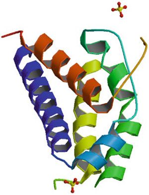

그림 5.2 건선 병력이 없는 환자에서 인터페론 알파-2a와 리바비린으로 만성 C형 간염을 치료받은 후 발생한 광범위한 건선. 환자는 흉부와 복부(a), 등(b), 두피(d) 및 사지(e)에 명확히 경계가 있는 인설을 동반한 홍반성 반이 나타났으며 손톱(c)은 오목 증상과 조갑박리를 보였다. Kim G-W, Jwa S-W, Song M 등에서 재인용. Ann Dermatol. 2013;25:479-82. doi:10.5021/ad.2013.25.4.479, Creative Commons Attribution License 조건 하에 배포되는 오픈액세스 기사

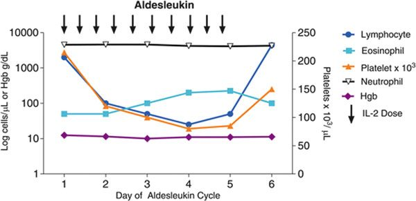

그림 5.3 멜라닌세포 파괴로 인한 손의 피부 색소 소실을 보여주는 성인 남성의 백반증 사례. 백반증의 정확한 발병기전은 아직 불분명하다(R. Spiewak 박사가 제공한 사진)

인터페론과 같은 사이토카인, IL-2("알데슬루킨" 참고), 가용성 IL-2 수용체(sIL-2R), IL-10, IL-13 및 IL-17A의 관여가 백반증에서 제안되어 왔다. 이 장애의 병태생리에 대한 최근 연구는 궁극적으로 멜라노세포 세포사멸로 이어지는 인터페론 감마 발현 세포독성 T 림프구의 관여를 나타낸다("인터페론 감마" 참고).

**페그인터페론 알파-2b(페그인트론®)**

페그인터페론 알파-2b는 인터페론 알파-2b의 페길레이션된 제형이다. 만성 C형 간염(리바비린과 병용), 만성 B형 간염, 털세포백혈병, 혈액암, 멜라노마, 림프종에 승인되었다.

부작용: 감기 유사 증상, 피로, 오한, 발열, 메스꺼움, 두통, 근육통, 관절통, 주사부위 반응, 탈모증, 우울증

블랙박스 경고: 급성심근경색, 심낭염, 심낭삼출액, 병적인동맥증후군, 우울증, 자살, 정신질환, 신경계 이상, 혈액학적 이상

**인터페론 베타**

인터페론 베타-1a와 베타-1b의 전사적 반응은 구별할 수 없으나, 생물학적 및 임상적 반응은 투약 스케줄에 따라 달라질 수 있다. 인터페론 베타 단백질 투여 후 가장 흔히 발생하는 이상반응은 감기 유사 증상(표 5.2)이며 주사부위 반응도 흔하다. 근육주사(im)로 1회 30μg의 인터페론 베타-1a를 1회 주당 투여하는 것과 피하주사(sc)로 격일 44μg의 인터페론 베타-1b를 투여하는 것을 비교한 결과, 주사부위 반응과 항체는 베타-1b 제제를 투여한 환자에서 유의하게 더 빈번했으나 2년 후, 이 약물의 임상 결과는 우수하였다. 인터페론 베타에 대한 중화항체의 생성과 이러한 항체가 치료 환자, 특히 다발경화증 치료에서 치료 효과를 감소시키는지에 대한 질문은 중요한 문제이다. 이러한 항체는 피하 투여된 인터페론 베타-1b로 치료된 환자의 약 4분의 1에서 발견되며 그들이 사이토카인의 활성을 중화하거나 감소시킨다는 것이 합의이다. 일부는 이것이 치료 효과를 유의하게 감소시킬 가능성이 있다고 믿으며 따라서 인터페론 베타의 면역원성 잠재력과 안전성이 모두 고려되어야 한다고 제안하였다.

블랙박스 경고: 우울증, 자살, 정신질환, 갑상선 기능 이상, 주사부위 반응

인간 인터페론 베타-1a(아보넥스®)와 인터페론 베타-1b(베타페론®)가 있다. 2014년에 FDA는 페길레이션된 인터페론 베타-1a 제제인 플레그리디®를 승인하였다. 플레그리디®의 일반적인 이상반응은 비페길레이션된 형태의 사이토카인과 유사하다. 즉 주사부위 반응, 인플루엔자 유사 증상, 무력증, 관절통 및 가려움증이다.

**인터페론 감마**

인터페론 감마는 구조적으로 다른 인터페론과 구별되며 주로 NK(TCR 미발현) 및 NKT세포와 항원특이적 면역에서 CD4 및 CD8 세포독성 림프구에 의해 생산된다. 이 사이토카인은 특히 정상 및 B 림프구의 분화 작용과 대식세포 활성의 면역조절제로서 광범위한 생물학적 활성 스펙트럼을 보인다. 또한 바이러스를 포함한 세포내 병원체 대처 및 종양 조절에 중요한 역할을 한다.

인터페론 감마의 생물학적 활성 및 내성에 대한 초기 1상 연구에서 감기 유사 증상과 과립구감소증의 흔한 발생이 나타났다. 또 다른 초기 연구에서, 인터페론 감마 치료 10일 후 말초혈액 림프구가 30% 감소하는 것이 관찰되었다. 특발성 폐섬유화증 환자 4명에서 인터페론 감마-1b로 치료 후 치명적 급성호흡부전이 발생한 것은 해당 환자 330명을 대상으로 한 이중맹검 연구를 통한 추가 조사를 촉발하였다. 폐기능, 가스교환 또는 삶의 질에서 유의한 차이는 발견되지 않았으나, 환자들은 상부호흡기 감염과 폐렴을 더 빈번하게 경험하였다.

블랙박스 경고: 심혈관 독성(저혈압, 부정맥, 관련혈관연축, 빈맥), 신장 독성(급성신부전, 신증후군, 세관세포괴사)

**필그라스팀, 사르그라모스팀, Tbo-필그라스팀(집락자극인자)**

CSF는 대부분의 조직과 세포 유형에 의해 생산되며 조혈세포에 다중 작용을 하는 당단백질 사이토카인이다. Metcalf에 의해 "과립구와 대식세포 집단의 마스터 조절자"로 기술된 CSF는 화학요법 유도 무과립구증 치료, 이식을 위한 줄기세포 동원 및 암에 대한 면역반응 증강에 사용된다. 아미노산 서열의 불일치에도 불구하고 인간 과립구집락자극인자(G-CSF)와 인간 과립구대식세포집락자극인자(GM-CSF)는 서로 및 여러 신호전달 단백질(예: 인간 성장호르몬(7장 "인간 성장호르몬" 참고), 인터페론 베타("인터페론 베타" 참고), IL-2("알데슬루킨" 참고), 및 IL-4)와 유사한 3차원 구조를 보여준다(그림 5.4, 5.5). 3차 구조의 보존은 서로 다른 리간드가 각각의 수용체에 유사하게 결합함을 시사한다. 현재 CSF 가족의 승인된 구성원은 두 G-CSF인 필그라스팀과 페그필그라스팀, GM-CSF인 사르그라모스팀, 그리고 단기작용 바이오시밀러(13장) G-CSF인 Tbo-필그라스팀(표 5.2)이다. 후자는 백금 약물 화학요법을 받는 폐암 환자의 중증 무과립구증에 사용된다.

CSF로 인한 가장 흔하고 일반적으로 경미하며 일시적인 반응은 두통, 뼈 통증, 근육통, 발열, 안면홍조 및 발진이다. 보다 심각하지만 드문 폐, 심혈관, 혈액학적 및 피부 반응이 발생한다. 성인 호흡곤란 증후군(ARDS)은 G-CSF 후 폐독성 약물을 복용하는 환자에서 백혈구의 급격한 상승, 동반 감염 및 HLA-B51 또는 HLA-B52 항원이 있는 환자에서 더 발생하기 쉽다. GM-CSF가 급성관상동맥증후군의 발전에 기여할 수 있다는 추측이 있다. 실제로 심혈관 합병증이 관찰되었다. 여기에는 체액 저류, 폐부종 및 체중 증가, molgramostim에 의한 대동맥염 및 G-CSF 후 모세혈관 누출 증후군(1장 "모세혈관 누출 증후군" 참고)이 포함되며 이는 심각하고 치명적일 수 있다.

블랙박스 경고: 골수부전 위험, 빈혈, 혈소판감소증, 비장비대, 비장파열, 아나필락시스

CSF로 인한 기록된 혈액학적 부작용은 주로 혈소판감소증, 일부는 면역기전, 비장비대 및 비장파열 사례로 구성된다(FDA 발행 주의사항, Table 5.2). G-CSF가 골수이형성증후군(MDS)의 진행 위험 요인일 수 있다는 의견이 있으나, 이것이 명확히 확립되지는 않았다. G-CSF 치료 후 MDS가 보고되었으며 G-CSF로 치료받은 환자에서 MDS 또는 급성골수구백혈병(AML)의 발생률은 11%인 반면, 면역억제만 받은 환자에서는 5.8%였다. 또 다른 최근 연구에서, G-CSF를 투여받은 환자는 2.5배 증가된 위험을 보였다.

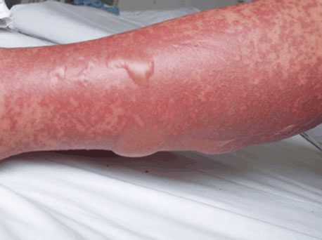

그림 5.6 필그라스팀(재조합 과립구집락자극인자 [G-CSF]) 투여 후 스위트증후군 또는 급성열성과립구성피부병을 모방하는 피부발진. 스위트증후군은 상부진피에 과립구 상승과 과립구 존재로 특징지어진다. Aubin F 등에서 재인용. 바이오의약품의 이상반응의 복잡성. J Crohn's Colitis. 2013;7:257-62. Creative Commons 라이선스 하에 배포; Elsevier Limited의 허가를 받아 복제(CCC 라이선스 번호 3662450405678)

CSF에 의해 유발되는 광범위한 피부 이상반응이 있다. 가장 흔히 발생하는 피부 반응은 필그라스팀(그림 5.6) 및 사르그라모스팀 치료 후 나타나는 스위트증후군이다. 사실, 이 두 집락자극인자는 스위트증후군에서 가장 빈번하게 관련되는 약물이다. CSF에 대한 기타 피부 이상반응에는 건선 악화, 화농성육아종, 가려움증 동반 홍반성 구진발진, 손발바닥 농포증, 다형홍반 및 과립구성피부병이 있다.

**오프렐베킨**

재조합 인간 IL-11, 즉 오프렐베킨(표 5.2)은 비골수성 악성종양 환자에서 화학요법 유도 혈소판감소증을 예방하고 혈소판 수혈 필요성을 줄이기 위해 사용된다. 위약 대조 연구에서 가장 흔히 발생하는 이상반응은 부종, 호흡곤란, 빈맥, 심계항진, 심방세동/조동, 흉막삼출액, 결막충혈 및 구강 칸디다증이었다. 체액 저류와 혈장량 증가가 부종, 호흡곤란, 흉막삼출액, 부정맥, 희석성 빈혈 및 신부전을 포함한 많은 이상반응의 기반이 되며 울혈성심부전 환자에서 오프렐베킨은 주의하여 사용해야 함을 시사한다. 누적 독성이나 골수 고갈의 증거는 관찰되지 않았다.

블랙박스 경고: 비장비대, 비장파열, 악성종양 발생 가능성, 뇌졸중 위험

**비카플러민**

비카플러민은 재조합 인간 혈소판유도 성장인자(PDGF)로, 이황화 결합된 B사슬 2개로 구성된 동종이량체이며 따라서 rhPDGF-BB로 기술된다. 자연적으로 존재하는 PDGF는 동종이량체 또는 이종이량체 형태의 A 및 B사슬을 가진다. PDGF-A사슬은 α 수용체에 결합하는 반면, PDGF-B사슬은 α와 β 모두에 결합한다. rhPDGF-BB는 섬유아세포(α 및 β)와 내피세포(β 수용체)의 수용체와의 상호작용으로 육아조직의 성장과 상처치유를 촉진한다. 비카플러민은 따라서 당뇨병성 신경병증 궤양, 즉 치유가 극히 어렵고 이환율의 주요 원인인 하지 궤양 환자를 위한 국소 적용 겔 제형으로 사용되어 왔다(그림 5.7).

FDA의 의료청구 데이터베이스에 대한 후향적 연구에서, 비카플러민 사용자 1,622명과 대조군 2,809명의 암 발생률과 사망률이 비교되었다. 모든 암과 모든 암으로 인한 사망률에 대한 비카플러민 대 대조군의 발생률 비는 각각 1.2와 1.8이었으며 비카플러민 3튜브 이상 투여받은 환자와 대조군의 사망률 발생률은 각 1,000 환자-년당 3.9와 0.9였다.

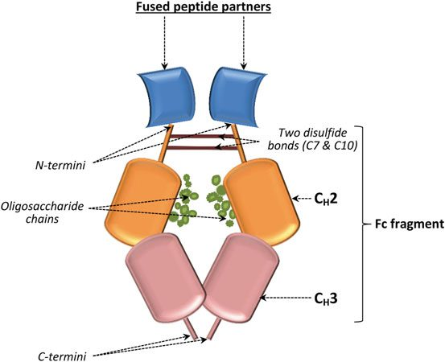

그림 5.7 당뇨병성 압력유발 족부궤양. Shapiro J, Koshimune D, Moellmer R에서 재인용. 당뇨병성 족부궤양-치료 및 예방.

블랙박스 경고: 알려진 악성종양이 있는 환자에서는 주의하여 사용하며 이점이 위험성을 상회할 것으로 예상되는 경우에만 사용해야 한다.

2001년의 초기 안전성 연구에서 비카플러민 그룹에서 비사용자 그룹보다 더 많은 암이 발견된 이후, FDA는 2008년에 Regranex® 겔에 대한 블랙박스 경고를 발표하였다: "사용 부위와 원격 부위에서 악성종양이 비카플러민 사용자에서 발생하였다… 그리고 3튜브 이상 투여받은 환자에서 전신 악성종양으로 인한 사망률이 증가하였다." 그 결과, "비카플러민은 알려진 악성종양이 있는 환자에서는 주의하여 사용해야 하며 이점이 위험성을 상회할 것으로 예상되는 경우에만 사용해야 한다"고 명시되었다. 2010년, EMA의 인간용 의약품 위원회(CHMP)는 기존 암이 있는 환자에서는 비카플러민을 사용하지 말 것을 권고하면서도, 이 사이토카인의 치료적 사용과 암 사이의 연관성을 확립하거나 배제할 수 있는 양쪽 방향의 증거가 없다는 점을 인정하였다. 2012년 7월, 유럽위원회는 Regranex®의 판매승인을 철회하였다.

rhPDGF-BB는 β-트리칼슘인산과 함께 뼈 복원 및 재생을 위해 개발된 복합 기기/약물 제품인 어거먼트® 뼈이식의 구성 성분이다. 족부 및 발목 유합술에 사용하도록 고안되었으며 주요 합병증 중 하나인 감염의 위험을 줄이기 위해 개발되었다. 캐나다에서 수행된 전향적, 비맹검, 다센터 임상시험에서 60명의 환자가 후족, 중족 또는 발목 유합술이 필요하였으며 36주간 추적관찰되었다. 총 22건의 이상반응(중증 없음)이 기록되었으며 대부분 수술에서 비롯되었다; 15건은 일반 및 투여부위 장애(부종, 열감, 압통, 치유 장애), 5건은 손상 및 시술 합병증, 2건은 근골격 및 결합조직 장애(근육경련 및 통증)였다.

**팔리퍼민**

팔리퍼민은 간엽세포와 섬유아세포에 의해 생산되는 재조합 인간 각질세포 성장인자로, 피부, 모낭, 혀, 위, 장, 폐, 간, 신장, 수정체를 포함한 다양한 조직에 광범위하게 분포하는 상피세포의 상보적 수용체와의 상호작용으로 상피세포의 분화, 증식 및 이동을 자극한다. 이 재조합 분자는 비글리코실화된 16.3 kDa, 140아미노산 단백질로 섬유아세포 성장인자 가족에 속하며 자연 단백질의 N-말단을 단축하여 안정성을 증가시키도록 유전적으로 변형되었다.

팔리퍼민은 종양학적 지지치료에서 중요한 약물로, 화학요법 및 방사선 유도 손상 후 점막 상피를 보호하고 재생을 도와 암 환자의 점막염 관리를 돕는다.

팔리퍼민 투여 후 보고된 이상반응에는 발진, 가려움증, 홍반, 감각이상, 부종, 미각변화, 비염, 관절통, 혀 두꺼워짐 및 무감각이 있다. 다양한 피부 반응에는 말단홍반(말단 홍반 및 손발증후군), 두부와 몸통의 구진농포 발진, 겨드랑이와 서혜부의 과색소 유두종성 반판, 및 라켄형 구진 사례가 있다.

**알데슬루킨**

알데슬루킨(제품명: 프로레우킨®)은 재조합 인간 IL-2로, 자연 사이토카인과 달리 125번 위치의 아미노산 및 말단 아미노산 결실을 특징으로 한다(그림 5.8). X선 및 NMR 연구는 IL-2 접힘이 집락자극인자 G-CSF(그림 5.4) 및 GM-CSF(그림 5.5)에서 보이는 것과 유사함을 보여주었으나, 다른 4중 알파나선 번들에 비해 세 가지 미세한 구조적 차이가 있다(그림 5.8).

알데슬루킨은 임상적으로 여러 방식으로 적용되어 왔으며 특히 멜라노마 및 신세포암에 사용되어 왔다. 초기 적용부터 발열, 오한, 근육통, 메스꺼움, 구토, 설사, 저혈압, 소량뇨 및 부종을 포함한 전형적인 사이토카인 부작용의 다수를 보여주었다(표 5.2).

블랙박스 경고: 혈관 누출 증후군(저혈량증, 체액 저류), 폐부종, 호흡곤란, 심부전

알데슬루킨의 심혈관 이상반응은 주요 용량제한 독성으로, 기록된 사례에는 저혈압, 빈맥, 말초부종, 흉막삼출액, 심근염, 심근경색, 심방전도차단, 부정맥, 심장 호산구 침윤 및 관상동맥 허혈성 변화가 있다. IL-2 치료의 중요한 간헐적이고 심각한 이상반응은 모세혈관 누출 증후군(때로는 혈관 누출 증후군이라고도 함)(1장 "모세혈관 누출 증후군" 참고)으로, 저혈량증과 혈관외 체액 축적을 유발하고 소량뇨, 허혈 및 혼동으로 이어질 수 있다. 알데슬루킨 치료는 혈관투과성 증가, 간질부종 및 궁극적 장기부전을 유도할 수 있으며 이는 체중 증가, 체액 저류, 말초부종, 복수, 흉막 및 심낭삼출액, 그리고 궁극적 폐 및 심혈관 부전으로 나타난다.

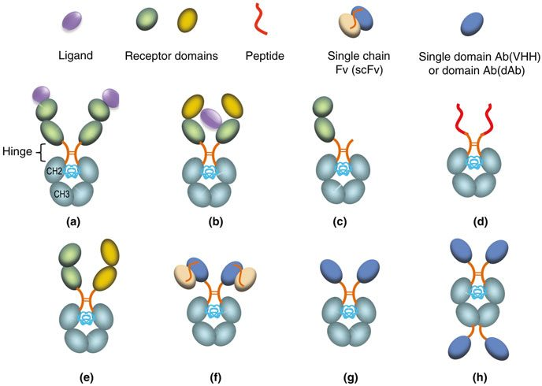

그림 5.8 IL-2의 2차 구조는 상향-상향 및 하향-하향 배열의 A, B, C, D 네 알파나선으로 구성되며 G-CSF(그림 5.4) 및 GM-CSF(그림 5.5)와 유사한 구조이다. 그러나 IL-2는 AB 루프의 불규칙한 한 바퀴 나선, 비대칭성, C나선의 가교, D나선의 더 짧은 나선 및 리간드 결합 영역의 구조적 차이로 인해 다르다.

블랙박스 경고: 부작용은 주로 모세혈관 누출 증후군과 관련. 기존 심장 질환이 있는 환자에서 더 흔하고 더 심각(예: 폐부종, 호흡곤란).

혈액학적 이상반응, 특히 빈혈, 백혈구감소증 및 혈소판감소증이 발생하나 심각하거나 용량제한적인 경우는 드물다. 혈소판감소증은 고용량 IL-2 치료의 일반적인 독성이지만 치료 중단 후 빠르게 회복된다. 호산구증가증이 치료 후기 단계에서 발진 및 가려움증과 동반되어 발생할 수 있다.

그림 5.9은 6일 기간 동안 알데슬루킨 투여에 반응하여 발생하는 혈액학적 변화를 보여준다. 첫 투여 후 수 시간 이내에 혈소판과 림프구는 급격히 감소하고 호산구 수는 서서히 상승하는 반면, 호중구와 헤모글로빈은 안정적인 수준을 유지한다. 치료 중단 시, 림프구와 혈소판은 빠르게 정상으로 돌아오며 사실 기저선 수준의 2~5배를 초과할 수 있다. 호산구는 수 주 동안 지속될 수 있다.

내분비 효과는 일반적으로 갑상선기능저하증으로 나타나며 이는 최대 1/3의 환자에게 영향을 줄 수 있거나, 훨씬 덜 빈번한 갑상선기능항진증으로 나타날 수 있다. 신장 독성, 특히 소량뇨 및 위장관계 독성도 관찰되며 후자는 메스꺼움, 구토, 설사, 식욕부진, 위염 및 점막염 형태로 특히 흔하다. 위장관계 천공도 보고되었다.

IL-2 유도 감염 독성은 정맥 카테터 부위 및 비뇨기계에서 발생할 수 있다. 이러한 감염은 일반적으로 포도상구균에 의한 것으로, IL-2가 호중구 화학주성에 미치는 알려진 영향에서 비롯된 것으로 생각된다.

신경학적 효과, 특히 IL-2 치료 중 고용량에서, 불안, 우울증, 수면 패턴 변화, 졸림, 정서적 취약성, 선명한 꿈 및 혼동이 있다.

알데슬루킨 유도 피부 반응 목록은 광범위하며 경미한 홍반, 가려움증, 주사부위 반응 및 백반증부터 두드러기, 혈관부종, 습진 재발, 건선 악화, 전신홍반 후 각질탈락, 혈관염, 및 천포창, IgA 수포성피부병 및 독성표피괴사용해와 같은 심각한 증상에 이르기까지 다양하다.

면역억제된 성인 환자에서 IL-2에 의해 유발된 화상과 유사한 수포가 동반된 심각한 피부 반응(그림 5.10)은 이 사이토카인이 면역억제 환자에게 매우 주의하여 그리고 개인화된 기준으로 투여되어야 함을 시사한다.

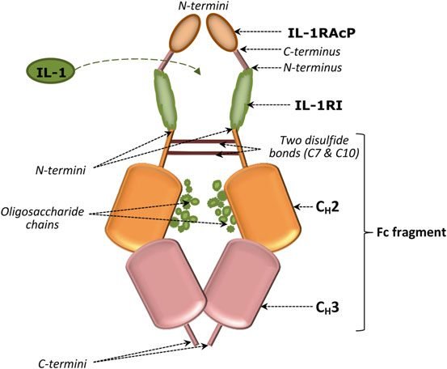
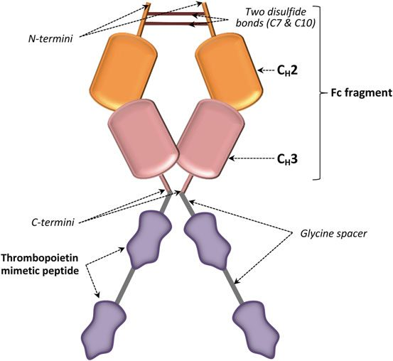

그림 5.10 면역억제된 성인 환자에서 IL-2에 의해 유발된 급성 화상과 유사한 수포가 동반된 심각한 피부 반응 홍반. Zhang J 등에서 재인용. J Clin Exp Dermatol Res. 2014;5:1. doi: 10.4172/2155-9554.1000204, Creative Commons Attribution License 하에 배포되는 오픈액세스 기사

블랙박스 경고: 면역억제 환자에게 매우 주의하여 투여.

**아나킨라**

인터루킨-1(IL-1)은 류마티스관절염을 포함한 여러 면역반응에서 염증성 자극에 반응하여 생산되는 사이토카인이다. IL-1의 수용체(IL-1R)는 막 또는 용해형으로, 조직과 장기에 널리 발현되며 두 가지 유형으로 존재한다: IL-1의 염증 효과 발현을 담당하는 I유형과 IL-1에 경쟁적으로 결합하여 이 사이토카인의 억제제로 작용하는 II유형.

아나킨라는 IL-1에 대한 재조합 특이적 수용체 길항제(IL-1RA)로, 자연 수용체와 달리 아미노 말단에 단일 메티오닌이 추가되었다(표 5.2). 아나킨라는 따라서 류마티스관절염 및 크리오피린 연관 주기 증후군(CAPS)(4장 "CAPS 질환 및 카나키누맙 승인 적응증" 및 "카나키누맙: 주의사항, 예방조치 및 이상반응" 참고)으로 총칭되는 자가염증성 증후군 범위의 치료에서 생물학적 반응 조절제로 작용한다.

블랙박스 경고: 감염, 주사부위 반응, 비장비대, 비장파열, 악성종양 발병 가능성.

아나킨라의 부작용 목록은 크지 않으며 주사부위 반응(100 환자-년당 122건)과 감염 에피소드가 가장 흔히 관찰되는 유해 반응이다. 주사부위 반응은 최대 73%의 환자에서 발생하나 영향을 받은 환자의 5% 미만에서 치료를 중단하게 한다.

아나킨라의 기타 보고된 부작용에는 류마티스관절염 진행, 크론병 악화, 아나필락시스(양성 피부검사), 주사부위 봉소직염, 그리고 아나킨라 중단 후 해결되고 재투여 시 재발하는 간질 육아종 반응이 있다.

**에포에틴(에리스로포이에틴, EPO)**

에리스로포이에틴(EPO)은 단백질의 생물학적 활성과 안정성에 중요한 N-결합 올리고당 사슬 3개와 O-결합 올리고당 사슬 1개를 가진 고도 당화된 사이토카인이다. 활성은 또한 시스테인 7과 160, 29와 32 사이의 이황화 결합 2개에 의존한다. 자연 인간 EPO와 rhEPO(에포에틴 알파) 모두에서, 원래 분비된 분자는 카복시 말단 아르기닌이 제거되어 165아미노산의 최종 활성 단백질이되기 전에 166아미노산 펩타이드이다.

말기신장질환 빈혈 환자에서의 rhEPO 초기 연구에서, 관찰된 주요 이상반응과 그 발생률은 근육통 5%, 철결핍 43%, 혈압 상승 35% 및 경련 5.4%였다. 고혈압은 투석 환자의 약 1/3이 영향을 받는 일반적인 부작용이다.

rhEPO로 인한 고혈압 및 점도 증가는 뇌증, 경련, 뇌부종 및 경련으로 이어질 수 있다. 혈전색전증은 EPO 치료의 잠재적 결과로 알려져 있으나, 통제 연구는 항상 이 주장을 뒷받침하지는 않았다. 그럼에도 불구하고 암 환자에 대한 통제 연구에서 rhEPO 치료 시 혈전색전증 이벤트 위험이 대조군보다 1.55배 높은 것으로 밝혀졌다.

대사율 및 혈액 점도 증가를 동반한 뇌허혈은 EPO 치료의 잠재적으로 심각한 부작용이며 이것이 신혈관 질환에 대한 EPO 사용을 제한하거나 중단시킬 수 있다고 지적되었다. EPO 수용체는 종양 조직에서 확인되었으며 이 사이토카인은 종양 혈관신생에 기여할 수 있어, EPO가 종양 성장을 촉진하거나 종양 진행을 돕는 가능성을 시사한다.

**에포에틴 알파 및 다르베포에틴 알파**

에포에틴 알파(제품명: 에포젠®, 프로크리트®) 및 다르베포에틴 알파(제품명: 아란에스프®)는 혈액학적 악성종양, 만성신장질환, 화학요법으로 인한 빈혈 치료에 사용되는 에리스로포이에틴(EPO) 유도체이다.

수혈 의존성 순수 적혈구 무형성(PRCA) 환자에서는, 다른 에포에틴(예: 다르베포에틴 알파)으로 전환하지 않아야 한다. Anti-EPO 교차반응 항체에 의해 매개되는 전신 아나필락시스/아나필락시스유사 반응이 발생할 수 있기 때문이다.

에포에틴 알파와 다르베포에틴 알파 모두 사망, 심혈관 및 혈전색전증 이벤트, 종양 진행 또는 재발의 가능한 위험 증가와 관련된 블랙박스 경고를 가지고 있다.

**골형성단백질(BMP)**

BMP는 뼈와 연골의 형성을 유도하는 성장인자로, 선암종 및 대장암 진행과 같은 일부 질환 상태에서 중요한 신호전달 단백질이다. 지금까지 확인된 20개의 BMP 중 2~7번의 6개가 TGFβ 사이토카인 가족에 속한다(표 5.1).

블랙박스 경고: 악성종양 발병 가능성. 부적절한 동료검토 및 편집 감독 가능성.

BMP-2와 BMP-7은 골모세포의 분화를 촉진하며 이 작용에 기반하여 이들 사이토카인의 재조합 형태(rhBMP-2 및 rhBMP-7)는 FDA에 의해 정형외과, 구강악안면외과 및 임플란트 치과에서 특정 용도로 승인되었으나, 그 사용의 최대 85%는 허가 외(off-label)로 알려져 있다.

BMP의 안전성 연구는 부적절한 동료검토 및 편집 감독의 가능한 관여로 인한 불일치로 얼룩진 곤혹스러운 역사를 가지고 있다. rhBMP-2의 최근 결과는 원래 동료검토 및 산업 후속 연구에서 보고된 것보다 훨씬 더 높은 부작용 및 합병증 발생률을 나타낸다.

블랙박스 경고: 골유합술 후 척추골 용해, 부종, 역행성 사정.

rhBMP-2의 안전성 연구에서, 이전에 미공개된 부작용의 확인, 연구 불일치 및 FDA 자료의 비교 검토는 척추유합술에서 rhBMP-2와 관련된 10~50%의 이상반응 빈도를 밝혀냈다.

블랙박스 경고: 악성종양 발병 가능성. Amplify™ rhBMP-2 매트릭스 관련.

2010년 FDA 정형외과 및 재활기기 자문위원회의 Amplify™ rhBMP-2 매트릭스 보고서는 BMP-2로 치료받은 환자에서 암 발생률이 증가함을 보여주었다. ≤24개월 시, 암 발생률은 환자 5%, 대조군 0.9%; 60개월 시, 환자 5%, 대조군 2.1%였다.

rhBMP-7, 골형성단백질 1(OP-1)이라고도 알려진, BMP-7은 다기능 성장인자이다. FDA 공중보건 알림의 목숨을 위협하는 합병증(경부 척추유합술 포함 rhBMP-7 포함)과 rhBMP가 골격 미성숙 또는 임산부 및 단백질에 과민반응이 있는 환자에게 금기라는 점을 상기시키는 것 외에, BMP-7에 대한 이상반응에 대한 연구 및 보고는 아직 광범위하지 않다.

블랙박스 경고: 악성종양 발병 가능성

**메트렐렙틴**

렙틴은 MW 16 kDa의 167아미노산 단백질로, 다양한 장기의 여러 세포(주로 지방세포)에 의해 생산되며 허기와 에너지 소비를 조절하여 지방 저장을 조절함으로써 에너지 항상성과 체중 조절에 도움을 준다. 또한 일부 신경내분비 기능 및 기타 생리적 과정을 조절하며 많은 부분은 아직 정의되지 않았다.

블랙박스 경고: 신부전 악화 가능성, T세포 림프종 발생 가능

2014년 2월, FDA는 렙틴의 재조합 유사체인 메트렐렙틴(표 5.2)을 선천성 또는 후천성 전신지방이영양증 환자의 렙틴 결핍 치료를 위한 대체요법으로 승인하였다. 메트렐렙틴은 일반 비만 환자, HIV 관련 지방이영양증 또는 동반 전신지방이영양증 없는 대사질환(예: 당뇨병) 환자에게는 사용해서는 안 된다. 메트렐렙틴에 대한 중화항체가 발생할 수 있으며 이것과 후천성 전신지방이영양증 환자에서 T세포 림프종의 발생 가능성으로 인해, 이 단백질은 마이렙트 위해관리(REMS) 프로그램 하에서만 이용 가능하다.

메트렐렙틴의 약동학적 연구에서, 이 재조합 사이토카인의 반감기는 3.4 ± 1.5시간이었으며 고령자는 더 짧은 반감기를 보였다. 메트렐렙틴(제품명: 마이렙트®)은 렙틴의 재조합 유사체로, 선천성 또는 후천성 전신지방이영양증 환자의 렙틴 결핍 대체요법으로 사용된다.

블랙박스 경고: 신부전 악화 가능성, T세포 림프종 발생 가능

**앙케스팀**

앙케스팀(표 5.2)은 재조합 인간 줄기세포인자(SCF)이다. E. coli에서 생산되어 비글리코실화되나, 발현 후 N-말단 메티오닌을 유지하므로 r-met-hSCF라고도 불린다.

블랙박스 경고: 악성종양 발병 가능성(멜라노마, 비만세포 또는 호염구 백혈병, 소세포폐암, 골수성 악성종양).

SCF는 섬유아세포와 내피세포에 의해 가용형 및 막결합형으로 생산되며 둘 다 c-Kit 수용체에 결합하고 생물학적으로 활성이다. 때때로 다능성 성장인자로 불리며 이 사이토카인은 조혈, 정자형성 및 멜라닌형성에 중요하다. 수용체의 비치명적 점 돌연변이는 빈혈, 불임 장애 및 색소침착을 유발할 수 있다.

c-Kit 수용체는 줄기(또는 비만세포) 성장인자 수용체, 원종양유전자 c-Kit, 티로신 단백질 키나제 Kit 및 CD117이라고도 하며, 비만세포, 멜라닌세포 및 생식세포를 포함한 여러 세포에 발현되는 수용체 티로신 키나제 III형이지만, 앙케스팀에게는 중요한 초기~성숙 조혈 전구세포에도 발현된다.

앙케스팀은 시험관 내에서 약한 집락자극 활성만을 보이나, G-CSF, GM-CSF, 에리스로포이에틴 및 IL-2와 같은 다른 조혈 성장인자와 시너지 작용하여 인간 및 일부 다른 동물에서 다중 조혈 계열을 자극한다. 또한 비만세포를 활성화하고 멜라닌세포 발달과 색소 생산을 자극한다.

필그라스팀과 함께 투여 시, 앙케스팀은 필그라스팀 단독에 비해 말초혈액 전구세포(PBPC)를 포함한 CD34+ 세포의 순환 수준 증가를 나타낸다. 따라서 앙케스팀은 PBPC 지속적 동원을 달성하고 PBPC 목표 수준에 도달하기 위해 필요한 아프레시스 횟수를 줄이기 위해 필그라스팀과 함께 사용된다.

블랙박스 경고: 악성종양 발병 가능성. 앙케스팀의 발암 가능성은 아직 연구되지 않았다.

앙케스팀의 주요 부작용은 주사부위 반응으로, 1~24시간 내에 발생하며 최대 84%의 환자에서 경미~중등도 반응이 나타난다. 보고된 반응은 홍반(59%), 가려움증(25%), 두드러기(16%)로 구성되었으며 주사부위의 과색소침착 및 발진 사례도 간헐적으로 나타났다.

앙케스팀 투여 후 보고된 주요 부작용은 주사부위 반응과 감염 에피소드이다. 기타 보고된 부작용에는 류마티스관절염 진행, 크론병 악화, 아나필락시스, 전신 염증 반응 증후군, 성인 호흡곤란 증후군, 간질 육아종 반응 및 일부 심각한 피부 반응이 있다.

앙케스팀은 G-CSF, GM-CSF, 에리스로포이에틴 및 IL-2와 같은 다른 조혈 성장인자와 시너지 작용하여 다중 조혈 계열을 자극한다. 고용량에서 앙케스팀의 전신알레르기 반응은 더 자주 발생하며 30μg/kg/day 미만에서는 5%, 30~100μg/kg/day에서는 27%의 환자에서 이러한 반응이 나타났다.

현재 FDA 승인된 23개 사이토카인 제품 중 16개가 주의사항을 가지고 있으며 이 중 10개가 블랙박스 경고를 가지고 있다. 인간 치료에서 오랜 기간 사용되어 온 인터페론 알파 제제들은 블랙박스 경고에서 명시된 여러 종류의 잠재적으로 심각한 부작용으로 잘 알려져 있다. 신경정신과적, 자가면역성, 허혈성 및 감염 이상반응을 포함한 이러한 부작용의 다양한 특성은 사이토카인의 다중작용이 가지는 양면적 특성을 잘 보여준다.

비카플러민, 성장인자는 세포 증식을 유발하므로 지속적 사용 시 악성종양의 가능성은 염두에 두어야 하며 특히 알려진 암이 있는 환자에서 그렇다. 마찬가지로, 팔리퍼민, 또 다른 성장인자이자 암 환자의 점막염에 대한 가치 있는 치료는, 상보적 수용체가 신체의 다양한 세포 유형에 광범위하게 존재하므로 종양 성장 자극의 가능성을 가지고 있다.

알데슬루킨, 재조합 IL-2는 T 림프구의 강력한 활성제로, 전이성 신세포암 및 멜라노마에서 종양 퇴행을 유도하는 항암 면역반응을 자극한다. 그러나 이 활성은 또한 많은 심장 및 폐 이상반응으로 이어질 수 있다.

아마도, 이 이질적이고 다중작용적인 세포 조절자와 관련된 안전성 불확실성과 위험-편익 비율의 가장 좋은 예는 골형성단백질 BMP-2와 BMP-7에서 볼 수 있다. 미보고 부작용으로 문제가 된 역사를 가진 이 성장인자들은 현재 잠재적 발암물질로서의 관심과 추측의 초점이다. BMP-2 수용체는 일부 종양 세포에 발현되며 사용 후 암 발생률이 증가한 것이 보고되었으나, 사이토카인 반응의 복잡함과 많은 부작용의 원인 귀속이 어려운데다, 종양억제 효과 또는 의존성 없음도 보고되었다.

어떤 이상반응의 고려에서든, 잠재적 발암물질 가능성, 부적절한 동료검토 및 편집 감독, 동료검토 및 산업 후속 연구에서의 미보고 이전에 미공개된 부작용의 확인, 연구 불일치 및 FDA 자료의 비교 검토가 고려되어야 한다.

단클론항체, 키메릭 융합단백질, 백신, 다양한 재조합 효소, 호르몬, 응고인자, 다양한 수용체 단백질, 몇 가지 정제된 승인 독소 및 일부 세포 기반 및 비특이적 면역보조제 치료와 함께, 130개 이상의 사이토카인 풀은 유전적으로 설계되거나 자연 단백질의 변형으로, 향후 10년 이내에 일부는 혁신적인 생물의약품 치료의 주요 확대 가능성을 제공하는 것으로 보인다.

한편, 현재 승인된 비교적 소수의 재조합 사이토카인은 그들의 다중작용, 중복성 및 효력에 의해 영향을 받는 효능과 부작용과 관련하여 이미 그들의 진정한 본질을 드러내고 있다. 사이토카인 단백질 가족이 보여주는 광범위한 활성 범위는, 많은 다른 질병의 치료 잠재력과 현재 임상적으로 사용되는 소수의 지속적 지식 및 경험과 함께, 미래의 치료는 부상하는 생물의약품에 속한다는 예측을 달성하는 데 실제로 도움이 될 수 있다.

**요약**

* 현재 130개 이상으로 알려진 사이토카인은 MW < 30 kDa의 비교적 작은 신호전달 단백질이다. 일반적으로 당화되어 있으며 면역계, 상피, 내피 및 기질 세포를 포함한 다양한 세포에 의해 생산된다. 사이토카인은 감염, 선천성 및 적응성 면역, 자가면역, 염증 및 악성종양에서 자가, 측분비(paracrine) 또는 내분비 방식으로 기능하는 면역 및 염증 반응의 핵심 조절자이다. 이러한 조절 단백질을 이해하는 핵심은 그들의 다중작용과 때로는 겹치는 활성, 기능적 중복성 및 부작용의 인식에 있다.

* 현재 유전체 단계에서, 사이토카인은 알려진 특성화된 사이토카인과의 상동성을 기반으로 식별된다. 많은 원래 명칭이 여전히 사용되고 있으며 기술된 원래 "인자" 중 다수가 다른 사이토카인과 수용체를 공유하고 있다.

* CDER 승인 바이오의약품 목록의 23개 FDA 승인 사이토카인 제품에서, 제시된 사이토카인 분류는 Kyoto Encyclopedia of Genes and Genomes에 기반하고 있다.

* 아홉 개의 주요 가족이 인식되며 관심 있는 대부분의 사이토카인은 조혈 성장인자, 인터페론(IFN), 혈소판유도 성장인자(PDGF) 및 트랜스포밍 성장인자 β(TGFβ) 가족에 분류된다. 승인된 사이토카인은 재조합 DNA 기술에 의해 제조된다.

* 조혈소인자 가족: 알데슬루킨(rh-인터루킨-2 [IL-2]), 오프렐베킨(rhIL-11), 필그라스팀 및 Tbo-필그라스팀(rh-과립구집락자극인자 [G-CSF]), 사르그라모스팀(rh-과립구대식세포 [GM]-CSF), 메트렐렙틴(rh-렙틴), rh-에리스로포이에틴(에포에틴 및 다르베포에틴 알파), 및 줄기세포인자(r-met-hSCF); IL-1 사이토카인 가족: IL-1에 대한 재조합 수용체 길항제인 아나킨라; 인터페론 가족: 재조합 인터페론 알파-1, 알파-2, 베타-1 및 감마-1; PDGF 가족: 팔리퍼민(rh-각질세포 성장인자 [KGF]) 및 비카플러민(rhPDGF-BB); TGFβ 가족: rh-골형성단백질 [BMP]-2 및 rhBMP-7.

* 인터페론은 중복적이면서도 일부 독립적인 활성을 가진 광범위 항바이러스 사이토카인 계열이다. 치료에 가장 관심 있는 것은 인터페론 알파, 베타 및 감마이다. 인터페론 알파로 치료받은 거의 모든 환자는 치료 기간 중 어느 시점에서 하나 이상의 이상반응을 경험한다.

* 인터페론 알파 제제들은 간헐적으로 심혈관, 호흡기, 내분비, 혈액학적, 대사, 비뇨기 및 피부 이상반응과 신경 및 감각계에 대한 이상반응을 포함한 광범위한 이상반응을 유발한다.

* 페그인터페론 알파-2a 및 페그인터페론 알파-2b는 재조합 인터페론과 단일 가지 비스-모노메톡시 폴리에틸렌 글리콜(PEG) 체인의 공유 접합체이다. 페길레이션은 면역 인식으로부터 단백질을 보호하고 분자 크기를 증가시켜 단백질 반감기와 순환 시간을 연장하고 신장 청소율을 감소시킨다.

* 페그인터페론 알파-2a와 리바비린은 대상성 간 질환이 있는 성인의 만성 C형 간염 치료와 B형 및 C형 간염 감염 환자에 적응증이 있다. 페그인터페론 알파-2a 단독은 만성 B형 간염 환자에 승인되어 있다.

* 인터페론 알파-2b는 B형 및 C형 간염과 여러 악성종양에 광범위하게 투여된다.

* 인터페론 알파 유도 신경정신과적 장애, 특히 우울증, 인지 기능 장애 및 조증은 잘 알려져 있으며 집중적으로 연구되어 왔다. 심각한 우울 증상이 발생하는 환자 중 대부분은 치료 개시 후 처음 3개월 이내에 발생한다. 우울 장애의 발생률은 23~41%로 추정된다. 증상은 치료 중단 후 6개월 이상 지속될 수 있다.

* 인터페론 알파 치료에 반응하여 자가항체 및 갑상선기능저하증, 면역매개 용혈, 전신홍반성루프스, 레이노드병, 혼합결합조직병을 포함한 자가면역질환의 발병 또는 악화가 알려져 있다.

* 페길레이션된 인터페론 알파-2b는 급성심근경색, 심낭염, 심낭삼출액 및 병적인동맥증후군으로 인한 부정맥과 연관되었다.

* 간질성 폐질환은 인터페론 알파-2a 및 2b 모두에 보고되었으며 전자에서 그리고 후자의 고용량에서 더 자주 관찰된다. 페길레이션된 인터페론 알파-2b 후 치명적 간질성 폐렴, 성인 호흡곤란 증후군 및 폐쇄성세기관지염을 동반한 폐렴(BOOP) 사례가 알려져 있다.

* 인터페론 알파는 뇌전증 병력이 없는 환자의 경련, 자발적 안면 움직임 및 약화, 다발경화증과 유사한 특징, 하지불안증후군, 감각운동 다발신경병증 및 벨마비를 포함한 신경계에 대한 이상반응을 가질 수 있다.

* 감각기계에 대한 이상반응은 주로 눈뿐만 아니라 귀에도 나타나며 특히 인터페론 알파-2b에서 발생한다. 안과 합병증에는 폐쇄성 혈관염, 중앙망막동맥 폐쇄, 전방 허혈 시신경병증, 망막출혈, 결막하출혈 및 시신경 부종이 있다.

* 인터페론 알파의 내분비 효과는 갑상선 기능 이상으로 가장 잘 설명되며 자가면역 기전이 있을 수 있다. 만성 C형 간염 환자에서 5~14%의 발생률로 발생한다. 갑상선기능저하증이 갑상선기능항진증보다 더 자주 발생한다. 인터페론 알파-2b는 이 두 가지 상태를 모두 유발할 수 있다.

* 인터페론 알파에 의해 유도된 무과립구증은 상당히 흔히 관찰된다. 기타 혈액학적 부작용에는 급성 및 자가면역 혈소판감소증, 악성빈혈, 면역매개 가능성이 있는 골수형성부전 및 순수 적혈구 무형성이 있다.

* 인터페론 알파에 대한 신장 합병증에는 신장 혈전성 미세혈관병증, 급성 신증후군, 용혈성요독증후군, 간질성신염으로 인한 신부전, 세포관 괴사 및 IgA 신병증이 있다.

* 인터페론 알파에 대한 피부 반응 목록은 주사부위 반응(홍반, 괴사 및 혈관염), 가려움증, 건조증, 두드러기, 과색소침착, 건선, 탈모, 편평태선, 선상 태선, 육아종 결절, 호산구성 근막염, 망상 홍반, 백반증 및 고정형 약물발진을 포함하여 광범위하다.

* 인터페론 베타 투여 후 가장 흔히 발생하는 이상반응은 감기 유사 증상이며 주사부위 반응도 흔하다.

* 피하 투여된 인터페론 베타-1b로 치료받은 환자의 약 4분의 1에서 중화항체가 발견되며 그들이 사이토카인의 활성을 중화하거나 감소시킨다는 것이 합의이다. 두 베타 인터페론에서 관찰된 기타 면역학적 효과는 루푸스 유사 증후군 및 피부 림프구 혈관염 사례이다.

* 인터페론 알파와 달리, 인터페론 베타와 우울증의 연관성을 지지하는 연구 결과는 없으나 FDA는 주의사항 및 예방조치에서 우울증, 자살 및 정신질환을 언급한다.

* 인터페론 베타는 갑상선 장애, 특히 갑상선기능항진증을 유도할 수 있으며 하시모토 뇌병증과 유사한 심각한 갑상선기능저하증 사례가 보고되었다.

* 피부 반응에는 인터페론 베타-1a에 의한 두드러기와 인터페론 베타-1b에 의한 여드름양 발진이 있다.

* 2014년에 FDA는 인터페론 베타-1a의 페길레이션된 제형인 플레그리디®를 승인하였다. 플레그리디®의 일반적인 이상반응은 비페길레이션된 형태의 사이토카인과 유사하다. 즉 주사부위 반응, 인플루엔자 유사 증상, 무력증, 관절통 및 가려움증이다.

* 인터페론 감마의 심혈관 독성, 특히 고용량에서, 저혈압, 부정맥, 관상동맥 연축 및 빈맥, 신장 독성, 즉 급성신부전, 신증후군 및 세관 괴사가 있다.

* 특발성 폐섬유화증의 말기 환자에서 인터페론 감마-1b로 치료받은 일부 환자에서 치명적 급성호흡부전이 발생한 것은 해당 상태의 추가 조사를 촉발하였다. 인터페론 감마-1b의 관여에 대한 명확한 증거는 발견되지 않았다.

* "과립구와 대식세포 집단의 마스터 조절자"로 기술된 집락자극인자(CSF)는 화학요법 유도 무과립구증 치료, 이식을 위한 줄기세포 동원 및 암에 대한 면역반응 증강에 사용된다. 현재 CSF 가족의 승인된 구성원은 두 G-CSF인 필그라스팀과 페그필그라스팀, GM-CSF인 사르그라모스팀, 단기작용 바이오시밀러 G-CSF인 Tbo-필그라스팀이다.

* CSF 유도 이상반응은 일반적으로 경미하고 일시적이며 두통, 뼈 통증, 근육통, 발열, 안면홍조 및 발진을 포함한다. 보다 심각하고 드문 이벤트에는 성인 호흡곤란 증후군, 폐 독성(특히 폐부종 및 간질성 폐렴), 체액 저류, 대동맥염, 모세혈관 누출 증후군, 혈소판감소증, 비장비대 및 비장파열이 있다. G-CSF는 골수이형성증후군의 진행 위험 요인일 수 있다.

* CSF에 의해 유발되는 피부 이상반응 목록이 길다. 가장 흔히 발생하는 피부 반응은 사르그라모스팀 및 필그라스팀 치료 후 나타나는 스위트증후군이다. 기타 피부 이상반응에는 건선 악화, 화농성육아종, 가려움증 동반 홍반성 구진발진, 손발바닥 농포증, 다형홍반 및 과립구성피부병이 있다.

* 재조합 인간 IL-11, 즉 오프렐베킨은 비골수성 악성종양 환자에서 화학요법 유도 혈소판감소증을 예방하고 혈소판 수혈 필요성을 줄이기 위해 사용된다. 체액 저류와 혈장량 증가가 부종, 호흡곤란, 흉막삼출액, 부정맥, 희석성 빈혈 및 신부전의 기반이 되며 울혈성심부전 환자에서 오프렐베킨은 주의하여 사용해야 함을 시사한다.

* 비카플러민은 재조합 인간 혈소판유도 성장인자(PDGF)로, 이황화 결합된 B사슬 2개로 구성된 동종이량체이며 rhPDGF-BB로 기술된다.

* rhPDGF-BB는 섬유아세포 및 내피세포의 수용체와의 상호작용으로 육아조직의 성장과 상처치유를 촉진한다. 따라서 비카플러민은 치유가 어려운 당뇨병성 신경병증 궤양 환자를 위한 국소 적용 겔 제형으로 사용된다.

* FDA는 비카플러민 겔에 대한 블랙박스 경고를 발표하였으며 이에 따라 알려진 악성종양이 있는 환자에서는 주의하여 사용해야 하고 이점이 위험성을 상회할 것으로 예상되는 경우에만 사용해야 한다.

* 팔리퍼민은 간엽세포 및 섬유아세포에 의해 생산되는 재조합 인간 각질세포 성장인자로, 다양한 조직에 광범위하게 분포하는 상피세포의 상보적 수용체와의 상호작용으로 상피세포의 분화, 증식 및 이동을 자극하는 종양학적 지지치료의 중요한 약물로, 화학요법 및 방사선 유도 손상 후 점막 상피를 보호하고 재생을 도와 암 환자의 점막염 관리를 돕는다.

* 팔리퍼민 투여 후 이상반응에는 발진, 가려움증, 홍반, 감각이상, 부종, 미각변화, 비염, 관절통, 혀 두꺼워짐 및 무감각이 있다. 다양한 피부 반응에는 말단홍반, 두부와 몸통의 구진농포 발진, 겨드랑이와 서혜부의 과색소 유두종성 반판 및 라켄형 구진 사례가 있다. 성장인자로서 팔리퍼민은 종양 성장 자극 가능성에 대한 주의사항이 있다.

* 알데슬루킨, 재조합 인간 IL-2는 자연 사이토카인과 달리 글리칸 잔기 부재 및 125번 위치와 말단 아미노산의 차이가 있다. X선 및 NMR 연구는 IL-2 접힘이 집락자극인자 G-CSF 및 GM-CSF에서 보이는 것과 유사함을 보여주었다.

* 심혈관 이상반응은 알데슬루킨의 주요 용량제한 독성으로, 기록된 사례에는 저혈압, 빈맥, 말초부종, 흉막삼출액, 심근염, 심근경색, 심방전도차단, 부정맥, 심장 호산구 침윤 및 관상동맥 허혈성 변화가 있다. 혈관 누출 증후군은 저혈량증, 혈관외 체액 축적, 소량뇨 및 폐 부작용을 유발한다. 혈액학적 이상반응, 특히 빈혈, 백혈구감소증 및 혈소판감소증이 발생하나 심각하거나 용량제한적인 경우는 드물다.

* 알데슬루킨의 내분비 효과는 일반적으로 갑상선기능저하증 또는 훨씬 덜 빈번한 갑상선기능항진증으로 나타난다. 위장관계 천공이 보고되었으며 IL-2 유도 감염 독성(일반적으로 포도상구균)은 정맥 카테터 부위에서 발생할 수 있다. 신경학적 효과, 특히 IL-2 치료 중 고용량에서, 불안, 우울증, 수면 패턴 변화, 졸림, 정서적 취약성, 선명한 꿈 및 혼동이 있다.

* 알데슬루킨 유도 피부 반응 목록은 광범위하며 경미한 홍반, 가려움증, 주사부위 반응 및 백반증부터 두드러기, 혈관부종, 습진 재발, 건선 악화, 전신홍반 후 각질탈락, 혈관염 및 천포창, IgA 수포성피부병 및 독성표피괴사용해와 같은 심각한 증상에 이르기까지 다양하다.

* 아나킨라는 IL-1에 대한 재조합 특이적 수용체 길항제(IL-1RA)로, 자연 수용체와 달리 아미노 말단에 단일 메티오닌이 추가되었다. 아나킨라는 류마티스관절염 및 크리오피린 연관 주기 증후군(CAPS)으로 총칭되는 자가염증성 증후군 범위의 치료에서 생물학적 반응 조절제로 작용한다.

* 아나킨라의 가장 흔한 이상반응은 최대 73%의 환자에서 발생하는 주사부위 반응과 감염 에피소드이다. 기타 보고된 부작용에는 류마티스관절염 진행, 크론병 악화, 아나필락시스, 전신 염증 반응 증후군, 성인 호흡곤란 증후군, 간질 육아종 반응 및 일부 심각한 피부 반응이 있다.

* 에포에틴(rhEPO)의 말기신장질환 빈혈 환자에서의 주요 이상반응은 근육통, 철결핍, 혈압 상승 및 경련이다. 고혈압은 투석 환자의 약 1/3이 영향을 받는 일반적인 부작용이며 rhEPO로 인한 고혈압 및 점도 증가는 뇌증, 경련, 뇌부종 및 경련으로 이어질 수 있다. 암 환자에 대한 통제 연구에서 rhEPO 치료 시 혈전색전증 이벤트 위험이 대조군보다 높은 것으로 밝혀졌다.

* 대사율 및 혈액 점도 증가를 동반한 뇌허혈은 EPO의 잠재적으로 심각한 부작용이다. EPO 수용체는 종양 조직에서 확인되었으며 이 사이토카인은 종양 혈관신생에 기여할 수 있어 EPO가 종양 성장을 촉진하거나 종양 진행을 돕는 가능성을 시사한다.

* 에포에틴 알파와 다르베포에틴 알파 모두 사망, 심혈관 및 혈전색전증 이벤트, 종양 진행 또는 재발의 가능한 위험 증가와 관련된 블랙박스 경고를 가지고 있다.

* 수혈 의존성 순수 적혈구 무형성(PRCA) 환자에서 EPO에 대한 중화 혈청 항체가 있는 경우, anti-EPO 교차반응 항체에 의해 매개되는 전신 아나필락시스/아나필락시스유사 반응이 발생할 수 있으므로 다른 에포에틴(예: 다르베포에틴 알파)으로 전환해서는 안 된다.

* 증상성 만성심부전이 있는 빈혈 환자에서 다르베포에틴 알파의 효과 조사에서 세 가지 주요 이상반응이 밝혀졌다: 신경학적 징후 및 증상, 상부호흡기 감염 및 관절 관련 징후 및 증상.

* 골형성단백질(BMP)은 뼈와 연골의 형성을 유도하는 성장인자로, 선암종 및 대장암 진행과 같은 일부 질환 상태에서 중요한 신호전달 단백질이다. BMP-2와 BMP-7은 골모세포의 분화를 촉진하며 이 작용에 기반하여 이들 사이토카인의 재조합 형태(rhBMP-2 및 rhBMP-7)는 FDA에 의해 정형외과, 구강악안면외과 및 임플란트 치과에서 특정 용도로 승인되었으나, 그 사용의 최대 85%는 허가 외(off-label)로 알려져 있다.

* rhBMP-2의 최근 결과는 원래 보고된 것보다 훨씬 더 높은 부작용 및 합병증 발생률을 나타낸다. 이전에 미공개된 부작용의 확인, 연구 불일치 및 FDA 자료의 비교 검토는 척추유합술에서 rhBMP-2와 관련된 10~50%의 이상반응 빈도를 밝혀냈다. 보고된 이상반응은 부종, 체액 축적, 골용해, 통증/방사통, 이소성골, 유합술 부위 감염 및 기타 상처 합병증, 혈전색전증 이벤트, 호흡곤란 및 암이었다.

* 척추유합술에서 BMP 사용의 유병률과 합병증 조사에서, 다음 합병증이 확인되었다: 척추골용해, 이식편 이동, 이식편 하강, BMP-2에 대한 중화항체 형성, 이소성골 형성 및 혈종.

* rhBMP-2의 발암 가능성에 대한 우려는 2010년 FDA 정형외과 및 재활기기 자문위원회의 Amplify™ rhBMP-2 매트릭스 보고서에 의해 강화되었다. ≤60개월 시 암 발생률은 환자 5%, 대조군 2.1%였다. 기타 연구에서는 종양촉진, 종양억제 또는 의존성 없는 효과를 보고하였다.

* rhBMP-7, 골형성단백질 1(OP-1)이라고도 알려진, BMP-7은 다기능 성장인자이다. FDA 공중보건 알림의 목숨을 위협하는 합병증(경부 척추유합술 포함 rhBMP-7 포함)과 rhBMP가 골격 미성숙 또는 임산부 및 단백질에 과민반응이 있는 환자에게 금기라는 점을 상기시키는 것 외에, BMP-7에 대한 이상반응에 대한 연구 및 보고는 아직 광범위하지 않다.

* 경골 유합술 치료에서 rhBMP-7을 평가하도록 고안된 임상시험에서, 이상반응은 경미하거나 중등도이며 비중증이었다, 예: 발열, 메스꺼움, 구토, 하지 부종 및 불편감, 수술부위 혈종. 치료받은 환자의 10%에서 저농도의 anti-BMP-7 항체가 검출되었으나, 모든 역가는 낮았고 관련 이상반응은 없었다.

* 렙틴, MW 16 kDa의 167아미노산 단백질로 주로 지방세포에 의해 생산되며 허기와 에너지 소비를 조절하여 지방 저장을 조절함으로써 에너지 항상성과 체중 조절에 도움을 준다. 또한 일부 신경내분비 기능 및 기타 생리적 과정을 조절한다. 렙틴의 재조합 유사체인 메트렐렙틴은 선천성 또는 후천성 전신지방이영양증 환자의 렙틴 결핍 대체요법으로 사용된다. 일반 비만, HIV 관련 지방이영양증 또는 동반 전신지방이영양증 없는 대사질환(예: 당뇨병) 환자에게는 사용해서는 안 된다.

* 메트렐렙틴에 대한 중화항체가 발생할 수 있다. 이것, 신질환 악화 가능성, 및 후천성 전신지방이영양증 환자에서 T세포 림프종 발생으로 인해, 이 단백질은 마이렙트 위해관리(REMS) 프로그램 하에서만 이용 가능하다.

* 앙케스팀은 조혈, 정자형성 및 멜라닌형성에 중요한 재조합 인간 줄기세포인자(SCF)이다. G-CSF, GM-CSF, 에리스로포이에틴 및 IL-2와 같은 다른 조혈 성장인자와 시너지 작용하여 다중 조혈 계열을 자극한다.

* 앙케스팀은 부적절한 말초혈액 전구세포(PBPC) 동원 위험이 있는 환자에게만 투여해야 한다. 앙케스팀은 PBPC의 지속적 동원을 달성하고 아프레시스 횟수를 줄이기 위해 필그라스팀과 함께 사용된다. 화학/방사선치료를 받는 환자에서 이 사이토카인 조합의 동시 사용에는 주의가 필요하며 세포독성 치료 전후 24시간은 투여를 피해야 한다.

* 아나필락시스, 천식, 재발성 두드러기, 혈관부종 및 전신 비만세포증과 같은 비만세포 질환이 있는 환자는 앙케스팀 투여 시 특히 위험할 수 있으며 H1 및 H2 항히스타민제와 기관지확장제로 전처치를 받아야 한다.

* 개별 사이토카인에 의해 촉발되는 생물학적 이벤트의 범위는 바람직하지 않은 부작용의 가능성을 경고하며 그 결과 수반되는 주의사항은 규제 기관에 의해 현재 승인된 상대적으로 소수의 사이토카인에 반영된다. FDA 승인된 23개 사이토카인 제품 중 16개가 주의사항을 가지고 있으며 이 중 10개가 블랙박스 경고를 가지고 있다.

* 인터페론 부작용의 다양한 특성, 즉 신경정신과적, 자가면역성, 허혈성 및 감염 이상반응은 치료적 이점과 함께 사이토카인의 다중작용이 가지는 양면적 특성을 잘 보여준다. 그럼에도 불구하고, 사이토카인 이상반응 프로필은 일반적으로 이점을 부정하지 않으며, 때때로 관찰되는 독성은 개선된 결과에 해당할 수도 있다.

**추가 참고문헌**

Baldo BA. 치료용으로 승인된 사이토카인의 부작용. Drug Saf. 2014;37:921-43.

Bessa PC, Casal M, Reis RL. 조직공학에서의 골형성단백질: 실험실에서 임상으로의 길, 1부(기본 개념). J Tissue Eng Regen Med. 2008;2:1-13.

Blijlevens N, Sonis S. 팔리퍼민(재조합 각질세포 성장인자-1): 화학요법 및 방사선요법 유도 점막염 예방에 있어 다중 생물학적 활성을 가진 다중작용 성장인자. Ann Oncol. 2007;18:817-26.

Broudy VC. 줄기세포인자와 조혈. Blood. 1997;90:1345-64.

Carragee EJ, Hurwitz EL, Weiner BK. 척추수술에서의 재조합 인간 골형성단백질-2 임상시험에 대한 비판적 검토: 새로운 안전성 우려와 교훈. Spine J. 2011;11:471-91.

Cottle TE, Fier CJ, Donadieu J 등. 과립구집락자극인자로의 중증 만성무과립구증 치료의 위험과 이점. Semin Hematol. 2002;39:134-40.

Dusheiko G. 만성 C형 간염에서의 알파 인터페론 부작용. Hepatology. 1997;26 Suppl 1:112S-21S.

Dutcher JP, Schwartzentruber DJ, Kaufman HL 등. 고용량 인터루킨-2-모범 관행에 대한 전문가 합의-2014. J Immunother Cancer. 2014;2:26. doi: 10.1186/s40425-014-0026-0.

Elliott SG, Foote M, Molineux G 편집. 에리스로포이에틴, 조혈인자 및 조혈: 분자, 세포, 임상 전 및 임상 생물학. 2판. Basel: Birkhauser Verlag: 2009.

Fattovich G, Giustina G, Favarato S 등. 알파 인터페론으로 치료받은 만성 바이러스 간염 11,241명 환자에서의 이상반응 조사. Hepatology. 1996;24:38-47.

Feld JJ, Hoofnagle JH. 간염 B 및 C 치료에서 인터페론과 리바비린의 작용기전. Nature. 2005;436:967-72.

Fried MW. 만성 C형 간염 치료 및 그 관리의 부작용. Hepatology. 2002;36 Suppl 1:S237-44.

Geertsen PF, Gore ME, Negrier S 등. 전이성 신세포암 환자에서 피하 및 지속 정맥 주입 rIL-2의 안전성과 효능. Br J Cancer. 2004;90:1156-62.

Gogas H, Ioannovich J, Dafni U 등. 인터페론으로 멜라노마 치료 중 자가면역의 예후적 의의. N Engl J Med. 2006;354:709-18.

Heinrich PC, Behrmann I, Haan S 등. 인터루킨(IL)-6형 사이토카인 신호전달과 그 조절의 원리. Biochem J. 2003;374:1-20.

Hercus TR, Broughton SE, Ekert PG 등. GM-CSF 수용체 가족: 활성화 기전과 질병에 대한 함의. Growth Factors. 2012;30:63-75.

Kelesidis T, Kelesidis I, Chou S 등. 서술적 검토: 인간 생리학에서 렙틴의 역할: 새로운 임상 적용. Ann Intern Med. 2010;152:93-100.

Leader B, Baca QJ, Golan DE. 단백질 치료제: 요약 및 약리학적 분류. Nat Rev Drug Discov. 2008;7:21-39.

Margetic S, Gazzola C, Pegg GG 등. 렙틴: 그 말초 작용 및 상호작용에 대한 검토. Int J Obes. 2002;26:1407-33.

Metcalf D. 집락자극인자와 암. Nat Rev Cancer. 2010;10:425-34.

Negro F. 바이러스 간염 치료에서의 약물 부작용. Best Pract Res Clin Gastroenterol. 2010;24:183-92.

Poreaux C, Bronowicki J-P, Debouverie M 등. 일반화된 인터페론 유도 발진 관리 및 탈감작의 효과. Clin Exp Allergy. 2014;44:756-64.

Schoenborn JR, Wilson CB. 선천성 및 적응성 면역 반응에서 인터페론 감마의 조절. Adv Immunol. 2007;96:41-101.

Smith 2nd JW. rhIL-11의 내성 및 부작용 프로필. Oncology. 2000;14 Suppl 8:41-7.

Steed DL. 하지 당뇨병성 궤양 치료에서의 재조합 인간 혈소판유도 성장인자 임상 평가. J Vasc Surg. 1995;21:71-81.

Swart JF, Barug D, Möhlmann M 등. 전신 소아특발성관절염 치료에서 인터루킨-1 수용체 길항제 아나킨라의 효능과 안전성. Expert Opin Biol Ther. 2010;10:1743-52.

Tannoury CA, An HS. 척추수술에서의 골형성단백질 2(BMP-2) 사용 합병증. Spine J. 2014;14:552-9.

Turner MD, Nedjai B, Hurst T 등. 사이토카인과 케모카인: 세포 신호전달과 염증성 질환의 교차점. Biochim Biophys Acta. 1843;2014:2563-82.

Vacchelli E, Galluzzi L, Eggermont A 등. 면역자극성 사이토카인. Oncoimmunology. 2012;1:493-506. http://dx.doi.org/10.4161/onci.20459
## Chapter 6

## 융합단백질

단클론항체와 마찬가지로, 효과적인 키메릭 융합단백질(chimeric fusion protein) 제작이 충족해야 할 세 가지 주요 요구사항은 거대분자에 다음을 부여하는 것이다: (1) 안정성, 즉 적절히 연장된 반감기(half-life)를 지닌 폴리펩타이드의 생성; (2) 효과적인 표적화 및 이후의 특이적 결합; (3) 세포독성(cytotoxicity) 또는 적어도 치료 대상 질환의 기저에 작용하는 유해 과정을 억제하는 능력. 효과적인 펩타이드로 간주될 가능성이 높은 대부분의 펩타이드는 단백질분해적 가수분해(proteolytic degradation)로 반감기가 짧고 일반적으로 수 분 내에 신장을 거쳐 신속히 체내에서 제거된다. 폴리에틸렌 글리콜(PEG)과의 결합, 즉 페길화(pegylation)는 수력학적 반경을 증가시키고 신장 내 여과를 감소시켜 반감기를 연장할 수 있지만 생분해성의 부족으로 페길화에 대한 안전성 우려가 존재한다. 따라서 반감기를 연장하는 다른 방법을 모색해 왔다. 인간 혈청 알부민 융합체는 일부 치료용 키메릭 융합단백질의 융합 파트너로 사용해 왔으며(아래 "알부민 융합단백질" 절 참조), 트랜스페린은 또 다른 연구 중인 융합 파트너이지만 인간 IgG 항체의 가용성 Fc 영역이 가장 일반적으로 사용하는 융합 파트너였다.

Fc 융합단백질

IgG의 Fc 부분은 면역글로불린 중쇄(H) 사슬의 CH2 및 CH3 도메인, 힌지 영역, 그리고 H 사슬을 연결하는 두 개의 디설파이드 결합으로 구성된다. 대부분의 키메릭 융합단백질에서 이펙터(effector) 분자, 일반적으로 펩타이드의 C말단은 힌지 영역의 N말단과 융합된다(그림 6.1). 이펙터 분자는 하나의(그림 6.2c) 또는 둘 다의 Fc H사슬에 융합될 수 있으며(그림 6.2a, b, e-h), 이에 따라 단량체(그림 6.2c), 이량체(그림 6.2a), 또는 이종이량체(heterodimeric)(그림 6.2e) 융합단백질이 형성되거나, 하나 이상의 리간드 결합 도메인을 사용해 "트랩(trap)"을 형성할 수 있다(그림 6.2b). 또 다른 구성에서는 이펙터 펩타이드가 소위 펩티보디(peptibody) 형태로 Fc 프래그먼트의 카복시 말단에 융합될 수 있다. 이제까지 승인한 키메릭 융합단백질의 대부분은 이 구성을 사용한다. 구조적으로는 두 개의 동일한 이펙터 펩타이드 분자가 각 Fc H사슬에 결합되어 있다. 그 예로 romiplostim이 있다.

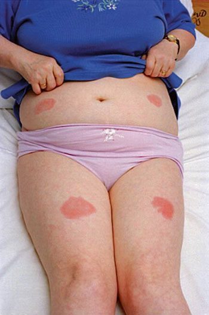

그림 6.1 이펙터 펩타이드 파트너와 Fc N말단을 통해 연결된 키메릭 인간 IgG Fc 융합단백질의 일반적인 구조를 도식적으로 나타낸 그림. 이펙터 분자는 하나 또는 둘 다의 Fc 사슬에 연결되어 각각 단량체 또는 이량체 융합단백질을 형성할 수 있다. 예를 들어, etanercept에서는 융합된 펩타이드 파트너가 75 kDa 인간 종양 괴사 인자 수용체(TNFR)의 세포외 리간드 결합 단백질이다; abatacept에서는 융합단백질이 림프구 항원 CTLA-4와 ADCC 및 CDC 활성을 상실하도록 변이된 항체 Fc 부분이 융합된 것이다. Baldo BA에서 재생산됨. 치료용 키메릭 융합단백질: 적응증, 기전 및 안전성. Drug Saf 2015;38:455-79. Springer Science + Business Media의 허가를 받아 재생산됨

Fc 융합단백질의 당단백질로서의 특성

보존된 N-연결 당화(glycosylation) 부위가 인간 Fc 프래그먼트의 CH2 도메인의 힌지 영역 근처에 위치한 아스파라긴 297에 존재하며 이는 네 가지 인간 IgG 아형 각각에서 나타난다. 부착된 글리칸 구조는 N-아세틸-D-글루코사민과 D-만노스로 구성된 핵심 헵타사카라이드를 포함하는 양분지성(biantennary)으로서, 단당류 L-푸코스, N-아세틸-D-글루코사민, D-갈락토스, 그리고 말단 시알산의 추가에 의해 형성되는 가변적 연장체를 포함한다(2장 "단클론항체의 당화" 절). 반면, 수용체 도메인과 같은 결합된 이펙터 단백질의 당화 부위는 N- 및/또는 O-연결될 수 있으며 더 많은 시알산 잔기를 포함할 수 있어, 예를 들어 단클론항체보다 Fc 융합단백질에 더 많은 전하 이질성을 부여한다. 정제한 재조합 제제의 약 70%는 당단백질이며, 중국 햄스터 난소(CHO) 세포와 같은 세포는 일부 인간 글리코실기전이효소를 발현하도록 설계될 수 있지만, 박테리아, 곰팡이, 식물, 곤충, 포유류를 포함한 다양한 다른 생물체로부터 인간 글리칸 패턴과의 차이가 발생할 수 있다. 예를 들어, CHO 세포는 당단백질 발현 과정에서 시알산을 첨가할 수 있다. 번역 후 수정(post-translational modification)의 경우, 세포 발현 시스템에 주의를 기울이면 재조합 단백질이 미리 결정하고 통제한 방식으로 당화될 수 있다. 구조적으로 복잡한 당단백질은 주로 포유류 발현 시스템에 의해 생산된다. 이들은 특수한 당화, 디설파이드 결합 도메인, γ-카복실화, 및 설페이션과 같은 어느 정도 복잡한 번역 후 수정을 필요로 하기 때문이다. 당화는 작용, 단백질 용해성, 안정성, 혈청 반감기, 면역원성(immunogenicity), 및 수용체 결합의 선택성에 대한 영향을 거쳐 바이오의약품 치료의 효과에 중대한 영향을 미칠 수 있다. 예를 들어, 인간 Fc 프래그먼트의 CH2 도메인에 있는 글리칸의 말단 당은 항체의존세포매개세포독성(ADCC)과 보체의존세포독성(CDC)을 결정하는 데 도움을 준다(2장, "단클론항체의 당화" 절). 올리고사카라이드 체인의 자연적 특성은 용해성을 돕고, 응집(aggregation)을 억제하며, 단백질을 물리적 변성으로부터 보호한다. N- 및 O-연결 당화의 번역 후 수정의 중요성은 Fc 융합 파트너의 말단 N-아세틸글루코사민 또는 갈락토스로 끝나는 불완전하게 형성된 글리칸 구조로 인한 Fc 융합단백질의 예상보다 빠른 제거로 설명될 수 있다. 키메릭 융합단백질과 바이오시밀러와 같은 바이오의약품의 복잡한 특성과 승인 전 제한적인 임상 경험을 고려할 때, 지속적인 개발을 위해 높은 수준의 특성 분석이 요구된다.

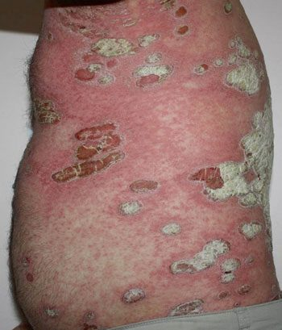

그림 6.2 다양한 융합단백질 구조체의 도식적 표현. (a) 이펙터 단백질(예: 수용체의 세포외 도메인)이 Fc CH2 도메인의 N말단에 융합되어 이량체를 형성하는 일반적인 형태. (b) 결합된 서로 다른 이펙터 단백질이 CH2 도메인에 융합된 형태. 이 형태는 예를 들어 rilonacept에서 볼 수 있는 Fc TRAP 구성에서 나타난다. (c) 하나의 단백질이 CH2 도메인 중 하나에만 융합된 단량체 Fc 융합체. (d) 생체 활성 펩타이드가 Fc 영역의 각 CH2 도메인에 연결된 미메티바디(mimetibody) 구조체. (e) 이종이량체를 형성하기 위해 두 개의 서로 다른 이펙터 단백질이 Fc 프래그먼트에 융합된 형태. (f) 각 CH2 도메인에 융합된 단일사슬 Fv(scFv). (g) 양쪽 CH2 Fc 도메인에 융합된 단백질. (h) N- 및 C-말단 양쪽에 융합된 이펙터 단백질. 융합이 C말단과 함께 이루어지는 구조체는 romiplostim에서 볼 수 있다. Huang C에서 재생산됨. Receptor-Fc 융합 치료제, 트랩, 및 Mimetibody™ 기술. Curr Opin Biotechnol. 2009;20:692-9. Elsevier Ltd.의 허가를 받아 재인쇄됨.

표 6.1 치료에 사용되는 융합단백질의 반감기
| 융합단백질a | 상품명 | MW (kDa) | 반감기b (일/h) |
| --- | --- | --- | --- |
| Etanerceptc | Enbrel® | 150 | 3-6 |
| Belatacept | Nulojix® | 90 | 8-10 |
| Abatacept | Orencia® | 92 | 8-25 |
| Rilonacept | Arcalyst® | 251 | 9 |
| Aflibercept | Zaltrap®; Eylea® | 115 | 5-6 |
| Romiplostim | Nplate® | 60 | 1-34 |
| Alefacept | Amevive® | 92 | 11 |
| Factor VIII Fc 융합단백질d | Eloctate®; Elocta® | 220 | 19.7 h |
| Factor IX Fc 융합단백질f | Alprolix® | 98 | ~3.4 |
| Dulaglutideg | Trulicity® | 63 | 4-5 |
| Albiglutideh | Tanzeum®; Eperzan® | 73 | 6-8 |
| Denileukin diftitoxi | Ontak®j | 58 | 1.2-1.3 h |
| Factor IX 융합단백질 rIX-FPk | Idelvion® | 125 | 3.6-3.9 |

Baldo BA에서 발췌. 치료용 키메릭 융합단백질: 적응증, 기전 및 안전성. Drug Saf 2015;38:455-79. Springer Science + Business Media의 허가를 받아 적응 및 재생산됨.

a albiglutide, denileukin diftitox, 및 factor IX 융합단백질 rIX-FP를 제외한 모든 Fc 융합단백질
b 성인에서
c TNF를 표적하는 단클론항체(infliximab, adalimumab, golimumab, 및 certolizumab pegol)의 반감기는 etanercept의 반감기에 비해 약 2-3배 길다
d B 도메인 결핍 재조합 factor VIII Fc 융합단백질(BDDrFVIIIFc) 또는 rFVIIIFc라고도 한다
e 12-17세에서 16.4 h; 6-11세에서 14.6 h; 2-5세에서 12 h
f 재조합 factor IX Fc 융합단백질, rFIXFc라고도 한다
g 다른 Fc 융합단백질들이 IgG1 아형의 Fc 프래그먼트를 사용하는 것과 달리 IgG4에서 유래한 Fc 융합 파트너
h 융합 파트너가 IgG Fc가 아닌 인간 혈청 알부민. 7장 및 그림 7.8도 참조
i Fc 또는 알부민 융합단백질이 아니며 다른 융합단백질에 비해 유의하게 짧은 반감기를 보임
j 단종; 2014년 1월 30일 CDER 단종 치료용 생물의약품 목록에 등재
k 2016년 3월 승인. 융합 파트너가 IgG Fc가 아닌 인간 혈청 알부민. 10장 및 표 10.1도 참조

Fc 융합단백질의 IgG 아형: 이펙터 기능의 증가와 감소

치료 승인을 받은 거의 모든 단클론항체가 한때 사용되었듯이, 9개의 Fc 융합단백질에 사용하는 Fc 영역은 인간 IgG1 아형에 속한다. 혈당 조절에 사용하는 융합단백질인 dulaglutide(아래 "Dulaglutide" 절)에서는 IgG4 아형을 사용한다. 사용하는 항체 아형은 암 치료에서 특히 중요한 고려사항이다. 네 가지 서로 다른 IgG의 생물학적 특성이 다르기 때문이다. 인간 IgG1과 IgG3은 모든 FcγRs에 결합하며, IgG2는 FcγRIIA 및 FcγRIIIA에 결합하고, IgG4는 FcγRI, FcγRIIA, FcγRIIB, FcγRIIC, 및 FcγRIIIA에 결합한다. IgG1(특히 탈푸코실화된 형태에서)은 ADCC에 선호하는 아형이며(예를 들어, rituximab, alemtuzumab, 및 trastuzumab에서 사용됨), 세포사멸이 필요하지 않을 때는 세포독성에 기여하지 않는 인간 IgG2 또는 IgG4를 사용할 수 있다. 보체 성분 C1q의 결합, 보체 캐스케이드의 활성화, 그리고 궁극적으로 세포사멸을 수반하는 보체의존세포독성(CDC)은 단클론항체가 종양 세포를 죽이는 또 다른 메커니즘이다. IgG3에 이어 IgG1이 보체 캐스케이드의 가장 효과적인 활성화제인 반면, IgG2와 IgG4는 상대적으로 효과가 낮은 활성화제이다. 때때로 보체의 고정 및 자극을 피할 필요가 있거나 불필요한 경우가 있다. 예를 들어, 사이토카인을 수반하는 반응에서 IgG2와 IgG4는 Fc 및 보체 수용체에 대한 친화력이 낮아, tositumomab(살상용 마우스 IgG2에 131I 연결), denosumab(IgG2), panitumumab(IgG2), natalizumab(IgG4), 및 eculizumab(IgG2/4; 보체 단백질 C5를 표적)과 같은 단클론항체에 사용되었다. 최근까지 이 두 IgG 아형의 Fc 도메인은 융합단백질에 사용하지 않았지만 조사에 따르면 때때로 우수하거나 최적의 성능을 부여할 수 있음이 시사되었다. 최근 승인한 융합단백질 dulaglutide(FDA, 2014년 9월 승인)의 경우, 개발자들은 변형된 IgG4 Fc 프래그먼트를 사용해 융합 구조체의 ADCC 및 CDC 효과를 최소화하고, 항약물항체 형성을 방지하며, 고친화력 Fc 수용체와의 상호작용을 줄이기로 선택했다.

Etanercept는 1998년에 FDA가 류마티스 및 기타 관절염 치료로 승인했다. 단클론항체 infliximab, certolizumab, adalimumab, 및 golimumab(표 2.1; 4장 "인간 종양 괴사 인자를 표적으로 하는 단클론항체: Adalimumab, Certolizumab Pegol, Infliximab, 및 Golimumab" 절)과 마찬가지로, etanercept는 종양 괴사 인자(TNF)(표 6.2)에 결합해 이 사이토카인과 세포 표면 TNF 수용체의 상호작용을 억제하고 궁극적으로 이어지는 염증 반응을 감소시킨다. Infliximab과 마찬가지로 etanercept는 다른 치료가 실패한 류마티스 환자에게 때때로 투여하며 이 질환에 대한 적응증 외에도 강직성 척추염, 판상 건선 및 일부에서는 크론병을 포함한 기타 자가면역 질환 치료에도 유용하다. etanercept의 흥미롭고 성공적인 치료적 응용 사례가 아직 소수의 독성 표피 괴사용(TEN)과 유사한 급성 홍반성 루프스 환자의 치료에서 나타났는데, 이는 TNF 리간드에 대한 인식 때문일 수 있다. 이 증후군은 TEN과는 달리 유발 약물이 일반적으로 확인되지 않는다.

Belatacept

T세포 비용자극(costimulation)의 방해 또는 예방은 면역 조절에 효과적인 전략이 될 수 있으며 이 접근법은 belatacept(Nulojix®) 및 abatacept(표 6.2)의 두 Fc 융합단백질 개발에 활용되었다. 미성숙 T세포를 활성화하려면 두 가지 신호가 필요하다: 신호 1은 항원 제시 세포에 발현되는 항원 펩타이드-주요조직적합성 복합체(major histocompatibility complex)에서 유래하며 T세포 수용체와 상호작용한다; 신호 2는 소위 비용자극으로, 항원 비특이적이며 수지상세포 표면의 B7-1(CD80) 및 B7-2(CD86)가 T세포의 CD28에 결합할 때 활성화된다. CD80/86은 CD28의 유사체인 세포독성 T림프구 관련 항원 4(CTLA-4)에도 결합할 수 있으며 이는 CD28보다 더 높은 친화력을 보인다. CTLA-4의 CD80/86에 대한 높은 친화력을 고려해, 전자를 펩타이드 파트너로 활용해 림프구 항원의 세포외 도메인을 인간 IgG1의 Fc 프래그먼트의 N말단과 융합하여 abatacept를 제작하였다. CTLA-4는 면역 관문(immune checkpoint)으로서 T세포 활성을 종료하는 역할을 한다.

Belatacept는 면역억제제로 작용해 칼시뉴린 억제제 및 코르티코스테로이드에 대한 의존도를 줄이며 cyclosporin보다 더 나은 이식편 기능과 개선된 심혈관 및 대사 위험 프로파일을 보이는 것으로 나타났다. 이로 인해 성인 신장 이식 환자에서의 장기 거부 반응 예방을 위해 FDA 승인을 받았다.

Abatacept에 대한 설명, 개발 및 작용 기전은 위의 belatacept 절을 참조하라. Abatacept(Orencia®)(표 6.2)는 CTLA-4의 세포외 도메인을 포함하는 동종이량체(homodimeric) Fc 융합단백질로, 성인 류마티스 관절염 및 소아 특발성 관절염의 1차 치료로 승인받았지만 초기 결과에 따르면 이 약물은 건선성 관절염 및 건선과 같은 기타 자가면역 질환 치료에도 역할을 할 수 있다.

Rilonacept

Rilonacept(Arcalyst®)는 IL-1R 부속 단백질(IL-1RAcP) 리간드 결합 영역이 C말단을 거쳐 인터루킨 수용체 IL-1RI 세포외 도메인의 N말단과 융합된 이량체 Fc 융합단백질이며 이 결합된 펩타이드는 IL-1RI를 거쳐 인간 IgG1의 각 Fc 사슬의 N말단과 융합된다(그림 6.3). Rilonacept, IL-1 트랩이라고도 하는 것은 IL-1β를 포획해 IL-1 수용체의 활성화를 방지함으로써 IL-1 과잉 생산으로 인한 염증 및 기타 효과를 감소시킨다(표 6.2). Rilonacept는 희귀의약품 지위를 부여받고 크리오피린 관련 주기적 증후군(CAPS)(4장 "CAPS 및 Canakinumab의 작용 기전" 및 "CAPS 질환 및 Canakinumab의 승인 적응증" 절)의 치료로 승인받았다. 이는 미국에서 약 100만 명당 1명의 발생률을 보이는 희귀 염증성 질환 그룹이다. CAPS는 일반적으로 NLRP-3(뉴클레오티드 결합 도메인, 류신 풍부 가족[NRL], 피린 도메인 함유 3) 유전자 변이에 의해 발생한다.

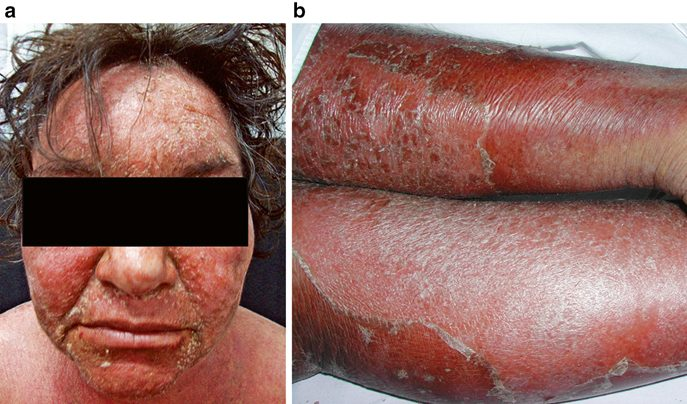

그림 6.3 IL-1β를 포획하여 IL-1 수용체의 활성화를 방지하는 이량체 인간 IgG1 Fc 융합단백질 rilonacept 또는 "IL-1트랩"의 구조를 도식적으로 나타낸 그림. Baldo BA에서 재생산됨. 치료용 키메릭 융합단백질: 적응증, 기전 및 안전성. Drug Saf 2015;38:455-79. Springer Science + Business Media의 허가를 받아 재생산됨.

인간 IgG1의 Fc 도메인 영역. VEGF 트랩은 VEGF와 태반 성장 인자(PlGF)에 의한 수용체 결합을 방지하는 순환성 길항제로 작용한다. Aflibercept는 ziv-aflibercept 또는 Zaltrap®로서, 옥살리플라틴 내성 전이성 대장암의 치료를 위해 5-플루오로우라실, 류코보린, 및 이리노테칸(FOLFIRI)과 병용 사용되며 Eylea®로서 신생혈관(습성) 노인성 황반변성 및 중앙망막정맥 폐색 후 황반부종의 치료를 위한 안과적 유리체 내 주사제로 사용된다.

Romiplostim

Romiplostim(Nplate®)(표 6.2)은 약 60 kDa의 소위 펩티보디(peptibody)로, 대장균(E. coli)에서 생산한 무당화 인간 IgG1 Fc 사슬의 C말단에 혈소판 생성인자 모방 펩타이드의 네 개의 동일한 복제본이 융합되어 형성된다. Fc-단백질의 각 H사슬은 잔기 228에서 펜타글리신 다리를 거쳐 혈소판 생성인자 모방 펩타이드 분자에 부착되며 이 펩타이드 분자는 옥타글리신 다리를 거쳐 또 다른 펩타이드 분자에 연결된다(그림 6.4). 위에서 검토한 Fc 융합단백질과 달리 romiplostim의 생물학적으로 활성인 펩타이드는 Fc 프래그먼트의 N말단이 아닌 C말단에 연결되어 있다는 점에 유의하라. 사용한 펩타이드는 파지 라이브러리 스크리닝으로 확인했으며 수용체 hTPOR로부터 혈소판 생성인자(TPO)를 대체하는 능력과 hTPOR를 특이적으로 발현하도록 설계한 세포의 증식을 자극하는 능력에 대해 최적화했다.

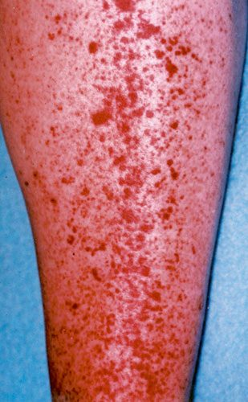

그림 6.4 혈소판 생성인자 수용체 작용제로 작용하는 이량체 인간 IgG1 Fc 융합단백질 romiplostim의 구조를 도식적으로 나타낸 그림. 다른 6개의 승인된 키메릭 Fc 융합단백질과 달리 romiplostim의 이펙터 펩타이드 파트너(각 Fc H사슬에 부착된 두 개의 연결된 혈소판 생성인자 모방 펩타이드 분자)는 Fc 프래그먼트의 N-말단이 아닌 C-말단에 연결되어 있다. 또한 IgG1 C2 도메인에 일반적으로 부착된 올리고사카라이드 체인이 romiplostim에는 없음을 유의하라. Baldo BA에서 재생산됨. 치료용 키메릭 융합단백질: 적응증, 기전 및 안전성. Drug Saf 2015;38:455-79. Springer Science + Business Media의 허가를 받아 재생산됨.

Alefacept

CD2와 인간 세포 표면 LFA-3(림프구 기능 관련 항원 3; CD58)의 상호작용은 T세포 반응의 규제에 관련된 신호전달 이벤트를 생성한다(표 6.2). 1993년, G. T. Miller 등은 CD2 결합 부위를 LFA-3의 첫 번째 도메인으로 국한시켰고, 이펙터 펩타이드로 사용해 IgG1과 융합단백질을 제작하였으며, 이 N-연결 융합단백질이 세포 증식 및 혼합 림프구 반응을 억제할 수 있음을 보여주었다. Alefacept(Amevive®)는 anti-CD2(표 6.2)로 간주될 수 있으며 판상 건선에서 CD4+ 및 CD8+ 이펙터 메모리 T세포를 표적으로 하지만 미성숙 T세포 및 중추 메모리 T세포는 표적으로 하지 않는다. 이펙터 T세포에서의 CD2 발현 증가, alefacept에 의한 이들의 감소, 및 건선 피부 병변 내 이들의 농도는 이펙터 T세포가 질환 병리 발생에 역할을 한다는 것을 시사한다. 그러나 alefacept로 치료받는 모든 건선 환자에서 순환 메모리 T세포는 감소하지만 임상 반응과 순환 메모리 T세포 감소 사이에는 좋은 상관관계가 존재하지 않는다. T세포 감소의 메커니즘은 아직 확립되지 않았다.

Factor VIII Fc 융합단백질

Factor VIII(10장 "Factor VIII" 절)는 2332개의 아미노산(MW ~ 300 kDa)으로 구성된 단일 사슬 거대 단백질로 합성되며 여러 개의 뚜렷한 도메인 A1-A2-B-A3-C1-C2를 포함한다. B 도메인의 대부분은 factor VIII 활성의 감소 없이 제거될 수 있다. 이 발견은 소위 B 도메인 결핍 재조합 factor VIII 단백질, BDDrFVIII로 지칭되는 것을 구축하게 이끌었으며, 이것은 인간 IgG1 Fc와 공유결합되어 factor VIII 융합단백질(rFVIIIFc)(Eloctate®; Elocta®)(표 6.2; 10장 "Factor VIII Fc 융합단백질" 절 및 그림 10.9도 참조)을 제작하며, 약 19.7 h의 어느 정도 연장된 반감기를 보인다(표 6.1). 이 융합단백질 동종이량체는 잘 분비되지 않았지만 활성 Fc 융합 단량체는 양호한 약력학적 및 약동학적 특성을 보였다. Factor VIII Fc 융합단백질에 대한 설명은 10장 "Factor VIII Fc 융합단백질" 절을, 이 최근 승인한 융합단백질의 안전성 데이터는 "Factor VIII Fc 융합단백질" 절 및 표 6.2와 10.1을 참조하라.

Factor IX Fc 융합단백질

Factor IX는 1997년부터 혈우병 B 치료로 사용 허가되었으며 약 55 kDa의 비타민 K 의존성 세린 프로테아제로 14-34 h의 비교적 짧은 반감기를 갖는다. 재조합 factor IX Fc 융합단백질(rFIXFc)(Alprolix®)(표 6.2; 10장 "Factor IX Fc 융합단백질" 절)은

Dulaglutide

Dulaglutide(Trulicity®)는 제2형 당뇨병 치료에 사용하는 수정된 장기 작용 수용체 작용제 유사체로, 16개의 아미노산 펩타이드 링커를 거쳐 수정된 인간 IgG4 Fc 프래그먼트의 두 사슬 각각에 공유결합된 인간 GLP-1의 유사체이다(7장 "GLP-1 수용체 작용제" 및 "GLP-1 수용체 작용제의 안전성" 절). 디펩티딜 펩티다제 4(DPP-4)에 의한 불활성화를 방지하기 위해(7장 "글루카곤 유사 펩타이드 1과 인크레틴 효과" 절) 및 면역원성을 줄이기 위해, GLP-1의 위치 8, 22, 및 36에서 아미노산 변형을 수행했으며(그림 7.11 참조), 수정된 IgG4 Fc가 융합 파트너로 선택되어 융합 구조체의 ADCC 및 CDC를 최소화하고, 항약물항체 형성을 방지하며, 고친화력 Fc 수용체와의 상호작용을 줄였다. 약 4.7일의 반감기를 가져 dulaglutide는 일주일에 한 번 투여할 수 있다.

Atacicept

아타시셉트(Atacicept, 4장 "APRIL, 루프스 및 아타시셉트" 절 참조)는 완전 인간 재조합 융합단백질로, TACI 수용체의 세포외 리간드 결합 부분이 수정된 인간 IgG1 Fc 프래그먼트와 융합되어 구성된다. TACI(막관통 활성제 및 칼슘 조절제 및 사이클로필린 리간드 상호작용자)는 기억 B세포와 골수 형질세포에 발현되며 B세포 성숙의 음성 조절자이자 B세포 생존 인자인 가용성 B림프구 자극 단백질(BLyS)의 세 가지 TNF 수용체 중 하나이다. TACI는 또한 APRIL(증식 유도 리간드)에 결합하며 이는 활성화된 골수세포가 분비하는 TNF 슈퍼패밀리의 또 다른 구성원으로 B세포에 자극적 작용을 한다. APRIL 및 BLyS에 결합하는 잠재적 치료제로 개발되었으나 아직 규제기관의 승인을 받지 못한 atacicept는 루프스 치료에 대한 유효성을 평가하기 위해 설계한 시험에서 처음에는 실망을 안겨주었다.

승인된 Fc 융합단백질의 안전성

위에서 개괄한 바와 같이, 12개의 키메릭 융합단백질 중 10개(etanercept, belatacept, abatacept, rilonacept, aflibercept, romiplostim, alefacept, factor VIII Fc 융합단백질, factor IX Fc 융합단백질, 및 dulaglutide)가 Fc 융합단백질이다. 알부민 융합단백질 albiglutide("Albiglutide" 절)에 대한 안전성 고려사항은 7장 "GLP-1 수용체 작용제의 안전성" 절에 요약되어 있다. Denileukin diftitox는 IL-2와 융합된 독소로 구성된 유전공학적 재조합 융합 구조체로 다른 융합단백질과 상당히 다르며 별도로("Denileukin Diftitox" 절) 검토한다. 나머지 7개의 승인된 Fc 융합단백질은 이 절에서 특성, 승인 적응증, 작용 기전, 및 이상반응(adverse effect)이 표 6.2에 요약되어 논의된다.

Etanercept

초기 연구에서는 특히 etanercept 투여와 관련된 가장 흔한 이상반응이 비교적 가볍다고 보고하였다. 예를 들어 발열, 두통, 주사 부위 반응, 가벼운 알레르기 반응, 및 가려움증이 있지만 시간이 지남에 따라 장기간 사용 후 다양한 덜 흔하고 때때로 드물고 심각한 반응들이 지금은 알려져 있다. 118명의 환자에게 투여한 etanercept의 후향적 안전성 및 유효성 평가에서 51명(43.2%)이 이상반응을 경험하였으며 이 중 4분의 1은 주로 상기도 감염이었다. 판상 건선을 가진 182명의 소아 환자(4-17세)에 대한 장기간 조사에서, 참가자의 80%에서 최소 한 가지 이상의 이상반응이 나타났으며, 상기도 감염이 가장 높은 발생률(25%)을 보였고, 비인두염, 연쇄상구균 인두염(각각 13%), 및 부비동염(11%)이 뒤를 이었다. 기회감염은 기록되지 않았다. 캐나다 22개 임상 진료소에서 모집한 건선성 관절염 환자 110명을 대상으로 2년 이상 etanercept를 지속적으로 투여한 결과, 14명의 환자에서 20건의 심각한 이상반응이 발생하였다. 이 이상반응은 복부 농양, 충수염, 악성 폐 신생물, 폐렴, 연쇄상구균 감염, 협심증, 심정지, 및 뇌출혈을 포함하였다. etanercept의 이상반응 목록은 FDA가 빈도순으로 발표했으며 감염, 피부과, 신경, 근골격, 폐, 심장, 및 혈관 효과를 포함한다.

심각한 감염은 이 약물에 대한 FDA의 두 가지 블랙박스 경고 중 하나이다(표 6.2). 구체적으로, 경고는 다음을 포함한다: (1) 결핵, 세균 패혈증, 및 기타 기회감염 병원균으로 인한 심각한 감염 또는 사망 위험 증가; (2) 감염 또는 패혈증이 발생할 경우 약물 중단의 필요성; (3) 잠복 결핵 검사의 필요성; (4) 치료 중 모든 환자의 활동성 결핵 모니터링 필요. TNF 표적 단클론항체 infliximab이 etanercept보다 3-4배 높은 위험성을 갖는다는 점에 유의하라. 결핵, 히스토플라스마증, 칸디다증, 및 리스테리아증이 보고한 사례의 80% 이상을 차지하는 etanercept 또는 infliximab과 관련된 육아종성 감염과 관련하여 FDA의 이상반응 보고 시스템에 접수된 보고의 분석에 따르면, 639건의 육아종성 감염 에피소드 중 556건은 infliximab과, 83건은 etanercept와 관련되었다. Infliximab과 대조적으로 etanercept는 일반적으로 덜 심각한 감염과 연관될 수 있지만 바이러스성 폐렴, 폐렴구균 패혈증, 및 골관절 결핵의 심각한 사례가 발생하였고 사망도 보고되었다. etanercept 치료와 관련된 감염에 관련된 미생물의 범위는 넓으며 박테리아(결핵, 연쇄상구균, 리스테리아, Actinobacillus), 바이러스(수두), 곰팡이(아스페르길루스), 원충(톡소플라스마), 및 편충(에키노코쿠스)을 포함한다.

피부과적 이상반응

etanercept에서 가장 흔한 피부 표현형은 주사 부위 반응으로(그림 6.5), 약 20-50%의 환자에게서 나타날 수 있다. 이는 일반적으로 가벼운 정도에서 중등도 정도이며 홍반, 부종, 통증, 및 가려움증을 수반한다. 반응은 치료 첫 2개월 내에 발생하며 마지막 주사 후 1-2일 후에 재발할 수 있다.

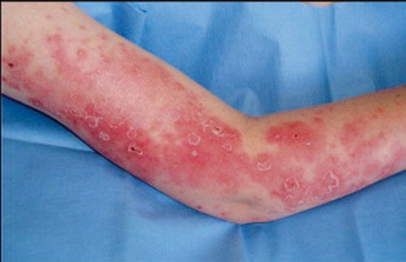

그림 6.5 etanercept로 치료받은 류마티스 환자에서 여러 부위에서 나타난 주사 부위 반응. 주사 부위 반응은 etanercept에서 가장 흔한 피부 표현형이며 이 약물을 투여받는 환자의 약 20-50%에서 발생한다. Rajakulendran S, Deighton C의 허가를 받아 재생산됨. etanercept로 치료받은 류마티스 환자의 지연된 다중 주사 부위 반응. Rheumatology. 2004;43:1588-9

약 65개의 특정 진단이 153명의 환자를 대상으로 한 사례 연구에서 확인되었다. 병리가 알려지지 않은 다양한 발진과 두드러기가 가장 흔하게 발생하는 반응이었다. 전체적으로, etanercept는 다양한 피부과적 이상반응과 연관된 것으로 밝혀졌으며 대부분은 경미하지만 일부는 심각하고 소수는 생명을 위협한다. 기록한 사례에는 건선 및 아토피 피부염의 새로운 발생 및 악화, 건선 유발, 태선양 반응, 다형 홍반, 혈관각질종, 천포창, 및 손바닥·발바닥 농포증이 포함된다. etanercept에 의해 유발된 급성 전신성 발진성 농포증(AGEP)에 대한 두 건의 흥미롭고 드문 보고가 있다. 중증 판상 건선에 대한 etanercept 치료(50 mg 피하, 주 2회)를 시작한 후 이틀 이내에 성인 남성이 광범위한 홍반성 구진 발진을 일으켰다. etanercept 치료 4일째에 항히스타민제 및 코르티코스테로이드를 투여한 후 발진은 미세한 농포를 동반한 전신성 부종으로 진행되었다(그림 6.6). 조직학적 검사에서 호중구, 감염 없음, 및 AGEP에 부합하는 가벼운 해면체가 발견되었다. etanercept 중단 후 발진은 호전되었다.

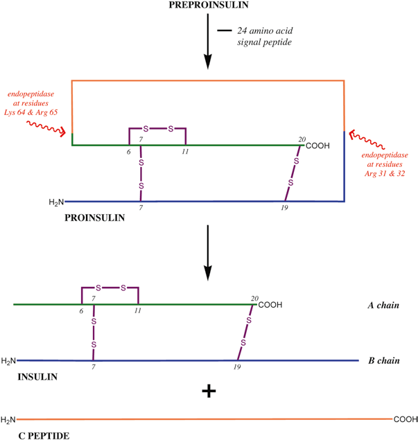

그림 6.6 etanercept 주사 2회 후 판상 건선 치료를 시작한 후 4일째 성인 남성에서의 전신성 홍반 및 미세 농포. 임상 특징 및 조직학적 검사 결과는 급성 전신성 발진성 농포증(AGEP)에 부합하였다. Kavala M, Zindanci I, Türkoglu Z 등의 재생산. Case Rep Dermatol Med. 2013; 기사 ID 601412. doi.org/10.1155/2013/601412, 크리에이티브 커먼즈 저작자 표시 라이선스 조건에 따라 배포된 오픈 액세스 기사.

신경학적 이상반응

etanercept의 제외 기준에는 예를 들어 영국 류마티스학회 SGAWG(위의 "Etanercept" 절 참조)에서와 같이 탈수초화 장애의 위험 상기가 포함된다. 168명의 환자, 대부분 재발-관해형 다발성 경화증(MS)을 가진 환자에서 실시한 초기 이중맹검, 위약 대조 II상 시험에서, lenercept(이제는 단종됨)는 etanercept와 유사한 재조합 융합단백질로 인간 p55 kDa TNF 수용체의 두 세포외 도메인을 하나의 IgG1 중쇄와 결합하여 MRI 스캔 및 임상 평가로 감지하는 새로운 병변의 유도에 대한 가능한 효과를 조사하였다. 결과는 공격 빈도의 증가를 보였으며 공격의 심각도는 악화되는 것으로 나타났다. 염증성 관절염에 대한 항-TNF 치료 중 발생해 FDA에 보고한 탈수초화에는 etanercept와 관련된 17건의 사례가 포함된다.

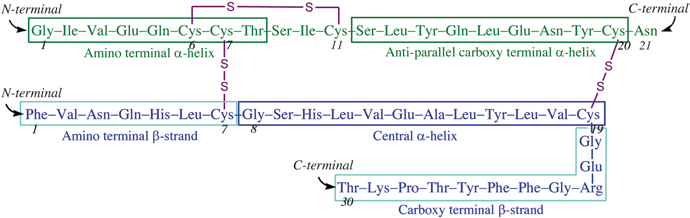

그림 6.7 (a) 난치성 홍반성 건선 및 건선성 관절염을 가진 여성 환자에서 etanercept 치료 재투여 후 안면의 비감염성 농포를 동반한 부종성 홍반. (b) 특징적인 농포 후 탈락을 보이는 사지의 홍반 및 부종이 며칠 후 진행됨. 그림 (a) 및 (b) 모두 Vasconcelos LMF, Teixeira FM, Francelini EV 등의 재생산. J Pharmacovigilance. 2014;2:120. doi: 10.4172/2329-6887.1000120, 크리에이티브 커먼즈 저작자 표시 라이선스 조건에 따라 배포된 오픈 액세스 기사.

Etanercept의 종양원성

TNF 차단제로 치료받는 소아 및 청소년에서 림프종 및 기타 악성종양의 발생 가능성은 FDA의 두 번째 블랙박스 경고의 주제이다(표 6.2). 여러 연구는 류마티스 환자, 특히 중증 환자에서 림프종 위험의 증가를 시사하며 이 위험은 TNF 길항제로 치료받는 환자에서 약간 증가하는 것으로 보인다. 미국 류마티스 질환 국가 데이터 뱅크의 8614명 환자(29명은 림프종) 데이터 분석에서, etanercept의 림프종 표준화 발생률(SIR)은 3.8이었다.

혈액학적 이상반응

etanercept 유발 혈액학적 장애의 발생률은 불명확하다. 820명의 환자에 대한 시판 후 조사에서 etanercept로 치료받은 환자의 발생률은 1000 환자-년당 3.4건으로 발견되었지만 이 수치는 많은 피험자가 특히 methotrexate와 같은 기타 항류마티스 약물로 치료받았다는 사실의 영향을 받을 것이다.

면역학적 이상반응

etanercept 치료와 관련된 면역학적 이상반응, 그리고 사실상 단백질 바이오의약품에 의한 모든 치료에 대한 논의는, 예를 들어 피부과, 혈액학, 폐, 신장, 내분비 및 아마도 기타 여러 제목 하에서 고려하는 많은 사건들이 이미 면역적 기반이나 성분을 가지거나 그러한 연관성이 의심되고 있음을 인식해야 한다.

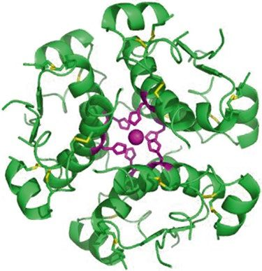
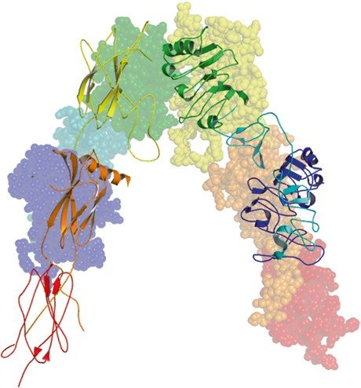

그림 6.8 헤노흐-쇤라인 자반증은 일반적으로 다리와 둔부에 국한되지만 세동맥, 모세혈관, 및 세정맥에 영향을 주는 전신성 혈관염이다. Feldmann R, Rieger W, Sator P 등의 재생산. BMC Dermatology. 2002;2:1. doi: 10.1186/1471-5945-2-1. http://www.biomedcentral.com/1471-5945/2/1 복제 및 재배포를 허용하는 오픈 액세스 기사.

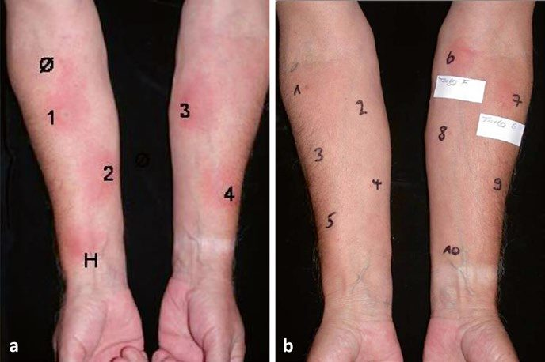

그림 6.9 etanercept에 의해 유발된 피부 홍반루푸스로 진단된 환자의 팔에 나타난 홍반성 반점 발진. Abourazzak FE, Guggenbuhl P, Perdriger A 등의 허가를 받아 재생산됨. La Rev Med Interne. 2008;29:744-7

Belatacept의 안전성

Belatacept로 치료받는 환자의 약 20%가 이상반응을 일으키며 가장 흔한 것은 표 6.2에 나열되어 있다. BENEFIT 및 BENEFIT-EXT로 명명한 두 가지 주요 III상 시험에서, 이전에 신장 이식 환자에서 belatacept와 cyclosporin을 비교하였고 이 시험의 모든 단계에서 신장 이식 환자에서 cyclosporin 기반 요법보다 더 나은 이식편 기능과 개선된 심혈관 및 대사 위험 프로파일을 관찰했다.

임상 시험에서 확인된 Abatacept 이상반응

다수의 시험에서 기록한 abatacept의 가장 빈번하게 보고한 이상반응에는 비인두염, 두통, 메스꺼움, 설사, 상기도 감염, 및 관절통이 포함된다.

Abatacept에 대한 기타 보고된 이상반응

Abatacept에 대한 피부과적 이상반응은 드문 것으로 보이지만 역설적 건선양 발진에 대한 몇몇 사례가 있다.

Rilonacept

rilonacept(표 6.2)가 유발하는 이상반응 목록은 그 희귀의약품 지위와 이에 수반하는 가벼운 사용량을 반영해, 대부분의 치료용 바이오의약품에 비해 비교적 짧다. CAPS(가족성 한랭 자가염증 증후군 및 Muckle-Wells 증후군 포함) 환자의 72주 공개 라벨 연장 시험 결과를 포함한 임상 시험에서 우려할 만한 부작용은 적었다. 이상반응은 일반적으로 가벼운 정도에서 중등도 정도였으며 가장 흔한 것은 주사 부위 반응과 상기도 감염이었다.

단백뇨. 융합단백질에 대한 항체를 발현한 환자는 없었다. Aflibercept/FOLFIRI와 위약을 비교하기 위해 설계된 III상 다중 센터, 무작위, 대조 시험에서 이상반응으로 인해 aflibercept 그룹의 26.6%와 위약 그룹의 12.1%의 환자가 치료를 중단하였다. Aflibercept를 투여받은 환자에서 위약에 비해 5% 이상의 발생률을 보인 3등급 및 4등급 이상반응은 발생률이 높은 순서대로 호중구감소증, 고혈압, 설사, 무력감, 구내염, 감염, 및 단백뇨이었다. 발열성 호중구감소증의 발생률은 3.9%였다. 고혈압률은 13배, 단백뇨률은 6.5배 증가하였다. 표 6.2에 명시된 바와 같이, ziv-aflibercept의 경고 예방 조치, 및 알려진 부작용은 상당히 광범위하다. 블랙박스 경고는 위장관 출혈, 위장관 천공, 및 상처 치유 손상을 포함하는 잠재적으로 치명적인 출혈을 다룬다. 기타 경고 및 예방 조치는 누공 형성, 고혈압, 동맥 혈전색전 이벤트, 단백뇨, 호중구감소증 및 그와 관련된 합병증, 설사 및 탈수, 및 PRES에 유의를 기울인다. 42명의 환자를 대상으로 cisplatin 및 pemetrexed와 함께하는 ziv-aflibercept의 최근 II상 다중 센터 폐암 시험은 확진된 3건과 의심되는 2건의 PRES 사례로 인해 조기에 폐쇄되었다. PRES는 다른 ziv-aflibercept 임상 평가에서도 지적되었지만 이 연구에서 관찰된 발생률은 이전에 보다 높았다. Ziv-aflibercept 정맥내 투여 후 항체의 발생률은 3.1%로 발견되었다. 중화항체는 48명의 환자 중 17명에서 발견되었지만 이 약물의 유효성 및 안전성에 미치는 영향은 평가되지 않았다. 단클론항체 ranibizumab에 이어 aflibercept는 중앙망막정맥 폐색의 2차 황반부종에 대해 FDA에 의해 승인된 두 번째 제제이다.

Romiplostim

혈소판 생성인자 수용체 작용제로서 romiplostim은 만성 면역혈소판감소증(ITP) 환자에서 코르티코스테로이드, 면역글로불린, 또는 비장절제술에 대한 불충분한 반응을 보인 혈소판감소증의 치료에 적응증이 있다. ITP 이외의 어떤 원인으로 인한 혈소판감소증에도 사용되지 않는다. 주로 임상 시험에서 이상반응은 가벼운 정도에서 중등도 정도로 평가되었지만(표 6.2), 임상 시험에서의 사례 발생 후 혈전/혈전색전 합병증, 골수 레티쿨린 형성, 및 골수 섬유화에 대한 규제기관 경고가 있다. 골수이형성증후군의 급성 골수성 백혈병으로의 진행 위험에 대한 경고도 발표되었다. 소아 대상 시험에서 관찰된 이상반응은 가벼운 정도에서 중등도 정도였으며 두통, 기침, 구토, 및 코피가 보고했다. 혈전색전 이벤트는 관찰되지 않았다. 항체 활성(기존 항체 또는 치료 중 형성된 항체)과 임상 유효성 또는 안전성 사이의 상관관계는 관찰되지 않았다. Romiplostim은 II상 임상 시험에서 고용량으로 투여된 환자에게서 전신성 발진 1건과 만성 혈소판감소증을 동반한 희귀 질환인 자가면역 림프증식성 증후군 환자에게 약물 투여 24시간 후 나타난 3등급 홍반성 구진 발진의 최근 사례를 제외하면 비교적 피부과적 이상반응이 없는 것으로 나타났다. 발진은 romiplostim 중단 후 약 1주 이내에 호전되었으며 다음 주 또는 이후 주에 치료를 재개할 때 재발하지 않았다.

Alefacept

Alefacept의 안전성 및 내약성은 가장 일반적인 부작용, 주사 부위 반응 포함,이 가벼운 정도에서 중등도 정도였으며(표 6.2) CD4+ T세포 수의 감소와 감염 발생률 사이에는 상관관계가 없는 것으로 나타난 다수의 임상 시험에서 상세히 기술되었다. 1869명의 건선 환자를 대상으로 한 13개 시험의 장기 안전성 분석에서...

alefacept의 이상반응. 위약 대조 연구에서 11명의 alefacept 치료 환자에서 13건의 악성종양이 발견되었다. 악성종양의 발생률은 1.3%였으며 위약 그룹에서는 0.5%였다. 이 약물에 의한 간 손상은 시판 후 보고에도 나열되어 있으며 과도한 면역억제 가능성은 FDA에 의해 발표된 또 다른 경고이다. 이와 관련하여 알려진 균상식육종(mycosis fungoides) 또는 분류되지 않은 비정형 림프구성 피부 침윤을 가진 환자에서 alefacept를 주의하여 사용해야 한다고 제안되었다. 1357명의 환자 중 약 3%가 융합단백질에 대한 낮은 역가의 항체를 발현하였지만 이들 항체의 장기적 효과는 알려져 있지 않다. 제조사가 Amevive®의 생산을 중단하기로 결정한 후, alefacept에 대한 FDA 승인은 2012년 9월에 중단되었다. 이 결정은 안전성이나 위험 우려와 관련이 없는 것으로 나타났다. 이 약물은 유럽 시장에 대해 승인된 적이 없다.

알부민 융합단백질

인간 혈청 알부민은 혈장에서 가장 높은 농도로 존재하는 단백질로, 14일 이상의 비교적 긴 반감기를 가지며 이는 안전성, 효소 활성 부족 및 일반적으로 낮은 면역원성 잠재력과 함께 이 단백질을 융합단백질을 포함한 일부 생물의약품의 개발에서 고려의 주요 후보로 만든다. 이펙터 펩타이드는 N- 또는 C-말단 또는 양쪽에 부착될 수 있으며 전반적으로, 재조합 단백질을 사용하는 알부민 융합 기술은 잠재적으로 유용하지만 작용 기간이 짧은 다양한 생물학적 제제를 위한 다용도의 비교적 안전한 약물 개발 플랫폼을 제공한다. Fc 융합단백질과 마찬가지로, 혈청 알부민은 FcRn과 상호작용하며 FcRn 재순환은 산성 pH에서의 결합과 중성 pH에서의 방출으로 이루어진다. 아마도 재조합 인간 혈청 알부민 융합 기술의 사용에서 가장 흔하게 나타나는 단점은 알부민 캐리어에 의한 이펙터 분자의 특이적 활성 및/또는 그 표적에 대한 간섭일 수 있다. 이는 링커의 사용과 관련 도메인의 방향 설정 노력에도 불구하고 발생한다. 최근 승인된 factor IX-알부민 융합단백질(rIX-FP, Idelvion®; 위의 "Factor IX 융합단백질" 절)의 개발에서, 단백질분해적 활성화에 책임이 있는 factor IX의 천연 절단 부위에서 유래한 링커 서열이 활용되었으며(10장 "Factor IX 알부민 융합단백질" 절), factor VIIa 융합단백질(개발 중)의 경우 유연한 글리신-세린 링커가 사용되었다. 재조합 인간 알부민(rHA)의 낮은 고유 면역원성에도 불구하고 이 위험과 활성에 대한 간섭 가능성은 이 단백질을 융합 파트너로 사용하는 모든 융합단백질의 개발에서 항상 고려되어야 한다.

현재 허가된 11개의 융합단백질 중 albiglutide와 factor IX 융합단백질 rIX-FP의 두 가지만이 알부민 융합 구조체이다...

Albiglutide

GLP-1 수용체 작용제 albiglutide(Tanzeum®; Eperzan®)는 인간 혈청 알부민과 융합된 디펩티딜 펩티다제-4 저항성 이량체 재조합 단백질로, 제2형 당뇨병 치료에 사용된다. Saccharomyces cerevisiae에서 제조된 albiglutide는 30개의 아미노산 GLP-1(7-36) 단량체 두 개가 직렬로 결합되고 rHA와 융합된 것으로 구성된다. DPP-4 공격에 대한 내성을 부여하기 위해 위치 8에서 Ala가 Gly로 치환되었다(7장 "GLP-1 수용체 작용제", "GLP-1 수용체 작용제의 안전성", "GLP-1 수용체 작용제의 면역원성" 절 및 그림 7.8 참조). 약 7일의 반감기를 가져 albiglutide는 일주일에 한 번 투여한다(표 6.1).

Factor IX 알부민 융합단백질

재조합 factor IX-재조합 인간 혈청 알부민 구조체, rIX-FP(Idelvion®)로 지칭되는 것은 2016년 3월 FDA에 등록되었다. 약 87-93시간의 연장된 반감기를 갖는다(표 6.1). 논의 및 이상반응은 10장 "Factor IX 알부민 융합단백질" 및 "Factor IX 융합단백질" 절에 기술되어 있다.

후기 개발 단계의 알부민 융합단백질

인터페론 알파-2b 알부민 융합단백질

사이토카인 인터페론(IFN) 알파-2a 및 2b(5장 "인터페론 알파" 절)는 바이러스 감염 B형 및 C형 간염과 일부 악성종양에 투여되며 1-3일마다 투여해야 하는 짧은 반감기를 가진다. 페길화된 IFN 알파-2a 및 알파-2b 제제는 반감기를 연장하기 위해 사용되지만 거의 절반의 환자가 실망스러운 반응을 보이는 상황에서 IFN 알파-2b의 반감기는 알비페론 알파-2b(Albuferon®)를 형성함으로써 연장되었는데, 이는 사이토카인과 rHA의 C말단의 재조합 융합단백질이다. S. cerevisiae에서 생산되고 MW 약 85.7 kDa인 이 융합단백질은 8일간 항바이러스 활성을 유지하였으며 93시간의 반감기를 보였는데, 이는 페길화된 IFN 알파-2b의 평균 반감기의 2배 이상이며 IFN 알파-2b의 18배에 해당한다. 이 융합단백질에 의해 유발된 이상반응...

만성 호중구감소증 환자. 매일 투여해야 하는 필그라스팀(filgrastim)의 짧은 반감기는 Albugranin™의 개발을 촉발하였으며 이는 rhG-CSF를 rHA의 C말단과 융합하여 형성되었다. 결과적으로 융합 복합체 형태에서 필그라스팀의 안정성이 증가하여 매주 1회 주사로 투여할 수 있게 되었다. Albugranin™은 현재 유방암 환자의 화학요법 유발 호중구감소증에 대한 III상 임상 시험 중이다.

초기 개발 단계의 알부민 융합단백질

다양한 알부민 융합단백질이 개발 중에 있지만 많은 것이 인간 시험 전 동물 연구의 초기 단계에 있다. 다음은 현재 조사 중인 융합 구조물 중 흥미로운 것들이다.

인터루킨-2(IL-2)는 알데슬루킨(aldesleukin)(rhIL-2)(5장 "알데슬루킨" 절)으로 rHA와 연결되어 S. cerevisiae 융합 시스템에서 81.8 kDa의 키메릭 단백질(Albuleukin®)을 생산하였다. 마우스에서의 연구에서 19-57분인 rhIL-2에 비해 6-8시간의 연장된 반감기를 보였다. 인슐린(7장 "인슐린" 절)은 rHA의 N말단에 도데카펩타이드로 연결(Albulin)되어 효모 또는 CHO 세포에서 발현되었다. 마우스에서의 제거 반감기는 rh인슐린의 10분에 비해 7시간이었다. 인간 성장호르몬(7장 "인간 성장호르몬" 절)은 20분 미만의 매우 짧은 반감기를 가지며 rHA의 C말단에 부착되어 융합단백질 Albutropin®을 형성하였으며 융합 유전자는 S. cerevisiae에서 발현되었다. 원숭이에서의 융합 구조체의 반감기는 인간 성장호르몬보다 6배 길었고, 제거율은 8배 느렸으며, 단일 피하 용량은 7일간 IGF-1 수준(7장 "인슐린 유사 성장인자 1" 절)을 유지하였는데, 이는 천연 호르몬의 7일간 매일 주사에 해당한다. 재조합 인간 에리스로포이에틴(rhEPO)(5장 "에리스로포이에틴" 절)은 정맥내 주사 후 4-13시간의 반감기를 가지며 이는 2-3회 주사...

티모신-알파1은 면역 조절 활성을 가지는 흉선 펩타이드로, 일부 바이러스 감염, 악성종양, 및 면역결핍증에 투여된다. 2시간의 짧은 반감기를 가지며 효모 Pichia pastoris가 rHA의 C말단에 융합된 재조합 흉선 펩타이드의 알부민 융합단백질 생산을 위한 단백질 발현에 사용되었다. 융합단백질의 반감기는 32-36시간으로 밝혔다. B형 나트륨이뇨 펩타이드(BNP)는 보상부전 울혈성 심부전 치료에 사용되지만 짧은 반감기로 인해 지속적인 정맥내 주입이 필요하다. 인간 배아 신장 세포에서 생성된 BNP-알부민 융합단백질(AlbuBNP; Cardeva™)은 천연 펩타이드의 3분에 비해 쥐에서 12-19분의 제거 반감기를 가진다. 현재 연구 중인 기타 유망한 알부민 융합단백질에는 GLP-1 수용체 작용제 exenatide, 부티릴콜린에스테라제(유기인산염에 대한 신경 독성 예방에 사용), 코카인 가수분해효소, 혈소판 응집 억제제 barbourin, 차가스병에 사용되는 infestin-4, 항염증 효과를 가지는 티오레독신, 및 트롬빈 억제제 히루딘과 같은 이펙터 단백질/펩타이드를 포함한 키메릭 구조체가 포함된다.

Denileukin Diftitox

이제는 단종된 유전공학적 재조합 융합단백질로 1992년 DAB389IL2로 도입되었으며 최초로 승인된 융합 독소(fusion toxin)이었다. 전체 IL-2 분자와 디프테리아 독소의 촉매 도메인, 즉 535개의 아미노산 전체 길이 디프테리아 독소에서 147개의 아미노산 수용체 결합 도메인을 제거하여 얻은 388개의 아미노산으로 구성된 단일 폴리펩타이드 사슬로, 결과적인 융합단백질인 denileukin diftitox(Ontak®)는 천연 디프테리아 독소의 ADP리보실 전이효소 및 막 전위 도메인을 유지한다. IL-2 수용체(IL-2R)에 결합한 후, 이 융합 독소는 단백질 합성을 억제하여 세포사를 수행하기 위해 세포내 섭취(endocytosis)를 거쳐야 한다. 이것은...

항히스타민제 및 코르티코스테로이드는 급성 증상을 완화하거나 예방하기 위해 사용되었다. 가장 빈번하게 나타난 이상반응은 독감 유사 증상(65명 중 55명, 85%)과 위장관 증상(71명 중 65명, 92%)으로 오한, 발열, 두통, 메스꺼움/구토, 설사, 무력감, 근육통, 관절통, 및 식욕부진을 포함하였다. FDA 블랙박스 경고에도 포함된 혈관 누출 증후군은 일반적으로 치료 첫 14일 이내에 나타나며 부종, 저알부민혈증 및/또는 저혈압 중 최소 두 가지로 정의되는데, 25%의 환자에게 보고했다. 감염은 56%의 환자에서 발생하였지만 이는 진행된 단계의 피부 T세포 림프종 환자의 전형적인 것이며 치료와 무관한 것으로 간주되었다. 백혈구감소증, 호중구감소증, 및 혈소판감소증은 71명의 환자 중 1명에서 3명에게 보고되었으며 림프구감소증은 환자의 70%에서 발생하였지만 24%는 기저 림프구감소증이 있었다. 주입과 무관한 발진은 환자의 25%에서 나타났지만 전반적으로 35%가 홍반성 구진, 자반, 소수포-대수포, 두드러기 및/또는 습진으로 분류된 피부 반응을 보였다. Denileukin diftitox 용량 증가 연구에 참여한 35명의 건선 환자 중 3명에서 탈락성 피부염 사례를 포함하여 지연성 과민반응으로 분류된 피부 반응이 보고했다. Denileukin diftitox에 대한 독성 표피 괴사용(TEN)에 대한 최소한 한 건의 보고가 있었으며 그 사례는 치명적이었다. Denileukin diftitox의 면역원성에 대한 두 건의 연구 결과는 FDA에 의해 요약되었다. 첫 번째 연구에서는 치료받은 95명의 환자 중 66%가 기저에서 항체 양성이었는데, 이는 이전에 디프테리아 미생물이나 백신에 노출되었기 때문일 가능성이 높았다. 치료 과정 1, 2, 및 3에서 비율은 각각 94%, 99%, 및 100%로 증가하였으며 약동학적 매개변수는 유의하게 감소하고 제거율은 2-8배 증가하였다. 두 번째 연구에서는 131명의 환자 중 39%가...

융합단백질 투여 후 발생할 수 있는, 심혈관 쇠약, 기관지 연축, 혈관부종, 두드러기, 및 홍반으로 발현되는 아나필락시스, 주입 반응, 사이토카인 방출 증후군, 자가면역 반응, 세포독성 II형 및 면역복합체 III형 과민반응, 그리고 종종 피부 반응으로 발현되는 지연성 세포매개 IV형 과민반응을 포함한다. 2013년 2월, FDA는 "치료용 단백질 제품의 면역원성 평가"라는 제목의 초안 가이드라인을 발표하였는데, 이는 최종 형태에서 이 주제에 대한 FDA의 견해를 나타낼 것이라고 명시되었다. 이 가이드라인은 기본적으로 항체 또는 세포 표적 반응이 없을 때 나타나지 않을 이상반응을 유발하거나 의도된 치료 작용을 감소, 변화 또는 제거할 수 있는 치료용 단백질에 대한 면역 반응을 평가하고 완화하기 위한 위험 기반 접근법을 나타낸다. 여기서 논의된 융합단백질과 같은 투여된 단백질의 면역원성은 환자 관련 요인과 제품 관련 요인의 영향을 받을 수 있다. 환자 관련 요인에는 다음이 포함된다: (1) 환자의 면역 상태 및 역량, 이는 예를 들어 환자의 연령 및 환자가 면역 억제 상태인지 또는 면역 활성화 상태인지(감염과 같은)와 관련이 있다; (2) 이전 감작 및/또는 알레르기 병력; (3) 투여 경로, 용량, 빈도, 및 기간; (4) 환자의 유전적 상태, 예를 들어 일부 HLA 일배체형(haplotype)은 환자에게 이상반응의 소인을 줄 수 있다; (5) 내인성 단백질에 대한 환자의 면역 관용 상태, 예를 들어 사이토카인 및 성장인자에 대한 자가항체의 존재와 재조합 치료용 단백질이 내인성 단백질에 대한 관용을 유도하거나 파괴할 가능성. 중요한 제품 관련 요인 일부에는 다음이 포함된다: (1) 제품의 기원-비인간 단백질은 항상 면역원성을 가질 잠재력이 있다; (2) 일차 분자 구조 및 번역 후 수정; (3) 사차 구조; (4) 페닐화 및 당화...

융합단백질에 대한 과민반응의 진단, 예방투약 및 탈감작

인간 치료용으로 승인된 소수의 단클론항체에 대한 아직 소규모이지만 증가하는 조사 외에도, 승인된 사이토카인, 효소, 독소, 및 키메릭 융합단백질의 지속적으로 증가하는 수에 대한 과민반응 조사를 위한 적절한 진단 및 탈감작 절차에 대한 데이터는 거의 이용할 수 없다. 융합단백질에 대한 기존 정보는 거의 전적으로 etanercept에 국한되어 있다. 융합단백질에 대한 즉시성 및 지연성 과민반응의 진단을 위해, 특이적 IgE 항체 검출을 위한 검증된 또는 그 외의 검사는 일반적으로 이용할 수 없으며 아직 표준화되지 않은 피부검사가 IgE 매개 반응 및 T세포 매개 이상반응을 검출하기 위한 주요 진단 절차로 남아 있다. 프릭(prick) 검사에서는 etanercept의 5-25 mg/mL 농도가 사용되었다; 피내 검사에서는 0.0025-0.25 mg/mL 및 0.1-5 mg/mL가 사용되었다. 패치 검사는 1% 및 5% 농도의 etanercept를 바셀린에 혼합하여 수행했다.

개별 융합단백질에 의해 유발되는 많은 반응이 적절히 조사되지 않은 것이 명백하며 키메릭 특성을 감안할 때, 융합단백질이 유발하는 과민반응 목록은 확장될 가능성이 높다. 면역혈소판감소증에 대한 진단 권장사항이 제시되었으며, 혈소판 반응성 항체를 검출하기 위한 면역분석법이 소수의 실험실에서 이용 가능하지만, 이 검사는 표준화되지 않았고, 약물 의존적 항체를 검출하지 않으며, 기술적으로 어렵고, 거짓 양성을 생성한다. 면역 호중구감소증과 같은 기타 II형 과민반응의 경우도 유사하며 여기서 과립구 항원의 단클론항체 고정 분석(MAIGA)이 선호되는 검사로 보인다. 일부 경우 실험실 표지자 부족 및 혈청병 및 혈관염과 같은 III형 과민반응 면역복합체 반응을 위한 루틴 검사 부재로 인한 진단상의 한계는 일부 융합단백질 유발 간 및 폐 손상 및 지연성 피부 반응에도 해당된다...

한 달 후 4일간의 탈감작 요법이 수행했다. 탈감작 시술 시작 1시간 전, 매일 cetirizine를 복용하던 환자에게 경구 아스피린 325 mg, montelukast 10 mg, diphenhydramine 25 mg, 및 famotidine 40 mg이 투여되었다. 1일차 및 2일차에 0.25 mg의 초기 용량이 투여되었고 이는 총 용량 12.5 mg이 투여될 때까지 일정한 간격으로 서서히 증량되었다. 3일차에는 유사한 일정으로 0.5 mg부터 시작하여 간격에 따라 최대 24.75 mg의 etanercept까지 증량되었다. 4일차에 단일 용량으로 단백질 25 mg이 투여되었다. 환자는 매 주사 1시간 전 diphenhydramine 25 mg과 매일 cetirizine를 유지하면서 주 2회 etanercept 주사로 유지되었다. 이와 매우 유사한 프로토콜이 etanercept에 대한 심각한 주사 부위 반응을 가진 다른 환자에게 성공적으로 사용되었다. etanercept에 민감한 환자에서의 성공적인 탈감작에 대한 추가 두 건의 사례가 보고했다. 진행성 심각한 주사 부위 반응을 일으키고 약물 유발 루프스가 발생한 환자는 1일차에 30분마다 0.025-12.5 mg의 범위에서 점진적 피하 주사로 etanercept를 투여받았고 3일차에 7.5 mg을 주 2회로 시작하였다. 두 번째 환자도 심각한 etanercept 주사 부위 반응을 가진 환자로 1일차에 30분마다 0.25-5 mg의 범위에서 4회의 점진적 피하 주사를 투여받았고 3일차에 30분 간격으로 7.5 mg, 10 mg, 및 15 mg을, 5일차에 20 mg을 투여받았다. 8일차부터 환자는 12.5 mg을 주 2회로 무증상으로 유지되었다. "탈감작"의 새로운 방법으로 주장된 한 사례에서, methylprednisolone과 methotrexate(7.5 mg)의 면역억제 요법이 단일 용량으로 함께 투여되어 etanercept 유발 두드러기 발진을 성공적으로 치료하였다. 1주 후 환자의 상태가 현저히 호전되었을 때 이 약물 조합의 두 번째 용량이 투여되었다. 추가 1주 후, 두드러기는 완전히 가라앉았고...

인간 면역글로불린 G와 신생아 FcRn 수용체의 상호작용이 치료적으로 유용한 단백질을 키메릭 형태로 제작 및 전달하는 데 활용된다는 인식은 Fc 융합단백질이 바이오의약품 치료의 가치 있고 안전한 형태로 점점 더 인정받게 되었다. 분자 클로닝, 항체 공학 기술, 단백질 설계, 세포주 개발, 및 생물공정의 지식과 응용의 발전은 모두 수명이 짧지만 치료적으로 유망한 거대분자의 선택된 이펙터 도메인을 적절한 융합 파트너, 일반적으로 인간 IgG의 Fc 프래그먼트지만 때때로 인간 혈청 알부민 또는 트랜스페린과 융합하는 일반 전략에 기여하였다. 사실, 많은 펩타이드와 단백질이 신속한 신장 제거로 인해 짧은 반감기를 가지므로, 융합단백질 개발의 주요 동기는 일반적으로 혈장 내 치료 반감기 연장이다. IgG Fc 융합의 기타 이점에는 부착된 Fc 도메인이 면역 세포의 Fc 수용체를 인식하는 능력(백신 및 암 치료에 잠재적으로 중요); 면역원성 이펙터 단백질에 대한 관용 유도와 같은 면역 조절 특성 부여; 단백질의 용해성 및 안정성 개선; 및 단백질 A 친화적 정제에 의한 제조 공정 촉진이 포함된다. 이미 승인된 융합단백질의 유효성과 안전성, 유망한 후보 임상 파이프라인, 바이오시밀러의 임박한 출현, 융합 파트너로 사용될 수 있는 잠재적 이펙터 단백질의 범위, 백신 및 훨씬 더 넓은 범위의 질환 치료로서의 Fc 융합단백질의 전망, 및 키메릭 거대분자의 1세대의 상업적 성공을 고려할 때, 후속 세대의 치료용 융합단백질은 상당한 낙관론으로 기대되고 있다.

## 요약

* 현재(2016) 시장에는 규제 승인을 받은 11개의 키메릭 융합단백질(9개의 Fc 융합단백질과 2개의 알부민 구조체)이 있으며 많은 것이 임상 개발의 다양한 단계에 있다. Fc 융합단백질 alefacept와 융합 독소 denileukin diftitox는 이제 더 이상 시판되지 않는다.
* 치료용 바이오의약품으로 사용되는 키메릭 융합단백질은 비교적 수명이 짧은 이펙터 도메인(일반적으로 펩타이드)과 "캐리어"(일반적으로 단백질 또는 펩타이드)로 구성되며 이는 결과적인 융합단백질의 기능적 특성에도 기여한다. 융합단백질은 유전공학에 의해 생산되며 관련된 개별 단백질의 유전자를 연결하여 통합된 개별 도메인과 그들의 기능적 특성으로부터 형성된 새로운 폴리펩타이드를 생성한다.
* 효과적인 키메릭 융합단백질 제작의 세 가지 주요 요구사항은 거대분자에 다음을 부여하는 것이다: (1) 안정성, 즉 적절히 연장된 반감기를 갖는 폴리펩타이드의 생성; (2) 효과적인 표적화 및 이후의 특이적 결합; (3) 세포독성 또는 적어도 치료 대상 질환의 기저에 작용하는 유해 과정을 억제하는 능력. 효과적인 펩타이드로 간주될 가능성이 높은 대부분의 펩타이드는 단백질분해적 가수분해로 인해 반감기가 짧고 일반적으로 수 분 내에 신장을 통해 신속히 제거된다.

* 인간 IgG 항체의 가용성 Fc 영역, 면역글로불린 중쇄(H) 사슬의 CH2 및 CH3 도메인을 포함하는 것은 가장 일반적으로 사용되는 융합 파트너였지만 재조합 인간 혈청 알부민 및 트랜스페린도 사용되었다.
* 이펙터 분자는 일반적으로 하나 또는 둘 다의 Fc H사슬의 N말단에 융합되어 단량체, 이량체, 또는 이종이량체 융합단백질을 형성하거나, 하나 이상의 리간드 결합 도메인이 "트랩"을 형성하기 위해 사용될 수 있다. 또 다른 구성에서는 이펙터 펩타이드가 소위 펩티보디 형태로 Fc 프래그먼트의 카복시 말단에 융합될 수 있다.
* 신생아 FcRn 수용체와의 상호작용을 통한 수용체 매개 재순환은 Fc를 포함하는 분자를 리소좀 분해로부터 보호한다.
* Fc 융합 구조체는 현재 또는 한때 허가된 13개 제제 중 10개를 차지하는 가장 빈번하게 사용되고 성공적인 융합단백질이 되었다.
* Denileukin diftitox, 부착된 Fc 조각이 없거나 알부민에 결합되지 않은 유일한 융합단백질은 약 70-80분으로 Fc 융합단백질의 평균 3-5일 이상 및 알부민 융합단백질 albiglutide의 최대 8일에 비해 단연코 가장 짧은 반감기를 갖는다.
* 보존된 N-연결 당화 부위가 인간 Fc 프래그먼트의 CH2 도메인의 아스파라긴 297에 존재하며 이는 네 가지 인간 IgG 아형의 각각에 나타난다. 수용체 도메인과 같은 결합된 이펙터 단백질의 당화 부위는 N- 및/또는 O-연결될 수 있으며 더 많은 시알산 잔기를 포함할 수 있다.
* 구조적으로 복잡한 당단백질은 주로 포유류 발현 시스템에 의해 생산된다. 왜냐하면 이들은 특수한 당화, 디설파이드 결합 도메인, γ-카복실화, 및 설페이션과 같은 번역 후 수정을 필요로 하기 때문이다. 당화는 작용, 단백질 용해성, 안정성, 혈청 반감기, 면역원성, 및 수용체 결합의 선택성에 대한 영향을 통해 바이오의약품 치료의 효과에 중대한 영향을 미칠 수 있다. 예를 들어, 인간 Fc 프래그먼트의 CH2 도메인에 있는 글리칸의 말단 당은 항체의존세포매개세포독성(ADCC)과 보체의존세포독성(CDC)을 결정하는 데 도움을 준다.
* 9개의 Fc 융합단백질에 사용되는 Fc 영역은 인간 IgG1 아형에 속한다. 최근 승인된 융합단백질 dulaglutide, 제2형 당뇨병 치료에 사용되는 글루카곤 유사 펩타이드-1(GLP-1) 수용체 작용제의 경우, 결과적인 융합 구조체의 ADCC 및 CDC 효과를 최소화하기 위해 수정된 IgG4 Fc 프래그먼트가 사용되었다.
* 현재 승인된 11개의 융합단백질 중 albiglutide와 factor IX 융합단백질 rIX-FP의 두 가지는 알부민 융합 구조체이다. Albiglutide는 인간 알부민과 융합된 재조합 디펩티딜 펩티다제-4 저항성 GLP-1 이량체로 제2형 당뇨병 치료에 사용된다. 응고 인자 융합단백질 rIX-FP는 혈우병 B 치료에 사용된다.
* Etanercept는 인간 TNF 수용체(TNFR)의 리간드 결합 부분과 연결된 재조합, 인위적으로 설계된, 완전 인간 이량체 Fc 융합단백질로, 1998년에 FDA에 의해 류마티스 및 기타 형태의 관절염 치료로 허가되어 규제 승인을 받은 최초의 키메릭 융합단백질이 되었다. TNF를 표적하는 단클론항체와 마찬가지로 etanercept는 때때로 강직성 척추염, 판상 건선, 및 크론병을 포함한 기타 자가면역 질환의 치료에 사용된다.

* 초기 연구에서는 etanercept의 가장 일반적인 부작용이 비교적 가볍다는 것을 보고하였다. 예를 들어 발열, 두통, 주사 부위 반응, 가벼운 알레르기 반응, 및 가려움증이지만 다양한 덜 흔하고 때때로 드물고 심각한 반응들이 이제는 알려져 있다.
* FDA에 의해 빈도순으로 발표된 etanercept 이상반응 목록에는 감염, 피부과, 신경, 근골격, 폐, 심장, 및 혈관 효과가 포함된다.
* 심각한 감염은 이 약물에 대한 FDA의 두 가지 블랙박스 경고 중 하나이다(다른 하나는 악성종양). 관련 미생물에는 박테리아(결핵, 연쇄상구균, 리스테리아, actinobacillus), 바이러스, 곰팡이(아스페르길루스), 원충(톡소플라스마), 및 편충(에키노코쿠스)이 포함된다.
* etanercept에서 가장 흔한 피부 표현형은 주사 부위 반응이다. 전체적으로 etanercept는 건선 및 아토피 피부염의 발생 및 악화, 태선양 반응, 다형 홍반, 및 손바닥·발바닥 농포증을 포함한 다양한 피부과적 이상반응과 연관되어 왔다.
* etanercept 치료 중 소위 탈수초화 증후군, 재발-관해형 MS, 척수 및 대뇌피질의 탈수초화, 진행성 다초점 백질뇌병증(PML), 후방가역성 뇌병증 증후군(PRES), 약물 중단 후 호전된 탈수초화 질환, 및 안과적 표현형을 유발하는 중추신경계 탈수초화를 포함한 다양한 탈수초화 장애에 대한 보고가 있다.
* TNF 차단제로 치료받는 소아 및 청소년에서 림프종 및 기타 악성종양의 발생 가능성은 FDA의 두 번째 블랙박스 경고의 주제이다. 여러 연구는 류마티스 환자에서 림프종 위험의 증가를 시사하며 이 위험은 TNF 길항제로 치료받는 환자에서 약간 증가하는 것으로 보인다.
* 폐 결절, 폐 육아종, 기존 간질성 폐 질환의 악화, 및 조직화 폐렴이 etanercept 투여 후 보고되었다.
* etanercept에 의해 유발된 건선, 아토피 피부염, 다형 홍반, 및 급성 전신성 발진성 농포증을 포함한 여러 피부과적 이상반응은 거의 확실하게 IV형 과민반응이며 일부 주사 부위 반응은 진정한 즉시성 I형 과민반응일 수 있다. etanercept 유발 혈구감소증 및 혈관염의 최소 일부 사례는 각각 II형 및 III형 과민반응일 수 있으며 etanercept에 의해 유발된 일부 폐 이상반응은 궁극적으로 III형 또는 복합 III형/IV형 반응으로 밝혀질 수 있다.
* etanercept가 갑상선기능항진증 및 항합성효소 증후군, 크론병, 및 헤노흐-쇤라인 자반증의 발생과 같은 자가면역 반응을 유발할 수 있다는 지표가 증가하고 있다.

* 항-etanercept 항체의 발생은 잘 알려져 있지만 이들 항체가 이 약물의 임상 유효성을 감소시킨다는 증거는 현재까지 없는 것으로 보인다. Etanercept를 투여받는 환자들이 흔히 항핵 및/또는 항이중가닥 DNA 항체를 발현하며 루프스 유사 증후군, 피부 홍반루푸스, 및 급성 원반형 루프스의 사례가 보고되었다. etanercept에 대한 즉시성 과민반응/아나필락시스에 대한 몇몇 가능한/가능성이 높은 보고가 있었다.
* CTLA-4의 CD80/86에 대한 높은 친화력을 고려하여 전자가 펩타이드 파트너로 활용되어 림프구 항원의 세포외 도메인을 인간 IgG1의 Fc 프래그먼트의 N말단과 융합하여 abatacept를 제작하였다.
* Abatacept는 성인 류마티스 관절염 및 소아 특발성 관절염의 1차 치료로 승인되었다.
* Abatacept는 CD80/86에 대한 높은 친화력을 보이지만 CTLA-4는 CD80 의존적 비용자극보다 CD86 의존적 비용자극의 훨씬 덜 강력한 억제제이다. 이 정보는 CD86에 대해 더 높은 친화력을 가진 수정된 CTLA-4 분자를 찾아야 한다는 인식으로 이어졌다. Abatacept와 두 개의 아미노산 치환으로 다른 belatacept는 CD86에 4배 더 높은 친화력으로 결합하여 CTLA-4에 비해 전반적으로 10배의 생물학적 활성 증가를 초래한다.
* Belatacept는 면역억제제로 작용하며 cyclosporin보다 더 나은 이식편 기능과 개선된 심혈관 및 대사 위험 프로파일을 보이는 것으로 나타났다. 이로 인해 성인 신장 이식 환자에서의 장기 거부 반응 예방을 위해 FDA 승인을 받았다.
* Belatacept는 "감염에 대한 감수성 증가...는 면역억제로 인해 발생할 수 있다"는 FDA 블랙박스 경고를 받고 있다. 이식편 손실 및 사망 위험 증가로 인해 간 이식 환자에서의 약물 사용은 권장되지 않는다.
* 치명적인 진행성 다초점 백질뇌병증(PML)은 belatacept에 대한 FDA의 "경고 및 예방 조치"에 포함되어 있다. Epstein-Barr 바이러스 혈청음성은 신장 이식에서 belatacept 치료로 인한 이식 후 림프증식성 장애(PTLD) 발생의 위험 인자이다. PTLD와 EBV 음성/양성의 관련성도 이 약물의 현재 FDA 블랙박스 경고에 포함되어 있다.
* IL-1 트랩이라고도 하는 rilonacept는 IL-1β를 포획하여 IL-1 수용체의 활성화를 방지함으로써 IL-1 과잉 생산으로 인한 염증 및 기타 효과를 감소시킨다. 이것은 IL-1R 부속 단백질(IL-1RAcP) 리간드 결합 영역이 C말단을 통해 인터루킨 수용체 IL-1RI 세포외 도메인의 N말단과 융합된 이량체 Fc 융합단백질이며 이 결합된 펩타이드는 IL-1RI를 통해 인간 IgG1의 각 Fc 사슬의 N말단과 융합된다.
* Rilonacept는 희귀의약품 지위를 부여받고 크리오피린 관련 주기적 증후군(CAPS) 치료로 승인되었다. 투여 후 이상반응은 일반적으로 가벼운 정도에서 중등도 정도이다. FDA가 발표한 rilonacept의 경고 및 예방 조치에 따르면 IL-1 차단은 감염에 대한 면역 반응을 방해할 수 있으며 생백신은 이 약물과 동시에 투여되어서는 안 된다고 한다.

* Aflibercept 또는 VEGF 트랩은 혈관 내피 성장 인자 수용체-1(VEGFR-1)의 도메인 2를 VEGFR-2의 도메인 3과 융합하고 이 조합을 인간 IgG1의 Fc 도메인의 힌지 영역에 부착하여 만든 인간 재조합 단백질이다. VEGF 트랩은 VEGF와 태반 성장 인자에 의한 수용체 결합을 방지하는 순환성 길항제로 작용한다.
* Aflibercept는 ziv-aflibercept 또는 Zaltrap®로서, 옥살리플라틴 내성 전이성 대장암의 치료를 위해 5-플루오로우라실, 류코보린, 및 이리노테칸(FOLFIRI)과 병용 사용되며 Eylea®로서 신생혈관(습성) 노인성 황반변성 및 중앙망막정맥 폐색 후 황반부종의 치료를 위한 안과적 유리체 내 주사제로 사용된다.
* Ziv-aflibercept의 경고 예방 조치, 및 알려진 부작용은 상당히 광범위하다. 블랙박스 경고는 위장관 출혈, 위장관 천공, 및 상처 치유 손상을 포함하는 잠재적으로 치명적인 출혈을 다룬다. 기타 경고 및 예방 조치는 누공 형성, 고혈압, 동맥 혈전색전 이벤트, 단백뇨, 호중구감소증 및 그와 관련된 합병증, 설사 및 탈수, 및 PRES에 유의를 기울인다. 안과적 제제 Eylea®의 경우, VEGF 억제제의 유리체 내 사용 후 동맥 혈전색전 이벤트의 잠재적 위험에 유의를 기울인다.
* Romiplostim, 소위 펩티보디는 대장균에서 생산된 무당화 인간 IgG1 Fc 사슬의 C말단에 혈소판 생성인자 모방 펩타이드의 네 개의 동일한 복제본이 융합되어 형성된다. Fc-단백질의 각 H사슬은 잔기 228에서 펜타글리신 다리를 통해 혈소판 생성인자 모방 펩타이드 분자에 부착되며 이 펩타이드 분자는 글리신 다리를 통해 또 다른 펩타이드 분자에 연결된다.
* 혈소판 생성인자 수용체 작용제로서 romiplostim은 만성 면역혈소판감소증(ITP) 환자에서 코르티코스테로이드, 면역글로불린, 또는 비장절제술에 대한 불충분한 반응을 보인 혈소판감소증의 치료에 적응증이 있다. ITP 이외의 어떤 원인으로 인한 혈소판감소증에도 사용되지 않는다.
* Romiplostim에 대해서는 혈전/혈전색전 합병증, 골수 레티쿨린 형성, 및 골수 섬유화에 대한 규제기관 경고가 있다. 골수이형성증후군의 급성 골수성 백혈병으로의 진행 위험에 대한 경고도 발표되었다.
* LFA-3의 첫 번째 도메인이 이펙터 펩타이드로 사용되어 IgG1의 Fc와의 융합단백질 alefacept를 제작하였다. Alefacept는 anti-CD2로 간주될 수 있으며 판상 건선에서 CD4+ 및 CD8+ 이펙터 메모리 T세포를 표적으로 하지만 미성숙 T세포 및 중추 메모리 T세포는 표적으로 하지 않는다.
* CD4+ 및 CD8+ 림프구 감소를 동반한 림프구감소증, 악성종양, 심각한 감염, 및 과민반응은 각각 FDA의 경고 및 예방 조치의 주제이며 각각 alefacept의 가장 심각한 이상반응으로 나열되어 있다. 이 약물에 의한 간 손상은 시판 후 보고에도 나열되어 있으며 과도한 면역억제 가능성은 FDA에 의해 발표된 또 다른 경고이다. Alefacept는 2012년 9월에 단종되었다. 이 약물은 유럽 시장에 대해 승인된 적이 없다.

* 혈우병 A 및 B를 각각 치료하는 데 사용되는 재조합 factor VIII(rFVIIIFc) 및 IX(rFIXFc) Fc 융합단백질은 인간 IgG1의 Fc 프래그먼트에 공유결합된 단일 리간드를 가진 단량체 구조체이다. 둘 다 치료를 개선하는 데 필요한 바람직한 연장된 반감기를 가지고 있다.
* 피부 T세포 림프종 치료에 사용되는 denileukin diftitox는 IL-2 분자와 디프테리아 독소의 촉매 도메인, 535개의 아미노산 전체 길이 디프테리아 독소에서 147개의 아미노산 수용체 결합 도메인을 제거하여 얻은 388개의 아미노산으로 구성된 단일 폴리펩타이드 사슬로 구성된다.
* 심각하고 치명적인 주입 반응 및 혈관 누출 증후군의 가능성은 denileukin diftitox의 FDA 블랙박스 경고에 포함되었다. 시력 저하는 FDA 블랙박스 경고에 나열된 세 번째 가능한 이상반응이었다. Denileukin diftitox는 2014년 1월에 단종되었다.
* 융합단백질과 같은 투여된 단백질의 면역원성은 환자 관련 요인과 제품 관련 요인의 영향을 받을 수 있다. 환자 관련 요인에는 다음이 포함된다: (1) 환자의 면역 상태 및 역량; (2) 이전 감작 및/또는 알레르기 병력; (3) 투여 경로, 용량, 빈도, 및 기간; (4) 환자의 유전적 상태; (5) 내인성 단백질에 대한 환자의 면역 관용 상태. 중요한 제품 관련 요인 일부에는 다음이 포함된다: (1) 제품의 기원-비인간 단백질은 항상 면역원성을 가질 잠재력이 있다; (2) 일차 분자 구조 및 번역 후 수정; (3) 사차 구조; 및 (4) 페닐화 및 당화.
* Etanercept 외에도 융합단백질에 대한 과민반응을 조사하기 위한 적절한 진단 및 탈감작 절차에 대한 데이터는 거의 이용할 수 없다.
* 융합단백질에 대한 즉시성 및 지연성 과민반응의 진단을 위해, 특이적 IgE 항체 검출을 위한 검증된 또는 그 외의 검사는 일반적으로 이용할 수 없으며 아직 검증되지 않은 피부검사가 IgE 매개 반응 및 T세포 매개 이상반응을 검출하기 위한 주요 진단 절차로 남아 있다. 프릭 검사에서는 etanercept의 5-25 mg/mL 농도가 사용되었다; 피내 검사에서는 0.0025-0.25 mg/mL 및 0.1-5 mg/mL 농도가 권장되었다. 패치 검사는 1% 및 5% 농도의 etanercept를 바셀린에 혼합하여 수행되었다.
* 융합단백질 유발 면역혈소판감소증이 의심되는 경우 혈소판 반응성 항체를 검출하기 위한 면역분석법이 소수의 실험실에서 이용 가능하지만 이 검사는 표준화되지 않았고 약물 의존적 항체를 검출하지 않으며 기술적으로 어렵고 거짓 양성을 생성할 수 있다. 면역 호중구감소증과 같은 기타 II형 과민반응의 경우도 유사하며 여기서 과립구 항원의 단클론항체 고정 분석(MAIGA)이 선호되는 검사로 보인다.
* 일부 경우 실험실 표지자 부족 및 혈청병 및 혈관염과 같은 III형 과민반응 면역복합체 반응을 위한 루틴 검사 부재로 인한 진단상의 한계는 일부 융합단백질 유발 간 및 폐 손상 및 지연성 피부 반응에도 해당된다.

307 추가 참고문헌

* 일부 융합단백질 유발 피부 반응은 진정한 과민반응이 아닌 직접 표적화 이벤트를 나타낼 수 있으며 예를 들어 비면역 매개 이상 피부 반응을 유발하는 EGFR 결합 제제 또는 건선 악화를 유발하는 바이오의약품과 유사할 수 있다.
* Etanercept의 주사 부위 및 즉시 반응에 대한 일부 성공적인 예방투약 및 탈감작 프로토콜이 고안되어 발표되었다.

추가 참고문헌

Baldo BA. 치료용으로 사용되는 키메릭 융합단백질: 적응증, 기전 및 안전성. Drug Saf. 2015;38:455-79.
Baker K, Qiao SW, Kuo T, 외. (그다지) 태아적이지 않은 Fc 수용체, FcRn의 면역 및 비면역 기능. Semin Immunopathol. 2009;31:223-36.
Beck A, Diemer H, Ayoub D, 외. 바이오시밀러 항체 및 Fc-융합단백질의 분석적 특성 분석. Trends Anal Chem. 2013;48:81-95.
Chamow SM, Ryll T, Lowman HB, Farson D, 편집. 치료용 Fc-융합단백질. Weinheim: Wiley-Blackwell; 2014.
Czajkowsky DM, Hu J, Shao Z, 외. Fc-융합단백질: 새로운 발전과 미래 전망. EMBO Mol Med. 2012;4:1015-28.
Heier JS, Brown DM, Chong V, 외. 습성 노인성 황반변성에서의 유리체 내 aflibercept(VEGF trap-eye). Ophthalmology. 2012;119:2537-48.
Isenberg D, Gordon C, Licu D, 외. 중등도-중증 전신 홍반성 루프스(SLE) 환자에서 flare 예방을 위한 atacicept의 유효성 및 안전성: 52주 데이터(APRIL-SLE 무작위 시험). Ann Rheum Dis. 2015;74:2006-15. doi: 10.1136/annrheumdis-2013-205067.
Kuter DJ, Rummel M, Boccia R, 외. 면역혈소판감소증 환자에서의 romiplostim 또는 표준 치료. N Engl J Med. 2010;363:1889-99.
Leader B, Baca QJ, Golan DE. 단백질 치료제: 요약 및 약리학적 분류. Nat Rev Drug Discov. 2008;7:21-39.
Lecluse LLA, Dowlatshahi EA, Limpens CEJM, 외. Etanercept. 피부과적 이상반응 개요. Arch Dermatol. 2011;147:79-94.
Ledingham J, Deighton C, 영국 류마티스학회 기준, 지침 및 감사 작업 그룹(SGAWG) 대표. 류마티스 관절염 성인에서의 TNFα 차단제 처방에 대한 영국 류마티스학회 지침 업데이트(2001년 4월 이전 지침의 업데이트). Rheumatol. 2004;44:157-63.
Rath T, Baker K, Dumont JA, 외. Fc-융합단백질 및 FcRn: 장기 재순환을 위한 구조적 통찰...

## Chapter 7

고정 약물 발진, 모낭염, 구진수포성 발진, 그리고 외음부질 가려움증이 보고했다. 프로게스테론에 대한 아나필락시스가 보고되었으며 월경 중에 발생하는 월경기 아나필락시스에서 관찰되는 주기적 아나필락시스는 이 스테로이드 호르몬 및/또는 방출된 프로스타글란딘에 기인한다.

펩티드 및 글리코단백질 호르몬의 경우, 이들 약물에 대한 과민반응이 발생한다는 것을 시사하는 설득력 있는 연구가 비교적 적다. 인간에 대한 치료용 투여에 대해 규제 기관의 허가를 받은 펩티드 및 글리코단백질 호르몬에는 인슐린, 글루카곤, 글루카곤 유사 펩티드-1, 인간 성장호르몬, 인슐린 성장인자-1, 소마토스타틴, 바소프레신, 옥시토신, 부신피질자극호르몬(ACTH), 생식샘자극호르몬분비호르몬(GnRH), 부갑상호르몬, 갑상선자극호르몬, 그리고 생식샘자극호르몬 계열의 구성원들이 포함된다. 이 호르몬들의 구조, 작용기전, 허가 적응증 및 안전성 문제에 초점을 맞춰 본 장과 8장에서 검토할 것이다.

펩티드 호르몬은 옥시토신과 바소프레신처럼 각각 아미노산 9개만으로 구성된 작은 펩티드일 수도 있고 인슐린(51개)이나 성장호르몬(191개)처럼 어느 정도 큰 분자일 수도 있다. 펩티드 호르몬은 작용을 위해 방출되기 전에 더 큰 비활성 전구체나 프로호르몬의 절단에 의해 준비되는 경우가 많다. 분비 산물인 이들은 거친면소포체에서 합성되어 골지체에서 가공 및 패키징되고 세포질 내 분비소포에 저장된다. 이들의 방출은 호르몬이 혈액 및 세포외액으로 방출되어 표적 조직으로 전달되기 전에 소포와 세포막의 융합을 촉진하는 신호에 의해 조절된다. 가장 잘 알려진 펩티드 호르몬인 인슐린 외에도, 최초로 서열이 밝혀지고 재조합 DNA 기술로 합성된 최초의 단백질로서, 그 외에도 중요한 치료제로 사용이 승인된 다른 펩티드 호르몬들이 있다.

단백질 합성 자극; 단백질분해 감소; 자가포식 감소; 세포의 칼륨 흡수 증가 및 신장의 나트륨 배설 감소; 동맥 및 미세동맥 벽 근육 이완으로 인한 혈류 증가; 그리고 위의 벽세포에 의한 염산 분비 증가.

당뇨병(diabetes mellitus)은 흔히 단순히 당뇨라고 불리며 장기간 지속되는 고혈당을 특징으로 하는 대사 질환 그룹이다. 특정 원인에 관계없이, 당뇨병은 췌장에서의 인슐린 공급 부족 또는 인슐린에 대한 신체 세포의 반응 부족에 기인한다. 당뇨병은 네 가지 범주로 분류한다: (1) 1형 당뇨병(T1DM), 이전에는 인슐린 의존성 당뇨병(IDDM) 또는 소아 당뇨병으로 불림; (2) 2형 당뇨병, 이전에는 비인슐린 의존성 당뇨병(NIDDM) 또는 성인 발병 당뇨병; (3) 임신성 당뇨병; 그리고 (4) 질병 유발성 췌장 손상(예: 만성 췌장염, 낭종성 섬유증), 쿠싱 증후군, 유전적 결함(예: 베타 세포 또는 인슐린 가공의 결함), 약물(예: 코르티코스테로이드, 스타틴, 티아지드, 스트렙토조토신[Zanosar®], β-아드레날린성 작용제), 인슐린에 대항하는 호르몬(성장호르몬), 콕사키바이러스나 거대세포바이러스와 같은 감염, 그리고 글루카곤종과 같은 암을 포함한 기타 다양한 유형이 있다. 치료되지 않은 당뇨병의 가장 흔하고 명백한 증상으로는 갈증 증가, 빈뇨, 식욕 증가, 구강 건조 및 체중 감소가 있다. 기타 유해 영향으로는 시력 흐림 및 변화, 두통, 피로, 지연된 상처 치유, 피부 발진 및 가려움증이 있다. 1형 당뇨병 환자에게 발생할 수 있는 더 심각한 상황과 잠재적 응급 상황으로는 복통, 메스꺼움, 구토, 심호흡, 아세톤 냄새를 동반한 비케톤성 고삼투성 혼수와 당뇨병성 케톤산증이 있다.

예측 불가능한 저혈당 또는 고혈당 및 케톤증으로 관리가 어렵다. 1형 당뇨병의 발생에는 여러 유전자가 관여하며 일부 HLA 유전형이 높은 빈도로 발생하는 것으로 알려져 있으며 바이러스 감염과 같은 일부 환경 요인과의 연관성이 제시되었다. 흔히 성인 잠재성 자가면역 당뇨병(LADA)이라고 불리는 자가항체의 출현은 1형 당뇨병의 출현을 예측하는 것으로 밝혀졌지만 항체를 가진 모든 사람이 이 질병으로 진행되지는 않는다. 관련 항체에는 췌도세포 자가항체(ICA), 인슐린 항체, 글루탐산 탈카르복실화효소 자가항체(GADA), 인슐린종 관련 자가항체(IA-2), 그리고 아연 수송체 자가항체(ZnT8)가 있다.

2형 당뇨병은 가장 흔한 유형의 당뇨병으로, 인슐린 저항성 및 때때로 인슐린 분비 감소를 특징으로 한다. 이 질병의 모든 특이적 결함이 아직 밝혀지고 이해되지 않았지만 1형 질병과는 달리 2형 당뇨병은 명백히 생활방식과 관련이 있으며 명확한 유전적 요소도 있는 것으로 나타났다. 밝혀진 생활양식 요인에는 비만, 불량한 식이, 신체 활동 부족 및 스트레스가 있다. 식이와 관련하여 포화지방 및 트랜스 지방산, 고당분 음료의 과다 섭취, 그리고 백미의 과다 섭취는 모두 위험 요인으로 보인다. 단불포화 및 다불포화 지방의 섭취는 위험을 감소시키는 것으로 나타났다.

2형 당뇨병의 장기적 합병증은 많고 종종 심각하며 그 목록에는 심혈관 질환(뇌졸중, 허혈성 심장 질환 및 절단으로 이어지는 사지 혈류 감소 포함), 신부전, 당뇨병성 망막병증, 인지 기능 장애, 빈번한 감염, 성기능 장애, 그리고 흑색가시세포증이 있다. 인슐린의 손상된 분비, 즉 베타 세포에 의한 불충분한 생산과 인슐린 저항성은 2형 당뇨병의 특징이지만 이들의 상대적 기여

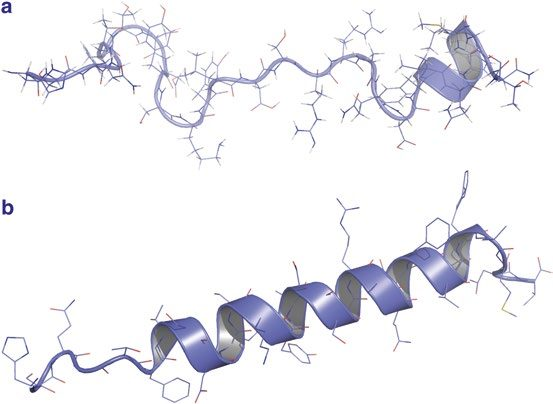

그림 7.1 인슐린 유전자(INS)의 1차 번역 산물인 생물학적으로 비활성인 전구체 프로프로인슐린으로부터 인슐린이 생산되는 단계. 프로프로인슐린에서 말단 24아미노산 신호 서열의 단백질분해적 제거로 프로인슐린이 생성되며 이는 세 개의 이황화 결합 형성을 통해 올바른 형태로 고정된다. 프로인슐린은 다시 엔도펩티다제에 의해 염기성 아미노산 Lys64, Arg65 및 Arg31과 32에서 절단되어 두 개의 이황화 결합으로 연결된 A 사슬과 B 사슬 및 소위 C 펩티드가 남게 된다. 최종 활성 호르몬인 51아미노산의 성숙 인슐린은 말단의 염기성 아미노산이 엑소프로테아제 카복시펩티다제에 의해 제거되어 21아미노산의 A 사슬과 30아미노산의 B 사슬을 갖는 성숙하고 활성인 인슐린 분자, 즉 이황화 결합으로 연결된 A와 B로 지칭되는 두 사슬의 분자를 생성한다. 이는 세포 내 엔도펩티다제인 프로호르몬 전환효소 PC1과 PC2의 작용에 의해 이루어지며 이들은 염기성 아미노산 Lys64와 Arg65 및 Arg31과 32 다음 부위에서 프로인슐린으로부터 소위 C 펩티드를 절단한다(그림 7.1). 이들 염기성 말단 아미노산은 이후 엑소프로테아제 카복시펩티다제 E에 의해 제거되어 이황화 결합으로 연결된 두 폴리펩티드 사슬의 구조를 형성한다. 마지막으로, 이제 생물학적으로 활성화된 호르몬은 세포질 내 성숙 분비과립에 패키징·저장되었다가 방출 신호를 기다린다.

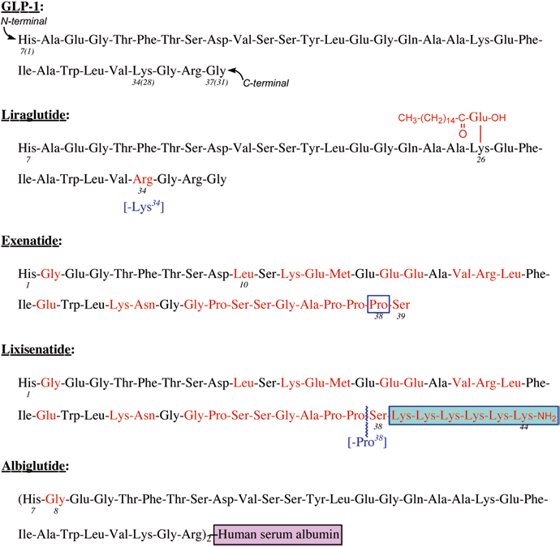

그림 7.2 인슐린의 A(녹색) 및 B(파란색) 사슬의 아미노산 서열. 이들은 A7-B7 및 A20-B19 잔기에서 두 개의 이황화 가교로 연결되어 있다. 세 번째 이황화 가교는 A 사슬의 시스테인 6과 11을 연결한다. A 사슬은 두 개의 α-나선을 가지며 아미노 말단 나선(A1-A8)과 반평행 카복시말단 나선(A12-A20)이 있다. B 사슬은 α-나선과 β-가닥을 형성하며 아미노 및 카복시 말단 가닥 사이에 중앙 나선(B8-B19)이 있다. 이 배열을 T 나선형 구조라고 한다.

인슐린의 구조 인슐린은 51아미노산, 분자량 5808 Da의 단백질로, 21아미노산의 A 사슬과 30아미노산의 B 사슬이 두 개의 이황화 결합으로 연결된 이량체이다. 세 번째 이황화 가교는 내부에 있어 A 사슬의 시스테인 6과 11을 연결한다. 두 개의 사슬 내 이황화 가교는 잔기 A7-B7 및 A20-B19에서 A와 B 사슬을 공유결합으로 고정한다(그림 7.1 및 7.2). 인슐린의 구조는 동물계 전반에 걸쳐 놀라울 정도로 보존되어 있으며, 아미노산 서열 측면에서 예를 들어 소 인슐린은 3개 잔기가 다르고 돼지 인슐린은 1개만 다르지만, 세 개의 이황화 결합은 포유류 종에서 불변이다.

이차 구조를 고려하면, 인슐린 A 사슬은 두 개의 α-나선을 가지며 아미노 말단 나선(A1-A8)과 반평행 카복시말단 나선(A12-A20)이 있다. B 사슬은 α-나선과 β-가닥을 형성하며 아미노 및 카복시 말단 가닥 사이에 중앙 나선(B8-B19)이 있다(그림 7.2). 이 배열은 T 나선형 구조라고 불린다. 마이크로몰 농도에서, 두 사슬 이황화 결합 인슐린 구조는 다른 인슐린 분자와 연합하여 이량체를 형성하고 아연 이온이 존재하면 이 이량체는 추가로 두 개의 인슐린 이량체와 연합하여 육합체를 형성한다(그림 7.3). 육합체는 중심에 두 개의 아연 이온을 가지며, 각 단량체의 히스티딘 잔기와 배위 결합되어 있고, 모든 6개 단량체는 T 나선형 구조를 취한다. T 나선형 구조 외에도

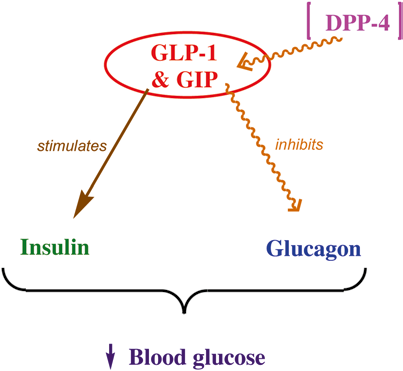

그림 7.3 육합체 조립체 내 인슐린 단량체 분자들의 고해상도 NMR 구조 리본 다이어그램. 인슐린 육합체는 중심에 두 개의 아연 이온을 가지며 각 단량체의 히스티딘 잔기와 배위 결합되어 있다. 보여진 3회 대칭 중심에는 구형 아연 원자와 히스티딘 잔기(보라색 형태)가 있다. 인슐린 육합체는 비활성이며 체내에서 활성 단량체의 저장 형태로 사용된다. Isaac Yonemoto(Wikimedia Commons, 파일 InsulinHexamer.jpg)가 RCSB Protein Data Bank의 NMR 구조 PDB 1ai0(참고: Chang X, Jorgensen AM, Bardrum P, Led JJ. Biochemistry 1997;36:9409-22)로부터 Pymol(http://www.pymol.org/), Inkscape(https://inkscape.org/en/), Gimp(http://www.gimp.org/)를 이용해 제작. 원래 Takometer가 en.wikipedia에 업로드함.

인슐린 방출 인슐린은 혈당 농도 증가에 반응하여 빠르게 방출되거나, 당 수준과 독립적으로 천천히, 예를 들어 장에서 유래한 인크레틴, 즉 글루카곤 유사 펩티드-1(GLP-1) 및 포도당 의존성 인슐린분비 펩티드(GIP), 아미노산 아르기닌과 류신, 설포닐유레아 및 인지질분해효소 C를 경유하는 콜레시스토키닌과 같은 자극에 의해 방출된다. 혈당 수준 증가에 의해 촉발되는 방출은 GLUT2 포도당 수송체에 의한 베타 세포로의 당 수송으로 시작되며 글루코키나제에 의한 포도당 인산화, 당분해, 피루브산, 아세틸 CoA 형성 및 크렙스 회로를 통한 ATP 생산으로 ATP:ADP 비율이 증가하고 ATP 감수성 칼륨 채널이 폐쇄된다. 채널의 폐쇄는 K+의 유출을 차단하고 세포 내 양전하 증가로 탈분극을 초래한다. 이는 Ca2+를 세포 내로 수송하는 전압 개폐 채널의 활성화를 초래하여 배출에 의한 인슐린 분비를 촉발하고 췌도 세포를 둘러싼 광범위한 혈관 네트워크로 혈관 내로 신속히 확산된다. 인슐린 방출은

고혈당 호르몬, 특히 글루카곤은 랑게르한스 췌도의 알파 세포에서 방출된다. 글루카곤("글루카곤" 절)은 간의 글리코겐 저장소로부터 포도당 방출을 유도하여 생명을 위협하는 저혈당을 예방한다.

인슐린 수용체 결합 및 후속 신호전달 초기 연구는 수용체 결합에 관여하는 것으로 생각되는 A 및 B 사슬의 다음 인슐린 "고전적 결합 표면" 아미노산 잔기를 확인했다: Glu(A1), Gln(A5), Tyr(A19), Asn(A21), Val(B12), Tyr(B16), Gly(B23), Phe(B24), Phe(B25), Tyr(B26). 후속 조사에서는 잔기 A21 및 B23-B26, 그리고 육합체 형성 표면에 관여하는 A13 및 B17도 관련이 있는 것으로 밝혔다. 추가로, 잔기 Ser(A12), Leu(A13), Glu(A17), His(B10), Glu(B13), Leu(B17)로 구성된 "1차 결합 표면"은 돌연변이 시 결합을 방해하는 것으로 확인했다(그림 7.2).

인슐린 수용체는 인슐린, IGF-1 및 IGF-2에 의해 활성화되는 ~320 kDa 이황화 결합 막관통 구조이며(그림 7.4), 티로신 키나제 수용체 그룹에 속한다. 이량체 인슐린 수용체는 단 하나의 인슐린 분자에만 고친화성으로 결합하며 이는 인슐린 1차 결합 표면과 수용체의 류신 반복 L2 카복시말단 영역의 상호작용으로 시작하여 고전적 결합 표면과 류신 풍부 L1 수용체 결합 부위 간의 상호작용이 이어진다. 이 이가 교차 결합은 후속 신호전달을 촉발한다. 인슐린과 수용체의 결합은 수용체 내 구조적 변화, 다양한 티로신 잔기의 자가 인산화 및 인슐린 수용체 기질 1(IRS-1)과 같은 어댑터 단백질의 모집과 인산화를 유도한다. 이 어댑터 단백질은 PI3K/Akt 및 Erk MAP 세포내 경로로의 신호전달에서 핵심 역할을 한다. 인산화된 IRS-1은 포스포이노시톨-3-키나제(PI3K)에 결합하여 활성화시킨다

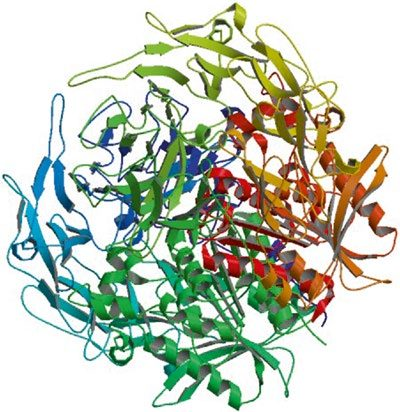

그림 7.4 이량체 인슐린 수용체 외부 도메인의 결정 구조가 리본 다이어그램(전경)과 유색 구(배경)로 표현되어 있다. 수용체의 류신 반복 L2 카복시말단 영역은 녹색, 류신 반복 L1 수용체 결합 부위는 파란색으로 표시된다. CR(시스테인 풍부) 외부 도메인은 청록색, 피브로넥틴 유형 III 도메인은 FnIII-1 노란색, FnIII-2 주황색, FnIII-3 빨간색이다. RCSB Protein Data Bank 구조 PDB 3LOH(Smith BJ, Huang K, Kong G, et al. Proc Natl Acad Sci USA 2010;107:6771-6)로부터 Pymol로 생성한 이미지는 Fletcher01(Wikipedia Commons, 파일 IR Ectodomain mod3LOH.png)이 제작했다. 수용체의 이량화 및 α와 β 사슬로의 단백질분해적 절단 시, αCT로 지칭되는 추가 12아미노산이 α 사슬의 C-말단에 남는다. 이 탠덤 구조 요소(αCT-L1)는 아포-수용체의 완전한 1차 인슐린 결합 표면을 정의한다(Smith et al. 2010).

정맥 내 투여 시 피하 투여보다 이른 발현 시간을 가지므로, 투여 경로는 개시 시간, 최고 수준 및 작용 지속 시간에 부여된 어떤 시간에도 관련이 있다. 기술된 시간은 일반적으로 피하 투여에 대한 것이다. 시간은 제제와 환자에 따라 달라질 수 있으며 특정 환자 내에서도 다양한 이유로 변할 수 있으므로, 문헌에서 개시, 최고치 및 지속 시간이 때때로 크게 달라지는 것은 전혀 놀라운 일이 아니다.

인슐린 제제는 일반적으로 초속성, 단시간, 중간시간 및 장시간 작용성으로 분류되며 이 중 처음 세 가지를 서로 다른 비율로 혼합한 프리믹스 제제가 흔히 사용된다. 표 7.1은 일반적으로 사용되는 다양한 인슐린의 주요 범주와 각 제제의 개시, 최고치 및 작용 지속 시간의 대략적 범위를 요약한다. 당뇨병 환자를 위한 인슐린 요법은 숙련된 임상의가 환자를 신중히 관리해야 하는 복잡하고 전문적인 임상 분야이며 적절한

| --- | --- | --- | --- | --- |
표 7.1  다양한 인슐린 제제의 특성 요약a
| 범주 | 범주 설명 또는 유형 | 일반명 또는 상품명 | 개시c | 최고치d | 지속 시간e |
| --- | --- | --- | --- | --- | --- |
| 초속성 작용 | 인슐린 아스파트f | NovoLog® | 12- 최대 3 | 3-5시간 |
| --- | --- | --- | --- | --- | --- |
|  | 인슐린 리스프로h | Humalog® | 18분 |  |
| 단시간 작용 | 인슐린 레귤러 | Humulin® R | 30- 2-4시간 | 5-8시간 |
|  |  | Novolin® R | 60분 |  |
| 중간시간- | 인슐린 NPHi | Humulin® N | 1-3시간 6-10시간 | 12-16시간 |
| 작용 |  | Novolin® N |  |  |
| 장시간 작용 | 인슐린 데테미르j | Levemir® | 1-4시간 ~9시간l | 18-26시간 |
|  | 인슐린 글라르진k | Lantus® |  |  |
| 혼합 | 프리믹스 인슐린 | Humulin® 70/30m;  30- 2-10시간p 16-20시간 |
| 인슐린 | 상이한 작용 시간을 가진 | Novolin® 70/30n; | 60분 |  |
| --- | --- | --- | --- | --- | --- |
|  |  | Humalog® Mix | 10- 1-4시간p |  |
|  |  | 75/25o; | 15분 |  |
| NovoLog® Mix 70/30q 인슐린 구조 참조(그림 7.2)
aFDA 또는 EMA 또는 양쪽에서 승인된 제제 b작용 지속 시간 및/또는 서로 다른 인슐린 유사체/제제의 혼합에 관한 것 c혈당을 낮추기 시작하는 데 걸리는 시간 d인슐린 제제가 혈당 수준을 낮추는 데 최대 활성에 도달하는 데 걸리는 시간 e혈당 강하 활동이 완료되기 전의 시간 f프롤린 대신 B28 위치에 아스파르트산이 치환된 재조합 인간 인슐린 g일부는 30-90분으로 추정 h재조합 인간 인슐린. B28의 프롤린이 리신으로, B29의 리신이 프롤린으로 치환된 것 iNPH, 중성 프로타민 하게도른 또는 "이소판"(NPH) 돼지 인슐린. 중성 프로타민을 레귤러 인슐린에 첨가하여 제조 j재조합 인슐린 유사체로 B30에서 트레오닌이 결실되고 B29의 리신에 미리스트산이 결합된 것. 지방산으로 혈청 알부민에 결합한 후 이 복합체에서 서서히 해리됨 k미세 결정체로 천천히 방출됨. 재조합 인슐린. A21의 아스파라긴이 글리신으로 치환되고 B 사슬의 C-말단에 아르기닌 2개가 추가됨 l때때로 "최고치 없음"으로 기술됨 m피하 주사용 재조합 인간 인슐린 현탁액; 70% 인간 인슐린, 30% 이소판 현탁액 n70% NPH 인간 인슐린 이소판 현탁액 및 30% 레귤러 재조합 인간 인슐린 o75% 인슐린 리스프로 프로타민 현탁액 및 25% 인슐린 리스프로 p다름 q70% 인슐린 아스파트산 프로타민 현탁액 및 30% 인슐린 아스파트

개별 인슐린 제제, 용량, 투약 일정 등의 선택을 포함한다. 이를 고려하고 치료 선택, 요법 및 용량이 이 책의 범위를 벗어나므로, 이용 가능한 승인된 인슐린 제제의 요약과 그 약동학적 및 안전성 프로파일을 넘어설 필요는 없었다.

인슐린의 최적 사용을 어떻게 달성할 수 있는가? 더 구체적으로, 환자는 생리적 인슐린 전달을 모방하기 위해 기저-식사(basal-prandial) 요법으로 인슐린 펌프를 사용해야 하는가, 아니면 다회 주사 일정을 따라야 하는가? 펌프 기술 비용, 지속적인 인슐린 공급, 혈당 검사 및 교육 등 모두 상당한 비용 또는 상당한 노력이 필요할 수 있지만 현대 펌프, 펜 장치 및 연속 혈당 모니터링의 사용은 특히 오래된 레귤러 인슐린 제제와 중성 프로타민 하게도른에 비해 우수한 혈당 조절을 제공하는 리스프로 및 글룰리신과 같은 초속성 인슐린 유사체에서 생리적 인슐린 분비에 가까운 상황을 달성할 수 있는 수단을 창출했다. 초속성 인슐린은 혈당 급증을 관리하기 위해 각 식전에 투여된다.

펌프 요법의 다회 일일 주사 대비 추가적 이점으로는 더 나은 흡수, 사용되는 인슐린 양의 감소 및 원치 않는 혈당 변동의 감소가 포함된다. 현재 미국의 당뇨병 환자 약 20%가 펌프를 사용하고 있으며 FDA는 50개 이상의 펌프 장치를 승인했다. 기저 및 식사 인슐린 요구 모두에 대해, 펌프 전달 요법을 사용하는 대부분의 환자는 아스파트, 리스프로 또는 글룰리신과 같은 초속성 인슐린 유사체를 사용하며 이들 및 완충 레귤러 인슐린은 현재 펌프 사용에 승인되어 있다. 글룰리신은 6세 이상 소아에 승인되어 있다. 기저 주입은 식간 포도당을 관리하는 반면, 볼루스 용량은 식사 유발 비교적 갑작스러운 포도당 부하에 반응하도록 요구된다. 차세대 펌프의 경우 인슐린 전달은 환자 개입 없이 이루어질 가능성이 높다.

표 7.1에는 초장시간 작용 기저 인슐린 유사체인 인슐린 데글루덱(Tresiba®)이 포함되어 있지 않으며 이는 인간 인슐린과 단 하나의 아미노산 결실 및 B29 위치의 리신에 헥사데칸산이 부가된 점이 다르다(그림 7.1 및 7.2).

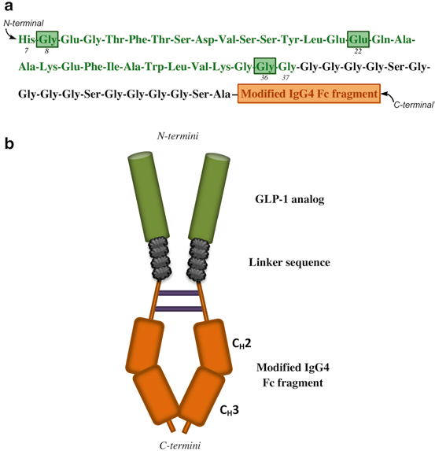

그림 7.5 6-아릴글루코시드 다파글리플로진은 1세대 나트륨-포도당 공수송체 2(SGLT2) 억제제로, 인간 치료용으로 승인된 최초의 SGLT2 억제제이다. 2형 당뇨병에 흔히 메트포르민 또는 설포닐유레아와 병용되며 다파글리플로진은 신장에서 포도당 재흡수를 차단한다. 두 가지 다른 승인된 SGLT2 억제제는 카나글리플로진과 엠파글리플로진이며 후자는 구조적으로 다파글리플로진과 밀접하게 관련되어 있다.

천식과 만성 폐쇄성 폐질환(COPD) 환자에서 기관지 경련이 관찰했다; (2) 천식이나 COPD와 같은 만성 폐 질환 환자에게는 금기이다; 그리고 (3) 치료 개시 전에 모든 환자는 잠재적 폐 질환을 확인하기 위해 병력의 상세 검토, 신체 검사 및 폐활량 측정(FEV)을 받아야 한다.

1 나트륨-포도당 공수송체 2 억제제 환자의 요구와 선호도에 맞춘 최적의 혈당 조절을 지속적으로 추구하면서 여러 새로운 약물이 개발되고 검토되고 있다. 새로운 약물 중 가장 흥미롭고 잠재적으로 유용한 것은 새로운 계열의 항당뇨 치료제인 나트륨-포도당 공수송체 2(SGLT2) 억제제이다. 이 약물들은 세뇨관 포도당 재흡수를 감소시켜 소변을 통한 포도당 배설을 촉진함으로써 당의 요중 배출을 유도한다.

다파글리플로진(그림 7.5)은 2형 당뇨병 치료에 사용되며 미국에서 Farxiga®, 유럽에서 Forxiga®라는 상품명으로 알려져 있으며 인간 요법에 승인된 최초의 SGLT2 억제제이다. FDA는 2014년 1월에 식이 및 운동과 함께 성인 2형 당뇨병 환자의 혈당 조절을 위해 다파글리플로진을 승인했다. 이 약물은 현재 여러 유럽 국가, 영국 및 호주에서 판매되고 있다. 2014년 10월, FDA는 다파글리플로진과 염산 메트포르민 서방정(Xigduo XR®)의 병용을 승인했다. 다파글리플로진은 주로 3-O-글루쿠로니드 유도체로 대사되어
요중으로 배설된다. 이상반응에는 비뇨생식기 감염, 저혈당, 탈수, 그리고 전신 발진 및 피부 발진과 같은 심각한 피부 및 피하 반응이 포함되었다. 인슐린 분비가 감소된 비만이 아닌 2형 환자에서 SGLT2 억제제 유발 심각한 이상반응의 가능성에 대한 우려도 표명되었으며 이는 동아시아에서 흔히 볼 수 있는 결과이다. 이러한 심각한 사건에는 간 글리코겐 저장의 고갈로 인한 중증 저혈당, 케톤증/케톤산증, 당뇨병 관련 근감소증의 가속화가 포함될 수 있을 것으로 우려된다. 저자들은 SGLT2 억제제의 적절한 사용에 대한 주의와 치료 환자의 신중한 지속적 관찰의 필요성을 지적한다.

두 가지 다른 승인된 SGLT2 억제제는 카나글리플로진(Invokana®; Silisent®)과 구조적으로 다파글리플로진과 밀접하게 관련된 엠파글리플로진(Jardiance®)이다. 2013년에 카나글리플로진은 미국에서 승인된 최초의 SGLT2 억제제가 되었으며 엠파글리플로진은 2014년에 유럽과 FDA의 승인을 받았다. 카나글리플로진의 심혈관 안전성에 대한 초기 우려와 이 문제에 대한 지속적인 조사 이후, 2015년 FDA는 카나글리플로진을 포함한 일부 SGLT2 억제제가 케톤산증을 유발한다는 경고를 발표했다. 이 경고에 이어 FDA는 2015년에 카나글리플로진의 라벨을 변경하여 골밀도 감소 및 골절 위험을 포함하도록 하는 의약품 안전성 커뮤니케이션을 발표했다. 엠파글리플로진과 심혈관 사망률 감소가 관련되어 있는 것으로 나타났다.

인슐린 사용과 관련된 경고 주의사항 및 이상반응 경고 및 주의사항 규제 기관이 인슐린 요법을 시행하는 의료진에게 발행한 경고 및 주의사항은 다음에 관한 것이다: (1) 저혈당이 인슐린 요법의 가장 흔한 이상반응이므로 모든 당뇨병 환자에 대한 혈당 모니터링의 필요성. (2) 인슐린이 저칼륨혈증을 유발하여 호흡 마비, 심실 부정맥 및 사망으로 이어질 수 있는 가능성. (3) 감소된

저혈당, 고혈당 및 당뇨병성 혼수 저혈당 반응은 특히 질병의 불안정형에서 또는 예를 들어 환자가 식사를 거르거나 너무 높은 용량의 인슐린을 투여받거나 평소보다 격렬한 운동을 하는 경우 발생한다. 초기 증상으로는 발한, 허약감, 떨림, 공복감 및 빈맥이 포함된다. 이러한 증상은 혈당이 빠르게 떨어질 때 에피네프린이 보상적으로 방출되면서 더 흔하다. 혈당이 천천히 떨어지면 두통, 정신 혼란, 시야 흐림, 말이 이해하기 어려움, 복시, 그리고 아마도 혼수와 경련이 증상으로 나타난다. 일부 환자에서는 모든 증상이 나타날 수 있다. 어떤 경우에는 저혈당 반응의 발병이 공복감이나 메스꺼움으로 특징지어질 수 있고 서맥, 경미한 저혈압 및 위장관 불편감이 발생한다. 저혈당 기간이 길어지면(드문 경우) 뇌에 비가역적 손상이 발생할 수 있으며 운동실조, 실어증, 무도병 운동, 간질, 파킨슨증, 정신지체 및 요실금으로 나타난다.

때때로 인슐린 쇼크라고도 하는 의식 불명으로 이어지는 중증 저혈당은 당뇨병 환자에서 때때로 당뇨병성 혼수라고 불리는 세 가지 심각한 반응 중 하나이며 다른 두 가지는 당뇨병성 케톤산증과 고삼투압성 고혈당 상태(고삼투압성 비케톤성 혼수라고도 함)이다. 당뇨병성 케톤산증은 의학적 응급 상황이며 주로 1형 당뇨병 환자에게 발생하지만 2형 환자에게도 발생한다. 이는 인슐린 부족으로 글루카곤 상승, 간으로부터의 포도당 방출 및 포도당, 물, Na+, K+가 소변으로 배설되는 삼투압성 이뇨를 초래하여 탈수를 유발한다. 인슐린 부족은 또한 지방분해, 즉 지방 조직으로부터의 유리 지방산 방출을 초래하며 이는 간에서 케톤체, 즉 아세토아세트산과 β-하이드록시뷰티르산으로 전환된다. 케톤체는

재조합 인간 인슐린에서도 확인되었지만 어떤 환자도 임상적 발현을 나타내지 않았으므로 항체의 임상적 중요성은 추측에 그쳤다. 한 걸음 더 나아간 발전은 임신성 당뇨병 환자에서 세 가지 인슐린 모두와 반응하는 높은 수준의 항인슐린 IgE와 관련된 큰 국소 반응이 발견된 것이다. 이 환자는 돼지 및 소 인슐린에도 유사한 반응을 보였다. 추가 조사에서 동일한 환자에서 인간, 돼지 및 소 인슐린에 대한 양성 피부 시험과 교차 반응 IgE 항체가 입증되어 인슐린 알레르기와 세 가지 제제 모두에 유사하거나 동일한 알레르겐 결정인자가 존재한다는 결론을 뒷받침했다. 또한 이 결과는 인간 인슐린만 투여함으로써 알레르기 반응을 제거한다는 희망이 실현되지 않을 것임을 보여주었다.

초기 연구 이후 인슐린에 대한 IgE 항체 매개 즉시 과민반응의 수많은 사례가 홍반, 가려움, 주사 부위 부종 및 발바닥과 손바닥의 가려움과 같은 경미한 피부 반응부터 전신 홍조, 두드러기 및 혈관부종에 이르기까지 다양한 관련 증상을 나타내는 것으로 밝혔다. 호흡곤란, 저혈압 및 아나필락시스를 동반한 중증 전신 사례와 드문 사망도 기록되었다. 인슐린에 대한 I형 즉시 알레르기 반응 외에도, 이 펩티드에 대한 이상 반응 및 III형 및 IV형 과민반응도 기록되었다.

이상 반응에서, 팽진과 홍조 반응은 4~6시간 후에 최대 24시간 지속되는 경결 병변이 뒤따랐다. 병변은 예를 들어 꽃가루 및 일부 약물에서 관찰되는 후기 반응과 유사한 조직병리학적 특징을 보였다. 혈청, 즉 Prausnitz-Küstner(P-K) 검사에 의해 반응이 전이 가능하다는 것이 입증되어 반응이 진정한 후기 반응이라는 결론을 뒷받침했다. 면역복합체 III형 과민반응의 증거는

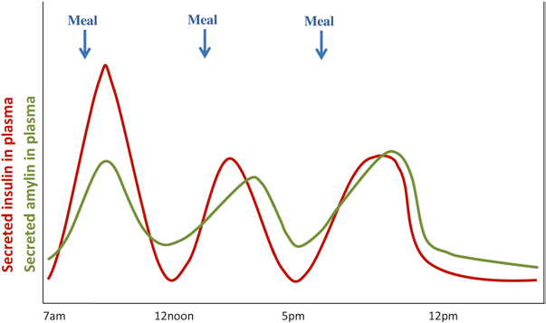

그림 7.6 (a) 다음에 대한 양성 반응을 보이는 피내 시험: (1) Levemir®(인슐린 데테미르), (2) Huminsulin Basal®(인간 인슐린 이소판), (3) Humalog®(인슐린 리스프로), (4) Lantus®(인슐린 글라르진). H, 히스타민 양성 대조군, Ø, 부형제 음성 대조군. 다양한 인슐린에 대한 설명은 표 7.1을 참조하라. (b) 프로타민 시험 용액(부위 6 및 7)과 페놀, 크레졸, 글리세롤, 인산수소나트륨 및 염화아연을 포함한 Sanofi Aventis Insuman® 시험 키트의 첨가제(부위 1-5 및 8-10)에 대한 피내 시험 결과. 프로타민에 대한 반응은 양성이었으며 다른 모든 부위는 음성이었다. 모든 결과는 피내 주사 20분 후에 판독되었다. Pföhler C 등에서 재인용. Successful desensitization with human insulin in a patient with an insulin allergy and hypersensitivity to protamine: a case report. J Med Case Reports 2008;2:283. doi 10.1186/1752-1947-2-283, Creative Commons Attribution License 조건에 따라 배포되는 오픈 액세스 기사

인간 인슐린을 포함한 항체는 CentAK® anti-IA2 방사성 리간드 분석으로 검출한다. 한 흥미로운 사례에서, 다양한 인슐린 제제를 투여받은 후 주사 부위에 크고(>15 cm 직경) 지속되는(수일) 소양성 반판이 발생한 환자에서 양성 피부 시험은 인간 인슐린과 프로타민(중성 프로타민 하게도른[NPH]으로 인슐린 흡수를 지연시키는 데 사용)을 지목했다. 피내 시험은 다양한 표준 재조합 인슐린 및 인슐린 이소판 제제와 프로타민 용액에 대해 양성 반응을 보였으며(그림 7.6a, b), 인슐린에 대한 IgG 항체가 검출되었지만 인슐린과 프로타민 모두에 대한 IgE 항체 시험은 음성이었다. 첩포 시험은 음성이었고 피부 생검은 Arthus형 III형 반응을 나타냈다. 환자는 신속 프로토콜(아래 "인슐린에 대한 탈감작" 절 참조)에 따라 피하 인슐린 투여로 성공적으로 탈감작되었다.

인슐린에 대한 탈감작 증상 치료가 충분하지 않거나 다른 인슐린으로 대체가 효과가 없거나 불가능할 때 면역요법을 고려해야 한다. 이제 효과적이고 내약성이 좋은 피하 주사 또는 주입 탈감작 치료에 대한 여러 보고가 있으며 연속 피하 인슐린 주사와 경구 항알레르기제가 생명을 위협하는 증상을 예방하지 못했을 때 정맥 요법이 성공한 한 사례가 있다. 0.05단위의 레귤러 인슐린 주사 후 반응이 없었을 때 탈감작을 위한 정맥 경로가 시도되었다. 그런 다음 중앙 정맥 카테터, 피하 매립 저장소 및 휴대용 주입 펌프를 사용하여 필요한 용량에 도달할 때까지 인슐린 양을 점진적으로 증가시켰다. 알레르기 증상은 정맥 주사가 시작되자마자 사라졌으며 1년 이내에 혈당 조절을 방해하지 않고 항인슐린 IgE 및 IgG 수준이 정상으로 돌아왔다. 피하 인슐린 주사로 전환했을 때 알레르기 증상이 악화되어 연속 정맥 인슐린 주사를 재개했고 이에 식전 정맥 주사가 추가되었다. 항체 수치는 다시 감소하여 정맥 치료 시작 10개월 후 정상 값에 도달했다. 따라서 동일한 인슐린 제제에 대한 알레르기 반응은 투여 경로에 따라 달랐다.

인간 인슐린에 대한 알레르기를 극복하기 위한 성공적인 시도에서, 인슐린 리스프로는 인슐린 펌프로 연속 피하 주입으로 투여되었다. 다음 일정이 준수되었다: 2-8시간 동안 0.7 IU/h; 8-13시간 동안 0.3 IU/h; 13-18시간 동안 0.6 IU/h; 18-21시간 동안 0.8 IU/h; 및 21-22시간 동안 0.6 IU/h, 아침 식전 6IU, 점심 식전 5IU, 저녁 식전 6IU의 추가 볼루스와 함께. 이 절차에 따라 알레르기 반응은 재발하지 않았고 환자가 인슐린 요법을 견디면서 대사 조절이 이루어졌다. 환자가 여전히

5일째에 환자는 항히스타민제의 병용 투여 없이 치료를 계속 받을 수 있었다. 성공적인 탈감작 절차의 결과로 나타나는 내성 유도의 기전은 아직 불명확하다. 과민반응이 의심되는 경우 일반적으로 IgE 매개 I형 반응에서만 성공적이지만 위에서 논의한 경우(위 "인슐린에 대한 과민반응", 그림 7.6)에서는 호르몬의 증가하는 용량을 연속적으로 피하 주사한 후 인슐린에 대한 탈감작이 이루어졌다. 1일째, 0.004, 0.01, 0.02, 0.04, 0.1, 0.2, 0.5 및 1 IU의 인간 인슐린이 30분 간격으로 투여되었다. 항히스타민제 페소페나딘 180mg이 1일 2회 투여되었다. 2일째, 1, 2, 3 및 5 IU의 용량이 매 30분마다 투여되었고 3일째 Lantus® 6 IU의 두 용량이 투여되었다. 모든 탈감작 용량이 내약되었고 환자는 이후 정상 인슐린 요법을 견뎠다. 페소페나딘은 1일 180mg으로 감량되었고 탈감작 6개월 후 중단되었다.

기타 이상반응 저혈당과 진정한 과민반응 외에도 발진, 소양증, 인슐린의 동화 효과로 인한 체중 증가, 나트륨 저류로 인한 부종, 그리고 며칠 내에 정상적으로 해소되는 주사 부위 자극 반응이 인슐린 유발 이상반응 중 가장 흔히 관찰되는 것들이다. 지방위축, 즉 지방 조직의 얇아짐 또는 피부 함몰, 그리고 지방비대 또는 지방 조직의 확대 및 비후도 흔한 부작용이다. 혈당 조절의 빠른 개선은 일시적이고 가역적인 안과적 굴절 장애, 당뇨병성 망막병증의 악화 및 말초 신경병증을 초래한다. 1형 당뇨병 환자에서 5% 이상의 빈도로 발생하는 기타 이상반응에는 두통, 인플루엔자 유사 증상, 소화불량, 요통, 설사, 인두염, 비염, 골격통 및 상기도 감염이 포함된다. 2형의 경우

소마토스타틴 슈퍼패밀리의 펩티드로서, 글루카곤과 글루카곤 유사 펩티드 GLP-1 및 GLP-2(아래 "글루카곤 유사 펩티드 1" 절 참조)는 각각 단일 프로글루카곤 유전자에 의해 암호화된다. 글루카곤은 조직 특이적인 번역 후 과정에서 프로글루카곤으로부터 생성된다. 이는 췌장 α-세포에서 프로단백질 전환효소 2에 의해 수행되는 반면, 장과 뇌에서는 프로호르몬 전환효소가 GLP-1 및 GLP-2를 방출한다.

글루카곤의 구조 및 작용 기전 재조합 글루카곤은 인간 호르몬과 동일한 29아미노산 단일 사슬 폴리펩티드이며(그림 7.7), 분자량은 3483 Da이다. 사용 중인 상품명은 Glucagon®과 GlucaGen®이다. 글루카곤은 췌도 세포, 간, 신장 및 뇌의 세포막에 있는 GPCR인 자신의 수용체로 작용하여 α, β 및 γ 소단위를 가진 수용체의 형태 변화를 일으킨다. G 단백질과 수용체의 상호작용은 β 및 γ 소단위의 방출을 초래하는 반면, α 소단위는 cAMP 형성을 촉매하는 아데닐산 고리화효소를 특이적으로 활성화한다. 이어서 프로테인 키나제 A가 활성화되고 차례로 포스포릴라제 키나제와 글리코겐 포스포릴라제의 인산화가 활성화된다. 그림 7.7 (a) 핵자기공명(NMR) 및 (b) X선 결정학으로 결정된 글루카곤 구조. J. D. Cronk 박사가 RCSB Protein Data Bank(PDB) 파일(http://www.rcsb.org/pdb/explore/explore.do?structureId=1KX6; http://www.rcsb.org/pdb/explore/explore.do?structureId=1GCN) 및 분자 그래픽 프로그램 PyMOL(http://www.pymol.org/; http://www.pymol.org/citing)의 구조로부터 생성 및 제공한 이미지. NMR 생성 구조는 생성된 데이터와 일치하는 20개 중 하나일 뿐이며 이는 글루카곤 구조의 유연성을 나타낸다(Cronk JD. 2014; Biochemistry dictionary. Glucagon. http://guweb2.gonzaga.edu/faculty/cronk/biochem/G-index.cfm?definition=glucagon)

글리코겐으로부터 포도당-1-인산을 방출하는 효소인 포스포릴라제 A로 후속적으로 전환된다. 글루카곤에 의해 활성화된 이 신호 경로는 인슐린 분비 증가로 이어진다.

글루카곤의 적응증 및 부작용 글리코겐으로부터 포도당 형성에서의 역할을 고려할 때, 글루카곤이 저혈당 치료에 승인된 것은 놀라운 일이 아니다. 글루카곤의 또 다른 중요하고 유용한 활성은 비경구 투여 시 평활근을 이완시키는 능력이며 이 특성은 위, 십이지장, 소장 및 대장의 일부 방사선학적 진단 검사에서 위장관 운동 억제제로 호르몬이 사용될 때 활용된다.

외인성 글루카곤은 카테콜아민의 방출을 자극하며 이 특성은 부신 수질 세포에서 비정상적으로 많은 양의 노르에피네프린과 더 적은 양의 에피네프린을 분비하는 신경내분비 종양인 갈색세포종 환자에게 투여 시 갑작스러운 혈압 상승 가능성에 대한 FDA 경고의 기반이 된다. FDA는 또한 인슐린종 환자에게 글루카곤을 주의하여 투여해야 하며 이는 인슐린 방출과 후속 저혈당을 유발한다고 경고한다. 기타 경고 및 주의사항은 다음에 관한 것이다: (1) 글루카곤이 저혈당을 역전시키기 위해 간에 충분한 글리코겐이 필요하다는 점-간에서 방출 가능한 포도당 수준이 낮은 상태를 초래하는 질환이 있는 환자에게는 주의하여 사용해야 한다; (2) 당뇨병 환자에서 진단 보조제로 글루카곤 사용 시 주의 필요성; 그리고 (3) 글루카곤은 산소 요구량을 증가시키므로 심장 질환 환자에게는 주의하여 사용해야 한다. 심각한 이상반응은 드물지만 메스꺼움과 구토가 때때로 관찰되며 반응이 발생할 때 저혈당을 동반한다. 투여 후 일시적인 혈압 상승이 발생할 수 있으며 기타 이상반응으로는 발진, 저혈압 및 빈맥

글루카곤 유사 펩티드 1 329 정맥 글루카곤과 바륨 관장 후 심장 정지가 이어졌다. 후자의 반응은 가려움과 따끔거림으로 시작되어 빠르게 구토로 진행되었고 환자가 대량 발한 상태가 되었다. 심폐 정지와 사망이 곧 뒤따랐다. 글루카곤에 대한 과민반응은 피부 발진, 두드러기, 안와 주위 부종, 다형 홍반, 호흡 곤란 및 아나필락시스를 포함한 광범위한 증상을 포함한다. 글루카곤 제조업체에 대한 11건의 과민반응 보고 중 4건은 글루카곤 투여 후 호흡 곤란 및/또는 저혈압과 관련되었고, 5건은 이전 노출이 있었으며, 2건은 이전에 이 호르몬에 대한 반응을 경험했다. 환자 중 7명은 저혈당 치료를 위해 글루카곤을 투여받았고 4명은 방사선학적 시술 중에 반응을 경험했다.

글루카곤 유사 펩티드 1 고혈당 호르몬 글루카곤은 위장 점막 추출물에 고혈당 물질이 존재한다는 사실이 인식되기 전인 1923년에 췌장 추출물에서 발견되었다. 이로 인해 Sutherland와 DeDuve는 1948년에 위 추출물에도 글루카곤이 포함되어 있을 수 있다고 정확하게 예측했다. 20년 후, 경구 투여된 포도당에 반응하여 장 분비물에서 글루카곤과 면역학적 교차 반응을 보이는 물질이 입증되었으며 이 "장 글루카곤 유사" 물질(들)은 물리화학적으로 글루카곤과 다른 것으로 밝혔다. 이후 29아미노산 글루카곤 서열을 모두 포함하는 옥신토모듈린과 글리센틴이라는 두 폴리펩티드가 존재하는 것으로 확인했다. 한편, 췌도 세포에 대한 생합성 연구는 글루카곤과 함께 분비되지만 글루카곤 서열을 포함하지 않고 두 개의 글루카곤 유사 서열, 현재 글루카곤 유사 펩티드 1과 2(GLP-1 및 GLP-2)로 명명된 것을 포함하는 프로글루카곤 폴리펩티드를 확인했다. 그러나 장 점막에서는 두 글루카곤 유사 펩티드가 별도로 형성되고 분비되는 것으로 확인했다.

글루카곤 유사 펩티드 2 프로글루카곤 단편의 GLP-1 서열의 카복시 말단에 부착된 33아미노산 펩티드 GLP-2는 GLP-1, 옥신토모듈린 및 글리센틴과 함께 위장 L 세포에 의해 동시 분비된다. 이 펩티드는 영양소 흡수를 자극하여 장의 점막 비후를 유도하고, 위산 분비를 감소시키며, 위 배출을 억제하고, 소장의 투과성을 감소시키며, 장의 헥소스 수송을 자극하는 장영양 특성을 나타내는 것으로 확인했다. 이 펩티드는 또한 장 손상의 설치류 모델에서 점막 손상과 사망률을 감소시키고 장 질환을 가진 쥐와 인간 모두에서 영양소 흡수를 증가시키는 것과 같은 재생 및 항세포자멸 작용을 나타낸다. GLP-2 및/또는 GLP-2 유사체에 대해 제안된 추측적 표적에는 단장 증후군, 크론병 및 골다공증이 포함된다.

글루카곤 유사 펩티드 1과 인크레틴 효과 "인크레틴 효과"는 경구로 전달된 포도당이 정맥 투여 후 관찰되는 분비 반응보다 2~3배 더 큰 인슐린 반응을 생성한다는 관찰을 설명한다. 그러나 이 효과는 자극량에 비례하며 소량에서는 작고 대량에서는 크다는 점에 유의하라. GIP는 최초로 확인된 인크레틴이었지만 이 십이지장 호르몬의 중화가 인크레틴 효과를 완전히 예방하지 못한다는 연구가 궁극적으로 31아미노산 펩티드 GLP-1을 두 번째 주요 인크레틴으로 확인하게 했다. GLP-1은 종종 GLP-1(7-37)로 표기되며 프로글루카곤 분자의 절단에서 파생된 서열 7-37이 생물학적으로 활성인 형태이므로 펩티드 전구체와 관련된 번호가 사용된다. GLP-1의 번호 및 아미노산 서열 간의 관계는 일부 GLP-1 수용체 작용제의 구조와 함께 그림 7.8에 표시되어 있다("GLP-1 수용체 작용제" 절 참조). GLP-1 분비는 명백히 식사와 관련이 있으며

글루카곤 유사 펩티드 1 331 그림 7.8 GLP-1 및 GLP-1 수용체 작용제 엑세나타이드, 리라글루타이드 및 릭시세나타이드의 아미노산 서열. GLP-1 서열의 번호는 호르몬의 생물학적 활성 형태(GLP-1(7-37))를 기반으로 하며 모 프로글루카곤 분자와 관련이 있다. GLP-1 서열에 대한 아미노산 잔기/그룹 변화는 빨간색으로 표시된다. 엑세나타이드 구조와 비교한 릭시세나타이드 구조의 변화는 파란색으로 강조된다. 리라글루타이드는 잔기 26(20)에서 Lys에 N-헥사데카노일-L-글루타밀 16-C 측쇄를 추가하고 잔기 34(28)에서 GLP-1의 Lys가 Arg로 치환된 점이 GLP-1과 다르다. 릭시세나타이드는 위치 38의 Pro가 생략되고 잔기 39-44에 6개의 Lys 잔기가 추가되어 서열을 완성한다는 점에서 엑세나타이드와 다르다. 알비글루타이드는 위치 8에서 Ala 대신 Gly가 치환된 두 개의 30아미노산 GLP-1(7-36) 단량체가 직렬로 결합되어 인간 혈청 알부민에 융합된 재조합 융합단백질이다. 치환된 Gly는 DPP-4 효소 공격에 대한 내성을 부여하며

2형 당뇨병 환자에게 귀중한 치료제이다. 그러나 GLP-1의 치료 응용은 실용적이지 않다. 이 펩티드는 디펩티딜 펩티다제-4(DPP-4; 아데노신 데아미나제 복합 단백질 2 또는 CD26으로도 알려짐)에 의해 두 개의 N-말단 아미노산을 절단하여 비활성 GLP-1(9-36 아미드)을 남기는 효소에 의해 빠르게 분해되기 때문이다(그림 7.10).

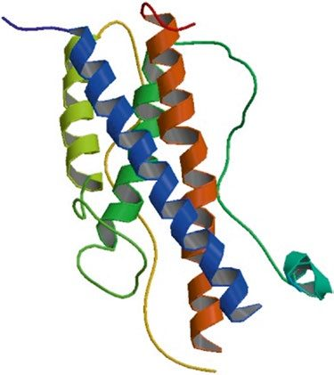
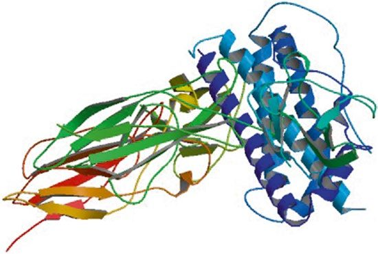

그림 7.9 인크레틴 호르몬 GLP-1 및 GIP와 디펩티다제 DPP-4의 작용 사이의 관계. GLP-1은 포도당 수준이 높을 때만 인슐린 분비를 자극하면서 글루카곤 분비를 억제한다. DPP-4는 GLP-1(7-37)에서 N-말단 아미노산 두 개를 절단하여 호르몬을 비활성화한다. 따라서 이 효소의 억제제는 인슐린 분비를 자극하고 글루카곤을 억제하여 혈당을 감소시키는 GLP-1 수준을 유지한다. 그림 7.10 인간 디펩티딜 펩티다제 IV(DPP-4)의 결정 구조. 이 효소는 주요 GLP-1 분해 효소이다. 발현 및 정제된 효소 외부 도메인의 X선 구조는 2.1Å 해상도로 결정되었다. DPP-4는 알파/베타 가수분해효소 접힘을 가진 촉매 도메인과 β 시트 모티프의 8중 반복을 가진 베타 도메인의 두 도메인으로 이루어져 있다. 구조는 Protein Data Bank RCSB PDB 파일 1NU6(Thoma R, Loeffler B, Stihle M, et al. Structure 2003;11:947-59)에서 가져왔다.

글루카곤 유사 펩티드 1 333 또는 GLP-1(9-37). DPP-4는 기질 절단 위치 P1에 프롤린을 포함하는 기질에 선택적으로 결합하며 두 번째 위치에 프롤린 또는 알라닌을 가진 펩티드(GLP-1 및 GIP와 같은)를 절단한다. 따라서 말단에서 두 번째 알라닌의 제거는 GLP-1과 GIP의 생물학적 활성을 파괴한다.

GLP-1 수용체는 심장에서 발견되었으며 일부 발견은 이미 이 호르몬이 심장에 유익한 효과를 가지고 있음을 시사한다. 예를 들어, 심장 손상 후 심근 기능을 증가시키고 고위험 심장 질환 환자에서 좌심실 및 내피 기능을 개선한다. 그러나 GLP-1의 주요 잠재적 치료 응용으로 간주되는 것은 2형 당뇨병이다. GIP와는 대조적으로, GLP-1의 인슐린분비 효과는 2형 당뇨병 환자에서 유지되지만 포도당 유도 인슐린 분비를 촉진하는 효능은 약 80% 감소한다. 즉, 두 인크레틴 호르몬의 분비/작용 결함이 당뇨병 환자에서 관찰되는 불충분한 인슐린 분비를 설명한다. GLP-1의 감소된 효과와 2형 당뇨병에서의 GIP의 거의 없는 작용을 뒷받침하는 분자적 사건은 아직 밝혀지지 않았다.

분명히, GLP-1이 2형 당뇨병 요법의 중요한 구성 요소로 완전히 활용되려면 GLP-1 작용의 분자적 기전과 임상 과학에 대한 이해가 필요하다. 이미 일부 GLP-1 수용체 활성제(작용제) 또는 인크레틴 유사체가 임상적 가능성을 보여주고 있다.

GLP-1 수용체 작용제 인슐린 분비 촉진제 엑센딘-4는 북미에서 발견되는 독성 도마뱀인 길라 몬스터(Heloderma suspectum)의 타액에서 분리된 GLP-1 수용체(GLP-1R)의 39아미노산 작용제이다. 엑세나타이드로 알려져 있고 Byetta®라는 상품명으로 피하 투여용 주사 용액으로 판매되는 합성 엑센딘-4는 GLP-1과 53%의 서열 동일성을 가지며 2005년에 당뇨병 치료용으로 승인했다. 아미노산 서열

지금까지 연장된 반감기를 가진 효능 있는 GLP-1R 작용제를 추구하는 노력은 리라글루타이드, 릭시세나타이드 및 알비글루타이드라는 3가지 더 유망한 GLP-1 작용제에 대한 FDA 및/또는 EMA 승인을 가져왔다. Saccharomyces cerevisiae에서 제조된 리라글루타이드(Victoza®)는 위치 34에서 리신 대신 아르기닌을 치환하고 위치 26의 리신에 글루탐산 스페이서로 팔미트산(C-16 지방산)을 부착하여 GLP-1(즉, GLP-1(7-37))에서 약간 변형되었다(그림 7.8). 이러한 변형은 자기 연합하여 흡수를 지연시키는 펩티드를 생성한다. 이 분자는 DPP-4에 안정하며 특히 알부민과 같은 혈장 단백질에 가역적으로 결합하여 이 모든 것이 피하 주사 후 13시간의 상당히 긴 혈장 반감기에 기여한다. 리라글루타이드는 주사 후 9-12시간에 최고 혈장 수준에 도달하고, 대부분의 환자에서 낮은 저혈당 발생률과 체중 감소를 생성하며, 최대 24시간 동안 치료 혈장 농도를 나타내어 1일 1회 투여에 적합하다.

릭시세나타이드(Lyxumia®)는 2013년 EMA에 의해 승인되었으며 엑세나타이드의 위치 38에서 프롤린을 생략하고 말단 세린 이후에 6개의 리신 잔기를 추가하여 44아미노산 펩티드를 생성하도록 엑세나타이드 구조에서 변형되었다(그림 7.8). C-말단(위치 44)의 말단 리신은 아미드화된다. 2형 당뇨병 환자에게 피하 투여 후, 릭시세나타이드는 빠르게 흡수되며 당뇨병 환자에서 최대 농도 도달 시간(Tmax)은 ~3.5시간이다. 평균 말단 반감기는 ~3시간이고 평균 겉보기 청소율은 ~35 L/h이다. 이 약물은 인간 혈청 단백질에 중간 수준(55%)의 결합을 보인다.

Saccharomyces cerevisiae에서 제조된 알비글루타이드(Tanzeum®; Eperzan®)는 두 개의 변형된 30아미노산 GLP-1 서열이 인간 알부민의 N-말단에 직렬로 융합된 재조합 융합단백질("알비글루타이드" 절 참조, 6장)로, 큰 단백질을 생성한다.

글루카곤 유사 펩티드 1 335 그림 7.11 이량체 키메라 인간 IgG4 Fc 융합단백질 듀라글루타이드의 구조 도식 표현. 이펙터 펩티드 파트너인 변형된 인간 GLP-1 유사체(아미노산 서열은 녹색으로 표시)는 위치 8, 22 및 36에서 아미노산 치환을 가진 자연 인간 GLP-1과 약 90% 상동성이다(녹색 상자로 표시). GLP-1 유사체는 유연한 16아미노산 펩티드(검은색으로 표시)로 반항체 형성을 방지하고 고친화성 Fc 수용체와의 상호작용을 줄이도록 변형된 인간 IgG4 Fc 단편(2장, "IgG 항체 아형" 절)에 부착되어 있다. 듀라글루타이드의 혈장 반감기가 약 4.7일이므로 1주 1회 투여에 적합하다.

GLP-1 수용체 작용제의 안전성 승인된 두 가지 엑세나타이드 제제, 피하 주사 용액(Byetta®) 및 서방 현탁액(Bydureon®)은 FDA가 발행한 많은 경고 및 주의사항을 가지고 있으며 일부는 심각하다. 두 제제의 치료 사용은 췌장염, 저혈당, 과민반응에 관한 경고와

약물이 미세혈관 위험을 감소시킨다는 것을 증명하는 임상 연구가 아직 없다는 주의 상기와 함께 적용된다. 치명적 및 비치명적 출혈 또는 괴사성 췌장염에 대한 시판 후 보고가 있었으며 이는 췌장염이 확인되면 엑세나타이드를 사용해서는 안 된다는 경고로 이어졌다. 엑세나타이드를 설포닐유레아와 함께 사용하면 저혈당 위험이 증가한다; 위마비와 같은 위장관 질환이 있는 환자에게는 이 약물을 피해야 한다; 아나필락시스 및 혈관부종을 포함한 심각한 과민반응이 보고했다; 그리고 이 약물은 신장애 또는 말기 신질환 환자에게 사용해서는 안 되며 신장 이식 환자 또는 중등도 신장애 환자에게는 주의해서만 사용해야 한다. 또한 Bydureon®(Byetta®는 아님)은 FDA 블랙박스 경고의 적용을 받으며 서방 제제가 쥐에서 갑상선 C-세포 종양을 유발한다는 사실에 주의를 환기한다. 현재 이것이 인간의 C-세포 종양 및 갑상선 수질암(MTC)에도 해당되는지는 알려져 있지 않다. 블랙박스 경고는 또한 Bydureon®이 MTC 또는 MTC 가족력이 있는 환자 또는 다발성 내분비 신생물 증후군 2형(MEN2) 환자에게 금기임을 명시한다.

엑세나타이드 제제에 대한 이상반응은 일반적으로 심각하지 않으며 목록에는 메스꺼움, 구토, 저혈당, 설사, 신경질, 어지러움, 두통, 무력증, 소화불량 및 변비가 포함된다. 메스꺼움은 특히 곤란할 수 있으며(시간이 지나면 감소할 수 있지만) 구토와 함께 치료 중단의 주요 원인이었다. 주사 부위 반응, 특히 소양증 및 결절은 서방 제제에서 발생할 수 있으며 이 약물에 대한 IgE 항체 매개 즉시 알레르기 반응에 대한 보고가 최소한 하나 있다. 이는 최근 2형 당뇨병을 앓는 34세 여성에서 보고되었으며 임신 시 중단하기 전 6개월 동안 엑세나타이드를 복용했다. 분만 4개월 후 그녀는

글루카곤 유사 펩티드 1 337 다른 GLP-1 수용체 작용제에 대해 발행된 FDA 블랙박스 경고는 알비글루타이드("알비글루타이드" 절, 6장 참조)에도 적용되며 췌장염, 저혈당, 신장애 및 과민반응에 대한 경고 및 주의사항도 마찬가지이다. 알비글루타이드가 유발하는 가장 흔한 이상반응은 본질적으로 릭시세나타이드에서 관찰된 것과 동일하다.

Fc 융합단백질 듀라글루타이드("듀라글루타이드" 절, 6장, 표 6.2 참조)도 FDA 블랙박스 경고의 적용을 받으며 서방 제제가 쥐에서 갑상선 C-세포 종양을 유발한다는 사실과 이 약물이 MTC, MTC 가족력 또는 MEN2 환자에게 금기라는 경고에 주의를 환기한다. 기타 경고는 췌장염; 인슐린 분비 촉진제(예: 설포닐유레아)의 병용 시 저혈당 위험 증가 가능성; 과민반응; 신장애; 그리고 중증 위장관 질환 및 대혈관 결과의 가능성과 관련이 있다. 듀라글루타이드 융합단백질에 대한 가장 흔한 이상반응은 치료 환자의 ≥5%에서 메스꺼움, 설사, 구토, 복통 및 식욕 감소로 보고했다. 동성 빈맥은 듀라글루타이드 1.5mg(5.6%)으로 치료받은 환자에서 위약(3%)보다 더 자주 보고되었지만 0.75mg에서는 그렇지 않았다.

GLP-1 수용체 작용제의 면역원성 엑세나타이드 피하 용액(Byetta®)의 24주 단일요법 시험에서, 환자의 28%가 펩티드에 대한 저역가 항체를 생성했다. 검사된 210명의 환자 중 GLP-1 및/또는 글루카곤과의 교차 반응은 검출되지 않았다. 서방 주사(Bydureon®)에 대한 항체를 918명 환자의 혈청에서 4-14주 간격으로 측정한 결과, 시험 중 어느 시점에서든 49%가 엑세나타이드에 대한 저역가 항체를 보유했으며 45%가 30개월 시험 종료 시 항체를 보유했다. 이 저역가 그룹의 혈당 조절 수준은 일반적으로 Bydureon으로 치료받은 환자에서 관찰된 것과 유사했다.

이 중 79%(92명)는 GLP-1에 대해서도 항체 양성이었다. 체외 생물검정은 어떤 환자에서도 알비글루타이드 중화 항체를 발견하지 못했다. 임상 시험 결과에 따르면 총 64명(1.6%)의 환자가 융합단백질 투여 시 듀라글루타이드에 대한 항체를 생성했다. 34명(전체 0.9%)은 듀라글루타이드를 중화하는 항체를 보유했으며 36명(전체 0.9%)은 자연 GLP-1에 대한 항체를 생성했다.

디펩티딜 펩티다제-4(DPP-4) 억제제(글립틴) DPP-4 또는 글립틴의 억제제는 상대적으로 완만한 혈당 강하 활성을 가진 경구 활성 저혈당제 계열을 형성하며 2형 당뇨병 치료에 사용된다(보통 다른 약물과 병용). DPP-4가 P1-위치의 프롤린에 대한 기질 선택성을 보이므로, 화학자들은 효소를 비활성화하기 위해 프롤린을 모방하는 구조, 특히 피롤리딘 또는 피롤리딘 유사 그룹을 가진 화합물을 포함하는 잠재적 억제제를 제조했다. 위 "글루카곤 유사 펩티드 1과 인크레틴 효과" 절에서 설명한 바와 같이, 디펩티다제 DPP-4는 GLP-1(7-37)에서 N-말단 아미노산 두 개를 절단하여 호르몬을 비활성화한다. 따라서 이 효소의 억제제는 인슐린 분비를 자극하고 글루카곤을 억제하여 혈당을 감소시키는 GLP-1 수준을 유지한다(그림 7.9). 최근 연구 결과는 특히 장과 췌도 세포에서 글립틴의 혈당 강하 효과에 추가적인 조직 특이적 기전이 관여할 수 있음을 시사한다. 기질 세포 유래 인자 1-α 및 뇌하수체 아데닐산 고리화효소 활성화 폴리펩티드와 같은 다른 생체 활성 펩티드의 비활성화 방지로 인한 췌도 세포 기능의 개선은 또 다른 제안된 기전이다. 글립틴은 이 책에서 정의하고 준수하는 용어(1장)에 엄밀히 "생물의약품"은 아니지만 당뇨병에 대한 다른 생물 기반 치료와의 상보적 사용이 여기서의 검토를 정당화한다. 따라서,

글루카곤 유사 펩티드 1 339 그림 7.12 2형 당뇨병에 대한 인크레틴 기반 경구 요법으로 사용되는 디펩티딜 펩티다제 IV(DPP-4) 억제제, 일명 글립틴의 구조. 트리플루오로페닐, 트리아졸 및 피라진 그룹을 가진 최초의 글립틴인 시타글립틴은 다른 네 가지 FDA/EMA 승인 화합물과 구조적으로 상당히 다르다. 빌다글립틴과 삭사글립틴은 구조적으로 유사하며 각각 아다만틸 및 카보니트릴 그룹을 포함한다. 리나글립틴은 디하이드로퓨린 디온을, 알로글립틴은 디하이드로피리미딘 디온 치환기를 가진다. 일본에서 승인된 시타글립틴의 아미노테트라하이드로피란 기반 강성 유사체인 오마리글립틴과 대한민국에서 승인된 피페라진-2-온 모이어티를 가진 β-아미노 아미드 유도체인 에보글립틴은 시타글립틴과 마찬가지로 각각 플루오로페닐 그룹을 포함한다.

Zomelis®, Jalra®)(그림 7.12)는 GLP-1 및 GIP의 비활성화를 억제한다. EMA가 이 약물의 사용에 대해 발행한 특별 경고 및 주의사항은 신장애 환자; 간장애 및 첫 해 동안 3개월 간격으로 이후 주기적으로 간 효소를 모니터링할 필요성; 수포성 및 박탈성 피부 병변의 시판 후 보고; 그리고 다른 DPP-4 억제제와 공통적으로 저혈당 및 급성 췌장염에 관한 것이다. 빌다글립틴에서 관찰되는 대부분의 부작용은 경미하고 일시적이며 치료 중단이 필요한 경우는 거의 없고 용량, 치료 기간 및 연령과 관련이 없다. 빌다글립틴과 메트포르민을 병용 투여받은 이중 맹검 연구에서 환자에게 흔히 나타나는 이상반응은 저혈당, 메스꺼움, 떨림, 두통 및 어지러움이었다. 1855명의 환자가 참여한 이중 맹검 단일요법 연구에서 어지러움이 가장 흔한 이상반응이었으며 저혈당, 두통, 말초 부종, 관절통 및 변비가 덜 빈번하게 발생했다.

빌다글립틴과 구조적으로 관련된 삭사글립틴(Onglyza®)(그림 7.12)은 다른 DPP-4 억제제와 마찬가지로 비교적 안전한 약물이다. 다시, FDA 경고는 급성 췌장염과 심각한 과민반응에 관한 것이다. 위약 대조 단일요법 시험 및 글리부리드와의 병용, 메트포르민, 티아졸리딘디온 추가 요법에서, 삭사글립틴으로 치료받은 환자에서 이상반응의 전반적인 발생률은 위약과 유사했다. 가장 흔한 이상반응은 림프구감소증, 발진 및 혈중 크레아티닌과 혈중 크레아티닌 포스포키나제의 증가였다. 그러나 각 경우 발생률은 매우 낮았다(~0.1-0.5%). 치료 그룹에서 위약 그룹보다 약간 높은 발생률을 보인 기타 이상반응은 상기도 및 요로 감염, 두통 및 비인두염이었다. 리나글립틴(Tradjenta®, Trajenta®)(그림 7.12)에 대해 나열된 경고 및 주의사항과 이상반응의 수는 상대적으로

글루카곤 유사 펩티드 1 341 아미노테트라하이드로피란 그룹(그림 7.12)은 DPP-4의 고도로 선택적이고 강력한 억제제이며 인간 혈장에서의 시험관 DPP-4 억제 연구에서 시타글립틴보다 ~11배 더 강력하다. 마지막 1주 1회 용량 후 7일에 ~80%의 DPP-4 억제가 보고되었고 위약과 비교하여 식후 4시간 GLP-1 수준의 2배 증가가 보고했다. 지금까지의 안전성 및 내약성 연구는 오마리글립틴과 위약 환자 그룹 사이에 유사한 이상반응 발생률을 보여주었다. 685명의 2형 당뇨병 환자를 대상으로 한 최근 다기관, 이중 맹검, 12주 연구에서 치료 환자의 증상성 저혈당 발생률은 낮았으며 심각한 저혈당 에피소드나 급성 또는 만성 췌장염은 보고되지 않았다. 이 연구의 확장에서는 주로 비인두염으로 인한 감염, 고혈당 및 저혈당의 증가된 발생률, 그리고 다양한 호흡기, 흉부 및 종격동 이상반응이 발생했다. 치료 용량을 초과하는 용량은 보정된 QT 간격의 연장을 생성하지 않았다. 심각한 과민반응이나 췌장암에 대한 보고는 없었다. 트리플루오로페닐 그룹을 포함하고 시타글립틴과도 일부 구조적 유사성을 나타내는 피페라진 유도체인 에보글립틴(Suganon®)(그림 7.12)은 DPP-4의 고도로 선택적이고 강력한 억제제이다. 2015년 10월 대한민국에서 2형 당뇨병 환자의 혈당 조절을 위해 최초 규제 승인을 받았다. 건강한 피험자에 대한 안전성 및 내약성 연구는 피로, 불면증, 상복부 불쾌감, 구강 점막 미란, 두통 및 고빈뇨의 약물 관련 이상반응을 나타냈다. 모든 사건은 경증이었고 심각한 이상반응은 관찰되지 않았다. 157명의 2형 당뇨병 환자를 대상으로 한 한국의 2상 무작위, 이중 맹검, 위약 대조 임상 시험에서 에보글립틴 치료군과 위약군 사이에 이상반응 발생률에서 통계적으로 유의한 차이는 없었다.

613명의 환자에게 삭사글립틴을, 609명에게 위약을 투여한 위약 대조 4상 시험은 삭사글립틴이 허혈성 사건의 발생률을 증가시키거나 감소시키지 않았으며 "삭사글립틴이 혈당 조절을 개선하지만 당뇨병 환자의 심혈관 위험을 줄이기 위해서는 다른 접근법이 필요하다"는 결론에 도달했다. 이 상당히 광범위한 연구와 명확한 결론, 그리고 알로글립틴 대 표준 치료의 2013년 심혈관 결과 검토(EXAMINE) 시험 및 기타 관련이 있지만 아직 결정적이지 못한 결과를 고려하여 FDA는 처방 정보에서 아직 어떤 항당뇨 약물도 대혈관 위험 감소에 대한 결정적 증거를 제시한 임상 연구가 없다는 점을 계속 경고하고 있다.

전 세계적으로 당뇨병 유병률이 증가함에 따라, 인크레틴 기반 약물과 같은 항당뇨약을 복용하는 환자에서 췌장염과 췌장암에 대한 시판 후 보고가 우려를 제기했다. 2013년 동안 FDA와 EMA는 인크레틴 기반 약물을 복용하는 환자의 췌장염 및 췌장암 보고와 약 18,000마리의 실험 동물에 대한 독성학 연구를 평가했다. 독성학 평가의 일환으로 수행된 현미경 검사는 췌장염이나 명백한 독성 효과를 나타내지 않았으며 약물 유발 췌장 종양은 관찰되지 않았다. 시타글립틴으로 치료받은 14,000명 이상의 2형 당뇨병 환자의 데이터 분석은 췌장염 또는 췌장암 위험 증가의 증거를 나타내지 않았으며 SAVOR 및 EXAMINE 시험에서 보고된 급성 췌장염 발생률은 낮았고 약물군과 위약군에서 유사한 발생률을 보였다.

2014년 New England Journal of Medicine의 짧은 "관점" 기사에서 FDA와 EMA는 다음과 같이 밝혔다: "두 기관 모두 최근 과학 문헌과 언론에서 표현된 인크레틴 기반 약물과 췌장염 또는 췌장암 사이의 인과 관계에 대한 주장은

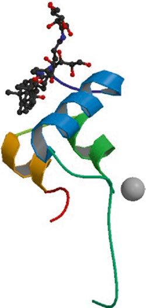

그림 7.13 식전 및 식후 인간 아밀린과 인슐린의 혈장 수준의 상대적 프로파일. 두 호르몬 모두 건강한 개인에서 유사한 식전 및 식후 분비 패턴을 나타낸다. 그림 7.14 37아미노산 인간 호르몬 아밀린의 합성 유사체인 프람린타이드의 아미노산 서열. 인간 서열의 위치 25의 알라닌과 위치 28 및 29의 세린은 각각 프롤린 잔기로 치환된다(녹색으로 표시). 프람린타이드는 아세테이트 염으로 Symlin®이라는 상품명으로 주사 형태로 판매된다. 인간 아밀린은 당뇨병과 관련된 췌도 아밀로이드 침착물의 주요 성분으로 1987년에 확인되었다. 시험관 내에서 아밀로이드 원섬유를 형성하며 이 섬유는 세포 배양에 세포독성이다. 아밀로이드 형성은 췌도 베타 세포의 세포자멸을 유도할 수 있으며 이 효과는 2형 당뇨병의 발병에 관여할 수 있다. 이러한 아밀린의 특성은 프람린타이드를 설계하는 데 관련이 있다고 간주되었다. 아밀로이드 형성을 피하기 위해, 연구는 쥐 아밀린의 일부 아미노산이 임상 활성을 잃지 않고 치환될 수 있음을 보여주었다. 따라서 인간 서열의 위치 25의 알라닌과 위치 28 및 29의 세린은 각각 프롤린 잔기로 치환되었다(그림 7.14).

프람린타이드는 아세테이트 염으로 저혈당을 예방하기 위해 인슐린 용량을 절반으로 줄여 식사 인슐린과 함께 사용해야 하는 항당뇨 약물로 Symlin®이라는 상품명으로 주사 형태로 판매된다. 프람린타이드 단독으로는 저혈당을 유발하지 않지만 인슐린에 추가하면 저혈당 위험이 증가하며 이는 특히 1형 당뇨병 환자에서 프람린타이드를 인슐린과 함께 사용하면 중증 저혈당 위험이 증가한다는 FDA 블랙박스 경고에 반영된다. 경고는 또한 저혈당 위험이 적절한

환자 선택, 신중한 환자 교육 및 인슐린 용량 감소로 줄일 수 있다고 명시한다. 프람린타이드는 저혈당 상태를 인식하지 못할 수 있는 환자 또는 재발성 중증 저혈당, 위마비 또는 프람린타이드에 대한 과민반응이 있는 환자에게 사용해서는 안 된다. 저혈당 위험에 대한 경고 외에도, 프람린타이드에 대한 다른 경고 및 주의사항은 신중한 환자 선택, 특정 다른 약물의 투여 및 알레르기 반응의 가능성에 관한 것이다. 적절한 환자 선택은 프람린타이드의 안전하고 효과적인 치료에 필수적인 것으로 간주된다. 치료 대상으로 고려해서는 안 되는 환자에는 인슐린 사용 및 혈당 모니터링에 대한 순응도가 낮은 환자; 확인된 위마비가 있거나 위장관 운동을 자극하는 약물이 필요한 환자; 당화혈색소(HbA1c) >9%인 환자; 그리고 소아 환자가 포함된다.

프람린타이드는 위 배출을 지연시키므로 특히 빠른 작용 개시를 요하는 다른 경구 약물은 프람린타이드 주사 최소 1시간 전에 투여해야 한다. 마찬가지로 프람린타이드는 위장관 운동을 변화시키는 약물을 복용하는 환자에게 권장되지 않는다. 프람린타이드와 인슐린은 각 약물의 약동학과 후속 혈당 조절을 모두 변경하는 것을 피하기 위해 투여 전 혼합하지 않고 별도의 주사로 투여해야 한다.

1형 당뇨병 환자를 대상으로 한 위약 대조 시험의 안전성 데이터는 가장 흔한 이상반응(위약 대비 발생률 ≥5%)이 메스꺼움, 식욕부진, 구토, 관절통, 피로 및 알레르기 반응임을 보여주었다. 2형 당뇨병 환자에 대한 해당 목록에는 메스꺼움, 두통, 식욕부진, 구토, 복통, 피로, 어지러움, 기침 및 인두염이 포함되었다. 지금까지 시판 후 기간 동안 가장 흔하게 보고된 이상반응은 주사 부위 반응과 췌장염이다.

인간 성장호르몬 인간 성장호르몬은 또한 소마토트로핀(somatotropin), 소마트로핀(somatropin) 또는 hGH라고도 불리며

호르몬으로 치료받은 성인에서도 발생했다. 이 프리온 감염의 긴 잠복기로 인해 의인성 CJD는 계속해서 때때로 관찰되고 있다(최근 발전에 대해서는 "소마트로핀에 대한 이상반응" 절 참조).

성장호르몬의 구조 및 작용 기전 성장호르몬 단백질은 GHN 유전자(GH1이라고도 함)에 의해 암호화되며 이는 네 개의 관련 유전자와 함께 염색체 17의 성장호르몬 유전자좌에 유전자 클러스터를 형성한다. 다섯 개의 유전자는 높은 수준의 서열 동일성을 공유하며 대체 접합에서 발생하는 다양성은 추가 동형을 생성한다. 유전자 돌연변이 또는 결실은 성장호르몬 결핍과 짧은 키를 유발한다. 1972년 인간 성장호르몬 구조의 결정과 1979년 유전자 클로닝의 진전은 보장된 호르몬 공급의 진화에 필요한 단계였으며 1981년 최초의 재조합 인간 성장호르몬 제제의 도입으로 마침내 안전한 치료가 달성되었다. 자연 호르몬이 비글리코실화 단백질이므로, 생산에는 원핵 발현 시스템이 선호되었다. E. coli에서 제조된 최초의 재조합 제제(rhGH; 소마트로핀)는 내인성 호르몬과 동일한 생물학적 효과를 가지며 N-말단의 추가 메티오닌 잔기를 제외하고는 화학적으로 동일한 것으로 입증되었다. 보다 최근의 일부 재조합 소마토트로핀 제품은 효모 Saccharomyces cerevisiae에서 제조되었다.

인간 성장호르몬은 분비에 필수적인 26아미노산 N-말단 신호 펩티드를 가진 217아미노산 전단백질로 생산된다. 이는 분비 중 절단되어 성숙한 191아미노산 호르몬을 생성한다. 인간 성장호르몬은 Cys53-Cys165 및 Cys182-Cys189 사이의 두 개의 이황화 결합과 22.125 kDa의 분자량을 가진 단일 폴리펩티드 사슬이다. 이차 구조는 8개의 알파 나선의 45% 나선 구조를 가진 단일 사슬 펩티드이며 X선 연구는 4-나선 코어를 보여준다(그림 7.15).

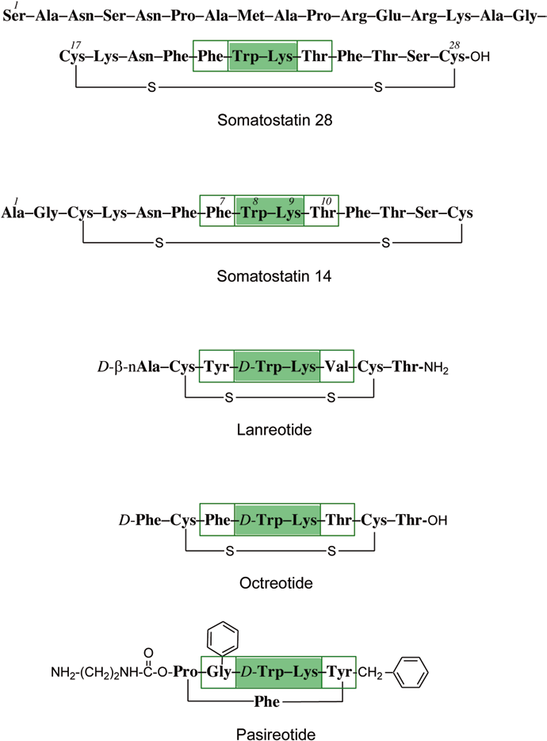

그림 7.15 2.5Å 해상도의 인간 성장호르몬 리본 다이어그램. 짧은 루프로 연결된 나선 2와 3, 나선 1과 2 및 나선 3과 4를 연결하는 긴 교차 연결을 가진 4-나선 단백질 코어의 결정 구조를 보여준다.
4. 보여진 구조는
Protein Data Bank RCSB PDB 파일 1HGU(Chantalat L, Jones ND, Korber F, et al. Protein Pept Lett 1995;2:333-40)에서 가져왔다. 그림 7.16 인간 성장호르몬과 가용성 결합 수용체 단백질(GH-GHbp)의 1:2 복합체에서 2.5Å 해상도의 결정 구조. 구조는 Protein Data Bank RCSB PDB 파일 1HWG(Sundstrom M, Lundqvist T, Rodin J, et al. J Biol Chem 1996;271:32197-203)에서 가져왔다. 궁극적으로 대사와 성장과 관련된 활성을 생성하는 전사 인자. 보다 최근의 증거는 결합 전에 성장호르몬 수용체가 이미 JAK2 및 Src 키나제를 포함한 비활성 키나제와 관련되어 있으며 호르몬 결합 시 수용체 소단위가 회전 및 재배향에 의해 정렬되어 관련 키나제의 활성화와 궁극적으로 인산화 캐스케이드 및 전사 활성으로 이어진다는 것을 나타낸다. 호르몬 리간드에 의한 성장호르몬 수용체의 과도한 활성화는 말단비대증과 거인증을 유발할 수 있는 반면, 수용체의 자가분비 활성화는 세포 변형과 암으로 이어질 수 있다.

소마트로핀의 적응증 및 용도 재조합 제품의 즉시 이용 가능하고 풍부한 상업적 공급과 함께 소마트로핀의 사용이 증가했고 승인된 적응증의 목록도 커졌으며 성장호르몬 결핍 아동뿐만 아니라 성장호르몬 결핍이 없는 아동과 성인에게도 적용되었다. 소아 환자에 대해 승인된 적응증은 성장호르몬 결핍과 관련된 짧은 키 또는 성장 실패 치료; 특발성 짧은 키; SHOX 결핍(아래 참조) 및 재태 연령 대비 작은(이하 SGA) 출생 후 키 추격 실패; 터너 증후군; 그리고 프라더-윌리 증후군이다. 성인에 대해 승인된 적응증은 소아기 또는 성인기 발병 성장호르몬 결핍 환자의 치료이다.

성장호르몬 결핍은 선천적이거나 후천적일 수 있지만 대부분의 아동에서 이 질환의 기원은 특발성이다. 만성 신장 질환을 앓는 아동은 심각한 성장 실패를 경험할 수 있으며 이러한 경우 성장호르몬 치료가 키를 개선했는데, 특히 조기에 치료를 시작하는 어린 아동에서 그러하다. 성장 장애가 있는 만성 신장 질환에 대한 성장호르몬 투여는 1993년 FDA에 의해 승인했다.

X-염색체의 부분적 또는 완전한 부재와 관련된 장애인 터너 증후군은 약 2,000명의 여아 출생 중 1명에게 영향을 미친다. 영향을 받은 여성은 짧은 키, 전형적인 체성 특징, 난소 부전을 보이며 뼈, 심혈관, 갑상선 및 위장관 관련과 같은 다른 징후를 경험한다. 성장호르몬 결핍은 터너 증후군의 요인이 아니지만 소마트로핀은 성장과 키를 증가시키기 위해 투여된다.

소위 "재태 연령 대비 작은" 아동(출생 체중 또는 길이가 평균 재태 연령보다 최소 2SD 아래로 정의)에게 추격 요법으로, 그리고 특발성 짧은 키를 가진 아동에게 투여된 성장호르몬은 환자가 정상 성인 키에 도달하는 이점을 보여주었다.

부계 염색체 15q11-q13의 유전자 결실 또는 발현 부족으로 인한 프라더-윌리 증후군은 모계 유전자 사본이 침묵되고 부계 사본은 비기능적인 부모 기원 각인 장애이다. 이 증후군은 저긴장, 성선기능저하증, 짧은 키, 척추측만증, 수면 장애, 지연된 언어 및 행동 이상을 특징으로 한다. 만성 배고픔은 종종 비만과 당뇨병으로 이어지며 연령이 들어감에 따라 고혈압과 심혈관 질환이 발생한다. 프라더-윌리 증후군 아동의 성장호르몬 치료는 선형 성장과 더 마른 체질량을 촉진하지만 개선된 심혈관 위험과 골밀도 증가도 초래하는 것으로 생각된다.

재조합 형태의 인간 성장호르몬의 즉시 이용 가능성은 호르몬의 승인된 적응증 목록의 확장과 함께 진행되었으며 이 확장은 HIV 감염 및 단장 증후군과 관련된 소모에 대한 승인으로 아직 진행 중인 것으로 나타났다. 또한 골다공증, 염증성 장 질환, 소아 류마티스 관절염, 낭포성 섬유증 및 글루코코르티코이드가 필요한 일부 환자에 소마트로핀 요법을 적용한 보고가 있으며 성장호르몬의 일부 기능은 아직 알려지지 않았을 가능성이 높아 보인다. 반면, 현재 및 제안된 일부 적용은 주의해서 보아야 한다. 비록 승인된 적응증이 아니고 국제 올림픽 위원회와 많은 다른 공식 스포츠 기구에 의해 금지되었지만 성장호르몬은 스포츠에서 단백동화제로 계속 사용되고 있다. 또한 소마트로핀은 이 요법의 효능과 안전성이 아직 확립되지 않았지만 활동성을 높이기 위해 성장호르몬 결핍 노인 환자에게 때때로 처방된다.

소마트로핀에 대한 이상반응 인간 성장호르몬에 대한 진정한 I형 즉시 과민반응은 극히 드물며 소마트로핀(Humatrope® 및 Genotropin®)에 대한 전신 두드러기의 두 사례만 보고했다.

무호흡은 성장호르몬 요법 시작 전에 평가되어야 한다. 소마트로핀 요법의 다른 세 가지 드문 부작용은 자가 제한성 여성형 유방; 대퇴 골두 골단 미끄러짐(대퇴 경부의 근위 대퇴 골두 골단의 변위); 그리고 양성 두개내 고혈압이다. 이 중 처음 두 가지 효과는 성장호르몬 대체 요법의 결과인 반면, 두개내 고혈압은 소마트로핀의 항이뇨 효과에 기인한다.

성장호르몬과 IGF-1은 유사분열 및 항세포자멸 효과를 보이므로, 이전 또는 기존 종양의 재발 또는 자극, 두 번째 종양의 유도, 그리고 이전에 종양이 없었던 환자에서의 종양 유도 관점에서 종양 발생 가능성을 고려해야 한다. 백혈병 및 뇌·경부 종양의 경우 방사선 요법, 특히 두개내 수술은 뇌하수체에 영향을 미쳐 성장호르몬 방출을 유도한다. 소마트로핀이 종양 발생을 유도한다는 우려가 있지만 현재의 견해는 호르몬 요법이 악성 종양의 위험을 증가시키지 않는다는 것이다. 수막종이 증가하는지 여부는 아직 명확하지 않지만 그럼에도 FDA는 기존 종양이 있는 환자의 모니터링을 권장하고 소마트로핀으로 치료받은 소아기 암 생존자에서 특히 수막종의 두 번째 신생물 위험 증가에 대해 경고한다. 장기적인 암 유발 사망률과 관련하여 프랑스에서 수행된 확장된 역학 연구(Santé Adulte Gh Enfant 또는 SAGhE 연구)는 소아기 동안 재조합 성장호르몬으로 치료받은 환자의 장기 사망률을 평가하도록 설계되었다. 이 조사는 호르몬 치료 그룹(93명 사망)에서 일반 인구의 예상 사망(70명)에 비해 사망 위험이 30% 증가한 것을 나타냈다. 뼈 종양과 심혈관 질환이 사망률 증가의 주요 기여자였다. 놀랍고 예측하지 못한 발전에서, 희석액의 성분인 벤질 알코올은

1958-1985년 기간 동안 인간 성장호르몬을 주사받은 30,000명의 개인이 알츠하이머병 위험에 처한다는 우려가 제기되었다. 특히 알츠하이머병은 매우 흔한 질환이며 아밀로이드-β는 드문 CJD 프리온보다 성장호르몬에서 더 빈번한 오염물질이었을 것이기 때문이다. 추가 우려는 프리온이 정상 소독 조건에 대한 저항성과 금속 표면에 달라붙는 특성 때문에 비활성화가 어렵다는 알려진 어려움이다. 알츠하이머병이 프리온 유사 방식으로 전염된다면, 신경외과나 심지어 수혈으로서도 전염될 가능성을 고려해야 한다. 실제로 아밀로이드-β "시드"는 뇌에서 오래 생존할 뿐만 아니라 프리온보다 분해에 더 강한다.

성장호르몬의 면역원성 E. coli에서 제조된 일부 초기 재조합 성장호르몬 제제는 숙주 세포 단백질에 대한 항체를 유도했으며 그러한 경우 때때로 호르몬에 대한 항체의 더 높은 발생률도 관찰했다. 제조 공정의 수정은 이 문제를 대부분 제거했다. 12개월 치료 후 아동에서 Genotropin®에 대한 항체의 발생률은 373명 중 4명, 즉 1.1%로 이 소마트로핀 제제의 낮은 면역원성을 시사한다. Genotropin®과 Omnitrope®에 대해 발생한 항체의 비교는 Genotropin®에서 2.27%, Omnitrope®에서 0%의 발생률을 나타냈다. 이는 문헌에서 가져온 Genotropin®의 1.75% 발생률과 비교되었다. Omnitrope®과 Genotropin® 사이에 임상적으로 관련된 면역원성 차이의 증거는 없다는 결론이 내려졌다.

지속 방출 소마트로핀 제제와 Genotropin®의 아동에서의 면역원성 비교는 항체 형성 발생률에서 현저한 차이를 나타냈다. Genotropin®에 대한 항성장호르몬 항체는 87명 중 7명(8%)의 환자에서 발생했으며 이는 지속 방출 제제에서 관찰된 41%(91명 중 37명) 발생률보다 유의하게 낮았다. 항체

인슐린 유사 성장인자 1 351 페그비소만트(Somavert®)의 결합 부위 1에 8개의 돌연변이를 도입하여 친화성을 4~5배 증가시켰다. 결과적인 돌연변이 성장호르몬 B2036은 수용체 이량체에 결합하지만 신호전달에 필요한 형태 변화를 유도하지 않는다. 두 번째 부위의 돌연변이는 페길화에 이용될 수 있는 리신 잔기도 도입한다. GH-GHbp 복합체와 B2036-GHbp 복합체의 결정 구조를 비교한 결과, 유사한 조건에서 결정화되었으며 호르몬 또는 수용체의 형태에 최소한의 차이만 보이는 놀라운 유사성을 보였다. 짧은 반감기(피하 및 정맥 투여 후 각각 3.4시간 및 ~20분)를 가진 자연 인간 호르몬과 마찬가지로, B2036의 반감기도 성장호르몬 수용체 길항제로 성공적으로 사용하기에는 너무 짧다.

이는 분자의 페길화로 극복되었으며 이는 폴리펩티드의 길항 활성을 감소시켰지만 페길화 제제의 청소율은 크게 감소되었다. 이 감소된 청소율(평균 반감기 ~6일로 혈청에서 제거됨)은 감소된 길항 효과를 다소 보상하여 임상에서 사용할 수 있는 효능 있는 재조합 약물 페그비소만트를 생성한다. 페그비소만트는 191개의 아미노산 잔기, 분자량 ~22 kDa로 구성되며 분자당 4-6개의 공유 부착 폴리에틸렌 글리콜(PEG) 중합체(PEG 중합체당 MW 5 kDa)를 가진다. 페그비소만트는 수술 및/또는 방사선 요법/다른 요법(소마토스타틴 유사체와 같은)에서 충분한 이점을 얻지 못한 환자의 말단비대증 치료에 적응된다. 발행된 주의사항은 성장호르몬을 분비하는 종양의 확장 가능성; 포도당 내성 증가; 기능적 성장호르몬 결핍 상태; 간 효소 상승; 그리고 지방비대에 관한 것이다. 시판 전 임상 연구에서 상당한 체중 증가, 현저한 트랜스아미나제 및 지방비대가

성장호르몬의 효과를 매개하는 역할 중 IGF-1은 성장호르몬 자극에 반응하여 대부분 간에서 합성·분비되므로 내분비 호르몬으로 볼 수 있다. 그러나 다른 조직, 예를 들어 연골 세포에서 분비될 때 국소적으로 측분비 호르몬으로 작용할 수도 있다. IGF-1은 평생 생산되며, 그 생산은 사춘기 동안 가장 높고, 영양 부족/단식은 수치를 빠르게 감소시킬 수 있다.

구조 및 작용 기전 IGF-1은 인슐린과 관련된 펩티드 계열에 속하며 이 분류는 췌장 호르몬에 대한 구조적 유사성에 반영된다. IGF-1과 인슐린은 상동 서열을 공유하고, 일부 중복되는 생물학적 활성을 나타내며, IGF-1은 인슐린 수용체에 낮은 친화성 결합을 보인다. 3차원 구조가 유사하지만 IGF-1과 인슐린은 다르게 접힌다-인슐린은 단일 안정한 3차 구조로 접히는 반면, IGF-1은 열역학적으로 안정한 두 개의 이황화 이성질체로 접힌다. IGF-1은 70개의 아미노산, 분자량 7649 Da의 단일 폴리펩티드 사슬로, 3개의 분자 내 이황화 가교를 가진다. N-말단에서 분자는 B, C, A 및 D의 네 개의 별개 도메인으로 나눌 수 있다. 29개 아미노산 잔기의 IGF-1 B-도메인은 인슐린의 B 사슬과 상동이고; 12개 잔기의 C-도메인과 프로인슐린의 C-펩티드는 유사하지만 상동성을 나타내지 않으며; 두 호르몬의 21개 아미노산 잔기 A-도메인/사슬은 상동이다. IGF-1의 8개 잔기 D-도메인은 인슐린에 대응하는 부분이 없다. 혈장에서 IGF-1의 거의 100%는 IGF 결합 단백질(IGFBP)에 단백질 결합되어 있으며(그림 7.17), ~80%는 여섯 개의 IGFBP 중 하나인 IGFBP-3에 결합된다. 이 140 kDa 삼중 복합체는 IGF-1 한 분자, IGFBP-3 한 분자, 그리고 분자량 88 kDa의 산불안정 단백질 한 분자로 순환한다. IGFBP는 유리 IGF-1의 이용 가능성을 조절하는 것으로 생각된다. IGF-1의 효과는 호르몬의 상보적 수용체인 IGF

인슐린 유사 성장인자 1 353 그림 7.17 1.8Å 해상도의 IGF-1 결정 구조. 생리적 pH에서 IGF-1은 12개 잔기 C-영역으로 연결된 3개의 나선 서열과 인슐린과 유사한 위상을 가진 단량체이다. 유형 II 베타 회전의 C-영역 잔기는 수용체 결합에 관여한다. 보여진 구조는 Protein Data Bank RCSB PDB 파일 1IMX(Vajdos FF, Ultsch M, Schaffer ML, et al. Biochemistry 2001;40:11022-9)에서 가져왔다. IGF-1과 성장 자극 1960년대 후반, Laron과 협력자들은 고성장호르몬혈증을 가지지만 고립성 성장호르몬 결핍과 구별할 수 없는 특징을 가진 왜소증 사례를 기술했다. 라론 증후군(Laron syndrome)으로 명명된 이 상태의 원인은 성장호르몬에 대해 둔감한 것으로 확인되었다. 이 증후군은 IGFBP-3를 포함한 여러 물질의 합성 감소와 함께 IGF-1을 생성하지 못한다. 녹아웃 마우스 연구는 성장호르몬 수치가 증가된 개인에서도 현저한 성장 지연을 가진 라론 증후군이 IGF-1 결핍 때문이라는 설명을 확인했다.

이후 성인에서, 다음으로 아동에서 시행된 시험은 외인성 IGF-1이 성장호르몬의 동화 및 선형 성장 효과를 매개하는 중요한 성장 인자이며 뇌하수체 호르몬과 독립적인 자체 자극 효과도 가진다는 것을 입증했다.

메카서민 메카서민(Increlex®)은 E. coli에서 생산된 재조합 인간 IGF-1(rhIGF-1)이다. 3개의 분자 내 이황화 가교와 내인성 IGF-1의 서열과 동일한 아미노산 서열을 가진 70개 아미노산 단일 사슬 폴리펩티드, 분자량 7649 Da이다.

임상적 의의 중증 원발성 IGF-1 결핍(원발성 IGFD)으로 분류된 질환은 IGF-1 유전자, 성장호르몬 수용체 또는 수용체 신호전달 경로의 돌연변이로 인한 다양한 형태의 성장호르몬 둔감성을 포함한다. 이러한 장애가 있는 환자는 성장호르몬이 결핍되지 않으므로 외인성 성장호르몬 치료에 반응할 수 없다. 2005년 말, FDA는 중증 원발성 IGFD에 대해, 특히 이 결핍이 있는 아동의 성장 실패 치료를 위해 피하 rhIGF-1(Increlex®)을 승인했다. 두 번째 승인된 적응증은 호르몬에 대한 중화 항체를 발생시킨 성장호르몬 유전자 결실 환자의 치료이다. 메카서민은 2007년 EMA에 의해 승인했다. FDA는 메카서민이 성장호르몬 결핍, 영양실조 또는 갑상선기능저하증과 같은 이차성 IGF-1 결핍 환자의 사용을 위한 것이 아니라고 밝혔으며 후자 두 가지는 치료를 시작하기 전에 교정해야 한다. 그럼에도 불구하고, 효능의 증거 부족과 확립된 성장 사실에 대한 명백한 무시에도 불구하고, 상당수의 아동이 적응증 외 용법으로 메카서민으로 치료되고 있는 것으로 나타났다. 이로 인해 Lawson Wilkins 소아 내분비 학회의 약물 및 치료 위원회는 rhIGF-1이 FDA 권장 사항에 따라서만 사용되어야 하며 제안된 성장 촉진을 위한 다른 용법은 연구용으로만 사용되어야 한다고 명시하게 되었다. rhIGF-1과 rhIGFBP-3의 복합체는 더 긴 혈청 반감기를 갖는 것으로 보이며 이는 이상반응이 더 적거나 덜 심각할 것이라는 믿음/희망과 함께 메카서민 린파베이트라는 이름으로 복합체의 도입으로 이어졌다. 일부 데이터는 이 제제가 rhIGF-1 단독보다 덜 효과적임을 나타냈지만 어쨌든 메카서민 린파베이트는 법적 요인으로 인해 미국과 유럽에서 더 이상 이용할 수 없다.

메카서민의 안전성 정맥 내

11명(15%)의 환자에서 발견된 편도 비대 중 7명(10%)이 편도 절제술 또는 편도 절제술/아데노이드 절제술을 필요로 했다. 5% 이상의 발생률로 관찰된 다른 이상반응은 지방비대 및 멍; 관절통 및 사지 통증; 심장 잡음; 중이염, 난청, 귀 통증 및 중이의 체액; 두통, 어지러움 및 경련; 구토; 두개내 고혈압; 그리고 흉선 비대였다. 시판 후 기간에는 홍반, 통증, 경화, 발진 및 부종의 주사 부위 반응과 함께 전신 및 국소 알레르기 반응; 근골격 및 결합 조직 장애(예: 골괴사 및 무혈성 괴사); 그리고 탈모에 대한 보고가 있었다. 메카서민에 대한 아나필락시스의 최소한 한 사례가 알려져 있으며 IgE 항체와 양성 피부 시험의 부재에서 다른 두 환자에서 알레르기 유사 반응이 발생했다. 후자 환자 중 한 명은 원발성 IGF 결핍이 있는 3세 여아로, 피하 메카서민 치료 10일 후 전신 두드러기로 진행되는 국소 두드러기 병변이 발생했다. 메카서민의 도전 용량 후 두드러기 병변이 발생했지만 호흡기 증상이나 혈압 변화는 없었다. 메카서민이 환자에게 유일하게 이용 가능한 치료였기 때문에, 덱스클로르페니라민(0.5mg), 몬테루카스트(4mg) 및 데플라자코르트(15mg)로 전처치한 후 탈감작을 수행했다. 메카서민은 0.0033mg의 용량으로 시작하여 최종 0.4mg 용량과 140분 후 누적 0.8mg 용량에 도달할 때까지 2배로 증가시키면서 20분 간격으로 8회 피하 용량으로 주어졌다. 절차 후 환자는 부작용 없이 메카서민의 일일 주사를 계속 받을 수 있었다.

rhIGF-1의 면역원성에 대한 데이터는 제한적이며 FDA가 원발성 IGFD가 있는 23명의 아동 중 14명에서 항-IGF-1 항체의 검출에 대한 간략한 진술.이외에는 없다.

제거된 신호 펩티드는 프로소마토스타틴을 생성한다. 호르몬의 두 활성 형태 모두 조직에서 발생하지만 조직 간 존재 비율은 다르다. 몰 기준으로 SS28은 성장호르몬, 인슐린, 글루카곤, 프로락틴, 황체형성호르몬, 난포자극호르몬 및 TSH의 억제에서 SS14보다 더 큰 활성을 나타내며 이는 SS14가 주 호르몬인 SS28의 일부라는 제안으로 이어진다. SS14와 SS28은 각각 수용체 결합 영역을 포함하므로 둘 다 SS 수용체(SSR)와 상호작용한다. 내인성 코르티스타틴 신경펩티드도 SS 수용체에 결합한다는 점에 유의하라. 수용체는 다섯 가지의 상이한 G-단백질 결합 아형(SSTRs 1-5)으로 존재하며 이는 일부 고분화 신생물에서 우선적으로 발현된다. 자연 SS(SS14 및 SS28)는 다섯 가지 수용체 아형 모두에 결합하지만 각각에 대해 다른 친화성을 나타낸다.

SS는 내장 혈류와 문맥 정맥압을 감소시키며, 임상적으로 예를 들어 Stilamin®으로 간경변증 환자의 급성 식도 정맥류 출혈을 치료하는 데 사용되었지만, 간에서의 빠른 분해로 인해 순환 혈중 반감기가 약 1~3분에 불과하여 약리학적 효과가 일시적이므로 볼루스 후 연속 주입으로 투여해야 한다. SS는 Ikestatina®, Somastat®, Somastin®, Somatin®, Somatrex®, Somatosan® 등의 상품명으로 캐나다, 중국, 말레이시아, 싱가포르, 스위스, 대만 및 태국을 포함한 여러 국가에서 사용 중이거나 사용된 적이 있다. 14개 미만의 아미노산을 포함하는 여러 합성 고리형 유사체가 제조되었다.

소마토스타틴의 합성 유사체 펩티다제에 내성이 있는 옥타펩티드 유사체 옥트레오타이드(Sandostatin®)(그림 7.18, 일반적으로 아세테이트로 사용), 장기 작용성 란레오타이드(Somatuline®)(그림 7.18) 및 바프레오타이드(Sanvar®, Octastatin®)와 헥사펩티드 세글리타이드(MK678)는 상당히 더 긴 반감기를 갖

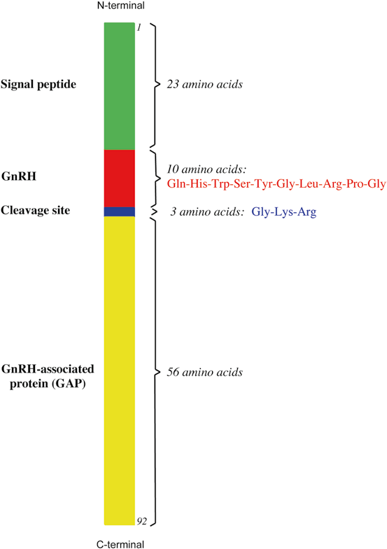

그림 7.18 소마토스타틴 28(SS28) 및 14(SS14)와 합성 유사체 란레오타이드, 옥트레오타이드 및 2세대 약물 파시레오타이드의 아미노산 서열. β-회전 서열 Phe-Trp-Lys-Thr(SS28의 잔기 21-24 및 SS14의 7-10; 녹색으로 표시)이 생물학적 활성에 요구되는 반면, Trp(L- 또는 D-형) 및 Lys(둘 다 녹색으로 음영 처리)는 활성에 필수적이며 Phe 및 Thr은 약간의 변화를 견딜 수 있다. Trp-Lys의 필요성과 Phe 및 Thr 잔기에서 관찰된 허용은 각각 유사체 구조의 음영 및 윤곽 영역에서 보여진다. D-β-nAla, 2-나프틸-D-알라닐

소마토스타틴 유사체에 대한 승인 적응증 아세테이트 옥트레오타이드는 1998년 FDA에 의해 최초로 승인된 Sandostatin® 주사로, FDA의 표현에 따르면 "수술적 절제, 뇌하수체 방사선 조사 및 브로모크립틴 메실레이트를 최대 허용 용량으로 시행했음에도 불충분한 반응을 보이거나 치료할 수 없는" 말단비대증 환자의 혈중 성장호르몬 및 IGF-1(소마토메딘 C) 수준 감소에 적응된다. SS는 다양한 GEP-NET, 즉 뇌하수체, 갑상선, 췌장 내분비 기관 또는 폐·장의 신경내분비 세포에서 발생하는 종양의 분비와 성장을 억제한다. GEP-NET에는 카르시노이드 증후군, 졸링거-엘리슨 증후군, WDHA(수양성 설사-저칼륨혈증-무염산증) 증후군, 저혈당 증후군 및 글루카곤종 증후군이 포함된다.

안정적이고 장기 작용성 SS 유사체는 따라서 이러한 종양의 진단과 치료 모두에 적용을 찾았다. 구체적으로, SS 유사체 옥트레오타이드에 대한 승인된 적응증 및 용도는 펩티드가 심한 설사와 홍조를 억제하거나 억제하는 카르시노이드 종양 및 혈관활성 장 펩티드(VIP) 종양(VIP종; 베르너-모리슨 증후군이라고도 함)과 관련된 다량의 수양성 설사 치료이다. 반감기가 약 2분에 불과한 VIP는 글루카곤-세크레틴 슈퍼패밀리에 속하는 28아미노산 신경펩티드 호르몬이다. 이는 혈관 확장을 유발하고, 동맥 혈압을 낮추며, 심장을 수축시키고, 글리코겐분해를 증가시키며, 위, 담낭 및 기관 평활근을 이완시킨다.

란레오타이드(Somatuline Depot®)는 2007년 말단비대증 치료에 FDA에 의해 승인되었으며 2014년 12월 고분화 또는 중등도 분화의 국소 진행성 또는 전이성 GEP-NET 환자에게 투여용으로 승인했다. 옥트레오타이드는 Octreoscan™ 키트의 일부로서 인듐-111(반감기 2.8일)로 방사성 표지되어 인듐-111-펜테트레오타이드 제제에 사용되며 소마토스타틴 수용체 신티그라피(SRS)로 알려진 절차에 사용된다.

소마토스타틴 유사체에 대한 경고 및 주의사항 대부분의 임상 연구자와 저자는 SS 유사체가 상당히 안전한 약물이라는 데 동의하지만 옥트레오타이드와 란레오타이드 모두에 대해 담석증과 담낭 슬러지, 고혈당 및 저혈당, 갑상선 기능 이상 및 심혈관 이상에 대한 경고 및 주의사항이 규제 기관에 의해 발행되었다. 두 약물 모두 담낭 운동성과 담즙 분비를 감소시켜 담낭 슬러지 또는 담석으로 이어질 수 있다. 고혈당 및 저혈당은 옥트레오타이드/란레오타이드 유발 역조절 호르몬인 인슐린, 글루카곤 및 성장호르몬 사이의 변화된 균형의 결과로 발생할 수 있으며 억제된 TSH 분비는 갑상선기능저하증을 초래한다. 서맥, 부정맥 및 전도 이상이 옥트레오타이드 요법 중 발생했으며 QT 연장 및 기타 심전도 변화도 발생했지만 많은 환자가 심장 질환을 가지고 있으므로 이러한 변화와 옥트레오타이드의 연관성이 항상 확립되는 것은 아니다. 동성 서맥, 서맥 및 고혈압은 란레오타이드에 대해 보고된 가장 흔한 심장 이상반응이다. 옥트레오타이드와 란레오타이드 모두 시클로스포린의 생체 이용률을 감소시킬 수 있으며 옥트레오타이드는 지방과 비타민 B12의 흡수를 변화시키고 일부 환자에서 혈청 아연 수준 상승을 동반한 체액 손실을 촉진한다. 인듐-111 펜테트레오타이드는 복합 글리코실 옥트레오타이드 접합체의 형성을 피하기 위해 비경구 영양 혼합물에 투여해서는 안 된다. 인듐-111 신티그라피 시험의 민감도 감소를 피하기 위해, 환자에게 인듐-111 펜테트레오타이드 투여 전에 아세테이트 옥트레오타이드 요법을 일시적으로 중단해야 하며 아세테이트 옥트레오타이드는 인슐린종 환자에서 저혈당을 유발할 수 있으므로 이를 예방하기 위한 예방 조치를 취해야 한다. 쿠싱병 환자의 경우, 파시레오타이드에 의한 ACTH의 급속하고 현저한 억제는 일주기를

소마토스타틴 유사체에 대한 이상반응 SS 유사체는 일반적으로 잘 견디지만 앞 절에서 언급한 이상반응 외에도 임상 시험과 시판 후 경험은 말단비대증, GEP-NET 및 쿠싱병 치료에 사용될 때 소마토스타틴 유사체에 대한 대부분 비중증인 다양한 이상반응의 인지에 기여했다. 옥트레오타이드 서방형인 Sandostatin LAR®에 의한 말단비대증 치료에서 옥트레오타이드의 안전성에 대한 3상 이중 맹검 교차 연구는 환자의 ≥10%에서 가장 빈번하게 발생한 것부터 순서대로 다음 이상반응을 나타냈다: 설사, 복통, 복부 팽만, 인플루엔자 유사 증상, 변비, 두통, 빈혈, 주사 부위 통증, 담석증, 고혈압, 어지러움, 피로. 시판 후 무작위 4상 연구에서 메스꺼움, 탈모 및 비출혈이 이 목록에 추가된다. 전반적으로 가장 흔한 이상반응은 위장관이다.

경증에서 중등도의 설사, 복통 및 메스꺼움은 일반적으로 치료 첫 달에 발생하며, 소화불량, 지방변, 대변 변색 및 후중(tenesmus)이 환자의 4-6%에서 보고되었고, 급성 장 폐쇄와 유사한 드문 효과가 발생했다. 흔한 위장관 이상반응은 28일마다 데포 요법보다 하루 3회 피하 옥트레오타이드를 투여받은 환자에서 유의하게 더 높은 빈도로 발생한다. 옥트레오타이드로 치료받은 4명의 신생아에서 한 건의 사망을 포함하여 괴사성 장염이 보고했다. 추가 3건의 사례 보고와 2건의 추가 사망이 2007년 FDA에 보고했다. 환자의 ~25%까지 보고되며 일반적으로 경증에서 중등도이고 단기간인 주사 부위 통증도 흔한 부작용이다. 옥트레오타이드 투여 후 담낭 이상의 발생률은 용량, 연령 또는 성별과 무관해 보이지만 더 높은 발생률은 치료 기간과 평행한다.

각각의 다른 환자 그룹에서 옥트레오타이드 데포 요법 후의 이상반응 중 상당수는 아직 약물과 명확히 연관되지 않았다. 이러한 사건에는 악성 고열, 뇌혈관 장애, 직장 출혈, 복수, 폐색전증, 폐렴 및 흉막 삼출이 포함된다. 시판 후 기간에 FDA에 보고된 많은 다른 다양한 이상반응에는 아나필락시스, 두드러기, 안면 부종, 신부전 및 기능 부전, 심방 세동, 간염, 간 효소 상승, 장 폐쇄, 췌장염, 당뇨병, 혈전증, 위장관 출혈, 혈소판감소증, 실어증, 소화성/위궤양, 뇌하수체 졸중, 요붕증, 담낭 용종, 간질 발작, 성욕 감소 및 점상출혈이 포함된다.

옥트레오타이드의 피부 효과는 일반적으로 주사 부위에 국한되거나 일시적인 탈모와 관련되지만 최소한 한 건의 심각한 피부 사건이 보고했다. 서방 옥트레오타이드의 근육 내 주사 다음 날, 말단비대증이 있는 40세 여성의 몸통과 사지에 관절통 및 손과 관절의 부종을 동반한 둥근 홍반성 소양성 반판이 발생했다. 다형 홍반으로 진단되었고 코르티코스테로이드 치료에도 불구하고 피부 병변은 40일 동안 지속되었다. 또 다른 명백한 피부 과민반응에서, 말단비대증이 있는 60세 남성이 피하 옥트레오타이드 시작 직후 복부, 팔 및 등에 구진성 발진과 함께 소양증 및 입술 부종이 발생했다. 재도전은 반응과 약물의 연관성을 확인했다. 치료는 0.001μg에서 시작하여 20분 간격으로 14단계로 약 2배씩 증가하는 용량을 연속 투여하는 옥트레오타이드에 대한 성공적인 탈감작 프로토콜의 개발로 구성되었다. 후속 13단계의 용량은 각각 0.002, 0.005, 0.01, 0.02, 0.05, 0.1, 0.2, 0.5, 1, 2, 5, 25 및

옥트레오타이드에 대한 일시적인 혈액학적 반응이 때때로 관찰되었는데, 예를 들어 거짓낭종을 확장시키는 비장 동맥 가성동맥류에 대한 옥트레오타이드의 정맥 볼루스 후 주입을 받은 55세 여성은 분절성 비장 경색과 함께 가성동맥류의 혈전증이 발생했다. 혈소판감소증도 정맥류 출혈로 인해 약물을 투여한 동일한 53세 남성 환자에서 두 번의 별도 경우에 옥트레오타이드에 기인한 것으로 알려졌다. 정맥류 출혈에 대한 옥트레오타이드 주입 후 완전 방실 차단이 발생했다. 차단은 약물 중단 6일 후에 해소되었다. 피하 투여 옥트레오타이드에 대한 항체 형성에 대한 여러 연구는 약물에 대한 항체의 낮은 발생률을 나타내었다. 비강내, 피하 및 근육 내의 세 가지 다른 경로로 전달된 옥트레오타이드에 대한 항체 반응을 비교한 결과, 9-12개월 동안 비강내 치료받은 환자의 항체 형성 발생률은 77%(이전에 치료받지 않음) 및 81%(이전에 치료받음)였고; 피하 치료 환자의 발생률은 27%(평균 노출 3년), 57%(노출 >5년) 및 72%(노출 8년)였으며; 지속 방출 옥트레오타이드로 평균 2.5년 근육 내 치료 후에는 항체 양성 환자가 발견되지 않았다. 옥트레오타이드 항체는 자연 SS와 교차 반응하지 않았으며 항체 양성 혈청의 ~25%는 란레오타이드와 교차 반응하지 않았다.

인듐-111 펜테트레오타이드 투여 후 관찰되고 제조업체에 의해 기록된, 일반적으로 일시적인 부작용에는 어지러움, 발열, 홍조, 두통, 저혈압, 간 효소 변화, 관절 통증, 메스꺼움, 발한 및 허약이 포함된다. 인듐-111 펜테트레오타이드는 주로 신장으로 제거되므로, 신기능이 손상된 환자에게 Octreosan™을 사용할 때 주의를 기울여야 한다.

란레오타이드 400명 이상의 말단비대증 환자와의 임상 시험 경험은 가장 흔한

이물 육아종을 유발하는 것으로 나타났으며 옥트레오타이드 LAR을 투여받는 환자에서 육아종 형성이 보고했다. 주사 부위의 지방 괴사는 피하 란레오타이드 데포에 기인한 것으로 알려졌다. 한 사례에서, 80세 말단비대증 여성의 양쪽 둔부에 4개월 후 염증 조직으로 둘러싸인 중심 괴사를 가진 병변이 나타냈다. 저자들은 환자가 약물의 항혈관신생 효과로 악화된 이물 유사 염증 반응에 민감하여 발생했다고 추측했다. 데포 제제로 치료 후 란레오타이드에 대한 항체를 가진 환자의 비율은 낮으며 <1-4%이다. 중요하게도, 항체는 효능을 감소시키거나 약물의 안전성에 영향을 미치지 않는 것으로 나타났다.

파시레오타이드 1상, 2상 및 3상 연구에서 대부분 근육 내 경로로 파시레오타이드를 투여받은 거의 500명의 말단비대증 환자에 대한 안전성 평가는 가장 흔한(빈도 ≥10%) 이상반응이 (감소하는 순서로) 설사, 담석증, 고혈당 및 당뇨병임을 보여주었다. 대부분의 독성 기준 등급 3 및 4 반응은 고혈당과 관련되었으며 다른 SS 유사체와 비교하여 파시레오타이드를 근육 내로 투여할 때 고혈당이 더 자주 발생했다. 흔하게 관찰된 이상반응(빈도 ≥1% ~ <10%)은 빈혈; 부신 기능 부전; 2형 당뇨병; 내당능 장애; 두통; 어지러움; 동성 서맥; QT 연장; 메스꺼움; 복부 팽만 및 통증; 주사 부위 반응; 탈모 및 당화혈색소, ALT, 혈당 및 혈중 크레아티닌 포스포키나제의 증가였다. 파시레오타이드가 쿠싱병 환자에게 투여되었을 때 3상 연구의 임상 시험 경험은 환자의 >98%에서 이상반응이 관찰되었으며 가장 빈번한 반응(≥20%)은 설사, 메스꺼움, 고혈당, 담석증, 두통, 복통, 피로 및 당뇨병이었다. 이상반응

혈당 수준의 변화는 인슐린과 인크레틴(GLP-1 및 GIP)의 분비 감소(위 "글루카곤 유사 펩티드 1과 인크레틴 효과" 절 참조)와 글루카곤의 평균 값 감소의 결과이며 인슐린 감수성은 영향을 받지 않는다. 인슐린 분비의 억제는 글루카곤의 억제보다 크며 이는 식후 분비에 의해 보충되는 것으로 나타났다. SSTR2 수용체 아형에 대한 현저한 결합 친화성을 나타내며 인슐린/글루카곤 균형에 거의 부작용이 없는 1세대 SS 유사체인 옥트레오타이드와 란레오타이드와는 달리, 파시레오타이드는 SSTR5에 대한 높은 친화성을 나타내며 글루카곤 분비보다 인슐린 분비를 더 강력하게 억제한다. 따라서 SSTR5:SSTR2 비율이 파시레오타이드 유발 고혈당의 주요 결정 요인이라는 제안이 있다.

바소프레신 아르기닌 바소프레신(AVP), 항이뇨 호르몬 또는 아르기프레신으로도 알려진 바소프레신은 옥시토신(위 "옥시토신" 절 참조)과 함께 신경하수체 호르몬, 즉 신경하수체(뇌하수체 후엽)에서 분비되는 호르몬이다. 바소프레신은 시상하부의 대세포 뉴런에서 합성되며 밀접하게 관련된 옥시토신과 구조적으로 두 개의 아미노산(~80% 상동성)이 다르지만 이 호르몬들은 매우 다른 생리적 활성을 가진다. 사실상 모든 척추동물 종은 바소프레신 또는 바소프레신 유사 펩티드를 만들며 옥시토신도 마찬가지이므로 이 호르몬들이 진화적으로 고도로 보존되고 생존에 필수적임을 나타낸다.

바소프레신의 생리적 작용 바소프레신은 포유동물 체내에서 모두 중요한 조절 기능인 두 가지 주요 작용을 가진다: 수분 보유의 조절과 혈관의 수축. 이 중 첫 번째 작용은 신장 네프론의 집합관과 원위 세뇨관에서 수분 투과성을 증가시켜 수분 재흡수를 강화함으로써 이루어진다. 일부 실험 데이터는 바소프레신과 V1 수용체가

일부 종에서 상호작용을 촉진한다는 것을 시사하기도 한다. 실제로 바소프레신과 옥시토신 모두 자폐증, 경계선 성격 및 사회 불안 장애, 그리고 정신분열증과 같은 사회적 기능 장애에 대한 새로운 치료 접근법의 표적으로 떠오르고 있다는 제안이 있다. 따라서 바소프레신은 혈중의 수분, 포도당 및 염분 조절에 핵심 역할을 하며 삼투압 및 심혈관 항상성에 필수적이다.

바소프레신 유전자 및 호르몬 구조 바소프레신 유전자(AVP)와 옥시토신 유전자는 분리되어 있지만 둘 다 염색체 20p에 있으며 전자는 20p13 위치에 옥시토신 유전자에서 불과 12킬로베이스 떨어져 있다. 이 근접성과 두 펩티드의 구조적 유사성은 최근 유전자 중복을 시사한다. AVP 유전자의 최소 60개의 돌연변이가 신경하수체성 요붕증에 관련된 것으로 알려져 있다. 시상하부의 소세포 뉴런에 있는 바소프레신과 CRH는 부신피질자극호르몬(ACTH) 분비의 주요 조절자이다. 글루코코르티코이드에 의한 AVP 유전자 조절을 검토하도록 설계된 연구에서, cAMP는 AVP 유전자 전사를 증가시키고 mRNA 안정성을 증가시킨 반면, 글루코코르티코이드는 유전자 전사를 억제하고 mRNA 안정성을 감소시켜 cAMP와 글루코코르티코이드가 상호작용하여 AVP 유전자 발현을 조절함을 시사했다.

바소프레신(즉, 아르기닌 바소프레신)은 위치 1과 6의 시스테인 사이에 이황화 가교를 가진 9-펩티드이며 다음 아미노산 서열을 가진다: 1 6 9 Cys-Tyr-Phe-Gln-Asn-Cys-Pro-Arg-Gly-NH2. 리신 바소프레신은 위치 8의 아르기닌을 리신 잔기로 대체한다. 옥시토신의 구조는 위치 3(이소류신이 페닐알라닌으로) 및 위치 8(류신이 아르기닌 또는 리신으로)의 변화와 함께 유사하다.

바소프레신 수용체 바소프레신의 생리적 작용은 조직 특이적 GPCR과의 상호작용에 의해 매개된다. 다른 여러 호르몬(예: 글루카곤)과 마찬가지로, 신호전달은 Gq/11, Gs 및 Gi를 포함한 특정 G 단백질으로 발생하며 수용체는

| 366 |  |  | 7  펩티드 호르몬 |
| --- | --- | --- | --- |
표 7.3  바소프레신 수용체
| 수용체 | 유전자 | 위치 | 선택적 G 단백질 결합 경로 | 기능 |
| --- | --- | --- | --- | --- |
| V1 | AVPR1Ab | 전신, 관상동맥, 신장, 내장 | Gq/11 Ca2+ 유입; | 혈관수축; |
|  |  | 순환의 혈관 평활근; 혈소판; 뇌; 고환; 간; 상부 경부 신경절c | 인지질분해효소, IP3, DAG, PKC | 혈소판 응집; 글리코겐분해; 자궁 수축 |
| V2 | AVPR2d | 신장; ??내피 세포e | Gs 아데닐산 고리화효소의 억제, ↑세포내 cAMP | 수분 채널 동원으로 혈장 용적 및 삼투압 조절, 수분 재흡수 증가 |
| V3 | AVPR1Bh | 뇌하수체 전엽 | Gq/11, Gs 및 Gi 단백질 | ACTH 방출: PKC의 활성화; ↑DNA 및 ↑cAMP를 포함한 다른 세포 반응이 여러 경로를 통해 매개됨i |
ACTH 부신피질자극호르몬, DAG 디아실글리세롤, IP3 이노시톨 삼인산, PKC 단백질 키나제 C
a이전에 V1a로 알려짐 b염색체 영역 12q14-15에 위치 c많은 조직에서 바소프레신의 역할은 아직 확인되지 않음 d염색체 영역 10q28에 위치. 요붕증의 대부분의 사례는 VR2 유전자의 돌연변이로 인한 것 e바소프레신 및 그 유사체 1-데아미노-8-D-아르기닌 바소프레신은 내피 세포에 대한 직접 효과에 의해 폰빌레브란트 인자의 혈장 수준을 높인다. 그러나 비선택적 [3H]아르기닌 바소프레신과 달리, 선택적 V2 방사성 리간드의 내피 또는 간 세포와의 결합은 관찰되지 않았다. f이전에 V1b로 알려짐 g각각 V1, V2 및 옥시토신 수용체와 45%, 39% 및 45% 상동성을 보임 h염색체 영역 1q32에 위치 i수용체 발현 수준과 바소프레신 농도에 따라 다름

1,4,5-삼인산(IP3), 1,2-디아실글리세롤(DAG), 단백질 키나제 C(PKC) 캐스케이드에 이어 세포 내 Ca2+ 증가에 반응한 여러 다른 세포 사건, 특히 내피 산화질소 합성효소 촉매에 의한 강력한 혈관 확장제인 산화질소의 생성이 뒤따른다. 바소프레신의 서로 다른 혈관층에 대한 선택적 작용은 OTR의 다른 위치 때문일 수 있으며 혈관 내피의 V1 및 V2 수용체가 산화질소 생성과 혈관 확장을 유도할 수도 있다는 제안이 있다. 일부 연구는 추가 바소프레신 수용체 및 OTR 아형이 존재한다고 제안한다는 점에 유의하라. P2 퓨린수용체라고 하는 ADP, ATP 및 UDP에 대한 세포 표면 수용체는 G 단백질으로 기능한다. 이 수용체는 심장 수축성에 역할을 하는 것으로 보이며 흥미롭게도 바소프레신 유발 심장 효과는 심장 내피에서 발현되는 P2 퓨린수용체의 활성화로 발생하는 것으로 확인했다. 관상동맥 수축과 음성 수축성은 바소프레신과 P2 퓨린수용체 길항제 모두에 의해 차단된다.

바소프레신 요법의 안전성 바소프레신 정맥 주사(Vasostrict®)는 수액 및 카테콜아민에도 불구하고 저혈압이 지속되는 혈관 확장성 쇼크 성인에서 혈압을 높이기 위해 2014년 FDA에 의해 승인했다. 손상된 심장 반응 환자에서의 사용이 심박출량을 악화시킬 수 있다는 경고와 함께, FDA는 문헌에서 얻은 다음 이상반응 목록을 발표했다: 출혈 및 림프계 장애-출혈성 쇼크, 난치성 출혈, 혈소판 수 감소; 심장 장애-우심부전, 심방 세동, 서맥, 심근 허혈; 위장관 장애-장간막 허혈; 간담도 장애-빌리루빈 수치 증가; 신장/비뇨기 장애-급성 신부전; 혈관 장애-원위 사지 허혈; 대사 장애-저나트륨혈증; 피부 상태-허혈성 병변. 여러 잠재적 약물

데스모프레신 위치 1과 6 사이에 이황화 가교를 가진 데스모프레신은 1-데아미노-8-D-아르기닌 바소프레신(또는 1-(3-메르캅토프로피온산)-8-D-아르기닌 바소프레신 모노아세테이트 삼수화물)으로, 위치 1의 시스테인을 탈아민하여 3-메르캅토프로피온산(Mpr)을 생성하고 위치 8에서 L-아르기닌을 D-아르기닌으로 대체하여 바소프레신과 다른 합성 바소프레신 유사체이다. 따라서 데스모프레신의 아미노산 서열은 다음과 같다. 아세트산염 데스모프레신은 비점막에서 흡수되며 7.8분과 75.5분의 반감기를 가진 이상 분포 제거 프로파일을 나타낸다.

이는 리신 바소프레신의 초기 및 말기 단계 반감기 2.5분 및 14.5분과 비교된다. 아세트산염 데스모프레신은 중심성 두개 요붕증 관리의 항이뇨 대체 요법 및 뇌하수체 부위의 두부 외상 또는 수술 후 일시적 다뇨 및 다음증 관리에 0.1 mg/mL 농도의 비강 스프레이(DDAVP®, Minirin®)로 FDA가 승인했다. 신성 요붕증 치료에는 효과가 없다는 점에 유의하라. 비강 스프레이로 사용할 수 없을 때, 약물은 주사(DDAVP® 주사)로 투여한다. 데스모프레신은 야뇨증에도 처방되었다. 40년 전, 데스모프레신 주입이 인간 혈장에서 응고 인자 VIII, 폰빌레브란트 인자 및 플라스미노겐 활성제의 수준을 증가시키는 것으로 발견되었다. 1.5 mg/mL 농도로 제조된 아세트산염 데스모프레신은 다시 비강 스프레이(Stimate®)로 인자 VIII 응고 활성 수준이 >5%인 혈우병 A 및 인자 VIII 수준이 >5%인 경증에서 중등도의 폰빌레브란트병(I형) 환자에 적응된다. DDAVP®에 대한 경고 및 주의사항은 수분 중독 및/또는 저나트륨혈증과 혈압의 약간의 증가를 유발할 수 있는 강력한 항이뇨제로서의 작용, 바람직하지 않은

데스모프레신의 효과, 보통 6개월 이상 사용 후 감소. 중화 항체가 제안되었지만 발견되지 않았으며 펩티드의 국소 비활성화가 설명으로 제시되었다. FDA가 Stimate®에 대해 발행한 경고 및 주의사항 목록은 심혈관 장애 환자의 약간의 혈압 및 심박수 변화 가능성; 체액 및 전해질 불균형(예: 낭포성 섬유증, 심부전, 신장 장애) 환자의 저나트륨혈증; 혈전 형성 경향이 있는 환자의 혈전성 사건; 그리고 심각한 알레르기 반응에 관한 것이다. Stimate®에 대한 기록된 이상반응은 위에 바로 나열된 것과 유사하며 비강 스프레이 임상 시험에서 관찰된 일부 이상반응이 추가된다. 여기에는 졸림, 어지러움, 부종, 구토, 가려움 또는 빛에 민감한 눈, 불면증, 흉통, 소화불량, 두근거림, 빈맥, 초조 및 귀두염이 포함된다.

테를리프레신 아세테이트(Glypressin®, Teripress®)로 사용되는 테를리프레신은 N-[N-(N-글리실글리실)글리실]-8-L-리신 바소프레신으로, 리신 바소프레신의 N-말단에 부착된 세 개의 글리실 잔기, 위치 4와 9의 시스테인 사이의 이황화 가교 및 다음 아미노산 서열을 가진 12-펩티드이다: 1 4 9 12 Gly-Gly-Gly-Cys-Tyr-Phe-Gln-Asn-Cys-Pro-Lys-Gly-NH2. 테를리프레신은 프로드러그이며 N-말단의 세 개의 글리신이 생체 내에서 효소적으로 제거되어 생물학적으로 활성인 리신 바소프레신을 생성한다. 국소 조직 괴사를 피하기 위해 정맥으로 투여하며 적응증은 식도 정맥류, 노르에피네프린 내성 패혈성 쇼크 및 간신 증후군이다. 이 약물은 인도, 호주, 아랍에미리트 및 유럽 대부분을 포함한 여러 국가에서 사용이 승인되었지만 현재 미국에서는 이용할 수 없다. 리신 바소프레신과 마찬가지로, 테를리프레신은 내장 및 문맥 순환의 혈관 평활근의 V1 수용체로 작용하여 현저한 혈관 수축을 유발한다.

자궁 수축을 유발하고, 자궁 압력을 증가시키며, 자궁 혈류를 감소시킬 수 있다. 테를리프레신 투여로 유발되는 주요 부작용으로 심장 및 혈관 장애가 특징을 이루며 서맥, 말초 혈관 수축, 말초 허혈, 고혈압 및 안면 창백이 가장 흔하게 발생하는 사건이다. 다른 흔한(발생률 1-10%) 사건은 두통, 일시적 복부 경련 및 일시적 설사이다. 덜 흔한(0.1-1%) 다른 사건에는 흉통, 빈맥, 심방 세동, 심근 경색, 심실 기외수축, 폐부종을 동반한 체액 과부하, 열감, 장 허혈, 말초 청색증, 호흡 곤란 및 부전, 메스꺼움/구토, 주사 부위 괴사 및 저나트륨혈증이 포함된다. 테를리프레신은 건강한 지원자의 혈청 나트륨 수치에 일관된 효과를 나타내지 않는 것처럼 보이지만(및 매우 약한 V2 수용체 매개 항이뇨 효과), 문맥 고혈압 및 활동성 식도 정맥류 출혈 환자에게 펩티드를 투여할 때 저나트륨혈증이 잠재적 위험으로 간주된다. 예를 들어, 후향적 코호트 연구에서 58명의 환자 중 67%가 5일 치료 기간 동안 혈청 나트륨의 급성 감소를 나타냈다. 치료 중단 시 약 4일 이내에 회복이 발생했다.

밥탄: 바소프레신 수용체 길항제 저나트륨혈증은 입원 환자에서 가장 빈번하게 발생하는 전해질 불균형이며 보고된 유병률은 28%까지 높다. 이 상태는 생명을 위협할 수 있으며 주의력 결핍 및 낙상과 골절의 위험으로 이어질 수 있고 심부전 및 간경변 환자의 예후 인자일 수 있다. 비펩티드 바소프레신 수용체 길항제 또는 밥탄은 아르기닌 바소프레신의 신장 수용체 결합을 차단하여 전해질 무함유 수분의 배설을 촉진하며 희석성(정상 용적 및 고용적) 저나트륨혈증의 치료에 중요하다. 두 가지 밥탄이 승인했다.

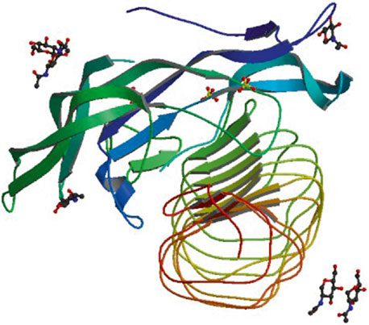

그림 7.19 벤즈아제핀 유사체인 코니밥탄과 톨밥탄은 충혈성 심부전, 간경변 및 부적절 항이뇨 호르몬 분비 증후군(SIADH)과 관련된 저나트륨혈증 치료에 승인된 비펩티드 바소프레신 수용체 길항제 또는 밥탄이다. 알코올 중독 및 진행성 간 질환)은 피해야 한다. 2013년 4월, FDA는 톨밥탄을 30일 이상 사용해서는 안 되며 기저 간 질환이 있는 환자에게는 사용해서는 안 된다고 발표했다. 그러나 일부 임상의는 간 기능 검사를 주의 깊게 모니터링한다면 이점이 위험을 능가하는 SIADH에서 약물을 장기간 사용할 수 있다고 생각한다. 가장 흔하게 보고된 이상반응은 갈증, 구강 건조, 무력증, 변비, 찾빈뇨 또는 다뇨 및 고혈당이다.

옥시토신 자궁 수축 및 젖 분출 활동으로 잘 알려진 옥시토신(그리스어로 "빠른 분만")은 시상하부의 뇌실주위핵과 시각상핵의 대세포 뉴런에서 생성되는 풍부한 신경하수체 펩티드 호르몬이다. 분만, 수유 및 스트레스를 포함한 여러 자극에 반응하여 뇌하수체 후엽에서 순환계로 분비되지만 황체, 자궁, 태반, 양막, 고환 및 심장과 같은 여러 말초 조직에서도 합성되고 방출된다. 이 호르몬은 신경내분비 반사의 조절에서 사회적 행동, 개인 간 유대, 생식 및 자손 돌봄에 이르기까지 광범위한 작용을 가진다.

적응증 정맥으로 투여되는 옥시토신 주사(Pitocin®)는 분만 전 및 분만 후 사용을 위해 투여된다. 전자의 목적에서, 호르몬은 질 분만을 달성하기 위한 자궁 수축의 개시 또는 개선에 적응된다. 분만 후 상황에서, 옥시토신은 분만 3기 동안 자궁 수축을 생성하고 분만 후 출혈 또는 출혈을 조절하기 위해 투여된다.

옥시토신 구조 옥시토신은 주사용(Pitocin®으로)으로 합성되어 뇌하수체 추출물에서 발생할 수 있는 바소프레신 및 기타 펩티드와의 가능한 오염을 피한다. 모든 신경하수체 호르몬과 마찬가지로, 옥시토신은 위치 1과 6의 시스테인 잔기를 연결하는 이황화 가교를 가진 9-펩티드로, 펩티드에 6개 아미노산 고리형 구조에 연결된 C-말단 3개 아미노산 꼬리를 제공한다. 아미노산 서열은 다음과 같다: 1 3 6 8 Cys-Tyr-Ile-Gln-Asn-Cys-Pro-Leu-Gly-NH2. 신경하수체 9-펩티드 호르몬은 위치 8에 염기성 아미노산(리신 또는 아르기닌)을 모두 가진 바소프레신 계열(위 "바소프레신 유전자 및 호르몬 구조" 절 참조) 또는 이 위치에 중성 아미노산(류신)을 가진 옥시토신 계열로 분류된다. 위치 8의 이러한 아미노산 치환은 바소프레신 수용체의 적절한 인식 및 활성화에 필요하며 옥시토신 수용체의 활성화는 위치 3의 이소류신을 필요로 한다.

옥시토신 수용체 옥시토신 수용체(OTR)는 세 가지 바소프레신 수용체 아형 V1, V2 및 V3(위 "바소프레신 수용체" 절 참조)와 함께 로돕신 유사 GPCR 슈퍼패밀리에 속한다. 바소프레신 V2 수용체가 OTR과 40%의 서열 동일성을 보이지만 후자는 옥시토신과 아르기닌 바소프레신을 유사한 고친화성으로 결합하는 반면 V2 수용체는 옥시토신보다 ~400배 더 높은 친화성으로 아르기닌 바소프레신을 결합한다. 이 사실은 수용체 결합 도메인을 식별하기 위한 키메라 OTR/V2 수용체 구성체의 형성에 활용되었다. 리간드-수용체 인식의 구조적 측면에서, OTR은 가장 잘 정의된 펩티드 호르몬 수용체 중 하나이다. OTR은 기능적으로 Mg2+ 또는 Mn2+ 및 콜레스테롤과 같은 이가 양이온에 의존하며 작용제와 길항제 모두에 대해 저친화성 또는 고친화성 상태 중 하나로 존재한다. 콜레스테롤은 또한 OTR의 안정성을 돕고 단백질분해 및 열 분해로부터 보호한다.

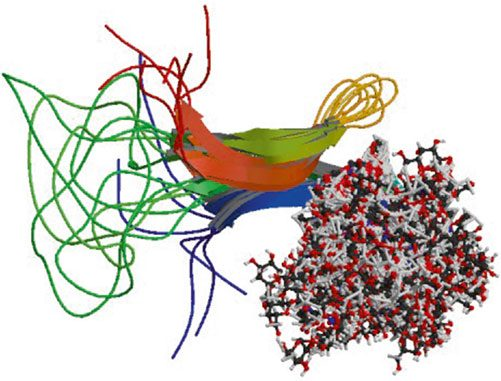

그림 7.20 옥시토신의 합성 펩티드 유사체이자 작용제인 카르베토신과 옥시토신 수용체 펩티드 길항제인 아토시반 및 바루시반의 아미노산 서열. 카르베토신은 옥시토신보다 낮은 친화성으로 OTR에 결합하지만 훨씬 더 긴 반감기를 가진다. 두 펩티드의 주요 구조적 차이는 옥시토신의 이황화 가교를 티오에테르 가교로, 티로신 하이드록실을 메톡시 그룹으로 대체한 것이다. 아토시반은 O-메틸-D-티로신 및 오르니틴 아미노산을 가진 9-펩티드 데아미노-옥시토신 유사체이다. 바루시반은 가장 특이적인 OTR 길항제로 바소프레신보다 OTR에 대해 더 높은 친화성과 효능을 보인다. 또한 O-에틸-D-티로신, 위치 4의 알로이소류신 잔기, L-2-아미노부타노일 그룹 및 말단 N-메틸-L-오르니티놀 그룹을 가진 네 가지 길항제 중 구조적으로 가장 다른 것이다.

카르베토신(1-데아미노-1-모노카르보-(2-O-메틸티로신)-옥시토신)은 분만 후 출혈 및 출혈을 조절하기 위해 산과학에서 사용되는 장기 작용성 합성 옥시토신 유사체 및 작용제이다. 두 펩티드의 구조적 차이는 탄소 1의 유리 아미노 그룹을 수소 원자로, 옥시토신의 이황화 가교를 티오에테르 가교로, 티로신 하이드록실을 메톡시 그룹으로 대체한 것이다(그림 7.20). 카르베토신은 옥시토신보다 10배 낮은 친화성으로 OTR에 결합하며 3.5분에 비해 훨씬 긴 85-100분의 반감기를 가지지만 생물학적 효과는 자연 호르몬의 약 절반에 불과하다. 카르베토신(및 기타 옥시토신 작용제)은 OTR의 세포외 N-말단 및 루프 E2와 E3에 비선택적으로 결합하는 것으로 나타났다. 옥시토신 길항제의 상호작용은 조산 치료 또는 조산 노동을 중단시키는 데 사용된다.

자궁근육 수축을 감소시켜 조산 노동을 지연시킨다. 이 약물과 OTR의 상호작용도 어느 정도 조사되었다. O-메틸-D-티로신 및 오르니틴 아미노산을 가진 9-펩티드 데아미노-옥시토신 유사체인 길항제 아토시반(그림 7.20)은 자궁 수축을 억제하고 OTR에 대한 중간 친화성을 보이지만 특이성이 부족하다. 이 펩티드는 선택적 리간드로 작용하여 Gαq 단백질 결합에서 길항제로, Gαi 단백질 결합에서 작용제로 행동한다. 바루시반(그림 7.20)은 가장 특이적인 OTR 길항제이며 O-에틸-D-티로신, 위치 4의 알로이소류신 잔기, L-2-아미노부타노일 그룹 및 말단 N-메틸-L-오르니티놀 그룹을 가진 네 가지 길항제 중 가장 구조적으로 다른 것이다. 바루시반은 바소프레신보다 OTR에 대해 더 높은 친화성과 효능을 보인다. 키메라 수용체 구성체 연구 결과는 막관통 수용체 도메인 1과 2가 소수성 상호작용으로 바루시반과 직접 접촉함을 나타낸다. 간단히 말하면, 옥시토신 작용제는 수용체의 아미노 말단 및 세포외 루프를 인식하고 접촉하는 반면, 옥시토신 길항제는 막관통 도메인 1과 2 사이의 포켓 바닥의 부위를 접촉한다.

옥시토신의 안전성 분만 유도 또는 자극을 위해, 정맥 주입, 점적법을 사용해야 하며 바람직하게는 주입 펌프로 사용해야 한다. 분만 후 자궁 출혈 조절을 위해, 태반 분만 후 근육 내 투여가 가능하지만 다시 정맥 주입이 사용된다. 옥시토신에 대한 경고 및 주의사항에는 여러 다른 원인으로 인한 태아 사망 가능성과 자궁 파열, 고혈압 에피소드 및 지주막하 출혈로 인한 산모 사망이 포함된다. 호르몬은 사구체 여과액에서 수분 흡수를 증가시키는 항이뇨 효과가 있으므로 수분 중독도 고려해야 한다. 이 가능성은 옥시토신이

표 7.4 옥시토신 투여 후 옥시토신 이상반응a
| 산모에서 | 태아 또는 신생아에서 |
| --- | --- |
| 아나필락시스 | 유발된 자궁 운동으로 인한 |
| 분만 후 출혈 | 서맥 |
| 심장 부정맥 | 조기 심실 수축 및 기타 부정맥 |
| 치명적 무섬유소원혈증 | 영구적 CNS 또는 뇌 손상 |
| 메스꺼움 | 태아 사망 |
| 구토 | 신생아 발작 |
| 조기 심실 수축 | 산모의 옥시토신 사용으로 인한 |
| 골반 혈종 | 5분 후 낮은 Apgar 점수c |
| 지주막하 출혈 | 신생아 황달 |
| 고혈압 에피소드 | 신생아 망막 출혈 |
| 자궁 파열b |  |
a데이터: FDA: http://www.accessdata.fda.gov/drugsatfda_docs/label/2014/018261s031lbl.pdf b과민반응 또는 과다 용량에서 발생할 수 있음 cApgar 점수(외모; 맥박; 골상; 활동; 호흡): 분만 직후 신생아의 건강을 평가하는 방법. 7 이상은 정상; 4-6은 상당히 낮음; 3 이하는 심각히 낮음

자궁의 V1 수용체와 중요하게는 신장의 V2 수용체와 함께, 특히 정맥 수액을 투여받는 환자에서 저나트륨혈증의 가능성을 배제할 수 없음을 의미한다. 따라서 심혈관 질환, 천식 및 편두통과 같은 상태의 환자에게는 이 약물을 주의하여 사용해야 한다. 임상 시험에서 정맥 카르베토신은 높은 발생률(10-40%)의 이상반응과 관련되었으며, 그 중 다수가 옥시토신과 동일하고, 위약으로 치료받은 환자에서도 높은 발생률이 발생했기 때문에 많은 사건이 경막외 마취 또는 제왕절개와 관련되었을 가능성이 높다. 매우 흔하게 관찰된 부작용(10% 이상)은 두통, 떨림, 메스꺼움, 구토, 복통, 저혈압, 홍조, 온기감 및 소양증이었다. 다른 흔하게 발생하는(1-10%) 효과는 어지러움, 금속 맛, 흉통, 호흡곤란, 빈혈, 요통 및 오한이었다.

아토시반의 안전성 옥시토신 및 바소프레신 억제제인 아토시반(Tractocile®, Antocin®, Atosiban SUN®)은

반응, 자궁 출혈, 자궁 무력증, 소양증 및 발진. 시판 후 보고는 아토시반이 자궁수축 억제(항수축) 약물(예: 칼슘 길항제, 베타-모방제)과 동시에 투여된 환자 또는 다태 임신 여성에서 호흡곤란 및 폐부종과 같은 호흡기 사건을 확인했다.

부신피질자극호르몬 부신피질자극호르몬(ACTH; 코르티코트로핀으로도 알려짐)은 부신에서 코르티솔의 분비를 자극한다. 시상하부에서 방출된 CRH에 반응하여 뇌하수체 전엽(선하수체)에서 생성되고 분비되는 폴리펩티드 호르몬이다. ACTH와 CRH는 종종 스트레스에 반응하여 생성된다. 부신에서 분비되는 주요 코르티코스테로이드인 코르티솔은 스트레스에 대한 신체 반응 및 포도당 대사에서 중심 역할을 한다. 코르티솔 생성의 결핍은 ACTH의 만성적 상승, 즉 원발성 부신 기능 부전 또는 애디슨병으로 불리는 상태로 이어진다. 높은 코르티솔 수치에 장기간 노출의 징후와 증상을 통틀어 쿠싱 증후군이라고 한다.

ACTH의 구조, 기능 및 적응증 ACTH는 285아미노산 폴리펩티드 전구체인 프레-프로오피오멜라노코르틴(pre-POMC)에서 생성된다. 번역 중 44아미노산 신호 펩티드의 제거는 다양한 생리적 활성을 가진 다양한 단편을 생성하기 위해 여러 번역 후 변화를 겪는 241아미노산 폴리펩티드인 프로오피오멜라노코르틴(POMC)을 생성한다. 이 단편 중 하나는 ACTH로, 241아미노산 POMC 분자의 아미노산 138-178을 나타내는 39아미노산(분자량 4540 Da)으로 구성된다. ACTH는 부신 피질 세포의 상보적 표면 수용체에 결합한 후 코르티코스테로이드 분비를 자극한다. ACTH 수용체는 7회 막횡단 GPCR로, 리간드 결합 후 형태 변화를 겪는다. 이는 아데닐산 고리화효소의 자극을 시작하고 세포내 cAMP의 증가 및

아미노산 1-20은 생물학적 활성의 최소 서열이다; 20개 잔기에서의 어떤 단축도 활성 손실로 이어진다, 예를 들어 20개에서 19개 아미노산으로의 감소조차 효능의 70% 손실을 초래한다. 원래 2008년 FDA에 의해 승인되었지만 현재 판매 상태가 "중단"된 코신트로핀 용액은 일부 국가에서 여전히 원발성 및 이차성 부신 기능 부전, 애디슨병 및 관련 상태를 진단하거나 배제하기 위한 ACTH 자극 시험에 사용된다. 혈장 코르티솔 수치는 주사 직전과 직후에 측정되며 정상 이하의 반응은 부신피질 기능 부전을 나타낸다.

코신트로핀에 대한 이상반응 코신트로핀은 진단제로 사용되고 반복적 및/또는 장기간 투여되지 않으므로, 이 약물에 대한 이상반응은 일반적으로 예상되지 않는다. FDA에 의해 기록되고 확인도 무시도 되지 않았다는 주석과 함께 기록된 이상반응은 서맥, 빈맥, 고혈압, 말초 부종 및 발진이다. 잠재적 부작용으로 간주되면서 기록된 코신트로핀에 대한 다른 이상반응에는 메스꺼움, 어지러움, 가려움, 주사 부위의 부종 및/또는 홍반, 홍조, 발한, 실신 및 두통이 포함된다. ACTH의 면역원성과 관련하여 폴리펩티드의 C-말단 부분(잔기 22-39)은 인간과 다른 포유류 모두에서 구조의 가장 항원성이 높은 부분이라고 한다. 처음 19개 또는 그 이하의 아미노산을 포함하는 합성 폴리펩티드는 검출 가능한 면역원성 활성이 없는 것으로 보이며 처음 24개 아미노산을 포함하는 것은 면역원성 활성이 거의 없지만 완전한 생물학적 작용을 보인다. 따라서 코신트로핀은 ACTH보다 면역학적 활성이 적고 과민반응 위험이 적을 것으로 예상된다. 이 결론은 ACTH에 대한 과민반응의 병력에도 불구하고 코신트로핀을 견디는 환자와의 경험 및 음성

뇌하수체 전엽에 의한 두 생식샘자극호르몬인 난포자극호르몬(FSH)과 황체형성호르몬(LH)(8장, "난포자극호르몬", "황체형성호르몬" 절)의 합성 및 분비를 자극하는 생식 캐스케이드의 개시에서 중심적 중요성을 가진다. 자연 인간 호르몬과 화학적으로 동일하며 시상하부-뇌하수체 기능을 평가하는 데 사용되는 돼지 및 양 GnRH가 1982년 FDA에 의해 등록 승인된 최초의 GnRH 제제였다. 이 제제들은 수의학에서도 사용된다.

GnRH의 구조 척추동물 전반에 걸쳐 고도로 보존된 GnRH는 선형 10-펩티드(pyroGlu-His-Trp-Ser-Tyr-Gly-Leu-Arg-Pro-Gly-NH2)이며 인간에서는 92아미노산 프레프로-GnRH(그림 7.21)로 프로호르몬으로 합성된다. 이는 N-말단에서의 23아미노산 신호 서열과 C-말단 부분에서의 56아미노산 GnRH 관련 단백질(GAP)과 함께 자유 호르몬을 생성하기 위해 단백질분해적으로 절단된다. 프레프로단백질에서 GnRH는 3개 아미노산 절단 부위 Gly-Lys-Arg에 의해 GAP와 분리된다. GAP는 일부 종에서 GnRH와 함께 방출되며 쥐에서 프로락틴 방출을 억제하고 프로락틴을 분비하는 인간 선종 세포에서 세포내 Ca2+ 수준을 감소시키는 것으로 보고되었지만 상충되는 실험 발견은 그 생리적 역할이 아직 설득력 있게 입증되지 않았음을 나타낸다.

효소 절단 후, GnRH는 분비 과립 내에서 추가로 변형되지만 정확한 단계와 메커니즘은 완전히 명확하지 않다. 방출된 GnRH의 N-말단 글루타민은 아마도 글루타미닐 고리화효소에 의해 피로글루타메이트로 전환될 수 있으며 또는 중간체의 N-말단이 피로글루타메이트로 처리된다. 아미드화 효소에 의해 촉매되는 C-말단 글리신은 아미드 그룹을 기증하거나

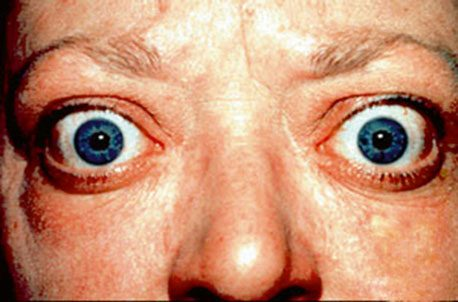

그림 7.21 인간 GnRH는 단백질분해적으로 절단되어 자유 호르몬과 함께 N-말단의 23아미노산 신호 서열 및 C-말단 부분의 56아미노산 GnRH 관련 단백질(GAP)을 생성하기 전에 92아미노산 프레프로-GnRH로 합성된다. 프레프로단백질에서 GnRH는 3개 아미노산 절단 부위 Gly-Lys-Arg에 의해 GAP와 분리된다. 절단 후, GnRH는 N-말단 글루타민의 피로글루타메이트로의 전환에 의해 추가로 변형된다.

생식세포 및 성선자극세포의 합성과 생식샘자극호르몬 FSH 및 LH의 분비로 이어진다. GnRH는 생식에 절대적으로 필요하며 약 2~4분의 짧은 반감기를 가진다. 그 부재는 LH 분비의 완전한 중단과 FSH 분비의 감소를 초래한다. 생식샘자극호르몬 분비를 유지하려면 뉴런에서 펄스로 GnRH 분비가 필요하며 예를 들어 GnRH의 연속 주입에 의한 펄스 생성의 간섭은 LH 및 FSH의 분비를 방해한다; 전자는 더 빠른 펄스 빈도에, 후자는 더 느린 펄스 빈도에 반응한다. 호르몬의 분비는 남성과 여성에서 다르다. 남성에서 GnRH는 일정한 빈도로 분비되는 반면, 여성에서는 펄스 빈도가 월경 주기의 단계에 따라 변한다.

펄스 생성은 키스펩틴, 신경키닌 B 및 디노르핀(KND 뉴런)을 포함하는 신경펩티드를 포함하는 뉴런의 고유한 특성으로 생각된다. 키스펩틴은 성장호르몬 분비를 자극하는 시상하부 수준에서 작용하는 145아미노산 폴리펩티드이다. 뇌하수체의 성선자극세포에 직접 작용하여 LH 방출을 자극하는 것으로 나타났다. 키스펩틴을 비활성화하는 일부 돌연변이는 인간에서 성선기능저하증과 불임으로 이어진다.

GnRH 수용체 GnRH 수용체(GnRHR)는 막을 7회 관통하는 소수성 도메인, 친수성 세포외 도메인 및 세포내 도메인을 가진 로돕신 유사 GPCR 슈퍼패밀리의 구성원이다. GnRHR은 Gq/11 단백질, 인지질분해효소 C의 활성화, IP3 및 DAG의 방출, PKC의 활성화 및 Ca2+의 동원으로 신호를 전달한다. PKC는 MAPK(미토겐 활성화 단백질 키나제) 및 ERK1/2(세포외 신호 조절 키나제) 경로와 칼모듈린과 같은 Ca2+ 이펙터를 자극하며 궁극적으로 생식샘자극호르몬과 그 분비의 자극을 초래한다.

GnRH 작용제 및 길항제 GnRH 작용제 주로 위치 6의 Gly-Leu 결합의 절단으로 인한 GnRH의 짧은 반감기를 극복하기 위해, 효능이 최대 200배 증가하고 반감기가 연장된 펩티드 유사체가 생산되었다. 일반적으로 사용되는 작용제인 류프롤리드, 나파렐린, 트립토렐린, 히스트렐린, 고세렐린 및 부세렐린의 합성에서 각 경우에 Gly 대신 D-아미노산 또는 D-아미노산의 유도체가 치환된다(표 7.5).

그림 7.22는 작용제 중 하나인, 자주 사용되는 10-펩티드 고세렐린의 구조식을 보여준다: pyroGlu-His-Trp-Ser-Tyr-D-Ser(tertBu)-Leu-Arg-Pro-AzGly-NH2. 구조의 비정상적인 특징은 3차 부틸-D-세린과 L-프롤릴 세미카르바지드이다. GnRH 작용제는 시험관 내 수정에서 조절된 난소 과자극, 자궁내막증과 같은 여성 장애에서 저에스트로겐 상태를 유도하고; 호르몬 민감성 전립선 및 유방암을 치료하고; 지연 사춘기 및 조숙 사춘기의 치료에; 특히 여성 트랜스젠더에서 호르몬 수준을 억제하고; 선천성 부신 과형성증의 경우; 그리고 개와 가축의 수의학 적응증에서 사용된다.

GnRH 작용제는 GnRHR에 결합하여 저장 분비 과립에서 LH, FSH, 테스토스테론 및 디하이드로테스토스테론 방출의 초기 일시적이지만 강렬한 급증("플레어 효과")을 생성한 후 GnRHR의 포화 및 하향 조절로 호르몬 수준의 감소로 이어진다. 전립선암에서 LH 생산의 궁극적인 억제는 차례로 암세포의 지속적 성장에 필요한 테스토스테론과 디하이드로테스토스테론을 억제한다. 테스토스테론 수치를 억제하는 데 3-4주가 걸릴 수 있으며 이 기간 동안 테스토스테론 급증이 전립선암의 증상을 악화시킬 수 있다. 플루타미드 및 비칼루타미드와 같은 항안드로겐이 호르몬 급증의 원치 않는 효과를 제한하는 데 사용되지만 이들은 간 및 폐 독성, 혈소판감소증 및 열감을 포함한 자체 부작용을 가지며 LH 유발 테스토스테론 및 디하이드로테스토스테론 급증을 예방하지 못한다.

GnRH 길항제 세트로렐릭스, 아바렐릭스, 데가렐릭스 및 가니렐릭스와 같은 GnRH 길항제는

펩티드 호르몬 표 7.5  생식샘자극호르몬분비호르몬(GnRH)과 그 중요한 작용제 및 길항제의 구조 비교
| 아미노산 위치 | 1 | 2 3 | 4 5 6 | 7 8 | 9 10 |
| --- | --- | --- | --- | --- | --- |
| GnRH-Ia | pyroGlub |  |  |  |  |
|  |  | His Trp | Ser Tyr Gly | Leu Arg | Pro Gly-NH2 |
| GnRH-IIc | pyroGlu | His Trp | Ser His Gly | Trp Tyr | Pro Gly-NH2 |
작용제
| 류프롤리드 | pyroGlu | His Trp | Ser Tyr D-Leu | Leu Arg | Pro에틸- |
| --- | --- | --- | --- | --- | --- |
(Lupron®) 아미드 나파렐린 pyroGlu His Trp Ser Tyr 나프틸 Leu Arg Pro Gly-NH2 (Synarel®) D-Alad 트립토렐린 pyroGlu His Trp Ser Tyr D-Trp Leu Arg Pro Gly-NH2 (Trelstar®) 히스트렐린 pyroGlu His Trp Ser Tyr N-벤질 Leu Arg Pro에틸- (Supprelin®) -D-His 아미드 고세렐린 pyroGlu His Trp Ser Tyr t-Bu-D- Leu Arg Pro AzGly-NH2 (Zoladex®) Ser 부세렐린 pyroGlu His Trp Ser Tyr t-Bu-D- Leu Arg Pro에틸- (Suprefact®) Ser 아미드 길항제 세트로렐릭스 N-Ac-나프- Cl-D- Py-D- Ser Tyr D-Cit h Leu Arg Pro D-Ala- (Cetrotide®) D-Alae Phef Alag 아미드 아바렐릭스 N-Ac-나프- Cl-D Py-D- Ser N-Me D-Asp Leu N-이소- Pro D-Ala- (Plenaxis®) D-Ala -Phe Ala -Tyr 프로필 아미드 -Lysi 데가렐릭스 N-Ac-나프- Cl-D Py-D- Ser hopca aca-D- Leu MeEt Pro D-Ala- (Firmagon®) -Phe j Phe k D-Ala -Phe Ala -Lys l 아미드 가니렐릭스 N-Ac-나프- Cl-D Py-D- Ser Tyr N,N-Et2 Leu N,N-Et2 Pro D-Ala- (Antagon®) D-Ala -Phe Ala -D-Harm -L-Harn 아미드
아미노산은 일반적인 세 글자 약어로 지정되며 달리 명시되지 않는 한 L-형이다. 인간 GnRH(동형 I) 서열의 다른 위치에서의 아미노산 변화는 빨간색으로 강조된다. 모든 작용제와 길항제는 아세테이트 염으로 사용된다. 트립토렐린은 또한 파모에이트로 사용된다. a피로글루타메이트 b인간 시상하부에서 분리된 원래 10-펩티드 동형 c인간을 포함한 포유류 종의 뇌에서 최근에 발견된 두 번째 동형. 척추동물에 널리 분포 d3-(2-나프틸)-D-Ala e아세틸-D-3-(2′-나프틸)-Ala fD-4-클로로페닐-Ala gD-3-(3′-피리딜)-Ala hD-시트룰린 iN(ε)-이소프로필-Lys j4-[[[(4S)-헥사하이드로-2,6-디옥소-4-피리미디닐]카르보닐]아미노]-Phe k4-[(아미노카르보닐)아미노]-D-Phe lN6-(1-메틸에틸)-Lys mN9,N10-디에틸-D-호모아르기닐 nN9,N10-디에틸-L-호모아르기닐

GnRH 유사체의 안전성 표 7.6은 규제 기관이 발행한 승인 적응증, 경고 및 주의사항과 일반적으로 사용되는 GnRH 작용제 및 길항제의 가장 흔하고 심각한 부작용을 요약한다. 경증에서 중등도의 목록은

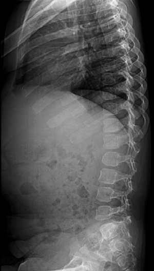
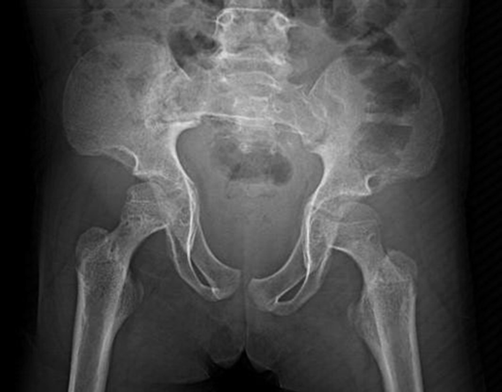

그림 7.22 GnRH 작용제 고세렐린과 GnRH 길항제 세트로렐릭스의 합성 10-펩티드 분자 구조. 작용제는 열감, 두통 및 골다공증으로 나타나는 저에스트로겐증의 유해 징후와 증상을 유발한다. 우울증과 정서적 불안정도 흔하다. GnRH 길항제 후의 일반적인 이상반응은 열감, 두통, 체중 증가, 복통 및 난소 과자극이다. 두 그룹 모두에서, 아나필락시스를 동반한 중증 과민반응의 위험은 드물지만 실제적이며 특히 FDA 발행 블랙박스 경고가 있는 유일한 GnRH 유사체인 아바렐릭스에서 그러하다(표 7.6).

부갑상호르몬 부갑상호르몬은 혈중 칼슘 수준의 핵심 조절자이며 광물 항상성과 뼈 유지에 중요한 역할을 한다. 부갑상선의 주세포(세포내 및 혈청

펩티드 호르몬 표 7.6  GnRH 작용제 및 길항제에 대한 적응증 및 안전성 정보 a
| 일반명 및 상품명 | 적응증a | 경고 및 주의사항 | 부작용 |
| --- | --- | --- | --- |
| 작용제 |  |  |  |
| 류프롤리드 | 주사b: | 임신; 아나필락시스양 | 두통; 열감/발한; 무력증; 신체 통증; 질염; |
(Lupron®) | 진행성 | 증상. 노르에틴드론 | 메스꺼움/구토; 우울증, 체중 |
| 전립선암 | 아세테이트 병용 | 변화; 어지러움; 불면증/수면 장애; |
| 데포b: | 치료: 시각 | 성욕 변화; 아나필락시스; |
| --- | --- | --- | --- |
| 자궁내막증; | 장애d, 폐색전증, | 발진; 두드러기; 저혈압; |
| 자궁 | 혈전정맥염, CV | 말초 신경병증e |
| --- | --- | --- | --- |
| 평활근종 | 질환 위험 |  |
(섬유종)c |  |  |
| --- | --- | --- | --- |
| 나파렐린 | 자궁내막증; | 중추 조기 사춘기: | 여드름; 일시적 유방 확대; 질 출혈; 정서적 |
(Synarel®) | 중추 조기 | 치료 전 진단의 | 불안정; 일시적 음모 증가; 지루; 열감; |
| 사춘기 | 중요성f; 자궁내막증 | 뇌하수체 졸중g |
| --- | --- | --- | --- |
|  |  | 여성의 난소 낭종 |  |
| 트립토렐린 | 진행성 | 일시적 테스토스테론 | 열감; 신체 통증; 피로; 고혈압; |
(Trelstar®) | 전립선 | 증가; 골통; 척추 | 두통; 설사/구토; 골격통; 불면증; |
| 암h | 압박; 신경병증; | 발기 부전; 정서적 불안정; |
|  |  | 과민반응; 혈뇨; | 빈혈; 소양증; 요저류/감염 |
|  |  | 요도 폐쇄 |  |
| 히스트렐린 | 중추 조기 | 일시적 에스트라디올/ | 열감; 피로; 이식 부위 반응; 고환 위축; 발기 |
(Supprelin®; | 사춘기; | 테스토스테론 증가; | 부전; 신장애; |
| Vantas®) | 진행성 | 요도 폐쇄; 척추 | 여성형 유방; 성욕 감소; |
| 전립선암 | 압박; 이식 | 불면증; 변비; 두통; 우울증, |
|  |  | 삽입/제거 절차; | 관절통 |
|  |  | 고혈당 및 당뇨병; |  |
|  |  | CV 질환 |  |
| 고세렐린 | 플루타미드와 함께 | 종양 플레어i; | 열감; 성기능 장애; 요로 |
(Zoladex®) | 국소 전립선암; | 과민반응; | 증상; 일반, 골반 및 뼈 통증; |
|  |  | 고혈당 | 여성형 유방; 종양 플레어; 무력증; |
| 진행성 전립선암; |  |  |  |
|  |  |  | 골다공증; 과민반응; 고칼슘혈증; |
|  |  |  | 발진; 가려움; 여드름; 지루 |
| 부세렐린 | 수술이 필요하지 않은 | BP, 포도당, 골밀도 | 과민반응(아나필락시스, |
(Suprefact®) | 자궁내막증; | 모니터링; 위험 환자의 | 두드러기); 골통; 종양 |
|  |  | 우울증; 난소 | 플레어; 종양 압박; 수면 장애; |
| 뇌하수체 탈감작 | 과자극 | 두통; 혈전증; 우울증; |
|  |  | 증후군k; 치료 시작 시 | 어지러움; GI 장애; |
| 배란 유도; | 종양 플레어 | 골다공증; 성욕 감소; |
|  |  |  | 여성형 유방; 골격통; |
| 진행성 전립선암j |  |  | 여드름; 탈모 |
(계속)

표 7.6 (계속) 일반명 및 상품명 a 적응증a 경고 및 주의사항 부작용 길항제 세트로렐릭스 조기 LH 급증 억제 이전에 임신 배제; 난소 과자극 증후군; (Cetrotide®) 중증 알레르기의 배제 주사 부위 반응; 과민반응; 두통; 메스꺼움 아바렐릭스 진행성 증상성 블랙박스 경고: 알레르기 전신 알레르기 반응; (Plenaxis®) 전립선암m; 반응o; 처방자 제한p; 열감; 수면 장애; 유방 사지미(priapismn)으로 인한 전립선암q; 낮은 확대/불쾌감; 말초 부종; 유출; 테스토스테론 억제 효과 감소r. 기타: QT 두통; 변비; 두드러기; 어지러움; 요저류/ 감소 감염; 피로 데가렐릭스 진행성 전립선암 과민반응: 아나필락시스, 주사 부위 반응; 열감; (Firmagon®) 혈관부종, 두드러기; QT 간격 요통; 체중 증가; 간 트랜스아미나제, 연장; 치료 전 임신 배제 GGT 증가; 오한; 고혈압; 관절통; 요로 감염; 발기 부전; 여성형 유방; 고환 위축; 다한증; 골밀도 감소; 불면증 가니렐릭스 조기 LH 급증 억제 이전에 임신 배제; 복통(부인과); 태아 사망; (Antagon®) 중증 알레르기의 배제 두통; 난소 과자극 증후군; 질 출혈; 주사 부위 반응; 메스꺼움; 복통(GI)
BP 혈압, CV 심혈관, GGT 감마글루타밀전이효소, GI 위장관, LH 황체형성호르몬, urti 상부 호흡기 감염 aFDA 또는 EMA 또는 양쪽에서 승인 b데포 제제 및 피하 주사용 아세테이트로 제공 c자궁 평활근종(섬유종)으로 인한 빈혈 환자의 수술 전 혈액학적 개선을 위해 철 요법과 병용 d안구돌출, 복시, 편두통; 유두부종 또는 망막 혈관 병변이 발생하면 약물 중단 e드문 사건: 혈전색전증, ...

표 7.6 (계속) o 초회 용량 후 발생할 수 있음 p 오직 Plenaxis® Plus(Plenaxus 사용자 안전 프로그램)에 등록된 의사만 이 약물을 처방할 수 있음 q 진행성 전립선암의 완화 치료에 적응됨(적응증 참조) r Plenaxis®의 테스토스테론 억제 효과는 지속 용량에 따라 감소함 s 특히 IA군(예: 퀴니딘, 프로카인아미드) 및 III군(예: 아미오다론, 소탈롤) 항부정맥제를 복용하는 환자에서

그림 7.23 재조합 34아미노산 펩티드 rhPTH(1-34), 즉 테리파라타이드(Forteo®)는 인간 부갑상호르몬의 생물학적 활성 영역으로, 성숙한 84아미노산 호르몬의 34개 N-말단 아미노산과 동일한 서열을 가진다. 두 펩티드 간의 서열 상동성은 아미노 말단의 처음 13개 아미노산 중 8개로 제한되며 아데닐산 고리화효소의 활성화에 중요한 아미노산 1과 2(녹색)가 있다.

칼슘 농도 변화. 부갑상호르몬은 주로 신장과 뼈 조직에서 작용한다. 이 호르몬은 신장 조직에서 세뇨관의 칼슘(인산염은 아님) 재흡수와 1,25-디하이드록시비타민 D3의 합성을 촉진하는 반면, 뼈 조직에서 파골세포 골흡수를 증가시키고 조골세포를 자극한다. 따라서 부갑상호르몬은 칼슘 항상성과 골질량 증가에 필수적이다. 이는 골다공증 치료로서 임상에서 호르몬의 간헐적 사용으로 이어졌고 뼈 및 칼슘 항상성에서의 역할에 대한 추가 연구의 자극을 제공했다.

인간 부갑상호르몬의 구조 및 작용 인간 부갑상호르몬은 115아미노산 전구체인 프레프로부갑상호르몬으로 합성되며 첫 번째로 90아미노산 프로부갑상호르몬을 형성하고 마지막으로 분자량 9425 Da의 성숙한 84아미노산 호르몬을 형성하도록 절단된다. 34개 N-말단 아미노산(PTH(1-34); 분자량 4117.8 Da)은 성숙 호르몬의 생물학적 활성 영역을 구성한다(그림 7.23). 테리파라타이드로 알려진 이 단편은

악성 종양 관련 고칼슘혈증 증후군의 원인으로 확인했다. 139, 141 또는 173아미노산의 동형으로 존재할 수 있는 이 펩티드는 배아 발생 중 뼈 형성에 중요한 역할을 하는 것으로 밝혔다. 성숙 부갑상호르몬 PTH(1-34)와 합성 PTHrP(1-34)는 동일한 수용체 결합 특성과 친화성을 나타내며(아래 참조), PTH(1-34)와 유사하게 PTHrP의 생체 활성은 N-말단 도메인에 있는 것으로 나타났다. 세 펩티드(PTH(1-34), rhPTH(1-34), PTHrP(1-34)) 간의 서열 상동성은 아미노 말단의 처음 13개 아미노산 중 8개로 제한되며 아데닐산 고리화효소의 활성화에 아미노산 1과 2가 중요하다.

부갑상호르몬은 노출 패턴이 뼈 형성과 뼈 손실 사이의 균형을 결정하는 뼈 대사에 대한 "양날의 검"으로 기술되었다. 동화 또는 뼈 증가 효과는 짧거나 간헐적인 노출에서 발생하는 반면, 이화 효과는 높은 수준 또는 과잉 호르몬의 병리학적 상태에서 관찰된다. 이는 예를 들어 만성 신장 질환과 부갑상선기능항진증에서 발생하며 이 때 샘은 지속적으로 너무 많은 호르몬을 분비한다. 부갑상호르몬이 다면발현 효과를 나타낸다는 것은 이제 인정된다; 간헐적 투여는 중증 골다공증 환자에게 유익할 수 있지만 호르몬의 장기간 사용은 해로울 수 있으며 아직 완전히 이해되지 않았다.

부갑상호르몬 수용체 및 신호전달 부갑상호르몬의 효과는 주로 신장과 뼈와 같은 주요 표적 기관과 조골세포와 같은 세포에서 발현되는 상보적 수용체 PTH1R에 결합하고 활성화함으로써 매개된다. 호르몬은 또한 주로 중추 신경계, 췌장, 태반 및 고환에서 발현되는 두 번째 수용체 PTH2R에 결합한다. 두 수용체 모두 클래스 B GPCR에 속한다. PTH1R은 또한 PTH(1-34) 및 PTHrP를 인식하고 활성화된다. N-말단 단편의 잔기 1-14는

펩티드 호르몬

부갑상호르몬의 안전성 표 7.7은 규제 기관이 승인된 재조합 전체 길이 및 34아미노산 N-말단 단편의 부갑상호르몬에 대해 발행한 경고 및 주의사항과 지금까지 이 제제에 대해 기록된 주요 부작용을 보여준다. 지금까지 수행된 임상 시험에서 참가한 환자의 총 수는 적었고 대부분 여성이었다는 점에 유의하라. 성별 간 부작용 빈도의 차이는 관찰되지 않았다. 이는 65세 이상과 미만 환자의 비교에서도 마찬가지지만 지금까지 65세 이상 환자만 제한적으로 검토되었다. 부갑상호르몬 이후 뼈암 발생 가능성에 대해 FDA 블랙박스 경고가 발행되었지만 경고는 일부 쥐에서 골육종 발견에 기반한다; 현재 이 암이 호르몬을 복용하는 환자에서 더 발생할 가능성이 있는지는 알려져 있지 않다. 결과적으로, 이 잠재적 위험을 알리고 면밀히 추적하기 위해 승인된 제제는 위험 평가 및 완화 전략(REMS) 프로그램으로서만 제공된다. 기록된 가능한 심각한 부작용은 고칼슘혈증과 저칼슘혈증이다. 일반적인 부작용에는 감각이상, 두통, 메스꺼움, 설사, 구토 및 지각저하가 포함된다(표 7.7).

부갑상호르몬은 혈청 칼슘 수준을 증가시킬 수 있고 일부 약물의 수축성 효과는 칼슘 수준에 의해 영향을 받기 때문에, 디곡신과 같은 디기탈리스 화합물의 병용은 디곡신 독성을 초래한다. 따라서 두 약물을 모두 복용하는 환자는 필요한 경우 용량 조정과 함께 혈청 칼슘 및 디곡신 수준을 모니터링해야 한다. 부갑상호르몬 요법에 의해 항체가 유도된다. 부갑상선기능저하증 환자를 대상으로 한 소규모 위약 대조 연구에서 이러한 항체의 발생률은 24주 피하 투여 후 8.6%(35명 중 3명)였다. 부갑상선기능저하증 환자의

심혈관 사망률 증가와 관련이 있다. 실제로 부갑상선기능항진증이 없는 경우에도 부갑상호르몬은 심혈관 질환 및 사망률에 대한 예측 값을 가진 위험 인자로 점점 더 인식되고 있다. 스웨덴에서 두 지역사회 기반 코호트를 대상으로 한 최근 연구에서 부갑상호르몬은 무증상 및 임상 죽상경화증과 관련이 있는 것으로 나타났으며 데이터는 질병의 발생에서 호르몬의 역할을 뒷받침했다. 이 발견은 관상동맥 질환의 중증도와의 부갑상호르몬 연관성 및 중등도 만성 신장 질환에서 호르몬의 상승된 수준을 심혈관 위험 인자로 지목하는 이전에 발표된 결론과 일치한다.

뼈-신장 상호작용의 새로운 매개자로서의 역할과 뼈 질환에서의 중요성 외에도, 부갑상호르몬이 일부 심혈관 장애에서 혈관 상호작용을 매개할 가능성이 점점 더 높아 보인다. 이는 죽상경화증, 혈관 및 판막 석회화, 심장 비대 및 고혈압과 같은 장애에 대한 새로운 치료 통찰력과 예방 조치로 이어질 수 있지만 부갑상호르몬에 대한 새로운 적응증(들)은 의심할 여지 없이 그 자체로 용량 및 치료 기간 의존적인 이상반응 스펙트럼을 드러낼 것이다.

## 요약

* 종종 상당히 특이적인 생화학적 신호에 반응하여 합성 및 방출되는 호르몬은 신호 분자 또는 전달자로서, 특정 수용체를 통해 기관과 조직 간에 소통하여 인간 신체의 광범위한 생리적 및 행동 활동을 조절한다. 사용되는 다양한 호르몬 요법으로 인해 부작용은 집합적으로 수가 많고 범위가 넓으며 때로는 독특하지만 일부 이상반응을 이해하려는 과정에서 중요한 기전적 통찰력을 얻는 경우가 많았다.

* 펩티드 호르몬은 각각 9개의 아미노산만 가진 옥시토신과 바소프레신과 같은 작은 펩티드이거나, 51개의 아미노산을 가진 인슐린과 191개의 아미노산을 가진 성장호르몬처럼 다소 더 클 수 있다. 펩티드 호르몬은 종종 작용을 위해 방출되기 전에 더 큰 비활성 전구체 또는 프로호르몬의 절단에 의해 준비된다. 최초로 서열이 밝혀지고 재조합 DNA 기술로 합성된 최초의 단백질인 인슐린 외에도, 중요한 요법으로 사용이 승인된 다른 펩티드 호르몬에는 글루카곤, 글루카곤 유사 단백질-1, 성장 호르몬, 소마토스타틴, 바소프레신, 옥시토신, ACTH, GnRH 및 부갑상호르몬이 포함된다.

* 인슐린은 탄수화물과 지방의 대사 조절에 필수적인 펩티드 호르몬이다. 당뇨병 사례의 ~10%에서 나타나는 1형 당뇨병은 췌장의 랑게르한스 췌도에서 인슐린을 생산하는 베타 세포의 소실로 인한 인슐린 결핍으로 발생한다. 가장 흔한 유형의 당뇨병인 2형 당뇨병은 인슐린 저항성 및 때때로 인슐린 분비 감소를 특징으로 한다. 1형 질병과 달리, 2형 당뇨병은 비만, 불량한 식이, 신체 활동 부족 및 스트레스를 포함한 생활방식과 명백히 관련이 있다. 명확한 유전적 요소도 있는 것으로 보인다.

* 인슐린은 24아미노산 신호 서열을 가진 프로프로인슐린으로 췌장에서 생성되며 이후 제거되어 프로인슐린을 형성한다. 프로인슐린은 다시 절단되어 성숙하고 활성인 인슐린을 생성한다. 인슐린은 51아미노산(분자량 5808 Da)의 단백질로, 두 개의 이황화 결합으로 연결된 21아미노산 A 사슬과 30아미노산 B 사슬의 이량체이다. 세 번째 이황화 가교는 내부에 있으며 A 사슬의 두 시스테인을 연결한다.

* 마이크로몰 농도에서, 두 사슬 이황화 결합 인슐린 구조는 다른 인슐린 분자와 연합하여 이량체를 형성하고 아연 이온이 존재하면 이량체는 두 개의 추가 인슐린 이량체와 연합하여 육합체를 형성할 수 있다. 육합체는 중심에 두 개의 아연 이온을 가지며 각 단량체의 히스티딘 잔기에 배위 결합되어 있고 모든 6개 단량체는 T 형태를 취한다.

* 인슐린 수용체는 티로신 키나제 수용체 그룹에 속하는 ~320 kDa 이황화 결합 막관통 구조이다. 어댑터 단백질인 인슐린 수용체 기질 1(IRS-1)은 PI3K/Akt 및 Erk MAP 세포내 경로로의 신호전달에서 핵심 역할을 한다.

* 인슐린 제제는 일반적으로 초속성, 단시간, 중간시간 및 장시간 작용성으로 분류되며 이 중 처음 세 가지를 서로 다른 비율로 포함하는 프리믹스 제제가 자주 사용된다.

* 현대 펌프, 펜 장치 및 연속 혈당 모니터링의 사용은 특히 오래된 레귤러 인슐린 제제와 중성 프로타민 하게도른에 비해 우수한 혈당 조절을 제공하는 리스프로 및 글룰리신과 같은 초속성 인슐린 유사체에서 생리적 인슐린 분비에 가까운 상황을 달성할 수 있는 수단을 창출했다. 초속성 인슐린은 혈당 급증을 관리하기 위해 각 식전에 투여된다. 최근, 식사 시작 시 개별화된 용량으로 흡입 투여되는 초속성 인슐린 분말인 테크노스피어 인슐린(Afrezza®)에 대한 승인이 부여되었다.

* 예를 들어 2형 당뇨병 치료에 사용되는 다파글리플로진과 같은 나트륨-포도당 공수송체 2(SGLT2) 억제제는 세뇨관 포도당 재흡수를 감소시키고 설탕의 요중 배출을 유발하여 소변을 통한 포도당 배설을 강화하는 것처럼 보이는 새로운 계열의 잘 견디는 항당뇨제이다.

* 인슐린 유발 이상반응 중 최악은 저혈당, 고혈당 및 당뇨병성 혼수, 그리고 과민반응(I, III 및 IV형)이다.

* 랑게르한스 췌도의 췌장 알파 세포에서 생성 및 저장되는 펩티드 호르몬인 글루카곤은 포도당 항상성에 관여한다. 글루카곤 분비는 순환 포도당 수준과 연결되며 저혈당에서 방출이 자극되고 고혈당에서 억제된다. 반감기가 단 몇 분에 불과하며 글리코겐이 포도당으로 분해되는 것을 자극하는 간에서 작용한다. 인슐린과 함께 글루카곤은 혈당 수준을 조절하는 피드백 시스템을 형성한다.

* 재조합 글루카곤은 인간 호르몬과 동일한 29아미노산 단일 사슬 폴리펩티드이다. 글루카곤은 췌도 세포, 간, 신장 및 뇌의 세포막에 있는 수용체를 통해 작용한다. 글루카곤에 의해 활성화된 신호 경로는 인슐린 분비 증가로 이어진다.

* 글루카곤은 저혈당 치료에 승인되었다. 글루카곤의 또 다른 중요하고 유용한 활성은

위장관의 일부 방사선학적 진단 검사에서 위장관 운동 억제제로 호르몬이 사용될 때 활용되는, 비경구 투여 시 평활근을 이완시키는 능력이다.

* 외인성 글루카곤은 카테콜아민의 방출을 자극하며 이는 부신 수질 세포의 종양인 갈색세포종 환자에게 투여 시 갑작스러운 혈압 상승으로 이어질 수 있다.

* 이중 대비 방사선학적 절차에서 황산바륨 현탁액에 추가된 글루카곤은 때때로 진정한 과민반응으로 보이는 반응, 즉 피부 발진, 두드러기, 안와 주위 부종, 다형 홍반, 호흡 곤란 및 아나필락시스를 유발한다.

* "인크레틴 효과"는 경구로 전달된 포도당이 정맥 투여 후 관찰되는 분비 반응보다 2~3배 더 큰 인슐린 반응을 생성한다는 관찰을 설명한다. 위 억제 폴리펩티드(GIP)와 31아미노산 펩티드인 글루카곤 유사 펩티드-1(GLP-1)은 두 가지 주요 인크레틴이다. GLP-1 분비는 식사와 관련이 있으며 식사 섭취 후 GLP-1과 GIP는 인슐린 분비를 인슐린 반응과 인크레틴 효과를 모두 설명하는 정도로 강화한다. 두 호르몬의 인슐린 분비에 대한 효과는 상가적이지만 오직 GLP-1만이 글루카곤 분비를 억제한다. 인크레틴 효과는 식후 인슐린 분비와 내당능에서 중요한 역할을 한다.

* GLP-1의 인슐린 관련 특성은 이 펩티드가 2형 당뇨병 환자에게 귀중한 치료제가 되어야 함을 시사한다. 그러나 GLP-1의 치료 응용은 실용적이지 않다. 이 펩티드는 디펩티딜 펩티다제-4(DPP-4) 효소에 의해 빠르게 분해되기 때문이다(플라스마 반감기는 약 1-2분에 불과).

* 연장된 반감기를 가진 효능 있는 GLP-1 수용체 작용제를 추구하는 노력은 GLP-1 작용제 엑세나타이드, 리라글루타이드, 릭시세나타이드 및 알비글루타이드에 대한 규제 승인으로 이어졌다. 이들은 모두 GLP-1과 일부 서열 동일성을 보이며 DPP-4에 내성이 있다.

* GLP-1 수용체 작용제는 쥐에서 갑상선 C-세포 종양의 발견에 주의를 환기하는 FDA 블랙박스 경고를 지니며 작용제는 갑상선 수질암(MTC), MTC 가족력 또는 다발성 내분비 신생물 증후군 2형(MEN2) 환자에게 금기이다. 다른 경고 및 주의사항은 췌장염, 저혈당, 신장애 및 과민반응에 대한 것이다. 이상반응은 일반적으로 경미하고 심각하지 않다.

* 디펩티딜 펩티다제-4(DPP-4) 또는 글립틴의 억제제는 상대적으로 완만한 혈당 강하 활성을 가진 경구 활성 저혈당제 계열을 형성하며 2형 당뇨병 치료에 사용될 수 있다. 이 약물에 대한 경고 및 주의사항에는 급성 췌장염, 저혈당 및 과민반응의 가능성이 포함된다.

* 프람린타이드는 췌장의 베타 세포에 의해 합성되고 음식 섭취에 반응하여 약 100:1의 비율로 인슐린과 함께 분비되어 식후 기간의 포도당 조절에 기여하는 신경내분비 호르몬인 인간 아밀린의 합성 유사체이다.

* 반감기가 ~48분으로 짧은 프람린타이드는 위 배출을 늦추고, 식후 혈장 글루카곤의 상승을 감소시키며, 식욕을 줄여 칼로리 섭취를 감소시킨다.

* 프람린타이드 단독으로는 저혈당을 유발하지 않지만 인슐린에 추가하면 저혈당 위험이 증가하며 이는 특히 1형 당뇨병 환자에서 인슐린과의 병용 사용이 중증 저혈당 위험 증가와 관련이 있다는 FDA 블랙박스 경고에 반영된다.

* 인간 성장호르몬은 Cys53-Cys165 및 Cys182-Cys189 사이의 두 개의 이황화 결합과 22.125 kDa의 분자량을 가진 191개 아미노산 잔기의 단일 사슬이다. 재조합 호르몬(소마트로핀)은 자연 단백질과 동일한 구조를 가진다.

* 성장호르몬에 대한 승인 적응증: 아동-성장호르몬 결핍과 관련된 짧은 키 또는 성장 실패; 특발성 짧은 키; SHOX 결핍 및 재태 연령 대비 작은 출생 후 키 추격 실패; 터너 증후군; 및 프라더-윌리 증후군. 성인-소아기 또는 성인기 발병 성장호르몬 결핍 환자.

* FDA가 나열한 소마트로핀 제제에 대한 일반적인 이상반응은 주사 부위 반응 및 지방위축, 체액 저류, 말초 부종, 관절통, 근육통, 두통, 수근관 증후군/감각이상 및 고혈당이다. 성장호르몬은 포도당과 지질의 분해를 자극하며 포도당 및 지질 대사에서 인슐린의 효과를 길항한다.

* 장기적인 암 유발 사망률과 관련하여 소아기 동안 재조합 성장호르몬으로 치료받은 환자에 대한 확장된 역학 연구는 호르몬 치료 그룹에서 일반 인구의 예상 사망에 비해 사망 위험이 30% 증가한 것을 나타냈다.

* 페길화되고 돌연변이된 재조합 인간 성장호르몬 형태인 성장호르몬 수용체 길항제 페그비소만트는 수술 및/또는 방사선 요법 또는 소마토스타틴 유사체와 같은 다른 요법에서 충분히 혜택을 받지 못한 환자의 말단비대증 치료에 적응된다. 발행된 주의사항은 성장호르몬을 분비하는 종양의 확장 가능성; 포도당 내성 증가; 기능적 성장호르몬 결핍 상태; 간 효소 상승; 및 지방비대에 관한 것이다.

* 성장호르몬 자극에 반응하여 간에서 분비되는 인슐린 유사 성장 인자 1(IGF-1)은 성장호르몬과 독립적인 성장 자극 효과를 가진 성장 인자이다. IGF-1은 성장호르몬의 성장 촉진 효과, 특히 그 동화 및 유사분열 활동을 매개한다. IGF-1과 인슐린은 상동 서열을 공유하고 일부 중복되는 생물학적 활성을 나타낸다.

* IGF-1은 세 개의 분자 내 이황화 가교를 가진 70개 아미노산 단일 폴리펩티드 사슬이다. 혈장에서 IGF-1의 거의 100%는 IGF 결합 단백질(IGFBP)에 단백질 결합되어 있으며 ~80%는 여섯 개의 IGFBP 중 하나인 IGFBP-3에 결합되어 있다. 이는 IGF-1 한 분자, IGFBP-3 한 분자 및 분자량 88 kDa의 산불안정 단백질 한 분자의 140 kDa 삼중 복합체로 순환한다. IGF-1의 효과는 호르몬의 상보적 수용체 IGF-1R을 통해 매개되며 IGFBP와의 상호작용에 의해 조절된다.

* 현저한 성장 지연을 특징으로 하는 라론 증후군의 원인은 성장호르몬에 둔감한 것으로 밝혀졌다. 라론 증후군은 IGF-1을 생성하지 못한다. 재조합 IGF-1(rhIGF-1; 메카서민)은 중증 원발성 IGF-1 결핍, 특히 이 결핍이 있는 아동의 성장 실패 치료에 승인되었다.

두 번째 승인 적응증은 호르몬에 대한 중화 항체를 발생시킨 성장호르몬 유전자 결실 환자의 치료이다.

* 저혈당은 메카서민에 의해 유발되는 가장 흔한 부작용이다. 다른 이상반응에는 드물게 발생하는 알레르기 반응; 유두부종, 시각 변화, 두통 및 메스꺼움을 동반한 두개내 고혈압; 림프 조직 비대; 및 대퇴 골두 골단 미끄러짐이 포함된다.

* 성장 호르몬 억제 호르몬(GHIH)으로도 알려진 소마토스타틴은 뇌하수체에서 성장호르몬의 분비와 ACTH를 포함한 여러 다른 호르몬 및 췌장에 의한 인슐린과 글루카곤의 분비를 억제한다. 소마토스타틴은 또한 다양한 위장췌장 신경내분비 종양(GEP-NET)의 방출을 억제한다.

* 생리적으로 소마토스타틴은 14 및 28아미노산의 두 가지 활성 형태로 분비된다. 두 형태 모두 조직에서 발생하며 각각 소마토스타틴 수용체와 상호작용한다.

* 소마토스타틴은 간경변성 간 질환 환자의 급성 식도 정맥류 출혈 치료에 임상적으로 사용되었지만 순환 혈중 반감기가 약 1-3분에 불과하다. 따라서 더 긴 반감기를 가진 14개 미만의 아미노산을 모두 포함하는 합성 유사체가 개발되었으며 말단비대증, 카르시노이드 및 혈관활성 장 작용 종양 및 쿠싱병 치료에 사용된다.

* 자연 소마토스타틴과 그 합성 유사체는 다섯 가지 소마토스타틴 수용체 아형에 대해 다른 친화성을 나타낸다. 자연 호르몬이 다섯 가지 아형 모두를 인식하는 반면, 유사체인 옥트레오타이드와 란레오타이드는 수용체 아형 2와 5와 상호작용하고 쿠싱병 치료에 승인된 파시레오타이드는 아형 1, 2, 3 및 5에 결합하지만 4에는 결합하지 않는다.

* 소마토스타틴 유사체는 상당히 안전한 약물이지만 옥트레오타이드와 란레오타이드 모두에 대해 담석증 및 담낭 슬러지; 고혈당 및 저혈당; 갑상선 기능 이상; 및 심혈관 이상에 대한 경고 및 주의사항이 발행되었다. 파시레오타이드에 의한 ACTH의 현저한 억제는 순환 코르티솔 수준의 저하와 일시적 저코르티솔혈증 및 부신기능저하를 유발할 수 있으며 동반되는 허약, 피로, 메스꺼움, 구토, 저혈압, 고칼륨혈증 및 저혈당이 있다.

* 바소프레신은 위치 1과 6의 시스테인 사이에 이황화 가교를 가진 9-펩티드이다. 리신 바소프레신은 위치 8의 아르기닌을 리신 잔기로 대체한다. 바소프레신의 생리적 작용은 세 가지 바소프레신 수용체 아형 V1, V2 및 V3에 의해 매개된다.

* 아르기닌 바소프레신으로도 알려진 바소프레신은 두 가지 주요 작용을 가진다: 수분 보유의 조절과 혈관의 수축. 수분 보유는 신장 네프론의 집합관과 원위 세뇨관에서의 수분 재흡수에 의해 이루어진다. 혈관을 수축시킴으로써 바소프레신은 말초 혈관 저항을 증가시키고 결과적으로 동맥 혈압을 증가시킨다.

* 바소프레신 정맥 주사는 수액 및 카테콜아민에도 불구하고 저혈압이 지속되는 혈관 확장성 쇼크 성인의 혈압을 높이기 위해 2014년 FDA에 의해 승인되었다.

* 바소프레신의 합성 유사체로서 위치 1의 시스테인 탈아민과 위치 8의 L-아르기닌을 D-아르기닌으로 대체하여 바소프레신과 다른 데스모프레신은 중심성 두개 요붕증 및 뇌하수체 부위의 두부 외상 또는 수술 후 일시적 다뇨 및 다음증 관리를 위한 항이뇨 대체 요법으로 비강 스프레이로 사용이 승인되었다. 아세테이트염 데스모프레신 비강 스프레이는 혈우병 A 및 경증에서 중등도의 폰빌레브란트병(I형) 환자에도 적응된다. 경고 및 주의사항은 심혈관 장애 환자의 약간의 혈압 및 심박수 변화 가능성; 체액 및 전해질 불균형 환자의 저나트륨혈증; 및 심각한 알레르기 반응과 관련이 있다.

* 12-펩티드인 테를리프레신은 리신 바소프레신의 N-말단에 부착된 세 개의 글리실 잔기를 가진 프로드러그이다. 생체 내에서 글리실의 효소적 제거는 생물학적으로 활성인 리신 바소프레신을 생성한다. 적응증은 식도 정맥류, 노르에피네프린 내성 패혈성 쇼크 및 간신 증후군이다. V1 수용체를 통해 작용하여 테를리프레신은 평균 동맥압을 증가시키고 심박수를 감소시키며 불안정 협심증 및 여러 다른 심혈관 상태가 있는 환자에게는 투여해서는 안 된다(또는 엄격한 모니터링 하에 투여). 자궁 수축을 유발하고, 자궁 압력을 증가시키며, 자궁 혈류를 감소시킬 수 있으므로 임신 중에는 금기이다. 서맥, 말초 혈관 수축, 말초 허혈 및 고혈압과 같은 심장 및 혈관 장애가 가장 흔하고 심각한 부작용이다.

* 바소프레신 수용체 길항제 또는 밥탄은 아르기닌 바소프레신의 신장 수용체 결합을 차단하여 전해질 무함유 수분의 배설을 촉진함으로써 희석성 저나트륨혈증의 치료에 중요하다.

* 두 가지 밥탄이 임상 사용에 승인되었다. V1/V2 수용체 길항제 복합체인 코니밥탄은 정상 및 과용적 저나트륨혈증이 있는 입원 환자에서 혈청 나트륨 수준을 높이는 데 사용이 승인되었다. 주입 부위 반응이 일반적으로 관련 이상반응이다. 선택적 V2 수용체 길항제인 톨밥탄은 심부전, 간경변 및 부적절 항이뇨 호르몬 분비 증후군(SIADH) 환자를 포함한 정상 및 과용적 저나트륨혈증 치료에 승인되었다. 이 약물은 치료가 병원에서 시작되어야 한다는 FDA 블랙박스 경고를 지닌다.

* 옥시토신 주사는 분만 전 및 분만 후 사용을 위해 투여될 수 있다. 전자의 목적에서, 호르몬은 질 분만을 달성하기 위한 자궁 수축의 개시 또는 개선에 적응된다. 분만 후 상황에서, 옥시토신은 분만 3기 동안 자궁 수축을 생성하고 분만 후 출혈 또는 출혈을 조절하기 위해 투여된다.

* 모든 신경하수체 호르몬과 마찬가지로, 옥시토신은 위치 1과 6의 시스테인 잔기를 연결하는 이황화 가교를 가진 9-펩티드이다. 바소프레신 계열의 9-펩티드 호르몬 모두 위치 8에 염기성 아미노산(리신 또는 아르기닌)을 가지는 반면, 옥시토신은 중성 아미노산인 류신을 가진다. 수용체의 인식 및 활성화를 위해, 옥시토신은 위치 3에 이소류신을 필요로 한다.

* 바소프레신 V2 수용체가 옥시토신 수용체와 40%의 서열 동일성을 보이지만 후자는 옥시토신과 아르기닌 바소프레신을 유사한 고친화성으로 결합하는 반면, V2 수용체는 아르기닌 바소프레신을 옥시토신보다 ~400배 더 높은 친화성으로 결합한다.

* 옥시토신에 대한 경고 및 주의사항에는 자궁 파열, 고혈압 에피소드 및 지주막하 출혈로 인한 태아 사망과 산모 사망의 가능성이 포함된다. 호르몬이 사구체 여과액에서 수분 흡수를 증가시키는 항이뇨 효과가 있으므로 수분 중독도 고려해야 한다.

* 옥시토신 작용제 카르베토신은 주로 말초의 옥시토신 수용체를 활성화하며 특히 제왕절개 후 분만 후 출혈을 멈추는 데 사용된다. 카르베토신은 신장의 V2 수용체와 일부 낮은 친화성 결합을 보일 수 있으며 이는 특히 정맥 수액을 투여받는 환자에서 저나트륨혈증의 가능성을 배제할 수 없음을 의미한다.

* 옥시토신과 바소프레신의 억제제인 아토시반은 임산부의 임박한 조산 지연에 적응된다. 아토시반에 대한 이상반응은 일반적으로 경미하다.

* 코르티코트로핀 방출 호르몬(CRH)에 반응하여 뇌하수체 전엽에서 분비되는 부신피질자극호르몬(ACTH)은 부신에서 코르티솔의 분비를 자극한다.

* 241아미노산 폴리펩티드 프로오피오멜라노코르틴(POMC)의 39아미노산 단편인 ACTH는 POMC 분자의 아미노산 138-178을 나타낸다.

* 생물학적 활성에는 처음 24개 아미노산만 필요하므로, 이 24개 아미노산으로 구성된 코신트로핀이라는 합성 개방 사슬 펩티드가 합성되었다. 아미노산 1-20은 생물학적 활성의 최소 서열이다; 20개 잔기에서의 어떤 단축도 활성 손실로 이어진다. 정맥으로 투여되는 코신트로핀은 부신 기능 부전을 진단하거나 배제하기 위한 ACTH 자극 시험에 사용된다.

* 시상하부-뇌하수체 기능을 평가하는 데 사용되는 생식샘자극호르몬분비호르몬(GnRH)은 뇌하수체 전엽에 의한 두 생식샘자극호르몬인 황체형성호르몬(LH)과 난포자극호르몬(FSH)의 합성 및 분비를 자극하는 생식 캐스케이드의 개시에서 중심적 중요성을 가진다.

* 생식샘자극호르몬 분비를 유지하려면, 뉴런에서 펄스로 GnRH 분비가 필요하다. 펄스 생성의 간섭은 LH 및 FSH의 분비를 방해한다. 펄스 생성은 키스펩틴, 신경키닌 B 및 디노르핀을 포함하는 신경펩티드를 포함하는 뉴런(KND 뉴런)의 고유한 특성으로 생각된다.

* GnRH의 짧은 반감기를 극복하기 위해, 효능이 최대 200배 증가하고 반감기가 연장된 펩티드 유사체가 생산되었다. 일반적으로 사용되는 작용제인 류프롤리드, 나파렐린, 트립토렐린, 히스트렐린, 고세렐린 및 부세렐린의 합성에서 글리신 대신 D-아미노산 또는 D-아미노산의 유도체가 치환되었다. GnRH 작용제는 시험관 내 수정의 조절된 난소 과자극 및 자궁내막증에 사용된다;

호르몬 민감성 전립선 및 유방암 치료; 지연 사춘기 및 조숙 사춘기 치료; 트랜스젠더의 호르몬 수준 억제; 및 선천성 부신 과형성증의 경우에 사용된다.

* 세트로렐릭스 및 아바렐릭스와 같은 GnRH 길항제는 GnRH 작용제보다 더 빠른 화학적 거세를 생성하며 테스토스테론 급증 및 미세 급증 없이 그렇게 한다. 길항제는 시험관 내 수정 전에 LH 급증 및 내인성 배란 예방에 사용될 수 있다; 호르몬 민감성 유방암, 자궁내막증 및 자궁 섬유종이 있는 여성 치료; 그리고 남성의 양성 전립선 비대증에 사용될 수 있다.

* GnRH 작용제는 열감, 두통 및 골다공증으로 나타나는 저에스트로겐증의 유해 징후와 증상을 유발한다. GnRH 길항제 후의 일반적인 이상반응은 열감, 두통, 체중 증가, 복통 및 난소 과자극이다. 길항제 아바렐릭스는 과민반응에 대한 블랙박스 경고를 지닌다.

* 부갑상호르몬은 혈중 칼슘 수준의 핵심 조절자이며 광물 항상성과 뼈 유지에 중요한 역할을 한다.

* 부갑상호르몬의 84개 아미노산 중 34개 N-말단 아미노산(PTH(1-34))이 성숙 호르몬의 생물학적 활성 영역을 구성한다. 테리파라타이드로 알려진 이 단편은 재조합 DNA 기술로 제조되었으며 FDA에 의해 치료용 승인을 받고 Forteo®로 판매된다. 전체 길이 84아미노산 호르몬(FDA 승인, Natpara®로 판매)과 재조합 단편 rhPTH(1-34) 모두 골다공증 치료에 사용된다.

* 부갑상호르몬 이후 뼈암 발생 가능성에 대한 FDA 블랙박스 경고가 발행되었으며 승인된 제제는 REMS 프로그램을 통해서만 제공된다. 기록된 가능한 심각한 부작용은 고칼슘혈증과 저칼슘혈증이다. 감각이상, 두통, 메스꺼움, 설사, 구토 및 지각저하를 포함한 다양한 일반적인 부작용이 있다.

* 부갑상호르몬 요법의 장기 효과는 아직 결정되지 않았으며 계속 우려사항이다. 여러 관찰은 호르몬이 심혈관 질환의 병태생리에도 관련될 수 있음을 시사한다. 부갑상호르몬은 심혈관 질환 및 사망률에 대한 예측 값을 가진 위험 인자로 점점 더 인식되고 있다.

추가 읽기 인슐린 Hilgenfeld R, Seipke G, Berchtold H, et al. The evolution of insulin glargine and its continuing contribution to diabetes care. Drugs. 2014;74:911-27. Kahn CR, Weir GC, King GL, et al., editors. Joslin’s diabetes mellitus. 14th ed. Boston: Lippincott Williams and Wilkins; 2005.

Kumar S, O’Rahilly S, editors. Insulin resistance. Insulin action and its disturbances in disease. Chichester: Wiley; 2005. Menting JG, Whittaker J, Margetts MB, et al. How insulin engages its primary binding site on the insulin receptor. Nature. 2013;493:241-5. 글루카곤 Lefèbvre PJ. Glucagon and its family revisited. Diabetes Care. 1995;18:715-30. Mayo KE, Miller LJ, Bataille D, et al. International union of pharmacology. XXXV. The glucagon receptor family. Pharmacol Rev. 2003;55:167-94. Song WJ, Mondal P, Wolfe A, et al. Glucagon regulates hepatic kisspeptin to impair insulin secretion. Cell Metab. 2014;19:667-81. 글루카곤 유사 펩티드-1(GLP-1) Brubaker PL, Drucker DJ. Structure-function of the glucagon receptor family of G-protein-coupled receptors: The glucagon, GIP, GLP-1, and GLP-2 receptors. Recept Channels. 2002;8:179-88. Chalmer T, Almdal TP, Vilsbøll T, et al. Adverse drug reactions associated with the use of liraglutide in patients with type 2 diabetes - focus on pancreatitis and pancreas cancer. Expert Opin Drug Saf. 2015;14:171-80. Ferdinand KC, White WB, Calhoun DA, et al. Effects of the once-weekly glucagon-like peptide-1 receptor agonist dulaglutide on ambulatory blood pressure and heart rate in patients with type 2 diabetes mellitus. Hypertension. 2014;64:731-7. Holst JJ. The physiology of glucagon-like peptide 1. Physiol Rev. 2007;87:1409-39. Kim W, Egan JM. The role of incretins in glucose homeostasis and diabetes treatment. Physiol Rev. 2008;60:470-512. Scheen AJ. A review of gliptins for 2014. Expert Opin Pharmacother. 2015;16:43-62. Tibble CA, Cavaiola TS, Henry RR. Longer acting GLP-1 receptor agonists and the potential for improved cardiovascular outcomes: a review of current literature. Expert Rev Endocrinol Metab. 2013;8:247-59. 성장호르몬 Brooks AJ, Waters MJ. The growth hormone receptor: mechanism of activation and clinical implications. Nature Rev Endocrinol. 2010;6:515-25. Carter-Su C, Schwartz J, Smit LS. Mo...

인슐린 유사 성장 인자-1(IGF-1) Cianfarani S, Clemmons DR, Savage MO, editors. IGF-1 and IGF binding proteins. Basic research and clinical management. Endocrin Dev, vol 9, Basel: Karger; 2005. Keating GM. Mecasermin. BioDrugs. 2008;22:177-88. Rosenbloom AL. Insulin-like growth factor-1 (rhIGF-1) therapy of short stature. J Pediatr Endocrinol Metab. 2008;21:301-15. 소마토스타틴 Baldelli R, Barnabei A, Rizza L, et al. Somatostatin analogs therapy in gastroenteropancreatic neuroendocrine tumors: current aspects and new perspectives. Front Endocrinol (Lausanne). 2014;5:7. doi:10.3389/fendo.2014.00007.eCollection2014. Møller LN, Stidsen CE, Hartmann B, et al. Somatostatin receptors. Biochim Biophys Acta. 2003;1616:1-84. Reubi JC, Schonbrunn A. Illuminating somatostatin analog action at neuroendocrine tumor receptors. Trends in Pharmacol Sci. 2013;34:676-88. 바소프레신 Holmes CL, Patel BM, Russell JA, et al. Physiology of vasopressin relevant to management of septic shock. Chest. 2001;120:989-1002. Kaufmann JE, Oksche A, Wollheim CB, et al. Vasopressin-induced von Willebrand factor secretion from endothelial cells involves V2 receptors and cAMP. J Clin Invest. 2000;106:107-16. Nielsen S, Chou CL, Marples D, et al. Vasopressin increases water permeability of kidney collecting duct by inducing translocation of aquaporin-CD water channels to plasma. Proc Natl Acad Sci U S A. 1995;92:1013-7. 옥시토신 Gimpl G, Fahrenholz F. The oxytocin receptor system: structure, function, and regulation. Pharmacol Rev. 2001;81:629-83. MacDonald K, MacDonald TM. The peptide that binds: a systematic review of oxytocin and its prosocial effects in humans. Harv Rev Psychiatry. 2010;18:1-21. 부신피질자극호르몬(ACTH) Hamilton DD, Cotton BA. Cosyntropin as a diagnostic agent in the screening of patients for adrenocortical insufficiency. Clin Pharmacol. 2010;2:77-82.

생식샘자극호르몬분비호르몬(GnRH) Armstrong SP, Caunt CJ, Fowkes RC, et al. Pulsatile and sustained gonadotropin-releasing hormone (GnRH) receptor signaling. J Biol Chem. 2009;284:35746-57. Flanagan CA, Millar RP, Illing N. Advances in understanding gonadotropin-releasing hormone receptor structure and ligand interactions. Rev Reprod. 1997;2:113-20. Moreau J-P, Delavault P, Blumberg J. Luteinizing hormone-releasing hormone agonists in the treatment of prostate cancer: a review of their discovery, development, and place in therapy. Clin Ther. 2006;28:1485-508. Schally AV. Luteinizing hormone-releasing hormone analogs: their impact on the control of tumorigenesis. Peptides. 1999;20:1247-62. 부갑상호르몬 Crane JL, Cao X. Bone marrow mesenchymal stem cells and TGF-β signaling in bone remodeling. J Clin Invest. 2014;124:466-72. Hagström E, Michaëlsson K, Melhus H, et al. Plasma-parathyroid hormone is associated with subclinical and clinical atherosclerotic disease in 2 community-based cohorts. Arterioscler Thromb Vasc Biol. 2014;34:1567-73. Jilka RL. Molecular and cellular mechanisms of the anabolic effect of intermittent PTH. Bone. 2007;40:1434-46.

## Chapter 8

## 당단백질 호르몬

생물 반응기에서 배양된 중국hamster 난소(CHO) 세포에서 FSH 특화 항체를 이용하여 등전체 프로파일이 일관된 고품질 정제 제품을 얻는다. 재조합 제제에는 LH가 포함되어 있지 않으며 그 물리화학적, 생물학적, 면역학적 특성이 뇌하수체 및 요원성 FSH(보통 urofollitropin이라 칭함)와 비교하여 동등함이 입증되었다. 연구에 따르면 urofollitropin과 재조합 FSH는 배란 유도에 있어 동등하게 효과적이며 잘 내약성을 보이고 인체 폐경기 생식선 자극호르몬은 임신 결과에 있어 urofollitropin과 동등한 효과를 보인다. 여성과 남성 모두에게 FSH는 생식세포의 성숙과 성장에 필요하다. 여성에서 FSH는 난소 내 난포의 성장과 모집을 자극하며 궁극적으로 난자 생산을 촉진한다. 대부분의 경우 순수 FSH(예: follitropin alfa)만으로도 LH를 추가하지 않고 난포 성장을 유도할 수 있지만 최적의 난포 발달에는 특히 LH 결핍 여성, 그리고 가장 특히 성선자극호르몬 저분비성 성기능저하증 환자에게 LH가 요구된다. 과도한 LH는 난포 성장을 정지시킬 수 있다. 난포가 성숙하면 에스트라디올 분비가 시작되어 시상하부와 뇌하수체에 영향을 미쳐 GnRH와 LH의 신속한 방출을 초래한다. 에스트라디올 수준의 상승은 시상하부에서의 GnRH 생산을 억제하고 FSH 생산의 감소를 유도한다. 폐경기에는 FSH 수준이 증가하고 FSH 수용체의 하향 조절이 일어나며 남아 있는 모든 난포는 더 이상 FSH 수용체를 갖지 못한다. 남성에서 FSH는 정원세포를 2차 정원세포로 자극하고 세르톨리세포와 상호작용하여 정자형성을 촉진한다.

**구조 및 작용 기전** LH 및 TSH와 마찬가지로, FSH는 뇌하수체 전엽에서 이온성 및 소수성 상호작용으로 결합된 두 개의 비공유결 당단백질 소단위로 분비된다. 소단위는 공통 α 소단위와 호르몬 특화 β 소단위로, 각각 92개(분자량 ~10.2 kDa) 및 111개의 아미노산(분자량 ~10.5 kDa)으로 구성된다. α 소단위는 Asn 51과 Asn 78에서 당화되어 있으며 3개의 메티오닌과 10개의 시스테인 잔기를 보유하고 이 중 5개의 내부 이황화 결합을 형성한다. β 소단위는 Asn 7과 Asn 24에 올리고당을 보유하고 1개의 메티오닌, 12개의 시스테인, 6개의 내부 이황화 결합을 갖는다. Follitropin alfa는 최초의 재조합 형태의 FSH였다. 요에서 분리된 천연 호르몬과 동일한 아미노산 서열을 가지며 이후 개발된 재조합 follitropin beta도 동일하다. 두 재조합 제제 모두 천연 FSH와 유사하지만 동일하지 않은 올리고당 사슬을 가지고 있다. 현재 승인되어 시판 중인 두 가지 재조합 FSH 제제(Gonal-f® 및 Puregon® follitropin beta) 외에, 세 번째 재조합 FSH 제제인 Ovaleap®이 2013년 EMA에 의해 승인되었다. Ovaleap®은 follitropin alfa 바이오시밀러(13장 참조)이며 대조약은 Gonal-f®이다. 시험관 수정을 위한 조절된 난소 과자극화에서 follitropin alfa와 beta의 사용을 비교한 연구에서, 두 재조합 제제는 회수된 난자 수에서 유사한 결과를 보였으나 follitropin beta는

**난포 자극 호르몬** 403 **그림 8.1** 부분 탈당화된 인간 난포 자극 호르몬(FSH) 복합체의 결정 구조로, 2.9Å 해상도에서 곡선형 보수 수용체의 세포외 호르몬 결합 영역과 결합되어 있다. 이 구조는 단백질 데이터뱅크 RCSB PDB 파일 1XWD에서 가져왔다(Fan QR, Hendrickson WA. Crystal structure of human follicle stimulating hormone complexed with its receptor. Nature. 2005;433:269-77). 보다 낮은 임신율과 함께 총 생식선자극호르몬 투여량이 현저히 적음에도 불구하고 현저히 높은 에스트라디올 수준과 연관되었다. 난소 난포와 성숙한 난자의 성숙 유도 및 에스트로겐 생산에서, 표층 과립세포에 존재하는 FSH는 먼저 G 단백질 결합 수용체의 대형 N-말단 기 ectodomain에 결합한다(그림 8.1). 이 과정에서 N-말단 영역의 높은 친화력 호르몬 결합 하부도메인과 신호 특이성에 관여하는 C-말단의 두 번째 하부도메인과 상호작용한다. 2단계 단량체 수용체 활성화 기전으로 추정되는 과정에서, 높은 친화력 사이트에의 결합이 FSH 분자에 구형태 변화를 유도하여 수용체의 황산화된 타이로신 sTyr335에 특화된 결합 주머니를 생성하고 이후 sTyr이 주머니로 끌려 들어간다. 신호전달은 세포외 조절 키나제(ERKs), p38 미토겐 활성화 단백질 키나제(MAPKs), 포스파티디놀-3-키나제(P13K) 등 여러 신호전달 연쇄를 통해 이루어진다. 단백질 키나제 A(PKA)는 이 모든 신호전달 사건은 물론 cAMP와 같은 전사 인자의 인산화 및 히스톤 H3의 인산화를 통한 크로마틴 리모델링 촉진을 개시하는 것으로 보인다. PKA는 ERK, p38 MAPK, P13K 경로의 활성도를 향상시킨다. 이 모든 복잡성 속에서, 서로 다른 신호전달 연쇄 간의 교차-talk가 필요함이 명백하다.

**난포 자극 호르몬의 적응증 및 사용법** 여성에서 FSH는 배란 유도 및 보조생식술에 사용된다. FDA에 따르면, 이 호르몬은 불임의 원인이 기능적이고 일차 난소 기능 부전이 아닌 무배란 환자에서 배란 및 임신을 유도하기 위해 적응증을 갖는다. FSH는 또한 보조생식술 프로그램에 참여하는 배란 환자에서 다수의 난포 발달을 위한 적응증을 갖는다.

남성에서 FSH는 일차 및 이차 성선자극호르몬 저분비성 성기능저하증 환자 중 불임이 일차 고환 기능 부전으로 인한 것이 아닌 환자에서 정자형성 유도를 위해 사용된다. FSH 수용체는 광범위한 종양의 혈관 표면에서 선택적으로 발현되며 이 호르몬이 혈관화를 촉진하는 것으로 알려져 있어, FSH와 그 수용체의 길항제를 항종양 혈관신생 치료로 사용할 가능성을 제기한다.

**경고 주의사항 및 이상반응** FSH에 따른 난소 비대 및/또는 과자극화는 규제 기관의 경고 대상이다. 경도에서 중등도의 비대는 때때로 복부 증상을 동반하여 생식선자극호르몬과 hCG를 투여한 환자의 약 20%에서 발생하지만 이 상태는 보통 2-3주 이내에 호전된다. 이 단계에서는 난소 과자극 증후군(OHSS) 및 다수 배란의 발생 가능성을 줄이기 위해 hCG를 투여해서는 안 된다. 이 경고는 무배란 및 시상하부 저생식선 기능저하증 환자에게 특히 중요하다. 경도 OHSS의 임상 증상에는 위장관 문제, 유방통, 난소 비대가 포함된다. 중증 OHSS는 며칠 내에 빠르게 진행될 수 있으며 심한 흉통, 구역, 구토 및 체중 증가가 조기 경고 징후로 나타난다. 증상으로는 복통 및 복부 팽만, 위장관 증상, 호흡곤란, 체중 증가, 무뇨, 혈액 농축, 요량 감소, 복수, 흉막 삼출액, 그리고 파열되기 쉬운 난소 난포로 인한 난소 비대가 포함된다. 간 기능 장애도 OHSS와 연관될 수 있다. 임상 시험에서 배란 유도 시, Gonal-f®로 치료된 228명의 여성 중 9명(3.9%)에서 OHSS가 발생하였다. 1명(0.4%)은 중증으로 분류되었다. 시험관 수정 치료 중 follitropin을 투여한 여성에서의 OHSS 발생률은 0~4.6% 사이이며 통합 연구 결과 전체 발생률은 2.6%로 보고되었다. follitropin 치료 후 난소 비틀림은 OHSS, 임신, 난소 난포, 다낭성 난소와 연관될 수 있다. 기타 생식기 합병증으로는 자궁외 임신이 발생할 수 있으며, 10-25%의 자연 유산율이 보고되었고, 약 20%의 임신에서 다수 배란이 생식선자극호르몬 및 hCG 치료 후 다태아 출산으로 이어진다. 혈전색전증(혈전정맥염, 폐색전증, 폐경색, 뇌졸중, 사지절단을 초래하는 동맥 폐색 등 합병증)은 OHSS와 관련하여 또는 별도로 발생할 수 있으며 급성 호흡곤란 증후군, 무기폐, 천식 악화와 같은 심각한 폐 질환도 보고되었다.

임상 시험에서 배란 유도 및 보조생식술 시 여성에서 10% 이상의 환자에게 발생한 이상반응은 두통, 난소 난포, 구역, 상부 호흡기 감염이었다. 5% 이상의 환자에게 경험된 기타 이상반응은 경간 출혈, 난소 과자극화, 복통, 가스, 설사, 요통, 부비동염이었다. 남성에 대한 안전성 연구는 일반적으로 훨씬 적은 환자로 수행했다. 정자형성 및 생식력 유도를 위해 follitropin alfa를 투여받은 56명의 환자에서 34명의 환자에게 123건의 이상반응(7건의 중증)이 발생하였다. 가장 빈번하게 관찰된 이상반응은 여드름, 유방통, 피로, 여성형 유방, 주사 부위 통증, 정맥류이었다. follitropin alfa의 1093회 투여에서 적출, 자극, 통증 및 가려움으로 구성된 피부 반응이 20건(1.8%)의 투여에서 발생하였다. 치료된 환자에서 follitropin 제제의 유해 항체는 보고된 바 없는 것으로 나타났다.

**황체형성 호르몬** LH는 뇌하수체 전엽의 생식선자극세포에 의해 생성되며 여성과 남성 모두에게 생식에 필수적이다. 월경 주기에서 LH와 FSH는 주기 중반 급상승하여 난포기와 황체기를 생성한다. LH의 증가는 24-48시간 동안 지속되며, 배란과 난자 방출 및 잔류 난포를 황체로의 전환을 촉진하고, 이는 차례로 자궁 내막에 수정된 배아의 착상을 대비하여 프로게스테론을 생산한다. 황체 기능은 처음 2주 동안 유지되며 임신이 이루어지면 newly established 임신에 의해 hCG가 켜져 황체 기능이 추가로 유지된다. 남성에서 LH(때때로 간질세포자극호르몬, ICSH라고 불림)는 고환의 간질 라이디그세포에 작용하여 테스토스테론을 생산한다. 21세기 초까지, LH의 유일한 상업적 원료는 폐경 후 여성의 요에서 얻어졌다. 이 제제에는 LH와 FSH가 포함되어 있었으나, 종종 존재하는 미흡한 양의 LH를 1:1의 LH:FSH 작용 비율을 달성하기 위해 hCG로 보충해야 했다. 그 결과, 소위 인체 폐경기 생식선자극호르몬의 다른 제제들은 서로 다른 양의 hCG를 함유하게 되었다. Lutropin alfa(Luveris®)는 2001년 유럽연합에 최초로 등록되었으며 현재까지 유일한 재조합 인간 LH이다. 이 고품질 정제는 일관된 등전체로 구성되어 있으며 그 물리화학적, 면역학적, 생물학적 활성이 인간 뇌하수체 LH와 본질적으로 동일하다.

**구조 및 작용 기전** Lutropin alfa는 유전자 변형 중국 hamster 난소(CHO) 세포에서 생산된 재조합 이량체 당단백질로, 공통 α 소단위(92개의 아미노산, FSH, hCG, TSH와 공유)와 호르몬 특화 β 소단위(121개의 아미노산)의 두 비공유결 소단위로 구성된다. 올리고당 사슬은 α 소단위의 Asn52와 Asn78, β 소단위의 Asn30에 N-결합으로 부착된다.

LH와 hCG는 황체형성 호르몬/융모생식선자극호르몬 수용체(LHCGR), lutropin/융모생식선자극호르몬 수용체(LCGR) 또는 단순히 황체형성 호르몬 수용체(LHR)로 불리는 동일한 수용체를 공유한다. 이는 G 단백질 결합 수용체 계열에 속하는 트랜스 membrane 수용체로, 주로 난소 테카세포와 과립세포, 고환 라이디그세포에 위치한다. LHCGR 유전자는 FSH 수용체 및 TSH 수용체 유전자와 유사하다. 이 수용체는 674개의 아미노산을 보유하며 분자량은 약 85-95 kDa이다. LH(또는 hCG)가 수용체 ectodomain에 결합하면 수용체의 구형태 변화, G 단백질의 활성화 및 분리, cAMP 시스템의 활성화가 발생한다. 아데닐산 고리화효소는 조절 소단위 2개와 촉진 소단위 2개를 갖는 cAMP 의존성 PKA를 활성화한다. cAMP가 조절 소단위에 결합하여 방출된 촉진 소단위는 단백질의 인산화를 개시하며 궁극적으로 스테로이드 호르몬 생산 및 난포 성숙 과정의 생리적 작용을 일으킨다. LHR 매개 효과가 G 단백질-아데닐산 고리화효소-cAMP-PKA 경로로 진행된다는 것이 현재 일반적으로 합의되어 있지만 표적 세포의 증식 및/또는 분화와 같은 다른 LHR 의존적 사건에는 다른 경로가 관여한다.

**Lutropin alfa의 적응증 및 사용법** Lutropin alfa는 follitropin alfa와 함께 심한 LH 결핍을 동반한 불임 성선자극호르몬 저분비성 성기능저하증 여성의 난포 발달 자극에 적응증이 있다. lutropin alfa를 다른 제제 또는 재조합 형태의 FSH 또는 인체 요에서 유래한 FSH와 함께 투여하는 안전성과 유효성은 알려져 있지 않다. 용량 탐색 연구와 이중 맹검 무작위 시험 모두 성선자극호르몬 저분비성 성기능저하증 및 심한 LH 결핍을 동반한 여성에서 피하 투여 lutropin alfa에 대한 최적 난포 발달률의 유의한 증가를 입증하였다. Lutropin alfa는 일부 정상생식선기능 여성에게도 이점이 있을 수 있으나, 35세 이상의 여성에 대한 연구에서는 호르몬 투여 후 유익성이 나타나지 않았다.

**Lutropin alfa와 관련된 경고 주의사항 및 이상반응** 규제 기관과 lutropin alfa 제조사는 이 재조합 호르몬의 안전하고 효과적인 사용에 정기적이고 면밀한 난소 반응 모니터링이 필요함을 경고하고 있다. 난소 비대; 난소 비틀림(난소 동맥 또는 정맥을 폐색하는 난소 회전); 다태 임신, 임신 손실 및 자궁외 임신; 선천성 기형; 혈전색전증 사건; 그리고 양성 및 악성 생식기계 신생물에 대한 면밀한 관찰과 평가가 이루어져야 한다.

**인간 융모생식선자극호르몬** 407 루트로핀 알파에 대한 다양한 장기 및 체계 범주에서 관찰되는 광범위한 빈도의 이상반응(일반적 또는 드문)은 다음과 같이 요약할 수 있다: 일반적-신경계, 위장관 장애, 생식기계 및 유방 장애, 피부; 드문-면역계, 혈관계. Lutropin alfa(Luveris®)의 안전성은 성선자극호르몬 저분비성 성기능저하증을 동반한 152명의 불임 여성을 대상으로 한 임상 연구에서 평가되었다. 이들은 283개의 치료 주기에서 lutropin alfa와 follitropin alfa(Gonal-f®)를 투여받았다. 최소 2%의 환자에게 발생한 이상반응은 높은 빈도에서 낮은 빈도 순으로 다음과 같다: 두통, 복통, 구역, 난소 과자극화, 유방통, 난소 난포, 가스, 주사 부위 반응, 피로, 월경통, 난소 장애, 설사. 생식선자극호르몬 투여에 의한 배란 유도 후 임신에서 보고된 의학적 사건으로는 자연 유산, 자궁외 임신, 조산, 산후 발열, 선천성 기형이 포함된다.

**인간 융모생식선자극호르몬** 융모생식선자극호르몬(chorionic gonadotropin)이라는 이름은 라틴어 chordata(태반)에서 유래하였으며 gonadotropin은 이 분자가 생식선지향성이 있기 때문이다. 착상 후 태반의 융모상.syncytiotrophoblast에 의해 생산되며 hCG는 후기 난포 성숙을 자극하고 배란 전 난소 난포의 파열을 촉진한다. 난소의 과립세포 및 테카세포의 LHCGR(LH가 인식하는 동일한 수용체)을 통해 작용하며 hCG는 임신 초기에 황체의 생존력을 유지하여 프로게스테론과 에스트로겐을 첫 분기 동안 분비할 수 있게 한다. hCG와 LH의 주요 차이점은 생산 부위의 차이(LH는 뇌하수체 전엽 세포에서 생산됨), pI가 각각 3.5와 8이라는 점, 그리고 순환 반감기가 hCG는 ~37시간인 반면 LH는 25-30분에 불과하다는 점이다. 생물학적 활성 측면에서 hCG는 때때로 "슈퍼 LH"라고 불린다. 인정되지 않는 경우도 있지만 hCG는 자궁 혈관에서의 혈관신생 촉진; syncytiotrophoblast 세포 형성에서의 분화 과정 촉진; 태반 줄기의 성장 및 분화 촉진; 자궁 성장과 태아 성장의 일치; 태반 세포에 대한 면역 반응 예방; 착상에 관련된 신호전달 등 수많은 생물학적 기능을 가지고 있다. 사실, hCG는 각각 다른 세포 기원을 가칭 네 개의 독립적으로 기능하는 분자를 포괄하는 용어로 볼 수 있다. syncytiotrophoblasts가 생산하는 hCG 외에, 이 호르몬의 다른 형태로는 cytotrophoblast 세포가 생산하는 과당화 hCG, 뇌하수체 전엽의 생식선자극세포가 생산하는 황산화된 hCG 변이체, 그리고 일차 비태반성 악성종양에서 생산되는 hCG의 자유 β 소단위가 있다. 과당화 hCG는 착상 단계에서 세포 침윤과 성장을 촉진하는 자가분비호르몬이며; 뇌하수체 hCG는 월경 주기 동안 난포 성숙, 배란, 프로게스테론 생산을 촉진하는 LH와 유사하게 작용한다; 자유 β 소단위는 진행된 종양의 성장과 악성화를 촉진한다.

임산부가 이 호르몬의 가장 풍부한 원료이므로, 이를 치료용 hCG 제제 준비에 활용하였다. 재조합 형태 choriogonadotropin alfa(rhCG, Ovidrel®)가 제조되기 전까지, hCG는 임산부의 요에서 추출되었다(uhCG, Pregnyl®, Novarel®, Profasi®, Follutein®). 초기 안전성 및 유효성 연구에서, 국제 재조합 인간 융모생식선자극호르몬 연구그룹은 rhFSH로 난소 자극 후 배란 유도를 위해 198명의 WHO 2형 무배란 여성에게 피하 투여된 rhCG와 uhCG를 비교하였다. 두 제제는 배란 유도에서 동등한 유효성을 보였으나, 재조합 제품이 더 잘 내약성을 보였다. 그러나 이러한 다센터 생식력 시험의 분석과 보고에서, 결과 해석의 가능한 편향에 대한 비판이 제기되었다. 특히, 오차 추정치로 일반적으로 사용되는 "센터 내" 변이 대신 센터 간 변이를 사용해야 한다고 지적되었다. 더 최근에, Cochrane 체계적 문헌고찰에서 IVF 및 세포질내 정자 주입 주기에서 최종 난자 성숙 트리거를 유도하기 위한 피하 rhCG 및 고용량 rLH의 유효성과 안전성을 근육 투여 uhCG와 비교한 검색과 평가가 발표되었다. 저자들은 IVF에서 난포 성숙 달성에 있어 rhCG 또는 rhLH와 uhCG의 차이에 대한 증거가 없음을 발견하였으며 임신율과 난소 과자극 증후군 발생률은 그룹 간에 동등하였다고 결론지었다. 결론은 "uhCG는 IVF 및 세포질내 정자 주입 치료 주기에서 최종 난자 성숙 트리거를 위한 최선의 선택"이다.

**구조 및 작용 기전** HCG는 비공유결로 연결된 두 소단위로 구성된 이량체 당단백질로, FSH 및 LT와 공유하는 92개 아미노산의 α 소단위와 145개 아미노산의 호르몬 특화 β 소단위로 구성된다. 올리고당은 α 소단위의 Asn52와 Asn78(그림 8.2)에 N-결합되어 있으며 β 소단위의 Asn13, Asn30, Ser121, Ser127, Ser132, Ser138에 N- 또는 O-결합되어 있다. 천연 hCG는 단안테나 및 양안테나 N-결합 올리고당(각각 8개 및 11개의 당 잔기로 구성) 및 일부 O-결합 삼당을 보유하여 분자량 ~36 kDa이다. 분자량의 25-30%는 올리고당 사슬에서 비롯된다. 과당화 hCG는 주로 15개의 당 푸코실화 삼안테나 N-결합 올리고당과 6당 O-결합 올리고당을 보유하며 당화 정도에 따라 분자량 40-41 kDa(당 사슬에서 35-41%)를 나타낸다. CHO 세포에서 생산된 재조합 hCG(Ovidrel®)는 올리고당 가지형성 및 시알화 정도가 다른 인간 천연 호르몬과 유사하다.

LHCGR은 675개 아미노산의 G 단백질 결합 수용체로, hCG, LH, 과당화 hCG에 반응하지만 hCG 소단위에는 반응하지 않는다. hCG의 α 및 β 소단위는 각각 수용체 결합 및 수용체 특이성에 중요하다고 알려져 있다. hCG의 수용체 결합은 링결합 아데닐산 고리화효소를 활성화하여 ATP를 cAMP로 전환하며 이는 인산화 및 단백질 키나제 활성화의 선행 사건이다.

**인간 융모생식선자극호르몬** 409 **그림 8.2** NMR 분광학으로 연구된 인간 융모생식선자극호르몬의 α-소단위 용액 구조로, Asn78에 이안테나 당이 결합되어 있다. NMR 구조에 따르면 단백질은 Asn78의 당을 입체적으로 방해하는 반면, Asn78에 결합된 N-아세틸-D-글루코사민은 단백질을 친수성 환경으로부터 차폐한다. 이 구조는 단백질 데이터뱅크 RCSB PDB 파일 1HD4에서 가져왔다(Erbel PJA, Karimi-Nejad Y, Van Kuik JA, et al. Solution structure of the α-subunit of human chorionic gonadotropin (modeled with diantennary glycan at Asn78). Biochemistry. 2000;39:6012-21). MAPK 경로와 Janus 키나제 신호전달 경로의 신호전달이다. 모든 내분비 기능은 DNA 전사 또는 mRNA 생성을 포함하며 황체에서의 프로게스테론 생산은 콜레스테롤 측쇄 절단 효소의 관여에 의해 도움을 받는다. 이노시톨 포스포리피드 단백질 키나제 C도 hCG 매개 수용체 사건에 관여할 수 있으며 일부 결과는 hCG와 LH가 포스파제 C를 자극하고 이것이 단백질 키나제 C를 자극하며 LHCGR의 활성화로 이어짐을 나타낸다.

**융모생식선자극호르몬의 적응증 및 사용법** FDA의 표현을 빌리면, choriogonadotropin alfa(Ovidrel®)는 뇌하수체 탈감작을 받은 불임 여성에서 시험관 수정 및 배아 이식과 같은 보조생식술 프로그램의 일부로 난포자극호르몬으로 적절히 전치된 환자의 최종 난포 성숙 및 초기 황체화 유도에 적응증이 있다. 이 제품은 또한 불임 원인이 기능적이며 일차 난소 기능 부전이 아닌 무배란 불임 환자에서 배란 및 임신 유도에 적응증이 있다. 2011년 4월 최종 라벨링 개정 시, FDA가 승인한 인간 임신 요에서 유래한 hCG 및 chorionic gonadotropin 주사용 USP(Novarel®)의 적응증 및 사용법은 다음과 같다:

1. 해부학적 폐색으로 인한 것이 아닌 사춘기 전 음소환. 일반적으로 hCG는 사춘기에 하강이 이루어질 상황에서 고환 하강을 유도하는 것으로 알려져 있다. hCG는 따라서 향후 고환고정술이 필요한지를 예측하는 데 도움이 된다. 일부 경우 hCG 투여 후 하강이 영구적이지만 대부분의 경우 효과는 일시적이다. 치료는 일반적으로 4~9세 사이에 시작된다.

2. 불임이 일차 고환 기능 부전으로 인한 것이 아닌 남성의 선택된 성선자극호르몬 저분비성 성기능저하증(뇌하수체 결핍에 2차적인 성기능저하증) 사례.

3. 무배란의 원인이 2차적이고 일차 난소 기능 부전으로 인한 것이 아닌 무배란 불임 여성에서의 배란 및 임신 유도. 이 환자들은 인체 생식선자극호르몬으로 적절히 전치되어야 한다. FDA는 hCG가 비만 치료의 효과적인 보조 치료로 입증된 바 없으며 체중 감량 증가, 지방 분포 변화 또는 식이요법 관련 식욕 감소에 대한 실질적인 증거가 없음을 명시하고 있다.

요 또는 혈액에서의 hCG 존재는 착상된 배아를 나타내므로, hCG의 검출 및 측정은 임신 검사로 사용된다. 사용되는 시험 시약은 일반적으로 단클론항체이며 LH 또는 FSH를 검출하여 위양성 결론을 피하기 위해 호르몬 특화 β 소단위를 검출한다. 흥미롭게도, LHCGR은 해마, 시상하부, 뇌간을 포함하는 여성의 뇌에 존재하는 것으로 밝혀졌으며 이러한 발견은 임신 중 아침 메스꺼움의 가능한 설명일 수 있다는 추측을 낳고 있다.

**경고 주의사항 및 이상반응** uhCG 사용 시 관찰되는 주요 심각한 이상반응에 대한 경고는 OHSS 유도 가능성; 기존 난소 난포의 비대 및 파열로 인한 복강내 출혈; 다태 출산; 동맥 혈전색전증; 주사 용제에 세균 억제제로 포함된 벤질 알코올로 인한 미숙아의 gasping 증후군 주의 필요성; 아나필락시스 가능성이다. 가장 중요한 주의사항은 음소환 치료 환자의 조숙 사춘기 유도 가능성, 그리고 심장 및 신장 질환, 간질, 편두통 또는 천식 환자에서의 안드로겐 유체 저류이다. uhCG 후 가장 흔히 관찰되는 이상반응은 두통, 과민성, 불안, 우울, 피로, 부종, 조숙 사_duplicate, 여성형 유방, 주사 부위 통증이다. 전신성(아나필락시스, 혈관부종, 호흡곤란, 호흡 곤란) 및 피부(발진, 적출, 두드러기) 과민반응이 보고되었다. rhCG에 대한 경고 및 주의사항은 폐 및 혈관 합병증의 유무에 관계없이 여성의 난소 비대 및 OHSS 가능성, 그리고 혈전색전증으로 인한 혈관 및 폐 합병증 위험에 초점을 맞추고 있다. 보조생식술 임상 시험에서 흔히 나타나는 이상반응은 주사 부위 반응(통증, 적출, 타박상) 및 위장관 장애(복통, 구역, 구토)이다. 때때로/드물게 관찰되는 기타 이상반응으로는 자궁외 임신, 유방통, 경간 출혈, 질 불편 및 출혈, 안면 홍조, 생식기 칸디다증, 요로 감염, 두통, 요통, 발열, 전신 권태감, 감각 이상이 포함된다. rhCG의 배란 유도 임상 시험에서 가장 빈번하게 관찰된 이상반응은 주사 부위, 생식기계(난소 난포, 난소 과자극화), 및 위장관 장애였다. 상대적으로 드문 이상반응으로는 유방통, 복부 비대, 인후염, 상부 호흡기 감염, 고혈당증, 가려움증이 있었다. hCG 치료 후 임신에 따른 통제된 임상 시험 보고에서 다음과 같은 이상반응이 명시되었다: 자연 유산, 자궁외 임신, 조산, 산후 발열, 선천성 기형. 시판 후 조사에서 아나필락시스 및 경미하고 일시적인 피부 발진을 포함한 알레르기 반응 사례와 혈전색전증 사건이 확인되었다.

**갑상선 자극 호르몬** 갑상선자극호르몬 분비호르몬(TRH)은 뇌하수체를 자극하여 TSH를 생산하게 하며 이는 위에서 논의된 세 가지 생식선자극호르몬(FSH, LH, hCG)과 함께 당단백질 호르몬 가족을 구성한다. TSH는 뇌하수체 전엽의갑상선자극세포에 의해 합성 및 분비된다. TSH가 갑상선 상피세포 또는 종양 조직의 수용체 TSHR에 결합하면 요오드 흡수, 갑상글로불린의 합성 및 분비, 그리고 갑상선 여포세포에 의해 생산되는 대사의 티로신 기반 호르몬 조절자인 티록신(T4)(3,5,3′,5′-tetraiodothyronine) 및 트리아이오도타이로닌(T3)의 합성 및 분비를 자극한다. 정량적으로, 티록신(T4)은 혈액 중 주요 갑상선 호르몬으로 트리아이오도타이로닌(T3)에 비해 ~20:1 비율로 방출되지만 후자가 3-5배 더 활성이고 더 강력하다. T4는 T3보다 긴 반감기를 가지며 탈요소화효소에 의해 T3로 전환되므로 프로호르몬으로 볼 수 있지만 T4의 대부분이 혈장 단백질에 결합하므로 T3로 전환되는 비율은 소량(0.02-0.03%)에 불과하다. T4에서 T3로의 5′-탈요소화는 주로 갑상선, 간, 신장에서의 1형 탈요소화효소와 뇌하수체, 골격근, 태반, 지방 조직, 희소돌기교세포에서의 2형 탈요소화효소를 통해 이루어진다. 갑상선 호르몬은 신체의 거의 모든 세포에 작용하여 단백질, 탄수화물, 지방 대사를 조절하며 세포 분화와 발달에 필수적이다. TSH의 생산과 방출은 음성 피드백 기전에 의해 조절된다. T4와 T3의 낮은 농도는 호르몬의 합성과 분비 증가로 이어지는 반면, 높은 농도는 호르몬 방출 감소의 전조이다. 요오드는 T4와 T3의 생산에 필수적이며 결핍은 호르몬 생산 감소, 갑상선 비대, 그리고 궁극적으로 갑상선종으로 이어진다.

**구조 및 작용 기전** TSH는 2개의 N-연결 당화 점(Asn52, Asn78)을 포함하는 92개의 아미노산 잔기로 구성된 α 소단위와 1개의 N-연결 당화 점(Asn23)을 포함하는 118개의 잔기로 구성된 β 소단위가 비공유결로 연결된 이량체 당단백질이다. α 소단위는 hCG, LH, FSH의 α 소단위와 거의 동일하다. α 소단위는 수용체 결합에 관여하며 cAMP 생성에 관여하는 아데닐산 고리화효소 자극을 담당하는 것으로 알려져 있다. β 소단위는 TSH에 특화되어 있으며 따라서 수용체 특이성을 결정한다. 다른 당단백질 호르몬과 마찬가지로, TSH의 이량체 구조는 생물학적 작용에 필수적이다-자유 소단위는 비활성이다. CHO 세포에서 생산된 재조합 TSH(rhTSH, rhTSH alfa, thyrotropin alfa; 상표명 Thyrogen®)는 천연 인간 뇌하수체 호르몬과 동일한 아미노산 서열을 가지고 있다. 재조합 및 천연 호르몬 모두 당화된 혼합물로 구성되어 있다. 뇌하수체 TSH는 당이 바이안테나 및 트리안테나 올리고당에 아스파라긴으로 결합된 시알화 및 황산화 혼합물로 분비되는 반면, thyrotropin alfa는 시알화 당단백질만을 보유한다. 시알화 TSH에 비해, 말단 D-만노스, D-갈락토스, L-푸코스, N-아세틸-D-글루코사민 및 N-아세틸-D-갈락토사민 황산을 갖는 비시알화 TSH는 간세포 비시알당단백질 수용체에 의해 제거되어 반감기가 더 짧다. 반면, 시알화 TSH의 생물학적 활성은 상대적으로 낮은 것으로 보인다. Thyrotropin alfa는 뇌하수체 TSH보다 긴 반감기를 가지지만 TSHR에서의 친화력과 생물학적 활성은 낮다. TSH는 G 단백질 결합 TSHR을 통해 작용하여 아데닐산 고리화효소 및 포스파티디놀 경로를 활성화하고 이것이 차례로 티로신 키나제 연쇄를 활성화한다. 갑상선 여포세포에서의 이 경로 자극은 요오드 흡수, 갑상글로불린의 생산 및 방출 증가로 이어지며 이는 갑상선이 T4와 T3를 생산하는 데 사용된다. TSH와 hCG 및 그 수용체 간의 구조적 유사성으로 인해 TSHR이 hCG와 교차반응할 수 있으며 이는 임신 초기에 갑상선 호르몬 생산을 일으킬 수 있는 활성이다. 항체는 TSHR을 자극하여 TSH를 모방할 수 있다. 이러한 항체는 흔히 갑상선자극항체로 불리며 일원성 갑상선기능항진증 또는 자가면역갑상선염 3A형으로도 알려진 그레이브스병에 존재한다. 그레이브스병은 II형 과민반응(1장 "과민반응" 참조)으로 분류되는 자가면역 질환으로, 여성의 약 2%에 영향을 미치며, 비대하고 과활동적인 갑상선, 순환하는 T4와 T3의 과잉을 특징으로 하며, 심장, 순환기, 신경계, 피부, 눈의 장애를 일으킬 수 있다. 예를 들어, 안구 돌출(프로프시스)(그림 8.3)은 이 질환 환자에서 관찰되는 특징적인 안과 질환이다. 갑상선기능저하증은 T4 또는 T3 또는 둘 다의 결핍으로 인한 상태에 부여된 명칭이다. 하시모토병 또는 일원성(또는 선천성)갑상선기능저하증이 아마도 가장 잘 알려진 예일 것이다.

거의 전절제술을 시행한 갑상선암 환자를 대상으로 한 임상 시험에서 진단 또는 절제 목적으로 thyrotropin alfa를 사용 후 가장 흔히 관찰되는 이상반응은 구역, 구토, 두통, 어지러움, 피로, 설사, 감각 이상이다. 시판 후 조사에서 확인된 이상반응으로는 인플루엔자 유사 증상과 과민반응(주로 두드러기, 안면홍조, 가려움, 호흡곤란)이 포함된다. 뇌졸중 사례는 드물다.

**Thyrostimulin** 두 개의 새로운 인간 당단백질 호르몬 소단위로 구성된 새로운 이량체 당단백질 호르몬인 thyrostimulin은 TSHR에 높은 친화력을 보여 활성화시키지만 LHR 및 FSHR에는 작용하지 않는 것으로 밝혀졌다. 스타포드 대학교 의과대학 AJW Hsueh 연구실에서 처음 확인되고 연구된 이 이량체는 배양된 갑상선 세포의 cAMP 생성 및 티미딘 포합을 자극하고 in vivo에서 혈청 티록신 수준을 증가시키는 것으로 입증되었다. 저자들은 뇌하수체 전엽에서의 thyrostimulin 발현이 paracrine 기전을 시사하며 그 발견은 갑상선 외 TSH 수용체 시스템의 생리적 역할과 관련 당단백질 호르몬에 의한 수용체 신호전달의 구조-기능적 기반을 이해하는 데 기여할 수 있다고 진술하였다. 리포폴리사카라이드와 염증성 사이토카인이 thyrostimulin의 발현을 상향 조절하며 그 소단위의 발현은 뇌하수체, 부신, 중추신경계, 위장관 장기, 고환, 피부, 망막에서 관찰되었다. Thyrostimulin이 Brokken-Wiersinga-Prummel 루프, 즉 갑상선자극호르몬의 농도를 그 분비와 연결하는 초단일 피드백 조절에서의 역할이 제안되었다.

**요약**

* 당단백질 호르몬 가족은 세 가지 생식선자극호르몬과 네 번째 비생식선자극호르몬 구성원으로 이루어져 있다. 생식선자극호르몬은 원형 구성원으로 간주되는 난포자극호르몬(FSH), 황체형성호르몬(LH), 그리고 인간 융모생식선자극호르몬(hCG)이다. 갑상선자극호르몬(TSH)은 네 번째이자 비생식선자극호르몬 당단백질 구성원이다.

* FSH는 뇌하수체 전엽에서 이온성 및 소수성 상호작용으로 결합된 두 개의 비공유결 이질 당단백질 소단위로 분비된다. 소단위는 공통 α 소단위와 호르몬 특화 β 소단위로, 각각 92개(분자량 ~10.2 kDa) 및 111개의 아미노산(분자량 ~10.5 kDa)으로 구성된다. Follitropin alfa는 최초의 재조합 형태의 FSH이다. 요에서 분리된 천연 호르몬과 동일한 아미노산 서열을 가지며 이후 개발된 재조합 follitropin beta도 마찬가지이다.

415 요약

* FSH는 배란 유도에 사용되며 보조생식술 프로그램에 참여하는 배란 환자에서 다수의 난포 발달을 위한 적응증도 갖는다. 남성에서 FSH는 일차 및 이차 성선자극호르몬 저분비성 성기능저하증 환자 중 불임이 일차 고환 기능 부전으로 인한 것이 아닌 환자에서 정자형성 유도를 위해 사용된다.

* FSH에 따른 난소 비대 및/또는 과자극화는 규제 기관의 경고 대상이다. 시험관 수정 치료 중 follitropin을 투여한 여성에서의 난소 과자극 증후군(OHSS) 발생률은 0~4.6% 사이이다. follitropin 치료 후 난소 비틀림은 OHSS, 임신, 난소 난포, 다낭성 난소와 연관될 수 있다. 혈전색전증(혈전정맥염, 폐색전증, 폐경색, 뇌졸중, 사지절단을 초래하는 동맥 폐색 등 합병증)은 OHSS와 관련하여 또는 별도로 발생할 수 있다.

* Lutropin alfa는 공통 α 소단위(92개의 아미노산, FSH, hCG, TSH와 공유)와 호르몬 특화 β 소단위(121개의 아미노산)의 두 비공유결 소단위로 구성된 재조합 이량체 당단백질이다. LH와 hCG는 동일한 수용체를 공유한다.

* Lutropin alfa는 follitropin alfa와 함께 심한 LH 결핍을 동반한 불임 성선자극호르몬 저분비성 성기능저하증 여성의 난포 발달 자극에 적응증이 있다.

* 규제 기관과 lutropin alfa 제조사는 이 재조합 호르몬 사용 시 정기적으로 난소 반응을 면밀히 모니터링해야 함을 경고하고 있다. 난소 비대; 난소 비틀림; 다태 임신, 임신 손실 및 자궁외 임신; 선천성 기형; 혈전색전증 사건; 그리고 양성 및 악성 생식기계 신생물에 대한 면밀한 관찰과 평가가 이루어져야 한다.

* HCG는 자궁 혈관에서의 혈관신생 촉진; syncytiotrophoblast 세포 형성에서의 분화 과정 촉진; 태반 줄기의 성장 및 분화 촉진; 자궁 성장과 태아 성장의 일치; 태반 세포에 대한 면역 반응 예방; 착상에 관련된 신호전달 등 수많은 생물학적 기능을 가지고 있다.

* HCG는 비공유결로 연결된 두 소단위로 구성된 이량체 당단백질로, FSH 및 LT와 공유하는 92개 아미노산의 α 소단위와 145개 아미노산의 호르몬 특화 β 소단위로 구성된다. 재조합 hCG는 올리고당 가지형성 및 시알화 정도가 다른 요원성 인간 천연 호르몬과 유사하다.

* 재조합 hCG는 불임 여성에서의 최종 난포 성숙 및 초기 황체화 유도와 불임 원인이 기능적이며 일차 난소 기능 부전이 아닌 무배란 불임 환자에서의 배란 및 임신 유도에 적응증이 있다.

* FDA가 승인한 인간 임신 요에서 유래한 hCG의 적응증 및 사용법은 사춘기 전 음소환, 선택된 남성 성선자증호르몬 저분비성 성기능저하증 사례,

그리고 무배란의 원인이 2차적이고 일차 난소 기능 부전이 아닌 무배란 불임 여성에서의 배란 및 임신 유도이다.

* 요원성 hCG 사용 시 관찰되는 주요 심각한 이상반응에 대한 경고는 OHSS 가능성; 기존 난소 난포의 비대 및 파열로 인한 복강내 출혈; 다태 출산; 동맥 혈전색전증; 주사 용제에 세균 억제제로 포함된 벤질 알코올로 인한 미숙아의 gasping 증후군 주의 필요성; 아나필락시스 가능성이다.

* TSH가 갑상선 상피세포 또는 종양 조직의 수용체에 결합하면 요오드 흡수, 갑상글로불린(Tg)의 합성 및 분비, 그리고 갑상선 여포세포에 의해 생산되는 대사의 티로신 기반 호르몬 조절자인 티록신(T4)(3,5,3′,5′-tetraiodothyronine) 및 트리아이오도타이로닌(T3)의 합성 및 분비를 자극한다.

* TSH는 92개의 아미노산 잔기를 포함하는 α 소단위와 118개의 잔기를 포함하는 β 소단위로 구성된 이량체 당단백질이다. α 소단위는 hCG, LH, FSH의 α 소단위와 거의 동일하며 수용체 결합에 관여한다. β 소단위는 TSH에 특화되어 있으며 수용체 특이성을 결정한다.

* 항체는 TSH 수용체를 자극하여 TSH를 모방할 수 있다. 이러한 항체는 일원성 갑상선기능항진증 또는 자가면역갑상선염 3A형으로도 알려진 그레이브스병에 존재한다. 그레이브스병은 II형 과민반응으로 분류되는 자가면역 질환으로, 여성의 약 2%에 영향을 미치며, 비대하고 과활동적인 갑상선, 순환하는 T4와 T3의 과잉을 특징으로 하며, 심장, 순환기, 신경계, 피부, 눈의 장애를 일으킬 수 있다.

* 재조합 TSH 제제인 thyrotropin alfa는 FDA 및 EMA에 등록되어 진단 및 절제 목적으로 승인되었다. 갑상선절제술 후, 갑상선암 환자는 잔류 갑상선 조직 및 갑상선암의 자극을 예방하기 위해 갑상선 호르몬 억제 요법으로 추적 관찰될 수 있다. Thyrotropin alfa는 방사성 영상 검사의 유무에 관계없이 이 환자에서 혈청 갑상글로불린을 검사하는 진단 도구로 사용된다. Thyrotropin alfa는 또한 갑상선절제술을 시행하고 전이성 갑상선암의 증거가 없는 환자에서 잔류 갑상선 조직의 방사성 절제를 위한 보조 치료에도 적응증이 있다.

* Thyrotropin alfa는 갑상선암 전이 또는 일부 잔류 갑상선 조직이 있는 환자에서 혈중 갑상선 호르몬 농도의 일시적 상승을 일으킬 수 있다. 결과는 갑상선기능항진증에서 사망에 이르기까지 다양할 수 있다. Thyrotropin alfa 치료 후 잔류 갑상선 조직 또는 원격 전이의 급격하고 빠른 비대에 의해 급성 편마비, 편마비, 시력 상실, 후두 부종, 원위부 통증, 호흡곤란 증상이 나타날 수 있다. Thyrotropin alfa 투여 후 3일 이내의 뇌졸중 및 뇌졸중 유사 증상은 시판 후 보고의 대상이 되었다.

**추가 참고문헌** 417

**추가 참고문헌**

**난포자극호르몬**
Hunzicker-Dunn M, Maizels ET. FSH signaling pathways in immature granulosa cells that regulate target gene expression: Branching out from protein kinase A. Cell Signal 2006;18: 1351-9.
Jiang X, Dias JA, He X, et al. Structural biology of glycoprotein hormones and their receptors: Insights into signaling. Molec Cell Endocrinol 2014;382:424-51.
Jiang X, Liu H, Chen X, et al. Structure of follicle-stimulating hormone in complex with the entire ectodomain of its receptor. Proc Natl Acad Sci USA 2012;109:12491-6.
Practice Committee of the American Society for Reproductive Medicine, Birmingham, Alabama. Gonadotropin preparations: past, present, and future perspectives. Fertil Steril 2008;90: S13-20.

**황체형성호르몬**
Ascoli M, Fanelli, Segaloff DL. The lutropin/choriogonadotropin receptor, a 2002 perspective. Endocrin Rev 2002;23:141-74.
Dafau ML. The luteinizing hormone receptor. Annu Rev Physiol 1998;60:461-96.
Krause BT, Ohlinger R, Haase A. Lutropin alfa, recombinant human luteinizing hormone, for the stimulation of follicular development in profoundly LH-deficient hypogonadotropic hypogonadal women: a review. Biol Targets Ther 2009;3:337-47.

**인간 융모생식선자극호르몬(hCG)**
Cole LA. New discoveries on the biology and detection of human chorionic gonadotropin. Reprod Biol Endocrinol 2009;7:8 doi: 10.1186/1477-7827-7-8.
Cole LA. Biological functions of hCG and hCG-related molecules. Reprod Biol Endocrinol 2010;8:102. doi: 10.1186/1477-7827-8-102.

**갑상선 자극 호르몬**
Dietrich JW, Landgrafe G, Fotiadou EH. TSH and thyrotropic agonists: key actors in thyroid homeostasis. J Thyroid Res 2012:351864, 29 p. http://dx.doi.org/10.1155/2012/351864.
Gramza A, Schuff KG. Recombinant human thyroid stimulating hormone in 2008: focus on thyroid cancer management. Onco Targets Ther 2008;1:87-101.
Szkudlinski MW, Fremont V, Ronin C, et al. Thyroid-stimulating hormone and thyroid-stimulating hormone receptor structure-function relationships. Physiol Rev 2001;82:473-502.
## Chapter 9

# 9장. 치료용 승인 효소: 성공적인 효소 대체 요법을 향하여

## 가우처(Gaucher) 질환

점액다당류 저장 질환 또는 점액다당류증(mucopolysaccharidosis, MPS) 환자의 배양 피부 섬유모세포와 서로 다른 유전형의 세포를 이용한 실험에서 얻은 초기 증거는 라이소소스(some) 효소의 번역 후 수정이 기존에 결핍되어 있던 글리코사미노글리칸 분해(catabolism)를 교정할 수 있음을 시사하였다. 후속 연구에 따르면 이러한 라이소소스 저장 질환의 교정적 수정은 변형된 라이소소스 효소에 대한 D-만노스-6-인산의 보완적 수용체 인식에서 기인하였다. 이러한 연구들과 같은 기간에, 쥐에 주사된 라이소소스 효소가 빠른 제거를 피하고 만노스 잔기 인식으로 간 망상내피세포에 의해 특이적으로 흡수됨이 확인되었다. 중요한 것은, 보완적 만노스 수용체가 대식세포 표면에 존재하며 그 인식 범위가 이 당질을 넘어 N-아세틸-D-글루코사민 및 L-푸코스까지 확장됨이 입증되었다는 점이다. 수용체에 결합하면 효소는 신속하게 세포 내로 이동되어 라이소소스로 수송된다. 인산화된 만노스 잔기의 특이적 인식, 만노스 수용체 매개 라이소소스 효소 흡수, 그리고 이러한 수용체가 대식세포에 존재한다는 발견은 라이소소스 효소가 표적 세포에 의해 특이적으로 인식되어야 한다는 것을 증명하였다. 이러한 통찰은 전 세계적으로 출생 시 75,000명 중 1명의 빈도로 발생하는 I형 가우처 질환에 대한 최초의 성공적인 효소 대체 요법(ERT)으로 이어졌으며 이는 췌장(sphingolipid) 저장 장애 중에서 가장 흔한 것이다.

가우처 질환은 라이소소스 산성 β-글루코시다제 당단백질인 β-글루코세레브로시다제(글루코실세레라미다제; β-글루코실-N-아실스핑고신 글루코히드롤라제)의 결핍으로 인한 선천적 대사 이상이다. 이 효소는 β-D-글루코실세레마이드(글루코세레브로시드)를 글루코스와 세레마이드로 절단한다. 이 효소의 기질은 광범위하게 분포하는 세포막 성분이며 β-글루코세레브로시다제가 결핍되면 글루코세레브로시드와 기타 글리코리피드가 세포, 특히 대식세포 및 망상내피계의 다른 세포의 라이소소스에 20~100배까지 축적된다.

가우처 질환의 ERT 개발에서 획득한 지식과 경험의 직접적인 결과로서, 소수이지만 증가하고 있는 다른 라이소소스 저장 질환, 다시 말해 점액다당류 저장 질환 또는 점액다당류증(MPS)에 대해서도 성공적인 ERT가 개발되었다. 승인된 효소 대체 치료는 현재 두 번째 지방 저장 질환인 파브리(Fabry) 질환, 글리코젠 저장 질환인 폼페(Pompe) 질환, 및 MPS I, II, IVA, VI형에 대해 시행된다.

MPS의 유형에 따라 축적된 물질은 단신(단신), 거친 안면 특징, 운동 기능 장애, 심근병증, 안과적 이상, 골 형성 이상, 간비종대, 및 지적 장애와 같은 임상 증상을 유발한다.

세 가지 재조합 효소, 인간 β-글루코세레브로시다제인 imiglucerase, taliglucerase alfa, velaglucerase alfa는 각각 가우처 질환 치료에 승인된다.

## 파브리 질환

파브리 질환은 두 번째 지방 저장 질환(스핑고리피도시스)으로, α-D-갈락토시다제 결핍으로 인해 글로보트리아오실세레마이드, 흔히 Gb3 또는 세레마이드 트리헥소시드로 알려진 물질이 축적되는 것이다. Gb3는 모세혈관 내피에 축적되며 특히 신장, 심장, 눈, 뇌, 신경 조직, 및 피부에 영향을 미친다. 파브리 질환에 대한 효소 대체 요법의 효과를 결정하는 데 진전은 중국 햄스터 난소(CHO) 세포로 제조된 재조합 인간 효소의 지속적인 공급과 마우스 모델의 개발에 의해 크게 촉진되었다. Algalsidase alfa(Replagal)와 algalsidase beta(Fabrazyme) (표 9.2)는 모두 파브리 질환 치료에 대해 규제 승인을 받았으나, 두 제제는 기능적으로 구별할 수 없는 것으로 보인다.

## 라이소소스 산성 리파제 결핍증(LAL Deficiency)

또 다른 유형의 지방 저장 질환은 라이소소스 내 지방질, 특히 저밀도 리포단백질-콜레스테롤(LDL-C)의 분해에 관여하는 효소인 라이소소스 산성 리파제(LAL)의 뚜렷한 감소 또는 활성 완전 상실로 인해 발생한다. 이 라이소소스 저장 질환은 라이소소스 산성 리파제 또는 LAL 결핍증으로 알려져 있으며 간, 장, 혈관벽을 포함하는 장기에서 콜레스테롤 에스테르 및 트리글리세라이드의 라이소소스 축적을 특징으로 하는 상염색체 열성 질환이다. 이로 인해 간 지방 증가 및 간 질환, 흡수 장애와 성장 부전으로 이어지는 장벽 내 지방 축적, 그리고 상승된 LDL-C 및 트리글리세라이드와 낮은 고밀도 리포단백질-콜레스테롤(HDL-C)을 동반한 이상지질혈증이 초래된다. 유전자 조작 닭의 달걀 흰자위에서 생산된 재조합 인간 LAL인 Sebelipase alfa(Kanuma) (표 9.1)는 자연 인간 LAL과 동일한 아미노산 서열을 갖는다. 라이소소스에서 이 효소는 콜레스테롤 에스테르 및 트리글리세라이드의 가수분해를 촉진하여 유리 콜레스테롤, 글리세롤, 및 유리 지방산을 생성한다.

## 폼페 질환

라이소소스 산성 α-글루코시다제의 결핍은 글리코젠의 축적을 초래하며 이는 전신, 특히 골격근, 심장, 간, 및 신경계에서 근병증을 유발한다. 폼페 질환에 대한 ERT로 사용되는 재조합 alglucosidase alfa는 현재 FDA와 EMA 모두에 의해 승인된다.

## 점액다당류증(Mucopolysaccharidoses)

MPS I, II, IVA, VI형은 각각 α-L-이도로니다제, 이도로네이트-2-설파타제, N-아세틸갈락토사민-6-설파타제, 및 N-아세틸갈락토사민-4-설파타제의 결핍으로 인한 것이다. 각각은 글리코사미노글리칸, 특히 데르마탄 황산, 헤파란 황산, 및 콘드로이틴 황산의 축적을 생성한다.

Laronidase는 MPS I(허러(Hurler) 증후군으로도 불림) 및 임상적으로 더 경미한 변이체의 ERT에 사용되는 재조합 인간 α-L-이도로니다제 효소이다. 이도로네이트-2-설파타제의 재조합 형태인 idursulfase는 MPS II 또는 헌터(Hunter) 증후군에 대한 안전하고 효과적인 치료로 FDA와 EMA 모두에 의해 승인되었다. 이 효소는 데르마탄 및 헤파란 황산의 2위치에서 황산기를 제거한다.

Elosulfase alfa는 N-아세틸갈락토사민-6-설파타제의 재조합 형태로, MPS IVA, 흔히 모르키오(Morquio) A 증후군으로 알려진, 이 효소의 결핍으로 인한 상염색체 열성 장애 환자의 치료에 대해 2014년에 FDA와 EMA가 시판 승인을 부여하였다. 2005년에는 N-아세틸갈락토사민-4-설파타제의 재조합 형태인 galsulfase가 MPS VI(마로테-람이(Maroteaux-Lamy) 증후군) 환자의 치료에 대해 FDA에 의해 승인되었다. MPS VI는 N-아세틸갈락토사민-4-설파타제의 결핍으로 인한 데르마틴 황산 및 콘드로이틴 황산의 축적을 초래하는 상염색체 열성 질환이다. 이 질환은 천천히 또는 빠르게 진행될 수 있는 광범위한 증상을 보인다. 골 형성 이상(dysplasia)을 포함하는 특징적인 골격 질환(그림 9.3, 9.4, 9.5)이 있으며 단신, 퇴행성 관절 질환, 및 다발성 골 형성 장애가 나타난다. 기타 임상 이상에는 폐 기능 장애, 간 및 비장 비대, 심장 판막 질환, 부비동염 및 중이염, 수면 무호흡, 각막 혼탁(그림 9.6), 경추 불안정, 골성 협착, 및 수막 비후가 포함될 수 있다.

## 기타 치료용 승인 효소

현행 CDER 치료용 생물의약품 목록에 남아있는 효소 중 세 가지는 조직 플라스미노겐 활성화제(tPA)이며 나머지 여덟 가지는 암, 면역 결핍, 심장 질환, 낭포성 섬유증, 황반 부착, 및 콜라겐 관련 질환을 포함하는 다양한 질환을 포괄한다.

## 조직 플라스미노겐 활성화제(Tissue Plasminogen Activators)

자연 인간 tPA는 내피세포에 의해 합성되는 세린 프로테아제이다. 527개 아미노산으로 구성된 단일 폴리펩타이드 사슬로, 분자량 ~70 kDa이나 플라민 존재 시 하나의 이중항 이황화 결합으로 연결된 두 개의 사슬로 절단된다. tPA의 올바른 접힘을 위해, 분자 내 17개 이황화 결합의 올바른 쌍짐이 필요하다. tPA는 다섯 가지 구조적 도메인으로 구성된다-N-단말근 부근의 루프 "핑거" 도메인, 성장 인자 도메인, 크링글 1 및 크링글 2 도메인, 그리고 후자 옆에 위치한 세린 프로테아제 도메인. 핑거 및 크링글 2 도메인은 피브린 응고체에 결합하며 C-단말부에 촉매 부위를 갖는 프로테아제 도메인은 플라스미노겐을 플라스민으로 전환하는 반응을 촉진한다. tPA는 전신성 출혈 및 피브리노겐 고갈과 같은 부작용을 유발하지 않으므로, 이 단백질의 적절한 고효율 안정적 공급원을 확보하기 위한 조사가 이루어졌다. 이는 CHO 세포에 tPA 유전자를 형질전환하여 배양 배지에서 재조합 산물을 추출하고 대장균으로부터 단백질을 생산하려는 시도로 이어졌다. 현재 승인된 tPA는 alteplase, reteplase, 및 tenecteplase이다(표 9.2). Alteplase는 당화되어 있으며 527개 아미노산을 갖지만 이른바 3세대 재조합 tPA인 reteplase 및 tenecteplase는 더 긴 반감기와 억제에 대한 내성을 위해 설계된 tPA 변이체이다. 결실 변이체인 reteplase는 당화되어 있지 않으며 tPA의 세 가지 도메인(kringle 1, 핑거, 및 상피 성장 인자 도메인)의 결실로 인해 355개의 아미노산만을 갖는다. 크링글 2 및 프로테아제 도메인은 보존되어 있으며 아미노산 1~3 및 176~527을 나타낸다. reteplase를 개발한 목표는 혈전증 위험을 증가시키지 않으면서 더 빠르고 효과 반감기가 더 긴 혈전 용해제를 생산하는 것이었다. Tenecteplase는 tPA 중 가장 피브린 특이적인 것이다. 527개 아미노산의 재조합 단백질은 103, 117, 및 296~9번 위치에서 세 곳이 변형되어(표 9.2) 반감기 증가, PAI-1에 대한 내성, 및 혈소판 풍부 혈전에 대한 혈전 용해 효능을 초래한다. 자연 인간 tPA와 마찬가지로, 재조합 형태는 피브로넥틴 핑거(reteplase 제외) 및 크링글 2 도메인으로 응고체 내 피브린에 결합한 후, 프로테아제 도메인 매개의 플라스미노겐 Arg-Val 결합 절단으로 플라스민을 형성하고 플라스민은 다시 피브린을 분해하여 혈전 용해 작용을 발휘한다.

## 아스포타제 알파(Asfotase Alfa)

Asfotase alfa(Strensiq) (표 9.2)는 CHO 세포에서 생산된 재조합 조직 비특이적 알칼리 인산가수분해효소(tissue-nonspecific alkaline phosphatase)이다. 2개의 동일한 소단위로 구성된 금속효소 당단백질이며 각 소단위는 509개 아미노산으로 구성되어 분자량 ~160 kDa이다. 효소의 기질은 무기 피로인산을 포함하며 하이드록시아파타이트 결정 성장을 차단하고 골 광물을 억제한다. 이는 구루병, 골 변형, 골연화증, 및 근약화를 초래한다. Asfotase alfa는 저인산효소증(hypophosphatasia)에 대한 치료로 승인되었다.

## L-아스파라제(L-Asparaginase)

L-아스파라제는 비필수 아미노산인 L-아스파라agine의 가수분해를 촉진하는 아미도가수분해효소이다. 대장균(Dickeya dadantii, 구 Erwinia chrysanthemi)에서 제조된다. 현재 승인된 세 가지 아스파라제 제제가 있으며 각각 대장균(Elspar)과 Dickeya dadantii(Erwinase), 그리고 대장균의 페글화 제제인 pegaspargase(Oncaspar)가 있다(표 9.2). 재조합 대장균 형태가 개발되어 시험 중이다. 아스파라제는 L-아스파라agine의 L-아스파르트산 및 암모니아로의 가수분해를 촉진한다. 아스파라agine 공급의 고갈은 G1 단계에서의 세포 주기 정지, 단백질 합성 억제, 및 림프구 백혈병 세포의 세포자멸사를 초래한다. 급성 림프구 백혈병(ALL)에서의 이 효소 사용은 감수성 백혈병 세포가 아스파라agine 합성효소 효소의 부족으로 인해 아스파라agine을 합성할 수 없으며 생존을 위해 이 아미노산의 내인성 공급원에 의존한다는 사실에 기반한다. Pegaspargase는 대장균 L-아스파라제의 단메톡시폴리에틸렌 글리콜 석시니미딜 컨주게이트이다. 증가된 반감기와 감소된 면역원성을 보이며 ALL에 투여 시 개선된 결과와 관련된 것으로 보인다.

## 콜라겐제(Collagenase)

콜라겐제는 콜라겐을 가수분해하는 단백질분해효소이며 Clostridium histolyticum의 효소가 두파ځ트런(Dupuytren) 구축에 대한 최초의 승인된 비수술 치료제가 된 것은 바로 이 특성 때문이다(표 9.2). 이 목적을 위한 콜라겐제는 2010년에 FDA에 의해, 2011년에 EMA에 의해 승인되었다. 주로 세포간질 콜라겐으로 구성된 두파ځ트런 손가락줄기에 콜라겐제를 주사하면 효소적 절단과 손가락줄기의 파괴가 초래된다. Xiaflex(미국) 및 Xiapex(유럽)로 공급되는 콜라겐제는 원하는 비율의 I클래스(AUX-I) 및 II클래스(AUX-II) C. histolyticum 콜라겐제의 혼합물이다. 각 클래스는 서로 다른 부위에서 콜라겐을 가수분해하지만 단백질을 분해하는 데 상호 보완적으로 작용한다. I클래스 콜라겐제(α, β, γ, 및 η)는 colG 유전자의 산물로, 아미노 및 카복시 단말부 부근에서 콜라겐을 가수분해하여 큰 단백질분해 단편을 생성한다. II클래스 콜라겐제(δ, ε, 및 ζ)는 colH 유전자의 산물로, 분자의 내부 부위를 절단하여 더 작은 단편을 생성한다. 이 서로 다르지만 보완적인 기질 특이성은 전체 콜라겐 분자의 효과적인 분해로 이어진다. 모든 일곱 가지 콜라겐제(α, β, γ, δ, ε, ζ, 및 η)는 세포외 기질을 분해하는 기능을 포함하는 매트릭스 메탈로프로테아제(MMP)와 기능적으로 관련된 아연 단백질분해효소이다. AUX-I, AUX-II, 및 인간 MMP 사이의 서열 동질성이 단백질 간 잠재적 면역학적 교차반응성을 나타내며 MMP에 대한 항체 유도 억제를 초래할 수 있다고 제안되어 왔으나, 지금까지의 연구에서는 콜라겐제로 치료받은 환자에서 MMP 억제와 관련된 임상 이상반응의 증거가 나타나지 않았다. 2013년 12월, FDA는 Xiaflex REMS 프로그램이라는 제한된 치료 프로그램으로 최소 30도의 촉지 가능한 반반(palpable plaque) 및 곡률 변형이 있는 페이로니(Peyronie) 질환에 대한 콜라겐제(Xiaflex)를 승인하였다. Xiapex는 2015년에 유럽에서 승인되었다.

## 도르나제 알파(Dornase Alfa)

Dornase alfa는 자연 효소와 동일한 조성의 260개 아미노산 재조합 인간 디옥시리보뉴클레아제 I(rhDNase I)이다(표 9.2, 그림 9.8). 주로 감염 중 분해되는 호중구에서 방출되는 점성 세포외 DNA는 낭포성 섬유증 환자의 가래에 축적되어 폐 기능 저하와 빈번한 폐 감염에 기여한다. Dornase alfa는 세포외 DNA를 5'-포스포뉴클레오타이드 종말 산물로 전환하여 기도 내 가래 점성과 폐 분비물의 부착성을 둔화시킨다.

## 글루카르피다제(Glucarpidase)

Glucarpidase는 대장균에서 생산된 재조합 가 domicus 카복시펩티다제 G2로, 메트렉세이트 및 기타 항엽산을 가수분해하는 데 임상적으로 사용된다. Various 암에 투여되는 메트렉세이트는 소변으로 배설되므로, 신장 기능 장애가 있는 환자는 높은 혈장 농도를 경험할 수 있다. Glucarpidase는 이러한 환자에게 적응되어 메트렉세이트가 효소적으로 제거되도록 한다. 메트렉세이트의 독성 혈중 농도는 글루카르피다제의 정맥 내 투여로 신속히 감소시킬 수 있다. 글루카르피다제의 잠재적 기질인 류코포린(감소된 엽산)은 효소에 의해 분해되므로 효소와 함께 투여되어서는 안 된다. 또한 이 약물은 메트렉세이트와 효소를 경쟁한다.

## 히알루로니다제(Hyaluronidase)

히알루로니다제(히알(hyals)라고도 불림)는 히알루론산(히알루론산이라고도 불림)을 분해하는 효소로, 몇몇 세균의 효소를 제외하면 기질 특이성은 일반적으로 콘드로이틴 및 콘드로이틴 황산까지 확장된다. 대부분의 결합조직 유형의 세포외 기질에 존재하는 히알루론산은 6~8 MDa까지 클 수 있는 고분자량 글리코사미노글리칸이다. D-글루쿠론산과 N-아세틸-D-글루코사민의 이당류가 교대로 β1,3 및 β1,4 글리코시드 결합으로 연결된 선형 다당류 중합체이다(그림 9.9). 세포간질 기질로 체액의 흐름에 장벽으로 작용하는 결합 조직은 히알루로니다제로 처리한 후 기질의 히알루론산 성분을 분해하여 투과성이 될 수 있다. 이러한 투과성 증가는 약 48시간 동안 지속되며 그 후 콜라겐은 변하지 않는다.

오래전부터 의약용으로 사용된 히알루로니다제 추출물은 일반적으로 소 또는 양의 고환에서 유래하였으나, 이러한 제제는 낮은 효소 농도, 위험한 동물 유래 단백질의 존재, 및 높은 비용을 포함한 여러 바람직하지 못한 특성을 가지고 있었다. rhuPH20으로 대체하기 위해 CHO 세포에서 생산된 재조합 형태가 개발되었다. 약국에서 제조된 동물 유래 제제는 18,000 U/mg의 활성을 보이는 반면 rhuPH20은 120,000 U/mg의 활성을 보인다. 재조합 및 동물 유래 형태의 비교에서, 이 수치들은 활성의 ~240~7배 증가를 나타낸다. 전기영양 분석에 따르면 이러한 차이는 동물 유래 제제의 불순물 존재에 의해 대부분 설명될 수 있다.

오래전부터 피하 주사된 히알루로니다제는 약물의 분포 및 흡수를 촉진하고 재수화 요법 및 정맥 경로가 불가능할 때 요로조 영상 조영제를 투여하는 데 사용되어 왔다. 이 효소의 중요한 전문적 응용 분야는 안과 분야이며 65년 전 후안골 차단에 처음 포함된 이래의 사용이다. 현재 이 목적에 일상적으로 사용되나, 안와주변 및 테논 하 차단에도 사용된다. 용해성 부족, 조직 자극, 주사 부위 통증, 신속한 작용 필요, 생체이용률, 및 조직 변형 같은 문제로 인해 많은 약물의 투여가 정맥 경로로 제한되어 왔다. 이러한 경우를 피하고 약물 흡수 및 분산 문제를 극복하기 위해 소위 전파제(spreading agents)가 활용되어 왔다. 동물 유래 히알루로니다제 제제의 공동 주사가 이 목적에 사용되어 왔으나, 일반적으로 제한된 방식으로 사용되었다. 나노그램 용량의 고품도 rhuPH20의 공동 주사는 독성을 나타내지 않으면서 피하 주사되는 약물에 일반적으로 투여되는 양보다 최대 5배 더 큰 용량의 투여를 허용하였다. 이러한 발견은 현재 정맥 투여로 제한되어 있는 일부 약물이 효소와의 피하 공동 주사로 접근 가능할 수 있음을 나타낸다.

## 오크리플라스민(Ocriplasmin)

Ocriplasmin은 효소적 단백질분해효소로, 인간 플라민 프로알피스타의 단축된 형태이며 효모에서 생산된다. Ocriplasmin은 임상적으로 관련 있는 플라민 수용체인 피브로넥틴 및 라미닌, 유리체황반계의 성분에 대한 활성을 보인다. 유리체황반부착은 견인 및 황반 열공으로 이어질 수 있으나 임상 시험에서 ocriplasmin의 유리체내 주사가 유리체와 황반 표면의 분리를 유도하여 유리체황반 견인을 해소하고 황반 열공을 폐쇄할 수 있음이 나타났다.

## 페가데매스 소(Pegademase Bovine)

Pegademase bovine은 FDA에 의해 오르판 의약품으로 최초로 승인된 효소로, 반감기를 증가시키기 위해 광범위하게 페글화된 소 장 아데노신 디아미나제이다(표 9.2). 중증 복합 면역결핍증(SCID)에 대한 치료제로 사용되는 Adagen은 유전 질환에 대한 최초의 성공적인 효소 치료를 제공하기도 하였다. SCID는 면역 체계에 영향을 미치는 여러 유전적 돌연변이에 의해 유발되는 일차(즉, 유전성) 면역 결핍증으로, 최소 12개의 유전자가 관련된다. 이 질환이 "복합"이라고 불리는 이유는 매개(T 림프구) 및 체액성(B 림프구) 면역 모두가 영향을 받기 때문이다. 가장 흔한 유전적 결함은 X-linked 돌연변이 또는 면역글로불린 G의 감소를 초래하는 소위 감마 사슬 결함이다. 이 형태는 약 50%를 차지하며 아데노신 디아미나제 유전자가 관련된 결함은 ~15%를 차지한다. 아데노신 디아미나제의 결핍은 림프구에 독성인 아데노신, 2'-데옥시아데노신, 및 그 대사산물의 축적을 초래한다. T 림프구, 특히 기능적 헬퍼 T 세포 및 B 림프구의 결핍은 항체 생성의 현저한 감소 및 적응 면역 반응의 양쪽 모두의 손상을 초래한다. 치료는 이러한 결핍을 대체하기 위한 것이다.

## 페글로티카제(Pegloticase)

Pegloticase는 기존 요법에 반응하지 않는 만성 난치성 통풍 환자의 치료에 사용되는 페글화된 돼지/마카크 변형 요트산화효소(요트산 옥시다제)로, 대장균에서 생산된다. 인간에게 결핍된 요트산화효소는 요산의 5-히드록시이오우레산 및 과산화수소로의 산화를 촉진한다. 전자는 불안정하여 요산보다 훨씬 더 용해성 높은 라세믹 알란토인으로 분해되며 쉽게 배설된다. Pegloticase는 최소 여덟 가지 임상 연구에서 효과가 평가되었다.

## 라스부리카제(Rasburicase)

Rasburicase(표 9.2)는 Saccharomyces cerevisiae에서 발현된 Aspergillus flavus 유래 요트산화효소의 재조합으로, 자연 Aspergillus 효소와 거의 동일하며 더 높은 비활성 및 변형된 반응성 시스테인을 갖는 점만 다르다. Rasburicase(Elitek; Fasturtec)는 종양 용해 증후군(TLS)의 관리에 효과적인 것으로 입증되었다. TLS는 보통 항암 치료 시작 후 48~72시간에 대수의 종양 세포가 단기간에 세포자멸사를 거쳐 세포 내 내용물을 순환계로 방출하면서 발생한다. 이는 고칼륨혈증, 고인산혈증, 이차 고칼슘혈증, 및 고요산혈증을 포함하는 이온 불균형을 초래하며 급성 신부전 및 사망을 유발할 수 있다. 급성 백혈병 및 림프종 소아 환자에서 rasburicase는 알로푸리놀보다 우수한 최선의 치료제로 입증되었으나 성인에서의 결과는 덜 명확하였다.

## 스트렙토키나제(Streptokinase)

Streptokinase(표 9.2)는 강력한 플라스미노겐 활성화제이나 tPA와 달리 프로테아제가 아니다. Streptokinase(Streptase; Kabikinase)는 급성 심근경색과 같은 혈관 폐색을 치료하는 혈전 용해제로 35년 이상 사용되어 왔다. 그럼에도 불구하고 그 작용 기전은 완전히 이해되지 않고 있다. Streptokinase는 791개 아미노산의 단일 사슬 단백질인 인간 플라스미노겐과 복합체를 형성하며 이 복합체는 다른 플라스미노겐 분자들의 가수분해적 활성화를 촉진할 수 있다. Streptokinase-플라스미노겐 복합체는 streptokinase-플라민으로 신속히 전환된다. Streptokinase-플라민 형성 후, 두 실체 모두 플라스미노겐 활성화제로 작용하여 추가 플라스미노겐 분자의 가수분해를 촉진할 수 있다.

섬유소 용해 요법은 혈전을 용해하고 혈류를 회복하기 위해 투여되며 이는 일반적으로 streptokinase 또는 tPA("조직 플라스미노겐 활성화제" 절)의 투여로 수행된다. 섬유소 용해 요법의 적응증은 12시간 이하의 지속시간을 보이는 ST 상승 또는 좌속가지 차단의 심전도 변화를 동반한 심근경색 증상이다. 심전도 변화가 없으면 환자에게 섬유소 용해 요법을 투여해서는 안 된다.

## 표 9.1

표 9.1 라이소소스 저장 질환에 대체 요법으로 사용되는 승인 효소: 결핍 효소 및 기질/축적 물질

| 질환 | 축적 기질 | 결핍 효소 | 승인된 재조합 효소 |
| --- | --- | --- | --- |
| 가우처(Gaucher) 질환 | 글루코세레브로시드 | β-글루코세레브로시다제 | Imiglucerase(Cerezyme), Taliglucerase alfa(Elelyso), Velaglucerase alfa(VPRIV) |
| 파브리(Fabry) 질환 | 글로보트리아오실세레마이드(Gb3) | α-갈락토시다제 A | Agalsidase alfa(Replagal), Agalsidase beta(Fabrazyme) |
| 폼페(Pompe) 질환 | 글리코젠 | 산성 α-글루코시다제 | Alglucosidase alfa(Lumizyme/Myozyme) |
| MPS I (허러/샤이) | 헤파란 황산, 데르마탄 황산 | α-L-이도로니다제 | Laronidase(Aldurazyme) |
| MPS II (헌터) | 헤파란 황산, 데르마탄 황산 | 이도로네이트-2-설파타제 | Idursulfase(Elaprase) |
| MPS IVA (모르키오 A) | 케라탄 황산, 콘드로이틴-6-황산 | N-아세틸갈락토사민-6-설파타제 | Elosulfase alfa(Vimizim) |
| MPS VI (마로테-람이) | 데르마탄 황산 | N-아세틸갈락토사민-4-설파타제 | Galsulfase(Naglazyme) |
| LAL 결핍증 | 콜레스테롤 에스테르, 트리글리세라이드 | 라이소소스 산성 리파제 | Sebelipase alfa(Kanuma) |
| SCID | 아데노신, 데옥시아데노신 | 아데노신 디아미나제 | Pegademase bovine(Adagen) |

## 표 9.2

표 9.2 라이소소스 저장 질환 및 기타 질환에 대체 요법으로 사용되는 승인 효소: 성분, 적응증, 관련 효소의 성질 및 기능, 유전자 및 상품명, 공통 및 심각한 이상반응, 주의사항

| 효소 | 적응증 | 효소 성질 및 기능 | 유전자 및 상품명 | 공통 및 심각한 이상반응 | 주의사항 |
| --- | --- | --- | --- | --- | --- |
| Agalsidase alfa(Replagal) | 파브리 질환 | α-D-갈락토시다제 A. 389개 아미노산, ~100 kDa. 복합당사슬 2개 | AGA 유전자. Replagal | 두드러기, 발적, 발진, 발열, 오심, 구토, 두통, 비강인두염, 호흡기 감염, 흉통, 복통, 관절통. 심각한: 아나필락시스(포함), 알레르기 반응 | 아나필락시스 위험. 투여 전 예방 투여 |
| Agalsidase beta(Fabrazyme) | 파브리 질환 | α-D-갈락토시다제 A. 389개 아미노산, ~100 kDa. 비가역적 억제제 | AGA 유전자. Fabrazyme | 두드러기, 발적, 발진, 발열, 오심, 구토, 두통, 비강인두염. 심각한: 아나필락시스(포함) | 아나필락시스 위험 |
| Alglucosidase alfa(Lumizyme/Myozyme) | 폼페 질환 | 산성 α-글루코시다제. 952개 아미노산, ~110 kDa. 비당화 | GAA 유전자. Lumizyme(미국), Myozyme(유럽) | 발적, 발진, 두드러기, 두통, 비강인두염. 심각한: 아나필락시스(포함), 호흡부전, 심부전 | 아나필락시스 위험 |
| Imiglucerase(Cerezyme) | 가우처 질환 | β-글루코세레브로시다제. 497개 아미노산, ~65 kDa. N-단말부 포스포만노스 4개 | GBA 유전자. Cerezyme | 비정상, 신병증. 심각한: 정맥 혈전증, 패혈증 | 과민반응 포함 |
| Taliglucerase alfa(Elelyso) | 가우처 질환 | β-글루코세레브로시다제. 재조합. 인체 세포에서 생산 | GBA 유전자. Elelyso | 비인두염, 두통, 비인두 통증, 기침, 발진, 비염. 심각한: 아나필락시스 | 아나필락시스 경고 |
| Velaglucerase alfa(VPRIV) | 가우처 질환 | β-글루코세레브로시다제. 재조합. 인간 세포에서 생산 | GBA 유전자. VPRIV | 주입 반응, 비인두염, 두통, 복통. 심각한: 아나필락시스, 두드러기, 홍조 | 아나필락시스 경고 |
| Laronidase(Aldurazyme) | MPS I (허러 증후군) | α-L-이도로니다제. 628개 아미노산, ~83 kDa. N-결합형 당화 6개 | IDUA 유전자. Aldurazyme | 발적, 발진, 두드러기, 두통, 비강인두염. 심각한: 아나필락시스(포함), 호흡부전 | 아나필락시스 위험 |
| Idursulfase(Elaprase) | MPS II (헌터 증후군) | 이도로네이트-2-설파타제. 525개 성숙 단백질. 165 kDa. N-결합형 당화 8개 | IDS 유전자. Elaprase | 발적, 발진, 두드러기, 두통, 비강인두염. 심각한: 아나필락시스(포함), 호흡부전 | 아나필락시스 위험. 블랙박스 경고 |
| Elosulfase alfa(Vimizim) | MPS IVA (모르키오 A) | N-아세틸갈락토사민-6-설파타제. 488개 아미노산. 55 kDa. N-결합형 당화 4개 | GALNS 유전자. Vimizim | 발적, 발진, 두드러기, 두통, 비강인두염. 심각한: 아나필락시스(포함), 호흡부전 | 아나필락시스 위험. 과민반응 8% |
| Galsulfase(Naglazyme) | MPS VI (마로테-람이) | N-아세틸갈락토사민-4-설파타제. 533개 아미노산. N-결합형 당화 3개 | ARSB 유전자. Naglazyme | 발적, 발진, 두드러기, 두통, 비강인두염. 심각한: 아나필락시스(포함), 호흡부전 | 아나필락시스 위험 |
| Sebelipase alfa(Kanuma) | LAL 결핍증 | 라이소소스 산성 리파제. 재조합 인간 LAL. 달걀 흰자위에서 생산 | LIPA 유전자. Kanuma | 과민반응(발열, 오한, 안색창백, 발진, 후두부종, 오심, 가려움증, 구토). 아나필락시스 ~3% | 아나필락시스 위험. 달걀 관련 |
| Alteplase(Activase) | 급성 심근경색, 급성 뇌졸중, 폐색전증 | 인간 tPA. 527개 아미노산. ~70 kDa. 당화 | PLAT 유전자. Activase | 출혈, 특히 두부, 위장관, 후복막, 심낭. 심각한: 두개 내 출혈, 아나필락시스 | 출혈 위험. 금기: 활성 출혈 |
| Reteplase(Retavase) | 급성 심근경색 | 재조합 tPA 변이체. 결실 변이체. 355개 아미노산. 39 kDa. 비당화 | PLAT 유전자(변형). Retavase | 출혈, 흉통. 심각한: 두개 내 출혈, 아나필락시스 | 출혈 위험 |
| Tenecteplase(TNKase) | 급성 심근경색 | 재조합 tPA 변이체. 527개 아미노산. 세 곳 변형(103, 117, 296~9) | PLAT 유전자(변형). TNKase | 출혈. 심각한: 두개 내 출혈, 아나필락시스 | 출혈 위험. 알레르기 반응 <1% |
| Asfotase alfa(Strensiq) | 저인산효소증 | 재조합 조직 비특이적 알칼리 인산가수분해효소. 509개 아미노산 × 2 소단위 | TNALP 유전자. Strensiq | 과민반응, 주사 부위 지방영양장애, 이소성 석회화(눈, 신장). 심각한: 아나필락시스, 저칼슘혈증 | 과민반응 위험 |
| L-Asparaginase(Elspar/Erwinase/Oncaspar) | ALL | L-아스파라가제. 대장균 또는 D. dadantii 유래. Pegaspargase는 PEG-컨주게이트 | ASPA 유전자. Elspar, Erwinase, Oncaspar | 알레르기 반응(아나필락시스 포함), 췌장염, 고혈당증, 간독성. 심각한: PRES, CNS 기능장애, 혈전증 | 아나필락시스 위험. Coagulopathy 유발 |
| Collagenase clostridium histolyticum(Xiaflex/Xiapex) | 두파ځ트런 구축, 페이로니 질환 | 콜라겐제. C. histolyticum에서 유래. I클래스/II클래스 혼합 | colG/colH 유전자. Xiaflex, Xiapex | 말초 부종, 타박상, 주사 부위 반응, 사지 통증, 가려움증. 심각한: 음경 골절 | 음경 골절 위험. 알레르기 반응 |
| Dornase alfa(Pulmozyme) | 낭포성 섬유증 | 재조합 인간 rhDNase I. 260개 아미노산 | DNASE1 유전자. Pulmozyme | 비정변. 심각한: 아나필락시스 드묾 | 음성 변화, 후두염 가능 |
| Glucarpidase(Voraxaze) | 고용량 메트렉세이트 독성 | 재조합 가 domicus 카복시펩티다제 G2 | cpg2 유전자. Voraxaze | 안면 홍조, 감각이상, 두통, 떨림, 저혈압, 오심/구토. 심각한: 아나필락시스 | 류코포린과 동시 투여 금지 |
| Hyaluronidase(Hylenex) | 피하 수액 투여 보조 | 재조합 인간 히알루로니다제(PH20). 509개 아미노산. GPI 링크 | SPAM1 유전자. Hylenex | 주사 부위 반응, 부종. 심각한: 아나필락시스 드묾 | - |
| Ocriplasmin(Jetrea) | 유리체황반부착 | 재조합 인간 플라민 단백질분해효소. 251개 아미노산 | PLAT 유전자(변형). Jetrea | 유리체 비문증, 결막 출혈, 안통, 광시증, 시력 저하. 심각한: 시력 상실, 망막 박리 | 망막 손상 위험 |
| Pegademase bovine(Adagen) | SCID | 페글화된 소 아데노신 디아미나제 | ADA 유전자(소). Adagen | 주사 부위 반응, 두통, 통증. 심각한: 일과성 면역 조절장애, 혈소판감소증, 용혈성 빈혈 | - |
| Pegloticase(Krystexxa) | 만성 난치성 통풍 | 페글화된 돼지 변형 요트산화효소. 253개 아미노산 | UOX 유전자(돼지). Krystexxa | 흉통, 타박상, 오심, 비강인두염, 변비. 심각한: 아나필락시스, 투여 후 반응 | 아나필락시스 블랙박스 경고. G6PD 결핍증 금기 |
| Rasburicase(Elitek/Fasturtec) | 종양 용해 증후군 | 재조합 A. flavus 요트산화효소 | urhO 유전자. Elitek, Fasturtec | 오심, 발열, 부종, 불안, 두통, 복통. 심각한: 아나필락시스, 용혈, 메트헤모글로빈혈증 | 아나필락시스 블랙박스 경고. G6PD 결핍증 금기 |
| Streptokinase(Streptase/Kabikinase) | 급성 심근경색, 폐색전증 | 연쇄상구균 유래 플라스미노겐 활성화제. 414개 아미노산. 47 kDa. 비당화 | streptokinase 유전자. Streptase, Kabikinase | 출혈, 비두부 출혈. 심각한: 두개 내 출혈, 아나필락시스, 혈청병 유사 반응 | 항체 형성으로 재투여 제한 |

## 그림 9.1

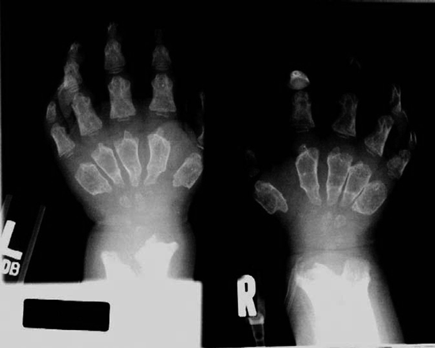

그림 9.1 점액다당류증 I 여아 환자의 척추 및 갈비뼈 엑스선 사진으로, 흉요추 척추체의 전방 함요 및 노저 모양의 갈비뼈를 보여준다. Anand R, Bhatia D, Yadav DS의 논문에서 재생산됨. Radiol C... 2011;7:641. doi: 10.2484/rcr.v7i2.641, Creative Commons Attribution License 조건에 따라 배포되는 오픈 액세스 논문.

## 그림 9.2

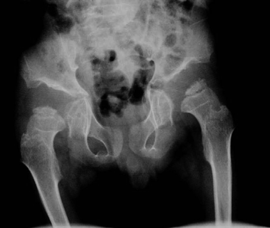

그림 9.2 점액다당류증 I 여아 환자의 하부 척추 및 골반 부위 엑스선 사진으로, 넓어진 장골 날개를 동반한 좁은 골반을 보여준다. Anand R, Bhatia D, Yadav DS의 논문에서 재생산됨. Radiol Case Rep. 2011;7:641. doi: 10.2484/rcr.v7i2.641, Creative Commons Attribution License 조건에 따라 배포되는 오픈 액세스 논문.

## 그림 9.3

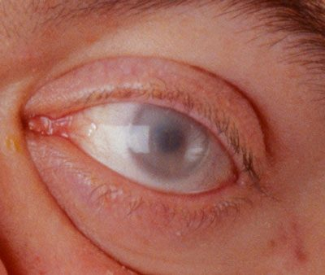

그림 9.3 빠르게 진행되는 점액다당류증 VI를 가진 16세 남아의 화변형(claw hand) 기형 사진. 화변형은 굴곡 구축 및 수근관 질환의 이차적 결과이다. Valayannopoulos V, Nicely H, Harmatz P 등의 논문에서 재생산됨. Mucopolysaccharidosis VI. Orphanet J Rare Dis. 2010;5:5. doi: 10.1186/1750-1172-5-5, Creative Commons Attribution License 조건에 따라 배포되는 오픈 액세스 논문.

## 그림 9.4

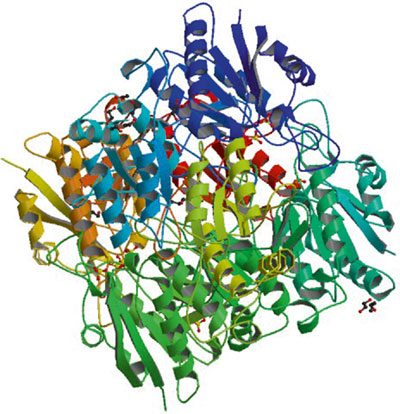

그림 9.4 빠르게 진행되는 점액다당류증 VI를 가진 3세 남아의 손 엑스선 사진으로, 근위부가 뾰족해지고 피질이 얇아진 짧고 두꺼운 중수골 및 불규칙한 수근골을 보여준다. Valayannopoulos V, Nicely H, Harmatz P 등의 논문에서 재생산됨. Mucopolysaccharidosis VI. Orphanet J Rare Dis. 2010;5:5. doi: 10.1186/1750-1172-5-5, Creative Commons Attribution License 조건에 따라 배포되는 오픈 액세스 논문.

## 그림 9.5

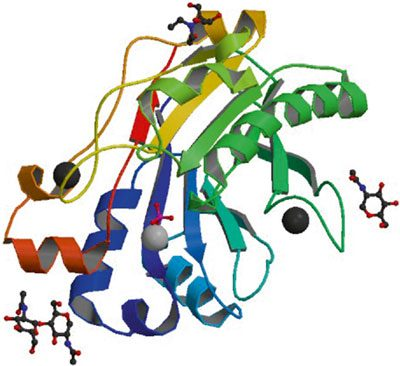

그림 9.5 빠르게 진행되는 점액다당류증 VI를 가진 9세 여아의 고관절 엑스선 사진으로, 형성 이상이 있는 대퇴골두와 심각한 고관절 형성 이상을 보여준다. Valayannopoulos V, Nicely H, Harmatz P 등의 논문에서 재생산됨. Mucopolysaccharidosis VI. Orphanet J Rare Dis. 2010;5:5. doi: 10.1186/1750-1172-5-5, Creative Commons Attribution License 조건에 따라 배포되는 오픈 액세스 논문.

## 그림 9.6

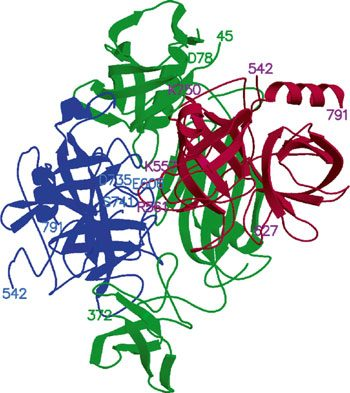

그림 9.6 빠르게 진행되는 점액다당류증 VI를 가진 30세 남아의 눈 사진으로, 각막 혼탁을 보여준다. Valayannopoulos V, Nicely H, Harmatz P 등의 논문에서 재생산됨. Mucopolysaccharidosis VI. Orphanet J Rare Dis. 2010;5:5. doi: 10.1186/1750-1172-5-5, Creative Commons Attribution License 조건에 따라 배포되는 오픈 액세스 논문.

## 그림 9.8

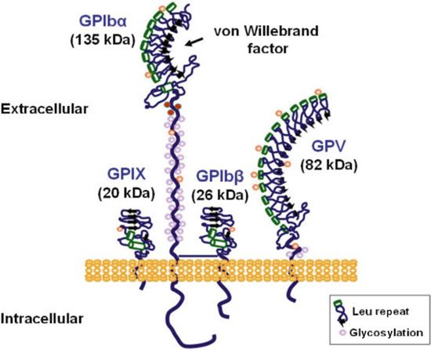
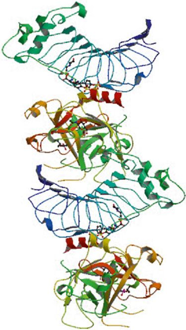

그림 9.8 마그네슘 및 인산 이온과 복합체를 이룬 재조합 인간 Dnase(dornase alfa, Pulmozyme)의 1.95Å 해상도 결정 구조. 두 이온은 모두 활성 부위에 결합되어 있다. 상동성 연구 및 구조 분석은 Asn7의 핵심 촉매 역할을 나타낸다. Dornase alfa는 고농도 DNA를 가수분해하여 낭포성 섬유증 환자의 폐에 유용한 치료제가 된다. RCSB Protein Databank PDB 파일 4AWN(Parsiegla G, Noguere C, Santell L 등)에서 가져옴. Biochemistry. 2012;51:10250-8.

## 그림 9.9

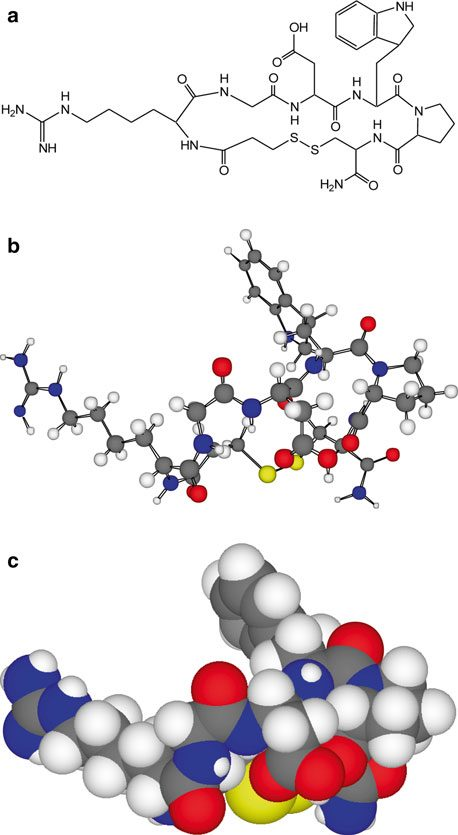

그림 9.9 히알루론산(히알루론산이라고도 알려짐)의 구조. 대부분의 결합조직 유형의 세포외 기질에 존재하는 고분자량 글리코사미노글리칸이다. D-글루쿠론산과 N-아세틸-D-글루코사민의 이당류가 교대로 β1,3 및 β1,4 글리코시드 결합으로 연결된 선형 중합체이다. 히알루로니다제(히알)는 재조합 인간 히알루로니다제(rhuPH20)를 포함하여 히알루론산의 β1,4 연결 N-아세틸-D-글루코사민과 D-글루쿠론산 당질 간의 글리코시드 결합을 가수분해한다.

## 그림 9.10

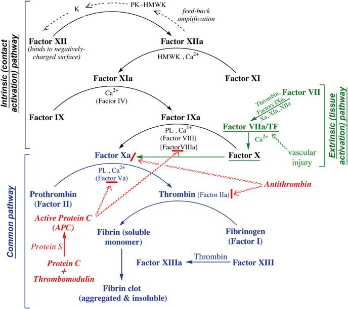

그림 9.10 스트렙토키나제-플라민 촉매 도메인 복합체가 플라스미노겐의 촉매 도메인(잔기 542~791)과 접합한 2.9Å 해상도의 엑스선 구조. 스트렙토키나제는 녹색, 플라민 촉매 도메인은 파랑, 기질 플라스미노겐 촉매 도메인은 빨강으로 표시되어 있다. 플라스미노겐의 활성화 결합 Arg561-Val562는 스트렙토키나제-플라민 촉매 복합체의 촉매 부위에 있다. N-단말부 Val562는 Asp740과의 중요한 염 결합을 형성하지만 발린이 없으면 698번 위치의 라이신이 염 다리를 형성할 수 있다. 염 결합 외에, 플라스미노겐의 잔기 625~629가 관련된 수소 결합이 포함된다. 기질의 기질 잔기 Arg561과 플라민의 Ser741이 표시되어 있다. Wang X, Lin X, Loy JA 등의 논문에서 재생산됨. Science. 1998;281:1662-5, The American Association for the Advancement of Science의 허락 하에.

---

## 라이소소스 저장 질환에 대한 승인 효소의 안전성

## 라이소소스 저장 질환에 대한 승인 효소의 안전성

효소 대체 요법으로 투여되는 효소의 안전성과 관련하여 강조되어야 할 두 가지 일반적 사항이 있다. 효소 제제는 대부분 자연스럽게 인간에서 생산되는 효소와 유사하므로, 특히 심각한 이상반응은 일반적으로 예상되지 않는다. 물론 이러한 반응이 발생하기도 하지만 증상 범위는 종종 비교적 작고 반응은 경미한 경향이 있다. 그러나 효소는 단백질이므로 아나필락시스를 포함한 즉각적 알레르기 반응의 가능성이 항상 있으며 표 9.2에 나열된 여섯 가지 효소에 아나필락시스를 언급하는 블랙박스 경고가 발행되었다. 둘째, 많은 효소가 오르판 의약품 프로그램 하에서 개발되고 투여되어 왔으므로 지금까지 비교적 소수의 환자에게만 투여되었으며 이는 수집된 안전성 데이터가 새로 승인된 의료 기관에서 일반적인 경우보다 훨씬 작은 결과 집합으로 구성됨을 의미한다.

## 파브리 질환에 대한 Agalsidase Beta

Agalsidase를 파브리 질환에 투여하는 동안 관찰되는 가장 흔한 이상반응은 ~10~14%의 환자에서 발생하는 주입 반응이다. 호흡기 증상, 두드러기 또는 활력징후 변화의 징후가 없는 일반적으로 경미한 반응이 소아에서는 더 높은 빈도(~18%)로 발생한다. 증상은 항히스타민제 및 코르티코스테로이드로 쉽게 조절되는 경향이 있다. 각 이상반응 카테고리에 전반적으로 심각한 이상반응이 부재하는 것은 보고된 결과에 반영된다(표 9.2). 예를 들어, 심장 질환은 발생 시 빈맥 및/또es 심계항진으로, 위장관 반응은 오심, 구토, 및 설사인 경향이 있다.

## 폼페 질환에 대한 Alglucosidase Alfa

10년 이상 된 Genzyme 후원 Pompe 레지스트리는 세계에서 가장 큰 폼페 질환 데이터 저장소로 새로운 데이터가 지속적으로 추가된다. 이 레지스트리에 등록된 688명의 환자(소아 360명, 성인 328명) 중 526명이 치료를 받았으며 이 중 299명이 1세 미만의 영아이다. 영아의 50.8%가 심근병증이 있었고 이 중 39명이 기저선 시점에 기계적 환기를 필요로 하였다.

 Lumizyme와 Myozyme은 둘 다 심각한 알레르기 반응, 생명을 위협하는 아나필락시스 및 심호흡부전에 대한 경고를 포함하고 있으나, Lumizyme은 발열, 안면홍조, 과다발한, 두통, 고혈압, 어지러움, 발진, 및 두드러기를 포함하는 광범위한 반응을 초래하는 반면, Myozyme에서는 주입 반응, 폐렴 및 호흡기 세포융합바이러스와 같은 감염, 호흡곤란/부전, 및 위장관 문제가 우세하다. 이 차이는 성인 환자와 투여된 효소 용량과 관련이 있을 뿐 아니라소위 "생물학적 차이"와도 관련이 있을 수 있다.

60명의 후발형 폼페 질환 환자를 대상으로 한 alglucosidase alfa의 무작위 연구에서, 대부분의 효소 유도 이상반응은 아나필락시스 3예를 제외하면 심각하지 않았다. 2명의 환자에서 alglucosidase alfa에 대한 혈청 IgE 항체가 검출되었다. 영아발병 폼페 질환 환자 18명에 대한 Myozyme 치료는 11명의 환자에서 주입 2시간 이내에 경도~중등도의 주입 반응을 유발하였다. 가장 흔한 이상반응인 두드러기, 발열, 및 산소 포화도 감소는 40 mg/kg을 투여받은 환자에서 나타났다.

## 가우처 질환을 치료하는 재조합 효소: Imiglucerase, Taliglucerase Alfa, Velaglucerase Alfa

Imiglucerase, taliglucerase alfa, velaglucerase alfa는 각각 가우처 질환에 대한 장기 효소 대체 요법으로 투여되며 즉각적인 I형 과민반응 반응이 가장 두드러진 유사한 이상반응 스펙트럼을 보인다(표 9.2). 모든 오르판 의약품과 마찬가지로, 시판 허가 시점에 제한된 안전성 정보만이 이용 가능하였다.

4,500명 이상의 환자에서 실시된 장기 국제 사후 안전성 감시에서 imiglucerase는 내약성이 우수한 것으로 나타났다. 보고된 이상반응은 주로 경미하며 주입 반응, 비인두염, 두통, 발진, 오심, 설사, 피로, 관절통, 흉통, 및 가려움증을 포함한다. 심각한 이상반응은 드물며 아나필락시스 반응은 드물게 보고되었다.

12세 미만 소아 환자에 대한 장기 국제 사후 안전성 감시에서 imiglucerase는 내약성이 우수한 것으로 나타났다. 보고된 이상반응은 성인과 유사하였다. 아나필락시스는 소아에서 더 흔한 것으로 보인다.

Taliglucerase alfa는 아나필락시스, 알레르기, 및 주입 반응에 대한 경고를 포함한다(표 9.2). 3상 multinational 이중눈가림 9개월 20회 주입 임상 시험에서, taliglucerase alfa 관련 이상반응은 경도/중등도이 transient였다. 심각한 약물 관련 반응은 없었으나 2명(6%)의 환자가 과민반응을 경험하였다. 가장 흔한 반응은 비인두염, 두통, 비인두 통증, 기침, 발진 및 비염이었다.

Velaglucerase alfa는 3상 임상 시험에서 이상반응의 스펙트럼이 유사하였으며 주입 반응, 비인두염, 두통, 복통, 인후통, 발열, 비염, 기침, 및 가려움증이 가장 흔하였다. 심각한 이상반응은 아나필락시스(1명), 두드러기(1명), 및 홍조(1명)를 포함하였으나 드물었다.

## LAL 결핍증에 대한 Sebelipase Alfa

과민반응 가능성, 아나필락시스 포함,은 이 효소 사용 시 인식해야 할 주의사항 중 두드러진다. 임상 시험에서, 106명의 주입 환자 중 ~20%가 과민반응 증상(발열, 오한, 안색창백, 발진, 후두부종, 오심, 발진, 가려움증, 구토)을 경험하였으며 ~3%의 환자에서 반응이 아나필락시스로 판단되었다. 아나필락시스는 여섯 번째 주입 시점에 보고되었으며 치료 1년 후에도 발생할 수 있다.

Sebelipase alfa(Kanuma)는 닭 달걀 흰자위에서 생산되므로 아나필락시스 가능성에 대한 위험 및 경고가 닭고기 및 닭고기 제품까지 확장되었다. 지금까지의 임상 시험에서, 생후 6개월 이내에 발생하는 급속 진행성 LAL 결핍증 환자에서 가장 흔한 이상반응은 설사, 구토, 발열, 비염, 빈혈, 기침, 및 비인두염이었다. 더 나이가 많은 영아/소아 및 성인에서의 이상반응 목록에는 두통, 발열, 구인두 통증, 비인두염, 무력증, 변비, 및 오심이 포함된다(표 9.2).

## MPS I에 대한 Laronidase

MPS I 치료에서 laronidase(α-L-이도로니다제)의 효과와 안전성을 평가하도록 설계된 시험 결과, 이 효소는 치료 관련 반응이 적고 심각한 이상반응이 거의 없는 등 전반적으로 잘 견딘 것으로 나타났다. 아나필락시스 가능성에 대한 FDA 블랙박스 경고를 제외하면, ERT에 사용되는 다른 효소와 마찬가지로 부작용 목록은 광범위하지 않으며 심각한 이벤트가 결여된다(표 9.2). 장기 시험에서, laronidase 주입은 40명 중 53%의 환자에서 주로 경미하고 쉽게 관리되는 반응을 유발하였다. 한 환자가 아나필락시스 반응을 경험하였으나, 주로 6개월 후 반응이 현저히 감소하였다.

## MPS II에 대한 Idursulfase

32명의 헌터 증후군 환자(5~31세)를 대상으로 한 2상/3상 idursulfase ERT 연구에서, 32명 중 22명이 치료에 반응하여 6분 보행 거리가 평균 38미터(p < 0.001) 증가하였다. 주입 관련 반응은 22명 중 12명에서 발생하였다. 이 반응은 주로 경미하거나 중등도였으며 주입 속도를 줄이거나 항히스타민제를 투여하여 관리할 수 있었다.

MPS II 환자에서의 idursulfase 관련 주입 반응 발생률을 평가하도록 설계된 연구에서, 첫 해에 33명의 환자(31.7%)에서 65건의 반응이 보고되었으며 거의 모든 초기 반응은 처음 3개월 이내에 발생하였다. 대부분의 반응은 경도~중등도였으며 주입 속도를 줄이거나 항히스타민제 또는 해열제를 투여하여 관리할 수 있었다. idursulfase는 FDA 블랙박스 경고를 포함하는 또 다른 ERT 효소로, 약물 주입 후/중 아나필락시스 위험이 경고된다.

최근 한국 연구에서, MPS II에 대해 이 약물을 복용 중인 34명의 환자에서 anti-idursulfase IgE 항체가 검출되었다. 피부반laşma검사, 효소결합면역흡착분석법, 및 웨스턴 블로팅에 의해 3명(8.8%)의 환자에서 IgE 항체가 검출되었다. 아나필락시스를 경험한 3명의 환자는 모두 피부검사 양성이었다.

## MPS IVA에 대한 Elosulfase Alfa

235명의 환자가 관련된 6개의 임상 시험에서 수집된 결과는, elosulfase alfa를 주입받은 환자의 ~19%가 과민반응을 경험하였으며 8%가 아나필락시스로 분류되었음을 나타냈다. 이 발견은 FDA 블랙박스 경고에 반영된다(표 9.2). 과민반응 환자에서 효소 효과는 손상되지 않은 것으로 보인다.

## MPS VI에 대한 Galsulfase

1, 2, 3상 및 장기 추적 연구에서 Harmatz와 공동연구자들은 20~75%의 주입 반응 발생률을 관찰하였다. 심각한 약물 관련 이상반응은 드물었으며, 게시된 연구에서 이러한 반응을 경험한 환자는 전체의 1.8%에 불과하였고, 그 중 심각한 세 가지는 천식, 무호흡, 및 두드러기였다.

5세 미만 소아 34명에서의 galsulfase에 대한 효과 및 안전성 평가에서 심각한 주입 관련 반응은 없었으나 8명(24%)의 소아가 치료 관련 이상반응을 경험하였다. 각 경우에 더 느린 주입 속도와 필요 시 해열제의 도움으로 주입이 계속되었다. 2년간 ERT를 받던 한 환자에서 피부 발진 및 부종이 발생하였으며 빈맥, 피부 발진, 오심, 혈압 상승, 및 발열의 단일 에피소드가 기록되었다.

주입 속도를 줄이고 항히스타민제, 스테로이드, 및/또는 해열제로 예방 투여하는 것은 ERT 중 주입 반응을 관리하기 위해 자주 사용되어 왔다. 예를 들어, 더 이상의 치료를 불가능하게 하는 한 소아 환자의 반응 성공적 관리 보고에서, 주입 속도의 상당한 감소가 수개월에 걸쳐 서서히 역전되었으며 동시에 스테로이드 예방 투여가 도입되었다. 환자는 궁극적으로 부작용 없이 주입을 견뎠다. Galsulfase의 세 번째 ERT 주입 후 혈소판감소증 단일 사례가 보고되었다. 효소 용량 감소 후 정상 용량으로의 복귀로 상태가 역전되었다. 저자들은 anti-galsulfase 항체가 원인일 수 있다고 추측하였다.

안과적 병리, 예를 들어 각막 혼탁, 안과적 고혈압, 및 시신경 부종(시신경 유두부종)이 흔한 MPS VI 환자에서, galsulfase를 투여받은 11세 MPS VI 환자에서의 역전된 시신경 유두부종과 개선된 시력 보고는 흥미롭고 고무적이다.

## 기타 승인된 효소에 의해 유발된 이상반응

## 조직 플라스미노겐 활성화제(Tissue Plasminogen Activators)

Alteplase로 치료한 환자에서의 뇌졸중 발생률은 tPA 그룹(6.9%)에서 스트렙토키나제 그룹(7.8%; p = 0.006)보다 낮았다. 1980년대 후반에 실시된 시험의 합산 결과는 alteplase를 투여받은 환자의 뇌졸중 발생률이 1.2%, 위약을 투여받은 환자가 0.9%임을 보여주었다. 두개 내 출혈은 급성 심근경색에 대한 tPA 치료의 심각한 이상반응이나, alteplase에서는 두개 내 출혈과 뇌경색 및 경막하혈종의 합산 빈도가 심근경색에서 다른 혈전 용해제의 이상반응 발생률과 유사하다.

급성 심근경색에서의 프론트로드형 alteplase와 single-bolus tenecteplase의 비교에서 거의 동일한 30일 사망률(6.18% tenecteplase 대 6.15% alteplase), 유사한 두개 내 출혈률(0.93% 대 0.94%), 및 30일 사망 또는 비치명적 뇌졸중의 유사한 비율이 나타났으나 tenecteplase에서는 비뇌 출혈 합병증이 적고 수혈 필요성이 낮았다. Alteplase, reteplase, 및 tenecteplase 사이의 유사한 부작용은 아나필락시스를 포함하는 알레르기 반응 가능성까지 확장된다. Tenecteplase에 대한 이러한 반응의 발생률은 <1%이다. Tenecteplase에 대한 기타 기록된 이상반응에는 오심, 구토, 발열, 저혈압, 및 다양한 심장 이상이 포함된다.

## 아스포타제 알파(Asfotase Alfa)

이 재조합 비특이적 알칼리 인산가수분해효소 제형에 대한 경고 및 주의사항에는 과민반응 반응(아나필락시스 포함), 주사 부위의 국소 지방영양장애(지방위축 및 지방과다영양 포함), 및 눈(각막 및 결막 포함)과 신장의 이소성 석회화가 포함된다. 이러한 이상반응은 asfotase alfa 치료 중 가장 흔한 안전성 고려 사항을 구성한다. 덜 흔하게 발생하는 이상반응에는 저칼슘혈증, 신장 결석, 만성 간염, 및 비타민 B6 수준 감소가 포함된다.

## L-아스파라제(L-Asparaginase)

알레르기 반응(아나필락시스 포함), 췌장염, 고혈당증, 간독성 및 비정상 간기능, 후향성 가역적 뇌병증 증후군(PRES), CNS 기능장애, 및 혈전증은 L-아스파라제 치료에 의해 유발되는 다수의 독성 효과 중 가장 심각한 이상반응으로 나열되어 있다(표 9.2). 30년 이상 전에, L-아스파라제 유도 응고장애, 두개 내 출혈과 사지 혈전증, 면역 용혈성 빈혈, 및 비정상 콜라겐 자극 혈소판 응집을 포함하는 것으로 기술됐다.

30년 이상 된 연구에서, L-아스파라제(반감기 26시간)와 폴리에틸렌 글리콜(PEG)-컨주게이트 효소(반감기 5.5일)의 ALL 소아 치료 비교에서 L-아스파라제 활성과 혈청 수준 사이에 상관관계가 없음이 나타났다. 118명의 소아가 관련된 이 시험은 궁극적으로 ALL의 1선 치료에 대한 pegaspargase의 FDA 승인으로 이어졌다. 성인 백혈병 환자에 대한 다중 용량 정맥 내 pegaspargase의 최근 성공적인 소아 치료 요법에서 고빌리루빈혈증 및 전이효소 증가가 가장 흔한 3/4등급 독성으로 나타났다. L-아스파라제 치료의 두 가지 합병증이 최근 한 환자에서 일과성 당뇨병 케톤산혈증 및 급성 췌장염과 함께 보고되었다.

## 콜라겐제(Collagenase)

콜라겐제에 기록된 많은 이상반응(표 9.2)은 두파ځ트런 구축 및 페이로니 질환 치료에 효소를 사용하는 것과 관련이 있다. 두파ځ트런 구축 환자의 ≥5%에서 발생하는 반응에는 말초 부종, 타박상, 주사 부위 반응, 사지 통증, 및 가려움증이 포함된다. 페이로니 질환에서 가장 흔하게 보고된 이벤트는 음경 혈종, 부종, 통증 및 반상출혈, 타박상, 주사 부위 출혈, 발기부전, 및 생식기 가려움증이다. FDA는 페이로니 질환 치료에 콜라겐제를 사용할 때 음경 골절 또는 해면체 파열에 대한 블랙박스 경고를 발행하였으며 심각한 음경 혈종 사례가 보고되었다고 진술하였다. 요도, 신경, 혈관, 및 해면체에 주사할 위험을 피하기 위한 예방 조치가 필요하다.

## 도르나제 알파(Dornase Alfa)

968명의 성인 및 소아 낭포성 섬유증 환자에 대한 도르나제 알파 치료에서, 가장 흔한 이상반응은 비정변(voice change)이었다. 26명의 52명의 환자에서 34건의 이상반응이 발생한 물리치료 전후의 도르나제 알파 대조 시험에서, 상부 호흡기 바이러스 감염 및 가래 병원체에 의해 악화된 화농성 폐 질환이 대부분의 이벤트를 차지하였다. 도르나제 알파 치료 후 발진, 두드러기, 복통, 오심, 구토, 발열, 및 두통도 보고되었다.

## 글루카르피다제(Glucarpidase)

다양한 암을 치료하기 위해 사용되는 고용량 메트렉세이트 치료는 간 기능 장애 및 신부전과 같은 독성을 초래하여 약물 제거를 지연시키고 따라서 더 큰 독성 효과의 위험을 현저히 증가시킬 수 있다. 생명을 위협하는 메트렉세이트 유도 독성의 발생률을 줄이기 위해 특별히 고안된 여러 조치의 시행이 대체로 효과적인 것으로 입증되었으나, 신부전은 여전히 발생하여 약물의 축적을 초래할 수 있다. 많은 연구에서 글루카르피다제는 중재가 필요한 주요 이상반응 없이 전반적으로 잘 내약성이 있는 것으로 나타났다. 임상 시험 및 공감 사용 경험에서 보고된 가장 흔한 이상반응은 안면 홍조, 감각이상, 두통, 떨림, 저혈압, 오심 및 구토, 손가락 저림, 안면 및 사지 작열감, 및 온열감이다. 페니실린, 술폰아미드, 비스테로이드성 항염증제, 및 프로톤 펌프 억제제와 같은 일부 약물은 메트렉세이트 제거를 방해할 수 있으며 효소와 함께 투여되어서는 안 된다. 복수 또는 흉막 삼출의 존재 또는 가능성의 경우, 고농도 메트렉세이트의 축적은 약물 제거의 지연을 초래할 수 있다. 글루카르피다제의 높은 비용은 종종 환자가 독성 메트렉세이트 수준을 보이는 경우에만 예약되어야 한다는 의견이 제시되어 왔다.

## 히알루로니다제(Hyaluronidase)

히알루로니다제의 가장 흔한 이상반응은 주사 부위 반응, 하피도클리시스와 관련된 부종, 및 두드러기, 혈관부종, 및 드물게 아나필락시스를 포함하는 알레르기 반응이다. 소 및 양 히알루로니다제의 비정제화된 제제는 반복 투여 후 특히 IgE 매개 알레르기 반응을 유발할 가능성이 훨씬 더 높다. 국소 마취 안과적 차단에서 효소 사용 후 동물 유래 히알루로니다제 제형에 대한 이상반응, 과민반응 포함,이 보고되었다.

히알루로니다제 사용과 관련된 기타 이상반응에는 눈 부종, 안와 부종, 및 실명이 포함된다. 1998년 1월부터 2011년 8월까지 98건의 사례가 FDA에 보고되었다. 증상에는 부종, 압통, 염증, 시력 저하, 안압 상승, 시신경 유두 출혈, 안구 돌출, 안통, 안와 및 눈꺼풀 부종, 과민반응, 및 실명이 포함되었다. 장애, 입원, 및/또는 의료 중재가 종종 필요하였다. 후안골 또는 안와주변 차단 후 과민반응은 일부 환자에서는 거의 즉시, 다른 환자에서는 며칠 후에 나타나며 홍조를 동반한 안와 부종, 가려움증, 통증, 결막 부종, 안구 돌출, 제한된 안구 운동, 및 혈관부종으로 나타났다. 영향을 받은 환자 중 많은 이전에 동물 유래 히알루로니다제를 투여받은 바 있었다.

## 오크리플라스민(Ocriplasmin)

증상성 유리체황반부착 환자에게 ocriplasmin의 단일 유리체내 주사와 위약 주사를 비교한 두 건의 이중눈가림 3상 임상 시험에서, 두 그룹에서 유사한 안과 이벤트 발생률이 나타났다. 유리체 박리와 관련된 이벤트, 즉 유리체 비문증, 광시증, 주사 부위 통증, 및 결막 출혈은 재조합 효소를 주사받은 눈의 68.4%, 위약을 주사받은 눈의 53.5%에서 발생하였다(p < 0.001). 치료 그룹의 16.8%에서 유리체 비문증이 발생하였으나 위약 그룹은 5.1%에 불과하였다. 주사 후 시력 저하를 포함한 이상반응도 보고되었다.

ophthalmoscopy에서 나타난 더 불안한 사례는 ocriplasmin 후 시력 상실, 동공 이상, 및 시야 축소를 포함하는 급성 망막전체 구조 및 기능 이상으로, 저자들은 많은 이상반응이 눈에 광범위하게 존재하는 라미닌과 그 결과 ocriplasmin의 확산적 단백질분해 효과 때문이라고 제안하였다.

## 페가데매스 소(Pegademase Bovine)

Pegademase bovine은 오르판 의약품이므로, 상대적으로 작은 환자 풀과 사후 이상반응 보고의 자발적 특성은 이 효소에 대한 임상 경험이 아직 바람직한 수준보다 적음을 의미한다(표 9.2). 지금까지 과민반응 반응은 보고되지 않았으며 주사 부위 반응, 두통, 및 통증을 포함한 비교적 좁은 범위의 이상반응이 초기 임상 시험에서 기록되었다. 면역 반응 회복의 첫 달 동안 일과성 면역 조절장애가 발생할 수 있다. 이는 혈소판감소증 및 용혈성 빈혈 사례의 발생으로 나타났으며 때때로 바이러스 감염 또는 패혈증과 관련되었다. 일과성 혈소판증가증도 보고되었다. Pegademase 치료의 장기 효과는 아직 알려져 있지 않으나, 일부 환자에서 완전한 T 세포 면역 기능이 달성되지 않는다는 것은 이미 명확하다. 낮은 T 세포 수는 면역 감시의 감소를 반영하는 것으로 보이는 암 사례로 이어졌다.

## 페글로티카제(Pegloticase)

FDA는 pegloticase 투여 중 및 후 아나필락시스 및 주입 반응에 대한 블랙박스 경고를 발행하였으며 통풍 악화 및 울혈성 심부전 악화 가능성에 대한 경고 및 주의사항을 나열하였다. 규제 기관이 나열한 기타 이상반응에는 흉통, 타박상 또는 반상출혈, 오심, 구토, 비인두염, 및 변비가 포함된다. Pegloticase는 글루코스-6-인산 탈수소효소(G6PD) 결핍증 환자에게 금기이다.

## 라스부리카제(Rasburicase)

Rasburicase에 대한 아나필락시스 및 용혈과 메트헤모글로빈혈증은 이 효소에 대한 FDA 블랙박스 경고의 대상이다. 후자 두 이벤트는 rasburicase 촉매 요산-알란토인 전환 중 생성되는 과산화수소의 산화 스트레스에 노출되는 글루코스-6-인산 탈수소효소 결핍 환자와 관련이 있다. 글루코스-6-인산 탈수소효소의 결핍은 아프리카, 동남아시아, 및 지중해 지역 남성에서 가장 흔히 관찰되며 가장 흔한 효소 결핍 중 하나이다. 과산화수소의 생성은 헤모글로빈의 Fe2+를 Fe3+로 산화시켜 메트헤모글로빈혈증 및/또는 용혈을 초래한다. ferric 상태에서, 메트헤모글로빈은 산소를 결합할 수 없어 조직 저산소증 및 허혈의 위험을 증가시킨다. 따라서 rasburicase는 알려진 글루코스-6-인산 탈수소효소 결핍 환자에게 금기이다.

문헌에는 성인 및 소아에서 메트헤모글로빈혈증 및/또는 용혈에 대한 여러 보고가 있으며 위험에 처한 것으로 여겨지는 환자의 선별 검사 권고로 이어졌다. Rasburicase는 실온에서 혈액 및 혈장의 요산을 분해하여 요산 측정을 방해한다. 이는 효소에 대한 FDA 블랙박스 경고에 네 번째 기여로 이어졌으며 채혈된 혈액 샘플을 즉시 냉장하고 채취 후 4시간 이내에 검사를 수행할 것을 지시하고 있다.

## 스트렙토키나제(Streptokinase)

스트렙토키나제로 치료한 환자에서의 뇌졸중 발생률(1.2%)은 tPA 그룹(6.9%)에서 스트렙토키나제 그룹(7.8%; p = 0.006)보다 낮았다. 스트렙토키나제 치료와 관련된 여러 면역 장애가 기술되었다. 여기에는 관절통, 발열, 발진, 및 면역 복합체를 포함하는 혈청병 유사 반응; 신장 손상과 함께하는 혈청병; 백혈구 파괴성 혈관염(다른 III형 과민반응); Colorado-colored 슈ǒ쇤라인-헤노흐 자색증과 유사한 혈관염; 및 초승달형 사구체신염이 포함된다. 스트렙토키나제 투여 후 혈소판감소증과 함께하는 급성 신부전의 가능한 II형 또는 혼합형 II형 및 III형 과민반응은 코르티코스테로이드 치료로 개선되는 것으로 나타났다.

스트렙토키나제 투여 후 기록된 I형 알레르기 과민반응은 안면 홍조, 가려움증, 발진, 호흡곤란, 기관지 경련, 저혈압, 혈관부종, 두드러기, 및 아나필락시스를 포함하는 즉각적 반응 스펙트럼을 포괄한다. 급성 심근경색에 대한 스트렙토키나제 후 복막후, 혀, 및 연구개 혈종, 및 복직근 혈종이 기술되었다.

## 항체 반응(Antibody Responses to Enzymes)

최소한 이론적으로, 투여된 효소에 대한 면역 반응의 가능성은 항상 존재한다. 가우처 질환에 대한 치료에 대한 항체 반응 환자의 비율은 15%, MPS I 91%, MPS II 11%, MPS IV 100%, MPS VI 89%, 파브리 질환 55%, 폼페 질환 66%이었다. 항체의 대부분은 IgE 클래스가 아닌 IgG 클래스의 것이었다. 효소 약동학과 항체 생성의 관계는 명확하지 않으며 장기적으로 일부 환자는 면역 관용을 발전시켜 항체의 부작용이 덜 우려된다. 저자들은 ERT를 받고 면역 반응을 일으킨 라이소소스 저장 질환의 대부분의 환자가 예방 투여 및/또는 주입 속도 감소와 함께 치료를 계속하였다고 결론지었다. 치료 효과를 억제하는 항체의 생성은 드문 것으로 보이나 드물게 발생하는 고역가, 고친화력 항체가 중요할 수 있다고 제안되었다.

이후, 파브리 질환에 대한 agalsidase alfa 또는 beta의 효소 치료에서 항체는 남성에서 agalsidase beta에 더 자주 나타났으며 남성과 달리 여성은 효소에 대한 검출 가능한 항체를 발현하지 않았다. 또 다른 장기 연구에서, 성인 여성의 40%가 agalsidase beta에 대해서만 항체를 발현하였다. 남성 파브리 질환 환자에서 발현된 Agalsidase 항체는 Gl3(탈아실화된 Gb3 또는 글로보트리아오실세레마이드), 혈장에서 Gb3보다 더 상승된 글리코스핑고리피드의 요로 배설을 빈번히 방해하는 것으로 나타났다. 그러나 134명의 환자 데이터에 대한 후향적 분석에서, 파브리 질환에 대한 ERT 효과에 대한 agalsidase beta에 대한 IgG 항체의 잠재적 영향은 효소에 대한 항체 역가와 임상 이벤트 발현 사이의 상관관계를 보이지 못하였다. 또한, IgG 역가와 Gl3 상승 수준 사이에 유의한 연관성은 없었으나 고항체 역가 환자에서 Gl3의 제거가 손상될 수 있음이 시사되었다.

파브리 질환에 대한 agalsidase 치료에서의 항체 역할, 주입 반응과 같은 임상 결과와의 관계는 아직 명확하지 않다. Velaglucerase의 경우 환자의 약 4%만이 효소에 대한 항체를 발현하였다. 이는 1년 시험 후반에 발현되었고 IgG 클래스이며 중화 작용이 있었다. Sebelipase alfa에 대한 항체 발현은 지금까지 거의 주목을 받지 못하였다. 생후 6개월 이내에 발생하는 급속 진행성 LAL 결핍증의 영아 7명 중 4명이 효소에 대한 항체를 발현하였다. 이 환자 중 2명은 시험관 및 세포 흡수 연구에서 효소를 억제하는 중화 항체를 가지고 있었다. 세 환자에게서 치료 2개월 이내에 항체가 발현되었으며 한 환자에게서 항체는 지속되었고 세 환자에게서 검출 불가능한 수준까지 감소하였다. 과민반응 반응은 4명의 항체 양성 환자와 항체 음성 환자 한 명에서 발생하였다.

MPS I의 대부분의 laronidase를 받은 환자는 12주(평균 ~53일) 이내에 항체를 발현하였다. 1~12주 동안, 혈장 효소 제거율은 항체 역가에 비례하여 증가하였으나 26주에는 때때로 상승된 항체 역가에도 불구하고 1주 수준으로 돌아왔다.

MPS II 환자 중 7세 이하의 유전자 결실, 재배치 또는 다른 돌연변이를 가진 환자들은 missense 돌연변이를 가진 환자보다 anti-idursulfase 항체 형성의 더 높은 발생률을 경험하였다. 5세 이상의 환자 중 절반은 효소를 투여받은 후 anti-idursulfase 항체를 발현하였으며 과민반응 반응의 발생률은 항체가 있는 환자에서 더 높았다. 약 40%의 항체 양성 환자는 효소 활성 또는 효소의 세포 흡수를 중화하는 항체를 가지고 있었다. MPS II 소아 환자에서의 anti-idursulfase 항체 상태와 안전성의 관계는 63명의 치료 경험이 없는 환자가 관련된 핵심 2상/3상 시험에서 조사되었다.

## 라이소소스 저장 질환에 대한 기타 치료법

가우처 질환 및 MPS VI를 제외한 라이소소스 저장 질환의 대부분에서 CNS 증상은 적어도 부분적으로 효소가 혈액-뇌 장벽을 통과하지 못하기 때문에 여전히 문제로 남아있다. 외과적 시술 외에, 다른 치료법이 모색되고 있으며 여러 접근법이 성공적인 잠재적 치료법으로 유망한 결과를 보이고 있다.

## 조혈모세포 이식(Stem Cell Transplantation)

이 시술에서, 환자의 조혈모세포는 선정된 적합한 기증자(또는 아마도 제대혈의 세포)의 세포로 대체되며 이 세포는 증식하여 원래의 효소 결핍을 극복하기에 충분한 효소를 생산한다. 약 35년 전 첫 골수 이식 이후, 수백 명의 라이소소스 저장 질환 환자가 조혈모세포 이식을 받았으며 2세 미만의 MPS I 소아에서 상당히 좋은 결과를 보였다. 성공적인 이식 후, 소변의 글리코사미노글리칸 수준이 감소하고, 관절 가동성, 시력, 청력, 심폐 기능 및 기도 증상이 개선되며 장기 크기가 감소하지만, 골격 이상과 지적 능력은 일반적으로 훨씬 적게 개선된다. MPS VI에서 약간의 성공이 있었으나 기타 MPS에 대한 조혈모세포 이식에 대한 임상 경험은 여전히 제한적이다. MPS II 및 MPS III에서의 효과에 대해서는 의문이 제기되고 있다. 흥미롭게도, ERT는 이식 거부반응 또는 이식편대숙주병의 발생률을 증가시키는 것으로 보이지 않는다.

## 기질 감소 요법(Substrate Reduction Therapy)

결핍되거나 부족한 분해 효소를 제공하는 대신, 기질 감소 요법은 결핍된 효소 활성을 보상하기 위해 저장 물질의 양을 감소시키는 것을 목표로 한다. 예를 들어, 가우처 질환에서는 이미노 설탕 N-부틸데옥시노이리시신(miglustat, Zavesca)이 저장 화합물인 글루코세레브로시드를 합성하는 효소 세레마이드 글루코실트랜스퍼레이즈를 억제하는 데 사용된다. Miglustat는 2003년에 FDA에 의해, 2007년에 EMA에 의해 성인 및 소아 가우처 질환에 대한 치료로 승인되었다. Miglustat는 혈액-뇌 장벽을 통과할 수 있으므로 잠재적으로 CNS 증상을 개선할 수 있다.

## 챠퍼론(Chaperones)

히트 쇼크 단백질 및 칼넥신과 같은 챠퍼론은 프로테아소 의해 분해되었을 단백질의 올바른 접힘을 돕는다. 파브리 질환 환자의 림프구에서, 1-데옥시갈락토노이리시신은 돌연변이 효소 α-갈락토시다제의 챠퍼론 및 경쟁적 억제제로 사용되어 올바른 구조를 유도하고 효소의 촉매 활성을 회복시켰다. 챠퍼론으로서의 억제제 사용 개념은 가우처 질환 및 폼페 질환 환자의 세포에 대한 시험관 내 조사로 확장되었다. 소분자이므로, 화학적 챠퍼론은 혈액-뇌 장벽을 통과할 수 있다. 그러나 주요 단점은 missense 돌연변이를 가진 환자로의 제한인데, 예를 들어 폼페 질환의 경우 치료의 혜택을 받을 수 있는 환자는 10~15%에 불과하다.

## 유전자 치료(Gene Therapy)

체내 유전자 치료에서, 올바르게 기능하는 유전자가 재조합 벡터에 삽입되어 간 및 폐와 같은 장기에 투여되며 이는 대사 장애의 교정을 위한 지속적인 효소 공급원이 될 수 있다. 이 전략의 효과는 여러 동물 모델에서 입증되었다. 이 시술은 또한 골 및 뇌에 대한 안정적인 효소 공급원을 제공하여 중추 및 말초 증상을 역전하거나 둔화시킬 잠재력을 가지고 있다. 동물 모델의 벡터 전달 시스템은 중추 신경계로의 유전자 전달이 조사되었으며 이는 신경 퇴행성 라이소소스 저장 질환인 후기 영아 신경세포 소포체 지방축적증의 10명 소아에 대한 임상 연구로 확장되었다. 시술 18개월 후 신경학적 악화 속도가 감소하였다. 이른바 체외 유전자 치료에서, 유전자적으로 변형된 자가 조혈모세포 또는 건강한 기증자의 세포가 효소 결핍의 교정 교차를 목표로 이식된다. 조혈모세포는 혈액-뇌 장벽을 통과할 수 있으므로, 신경세포 및아교질세포의 결핍이 교정될 수 있다. 유전자 전달 벡터의 예방적 적용은 급성 림프구 백혈병과 같은 혈액학적 악성 종양의 예방적 치료에도 적용되고 있다.

## 효소 대체 요법과 함께 살아가기(Living with Enzyme Replacement Therapy)

라이소소스 저장 질환에 대한 ERT는 환자의 삶에 상당한 영향을 미친다. 치료는 일상적 hospital visits를 요구하며 질환과 관련된 많은 불확실성으로 인해 고통스럽다. 이를 염두에두고 호주의 소아 환자와 그 가족의 경험에 대한 최근 조사는 폼페 질환, 가우처 질환, 또는 점액다당류증 I 또는 II형 환자의 건강 관련 삶의 질에 대한 ERT의 영향을 조사하였다. 발견은 질환과 요구되는 평생 치료에 대처하는 도전과 전략을 강조하였다. 가족 구성원 및 전문가와의 소통이 특히 중요하다고 간주되었으며 질환에 대한 중재가 높은 우선순위로 부여되었다. 긍정적 측면에서, 신체적 및 심리사회적 안녕의 일부 개선이 관찰되었으며 긍정적 사고의 중요성과 불확실성을 관리하는 방법이 기술되었다.

증상 발현 시기, 진단 방법, 공통 돌연변이, 증상, 및 영아발병 대 성인발병 질환의 임상 증상에 대한 데이터는 이 질환의 자연사, 임상 증상, 및 치료 결과를 보다 잘 이해하기 위해 설립된 Pompe 레지스트리에 포함되어 있다. 이 질환에 대한 세계 최대의 데이터 저장소로, 28개국 이상이 레지스트리에 등록되어 있으며 지속적인 분석이 폼페 질환의 인식 및 이해를 개선할 것으로 기대되고 있다. 지금까지의 분석에 따르면 환자의 70%가 12개월 이상 된 후에 증상이 발현하며, 23%가 12개월 미만에서 증상이 발현하고, 후자의 약 70%가 심근병증이 있다.

2014년 유럽 가우처 협회(European Gaucher Alliance), 1994년에 설립된 이 질환에 대한 환자 조직을 지원하는UMBRELLA 그룹,이 발표한 설문조사에서, 가우처 질환 환자 1,164명 중 89%가 특수 의약품을 사용하고 있었으며, 그 중 imiglucerase를 사용하는 환자가 73%로 가장 많았고, 그 다음은 velaglucerase alfa(23%), taliglucerase alfa 및 miglustat(각 4%)이었다. 현재와 미래에 걸쳐 큰 우려는 라이소소스 저장 질환에 대한 ERT의 높은 비용이다. 가우처 질환의 현재 치료비는 환자의 체중과 용량에 따라 환자당 연간 US$200,000~$380,000 또는 약 154,000~292,000 유로로 추정된다. 종종 악화되는 경제 상황에서, 환자와 대부분의 국가가 이러한 지속적으로 증가하고 이미 높은, 아니면 감당할 수 없는 의료 비용을 어떻게 감당할 수 있는지 이해하기 어렵다.

## 요약(Summary)

* 인산화된 만노스 잔기의 특이적 인식, 만노스 수용체 매개 라이소소스 효소 흡수, 그리고 이러한 수용체가 대식세포에 존재한다는 발견은 라이소소스 효소가 표적 세포에 의해 특이적으로 인식되어야 한다는 것을 증명하였다. 이러한 통찰은 전 세계적으로 출생 시 75,000명 중 1명의 빈도로 발생하는 I형 가우처 질환에 대한 최초의 성공적인 효소 대체 요법(ERT)으로 이어졌으며 이는 췌장(sphingolipid) 저장 장애 중에서 가장 흔한 것이다.

* 가우처 질환은 라이소소스 산성 β-글루코시다제 당단백질인 β-글루코세레브로시다제의 결핍으로 인한 선천적 대사 이상이다. 이 효소는 β-D-글루코실세레마이드를 글루코스와 세레마이드로 절단한다. 이 효소의 기질은 광범위하게 분포하는 세포막 성분이며 β-글루코세레브로시다제가 결핍되면 글루코세레브로시드와 기타 글리코리피드가 라이소소스에 20~100배까지 축적된다.

* 가우처 질환의 ERT 개발에서 획득한 지식과 경험의 직접적인 결과로서, 소수이지만 증가하고 있는 다른 라이소소스 저장 질환에 대해서도 성공적인 ERT가 개발되었다. 승인된 효소 대체 치료는 현재 두 번째 지방 저장 질환인 파브리 질환, 글리코젠 저장 질환인 폼페 질환, 및 MPS I, II, IVA, VI형에 대해 시행되고 있다.

* MPS의 유형에 따라 축적된 물질은 단신, 거친 안면 특징, 운동 기능 장애, 심근병증, 안과적 이상, 골 형성 이상, 간비종대, 및 지적 장애와 같은 임상 증상을 유발한다.

* 세 가지 재조합 효소, 인간 β-글루코세레브로시다제인 imiglucerase, taliglucerase alfa, velaglucerase alfa는 각각 가우처 질환 치료에 승인되어 있다.

* 파브리 질환은 두 번째 지방 저장 질환으로, α-D-갈락토시다제 결핍으로 인해 글로보트리아오실세레마이드가 축적된다. Gb3는 모세혈관 내피에 축적되며 특히 신장, 심장, 눈, 뇌, 신경 조직, 및 피부에 영향을 미친다. Algalsidase alfa(Replagal)와 algalsidase beta(Fabrazyme)는 모두 파브리 질환 치료에 규제 승인을 받았다.

* 또 다른 유형의 지방 저장 질환인 라이소소스 산성 리파제 결핍증은 라이소소스 산성 리파제(LAL)의 감소로 인해 발생한다. 이 장애는 간, 장, 혈관벽의 콜레스테롤 에스테르 및 트리글리세라이드의 라이소소스 축적을 특징으로 한다. Sebelipase alfa(Kanuma)는 유전자 조작 닭의 달걀 흰자위에서 생산된 재조합 인간 LAL로, 자연 인간 LAL과 동일한 아미노산 서열을 갖는다.

* 폼페 질환에서의 라이소소스 산성 α-글루코시다제의 결핍은 글리코젠의 축적을 초래하며 이는 특히 골격근, 심장, 간, 및 신경계에서 근병증을 유발한다. 재조합 alglucosidase alfa는 폼페 질환에 대한 ERT로 FDA와 EMA 모두에 의해 승인되어 있다.

* MPS I, II, IVA, VI형은 각각 α-L-이도로니다제, 이도로네이트-2-설파타제, N-아세틸갈락토사민-6-설파타제, 및 N-아세틸갈락토사민-4-설파타제의 결핍으로 인한 것이다. 각각은 글리코사미노글리칸의 축적을 생성한다.

* Laronidase는 MPS I의 ERT에 사용되는 재조합 인간 α-L-이도로니다제이다. Idursulfase는 MPS II에 대한 안전하고 효과적인 치료로 FDA와 EMA 모두에 의해 승인되었다.

* Elosulfase alfa는 MPS IVA 환자의 치료에 대해 시판 승인을 받았다. Galsulfase는 MPS VI 환자의 치료에 대해 FDA에 의해 승인되었다.

* 자연 인간 tPA는 다섯 가지 구조적 도메인으로 구성된다. 현재 승인된 tPA는 alteplase, reteplase, 및 tenecteplase이다.

* Asfotase alfa(Strensiq)는 저인산효소증에 대한 치료로 적응되어 있다.

* L-아스파라제는 L-아스파라agine의 비필수 아미노산 특이적 아미도가수분해효소이다. 세 가지 아스파라제 제제가 현재 승인되어 있다.

* 콜라겐제는 콜라겐을 가수분해하는 단백질분해효소로, C. histolyticum의 효소가 두파ځ트런 구축 및 페이로니 질환에 대한 최초의 승인된 비수술 치료제가 된 것은 바로 이 특성 때문이다.

* Dornase alfa는 자연 효소와 동일한 조성의 재조합 인간 디옥시리보뉴클레아제 I이다.

* Glucarpidase는 메트렉세이트 및 기타 항엽산의 가수분해에 임상적으로 사용되는 재조합 카복시펩티다제 G2이다.

* 히알루로니다제는 히알루론산을 분해하는 효소이다. rhuPH20은 CHO 세포에서 생산된 재조합 형태이다.

* 오크리플라스민은 유리체황반부착을 치료하는 단백질분해효소이다.

* Pegademase bovine은 SCID에 대한 치료로 사용되는 페글화된 소 아데노신 디아미나제이다.

* Pegloticase는 만성 난치성 통풍에 대한 치료로 사용되는 페글화된 돼지 변형 요트산화효소이다.

* Rasburicase는 종양 용해 증후군의 관리에 효과적인 재조합 요트산화효소이다.

* Streptokinase는 강력한 플라스미노겐 활성화제이나 tPA와 달리 프로테아제가 아니다.

* Agalsidase beta를 파브리 질환에 투여할 때 가장 흔한 이상반응은 주입 반응으로, ~10~14%의 환자에서 발생한다. 반응은 일반적으로 경미하며 항히스타민제 및 코르티코스테로이드로 조절된다.

* Alglucosidase alfa의 두 제제, Lumizyme 및 Myozyme은 심각한 알레르기 반응에 대한 경고를 포함하고 있으나 각기 다른 이상반응 프로필을 보인다.

* Imiglucerase, taliglucerase alfa, velaglucerase alfa는 유사한 이상반응 스펙트럼을 보이며 즉각적인 I형 과민반응이 가장 두드러진다.

* Sebelipase alfa의 과민반응 가능성은 두드러진다.

* Laronidase 치료는 전반적으로 잘 내약성이다.

* Idursulfase는 아나필락시스 위험에 대한 FDA 블랙박스 경고를 포함한다.

* Elosulfase alfa 주입 환자의 ~19%가 과민반응을 경험한다.

* Galsulfase는 MPS VI에 상대적으로 안전한 약물로 간주된다.

* 혈전 용해제와 관련된 가장 빈번하고 잠재적으로 심각한 이상반응은 출혈이다. Alteplase에서의 뇌졸중 발생률은 1.2%이다.

* Single-bolus tenecteplase와 프론트로드형 alteplase의 비교에서 유사한 30일 사망률이 나타났다.

* Asfotase alfa의 경고 및 주의사항에는 과민반응, 주사 부위 지방영양장애, 및 이소성 석회화가 포함된다.

* L-아스파라제의 가장 심각한 이상반응에는 알레르기 반응, 췌장염, 고혈당증, 간독성, PRES, CNS 기능장애, 및 혈전증이 포함된다.

* 두파ځ트런 구축 환자에서의 반응에는 말초 부종, 타박상, 주사 부위 반응, 사지 통증, 및 가려움증이 포함된다.

* Dornase alfa 치료는 전반적으로 잘 내약성이다.

* Glucarpidase는 전반적으로 잘 내약성이다.

* 히알루로니다제의 주요 이상반응은 주사 부위 반응, 부종, 및 알레르기 반응이다.

* 오크리플라스민의 가장 흔한 이상반응은 유리체 비문증, 결막 출혈, 안통, 광시증, 및 시력 저하이다.

* Pegademase bovine의 이상반응은 비교적 적다.

* FDA는 pegloticase에 대한 아나필락시스 및 주입 반응에 대한 블랙박스 경고를 발행하였다.

* Rasburicase에 대한 아나필락시스 및 용혈과 메트헤모글로빈혈증은 FDA 블랙박스 경고의 대상이다.

* Streptokinase는 여러 면역 장애를 유발할 수 있다.

* 가우처 질환에 대한 치료에 대한 항체 반응 환자의 비율은 15%이다. MPS I은 91%, MPS II는 11%, MPS IV는 100%, MPS VI는 89%, 파브리 질환은 55%, 폼페 질환은 66%이다.

* 파브리 질환 환자에서 고항체 역가 환자에서 Gl3의 제거가 손상될 수 있다.

* 폼페 질환 영아에서 high titer의 항체는 임상 효과 감소를 경험할 수 있다.

* 가우처 질환 환자의 약 15%가 치료 첫 해에 IgG 항체를 발현하였다.

* MPS I 환자의 대부분이 12주 이내에 항체를 발현하였다.

* MPS II 환자에서 anti-idursulfase 항체 형성의 발생률은 유전자 결실을 가진 환자에서 더 높았다.

* MPS IVA 환자에서 elosulfase alfa 치료 4주 이내에 모든 수용자에게서 항체가 발현되었다.

* L-아스파라제로 치료받은 환자의 약 1/4이 세균 효소에 대한 항체를 발현한다.

* 콜라겐제 투여 30일 후 높은 항체 반응이 관찰되었다.

* Dornase alfa로 치료받은 환자의 5% 미만이 항체를 발현하였다.

* Pegademase bovine 치료 시작 후 3~8개월 이내에 항체가 검출되었다.

* 환자의 pegloticase에 대한 반응 저하은 고항체 역가와 관련이 있다.

* Rasburicase는 고회화성이 없는 것으로 나타났다.

* Streptokinase에 대한 항체는 투여받는 대부분의 환자에서 형성되는 경향이 있다.

* ERT 및 외과적 시술 외에, 다른 치료법이 모색되고 있으며 조세포 이식, 기질 감소 요법, 챠퍼론 사용, 및 유전자 치료가 가장 유망하다.

## 추가 참고문헌(Further Reading)

Baldo BA. Enzymes approved for human therapy: indications, mechanisms and adverse effects. BioDrugs. 2015;29:31-55.

Barton NW, Brady RO, Dambrosia JM, et al. Replacement therapy for inherited enzyme deficiency-macrophage-targeted glucocerebrosidase for Gaucher disease. N Engl J Med. 1991;324:1464-70.

Becker MA, Baraf HSB, Yood RA, et al. Long-term safety of pegloticase in chronic gout refractory to conventional treatment. Ann Rheum Dis. 2013;72:1469-74.

Bookbinder LH, Hofer A, Haller MF, et al. A recombinant human enzyme for enhanced interstitial transport of therapeutics. J Control Release. 2006;114:230-41.

Booth C, Gaspar HB. Pegademase bovine (PEG-ADA) for the treatment of infants and children with severe combined immunodeficiency (SCID). Biol Targets Ther. 2009;3:349-58.

Cortes J, Moore JO, Maziarz RT, et al. Control of plasma uric acid in adults at risk for tumor lysis syndrome: efficacy and safety of rasburicase alone and rasburicase followed by allopurinol compared with allopurinol alone-results of a multicenter phase III study. J Clin Oncol. 2010;28:4207-13.

Deegan PB, Cox TM. Imiglucerase in the treatment of Gaucher disease: a history and perspective. Drug Des Devel Ther. 2012;6:81-106.

Hershfield MS, Mitchell BS. Immunodeficiency diseases caused by adenosine deaminase deficiency and purine nucleoside phosphorylase deficiency. In: Scriver CR, Beaudet al, Sly WS, et al., editors. The metabolic and molecular basis of inherited disease. 7th ed. New York: McGraw-Hill; 1995. p. 1725-68.

Hurst LC, Badalamente MA, Hentz VT, et al. Injectable collagenase clostridium histolyticum for Dupuytren's contracture. N Engl J Med. 2009;361:968-79.

Jones AP, Wallis C. Dornase alfa for cystic fibrosis. Cochrane Database Syst Rev. 2010;March 17(3):CD001127. doi: 10.1002/14651858.CD001127.pub2.

Mundada LV, Prorok M, DeFord ME, et al. Structure-function analysis of the streptokinase amino terminus (residues 1-59). J Biol Chem. 2003;278:24421-7.

Neufeld EF, Muenzer J. The mucopolysaccharidoses. In: Scriver CR, Beaudet al, Sly WS, et al., editors. The metabolic and molecular basis of inherited disease. 8th ed. New York: McGraw-Hill; 2001. p. 3421-52.

Rattu MA, Shah N, Lee JM, et al. Glucarpidase (voraxaze), a carboxypeptidase enzyme for methotrexate toxicity. PT. 2013;38:732-44.

Reiner Z, Guardamagna O, Nair D, et al. Lysosomal acid lipase deficiency-an under-recognized cause of dyslipidemia and liver dysfunction. Atherosclerosis. 2014;235:21-30.

Stalmans P, Benz MS, Gandorfer A, et al. Enzymatic vitreolysis with ocriplasmin for vitreomacular traction with macular holes. N Engl J Med. 2012;367:606-15.

The GUSTO Angiographic Investigators. The effects of tissue plasminogen activator, streptokinase, or both on coronary-artery patency, ventricular function, and survival after acute myocardial infarction. N Engl J Med. 1993;329:1615-22.

van der Ploeg AT, Reuser AJJ. Lysosomal storage disease 2. Pompe's disease. Lancet. 2008;372:1342-63.
## Chapter 10

**혈액 응고**

- 피브린(섬유소)은 혈소판 표면의 당단백질 복합체 GPIb 알파-V-IX(CD42a-d 복합체)(그림 10.1)에 결합하며 각각 서로 다른 유전자가 암호화한다. 한편 GPIb 알파와 트롬빈 사이의 상호작용(그림 10.2)은 혈관 손상 부위에서 혈소판 응집에 필요하다. GPIb 알파-V-IX 복합체 단백질의 결함은 다양한 분자적 결함을 수반하는 상태, 즉 상염색체 열성 질환인 베르나르-술리에(Bernard-Soulier) 증후군(출혈성 혈소판 이영양증 또는 거대 혈소판 증후군이라고도 함)을 일으키며 점막피부 출혈, 낮은 혈소판 수, 자반증, 잇몸 출혈, 여성의 월경과다, 위장관 출혈 등의 증상이 나타난다. 폰 빌레브란트 인자(von Willebrand factor)의 결핍은 유전성 응고 이상인 폰 빌레브란트병(von Willebrand disease)의 원인이 되며, 대개 유전성이지만 반드시 그렇지는 않으며, 종종 코피 같은 증상이 없거나 경미하다. 질환형에 따라 폰 빌레브란트 인자 분비를 촉진하는 데스모프레신(7장, "데스모프레신" 절)을 비강 내 또는 정맥 내로 투여한다. 더 중증인 경우에는 Wilate®처럼 고도로 정제되지 않은 인간 제VIII 인자 제제를 폰 빌레브란트 인자 공급원으로 사용한다(표 10.1). 재조합 제제를 포함한 정제된 제VIII 인자는 폰 빌레브란트 인자를 무시할 만한 양만 함유하거나 전혀 함유하지 않으므로 임상적으로 유용하지 않다. CHO 세포에서 발현된 폰 빌레브란트 인자 재조합 제제(vonicog alfa; Vonvendi®)는 폰 빌레브란트병 성인 환자의 출혈에 대한 적시 치료 및 조절에 적응증이 있어 최근 FDA가 승인하였다(표 10.1).

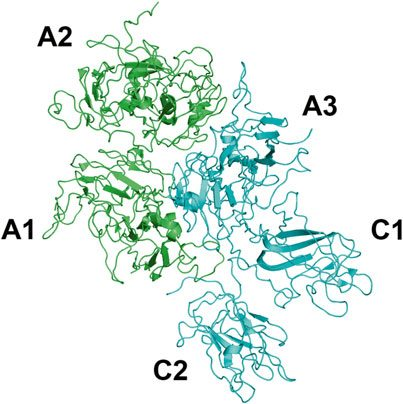

그림 10.1 혈소판 표면의 당단백질(GP) 복합체 GPIb 알파-V-IX(CD42a-d 복합체)의 구조를 도식적으로 나타낸 그림. 이 복합체의 주된 기능은 혈관 손상 부위에서 혈소판 부착을 개시하여 정상적인 일차 지혈을 보장하는 것으로, GPIbα, GPIX, GPV, GPIbβ의 네 개의 서로 다른 막관통 단백질로 구성된다. GPIbα 사슬은 폰 빌레브란트 인자 결합 부위를 제공하며 이 상호작용은 혈소판 부착과 혈소판 활성화, 혈전증, 지혈로 이어지는 신호 전달 사건을 촉진한다. Lanza F. Bernard-Soulier syndrome (Hemorrhagiparous thrombocytic dystrophy). Orphanet J Rare Dis 2006;1:46. doi: 10.1186/1750-1172-1-46에서 재인용. Creative Commons Attribution License 조항에 따라 배포된 오픈 액세스 논문.

**혈소판 활성화와 폰 빌레브란트 인자** 481

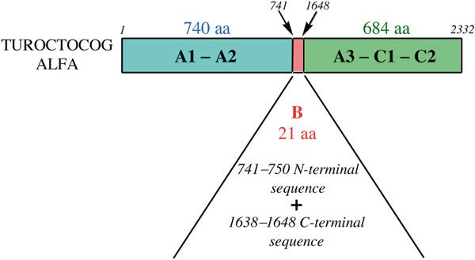

그림 10.2 혈소판 수용체 당단백질 GPIb 알파-트롬빈 복합체의 2.6 Å 분해능 결정 구조로, 혈소판 당단백질과 한 트롬빈 분자의 엑소사이트(활성 부위와 구별되는 2차 결합 부위) I 및 두 번째 트롬빈 분자의 엑소사이트 II와의 상호작용을 보여준다. 구조는 Protein Data Bank RCSB PDB 파일 1P8V에서 가져온 것이다(Dumas JJ, Kumar R, Seehra J, et al. Science 2003;301:222-6).

세포. 이 제제는 폰 빌레브란트병 성인 환자의 출혈에 대한 적시 치료 및 조절에 적응증이 있어 최근 FDA가 승인하였다(표 10.1). 혈소판 응집이 없고 혈소판 표면 인지질이 참여하지 않으면 혈액 응고 캐스케이드는 진행하지 않는다. 신호 전달 캐스케이드로 이어지는 혈소판 활성화는 트롬빈이 표면 G단백질 연결 수용체(G protein-coupled receptor)와 상호작용함으로써 시작된다. 단백질 키나아제 C(PKC)의 활성화, 특히 세포 내 Ca2+ 저장소의 방출이 콜라겐에 대한 혈소판 부착과 함께 작용하면 포스포리파제 A(PLA2)가 활성화되고, 막 인지질의 가수분해로 아라키돈산이 유리되며, 혈소판 활성화의 강력한 유도체인 트롬복산 A(TXA2)가 방출된다. 혈소판 활성화는 PKC에 의한 47 kDa 혈소판 단백질의 활성화가 더욱 자극하는데, 이 단백질은 다시 과립 내용물, 특히 ADP의 방출을 유도하며 ADP는 혈소판을 추가로 자극하고 폰 빌레브란트 인자와 피브리노겐 수용체인 당단백질 수용체 복합체 GPIIb-GPIIIa(인테그린 αIIb-β3라고도 함)의 노출을 초래한다. 이 수용체와 피브리노겐 사이의 상호작용 역시 혈소판 응집을 유도한다. 유전성 출혈 질환인 글란츠만 혈소판무력증(Glanzmann thrombasthenia)은 GPIIb-GPIIIa 수용체 복합체의 GPIIb 단백질 결함으로 발생한다. GPIIb-GPIIIa를 표적으로 하는 단클론항체 아브식시맙(abciximab; ReoPro®)(4장, "아브식시맙" 절)은

| 제품군(일반명/상품명) | 설명 | 승인 적응증 및 용법 | 경고 및 주의사항 | 이상반응(흔한 것 및 중증의 것) |
| --- | --- | --- | --- | --- |
| 응고 인자 및 관련 제제 - 인간 치료용으로 승인된 응고 인자 및 관련 제제a: 설명, 적응증, 이상반응(2016년 6월 기준) | | | | |
| 막대한 수 | | | | |

**혈소판 활성화와 폰 빌레브란트 인자** 483

(계속) 억제인자 개발: 산전 유전성 항트롬빈 결핍 환자는 항트롬빈-IgG1 FVIII-억제 항체 가능성; 이식에 대한 위험 증가; 알레르기성 과민반응; 과민반응 | 경고 및 주의사항: 과민반응; 과민반응; 과민반응은 간질환 동반 여부와 무관하게 FVIII 억제 항체 | 이상반응: 발적, 출혈, 두드러기, 발진, 두통, 가려움, 발열, 출혈, 멍, 메스꺼움, 설사, 구토 | | | |

|  | 중화 항체 |  | FVIII 활성 및 | 돼지 유래 FVIII 억제인자 |  |
| --- | --- | --- | --- | --- | --- |
| 통제되지 않는 억제인자; 출혈의 예방 및 조절; 표준 수술에 의한 비효과적 또는 금기 | 승인 적응증 및 용법: 폰 빌레브란트병 환자; 중증 폰 빌레브란트병 및 데스모프레신이 알려져 있거나 의심되는 불충분한 경증-중등도 질환 환자의 출혈 치료; | 경고 및 주의사항: 과민반응; 발열; 발열; 주사 부위 반응 | | | |

표 10.1 (계속) 484

| 제품명(일반명/상품명) | 설명 | 승인 적응증 및 용법 | 경고 및 주의사항 | 이상반응(흔한 것 및 중증의 것) |
| --- | --- | --- | --- | --- |
| 재조합 응고 제VIII 인자 (옥토코그 알파; 옥토코그 알파 승인) - 전체 길이 제VIII 인자 | 옥토코그 알파; 모로톡토코그 알파 (Xyntha®; ReFacto®) | | | |
| (Kogenate® FS; Kovaltry®; Advate®g; Recombinate®) | 재조합 인간 다중 펩타이드 (포함: 전체 길이 - 제VIII 인자 | 저장 B-도메인 절제(90 + 80 kDa 형태) 아미노산, MW 170 kDa | 절단 B-도메인 (90 + 80 kDa 형태) 아미노산, MW 170 kDa 재조합 인간 | | |

**혈소판 활성화와 폰 빌레브란트 인자** 485

(계속) 이상반응: 두통, 가슴 통증, 어지러움, 메스꺼움, 구토, 체중 증가, 저혈압, 발진, 가려움 | 중증: 아나필락시스; 흔한: 두드러기, 혈관성 부종, 기관지 경련, 호흡곤란, 천명, 홍조 | | | |

**486 10장 혈액 응고**

| 제품명(일반명/상품명) | 설명 | 승인 적응증 및 용법 | 경고 및 주의사항 | 이상반응(흔한 것 및 중증의 것) |
| --- | --- | --- | --- | --- |
| 피브리노겐 농축물 (RiaSTAP®) | 피브리노겐 농축물 (인간) | | | |
| 피브리노겐 실란트 (Tisseel®) | 피브리노겐 실란트 패치 (Evarrest™) | | | |
| 단백질 C (인간) (Ceprotin®) | 단백질 C (인간) 표 10.1 (계속) | | | |

**혈소판 활성화와 폰 빌레브란트 인자** 487

제품명(일반명/상품명) | 설명 | 승인 적응증 및 용법 | 경고 및 주의사항 | 이상반응(흔한 것 및 중증의 것) (계속)

(계속) 항트롬빈 치료가 유전성 항트롬빈 결핍 환자의 혈전색전증 사건 예방 및 치료에 적응증이 아님. | 항트롬빈은 출혈 사건 예방 및 수술 전후 혈전색전증 예방에 적응증: 유전성 항트롬빈 결핍 환자 | 경고 및 주의사항: 과민반응; 심각한 과민반응 (아나필락시스 포함) | 이상반응: 출혈; 주사 부위 반응; 헤파린 항응고 효과 강화 |

**488 10장 혈액 응고**

표 10.1 (계속) A형 및 B형 간염 예방 접종 권장; 전염성 인자의 위험은 완전히 제거될 수 없다 | 문헌: 완전히 제거될 수 없음 | A형 및 B형 간염 예방 접종 권장

(계속) 혈소판 활성화가 없는 상태에서, 그리고 혈소판 표면 인지질의 개입 없이는 혈액 응고 캐스케이드가 진행되지 않는다. (계속)

**칼리크레인-키닌 시스템과 응고** 489

티로신 유도체 티로피반(tirofiban; Aggrastat®)(그림 10.3), 그리고 피그미 방울뱀 독에서 유래한 고리형 헵타펩타이드 엡티피바타이드(eptifibatide; Integrelin®)(그림 10.4)는 혈소판무력증 유사 상태를 만들어 피브리노겐과 수용체 사이 상호작용을 차단하여 혈소판 응집을 억제한다. 이러한 특성은 이 약물들을 혈관성형술(angioplasty)과 불안정 협심증을 받는 환자 치료에 유용하게 한다. 순환계에서 빠르게 분해되는 제VIII 인자(아래 "제VIII 인자" 절 참조) 역시 폰 빌레브란트 인자에 결합하며 트롬빈 작용으로 방출될 때까지 비활성이지만 안정화된 상태로 남아 있다.

**칼리크레인-키닌 시스템과 응고**

혈장 칼리크레인-키닌 시스템은 칼리크레인이 비활성 전구체인 프레칼리크레인으로부터 활성화됨에 따라 비활성 전구체인 키니노겐 거대분자에서 혈관 활성 키닌 방출을 유도한다. 방출된 키닌은 혈관 확장, 혈관 투과성 증가, 일산화질소 생성, 조직 플라스미노겐 활성인자(tPA) 방출, 그리고 아라키돈산 매개 과정, 특히 프로스타사이클린(PGI2) 생성을 포함한 광범위한 작용을 나타낸다. 이러한 다양한 활성 결과로 키닌은 레닌-안지오텐신 시스템을 통한 혈압 조절, 혈관신생, 염증, 세포 성장 및 증식, 세포자멸사, 그리고 여기서 다루는 혈액 응고를 포함한 수많은 생리적 및 병리적 과정에 참여한다. 혈장 칼리크레인-키닌 시스템은 제XII 인자(하지만 인자(Hageman factor)라고도 함), 제XI 인자, 고분자량 키니노겐(HMWK; 피츠제럴드 인자) 및 프레칼리크레인(PK; 플레처 인자)으로 구성된다. 제XI 인자와 제XII 인자는 모두 각각의 활성 세린 프로테아제인 제XIa 인자와 제XIIa 인자에 대응되는 자이모겐(비활성) 형태이다. HMWK는 당화 정도에 따라 분자량 88-120 kDa인 단일 사슬 폴리펩타이드로 혈장에 존재한다. 이는 혈소판 및 내피 세포 결합 활성, 항혈관신생 특성, 저친화도 Ca2+ 결합 부위 존재, 브래디키닌 서열, 그리고

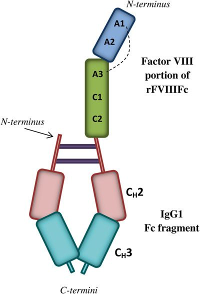

그림 10.3 피브리노겐과 폰 빌레브란트 인자가 혈소판 표면의 GPIIb-GPIIIa 수용체에 결합하는 것을 차단하여 혈소판 응집을 억제하는 합성 비펩타이드 항응고제 티로피반(Aggrastat®)의 구조. 티로피반은 아르기닌-글리신-아스파르트산(RGD) 서열의 소분자 모방체이자 혈소판 수용체의 가역적 길항제로, 작용 개시가 빠르고 작용 시간이 짧다. 톱날 보아뱀(Echis carinatus)에서 분리된 항응고제를 기반으로 하는 그 구조는 분자의 양쪽 말단에 말단 4-(4-피페리디닐)부틸 및 (S)-부틸설포닐아미노 연결을 포함한다.

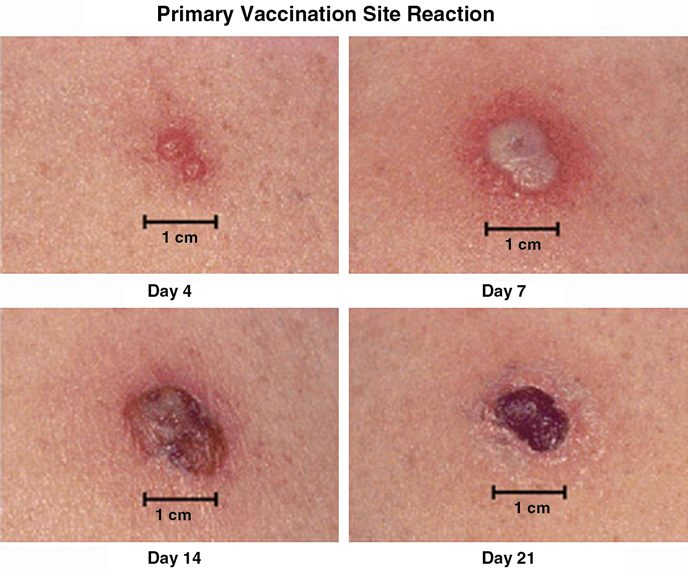

그림 10.4 남동부 피그미 방울뱀(Sistrurus miliarius barbouri) 독에서 발견되는 단백질에서 유래하여 아르기닌-글리신-아스파르트산 모방체로 분류되는 고리형 헵타펩타이드 항혈소판 약물 엡티피바타이드(Integrelin®)의 2차원(a), 3차원 공-막대(b) 및 CPK(c) 모델. 반감기가 짧은 엡티피바타이드는 피브리노겐과 폰 빌레브란트 인자가 혈소판 표면의 GPIIb-GPIIIa 수용체에 결합하는 것을 차단한다. 이 분자는 6개의 아미노산과 1개의 메르캅토프로피오닐기를 포함한다. 시스테인 아미드와 메르캅토프로피오닐 잔기 사이의 사슬 간 이황화 결합에 주목하라. 아미노산 중 5개가 키랄성이며 자연 L-배열로 존재한다. 따라서 32개의 잠재적 광학 이성질체가 있다. 거울상 이성질체에 대한 규격 및 시험은 엡티피바타이드의 광학 순도를 조절한다.

시스테인 프로테아제를 억제하거나 헤파린에 결합하는 서열. HMWK는 도메인 5를 통해 음전하 표면에 결합하는 동시에, 인접한 도메인 6이 프레칼리크레인 및 제XI 인자 결합 부위를 포함하여 이 두 단백질을 결합한다.

**응고 캐스케이드**

혈전 형성에 필요한 피브린 형성은 두 개의 별개 경로, 즉 혈관벽 손상이 촉발하는 외인성(조직 인자) 경로 또는 소위 내인성 경로(더 정확히는 접촉

**응고 캐스케이드** 491

활성화 경로라고 함)에 의해 개시될 수 있다. 음전하 표면(예: 유리)에 의한 자이모겐 전구체 제XII 인자의 활성화를 통한 제XIIa 인자 형성은 후자 시스템의 개시점이다. 제XIIa 인자는 프레칼리크레인을 칼리크레인으로 활성화하며, 칼리크레인은 다시 HMWK를 절단하여 브래디키닌을 방출하지만, 칼리크레인은 또한 제XII 인자를 상호 활성화함으로써 피드백 증폭 과정을 개시한다(그림 10.5). 방출된 브래디키닌은 키닌 B2 수용체(B2R)와의 상호작용을 통해 전염증성 신호 전달 경로를 활성화하여 혈관 확장, 혈관 투과성 증가 및 호중구 주화성을 초래한다. 다시 말해, 제XII 인자가 개시한 사건은 칼리크레인-키닌 시스템이 매개하는 염증 반응과 접촉 응고 경로에서 비롯된 응고촉진 반응으로 나타날 수 있다. 이 경로의 후속 사건은 Ca2+ 존재 하에 제XIa 인자에 의한 제IX 인자(크리스마스 인자라고도 함)의 제IXa 인자로의 활성화로 진행된다. 제IX 인자는 제II, VII, X 인자(스튜어트-프라우어 인자)와 마찬가지로 세린 프로테아제 자이모겐이다.

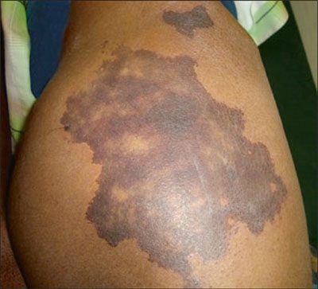

그림 10.5 접촉 활성화(내인성), 조직 활성화(외인성) 및 공통 경로 사이의 관계를 보여주는 응고(응혈) 캐스케이드의 도식으로, 트롬빈 형성 감소로 이어지는 단백질 C의 역할과 트롬빈 및 제Xa 인자의 주요 억제제인 항트롬빈의 역할을 요약하여 나타낸다. HMWK, 고분자량 키니노겐.

비타민 K 의존성 γ-카복시글루탐산 잔기를 함유하며 활성화는 Ca2+가 이 잔기들에 결합함으로써 일어난다. 경로의 다음 단계에서 제X 인자는 활성화된 혈소판 표면에서 Ca2+, 제VIIIa, IXa 및 X 인자를 요구하는 반응에서 제IXa 인자 유도 절단에 의해 제Xa 인자로 활성화된다. 테나아제 복합체(tenase complex)라고 불리는 이 분자 복합체는 혈소판 표면 인지질인 포스파티딜세린과 포스파티딜이노시톨 참여로 형성된다. 제VIII 인자의 제VIIIa 인자로의 활성화는 낮은 농도의 트롬빈이 유도하며(과도한 트롬빈은 불활성화를 유발함), 활성화된 형태에서 제VIII 인자는 제IXa 및 X 인자 수용체로 작용한다. 제Xa 인자는 접촉 활성화와 외인성(조직 인자) 응고 경로의 접합점 또는 만남 장소로 볼 수 있다(그림 10.5). 혈관 손상 후, 방출된 조직 인자(제III 인자)는 제VIIa 인자에 의한 제X 인자의 Ca2+ 의존성 활성화에서 보조인자로 기능함으로써 외인성 응고 캐스케이드를 개시한다. 제VII 인자 활성화는 트롬빈 또는 제Xa 인자 개입을 필요로 하며 후자는 내인성 경로와 외인성 경로를 연결한다. 두 경로의 공통 구간은 제X 인자의 제Xa 인자로의 활성화와 그 이후 피브린 혈전 형성으로 이어지는 사건들이다(그림 10.5). 제Xa 인자가 생성되면 프로트롬빈(제II 인자)이 활성화된 혈소판 표면에서 트롬빈(제IIa 인자)으로 활성화되는데, 이 상호작용은 소위 프로트롬비나아제 복합체 형성을 필요로 한다. 이 복합체는 혈소판 인지질, Ca2+, 제Xa 인자, 제Va 인자(복합체의 보조인자이며 제V 인자 활성화로 형성됨), 그리고 물론 프로트롬빈으로 이루어진 집합체이다. 제VIII 인자와 마찬가지로 제V 인자는 미량 트롬빈에 의해 제Va 인자로 활성화되지만 세린 프로테아제 수준이 증가하면 불활성화된다. 트롬빈은 피브리노겐(제I 인자)을 4개의 Arg-Gly 결합에서 절단하여 자발적으로 응집해 약한 혈전을 형성하는 가용성 피브린 단량체를 생성하지만 더 중요하게는 트롬빈이 제XIII 인자를 활성화하여 피브린 단량체에서 글루타민의 아미드 질소를 라이신의 ε-아미노기와 가교함으로써 응집되고 불용성인 혈전을 형성하는 트랜스글루타미나아제 제XIIIa 인자를 생성한다.

저분자량 헤파린 항응고제 에녹사파린(enoxaparin; Lovenox®, Clexane®, Xaparin®)(그림 10.6)은 수술 후 심부정맥혈전증, 불안정 협심증, 심근경색증 예방 및 치료를 위해 나트륨염으로 피하 투여되며 제Xa 인자 억제를 통해 작용한다. 이는 트롬빈 감소와 혈전 예방을 초래한다. 에녹사파린은 저분자량 헤파린으로 치료받은 환자에서 마비를 초래할 수 있는 중증 사건인 경막외 또는 척수 혈종 위험에 대해 FDA 블랙박스 경고를 지닌다. 다른 경고는 출혈 위험 증가, 경피적 관상동맥 재관류술, 혈소판감소증 유도, 그리고 헤파린 유도 혈소판감소증, 출혈성 체질, 당뇨병성 망막병증, 신기능 장애, 조절되지 않는 동맥성 고혈압, 위장관 궤양 또는 출혈 병력이 있는 환자에서의 주의 필요성과 관련한다. 에녹사파린의 가장 흔한 이상반응은 출혈과 멍, 빈혈, 혈소판감소증, 설사, 메스꺼움 및 혈청 아미노전이효소 수치 상승을 포함한다. 시판 후 경험에서 경막외 또는 척수 혈종(많은 경우 신경학적 손상 유발), 주사 부위 반응, 고칼륨혈증, 혈소판증가증 및 혈전증을 동반한 혈소판감소증, 알레르기 반응(아나필락시스/아나필락시스양 반응, 두드러기, 가려움 포함) 발생이 보고되었다.

**응고 캐스케이드** 493

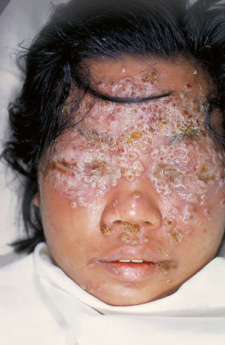
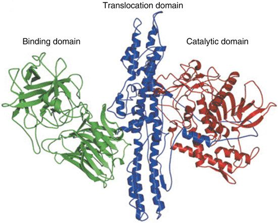

그림 10.6 평균 분자량 ~4500의 저분자량 헤파린인 에녹사파린은 항응고제로서 그리고 수술 후 심부정맥혈전증 치료를 위해 예방적으로 사용되며 헤파린 벤질 에스테르의 탈중합에 의해 생성된다. 나트륨염으로 생성되는 이 분자는 비환원 말단에 2-O-설포-4-엔피라노수론산기를 함유하고 환원 말단에 2-N,6-O-이설포-D-글루코사민을 함유한다. 구조의 약 20%는 환원 말단에 1,6-무수 유도체를 지닌다.

과민성 피부 혈관염; 수포성 수포성 발진; 자반증; 피부 괴사, 그리고 약물 유발 간 손상. 후자는 에녹사파린 치료 시작 후 1주 이내에 발생하고 나타날 수 있다. FDA 이상반응 보고 시스템(FAERS) 데이터베이스는 에녹사파린 관련 이상반응의 약 4%가 간 손상을 수반함을 보여준다. 환자는 일반적으로 무증상이며 과민반응을 포함한 면역 매개 반응 특징을 나타내지 않는다. 면역 기전 징후가 없고 다른 증거가 부재하다는 점은 약물의 간에 대한 직접적인 독성 효과를 가리킨다. 고용량과 장기간 치료는 입원 및/또는 사망으로 이어질 수 있다. 이러한 결과는 항응고 치료가 필요한 환자 동반 질환에 일반적으로 관련된 출혈 및 기타 중증 이상반응 결과일 가능성이 높다. 간 손상은 일반적으로 약물 중단 시 빠르게 회복된다.

비타민 K 의존성 당단백질인 단백질 C는 자가프로트롬빈 IIA 및 응고 인자 XIV라고도 하며 활성 형태인 세린 프로테아제 활성화 단백질 C(APC)의 자이모겐이다. 단백질 C 활성화는 혈관 세포에서 발견되는 트롬보모듈린과 내피 단백질 C 수용체가 촉진한다. 이 반응 과정은 보조인자인 단백질 S, 제V 인자, 고밀도 지질단백질, 당스핑고지질 및 인지질 참여로 진행된다. APC는 고도로 응고촉진적인 제Va 인자와 제VIIIa 인자를 불활성화하며(그림 10.5, 표 10.1), 트롬빈 형성 감소를 초래한다. 제Va 인자와 제VIIIa 인자는 혈액 응고의 중요한 구성요소이며 단백질 C 경로는 과도한 응고촉진 반응을 예방하는 중요한 조절 기전이다. 단백질 C 결핍은 정맥 혈전증, 전격성 자반증(purpura fulminans), 중증 파종성 혈관내 응고 그리고 자궁 내 동시성 정맥 혈전색전증 위험이 현저히 증가한 것으로 나타날 수 있다. APC에 대한 저항성도 발생하며 가장 흔히 제V 인자 절단 부위 돌연변이로 제Va 인자와 제VIIIa 인자 모두의 불활성화를 방지하는 제V 라이덴(Leiden)을 생성한다. 이로 인해 트롬빈 생성과 혈전증 위험이 현저히 증가한다. FDA 승인 인간 단백질 C 농축물(Ceprotin®)은 중증 선천성 단백질 C 결핍증에 적응증이 있으며 따라서 정맥 혈전증과 전격성 자반증 예방 및 치료를 위한 것이다. 인간 단백질 C 농축물 안전성 측면은 표 10.1에 요약되어 있다.

항트롬빈은 세린 프로테아제인 트롬빈과 제Xa 인자의 주요 억제제이며 그보다 덜하지만 제IXa, XIa, XIIa 인자, 트립신, 플라스민 및 칼리크레인도 억제함으로써 항상성 조절에 중요한 역할을 한다(그림 10.5). 세린 프로테아제 중화는 순환계에서 빠르게 제거되는 복합체 형성에 의해 이루어진다. 헤파린이 존재하면 복합체 형성이 가속화되고 트롬빈을 억제하는 항트롬빈 능력이 1000배 증가한다. Atryn®은 형질전환 염소 우유에서 생산되는 재조합 인간 항트롬빈이다. 이 승인된 제제 적응증과 안전성 고려 사항은 표 10.1에 요약되어 있다.

**제XII 인자와 응고**

제XII 인자가 시험관 내 접촉 매개 응고에서 하는 역할은 잘 알려져 있는데, 항응고 치료 모니터링, 응고 인자 결핍 선별, 응고 억제제 검출에 광범위하게 사용하는 활성화 부분 트롬보플라스틴 시간(aPTT) 검사만으로 충분하다. 시험관 내 응고에서 접촉 유도 피브린 형성을 통한 명백한 역할과 중요성에도 불구하고, 생체 내에서 제XII 인자 개시 응고는 중요하지 않은 것으로 간주되었으며, 실제로 정상 지혈에 불필요한 것으로 여겨졌다. 더욱이 응고 캐스케이드의 다른 많은 참여자(예: 제VII, VIII, IX 인자) 결핍은 출혈 질환을 초래하지만 제XII 인자의 경우에는 그렇지 않다. 따라서 생체 내 피브린 혈전 형성이 크게(배타적이지는 않더라도) 외인성 조직 활성화 응고 경로를 통해 진행된다는 결론은 놀라운 것이 아니었다. 제XII 인자가 혈장 응고 시스템에 미치는 생체 내 효과를 더 집중적으로 연구하기 위해, 쥐 제XII 인자 녹아웃(knockout, −/−) 모델을 개발하였다. 제XII 인자 결손(−/−) 쥐는 정상적인 지혈 능력을 지니지만 혈전 형성은 손상되어 있었다. 흥미롭게도 동맥 혈전 형성 약화는 실험적 뇌 허혈과 폐색전증으로부터의 보호와 관련이 있는 것으로 보인다. 이러한 발견은 지혈에 영향을 주지 않으면서 혈전증을 표적으로 하는 항응고 요법 가능성을 제기하면서 제XII 인자에 대한 새로운 관심을 불러일으켰다. 제XI 인자가 없는 쥐가 폐쇄성 혈전으로부터 보호된다는 관찰은 제XII 인자가 내인성 경로를 통해 병적 응고에 영향을 준다는 것을 더욱 시사한다. 제XII 인자가 폐쇄성 혈전 형성에 필요한 것으로 보인다는 발견은 생체 내에서 제XII 인자 의존성 응고를 개시할 수 있는 내인성 활성화제에 대한 탐색으로 이어졌다. 수년 동안 혈소판은 내인성 경로와 연관되어 왔으며 제XII 인자가 응고촉진 혈소판에서 활성화된다는 제안이 있었지만 제안된 기전에 대한 보편적 수용은 이루어지지 않았다. 최근 혈소판 폴리포스페이트(phosphoanhydride 결합으로 연결된 오르토인산 단위의 무기 선형 중합체)가 활성화된 혈소판에 의한 피브린 형성을 개시하는 오랫동안 찾아온 표면이라고 주장되어 왔다. 혈소판 치밀 과립에 풍부한 폴리포스페이트는 혈소판 활성화 시 방출되며 제XII 인자 의존적 방식으로 혈장 응고를 조절하는 것으로 나타나 제XII 인자의 내인성, 혈소판 유래 생체 내 활성화제임을 시사한다. 혈소판 유래 응고촉진인자로서 폴리포스페이트 확인은 일차 지혈과 이차 지혈 사이 이전에 파악하지 못한 연결고리로서 많은 이들이 환영해 왔다.

**제VIII 인자** 495

**제VIII 인자**

인간 제VIII 인자 유전자는 1984년에 처음 클로닝되었으며 A, B, C의 세 가지 유형 도메인으로 구성되고 A1-A2-B-A3-C1-C2로 배열된 2332개 아미노산의 단일 사슬 폴리펩타이드를 암호화한다(그림 10.7). 각각 약 330개 잔기인 A 도메인은 서로 그리고 세룰로플라스민의 쿠프레독신 유형 도메인과 약 40%의 상동성을 보인다. 고도로 당화된 중앙 B 도메인은 상이한 종의 제VIII 인자 단백질에서 가변적 서열을 갖고 각각 약 160개 잔기인 C 도메인은 갈락토스 산화효소 같은 디스코이딘 단백질과 원거리 관련이 있다. 번역 후 처리에서 일부 티로신의 당화와 황산화가 일어나고 폴리펩타이드는 구리와 아연 이온에 의해 결합되는 A1-A2-B 도메인으로 구성된 중쇄와 A3-C1-C2 도메인으로 구성된 경쇄의 이형이합체로 전환된다. B 도메인은 알려진 구조적 상동체가 없고 응고촉진 활성에 불필요한 것으로 보이지만 제VIII 인자의 세포 발현과 분비를 조절한다. 159개 아미노산의 카복시 말단 C2 도메인은 폰 빌레브란트 인자 결합과 혈소판 막 표면 결합에 관여한다. 트롬빈 유도 제VIII 인자 활성화는 제VIIIa 인자의 A1, A2, A3-C1-C2 단편 생성, 테나아제 복합체(제VIIIa 인자/제IX 인자) 및 제Xa 인자 생성, 트롬빈 생성, 그리고 궁극적으로 안정적인 피브린 혈전을 초래한다(그림 10.5). 전체 길이 제VIII 인자 재조합 형태는 옥토코그 알파(octocog alfa)로 알려져 있다.

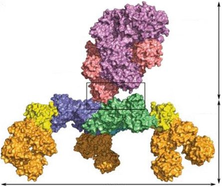

그림 10.7 전체 길이 제VIII 인자 단일 폴리펩타이드 사슬(2332개 아미노산)의 표현으로, A1, A2, B, A3, C1, C2 도메인의 배열을 보여준다. 이 폴리펩타이드는 금속 이온에 의해 함께 결합되는 A1-A2-B 도메인의 중쇄와 A3-C1-C2 도메인의 경쇄로 이루어진 이형이합체이다. 159개 아미노산의 카복시 말단 C2 도메인은 폰 빌레브란트 인자 결합과 혈소판 막 표면 결합에 관여한다. 트롬빈 유도 제VIII 인자 활성화는 제VIIIa 인자의 A1, A2, A3-C1-C2 단편 생성으로 이어진다.

**B-도메인 절제 재조합 제VIII 인자**

제VIII 인자는 여러 개의 별개 도메인(A1-A2-B-A3-C1-C2)을 지닌 2332개 아미노산(분자량 ~300 kDa)의 대형 단일 사슬 단백질로 합성된다(그림 10.7). 재조합 인간 전체 길이 제VIII 인자는 국제일반명(INN)이 옥토코그 알파이다. 알려진 기능이나 다른 단백질과의 상동성이 없고 25개 당화 부위 중 19개를 지닌 대형 B 도메인은 중쇄(A1-A2-B; 크기 90-200 kDa)와 경쇄(A3-C1-C2; 80 kDa)를 생성하도록 처리된다. Ser743에서 Gln1638까지 B 도메인 대부분을 결실하면 단백질 크기가 38% 감소하여 대부분 90 kDa 중쇄와 80 kDa 경쇄가 되지만 제VIII 인자 활성에 영향이 없고 발현은 오히려 증가하는 것으로 밝혀졌다. 이로써 다음을 포함한 기능적 절단 효소 구축이 가능해졌다.

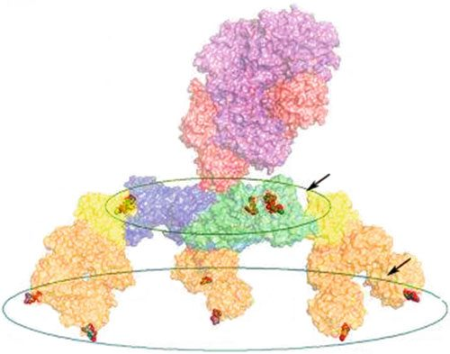

그림 10.8 B-도메인 절제 제VIII 인자의 리본 도표로 A1, A2, A3, C1, C2 도메인의 상대적 위치를 보여준다. Protein Data Bank의 PDB 2R7E에서 Mattkosloski가 제작·업로드한 자작물(Wikimedia Commons, 파일 Fviii 2R7E.png, Pymol 사용(http://www.pymol.org/))(참고: Shen BW, Spiegel PC, Chang CH, et al. Blood 2008;111:1240-7).

다섯 개의 도메인(그림 10.8)을 지닌 소위 B-도메인 절제 재조합 제VIII 인자 단백질 형태로 만들어진 효소이며 Asp 잔기 41, 239, 582, 1685, 1810, 2118에 6개의 잠재적 N-연결 당화 부위를 유지한다. 여기서 BDDrFVIII로 명명한 이 제제는 발색성 기질 및 응고 검정에서 특이 활성을 비교했을 때 B-도메인이 유지된 제VIII 인자와 동등한 것으로 입증되었다. Kogenate® FS, Kovaltry®, Advate® 같은 전체 길이 재조합 제VIII 인자 제제뿐만 아니라, 국제일반명 moroctocog alfa가 부여된 B-도메인 절제 재조합 제VIII 인자(BDDrFVIII) 제제는 ReFacto® 및 Xyntha®로 시판된다(표 10.1). 최초의 BDDrFVIII인 ReFacto®는 2000년에 FDA가 허가하였다. 이는 2008년 미국 시장에서 알부민 무함유 제제인 Xyntha®(유럽에서는 Refacto AF®로 시판)로 대체되었다. ReFacto®의 경우 결실된 B-도메인은 짧은 14개 아미노산 링커로 대체되었다. moroctocog alfa 제제의 번역 후 변형과 시험관 내 기능적 특성은 내인성 제VIII 인자 것과 비교 가능하다. 전체 길이 재조합 제VIII 인자 제제인 Kogenate® FS와 Kovaltry®는 동일한 아미노산 서열을 가지지만 후자의 당화, 특히 분지와 시알산화 캡핑이 임상적으로 우수한 제품을 만든다고 알려져 있다. 전체 길이 제제인 옥토코그 알파와 BDD 제제인 moroctocog alfa 외에도 4개의 다른 재조합 BDD 변형 제VIII 인자 제제가 혈우병 A 치료를 위한 항혈우병 인자로 사용된다. 이들은 turoctocog alfa, simoctocog alfa, susoctocog alfa, 그리고 efmoroctocog alfa로도 알려진 제VIII 인자 Fc 융합 단백질이다.

**투로톡토코그 알파(Turoctocog Alfa)**

CHO 세포에서 생산하고 2013년 FDA가 허가한 turoctocog alfa(표 10.1)는 A1-A2 도메인을 A3-C1-C2 도메인에 연결하는 단 21개 아미노산의 절단된 B-도메인을 지닌 재조합 제VIII 인자 제제이다. 연결

그림 10.9 고도로 절단된 21개 아미노산의 B-도메인을 포함하는 중쇄를 유지하는 1445개 아미노산 폴리펩타이드 turoctocog alfa의 A1, A2, A3, C1, C2 도메인의 구조적 배열 표현. A1, A2, B, A3, C1, C2 도메인의 배열을 보여주는 2332개 아미노산의 전체 길이 제VIII 인자 단일 폴리펩타이드 사슬을 묘사한 그림 10.7과 비교하라. turoctocog alfa의 활성화 시 트롬빈 절단 부위는 잔기 740과 741 사이이다.

서열은 원래 B-도메인의 N-말단에서 유래한 10개 아미노산(잔기 741-750)과 C-말단에서 유래한 11개 아미노산(잔기 1638-1648)으로 구성된다(그림 10.9). Turoctocog alfa는 4개의 N-연결 당화와 6개의 티로신 황산화 부위를 포함하며 그중 두 곳(Tyr346, Tyr1664)은 트롬빈과의 최적 상호작용에 필요하다. 인간에서 turoctocog alfa 평균 반감기는 10.8시간(비교: Advate® 11.2시간)이고 클리어런스율은 4.1 mL/h/kg이다(Advate® 4.2 mL/h/kg).

**시모톡토코그 알파(Simoctocog Alfa)**

인간 배아 신장 세포에서 생산되는 simoctocog alfa(표 10.1)는 최신 BDDrFVIII이다. EMA(2014), FDA(2015), 그리고 호주, 캐나다 및 기타 여러 국가에서 허가되었다. Nuwiq®로 시판되는 simoctocog alfa는 A2와 A3 도메인 사이에 16개 아미노산 링커가 결실된 B-도메인을 대체하고 있는 FVIII 도메인 A1-A2 + A3-C1-C2(그림 10.7)로 구성된다. 링커 서열의 처음 8개 아미노산과 N-말단 B-도메인은 동일하며; 나머지 옥타펩타이드는 전체 길이 FVIII 분자와 유사한 단백질분해 처리를 보장하도록 아르기닌이 풍부하다. Simoctocog alfa의 티로신 1680은 혈장 유래 FVIII에서 그렇듯이 황산화된다(폰 빌레브란트 인자 결합에 중요).

**수소톡토코그 알파(Susoctocog Alfa)**

햄스터 신장 세포에서 발현되는 susoctocog alfa(Obizur®)(표 10.1)는 B-도메인이 24개 아미노산 링커로 대체된 돼지 제VIII 인자(pFVIII)의 BDDrFVIII 유사체이다. Muroctocog alfa, turoctocog alfa, simoctocog alfa와 마찬가지로 susoctocog alfa는 분자량이 ~170 kDa이며 중쇄(H)와 경쇄(L)의 분자량이 각각 90 kDa과 80 kDa이다. 활성화될 때 rpFVIII는 내인성 인간 FVIII와 비교 가능한 활성을 보인다.

**응고 인자 융합 단백질**

인간 치료에 사용되는 승인된 융합 단백질에 대한 자세한 논의는 6장을 참조하라. 제VIII 인자 또는 제IX 인자 제품의 정기 주입은 오랫동안 혈우병 치료 기초였지만 특히 소아에서 반복적인 정맥 주사 불편함은 주입 횟수와 정맥 접근 장치 필요성을 줄이는 제품에 대한 욕구로 이어졌다. 따라서 생체 내 반감기가 증가된 제VIII 인자 및 제IX 인자 제제를 생산하려는 노력이 집중되었다. 2014년 FDA는 최초의 항혈우병 융합 단백질, 즉 혈우병 A 또는 선천성 제VIII 인자 결핍증이 있는 성인 및 소아 치료에 적응증인 재조합 제VIII 인자 Fc 융합 단백질(Eloctate®)과 혈우병 B 또는 선천성 제IX 인자 결핍증이 있는 성인 및 소아 치료에 적응증인 재조합 제IX 인자 Fc 융합 단백질(Alprolix®)을 승인하였다(표 10.1). 두 융합 단백질 모두 각각 짧은 생체 내 반감기에 의해 제한되는 1세대 재조합 효소 요법이 반감기가 연장되고 그에 따른 임상적 가치가 개선된 2세대 요법으로 전환된 사례로 주목된다.

**제VIII 인자 Fc 융합 단백질**

FDA 승인 제VIII 인자 Fc 융합 단백질 Eloctate®(efmoroctocog alfa로도 알려져 있으며 여기서 rFVIIIFc로 표기; 6장, "제VIII 인자 Fc 융합 단백질" 절 참조)는 BDDrFVIII("B-도메인 절제 재조합 제VIII 인자" 절 참조)가 인간 면역글로불린 G1(IgG1)의 Fc 단편에 공유 결합된 것으로 구성된다(표 10.1, 그림 10.10). 이는 신생아 Fc 수용체 FcRn에 결합할 수 있게 한다. FcRn은 리소좀에서의 분해를 지연시키고 단백질을 혈장으로 재순환시켜 면역글로불린 반감기를 연장한다(2장, "IgG 항체 아형" 절 및 6장, "Fc 융합 단백질" 절). 여러 전임상 동물 모델과 인간에서 rFVIIIFc 반감기는 1.5-2배 증가하여 ~19.7시간인 것으로 밝혀졌다. BDDrFVIII는 인간 배아 신장(HEK) 세포에서 재조합 DNA 기술로 생산된다. 링커 서열이 없는 인간 IgG1 Fc 단편에 융합된 BDDrFVIII(Ser743-Gln1638 융합)용 플라스미드를 HEK293 세포에서 발현시켰다. rFVIIIFc 이량체가 생성될 것으로 예상되었지만

**응고 인자 융합 단백질** 499

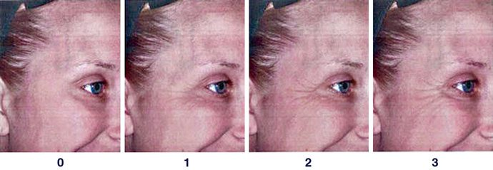

그림 10.10 B-도메인 절제 재조합 제VIII 인자를 인간 IgG1의 Fc 단편에 공유 결합하여 생성된 단량체성 제VIII 인자 인간 Fc 융합 단백질(rFVIIIFc)의 구조를 도식적으로 나타낸 그림. 이펙터 분자는 Fc 사슬 중 하나 또는 둘 모두에 연결되어 각각 단량체성 또는 이량체성 융합 단백질을 만들 수 있다. rFVIIIFc는 단량체로 발현되며 A1과 A3 사이의 점선은 금속 이온 매개 비공유 결합을 나타낸다.

형질전환 세포에서 단량체 Fc 융합 단백질(그림 10.10)만 추출·정제할 수 있었다. 놀랍게도 일부 Fc 융합 단백질 단량체는 예를 들어 개선된 수송, 더 긴 반감기, 향상된 생물학적 활성 측면에서 이량체 대응물보다 향상된 약력학적 및 약동학적 특성을 보여준다. 이는 적혈구생성인자, 제IX 인자, 인터페론 베타 융합 단백질(아래 참조)에서 입증되었다. 제VIII 인자 Fc 융합 단백질은 DNA 코딩 서열에 기반한 예상 서열뿐만 아니라 예상되는 N-연결 당화 및 황산화 번역 후 변형을 포함하는 것으로 확인되었다. 분석은 또한 부착된 Fc 단백질이 BDDrFVIII와 비교하여 시험관 내 활성을 손상시키지 않음을 확인했으며; 발색 데이터에 의한 특이 활성은 몰 기준으로 유사했고 응고 활성 검정에서도 유사한 결과가 얻어졌는데, 특히 활성화된 인간 혈소판을 사용했을 때 그러했다. rFVIIIFc와 BDDrFVIII 모두 폰 빌레브란트 인자에 높은 친화도로 결합했으며 KD 값은 각각 0.34와 0.26 nM이었다.

**제IX 인자 Fc 융합 단백질**

제IX 인자(~55 kDa, 비타민 K 의존성 세린 프로테아제)는 비교적 짧은 14-34시간 반감기를 지닌다. 이는 단일 리간드 특이성을 지니고 반감기가 ~3.5일로 연장된 승인된 단가 재조합 제IX 인자 Fc 융합 단백질 Alprolix®(rFIXFc; 6장, 절

"제IX 인자 Fc 융합 단백질" 참조)의 개발을 촉진하였다(표 10.1). rFIXFc는 인간 응고 제IX 인자 서열이 인간 IgG1의 Fc 단편에 공유 결합된 것으로 구성된다. 재조합 제IX 인자는 혈장에서 유래된 제IX 인자의 Thr148 대립형질 형태와 동일한 아미노산 서열을 가지며 천연 인간 제IX 인자와 유사한 구조적·기능적 특성을 지닌다. rFVIIIFc와 마찬가지로 단량체성 제IX 인자-Fc 구축물은 이량체성 제IX 인자-Fc 융합 구축물보다 약력학적·약동학적으로 우수한 것으로 입증되었다. 인간 배아 신장 세포에서 재조합 형태 생산은 필요한 모든 번역 후 변형을 포함시킬 수 있게 하였다.

**제IX 인자 알부민 융합 단백질**

제IX 인자 알부민 융합 단백질은 재조합 인간 알부민을 재조합 제IX 인자에 유전적으로 융합함으로써 생성되며 인간 혈장 유래 제IX 인자의 Thr148 대립형질 형태를 포함하는 rIX-FP로 명명한 단일 단백질을 생성한다. 제IX 인자와 알부민은 천연 제IX 인자의 내인성 활성화 펩타이드에서 유래한 절단 가능한 링커로 연결된다. 제IX 인자 알부민 융합 단백질은 Idelvion®으로 2016년 3월 FDA가 승인하였다. 승인된 적응증은 표 10.1에 제시되어 있다(6장도 참조). 이 융합 단백질은 최대 14일의 투여 일정으로 연장된 기간 동안 효과적이라고 주장된다. 약동학적 파라미터는 87-93시간 반감기를 보여주었다.

**승인된 혈액 응고 제제의 안전성**

지혈 및 혈전증 연구 학회(HTRS; 지혈 및 혈전증 질환에 초점을 맞춘 북미 의학 학회), 유럽 혈전증 연구 기구(ETRO), 국제 혈전증 및 지혈 학회(ISTH)와 같은 비영리 전문 기구는 혈전증과 지혈의 모든 측면에 대한 이해, 예방, 진단 및 치료를 발전시키는 것을 목표로 하는 조직이다. 예를 들어 시판 후 감시 프로그램을 통해 이들 학회는 다양한 응고 인자 및 관련 제제 사용으로 구축되고 있는 경험 기반을 수집·기록하고 확대하는 데 귀중한 역할을 할 수 있다. 예를 들어 HTRS 등록 감시 프로그램은 제VIIa 인자(NovoSeven®)의 모든 사용에 대한 데이터를 수집하여 이 제제의 경험 기반을 확대하도록 설계되었다.

**혈우병의 억제인자와 우회(bypass) 요법**

50년 전, 적절한 치료를 받지 못한 혈우병 환자의 기대 수명은 약 16세였으며 혈관절증(hemarthrosis)이 흔히 만성 관절병증 발생으로 이어졌다. 제VIII 인자 및 제IX 인자 농축물의 예방적 투여는

**승인된 혈액 응고 제제의 안전성** 501

때때로 자발성 혈관절증 횟수를 줄였지만 억제 항체 발생은 종종 치료를 덜 효과적으로 만들거나 심지어 무효하게 하였다. 제VIII 인자 또는 다른 응고 인자에 대한 항체를 지닌 환자는 조절하기 어려운 중증 출혈을 겪을 수 있으며, Lollar에 따르면: "혈우병 A 및 B에서 억제 항체 발생은 이 질환을 종종 치료 가능한 상태에서 난치성 상태로 전환시키며, 이제 치료의 가장 중요한 합병증으로 간주된다." DiMichele는 억제 항체가 중증 혈우병 A 환자의 약 20-33%와 중증 혈우병 B 환자의 1-6%에서 심지어 대량의 인자 투여도 중화시키며 치료를 복잡하게 만든다고 지적했다. 억제인자가 없는 환자의 4%가 정형외과적 시술로 입원한 반면, 억제인자가 있는 환자 입원율은 14-35세에서 16%, 36-65세에서 27%였다. 제VIII 인자 및 제IX 인자 치료에서 억제인자 제거를 위한 가장 성공적인 절차는 면역 관용 유도(immune tolerance induction)이며 알레르기 전문의가 흡입, 섭취, 주사 또는 접촉 알레르겐에 대한 알레르기 반응을 완화하거나 제거하기 위해 사용할 때 탈감작(desensitization) 또는 면역요법이라고도 한다. 이 절차는 문제 제제에 대한 관용을 유도하여 치료가 최적 용량으로 계속될 수 있게 하려는 시도이다. 생명을 위협하거나 그보다 덜한 이상 증상을 피하거나 최소화하면서 제제 양을 점진적이고 단계적으로 증량 투여한다. 제VIII 인자 및 제IX 인자에 대한 면역 관용 유도는 수 주에서 수 년 동안 투여되는 증량 용량 제제를 정기적(매일 또는 주 1회 이상)으로 주입하는 것을 포함한다. 이 절차는 시간이 많이 걸리고 비용이 들며 잠재적으로 위험하지만 30년 동안 제VIII 인자 억제인자가 있는 환자의 70-85%에서 효과가 입증되었지만 제IX 인자에 대한 항체가 있는 환자에서는 약 30%에서만 효과적이었다.

제VIII 인자 억제인자는 혈액 응고 인자에 대한 가장 흔히 관찰되는 병원성 항체이며 일반적으로 치료 첫 해 이내에 주입에 대한 반응으로 발생한다. 억제인자는 정상 건강 공여자의 약 20%에서 발견되었으며 항-제VIII 인자 IgG 항체는 모든 정상 혈청에서 발생하는 것으로 보인다. 제VIII 인자 억제인자는 거의 항상 다클론성 IgG로 구성되며 IgG4가 혈장 내 총 IgG의 약 5%만 차지함에도 불구하고 IgG4 아형이 주요 구성 요소이다. IgG1과 IgG2도 존재하지만 IgG3는 아니다. 유전성 및 후천성 혈우병 A 모두에서 항체는 주로 제VIII 인자의 A2 및 C2 도메인을 상보적으로 인식한다(그림 10.7 및 10.8). 제IX 인자는 Gla-EGF1-EGF2-AP-SP의 다섯 도메인으로 구성된 구조를 가지며 여기서 Gla는 γ-카복시글루탐산, EGF는 표피 성장 인자 유사, AP는 활성화 펩타이드, SP는 세린 프로테아제를 나타낸다. 제IX 인자 억제인자는 주로 IgG1과 IgG4인 다클론성 IgG 항체로 밝혀졌다. 이 항체들은 주로 Gla 및 SP 도메인을 인식하며 EGF 및 AP 도메인을 인식하지 않는다.

오늘날 혈우병 A 및 B 치료 선택은 제VIII 또는 IX 인자의 특정 요구를 피하는 소위 우회(bypass) 접근법이다. 혈우병 A와 B 모두에서 억제인자가 있는 환자에게 선택되는 제제는 프로트롬빈 복합 농축물, 활성화 프로트롬빈 농축물("제VIII 인자 억제 우회 활성(FEIBA) 항-억제인자 응고 복합체" 및 "프로트롬빈 복합 농축물" 절 참조), 그리고 재조합 활성화 제VII 인자(rFVIIa; eptacog alfa)이다(표 10.1).

항-억제인자 응고 복합체 및 프로트롬빈 복합 농축물(아래 참조), 그리고 재조합 활성화 제VII 인자(rFVIIa; eptacog alfa)(표 10.1). 프로트롬빈 복합 농축물과 활성화 프로트롬빈 농축물은 둘 다 인간 혈장에서 제조되며 프로트롬빈(제II 인자), 제VII, IX, X 인자, 그리고 소량의 제VIII 인자를 포함한다. 활성화 프로트롬빈 농축물은 활성화된 제VII 인자와 주로 비활성화된 제II, IX, X 인자를 포함한다. 현재 프로트롬빈 복합 농축물은 억제인자 환자 치료에 거의 사용하지 않는데, 활성화 제제보다 덜 효과적이고 이상반응 비율이 더 높다. 활성화 프로트롬빈 농축물인 항-억제인자 응고 복합체(FEIBA NF®)와 재조합 활성화 제VII 인자(NovoSeven®)의 두 가지 우회 제제가 현재 억제인자 환자에게 사용 가능하다(표 10.1). FEIBA NF®에는 mL당 1-6 단위의 제VIII 인자 응고 항원이 포함된다는 점에 유의하라. 억제인자가 있는 혈우병 환자 출혈 에피소드에 대한 활성화 프로트롬빈 농축물 및 활성화 제VII 인자 치료의 효능 비율은 각각 57-79%에서 87-100% 범위이다. 증기 처리와 나노여과가 전염성 인자(특히 바이러스와 프리온) 전파 가능성을 겉보기에 극복하는 데 성공했음에도 불구하고 이들 제제는 자체 단점이 없는 것은 아니다. 우회 요법은 본질적으로 단시간 작용하며 너무 자주 투여하면 출혈을 증가시키거나 과도한 응고를 유발할 수 있다. 또한 이들 제제는 소량의 제VIII 인자와 일부 제IX 인자를 포함하여 혈우병 A 환자에서는 제VIII 인자에 대한 항체를, 혈우병 B에서는 제IX 인자에 대한 항체를 유발할 수 있다. 표 10.1은 현재 사용 중인 등록된 혈액 응고 제제 이상반응을 경고 주의사항 및 승인 적응증과 함께 요약한다. 22개의 서로 다른 제제(재조합 단백질 포함)에 걸쳐 반복적으로 나타나는 특징이 관찰되는데, 특히 중화 항체 발생 가능성, 아나필락시스 같은 중증 알레르기 발현을 포함한 과민반응, 혈전성 사건 위험, 그리고 항상 존재하지만 작은 전염성 인자 전파 가능성이다. 표 10.1에 제시된 정보 외에, 일부 개별 제제와 관련된 다음 안전성 관련 데이터가 주목된다.

**제VIIa 인자**

드물게 제VII 인자로 치료받은 환자에서 단백질에 대한 혈청 항체가 발생했고 일부 경우 항체는 시험관 내 억제 효과를 보였다. 임상 시험 결과는 제VIIa 인자 사용이 낮은 혈전성 사건 발생률(0.2%)과 관련 있음을 나타낸다. 또한 FDA 이상반응 보고 시스템 데이터베이스 정보는 제VIIa 인자에 대해 보고된 대부분의 중증 혈전색전증 사건이 혈우병이 아닌 환자에서의 표시 외(off-label) 사용에서 발생했음을 보여준다. 185건의 혈전색전증 사건 중 17건(9.2%)이 혈우병 환자에서 발생한 반면, 151건(81.6%)은 다른 원인으로 인한 출혈 환자에서 발생했다.

**승인된 혈액 응고 제제의 안전성** 503

원인. 가장 빈번하게 보고된 혈전색전증 사건은 뇌졸중, 급성 심근경색, 폐색전증을 포함했다. 그러나 이러한 증례 계열에서 대조군이 없다는 것은 제VIIa 인자 치료와 혈전색전증 이상반응 사이 인과적 연관성에 대한 즉각적인 결론을 허용하지 않는다는 점에 유의하라.

**제VIII 인자 전체 길이 제제**

수식되지 않은(전체 길이) 제VIII 인자 재조합 제제에 대한 심각한 과민반응이 승인 후 사용 중 확인되었다. 보고된 반응은 얼굴 부종, 혈압 저하, 홍조, 흉부 압박감, 호흡곤란, 빈맥, 구토, 두드러기뿐만 아니라 메스꺼움, 발진, 안절부절, 저림을 포함한다. 73명의 이전 치료 경험 환자에 대한 면역원성 조사에서 기존 억제인자가 있는 환자는 1명뿐이었으며; 4년 동안 다른 72명의 환자에서는 억제인자가 검출되지 않았다. 억제인자는 2~16일의 노출 기간 동안 이전에 치료받지 않은 60명 및 최소 치료 경험 소아 환자 중 9명에서 발생했다. 환자 중 6명은 고역가 항체 억제인자가 발생했다. 다른 연구에서 기준값이 음성인 64명 중 8명에서 항체가 발생했으며; 환자 2명은 고역가 억제인자 때문에 연구에서 중퇴해야 했다. 항체는 노출 후 5~151일 사이에 검출되었으며 중앙값은 44일이었다. 2011년 12월과 2013년 6월 사이 전 세계 보고에서 모든 연령대의 Advate® 사용과 관련하여 가장 빈번하게 보고된 중증 이상반응 15가지는 빈도 내림차순으로 다음과 같다: 제VIII 인자 억제(30건 보고); 중심 정맥 라인 감염(6건 보고); 출혈 및 상태 악화(각각 5건 보고); 관절 출혈 및 약효 없음(각각 4건 보고); 청색증(3건 보고); 그리고 (모두 2건) 뇌출혈, 만성 C형 간염, 혈관절증, 두통, 혈우병 A, 혈우병성 관절병증, 발열, 통증. Moroctocog 알파: B-도메인 절제 제VIII 인자

B-도메인 절제 제VIII 인자(Refacto® AF)로 이전에 치료받은 환자에서 제VIII 인자 억제인자(보통 저역가) 발생률은 약 2%인 것으로 밝혀졌으며 연구에 따라 중앙 노출 일수는 최소 50일에서 최대 169일이었다. 이전에 치료받지 않은 환자 대상 임상 시험에서 101명 중 32명이 억제인자를 발생시켰고 32명 중 절반은 고역가(≥5 BU)로, 절반은 저역가(<5 BU)로 분류되었다. 32명의 환자에서 억제인자 발생 전 중앙 노출 일수는 12일이었다. 일반적으로 이상반응에 있어 연령은 중요한 고려 사항이다. 7-16세 소아는 성인에 비해 이상반응 빈도가 더 높다. 과민반응이 의심되는 경우 주입 중단 또는 속도 감소가 필요할 수 있다. 억제인자와 과민반응 모두에 대해 면역 관용 유도 또는 탈감작이 필요할 수 있다.

**기타 B-도메인 절제 제VIII 인자 제제: 투로톡토코그 알파, 시모톡토코그 알파 및 수소톡토코그 알파**

EMA가 보고한 바에 따르면, 2011년 11월까지 임상 시험에서 turoctocog alfa로 출혈 예방 및 치료 동안 154명의 환자에서 503건의 이상반응이 발생하여 노출 환자 연당 2.45건의 전체 비율을 보였다. Turoctocog alfa 투여와 관련하여 가능성 있거나 개연성 있다고 판단된 이상반응은 주사 부위 반응, 발열, 간 효소 증가였다(표 10.1). Turoctocog alfa의 모든 시험에서 알레르기성 과민반응이나 혈전색전증 사건은 발생하지 않았으며 성인과 소아 사이에 이 제제 안전성 프로파일에서 차이는 관찰되지 않았다. 중증 혈우병 A가 있는 150명의 이전 치료 경험 성인 및 청소년 환자와 63명의 이전 치료 경험 소아 환자를 대상으로 turoctocog의 예방적 치료를 사용한 최근 대규모 다국적 임상 시험 결과, 성인 및 청소년에서 연간화된 중앙 출혈률이 환자당 연간 3.7회인 반면 소아에서는 환자당 연간 3회로 나타났다. 출혈 에피소드 대다수(89-95%)는 turoctocog alfa 주입 1-2회 이내에 조절되었다. 환자 중 제VIII 인자에 대한 억제인자가 발생한 사람은 없었으며 다른 안전성 우려도 확인되지 않았다.

Turoctocog alfa와 마찬가지로, simoctocog alfa 사용 시 중요한 주의 사항은 과민반응 가능성과 중화 항-FVIII 항체 발생을 포함한다. 결과적으로 환자는 FVIII 활성 수준과 억제 항체 발생에 대해 모니터링해야 한다. 지금까지 임상 연구에서 밝혀진 이상반응은 항-FVIII 항체 형성, 감각이상, 두통, 주사 부위 염증 및 통증, 현훈, 요통, 구강 건조를 포함한다(표 10.1). 과민반응, 억제 항체, 항체 발생 모니터링 필요성이 susoctocog alfa에 대해 발부된 경고와 주의사항을 구성한다. 지금까지 이 당단백질에 대한 가장 흔한 이상반응은 pFVIII에 대한 항체 억제인자 발생이다(표 10.1).

**제VIII 인자 Fc 융합 단백질**

중증 혈우병이 있고 연령이 ≥12세인 165명의 이전 치료 경험 남성에서 rFVIIIFc의 예방, 급성 출혈 치료 및 수술 전후 지혈 조절을 위한 안전성, 효능, 약동학을 평가한 최근 3상 연구에서 기준 시점에 5명의 피험자가 비중화 항체 양성인 것으로 나타났다. 각각의 경우 항체는 저역가였고, Fc가 아닌 제VIII 인자에 대해 지향되었으며, 연구 기간 동안 감소했다. 기준 시점에 음성이었던 6명의 환자는 연구 중 비중화 항체를 발생시켰지만 4명의 피험자에서는 최종 검사 시 항체가 더 이상 존재하지 않았다. 전반적으로 억제인자 발생률은 0%였다. 융합 단백질에 노출된 164명의 환자 중 108명이 ≥1건의 이상반응을 보고했으며 가장 흔한 것은 비인두염, 관절통, 두통, 상기도 감염이었다. rFVIIIFc 치료와 관련된 이상반응은 10명(6.1%)의 환자에서 발생한 반면

**승인된 혈액 응고 제제의 안전성** 505

권태감과 관절통이 한 명 이상의 환자에서 발생했다. 과민반응이나 혈관 혈전성 사건을 포함한 중증 이상반응 중 rFVIIIFc 치료와 관련이 있다고 판단된 것은 없었다. 승인된 제VIII 인자 융합 단백질에 대한 FDA 경고는 과민반응 가능성과 중화 항체 형성, 그리고 인자의 적절한 수준이 달성되고 유지되었는지 확인하기 위한 억제인자 및 혈장 제VIII 인자 활성 모니터링 필요성을 다룬다. 비교적 적은 이상반응 목록은 융합 단백질에 대해 더 많은 환자 경험이 필요함을 나타낸다(표 10.1). 6장, "제VIII 인자 Fc 융합 단백질" 절도 참조하라.

**제IX 인자 융합 단백질**

두 제IX 인자 융합 단백질에 대해서는 6장, "제IX 인자 Fc 융합 단백질" 및 "제IX 인자 알부민 융합 단백질" 절을 참조하라. 제IX 인자에 대한 중화 항체 억제인자 형성과 억제인자 발생과 알레르기 반응 사이 연관성이 보고되었다. Fc 융합 단백질에 대한 다기관, 전향적, 공개 라벨 임상 시험에서 제IX 인자 함유 제품에 이전 노출된 115명의 환자가 최소 26주 동안 rFIXFc로 치료받았고 56명의 환자가 최소 52주 동안 치료받았다. 일상적 예방 또는 적시 요법으로 rFIXFc를 투여받은 환자의 8.4%에서 이상반응이 관찰되었으며 억제인자는 검출되지 않았고 아나필락시스 사건은 발생하지 않았다. 관찰된 이상반응은 두통, 어지러움, 미각이상, 구강 감각이상, 구취, 피로, 주입 부위 통증, 심계항진, 폐쇄성 요로병증, 저혈압이었다. 두통은 두 명의 환자에서 발생했으며; 다른 모든 반응은 한 명의 환자에서만 발생했다. 승인된 제VIII 인자 융합 단백질과 마찬가지로 FDA는 과민반응, 중화 항체 발생, 제IX 인자 농도 확인 필요성에 대해 경고를 발부했다. 추가 경고는 제IX 인자 제품이 혈전색전증 합병증 발생과 알려진 연관성이 있음을 지적한다(표 10.1). 또한 rFVIIIFc와 공통적으로, 지금까지 rFIXFc에 대해 수집된 이상반응 목록은 상대적으로 적은데, 이는 지금까지 제한된 사용 때문일 가능성이 높다. 표 10.1은 제IX 인자 알부민 융합 단백질 Idelvion®(rIX-FP)의 처방 정보에 제시된 경고 주의사항 및 이상반응을 정리한다. 지금까지 수행된 면역원성 조사에서 2주~4주, 12주, 이후 3개월 또는 6개월의 샘플 기간 후 제IX 인자 또는 알부민에 대한 항체를 발생시킨 피험자는 없었다.

**제XIII 인자 A-아단위**

재조합 제XIII 인자 A-아단위 제제 Tretten®을 2회 투여받은 50명의 건강한 피험자를 대상으로 한 연구에서 한 피험자가 6개월 후에는 검출되지 않은 저역가, 비중화, 비억제성 항체를 발생시켰다.

선천성 제XIII 인자 A-아단위 결핍증이 있는 18세 미만의 77명의 환자에서 최소 2회 투여 후 4명의 환자에서 저역가, 비중화 항체가 발견되었다. 이 항체는 임상적으로 유의미하지 않은 것으로 입증되었다. 표 10.1에 제시된 제XIII 인자 A-아단위에 대한 이상반응은 선천성 제XIII 인자 A-아단위 결핍증이 있는 68명의 환자가 출혈의 일상적 예방을 위해 총 1979회의 응고 인자 제제를 투여받은 연구에서 관찰되었다.

**폰 빌레브란트 인자/응고 제VIII 인자 복합체**

폰 빌레브란트병 환자는 폰 빌레브란트 인자 또는 제VIII 인자에 대한 억제 항체를 발생시킬 수 있다. 이는 폰 빌레브란트 인자의 원하는 혈장 수준을 얻는 데 실패하고/하거나 정상적으로 적절한 용량의 복합체로 출혈을 조절할 수 없는 결과를 초래할 수 있다. 따라서 항체 억제인자 발생에 대한 모니터링과 함께, 이들 제제의 과도한 수준과 그에 따른 잠재적 혈전성 사건을 피하기 위해 폰 빌레브란트 인자 리스토세틴 보조인자(VWF:RCo) 및 제VIII 인자 활성에 대한 혈장 수준 모니터링을 권장한다. 인간 혈장에서 제조되므로, 폰 빌레브란트 인자/응고 제VIII 인자 복합체는 바이러스, 변형 크로이츠펠트-야콥병, 아직 알려지지 않은 인자와 같은 전염성 인자의 가능한 운반체로 항상 간주해야 한다. 혈장 공여자 선별에 의해 바이러스 전파 위험이 감소되었지만 A형 및 B형 간염 바이러스에 대한 예방 접종을 고려해야 하며 제품의 배치 번호를 매 투여마다 기록해야 한다. 이와 관련하여 복합체를 투여받은 4명의 폰 빌레브란트병 환자에서 파보바이러스 B19에 대한 항체 혈청전환(seroconversion)이 발견되었지만 질병의 임상 징후는 관찰되지 않았다.

**항혈우병 인자/폰 빌레브란트 인자 복합체**

다른 인간 혈장 유래 제제와 마찬가지로, 항혈우병 인자/폰 빌레브란트 인자 복합체(Humate-P®)를 사용할 때 파보바이러스 B19 및 A형 간염 감염과 같은 바이러스 전파 가능성을 염두에 두어야 한다. 이 제제에 항-A 및 항-B 이소응집소가 존재한다는 것은 대량 또는 빈번한 반복 투여 시 혈액형 A, B, AB 환자가 혈관 내 용혈 징후와 헤마토크릿 값 감소에 대해 모니터링되어야 함을 의미한다. 수술을 받는 폰 빌레브란트병 환자에서 과도한 출혈을 피하기 위해 VWF:RCo 모니터링을 고려해야 한다. 폰 빌레브란트병 환자에서 응고 인자 대체 요법 후 혈전색전증 사건이 보고되었으며 적어도 현재로서는 여성에서 발생률이 더 높은 것으로 보인다. 이 제제와 관련된 경고 주의사항 및 이상반응은 표 10.1에 요약되어 있다. 억제인자 형성은 어떤 임상 시험에서도 관찰되지 않았다.

**승인된 혈액 응고 제제의 안전성** 507

**재조합 폰 빌레브란트 인자**

2015년 12월 FDA에 Vovendi®로 승인된 재조합 폰 빌레브란트 인자(rVWF; vonicog alfa; BAX 111)는 파종성 혈관내 응고 정맥 혈전증, 폐색전증, 심근경색, 뇌졸중을 포함한 혈전색전증 반응에 대한 경고 대상이다. 환자는 혈전성 사건 위험을 피하기 위해 VWF:RCo 및 제VIII 인자에 대해 모니터링해야 한다. 발부된 다른 경고와 주의사항은 아나필락시스를 포함한 과민반응, 그리고 폰 빌레브란트 인자와 제VIII 인자에 대한 중화 항체 억제인자 발생에 관한 것이다. 임상 시험에서 관찰된 Vonvendi®에 대한 가장 흔한 이상반응은 전신 소양증이었다(표 10.1).

**제VIII 인자 억제 우회 활성(FEIBA), 항-억제인자 응고 복합체**

FDA 블랙박스 경고 대상인 혈전색전증 사건은 특히 항-억제인자 응고 복합체의 고용량, 즉 체중 kg당 하루 200단위 초과 투여 후에 발생할 수 있다. 다른 관련 이상반응은 표 10.1에 제시되어 있다. 파종성 혈관내 응고 진행성 죽상경화성 질환, 압궤 손상, 패혈증, 또는 제VIIa 인자와의 병용 치료를 받는 환자는 혈전성 사건 발생 위험이 증가한다.

**프로트롬빈 복합 농축물**

이 농축물의 승인된 제제(표 10.1)는 혈전색전증 사건에 걸리기 쉬운 기저 질환이 있는 비타민 K 길항제 치료 환자와 관련된 동맥 및 정맥 혈전색전증 합병증에 대해 FDA 블랙박스 경고 대상이다. 임상 시험과 시판 후 감시에서 프로트롬빈 복합 농축물 투여 후 치명적 및 비치명적 동맥 및 정맥 혈전색전증 합병증이 밝혀졌다. FDA는 또한 이 농축물이 이전 3개월 이내에 혈전색전증 사건을 경험한 환자에게 적합하지 않을 수 있다고 경고한다.

**출혈 조절용 피브리노겐 제제**

표 10.1은 출혈 조절용으로 승인된 세 가지 피브리노겐 함유 제제의 간략한 설명을 제공하고 승인 적응증, 용법, 경고 주의사항 및 이상반응을 요약한다: 정맥 내 사용용 인간 피브리노겐 농축물(RiaSTAP®), 피브리노겐 실란트(Tisseel®), 피브리노겐 실란트 패치(Evarrest®).

**요약**

* 생존에 필수적인 응고(응혈) 시스템은 항상성을 초래하고 궁극적으로 손상된 혈관 및 기타 조직의 복구를 초래한다. 세포, 칼리크레인-키닌 시스템, 일차 및 활성화된 단백질 응고(응혈) 인자의 캐스케이드, 그리고 다수의 보조인자 및 조절 단백질이 주로 효소 활성화와 촉매 반응의 일련의 과정에 참여하여 불용성 가교 피브린의 형성과 출혈의 중지를 유도한다.
* 상처 부위로의 혈소판 부착은 혈소판 알파 과립에서 생성되고 저장되는 대형 다량체 당단백질인 폰 빌레브란트 인자에 의해 도움을 받는다. 폰 빌레브란트 인자는 콜라겐 I형 알파 1과 상호작용하고 콜라겐 피브릴을 당단백질 복합체 GPIb 알파-V-IX(CD42a-d 복합체)에 연결하는 다리 역할을 한다. GPIb 알파와 트롬빈 사이의 상호작용은 혈관 손상 부위에서 혈소판 응집에 필요하다.
* GPIb 알파-V-IX 복합체 단백질의 결함은 다양한 분자적 결함을 수반하는 상태, 즉 출혈성 혈소판 이영양증 또는 거대 혈소판 증후군이라고도 하는 상염색체 열성 질환 베르나르-술리에 증후군을 일으킨다. 증상은 점막피부 출혈, 낮은 혈소판 수, 자반증, 잇몸 출혈, 여성의 월경과다, 위장관 출혈을 포함한다.
* 폰 빌레브란트 인자의 결핍은 폰 빌레브란트병으로 알려진 이상의 원인이 되며 종종 코피 같은 증상이 없거나 경미하다.
* 폰 빌레브란트병 성인 환자의 출혈에 대한 적시 치료 및 조절에 적응증인 폰 빌레브란트 인자의 재조합 제제(vonicog alfa; Vonvendi®)가 최근 FDA 승인을 받았다.
* 혈소판 응집이 없고 혈소판 표면 인지질의 개입 없이는 혈액 응고 캐스케이드가 진행되지 않는다. 신호 전달 캐스케이드로 이어지는 혈소판 활성화는 트롬빈이 표면 G단백질 연결 수용체와 상호작용함으로써 시작된다.
* 당단백질 수용체 복합체 GPIIb-GPIIIa(인테그린 αIIb-β3라고도 함)는 폰 빌레브란트 인자와 피브리노겐의 수용체이다. 이 수용체와 피브리노겐 사이의 상호작용 역시 혈소판 응집을 유도한다. 유전성 출혈 질환인 글란츠만 혈소판무력증은 GPIIb-GPIIIa 수용체 복합체의 GPIIb 단백질 결함으로 발생한다.
* GPIIb-GPIIIa를 표적으로 하는 단클론항체 아브식시맙(ReoPro®), 티로신 유도체 티로피반(Aggrastat®), 고리형 헵타펩타이드 엡티피바타이드(Integrelin®)는 피브리노겐과 수용체 사이 상호작용을 차단하여 혈소판 응집을 억제하는 혈소판무력증 유사 상태를 만든다. 이 특성은 이 약물들을 혈관성형술과 불안정 협심증을 받는 환자 치료에 유용하게 한다.
* 혈장 칼리크레인-키닌 시스템은 칼리크레인이 비활성 전구체인 프레칼리크레인에서 활성화됨에 따라 비활성 전구체 키니노겐 거대분자에서 혈관 활성 키닌 방출을 유도한다. 방출된 키닌은 혈관 확장, 혈관 투과성 증가, 일산화질소 생성, 조직 플라스미노겐 활성인자 방출 등 광범위한 작용을 나타낸다. 이러한 다양한 활성 결과로 키닌은 혈액 응고를 포함한 수많은 생리적 및 병리적 과정에 참여한다.
* 혈장 칼리크레인-키닌 시스템은 제XII 인자, 제XI 인자, 고분자량 키니노겐(HMWK) 및 프레칼리크레인으로 구성된다. 제XI 인자와 제XII 인자는 모두 각각의 활성 세린 프로테아제인 제XIa 인자와 제XIIa 인자에 대응되는 자이모겐(비활성) 형태이다.
* 혈전 형성에 필요한 피브린 형성은 혈관벽 손상이 촉발하는 외인성(조직 인자) 경로 또는 더 정확히 접촉 활성화 경로라고 하는 소위 내인성 경로의 두 가지 별개 경로에 의해 개시될 수 있다.
* 음전하 표면에 의한 제XII 인자 활성화를 통한 제XIIa 인자 형성은 접촉 활성화 경로를 개시한다. 제XIIa 인자는 프레칼리크레인을 칼리크레인으로 활성화하며 칼리크레인은 HMWK를 절단하여 브래디키닌을 방출한다. 방출된 브래디키닌은 키닌 B2 수용체(B2R)와의 상호작용을 통해 혈관 확장, 혈관 투과성 증가 및 호중구 주화성을 초래하는 전염증성 신호 전달 경로를 활성화한다.
* 경로의 후속 사건은 Ca2+ 존재 하에 제XIa 인자에 의한 제IX 인자의 제IXa 인자로의 활성화로 진행된다. 제X 인자는 활성화된 혈소판 표면에서 Ca2+, 제VIIIa, IXa 및 X 인자를 요구하는 반응에서 제IXa 인자 유도 절단에 의해 제Xa 인자로 활성화된다. 이 분자 복합체인 테나아제 복합체는 혈소판 표면 인지질(포스파티딜세린과 포스파티딜이노시톨) 참여로 형성된다. 제VIII 인자의 제VIIIa 인자로의 활성화는 낮은 농도 트롬빈이 유도한다. 활성화된 형태에서 제VIII 인자는 제IXa 및 X 인자 수용체로 작용한다.
* 혈관 손상 후, 방출된 조직 인자(제III 인자)는 제VIIa 인자에 의한 제X 인자의 Ca2+ 의존성 활성화에서 보조인자로 기능함으로써 외인성 응고 캐스케이드를 개시한다. 제VII 인자 활성화는 트롬빈 또는 제Xa 인자 개입을 필요로 하며 후자는 내인성과 외인성 경로를 연결한다.
* 두 경로의 공통 구간은 제X 인자의 제Xa 인자로의 활성화와 그 이후 피브린 혈전 형성으로 이어지는 사건들이다. 제Xa 인자가 생성되면 프로트롬빈(제II 인자)이 활성화된 혈소판 표면에서 트롬빈(제IIa 인자)으로 활성화되는데, 이는 프로트롬비나아제 복합체(혈소판 인지질, Ca2+, 제Xa 인자, 제Va 인자, 프로트롬빈) 형성을 요구한다. 트롬빈은 피브리노겐(제I 인자)을 절단하여 자발적으로 응집해 약한 혈전을 형성하는 가용성 피브린 단량체를 생성하지만 또한 제XIII 인자를 활성화하여 피브린 단량체를 가교함으로써 불용성 혈전을 초래한다.
* 수술 후 심부정맥혈전증, 불안정 협심증, 심근경색증 예방 및 치료를 위해 투여되는 저분자량 헤파린 항응고제 에녹사파린은 제Xa 인자 억제를 통해 작용한다. 에녹사파린은 경막외 또는 척수 혈종 위험에 대한 FDA 블랙박스 경고와 출혈 위험 증가, 경피적 관상동맥 재관류술, 혈소판감소증 유도에 대한 경고를 지닌다. 에녹사파린의 가장 흔한 이상반응은 출혈과 멍, 빈혈, 혈소판감소증을 포함한다.

* 비타민 K 의존성 당단백질인 단백질 C는 활성 형태인 세린 프로테아제 활성화 단백질 C(APC)의 자이모겐이다. 단백질 C 활성화는 혈관 세포에서 발견되는 트롬보모듈린과 내피 단백질 C 수용체가 촉진한다. APC는 고도로 응고촉진적인 제Va 인자와 제VIIIa 인자를 불활성화하여 트롬빈 형성 감소를 초래한다. 단백질 C 경로는 과도한 응고촉진 반응을 예방하는 중요한 조절 기전이다.
* 단백질 C 결핍은 정맥 혈전증, 전격성 자반증, 중증 파종성 혈관내 응고 자궁 내 동시성 정맥 혈전색전증 위험이 현저히 증가한 것으로 나타날 수 있다. APC에 대한 저항성도 발생하여 제Va 인자와 제VIIIa 인자 모두의 불활성화를 방지하는 제V 라이덴을 생성한다. 이로 인해 트롬빈 생성과 혈전증 위험이 현저히 증가한다.
* 항트롬빈은 세린 프로테아제인 트롬빈과 제Xa 인자의 주요 억제제로서 항상성 조절에 중요한 역할을 한다.
* 동맥 혈전 형성 약화는 실험적 뇌 허혈과 폐색전증으로부터의 보호와 관련이 있는 것으로 보인다. 이러한 발견은 지혈에 영향을 주지 않으면서 혈전증을 표적으로 하는 항응고 요법 가능성을 제기한다. 제XII 인자는 내인성 경로를 통해 병적 응고에 영향을 줄 수 있다.
* 혈소판은 내인성 경로와 연관되어 있어 제XII 인자가 응고촉진 혈소판에서 활성화된다는 것을 시사한다. 최근 혈소판 폴리포스페이트(포스포안하이드라이드 결합으로 연결된 오르토인산 단위의 무기 선형 중합체)가 활성화된 혈소판에 의한 피브린 형성을 개시하는 오랫동안 찾아온 표면이라고 주장되어 왔다.
* 혈소판 유래 응고촉진인자로서 폴리포스페이트는 일차 지혈과 이차 지혈 사이 이전에 파악하지 못한 연결고리일 수 있다.
* 인간 항혈우병 인자 제VIII 인자는 A1-A2-B-A3-C1-C2로 배열된 A, B, C의 세 가지 유형 도메인으로 구성된다. 트롬빈 유도 제VIII 인자 활성화는 제VIIIa 인자의 A1, A2, A3-C1-C2 단편 생성, 테나아제 복합체 및 제Xa 인자 생성, 트롬빈 생성, 궁극적으로 안정적인 피브린 혈전을 초래한다.
* 알려진 기능이나 다른 단백질과의 상동성이 없는 제VIII 인자의 대형 B 도메인은 중쇄(A1-A2-B)와 경쇄(A3-C1-C2)를 생성하도록 처리된다. B 도메인 대부분을 결실하여 중쇄의 단백질 크기를 줄이는 것은 제VIII 인자 활성에 영향을 주지 않지만 발현은 향상된다. 이로써 B-도메인 절제 재조합 제VIII 인자 단백질(BDDrFVIII) 또는 moroctocog alfa라고도 하는 기능적 절단 효소 구축이 가능해진다.
* 혈우병 A 치료에 사용되는 turoctocog alfa는 A1-A2 도메인을 A3-C1-C2 도메인에 연결하는 단 21개 아미노산의 절단된 B-도메인을 지닌 재조합 제VIII 인자 제제이다. 연결 서열은 원래 B-도메인의 N-말단에서 유래한 10개 아미노산과 C-말단에서 유래한 11개 아미노산으로 구성된다.
* 인간 배아 신장 세포에서 생산되는 simoctocog alfa는 최신 BDDrFVIII이다. Nuwiq®로 시판되는 simoctocog alfa는 결실된 B-도메인을 대체하는 A2와 A3 도메인 사이 16개 아미노산 링커를 지닌 FVIII 도메인 A1-A2 + A3-C1-C2로 구성된다. 링커 서열의 처음 8개 아미노산과 N-말단 B-도메인은 동일하다.

* Susoctocog alfa(Obizur®)는 B-도메인이 24개 아미노산 링커로 대체된 돼지 제VIII 인자(pFVIII)의 재조합 BDDrFVIII 유사체이다. Muroctocog alfa, turoctocog alfa, simoctocog alfa와 마찬가지로 susoctocog alfa는 내인성 인간 제VIII 인자와 비교 가능한 활성을 보인다.
* FDA 승인 제VIII 인자 Fc 융합 단백질 Eloctate®(rFVIIIFc)는 Fc 융합 단량체로 추출되며 인간 IgG1의 Fc 단편에 공유 결합된 BDDrFVIII로 구성되어 제VIII 인자 반감기를 1.5-2배 증가시킨다.
* 제IX 인자(~55 kDa, 비타민 K 의존성 세린 프로테아제)는 비교적 짧은 14-34시간 반감기를 지닌다. 이는 단일 리간드 특이성을 지닌 단가 재조합 제IX 인자 Fc 융합 단백질(rFIXFc) 개발을 촉진했다. rFIXFc는 인간 응고 제IX 인자 서열이 인간 IgG1의 Fc 단편에 공유 결합된 것으로 구성된다.
* 제IX 인자 알부민 융합 단백질은 재조합 인간 알부민을 재조합 제IX 인자에 유전적으로 융합함으로써 생성되며 2016년 3월 FDA에 Idelvion®으로 승인된 rIX-FP로 명명한 단일 단백질을 생성한다. rIX-FP의 87-93시간 반감기는 최대 14일의 투여 일정을 가능하게 한다.
* 재조합 단백질을 포함한 22개의 서로 다른 승인된 혈액 응고 제제에 걸쳐 반복적으로 나타나는 이상반응이 관찰되는데, 특히 중화 항체 발생 가능성, 아나필락시스 같은 중증 알레르기 발현을 포함한 과민반응, 혈전성 사건 위험, 그리고 작은 전염성 인자 전파 가능성이다.
* 억제 항체는 중증 혈우병 A 및 B 환자에서 심지어 대량의 응고 인자 투여도 중화시키며 치료를 복잡하게 만든다.
* 혈우병 A 및 B의 현재 치료 선택은 제VIII 또는 IX 인자의 특정 요구를 피하는 소위 우회 접근법이다. 혈우병 A와 B 모두에서 억제인자가 있는 환자에게 선호되는 제제는 프로트롬빈 복합 농축물, 활성화 프로트롬빈 농축물 및 재조합 활성화 제VII 인자이다.
* 프로트롬빈 복합 농축물과 활성화 프로트롬빈 농축물은 둘 다 인간 혈장에서 제조되며 프로트롬빈(제II 인자), 제VII, IX, X 인자 및 소량의 제VIII 인자를 포함한다. 활성화 프로트롬빈 농축물은 활성화된 제VII 인자와 주로 비활성화된 제II, IX, X 인자를 포함한다. 현재 프로트롬빈 복합 농축물은 활성화 제제보다 덜 효과적이고 이상반응 비율이 더 높아 억제인자 환자 치료에 거의 사용하지 않는다. 활성화 프로트롬빈 농축물인 항-억제인자 응고 복합체(FEIBA NF®)와 재조합 활성화 제VII 인자(NovoSeven®)의 두 가지 우회 제제가 현재 억제인자 환자에게 사용 가능하다.
* 드물게 제VII 인자로 치료받은 환자는 단백질에 대한 혈청 항체를 발생시키며 일부 경우 항체는 시험관 내 억제 효과를 보인다.
* 수식되지 않은(전체 길이) 제VIII 인자 재조합 제제에 대한 심각한 과민반응이 승인 후 사용 중 확인되었다. 보고된 반응은 얼굴 부종, 혈압 저하, 홍조, 흉부 압박감, 호흡곤란, 빈맥, 구토, 두드러기를 포함한다.
* 재조합 제VIII 인자 면역원성 조사는 이전에 치료받지 않았거나 최소 치료 경험이 있는 소아 환자의 상당수에서 단 2-16일의 노출 후 항체 억제인자를 밝혀냈다.

* Turoctocog alfa와 마찬가지로, simoctocog alfa 사용 시 중요한 주의 사항은 과민반응 가능성과 중화 항-FVIII 항체 발생을 포함한다. 결과적으로 환자는 FVIII 활성 수준과 억제 항체 발생에 대해 모니터링해야 한다.
* 과민반응, 억제 항체, 항체 발생 모니터링 필요성이 susoctocog alfa에 대해 발부된 경고와 주의사항을 구성한다.
* 중증 혈우병이 있는 ≥12세 소수의 남성에서 제VIII 인자 Fc 융합 단백질에 대한 비중화 저역가 항체가 기준 시점에서 입증되었다. 항체는 연구 기간 동안 감소했다. 전반적으로 융합 단백질에 대한 항체 억제인자 발생률은 0%인 것으로 보인다.
* 제IX 인자에 대한 중화 항체 억제인자 형성과 억제인자 발생과 알레르기 반응 사이 연관성이 보고되었다.
* 폰 빌레브란트 인자/응고 제VIII 인자 복합체를 투여받는 환자에서는 항체 억제인자 발생에 대한 모니터링과 함께, 이들 제제의 과도한 수준과 그에 따른 잠재적 혈전성 사건을 피하기 위해 폰 빌레브란트 인자 리스토세틴 보조인자(VWF:RCo) 및 제VIII 인자 활성에 대한 혈장 수준 모니터링을 권장한다.
* 항혈우병 인자/폰 빌레브란트 인자 복합체에 항-A 및 항-B 이소응집소가 존재한다는 것은 대량 또는 빈번한 반복 투여 시 혈액형 A, B, AB 환자가 혈관 내 용혈 징후와 헤마토크릿 값 감소에 대해 모니터링되어야 함을 의미한다.
* FDA 블랙박스 경고 대상인 혈전색전증 사건은 특히 항-억제인자 응고 복합체 고용량 투여 후에 발생할 수 있다.
* 프로트롬빈 복합 농축물은 혈전색전증 사건에 걸리기 쉬운 기저 질환이 있는 비타민 K 길항제 치료 환자와 관련된 동맥 및 정맥 혈전색전증 합병증에 대해 블랙박스 경고 대상이다. 프로트롬빈 복합 농축물 투여 후 치명적 및 비치명적 동맥 및 정맥 혈전색전증 합병증이 발생했다.
* 피브리노겐을 함유한 세 가지 제제가 출혈 조절용으로 승인되었다: 정맥 내 사용용 인간 피브리노겐 농축물(RiaSTAP®), 피브리노겐 실란트(Tisseel®), 피브리노겐 실란트 패치(Evarrest®). 혈전증, 과민반응, 전염성 인자 전파가 세 가지 가능한 이상반응이다.

**추가 문헌**

Alving B. Transfusion of the patient with acquired coagulation defects. In Hillyer CD, Silberstein LE, Ness PM, et al, editors. Blood banking and transfusion medicine; basic principles and practice. 2nd ed. Philadelphia: Churchill Livingstone Elsevier; 2007. p. 482-95.

Ezban M, Vad K, Kjalke M. Turoctocog alfa (NovoEight®) - from design to clinical proof of concept. Eur J Haematol. 2014;93:369-76.

Gill JC, Castaman G, Windyga J, et al. Hemostatic efficacy, safety and pharmacokinetics of a recombinant von Willebrand factor in severe von Willebrand disease. Blood. 2015;126:2038-46.

**추가 문헌** 513

Hilgartner M, Aledort L, Andes A, et al. Efficacy and safety of vapor-heated anti-inhibitor coagulant complex in hemophilia patients. FEIBA Study Group. Transfusion. 1990;30:626-30.

Lanza F. Bernard-Soulier syndrome (Hemorrhagiparous thrombocytic dystrophy). Orphanet J Rare Dis. 2006;1:46. doi: 10.1186/1750-1172-1-46.

Lee C, Berntorp E, Hoots K, editors. Textbook of hemophilia. 2nd ed. Wiley, Chichester; 2011.

Lin PC, Liao YM, Tsai SP, et al. Immune tolerance induction therapy for patients with hemophilia A and FVIII inhibitors particularly using low-dose regimens. Pediatr Blood Cancer. 2011;57:1029-33.

Lind P, Larsson K, Spira J, et al. Novel forms of B-domain-deleted recombinant factor VIII molecules. Construction and biochemical characterization. Eur J Biochem. 1995;232:19-27.

Lollar P. Pathogenic antibodies to coagulation factors. Part one: Factor VIII and factor IX. J Thromb Haemost. 2004;2:1082-95.

Lollar P. Pathogenic antibodies to coagulation factors. Part II. Fibrinogen, prothrombin, thrombin, factor V, factor XI, factor XII, factor XIII, the protein C system and von Willebrand factor. J Thromb Haemost. 2005;3:1385-91.

Luu H, Ewenstein B. FEIBA safety profile in multiple modes of clinical and home-therapy application. Haemophilia. 2004;10(Suppl 2):10-6.

Mahlangu J, Powell JS, Ragni MV, et al. Phase 3 study of recombinant factor VIII Fc fusion protein in severe hemophilia A. Blood. 2014;123:317-25.

Müller F, Mutch NJ, Schenk WA, et al. Platelet polyphosphates are proinflammatory and procoagulant mediators in vivo. Cell. 2009;139:1143-56.

Peters RT, Toby G, Lu Q, et al. Biochemical and functional characterization of a recombinant monomeric factor VIII-Fc fusion protein. J Thromb Haemost. 2013;11:132-41.

Powell JS, Pasi KJ, Ragni MV, et al. Phase 3 study of recombinant factor IX Fc fusion protein in hemophilia B. N Engl J Med. 2013;369:2313-23.

Renné T, Schmaier AH, Nickel KF, et al. In Vivo roles of factor XII. Blood 2012;120:4296-303.

Sandberg H, Almstedt A, Brandt J, et al. Structural and functional characteristics of the B-domain-deleted recombinant factor VIII protein, r-VIII SQ. Thromb Haemost. 2001;85:93-100.

Santagostino E, Martinowitz U, Lissitchkov T, et al. Long-acting recombinant coagulation factor IX albumin fusion protein (rIX-FP) in hemophilia B: results of a phase 3 trial. Blood. 2016;127:1761-9.

Shapiro AD. Long-lasting recombinant factor VIII proteins for hemophilia A. Hematology Am Soc Hematol Educ Program. 2013;2013:37-43.

Shapiro AD, Hedner U. Advances in bypassing agent therapy for hemophilia patients with inhibitors to close care gaps and improve outcomes. Ther Adv Drug Saf. 2011;2:213-25.

Shusterman S, Manno CS. Transfusion of the patient with congenital coagulation defects. In Hillyer CD, Silberstein LE, Ness PM, et al, editors. Blood banking and transfusion medicine; basic principles and practice. 2nd ed. Philadelphia: Churchill Livingstone Elsevier; 2007. p. 467-81.
## Chapter 11

## 백신: 정의, 감약화(attenuation), 및 소단위·비세포·탄수화물·접합·DNA 백신

기존 질환을 직접 치료하기 위해 투여하는 항체를 면역글로불린이라고 한다. 주로 I형 및 III형 과민반응 위험, 그리고 항원 결합 및 단백질 대사에 따른 보호력 손실로 인해, 현재 수동 면역은 주로 항독소와 광견병 및 거대세포바이러스 같은 일부 바이러스 감염에 대한 투여로 제한한다. 그러나 일부 상황에서는 수동 면역이 가용한 최선의 치료법이거나 선호되는 치료법이다. 예를 들어, 호흡기세포융합바이러스(RSV)에 의한 영아의 하부 호흡기 질환 예방을 위해 투여하는 인간화 단클론항체(mAb)인 팔리비주맵(Synagis®)(4장 "Palivizumab" 절), 그리고 생물학적 테러 위협에 대응하여 흡입성 탄저 치료를 위해 개발한 완전 인간 랙시바큐맵(Abthrax®)과 치오메릭 오빌톡.sax시맵(Anthim®) 단클론항체(4장 "Raxibacumab" 및 "Recent Approvals: Obiltoxaximab, Ikexizumab, Reslizumab" 절)가 이에 해당한다. 이러한 상황 외에도 항생제 내성 세균 문제의 증가, 그리고 신중하게 표적화된 단클론항체의 효과와 유용성을 고려하면, 이러한 고도로 특화된 약물이 수동 면역 치료를 위해 점점 더 많이 개발하고 사용할 것으로 보인다.

백신 개발의 초기부터, 보호 면역을 달성하면서 미생물의 병원성과 유도를 극복하기 위한 노력은 두 가지 경험적 접근법에 기반했다. 첫째는 병원성을 줄이기 위한 생물체의 감약화(약화), 둘째는 불활성화된 생물체를 사용한 백신 생산이다. 감약화는 세균과 바이러스의 체외 배양 조건(예: 온도 및 혐기 조건)을 변화시키는 것, 특히 소아마비, 홍역, 유행성 이하선염, 풍진 및 수두와 같은 바이러스의 경우, 그리고 병원체를 부화란, 조직 배양, 및 살아있는 동물과 같은 일반적으로 외래 숙주를 통과시키는 것을 포함한 여러 방법으로 이루었다. 이러한 방법으로 외래 숙주를 활용하면 일반적으로 포인트 돌연변이가 포함된 돌연변이가 발생할 수 있으며 이를 통해 감약화된 생물체가 새로운 숙주에서 증식한다.

### 517 백신: 정의, 감약화, 및 소단위·비세포·탄수화물·접합·DNA 백신

연간 연구 결과, 특히 Bordetella pertussis(백일해를 유발하는 세균)에서, 비세포 백신은 일반적으로 전체 세포로 제조된 백신보다 더 안전하다고 나타났다. B. pertussis 백신 접종 후 주사 부위의 홍통, 통증 및 부종의 부작용은 비교적 흔했으며 때때로 영아의 울음 지속과 발작 및 더 심한 증상을 유발하는 고열의 부적절하게 높은 발생률이 동반되기도 했다. 연구에 따르면 B. pertussis에 대한 항체 반응은 주로 세균의 네 가지 성분-백일해 독소, 막 단백질 독성 인자인 펙타인, 촌모 항원, 및 섬유상 혈구응집소-inDirected되어 있었다(표 11.1 참조). 이러한 통찰은 비세포 백신 개발로 이어졌으며, 이 백신에는 과산화수소 또는 포름알데히드로 처리하여 독소에서 제조한 백일해 톡소이드가 포함되며, 때때로 다른 세 가지 항원 성분 중 하나 이상을 포함한다. 비세포 백신은 전체 세포 백신만큼 효과적이라고 입증했으나, 후자의 부작용은 없다.

많은 세균, 예를 들어 Neisseria meningitidis, Streptococcus pneumoniae 및 Haemophilus influenzae는 각각 심각하고 생명을 위협하는 감염을 유발할 수 있으며 종 및 혈청형 특이적인 외막 다당체 형태의 당분포를 가지는 밀도 높은 표면 분포를 가진다. 이러한 복잡한 다당체 구조는 양호한 보호 항체 반응을 유도하는 탄수화물 백신을 개발하려고 시도할 때 특수한 문제를 제시하는 여러 특성을 가진다. 첫째, 탄수화물은 일반적으로 면역원성이 낮고 CD4+ T 헬퍼 세포와 관련된 면역 반응에 참여하기 위해 담체 단백질에 결합해야 한다. 항탄수화물 항체가 형성될 경우, 일반적으로 낮은 친화력을 보이며 감약화된 탄수화물의 낮은 면역원성과 결합하여 보호 반응을 유도하기 어렵게 한다.

### 518 백신: 정의, 감약화, 및 소단위·비세포·탄수화물·접합·DNA 백신

이러한 문제는 소위 접합 백신을 형성하여 극복한다. 여기서 세균 당구조는 T 세포가 인식할 수 있는 펩타이드의 원천으로 작용할 수 있는 적합한 단백질 담체에 화학적으로 결합한다. 이러한 접합 백신은 H. influenzae type b 및 일부 N. meningitidis 혈청형을 포함한 여러 중요한 백신을 위해 개발했으며 탄수화물 항원을 파상풍 톡소이드 또는 디프테리아 독소의 비독성 변이체인 CRM197에 접합하였다.

DNA 백신, 때때로 제3세대 백신이라고 불리며 병원체 항원을 암호화하는 DNA를 포함한다. 주사 후, 형질전환된 숙주 세포가 항원을 생산하며 이후 수지상세포로 이동하여 T 세포에 제시한다.

미국에서 영아 및 어린이에게 요구되는 백신 목록에는 일반적으로 파상풍, 디프테리아, 소아마비 및 백일해 외에도 홍역, 유행성 이하선염, 풍진 및 수두(수두)가 포함된다. 최근 몇 년간, H. influenzae, 로타바이러스에 의한 소아 설사, N. meningitidis에 의한 수막구균 감염, 폐구균 감염 및 인유두종바이러스에 대한 백신이 이용 가능하게 되었다. 면역 일정을 단순화하고, 별도 투여를 위한 주사 횟수를 줄이며, 질병 보호 범위를 확대하고, 환자의 순응도를 향상시키기 위해, 백신의 조합을 소위 다가백신 제제로 자주 사용한다. 이러한 백신의 일반적인 예로는 디프테리아-파상풍-백일해(DTP), 불활성화된 소아마비 바이러스를 포함한 DTP(때때로 B형 간염 또는 H. influenzae b 캡슐 항원도 포함), 홍역-유행성 이하선염-풍진 및 홍역-유행성 이하선염-풍진-수두가 있다.

조합 백신은 몇 가지 명백한 이점을 제공하지만 그 사용은 때때로 원치 않는 결과로 이어진다. 예를 들어, 홍역- 유행성 이하선염-풍진 백신 투여 후 처음 2주 동안 열성 경련의 위험이 증가하지만(표 11.1), 부모들은 백신 접종을 계속하는 경향이 있다. 그러나 수두 백신은 종종 홍역- 유행성 이하선염-풍진 백신과 동시에 투여하지 않는다. 홍역- 유행성 이하선염-풍진 백신의 발열 및 국소 반응이 의심될 때 수두의 발진과 구별하기 어렵기 때문이다.

### 519 백신: 정의, 감약화, 및 소단위·비세포·탄수화물·접합·DNA 백신

최근에 이용 가능한 백신은 전통적으로 주사제로 투여했으나, 새로운 전달 방법이 등장한다. 예를 들어, 비강 내 비침습적 방식으로 투여는 면역 글로불린 A(IgA) 분비를 자극하고 호흡기 감염을 예방한다. 비강 내 백신의 예로는 인플루엔자 백신과 독감 백신이 있다.

### 520 백신: 정의, 감약화, 및 소단위·비세포·탄수화물·접합·DNA 백신

**표 11.1 현재 승인된 백신: 설명, 적응증, 경고 주의사항, 및 이상반응**

|  |  |  | **B. anthracis에 의해** |  |  |  |
| --- | --- | --- | --- | --- | --- | --- |
|  | **바이러스에 의해 유발된 질환에 의해** | **유형 4 및 7에 의해 유발된 질환** |  | **버섯종의** | **방광의 국소 및** | **재발 및** |
| **예방** | **급성 비강** | **호흡기** | **예방** |  | **버섯종** | **편도선의** |
|  |  |  |  | **사람에게는 없음** |  |  |
세포 자유 배양 여과기구에서 제조된 MIC 및 비강 내 정맥 주사용 BCG 백신을 위한 B. anthracis 균주; 세균 방광 내 전위 또는 염증 조절을 위한MIC; B. anthracis 알마크림; Mycobacterium bovis 균주(GCB 스킨), B. anthracis 곡물 preparation의 MIC BCG 스킨의 스킨 preparation을 위한GCB 스킨 투여 전 cryptosporidium의 식민지 제거

*주의: 표 11.1의 원래 텍스트는 OCR로 인해 역방향으로 인쇄되어 있어 정확한 복원이 매우 어렵습니다. 아래의 주요 내용 요약은 의도된 정보를 전달합니다.*

**표 11.1 현재 승인된 백신: 설명, 적응증, 경고, 주의사항, 및 이상반응**

이 표는 현재 승인된 백신들의 목록을 포함하고 있으며, 각 백신에 대한 다음 정보를 제공한다:

**설명:** 백신의 유형(생백신, 불활성화 백신, 감약화 백신, 비세포 백신, 소단위 백신, 접합 백신 등), 포함된 미생물의 종, 혈청형, 독소제 및 불활성화 방법

**적응증:** 예방 대상 질환

**경고 및 주의사항:** 특별한 경고 사항 및 주의사항

**이상반응:** 빈번하게 보고된 이상반응들

---

**BCG 백신 (Bacillus Calmette-Guérin)**

- **설명:** LIVE Mycobacterium bovis (BCG 스킨 균주), 부화란 내 배양, 또는 MIC로 제조
- **적응증:** 결핵 예방
- **이상반응:** 주사 부위 반응, 림프절 부종, 발열, 권태감, 메스꺼움, 두통, 발진, 국소 농양

---

**디프테리아-파상풍-백일해 (DTP) 백신**

- **설명:** 디프테리아 톡소이드, 파상풍 톡소이드, 백일해 톡소이드(불활성화) 및 백일해 세포 성분 포함
- **적응증:** 디프테리아, 파상풍, 백일해 예방
- **이상반응:** 주사 부위 반응, 발열, 경련, 울음, 권태감, 식욕 저하, 구토, 설사

---

**홍역- 유행성 이하선염-풍진 (MMR) 백신**

- **설명:** 감약화된 홍역 바이러스, 감약화된 유행성 이하선염 바이러스, 감약화된 풍진 바이러스
- **적응증:** 홍역, 유행성 이하선염, 풍진 예방
- **이상반응:** 발열, 발진, 부종, 관절통, 혈소판 감소증

---

**수두 백신 (바리실라 백신)**

- **설명:** 감약화된 수두-대상포기 바이러스 (Oka/Merck 균주)
- **적응증:** 수두 예방
- **이상반응:** 주사 부위 반응, 발진, 발열

---

**B형 간염 백신**

- **설명:** 재조합 항원 (HBsAg), 효모 세포 내 발현
- **적응증:** B형 간염 예방
- **이상반응:** 주사 부위 통증, 발열, 권태감

---

**인플루엔자 백신 (불활성화)**

- **설명:** 불활성화된 인플루엔자 A 및 B 바이러스 (trivalent 또는 quadrivalent)
- **적응증:** 인플루엔자 예방
- **이상반응:** 주사 부위 반응, 발열, 근육통, 두통

---

**H. influenzae type b (Hib) 백신**

- **설명:** Hib 캡슐 다당체를 디프테리아 톡소이드 또는 CRM197에 접합
- **적응증:** Hib에 의한 침습성 질환 예방
- **이상반응:** 주사 부위 반응, 발열

---

**폐구균 백신 (Prevnar® / Pneumovax®)**

- **설명:** 다당체 또는 접합 백신 (7가, 13가, 23가)
- **적응증:** 폐구균 감염 예방
- **이상반응:** 주사 부위 반응, 발열

---

**수막구균 백신 (Menactra® / Menveo®)**

- **설명:** 접합 백신 또는 다당체 백신 (그룹 A, C, Y, W-135)
- **적응증:** 수막구균 질환 예방
- **이상반응:** 주사 부위 반응, 두통, 권태감

---

**로타바이러스 백신 (RotaTeq® / Rotarix®)**

- **설명:** 감약화된 로타바이러스 (경구 투여)
- **적응증:** 로타바이러스에 의한 소아 설사 예방
- **이상반응:** 설사, 구토, 발열, 장꼬임 coloc (talvolvulus)

---

**HPV 백신 (Gardasil® / Cervarix®)**

- **설명:** 재조합 HPV L1 단백질 Virus-Like Particle (VLP)
- **적응증:** HPV 감염 및 관련 질환 예방
- **이상반응:** 주사 부위 반응, 두통, 발열

---

**매독 백신 (Typhoid Vi Polysaccharide)**

- **설명:** Vi 다당체 백신
- **적응증:** 장티푸스 예방
- **이상반응:** 주사 부위 반응, 발열

---

**strings 바이러스 백신 (RabAvert®)**

- **설명:** 감약화된 strings 바이러스
- **적응증:** 광견병 예방
- **이상반응:** 주사 부위 반응, 두통, 발열, 관절통

---

**일본 뇌염 백신 (Ixiaro®)**

- **설명:** 불활성화된 일본 뇌염 바이러스, 알루미늄 아드주번트 포함
- **적응증:** 일본 뇌염 예방
- **이상반응:** 주사 부위 반응, 두통, 근육통

---

**타박(VAR) 백신**

- **설명:** 감약화된 수두-대상포기 바이러스
- **적응증:** 수두 예방
- **이상반응:** 주사 부위 반응, 발진

---

### 536 11 백신

프로모터 및 CpG 세균 서열을 아드주번트로 사용하는 DNA 백신이 있다. DNA 예방접종은 아직 사람에서 쥐만큼 성공하지 못했으나, 이 접근법에는 방법론의 단순성과 열리고 있는 유망한 전략을 포함한 많은 잠재적 이점이 있으며 특히 말라리아, 인플루엔자 및 HIV 감염의 최종적인 보호에 대한 것이다.

### 현재 승인된 백신: 설명, 적응증, 경고, 주의사항, 및 이상반응

면역 예방접종은 이제 매우 효과적이고 안전하며 중요한 공중보건 조치로 간주하여, 대부분의 선진국은 모든 영아/어린이가 파상풍, 디프테리아, 소아마비 및 백일해와 같은 최소한의 핵심적인 생명을 위협하는 질환에 대해 예방접종을 받도록 요구한다. 미국에서 요구되는 목록에는 일반적으로 이러한 네 가지 질환 외에도 홍역, 유행성 이하선염, 풍진 및 수두(수두)가 포함된다. 최근 몇 년간, H. influenzae, 로타바이러스에 의한 소아 설사, N. meningitidis에 의한 수막구균 감염, 폐구균 감염 및 인유두종바이러스에 대한 백신이 이용 가능하게 되었다. 면역 일정을 단순화하고, 별도 투여를 위한 주사 횟수를 줄이며, 질병 보호 범위를 확대하고, 환자의 순응도를 향상시키기 위해, 백신의 조합을 소위 다가백신 제제로 자주 사용한다.

### 537 현재 승인된 백신

표 11.1에 있는 백신의 "설명"에 해당하는 부분에서, 세부 사항에는 종 및 혈청형, 병원체가 생균, 불활성화, 감약화, 비세포 또는 소단위 형태로 제시되는지, 예를 들어 인플루엔자, 홍역 및 유행성 이하선염 바이러스를 부화란에서 배양했는지, 접합되지 않은 또는 접합된 톡소이드, 올리고당 또는 다당체로 제조한 백신, 투여 경로(일반적으로 비경구이나 때때로 경구, 경구인 경우 장용 코팅 여부), 포함한 아드주번트의 유형, 재조합 단백질 사용(예: B형 간염 바이러스 백신), 및 바이러스를 분열된 바이리온 형태로 포함했는지 등이 있다.

생백신이 일반적으로 불활성화 백신보다 더 강력하고 더 효과적인 면역 반응을 유도함에도 불구하고(섹션 "백신: 정의, 감약화 및 소단위, 비세포, 탄수화물, 접합 및 DNA 백신"), 불활성화 세균 및 바이러스 백신은 생균이 돌연변이 능력과 면역 저하된 개인에서 감염 위험을 모두 보유할 수 있으므로 일반적으로 더 안전하다는 본질적 이점을 가진다. 이 위험은 FDA 승인 제품 중 생백신과 불활성화 백신의 비율에 반영되며 불활성화 백신이 생백신의 약 3배로 등록되어 있다(표 11.2).

"경고 및 주의사항"에서 일부 이상반응과 잠재적 위험은 여러 백신에 공통적이며 표 전체에 걸쳐 반복적으로 기록한다(표 11.1). 가장 흔하게 반복되는 이벤트는 주사 부위 반응과 과민반응/알레르기 반응이며 특히 잠재적으로 생명을 위협하는 아나필락시스의 가능성을 강조한다.

### 538 11 백신

**표 11.2 (계속)**

| 생백신 | 불활성화 백신 |
| --- | --- |
| 대상포기 백신, 생 | 인유두종바이러스 4가 (유형 6, 11, 16, 18) 백신, 재조합 |
| 인유두종바이러스 9가 (유형 6, 11, 16, 18, 31, 33, 45, 52, 58) 백신, 재조합 | 인플루엔자 A (H1N1) 단가 백신 |
| 인플루엔자 A 바이러스 단가 (H5N1) 백신 | 인플루엔자 A (H5N1) 바이러스 단가 백신, 유제 아드주번트 |
| 인플루엔자 바이러스 백신, 4가 유형 A 및 B | 인플루엔자 바이러스 백신, 3가, 유형 A 및 B |
| 일본 뇌염 백신, 불활성화, 흡착 | 일본 뇌염 바이러스 백신, 불활성화 |
| 수막구균 (그룹 A, C, Y, W-135) 올리고당 디프테리아 CRM197 접합 백신 | 수막구균 그룹 B 백신 |
| 수막구균 그룹 C 및 Y 및 H. influenzae b 파상풍 톡소이드 접합 백신 | 수막구균 (그룹 A, C, Y, W-135) 다당체 디프테리아 톡소이드 접합 백신 |
| 수막구균 다당체 백신, 그룹 A, C, Y, W-135 복합 | 폐구균 백신 다가백신 |
| 폐구균 7가 접합 백신 (디프테리아 CRM197 단백질) | 폐구균 13가 접합 백신 (디프테리아 CRM197 단백질) |
| 소아마비 바이러스 불활성화 백신 (원숭이 신장 세포) | 광견병 백신 |
| 파상풍 및 디프테리아 톡소이드, 흡착 | 파상풍 및 디프테리아 톡소이드, 성인용 흡착 |
| 디프테리아 및 파상풍 톡소이드 흡착 STN 103944 | 파상풍 톡소이드, 감약화된 디프테리아 톡소이드 및 비세포 백일해 백신 흡착 |
| 장티푸스 Vi 다당체 백신 | |

### 539 현재 승인된 백신

임상 실무에서 이러한 국소 반응은 통증, 국소 부종, 홍조, 부종, 사지 부종, 피하 결절, 국소 습진성 병변 및 다모증과 관련된 모반(예: BCG, 파상풍 및 천연두 백신 후)을 포함한다.

심각한 알레르기 반응의 가능성, 특히 아나필락시스로 나타나는 즉시형 I형 과민반응을 고려하여 승인된 많은 백신은 환자의 면역 이력에서 가능한 알레르기 감작을 검토하도록 의사에게 경고한다. 라텍스가 라텍스 고무마개 및 프리필드 주사기에 사용할 때 아나필락시스를 유발할 수 있다는 위험은 이 과민반응에 대한 빈번한 경고와 관련이 있다.

종종 반복되는 다른 경고/주의사항으로는 예방접종 후 실신의 빈번한 발생, 면역 기능 저하 환자에서의 감소 또는 불량한 반응, 생백신을 투여받은 면역억제/면역결핍 환자에서의 감염원에 의한 심각한 감염 위험, Guillain-Barré 증후군의 가능한 유도(아래 참조), 경련 위험이 있는 어린이에 대한 추가 주의, 동반 질환의 경우 예방접종 연기 필요, 및 미숙아의 무호흡 위험이 있다.

임산부에게는 생백신을 투여해서는 안 되지만 불활성화 인플루엔자 바이러스 백신, 파상풍 및 B형 간염 백신은 투여한다. 두 가지 백신, 방광 내 사용을 위한 BCG 생백신과 천연두(바이오루스) 생백신은 FDA 블랙박스 경고를 가지며 전자는 생균 전파 위험, 후자는 심장, 중추신경계(CNS) 및 심각한 피부 이벤트 위험이 있다.

심근염 및/ 또는 심낭염은 건강한 성인 천접종 백신 접종자의 1,000명당 5.7의 발생률로 관찰했다. 심각한 CNS 이상반응으로는 뇌염, 뇌척수염 및 뇌병증이 포함된다. 관찰한 심각한 피부 반응으로는 심각한 바이오루스 피부 감염, 다형 홍반 및 Stevens-Johnson 증후군이 있다.

### 540 11 백신

 Guillain-Barré 증후군은 근육 약화, 때때로이완성 마비 및 드물게 사망을 유발하는 희귀 질환으로, 면역 매개로 생각하지만 기저 병인 및 병태생리학은 이해하지 못한다. 미국의 2,300만 백신 접종자에 대한 최근 분석에 따르면, 2009년 인플루엔자 A H1N1 백신은 Guillain-Barré 증후군의 소위험과 관련이 있다고 나타났다(100만 명당 1-6 excess 사례).

스페인의 유사한 결과는 인플루엔자 백신과 Guillain-Barré 증후군 사이의 작지만 통계적으로 유의한 연관성을 보여주었다.

인플루엔자 백신은 여러 제조업체에서 라이선스를 받은 3가 유형 A 및 B 백신을 제공한다. 표 11.1의 백신 "설명"에서 세부 사항에는 종 및 혈청형, 병원체가 생균, 불활성화, 감약화, 비세포 또는 소단위 형태로 제시되는지, 배양 방법, 투여 경로, 아드주번트 유형, 재조합 단백질 사용, 및 바이러스를 분열된 바이리온 형태로 포함했는지 등이 있다.

불활성화 백신은 일반적으로 생백신보다 약하고 덜 효과적인 면역 반응을 유도하지만 불활성화 세균 및 바이러스 백신은 생균이 돌연변이 능력과 면역 저하된 개인에서 감염 위험을 모두 보유할 수 있으므로 일반적으로 더 안전하다는 본질적 이점을 가진다.

### 541 "알레르기"/백신 및 첨가제에 대한 이상반응

백신은 전 세계 수백만 명, 특히 어린이에게 투여하며, 가끔 발생하는 이상반응과 이에 따른 주목을 제외하면, 예방접종과 그 관리는 일반적이고 평이하며, 일상적인 임상 실무의 작지만 중요한 비중을 차지한다. 예방접종 후 이상반응은 일반적으로 경미하며 비교적 흔히 관찰한다. 경미한 국소 반응에서 드문 치명적인 결과까지의 부작용은 때때로 과장된 주장과 공포와 동반하지만 건강에 중요한 문제이다.

예방접종 후 가장 흔하게 보고하는 이상반응은 홍조, 일시적 통증, 피하 결절, 습진성 병변 또는 부은 사지로 나타나는 국소 반응이다. 국소 반응은 두드러기 및 구진발진과 같은 지연된 피부 발진으로 진행할 수 있으며 드물게는 즉시형 I형 알레르기 반응으로 나타난다. 대부분의 반응이 진정한 과민반응이 아니라는 것은 수년간의 기록된 데이터가 뒷받침한다. 예를 들어, 2007년 호주 뉴사우스웨일스 주에서 보고된 백신 관련 이상반응의 약 4분의 1을 차지한 48시간 이내에 나타나는 피부 발진은 아나필락시스로 보고했으나, 이는 아나필락시스와는 거리가 멀다.

### 542 11 백신

알레르기 반응으로 인한 아나필락시스는 아나필락시스 환자에서 혈청 히스타민 및 트립타제 수치의 상승과 함께 발생할 수 있다. 백신의 아나필락시스는 드문 이벤트이다. 어린이와 성인에서 예방접종 후 아나필락시스의 위험은 최근 백신 안전 데이터 링크(Vaccine Safety Datalink)의 데이터를 사용하여 평가했으며 이는 질병 통제 예방 센터의 면역 안전 사무소와 미국의 여러 통합 의료 시스템 간의 협력이다.

2009년 1월부터 2011년 12월까지의 기간 동안 백신 투여 후 아나필락시스의 비율은 브라이튼 협력 정의를 사용하여 아나필락시스를 확인하기 위해 결정했다. 총 25,173,965회 백신 투여 중 33건의 백신 유도 아나필락시스를 확인했다(비율: 100만 투여당 1.31건). 불활성화 3가 인플루엔자 백신에 대한 아나필락시스 10건(100만 투여당 1.35건), 불활성화 단가 인플루엔자 백신에 대한 아나필락시스 2건(100만 투여당 1.83건)이 있었다.

### 543 "알레르기"/백신 및 첨가제에 대한 이상반응

 infl uenza 백신은 Madin Darby Canine Kidney 세포에서 배양한 바이러스로 제조한다. β-프로피올락톤으로 불활성화한다. JTFPP의 2013년 업데이트에서, 알레르기 환자가 사전 피부 검사 없이 인플루엔자 백신을 단일 용량으로 투여받을 수 있다는 이전 권고를 반복했다. 계란 기반 또는 계란 무첨가 백신을 모두 사용할 수 있으며 백신 투여 후 특별한 주의사항은 필요하지 않다고 선언했다.

ACIP의 일반적인 면역 권고에 따라, "아나필락시스 반응은 예방접종 후 드물지만 그 즉각적인 발현과 생명을 위협하는 특성으로 인해, 예방접종을 제공하는 모든 인력과 시설에 아나필락시스 관리 절차가 마련되어 있어야 한다"고 명시했다. 또한 권고는 지침 및 제품 라벨링에서 계란 알레르기 수용자가 비알레르기 수용자에 비해 위험에 처해 있다고 설명하는 모든 특별한 주의사항 및 언어를 제거하는 것으로 확대했다.

### 544 11 백신

**백신의 젤라틴 알레르기 반응**

젤라틴에 대한 알레르기 반응은 잘 알려져 있으며 과일 껌 및 조미료 섭취 후, 젤라틴이 포함된 혈장 팽창제 투여 후, 및 열 안정제로 젤라틴이 포함된 백신 주사 후에 보고했다. 홍역, 유행성 이하선염, 풍진(MMR) 백신에 대한 아나필락시스는 알려져 있으며 MMR 백신에 대한 아나필락시스 반응을 경험한 환자에서 면역브로팅으로 항젤라틴 IgE 항체를 처음 보고한 후, 일본 연구자들은 아나필락시스 및 두드러기와 같은 피부 반응을 포함한 여러 백신 반응에서 이 단백질의 알레르기 유발 역할을 확인했다.

초기 조사에서, 백신에 대한 전신 즉시형 반응을 보인 11명의 어린이 중 10명이 항젤라틴 IgE 항체를 보유하고 있었고 MMR 백신에 대한 즉시 반응을 보인 26명의 어린이 중 24명도 젤라틴에 대한 IgE 항체를 보유하고 있었다.

일본 뇌염 백신 면역 후 젤라틴에 의한 전신 즉시 반응도 보고했다. 한 연구에서, 일본 뇌염 백신에 대한 즉시 전신 반응을 보인 세 명의 어린이의 혈청에서 항젤라틴 IgE 항체를 발견했다. 이 환자 중 두 명은 백신 접종 전에 젤라틴이 포함된 음식에 대한 전신 알레르기 반응을 경험하기도 했다.

**알루미늄 아드주번트**

1927년부터 일부 백신에서 면역학적 아드주번트로 사용한 이래, 알루미늄 염은 디프테리아, 파상풍, 백일해, H. influenzae type b, 폐구균 및 A형 및 B형 간염 백신과 같은 백신의 표준 아드주번트가 되었다. 알루미늄 염은명반(황산칼륨알루미늄), 황산알루미늄, 인산알루미늄 또는 수산화알루미늄으로 백신에 첨가한다. 알루미늄 흡착 백신 접종 후 주사 부위의 가려운 결절 또는 육아종은 50년 이상 알려져 왔지만 전 세계적으로 시행되는 대규모 면역을 고려하면 드문 사건으로 남아 있다.

### 545 "알레르기"/백신 및 첨가제에 대한 이상반응

알루미늄 아드주번트에 대한 반응은 파상풍, 디프테리아-파상풍, 디프테리아-파상풍-백일해(전체 세포), 디프테리아-소아마비, DTP(비세포)-소아마비, B형 간염 및 인플루엔자 백신에서 수산화알루미늄이 아드주번트로 주사한 후 가장 흔하게 관찰한다.

알루미늄 염에 대한 다른 이상반응은 드물지만 정확한 근위 주사 후에도 발생할 수 있는 것으로 잘 인식한다. 스웨덴 시험의 저자들은 가려운 결절의 높은 발생률이 피하 주사 기법 때문이라는 제안을 거부하고, 대신 덴마크에서는 DTP(비세포)-소아마비 백신이라는 다른 제품을 사용했으며, 이 제품은 더 많은 수산화알루미늄과 완충제로 황산나트륨 대신 인산이수소나트륨을 함유하고 있다고 제안했다. 이 차이가 최종 제품의 용해도에 영향을 미치고 결과적으로 가려운 결절의 발생에 영향을 미칠 수 있다고 추가로 suggesting 되었다.

전 세계에 많은 서로 다른 디프테리아-파상풍 및 DTP(비세포)-소아마비 백신이 있다는 점을 지적하면서 스웨덴 저자들은 또한 이 백신들 사이의 사소한 차이가 이상반응의 차이를 일으킬 수 있다고 상당히 모호하게 진술했다. 위의 결과를 염두에 두고 스웨덴의 추가 연구는 10세 어린이 22,365명의 예방접종에 대한 전향적 감시를 수행하여 새로운 부스터 디프테리아-파상풍 제제를 이전에 출시된 제제와 비교했다. 새 제제는 0.5mL당 디프테리아 톡소이드 6.25 Lf, 파상풍 톡소이드 6.25 Lf 및 수산화알루미늄으로 Al³⁺ 0.5mg을 함유하고 있었고 기존 제제는 0.25mL 투여량당 디프테리아 톡소이드 7.5 Lf, 파상풍 톡소이드 1.8 Lf 및 인산알루미늄으로 Al³⁺ 0.25mg을 함유하고 있었다.

백신은 스킨 표면에 대해 90° 각도로 루어 주사기 16번, 크기 0.6×25(23G×1인치)를 사용하여 삼각근에 근위 주사했다. 주사는 엄지와 손가락 사이의 근육 덩어리를 잡아서 시행했다. 백신을 투여하기 전, 바이알 고무마개를 70% 이소프로필 알코올로 소독했다. 주사당 10,000명 중 3-6명의 어린이에서 최소 2개월간 지속되는 국소 가려움을 발견했으며 두 백신 그룹 간에 유의한 차이를 발견하지 못했다.

### 546 11 백신

이전 스웨덴 연구와 대조적으로, 양성 피부접촉검사 반응은 어느 그룹에서도 발견하지 못했다.

거대포핵근막염(MMF), 때때로 아드주번트에 의해 유도된 자가면역/염증 증후군으로 분류하며 만성 피로, 근육통, 인지 기능 장애 및 접종 후 육아종을 특징으로 하는 드문 전신 염증성 질환이다. 관련 증상으로는 근육 및 전신 약화, 관절통 및 우울증이 있다. 약 20%의 환자에서 다발성 경화증 및 자가면역 괴사성 근병증과 같은 자가면역 질환과의 연관성이 있다. 이 증후군은 유전적 소인을 가진 환자, 특히 HLA-DRB1*01 대립유전자를 가진 피험자에서, 비경구적 알루미늄(일반적으로 수산화알루미늄) 노출이 촉발하는 것으로 보인다. 이 질환의 증상은 예방접종 후 최대 10년 후에 발생할 수 있다.

근육 주사 부위의 생검 조직학은 만 Schiff 양성 침윤을 가진 거대포핵을 보여주며,명반 결정을 포함하는 포함체가 있다. 세계보건기구 백신 자문위원회는 MMF를 "예방접종 후 삼각근에서 알루미늄을 제거하는 능력이 손상된 소수의 개인"으로 정의했으나, 백신에 대한 대체 아드주번트의 사용은 정당화하지 않는 것으로 판단했다.

일부 피험자에서 피부근염/다발성 근염의 발병과 백신 예방접종 사이의 가능한 연관성에 대한 관심과 추측이 있었지만 역학적 연구는 그러한 연관성을 아직 확인하지 못했으며 대규모 예방접종 프로그램 후 이러한 질환의 발생률 증가는 관찰하지 못했다.

### 547 "알레르기"/백신 및 첨가제에 대한 이상반응

**HPV 백신 알레르기 반응**

인유두종바이러스(HPV) 백신은 효모 Saccharomyces cerevisiae에서 재조합한 L1 단백질로 구성한다. 호주 어린이에서 4가 HPV 백신 접종 후 예상보다 높은 비율의 아나필락시스, 100,000투여당 2.6건을 관찰했다. 미국에서는 2007년까지 1,300만 투여 이상 유통한 후 HPV 예방접종 후 15건의 아나필락시스/아나필락시스 유사 반응을 백신 이상반응 보고 시스템(VAERS)에 보고했다. 약 100만 회 예방접종당 1건의 비율은 다른 백신에서 기록한 아나필락시스 발생률과 일치한다. HPV 백신에 대한 과민반응은 2007년 VAERS에 보고된 다섯 번째로 흔한 이상반응이었다.

호주 뉴사우스웨일스 주에서 2007년 백신에 의해 유발된 이상반응 보고의 약 4분의 1을 차지한 48시간 이내에 나타나는 피부 발진은 아나필락시스로 보고했으나, 이는 아나필락시스와는 거리가 멀었다. 재조합 효모 관련 제제로서, 호주 Gardasil® 예방접종 프로그램에서 관찰한 아나필락시스의 가능한 알레르기 유발 원인으로 효모 단백질을 고려했으나, 아나필락시스 환자 중 4명만이 피부검사를 받았으며 모두 베이커 효모, Gardasil®, Cervarix® 및 폴리소르베이트 80에 대해 피부검사 음성이었다.

### 548 11 백신

**항생제 잔류물**

일부 백신, 예를 들어 MMR 제형, 인플루엔자 및 소아마비는 생산 중 미생물 오염을 방지하기 위해 첨가한 항생제 neoamycin, gentamycin, polymyxin B 또는 streptomycin의 잔류물을 포함한다. 아미노글리코시드 항생제인 neoamycin과 streptomycin은 두 화합물이 구조적 유사성을 공유하지 않음에도 불구하고 때때로 과민반응을 유발하는 것으로 알려져 있다.

streptomycin에 대한 아나필락시스 보고는 50년 이상 전으로 거슬러 올라가며 치료적 사용이 감소함에 따라 현재 음식, 배지 및 체외 수정 및 면역요법 시술 중에 이 약물이 존재할 때 반응이 드물게 발생한다. 대조적으로, 여러 백신에 포함한 neoamycin은 지연된 습진성 접촉 피부염을 유발하는 접촉 알레르겐의 상위 10%에 일관되게 위치해 있으며 탈피성 피부염 및 홍피증과 같은 전신 반응도 유발하는 것으로 알려져 있다.

그러나 백신에 포함한 neoamycin이 유발한 과민반응 반응에 대한 보고는 단 하나만 있는 것으로 보인다. 이 반응은 이전에 두 차례에 걸쳐 약물의 국소 도포 후 구진발진 및 국소 홍조를 경험한 환자에서 즉시형이었다. MMR 백신 0.05mL의 피하 투여 후 5분 이내에, 6세 환자는 호흡곤란, 쌕쌕음 및 빈맥을 경험했다. neoamycin 또는 백신에 대한 IgE 항체 존재 여부에 대한 조사는 수행하지 못했다.

### 549 "알레르기"/백신 및 첨가제에 대한 이상반응

**피르메르살(티오머살)**

피르메살(티오머살; 머큐리올레이트), 유기 수은 세균정지제/세균 살균제는 오랫동안 백신에 보존제로 첨가해 왔지만 그 사용은 논란의 여지가 있었으며 유럽 연합 및 미국의 여러 국가를 포함한 젊은 어린이에게 사용되는 백신에서 단계적으로 폐지했다(불활성화 인플루엔자 백신 제외).

피르메살에 대한 두려움이 정당화하지 않았다는 데 의심의 여지가 없다.

**페녹시에탄올 및 포름알데히드**

페녹시에탄올과 포름알데히드는 백신의 보존제로 점점 더 많이 사용해 왔으며 둘 다 드물게 이상반응을 유발하는 것으로 나타났다. 일반적으로 비즉시형으로 발생하며 지연된 과민반응과 유사한 외관을 보인다.

**천연고무 및 라텍스**

백신 용기의 천연고무 또는 라텍스는 고무마개 또는 주사기 피스톤으로합리적으로 라텍스 알레르기가 있는 환자에게 위험을 초래한다. 그러나 백신의 천연고무 라텍스 오염물질에 대한 알레르기 반응의 위험은 매우 낮은 것으로 보인다.

**백신 접종 후 피부 반응**

주사 부위 반응(홍조 및 통증)은 예방접종 후 가장 흔하게 관찰하는 피부 반응이다. 일부 희귀한 전신 과민반응 및 피부과적 상태도 발생할 수 있다. 다양한 백신이 다형 홍반을 포함한 IV형 과민반응을 유발한다. Stevens-Johnson 증후군의 독성피부염과 두드러기(때때로 협부종 동반)는 홍역- 유행성 이하선염-풍진 백신 후 관찰했다.

### 550 11 백신

**그림 11.1** 근위 주사 후 환자의 엉덩이에 나타난 피부 청색 변색을 보여주는 니콜라우 증후군의 예. 사진은 각각 망상 색소침착을 보여주는 잘 정의된 큰 반점과 작은 반점을 보여준다. Nischal KC 외. 니콜라우 증후군: 의료 시술에 의한 피부 괴사. J Cutan Aesthet Surg. 2009;2:92-5에서 재생산, Creative Commons Attribution License 조건에 따라 배포됨.

**그림 11.2** 천연두 예방접종 후 여포에서 가려움으로의 원접종 부위 반응과 반응 진행.

### 551 접종 후 피부 반응

**그림 11.3** 예방접종을 받은 어린이로부터 천연두 접종피부염을 앓은 성인 여성. 이 환자는 아토피 피부염 병력이 있었다. Public Health Image Library, Centers for Disease Control and Prevention에서 제공. 접촉 제공자 A.W. Mathies 및 J. Leedom; 사진 제공 A.W. Mathies.

수두 접종 후 두드러기, 홍반 및 발진을 포함한 세 가지 다른 반응, 수두 예방접종 후 세 가지 다른 반응: 진행성 수두, 전신 수두 및 천연두 접종피부염(그림 11.3). 천연두 접종피부염은 일반적으로 아토피 피부염 병력이 있는 환자에서 발생하며 통증이 있는 소포의 퍼짐을 특징으로 한다. 전신 수두 환자는 원격 부위에서 수포, 농포 또는 구진 발진을 일으킨다. 진행성 수두는 2주 이내에 치유하지 않는 것과 중앙 괴사 및 가피 형성이 있는 궤양을 특징으로 하며 면역 저하된 개인에서 흔히 볼 수 있는 드문 부작용이다.

**백신에 대한 피부 과민반응**

IV형 피부 과민반응인 다형 홍반은 천연두, 인유두종바이러스, 수두, B형 간염, 폐구균, 수막구균, 인플루엔자, 디프테리아-백일해-파상풍, H. influenzae 및 홍역- 유행성 이하선염-풍진 백신과 관련하여 보고했다. 더 심각한 수포성 독성피부염인 Stevens-Johnson 증후군은 홍역- 유행성 이하선염-풍진 백신 후 발생했으며 같은 백신 후 두드러기(때때로 협부종 동반)의 수많은 보고가 있다. 두드러기, 협부종 및 홍역양 발진은 인유두종바이러스 백신과 관련이 있다.

### 552 11 백신

**기타 피부과적 반응**

예방접종이 촉발한 것으로 보이는 피부과적 이상반응에 대한 여러 보고가 있지만 백신과 피부 반응 사이에 직접적인 연관성이 있는지, 또는 우연의 일치인지 여부는 종종 명확하지 않다. 일부 피부과적 상태로는 DTP, 인플루엔자 및 홍역- 유행성 이하선염-풍진 백신 후 관찰하는 천포창 및 Giannotti-Crosti 증후군(영아 구진성구진성 말단 피부염), DTP 및 B형 간염 백신 후 고리육아종, B형 간염 후 태선양 발진, 천연두 백신과 관련된 모낭염, Sweet 증후군, 그리고 드물게 인플루엔자 예방접종 후 피부 백혈구 용해성 혈관염, Henoch-Schönlein 자반증 및 전신홍 lupuserythematosus와 같은 면역 기반 질환이 있다.

### 요약

백신은 추출, 변형, 합성 또는 변경하지 않은 상태로 얻은 질환 유발체(들)의 항원 생물학적 제제로 정의하며 획득한 기억 반응을 장기 보호 면역의 형태로 자극하여 면역 체계에 도전함으로써 보호를 유도하는 데 사용한다. 백신은 일반적으로 예방적으로 투여하지만 파상풍, 디프테리아 및 보툴리즘을 유발하는 세균으로부터 준비한 항독소는 기존 상태를 직접 치료하기 위해 수동 투여하는 항체로 사용한다.

미생물의 병원성과 질병 유도를 극복하면서 보호 면역을 달성하기 위한 노력은 두 가지 경험적 접근법에 기반한다: 병원성을 줄이기 위한 생물체의 감약화 및 불활성화된 생물체를 사용한 백신 생산. 감약화는 세균과 바이러스의 체외 배양 조건을 변화시키는 것, 특히 소아마비, 홍역, 유행성 이하선염, 풍진 및 수두의 경우, 그리고 병원체를 부화란, 조직 배양 및 살아있는 동물과 같은 일반적으로 외래 숙주를 통과시키는 것을 포함한 여러 방법으로 달성했다. 생 감약화 백신은 면역원성이 높고 보호 면역을 유도하는 반면, 불활성화 백신은 면역원성이 낮고 추가 부스터 용량이 필요할 수 있다.

### 553 요약

소단위 백신은 일반적으로 파상풍 및 디프테리아 외독소와 같은 잘 정의된 단백질로 구성하며 화학적으로 불활성화하여 톡소이드를 생산한다. Bordetella pertussis에 대한 연구 결과, 비세포 백신은 일반적으로 전체 세포로 제조된 백신보다 더 안전하다고 나타났다. 비세포 백인은 전체 세포 백신만큼 효과적이지만 후자의 부작용은 없다.

많은 세균, 예를 들어 N. meningitidis, Streptococcus pneumoniae 및 H. influenzae는 종 및 혈청형 특이적인 외막 다당체 형태의 당분포를 가지는 밀도 높은 표면 분포를 가진다. 탄수화물은 일반적으로 면역원성이 낮고 항탄수화물 항체는 일반적으로 낮은 친화력을 보인다. 이러한 문제는 소위 접합 백신을 형성하여 극복한다. 여기서 세균 당구조는 T 세포가 인식할 수 있는 펩타이드의 원천으로 작용할 수 있는 적합한 단백질 담체에 화학적으로 결합한다. 이러한 접합 백신은 H. influenzae type b 및 일부 N. meningitidis 혈청형을 포함한 여러 중요한 백신을 위해 개발했으며 탄수화물 항원을 파상풍 톡소이드 또는 디프테리아 독소의 비독성 변이체인 CRM197에 접합하였다.

DNA 백신, 때때로 제3세대 백신이라고 불리며 병원체 항원을 암호화하는 DNA를 포함한다. 주사 후, 형질전환된 숙주 세포가 항원을 생산하며 이후 수지상세포로 이동하여 T 세포에 제시한다.

### 554 요약

미국에서 영아 및 어린이에게 요구되는 백신 목록에는 일반적으로 파상풍, 디프테리아, 소아마비 및 백일해 외에도 홍역, 유행성 이하선염, 풍진 및 수두(수두)가 포함된다. 최근 몇 년간, H. influenzae, 로타바이러스에 의한 소아 설사, N. meningitidis, 폐구균 감염 및 인유두종바이러스에 대한 백신이 이용 가능하게 되었다. 현재 46개의 백신 제제가 승인되어 있다.

2,300만 백신 접종자에 대한 최근 분석에 따르면, 2009년 인플루엔자 H1N1 백신은 Guillain-Barré 증후군의 소위험과 관련이 있다고 나타났다.

두 가지 백신, 방광 내 사용을 위한 BCG 생백신과 천연두(바이오루스) 생백신은 FDA 블랙박스 경고를 가진다. 전자는 생균 전파 위험, 후자는 심장(심근염 및/또는 심낭염), CNS(뇌염 및 뇌척수염) 및 심각한 피부 이벤트(다형 홍반 및 Stevens-Johnson 증후군) 위험이 있다. 백신에 공통적으로 반복되는 이벤트 목록에는 실신, 과민성, 권태감, 식욕 상실, 발열, 관절통, 졸림, 두통, 어지러움, 졸음 및 발진이 있다.

일부 백신, 특히 예방접종 자체가 자폐증, 아토피 및 다발성 경화증과 같은 장기 부작용을 부여한다고 주장해 왔지만 이러한 연관성을 뒷받침하는 증거는 아직 나오지 않았다.

예방접종 후 진정한 과민반응은 알려져 있으며 투여 후 1시간 이내에 발생하는 드문 즉시 반응으로 본다. 반응은 두드러기, 협부종, 쌕쌕음, 비염, 저혈압으로 나타나며 심각한 경우 기관지 경련 및 심혈관 기능 장애로 나타난다. 톡소이드에 대한 아나필락시스는 잘 알려져 있지만 고도로 정제된 제제의 도입으로 발생률은 10,000회 투여당 1건 미만으로 떨어졌다.

### 555 요약

백신의 미생물 성분 외에도 보존제, 세균정지제, 안정제 및 아드주번트와 같은 다른 첨가제도 의심받고 때때로 이상반응과 관련이 있다. 젤라틴과 달걀 단백질은 가장 흔하게 의심하는 첨가제이다.

열 안정제로 젤라틴이 포함된 백신 주사 후 젤라틴에 대한 알레르기 반응이 발생했다. 홍역- 유행성 이하선염-풍진 백신에 대한 아나필락시스에서 항젤라틴 IgE 항체를 발견했다. 젤라틴 유도의 즉시 반응은 IgE 항체 매개 전신 반응(수두 백신 후 전신 두드러기) 및 일본 뇌염 백신 면역 후 젤라틴에 대한 전신 즉시 반응의 형태로 알려져 있다.

1927년부터 일부 백신에서 면역학적 아드주번트로 사용한 이래, 알루미늄 염은 디프테리아, 파상풍, 백일해, H. influenzae type b, 폐구균 및 A형 및 B형 간염 백신과 같은 백신의 표준 아드주번트가 되었다. 알루미늄 염은명반(황산칼륨알루미늄), 황산알루미늄, 인산알루미늄 또는 수산화알루미늄으로 백신에 첨가한다.

알루미늄 흡착 백신 접종 후 주사 부위의 가려운 결절 또는 육아종은 50년 이상 알려져 왔지만 전 세계적으로 시행되는 대규모 면역을 고려하면 드문 사건으로 남아 있다. 알루미늄 아드주번트에 대한 반응은 파상풍, 디프테리아-파상풍, 디프테리아-파상풍-백일해(전체 세포), 디프테리아-소아마비, DTP(비세포)-소아마비, B형 간염 및 인플루엔자 백신에서 수산화알루미늄이 아드주번트로 주사한 후 가장 흔하게 관찰한다.

시스템적 검토 및 메타 분석에서, 디프테리아, 파상풍 및 백일해에 대한 백신은 단독 또는 조합으로, 아드주번트 포함 여부와 비교했다. 18개월 미만의 어린이에서, 수산화알루미늄을 포함한 백신은 유의하게 더 많은 홍조 및 경화를 유발했으나, 아드주번트가 없는 백신에 비해 모든 유형의 반응이 유의하게 적었다. 10-16세의 어린이에서는 알루미늄 노출과 국소 경화, 부종 또는 체온 상승의 발생 사이의 연관성을 관찰하지 못했으나, 주사 부위의 가려움과의 연관성이 있었다.

### 556 11 백신

피르메살은 세계 시장에서 백신에서 단계적으로 폐지했다. 덱스탄은 로타바이러스 백신과 같은 일부 다른 백신 제제에서 가끔 발견한다. MMR 제형, 인플루엔자 및 소아마비와 같은 백신은 neoamycin, gentamycin, polymyxin B 또는 streptomycin 항생제의 잔류물을 포함한다. 여러 백신에 포함한 neoamycin은 지연된 습진성 접촉 피부염을 유발하는 접촉 알레르겐의 상위 10%에 일관되게 위치해 있다. neoamycin은 또한 탈피성 피부염 및 홍피증과 같은 전신 반응을 유발하는 것으로 알려져 있다. 그러나 백신에 포함한 neoamycin이 유발한 과민반응 반응에 대한 보고는 단 하나만 있는 것으로 보인다.

피르메살, 유기 수균 세균정지제/세균 살균제는 오랫동안 백신에 보존제로 첨가해 왔지만 그 사용은 논란의 여지가 있었으며 유럽 연합 및 미국의 여러 국가를 포함한 젊은 어린이에게 사용되는 백신에서 단계적으로 폐지했다(불활성화 인플루엔자 백신 제외). 피르메살에 대한 두려움이 정당화하지 않았다는 데 의심의 여지가 없다.

페녹시에탄올과 포름알데히드는 백신의 보존제로 점점 더 많이 사용해 왔으며 둘 다 드물게 이상반응을 유발하는 것으로 나타났다. 일반적으로 비즉시형으로 발생하며 지연된 과민반응과 유사한 외관을 보인다.

백신 용기의 천연고무 또는 라텍스는 고무마개 또는 주사기 피스톤으로합리적으로 라텍스 알레르기가 있는 환자에게 위험을 초래한다. 그러나 백신의 천연고무 라텍스 오염물질에 대한 알레르기 반응의 위험은 매우 낮은 것으로 보인다.

주사 부위 반응(홍조 및 통증)은 예방접종 후 가장 흔하게 관찰하는 피부 반응이다. 일부 희귀한 전신 과민반응 및 피부과적 상태도 발생할 수 있다. 다양한 백신이 다형 홍반을 포함한 IV형 과민반응을 유발한다. Stevens-Johnson 증후군의 독성피부염과 두드러기(때때로 협부종 동반)는 홍역- 유행성 이하선염-풍진 백신 후 관찰했다.

### 557 참고 문헌

- Centers for Disease Control and Prevention. 백신 및 예방접종. 출생-18세 및 "캐치업" 예방접종 일정. 미국 2015.
- Food and Drug Administration. 백신의 피르메살. http://www.fda.gov/BiologicsBloodVaccines/SafetyAvailability/VaccineSafety/UCM096228.
- Goulleret N, Mauvisseau E, Essevaz-Roulet M 외. 생 수두-대상포기 바이러스 백신(Oka/Merck)의 안전성 프로파일: 유럽 수두-대상포기 바이러스 식별 프로그램(EUVZVIP)의 5년 결과. Vaccine. 2010;28:5878-82.
- Grohskopf LA, Sokolow LZ, Olsen SJ 외. 백신을 이용한 인플루엔자 예방 및 관리: 미국 2015-16 시즌 면역 실천 자문위원회 권고. Centers for Disease Control and Prevention. MMWR. 2015;64:818-25.
- Hamborsky J, Kroger A, Wolfe S, 편집. Centers for Disease Control and Prevention. 예방접종으로 예방 가능한 질환의 역학 및 예방. 13판. Washington, DC: Public Health Foundation; 2015.
- Kelso JM, Greenhawt MJ, Li JT. 2012년 백신 이상반응 실천 매개변수 업데이트. J Allergy Clin Immunol. 2012;130:25-43.
- Madsen KM, Hviid A, Vestergaard M 외. 홍역, 유행성 이하선염 및 풍진 예방접종과 자폐증에 대한 인구 기반 연구. N Engl J Med. 2002;347:1477-82.
- McNeil MM, Weintraub ES, Duffy JD 외. 어린이 및 성인에서 예방접종 후 아나필락시스 위험. J Allergy Clin Immunol. 2016;137:868-78.
- Nagao M, Fujisawa T, Ihara T 외. 인플루엔자 관련 아나필락시스가 있는 어린이에서 백신 성분에 대한 IgE 항체의 highly 증가. J Allergy Clin Immunol. 2016;137:861-7.
- Plotkin S, Orenstein W, Offit P. 백신. 6판. Philadelphia: Saunders; 2012.
- Salmon DA, Proschan M, Forshee R 외. 급성 이행 마비(Guillain-Barré 증후군)와 백신 사이의 연관성.
## Chapter 12

# 보툴리눔 신경독소

보툴리눔 신경독소(BoNT)의 7개 혈청형(A~G)을 구별하기 위해 7종의 단가 혈청을 사용하는 기존의 마우스 생체검사 기준으로 구별한다. 이후 유전자 시퀀싱, 비교 유전체학, 계통 분석을 활용한 연구로 BoNT/H 유전자(bont/H)를 동정 및 특성화하고 이것이 다른 bont 유전자들과 차이를 입증하였다. 이들 유전자(약 3,880개 염기쌍)는 7개 BoNT 혈청형 간에 34~97%의 서열 유사성을 보인다. 알려진 유전자 bont/A-G와 명백한 유전자 서열 차이 외에도, BoNT/H는 BoNT/A 유사, /B 유사, 및 F 유사 에피토프를 보유함을 밝혔다. 여덟 번째 BoNT 혈청형을 동정 및 특성화한 이 연구에서 흥미로운 반전이 있었는데, 연구 결과를 게재하기로 결정하는 과정에서 "우려 대상 이중사용 연구(DURC)"의 관점에서 검토되었다. 이로 인해 항독소가 개발될 때까지 해당 독소의 유전자 서열 게재가 보류되었다. 게재 전에 저자들은 미국 정부 기관 여러 곳과 선정된 저널인 Journal of Infectious Diseases의 편집자들과 상세한 협의를 진행하였다. 정보의 자유로운 흐름과 발견으로부터 가능한 모든 이익을 실현하는 것과, 오용 가능성과 관련된 공중보건 취약성 사이의 균형을 맞추려는 시도는 어려운 딜레마를 제시하였다. 게재와 관련된 심의에 참여한 기관에는 국립 알레르기 및 감염병 연구소(NIAID) 및 국립 보건원(NIH)의 해당 부서, 국토안보부, 국가정보국장실, 미국 육군 감염병 의학연구소, 질병통제예방센터(CDC), 그리고 생물학적 대응 부서, FBI 대량파괴무기국 등이 포함되었다. David A. Relman(의학부, 미생물학 및 면역학부, 중앙 내과...)의 요약에 따르면...

경량 사슬(LC) 437 1 N Cys430 Cys454 C 448 (Hₙ) 872 873 (Hₙ) 1295 N C 투영 영역 결합 영역 중량 사슬 T/BS 그림 12.1 단일 폴리펩타이드 사슬(분자량 ~150 kDa)로 합성된 보툴리눔 신경독소 BoNT/A는 전후 가수분해로 활성화된 이중 사슬 형태로 가공되며 아연 의존성 경량 사슬(분자량 ~50 kDa) 내펩티다아제 또는 촉매 영역(빨간색으로 표시)과, 중량 사슬(분자량 ~100 kDa)로 구성된다. 중량 사슬은 투영 영역(Hₙ, 파란색)과 C말단의 결합 영역(Hₙ, 녹색)으로 이루어진다. 그림 12.2와 비교하라. 경량 사슬과 중량 사슬은 이황화 결합(Cys430-Cys454)으로 연결된다. Turton K, Chaddock JA, Ravi Acharya K의 논문에서 재생산; Botulinum and tetanus neurotoxins: structure, function and therapeutic utility. Trends Biochem Sci. 2002;27:552-8, Elsevier Limited의 허가를 받아 사용. 프로테아제에 의해 기능적으로 서로 다르고 구조적으로 뚜렷한 세 영역으로 구성된 이중 사슬, 단일 이황화 결합(Cys430-Cys454) 연결 구조가 이룬다: N-terminal 경량 사슬(약 50 kDa, 아미노산 1~447)인 아연 의존성 내펩티다아제으로 촉매 영역이라 불리고 중량 사슬(약 100 kDa, 아미노산 448~1295)은 N-terminal 약 50 kDa(아미노산 448~872)의 투영 영역(Hₙ)과, C-terminal 약 50 kDa(아미노산 873~1295)의 수용체 결합 영역(Hₙ)으로 구성되어 표적 세포막에 결합하고 독소를 내부화한다(그림 12.1 및 12.2). 단일 사슬 대 이중 사슬 독소의 비율, 즉 세균 프로테아제에 의한 절단량은 해당 프로테아제와 독소 혈청형이 유기체 내에 존재하는지에 따라 달라진다. 예를 들어 BoNT/A는 95%가 절단되는 반면, BoNT/B는 절단량이 적고 BoNT/E는 전혀 절단되지 않아 단일 폴리펩타이드 사슬만 남는다. 후자의 경우에도 숙주 프로테아제에 의해 독소 활성이 여전히 방출될 수 있다. 보툴리눔 신경독소 복합체의 구조 및 흡수 BoNT/A-H는 보툴리즘을 일으키는 원인 물질로, 약...

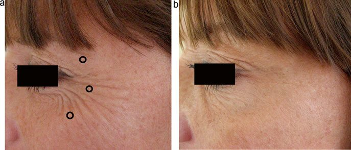

그림 12.2 보툴리눔 신경독소 BoNT/A의 결정 구조. 촉매 영역(빨간색)과 결합 영역(녹색) 사이에 접촉이 없도록 세 개의 구조적으로 뚜렷한 기능 영역이 배치되어 있으며 이들 사이를 투영 영역(파란색)이 분리한다. 촉매 아연 원자는 촉매 영역에 위치한다. 그림 12.1과 비교하라. Turton K, Chaddock JA, Ravi Acharya K의 논문에서 재생산; Botulinum and tetanus neurotoxins: structure, function and therapeutic utility. Trends Biochem Sci. 2002;27:552-8, Elsevier Limited의 허가를 받아 사용. BONT/E 및 F는 약 300 kDa 복합체로 존재한다. 관련 비독소 단백질은 bont 유전자와 함께 유전자 클러스터에 인코딩되어 있는데, 이 클러스터는 소위 비독소, 비헤마글루تين인(NTNHA) 단백질과 헤마글루틴인 3종(HA17, HA33, HA70)을 인코딩한다. BoNT, NTNHA, HA 성분은 Together라고 일컫는다 large PTC (L-PTC)(그림 12.3)를 구성한다. 두 번째 유전자 클러스터인 orfX 클러스터도 존재하지만 orfX 단백질은 아직 특성화되지 않았다. 관련 비독소 단백질의 기능은 아직 완전히 규명되지 않았다. NTNHA 단백질은 BoNT를 위장관의 저pH 및 가수분해로부터 보호하지만 HA도 보호 역할을 하는지는 불분명하다. L-PTC 구조를 더 잘 규명하고 독소 차단, 전달 및 작용에 관련된 분자 기전을 이해하기 위한 연구 과정에서, X선 결정학, 단일 입자 전자현미경(EM), 및 3차원 재구성 기법이 최근 약 760 kDa L-PTC/A의 구조 규명에 적용되었다. L-PTC/A는 HA 복합체 상부에 위치하는 최소 기능 PTC(M-PTC)로 구성되어 있으며 확장된 3날개 건축 형태로 묘사하였다. 최근 EM 연구에 의해 L-PTC/A, B, D에서 동일한 화학양론비와 건축 형태가 확인하였다. 일본에서의 L-PTC 장 흡수에 관한 선행 연구를 기반으로...

563 BoNT/A NTNHA HA70 HA17 HA33 ~ 260 Å HA 복합체의 9개 당결합 부위(그림 12.4)에 의해 매개되며 장 상피세포의 탄수화물 수용체와 상호작용한다. HA33은 d-갈락토오스, 락토오스, N-아세틸락토사민, 및 이소프로필-β-d-1-티오갈락토피라노사이드(IPTG)에 상당히 높은 친화력으로 결합하며 HA70은 α-2-3-シア일릴락토오스 및 α-2-6-シア일릴락토오스에 높은 특이성으로 결합하지만 N-아세틸뉴라민산에 대해서는 낮은 친화력을 보인다. HA33과 HA70의 탄수화물 인식 선택성 사이에 중복은 관찰되지 않았다. 전반적으로, HA가 d-갈락토오스 및 N-아세틸뉴라민산의 유도체를 포함하는 상피 당에 결합하는 것이 장벽을 통한 BoNT 수송에 필요하다는 결과를 시사한다. IPTG와 유사하게 β-d-글리코시드 결합으로 d-갈락토오스를 포함하는 탄수화물에 의한 BoNT/A 경구 독성의 마우스 억제는 BoNT 중독의 예방적 치료법으로 제안되었다.

신경근접합부에서의 작용 기전 모든 BoNT 혈청형은 신경전달을 간섭하여 신경독성 효과를 발휘한다. 이는 독소의 시냅스 전 결합에 의해 매개되며 H_c 영역을 통해 운동 뉴런의 아세틸콜린 방출을 차단하여 신경근접합부의 주요 신경전달물질인 아세틸콜린의 분비를 억제한다. 한번 결합되면, BoNT ~ 120 Å ~ 100 Å 독소 구조 및 작용 기전 그림 12.3 X선 결정학적 데이터, 단일 입자 전자현미경 및 3차원 재구성으로부터 조립된 보툴리눔 신경독소 BoNT/A 대형 전구체 독소 복합체(L-PTC)의 구조 모델. L-PTC는 비독소 헤마글루틴인 복합체(HA70, HA17, HA33) 상부에 위치하는 보호적 최소 기능 PTC(M-PTC)로 구성된다. NTNHA, 비독소 비헤마글루틴인 단백질. Lee K, Gu S, Jin L 등의 논문에서 재생산; Structure of a bimodular botulinum neurotoxin complex provides insights into its oral toxicity. PloS Pathog. 9(10):e1003690. doi: 10.1371/journal.ppat.1003690, Creative Commons Attribution Licence 조건에 따라 배포되는 오픈액세스 논문...

M-PTC (보호) HA 복합체 SiaLac (흡수) Lac 그림 12.4 BoNT/A L-PTC의 3차원 모델. M-PTC가 HA 복합체 상부에 위치하고 탄수화물 수용체와의 상호작용 및 장세포벽을 통한 BoNT/A 수송에 필요한 d-갈락토오스(예: 락토오스) 및 N-아세틸뉴라민산 유도체를 포함하는 9개 당결합 부위를 보여준다. 그림 12.3도 참고하라. Lee K, Gu S, Jin L 등의 논문에서 재생산; Structure of a bimodular botulinum neurotoxin complex provides insights into its oral toxicity. PloS Pathog. 9(10):e1003690. doi: 10.1371/journal.ppat.1003690, Creative Commons Attribution Licence 조건에 따라 배포되는 오픈액세스 논문. 내부화는 중량 사슬이 시냅스 소포막에 삽입으로 이루어진다. 이는 이황화 결합의 파괴에 의해 방출된 경량 사슬의 세포질 내 진입을 돕는 투융성 채널을 형성한다. 세포 내에서 경량 사슬은 시냅스 소포 융합에 필요한 SNARE(SNAP [용해성 N-에틸말레이민민감성 인자 부착 단백질] 수용체의 약어) 복합체를 절단한다. 이로 인해 시냅스 활동이 억제한다. 예를 들어 BoNT/A의 경량 사슬은 25 kDa 시냅소소체 관련 단백질(SNAP25)을 특이적으로 절단하여 신경전달물질 방출을 차단한다. BoNT/B, D, F의 경우 소포 관련 막단백질 패밀리(VAMP)의 구성요소인 분비소포 관련 단백질 시냅토브레빈과 비신경성 아형체인 셀루브레빈(VAMP3)이 관련된다. BoNT/C의 경우 SNAP25와 SNARE 실타크신이 모두 절단한다. BoNT/E와 BoNT/G의 세포 기질은 각각 SNAP25와 VAMP/시냅토브레빈이다. BoNT/A는 신경전달물질 방출을 장기간(수개월) 억제하는 반면, BoNT/E 이후의 회복은 더 빠르다(수주). 그러나 BoNT에 의한 시냅스 전달 억제는 일시적이고 가역적이다. BoNT에 의한 시냅스 차단 후 신경 새 순순(germination)가 시작되어 시냅스 접촉이 재형성된다.

보툴리눔 신경독소의 치료적 응용 처음 보기에 독성과 비교적 적은 초기 적응증 수는 BoNT의 광범위한 치료적 응용이 어려울 것으로 보이나, 독소의 신경근 작용에 대해 잠시 생각하면 근육, 신경, 위장, 비뇨, 안과, 구인두 관련 다양한 장애에 대한 잠재적 응용 가능성을 깨닫는다.1989년 첫 제품 승인 이후 다양한 질환에 대한 응용이 폭발적으로 증가하여 현재는 가장 낙관적인 초기 추정치를 초과한 것으로 보인다.

보툴리눔 독소 제제의 명명법 및 등가성 보툴리눔 독소 제품 간의 차이를 인식하고 제품 선택, 효력, 처방 혼동의 가능성을 줄이기 위한 시도로, FDA는 2009년 8월 각 확립된 USAN 보툴리눔 독소 명칭에 ona-, abo-, inco-, rima-라는 접두사를 추가하는 명칭 변경을 통보하였다. 새로운 명명법, 이전 명칭, 및 상표명은 표 12.1에 정리되어 있다(이 명명법 접근법이 바이오시밀러와 관련된 명명상 어려움과의 관련성을 참고하라; 13장을 보라). FDA는 변경을 발표하면서 다음과 같이 언급하였다: "개별 효력을 강화하고 약물 오류를 예방하기 위해 확립된 약물 명칭을 변경한다. 효력 단위는 각 보툴리 עוש 독소 제품에 고유하며 생물학적 활성의 용량이나 단위는 하나의 제품에서 다른 보툴리눔 독소 제품으로 비교하거나 변환할 수 없다. 새로운 확립 명칭은 이러한 차이와 제품 간 상호호환성 부재를 강화한다." 변경은 제품 혼동을 피하는 데 도움이 되지만 예상대로 확립된 명명법 변경이 모두 환영받은 것은 아니었다. 이를 고려할 때 임상의는...

표 12.1 FDA의 보툴리눔 신경독소 확립 약물 명칭 변경a

| 상표명 | 이전 약물 명칭 | 새로운 일반명 |
| --- | --- | --- |
| Botox® | Botulinum toxin type A | OnabotulinumtoxinA |
| Botox® Cosmetic | Botulinum toxin type A | OnabotulinumtoxinA |
| Dysport® | Botulinum toxin type A | AbobotulinumtoxinA |
| MYOBLOC® | Botulinum toxin type B | RimabotulinumtoxinB |
| Xeomin® b | Botulinum toxin type A | IncobotulinumtoxinA |

a 2009년 8월 Botox®, Botox® Cosmetic, Dysport®, MYOBLOC®에 대해 발표됨
b 2010년 8월 경부 근긴장이상에 대해 승인됨

C. botulinum A형 Hall 균주에서 추출한 신경독소가 각 제품에 사용된다. Dysport®는 원래 M-PTC(300 kDa)와 L-PTC(600 kDa) 혼합물을 함유하는 것으로 보고되었고 Botox®는 BoNT/A 1분자(150 kDA)를 함유한 900 kDa 복합체인 반면, Xeomin®은 순수 BoNT/A 신경독소만을 함유한다. BoNT 혈청형 간에 효력 단위의 등가성이 부족할 뿐만 아니라, 동일 혈청형의 다른 제형 간에도 차이가 있으며 FDA 승인된 3개 제품의 상대적 효력에 대한 주장 또한 서로 다르다는 점에 유의하라. 모든 BoNT 제제의 용량 농도는 "마우스 단위"로 표현되며 이 단위는 복강내 주사에 의한 50%의 여성 Swiss-Webster 마우스를 치사시키는 독소 단백질의 양이다. Botox®와 Xeomin® 사이에 1:1 비율이 주장된 바 있지만, Botox 형태의 BoNT/A 1단위는 Dysport® 2~5단위에 해당하는 것으로 알려져 있으며, 최대 1:6 비율이 보고된 바 있다. 순수 신경독소와 동반 비독소 단백질 모두 면역 반응을 유발할 수 있는 능력(섹션 "보툴리눔 신경독소의 면역원성 및 임상적 관련성" 참조)이 있으므로, 각 제제의 상대적 농도와 특수 효력을 아는 것이 중요하다. 이 정보를 얻기 위해 독일의 J. Frevert가 150 kDa BoNT/A 신경독소에 대한 토끼 및 기니피그 혈청을 사용하여 민감한 샌드위치 ELISA를 수행하는 연구를 진행하였다...

Munilutob esenihC (계속) Istitut uohznaL

| 프레스오;AXTB | China, Products |  | 신경독소 플러스 |  |
| --- | --- | --- | --- | --- |
| 경피용 용해제 5 mg |  | Biological of | 보관된 제형 분말 | 알려지지 않은   알려지지 않은 |
| --- | --- | --- | --- | --- |
| 05 또는 001 kDa 150 |  |  | 단백질 |  |
| --- | --- | --- | --- | --- |
| Hall A 플러스 신경독소 150 kDa 신경학 용해제 |  |  |  |  |
| --- | --- | --- | --- | --- |
| RimabotulinumtoxinA |  | 25,000 또는 5,000~10,000 |  |  |
| --- | --- | --- | --- | --- |
| complexing proteins 0.5 mg/mL ASH |  |  |  |  |
| --- | --- | --- | --- | --- |
| MYOBLOC® | "Ben" 균주 |  | 알려지지 않은   알려지지 않은 | 알려지지 Known   알려지지 Known |
| --- | --- | --- | --- | --- |
|  | Inc., USA |  | 알려지지 Known   알려지지 Known | 알려지지 Known   알려지지 Known |
|액체 B용 보관된 제형 분말 제형 | Merz | IncobotulinumtoxinA 150 kDa 신경독소 |  |  |
|  | Gmbh, Germany |  | 0.44 gn (100%) |  |
| --- | --- | --- | --- | --- |
| ASH 재조합제 1g |  |  |  |  |
| --- | --- | --- | --- | --- |
| Xeomin® |  | 05 또는 001 |  | 227 U/gn |
| --- | --- | --- | --- | --- |
| 0.44 gn Hall A 1:1 A용 보관된 제형 | AbobotulinumtoxinA | 150 kDa 신경독소 | complexing + | 0.25 mg ASH   0.56 gn (75%) |
| --- | --- | --- | --- | --- |
| 보툴리눔 독소 제품 및 제형의 비교 | Ipsen, Ltd, UK | 경피용 |  |  |
| --- | --- | --- | --- | --- |
| Dysport® |  |  |  | 154 U/gn |
| --- | --- | --- | --- | --- |
| 0.87 gn 단백질 Hall A 500 보관된 분말 진공건조 |  |  |  |  |
| --- | --- | --- | --- | --- |
| OnabotulinumtoxinA | Allergan, Inc. Ireland |  |  |  |
| --- | --- | --- | --- | --- |
| 150 kDa 신경독소 |  |  |  |  |
| --- | --- | --- | --- | --- |
|  |  | 재조합제용 | complexing + |  |
| --- | --- | --- | --- | --- |
| Botox®; Botox® |  |  | 0.37 gn (15%) |  |
| --- | --- | --- | --- | --- |
| ASH 0.5 mg | 002 또는 001 |  |  | 137 U/gn |
| --- | --- | --- | --- | --- |
|  | Cosmetic |  |  |  |
| --- | --- | --- | --- | --- |
| 단백질 |  |  |  |  |
| --- | --- | --- | --- | --- |
|  | Hall A |  | 0.5 gn |  |
| --- | --- | --- | --- | --- |
| 총의 비율에 해당하는 A - |  |  | 100 U |  |
| --- | --- | --- | --- | --- |
|  |  |  | 총 단백질 100 U당 | 임상 전환 비율 |
| --- | --- | --- | --- | --- |
|  |  | 분자 조성 |  | OnabotulinumtoxinA에 대한 |
| --- | --- | --- | --- | --- |
| 비교 요점 |  |  | 총 신경독소당 | 특수 신경독소 |
| --- | --- | --- | --- | --- |
|  | 클로스트리디움 균주 | (バイアル당 U) 용량 |  | 단백질 안정제 |
| --- | --- | --- | --- | --- |
| 독소 혈청형 제조사 |  | 표현형 |  |  |
| --- | --- | --- | --- | --- |
| 상표명 |  |  |  |  |
| --- | --- | --- | --- | --- |
|  | | | |  |
|  | | | |  |

표 12.2 (단백질 효력)

568 (계속) 표 12.2 보툴리눔 독소 제품 및 제형의 비교 12 보툴리눔 신경독소

보툴리눔 독소의 승인된 적응증 FDA 등록 보툴리눔 신경독소 제제 보툴리눔 독소의 단백질 제제는 과도한 근육 경련을 억제하고 운동 장애 치료에 점점 더 많이 사용되고 있다. 그러나 일반적으로 독소의 효과는 수개월 이상 지속되지 않으므로 환자는 증상 조절을 위해 반복적인 주사를 받아야 한다. 표 12.3은 4종의 등록된 보툴리눔 독소 제제(onabotulinumtoxinA, abobotulinumtoxinA, incobotulinumtoxinA, rimabotulinumtoxinB)에 대한 FDA 승인 적응증을 나열하고 있다. 보툴리눔 독소 제제에 대한 규제 승인의 역사는 25년 전 당시 BoNT/A(Botox®)로 불리던 약물이 ≥12세 어린이의 사시, 안검경련, 및 편면연축 치료에 대해 FDA 승인을 받으면서 시작되었다. 11년 후 FDA는 Botox®의 승인을 확대하고 MYOBLOC®(Solstice Neurosciences; BoNT/B; rimabotulinumtoxinB)를 추가하였으며 이후 2009년에 Dysport®(abobotulinumtoxinA), 2010년에 Xeomin®(incobotulinumtoxinA)이 비정상적 머리 자세의 심각도 감소 및 경부통을 위한 경부 근긴장이상 치료에 승인하였다. 2001년 Botox®는 영국과 캐나다에서 겨부 다한증 치료에 승인되었으며 FDA가 동일한 승인을 내리기 3년 전의 일이었다. 2001년 캐나다 규제기관은 국소 근육 경직과 주름 치료를 위한 미용 용도에 대해서도 승인을 내렸으며 이듬해 Botox® Cosmetic 표 12.3 보툴리눔 독소의 승인된 적응증a

| 일반명 및 상표명 | 승인된 적응증a |
| --- | --- |
| OnabotulinumtoxinA | * 요실금b |
| Botox®; Vistabel® | * 상지 경직 |
|  | * 성인의 경부 근긴장이상 |
|  | * 편두통 환자의 두통c |
|  | * 중증 다한증 |
|  | * 근긴장이상 관련 안검경련d |
|  | * 사시d |
|  | * 편면연축 |
| Botox® Cosmetic e | * 이마 및 외측 안와선의 일시적 개선 |
| AbobotulinumtoxinA | * 경부 근긴장이상 |
| Dysport®; Azzalure® | * 이마 주름 |
| IncobotulinumtoxinA | * 경부 근긴장이상 |
| Xeomin®; Bocouture® | * 안검경련f |
|  | * 이마 주름 |
| RimabotulinumtoxinB | * 경부 근긴장이상 |
| MYOBLOC® | |

a FDA 또는 EMA 또는 양쪽 모두에 의해 인체 치료용으로 승인됨
b 신경학적 질환(예: 다발성 경화증, 척수 손상)과 관련된 방광과활동에 의한 것
c 두통이 하루 4시간 이상 지속되는 월 15일 이상의 만성 편두통
d ≥12세 환자
e 0.1 mL당 4 U로 재조합된 것
f 이전에 onabotulinumtoxinA로 치료받은 환자

이마 주름(그림 12.5) 치료에 FDA 승인을 받았다. 2010년 독소 이름 변경 후 FDA는 뇌졸중, 뇌손상 또는 다발성 경화증으로 인한 성인의 상완 굴곡근 경직 치료와 만성 편두통에 Botox®를 승인하였으며 이전에 Botox®를 투여받은 성인의 안검경련에 Xeomin®을 승인하였다. 척수 손상, 다발성 경화증, 뇌성 마비, 수막수추체, 및 뇌졸중 등 신경학적 질환을 가진 환자의 방광과활동으로 인한 요실금은 미국에서 약 340,000명에게 영향을 미친다. 항콜린제 치료가 사용되지만 필요한 용량에서의 곤란한 부작용은 내약성 문제로 이어지고 환자 순응도가 문제가 된다. 3상 임상시험에서 Botox®(200 단위)를 방광근에 주사한 결과 요실금 발작이 주당 약 20회 감소하였으며 2011년 8월 FDA는 이 약물의 해당 적응증 치료 승인을 받았다. 더 최근인 2013년 9월에는 중증 외측 안와선(까마귀발) 치료에 Botox®가 FDA 승인을 받았다. 그림 12.5는 이마 주름의 예시로, 눈썹 거상도 함께 평가된 환자이다. Lowe NJ, Lowe P의 논문에서 재생산; Botulinum toxins for facial lines: A concise review. Dermatol Ther. 2012;2:14. Springerlink.com에서 오픈액세스로 게재됨. 그림 12.6은 외측 안와 주름의 광자 수치화 등급 척도로, (0) 주름 없음; (1) 경미한 주름; (2) 중등도 주름; (3) 심한 주름을 나타낸다. Curruthers A, Curruthers CJ, Hardas B 등의 논문에서 발췌; A validated grading scale for crow's feet. Dermatol Surg 2008;34(Suppl 2):S173-8, Wolters Kluwer Health Inc의 허가를 받아 사용. 그림 12.7은 피험자가 미소지을 때의 까마귀발의 전형적인 예와 BoNTA 주사 2주 후 외측 안와선 감소와 외측 눈썹의 약간의 거상이 나타나는 개선을 보여준다. 2008년 근긴장이상 치료를 위한 보툴리눔 신경독소의 근거 기반 리뷰 평가에서, 미국 신경학회 치료 및 기술 평가 소위원회는 신경독소가 성인 및 소아의 근긴장이상 치료 선택지로 제공되어야 한다고 권고하였다(수준 A). 추가 근거 기반 리뷰에서 동일 소위원회는 신경독소를 운동 장애 치료에 대해 평가하고 다음을 결론지었다: (1) 경부 근긴장이상 치료 선택지로 제공되어야 한다(수준 A); (2) 안검경련, 국소 상지 근긴장이상, 후두내근 근긴장이상, 및 상지 본태성 떨림에 제공될 수 있다(수준 B); (3) 편면연축, 국소 하지 근긴장이상, 및 운동 틱에 고려될 수 있다(수준 C). 2010년 호주에서의 국제 합의 성명에서, 경부 근긴장이상은 BoNT/A 및 B에 의해 안전하고 효과적으로 감소시킬 수 있으나, 2차 경부 근긴장이상 환자의 유효성 및 안전성에 대한 근거는 불분명하며 2차 경부 근긴장이상의 안전성 및 유효성, 효과적인 보조 치료, 투약, 및 유리한 주사 기법에 대한 질문에 답하기 위해 추가 연구가 필요하다는 결론이 도출되었다. 2011년 유럽신경학회연맹이 발표한 1차 근긴장이상 진단 및 치료 지침의 업데이트 버전에서 BoNT/A는 1차 두개성(구인두 내 제외) 또는 경부 근긴장이상의 1차 치료제이며, BoNT/A는 근긴장이상 교정에도 효과적이고, BoNT/B는 경부 근긴장이상에서 BoNT/A에 열등하지 않다는 결론을 도출하였다. 그림 12.7 (a) 예시...

보툴리눔 신경독소의 기타 가능한 적응증 BoNT의 승인된 적응증 목록은 이미 크며 잠재적 적응증 목록도 마찬가지이다. FDA는 등록 의료 종사자의 처방을 통제하여 의료 행위를 규제할 권한이 없으며 일부 허가된 약물의 오프라벨 사용은 드문 일이 아니다. BoNT 치료의 광범위한 효용성과 효과를 고려할 때, 이러한 약제가 통제된 임상시험 외에서 다양한 가능한 새로운 적응증에 대한 대규모 오프라벨 치료로 평가되고 있다는 것은 놀라운 일이 아니다. 현재 FDA에 의해 승인되지 않았지만 조사 및 보고되고 있는 일부 적응증은 표 12.4에 정리되어 있으며 다양한 유형과 부위의 통증, 뇌성 마비, 경부 외 근긴장이상, 둔근 증후군, 관절 섬유화증, 말더듬증, 이갈이, 켈로이드, 흉터, 레이노 현상 등과 더불어 미용 응용 및 다양한 위장, 신경, 외분비선, 비뇨, 안과, 이비인후, 구인두, 및 피부과 장애를 포함한다. BoNT/A가 이마 및 외측 안와선 치료에 승인된 이후(섹션 "FDA 등록 보툴리눔 신경독소 제제의 승인된 적응증"; 그림 12.5, 12.6, 및 12.7), 해당 독소의 미용 사용은 가장 과장된 예측까지 초과하였으며 이는 아마도 많은 사람들의 외모에 대한 집착, 허영, 및 부유함을 증명하는 것일 것이다. 보툴리눔 독소 A의 오프라벨 적응증은 이제 다양한 의도된 미용적 개선(표 12.4)으로 확대되었으며 예를 들어 눈썹 거상, 윗입술 주름, 잇몸 미소, 거근 비대, 비순인중선, 토끼 코, 그리고 정신근 주름 또는 소위 자갈 턱(그림 12.8)을 포함한 인체의 다양한 유형의 보조개 등을 포함한다. Botox®의 인기와 미용적 사용의 보급에 대해 요약하면서 P. K. Nigam과 A. Nigam(추가 참고자료 참조)은 "그것의 적용..."

표 12.4 BoNT 치료를 위해 조사되었으나 아직 승인되지 않은 새로운 적응증 가능성

| 근육 경련 및 통증 | 이비인후 및 구인두 | 신경병증성 통증 | 구인두 장애 |
| --- | --- | --- | --- |
| 두통, 긴장성 및 기타 유형 | 구인두 근긴장이상 | 요통 | 이갈이 |
| 둔근 증후군 | 거근 비대 | 방사통 | 턱관절 기능장애 |
| 근막통증 증후군 | 인후 장애 | 만성 무릎 저항성 통증 | 함인두 dysphagia |
| 테니스 엘보 | 만성 흡인 시 후두 폐쇄 | 당뇨 신경병증성 통증 | 후두 장애 |
| 삼차신경통 방아쇠 영역에 적용 | 성대 육아종 | 실성 dysphonia | 실성 dysphonia |
| 위실성 dysphonia | 섬유근육통 | 변이성 dysphonia | 위식도 열구에스파즘 |
| 그 Ragas dysphonia | 비인두 근긴장이상 | 말더듬증 및 성문 폐쇄 | 장간막 dysphagia |
| 장 Pingueculum dysphagia | Zenker 게실 | Odd자 괄약근 기능장애 | |
| 피부과 | 항문열상 | 단순태선 | 안 Innocuous |
| Hailey-Hailey병 | 치질 | Zenker 게실 | |
| 미용 응용 | 눈썹 거상 | 외분비선 과민반응 | 이마 주름 |
| 비대 판상근대 | 손바닥 및 발바닥 다한증 | 목 가로 주름 | 비순인중선 |
| 토끼 코 | 뇌성 마비 | 파킨슨병 | 자갈 턱 |
| 교감신경성 전방 경골근 비대 | 경련성 다리 구축 | 방광(방광과활동) 괄약근 불협화증 | |
| 악안면 신경마비로 인한 복시 | 동-eye dysphonia | Vincristine으로 인한 비대칭전방경골근 비대 | |
| 종양으로 인한 복시를 보상하기 위한 BoNT/A | | | |
| 기타 | 틱 | 토urette 증후군 | 켈로이드 |
| 흉터 (수술 후) | 레이노 현상 | 수면 무호흡증 | 만성 비염 |
| 비염 | 결막염 | | |

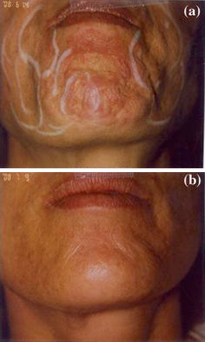

그림 12.8 보툴리눔 신경독소 A는 하안면 주름에도 투여되며 예를 들어 정신근 주름 또는 소위 "자갈 턱"에도 사용된다. (a) AbobotulinumtoxinA가 중앙 정신근에 투여되었다. (b) 치료 4주 후 환자. Lowe NJ, Lowe P의 논문에서 재생산; Botulinum toxins for facial lines: A concise review. Dermatol Ther. 2012;2:14. Springerlink.com에서 오픈액세스로 게재됨.

주의사항 및 예방조치 FDA는 모든 BoNT 제품에 대해 주사 부위로부터 독소가 퍼져서 보툴리눔 독성 증상을 유발할 가능성, 이에 포함되는 삼킴 및 호흡 곤란으로 인한 사망 가능성을 경고하는 블랙박스 경고를 발령하였다. 증상은 주사 후 수시간~수주 내에 발생할 수 있으며 근긴장이상 치료를 받는 소아에서 더 뚜렷할 수 있다. Botox®(onabotulinumtoxinA)에 대해 규제기관이 발령한 기타 주의사항 및 예방조치에는 (1) 동반 신경근 질환에 의한 임상 효과 악화 가능성; (2) 안검경련 치료 시 감소된 눈깜빡임으로 인한 각막 궤양; (3) 사시 치료 시 후안 출혈 및 맥락막 순환 장애; (4) 상지 경직 치료 환자에서의 기관지염 및 상부 호흡기 감염이 포함된다. 또한 호흡 기능이 저하된 환자에 Botox® 투여 시 주의가 필요하며 방광과활동 치료 환자, 특히 다발성 경화증 환자에서의 요실금 가능성도 지적되었다.

동반 신경근 질환에 의한 임상 효과 악화 가능성에 대한 주의사항은 Xeomin®(incobotulinumtoxinA), Dysport®(abobotulinumtoxinA), MYOBLOC®(rimabotulinumtoxinB)에 대해서도 발령되었다. Botox®와 마찬가지로, 호흡 기능 저하 또는 비대상동증을 가진 Xeomin® 치료 환자에게 주의가 권고되며 안검경련 치료 환자에서의 감소된 눈깜빡임은 각막 노출 및 궤양으로 이어질 수 있다. Dysport®를 수술적으로 변형된 해부학적 구조 및 비대칭, 주사 부위 염증, 안검하수, 과도한 피부결함, 피부 흉터, 또는 두꺼운 피지 피부를 가진 환자에게 투여할 때 주의가 강조되었다. Dysport®와 MYOBLOC®은 인간 혈청알브민을 함유하고 있어 FDA가 "극히 원거리 위험"이라고 칭하는 바이러스성 질병 및 크로이츠펠트-야코프병 전파 위험이 있다. 후자의 전파가 혈청알브민과 연결된 적이 없는 점에 유의하라.

보툴리눔 신경독소의 치료 및 미용 사용 후 이상반응 BoNT 주사 제제는 일반적으로 잘 내약되며 부작용이 나타나더라도 대체로 경미하고 일시적이다. 더 흔한 부작용으로는 주사 부위의 경미한 통증, 일시적 무감각, 홍반, 국소 부종, 두통, 및 불쾌감이 있다. 앞서 지적했듯이, 가장 심각하고 잠재적으로 위험한 이상반응은 주사 부위의 근육, 특히 호흡 및 삼킴에 관여하는 근육의 약화이며 가끔 원거리 부위에서도 발생할 수 있다. 독소로 인한 비대상동증으로 인한 흡인이 발생할 수 있으며 심각한 비대상동증으로 인한 사망 사례가 보고된 바 있다. 경부 근긴장이상 환자에서 BoNT 투여 후 호흡 부전에 대한 일부 시판후 보고는 보조 호흡근 역할을 하는 경부 근육의 약화로 인한 것으로 보인다. 근육 약화는 일반적으로 수주~수개월 내에 해소된다. 상안검거근으로의 독소 확산은 일시적 상안검하수를 유발한다...

그림 12.9 안검하수환자의 다게르영판 사진. William Bell이 1852년 촬영. https://www.flickr.com/photos/22719239@N04/2260115819 (Wikimedia Commons, 파일 1852 ptosis patient.jpg. Blurpeace 업로드)

표 12.5 인체 치료용으로 승인된 보툴리눔 독소 제제의 부작용 범위a

| 블랙박스 경고: 원거리 독소 효과 전파b | 과민반응c | 면역원성d | 심혈관e | 피부f |
| --- | --- | --- | --- | --- |
| 다음에 사용 시 부작용: | | | | |
| 방광과활동: 요실금 및 요로 감염 | | | | |
| 근긴장이상: 사지 통증 | | | | |
| 경부 근긴장이상: 비대상동증; 상부 호흡기 감염; 독감 증후군; 기침; 비염; 경부 및 요통; 근골격계 통증; 두통; 비대음; 구강 건조; 주사 부위 불편감; 안과 질환 | | | | |
| 편두통: 두통; 경부통 | | | | |
| 다한증: 주사 부위 통증 및 출혈; 비액간부 땀; 인염; 독감 증후군 | | | | |
| 안검경련: 안검하수; 안구 건조; 구강 건조; 설사; 두통; 시각 장애; 호흡곤란; 비인두염; 호흡기 감염 | | | | |
| 이마 및 외측 안와선: 안검 부종 및 하수; 메스꺼움; 두통; 호흡기 감염; 독감 증후군 | | | | |

a FDA 또는 EMA 또는 양쪽 모두에 의해 승인됨
b FDA 블랙박스 경고는 4종의 등록된 보툴리눔 독소 제제 모두에 적용된다. 증상은 보툴리즘의 증상, 즉 근력 저하 및 근육 약화; 복시; 시야 흐림; 안검하수; 비대음; 구음장애; 실금; 호흡곤란; 비대상동증; 폐렴
c 아나필락시스, 두드러기; 혈청병, 호흡곤란 포함
d 중화항체 형성 가능성으로 치료 효과 감소
e 부정맥 및 심근경색, 때로는 치명적
f 다형홍반 및 건선양 발진을 포함한 피부 발진이 시판 후 사용에서 확인됨

표 12.6 치료 및 미용 목적으로 보툴리눔 독소c 투여 후 심각a 및 비심각 이상반응b의 발생률

|  | 치료용 |  | 미용용 |  |
| --- | --- | --- | --- | --- |
| 적응증 | 심각 (N = 217) | 비심각 (N = 189) | 심각 (N = 36) | 비심각 (N = 995) |
| 용도 | N (%) | N (%) | N (%) | N (%) |
| --- | --- | --- | --- | --- |
| 오프라벨 | 74(34.1) | 87(46) | 15(41.7) | 532(53.5) |
| 경부 근긴장이상 | 54(73) | 48(55.2) |  |  |
| 안검경련 | 19(25.7) | 37(42.5) |  |  |
| 사시 | 2(2.7) | 2(2.3) |  |  |
| 얼굴 주름: |  |  | 15 | 532 |
| 이마 Possibly on-label 42(19.3) | 24(12.7) | 11(30.6) | 369(37.1) | |
| 근긴장이상 | 38(90.5) | 20(83.3) |  |  |
| 경부통 | 3(7.1) | 4(16.7) |  |  |
| 얼굴 주름e | 11 | 369 |  |  |
| 오프라벨 | 98(45) | 83(43.9) | 14(38.9) | 322(32.4) |
| 근긴장이상f | 37(37.8) | 22(26.5) |  |  |
| 통증f | 24(24.5) | 14(16.9) |  |  |
| 열구개실 | 10(10.2) | 2(2.4) |  |  |
| 편두통 | 9(9.2) | 30(36.1) |  |  |
| 경련성 dysphonia | 6(6.1) | 4(4.8) |  |  |
| 기타 | 15(15.3) | 17(20.5) |  |  |
| 얼굴 주름g | 14 | 322 |  |  |

Coté TR, Mohan AK, Polder JA 등의 논문에서 발췌; Botulinum toxin type A injections: Adverse events reported to the US Food and Drug Administration in therapeutic and cosmetic cases. J Am Acad Dermatol 2005;53:407-15, Elsevier의 허가를 받아 사용.
a 미국 연방규정집 600.80의 심각 regulatory 정의에 따름
b 심각 그룹에서 치료 및 미용 적응증을 모두 가진 환자 2명, 비심각 그룹에서 양쪽 적응증을 가진 환자 6명
c OnabotulinumtoxinA (Botox®)
d 일부 환자에서 2개 이상의 사용 적응증
e 부위 불명
f 경부 외
g 이마 외

경부 근긴장이상 19(25.7%), 안검경련 2(2.7%), 사시 2(2.7%) 사례. 오프라벨 사용은 심각 보고의 98(45.2%)를 차지했으며 근긴장이상(경부 외) 치료 37(37.8%), 통증(경부 외) 24(24.5%), 열구개실 10(10.2%), 편두통 9(9.2%), 경련성 dysphonia 6(6.1%), 기타 소수 적응증으로 구성되었다. Possibly on-label로 판단된 사용은 42(19.4%) 보고였으며 그중 38(90.5%)가 근긴장이상, 3(7.1%)가 경부통이었다. 일반적으로 비심각 반응에서의 적응증별 비율은 심각 이상반응에서의 비율과 유사하였으나, 편두통 관련 이상반응은 비심각 반응 그룹에서 약 4배 높았다. 217건의 심각 이상반응을 분석한 결과...

이상반응이 가장 많이 기여한 시스템은 호흡(15.2%), 심혈관(10.1%), 신경(23.5%), 및 위장(18.9%) 시스템이었다. 발생률 3%를 초과한 개별 이상반응은 호흡 기능 저하(3.7%), 폐렴(4.1%), 독감 유사 증후군(4.6%), 부정맥(4.1%), 근육 약화/경련(6%), 경련(7.8%), 비대상동증(12%), 주사 손상(4.1%), 알레르기 반응(5.1%), 및 실신(3.2%)이었다. 비심각 이상반응 목록에서 나타난 가장 뚜렷한 차이는 눈 관련 반응, 근육 약화/경련, 피부 및 주사 부위 반응, 주사 부위 통증의 상대적으로 높은 발생률이었다. 미용 치료 후 심각 및 비심각 반응 모두에서 가장 높은 발생률을 보인 것은 신경계, 위장계, 피부 및 주사 부위 반응, 그리고 눈이었다. 미용 그룹에서 가장 흔한 개별 이상반응은 국소 안면 마비, 근육 약화/경련, 비대상동증, 발진, 부종 및 주사 부위 통증, 안검하수, 및 두통이었다. 전반적인 결론은 심각 이상반응이 더 높은 용량을 투여받고 기저 질환이 있는 치료 그룹에서 더 흔했으며, 모든 사망은 이 그룹에서 발생하였고, 미용 사례에서는 심각 이상반응이 덜 빈번하다는 것이었다. 저자들은 "승인된 라벨링에 권고된 약물 용량, 희석, 투여, 취급, 보관 및 주사 부위로부터의 수많은 이탈"을 지적하였다. OnabotulinumtoxinA의 미용 응용과 관련된 주의사항, 예방조치, 및 이상반응을 염두에 두었을 때, 전 세계적인 광범위한 사용은 안전성에 대한 주목할 만한 기록을 보여준다. 관련된 대규모 환자 수와 시술 건수는 치료의 내약성과 유용성을 확인하며 부작용이 발생하더라도 일반적으로 경미하다는 것을 보여준다. Botox® Cosmetic는 2002년에 승인되었으며...

보툴리눔 신경독소의 면역원성 및 임상적 관련성 579 보툴리눔 신경독소의 면역원성 및 임상적 관련성 보툴리눔 독소 치료에 대한 면역 반응은 일반적으로 환자에게 해롭거나 유의미한 위험 인자로 간주되지 않는다. 예를 들어, 독소에 대한 체액성 및 세포성 반응은 내인성 항원과 교차반응을 일으키지 않지만 치료가 손상되고 임상적 호전이 정체될 가능성은 항상 존재한다.

항신경독소 항체 BoNT는 순수 또는 복합체 형태로 존재하는 단백질이며 이 사실과 많은 장기 치료에 필요한 반복 주사의 필요성은 항체 반응이 발생할 수 있음을 의미한다. 이러한 항체는 독소의 생물학적 활성에 영향을 미칠 수도 있고 미치지 않을 수도 있다. IncobotulinumtoxinA(Xeomin®)를 제외한 상업적으로 이용 가능한 각 보툴리눔 독소 제품에는 NAPs가 함유되어 있어, 독소와 비독소 단백질 모두에 대한 항체가 형성될 수 있지만 시판된 제품 간 면역원성을 비교한 설득력 있는 연구는 아직 없다. 복합체에 관련된 단백질은 부가제 효과를 가질 수 있으며 이 결론은 독소 복합체가 정제된 신경독소보다 더 면역원성이 있다는 것을 보여주는 연구에 의해 뒷받침된다. 따라서 정제된 독소의 사용은 이차 치료 실패율을 잠재적으로 감소시킬 수 있다. 신경독소의 면역원성에 영향을 미칠 수 있는 기타 요인으로는 독소 원료, 제조 공정, 그리고 중요한 것은 환자의 이전 노출이 있다. 독소에 대한 항체는 중화성 또는 비중화성일 수 있다. 전자는 수용체와의 상호작용을 억제하여 독소의 생물학적 활성을 억제하는 것으로 추정된다. 더 높은 단백질 부하(즉, 항원 함량), 투여 빈도, 및 주사 횟수는 더 많은 중화항체를 생성하는 것으로 보인다. 일부 연구에 따르면 소아 환자에서 중화항체 발생률이 더 높다. BoNT의 중량 사슬을 인식하는 중화항체가 기록된 바 있지만 다른 결정체를 표적으로 하는 항체에 대한 정보는 제한적이다.

중화항체의 검출 및 측정 ELISA, 웨스턴 블로팅, 형광 면역분석, 방사선면역침강분석, 및 다수의 기타 체외 검사 절차가 보툴리눔 독소 항체 검사에 활용되어 왔다. 그러나 이러한 절차의 공통적인 단점은 중화성과 비중화성 항체를 구별하지 못한다는 것이다. 따라서 항체 유발 치료 실패가 의심되는 환자의 혈청을 검사할 때 임상적으로 관련 있는 검사를 포함하는 것이 명백히 필요하다.

중화항체 검출 및 측정에 활용된 여러 검사법이 있다.

마우스 보호 검사 환자의 혈청을 치사량의 신경독소와 사전 배양한다. 검사 집단에서 마우스 사망률이 대조 집단(정상 혈청으로 사전 배양 후 독소를 주사한 마우스)의 사망률보다 적으면 중화항체가 존재하는 것으로 추정된다. 다시 말해, 마우스의 생존은 중화항체의 존재를 나타낸다. 비용과 결과를 얻는 데 필요한 긴 시간은 이 검사의 단점이다.

마우스 반일측횡격막 검사 이 검사는 부부속된 횡경막 신경과 함께 마우스 반일측횡격막을 사용한다. 조직을 장기 용기에 넣은 후 횡경막 신경을 자극하고 수축 및 근육 떨림을 힘 변환기로 기록한다. BoNT를 추가하고 twitch 진폭이 50% 감소하는 데 필요한 시간인 마비 반감기를 BoNT 용량의 함수로 측정한다. 독소에 대한 중화항체가 존재할 때 마비는 검사 중인 혈청의 항체 양에 반비례한다. 최근 마우스 반일측횡격막 검사와 보호 검사를 비교한 결과, 전자의 검출 한계는 0.17 mU/mL, 후자는 1 mU/mL로 감도에 6배 차이가 있었다. 사실, 반일측횡격막 검사의 임상적 관련성은 의문시된다...

보툴리눔 신경독소의 면역원성 및 임상적 관련성 581 이마를 찡그리는 능력이 검사된다. 환자가 찡그리지 못하면, 독소가 여전히 활성 상태로 눈썹을 마비시키고 있음을 나타내며 독소 중화항체의 부재를 나타낸다. 찡그리는 능력이 유지되면 마비가 없음을 보여주며 독소의 신경근 작용을 차단하는 항체의 존재를 나타낸다.

단지신저지근 검사 Santamato와 동료들의 최근 사례 보고(자세한 내용은 추가 참고자료 참조)는 단지신저지근(EDB) 검사의 원리를 설명하고 복합 단백질의 유무와 관련된 다양한 BoNT 제제에서 독소 중화항체의 발생과 그 관계를 보여주는 좋은 예시로 제시되었다. BoNT/A에 대한 이차적 내성 의심으로, 허혈성 뇌졸중 후 경직이 있는 성인 남성 환자가 EDB 검사로 평가되었다. 양측 EDB 복합근육활동전위(CMAP) 진폭은 EDB 근육에 "복합 단백질 함유 제품"으로 설명된 제품을 주사하기 전후에 비골신경의 피하 최대자극 전기신경자극으로 기록되었다. 4주 후, 주사된 근육에서 CMAP 진폭 감소가 관찰되지 않았으며 환자는 이차 비반응자로 판단되었다. 수개월 후, Xeomin®(복합 비독소 단백질이 없는 순수 BoNT/A를 함유하며 낮은 면역원성으로 간주되는 제제)로 치료한 후 동일한 용량으로 주사 절차가 반복되었다. 이 단계에서 수정된 Ashworth 척도에서 약 2점 감소가 관찰되었다. 이 결과는 주사된 근육에서 CMAP 감소(13.6에서 2.9 mV)를 보여준 EDB 검사에 의해 뒷받침되었으나, 비주사 근육에서는 변화가 없었다. 이러한 발견은 복합 단백질을 포함하는 독소 제제의 투여로 인한 초기 치료 실패로 해석되었으며...

## 요약

* 보툴리눔 독소는 인체 마비성 질환인 보툴리즘의 원인으로, 혐기성 세균 C. botulinum의 내열성 포자에 의해 생성되는 신경독소이다. 희귀 질환인 보툴리즘은 주로 오염된 음식(주로 고기와 생선, 그리고 채소) 섭취로 인해 발생한다. 장내 정착(특히 영아에서)이나 감염된 상처로 인해 발생할 수도 있다.

* C. botulinum은 종 내에서 이형성을 나타낸다. 1970년대까지 A, B, C, D, E, F, G(BoNT/A-G)로 지정된 7개 항원학적으로 구별 가능한 보툴리눔 신경독소(BoNT) 혈청형이 동정되었다. 7개 혈청형 중 최소 6개가 여러 아형으로 존재하는 등 더 많은 다양성이 관찰된다. BoNT/A가 가장 강력한 혈청형이며, 그다음이 B형 및 F형 독소이다; A, B, E형 및 드물게 F형이 인체 보툴리즘을 일으키며, C, D형은 여러 동물에서 독성이 있고, G형은 임상 증상과 연관된 적이 없다.

* 2013년, 보툴리즘을 앓던 영아에서 분리된 새로운 이중가변성(양성) C. botulinum 균주에서 새로운 혈청형인 H형이 동정되었다. 이후 연구로 BoNT/H 유전자(bont/H)를 동정 및 특성화하고 이것이 다른 bont 유전자들과 차이를 입증하였다.

* 각 BoNT 혈청형은 분자량 ~150 kDa의 단일 폴리펩타이드 사슬 전구체 독소로 합성된다. 이 전구체 형태에서 단백질은 상대적으로 낮은 신경독성을 나타낸다. 클로스트리디움 또는 조직 프로테아제에 의한 이후 절단은 기능적으로 서로 다르고 구조적으로 뚜렷한 세 영역으로 구성된 이중 사슬, 단일 이황화 결합(Cys430-Cys454) 연결 구조를 형성한다: N-terminal 경량 사슬인 촉매 영역; N-terminal 투영 영역(Hₙ)으로 구성된 중량 사슬; 그리고 표적 세포막에 결합하고 독소를 내부화하는 C-terminal 수용체 결합 영역(Hₙ).

* BoNT/A-H는 위장관의 산성 환경과 프로테아제에 의해 변성되지만 신경독소와 최대 4종의 관련 비독소 신경독소 관련 단백질(NAPs)이 전구체 독소 복합체(PTC) 형태로 분비되면서 독성이 유지된다. 방출되는 독소 복합체의 크기는 BoNT 혈청형에 따라 다르다. BoNT/A는 300, 500, 또는 900 kDa 복합체로 방출된다.

* 관련 비독소 단백질은 bont 유전자와 함께 비독소, 비헤마글루틴인(NTNHA) 단백질과 헤마글루틴인 3종(HA17, HA33, HA70)을 인코딩하는 유전자 클러스터에 인코딩된다. Together BoNT, NTNHA, HA 성분은 소위 large PTC(L-PTC)를 구성한다. 관련 비독소 단백질의 기능은 아직 완전히 규명되지 않았다. NTNHA 단백질은 BoNT를 위장관의 저pH 및 가수분해로부터 보호하지만 HA도 보호 역할을 하는지는 불분명하다.

* ~760 kDa L-PTC/A의 3차원 구조가 최근 규명되어 HA 복합체 상부에 위치하는 최소 기능 PTC(M-PTC)로 구성되어 있으며 확장된 3날개 건축 형태로 묘사하였다.

* BoNT/A의 흡수는 HA 복합체의 9개 당결합 부위가 장 상피세포의 탄수화물 수용체와 상호작용하여 매개된다. HA33은 d-갈락토오스, 락토오스, N-아세틸락토사민, 및 IPTG에 상당히 높은 친화력으로 결합하며 HA70은 α-2-3-シア일릴락토오스 및 α-2-6-シア일릴락토오스에 높은 특이성으로 결합하지만 N-아세틸뉴라민산에 대해서는 낮은 친화력을 보인다. 전반적으로, HA가 d-갈락토오스 및 N-아세틸뉴라민산 유도체를 포함하는 상피 당에 결합하는 것이 장벽을 통한 BoNT 수송에 필요하다는 결과를 시사한다.

* 모든 BoNT 혈청형은 시냅스 전 결합된 독소의 H_c 영역을 통해 매개되는 신경근 차단에 의해 신경독성 효과를 발휘하며 이는 운동 뉴런의 아세틸콜린 방출을 차단한다. 한번 결합되면, BoNT의 내부화는 중량 사슬이 시냅스 소포막에 삽입으로 이루어진다. 이는 이황화 결합의 파괴에 의해 방출된 경량 사슬의 세포질 내 진입을 돕는 투융성 채널을 형성한다. 세포 내에서 경량 사슬은 시냅스 소포 융합에 필요한 SNARE 복합체를 절단한다. 이로 인해 시냅스 활동이 억제한다. 예를 들어 BoNT/A의 경량 사슬은 25 kDa 시냅소소체 관련 단백질(SNAP25)을 특이적으로 절단하여 신경전달물질 방출을 차단한다.

* BoNT에 의한 시냅스 전달 억제는 일시적이고 가역적이다. BoNT에 의한 시냅스 차단 후 운동 말단에서 신경 새 순순(germination)가 시작되어 시냅스 접촉이 재형성된다.

* BoNT를 함유하는 제제는 여러 면에서 다를 수 있으며 상호호환되지 않는다; 서로 다른 제형의 효력을 쉽게 변환할 수 없다. 시장에는 다양한 상표명으로 BoNT/A를 함유하는 3개 주요 제품이 있다: Botox®/Vistabel®(Allergan Inc., 캘리포니아), Dysport®/Azzalure®(Ipsen, Slough, UK/Galderma, Paris), Xeomin®/Bocouture®(Merz Pharmaceuticals, 독일). Dysport®는 원래 M-PTC(300 kDa)와 L-PTC(600 kDa) 혼합물을 함유하는 것으로 보고되었고 Botox®는 BoNT/A 1분자(150 kDA)를 함유한 900 kDa 복합체인 반면, Xeomin®은 순수 BoNT/A 신경독소만을 함유한다.

* 모든 BoNT 제제의 용량 농도는 "마우스 단위"로 표현되며 이 단위는 복강내 주사에 의한 50%의 여성 Swiss-Webster 마우스를 치사시키는 독소 단백질의 양이다. 100단위 바이얼당 BoNT/A의 평균 농도는 Botox® 0.73 ng, Dysport® 0.65 ng, Xeomin® 0.44 ng로 확인하였다. 각 제제의 신경독소 특수 효력은 각각 137, 154, 227 단위/ng이었다.

* 시장의 보툴리눔 독소 제품 간 차이를 인식하고 제품 선택, 효력, 처방 혼동 가능성을 줄이기 위해 FDA는 2009년 각 기존 보툴리눔 독소 명칭에 ona-, abo-, inco-, rima- 접두사를 추가하는 명칭 변경을 시행하였다. 예를 들어, botulinum toxin type A는 onabotulinumtoxinA가 되었다.

* 보툴리눔 독소의 단백질 제제는 과도한 근육 경련 억제와 운동 장애 치료에 점점 더 많이 사용되고 있다. 그러나 일반적으로 독소의 효과는 수개월 이상 지속되지 않으므로 환자는 증상 조절을 위해 반복적인 주사를 받아야 한다.

* 보툴리눔 독소 제제의 승인된 적응증 목록에는 요실금, 상지 경직, 경부 근긴장이상, 편두통 환자의 두통, 중증 다한증, 근긴장이상 관련 안검경련, 사시, 편면연축, 및 이마 및 외측 안와선의 일시적 개선이 포함된다.

* 척수 손상, 다발성 경화증, 뇌성 마비, 수막수추체, 및 뇌졸중 등 신경학적 질환을 가진 환자의 방광과활동으로 인한 요실금은 미국에서 약 340,000명에게 영향을 미친다. 2011년 FDA는 이 적응증의 치료를 위한 Botox® 승인을 받았다.

* BoNT 치료는 통제된 임상시험 외에서 다양한 가능한 새로운 적응증에 대한 대규모 오프라벨 치료로 평가되고 있다. 현재 FDA에 의해 승인되지 않은 일부 적응증에는 다양한 유형과 부위의 통증, 뇌성 마비, 경부 외 근긴장이상, 둔근 증후군, 관절 섬유화증, 말더듬증, 이갈이, 켈로이드, 흉터, 레이노 현상 등과 더불어 미용 응용 및 다양한 위장, 신경, 외분비선, 비뇨, 안과, 이비인후, 구인두, 및 피부과 장애가 포함된다.

* FDA는 모든 BoNT 제품에 대해 주사 부위로부터 독소가 퍼져서 보툴리눔 독성 증상을 유발할 가능성, 이에 포함되는 삼킴 및 호흡 곤란으로 인한 사망 가능성을 경고하는 블랙박스 경고를 발령하였다. 기타 주의사항 및 예방조치에는 (1) 동반 신경근 질환에 의한 임상 효과 악화; (2) 안검경련 치료 시 감소된 눈깜빡임으로 인한 각막 궤양; (3) 사시 치료 시 후안 출혈 및 맥락막 순환 장애; (4) 상지 경직 치료 환자에서의 기관지염 및 상부 호흡기 감염이 포함된다. 호흡 기능이 저하된 환자에 Botox® 투여 시 주의가 필요하며 방광과활동 치료 환자, 특히 다발성 경화증 환자에서의 요실금 가능성도 지적되었다.

* 보툴리눔 독소 사용 시 부작용: 방광 과활동: 요실금 및 요로 감염; 근긴장이상: 사지 통증; 경부 근긴장이상: 비대상동증, 상부 호흡기 감염, 독감 증후군, 기침, 비염, 경부 및 요통, 근골격계 통증, 두통, 비대음, 구강 건조, 주사 부위 불편감, 안과 질환; 편두통: 두통; 경부통; 다한증: 주사 부위 통증 및 출혈, 비액간부 땀, 인염, 독감 증후군; 안검경련: 안검하수, 안구 건조, 구강 건조, 설사, 두통, 시각 장애, 호흡곤란, 비인두염, 호흡기 감염; 이마 및 외측 안와선: 안검 부종 및 하수, 메스꺼움, 두통, 호흡기 감염, 독감 증후군.

* 보툴리눔 독소의 단백질 특성과 많은 장기 치료에 필요한 반복 주사의 필요성은 항체 반응이 발생할 수 있음을 의미한다. 이러한 항체는 독소의 생물학적 활성에 영향을 미칠 수도 있고 미치지 않을 수 있다. 복합체에 관련된 단백질은 부가제 효과를 가질 수 있으며 독소 복합체는 정제된 신경독소보다 더 면역원성이 있으므로 정제된 독소의 사용은 이차 치료 실패율을 잠재적으로 감소시킬 수 있다.

추가 참고자료 585

* ELISA, 웨스턴 블로팅, 형광 면역분석, 방사선면역침강분석, 및 다수의 기타 체외 검사 절차가 보툴리눔 독소 항체 검사에 활용되어 왔다. 이러한 절차의 공통적인 단점은 중화성과 비중화성 항체를 구별하지 못한다는 것이다. 항체 유발 치료 실패가 의심되는 환자의 혈청을 검사할 때 임상적으로 관련 있는 검사를 포함하는 것이 필요하다. 중화항체 검출 및 측정에 활용되는 검사에는 마우스 보호 검사; 마우스 반일측횡격막 검사; 단측 눈썹 주사 검사; 단지신저지근 검사; 및 발한신경 땀 검사가 있다.

추가 참고자료
Barash JR, Arnon SS. A novel strain of Clostridium botulinum that produces type B and Type H botulinum toxins. J Infect Dis. 2014;209:183-91.
De Boulle K, Fagien S, Sommer B, et al. Treating glabellar lines with botulinum toxin type A-hemagglutinin complex: a review of the science, the clinical data, and patient satisfaction. Clin Interv Aging. 2010;5:101-18.
Curruthers J, Curruthers A, editors. Botulinum toxin: procedures in cosmetic dermatology. 3rd ed. Amsterdam: Elsevier Health Sciences; 2013.
Dolly JO, Aoki KR. The structure and mode of action of different botulinum toxins. Eur J Neurol. 2006;13 Suppl 4:1-9.
Dover ND, Barash JR, Hill KK, et al. Molecular characterization of a novel botulinum neurotoxin type H gene. J Infect Dis. 2014;209:192-202.
Frevert J. Content of botulinum neurotoxin in Botox®/Vistabel®, Dysport®/Azzalure® and Xeomin®/Bocouture®. Drugs R D. 2010;10:67-73.
Hill KK, Smith TJ. Genetic diversity within Clostridium botulinum serotypes, botulinum neurotoxin gene clusters and toxin subtypes. Curr Top Microbiol Immunol. 2013;364:1-20.
Jancovik J, Brin MF. Botulinum toxin: historical perspective and potential new indication. Muscle Nerve Suppl. 1997;6:S129-45.
Lacy DB, Stevens RC. Sequence homology and structural analysis of the Clostridial neurotoxins. J Mol Biol. 1999;291:1091-104.
Lee K, Gu S, Jin L, et al. Structure of a bimodular botulinum neurotoxin complex provides insights into its oral toxicity. PloS Pathog. 2014;9(10):e1003690.

## Chapter 13

# 13장 바이오시밀러

EMA는 재조합 소마트로핀(소마트로핀; 인간 성장호르몬 [7장 "인간 성장호르몬" 절]) 제제 Omnitrope®를 승인하여 최초로 허가된 바이오시밀러가 되었다. 미국에서는 2009년의 바이오의약품 가격 경쟁 및 혁신법(BPCIA)이 FDA로 하여금 바이오시밀러의 규제 승인을 가능케 하는 절차를 개발할 수 있게 하였으며 2012년 초 FDA는 후원자가 바이오시밀러 승인을 받기 위해 따라야 할 경로를 개요로 한 초안을 발표하였다. 유럽연합과 마찬가지로 미국 시장용 바이오시밀러는 엄격한 비교성(comparability) 요건을 적용받으며 이는 바이오의약품의 제조 공정이 변경될 때 "비교성"이 적용된다. 이러한 상황에서 후원자는 원래 대조 제품과 바이오시밀러가 "비교 가능"함을 입증해야 한다. 다만, 대조 제품 및 바이오시밀러 제품 자체와는 별개로 제조 공정의 비교성을 요구하는 것은 FDA나 EMA 어느 쪽도 의무화하지 않는다. 대조 제품과의 구조적·기능적 비교는 바이오시밀러 개발의 기반이 되며 이는 두 제제가 높은 수준으로 유사하고 동일한 1차 아미노산 서열을 가져야 함을 의미한다. 그러나 당화된 제제의 번역 후 변형(post-translational modification)으로 인해 동일한 아미노산 서열을 가지더라도 서로 다른 이소폼이 발생할 수 있으며 동일 제제의 서로 다른 배치에서 이질성이 나타날 수 있다. 완전한 동일성을 달성하는 데 예상되는 어려움은 여전히 문제로 남아 있으며 논란이 되는 규제적 질문이다. 아미노산 서열의 변이가 대조 제품과 다를 경우 유럽과 미국에서는 해당 제제를 바이오시밀러로 인정하지 않으며 WHO 정의에도 부합하지 않지만 전 세계 규제 기관 간에 "바이오시밀러"의 공통 정의는 없다(예: 유럽 대 중국 및 인도). 상용화된 두 개의 바이오시밀러를 특성 분석하고 대조 제품인 etanercept(Enbrel®)와 비교한 연구는 이질성 문제와 바이오시밀러가 대조 제품과 어느 정도까지 유사성을 입증해야 하는지를 잘 보여준다. 두 개의 상용화된 의도된 바이오시밀러 TNF 수용체 단백질 제품을 특성 분석하고 효력(potency) 및 펩티드 매핑, 전하 변이,탠덤 질량분석법, 친화력, N-당화 분석을 통해 etanercept 대조 제품과 비교하였다. 하나의 제품은 대조 제품인 Enbrel®과 높은 유사성을 보인 반면, 다른 제제는 Fc 영역에서 2개 아미노산 변이, 시알화된 N-올리고당의 현저한 함량 감소, 그리고 전하의 현저한 차이를 나타내었으나 친화력과 생물학적 활성은 대조 제제와 유사하였다. 따라서 유럽에서 바이오시밀러로 인정받기에 부적격한 1차 구조 및 당화의 차이가 있음에도 불구하고, 대조 제품과의 비교 가능한 생물학적 활성은 저자들에게 규제 기관의 서로 다른 바이오시밀러 정의에 주의를 환기하고, 이러한 제품의 안전성 및 유효성을 검증하기 위해 더 많은 비교성 연구를 수행해야 하는지에 대한 질문을 제기하게 하였다.

바이오시밀러의 명명 및 약물감시 고려사항 589 위의 논의는 최소한 일부 국가의 빈곤층을 위한 바이오시밀러 요건에 예외를 두어야 하거나 둘 수 있을지에 대한 질문으로 이어진다. 치료비 부담은 더 부유한 국가보다 더 큰 고려 사항이다. 미국이나 유럽에서 바이오시밀러의 개발 비용은 약 7,500만~2억 5,000만 달러 수준으로 추정되며 이는 승인된 제품을 시장에 출시할 수 있는 기업의 수를 제한할 것이다. 미국, 유럽, 호주, 캐나다, 일본과 같이 규제가 엄격한 시장에서의 바이오시밀러 개발은 대조 제품과의 높은 유사성뿐만 아니라 순도, 유효성, 안전성을 요구하지만 경제적 고려 사항 및 기타 요인으로 인해 기준이 낮은 일부 규제가 완화된 관할권에서는 소위 대체 바이오의약품(alternative biologics)이 바이오유사성을 입증하지 않고도 점점 더 많이 승인될 수 있다. 분석적·임상적 관점에서 그러한 제품은 바이오시밀러가 아니라 모조품 "후속" 바이오의약품이다.

2015년 중반까지 EMA는 22개의 바이오시밀러를 승인하였으며(2011년과 2012년에 각각 filgrastim과 소마트로핀 제제 1종씩이 철수된 후 20개가 여전히 승인되어 있음), 이 중 filgrastim(재조합 인간 호중구 집락자극인자[G-CSF]; 대조 또는 오리지네이터 제품 Neupogen®; 5장 "집락자극인자: Filgrastim, Sargramostim 및 Tbo-Filgrastim" 절) 8건, 에리스로포이틴(Epogen®; 5장 "에포에틴" 절) 5건, 단클론항체(mAb) infliximab(Remicade®; 4장 "Infliximab" 절) 3건이 포함되었다(표 13.1). 2016년 4월까지 전 세계적으로 45개의 바이오시밀러가 승인되었으며 filgrastim(대조 Neupogen®; 16건 승인)이 여전히 목록의 선두를 차지하고 그 뒤를 infliximab(Remicade®; 9건), 에리스로포이틴(Epogen®; 7건), 소마트로핀(Genotropin®; 7장 "소마트로틴의 적응증 및 사용" 절; 4건), trastuzumab(Herceptin; 3장 "Trastuzumab" 절; 2건)이 따르고 있다. 또한 follitropin-alfa(Gonal-f®; 8장 "여포자극호르몬" 절), insulin glargine(Lantus®; 7장 "사용 가능한 인슐린 제제의 종류" 절), adalimumab(Humira®; 4장 "Adalimumab" 절), rituximab(Rituxan®; 3장 "Rituximab" 절), etanercept(Enbrel®; 6장 "Etanercept" 절)에 대한 바이오시밀러도 승인하였다(표 13.1). 2015년 3월 FDA는 최초의 바이오시밀러인 Zarxio®(대조 Neupogen®; 유럽에서는 2009년에 Zarzio®로 승인됨)를 승인하였다. 일부 평론가들은 2015년 말까지 5개 이상의 바이오시밀러가 미국에서 승인될 것으로 예측하였으나, 2016년 4월까지 추가로 승인된 것은 Remicade 바이오시밀러인 Inflectra(infliximab-dyyb) 한 건에 불과하다. FDA가 최근 발표한(2016년 3월) 바이오시밀러 제품 라벨링 초안 가이드라인에 따라, 제품의 일반명인 infliximab-dyyb에는 Sandoz의 Zarxio®(filgrastim-sndz)와 달리 제조사를 식별하지 않고 의미가 없는 접미사가 포함되어 있다(아래 "바이오시밀러의 명명 및 약물감시 고려사항" 참조). EMA가 심사 중인 다른 바이오시밀러에는 항응고제인 에녹사파린 나트륨(대조 제품 Lovenox®; 10장 "응고 연쇄" 절), 류마티스 관절염 치료에 사용되는 etanercept(Enbrel®), 및 인간 인슐린(Insuman®)이 포함된다. infliximab에 대한 또 다른 바이오시밀러 후보도 EMA의 심사에 접수되었다.

바이오시밀러의 명명 및 약물감시 고려사항 바이오의약품에 대한 철저한 약물감시(pharmacovigilance)의 중요성은 바이오시밀러가 안전 보고서 및 의무기록에서 정확하게 식별되어야 함을 의미하며 따라서 바이오시밀러와

| 590 |  |  | 13  바이오시밀러 |
| --- | --- | --- | --- |
표 13.1     전 세계 승인된 바이오시밀러 대조 연도
| INN | 상표명 (™/®  ) | 제품 (®  ) | 시장 승인 |
| --- | --- | --- | --- |
| 소마트로틴 | Omnitrope | Genotropin | 호주 2004a |
| 소마트로틴 | Omnitrope | Genotropin | EU   2006 |
소마트로틴 소마트로틴 BS Sandoz KK   Genotropin 일본 2009
| 소마트로틴 | Omnitrope | Genotropin | 뉴질랜드 2013 |
| --- | --- | --- | --- |
| EPO-alfa | Binocrit | Epogen | EU   2007 |
| --- | --- | --- | --- |
| EPO-alfa | EPO-alfa Hexal | Epogen | EU   2007 |
| EPO-alfa | Abseamed | Epogen | EU   2007 |
| EPO-zeta | Silapo | Epogen | EU   2007 |
| EPO-zeta | Retacrit | Epogen | EU   2007 |
| EPO-kappa | EPO-kappa BS JCR | Epogen | 일본 2010 |
Pharmaceuticals
| EPO-alfa | Binocrit | Epogen | 뉴질랜드 2012 |
| --- | --- | --- | --- |
| Filgrastim | Ratiograstim | Neupogen | EU   2008 |
| --- | --- | --- | --- |
| Filgrastim | TevaGrastim b | Neupogen | EU   2008 |
| Filgrastim | Biograstim | Neupogen | EU   2008 |
| Filgrastim | Filgrastim Hexal | Neupogen | EU   2009 |
| Filgrastim | Zarzio | Neupogen | EU   2009 |
| Filgrastim | Nivestim | Neupogen | EU   2010 |
| Filgrastim | Nivestim | Neupogen | 호주 2010 |
| Filgrastim | Nivestim | Neupogen | 뉴질랜드 2012 |
Filgrastim Filgrastim BS 주사용 Syringe Neupogen 일본 2012 Mochida
Filgrastim Filgrastim BS 주사용 Syringe Neupogen 일본 2013 Nippon Kayaku
| Filgrastim | Zarzio | Neupogen | 호주 2013 |
| --- | --- | --- | --- |
| Filgrastim | Grastofil | Neupogen | EU   2013 |
Filgrastim Filgrastim BS 주사용 Syringe Neupogen 일본 2014 Sandoz
| Filgrastim | Zarzio | Neupogen | 뉴질랜드 2014 |
| --- | --- | --- | --- |
| Filgrastim | Accofil | Neupogen | EU   2014 |
| --- | --- | --- | --- |
| Filgrastim-sndz | Zarxio | Neupogen | 미국   2015 |
| Follitropin-alfa | Ovaleap | Gonal-f | EU   2013 |
| Follitropin-alfa | Bemfola | Gonal-f | EU   2014 |
| Insulin glargine | Abasria | Lantus | EU   2014 |
Insulin glargine Insulin glargine BS Lilly Lantus 일본 2015
| Infliximab | Remsima | Remicade | 한국 2012 |
| --- | --- | --- | --- |
| Infliximab | Remsima | Remicade | EU   2013 |
| Infliximab | Inflectra | Remicade | EU   2013 |
(계속)

바이오시밀러의 명명 및 약물감시 고려사항 591 표 13.1  (계속) 대조 연도
| INN | 상표명 (™/®  ) | 제품 (®  ) | 시장 승인 |
| --- | --- | --- | --- |
| Infliximab | Flammegis | Remicade | EU   2013 |
| Infliximab | Remsima | Remicade | 캐나다 2014 |
| Infliximab | Inflectra | Remicade | 캐나다 2014 |
Infliximab Infliximab BS IV 투여용 100 mg Remicade 일본 2014 NK
| Infliximab | Infi mab | Remicade | 인도 2014 |
| --- | --- | --- | --- |
| Infliximab | Inflectra | Remicade | 미국   2016 |
| Trastuzumab | CANMab | Herceptin | 인도 2013 |
| Trastuzumab | Herzuma | Herceptin | 한국 2014 |
| Adalimumab | Exemptia | Humira | 인도 2014 |
| Rituximab | Acellbia | Rituxan | 러시아 2014 |
| Etanercept | Davictrelc | Enbrel | 한국 2014 |
Enbrel을 대조 제품으로 하는 etanercept 바이오시밀러인 Benepali가 최근 EU(2016)에서 승인되어 영국에서 출시되었다
INN  국제 비독점명 a 바이오시밀러로 승인되지 않음; 바이오시밀러 가이드라인 발령 전 승인됨 b 미국에서 Biologics License Application로 승인됨, 미국에서의 명칭은 Granix® c 한화(한국)에서 Merck로 기술 이전 예정
대조 제품이 검출되고 구별되어야 한다. 승인 후 단계에서 바이오의약품의 안전성 모니터링은 능동적 감시(active surveillance)와 자발적 보고(spontaneous reporting)에 의존하며 공통 대조 제품을 기반으로 하는 바이오시밀러의 제조사가 둘 이상일 때 양자 모두가 손상될 수 있다. 바이오의약품의 추적성을 보장하기 위한 실행 가능한 조치는 반드시 필요하며 최소한 이러한 조치에는 어떤 형태의 코딩과 구별 가능한 명명법이 포함되어야 한다. 그러나 바이오시밀러의 명명법은 여전히 미해결이고 잠재적으로 논란이 되는 문제임이 분명하다. 각 바이오시밀러 제품을 그 대조 제품 및 다른 바이오시밀러와 명확하게 구별하는 이름이 분명히 필요하다. 미국에서는 BPCIA가 상호호환성(interchangeability)을 허용하면서 이러한 필요성을 더욱 강화하고 있으며 이는 바이오시밀러 제품이 대조 제품의 처방자와 협의 없이(예: 약사에 의해) 대조 제품을 대체할 수 있다고 명시하고 있다. 유럽연합 회원국 간에 바이오의약품 대체 규정이 서로 다르기 때문에 유럽에서는 바이오시밀러의 상호호환성에 대한 규제가 없다. 그러나 일부 국가에서는 이미 명명 문제를 해결하기 위한 조치를 취하였다. 호주에서는 바이오시밀러에게 대조 제품의 Australian Biologic Name에 "sim"이라는 용어와 WHO INN 위원회가 발급한 3글자 코드를 추가한다. 일본에서는 바이오시밀러를 나타내는 접미사 "BS"를 대조 제품명에 추가한다. FDA가 이미 채택한 명명 조치는 향후 바이오시밀러 명명 정책을 시사할 수 있다. 예를 들어, 보툴리눔 독소 onabotulinumtoxinA 및 abobotulinumtoxinA(12장), 단클론항체 ado-trastuzumab emtansine, tbo-filgrastim, 융합단백질 ziv-aflibercept 등 여러 바이오의약품은 비독점명에 접두사를 추가하여 명명되었다.

이와 같이 구별 가능한 접두사 또는 접미사를 추가하는 관행을 따라 각 바이오시밀러를 대조 제품 및 다른 바이오시밀러와 구별해야 한다고 제안되었다. 새로 승인된 Zarxio®(대조 Neupogen®; 일반명 filgrastim)에 대해 FDA는 이 약물의 명칭을 filgrastim-sndz로 명명하였으며 접미사는 제조사인 Sandoz의 이름을 나타낸다. FDA는 이 명명이 반드시 기관의 향후 바이오시밀러 명명 정책을 나타내는 것은 아니라고 밝혔다. 2015년 8월 FDA는 "바이오의약품의 비독점명; 산업계를 위한 초안 가이드라인; 공표"라는 제목의 법적 강제력이 없는 초안 가이드라인과, 바이오시밀러, 바이오시밀러의 대조 제품 또는 관련 바이오의약품인 6개 FDA 승인 제품의 비독점명에 관한 제안 규칙("특정 바이오의약품의 공식명 및 고유명 지정"; https://www.federalregister.gov/articles/2015/08/28/2015-21382/designation-of-official-names-and-proper-names-for-certainbiological-products)을 함께 발표하였다. 대조 제품과 바이오시밀러 제품에 공통 약물 물질명을 사용하는 비독점명이 제안되었으며 각 제품을 고유하게 식별하기 위해 무작위 4글자 조합이 뒤따르도록 하였다. 예를 들어, Amgen이 판매하는 Epogen®에 대해 일반명에 4글자를 추가한 epoetin alfa-cgkn이 제안되었다. 접미사가 제조사에서 유래하는 경우, 할당된 제안 일반명은 epoetin alfa-amgn이 된다. Amgen의 Neupogen®에 대해서는 filgrastim-jcwp 및 filgrastim-amgn이, 바이오시밀러 Zarxio®(Sandoz)에 대해서는 filgrastim-bflm 및 filgrastim-sndz가 각각 제안되었다. 바이오시밀러에 대한 적절한 약물감시를 보장하고 임상의가 개별 바이오의약품, 특히 바이오시밀러를 구별할 수 있게 하려는 시도에서, FDA는 처방자와 환자가 비독점명보다 상표명을 더 쉽게 기억할 가능성이 높다는 것을 인식하였을 수 있다. 접미사 없는 비독점명도 더 쉽게 기억될 가능성이 높다. 일부 비평가들은 바이오시밀러에 비독점을 사용하는 것이 의료 공급자, 환자, 청구에 혼란을 야기하고 바이오시밀러의 도입을 제한할 수 있다고 믿고 있다. FDA는 초안 가이드라인에 대한 의견을 요청하면서, 모든 바이오의약품의 비독점명에 접미사를 지정하고 사후적·선행적으로 통합하는 가능한 접근 방식에 주의를 기울였으며, 안전성 모니터링을 위한 약물감시 시스템 개선 방법에 대해서도 의견을 요청하였다.

바이오시밀러의 명명 및 약물감시 고려사항 593 위에서 언급한 "바이오시밀러 제품의 라벨링" 초안 가이드라인에서 FDA는 바이오시밀러 제품 라벨에 대조 제품 라벨의 관련 정보와 모든 "제품별 수정사항(product-specific modifications)"을 포함해야 한다고 권고한다. infliximab-dyyb와 Remicade 간의 상호호환성이 보편적으로 받아들여지지 않는다는 것은 이미 분명하며 지적재산권을 방어하기 위한 대응이 뒤따를 것으로 보인다. 한편 논의는 여전히 열려 있으며 다양한 이해관계자에 의해 계속될 것이다.

바이오베터 바이오시밀러가 경쟁 촉진, 더 적은 비용으로 더 많은 환자 치료, 정부의 지속적으로 증가하는 의료비 절감의 가능성을 제공함이 분명한 반면, 요구되는 비교성 또는 유사성을 달성하고 궁극적으로 규제 승인을 얻는 데 수반되는 개발 비용과 많은 어려움은 상당하다. 이러한 모든 어려움으로 인해 일부 기업은 바이오시밀러 제품 대신 소위 바이오베터(biobetters), 즉 오리지네이터 바이오의약품의 개선된 차세대 버전을 추구할 것으로 보인다. 2014년 말, 452개의 바이오베터가 개발 중인 것으로 알려졌으며 이는 655개의 바이오시밀러에 비한 수치이다. 가장 인기 있는 대조 제품별 바이오베터 대 바이오시밀러 개발 수는 Epogen®(epoetin alfa) 25개 대 82개, Neupogen®(filgrastim) 15개 대 56개, Enbrel®(etanercept) 11개 대 26개, Remicade®(infliximab) 8개 대 13개, Humira®(adalimumab) 7개 대 20개였다. 기존 바이오의약품 제제의 수정 및 제조 공정 개선을 포함하여 바이오베터를 생산하기 위해 여러 전략을 사용할 수 있다. 이러한 변경은 임상 활동을 향상시키고, 반감기를 늘리고, 면역원성을 줄이며, 및/또는 특정 이상반응을 경감하거나 제거할 수 있다. 예를 들어, PEG화(PEGylation)는 반감기를 연장할 수 있다; 인간화된 단백질의 생산은 원치 않는 외래 항원을 제거할 수 있다; 항체 Fab 및 Fc 구성요소에 부착된 글리칸 구조를 조작함으로써 항원에 대한 더 높은 친화력을 생성하고 Fc 수용체 및 보체의 C1q 구성요소를 통한 정상적인 이펙터(effector) 기능을 매개할 수 있다; 그리고 신중하게 선정된 소분자 약물 또는 독소를 추가하면 임상 유효성을 향상시킬 수 있다. 후자의 변경 예로는 세포독성 제제 DM1을 단클론항체 trastuzumab에 결합(3장 "Ado-Trastuzumab Emtansine" 절)하는 것으로, 비결합 형태에서는 HER2 수용체에 결합하여 암 세포의 성장을 억제한다. 독소를 추가하여 ado-trastuzumab emtansine을 형성한 후, 단클론항체-약물 공중합체가 종양 세포에 진입하여 마이크로튜브 조립을 억제함으로써 세포 주기 정지 및 궁극적으로 세포 사멸을 촉진한다.

가까운 미래의 바이오시밀러 전 세계적으로 WHO는 규제가 완화된 시장에서의 바이오시밀러 고려를 위한 가이드라인을 작성하였다. 이 가이드라인은 주로 유럽연합, 일본, 호주, 캐나다의 규제 시장에서 도출되었다. 미국이 이미 바이오기술 기반 제품의 선도 시장이며 FDA가 1996년 비교성 가이드라인 개발로 세계를 이끌었다고 지적하면서 McCamish와 Woollett은 FDA의 "과학적으로 정당화되고 적절한 바이오시밀러 데이터 부담 경감에 대한 FDA의 지원이 품질 특성화의 인정과

축소된 임상 개발 프로그램에 대한 지원을 통해 후원자들에게 큰 확신을 주고 소비자들의 위험은 변하지 않을 것"이라고 믿고 있다. 바이오의약품 치료의 초기 사용과 1980년대에 재조합 형태의 바이오의약품 도입 이래로, 제품의 제네릭 버전을 만들고 허가하는 것은 불가능하지는 않더라도 가능하지 않을 것으로 보였다. 이러한 결과를 달성하는 데 수반되는 모든 복잡성에도 불구하고 여러 요인이 결합하여 규제 기관에 의해 치료용으로 승인될 수 있는 제네릭 유사 "시밀러" 바이오의약품의 생산이 완전히 실현 가능함을 입증하였다. 이러한 요인은 만료되는 특허의 자극; 막대한 재정적 보상의 가능성과 필요성; 잘 정의된 대조 제품과의 비교성을 기반으로 한 전략의 적용; 물리화학 및 분석 기술의 과학적 발전; 그리고 바이오제약 제조 공정의 인상적인 발전이다. 개발 비용이 높을 것이며 명명 및 바이오시밀러의 브랜드명 약물 대체와 관련된 문제가 해결되어야 함에도 불구하고 이 약물의 도입은 향후 10년간 수백만 명에게 더 저렴한 생명구조 약물을 제공하고 약물 비용으로 수십억 달러를 절약할 것으로 보인다.

## 요약
* 바이오시밀러 의약품은 기존 생물의약품("대조 의약품")과 유사하도록 개발된 생물의약품이다. 바이오시밀러는 특허 만료 시 고품질·저비용 바이오의약품으로 허가될 수 있다. 바이오시밀러는 동일 적응증으로 승인된 오리지네이터 바이오의약품과의 비교성 또는 유사성에 대한 극히 높은 기준을 충족하는 후속 바이오의약품으로 정의될 수 있다. 이는 대조 의약품과 동일하다고 간주되는 제네릭과는 다르다.
* 바이오시밀러는 대조 의약품과 동일하도록 개발되지만 실질적으로 차이가 존재한다. 어떤 변이성이나 차이가 유효성 및 안전성에 영향을 미치지 않는 것으로 입증될 경우에만 시판 승인이 주어진다.
* 유럽연합과 미국에서 바이오시밀러는 엄격한 비교성 요건을 적용받으며 이는 바이오의약품의 제조 공정이 변경될 때 "비교성"이 사용된다. 후원자는 원래 대조 제품과 바이오시밀러가 "비교 가능"함을 입증해야 한다.
* 2006년 EMA는 재조합 소마트로틴 제제 Omnitrope®를 승인하여 최초로 승인된 바이오시밀러가 되었다.
* 대조 제품과 바이오시밀러는 높은 수준으로 유사하고 동일한 1차 아미노산 서열을 가져야 하나, 당화된 제제의 번역 후 변형으로 인해 서로 다른 이소폼이 발생할 수 있으며 동일 제제의 서로 다른 배치에서 이질성이 나타날 수 있다.
* 전 세계 규제 기관 간에 "바이오시밀러"의 공통 정의는 없다. 경제적 고려 사항 및 기타 요인으로 인해 기준이 낮은 일부 규제가 완화된 관할권에서는 소위 대체 바이오의약품이 바이오유사성을 입증하지 않고도 점점 더 많이 승인될 수 있다.

* 2015년 중반까지 EMA는 filgrastim(오리지네이터 제품 Neupogen®), 에리스로포이틴(Epogen®), 단클론항체 infliximab(Remicade®)을 포함하여 20개의 바이오시밀러를 승인하였다. 2016년 4월까지 전 세계적으로 45개의 바이오시밀러가 승인되었으며 filgrastim이 여전히 목록의 선두를 차지하고 그 뒤를 infliximab, 에리스로포이틴, 소마트로틴, trastuzumab(Herceptin®)이 따르고 있다. follitropin-alfa(Gonal-f®), insulin glargine(Lantus®), adalimumab(Humira®), rituximab(Rituxan®), etanercept(Enbrel®)에 대한 바이오시밀러도 승인하였다. 2015년 3월 FDA는 최초의 바이오시밀러인 Zarxio®(filgrastim; 대조 Neupogen®, 유럽에서는 2009년에 Zarzio®로 승인됨)를 승인하였다. Inflectra®(infliximab-dyyb; 대조 제품 Remicade®)가 2016년 4월 FDA에 의해 승인된 두 번째 제품이 되었다.
* 바이오의약품에 대한 철저한 약물감시의 중요성은 바이오시밀러가 안전 보고서 및 의무기록에서 정확하게 식별되어야 함을 의미한다. 따라서 바이오시밀러와 대조 제품과 관련된 이상반응이 검출되고 구별되어야 한다. 승인 후 단계에서 바이오의약품의 안전성 모니터링은 능동적 감시와 자발적 보고에 의존하며 공통 대조 제품을 기반으로 하는 바이오시밀러의 제조사가 둘 이상일 때 양자 모두가 손상될 수 있다.
* 각 바이오시밀러 제품을 그 대조 제품 및 다른 바이오시밀러와 명확하게 구별하는 이름이 분명히 필요하다. 미국에서는 상호호환성을 허용하는 바이오의약품 가격 경쟁 및 혁신법(BPCIA)이 이러한 필요성을 더욱 강화한다. 비독점명의 어간에 접두사 또는 접미사를 추가해야 한다는 제안이 있었으며 이는 최근 FDA에 의해 승인된 단클론항체 바이오시밀러 Inflectra에 적용되었다.
* 개발 비용과 요구되는 비교성을 달성하는 데 수반되는 많은 어려움으로 인해 일부 기업은 바이오시밀러 제품 대신 소위 바이오베터, 즉 오리지네이터 바이오의약품의 개선된 차세대 버전을 추구할 것이다.
* 기존 바이오의약품 제제의 수정 및 제조 공정 개선을 포함하여 바이오베터를 생산하기 위해 여러 전략을 사용할 수 있다. 이러한 변경은 임상 활동을 향상시키고, 반감기를 늘리고, 면역원성을 줄이며, 및/또는 특정 이상반응을 경감하거나 제거할 수 있다.
* 전 세계적 상황에 대해 WHO는 규제가 완화된 시장에서의 바이오시밀러 고려를 위한 가이드라인을 작성하였다. 이 가이드라인은 주로 유럽연합, 일본, 호주, 캐나다의 규제 시장에서 도출되었다.
* 모든 복잡성과 명백한 어려움에도 불구하고 규제 기관에 의해 치료용으로 승인될 수 있는 제네릭 유사 "시밀러" 바이오의약품의 생산이 실현 가능한 것으로 입증되었다.
* 개발 비용이 높을 것이며 명명 및 바이오시밀러의 브랜드명 약물 대체와 관련된 문제가 해결되어야 함에도 불구하고 이 약물의 도입은 향후 10년간 수백만 명에게 더 저렴한 생명구조 약물을 제공하고 약물 비용으로 수십억 달러를 절약할 것으로 보인다.
