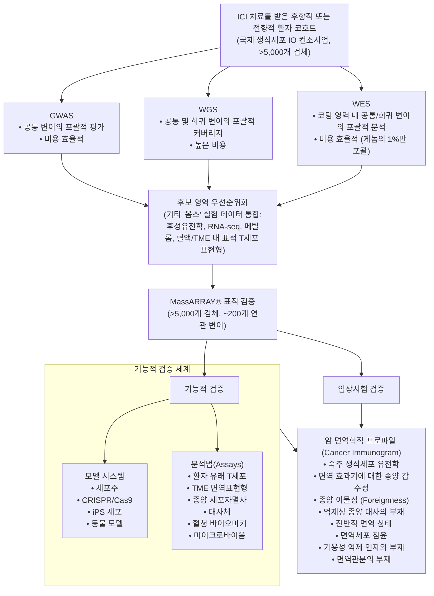

# Part I: 과학적 질문과 면역요법을 위한 억제 수용체의 현황

## Chapter 1: 면역종양학의 현주소: 도전 과제와 기회

저자: Alessandra Cesano, Francesco M. Marincola, Magdalena Thurin


### 약어 목록

| 약어 | 영문 명칭 | 한국어 설명 |
| :--- | :--- | :--- |
| CDR3 | Complementarity determining region 3 | 상보성 결정 부위 3 |
| CIT | Checkpoint inhibitor therapy | 면역관문 억제제 치료 |
| FDA | Food and Drug Administration | 미국 식품의약국 |
| FFPE | Formalin-fixed paraffin-embedded | 포르말린 고정 파라핀 포매 |
| HLA | Human leukocyte antigen | 인간 백혈구 항원 |
| ICD | Immunogenic cell death | 면역원성 세포 사멸 |
| ICR | Immunologic constant of rejection | 거부의 면역학적 항수 |
| IFN | Interferon | 인터페론 |
| IHC | Immunohistochemistry | 면역조직화학염색 |
| IL | Interleukin | 인터루킨 |
| IO | Immune oncology | 면역종양학 |
| MOA | Mechanism of action | 작용 기전 |
| MSI-H/dMMR | Microsatellite instability high/deficient mismatch repair | 고빈도 현미부수체 불안정성 / 불일치 복구 결함 |
| PD-L1 | Programmed death-ligand 1 | 프로그램된 세포사멸 리간드 1 |
| STAT | Signal transducer and activator of transcription | 신호 전달자 및 전사 활성화 인자 |
| TCR | T cell receptor | T 세포 수용체 |
| TILs | Tumor-infiltrating lymphocytes | 종양 침윤 림프구 |
| TIS | Tumor inflammation signature | 종양 염증 시그니처 |
| TMB | Tumor mutation burden | 종양 변이 부담 |
| TME | Tumor microenvironment | 종양 미세환경 |


### 초록

본 서적은 암의 면역치료 반응성을 예측하는 바이오마커를 발굴하고 검증하는 데 사용되는 방법론을 포괄적으로 검토하고자 기획되었다. 임상적으로 실행 가능한(actionable) 바이오마커의 성공적인 개발은 다음 세 가지 핵심 요건에 의존한다: (a) 악성 형질전환 및 종양 진행과 관련된 생물학적 역할의 규명, (b) 견고하고 신뢰할 수 있으며 임상에 적용 가능한 분석법을 통한 검출 능력 확보, (c) 임상시험을 통해 검증된 예후 또는 예측 가치의 확립. 정상 세포와 생존 신호전달 경로를 변화시켜 무제한적인 증식이 가능한 자립적 세포로 변모시키는 돌연변이 및 후성유전학적 변화의 축적으로 특징지어지는 종양 발생 과정을 이해하는 것은 매우 중요하다. 수술, 방사선 치료, 화학요법 등 다양한 치료 양식이 암 치료에 활용되고 있으나, 이들이 제공하는 임상적 이점은 종종 제한적이다. 면역계는 특이적이고 지속적이며 적응 가능한 항종양 반응을 유도할 수 있는 능력을 지니고 있으나, 암은 종종 음성 조절 면역관문과 같은 면역 기전을 탈취하여 이러한 면역 반응을 회피한다.


### 주요 키워드

암 면역치료 (Cancer immunotherapy), 예측 바이오마커 (Predictive biomarkers), 종양 미세환경 (Tumor microenvironment), 면역관문 억제제 (Immune checkpoint inhibitors), 임상 검증 (Clinical validation), 면역종양학 (Immune oncology)


### 1. 서론

> *"생물학에서 정답은 이미 존재하며, 발견해야 할 것은 바로 질문이다."* — 조너스 소크(Jonas Salk), 1969년 [1]

고밀도 데이터가 폭발적으로 생성되는 오늘날, 조너스 소크의 이 격언은 그 어느 때보다 깊은 울림을 준다. 어쩌면 "왜 어떤 환자와 종양은 면역치료에 반응하고 다른 환자는 반응하지 않는가?"라는 다면적인 질문에 대한 답은 이미 방대한 데이터 풀의 미로 속에 기다리고 있을 것이며, 이를 생물학적으로 분석 가능한 요소로 전환하기 위해 적절한 질문을 던지고 탐색하는 것은 우리 연구자들의 몫이다. 항-PD-1/PD-L1 및 CTLA-4 억제제를 이용한 면역관문 억제제 치료(checkpoint inhibitor therapy, CIT)는 다양한 조직형의 진행성 전이성 고형암에서 환자의 생존율을 유의미하게 향상시킴으로써 항암 면역치료의 성공적인 접근법임이 입증되었다 [2]. 또한, 입양 세포 치료(adoptive cellular therapy) 및 종양용해 바이러스(oncolytic virus) 기반 제품과 같은 몇몇 다른 면역종양학(immune oncology, IO) 접근법도 특정 적응증에서 유망한 결과를 보여주었다 [3–5].

그러나 면역종양학 약물을 투여받는 진행성 암 환자의 대다수는 여전히 이러한 치료의 혜택을 받지 못하고 있다. 반응의 효능에는 수많은 변수가 영향을 미치며, 추가적인 억제성 면역관문들이 항암 면역 반응을 억제하는 데 중대한 역할을 할 수 있다. 정상 상태(steady state)에서의 종양 이질성(tumor heterogeneity) 또한 암 면역치료 성공의 또 다른 주요 장애물이다. 암세포 저항성 클론의 발생 및 항원 음성 선택과 같은 종양 회피 기전은 특히 초기에 성공적이었던 치료에 의해 가해지는 선택압(selective pressure)에 반응하여 일어나는 종양 미세환경(tumor microenvironment, TME)의 동적 진화 과정에서 치료 실패의 주된 원인이 된다 [6]. 마지막으로, 숙주의 유전학이나 암세포의 체세포 진화와 직접적인 관련이 없는 여러 범주의 정황적 요인들—예컨대 환경 및 행동 요인, 동반 질환의 존재 및 이에 따른 비암 관련 약물 치료, 환자 개인의 연령 및 병력과 관련된 이전의 숙주 면역 상태 등—도 치료 반응성에 영향을 미칠 수 있다. 입양 세포 치료에 대한 면역 반응성에 영향을 미칠 수 있는 흥미로운 정황적 요인 중 하나는 세포 치료제 완제품의 품질(quality)이다.

따라서 환자 층화(stratification)를 돕고 반응성을 예측할 수 있는 바이오마커를 탐색할 때에는, 면역 적격 숙주 내에서 암의 자연적 또는 치료 유도성 진화를 결정하는 다음과 같은 다차원적 좌표계를 반드시 고려해야 한다:
1. 숙주의 유전적 배경(genetic background)
2. 암세포의 체세포 유전적·후성유전적 및 기능적 적응
3. 정황적 조절 요인(circumstantial modifiers)
4. 면역 회피, 에피토프 확산(epitope spreading), 병용 치료에 의해 유도되는 변형을 결정하는 시간 경과에 따른 동적 진화 [7].

이러한 좌표계는 특히 면역 저항성에 대한 다양한 실험적 증거를 기반으로 새로운 병용 요법 접근법을 모색할 때 반드시 고려되어야 한다 [8, 9].

저자들은 최근 공공 데이터베이스에서 추출한, 암 면역 저항성의 결정 요인으로 제안되어 온 기전 목록을 집대성하였다. 우리는 이들을 하나의 통합된 "모든 것의 이론(theory of everything)"으로 정립하였다 [9]. 먼저 "거부의 면역학적 항수(immunological constant of rejection, ICR)"로 명명된 전사체 시그니처의 발현에 따라 암의 면역 지형(immune landscape)을 면역 "활성형(active)"과 면역 "침묵형(silent)"으로 분류하였다 [10, 11]. ICR은 유리한 예후 및 예측적 함의를 지니는 암 면역감시의 연속체(continuum)를 정의한다 [12]. 이어서 암 미세환경 내에서 면역조절 특성과 연관된 전사체 시그니처들의 비지도(unsupervised) 발현 분포를 분석하였다 [9]. 여기에는 기타 면역관문 [13], 조절 T 세포(regulatory T cells, Treg) [14], IL-23/IL-17 축 [15], 골수유래 억제세포(myeloid suppressor cells, MDSC) [16], 인돌아민 2,3-이산소화효소 1(Indoleamine 2,3-dioxygenase 1, IDO) [17], 면역원성 세포 사멸(immunogenic cell death, ICD) [18], TAM 수용체 티로신 키나아제 패밀리 [19], 저산소증(hypoxia) [20], 암 관련 섬유아세포(cancer-associated fibroblasts, CAF) [21], 장벽 분자(barrier molecules) [22] 등이 포함된다. 아울러 MAPK [11], β-카테닌(β-catenin) [23], PI3K-γ [24] 시그니처와 같이 암 면역 지형과 연관된 발암 경로들도 포함되었다. 자기조직화 지도(self-organizing clustering)를 통해 각 시그니처를 면역 지형에 배정하고, 유전자 세트 풍부도 분석(gene enrichment analysis)을 통해 그 유의성을 평가하였다.

이러한 접근법을 통해 모든 면역조절 기능이 본질적으로 면역 활성형 암에 속한다는 사실이 입증되었다 [9]. 또한 PI3K 시그니처는 암세포 자체의 내재적 생물학적 특성이라기보다는 [26] 골수계 세포 기능의 특징으로서 [25] 면역 활성형 지형에서 우선적으로 발현되었다. ICR 시그니처의 결핍으로 정의되는 면역 침묵형 암은 모든 면역조절 기능이 결여되어 있었으나, β-카테닌 및 MAPK 경로의 활성화와 같은 특정 발암 과정과 연관된 시그니처들이 풍부하게 나타났다 [9]. 나아가 저자들은 침묵형 암이 돌연변이 부담이 낮아 종양유전자 및 종양억제유전자 기능의 변이가 감소된 독특한 돌연변이 프로파일을 특징으로 한다는 점을 관찰한 바 있다 [8, 27, 28]. 즉, 침묵형 암은 더 "깨끗한(cleaner)" 돌연변이 족적(footprint)을 지닌다.

면역 효과기(effector) 활성의 전조이든 면역 억제 활성의 전조이든 간에, 모든 면역조절 기능이 동시에 공발현(coexpressed)된다는 관찰 결과는 면역 적격 숙주에서 암의 진화가 확률론적 이분법적 선택(stochastic binary choice)에 직면한다는 가설을 이끌어냈다. 즉, 어떤 암은 줄기세포가 장기를 형성하는 발달 과정과 유사하게 불필요한 기능을 피하면서 필수적인 성장 이점을 획득하는 일련의 유전적 변이를 질서정연하게 축적한다. 반면 이러한 질서 있는 과정에서 벗어나 암의 성장이 주로 유전체 불안정성(genetic instability)에 의존하게 되면, "시행착오(trial-and-error)" 식의 유전적 형질 재배열을 통해 성장 우위를 확보한다. 그러나 후자의 경우, 면역 인식을 촉발할 수 있는 조직 리모델링 및 화학주성(chemoattraction)과 같은 불필요한 기능들을 점진적으로 축적하는 확률론적 위험을 수반하게 된다 [29]. 또한, 유전체 불안정성은 무질서한 세포 주기를 초래하여 면역원성 세포 사멸(ICD)에 취약해질 가능성이 있다.

현재 면역치료의 효능은 저항성 기전에 의해 제한받고 있다. 이러한 저항성 기전은 치료 결과를 규정하고 현행 면역치료의 한계를 설정할 뿐만 아니라, 항종양 면역을 촉진하기 위해 암 환자를 체계적으로 분류해야 할 미래의 필요성을 제시한다. 향후 연구는 이러한 기존 임상시험을 발판 삼아 항종양 면역 반응을 개선할 수 있는 추가적인 바이오마커를 모색해야 하며, 궁극적인 목표는 면역치료에 대한 지속적인 반응률을 높이는 데 있다.

활성형 지형 내에서 면역 기능이 고도로 풍부하다는 점은, 종양에서 CIT에 대한 면역 저항성이 치료 효과를 무력화하는 대안적 보상성 조절 기전의 존재에 기인함을 시사한다. 저자들은 이 기전을 보상적 면역 저항성(compensatory immune resistance)이라고 명명한다. Chen과 Mellman이 기술한 암-면역 주기(cancer immunity cycle) [30]는 면역 활성형 종양 내에서 면역세포와 암세포 간의 상호작용(cross talk)에 특히, 그리고 어쩌면 배타적으로 적용될 가능성이 높다.

반대로 면역 침묵형 암은 면역관문 자체가 그 자연 경과에서 무관하기 때문에 CIT에 반응할 가능성이 매우 낮다. 저자들은 이를 원발성 면역 무시(primary immune ignorance)라고 부른다. 한편, 숙주 및 암의 내재적 생물학 외부의 인자가 수식자 역할을 하는 경우—예컨대 입양 세포 치료 접근법에서 세포 제품의 품질 등 [31]—이를 정황적 면역 저항성(circumstantial immune resistance)이라 칭할 수 있다. 또한, 면역 반응성 종양이 성공적인 치료 중 가해지는 선택압에 반응하여 저항성을 획득하고 회피 기전을 발달시키는 것이 가능하며, 이 현상을 획득 또는 이차 면역 저항성(acquired or secondary immune resistance)으로 정의한다. 마지막으로, 제한적인 독성으로 인해 치료를 완료할 수 없거나 자가면역 관련 부작용을 조절하기 위해 면역억제제를 투여해야 함으로써 면역종양학적 접근법의 잠재력을 온전히 발휘하지 못하는 경우를 가성 면역 저항성(pseudo immune resistance)으로 분류해야 한다.


### 2. 면역학에서 세포생물학으로의 회귀 (From Immunology Back to Cell Biology)

면역 반응성을 결정하는 암 유전학과 내재적 세포생물학의 역할에 대한 현재의 이해에 비추어 볼 때, 우리는 면역종양학 분야에서 해결해야 할 근본적인 질문이 다음 두 가지인지 여부라고 제안한다:
1. 암은 본질적으로 악성 세포가 자신의 주변 환경 변화를 조율하는 세포생물학적 문제인가, 아니면 기타 환경적 또는 생식세포계열 요인이 더 중대한 역할을 하는가?
2. 암에 대한 면역 반응은 주로 면역원성 세포 사멸(ICD)을 겪는 암세포가 방출하는 손상 관련 분자 패턴(damage-associated molecular patterns, DAMPs)에 의해 경고를 받는 선천 면역 기전에 의해 결정되는가, 아니면 돌연변이 암세포가 발현하는 신생에피토프(neoepitopes) 등에 의해 유도되는 자기-비자기 식별(self–nonself discrimination)에 의해 주로 결정되는가?

본 장에서 저자들은 피르호(Virchow)의 "치유되는 상처(healing wound)" 모델 [10, 29]에서 제안된 바와 같이, 암세포의 내재적 생물학이 새롭게 발생하는 조직 내에서 지지 간질(stromal) 및 혈관 구조의 성장을 자극하는 인자의 방출을 통해 주변 환경을 상당 부분 조율한다고 가정한다. 숙주 세포와의 이러한 상호작용은 선천 및 적응 면역세포의 다양한 화학주성을 초래하여 암을 만성 염증 조직으로 변모시킬 수도 있다 [29]. 이러한 부수적 효과는 모든 암에서 일어나는 것이 아니라 면역 활성형 암에서만 발생하며, 면역 침묵형 암은 상처 치유보다는 정상적인 장기 발달에 더 가까운 조직 리모델링 생물학을 따른다.

우리는 또한 유전체 불안정성에 의해 주도되는 확률론적 과정이 지나치게 많은 "시행착오" 적 시도를 수반하여 세포 주기를 불안정화하고 점진적으로 스트레스 연관 면역원성 세포 사멸(ICD)로 퇴행할 수 있다고 제안한다 [32]. 이러한 개념은 ICD 시그니처가 면역 활성형 표현형과 배타적으로 연관되어 있다는 관찰에 의해 뒷받침되며 [9], 이는 다시 유전체 불안정성 및 증가된 돌연변이 부담과 특징적으로 결부되어 있다 [33]. 면역원성과 돌연변이 부담 증가 사이의 상관관계는 통상적으로 신생항원 발생 가능성의 증가에 기인한 것으로 설명되어 왔다 [34].

여기서 우리는 폴리 매칭거(Polly Matzinger)의 위험 모델(danger model) [35]에 보다 부합하는 대안적 설명으로서, 세포 생활사의 불안정화가 손상 관련 분자 패턴(DAMPs)의 방출을 초래한다는 해석을 제시한다. 전자와 후자의 해석 중 어느 쪽이 타당한지는 인간 종양 생물학의 맥락에서 향후 규명되어야 할 과제이며, 예측 및 기전 바이오마커를 탐색할 때 반드시 상호 배타적이지 않은 이러한 다양한 해석들을 종합적으로 고려해야 한다. 궁극적으로, 어느 한쪽 이론을 지지하는 정교한 실험 모델들이 존재함에도 불구하고, 인간에서 암세포 생물학이 담당하는 주도적 역할과 이에 대한 적응 및 선천 면역 기전의 반응은 여전히 명확한 규명이 필요한 영역으로 남아 있다.


### 3. 암 면역 저항성의 이해와 극복을 위한 체계적 탐구 (A Systematic Quest Toward Understanding and Circumventing Cancer Immune Resistance)

CIT 및 면역종양학 전반에 대한 관심이 고조됨에 따라, 다양한 환자 집단에서 치료 효능을 평가할 수 있는 대규모 무작위 배정 연구를 포함하여 임상시험에 등록되는 환자 수가 기하급수적으로 증가하였다. 이는 인체 검체에서 직접 면역 반응성의 표현형 및 유전체적 기반을 정밀 분석할 수 있는 귀중한 시료를 획득할 전례 없는 기회를 제공한다.

Ayers 등 [36]은 면역 반응성을 예측하는 암 면역 지형을 정의하기 위해 ICR [9]에 필적하는 "종양 염증 시그니처(tumor inflammation signature, TIS)"라는 전사체 시그니처를 활용하였다. 그들은 치료 전 병변에서 인터페론-감마(IFN-γ) 관련 전사체의 발현이 CIT에 대한 면역 반응성을 강력하게 예측한다는 점을 관찰하였다. 이는 전신적 재조합 인간 인터루킨-2(rIL-2)를 투여받은 환자에서 ICR의 핵심 표지인 IFN-γ 신호전달 시그니처가 완전 관해(complete response)를 가장 잘 예측했던 과거의 관찰 결과와 매우 유사하다 [37]. 마찬가지로, 종양 침윤 림프구(TILs) 확장을 위해 채취한 흑색종 병변에서 ICR을 대표하는 IFN-γ 관련 케모카인 CXCL9, CXCL10, CXCL11 및 CCL5의 발현은 TIL 요법에 대한 반응의 강력한 예측 인자였다 [38].

고처리량(high-throughput) 기술을 활용한 치료 전 병변의 이러한 포괄적 분석들은 다른 문헌들에서 논의된 바와 같이 암 면역 반응성의 생물학을 더욱 명확히 정립하는 데 기여하였다 [9, 28]. 이제 진정으로 필요한 것은 향후 임상시험을 체계적이고 가설 중심적(hypothesis-driven)으로 설계하여 유용한 정보의 수집을 촉진하고, 서로 다른 연구 그룹에서 생성된 면역 및 종양 프로파일링 데이터를 비교하여 암 면역 반응성 결정 요인에 대한 2차 분석이 가능하도록 데이터베이스에 통합하는 일이다 [8, 28].


### 4. 질문의 정립 (Framing the Question)

인간 암의 면역 저항성을 결정하는 요인은 무엇인가?

#### 4.1 면역 반응성 예측과 치료 전 생검의 역할 (Predicting Immune Responsiveness and the Role of Pretreatment Biopsies)

대부분의 임상시험에는 치료 전 종양 생검 검체의 수집이 포함된다. 이러한 검체는 면역 반응성과 관련된 생물학적 기전에 대한 중요한 통찰을 제공할 수 있다. 2002년에 저자들은 전신 IL-2 투여와 병용하여 종양 항원 백신 접종을 받은 흑색종 전이 환자를 대상으로 전향적 분자 프로파일링 결과를 발표하며 면역 반응성 분류 인자들을 제안한 바 있다. 당시 우리는 "면역 반응성은 면역 인식을 유도하기에 유리한 종양 미세환경에 의해 사전에 결정될 수 있다"고 결론지었다 [39]. 그 이후 여러 연구를 통해 면역 활성형 환경을 특징으로 하는 종양이 CIT를 포함한 면역종양학 치료에 반응할 가능성이 더 높다는 사실이 일관되게 입증되었다 [36].

흥미롭게도, 앞서 기술한 바와 같이 활성형 종양을 정의하는 "면역 시그니처"는 여러 암종에 걸쳐 관찰될 수 있는 수많은 전사체를 포함하며, '모든 것의 이론'에서 설명된 바와 같이 모든 면역 효과기 및 조절 구성 요소를 망라한다 [28]. 따라서 이 시그니처는 면역 활성화 상태의 지표가 될 수는 있지만, 면역 반응성의 정밀한 기전에 대한 직접적인 정보를 제공하지는 못한다.

비록 최적은 아니지만 대표적인 예측 바이오마커의 좋은 예는 PD-1/PD-L1 경로를 표적화하기 전 기저 시점(baseline)에서 암세포 및/또는 면역세포에 의한 프로그램된 세포사멸 수용체-1 리간드 1(PD-L1/CD274) 발현을 평가하는 것이다. CIT에 의해 표적화되는 분자의 발현은 흔히 제시되는 기전적 해석과는 큰 관련이 없을 수 있으며, 오히려 면역 반응성 표현형과 단순히 '연관된(associated)' 마커일 가능성이 있다. 면역관문 억제제와 그 리간드는 면역 반응성의 광범위한 시그니처의 일부이며, 보상적 면역 저항성의 맥락에서 단일 인자가 아닌 다수의 인자가 면역 반응성에 기여하기 때문이다 [28]. 전반적으로 치료 전 및 특히 치료 유도성 종양 내 T 세포 침윤의 정도가 임상 반응과 상관관계를 보여 종양 특이적 T 세포의 재활성화(unleashing)가 항-PD-1 치료의 기본 토대임을 뒷받침하지만, 반응 패턴의 편차나 장기적인 임상적 이점(즉, 생존율)에 대한 기전적 근거는 여전히 명확히 설명되지 못하고 있다. 따라서 인과적 기전이 직관적으로 보일지라도, 단순한 상관관계를 나타내는 예측 바이오마커와 진정한 기전적 유의성을 지닌 바이오마커를 신중하게 구별해야 한다.

#### 4.2 치료의 전신적 효과 (Systemic Effects of Therapy)

현재 치료 효능에 대한 유용한 정보를 제공하는 전신적 지표에 대해서는 합의된 바가 거의 없다. 여러 상관관계가 제안되기는 하였으나, 대부분 예측 가치와 기전적 중요성이 제한적이다 [40]. 가장 중요한 점은, 말초 혈액 순환을 통해 접근 가능한 바이오마커와 암 면역 지형 사이의 알려진 상관관계가 없다는 것이다. 비록 암 면역 지형이 면역종양학적 접근법에 대한 반응성을 보다 밀접하게 예측하는 것으로 밝혀졌음에도 불구하고 말이다. 바이오마커 연구의 가장 핵심적인 목표 중 하나는 전신 면역 상태와 이에 상응하는 종양 면역 지형을 일치시키는(align) 것이어야 한다.

타당한 가설 중심 전략의 한 예는 피터 리(Peter Lee)의 독창적인 관찰에 기반한다. 그는 암 환자의 순환 면역세포가 정상인에 비해 IFN 자극에 대한 반응이 둔화되어 있음을 발견하였다. 신호 전달자 및 전사 활성화 인자-1(STAT-1) 인산화의 체외(ex vivo) 평가는 이러한 결함을 재현성 있게 입증할 수 있다 [41]. 이 결함은 환자 특이적이며, 질병의 병기가 진행됨에 따라 반응 둔화가 점진적으로 악화되므로 종양 부담에 의존적이다. 그러나 상당수의 환자는 이에 영향을 받지 않고 질병 진행의 최후기 단계까지 정상적인 STAT-1 인산화를 유지한다. 우리가 아는 한, 암 면역 지형과 STAT-1 인산화 감소 사이의 관계를 직접 다룬 연구는 없었으나, 저자들은 흑색종 세포주에서 일산화질소 합성효소 1(NOS1)의 과발현이 림프구의 IFN 반응성 둔화를 체외에서 재현할 수 있음을 관찰하였다 [42].

우리는 IFN에 반응하는 순환 면역세포의 STAT-1 인산화가 암 면역 지형의 특이적 바이오마커가 될 수 있다고 제안한다. 또한 말초 혈액 순환계로 파급될 수 있는 보상적 면역조절 활성을 통해 이러한 결함을 유도할 가능성이 가장 높은 암이 바로 면역 활성형 암일 것이라는 가설을 세운다. 암 면역 지형을 대변하는 쉽게 접근 가능한 혈액 순환 바이오마커의 가치는 특히 치료의 진화 단계 동안 면역 반응성의 기전을 이해하는 데 중대한 의미를 지닐 수 있다.

#### 4.3 치료의 표적 내 효과와 치료 중 생검의 결정적 역할: “Δ”의 가치 (On-Target Effects of Therapy and the Critical Role of On-Treatment Biopsies: the Value of “Δ”)

면역 반응성을 이해하기 위한 명백한 필수 요건은 특정 약물과 표적 장기에 대해 예측된 작용 기전(MOA)을 검증하고, 치료 전 짝지은(paired) 생검 검체와 비교하여 변화의 명확한 척도를 정의하는 것이다. 직관적으로 이는 대단히 중요한 요건으로 보이지만, 실제 임상시험에서는 치료 중 생검 수집을 포함하는 경우가 드물며, 환자 간 차이가 종양 자체의 내재적 이질성 때문이 아니라 치료의 고유한 효과 때문임을 확증할 수 있도록 기저 시점 대비 "Δ"(변화량) 변화를 정확히 기록할 수 있는 치료 전-중 짝지은 생검을 수집하는 경우는 훨씬 더 드물다. 우리는 MOA의 검증이 인간 암 면역 반응성의 정의를 확립하는 데 결정적이라고 제안한다. 면역 반응성의 알고리즘을 정의하는 여러 시나리오를 예상해 볼 수 있다:

1. 치료제가 목표에 도달하지 못하여 표적 조직에서 가설화된 MOA가 전혀 실현되지 않는 경우: 이러한 경우 임상적 종양 퇴행이 관찰된다면 매우 놀라운 일일 것이다.
2. MOA가 예측된 것과 상이한 경우: 예를 들어, 인간 재조합 IL-2의 전신 투여 후 수 분 이내에 대규모 모세혈관 누출 증후군(capillary leak syndrome)을 유발하는 사이토카인 폭풍과 함께 순환계에서 림프구가 사라진다는 관찰에 근거하여, 당초에는 IL-2가 주로 종양 부위로의 T 세포 이동을 촉진함으로써 작용한다고 추정되었다. 그러나 투여 중 수행된 일련의 종양 생검을 통해 실제로는 그렇지 않음이 입증되었다. 즉, 종양 부위에 림프구가 나타나지 않았으며, 오히려 전신 수준에서 IL-2 수용체 발현 세포에 의한 대규모 사이토카인 방출이 유도되었고, 이는 간접적으로 종양 관련 대식세포를 M1 표현형으로 분극화시키는 결과를 낳았다 [43].
3. 반응성과 무관하게 MOA가 일관되게 관찰되는 경우: 이 관찰은 치료 효능에 추가적인 수식 인자들이 관여하며, MOA는 필수 조건일지언정 충분 조건은 아님을 시사한다. 면역 활성형 지형에서 표적 면역관문을 발현하는 환자에서 CIT 반응성이 결여되는 경우가 이에 해당할 수 있다. 즉, 긍정적인 약력학적(pharmacodynamics) 결과에도 불구하고 보상적 면역 저항성이 치료 효능 발현을 방해할 수 있다.
4. MOA가 일관되게 관찰되지 않으나, 그 발생이 치료 결과와 밀접하게 연관되는 경우: 이 관찰은 MOA의 타당성을 기전적으로 검증해 주는 동시에 면역 저항성의 원인을 제시할 수 있다. 침묵형 종양에서는 표적 분자가 발현되지 않아 CIT에 대한 반응으로 MOA가 입증되지 않는 침묵형 종양의 CIT 원발성 면역 저항성이 이에 해당한다. 이 경우 인과관계와의 연결 고리가 확립될 수 있다.
5. MOA가 일관되게 관찰되지 않으며 표현형적 특징이 치료 결과와 연관되지 않는 경우: 이는 MOA의 유의성에 의문을 제기하며 다음과 같은 몇 가지 시나리오를 상정할 수 있다:
   - (a) MOA 부재 시 어떠한 반응도 나타나지 않음.
   - (b) 반응이 배타적으로 MOA 존재 하에서만 나타나지만 일관되지는 않음 (MOA 이외에 결과에 영향을 미치는 다른 요인의 존재 시사).
   - (c) 반응이 MOA의 존재와 무관하게 나타남 (따라서 해당 MOA의 생물학적 타당성에 의문이 제기됨).
6. MOA가 일관되게 관찰되지만, 반응군과 비반응군 환자를 비교함으로써 식별 가능한 미세한 정량적 또는 정성적 차이가 존재하는 경우.

우리는 이것이 면역 반응성을 규명하기 위한 탐구의 틀을 잡는 결정적인 전략이며, 임상시험 과정에서 치료 결과와 연계하여 MOA를 검증하려는 노력을 적극 장려해야 한다고 믿는다. 아울러 치료 전 종양 생검을 통한 종양 생물학 평가와 치료 중 짝지은 검체의 정성적·정량적 변화 평가가 필수적일 것이다. 항-PD-1 반응의 잠재적 결정 요인을 규명하기 위해 치료 전 종양 검체로부터 생산된 엑솜(exome) 및 전사체(transcriptome) 염기서열 분석 데이터의 유용성 또한 강조되어야 한다.

#### 4.4 치료 후 생검 및 획득(이차) 면역 저항성 (Posttreatment Biopsies and Acquired (Secondary) Immune Resistance)

획득 면역 저항성(이차 면역 저항성이라고도 함)은 성공적인 치료 결과로부터 비롯될 수도 있고 그렇지 않을 수도 있다. 그러나 면역 저항성을 초래하는 표현형적 변형은 선택압 하에서 발생할 가능성이 더 높다. 우리는 이전에 항암 백신과 병용한 전신 IL-2 투여의 맥락에서 무반응이 저항성 종양 클론의 선택 기전보다는 주로 단기적이고 제한적인 MOA에 기인한다는 점을 밝힌 바 있다. 반면, 항원 및/또는 인간 백혈구 항원(HLA) 발현의 극적인 변화는 치료에 대한 초기 반응 이후 재발한 병변에서 발생할 가능성이 가장 높다 [39, 44–47]. 최근에는 암세포에서 IFN 신호전달 경로를 따른 반응성과 관련된 흥미로운 기능적 변화들이 보고되었다 [48, 49]. 나아가 항-CD19 CAR-T 세포로 성공적으로 치료받은 B세포 급성 림프모구 백혈병(B-ALL) 환자의 약 30%가 CD19 음성 질환으로 재발한다 [50].

따라서 이차 면역 저항성을 이해하는 것은 표현형적 변화를 사전에 차단하거나 극복하기 위한 실질적인 병용 요법 접근법에 대한 통찰을 제공할 뿐만 아니라, 실험 모델 시스템에서의 유전자 녹아웃(gene knockout) 기법의 가치와 마찬가지로 면역 반응성에 필수적인 핵심 기전적 요건에 대한 중대한 통찰을 제공할 수 있다.


### 5. 질문의 세부 분석 (Dissecting the Question)

이전 절들에서는 면역 지형의 정밀 분석과 다양한 면역 저항성 기전과 관련된 동적 변화에 대한 기본 개념들에 초점을 맞추었다. 그러나 암 면역 반응성은 다인자적이며 지극히 복잡한 현상이다 [51]. 따라서 우리는 앞서 논의된 핵심 질문들의 맥락에서, 다양한 종양 유형의 고유한 생물학적 기전에 따른 구체적인 요소들을 바탕으로 상관성 연구(correlative studies)가 개발되어야 한다고 제안한다.

그러므로 임상 적용을 위한 바이오마커 분석법의 발굴 및 분석적 검증을 위한 과학적 접근법과 기술을 선도하기 위해서는 종양 면역학자, 유전학자, 세포생물학자, 분자생물학자, 생물물리학자, 생물정보학 전산 분석가를 망라하는 다학제적 전문성의 통합이 절실히 요구된다. 아래에서는 향후 다루어져야 할 핵심 질문들의 범주를 제시한다.


### 6. 면역 반응성에 미치는 숙주 생식세포계열의 영향 (Host Germline Influence on Immune Responsiveness)

유전적 배경에 의해 결정되든 평생에 걸친 환경적 적응에 의해 결정되든 간에, 숙주의 면역 상태는 자가면역 질환의 발생 기전과 유사하게 유전적 요인과 후천적 요인의 상호작용을 통해 암의 진행 및 면역치료 반응성에 영향을 미칠 가능성이 높다 [52]. 왜냐하면 암 거부 반응은 면역 매개 조직 특이적 파괴라는 광범위하게 보존된 생물학적 현상의 일부분일 가능성이 높기 때문이다 [10]. 그러나 면역 반응성에 대한 생식세포계열(germline)의 기여는 아직 체계적으로 탐구되지 못하였으며, 숙주의 유전적 배경과 암 면역 표현형 사이의 연결고리를 확립하는 것은 바이오마커 발굴을 촉진하고 개별 치료 맥락 내에서 면역 친화적인 환자 표현형을 규명하는 데 기여할 수 있다.

면역 반응성에 미치는 이러한 복잡한 기여의 여러 측면은 본 서적의 해당 부분에서 상세히 다루어질 것이다. 여기서는 숙주의 유전적 배경이 면역 반응성에 영향을 미칠 수 있는 가설적 기전들을 개괄하고자 한다. 암의 면역치료 반응성에서 생식세포계열 변이(germline variants)의 역할은 다음 사항들을 결정할 수 있다:

1. 암 면역 지형의 결정
2. 특정 면역 지형 내에서의 암 면역 반응성 결정
3. 암세포의 내재적 생물학적 특성 결정 (암세포는 면역원성 자극에 대한 반응에 영향을 미칠 수 있는 기능적 변이를 게놈에 통합하고 있기 때문임)
4. 자가면역 감수성과 관련된 면역 자극에 대한 감수성 결정
5. 유전체 불안정성 (예: BRCAness)
6. 체세포 변이와 연계된 암 생물학적 특성의 변형
7. 면역 반응 수용체(예: CTLA-4)의 유전자 다형성(polymorphism) 결정


### 7. 종양 유전체 변이와 미세환경 (Tumor Genetic Alterations and the Microenvironment)

서로 다른 유전적 및 후성유전학적 변이의 축적은 종양 간(intertumor) 및 종양 내(intratumor) 이질성의 근원이 되어 암 신호전달 경로에 영향을 미치고, 표현형적 변이를 주도하며, 정밀 맞춤 암 의학에 중대한 난제를 제기한다. 이러한 영향 외에도 면역종양학에서 아직 풀리지 않은 질문은 종양 내재적 특성이 TME의 특성에 어떠한 방식으로 영향을 미치는지 여부이다.

CIT 반응 패턴에 기여하는 유전체적 또는 비유전체적 특성의 역할을 규명하는 다음 연구 질문들을 통해 임상 반응 및 생존 패턴과 연관된 오믹스(omics) 수준의 특성을 평가해야 하며, 이를 통해 환자 층화 및 CIT 병용 요법 발굴을 위한 잠재적 전략에 대한 통찰을 얻을 수 있다:

1. 면역 지형 및 면역 반응성을 결정하는 돌연변이 부담(mutational burden)
2. CIT 치료로부터 임상적 이점을 도출하는 데 결정적인 역할을 하는, 체세포 비동의 돌연변이(somatic nonsynonymous mutations) 유래의 재발성 예측 신생에피토프 또는 실험적으로 검증된 신생에피토프 및 HLA 클래스 I·II 결합 예측
3. 암 구동 유전자(driver genes) 또는 종양 억제 유전자의 기능 획득(gain of function) 또는 기능 상실(loss of function) 돌연변이와 이들이 TME에 미치는 영향
4. 면역 지형 및 면역 반응성을 결정하는 유전적 불균형(genetic imbalances)
5. 면역 지형을 결정하는 유전적 재배열(염색체/유전자좌 또는 특정 유전자 수준)
6. 면역 지형을 결정하는 수적(numerical) 또는 구조적(structural) 유전체 불안정성
7. 반응성 종양과 비반응성 종양 간의 차별적 발현 유전자(differentially expressed genes, DEG)를 나타내는 전사체 시그니처
8. 면역 지형을 결정하는 조절 기전(β-카테닌, MAP 키나아제, STAT-3의 역할)
9. TME 형성에 미치는 단일 대립유전자 발현(monoallelic expression)
10. TME 형성에 미치는 후성유전학적 조절(epigenetic regulation)


### 8. 환경적 요인의 역할 (Role of the Environment)

암세포 생물학이나 유전된 유전적 결정 요인 외부의 정황적 요인들도 면역 반응성에 다양한 수준으로 영향을 미칠 수 있다. 여기에는 환경적 요인 및 행동 요인, 그리고 다음과 같은 이들의 상호작용이 포함된다 [53–55]:

1. 영양 상태 및 그것이 면역 기능에 미치는 영향
2. 마이크로바이옴(microbiome)과 면역 반응성
3. 면역 반응성을 결정하는 동반 질환(comorbidities)의 역할

이러한 연구들은 한편으로는 메타유전체학(metagenomics)에서 역학(epidemiology)에 이르고, 다른 한편으로는 기초 세포 면역 생물학에 이르는 다양한 학문 분야 간의 복합적인 상호작용을 요구하며, 이는 본 서적의 해당 부분에서 심도 있게 다루어질 것이다.


### 9. 면역종양학 바이오마커의 유망한 접근법 (Promising Approaches for IO Biomarkers)

면역종양학(IO) 바이오마커 분야의 연구는 이미 위에서 논의된 수많은 측면들을 고려하고 있으며, 면역계, 종양 및 종양 미세환경, 그리고 숙주 사이의 관계를 규명하고자 노력하고 있다. 면역계와 종양 간의 상호작용을 측정하는 IO 바이오마커를 발굴하기 위해 바이오마커 연구 개발은 염증 마커, 종양 항원 및 신생항원, 면역억제 마커, 숙주 환경 요인을 포함한 몇 가지 핵심 분야에 집중되고 있다. 다중 바이오마커를 동시에 평가하고 통합함으로써 TME에 대한 보다 정확하고 포괄적인 평가를 제공할 수 있다. 이는 특정 면역치료에 반응할 가능성이 높은 환자를 선별하여 보다 개인화된 맞춤 치료 접근법을 가능하게 하는 IO 바이오마커 개발의 목표를 달성하는 데 기여할 것이다.

항암 치료를 위한 바이오마커 기반 배정의 잠재력을 온전히 실현하기 위한 진전은, 단일 치료제 또는 다중 반응 기전 및 면역 회피 기전을 표적화하는 상보적 작용 기전을 가진 약물 병용 요법의 선택을 안내할 수 있는 새로운 임상 등급(clinical-grade) 바이오마커의 개발과 적용을 필요로 한다. 면역치료를 위한 예측 바이오마커는 약물이 표적하는 특정 유전적 이상(genetic aberration)의 존재 여부에 기반하는 표적치료용 바이오마커와는 뚜렷한 차이를 보인다 (표 1).

표 1. 표적치료 및 면역치료 바이오마커의 비교 (Table 1 Comparison of biomarkers for targeted and immunotherapy)

| 구분 | 구동 돌연변이 (Driver mutations / 표적치료) | 면역종양학 바이오마커 (IO Biomarkers / 면역치료) |
| :--- | :--- | :--- |
| 예시 (Examples) | BRAF, EGFR, ALK, MET 특이적 돌연변이 또는 융합 유전자 | PD-L1, 종양 침윤 림프구(TILs), MDSC, 대사 매개체, 염증 시그니처 |
| 표적 (Target) | 종양 (Tumor) | 종양 및 종양 미세환경 (Tumor and TME) |
| 발현 양상 (Presence) | 구성적/항상적 (Constitutive) | 동적 및 유도성 (Dynamic and inducible) |
| 측정 지표 (Metrics) | 존재 유무 / 이분법적 결정 (Presence/binary decision) | 발현 수준(연속 변수), 기능적 정보, 활성화 상태 (Level of expression [continuous variable], functional information, activation status) |

면역치료를 위한 바이오마커는 단일 분석 물질(analyte) 바이오마커의 사용으로는 다룰 수 없는 면역계와 종양 생물학의 복잡성을 포괄하는 포괄적인 접근법을 필요로 한다. 따라서 잠재적 바이오마커를 발굴하고 인식하기 위해서는 종양과 숙주 면역계 양쪽 모두의 생물학 및 유전체학에 대한 조사가 필수적이다. 새로운 플랫폼과 기술의 도입은 향후 개인 맞춤 치료를 안내하기 위한 다중 프로파일(multiplex profiles) 개발을 위해 종양의 분자적 특성과 숙주 요인의 통합을 촉진할 것이다.

그러나 후보 바이오마커 및/또는 신기술이 실제 임상 현장에서 활용되기 전에는 바이오마커의 분석적 유효성(analytical validity)과 임상적 유효성(clinical validity)을 입증하기 위한 엄격한 검증 단계가 필수적이다 [56, 57]. 미국 식품의약국(FDA)에 의해 이미 승인/허가(approved/cleared)되었거나 면역치료 중재를 통한 임상적 이점과의 연관성에 대한 예비 증거를 제시한 바이오마커 분석용 기술 플랫폼의 예시는 아래와 같다 (표 2).

표 2. 면역관문 억제제 반응을 예측하는 새로운 조직 기반 바이오마커 (Table 2 Emerging tissue-based biomarkers predictive of immune-checkpoint inhibitor response)

| 플랫폼 (Platform) | 바이오마커 (Biomarker) | 검사법 예시 (Assay examples) |
| :--- | :--- | :--- |
| 면역조직화학염색 (IHC) | PD-L1 | Dako 28-8<sup>a</sup>, Dako 22C3<sup>b</sup>, Ventana 검사법<sup>c</sup> [58–61] |
| | TILs / CD8+ T 세포 | 기저 시점 및 치료 후 더 높은 CD8+ T 세포 밀도 [60–62] |
| 다중 면역조직화학염색 (mIHC) | 종양 및 TME 마커 패널 (CD3, CD8, CD4, FoxP3, CD68 등) | 다중 면역조직화학염색(mIHC) 검사법 [62–65] |
| | CD8+, CD3+ T 세포 밀도 | 면역점수(Immunoscore; HalioDx, 프랑스 마르세유) [58] |
| | MSH2, MSH6, MLH1, PMS2 발현 | 불일치 복구 결함(dMMR) 검사 [66–69] |
| DNA 염기서열 분석 (DNA sequencing) | DNA 코딩 영역당 총 돌연변이 수 | 종양 변이 부담(TMB) [70–72] |
| | MSI 마커 (BAT25, BAT26, D2S123, D5S346, D17S2720) | 고빈도 현미부수체 불안정성(MSI-H) 검사 [66–69] |
| 표적 DNA 염기서열 분석 (Targeted DNA sequencing) | 324/468개 유전자 돌연변이 패널 | FoundationOne / MSK-IMPACT 검사 [73, 74] |
| DNA/RNA 염기서열 분석 (DNA/RNA sequencing) | 추정 신생항원에 대해 필터링된 전사체 데이터 | 신생항원 부담(Neoantigen burden) [75–78] |
| | T 세포 수용체(TCR) 내 상보성 결정 부위 3(CDR3) 정량화 | TCR 클론성(TCR clonality) [62, 79] |
| 유전자 발현 시그니처 (Gene expression signatures) | 18개 유전자 발현 시그니처 | 종양 염증 점수(Tumor Inflammation Score, TIS) [36] |
| | 770개 유전자 발현 패널 | PanCancer IO 360™ 검사 (NanoString Technologies Inc., [80]) [37–39] |
| | 유전자 발현 프로파일 | Teff Roche [81] |

<sup>a</sup> Dako 28-8: https://www.agilent.com/en-us/pd-l1-ihc-28-8-overview
<sup>b</sup> Dako 22C3: https://www.agilent.com/en/product/pharmdx/pd-l1-ihc-22c3-pharmdx
<sup>c</sup> Ventana: https://www.agilent.com/en-us/pd-l1-ihc-28-8-overview (참고: Ventana SP142/SP263 등)


### 10. 결론 (Conclusions)

본 입문 장의 목적은 다루어야 할 근본적인 의생명과학적 질문들을 명확히 규정하고 이들이 고려되어야 할 논리적 순서에 초점을 맞춤으로써, 인간 암 면역 반응성을 이해하기 위한 미래의 체계적인 접근법에 대한 고찰을 제공하는 데 있다. 핵심 취지는 유전학, 유전체학, 전산생물학, 세포생물학을 포괄하는 다학제적(transdisciplinary) 접근법이 암 면역치료의 개인화된 맞춤 전략 개발을 위한 해결책을 도출하는 데 기여할 수 있는 역할을 조명하는 것이다.

면역치료 분야의 현 연구들은 다양한 종양 반응 및 저항성 기전을 지속적으로 규명하고 있으며, 몇 가지 유망한 바이오마커들이 발굴되었다. 그러나 대다수의 환자에서 면역치료의 효능을 개선하기 위해서는 종양과 숙주의 서로 다른 기전을 포괄하고 다양한 분석 기술을 융합하는 차세대 바이오마커를 개발하기 위한 향후 연구가 필수적으로 요구된다.


### 참고문헌 (References)

1. Salk J (1969) Immunological paradoxes: theoretical considerations in the rejection or retention of grafts, tumors, and normal tissue. Ann N Y Acad Sci 164(2):365–380
2. Gong J, Chehrazi-Raffle A, Reddi S, Salgia R (2018) Development of PD-1 and PD-L1 inhibitors as a form of cancer immunotherapy: a comprehensive review of registration trials and future considerations. J Immunother Cancer 6(1):8
3. Emens LA, Ascierto PA, Darcy PK, Demaria S, Eggermont AMM, Redmond WL et al (2017) Cancer immunotherapy: opportunities and challenges in the rapidly evolving clinical landscape. Eur J Cancer 81:116–129
4. Ascierto PA, Puzanov I, Agarwala SS, Bifulco C, Botti G, Caraco C et al (2018) Perspectives in melanoma: meeting report from the Melanoma Bridge (30 November–2 December, 2017, Naples, Italy). J Transl Med 16(1):207
5. Ascierto PA, Brugarolas J, Buonaguro L, Butterfield LH, Carbone D, Daniele B et al (2018) Perspectives in immunotherapy: meeting report from the Immunotherapy Bridge (29–30 November, 2017, Naples, Italy). J Immunother Cancer 6(1):69
6. Memarnejadian A, Meilleur CE, Shaler CR, Khazaie K, Bennink JR, Schell TD et al (2017) PD-1 blockade promotes epitope spreading in anticancer CD8(+) T cell responses by preventing fratricidal death of subdominant clones to relieve immunodomination. J Immunol 199(9):3348–3359
7. Wang E, Zhao Y, Monaco A, Uccellini L, Kirkwood JM, Spyropoulou-Vlachou M et al (2012) A multi-factorial genetic model for prognostic assessment of high risk melanoma patients receiving adjuvant interferon. PLoS One 7(7):e40805
8. Lu R, Turan T, Samayoa J, Marincola FM (2017) Cancer immune resistance: can theories converge? Emerg Top Life Sci 1(5):411–419
9. Turan T, Kannan D, Patel M, Barnes MJ, Tanlimco SG, Lu R et al (2018) Immune oncology, immune responsiveness and the theory of everything. J Immunother Cancer 6(1):50
10. Wang E, Worschech A, Marincola FM (2008) The immunologic constant of rejection. Trends Immunol 29(6):256–262
11. Orecchioni M, Bedognetti D, Newman L, Fuoco C, Spada F, Hendrickx W et al (2017) Single-cell mass cytometry and transcriptome profiling reveal the impact of graphene on human immune cells. Nat Commun 8(1):1109
12. Galon J, Angell HK, Bedognetti D, Marincola FM (2013) The continuum of cancer immunosurveillance: prognostic, predictive, and mechanistic signatures. Immunity 39(1):11–26
13. Koyama S, Akbay EA, Li YY, Herter-Sprie GS, Buczkowski KA, Richards WG et al (2016) Adaptive resistance to therapeutic PD-1 blockade is associated with upregulation of alternative immune checkpoints. Nat Commun 7:10501
14. Abd Al Samid M, Chaudhary B, Khaled YS, Ammori BJ, Elkord E (2016) Combining FoxP3 and Helios with GARP/LAP markers can identify expanded Treg subsets in cancer patients. Oncotarget 7(12):14083–14094
15. Alinejad V, Dolati S, Motallebnezhad M, Yousefi M (2017) The role of IL17B-IL17RB signaling pathway in breast cancer. Biomed Pharmacother 88:795–803
16. Munn DH, Bronte V (2016) Immune suppressive mechanisms in the tumor microenvironment. Curr Opin Immunol 39:1–6
17. Mondanelli G, Ugel S, Grohmann U, Bronte V (2017) The immune regulation in cancer by the amino acid metabolizing enzymes ARG and IDO. Curr Opin Pharmacol 35:30–39
18. Galluzzi L, Buque A, Kepp O, Zitvogel L, Kroemer G (2017) Immunogenic cell death in cancer and infectious disease. Nat Rev Immunol 17(2):97–111
19. Crittenden MR, Baird J, Friedman D, Savage T, Uhde L, Alice A et al (2016) Mertk on tumor macrophages is a therapeutic target to prevent tumor recurrence following radiation therapy. Oncotarget 7(48):78653–78666
20. Hatfield SM, Sitkovsky M (2016) A2A adenosine receptor antagonists to weaken the hypoxia-HIF-1alpha driven immunosuppression and improve immunotherapies of cancer. Curr Opin Pharmacol 29:90–96
21. Ohlund D, Handly-Santana A, Biffi G, Elyada E, Almeida AS, Ponz-Sarvise M et al (2017) Distinct populations of inflammatory fibroblasts and myofibroblasts in pancreatic cancer. J Exp Med 214(3):579–596
22. Salerno EP, Bedognetti D, Mauldin IS, Deacon DH, Shea SM, Pinczewski J et al (2016) Human melanomas and ovarian cancers overexpressing mechanical barrier molecule genes lack immune signatures and have increased patient mortality risk. Oncoimmunology 5(12):e1240857
23. Spranger S, Bao R, Gajewski TF (2015) Melanoma-intrinsic beta-catenin signalling prevents anti-tumour immunity. Nature 523(7559):231–235
24. Daragmeh J, Barriah W, Saad B, Zaid H (2016) Analysis of PI3K pathway components in human cancers. Oncol Lett 11(4):2913–2918
25. De Henau O, Rausch M, Winkler D, Campesato LF, Liu C, Cymerman DH et al (2016) Overcoming resistance to checkpoint blockade therapy by targeting PI3Kgamma in myeloid cells. Nature 539(7629):443–447
26. Karlsson E, Veenstra C, Emin S, Dutta C, Perez-Tenorio G, Nordenskjold B et al (2015) Loss of protein tyrosine phosphatase, non-receptor type 2 is associated with activation of AKT and tamoxifen resistance in breast cancer. Breast Cancer Res Treat 153(1):31–40
27. Hendrickx W, Simeone I, Anjum S, Mokrab Y, Bertucci F, Finetti P et al (2017) Identification of genetic determinants of breast cancer immune phenotypes by integrative genome-scale analysis. Oncoimmunology 6(2):e1253654
28. Turan T, Kannan D, Patel M, Matthew Barnes J, Tanlimco SG, Lu R et al (2018) Immune oncology, immune responsiveness and the theory of everything. J Immunother Cancer 6(1):50
29. Mantovani A, Romero P, Palucka AK, Marincola FM (2008) Tumour immunity: effector response to tumour and role of the microenvironment. Lancet 371(9614):771–783
30. Chen DS, Mellman I (2013) Oncology meets immunology: the cancer-immunity cycle. Immunity 39(1):1–10
31. Rossi J, Paczkowski P, Shen YW, Morse K, Flynn B, Kaiser A et al (2018) Preinfusion polyfunctional anti-CD19 chimeric antigen receptor T cells are associated with clinical outcomes in NHL. Blood 132(8):804–814
32. Labi V, Erlacher M (2015) How cell death shapes cancer. Cell Death Dis 6:e1675
33. Palmieri G, Colombino M, Cossu A, Marchetti A, Botti G, Ascierto PA (2017) Genetic instability and increased mutational load: which diagnostic tool best direct patients with cancer to immunotherapy? J Transl Med 15(1):17
34. Ward JP, Gubin MM, Schreiber RD (2016) The role of neoantigens in naturally occurring and therapeutically induced immune responses to cancer. Adv Immunol 130:25–74
35. Fuchs EJ, Matzinger P (1996) Is cancer dangerous to the immune system? Semin Immunol 8(5):271–280
36. Ayers M, Lunceford J, Nebozhyn M, Murphy E, Loboda A, Kaufman DR et al (2017) IFN-gamma-related mRNA profile predicts clinical response to PD-1 blockade. J Clin Invest 127(8):2930–2940
37. Weiss GR, Grosh WW, Chianese-Bullock KA, Zhao Y, Liu H, Slingluff CL Jr et al (2011) Molecular insights on the peripheral and intratumoral effects of systemic high-dose rIL-2 (aldesleukin) administration for the treatment of metastatic melanoma. Clin Cancer Res 17(23):7440–7450
38. Bedognetti D, Spivey TL, Zhao Y, Uccellini L, Tomei S, Dudley ME et al (2013) CXCR3/CCR5 pathways in metastatic melanoma patients treated with adoptive therapy and interleukin-2. Br J Cancer 109(9):2412–2423
39. Wang E, Miller LD, Ohnmacht GA, Mocellin S, Perez-Diez A, Petersen D et al (2002) Prospective molecular profiling of melanoma metastases suggests classifiers of immune responsiveness. Cancer Res 62(13):3581–3586
40. Yi M, Jiao D, Xu H, Liu Q, Zhao W, Han X et al (2018) Biomarkers for predicting efficacy of PD-1/PD-L1 inhibitors. Mol Cancer 17(1):129
41. Critchley-Thorne RJ, Simons DL, Yan N, Miyahira AK, Dirbas FM, Johnson DL et al (2009) Impaired interferon signaling is a common immune defect in human cancer. Proc Natl Acad Sci U S A 106(22):9010–9015
42. Liu Q, Tomei S, Ascierto ML, De Giorgi V, Bedognetti D, Dai C et al (2014) Melanoma NOS1 expression promotes dysfunctional IFN signaling. J Clin Invest 124(5):2147–2159
43. Panelli MC, Wang E, Phan G, Puhlmann M, Miller L, Ohnmacht GA et al (2002) Gene-expression profiling of the response of peripheral blood mononuclear cells and melanoma metastases to systemic IL-2 administration. Genome Biol 3(7):R35
44. Ohnmacht GA, Wang E, Mocellin S, Abati A, Filie A, Fetsch P et al (2001) Short-term kinetics of tumor antigen expression in response to vaccination. J Immunol 167(3):1809–1820
45. Marincola FM, Jaffee EM, Hicklin DJ, Ferrone S (2000) Escape of human solid tumors from T-cell recognition: molecular mechanisms and functional significance. Adv Immunol 74:181–273
46. Hicklin DJ, Marincola FM, Ferrone S (1999) HLA class I antigen downregulation in human cancers: T-cell immunotherapy revives an old story. Mol Med Today 5(4):178–186
47. Ohnmacht GA, Marincola FM (2000) Heterogeneity in expression of human leukocyte antigens and melanoma-associated antigens in advanced melanoma. J Cell Physiol 182(3):332–338
48. Della Corte CM, Byers LA (2019) Evading the STING: LKB1 loss leads to STING silencing and immune escape in KRAS-mutant lung cancers. Cancer Discov 9(1):16–18
49. Della Corte CM, Gay CM, Byers LA (2019) Beyond chemotherapy: emerging biomarkers and therapies as small cell lung cancer enters the immune checkpoint era. Cancer 125(4):496–498
50. Jacoby E, Nguyen SM, Fountaine TJ, Welp K, Gryder B, Qin H et al (2016) CD19 CAR immune pressure induces B-precursor acute lymphoblastic leukaemia lineage switch exposing inherent leukaemic plasticity. Nat Commun 7:12320
51. Lam TK, Shao S, Zhao Y, Marincola F, Pesatori A, Bertazzi PA et al (2012) Influence of quercetin-rich food intake on microRNA expression in lung cancer tissues. Cancer Epidemiol Biomark Prev 21(12):2176–2184
52. Gutierrez-Arcelus M, Rich SS, Raychaudhuri S (2016) Autoimmune diseases—connecting risk alleles with molecular traits of the immune system. Nat Rev Genet 17(3):160–174
53. Soldati L, Di Renzo L, Jirillo E, Ascierto PA, Marincola FM, De Lorenzo A (2018) The influence of diet on anti-cancer immune responsiveness. J Transl Med 16(1):75
54. Roy S, Trinchieri G (2017) Microbiota: a key orchestrator of cancer therapy. Nat Rev Cancer 17(5):271–285
55. Singh RK, Chang HW, Yan D, Lee KM, Ucmak D, Wong K et al (2017) Influence of diet on the gut microbiome and implications for human health. J Transl Med 15(1):73
56. Masucci GV, Cesano A, Eggermont A, Fox BA, Wang E, Marincola FM et al (2017) The need for a network to establish and validate predictive biomarkers in cancer immunotherapy. J Transl Med 15(1):223
57. Dobbin KK, Cesano A, Alvarez J, Hawtin R, Janetzki S, Kirsch I et al (2016) Validation of biomarkers to predict response to immunotherapy in cancer: volume II—clinical validation and regulatory considerations. J Immunother Cancer 4:77
58. Taube JM, Galon J, Sholl LM, Rodig SJ, Cottrell TR, Giraldo NA et al (2018) Implications of the tumor immune microenvironment for staging and therapeutics. Mod Pathol 31(2):214–234
59. Taube JM, Klein A, Brahmer JR, Xu H, Pan X, Kim JH et al (2014) Association of PD-1, PD-1 ligands, and other features of the tumor immune microenvironment with response to anti-PD-1 therapy. Clin Cancer Res 20(19):5064–5074
60. Herbst RS, Soria JC, Kowanetz M, Fine GD, Hamid O, Gordon MS et al (2014) Predictive correlates of response to the anti-PD-L1 antibody MPDL3280A in cancer patients. Nature 515(7528):563–567
61. Wang Q, Liu F, Liu L (2017) Prognostic significance of PD-L1 in solid tumor: an updated meta-analysis. Medicine 96(18):e6369
62. Tumeh PC, Harview CL, Yearley JH, Shintaku IP, Taylor EJ, Robert L et al (2014) PD-1 blockade induces responses by inhibiting adaptive immune resistance. Nature 515(7528):568–571
63. Giraldo NA, Nguyen P, Engle EL, Kaunitz GJ, Cottrell TR, Berry S et al (2018) Multidimensional, quantitative assessment of PD-1/PD-L1 expression in patients with Merkel cell carcinoma and association with response to pembrolizumab. J Immunother Cancer 6(1):99
64. Halse H, Colebatch AJ, Petrone P, Henderson MA, Mills JK, Snow H et al (2018) Multiplex immunohistochemistry accurately defines the immune context of metastatic melanoma. Sci Rep 8(1):11158
65. Tsujikawa T, Kumar S, Borkar RN, Azimi V, Thibault G, Chang YH et al (2017) Quantitative multiplex immunohistochemistry reveals myeloid-inflamed tumor-immune complexity associated with poor prognosis. Cell Rep 19(1):203–217
66. Vanderwalde A, Spetzler D, Xiao N, Gatalica Z, Marshall J (2018) Microsatellite instability status determined by next-generation sequencing and compared with PD-L1 and tumor mutational burden in 11,348 patients. Cancer Med 7(3):746–756
67. Le DT, Uram JN, Wang H, Bartlett BR, Kemberling H, Eyring AD et al (2015) PD-1 blockade in tumors with mismatch-repair deficiency. N Engl J Med 372(26):2509–2520
68. Fabrizio DA, George TJ Jr, Dunne RF, Frampton G, Sun J, Gowen K et al (2018) Beyond microsatellite testing: assessment of tumor mutational burden identifies subsets of colorectal cancer who may respond to immune checkpoint inhibition. J Gastrointest Oncol 9(4):610–617
69. Salem ME, Puccini A, Grothey A, Raghavan D, Goldberg RM, Xiu J et al (2018) Landscape of tumor mutation load, mismatch repair deficiency, and PD-L1 expression in a large patient cohort of gastrointestinal cancers. Mol Cancer Res 16(5):805–812
70. Snyder A, Makarov V, Merghoub T, Yuan J, Zaretsky JM, Desrichard A et al (2014) Genetic basis for clinical response to CTLA-4 blockade in melanoma. N Engl J Med 371(23):2189–2199
71. Johnson DB, Frampton GM, Rioth MJ, Yusko E, Xu Y, Guo X et al (2016) Targeted next generation sequencing identifies markers of response to PD-1 blockade. Cancer Immunol Res 4(11):959–967
72. Van Cutsem E, Cervantes A, Adam R, Sobrero A, Van Krieken JH, Aderka D et al (2016) ESMO consensus guidelines for the management of patients with metastatic colorectal cancer. Ann Oncol 27(8):1386–1422
73. Frampton GM, Fichtenholtz A, Otto GA, Wang K, Downing SR, He J et al (2013) Development and validation of a clinical cancer genomic profiling test based on massively parallel DNA sequencing. Nat Biotechnol 31(11):1023–1031
74. Goodman AM, Kato S, Bazhenova L, Patel SP, Frampton GM, Miller V et al (2017) Tumor mutational burden as an independent predictor of response to immunotherapy in diverse cancers. Mol Cancer Ther 16(11):2598–2608
75. McGranahan N, Furness AJ, Rosenthal R, Ramskov S, Lyngaa R, Saini SK et al (2016) Clonal neoantigens elicit T cell immunoreactivity and sensitivity to immune checkpoint blockade. Science 351(6280):1463–1469
76. Rizvi NA, Hellmann MD, Snyder A, Kvistborg P, Makarov V, Havel JJ et al (2015) Cancer immunology. Mutational landscape determines sensitivity to PD-1 blockade in non-small cell lung cancer. Science 348(6230):124–128
77. Saeterdal I, Bjorheim J, Lislerud K, Gjertsen MK, Bukholm IK, Olsen OC et al (2001) Frameshift-mutation-derived peptides as tumor-specific antigens in inherited and spontaneous colorectal cancer. Proc Natl Acad Sci U S A 98(23):13255–13260
78. Hugo W, Zaretsky JM, Sun L, Song C, Moreno BH, Hu-Lieskovan S et al (2017) Genomic and transcriptomic features of response to anti-PD-1 therapy in metastatic melanoma. Cell 168(3):542–556.e9
79. Riaz N, Havel JJ, Makarov V, Desrichard A, Urba WJ, Sims JS et al (2017) Tumor and microenvironment evolution during immunotherapy with Nivolumab. Cell 171(4):934–949.e15
80. Cesano A (2015) nCounter((R)) PanCancer immune profiling panel (NanoString Technologies, Inc., Seattle, WA). J Immunother Cancer 3:42
81. Socinski MA, Jotte RM, Cappuzzo F, Orlandi F, Stroyakovskiy D, Nogami N et al (2018) Atezolizumab for first-line treatment of metastatic nonsquamous NSCLC. N Engl J Med 378(24):2288–2301

## Chapter 2: 암 면역치료의 면역학적 표적: 억제성 T세포 수용체 (Immunological Targets for Immunotherapy: Inhibitory T Cell Receptors)

저자: 디와카르 다바르(Diwakar Davar), 하산 M. 자루르(Hassane M. Zarour)

### 초록 (Abstract)
종양의 발생은 정상 세포와 세포 생존 경로를 무제한적 증식이 가능한 자립형 세포로 변형시키는 유전적 변이 및 후성유전학적 변화의 축적으로 특징지어진다. 암 치료를 위해 수술, 방사선 치료, 화학요법을 포함한 다양한 치료 양식이 임상에서 활용되고 있으나, 이들 치료가 제공하는 임상적 이점은 대개 제한적이다. 반면 면역계는 고도의 항원 특이성, 장기 지속성, 그리고 유연한 적응성을 갖춘 항종양 반응을 유도할 수 있는 잠재력을 지니고 있다. 그러나 암세포는 과도한 염증 및 자가면역 반응을 억제하기 위해 진화한 음성 조절 관문(negative regulatory checkpoints)과 같은 면역 기전을 탈취하여 효과적인 항종양 면역을 회피하고 무력화한다. 면역세포에 발현되는 억제성 수용체를 표적으로 하는 단클론항체(monoclonal antibodies)의 개발은 광범위한 진행성 악성종양 환자에서 장기적인 치료 반응을 이끌어내며 암 치료의 새로운 전기를 마련하였다. 그러나 이러한 극적인 치료 반응은 여전히 일부 적응증 및 소수의 환자군에 국한되어 있어, 보다 효과적이고 혁신적인 신규 치료 접근법의 개발이 시급히 요구된다. 면역관문 차단제를 활용한 전임상 및 임상 연구에서는 다중 억제성 수용체를 동시에 표적으로 하는 항체 기반 치료의 치료적 잠재력을 활발히 탐색하고 있다. 본 장에서는 다양한 억제성 수용체의 분자 구조, 리간드 특이성, 생물학적 기능 및 세포 내 신호전달 활성에 대한 현재의 학문적 이해를 종합적으로 고찰한다. 아울러 이러한 음성 조절 면역 수용체를 표적으로 하는 다양한 면역관문 억제제의 최신 임상 개발 현황을 살펴보고, 향후 극복해야 할 핵심적인 학문적·개념적 지식 격차(conceptual gaps in knowledge)를 조명한다.

### 주요 키워드 (Keywords)
면역요법(Immunotherapy), 억제성 수용체(Inhibitory receptors), PD-1, CTLA-4, TIM-3, TIGIT, LAG-3, BTLA, VISTA


### 1. 서론 (Introduction)
암세포는 T세포에 의해 이물질로 인식되어 궁극적으로 종양 거부를 유도할 수 있는 종양 항원(tumor antigens, TA)을 지속적으로 생성한다 [1]. 다수의 원발성 고형암에서 CD8+ 종양 침윤 림프구(tumor-infiltrating lymphocytes, TIL)의 존재는 일반적으로 우수한 임상 예후를 예측하는 중요한 생물학적 지표로 확립되어 있다 [2–5]. 그러나 진행성 암 환자에서는 생체 내에서 자연 발생하거나 암 백신 접종을 통해 유도된 종양 항원 특이적 T세포가 종양의 진행과 성장을 효과적으로 억제하지 못하는 경우가 빈번하게 관찰된다 [6, 7].

종양 미세환경(tumor microenvironment, TME) 내에 존재하는 다양한 음성 면역조절 경로는 T세포 매개 종양 세포 사멸을 물리적·생화학적으로 저해하며, 이는 암 환자에서 종양 항원 특이적 CD8+ T세포의 존재와 종양의 진행이 역설적으로 공존하는 현상을 초래한다. 이들 면역조절 경로 중에서도 PD-1 및 CTLA-4와 같은 억제성 수용체(inhibitory receptors, IR)는 T세포의 항종양 작동체 기능을 약화시키고 기능적 탈진(exhaustion)을 유도하는 데 결정적인 역할을 담당한다. 이러한 면역조절 경로를 표적으로 차단하는 면역관문 억제제(immune checkpoint inhibitors) 치료는 점점 더 광범위한 고형암 환자들에게 장기적이고 지속적인 임상 혜택을 제공하고 있다 [8].

세포독성 T 림프구 관련 항원-4(anti-CTLA-4) 및 프로그램 세포사멸-1(anti-PD-1)과 같은 면역관문 수용체를 표적으로 하는 단클론항체(monoclonal antibody, mAb)의 성공적인 임상 개발은 이러한 면역치료 전략의 유효성을 확고히 입증하였다. 본 종설에서는 억제성 면역관문을 표적으로 하는 현재 및 미래의 병용 면역치료 전략의 생물학적 근거를 뒷받침하는 전임상 및 초기 임상 데이터를 심도 있게 논의하고자 한다.

#### 1.1 억제성 T세포 수용체: CTLA-4 (Inhibitory T Cell Receptors: CTLA-4)

##### 1.1.1 CTLA-4의 구조 및 리간드 (CTLA-4: Structure and Ligands)
세포독성 T 림프구 관련 항원-4(cytotoxic T lymphocyte-associated antigen-4; CTLA-4, CD152)는 T세포 활성화에 의해 유도되는 당단백질로, 면역글로불린(Ig) 슈퍼패밀리에 속한다. CTLA-4는 대표적인 T세포 공자극 단백질인 CD28과 높은 구조적 상동성을 공유한다. 그러나 T세포 수용체(TCR)와 항원제시세포(antigen presenting cells, APC) 간의 초기 상호작용 후 항원 특이적 T세포의 활성화 및 증식에 필수적인 2차 공자극 신호를 제공하는 CD28과 달리, CTLA-4는 T세포 반응을 강력하게 하향 조절하는 억제 신호를 전달한다 [9–12].

분자 구조상 CTLA-4는 세포외 V 도메인, 막관통(transmembrane) 도메인, 그리고 세포질 꼬리(cytoplasmic tail)로 구성된다. CTLA-4의 세포질 꼬리는 구조 및 기능 측면에서 CD28과 유사하다. 자체적인 내재적 효소 촉매 활성은 없으나, 포스파티딜이노시톨 3-키나아제(PI3K), 단백질 포스파타아제 2A(PP2A) 및 SHP-2와 결합할 수 있는 YVKM 모티프를 포함하고 있으며, SH3 도메인을 함유한 단백질과 결합할 수 있는 독립된 프롤린 풍부(proline-rich) 모티프를 보유하고 있다 [13].

CTLA-4는 면역억제 기능을 수행하는 조절 T세포(regulatory T cells, Tregs)에서 구성적으로(constitutively) 높게 발현되는 반면, 작동체 CD8+ T세포에서는 주로 초기 항원 자극 및 활성화가 일어난 이후에 세포 표면으로 발현이 유도된다. 특히 조절 T세포는 CTLA-4를 엔도솜(endosome) 내에 대량으로 저장하고 있어 방대한 세포 내 저장고 풀(pool)을 형성하며, 세포 활성화 자극이 주어지면 이를 세포 표면으로 신속하게 순환(cycling) 이동시킨다. CTLA-4는 항원제시세포(APC) 표면에 발현되어 있는 두 가지 천연 리간드인 CD80(B7.1) 및 CD86(B7.2)과 결합한다 [14–16].

##### 1.1.2 CTLA-4의 신호전달 및 기능 (CTLA-4: Signaling and Function)
세포 표면에 안정적이고 높게 발현되는 CD28이나 PD-1과 달리, CTLA-4는 주로 세포 내 소기관에 분포하며 구성적 동종이량체(homodimer) 형태로 존재한다 [17, 18]. 초기 연구에서는 CTLA-4 신호전달이 CD3ζ 쇄의 탈인산화 [19], ZAP-70 마이크로클러스터 형성 억제 [20], 그리고 PI3K [21], SHP-2 [22], 세린/트레오닌 포스파타아제 PP2A [23]와의 상호작용과 연관되어 있다고 보고되었으나, 이후 다수의 후속 연구에서는 CTLA-4의 억제 신호가 이러한 개별 세포 내 상호작용 없이도 독립적으로 발생할 수 있음을 규명하였다 [24–28].

분자 이미징(molecular imaging) 기법을 이용한 실험에 따르면, Tregs와 CD8+ T세포는 면역 시냅스(immune synapse)에서 세포 내재적(cell-intrinsic) 방식으로 동일한 CD80/CD86 리간드를 두고 경쟁적으로 상호작용한다 [29]. 항원에 노출되었을 때 CTLA-4는 CD28에 비해 CD80 및 CD86에 대해 현저히 높은 친화도(affinity)와 결합력(avidity)을 가지므로, CD28을 효과적으로 밀어내고 리간드 결합을 선점한다 [30, 31]. 이는 CTLA-4의 억제 활성 중 상당 부분이 리간드 경쟁에 따른 물리적 차단 및 신호전달에 기인함을 강력히 시사한다.

더 나아가 CTLA-4는 트랜스엔도시토시스(transendocytosis)라는 독특한 세포 외인성(cell-extrinsic) 기전을 통해 APC 표면에 존재하는 CD80 및 CD86 리간드를 물리적으로 뜯어내어 자신의 세포 내로 함입시킨 후 분해한다 [32]. 이 현상은 TCR 결합에 의해 촉진되며, Tregs와 CD8+ T세포 모두에서 공통적으로 관찰된다 [32]. 종합적으로 이러한 결과들은 CTLA-4의 일차적인 억제 기전이 CD28이 공자극 리간드(CD80/CD86)에 접근하는 것을 원천적으로 차단하는 것임을 보여주며, CTLA-4의 신호전달 효과가 매우 복합적이고 맥락 의존적(context-dependent)임을 시사한다.

별도의 축적된 연구에 따르면, CTLA-4 억제 치료가 Treg 구획에 미치는 면역조절 효과는 종양 내 Treg의 선택적 고갈(depletion) 또는 Treg의 면역억제 활성 약화에 기인한다 [33–36]. 실제로 항-CTLA-4 항체 치료는 종양 조직 내부에서 CD8+ T세포 대 Treg의 비율(CD8/Treg ratio)을 유의하게 증가시킨다 [37–43]. Treg 구획에 대한 이러한 차단 효과는 Fc-감마 수용체(Fc-gamma receptor, Fc-γR)에 절대적으로 의존하며, 종양 미세환경 내 Fc-γR 발현 대식세포의 존재와 밀접하게 연관되어 있다 [44, 45]. 이 효과는 항체의 동종형(isotype)에 크게 좌우되며, 우수한 Fc 작동체 기능(Fc effector function)을 갖도록 조작된 항체가 전임상 모델에서 현저히 향상된 항종양 효능을 입증하였다 [46].

##### 1.1.3 CTLA-4: 전임상 및 임상 데이터 (CTLA-4: Preclinical and Clinical Data)
CTLA-4의 음성 조절 기능 규명은 마우스 종양 모델을 이용한 일련의 획기적인 전임상 항암 면역 연구로 이어졌다. 1996년 Leach와 연구진은 항체를 통한 CTLA-4 차단이 마우스 대장암 및 섬유육종의 이식 종양 거부를 유도함을 최초로 입증하였다 [47]. 또한 CTLA-4 차단은 강력한 면역 기억을 형성하여, 종양이 거부된 마우스는 추가적인 항체 투여 없이도 재이식된 동일 종양 세포를 자발적으로 거부하였다. 비록 면역원성이 낮은 B16 흑색종 및 SM1 유방암 모델에서는 CTLA-4 단독 차단의 효과가 미미하였으나, GM-CSF를 분비하는 종양 백신과 병용 투여했을 때 완전한 종양 박멸을 달성하였다 [48, 49].

이러한 성공적인 전임상 연구 결과에 힘입어 인간화 항-CTLA-4 단클론항체인 이필리무맙(ipilimumab; MDX-010, Medarex/Bristol-Myers Squibb)과 트레멜리무맙(tremelimumab; CP-675,206 또는 ticilimumab, Pfizer/Medimmune)이 본격적으로 개발되었다. 두 약제 모두 완전 인간 단클론항체이나, 이필리무맙은 IgG1κ 아형으로 반감기가 12–14일인 반면, 트레멜리무맙은 IgG2 아형으로 22일의 더 긴 반감기를 갖는다. 진행성 흑색종 환자를 대상으로 한 최초의 1상 임상시험에서 이필리무맙 3 mg/kg 단회 투여를 받은 17명의 환자 코호트 중 2명에서 부분 관해(PR)가 관찰되었다 [50]. 이후 흑색종 [51] 및 림프종 [52]을 포함한 다양한 암종에서 투여 용량과 스케줄을 최적화하기 위한 다수의 임상 연구가 진행되었다.

초기 임상 연구들은 세 가지 독특한 핵심 임상적 특징을 명확히 제시하였다:
1) 고용량 투여 시 반응률이 증가하지만 동시에 독성 빈도도 높아지는 뚜렷한 용량-반응 관계,
2) 자가면역성 조직 특이적 염증 반응을 반영하는 특이한 '면역 관련 이상반응(immune-related adverse events, irAE)' 스펙트럼,
3) 치료에 반응한 환자의 약 20%에서 수년간 질병 진행 없이 생존이 유지되는 장기 지속적 반응(durable responses) [53].

이필리무맙은 이후 진행성 흑색종 환자를 대상으로 한 두 건의 결정적인 3상 임상시험을 통해 평가되었다: 이전에 치료받은 적이 있는 HLA-A*0201 양성 전이성 흑색종 환자에서 gp100 펩타이드 백신과 비교한 연구(MDX010-020) [54], 그리고 치료 경험이 없는 전이성 흑색종 환자에서 다카르바진(dacarbazine) 단독요법 대비 이필리무맙/다카르바진 병용요법을 비교한 연구(MDX010-024/CA184-024) [55]이다. 두 연구 모두에서 유의한 전체 생존기간(OS) 연장이 입증되었으며, 이는 면역요법이 환자의 일부에서 장기적인 질병 제어를 유도함을 최종 증명하여 해당 적응증에 대한 규제 당국의 역사적인 최초 승인을 획득하는 발판이 되었다. 장기 추적 관찰 데이터의 통합 분석 결과, 이필리무맙 치료 환자의 약 20–26%에서 생존 곡선이 치료 후 3년 시점부터 평탄한 고원(plateau)을 형성하는 것으로 확인되었다 [53].

트레멜리무맙의 초기 임상 연구 역시 비록 직접 비교 임상은 없었으나 이필리무맙과 유사한 유효성을 보였다. 트레멜리무맙 투여 환자의 일부에서 장기적인 치료 반응이 관찰되었으며 대장염, 피부 발진 등 유사한 irAE 프로파일을 나타냈다. 트레멜리무맙의 긴 반감기를 감안하여 3개월마다 15 mg/kg을 투여하는 요법이 채택되었다. 진행성 흑색종 대상 2상 연구에서 반응률은 7%였으나 21%의 환자에서 질병 조절을 달성하였고 대다수가 장기간 유지되었다 [56]. 그러나 표준 화학요법과 트레멜리무맙을 직접 비교한 대규모 3상 임상시험은 중간 분석에서 시험군의 생존율 개선이 통계적으로 유의하지 않아 조기 중단되었다 [57].

최근 항-CTLA-4 분야의 신약 개발은 치료 지수(therapeutic index)를 개선하여 항종양 효능을 극대화하면서 전신 면역 독성을 최소화하는 방향으로 집중되고 있다. 주요 전략으로는 종양 미세환경(TME) 내에 과발현된 종양 특이적 단백질분해효소(protease)에 의해서만 절단되는 독자적 차폐 펩타이드(masking peptide)를 도입한 프로바디(probody) 기술, 그리고 항체 의존성 세포독성(ADCC) 및 Fc-γR 결합 친화도를 증강시키는 항체 불변 부위 공학이 대표적이다.
- BMS-986218: 이필리무맙과 동일한 아미노산 서열 및 리간드 차단능을 유지하면서 알파-(1,6)-푸코실전이효소(Fut8) 결손 세포주에서 발현시킨 비푸코실화(nonfucosylated, NF) 형태의 항체이다. 이 비푸코실화 변형은 Fc-γR에 대한 결합 친화도를 대폭 향상시켜 ADCC 활성을 극대화한다 [44, 46, 58]. 강화된 Fc-γR 친화도를 통해 종양 내 조절 T세포(Treg)의 고갈 효과를 배가시키고 종양 침윤 CD8+ T세포의 항종양 활성을 촉진하도록 설계되었으며, 현재 고형암 환자를 대상으로 1상 용량 증량 시험이 진행 중이다 (NCT03110107).
- BMS-986249: 이필리무맙과 동일한 결합 특성을 지닌 CTLA-4 프로바디(probody)로, 항원 결합 부위가 프로테아제 절단 링커로 연결된 차폐 펩타이드에 의해 가려져 있다. 이 링커는 TME 내에 존재하는 종양 관련 단백질분해효소에 의해서만 특이적으로 절단되므로, 이론적으로 정상 조직에서는 비활성 상태를 유지하고 종양 국소 부위에서만 선택적으로 약효를 발휘하여 전신 부작용을 획기적으로 경감시킬 수 있다 (NCT03369223).

#### 1.2 억제성 T세포 수용체: PD-1 (Inhibitory T Cell Receptors: PD-1)

##### 1.2.1 PD-1의 구조 및 리간드 (PD-1: Structure and Ligands)
PD-1(Programmed Death 1, CD279) 수용체는 N-말단의 단일 IgV 유사 세포외 도메인, 막관통 도메인, 그리고 세포질 꼬리로 구성된다. 세포질 꼬리 내부에는 면역수용체 티로신 기반 억제 모티프(immunoreceptor tyrosine-based inhibitory motif, ITIM)와 면역수용체 티로신 기반 스위치 모티프(immunoreceptor tyrosine-based switch motif, ITSM)가 존재한다. 리간드가 수용체에 결합하면 ITIM 및 ITSM 내의 티로신 잔기가 인산화되며, 이는 SH2 도메인을 포함하는 단백질 티로신 포스파타아제인 Shp-1 및 Shp-2의 도킹 부위(docking sites)로 작용한다 [59, 60].

Shp-1은 다양한 면역 활성화 신호 전달 체계를 감쇠시키는 역할을 하는 반면, Shp-2는 성장인자 또는 호르몬 수용체 신호전달을 양성적으로 매개할 수 있으며 종양생성 Shp-2 신호는 주로 RAS-ERK 경로 활성화를 통해 다수의 악성종양 발생에 관여한다 [60–63]. PD-1 수용체는 현재까지 규명된 두 가지 주요 리간드와 결합한다: 프로그램 세포사멸 리간드 1(PD-L1, B7-H1 또는 CD274) [64] 및 프로그램 세포사멸 리간드 2(PD-L2, B7-DC 또는 CD273) [65, 66]. PD-1은 암 환자의 종양 항원 특이적 CD8+ T세포 및 종양 침윤 림프구(TIL) 표면에서 현저히 상향 조절되며, 흑색종을 포함한 인간 종양 세포 표면에 발현된 PD-L1과의 상호작용을 통해 T세포의 항종양 면역 기능을 음성적으로 억제한다 [67–70].

##### 1.2.2 PD-1의 신호전달 및 기능 (PD-1: Signaling and Function)
생체 내에서 PD-1과 PD-L1/PD-L2의 상호작용은 말초 면역 관용(peripheral tolerance)과 자가면역 방지를 위한 면역 항상성을 유지하는 데 필수적이다. 그러나 악성 종양은 이 억제 경로를 탈취하여 숙주의 면역 감시를 회피한다. 암 미세환경에서 PD-L1과 PD-1의 결합은 종양 침윤 T세포에 대해 적어도 세 가지의 지배적인 억제 효과를 유발한다:
1. 세포 주기 진행 억제: T세포는 정상적으로 사이클린(cyclin) 발현이 결여되어 있어 휴지기(G0기)에 머무른다. CDK 억제제인 p27kip1은 세포 내에서 Cdk2와 결합하여 세포 분열을 억제하며, SCFSkp2 유비퀴틴 리가아제에 의해 p27kip1이 유비퀴틴화 분해되어야 세포 주기가 S기로 진행된다. 그러나 PD-L1이 결합하면 SKP2 전사가 억제되어 p27kip1이 세포 내에 비정상적으로 축적되고, 결과적으로 T세포의 증식 및 세포 주기 진행이 강력히 차단된다 [71, 72].
2. 유도 조절 T세포(iTreg)의 생성 촉진: 형질전환성장인자-베타(TGF-β)는 TME 내에 다량으로 존재하는 다면발현성(pleiotropic) 사이토카인으로, Smad3 의존적이자 Smad2 비의존적 방식으로 T세포 증식, 활성화 및 작동 기능을 직접 억제한다 [73]. PD-L1은 이러한 TGF-β와 시너지 효과를 발휘하여 미감작 T세포가 면역억제성 유도 조절 T세포(induced Treg, iTreg)로 분화하도록 촉진하며, 마스터 전사인자인 Foxp3의 발현을 지속적으로 유지·강화하여 iTreg의 면역억제 기능을 증폭시킨다 [74].
3. T세포 대사 재프로그래밍(Metabolic Reprogramming): 미감작 T세포는 산화적 인산화에 의존하지만, 항원에 의해 활성화된 T세포는 주요 에너지원으로 포도당 해당작용(glycolysis)을 활용한다. 그러나 PD-L1 결합 신호가 전달되면 활성화된 T세포는 해당작용과 아미노산 대사를 수행하지 못하게 되며, 카르니틴 팔미토일전이효소 I(CPT1)의 발현 증가로 인해 지방산 베타 산화(fatty acid β-oxidation, FAO)의 비율이 비정상적으로 상승한다 [75]. 이러한 대사적 장애를 겪는 T세포는 심각한 대사 탈진(metabolic exhaustion) 상태에 빠져 종양 세포를 인식하더라도 세포용해 과립을 방출하거나 항종양 사이토카인을 분비하지 못한다.

이와 독립적으로, PD-1 신호의 활성화는 TCR 복합체 하류 신호전달 [76, 77] 및 ICOS 공자극 신호 [77]를 억제하며, CD28 공자극 신호 경로를 직접적으로 억제할 뿐만 아니라 [78], PD-1의 인산화된 ITSM에 결합한 Shp2 포스파타아제에 의해 CD28을 직접 탈인산화시킴으로써 간접적으로 무력화한다 [79].

##### 1.2.3 PD-1: 전임상 및 임상 데이터 (PD-1: Preclinical and Clinical Data)
CTLA-4 차단과 PD-1 차단은 근본적으로 상이하며 상호 비중복적인 면역학적 기전을 통해 T세포 의존적 항종양 면역을 증강시킨다. PD-1 경로는 만성 항원 자극을 받은 종양 침윤 T세포가 존재하는 종양 국소 미세환경(TME) 내부에서 세포 내재적 기전을 통해 T세포 작동체 단계(effector phase)를 주도적으로 억제한다 [80, 81]. 반면 CTLA-4는 림프절 등 2차 림프기관에서 항원이 최초로 제시되는 면역 프라이밍 단계(priming phase)에서 작동하며, CD8+ T세포뿐만 아니라 ICOS+ Th1 유사 CD4+ 작동 T세포의 증식을 세포 내재적 및 외인성 기전으로 조절한다 [82]. 따라서 항-PD-1과 항-CTLA-4의 병용 차단은 각기 다른 면역 경로에 의해 구동되는 뚜렷하고 상호 중복되지 않는 면역학적 변화를 유도한다 [83, 84].

PD-1 및 PD-L1을 표적으로 하는 단클론항체(mAb)의 개발은 다수의 진행성 고형암에서 장기적인 생존 이점을 입증함으로써 현대 종양학의 치료 패러다임을 근본적으로 변화시켰다. 이들 치료용 항체는 주로 PD-1 수용체를 표적으로 하는 인간화 IgG4 단클론항체(니볼루맙, 펨브롤리주맙, 세미플리맙) 또는 PD-L1을 표적으로 하는 IgG1 람다 항체(아테졸리주맙, 더발루맙, 아벨루맙)로 구성된다. 항-PD-1 및 항-PD-L1 항체는 흑색종, 비소세포폐암(NSCLC), 소세포폐암(SCLC), 신세포암(RCC), 재발성 호지킨 림프종, 두경부 편평세포암(HNSCC), 요로상피암(방광암), 현미부수체 불안정성 고도(MSI-H) 또는 불일치 복구 결함(dMMR) 고형암, 메르켈세포암, 피부 편평세포암(cSCC) 등 광범위한 종양에서 탁월한 항종양 활성을 입증하였다. 주요 대표적 대규모 임상시험의 유효성 및 생존 지표는 표 1에 상세히 정리되어 있다.

항-PD-1/PD-L1 항체가 유도하는 장기 지속적 반응은 진행성 암 환자의 치료 성적을 크게 향상시켰으나, 여전히 상당수의 환자가 치료에 전혀 반응하지 않거나(원발성 저항) 일시적 반응 후 재발(획득 저항)을 겪는다. 면역치료 저항성 기전은 일반적으로 다음과 같이 분류된다 [85]:
- 원발성 저항(Primary resistance): 면역치료를 투여받았으나 처음부터 전혀 반응하지 않는 상태.
- 획득 저항(Acquired resistance): 초기에는 종양 축소 등 임상 반응을 보였으나 이후 질병이 진행하는 상태.
- 적응 저항(Adaptive resistance): 종양 세포가 면역계의 공격을 인식한 후 이에 적응하여 면역 회피 기전을 활성화하는 것으로, 원발성 저항, 혼합 반응 또는 획득 저항의 형태로 발현됨.

원발성 및 적응 저항성은 종양 세포의 내재적 유전적 변이에 의해 유발될 수 있다. 여기에는 MAPK 경로 활성화 [86], Wnt/β-카테닌 경로의 비정상적 활성화 [87], 종양억제유전자 PTEN의 소실 [88], 인터페론-감마(IFNγ) 신호전달 경로 유전자(JAK1, JAK2 등)의 기능 소실 돌연변이 [89–91], 낮은 종양 변이 부담(TMB) 또는 MHC 클래스 I/II 발현 결함으로 인한 항원 제시 장애 [92] 등이 포함된다. 반면 세포 외인성(cell-extrinsic) 저항 기전은 종양 세포 이외의 TME 구성요소에서 유래하며, 대표적으로 조절 T세포(Tregs), 골수 유래 억제 세포(MDSC), 종양 관련 대식세포(TAM)의 면역억제 활성과 다양한 대체 억제성 수용체의 복합적 동시 발현에 기인한다 [93–95]. 향후 임상 연구는 이러한 다양한 저항 기전을 극복하기 위한 다각적 병용 치료 전략에 집중되고 있다.

역으로, PD-1 차단 치료에 대한 유효한 치료 반응 예측 바이오마커로 두 가지 핵심 요인이 규명되었다. 첫째, 종양 조직 내 IFNγ 관련 유전자 발현 프로파일(GEP)은 항-PD-1/PD-L1 항체 반응에 필수적인 'T세포 염증성 종양 미세환경(T cell-inflamed phenotype)'과 매우 밀접한 상관관계를 보인다 [96]. 둘째, PD-1 차단 치료에 대한 반응은 종양 내 침윤된 CD8+ PD-1+ T세포의 기저 존재량에 강하게 의존한다 [97]. 마우스 모델 연구에 따르면, PD-1 차단 투여 후 종양 부위에서 폭발적인 세포 분열(proliferative burst)을 일으키는 핵심 T세포군은 TCF-1 매개 전사 프로그램에 의해 줄기세포 유사(stem-like) 기억 표현형을 유지하고 있는 CD8+ CXCR5+ T세포 아형으로 밝혀졌다 [98].

#### 표 1. 다양한 종양 유형에 걸친 PD-1 억제제 또는 PD-1/CTLA-4 억제제 병용요법의 반응 및 생존 데이터 (Table 1. Response and survival data of PD-1 inhibitors or PD-1/CTLA-4 inhibitor combinations across multiple tumor types)

| 약제 및 연구명 (Study & Citation) | 적응증 (Indication) | 투여 용법 및 용량 (Dose & Regimen) | 객관적 반응률 (ORR) | 주요 생존 지표 (Landmark Survival / PFS / OS) |
| :--- | :--- | :--- | :--- | :--- |
| [니볼루맙 + 이필리무맙 병용요법]<br>CheckMate-067<br>(Larkin J et al., NEJM 2015; Wolchok JD et al., NEJM 2017) | 이전에 치료받지 않은 전이성 흑색종 (BRAF V600E 변이형 또는 야생형) | 니볼루맙 1 mg/kg + 이필리무맙 3 mg/kg 3주 간격 4회 투여 후 니볼루맙 3 mg/kg 2주 간격 투여 vs. 니볼루맙 3 mg/kg 2주 간격 vs. 이필리무맙 3 mg/kg 3주 간격 4회 (최대 2년) | 58% (병용군) vs. 44% (니볼루맙 단독) vs. 19% (이필리무맙 단독) | • 중앙 PFS: 11.5개월 (병용) vs. 6.9개월 (니볼루맙) vs. 2.9개월 (이필리무맙)<br>• 3년 PFS율: 39% vs. 32% vs. 10%<br>• 중앙 OS: 미도달 (병용) vs. 37.6개월 vs. 19.9개월<br>• 3년 OS율: 58% vs. 52% vs. 34% (이필리무맙 대비 병용군 HR 0.55) |
| CheckMate-214<br>(Motzer RJ et al., NEJM 2018) | 이전에 치료받지 않은 중등도/고위험군 진행성 또는 전이성 신세포암(RCC) | 니볼루맙 3 mg/kg + 이필리무맙 1 mg/kg 3주 간격 4회 투여 후 니볼루맙 3 mg/kg 2주 간격 vs. 대조군: 수니티닙 50 mg 1일 1회 (4주 투여/2주 휴약) | 42% (병용군) vs. 27% (수니티닙) | • 중앙 PFS: 11.6개월 vs. 8.4개월 (HR 0.82)<br>• 2년 PFS율: 72% vs. 63%<br>• 중앙 OS: 미도달 vs. 26.0개월 (HR 0.63)<br>• 1년 OS율: 80% vs. 72% |
| CheckMate-142<br>(Overman MJ et al., Lancet Oncol 2017; J Clin Oncol 2018) | 플루오로피리미딘 및 옥살리플라틴/이리노테칸 치료 후 진행된 전이성 MSI-H/dMMR 대장암 | 니볼루맙 3 mg/kg + 이필리무맙 1 mg/kg 3주 간격 4회 투여 후 니볼루맙 3 mg/kg 2주 간격 vs. 니볼루맙 3 mg/kg 2주 간격 단독 | 55% (병용군) vs. 31% (단독군) | • 중앙 PFS: 미도달 vs. 14.3개월 (1년 PFS율: 71% vs. 50%)<br>• 중앙 OS: 미도달 vs. 미도달 (1년 OS율: 85% vs. 73%)<br>• 질병통제율(DCR): 80% vs. 69% |
| [니볼루맙 단독요법]<br>CheckMate-238<br>(Weber J et al., NEJM 2017) | 완전 절제술을 시행받은 고위험군(3b/c/d기 또는 4기) 악성 흑색종 (수술 후 보조요법) | 니볼루맙 3 mg/kg 2주 간격 (최대 1년) vs. 대조군: 이필리무맙 10 mg/kg 3주 간격 4회 투여 후 12주 간격 (최대 1년) | 해당 없음 (수술 후 보조요법) | • 1년 무재발생존율(RFS): 70.5% (니볼루맙) vs. 60.8% (이필리무맙) (HR 0.65)<br>• 18개월 RFS율: 66.4% vs. 52.7%<br>• 3/4등급 이상반응: 14.4% vs. 45.9% |
| CheckMate-066<br>(Robert C et al., NEJM 2015) | 이전에 치료받은 적이 없는 BRAF 야생형 전이성 흑색종 | 니볼루맙 3 mg/kg 2주 간격 vs. 대조군: 다카르바진 1000 mg/m² 3주 간격 | 40.0% (니볼루맙) vs. 13.9% (다카르바진) | • 중앙 PFS: 5.1개월 vs. 2.2개월 (HR 0.43)<br>• 1년 PFS율: 41.7% vs. 10.8%<br>• 중앙 OS: 미도달 vs. 10.8개월 (HR 0.42)<br>• 1년 OS율: 72.9% vs. 42.1% |
| CheckMate-026<br>(Carbone DP et al., NEJM 2017) | 이전에 치료받지 않은 전이성 비소세포폐암 (PD-L1 발현율 ≥1% 등록, 1차 평가변수 코호트는 ≥5%) | 니볼루맙 3 mg/kg 2주 간격 vs. 대조군: 백금 기반 이중 화학요법 3주 간격 (최대 6주기) | 26% (니볼루맙) vs. 33% (화학요법) | • PD-L1 ≥5% 환자군 중앙 PFS: 4.2개월 vs. 5.9개월 (HR 1.15)<br>• 1년 PFS율: 24% vs. 23%<br>• 중앙 OS: 14.4개월 vs. 13.2개월 (HR 1.02)<br>• 1년 OS율: 56% vs. 54% |
| CheckMate-017<br>(Brahmer J et al., NEJM 2015; Horn L et al., J Clin Oncol 2017) | 백금 기반 화학요법 치료 중 또는 치료 후 진행된 전이성 편평 비소세포폐암 | 니볼루맙 3 mg/kg 2주 간격 vs. 대조군: 도세탁셀 75 mg/m² 3주 간격 | 20% (니볼루맙) vs. 9% (도세탁셀) | • 중앙 PFS: 3.5개월 vs. 2.8개월 (HR 0.62)<br>• 1년 PFS율: 21% vs. 6%<br>• 중앙 OS: 9.2개월 vs. 6.0개월 (HR 0.59)<br>• 1년 OS율: 42% vs. 24% |
| CheckMate-057<br>(Borghaei H et al., NEJM 2015) | 백금 기반 화학요법 치료 중 또는 치료 후 진행된 전이성 비편평 비소세포폐암 | 니볼루맙 3 mg/kg 2주 간격 vs. 대조군: 도세탁셀 75 mg/m² 3주 간격 | 19% (니볼루맙) vs. 12% (도세탁셀) | • 중앙 PFS: 2.3개월 vs. 4.2개월 (HR 0.92)<br>• 1년 PFS율: 19% vs. 8%<br>• 중앙 OS: 12.2개월 vs. 9.4개월 (HR 0.73)<br>• 1년 OS율: 51% vs. 39% |
| CheckMate-032<br>(Antonia SJ et al., Lancet Oncol 2016) | 1차 이상 백금 기반 화학요법에 불응하거나 재발한 진행성 소세포폐암(SCLC) | 니볼루맙 3 mg/kg 2주 간격 vs. 니볼루맙 1 mg/kg + 이필리무맙 3 mg/kg 3주 간격 4회 vs. 니볼루맙 3 mg/kg + 이필리무맙 1 mg/kg | 10% (니볼루맙 단독) vs. 21% (병용 투여 전체 코호트) | • 중앙 PFS: 1.4개월 (단독) vs. 1.4–2.6개월 (병용)<br>• 중앙 OS: 4.4개월 (단독) vs. 6.0–7.7개월 (병용)<br>• 1년 OS율: 33% (단독) vs. 35–43% (병용) |
| CheckMate-025<br>(Motzer RJ et al., NEJM 2015) | 1~2개 항혈관신생 TKI 억제제 치료 후 진행된 진행성 또는 전이성 신세포암(RCC) | 니볼루맙 3 mg/kg 2주 간격 vs. 대조군: 에베롤리무스 10 mg 1일 1회 | 25% (니볼루맙) vs. 5% (에베롤리무스) | • 중앙 PFS: 4.6개월 vs. 4.4개월 (HR 0.88)<br>• 중앙 OS: 25.0개월 vs. 19.6개월 (HR 0.73)<br>• 1년 OS율: 미보고 (사후 분석 지속적 생존 연장 확인) |
| CheckMate-205<br>(Younes A et al., Lancet Oncol 2016; Armand P et al., J Clin Oncol 2018) | 자가조혈모세포이식(auto-SCT) 및 브렌툭시맙 베도틴 치료 실패 후 재발성/불응성 고전적 호지킨 림프종 | 니볼루맙 3 mg/kg 2주 간격 단독 투여 | 69% (완전관해 16%, 부분관해 53%) | • 중앙 PFS: 14.7개월<br>• 중앙 OS: 미도달<br>• 1년 OS율: 92% |
| CheckMate-141<br>(Ferris RL et al., NEJM 2016) | 백금 기반 치료 중 또는 치료 후 6개월 이내 재발/진행한 재발성 또는 전이성 두경부 편평세포암 | 니볼루맙 3 mg/kg 2주 간격 vs. 대조군: 연구자 선택 단일 화학요법 (메토트렉세이트, 도세탁셀 또는 세툭시맙) | 13.3% (니볼루맙) vs. 5.8% (화학요법) | • 중앙 PFS: 2.0개월 vs. 2.3개월 (HR 0.89)<br>• 6개월 PFS율: 19.7% vs. 9.9%<br>• 중앙 OS: 7.5개월 vs. 5.1개월 (HR 0.70)<br>• 1년 OS율: 36.0% vs. 16.6% |
| CheckMate-275<br>(Sharma P et al., Lancet Oncol 2017) | 백금 함유 화학요법 후 진행하거나 수술 전후 보조요법 12개월 이내 재발한 전이성 요로상피암 | 니볼루맙 3 mg/kg 2주 간격 단독 투여 | 전체 19.6% (PD-L1 ≥1%: 28.4%, PD-L1 <1%: 16.1%) | • 중앙 PFS: 2.0개월<br>• 중앙 OS: 8.7개월 (PD-L1 ≥1% 환자군: 11.3개월)<br>• 1년 OS율: 39% |
| CheckMate-040<br>(El-Khoueiry AB et al., Lancet 2017) | 소라페닙 치료에 실패했거나 불내약성인 진행성 간세포암(HCC) (HCV/HBV 감염군 포함) | 용량 증량군: 니볼루맙 0.1–10 mg/kg 2주 간격; 용량 확장군: 니볼루맙 3 mg/kg 2주 간격 | 용량 증량군: 15%, 용량 확장군: 20% | • 6개월 OS율: 83%<br>• 9개월 OS율: 74%<br>• 1년 OS율: 73% (용량 확장군 중앙 OS 미도달) |
| [펨브롤리주맙 단독 및 병용요법]<br>KEYNOTE-006<br>(Robert C, Schachter J et al., NEJM 2015; Lancet 2017) | 이전에 이필리무맙을 투여받지 않은 진행성 또는 전이성 악성 흑색종 | 펨브롤리주맙 10 mg/kg 2주 간격(q2w) 또는 3주 간격(q3w) (최대 2년) vs. 대조군: 이필리무맙 3 mg/kg 3주 간격 4회 | 37% (q2w) vs. 36% (q3w) vs. 13% (이필리무맙) | • 중앙 PFS: 5.6개월 (q2w) vs. 4.1개월 (q3w) vs. 2.8개월 (이필리무맙)<br>• 2년 PFS율: 31% vs. 28% vs. 14%<br>• 중앙 OS: 미도달 vs. 미도달 vs. 16.0개월<br>• 2년 OS율: 55% vs. 55% vs. 43% |
| KEYNOTE-054<br>(Eggermont AMM et al., NEJM 2018) | 완전 절제술을 시행받은 고위험군(3기) 악성 흑색종 (수술 후 보조요법) | 펨브롤리주맙 200 mg 3주 간격 (최대 1년) vs. 대조군: 위약 | 해당 없음 (수술 후 보조요법) | • 1년 무재발생존율(RFS): 75.4% (펨브롤리주맙) vs. 61.0% (위약) (HR 0.57)<br>• 18개월 RFS율: 71.4% vs. 53.2% |
| KEYNOTE-189<br>(Gandhi L et al., NEJM 2018) | EGFR/ALK 변이가 없는 이전에 치료받지 않은 전이성 비편평 비소세포폐암(NSCLC) | 펨브롤리주맙 200 mg + 페메트렉시드 500 mg/m² + 백금계(시스플라틴 75 mg/m² 또는 카보플라틴 AUC 5) 3주 간격 vs. 위약 + 화학요법 | 47.6% (펨브롤리주맙 병용) vs. 18.9% (위약+화학요법) | • 중앙 PFS: 8.8개월 vs. 4.9개월 (HR 0.52)<br>(TPS ≥50%: 9.4개월 vs. 4.7개월; TPS 1-49%: 7.2개월 vs. 5.2개월; TPS <1%: 6.1개월 vs. 4.3개월)<br>• 중앙 OS: 미도달 vs. 11.3개월 (HR 0.49)<br>• 1년 OS율: 69.2% vs. 49.4% |
| KEYNOTE-407<br>(Paz-Ares L et al., NEJM 2018) | 이전에 전신 치료를 받지 않은 전이성 편평 비소세포폐암(NSCLC) | 펨브롤리주맙 200 mg + 카보플라틴 AUC 6 + (파클리탁셀 200 mg/m² 또는 nab-파클리탁셀 100 mg/m² D1/8/15) 3주 간격 vs. 위약 + 화학요법 | 57.9% (펨브롤리주맙 병용) vs. 38.4% (위약+화학요법) | • 중앙 PFS: 6.4개월 vs. 4.8개월 (HR 0.56)<br>• 중앙 OS: 15.9개월 vs. 11.3개월 (HR 0.64)<br>• 1년 OS율: 65.2% vs. 48.3% |
| KEYNOTE-024<br>(Reck M et al., NEJM 2016) | EGFR/ALK 변이가 없고 PD-L1 고발현(TPS ≥50%)인 미치료 전이성 비소세포폐암 | 펨브롤리주맙 200 mg 3주 간격 (최대 2년) vs. 대조군: 연구자 선택 백금 기반 이중 화학요법 (최대 6주기) | 44.8% (펨브롤리주맙) vs. 27.8% (화학요법) | • 중앙 PFS: 10.3개월 vs. 6.0개월 (HR 0.50)<br>• 6개월 PFS율: 62.1% vs. 50.3%<br>• 중앙 OS: 30.0개월 vs. 14.2개월 (HR 0.63)<br>• 1년 OS율: 70.3% vs. 54.8% |
| KEYNOTE-040<br>(Cohen EEW et al., Lancet 2019) | 백금 기반 화학요법 치료 중 또는 후 진행한 재발성 또는 전이성 두경부 편평세포암 | 펨브롤리주맙 200 mg 3주 간격 vs. 대조군: 표준 화학요법 (메토트렉세이트, 도세탁셀 또는 파클리탁셀) | 14.6% (펨브롤리주맙) vs. 10.1% (화학요법) | • 중앙 PFS: 2.1개월 vs. 2.3개월 (HR 0.96)<br>• 중앙 OS: 8.4개월 vs. 6.9개월 (HR 0.80)<br>• 1년 OS율: 37.0% vs. 27.2% |
| KEYNOTE-087<br>(Chen R et al., J Clin Oncol 2017) | 자가조혈모세포이식 및 브렌툭시맙 베도틴 치료에 실패한 재발성/불응성 전형적 호지킨 림프종 | 펨브롤리주맙 200 mg 3주 간격 단독 투여 (최대 2년) | 69.0% (완전관해 22.4%, 부분관해 46.6%) | • 중앙 PFS: 13.8개월 (6개월 PFS율: 72.4%)<br>• 중앙 OS: 미도달<br>• 6개월 OS율: 99.5% |
| KEYNOTE-013<br>(Zinzani PL et al., Blood 2017) | 재발성 또는 불응성 원발성 종격동 대형 B세포 림프종(PMBCL) | 펨브롤리주맙 200 mg (또는 10 mg/kg) 3주 간격 단독 투여 | 48% (완전관해 33%, 부분관해 15%) | • 중앙 PFS: 10.4개월<br>• 중앙 OS: 미도달<br>• 반응 지속 환자 대다수에서 장기 관해 유지 |
| KEYNOTE-052<br>(Balar AV et al., Lancet Oncol 2017) | 시스플라틴 기반 화학요법 부적격인 국소 진행성 또는 전이성 요로상피암 (1차 치료) | 펨브롤리주맙 200 mg 3주 간격 단독 투여 | 24% (CPS ≥10% 환자군: 39%) | • 중앙 PFS: 2.0개월<br>• 중앙 OS: 11.5개월<br>• 1년 OS율: 47% |
| KEYNOTE-164<br>(Le DT et al., J Clin Oncol 2018; NEJM 2015) | 2개 이상의 표준 항암화학요법 치료 후 진행된 전이성 MSI-H/dMMR 대장암 | 펨브롤리주맙 200 mg 3주 간격 단독 투여 | 32% | • 중앙 PFS: 4.1개월 (1년 PFS율: 41%)<br>• 중앙 OS: 미도달 (1년 OS율: 76%) |
| KEYNOTE-061<br>(Shitara K et al., Lancet 2018) | 백금 및 플루오로피리미딘 치료 후 진행한 진행성 위암/위식도접합부 선암 (PD-L1 CPS ≥1) | 펨브롤리주맙 200 mg 3주 간격 (최대 2년) vs. 대조군: 파클리탁셀 80 mg/m² (D1/8/15) 4주 간격 | 16% (펨브롤리주맙) vs. 14% (파클리탁셀) | • 중앙 PFS: 1.5개월 vs. 4.1개월 (HR 1.27)<br>• 중앙 OS: 9.1개월 vs. 8.3개월 (HR 0.82)<br>• 1년 OS율: 39.8% vs. 27.1%<br>• 18개월 OS율: 25.7% vs. 14.8% |
| KEYNOTE-158<br>(Chung HC et al., J Clin Oncol 2018) | 표준 치료 후 진행된 PD-L1 양성(CPS ≥1) 진행성 또는 전이성 자궁경부암 | 펨브롤리주맙 200 mg 3주 간격 단독 투여 (최대 2년) | 14.3% (완전관해 2.5%, 부분관해 11.8%) | • 중앙 PFS: 2.1개월<br>• 중앙 OS: 9.4개월<br>• 반응 지속 기간 중앙값 미도달 |
| KEYNOTE-224 (KEYNOTE-244)<br>(Zhu AX et al., Lancet Oncol 2018) | 소라페닙 치료에 실패했거나 불내약성인 진행성 간세포암(HCC) | 펨브롤리주맙 200 mg 3주 간격 단독 투여 | 17% (완전관해 1%, 부분관해 16%) | • 중앙 PFS: 4.9개월 (6개월 PFS율: 43.1%)<br>• 중앙 OS: 12.9개월<br>• 1년 OS율: 54% |
| KEYNOTE-017 / CITN-09<br>(Nghiem PT et al., NEJM 2016) | 전신 치료 경험이 없는 진행성 또는 전이성 메르켈세포암(MCC) (1차 치료) | 펨브롤리주맙 2 mg/kg 3주 간격 단독 투여 (최대 2년) | 56% (완전관해 16%, 부분관해 40%) | • 중앙 PFS: 9.0개월 (6개월 PFS율: 67%)<br>• 중앙 OS: 미도달 |
| [아테졸리주맙 단독요법]<br>IMvigor211<br>(Powles T et al., Lancet 2018) | 백금 기반 화학요법 치료 중 또는 후 진행된 전이성 요로상피암 | 아테졸리주맙 1200 mg 3주 간격 vs. 대조군: 화학요법 (빈플루닌 320 mg/m², 파클리탁셀 175 mg/m² 또는 도세탁셀 75 mg/m² 3주 간격) | IC2/3(PD-L1 ≥5%) 환자군: 23.0% vs. 21.6%; 전체 환자군: 13.4% vs. 13.4% | • IC2/3 환자군 중앙 OS: 11.1개월 vs. 10.6개월 (HR 0.87, p=0.41)<br>• 1년 OS율: 39.2% vs. 32.4%<br>• 전체 환자 중앙 OS: 8.6개월 vs. 8.0개월 |
| OAK<br>(Rittmeyer A et al., Lancet 2017) | 백금 기반 화학요법 치료 후 진행된 국소 진행성 또는 전이성 비소세포폐암(NSCLC) | 아테졸리주맙 1200 mg 3주 간격 vs. 대조군: 도세탁셀 75 mg/m² 3주 간격 | 전체 환자: 14% vs. 13%; IC2/3 환자: 22.5% vs. 12.5% | • 전체 환자 중앙 OS: 13.8개월 vs. 9.6개월 (HR 0.73)<br>• 1년 OS율: 55% vs. 41%<br>• 18개월 OS율: 40% vs. 27%<br>• 중앙 PFS: 2.8개월 vs. 4.0개월 |
| [아벨루맙 단독요법]<br>JAVELIN Solid Tumor<br>(Patel MR et al., Lancet Oncol 2018) | 백금 기반 치료 후 진행된 전이성 요로상피암 | 아벨루맙 10 mg/kg 2주 간격 단독 투여 | 17% (PD-L1 양성군 24%, 음성군 14%) | • 중앙 PFS: 6.3주 (약 1.5개월)<br>• 중앙 OS: 6.5개월<br>• 6개월 OS율: 53% (1년 OS율: 29%) |
| JAVELIN Merkel 200<br>(Kaufman HL et al., Lancet Oncol 2016; J Immunother Cancer 2018) | 1차 이상 화학요법 치료 후 진행된 전이성 메르켈세포암(MCC) | 아벨루맙 10 mg/kg 2주 간격 단독 투여 | 33.0% (완전관해 11.4%, 부분관해 21.6%) | • 중앙 PFS: 2.7개월 (1년 PFS율: 29%, 2년 PFS율: 26%)<br>• 중앙 OS: 12.6개월 (1년 OS율: 50%, 2년 OS율: 36%) |
| [더발루맙 단독요법]<br>Study 1108<br>(Powles T et al., JAMA Oncol 2017) | 백금 함유 화학요법 중 또는 후 진행된 국소 진행성 또는 전이성 요로상피암 | 더발루맙 10 mg/kg 2주 간격 단독 투여 (최대 1년) | 17.8% (PD-L1 고발현 환자군: 27.6%) | • 중앙 PFS: 1.5개월<br>• 중앙 OS: 18.2개월 (PD-L1 고발현군: 20.0개월)<br>• 1년 OS율: 55% |
| PACIFIC<br>(Antonia SJ et al., NEJM 2017) | 동시적 백금 기반 항암방사선요법(cCRT) 후 질병이 진행하지 않은 절제 불가능한 3기 비소세포폐암 | 더발루맙 10 mg/kg 2주 간격 (최대 1년) vs. 대조군: 위약 2주 간격 (최대 1년) | 28.4% (더발루맙) vs. 16.0% (위약) | • 중앙 PFS: 16.8개월 vs. 5.6개월 (HR 0.52)<br>• 1년 PFS율: 55.9% vs. 35.3%<br>• 중앙 OS: 미도달 vs. 28.7개월 (HR 0.68) |
| [세미플리맙 단독요법]<br>EMPOWER-CSCC 1<br>(Migden MR et al., NEJM 2018) | 수술 또는 근치적 방사선 치료 대상이 아닌 국소 진행성 또는 전이성 피부 편평세포암(cSCC) | 세미플리맙 3 mg/kg 2주 간격 또는 350 mg 3주 간격 | 1상 시험: 50%, 2상 시험: 47% (전체 유효 반응률 47.4%) | • 중앙 PFS 및 OS 미도달 (추적 관찰 진행 중)<br>• 반응 환자의 대다수에서 6개월 이상 지속적 반응 관찰 |

#### 1.3 억제성 T세포 수용체: TIM-3 (Inhibitory T Cell Receptors: TIM-3)

##### 1.3.1 TIM-3의 구조 및 리간드 (TIM-3: Structure and Ligands)
T세포 면역글로불린 및 뮤신 도메인 함유 단백질-3(T-cell immunoglobulin and mucin domain containing protein-3; TIM-3)은 A형 간염 바이러스 세포 수용체 2(hepatitis A virus cellular receptor 2, HAVCR2)로도 명명되며, 선천 및 적응 면역 반응을 억제하는 중추적인 음성 면역조절 수용체이다 [99]. 마우스 게놈에 존재하는 8개의 TIM 유전자 중 인간에게는 세 가지만이 진화적으로 보존되어 있다: Havcr1(TIM-1), Havcr2(TIM-3), 그리고 Timd4(TIM-4). 인간 염색체 5q33.2 부위에 위치하는 TIM-3 유전자좌는 인터루킨-4(IL-4) 유전자 클러스터를 포함하고 있다. TIM 패밀리 유전자(특히 TIM-1)의 단일염기다형성(polymorphism)은 기도 과민반응 및 천식과 밀접하게 연관되어 있어 [100], TIM 분자 패밀리가 Th1/Th2 면역 반응의 분화 조절 및 알레르기 질환 병태생리에 광범위하게 관여함을 시사한다.

인간 TIM-3 단백질은 세포외 원위부의 면역글로불린 가변 도메인 유사(IgV-like) 도메인과 세포막에 인접한 근위부 뮤신(mucin) 도메인, 막관통 도메인, 그리고 세포질 꼬리로 구성되며 포스포티로신(phosphotyrosine) 의존적 세포 내 신호전달을 매개한다 [101–105]. TIM-3의 세포외 IgV 유사 도메인은 다양한 분자 리간드와 결합한다. 대표적인 결합 리간드로는 암배아성 항원 세포 접착 분자 1(carcinoembryonic antigen cell adhesion molecule 1, CEACAM1) [106], 고이동성군 단백질 B1(high mobility group protein B1, HMGB1) [107], 갈렉틴-9(galectin-9) [101, 102, 108], 그리고 세포사멸(apoptosis) 세포 표면에 노출되는 인지질인 포스파티딜세린(phosphatidylserine, PS) [109, 110]이 있다.

##### 1.3.2 TIM-3의 신호전달 및 기능 (TIM-3: Signaling and Function)
PD-1(ITIM/ITSM 함유)과 달리, TIM-3와 LAG-3는 세포질 꼬리 내에 전형적인 고전적 면역억제 신호 모티프를 보유하고 있지 않다. 대신 인간과 마우스의 TIM-3 세포질 꼬리에는 5개의 진화적으로 고도로 보존된 티로신 잔기가 존재하며, 이 중 2개는 근위부에, 3개는 원위부 영역에 위치한다. 이 티로신 잔기들 중 Y256 및 Y263은 유도성 T세포 키나아제(ITK) [101] 또는 Src 계열 티로신 키나아제 [104]에 의해 인산화될 수 있다.

갈렉틴-9가 TIM-3에 결합하여 신호전달을 유도하면 Y256 및 Y263 잔기의 인산화가 일어나며, 그 결과 평상시 TIM-3의 C-말단 세포질 꼬리에 결합해 있던 Bat3(HLA-B-associated transcript 3) 단백질이 해리되어 방출된다 [104, 111]. 정상적인 항상성 상태에서 TIM-3 꼬리에 결합되어 있는 Bat3는 티로신 단백질 키나아제인 Fyn 및 Lck, 그리고 PI3K의 p85 조절 서브유닛을 세포 내로 동원하여 복합체를 형성함으로써 SH2 도메인 결합 부위를 입체적으로 차단한다. 이를 통해 Bat3는 평상시 T세포의 생존과 증식을 촉진하고 TIM-3의 억제 신호를 억제하는 보호막 역할을 수행한다 [111]. 그러나 갈렉틴-9 결합에 의해 Bat3가 분리되면 탈억제된 TIM-3 세포질 꼬리가 억제성 신호를 전달하여 T세포 사멸 및 기능 억제를 유도한다. 다만 이 신호 기전이 갈렉틴-9 외의 다른 TIM-3 리간드(CEACAM1, HMGB1, PS) 결합 시에도 동일하게 작동하는지, 그리고 T세포 이외의 다른 면역세포에서도 동일하게 보존되는지는 추가적인 규명이 필요하다.

높은 수준의 TIM-3 발현은 만성 HIV 감염 환자에서 최초로 보고된 바와 같이 심각한 T세포 기능 장애(T-cell dysfunction 및 exhaustion)와 직결된다 [112]. 암 환자 및 종양 마우스 모델에서도 종양 침윤 림프구(TIL) 표면에서 TIM-3의 발현이 현저히 상향 조절된다 [113, 114]. 주목할 점은 만성 바이러스 감염과 암 미세환경 모두에서 항원 특이적 CD8+ T세포 상의 TIM-3 발현이 흔히 PD-1 발현과 동반되지만, 일부 탈진 T세포에서는 PD-1 없이 TIM-3 단독으로 발현되기도 한다는 사실이다 [112]. 나아가 CD8+ PD-1+ T세포 집단 내부를 세부 분석하면, TIM-3를 함께 발현하는 이중 양성(CD8+ PD-1+ TIM-3+) 세포군은 PD-1 단일 양성 T세포에 비해 사이토카인 분비능과 증식능이 훨씬 더 심각하게 손상된 '심층 탈진(deeply exhausted)' 상태를 나타낸다 [113].

CD8+ TIL 외에도 TIM-3는 조절 T세포(Tregs)와 NK 세포, 대식세포, 수지상세포(APC) 등 다양한 선천 면역세포 표면에도 광범위하게 발현된다. 특히 종양 조직 내의 Tim-3+Foxp3+ Tregs는 고도로 활성화된 최상위 면역억제성 아형을 구성하며, 이들은 높은 수준의 PD-1, CTLA-4, LAG-3를 동시에 발현하여 강력한 면역 억제 미세환경을 구축한다 [115–118].

##### 1.3.3 TIM-3: 전임상 및 임상 데이터 (TIM-3: Preclinical and Clinical Data)
암 및 만성 바이러스 감염 질환 모델에서 탈진된 CD8+ 및 CD4+ T세포는 다중 억제성 수용체를 동시에 발현하며, 이들 수용체는 상호 협력하여 종양 항원 특이적 T세포의 기능을 상승적으로 감쇠시킨다. 만성 바이러스 감염 [67, 119, 120] 및 흑색종 [121], 비소세포폐암 [122], 여포성 림프종 [123] 등 다양한 암 모델에서 PD-1과 TIM-3를 동시에 차단하는 이중 차단 요법(dual blockade)은 TIM-3 단독 또는 PD-1 단독 차단에 비해 T세포의 항종양 작동 기능을 회복시키는 데 있어 월등히 강력한 상승 효능을 입증하였다. 인간 및 마우스 암 모델 연구에서도 시험관 내(in vitro) 항원 특이적 T세포 반응의 현저한 증강과 생체 내(in vivo) 종양 성장 억제가 확인되었다 [113, 114].

또한 마우스 폐암 모델과 실제 비소세포폐암 환자 조직 분석을 통해, 항-PD-1 치료에 불응하거나 재발하는 과정에서 TIM-3 발현이 유도되는 것이 PD-1 차단에 대한 대표적인 '적응 저항(adaptive resistance)' 기전임이 규명되었다 [95]. 이러한 결과들은 PD-1 경로와 TIM-3 경로가 비중복적이고 상호보완적인 기전을 통해 T세포 기능 장애를 초래하며, 두 관문의 동시 차단이 탈진 T세포의 항종양 면역 반응을 효과적으로 재활성화(reinvigoration)할 수 있음을 입증한다.

이와 독립적으로 마우스 유방암 모델 연구에서는 수지상세포(DC) 표면의 TIM-3 발현이 CXCL9 케모카인 발현을 조절하는 것으로 나타났다. TIM-3를 차단하면 CXCR3+ CD8+ T세포의 종양 내부 침윤이 촉진되어 백금계 화학요법과의 강력한 CD8+ T세포 의존적 치료 시너지를 유도하였다 [124]. 다만 인간 암 모델에서 마우스의 CD103+ DC에 기능적으로 상응하는 CD141+ 수지상세포에서도 동일한 기전이 재현되는지에 대해서는 추가 검증이 요구된다.

현재 노바티스(MBG453), 테사로/GSK(TSR-022), 브리스톨 마이어스 스큅(BMS-986258), 인사이트(INCAGN02390) 등에 의해 임상 개발 프로그램이 활발히 진행되고 있다. 이들 약제의 구조, 표적 특이성, 개발 단계 및 초기 치료 반응률은 표 2에 요약되어 있다. 이 중 테사로의 TSR-022는 1상 용량 증량 데이터가 공개되며 가장 앞선 개발 단계를 보이고 있다. TSR-022는 TIM-3에 높은 친화도로 결합하는 완전 인간화 IgG4κ 단클론항체이다(결합 에피토프는 미공개). 현재 PD-1 치료 불응성 흑색종 및 비소세포폐암 환자를 대상으로 단독요법 및 항-PD-1 항체(TSR-042), 항-LAG-3 항체(TSR-033)와의 삼중 병용요법을 평가하는 AMBER 임상 1/2상 시험(NCT02817633)이 진행 중이다.

AMBER 연구의 1A 코호트(단독 용량 증량)에서는 46명의 고형암 환자에게 100 mg 3주 간격부터 최대 10 mg/kg 3주 간격까지 투여하였으며 용량 제한 독성(DLT)은 관찰되지 않았다 [125]. 이어 진행된 1C 코호트에서는 54명의 환자에게 TSR-022(100 mg, 300 mg 또는 900 mg 3주 간격)와 항-PD-1 항체 TSR-042(500 mg 3주 간격)를 병용 투여하였다. 환자의 57%에서 치료 관련 이상반응(AE)이 보고되었으나 DLT는 발생하지 않았으며 용량에 비례한 독성 증가는 없었다. 초기 임상 활성은 TSR-022 100 mg 및 300 mg 용량군 모두에서 관찰되었다. 가장 최근 보고된 2상 병용 용량 확장 코호트 결과에 따르면, PD-1 불응성 흑색종 및 비소세포폐암 환자 모두에서 100 mg 투여군 대비 300 mg 투여군에서 현저히 높은 객관적 반응률을 나타내는 뚜렷한 용량-반응 관계가 확인되었다 [126]. 이는 고용량(300 mg 및 900 mg) 투여군에서 약동학적 정상 상태(steady-state) 혈중 농도가 치료 유효 역치 이상으로 안정적으로 유지된 것과 밀접한 관련이 있으며, 본 약제의 임상 적용 시 용량 최적화가 필수적임을 시사한다 [126]. 특히 PD-L1 고발현(TPS ≥1%)을 보인 12명의 비소세포폐암 환자 중 4명이 확인된 부분 관해(confirmed response)를 달성하고 6명이 질병 안정을 보여, PD-L1 발현 여부가 환자 선별을 위한 유용한 바이오마커 전략이 될 수 있음을 제시하였다 [126].

#### 표 2. TIM-3 억제제의 개발 현황 (Table 2. Development progress of TIM-3 inhibitors)

| 약제명 (Product) | 제약사 및 파트너사 (Company and Partner) | 구조 및 동종형 (Structure) | TIM-3 표적 및 리간드 특이성 (Target & Specificity) | 개발 단계 (Phase of Development) | 객관적 반응률 (ORR) |
| :--- | :--- | :--- | :--- | :--- | :--- |
| MBG453 | 노바티스 (Novartis) | 완전 인간화 항체 (동종형 미공개) | CC′-FG 결합 틈새 및 포스파티딜세린 (CC′-FG binding cleft and phosphatidylserine) | 1상 용량 증량 및 용량 확장 시험 (NCT02608268) | 미보고 (Unreported) |
| TSR-022 | 테사로 및 글락소스미스클라인 (파이브 프라임 테라퓨틱스 원개발) (Tesaro / GlaxoSmithKline / Five Prime Therapeutics) | 완전 인간화 IgG4 κ 단클론항체 | 미공개 (Undisclosed) | 선별된 진행성 악성종양 대상 1상 용량 증량 시험 (NCT02817633) | • 비소세포폐암(NSCLC): TSR-022 100 mg 코호트 1/11 (9%), 300 mg 코호트 4/28 (14%) (PD-L1+ 환자군 4/12 [33%])<br>• 흑색종: 100 mg 코호트 0/11 (0%), 300 mg 코호트 3/20 (15%)<br>• 전체 고형암 코호트: 미보고 |
| BMS-986258 (ONO-7807) | 브리스톨 마이어스 스큅 및 오노약품 (Bristol Myers Squibb / Ono Pharmaceutical) | 완전 인간화 IgG1 κ 단클론항체 | 미공개 (Undisclosed) | 1상 용량 증량 시험 (NCT03446040) | 미보고 (Unreported) |
| INCAGN02390 | 인사이트 및 아제너스 (Incyte / Agenus) | 완전 인간화 IgG1 κ 단클론항체 | 미공개 (Undisclosed) | 1상 용량 증량 시험 (NCT03652077) | 미보고 (Unreported) |

#### 1.4 억제성 T세포 수용체: TIGIT (Inhibitory T Cell Receptors: TIGIT)

##### 1.4.1 TIGIT의 구조 및 리간드 (TIGIT: Structure and Ligands)
TIGIT(T cell immunoreceptor with Ig and ITIM domains)은 분자량 26-kDa의 면역글로불린(Ig) 슈퍼패밀리 제1형 막관통 수용체로, 활성화된 CD4+ 및 CD8+ T세포, 조절 T세포(Tregs), 여포 헬퍼 T세포(follicular T helper cells, Tfh), 그리고 자연살해(natural killer, NK) 세포 표면에 발현된다 [127–131]. TIGIT의 분자 구조는 세포외 단일 IgV 도메인, 제1형 막관통 부위, 그리고 세포질 꼬리로 구성되며, 세포질 내부에는 전형적인 ITIM 모티프와 면역글로불린 꼬리 티로신 유사(immunoglobulin tail tyrosine-like, ITT-like) 모티프를 모두 포함하고 있다. 인간의 경우 정상 상태에서는 일부 CD4+ 및 CD8+ T세포 아형에서 구성적으로 발현되지만, 대다수의 Tregs 및 NK 세포는 높은 기저 발현을 유지한다. 그러나 만성 바이러스 감염이나 악성 종양과 같은 만성적인 항원 자극 상황에 노출되면 CD8+ T세포 표면에서 TIGIT 발현이 급격히 상향 조절되며, 이는 PD-1, CTLA-4, LAG-3, TIM-3와 같은 여타 T세포 탈진 표지자들과 강력하게 동반 발현된다 [132, 133]. 인간 암 조직에서 TIGIT은 종양 침윤 림프구(TIL) 및 종양 침윤 조절 T세포(Tregs) 표면에 극도로 높게 발현되는 반면, CD4+ 작동 T세포에서의 발현은 상대적으로 낮다 [116, 132, 133].

TIGIT은 수지상세포(DC)와 대식세포 표면에 발현된 CD155(소아마비 바이러스 수용체, poliovirus receptor, PVR)와 높은 친화도로 결합하며, CD112(PVRL2)와는 상대적으로 낮은 친화도로 결합한다 [127–131]. 최근 연구에 따르면 수지상세포 상의 CD112R과 CD226은 종양 세포 표면의 CD112 리간드 결합을 두고 서로 경쟁하는 것으로 밝혀졌다 [134]. 억제성 수용체인 CD96 및 CD112R, 그리고 공자극 수용체인 CD226(DNAM-1)과 함께 TIGIT은 리간드를 공유하며 차등적인 수용체-리간드 결합 친화도를 통해 면역 반응의 균형을 정밀하게 조율하는 네트워크, 즉 'TIGIT/CD96/CD112R/CD226 축'을 형성한다. 이는 CD28과 CTLA-4가 CD80/CD86을 공유하며 길항 작용을 하는 CD28/CTLA-4 경로와 매우 유사한 생물학적 메커니즘이다 [129–131, 135]. 이러한 복합적인 상호작용은 TIGIT/CD226 축의 면역억제 효과를 직접 매개한다. 최근 악성 흑색종 연구에서 TIGIT 단독 또는 CD226 단독 발현량보다는 종양 내 조절 T세포의 'TIGIT 대 CD226의 비율(TIGIT/CD226 ratio)'이 Treg의 면역억제 기능과 표현형적 안정성을 결정짓는 핵심 지표임이 밝혀졌다 [136].

TIGIT 면역 조절 네트워크의 이러한 복잡성은 TIGIT 항체 차단 외에도 CD155 차단, CD96 차단, CD112R 차단, 그리고 작용제(agonist) 항체나 우성 음성(dominant-negative) 접근법을 통한 CD226 공자극 신호의 선택적 증강 등 다양한 치료적 개입 가능성을 시사한다. 전임상 연구에서 CD96 차단 항체는 CD226 결손 마우스에서 항암 활성을 완전히 상실하였으며, 이는 종양-NK 세포 및 APC-NK 세포 상호작용에서 CD226 신호가 절대적으로 필수적임을 보여준다 [137]. 또한 다른 연구에서는 CD112R과 TIGIT을 병용 차단했을 때 각각의 단독 차단보다 종양 항원 특이적 작동 T세포의 기능을 훨씬 강력하게 증강시키는 시너지 효과를 입증하였다 [134]. 현재 TIGIT, CD96, CD112R을 단독 및 병용으로 표적화하는 다양한 후속 전임상·임상 연구가 진행 중이다.

##### 1.4.2 TIGIT의 신호전달 및 기능 (TIGIT: Signaling and Function)
마우스 모델에서 TIGIT의 세포 내 신호전달은 ITIM 모티프(Y233) 또는 ITT 유사 모티프(Y227)에 차등적으로 의존하는 것으로 나타났다. 두 모티프 중 어느 한쪽의 티로신 잔기만 인산화되어도 TIGIT의 면역억제 신호를 전달하기에 충분하며, 두 모티프가 동시에 돌연변이되어 결실되었을 때에만 억제 신호가 완전히 소실된다 [129]. 그러나 인간 면역세포의 경우 연구 그룹에 따라 억제 신호전달이 Y233 ITIM 모티프에 주로 의존한다는 보고 [129]와 Y227 ITT 유사 모티프에 절대적으로 의존한다는 보고 [138, 139]가 대립하고 있어 아직 학계의 명확한 합의가 이루어지지 않은 상태이다.

자연살해(NK) 세포의 경우, 표적세포 표면의 CD155와 결합하면 TIGIT의 ITT 유사 모티프가 인산화되고 세포질 어댑터 단백질인 Grb2(growth factor receptor-bound protein 2) 또는 베타-어레스틴 2(β-arrestin 2)를 매개로 이노시톨 포스파타아제인 SHIP1을 세포막으로 동원한다. Grb2-SHIP1 상호작용은 PI3K 및 MAPK 신호 연쇄 반응을 종결시켜 세포독성 과립의 극성화와 살해능을 억제하며 [138], β-arrestin 2-SHIP1 상호작용은 NF-κB 활성화를 차단하여 항종양 사이토카인인 IFN-γ의 생성을 억제한다 [139].

수지상세포(DC)의 경우, TIGIT이 DC 표면의 CD155에 결합하면 역방향 신호가 전달되어 면역억제성 사이토카인인 IL-10의 분비가 유도되고 전염증성 사이토카인인 IL-12의 분비가 억제되어, 수지상세포가 면역 관용 유발성(tolerogenic DC) 상태로 전환된다 [130].

초기에는 TIGIT이 T세포에 미치는 억제 효과가 DC 매개 간접 효과일 것으로 추정되었으나, 이후 TIGIT이 T세포에 직접 작용하여 세포 내재적(cell-intrinsic) 면역억제를 유발함이 명확히 증명되었다 [131, 140]. 이러한 내재적 억제는 T세포 수용체 복합체(TCRα, CD3ε)의 세포 표면 발현을 직접적으로 하향 조절할 뿐만 아니라 PLCγ와 같은 핵심 TCR 하류 신호 전달 인자들을 간접적으로 억제함으로써 달성된다 [140].

CTLA-4 차단에서 관찰된 것과 유사하게, 항-TIGIT 단클론항체의 온전한 항종양 효과는 Fc-γR 결합에 크게 의존한다 [45]. 종양 보유 마우스 실험에서 Fc-γR 결합능이 제거된 TIGIT 항체는 종양 억제 활성을 나타내지 못했다. 또한 환자 유래 조직을 이용한 체외(ex vivo) 실험에서 Fc 침묵(Fc-silent) 변이체 TIGIT 항체는 천연 IgG1 TIGIT 항체에 비해 항원 특이적 T세포 활성화 능력이 현저히 열등하였으며, 이러한 치료 반응의 차이는 Fc-γRIII 결합 유무에 의해 결정되는 것으로 규명되었다 [45].

##### 1.4.3 TIGIT: 전임상 및 임상 데이터 (TIGIT: Preclinical and Clinical Data)
이러한 탄탄한 전임상 과학적 근거를 바탕으로 TIGIT 차단 치료는 다양한 암종에서 단독 및 항-PD-1 병용요법으로 활발히 임상 평가를 받고 있다. 현재 개발 중인 대표적인 TIGIT 억제제로는 브리스톨 마이어스 스큅(BMS-986207), 머크(MK-7684), 아커스 바이오사이언시스(AB154), 콤퓨젠(CGEN-15137/COM902 및 CGEN-15207/COM701), 아스텔라스(SP 8374/PTZ-201), 제넨텍/로슈(MTIG7192A/티라골루맙 tiragolumab) 등이 있다. 이들 약제의 분자 구조, 표적 특이성, 개발 단계 및 임상 성적은 표 3에 정리되어 있다.

이 중 머크는 진행성 고형암 환자를 대상으로 MK-7684 단독요법 및 펨브롤리주맙 병용요법의 1상 임상시험 데이터를 최초로 공식 발표하였다. MK-7684는 TIGIT에 높은 친화도로 결합하여 TIGIT과 리간드(CD155/CD112) 간의 상호작용을 차단하는 인간화 IgG1 단클론항체이다. 1상 용량 증량 임상(NCT02964013)에서는 표준 치료에 실패한 진행성 고형암 환자를 대상으로 MK-7684 단독 투여군(N=34)과 펨브롤리주맙 병용 투여군(N=34)을 평가하였다. 시험 등록 시 이전에 항-PD-1 치료를 받았을 필요는 없었다. 시험된 모든 용량 수준에서 용량 제한 독성(DLT)은 보고되지 않았다. 치료 관련 이상반응(AE)은 단독군에서 56%, 병용군에서 60%로 보고되었으며, 이 중 3/4등급 중증 이상반응은 각각 6%와 11%에 불과하였다. 부작용으로 인한 치료 중단 사례는 없었다. 객관적 종양 반응(PR)은 단독 투여군에서 34명 중 1명(3%), 펨브롤리주맙 병용 투여군에서는 34명 중 8명(19%)에서 관찰되어 고무적인 병용 시너지를 확인하였다.

제넨텍의 MTIG7192A(티라골루맙)는 단독 1상 증량 데이터에 이어, 현재 PD-1 치료 및 전신 화학요법 경험이 없는 전이성 비소세포폐암 환자를 대상으로 1차 치료제로서 아테졸리주맙과 MTIG7192A 병용요법을 위약 대조군과 비교하는 무작위 배정 2상 임상시험(CITYSCAPE; NCT03563716)을 개시하며 후속 임상 개발을 주도하고 있다. 한편 BMS-986207은 Fc 매개 독성을 줄이기 위해 불활성 Fc를 장착한 IgG1 항체인 반면, 아커스의 AB154는 ADCC 유도 능력을 보존한 IgG1 항체이다. CGEN-15137/COM902, CGEN-15207/COM701, SP 8374/PTZ-201의 구체적 항체 아형은 아직 비공개 상태이며 초기 임상 단계에서 안전성과 유효성을 검증받고 있다.

#### 표 3. TIGIT 억제제의 개발 현황 (Table 3. Development progress of TIGIT inhibitors)

| 약제명 (Product) | 제약사 및 파트너사 (Company and Partner) | 구조 및 동종형 (Structure) | TIGIT 표적 및 리간드 특이성 (Target & Specificity) | 개발 단계 (Phase of Development) | 객관적 반응률 (ORR) |
| :--- | :--- | :--- | :--- | :--- | :--- |
| MK-7684 | 머크 (Merck) | 완전 인간화 IgG1 단클론항체 | CD155 및 CD112 결합 차단 | PD-1 치료 미경험 및 불응성 종양 환자 대상 1상 용량 증량 및 확장 시험 (선별 고형암) (NCT02964013) | • 단독요법 코호트: 1/34 (3%)<br>• 펨브롤리주맙 병용 코호트: 8/34 (19%) |
| BMS-986207 | 브리스톨 마이어스 스큅 (Bristol Myers Squibb) | 불활성 Fc를 지닌 완전 인간화 IgG1 단클론항체 | CD155 및 CD112 결합 차단 | PD-1 불응성 진행성 종양 환자 대상 1상 용량 증량 및 확장 시험 (선별 고형암) (NCT02913313) | 미보고 (Unreported) |
| COM902 (CGEN-15137) | 콤퓨젠 (Compugen) | 구조 미상 (Unknown) | TIGIT 특이적 결합 | 전임상 및 초기 1상 임상 진입 | 미보고 (Unreported) |
| COM701 (CGEN-15207) | 콤퓨젠 (Compugen) | 구조 미상 (Unknown) | PVR (CD155) 특이적 결합 | 진행성 고형암 대상 1상 임상시험 | 미보고 (Unreported) |
| MTIG7192A (티라골루맙, tiragolumab) | 제넨텍 / 로슈 (Genentech / Roche) | 완전 인간화 IgG1/κ 단클론항체 | TIGIT 특이적 결합 | PD-1 불응성 종양 환자 대상 1상 용량 증량 및 확장 시험 (NCT02794571) | 미보고 (초기 임상 평가 진행 중) |
| MTIG7192A (병용 2상) | 제넨텍 / 로슈 (Genentech / Roche) | 완전 인간화 IgG1/κ 단클론항체 | TIGIT 특이적 결합 | 화학요법 및 PD-1 치료 경험이 없는 전이성 NSCLC 환자 대상 아테졸리주맙 + MTIG7192A vs. 아테졸리주맙 + 위약 무작위 배정 2상 시험 (NCT03563716) | 미보고 (CITYSCAPE 연구 진행 중) |
| SP 8374 / PTZ-201 | 아스텔라스 (Astellas) | 구조 미상 (Unknown) | TIGIT 특이적 결합 | 초기 1상 임상 평가 단계 | 미보고 (Unreported) |

#### 1.5 억제성 T세포 수용체: LAG-3 (Inhibitory T Cell Receptors: LAG-3)

##### 1.5.1 LAG-3의 구조 및 리간드 (LAG-3: Structure and Ligands)
림프구 활성화 유전자 3(lymphocyte-activation gene 3; LAG-3, CD223)은 498개 아미노산으로 이루어진 세포 표면 제1형 막관통 단백질로, 면역글로불린(Ig) 슈퍼패밀리의 핵심 구성원이다. LAG-3의 분자 구조는 CD4와 높은 구조적 상동성을 나타내는 4개의 세포외 면역글로불린 유사(Ig-like) 도메인(D1–D4)과 고유한 보존 모티프(KIEELE)를 포함하는 세포질 영역으로 이루어져 있다 [141–143]. 특히 세포막 원위부에 위치한 D1 도메인은 약 30개의 아미노산으로 구성된 독특한 '엑스트라 루프(extra loop)' 구조를 포함하고 있는데, 이 루프는 LAG-3가 음성 면역조절 활성을 발휘하는 데 필수적이며 현재 개발된 대부분의 치료용 항-LAG-3 항체들이 이 엑스트라 루프를 에피토프로 표적화한다 [144].

LAG-3는 항원에 의해 활성화된 CD4+ 및 CD8+ T세포 [145], NK 세포 [141], 형질세포양 수지상세포(plasmacytoid dendritic cells, pDC) [146], 그리고 일부 활성화된 B세포 [147] 표면에 유도 발현된다. CD4와 마찬가지로 LAG-3는 주조직적합성복합체 클래스 II(MHC class II) 분자와 결합한다. 그러나 CD4가 비교적 낮은 친화도로 다수의 아미노산 잔기를 통해 광범위하게 MHC class II와 상호작용하는 것과 대조적으로, LAG-3는 D1 도메인의 고도로 특이적인 소수 아미노산 잔기들을 통해 CD4보다 약 100배 이상 강력한 극히 높은 친화도로 MHC class II와 결합한다 [148–151].

흥미롭게도 MHC class II를 발현하지 않는 NK 세포 및 T세포에서도 LAG-3가 강력한 억제 기능을 발휘한다는 사실은 LAG-3에 결합하는 미지의 추가적인 리간드가 존재함을 강력히 시사해 왔다. 최근 연구에서는 피브리노겐 유사 단백질 1(fibrinogen-like protein 1, FGL1)이 LAG-3의 주요 기능성 억제 리간드임이 새롭게 규명되었다 [152]. FGL1은 피브리노겐, FGL-2, 혈액응고인자 V, VIII, XIII을 포함하는 피브리노겐 계열 단백질에 속한다. FGL1은 주로 간 조직에서 정상적으로 분비되지만, 위암을 비롯한 다양한 인간 악성종양 조직에서 비정상적으로 과발현되며 불량한 임상 예후와 직결된다 [153]. FGL1의 피브리노겐 유사 도메인은 LAG-3의 D1 또는 D2 도메인과 상호작용하여 T세포 항원 자극을 차단한다. 마우스 종양 모델에서 FGL1의 유전적 결실 또는 항체 차단은 LAG-3 항체 차단과 대등한 수준의 강력한 항종양 면역 반응을 재현하였으며, 이는 FGL1이 차세대 항암 면역치료의 유망한 신규 표적이 될 수 있음을 시사한다 [152].

작동 T세포 및 조절 T세포 표면의 LAG-3 발현은 세포막을 관통하는 펩타이드 부위가 ADAM10 및 ADAM17 금속단백질분해효소(metalloproteinases)에 의해 절단되는 셰딩(shedding) 과정을 통해 엄격히 조절된다. 이 절단 반응은 TCR 신호전달 강도에 따라 차등적으로 활성화되며, 절단 결과 4개의 세포외 도메인으로 구성된 가용성 LAG-3(soluble LAG-3, sLAG-3)가 혈중으로 방출되나 생체 내에서의 구체적 생물학적 기능은 여전히 연구 중이다 [154].

##### 1.5.2 LAG-3의 신호전달 및 기능 (LAG-3: Signaling and Function)
LAG-3는 T 작동체 세포와 조절 T세포 모두에서 면역억제 효과를 발휘한다. CD8+ T세포에서 LAG-3의 억제 활성은 세포 표면에서 LAG-3와 CD3/TCR 복합체 간의 물리적 가교(cross-linking) 형성을 통해 매개되며, 이는 TCR 결합에 의해 유도되는 T세포 증식, 항종양 사이토카인 분비, 그리고 세포 내 칼슘 유입(calcium influx)을 강력하게 차단한다 [155]. LAG-3의 세포질 도메인이 CD3/TCR 복합체와 결합하여 가교를 유도하는 정밀한 분자 기전은 아직 완전히 밝혀지지 않았으나, 진화적으로 모든 포유류 종에 보존되어 있는 세포질 KIEELE 모티프에 절대적으로 의존한다 [156].

또한 LAG-3는 양방향 신호전달(bidirectional signaling)을 통해 항원제시세포(APC)의 기능도 억제한다. LAG-3 양성 조절 T세포(Tregs)가 수지상세포(DC) 표면의 MHC class II에 결합하면, DC 세포 내에서 FcγRγ 및 SHP-1을 경유하는 ITAM 억제성 역방향 신호 경로가 활성화되어 DC의 성숙과 기능적 활성화를 저해한다 [157]. 이러한 역방향 억제는 LAG-3의 세포외 도메인에 의해 직접 매개되므로, LAG-3의 세포질 도메인이 결실되어도 DC 억제 기능은 소실되지 않는다 [157]. 나아가 악성 흑색종 체외 모델에서도 이러한 역방향 신호가 관찰되었다: sLAG-3 또는 LAG-3 발현 세포가 공존할 때, MHC class II 양성 흑색종 세포는 MAPK/Erk 및 PI3K/Akt 생존 신호 경로가 역으로 활성화되어 Fas 매개 세포사멸 및 항암화학요법 유도 세포사멸에 대해 강력한 내성을 획득하는 것으로 나타났다 [157].

##### 1.5.3 LAG-3: 전임상 및 임상 데이터 (LAG-3: Preclinical and Clinical Data)
현재 LAG-3를 표적으로 하는 임상 개발 프로그램은 브리스톨 마이어스 스큅(BMS-986016, 렐라틀리맙 relatlimab), 머크(MK-4280), 노바티스(LAG525/이어라볼리맙 ieramilimab), 온코메드(OMP-313M32, 에티길리맙 etigilimab), iTeos(EOS8844488), i-Mab 바이오파마(TJT6), 아커스 바이오사이언시스(AB154), 테사로/GSK(TSR-033), 프리마 바이오메드/이뮤텝(IMP321/에프틸라기모드 알파 eftilagimod alpha) 등에 의해 활발히 전개되고 있다. 항원제시세포 활성화를 목표로 가용성 재조합 단백질 형태로 설계된 IMP321을 제외하고, 대다수의 후보물질은 CD8+ T세포 및 Tregs 상의 LAG-3를 차단하도록 설계된 완전 인간화 IgG4 단클론항체이다. 반면 OMP-313M32(에티길리맙)는 강력한 ADCC 활성을 발휘할 수 있는 IgG1 항체로 제작되었다. 이들 약제의 상세 프로파일은 표 4에 정리되어 있다.

BMS-986016(렐라틀리맙)은 T세포와 Tregs의 LAG-3에 높은 친화도로 결합하는 IgG4 단클론항체이다. 단독 투여 용량 증량 시험에서 심각한 안전성 문제 없이 우수한 내약성을 확인한 후, 항-PD-1/PD-L1 치료에 불응하거나 재발한 진행성 흑색종 환자를 대상으로 니볼루맙과의 병용요법을 평가하는 1/2상 시험(CA224-020; NCT01968109)이 진행되었다. 55명의 진행성 흑색종 환자를 포함한 2상 코호트 분석에서 평가 가능한 48명의 환자 중 객관적 반응률(ORR)은 12.5%로 나타났다. 특히 종양 관련 면역세포 상의 LAG-3 발현율이 1% 이상인 환자군(LAG-3 ≥1%)에서는 ORR이 20%에 달한 반면, LAG-3 발현율이 1% 미만인 환자군에서는 7%에 그쳐, 면역세포 표면의 LAG-3 발현량이 병용요법의 치료 반응을 예측하는 중요한 잠재적 바이오마커임을 입증하였다 [158]. 현재 렐라틀리맙과 니볼루맙의 고정용량 병용요법은 PD-1 치료 경험이 없는 전이성 흑색종(NCT03743766) 및 진행성 척삭종(chordoma; NCT03623854) 등 다양한 암종에서 대규모 3상 임상으로 확장되고 있다.

머크의 MK-4280 역시 LAG-3에 고친화도로 결합하는 IgG4 항체로, 진행성 고형암 환자 33명을 대상으로 한 1상 용량 증량 시험(NCT02720068)에서 단독요법(18명, 7–700 mg 3주 간격) 및 펨브롤리주맙 병용요법(15명)이 평가되었다. 단독 및 병용군 모두에서 우수한 내약성을 확인하였으며(3/4등급 이상반응: 단독군 6%, 병용군 20%), 두 군 모두에서 종양 축소 반응이 관찰되었다(ORR: 단독군 6%, 병용군 27%) [159].

노바티스의 LAG525는 PD-1 억제제인 스파르탈리주맙(spartalizumab, PDR001)과의 병용 용량 증량 1/2상 시험(NCT03365791)에서 평가되었다. 15개 용량 단계(0.3 mg/kg~1000 mg 2주 또는 4주 간격)를 테스트한 결과 양호한 안전성을 입증하였으며(3/4등급 부작용: 단독군 8%, 병용군 8%), 병용 투여군에서 1건의 완전 관해(CR)와 11건의 부분 관해(PR)를 포함하여 10%의 지속적 객관적 반응률을 달성하였다 [160].

온코메드의 OMP-313M32(에티길리맙)는 진행성 고형암 환자 18명을 대상으로 0.3~20 mg/kg 격주 투여 1상 시험(NCT03119428)을 진행하였다. 용량 제한 독성이 관찰되지 않아 20 mg/kg이 2상 권장 용량(RP2D)으로 선정되었으며, 객관적 반응(PR/CR)은 관찰되지 않았으나 환자의 22%(4명)에서 200일 이상 유지되는 장기 질병 안정(prolonged SD)이 확인되었다 [161]. 그 외 TSR-033, IMP321, AB154, TJT6 등 다양한 제제들의 1상 임상시험이 순조롭게 진행 중이다.

#### 표 4. LAG-3 억제제의 개발 현황 (Table 4. Development progress of LAG-3 inhibitors)

| 약제명 (Product) | 제약사 및 파트너사 (Company and Partner) | 구조 및 동종형 (Structure) | LAG-3 표적 및 리간드 특이성 (Target & Specificity) | 개발 단계 (Phase of Development) | 객관적 반응률 (ORR) |
| :--- | :--- | :--- | :--- | :--- | :--- |
| BMS-986016 (렐라틀리맙, relatlimab) | 브리스톨 마이어스 스큅 (Bristol Myers Squibb) | 완전 인간화 IgG4 단클론항체 | 미공개 (MHC class II 결합 부위 차단) | 진행성 암 환자 대상 니볼루맙 병용 1/2상 용량 증량 및 확장 시험 (NCT01968109) | 니볼루맙 병용 시 12.5% (LAG-3 ≥1% 환자군 20% vs. <1% 환자군 7%) |
| MK-4280 | 머크 (Merck) | 완전 인간화 IgG4 단클론항체 | 미공개 (Undisclosed) | 진행성 고형암 대상 단독 및 펨브롤리주맙 병용 1상 시험 (NCT02720068) | • 단독요법 코호트: 6% (1/18)<br>• 펨브롤리주맙 병용 코호트: 27% (4/15) |
| LAG525 (이어라밀리맙, ieramilimab) | 노바티스 (Novartis) | 완전 인간화 IgG4 단클론항체 | 미공개 (Undisclosed) | 스파르탈리주맙(PDR001) 병용 1/2상 시험 (NCT03365791) | • 단독요법: 미상<br>• 스파르탈리주맙 병용 시: 10% (완전관해 1건, 부분관해 11건) |
| OMP-313M32 (에티길리맙, etigilimab) | 온코메드 (OncoMed) | ADCC 활성을 보유한 완전 인간화 IgG1 항체 | 미공개 (Undisclosed) | 진행성 고형암 환자 대상 1a/b상 단독 용량 증량 시험 (NCT03119428) | 객관적 관해 없음; 환자의 22%(4명)에서 200일 이상 장기 질병 안정(SD) 유지 |
| TSR-033 | 테사로 및 글락소스미스클라인 (Tesaro / GlaxoSmithKline) | 완전 인간화 IgG4 단클론항체 | 미공개 (Undisclosed) | 1상 용량 증량 시험 (NCT03250832) | 미보고 (Unreported) |
| IMP321 (에프틸라기모드 알파, eftilagimod alpha) | 프리마 바이오메드 / 이뮤텝 (Prima BioMed / Immutep) | 가용성 LAG-3-Ig 융합 단백질 (APC 활성화 유도체) | MHC class II 고친화도 결합 | 면역치료 및 화학요법 병용 1/2상 시험 (NCT03252938) | 미보고 (평가 진행 중) |
| AB154 | 아커스 및 스탠턴 바이오사이언스 (Arcus / Stanton Biosciences) | 항체 구조 미공개 | 미공개 (Undisclosed) | 1상 용량 증량 임상시험 (NCT03628677) | 미보고 (Unreported) |

#### 1.6 기타 억제성 T세포 수용체: BTLA 및 VISTA (Other Inhibitory T Cell Receptors: BTLA and VISTA)

##### 1.6.1 BTLA 및 VISTA의 구조 및 리간드 (BTLA and VISTA: Structure and Ligands)
B 및 T 림프구 감쇠인자(B- and T-lymphocyte attenuator, BTLA, CD272)는 면역글로불린 슈퍼패밀리에 속하는 대표적 수용체로, 공억제 분자(CTLA-4, PD-1, BTLA) 및 공자극 분자(CD28, ICOS)들과 긴밀한 계통적 연관성을 지닌다. BTLA는 세포외 영역에 중간형(intermediate-type) Ig 폴드를 가지고 있으며, 세포질 꼬리 내부에는 면역수용체 티로신 기반 억제 모티프(ITIM)를 보유하여 억제 신호를 전달한다. B7 계열 리간드와 결합하는 면역글로불린 패밀리의 다른 구성원들과 달리, BTLA는 종양괴사인자 수용체 슈퍼패밀리(TNFRSF)의 구성원인 헤르페스 바이러스 침입 매개체(herpes virus entry mediator; HVEM, TNFRSF14)와 특이적으로 결합한다 [162]. 그러나 HVEM은 매우 다채로운 리간드 결합 양상을 보인다: HVEM은 BTLA 외에도 TNFRSF 계열의 LIGHT(TNFSF14), 림포톡신-알파(LTα), 단순포진바이러스 당단백질 D(HSV-1 gD), 그리고 CD160과도 결합한다. HVEM 상의 BTLA 결합 부위는 LIGHT 결합 부위와는 물리적으로 구별되지만 부분적으로 중첩되며, 단순포진바이러스 gD는 두 리간드의 결합을 모두 억제한다 [163].

T세포 활성화의 V-도메인 Ig 억제자(V-domain Ig suppressor of T cell activation, VISTA; PD-1H 또는 Gi24)는 N-말단 신호 펩타이드, 세포외 IgV 도메인, 줄기(stalk) 영역, 막관통 도메인, 그리고 세포질 꼬리로 구성된 제1형 막관통 단백질이다 [164]. VISTA의 세포질 도메인은 전형적인 ITAM, ITIM, ITSM 모티프를 전혀 포함하고 있지 않다 [165]. VISTA는 1차 아미노산 서열 및 3차원 입체 구조 측면에서 PD-L1과 매우 높은 상동성을 공유하며, PD-L1과 마찬가지로 시험관 내 및 생체 내에서 T세포 증식 및 활성화를 강력히 억제한다 [164]. 건강한 사람의 정상 조직에서 VISTA는 주로 태반 조직에 풍부하게 발현된다. 그러나 암 환자에서는 면역억제성 조절 T세포(Tregs)와 골수 유래 억제 세포(MDSC) 표면에 집중적으로 발현되며 종양 미세환경 내에서 현저히 상향 조절된다 [166, 167]. 인간 면역세포 표면에서 VISTA와 상호작용하는 수용체의 실체는 현재까지 명확히 밝혀지지 않았다.

##### 1.6.2 BTLA 및 VISTA의 신호전달 및 기능 (BTLA and VISTA: Signaling and Function)
BTLA는 Th1 세포에는 높게 발현되지만 Th2 세포에는 발현되지 않으며, B세포와 성숙 수지상세포, 대식세포, NK 세포 표면에도 상대적으로 낮은 수준으로 발현된다 [168, 169]. 인간 암 환자에서 T세포 상의 높은 BTLA 발현은 미만성 거대 B세포 림프종(DLBCL) [170] 및 간세포암(HCC) [171]을 포함한 여러 악성종양에서 불량한 생존 예후와 직결된다. PD-1과 유사하게, BTLA 신호전달은 종양 항원 특이적 T세포에 억제 신호를 전달하며, BTLA를 차단하면 항원 특이적 CD8+ T세포의 체외 증식능 및 사이토카인 생성능이 유의하게 회복된다 [172].

그러나 역설적으로 다른 다수의 전임상 연구에서는 BTLA 신호가 만성적인 활성화 환경에서 T세포의 장기 생존을 유지하는 데 필수 불가결한 긍정적 역할을 수행함을 보고하였다. 마우스 이식편대숙주질환(GVHD) 모델 [173], 유전자 재조합 활성화 유전자(Rag) 결손 마우스의 대장염 모델 [174], 만성 세균 감염 모델 [175] 등에서 BTLA 신호 결핍은 오히려 T세포의 조기 사멸을 초래하였다. 이와 일치하게, 자가 종양 침윤 림프구(TIL) 체외 증식 후 양자 세포 치료(ACT)를 받은 전이성 흑색종 환자 코호트에서 주입된 TIL의 BTLA 발현율이 높을수록 치료 반응 및 장기 생존율이 유의하게 향상되었다 [176, 177]. HVEM과 BTLA의 체내 광범위한 발현, HVEM의 복합적인 다중 리간드 네트워크, 그리고 동일 세포 표면에서의 cis 상호작용 및 대면 세포 간의 trans 상호작용 능력은 BTLA-HVEM 경로가 면역 미세환경의 맥락에 따라 정반대의 결과를 낳는 정교한 양방향 신호(bidirectional signaling) 시스템임을 시사한다.

동계(syngeneic) 마우스 암 모델 연구에서 항체를 통한 VISTA 차단은 종양 미세환경 내로의 CD8+ T세포 침윤을 대폭 증가시키고, T세포 증식 및 항종양 작동체 사이토카인 분비를 현저히 향상시켰다 [167]. 특히 VISTA 차단과 PD-L1 차단을 병용 투여했을 때 각각의 단독 투여보다 월등히 뛰어난 상승적 항종양 치료 효과를 나타냈으며, 이는 VISTA와 PD-1/PD-L1 신호 체계가 상호 중복되지 않는 독립적인 면역억제 기전으로 CD8+ T세포를 제어하고 있음을 증명한다 [178]. VISTA 차단에 의한 항종양 효능은 IL-23/IL-17 염증 축을 통해 매개되는 것으로 보이나, IL-17이 종양 항원 특이적 적응 면역을 제어하는 분자 기전은 향후 명확한 규명이 필요하다 [179].

##### 1.6.3 BTLA 및 VISTA: 전임상 및 임상 데이터 (BTLA and VISTA: Preclinical and Clinical Data)
현재까지 임상 단계에 진입한 BTLA 표적 치료용 항체 개발 프로그램은 공개된 바 없다.
반면 VISTA 분야에서는 큐리스(Curis; CA-170)와 얀센(Janssen; 온바틸리맙 onvatilimab, JNJ-61610588)에 의해 개발 프로그램이 공식 공개되었다.

CA-170은 PD-L1, PD-L2, 그리고 VISTA를 동시에 삼중으로 표적 억제하도록 설계된 세계 최초의 경구용 소분자(small molecule) 면역관문 억제제이다. 전임상 MC38 대장암, CT26 결장암, B16 흑색종 동계 마우스 모델에서 CA-170 경구 투여는 기존 항-PD-1 단클론항체와 대등한 강력한 생체 내 항종양 성장을 입증하였다. 진행성 고형암 및 림프종 환자를 대상으로 한 임상 1상 용량 증량 시험(NCT02812875)이 진행되었으며, 59명의 환자가 9개 용량 코호트(1일 50~800 mg 1회 투여 또는 600~1200 mg 1일 2회 분복)에 등록되어 치료를 받았다. 흥미롭게도 시험된 최고 용량에서도 용량 제한 독성(DLT)이나 전형적인 자가면역성 면역 관련 이상반응(irAE)은 전혀 관찰되지 않았다. 반응 평가가 가능한 51명의 환자 중 객관적 부분 관해(PR)는 확인되지 않았으나, 25명의 환자에서 질병 안정(SD)을 달성하였고 이 중 다수의 환자에서 6개월 이상 장기 질병 통제가 지속되었다 [180]. 한편 얀센이 주도했던 고형암 대상 항-VISTA 단클론항체 JNJ-61610588의 1상 임상시험(NCT02671955)은 조기에 종료되었으며 현재까지 세부 임상 결과는 공개되지 않았다.


### 2. 결론 (Conclusions)
PD-1/PD-L1 및 CTLA-4를 표적으로 하는 단클론항체 치료제의 임상 도입은 과거 완치가 불가능한 불치병으로 간주되었던 다양한 말기 진행성 악성종양 환자들에게 장기적인 생존 혜택과 지속적인 완전 관해를 제공함으로써 현대 종양학의 치료 패러다임을 근본적으로 혁신하였다. 2011년 전이성 흑색종 치료제로 최초의 CTLA-4 억제제인 이필리무맙이 미국 FDA 승인을 획득한 이래, 현재까지 6종의 PD-1/PD-L1 억제제(세미플리맙, 니볼루맙, 펨브롤리주맙, 아테졸리주맙, 아벨루맙, 더발루맙)와 1종의 병용요법(이필리무맙/니볼루맙)이 13개 이상의 주요 암종 적응증에 대해 승인되었다. 특히 DNA 불일치 복구 결함 및 현미부수체 불안정성 고도(dMMR/MSI-H) 종양 환자를 대상으로 승인된 펨브롤리주맙 및 니볼루맙/이필리무맙은 암 치료 역사상 최초로 발생 장기와 무관하게 특정 유전체 바이오마커에 기반하여 승인된 '암종 불문 치료제(tissue-agnostic approval)'라는 기념비적인 이정표를 세웠다.

면역관문 억제제의 임상 적용은 기존의 세포독성 항암제나 표적항암제와는 뚜렷이 구별되는 고유한 임상적 특징들을 수반한다. 여기에는 종양의 일시적 증대 후 지연 반응이 나타나는 가성 진행(pseudoprogression)과 같은 독특한 치료 반응 양상으로 인해 도입된 새로운 방사선학적 판정 기준인 '면역 관련 반응 평가 기준(immune-related response criteria, irRC)'의 정립, 그리고 정상 조직의 자가면역성 염증을 수반하는 '면역 관련 이상반응(irAE)'의 발현이 포함된다. 그러나 광범위한 임상 적용과 더불어 치료 저항성 및 적응 면역 저항(adaptive immune resistance)의 극복이 가장 시급하고 중요한 임상적 당면 과제로 대두되고 있다.

LAG-3, TIM-3, TIGIT은 현재 전 세계적으로 활발한 임상 평가가 이루어지고 있는 차세대 핵심 억제성 면역관문 수용체들이다. 축적된 과학적 근거들은 이들 수용체가 PD-1과 비중복적이고 상호보완적인 정교한 면역조절 기전을 공유하고 있음을 명백히 보여주며, 따라서 기존 항-PD-1/PD-L1 항체와의 병용 차단 요법이 단독 요법의 치료 한계를 극복하고 항종양 면역 반응을 극대화할 수 있을 것이라는 강력한 이론적 근거를 제공한다. 이러한 가설은 초기 임상 1상 용량 증량 시험에서 LAG-3, TIM-3, TIGIT 차단제가 PD-1 불응성 환자군을 포함한 일부 환자군에서 유의한 종양 축소 반응을 유도한다는 임상 데이터를 통해 타당성이 입증되고 있다.

그러나 이러한 차세대 면역관문 억제제들의 합리적인 임상적 성공을 위해서는 이들 수용체와 결합 리간드의 분자세포학적 특이성뿐만 아니라, 종양 침윤 T 작동체 세포 외에도 조절 T세포(Tregs), 종양 관련 대식세포(TAM), 골수 유래 억제 세포(MDSC) 등 TME 내 다양한 면역억제 세포군에 미치는 다면적 면역조절 효과에 대한 총체적이고 깊이 있는 이해가 선행되어야 한다. 이러한 심층적 생물학적 이해만이 기존 표준 치료 및 신규 면역치료제와의 지능적인 최적 병용 요법을 설계하고, 치료 혜택을 극대화할 수 있는 예측 바이오마커를 발굴하는 확고한 과학적 토대가 될 것이다.


### 감사의 글 (Acknowledgments)
연구비 지원(Funding): 본 연구는 흑색종 연구 연합(Melanoma Research Alliance) 및 머크(Merck)의 산학협력 연구비(H.M.Z.), 미국 국립암연구소(NCI) 연구비 P50 CA121973(J.M.K.), 암센터 재단 제넨텍 바이오온콜로지™ 신진연구자상(Cancer Center Foundation Genentech BioOncology™ Young Investigator Award), 그리고 해리 J. 로이드 트러스트(Harry J Lloyd Trust) 연구비(D.D.)의 지원을 받아 수행되었다.


### 참고문헌 (References)
1. Boon T, Old LJ (1997) Cancer tumor antigens. Curr Opin Immunol 9(5):681–683
2. Zhang L, Conejo-Garcia JR, Katsaros D, Gimotty PA, Massobrio M, Regnani G et al. (2003) Intratumoral T cells, recurrence, and survival in epithelial ovarian cancer. N Engl J Med 348(3):203–213
3. Galon J, Costes A, Sanchez-Cabo F, Kirilovsky A, Mlecnik B, Lagorce-Pagès C et al. (2006) Type, density, and location of immune cells within human colorectal tumors predict clinical outcome. Science 313(5795):1960–1964
4. Azimi F, Scolyer RA, Rumcheva P, Moncrieff M, Murali R, McCarthy SW et al. (2012) Tumor-infiltrating lymphocyte grade is an independent predictor of sentinel lymph node status and survival in patients with cutaneous melanoma. J Clin Oncol 30(21):2678–2683
5. Fridman WH, Pagès F, Sautès-Fridman C, Galon J (2012) The immune contexture in human tumours: impact on clinical outcome. Nat Rev Cancer 12(4):298–306
6. Rosenberg SA, Sherry RM, Morton KE, Scharfman WJ, Yang JC, Topalian SL et al. (2005) Tumor progression can occur despite the induction of very high levels of self/tumor antigen-specific CD8 + T cells in patients with melanoma. J Immunol 175(9):6169–6176
7. Fourcade J, Kudela P, Andrade Filho PA, Janjic B, Land SR, Sander C et al. (2008) Immunization with analog peptide in combination with CpG and montanide expands tumor antigen-specific CD8+ T cells in melanoma patients. J Immunother 31(8):781–791
8. Zarour HM (2016) Reversing T-cell dysfunction and exhaustion in cancer. Clin Cancer Res 22(8):1856–1864
9. Brunet JF, Denizot F, Luciani MF, Roux-Dosseto M, Suzan M, Mattei MG et al. (1987) A new member of the immunoglobulin superfamily—CTLA-4. Nature 328(6127):267–270
10. Waterhouse P, Penninger JM, Timms E, Wakeham A, Shahinian A, Lee KP et al. (1995) Lymphoproliferative disorders with early lethality in mice deficient in Ctla-4. Science 270(5238):985–988
11. Tivol EA, Borriello F, Schweitzer AN, Lynch WP, Bluestone JA, Sharpe AH (1995) Loss of CTLA-4 leads to massive lymphoproliferation and fatal multiorgan tissue destruction, revealing a critical negative regulatory role of CTLA-4. Immunity 3(5):541–547
12. Teft WA, Kirchhof MG, Madrenas J (2006) A molecular perspective of CTLA-4 function. Annu Rev Immunol 24:65–97
13. Walker LSK (2015) CTLA-4 and autoimmunity: new twists in the tale. Trends Immunol 36(12):760–762
14. Linsley PS, Clark EA, Ledbetter JA (1990) T-cell antigen CD28 mediates adhesion with B cells by interacting with activation antigen B7/BB-1. Proc Natl Acad Sci U S A 87(13):5031–5035
15. Freeman GJ, Borriello F, Hodes RJ, Reiser H, Hathcock KS, Laszlo G et al. (1993) Uncovering of functional alternative CTLA-4 counter-receptor in B7-deficient mice. Science 262(5135):907–909
16. Freeman GJ, Gribben JG, Boussiotis VA, Ng JW, Restivo VA, Lombard LA et al. (1993) Cloning of B7–2: a CTLA-4 counter-receptor that costimulates human T cell proliferation. Science 262(5135):909–911
17. Linsley PS, Bradshaw J, Greene J, Peach R, Bennett KL, Mittler RS (1996) Intracellular trafficking of CTLA-4 and focal localization towards sites of TCR engagement. Immunity 4(6):535–543
18. Qureshi OS, Kaur S, Hou TZ, Jeffery LE, Poulter NS, Briggs Z et al. (2012) Constitutive clathrin-mediated endocytosis of CTLA-4 persists during T cell activation. J Biol Chem 287(12):9429–9440
19. Lee KM, Chuang E, Griffin M, Khattri R, Hong DK, Zhang W et al. (1998) Molecular basis of T cell inactivation by CTLA-4. Science 282(5397):2263–2266
20. Schneider H, Smith X, Liu H, Bismuth G, Rudd CE (2008) CTLA-4 disrupts ZAP70 microcluster formation with reduced T cell/APC dwell times and calcium mobilization. Eur J Immunol 38(1):40–47
21. Hu H, Rudd CE, Schneider H (2001) Src kinases Fyn and Lck facilitate the accumulation of phosphorylated CTLA-4 and its association with PI-3 kinase in intracellular compartments of T-cells. Biochem Biophys Res Commun 288(3):573–578
22. Marengère LE, Waterhouse P, Duncan GS, Mittrucker HW, Feng GS, Mak TW (1996) Regulation of T cell receptor signaling by tyrosine phosphatase SYP association with CTLA-4. Science 272(5265):1170–1173
23. Chuang E, Fisher TS, Morgan RW, Robbins MD, Duerr JM, Vander Heiden MG et al. (2000) The CD28 and CTLA-4 receptors associate with the serine/threonine phosphatase PP2A. Immunity 13(3):313–322
24. Calvo CR, Amsen D, Kruisbeek AM (1997) Cytotoxic T lymphocyte antigen 4 (CTLA-4) interferes with extracellular signal-regulated kinase (ERK) and Jun NH2-terminal kinase (JNK) activation, but does not affect phosphorylation of T cell receptor zeta and ZAP70. J Exp Med 186(10):1645–1653
25. Schneider H, da Rocha Dias S, Hu H, Rudd CE (2001) A regulatory role for cytoplasmic YVKM motif in CTLA-4 inhibition of TCR signaling. Eur J Immunol 31(7):2042–2050
26. Stein PH, Fraser JD, Weiss A (1994) The cytoplasmic domain of CD28 is both necessary and sufficient for costimulation of interleukin-2 secretion and association with phosphatidylinositol 3′-kinase. Mol Cell Biol 14(5):3392–3402
27. Schneider H, Rudd CE (2000) Tyrosine phosphatase SHP-2 binding to CTLA-4: absence of direct YVKM/YFIP motif recognition. Biochem Biophys Res Commun 269(1):279–283
28. Baroja ML, Vijayakrishnan L, Bettelli E, Darlington PJ, Chau TA, Ling V et al. (2002) Inhibition of CTLA-4 function by the regulatory subunit of serine/threonine phosphatase 2A. J Immunol 168(10):5070–5078
29. Yokosuka T, Kobayashi W, Takamatsu M, Sakata-Sogawa K, Zeng H, Hashimoto-Tane A et al. (2010) Spatiotemporal basis of CTLA-4 costimulatory molecule-mediated negative regulation of T cell activation. Immunity 33(3):326–339
30. Krummel MF, Allison JP (1995) CD28 and CTLA-4 have opposing effects on the response of T cells to stimulation. J Exp Med 182(2):459–465
31. Walunas TL, Lenschow DJ, Bakker CY, Linsley PS, Freeman GJ, Green JM et al. (1994) CTLA-4 can function as a negative regulator of T cell activation. Immunity 1(5):405–413
32. Qureshi OS, Zheng Y, Nakamura K, Attridge K, Manzotti C, Schmidt EM et al. (2011) Trans-endocytosis of CD80 and CD86: a molecular basis for the cell-extrinsic function of CTLA-4. Science 332(6029):600–603
33. Read S, Malmstrom V, Powrie F (2000) Cytotoxic T lymphocyte-associated antigen 4 plays an essential role in the function of CD25(+)CD4(+) regulatory cells that control intestinal inflammation. J Exp Med 192(2):295–302
34. Read S, Greenwald R, Izcue A, Robinson N, Mandelbrot D, Francisco L et al. (2006) Blockade of CTLA-4 on CD4+CD25+ regulatory T cells abrogates their function in vivo. J Immunol 177(7):4376–4383
35. Takahashi T, Tagami T, Yamazaki S, Uede T, Shimizu J, Sakaguchi N et al. (2000) Immunologic self-tolerance maintained by CD25(+)CD4(+) regulatory T cells constitutively expressing cytotoxic T lymphocyte-associated antigen 4. J Exp Med 192(2):303–310
36. Wing K, Onishi Y, Prieto-Martin P, Yamaguchi T, Miyara M, Fehervari Z et al. (2008) CTLA-4 control over Foxp3+ regulatory T cell function. Science 322(5899):271–275
37. Shrikant P, Khoruts A, Mescher MF (1999) CTLA-4 blockade reverses CD8+ T cell tolerance to tumor by a CD4+ T cell- and IL-2-dependent mechanism. Immunity 11(4):483–493
38. Quezada SA, Peggs KS, Curran MA, Allison JP (2006) CTLA4 blockade and GM-CSF combination immunotherapy alters the intratumor balance of effector and regulatory T cells. J Clin Invest 116(7):1935–1945
39. Kavanagh B, O’Brien S, Lee D, Hou Y, Weinberg V, Rini B et al. (2008) CTLA4 blockade expands FoxP3+ regulatory and activated effector CD4+ T cells in a dose- dependent fashion. Blood 112(4):1175–1183
40. Liakou CI, Kamat A, Tang DN, Chen H, Sun J, Troncoso P et al. (2008) CTLA-4 blockade increases IFNgamma-producing CD4+ICOShi cells to shift the ratio of effector to regulatory T cells in cancer patients. Proc Natl Acad Sci U S A 105(39):14987–14992
41. Chen H, Liakou CI, Kamat A, Pettaway C, Ward JF, Tang DN et al. (2009) Anti-CTLA-4 therapy results in higher CD4+ICOShi T cell frequency and IFN-gamma levels in both nonmalignant and malignant prostate tissues. Proc Natl Acad Sci U S A 106(8):2729–2734
42. Waitz R, Solomon SB, Petre EN, Trumble AE, Fasso M, Norton L et al. (2012) Potent induction of tumor immunity by combining tumor cryoablation with anti-CTLA-4 therapy. Cancer Res 72(2):430–439
43. Curran MA, Allison JP (2009) Tumor vaccines expressing flt3 ligand synergize with ctla-4 blockade to reject preimplanted tumors. Cancer Res 69(19):7747–7755
44. Simpson TR, Li F, Montalvo-Ortiz W, Sepulveda MA, Bergerhoff K, Arce F et al. (2013) Fc-dependent depletion of tumor-infiltrating regulatory T cells co-defines the efficacy of anti-CTLA-4 therapy against melanoma. J Exp Med 210(9):1695–1710
45. Waight JD, Chand D, Dietrich S, Gombos R, Horn T, Gonzalez AM et al. (2018) Selective FcyR co-engagement on APCs modulates the activity of therapeutic antibodies targeting T cell antigens. Cancer Cell 33(6):1033–47.e5
46. Arce Vargas F, Furness AJS, Litchfield K, Joshi K, Rosenthal R, Ghorani E et al. (2018) Fc effector function contributes to the activity of human anti-CTLA-4 antibodies. Cancer Cell 33(4):649–63.e4
47. Leach DR, Krummel MF, Allison JP (1996) Enhancement of antitumor immunity by CTLA-4 blockade. Science 271(5256):1734–1736
48. Hurwitz AA, Yu TF, Leach DR, Allison JP (1998) CTLA-4 blockade synergizes with tumor-derived granulocyte-macrophage colony-stimulating factor for treatment of an experimental mammary carcinoma. Proc Natl Acad Sci U S A 95(17):10067–10071
49. van Elsas A, Hurwitz AA, Allison JP (1999) Combination immunotherapy of B16 melanoma using anti-cytotoxic T lymphocyte-associated antigen 4 (CTLA-4) and granulocyte /macrophage colony-stimulating factor (GM-CSF)-producing vaccines induces rejection of subcutaneous and metastatic tumors accompanied by autoimmune depigmentation. J Exp Med 190(3):355–366
50. Tchekmedyian NS, Glaspy J, Korman A, Keler T, Deo Y, Davis T (2002) MDX-010 (human anti-CTLA4): a phase I trial in malignant melanoma. Proc Am Soc Clin Oncol 21: Abstract 56. https://meetinglibrary.asco.org/results/Nerses%20S%20Tchekmedyian
51. Wolchok JD, Neyns B, Linette G, Negrier S, Lutzky J, Thomas L et al. (2010) Ipilimumab monotherapy in patients with pretreated advanced melanoma: a randomised, doubleblind, multicentre, phase 2, dose-ranging study. Lancet Oncol 11(2):155–164
52. Ansell SM, Hurvitz SA, Koenig PA, LaPlant BR, Kabat BF, Fernando D et al. (2009) Phase I study of ipilimumab, an anti-CTLA-4 monoclonal antibody, in patients with relapsed and refractory B-cell non-Hodgkin lymphoma. Clin Cancer Res 15(20):6446–6453
53. Schadendorf D, Hodi FS, Robert C, Weber JS, Margolin K, Hamid O et al. (2015) Pooled analysis of long-term survival data from phase II and phase III trials of ipilimumab in unresectable or metastatic melanoma. J Clin Oncol 33(17):1889–1894
54. Hodi FS, O’Day SJ, McDermott DF, Weber RW, Sosman JA, Haanen JB et al. (2010) Improved survival with ipilimumab in patients with metastatic melanoma. N Engl J Med 363(8):711–723
55. Robert C, Thomas L, Bondarenko I, O’Day S, Weber J, Garbe C et al. (2011) Ipilimumab plus dacarbazine for previously untreated metastatic melanoma. N Engl J Med 364(26):2517–2526
56. Kirkwood JM, Lorigan P, Hersey P, Hauschild A, Robert C, McDermott D et al. (2010) Phase II trial of tremelimumab (CP-675,206) in patients with advanced refractory or relapsed melanoma. Clin Cancer Res 16(3):1042–1048
57. Ribas A, Kefford R, Marshall MA, Punt CJA, Haanen JB, Marmol M et al. (2013) Phase III randomized clinical trial comparing tremelimumab with standard-of-care chemotherapy in patients with advanced melanoma. J Clin Oncol 31(5):616–622
58. Selby MJ, Engelhardt JJ, Quigley M, Henning KA, Chen T, Srinivasan M et al. (2013) Anti-CTLA-4 antibodies of IgG2a isotype enhance antitumor activity through reduction of intratumoral regulatory T cells. Cancer Immunol Res 1(1):32–42
59. Siminovitch KA, Neel BG (1998) Regulation of B cell signal transduction by SH2-containing protein-tyrosine phosphatases. Semin Immunol 10(4):329–347
60. Tajan M, de Rocca Serra A, Valet P, Edouard T, Yart A (2015) SHP2 sails from physiology to pathology. Eur J Med Genet 58(10):509–525
61. Chan G, Kalaitzidis D, Neel BG (2008) The tyrosine phosphatase Shp2 (PTPN11) in cancer. Cancer Metastasis Rev 27(2):179–192
62. Prahallad A, Heynen GJJE, Germano G, Willems SM, Evers B, Vecchione L et al. (2015) PTPN11 is a central node in intrinsic and acquired resistance to targeted cancer drugs. Cell Rep 12(12):1978–1985
63. Rota G, Niogret C, Dang AT, Barros CR, Fonta NP, Alfei F et al. (2018) Shp-2 is dispensable for establishing T cell exhaustion and for PD-1 signaling in vivo. Cell Rep 23(1):39–49
64. Loke P, Allison JP (2003) PD-L1 and PD-L2 are differentially regulated by Th1 and Th2 cells. Proc Natl Acad Sci U S A 100(9):5336–5341
65. Latchman Y, Wood CR, Chernova T, Chaudhary D, Borde M, Chernova I et al. (2001) PD-L2 is a second ligand for PD-1 and inhibits T cell activation. Nat Immunol 2(3):261–268
66. Tseng SY, Otsuji M, Gorski K, Huang X, Slansky JE, Pai SI et al. (2001) B7-DC, a new dendritic cell molecule with potent costimulatory properties for T cells. J Exp Med 193(7):839–846
67. Jin H-T, Anderson AC, Tan WG, West EE, Ha S-J, Araki K et al. (2010) Cooperation of Tim-3 and PD-1 in CD8 T-cell exhaustion during chronic viral infection. Proc Natl Acad Sci U S A 107(33):14733–14738
68. Liang SC, Latchman YE, Buhlmann JE, Tomczak MF, Horwitz BH, Freeman GJ et al. (2003) Regulation of PD-1, PD-L1, and PD-L2 expression during normal and autoimmune responses. Eur J Immunol 33(10):2706–2716
69. Fourcade J, Kudela P, Sun Z, Shen H, Land SR, Lenzner D et al. (2009) PD-1 is a regulator of NY-ESO-1-specific CD8+ T cell expansion in melanoma patients. J Immunol 182(9):5240–5249
70. Gros A, Robbins PF, Yao X, Li YF, Turcotte S, Tran E et al. (2014) PD-1 identifies the patient-specific CD8+ tumor-reactive repertoire infiltrating human tumors. J Clin Invest 124(5):2246–2259
71. Carrano AC, Eytan E, Hershko A, Pagano M (1999) SKP2 is required for ubiquitin- mediated degradation of the CDK inhibitor p27. Nat Cell Biol 1(4):193–199
72. Patsoukis N, Brown J, Petkova V, Liu F, Li L, Boussiotis VA (2012) Selective effects of PD-1 on Akt and Ras pathways regulate molecular components of the cell cycle and inhibit T cell proliferation. Sci Signal 5(230):ra46.
73. Park BV, Freeman ZT, Ghasemzadeh A, Chattergoon MA, Rutebemberwa A, Steigner J et al. (2016) TGFβ1-mediated SMAD3 enhances PD-1 expression on antigen-specific T cells in cancer. Cancer Discov 6(12):1366–1381
74. Francisco LM, Salinas VH, Brown KE, Vanguri VK, Freeman GJ, Kuchroo VK et al. (2009) PD-L1 regulates the development, maintenance, and function of induced regulatory T cells. J Exp Med 206(13):3015–3029
75. Patsoukis N, Bardhan K, Chatterjee P, Sari D, Liu B, Bell LN et al. (2015) PD-1 alters T-cell metabolic reprogramming by inhibiting glycolysis and promoting lipolysis and fatty acid oxidation. Nat Commun 6:6692.
76. Yokosuka T, Takamatsu M, Kobayashi- Imanishi W, Hashimoto-Tane A, Azuma M, Saito T (2012) Programmed cell death 1 forms negative costimulatory microclusters that directly inhibit T cell receptor signaling by recruiting phosphatase SHP2. J Exp Med 209(6):1201–1217
77. Zinselmeyer BH, Heydari S, Sacristán C, Nayak D, Cammer M, Herz J et al. (2013) PD-1 promotes immune exhaustion by inducing antiviral T cell motility paralysis. J Exp Med 210(4):757–774
78. Parry RV, Chemnitz JM, Frauwirth KA, Lanfranco AR, Braunstein I, Kobayashi SV et al. (2005) CTLA-4 and PD-1 receptors inhibit T-cell activation by distinct mechanisms. Mol Cell Biol 25(21):9543–9553
79. Hui E, Cheung J, Zhu J, Su X, Taylor MJ, Wallweber HA et al. (2017) T cell costimulatory receptor CD28 is a primary target for PD-1-mediated inhibition. Science 355(6332):1428–1433
80. Pardoll DM (2012) The blockade of immune checkpoints in cancer immunotherapy. Nat Rev Cancer 12(4):252–264
81. Yao H, Wang H, Li C, Fang J-Y, Xu J (2018) Cancer cell-intrinsic PD-1 and implications in combinatorial immunotherapy. Front Immunol 9:1774.
82. Wei SC, Levine JH, Cogdill AP, Zhao Y, Anang N-AAS, Andrews MC et al. (2017) Distinct cellular mechanisms underlie anti- CTLA-4 and anti-PD-1 checkpoint blockade. Cell 170(6):1120–33.e17
83. Das R, Verma R, Sznol M, Boddupalli CS, Gettinger SN, Kluger H et al. (2015) Combination therapy with anti-CTLA-4 and anti-PD-1 leads to distinct immunologic changes in vivo. J Immunol 194(3):950–959
84. Gubin MM, Zhang X, Schuster H, Caron E, Ward JP, Noguchi T et al. (2014) Checkpoint blockade cancer immunotherapy targets tumour-specific mutant antigens. Nature 515(7528):577–581
85. Sharma P, Hu-Lieskovan S, Wargo JA, Ribas A (2017) Primary, adaptive, and acquired resistance to cancer immunotherapy. Cell 168(4):707–723
86. Liu C, Peng W, Xu C, Lou Y, Zhang M, Wargo JA et al. (2013) BRAF inhibition increases tumor infiltration by T cells and enhances the antitumor activity of adoptive immunotherapy in mice. Clin Cancer Res 19(2):393–403
87. Spranger S, Bao R, Gajewski TF (2015) Melanoma-intrinsic β-catenin signalling prevents anti-tumour immunity. Nature 523(7559):231–235
88. Peng W, Chen JQ, Liu C, Malu S, Creasy C, Tetzlaff MT et al. (2016) Loss of PTEN promotes resistance to T cell-mediated immunotherapy. Cancer Discov 6(2):202–216
89. Gao J, Shi LZ, Zhao H, Chen J, Xiong L, He Q et al. (2016) Loss of IFN-γ pathway genes in tumor cells as a mechanism of resistance to anti-CTLA-4 therapy. Cell 167(2):397–404. e9
90. Zaretsky JM, Garcia-Diaz A, Shin DS, Escuin- Ordinas H, Hugo W, Hu-Lieskovan S et al. (2016) Mutations associated with acquired resistance to PD-1 blockade in melanoma. N Engl J Med 375(9):819–829
91. Shin DS, Zaretsky JM, Escuin-Ordinas H, Garcia-Diaz A, Hu-Lieskovan S, Kalbasi A et al. (2017) Primary resistance to PD-1 blockade mediated by JAK1/2 mutations. Cancer Discov 7(2):188–201
92. Vo DD, Prins RM, Begley JL, Donahue TR, Morris LF, Bruhn KW et al. (2009) Enhanced antitumor activity induced by adoptive T-cell transfer and adjunctive use of the histone deacetylase inhibitor LAQ824. Cancer Res 69(22):8693–8699
93. Thommen DS, Schreiner J, Müller P, Herzig P, Roller A, Belousov A et al. (2015) Progression of lung cancer is associated with increased dysfunction of T cells defined by coexpression of multiple inhibitory receptors. Cancer Immunol Res 3(12):1344–1355
94. Wherry EJ (2011) T cell exhaustion. Nat Immunol 12(6):492–499
95. Koyama S, Akbay EA, Li YY, Herter-Sprie GS, Buczkowski KA, Richards WG et al. (2016) Adaptive resistance to therapeutic PD-1 blockade is associated with upregulation of alternative immune checkpoints. Nat Commun 7:10501.
96. Ayers M, Lunceford J, Nebozhyn M, Murphy E, Loboda A, Kaufman DR et al. (2017) IFN-γ-related mRNA profile predicts clinical response to PD-1 blockade. J Clin Invest 127(8):2930–2940
97. Huang AC, Postow MA, Orlowski RJ, Mick R, Bengsch B, Manne S et al. (2017) T-cell invigoration to tumour burden ratio associated with anti-PD-1 response. Nature 545(7652):60–65
98. Im SJ, Hashimoto M, Gerner MY, Lee J, Kissick HT, Burger MC et al. (2016) Defining CD8+ T cells that provide the proliferative burst after PD-1 therapy. Nature 537(7620):417–421
99. Monney L, Sabatos CA, Gaglia JL, Ryu A, Waldner H, Chernova T et al. (2002) Th1specific cell surface protein Tim-3 regulates macrophage activation and severity of an autoimmune disease. Nature 415(6871):536–541
100. McIntire JJ, Umetsu SE, Akbari O, Potter M, Kuchroo VK, Barsh GS et al. (2001) Identification of Tapr (an airway hyperreactivity regulatory locus) and the linked Tim gene family. Nat Immunol 2(12):1109–1116
101. van de Weyer PS, Muehlfeit M, Klose C, Bonventre JV, Walz G, Kuehn EW (2006) A highly conserved tyrosine of Tim-3 is phosphorylated upon stimulation by its ligand galectin-9. Biochem Biophys Res Commun 351(2):571–576
102. Cao E, Zang X, Ramagopal UA, Mukhopadhaya A, Fedorov A, Fedorov E et al. (2007) T cell immunoglobulin mucin-3 crystal structure reveals a galectin-9-independent ligand-binding surface. Immunity 26(3):311–321
103. DeKruyff RH, Bu X, Ballesteros A, Santiago C, Chim Y-LE, Lee H-H et al. (2010) T cell/transmembrane, Ig, and mucin-3 allelic variants differentially recognize phosphatidylserine and mediate phagocytosis of apoptotic cells. J Immunol 184(4):1918–1930
104. Lee J, Su EW, Zhu C, Hainline S, Phuah J, Moroco JA et al. (2011) Phosphotyrosine-dependent coupling of Tim-3 to T-cell receptor signaling pathways. Mol Cell Biol 31(19):3963–3974
105. Gandhi AK, Kim WM, Sun Z-YJ, Huang Y-H, Bonsor DA, Sundberg EJ et al. (2018) High resolution X-ray and NMR structural study of human T-cell immunoglobulin and mucin domain containing protein-3. Sci Rep 8(1):17512.
106. Huang Y-H, Zhu C, Kondo Y, Anderson AC, Gandhi A, Russell A et al. (2015) CEACAM1 regulates TIM-3-mediated tolerance and exhaustion. Nature 517(7534):386–390
107. Chiba S, Baghdadi M, Akiba H, Yoshiyama H, Kinoshita I, Dosaka-Akita H et al. (2012) Tumor-infiltrating DCs suppress nucleic acidmediated innate immune responses through interactions between the receptor TIM-3 and the alarmin HMGB1. Nat Immunol 13(9):832–842
108. Zhu C, Anderson AC, Schubart A, Xiong H, Imitola J, Khoury SJ et al. (2005) The Tim-3 ligand galectin-9 negatively regulates T helper type 1 immunity. Nat Immunol 6(12):1245–1252
109. Dorfman DM, Hornick JL, Shahsafaei A, Freeman GJ (2010) The phosphatidylserine receptors, T cell immunoglobulin mucin proteins 3 and 4, are markers of histiocytic sarcoma and other histiocytic and dendritic cell neoplasms. Hum Pathol 41(10):1486–1494
110. Sabatos-Peyton CA, Nevin J, Brock A, Venable JD, Tan DJ, Kassam N et al. (2018) Blockade of Tim-3 binding to phosphatidylserine and CEACAM1 is a shared feature of anti-Tim-3 antibodies that have functional efficacy. Oncoimmunology 7(2):e1385690.
111. Rangachari M, Zhu C, Sakuishi K, Xiao S, Karman J, Chen A et al. (2012) Bat3 promotes T cell responses and autoimmunity by repressing Tim-3-mediated cell death and exhaustion. Nat Med 18(9):1394–1400
112. Jones RB, Ndhlovu LC, Barbour JD, Sheth PM, Jha AR, Long BR et al. (2008) Tim-3 expression defines a novel population of dysfunctional T cells with highly elevated frequencies in progressive HIV-1 infection. J Exp Med 205(12):2763–2779
113. Fourcade J, Sun Z, Benallaoua M, Guillaume P, Luescher IF, Sander C et al. (2010) Upregulation of Tim-3 and PD-1 expression is associated with tumor antigen-specific CD8 + T cell dysfunction in melanoma patients. J Exp Med 207(10):2175–2186
114. Sakuishi K, Apetoh L, Sullivan JM, Blazar BR, Kuchroo VK, Anderson AC (2010) Targeting Tim-3 and PD-1 pathways to reverse T cell exhaustion and restore antitumor immunity. J Exp Med 207(10):2187–2194
115. Gautron A-S, Dominguez-Villar M, de Marcken M, Hafler DA (2014) Enhanced suppressor function of TIM-3+ FoxP3+ regulatory T cells. Eur J Immunol 44(9):2703–2711
116. Kurtulus S, Sakuishi K, Ngiow S-F, Joller N, Tan DJ, Teng MWL et al. (2015) TIGIT predominantly regulates the immune response via regulatory T cells. J Clin Invest 125(11):4053–4062
117. Liu Z, McMichael EL, Shayan G, Li J, Chen K, Srivastava R et al. (2018) Novel effector phenotype of Tim-3+ regulatory T cells leads to enhanced suppressive function in head and neck cancer patients. Clin Cancer Res 24(18):4529–4538
118. Kurtulus S, Madi A, Escobar G, Klapholz M, Nyman J, Christian E et al. (2019) Checkpoint blockade immunotherapy induces dynamic changes in PD-1-CD8+ tumor-infiltrating T cells. Immunity 50(1):181–194. e6
119. McMahan RH, Golden-Mason L, Nishimura MI, McMahon BJ, Kemper M, Allen TM et al. (2010) Tim-3 expression on PD-1+ HCV-specific human CTLs is associated with viral persistence, and its blockade restores hepatocyte-directed in vitro cytotoxicity. J Clin Invest 120(12):4546–4557
120. Nebbia G, Peppa D, Schurich A, Khanna P, Singh HD, Cheng Y et al. (2012) Upregulation of the Tim-3/galectin-9 pathway of T cell exhaustion in chronic hepatitis B virus infection. PLoS One 7(10):e47648.
121. Fourcade J, Sun Z, Pagliano O, Chauvin J-M, Sander C, Janjic B et al. (2014) PD-1 and Tim-3 regulate the expansion of tumor antigen-specific CD8+ T cells induced by melanoma vaccines. Cancer Res 74(4):1045–1055
122. Gao X, Zhu Y, Li G, Huang H, Zhang G, Wang F et al. (2012) TIM-3 expression characterizes regulatory T cells in tumor tissues and is associated with lung cancer progression. PLoS One 7(2):e30676.
123. Yang L, Anderson DE, Kuchroo J, Hafler DA (2008) Lack of TIM-3 immunoregulation in multiple sclerosis. J Immunol 180(7):4409–4414
124. de Mingo Pulido Á, Gardner A, Hiebler S, Soliman H, Rugo HS, Krummel MF et al. (2018) TIM-3 regulates CD103+ dendritic cell function and response to chemotherapy in breast cancer. Cancer Cell 33(1):60–74.e6
125. Weiss GJ (2017) A phase 1 study of TSR-022, an anti-TIM-3 monoclonal antibody in patients(pts) with advanced solid tumors. J Immunother Cancer 5(Suppl 2):P224. http://bit.ly/2y9uMMI
126. Davar D (2018) A phase 1 study of TSR-022, an anti-TIM-3 monoclonal antibody, in combination with TSR-042 (anti-PD-1) in patients with colorectal cancer and post-PD-1 NSCLC and melanoma. J Immunother Cancer 6(Suppl 1):P225. https://higherlogicdownload.s3.amazonaws.com/SITCANCER/7aaf41a8-2b65-4783-b86e-d48d26ce14f8/UploadedImages/Annual_Meeting_2018/Annual_Meeting/Abstracts/Abstract_Book_Edited_11_20.pdf
127. Mendelsohn CL, Wimmer E, Racaniello VR (1989) Cellular receptor for poliovirus: molecular cloning, nucleotide sequence, and expression of a new member of the immunoglobulin superfamily. Cell 56(5):855–865
128. Casado JG, Pawelec G, Morgado S, Sanchez-Correa B, Delgado E, Gayoso I et al. (2009) Expression of adhesion molecules and ligands for activating and costimulatory receptors involved in cell-mediated cytotoxicity in a large panel of human melanoma cell lines. Cancer Immunol Immunother 58(9):1517–1526
129. Stanietsky N, Simic H, Arapovic J, Toporik A, Levy O, Novik A et al. (2009) The interaction of TIGIT with PVR and PVRL2 inhibits human NK cell cytotoxicity. Proc Natl Acad Sci U S A 106(42):17858–17863
130. Yu X, Harden K, Gonzalez LC, Francesco M, Chiang E, Irving B et al. (2009) The surface protein TIGIT suppresses T cell activation by promoting the generation of mature immunoregulatory dendritic cells. Nat Immunol 10(1):48–57
131. Levin SD, Taft DW, Brandt CS, Bucher C, Howard ED, Chadwick EM et al. (2011) Vstm3 is a member of the CD28 family and an important modulator of T-cell function. Eur J Immunol 41(4):902–915
132. Johnston RJ, Comps-Agrar L, Hackney J, Yu X, Huseni M, Yang Y et al. (2014) The immunoreceptor TIGIT regulates antitumor and antiviral CD8(+) T cell effector function. Cancer Cell 26(6):923–937
133. Chauvin J-M, Pagliano O, Fourcade J, Sun Z, Wang H, Sander C et al. (2015) TIGIT and PD-1 impair tumor antigen-specific CD8+ T cells in melanoma patients. J Clin Invest 125(5):2046–2058
134. Zhu Y, Paniccia A, Schulick AC, Chen W, Koenig MR, Byers JT et al. (2016) Identification of CD112R as a novel checkpoint for human T cells. J Exp Med 213(2):167–176
135. Boles KS, Vermi W, Facchetti F, Fuchs A, Wilson TJ, Diacovo TG et al. (2009) A novel molecular interaction for the adhesion of follicular CD4 T cells to follicular DC. Eur J Immunol 39(3):695–703
136. Fourcade J, Sun Z, Chauvin J-M, Ka M, Davar D, Pagliano O et al. (2018) CD226 opposes TIGIT to disrupt Tregs in melanoma. JCI Insight 3(14):121157.
137. Roman Aguilera A, Lutzky VP, Mittal D, Li X-Y, Stannard K, Takeda K et al. (2018) CD96 targeted antibodies need not block CD96-CD155 interactions to promote NK cell anti-metastatic activity. Oncoimmunology 7(5):e1424677.
138. Liu S, Zhang H, Li M, Hu D, Li C, Ge B et al. (2013) Recruitment of Grb2 and SHIP1 by the ITT-like motif of TIGIT suppresses granule polarization and cytotoxicity of NK cells. Cell Death Differ 20(3):456–464
139. Li M, Xia P, Du Y, Liu S, Huang G, Chen J et al. (2014) T-cell immunoglobulin and ITIM domain (TIGIT) receptor/poliovirus receptor (PVR) ligand engagement suppresses interferon-γ production of natural killer cells via β-arrestin 2-mediated negative signaling. J Biol Chem 289(25):17647–17657
140. Joller N, Hafler JP, Brynedal B, Kassam N, Spoerl S, Levin SD et al. (2011) Cutting edge: TIGIT has T cell-intrinsic inhibitory functions. J Immunol 186(3):1338–1342
141. Triebel F, Jitsukawa S, Baixeras E, Roman-Roman S, Genevee C, Viegas-Pequignot E et al. (1990) LAG-3, a novel lymphocyte activation gene closely related to CD4. J Exp Med 171(5):1393–1405
142. Bruniquel D, Borie N, Triebel F (1997) Genomic organization of the human LAG-3/CD4 locus. Immunogenetics 47(1):96–98
143. Workman CJ, Vignali DAA (2003) The CD4-related molecule, LAG-3 (CD223), regulates the expansion of activated T cells. Eur J Immunol 33(4):970–979
144. Baixeras E, Huard B, Miossec C, Jitsukawa S, Martin M, Hercend T et al. (1992) Characterization of the lymphocyte activation gene 3-encoded protein. A new ligand for human leukocyte antigen class II antigens. J Exp Med 176(2):327–337
145. Huard B, Gaulard P, Faure F, Hercend T, Triebel F (1994) Cellular expression and tissue distribution of the human LAG-3- encoded protein, an MHC class II ligand. Immunogenetics 39(3):213–217
146. Workman CJ, Wang Y, El KKC, Pardoll DM, Murray PJ, Drake CG et al. (2009) LAG-3 regulates plasmacytoid dendritic cell homeostasis. J Immunol 182(4):1885–1891
147. Kisielow M, Kisielow J, Capoferri-Sollami G, Karjalainen K (2005) Expression of lymphocyte activation gene 3 (LAG-3) on B cells is induced by T cells. Eur J Immunol 35(7):2081–2088
148. Fleury S, Lamarre D, Meloche S, Ryu SE, Cantin C, Hendrickson WA et al. (1991) Mutational analysis of the interaction between CD4 and class II MHC: class II antigens contact CD4 on a surface opposite the gpl20-bindingsite. Cell 66(5):1037–1049
149. Moebius U, Pallai P, Harrison SC, Reinherz EL (1993) Delineation of an extended surface contact area on human CD4 involved in class II major histocompatibility complex binding. Proc Natl Acad Sci USA 90(17):8259–8263
150. Huard B, Tournier M, Hercend T, Triebel F, Faure F (1994) Lymphocyte-activation gene 3/major histocompatibility complex class II interaction modulates the antigenic response of CD4+ T lymphocytes. Eur J Immunol 24(12):3216–3221
151. Workman CJ, Rice DS, Dugger KJ, Kurschner C, Vignali DAA (2002) Phenotypic analysis of the murine CD4-related glycoprotein, CD223 (LAG-3). Eur J Immunol 32(8):2255–2263
152. Wang J, Sanmamed MF, Datar I, Su TT, Ji L, Sun J et al. (2019) Fibrinogen-like protein 1 is a major immune inhibitory ligand of LAG-3. Cell 176(l-2):334^7.el2
153. Zhang Y, Qiao H-X, Zhou Y-T, Hong L, Chen J-H (2018) Fibrinogen-like-protein 1 promotes the invasion and metastasis of gastric cancer and is associated with poor prognosis. Mol Med Report 18 (2): 1465–1472
154. Li N, Wang Y, Forbes K, Vignali KM, Heale BS, Saffig P et al. (2007) Metalloproteases regulate T-cell proliferation and effector function via LAG-3. EMBO J 26(2):494–504
155. Hannier S, Tournier M, Bismuth G, Triebel F (1998) CD3/TCR complex-associated lymphocyte activation gene-3 molecules inhibit CD3/TCR signaling. J Immunol 161(8):4058–4065
156. Workman CJ, Dugger KJ, Vignali DAA (2002) Cutting edge: molecular analysis of the negative regulatory function of lymphocyte activation gene-3. J Immunol 169(10):5392–5395”
157. Liang B, Workman C, Lee J, Chew C, Dale BM, Colonna L et al. (2008) Regulatory T cells inhibit dendritic cells by lymphocyte activation gene-3 engagement of MHC class II. J Immunol 180(9):5916–5926
158. Ascierto PA, Melero I, Bhatia S, Bono P, Sanborn RE, Lipson EJ et al. (2017) Initial efficacy of anti-lymphocyte activation gene-3 (anti-LAG-3; BMS-986016) in combination with nivolumab (nivo) in pts with melanoma (MEL) previously treated with anti-PD-l/PD-Ll therapy. J Clin Oncol 35(15_suppl):9520–9520
159. Lakhani N (2018) The anti–LAG-3 antibody MK-4280 as monotherapy and in combination with pembrolizumab for advanced solid tumors: first-in-human phase 1 dose-finding study. J Immunother Cancer 6(Suppl 1):P226. https://higherlogicdownload.s3.amazonaws.com/SITCANCER/7aaf41a8-2b65-4783-b86e-d48d26ce14f8/UploadedImages/Annual_Meeting_2018/Annual_Meeting/Abstracts/Abstract_Book_Edited_11_20.pdf
160. Hong DS, Schofiski P, Calvo A, Sarantopoulos J, Ochoa De Olza M, Carvajal RD et al. (2018) Phase I/II study of LAG525 ± spartalizumab (PDR001) in patients (pts) with advanced malignancies. J Clin Oncol 36(15_suppl):3012–3012
161. Sharma S (2018) Initial results from a phase 1a/b study of etigilimab (OMP-313M32), an anti-T cell immunoreceptor with Ig and ITIM domains (TIGIT) antibody, in advanced solid tumors. J Immunother Cancer 6(Suppl 1):P227. https://higherlogicdownload.s3.amazonaws.com/SITCANCER/7aaf41a8-2b65-4783-b86e-d48d26ce14f8/UploadedImages/Annual_Meeting_2018/Annual_Meeting/Abstracts/Abstract_Book_Edited_11_20.pdf
162. Compaan DM, Gonzalez LC, Tom I, Loyet KM, Eaton D, Hymowitz SG (2005) Attenuating lymphocyte activity: the crystal structure of the BTLA-HVEM complex. J Biol Chem 280(47):39553–39561
163. Cheung TC, Humphreys IR, Potter KG, Norris PS, Shumway HM, Tran BR et al. (2005) Evolutionarily divergent herpesviruses modulate T cell activation by targeting the herpesvirus entry mediator cosignaling pathway. Proc Natl Acad Sci U S A 102(37): 13218–13223
164. Lines JL, Pantazi E, Mak J, Sempere LF, Wang L, O’Connell S et al. (2014) VISTA is an immune checkpoint molecule for human T cells. Cancer Res 74(7):1924–1932
165. Xu W, Hiếu T, Malarkannan S, Wang L (2018) The structure, expression, and multi-faceted role of immune-checkpoint protein VISTA as a critical regulator of anti-tumor immunity, autoimmunity, and inflammation. Cell Mol Immunol 15(5):438–446
166. Wesolowski R, Markowitz J, Carson WE (2013) Myeloid derived suppressor cells - a new therapeutic target in the treatment of cancer. J Immunother Cancer 1:10.
167. Le Mercier I, Chen W, Lines JL, Day M, Li J, Sergent P et al. (2014) VISTA regulates the development of protective antitumor immunity. Cancer Res 74(7):1933–1944
168. Sedy JR, Gavrieli M, Potter KG, Hurchla MA, Lindsley RC, Hildner K et al. (2005) B and T lymphocyte attenuator regulates T cell activation through interaction with herpesvirus entry mediator. Nat Immunol 6(1): 90–98
169. Hurchla MA, Sedy JR, Gavrieli M, Drake CG, Murphy TL, Murphy KM (2005) B and T lymphocyte attenuator exhibits structural and expression polymorphisms and is highly induced in anergic CD4+ T cells. J Immunol 174(6):3377–3385
170. Quan L, Lan X, Meng Y, Guo X, Guo Y, Zhao L et al. (2018) BTLA marks a less cytotoxic T-cell subset in diffuse large B-cell lymphoma with high expression of checkpoints. Exp Hematol 60:47–56.e1
171. Zhao Q, Huang Z-L, He M, Gao Z, Kuang D-M (2016) BTLA identifies dysfunctional PD-1-expressing CD4+ T cells in human hepatocellular carcinoma. Oncoimmunology 5(12):e1254855.
172. Fourcade J, Sun Z, Pagliano O, Guillaume P, Luescher iF, Sander C et al. (2012) CD8(+) T cells specific for tumor antigens can be rendered dysfunctional by the tumor microenvironment through upregulation of the inhibitory receptors BTLA and PD-1. Cancer Res 72(4):887–896
173. Hurchla MA, Sedy JR, Murphy KM (2007) Unexpected role of B and T lymphocyte attenuator in sustaining cell survival during chronic allostimulation. J Immunol 178(10): 6073–6082
174. Steinberg MW, Turovskaya O, Shaikh RB, Kim G, McCole DF, Pfeffer K et al. (2008) A crucial role for HVEM and BTLA in preventing intestinal inflammation. J Exp Med 205(6):1463–1476
175. Steinberg MW, Huang Y, Wang-Zhu Y, Ware CF, Cheroutre H, Kronenberg M (2013) BTLA interaction with HVEM expressed on CD8(+) T cells promotes survival and memory generation in response to a bacterial infection. PLoS One 8(10):e77992.
176. Radvanyi LG, Bernatchez C, Zhang M, Fox PS, Miller P, Chacon J et al. (2012) Specific lymphocyte subsets predict response to adoptive cell therapy using expanded autologous tumor-infiltrating lymphocytes in metastatic melanoma patients. Clin Cancer Res 18(24):6758–6770
177. Haymaker CL, Wu RC, Ritthipichai K, Bernatchez C, Forget M-A, Chen JQ et al. (2015) BTLA marks a less-differentiated tumor-infiltrating lymphocyte subset in melanoma with enhanced survival properties. Oncoimmunology 4(8):e1014246.
178. Liu J, Yuan Y, Chen W, Putra J, Suriawinata AA, Schenk AD et al. (2015) Immune-checkpoint proteins VISTA and PD-1 nonredundantly regulate murine T-cell responses. Proc Natl Acad Sci U S A 112(21): 6682–6687
179. Li N, Xu W, Yuan Y, Ayithan N, Imai Y, Wu X et al. (2017) Immune-checkpoint protein VISTA critically regulates the IL-23/IL-17 inflammatory axis. Sci Rep 7(1):1485.
180. Wyant T, Bang YL, Sosman J, Daud A, Meric-Bernstam F, Garcia-Corbacho J et al (2018) Phase 1 study of CA-170, a first-in-class, orally available, small molecule immune checkpoint inhibitor (ICI) dually targeting VISTA and PDL1, in patients with advanced solid tumors or lymphomas. J Immunother Cancer 6(Suppl 1):114

# Part II: 돌연변이 및 생식세포계열 프로파일링 (Mutational and Germline Profiling)

## Chapter 3: 전장 엑솜 시퀀싱을 이용한 종양 변이 부담 측정 (Measuring Tumor Mutational Burden Using Whole-Exome Sequencing)

저자: Tomas Vilimas
*Molecular Characterization Laboratory, Frederick National Laboratory for Cancer Research, Leidos Biomedical Research, Inc., Frederick, MD, USA*


### 초록 (Abstract)

면역관문 억제제(immune checkpoint inhibitor, ICI) 요법, 특히 세포독성 T 림프구 연관 단백질 4(CTLA-4) 및 프로그램된 세포사멸 단백질 1(PD-1)/프로그램된 세포사멸 리간드 1(PD-L1)과 같은 음성 면역 조절 인자를 표적으로 하는 치료법은 흑색종, 비소세포폐암(NSCLC), 신세포암, 요로상피암 등 다양한 악성 종양의 치료에서 괄목할 만한 임상적 성공을 거두었다. 시퀀싱된 유전체 메가베이스(Mb)당 비동의 단일염기변이(SNV)의 수로 통상 정의되는 높은 종양 변이 부담(tumor mutational burden, TMB)은 면역관문 억제제 치료에 대한 반응률 향상과 밀접하게 연관되어 있다. 이는 변이된 펩타이드 항원인 신생항원(neoantigen)의 생성이 증가하여 세포독성 CD8+ T 세포가 종양 세포를 특이적으로 인식하고 사멸시키는 능력이 증강되기 때문이다. 본 장에서는 전장 엑솜 시퀀싱(whole-exome sequencing, WES)을 활용하여 종양 검체로부터 TMB를 정확하게 측정하기 위한 최신 표준 모범 프로토콜(best-practice methods)을 상세히 기술한다.


### 주요 키워드 (Keywords)

종양 변이 부담 (Tumor mutational burden, TMB), 전장 엑솜 시퀀싱 (Whole-exome sequencing, WES), 면역관문 억제제 (Immune checkpoint inhibitors), 신생항원 (Neoantigens), 차세대 염기서열 분석 (Next-generation sequencing, NGS), 포르말린 고정 파라핀 포매 (Formalin-fixed paraffin-embedded, FFPE), 액적 디지털 PCR (Droplet digital PCR, ddPCR), 바이오마커 (Biomarkers)


### 1. 서론 (Introduction)

대규모 암 유전체 시퀀싱 연구를 통해 체세포 돌연변이 발생 빈도가 암종에 따라 매우 극심한 차이를 보인다는 사실이 밝혀졌으며, 이는 횡문근양 종양(rhabdoid tumor)의 유전체 Mb당 0.1개 미만의 변이부터 흑색종에서의 중앙값 약 10개 변이/Mb에 이르기까지 광범위하게 분포한다 [1, 2]. 주목할 만한 점은, 자외선(UV) 노출과 연관된 흑색종이나 담배 연기 노출과 연관된 비소세포폐암(NSCLC)과 같이 돌연변이 유발원(mutagen)에 대한 노출이 많은 암종이 대다수 다른 암종에 비해 중앙값 TMB가 유의하게 높다는 사실이다 [1–3]. 면역관문 억제제(ICI) 치료는 이러한 암종 및 기타 여러 악성 종양의 치료에서 눈부신 성공을 거두었다 ([4–9], 종설 [10] 참조). 여러 연구 그룹의 보고에 따르면, 높은 TMB를 가진 흑색종, NSCLC 및 요로상피암 환자는 낮은 TMB 환자에 비해 ICI 치료에 대한 객관적 반응률이 유의하게 높은 것으로 나타났다 [8, 11–15]. 또한 이러한 연구들은 전장 엑솜 시퀀싱(WES)을 통해 측정된 돌연변이 부담이 전장 유전체 시퀀싱(WGS)으로 측정한 결과와 매우 높은 일치도를 보임을 입증하였다. WES는 WGS에 비해 데이터 분석 파이프라인이 더 빠르고 연산 부담이 적으며, 단백질 코딩 서열 영역(신생항원 생성과 직접적으로 직결되는 영역 [16])을 저렴한 비용으로 훨씬 높은 시퀀싱 깊이(depth)로 시퀀싱할 수 있어 클론(clonal) 변이와 서브클론(subclonal) 변이를 모두 정확하게 검출할 수 있다. 이러한 이유로 현재 WES는 TMB 측정을 위한 표준 방법(gold standard)으로 자리 잡고 있다.

#### 1.1 변이 유형 선정 및 일치 생식세포계열 검체의 전장 엑솜 시퀀싱 (Selection of Mutation Types and Whole-Exome Sequencing of Matched Germline Samples)

본 장에서 설명하는 생물정보학 분석 방법은 비동의(nonsynonymous) 단일염기변이(SNV) 및 삽입/결실(indel) 돌연변이만을 기반으로 TMB를 계산하는 방식을 포함한다. 일부 연구에서는 동의(synonymous) 돌연변이를 포함한 전체 SNV 기반 TMB 측정값과 비동의 돌연변이만을 기반으로 한 TMB 간에 매우 높은 상관관계가 존재한다고 보고하기도 하였다 [17]. 그러나 신생항원은 비동의 돌연변이로부터만 생성된다는 생물학적 기전을 고려할 때, 비동의 돌연변이로 결정된 TMB가 면역치료 반응을 예측하는 데 있어 더욱 정확한 지표가 될 수 있다.

정확한 TMB 측정값을 얻기 위해서는 돌연변이 카운트에서 생식세포계열(germline, 비종양성 및 양성) 변이를 반드시 제거해야 한다. 일반적으로 흔히 발생하는 생식세포계열 변이는 gnomAD [18], ESP(NHLBI GO Exome Sequencing Project의 Exome Variant Server), ExAC [18], dbSNP [19] 또는 1000 Genomes Project [20]와 같은 공공 인구집단 유전체 데이터베이스를 사용하여 필터링할 수 있다. 그러나 공공 데이터베이스에 등재되지 않은 환자 특이적 단일염기다형성(SNP)은 TMB 카운트에 비정상적으로 포함되어 TMB 수치가 과대평가되는 오류를 초래할 수 있다 (그림 1). 이는 공공 SNP 데이터베이스에 충분히 반영되지 않은 인종/민족 집단의 환자 검체를 분석할 때 특히 중요한 고려사항이다.

이러한 한계를 극복하기 위한 최선의 표준 접근법(best-practice approach)은 환자 일치 정상 생식세포계열(matched germline) 검체를 WES로 함께 시퀀싱하고, 이 생식세포계열 시퀀싱 데이터를 활용하여 각 환자 고유의 비종양성 변이를 정확하게 여과 및 제거하는 것이다. 말초혈액 단핵세포(PBMC)는 채혈이 비침습적이고 임상 시험 프로토콜에 쉽게 포함될 수 있어 생식세포계열 검체의 원천으로 흔히 사용된다. 생검 조직 검체에서 종양에 인접한 정상 조직을 대안으로 사용할 수도 있으나, 해당 조직에 악성 종양 세포가 혼입(오염)되지 않았는지 철저히 확인해야 한다. 일치 생식세포계열 검체의 시퀀싱은 현미부수체 불안정성(MSI) 검출 및 유전자 사본수 변이(CNV) 평가를 비롯한 다른 유전체 바이오마커의 정밀 분석에도 큰 도움을 준다.


*그림 1 미국 국립암연구소 환자 유래 모델 저장소(NCI Patient Derived Model Repository, https://pdmr.cancer.gov)의 환자 유래 이종이식(PDX) 검체에서 생식세포계열 SNP 필터링 유무에 따라 결정된 TMB의 비교 (기울기 = 1.05, R² = 0.9852; x축: 생식세포계열 SNP 필터링 후 TMB, mutations/Mb; y축: 생식세포계열 SNP 필터링 전 TMB, mutations/Mb)*

#### 1.2 TMB 데이터 산출 및 임상 보고 (TMB Data Output and Clinical Reporting)

TMB 수치는 시퀀싱된 유전체 메가베이스(Mb)당 돌연변이 수(mutations/Mb)로 표현하는 것이 가장 바람직하다. 시퀀싱된 유전체 분율로 정규화(normalization)함으로써 서로 다른 엑솜 포획 어세이(exome capture assay) 간의 TMB 측정값을 상호 비교할 수 있으며, 특히 표적 유전자 패널 간의 비교에서는 이러한 정규화가 더욱 필수적이다.

암 면역학 분야의 핵심적인 도전 과제 중 하나는 '높은 TMB(high TMB)'를 정의하는 최적의 기준값(임계치, threshold)을 어떻게 설정할 것인가이다. 이는 ICI 치료에 반응하는 환자와 반응하지 않는 환자 사이의 TMB 수치가 상당 부분 중첩되기 때문에 결코 단순한 문제가 아니다. 또한 암종에 따라 TMB의 고유한 분포 특성이 서로 다르기 때문에 문제는 더욱 복잡해진다 [1, 2]. 여러 암종에 걸쳐 ICI 치료 반응을 예측할 수 있는 범용 TMB 기준값을 적용하는 것이 타당한지, 아니면 조직형(histology) 및 생물학적 맥락(예: PD-1/PD-L1 발현 수준, 염증 정도 및 T 세포 침윤도, 항원 제시 기전의 결함 유무)에 따라 암종별로 서로 다른 개별 TMB 기준값을 정의해야 하는지는 아직 명확히 규명되어야 할 과제이다.

기존의 여러 연구에서는 높은 TMB의 기준값을 서로 다르게 정의해 왔다:
- 고정된 절대 수치 기준: 20 mutations/Mb [21, 22]
- 반응 환자군과 가장 밀접하게 연관된 수치 기준: 10 mutations/Mb [23]
- 중앙값 + 2 × 사분위수 범위(IQR): 13.8 mutations/Mb [24]
- 수신기 작동 특성 곡선(ROC curve) 분석에서 도출된 최적 컷오프: 23.1 mutations/Mb [3]

따라서 현재로서는 ICI 치료 반응을 예측하기 위한 TMB 기준값을 설정하는 단일 합의 표준은 부재하며, 적응증 및 적용되는 ICI 치료 요법에 따라 서로 다른 기준값을 설정하는 것이 임상적으로 타당할 수 있다.

#### 1.3 TMB와 면역관문 억제제 반응의 상관관계에 영향을 미치는 요인 (Factors Influencing the Association of TMB with ICI Response)

TMB는 현재 ICI 치료 반응을 예측하는 가장 유망한 바이오마커 중 하나이지만, TMB 측정의 민감도(sensitivity)와 특이도(specificity)가 완전하지 않다는 점을 인지하는 것이 중요하다. TCGA 데이터 및 기발표된 ICI 반응 데이터 분석에 따르면, 임상적 이득을 예측하는 TMB의 최선 추정 성능은 민감도 74%, 특이도 59.3% 수준으로 보고되었다 [25].

TMB 및 신생항원 부하와 ICI 치료 반응 간의 상관관계는 종양 유형 간의 내재적 생물학적 차이에 의해 크게 좌우된다는 점이 점차 명확해지고 있다. 여러 연구에 따르면 TMB와 생존율 간의 연관성은 클론성(clonal) 변이 대비 서브클론성(subclonal) 변이의 비율에 의해 큰 영향을 받는 것으로 나타났다 [17, 26]. 이러한 연구들은 모든 종양 세포에 공통적으로 존재하는 클론성 돌연변이의 부담이 서브클론성 돌연변이의 부담보다 ICI 치료의 임상적 이득을 훨씬 더 강력하게 예측함을 시사한다. 이는 서브클론 신생항원에 대해 유도된 면역 반응은 해당 신생항원이 결여된 다른 종양 서브클론을 효과적으로 제거할 수 없기 때문이다.

#### 1.4 질환 특성 및 기타 면역요법 반응 바이오마커와의 관계 (Relationship of TMB to Disease Features and Other Biomarkers of Immunotherapy Response)

높은 TMB는 자외선(UV) 및 담배 연기 노출 [1, 27], DNA 불일치 복구 결함(mismatch repair deficiency, MMR-d) 및 현미부수체 불안정성(microsatellite instability-high, MSI-H) [28], 그리고 교정 판독(proofreading) 기능을 수행하는 DNA 중합효소 엡실론 및 델타 1을 암호화하는 *POLE* 및 *POLD1* 유전자의 체세포 돌연변이 [29, 30]와 밀접하게 연관되어 있는 것으로 입증되었다.

MMR 결함은 높은 TMB와 MSI를 동시에 유발하지만, 이들 유전체 특성 간의 중첩이 완벽하게 일치하는 것은 아니다 (그림 2; [28]). 흥미롭게도, PD-L1 면역조직화학염색(IHC) 양성 점수와 TMB/MMR/MSI 측정값 사이에는 미미한 수준의 상관관계만이 존재하여 (그림 2; [28]), PD-L1 IHC 단백질 발현은 이러한 유전체 바이오마커들과 대체로 독립적인 별개의 생물학적 축을 형성함을 보여준다.

앞서 언급하였듯이, TMB는 신생에피토프(neoepitope)의 풍부도와 직결되며, 여러 연구 그룹에서 신생항원 부하(neoantigen load)가 TMB 및 ICI 치료 반응과 높은 상관관계를 보임을 입증하였다 [12, 13, 16, 31]. 그러나 신생항원의 성공적인 세포 표면 제시는 항원 제시 기전(antigen presentation machinery, APM)의 정상적인 기능 여부에도 절대적으로 의존한다. 비소세포폐암(NSCLC)과 달리 폐 편평상피세포암에서는 신생항원 부담이 환자의 생존율과 상관관계를 보이지 않았는데, 이는 이 질환에서 HLA 유전자 및 *B2M*의 발현 감소가 빈번하기 때문인 것으로 추정된다 [26]. 신생항원 부하는 TMB보다 면역 반응을 더 직접적으로 반영하는 예측 지표일 수 있으나, 신생항원 예측은 각 환자별 HLA 타이핑과 후보 신생항원의 체외(in vitro) 면역원성 검증이 요구되고 관련 알고리즘의 임상 표준화가 아직 확립되지 않았기 때문에 실제 임상 적용에는 훨씬 큰 기술적 장벽이 존재한다.


*그림 2 차세대 염기서열 분석(NGS)으로 측정한 현미부수체 불안정성 상태와 PD-L1 및 종양 변이 부담 간의 비교 (11,348명 코호트). (a) 전체 암종, (b) 대장암(CRC), (c) 자궁내막암, (d) 비소세포폐암(NSCLC), (e) 흑색종, (f) 난소 표면 상피암, (g) 신경내분비종양, (h) 자궁경부암에서의 high TMB, MSI-H, high PD-L1 간의 관계를 나타낸 벤 다이어그램. 각 n 값은 해당 암종의 총 증례 수를 나타냄. 약어: MSI-H, 고도 현미부수체 불안정성; TMB, 종양 변이 부담; PD-L1, 프로그램된 세포사멸 리간드 1. [Vanderwalde et al 2018, Cancer Medicine 7(3):746–756, DOI: 10.1002/cam4.1372에서 Creative Commons 라이선스 조건에 따라 전재]*

#### 1.5 표적 유전자 패널을 이용한 TMB 검출 (Detection of TMB Using Targeted Panels)

현재 WES가 TMB 측정의 표준 검사법으로 인정받고 있지만, 여러 연구진은 표적 염기서열 분석 패널(targeted sequencing panels)을 이용한 TMB 산출의 타당성을 광범위하게 탐색해 왔다. 상용화된 암 유전자 패널을 사용한 여러 연구에서 패널 기반 TMB가 WES와 합리적인 일치도를 보이며 ICI 치료 반응 빈도 증가와 유의하게 연관되어 있음을 보고한 반면 [3, 21, 22, 32, 33], NSCLC 환자에서는 유의한 상관관계를 보였으나 흑색종 환자에서는 반응 예측 상관성을 보이지 못했다는 상반된 보고도 존재한다 [34].

상용 표적 패널은 WES보다 훨씬 깊은 시퀀싱 심도를 달성할 수 있고 최적화된 상용 분석 파이프라인을 제공한다는 장점이 있다. 그러나 TMB 측정을 위해 표적 패널을 도입할 때는 다음과 같은 몇 가지 중대한 고려사항이 존재한다:

1. 패널 크기와 분산: TMB 산출의 정확도는 패널의 물리적 크기(포획된 유전자 수 및 코딩 서열 영역의 크기)에 반비례한다. 패널 크기가 작아질수록 표본 추출 오차로 인해 측정값의 분산(variance)이 급격히 증가한다. Chalmers 등의 연구진은 패널 크기에 따른 TMB 검출 정확도를 모델링하였으며, 패널이 커버하는 코딩 영역이 0.5 Mb 미만으로 줄어들 경우 산출 오차와 분산이 지나치게 커진다는 사실을 입증하였다 [21].
2. 변이 유형의 선택: 표적 패널에서의 TMB 산출은 WES와 다른 변이 선정 기준을 요구할 수 있다. 일부 패널의 경우 코딩 영역이 제한적이어서 비동의 돌연변이 수만으로는 충분한 통계적 검정력을 확보하기 어렵기 때문에 동의 돌연변이를 TMB 계산에 포함시키기도 한다 [3, 21]. 그러나 다른 연구들에서는 비동의 돌연변이 카운트만을 기반으로 해도 WES와 표적 패널 간에 매우 강력한 상관관계가 유지된다고 보고하였다 [22, 33].
3. 드라이버 유전자 배제: 일부 분석 알고리즘은 암 진단 목적 패널에 고밀도로 포함된 핫스팟 돌연변이에 기인하는 잠재적 편향을 방지하기 위해, 가장 빈번하게 발생하는 주요 암 유전자(hotspot driver genes)의 변이를 TMB 카운트에서 의도적으로 제외한다 [21].
4. 정상 대조군 부재 시의 알고리즘: 일부 표적 패널 어세이는 자체 예측 알고리즘을 사용하여 생식세포계열 변이를 계산적으로 예측 및 필터링함으로써 환자 일치 정상 검체 없이도 종양 단독 조직에서 TMB를 측정할 수 있도록 설계되어 있다 [21, 35].
5. 신생항원 예측의 한계: 표적 패널은 사전에 지정된 한정된 유전자 세트 내의 돌연변이만을 검출하므로, 전체 엑솜에 걸친 포괄적인 신생항원 예측 분석에는 적용할 수 없다.

이처럼 유전자 패널마다 포함된 유전자 구성과 생물정보학적 분석 로직이 상이하기 때문에, 실제 임상 현장에서 TMB를 재현성 있고 신뢰할 수 있는 바이오마커로 활용하기 위해서는 TMB 측정의 표준화(standardization)가 필수적이다. 현재 암 연구 프렌즈(Friends of Cancer Research, FOCR)가 주도하는 워킹그룹을 중심으로 상용 NGS 패널의 TMB 보고 결과를 검증하기 위한 WES 기반 참조 표준(benchmark)을 수립하고 모범 측정 가이드라인을 정립하려는 대규모 표준화 노력이 진행되고 있다.

본 장에서는 전장 엑솜 시퀀싱을 활용하여 신뢰성 있는 TMB 측정을 수행하기 위한 표준화된 DNA 추출, 전장 엑솜 라이브러리 제작, 일루미나(Illumina) NovaSeq 6000 플랫폼을 이용한 이중 인덱스(dual-index) 시퀀싱, 그리고 체계적인 생물정보학 분석 프로토콜을 단계별로 상술한다.

#### 1.6 참고 문서 목록 (Reference Documentation)

본 프로토콜의 수행에 참조되는 주요 제조사 공식 기술 문서 및 매뉴얼은 표 1과 같다.

##### 표 1 주요 참조 제조사 매뉴얼 및 프로토콜 문서

| 문서 번호 (Document number) | 제목 (Title) | 링크 및 참조 자료 (Documentation) |
| :--- | :--- | :--- |
| HB-0373-004 | AllPrep DNA/RNA FFPE Handbook | [Qiagen 리소스 링크](https://www.qiagen.com/us/resources/resourcedetail?id=7fa5b9c3-f762-4f12-9d6c-990f52543767&lang=en) |
| KR0961 | KAPA Hyper Prep Kit (96 libraries) TDS | [KAPA Biosystems TDS](https://www.kapabiosystems.com/document/kapa-hyper-prep-kit-tds/?dl=1) |
| KR1318 | KAPA Dual-Indexed Adapter kit—Illumina Platforms | [KAPA Biosystems 문서](https://www.kapabiosystems.com/document/kapa-dual-indexed-adapter-kit/?dl=1) |
| G7530-90000 | Agilent SureSelect XT Target Enrichment System for Illumina Paired-End Multiplexed Sequencing Library | [Agilent 매뉴얼](http://www.agilent.com/cs/library/usermanuals/public/G7530-90000.pdf) |
| G2991-90030 | 4200 TapeStation System D1000 ScreenTape Assay Quick Guide | [Agilent Quick Guide](http://www.agilent.com/cs/library/usermanuals/Public/4200-TapeStation_D1000_QG.pdf) |
| G2991-90130 | 4200 TapeStation System High Sensitivity D1000 ScreenTape Assay Quick Guide | [Agilent HS Quick Guide](http://www.agilent.com/cs/library/usermanuals/Public/4200-TapeStation_HS-D1000_QG.pdf) |
| 6407 | Droplet Digital PCR Applications Guide, Bio-Rad Bulletin | [Bio-Rad Bulletin 6407](http://www.bio-rad.com/webroot/web/pdf/lsr/literature/Bulletin_6407.pdf) |
| 10031906 | QX200™ Droplet Reader and QuantaSoft™ Software Instruction Manual | [Bio-Rad 매뉴얼 10031906](http://www.bio-rad.com/webroot/web/pdf/lsr/literature/10031906.pdf) |
| 10023997 | PX1™ PCR Plate Sealer Instruction Manual | [Bio-Rad 매뉴얼 10023997](http://www.bio-rad.com/webroot/web/pdf/lsr/literature/bulletin_10023997.pdf) |
| 10021377 | C1000 Touch™ Thermal Cycler Instruction Manual | [Bio-Rad 매뉴얼 10021377](http://www.bio-rad.com/webroot/web/pdf/lsr/literature/10021377.pdf) |
| 6402 | ddPCR™ Library Quantification Kit for Illumina TruSeq Flier | [Bio-Rad Flier 6402](http://www.bio-rad.com/webroot/web/pdf/lsr/literature/Bulletin_6402.pdf) |
| 10043138 | Automated Droplet Generator Instruction Manual | [Bio-Rad AutoDG 매뉴얼](http://www.bio-rad.com/webroot/web/pdf/lsr/literature/10043138.pdf) |
| 10031986 | ddPCR™ Library Quantification Kit for Illumina TruSeq Product Insert | [Bio-Rad 제품 설명서](http://www.biorad.com/webroot/web/pdf/lsr/literature/10031986.pdf) |
| 1000000019358 v09 | NovaSeq 6000 Sequencing System Guide | [Illumina 시스템 가이드](https://support.illumina.com/content/dam/illumina-support/documents/documentation/system_documentation/novaseq/novaseq-6000-systemguide-1000000019358-09.pdf) |


### 2. 재료 (Materials)

> 주의: 명시된 기기 및 시약은 해당 제조사 제품 또는 그와 동등한 성능을 지닌 대체품을 사용할 수 있다.

1. ThermoMixer (온도 조절 진탕 배양기, Eppendorf).
2. 단일 채널 피펫: LTS 2, 10, 20, 200, 1000 μL (Rainin).
3. 볼텍스 믹서 (Vortexer).
4. 마이크로 원심분리기 (Microcentrifuge).
5. Bead Ruptor 24 균질기 (Homogenizer) (Omni International).
6. 화학 흄 후드 (Chemical fume hood).
7. 생물안전작업대 (Biological safety cabinet, BSC).
8. 전동 피펫 에이드 (PipetAid) (Drummond).
9. QIAcube 자동화 핵산 정제 워크스테이션 (Qiagen).
10. 다채널 피펫: LTS 10, 20, 200, 1000 μL (Rainin).
11. MiniFuge 간이 원심분리기 (VWR).
12. 플레이트 원심분리기 (Plate centrifuge).
13. SpectraMax M2e 마이크로플레이트 리더 (Molecular Devices).
14. C1000 Touch 열순환기 (Thermal Cycler) (Bio-Rad).
15. PCR 클린벤치 (PCR workstation) (AirClean Systems).
16. 4200 TapeStation 시스템 (Agilent Technologies).
17. 진공 농축기 (Vacuum concentrator) (Savant).
18. SciClone G3 자동화 액체 핸들링 워크스테이션 (Perkin Elmer).
19. 96-웰 플레이트 믹서 (Eppendorf).
20. 자석 스탠드 (Magnetic Separator) (Thermo Fisher Scientific).
21. Covaris 초음파 분쇄기 (Ultrasonicator) (Covaris).
22. PX1 PCR 플레이트 실러 (PCR Plate Sealer) (Bio-Rad).
23. QX200 AutoDG ddPCR 시스템 (노트북 및 드롭렛 리더 포함, Bio-Rad).
24. NovaSeq 6000 염기서열 분석 시스템 (Illumina).
25. AllPrep DNA/RNA FFPE Kit (Qiagen).
26. 100% 이소프로판올 (Isopropanol).
27. 100% 에탄올 (분자생물학 등급).
28. RNase A (100 mg/mL) (Qiagen).
29. 자일렌 (Xylenes) (Sigma Aldrich).
30. LTS 피펫 전용 필터 팁: 1000, 200, 10 μL (Rainin).
31. 1.5 mL LoBind Safe-Lock 튜브 (Eppendorf).
32. 2.0 mL Safe-Lock 튜브 (Eppendorf).
33. 2 mL 충격 저항성 튜브 내 1.4 mm 세라믹 비드 (RNase/DNase-free, Omni International).
34. 25 mL 일회용 혈청학적 피펫.
35. 10 mL 일회용 혈청학적 피펫.
36. 2.0 mL 수거 튜브 (Collection tubes) (Qiagen).
37. ELIMINase 오염 제거제 (Fisher Scientific).
38. 50 mL 코니컬 튜브.
39. QIAcube 전용 1000 μL 일회용 필터 팁 (Qiagen).
40. QIAcube 전용 로터 어댑터 (Rotor Adapters) (Qiagen).
41. QIAcube 로터 어댑터 홀더 (Qiagen).
42. 1.5 mL 용출 튜브 (Elution Tubes) (Qiagen).
43. QIAcube 시약 보틀 (Qiagen).
44. Quant-iT dsDNA Assay Kit, Broad Range (BR) (Thermo Fisher Scientific).
45. Quant-iT dsDNA Assay Kit, High Sensitivity (HS) (Thermo Fisher Scientific).
46. TapeStation D1000 ScreenTape (Agilent Technologies).
47. TapeStation D1000 시약 (Agilent Technologies).
48. TapeStation High Sensitivity D1000 ScreenTape (Agilent Technologies).
49. TapeStation High Sensitivity D1000 시약 (Agilent Technologies).
50. KAPA Hyper Prep Kit (KAPA Biosystems).
51. KAPA Dual-Indexed Adapter Kit (15 μM) (KAPA Biosystems).
52. xGen Universal Blockers—TS Mix (Integrated DNA Technologies [IDT]).
53. SureSelect XT Custom SSEL Enrichment Only HSQ (Agilent Technologies).
54. SureSelect XT Exome V6+COSMIC 포획 라이브러리 (Agilent Technologies).
55. 뉴클레아제 비함유 멸균수 (Nuclease-free water).
56. Agencourt AMPure XP Kit (Beckman Coulter).
57. 1× Low TE Buffer (Thermo Fisher Scientific).
58. 용출 완충액 (Elution Buffer, EB) (Qiagen).
59. Dynabeads MyOne Streptavidin T1 자성 비드 (Thermo Fisher Scientific).
60. 1.5 mL LoBind 튜브 (Eppendorf).
61. twin.tec 96-웰 PCR 플레이트 (Eppendorf / Fisher Scientific).
62. Hard-Shell 96-웰 PCR 플레이트 (Bio-Rad).
63. 에어로졸 차단 필터 팁: 200–1000 μL (Rainin).
64. 에어로졸 차단 필터 팁: 20–200 μL (Rainin).
65. 에어로졸 차단 필터 팁: 0.2–20 μL (Rainin).
66. Microamp 접착식 플레이트 실링 필름 (Thermo Fisher Scientific).
67. 96 microTUBE-50 AFA 광섬유 플레이트 (Covaris).
68. 광학 튜브 스트립 (Optical tube strip) (Agilent Technologies).
69. 튜브 캡 스트립 (Tube Cap Strips) (Agilent Technologies).
70. 박리형 포일 PCR 플레이트 열 실링 필름 (Peelable foil heat seal) (Bio-Rad).
71. 25 mL 일회용 피펫팅 저장조 (Reservoir) (VWR).
72. 5 mL MacroTube (VWR).
73. ddPCR Library Quantification Kit for Illumina TruSeq (Bio-Rad).
74. DG32™ 자동 액적 발생기 카트리지 (Automated Droplet Generator Cartridges) (Bio-Rad).
75. ddPCR™ Droplet Reader Oil (Bio-Rad).
76. 프로브용 Automated Droplet Generation Oil (Bio-Rad).
77. AutoDG™ 시스템 전용 피펫 팁 폐기물 통 (Bio-Rad).
78. AutoDG™ 시스템 전용 피펫 팁 (Bio-Rad).


### 3. 방법 (Methods)

#### 3.1 DNA 추출 (DNA Extraction)

##### 3.1.1 일반 고려사항 (General Considerations)
*(참고사항 1 및 2 참조)*
1. 시약 누출이나 튜브 뚜껑이 우발적으로 열리는 사고를 방지하기 위해 가능한 한 Safe-Lock 튜브 또는 가스켓이 장착된 스크루 캡 튜브를 사용한다.
2. 검체 혼합 또는 보관(오버나이트 이상)을 수반하는 모든 단계 후에는 튜브를 가볍게 원심분리(스핀다운)하여 내용물을 바닥으로 모음으로써 검체 손실 및 교차 오염을 방지한다.

##### 3.1.2 탈파라핀화 (Deparaffinization)
1. FFPE 검체가 담긴 튜브에 자일렌(xylenes) 1 mL를 첨가하고, 50 °C로 설정된 ThermoMixer에서 3분간 진탕 배양한다.
2. 마이크로 원심분리기에서 최대 속도(full speed, ~20,000 × g)로 4분간 원심분리한다.
3. 펠릿이 흐트러지지 않도록 주의하면서 L-1000 피펫을 사용하여 약 150 μL를 제외한 상층액을 조심스럽게 흡인하여 제거한다.
4. 검체를 가볍게 원심분리한 후, L-200 및 L-20 피펫을 사용하여 펠릿을 건드리지 않고 잔여 자일렌을 최대한 완전히 제거한다. 필요한 경우 피펫팅 중간에 짧게 스핀다운을 추가로 실시한다.
5. 펠릿에 100% 에탄올 1 mL를 첨가하고 10초간 격렬하게 볼텍싱한 후, 최대 속도로 4분간 원심분리한다.
6. L-1000 피펫을 사용하여 약 150 μL를 제외한 상층액을 펠릿이 손상되지 않도록 조심스럽게 흡인하여 제거한다.
7. 검체를 가볍게 스핀다운하고 L-200 및 L-20 피펫을 이용하여 펠릿 손상 없이 에탄올을 최대한 제거한다.
8. 튜브 뚜껑을 열고 ThermoMixer에서 진탕 없이 37 °C로 10분간 정치하여 잔여 에탄올을 완전히 건조시킨다.

##### 3.1.3 DNA 및 RNA 분리 (Separation of DNA and RNA)
1. 탈파라핀화된 조직 펠릿에 PKD 완충액 150 μL와 프로테이나아제 K(proteinase K) 10 μL를 첨가하고 볼텍싱하여 재현탁한다.
2. 1.4 mm 세라믹 비드가 담긴 2.0 mL 충격 저항성 튜브에 현탁액을 옮기고, Bead Ruptor 24를 사용하여 4,000 rpm에서 25초간 균질화한다.
3. 탈파라핀화된 조직 절편이 여전히 육안으로 관찰되는 경우 균질화 단계를 1회 더 반복한다.
4. 검체를 가볍게 원심분리한 후 새로운 1.5 mL Safe-Lock 튜브로 내용물을 전량 옮긴다. 이때 검체와 관련된 모든 침전 물질을 빠짐없이 회수하도록 한다.
5. ThermoMixer에서 56 °C, 600 rpm으로 교반하면서 15분간 인큐베이션한다.
6. 얼음 위에서 4분간 냉각 정치한다.
7. 20,000 × g에서 15분간 원심분리한다.
8. 펠릿이 흔들리지 않도록 극히 주의하면서 상층액(RNA 분획, 총 부피 약 160 μL)을 새로운 1.5 mL Safe-Lock 마이크로 원심분리 튜브로 조심스럽게 옮겨 향후 RNA 정제에 사용한다 (*참고사항 3 참조*).

##### 3.1.4 유전체 DNA 정제 (Purification of Genomic DNA)
1. 침전된 DNA 펠릿을 ATL 완충액 180 μL에 재현탁하고, 프로테이나아제 K 40 μL를 첨가한 후 볼텍싱하여 섞고 가볍게 원심분리한다.
2. ThermoMixer에서 56 °C, 600 rpm으로 진탕하면서 1시간 동안 인큐베이션한다.
3. 검체를 가볍게 스핀다운한 후, ThermoMixer에서 진탕 없이 90 °C로 2시간 동안 인큐베이션하여 포르말린에 의한 교차결합(cross-link)을 해제한다.
4. 검체를 가볍게 원심분리하고 실험대(bench)에 10분간 정치하여 실온(15–25 °C)으로 평형화한다.
5. 2 mL 둥근바닥 튜브에 RNase A(100 mg/mL) 4 μL를 미리 분주해 둔다.
6. 인큐베이션이 완료된 균질화 DNA 검체를 RNase A 4 μL가 담긴 2 mL 둥근바닥 튜브에 옮기고 볼텍싱 후 가볍게 원심분리한다.
7. QIAcube 워크스테이션에 검체를 장착하고 `RNA/AllPrep DNA/RNA FFPE kit/Genomic DNA` 프로그램을 실행하여 자동 정제를 수행한다. 최종 DNA는 ATE 완충액 30 μL를 사용하여 용출한다.
   - *(a)* QIAcube 자동화 장비를 사용하면 핵산 정제의 일관성이 대폭 향상되고 수작업 시간을 단축할 수 있다. 자동화 장비 대신 AllPrep DNA/RNA FFPE 매뉴얼에 기술된 방식대로 수동 정제를 수행할 수도 있다.
   - *(b)* 표준 실험실 프로토콜은 DNA와 RNA를 동시 정제하도록 설계되어 있으나, 본 장에서는 TMB 분석을 위한 DNA 정제 절차만을 기술한다.

##### 3.1.5 Quant-iT dsDNA BR 키트 및 SpectraMax M2e를 이용한 정제 DNA 정량 (Quantification of Purified Genomic DNA)
1. 제조사의 공식 프로토콜을 변경 없이 준수하여 정량을 수행한다.
2. 후속 전장 엑솜 시퀀싱 라이브러리 제작을 위해서는 1 ng/μL 농도의 정제 유전체 DNA가 최소 50 ng 필요하다.


#### 3.2 전장 엑솜 시퀀싱 라이브러리 제작 (Library Preparation for Whole-Exome Sequencing)

##### 3.2.1 Covaris LE220 초음파 분쇄기를 이용한 DNA 절단 (DNA Shearing)
1. 최대 50 ng의 정제 DNA 검체에 1× Low TE 완충액을 첨가하여 최종 부피가 55 μL가 되도록 희석 준비한다.
2. 기포가 발생하지 않도록 피펫팅 속도를 늦추어 DNA 검체를 96 microTUBE-50 AFA 광섬유 플레이트(Covaris)의 각 웰에 천천히 분주한다.
3. 표 2에 제시된 조건으로 초음파 분쇄기를 설정하고 DNA를 약 180 bp 크기로 절단(shearing)한다.
4. 플레이트를 가볍게 원심분리한 후 절단된 검체를 새로운 PCR 스트립 튜브 또는 96-웰 플레이트로 조심스럽게 옮긴다.

##### 표 2 유전체 DNA를 180 bp 절편으로 절단하기 위한 Covaris LE220 설정 조건

| 절단 조건 파라미터 (Shearing conditions) | 설정값 |
| :--- | :--- |
| 피크 입사 파워 (Peak incident power, PIP) | 450 W |
| 듀티 팩터 (Duty factor, %) | 20% |
| 버스트당 사이클 (Cycles per burst) | 1,000 |
| 처리 시간 (Treatment time, 초) | 420초 |
| X 및 Y 디더링 (Dithering) | X 및 Y 축 각각 0.5 mm, 속도 @ 10 mm/s |


*그림 3 전장 엑솜 라이브러리 제작을 위해 최적으로 약 180 bp로 절단된 유전체 DNA의 대표 전기영동도(electropherogram)*

##### 3.2.2 Agilent 4200 TapeStation을 이용한 절단 DNA의 품질 평가 (Quality Assessment)
1. High Sensitivity D1000 Reagents 및 ScreenTape에 대한 제조사 프로토콜을 변경 없이 그대로 수행한다.
2. 각 라이브러리의 100–700 bp 영역에 대해 평균 염기쌍(bp) 크기와 농도를 기록한다.
3. 이상적으로 절단된 검체는 평균 피크 크기가 약 180 bp여야 하며, 농도는 0.5–1 ng/μL 범위에 있어야 한다 (그림 3 참조).

##### 3.2.3 KAPA Hyper Prep을 이용한 말단 수선 및 A-테일링 (End Repair and A-Tailing)
1. 제조사 지침에 따라 말단 수선 및 A-테일링 반응액을 조제한다.
2. 열순환기(thermal cycler)의 가열 뚜껑 온도를 85 °C로 설정하고 표 3의 프로파일로 반응을 실행한다:

##### 표 3 KAPA Hyper Prep을 이용한 말단 수선 및 A-테일링 열순환기 프로파일

| 온도 (Temperature) | 시간 (Time) | 비고 |
| :--- | :--- | :--- |
| 20 °C | HOLD | 시약 로딩 대기 |
| 20 °C | 30분 | 말단 수선 (End Repair) |
| 65 °C | 30분 | A-테일링 (A-Tailing) |
| 4 °C 또는 20 °C | HOLD | 반응 종료 보관 |

##### 3.2.4 KAPA Hyper Prep을 이용한 이중 인덱스 어댑터 결합 (Ligation of Dual Index Adapters)
1. 어댑터 결합 후 라이브러리 정제 단계를 제외하고는 제조사 프로토콜을 준수한다.
2. 동일한 단일 라이브러리 제작 실험 내에서 동일한 인덱스 어댑터를 중복 사용해서는 안 된다. 각 라이브러리마다 고유한 이중 인덱스 어댑터(unique dual index adapter)를 지정해야 한다.
3. 투입 DNA 양이 50 ng 이상인 경우 15 μM 인덱스 어댑터 원액을 희석하지 않고 그대로 사용한다.
4. 투입 DNA 양이 50 ng 미만인 경우 표 4에 따라 이중 인덱스 어댑터를 적절한 농도로 희석하여 사용한다.
5. 한 플레이트에 서로 다른 투입량의 검체가 혼재된 경우 라벨이 부착된 별도의 1.5 mL 튜브에서 각각 희석 어댑터를 준비한다.

##### 표 4 투입 DNA 양에 따른 이중 인덱스 어댑터 희석 비율

| DNA 투입량 (DNA input) | 희석된 어댑터 농도 | 15 μM 어댑터 원액 부피 | 어댑터 희석 완충액 부피 |
| :--- | :--- | :--- | :--- |
| 25 ng | 7.5 μM | 2.5 μL | 2.5 μL |
| 10 ng | 3.0 μM | 2.0 μL | 8.0 μL |
| 5 ng | 1.5 μM | 2.0 μL | 18.0 μL |

##### 3.2.5 AMPure XP 비드(0.8×)를 이용한 어댑터 결합 후 라이브러리 정제 (Post-Adapter Ligation Clean-up)
1. 본 정제 절차는 KAPA Pure 비드 대신 AMPure XP 비드를 사용하도록 제조사 프로토콜을 변형한 것이다.
2. 어댑터 결합 반응액 110 μL가 담긴 각 검체에 실온으로 평형화된 AMPure XP 비드 88 μL(0.8× 비율)를 첨가한다. 피펫팅으로 최소 15–20회 부드럽게 완전 혼합한다.
3. 실온에서 5분간 정치하여 비드에 DNA를 결합시킨다.
4. PCR 스트립 튜브 또는 플레이트를 자석 스탠드에 올려놓고 5분간, 또는 상층액이 완전히 투명해질 때까지 정치한다.
5. 자석 스탠드에 거치한 상태를 유지하면서 비드 펠릿이 손상되지 않도록 주의하여 상층액을 조심스럽게 흡인 제거하여 폐기한다.
6. 검체를 여전히 자석 위에 둔 상태에서 새로 준비한 신선한 80% 에탄올 150 μL를 각 검체에 첨가한다. 30초간 정치한 후 펠릿 손상 없이 상층액을 흡인 제거한다.
7. 이전 단계의 에탄올 세척을 1회 더 반복하여 총 2회 세척을 완료한다.
8. P20 피펫을 사용하여 웰 바닥에 남은 잔여 에탄올을 완전히 흡인 제거한다.
9. 자석 스탠드 위에서 검체를 실온에 5분간 두어 펠릿을 공기 건조한다. (*주의: 비드를 과도하게 건조시키면 용출 수율이 급격히 저하될 수 있다.*)
10. PCR 스트립 튜브 또는 플레이트를 자석에서 분리한 후, 각 비드 검체에 용출 완충액(EB) 25 μL를 첨가한다. 피펫팅하여 비드를 균일하게 재현탁한다.
11. 실온에서 2분간 인큐베이션한다.
12. 플레이트를 다시 자석 스탠드에 올리고 3분간 또는 상층액이 맑아질 때까지 정치한다.
13. 정제된 라이브러리가 포함된 상층액(~25 μL)을 새로운 청결한 PCR 스트립 튜브 또는 플레이트로 조심스럽게 옮긴다.

##### 3.2.6 KAPA Hyper Prep을 이용한 포획 전 라이브러리 증폭 (Precapture Library Amplification)
1. 후속 정제 과정을 제외하고 제조사 매뉴얼을 준수한다.
2. 열순환기에 표 5에 기재된 조건의 프로그램을 설정하고 증폭을 실행한다.

##### 표 5 포획 전 라이브러리 증폭을 위한 열순환기 프로파일

| 단계 | 온도 (Temperature) | 시간 (Time) | 사이클 수 (Cycles) |
| :--- | :--- | :--- | :--- |
| 초기 대기 | 98 °C | HOLD | HOLD |
| 초기 변성 | 98 °C | 45초 | 1회 |
| 변성 | 98 °C | 15초 | 12 사이클 |
| 어닐링 | 60 °C | 30초 | ↑ |
| 연장 | 72 °C | 30초 | ↑ |
| 최종 연장 | 72 °C | 1분 | 1회 |
| 보관 | 4 °C | HOLD | HOLD |

> *참고*: 50 ng의 FFPE 유전체 DNA로부터 전장 엑솜 라이브러리를 제작할 때는 12회의 증폭 사이클을 적용하는 것을 권장한다.

##### 3.2.7 AMPure XP 비드(1×)를 이용한 증폭 포획 전 라이브러리 정제 (Precapture Clean-up)
1. 제조사 프로토콜의 KAPA Pure 비드 대신 AMPure XP 비드를 1:1 부피비로 사용하도록 변경된 절차이다.
2. 증폭된 검체(50 μL)에 AMPure XP 비드 50 μL(1.0×)를 첨가한다. 피펫팅으로 최소 15–20회 골고루 혼합한다.
3. 실온에서 5분간 반응시킨다.
4. 자석 스탠드에 5분간 올려 상층액이 투명해질 때까지 정치한다.
5. 자석 상에서 비드 손상 없이 상층액을 흡인 제거하여 버린다.
6. 신선한 80% 에탄올 200 μL를 첨가하고 30초간 정치 후 상층액을 흡인 제거한다.
7. 에탄올 세척을 총 2회 반복한다.
8. P20 피펫으로 잔류 에탄올을 남김없이 제거한다.
9. 자석 상에서 실온에 5분간 정치하여 펠릿을 공기 건조한다.
10. 자석에서 플레이트를 떼어내고 뉴클레아제 비함유 멸균수 30 μL를 분주하여 비드를 완전히 현탁한다.
11. 실온에서 2분간 인큐베이션한다.
12. 다시 자석에 3분간 거치하여 상층액을 분리한다.
13. 증폭된 포획 전 라이브러리가 녹아 있는 상층액(~30 μL)을 새로운 청결한 PCR 플레이트에 수거한다.
14. 안전 보관 시점 (STOPPING POINT): 정제된 라이브러리는 4 °C에서 오버나이트 보관하거나, -20 °C에서 장기간 안정하게 보관할 수 있다.

##### 3.2.8 Agilent 4200 TapeStation을 이용한 증폭 라이브러리 품질 평가 (Quality Assessment)
1. D1000 Reagents 및 ScreenTape 제조사 가이드에 따라 분석을 수행한다.
2. 각 라이브러리의 100–700 bp 영역에 걸친 평균 염기 크기와 농도를 측정한다.
3. 성공적으로 제작된 혼성화 전 라이브러리는 평균 피크 크기가 약 250–350 bp이어야 하며, 총 수율은 750 ng 이상, 농도는 221 ng/μL 이상(3.4 μL당 750 ng 확보 가능)이어야 한다. 100–200 bp 부근에 작은 어댑터 이량체 피크가 관찰될 수 있으나 후속 반응 진행에 지장을 주지 않는다 (그림 4 참조).


*그림 4 증폭된 혼성화 전 라이브러리의 대표 전기영동도(electropherogram)*

##### 3.2.9 저수율 라이브러리의 진공 농축 (Concentrating Low-Yield Libraries)
1. 라이브러리 농도가 221 ng/μL 미만인 검체에 한하여 본 농축 절차를 수행한다.
2. 준비된 라이브러리 용액 30 μL 전량을 1.5 mL LoBind 튜브로 옮기고 튜브 캡과 측면에 검체명을 정확히 표기한다.
3. 저온 가열(45 °C 이하)로 설정된 진공 농축기(vacuum concentrator)를 이용하여 검체를 농축 건조한다.
4. 뉴클레아제 비함유 멸균수를 가하여 최종 농도가 221 ng/μL가 되도록 재용해한다. 완벽한 회수를 위해 튜브 내벽을 따라 여러 차례 피펫팅한다.
5. 볼텍싱 후 가볍게 스핀다운한다.
6. 안전 보관 시점 (STOPPING POINT): 4 °C에서 오버나이트 보관하거나 -20 °C에서 장기 보관 가능하다.

##### 3.2.10 SureSelect XT 시스템을 이용한 엑솜 표적 혼성화 (Library Hybridization)
1. SureSelect XT Target Enrichment System(v6 + Cosmic, Agilent) 제조사 프로토콜을 따르되 아래 변경사항을 적용한다.
2. 기본 SureSelect Indexing Block 1, Block 2, Block 3 시약 대신 xGen Universal Blockers (IDT)를 대체 사용한다.
3. 표 6에 따라 xGen Universal Blocker Mix를 조제하여 얼음에 보관한다.
4. 표에 명시된 값은 1개 또는 8개 반응 기준의 예시이며, 실제 실험 검체 수에 맞추어 스케일업한다.

##### 표 6 xGen Universal Blocker Mix 조제법

| 시약 구성 성분 | 1회 반응 부피 (μL) | 8회 반응 부피 (μL) | 10% 여유분 포함 부피 (μL) |
| :--- | :--- | :--- | :--- |
| IDT xGen Universal Blockers | 2.0 | 16.0 | 17.6 |
| 뉴클레아제 비함유 멸균수 | 3.6 | 28.8 | 31.7 |
| 총 부피 (TOTAL) | 5.6 | 44.8 | 49.3 |

##### 3.2.11 Dynabeads MyOne Streptavidin T1 비드를 이용한 표적 포획 (Target Selection)
제조사의 SureSelect XT 공식 프로토콜에 기술된 스트렙타비딘 자성 비드 세척 및 혼성화 표적 포획 단계를 변경 없이 그대로 수행한다.

##### 3.2.12 KAPA Hyper Prep을 이용한 포획 후 라이브러리 증폭 (Postcapture Amplification)
1. KAPA HiFi HotStart ReadyMix와 KAPA 증폭 프라이머 믹스를 얼음 위에서 완전히 해동한다.
2. 열순환기에 표 7의 프로그램을 입력하고 첫 번째 단계(HOLD)에서 대기하도록 시작한다.
3. 표 8에 따라 포획 후 PCR 마스터믹스를 조제하여 얼음에 보관한다.
4. 청결한 PCR 플레이트 또는 스트립 튜브의 각 웰에 포획 후 PCR 마스터믹스 35 μL씩을 분주한다.
5. 이전 단계의 비드 결합 포획 라이브러리 검체를 피펫팅하여 비드가 완전히 균일하게 현탁되도록 섞는다.
6. 현탁된 포획 라이브러리 비드 용액 15 μL를 마스터믹스가 담긴 PCR 플레이트 각 웰에 첨가한다.
7. 피펫팅으로 비드가 완전히 균질해질 때까지 충분히 혼합한 후 플레이트를 실링하고, 열순환기의 첫 번째 대기 단계에 플레이트를 장착한다.
8. 열순환기에서 HOLD 단계를 건너뛰고(bypass) 본격적인 증폭 사이클을 개시한다.

##### 표 7 포획 후 라이브러리 증폭을 위한 열순환기 프로파일

| 단계 | 온도 (Temperature) | 시간 (Time) | 사이클 수 (Cycles) |
| :--- | :--- | :--- | :--- |
| 시약 장착 대기 | 98 °C | HOLD | HOLD |
| 초기 변성 | 98 °C | 2분 | 1회 |
| 변성 | 98 °C | 30초 | 10 사이클 |
| 어닐링 | 60 °C | 30초 | ↑ |
| 연장 | 72 °C | 1분 | ↑ |
| 최종 연장 | 72 °C | 10분 | 1회 |
| 보관 | 4 °C | HOLD | HOLD |

##### 표 8 포획 후 PCR 마스터믹스 조제법

| 시약 구성 성분 | 1회 반응 부피 (μL) | 8회 반응 부피 (μL) | 10% 여유분 포함 부피 (μL) |
| :--- | :--- | :--- | :--- |
| 2× KAPA HiFi HotStart ReadyMix | 25.0 | 200.0 | 220.0 |
| KAPA 라이브러리 증폭 Illumina 프라이머 믹스 (10×) | 1.0 | 8.0 | 8.8 |
| 뉴클레아제 비함유 멸균수 | 9.0 | 72.0 | 79.2 |
| 총 부피 (TOTAL) | 35.0 | 280.0 | 308.0 |

##### 3.2.13 AMPure XP 비드(1.8×)를 이용한 증폭 포획 후 라이브러리 정제 (Postcapture Clean-up)
1. KAPA Pure 비드 대신 AMPure XP 비드를 1.8:1 부피비로 적용하도록 수정한 프로토콜이다.
2. 증폭된 포획 라이브러리 비드 현탁액 50 μL에 AMPure XP 비드 90 μL(1.8×)를 첨가한다. 피펫팅으로 최소 15–20회 균일하게 혼합한다.
3. 실온에서 5분간 정치한다.
4. 플레이트를 자석 스탠드에 올리고 5분간 정치하여 용액이 맑아질 때까지 기다린다.
5. 자석 상에서 비드 손실 없이 상층액을 흡인 제거하여 폐기한다.
6. 신선한 80% 에탄올 200 μL를 첨가하고 30초간 정치 후 상층액을 조심스럽게 흡인 제거한다.
7. 에탄올 세척 단계를 총 2회 반복한다.
8. P20 피펫으로 바닥의 미세 잔여 에탄올을 완전히 제거한다.
9. 자석 위에서 실온에 5분간 정치하여 펠릿을 공기 건조한다.
10. 자석 스탠드에서 분리하고 뉴클레아제 비함유 멸균수 30 μL를 첨가하여 비드를 부드럽게 재현탁한다.
11. 실온에서 2분간 정치한다.
12. 다시 자석에 올리고 3분간 정치하여 용액을 분리한다.
13. 최종 용출 라이브러리가 포함된 상층액(~30 μL)을 새로운 청결한 PCR 플레이트로 회수한다.
14. 안전 보관 시점 (STOPPING POINT): 4 °C에서 오버나이트 보관하거나 -20 °C에서 장기 보관한다.

##### 3.2.14 4200 TapeStation HS D1000을 이용한 최종 라이브러리 품질 평가 (Final Library QC)
1. Agilent HS D1000 ScreenTape 및 Reagents 프로토콜을 변경 없이 수행한다.
2. 100–1,000 bp 영역에 걸쳐 평균 염기 크기와 농도를 측정한다.
3. 성공적으로 제작된 최종 이중 인덱스 라이브러리는 평균 피크 크기가 약 300–400 bp여야 하며, 농도는 3 nM 이상이어야 한다 (그림 5 참조).


*그림 5 완성된 전장 엑솜 라이브러리의 대표 전기영동도(electropherogram)*

##### 3.2.15 Quant-iT dsDNA HS 키트를 이용한 개별 최종 라이브러리 정량
SpectraMax M2e 마이크로플레이트 리더와 Quant-iT dsDNA HS 키트를 이용하여 제조사 프로토콜대로 형광 정량을 수행한다.

##### 3.2.16 시퀀싱을 위한 최종 라이브러리 풀링 (Library Pooling)
1. 개별 라이브러리들은 시작 농도가 유사하고 서로 고유한(unique) 인덱스 어댑터를 갖도록 풀(pool)을 구성한다.
2. 희석된 개별 라이브러리를 동일 몰수(등몰량, equimolar amounts)로 혼합하여 최종 농도가 2 nM이 되도록 풀링한다.
3. Illumina NovaSeq 6000에서 S4 플로우셀을 사용하여 시퀀싱할 경우, 플로우셀당 50개의 개별 라이브러리를 풀링하여 로딩함으로써 평균 목표 커버리지(MTC) 약 400×를 달성하도록 설계한다.

##### 3.2.17 액적 디지털 PCR(ddPCR)을 이용한 풀링 라이브러리 정밀 정량 (ddPCR Quantification)
1. 정확한 정량을 위해 ddPCR 측정 농도는 반응당 100–5,000 copies/μL 범위 내에 들어와야 한다.
2. 2가지 희석 배율 포인트를 중복(duplicate, 2회 반복)으로 측정함으로써 신뢰할 수 있는 농도 데이터를 확보한다. 목표 농도 5 nM로 1차 희석된 라이브러리의 경우, 대개 10⁻⁶ 및 10⁻⁷ 희석액이 권장 측정 범위 내의 결과를 제공한다.
3. 열순환기에 표 11의 최적화된 온도 프로파일을 사전 설정한다.
4. ddPCR 마스터믹스 조제:
   - *(a)* 청정실(clean room) 또는 PCR 전용 작업대에서 표 9에 따라 ddPCR 마스터믹스를 조제한다.
   - *(b)* AutoDG 장비는 플레이트의 전체 컬럼 단위(8웰)로 작동하므로, 검체가 비어 있는 웰이 있을 경우 NTC(음성 대조군: 마스터믹스 17.6 μL + 멸균수 4.4 μL)로 해당 컬럼의 잔여 웰을 반드시 채워야 한다.
5. twin.tec 96-웰 플레이트의 각 반응 웰에 마스터믹스 17.6 μL씩 분주한다.

##### 표 9 풀링된 최종 라이브러리 정량을 위한 ddPCR 마스터믹스 조제법

| 시약 구성 성분 | 1회 반응 부피 (μL) (5% 여유분 포함) | 96-웰 플레이트당 부피 (μL) (5% 여유분 포함) | 최종 반응 농도 |
| :--- | :--- | :--- | :--- |
| 2× ddPCR SuperMix for Probes (dUTP 미포함) | 11.55 | 1108.8 | 1× |
| 20× ddPCR Library Quantification Assay | 1.155 | 110.88 | 1× |
| 뉴클레아제 비함유 멸균수 | 5.775 | 554.4 | — |
| 웰당 첨가 총 마스터믹스 부피 | 17.6 μL | 17.6 μL | 1× |

6. 접착 필름으로 플레이트를 밀봉하고 검체 첨가 전까지 빛을 차단하여 얼음 위에서 보관한다.
7. 검체 희석액 제작: TapeStation 분석 농도를 바탕으로, 뉴클레아제 비함유 분자생물학 등급 멸균수를 사용하여 각 라이브러리 풀을 최종 목표 농도 약 5 nM로 희석한다. 워킹 스톡으로 충분한 양을 확보할 수 있도록 총 희석 부피는 최소 14 μL 이상이 되도록 한다.
8. ddPCR 분석을 위한 계열 희석액(serial dilutions) 조제: 96-웰 MIDI 플레이트에서 EB 완충액을 사용하여 표 10과 같이 각 검체별로 가로(row-wise) 방향으로 단계별 계열 희석을 수행한다. 각 희석 단계마다 피펫팅으로 충분히 혼합한다.

##### 표 10 ddPCR 정량을 위한 계열 희석 단계별 조제법

| 희석 단계 | 컬럼 1 (Column 1) | 컬럼 2 (Column 2) | 컬럼 3 (Column 3) | 컬럼 4 (Column 4) |
| :--- | :--- | :--- | :--- | :--- |
| 검체 투입 부피 | 5 nM 워킹 스톡 2 μL | 컬럼 1 용액에서 2 μL | 컬럼 2 용액에서 2 μL | 컬럼 3 용액에서 10 μL |
| EB 완충액 부피 | 198 μL | 198 μL | 198 μL | 90 μL |
| 단계별 희석 배수 | 100배 (100×) | 100배 (100×) | 100배 (100×) | 10배 (10×) |
| 최종 누적 희석 배율 | 10⁻² | 10⁻⁴ | 10⁻⁶ | 10⁻⁷ |

9. 희석된 검체와 PCR 마스터믹스를 결합하여 반응 플레이트를 제작한다.
10. 마스터믹스 17.6 μL가 들어 있는 각 반응 웰에 희석 검체 4.4 μL씩을 분주하여 최종 반응 부피를 22 μL로 맞춘다. 검체 배치는 표 11의 플레이트 레이아웃 예시를 참조한다.

##### 표 11 ddPCR 정량을 위한 96-웰 플레이트 내 계열 희석 검체 배치 레이아웃 예시 (총 24개 검체 동시 분석)

> *설명*: 96-웰 플레이트(8행 × 12열)는 총 24개 검체를 4웰씩(10⁻⁷ 중복 2웰, 10⁻⁶ 중복 2웰) 배치할 수 있다. A~D행에는 검체 1~12번, E~H행에는 검체 13~24번이 수직 컬럼별로 배열된다.

| 행 (Row) / 컬럼 (Col) | Col 1 | Col 2 | Col 3 | Col 4 | Col 5 | Col 6 | Col 7 | Col 8 | Col 9 | Col 10 | Col 11 | Col 12 |
| :---: | :---: | :---: | :---: | :---: | :---: | :---: | :---: | :---: | :---: | :---: | :---: | :---: |
| Row A (10⁻⁷ 중복 1) | 검체 #1 | 검체 #2 | 검체 #3 | 검체 #4 | 검체 #5 | 검체 #6 | 검체 #7 | 검체 #8 | 검체 #9 | 검체 #10 | 검체 #11 | 검체 #12 |
| Row B (10⁻⁷ 중복 2) | 검체 #1 | 검체 #2 | 검체 #3 | 검체 #4 | 검체 #5 | 검체 #6 | 검체 #7 | 검체 #8 | 검체 #9 | 검체 #10 | 검체 #11 | 검체 #12 |
| Row C (10⁻⁶ 중복 1) | 검체 #1 | 검체 #2 | 검체 #3 | 검체 #4 | 검체 #5 | 검체 #6 | 검체 #7 | 검체 #8 | 검체 #9 | 검체 #10 | 검체 #11 | 검체 #12 |
| Row D (10⁻⁶ 중복 2) | 검체 #1 | 검체 #2 | 검체 #3 | 검체 #4 | 검체 #5 | 검체 #6 | 검체 #7 | 검체 #8 | 검체 #9 | 검체 #10 | 검체 #11 | 검체 #12 |
| Row E (10⁻⁷ 중복 1) | 검체 #13 | 검체 #14 | 검체 #15 | 검체 #16 | 검체 #17 | 검체 #18 | 검체 #19 | 검체 #20 | 검체 #21 | 검체 #22 | 검체 #23 | 검체 #24 |
| Row F (10⁻⁷ 중복 2) | 검체 #13 | 검체 #14 | 검체 #15 | 검체 #16 | 검체 #17 | 검체 #18 | 검체 #19 | 검체 #20 | 검체 #21 | 검체 #22 | 검체 #23 | 검체 #24 |
| Row G (10⁻⁶ 중복 1) | 검체 #13 | 검체 #14 | 검체 #15 | 검체 #16 | 검체 #17 | 검체 #18 | 검체 #19 | 검체 #20 | 검체 #21 | 검체 #22 | 검체 #23 | 검체 #24 |
| Row H (10⁻⁶ 중복 2) | 검체 #13 | 검체 #14 | 검체 #15 | 검체 #16 | 검체 #17 | 검체 #18 | 검체 #19 | 검체 #20 | 검체 #21 | 검체 #22 | 검체 #23 | 검체 #24 |

11. 플레이트를 광학 실링 필름으로 밀봉하고 철저히 볼텍싱한다. 가볍게 원심분리한 후 웰 내에 기포가 없는지 육안으로 확인한다. AutoDG에 즉시 장착하지 않을 경우 빛을 차단하여 얼음 위에서 보관한다.
12. 제조사 지침에 따라 AutoDG 자동 액적 발생기를 작동시켜 드롭렛(오일 유화 액적)을 생성한다.
13. 액적 생성이 완료되면 관통 가능한 포일 실(pierceable foil seal)을 PX1 실러로 압착 밀봉한다.
14. 반응 플레이트를 열순환기에 장착하고 표 12의 프로파일로 PCR을 실행한다. 가열 뚜껑 온도는 105 °C, 샘플 부피 설정은 40 μL로 지정한다.
    - *참고*: 기본 어세이 설명서의 프로토콜 대신 본 프로토콜을 사용한다. 본 조건은 양성 드롭렛과 음성 드롭렛 사이의 형광 신호 분리도(separation)를 극대화하도록 최적화된 프로파일이다.

##### 표 12 풀링된 최종 라이브러리의 ddPCR 증폭을 위한 열순환기 프로파일

| 단계 | 온도 (Temperature) | 시간 (분:초) | 사이클 수 (# cycles) | 비고 |
| :--- | :--- | :--- | :--- | :--- |
| 초기 대기 | 95 °C | HOLD | 1 | |
| 효소 활성화 | 95 °C | 10:00 | 1 | 완전 변성 및 효소 활성화 |
| 변성 | 94 °C | 00:30 | 40 사이클 | 2 °C/s 램프 속도 (ramp rate) |
| 어닐링 / 연장 | 61 °C | 02:00 | ↑ | |
| 효소 불활성화 | 98 °C | 10:00 | 1 | 고온 효소 비활성화 |
| 최종 보관 | 12 °C | HOLD | 1 | 완료 후 보관 |

15. QuantaSoft 소프트웨어에서 플레이트 템플릿을 설정한다.
16. Well Editor에서 옵션을 선택한다:
    - *(a)* Experiment Type: ABS (절대 정량)
    - *(b)* SuperMix Type: ddPCR SuperMix for Probes (no dUTP)
    - *(c)* Target 1: Ch1 Unknown (FAM 채널)
    - *(d)* Target 2: Ch2 Unknown (HEX/VIC 채널)
17. 반응 플레이트를 QX200 드롭렛 리더에 장착한다.
18. 소프트웨어에서 `Run`을 클릭하고 FAM/HEX 염료 세트를 선택하여 판독을 시작한다.
19. 판독이 완료되면 QuantaSoft 소프트웨어를 사용하여 결과를 분석한다.
20. 데이터 품질 평가 기준 (Data Quality Assessment):
    - *(a)* 10⁻⁶ 희석액의 농도 측정값은 10⁻⁷ 희석액의 농도 측정값에 비해 약 10배 높아야 한다.
    - *(b)* 중복(replicate) 웰 간의 데이터는 서로 긴밀하게 일치해야 한다.
    - *(c)* 반응 웰당 총 드롭렛 수는 12,000–20,000개 범위여야 한다.
    - *(d)* Ch1과 Ch2의 측정 농도가 유사해야 한다. 두 채널의 수치가 크게 다를 경우 라이브러리 품질에 이상이 있음을 의미할 수 있다. 온전하게 형성된 라이브러리 분자는 Ch1과 Ch2 표적 모두에 대해 양성 신호를 나타낸다.
    - *(e)* 2D 형광 산점도(2D plot)를 통해 라이브러리의 구조적 온전성을 시각적으로 평가할 수 있다:
      - 다양한 크기의 인서트(insert) 분자는 대각선 경로를 따라 분포하며, 크기가 큰 단편일수록 음성 드롭렛 군집에 더 가깝게 위치한다.
      - 어댑터-어댑터 자가 결합(adapter-dimer ligation) 부산물은 우측 상단 모서리에 별도의 밀집된 드롭렛 군집으로 나타난다.
21. 농도 계산법 (Concentration Calculations):
    - *(a)* 계산 예시: 10⁻⁶ 희석 검체가 ddPCR 반응액 내에서 2,000 copies/μL의 농도를 나타낸 경우, 반응액 내 희석 배율(5배 희석: 4.4 μL / 22 μL)과 10⁶ 희석 계수를 곱한다:
      $$\text{원액 라이브러리 농도} = 2,000 \times 10^6 \times 5 = 10^{10} \text{ copies/μL}$$
      이를 몰 농도(nM)로 환산하면 다음과 같다:
      $$\frac{10^{10} \text{ copies/μL} \times 10^6 \mu\text{L/L}}{6.023 \times 10^{23} \text{ copies/mol}} = 1.66 \times 10^{-8} \text{ M} = 16.6 \text{ nM}$$
    - *(b)* 반응당 100–5,000 copies 사이의 신뢰성 있는 농도 범위에 들어온 희석 배율 데이터(대부분의 검체에서 10⁻⁶ 희석액 데이터)를 채택하여 원액 농도를 최종 확정한다. 확정된 농도를 바탕으로 시퀀싱 로딩을 위한 최종 희석 및 클러스터링을 수행한다.

##### 3.2.18 시퀀싱을 위한 라이브러리 희석, 변성 및 클러스터링 (Dilution, Denaturation, and Clustering)
Illumina NovaSeq 6000 시퀀서의 공식 시스템 매뉴얼에 기술된 표준 지침에 따라 검체를 적정 농도로 변성 및 희석하여 플로우셀에 로딩하고 클러스터 형성을 진행한다.


#### 3.3 생물정보학 분석 파이프라인 (Bioinformatics Pipeline)

##### 3.3.1 시퀀싱 데이터 품질 관리(QC) 기준 및 TMB 산출을 위한 비동의 체세포 변이 검출 기준
1. 종양 검체의 전장 엑솜 시퀀싱 평균 목표 커버리지 (Mean Target Coverage, MTC):
   - Illumina HiSeq 2500 사용 시: 200×
   - Illumina NovaSeq 6000 사용 시: 400×
2. 환자 일치 생식세포계열 정상 검체의 WES MTC: 염기당 평균 커버리지 ≥ 50×
3. 최소 허용 MTC: 염기당 평균 커버리지 120× 이상
4. 최소 허용 Phred 품질 점수 (Q-score): 전체 시퀀싱 염기의 80% 이상이 Q ≥ 30 달성
5. 최소 허용 커버리지 균일성 (Uniformity of Coverage): 표적 엑솜 영역의 80% 이상에서 MTC의 20%를 초과하는 커버리지 확보
6. 단일염기변이(SNV) 및 삽입/결실(indel) 변이 검출을 위한 최소 허용 변이 대립유전자 분율 (Variant Allele Frequency, VAF): 검출된 체세포 변이의 50% 이상에서 VAF ≥ 5% 및 최소 3개 이상의 지지 리드(reads) 확보
7. 생식세포계열 변이 판정 기준: 정상 검체 시퀀싱 데이터 분석 시 1–3개의 리드로만 관찰된 극소수 변이를 제외한 모든 변이를 생식세포계열 변이로 분류한다. 매우 적은 리드 수로 검출된 변이는 종양 세포에서 방출되어 순환하는 극미량의 세포 유리 DNA(cell-free circulating DNA) 유래일 가능성이 높기 때문이다.

##### 3.3.2 표준화된 생물정보학 파이프라인 (Standardized Pipeline)
아래 기술되고 그림 6에 도식화된 파이프라인은 미국 프레더릭 국립 암연구소(Frederick National Laboratory for Cancer Research)의 분자 특성 분석 연구실(Molecular Characterization Lab)에서 환자 검체의 WES 데이터 분석 및 TMB 측정을 위해 개발한 표준화된 파이프라인이다. 이 파이프라인은 통합 알고리즘 시리즈로 구현되어 있으며 TMB 및 기타 유전체 바이오마커를 산출하는 모듈을 포함한다. 환자 일치 정상 생식세포계열 WES 데이터의 가용 여부에 따라 두 가지의 독립된 경로를 지원한다.

```mermaid
flowchart TD
    Raw["원시 리드 (Raw reads)"] --> FastQC["품질 관리 (FastQC)"]
    Raw --> BWA["인간 참조 유전체(hg19) 정렬: BWA mem"]
    BWA --> MarkDup["중복 리드 마킹 (Mark Duplicates)"]
    MarkDup --> BQSR["염기 품질 점수 재보정: GATK"]
    BQSR --> Decision{"종양 / 정상 일치 쌍 가용 여부?<br/>(Tumor/germline paired?)"}

    Decision -->|YES (일치 쌍 있음)| SomaticTMB["체세포 돌연변이 부담 (Somatic TMB)"]
    Decision -->|YES (일치 쌍 있음)| PairedCalling["체세포 SNV 및 Indel 검출:<br/>MuTect, Strelka"]
    Decision -->|YES (일치 쌍 있음)| MSI1["현미부수체 불안정성 (선택사항): mSINGS"]
    Decision -->|YES (일치 쌍 있음)| HLA1["HLA 타이핑 (선택사항):<br/>HLAminer, Seq2HLA"]
    Decision -->|YES (일치 쌍 있음)| Sig1["돌연변이 시그니처 (선택사항):<br/>deconstructSigs"]

    Decision -->|NO (종양 단독)| TumorOnlyTMB["돌연변이 부담 (Mutational burden)"]
    Decision -->|NO (종양 단독)| UnpairedCalling["SNV 및 Indel 검출:<br/>HaplotypeCaller, Platypus"]
    Decision -->|NO (종양 단독)| MSI2["현미부수체 불안정성 (선택사항): mSINGS"]
    Decision -->|NO (종양 단독)| HLA2["HLA 타이핑 (선택사항):<br/>HLAminer, Seq2HLA"]
    Decision -->|NO (종양 단독)| Sig2["돌연변이 시그니처 (선택사항):<br/>deconstructSigs"]
```
*그림 6 전장 엑솜 시퀀싱 데이터로부터 TMB 및 기타 유전체 바이오마커를 보고하기 위한 표준화된 생물정보학 분석 파이프라인 워크플로우*

1. FASTQ 파일 생성: Illumina `bcl2fastq` v. 2.17.1.14를 사용하여 BCL 바이너리를 FASTQ로 변환.
2. 인간 참조 서열(hg19)로의 리드 매핑: `BWA mem` v. 0.7.10 [36].
3. BAM 파일 생성, 중복 리드 제거, 염기 품질 점수 재보정(BQSR), 국소 재정렬(Local Realignment): `Sentieon DNAseq` 파이프라인 또는 `GATK` (Broad Institute) 툴킷 활용.
4. 품질 관리 메트릭 (선택사항): `SAMtools` [36].
5. FastQC: 시퀀싱 원시 데이터 품질 관리 (Babraham Bioinformatics).
6. 일치 생식세포계열 WES 데이터가 존재하는 경우의 변이 검출 및 TMB 결정:
   - *(a)* 체세포 SNV 및 삽입/결실(indel) 검출: `MuTect` [37], `Strelka` [38].
   - *(b)* 현미부수체 불안정성(MSI) 산출 (선택사항): `mSINGS` [39].
   - *(c)* HLA 타이핑 (선택사항): `HLAminer` [40], `Seq2HLA` [41].
   - *(d)* 돌연변이 시그니처 분석 (선택사항): `deconstructSigs` [1].
7. 일치 생식세포계열 WES 데이터가 존재하지 않는 경우 (종양 단독)의 변이 검출 및 TMB 결정:
   - *(a)* SNV 및 indel 검출: `HaplotypeCaller` [42], `Platypus` [43].
   - *(b)* 현미부수체 불안정성(MSI) 산출 (선택사항): `mSINGS` [39].
   - *(c)* HLA 타이핑 (선택사항): `HLAminer` [40], `Seq2HLA` [41].
   - *(d)* 돌연변이 시그니처 분석 (선택사항): `deconstructSigs` [1].


### 4. 참고사항 (Notes)

1. 검체 적합성 및 종양 함량 기준: TMB를 정확히 측정하기 위해서는 검체 유형, 종양 세포 순도(tumor content), 조직 처리 방식 및 검체의 보관 연한을 면밀히 평가해야 한다. 외과적 절제 조직, 중심부 바늘 생검(core needle biopsy, CNB) 및 미세침 흡인(fine needle aspiration, FNA) 검체 모두 종양 함량을 안정적으로 평가할 수 있는 충분한 조직이 확보된다면 분석에 사용할 수 있다. 종양 함량은 WES 분석 성공 여부를 결정하는 핵심 기준이다. 본 연구진의 표준 워크플로우에서는 수동 매크로 절제(hand macrodissection) 또는 레이저 포획 미세절제(laser capture microdissection, LCM) 기법을 적용하여 종양 세포 함량이 최소 70% 이상이 되도록 종양 부위를 풍부화(enrichment)한다. 물리적 풍부화가 불가능한 경우 분석에 허용되는 최소 종양 세포 함량을 사전에 엄격히 정의해야 한다. 시퀀싱 깊이가 200× MTC인 경우 최소 20% 이상의 종양 함량을 권장하며, 400× MTC로 시퀀싱할 때는 최소 10% 이상의 종양 함량이 확보되어야 한다. 종양 세포 순도가 낮을 경우 체세포 변이 대립유전자 검출 민감도가 급격하게 떨어지기 때문이다. 유사한 조직 요건이 상용 TMB 검사에도 적용되고 있으며, 일례로 FoundationOne 검사의 경우에도 최소 20%의 종양 세포 순도를 필수 조건으로 요구한다 [21].
2. 조직 보관 방식 및 FFPE 인위결과: 포르말린 고정 파라핀 포매(FFPE) 검체와 급속 동결(flash-frozen) 조직 검체 모두 WES 기반 TMB 산출에 유효하게 활용될 수 있다. FFPE 처리 과정은 시토신의 탈아미노화에 의한 C>T 전이(transition)와 같은 시퀀싱 인위결과(sequence artifacts)를 유발하며 [44, 45], 이러한 오류는 보관 기간이 길어질수록 증가하는 경향이 있다 [46]. 그러나 FFPE 인위결과의 발생 빈도는 보관된 지 오래된 고형 조직을 시퀀싱할 때조차 변이 검출 파이프라인의 최소 대립유전자 분율(VAF) 컷오프 미만으로 억제되는 것이 일반적이므로 TMB 산출의 정확도에 미치는 영향은 무시할 수 있을 정도로 미미하다. 동결 조직은 FFPE 특유의 화학적 인위결과를 나타내지 않으므로, 전향적 임상 연구에서는 필요에 따라 급속 동결 조직 검체 수집 프로토콜을 적극적으로 도입할 수 있다.
3. DNA 펠릿 회수 및 취급 주의사항: 원심분리 후 얻어진 펠릿은 DNA 정제에 사용된다. FFPE 검체의 투입량과 조직 특성에 따라 펠릿의 크기가 극히 미세하거나 육안으로 식별하기 어려울 수 있다. RNA 분리를 위해 상층액을 흡인하는 과정에서 DNA 펠릿이 함께 딸려 올라온 경우, 피펫 팁 내에서 펠릿이 튜브 바닥으로 천천히 가라앉도록 기다린 후 팁 끝을 이용하여 튜브 벽면에 펠릿을 다시 부착시킨다. 또는 상층액을 새 튜브로 옮긴 후 다시 원심분리하여 침전물을 회수한다. 분리된 DNA 펠릿은 즉시 정제하지 않을 경우 실온에서 2시간, 2–8 °C에서 최대 24시간, 또는 -20 °C에서 장기간 안정하게 보관할 수 있다. 저온에 보관되었던 펠릿은 완충액을 가해 재현탁하기 전에 반드시 실온(15–25 °C)으로 충분히 평형화시켜야 한다.


### 감사의 글 (Acknowledgments)

본 챕터의 원고 검토, 편집 지원 및 도표 제작에 아낌없는 도움과 조언을 제공해 주신 Chris Karlovich, Justine McCutcheon, Brandie Fullmer, Rajesh Patidar, Bishu Das, Li Chen, Mickey Williams, 그리고 Rasa Vilimas에게 깊은 감사를 표합니다.


### 참고문헌 (References)

1. Australian Pancreatic Cancer Genome Initiative, ICGC Breast Cancer Consortium, ICGC MMML-Seq Consortium et al (2013) Signatures of mutational processes in human cancer. Nature 500:415–421
2. Lawrence MS, Stojanov P, Polak P et al (2013) Mutational heterogeneity in cancer and the search for new cancer-associated genes. Nature 499:214–218
3. Johnson DB, Frampton GM, Rioth MJ et al (2016) Targeted next generation sequencing identifies markers of response to PD-1 blockade. Cancer Immunol Res 4:959–967
4. Borghaei H, Paz-Ares L, Horn L et al (2015) Nivolumab versus docetaxel in advanced nonsquamous non–small-cell lung cancer. N Engl J Med 373:1627–1639
5. Garon EB, Rizvi NA, Hui R et al (2015) Pembrolizumab for the treatment of non–small-cell lung cancer. N Engl J Med 372:2018–2028
6. Motzer RJ, Escudier B, McDermott DF et al (2015) Nivolumab versus everolimus in advanced renal-cell carcinoma. N Engl J Med 373:1803–1813
7. Robert C, Long GV, Brady B et al (2015) Nivolumab in previously untreated melanoma without BRAF mutation. N Engl J Med 372:320–330
8. Rosenberg JE, Hoffman-Censits J, Powles T et al (2016) Atezolizumab in patients with locally advanced and metastatic urothelial carcinoma who have progressed following treatment with platinum-based chemotherapy: a single-arm, multicentre, phase 2 trial. Lancet 387:1909–1920
9. Weber JS, D’Angelo SP, Minor D et al (2015) Nivolumab versus chemotherapy in patients with advanced melanoma who progressed after anti-CTLA-4 treatment (CheckMate 037): a randomised, controlled, open-label, phase 3 trial. Lancet Oncol 16:375–384
10. Hargadon KM, Johnson CE, Williams CJ (2018) Immune checkpoint blockade therapy for cancer: an overview of FDA-approved immune checkpoint inhibitors. Int Immunopharmacol 62:29–39
11. Carbone DP, Reck M, Paz-Ares L et al (2017) First-line nivolumab in stage IV or recurrent non–small-cell lung cancer. N Engl J Med 376:2415–2426
12. Rizvi NA, Hellmann MD, Snyder A et al (2015) Mutational landscape determines sensitivity to PD-1 blockade in non-small cell lung cancer. Science 348:124–128
13. Snyder A, Makarov V, Merghoub T et al (2014) Genetic basis for clinical response to CTLA-4 blockade in melanoma. N Engl J Med 371:2189–2199
14. Van Allen EM, Miao D, Schilling B et al (2015) Genomic correlates of response to CTLA-4 blockade in metastatic melanoma. Science 350:207–211
15. Samstein RM, Lee C-H, Shoushtari AN et al (2019) Tumor mutational load predicts survival after immunotherapy across multiple cancer types. Nat Genet 51(2):202–206
16. van Rooij N, van Buuren MM, Philips D et al (2013) Tumor exome analysis reveals Neoantigen-specific T-cell reactivity in an ipilimumab-responsive melanoma. J Clin Oncol 31:e439–e442
17. Miao D, Margolis CA, Vokes NI et al (2018) Genomic correlates of response to immune checkpoint blockade in microsatellite-stable solid tumors. Nat Genet 50:1271–1281
18. Exome Aggregation Consortium, Lek M, Karczewski KJ et al (2016) Analysis of protein-coding genetic variation in 60,706 humans. Nature 536:285–291
19. Sherry ST (2001) dbSNP: the NCBI database of genetic variation. Nucleic Acids Res 29:308–311
20. The 1000 Genomes Project Consortium, Gibbs RA, Boerwinkle E et al (2015) A global reference for human genetic variation. Nature 526:68–74
21. Chalmers ZR, Connelly CF, Fabrizio D et al (2017) Analysis of 100,000 human cancer genomes reveals the landscape of tumor mutational burden. Genome Med 9:34
22. Goodman AM, Kato S, Bazhenova L et al (2017) Tumor mutational burden as an independent predictor of response to immunotherapy in diverse cancers. Mol Cancer Ther 16:2598–2608
23. Hellmann MD, Ciuleanu T-E, Pluzanski A et al (2018) Nivolumab plus ipilimumab in lung cancer with a high tumor mutational burden. N Engl J Med 378:2093–2104
24. Zehir A, Benayed R, Shah RH et al (2017) Mutational landscape of metastatic cancer revealed from prospective clinical sequencing of 10,000 patients. Nat Med 23:703–713
25. Colli LM, Machiela MJ, Myers TA et al (2016) Burden of nonsynonymous mutations among TCGA cancers and candidate immune checkpoint inhibitor responses. Cancer Res 76:3767–3772
26. McGranahan N, Furness AJS, Rosenthal R et al (2016) Clonal neoantigens elicit T cell immunoreactivity and sensitivity to immune checkpoint blockade. Science 351(6280):1463–1469
27. Nagahashi M, Sato S, Yuza K et al (2018) Common driver mutations and smoking history affect tumor mutation burden in lung adenocarcinoma. J Surg Res 230:181–185
28. Vanderwalde A, Spetzler D, Xiao N et al (2018) Microsatellite instability status determined by next-generation sequencing and compared with PD-L1 and tumor mutational burden in 11,348 patients. Cancer Med 7:746–756
29. Castellucci E, He T, Goldstein DY et al (2017) DNA polymerase ɛ deficiency leading to an ultramutator phenotype: a novel clinically relevant entity. Oncologist 22:497–502
30. Johnson A, Severson E, Gay L et al (2017) Comprehensive genomic profiling of 282 pediatric low- and high-grade Gliomas reveals genomic drivers, tumor mutational burden, and hypermutation signatures. Oncologist 22:1478–1490
31. Le DT, Uram JN, Wang H et al (2015) PD-1 blockade in tumors with mismatch-repair deficiency. N Engl J Med 372:2509–2520
32. Kim ST, Cristescu R, Bass AJ et al (2018) Comprehensive molecular characterization of clinical responses to PD-1 inhibition in metastatic gastric cancer. Nat Med 24:1449–1458
33. Rizvi H, Sanchez-Vega F, La K et al (2018) Molecular determinants of response to anti–programmed cell death (PD)-1 and anti–programmed death-ligand 1 (PD-L1) blockade in patients with non–small-cell lung cancer profiled with targeted next-generation sequencing. J Clin Oncol 36:633–641
34. Campesato LF, Barroso-Sousa R, Jimenez L et al (2015) Comprehensive cancer-gene panels can be used to estimate mutational load and predict clinical benefit to PD-1 blockade in clinical practice. Oncotarget 6(33):34221–34227
35. Sun JX, He Y, Sanford E et al (2018) A computational approach to distinguish somatic vs. germline origin of genomic alterations from deep sequencing of cancer specimens without a matched normal. PLoS Comput Biol 14:e1005965
36. Li H, Handsaker B, Wysoker A et al (2009) The sequence alignment/map format and SAMtools. Bioinformatics 25:2078–2079
37. Cibulskis K, Lawrence MS, Carter SL et al (2013) Sensitive detection of somatic point mutations in impure and heterogeneous cancer samples. Nat Biotechnol 31:213–219
38. Saunders CT, Wong WSW, Swamy S et al (2012) Strelka: accurate somatic small-variant calling from sequenced tumor–normal sample pairs. Bioinformatics 28:1811–1817
39. Salipante SJ, Scroggins SM, Hampel HL et al (2014) Microsatellite instability detection by next generation sequencing. Clin Chem 60:1192–1199
40. Warren RL, Choe G, Freeman DJ et al (2012) Derivation of HLA types from shotgun sequence datasets. Genome Med 4:95
41. Boegel S, Löwer M, Schäfer M et al (2012) HLA typing from RNA-Seq sequence reads. Genome Med 4:102
42. Poplin R, Ruano-Rubio V, DePristo MA, et al (2018) Scaling accurate genetic variant discovery to tens of thousands of samples. bioRxiv 201178. https://doi.org/10.1101/201178
43. WGS500 Consortium, Rimmer A, Phan H et al (2014) Integrating mapping-, assembly- and haplotype-based approaches for calling variants in clinical sequencing applications. Nat Genet 46:912–918
44. Prentice LM, Miller RR, Knaggs J et al (2018) Formalin fixation increases deamination mutation signature but should not lead to false positive mutations in clinical practice. PLoS One 13:e0196434
45. Spencer DH, Sehn JK, Abel HJ et al (2013) Comparison of clinical targeted next-generation sequence data from formalin-fixed and fresh-frozen tissue specimens. J Mol Diagn 15:623–633
46. Carrick DM, Mehaffey MG, Sachs MC et al (2015) Robustness of next generation sequencing on older formalin-fixed paraffin-embedded tissue. PLoS One 10:e0127353

## Chapter 4: 종양 면역학에서의 생식세포 유전학: 전장 유전체에서 표적 바이오마커 전략까지 (Germline Genetics in Immuno-oncology: From Genome-Wide to Targeted Biomarker Strategies)

저자: 토마스 키르히호프(Tomas Kirchhoff), 로버트 퍼거슨(Robert Ferguson)


### 초록 (Abstract)

종양 면역학(immuno-oncology, IO) 분야에서 비침습적 검사의 용이성(혈액 검체로부터 생식세포 DNA 획득 가능)과 개별 환자에 맞춘 치료 결과 예측의 개인 맞춤화 가능성으로 인해 기저 숙주 인자(baseline host factors)가 예측 바이오마커로서 큰 임상적 관심을 모으고 있다. 실험 및 대규모 인구 집단 기반 연구에서 축적된 증거들은 숙주의 유전적 인자가 암 면역 주기(cancer immunity cycle)의 여러 속도 결정 단계(rate-limiting steps)에 영향을 미침으로써 환자의 전반적인 면역학적 상태를 결정하는 데 기여함을 시사한다. 최근 연구 결과들은 생식세포 유전학이 종양 미세환경(tumor microenvironment, TME) 표현형, 자가면역 독성(면역 관련 이상반응), 면역요법 치료 효능 및 전체 생존기간(overall survival)과 밀접하게 연관되어 있음을 보여준다. 이러한 유망한 지표들에도 불구하고 면역관문 억제제(immune checkpoint inhibitor, ICI) 치료를 위한 개인 맞춤형 바이오마커로서 생식세포 유전 인자의 활용은 아직 포괄적으로 탐색되지 않은 미개척 영역으로 남아 있다. 본 장에서는 ICI 효능, 독성, 생존기간과 같은 IO 임상 결과를 예측하는 새로운 바이오마커로서 생식세포 유전 인자를 연구해야 하는 이론적 근거를 검토하고, 이러한 유전적 대리 표지자를 규명하기 위한 방법론을 논의한다. 구체적으로는 전장 유전체 연관성 분석(GWAS) 및 차세대 염기서열 분석(NGS)을 포함한 전장 유전체 스캔을 통해 생식세포 유전 바이오마커를 발굴하고, 이를 임상 현장에 적용하기 위해 고처리량 표적 유전자형 분석(MassARRAY®)으로 검증하는 전략을 상세히 다룬다.

### 주요 키워드 (Keywords)

생식세포 유전학(Germline genetics), 종양 면역학(Immuno-oncology), 면역관문 억제제(Immune checkpoint inhibitors, ICI), 전장 유전체 연관성 분석(GWAS), 차세대 염기서열 분석(NGS), 표적 유전자형 분석(Targeted genotyping), MassARRAY, 바이오마커(Biomarkers), 면역 관련 이상반응(irAEs), 종양 미세환경(TME)


### 1. 서론 (Introduction)

면역관문 억제제(immune checkpoint inhibitor, ICI)를 필두로 한 암 면역치료의 획기적인 발전은 전이성 흑색종, 비소세포폐암 등 다양한 난치성 악성종양 환자에서 전례 없는 지속적 임상 반응과 장기 생존율 향상을 이끌어냈다 [1–7]. 그러나 이러한 성공에도 불구하고 상당수의 환자는 여전히 치료에 반응하지 않으며, 일부 환자에서는 심각한 자가면역 양상의 면역 관련 이상반응(immune-related adverse events, irAEs)이 발생하여 치료 중단이나 치명적인 합병증으로 이어진다 [8]. 그동안 치료 반응을 예측하기 위해 종양 변이 부담(tumor mutation burden, TMB) [9]이나 PD-L1 발현율 [10]과 같은 종양 내인성(tumor-intrinsic) 인자에 초점을 맞춘 연구가 활발히 진행되었으나, 이러한 단일 지표만으로는 임상 현장에서 관찰되는 복잡하고 다양한 치료 효능, 독성 및 생존 결과를 온전히 설명하기 어렵다.

숙주의 면역 항상성(host immune homeostasis)은 숙주 면역을 제어하는 핵심 생물학적 기전에 관여하며, ICI 치료 성공 여부를 결정짓는 중추적 요인임이 입증되고 있다. 이러한 숙주 면역 항상성을 결정짓는 새로운 핵심 인자로서 기저의 생식세포 유전체 구성요소(germline genetic component)가 부각되고 있다. 생식세포 유전 인자는 숙주 면역에 지대한 영향을 미치며, CD4+ 및 CD8+ T 세포를 포함한 다양한 면역세포 유형의 풍부도(abundance)와 활성화 상태 [11–13], 면역조절 분자 [14, 15], 그리고 관련 유전자들의 발현 [16, 17]에서 나타나는 큰 분산(variance)을 설명함으로써 환자마다 고유한 면역 상태로 직결된다. 선행 연구들은 유전된 유전 변이가 상당수의 면역 관련 유전자 발현에 영향을 미친다는 점을 명확히 입증하였다 [18–20]. 또한 전장 유전체 연관성 분석(GWAS)을 통해 자가면역 및 염증 질환에 대한 수백 개의 유전적 위험 좌위(genetic risk loci)가 규명되었으며 [21], 이는 면역 가변성이 유전적 특성을 강하게 지니고 있음을 뒷받침한다. 암 유전체 지도(The Cancer Genome Atlas, TCGA) 및 대규모 인구 집단의 방대한 유전체 데이터 저장소는 암의 면역 반응성을 제어하는 생식세포 인자를 규명하기 위한 가설 기반 접근법을 촉발시켰다 [22]. 이러한 연구들을 통해 종양 내 T 세포 침윤과 연관된 특이적 생식세포/면역 시그니처가 밝혀졌다. 종합하면, 이는 환자 고유의 생식세포 유전적 레퍼토리가 면역 기반 치료나 예후 결과를 조절하는 핵심 인자일 가능성을 명확히 시사한다.

그러나 종양 면역학(immuno-oncology, IO)에서 면역 반응성의 새로운 대리 표지자로서 생식세포 유전학이라는 개념은 아직 포괄적으로 탐색되지 않았다. 역사적으로 선행 연구들은 생물학적 연관성이 가장 타당해 보이는 소수의 유전 변이를 선별하여 ICI 반응이나 생존율과 같은 임상적 IO 결과와의 연관성을 평가하는 후보 유전자 접근법(candidate gene designs)에 집중해 왔다 [23, 24]. 소규모 변이에만 집중한 점(예: CTLA-4, PD-1, PD-L1 내 변이), 임상적 이질성, 독립적인 검증의 부재, 그리고 다른 생물학적 면역 또는 종양 대리 지표(면역표현형 분석, 사이토카인 프로파일, 종양 침윤 림프구[TILs], 종양 변이 부담[TMB] 등)를 고려하지 않은 점, 무엇보다도 분석 코호트의 통계적 검정력(statistical power) 한계 등이 이러한 연구 결과의 재현성을 가로막는 주요 장애 요인이었다. 이러한 걸림돌 중 일부는 GWAS 및 차세대 염기서열 분석(NGS)과 같은 전장 유전체 접근법을 도입하거나, 종양 미세환경(TME), 말초혈액, 기타 숙주 인자(예: 마이크로바이옴)에서 도출된 다층적 옴스(multi-omics) 또는 면역학적 정보를 통합함으로써 극복되고 있다. 비록 IO 임상 결과와 연관된 생식세포 유전적 숙주 인자들은 대체로 중간 또는 낮은 침투도(penetrance)를 가질 것으로 예상되지만, 이러한 분석은 ICI 효능, 독성, 생존에 대한 조화롭고 표준화된 임상 정보를 바탕으로 한 대규모 협력 연구 체계 내에서 수행되어야 한다. 이러한 새로운 생식세포 바이오마커가 성공적으로 규명된 후에는 최근 제안된 개인 맞춤형 "암 면역학적 프로파일(cancer immunograms)" [25–27]과 같이 다른 관련 ICI 바이오마커와 결합하여 정밀한 임상 진단법(clinical assay)으로 발전되어야 한다.

#### 1.1 기저 숙주 면역의 유전성: 면역표현형 분석이 주는 교훈 (Hereditability of Baseline Host Immunity: the Lessons from Immunophenotyping)

생식세포 유전학이 숙주 면역에 지대한 영향을 미친다는 개념은 인간의 면역 특이적 형질이 유전적 제어 하에 있음을 보여주는 흥미로운 관찰 결과들로부터 힘을 얻었다. 초기의 방법론적 접근은 주로 말초혈액 세포의 다양한 아형, 사이토카인 수치 및/또는 혈청 단백질 다양성의 유전성을 규명하는 데 집중되었다 [11, 15, 22]. 기술적 진보, 특히 고해상도 심층 면역표현형 유세포분석(high-resolution deep immunophenotyping flow cytometry)의 발전과 쌍둥이 코호트의 도입으로 면역세포 프로파일의 유전성을 보다 포괄적으로 평가할 수 있는 전략이 가능해졌다. 이러한 기법을 적용한 많은 연구 [11, 13, 28–30]에서 CD8+ 및 CD4+ T 세포의 표현형을 포함한 면역세포 아형들이 강력한 유전적 영향 하에 있음이 보고되었다 [31].

기념비적인 연구에서 497명의 성인 여성 쌍둥이(TwinsUK)를 대상으로 고해상도 심층 면역표현형 유세포분석을 시행하여 23,000개 이상의 신뢰성 높은 혈액 면역세포 표현형을 프로파일링하였다. 이들 형질의 75% 이상이 지배적인 유전적 영향을 나타냈으며, 특히 B2, CD4+, CD8+ T 세포의 면역 항상성은 대부분 유전된 유전 인자의 영향에 기인하는 것으로 밝혀졌다 [32]. 이 연구는 생식세포 유전학이 적응 면역 형질에 강력한 영향을 미친다는 점을 입증하였으며, 이는 자가면역 질환의 유전적 감수성(후속 절에서 논의) 및 종양 면역학에 중대한 시사점을 던져준다.

대규모 면역표현형 분석과 결합된 GWAS 및 전장 유전체 단일 염기 다형성(SNP) 마이크로어레이 기술의 도입은 대규모 인구 집단 수준에서 혈액 세포 표현형의 특정 범주형 또는 정량적 변이와 연관된 공통 유전 변이를 식별하는 데 기여하였다. 669명의 여성 쌍둥이에서 78,000개의 면역 형질을 분석한 대규모 연구 [13]가 대표적인 예로, 혈액 내 19개 기능적 주요 면역 아형의 표현형을 조절하는 300개의 SNP(11개 유전 좌위)를 규명하였다. 이 중 가장 유전성이 높은 형질은 CD4+ 구획 내 CD39+ 세포의 빈도였으며, 이는 CD4+ 표현형이 생식세포 유전 인자에 의해 강력히 제어된다는 선행 연구 결과들과 일치한다 [11]. CD39+CD4+ T 세포는 종양 발생 과정에서 면역 반응을 조절하는 핵심 아형인 기능적 조절 T 세포(Tregs) [33, 34]이므로, 이러한 발견은 종양 면역학에 매우 큰 시사점을 갖는다. CD4+ 세포와 Treg/CD8+ T 세포 간의 균형은 양호한 ICI 치료 결과를 나타내는 중요한 지표이기 때문이다 [35]. 이는 종양-숙주 상호작용 및 면역 기반 치료를 포함한 종양 면역학 맥락에서 생식세포 유전 인자를 연구해야 함을 뒷받침하는 결정적 증거이다.

#### 1.2 종양 미세환경과의 생식세포 유전학적 상호작용: 암 면역 반응성에서 생식세포 유전 변이의 역할 (Germline Genetic Interaction with Tumor Microenvironment (TME): a Role of Germline Genetic Variation in Cancer Immune Responsiveness)

TCGA를 통해 GWAS SNP 어레이 데이터, 생식세포 및 종양 조직에 대한 NGS 데이터, 이에 상응하는 종양 RNA 염기서열 분석(RNA-seq), 그리고 유전체 및 H&E 영상 데이터로부터 도출된 총 종양 침윤 림프구(TILs)와 같은 표현형 정보를 포함하는 방대한 범암(pan-cancer) "옴스" 데이터가 축적되었다 [36]. 이용 가능한 임상 결과 정보와 함께 이러한 자원을 활용함으로써 여러 암종에 걸쳐 체세포 표현형과 상호작용하는 숙주 유전학을 선구적으로 탐색할 수 있게 되었다.

직관적인 접근법 중 하나는 종양 내 유전자 발현에 영향을 미치는 생식세포 유전 변이, 즉 발현 양적 형질 좌위(expression quantitative trait loci, eQTLs)를 검정하는 것이다. eQTL은 인접한 유전자(cis) 또는 게놈의 다른 좌위에 위치한 유전자(trans)의 발현과 연관된 변이를 의미한다. 복잡 질환 [37] 및 특정 약물학적 표현형 [38]과 재현성 있게 연관된 단일 염기 다형성(SNP)은 빈도가 일치된 대조군 SNP에 비해 eQTL이 유의미하게 농축되어 있는 것으로 나타났다. 최근 24개 암종에 걸친 TCGA 데이터셋의 통합 분석을 통해 18,210개 유전자(eGenes)의 종양 내 발현과 연관된 64,000개 이상의 eQTL이 규명되었다 [22]. 특히 이들 유전자는 면역 과정에 깊이 관여하고 있어, 면역 유전자의 종양 내 발현이 유전된 생식세포 유전학에 의해 형성될 수 있음을 시사하였다.

세포 구성 디콘볼루션(cellularity deconvolution) 방법(xCell) [39]을 사용하여 TCGA 종양 검체 내 면역세포의 풍부도를 추정한 결과, 특정 면역세포 침윤의 면역 유전자 시그니처와 유의미하게 연관된 103개의 생식세포 유전 변이(림프구 시그니처 31개, 골수계 시그니처 72개)가 확인되었다. 여기에는 T 세포, 자연살해(NK) 세포, 수지상세포가 포함되어 있어, 종양 미세환경 내 면역 세포 구성에 생식세포 유전학이 광범위한 영향을 미치고 있음을 보여주었다 [22]. 마지막으로, 24개 암종 전체에서 일관되게 가장 유의미한 2개의 eQTL은 *ERAP2* 및 *ICOSLG* 유전자에 위치하였으며, 이들의 발현은 항-PD-1 ICI로 치료받은 환자의 전체 생존기간을 예측하였다. 이러한 발견은 생식세포 유전체 데이터와 TME 표현형을 통합함으로써 항-PD-L1 치료를 받는 환자를 계층화할 수 있는 명확한 통찰을 제공한다. 종양의 염증 상태는 항-PD-1/항-PD-L1 치료에 대한 감수성과 밀접한 핵심 인자이므로 [40, 41], 면역세포 침윤을 유도하는 생식세포 유전 인자는 종양 면역학에서 중요한 개인 맞춤형 바이오마커가 될 수 있다. 현재 미국 암면역치료학회(Society for Immunotherapy of Cancer, SITC)의 공동 연구 노력의 일환으로, 범암 TME 연관 면역 시그니처에 관한 최근 연구 [42]에 이어 생식세포 유전 변이가 TME 면역표현형에 미치는 영향을 종합적으로 평가하기 위한 TCGA 분석이 진행 중이다.

#### 1.3 유전성 숙주 면역과 면역관문 억제제(ICI) 치료 결과 (Inherited Host Immunity and ICI Outcomes)

생식세포 유전 인자가 TME의 면역학적 성향에 영향을 미친다는 강력한 증거를 바탕으로, 유전된 인자가 면역 기반 치료의 임상 결과와도 연관되는지를 검증하는 연구들이 병행되었다.

##### 1.3.1 후보 유전자 연구 (The Candidate Studies)

방법론적으로 초기 연구들은 암 생존율이나 치료 반응과 생물학적으로 가장 타당성이 높은 후보 유전자를 평가하였다. 여기에는 유방암 및 대장암 환자에서 보조 화학요법 치료 후 항종양 면역 반응의 조절을 매개할 것으로 추정되는 *TLR4*, *P2RX7*, *FPR1* 유전 변이와 차별적 임상 결과 간의 연관성이 포함된다 [43, 44]. 여러 연구에서 항-CTLA-4 ICI 치료 환경에서 *CTLA-4* 다형성의 기여도를 평가하였다 [24, 45, 46]. 비록 일부 유의미한 연관성이 보고되었으나 독립적인 검증이 결여되어 있었다.

최근 한 NGS 연구는 인간 백혈구 항원 I형(HLA-I) 좌위의 생식세포 이형접합(heterozygous) 상태가 흑색종 및 폐암 환자의 항-PD-1 반응 및 치료 후 생존율과 연관되어 있음을 밝혔다 [47]. 이러한 효과는 종양 변이 부담(TMB)에 의해 증강되었으나 TMB에 완전히 의존하지는 않았다. 나아가 종양 세포에서 체세포성 HLA-I 이형접합성 상실(loss of heterozygosity, LOH)이 발생하면 ICI의 치료 효능이 감소하였다. 주목할 점은 불량한 예후와 관련된 HLA 슈퍼타입의 분자동역학(molecular dynamics) 시뮬레이션 결과, 세포독성 T 세포에 의한 신항원(neoantigen) 인식에 영향을 미칠 수 있는 고유한 구조적 요소가 밝혀졌다는 것이다 [47]. 이러한 결과는 HLA-I의 생식세포 상태에 기초하여 ICI 반응을 예측할 뿐만 아니라, HLA-I 생식세포 상태에 따른 계층화가 특이적이고 잠재적으로 개인 맞춤형인 신항원 제시 패턴을 예측할 수 있음을 시사한다. 이는 높은 TMB를 가짐에도 불구하고 ICI에 저항성을 보이는 종양이나 변이가 적은 "차가운(cold)" 종양에서 나타나는 ICI 감수성과 같은 "특이치(outlier)" 종양을 이해하는 데 중요한 통찰을 제공할 수 있다. 또한 보다 효과적인 개인 맞춤형 신항원 기반 치료 백신을 설계하는 데에도 필수적이다 [48].

##### 1.3.2 면역관문 억제제 결과의 생식세포 유전 마커로서의 자가면역 유전적 위험 (Autoimmune Genetic Risk as a Germline Genetic Marker of ICI Outcomes)

대규모 컨소시엄 협력을 통해 수행된 최근의 GWAS 연구들은 60개 이상의 다양한 자가면역 질환과 연관된 1,000개 이상의 SNP를 규명하였다 [49, 50]. 흥미롭게도 이러한 연관 패턴은 상당한 유전적 다면발현(genetic pleiotropy)을 나타냈다. 즉, 자가면역 위험 변이의 농축은 서로 다른 자가면역 형질 간에 빈번하게 중첩되어 나타났으며, 이는 이들 질환에 대한 유전적 감수성의 복잡한 본질을 시사한다 [49, 51–54]. 주목할 점은 Th 세포 [55] 및 CD4+ 또는 CD8+ T 세포 [56, 57]와 같은 특정 면역세포 표현형과 연관된 유전 변이들 사이에서 자가면역 위험 변이가 일관되게 농축되어 있었다는 사실이다. 실제로 종합적인 분석 결과, T 세포 특이적 표현형 분산의 75% 이상이 자가면역 위험 좌위가 유의미하게 농축된 cis 작용 eQTL에 의해 설명되는 것으로 추정되었다 [58].

CD4+ 및 CD8+ T 세포의 활성과 균형이 ICI 치료 성공의 핵심 요인이기 때문에 이는 종양 면역학에서 매우 중요한 의미를 갖는다 [35]. 만약 이러한 세포들의 조절 과정이 기저의 자가면역 변이에 의해 제어된다면, ICI 치료를 받는 환자에서 이들 변이의 생식세포 유전자형 상태가 치료 결과를 조절할 가능성이 매우 높다. 또한 자가면역 반응은 위장관, 내분비계 및 기타 장기에서 발생하는 자가면역 증상을 포함하여 ICI와 관련된 면역 관련 이상반응(irAEs) 중 가장 흔하게 관찰되는 형태이다. 따라서 이러한 자가면역 질환에 대한 생식세포 유전적 감수성을 평가함으로써 ICI 치료를 시작하기 전에 동일한 자가면역 irAE 위험군으로 환자를 계층화할 수 있을 것이다.

자가면역 위험 대립유전자가 부여하는 위험 효과 크기(상대위험도 1.1~1.5 범위)는 비교적 작지만, ICI 치료를 받게 되면 이러한 효과가 실질적으로 크게 증폭되어 예측 바이오마커로서 실행 가능한(actionable) 임상적 적용성을 가질 가능성이 높다(이 개념은 1.4절에서 상술). 이는 최근 연구에서 입증된 바 있는데, 최근 GWAS에서 다수의 자가면역 질환과 연관된 25개 위험 변이가 ICI 치료 효능에 미치는 영향을 검정한 결과, 알레르기, 대장염 및 제1형 당뇨병의 위험 좌위인 *IL2*/*IL21* 영역의 유전 변이가 다중 검정 보정을 통과하는 높은 유의수준으로 항-PD-1 반응 증가와 연관되어 있음을 발견하였다(OR = 0.26; 95% CI = 0.12–0.53; p = 0.0002). 향후 추가적인 검증이 필요하겠지만, 본 연구는 자가면역 유전적 감수성이 ICI 효능을 조절할 수 있음을 보여주는 최초의 증거를 제공하며, 자가면역 위험 좌위의 체계적인 검정이 ICI 치료 결과의 개인 맞춤형 바이오마커를 밝혀낼 수 있음을 시사한다 [59]. 또한 1q32에 위치한 *IL10*/*BATF3* 좌위의 eQTL이 흑색종 환자의 개선된 생존율과 유의미하게 연관되어 있음을 확인하였으며, 그 효과 크기는 기존에 확립된 임상병리학적 예후 인자를 보완할 수 있는 임상적 유용성을 시사하였다 [60]. 이는 최근 GWAS에서 다수의 자가면역 질환과 연관된 것으로 잘 확립된 위험 변이로서 [61], 생식세포 자가면역 위험이 면역원성 종양 환자에서 보다 긴 전체 생존기간을 유도하는 유리한 인자로 작용할 수 있음을 강력히 시사한다.

##### 1.3.3 전장 유전체 접근법: 코딩 대 조절 유전체에서의 유전 변이 (Genome-Wide Approaches: Genetic Variation in Coding Versus Regulatory Genome)

GWAS에 사용되는 전장 유전체 DNA 마이크로어레이 기술은 전장 유전체에 걸친 공통 유전 변이와 관심 표현형을 연결하는 비용 효율적인 솔루션을 제공한다. 종양 면역학에서 생식세포 GWAS 설계는 앞서 언급한 바와 같이 생식세포 유전학과 TME 면역 구성요소를 연계하는 데 가장 뚜렷하게 활용되었다 [22]. 현재 이러한 분석의 시급한 필요성에도 불구하고 ICI 치료 결과에 대한 대규모 GWAS 연구는 아직 보고된 바 없다. 질병 위험에 대한 GWAS 연구에서 얻은 교훈은 연관된 공통 유전 변이가 대개 중간 내지 낮은 침투도의 위험 효과만을 부여한다는 점이다. 통계적 검정력을 단순 계산해 보더라도 효과 크기가 1.1~1.5 범위인 저침투도 좌위를 발굴하기 위해서는 80%의 통계적 검정력을 확보하기 위해 2,500명 이상의 환자군(cases)과 동수의 대조군(controls)이 필요하다. 따라서 통계적 검정력 한계를 극복하기 위해서는 전 세계의 ICI 치료 환자 자원을 통합하는 대규모 공동 연구가 필수적이다.

최근 우리는 서로 다른 ICI 치료 요법을 받은 10,000명 이상의 환자를 통합하여 전이성 흑색종의 ICI 효능, 자가면역 독성 및 ICI 연관 생존율에 대한 최초의 포괄적인 GWAS를 수행하기 위한 국제 컨소시엄을 구성하였다. 아직 초기 단계이지만 항-CTLA-4 치료 반응을 중심으로 일부 데이터가 이미 도출되었다. 예상대로 항-CTLA-4 저항성과 기확립된 자가면역 위험 좌위 간에 유의미한 연관성이 관찰되었으며(미발표 데이터), 이는 GWAS 수준의 통계적 유의성 기준(p < 10⁻⁸)에 도달하였다. 놀랍게도 이들 좌위는 자가면역 질환 GWAS에서는 낮은 침투도의 연관 효과만을 보였던 반면, ICI 연구에서 관찰된 효과 크기는 훨씬 더 컸으며(상대위험도 4~5), 이는 즉각적인 임상 적용 잠재력을 지닌 "실행 가능한" 효과 수준이다.

SNP 어레이는 조절 영역을 포함한 전장 유전체의 유전 변이를 포괄적으로 포착하지만, 주로 공통 변이만을 포함하고 있다. 점차 NGS 비용이 하락함에 따라 ICI 결과에 기여하는 공통 변이와 희귀 변이를 병행 평가할 수 있는 가능성이 열리고 있다. 그러나 데이터의 복잡성은 NGS 기술의 주요 장애물 중 하나이며, 표준적인 단일 SNP 검정법은 NGS에서 최적의 방법이 아닐 수 있다. 서열 커널 연관 검정(Sequence Kernel Association Test, SKAT) [62, 63]과 같은 유전자 부담 검정(gene-burden test)을 활용하면 관심 영역 내의 공통 변이와 희귀 변이를 동시에 분석함으로써 이러한 문제를 완화할 수 있다. 그러나 대규모 인구 집단 수준에서 수많은 환자를 검사하기에는 여전히 비용적 제약이 존재한다. 전장 엑솜 염기서열 분석(whole-exome sequencing, WXS)은 게놈의 약 1%에 해당하는 엑손 영역만을 표적으로 하지만 상대적으로 비용 효율적인 대안을 제공한다. 나아가 단백질 코딩 유전 변이가 즉각적인 임상 적용성을 지닌 인과적 생물학적 효과를 발휘할 가능성이 높다는 점은 WXS의 또 다른 주목할 만한 장점이다.

최근 우리는 항-CTLA-4 ICI 치료를 받은 250명 이상의 전이성 흑색종 환자 말초혈액 림프구를 대상으로 다기관 협력 연구의 일환으로 생식세포 WXS 분석을 수행하였다. 유전자 부담 SKAT 분석을 통해 염색체 3p21의 케모카인 관련 좌위(*CCR2*, *CCRL2*, *CCR5*) 내 유전 변이와 항-CTLA-4 저항성 간의 유의미한 연관성을 발견하였다. 이 좌위 내의 여러 코딩 변이들이 약 23 kb 영역에 걸쳐 이필리무맙(IPI) 저항성과 개별적인 연관성을 나타냈으며, 가장 유의미한 연관성에 대한 경로 분석 결과 수지상세포 화학주성(dendritic chemotaxis, p < 0.00001) 및 케모카인 수용체(p < 0.0002) 분자 네트워크가 관여되어 있음이 밝혀졌다. 이는 생식세포 유전 변이가 ICI 매개 T 헬퍼 세포 자극 중 수지상세포의 이동을 변화시킴으로써 항-CTLA-4 반응에서 케모카인 경로를 조절한다는 증거를 제공한다 [64].

전장 유전체 염기서열 분석(whole-genome sequencing, WGS)은 ICI의 생식세포 유전체 결정 요인을 발굴하기 위한 가장 포괄적인 플랫폼을 제공한다. 그러나 대규모 인구 집단에서 WGS를 활용하는 것은 비용과 분석적 복잡성, 특히 생물학적 중요성이 알려지지 않은 비코딩 조절 영역(WGS 데이터의 99% 이상)의 변이를 평가해야 한다는 점 때문에 여전히 도전 과제로 남아 있다. WGS에서 발굴 성공률을 극대화하기 위해서는 TME, 종양 침윤 면역세포, 말초혈액 면역세포로부터 얻은 생물학적, 유전체적, 전사체적 및 기타 다층적 "옴스" 데이터를 통합하여 WGS 분석 우선순위화를 위한 관심 유전체 영역을 좁히는 것이 매우 중요하다. 우리는 최근 임상시험에서 ICI 치료를 받은 전이성 흑색종 환자를 대상으로 ICI 치료 결과를 조절하는 숙주 면역의 생식세포 유전적 결정 요인을 규명하기 위해 대규모 WGS 스캔을 시작하였다. 이 분석은 표적 T 세포 집단에서 유전체, 후성유전체 및 전사체 층위의 정보를 결합하여 생식세포 유전 변이의 제어 하에 있는 게놈 영역을 좁혀 나간다. 이러한 형태의 통합적 NGS 분석은 개별 환자 수준에서 ICI 치료 환자의 완전한 면역유전학적 환경을 아우를 수 있는 궁극적인 발굴 전략을 제공할 것이다.

#### 1.4 임상적으로 유의미한 면역관문 억제제 바이오마커로서의 유전성 유전 인자 (Inherited Genetic Factors as Clinically Relevant Biomarkers of ICI)

종양 면역학에서 생식세포 유전 변이는 개인 맞춤형 잠재력을 지닌 유력한 예측 바이오마커이다. 유전 변이는 다형성(polymorphic)을 띠거나 특정 개인에게 고유할 수 있으므로(인구 집단 내 희귀 변이), 개별 환자에게 특이적인 예측 "지문(fingerprint)"을 제시할 수 있다. 더욱이 저비용 유전자형 분석법을 통해 혈액 검체로부터 비침습적으로 검사할 수 있으므로, 견고한 고처리량 환경에서 치료 전 대규모 환자의 임상 계층화에 실현 가능하게 적용될 수 있다.

##### 1.4.1 임상적 적용 가능성 (Clinical Applicability)

현재 임상 진료에서 생식세포 ICI 바이오마커의 대표적인 예는 대장암에서의 불일치 복구 결함(mismatch repair deficiency, dMMR) 상태이다 [65, 66]. 불일치 복구 경로의 생식세포 돌연변이는 높은 TMB를 유발하여 신항원 에피토프 제시 증가 및 ICI(특히 항-PD-1 치료) 투여 시 향상된 종양 면역 인식을 이끌어낸다. 치료 전 불일치 복구 결함을 검사함으로써 ICI 치료의 혜택을 가장 크게 받을 환자를 선별할 수 있다. 그러나 이 검사는 고위험 생식세포 불일치 복구 유전자 돌연변이를 보유한 소수의 대장암 환자(전체 대장암 인구의 약 5%)에게만 혜택을 준다.

본 장에서 제안하는 생식세포 설계에서는 공통 변이와 희귀 변이를 포괄적으로 발굴하고 평가하므로, ICI 치료 환자의 예측 계층화 혜택이 전체 환자 인구 집단 수준으로 확대될 것으로 기대된다. 앞서 기술한 예비 스캔 결과에 비추어 볼 때, 자가면역 질환 감수성에서 관찰되는 것과 유사한 유전적 다면발현을 나타내며 수많은 좌위가 ICI 효능, 독성 또는 생존율과 연관될 가능성이 높다. 예를 들어 서로 다른 경로에 속한 여러 좌위들이 동일한 치료 요법의 효능, 동일한 부위의 독성 또는 생존율에 복합적으로 기여할 수 있다.

그럼에도 불구하고 질병 위험에 대한 생식세포 연구와 달리, 공통 유전 변이와 ICI 치료 결과 간의 연관성은 실질적으로 훨씬 더 높은 침투도 효과를 발휘할 가능성이 매우 높다. 이는 ICI와 연관된 생식세포 인자가 환자-대조군 설계의 질병 위험 변이에서 관찰되는 자연선택 압력(selection pressure)을 받지 않기 때문이다. 이는 앞서 언급한 당사의 예비 GWAS 데이터에서도 입증되는데, ICI 효능과의 연관성이 상대위험도 4를 초과하는 강력한 효과를 부여하며, 이는 즉각적인 임상 적용성을 갖는 효과 크기이다. 또한 인터루킨 경로 내의 기능적으로 연관된 특정 공통 SNP들이 기존의 흑색종 예후 인자와는 독립적으로 임상 적용 가능한 수준의 효과 크기로 흑색종 환자의 생존율 향상과 연관될 수 있음을 보여준 최근 바이오마커 연구 결과도 이를 뒷받침한다 [67].

플랫폼, 실험 조건 및 생물정보학 파이프라인의 표준화는 이러한 연구의 성공을 위해 필수적이다. 따라서 훈련(training) 및 검증(validation) 단계를 포함하는 전장 유전체 설계에서 발굴된 유력 바이오마커들은 임상 진단법으로 개발되기 전에 전향적 임상시험(전이성 또는 보조요법 환경)에서 추가적인 검증을 거쳐야 한다(그림 1의 설계 다이어그램 참조). 이러한 분석을 위해서는 견고하고 재현 가능한 방식으로 수십 개의 변이를 동시에 검사할 수 있는 적합한 유전자형 분석 플랫폼이 도입되어야 한다.

##### 1.4.2 ICI 생식세포 좌위의 실험적 및 임상적 검증을 위한 표적 유전자형 분석법 (MassARRAY®) (Targeted Genotyping Assay for Experimental and Clinical Validation of ICI Germline Loci (MassARRAY®))

ICI 효능을 예측하는 유력 생식세포 바이오마커의 전임상 검증의 일환으로, 우리는 MALDI-TOF 질량분석법(MassARRAY®)을 활용하여 저비용의 견고한 표적 유전자형 분석법을 확립하였다. 이 표적 유전자형 분석 플랫폼은 공통 또는 희귀 SNP 패널뿐만 아니라 작은 구조적 삽입/결실(indels)을 확장 가능한 방식으로 분석할 수 있다. 단일 반응에서 최대 45개의 변이를 동시에 검사할 수 있으며, 이 플랫폼의 자동화 파이프라인을 사용하여 최대 15개의 반응(45 × 15 = 675개 변이)을 병렬로 처리할 수 있다.

최적화 테스트의 일환으로, 최근 연구 [59]에서 개발되어 ICI 치료를 받은 286명의 전이성 흑색종 환자에서 검증된 21개 자가면역 SNP 패널의 유전자형 분석 성능을 MassARRAY®, Infinium Global Screening Array v2.0 (GSA), WGS 간에 비교 평가하였다. MassARRAY®는 두 대체 플랫폼과 100%의 일치도(concordance)를 나타냈으며, 세 가지 방법 모두에서 유전자형이 일관되게 분류되었다. 불일치율 0%로 MassARRAY®의 민감도와 특이도는 모두 100%를 기록하여 고도의 재현성과 정확성을 지닌 플랫폼으로 확립되었다. MassARRAY®의 유전자형 분석 실패율은 0.5% 미만으로 GSA와 유사한 수준이었으나, 두 플랫폼 모두 WGS보다 우수한 유전자형 호출률(call rate)을 보였다. 나아가 각 다중 SNP 어세이당 실패율은 '방법(Methods)' 절에 설명된 MassARRAY® 프로토콜의 일부인 SNP 어세이 디자인 툴을 이용한 "리플렉싱(replexing)"을 통해 실현 가능하게 개선될 수 있다.

무엇보다도 MassARRAY®의 또 다른 중요한 장점은 검사 소요 시간(turnaround time)이 매우 짧다는 점이며, 이는 대부분의 표적 또는 전장 유전체 고처리량 플랫폼보다 우수하다. MassARRAY®의 임상적 적용 가능성은 다양한 암 진단 패널에서 이미 입증되었으며 [68–72], 일부 패널은 미국 임상검사실 개선법(CLIA) 인증 환경 하에서 이미 일상적으로 사용되고 있다. 최근 이 기술의 특정 적용 제품(IMPACT-Dx)은 멘델 유전 질환의 임상 생식세포 유전자형 분석 어세이로서 미국 식품의약국(FDA)의 승인을 받았다. 따라서 NGS 표적 플랫폼에 비해 비용과 처리량 측면에서 탁월한 이 기술이 생식세포 유전 변이의 ICI 연관 바이오마커 잠재력을 임상적으로 검증하기 위한 최적의 솔루션이 될 수 있음을 강력히 제안한다.

##### 1.4.3 면역관문 억제제 생식세포 유전학 연구의 현재 방법론적 장애물과 해결책 (Current Methodological Impediments and Solutions in Germline Genetic Studies of ICI)

숙주 면역에 대한 생식세포 유전학의 기여를 뒷받침하는 증거가 축적되고 있음에도 불구하고, 현재 ICI의 예측 바이오마커로서 숙주 유전 인자에 대한 지식은 여전히 제한적이다. ICI 효능이나 생존율과의 연관성을 보고한 소수의 연구들도 독립적으로 교차 검증되거나 실제 임상 현장으로 진입하지 못했다. 또한 현재까지 전장 유전체 수준에서 IO 결과의 대리 지표로서 유전 변이를 체계적으로 스캔한 연구는 전무하다.

이러한 연구 공백의 주된 원인은 충분한 통계적 검정력을 확보한 ICI 환자 코호트의 부재이다. 우리는 ICI 치료 결과와 연관된 저침투도 생식세포 좌위를 발굴하기 위해 약 80%의 통계적 검정력을 달성하려면 5,000명 이상의 환자가 필요할 것으로 추산한다. 이는 환자 자원을 통합하는 대규모 국제 협력의 필요성을 명백히 가리킨다. 현재 ICI 중심의 생식세포 컨소시엄이 결성되고 있는 가운데, 중요한 과제는 임상 데이터의 표준화 및 조화(harmonization)이다. 특히 기관마다 ICI 독성 평가 기준이나 ICI 치료 요법의 이질성이 존재하므로, 임상시험 외 환자군의 경우 상당한 임상적 이질성이 예상된다. 임상 요인에 대한 미세한 보정 차이가 유전적 연관성 검정에 혼란 변수로 작용할 수 있으므로, 이러한 교란 인자를 통제하기 위한 적절한 고려가 선행되어야 한다.

전장 유전체 접근법은 ICI에 대한 생식세포 기여도를 포괄적으로 규명하는 데 중추적인 역할을 할 것이다. 표준화된 방식으로 공동 연구 컨소시엄은 GWAS 설계를 따르고, 점차 NGS 기술을 보완적으로 도입해야 하지만 대규모 인구 집단 연구에서 NGS는 여전히 상당한 비용 부담이 따른다. 이에 대한 해결책은 후성유전학적, 전사체적, 단백체적 또는 면역 기반의 다층적 증거를 바탕으로 보다 표적화된 평가를 위해 유전체 영역의 우선순위를 지정하는 것이다. 이는 발굴된 유전 변이의 다수가 비코딩 영역에 위치하여 유전자 조절 및 면역 기능에 미치는 영향을 규명하기 어려운 문제를 해결하는 데에도 도움이 될 것이다.

ICI와 연관된 생식세포 유전학의 보다 포괄적인 양상이 밝혀짐에 따라 SNP, 중간 면역 표현형, 기타 후보 바이오마커 대리 지표(예: TMB, 사이토카인 수치), 그리고 최종 치료 결과(독성, 효능, 생존율) 간의 인과관계를 규명하는 것 또한 중요한 과제이다. 멘델 무작위화(Mendelian randomization)에 기반한 전산 방법론들이 이러한 문제를 해결하기 위해 개발되고 있으며 [73, 74], 이는 대규모 표본 크기를 필요로 하지만 새롭게 결성된 국제 ICI 생식세포 컨소시엄과 같은 대규모 협력 연구를 통해 실현 가능할 것이다.

ICI에서 새로운 유력 생식세포 숙주 인자의 효과가 기존에 확립된 다른 바이오마커들과 완전히 독립적일 가능성은 낮다. 최근 적용된 바와 같이 머신러닝 모델을 통해 ICI 연구에서 도출된 다양한 층위의 바이오마커를 결합하는 것은 기저의 유전 변이에 의해 제어될 수 있는 복잡한 전사 및 면역학적 네트워크를 밝혀내는 데 필수적일 것이다 [75, 76]. 임상적으로 유용한 진단법이 개발되면 이러한 접근법은 점차 많은 면역원성 암종에서 제안되고 있는 개인 맞춤형 ICI 예측 임상 플랫폼으로서 보다 통합적인 '암 면역학적 프로파일(cancer immunograms)'을 구축하는 길을 열어줄 것이다 [25–27]. 현재 충분히 고려되지 않고 있는 생식세포 유전 정보를 비롯한 관련 숙주 인자들을 통합함으로써 이러한 면역학적 프로파일의 예측 정확도는 비약적으로 향상될 것이다.


#### 그림 1 (Fig. 1)



그림 1. ICI 치료 결과에 대한 생식세포 유전 바이오마커의 발굴, 검증 및 임상적 적용을 위해 제안된 통합 전략.
환자 자원과 조화된 임상 정보를 통합하는 대규모 협력 컨소시엄 환경에서 GWAS, WGS 또는 WXS 플랫폼을 활용한 전장 유전체 분석을 통해 ICI 연관 생식세포 변이를 발굴한다. 다중 오믹스 데이터를 통합하여 독립적인 환자 코호트에서 표적 검증을 수행할 유전체 좌위를 정밀화하고 우선순위를 지정한다. 발굴 및 검증 코호트 모두에서 ICI 임상 결과와 재현성 있게 연관된 생식세포 변이 서브셋에 대해 기능적 및 임상적 검증을 수행한다. 검증된 숙주 생식세포 유전 마커는 이후 다른 ICI 바이오마커들과 통합되어 개인 맞춤형 ICI 예측 모델(암 면역학적 프로파일, cancer immunograms)을 구축한다. 기존에 확립된 바이오마커 개발 파이프라인을 따라 IO 치료 결과의 생식세포 유전 바이오마커를 일상적인 임상 진료에 적용하기 위해 전향적 인구 집단(전향적 임상시험 틀 내)에서의 추가 임상 검사가 설계될 수 있다.


### 2. 재료 (Materials)

달리 명시되지 않는 한 모든 시약은 초순수(ultrapure water)와 ACS 등급의 화학물질을 사용하여 제조해야 하며 실온에서 보관한다.

#### 2.1 게놈 DNA 추출 (Genomic DNA Extraction)

1. DNeasy Blood & Tissue Kit (Qiagen).
2. RNase A (Qiagen).
3. 인산염 완충 식염수(Phosphate-buffered saline, PBS) (Fisher Scientific).
4. 1.5 mL 마이크로 원심분리 튜브 (Fisher Scientific).
5. 피펫 (2–20 μL, 20–200 μL, 100–1000 μL) (Rainin).
6. 100% 에탄올.
7. 마이크로 원심분리기 (Eppendorf).
8. 히팅 블록(Heat block) (Fisher Scientific).
9. 볼텍스 믹서(Vortex mixer) (Fisher Scientific).

#### 2.2 DNA 품질 관리 (DNA Quality Control)

1. 피펫 (2–20 μL, 20–200 μL, 100–1000 μL) (Rainin).
2. 다채널 피펫 (2–20 μL) (Rainin).
3. E-base™ (ThermoFisher Scientific).
4. E-Gel (ThermoFisher Scientific).
5. 2 μL DNA loading 5× Dye (Fisher Scientific).
6. UV 트랜스일루미네이터 (Bio-Rad).
7. E-Gel 96® High Range DNA Marker (Fisher Scientific).
8. Qubit dsDNA High Sensitivity Kit (Invitrogen).
9. 0.5 mL 박벽 투명 어세이 튜브(thin-wall clear assay tubes) (Axygen).
10. Qubit 형광측정기(fluorometer) (Invitrogen).

#### 2.3 MassARRAY® (MassARRAY®)

1. Costar 96-well V-bottom plates (Fisher Scientific).
2. Thermo-fast 384-well plates (Fisher Scientific).
3. 다채널 피펫 (0.5–10 μL, 2–20 μL, 20–200 μL) (Rainin).
4. 피펫 (2–20 μL, 20–200 μL, 100–1000 μL) (Rainin).
5. 멸균 H₂O (Fisher Scientific).
6. Complete Genotyping Reagent Set (Agena).
7. PCR 프라이머 믹스 0.5 μM (각 SNP 패널별로 고유하게 구성).
8. 신장(Extension) 프라이머 믹스 6–14 μM (각 SNP 패널별로 고유하게 구성).
9. Thermo Scientific ABgene 점착식 PCR 필름(Adhesive PCR Film) (Fisher Scientific).
10. 마이크로 원심분리기 (Eppendorf).


### 3. 방법 (Methods)

#### 3.1 DNeasy Blood & Tissue Kit(Qiagen)를 이용한 게놈 DNA 추출 (Genomic DNA Extraction with DNAeasy Blood & Tissue Kit Qiagen)

1. 1.5 mL 마이크로 원심분리 튜브에 20 μL의 프로테이나아제 K(proteinase K)를 넣고, 항응고 처리된 혈액 50–100 μL를 첨가한다.
2. PBS를 첨가하여 총 부피를 220 μL로 맞춘다.
3. 4 μL의 RNase A (100 mg/mL)를 첨가하고 실온에서 2분 동안 인큐베이션한다.
4. 검체에 200 μL의 Buffer AL을 첨가하고 볼텍싱하여 철저히 혼합한다.
5. 검체를 56 °C에서 10분 동안 인큐베이션한다.
6. 200 μL의 100% 에탄올을 첨가하고 볼텍싱하여 철저히 혼합한다.
7. 혼합액을 2 mL 수집 튜브에 장착된 DNeasy Mini 스핀 컬럼으로 피펫팅하여 옮긴다. ≥6,000 × g에서 1분간 원심분리하고 여과액(flow-through)을 버린다.
8. 500 μL의 Buffer AW1을 첨가하고 ≥6,000 × g에서 1분간 원심분리한 후 여과액을 버린다.
9. 500 μL의 Buffer AW2를 첨가하고 20,000 × g에서 3분간 원심분리한 후 여과액을 버린다.
10. 스핀 컬럼을 새로운 1.5 mL 마이크로 튜브로 옮긴다.
11. 스핀 컬럼 멤브레인 중앙에 100 μL의 Buffer AE를 직접 분주하여 DNA를 용출한다. 실온(15–25 °C)에서 1분간 방치한다.
12. ≥6,000 × g에서 1분간 원심분리한다.
13. 용출된 DNA(여과액)는 사용할 때까지 -20 °C에 보관한다.

#### 3.2 DNA 검체 품질 관리 (DNA Sample Quality Control)

DNA 분리 후, E-Gel 전기영동(ThermoFisher Scientific)을 사용하여 검체의 무결성 및 품질을 확인하고, Qubit(Fisher Scientific)을 사용하여 검체 정량을 수행한다.

##### 3.2.1 E-Gel®을 이용한 DNA 품질 관리 (DNA Quality Control Using E-Gel®)

1. 각 검체당 약 20–100 ng의 DNA를 로딩할 수 있도록 준비한다.
2. 검사할 DNA에 4 μL의 5× 로딩 버퍼(Fisher Scientific)와 14 μL의 H₂O를 첨가하고 잘 섞는다.
3. E-Gel을 포장에서 꺼내고 빗(comb)을 조심스럽게 제거한다.
4. E-Gel을 E-base™의 두 전극 연결부에 맞추어 밀어 넣는다. 제대로 삽입되면 베이스의 팬이 작동하기 시작하고 적색등이 켜지며 타이머에 12분이 표시된다.
5. 준비된 DNA 혼합액 20 μL를 웰에 로딩한다. 다채널 피펫을 사용하면 여러 웰을 동시에 로딩할 수 있다.
6. E-Gel 96 High Range DNA Marker를 마커 웰에 로딩한다.
7. 비어 있는 모든 웰에 20 μL의 DNA 검체 완충액(5× 로딩 버퍼 4 μL 및 H₂O 16 μL)을 로딩한다.
8. 적색등이 녹색으로 바뀔 때까지 E-Base™의 pwr/prg 버튼을 눌러 전기영동을 시작한다.
9. 전기영동이 완료되면 pwr/prg 버튼을 눌렀다 떼어 E-Base™의 전원을 끈다.
10. UV 영상 장치(Bio-Rad)에서 밴드를 확인한다. 고품질의 게놈 DNA는 도말 현상(smearing) 없이 단일 밴드로 관찰된다(도말 현상은 일반적으로 DNA 분해를 나타냄).

##### 3.2.2 Qubit을 이용한 DNA 정량 (DNA Quantification Using Qubit)

NGS 및 표적 유전자형 분석 응용을 위해 Qubit dsDNA High Sensitivity Kit(Fisher Scientific)를 사용하여 DNA를 정량한다.

1. 필요한 수만큼 박벽 투명 0.5 mL 어세이 튜브(Axygen)를 준비한다(검사할 검체 수 + 표준 물질용 튜브 2개).
2. Qubit dsDNA HS Buffer 199 μL에 Qubit dsDNA HS Reagent 1 μL를 첨가하여 Qubit 작업 용액(working solution)을 제조한다(총 필요량: 검체 수 + 표준물질 2개 + 피펫팅 오차 보정용 2개에 해당하는 배수로 계산).
3. 표준 물질 튜브에는 각각 190 μL의 Qubit 작업 용액을 넣고, 검체 튜브에는 180~199 μL의 작업 용액을 넣는다(투입 부피는 측정할 DNA 검체의 부피 1~20 μL에 따라 최종 부피가 200 μL가 되도록 조절).
4. 해당 표준 물질 튜브에 표준 물질(Standard) 10 μL를 넣고 볼텍싱하여 혼합한다.
5. 해당 검체 튜브에 1~20 μL의 검체 DNA를 넣어 최종 부피가 200 μL가 되도록 맞춘 후 볼텍싱하여 혼합한다.
6. 실온(15–25 °C)에서 2분 동안 인큐베이션한다.
7. 제조사의 지침에 따라 표준 물질을 사용하여 기기를 보정한 후, Qubit Fluorometer(Fisher Scientific)에서 검체를 측정한다.

#### 3.3 MassARRAY®를 이용한 표적 유전자형 분석 (Targeted Genotyping Using MassARRAY®)

MassARRAY®(Agena Bioscience, Inc.)는 질량분석(MALDI-TOF) 기반의 유전자형 분석 시스템으로, 유전체 발굴, 검증 또는 품질 관리 지표 평가를 위한 SNP 패널 분석에 활용된다.

##### 3.3.1 프라이머 디자인 (Primer Design)

1. 프라이머 디자인은 agenacx.com에서 제공하는 지침에 따라 Assay Design Suite v2.0(Agena Bioscience, Inc.) 소프트웨어를 사용하여 수행한다.
2. MassARRAY® 유전자형 분석을 위해, 관심 SNP를 포함하는 약 100 bp의 앰플리콘을 생성하는 2개의 PCR 프라이머(정방향 및 역방향)와, 관심 SNP 바로 앞의 한 염기 위치(MassARRAY® 반응에서 다음 신장 염기가 될 위치)에 정방향 또는 역방향으로 결합하는 단일 신장 프라이머(extension primer)를 설계한다.
3. 어세이 디자인 소프트웨어는 단일 웰(반응) 내에서 다중 분석(multiplexing)이 가능하도록 프라이머 질량이 서로 겹치지 않는 고유한 신장 프라이머들을 생성한다.
4. 초기 de novo 설계 패스에서 프라이머 디자인이 실패하는 경우가 빈번히 발생한다. 이 경우 실패 가닥 파일(Failed Strand file)을 활용하여 디자인 설정을 수동으로 조정함으로써 프라이머를 설계할 수 있다(참고사항 1–3 참조).
5. 디자인 소프트웨어는 MassARRAY® 실험을 위해 프라이머들을 다중화된 어세이 그룹으로 분류한다. 이때 프라이머 질량이 서로 중첩되어 유전자형을 명확히 결정할 수 없는 경우, 설계된 어세이가 여러 개의 개별 다중 어세이로 분할될 수 있다.
6. 프라이머 디자인이 성공적으로 완료되면, PCR 프라이머는 100 μM 농도로, 신장 프라이머는 400 μM 농도로 주문한다. 모든 프라이머는 RNase-free 수용액 상태로 배송받아야 한다. 추가 세부 사양은 agenacx.com 매뉴얼을 참조한다.

##### 3.3.2 다중 PCR 및 신장 프라이머 어세이 준비 (Preparing the Multiplexed PCR and Extension Primer Assays)

PCR 및 신장 반응을 위한 다중 어세이용 프라이머는 앞서 프라이머 디자인 소프트웨어가 정의한 구성에 따라 조제한다.

PCR 프라이머 다중 어세이는 다음과 같이 준비한다:
1. 각 PCR 프라이머를 2.5 μL씩 튜브에 취합한다.
2. 멸균 H₂O를 첨가하여 최종 부피를 500 μL로 맞춘다.

신장 프라이머 어세이는 다음과 같이 준비한다:
3. 프라이머들을 대략 동일한 개수가 되도록 세 그룹으로 나눈다: 가장 분자량이 큰 프라이머들을 포함하는 고분자량(high mass) 그룹, 가장 분자량이 작은 저분자량(low mass) 그룹, 그리고 나머지 프라이머들로 구성된 중분자량(medium mass) 그룹. 프라이머 수가 3으로 균등하게 나누어떨어지지 않을 경우, 필요에 따라 고분자량 및 중분자량 그룹에 프라이머를 1개씩 추가한다.
4. 고분자량 프라이머 그룹의 각 프라이머는 6.25 μL, 중분자량 그룹의 각 프라이머는 12.5 μL, 저분자량 그룹의 각 프라이머는 18.75 μL를 취하여 다중 어세이 튜브로 옮긴다.
5. 멸균 H₂O를 첨가하여 최종 부피를 500 μL로 맞춘다.

어세이 내 프라이머 농도가 적절한지 확인하기 위해 MassARRAY® 장비의 프라이머 최적화(primer optimization) 프로그램을 실행해야 한다.
6. 384-웰 검체 플레이트의 웰에 24 μL의 H₂O와 4단계에서 제조한 프라이머 믹스 1 μL를 넣는다.
7. 검체 플레이트를 나노 디스펜서(Nano dispenser)의 플레이트 홀더에 놓고, SpectroCHIP II-G384를 칩 홀더에 장착한다.
8. 제조사(Agena) 프로토콜에 따라 나노 디스펜서를 설정하여 준비된 프라이머 믹스를 SpectroCHIP에 3회 반복(triplicate) 스포팅한다.
9. 스포팅 완료 후 SpectroCHIP을 MassARRAY®로 옮긴다.
10. 제조사 프로토콜에 따라 MassARRAY® 장비에 프라이머 최적화 프로토콜을 프로그래밍하고 구동한다.
프라이머 최적화 프로토콜은 다중 어세이 내 각 프라이머의 총 질량을 측정하고, 추가해야 할 원래 프라이머 부피의 백분율(열 이름 "percent to add") 추정치를 제공한다. 각 프라이머의 3회 반복 측정에 대한 "percent to add" 평균값을 계산한다. 어세이 내 모든 프라이머의 이 값이 50% 이내이면 어세이가 적절하게 최적화된 것이다. 평균 "percent to add"가 50%를 초과하는 프라이머의 경우: `원래 프라이머 부피 × (추가할 평균 백분율 / 100)`에 해당하는 부피를 다중 어세이에 추가한 후, 상기 프라이머 최적화 단계를 반복하여 프라이머가 허용 역치 내에 들어왔는지 확인한다.

##### 3.3.3 초기 PCR (Initial PCR)

1. 표 1의 조성에 따라 각 다중 프라이머 어세이별로 PCR 마스터 믹스를 개별 제조한다.
2. 특정 웰마다 약 10 ng/μL 농도의 테스트 대상 DNA를 1 μL씩 분주한다.

표 1. 초기 PCR 반응 믹스 조성 (Initial PCR reaction mix preparation)

| 시약 (Reagents) | 부피ᵃ (Volume, μL) |
| :--- | :--- |
| 10× PCR 완충액 (10× PCR buffer) | 0.5 |
| MgCl₂ | 0.4 |
| dNTPs | 0.1 |
| Taq 중합효소 (Taq polymerase) | 0.2 |
| PCR 프라이머 믹스 (0.5 μM) | 1.0 |
| 멸균 H₂O (Sterile H₂O) | 1.8 |
| 총 부피 (Total) | 4.0 |

ᵃ부피는 단일 검체 기준임. 다중 검체의 경우 전체 검체 수에 각 값을 곱하고 피펫팅 오차를 보정하기 위해 25%의 여유 부피를 추가함.

표 2. 초기 MassARRAY® PCR 프로그램 (PCR program for the initial MassARRAY® PCR)

| 온도 (°C) | 시간 | 사이클 수 |
| :--- | :--- | :--- |
| 94 | 2분 | 1 |
| 94 | 30초 | 45 사이클 반복 |
| 56 | 30초 | ↑ |
| 72 | 1분 | ↑ |
| 72 | 5분 | 1 |
| 4 | 무한 유지 (Forever) | - |

*(a) 여러 개의 다중 프라이머 어세이를 동시에 검사할 수 있으며, 이 경우 플레이트의 여러 웰에 동일한 DNA가 첨가된다.*
*(b) 일치도(concordance) 검증을 위한 이중 검체(동일한 다중 프라이머 어세이 및 동일한 DNA)를 포함시킨다—이는 품질 관리(QC) 테스트의 일환이다.*
*(c) 오염 가능성을 추적하기 위해 최소 2개 이상의 무주형 대조군(no-template controls, NTC)을 반드시 포함한다.*

3. 1단계에서 준비한 마스터 믹스 4 μL를 각 웰에 첨가한다.
4. PCR 플레이트를 점착식 PCR 필름으로 밀봉하고 볼텍싱하여 잘 혼합한다.
5. 플레이트를 100 × g에서 1분간 스핀다운한다.
6. 써모사이클러(thermocycler)에 장착하고 표 2에 명시된 PCR 프로토콜에 따라 반응을 수행한다.
7. PCR 완료 후, 검체는 -20 °C에 보관하거나 즉시 다음 단계로 진행할 수 있다.

##### 3.3.4 SAP 반응 (SAP Reaction)

미반응 dNTP를 탈인산화하여 비활성화하기 위해 새우 알칼리성 인산분해효소(Shrimp Alkaline Phosphatase, SAP) 처리를 수행한다.

1. SAP 시약을 해동하여 얼음에 둔다. SAP 효소는 사용 직전까지 -20 °C에 보관한다.
2. 표 3의 조성에 따라 SAP 마스터 믹스를 준비한다.

표 3. SAP 반응 믹스 조성 (SAP reaction mix preparation)

| 시약 (Reagents) | 부피ᵃ (Volume, μL) |
| :--- | :--- |
| SAP 효소 (적색 뚜껑, SAP enzyme) | 0.30 |
| SAP 완충액 (SAP buffer) | 0.17 |
| 멸균 H₂O (Sterile H₂O) | 1.53 |
| 총 부피 (Total) | 2.00 |

ᵃ부피는 단일 검체 기준임. 다중 검체의 경우 전체 검체 수에 각 값을 곱하고 피펫팅 오차 보정을 위해 25%의 여유 부피를 추가함.

표 4. SAP 반응 PCR 프로그램 (PCR program for SAP reaction)

| 온도 (°C) | 시간 |
| :--- | :--- |
| 37 | 40분 |
| 85 | 5분 |
| 4 | 무한 유지 (Forever) |

3. 마스터 믹스를 8개 스톡 웰에 분주한 후, 다채널 피펫을 사용하여 각 반응 웰에 2 μL씩 첨가한다.
4. PCR 플레이트를 점착식 PCR 필름으로 밀봉하고 볼텍싱하여 잘 섞는다.
5. 플레이트를 100 × g에서 1분간 스핀다운한 후 써모사이클러에 장착한다. 표 4의 프로토콜에 따라 SAP 반응을 실행한다.
6. SAP 반응 후, 검체는 -20 °C에 보관하거나 즉시 다음 단계로 진행한다.

##### 3.3.5 신장 반응 (Extension Reaction)

1. 신장 시약을 해동하여 얼음에 둔다. 신장 효소는 사용 직전까지 -20 °C에 보관한다.
2. 표 5의 조성에 따라 신장 마스터 믹스를 준비한다.

표 5. 신장 반응 믹스 조성 (Extension reaction preparation)

| 시약 (Reagents) | 부피ᵃ (Volume, μL) |
| :--- | :--- |
| 신장 완충액 (Extension buffer) | 0.200 |
| 종결 믹스 (Termination mix) | 0.200 |
| 프라이머 믹스 (7–14 μM) | 0.804 |
| 신장 효소 (Extension enzyme) | 0.041 |
| 멸균 H₂O (Sterile H₂O) | 0.755 |
| 총 부피 (Total) | 2.000 |

ᵃ부피는 단일 검체 기준임. 다중 검체의 경우 전체 검체 수에 각 값을 곱하고 피펫팅 오차 보정을 위해 25%의 여유 부피를 추가함.

표 6. 신장 반응 PCR 프로그램 (PCR program for extension reaction)

| 온도 (°C) | 시간 | 사이클 수 |
| :--- | :--- | :--- |
| 94 | 30초 | 1 |
| 94 | 5초 | 40 사이클 반복: [내부 5회 사이클: 52 °C 5초 → 80 °C 5초] |
| 52 | 5초 | ↑ |
| 80 | 5초 | ↑ |
| 72 | 3분 | 1 |
| 4 | 무한 유지 (Forever) | - |

3. 마스터 믹스를 8개 스톡 웰에 분배하고, 다채널 피펫을 사용하여 각 반응 웰에 2 μL씩 분주한다.
4. 점착식 PCR 필름으로 플레이트를 밀봉하고 볼텍싱하여 철저히 혼합한다.
5. 플레이트를 100 × g에서 1분간 원심분리하고 써모사이클러에 넣는다. 표 6에 기술된 프로토콜에 따라 신장 반응을 실행한다.
6. 신장 반응이 완료되면 검체는 -20 °C에 보관하거나 즉시 탈염 단계로 진행할 수 있다.

##### 3.3.6 탈염 단계 (Desalting Step)

질량분석 신호 간섭을 제거하기 위해 양이온 교환 수지(resin)를 이용한 탈염 과정을 수행한다.

1. 플레이트의 각 웰에 25 μL의 멸균 H₂O를 첨가하고, 100 × g에서 1분간 스핀다운한다.
2. 6 mg 딤플 플레이트(dimple plate, Agena)의 각 홈에 제공된 레진(resin)을 채우고 스크레이퍼로 긁어 과도한 레진을 제거한다.
3. 384-웰 검체 플레이트를 딤플 플레이트 위에 뒤집어 올려 웰의 입구와 딤플이 정확히 정렬되도록 맞춘다.
4. 두 플레이트를 함께 뒤집어 딤플이 위로 오도록 한 후 가볍게 톡톡 두드려 레진이 검체 웰 안으로 완전히 들어가도록 한다.
5. 점착식 PCR 필름으로 플레이트를 밀봉한다.
6. 플레이트를 100 × g에서 1분간 원심분리한다.
7. 실온(15–25 °C)에서 플레이트를 로테이터에 걸어 20분 동안 회전 교반한다.
8. 100 × g에서 1분간 원심분리하여 수지를 가라앉힌다.

##### 3.3.7 칩 스포팅 및 MassARRAY® 장비 구동 (Spotting the Chip and Running the Samples on MassARRAY®)

1. 검체 플레이트를 나노 디스펜서의 플레이트 홀더에 장착하고, SpectroCHIP II-G384를 칩 홀더에 놓는다.
2. 제조사(Agena) 프로토콜에 따라 나노 디스펜서를 설정하고 준비된 검체를 SpectroCHIP에 나노리터 단위로 정밀 스포팅한다.
3. 스포팅 완료 후 SpectroCHIP을 MassARRAY® 질량분석기로 옮긴다.
4. 제조사 프로토콜에 따라 검체 분석 프로그램을 설정하고 실행한다.
5. 후속 단계로 진행하기 전에 아래의 기본 품질 관리(QC) 단계를 수행한다:
   - (a) 출력 결과를 확인하여 오염이 없는지 검증한다(무주형 대조군 웰에는 어떠한 신장 신호도 나타나지 않아야 함).
   - (b) 분석의 전반적인 품질을 점검한다. MassARRAY®는 플레이트의 각 웰별로 성공적으로 분석된 SNP 수를 나타내는 색상 표시 시스템을 사용한다. 고품질 실험의 경우 검체 레이아웃 상의 웰이 녹색으로 표시되어야 하며, 이는 검체당 높은 호출률(대부분의 SNP가 성공적으로 판독됨)을 의미한다.
   - (c) 테스트된 각 SNP에 대해 유전자형 클러스터링(genotype clustering)이 명확히 구분되는지 확인한다(예시는 제조사 프로토콜 참조). 유전자형이 자동으로 판독되지 않은 검체는 수동으로 검사하여 유전자형 호출을 수동으로 개선할 수 있는지 판단한다.
6. 후속 통계 분석을 위해 결과를 엑셀 파일로 내보낸다(export).

##### 3.3.8 MassARRAY® 유전자형 판독 결과에서 PLINK 파일 형식으로의 변환 (From MassARRAY® Genotype Calls to PLINK File Format)

1. MassARRAY®에서 내보낸 결과 파일은 Excel 형식이다. 후속 유전 통계 분석을 위해 유전자형 Excel 파일을 PLINK 파일 포맷(ped/map 파일)으로 변환해야 한다. 변환 전 다음과 같은 기본 품질 관리를 반드시 수행해야 한다:
   - (a) 음성 대조군(무주형 대조군)에서 유전자형 신호가 없거나 극히 미미한 수준인지 확인한다. 신호가 존재한다면 실험 중 잠재적 오염이 발생했거나 헤어핀 및 비특이적 이량체 형성으로 인한 신장 프라이머의 비특이적 증폭을 의미한다.
   - (b) 쌍으로 구성된 이중 검체(paired duplicates) 간의 유전자형 일치도(concordance)를 확인한다. 불일치(100% 일치하지 않음)가 발생한 경우 추가 조사를 시행한다.
2. 유전자형 판독 결과를 PLINK 포맷(ped/map 파일)으로 변환한다.
   - ped 파일의 열 포맷:
     1. 가계 ID (Family ID)
     2. 가계 내 개인 ID (Within-family ID)
     3. 부친 ID (Within-family ID of father)
     4. 모친 ID (Within-family ID of mother)
     5. 성별 코드 (Sex code: 1=남성, 2=여성, 0=미상)
     6. 표현형 값 (Phenotype value: 예: 1=대조군, 2=증례군, -9/0=결측치)
     - 이후 각 마커별 대립유전자 유전자형 정보(MassARRAY® 호출 결과)가 순서대로 나열된다.
   - map 파일의 구성:
     - ped 파일의 열 순서에 상응하여 각 라인당 하나의 SNP 정보를 제공한다.
     - 4개 열로 구성:
       1. 염색체 번호 (Chromosome code: 1–22, X, Y 등)
       2. 변이 ID (Variant ID: 예: rs 번호)
       3. 모건 단위 유전적 거리 (Position in morgans: 미상일 경우 0)
       4. 염기쌍 물리적 좌표 (Base-pair coordinate: UCSC 게놈 브라우저 등에서 획득)
     - 이 두 파일 형식에 대한 자세한 설명은 PLINK 온라인 매뉴얼을 참조한다.

##### 3.3.9 PLINK에서의 품질 관리 (QC in PLINK)

1. `--make-bed` 명령을 사용하여 텍스트 기반 ped/map 파일을 바이너리 파일 세트(bed/bim/fam)로 변환한다:
   ```bash
   plink --file mydata --make-bed --out mydata_bin
   ```
2. 검체별 유전자형 결측률(missing call rate)이 10%를 초과하는 불량 검체를 필터링하여 제거한다:
   ```bash
   plink --bfile mydata_bin --mind 0.10 --make-bed --out mydata_qc1
   ```
3. 마커별 결측률이 5%를 초과하는 변이를 필터링하여 제거한다:
   ```bash
   plink --bfile mydata_qc1 --geno 0.05 --make-bed --out mydata_qc2
   ```
4. 하디-와인버그 평형(Hardy–Weinberg Equilibrium, HWE)에서 유의미하게 벗어난 변이를 제거한다:
   ```bash
   plink --bfile mydata_qc2 --hwe 0.00001 --make-bed --out mydata_qc3
   ```
   *주의*: HWE 검정은 일반적으로 대조군(controls)에서만 수행되므로, 이 단계 전에 `--make-pheno` 플래그나 `.fam` 파일을 통해 환자군/대조군(cases/controls)이 올바르게 지정되어 있는지 확인한다. 상기 QC 임계값(mind 0.10, geno 0.05, hwe 0.00001)은 제안된 가이드라인이며, 연구 검체의 특성 및 분석 디자인에 따라 적절히 수정할 수 있다.
5. 품질 관리가 완료된 유전자형 파일은 이제 후속 통계적 연관성 분석(downstream statistical analyses of association, 예: 로지스틱 회귀분석, 콕스 비례위험 회귀분석 등)을 수행할 준비가 완료된 상태이다.


### 4. 참고사항 (Notes)

1. 프라이머 디자인 소프트웨어는 보고된 다른 SNP를 포함하지 않는 신장 프라이머(extension primer)를 우선적으로 선택하려고 시도한다. 기본 설계 매개변수는 매우 엄격하게 설정되어 있어, 이전에 보고된 변이(공통 변이 및 희귀 변이 모두 포함)가 존재하는 부위에 걸치는 프라이머 선택을 원천적으로 차단한다. 매개변수 설정을 변경하여 희귀 SNP(최소 대립유전자 빈도, MAF < 0.005)를 포함하는 프라이머의 디자인만 제한하도록 완화하면, 표준 기본 설정으로는 "디자인 불가(undesignable)"로 분류되었던 신장 프라이머의 설계 성공률을 크게 높일 수 있다.
2. 안정한 헤어핀(hairpins) 또는 프라이머 이량체(dimers)를 형성하는 신장 프라이머 역시 소프트웨어 알고리즘에서 불이익(페널티)을 받는다. 이 페널티 수준을 완화하면 추가적인 어세이 설계가 가능해질 수 있다. 그러나 이 임계값을 너무 낮추면 프라이머가 자체적으로 신장(self-extension)될 위험이 높아져 위양성(false positives) 유전자형 판독 결과가 발생할 가능성이 증가한다.
3. 신장 프라이머가 게놈 내의 다른 비표적(off-target) 부위에 비특이적으로 결합할 가능성 또한 페널티 부여 대상이다. 이 역치를 낮추어 비특이적 결합 허용 기준을 완화하면 전반적인 프라이머 디자인 수율을 향상시킬 수 있다.


### 감사의 글 (Acknowledgments)

본 연구는 미국 국립보건원(NIH) 연구비 및 관련 암 연구 기금의 지원을 받아 수행되었다. 본 연구에 협력해 주신 모든 공동 연구자 및 환자분들께 깊은 감사를 표한다.


### 참고문헌 (References)

1. Schadendorf D et al (2015) Pooled analysis of long-term survival data from phase II and phase III trials of ipilimumab in unresectable or metastatic melanoma. J Clin Oncol 33:1889–1894
2. Ribas A et al (2013) Phase III randomized clinical trial comparing tremelimumab with standard-of-care chemotherapy in patients with advanced melanoma. J Clin Oncol 31:616–622
3. Hodi FS et al (2010) Improved survival with ipilimumab in patients with metastatic melanoma. N Engl J Med 2010:711–723
4. Ribas A et al (2015) Pembrolizumab versus investigator-choice chemotherapy for ipilimumab-refractory melanoma (KEYNOTE-002): a randomised, controlled, phase 2 trial. Lancet Oncol 16:908–918. https://doi.org/10.1016/S1470-2045(15)00083-2
5. Weber JS et al (2015) Nivolumab versus chemotherapy in patients with advanced melanoma who progressed after anti-CTLA-4 treatment (CheckMate 037): a randomised, controlled, open-label, phase 3 trial. Lancet Oncol 16:375–384. https://doi.org/10.1016/S1470-2045(15)70076-8
6. Wolchok JD et al (2013) Nivolumab plus ipilimumab in advanced melanoma. N Engl J Med 369:122–133
7. Larkin J et al (2015) Combined nivolumab and ipilimumab or monotherapy in untreated melanoma. N Engl J Med 373:23–34
8. Bertrand A, Kostine M, Truchetet M-E, Schaeverbeke T, Barnetche T (2015) Immune related adverse events associated with anti-CTLA-4 antibodies: systematic review and meta-analysis. BMC Med 13:211
9. Snyder A et al (2014) Genetic basis for clinical response to CTLA-4 blockade in melanoma. N Engl J Med 371:2189–2199
10. Carbognin L et al (2015) Differential activity of nivolumab, pembrolizumab and MPDL3280A according to the tumor expression of programmed death-ligand-1 (PD-L1): sensitivity analysis of trials in melanoma, lung and genitourinary cancers. PLoS One 10:e0130142
11. Orru V et al (2013) Genetic variants regulating immune cell levels in health and disease. Cell 155:242–256. https://doi.org/10.1016/j.cell.2013.08.041
12. Patin E et al (2018) Natural variation in the parameters of innate immune cells is preferentially driven by genetic factors. Nat Immunol 19:302. https://doi.org/10.1038/s41590-018-0049-7
13. Roederer M et al (2015) The genetic architecture of the human immune system: a bioresource for autoimmunity and disease pathogenesis. Cell 161:387–403. https://doi.org/10.1016/j.cell.2015.02.046
14. Duffy D et al (2014) Functional analysis via standardized whole-blood stimulation systems defines the boundaries of a healthy immune response to complex stimuli. Immunity 40:436–450. https://doi.org/10.1016/j.immuni.2014.03.002
15. Li Y et al (2016) A functional genomics approach to understand variation in cytokine production in humans. Cell 167:1099. https://doi.org/10.1016/j.cell.2016.10.017
16. Urrutia A et al (2016) Standardized whole-blood transcriptional profiling enables the deconvolution of complex induced immune responses. Cell Rep 16:2777–2791. https://doi.org/10.1016/j.celrep.2016.08.011
17. Ben-Ali M et al (2011) Functional characterization of naturally occurring genetic variants in the human TLR1-2-6 gene family. Hum Mutat 32:643–652. https://doi.org/10.1002/humu.21486
18. Pickrell JK et al (2010) Understanding mechanisms underlying human gene expression variation with RNA sequencing. Nature 464:768–772. https://doi.org/10.1038/nature08872
19. Cheung VG et al (2003) Natural variation in human gene expression assessed in lymphoblastoid cells. Nat Genet 33:422–425. https://doi.org/10.1038/ng1094
20. Stranger BE et al (2005) Genome-wide associations of gene expression variation in humans. PLoS Genet 1:695–704. https://doi.org/10.1371/journal.pgen.0010078
21. Parkes M, Cortes A, van Heel DA, Brown MA (2013) Genetic insights into common pathways and complex relationships among immune-mediated diseases. Nat Rev Genet 14:661–673. https://doi.org/10.1038/nrg3502
22. Lim YW et al (2018) Germline genetic polymorphisms influence tumor gene expression and immune cell infiltration. Proc Natl Acad Sci U S A 115:E11701–E11710. https://doi.org/10.1073/pnas.1804506115
23. Breunis WB et al (2008) Influence of cytotoxic T lymphocyte-associated antigen 4 (CTLA4) common polymorphisms on outcome in treatment of melanoma patients with CTLA-4 blockade. J Immunother 1997(31):586
24. Queirolo P et al (2013) Association of CTLA-4 polymorphisms with improved overall survival in melanoma patients treated with CTLA-4 blockade: a pilot study. Cancer Invest 31:336–345
25. Karasaki T et al (2017) An Immunogram for the cancer-immunity cycle: towards personalized immunotherapy of lung cancer. J Thorac Oncol 12:791–803. https://doi.org/10.1016/j.jtho.2017.01.005
26. Mehrotra M et al (2018) Detection of somatic mutations in cell-free DNA in plasma and correlation with overall survival in patients with solid tumors. Oncotarget 9:10259–10271. https://doi.org/10.18632/oncotarget.21982
27. van Dijk N et al (2019) The cancer Immunogram as a framework for personalized immunotherapy in Urothelial cancer. Eur Urol 75(3):435–444. https://doi.org/10.1016/j.eururo.2018.09.022
28. Carr EJ et al (2016) The cellular composition of the human immune system is shaped by age and cohabitation. Nat Immunol 17:461. https://doi.org/10.1038/ni.3371
29. Marson A, Housley WJ, Hafler DA (2015) Genetic basis of autoimmunity. J Clin Invest 125:2234–2241. https://doi.org/10.1172/Jci78086
30. Brodin P et al (2015) Variation in the human immune system is largely driven by non-heritable influences. Cell 160:37–47. https://doi.org/10.1016/j.cell.2014.12.020
31. Ahmadi KR et al (2001) Genetic determinism in the relationship between human CD4(+) and CD8(+) T lymphocyte populations? Genes Immun 2:381–387. https://doi.org/10.1038/sj.gene.6363796
32. Mangino M, Roederer M, Beddall MH, Nestle FO, Spector TD (2017) Innate and adaptive immune traits are differentially affected by genetic and environmental factors. Nat Commun 8:13850. https://doi.org/10.1038/ncomms13850
33. Borsellino G et al (2007) Expression of ectonucleotidase CD39 by Foxp3(+) Treg cells: hydrolysis of extracellular ATP and immune suppression. Blood 110:1225–1232. https://doi.org/10.1182/blood-2006-12-064527
34. Antonioli L, Blandizzi C, Pacher P, Hasko G (2013) Immunity, inflammation and cancer: a leading role for adenosine. Nat Rev Cancer 13:842–857. https://doi.org/10.1038/nrc3613
35. Tumeh PC et al (2014) PD-1 blockade induces responses by inhibiting adaptive immune resistance. Nature 515:568. https://doi.org/10.1038/nature13954
36. Aran D, Sirota M, Butte AJ (2015) Systematic pan-cancer analysis of tumour purity. Nat Commun 6:8971. https://doi.org/10.1038/ncomms9971
37. Nicolae DL et al (2010) Trait-associated SNPs are more likely to be eQTLs: annotation to enhance discovery from GWAS. PLoS Genet 6:e1000888. https://doi.org/10.1371/journal.pgen.1000888
38. Gamazon ER, Huang RS, Cox NJ, Dolan ME (2010) Chemotherapeutic drug susceptibility associated SNPs are enriched in expression quantitative trait loci. Proc Natl Acad Sci U S A 107:9287–9292. https://doi.org/10.1073/pnas.1001827107
39. Aran D, Hu Z, Butte AJ (2017) xCell: digitally portraying the tissue cellular heterogeneity landscape. Genome Biol 18:220. https://doi.org/10.1186/s13059-017-1349-1
40. Gajewski TF et al (2013) Cancer immunotherapy strategies based on overcoming barriers within the tumor microenvironment. Curr Opin Immunol 25:268–276. https://doi.org/10.1016/j.coi.2013.02.009
41. Hegde PS, Karanikas V, Evers S (2016) The where, the when, and the how of immune monitoring for cancer immunotherapies in the era of checkpoint inhibition. Clin Cancer Res 22:1865–1874. https://doi.org/10.1158/1078-0432.CCR-15-1507
42. Thorsson V et al (2018) The immune landscape of cancer. Immunity 48:812–830.e14. https://doi.org/10.1016/j.immuni.2018.03.023
43. Vacchelli E et al (2015) Chemotherapy-induced antitumor immunity requires formyl peptide receptor 1. Science 350:972–978. https://doi.org/10.1126/science.aad0779
44. Zitvogel L, Kepp O, Kroemer G (2011) Immune parameters affecting the efficacy of chemotherapeutic regimens. Nat Rev Clin Oncol 8:151–160. https://doi.org/10.1038/nrclinonc.2010.223
45. Breunis WB et al (2008) Influence of cytotoxic T lymphocyte-associated antigen 4 (CTLA4) common polymorphisms on outcome in treatment of melanoma patients with CTLA-4 blockade. J Immunother 31:586–590. https://doi.org/10.1097/CJI.0b013e31817fd8f3
46. Hamid O et al (2011) A prospective phase II trial exploring the association between tumor microenvironment biomarkers and clinical activity of ipilimumab in advanced melanoma. J Transl Med 9:204. https://doi.org/10.1186/1479-5876-9-204
47. Chowell D et al (2018) Patient HLA class I genotype influences cancer response to checkpoint blockade immunotherapy. Science 359:582–587. https://doi.org/10.1126/science.aao4572
48. Aldous AR, Dong JZ (2018) Personalized neoantigen vaccines: a new approach to cancer immunotherapy. Bioorg Med Chem 26:2842–2849. https://doi.org/10.1016/j.bmc.2017.10.021
49. Cotsapas C et al (2011) Pervasive sharing of genetic effects in autoimmune disease. PLoS Genet 7:e1002254. https://doi.org/10.1371/journal.pgen.1002254
50. Gutierrez-Arcelus M, Rich SS, Raychaudhuri S (2016) Autoimmune diseases - connecting risk alleles with molecular traits of the immune system. Nat Rev Genet 17:160–174. https://doi.org/10.1038/nrg.2015.33
51. Kawasaki A et al (2008) Role of STAT4 polymorphisms in systemic lupus erythematosus in a Japanese population: a case-control association study of the STAT1-STAT4 region. Arthritis Res Ther 10:R113. https://doi.org/10.1186/ar2516
52. Kobayashi S et al (2008) Association of STAT4 with susceptibility to rheumatoid arthritis and systemic lupus erythematosus in the Japanese population. Arthritis Rheum 58:1940–1946. https://doi.org/10.1002/art.23494
53. Gupta V et al (2018) Association of ITGAM, TNFSF4, TNFAIP3 and STAT4 gene polymorphisms with risk of systemic lupus erythematosus in a North Indian population. Lupus 27:1973–1979. https://doi.org/10.1177/0961203318786432
54. Gao X, Wang J, Yu Y (2018) The association between STAT4 rs7574865 polymorphism and the susceptibility of autoimmune thyroid disease: a meta-analysis. Front Genet 9:708. https://doi.org/10.3389/fgene.2018.00708
55. Ciofani M et al (2012) A validated regulatory network for Th17 cell specification. Cell 151:289–303. https://doi.org/10.1016/j.cell.2012.09.016
56. Gustafsson M et al (2015) A validated gene regulatory network and GWAS identifies early regulators of T cell-associated diseases. Sci Transl Med 7:313ra178. https://doi.org/10.1126/scitranslmed.aad2722
57. Hu G, Chen J (2013) A genome-wide regulatory network identifies key transcription factors for memory CD8(+) T-cell development. Nat Commun 4:2830. https://doi.org/10.1038/ncomms3830
58. Qu K et al (2015) Individuality and variation of personal regulomes in primary human T cells. Cell Syst 1:51–61. https://doi.org/10.1016/j.cels.2015.06.003
59. Chat V et al (2019) Autoimmune genetic risk variants as germline biomarkers of response to melanoma immune-checkpoint inhibition. Cancer Immunol Immunother 68(6):897–905. https://doi.org/10.1007/s00262-019-02318-8
60. Vogelsang M et al (2016) The expression quantitative trait loci in immune pathways and their effect on cutaneous melanoma prognosis. Clin Cancer Res 22:3268–3280. https://doi.org/10.1158/1078-0432.ccr-15-2066
61. Lees CW, Barrett JC, Parkes M, Satsangi J (2011) New IBD genetics: common pathways with other diseases. Gut 60:1739–1753. https://doi.org/10.1136/gut.2009.199679
62. Wu MC et al (2011) Rare-variant association testing for sequencing data with the sequence kernel association test. Am J Hum Genet 89:82–93. https://doi.org/10.1016/j.ajhg.2011.05.029
63. Ionita-Laza I, Lee S, Makarov V, Buxbaum JD, Lin X (2013) Sequence kernel association tests for the combined effect of rare and common variants. Am J Hum Genet 92:841–853. https://doi.org/10.1016/j.ajhg.2013.04.015
64. Bernardini G, Antonangeli F, Bonanni V, Santoni A (2016) Dysregulation of chemokine/chemokine receptor axes and NK cell tissue localization during diseases. Front Immunol 7:402. https://doi.org/10.3389/fimmu.2016.00402
65. Le DT et al (2017) Mismatch repair deficiency predicts response of solid tumors to PD-1 blockade. Science 357:409–413. https://doi.org/10.1126/science.aan6733
66. Le DT et al (2015) PD-1 blockade in tumors with mismatch-repair deficiency. N Engl J Med 372:2509–2520. https://doi.org/10.1056/NEJMoa1500596
67. Rendleman J et al (2015) Genetic associations of the interleukin locus at 1q32.1 with clinical outcomes of cutaneous melanoma. J Med Genet 52:231–239. https://doi.org/10.1136/jmedgenet-2014-102832
68. Sutton BC et al (2017) Assessment of common somatic mutations of EGFR, KRAS, BRAF, NRAS in pulmonary non-small cell carcinoma using iPLEX (R) HS, a new highly sensitive assay for the MassARRAY (R) system. PLoS One 12:e0183715. https://doi.org/10.1371/journal.pone.0183715
69. Rogers TM et al (2017) Multiplexed transcriptome analysis to detect ALK, ROS1 and RET rearrangements in lung cancer. Sci Rep 7:42259. https://doi.org/10.1038/srep42259
70. Mock A et al (2016) LOC283731 promoter hypermethylation prognosticates survival after radio chemotherapy in IDH1 wild-type glioblastoma patients. Int J Cancer 139:424–432. https://doi.org/10.1002/ijc.30069
71. Saffroy R et al (2017) MET exon 14 mutations as targets in routine molecular analysis of primary sarcomatoid carcinoma of the lung. Oncotarget 8:42428–42437. https://doi.org/10.18632/oncotarget.16403
72. Pesenti C et al (2018) MassARRAY-based simultaneous detection of hotspot somatic mutations and recurrent fusion genes in papillary thyroid carcinoma: the PTC-MA assay. Endocrine 61:36–41. https://doi.org/10.1007/s12020-017-1483-2
73. Millstein J, Zhang B, Zhu J, Schadt EE (2009) Disentangling molecular relationships with a causal inference test. BMC Genet 10:23. https://doi.org/10.1186/1471-2156-10-23
74. Hemani G, Tilling K, Smith GD (2017) Orienting the causal relationship between imprecisely measured traits using GWAS summary data. PLoS Genet 13:e1007149. https://doi.org/10.1371/journal.pgen.1007081
75. Sade-Feldman M et al (2018) Defining T cell states associated with response to checkpoint immunotherapy in melanoma. Cell 175:998–1013.e20. https://doi.org/10.1016/j.cell.2018.10.038
76. Miraldi ER et al (2019) Leveraging chromatin accessibility for transcriptional regulatory network inference in T helper 17 cells. Genome Res 29(3):449–463. https://doi.org/10.1101/gr.238253.118

## Chapter 5: 차세대 염기서열 분석을 통한 현미부수체 불안정성 바이오마커 검출 (Detection of Microsatellite Instability Biomarkers via Next-Generation Sequencing)

저자: Russell Bonneville, Melanie A. Krook, Hui-Zi Chen, Amy Smith, Eric Samorodnitsky, Michele R. Wing, Julie W. Reeser, Sameek Roychowdhury


### 초록 (Abstract)

고빈도 현미부수체 불안정성(high levels of microsatellite instability, MSI-H)은 고형암에서 면역관문 억제제(immune checkpoint inhibitor, ICI) 치료에 대한 반응을 예측하는 핵심 바이오마커이다. 전통적으로 MSI 상태는 5개의 단일염기반복 마커를 평가하는 중합효소 연쇄 반응(PCR) 기반 단편 분석(Bethesda 패널) 또는 면역조직화학염색(IHC)을 통해 평가되어 왔다. 그러나 특히 종합 유전체 프로파일링(comprehensive genomic profiling, CGP) 환경에서 MSI 상태를 규명하기 위해 차세대 염기서열 분석(next-generation sequencing, NGS) 기반 분석법의 활용이 점차 보편화되고 있다. NGS 기반 접근법은 수천 개의 현미부수체 유전자좌를 동시에 분석할 수 있어, 제한된 수의 유전자좌만을 평가하던 기존 검사법에 비해 검출력과 적용 범위 면에서 뚜렷한 이점을 지닌다. 본 장에서는 MANTIS(MicrosAtellite iNsTability Sensor) 소프트웨어 도구를 활용하여 매칭된 종양-정상 페어 NGS 데이터로부터 MSI-H를 정확하게 검출하는 생물정보학 파이프라인과 함께, DNA 추출, 라이브러리 제작, 혼성화 포획 및 시퀀싱에 이르는 전체 실험 프로토콜을 상세히 기술한다. 아울러 임상 현장에서 NGS 기반 MSI 검출 분석법의 성공적인 도입과 표준화를 위한 일반적인 유효성 검증 프레임워크를 제공한다.

### 주요 키워드 (Keywords)

생물정보학 (Bioinformatics), 바이오마커 (Biomarker), 임상시험 (Clinical trials), 현미부수체 불안정성 (Microsatellite instability, MSI), 차세대 염기서열 분석 (Next-generation sequencing, NGS), 조직 무관 (Tissue-agnostic), PD-1 억제 (PD-1 inhibition)


### 1. 서론 (Introduction)

#### 1.1 PD-1 억제를 위한 바이오마커로서의 MSI (MSI as a Biomarker for PD-1 Inhibition)

정상 세포에서 현미부수체(microsatellite)는 1~5 염기쌍(base pair, bp) 단위의 특정 DNA 서열이 연속적으로 반복되는 게놈 내 10~60 bp 크기의 영역이다(그림 1). DNA 불일치 복구(mismatch repair, MMR) 경로를 담당하는 핵심 단백질에 생식세포계열(유전성) 또는 체세포(후천성) 돌연변이가 발생하면, 이러한 반복 DNA 서열이 무질서하게 확장되거나 축소되는 특징적인 현상이 초래되며, 이를 고빈도 현미부수체 불안정성(MSI-H+, high levels of microsatellite instability)이라고 정의한다. 불일치 복구 결함(defective mismatch repair)은 높은 종양 변이 부담(tumor mutation burden, TMB)을 유발하고 수많은 신생항원(neoantigen)을 생성시켜, 종양이 숙주의 적응 면역계(adaptive immune system)에 의해 효과적으로 인식될 수 있게 한다.

암세포는 PD-1의 리간드인 PD-L1을 높은 수준으로 발현시킴으로써 체내 적응 면역계의 감시와 세포독성 T 세포에 의한 사멸을 회피한다. 이때 PD-1/PD-L1 상호작용을 차단하는 면역관문 억제제를 투여하면 면역계가 재활성화(reprime)되어, 이전에는 면역학적으로 "보이지 않던(invisible)" 암세포를 공격하도록 유도한다 [1]. 다수의 임상 연구에서 MSI-H+ 상태와 PD-1 및 PD-L1 발현 증가 사이, 그리고 MSI-H+ 상태와 전반적인 종양 변이 부담 사이에 유의미한 양의 상관관계가 있음이 확인되었다 [2]. 예를 들어 MSI 양성 대장암에서는 종양 침윤 면역세포(림프구계 및 골수구계 세포)에서 높은 수준의 PD-L1 발현이 관찰된다 [3]. 이러한 생물학적 기전을 바탕으로 MSI-H 암 환자를 대상으로 한 펨브롤리주맙(pembrolizumab) 및 니볼루맙(nivolumab) 치료는 탁월한 임상적 유효성을 입증하였다. 이들 환자에서 확인된 깊고 지속적인 반응(deep, durable responses)은 PD-1 차단 면역요법의 반응성을 예측하는 바이오마커로서 MSI의 임상적 유용성과 타당성을 확고히 입증하였다 [1, 2].

```
                                  DNA 복제 (DNA Replication)
                       5' ---[ A A A A A A A A A A ]--- 3'
                       3' ---[ T T T T T T T T T T ]--- 5'
                                         │
                                         ▼ (복제 중 미끄러짐 현상 발생)
                       5' ---[ A A A A A   A A A A A ]--- 3'
                                        \ /
                                         A (가닥 풀림 및 루프 형성)
                       3' ---[ T T T T T T T T T T ]--- 5'
                                         │
                 ┌───────────────────────┴───────────────────────┐
                 ▼                                               ▼
         정상 MMR 기능 작동                              MMR 복구 결함 (dMMR)
                 │                                               │
                 ▼                                               ▼
      불일치 루프 감지 및 완벽 복구               복구 실패 및 무작위 삽입/결실(indel) 누적
                 │                                               │
                 ▼                                               ▼
       안정적인 현미부수체 유지 (MSS)              고빈도 현미부수체 불안정성 발생 (MSI-H)
```
그림 1 불일치 복구 결함(deficient mismatch repair, MMR)으로 인한 현미부수체 불안정성 유발 기전 모식도. MMR 단백질의 기능 상실은 DNA 복제 과정 중 반복 서열 부위에서 발생하는 역평행 가닥 간의 무작위 불일치를 복구하지 못하게 하여, 현미부수체 내에 무작위 삽입/결실(indels)이 누적·전파되도록 만든다.

#### 1.2 MSI 검출을 위한 새로운 분석법 및 방법 (New Assays and Methods for MSI Detection)

약 2년 전까지만 해도 임상 검체에서 MSI를 검출하는 표준 방법은 MLH1, MSH2, MSH6, PMS2의 네 가지 핵심 MMR 단백질을 표적으로 하는 면역조직화학염색(MSI-IHC)에 주로 의존해 왔다. 그러나 MSI-IHC의 결정적인 단점 중 하나는 단백질 발현 자체는 소실되지 않아 여전히 IHC 양성으로 판독되지만 실제로는 기능을 상실하게 만드는 점 돌연변이(point mutation)나 작은 삽입/결실(indel) 변이로 인한 MSI를 검출해 내지 못한다는 점이다.

MSI 검출의 또 다른 표준 검사법은 5개 유전자좌(Bethesda 패널) 또는 8개 유전자좌(Promega® 패널)로 구성된 표준화된 마커를 중합효소 연쇄 반응으로 평가하는 분석법(MSI-PCR)이다. 그러나 MSI-PCR의 최대 단점은 분석에서 평가되는 MSI 유전자좌의 수가 극히 제한적(5~8개)이라는 사실이다. 더욱이 두 검사법 모두 원래 유전성 불일치 복구 결함 증후군인 린치 증후군(Lynch syndrome)의 진단을 위해 고안되었다. 린치 증후군이 대장암과 자궁내막암에 주로 집중되어 발생하기 때문에, 이들 전통적인 분석법은 해당 암종에 과도하게 편향(bias)되어 있을 가능성이 높다.

전통적인 MSI-IHC 및 MSI-PCR의 한계를 극복하기 위해, 차세대 염기서열 분석(NGS) 기반 패널과 혁신적인 계산 알고리즘을 결합하여 MSI-H+를 정확하게 검출하는 다양한 접근법이 개발되었다 [4]. MSI-H+ 검출을 위해 설계된 대표적인 NGS 타깃 유전자 패널로는 MSIPlus [5]와 ColoSeq [6] 등이 있다. MSIPlus는 대장암에 최적화된 패널로서 주요 발암 유전자(KRAS, NRAS, BRAF)의 돌연변이 핫스팟과 함께 16개의 현미부수체 유전자좌를 동시에 분석한다. ColoSeq은 MSI를 초래할 수 있는 7개의 DNA 복구 관련 유전자(MLH1, MSH2, MSH6, PMS2, EPCAM, APC, MUTYH)에 존재하는 돌연변이, 결실 및 복합 구조적 재배열을 검출하도록 고안된 대체 NGS 분석법이다.

NGS 데이터로부터 MSI를 정확히 검출하기 위해 개발된 새로운 생물정보학적 계산 알고리즘에는 mSINGS [7], MSIsensor [8], MOSAIC [9], MANTIS [10, 11] 등이 포함된다(표 1). 이러한 전산 알고리즘의 대다수는 모든 대립유전자의 시퀀싱 리드 수(read count)를 산출하여 엄선된 현미부수체 유전자좌들의 길이 분포(length distribution)를 정밀하게 비교·분석한다. 이러한 생물정보학 도구들의 등장은 공개 데이터베이스와 기주석(previously annotated) 데이터셋의 대규모 재분석을 통해, 종래 MSI-PCR의 5~8개 유전자좌 분석 수준을 뛰어넘어 인간 게놈의 단백질 코딩 영역 전반에 위치한 수천 개의 현미부수체 유전자좌를 다양한 암종에 걸쳐 광범위하게 평가할 수 있는 길을 열었다.

예를 들어 Hause 등은 MOSAIC 프로그램을 활용하여 암 유전체 아틀라스(The Cancer Genome Atlas, TCGA)에 등록된 18개 암종, 5,930개 증례(n = 5,930)를 대상으로 MSI-H+ 발생 양상을 평가하였다 [9]. 나아가 Bonneville 등은 MANTIS 도구를 사용하여 TCGA 및 소아암 유전체 데이터베이스인 TARGET(Therapeutically Applicable Research to Generate Effective Treatments)에 포함된 39개 서로 다른 암종, 총 11,139개 증례(n = 11,139)에서 MSI-H+ 상태를 체계적으로 분석하였다 [10]. 또한 Middha 등은 대규모 NGS 패널인 MSK-IMPACT(Memorial Sloan Kettering-Integrated Mutation Profiling of Actionable Cancer Targets)로 유전체 프로파일링이 수행된 12,288명의 진행성 고형암 환자 코호트(n = 12,288)에서 MSIsensor 알고리즘을 적용하여 MSI-H+를 성공적으로 규명하였다 [8].

마지막으로, 현미부수체 부위에 누적된 돌연변이 부담을 기반으로 MSI-H+를 판정하는 방법론들도 개발되어 있다 [12–14]. 대표적인 도구인 MSIseq Index [12]는 RNA 시퀀싱 데이터를 활용하는 유일한 MSI-H+ 검출 방식으로, 발현된 전체 RNA 전사체 내 삽입/결실 변이 중 현미부수체 영역에 존재하는 삽입/결실의 상대적 비율을 정량화하여 판정한다.

표 1 NGS DNA 시퀀싱 데이터로부터 MSI 검출을 위해 개발된 대표적인 계산 알고리즘

| 계산 도구 (Method) | 분석 검체 조건 (Samples Analyzed) | MSI 판정 원리 및 기준 (MSI Calling Method) |
| :--- | :--- | :--- |
| mSINGS [7] | 종양 vs. 기저 정상 검체 대조군 (Tumor vs. baseline normal) | 이진 MSI/MSS 분류기 (Binary classifier)<br>• MSI 판정 역치: 불안정 유전자좌 >20% |
| MSIsensor [8] | 종양 vs. 매칭된 정상 페어 검체 (Tumor vs. paired normal) | 이진 MSI/MSS 분류기 (Binary classifier)<br>• MSI 판정 역치: 불안정 유전자좌 >3.5% |
| MANTIS [10, 11] | 종양 vs. 매칭된 정상 페어 검체 (Tumor vs. paired normal) | 이진 MSI/MSS 분류기 (Binary classifier)<br>• MSI 판정 역치: 평균 종합 MSI 점수 >0.4 |
| MSI-ColonCore [15] | 종양 vs. 기저 정상 검체 대조군 (Tumor vs. baseline normal) | MSI-H / MSI-L / MSS 3단계 분류기<br>• MSI-H 판정 역치: 불안정 유전자좌 >40% |
| Cortes-Ciriano 방법 [16] | 종양 vs. 매칭된 정상 페어 검체 (Tumor vs. paired normal) | 이진 MSI/MSS 분류기 (Binary classifier)<br>• 머신러닝(랜덤 포레스트, Random forest) 모델 기반 |

종합하면, 최신 계산 알고리즘을 적용한 수많은 연구들을 통해 종래에 알려졌던 것보다 훨씬 광범위하고 다양한 인간 고형암종에서 예상외로 높은 빈도로 MSI-H+가 발생한다는 사실이 명백히 밝혀졌다. 결정적으로 이러한 최신 분석법들은 린치 증후군과 직접적인 관련이 없는 암종에서도 MMR 결함으로 인해 MSI-H+가 유발된 환자군을 정확히 찾아내어, 이들이 면역치료의 혜택을 받을 수 있도록 연결해 준다. PD-1 차단 치료 반응을 예측하는 바이오마커로서 MSI-H+의 강력한 임상적 유효성이 확인된 만큼, 머지않은 미래에 표준화된 임상 NGS 기반 MSI-H+ 검사가 암 환자의 일상적인 진료 표준(routine care)으로 완전히 정착될 것으로 기대된다.

본 장의 3절에서는 조직 검체로부터의 DNA 추출, 차세대 시퀀싱 라이브러리 제작, 표적 혼성화 포획(targeted hybridization/capture), 그리고 MANTIS 도구를 이용한 생물정보학적 계산 파이프라인에 이르는 전 과정을 상세히 기술한다. 혼성화 포획을 위한 표적 게놈 영역은 연구자의 임상 목적 및 보유 자원에 따라 유연하게 조절될 수 있으므로, 패널의 크기는 연구 환경에 따라 달라질 수 있다. 본 연구진의 실험실에서는 MSI 상태를 가장 높은 민감도와 특이도로 판정할 수 있는 최우수 99개 현미부수체 유전자좌를 표적으로 설정하여 운용하고 있다. 이들 99개 유전자좌가 차지하는 게놈 영역은 매우 작기 때문에, 단일염기변이(SNV) 및 복제수 변이(CNV)를 동시에 검출하기 위한 대형 유전자 패널(~1 Mb)과 결합하여 운용하는 것이 매우 효율적이다. 아래에 제시된 실험 및 분석 프로토콜은 다양한 크기의 타깃 캡처 패널에 범용적으로 적용 가능하나, 패널 구성에 따라 세부 파라미터의 미세 최적화가 필요할 수 있다.

#### 1.3 맺음말 (Concluding Remarks)

현미부수체 불안정성은 면역요법에 대한 환자의 치료 반응을 예측하는 데 있어 임상적으로 대체 불가능한 핵심 바이오마커로 확립되었다. MSI는 특정 호발 암종을 넘어 매우 다양한 암종에서 폭넓게 관찰되므로, 이를 진단하기 위해서는 범암종(pan-cancer) 차원의 포괄적인 스크리닝 체계가 필수적이다. 차세대 염기서열 분석 기술과 최신 생물정보학 소프트웨어의 비약적 발전은 MSI-H+ 검사의 확장성과 검출 정확도를 극대화하였다. NGS 기반 분석법은 기존의 고전적 진단 기술들에 비해 월등한 분석 성능을 입증하였으며, 보다 종합적이고 정밀한 암 환자 유전체 프로파일링을 위해 다른 차세대 시퀀싱 분석 워크플로우 내로 손쉽게 통합될 수 있다.


### 2. 재료 (Materials)

#### 2.1 DNA 추출 (DNA Extraction)

1. QIAamp DNA Blood Mini Kit (전혈 검체로부터 게놈 DNA 추출 시 사용).
2. QIAamp DNA FFPE Tissue Kit (포르말린 고정 파라핀 포매(FFPE) 조직 검체로부터 게놈 DNA 추출 시 사용).
3. DNase/RNase 프리 1.5 mL 원심분리 튜브(centrifuge tubes).
4. Qiagen 컬렉션 튜브(collection tubes).
5. Qiagen RNase A.
6. 마이크로피펫(0.5–10 μL, 2–20 μL, 20–200 μL, 200–1000 μL) 및 에어로졸 차단 플라스틱 피펫 팁.
7. 무수 에탄올(Ethanol, 200 proof, 순도 100%).
8. 테이블탑 원심분리기, 써모믹서(thermomixer), 볼텍스 믹서(vortexer).

#### 2.2 핵산 및 라이브러리 품질 관리 (Nucleic Acid and Library Quality Control)

1. Agilent TapeStation 2200 시스템 및 소모품:
   - (a) 스트립 튜브 (Strip tubes).
   - (b) 스트립 캡 (Strip caps).
   - (c) 로딩 팁 (Loading tips).
   - (d) Genomic DNA ScreenTape (4 °C 보관).
   - (e) Genomic DNA Reagents (시약) (4 °C 보관).
   - (f) D1000 ScreenTape (4 °C 보관).
   - (g) D1000 Reagents (시약) (4 °C 보관).
2. Thermo Scientific NanoDrop 2000 분광광도계 및:
   - (a) 영점 조절용 블랭크(Blanking) 용액: Qiagen AE 완충액, 뉴클레아제 프리 수(nuclease-free water), 또는 Qiagen ATE 완충액.
3. Thermo Scientific Qubit 2.0 형광측정기 및:
   - (a) Qubit dsDNA High Sensitivity (HS) 또는 Broad Range (BR) 분석 키트.
   - (b) Qubit 표준물질(Standards).
   - (c) Qubit 전용 측정 튜브(Assay tubes).

#### 2.3 라이브러리 제작, 혼성화 및 시퀀싱 (Library Preparation, Hybridization, and Sequencing)

1. 마이크로피펫(0.5–10 μL, 2–20 μL, 20–200 μL, 200–1000 μL) 및 피펫 팁.
2. 마이크로원심분리기.
3. 써모믹서(Thermomixer).
4. 볼텍스 믹서(Vortexer).
5. 히팅 블록(Heat block).
6. 0.2 mL 튜브용 마그넷 스탠드(Magnet strip).
7. 열 순환기(Thermal cycler / PCR 장비).
8. 마이크로원심분리 튜브(1.5 mL).
9. PCR 8-스트립 튜브(0.2 mL).
10. 얼음 버킷(Ice bucket).
11. 에탄올: 200 proof (실온 보관).
12. 수산화나트륨(NaOH): 2 N 용액 (−20 °C 보관).
13. Agencourt AMPure XP 비즈 (4 °C 보관).
14. 2× KAPA HiFi HotStart ReadyMix (−20 °C 보관, 키트에 포함).
15. 뉴클레아제 프리 멸균수(Nuclease-free water).
16. KAPA Library Amplification Primer Mix (−20 °C 보관, 키트에 포함).
17. KAPA End Repair & A-Tailing Buffer (−20 °C 보관, 키트에 포함).
18. KAPA End Repair & A-Tailing Enzyme (−20 °C 보관, 키트에 포함).
19. KAPA Ligation Buffer (−20 °C 보관, 키트에 포함).
20. KAPA DNA Ligase (−20 °C 보관, 키트에 포함).
21. IDT Single Index Duplex Adapters (−20 °C 보관).
22. Human Cot-1 DNA: 1 μg/μL (−20 °C 보관).
23. xGen Universal Blockers—TS Mix (−20 °C 보관).
24. xGen Hybridization and Wash Kit (−20 °C 보관).
25. Dynabeads® M-270 Streptavidin Beads (4 °C 보관).
26. xGen Library Amplification Primer—TS Mix (−20 °C 보관).
27. IDTE pH 8.0 완충액 (1× TE Solution, 실온 보관).

#### 2.4 생물정보학 (Bioinformatics)

1. 하드웨어: 최소 32 GB RAM 및 8개 이상의 CPU 코어를 탑재한 Linux 워크스테이션.
2. 필수 소프트웨어:

| 소프트웨어 (Software) | 공식 배포 웹사이트 (Website) | 참고문헌 (Citation) |
| :--- | :--- | :--- |
| FastQC | https://www.bioinformatics.babraham.ac.uk/projects/fastqc/ | [17] |
| Samtools | http://www.htslib.org/ | [18] |
| bedtools | https://bedtools.readthedocs.io/en/latest/ | [19] |
| BWA | http://bio-bwa.sourceforge.net/ | [20] |
| GATK (v4.0 이상) | https://software.broadinstitute.org/gatk/download/ | [21] |
| MANTIS | https://github.com/OSU-SRLab/MANTIS | [11] |

3. 필수 참조 데이터 파일:

| 데이터 파일 (File) | 다운로드 출처 (Website) | 참고문헌 (Citation) |
| :--- | :--- | :--- |
| hg19 인간 참조 유전체 FASTA | http://hgdownload.cse.ucsc.edu/downloads.html | [22] |
| dbSNP VCF | https://www.ncbi.nlm.nih.gov/variation/docs/human_variation_vcf/ | [23] |


### 3. 방법 (Methods)

전체 실험 워크플로우에 걸쳐 적용되는 일반적인 주의사항은 4절 참고사항 1~5를 숙지한다.

#### 3.1 혈액 검체로부터의 게놈 DNA 추출 (Extraction of Genomic DNA from Blood)

Qiagen QIAamp DNA Blood Mini Kit를 사용하여 제조사의 표준 프로토콜에 따라 전혈(whole blood) 검체로부터 고분자량 게놈 DNA(gDNA)를 추출한다. 이 프로토콜과 관련된 세부 주의사항은 4절 참고사항 6~10을 참조한다.

#### 3.2 FFPE 조직 검체로부터의 DNA 추출 (Extraction of DNA from FFPE Tissues)

Qiagen QIAamp DNA FFPE Tissue Kit를 사용하여 제조사의 권장 프로토콜에 따라 포르말린 고정 파라핀 포매(FFPE) 조직 절편으로부터 gDNA를 추출한다. 이 과정과 관련된 구체적인 실무 지침은 4절 참고사항 11~15를 참조한다.

#### 3.3 핵산 품질 관리 (Nucleic Acid Quality Control (QC))

추출된 모든 DNA는 정량 분석을 수행하고 그 온전성(무결성) 및 순도를 정밀하게 평가해야 한다. 일반적으로 널리 사용되며 본 프로토콜에서 적극 권장하는 세 가지 장비는 Agilent TapeStation, Thermo Scientific NanoDrop 분광광도계, 그리고 Thermo Scientific Qubit 형광측정기이다. 이들 장비를 통해 추출된 DNA의 양과 질을 확인한 후, MSI 검출을 위한 라이브러리 제작, 혼성화 포획 및 시퀀싱 단계로 진행한다.

##### 3.3.1 TapeStation을 이용한 게놈 DNA 무결성 평가
제조사 프로토콜에 따라 Genomic DNA Reagents 및 ScreenTape을 사용하여 TapeStation 장비에서 gDNA 검체를 분석한다. 전기영동 분석이 완료되면 전기영동도(electropherogram trace)를 확인하여 DNA의 분해 정도를 판정한다.
- 검체 내 DNA의 75% 이상이 10,000 bp 이상 크기에 분포할 경우 "온전한 상태(intact)"로 평가한다.
- 10,000 bp 이상 크기의 DNA가 50%~75% 사이일 경우 "부분 분해(partially degraded)"로 평가한다.
- 10,000 bp 이상의 DNA가 50% 미만일 경우 "심한 분해(degraded)"로 간주한다.
이러한 기준은 각 검체의 임상적 상황이나 조직 상태에 따라 탄력적으로 조정될 수 있다.

##### 3.3.2 NanoDrop을 이용한 순도 및 흡광도 평가
NanoDrop 분광광도계를 사용하여 제조사 매뉴얼에 따라 gDNA를 측정한다. 장비의 영점 조절(blanking)은 반드시 gDNA의 최종 용출에 사용된 것과 동일한 완충액(buffer)을 사용해야 한다. 완충액 자체를 샘플로 측정하여 흡광도가 완벽히 영점에 맞추어졌는지 재확인하고 기록한다. 또한 $A_{260/280}$ 및 $A_{260/230}$ 흡광도 비율과 측정 농도를 기록한다(단, NanoDrop 농도는 후속 단계의 DNA 투입량 계산용으로는 사용하지 않음).

##### 3.3.3 Qubit을 이용한 이중가닥 DNA 농도 정밀 측정
검체의 예상 농도 범위에 맞추어 High Sensitivity(HS) 또는 Broad Range(BR) 키트를 선택하고 Qubit 형광측정기를 사용하여 이중가닥 DNA(dsDNA) 농도를 정밀 측정한다. 키트에 동봉된 표준물질(standards)을 사용하여 캘리브레이션을 완료한 후 프로토콜에 따라 측정한다. Qubit으로 측정한 dsDNA 농도값만을 후속 실험 단계의 DNA 투입량(input volume) 계산에 사용한다.

#### 3.4 DNA 단편화 (Fragmentation of DNA)

DNA 단편화는 Covaris S220 집중 초음파 발생기(Focused-ultrasonicator)를 사용하여 수행한다. 권장 세부 프로토콜은 다음과 같다:

1. DNA 단편화 작업을 시작하기 전, Covaris S220의 수조(water tank)에 탈이온수를 하단 표시선(marker 15)까지 채운다. 본체 장비와 순환 펌프를 켜고 소니케이션 소프트웨어를 구동한다. 시스템 냉각 및 초기 안정화를 위해 1시간 동안 대기한다.
2. 앞선 단계(혈액 및 FFPE 조직 추출)에서 확보한 각 gDNA 검체 200 ng을 10 mM Tris–HCl(pH 8.0) 완충액으로 희석하여 최종 부피가 55 μL가 되도록 맞춘다. 동일한 혼성화 반응에 함께 풀링(pooling)될 모든 검체는 반드시 정확히 동일한 양의 DNA를 투입해야 한다.
3. 희석된 gDNA 55 μL를 Covaris 전용 microTUBE로 옮기고 튜브 홀더에 장착한다. 200~400 bp 크기의 라이브러리 인서트(insert)를 생성하기 위해 최적화된 다음 파라미터 조건으로 초음파 처리를 수행한다:
   - 듀티 팩터 (Duty factor): 10%
   - 버스트당 사이클 수 (Cycles per burst): 200
   - 처리 시간 (Duration): 120초
   - 피크 입사 전력 (Peak incident power): 175.0 W
   - 모드 (Mode): 주파수 스위핑 (Frequency sweeping)
   - 수조 온도 (Temperature): 7 °C
4. 각 검체별로 0.2 mL 스트립 튜브에 라벨을 부착하고, 단편화가 완료된 dsDNA 50 μL를 microTUBE에서 해당 스트립 튜브로 옮겨 담는다.

#### 3.5 라이브러리 제작 및 QC (Library Preparation and QC)

Illumina 시퀀싱 플랫폼에 적용하기 위해, 단편화된 이중가닥 DNA로부터 고효율로 라이브러리를 제작하는 데 KAPA Hyper Prep Kit를 사용한다. KAPA Hyper Prep Kit에는 라이브러리 구축의 3단계인 말단 복구 및 A-테일링(end repair and A-tailing), 어댑터 결합(adapter ligation), 그리고 라이브러리 증폭(library amplification)에 필요한 모든 핵심 효소와 완충액이 포함되어 있다. 실험 수행 시 고려해야 할 구체적인 주의사항은 4절 참고사항 16~19를 참조한다.

#### 3.6 혼성화 및 최종 라이브러리 QC (Hybridization and Final Library QC)

제작된 DNA 라이브러리의 표적 영역 선택적 포획(capture)은 IDT xGen® Lockdown 탐침(Probes) 및 전용 시약 키트를 사용하여 수행한다. 실험은 제조사의 최신 프로토콜 가이드라인에 따라 충실히 진행해야 한다. 혼성화 효율을 극대화하기 위한 최적화 권장사항은 4절 참고사항 20~26을 참조한다.

#### 3.7 시퀀싱 (Sequencing)

Illumina MiSeq 장비에서 시퀀싱을 수행하기 전, 최종 표적 농축 라이브러리를 변성(denaturation)시키고 최적의 클러스터 형성(cluster generation)을 유도할 수 있는 적정 농도로 희석해야 한다. 아울러 시퀀싱 반응의 내부 품질 대조군(control)으로 사용하기 위해 상용 PhiX 대조군 라이브러리를 동일하게 변성 및 희석하여 스파이크인(spike-in)한다. 이 과정은 Illumina의 《MiSeq System Denature and Dilute Libraries Guide》 지침을 준수하여 수행한다. 최적의 시퀀싱 런을 위한 조언은 4절 참고사항 27 및 28을 참조한다.

#### 3.8 데이터 파일 준비 (Data File Preparation)

이 단계에 기술된 참조 데이터 인덱싱 및 BED 파일 생성 과정은 최초 1회만 수행하면 된다.

1. 참조 유전체 FASTA 파일(`/path/to/hg19.fa`)을 Samtools를 이용하여 인덱싱한다:
```bash
samtools faidx /path/to/hg19.fa
```

2. 표적 현미부수체 영역을 정의하는 BED 파일을 생성한다. 먼저 MANTIS 패키지의 `tools` 디렉토리로 이동하여 컴파일 명령을 실행한다:
```bash
cd /path/to/MANTIS/tools
make
```
이를 통해 `RepeatFinder` 유틸리티 실행 파일이 빌드된다.

3. 참조 유전체로부터 게놈 전반의 현미부수체 영역을 추출한다:
```bash
./RepeatFinder -i /path/to/hg19.fa -o hg19_microsatellites.bed
```

4. `bedtools`를 사용하여 위에서 추출된 전장 현미부수체 BED 파일 중에서 실제 캡처에 사용된 표적 영역 BED 파일과 겹치는 유전자좌만을 필터링한다:
```bash
bedtools intersect -a hg19_microsatellites.bed -b /path/to/targets.bed -wa > hg19_microsatellites_in_target.bed
```
생물정보학 워크플로우 전반에 관한 추가적인 설명은 4절 참고사항 29~32를 참조한다.

#### 3.9 시퀀싱 데이터 품질 관리 (QC)

종양 검체로부터 산출된 압축 FASTQ 파일(`123456_T_R1.fastq.gz` 및 `123456_T_R2.fastq.gz`)을 대상으로 FastQC 도구를 실행하여 시퀀싱 품질을 평가한다:
```bash
fastqc -o . 123456_T_R1.fastq.gz 123456_T_R2.fastq.gz
```

#### 3.10 서열 정렬 (Alignment)

BWA의 MEM 알고리즘을 사용하여 참조 유전체에 리드를 정렬하고 Read Group 정보를 부여한 후, Samtools로 BAM 파일로 변환한다:
```bash
bwa mem -M -t <CPU_코어_수> \
  -R "@RG\tID:123456_T\tLB:123456_T\tSM:123456_T\tPL:ILLUMINA" \
  /path/to/hg19.fa \
  123456_T_R1.fastq.gz 123456_T_R2.fastq.gz | samtools view -S -b -o 123456_T.bam -
```

생성된 BAM 파일은 좌표 순으로 정렬(sort)하고 인덱스를 생성해야 한다:
```bash
samtools sort -o 123456_T_sorted.bam 123456_T.bam
samtools index 123456_T_sorted.bam
```

#### 3.11 PCR 중복 서열 제거 (Deduplication)

Picard/GATK 도구를 실행하여 라이브러리 증폭 과정에서 발생한 PCR 중복 서열(PCR duplicates)을 표시하고 제거한다:
```bash
gatk --java-options "-Xmx20g" MarkDuplicates \
  --INPUT 123456_T_sorted.bam \
  --OUTPUT 123456_T_rmdup.bam \
  --METRICS_FILE 123456_T_rmdup_metrics.txt \
  --VALIDATION_STRINGENCY LENIENT \
  --ASSUME_SORTED true \
  --REMOVE_DUPLICATES true
```

중복 서열이 제거된 BAM 파일의 인덱스를 생성한다:
```bash
samtools index 123456_T_rmdup.bam
```

#### 3.12 염기 품질 점수 재보정 (Base Quality Score Recalibration, BQSR)

삽입/결실(indel) 부위 인근의 정렬 정확도를 향상시키고 시스템적인 품질 점수 왜곡(quality score bias)을 보정하기 위해 정렬 후처리 과정을 거친다. 2.4절에 기재된 dbSNP VCF 파일을 활용하여 GATK로 염기 품질 점수 재보정을 수행한다:
```bash
# 1단계: BQSR 모델 테이블 생성
gatk --java-options "-Xmx20g" BaseRecalibrator \
  -R /path/to/hg19.fa \
  -I 123456_T_rmdup.bam \
  --known-sites /path/to/dbsnp.vcf \
  -O 123456_T_recal.data.grp

# 2단계: 재보정 값 적용
gatk --java-options "-Xmx20g" ApplyBQSR \
  -R /path/to/hg19.fa \
  -I 123456_T_rmdup.bam \
  -bqsr 123456_T_recal.data.grp \
  -O 123456_T_recal.bam

# 3단계: 최종 BAM 인덱싱
samtools index 123456_T_recal.bam
```

> [!IMPORTANT]
> 필수 반복 작업: 환자의 매칭된 정상 대조군 검체(`123456_N_R1.fastq.gz`, `123456_N_R2.fastq.gz`)에 대해서도 3.9절부터 3.12절까지의 전 과정을 동일하게 수행하여 최종적으로 `123456_N_recal.bam` 파일을 완성해야 한다.

#### 3.13 MSI 분석 및 최종 판정 (MSI Calling)

정렬 및 전처리가 완료된 종양 및 매칭 정상 BAM 파일과 타깃 현미부수체 BED 파일을 사용하여 해당 검체의 현미부수체 불안정성을 최종 판정한다. 다음 파이썬 명령어를 실행한다:
```bash
python /path/to/mantis.py \
  -t 123456_T_recal.bam \
  -n 123456_N_recal.bam \
  -b hg19_microsatellites_in_target.bed \
  -o 123456.mantis.txt \
  --genome /path/to/hg19.fa
```

이 명령을 실행하면 상태 파일(`123456.mantis.txt.status`)을 포함한 여러 결과 파일이 출력된다. 결과 파일의 내용을 확인하기 위해 `cat` 명령을 사용한다:
```bash
cat 123456.mantis.txt.status
```

출력된 결과 테이블에는 "Step-Wise Difference (DIF)" 항목으로 수치 값이 제시된다. 이 수치가 해당 종양의 최종 MSI 점수(MSI score)이다. 이와 함께 검체의 최종 판정 상태가 MSS인 경우 "Stable", MSI-H인 경우 "Unstable"로 명확히 표시된다.


### 4. 참고사항 (Notes)

#### 일반 참고사항 (General Notes)

1. 전혈 검체로부터 DNA를 추출하는 전 과정 동안 실험실 작업자는 반드시 라텍스/니트릴 장갑과 전용 실험복을 상시 착용해야 한다.
2. 모든 마이크로피펫은 6개월마다 공인 검교정(calibration)을 받아야 하며, 오염 방지를 위해 매일 사용 전후에 Sporicidin® 소독액으로 철저히 제염(decontamination)을 실시해야 한다.
3. 환자의 정상 대조군으로 활용할 혈액 검체를 채취할 수 없는 경우, 구강 상피세포 면봉(buccal swab) 검체나 FFPE 블록 내 종양이 침윤되지 않은 인접 정상 조직 부위에서 추출한 DNA를 정상 대조군으로 대체 활용할 수 있다.
4. 본 프로토콜은 신선 동결(fresh frozen) 조직 검체에도 완벽히 적용할 수 있다. 신선 동결 조직이나 구강 면봉 검체로부터 DNA를 추출할 때는 QIAamp DNA Mini Kit를 사용한다.
5. DNA 정량 및 품질 관리를 위한 세 가지 분석법의 특징:
   - NanoDrop은 단일가닥(ssDNA) 및 이중가닥(dsDNA) 핵산을 구분하지 않고 모두 측정하는 반면, Qubit 형광측정기는 오직 dsDNA만을 특이적으로 정밀 측정한다.
   - 따라서 후속 실험 단계(단편화 및 라이브러리 제작)의 투입량(input)을 산출할 때는 반드시 Qubit으로 측정한 농도를 기준으로 삼아야 한다.
   - 검체의 분해(degradation) 정도가 심할수록 NanoDrop 농도와 Qubit 농도 사이의 괴리가 극명하게 벌어진다.
   - NanoDrop에서 산출되는 $A_{260/280}$ 및 $A_{260/230}$ 흡광비는 검체 내 단백질, 페놀, 염 또는 RNA 오염 여부를 감별하는 유용한 품질 지표로 활용된다.
   - 장비 환경에 따라 TapeStation 대신 Agilent 2100 Bioanalyzer를 사용하여 DNA 무결성을 평가해도 무방하다.

#### 혈액 검체로부터의 DNA 추출 (Extraction of DNA from Blood)

6. 4 °C에 냉장 보관된 전혈 검체는 채취 후 1주일(7일) 이내에 DNA를 추출해야 한다. 전혈 검체를 −80 °C 초저온 냉동고에 보관하는 경우 수개월에서 수년 동안 안정적으로 보관할 수 있으며, 해동 후 DNA 추출에 사용할 수 있다.
7. DNA 추출 프로토콜을 시작하기 전에 냉장/냉동 검체를 반드시 실온(15~25 °C)에 도달하도록 충분히 평형화(equilibration)시켜야 한다.
8. RNA가 공존할 경우 후속 다운스트림 효소 반응을 저해할 수 있다. 따라서 RNA가 완전히 제거된 순수한 gDNA를 얻기 위해 Buffer AL을 첨가하기 직전에 검체에 RNase A 스톡 용액(100 mg/mL)을 첨가하는 것을 강력히 권장한다.
9. 스핀 컬럼 단계에서 Buffer AE 또는 멸균 증류수를 사용하여 2회에 걸쳐 연속 용출(elution)을 진행하면 DNA 총 회수 수율을 최대 15%까지 높일 수 있다.
10. 정제된 DNA는 단기 보관 시 4 °C에 둘 수 있으나, 장기 보관 시에는 반드시 −80 °C에 보관해야 분해를 방지할 수 있다.

#### FFPE 조직 검체로부터의 DNA 추출 (Extraction of DNA from FFPE Tissues)

11. FFPE 조직 검체는 검사실에 접수되는 즉시 가능한 한 신속하게 DNA 추출을 진행해야 한다.
12. 조직 블록의 크기에 따라 마이크로톰으로 10 μm 두께의 박절편(section)을 1~8장 제작하여 유리 슬라이드에 부착한다. 조직 블록이 육안적 절제(macrodissection)를 수행하기에 충분히 크다면, 슬라이드 상에서 메스(scalpel)를 이용해 종양 세포가 풍부하게 농축된 부위만을 정밀하게 긁어내어 1.5 mL 에펜도르프 튜브에 넣는다. 이때 주변의 불필요한 과도한 파라핀이 들어가지 않도록 극히 주의한다. 반대로 조직의 크기가 매우 작아 블록 전체를 사용해야 하는 경우에는 조직 절편을 슬라이드 부착 없이 스크롤(scrolls) 형태로 잘라 1.5 mL 튜브에 바로 담아 처리할 수 있다.
13. 단일 히팅 블록만 보유하고 있는 경우, 56 °C 인큐베이션(단백질 분해 단계)이 끝난 후 히팅 블록의 온도가 90 °C(포르말린 가교 결합 해제 단계)로 상승할 때까지 검체를 실온에 그대로 방치해 둔다.
14. QIAamp MinElute 컬럼 막의 정중앙에 Buffer ATE를 분주한 후, 원심분리하기 전에 실온에서 1~5분간 반응(인큐베이션)을 유지하면 DNA 용출 수율을 유의미하게 향상시킬 수 있다.
15. 추출된 FFPE 유래 DNA는 단기 보관 시 4 °C에 둘 수 있으나, 장기 보관 시에는 분해를 최소화하기 위해 −80 °C에 냉동 보관한다.

#### 라이브러리 제작 및 QC (Library Preparation and QC)

16. 동일한 표적 혼성화 및 풀링 캡처 반응에 혼합될 모든 라이브러리 검체는 반드시 동일한 양의 gDNA 투입량(input)을 사용해야 한다.
17. 시퀀싱 어댑터(adapter)는 키트와 별도로 상용 공급처(IDT 등)에서 구매해야 한다. 어댑터 스톡 농도는 라이브러리 제작에 사용되는 초기 DNA 투입량에 따라 적절히 희석 조정되어야 한다. 1 ng에서 1 μg까지의 DNA 투입량에 따른 최적의 권장 어댑터 희석 농도는 KAPA Hyper Prep Kit의 기술 데이터 시트(Technical Data Sheet)를 참조한다.
18. 라이브러리 증폭을 위한 PCR 사이클 수는 초기 DNA 투입량에 따라 엄밀히 조절되어야 한다. 200 ng의 gDNA를 투입하는 표준 조건에서는 5회의 PCR 사이클을 적용하는 것이 권장된다. 1 ng~1 μg의 투입 DNA로부터 100 ng 또는 1 μg의 증폭 라이브러리를 얻기 위한 구체적인 권장 PCR 사이클 수는 KAPA Hyper Prep Kit 기술 자료집에 명시되어 있다.
19. 라이브러리 제작이 완료된 후에는 Qubit(형광 기반 농도 측정)과 TapeStation D1000 ScreenTape(단편 크기 분포 분석)을 함께 사용하여 라이브러리의 농도와 평균 크기를 반드시 검증해야 한다.

#### 혼성화 및 최종 라이브러리 QC (Hybridization and Final Library QC)

20. 2× Hybridization Buffer 튜브에 염(salt) 결정이 침전되었는지 육안으로 면밀히 확인한다. 결정 침전이 관찰되면 완충액이 투명하게 완전히 용해될 때까지 튜브를 간헐적으로 흔들어주면서 65 °C 히팅 블록에서 가열한다(완전 용해에 수 시간이 소요될 수 있음).
21. 표준 프로토콜은 4시간 동안의 혼성화 인큐베이션을 권장하지만, 실험실 일정 및 편의에 따라 16~18시간 동안의 오버나이트(overnight) 혼성화로 변경하여 수행할 수도 있다.
22. Dynabeads® M-270 Streptavidin 자성 비즈는 사용 직전에 세척 및 준비해야 한다. 작업 도중 비즈가 건조되면 포획 효율이 급격히 저하되므로 절대 건조되지 않도록 주의한다.
23. 본 실험실의 표적 캡처 영역 크기와 Illumina MiSeq 장비의 시퀀싱 데이터 산출 용량을 고려하여, 1회의 혼성화/포획 반응에 총 4개 검체(환자 2명의 매칭 정상 및 종양 라이브러리 페어)를 풀링하도록 최적화되었다. 한정된 시퀀싱 리드를 변이 탐지가 중요한 종양 검체에 우선적으로 집중 할당하기 위해, 정상 라이브러리는 50 ng만 투입하고 종양 라이브러리는 200 ng을 투입한다. 이 비율로 풀링할 경우 최종 시퀀싱 런에서 정상 검체는 평균 약 150×, 종양 검체는 약 500×의 매우 이상적인 시퀀싱 깊이(depth of coverage)를 안정적으로 달성할 수 있다.
24. 표적 포획 후(post-capture) 라이브러리 증폭 단계에는 12회의 PCR 사이클을 수행하는 것을 권장한다. 시퀀싱 클러스터 생성에 충분한 라이브러리 수율을 확보하기 위해, 포획 패널의 물리적 크기와 혼성화 풀에 투입된 총 라이브러리 양에 따라 PCR 사이클 수를 최적화해야 한다. 구체적인 조건별 권장 사이클 수는 IDT 공식 웹사이트에서 다운로드 가능한 《xGen® Hybridization Capture of DNA Libraries for NGS Target Enrichment》 프로토콜 핸드북을 참조한다.
25. 혼성화 포획 및 세척이 완료된 최종 라이브러리는 Qubit 및 TapeStation D1000을 사용하여 최종 농도와 단편 크기를 정밀 측정한다. 대안적으로 정량의 정확도를 극대화하기 위해 KAPA Library Quantification Kit와 같은 qPCR 키트를 사용하여 라이브러리 몰 농도를 직접 정량할 수도 있다.
26. 측정된 라이브러리의 중량 농도($\text{ng}/\mu\text{L}$)와 평균 단편 크기(bp)로부터 최종 몰 농도(nM)를 환산할 때는 다음 공식을 사용한다:

$$\text{최종 라이브러리 농도 (nM)} = \text{라이브러리 중량 농도}\left(\frac{\text{ng}}{\mu\text{L}}\right) \times \frac{10^6\,\mu\text{L}}{1\,\text{L}} \times \frac{1\,\text{nmol}}{660\,\text{ng}} \times \frac{1}{\text{평균 단편 크기 (bp)}}$$

*(단, 이중가닥 DNA 1 bp의 평균 분자량은 약 660 g/mol = 660 ng/nmol로 계산함)*

#### 시퀀싱 (Sequencing)

27. 시퀀싱 런마다 신선하게 희석한 수산화나트륨(NaOH) 용액을 준비하여 변성에 사용해야 하며, 조제 후 12시간 이내에 전량 소비해야 한다(공기 중의 이산화탄소 흡수로 인한 역가 저하 방지).
28. 변성 처리된 20 pM 농도의 PhiX 대조군 라이브러리는 소량으로 분주하여 −15 °C ~ −25 °C 냉동고에서 최대 3주간 보관하며 사용할 수 있다.

#### 생물정보학 (Bioinformatics)

29. 본 분석 파이프라인을 hg38 참조 유전체(또는 향후 업데이트될 신규 인간 참조 게놈 빌드)에 적용하고자 할 경우, hg38 기반의 게놈 FASTA 파일과 hg38 유전체 좌표계로 변환된 표적 캡처 BED 파일로 대체하기만 하면 완벽하게 동일하게 작동한다.
30. `RepeatFinder` 도구는 분석에 포함할 현미부수체의 특성을 미세 조정할 수 있는 다양한 명령행 옵션을 제공한다. 특히 `-L` 옵션은 현미부수체 반복 단위(k-mer)의 최대 길이를 지정하며, `-m` 및 `-M` 옵션은 각각 고려할 현미부수체의 최소 및 최대 길이를 제어한다. 통상적인 임상 및 연구 목적에서는 기본값(default settings)을 그대로 사용하는 것이 가장 권장된다.
31. 분석 대상 표적 영역 BED 파일이나 참조 유전체 현미부수체 BED 파일의 크기가 과도하게 클 경우, `bedtools intersect` 실행 도중 극심한 메모리 점유로 인해 프로세스가 강제 종료될 수 있다. 이러한 메모리 에러가 발생하면 먼저 두 BED 파일을 좌표 순서대로 정렬(`bedtools sort -i input.bed > output_sorted.bed`)한 다음, `bedtools`에 `-sorted` 옵션을 추가하여 실행하면 메모리 사용량을 최소화하면서 신속하게 처리할 수 있다 [19].
32. GATK 명령에 포함된 `-Xmx20g` 옵션은 Java 가상 머신(JVM)에 최대 20 GB의 힙 메모리를 할당하는 플래그이다. 분석 과정에서 `java.lang.OutOfMemoryError`가 발생한다면 가용 워크스테이션 사양에 맞추어 이 메모리 상한값(예: `-Xmx32g` 등)을 상향 조정해야 한다.


### 참고문헌 (References)

1. Ribas A, Wolchok JD (2018) Cancer immunotherapy using checkpoint blockade. Science 359(6382):1350–1355
2. Dudley JC, Lin MT, Le DT, Eshleman JR (2016) Microsatellite instability as a biomarker for PD-1 blockade. Clin Cancer Res 22(4):813–820
3. Llosa NJ, Cruise M, Tam A, Wicks EC, Hechenbleikner EM, Taube JM et al (2015) The vigorous immune microenvironment of microsatellite instable colon cancer is balanced by multiple counter-inhibitory checkpoints. Cancer Discov 5(1):43–51
4. Baudrin LG, Deleuze JF, How-Kit A (2018) Molecular and computational methods for the detection of microsatellite instability in cancer. Front Oncol 8:621
5. Hempelmann JA, Scroggins SM, Pritchard CC, Salipante SJ (2015) MSIplus for integrated colorectal cancer molecular testing by next-generation sequencing. J Mol Diagn 17(6):705–714
6. Pritchard CC, Smith C, Salipante SJ, Lee MK, Thornton AM, Nord AS et al (2012) ColoSeq provides comprehensive Lynch and polyposis syndrome mutational analysis using massively parallel sequencing. J Mol Diagn 14(4):357–366
7. Salipante SJ, Scroggins SM, Hampel HL, Turner EH, Pritchard CC (2014) Microsatellite instability detection by next generation sequencing. Clin Chem 60(9):1192–1199
8. Middha S, Zhang L, Nafa K, Jayakumaran G, Wong D, Kim HR et al (2017) Reliable pan-cancer microsatellite instability assessment by using targeted next-generation sequencing data. JCO Precis Oncol 2017(1):1–17
9. Hause RJ, Pritchard CC, Shendure J, Salipante SJ (2016) Classification and characterization of microsatellite instability across 18 cancer types. Nat Med 22(11):1342–1350
10. Bonneville R, Krook MA, Kautto EA, Miya J, Wing MR, Chen H-Z et al (2017) Landscape of microsatellite instability across 39 cancer types. JCO Precis Oncol 2017(1):1–15
11. Kautto EA, Bonneville R, Miya J, Yu L, Krook MA, Reeser JW et al (2017) Performance evaluation for rapid detection of pan-cancer microsatellite instability with MANTIS. Oncotarget 8(5):7452–7463
12. Lu Y, Soong TD, Elemento O (2013) A novel approach for characterizing microsatellite instability in cancer cells. PLoS One 8(5):e63056
13. Huang MN, McPherson JR, Cutcutache I, Teh BT, Tan P, Rozen SG (2015) MSIseq: software for assessing microsatellite instability from catalogs of somatic mutations. Sci Rep 5:13321
14. Nowak JA, Yurgelun MB, Bruce JL, Rojas-Rudilla V, Hall DL, Shivdasani P et al (2017) Detection of mismatch repair deficiency and microsatellite instability in colorectal adenocarcinoma by targeted next-generation sequencing. J Mol Diagn 19(1):84–91
15. Zhu L, Huang Y, Fang X, Liu C, Deng W, Zhong C et al (2018) A novel and reliable method to detect microsatellite instability in colorectal cancer by next-generation sequencing. J Mol Diagn 20(2):225–231
16. Cortes-Ciriano I, Lee S, Park WY, Kim TM, Park PJ (2017) A molecular portrait of microsatellite instability across multiple cancers. Nat Commun 8:15180
17. Andrews S, Babraham Institute. FastQC: a quality control tool for high throughput sequence data. http://www.bioinformatics.babraham.ac.uk/projects/fastqc/
18. Li H, Handsaker B, Wysoker A, Fennell T, Ruan J, Homer N et al (2009) The sequence alignment/map format and SAMtools. Bioinformatics 25(16):2078–2079
19. Quinlan AR, Hall IM (2010) BEDTools: a flexible suite of utilities for comparing genomic features. Bioinformatics 26(6):841–842
20. Li H, Durbin R (2009) Fast and accurate short read alignment with Burrows-Wheeler transform. Bioinformatics 25(14):1754–1760
21. McKenna A, Hanna M, Banks E, Sivachenko A, Cibulskis K, Kernytsky A et al (2010) The Genome Analysis Toolkit: a MapReduce framework for analyzing next-generation DNA sequencing data. Genome Res 20:1297–1303
22. Lander ES, Linton LM, Birren B, Nusbaum C, Zody MC, Baldwin J et al (2001) Initial sequencing and analysis of the human genome. Nature 409(6822):860–921
23. Database of Single Nucleotide Polymorphisms (dbSNP). National Center for Biotechnology Information, National Library of Medicine, Bethesda, MD. http://www.ncbi.nlm.nih.gov/SNP/

## Chapter 6: 암에서의 유전적 불안정성 마커 (Genetic Instability Markers in Cancer)

저자: 주세페 팔미에리(Giuseppe Palmieri), 밀레나 카술라(Milena Casula), 안토넬라 만카(Antonella Manca), 그라치아 팔롬바(Grazia Palomba), 마리아 크리스티나 시니(Maria Cristina Sini), 발렌티나 도네두(Valentina Doneddu), 안토니오 코수(Antonio Cossu), 마리아 콜롬비노(Maria Colombino)


### 초록 (Abstract)

높은 돌연변이 빈도는 신생항원결정기(neoepitope) 형성 빈도를 높이고, 궁극적으로 종양 면역원성(tumor immunogenicity)을 증가시키는 것으로 여겨진다. 따라서 체세포 고빈도 돌연변이 상태(somatic hypermutated status)는 최근 면역관문 억제제(immune checkpoint inhibitors)를 이용한 면역요법(immunotherapy)에 대한 반응성을 예측하는 바이오마커로 기능할 수 있다. DNA 중합효소(DNA polymerases)의 불활성화 돌연변이뿐만 아니라 외인성(담배 연기, 자외선, 화학물질) 및 내인성(활성산소종) 돌연변이원 노출 등 고빈도 돌연변이 상태를 유발하는 여러 요인 중에서도, 결함이 있는 DNA 불일치 복구(DNA mismatch repair, MMR) 시스템은 유전적 불안정성, 특히 현미부수체 불안정성(microsatellite instability, MSI)을 초래할 수 있다. MSI의 발생은 높은 돌연변이 부담 및 종양 침윤 림프구(tumor-infiltrating lymphocytes, TILs)가 풍부한 우호적인 종양 미세환경(tumor microenvironment, TME) 내에서 면역 반응을 유도하는 다량의 펩타이드 신생항원(neoantigens) 발현과 밀접하게 연관되어 있다. 본 장에서는 파라핀 포매 조직을 대상으로 수행되는 분자적 접근법들의 유기적 조합을 통해 암 검체에서 MSI 표현형의 존재를 조사하기 위한 방법론적 전략을 기술한다.


### 주요 키워드 (Keywords)

DNA 불일치 복구(DNA mismatch repair), 유전자 돌연변이(Gene mutation), 유전체 불안정성(Genomic instability), 유전적 마커(Genetic markers), 현미부수체 불안정성(Microsatellite instability, MSI), 체세포 고빈도 돌연변이(Somatic hypermutation), 암 면역요법에서의 신생항원 규명(Neoantigen identification in cancer immunotherapy)


### 1. 서론 (Introduction)

대장암 및 직장암을 비롯한 다양한 고형암의 포괄적인 분자적 특성 규명(comprehensive molecular characterization) [1]과 합의 분자 아형(consensus molecular subtypes, CMS) [2] 연구를 통해 유전체 불안정성은 암의 개시와 진행을 이끄는 핵심 기전으로 정립되었다. 유전체 불안정성은 대규모 염색체 구조 및 수의 이상을 수반하는 염색체 불안정성(chromosomal instability, CIN)과 단일염기 내지 미세 반복 서열 수준에서 변이가 축적되는 유전자좌 불안정성으로 대별된다. 특히 현미부수체(microsatellite 또는 단편 탠덤 반복체, short tandem repeats, STRs)는 인간 유전체 전반에 걸쳐 널리 분포하는 1–6개 염기쌍(base pairs)의 짧은 반복 서열로서, DNA 복제 과정에서의 중합효소 슬립 현상(replication slippage)에 취약하여 미세 삽입 또는 결실(insertions or deletions)이 빈번하게 발생한다 [3].

반복 단위의 수는 개인 간에 매우 다양하기 때문에, 현미부수체는 "다형성 마커(polymorphic markers)"로서 탁월한 분석 도구를 제공한다. 이러한 반복 복제 수 변이는 "동적 돌연변이(dynamic mutations)"로도 인식된다 [4, 5]. 이러한 변형이 유전자 내부 또는 인근 조절 영역에서 발생할 경우, 해당 유전자 산물의 기능 변화(획득 또는 상실)를 초래하여 유전자 발현의 조절자로서 직접 작용할 수 있다. 종양학적 관점에서 현미부수체는 전신적인 유전적 불안정성 상태의 존재를 나타내는 결정적인 지표로 부각되었으며, 이는 동일 환자의 정상 조직 유래 DNA와 비교했을 때 종양 DNA에서 현미부수체 서열의 확장 또는 수축으로 검출된다 [6].

현미부수체 불안정성(microsatellite instability, MSI)은 유전자 산물의 구조적 변화를 결정짓는 비동의 단일염기 변이(nonsynonymous single-nucleotide variants, ns-SNVs)의 부담 증가, 유전체 과메틸화 상태, *BRAF* 유전자 돌연변이, 활성화된 RAS 의존성 신호전달 경로, 그리고 두드러진 면역 침윤과 밀접하게 연관되어 있다 [6]. 반대로 이수성(aneuploidy)을 보이는 종양은 (주로 발현 수준의 변화를 통해) 특정 후보 유전자들의 관여 측면에서 보다 이질적이며, 광범위한 분자 및 대사 경로의 활성화, 중간 수준의 돌연변이 또는 메틸화 사건, 그리고 면역원성이 결핍된 불리한 종양 미세환경을 나타낸다 [7].

MSI와 이수성 사이에는 상호 배타적인 역상관 관계(inverse relationship)가 확립되어 있다. 즉, MSI를 나타내는 암은 일반적으로 정배수체(diploid)에 가깝고 거시적인 염색체 변화율이 정상 수준을 유지하는 반면, 현미부수체 안정형(microsatellite stable, MSS) 종양은 대개 이수성을 띠며 비정상적으로 증가된 염색체 이상 빈도를 보인다 [8, 9]. 세포 주기의 정상적인 진행을 감시하는 분자 기전의 이상이 재발성 염색체 변화의 주된 원인으로 작용하는 반면 [8, 10, 11], DNA 불일치 복구(mismatch repair, MMR) 기전의 결함과 그에 따른 복제 오류율 증가 및 체세포 유전 돌연변이의 순차적 축적은 높은 빈도의 MSI(MSI+; 후술 참조)를 나타내는 종양의 핵심 병원성 기전을 구성한다 [3, 9, 12, 13].

병태생리학적 관점에서, 구조적 또는 수적 이상이 거의 없거나 단일한 수준인 근-이배체(near-diploid) 핵형은 종양 발생의 초기 단계를 특징짓는 고유한 양상일 수 있는 반면(질환의 진행 단계와 연관될 가능성이 높은 심층적으로 이질적인 구조적·수적 변형을 지닌 복잡한 핵형 이상과 대비됨) [12, 14, 15], 유전체 전반에 걸친 현미부수체 불안정성은 서열 오류의 점진적인 축적을 유도하고 악성 클론 진화(malignant clonal evolution) 과정에서 선택적 생존 이점을 부여하는 병원성 기전의 존재와 직결된다 [16].

MSI 종양은 특징적으로 고빈도 돌연변이(hypermutated) 상태를 나타내며, 풍부한 종양 침윤 림프구(TILs)로 특징지어지는 우호적인 종양 미세환경 내에서 항종양 면역 반응을 촉발하는 신생항원(neoantigens)으로 작용할 수 있는 펩타이드를 대량으로 발현한다 [16–19]. 아울러 MSI 암종은 PD-1, PD-L1, CTLA-4, LAG-3, IDO를 포함한 면역관문 단백질을 높은 수준으로 동시 발현하는 것으로 밝혀졌다 [19, 20]. 따라서 MSI 종양을 지닌 환자는 항-PD-1 항체 면역관문 억제제 치료에 반응할 확률이 가장 높으나, MSI와 직접 연관되지 않더라도 비정상적으로 높은 돌연변이율을 지닌 종양 환자에서도 PD-1 차단 요법에 대한 극적인 반응이 드물게 관찰되기도 한다 [21]. 궁극적으로 MSI 표현형의 동반 유무를 불문하고, 체세포 고빈도 돌연변이 상태의 존재 자체가 효과적인 항종양 면역 반응을 유도하는 데 결정적인 차이를 만든다 [21]. 고빈도 돌연변이 종양은 T 림프구, 특히 CTLA-4, PD-1, LAG-3 등 억제성 면역관문 분자를 발현하는 세포독성 T 림프구(cytotoxic T lymphocytes, CTLs)에 의해 두드러지게 침윤된다 [22].

이수성 상태를 초래하는 염색체 불안정성은 본 서의 다른 장에서 심도 있게 다루어지므로, 본 장에서는 변형된 현미부수체 서열을 동반한 뉴클레오타이드 수준의 변화를 정밀하게 평가하여 MSI를 검출하는 핵심 방법론을 중점적으로 기술한다.

MSI는 DNA 불일치 복구(MMR) 유전자군—*MLH1*, *MSH2*, *PMS1*, *PMS2*, *MSH6*, *MSH3*—의 기능적 결함에 의해 유발된다. 이러한 결함은 유전성(예: 린치 증후군 환자에서 *MLH1* 유전자의 생식세포계열 병원성 돌연변이) 또는 산발성(예: 프로모터 부위의 과메틸화로 인한 *MLH1* 유전자의 후성유전학적 침묵)으로 발생한다 [16]. 면역조직화학염색(immunohistochemistry, IHC)은 정상 조직에서 광범위하게 발현되며 뚜렷한 핵 염색을 나타내는 MMR 단백질의 소실 여부를 신속하게 스크리닝하는 데 보편적으로 사용된다 [23]. 실제로 4대 핵심 MMR 단백질(MLH1, MSH2, MSH6, PMS2) 중 하나 이상의 특이적 면역염색 결여는 해당 상동 유전자의 기저 불활성화를 시사하는 강력한 증거가 된다 [23, 24]. 보다 확장된 관점에서 볼 때, DNA 불일치 복구 기전에 관여하는 단백질들은 단백질 자체의 발현 수준은 정상으로 유지되더라도 핵심 기능 도메인에 발생한 과오(missense) 돌연변이 등에 의해 불활성화될 수 있다 [16]. 따라서 종양의 유전체 DNA 상에서 직접적으로 발현되는 불안정성 효과를 분자적으로 검출하는 것이 MSI 상태를 확증하는 가장 완결성 높은 접근법으로 널리 공인되어 있다.

유전체 수준에서 MSI는 상응하는 정상 DNA와 대조했을 때 종양 DNA의 짧은 탠덤 반복 영역 내에서 발생하는 미세 삽입 또는 결실(indels)로 정의된다. 이러한 탠덤 반복 영역의 길이 변화로 인해 발생하는 두 검체 유형 간의 유전자 단편 이동(DNA shifts) 현상은 DNA 검사에서 중합효소연쇄반응(PCR) 기법을 적용함으로써 명확히 식별할 수 있다 [25–27]. 실제 임상 및 분자병리 검사에서 MSI 분자 검사는 현미부수체 반복 영역을 포함하는 DNA 표적 부위를 PCR로 증폭한 후 모세관 전기영동을 통해 PCR 단편의 크기를 정밀 측정하거나, 또는 대안으로서 특이적 분석 키트를 활용하여 7개의 단형성 동종중합체(monomorphic homopolymer) 바이오마커 패널에 대해 실시간 PCR 기반 고해상도 융해 곡선 분석(high-resolution melting curve analysis, HRMA)을 수행함으로써 이루어진다.

이와 관련하여 다음과 같은 주요 임상병리학적 원칙을 도출할 수 있다:
- 복수의 유전체 유전자좌에서 불안정성을 보이는 종양은 고빈도 MSI(high-frequency MSI, MSI-H)로 분류되며, 단 하나의 마커에서만 불안정성을 보이는 종양은 저빈도 MSI(low-frequency MSI, MSI-L)로 분류된다. 분석된 모든 마커에서 불안정성이 전혀 관찰되지 않는 경우 현미부수체 안정성(microsatellite stable, MSS)으로 판정한다.
- 4대 핵심 MMR 단백질 중 최소 하나 이상의 발현 소실을 나타내는 종양은 적절하게 MSI-H 군으로 분류될 수 있으나, 온전한 MMR 단백질 발현을 유지하는 종양의 경우 IHC 단독으로는 MSS와 MSI-L 아형을 명확히 감별할 수 없다.

IHC 기반 단백질 발현 분석과 PCR 기반 유전체 단편 분석이 MMR 결핍 평가에 대해 각각 고유한 민감도와 특이도를 갖는 상호 보완적인 검사로 기능한다는 점을 고려할 때, 적절하게 준비된 양질의 조직 검체를 기반으로 두 분석법을 병행 수행하면 MSI의 진단 검출률과 정확도를 극대화할 수 있다 [23, 24]. 요컨대 종양 조직 수준에서 IHC 염색을 통한 MMR 단백질 발현 평가와 유전체 DNA에 대한 PCR 기반 단편 분석을 유기적으로 결합하는 것이 MSI 상태의 완결성 높은 최종 분류를 도출하는 최적의 표준 전략이다.


### 2. 재료 (Materials)

#### 2.1 MMR 결함 검출을 위한 면역조직화학염색 (Immunohistochemistry for MMR Deficiency Detection)

VENTANA MMR IHC Panel은 다음의 일차 항체들로 구성된다: 항-MLH1, 항-MSH2, 항-MSH6, 항-PMS2 (표 1).

표 1. MMR 항체 상세 정보 (MMR antibody information)

| 일차 항체 (Primary antibody) | 제조사 (Company) | 클론명 (Clone name) | 클론 유형 (Clone type) | 농도 (Concentration) |
| :--- | :--- | :--- | :--- | :--- |
| MLH1 | Ventana | M1 | 마우스 단클론 일차 항체 (Mouse monoclonal) | 1 μg/ml |
| MSH2 | Ventana | G219-1129 | 마우스 단클론 일차 항체 (Mouse monoclonal) | 20 μg/ml |
| MSH6 | Ventana | SP93 | 토끼 단클론 일차 항체 (Rabbit monoclonal) | 1 μg/ml |
| PMS2 | Ventana | A16-4 | 마우스 단클론 일차 항체 (Mouse monoclonal) | 1 μg/ml |

*제조사 소재지: Ventana Medical Systems, Inc., Tucson, AZ, USA*

#### 2.2 조직 절편에서의 유전체 DNA 분리 (Isolation of Genomic DNA from Tissue Sections)

1. GeneRead DNA FFPE Kit (Qiagen, Hilden, Germany; 카탈로그 번호 180134): 50회 검체 분석용으로 공급되며, QIAamp MinElute 스핀 컬럼, 수집 튜브(Collection Tubes), 탈파라핀 용액(Deparaffinization Solution), 우라실 N-글리코실라아제(Uracil N-glycosylase, UNG), RNase-free 멸균수, RNase A, 완충액(FTB, AL, AW1, AW2)을 포함한다.
2. 유전체 DNA 분리에 필요한 추가 부속품 및 시약:
   - 탈파라핀 용액 (Deparaffinization Solution; 카탈로그 번호 19093)
   - QIAGEN 단백질분해효소 K (Proteinase K, >600 mAU/ml 용액; 카탈로그 번호 19131)
   - 수집 튜브 (2 ml Collection Tubes; 카탈로그 번호 19201)
   - RNase A (100 mg/ml; 7000 units/ml 용액; 카탈로그 번호 19101)

#### 2.3 베데스다 패널 분석 (Bethesda Panel Assay)

Type-it Microsatellite PCR Kit [Qiagen, Hilden, Germany; 카탈로그 번호 206241 (70회 반응용) / 206243 (200회 반응용)]는 2× Type-it Multiplex PCR Master Mix를 포함하며, 다음 성분들로 조성되어 있다:
- HotStarTaq Plus DNA Polymerase (95 °C에서 5분간 인큐베이션하여 효소적 활성화 유도)
- Type-it Microsatellite PCR Buffer (6 mM MgCl₂ 함유; pH 8.7)
- dNTP Mix (dATP, dCTP, dGTP, dTTP 함유)
- 2종의 단일염기 반복 마커(BAT-25, BAT-26) 및 3종의 이염기 반복 마커(D2S123, D5S346, D17S250) 증폭을 위한 초고순도 형광 표지 프라이머 세트 (50 pmol/μl 스톡 농도; 표 2).
- PCR 소모품: 0.2 ml 박벽(thin-walled) 마이크로원심분리 튜브, MicroAmp 반응 튜브 스트립 또는 MicroAmp 광학 96웰 반응 플레이트 (Applied Biosystems/Life ThermoFisher, Foster City, CA, USA).

#### 2.4 MSI 분석 시스템 (MSI Analysis System)

MSI Analysis System (Promega, Madison, WI, USA; 카탈로그 번호 MD1641)은 형광 다중 PCR 기반 검사 키트로서, MSI 표현형 판정을 위한 5개의 거의 단형성인 단일염기 마커(BAT-25, BAT-26, NR-21, NR-24, MONO-27)와 교차 오염 방지 및 검체 식별용 2개의 고다형성 오염기(pentanucleotide) 마커(Penta C, Penta D)로 구성된다 (표 3).

#### 2.5 Idylla™ MSI 검사 (Idylla™ MSI Test)

Idylla™ MSI 분석 카트리지(Biocartis, Mechelen/Bruxelles, Belgium; 카탈로그 번호 A0101/6)는 *ACVR2A*, *BTBD7*, *DIDO1*, *MRE11*, *RYR3*, *SEC31A*, *SULF2* 유전자 내에 위치한 7개의 신규 짧은 동종중합체(homopolymer) MSI 바이오마커 세트를 포함한다 (표 4).


### 3. 방법 (Methods)

#### 3.1 MMR 결함 검출을 위한 면역조직화학염색 (Immunohistochemistry for MMR Deficiency Detection)

1. 면역조직화학염색(IHC)을 위해, 헤마톡실린 및 에오신(H&E) 염색을 통한 조직 형태학적 검토를 거쳐 생존 종양 세포 함량이 충분한 것으로 선별된 포르말린 고정 파라핀 포매(formalin-fixed paraffin-embedded, FFPE) 종양 블록으로부터 5 μm 두께의 절편을 제작한다. 절편은 VENTANA MMR IHC 패널에 포함된 MLH1, MSH2, MSH6, PMS2에 대한 일차 항체를 사용하여 면역염색을 진행한다 (표 1). 본 패널은 VENTANA BenchMark ULTRA 전자동 면역염색 장비에서 사용하도록 최적화되어 있으며, FFPE 종양 조직 절편 내 MMR 단백질을 광학현미경으로 신속 정확하게 평가할 수 있도록 한다. BenchMark ULTRA 기기는 다중 파라미터 IHC 염색(이중, 삼중 염색)을 수행할 수 있으며 슬라이드를 독립적이고 동시에 처리할 수 있다. 전자동화된 작업 흐름을 통해 8시간에 90장의 슬라이드를 처리하거나, 야간 무인 가동으로 120장의 슬라이드를 연속 처리할 수 있다. 각 슬라이드 위치마다 0 °C에서 100 °C까지 정밀한 독립적 온도 제어 및 반응 모듈이 적용되어 1장에서 30장까지 유연한 동시 검사가 가능하다.
2. 수술 또는 생검을 통해 채취된 환자의 종양 조직은 채취 즉시 10% 중성 완충 포르말린(neutral buffered formalin)에 침지하여 6–24시간 동안 고정한 후, 표준 병리 검사실 지침에 따라 파라핀에 포매한다. 5 μm 두께로 박절한 연속 절편들을 양전하(positively charged) 코팅 유리 현미경 슬라이드에 부착시킨다. 첫 번째 절편을 H&E 염색하여 형태학적 평가를 수행한다. 생존 종양 세포 비율이 50% 이상(≥50%)으로 판정되어 적합성이 확인되면, 본격적인 IHC 염색에 앞서 슬라이드 절편의 완전한 탈파라핀화 및 재수화 과정을 거쳐야 한다(파라핀이 불완전하게 제거되면 불균일한 염색 불량이 초래된다).
3. 이를 위해 슬라이드를 전용 랙에 거치하고 코플린 병(Coplin jar)을 사용하여 다음의 연속 세척을 엄격히 수행한다:
   - (a) 자일렌(xylene) 용액에서 매회 3분씩 2회 침지 세척.
   - (b) 자일렌과 100% 에탄올의 1:1 혼합액에서 3분간 1회 침지 세척.
   - (c) 100% 무수 에탄올에서 매회 3분씩 2회 침지 세척.
   - (d) 95% 에탄올에서 3분간 1회 침지 세척.
   - (e) 70% 에탄올에서 3분간 1회 침지 세척.
   - (f) 50% 에탄올에서 3분간 1회 침지 세척.

   상기 탈수·수화 단계를 순차적으로 완료한 후, 슬라이드를 흐르는 차가운 수돗물에 담가 잔류 에탄올 성분을 완전히 세척해 낸다.
4. 이후 슬라이드는 VENTANA MMR IHC 패널을 구성하는 각 항체와 함께 인큐베이션된다. 통상적으로 hMSH6 단백질 검출에는 자동화된 DABMap 시스템(Ventana)을 적용하고, hMLH1, hMSH2, hPMS2 단백질 검출에는 UltraMap 시스템(Ventana)을 사용한다. 4대 MMR 단백질에 대한 면역반응성은 디아미노벤지딘(diaminobenzidine, DAB) 갈색 발색 신호의 보존 또는 소실 여부로 판정한다.
   - DABMap 시스템: 항원 복원을 위한 세포 컨디셔닝(cell conditioning) 후, 일차 항체를 분주하고 실온에서 1시간 동안 반응시킨다. PBS로 세척한 뒤 비오틴화 이차 항체를 반응시키고, 헤마톡실린 대조염색 및 에탄올 계열 연속 탈수를 진행한다.
   - 표준 UltraMap 시스템: hMSH2 검출에 적용되며, 세포 컨디셔닝 후 37 °C에서 12시간 동안 일차 항체와 인큐베이션한다. 별도의 이차 항체 첨가 없이 직접 검출을 거쳐 헤마톡실린 대조염색 및 탈수를 수행한다.
   - 확장 UltraMap 시스템: hMLH1 및 hPMS2 발현 분석에 사용된다. 표준 프로토콜이 2주기의 중간 강도 세포 컨디셔너(medium cell conditioner) 인큐베이션을 거치는 것과 달리, 항원 부활을 위해 컨디셔닝을 3주기로 연장하여 수행한다.
5. IHC 현미경 판독은 Olympus BX60 현미경 및 image analySIS 소프트웨어를 활용하여 세포 내 단백질 발현 변화를 정밀 관찰한다. 판독의 객관성을 담보하기 위해 각 검사 기관당 2인의 병리 전문의가 독립적으로 MMR IHC 패널을 판독하여 각 증례의 발현 상태를 판정한다:
   - (a) 양성(보존/온전, Intact) 신호: 비특이적 배경 염색 강도를 명확히 상회하는 뚜렷한 핵 염색을 나타내는 종양 세포가 존재하는 경우.
   - (b) 음성(소실, Loss) 신호: 종양 세포의 핵 내에서 검출 가능한 발색 신호가 완전히 결여되어 있거나, 오직 옅은 회색 내지 옅은 황갈색의 비특이적 변색만이 관찰되는 경우.
6. DAB 발색 신호는 종양 조직 전반에 걸쳐 균일한 강도로 균질하게(homogeneously) 분포할 수도 있고, 다양한 강도 차이를 보이며 이질적으로(heterogeneously) 분포할 수도 있다. 배경 염색의 수준을 평가하고 판정의 기준선을 설정하기 위해 동일 동물 종 유래의 음성 대조군 항체(species-matched negative control antibody)를 반드시 병행 평가한다. 각 검체당 최소 3장의 연속 조직 절편이 요구되며, 이는 각각 H&E 염색용, 음성 시약 대조 항체용, 그리고 MMR 표적 항체용으로 할당된다. 종양 침윤 림프구, 기질 섬유아세포, 또는 종양 인근의 정상 상피세포 핵에서 관찰되는 선명한 핵 염색은 검사의 신뢰도를 보증하는 내부 양성 대조군(internal positive control)으로 활용된다 (*참고사항 1* 참조).


#### 3.2 PCR 기반 분석 (PCR-Based Assays)

##### 3.2.1 PCR 기반 분석을 위한 전분석 단계 요구조건 (Preanalytical Requirements for PCR-Based Analysis)

PCR 분석에 투입되는 조직 검체의 질적 상태는 MSI 판정의 정확도를 좌우하는 가장 결정적인 변수이다. 핵심적인 전분석 단계의 요구조건은 (1) 적절한 종양 세포 비율 확보 및 광범위 괴사 부위의 배제를 통한 정밀한 표적 조직 영역의 확인, (2) 현미부수체 불안정성 분석을 수행하기에 충분한 양과 순도의 유전체 DNA를 추출할 수 있는 양질의 검체 선별이다.

따라서 현미경을 통한 정확한 병리학적 형태 진단과 조직 절편의 정밀한 조직학적 평가가 선행되어야 한다. 비침습적 또는 최소 침습적 접근법(중심부 바늘생검, 미세침 흡인 도말, 세포블록, 탈락세포진 검사 등)은 충분한 조직량을 확보하기 어렵다는 내재적 한계가 있으므로, 품질이 엄격히 검증된 조직 검체에서 추출한 고순도 유전체 DNA를 사용하면 비수술 증례에서도 MSI 검사의 민감도를 획기적으로 향상시킬 수 있다.

조직 검체 및 분리된 DNA의 품질에 영향을 미치는 또 다른 중대한 요인은 수술적 절제 시점부터 파라핀 포매에 이르기까지 소요된 허혈 시간(cold ischemia time) 및 조직 보존 방식이다. 선행 연구에 따르면, 종양 세포 비율이 50% 이상인 검체와 50% 미만인 검체 간에 돌연변출 분석 결과의 통계적으로 유의미한 차이가 확인되었으며, 악성 종양 세포의 비율은 외과적 절제 검체에 비해 생검 검체에서 유의하게 높게 나타났다 [28].

DNA 이중 가닥에 인위적인 화학적 부가물(adducts)이나 비가역적 교차결합(crosslinks)이 형성되는 것을 방지하여 손상되지 않은 온전한 유전체 DNA를 확보하려면 포르말린 고정 조건이 절대적으로 중요하다 [29–31]. 이를 위해 생검 조직 부피 대비 충분한 용량의 중성 완충 포르말린(통상 조직 부피의 10–20배) 사용과, 검체 크기에 따른 적정 고정 시간(6–24시간)의 준수가 필수적이다.

##### 3.2.2 조직 절편에서의 유전체 DNA 분리 (Isolation of Genomic DNA from Tissue Sections)

DNA 추출 및 정제 과정은 후속 PCR 분석의 성패를 가르는 중대한 단계이다 (*참고사항 2* 참조).

1. DNA 추출을 위한 출발 재료로는 최대 10 μm 두께로 새로 박절한 FFPE 조직 절편을 사용한다. 통상 이 정도 절편에서 얻어지는 DNA 수율은 500 ng을 상회하여 PCR 분석에 매우 충분하다. 그러나 FFPE 검체의 실제 수율은 조직 기원, 고정 시간 및 포매 상태에 따라 극심하게 변동할 수 있으므로, 분광광도계(NanoDrop™ 2000/2000c 등)를 사용하여 농도와 순도(A260/A280 비율)를 정밀 측정한 후 후속 과정을 진행해야 한다.
2. FFPE 조직으로부터 유전체 DNA를 고순도로 추출하는 표준 프로토콜로서 GeneRead DNA FFPE Kit (Qiagen, Hilden, Germany)가 널리 채택된다. 이 키트는 지나치게 과도한 양의 조직을 요구하지 않으며, 오히려 출발 재료가 과다할 경우 정제 칼럼의 막힘을 유발하여 수율과 순도를 심각하게 저하시킨다.
3. GeneRead DNA FFPE 정제 프로토콜의 구체적 단계는 다음과 같다:
   - (a) 외과용 메스(scalpel)를 사용하여 파라핀 블록 표면에서 무세포성 여분의 파라핀을 깔끔하게 다듬어 낸다.
   - (b) 마이크로톰으로 최대 10 μm 두께의 절편을 박절할 때, 조직이 충분하다면 공기에 노출되어 산화된 표면의 첫 2–3개 절편은 버린다.
   - (c) 절편을 즉시 1.5–2 ml 마이크로원심분리 튜브 바닥에 넣는다.
   - (d) 탈파라핀 용액(Deparaffinization Solution) 160 μl를 첨가하고 10초간 강하게 볼텍싱한 뒤, 검체를 바닥으로 모으기 위해 짧게 원심분리한다. 56 °C에서 3분간 반응시킨 후 실온으로 자연 냉각한다. (만약 탈파라핀 용액이 부족하거나 조직 내 파라핀이 과다하면 냉각 후 용액이 굳어 왁스화될 수 있다. 이 경우 탈파라핀 용액을 추가 분주하고 56 °C 인큐베이션을 반복한다.)
   - (e) RNase-free 물, Buffer FTB, Proteinase K 혼합액을 첨가하고 볼텍싱 후 짧게 원심분리한다(탈파라핀 용액 층이 Buffer FTB 및 단백질분해효소 층 위에 상층 분리됨). 56 °C 항온조에서 1시간 동안 반응시켜 조직을 소화한다.
   - (f) 검체를 90 °C에서 1시간 동안 가열하여 핵산에 형성된 포름알데히드 교차결합을 열역학적으로 해리(reverse)시킨다. 가열 시간이 지나치게 길거나 온도가 너무 높으면 DNA 단편화가 촉진될 수 있으므로 정확한 온도와 시간을 엄수한다.
   - (g) 튜브 뚜껑에 맺힌 응축액을 제거하기 위해 짧게 원심분리한 후, 하층의 투명한 수용액 상만을 조심스럽게 피펫팅하여 새 마이크로원심분리 튜브로 옮긴다. 115 μl의 RNase-free 물을 추가하고 혼합한다.
   - (h) 교차결합이 해리된 DNA에서 시토신 잔기의 탈아미노화(deamination)로 인해 생성된 인위적 우라실을 효소적으로 제거하기 위해 Uracil N-glycosylase (UNG) 35 μl를 첨가한다. 혼합액을 볼텍싱한 뒤 써모믹서 또는 히팅 블록에서 50 °C로 1시간 동안 인큐베이션한다.
   - (i) 튜브를 짧게 원심분리한 뒤 RNase A (100 mg/ml) 2 μl를 첨가하여 혼합하고 실온에서 2분간 반응시켜 RNA를 분해한다.
   - (j) 250 μl의 Buffer AL과 250 μl의 무수 에탄올(96–100%)을 순서대로 첨가하고 격렬하게 볼텍싱하여 균일하게 혼합한다.
   - (k) 짧게 원심분리한 후 혼합 용해물 전량을 2 ml 수집 튜브에 장착된 QIAamp MinElute 스핀 컬럼으로 옮긴다. 최고 속도(약 20,000 × g)에서 1분간 원심분리한다. 통과액을 버리고 수집 튜브를 재장착한다. 만약 용해물이 실리카 막을 완전히 통과하지 못했다면 컬럼 내부가 빌 때까지 추가 원심분리한다.
   - (l) 스핀 컬럼에 500 μl Buffer AW1을 넣고 1분간 원심분리 후 통과액을 버린다. 이어 500 μl Buffer AW2를 넣고 1분간 원심분리 후 통과액을 버린다. 마지막으로 250 μl 무수 에탄올(96–100%)을 첨가하여 1분간 원심분리하고 통과액을 버린다.
   - (m) 스핀 컬럼을 새로운 2 ml 수집 튜브에 옮겨 장착하고, 최고 속도에서 1분간 공회전 원심분리하여 막에 남아있는 잔류 에탄올을 완전히 건조시킨다.
   - (n) QIAamp MinElute 컬럼을 멸균된 1.5 ml 튜브에 옮겨 장착하고, 실온에서 평형화된 Buffer ATE 20–40 μl를 실리카 막 중앙에 직접 점적한다(결합된 DNA의 최대 용출 효율 확보). 주의: 용출 완충액은 반드시 실온 상태여야 하며, 최종 회수되는 용출액의 부피는 투입량보다 약 5 μl 적을 수 있다.
   - (o) 실온에서 5분간 정치한 후, 최고 속도(20,000 × g 또는 14,000 rpm)에서 1분간 원심분리하여 고순도 유전체 DNA를 회수한다.

##### 3.2.3 PCR 기반 MSI 검출 (PCR-Based MSI Detection)

###### 베데스다 패널 분석 (Bethesda Panel Assay)

MSI 상태 판정을 위한 가장 확립된 표준 분자 검사는 현미부수체 유전자좌를 포함하는 DNA 영역을 PCR 증폭한 후 모세관 전기영동을 통해 단편 크기를 분석하는 것이다. 각 환자의 정상 조직 및 종양 조직 FFPE 검체로부터 추출된 유전체 DNA를 형광 표지된 프라이머를 사용하여 각각 독립적으로 증폭한다.

미국 국립암연구소(National Cancer Institute, NCI) 가이드라인에서 권고하는 베데스다 패널(Bethesda panel)은 2개의 단일염기 반복 마커(BAT-25, BAT-26)와 3개의 이염기 반복 마커(D2S123, D5S346, D17S250)로 구성된 5대 핵심 유전자좌를 표적으로 한다. 이 5개 유전자좌는 QIAGEN Multiplex 기술이 적용된 즉시 사용 가능한 Type-it Microsatellite PCR Kit (Qiagen, Hilden, Germany)를 사용하여 단일 튜브 다중 PCR(single multiplex PCR)로 동시에 증폭된다. 본 키트에 포함된 특수 PCR 완충액과 HotStarTaq Plus DNA Polymerase는 복합적인 현미부수체 유전자좌들을 비특이적 반응 없이 균일하고 높은 특이도로 병렬 증폭할 수 있도록 설계되었다. 각 마커의 서열 정보 및 프라이머는 표 2에 정리되어 있다.

표 2. 베데스다 패널을 이용한 PCR 기반 현미부수체 분석에 사용되는 5개 마커 유전자좌의 서열 및 프라이머 정보 (Sequence repeats at the five marker loci used for PCR-based microsatellite analysis in Bethesda panel)

| 마커명 (Marker) | GenBank / GDB 등록번호 | 염색체 위치 (Chromosome location) | 유전자 (Gene) | 현미부수체 유형 (Microsatellite) | 형광 표지 (Fluorescent label) | 올리고뉴클레오타이드 프라이머 서열 (Oligonucleotide primers, 5′→3′) | 증폭산물 크기 (Amplicon length, bp) |
| :--- | :--- | :--- | :--- | :--- | :--- | :--- | :--- |
| BAT25 | L04143 / 9834508 | 4q12 | *c-KIT* | 단일염기 (Mononucleotide) | 6-FAM | F: 5′-TCGCCTCCAAGAATGTAAGT-3′<br>R: 5′-TCTGCATTTTAACTATGGCTC-3′ | 110–130 bp |
| BAT26 | U63834 / 9834505 | 2p16.3-p21 | *hMSH2* | 단일염기 (Mononucleotide) | 6-FAM | F: 5′-TGACTACTTTTGACTTCAGCC-3′<br>R: 5′-AACCATTCAACATTTTTAACCC-3′ | 100–120 bp |
| D5S346 | X54562 / 177030 | 5q21-q22 | *APC* | 이염기 (Dinucleotide) | VIC | F: 5′-ACTCACTCTAGTGATAAATCGGG-3′<br>R: 5′-AGCAGATAAGACAGTATTACTAGTT-3′ | 100–130 bp |
| D2S123 | L47575 / 181171 | 2p16 | *hMSH2* | 이염기 (Dinucleotide) | VIC | F: 5′-AAACAGGATGCCTGCCTTTA-3′<br>R: 5′-GGACTTTCCACCTATGGGAC-3′ | 200–230 bp |
| D17S250 | M73547 / 187953 | 17q11.2-q12 | *BRCA1* | 이염기 (Dinucleotide) | NED | F: 5′-GGAAGAATCAAATAGACAAT-3′<br>R: 5′-GCTGGCCATATATATATTTAAACC-3′ | 140–170 bp |

*약어: bp, 염기쌍(base pairs); F, 정방향 프라이머(Forward); R, 역방향 프라이머(Reverse).*

1. 다중 PCR 반응액 조성 (총 반응 부피 25 μl 기준):
   - (a) 2× Type-it Multiplex PCR Master Mix: 12.5 μl (최종 농도 1×)
   - (b) 10× 프라이머 혼합액 (각 프라이머당 2 μM): 2.5 μl (최종 농도 0.2 μM; 스톡 농도 50 μM 프라이머를 최대 12쌍까지 조합 가능)
   - (c) 주형 DNA: ≤200 ng
   - (d) RNase-free 물: 25 μl가 되도록 잔여 부피 첨가
2. 다중 PCR 믹스는 주형 DNA를 제외한 마스터 믹스를 일괄 조제하며, 피펫팅 오차를 보정하기 위해 총 반응 수 대비 10%의 여유 부피를 추가로 조제한다. 25 μl 미만의 소용량 반응을 진행할 때도 Master Mix 대 프라이머 혼합액 및 주형의 비율(1:1)을 비례적으로 유지해야 한다.
3. 반응 믹스를 분주하기 전 부드럽게 수차례 피펫팅하여 완전히 균질화한다. 핫스타트 효소를 사용하므로 반응 조성 단계에서 얼음에 검체를 거치할 필요가 없다. 각 PCR 튜브 또는 플레이트 웰에 분주된 마스터 믹스에 주형 DNA(반응당 약 200 ng)를 첨가한다.
4. PCR 반응 튜브 또는 플레이트를 열 순환기(Veriti 96-Well Thermal Cycler 등)에 장착하고 다음 증폭 프로그램을 실행한다:
   - (a) 초기 열 활성화 단계: 95 °C에서 5분간 (HotStarTaq Plus DNA Polymerase 활성화).
   - (b) 3단계 사이클링 (3-step cycling):
     - 95 °C에서 30초간 변성(denaturation)
     - 60 °C에서 90초간 어닐링(annealing)
     - 72 °C에서 30초간 신장(extension)
     *(어닐링 온도 60 °C는 대부분의 표준 조건에 적합하며, 프라이머 혼합액의 최저 융해 온도 [공식: $T_m = 2\ ^\circ\text{C} \times (\text{A} + \text{T}) + 4\ ^\circ\text{C} \times (\text{G} + \text{C})$]가 60 °C 미만인 경우 초기 어닐링 온도를 57 °C로 하향 설정할 수 있다.)*
   - (c) 총 사이클 수: 통상 28사이클을 적용한다. 단, 사이클 수는 투입된 주형 DNA 양과 검출 기기의 민감도에 따라 엄격히 조정된다. 모세관 시퀀서를 사용할 경우 다음 사이클 수를 권장한다:
     - 50–200 ng DNA 투입 시: 20–24 사이클
     - 10–50 ng DNA 투입 시: 24–28 사이클
     - 0.1–10 ng DNA 투입 시: 28–32 사이클
   - (d) 최종 신장 단계: 60 °C에서 30분간 (최대 500 bp 단편의 비주형 의존적 아데닐화 완결에 최적; 0.5 kb를 초과하는 표적의 경우 0.5 kb당 신장 시간을 30초씩 추가).
   - (e) 증폭 완료 후 반응물은 당일 분석 시 2–8 °C에 냉장 보관하고, 장기 보관 시 −20 °C에 냉동 보관한다.
5. 모세관 시퀀서에 주입하기 전, 탈이온화 포름아미드(deionized formamide) 또는 멸균수를 사용하여 증폭산물을 1:10 내지 1:50으로 희석한다(대부분의 경우 1:10 희석으로 충분함). 전기영동 런(run) 간 이동도 오차를 실시간으로 보정하고 각 대립유전자의 정확한 크기를 산출하기 위해 내부 레인 크기 표준물질(internal lane size standard)을 혼합한다. 도 1(Fig. 1)에는 널리 사용되는 GeneScan 500 LIZ 크기 표준물질의 전기영동 양상이 제시되어 있다. 전형적으로 희석된 PCR 산물 1 μl를 염료-포름아미드 믹스 9 μl와 혼합한다.
6. 조제된 검체를 90 °C에서 5분간 가열하여 단일 가닥으로 변성시킨 뒤 즉시 얼음에 냉각한다. 자동화 모세관 전기영동 DNA 분석기(Applied Biosystems 3130 Genetic Analyzer 등; Life ThermoFisher, Foster City, CA)를 사용하여 형광 단편 분리를 수행한다. 출력된 원시 데이터는 GeneMapper 소프트웨어(Applied Biosystems)를 통해 분석하여 대립유전자 피크 패턴을 도출한다. 동일 환자의 정상 조직과 종양 조직 간 증폭 대립유전자 피크를 정밀 대조하여 종양 검체에서 발생한 미세 반복 단위의 결실 또는 삽입을 감별한다. 즉, 정상 DNA 피크 패턴 대비 종양 DNA에서 관찰되는 현미부수체 길이의 변화(피크의 이동, 신규 피크 출현, 또는 피크 패턴의 확장/수축)를 바탕으로 해당 유전자좌의 불안정성을 판정한다 (도 2/Fig. 2 참조).
7. 베데스다 패널 판정 기준:
   - MSI-H (고빈도 현미부수체 불안정성): 분석된 5개 마커 중 2개 이상(≥40%)에서 불안정성이 확인된 경우.
   - MSI-L (저빈도 현미부수체 불안정성): 5개 마커 중 오직 1개 마커에서만 불안정성이 검출된 경우.
   - MSS (현미부수체 안정성): 5개 마커 모두에서 불안정성이 관찰되지 않은 경우.


> 도 1 (Fig. 1) 내부 레인 크기 표준물질 (Internal lane size standard).
> GeneScan 500 LIZ 크기 표준물질의 전기영동도. 35–500 뉴클레오타이드 크기 범위 내 DNA 단편 크기를 정밀 측정하도록 설계되었으며, 형광 표지된 16개의 단일 가닥 단편(35, 50, 75, 100, 139, 150, 160, 200, 250, 300, 340, 350, 400, 450, 490, 500 nt)을 제공한다. 각 단편은 변성 전기영동 조건에서 명확한 단일 피크를 생성하는 LIZ 형광체로 표지되어 있다. 5번째 형광 채널인 LIZ 염료를 사용함으로써 표적 유전자좌 마커들을 FAM™, VIC, NED, PET 등의 다채널 형광 염료로 동시 표지하여 다중 분석을 수행할 수 있다.


> 도 2 (Fig. 2) 5대 유전자좌 마커에서의 현미부수체 불안정성 대표 예시.
> ABI 3130 자동화 유전자 분석기를 통해 시각화된 전기영동 피크 프로파일. 정상 조직(상단, N) 및 종양 조직(하단, T) 유래 DNA의 대립유전자 분석 결과를 나타낸다. 상응하는 정상 검체에는 존재하지 않았던 신규 대립유전자 피크(화살표로 표시)가 종양 검체에서 뚜렷하게 관찰되는 것은 해당 유전자좌의 현미부수체 불안정성(MSI)을 명백히 입증한다.


###### 베데스다 패널 검사의 대안 (Alternative to Bethesda Panel Test)

MSI 상태의 분류는 잠재적인 생식세포계열 MMR 유전자 돌연변이 보인자(린치 증후군 환자)를 선별하는 데도 임상적으로 매우 유용하다. 이와 관련하여 베데스다 패널이 여전히 임상적 표준으로 간주되고 있으나, 변이가 발생한 MMR 유전자의 종류에 따라 검출 민감도 편차가 존재한다는 한계가 있다(예: *MLH1* 돌연변이 환자에서는 약 85%의 민감도를 보이나, *MSH6* 결함 환자에서는 민감도가 60% 수준으로 저하됨) [32].

MMR 결핍 기전의 검출 민감도를 보완하기 위해, 8개의 현미부수체 마커와 2개의 동종중합체 마커(*BAT25*, *BAT26*, *D5S346*, *D17S250*, *D2S123*, *TGFB*, *BAT40*, *D18S58*, *D17S787*, *D18S69*)로 구성된 확장 베데스다 패널(extended Bethesda panel)이 제안되었다 [33]. 동일한 목적으로, QiaXcel Advanced 모세관 자동화 시스템(Qiagen, Hilden, Germany) 상에서 10개의 현미부수체 유전자좌(*BAT25*, *BAT26*, *BAT40*, *D2s123*, *D10s197*, *D13s153*, *D17s250*, *D18s58*, *D5s346*, *MycI*)를 증폭 분석하는 새로운 고감도 PCR 프로토콜이 구축되기도 하였다 [34].

이러한 대체 분석법들 역시 표준 베데스다 검사와 동일하게 모세관 분석 장비를 통한 형광 PCR 산물 검출 원리를 따르며, 표준 5대 마커에 더해 흔치 않은 비전형적 MMR 돌연변이에 기인한 MSI 상태까지 검출할 수 있도록 5개의 추가 마커를 포함한다. 판정 기준은 베데스다 합의 가이드라인에 따라 패널 내 마커 중 2개 이상이 변이된 경우를 MSI-H로 분류한다.

###### MSI 분석 시스템 (MSI Analysis System)

대안적인 PCR 기반 검출 플랫폼으로서 Promega 사의 MSI Analysis System이 널리 활용된다. 이 시스템은 MSI 판정을 위한 5개의 거의 단형성인 단일염기 반복 마커(BAT-25, BAT-26, NR-21, NR-24, MONO-27)와 검체 식별 및 오염 확인용 2개의 고다형성 오염기 반복 마커(Penta C, Penta D)로 구성된다 (표 3).

단일염기 마커의 "준-단형성(quasi-monomorphism)" 특성은 정상 집단의 거의 모든 개인이 해당 유전자좌에서 동일한 단일 크기의 대립유전자에 대해 동형접합체(homozygous)를 나타냄을 의미한다. 이는 불일치 복구 결함을 동반한 종양 검체에서 발생하는 미세 반복 서열의 수축 또는 확장을 비교 판독할 때 데이터 해석을 극히 단순하고 명확하게 만들어 준다. 반면 오염기 마커(Penta C, Penta D)는 정상 집단 내 다형성 빈도는 매우 높으나 MMR 결핍에 의한 MSI 발생률은 극히 낮아, 환자의 종양 검체와 대조 정상 검체가 진정으로 동일인에게서 유래했는지를 보증하는 내부 유전학적 대조군 역할을 수행한다.

표 3. MSI 분석 시스템 상세 정보 (The MSI Analysis System information)

| 마커명 (Marker name) | GenBank 등록번호 (GenBank no.) | 주요 반복 서열 (Major repeat sequence) | 크기 범위 (Size range, bp) | 형광 염료 (Primer dye) | 올리고뉴클레오타이드 프라이머 서열 (Oligonucleotide primers, 5′→3′) |
| :--- | :--- | :--- | :--- | :--- | :--- |
| NR-21 | AL138752 | (A)₂₁ | 94–101 bp | JOE | F: 5′-GGAGTCGCTGGCACAGTTCTAT-3′<br>R: 5′-CTTTCTGGTCACTCGCGTTTAC-3′ |
| BAT-26 | U41210 | (A)₂₆ | 103–115 bp | FL (FAM) | F: 5′-GAAATTGGATATTGCAGCAGTCAG-3′<br>R: 5′-GCTCCTTTATAAGCTTCTTCAGTATATGTC-3′ |
| BAT-25 | L04143 | (A)₂₅ | 114–124 bp | JOE | F: 5′-CTCGCCTCCAAGAATGTAAGTG-3′<br>R: 5′-GACATTCTGCATTTTAACTATGGCTC-3′ |
| NR-24 | X60152 | (A)₂₄ | 130–133 bp | TMR | F: 5′-CCCCATTGCTGAATTTTACCTC-3′<br>R: 5′-GAGATTGTGCCATTGCATTCC-3′ |
| MONO-27 | AC007684 | (A)₂₇ | 142–154 bp | JOE | F: 5′-GCAGGGAAATGGTGGGAACC-3′<br>R: 5′-AGGGTGGATCAAATTTCACTTGG-3′ |
| Penta C | XM033393 | (AAAAG)₃₋₁₅ | 143–194 bp | TMR | F: 5′-GAGCTGGAGGTTGCATTCAG-3′<br>R: 5′-TGAGCTACAATGGTTATCACCTG-3′ |
| Penta D | AC000014 | (AAAAG)₂₋₁₇ | 135–201 bp | FL (FAM) | F: 5′-GGAAGGTCGAAGCTGAAGTGAG-3′<br>R: 5′-TTGCCTAACCTATGGTCATAACG-3′ |

*약어: FL, 플루오레세인(Fluorescein); JOE, 6-카르복시-4′,5′-디클로로-2′,7′-디메톡시플루오레세인(6-carboxy-4′,5′-dichloro-2′,7′-dimethoxyfluorescein); TMR, 카르복시-테트라메틸로다민(Carboxy-tetramethylrhodamine); bp, 염기쌍(base pairs).*

1. 멸균된 1.5 ml 마이크로원심분리 튜브에 MSI 10× Primer Pair Mix, AmpliTaq Gold 10× Buffer, AmpliTaq Gold DNA Polymerase (Life ThermoFisher, Foster City, CA), 뉴클레아제-free 멸균수를 혼합하여 총 8 μl의 마스터 믹스를 조제한 후, 2 μl의 주형 DNA (1–2 ng)를 첨가하여 총 10 μl 반응액을 조성한다.
2. GeneAmp PCR System 9700 열 순환기를 사용하여 다음 프로그램으로 증폭을 수행한다:
   - 95 °C에서 11분간 초기 열 변성
   - 30사이클 반복: 94 °C에서 30초, 58 °C에서 30초, 70 °C에서 1분
   - 60 °C에서 30분간 최종 신장
3. ABI 3130 유전자 분석기에서 POP-4 폴리머와 36 cm 모세관을 장착하여 형광 PCR 산물을 전기영동 분리한다. GeneMapper 소프트웨어를 통해 산출된 대립유전자 프로파일을 분석하여 MSI 상태를 최종 결정한다.
4. 판정 기준:
   - MSI-H: 5개 단일염기 유전자좌 중 2개 이상(≥2)에서 불안정성이 관찰되는 경우.
   - MSI-L: 단 1개의 단일염기 유전자좌에서만 불안정성이 나타나는 경우.
   - MSS: 분석된 모든 유전자좌에서 불안정성이 없는 경우.

   도 3(Fig. 3)에 제시된 바와 같이, 동일 환자의 정상 DNA 프로파일 대비 종양 DNA에서 비정상적인 신규 대립유전자 피크가 출현하는 것으로 MSI를 확진한다.


> 도 3 (Fig. 3) MSI Analysis System을 활용한 현미부수체 불안정성 분석.
> MSI Analysis System을 통해 분석된 동일 환자의 정상 검체(상단 패널) 및 MSI 양성 종양 검체(하단 패널)의 모세관 전기영동 프로파일. 정상 대립유전자 피크 패턴과 비교하여 종양 검체에서 관찰되는 신규 대립유전자 피크(화살표로 표시)는 현미부수체 유전자좌의 불안정성(MSI)을 명백하게 증명한다.


###### Idylla™ MSI 검사 (Idylla™ MSI Test)

Idylla™ MSI 검사(Biocartis, Bruxelles, Belgium)는 기존 모세관 기반 분석법 대비 월등히 빠른 검사 소요 시간과 높은 특이도 및 선택성을 구현하도록 설계된 신규 바이오마커 세트(Zhao et al., 2014, *eLife*)를 기반으로 개발되었다. 본 플랫폼은 *ACVR2A*, *BTBD7*, *DIDO1*, *MRE11*, *RYR3*, *SEC31A*, *SULF2* 유전자 내에 위치한 7개의 단형성 동종중합체 바이오마커 패널(표 4)을 대상으로 짧은 염기 결실이나 삽입으로 정의되는 인델(indels) 돌연변이를 정성적으로 실시간 검출한다.

표 4. Idylla™ MSI 검사 분석법으로 분석되는 현미부수체 유전자좌 (Microsatellite loci analyzed with Idylla™ MSI test assay)

| 유전자 마커 (Gene marker) | 염색체 위치 (Chromosome location) |
| :--- | :--- |
| ACVR2A | 2q22.3-q23.1 |
| BTBD7 | 14q32.12 |
| DIDO1 | 20q13.33 |
| MRE11 | 11q21 |
| RYR3 | 15q13.3 |
| SEC31A | 4q21.22 |
| SULF2 | 20q13.12 |

MMR 결핍 종양은 본질적으로 다량의 인델 돌연변이를 축적한다. 선행 연구에서 Zhao 등은 다양한 조직 기원의 종양에 걸쳐 반복적으로 발생하는 59개의 핵심 인델을 발굴하였다 [35]. 비암호화(noncoding) 영역에 존재하는 현미부수체의 인델은 단백질 아미노산 서열에 직접적인 변형을 초래하지 않으므로 암호화 영역의 인델에 비해 음성 선택압(negative selection pressure)을 훨씬 덜 받아 다양한 암종 전반에 걸쳐 극히 신뢰성 높은 범암(pan-cancer) MSI 마커로 기능한다. 실제로 비암호화 영역 인델의 50% 이상이 MSI가 확증된 MMR 결핍 종양에서 보편적으로 관찰된다 [35]. 임상적 진단 관점에서 인델 돌연변이 패턴은 동종중합체(homopolymer) 영역에 집중적으로 발생하는 특성을 보이며, 이는 8개의 현미부수체와 단 2개의 동종중합체 마커만을 포함하는 기존 확장 베데스다 패널에 비해 진단적 민감도와 특이도 면에서 훨씬 우수하다 [36].

인델 발생 비율에 따른 Idylla™ 분류 기준:
- MSI-H: 분석된 7개 현미부수체 영역 중 20% 이상(≥20%)에서 인델이 존재하는 경우.
- MSI-L: 현미부수체 영역의 2%–20% 범위에서 인델이 검출되는 경우.
- MSS: 인델 발생률이 2% 미만(<2%)인 경우.

Idylla™ MSI 분석의 가장 혁신적인 장점은 정상 대조 조직(혈액 또는 정상 점막 등)을 짝지어 채취할 필요 없이 오직 종양 조직 검체만으로 완전 자동화된 신속 분석이 가능하다는 점이다. Idylla™ 마커들은 종양 특이적이며 MSI-H 종양에서 지극히 빈번하게 돌연변이되므로 정상 조직과의 일대일 대조가 불필요하며, 패널 내 후보 유전자들의 돌연변이 발생 자체가 MSI 상태의 존재를 직접 반영한다.

본 검사는 FFPE 암 조직 절편을 카트리지에 직접 투입하여 기기 내부에서 탈파라핀, 조직 용해, 실시간 PCR 증폭 및 고해상도 융해 곡선 분석(HRMA)이 전자동으로 연속 진행된다. 기기 내부 소프트웨어가 형광 용융 곡선을 자동 분석 및 해석하여 3시간 이내에 최종 보고서를 생성한다.

7개 마커를 기반으로 한 최종 소프트웨어 판정 기준:
- MSI-H: 7개 마커 중 2개 이상(≥2)에서 변이(mutant)가 검출된 경우.
- MSS: 변이된 마커가 2개 미만(<2)인 경우.
- 무효 (Invalid): 유효한 증폭 프로파일을 얻지 못한 마커가 2개를 초과(>2)하는 경우.

MSI 전용 소프트웨어는 각 바이오마커별 고유 형광 프로파일을 모니터링하여 검사의 유효성을 실시간 자가 검증하므로, 카트리지 내에 별도의 외부 검체 처리 대조군을 투입할 필요가 없다. 분석 결과는 개별 바이오마커별로 '변이 검출(mutated)', '변이 미검출(not mutated)', 또는 '판정 불가(invalid)'로 간결하고 명확하게 출력된다.


### 4. 참고사항 (Notes)

1. MMR 면역조직화학염색(IHC) 판독 시 직면할 수 있는 기술적 난제 및 주의사항:
   - (a) 비특이적 배경 염색 (Nonspecific background): 일부 조직 검체는 원인이 불분명한 비특이적 배경 염색을 나타낼 수 있다. 따라서 판독 시 반드시 음성 시약 대조군 슬라이드와 일대일로 비교하여 기저 배경 수준을 정확히 파악해야 한다. 세포질에 관찰되는 염색은 비특이적 반응이므로 MMR IHC 최종 판정에서 철저히 배제하고 오직 핵 염색만을 평가해야 한다.
   - (b) 초점성 염색 (Focal staining): 종양 세포의 일부 영역에서만 국소적으로 염색이 관찰될 수 있으며 염색 강도 역시 약함부터 강함까지 이질적일 수 있다. 표준 MMR IHC 채점 알고리즘에 따르면, 기질 세포 등 내부 양성 대조군이 명확히 양성인 상태에서 생존 종양 세포에 국소적이고 약하며 모호한(equivocal) 핵 염색만이 관찰되는 경우는 음성(발현 소실, Loss)으로 최종 분류해야 한다.
   - (c) 점상 염색 (Punctate staining): 소수의 종양 세포 핵 내에서 불연속적인 미세 점상(punctate) 염색이 나타날 수 있으며 그 강도는 다양하다. 이러한 비정형적 점상 염색 패턴은 판독에서 무시해야 하며, 내부 양성 대조군이 정상을 유지하는 가운데 종양 세포에 오직 이러한 점상 패턴만 관찰되는 경우 역시 음성(발현 소실, Loss)으로 분류한다.
   - (d) 조직 처리 및 박절 인공물 (Tissue or staining artifact): 검체 처리, 고정 및 박절(microtomy) 과정에서 발생하는 다양한 조직학적 인공물은 판정 오류를 유발할 수 있다. 대표적인 인공물로는 불균일한 고정 구배 및 절편 테두리의 가장자리 효과(edge effects), DAB 시약의 침착 및 포획(trapping), 핵 기포 형성(nuclear bubbling), 불완전한 탈파라핀으로 인한 국소 미염색, 조직의 찢김 및 접힘, 절편 박리 등이 포함된다. 인공물이 심하여 판정이 불확실한 경우, 새로운 블록 레벨에서 재박절하여 재염색하거나 필요 시 새로운 생검 검체를 확보해야 한다.
2. FFPE 검체 취급 및 유전체 DNA 단편화 최소화를 위한 예방 조치:
   표준 포르말린 고정 및 파라핀 포매 과정은 필연적으로 핵산의 광범위한 화학적 변형 및 단편화를 유발한다. 하류 PCR 분석의 실패를 방지하고 고품질 DNA를 확보하기 위해 다음 수칙을 준수해야 한다:
   - (a) 수술로 절제된 조직 검체는 온허혈 및 냉허혈 시간을 최소화하여 적출 즉시 10% 중성 완충 포르말린에 침지 고정해야 한다.
   - (b) 조직 절편의 두께에 맞추어 고정 시간을 6–24시간 이내로 엄격히 통제해야 한다. 24시간을 초과하는 과도한 고정은 극심한 DNA 단편화를 유발하여 장쇄 PCR 증폭을 불가능하게 만든다.
   - (c) 파라핀 포매 전 단계에서 수행되는 농도별 에탄올 연속 탈수 과정은 조직 전반에 걸쳐 완전하고 균질하게 이루어져야 한다. 조직 내 잔류 포르말린 성분은 후속 DNA 추출 시 Proteinase K의 단백질 소화 활성을 비가역적으로 저해한다.


### 5. 맺음말 (Concluding Remarks)

염색체 및 뉴클레오타이드 수준에서 발생하는 유전체 불안정성의 분자 기전에 대한 과학적 이해가 심화되고 암 환자의 맞춤 정밀 치료에 미치는 임상적 영향력이 확고해짐에 따라, 종양에 존재하는 불안정성의 유형(이수성 양성/음성, MSI 양성/음성)에 근거하여 환자군을 층화 선별하는 작업은 현대 종양학에서 필수적인 진료 지침으로 정착되고 있다.

향후 임상 진료 현장에서 이러한 분자 특성 평가 방법론의 지속적인 표준화와 보급을 통해 유전체 마커 프로파일과 환자의 임상병리학적 특성 및 면역요법 반응성 간의 연계성을 더욱 강화해 나가야 할 것이다. 이러한 다학제적 노력은 궁극적으로 암 환자의 분자 아형 분류를 고도화하고, 치료 반응을 정확히 예측할 수 있는 혁신적인 진단, 예측 및 예후 바이오마커 도구의 개발을 가속화할 것이다.


### 감사의 글 (Acknowledgments)

본 연구는 이탈리아 암 연구 협회(Associazione Italiana per la Ricerca sul Cancro, AIRC)의 연구비 지원 프로그램인 "Programma di ricerca 5 per Mille 2018—Id.21073"의 지원을 일부 받아 수행되었다.


### 이해상충 (Conflict of Interest)

저자들은 본 논문과 관련하여 어떠한 이해상충도 없음을 선언한다.


### 저자 기여 (Author Contributions)

- GiP (Giuseppe Palmieri): 연구의 개념 정립 및 설계, 프로토콜 데이터 수집, 원고 초안 집필.
- MiC (Milena Casula), AM (Antonella Manca), GrP (Grazia Palomba), MCS (Maria Cristina Sini): 분자 프로토콜 데이터 분석 및 해석, 원고 수정 및 검토.
- VD (Valentina Doneddu), AC (Antonio Cossu): 병리학적 평가 및 조직 데이터 분석, 원고 수정 및 검토.
- MaC (Maria Colombino): 연구의 개념 정립 및 설계, 미공개 핵심 데이터 및 프로토콜 제공, 원고 최종 수정 및 검토.


### 참고문헌 (References)

1. Cancer Genome Atlas Network (2012) Comprehensive molecular characterization of human colon and rectal cancer. Nature 487:330–337
2. Guinney J, Dienstmann R, Wang X et al (2015) The consensus molecular subtypes of colorectal cancer. Nat Med 21:1350–1356
3. Toth G, Gaspari Z, Jurka J (2000) Microsatellites in different eukaryotic genomes: survey and analysis. Genome Res 10:967–981
4. Schlotterer C (2000) Evolutionary dynamics of microsatellite DNA. Chromosoma 109:365–371
5. van Eyk CL, Richards RI (2012) Dynamic mutations: where are they now? Adv Exp Med Biol 769:55–77
6. Schmidt MH, Pearson CE (2016) Disease-associated repeat instability and mismatch repair. DNA Repair (Amst) 38:117–126
7. Dienstmann R, Vermeulen L, Guinney J et al (2017) Consensus molecular subtypes and the evolution of precision medicine in colorectal cancer. Nat Rev Cancer 17:79–92
8. Lengauer C, Kinzler KW, Vogelstein B (1998) Genetic instabilities in human cancers. Nature 396:643–649
9. Muresu R, Sini MC, Cossu A et al (2002) Chromosomal abnormalities and microsatellite instability in sporadic endometrial cancer. Eur J Cancer 38:1802–1809
10. Jasin M (2000) Chromosome breaks and genomic instability. Cancer Invest 18:78–86
11. Sakofsky CJ, Malkova A (2017) Break induced replication in eukaryotes: mechanisms, functions, and consequences. Crit Rev Biochem Mol Biol 52:395–413
12. Diaz-Padilla I, Romero N, Amir E et al (2013) Mismatch repair status and clinical outcome in endometrial cancer: a systematic review and meta-analysis. Crit Rev Oncol Hematol 88:154–167
13. Richman S (2015) Deficient mismatch repair: read all about it. Int J Oncol 47:1189–1202
14. Bardi G, Pandis N, Schousboe K et al (1995) Near-diploid karyotypes with recurrent chromosome abnormalities characterize early-stage endometrial cancer. Cancer Genet Cytogenet 80:110–114
15. Giam M, Rancati G (2015) Aneuploidy and chromosomal instability in cancer: a jackpot to chaos. Cell Div 10:3
16. Palmieri G, Colombino M, Cossu A et al (2017) Genetic instability and increased mutational load: which diagnostic tool best direct patients with cancer to immunotherapy? J Transl Med 15:17
17. Chalmers ZR, Connelly CF, Fabrizio D et al (2017) Analysis of 100,000 human cancer genomes reveals the landscape of tumor mutational burden. Genome Med 9:34
18. Jamieson NB, Maker AV (2017) Gene-expression profiling to predict responsiveness to immunotherapy. Cancer Gene Ther 24:134–140
19. Le DT, Uram JN, Wang H et al (2015) PD-1 blockade in tumors with mismatch-repair deficiency. N Engl J Med 372:2509–2520
20. Dudley JC, Lin MT, Le DT et al (2016) Microsatellite instability as a biomarker for PD-1 blockade. Clin Cancer Res 22:813–820
21. Llosa NJ, Cruise M, Tam A et al (2015) The vigorous immune microenvironment of microsatellite instable colon cancer is balanced by multiple counter-inhibitory checkpoints. Cancer Discov 5:43–51
22. Fridman WH, Zitvogel L, Sautès-Fridman C et al (2017) The immune contexture in cancer prognosis and treatment. Nat Rev Clin Oncol 14:717–734
23. Shia J (2008) Immunohistochemistry versus microsatellite instability testing for screening colorectal cancer patients at risk for hereditary nonpolyposis colorectal cancer syndrome. Part I. The utility of immunohistochemistry. J Mol Diagn 10:293–300
24. Chang L, Chang M, Chang HM et al (2018) Microsatellite instability: a predictive biomarker for cancer immunotherapy. Appl Immunohistochem Mol Morphol 26:e15–e21
25. Colombino M, Cossu A, Manca A et al (2002) Prevalence and prognostic role of microsatellite instability in patients with rectal carcinoma. Ann Oncol 13:1447–1453
26. Palmieri G, Ascierto PA, Cossu A et al (2003) Assessment of genetic instability in melanocytic skin lesions through microsatellite analysis of benign nevi, dysplastic nevi, and primary melanomas along with their metastases. Melanoma Res 13:167–170
27. Colombino M, Cossu A, Arba A et al (2003) Microsatellite instability and mutation analysis among Southern Italian patients with colorectal carcinoma: detection of different alterations accounting for MLH1 and MSH2 inactivation in familial cases. Ann Oncol 14:1530–1536
28. Paliogiannis P, Attene F, Cossu A et al (2015) Impact of tissue type and content of neoplastic cells of samples on the quality of epidermal growth factor receptor mutation analysis among patients with lung adenocarcinoma. Mol Med Rep 12:187–191
29. Williams C, Ponten F, Moberg C et al (1999) A high frequency of sequence alterations is due to formalin fixation of archival specimens. Am J Pathol 155:1467–1471
30. Srinivasan M, Sedmak D, Jewell S (2002) Effect of fixatives and tissue processing on the content and integrity of nucleic acids. Am J Pathol 161:1961–1971
31. Apple S, Pucci R, Lowe AC et al (2011) The effect of delay in fixation, different fixatives, and duration of fixation in estrogen and progesterone receptor results in breast carcinoma. Am J Clin Pathol 135:592–598
32. Palomaki GE, McClain MR, Melillo S (2009) EGAPP supplementary evidence review: DNA testing strategies aimed at reducing morbidity and mortality from Lynch syndrome. Genet Med 11:42–65
33. Pinol V, Castells A, Andreu M et al (2005) Accuracy of revised Bethesda guidelines, microsatellite instability, and immunohistochemistry for the identification of patients with hereditary nonpolyposis colorectal cancer. JAMA 293:1986–1994
34. Förster I, Brockmann M, Schildgen O et al (2018) Microsatellite instability testing in colorectal cancer using the QiaXcel advanced platform. BMC Cancer 18:484
35. Zhao H, Thienpont B, Yesilyurt BT et al (2014) Mismatch repair deficiency endows tumors with a unique mutation signature and sensitivity to DNA double-strand breaks. Elife 3:e02725
36. Hampel H, Frankel WL, Martin E et al (2008) Feasibility of screening for Lynch syndrome among patients with colorectal cancer. J Clin Oncol 26:5783–5788

## Chapter 7: 전이성 흑색종 검출을 위한 순환 종양 DNA 분석법의 검증 (Validation of Circulating Tumor DNA Assays for Detection of Metastatic Melanoma)

저자: Mahrukh M. Syeda, Jennifer M. Wiggins, Broderick Corless, Cindy Spittle, George Karlin-Neumann, David Polsky


### 초록 (Abstract)

세포 유리 순환 종양 DNA(circulating tumor DNA, ctDNA)의 검출은 전이성 흑색종 환자의 치료 및 임상 관리를 혁신적으로 변화시킬 수 있는 잠재력을 지닌 급속히 발전하는 분야이다. ctDNA 분석법이 연구실 수준의 도구를 넘어 임상 진단 영역으로 진입함에 따라, 이들 분석법에 대한 철저한 검증(validation)은 필수적이다. 본 장에서는 채혈 및 혈장 처리 등 분석 전(pre-analytical) 단계의 주요 변수에 대한 고려사항뿐만 아니라, 검출 한계(limit of detection, LoD), 정밀도(precision), 정확도(accuracy)를 비롯한 분석 성능 특성의 평가 등 ctDNA 분석법의 분석적 검증(analytical validation) 과정을 체계적으로 기술한다. 또한 종양의 이질성(tumor heterogeneity) 및 클론 진화(clonal evolution)라는 생물학적 맥락에서의 결과 해석과 표준화된 프로토콜 수립의 필요성을 포함하여, 실제 임상 현장에 ctDNA 검사를 도입하고 구현할 때 직면하는 과제들을 심도 있게 논의한다.

### 주요 키워드 (Keywords)

순환 종양 DNA (Circulating tumor DNA, ctDNA), 전이성 흑색종 (Metastatic melanoma), 액체 생검 (Liquid biopsy), 분석법 검증 (Assay validation), 액적 디지털 PCR (Droplet digital PCR, ddPCR), 정밀 종양학 (Precision oncology), 바이오마커 (Biomarkers)


### 1. 서론 (Introduction)

인간 혈액 내 무세포(세포 유리) 핵산의 존재는 1948년 Mandel과 Métais에 의해 처음 보고되었다 [1]. 수십 년 후, 암 환자의 혈청에서 세포 유리 DNA(cell-free DNA, cfDNA) 수치가 유의하게 증가해 있으며, 질환 상태 및 항암 치료 반응에 따라 cfDNA 수치가 동적으로 변동한다는 사실이 밝혀졌다 [2]. 종양학에서 cfDNA는 세포 사멸(apoptosis), 괴사(necrosis), 능동 분비(active secretion) 등의 세포학적 과정을 거쳐 혈류로 방출되는 단편화된 세포 밖 DNA로 구성된다 [3]. cfDNA 단편은 통상적으로 뉴클레오솜 풋프린트(nucleosome footprints)에 해당하는 비무작위적 크기 분포를 나타내며, 이는 원래 유래된 조직(tissue-of-origin)의 특성을 반영한다 [4, 5]. 암 환자 혈액 내 cfDNA의 일부는 종양 세포로부터 기원하며, 이를 순환 종양 DNA(ctDNA)라 부른다. ctDNA는 기저 악성 종양의 유전적 및 후성유전학적 변이를 충실히 반영한다. 특히 ctDNA는 수 로그(several logs)에 달하는 넓은 동적 범위(dynamic range)를 가지며 [6], 생체 내(in vivo) 반감기가 약 2시간으로 매우 짧아 채혈 시점의 종양 상태를 의사에게 실시간 스냅샷(snapshot) 형태로 직접 제공할 수 있다 [7]. ctDNA는 다양한 암종에서 서로 다른 빈도로 검출되며, BRAF 표적 치료 임상시험에 등록된 흑색종 환자의 경우 최대 80%에서 검출되었다 [8, 9]. cfDNA 농도는 일반적으로 건강한 공혈자의 약 7 ng/mL [10]부터 전이성 흑색종 환자의 최고 1,125 ng/mL까지 광범위하게 분포한다 [11].

#### 1.1 전이성 흑색종 검출을 위한 ctDNA 분석법 개발의 이론적 근거 (Rationale to Develop ctDNA Assays to Detect Metastatic Melanoma)

2011년 이래로 절제 불가능한 국소 재발성(3기) 및 전이성(4기) 흑색종(이하 통칭하여 '전이성'으로 지칭) 환자를 대상으로 10종의 새로운 치료제가 승인되었으며, 이들 치료제 중 다수가 절제 가능한 전이성 흑색종의 수술 후 보조요법(adjuvant setting)으로도 적용 영역을 넓혔다 [12, 13]. 치료 옵션이 다양해짐에 따라, 질환의 활성도를 반영하여 환자 맞춤형 치료 관리를 최적화할 수 있는 민감하고 특이적인 정량적 혈액 기반 바이오마커의 필요성이 대두되었다. 일례로 여러 연구에서 전신 치료(systemic therapy)를 시작할 당시 종양 부담(tumor burden)이 낮았던 전이성 흑색종 환자는 질환 부담이 높은 상태에서 치료를 시작한 환자에 비해 월등히 우수한 생존율을 나타냈다 [14–17]. 이는 면역관문 억제제(immune checkpoint blockade) 치료를 받는 환자와 MAPK 경로 억제제를 투여받는 환자 모두에서 일관되게 확인되었다. 이들 연구에서 종양 부담은 치료 전 방사선학적 영상 계측(예: RECIST), 혈청 젖산탈수소효소(lactate dehydrogenase, LDH), 또는 혈장 무세포 순환 종양 DNA(ctDNA) 수치를 통해 평가되었다 [14, 15, 17, 18]. 흑색종에서 아직 전향적으로 입증되지는 않았으나, 종양 부담이 낮으면서도 치료 실패의 조기 징후가 포착되는 시점에 2차 치료제로 전환하면 보다 지속적인 치료 반응과 생존 기간 연장을 이끌어낼 수 있을 것으로 기대된다. 마찬가지로 보조요법 환경에서 흑색종의 재발을 조기에 발견하고 신속히 새로운 치료를 개시하는 것은 환자의 생존율을 실질적으로 향상시킬 잠재력이 있다.

안타깝게도 전신 치료에 실패하는 환자에서 질환 재발을 모니터링할 수 있는 임상적으로 유용한 표준 혈액 기반 바이오마커는 아직 확립되어 있지 않다. 혈청 LDH는 흑색종 병기 결정 시스템(staging system)의 일부이며 [19], 미국에서 진행성 흑색종을 모니터링하는 데 임상적으로 활용되는 유일한 혈청학적 표지자이다 [20]. 그러나 질환 진행을 감지하는 LDH의 민감도와 특이도는 매우 낮다 [21, 22]. 연속적인 LDH 측정의 바이오마커로서의 유용성이 제한적이기 때문에, 전이성 질환 환자의 질환 진행 여부를 판정하기 위해서는 2~3개월마다 방사선 영상 검사를 주기적으로 시행해야 한다 [20]. 하지만 영상 스캔은 비용이 많이 들고 시간이 소요되며, 특히 가성 진행(pseudoprogression)을 보일 수 있는 면역요법 치료 환자에서는 질환 활성도를 명확히 판별하기 어려운 경우가 빈번하다 [23].

단일 염기 치환(single base substitution)의 높은 유병률과 돌연변이 핫스팟(mutational hotspot)을 검출할 수 있는 초고민감도 기술의 발달은 흑색종을 액체 생검(liquid biopsy) 적용에 가장 이상적인 종양으로 만든다. *BRAF* V600 돌연변이는 전체 흑색종의 약 40%~50%에서 발생하며, 이 중 V600E 및 V600K 아미노산 치환이 전체 *BRAF* 돌연변이의 거의 90%를 차지한다. *NRAS* Q61 돌연변이(주로 Q61R, Q61K, Q61L)는 흑색종의 약 25%에서 확인되며, *BRAF* 돌연변이와 상호 배타적(mutually exclusive)으로 발생한다 [24]. 가장 최근에는 질환 병기에 따라 흑색종의 30%~85%에서 *TERT* 프로모터의 −124 bp 및 −146 bp 위치에서 C>T 돌연변이가 확인되었다 [25–27]. 이러한 흔한 *BRAF*, *NRAS*, *TERT* 돌연변이는 단일 또는 탠덤 염기쌍 치환에 의해 유발되므로, 본 장에서 상세히 논의할 PCR 기반 접근법의 핵심인 프라이머/프로브 기반 탐지 전략을 활용하여 높은 정확도로 검출할 수 있다.

#### 1.2 ctDNA 검출 방법 (ctDNA Detection Methods)

ctDNA를 분석하는 방법에는 정량적 PCR(qPCR) [28], BEAMing [6, 29], 디지털 PCR [30]과 같은 돌연변이 특이적 검출법을 포함하여 다양한 기술이 존재한다. 전장 유전체 시퀀싱(whole-genome sequencing, WGS) [31], 전장 엑솜 시퀀싱(whole-exome sequencing, WES) [32], 표적 시퀀싱 패널(targeted sequencing panels) [33–35] 등 차세대 염기서열 분석(next-generation sequencing, NGS) 기반 방법을 활용하면 종양의 전반적인 유전체 프로파일을 포괄적으로 규명할 수 있다. NGS는 유전체 라이브러리 제작을 통해 각각의 cfDNA 단편에 존재하는 변이를 빠짐없이 탐색할 수 있다는 독보적인 장점을 지닌다 [33]. 그러나 NGS 기법은 일반적으로 워크플로우가 길고 복잡하다 [34, 36]. NGS의 검출 민감도는 시퀀싱 플랫폼과 분석법에 따라 상이하지만, 대개 0.2%~1%의 돌연변이 대립유전자 분율(mutant allele frequency, MAF) 범위에 머무른다 [33, 34, 37]. 잠재적으로 제한적인 검출 민감도, 복잡한 워크플로우, 높은 분석 비용 등을 고려할 때 [38], 잦은 반복 검사가 필수적인 질환 모니터링 등의 임상적 적용을 위한 ctDNA 검출 방법으로는 NGS가 최적의 선택지가 아닐 수 있다.

반면 특수하게 최적화된 PCR 기법은 민감도가 훨씬 우수하고 비용이 저렴하지만, 한 번에 얻을 수 있는 유전 정보의 범위가 상대적으로 제한적이다. 유전체 전반을 훑는 NGS 기반 접근법과 달리, qPCR, BEAMing, 디지털 PCR을 포함한 고감도 기법들은 단 하나 또는 소수의 특정 돌연변이를 정밀하게 검출하고 정량화하는 데 초점을 맞춘다. qPCR은 비소세포폐암(NSCLC) 환자의 혈장에서 상피세포 성장인자 수용체(*EGFR*) 돌연변이를 검출하여 엘로티닙(erlotinib) 표적 치료의 적격성을 판정하는 미국 FDA 승인 ctDNA 체외진단 검사에 채택되어 있다 [39]. 그러나 혈장 유래 cfDNA와 같이 DNA 농도가 극히 낮은 검체를 분석할 때 qPCR은 신뢰성이 떨어지고 결과의 편차가 커지는 한계를 보인다 [40].

이러한 한계를 극복하기 위한 한 가지 접근법이 BEAMing(비드, 에멀전, 증폭 및 자기 분리: beads, emulsion, amplification, and magnetics)이다. 이 기술은 증폭 전 특정 프라이머가 코팅된 자기 비드를 사용하여 목표 ctDNA 단편을 사전 포획한다. 이러한 전략은 통상적인 qPCR에 비해 표적 유전자에 대한 검출 민감도를 크게 향상시킨다 [41]. 대장암 환자를 대상으로 한 연구에서 Diehl 연구진은 혈장 검체에서 흔히 변이되는 4개 유전자를 시험하여 0.01%~0.18%에 달하는 우수한 검출 한계(LoD)를 달성하였다 [6, 29]. 이 기법은 흑색종 환자 모니터링에도 성공적으로 적용되었다 [42, 43].

디지털 PCR은 극미량으로 존재하는 ctDNA의 검출 효율을 극대화하는 또 다른 강력한 플랫폼이다. 칩 상에 사전 제작된 미세 챔버(microchamber)를 활용하는 방식과 동적으로 형성되는 액적 구획(droplet partition)을 활용하는 방식 등 다양한 디지털 PCR 시스템이 상용화되어 있다 [30, 44]. 본 장에서는 후자의 방식인 액적 디지털 PCR(Droplet Digital™ PCR, ddPCR™) 기술에 초점을 맞춘다. ddPCR 워크플로우에서는 20 μL 부피의 반응 혼합액을 유중수적(water-in-oil) 에멀전 내에서 약 20,000개의 균일한 크기를 갖는 미세 액적으로 물리적으로 분할한다 [45]. 각각의 독립된 액적은 표적 분자만 단독으로 포함하거나, 비표적 분자만 포함하거나, 둘 다 포함하거나, 혹은 아무런 분자도 포함하지 않게 된다. 분할된 반응액은 써멀 사이클러에서 종말점(end-point)까지 증폭된 후, 유세포 분석기와 유사한 원리로 작동하는 전용 액적 판독기(droplet reader)에서 각 액적의 형광 강도를 개별적으로 측정한다.

검체를 수만 개의 미세 구획(액적)으로 나누어 개별 분석함으로써 극미량의 희귀 표적 분자를 검출할 수 있는 확률이 비약적으로 증가한다. 또한 ddPCR은 종말점 PCR 증폭 데이터에 포아송 통계(Poisson statistics)를 적용함으로써 표준 검량곡선(standard curve)을 제작하지 않고도 표적 DNA의 절대 정량(absolute quantification)을 가능하게 한다 [46]. 포아송 통계의 적용은 모든 분자가 동일한 크기의 액적에 무작위로 독립적으로 분포한다는 가정을 기반으로 하며, 10,000개의 액적 분석 시 변동 계수(coefficient of variation, CV)는 약 1.5% 수준에 불과하다 [45]. ddPCR은 단일 염기 변이를 정확하게 검출할 수 있으며, *EGFR*에 대해 약 0.005% [47], *BRAF*에 대해 0.005% [48], *TERT* 프로모터 돌연변이에 대해 0.05% [49]라는 탁월한 LoD를 보고하였다. 후술하겠지만, ctDNA의 LoD(즉, 분석 민감도)는 검체 내 돌연변이 분율뿐만 아니라 총 투입 DNA 양과도 밀접하게 연관되어 있다.

높은 민감도에도 불구하고 통상적인 ddPCR 분석법은 적절한 프라이머/프로브 세트를 선택하기 위해 종양 조직의 돌연변이 유전자형에 대한 사전 지식(a priori knowledge)을 필요로 한다. 이러한 한계를 보완하기 위해 최근 '드롭오프 분석법(drop-off assay)'이라는 새로운 기법이 대두되었다. 이 기법은 특정 유전자 좌위에 결합하는 고친화성 야생형 프로브를 사용하며, 염기서열 내에 단 하나의 단일 염기 치환이라도 존재하면 프로브 결합이 불안정해져 신호가 소실('drop-off')되는 현상을 이용해 해당 유전자 좌위의 모든 돌연변이를 일괄 검출한다 [50–52]. Decraene 연구팀은 이 기법을 활용하여 *KRAS* 엑손 2 및 *EGFR* 엑손 19의 알려진 돌연변이 핫스팟을 커버하는 야생형 드롭오프 프로브를 설계함으로써, 0.1% 미만의 LoD로 해당 유전자에 변이를 보유한 모든 환자를 성공적으로 식별해냈다 [53].

마지막으로, 혈류 내 cfDNA는 조혈계 세포를 포함하여 인체 내 다양한 정상 기원에서 유래한다는 점을 명심해야 한다. '정상' 조혈모세포가 *DNMT3A*, *TET2*, *ASXL1*, *JAK2*, *TP53*, *KRAS*와 같은 원종양유전자(proto-oncogene) 또는 종양억제유전자에 단일 체세포 돌연변이를 획득하여 클론성으로 증식하는 현상인 클론성 조혈증(clonal hematopoiesis of indeterminate potential, CHIP) [54, 55]이 존재할 경우, cfDNA에서 이들 돌연변이가 검출됨으로써 종양 유래 ctDNA로 오인되어 위양성(false-positive) 임상 판정으로 이어질 위험이 있다 [56]. 만약 이러한 유전자 변이를 ctDNA 표적으로 분석하고자 한다면, cfDNA 및 원발 종양 조직과 함께 환자의 말초혈액 단핵구(PBMC)를 병행 평가하여 클론성 조혈증 유래 변이의 가능성을 철저히 배제해야 한다 [56].

#### 1.3 분석법 검증 (Assay Validation)

환자 진료 및 임상 적용을 목적으로 하는 분석법은 분석적 검증(analytical validation)과 임상적 검증(clinical validation)을 반드시 거쳐야 하며, 궁극적으로 임상적 유용성(clinical utility)을 명확히 입증해야 한다.
- 분석적 검증(Analytical validation)은 의도된 실제 환자 검체 유형(예: 혈장) 내에서 표적 분석물질(analyte)을 정확하고 신뢰성 있게 측정할 수 있음을 입증하는 것으로, 구체적인 검출 한계(LoD) 설정 및 건강한 정상인에서의 기저 배경 수치 규명을 포함한다.
- 임상적 검증(Clinical validation)은 분석물질의 검출 및 정량 결과가 임상 병기, 종양 부담, 치료 반응, 생존 결과 등 유의미한 임상 매개변수와 통계적으로 유의하게 연관되어 있음을 입증하는 단계이다.
- 임상적 유용성(Clinical utility)은 해당 실험적 분석법의 결과를 바탕으로 환자를 관리했을 때, 기존의 표준 임상 진료 지침 대비 환자의 예후 및 치료 결과를 실질적으로 향상시킬 수 있음을 입증하는 것을 의미한다 [57, 58].

분석 결과(예: '분자학적 재발[molecular relapse]')를 기반으로 치료 전략을 결정하는 실험군과 기존 표준 치료(예: 방사선학적 영상 판정에 의한 질환 진행)를 비교하는 전향적 무작위 배정 임상시험이 없는 경우, 비소세포폐암에서 *EGFR* ctDNA 진단 검사가 승인받았을 때와 마찬가지로 대규모 임상시험 검체를 이용한 후향적 분석을 통해 임상적 유용성을 입증할 수 있다 [39]. 즉, 혈액 분석 결과를 기반으로 최적의 환자 치료 관리가 달성될 수 있었음(예: ctDNA에서 종양 돌연변이를 조기 식별하고 이에 부합하는 표적 치료제를 적시에 개시함)을 명확히 입증하면 된다.

분석 전 검증(Preanalytical validation)은 표적 분석물질이 실제로 측정 기기에서 계측되기 전 단계에서 물질의 회수율(recovery)이나 안정성(stability)에 영향을 미칠 수 있는 인자들로 인한 측정값의 변동성을 평가하고 최소화하는 과정이다. ctDNA 측정에 있어 가장 중요한 분석 전 고려사항은 채혈 과정과 혈장 분리 및 정제 방법이다 [57, 59]. 이어지는 절에서는 전이성 흑색종 환자의 ctDNA 측정을 위한 분석법 검증 접근 방식을 구체적으로 살펴본다.

##### 1.3.1 분석 전 검증: 혈액 검체로부터의 ctDNA 정제 (Preanalytical Validation: Purification of ctDNA from Blood Samples)

ctDNA를 정확히 측정하기 위해 신중히 고려해야 할 몇 가지 중요한 분석 전 인자가 있다. 여기에는 채혈량, 채혈관(blood collection tube)의 선택, ctDNA 정제 프로토콜이 포함된다. 극미량으로 존재하는 ctDNA의 검출 가능성을 극대화하기 위해서는 분석에 사용할 수 있는 혈액을 최대한 충분한 용량으로 채취해야 한다. cfDNA 추출에는 3~5 mL의 혈장을 사용하는 것이 권장된다. 1~2 mL의 소량 혈장에 비해 3~5 mL의 혈장을 사용할 때 훨씬 높은 총 DNA 수율을 얻을 수 있어 관심 돌연변이를 포착할 확률이 비약적으로 증가하기 때문이다 [60, 61]. 특히 종양 부담이 낮은 초기 또는 미세 잔존 질환 환자는 순환 ctDNA 양이 극히 적으므로, 종양 관련 돌연변이를 성공적으로 검출하기 위해서는 채취 혈장 부피를 최대로 확보하는 것이 필수적이다.

채혈 및 처리 과정에서 손상되지 않은 백혈구(leukocyte)가 용해되어 세포 내 유전체 DNA가 방출되는 것을 철저히 차단해야 한다. 정상 세포 DNA가 방출되면 종양 유래 ctDNA가 희석되어 돌연변이 대립유전자 분율(MAF)이 급격히 낮아지며, 돌연변이 분율을 정량 지표로 보고하는 분석 플랫폼에서는 돌연변이 검출률이 현저히 저하될 수 있기 때문이다.

이러한 이유로 ctDNA는 전혈(whole blood) [62]이나 혈청(serum)보다는 혈장(plasma)에서 추출하는 것이 표준이다. 혈청의 경우 채혈관 내에서 혈전이 형성되는 과정에서 백혈구가 용해되어 세포 유래 게놈 DNA가 액체 분획으로 다량 방출되어 가변적인 오염을 유발할 수 있다 [63].

cfDNA 추출에는 일반적으로 EDTA 코팅 채혈관(EDTA-coated blood collection tube)이 가장 널리 사용된다. EDTA는 항응고제로서 단핵구의 세포 용해를 억제할 뿐만 아니라, 혈액 내 존재하는 DNase 효소 활성을 킬레이션(chelation) 작용을 통해 저해함으로써 cfDNA의 효소적 분해를 방지한다 [64]. 반면 헤파린(heparin)이나 구연산염(citrate) 같은 다른 일반적인 항응고제는 DNase를 효과적으로 억제하지 못하여 cfDNA 수율이 유의하게 낮아지는 것으로 보고되었다 [65].

통상적인 EDTA 채혈관의 주된 한계는 채혈 후 6시간 이내에 신속하게 원심분리하여 혈장을 분리해야 한다는 엄격한 시간 제약이다. 채혈 후 6시간이 경과하면 조혈계 세포가 자연 용해되기 시작하여 검체 내로 게놈 DNA와 RNA를 방출한다 [66]. 처리 전 혈장 검체 내로 조혈 세포 DNA가 방출되는 문제를 극복하기 위해, 여러 생명공학 기업에서 특수 보존 채혈관(specialized collection tubes, 예: Streck BCT, PAXgene 등)을 개발하여 상용화하였다. 이들 특수 튜브는 세포 용해를 화학적으로 억제하는 방부제 첨가제를 함유하고 있어 상온에서 수일 동안 DNA 안정성을 유지하므로, 원격 임상 기관과 중앙 분석 검사실 간의 검체 이송을 매우 용이하게 만든다 [63, 67–70]. 특수 채혈관은 검체 수집 및 물류 워크플로우를 대폭 단순화하지만, 일반 EDTA 튜브에 비해 최대 37배 이상 고가라는 경제적 부담이 수반될 수 있다.

혈액 검체의 원심분리 조건 역시 cfDNA 추출 품질을 결정하는 결정적인 요인이다. EDTA 채혈관을 이용한 전통적인 혈장 분리는 대개 약 1,600 × g에서 10분간 1회 원심분리하는 방식을 취하며, 이를 통해 대부분의 혈구 세포와 혈소판이 제거된다. 그러나 단 1회의 원심분리로는 혈장 내에 부유하는 미세 잔류 세포를 완전히 제거할 수 없으며, 잔존 세포에서 방출된 게놈 DNA가 종양 유래 DNA를 심각하게 희석할 수 있다 [71]. 따라서 EDTA 튜브에 수집된 혈액 검체는 2단계 원심분리(double spin) 공정을 반드시 거쳐야 한다. 즉, 1차로 1,600 × g에서 10분간 원심분리한 후, 상층의 혈장만을 조심스럽게 새 튜브로 옮겨 2차로 16,000 × g에서 10분간 고속 마이크로 원심분리를 수행해야 한다 [71]. 단, 상용 특수 보존 채혈관의 원심분리 프로토콜은 제조사마다 일반 EDTA 튜브와 다를 수 있으므로, 해당 제조사가 제공하는 매뉴얼을 엄격히 준수해야 한다.

혈장이 성공적으로 분리되면 검체로부터 cfDNA를 추출한다. 시약 조성과 추출 원리가 서로 다른 여러 상용 cfDNA 추출 키트들을 직접 비교한 연구에서 키트 간 추출 수율 및 단편 회수 효율에 뚜렷한 차이가 있음이 확인되었다 [70, 72]. 최근에도 보다 진보된 키트들이 지속적으로 출시되고 있으므로, 연구자는 본 실험에 착수하기 전 다양한 키트를 사전 테스트하여 최적의 키트를 선정하는 것이 바람직하다.

cfDNA 정제의 최종 단계는 용출(elution)이다. 분석 민감도를 극대화하기 위해 cfDNA의 회수율과 농도를 최대로 높일 수 있는 용출법을 사용해야 하며, 용출 부피는 하류 분석 기법에서 시료 전량을 투입할 수 있는 수준으로 맞추는 것이 좋다. 일반적으로 분석에 투입되는 총 cfDNA 양을 최대로 늘릴수록 극미량의 희귀 변이 이벤트를 검출할 확률이 높아진다.

##### 1.3.2 품질 관리 시험을 위한 캘리브레이터 검체 제작 (Creation of Calibrator Samples for Quality Control Testing)

분석적 검증 연구 및 검사실 간 표준화(harmonization) 실험을 위해 표준화되고 지속적으로 재생산 가능한 캘리브레이터(calibrator) 검체 세트를 제작할 때, 건강한 정상 공혈자의 풀링된(pooled) 정상 혈장에 기지의 농도를 가진 표준 물질 DNA(reference DNA)를 스파이크 인(spike-in)하여 활용할 수 있다. 이때 참조 DNA는 분석하고자 하는 생물학적 매트릭스의 특성을 물리적으로 모사해야 한다. 예컨대 혈장 검체를 분석하는 경우, 통상적인 세포주 배양에서 추출한 거대 게놈 DNA 대신 뉴클레오솜 DNA나 초음파 분쇄(sheared) DNA처럼 크기가 작게 단편화된 DNA를 사용하여 체내 cfDNA의 단편 크기(약 166 bp 전후)를 모사해야 한다. 통상적인 세포주 DNA 추출로 얻어지는 거대 DNA 단편은 무세포 DNA 전용 추출 키트를 사용할 때 작은 단편에 비해 효율적으로 회수되지 못할 수 있어 검체 내 표적 카피 수가 과소평가될 수 있다 [73]. 반대로 100 bp 이상의 긴 앰플리콘(amplicon)을 생성하는 분석법을 고도로 단편화된 cfDNA에 적용할 경우, 하나의 작은 단편 내에 전방향 및 역방향 프라이머 결합 부위가 모두 온전히 존재하지 않으면 표적 서열이 존재함에도 불구하고 증폭되지 못해 실제 존재하는 카피를 모두 검출하지 못할 위험이 있다.

캘리브레이터 검체는 실제 임상 환자 검체에서 관찰될 것으로 예상되는 분석물질의 농도 범위를 포괄하도록 단계별 농도로 제작되어야 하며, 스파이크 인하지 않은 정상 혈장(즉, 음성 대조군)을 반드시 포함해야 한다. 풀링된 건강 공혈자 혈장과 다양한 농도의 표준 DNA를 각각 분주하여 냉동 보관한 후, 실험을 수행할 때마다 동결 융해하여 신선하게 스파이크된 양성 및 음성 대조군으로 사용할 수 있다.

##### 1.3.3 분석적 검증 (Analytical Validation)

###### 정확도 (Accuracy)

실험적 분석법의 정확도는 검출된 결과값이 피검 분석물질의 '참값(true value)'에 얼마나 근접한가를 나타내는 척도이다. 이상적으로 정확도는 표준 분석법과 기지의 돌연변이 DNA 표준 물질을 사용하여 실험적 분석법의 결과를 대조 평가함으로써 결정된다. 공인된 표준 물질이 없는 경우, 신뢰성이 검증된 직교적 분석법(orthogonal method)을 통해 참값이 사전에 독립적으로 입증된 비표준 분석물질(예: 세포주 유래 DNA 또는 환자 유래 검체)을 대조군으로 활용할 수 있다.

돌연변이 검출 및 ctDNA 분석에서 정확도는 동일한 혈장 cfDNA 검체를 분석하는 서로 다른 두 방법 간의 일치도(concordance)로 정의될 수 있다. 일치도는 돌연변이의 정성적 검출 여부(존재/부재)에 대한 일치율 또는 정량적 수치의 일치율로 평가할 수 있다. 아울러 ctDNA 분야에서 정확도는 흔히 동일 환자에서 쌍을 이룬(paired) 종양 조직 검체와 혈장 검체 간의 돌연변이 검출 일치율로 평가되기도 한다. 여러 ctDNA 연구(특히 대규모 환자군 연구)에서 최신 초고민감도 ctDNA 검출 기술을 적용하더라도 조직과 혈장 간의 일치율은 대체로 100%에 미치지 못한다. 이러한 불일치를 초래하는 요인으로는 종양의 종류, 종양 부담, 종양의 해부학적 위치 및 혈관화(vascularization) 정도 등이 복합적으로 작용한다. 특정 종양 유형(예: 뇌종양)은 다른 암종에 비해 혈중으로 방출되는 ctDNA 수치가 본질적으로 낮으며, 종양 부담이 적은 환자는 순환계 내 ctDNA 양이 적어 종양 관련 돌연변이를 포착할 확률이 필연적으로 낮아진다 [74].

정량 분석법의 경우, 정량화의 정확도(accuracy of quantification)를 면밀히 검토해야 한다. 분석법 자체에 대해서는 정제된 표준 분석물질을 단계적으로 희석한 연속 희석액을 시험하여 추정 농도와 실제 농도 사이의 선형성(linearity)을 평가한다. 이때 희석 범위는 실제 임상 현장에서 마주칠 것으로 예상되는 분석물질의 전체 농도 범위를 포괄해야 한다. 실제 임상 검체의 정량화에는 분석 전 단계에서의 물질 회수율 또한 고려되어야 한다. 분석법 개발 단계에서 회수율(percent recovery)은 통상 스파이크 인 실험을 통해 측정된다. 예컨대 정상 혈장 검체에 기지의 정량 DNA를 주입한 후 추출을 진행한다. 회수율은 추출 전 주입된 DNA 양 대비 추출 후 분석법에 의해 최종 측정된 DNA 양의 백분율로 산출된다:

$$\text{Recovery (\%)} = \left(\frac{\text{분석 측정값}}{\text{스파이크 주입량}}\right) \times 100\%$$

임상 검체에 대한 분석 민감도를 극대화하기 위해서는 분석물질의 회수율을 체계적으로 최적화해야 한다. 회수율이 반드시 100%에 도달할 필요는 없으나, 높은 수준의 재현성(reproducibility)을 지속적으로 유지해야 한다. 궁극적으로 기지의 분석물질 양에 대한 정량 변동성은 허용 오차 범위로 명확히 정의되어야 하며, 이를 통해 오차 범위를 벗어나는 변동이 분석법 자체의 불균일성이 아니라 실제 검체 간 분석물질 농도의 진정한 차이에 기인한 것임을 확신할 수 있다. FDA 가이드라인에 따르면 배치 내(within-run) 및 배치 간(between-run) 정확도의 허용 범위는 공칭 농도(nominal concentration) 대비 변동 계수(CV) ±20% 이내이다 [75].

###### 분석법 억제 (Inhibition of Assay)

어떤 물질이 분석물질의 정확한 측정을 방해할 때, 이를 간섭물질(interfering substance)이라고 부른다. 모든 생물학적 분석법에는 분석 대상 검체 내에 미량 또는 다량으로 존재하면서 분석법의 정상적인 작동을 방해할 수 있는 물질이 잠재적으로 존재한다. 이러한 간섭물질을 식별하고, 어느 수준의 농도에서 분석법의 저해가 발생하는지를 사전에 평가하는 것은 분석법 검증의 필수 과정이다.

간섭물질은 내인성(endogenous) 물질과 외인성(exogenous) 물질로 구분된다. 혈장 검체에서 간섭물질의 영향을 평가하려면, 먼저 혈장 검체에 기지 농도의 표준 분석물질(예: 돌연변이 DNA)을 스파이크 인하고 이를 두 개의 동일한 분획(aliquot)으로 나눈다. 이후 한쪽 분획에만 후보 간섭물질을 첨가한 뒤, 두 검체 간 돌연변이 검출률 및 정량 정확도를 비교한다. 혈장 검체와 관련된 대표적인 내인성 간섭물질로는 헤모글로빈(hemoglobin, 용혈 시 발생), 알부민(albumin), 빌리루빈(bilirubin), 중성지방(triglycerides)이 있으며, 외인성 간섭물질로는 투여된 치료 약물이나 과량의 EDTA 등이 있다. 간섭물질을 농도별로 단계 희석하여 시험함으로써 해당 물질이 어느 농도 이상에서 분석을 저해하는지 명확한 역치를 파악할 수 있다. 간섭 현상이 확인될 경우, 이를 제거하거나 최소화하기 위한 전처리 조치를 강구해야 한다 [76].

이러한 내인성 및 외인성 물질은 분석 전 추출 정제 단계를 방해하거나, PCR 증폭 분석 기법 자체를 억제하거나, 두 단계 모두에 악영향을 미칠 수 있다. 측정 플랫폼으로서 ddPCR이 지니는 뚜렷한 장점 중 하나는 반응을 종말점(end-point)까지 완전히 진행시키기 때문에 증폭 효율이 100%에 미치지 못하더라도 양성 액적을 온전히 형성할 수 있어, 통상적인 qPCR에 비해 PCR 억제 물질에 대한 내성(tolerance)이 훨씬 우수하다는 점이다 [77].

###### 정밀도 (Precision)

정밀도는 통상적인 분석 조건 하에서 동일한 검체를 반복 측정한 실험 결과들 간의 변동성(variability) 또는 일치 정도를 나타내는 척도이다. 정밀도는 반복성(repeatability)과 재현성(reproducibility)의 두 가지 개념을 포함한다.
- 반복성(Repeatability)은 단일 실험 실행 내에서의 변동성(within-run variability), 즉 동일한 날, 동일한 작업자가 동일한 장비(써멀 사이클러 등)와 단일 로트(lot)의 시약을 사용하여 동일 검체를 반복 측정한 기술적 반복군(technical replicates) 간의 변동성을 의미한다.
- 재현성(Reproducibility)은 동일한 검체를 서로 다른 날에 측정하거나, 서로 다른 로트의 시약을 사용하거나, 동일 로트 시약을 서로 다른 작업자가 다루었을 때 발생하는 실험 간 변동성을 측정하는 척도이다.

이상적으로는 임상 검체에서 마주칠 것으로 예상되는 전체 농도 범위에 걸쳐 재현성을 규명하기 위해 매 실험마다 다양한 농도의 분석물질을 포함시켜야 한다. 예를 들어 ddPCR 분석법의 재현성을 확립하려면, 주형 DNA 희석액을 서로 다른 농도로 준비하여 최소 3회의 독립적인 실험(run)을 수행해야 한다. 잠재적인 DNA 분해를 방지하기 위해 주형 DNA를 최소 3개의 바이알(실험당 1바이알)로 분주하여 냉동 보관한 후, 3일 동안 매일 1개의 분주액을 해동하여 분석함으로써 분석법의 일간(day-to-day) 재현성을 산출한다.

정밀도를 나타내는 대표적인 정량 지표는 변동 계수(Coefficient of Variation, CV)이며, 다음과 같이 계산된다:

$$\text{CV} = \frac{\sigma}{\mu}$$

여기서 $\sigma$는 표준편차(standard deviation), $\mu$는 평균(mean)이다. CV는 평균에 대한 변동성의 상대적 크기를 백분율 또는 비율로 나타낸다. FDA 지침에서는 작업자가 다른 조건에서 수행된 일내(within-day) 및 일간(between-days) 정밀도의 허용 기준을 CV ±20% 이내로 규정하고 있다 [75].

###### 특이도 (Specificity)

분석적 특이도는 의도된 임상 검체 내에 공존할 것으로 예상되는 다른 수많은 성분들 속에서 오직 목표로 하는 표적 분석물질만을 배타적으로 정확히 식별해내는 분석법의 능력이다. PCR 기반 돌연변이 검출 분석에서 가장 중요한 비표적 공존 성분은 야생형 대립유전자(wild-type allele)와 염기서열 유사성으로 인해 분석 프라이머/프로브와 교차 반응(cross-react)할 수 있는 매우 유사한 근접 변이 대립유전자들이다.

서로 유사한 변이들을 구별해내는 능력이 항상 임상적 치료 방침의 차이로 직결되는 것은 아니다. 예를 들어 *BRAF* V600 억제제인 베무라페닙(vemurafenib)의 무작위 배정 3상 임상시험에서 *BRAF* V600E 변이 흑색종 환자와 V600K 변이 흑색종 환자는 유사한 생존율을 보였다 [78]. 그러나 항-PD-1 면역요법을 투여받은 *BRAF* 변이 환자를 대상으로 한 최근의 후향적 연구에서는 V600E 변이 보유 환자와 V600K 변이 보유 환자 간에 치료 반응률과 생존율에서 유의미한 차이가 존재할 가능성이 시사되었다. 현재로서는 초기 치료 약제를 결정할 때 이들 변이를 엄격히 감별하는 것이 필수적인 것은 아니지만, 질환 모니터링 목적에서는 단일 돌연변이에 고도로 특이적인 ctDNA 분석법을 적용할 때 최상의 분석 성능을 확보할 수 있다.

일반적으로 특이도는 기지 농도의 표적 분석물질을 포함하는 표준 물질에서는 명확한 양성 신호를 얻고, 표적 분석물질이 결여된 검체(돌연변이 특이적 분석법이 표적하지 않는 다른 유형의 변이를 가진 검체 포함)에서는 일관되게 음성 결과를 얻음으로써 확증된다.

###### 민감도 (Sensitivity)

분석적 민감도는 일반적으로 실험적 분석법의 검출 한계(Limit of Detection, LoD)로 정의된다. ctDNA 연구에서 LoD는 통상적으로 검출 가능한 가장 낮은 돌연변이 대립유전자 분율(mutant fraction, %) 또는 혈장 mL당 검출 가능한 최소 돌연변이 카피 수(copies/mL plasma)로 표시된다.

민감도를 정밀하게 산출하기 위한 첫 번째 단계는 분석법의 기저 배경 신호인 공백 한계(Limit of Blank, LoB)를 계산하는 것이다. LoB는 목표 분석물질이 전혀 포함되지 않은 검체를 분석했을 때 분석 시스템에서 나타나는 배경 신호의 한계값이다. 이때의 실험 조건(검체당 분석 반복 수 등)은 실제 임상 검체 분석 조건과 완벽히 동일해야 하므로 결과가 표준 분석 조건을 정확히 대변해야 한다. LoB는 일련의 공백(blank) 검체 측정값들의 평균과 표준편차(SD)를 이용하여 다음과 같이 산출된다 [79]:

$$\text{LoB} = \text{mean}_{\text{blank}} + 1.645 \times \text{SD}_{\text{blank}}$$

LoB 계산을 위해 권장되는 최소 공백 검체 수는 10개이지만, 공백 검체 수를 20~30개로 늘리면 표준편차가 감소하여 정밀도가 개선되고 결과적으로 더 낮은 LoB를 확립할 수 있다. 분석되는 공백 검체의 종류는 분석법의 최종 용도에 맞추어 선정해야 한다. 배경 신호 수준은 분석하는 검체 유형(예: FFPE 조직 vs 혈장)에 따라 현저히 다를 수 있기 때문이다. FFPE 종양 검체의 돌연변이 검출을 위한 분석법이라면 정상 FFPE 조직(편도, 림프절 등)에서 추출한 정상 DNA를 공백 검체로 사용할 수 있다. 반면 ctDNA 분석법의 경우 관심 돌연변이가 결여된 실제 환자의 혈장 cfDNA 검체를 사용해야 한다. 이때 LoB 결정을 위해서는 단일 환자로부터 추출한 cfDNA를 단순 반복 측정하는 것이 아니라, 반드시 여러 명의 서로 다른 개체로부터 얻은 cfDNA 검체들을 사용해야 한다. 이 측정의 목적은 환자 집단 전반에 걸친 보편적 배경 신호 수준을 파악하는 것이기 때문이다.

LoB가 확립되면 검출 한계(LoD)를 실측할 수 있다. LoD를 계산하기 위해, 기지의 분석물질을 함유한 검체를 배경 신호와 안정적이고 일관되게 구별할 수 있는 최소 수준까지 희석한 후 표준 조건에서 분석한다. 일반적으로 LoD를 엄밀히 확정하기 위해 이 최저 농도 희석 검체를 최소 20회 이상 반복 측정한다. LoD는 해당 저농도 분석물질 반복 측정값들의 표준편차에 1.645를 곱한 값을 앞서 구한 LoB에 더하여 다음과 같이 계산된다:

$$\text{LoD} = \text{LoB} + 1.645 \times \text{SD}_{\text{low concentration analyte}}$$

ctDNA 분석의 민감도는 검체 내 돌연변이 분율(MAF)뿐만 아니라 반응에 투입되는 총 DNA 양(total input DNA)과 불가분의 관계에 있음을 반드시 이해해야 한다. 매우 우수한 LoD(즉, 극히 낮은 돌연변이 분율, 극히 낮은 copies/mL)를 달성하기 위해서는 절대적으로 충분한 양의 cfDNA를 반응에 투입해야만 한다.

표 1에 제시된 바와 같이, 어떤 분석법이 돌연변이 대립유전자를 검출하는 데 1%의 민감도를 갖는다고 보고되었을 때, 1 ng의 총 DNA가 투입된다면 이론적으로 3개의 돌연변이 대립유전자가 존재할 수 있다(반수체 게놈 환산 기준 1 ng DNA $\approx$ 333 카피). 그러나 혈장으로부터의 DNA 정제 과정에서 발생하는 불가피한 회수 손실, 용액 내에 존재하는 단 3개의 대립유전자가 피펫팅 과정에서 무작위로 분배되는 확률적 편차, PCR 증폭 효율의 잠재적 불완전성 등을 감안할 때, 1 ng 투입 시 단 1개의 카피라도 실제로 검출될 확률은 100%에 미치지 못할 가능성이 높다. 반면 10 ng의 DNA를 투입하면 이론적으로 33개의 돌연변이 대립유전자가 확보되므로 실제 검출 확률은 거의 100%에 도달하며, 측정되는 카피 수가 많아짐에 따라 정량의 정밀도 역시 비약적으로 향상된다. 이러한 물리적·통계적 한계와 상관관계를 명확히 이해해야 신뢰성 있는 결과를 도출하기 위해 필요한 최소 검체량을 올바르게 설정할 수 있다.


표 1. 다양한 총 투입 DNA 양에 따른 돌연변이 대립유전자 분율(MAF) 및 해당 투입량에서 검출 가능한 이론적 돌연변이 DNA 카피 수

| 돌연변이 카피 수 (Mutant copies) | 1 ng 투입 | 10 ng 투입 | 100 ng 투입 | 1,000 ng 투입 |
| :--- | :--- | :--- | :--- | :--- |
| 333 | 100% | 10% | 1% | 0.1% |
| 33 | 10% | 1% | 0.1% | 0.01% |
| 3 | 1% | 0.1% | 0.01% | 0.001% |
| 0.3 | 0.1% | 0.01% | 0.001% | 0.0001% |

*주: 총 투입 DNA 양과 돌연변이 카피 수는 각각 상단 행과 좌측 열에 나열되어 있다. 각 투입 DNA 수준별 돌연변이 분율(MAF)은 1 ng DNA = 333 카피라는 환산 기준을 적용하여 표 본문에 표시하였다.*


###### 검사실 간 조화/일치화 (Inter-laboratory Harmonization)

개발된 분석법이 향후 다기관 또는 복수의 외부 검사실에서 활용될 예정이라면, 분석을 수행하는 검사실의 물리적 위치나 환경에 관계없이 동일한 검체에 대해 상호 비교 가능한 동등한 결과를 도출할 수 있음을 입증해야 한다. 검사실 간 일치화 연구는 분석법을 최초로 개발하고 검증한 표준 검사실(참조 랩, reference laboratory)에서 반복성 및 재현성 검증을 완벽히 마친 후에 착수해야 한다. 참조 검사실에서 수회에 걸쳐 수행된 실험 데이터의 기대 변동 폭을 기준으로 삼아 검사실 간에 발생하는 변동의 폭을 객관적으로 비교 평가하기 때문이다.

ddPCR 기반 cfDNA 분석법을 여러 검사실 간에 일치화하기 위한 첫 번째 단계는 시험 검사실(test lab)에서 확보한 분석 민감도가 참조 검사실의 민감도와 동등한 수준임을 검증하는 것이다. 참조 검사실은 두 검사실이 공통으로 다회에 걸쳐 분석할 수 있을 만큼 충분한 양의 기지 양성 대조 검체를 단계별로 희석하여 준비한다. 이러한 희석 계열 검체를 분석함으로써 광범위한 농도 범위에 걸쳐 기대되는 분석법의 선형성이 두 검사실 간에 충실히 재현되는지 확인할 수 있다. 정제된 표준 참조 검체들을 양측 검사실에서 독립적으로 분석한 후, 변동 계수(CV) 등의 지표를 산출하여 검사실 간 결과의 변동성을 대조 평가한다.

민감도의 동등성이 확립되면 혈장 추출과 같은 분석 전 단계의 재현성을 시험해야 한다. 참조 검사실은 건강 공혈자 혈장에 기지의 분석물질을 스파이크 인하여 균일한 캘리브레이터 혈장 검체를 제작한 후, 이를 급속 냉동하여 시험 검사실로 드라이아이스 배송한다. 양 검사실은 독자적으로 혈장으로부터 cfDNA를 추출하고 ddPCR을 수행하여, 추출법의 회수율과 재현성이 두 기관 간에 일치하는지 교차 검증한다.

만약 해당 분석법이 신속한 원심분리 및 냉동을 필요로 하지 않는 특수 보존 채혈관을 임상에서 사용하는 조건이라면, 검사실 간 일치화의 최종 단계는 일련의 실제 암 환자 채혈 검체로부터 얻은 중복 검체(duplicate samples)를 두 검사실이 각각 독립적으로 블라인드 분석하는 것이다. 각 환자로부터 2개의 혈액 튜브를 동시에 채혈하여 한 튜브는 참조 검사실로, 다른 한 튜브는 시험 검사실로 각각 운송한다. 이러한 실제 환경(real-world) 연구 디자인은 검체 운송 과정에서의 시료 안정성까지 종합적으로 평가할 수 있게 해준다. 두 검사실은 혈장 분리, cfDNA 추출, ddPCR 분석에 이르는 전 과정을 완전히 독립적으로 수행한다. 실제 환자 검체를 이용한 다기관 교차 검증은 검체 채취부터 최종 결과 보고에 이르는 전체 분석 시스템의 견고성(robustness)을 보증하는 최상의 검증 척도이다.

##### 1.3.4 임상적 검증 (Clinical Validation)

흑색종에서 ctDNA 바이오마커의 임상적 유효성(clinical validity)을 입증하기 위해서는 해당 표지자가 임상적으로 유의미한 환자 및 질환 특성(종양 관련 유전자 변이 상태, 임상 및 병리학적 병기, 방사선 영상으로 평가된 전체 질환 부담 등) 또는 환자의 생존 예후와 통계적으로 유의한 상관관계를 보여야 한다. 신약 개발과 마찬가지로 가장 강력한 수준의 임상적 근거는 환자의 기저 특성과 생존 결과가 엄격히 정의되고 통제된 전향적 임상시험 코호트로부터 수집된 검체와 임상 데이터를 분석함으로써 도출된다.

흑색종 분야의 여러 연구를 통해 ctDNA 측정값과 앞서 언급된 다양한 임상적 특성 간의 강력한 연관성이 입증되었다 [80]. 특히 Santiago-Walker 연구진은 절제 불가능한 전이성 흑색종 환자 836명이 등록된 4건의 *BRAF* 표적 치료 임상시험에서 BEAMing 기법을 이용한 치료 전 *BRAF* V600 ctDNA 검출의 유용성을 체계적으로 검토하였다 [9]. 그 결과 전체 검체의 76%에서 *BRAF* V600 변이 ctDNA가 검출되었으며, 치료 전 ctDNA의 검출 유무 및 정량 수치가 환자의 무진행 생존기간(PFS) 및 전체 생존기간(OS)과 통계적으로 매우 유의미한 상관관계를 가짐을 확인하였다.

또한 최근의 연구들은 치료 전 기저(baseline) ctDNA 측정값이 *BRAF* V600을 직접 표적하지 않는 면역요법 등의 치료 반응을 예측하는 바이오마커로 기능할 수 있는 잠재력을 집중적으로 탐색하였다. 한 연구에서는 면역요법을 투여받은 절제 불가능한 4기 흑색종 환자 코호트에서 ddPCR을 이용하여 기저 시점 및 치료 추적 관찰 시점의 *BRAF*, *NRAS*, *cKIT* ctDNA 검체를 분석하였다. 그 결과, 치료 시작 후 추적 검사에서 ctDNA가 여전히 검출되는 환자는 복수의 독립된 환자 코호트 모두에서 불량한 생존 예후와 독립적으로 연관되어 있음이 입증되었다 [81]. 또 다른 연구에서는 수술 후 베바시주맙(bevacizumab) 보조요법과 위약을 비교 평가한 AVAST-M 임상시험에 등록된 절제술을 시행받은 전이성 흑색종 환자 161명의 혈장 검체를 ddPCR로 분석하였다. 그 결과, 수술적 절제를 통해 방사선 영상학적으로 암 병변이 완전히 제거된 환자라 할지라도 혈중에서 ctDNA가 검출되는 경우 생존율이 현저하게 저하되는 독립적인 예후 불량 인자임이 확인되었다 [82].

이러한 연구 결과들은 종양학에서 특정 바이오마커의 임상적 유효성을 입증하는 데 필수적인 임상 종명점(clinical endpoints)의 유형을 명확히 제시한다. 임상적 유효성의 확립은 바이오마커 개발의 궁극적 최종 단계인 임상적 유용성(clinical utility) 평가로 나아가기 위한 전제 조건이다. 임상적 유용성은 바이오마커 정보를 기반으로 환자를 관리했을 때, 해당 바이오마커를 사용하지 않는 표준 진료 방식에 비해 동등하거나 더 우수한 치료 성적을 이끌어낼 수 있음을 입증하는 것에 기반한다 [59].

#### 1.4 결론 및 제언 (Concluding Remarks)

전이성 흑색종 치료를 위해 현재 다양한 약제가 임상에서 활용 가능하고, 효능이 더욱 향상된 새로운 신약 및 병용 요법의 개발이 빠르게 진척됨에 따라, 환자의 예후를 실질적으로 개선할 수 있는 임상적 의사결정을 뒷받침할 혈액 기반 진단 도구의 필요성이 날로 증대되고 있다. 현재 흑색종의 치료 반응과 질환 진행을 신뢰성 있게 모니터링할 수 있는 공인된 표준 혈액 바이오마커는 부재한 실정이다. 흑색종 특유의 높은 돌연변이 핫스팟 빈도는 질환 바이오마커로서 ctDNA의 가치를 평가하기에 더없이 이상적인 조건을 제공한다.

복수의 연구 그룹을 통해 ctDNA가 흑색종 바이오마커로서 유망한 임상적 유효성을 지닌다는 예비 근거들이 축적되었음에도 불구하고, 이들 검사가 실제 임상 현장에 안전하고 신뢰성 있게 안착하기 위해서는 특정 분석법들에 대한 엄격한 분석적 검증이 선행되어야 하며, ctDNA 측정이 환자의 임상 결과를 개선한다는 임상적 유용성을 명확히 입증하는 후속 전향적 임상 연구들이 반드시 뒷받침되어야 한다.

#### 1.5 액적 디지털 PCR을 이용한 ctDNA 검출 워크플로우 개요 (Overview of Workflow for ctDNA Detection Using Droplet Digital PCR)

본 장의 나머지 부분에서는 혈장 검체로부터 cfDNA 내 돌연변이 대립유전자를 정량하기 위해 최적화된 ddPCR 분석 프로토콜을 구체적으로 상술한다. 이 접근법은 적절한 ctDNA 분석 패널을 선택하기 위해 환자의 종양 조직 유전자형에 대한 사전 정보를 필요로 한다. 피부 흑색종 환자의 경우 *BRAF* 돌연변이 상태는 임상 분자병리학적 검사를 통해 통상적으로 즉시 확인 가능하며, *NRAS*나 *TERT* 프로모터와 같은 기타 주요 변이 결과 역시 제공되는 경우가 많다. 만약 임상 정보가 부재하더라도 대표성 있는 종양 조직 검체가 확보되어 있다면 연구실 내에서 사전에 돌연변이 유전자형을 직접 판별할 수 있다.

환자로부터 채혈된 혈액은 일반적으로 6시간 이내에 혈장을 분리해야 하며, 분리된 혈장은 즉시 cfDNA 추출에 사용하거나 향후 분석을 위해 −80 °C에 냉동 보관할 수 있다. 추출 과정 전반에서 발생할 수 있는 잠재적 오염을 엄격히 감시하고 통제하기 위해, 전체 정제 과정에 물을 비롯한 공백 검체/공정 대조군(Negative Process Control, NPC)을 반드시 병행 투입해야 한다 [60].

일반적으로 Bio-Rad QX200 ddPCR 시스템에서 구동되는 돌연변이 특이적 ddPCR 분석법은 20 μL 반응 웰당 최대 132 ng의 제한효소 처리 또는 단편화된 DNA를 수용할 수 있다. 전이성 흑색종 환자의 혈장 검체로부터 추출되는 cfDNA는 비교적 낮은 농도(평균 1.14 ng/μL)로 용출된다 [83]. 20 μL 부피의 단일 ddPCR 반응 웰에는 통상 8~10 μL의 용출액만 투입할 수 있으므로, 단일 웰에 투입되는 실제 DNA 나노그램 양은 기기가 허용하는 최대 한계치보다 훨씬 낮다. 따라서 본 연구진은 검체에서 얻어진 귀중한 용출액 전량을 남김없이 측정하여 총 돌연변이 카피 수를 온전히 검출하기 위해, 단일 검체당 8~12개의 기술적 반복 웰(replicate wells, 웰당 20 μL 반응)을 복합적으로 운용하는 전략을 사용한다. 아울러 돌연변이 카피 수와 야생형 카피 수(copies/μL)의 총합을 기반으로 검체 내 총 cfDNA 양을 동시에 정량한다. 이러한 전략은 워크플로우를 대폭 간소화할 뿐만 아니라 검체 내에 존재하는 모든 가용 cfDNA를 완전히 분석에 투입함으로써 ddPCR의 검출 민감도를 극한으로 끌어올린다.

표준 듀플렉스(duplex) ddPCR 분석법은 짧은 길이의 앰플리콘(70~115 bp) 내에 존재하는 돌연변이형 서열과 야생형(WT) 표적 서열을 선택적으로 검별하기 위해 서로 다른 형광으로 표지된 2종의 가수분해 프로브(hydrolysis probes, FAM 및 HEX/VIC)를 사용한다. ddPCR 반응액은 단일 마스터 믹스 형태로 일괄 조제된 후 그림 1에 나타난 바와 같이 PCR 스트립 튜브에 분주된다. 스트립 튜브의 각 웰에는 96-웰 플레이트의 4개 열(column)에 대응하는 4개의 반복 웰 분량에 해당하는 반응액이 담긴다(방법 절 참조). 분야 전반의 분석 표준화를 엄격히 유지하기 위해, 모든 ddPCR 런(run)에는 야생형(WT) 대조군, 돌연변이 양성 대조군(Pos C), 주형 무첨가 대조군(No-Template Control, NTC)이 반드시 포함되어야 한다 [60].

반응 혼합액을 써멀사이클링용 96-웰 플레이트로 옮기기 전에, 미세유체 액적 생성기(Droplet Generator) 시스템을 사용하여 유중수적 에멀전 내에서 각각의 반복 혼합액을 약 20,000개의 균일한 미세 액적으로 분할한다. 종말점 PCR 증폭이 완료되면 QX200® 액적 판독기를 사용하여 각 액적의 형광 신호를 신속히 측정한다. 원시 데이터 분석은 QuantaSoft™ Analysis Pro 소프트웨어를 통해 수행되며, 추가 정밀 분석을 위해 데이터를 .csv 파일 형태로 손쉽게 내보낼 수 있다.

앞서 언급하였듯이 ddPCR 워크플로우가 지니는 독보적인 강점 중 하나는 희석된 저농도 검체를 여러 개의 반복 웰에 분산시켜 분석할 수 있다는 점이다. 이는 혈장 mL당 돌연변이 카피 수나 대립유전자 분율이 분석법의 LoD에 매우 근접한 극미량 검체를 다룰 때 결정적인 위력을 발휘한다. 본 연구진은 통상 검체당 8~12개의 반복 웰을 배정한다. 데이터 분석 단계에서 소프트웨어를 통해 동일 검체의 모든 반복 웰들을 단 하나의 가상 '메타-웰(meta-well)'로 통합(merge)한다. 이러한 메타-웰 분석 기법은 실제 돌연변이 분율이나 mL당 카피 수를 훨씬 정확하게 추정할 수 있게 해주며, 그림 2에 제시된 바와 같이 95% 신뢰구간(CI) 또는 표준편차로 표시되는 측정 오차 범위를 획기적으로 좁혀준다.

```
[그림 1 설명: ddPCR 실험 절차 개요도]
Droplet Digital PCR 마스터 믹스를 PCR 스트립 튜브에 분주한 후, 다채널 피펫을 이용하여 Droplet Generator 카트리지의 샘플 웰로 신속하게 옮긴다. Droplet Generator 내부에서 균일한 액적이 생성되면, 액적 파손을 방지하기 위해 매우 조심스럽고 천천히 피펫팅하여 96-웰 플레이트로 옮긴다. 이후 플레이트를 열 밀봉하고 써멀 사이클러에서 증폭한 뒤 액적 판독기(Droplet Reader)에서 형광 신호를 측정한다.
```

```
[그림 2 설명: 대표적인 ddPCR 메타-웰(meta-well) 평가 결과]
최상단 행은 표시된 12개 반복 웰의 모든 액적 이벤트를 하나로 합산한 '메타-웰'을 나타낸다. 하단에는 각 웰별 돌연변이 및 야생형 카피 수(copies/μL) 원시 데이터와 메타-웰 데이터(가장 좌측 값)가 제시되어 있다. 단일 웰 데이터 대비 메타-웰에서 오차 막대(error bar, 95% 신뢰구간)의 범위가 현저히 좁아진 것을 확인할 수 있다.
```

그림 3은 단 3개의 반복 웰에는 다 들어가지 않는 대용량 검체 용출액을 12개 웰로 균등 분산하여 전량을 성공적으로 분석하는 전략을 시각적으로 예시한다. 용출액의 극히 일부만을 취해 3개 반복 웰에 로딩하는 방식(하단 적색 패널) 대신, 용출액 전량을 12개 웰에 고르게 분배하는 방식(상단 녹색 패널)을 적용하면, 희귀 변이 분자가 용액 내에 불균일하게 분포하여 발생하는 표본 추출 오차(sampling error)를 원천적으로 방지하고 희귀 돌연변이를 검출할 수 있는 통계적 민감도를 극대화할 수 있다.

예를 들어 메타-웰 전략을 적용하면 검체 내에서 총 10개의 돌연변이 카피가 안정적으로 검출된다(상단 녹색 패널). 반면 하단 적색 패널에 제시된 바와 같이 12개 웰 중 임의의 3개 웰만을 조합한 4개 그룹(그룹 1, 2, 3, 4)의 결과를 살펴보면, 그룹 1과 그룹 4에서는 돌연변이 카피가 거의 검출되지 않거나 아예 검출되지 않는 위음성(false-negative) 오류가 발생한다. 더욱이 그룹 2와 그룹 3에서는 상단 패널의 전체 웰 평균보다 과도하게 높은 카피 수/웰이 측정되어 심각한 정량적 왜곡을 초래한다. 따라서 ctDNA 분석의 민감도와 정량 정확도를 보증하기 위해서는 각 ddPCR 반응에 가능한 한 많은 양의 검체 용출액을 투입하고, 이를 필요한 수의 복수 반복 웰에 넓게 분산시켜 전량을 빠짐없이 분석하는 것이 무엇보다 중요하다.

```
[그림 3 설명: 복수 반복 웰을 이용한 검체 분석의 예시]
12개 반복 웰을 모두 활용한 데이터(상단 패널)와 3개 반복 웰로 구성된 4개 그룹(그룹 1, 2, 3, 4, 하단 패널) 간의 결과 비교. 각 원 안에 표시된 숫자는 해당 웰 및 각각의 통합 메타-웰에서 계측된 양성 액적의 수를 나타낸다. 상세한 설명은 본문 참조.
```


### 2. 재료 (Materials)

#### 2.1 EDTA 튜브를 이용한 혈액 처리 및 혈장 수집 (Blood Processing and Plasma Collection in EDTA Tubes)

##### 2.1.1 시약, 소모품 및 장비 (Reagents/Supplies/Equipment)

1. BD $\text{K}_2\text{EDTA}$ (분무 건조 처리, spray-dried) Vacutainer 채혈관.
2. 1.5–2 mL 멸균 에펜도르프(Eppendorf) 튜브.
3. 1–5 mL 극저온 동결 보관용 바이알(Cryovials, Corning사).
4. 1 mL 멸균 일회용 분주 피펫(Transfer pipettes).
5. 원심분리기 (스윙 아웃 수평 로터 장착, 저속 1,600 × g 지원).
6. 탁상용 마이크로 원심분리기 (고속 16,000 × g 지원).
7. 70% 에탄올 (소독용).

#### 2.2 액적 디지털 PCR (Droplet Digital PCR)

##### 2.2.1 마스터 믹스 준비 (Master Mix Preparation)

1. 공기 중 오염 및 교차 오염을 방지하기 위한 청결한 독립 작업 공간 (예: 층류 후드[laminar airflow hood] 또는 자외선 살균 기능이 있는 탁상용 무풍 캐비닛[dead air cabinet]).
2. Rainin 단일 채널 정밀 피펫 (1,000 μL, 200 μL, 20 μL, 10 μL 용량).
3. Rainin 전용 에어로졸 차단 필터 피펫 팁: P1000, P200, P20.
4. 1.5 mL 및 2.0 mL 마이크로 원심분리관 및 전용 랙.
5. 전용 스트립 캡이 포함된 8연 PCR 스트립 튜브 (Denville사, Cat No. C18070-RT).
6. 볼텍스 믹서 (Vortex).
7. Bio-Rad 2× ddPCR Probes Supermix (Bio-Rad사, Cat No. 186-3026; 최종 반응 농도 1×).
8. 20× 듀플렉스 돌연변이 및 야생형 TaqMan 탐침 분석 키트 (*BRAF*/*NRAS*) (Bio-Rad사:
   - *BRAF* V600E: dHsaMDV2010027
   - *BRAF* V600K: dHsaMDV2010035
   - *NRAS* Q61K: dHsaMDV2010067
   - *NRAS* Q61L: dHsaMDV2010069
   - *NRAS* Q61R: dHsaMDV2010071).
9. 해당 분석법 프로토콜에 따라 권장되는 적절한 제한효소 (Restriction Enzymes).
10. 초순수 멸균 증류수 ($\text{ddH}_2\text{O}$).

##### 2.2.2 수동 액적 생성 (Manual Droplet Generation)

1. QX200/QX100 액적 생성기용 Bio-Rad DG8 카트리지 (Bio-Rad사, Cat No. 1864008).
2. Bio-Rad DG8 카트리지 전용 홀더 (Bio-Rad사, Cat No. 1863051).
3. 25 mL 멸균 시약 리저버 (다양한 공급처).
4. Bio-Rad 세미 스커트(Semi-skirted) 96-웰 PCR 플레이트 (Bio-Rad사, Cat No. 12001925).
5. QX200/QX100 액적 생성기용 Bio-Rad DG8 고무 가스켓 (Bio-Rad사, Cat No. 1863009).
6. 프로브 분석용 Bio-Rad 액적 생성 오일 (Droplet Generation Oil for Probes, Bio-Rad사, Cat No. 1863005).
7. Bio-Rad QX200 액적 생성기 (Droplet Generator, Bio-Rad사, Cat No. 1864002).
8. Bio-Rad PCR 플레이트 열 밀봉 전용 포일 (Heat Seal Foil, Bio-Rad사, Cat No. 1814040).
9. Bio-Rad PX1 PCR 플레이트 실러 (Plate Sealer, Bio-Rad사, Cat No. 1814000).

##### 2.2.3 증폭 및 액적 판독 (Amplification and Droplet Reading)

1. Bio-Rad C1000 Touch 써멀 사이클러 (96-Deep Well 반응 모듈 장착, Bio-Rad사, Cat No. 1841100).
2. Bio-Rad QX200 액적 판독기 (Droplet Reader, Bio-Rad사, Cat No. 1864003).
3. Bio-Rad ddPCR 액적 판독 전용 오일 (Droplet Reader Oil, Bio-Rad사, Cat No. 1863004).
4. QuantaLife 운영 소프트웨어.

##### 2.2.4 분석 소프트웨어 (Analysis)

1. QuantaSoft Analysis Pro 소프트웨어 (Bio-Rad사).
2. Microsoft Excel 스프레드시트.


### 3. 방법 (Methods)

#### 3.1 K2 EDTA 튜브로부터의 혈액 처리 및 혈장 수집 (Blood Processing and Plasma Collection from K2 EDTA Tubes)

1. 사전 서면 동의를 완료한 환자로부터 채취한 모든 $\text{K}_2\text{EDTA}$ 혈액 검체는 세포 파괴를 방지하기 위해 채혈 후 혈장 분리 전까지 실온(18–25 °C)에서 최대 6시간까지만 보관해야 한다.
2. 원심분리를 시작하기 직전, 모든 튜브를 위아래로 3–4회 부드럽게 뒤집어(inversion) 혈액 성분을 균일하게 재혼합한다.
3. 원심분리기에 튜브를 장착하기 전 정밀 저울로 무게를 측정하여 대칭 튜브 간의 균형(balance)을 정확히 맞춘다.
4. 수평 스윙 버킷 로터(swing-head rotor)가 장착된 원심분리기를 사용하여 실온(18–25 °C)에서 10분간 1,600 × g(상대 원심력, RCF)로 원심분리한다 (1차 원심분리).
5. 검체가 원심분리되는 동안 작업 후드 내부를 70% 에탄올로 철저히 닦아 무균 작업 환경을 준비한다.
6. 1 mL 멸균 피펫을 사용하여 상층의 맑은 노란색 혈장(plasma) 분획을 조심스럽게 흡입하여 1.5 mL 또는 2.0 mL 멸균 에펜도르프 튜브로 옮긴다. 이때 혈장 바로 아래층에 얇게 형성된 백혈구 연막(buffy coat)을 건드리거나 흡입하지 않도록 각별히 유의한다.
7. 혈장을 옮겨 담은 에펜도르프 튜브를 비냉장 탁상용 고속 마이크로 원심분리기에 넣고, 실온(18–25 °C)에서 10분간 16,000 × g(RCF)로 고속 원심분리한다 (2차 원심분리).
8. 환자별 채혈량에 맞추어 충분한 수의 극저온 크라이오바이알(또는 에펜도르프 튜브)에 식별 라벨을 명확히 부착한다.
9. 고속 원심분리가 완료되면 튜브 바닥에 미세 잔류 세포 및 혈소판으로 이루어진 작은 펠릿(pellet)이 형성된다. 바닥의 펠릿을 건드려 재부유시키지 않도록 주의하면서, 상청액인 순수 혈장을 1 mL씩 준비된 크라이오바이알에 분주한다.
10. 사용한 이송 피펫과 원 채혈관은 의료폐기물 전용 손상성/생물학적 위험 폐기물 용기에 안전하게 폐기한다.
11. 분주된 혈장 바이알은 즉시 −80 °C 초저온 냉동고에 보관한다.

#### 3.2 액적 디지털 PCR (Droplet Digital PCR)

##### 3.2.1 플레이트 레이아웃 (Plate Layout)

분석할 검체 수와 반복 웰 수가 확정되면, Microsoft Excel을 활용하여 플레이트 레이아웃을 손쉽게 디자인하고 ddPCR 마스터 믹스에 필요한 시약 총량을 정밀하게 산출할 수 있다. 예를 들어 임상 혈장 검체를 분석할 때 본 연구진은 통상 검체당 8개의 반복 웰을 배정하며, 단일 96-웰 플레이트 한 장에 10개의 환자 혈장 검체와 함께 공정 대조군 및 런 대조군들을 동시에 배치할 수 있다 (그림 4).

검체 수와 웰 수가 결정되면 마스터 믹스 조제표를 사용하여 필요한 시약량을 산출한다 (그림 5). 그림 5의 좌측 열에는 필요한 시약 목록이 나열되어 있으며, 인접한 열에는 20 μL 단일 반응에 요구되는 시약 부피가 명시되어 있다.

```
[그림 4 설명: 96-웰 플레이트 레이아웃 구성]
10개의 환자 혈장 검체가 각각 8개 반복 웰에 배정되어 있으며, 음성 공정 대조군(Negative Process Control, NPC), 주형 무첨가 대조군(No Template Control, NTC), 야생형 대조군(WT), 양성 대조군(Positive Control, Pos C)이 각각 4개 웰씩 총 96개 웰을 빈틈없이 구성한다.
```

```
[그림 5 설명: ddPCR 마스터 믹스 조제 레시피]
*주: 구체적인 계산 방식은 본문 참조.
```

```
[그림 6 설명: PCR 스트립 튜브 레이아웃]
각 검체는 8개의 기술적 반복을 수용하기 위해 2개의 스트립 튜브 웰(웰당 4.5회 반응 분량)을 사용하며, 각 대조군은 1개 웰씩 배정된다.
```

마스터 믹스의 최종 조제 부피는 PCR 스트립 튜브당 반응 횟수(4.5회)에 스트립의 행 수(8개 행) 및 사용되는 PCR 스트립 튜브의 총 개수(3개)를 곱한 후, 피펫팅 오차 및 손실을 감안하여 5회 반응 분량을 추가하여 계산한다:

$$(4.5 \times 8 \times 3) + 5 = 113\text{회 반응 분량}$$

사용되는 PCR 스트립 튜브의 개수는 분석할 검체 수에 맞추어 유연하게 변경할 수 있다. 그림 6은 PCR 스트립 튜브의 배치 계획을 보여준다. 스트립 튜브 1개는 96-웰 플레이트 상에서 4개 열(column) 분량의 시료에 반응 혼합액을 공급한다. 8연 PCR 스트립 튜브의 각 튜브 안에는 20 μL 반응 4.5회분에 해당하는 총 90 μL의 혼합액이 담긴다. 0.5회분의 여유 부피는 다채널 피펫팅 과정에서 발생할 수 있는 부피 손실을 보상하기 위한 것이다. 96-웰 플레이트 전체를 채우기 위해서는 총 3개의 PCR 스트립 튜브 세트를 준비해야 한다. 각 웰에 투입될 반응 믹스와 DNA 주형의 부피 역시 사전에 정확히 계산된다.

##### 3.2.2 시약 및 PCR 반응 혼합액 준비 (Prepare Reagents and PCR Reaction Mixtures)

1. 후드 작업대를 10% 차아염소산나트륨(bleach) 용액으로 철저히 닦아 핵산 오염을 제거한 후, 필요한 모든 시약을 준비하고 워크스테이션을 세팅한다.
2. 2.0 mL 에펜도르프 튜브에 DNA 주형을 제외한 마스터 믹스를 먼저 조제한다. 주형을 제외한 모든 시약 성분이 튜브에 취합되면, 15초간 펄스 볼텍싱(pulse-vortex)하여 완전히 혼합하고 원심분리기에서 짧게 스핀다운(spin-down)한다.
3. 플레이트 레이아웃 시트에 기재된 '튜브당 부피(volume per tube)'에 맞추어 마스터 믹스를 PCR 스트립 튜브의 각 웰에 정량 분주한다.
4. 계산된 주형 투입량에 맞추어 각 스트립 튜브에 DNA 주형(cfDNA 용출액)을 첨가한다. 이때 각 튜브에 지정된 올바른 주형이 정확히 투입되도록 레이아웃을 엄격히 확인한다.
5. 스트립 캡을 빈틈없이 닫고, 볼텍싱 후 가볍게 스핀다운하여 액적을 바닥으로 모은다.
6. 조제된 PCR 스트립을 액적 생성기(Droplet Generator)가 위치한 전용 작업대로 안전하게 운반한다.

##### 3.2.3 액적 생성 및 열 순환 (Droplet Generation and Thermocycling)

1. 액적 생성 단계에 필요한 전용 카트리지, 가스켓, 액적 생성 오일 등의 소모품과 시약을 작업대에 배치한다.
2. 프로브 전용 액적 생성 오일 1병을 개봉하여 25 mL 멸균 시약 리저버에 붓는다.
3. 새 DG8 카트리지를 전용 카트리지 홀더에 똑바로 장착한다 (참고 1).
4. 8채널 정밀 다채널 피펫을 사용하여, 8연 PCR 스트립 튜브로부터 각각 21 μL의 반응 혼합액을 취해 카트리지의 샘플 웰(sample wells)에 조심스럽게 주입한다. 이때 플레이트 레이아웃에 따른 스트립 튜브의 방향성(orientation)이 뒤바뀌지 않도록 주의한다 (그림 7, 참고 2).
5. 다채널 피펫을 사용하여 카트리지의 오일 웰(oil wells)에 액적 생성 오일을 70 μL씩 분주한다.
6. 카트리지 홀더 위에 DG8 전용 고무 가스켓을 평평하게 밀착 장착한다.
7. 카트리지 홀더를 액적 생성기 본체에 넣고 덮개를 닫아 액적 생성을 자동으로 시작한다 (참고 3).
8. 액적 생성이 완료되면(신호음 확인), 생성된 액적이 담긴 카트리지를 꺼내고 다음 분석을 위한 새 카트리지를 생성기에 장착한다.
9. 피펫팅을 시작하기 전 카트리지 상단의 고무 가스켓을 제거하여 폐기한다.

```
[그림 7 설명: 액적 생성(Droplet generation) 과정]
PCR 스트립 튜브로부터 분주된 시료 혼합액과 오일이 장전된 일회용 카트리지. PCR 스트립 튜브에서 카트리지로, 그리고 최종적으로 96-웰 플레이트로 이어지는 검체의 방향성과 배열이 도식화되어 있다.
```

10. 200 μL 다채널 피펫의 흡입 볼륨을 41.5 μL로 설정하고, 카트리지의 액적 웰로부터 형성된 에멀전 액적을 매우 부드럽게 흡입하여 ddPCR 96-웰 플레이트의 해당 열(컬럼 A부터 순차적으로)로 천천히 옮긴다. (카트리지 바닥에 잔류 액적이 남아있는지 육안으로 확인하고, 남아있다면 피펫으로 모두 회수하여 플레이트로 옮긴다. 분석 민감도를 극대화하기 위해 생성된 모든 액적을 남김없이 사용하는 것이 원칙이다) (참고 4).
11. 액적 이송이 완료되면 사용한 카트리지는 폐기한다.
12. 다음 카트리지에 오일과 시료를 로딩하여 액적 생성을 연속적으로 진행한다.
13. ddPCR 96-웰 플레이트 상에서 계획된 모든 열이 채워질 때까지 이 과정을 반복한다.
14. 플레이트 위에 PCR 전용 열 밀봉 포일을 기포 없이 덮은 후, PX1 플레이트 실러에 넣고 180 °C에서 5초간 가열 압착하여 완벽히 밀봉한다.
15. 밀봉된 플레이트를 C1000 Touch 써멀 사이클러로 신속히 옮기고, 해당 분석법에 최적화된 증폭 프로토콜에 따라 PCR 증폭을 실행한다.

##### 3.2.4 액적 판독 (Droplet Reading)

1. PCR 증폭이 종료된 플레이트를 QX200/QX100 액적 판독기의 플레이트 홀더에 정확히 안착시키고 덮개를 닫는다.
2. QuantaSoft 운영 소프트웨어에서 사전에 계획된 플레이트 레이아웃과 일치하도록 템플릿을 설정한다. 각 웰 및 검체별로 시료 식별명(동일 검체의 모든 반복 웰은 동일한 명칭을 부여해야 함), 실험 유형(희귀 사건 검출 모드, RED), Supermix 유형(ddPCR Supermix for Probes-no dUTP), 표적 유전자(*BRAF* V600E mut/WT) 및 형광 채널(채널 1 FAM, 채널 2 VIC/HEX) 정보를 정확히 입력한다.
3. 플레이트 템플릿 설정을 저장한 후 'Run' 버튼을 클릭하여 액적 형광 판독을 시작한다.

##### 3.2.5 데이터 분석 (Data Analysis)

1. 판독이 완료된 원시 데이터를 QuantaSoft Analysis Pro 소프트웨어로 임포트한다.
2. 플레이트에 포함된 음성 대조군(NTC, WT) 및 양성 대조군 웰의 형광 분포를 참조하여 양성 액적과 음성 액적을 명확히 구분하는 역치(Threshold)를 수동 또는 자동으로 설정한다. 역치 설정은 분석의 정확도를 좌우하는 매우 중요한 단계이다.
3. 소프트웨어가 제공하는 다양한 시각화 도구를 활용하여 1차원(1D) 형광 진폭 플롯, 2차원(2D) 형광 진폭 플롯 (그림 8), 마이크로리터당 카피 수(copies/μL), 돌연변이 대립유전자 분율(Fractional Abundance, % FA) 및 비율(ratio)을 다각도로 검토한다.
4. 소프트웨어의 내장 병합 기능을 활용하여 동일 검체 유래의 반복 웰들을 사전 병합(merge)함으로써, 통계적으로 통합 평균화된 '메타-웰' 결과를 도출한다.
5. 최종적으로 선택된 분석 모드(개별 웰 또는 통합 메타-웰)에 따라 표적 농도(copies/μL), % FA, 총 유효 액적 수(accepted droplets) 등의 파라미터가 정리된 정량 결과 테이블을 생성한다.
6. 도출된 분석 테이블은 심층 통계 분석 및 데이터 보관을 위해 Excel(.xlsx) 또는 .csv 파일 형식으로 내보낸다.
7. 최종 결과는 돌연변이 분율(% FA) 또는 혈장 밀리리터당 돌연변이 카피 수(mutant copies/mL plasma)로 환산하여 표기한다 (참고 5).

```
[그림 8 설명: 환자 혈장 검체로부터 얻은 대표적인 ddPCR 2D 플롯 결과]
QuantaSoft Analysis Pro 소프트웨어에 의해 생성된 2차원 산점도. X축은 BRAF V600E 야생형(WT) 프로브(HEX)의 형광 진폭을, Y축은 BRAF V600E 돌연변이 프로브(FAM)의 형광 진폭을 나타낸다.
(a) BRAF V600E 돌연변이 양성 혈장 검체의 대표 예시. (돌연변이 양성 액적 클러스터가 좌측 상단에 뚜렷이 관찰됨)
(b) BRAF V600E 음성 혈장 검체의 대표 예시. (야생형 액적 및 음성 액적만 관찰됨)
```


### 4. 참고사항 (Notes)

1. DG8 카트리지를 전용 홀더에 단단히 장착하지 않은 채 맨손이나 벤치 위에서 직접 조작할 경우, 정전기(static charge)가 발생하여 액적의 물리적 안정성이 저해되고 액적이 깨지거나 융합될 위험이 있다.
2. 카트리지 바닥에 기포가 갇히지 않도록 극도로 주의해야 한다. 바닥의 미세 기포는 미세유체 채널을 막아 액적 형성을 심각하게 방해한다. 용액을 로딩한 후 카트리지 홀더의 모서리를 실험대 표면에 가볍게 톡톡 두드려 갇혀 있는 기포를 상부로 완전히 배출시켜야 한다.
3. 첫 번째 카트리지가 액적 생성기 내부에서 작동하는 동안(수분 소요), 대기 시간을 줄이기 위해 다음 카트리지에 시약과 오일을 로딩하여 연속적으로 준비한다.
4. 매우 중요: 피펫을 사용하여 형성된 액적을 다룰 때는 액적을 빨아들이거나 배출할 때 극도로 천천히 부드럽게 피펫팅해야 한다. 흡입과 배출에 각각 약 15–20초씩 충분한 시간을 들여 물리적 전단 응력(shear stress)에 의한 액적 손상을 방지해야 한다. 피펫팅을 빠르고 거칠게 수행하면 미세 액적 에멀전이 파괴되어 종말점 증폭 효율이 급격히 저하되고 최종 데이터 분석의 신뢰성을 심각하게 훼손하게 된다.
5. 혈장 밀리리터당 돌연변이 카피 수(Mutant copies/mL)는 소프트웨어에서 산출된 마이크로리터당 카피 수(mutant copies/μL)를 기반으로 다음 산식에 따라 정확히 계산할 수 있다:

$$\text{Mutant copies/mL} = \frac{\left( \text{Mutant copies/}\mu\text{L} \times \text{스트립 웰당 반응 수}(4.5) \times \text{반응당 부피}(20\,\mu\text{L}) \times \text{검체당 스트립 웰 수}(2) \right)}{\text{투입 DNA 주형(용출액) 부피}(\mu\text{L})} \times \frac{\text{총 용출 부피}(\mu\text{L})}{\text{사용된 혈장 부피}(\text{mL})}$$

*(설명: $4.5 \times 20\,\mu\text{L} \times 2 = 180\,\mu\text{L}$는 해당 검체를 위해 조제된 반응 혼합액의 총 부피에 해당하며, 여기에 용출액 대비 투입 비율과 총 혈장 부피를 반영하여 최종 혈장 mL당 절대 카피 수로 정규화한다.)*


### 참고문헌 (References)

1. Mandel P, Metais P (1948) Les acides nucleiques du plasma sanguin chez l'homme. CR Seances Soc Biol Fil 142:241–243
2. Leon S, Shapiro B, Sklaroff D et al (1977) Free DNA in the serum of cancer patients and the effect of therapy. Cancer Res 37:646–650
3. Thierry A, El Messaoudi S, Gahan P et al (2016) Origins, structures, and functions of circulating DNA in oncology. Cancer Metastasis Rev 35:347–376
4. Snyder MW, Kircher M, Hill AJ et al (2016) Cell-free DNA comprises an in vivo nucleosome footprint that informs its tissues-of-origin. Cell 164:57–68
5. Underhill HR, Kitzman JO, Hellwig S et al (2016) Fragment length of circulating tumor DNA. PLoS Genet 12:e1006162
6. Diehl F, Li M, Dressman D et al (2005) Detection and quantification of mutations in the plasma of patients with colorectal tumors. Proc Natl Acad Sci U S A 102:16368–16373
7. Lo YD, Zhang J, Leung TN et al (1999) Rapid clearance of fetal DNA from maternal plasma. Am J Hum Genet 64:218–224
8. Bettegowda C, Sausen M, Leary RJ et al (2014) Detection of circulating tumor DNA in early- and late-stage human malignancies. Sci Transl Med 6:224ra224
9. Santiago-Walker A, Gagnon R, Mazumdar J et al (2016) Correlation of BRAF mutation status in circulating-free DNA and tumor and association with clinical outcome across four BRAFi and MEKi clinical trials. Clin Cancer Res 22:567–574
10. Phallen J, Sausen M, Adleff V et al (2017) Direct detection of early-stage cancers using circulating tumor DNA. Sci Transl Med 9:eaan2415
11. Valpione S, Gremel G, Mundra P et al (2018) Plasma total cell-free DNA (cfDNA) is a surrogate biomarker for tumour burden and a prognostic biomarker for survival in metastatic melanoma patients. Eur J Cancer 88:1–9
12. Grob JJ, Garbe C, Ascierto P et al (2018) Adjuvant melanoma therapy with new drugs: should physicians continue to focus on metastatic disease or use it earlier in primary melanoma? Lancet Oncol 19:E720–E725
13. Yushak M, Chapman P, Robert C et al (2017) Systemic therapy options for patients with unresectable melanoma. In: 2017 American Society of Clinical Oncology Annual Meeting Chicago, Illinois, pp 661–672
14. Damuzzo V, Solito S, Pinton L et al (2016) Clinical implication of tumor-associated and immunological parameters in melanoma patients treated with ipilimumab. Oncoimmunology 5:e1249559
15. Diem S, Kasenda B, Spain L et al (2016) Serum lactate dehydrogenase as an early marker for outcome in patients treated with anti-PD-1 therapy in metastatic melanoma. Br J Cancer 114:256–261
16. Menzies AM, Wilmott JS, Drummond M et al (2015) Clinicopathologic features associated with efficacy and long-term survival in metastatic melanoma patients treated with BRAF or combined BRAF and MEK inhibitors. Cancer 121:3826–3835
17. Weide B, Martens A, Hassel JC et al (2016) Baseline biomarkers for outcome of melanoma patients treated with pembrolizumab. Clin Cancer Res 22:5487–5496
18. Menzies AM, Haydu LE, Visintin L et al (2012) Distinguishing clinicopathologic features of patients with V600E and V600K BRAF-mutant metastatic melanoma. Clin Cancer Res 18:3242–3249
19. Balch CM, Gershenwald JE, Soong SJ et al (2009) Final version of 2009 AJCC melanoma staging and classification. J Clin Oncol 27:6199–6206
20. Coit DG, Thompson JA, Albertini MR et al (2019) Cutaneous Melanoma, Version 2.2019, NCCN Clinical Practice Guidelines in Oncology
21. Egberts F, Hitschler WN, Weichenthal M et al (2009) Prospective monitoring of adjuvant treatment in high-risk melanoma patients: lactate dehydrogenase and protein S-100B as indicators of relapse. Melanoma Res 19:31–35
22. Hwu W, Balch C, Houghton A (2003) Diagnosis of stage IV disease. In: Balch CM, Houghton AN, Sober AJ, Soong S (eds) Cutaneous melanoma. Quality Medical, St. Louis, pp 523–546
23. Wolchok JD, Hoos A, O'day S et al (2009) Guidelines for the evaluation of immune therapy activity in solid tumors: immune-related response criteria. Clin Cancer Res 15:7412–7420
24. Cancer Genome Atlas Network (2015) Genomic classification of cutaneous melanoma. Cell 161:1681–1696
25. Griewank KG, Murali R, Puig-Butille JA et al (2014) TERT promoter mutation status as an independent prognostic factor in cutaneous melanoma. J Natl Cancer Inst 106:dju491
26. Horn S, Figl A, Rachakonda PS et al (2013) TERT promoter mutations in familial and sporadic melanoma. Science 339:959–961
27. Huang FW, Hodis E, Xu MJ et al (2013) Highly recurrent TERT promoter mutations in human melanoma. Science 339:957–959
28. Jenkins S, Yang JC, Ramalingam SS et al (2017) Plasma ctDNA analysis for detection of the EGFR T790M mutation in patients with advanced non–small cell lung cancer. J Thorac Oncol 12:1061–1070
29. Diehl F, Schmidt K, Choti MA et al (2008) Circulating mutant DNA to assess tumor dynamics. Nat Med 14:985–990
30. Baker M (2012) Digital PCR hits its stride. Nat Methods 9:541–544
31. Hovelson DH, Liu C-J, Wang Y et al (2017) Rapid, ultra low coverage copy number profiling of cell-free DNA as a precision oncology screening strategy. Oncotarget 8:89848–89866
32. Manier S, Park J, Capelletti M et al (2018) Whole-exome sequencing of cell-free DNA and circulating tumor cells in multiple myeloma. Nat Commun 9:1691
33. Shu Y, Wu X, Tong X et al (2017) Circulating tumor DNA mutation profiling by targeted next generation sequencing provides guidance for personalized treatments in multiple cancer types. Sci Rep 7:583
34. Pel J, Leung A, Choi WW et al (2018) Rapid and highly-specific generation of targeted DNA sequencing libraries enabled by linking capture probes with universal primers. PLoS One 13:e0208283
35. Chaudhuri AA, Chabon JJ, Lovejoy AF et al (2017) Early detection of molecular residual disease in localized lung cancer by circulating tumor DNA profiling. Cancer Discov 7:1394–1403
36. Clark TA, Chung JH, Kennedy M et al (2018) Analytical validation of a hybrid capture–based next-generation sequencing clinical assay for genomic profiling of cell-free circulating tumor DNA. J Mol Diagn 20:686–702
37. Bartels S, Persing S, Hasemeier B et al (2017) Molecular analysis of circulating cell-free DNA from lung cancer patients in routine laboratory practice: a cross-platform comparison of three different molecular methods for mutation detection. J Mol Diagn 19:722–732
38. Schwarze K, Buchanan J, Taylor JC et al (2018) Are whole-exome and whole-genome sequencing approaches cost-effective? A systematic review of the literature. Genet Med 20:1122–1130
39. Premarket Approval (PMA) cobas EGFR Mutation Test v2 (2016) US Food & Drug Administration. https://www.fda.gov/Drugs/InformationOnDrugs/ApprovedDrugs/ucm504540.htm
40. Bustin SA, Nolan T (2004) Pitfalls of quantitative real-time reverse-transcription polymerase chain reaction. J Biomol Tech 15:155–166
41. Richardson AL, Iglehart JD (2012) BEAMing up personalized medicine: mutation detection in blood. Clin Cancer Res 18(12):3209–3211
42. Lipson EJ, Velculescu VE, Pritchard TS et al (2014) Circulating tumor DNA analysis as a real-time method for monitoring tumor burden in melanoma patients undergoing treatment with immune checkpoint blockade. J Immunother Cancer 2:42
43. Rowe SP, Luber B, Makell M et al (2018) From validity to clinical utility: the influence of circulating tumor DNA on melanoma patient management in a real-world setting. Mol Oncol 12:1661–1672
44. Basu AS (2017) Digital assays part I: partitioning statistics and digital PCR. SLAS Technol 22:369–386
45. Pinheiro L, Emslie KR (2018) Basic concepts and validation of digital PCR measurements. In: Digital PCR. Springer, New York, pp 11–24
46. Hindson BJ, Ness KD, Masquelier DA et al (2011) High-throughput droplet digital PCR system for absolute quantitation of DNA copy number. Anal Chem 83:8604–8610
47. Milbury CA, Zhong Q, Lin J et al (2014) Determining lower limits of detection of digital PCR assays for cancer-related gene mutations. Biomol Detect Quantif 1:8–22
48. Sanmamed MF, Fernandez-Landazuri S, Rodriguez C et al (2015) Quantitative cell-free circulating BRAFV600E mutation analysis by use of droplet digital PCR in the follow-up of patients with melanoma being treated with BRAF inhibitors. Clin Chem 61:297–304
49. Corless BC, Chang GA, Cooper S et al (2019) Development of novel mutation-specific droplet digital PCR assays detecting TERT promoter mutations in tumor and plasma samples. J Mol Diagn 21:274–285
50. Oxnard GR, Paweletz CP, Kuang Y et al (2014) Noninvasive detection of response and resistance in EGFR-mutant lung cancer using quantitative next-generation genotyping of cell-free plasma DNA. Clin Cancer Res 20:1698–1705
51. Findlay SD, Vincent KM, Berman JR et al (2016) A digital PCR-based method for efficient and highly specific screening of genome edited cells. PLoS One 11:e0153901
52. Bidshahri R, Attali D, Fakhfakh K et al (2016) Quantitative detection and resolution of BRAF V600 status in colorectal cancer using droplet digital PCR and a novel wild-type negative assay. J Mol Diagn 18:190–204
53. Decraene C, Silveira AB, Bidard F-C et al (2018) Multiple hotspot mutations scanning by single droplet digital PCR. Clin Chem 64:317–328
54. Bowman RL, Busque L, Levine RL (2018) Clonal hematopoiesis and evolution to hematopoietic malignancies. Cell Stem Cell 22:157–170
55. Fuster JJ, Walsh K (2018) Somatic mutations and clonal hematopoiesis: unexpected potential new drivers of age-related cardiovascular disease. Circ Res 122:523–532
56. Hu Y, Ulrich B, Supplee J et al (2018) False positive plasma genotyping due to clonal hematopoiesis. Clin Cancer Res 24:4437–4443
57. Masucci GV, Cesano A, Hawtin R et al (2016) Validation of biomarkers to predict response to immunotherapy in cancer: Volume I—pre-analytical and analytical validation. J Immunother Cancer 4:76
58. Lee JW, Devanarayan V, Barrett YC et al (2005) Fit-for-purpose method development and validation for successful biomarker measurement. Pharm Res 23:312–328
59. Dobbin KK, Cesano A, Alvarez J et al (2016) Validation of biomarkers to predict response to immunotherapy in cancer: Volume II—clinical validation and regulatory considerations. J Immunother Cancer 4:77
60. Devonshire AS, Whale AS, Gutteridge A et al (2014) Towards standardisation of cell-free DNA measurement in plasma: controls for extraction efficiency, fragment size bias and quantification. Anal Bioanal Chem 406:6499–6512
61. Sherwood JL, Corcoran C, Brown H et al (2016) Optimised pre-analytical methods improve KRAS mutation detection in circulating tumour DNA (ctDNA) from patients with non-small cell lung cancer (NSCLC). PLoS One 11:e0150197
62. Lee TH, Montalvo L, Chrebtow V et al (2001) Quantitation of genomic DNA in plasma and serum samples: higher concentrations of genomic DNA found in serum than in plasma. Transfusion 41:276–282
63. Parpart-Li S, Bartlett B, Popoli M et al (2017) The effect of preservative and temperature on the analysis of circulating tumor DNA. Clin Cancer Res 23:2471–2477
64. Barra GB, Santa Rita TH, De Almeida Vasques J et al (2015) EDTA-mediated inhibition of DNases protects circulating cell-free DNA from ex vivo degradation in blood samples. Clin Biochem 48:976–981
65. Van Ginkel JH, Van Den Broek DA, Van Kuik J et al (2017) Preanalytical blood sample workup for cell-free DNA analysis using Droplet Digital PCR for future molecular cancer diagnostics. Cancer Med 6:2297–2307
66. Lam NYL, Rainer TH, Chiu RWK et al (2004) EDTA is a better anticoagulant than heparin or citrate for delayed blood processing for plasma DNA analysis. Clin Chem 50:256–257
67. Hidestrand M, Stokowski R, Song K et al (2012) Influence of temperature during transportation on cell-free DNA analysis. Fetal Diagn Ther 31:122–128
68. Hyland CA, Millard GM, O'brien H et al (2017) Non-invasive fetal RHD genotyping for RhD negative women stratified into RHD gene deletion or variant groups: comparative accuracy using two blood collection tube types. Pathology 49:757–764
69. Warton K, Yuwono NL, Cowley MJ et al (2017) Evaluation of Streck BCT and PAXgene stabilised blood collection tubes for cell-free circulating DNA studies in plasma. Mol Diagn Ther 21:563–570
70. Markus H, Contente-Cuomo T, Farooq M et al (2018) Evaluation of pre-analytical factors affecting plasma DNA analysis. Sci Rep 8:7375
71. Chiu RW, Poon LL, Lau TK et al (2001) Effects of blood-processing protocols on fetal and total DNA quantification in maternal plasma. Clin Chem 47:1607–1613
72. Sorber L, Zwaenepoel K, Deschoolmeester V et al (2017) A comparison of cell-free DNA isolation kits: isolation and quantification of cell-free DNA in plasma. J Mol Diagn 19:162–168
73. Syeda MM, Karlin-Neumann G, Osman I, Polsky D (2019) Analysis of nucleosomal DNA as an extraction control for plasma-based circulating tumor DNA assays [abstract]. In: Proceedings of the 110th Annual Meeting of the American Association for Cancer Research; 2019 March 29–April 3; Atlanta, GA. Philadelphia (PA): AACR; 2019. Abstract #2239
74. Corcoran RB, Chabner BA (2018) Application of Cell-free DNA analysis to cancer treatment. N Engl J Med 379:1754–1765
75. Bioanalytical Method Validation Guidance for Industry (2018) U.S. Department of Health and Human Services, Food and Drug Administration, Center for Drug Evaluation and Research (CDER), Center for Veterinary Medicine (CVM). https://www.fda.gov/media/70858/download
76. Cobas EGFR Mutation Test v2 FDA Summary of Safety and Effectiveness Data (2016) US Food and Drug Administration. https://www.accessdata.fda.gov/cdrh_docs/pdf15/P150047B.pdf
77. Dingle TC, Sedlak RH, Cook L et al (2013) Tolerance of droplet-digital PCR vs. real-time quantitative PCR to inhibitory substances. Clin Chem 59:1670–1672
78. Mcarthur GA, Chapman PB, Robert C et al (2014) Safety and efficacy of vemurafenib in BRAF(V600E) and BRAF(V600K) mutation-positive melanoma (BRIM-3): extended follow-up of a phase 3, randomised, open-label study. Lancet Oncol 15:323–332
79. Armbruster DA, Pry T (2008) Limit of blank, limit of detection and limit of quantitation. Clin Biochem Rev 29:S49–S52
80. Calapre L, Warburton L, Millward M et al (2017) Circulating tumour DNA (ctDNA) as a liquid biopsy for melanoma. Cancer Lett 404:62–69
81. Lee J, Long G, Boyd S et al (2017) Circulating tumour DNA predicts response to anti-PD1 antibodies in metastatic melanoma. Ann Oncol 28:1130–1136
82. Lee RJ, Gremel G, Marshall A et al (2017) Circulating tumor DNA predicts survival in patients with resected high-risk stage II/III melanoma. Ann Oncol 29:490–496
83. Syeda MM, Corless B, Wilson M, Lee Y, Tchack J, Wechter T, Moran U, Karlin-Neumann G, Pavlick AC, Osman I, Shao Y, Polsky D (2018) Analysis of TERTmutant circulating tumor DNA as a potential biomarker of disease activity in patients with unresectable stage III/IV melanoma receiving immuno-oncology therapies [abstract]. In: Proceedings of the 109th Annual Meeting of the American Association for Cancer Research; 2018 Apr 14–18; Chicago, Illinois. Philadelphia (PA): AACR; 2018. Abstract #5534

## Chapter 8: 바이오마커 개발을 위한 엑소좀 분리 기법: 난소암 검출을 위한 액체 생검 (Techniques Associated with Exosome Isolation for Biomarker Development: Liquid Biopsies for Ovarian Cancer Detection)

저자: Shayna Sharma, Carlos Salomon


### 약어 목록 (Abbreviations)

| 약어 | 영문 명칭 | 한국어 설명 |
| :--- | :--- | :--- |
| CA-125 | Cancer antigen 125 | 암 항원 125 |
| CCM | Cell-conditioned media | 세포 배양 조건 배지 |
| CT | Computed tomography | 컴퓨터 단층촬영 |
| DLS | Dynamic light scattering | 동적 광산란 |
| DTT | Dithiothreitol | 디티오트레이톨 |
| ELVs | Exosome-like vesicles | 엑소좀 유사 소포 |
| EMT | Epithelial to mesenchymal transition | 상피간엽이행 |
| EpCAM | Epithelial cell adhesion molecule | 상피세포 부착 분자 (CD326) |
| EVs | Extracellular vesicles | 세포외 소포 |
| HSP | Heat shock protein | 열충격 단백질 |
| ILVs | Intraluminal vesicles | 내강 소포 |
| MHC | Major histocompatibility complex | 주요 조직적합성 복합체 |
| miRNA | MicroRNA | 마이크로RNA |
| MVB | Multivesicular body | 다소포체 |
| MWCO | Molecular weight cut-off | 분자량 차단값 |
| NMWL | Nominal molecular weight limit | 공칭 분자량 한계 |
| NTA | Nanoparticle tracking analysis | 나노입자 추적 분석 |
| PET | Positron emission tomography | 양전자 방출 단층촬영 |
| SEC | Size exclusion chromatography | 크기 배제 크로마토그래피 |
| THP | Tamm–Horsfall protein | 탐-호스폴 단백질 |
| TME | Tumor microenvironment | 종양 미세환경 |
| TRPS | Tunable resistive pulse sensing | 조정 가능한 저항 펄스 센싱 |
| TSG101 | Tumor susceptibility gene 101 | 종양 감수성 유전자 101 |
| UC | Ultracentrifugation | 초원심분리 |


### 초록 (Abstract)

난소암은 전 세계적으로 가장 높은 치명률을 보이는 부인과 악성 종양이다. 이는 해당 질환이 대개 진행된 병기(advanced stage)에서 진단되는 데 기인하며, 이 단계에서는 생존율이 초기 단계 진단 시의 약 90%에서 약 20%로 급격히 감소한다. 게다가 난소암은 초기에 뚜렷한 신체적 자각 증상을 동반하지 않는 경우가 많다. 따라서 난소암을 조기에 발견할 수 있는 고감도의 최소 침습적 바이오마커 개발이 시급한 실정이다. 그러나 바이오마커 발굴을 위해 제안된 여러 기술들이 실제 임상 적용 단계에 성공적으로 도달하지 못함에 따라, 이는 여전히 미충족 임상 수요(unmet clinical need)로 남아 있다. 본 장에서는 세포 간 상호작용을 매개하는 세포외 소포의 일종인 엑소좀(exosome)을 유망한 바이오마커 공급원으로 활용하는 방안을 조명한다. 구체적으로 난소암의 효과적인 진단을 위한 '액체 생검(liquid biopsy)' 기술 개발의 관점에서 다양한 엑소좀 분리 기법들의 원리와 특징, 장단점을 심도 있게 고찰하고자 한다.


### 주요 키워드 (Keywords)

엑소좀 (Exosomes), 세포외 소포 (Extracellular vesicles), 난소암 (Ovarian cancer), 바이오마커 (Biomarkers), 액체 생검 (Liquid biopsy), 분리 기법 (Isolation techniques)


### 1. 서론 (Introduction)

난소암은 전 세계 여성에서 가장 높은 사망률을 초래하는 대표적인 부인과 악성 종양이다 [1, 2]. 질환이 진단되는 병기는 환자의 생존율을 결정하는 가장 핵심적인 요인이다. 초기 단계, 즉 1기 및 2기에 진단된 환자는 약 90%의 5년 생존율을 보이는 반면, 질환이 상당히 진행된 3기 및 4기에 진단된 환자의 생존율은 약 20%로 급격히 떨어진다 [3]. 이러한 현저한 생존율 감소는 암세포가 원격 장기로 광범위하게 전이되어, 이 단계에서는 기존의 표준 항암 치료법들이 더 이상 유의미한 효과를 발휘하지 못하기 때문이다. 따라서 환자의 치료 예후를 실질적으로 개선하기 위해서는 암이 원격 부위로 전이되기 전에 질환을 조기에 발견하는 것이 무엇보다 중요하다 [4]. 그러나 현재 임상에서 일상적으로 활용할 수 있는 표준 선별 검사(screening test)는 전무하며, 현재 사용되고 있는 진단법들 또한 민감도(sensitivity)와 특이도(specificity)가 매우 제한적이다 [5].

이에 따라 최근 연구는 새로운 바이오마커를 발굴하기 위해 기존과 다른 공급원에 주목하고 있으며, 그중에서도 비약적으로 성장하고 있는 유망한 분야가 바로 세포외 소포(extracellular vesicles, EVs)이다. 세포외 소포는 인체 내 다양한 세포 유형으로부터 방출되며, 생성 기원에 따라 원형질막 유래(세포사멸체[apoptotic bodies] 및 미세소포[microvesicles])이거나 엔도솜 유래(엑소좀[exosomes])로 분류된다 [6]. 이들 소포는 단백질 및 마이크로RNA(miRNA) 형태의 다양한 유전 정보를 안정적으로 내포하고 있으며, 기원 세포로부터 수용체 세포(recipient cells)로 이러한 생물학적 화물(cargo)을 전달할 수 있다. 기원 세포의 미세환경 상태를 실시간 스냅샷(snapshot) 형태로 정밀하게 반영하는 엑소좀의 고유한 능력은 대단히 매력적이며, 난소암을 비롯한 다양한 난치성 질환의 유망한 잠재적 바이오마커로서 확고한 입지를 구축하고 있다. 따라서 본 장에서는 난소암 바이오마커 개발과 관련하여 현재 직면한 문제점들을 파악하고, 지금까지 제안된 바이오마커들을 고찰하며, 바이오마커 개발의 기술적 난관을 극복하기 위한 엑소좀의 잠재력을 종합적으로 조명하고자 한다 (그림 1).


### 2. 난소암과 엑소좀의 잠재력 (Ovarian Cancer and the Potential of Exosomes)

난소암의 조기 검출 기법 부재는 전체 환자의 70% 이상이 이미 질환이 상당히 진행된 병기에서 진단된다는 임상적 현실에서 명백히 드러난다 [7]. 현재 난소암 검출에 임상적으로 활용되는 검사법으로는 혈중 순환 암 항원 125(cancer antigen-125, CA-125) 수치 측정과 질식 초음파(transvaginal ultrasound) 검사가 있다 [8]. 또한 골반 내 종괴(mass)를 확인하고 양성 병변과 악성 병변을 감별하기 위해 방사선학적 영상 검사가 병행된다. 그러나 이들 영상 기법 역시 직경 2 cm 미만의 미세 종양은 쉽게 검출하기 어렵다는 심각한 한계가 있다. 아울러 양전자 방출 단층촬영(PET) 및 컴퓨터 단층촬영(CT)의 연속적인 추적 검사는 환자의 방사선 피폭 위험 때문에 반복 시행하기에 현실적인 제약이 따른다. 현재로서는 초기 난소암을 정확히 감별할 수 있는 고감도·고특이도 진단 검사가 전무하기 때문에, 유전적 고위험군 여성에게는 예방적 난관난소절제술(protective salpingo-oophorectomy)이 권고되기도 한다 [9]. 그러나 난관난소절제술은 한쪽 또는 양쪽 난소를 영구적으로 적출하는 침습적 수술이므로 가임기 여성 환자에게는 쉽게 수용되기 어렵다. 따라서 비침습적이면서도 신뢰할 수 있는 새로운 진단적 접근법의 개발이 절실히 요구된다.

Duffy(2013)는 이상적인 종양 표지자(tumor marker)가 갖추어야 할 요건으로 엄격한 임상적 검증(clinical validation), 경제적이고 표준화된 분석법(standardized assays), 높은 양성 및 음성 예측도(high positive and negative predictive values), 그리고 검사를 받는 환자의 높은 순응도와 수용성 등을 제시한 바 있다 [8, 10]. 나아가 바이오마커는 위양성(false-positive) 결과를 철저히 배제하면서도 미세 병변을 놓치지 않는 고도의 민감도를 확보해야 한다. 그러나 지금까지 잠재적 바이오마커로 제안되어 온 혈장 단백질 및 순환 miRNA [11–13]는 혈액 순환계 내에 다량으로 존재하는 알부민, 면역글로불린과 같은 고풍부도 단백질(high-abundance proteins)에 의해 표적 신호가 가려질(masking) 수 있다는 중대한 기술적 한계에 부딪혀 왔다. 또한 단백체학(proteomics) 및 miRNA 염기서열 분석을 위한 종양 조직 생검(tissue biopsy)은 고도로 침습적인 시술이며, 난소암 병변이 해부학적으로 접근하기 어려운 골반강 심부에 위치하는 경우가 많아 검체 채취 자체가 매우 까다롭다.

이에 따라 최근 연구진들은 바이오마커 발굴의 난제를 해결하기 위한 강력한 대안으로 혈액 순환 세포외 소포(circulating extracellular vesicles)의 활용을 제안하고 있다 [14–20]. 세포외 소포는 엑토솜(ectosomes), 세포사멸체(apoptotic bodies), 그리고 주요 표적인 엑소좀(exosomes)을 포괄하는 이질적인 소포 집단을 총칭하는 광범위한 개념이다 [21]. 이들은 생성 경로에 따라 크게 두 범주로 구분된다: 엑토솜과 미세소포를 포함하는 원형질막 유래 소포(plasma membrane-derived vesicles)와 엑소좀을 포함하는 엔도솜 유래 소포(endosomal vesicles)이다. 미세소포는 세포의 원형질막에서 직접 외부로 출아(budding)되어 형성되며 대략 100~1,000 nm의 광범위하고 다양한 크기 분포를 나타낸다 [22]. 반면 엑소좀은 세포 내부의 엔도솜 구획으로부터 분비되며, 직경 약 100 nm 내외의 상대적으로 균일한(homogeneous) 크기 분포를 보인다 [23].

> 그림 1: 난소암 검출을 위한 잠재적 바이오마커로서의 엑소좀 (Exosomes as potential biomarkers for ovarian cancer detection). 엑소좀은 난소암 미세환경으로부터 혈액 순환계로 방출되어 질환 진행 및 전신 파급을 매개한다. 환자로부터 채취한 소량의 혈액 검체는 차등 원심분리(differential centrifugation), 면역분리(immunoisolation), 크기 배제 크로마토그래피(size exclusion chromatography, SEC) 등 본 종설에서 논의된 다양한 첨단 분리 기법을 통해 엑소좀을 순수 분리하는 데 사용될 수 있다. 이렇게 분리된 엑소좀은 종양 미세환경 내 세포들의 대사 상태 및 분자 프로파일을 대변하는 고유한 분자 지문(fingerprint)을 제공함으로써, 최소 침습적 액체 생검 바이오마커 역할을 수행할 수 있다.


### 3. 엑소좀 (Exosomes)

엑소좀은 세포 내부의 엔도솜 구획(endosomal compartments)으로부터 유래하는 막성 소포(membranous vesicles)이다 [24]. 따라서 엑소좀은 원칙적으로 세포핵(nucleus)이나 미토콘드리아(mitochondria)와 같은 다른 세포내 소기관 유래 단백질은 포함하지 않는다 [25]. 그러나 엑소좀의 엔도솜 기원은 세포질(cytoplasmic) 내부 환경을 충실히 포획하여 반영하므로, 세포 내부에서 일어나는 역동적인 생물학적 변화를 파악할 수 있는 귀중한 기회를 제공한다는 점에서 매우 강력한 장점을 지닌다.

엑소좀의 생합성(biogenesis)은 세포막이 내부로 함입(engulfment)되어 초기 엔도솜(early endosome)이라 불리는 미세 소포가 형성되는 과정으로부터 시작된다 [26]. 초기 엔도솜은 점차 후기 엔도솜(late endosome) 단계로 성숙하며, 후기 엔도솜은 형태가 보다 뚜렷한 구형으로 변하는 구조적 변화를 통해 식별될 수 있다. 이어서 후기 엔도솜은 다소포체(multivesicular body, MVB) 단계로 전이되는데, 이는 엔도솜 막이 안쪽으로 함입되어 내강 소포(intraluminal vesicles, ILVs)를 형성함으로써 내부에 수많은 소포를 품은 독특한 구조로 정의된다 [26].

형성된 MVB는 세포 내에서 두 가지 상반된 운명 중 하나를 맞이하게 된다. 첫째는 리소좀(lysosome)과 융합하여 내부 물질이 분해(degradation)되는 경로이며, 둘째는 MVB가 세포막(원형질막)으로 이동하여 융합한 뒤 세포외유출(exocytosis) 과정을 통해 ILVs를 세포 밖으로 방출하는 경로이다 [26]. 이때 세포 외 공간으로 분비된 ILVs를 비로소 엑소좀(exosomes)이라 칭한다.

엑소좀은 직경이 대략 100 nm(약 30~150 nm) 내외의 크기를 가지며, 자당 밀도 구배(sucrose gradient) 상에서 약 1.12~1.19 g/mL의 고유한 부유 밀도(flotation density)를 나타낸다 [27, 28]. 또한 저산소 분압(oxygen tension) 및 고포도당 농도(glucose concentration)와 같은 외부 미세환경 조건이 엑소좀의 분비량과 생물학적 활성에 직접적인 영향을 미치는 것으로 보고되었다 [29]. 엑소좀의 내부 및 막 표면에는 TSG101, Alix, 테트라스파닌(tetraspanin) 계열 단백질(CD9, CD63, CD81), 열충격 단백질(HSP90, HSP70) 등이 공통적으로 풍부하게 발현되어 있어 주요 마커로 활용된다 [28].

엑소좀은 표적 세포와의 직접적인 상호작용, 단백질 및 기능성 miRNA 수송, 수용체 세포의 형질 전환 유도 등 세포 간 상호 신호전달(cell–cell communication)을 매개하는 다양한 생리적 역할을 담당한다 [30]. 그러나 다양한 생체 활성 분자를 안전하게 운반하는 이러한 능력은 역으로 정상 세포를 악성 종양 세포로 형질전환시키거나, 원격 전이를 촉진하는 전이 전 미세환경(premetastatic niche)을 조성하는 데 악용될 수 있음을 시사한다 [30]. 따라서 엑소좀은 정상적인 생리 작용뿐만 아니라 감염성 질환 및 암을 비롯한 다양한 병리적 진행 과정에 깊이 관여하고 있다.

실제로 엑소좀은 난소암, 전립선암, 유방암을 포함한 다수의 고형암에서 암 진행의 핵심 매개체로 지목되어 왔다. 대다수의 선행 연구들은 종양 유래 엑소좀이 상피간엽이행(epithelial to mesenchymal transition, EMT)을 유도함으로써 암세포의 침습 및 전이를 촉진한다는 사실을 입증하였다. 확립된 문헌에 따르면, 종양 환자 유래 엑소좀의 miRNA 발현 프로파일은 정상 건강 대조군으로부터 분리한 엑소좀과 현저한 질적·양적 차이를 보인다. 따라서 엑소좀 자체와 그 내부 화물(cargo)은 고감도 비침습적 진단 도구로서 집중적인 조명을 받고 있다. Taylor와 Gercel-Taylor(2008)는 종양 유래 엑소좀의 miRNA 시그니처가 침습적인 종양 조직 생검 프로파일링을 완전히 대체할 수 있어, 불필요하고 위험한 조직 생검의 필요성을 최소화할 수 있다고 제안하였다 [31]. 나아가 난소암 세포주의 악성도 및 침습성이 높을수록 엑소좀의 분비량이 유의미하게 증가한다는 사실 또한 확인되었다 [32].

엑소좀의 분비 및 세포 내 수송 조절에는 Rab 단백질 계열의 활성을 포함한 정교한 분자 기전이 관여한다. Rab GTPase 계열은 세포골격(cytoskeleton)과의 역동적인 상호작용을 통해 엑소좀 함유 다소포체를 세포막으로 이동시키는 수송 메커니즘에 핵심적으로 관여한다 [30]. 또한 표적 세포막에 엑소좀이 결합하여 내용물을 세포 내로 전달하고 후속 생물학적 반응을 유도하는 접착 과정에도 기여한다. 아울러 칼슘(Ca²⁺) 이오노포어(ionophore) 역시 세포 내 칼슘 농도를 상승시켜 엑소좀의 분비를 촉진할 수 있다 [24]. Riches 연구팀은 세포 주변 미세환경에 존재하는 세포외 엑소좀이 해당 세포의 엑소좀 추가 분비를 억제하는 음성 피드백 조절(negative feedback regulation) 기전을 규명하였다 [33]. 그들은 세포 배양 배지에 외인성 엑소좀을 첨가했을 때, 해당 세포가 스스로 분비하는 엑소좀의 수가 급격히 감소함을 관찰하였다.

엑소좀은 전이 촉진 외에도 혈관신생(angiogenesis), 세포외 기질(extracellular matrix) 리모델링 및 분해, 면역 감시 회피 및 면역계 억제(immune system suppression), 종양 세포의 항암제 저항성(drug resistance) 유도 등 암의 여러 핵심적 악성 표현형(cancer hallmarks)을 유도하는 데 중추적인 역할을 한다 [34]. 특히 진행 병기 난소암 환자로부터 분리된 엑소좀은 초기 병기 환자 유래 엑소좀에 비해 훨씬 높은 농도의 단백질 화물을 내포하고 있는 것으로 보고되었다. 아울러 종양 미세환경의 전형적인 특징인 산성 환경(acidic conditions)에서는 중성 환경에 비해 엑소좀과 표적 세포 간의 막 융합이 훨씬 더 신속하고 강력하게 일어난다는 점이 규명되었다 [35].

단백질, mRNA, miRNA와 같은 다양한 기능성 분자들을 지질 이중층 내부에 안전하게 캡슐화하여 분해로부터 보호하는 탁월한 특성으로 인해, 엑소좀과 그 내부 화물은 수많은 연구진에 의해 차세대 액체 생검 바이오마커로 적극 제안되고 있다 [18, 36, 37]. 그러나 이러한 바이오마커가 실제 임상 진료 현장에 성공적으로 도입되기 위해서는 무엇보다 엑소좀 분리 기법의 표준화와 재현성에 대한 학계의 명확한 합의가 선행되어야 한다. 따라서 엑소좀을 임상 진단 및 예후 예측 도구로 활용하기 위해서는 분리된 소포체의 엄격한 특성 규명(characterization)과 함께 공인된 표준 분리 프로토콜의 확립이 필수 불가결하다.


### 4. 엑소좀 분리 기법 (Exosome Isolation Techniques)

세포외 소포, 특히 엑소좀을 선택적으로 분리하기 위해 지금까지 다양한 방법론이 제안되어 왔다 (표 1 참조). 이러한 기법들은 대개 원심분리(centrifugation), 초원심분리(ultracentrifugation), 여과(filtration), 한외여과(ultrafiltration), 밀도 구배 분리(density gradient separation) 등 복합적인 단계들을 조합하여 수행된다 [38]. 이들 분리법의 성능을 비교하기 위해, 분리된 소포체의 형태학적 무결성을 직접 확인하는 투과전자현미경(transmission electron microscopy, TEM), 입자 크기 분포 및 농도를 정량하는 나노입자 추적 분석(nanoparticle tracking analysis, NTA), 그리고 Alix, TSG101, CD63 등 엑소좀 특이 마커의 풍부도를 검증하는 웨스턴 블롯팅(Western blotting) 등을 활용한 체계적인 비교 연구들이 진행되어 왔다 [38, 44].


#### 표 1: 엑소좀 분리 프로토콜 관련 주요 문헌 고찰 (Table 1: A review of literature citing exosome isolation protocols)

| 문헌 (Study) | 분리 기법 (Isolation Methods) | 주요 연구 결과 및 결론 (Results) |
| :--- | :--- | :--- |
| Théry 등 (2006) [38] | 세포 배양 조건 배지(CCM) 유래 차등 초원심분리:<br>• 300 × g, 10분<br>• 2,000 × g, 10분<br>• 10,000 × g, 30분<br>• 100,000 × g, 70분<br>• 100,000 × g, 70분<br>여과(Filtration):<br>• 0.22 μm 필터<br>점성 체액 유래 차등 초원심분리 및 여과:<br>• 2,000 × g, 30분<br>• 12,000 × g, 45분<br>• 110,000 × g, 2시간<br>• 0.22 μm 필터 여과<br>• 110,000 × g, 70분<br>• 110,000 × g, 70분<br>자당 구배(Sucrose gradient):<br>• Tris/Sucrose/D₂O 쿠션 용액 제조<br>• 쿠션 상단에 엑소좀 시료 중층<br>• 100,000 × g, 75분 원심분리<br>• 엑소좀 수거 (쿠션 층 3.5 mL)<br>• 100,000 × g, 70분 초원심분리<br>면역분리(Immunoisolation):<br>• 엑소좀 막 표면 단백질(MHC 분자 등)에 대한 항체로 자성 비드 코팅 | • 세포 10⁶개당 생성되는 평균 엑소좀 양은 약 0.1 μg 수준임.<br>• 전자현미경 관찰 시 엑소좀은 평균 직경 50~100 nm 크기의 전형적인 컵 모양(cup-shaped) 구조로 관찰됨.<br>• 분리된 입자가 비특이적 오염 물질이 아닌 진정한 엑소좀임을 입증하기 위해서는 면역블롯팅과 함께 전면 전자현미경(whole mount EM)을 병용하는 것이 이상적임. |
| Mathias 등 (2009) [39] | CCM 유래 엑소좀 분리:<br>• 1,900 × g, 10분<br>• 0.1 μm 필터 여과<br>• 최종 부피 1 mL로 농축<br>• 100,000 × g, 1시간<br>• 100,000 × g, 1시간 | • 단백체 분석을 위한 원심분리 기반 엑소좀 분리의 단계별 표준화 프로토콜 확립. |
| Chen 등 (2010) [40] | 혈청 및 배양 종양 시료 유래 차등 원심분리:<br>• 300 × g, 10분<br>• 16,500 × g, 20분<br>• 0.22 μm 필터 여과<br>• 110,000 × g, 70분<br>미세유체 장치(Microfluidic device):<br>• 상기 원심분리 절차로 전처리된 검체 준비<br>• 최적화된 유속으로 미세유체 채널 내부로 혈청 시료 주입 | • 미세유체 기술을 이용한 엑소좀 분리는 비용이 저렴하고 신속하며 소량의 초기 시료만으로도 분리가 가능하여 임상 적용성이 우수함.<br>• 미세유체 기반 분리는 엑소좀 응집체(aggregates)의 형성을 효과적으로 억제함.<br>• 미세소포 내부에 RNA가 안전하게 보존되므로 소포체로부터 RNA를 분리하는 것이 유리함. |
| Hata 등 (2010) [41] | 소 우유 시료 유래 엑소좀 분리:<br>• 5,000 × g, 30분<br>• 12,000 × g, 1시간<br>• 35,000 × g, 1시간<br>• 70,000 × g, 1시간<br>• 100,000 × g, 1시간<br>• 선형 자당 밀도 구배(5~40% w/v) 용액 적용<br>• 200,000 × g, 18시간<br>• 분획 수거 후 100,000 × g에서 1시간 초원심분리 | • 소 초유 및 우유 내 미세소포는 엑소좀 표지 단백질인 MFG-E8을 발현함.<br>• 우유에서 분리된 미세소포는 다양한 miRNA 및 mRNA를 내포함.<br>• 우유 내 미세소포는 유선 상피세포(mammary epithelial cells)에서 유래했을 가능성이 높음. |
| Michael 등 (2010) [42] | 타액(침) 유래 엑소좀 분리:<br>• 1,500 × g, 10분<br>• 17,000 × g, 15분<br>• 160,000 × g, 1시간<br>• 160,000 × g, 1시간 | • 타액으로부터 온전한 엑소좀 분리가 가능함을 규명.<br>• 엑소좀은 PCR 증폭이 가능한 양질의 miRNA를 함유함.<br>• 분리된 엑소좀은 기원 침샘 세포의 생물학적 특성을 충실히 반영함.<br>• 엑소좀 유래 miRNA가 비침습적 바이오마커로 유용하게 활용될 수 있음을 제시. |
| Rood 등 (2010) [43] | 소변 유래 초원심분리:<br>• 크로마토그래피 종이 여과<br>• 17,000 × g, 15분<br>• 200,000 × g, 110분<br>• 분리 용액(10 mM 트리에탄올아민 함유 250 mM 자당)에 펠릿 재부유<br>나노멤브레인 한외여과:<br>• 크로마토그래피 종이 여과<br>• 17,000 × g, 15분<br>• 검체를 0.5 g/L로 희석<br>• Vivaspin 20 폴리에테르설폰 나노멤브레인 농축기(MWCO = 100 kDa) 투입<br>• 3,000 × g 원심분리<br>• 잔류물에 2× Laemmli 완충액 첨가<br>초원심분리 후 크기 배제 크로마토그래피 연계 (UC-SEC):<br>• 크로마토그래피 종이 여과<br>• 17,000 × g, 15분<br>• 200,000 × g, 110분<br>• SEC 컬럼에 시료 로딩<br>• 1 mL 분획 수집<br>• Amicon Ultra-4(10 kDa MWCO)로 3,000 × g에서 농축 | • 바이오마커 검출 민감도를 극대화하기 위해서는 수용성 단백질 및 침전 오염 단백질의 혼입 없이 미세소포를 순수 분리하는 것이 필수적임.<br>• 초원심분리 후 SEC를 연계 적용(UC-SEC)했을 때 미세소포 단백질의 검출 감도가 현저히 향상됨.<br>• UC-SEC는 DTT 처리에 비해 알부민 제거 효율이 훨씬 뛰어남.<br>• 단, DTT 처리 후 저속 원심분리를 수행하면 엑소좀 회수 수율이 향상됨.<br>• 한외여과는 수용성 단백질을 함께 농축시켜 엑소좀 시료의 순도를 저하시킴. |
| Lässer 등 (2012) [44] | CCM 유래 엑소좀 분리:<br>• 300 × g, 10분<br>• 16,500 × g, 20분<br>• 0.2 μm 필터 여과<br>• 120,000 × g, 70분 | • 엑소좀 회수율을 높이고 오염을 최소화하기 위해 적절한 분리 기법의 선택이 핵심적임.<br>• 다양한 크기의 오염 물질을 단계적으로 제거하기 위해 순차적 차등 원심분리가 필수적임.<br>• 시료의 필터 여과가 적극 권장됨.<br>• 분리된 소포체는 전자현미경 및 CD63, CD81, TSG101, Alix에 대한 웨스턴 블롯팅 등 다각적 분석법으로 특성화되어야 함. |
| Tauro 등 (2012) [45] | CCM 유래 초원심분리:<br>• 100,000 × g, 1시간 (2회 반복)<br>OptiPrep™ 밀도 구배 분리:<br>• 불연속 요오딕사놀 구배(40%, 20%, 10%, 5% w/v)<br>• 100,000 × g, 18시간<br>• 12개 분획 수집<br>• 100,000 × g, 3시간 원심분리<br>EpCAM 면역친화성 포획:<br>• EpCAM(CD326) 자성 미세비드 활용<br>• 엑소좀 결합 비드를 3 mL LS 마이크로컬럼에 로딩<br>• 엑소좀 결합 비드를 100,000 × g에서 1시간 원심분리 | • EpCAM 면역친화성 포획법은 초원심분리 및 밀도 구배 분리법과 비교했을 때 엑소좀 특이 마커와 단백질이 가장 풍부하게 검출되어 최상의 분리 효율을 나타냄. |
| Chen 등 (2013) [46] | 소변 유래 엑소좀 분리:<br>• 검체에 단백질분해효소 억제제 첨가<br>• 4,000 × g, 30분<br>• 80 μm 나일론 메시 필터 여과<br>• 여과액을 225,000 × g에서 2시간 원심분리<br>• 펠릿을 연속 자당 구배(30%, 5%) 상단에 중층<br>• 275,000 × g, 오버나이트 원심분리<br>• 분획 수거 | • Alix, TSG101 및 테트라스파닌 계열인 CD63, CD9이 엑소좀의 신뢰할 수 있는 마커로 활용됨.<br>• 엑토솜, 막 입자, 미세소포 등을 총칭하여 '엑소좀 유사 소포(exosome-like vesicles, ELVs)'로 명명.<br>• 소변 시료로부터 소포체 분리 시 탐-호스폴 단백질(THP)이 최종 펠릿을 오염시키는 주된 원인임. |
| Lässer (2013) [47] | 체액 시료 유래 분리:<br>• 300 × g, 10분<br>• 16,500 × g, 20분<br>• 120,000 × g, 70분 | • 엑소좀 및 내부 RNA 정제에 사용되는 기법이 검체의 순도와 품질을 직접적으로 좌우함.<br>• 세포는 엑소좀 외에도 다양한 세포외 소포를 방출하므로 다각적 분석법을 병용한 특성화가 필수적임. |
| McDonald 등 (2013) [48] | CCM 유래 엑소좀 분리:<br>• 2,000 × g, 15분<br>• 2,000 × g, 30분<br>• 12,000 × g, 45분<br>• 110,000 × g, 2시간<br>• 100,000 × g, 1시간 | • 엑소좀의 크기와 형태는 시료의 기원 및 고정(fixation) 조건에 따라 달라짐.<br>• 엑소좀의 mRNA 및 miRNA 프로파일 분석은 세포 간 신호전달 매개체로서 엑소좀의 생물학적 역할을 규명하는 데 핵심적 통찰을 제공함. |
| Wei 등 (2013) [49] | 자성 비드 기반 엑소좀 추출:<br>• 스트렙타비딘 코팅 자성 비드에 항-인간 CD63 결합<br>• 비드와 시료를 반응시켜 엑소좀-비드 복합체 형성<br>• 전기화학 센서를 이용한 비드 분리 | • 종양 세포에서 방출된 엑소좀은 혈액뿐만 아니라 타액에서도 검출됨.<br>• 따라서 엑소좀은 종양 단백질, miRNA 및 mRNA를 검출할 수 있는 최소 침습적 진단 경로를 제공함. |
| Kanwar 등 (2014) [50] | ExoChip을 이용한 혈청 엑소좀 분리:<br>• 칩 상(on-chip) 엑소좀 분리를 위한 "ExoChip" 디바이스 도입<br>• ExoChip 채널 표면을 항-CD63으로 코팅하고 혈청을 통과시켜 엑소좀 선택적 포획 | • 온칩 상에서 혈액 내 순환 엑소좀을 직접 분리, 정량 및 특성화할 수 있는 미세유체 플랫폼 "ExoChip" 개발 및 유용성 검증. |
| Kosanović & Janković (2014) [51] | 소변 유래 엑소좀 분리:<br>• 17,000 × g, 20분<br>• 0.22 μm 필터 여과<br>• 100,000 × g, 2시간<br>• 100 kDa 농축 장치(Millipore) 적용 | • 세척 단계를 생략하여 소요 시간을 단축하면서도 탐-호스폴 단백질(THP)에 의한 검체 오염을 방지하는 분리 프로토콜 확립. |
| Muller 등 (2014) [52] | 혈장 유래 차등 원심분리:<br>• 1,000 × g, 10분<br>• 10,000 × g, 30분<br>• 0.22 μm 필터 여과<br>• 크기 배제 크로마토그래피(SEC) 적용 | • 생물학적 기능 분석을 위해서는 고순도 및 고수율의 엑소좀 확보가 필수적임.<br>• 인간 혈장에서 SEC를 적용해 분리한 엑소좀은 우수한 순도와 수율을 나타냄.<br>• 자당 구배 분리는 수율이 낮고 시간이 많이 소요됨.<br>• 동결되었던 혈장에서 분리하는 것은 소포체 구조 붕괴 및 응집체 형성을 유발하므로 권장되지 않음.<br>• 단, 이미 분리 정제된 순수 엑소좀의 동결 보관은 형태에 영향을 미치지 않음. |
| Enderle 등 (2015) [53] | 막 친화성 스핀 컬럼:<br>• 혈장 및 혈청 시료 사전 여과 (0.8 μm)<br>• QIAGEN exoRNeasy Serum/Plasma Maxi Kit 사용:<br>  - 혈장에 2× 결합 완충액 혼합<br>  - exoEasy 막 친화성 컬럼에 시료 로딩<br>  - 컬럼에 2× 용출 완충액 처리<br>  - 500 × g, 5분 원심분리 | • 스핀 컬럼을 활용한 세포외 소포 분리 성능 평가.<br>• 컬럼을 통해 고품질의 RNA를 추출할 수 있는 정제된 세포외 소포 분획을 신속하게 수득 가능함. |
| Greening 등 (2015) [54] | CCM 분리 (여과 및 한외여과):<br>• 480 × g, 5분<br>• 2,000 × g, 10분<br>• 0.1 μm Supor® 막 구비 VacuCap® 60 필터 유닛<br>• Amicon® Ultra-15 필터(100K NMWL)를 사용해 3,000 × g에서 원심 여과<br>CCM 유래 OptiPrep™ 밀도 구배 분리:<br>• 100,000 × g, 1시간 (2회)<br>• 펠릿 재부유 후 불연속 요오딕사놀 구배(40%, 20%, 10%, 5% w/v) 상단에 중층<br>• 100,000 × g, 18시간<br>• 1 mL씩 12개 분획 수집<br>• 각 분획을 100,000 × g에서 3시간 원심분리<br>EpCAM 면역친화성 분리:<br>• CCM을 EpCAM 미세비드와 4시간 인큐베이션<br>• 엑소좀 결합 비드를 LS 마이크로컬럼에 로딩 후 세척액으로 린스<br>• 회수된 비드를 100,000 × g에서 1시간 초원심분리<br>• 비드로부터 엑소좀 용출 | • 다양한 엑소좀 분리 기법을 비교하는 정밀 단백체 프로파일링 수행.<br>• EpCAM 면역친화법은 다른 두 방법에 비해 엑소좀 특이 단백질 검출량이 2배 높아 가장 풍부한 농축 효과를 나타냄.<br>• 그러나 적합한 만능 표면 마커가 부족한 상황에서는 밀도 구배 분리법이 더 유리함. |
| Kanchi Ravi 등 (2015) [55] | 소변 유래 엑소좀 분리:<br>• 17,000 × g, 10분<br>• 펠릿에 분리 용액 첨가<br>• 17,000 × g, 10분<br>• 분리 용액에 재부유<br>• ExoQuick-TC 시약 첨가 후 최소 12시간 인큐베이션<br>• 10,000 × g, 30분 원심분리 | • 소변을 저속 원심분리할 때 THP 단백질이 엑소좀을 포획하여 손실을 초래함.<br>• 엑소좀 침전 전 DL-디티오트레이톨(DTT)을 처리하면 엑소좀 회수 수율이 대폭 향상됨. |
| Lane 등 (2015) [56] | CCM 유래 ExoSpin 정제 키트:<br>• 0.22 μm 필터 여과<br>• 300 × g, 10분<br>• 20,000 × g, 30분<br>• 20,000 × g, 1시간<br>• 펠릿을 ExoSpin 컬럼에 로딩 후 50 × g에서 60초 원심분리<br>Invitrogen Total Exosome 정제 키트:<br>• 2,000 × g, 10분<br>• 제조사 지침에 따라 시약 첨가<br>• 30분 인큐베이션 후 중간층 수거<br>• 중간층을 1,000 × g에서 3분간 원심하여 3개 층 분리<br>• 중간층을 다시 1,000 × g에서 3분간 원심<br>• 중간층 재부유 후 5,000 × g에서 5분간 원심<br>• 상층액을 PureExo 스핀 컬럼에 적용 후 1,000 × g에서 5분 원심분리<br>초원심분리:<br>• 2,000 × g, 20분<br>• 10,000 × g, 30분<br>• 100,000 × g, 70분<br>• 100,000 × g, 60분 | • 리포솜(liposome)은 엑소좀과 물리적 크기 및 특성이 유사하여 분리 기법을 검증하는 우수한 표준 모델 시스템으로 활용될 수 있음.<br>• 상용 분리 키트(ExoSpin 및 Invitrogen)는 초원심분리나 PureExo 키트에 비해 훨씬 더 많은 양의 엑소좀 입자를 회수함. |
| Lobb 등 (2015) [57] | CCM 유래 표준 분리:<br>• 300 × g, 10분<br>• 0.22 μm 필터 여과<br>• 100,000 × g, 90분 (2회 반복)<br>• 100 kDa Amicon® Ultra-15 튜브로 4,000 × g 농축<br>OptiPrep™ 밀도 구배 분리:<br>• 불연속 요오딕사놀 구배(40%, 20%, 10%, 5% w/v)<br>• 100,000 × g, 16시간<br>• 분획 수집 후 100,000 × g에서 2시간 원심분리<br>ExoQuick 침전법:<br>• ExoQuick™ 지침에 따라 혼합<br>• 1,500 × g, 30분 / 1,500 × g, 5분<br>혈장 유래 분리:<br>• 1,500 × g, 10분<br>• 10,000 × g, 20분 / 10,000 × g, 5분<br>• ExoQuick™과 60분 반응 후 원심분리<br>• 0.22 μm 필터 여과<br>ExoSpin™ 침전법:<br>• CCM에 침전 완충액 혼합<br>• 20,000 × g, 30분 후 컬럼 분리 | • 체액 내 엑소좀은 암 진단을 위한 유망한 바이오마커이나 현재 표준화된 단일 분리법은 확립되지 않음.<br>• 초원심분리는 수득되는 소포체 양이 적어 임상 적용에 한계가 있음.<br>• 적용된 분리 기법에 따라 단백질 및 RNA 프로파일링 결과가 크게 달라짐.<br>• 원심분리에 사용하는 로터(rotor) 종류에 따라서도 수율과 결과가 달라짐.<br>• 밀도 구배 분리는 시료의 순도를 비약적으로 향상시킴.<br>• ExoQuick과 같은 상용 중합체 침전법은 엑소좀과 비소포성 입자를 구별하지 못해 이질적인 입자가 다량 혼입됨.<br>• 한외여과와 크기 배제 크로마토그래피(SEC)를 병용한 방법이 밀도 구배 분리에 필적하는 가장 높은 순도와 수율을 나타냄. |
| Stranska 등 (2018) [58] | 혈장 유래 크기 배제 크로마토그래피(SEC):<br>• 무혈소판 혈장(platelet-free plasma) 2 mL 사용<br>• qEV (Izon Science) SEC 컬럼 통과<br>• 0.5 mL 분획 순차 수집<br>• 7~10번 분획 수집 후 풀링(pooling)<br>• Amicon Ultra-4 10 kDa 원심 필터로 농축<br>exoEasy 키트:<br>• 무혈소판 혈장 2 mL 사용<br>• 제조사 권장 프로토콜 적용 | • exoEasy 키트는 세포외 소포뿐만 아니라 단백질 및 지질단백질(lipoprotein)이 대량 혼합된 상태로 분리됨.<br>• 시료의 순도를 대변하는 입자-단백질 비율(particle-to-protein ratio)이 SEC에 비해 exoEasy 키트에서 현저히 낮아, 키트 사용 시 오염 단백질의 동시 분리가 심각함을 입증함. |


#### 4.1 차등 원심분리 및 초원심분리 (Differential Centrifugation and Ultracentrifugation)

엑소좀 분리는 일반적으로 세포 배양 조건 배지(CCM), 혈장, 혈청, 소변, 타액 및 기타 체액 검체로부터 엑소좀을 정제할 때, 온전한 세포, 세포 찌꺼기(cell debris) 및 기타 대형 소포와 같은 오염 물질들을 제거하기 위한 차등 원심분리(differential centrifugation) 과정을 거친다 [42, 46]. 원심분리의 단계 수와 회전 속도는 출발 시료의 생물학적 특성에 따라 상이하다. 전혈이나 혈장과 같은 체액을 사용하는 경우 적혈구, 백혈구, 혈소판 등 오염 요인이 매우 다양하고 복잡하기 때문에 검체를 고속으로 수차례 원심분리해야 한다. 이에 비해 CCM은 단일 배양 세포 유형 및 일부 세포 파편에 의해서만 주로 오염되어 있어 전처리 단계가 상대적으로 단순하다.

검체 전처리 후 일련의 순차적 원심분리 단계는 세포를 침전시키기 위한 최대 10,000 × g 수준의 저속 원심분리로 시작되며, 이후 상층액을 수거하여 큰 세포 파편을 제거하기 위해 약 20,000 × g의 더 빠른 속도로 추가 원심분리한다 [41]. 이 단계가 완료되면 상층액을 약 100,000 × g에 달하는 초고속으로 초원심분리(ultracentrifugation)하여 엑소좀을 침전시킨다. 원심분리 및 초원심분리 단독 기법의 엑소좀 회수 수율은 다른 방법들(예: 한외여과 및 밀도 구배 분리)에 비해 일반적으로 낮은 편인데, 이는 고속 원심력에 의해 엑소좀 간에 비가역적인 응집체(aggregates)가 형성되어 입자 크기 기반의 정상적 분리를 방해하기 때문으로 제시되었다 [59]. 더욱이 최종 펠릿에는 엑소좀보다 크지만 원심분리 과정에서 미처 제거되지 못한 다양한 비엑소좀성 세포외 소포들이 함께 포함되어 있을 수 있다.


#### 4.2 여과 및 한외여과 (Filtration and Ultrafiltration)

원심분리 후 획득한 엑소좀을 더욱 농축하고 순도를 높이기 위해 여과(filtration) 및 한외여과(ultrafiltration)를 병용할 수 있다. 여과 공정은 멤브레인의 기공 크기에 따라 입자를 물리적으로 체거름하는 원리를 기반으로 한다. 상용화된 주사기 필터(syringe filter)를 사용하여 특정 크기보다 작은 입자만 한외여과 튜브로 통과시킨다. 통상적으로 0.22 μm 기공 크기의 필터를 사용하여 대형 미세소포 및 세포사멸체는 효과적으로 배제하고, 엑소좀(및 220 nm 미만의 기타 미세 입자)만 통과하도록 한다 [48, 57].

이어서 저속으로 원심분리하는 한외여과 장치를 이용하여 특정 분자량(molecular weight) 한계에 따라 검체를 추가 분리한다 [51]. 이때 필터 막 상단에 남은 잔류 농축액(retentate)을 수집하여 보관하며, 이것이 바로 농축된 엑소좀 펠릿이 된다. CCM으로부터 엑소좀을 분리하는 대표적인 한외여과 절차는 Lobb 등의 연구에 상세히 기술되어 있다 [57]. 간략히 요약하면, CCM을 300 × g에서 10분간 원심분리하여 사멸 세포를 침전 제거하고 상층액을 회수한다. 이 상층액을 0.22 μm 필터로 여과하여 잔여 미세소포 및 세포사멸 파편을 걸러낸다. 정제된 CCM을 100,000 × g에서 90분간 초원심분리하여 엑소좀 펠릿을 수거한다.

아울러 회수된 엑소좀 펠릿은 분자량 차단값(MWCO)이 100 kDa인 Amicon® Ultra-15 100 kDa 튜브와 같은 원심 한외여과 장치를 사용하여 추가로 정제할 수 있다 [51, 57]. 따라서 여과된 잔류물 내에 존재하는 입자들은 최종적으로 최대 직경 220 nm(0.22 μm) 이하이자 100 kDa 이상의 분자량을 갖게 된다. 또한 이러한 여과 장치는 최소 약 10 nm의 크기 컷오프를 가지므로, 잔류물에는 10 nm 이상의 입자들만 안정적으로 농축된다.


#### 4.3 밀도 구배 분리법 (Density Gradient Separation)

여과법과 병용하거나 독자적으로 활용할 수 있는 또 다른 강력한 정제 기법은 밀도 구배 분리법(density gradient method)이다 (표 1). 문헌에서는 자당(sucrose) 및 요오딕사놀(iodixanol, OptiPrep™) 밀도 구배뿐만 아니라 자당 쿠션(sucrose cushion)을 활용한 분리법이 다수 보고되었다 [38, 46, 57]. 밀도 구배는 연속(continuous) 구배와 불연속(discontinuous) 구배를 모두 적용할 수 있으나, 제조의 편의성과 재현성 때문에 전통적으로 불연속 구배가 널리 채택된다 [57].

연속 구배는 고농도 용액(예: 30%) 위에 저농도 용액(예: 5%)을 중층한 후 튜브를 자기 플랫폼(magnetic platform)에 거치하여 단계별 층을 부드러운 연속 밀도 구배로 유도함으로써 제조할 수 있다 [46]. 반면 불연속 밀도 구배는 용액의 중량/부피(w/v) 농도를 달리하여(예: 40%, 20%, 10%, 5%) 튜브 바닥에 가장 높은 농도를 배치하고 상단으로 갈수록 낮은 농도가 오도록 정밀하게 층을 쌓아 제작한다 [57]. 그 후 검체를 최상단에 로딩하고 고속 초원심분리를 시행한다. 원심분리가 완료되면 밀도에 따라 분리된 각 분획(fractions)을 수거하여 세척한다. 이 방법은 전체 입자 회수율(수율)은 다른 방법들과 유사하거나 다소 낮을 수 있으나, 단백질 응집체 및 비소포성 입자 오염을 배제하여 시료의 순도(purity)를 비약적으로 향상시킬 수 있다는 독보적인 장점이 있다.


#### 4.4 면역친화성 분리법 (Immunoaffinity Capture)

검체로부터 주요 조직적합성 복합체(MHC) class II 양성 엑소좀을 선택적으로 분리하기 위해 면역분리법(immunoisolation)이 적극 활용되어 왔다. 이 과정은 엑소좀 막 표면에 특이적으로 발현되는 막단백질에 대한 항체가 코팅된 자성 비드(magnetic beads)를 활용한다. 면역분리는 반응 속도가 매우 빠르고 절차가 단순하여 대규모 반복 분리에 대단히 적합한 방법으로 평가된다. 더욱이 항체가 결합된 비드가 특정 표적 항원에 특이적으로 반응하므로, 분리된 소포체가 다른 비특이적 세포외 소포나 단백질 응집체가 아니라 표적 세포 기원의 진정한 엑소좀임을 확증할 수 있는 명확한 생물학적 증거를 제공한다 [38].

그러나 MHC class II 음성 세포에서 유래된 엑소좀은 전혀 포획할 수 없다는 태생적 한계가 존재한다. 이에 따라 광범위한 세포에서 공통적으로 발현되는 CD63과 같은 테트라스파닌 패밀리 막단백질을 표적으로 사용하는 방안이 제안되었다. 그러나 CD63과 같은 보편적 엑소좀 연관 항원을 표적으로 설정할 경우, 해당 항원을 함께 발현하는 다른 미세소포 및 비엑소좀성 소포들까지 동시에 분리될 수 있다는 단점이 있다 [60]. Tauro 연구팀(2012)은 상피세포 부착 분자인 EpCAM(CD326)을 자성 미세비드에 코팅하여 대장암 유래 엑소좀을 특이적으로 포획하는 데 성공하였다 [45]. 코팅 후 검체를 100,000 × g에서 1시간 동안 원심분리하여 엑소좀이 결합된 미세비드를 펠릿화한 뒤, 비드로부터 엑소좀을 용출(elution)시켜 정밀 단백체 분석을 수행하였다.


#### 4.5 미세유체 기반 분리법 (Microfluidics-Based Isolation)

상대적으로 최근에 개발된 혁신적인 분리 기법으로 미세유체 공학을 접목한 기술들이 있다. Chen 등 [40]은 미세유체 채널(microchannels)을 이용하여 혈청 검체로부터 직접 엑소좀을 분리하는 미세유체 장치(microfluidic device)를 개발하였다. 미세유체 채널 바닥면에 형성된 사선 형태의 홈(slanted grooves)에서 발생하는 와류와 물리적 트랩 구조를 활용하여 나노 소포 입자들을 선택적으로 포획하고 분리하였다.

지금까지 엑소좀 분리에 사용 가능한 다양한 방법론들을 체계적으로 비교 평가한 수많은 문헌이 발표되었다 [38, 45, 57]. Théry 등 [38]의 초기 대표 연구에서는 차등 원심분리, 여과, 자당 밀도 구배 분리, 면역분리법의 성능을 다각도로 비교하였다. 연구진은 방출되는 엑소좀의 평균 수율이 세포 10⁶개당 약 0.1 μg 수준임을 보고하였다. 아울러 전자현미경 관찰 시 엑소좀이 평균 직경 50~100 nm 크기의 전형적인 컵 모양 구조를 나타냄을 확인하였다. 그러나 이후 발표된 여러 연구들에서는 소포체의 크기와 형태학적 특성에 대해 연구 조건에 따른 편차를 보고하였으며, 현재까지도 단일한 절대 기준에는 합의하지 못하고 있다. 그럼에도 불구하고 세포는 엑소좀 외에도 수많은 다양한 소포체를 동시에 분비하기 때문에, 다각적인 분석법을 병용하여 분리된 소포체의 특성을 완벽히 규명하는 것은 필수적이다 [47].

Mathias 등 [39]은 초원심분리와 여과를 결합한 엑소좀 분리 프로토콜을 제안하였으며, 이듬해 Chen 연구진 [40]은 미세유체 기반의 새로운 접근법을 확립하였다. 그들은 미세유체 장치가 비용이 저렴하고 분리 시간이 빠르며 극소량의 초기 검체만으로도 충분한 분석이 가능하므로 임상 적용에 최적의 이점을 제공한다고 결론지었다. 아울러 이 장치는 입자 간의 비특이적 응집체 형성을 차단하는 장점이 있었다. 그들은 혈청 검체에 최적화된 유속 조건을 규명하여 미세유체 장치의 유용성을 입증하였으나, 소 초유 및 우유와 같이 엑소좀을 분리하는 기원 검체의 점도와 단백질 조성이 매우 다양하므로 시료 유형에 따라 유속 조건을 매번 재설정해야 한다는 난점이 있다. Hata 연구진(2010)은 소 우유 검체 내에 미세소포가 다량 존재하며 이들 소포가 기능성 mRNA와 miRNA를 내포하고 있음을 밝혔다 [41]. 아울러 Michael 등 [42]은 타액 내 엑소좀의 존재를 증명하고 엑소좀 내용물이 이를 분비한 세포의 특성을 충실히 반영하므로 엑소좀 miRNA가 비침습적 바이오마커로서 유망함을 시사하였다. Wei 등 [49] 역시 종양 유래 엑소좀이 종양 특이 mRNA 및 miRNA의 신뢰할 수 있는 공급원임을 보고하였다.

그러나 엑소좀을 신뢰성 있는 바이오마커로 임상에 확립하기 위해서는 분리 기법이 혈액이나 체액 내 수용성 단백질의 동시 분리를 철저히 배제함으로써 검출 민감도를 극대화해야 한다 [57]. 소변 시료를 다룰 때 가장 문제가 되는 오염 단백질은 탐-호스폴 단백질(THP)이며, 이를 효과적으로 제거하기 위해 DTT 처리, 나일론 메시 필터 여과, 크기 배제 크로마토그래피(SEC) 등 다양한 전략이 시도되었다 [46, 55]. 특히 초원심분리 후 SEC를 연계 적용하는 방식(UC-SEC)이 알부민 및 THP와 같은 수용성 오염 단백질을 제거하는 데 대단히 효율적임이 입증되었다 [57]. Kosanović와 Janković [51] 또한 소변 엑소좀 분리 시 THP 오염 메커니즘을 상세히 분석하고, 세척 단계를 생략하여 소요 시간을 대폭 단축할 수 있는 원심분리 및 여과 복합 공정을 제시하였다.


#### 4.6 면역친화성 및 상용화 분리 키트의 비교 (Comparison of Immunoaffinity and Commercial Kits)

원심분리와 여과 외에도 EpCAM 면역친화성 포획법의 유용성을 평가한 연구들이 활발히 진행되었다. Tauro 연구팀 [45]은 분리된 소포체에서 엑소좀 특이 마커와 기능성 단백질이 가장 풍부하게 검출됨을 확인하고, 초원심분리나 밀도 구배 분리법에 비해 EpCAM 면역친화성 포획이 가장 우수한 분리 효율을 보인다고 보고하였다. Greening 등 [54] 역시 다양한 분리법을 비교하기 위한 단백체 분석을 수행하여, 단순 여과법에 비해 EpCAM 기반 분리 시료 내에서 엑소좀 단백질 검출량이 2배 증가함을 입증하였다. 그러나 모든 암종에서 공통적으로 발현되는 범용 엑소좀 표면 마커가 부족한 상황에서는 밀도 구배 분리가 면역친화법보다 더 보편적인 장점을 가질 수 있음도 함께 지적되었다 [54]. 면역친화성 포획과 유사한 원리로 Kanwar 등 [50]이 개발한 ExoChip 장치는 항-CD63 항체가 코팅된 미세채널을 통해 CD63 양성 엑소좀을 선택적으로 분리하지만, CD63을 발현하지 않는 엑소좀이나 기타 세포외 소포는 분리할 수 없다는 한계가 있다.

실험실 기반의 전통적 방법 외에도 다양한 상용 엑소좀 분리 키트들이 출시되었다. ExoSpin 엑소좀 정제 키트, Invitrogen Total 엑소좀 분리 키트, PureExo 엑소좀 분리 키트 등이 초원심분리법 및 상호 간에 면밀히 비교되었다. 동적 광산란(DLS) 및 조정 가능한 저항 펄스 센싱(TRPS)으로 입자를 계측한 결과, ExoSpin 및 Invitrogen 키트는 초원심분리나 PureExo 키트에 비해 훨씬 더 많은 양의 소포체를 회수할 수 있었다 [56]. 그러나 Tang 연구팀은 상용 침전 키트에 비해 초원심분리로 회수한 입자의 수는 적었지만 검체의 순도는 훨씬 우수했던 반면, 상용 키트로 분리한 엑소좀 시료에는 비특이적 오염 단백질이 다량 혼입되어 있음을 규명하였다 [61]. 따라서 밀도 구배 분리법은 순도와 신뢰성 면에서 여전히 엑소좀 분리의 '골드 스탠다드(gold-standard)' 방법으로 인정받고 있다.


#### 4.7 크기 배제 크로마토그래피(SEC)의 부상 (Emergence of Size Exclusion Chromatography)

최근 학계에서 가장 주목받고 있는 혁신적인 분리 기법은 바로 크기 배제 크로마토그래피(size exclusion chromatography, SEC)이다. SEC는 향후 번거롭고 시간이 오래 걸리는 밀도 구배 분리법을 완전히 대체할 수 있는 가장 강력한 후보로 평가받고 있다. 다공성 수지(resin)를 충전한 컬럼 기반 분리 기술을 활용하는 SEC는 대형 소포체가 기공을 통과하지 않고 빠르게 용출되는 원리를 이용하여, 고품질의 RNA를 손쉽게 추출할 수 있는 고순도의 세포외 소포 분획을 신속하게 분리 회수한다 [53].

Gámez-Valero 연구팀은 SEC를 적용할 경우 비소포성 오염 단백질을 완벽하게 제거하면서도 소포체의 형태학적 무결성(structural integrity)과 생물학적 활성을 온전히 보존할 수 있어, 엑소좀 기반 바이오마커 연구에 가장 이상적인 방법론임을 입증하였다 [62]. 또 다른 최신 비교 연구에서도 SEC가 시판 중인 다양한 상용 막 친화성 키트들에 비해 월등히 우수한 분리 순도를 나타낸다고 보고하였다 [58]. 비록 SEC를 임상 시료에 직접 적용한 연구의 수는 아직 축적 단계에 있으나, 이들 연구 결과는 SEC가 오염 단백질의 혼입을 최소화하면서 고순도의 온전한 엑소좀 시료를 분리할 수 있는 가장 신뢰할 수 있는 방법임을 명확히 보여준다.

따라서 임상 목적에 부합하는 엑소좀 분리 기법을 선택할 때에는 출발 검체 재료의 종류 및 양(starting sample material), 다운스트림 최종 분석 목적(endpoint analysis, 예: RNA-seq, 단백체학, 기능 분석), 그리고 검체 전처리에 소요되는 시간과 노동력(time and labor)을 종합적으로 고려하여 각 방법론의 장단점을 균형 있게 평가하는 것이 필수적이다.


### 5. 결론 (Conclusions)

결론적으로 엑소좀은 종양 미세환경에 존재하는 다양한 핵심 생체 분자들을 비침습적으로 포착할 수 있는 대단히 매력적이고 유망한 진단적 플랫폼을 제공한다. 엑소좀은 말초 혈액 등으로부터 최소 침습적 방식으로 분리할 수 있으며, 고유한 지질 이중층 구조를 통해 내포된 miRNA, mRNA, 단백질과 같은 분자 화물을 혈액 내 효소 분해로부터 안전하게 보호한다. 나아가 엑소좀을 표적으로 분리함으로써, 전혈 또는 혈장 검체나 조직 생검 분석 시 다량으로 존재하는 고풍부도 단백질에 의해 가려질 수 있었던 극미량의 질환 특이적 분자들을 효과적으로 농축하여 검출할 수 있다.

현재 신뢰할 수 있는 조기 진단 기법의 부재로 인해 대다수 환자가 진행된 병기에서 뒤늦게 발견되고, 원발 종양이 골반강 깊은 곳에 위치하여 조직 생검이 극히 어려운 난소암의 임상적 특성을 고려할 때, 엑소좀 기반의 액체 생검 기술은 난소암의 조기 진단, 환자 맞춤형 치료 모니터링, 그리고 예후 개선에 있어 현재 직면한 수많은 한계들을 극복할 수 있는 혁신적인 돌파구를 제시할 것이다.


### 감사의 글 (Acknowledgments)

- 저자 이해상충 공개 진술 (Authors Disclosure Statement): 저자들은 본 연구와 관련하여 어떠한 이해상충도 없음을 선언한다.
- 연구비 지원 (Funding Statement): 본 연구는 라이온스 의학 연구 재단(Lions Medical Research Foundation), 칠레 국립과학기술위원회(Fondo Nacional de Desarrollo Científico y Tecnológico, FONDECYT 1170809), 및 난소암 연구 재단(Ovarian Cancer Research Foundation, OCRF)의 연구비 지원을 받아 수행되었다. Shayna Sharma는 호주 연방 정부의 재정 지원을 받는 퀸즐랜드 대학교 연구 훈련 프로그램 장학금(Research Training Program Scholarship from the University of Queensland)의 수혜를 받았다.


### 참고문헌 (References)

1. Reid BM, Permuth JB, Sellers TA (2017) Epidemiology of ovarian cancer: a review. Cancer Biol Med 14(1):9–32
2. Hentze JL, Høgdall C, Kjær SK, Blaakær J, Høgdall E (2017) Searching for new biomarkers in ovarian cancer patients: rationale and design of a retrospective study under the Mermaid III project. Contemp Clin Trials Commun 8:167–174
3. Sharma S, Zuñiga F, Rice GE, Perrin LC, Hooper JD, Salomon C (2017) Tumor-derived exosomes in ovarian cancer—liquid biopsies for early detection and real-time monitoring of cancer progression. Oncotarget 8(61):104687–104703
4. Kozak KR, Amneus MW, Pusey SM, Su F, Luong MN, Luong SA et al (2003) Identification of biomarkers for ovarian cancer using strong anion-exchange ProteinChips: potential use in diagnosis and prognosis. Proc Natl Acad Sci U S A 100(21):12343–12348
5. Desai A, Xu J, Aysola K, Qin Y, Okoli C, Hariprasad R et al (2014) Epithelial ovarian cancer: An overview. World J Transl Med 3(1):1–8
6. van Niel G, D'Angelo G, Raposo G (2018) Shedding light on the cell biology of extracellular vesicles. Nat Rev Mol Cell Biol 19(4):213–228
7. Wei W, Li N, Sun Y, Li B, Xu L, Wu L (2016) Clinical outcome and prognostic factors of patients with early-stage epithelial ovarian cancer. Oncotarget 8(14):23862–23870
8. Neesham D (2007) Ovarian cancer screening. Aust Fam Physician 36(3):126–128
9. Jayson GC, Kohn EC, Kitchener HC, Ledermann JA (2014) Ovarian cancer. Lancet 384(9951):1376–1388
10. Duffy MJ (2013) Tumor markers in clinical practice: a review focusing on common solid cancers. Med Princ Pract 22(1):4–11
11. Wang J, Zhang KY, Liu SM, Sen S (2014) Tumor-associated circulating microRNAs as biomarkers of cancer. Molecules 19(2):1912–1938
12. Rifai N, Gillette MA, Carr SA (2006) Protein biomarker discovery and validation: the long and uncertain path to clinical utility. Nat Biotechnol 24(8):971–983
13. Zarogoulidis P, Tsakiridis K, Karapantzou C, Lampaki S, Kioumis I, Pitsiou G et al (2015) Use of proteins as biomarkers and their role in carcinogenesis. J Cancer 6(1):9–18
14. Nawaz M, Camussi G, Valadi H, Nazarenko I, Ekstrom K, Wang X et al (2014) The emerging role of extracellular vesicles as biomarkers for urogenital cancers. Nat Rev Urol 11(12):688–701
15. Sadovska L, Eglitis J, Line A (2015) Extracellular vesicles as biomarkers and therapeutic targets in breast cancer. Anticancer Res 35(12):6379–6390
16. Lin J, Li J, Huang B, Liu J, Chen X, Chen X-M et al (2015) Exosomes: novel biomarkers for clinical diagnosis. Sci World J 2015:857086
17. Properzi F, Logozzi M, Fais S (2013) Exosomes: the future of biomarkers in medicine. Biomark Med 7(5):769–778
18. Nedaeinia R, Manian M, Jazayeri MH, Ranjbar M, Salehi R, Sharifi M et al (2017) Circulating exosomes and exosomal microRNAs as biomarkers in gastrointestinal cancer. Cancer Gene Ther 24(2):48–56
19. Tang MKS, Wong AST (2015) Exosomes: emerging biomarkers and targets for ovarian cancer. Cancer Lett 367(1):26–33
20. Wang Z, Chen J-Q, Liu J-L, Tian L (2016) Exosomes in tumor microenvironment: novel transporters and biomarkers. J Transl Med 14(1):297
21. Raposo G, Stoorvogel W (2013) Extracellular vesicles: exosomes, microvesicles, and friends. J Cell Biol 200(4):373–383
22. Tkach M, Thery C (2016) Communication by extracellular vesicles: where we are and where we need to go. Cell 164(6):1226–1232
23. Cocucci E, Meldolesi J (2015) Ectosomes and exosomes: shedding the confusion between extracellular vesicles. Trends Cell Biol 25(6):364–372
24. Colombo M, Raposo G, Thery C (2014) Biogenesis, secretion, and intercellular interactions of exosomes and other extracellular vesicles. Annu Rev Cell Dev Biol 30:255–289
25. Thery C, Zitvogel L, Amigorena S (2002) Exosomes: composition, biogenesis and function. Nat Rev Immunol 2(8):569–579
26. Beach A, Zhang H-G, Ratajczak MZ, Kakar SS (2014) Exosomes: an overview of biogenesis, composition and role in ovarian cancer. J Ovarian Res 7:14
27. Salomon C, Ryan J, Sobrevia L, Kobayashi M, Ashman K, Mitchell M et al (2013) Exosomal signaling during hypoxia mediates microvascular endothelial cell migration and vasculogenesis. PLoS One 8(7):e68451
28. Mathivanan S, Ji H, Simpson RJ (2010) Exosomes: extracellular organelles important in intercellular communication. J Proteome 73(10):1907–1920
29. Rice GE, Scholz-Romero K, Sweeney E, Peiris H, Kobayashi M, Duncombe G et al (2015) The effect of glucose on the release and bioactivity of Exosomes from first trimester Trophoblast cells. J Clin Endocrinol Metab 100(10):E1280–E1288
30. Melo SA, Sugimoto H, O'Connell JT, Kato N, Villanueva A, Vidal A et al (2014) Cancer exosomes perform cell-independent microRNA biogenesis and promote tumorigenesis. Cancer Cell 26(5):707–721
31. Taylor DD, Gercel-Taylor C (2008) MicroRNA signatures of tumor-derived exosomes as diagnostic biomarkers of ovarian cancer. Gynecol Oncol 110(1):13–21
32. Sharma S, Alharbi M, Kobayashi M, Lai A, Guanzon D, Zuniga F et al (2018) Proteomic analysis of exosomes reveals an association between cell invasiveness and exosomal bioactivity on endothelial and mesenchymal cell migration in vitro. Clin Sci (Lond) 132(18):2029–2044
33. Riches A, Campbell E, Borger E, Powis S (2014) Regulation of exosome release from mammary epithelial and breast cancer cells—a new regulatory pathway. Eur J Cancer 50(5):1025–1034
34. Szajnik M, Czystowska-Kuźmicz M, Elishaev E, Whiteside TL (2016) Biological markers of prognosis, response to therapy and outcome in ovarian carcinoma. Expert Rev Mol Diagn 16(8):811–826
35. Aryani A, Denecke B (2016) Exosomes as a Nanodelivery system: a key to the future of Neuromedicine? Mol Neurobiol 53(2):818–834
36. Guo W, Gao Y, Li N, Shao F, Wang C, Wang P et al (2017) Exosomes: new players in cancer (review). Oncol Rep 38(2):665–675
37. Hon KW, Abu N, Ab Mutalib N-S, Jamal R (2017) Exosomes as potential biomarkers and targeted therapy in colorectal cancer: a mini-review. Front Pharmacol 8:583
38. Thery C, Amigorena S, Raposo G, Clayton A (2006) Isolation and characterization of exosomes from cell culture supernatants and biological fluids. Curr Protoc Cell Biol. Chapter 3:Unit 3.22
39. Mathias RA, Lim JW, Ji H, Simpson RJ (2009) Isolation of extracellular membranous vesicles for proteomic analysis. Methods Mol Biol 528:227–242
40. Chen C, Skog J, Hsu CH, Lessard RT, Balaj L, Wurdinger T et al (2010) Microfluidic isolation and transcriptome analysis of serum microvesicles. Lab Chip 10(4):505–511
41. Hata T, Murakami K, Nakatani H, Yamamoto Y, Matsuda T, Aoki N (2010) Isolation of bovine milk-derived microvesicles carrying mRNAs and microRNAs. Biochem Biophys Res Commun 396(2):528–533
42. Michael A, Bajracharya SD, Yuen PS, Zhou H, Star RA, Illei GG et al (2010) Exosomes from human saliva as a source of microRNA biomarkers. Oral Dis 16(1):34–38
43. Rood IM, Deegens JK, Merchant ML, Tamboer WP, Wilkey DW, Wetzels JF et al (2010) Comparison of three methods for isolation of urinary microvesicles to identify biomarkers of nephrotic syndrome. Kidney Int 78(8):810–816
44. Lässer C, Eldh M, Lötvall J (2012) Isolation and characterization of RNA-containing exosomes. J Vis Exp 59:e3037
45. Tauro BJ, Greening DW, Mathias RA, Ji H, Mathivanan S, Scott AM et al (2012) Comparison of ultracentrifugation, density gradient separation, and immunoaffinity capture methods for isolating human colon cancer cell line LIM1863-derived exosomes. Methods 56(2):293–304
46. Chen CY, Hogan MC, Ward CJ (2013) Purification of exosome-like vesicles from urine. Methods Enzymol 524:225–241
47. Lässer C (2013) Identification and analysis of circulating exosomal microRNA in human body fluids. Methods Mol Biol 1024:109–128
48. McDonald MK, Capasso KE, Ajit SK (2013) Purification and microRNA profiling of exosomes derived from blood and culture media. J Vis Exp 76:e50294
49. Wei F, Yang J, Wong DT (2013) Detection of exosomal biomarker by electric field-induced release and measurement (EFIRM). Biosens Bioelectron 44:115–121
50. Kanwar SS, Dunlay CJ, Simeone DM, Nagrath S (2014) Microfluidic device (ExoChip) for on-chip isolation, quantification and characterization of circulating exosomes. Lab Chip 14(11):1891–1900
51. Kosanović M, Janković M (2014) Isolation of urinary extracellular vesicles from Tamm-Horsfall protein-depleted urine and their application in the development of a lectin-exosome-binding assay. BioTechniques 57(3):143–149
52. Muller L, Hong CS, Stolz DB, Watkins SC, Whiteside TL (2014) Isolation of biologically active exosomes from human plasma. J Immunol Methods 411:55–65
53. Enderle D, Spiel A, Coticchia CM, Berghoff E, Mueller R, Schlumpberger M et al (2015) Characterization of RNA from Exosomes and other extracellular vesicles isolated by a novel spin column-based method. PLoS One 10(8):e0136133
54. Greening DW, Xu R, Ji H, Tauro BJ, Simpson RJ (2015) A protocol for exosome isolation and characterization: evaluation of ultracentrifugation, density-gradient separation, and immunoaffinity capture methods. Methods Mol Biol 1295:179–209
55. Kanchi Ravi R, Khosroheidari M, DiStefano JK (2015) A modified precipitation method to isolate urinary exosomes. J Vis Exp 95:51158
56. Lane RE, Korbie D, Anderson W, Vaidyanathan R, Trau M (2015) Analysis of exosome purification methods using a model liposome system and tunable-resistive pulse sensing. Sci Rep 5:7639
57. Lobb RJ, Becker M, Wen SW, Wong CS, Wiegmans AP, Leimgruber A et al (2015) Optimized exosome isolation protocol for cell culture supernatant and human plasma. J Extracell Vesicles 4:27031
58. Stranska R, Gysbrechts L, Wouters J, Vermeersch P, Bloch K, Dierickx D et al (2018) Comparison of membrane affinity-based method with size-exclusion chromatography for isolation of exosome-like vesicles from human plasma. J Transl Med 16(1):1
59. Witwer KW, Buzás EI, Bemis LT, Bora A, Lässer C, Lötvall J et al (2013) Standardization of sample collection, isolation and analysis methods in extracellular vesicle research. J Extracell Vesicles 2:20360
60. Ha D, Yang N, Nadithe V (2016) Exosomes as therapeutic drug carriers and delivery vehicles across biological membranes: current perspectives and future challenges. Acta Pharm Sin B 6(4):287–296
61. Tang Y-T, Huang Y-Y, Zheng L, Qin S-H, Xu X-P, An T-X et al (2017) Comparison of isolation methods of exosomes and exosomal RNA from cell culture medium and serum. Int J Mol Med 40(3):834–844
62. Gámez-Valero A, Monguió-Tortajada M, Carreras-Planella L, Franquesa M, Beyer K, Borràs FE (2016) Size-exclusion chromatography-based isolation minimally alters extracellular vesicles’ characteristics compared to precipitating agents. Sci Rep 6:33641

# Part III: 후성유전학적 프로파일링 (Epigenetic Profiling)

## Chapter 9: 면역치료 환자 선별 바이오마커로서 마이크로RNA 경로 변이의 규명 (Identifying MicroRNA Pathway Variants as Biomarkers of Patient Selection for Immune Therapy)

저자: Joanne B. Weidhaas
소속: 캘리포니아 대학교 로스앤젤레스(UCLA) 의과대학 방사선종양학과 (Department of Radiation Oncology, University of California, Los Angeles, Los Angeles, CA, USA)
교신저자 이메일: jweidhaas@mednet.ucla.edu


### 초록 (Abstract)

본 장에서는 마이크로RNA(microRNA, miRNA) 관련 생식세포계열 바이오마커(germline biomarkers)의 발굴 및 검증과 더불어, 면역치료를 받은 환자 코호트에 이를 적용하여 치료 반응과 독성을 예측하는 방안을 논의한다. miRNA는 최초로 발견된 비코딩 RNA(noncoding RNA) 계열로서, 이들이 관여하는 신호 전달 경로는 암 치료에 대한 반응을 포함한 전신 스트레스 반응(systemic stress response)의 중추적인 조절 인자로 밝혀졌다. 본고에서는 miRNA 조절 회로망(circuitry)을 교란하는 생식세포계열 바이오마커를 식별하기 위한 초기 발굴 연구를 상술하고, 이들 바이오마커의 선별, 적용 및 검증 과정과 면역관문 억제제(checkpoint inhibitor) 치료에 대한 주요 임상 결과를 예측하는 잠재력을 구체적으로 기술한다.

### 주요 키워드 (Keywords)

바이오마커(Biomarkers), 생식세포계열(Germline), 마이크로RNA(MicroRNAs), 단일 염기 다형성(SNPs), 면역 관련 이상반응(iRAEs), 면역관문 억제제(Checkpoint inhibitors)


### 1. 서론 (Introduction)

인간 게놈 연구의 초기 수십 년 동안, 메신저 RNA(messenger RNA, mRNA) 주형으로부터 단백질을 합성하는 코딩 영역(인간 DNA의 약 2%에 불과함)만이 유일한 기능적 부위로 간주되었으며, 이에 따라 기능적 바이오마커를 탐색하는 대다수의 노력이 이 단백질 코딩 영역에만 집중되어 왔다. 그러나 인간 DNA의 대다수(약 78% 이상)가 활발하게 전사되어 단백질을 코딩하지 않는 비코딩 RNA(noncoding RNA)를 생성한다는 사실이 밝혀지면서 분자생물학 및 암 생물학(cancer biology) 분야에 근본적인 패러다임의 전환이 일어났다 [1] (그림 1). 2000년 최초의 인간 miRNA인 *let-7*이 발견된 이래 [2], miRNA는 비코딩 RNA 혁명을 주도해 왔다 [2]. miRNA는 현재까지 연구된 모든 암종에서 발현 이상 또는 변형이 관찰되므로, 암에서 기능적 유전 마커를 발굴할 수 있는 강력한 신규 경로를 제공한다 [3, 4]. 개체 발생과 성장 과정에서 수행하는 기능의 중요성으로 인해 miRNA 서열은 진화적으로 고도로 보존되어 있다. 실제로 보고된 miRNA 내 단일 염기 다형성(single nucleotide polymorphisms, SNPs)에 대한 최근 연구에 따르면, miRNA의 기능적 영역에서는 서열 변이의 빈도가 상대적으로 매우 낮게 유지되는 것으로 나타났다 [5]. 현재까지 암에서 유해한(deleterious) 영향을 미치는 것으로 확인된 다수의 다형성이 규명되었으며, 이들은 질환을 유발하는 인과적 변이(causal variants)의 유력한 후보로 간주된다 [6–9]. 또한 암 관련 유전자의 3′ 비번역 부위(3′ untranslated regions, 3′-UTR) 내에도 유전적 변이가 존재하며, 특정 변이는 miRNA 결합 부위를 특이적으로 변경시키는 것으로 입증되었다 [7].

miRNA는 면역 매개 전신 스트레스 반응을 부분적으로 수반하는 방사선 치료를 포함하여, 암 치료 반응성을 결정하는 데 있어서도 핵심적인 역할을 담당한다 [10]. 방사선 치료 반응에 miRNA가 관여한다는 가장 강력한 증거는 *let-7* 및 *miR-34* 패밀리 연구에서 확인된다 [10, 11]. 이들은 DNA 복구, 세포자멸사(apoptosis) [12], 그리고 면역 기능에서 중추적인 역할을 수행하며, *let-7* [13] 및/또는 *miR-34* [14]의 발현 이상(misexpression)은 면역 기능을 직접적으로 저해하거나 변화시킨다. 최근 본 연구진은 핵심 DNA 손상 복구 조절 인자인 ATM에 의해 방사선 조사 후 *miR-34*가 전사 후 단계(posttranscriptional manner)에서 독특하게 활성화된다는 사실을 발견하였으며 [15], 이는 방사선 반응에서 *miR-34*가 지니는 결정적인 중요성을 강력히 뒷받침한다. 나아가 방사선 치료 및 면역관문 억제제 치료를 포함한 암 치료 후 *miR-34*가 PD-L1 발현을 조절하여 면역계에 대한 종양의 가시성(visibility)을 변화시킨다는 사실이 다른 연구진에 의해서도 규명되었다 [14].

이러한 miRNA 생물학 및 주요 miRNA 표적 조절 메커니즘에 대한 이해를 바탕으로, 본 연구진은 암 치료 반응에 영향을 미칠 수 있는 생식세포계열 바이오마커를 탐색하기 위해 miRNA 회로망을 조사하였다. 이 초기 연구를 통해 암에서 최초의 miRNA 결합 부위 돌연변이인 *KRAS* 3′-UTR 내 *let-7* 결합 부위의 기능적 유해 변이(*KRAS* 변이[KRAS-variant])를 발견하였다 [7]. *KRAS* 변이는 암종에 관계없이 치료 반응을 식별해 내는 범암적(pan-cancer) 예측 바이오마커(predictive biomarker)이다 [16–20]. 즉, 치료에 대한 반응 또는 비반응 여부는 환자가 어떤 원발 종양을 앓고 있는지가 아니라, 해당 환자가 '*KRAS* 변이 보유 환자(KRAS-variant patient)'인지 여부에 기반하여 결정된다. 예를 들어, 난소암 또는 두경부 편평세포암(head and neck squamous cell carcinoma, HNSCC)을 앓는 *KRAS* 변이 보유 환자는 시스플라틴(cisplatin) 화학요법에 내성을 보이는 반면 [16, 21], 대장암 또는 HNSCC를 앓는 *KRAS* 변이 보유 환자는 세툭시맙(cetuximab) 표적치료에 민감하게 반응한다 [19, 22]. 가장 최근에 본 연구진은 *KRAS* 변이가 방사선-면역 반응의 변화를 매개하여 방사선 치료 반응을 예측한다는 점을 확인하였다. 국소 진행성 HNSCC 환자를 대상으로 방사선 및 시스플라틴에 세툭시맙 병용 여부를 평가한 3상 임상시험의 2차 분석 결과, *KRAS* 변이 보유 환자는 원격 전이 및 전신 재발률(systemic failure)이 유의하게 높았다. 본 연구는 *KRAS* 변이 보유 환자가 TGF-β(TGFB) 상승과 함께 방사선 조사에 대해 취약한 전신 면역 반응을 나타낸다는 점을 시사하였다 [23].

*KRAS* 변이가 입증한 임상적 영향력, miRNA 및 표적 유전자 내 miRNA 결합 부위에 존재하는 비교적 희귀한 기능적 변이의 가치, 그리고 암 치료 반응에서 이들이 수행하는 결정적 역할을 고려하여, 본 연구진은 암 관련 유전자의 miRNA 영역 및 3′-UTR에서 추가적인 기능적 변이를 체계적으로 발굴하고자 암 환자의 생식세포계열 게놈 DNA(germline genomic DNA)에 대한 대규모 표적 시퀀싱을 수행하였다. 본 연구진은 면역 및 DNA 손상 복구 시스템을 매개로 하는 스트레스 반응 경로에서 가장 핵심적인 유전자와 miRNA의 조절 네트워크를 교란할 가능성이 높은 기능적 돌연변이를 규명하기 위해 이 데이터를 심층 마이닝하였으며, 이를 면역관문 억제제 치료를 받은 환자 코호트에 적용하였다. 본 장에서는 이러한 일련의 발굴 및 분석 절차를 상세히 설명한다.


```
[인간 DNA에 대한 과거와 현대의 이해 모델]

(과거의 관점: c. 1953–1965)
인간 DNA의 ~2% (단백질 코딩 영역)
       │
       ▼ (전사, Transcription)
  mRNA (오픈 리딩 프레임, ORF)
       │
       ▼ (번역, Translation)
     단백질 (Protein)
* 기존의 거의 모든 바이오마커 탐색이 이 2% 영역에 집중됨

(현대의 관점: c. 1996–현재)
인간 DNA의 ~78% 이상 (비코딩 RNA 영역)
       │
       ▼ (전사, Transcription)
  비코딩 1차 전사체
       │
       ▼ (가공, Processing)
  마이크로RNA (miRNA, 18~24 nt 비단백질 코딩 음성 조절자)
       │
       ▼ (AGO 단백질 복합체 형성)
  mRNA 3′-UTR 결합을 통한 전사 후 유전자 발현 억제
* 기존 바이오마커 발굴에서 대부분 간과되었던 광대한 기능적 조절 영역
```

그림 1: 인간 DNA에 대한 새로운 이해 (The new understanding of human DNA).
과거에는 메신저 RNA(mRNA) 주형으로부터 번역되는 단백질 코딩 영역(왼쪽, 인간 DNA의 약 2%에 불과하며 기존의 거의 모든 바이오마커가 집중됨)만이 유전체의 유일한 기능적 부위로 간주되어, 이 부위에서 바이오마커를 탐색하는 데 막대한 노력이 투입되었다. 그러나 현재는 인간 DNA의 대다수(약 78% 이상)가 활발하게 전사되어 비코딩 RNA(noncoding RNA)를 생성한다는 사실이 밝혀졌으며, 그중 마이크로RNA(microRNA)가 가장 먼저 발견된 대표적인 조절 계열이다(오른쪽). 마이크로RNA는 주로 표적 mRNA의 3′ 비번역 부위(3′-UTR)에 상보적으로 결합하여 번역 억제 및 전사체 분해를 유도한다. 마이크로RNA 및 기타 비코딩 RNA 종들과 이들의 표적 결합 부위는 기존의 바이오마커 발굴 노력에서 오랫동안 배제되거나 간과되어 왔다.


### 2. 재료 (Materials)

#### 2.1 변이 발굴을 위한 환자 코호트 (Patients for Discovery)
(참고사항 1 참조)

신규 유전 변이 발굴(variant discovery)을 위해 난소암(ovarian cancer) 여성 환자 코호트를 일차 조사 대상으로 선정하였다. 본 연구를 위해 예일 대학교(Yale University) 부인종양학 클리닉(GYN Oncology Clinic)을 통해 환자들을 모집하였다. 대상 환자 전원은 조직병리학적으로 난소암 확진을 받은 상태였다. 모든 분석 대상 환자에 대해 생식세포계열 게놈 DNA(germline genomic DNA)를 분석에 사용하였다(하기 내용 참조).

#### 2.2 면역관문 억제제 반응 및 독성 분석을 위한 환자 코호트 (Patient Cohort for Analysis of Checkpoint Therapy Response and Toxicity)
(참고사항 2 참조)

단일 약제 항-PD-1 또는 항-PD-L1 면역관문 억제제 단독요법을 투여받은 총 161명의 암 환자를 식별하여 첫 번째 분석 연구에 포함하였다. 검체 수집을 위해 모든 환자로부터 기구 검토 위원회(Human Investigation Committee, HIC)의 승인을 받은 세 가지 임상 연구 프로토콜 중 하나에 따라 서면 동의를 취득하였다. 투여 주기 수(cycle number), 면역 독성 발생 상태(toxicity status), 그리고 일부 환자의 경우 종양 반응률(response rate)을 적법한 전자의무기록(chart) 열람 권한을 가진 임상의가 환자의 진료 기록에서 직접 추출하여 수집하였다.

면역관문 억제제 치료 독성과 관련된 다른 외생적 교란 변수를 엄격히 배제하기 위해, 다음과 같은 선정 기준을 충족하는 환자만을 최종 분석 대상에 포함하였다:
1. 치료 4주기 미만에서 심각한 독성 발생으로 인해 조기 중단한 경우를 제외하고, 면역관문 억제제 치료를 최소 4주기 이상 투여받은 환자.
2. 암 치료 독성 관리 외의 다른 질환이나 사유로 전신 스테로이드제를 복용하고 있지 않은 환자.
3. 항-PD-1 또는 항-PD-L1 치료제를 표준 요법인 2주 또는 3주 간격으로 투여받은 환자.
4. 면역관문 억제제 치료 시작 전 기저 질환으로서 자가면역질환(preexisting autoimmune disease) 진단을 받지 않은 환자.


### 3. 방법 (Methods)

#### 3.1 암 환자에서의 변이 발굴 (Variant Discovery in Cancer Patients)
(원 논문[24]에 발표된 전체 세부사항 참조, 참고사항 3 참조)

본 연구진의 초기 워크플로는 맞춤형으로 개발된 혼성화 마이크로어레이를 이용하는 님블젠(NimbleGen)의 서열 캡처(sequence capture) 기술을 적용하여 대상 영역을 선택적으로 농축한 후, 대용량 페어드 엔드 염기서열 분석(high-throughput paired-end sequencing)을 수행하여 난소암 환자의 개별 게놈 DNA 검체(2.1절에 기술됨)로부터 유전 변이를 규명하는 단계로 구성되었으며(참고사항 3 참조), 이후 유전자 서열 변이와 난소 종양 조직 내 발현 변화를 통합하는 네트워크 전반 분석(network-wide analysis)을 수행하였다.

1. miRNA 유전자 및 암 관련 유전자의 3′-UTR 표적 농축 및 고처리량 염기서열 분석 (Target enrichment and high throughput sequencing of miRNA genes and 3′-UTRs of cancer genes):
   본 연구 수행 당시에는 전장 유전체 염기서열 분석(whole genome sequencing, WGS)이 보편화되지 않았다. 이에 따라 miRBase 버전 14에 등록된 718개의 알려진 인간 miRNA 유전자 전체와 암 관련 유전자의 3′-UTR 서열을 고효율로 농축하기 위해 표적 유전자 캡처 기술을 적용하였다.
   (a) 첫째, 정제된 게놈 DNA를 초음파 파쇄 등을 통해 일루미나/솔렉사(Illumina/Solexa) 시퀀싱 플랫폼에 최적화된 단편 크기로 무작위 절단(shearing)하였다.
   (b) 둘째, 개별 게놈 DNA를 열변성(denaturation)시킨 후, miRBase 14의 718개 기지 miRNA 유전자 및 암 유전체 아틀라스(The Cancer Genome Atlas, TCGA; http://cancergenome.nih.gov/)의 암 유전자 목록에서 선정한 5,424개 유전자의 3′-UTR에 상보적인 올리고뉴클레오타이드 프로브가 집적된 맞춤형 NimbleGen DNA 마이크로어레이에 혼성화하였다 [25–27].
   (c) 마지막으로, 어레이에 특이적으로 포획된 표적 DNA를 용출(elution)한 후 표준 Solexa 대규모 염기서열 분석을 수행하였다 [28]. 검체당 평균 약 500배(~500×)의 높은 시퀀싱 깊이(coverage)로 대규모 페어드 엔드 시퀀싱을 성공적으로 완료하였으며, 생산된 시퀀싱 리드의 대부분은 BWA 정렬 알고리즘을 통해 인간 표적 게놈 영역에 정확하게 매핑되었다 [29].

2. 기지 변이 및 신규 유전 변이의 규명 (Identification of known and novel genetic variants):
   참조 게놈과의 일치 유전자형(consensus genotype) 대비 변이는 Samtools(버전 0.1.11)를 사용하여 변이 콜링(variant calling)을 수행하였다 [30]. 변이 검출의 신뢰도와 정확도를 극대화하기 위해 최소 판독 깊이 임계값(read depth threshold)을 10으로 설정하였다. 이 기준을 적용했을 때, UCSC 게놈 브라우저(http://genome.ucsc.edu/)에서 다운로드한 인간 참조 게놈 빌드 hg18 대비 각 환자 검체당 약 9,000개의 SNP가 품질 기준을 통과하였다. 대다수의 검체는 선택된 리드 깊이 하에서 pre-miRNA 영역 내에 약 300개의 SNP, 그리고 3′-UTR을 포함한 기타 표적 영역에 약 8,500개의 SNP를 보유하고 있었다.
   시퀀싱 데이터에서 새롭게 발견된 신규(novel) SNP의 수를 산출하기 위해, 검출된 변이를 dbSNP 데이터베이스(버전 135) [31] 및 1000 게놈 프로젝트(1000 Genomes Project, 1KG; 2010년 11월 23일 자 염기서열 및 정렬 데이터 릴리스에 포함된 1,092명, 이 중 379명은 유럽계 인구 집단) [32]의 변이 목록과 체계적으로 대조하였다. 본 연구에서는 dbSNP나 1KG 데이터베이스에 일체 보고된 바 없는 변이를 "신규 SNP(novel SNPs)"로 정의하였다.
   분석 결과, 검체당 pre-miRNA 영역에서 약 50개의 신규 SNP, 3′-UTR 영역에서 약 900개의 신규 SNP가 새롭게 발굴되었으며, 이는 각 환자에서 식별된 전체 SNP의 약 5~10%에 해당하였다. 이는 기존의 다른 대규모 엑솜 및 표적 시퀀싱 연구에서 보고된 신규 SNP 발굴률과 높은 일치도를 보였다 [33]. 이미 알려진 기지 SNP(known SNPs)의 경우, 환자군에서의 대립유전자 빈도(allele frequency)를 1KG 또는 dbSNP의 인구 집단 빈도와 비교한 결과, 전체 인구 집단 또는 유럽계 집단 분석 모두에서 환자군과 1KG의 정상 대조군 사이에 대다수의 SNP가 매우 유사한 빈도 분포를 나타냈다.

3. miRNA 표적 부위 생물정보학적 예측 (MiRNA target site prediction):
   miRanda [34] 및 TargetScan [35] 생물정보학 알고리즘을 활용하여 miRBase v14에 수록된 모든 인간 miRNA(5p, 3p 및 star miRNA 포함)의 표적 서열 부위를 예측하였으며, 이 예측된 결합 부위들을 환자 검체에서 확인된 SNP 좌표와 정밀하게 대조하였다.
   고유한(distinct) 기지의 알려진 SNP 총 24,834개 중 14,084개(56.7%)가 예측된 miRNA 결합 부위 내에 위치하고 있었으며, 고유한 신규 SNP 총 13,030개 중 7,023개(53.9%)가 miRNA 상보적 결합 부위 내에 위치하고 있었다. 즉, 발굴된 전체 유전 변이의 절반 이상이 잠재적인 miRNA 상보적 결합 부위 내에 자리 잡고 있음을 확인하였다.

#### 3.2 면역치료 평가를 위한 바이오마커 선별 (Selection of Biomarkers for Testing for Immune Therapy)
(참고사항 4 참조)

면역치료 코호트에 적용할 핵심 바이오마커 변이의 선별은 다단계 생물정보학적 파이프라인을 통해 수행되었으며, 세부 절차는 다음과 같다. 선별된 마커에 대한 후속 유전자형 검증(follow-up genotyping)은 표준 프로토콜에 따라 세쿼놈(Sequenom) 질량분석 플랫폼 또는 직접 택맨(TaqMan) 대립유전자 식별 분석법을 사용하여 진행되었다(참고사항 4 참조). 본 연구진은 면역관문 억제제에 연구의 초점을 맞추었으며, 단일 약제 요법(monotherapy)의 임상적 영향을 독립적으로 평가하고자 항-PD-1 또는 항-PD-L1 억제제를 가장 이상적인 평가 대상 약제로 선정하였다.

1. 면역치료 반응성 및 독성 관련 핵심 변이의 선별 (Identification of variants important for response or toxicity to immune therapy):
   연구의 일차적 목표는 항종양 면역 반응의 핵심 조절 경로에 존재하는 기능적 유전 변이를 선별하는 것이었다. 이를 위해 두 가지 핵심 유전자 그룹에 집중하였다: (1) DNA 손상 복구 및 스트레스 반응 유전자(DNA damage repair and response genes), (2) 면역 반응 유전자(immune response genes). 아울러 이들 경로의 상위 조절자 역할을 하는 주요 miRNA의 프로모터 부위 및 핵심 표적 결합 부위도 포함하였다.
   이 유전자 목록을 상기 시퀀싱 데이터를 통해 확보된 환자의 3′-UTR 변이(SNP 및 삽입/결실[indels])와 교차 대조하였으며, 다중 예측 알고리즘(miRanda, TargetScan, PicTar 등)을 적용하여 변이가 miRNA 표적 부위 내에 실제로 존재하는지 재확인하였다.
   나아가 dbSNP 및 HapMap 데이터베이스 정보를 집계하여 자체 miRNA 표적 결합 예측 알고리즘과 연동하는 다양한 공개 소프트웨어(PolymiRTS, MirSNP, miRNASNP, MicroSNiPer 등)를 활용하여 후보 유전자들에 존재하는 변이 목록을 추가로 종합하였다.
   본 연구진은 RNA 서열 간의 트랜스(trans) 혼성화를 열역학적 자유 에너지 기반으로 계산하는 RNAhybrid [36] 프로그램을 사용하여 후보 목록에 포함된 모든 단일 변이를 전수 수작업 검증(hand-check)하였다. miRNA-표적 결합 인식에 관한 전통적 시드 규칙(seed pairing rules) 및 비정형 결합을 포괄하는 최신 확장 규칙들을 적용하여, 3′-UTR 변이가 miRNA 결합력을 감쇄(결합 파괴)시키거나 역으로 새로운 결합 부위를 비정상적으로 생성하는지 여부를 엄밀히 평가하였다 [35, 37–40]. 또한 DNA 복구 또는 면역 조절에 관여하는 핵심 miRNA 자체의 프로모터 영역에 존재하는 전사 조절 변이도 목록에 포함시켰다.
   임상 검증에 적용할 최종 후보 변이를 확정하는 마지막 단계로서, 실제 임상 현장에서 충분한 수의 환자에게 적용 가능한 실용적 바이오마커를 확보하기 위해 일반 인구 집단에서의 소립 대립유전자 빈도(minor allele frequency, MAF)가 최소 5% 이상(MAF 5~20%)으로 예상되는 변이만을 선별하였다. 이러한 체계적인 필터링 파이프라인을 거쳐 초기 총 2,540개의 변이로부터 상기 우선순위 매개변수를 완벽히 충족하는 최종 약 350개의 핵심 후보 변이 목록을 도출하였다 (그림 2).

2. 항-PD-1/PD-L1 면역치료 반응 및 독성 평가를 위한 검체 전처리 및 점수화 (Preparation of samples and scoring for analysis of response and toxicity to anti-PD1/PDL1 immune therapy):
   모든 환자로부터 표준 분자생물학적 프로토콜을 사용하여 전혈(blood) 또는 타액(saliva) 검체로부터 고순도 게놈 DNA를 추출하였다. 면역 관련 이상반응(immune-related adverse events, iRAEs)은 환자를 전향적으로 추적 관찰한 담당 임상의에 의해 면밀히 기록되었으며, 미국임상종양학회(ASCO) 임상 진료 가이드라인에 따라 1~4등급(Grade 1–4)으로 중증도를 표준화하여 평가하였다 [41]. 흑색종 환자의 항암 치료 반응은 담당 종양내과 의사가 면역 관련 고형종양 반응평가기준인 iRECIST(immune-RECIST) 기준 [42]에 따라 평가하였으며, 최적 전반적 반응(best overall response)을 질병 진행(progressive disease, PD), 질병 안정(stable disease, SD), 부분 관해(partial response, PR), 완전 관해(complete response, CR)로 체계적으로 범주화하여 분석에 활용하였다.

3. 머신러닝 기반 통계 분석 및 모델 구축 (Statistical analysis approach):
   치료 독성 평가가 완료된 62명의 흑색종 환자 훈련 코호트(training set)를 대상으로 4가지 머신러닝 분류기(classifiers)를 학습시켰다. 대상 환자들은 고독성군(high toxicity: Grade 2 이상, $\ge\text{Grade 2}$)과 저독성군(low toxicity: Grade 1 이하 또는 0등급, $\le\text{Grade 1}$ [원문: $\le\text{Grade 2}$])으로 분류되었다. 학습된 분류기의 예측 성능은 다른 암종 환자 99명으로 구성된 독립적인 외부 검증 코호트(validation set)에서 전향적으로 검증되었다.
   유전 마커 데이터는 세 가지 유전자형(야생형, 이형접합 변이, 동형접합 변이)을 가진 범주형 변수(categorical variable)로 처리하거나, 야생형(wild type)에 0, 이형접합 돌연변이(heterozygous mutant)에 1, 동형접합 돌연변이(homozygous mutant)에 2의 가산형 유전 점수를 부여하여 연속형 변수(continuous variable)로 처리하였다.
   마커 데이터의 각 처리 방식(범주형 또는 연속형)에 따라 다음의 4가지 주요 머신러닝 알고리즘을 비교 평가하는 분류 모델을 구축하였다:
   - 분류 나무(Classification Trees, CT) [43]
   - LASSO 정규화 로지스틱 회귀(LASSO-regularized logistic regression, LASSO-LR) [44]
   - 부스팅 나무(Boosted Trees, BT; XGBoost) [45]
   - 랜덤 포레스트(Random Forests, RF) [46]

   모델의 하이퍼파라미터 튜닝은 엄격한 기준에 따라 개별적으로 수행되었다:
   - CT 모델: 최소 분할 수(minimum split) 및 최소 노드 크기(minimum node size)를 기준으로 튜닝.
   - LASSO 모델: 정규화 페널티 파라미터 람다(lambda, $\lambda$)를 기준으로 튜닝.
   - BT 모델: 학습률 파라미터 에타(eta, $\eta$), 트리 최대 깊이(tree depth), 부스팅 반복 라운드 수(number of rounds)를 기준으로 튜닝.
   - RF 모델: 생성할 결정 트리의 개수(number of trees) 및 각 노드 분할 시 무작위로 선택할 후보 변수 개수를 기준으로 튜닝.

   임상 코호트에서 관찰된 독성 발생률의 클래스 불균형(class imbalance) 문제를 해결하기 위해, 훈련 데이터 내에서 독성을 경험한 양성 환자 샘플에 더 높은 가중치를 부여(up-weighted)하였으며, 일체배제 교차검증(leave-one-out cross-validation, LOOCV)을 통해 민감도와 양성 예측도의 조화평균인 F1 점수(F1 score)를 최적화하도록 튜닝 파라미터를 선정하였다.

   모델의 최종 예측 성능은 LOOCV를 적용한 훈련 데이터와 모델 학습에 전혀 사용되지 않은 독립 검증 데이터셋 모두에서 평가되었으며, 정확도(accuracy), 특이도(specificity), 민감도(sensitivity), 음성 예측도(negative predictive value, NPV), 양성 예측도(positive predictive value, PPV), 수신자 조작 특성 곡선하 면적(area under the ROC curve, AUC), 그리고 F1 점수를 종합적으로 보고하였다.

   CT, LASSO-LR, BT 및 RF 분류기는 통계 소프트웨어 R(버전 3.5.1) [47] 환경에서 `mlr`(버전 2.1.1) 머신러닝 인터페이스 패키지를 활용하여 각각 `rpart`(버전 4.1-11), `glmnet`(버전 2.0-10), `xgboost`(버전 0.71.2), `ranger`(버전 0.10.1) 라이브러리를 호출하여 구축 및 적합화하였다. 마커 데이터의 결측치(missing values)는 마커를 범주형 변수로 지정한 후 연쇄 방정식에 의한 다중 대체법(multivariate imputation by chained equations, MICE) [48]을 적용하여 총 5회 다중 대체(imputation)하였다. 결측치 대체는 R의 `mi` 패키지(버전 1.0)를 사용하여 최대 20회의 반복 계산(iterations)을 거쳐 완결되었다.


```
[마이크로RNA 변이의 단계별 필터링 파이프라인 (Fig. 2)]

전체 마스터 풀: 16,000개 유전자
      │
      ▼ (면역 및 스트레스 반응 관련 유전자 약 250개 선별)
3′-UTR 시퀀싱 데이터 마이닝 (9,140개 변이) & In silico 데이터베이스 마이닝
      │
      ▼ (RNAhybrid 열역학적 상호작용 교차 검증)
7,824개 변이
      │
      ▼ (관심 반응/면역 조절에 관여하는 miRNA 표적 결합 부위 한정)
2,540개 변이
      │
      ▼ (소립 대립유전자 빈도[MAF] 5~20% 집단 빈도 필터링)
790개 변이
      │
      ▼ (관심 임상 검체 대상 스크리닝)
350개 변이
      │
      ▼ (단순 및 복합 머신러닝 모델을 활용한 통계적 유의성 평가)
최종 21개 임상 예측 핵심 변이 선별
```

그림 2: 면역치료 적용을 위한 마이크로RNA 변이의 단계별 필터링 파이프라인 (Filtering of microRNA mutations for final application in immune therapy).
초기 16,000개의 유전자로 구성된 마스터 풀로부터 면역 및 DNA 손상 복구 관련 약 250개 유전자를 도출하고, 9,140개의 3′-UTR 시퀀싱 변이와 인실리코 데이터베이스를 통합한 후, RNAhybrid를 통한 RNA 구조 교차 검증(7,824개), 면역 반응 관련 miRNA 표적화(2,540개), 소립 대립유전자 빈도(MAF 5~20%) 필터링(790개), 임상 검체 스크리닝(350개)을 거쳐 최종적으로 머신러닝 통계 모델을 통해 임상 반응 및 독성을 예측하는 21개의 핵심 기능적 변이를 선별하는 과정(Y축: 변이 수 [# of variants]).


### 4. 참고사항 (Notes)

1. 이러한 일련의 바이오마커 발굴 연구에서 마주하는 가장 큰 난제는 적절한 임상 접근 권한과 깊이 있는 의학적 통찰력을 갖춘 전문 의료진에 의해 엄격하게 정제되고 적합성이 완벽히 검증된 우수한 임상 데이터 세트를 확보하는 것이다. 본 발굴 연구는 비교적 소규모의 환자 코호트를 대상으로 수행되었음에도 불구하고, 후속 추적 가치가 매우 높은 수많은 핵심 기능적 돌연변이를 성공적으로 도출할 수 있었다. 전장 유전체 연관성 분석(genome-wide association studies, GWAS)과 같은 최신 유전체학적 접근법에서는 수만 명 규모의 방대한 환자 집단을 수집하는 것이 지배적인 추세이지만, 이는 검체 수집의 임상적 순도(clinical purity)와 주석의 정밀도를 희석시켜 오히려 진정으로 유의미한 생물학적 발견을 놓치게 만드는 원인이 되기도 한다.
2. 본 연구에서 분석에 사용된 환자 코호트는 유전체 연구 대상 환자군을 선정할 때 필수적으로 고려해야 하는 원칙들을 대표적으로 보여준다. 투여된 면역치료 약제의 특성에 정통한 임상의가 연구 설계 단계부터 적극 참여하여 환자 선별 가이드라인을 수립하고, 모든 대상 환자가 결측 없이 정확하고 완전한 임상 주석(clinical annotation) 데이터를 갖추고 있는지 검증하는 과정의 중요성은 아무리 강조해도 지나치지 않다.
3. 본 장에 기술된 최초의 유전 변이 발굴 및 방법론이 정립된 이래, 차세대 염기서열 분석(NGS)을 필두로 한 유전체 시퀀싱 기술은 비약적인 기술적 진보를 이루었다. 따라서 오늘날 바이오마커 연구에서 직면하는 본질적인 도전 과제는 시퀀싱 기술 자체의 한계가 아니라, 발굴된 변이가 실제로 생체 내에서 기능적(functional) 영향력을 발휘하는지 입증하는 실험적 작업과, 철저한 임상 주석이 확보된 최적의 환자 코호트를 발굴하고 연계하는 데 있다.
4. 차세대 시퀀싱(NGS)을 통해 얻은 변이 판정(variant calls)이라 할지라도, 가장 높은 민감도와 특이도를 갖춘 분자생물학적 검증 기술을 통해 재확인하는 과정이 절대적으로 필수적이다. 이러한 정밀 검증 작업에서는 택맨(TaqMan) 대립유전자 식별 실시간 PCR 분석법이 가장 신뢰할 수 있는 표준(gold standard)으로 인정받고 있다. 대규모 유전체 분석에서 흔히 사용되는 통계적 대체 SNP(imputed SNPs)는 완벽한 정확도를 보장하기 어렵고 위양성이나 호출 오류를 유발할 위험이 높은데, 이는 본 연구와 같이 철저하게 주석화된 정밀 소규모 데이터 세트에서 통계적 왜곡과 치명적인 오류를 야기할 수 있으므로 극도의 주의가 요구된다.


### 참고문헌 (References)

1. Flynt A, Lai E (2008) Biological principles of microRNA-mediated regulation: shared themes amid diversity. Nat Rev Genet 9(11):831–842
2. Reinhart B, Slack F, Basson M, Pasquinelli A, Bettinger J, Rougvie A et al (2000) The 21 nucleotide let-7 RNA regulates C. elegans developmental timing. Nature 403:901–906
3. Iorio MV, Visone R, Di Leva G, Donati V, Petrocca F, Casalini P et al (2007) MicroRNA signatures in human ovarian cancer. Cancer Res 67(18):8699–8707
4. Volinia S, Calin GA, Liu CG, Ambs S, Cimmino A, Petrocca F et al (2006) A microRNA expression signature of human solid tumors defines cancer gene targets. Proc Natl Acad Sci U S A 103(7):2257–2261
5. Saunders MA, Liang H, Wen-Hsiung L (2007) Human polymorphism at microRNAs and microRNA target sites. PNAS 104:3300–3305
6. Calin GA, Ferracin M, Cimmino A, Di Leva G, Shimizu M, Wojcik SE et al (2005) A MicroRNA signature associated with prognosis and progression in chronic lymphocytic leukemia. N Engl J Med 353(17):1793–1801
7. Chin LJ, Ratner E, Leng S, Zhai R, Nallur S, Babar I et al (2008) A SNP in a let-7 microRNA complementary site in the KRAS 3′ untranslated region increases non-small cell lung cancer risk. Cancer Res 68(20):8535–8540
8. Shen J, DiCioccio R, Odunsi K, Lele SB, Zhao H (2010) Novel genetic variants in miR-191 gene and familial ovarian cancer. BMC Cancer 10:47
9. Shen J, Ambrosone CB, DiCioccio RA, Odunsi K, Lele SB, Zhao H (2008) A functional polymorphism in the miR-146a gene and age of familial breast/ovarian cancer diagnosis. Carcinogenesis 29(10):1963–1966
10. Weidhaas JB, Babar I, Nallur SM, Trang P, Roush S, Boehm M et al (2007) MicroRNAs as potential agents to alter resistance to cytotoxic anticancer therapy. Cancer Res 67(23):11111–11116
11. Kato M, Paranjape T, Muller RU, Nallur S, Gillespie E, Keane K et al (2009) The mir-34 microRNA is required for the DNA damage response in vivo in C. elegans and in vitro in human breast cancer cells. Oncogene 28(25):2419–2424
12. Balca-Silva J, Sousa NS, Goncalves A, Abrantes A, Casalta-Lopes J, Beotelho M et al (2012) Effect of miR-34b overexpression on the radiosensitivity of non-small cell lung cancer cell lines. Anticancer Res 32:1603–1609
13. Sathe A, Ayyar K, Reddy K (2014) MicroRNA let-7 in the spotlight: Role in innate immunity. Inflam Cell Signal e109:1–8
14. Cortez M, Ivan C, Valdecanas D, Wang X, Peltier H, Ye Y et al (2015) PDL1 Regulation by p53 via miR-34. J Natl Cancer Inst 108:djv303
15. Salzman DW, Nakamura K, Nallur S, Dookwah MT, Metheetrairut C, Slack FJ et al (2016) miR-34 activity is modulated through 5′-end phosphorylation in response to DNA damage. Nat Commun 7:10954
16. Ratner E, Keane F, Lindner R, Tassi R, Paranjape T, Glasgow M et al (2012) A KRAS-variant is a Biomarker of Poor Outcome, Platinum Chemotherapy Resistance and a Potential Target for Therapy in Ovarian Cancer. Oncogene 31(42):4559–4566
17. Weidhaas J, Kim E, Herbst R, Yu J, Slack F, Blumenschein G et al (2014) The KRAS-variant and treatment response in BATTLE-1. J Clin Oncol 32(52):8135
18. Graziano F, Canestrari E, Loupakis F, Ruzzo A, Galluccio N, Santini D et al (2010) Genetic modulation of the Let-7 microRNA binding to KRAS 3′-untranslated region and survival of metastatic colorectal cancer patients treated with salvage cetuximab-irinotecan. Pharmacogenomics J 10(5):458–464
19. Zhang W, Winder T, Ning Y, Pohl A, Yang D, Kahn M et al (2011) A let-7 microRNA-binding site polymorphism in 3′-untranslated region of KRAS gene predicts response in wild-type KRAS patients with metastatic colorectal cancer treated with cetuximab monotherapy. Ann Oncol 22(1):104–109
20. Ganzinelli M, Rulli E, Caiola E, Chiara Garassino M, Broggini M, Copreni E et al (2015) Role of KRAS-LCS6 polymorphism in advanced NSCLC patients treated with erlotinib or docetaxel in second line treatment (TAILOR). Sci Rep 5:16331
21. Chung C, Lee J, Slebos R, Howard J, Perez JM, Kang H et al (2014) A 3'UTR KRAS variant is associated with cisplatin resistance in patients with recurrent and/or metastatic head and neck squamous cell carcinoma. Ann Oncol 25(11):2230–2236
22. Saridaki Z, Weidhaas J, Lenz H-J, Laurent-Puig P, Jacobs B, De Schutter J et al (2014) A let-7 microRNA-binding site polymorphism in KRAS predicts improved outcome in metastatic colorectal cancer (mCRC) patients treated with salvage cetuximab/panitumumab monotherapy. Clin Cancer Res 20(17):4499–4510
23. Weidhaas JB, Harris J, Schaue D, Chen A, Chin R, Axelrod R et al (2017) The KRAS-variant and Cetuximab Response in Head and Neck Squamous Cell Cancer, A Secondary Analysis of a Randomized Clinical Trial. JAMA Oncol 3(4):483–491
24. Chen X, Paranjape T, Stahlhut C, McVeigh T, Keane F, Nallur S et al (2015) Targeted resequencing of the microRNAome and 3'UTRome reveals functional germline DNA variants with altered prevalence in epithelial ovarian cancer. Oncogene 34(16):2125–2137
25. Hodges E, Xuan Z, Balija V, Kramer M, Molla MN, Smith SW et al (2007) Genome-wide in situ exon capture for selective resequencing. Nat Genet 39(12):1522–1527
26. Okou DT, Steinberg KM, Middle C, Cutler DJ, Albert TJ, Zwick ME (2007) Microarray-based genomic selection for high-throughput resequencing. Nat Methods 4(11):907–909
27. Albert TJ, Molla MN, Muzny DM, Nazareth L, Wheeler D, Song X et al (2007) Direct selection of human genomic loci by microarray hybridization. Nat Methods 4(11):903–905
28. Kato M, de Lencastre A, Pincus Z, Slack FJ (2009) Dynamic expression of small non-coding RNAs, including novel microRNAs and piRNAs/21U-RNAs, during Caenorhabditis elegans development. Genome Biol 10(5):R54
29. Li H, Durbin R (2009) Fast and accurate short read alignment with Burrows-Wheeler transform. Bioinformatics 25(14):1754–1760
30. Li H, Ruan J, Durbin R (2008) Mapping short DNA sequencing reads and calling variants using mapping quality scores. Genome Res 18(11):1851–1858
31. Smigielski EM, Sirotkin K, Ward M, Sherry ST (2000) dbSNP: a database of single nucleotide polymorphisms. Nucleic Acids Res 28(1):352–355
32. Durbin RM, Abecasis GR, Altshuler DL, Auton A, Brooks LD, Gibbs RA et al (2010) A map of human genome variation from population-scale sequencing. Nature 467(7319):1061–1073
33. Choi M, Scholl UI, Ji W, Liu T, Tikhonova IR, Zumbo P et al (2009) Genetic diagnosis by whole exome capture and massively parallel DNA sequencing. Proc Natl Acad Sci U S A 106(45):19096–19101
34. John B, Enright AJ, Aravin A, Tuschl T, Sander C, Marks DS (2004) Human MicroRNA targets. PLoS Biol 2(11):e363
35. Lewis BP, Shih IH, Jones-Rhoades MW, Bartel DP, Burge CB (2003) Prediction of mammalian microRNA targets. Cell 115(7):787–798
36. Kruger J, Rehmsmeier M (2006) RNAhybrid: microRNA target prediction easy, fast and flexible. Nucleic Acids Res 34(Web Server):W451–W454
37. Agarwal V, Bell GW, Nam JW, Bartel DP (2015) Predicting effective microRNA target sites in mammalian mRNAs. Elife 4:e05005
38. Fang W, Bartel DP (2015) The menu of features that define primary microRNAs and enable de novo design of microRNA genes. Mol Cell 60(1):131–145
39. Lewis BP, Burge CB, Bartel DP (2005) Conserved seed pairing, often flanked by adenosines, indicates that thousands of human genes are microRNA targets. Cell 120(1):15–20
40. Shin C, Nam JW, Farh KK, Chiang HR, Shkumatava A, Bartel DP (2010) Expanding the microRNA targeting code: functional sites with centered pairing. Mol Cell 38(6):789–802
41. Brahmer JR, Lacchetti C, Schneider BJ, Atkins MB, Brassil KJ, Caterino JM et al (2018) Management of Immune-Related Adverse Events in Patients Treated With Immune Checkpoint Inhibitor Therapy: American Society of Clinical Oncology Clinical Practice Guideline. J Clin Oncol 36(17):1714–1768
42. Nishino M, Giobbie-Hurder A, Gargano M, Suda M, Ramaiya NH, Hodi FS (2013) Developing a common language for tumor response to immunotherapy: immune-related response criteria using unidimensional measurements. Clin Cancer Res 19(14):3936–3943
43. Breiman L, Friedman JH, Olshen RA, Stone CJ (2017) Classification and regression trees. CRC Press, Boca Raton, FL
44. Tibshirani R (1996) Regression shrinkage and selection via the lasso. J R Stat Soc Series B Stat Methodology 58(1):267–288
45. Chen T, Guestrin C (2016) XGBoost: A scalable tree boosting system. arXiv:1603.02754
46. Breiman L (2001) Random forests. Mach Learn 45(1):5–32
47. R Core Team (2018) R: A language and environment for statistical computing. R Foundation for Statistical Computing, Vienna, Austria. https://www.R-project.org/
48. Su Y, Gelman A, Hill J, Yajima M (2011) Multiple imputation with diagnostics (mi) in r: opening windows into the black box. J Stat Softw 45(2):1–31

## Chapter 10: 면역치료의 바이오마커로서 히스톤 변형 (Histone Modifications as Biomarkers for Immunotherapy)

저자: 에린 M. 테일러(Erin M. Taylor), 브라이언 코스(Brian Koss), 로렌 E. 데이비스(Lauren E. Davis), 앨런 J. 태킷(Alan J. Tackett)
소속: 아칸소 의과대학교 생화학 및 분자생물학과 (Department of Biochemistry and Molecular Biology, University of Arkansas for Medical Sciences, Little Rock, AR, USA)


### 초록 (Abstract)

최근 면역치료(면역요법)의 발전은 특정 암의 치료 패러다임을 혁신적으로 변화시켰다. 일부 환자는 이러한 면역치료에 지속적인 반응을 나타내지만, 다른 환자들은 거의 반응을 보이지 않거나 내성을 획득한다. 따라서 치료 반응성을 예측할 수 있는 바이오마커를 규명하는 것은 맞춤형 치료 전략을 수립하는 데 매우 유용하며, 나아가 비반응 환자에서 조절 장애를 보이는 분자 경로를 밝혀내어 신약 개발의 표적으로 삼는 데 기여할 수 있다. 히스톤 번역 후 변형(histone posttranslational modifications, histone PTMs)과 같은 후성유전학적 변형 경로는 암세포 및 면역세포 모두에서 빈번하게 조절 장애를 나타낸다. 히스톤은 세포 내에 매우 풍부하게 존재하는 단백질이며 고처리량 기술을 활용하여 용이하게 분석할 수 있으므로, 바이오마커 개발을 위한 매력적인 후보군이다. 본 장에서는 히스톤 PTM을 면역치료 반응성 바이오마커로 활용하는 최신 연구 동향을 살펴보고, 암 관련 임상 검체에서 이러한 변형을 분석하기 위한 질량분석 기반의 실험 방법론적 워크플로를 제시한다.

### 주요 키워드 (Keywords)

히스톤 변형(Histone modifications), 번역 후 변형(Posttranslational modifications, PTMs), 면역치료(Immunotherapy), 바이오마커(Biomarkers), 후성유전학(Epigenetics), 질량분석법(Mass spectrometry), 종양 미세환경(Tumor microenvironment, TME), EZH2, H3K27me3


### 1. 서론 (Introduction)

진핵세포에서 DNA는 히스톤 단백질과 결합하여 염색질(chromatin) 구조로 압축되어 패키징된다. 히스톤 단백질의 번역 후 변형(posttranslational modifications, PTMs)은 염색질의 응축(chromatin compaction) 정도를 조절함으로써, 전사 기구(transcriptional machinery)가 유전자의 조절 부위에 접근하는 것을 허용하거나 차단한다. 고도로 응축된 염색질 영역인 이질염색질(heterochromatin)은 일반적으로 전사되지 않는 유전자와 연관되어 있는 반면, 응축도가 낮은 염색질 영역인 진정염색질(euchromatin)은 활발하게 전사되는 유전자 영역과 관련이 있다. 히스톤 PTM의 아미노산 잔기 위치와 화학적 구성은 염색질 응축 수준을 결정하며, 이는 실질적으로 유전자 전사의 '켬(on)'과 '끔(off)'을 전환하는 스위치 역할을 한다. 히스톤 PTM은 DNA 손상 복구 [1, 2], DNA 복제 [3, 4], 세포 주기 조절 [4, 5], 그리고 세포자멸사(apoptosis) [6]에서 핵심적인 기능을 수행한다.

후성유전학적 표지를 부가하거나 제거하는 효소인 '후성유전 조절인자(epigenetic modifiers)'의 조절 이상은 다양한 질환을 유발하는 것으로 알려져 있으며, 그중 가장 대표적인 질환이 암이다. 암에서의 후성유전학적 조절 이상은 진단 및 치료 표적 발굴을 위한 암 연구의 핵심 분야이다 [7–14]. 히스톤 단백질은 세포 내에 매우 풍부하게 존재하며 다양한 암종에서 PTM의 이상이 관찰되므로, 히스톤 PTM을 암 바이오마커로 활용하려는 연구 관심이 고조되고 있다 [9, 15–17]. 히스톤 PTM을 바이오마커로 활용하는 데 있어 특히 주목받는 분야 중 하나는 면역치료(immunotherapy)에 대한 반응성을 예측하는 것이다.

최근 몇 년 동안 면역관문 억제제(immune checkpoint blockade)와 같은 면역요법의 도입은 특정 암의 치료 방식을 근본적으로 재정립하였다. 일부 환자는 이러한 면역치료에 대해 장기적이고 지속적인 반응(durable response)을 보이는 반면, 다른 환자들은 반응이 미미하거나 2차 내성(secondary resistance)을 획득한다. 면역치료 반응성을 예측하는 바이오마커를 확립한다면, 종양학 전문의가 개별 환자에게 가장 효과적인 면역치료 요법을 결정하는 데 결정적인 도움을 줄 수 있으며, 이를 통해 치료 결과와 생존율을 획기적으로 향상시킬 수 있다. 본 장에서는 종양세포 및 면역세포 모두에서 규명된 히스톤 PTM을 중심으로, 면역치료 반응성 바이오마커로서의 히스톤 PTM 연구 현황을 고찰한다.

#### 1.1 암 면역치료의 바이오마커로서 히스톤 PTM: 종양세포 (Histone PTMs as Biomarkers for Immunotherapy of Cancer: Cancer Cells)

암의 발생은 정상 세포가 암세포로 형질전환되는 과정을 지배하는, 일반적으로 '암의 특징(hallmarks of cancer)'으로 알려진 일련의 생물학적 과정들로부터 비롯된다. 암의 특징은 지속적인 혈관신생(angiogenesis)부터 항성장 신호에 대한 불응성에 이르기까지 다양한 메커니즘을 망라한다 [18]. 면역 기능의 관점에서 특히 중요한 세 가지 특징은 암세포가 유도된 세포자멸사를 회피하는 능력, 면역 감시(immune surveillance)를 탈출하는 능력, 그리고 종양 촉진 염증 반응을 유발하는 능력이다. 정상적인 환경에서는 비정상적인 세포 증식이나 이상 행동이 면역계에 의해 감지되어 제거된다. 그러나 암의 경우, 비정상적인 세포 증식이 면역 조절을 회피하여 사멸을 면하게 된다.

면역 탈출(immune escape) 메커니즘은 크게 두 가지 범주로 분류할 수 있다. 첫 번째 범주는 종양-면역세포 상호작용의 변화로, 종양세포의 항원 발현 변화, FAS 수용체의 발현 감소, T세포 반응을 억제하는 면역관문 구성인자들의 발현 변화 등을 포함한다 [19, 20]. 두 번째 범주는 종양 미세환경(tumor microenvironment, TME)의 변화로, 전염증성 및 면역억제성 사이토카인의 분비와 면역세포 이동(immune trafficking)의 변화를 포함한다 [19].

암세포가 발생하고 생존할 수 있게 하는 형질의 획득은 주로 유전체 불안정성(genomic instability)에 기인한다 [18]. 유전체 불안정성은 텔로미어 손상, DNA 손상, 중심체 증폭(centrosome amplification), 후성유전학적 변형을 비롯한 여러 메커니즘을 통해 발생할 수 있다 [21]. 유전체 불안정성에 기여하는 후성유전학적 메커니즘은 주로 DNA 메틸화 및 히스톤 PTM을 통한 염색질 리모델링(chromatin remodeling)에 의존한다 [22]. 종양세포 내 히스톤 PTM의 변화는 면역계의 세포 이동 및 암에 대한 반응에 중대한 영향을 미칠 수 있다. 이러한 변화는 일반적으로 종양 연관 항원(tumor-associated antigens), 항종양 케모카인, 종양세포 표면의 Fas 수용체 발현을 감소시킴으로써 정상적인 면역 반응을 억제하는 결과로 이어진다 [23–27]. 히스톤 변형이 암세포에 대한 면역 반응을 변화시킬 수 있다는 사실은, 히스톤 변형이 면역치료 반응성을 예측하는 데 중요한 역할을 수행하며 적절한 바이오마커로서 기능할 수 있음을 시사한다.

#### 1.2 H3K27me3 증가에 의한 항원 제시 및 케모카인 생성 억제 (Elevated H3K27me3 Inhibits Antigen Presentation and Chemokine Production)

히스톤 H3 라이신 27 삼중메틸화(H3K27me3)는 주로 메틸전이효소인 EZH2에 의해 부가되는 히스톤 표지이다 [28]. EZH2는 폴리콤 억제 복합체 2(polycomb repressive complex 2, PRC2)의 기능적 효소 소단위체이다 [28]. H3K27me3은 전사 억제성 표지로서, 이질염색질 형성을 통해 유전자 발현을 하향 조절한다 [29]. H3K27me3 수준의 이상은 난소암, 다양한 유형의 림프종, 간세포암, 폐암, 악성 흉막 중피종, 유방암, 췌장암, 전립선암 및 흑색종과 같은 여러 암종과 밀접하게 연관되어 있다 [30–37].

H3K27me3 수준의 증가는 MHC class I 분자를 통한 항원 가공(antigen processing) 및 제시(presentation)를 감소시키는 것으로 입증되었다 [23]. MHC class I 분자는 세포 내에서 내인성으로 합성된 항원을 표면에 제시하여 CD8+ T세포와 상호작용하게 함으로써, 바이러스 감염 세포 및 암세포를 제거하는 데 핵심적인 역할을 한다 [38, 39]. 면역프로테아좀(immunoproteasome)은 세포 내 단백질을 항원 펩타이드로 가공하며, 이 펩타이드는 MHC class I 분자에 결합한다 [40]. 항원 펩타이드와 결합한 MHC class I 분자는 세포 표면에 안정적으로 발현되어 T 림프구의 T세포 수용체(T-cell receptor, TCR)와 상호작용할 수 있게 된다 [40]. Zingg 등의 연구에 따르면, 마우스 흑색종 모델에서 면역관문 억제제를 투여했을 때 EZH2 수준이 상승하고 이에 따라 H3K27me3이 증가한 종양이 유도되었다 [23]. 대조군과 비교했을 때, 치료받은 마우스의 종양은 MHC class I 분자, 항원 가공 및 면역프로테아좀 관련 유전자 발현의 현저한 감소를 나타냈다. H3K27me3에 대한 염색질 면역침강법(chromatin immunoprecipitation, ChIP) 분석 결과, 항원 가공 및 제시에 관여하는 다수의 유전자 프로모터 영역에서 H3K27me3의 농축이 확인되었다.

또한 H3K27me3 수준의 증가는 케모카인 생성을 감소시키고 면역세포 이동을 교란하는 것으로 관찰되었다 [24, 25, 41, 42]. 케모카인은 사이토카인으로 분류되는 세포 신호전달 분자로서, 세포에서 분비되어 세포 이동을 지시하는 화학주성인자(chemoattractant)로 작용한다 [43]. 케모카인은 정상 상태 및 염증 조건에서 면역세포의 체내 이동(immune trafficking)에 중요한 역할을 수행한다 [44]. 케모카인 신호전달의 이상은 흑색종, 유방암, 폐암, 전립선암, 교모세포종 등 다양한 암종에서 확인되었다 [45]. 암에서 케모카인의 역할은 크게 네 가지 영역으로 분류할 수 있다: 종양의 성장 및 진행, 혈관신생, 전이, 그리고 종양 면역학이다 [45]. 항종양 면역 반응을 촉진하는 데 관여하는 케모카인에는 CCL3, CCL5, CCL20, CXCL9, CXCL10 등이 있다 [46–49]. 특히 CXCL9과 CXCL10은 제1형 도움 T세포(Th1) 반응으로 명명되는 효과기 CD4+ T세포 반응을 유도하는 데 필수적이다 [50]. Th1 세포는 세포독성 T세포(cytotoxic T cell) 면역 반응을 개시하는 데 결정적인 역할을 하는 것으로 알려져 있다 [51].

Zingg 등의 연구에서는 마우스 흑색종을 면역관문 억제제로 치료했을 때 H3K27me3이 증가하고 케모카인 CXCL9 및 CXCL10의 수준이 감소하는 것을 확인하였다 [23]. H3K27me3 ChIP 분석 결과, 이 두 케모카인의 프로모터 영역에서 H3K27me3의 농축이 관찰되었다. 짧은 헤어핀 RNA(short hairpin RNA, shRNA)를 이용한 EZH2 녹다운(knockdown)은 CXCL9과 CXCL10의 발현을 회복시켰으며, EZH2 억제제(GSK503)와 면역치료의 병용 요법은 마우스 종양 내부로의 CD8+ T세포 침윤을 개선하였다. Peng 등과 Nagarsheth 등의 연구에서도 난소암 및 대장암에서 상승된 H3K27me3이 CXCL9과 CXCL10의 발현을 억제함으로써 면역 조절에 관여한다는 사실이 규명되었다 [24, 25]. EZH2 또는 SUZ12를 표적으로 하는 shRNA로 EZH2 복합체 기능을 녹다운시켰을 때, 인간 원발성 난소암 및 대장암 세포에서 H3K27me3의 전반적인 감소가 나타났다. ChIP 분석을 통해 CXCL9 및 CXCL10 프로모터 부위에서 H3K27me3의 점유율이 유의하게 감소하였고, 이는 이들 케모카인의 생성 증가로 이어졌다. 또한, EZH2 발현 수준이 높은 난소암 및 대장암 환자는 전체 생존율(overall survival)이 낮았으며, EZH2 발현량과 종양 침윤 CD8+ T세포 수 사이에 약한 역상관관계가 확인되었다. Zingg, Peng, Nagarsheth 등의 이러한 연구 결과는 H3K27me3 수준의 증가가 항원 제시를 하향 조절하고 항종양 케모카인의 생성을 감소시킨다는 점을 명확히 보여준다. 이는 H3K27me3이 면역치료에 대한 반응성을 결정하는 데 결정적인 역할을 수행하며, 유망한 잠재적 바이오마커로 기능할 수 있음을 강력히 시사한다.

#### 1.3 H3K4me3 증가에 의한 보체 인자 및 케모카인 생성 촉진 (Elevated H3K4me3 Increases Complement Factors and Chemokine Production)

히스톤 H3 라이신 4 삼중메틸화(H3K4me3)는 히스톤 메틸전이효소인 SET1A, SET1B, KMT2A, KMT2B, KMT2C 또는 KMT2D에 의해 부가되는 번역 후 변형이다 [52]. H3K4me3은 일반적으로 유전자 발현을 상향 조절하는 전사 활성 표지(transcriptionally active mark)로 기능한다 [52]. 염색질 리모델링 인자인 CHD1과 BPTF는 H3K4me3을 표적으로 결합하여 염색질 구조를 변경함으로써 전사 활성을 증진시킨다 [53, 54]. H3K4me3은 통상적으로 전사 활성화 표지로 작용하지만, 억제성 표지인 H3K27me3과 함께 '이가 염색질(bivalent chromatin)' 구조에 동시에 존재하기도 하며, 이 상태에서는 전사 활성이 거의 없거나 전혀 없지만 활성화를 위해 준비된 상태(poised)를 유지한다 [55, 56]. KDM5B는 히스톤 H3 라이신 4의 삼중메틸기, 이중메틸기, 단일메틸기를 탈메틸화할 수 있는 히스톤 탈메틸화효소이다 [57]. KDM5B는 H3K4 탈메틸화를 통해 전사 억제 역할을 하며 유방암, 폐암, 방광암 및 전립선암에서 과발현되는 것으로 밝혀졌다 [58, 59].

H3K4me3 수준의 증가는 보체 인자(complement factor)의 풍부도 및 케모카인 생성과 직접적인 양의 상관관계를 보이는 것으로 나타났다 [26]. 보체계(complement system)는 선천 면역 반응의 일환으로 연쇄적인 캐스케이드(cascading) 방식으로 활성화되는 일련의 단백질들로 구성된다 [60]. 보체계는 세균 및 바이러스 사멸, 항체 형성 및 효능 촉진, 기억 면역세포 형성, 대식세포 및 호중구 유인 등 다양한 생물학적 기능을 수행한다 [60]. 앞서 언급한 케모카인과 보체계는 모두 종양 미세환경으로의 면역세포 유입 및 이동에 결정적인 역할을 담당한다. Klein 등의 연구에 따르면, KDM5B를 녹다운시켰을 때 H3K4me3 수준이 전반적으로 증가하고 면역 반응 유전자의 발현이 유의하게 상승하였다 [26]. 발현이 가장 두드러지게 증가한 유전자는 케모카인과 보체 인자들이었다. 케모카인과 보체계 모두 면역 반응의 개시 및 면역세포 이동에 필수적이므로, H3K4me3 수준은 면역치료 반응성을 예측할 수 있는 유력한 바이오마커로 활용될 수 있음을 시사한다.

#### 1.4 H3K9me3 증가에 의한 Fas 발현 억제 (Elevated H3K9me3 Inhibits Fas Expression)

히스톤 H3 라이신 9 삼중메틸화(H3K9me3)는 SET 도메인을 포함하는 여러 상이한 메틸전이효소(SETDB1, SETDB2, SUV39H1, SUV39H2 등)에 의해 촉매되는 번역 후 변형이다 [61]. H3K9me3은 전사 억제성 표지로서, 이 표지의 풍부도 변화는 급성 골수성 백혈병, 흑색종, 만성 림프구성 백혈병, 전립선암, 위선암 및 대장암을 포함한 다수의 암종과 관련되어 있다 [62–67]. 증가된 H3K9me3은 Fas 유전자의 프로모터 부위에서 농축되어 Fas 발현을 감소시키는 것으로 밝혀졌다 [27, 68]. Fas는 종양괴사인자(tumor necrosis factor, TNF) 수용체 슈퍼패밀리의 일원으로, 종양세포를 포함한 면역세포 및 비면역세포의 표면에 모두 발현될 수 있다 [20]. Fas는 프로그램화된 세포사멸(programmed cell death) 조절에서 중추적인 역할을 수행한다 [20]. Fas의 생리적 리간드인 Fas 리간드(FasL)는 활성화된 세포독성 T세포 표면에 발현되는 막관통 TNF 패밀리 단백질이다 [69]. Fas-FasL 경로는 세포자멸사를 유도하며 면역계 항상성 조절에 필수적이다 [27]. Fas가 해당 리간드와 결합하면 Fas 연관 사멸 도메인 단백질(FADD), 프로카스파아제-8(procaspase-8) 및 프로카스파아제-10을 모집하여 사멸 유도 신호전달 복합체(death inducing signaling complex, DISC)를 형성한다 [70]. FasL 매개 면역 공격은 초기 종양 성장을 억제하는 핵심적인 조절 인자로 확인되었다 [71]. Fas 매개 세포자멸사의 억제는 암의 보편적인 특징 중 하나이며, 흑색종, 유방암, 상피성 난소암, 비소세포폐암 및 대장암과 같은 수많은 암의 진행 과정에서 Fas 발현 이상이 관찰되었다 [72–78].

Paschall 등의 연구에서는 대장암에서 H3K9me3이 Fas 발현을 침묵(silencing)시킴으로써 면역 탈출에 중요한 역할을 한다는 사실을 입증하였다 [27]. 인간 전이성 대장암(colorectal carcinoma, CRC) 세포주에 대한 ChIP-시퀀싱(ChIP-seq) 분석 결과, Fas 프로모터의 두 특정 위치에서 H3K9me3이 확인되었다. 그러나 전체 게놈 수준의 H3K9me3 수준에는 유의한 차이가 없었다. SUV39H1 및 SUV39H2의 선택적 억제제인 버티실린 A(Verticillin A)를 처리했을 때, 프로모터 부위의 H3K9me3 수준이 감소하고 Fas 발현이 회복되었다. 마우스 모델에서 종양 성장의 차이는 종양 침윤 세포독성 T세포 표면의 FasL 발현에 의해 매개되었다. 이러한 결과는 Fas-FasL 경로가 암 면역 감시에 핵심적이며, Fas 프로모터 상의 H3K9me3이 면역치료 반응성을 예측할 수 있는 유망한 바이오마커로 기능할 수 있음을 강력히 시사한다.

#### 1.5 암 면역치료의 바이오마커로서 히스톤 PTM: 면역세포 (H3K27me3 as a Biomarker for Immunotherapy of Cancer: Immune Cells)

종양세포의 히스톤 PTM이 면역세포의 침윤과 기능을 조절하는 데 매우 중대한 영향을 미치는 한편, 면역세포 자체의 분화, 생존 및 기능 역시 고유한 히스톤 지형(histone landscape)에 크게 의존한다 [79–81]. 특정 림프구 집단에서 나타나는 히스톤 PTM은 면역치료 효능을 보다 직접적이고 강력하게 반영하는 바이오마커로 기능할 수 있다 [82, 83]. 암 면역치료의 성공 및 내성에 관여하는 다양한 면역세포 유형 중에서도, 본고에서는 종양 침윤 효과기 T세포(effector T cell, Teff) 및 조절 T세포(regulatory T cell, Treg) 집단에서의 H3K27me3에 초점을 맞춘다. 효과기 T세포의 탈진(exhaustion) 및 기능부전(dysfunction)은 암 진행 및 면역치료 반응성의 핵심적인 특징이다 [84]. 탈진된 T세포는 독특한 염색질 구조를 나타내며, 이러한 구조를 형성하는 데 히스톤 변형이 결정적인 역할을 담당한다 [85, 86]. 히스톤 변형은 T세포의 동적 특성을 뒷받침하여 유전자 발현을 신속하게 조절할 수 있도록 한다. 특정 히스톤 변형과 이들이 조절하는 유전자들의 관계가 점차 명확해짐에 따라, 이들 변형을 암 면역치료 바이오마커로 활용할 수 있는 길이 열리고 있다.

자극을 받으면 적응 면역계는 놀라운 수준의 가소성(plasticity)을 발휘한다. 면역세포가 다양한 표현형을 생성할 수 있는 능력은 부분적으로 히스톤 PTM에 기인한다. 히스톤 변형은 순수(naïve) T세포의 분화, 세포 주기 및 대사를 지원하는 데 필요한 신속하고 광범위한 염색질 변화를 유도하는 중추적인 역할을 담당하는 것으로 밝혀졌다. T세포 분화 및 활성화 과정 중 나타나는 기능적, 표현형적 변화는 잘 규명되어 있으나, 후성유전학적 기여도는 비교적 최근에 조명되기 시작한 연구 분야로 여전히 완전히 밝혀지지 않은 부분이 많다. 유전자 발현을 정밀하게 통제하는 이 고도 조절 메커니즘에는 수많은 후성유전학적 변형과 그 조합이 관여하기 때문에 이를 완벽하게 규명하는 것은 도전적인 과제이다. 그러나 지난 5년 동안 암에 대한 면역 반응에서 H3K27me3이 수행하는 역할이 점차 명확해졌다 [87]. T세포 탈진을 예방하거나 역전시키는 것은 수많은 암 면역요법의 궁극적인 목표이며, 유도된 기능부전을 효과적으로 차단하거나 회복시키는 것은 임상적으로 매우 우수한 치료 효능을 보였다. 만성 감염 및 암 환경에서 탈진된 T세포는 뚜렷이 구별되는 유전자 발현 패턴을 나타낸다. 비록 탈진된 T세포 내 유전자 발현 조절 기전은 여전히 명확히 밝혀지지 않았으나, H3K27me3이 T세포 집단의 초기 탈진 과정에서 중추적인 역할을 담당하는 것으로 보고되었다 [88, 89].

#### 1.6 H3K27me3 증가에 의한 세포독성 T세포 생존 및 기능 증진 (Elevated H3K27me3 Enhances Cytotoxic T Cell Survival and Function)

효과기 T세포(Teff)가 활성화되는 동안 EZH2 및 H3K27me3의 수준이 급격하게 유도된다. EZH2는 억제성 PTM인 H3K27me3을 부가함으로써 Teff의 다기능성(polyfunctionality; IFN-γ+, TNF+, 그랜자임 B[granzyme B]+)을 제어하고, 기억 T세포 형성을 촉진하며 세포 생존을 향상시키는 것으로 입증되었다 [88]. 이는 자가면역질환 및 이식편대숙주질환(graft-versus-host disease, GVHD) 치료에 EZH2 억제제가 사용되는 맥락과 일치한다 [90]. 암세포에서의 EZH2와 마찬가지로, T세포의 EZH2 역시 주로 유전자 침묵 인자(gene silencer)로 기능한다. 난소암에서 EZH2+CD8+ 종양 침윤 림프구(TILs)는 탈진 마커를 발현하지 않았으며 효과기 사이토카인을 활발히 생성하였다. 그 메커니즘은 Notch 신호전달 촉진을 통해 Teff 세포의 생존 및 효과기 기능을 증진시키는 것으로 추정된다.

종양 미세환경으로의 침윤은 포도당 결핍(glucose withdrawal)에 의해 유도되는 마이크로RNA(miRNA-101 및 miRNA-26a)를 통해 Teff의 EZH2 발현을 방해하는 것으로 나타났다 [88]. EZH2 발현이 종양 미세환경 내에서 T세포의 생존과 기능을 향상시킬 수 있음은 명백하며, 이는 암 환자의 예후와도 일치한다. He 등의 연구에서는 T세포 기억 전구세포(memory precursors)의 발생 및 유지에 대한 EZH2의 기여를 입증하였으며, 이는 종양 억제능의 향상과 유의한 상관관계를 보였다. 연구진은 Akt에 의한 EZH2의 인산화가 전사 프로그래밍 및 종양 성장 억제능을 변경함을 입증하였으며, T세포에 Akt-비민감성 EZH2를 도입함으로써 이러한 저하를 완화할 수 있음을 보여주었다 [89]. 이러한 연구들은 암세포에서와 마찬가지로 T세포에서도 EZH2 및 그 히스톤 표지인 H3K27me3이 암에 대한 효과적인 T세포 반응을 유도하는 데 필수적임을 시사한다. 따라서 H3K27me3 양성 CD8+ T세포(H3K27me3+CD8+ T세포)의 수는 암 면역치료에 대한 환자의 반응성을 예측할 수 있는 유망한 지표가 될 수 있다.

#### 1.7 조절 T세포의 H3K27me3과 FOXP3 발현의 상관관계 (Regulatory T Cells H3K27me3 Correlates with FOXP3 Expression)

조절 T세포(Treg)는 면역 항상성을 유지하는 데 필수적이지만, 종양 미세환경 내에 이들이 존재하는 것은 암 면역치료의 효능을 저해한다. Treg은 다수의 암종에서 높은 수준으로 관찰되며 암 면역치료 전략에 있어 가장 강력한 억제 인자 중 하나로 간주된다 [91]. 효과기 T세포(Teff)와 마찬가지로, Treg 역시 종양 미세환경 내에서의 생존 및 기능을 위해 H3K27me3을 필요로 한다. Treg 특이적(Foxp3-Cre) EZH2 결손은 종양 침윤 Treg의 극적인 감소로 이어진다. Treg에서 H3K27me3의 소실은 Foxp3 분화 프로그램의 소실을 초래하여 기능부전을 유발한다 [92].

조절 T세포 매개 면역 억제를 무력화하기 위해 현재 EZH2 저분자 억제제와 면역관문 억제제의 병용 임상시험(NCT03525795)이 진행되고 있다 [93]. 비록 이러한 접근법은 Teff에서 EZH2가 수행하는 긍정적 역할을 간과할 위험이 있지만, 병용 전략이 유효하게 작용할 수 있는 치료적 창(therapeutic window)이 존재하는 것으로 보인다. 종합하면, Treg은 유전자 억제 및 기능 유지를 위해 H3K27me3을 필수적으로 필요로 하며, Treg 세포에서 특이적으로 H3K27me3이 소실되는 것은 종양이 면역치료에 보다 잘 반응할 수 있음을 나타내는 지표가 될 수 있다.

#### 1.8 결론 및 향후 전망 (Conclusions and Future Directions)

암의 면역치료 반응성을 예측하는 바이오마커의 규명은 환자의 예후 및 생존율에 심대한 영향을 미칠 것이다. 첫째, 반응성 바이오마커의 확립은 임상의가 특정 환자에게 어떤 면역요법을 적용할지, 혹은 면역요법이 실행 가능한 치료 옵션인지를 결정하는 데 결정적인 도움을 준다. 어떠한 맞춤형 치료 전략을 선택해야 하는지에 대한 정보는 최적의 약물 요법을 적시에 투여할 수 있게 해주며, 이는 환자의 치료 결과와 생존율을 결정짓는 핵심 요인이다. 둘째, 반응성 바이오마커의 규명은 반응 및 내성의 기저 분자 기전과 신호전달 경로를 규명하는 후속 심층 연구를 가능하게 한다. 이러한 조절 이상 분자 마커와 관련 신호전달 경로는 면역치료의 효능을 극대화하기 위한 신약 개발의 유망한 표적을 제공할 것이다.

히스톤 PTM은 암의 면역치료 반응성을 판별할 수 있는 민감한 바이오마커로 활용될 수 있는 큰 잠재력을 지니고 있다. 그러나 히스톤 PTM을 면역치료 반응성 바이오마커로 활용하는 연구는 현재 활발히 발전하고 있는 분야이다. 극복해야 할 주요 난제 중 하나는 종양세포 또는 면역세포에서 조절 이상을 보이는 히스톤 PTM을 초기에 정확히 식별하고 검출해내는 기술적 한계이다. 조절 이상 히스톤 PTM 발굴을 위한 초기 탐색 단계 워크플로는 일반적으로 항체 기반 분석 또는 질량분석법(mass spectrometry)을 활용한다. 그러나 항체 기반 워크플로는 항체의 수급 가능성, 품질 및 특이성에 의해 제약을 받는다. 더욱이 히스톤 PTM 특이 항체는 대체로 단일 히스톤 PTM에 대해서만 이용 가능하므로, 단일 히스톤 분자에 공존하는 복합적인 히스톤 PTM의 조합을 측정하기는 어렵다.

이에 반해 질량분석법은 조절 이상 히스톤 PTM을 편향 없이(unbiased) 정량적으로 발굴할 수 있는 강력한 방법론을 제공한다. 탐색 기반 단백질체학(discovery-based proteomics) 접근법은 면역치료 비반응 환자의 흑색종 조직에서 조절 이상을 보이는 히스톤 PTM을 규명하는 데 성공적으로 적용된 바 있다 [37]. 이러한 발굴 단계 단백질체 플랫폼이 지속적으로 발전함에 따라, 면역치료 반응성의 잠재적 바이오마커가 될 수 있는 조절 이상 히스톤 PTM의 규명이 비약적으로 확대될 것이다. 이들 히스톤 PTM은 향후 암 환자에게 현재 및 차세대 면역치료를 어떻게 적용할 것인지를 결정하는 데 결정적인 역할을 할 것이다. 다음 섹션에서는 암 관련 임상 검체에서 조절 이상 히스톤 PTM을 발굴하기 위해 질량분석법을 적용하는 구체적인 실험 방법론적 워크플로를 상술한다.


### 2. 재료 (Materials)

#### 2.1 산 추출 (Acid Extraction)

1. 산 추출 시약:
   - 저장성 용해 완충액(hypotonic lysis buffer): 10 mM Tris-HCl pH 8.0, 1 mM KCl, 1.5 mM MgCl2, 1 mM DTT, 0.4 mM PMSF, Complete 단백질 분해효소 저해제(Complete Protease Inhibitor, Roche).
   - 황산(sulfuric acid, H2SO4).
   - 트리클로로아세트산(trichloroacetic acid, TCA).
   - 아세톤(acetone).
2. 미세원심분리기 (Microcentrifuge).
3. 튜브 로테이터 (Tube rotator): 1.5 mL 튜브 어댑터 장착.
4. 진공 농축기 (Vacuum concentrator): Thermo Scientific SpeedVac 등.
5. 겔 전기영동 장비 및 시약:
   - NuPAGE LDS 시료 완충액(NuPAGE LDS Sample Buffer, 4×).
   - NuPAGE 4–12% Bis-Tris Gel.
   - SeeBlue Plus2 사전 염색 단백질 표준 물질(SeeBlue Plus2 Pre-stained Protein Standard).
   - Mini Gel Tank 전기영동 장치 (Invitrogen).
   - 전원 공급 장치 (Power supply).
   - 쿠마시 블루 염색 시약 (Coomassie Blue).

#### 2.2 질량분석용 시료 준비 (Mass Spectrometric Sample Preparation)

1. 질량분석 시약:
   - 상용 유리 세정제 (Windex).
   - 탄산수소암모늄 (Ammonium bicarbonate, ABC).
   - 메탄올 (Methanol; 질량분석용 UHPLC 등급).
   - 물 (Water; 질량분석용 UHPLC 등급).
   - 아세토니트릴 (Acetonitrile, ACN; 질량분석용 UHPLC 등급).
   - 중수소화 무수아세트산 (D6-acetic anhydride).
   - 시퀀싱 등급 변형 트립신 (Sequencing grade modified trypsin).
   - 폼산 (Formic acid).
2. 볼텍스 믹서 (Vortex mixer): 1.5 mL 튜브 어댑터 장착.
3. 인큐베이터 (Incubator): 37 °C 항온 유지 가능.


### 3. 방법 (Methods)

#### 3.1 히스톤의 산 추출 (Acid Extraction of Histones)

1. 약 5 × 10^6개(5백만 개)의 세포를 저장성 용해 완충액(10 mM Tris-HCl pH 8.0, 1 mM KCl, 1.5 mM MgCl2, 1 mM DTT, 0.4 mM PMSF, Complete 단백질 분해효소 저해제)에 재부유하여 20분 동안 세포막을 파쇄한 후, 4 °C에서 15,600 × g로 10분간 원심분리하여 세포 파편(cell debris)을 침전시킨다.
2. 히스톤을 추출하기 위해, 침전된 펠릿을 200 μL의 황산(H2SO4)에 재부유하고 4 °C에서 밤새(overnight) 회전 배양한다. 다음 날, 4 °C에서 15,600 × g로 10분간 원심분리하여 불용성 세포 파편을 침전시킨다.
3. 히스톤을 침전시키기 위해, 상층액(~200 μL)을 새로운 1.5 mL 튜브로 회수하고 66 μL의 100% 트리클로로아세트산(TCA)을 첨가한 뒤 얼음 위에서 30분 동안 배양한다. 4 °C에서 15,600 × g로 10분간 원심분리하여 히스톤을 펠릿화하고 상층액을 흡인하여 완전히 제거한다.
4. 최종 재부유를 위해, 먼저 펠릿을 빙랭 아세톤(ice-cold acetone)으로 2회 세척하고 펠릿을 건조시킨다(SpeedVac 진공 농축 또는 공기 건조). 그 후 히스톤을 탈이온수(20–50 μL)에 재부유한다. 정제된 히스톤 5–10 μg을 SDS-PAGE 겔에서 전기영동하여 분리하고 쿠마시 블루로 염색한다 (참고사항 1 참조). 염색된 겔에서 히스톤 밴드(~15–17 kDa)를 잘라내어 단백질체학 시료 준비를 위해 새로운 1.5 mL 튜브에 넣는다.

#### 3.2 질량분석용 시료 준비 (Mass Spectrometric Sample Preparation)

1. 겔 조각을 탈염색하기 위해, 1 mL의 50% 탄산수소암모늄/50% 메탄올 용액으로 4 °C에서 1시간 동안 세척하며, 이 과정을 3회 반복한다 (참고사항 2 참조). 100 μL의 아세토니트릴(ACN)을 첨가하여 겔 조각을 탈수시킨다. 탈수가 완료되면 겔 밴드가 불투명한 흰색으로 변한다.
2. 비메틸화 및 단일메틸화 라이신 잔기를 화학적으로 변형(프로피오닐화 유사 유도체화)하기 위해, 100 μL의 100 mM 탄산수소암모늄에 20 μL의 30% D6-무수아세트산(D6-acetic anhydride)을 혼합한 용액을 탈수된 겔 밴드에 첨가하고 실온에서 1시간 동안 배양한다. 반응 후 과량의 D6-무수아세트산 용액을 흡인하여 제거한다.
3. 500 μL의 100 mM 탄산수소암모늄으로 5분간 3회 세척하여 미반응 D6-무수아세트산을 철저히 제거한다 (참고사항 3 참조). 겔 조각이 다시 불투명해질 때까지 100 μL의 ACN으로 탈수시킨다.
4. 트립신 소화를 위해, 각 겔 밴드에 100 mM 탄산수소암모늄 40 μL에 희석된 125 ng의 트립신을 첨가하고 37 °C에서 밤새 배양한다. 다음 날, 최종 농도가 0.1%가 되도록 0.5% 폼산을 첨가하여 반응을 정지시킨다. 시료 조제가 완료되면 단백질체학 핵심 시설(Proteomics Core Facility)에 제출한다.

#### 3.3 질량분석 분석 (Mass Spectrometric Analysis)

히스톤 펩타이드의 질량분석 분석은 단백질체학 핵심 분석 시설(Proteomics Core Facility)에서 수행된다 (참고사항 4 참조). 각 단백질체학 시설마다 고유한 워크플로와 분석 장비를 갖추고 있다. 시료를 준비하기 전, 연구자는 해당 핵심 시설에 사전 문의하여 조제된 시료가 가용한 질량분석기에 적합한지 구체적인 지침을 확인해야 한다. 히스톤 질량분석 및 데이터 분석의 대표적인 프로토콜 예시는 다음과 같다:

1. 트립신 소화 펩타이드는 nanoAcquity UPLC 시스템(Waters)을 사용하여 100 × 0.075 mm 컬럼에 충진된 역상 Jupiter Proteo 레진(Phenomenex)으로 분리할 수 있다. 펩타이드는 완충액 A:B 비율을 97:3에서 35:65로 변화시키는 40분 농도 기울기(gradient) 조건으로 용출한다. [완충액 A = 0.1% 폼산, 0.5% 아세토니트릴; 완충액 B = 0.1% 폼산, 75% 아세토니트릴.]
2. 용출된 펩타이드는 전기분무 이온화(electrospray, 1.9 kV)를 통해 이온화된 후, Orbitrap 질량분석기(Thermo Scientific)가 연결된 LC-MS/MS 시스템에서 충돌 유도 해리(collision induced dissociation, CID)를 이용한 MS/MS 분석을 거친다. MS 데이터는 FTMS 분석기를 사용하여 프로파일 모드(profile mode), 분해능 60,000, 375~1,500 m/z 범위에서 수집할 수 있다. MS/MS 데이터는 각 MS 스캔에서 가장 높은 강도를 나타내는 상위 15개 피크(top 15 peaks)에 대해 이온 트랩(ion trap) 분석기를 사용하여 센트로이드 모드(centroid mode), 정규 질량 범위, 35.0의 정규화 충돌 에너지(normalized collision energy) 조건에서 수집할 수 있다.
3. 인간 검체 유래 단백질의 동정은 자체 구축된 Mascot Server (v 2.4; Matrix Science)를 이용하여 UniProtKB 데이터베이스(2015_06 릴리스; Homo sapiens로 제한, 20,207개 항목)를 검색함으로써 수행할 수 있다. 피크 목록(peak list)은 MSFileReader (v2.2; Thermo Scientific) 및 ExtractMSn (2011년 1월 릴리스; Thermo Scientific)을 사용하여 원시 데이터(raw data) 파일로부터 생성할 수 있다. Mascot 검색 파라미터는 다음과 같이 설정할 수 있다:
   - 효소 절단: 최대 2회의 미절단(missed cleavages)을 허용하는 트립신 소화.
   - 고정 변형(fixed modification): 시스테인의 카바미도메틸화(carbamidomethyl).
   - 가변 변형(variable modifications): 라이신의 메틸화(methyl), 이중메틸화(dimethyl), 삼중메틸화(trimethyl), 아세틸화(acetyl), acetyl:2H3, methyl+acetyl:2H3; 세린 및 트레오닌의 인산화(phosphorylation).
   - 질량 허용 오차: 전구 이온(precursor ion) 허용 오차 2.0 ppm; 단편 이온(fragment ion) 허용 오차 0.50 Da.
   - 필요에 따라 기타 관심 히스톤 PTM을 검색 조건에 추가할 수 있다.
   - 역배열 디코이(reverse-sequence decoy) 검색 역시 병행할 수 있다.

   펩타이드 및 단백질 동정 결과는 Scaffold (v4.4; Proteome Software)를 사용하여 검증할 수 있다. 펩타이드 동정은 Scaffold Local FDR 알고리즘에 의해 결정된 확률 >50.0% 이상일 때 유효한 것으로 수용할 수 있다. 단백질 동정은 최소 2개 이상의 동정된 펩타이드와 함께 >95.0% 이상의 확률일 때 수용할 수 있다. 단백질 확률은 Protein Prophet 알고리즘에 의해 산출될 수 있다. 히스톤 H2A, H2B, H3, H4 펩타이드의 전구 이온 강도(precursor intensity) 값은 Qual Browser (Thermo Xcalibur 2.2 SP1.48)를 사용하여 원시 파일에서 수동으로 추출할 수 있다. 모든 히스톤 펩타이드의 강도 값은 log2 변환 정규화(log2 normalized)를 거친 후 중앙값(median)을 기준으로 중심화(centering)하고 표준편차(standard deviation)에 따라 스케일링(scaling)하며, 각 기술적 3반복(technical triplicate) 측정값의 중앙값을 사용하여 생물학적 반복 시료 간의 Student t-test를 계산한다.


### 4. 참고사항 (Notes)

1. 겔을 다루는 모든 실험 과정은 파우더 프리(powder-free) 장갑과 오염되지 않은 깨끗한 실험 기구를 사용하여 수행해야 한다. 윈덱스(Windex)와 같은 상용 유리 세정제로 기구 표면을 닦아내면 시료 처리 과정에서 가장 주요한 오염원인 케라틴(keratin) 단백질 오염을 최소화하는 데 매우 효과적이다.
2. 겔 조각으로부터 용액을 피펫으로 흡인하여 제거할 때 각별한 주의를 기울여야 한다. 특히 아세토니트릴(ACN)로 탈수된 겔 조각은 겔 로딩 팁 끝에 쉽게 달라붙어 튜브 밖으로 유실되기 쉽다.
3. 라이신 잔기의 화학적 변형 후 잔류 D6-무수아세트산 용액을 완충액으로 철저히 세척하여 제거하는 것이 분석의 재현성을 위해 매우 중요하다.
4. 시료 조제를 시작하기 전에 소속 기관의 단백질체학 핵심 시설(Proteomics Core Facility)과 사전 협의할 것을 강력히 권장한다. 각 핵심 시설마다 보유하고 있는 질량분석 기기 및 전처리 기준이 상이할 수 있으므로 최적의 시료 조제 조건에 대해 확인해야 한다.


### 감사의 글 (Acknowledgments)

A.J.T.는 미국 국립보건원(NIH, National Institutes of Health) 연구비 지원(P20GM121293)에 감사드립니다.


### 참고문헌 (References)

1. Dulev S, Tkach J, Lin S, Batada NN (2014) SET8 methyltransferase activity during the DNA double-strand break response is required for recruitment of 53BP1. EMBO Rep 15:1163–1174. [PMID: 25252681]
2. Lukas J, Lukas C, Bartek J (2011) More than just a focus: the chromatin response to DNA damage and its role in genome integrity maintenance. Nat Cell Biol 13:1161–1169. [PMID: 21968989]
3. Tardat M, Brustel J, Kirsh O, Lefevbre C, Callanan M, Sardet C, Julien E (2010) The histone H4 Lys 20 methyltransferase PR-Set7 regulates replication origins in mammalian cells. Nat Cell Biol 12:1086–1093. [PMID: 20953199]
4. Sims RJ, Nishioka K, Reinberg D (2003) Histone lysine methylation: a signature for chromatin function. Trends Genet 19:629–639. [PMID: 14585615]
5. van Nuland R, Gozani O (2016) Histone H4 lysine 20 (H4K20) methylation, expanding the signaling potential of the proteome one methyl moiety at a time. Mol Cell Proteomics 15:755–764.
6. Jacquet K, Fradet-Turcotte A, Avvakumov N, Lambert J-P, Roques C, Pandita RK, Paquet E, Herst P, Gingras A-C, Pandita TK, Legube G, Doyon Y, Durocher D, Côté J (2016) The TIP60 complex regulates bivalent chromatin recognition by 53BP1 through direct H4K20me binding and H2AK15 acetylation. Mol Cell 62:409–421.
7. Shi X, Kachirskaia I, Yamaguchi H, West LE, Wen H, Wang EW, Dutta S, Appella E, Gozani O, Blum G, Ibáñez G, Rao X, Shum D, Radu C, Djaballah H, Wells MB, Csankovszki G, Custer LM, Ma A, Yu W, Li F, Bleich RM, Herold JM, Butler KV, Norris JL, Korboukh V, Tripathy A, Janzen WP, Arrowsmith CH, Frye SV, Vedadi M, Brown PJ, Jin J, Cleven AH, Al Sannaa GA, Briaire-de Bruijn I, Ingram DR, van de Rijn M, Rubin BP, de Vries MW, Watson KL, Torres KE, Wang W-L, van Duinen SG, Hogendoorn PCW, Lazar AJ, Bovée JVMG, Schaefer I-M, Fletcher CD, Hornick JL, Plath K, Fang J, Mlynarczyk-Evans SK, Cao R, Worringer KA, Wang H, de la Cruz CC, Otte AP, Panning B, Zhang Y, Gaydos L, Wang W-L, Strome S, Finlan LE, Sproul D, Thomson I, Boyle S, Kerr E, Perry P, Ylstra B, Chubb JR, Bickmore WA, Besaratinia A, Tommasi S, Polo S, Jackson S, Beck DB, Oda H, Shen SS, Reinberg D (2014) PR-set7 and H4K20me1: at the crossroads of genome integrity, cell cycle, chromosome condensation, and transcription. Genes Dev 300:795069. [PMID: 25032507]
8. Besaratinia A, Tommasi S (2014) Epigenetics of human melanoma: promises and challenges. J Mol Cell Biol 6:356–367. [PMID: 24895357]
9. Bartke T, Borgel J, DiMaggio PA (2013) Proteomics in epigenetics: new perspectives for cancer research. Brief Funct Genomics 12:205–218. [PMID: 23401080]
10. Chopra M, Bohlander SK (2015) Disturbing the histone code in leukemia: translocations and mutations affecting histone methyl transferases. Cancer Genet 208:192–205. [PMID: 25592767]
11. Yamaguchi H, Hung MC (2014) Regulation and role of EZH2 in cancer. Cancer Res Treat 46:209–222. [PMID: 25038756]
12. Lyko F, Brown R (2005) DNA methyltransferase inhibitors and the development of epigenetic cancer therapies. J Natl Cancer Inst 97:1498–1506. [PMID: 16234563]
13. Tsai CT, So CWE (2017) Epigenetic therapies by targeting aberrant histone methylome in AML: molecular mechanisms, current preclinical and clinical development. Oncogene 36:1753–1759. [PMID: 27593928]
14. Micevic G, Theodosakis N, Bosenberg M (2017) Aberrant DNA methylation in melanoma: biomarker and therapeutic opportunities. Clin Epigenetics 9:34.
15. Okugawa Y, Grady WM, Goel A (2015) Epigenetic alterations in colorectal cancer: emerging biomarkers. Gastroenterology 149:1204–1225.
16. Chervona Y, Costa M (2012) Histone modifications and cancer: biomarkers of prognosis? Am J Cancer Res 2:589–597.
17. Li C, Zhibin H, Liu Z, Wang L-E, Strom SS, Gershenwald JE, Lee JE, Ross MI, Mansfield PF, Cormier JN, Prieto VG, Duvic M, Grimm EA, Wei Q (2006) Polymorphisms in the DNA repair genes XPC, XPD, and XPG and risk of cutaneous melanoma: a case-control analysis. Cancer Epidemiol Biomarkers Prev 15:2526–2532.
18. Hanahan D, Weinberg RA (2011) Hallmarks of cancer: the next generation. Cell 144:646–674.
19. Allen CT, Clavijo PE, Van Waes C, Chen Z (2015) Anti-tumor immunity in head and neck cancer: understanding the evidence, how tumors escape and immunotherapeutic approaches. Cancers 7:2397–2414. [PMID: 26690220]
20. Watanabe-Fukunaga R, Brannan CI, Itoh N, Yonehara S, Copeland NG, Jenkins NA, Nagata S (1992) The cDNA structure, expression, and chromosomal assignment of the mouse fas antigen. J Immunol 148:1274–1279.
21. Ferguson LR, Chen H, Collins AR, Connell M, Damia G, Dasgupta S, Malhotra M, Meeker AK, Amedei A, Amin A, Ashraf SS, Aquilano K, Azmi AS, Bhakta D, Bilsland A, Boosani CS, Chen S, Ciriolo MR, Fujii H, Guha G, Halicka D, Helferich WG, Keith WN, Mohammed SI, Niccolai E, Yang X, Honoki K, Parslow VR, Prakash S, Rezazadeh S, Shackelford RE, Sidransky D, Tran PT, Yang ES, Maxwell CA (2015) Genomic instability in human cancer: molecular insights and opportunities for therapeutic attack and prevention through diet and nutrition. Semin Cancer Biol 35:S5–S24.
22. Putiri EL, Robertson KD (2011) Epigenetic mechanisms and genome stability. Clin Epigenetics 2:299–314. [PMID: 21927626]
23. Zingg D, Arenas-Ramirez N, Sahin D, Rosalia RA, Antunes AT, Haeusel J, Sommer L, Boyman O (2017) The histone methyltransferase Ezh2 controls mechanisms of adaptive resistance to tumor immunotherapy. Cell Rep 20:854–867.
24. Peng D, Kryczek I, Nagarsheth N, Zhao L, Wei S, Wang W, Sun Y, Zhao E, Vatan L, Szeliga W, Kotarski J, Tarkowski R, Dou Y, Cho K, Hensley-Alford S, Munkarah A, Liu R, Zou W (2015) Epigenetic silencing of TH1-type chemokines shapes tumour immunity and immunotherapy. Nature 527:1–16. [PMID: 26503055]
25. Nagarsheth N, Peng D, Kryczek I, Wu K, Li W, Zhao E, Zhao L, Wei S, Frankel T, Vatan L, Szeliga W, Dou Y, Owens S, Marquez V, Tao K, Huang E, Wang G, Zou W (2016) PRC2 epigenetically silences Th1-type chemokines to suppress effector T-cell trafficking in colon cancer. Cancer Res 76:275–282. [PMID: 26567139]
26. Klein BJ, Piao L, Xi Y, Rincon-Arano H, Rothbart SB, Peng D, Wen H, Larson C, Zhang X, Zheng X, Cortazar MA, Peña PV, Mangan A, Bentley DL, Strahl BD, Groudine M, Li W, Shi X, Kutateladze TG (2014) The histone-H3K4-specific demethylase KDM5B binds to its substrate and product through distinct PHD fingers. Cell Rep 6:325–335.
27. Paschall AV, Yang D, Lu C, Choi J-H, Li X, Liu F, Figueroa M, Oberlies NH, Pearce C, Bollag WB, Nayak-Kapoor A, Liu K (2015) H3K9 trimethylation silences Fas expression to confer colon carcinoma immune escape and 5-fluorouracil chemoresistance. J Immunol 195:1868–1882. [PMID: 26136424]
28. Morey L, Helin K (2010) Polycomb group protein-mediated repression of transcription. Trends Biochem Sci 35:323–332.
29. Ferrari KJ, Scelfo A, Jammula S, Cuomo A, Barozzi I, Stützer A, Fischle W, Bonaldi T, Pasini D (2014) Polycomb-dependent H3K27me1 and H3K27me2 regulate active transcription and enhancer fidelity. Mol Cell 53:49–62. [PMID: 24289921]
30. Chapman-Rothe N, Curry E, Zeller C, Liber D, Stronach E, Gabra H, Ghaem-Maghami S, Brown R (2013) Chromatin H3K27me3/H3K4me3 histone marks define gene sets in high-grade serous ovarian cancer that distinguish malignant, tumour-sustaining and chemo-resistant ovarian tumour cells. Oncogene 32:4586–4592. [PMID: 23128397]
31. Oh EJ, Yang WI, Cheong J-W, Choi S, Yoon SO (2014) Diffuse large B-cell lymphoma with histone H3 trimethylation at lysine 27: another poor prognostic phenotype independent of c-Myc/Bcl2 coexpression. Hum Pathol 45:2043–2050. [PMID: 25149548]
32. Cai M-Y, Hou J-H, Rao H-L, Luo R-Z, Li M, Pei X-Q, Lin MC, Guan X-Y, Kung H-F, Zeng Y-X, Xie D (2011) High expression of H3K27me3 in human hepatocellular carcinomas correlates closely with vascular invasion and predicts worse prognosis in patients. Mol Med 17:12–20. [PMID: 20844838]
33. Liu J, Liang L, Huang S, Nong L, Li D, Zhang B, Li T (2019) Aberrant differential expression of EZH2 and H3K27me3 in extranodal NK/T-cell lymphoma, nasal type, is associated with disease progression and prognosis. Hum Pathol 83:166–176. [PMID: 30218753]
34. Goto Y, Shinjo K, Kondo Y, Shen L, Toyota M, Suzuki H, Gao W, An B, Fujii M, Murakami H, Osada H, Taniguchi T, Usami N, Kondo M, Hasegawa Y, Shimokata K, Matsuo K, Hida T, Fujimoto N, Kishimoto T, Issa J-PJ, Sekido Y (2009) Epigenetic profiles distinguish malignant pleural mesothelioma from lung adenocarcinoma. Cancer Res 69:9073–9082. [PMID: 19887624]
35. Wei Y, Xia W, Zhang Z, Liu J, Wang H, Adsay NV, Albarracin C, Yu D, Abbruzzese JL, Mills GB, Bast RC, Hortobagyi GN, Hung M-C (2008) Loss of trimethylation at lysine 27 of histone H3 is a predictor of poor outcome in breast, ovarian, and pancreatic cancers. Mol Carcinog 47:701–706. [PMID: 18176935]
36. Ngollo M, Lebert A, Daures M, Judes G, Rifai K, Dubois L, Kemeny J-L, Penault-Llorca F, Bignon Y-J, Guy L, Bernard-Gallon D (2017) Global analysis of H3K27me3 as an epigenetic marker in prostate cancer progression. BMC Cancer 17:261.
37. Shields BD, Mahmoud F, Taylor EM, Byrum SD, Koss B, Baldini G, Ransom S, Cline K, Mackintosh SG, Edmondson RD, Shalin S, Tackett AJ (2017) Indicators of responsiveness to immune checkpoint inhibitors. Sci Rep 7(1):807.
38. Hewitt EW (2003) The MHC class I antigen presentation pathway: strategies for viral immune evasion. Immunology 110:163–169. [PMID: 14511229]
39. Garrido F, Aptsiauri N, Doorduijn EM, Garcia Lora AM, van Hall T (2016) The urgent need to recover MHC class I in cancers for effective immunotherapy. Curr Opin Immunol 39:44–51. [PMID: 26796069]
40. Kloetzel PM (2004) Generation of major histocompatibility complex class I antigens: functional interplay between proteasomes and TPPII. Nat Immunol 5(7):661–669.
41. Nancy P, Siewiera J, Rizzuto G, Tagliani E, Osokine I, Manandhar P, Dolgalev I, Clementi C, Tsirigos A, Erlebacher A (2018) H3K27me3 dynamics dictate evolving uterine states in pregnancy and parturition. J Clin Invest 128:233–247.
42. Nancy P, Tagliani E, Tay C-S, Asp P, Levy DE, Erlebacher A (2012) Chemokine gene silencing in decidual stromal cells limits T cell access to the maternal-fetal interface. Science 336:1317–1321. [PMID: 22679098]
43. Griffith JW, Sokol CL, Luster AD (2014) Chemokines and chemokine receptors: positioning cells for host defense and immunity. Annu Rev Immunol 32:659–702.
44. Kim CH (2004) Chemokine-chemokine receptor network in immune cell trafficking. Curr Drug Targets Immune Endocr Metabol Disord 4:343–361. [PMID: 15578986]
45. Chow MT, Luster AD (2014) Chemokines in cancer. Cancer Immunol Res 2:1125–1131. [PMID: 25480554]
46. Maric M, Liu Y (1999) Strong cytotoxic T lymphocyte responses to a macrophage inflammatory protein 1α-expressing tumor: linkage between inflammation and specific immunity. Cancer Res 59:5549–5553. [PMID: 10416611]
47. Mulé JJ, Custer M, Averbook B, Yang JC, Weber JS, Goeddel DV, Rosenberg SA, Schall TJ (1996) RANTES secretion by gene-modified tumor cells results in loss of tumorigenicity in vivo: role of immune cell subpopulations. Hum Gene Ther 7:1545–1553. [PMID: 8864755]
48. Fushimi T, Kojima A, Moore MA, Crystal RG (2000) Macrophage inflammatory protein 3alpha transgene attracts dendritic cells to established murine tumors and suppresses tumor growth. J Clin Invest 105:1383–1393. [PMID: 10811846]
49. Kondo T, Ito F, Nakazawa H, Horita S, Osaka Y, Toma H (2004) High expression of chemokine gene as a favorable prognostic factor in renal cell carcinoma. J Urol 171:2171–2175. [PMID: 15126779]
50. Groom JR, Richmond J, Murooka TT, Sorensen EW, Sung JH, Bankert K, von Andrian UH, Moon JJ, Mempel TR, Luster AD (2012) CXCR3 chemokine receptor-ligand interactions in the lymph node optimize CD4+ T helper 1 cell differentiation. Immunity 37:1091–1103. [PMID: 23123063]
51. Fallarino F, Grohmann U, Bianchi R, Vacca C, Fioretti MC, Puccetti P (2000) Th1 and Th2 cell clones to a poorly immunogenic tumor antigen initiate CD8+ T cell-dependent tumor eradication in vivo. J Immunol 165:5495–5501. [PMID: 11067902]
52. Gu B, Lee M (2013) Histone H3 lysine 4 methyltransferases and demethylases in self-renewal and differentiation of stem cells. Cell Biosci 3:39.
53. Mi L-Z, Chruszcz M, Clines K, Kim Y (2005) Double chromodomains cooperate to recognize the methylated histone H3 tail. Nature 438(7071):1181–1185.
54. Li H, Ilin S, Wang W, Duncan EM, Wysocka J, Allis CD, Patel DJ (2006) Molecular basis for site-specific read-out of histone H3K4me3 by the BPTF PHD finger of NURF. Nature 442:91–95. [PMID: 16728978]
55. Bernstein BE, Mikkelsen TS, Xie X, Kamal M, Huebert DJ, Cuff J, Fry B, Meissner A, Wernig M, Plath K, Jaenisch R, Wagschal A, Feil R, Schreiber SL, Lander ES (2006) A bivalent chromatin structure marks key developmental genes in embryonic stem cells. Cell 125:315–326. [PMID: 16630819]
56. Harikumar A, Meshorer E (2015) Chromatin remodeling and bivalent histone modifications in embryonic stem cells. EMBO Rep 16:1609–1619. [PMID: 26553936]
57. Li X, Liu L, Yang S, Song N, Zhou X, Gao J, Yu N, Shan L, Wang Q, Liang J, Xuan C, Wang Y, Shang Y, Shi L (2014) Histone demethylase KDM5B is a key regulator of genome stability. Proc Natl Acad Sci U S A 111:7096–7101. [PMID: 24778210]
58. Bamodu OA, Huang W-C, Lee W-H, Wu A, Wang LS, Hsiao M, Yeh C-T, Chao T-Y (2016) Aberrant KDM5B expression promotes aggressive breast cancer through MALAT1 overexpression and downregulation of hsa-miR-448. BMC Cancer 16:160. [PMID: 26917489]
59. Han M, Xu W, Cheng P, Jin H, Wang X (2017) Histone demethylase lysine demethylase 5B in development and cancer. Oncotarget 8:8980–8991. [PMID: 27974677]
60. Ricklin D, Hajishengallis G, Yang K, Lambris JD (2010) Complement: a key system for immune surveillance and homeostasis. Nat Immunol 11:785–797. [PMID: 20720586]
61. Becker JS, Nicetto D, Zaret KS (2016) H3K9me3-dependent heterochromatin: barrier to cell fate changes. Trends Genet 32:29–41. [PMID: 26675384]
62. Müller-Tidow C, Klein H-U, Hascher A, Isken F, Tickenbrock L, Thoennissen N, Agrawal-Singh S, Tschanter P, Disselhoff C, Wang Y, Becker A, Thiede C, Ehninger G, zur Stadt U, Koschmieder S, Seidl M, Müller FU, Schmitz W, Schlenke P, McClelland M, Berdel WE, Dugas M, Serve H; Study Alliance Leukemia (2010) Profiling of histone H3 lysine 9 trimethylation levels predicts transcription factor activity and survival in acute myeloid leukemia. Blood 116:3564–3571. [PMID: 20498303]
63. Ceol CJ, Houvras Y, Jane-Valbuena J, Bilodeau S, Orlando DA, Battisti V, Fritsch L, Lin WM, Hollmann TJ, Ferré F, Bourque C, Burke CJ, Turner L, Uong A, Johnson LA, Beroukhim R, Mermel CH, Loda M, Ait-Si-Ali S, Garraway LA, Young RA, Zon LI (2011) The histone methyltransferase SETDB1 is recurrently amplified in melanoma and accelerates its onset. Nature 471:513–517. [PMID: 21430779]
64. Marteau J-B, Rigaud O, Brugat T, Gault N, Vallat L, Kruhøffer M, Orntoft TF, Nguyen-Khac F, Chevillard S, Merle-Beral H, Delic J (2010) Concomitant heterochromatinisation and down-regulation of gene expression unveils epigenetic silencing of RELB in an aggressive subset of chronic lymphocytic leukemia in males. BMC Med Genet 3:53. [PMID: 21062507]
65. Guetgemann I, Ellinger J (2009) Global histone modifications as a prognostic marker for biochemical recurrence in patients undergoing radical prostatectomy. J Urol 181(4):185–186.
66. Park YS, Jin MY, Kim YJ, Yook JH, Kim BS, Jang SJ (2008) The global histone modification pattern correlates with cancer recurrence and overall survival in gastric adenocarcinoma. Ann Surg Oncol 15:1968–1976.
67. Paschall AV, Yang D, Lu C, Choi JH, Li X, Liu F, Figueroa M, Oberlies NH, Pearce C, Bollag WB, Nayak-Kapoor A, Liu K (2015) H3K9 trimethylation silences fas expression to confer colon carcinoma immune escape and 5-fluorouracil chemoresistance. J Immunol 195(4):1868–1882.
68. Huang SK, Scruggs AM, Donaghy J, Horowitz JC, Zaslona Z, Przybranowski S, White ES, Peters-Golden M (2013) Histone modifications are responsible for decreased Fas expression and apoptosis resistance in fibrotic lung fibroblasts. Cell Death Dis 4:e621.
69. Kägi D, Ledermann B, Bürki K, Zinkernagel RM, Hengartner H (1996) Molecular mechanisms of lymphocyte-mediated cytotoxicity and their role in immunological protection and pathogenesis in vivo. Annu Rev Immunol 14:207–232.
70. Klimova T, Chandel NS (2008) Mitochondrial complex III regulates hypoxic activation of HIF. Cell Death Differ 15:660–666.
71. Sträter J, Hinz U, Hasel C, Bhanot U, Mechtersheimer G, Lehnert T, Möller P (2005) Impaired CD95 expression predisposes for recurrence in curatively resected colon carcinoma: clinical evidence for immunoselection and CD95L mediated control of minimal residual disease. Gut 54:661–665. [PMID: 15831912]
72. Bullani RR, Wehrli P, Viard-Leveugle I, Rimoldi D, Cerottini JC, Saurat JH, Tschopp J, French LE (2002) Frequent downregulation of fas (CD95) expression and function in melanoma. Melanoma Res 12:263–270. [PMID: 12140383]
73. Reed J, Hakam A, Nicosia SV, Coppola D (2005) Significance of Fas receptor protein expression in epithelial ovarian cancer. Hum Pathol 36:971–976.
74. Hortobagyi GN, Buglioni S, Benevolo M, Giannarelli D, Papaldo P, Cognetti F, Vici P, Di Filippo F, Del Nonno F, Venanzi FM, Natali PG, Mottolese M (2001) Adjuvant systemic therapy for early breast cancer: progress and controversies. Clin Cancer Res 7:1839–1842. [PMID: 11448893]
75. Li Y, Xu K-P, Jiang D, Zhao J, Ge J-F, Zheng S-Y (2015) Relationship of Fas, FasL, p53 and bcl-2 expression in human non-small cell lung carcinomas. Int J Clin Exp Pathol 8:13978–13986. [PMID: 26823709]
76. Möller P, Koretz K, Leithäuser F, Brüderlein S, Henne C, Quentmeier A, Krammer PH (1994) Expression of APO-1 (CD95), a member of the NGF/TNF receptor superfamily, in normal and neoplastic colon epithelium. Int J Cancer 57:371–377.
77. Krammer PH (1999) CD95(APO-1/Fas)-mediated apoptosis: live and let die. Adv Immunol 71:163–210. [PMID: 9917913]
78. Hanahan D, Weinberg RA (2000) The hallmarks of cancer. Cell 100:57–70. [PMID: 10647931]
79. Roh T-Y, Cuddapah S, Cui K, Zhao K (2006) The genomic landscape of histone modifications in human T cells. Proc Natl Acad Sci U S A 103(43):15782–15787.
80. Dunn J, Rao S (2017) Epigenetics and immunotherapy: the current state of play. Mol Immunol 87:227–239.
81. Suárez-Álvarez B, Raneros AB, Ortega F, López-Larrea C (2013) Epigenetic modulation of the immune function: a potential target for tolerance. Epigenetics 8:694–702.
82. Pace L, Goudot C, Zueva E, Gueguen P, Burgdorf N, Waterfall JJ, Quivy J, Almouzni G, Amigorena S (2018) The epigenetic control of stemness in CD8+ T cell fate commitment. Science 359:177–186.
83. Henning AN, Roychoudhuri R, Restifo NP (2018) Epigenetic control of CD8+ T cell differentiation. Nat Rev Immunol 18:340–356.
84. Thommen DS, Schumacher TN (2018) T cell dysfunction in cancer. Cancer Cell 33(4):547–562.
85. Sen DR, Kaminski J, Barnitz RA, Kurachi M, Gerdemann U, Yates B, Tsao H, Godec J, Lafleur MW, Brown FD, Tonnerre P, Chung RT, Tully DC, Allen TM, Frahm N, Lauer GM, Wherry EJ (2016) The epigenetic landscape of T cell exhaustion. Science 354(6316):1165–1169.
86. Wu J, Shi H (2017) Unlocking the epigenetic code of T cell exhaustion. Transl Cancer Res 6:384–387.
87. Zhang Y, Kinkel S, Maksimovic J, Bandala-Sanchez E, Tanzer MC, Naselli G, Zhang J, Zhan Y, Lew AM, Silke J, Oshlack A, Blewitt ME, Harrison LC (2014) The polycomb repressive complex 2 governs life and death of peripheral T cells. Blood 124:737–749.
88. Zhao E, Maj T, Kryczek I, Li W, Wu K, Zhao L, Wei S, Crespo J, Wan S, Vatan L, Szeliga W, Shao I, Wang Y, Liu Y, Varambally S, Chinnaiyan AM, Welling TH, Marquez V, Kotarski J, Wang H, Wang Z, Zhang Y, Liu R, Wang G, Zou W (2015) Cancer mediates effector T cell dysfunction by targeting microRNAs and EZH2 via glycolysis restriction. Nat Immunol 17:95–103. [PMID: 26523864]
89. He S, Liu Y, Meng L, Sun H, Wang Y, Ji Y, Purushe J, Chen P, Li C, Madzo J, Issa J-P, Soboloff J, Reshef R, Moore B, Gattinoni L, Zhang Y (2017) Ezh2 phosphorylation state determines its capacity to maintain CD8+ T memory precursors for antitumor immunity. Nat Commun 8:2125. [PMID: 29242551]
90. He S, Xie F, Liu Y, Tong Q, Mochizuki K, Lapinski PE, Mani R-S, Reddy P, Mochizuki I, Chinnaiyan AM, Mineishi S, King PD, Zhang Y (2013) The histone methyltransferase Ezh2 is a crucial epigenetic regulator of allogeneic T-cell responses mediating graft-versus-host disease. Blood 122:4119–4128. [PMID: 24141370]
91. Tanaka A, Sakaguchi S (2017) Regulatory T cells in cancer immunotherapy. Cell Res 27:109–118.
92. Wang D, Quiros J, Mahuron K, Fong L, Bluestone JA, DuPage M (2018) Pharmacological inhibition of EZH2 destabilizes FOXP3 expression and slows tumor growth: genetic disruption of Ezh2 function in Tregs leads to robust anti-tumor immunity; blockade of EZH2 in Tregs reprograms TI-Tregs to gain pro-inflammatory activity. Cell Rep 23:3262–3274.
93. Goswami S, Apostolou I, Zhang J, Skepner J, Anandhan S, Zhang X, Xiong L, Trojer P, Aparicio A, Subudhi SK, Allison JP, Zhao H, Sharma P (2018) Modulation of EZH2 expression in T cells improves efficacy of anti–CTLA-4 therapy. J Clin Invest 128:3813–3818.

# Part IV: 기능적 유전체 프로파일링 (Functional Genomic Profiling)

## Chapter 11: 암 면역 반응성 규명을 위한 기능적 유전체 프로파일링 (Functional Genome Profiling to Understand Cancer Immune Responsiveness)

저자: 에나 왕(Ena Wang), 다비데 베도그네티(Davide Bedognetti), 프란체스코 M. 마린콜라(Francesco M. Marincola)


### 약어 목록 (Abbreviations)

- ACT: 입양 세포 치료 (Adoptive cell transfer)
- APM: 항원 처리 및 제시 기구 (Antigen-processing and presentation machinery)
- CAF: 암 연관 섬유아세포 (Cancer-associated fibroblast)
- CIR: 암 면역 반응성 (Cancer immune responsiveness)
- CIT / ICT: 면역관문 억제제 치료 (Checkpoint inhibitor therapy / Immune-checkpoint inhibitor therapy)
- DAMP: 손상 연관 분자 패턴 (Damage-associated molecular pattern)
- DSP: 디지털 공간 프로파일링 (Digital spatial profiling)
- FNA: 미세침 흡인 생검 (Fine needle aspirate)
- ICD: 면역원성 세포 사멸 (Immunogenic cell death)
- ICR: 면역 거부 항상성 / 면역 거부 상수 (Immunologic constant of rejection)
- IFN: 인터페론 (Interferon)
- MHC: 주요 조직적합성 복합체 (Major histocompatibility complex)
- MOA: 작용 기전 (Mechanism of action)
- OS: 전체 생존율 (Overall survival)
- SII: 전신 면역-염증 지수 (Systemic immune-inflammation index)
- TCGA: 암 유전체 지도 (The Cancer Genome Atlas)
- TCR: T 세포 수용체 (T-cell receptor)
- TIL: 종양 침윤 림프구 (Tumor-infiltrating lymphocytes)
- TIS: 종양 염증 시그니처 (Tumor inflammation signature)
- TMB: 종양 변이 부담 (Tumor mutation burden)
- TME: 종양 미세환경 (Tumor microenvironment)
- TNBC: 삼중음성 유방암 (Triple-negative breast cancer)


### 초록 (Abstract)

약 20년 전, 본 연구진은 암 면역 반응성(Cancer Immune Responsiveness, CIR)을 결정하는 생물학적 기전을 체계적으로 분석하기 위해 최소 침습적 연속 종양 생검(serially obtained minimally invasive tumor biopsies)의 활용을 제안하였다. 이 연구의 핵심 목표는 치료 반응 예측 인자를 발굴하고(치료 전 검체), 치료제의 작용 기전(MOA)을 규명하며(치료 중 검체), 재발의 원인 및 암세포가 면역 인식으로부터 탈출하기 위해 채택하는 기저 메커니즘을 규명하는 것(치료 후 생검)이었다. 이러한 접근법은 CIR 예측 인자의 초기 발견, 면역 치료의 약력학적 특성 평가, 그리고 치료 압력 하에서 유도되는 면역 탈출 현상의 규명으로 이어졌다. 그 이후 수많은 독립적 연구들이 이러한 초기 관찰 결과를 뒷받침하며 예측 정밀도와 분석적 깊이를 더욱 확장해 왔다. 본 장에서는 이러한 역사적 연구 성과를 요약하고, 단일세포 시퀀싱 및 최신 공간 프로파일링 기술을 통해 도출할 수 있는 새로운 학문적 통찰을 종합적으로 논의한다.


### 주요 키워드 (Keywords)

암 면역 반응성(Cancer immune responsiveness, CIR), 최소 침습적 연속 생검(Minimally invasive serial biopsies), 종양 미세환경(Tumor microenvironment, TME), 면역 거부 항상성(Immunologic constant of rejection, ICR), 기능적 유전체 프로파일링(Functional genomic profiling), 면역요법(Immunotherapy), 면역 탈출(Immune escape), 면역원성 세포 사멸(Immunogenic cell death, ICD)


### 1. 서론 (Introduction)

2000년, 본 연구진은 암 면역 반응성(CIR)을 결정하는 생물학을 규명하기 위한 연구 방법으로 최소 침습적 연속 종양 생검(serially obtained minimally invasive tumor biopsies)의 활용을 제안하였다. 이 접근법의 최우선 과제는 면역 반응성을 예측할 수 있는 인자를 발굴하고(치료 전 검체), 치료제의 작용 기전(mechanism of action, MOA)을 입증하며(치료 중 검체), 재발 원인과 암세포가 면역 인식으로부터 회피하기 위해 동원하는 기저 메커니즘을 규명하는 것(치료 후 생검)이었다 [1, 2]. 이러한 전략은 몇 가지 획기적인 관찰로 이어졌으며 [3], 대표적으로 2002년 인간 재조합 인터루킨-2(rIL-2)와 병용 투여된 흑색종 분화 항원 기반 백신에 대한 전이성 흑색종의 반응성을 예측하는 전사체 시그니처의 규명 [4]을 들 수 있다. 치료 전 검체의 유전자 발현 데이터를 순위화하여 분석한 결과, 임상적 반응을 예측하는 약 30개의 유전자가 식별되었다($P < 0.001$). "이들 유전자의 주석(annotation)을 분석한 결과 대략 절반이 T 세포 조절과 관련되어 있었으며, 이는 면역 반응성이 면역 인식을 촉진하는 종양 미세환경에 의해 사전에 결정될 수 있음을 시사하였다." 이러한 결론은 이후 발표된 다수의 후속 연구를 통해 확고히 입증되었다 [5, 6].

면역 반응성의 분류 기준은 *GZMA*(그랜자임 A) 및 *PRF1*(퍼포린 1) 유전자의 평균 발현량을 통한 세포용해 활성(cytolytic activity, CYT)의 측정(Rooney et al. [79])부터 독특한 전사체 프로파일을 통한 면역 세포 침윤 상태의 반영 [7, 8], 또는 주요 조직적합성 복합체(MHC), 공동자극 분자, 면역조절 분자를 포함한 항종양 면역 반응의 다양한 구성 요소를 반영하는 유전자 시그니처에 이르기까지 매우 다양하다 [6, 9]. 또한 이러한 전략을 통해 본 연구진은 암 면역 거부(cancer immune rejection)의 기전을 규명할 수 있었으며 [10], 종양 조직의 제거를 담당하는 기전이 면역 매개성 조직 특이적 파괴라는 보다 광범위한 생물학적 현상의 일면에 불과하다는 사실을 입증하였다. 우리는 진화적으로 보존된 이 기전을 면역 거부 항상성(Immunologic Constant of Rejection, ICR)으로 명명하였다 [11]. 실제로 ICR 생물학은 파괴적 자가면역질환의 급성 악화(flare), 급성 감염 중 병원체 감염 세포의 사멸 및 제거, 이식편대숙주병(graft-versus-host disease), 그리고 이식 장기의 거부반응에도 동일하게 적용된다 [12]. 최근 이 전략은 암 아형 분류를 위해 미세침 흡인 생검(fine needle aspirate, FNA) 잔여 검체의 단백질 프로파일링을 수행하는 연속 생검 방식으로도 확장되었다 [13].

연속 종양 생검 검체의 전사체 프로파일링은 면역치료에 대한 반응 결여가 면역학적으로 활성화된 효과기 과정에 의한 동계(cognate) 인식으로부터 종양 세포가 탈출하기 때문이라기보다는, 대부분 말초 면역 무반응(peripheral ignorance) 및/또는 특정 면역치료 양식의 예상된 작용 기전(MOA)이 지속되지 못하기 때문이라는 중요한 관찰 결과도 도출해 내었다 [4]. 반면 면역 탈출(immune escape) 표현형은 성공적인 치료 과정에서 암세포에 가해진 면역 압력의 결과로 발생하는 경우가 대부분이며, 따라서 초기 치료 반응을 보인 후 재발한 병변에서 가장 빈번하게 관찰된다 [14]. 결국 면역편집(immunoediting) 과정은 면역원성 자극에 반응하여 숙주가 가하는 면역 압력의 강도와, 이에 적응하여 생존하려는 암세포의 요구 사이의 정교한 균형에 의해 좌우된다 [15].

이러한 초기 관찰에 이어 진행된 여러 연구에서는 ICR의 예측 정확도가 검증에 사용된 모델 시스템 [16, 17], 적용된 치료법, 그리고 표적 암종의 유형과 무관하게 독립적으로 유지됨을 입증하였다. 비록 암이 놀라운 창의성과 이질성을 지닌 복합체라는 점은 널리 인정되고 있으나, 그 성장은 진화적으로 선천 및 적응 면역 감시 과정에 의해 조율되는 고도로 보존된 선조대(ancestral) 병목 현상에 직면해 있다 [18]. 따라서 자연계의 수많은 현상과 마찬가지로, 이론적으로 가능한 순열과 조합은 무수히 많을지라도 CIR을 결정하는 관찰 가능한 실체는 비교적 제한된 범위의 가능성만을 보여준다. 이러한 개념은 최근 '만물의 이론(the theory of everything)'으로 요약된 바 있다 [18].

암 유전체 지도(The Cancer Genome Atlas, TCGA)에 등록된 방대한 전사체 패턴을 심층 분석한 결과, 암의 면역 표현형은 상이한 병인 사이에서도 잘 보존되어 있으며 이원적인 진화적 선택(two-option evolutionary choice)에 따라 형성된다는 사실이 입증되었다 [19]. 즉, 암은 유전체적으로 불안정하여 신생항원(neoantigen)의 가공 및 제시를 통해 높은 면역원성을 유도하는 높은 돌연변이 부담(high mutational burden)을 지니거나, 반대로 유전체적으로 조용하여 면역 감시를 회피하는 면역 침묵(silent) 상태를 유지한다. 전자의 경우 암세포는 자신의 성장을 억제하려는 면역 효과기 군대에 대항하여 복잡한 보상적 면역 조절 기전이 존재할 때만 생존할 수 있는 반면, 후자의 경우 면역 인식이 거의 또는 전혀 관찰되지 않으므로 능동적인 면역 억제가 불필요하다. 나아가 ICR 모델은 예후적 [20–23], 예측적 [24], 그리고 기전적 [25] 함의를 지닌 연속적인 면역 감시 스펙트럼(continuum of immune surveillance)에 적용된다는 사실이 명백해졌으며, 이러한 내용 중 상당 부분은 본 서적의 여러 장에서 심도 있게 다루어진다.


### 2. 임상 환경에서의 암 면역 반응성(CIR)의 이해 (Understanding CIR in the Clinical Settings)

CIR을 보다 명확히 다루기 위해서는 상호 연관되어 있으면서도 서로 구분되는 다양한 요인들에 의해 결정되는 다면적 생물학의 의미론적 개념을 명확히 정립하는 것이 중요하다. 광범위하게 볼 때 CIR은 숙주의 유전적 배경, 암 유전체 및 후성유전체의 체세포 진화, 그리고 숙주의 면역 상태와 마이크로바이옴(microbiome)에 영향을 미칠 수 있는 식이 습관 [27] 등 환경적·행동적 상황 요인 [26, 28]에 의해 좌우된다.

암 면역요법의 임상적 유효성이 향상되면서 여러 가지 이유로 인간을 대상으로 한 CIR 연구가 크게 촉진되었다. 연구 대상 환자 수의 증가, 후기 임상시험의 일관성과 엄격성, 그리고 관찰 가능한 임상 반응 빈도의 증가는 CIR의 연관 인자 및 잠재적 결정 인자를 탐색하는 연구의 통계적 검정력을 대폭 강화하였다 [29]. 일례로 면역관문 억제제 치료(ICT)는 전체 생존율을 향상시키고 광범위한 종양 유형에서 효과를 나타냄에 따라 지난 10년간 막대한 주목을 받았으며, 단독요법 또는 병용요법으로서 이 접근법을 다루는 수많은 시험적 또는 표준 치료 임상시험의 개발을 촉진하였다 [29, 30]. 그러나 치료 반응성은 여전히 일부 적응증에 국한되어 있으며, 각 적응증 내에서도 제한된 비율의 환자에서만 나타난다.

이러한 반응성의 이질성을 초래하는 이유는 아직 명확히 규명되지 않았다. 개별 암의 면역 지형(immune landscape)이 대체로 CIR과 연관되어 있다는 점은 점점 더 명확해지고 있다 [6, 18]. 그럼에도 불구하고 종양이 유리한 면역학적 특성을 보이는 경우조차 환자가 ICT로부터 실질적인 임상 이점을 얻지 못하는 경우가 빈번하다 [6]. 이러한 불일치는 실험적 동물 모델을 통해서는 직접적으로 규명하기 어렵다. 동물 모델은 면역 적격 숙주 내에서 인간 암의 성장을 형성하는 진화적 선택 압력과는 완전히 다른 선택 과정을 거치기 때문이다. 즉, 동물 모델은 특정 임상 환경과의 생물학적 관련성을 정밀하게 평가받기보다는 주로 연구자의 실험적 편의에 맞춘 '인위적 선택(human selection)'에 의해 결정된다 [18]. 이러한 언급이 인간 관찰로부터 도출된 가설을 기전적으로 검증하는 동물 모델의 근본적인 가치를 폄하하려는 것은 결코 아니다. 이는 임상 결과와 인간 생물학을 연결하는 상관 연구를 통해서만 규명될 수 있는 인간 질환의 이질적 현실이라는 맥락 안에서 동물 실험을 해석해야 할 필요성을 강조하기 위함이다.

ICT를 투여받는 환자들에 대한 임상적 관찰은 CIR에 대해 다양하고 때로는 상반된 설명을 도출해 내었다 [18, 19]. 그러나 서로 다른 조직학적 특성을 가진 암종 전반에 걸쳐 몇 가지 보존된 패턴을 확인할 수 있다. 암은 전사체 프로파일에 따라 크게 두 가지 상반된 면역 범주, 즉 면역 '활성(active)'형과 면역 '침묵(silent)'형으로 명확히 구분될 수 있다. 이러한 구분은 종양 미세환경(TME) 내에서 암 면역 감시의 연속 스펙트럼을 결정하는 ICR 시그니처에 포함된 유전자들의 발현 수준을 지표로 삼아 구별할 수 있다 [11, 20, 25]. ICR 시그니처는 주로 인터페론 감마(IFN-γ) 신호전달과 연관된 약 500개 유전자의 조화로운(coordinate) 발현으로 구성된다. 여러 연구에서 본 연구진은 암 면역 표현형을 정의하기 위해 20개의 대표적인 핵심 ICR 유전자 패널을 성공적으로 적용하였다 [18–20, 24, 31]. 이와 유사하게 Ayers 등 [6]은 종양 염증 시그니처(Tumor Inflammation Signature, TIS)라 불리는 IFN-γ 관련 유전자 시그니처에 따라 종양 유형을 분류하였는데, 이는 ICR과 상당 부분 중복되며 [18] TIS가 ICT에 대한 치료 반응을 효과적으로 예측함을 확인하였다.

ICR 분류 체계는 TCGA 데이터베이스의 유방암 환자 검체 1,000건을 분류하는 데에도 적용되었다. 검체들은 ICR 유전자 발현 수준의 증가 단계에 따라 ICR-1부터 ICR-4까지의 독립적인 면역 표현형으로 세분화되었다. 이러한 분류는 전체 생존율을 유의미하게 예측하는 것으로 입증되었으며, ICR-4 표현형을 가진 종양 환자에서 생존 기간이 현저히 연장되었다. 유방암에서 ICR의 예후 및 예측 가치는 약 9,000건의 유방암 전사체를 포함하는 대규모 메타분석을 통해 완벽하게 검증되었다 [24]. 특히 주목할 점은, ICR 분류가 MammaPrint®, Oncotype DX®, Prosigna® 분석과 같은 기존 임상 등급 분자 분류 검사들이 제공하는 예후 예측 가치를 한층 더 정밀하게 보완하고 개선할 수 있었다는 사실이다.

이후 여러 연구에서 CIR을 억제하는 것으로 알려진 면역 조절 특성과 연관된 전사체 시그니처의 발현을 각 면역 표현형과 대조·분석하였다 [18]. 이러한 시그니처들은 기발표된 데이터 세트에서 선별되었으며, 상이한 면역 조절 기전들을 대표하였다. 여기에는 면역관문 유전자 클러스터 [32], 조절 T 세포(Treg) [33], IL-23/IL-17 축 [34], 골수 유래 억제 세포(MDSC) [35], 인돌아민 2,3-이산소화효소(IDO) [36], 면역원성 세포 사멸(ICD) [37], TAM(TYRO3, AXL, MERTK) 티로신 키나아제 수용체 [38], 저산소증(hypoxia) [39], 암 연관 섬유아세포(CAF) [40], 그리고 물리적 장벽 분자 [41] 등이 포함되었다. ICR-1부터 ICR-4까지의 면역 지형 계층에 따라 분포된 자기조직화 군집화(self-organizing clustering) 분석 결과, 면역 억제 및 조절 기능은 거의 예외 없이 면역 활성 종양(ICR-4)에 국한되어 나타났으며, 기능적으로 인접한 ICR-3 면역 지형에서도 일부 관찰되었다 [18].

이러한 관찰은 ICT 치료에 대한 저항성이 서로 다른 생물학적 기전에 의해 결정될 수 있음을 시사한다. 면역원성을 띠는 ICR-3 및 ICR-4 종양의 경우, ICT에 대한 저항성은 단일 면역관문 차단을 무력화하는 대체 조절 기전들의 동시적 공존에 기인할 가능성이 높다. '보상적 면역 저항(compensatory immune resistance)'으로 명명할 수 있는 이 독특한 생물학적 상태는, 염증이 없고 면역원성이 결여되어 있으며 면역관문 클러스터를 포함한 면역 조절 기전의 영향을 받지 않는 ICR-1 및 ICR-2 범주의 종양과 근본적으로 구별되어야 한다.

Chen과 Mellman [42]이 기술한 '암-면역 주기(cancer-immunity cycle)' 생물학은 특히, 그리고 아마도 배타적으로 면역원성 종양에만 적용될 수 있다. 반면 면역 침묵형 종양에서는 이러한 순환 주기가 전혀 작동하지 않을 가능성이 높으며, 이들 종양의 ICT 저항성은 '일차 면역 저항(primary immune resistance)' 또는 '일차 면역 무반응(primary immune ignorance)'으로 정의하는 것이 타당하다. 또한 면역 반응성을 보이던 종양이 치료로 인해 유도된 선택 압력 하에서 면역 회피 기전을 구축함으로써 저항성을 획득할 수도 있다. 이러한 생물학적 상태는 '획득 면역 저항(acquired immune resistance)'으로 정의된다.

마지막으로, 암세포나 숙주의 유전학 및 체세포성 적응과 직접적인 관련이 없으면서도 치료 반응을 조절하는 저항성 유형이 존재한다. 이는 환경적 요인, 개별 환자의 생활 습관, 마이크로바이옴을 변화시킬 수 있는 영양 상태를 포함한 동반 질환 등 전신적 면역 상태를 변화시키는 외부 환경적 조건에 의해 발생하며 [27], 이를 '상황적 면역 저항(circumstantial immune resistance)'이라 부를 수 있다. 이와 유사하게, 개별 종양의 생물학적 특성 외적인 요인들—예를 들어 입양 세포 치료(ACT) 시 주입되는 세포 치료제 제품 간의 품질 변이 [43] 등—도 CIR을 조절할 수 있다. 나아가 효과적인 면역 반응을 개시하는 능력을 제한하는 전신성 면역결핍증(immunodeficiencies)은 종양 측의 유리한 예측 인자 유무와 상관없이 CIR에 직접적인 악영향을 미칠 수 있다 [44]. 요약하면, CIR에 대한 이해를 심화하고 적절한 검체 수집 전략을 확립하며 생성된 오믹스 데이터 세트의 해석을 촉진하기 위해서는 이처럼 뚜렷이 구별되는 네 가지 생물학적 저항성 범주를 명확하게 분리하여 접근하는 것이 필수적이다.


### 3. 암 면역 환경을 결정하는 유전학적 요인 (Genetics Determining Cancer Immune Landscapes)

면역 표현형에 따른 종양의 분류는 CIR을 이해하기 위해 암 유전학을 조회해야 하는 명확한 분석적 틀을 제공한다. 예를 들어 높은 돌연변이 부담(TMB-high)을 특징으로 하는 암이 면역 활성 표현형을 나타낸다는 점이 관찰되었다 [20, 45]. 이러한 연관성은 통상적으로 이들 종양이 돌연변이 단백질 도메인을 발현할 확률론적 경향성이 높고, 이것이 신생항원(neoantigen) 또는 신생에피토프(neoepitope)에 대한 면역 형성으로 자주 언급되는 후천적 비자기(non-self) 인식을 촉발할 수 있다는 점에 기인한다 [46, 47].

그러나 다수의 돌연변이는 암 드라이버 유전자(driver genes)의 기능을 교란하여 [48], 비면역원성 암이 보여주는 질서정연한 과정과는 확연히 다른 훨씬 더 '무질서하고 혼란스러운(messier)' 암세포 생물학을 초래한다 [18, 19]. 면역 기능이 온전한 숙주 내에서 암세포의 적응을 형성하는 진화 과정은 암세포에게 이원적인 선택지를 부여하는 것으로 생각된다. 첫 번째 경로는 정상 조직 형성 과정에서 줄기세포가 따르는 발생 경로를 모방하여 본질적인 성장 우위를 확보하는 질서정연한 연속적 유전적 변이를 따르는 것이다 [49]. 그러나 이 질서정연한 경로에서 벗어나는 편차가 발생하는 순간, 성공적인 암 성장을 위한 두 번째 경로가 촉발된다.

암의 성장이 유전체 불안정성(genetic instability)에 지배적으로 의존하게 됨에 따라, 유전적 형질들의 '시행착오적(trial-and-error)' 재배열을 통해 정상 세포의 성장을 능가하는 증식 우위를 선택하게 된다. 이 단계에서 암세포의 내재적 생물학은 피르호(Virchow)의 '치유 중인 상처(healing wound)' 모델 [11, 51]에 기술된 바와 같이, 새롭게 형성되는 조직 내에서 기질 및 혈관 구조를 자극하는 다양한 인자들을 분비함으로써 주변 미세환경을 직접 조율한다 [50]. 이처럼 숙주 세포와의 교차 대화(cross-talk)는 선천 및 적응 면역 세포들의 화학주성 유인(chemoattraction)을 초래하여 암 조직을 만성 염증 조직으로 변모시킬 수 있다 [51].

또한 유전체 불안정성은 세포 주기를 무질서하게 만들어 면역원성 세포 사멸(ICD)에 취약해지도록 만들 가능성이 있다 [52]. 실제로 ICD 유전자 시그니처의 발현은 유전체 불안정성을 특징으로 하는 면역 활성 지형과 밀접하게 연관되어 있다 [18, 53, 54]. 따라서 세포 생애 주기의 불안정화로 인해 초래되는 ICD는 폴리 마칭거(Polly Matzinger)의 '위험 모델(danger model)'에 부합하는 면역원성 반응의 일차적 촉발 요인(primary trigger)으로 작용할 수 있다 [55].


### 4. CIR을 결정하는 암의 전사체적 발자국에 대한 현재의 이해 (Current Understanding of the Transcriptional Footprints of Cancer Determining CIR)

CIR은 숙주의 유전적 배경, 발암 과정과 연관된 체세포 변이, 그리고 환경적 조절 인자들의 총합적인 상호작용에 의해 결정된다 [56]. 이들 요인 중 다수는 본 서적의 다른 장들에서 상세히 논의되며, 본 절에서는 전사체 변화가 CIR을 결정하는 데 미치는 역할을 요약하고자 한다.

CIR은 종양 미세환경(TME) 내의 전사체 변화에 의해 결정될 수 있으므로, 전사체 발현 패턴을 활용하여 CIR을 정밀하게 범주화할 수 있다. 활성화된 종양 특이적 CD8+ T 세포의 존재와 면역치료에 대한 감수성 사이에는 일반적인 상관관계가 존재한다 [4–6, 57, 58]. 실제로 지금까지의 암 특성 분석 연구의 대부분은 세포독성 CD8+ T 세포의 기능과 연관된 전사체 패턴에 초점을 맞추어 왔다 [6, 56, 57, 59–61].

단일세포 시퀀싱(single-cell sequencing) 기술은 이러한 관찰의 해상도(granularity)를 비약적으로 향상시킬 수 있다. 예를 들어 면역관문 차단 치료를 받은 흑색종 환자를 대상으로 한 최근 연구에 따르면, 치료 반응 병변에 침윤된 CD8+ T 세포는 기억, 활성화 및 세포 생존과 연관된 유전자들을 발현하는 반면, 질병 진행 병변의 T 세포는 T 세포 탈진(T-cell exhaustion)과 일치하는 기능적 성향을 나타내었다 [59]. 더욱이 단일세포 시퀀싱 분석을 통해 도출된 조직 상주 기억 T 세포(tissue-resident memory T cells, TRM) 시그니처는 삼중음성 유방암(TNBC) 환자에서 전체 생존율의 유의미한 증가와 밀접한 연관성을 보였다 [60]. 그러나 효과기/기억 T 세포의 축적을 결정하는 요인은 TME의 복잡성이라는 거대한 맥락 안에서 정밀하게 분해되어야 한다 [7, 61].

향후 연구에서는 암세포 및 기질 세포와 관련된 전사체 변화를 포괄하고 개별 구성원의 기여도를 명확히 분리하기 위해 벌크(bulk) 종양 조직의 전사체 분석이 필수적으로 병행되어야 한다. 이는 항체 유도 단일세포 시퀀싱(antibody-guided single-cell sequencing, 예: CITE-seq)을 통해 부분적으로 달성될 수 있다. 이 기법은 특이적 항체가 세포 표면 마커에 결합하여 고유한 분자 바코드를 세포에 도입하고, 이를 단일세포 전사체 분석으로 동시 검출함으로써 TCR 레퍼토리와 특정 TCR 클론에 연관된 전사 프로파일의 통합적 쌍체 분석을 가능하게 한다. 신생항원 또는 종양 연관 항원의 규명과 더불어 TCR-α 및 TCR-β 사슬 쌍을 동정하는 작업은 다수의 환자 전반에 걸친 면역 우세(immune-dominant) T 세포 반응을 해독할 수 있게 해주며 [62], 이는 클론성 증식의 요구 조건과 CIR에 관한 결정적인 정보를 제공할 수 있다 [59, 60].

그러나 일반적인 단일세포 분석은 개별 세포를 분리하기 위해 조직을 해리(tissue dissociation)해야 하므로, 특정 해부학적 위치에서 상이한 세포 유형 간에 형성되는 공간적 관계라는 핵심 정보가 소실된다. 디지털 공간 프로파일링(digital spatial profiling, DSP)과 같은 최신 기법은 이러한 한계를 극복할 수 있다 [63]. 세포 표현형 및 인접 미세구조를 특성화하는 디지털 공간 프로파일링과 단일세포 시퀀싱 분석의 통합적 분석은 상술한 장애물을 극복하고 분자 및 세포 구획의 3차원적 통찰과 이들이 CIR과 맺는 상관관계를 명확히 규명할 수 있는 길을 열어줄 것이다.


### 5. 암세포 내재적 생물학 및 기질의 CIR에 대한 기여 (Intrinsic Cancer Cell Biology and Stromal Contributions to CIR)

암세포 내재적 생물학(intrinsic cancer cell biology)은 종양의 면역 미세환경을 직접적으로 조율할 수 있다 [50, 64, 65]. 베타-카테닌(β-catenin), 표피 성장인자 수용체(EGFR), 역형성 림프종 키나아제(ALK), RAS/RAF/MEK, PTEN/PI3K 경로 [66], 그리고 상피-간엽 이행(EMT)과 관련된 다양한 신호전달 경로들이 면역 지형과 그에 따른 CIR을 결정하는 데 깊이 관여하는 것으로 밝혀졌다 [18, 19, 48, 64, 65, 67–71]. 이러한 현상은 이들 신호 경로의 교란을 초래하는 고유한 유전적 돌연변이 또는 후성유전학적 변형 패턴과 직접적으로 연결될 수 있으며, 이를 통해 유전 부호부터 전사, 번역, 그리고 번역 후 변형 과정에 이르는 전 과정을 아우르는 CIR 통합 설명 모델을 구축할 수 있다 [72–74].

암세포 내재적 생물학의 교란 외에도, 항원 처리 및 제시 기구(APM)의 결함이나 IFN-γ 반응 경로의 손상은 선천 및 적응 면역계 간의 교차 대화의 다양한 측면을 파괴할 수 있으며 [75–80], 면역관문 억제제 치료(CIT)에 대한 저항성과 직결된다 [75, 76, 81].

종양의 면역 지형 형성에 기여하는 비종양성 구성 요소 중에서는 암 연관 섬유아세포(CAF)와 기타 주변 방관자 세포(by-stander cells)들이 암세포의 조율 작용과 직간접적으로 연계되어 다양한 면역 조절 역할을 수행하는 것으로 확인되었다 [40, 82]. 이러한 기질적 기여에 관한 구체적인 내용은 본 서적의 해당 장들에서 심도 있게 다루어진다.


### 6. 면역원성 세포 사멸(ICD)과 CIR (Immunogenic Cell Death (ICD) and CIR)

면역원성 세포 사멸(Immunogenic Cell Death, ICD)은 사멸 중인 세포의 면역원성 잠재력을 증강시키는 손상 연관 분자 패턴(damage-associated molecular patterns, DAMPs)의 방출을 수반하는 세포 사멸의 한 형태이며 [37, 83], 그 기능적 결과—즉 항원 특이적 방어 면역의 생성—로 정의된다. ICD는 크게 두 가지 핵심 요소로 구성된다: (1) 면역 반응을 촉진하는 방식으로 사멸하는 종양 세포, 그리고 (2) 종양 미세환경으로 모집되어 이에 반응하고 방어적인 면역학적 기억을 형성하는 면역 세포군이다.

일부 형태의 세포자멸사(apoptosis)를 포함하여 암세포 사멸과 관련된 광범위한 생물학적 현상들은 DAMP 및 종양 연관 항원이 방출되는 특이적인 시공간적 순서에 따라 ICD를 유도할 수 있다 [37, 84–86]. 세포 사멸의 구체적 메커니즘은 암세포 내재적 요인, 종양 미세환경, 그리고 침윤 면역 세포들에 의해 복합적으로 결정된다.

화학요법 및 표적치료제는 세포독성의 기저 기전, 사용된 약물의 용량, 그리고 숙주의 면역학적 감수성 상태에 따라 질적·양적으로 다양한 수준의 ICD를 유도할 수 있다. 특히 온화한 화학요법이나 저선량 분할 방사선 치료(fractionated radiation)는 고용량 치료보다 더 강력한 면역 반응을 유도하면서 부작용을 줄이는 임상적 이점을 제공하는 경우가 많다 [87–90]. 종양용해 바이러스(oncolytic viruses)는 암세포를 선택적으로 살상하여 높은 수준의 종양 항원 및 DAMP 방출을 유도하는 동시에 제1형 인터페론(type I IFN)의 생성을 강력하게 촉발한다 [91].

스트레스에 반응하여 세포 내 소기관을 재활용해 에너지를 생성하는 세포 내 기전인 자가포식(autophagy)은 DAMP 및 기타 면역 자극 분자의 방출 패턴을 변화시킬 수 있으며, ICD 유도 치료의 효능에 영향을 미쳐 화학요법 및 방사선 치료에 대한 저항성을 초래할 수 있다 [92]. 따라서 자가포식 경로를 조절하는 치료제를 면역관문 억제제 치료(CIT)와 병용할 경우 치료 효과를 더욱 증대시킬 수 있다 [93].

ICD는 생체 내(in vivo) 실험 환경에서 표준화된 백신 접종 모델(vaccination model)을 통해 모니터링할 수 있다 [94]. 이 모델에서는 특정 암세포주를 시험관 내에서 ICD 유도 약물로 처리한 후 면역 적격 숙주에 접종하고, 이후 동일한 살아있는 종양 세포로 공격 접종(challenge)을 시행하여 종양 형성이 억제되는지를 평가한다. 또한 양측 측복부에 종양을 이식하고 한쪽 종양에만 잠재적 ICD 유도 치료를 시행하는 압스코팔(abscopal, 원격반응) 모델을 통해서도 ICD 발생을 증명할 수 있다. 치료받지 않은 반대편 종양의 소실은 전신적인 유효 방어 면역이 성공적으로 형성되었음을 입증하는 결정적 증거가 된다.

생체 내에서 ICD를 모니터링할 때 직면하는 주요 난제 중 하나는 에페로사이토시스(efferocytosis), 즉 대식세포 등 식세포가 사멸한 세포를 신속하게 포식 제거하여 면역 억제를 유도하는 현상의 발생이다. 이는 세포 사멸 과정을 생체 내에서 직접적으로 확인하기 어렵게 만든다 [89]. 따라서 임상적 목적을 위해서는 다른 대리 바이오마커들을 고려해야 한다. 이러한 바이오마커는 세포 사멸의 유형, DAMP의 방출, 그리고 기능적 적응 면역 반응에 기여하는 면역 세포의 풍부도, 정체성 및 공간적 위치를 정밀하게 측정할 수 있어야 한다. 특히 DAMP를 직접 감지하는 센서 세포군에 초점을 맞춤으로써, 진정한 면역원성 세포 사멸(bona fide ICD)과 치료 약물의 직접적인 면역 조절 효과를 명확히 구별해 낼 수 있어야 한다. ICD의 최종 단계는 방어적 T 세포 반응의 유도이므로, 이러한 전략의 성공 여부를 평가하기 위해 T 세포 집단의 정량적·정성적 분석도 필수적으로 수행되어야 한다.

제안된 ICD의 임상적 바이오마커에는 HMGB1, ATP, 칼레티쿨린(calreticulin), 제1형 인터페론, 히스톤, 열충격단백질(heat shock proteins, HSP)과 같은 DAMP의 직접 측정, 면역학적 적합성 지표(LDH 방출, 혈청 가용성 마커), 그리고 특이적 면역 세포군(T 세포 레퍼토리 및 표현형)과 세포 표면 마커의 분석이 포함된다. 유망한 바이오마커 전략 중 하나는 전신 면역-염증 지수(Systemic Immune-Inflammation Index, SII)로, 특정 면역 세포 유형 간의 비율을 측정함으로써 TME 및 말초 혈액 순환 내에 축적되는 면역 세포 집단의 동적 균형 변화를 정밀하게 추적할 수 있도록 해준다 [95, 96].


### 7. 결론 (Conclusions)

요약하면, 지난 20년 동안 CIR의 생물학을 이해하는 데 있어 비약적인 발전이 이루어졌다. 이러한 성취는 주로 두 가지 핵심 요인에 기인한다. 첫째는 혁신적으로 발전한 분석 기술이며, 둘째는 특히 면역관문 억제제 치료(CIT)에 사용되는 면역치료제의 반응률 향상이다. 이는 과거 비반응군에 극단적으로 치우쳐 있던 반응군 대 비반응군의 임상 검체 균형을 맞추어 주었다. 이러한 성과는 면역 반응성의 예측 인자, 그리고 치료 반응과 면역 회피의 기저 메커니즘을 전례 없는 정확도로 규명할 수 있는 토대를 마련하였다.

가장 중요한 점은, 선천 면역과 적응 면역의 활성화를 유기적으로 연결하는 CIR 개시의 핵심 구성 요소로서 ICD를 정의한 것이 특히 진정한 일차적/본원적 면역 저항(true primary/genuine immune resistance)을 극복하기 위한 미래 치료 전략의 명확한 표적을 제시했다는 사실이다. 본 장에서는 CIR에 대한 더욱 정밀한 이해를 도출하고 환자 선별, 계층화 및 면역요법 모니터링에 유용한 바이오마커를 발굴하기 위한 미래 지향적 전략으로서 기능적 프로파일링의 핵심적 측면들을 조망하였다.


### 참고문헌 (References)

1. Wang E, Marincola FM (2000) A natural history of melanoma: serial gene expression analysis. Immunol Today 21(12):619–623
2. Wang E, Miller LD, Ohnmacht GA, Liu ET, Marincola FM (2000) High-fidelity mRNA amplification for gene profiling. Nat Biotechnol 18(4):457–459
3. Wang E, Tomei S, Marincola FM (2012) Reflections upon human cancer immune responsiveness to T cell-based therapy. Cancer Immunol Immunother 61(6):761–770
4. Wang E, Miller LD, Ohnmacht GA, Mocellin S, Perez-Diez A, Petersen D et al (2002) Prospective molecular profiling of melanoma metastases suggests classifiers of immune responsiveness. Cancer Res 62(13):3581–3586
5. Weiss GR, Grosh WW, Chianese-Bullock KA, Zhao Y, Liu H, Slingluff CL Jr et al (2011) Molecular insights on the peripheral and intratumoral effects of systemic high-dose rIL-2 (aldesleukin) administration for the treatment of metastatic melanoma. Clin Cancer Res 17(23):7440–7450
6. Ayers M, Lunceford J, Nebozhyn M, Murphy E, Loboda A, Kaufman DR et al (2017) IFN-gamma-related mRNA profile predicts clinical response to PD-1 blockade. J Clin Invest 127(8):2930–2940
7. Bindea G, Mlecnik B, Tosolini M, Kirilovsky A, Waldner M, Obenauf AC et al (2013) Spatiotemporal dynamics of intratumoral immune cells reveal the immune landscape in human cancer. Immunity 39(4):782–795
8. Nagalla S, Chou JW, Willingham MC, Ruiz J, Vaughn JP, Dubey P et al (2013) Interactions between immunity, proliferation and molecular subtype in breast cancer prognosis. Genome Biol 14(4):R34
9. Charoentong P, Finotello F, Angelova M, Mayer C, Efremova M, Rieder D et al (2017) Pan-cancer immunogenomic analyses reveal genotype-immunophenotype relationships and predictors of response to checkpoint blockade. Cell Rep 18(1):248–262
10. Panelli MC, Stashower ME, Slade HB, Smith K, Norwood C, Abati A et al (2007) Sequential gene profiling of basal cell carcinomas treated with imiquimod in a placebo-controlled study defines the requirements for tissue rejection. Genome Biol 8(1):R8
11. Wang E, Worschech A, Marincola FM (2008) The immunologic constant of rejection. Trends Immunol 29(6):256–262
12. Spivey TL, Uccellini L, Ascierto ML, Zoppoli G, De Giorgi V, Delogu LG et al (2011) Gene expression profiling in acute allograft rejection: challenging the immunologic constant of rejection hypothesis. J Transl Med 9:174
13. Franzén B, Alexeyenko A, Kamali-Moghaddam M, Hatschek T, Kanter L, Ramqvist T et al (2018) Protein profiling of fine needle aspirates reveals subtype-associated immune signatures and involvement of chemokines in breast cancer. Mol Oncol 12(12):2123–2142
14. Ohnmacht GA, Wang E, Mocellin S, Abati A, Filie A, Fetsch P et al (2001) Short-term kinetics of tumor antigen expression in response to vaccination. J Immunol 167(3):1809–1820
15. Angelova M, Mlecnik B, Vasaturo A, Bindea G, Fredriksen T, Lafontaine L et al (2018) Evolution of metastases in space and time under immune selection. Cell 175(3):751–765.e16
16. Worschech A, Chen N, Yu YA, Zhang Q, Pos Z, Weibel S et al (2009) Systemic treatment of xenografts with vaccinia virus GLV-1h68 reveals the immunologic facet of oncolytic therapy. BMC Genomics 10:301
17. Worschech A, Kmieciak M, Knutson KL, Bear HD, Szalay AA, Wang E et al (2008) Signatures associated with rejection or recurrence in HER-2/neu-positive mammary tumors. Cancer Res 68(7):2436–2446
18. Turan T, Kannan D, Patel M, Matthew Barnes J, Tanlimco SG, Lu R et al (2018) Immune oncology, immune responsiveness and the theory of everything. J Immunother Cancer 6(1):50
19. Lu R, Turan T, Samayoa J, Marincola FM (2017) Cancer immune resistance: can theories converge? Emerg Top Life Sci 1(5):411–419
20. Orecchioni M, Bedognetti D, Newman L, Fuoco C, Spada F, Hendrickx W et al (2017) Single-cell mass cytometry and transcriptome profiling reveal the impact of graphene on human immune cells. Nat Commun 8(1):1109
21. Miller LD, Chou JA, Black MA, Print C, Chifman J, Alistar A et al (2016) Immunogenic subtypes of breast cancer delineated by gene classifiers of immune responsiveness. Cancer Immunol Res 4(7):600–610
22. Galon J, Costes A, Sanchez-Cabo F, Kirilovsky A, Mlecnik B, Lagorce-Pagès C et al (2006) Type, density, and location of immune cells within human colorectal tumors predict clinical outcome. Science 313(5795):1960–1964
23. Pagès F, Mlecnik B, Marliot F, Bindea G, Ou FS, Bifulco C et al (2018) International validation of the consensus immunoscore for the classification of colon cancer: a prognostic and accuracy study. Lancet 391(10135):2128–2139
24. Bertucci F, Finetti P, Simeone I, Hendrickx W, Wang E, Marincola FM et al (2018) The immunologic constant of rejection classification refines the prognostic value of conventional prognostic signatures in breast cancer. Br J Cancer 119(11):1383–1391
25. Galon J, Angell HK, Bedognetti D, Marincola FM (2013) The continuum of cancer immunosurveillance: prognostic, predictive, and mechanistic signatures. Immunity 39(1):11–26
26. Wang E, Uccellini L, Marincola FM (2012) A genetic inference on cancer immune responsiveness. Oncoimmunology 1(4):520–525
27. Soldati L, Di Renzo L, Jirillo E, Ascierto PA, Marincola FM, De Lorenzo A (2018) The influence of diet on anti-cancer immune responsiveness. J Transl Med 16(1):75
28. Iida N, Dzutsev A, Stewart CA, Smith L, Bouladoux N, Weingarten RA et al (2013) Commensal bacteria control cancer response to therapy by modulating the tumor microenvironment. Science 342(6161):967–970
29. Emens LA, Ascierto PA, Darcy PK, Demaria S, Eggermont AMM, Redmond WL et al (2017) Cancer immunotherapy: opportunities and challenges in the rapidly evolving clinical landscape. Eur J Cancer 81:116–129
30. Gong J, Chehrazi-Raffle A, Reddi S, Salgia R (2018) Development of PD-1 and PD-L1 inhibitors as a form of cancer immunotherapy: a comprehensive review of registration trials and future considerations. J Immunother Cancer 6(1):8
31. Danaher P, Warren S, Lu R, Samayoa J, Sullivan A, Pekker I et al (2018) Pan-cancer adaptive immune resistance as defined by the tumor inflammation signature (TIS): results from The Cancer Genome Atlas (TCGA). J Immunother Cancer 6(1):63
32. Koyama S, Akbay EA, Li YY, Herter-Sprie GS, Buczkowski KA, Richards WG et al (2016) Adaptive resistance to therapeutic PD-1 blockade is associated with upregulation of alternative immune checkpoints. Nat Commun 7:10501
33. Abd Al Samid M, Chaudhary B, Khaled YS, Ammori BJ, Elkord E (2016) Combining FoxP3 and helios with GARP/LAP markers can identify expanded Treg subsets in cancer patients. Oncotarget 7(12):14083–14094
34. Alinejad V, Dolati S, Motallebnezhad M, Yousefi M (2017) The role of IL17B-IL17RB signaling pathway in breast cancer. Biomed Pharmacother 88:795–803
35. Munn DH, Bronte V (2016) Immune suppressive mechanisms in the tumor microenvironment. Curr Opin Immunol 39:1–6
36. Mondanelli G, Ugel S, Grohmann U, Bronte V (2017) The immune regulation in cancer by the amino acid metabolizing enzymes ARG and IDO. Curr Opin Pharmacol 35:30–39
37. Galluzzi L, Buqué A, Kepp O, Zitvogel L, Kroemer G (2017) Immunogenic cell death in cancer and infectious disease. Nat Rev Immunol 17(2):97–111
38. Crittenden MR, Baird J, Friedman D, Savage T, Uhde L, Alice A et al (2016) Mertk on tumor macrophages is a therapeutic target to prevent tumor recurrence following radiation therapy. Oncotarget 7(48):78653–78666
39. Hatfield SM, Sitkovsky M (2016) A2A adenosine receptor antagonists to weaken the hypoxia-HIF-1alpha driven immunosuppression and improve immunotherapies of cancer. Curr Opin Pharmacol 29:90–96
40. Öhlund D, Handly-Santana A, Biffi G, Elyada E, Almeida AS, Ponz-Sarvise M et al (2017) Distinct populations of inflammatory fibroblasts and myofibroblasts in pancreatic cancer. J Exp Med 214(3):579–596
41. Salerno EP, Bedognetti D, Mauldin IS, Deacon DH, Shea SM, Pinczewski J et al (2016) Human melanomas and ovarian cancers overexpressing mechanical barrier molecule genes lack immune signatures and have increased patient mortality risk. Oncoimmunology 5(12):e1240857
42. Chen DS, Mellman I (2013) Oncology meets immunology: the cancer-immunity cycle. Immunity 39(1):1–10
43. Rossi J, Paczkowski P, Shen YW, Morse K, Flynn B, Kaiser A et al (2018) Preinfusion polyfunctional anti-CD19 chimeric antigen receptor T cells are associated with clinical outcomes in NHL. Blood 132(8):804–814
44. Snyder A, Nathanson T, Funt SA, Ahuja A, Buros Novik J, Hellmann MD et al (2017) Contribution of systemic and somatic factors to clinical response and resistance to PD-L1 blockade in urothelial cancer: an exploratory multiomic analysis. PLoS Med 14(5):e1002309
45. Hugo W, Zaretsky JM, Sun L, Song C, Moreno BH, Hu-Lieskovan S et al (2017) Genomic and transcriptomic features of response to anti-PD-1 therapy in metastatic melanoma. Cell 168(3):542
46. Gubin MM, Zhang X, Schuster H, Caron E, Ward JP, Noguchi T et al (2014) Checkpoint blockade cancer immunotherapy targets tumour-specific mutant antigens. Nature 515(7528):577–581
47. Ward JP, Gubin MM, Schreiber RD (2016) The role of neoantigens in naturally occurring and therapeutically induced immune responses to cancer. Adv Immunol 130:25–74
48. Hendrickx W, Simeone I, Anjum S, Mokrab Y, Bertucci F, Finetti P et al (2017) Identification of genetic determinants of breast cancer immune phenotypes by integrative genome-scale analysis. Oncoimmunology 6(2):e1253654
49. Lin VTG, Pruitt HC, Samant RS, Shevde LA (2017) Developing cures: targeting ontogenesis in cancer. Trends Cancer 3(2):126–136
50. Wellenstein MD, de Visser KE (2018) Cancer-cell-intrinsic mechanisms shaping the tumor immune landscape. Immunity 48(3):399–416
51. Mantovani A, Romero P, Palucka AK, Marincola FM (2008) Tumour immunity: effector response to tumour and role of the microenvironment. Lancet 371(9614):771–783
52. Migali C, Milano M, Trapani D, Criscitiello C, Esposito A, Locatelli M et al (2016) Strategies to modulate the immune system in breast cancer: checkpoint inhibitors and beyond. Ther Adv Med Oncol 8(5):360–374
53. Labi V, Erlacher M (2015) How cell death shapes cancer. Cell Death Dis 6:e1675
54. Palmieri G, Colombino M, Cossu A, Marchetti A, Botti G, Ascierto PA (2017) Genetic instability and increased mutational load: which diagnostic tool best direct patients with cancer to immunotherapy? J Transl Med 15(1):17
55. Fuchs EJ, Matzinger P (1996) Is cancer dangerous to the immune system? Semin Immunol 8(5):271–280
56. Lam TK, Shao S, Zhao Y, Marincola F, Pesatori A, Bertazzi PA et al (2012) Influence of quercetin-rich food intake on microRNA expression in lung cancer tissues. Cancer Epidemiol Biomark Prev 21(12):2176–2184
57. Chen PL, Roh W, Reuben A, Cooper ZA, Spencer CN, Prieto PA et al (2016) Analysis of immune signatures in longitudinal tumor samples yields insight into biomarkers of response and mechanisms of resistance to immune checkpoint blockade. Cancer Discov 6(8):827–837
58. Gajewski TF, Louahed J, Brichard VG (2010) Gene signature in melanoma associated with clinical activity: a potential clue to unlock cancer immunotherapy. Cancer J 16(4):399–403
59. Sade-Feldman M, Yizhak K, Bjorgaard SL, Ray JP, de Boer CG, Jenkins RW et al (2018) Defining T cell states associated with response to checkpoint immunotherapy in melanoma. Cell 175(4):998–1013.e20
60. Savas P, Virassamy B, Ye C, Salim A, Mintoff CP, Caramia F et al (2018) Single-cell profiling of breast cancer T cells reveals a tissue-resident memory subset associated with improved prognosis. Nat Med 24(7):986–993
61. Fridman WH, Pagès F, Sautès-Fridman C, Galon J (2012) The immune contexture in human tumours: impact on clinical outcome. Nat Rev Cancer 12(4):298–306
62. Wang C, Sanders CM, Yang Q, Schroeder HW Jr, Wang E, Babrzadeh F et al (2010) High throughput sequencing reveals a complex pattern of dynamic interrelationships among human T cell subsets. Proc Natl Acad Sci U S A 107(4):1518–1523
63. Johnson DB, Bordeaux J, Kim JY, Vaupel C, Rimm DL, Ho TH et al (2018) Quantitative spatial profiling of PD-1/PD-L1 interaction and HLA-DR/IDO-1 predicts improved outcomes of anti-PD-1 therapies in metastatic melanoma. Clin Cancer Res 24(21):5250–5260
64. Spranger S, Bao R, Gajewski TF (2015) Melanoma-intrinsic beta-catenin signalling prevents anti-tumour immunity. Nature 523(7559):231–235
65. Hugo W, Zaretsky JM, Sun L, Song C, Moreno BH, Hu-Lieskovan S et al (2016) Genomic and transcriptomic features of response to anti-PD-1 therapy in metastatic melanoma. Cell 165(1):35–44
66. Peng W, Chen JQ, Liu C, Malu S, Creasy C, Tetzlaff MT et al (2016) Loss of PTEN promotes resistance to T cell-mediated immunotherapy. Cancer Discov 6(2):202–216
67. Akbay EA, Koyama S, Carretero J, Altabef A, Tchaicha JH, Christensen CL et al (2013) Activation of the PD-1 pathway contributes to immune escape in EGFR-driven lung tumors. Cancer Discov 3(12):1355–1363
68. Ota K, Azuma K, Kawahara A, Hattori S, Iwama E, Tanizaki J et al (2015) Induction of PD-L1 expression by the EML4-ALK oncoprotein and downstream signaling pathways in non-small cell lung cancer. Clin Cancer Res 21(17):4014–4021
69. Boni A, Cogdill AP, Dang P, Udayakumar D, Njauw CN, Sloss CM et al (2010) Selective BRAFV600E inhibition enhances T-cell recognition of melanoma without affecting lymphocyte function. Cancer Res 70(13):5213–5219
70. Frederick DT, Piris A, Cogdill AP, Cooper ZA, Lezcano C, Ferrone CR et al (2013) BRAF inhibition is associated with enhanced melanoma antigen expression and a more favorable tumor microenvironment in patients with metastatic melanoma. Clin Cancer Res 19(5):1225–1231
71. Loi S, Dushyanthen S, Beavis PA, Salgado R, Denkert C, Savas P et al (2016) RAS/MAPK activation is associated with reduced tumor-infiltrating lymphocytes in triple-negative breast cancer: therapeutic cooperation between MEK and PD-1/PD-L1 immune checkpoint inhibitors. Clin Cancer Res 22(6):1499–1509
72. Chiappinelli KB, Strissel PL, Desrichard A, Li H, Henke C, Akman B et al (2015) Inhibiting DNA methylation causes an interferon response in cancer via dsRNA including endogenous retroviruses. Cell 162(5):974–986
73. Peng D, Kryczek I, Nagarsheth N, Zhao L, Wei S, Wang W et al (2015) Epigenetic silencing of TH1-type chemokines shapes tumour immunity and immunotherapy. Nature 527(7577):249–253
74. Zingg D, Arenas-Ramirez N, Sahin D, Rosalia RA, Antunes AT, Haeusel J et al (2017) The histone methyltransferase Ezh2 controls mechanisms of adaptive resistance to tumor immunotherapy. Cell Rep 20(4):854–867
75. Sade-Feldman M, Jiao YJ, Chen JH, Rooney MS, Barzily-Rokni M, Eliane JP et al (2017) Resistance to checkpoint blockade therapy through inactivation of antigen presentation. Nat Commun 8(1):1136
76. Gettinger S, Choi J, Hastings K, Truini A, Datar I, Sowell R et al (2017) Impaired HLA class I antigen processing and presentation as a mechanism of acquired resistance to immune checkpoint inhibitors in lung cancer. Cancer Discov 7(12):1420–1435
77. Gao J, Shi LZ, Zhao H, Chen J, Xiong L, He Q et al (2016) Loss of IFN-gamma pathway genes in tumor cells as a mechanism of resistance to anti-CTLA-4 therapy. Cell 167(2):397–404.e9
78. Shin DS, Zaretsky JM, Escuin-Ordinas H, Garcia-Diaz A, Hu-Lieskovan S, Kalbasi A et al (2017) Primary resistance to PD-1 blockade mediated by JAK1/2 mutations. Cancer Discov 7(2):188–201
79. Rooney MS, Shukla SA, Wu CJ, Getz G, Hacohen N (2015) Molecular and genetic properties of tumors associated with local immune cytolytic activity. Cell 160(1–2):48–61
80. McGranahan N, Rosenthal R, Hiley CT, Rowan AJ, Watkins TBK, Wilson GA et al (2017) Allele-specific HLA loss and immune escape in lung cancer evolution. Cell 171(6):1259–1271.e11
81. Zaretsky JM, Garcia-Diaz A, Shin DS, Escuin-Ordinas H, Hugo W, Hu-Lieskovan S et al (2016) Mutations associated with acquired resistance to PD-1 blockade in melanoma. N Engl J Med 375(9):819–829
82. Feig C, Jones JO, Kraman M, Wells RJ, Deonarine A, Chan DS et al (2013) Targeting CXCL12 from FAP-expressing carcinoma-associated fibroblasts synergizes with anti-PD-L1 immunotherapy in pancreatic cancer. Proc Natl Acad Sci U S A 110(50):20212–20217
83. Hou W, Zhang Q, Yan Z, Chen R, Zeh III HJ, Kang R et al (2013) Strange attractors: DAMPs and autophagy link tumor cell death and immunity. Cell Death Dis 4:e966
84. Galluzzi L, Vitale I, Aaronson SA, Abrams JM, Adam D, Agostinis P et al (2018) Molecular mechanisms of cell death: recommendations of the Nomenclature Committee on Cell Death 2018. Cell Death Differ 25(3):486–541
85. Obeid M, Tesniere A, Ghiringhelli F, Fimia GM, Apetoh L, Perfettini JL et al (2007) Calreticulin exposure dictates the immunogenicity of cancer cell death. Nat Med 13(1):54–61
86. Panaretakis T, Kepp O, Brockmeier U, Tesniere A, Björklund AC, Chapman DC et al (2009) Mechanisms of pre-apoptotic calreticulin exposure in immunogenic cell death. EMBO J 28(5):578–590
87. Scurr M, Pembroke T, Bloom A, Roberts D, Thomson A, Smart K et al (2017) Low-dose cyclophosphamide induces antitumor T-cell responses, which associate with survival in metastatic colorectal cancer. Clin Cancer Res 23(22):6771–6780
88. John-Aryankalayil M, Palayoor ST, Cerna D, Simone CB 2nd, Falduto MT, Magnuson SR et al (2010) Fractionated radiation therapy can induce a molecular profile for therapeutic targeting. Radiat Res 174(4):446–458
89. Apetoh L, Smyth MJ, Drake CG, Abastado JP, Apte RN, Ayyoub M et al (2015) Consensus nomenclature for CD8(+) T cell phenotypes in cancer. Oncoimmunology 4(4):e998538
90. Demaria S, Formenti SC (2012) Radiation as an immunological adjuvant: current evidence on dose and fractionation. Front Oncol 2:153
91. Bommareddy PK, Shettigar M, Kaufman HL (2018) Integrating oncolytic viruses in combination cancer immunotherapy. Nat Rev Immunol 18(8):498–513
92. Baginska J, Viry E, Berchem G, Poli A, Noman MZ, van Moer K et al (2013) Granzyme B degradation by autophagy decreases tumor cell susceptibility to natural killer-mediated lysis under hypoxia. Proc Natl Acad Sci U S A 110(43):17450–17455
93. Viry E, Noman MZ, Arakelian T, Lequeux A, Chouaib S, Berchem G et al (2016) Hijacker of the antitumor immune response: autophagy is showing its worst facet. Front Oncol 6:246
94. Kepp O, Senovilla L, Vitale I, Vacchelli E, Adjemian S, Agostinis P et al (2014) Consensus guidelines for the detection of immunogenic cell death. Oncoimmunology 3(9):e955691
95. Feng JF, Chen S, Yang X (2017) Systemic immune-inflammation index (SII) is a useful prognostic indicator for patients with squamous cell carcinoma of the esophagus. Medicine 96(4):e5886
96. Butterfield LH, Disis ML, Fox BA, Lee PP, Khleif SN, Thurin M et al (2008) A systematic approach to biomarker discovery; preamble to “the iSBTc-FDA taskforce on immunotherapy biomarkers”. J Transl Med 6:81

## Chapter 12: RNA 시퀀싱을 이용한 종양 미세환경 특성 분석 (Using RNA Sequencing to Characterize the Tumor Microenvironment)

저자: C. C. 스미스(C. C. Smith), L. M. 빅스비(L. M. Bixby), K. L. 밀러(K. L. Miller), S. R. 셀리츠키(S. R. Selitsky), D. S. 보르토네(D. S. Bortone), K. A. 호들리(K. A. Hoadley), B. G. 빈센트(B. G. Vincent), J. S. 세로디(J. S. Serody)


### 약어 목록 (Abbreviations)

- 2-ME: 2-머캅토에탄올 (2-Mercaptoethanol / $\beta$-mercaptoethanol)
- BCR: B 세포 수용체 (B-cell receptor)
- CDR3: 상보성 결정 부위 3 (Complementarity-determining region 3)
- CIT: 면역관문 억제제 치료 (Checkpoint inhibitor therapy)
- CTA: 암 고환 항원 (Cancer-testis antigen)
- FFPE: 포르말린 고정 파라핀 포매 (Formalin-fixed, paraffin-embedded)
- GDC: 유전체 데이터 포털 (Genomic Data Commons)
- GSEA: 유전자 세트 풍부도 분석 (Gene set enrichment analysis)
- GSVA: 유전자 세트 변이 분석 (Gene set variation analysis)
- hERV: 인간 내인성 레트로바이러스 (Human endogenous retrovirus)
- HLA: 인간 백혈구 항원 (Human leukocyte antigen)
- IGS: 면역 유전자 시그니처 (Immune gene signature)
- MHC: 주요 조직적합성 복합체 (Major histocompatibility complex)
- MSigDB: 분자 시그니처 데이터베이스 (Molecular Signatures Database)
- NGS: 차세대 염기서열 분석 (Next-generation sequencing)
- PCA: 주성분 분석 (Principal component analysis)
- QC: 품질 관리 (Quality control)
- RIN: RNA 무결성 지수 (RNA integrity number)
- RLE: 상대적 로그 발현량 (Relative log expression)
- RNA-seq: RNA 시퀀싱 (RNA sequencing)
- scRNA-seq: 단일세포 RNA 시퀀싱 (Single-cell RNA sequencing)
- TAA: 종양 연관 항원 (Tumor-associated antigen)
- TCGA: 암 유전체 지도 (The Cancer Genome Atlas)
- TCR: T 세포 수용체 (T-cell receptor)
- TIL: 종양 침윤 림프구 (Tumor-infiltrating lymphocytes)
- TMB: 종양 변이 부담 (Tumor mutation burden)
- TME: 종양 미세환경 (Tumor microenvironment)
- UQ / UQN: 상위 사분위수 / 상위 사분위 정규화 (Upper quartile / Upper quartile normalization)
- WES: 전장 엑솜 시퀀싱 (Whole-exome sequencing)


### 초록 (Abstract)

RNA 시퀀싱(RNA sequencing, RNA-seq)은 종양과 그 주변 미세환경의 전사체(transcriptome)를 정밀하게 규명할 수 있게 해주는 면역유전체학(immunogenomics)의 핵심적인 연구 도구이다. 유전체 데이터를 해체하는 생체정보학적 분석 기법을 적용함으로써 다양한 면역세포 집단의 존재 및 기능과 연관된 유전자 발현 패턴을 추론할 수 있다. 포르말린 고정 파라핀 포매(formalin-fixed, paraffin-embedded, FFPE) 검체, 신선 동결(fresh-frozen) 조직, 신선 조직으로부터 고품질의 RNA-seq을 수행할 수 있으며, 현재 매우 다양한 시퀀싱 라이브러리 제작 방법, 시퀀싱 플랫폼, 하류(downstream) 생물정보학 분석 파이프라인이 개발되어 있다. 적절한 라이브러리 제작법의 선택은 조직의 유형, RNA의 품질 및 양에 따라 주로 결정된다. 시퀀싱 이후에는 차등 유전자 발현 분석, 면역 유전자 시그니처 분석, 유전자 경로 분석, T/B 세포 수용체 레퍼토리 추론, HLA 대립유전자 추론, 바이러스 전사체 정량화 등 다채로운 분석을 적용할 수 있다. 본 장에서는 RNA 추출, 라이브러리 제작법, 라이브러리 시퀀싱, 데이터 정렬 및 품질 보증, 그리고 유의미한 면역유전체학적 특성을 도출하기 위한 초기 하류 분석에 이르기까지, 대량 조직(bulk tissue)으로부터 평가 가능한 데이터를 확보하는 전체 RNA-seq 워크플로우를 상세히 기술한다. 이러한 특성들을 통합하여 심층적인 통찰을 도출하는 시스템 생물학적 접근법은 본 서적의 제28장~제30장에서 심도 있게 다룬다.


### 주요 키워드 (Keywords)

RNA-seq (RNA 시퀀싱), Immunogenomics (면역유전체학), RNA extraction (RNA 추출), Library preparation (라이브러리 제작), Next-generation sequencing (차세대 염기서열 분석), Alignment (정렬), Quantification (정량화), Tumor microenvironment (종양 미세환경), Immune gene signature (면역 유전자 시그니처)


### 1. 서론 (Introduction)

최근 몇 년간 면역유전체학(immunogenomics) 분야는 암 유전체 지도(The Cancer Genome Atlas, TCGA)와 같은 대규모 공개 차세대 염기서열 분석(next-generation sequencing, NGS) 데이터셋의 확보에 힘입어 비약적인 발전을 이루었다. 면역유전체학은 주로 악성 종양 맥락에서 일어나는 면역 반응을 규명하는 데 초점을 맞추고 있으며, 종양 및 종양 침윤 림프구(tumor-infiltrating lymphocytes, TILs)의 전사체 분석을 통해 복잡한 종양-면역 미세환경(tumor-immune microenvironment)을 정밀하게 해체하고 분석할 수 있다.

초기 종양 미세환경(tumor microenvironment, TME)의 평가는 cDNA 마이크로어레이(microarray) 기술을 기반으로 수행되었다. 그러나 마이크로어레이 기술은 다음과 같은 내재적 한계를 지닌다:
1. 기존에 알려진 전사체에 특이적인 프로브(probe)만을 사용하므로 새로운 전사체(novel transcript)를 탐색할 수 없다.
2. 세포 내 발현량이 적은 저풍도 전사체(low abundant transcript)에 대한 검출 범위(dynamic range)가 제한적이다.
3. 검출 감도를 향상시키기 위해 실험적 프로세스를 능동적으로 변경하거나 최적화하기 어렵다.

현재 마이크로어레이 기술은 이러한 한계점들을 대부분 극복한 전장 전사체 RNA 시퀀싱(whole transcriptome RNA-seq) 방법으로 대체되었다. 연구자들은 RNA-seq을 활용하여 단일 종양 유래 검체에서 수만 개의 유전자 발현을 동시에 식별하고 정량할 수 있다. 종양 특성 분석에 RNA-seq을 도입함으로써, 보관된 아카이브 조직(archival tissues)으로부터 종양 미세환경의 세포 이질성(cellular heterogeneity)을 성공적으로 재구성할 수 있게 되었다 [1, 2]. 또한 RNA-seq은 전통적인 병리학적 접근법과 병용되거나 이를 대체하여 암의 분자 아형(molecular subtype)을 정밀하게 분류하는 데 광범위하게 활용되고 있다 [3].

RNA-seq의 도입으로 달성된 면역유전체학의 주요 발전은 다음과 같다:
- 면역치료(immunotherapy) 반응군(responder)과 비반응군(nonresponder) 간의 상관성 전사체 분석 [4]
- 환자의 예후 및 치료 반응을 예측하기 위한 면역 바이오마커 설계 [5, 6]
- 종양의 항원 스펙트럼(antigen spectrum) 규명 및 이를 표적하는 치료 전략 수립: 신생항원(neoantigens) [7, 8], 암 고환 항원(cancer-testis antigens, CTA) [9], 종양 연관 항원(tumor-associated antigens, TAA) [10] 등

이러한 분석들은 종양-면역 미세환경에 대한 심층적 이해를 가능하게 하였으며, 최근 단일세포 시퀀싱(single-cell sequencing) 기술의 발전은 복잡한 세포 면역 미세환경을 분석하는 데 한층 더 정밀한 해상도를 제공하고 있다. RNA-seq을 통한 종양-면역 미세환경 평가는 유세포분석(flow cytometry, 신선 검체의 즉각적인 처리가 필수적임)이나 FFPE 검체에서는 적용하기 어려운 여타 고전적 분석법에 비해 수 자릿수(orders of magnitude) 이상 방대한 양의 데이터를 제공할 수 있다. 따라서 분석 결과의 재현성을 보장하기 위해서는 RNA-seq 워크플로우의 일관성과 표준화 및 자동화가 필수적이다.

본 장에서는 (1) 조직 수집 및 RNA 분리, (2) 라이브러리 제작 및 시퀀싱, (3) 데이터 처리 및 품질 관리, (4) 정렬 및 정량화, (5) 데이터 분석의 단계로 구성된 본 연구진의 표준 RNA-seq 워크플로우 요약을 제시한다.

마지막으로, RNA-seq 분석 분야는 보다 정밀하고 강력한 알고리즘이 지속적으로 개발되면서 매우 빠른 속도로 발전하고 있다는 점을 강조하고자 한다. 비록 본 장에서 검증된 분석 소프트웨어와 추천 파이프라인을 제시하지만, 이 분야의 역동적인 특성상 이러한 방법 중 일부는 가까운 장래에 보다 우수한 최신 기술로 대체될 수 있다. 따라서 독자들은 관련 분야의 최신 문헌과 기술 동향을 주기적으로 검토하고, 최신 방법론이 확립되는 대로 이를 유연하게 수용하여 적용해야 한다.


### 2. 재료 (Materials)

#### 2.1 조직 수집, RNA 분리 및 품질 관리 (Tissue Collection, RNA Isolation, and QC)

1. AirClean Systems 복합 PCR 워크스테이션(Combination PCR Workstation; 모델명 AC648TLFUVC).
2. RNaseZap RNase 오염 제거 와이프(RNase Decontamination Wipes, Life Technologies).
3. RNaseZap 스프레이(Sigma-Aldrich).
4. 무수 에탄올(Absolute Ethanol, 분자생물학 등급, Fisher).
5. High Pure RNA 파라핀 키트(High Pure RNA Paraffin Kit, Roche).
6. 2-머캅토에탄올(2-Mercaptoethanol, Sigma-Aldrich).
7. QIAshredder 컬럼, TissueRuptor II 조직 균질화기 및 TissueRuptor 일회용 프로브(TissueRuptor Disposable Probes, Qiagen).
8. RNeasy Mini Kit, RNeasy Micro Kit, DNase RNase-Free DNase Set(Qiagen).
9. 15 mL 폴리프로필렌(PP) 원심분리 튜브, 분자생물학 등급 초순수(Molecular Biology Grade Water, Corning).
10. DNA LoBind 튜브(Eppendorf).
11. Qubit BR RNA assay kit, Qubit HS RNA assay kit(ThermoFisher).
12. Qubit 4.0 형광광도계(Qubit 4.0 Fluorometer, ThermoFisher).
13. 2200 TapeStation 분석 기기, RNA ScreenTape, RNA ScreenTape 샘플 완충액(Sample Buffer), RNA ScreenTape 래더(Ladder, Agilent).
14. NanoDrop OneC 미세부피 UV-Vis 분광광도계(NanoDrop OneC Microvolume UV-Vis Spectrophotometer; ND-ONEC-W, ThermoFisher).

#### 2.2 라이브러리 제작 및 시퀀싱 (Library Preparation and Sequencing)

##### 2.2.1 라이브러리 제작 키트 (Library Preparation Kits)

1. 전령 RNA (mRNA):
   - (a) KAPA Stranded mRNA-Seq Kit (Roche).
   - (b) TruSeq Stranded mRNA (Illumina).
   - (c) Universal Plus mRNA-seq (NuGEN).
   - (d) Takara Smart-Seq v4 Ultra Low Input RNA Kit for Sequencing (카탈로그 번호 634888).
2. 전장/총 RNA (Total RNA):
   - (a) TruSeq Stranded Total RNA (Illumina).
   - (b) KAPA Stranded RNA-Seq Kit with RiboErase (Roche).
   - (c) Ovation Universal RNA-Seq with AnyDeplete, Ovation Solo RNA-Seq System with AnyDeplete (NuGEN).
   - (d) SMARTer Stranded Total RNA-Seq Kit v2—Pico Input Mammalian (Takara).
3. 포르말린 고정 파라핀 포매 (FFPE) 조직 유래 RNA:
   - (a) 세포 및 조직용 RLT 용해 완충액(RLT lysis buffer for cells and tissues, Qiagen).
   - (b) TruSeq Stranded Total RNA (Illumina).
   - (c) KAPA Stranded RNA-Seq with RiboErase (Roche).
   - (d) Ovation RNA-Seq FFPE System with AnyDeplete (NuGEN).
   - (e) SMARTer Universal Low Input RNA Kit (Takara).
   - (f) TruSeq RNA Exome (Illumina).

- 라이브러리 정량 및 정제 시약:
  - KAPA library quantification kit, KAPA Pure Beads (Roche).
  - RNeasy MinElute Cleanup Kit (Qiagen).
  - Agencourt RNAClean XP (Beckman Coulter).

##### 2.2.2 전사체 고갈 키트 (Depletion Kit)

- AnyDeplete (NuGEN).

#### 2.3 데이터 처리 및 품질 관리, 정렬 및 정량화, 데이터 분석 (Data Processing and Quality Control, Alignment and Quantification, and Analysis of Data)

##### 2.3.1 컴퓨터 컴퓨팅 환경 (Computer)

본 연구진의 분석은 상호 연결된 수많은 개별 머신으로 구성된 고성능 컴퓨팅 클러스터(computing cluster)에서 수행된다. 소수의 검체(수십 개 단위)만을 분석하는 경우라면, 유닉스(Unix) 기반 운영체제(Linux 또는 macOS)를 탑재한 고사양 컴퓨터(8코어 초과, 32 GB RAM 초과)로도 아래 기술된 대부분의 분석을 실행할 수 있다. 그러나 대규모 데이터 분석을 위해 더 높은 컴퓨팅 파워가 필요하지만 자체 컴퓨팅 클러스터를 사용할 수 없는 연구 환경이라면, 본 연구진이 대규모 고부하 작업에 지속적으로 활용해 온 구글 컴퓨트 엔진(Google Compute Engine)과 같은 클라우드 컴퓨팅 인프라의 활용을 적극 권장한다.

##### 2.3.2 작업 공간 및 환경 구축 (Workspace)

복수의 컴퓨팅 클러스터나 외부 클라우드 컴퓨팅 엔진에서 분석을 수행하는 경우, 데이터 사이언티스트와의 긴밀한 협의를 거치고 재현성과 안정성을 확보하기 위해 도커(Docker, https://www.docker.com)와 같은 컨테이너화(containerization) 플랫폼을 사용할 것을 권장한다. 분석 파이프라인을 도커 컨테이너로 패키징하면 모든 매개변수 설정과 소프트웨어 의존성(dependencies)이 도커 환경 내에 일체화되므로, 실행 환경의 차이로 인한 오류를 원천 차단하고 파이프라인 구축 및 이식의 편의성을 극대화할 수 있다.

##### 2.3.3 본 장에서 권장하는 분석 소프트웨어 목록 (Recommended Programs for Analyses)

본 장에서 다루는 주요 분석 단계별 권장 소프트웨어는 다음과 같다 (상세 요약은 표 1 참조):
1. bcl2fastq: BCL에서 FASTQ 파일로의 변환 및 디멀티플렉싱
2. FastQC: 시퀀싱 리드 품질 관리
3. BBMap: 어댑터 서열 및 저품질 서열 트리밍(bbduk 모듈)
4. STAR: 스플라이스 인식 초고속 전사체 정렬(aligner)
5. Picard tools: BAM 파일 가공 및 정렬 후 메트릭 수집
6. Salmon: 전사체 단위 초고속 발현 정량화(quantifier)
7. Samtools: 정렬 파일(BAM/SAM) 인덱싱 및 필터링 유틸리티
8. 차등 유전자 발현 분석 도구: DESeq2, limma+voom, NOISeq, edgeR
9. 유전자 세트 풍부도 분석 도구: GSEA, ssGSEA, GSVA
10. TCR/BCR 레퍼토리 추론 도구: MiXCR, V’DJer
11. MHC/HLA 대립유전자 추론 도구: PHLAT, HLAProfiler
12. MHC 결합 친화도 예측 도구: NetMHCpan-4.0, NetMHCIIpan-3.2
13. 바이러스 및 내인성 레트로바이러스(ERV) 정량 도구: VirDetect, hervQuant


#### 표 1: 전사체 기반 종양 미세환경 분석 권장 소프트웨어 요약 (Table 1 Summary of Recommended Software)

| 분석 유형 (Analysis Type) | 소프트웨어명 (Software Name) | 출처 / 저장소 URL (Source) | 논문 인용 (Citation) |
| :--- | :--- | :--- | :--- |
| BCL-FASTQ 변환 (BCL to FASTQ conversion) | bcl2fastq | [Illumina bcl2fastq 지원 페이지](https://support.illumina.com/sequencing/sequencing_software/bcl-2fastq-conversion-software.html) | [11] |
| 정렬 전 품질 관리 (Prealignment QC) | FastQC | [Babraham Bioinformatics FastQC](https://www.bioinformatics.babraham.ac.uk/projects/fastqc/) | [12] |
| 리드 트리밍 (Read trimming) | BBMap: bbduk | [SourceForge BBMap](https://sourceforge.net/projects/bbmap/) | [13] |
| 서열 정렬 (Aligner) | STAR | [GitHub STAR](https://github.com/alexdobin/STAR) | [14] |
| 서열 정렬 (Aligner) | CLC | [QIAGEN Bioinformatics CLC](https://www.qiagenbioinformatics.com/products/clc-main-workbench/) | [15] |
| 서열 정렬 (Aligner) | Novoalign | [Novocraft Novoalign](http://www.novocraft.com/products/novoalign/) | [16] |
| 서열 정렬 (Aligner) | GSNAP | [GitHub GMAP-GSNAP](https://github.com/juliangehring/GMAP-GSNAP) | [17] |
| 발현 정량화 (Quantifier) | Salmon | [GitHub Salmon](https://combine-lab.github.io/salmon/) | [18] |
| 발현 정량화 (Quantifier) | Sailfish | [CMU Kingsford Lab Sailfish](http://www.cs.cmu.edu/~ckingsf/software/sailfish/) | [19] |
| 발현 정량화 (Quantifier) | Kallisto | [GitHub Kallisto](https://pachterlab.github.io/kallisto/) | [20] |
| 범용 유틸리티 (General utilities) | SAMtools | [SourceForge SAMtools](http://samtools.sourceforge.net/) | [21] |
| 범용 유틸리티 (General utilities) | Picard tools | [GitHub Picard](https://broadinstitute.github.io/picard/) | [22] |
| 차등 유전자 발현 (Differential gene expression) | DESeq2 | [Bioconductor DESeq2](https://bioconductor.org/packages/release/bioc/html/DESeq2.html) | [23] |
| 차등 유전자 발현 (Differential gene expression) | limma/voom | [Bioconductor limma](https://bioconductor.org/packages/release/bioc/html/limma.html) | [24, 25] |
| 차등 유전자 발현 (Differential gene expression) | NOISeq | [Bioconductor NOISeq](https://bioconductor.org/packages/release/bioc/html/NOISeq.html) | [26] |
| 차등 유전자 발현 (Differential gene expression) | edgeR | [Bioconductor edgeR](https://bioconductor.org/packages/release/bioc/html/edgeR.html) | [27] |
| 유전자 세트 분석 (Gene set analysis) | GSEA | [Broad Institute GSEA](http://software.broadinstitute.org/gsea/index.jsp) | [28, 29] |
| 유전자 세트 분석 (Gene set analysis) | GSEAPreranked | [GenePattern GSEAPreranked](http://software.broadinstitute.org/cancer/software/genepattern/modules/docs/GSEAPreranked/1) | [29] |
| 유전자 세트 분석 (Gene set analysis) | ssGSEA | [GenePattern 모듈 문서](http://software.broadinstitute.org/cancer/software/genepattern/modules/docs/) | [30] |
| 유전자 세트 분석 (Gene set analysis) | GSVA | [Bioconductor GSVA](https://bioconductor.org/packages/release/bioc/html/GSVA.html) | [31] |
| 유전자 세트 분석 (Gene set analysis) | DawnRank | [GitHub DawnRank](https://github.com/MartinFXP/DawnRank) | [32] |
| TCR/BCR 레퍼토리 추론 (TCR/BCR inference) | MiXCR | [GitHub MiXCR](https://github.com/milaboratory/mixcr) | [33] |
| TCR/BCR 레퍼토리 추론 (TCR/BCR inference) | V'DJer | [GitHub V'DJer](https://github.com/mozack/vdjer) | [34] |
| MHC/HLA 추론 (MHC inference) | PHLAT | [Google Sites PHLAT](https://sites.google.com/site/phlatfortype/) | [35] |
| MHC/HLA 추론 (MHC inference) | HLAProfiler | [GitHub HLAProfiler](https://github.com/ExpressionAnalysis/HLAProfiler) | [36] |
| MHC 결합 친화도 (MHC binding affinity) | NetMHCpan-4.0 | [DTU NetMHCpan](http://www.cbs.dtu.dk/services/NetMHCpan/) | [37] |
| MHC 결합 친화도 (MHC binding affinity) | NetMHCIIPan-3.2 | [DTU NetMHCIIpan](http://www.cbs.dtu.dk/services/NetMHCIIpan/) | [38] |
| 신생항원 호출 (Neoantigen calling) | Neopepsee | [SourceForge Neopepsee](https://sourceforge.net/p/neopepsee/wiki/Home/) | [39] |
| 신생항원 호출 (Neoantigen calling) | pVACtools | [GitHub pVACtools](https://github.com/griffithlab/pVACtools) | [40] |
| 신생항원 호출 (Neoantigen calling) | INTEGRATE-neo | [GitHub INTEGRATE-Neo](https://github.com/ChrisMaherLab/INTEGRATE-Neo) | [41] |
| 바이러스/hERV 정량화 (Viral/ERV quantification) | VirDetect | [GitHub VirDetect 매뉴얼](https://github.com/dmarron/virdetect/blob/master/VirdetectManual.pdf) | [42] |
| 바이러스/hERV 정량화 (Viral/ERV quantification) | hervQuant | [UNC Lineberger Vincent Lab 자원](https://unclineberger.org/vincent/resources) | [6] |


### 3. 방법 (Methods)

#### 3.1 총 RNA 분리 및 품질 관리 (Isolation of Total RNA and QC)

##### 3.1.1 일반 고려사항 (General Considerations)

고품질의 총 RNA 분리는 성공적인 RNA 시퀀싱의 절대적인 전제 조건이며, 따라서 RNA의 수율(yield)과 순도(purity)를 극대화하는 것이 무엇보다 중요하다. RNA의 급격한 분해를 방지하기 위해 조직 수집 및 동결에 소요되는 시간은 최소화되어야 한다. 본 프로토콜에서 제시하는 조직 채취량은 특정 양의 RNA 추출에 최적화되어 있으므로, 과도하게 많은 조직을 투입할 경우 역설적으로 컬럼 막힘이나 불완전한 용해를 초래하여 RNA 수율이 감소할 수 있다. 추출제를 사용하는 모든 분리 과정은 반드시 흄 후드(fume hood) 내에서 장갑과 보안경을 착용한 상태로 진행해야 한다.

RNA는 신선 조직, 급속 동결(flash-frozen) 조직, 또는 FFPE 검체로부터 추출할 수 있다. 다양한 추출 방식이 존재하므로, 출발 물질의 상태와 분석하고자 하는 RNA 하위 아형(mRNA, 전장 전사체, 소형 RNA 등)에 따라 적절한 분리 전략을 선택해야 한다 [43, 44]. RNase가 풍부한 전조직 검체로부터 RNA를 분리할 때는 구아니디움(guanidinium) 기반 용해 완충액에 2-머캅토에탄올(2-mercaptoethanol, 2-ME)을 첨가하여 RNase 활성을 신속히 억제하는 것이 일반적이며 [45], 상용 키트 사용 시 제조사가 권장하는 비율에 맞추어 첨가해야 한다.

RNA 또는 후속 추출용 조직 검체를 냉동 보관할 때는 RNase 오염을 방지하기 위해 Eppendorf DNA LoBind 튜브와 같이 뉴클레아제-프리(nuclease-free) 인증을 받고 완벽하게 밀폐되는 튜브를 사용해야 한다. 샘플당 필요한 용해 완충액의 부피는 세포 종류 및 수, 또는 조직 유형 및 질량에 따라 제조사 매뉴얼의 가이드라인을 바탕으로 경험적으로 결정해야 한다. 총 RNA 분리를 위해, 본 연구진은 조직 검체를 처리하거나 많은 수의 세포를 다룰 때는 Qiagen RNeasy Mini 키트를 일상적으로 사용하며, 세포 수가 500,000개 미만인 경우에는 RNeasy Micro 키트를 사용한다.

RNA는 물리화학적으로 매우 취약하여 쉽게 분해되고 오염에 노출되기 쉬우므로, 다음과 같은 작업 공간 예방 조치를 엄격히 준수해야 한다 [46]:

1. 전용 작업대 및 후드 구비: 추출 및 역전사(reverse transcription) 단계에서는 공기 중 부유 입자나 에어로졸 오염을 방지하기 위해 분자생물학 전용 후드를 갖춘 'RNA 전용 작업 공간(RNA-only workspace)'을 사용하는 것이 최선이며, DNA 관련 분자생물학 작업 공간과는 물리적으로 완벽히 분리해야 한다. 또한 종간 교차 오염을 방지하기 위해 상이한 생물종(인간, 마우스 등)의 검체는 별도의 공간에서 독립적으로 다루어야 한다.
2. 전용 시약 관리: 교차 오염을 추가로 방지하기 위해 RNA 취급에 사용되는 모든 시약은 RNA 전용 작업 공간 내에만 보관하고 오직 RNA 실험에만 배타적으로 사용해야 한다. 모든 시약이 RNase-free 등급 및 분자생물학(molecular biology) 등급인지 철저히 확인한다.
3. 소모품 관리: 별도의 전처리나 멸균이 필요 없는 일회용 멸균 RNase-free 플라스틱 튜브를 사용하고, 에어로졸 차단 필터가 장착된 배리어 피펫 팁(barrier pipette tips)만을 사용한다.
4. 작업대 소독: Sigma RNaseZap 오염 제거 용액과 같은 강력한 RNase 제거제를 사용하여 작업 표면과 피펫 외관을 수시로 닦아내고 청결을 유지한다.
5. 보호구 착용: RNA를 다루는 동안 작업자의 피부 각질세포나 땀으로부터 유입되는 RNase 오염을 차단하기 위해 반드시 RNase-free 라텍스/니트릴 장갑과 청결한 실험복을 착용한다.
6. 저온 유지 및 UV 차단: 일반적인 원칙으로서 핵산 취급 프로토콜에서 별도로 명시하지 않는 한, RNA와 DNA 검체는 조작 중 항상 얼음(ice) 위에 거치하고 가능한 한 신속하게 실험을 진행한다. 아울러 핵산의 광학적 분해를 방지하기 위해 자외선(UV) 광원에 핵산이 직접 노출되지 않도록 차단한다.

FFPE 슬라이드 검체를 사용할 경우, 병리과 전문의(pathologist)가 H&E 염색 슬라이드를 판독하여 RNA 추출 대상 영역이 표적 조직(예: 침윤성 종양 부위)인지 확인하고, 실험군 간 비교 시 세포 조성의 이질성을 보정할 수 있도록 종양 순도 및 면역세포 침윤도를 채점(scoring)하는 것이 강력히 권장된다 [47]. 다수의 상용 FFPE RNA 추출 키트들의 성능이 비교 평가되었거나 [48–50] 변형 프로토콜이 보고된 바 있으므로 [51], 하류 분석 목적에 최적화된 키트를 선택해야 한다. 본 연구진은 수동 RNA 추출에는 Roche High Pure RNA Paraffin Kit을, 자동화 핵산 추출에는 Maxwell 16 LEV RNA FFPE Purification Kit을 통상적으로 사용한다 (참고사항 1 참조).

##### 3.1.2 Qiagen 시약을 이용한 수집, 현탁 및 용해 (Collection/Suspension/Lysis Using Qiagen Reagents)

1. 검체 분주: 신선 조직 검체에서 시작할 경우 조직을 20 mg 이하의 미세 조각으로 세절한다. 단일 세포 현탁액(single-cell suspension)인 경우, 세포를 먼저 멸균 인산완충생리식염수(PBS)로 세척한 후 원심분리하여 펠릿을 형성하고 상층액을 완전히 제거한다.
2. 용해 및 급속 동결: 1% (v/v) $\beta$-머캅토에탄올이 첨가된 RLT 용해 완충액을 각 세포 펠릿 또는 20 mg 조직 절편에 첨가하고 충분히 볼텍싱(vortexing)한다. RLT에 재현탁된 검체는 액체 질소(liquid nitrogen) 또는 드라이아이스와 70~100% 에탄올을 혼합한 냉각 배스를 사용하여 즉시 급속 동결(flash freezing)할 수 있다. 채취 시점에 용해 완충액을 즉시 투입할 수 없는 환경이라면, 조직 절편이나 세포 펠릿을 건조 상태로 급속 동결한 후 향후 해동 과정에서 RLT 완충액을 즉시 투입할 수도 있다.
3. 조직 균질화: RLT가 첨가된 신선 조직 또는 RLT 완충액 내에서 해동된 조직은 제조사의 지침에 따라 조직 파쇄기를 사용하여 완벽히 균질화한다. 본 연구진은 일반적으로 뉴클레아제-프리 50 mL 코니컬 튜브 내에서 Qiagen TissueRuptor II를 사용하여 최고 속도로 30초간 균질화를 수행한다.
4. 점도 제거 및 전처리: 균질화된 조직 용해물은 RNeasy Mini Kit 컬럼에 로딩하기 전에 먼저 QIAshredder 스핀 컬럼에 통과시켜 게놈 DNA 파쇄 및 잔여 조직 부유물에 의한 점도를 낮춘다. 출발 물질이 단일 세포 현탁액인 경우, 대량 세포에는 RNeasy Mini Kit을, 소량 세포에는 RNeasy Micro Kit을 적용하기 전에 RLT에 용해된 세포를 QIAshredder 컬럼에 직접 옮겨 균질화할 수 있다. 세포 수가 100,000개 미만인 극소량 세포의 경우, 컬럼 필터 흡착에 의한 핵산 손실을 최소화하기 위해 QIAshredder 대신 용해 완충액 상태에서 최고 속도로 1분간 볼텍싱하여 균질화를 완료한다.
5. 컬럼 정제 및 DNA 제거: Qiagen RNeasy 키트는 제조사 표준 매뉴얼에 따라 사용하며, 별도의 게놈 DNA 제거 컬럼이 포함된 키트(RNeasy Plus kits)를 사용하거나 컬럼 상에서 DNase를 처리(Qiagen RNase-Free DNase Set)하여 잠재적인 게놈 DNA(gDNA) 오염을 완전히 제거하는 추가 단계를 적용할 수 있다.
6. RNA 용출: 정제된 RNA를 용출(elution)할 때는 분자생물학 등급 초순수를 사용하며, 피펫 팁이 컬럼 필터나 벽면에 닿지 않도록 주의하면서 실리카 막의 정중앙에 직접 분주한다. 용출 부피는 투입된 출발 물질의 양에 따라 정밀하게 결정해야 한다. 용출액이 지나치게 희석되면 후속 품질 관리(QC) 및 라이브러리 제작을 위해 추가적인 농축 과정이 필요할 수 있다.
7. 보관: 정제된 총 RNA는 반드시 -80 °C 초저온 냉동고에 보관하며, 불필요한 동결-해동 반복(freeze-thaw cycles)에 의한 단편화를 방지하기 위해 1회 사용량 단위로 분주(aliquoting)하여 동결해야 한다.

##### 3.1.3 품질 관리 (QC)

RNA의 품질을 가장 엄격하고 다각적으로 평가하기 위해서는 다음 3가지 독립적인 품질 관리 기법을 상호보완적으로 적용해야 한다:
1. 고감도 형광 광도 정량법(Fluorometric quantification): Qubit 또는 동급 기기를 사용하여 온전한 RNA의 농도를 정밀하게 측정한다.
2. 흡광 분광광도법(Spectrophotometry): NanoDrop 또는 동급 분광광도계를 사용하여 화학적 오염도를 평가하고 순도를 측정한다.
3. 모세관 전기영동 단편 분석(Fragment analyzer): TapeStation, Bioanalyzer, LabChip 등을 활용하여 전기영동 이동도를 측정함으로써 RNA 무결성(integrity) 및 단편화 정도를 정량화한다.

측정의 정확도를 극대화하기 위해 Qubit 정량과 NanoDrop 측정에 각각 2 $\mu\text{L}$의 시료를 사용하는 것이 이상적이다. 또한 각 분석 장비의 검출 시약 키트에는 신뢰할 수 있는 최소 및 최대 농도 한계치(working range)가 존재하므로, 검체의 농도가 유효 측정 범위 내에 있는지 사전에 확인해야 한다. 아울러 QC 측정값은 온도에 매우 민감하므로, 시약 및 기기 구동에 필요한 온도 평형 요구사항을 철저히 준수해야 한다.

RNA-seq 라이브러리 제작 방식에 따라 화학적 오염 물질에 대한 감수성이 크게 달라진다. NanoDrop은 시료의 260 nm, 280 nm, 230 nm 파장에서의 흡광도를 측정하여 $A_{260}/A_{280}$ 비와 $A_{260}/A_{230}$ 비를 보고한다:
- 순수한 RNA의 경우 $A_{260}/A_{280}$ 비율은 통상 $2.0 \pm 0.02$ 범위로 인정된다.
- 예상되는 $A_{260}/A_{230}$ 비율은 대개 $2.0\sim 2.2$ 수준이다 [46, 52].
- 다수의 라이브러리 제작 키트에서는 $A_{260}/A_{280}$ 및 $A_{260}/A_{230}$ 비율이 최소 1.7 이상일 것을 요구한다.
- $A_{260}/A_{280}$ 비율의 저하는 단백질이나 페놀(phenol)과 같은 유기용매 오염을 의미한다. 반면 $A_{260}/A_{230}$ 비율의 저하는 EDTA, 탄수화물, 페놀, 구아니딘 등 230 nm 파장에서 빛을 강하게 흡수하는 화합물이 잔류하고 있음을 시사한다.

Agilent사가 고안한 전기영동 크로마토그램 기반의 지표인 RNA 무결성 지수(RNA Integrity Number, RIN) [53, 54]와 Illumina사가 개발 및 권장하는 DV200 지표(200 뉴클레오타이드 이상의 길이를 유지하는 핵산 단편의 백분율) [55]는 단편 분석기를 통해 RNA의 분해 정도를 평가하는 두 가지 대표적인 척도이다:
- 완전히 온전한(intact) 미분해 고품질 RNA는 RIN 10을 나타낸다.
- 부분적으로 분해된 RNA는 대략 RIN 5, 심하게 분해된 RNA는 RIN 3 이하의 점수를 나타낸다.


#### 3.2 라이브러리 제작 (Library Preparation)

어떤 RNA-seq 라이브러리 제작 키트를 선택해야 하는지는 두 가지 결정적 요인, 즉 출발 물질의 품질(RIN/DV200)과 출발 물질의 양(투입량)에 의해 좌우된다. 권장되는 라이브러리 제작 키트의 선택 흐름도는 그림 1에 요약되어 있다. 시판되는 라이브러리 제작 키트는 매우 다양하지만, 제시된 키트들은 노스캐롤라이나 대학교 채플힐 캠퍼스(UNC at Chapel Hill) 고속 시퀀싱 핵심 연구 시설(High Throughput Sequencing Facility)의 표준 작업 지침(SOP)을 기반으로 검증된 권장 사항이다 (참고사항 2–6 참조).

```
                     [출발 RNA 검체 평가]
                              │
            ┌─────────────────┴─────────────────┐
            ▼                                   ▼
   [신선 조직 / 동결 조직]                 [FFPE 고정 조직]
     (RIN ≥ 7 권장)                    (심한 단편화, 저DV200)
            │                                   │
      ┌─────┴─────┐                       ┌─────┴─────┐
      ▼           ▼                       ▼           ▼
[mRNA 선별]   [Total RNA]           [Exome Capture] [Total RNA+Ribo-Zero]
- TruSeq mRNA - TruSeq Total        - TruSeq Exome  - KAPA Stranded Total
- KAPA mRNA   - KAPA Stranded Total (저품질 검체 최적) - Ovation FFPE
```

그림 1: RNA-seq 라이브러리 제작 키트 결정 트리 (Decision Tree)
*모든 기재된 수량은 각 제조사 매뉴얼 프로토콜에서 권장하는 총 RNA(total RNA) 투입량을 기준으로 한다. 일부 키트는 올리고(dT) 비드를 이용한 mRNA 직접 투입 옵션(◇) 또는 전세포 용해물(whole-cell lysate) 직접 투입 옵션(∗)을 지원한다.*


#### 3.3 시퀀싱 (Sequencing)

본 연구진은 산출되는 데이터의 탁월한 처리량과 시퀀싱 품질을 고려하여 거의 모든 RNA-seq 분석에 Illumina 시퀀싱 플랫폼을 사용하고 있다. 현재 상용화된 주요 Illumina 플랫폼의 사양 비교와 각 플랫폼의 최적 선택 기준은 다음과 같다 (표 2 참조):

1. HiSeq 4000: 본 연구진이 수행하는 전장 전사체 RNA-seq 런의 대부분에 사용된다. 비용 대비 데이터 생산 효율이 매우 뛰어나지만, NextSeq이나 NovaSeq 6000 장비에 비해 전체 런타임이 상대적으로 길다. 또한 패터닝 플로우셀(patterned flow cell) 기술을 사용하므로 구형 비패터닝 장비인 HiSeq 2500에 비해 광학적 중복 리드(optical duplicates) 비율이 다소 높게 관찰되는 특징이 있다.
2. HiSeq 2500: 비용 절감 효과가 미미하면서도 생산되는 리드 수가 현저히 적기 때문에 현재로서는 차선책에 해당한다. 특정한 라이브러리 제작 방식이 오직 HiSeq 2500 플랫폼과만 호환되는 특수 상황을 제외하고는 대개 HiSeq 4000이 우선적으로 선택된다.
3. NextSeq: 런당 8개 미만의 소규모 샘플 세트를 신속하게 시퀀싱해야 할 때 주로 활용된다. 매우 빠른 런타임(11~29시간)과 상대적으로 저렴한 기기 가격 덕분에 중소 규모의 처리량을 요구하는 연구실에 이상적인 선택지이다.
4. MiSeq: 전체 전사체 시퀀싱을 수행하기에는 시퀀싱 깊이(depth)가 턱없이 부족하여 전장 전사체 분석에는 사용되지 않는다. 그러나 표적화된 T/B 세포 수용체(TCR/BCR) 앰플리콘 시퀀싱 연구에는 매우 유용하게 활용된다.
5. NovaSeq 6000: 방대한 처리 용량을 자랑하며 향후 HiSeq 4000을 대체할 최상위 플랫폼이다. 초기 기기 도입 비용은 매우 높지만, 런당 최대 200억 개의 리드를 쏟아내는 압도적인 처리량 덕분에 샘플당 시퀀싱 단가가 가장 저렴하므로, 대규모 코호트를 시퀀싱하는 연구 기관에 가장 적합하다.


#### 표 2: 제조사가 권장하는 전장 전사체 시퀀싱용 Illumina 플랫폼 사양 비교 (Table 2 Illumina Sequencing Platforms)

| 플랫폼 사양 및 특성 | NextSeq | HiSeq 4000 | NovaSeq 6000 |
| :--- | :--- | :--- | :--- |
| 데이터 산출 범위 (Output range) | 20–120 GB | 125–1500 GB | 134–6000 GB |
| 실행 소요 시간 (Run time) | 11–29시간 | < 1–3.5일 | 13–44시간 |
| 런당 리드 수 (Reads per run) | 1억 3천만 – 4억 개 | 25억 – 50억 개 | 최대 200억 개 |
| 최대 리드 길이 (Maximum read length) | $2 \times 150\text{ bp}$ | $2 \times 150\text{ bp}$ | $2 \times 150\text{ bp}$ |
| 런당 권장 샘플 수 (Samples per run) | 2–8개 | 50–100개 | 26–400개 |
| 검체당 상대 비용 (Relative price per sample) | 높음 (Higher cost) | 중간 (Mid cost) | 낮음 (Lower cost) |
| 기기 가격대 (Relative instrument price) | 낮음 (Lower cost) | 중간 (Mid cost) | 높음 (Higher cost) |

*사양 및 비교 데이터 출처: Illumina 시퀀싱 플랫폼 사양 비교 도구 (https://www.illumina.com/systems/sequencing-platforms/comparison-tool.html)*

인간 및 마우스 검체를 대상으로 하는 대부분의 전사체 분석에서는 쌍말단(paired-end) $2 \times 50\text{ bp}$ 시퀀싱 조건만으로도 리드를 참조 유전체에 정확히 정렬하기에 충분한 길이를 제공한다. 단, 다음과 같은 예외적인 상황에서는 더 긴 리드($2 \times 100\text{ bp}$ 또는 $2 \times 150\text{ bp}$)를 사용하는 것이 바람직하다:
1. 연구의 핵심 목적이 신규 스플라이싱 변이체(novel splice variants)를 발굴하거나 긴 반복 서열 요소(long repetitive elements)가 밀집된 유전체 영역을 명확히 해명하는 것인 경우
2. 분석 대상 유기체의 참조 게놈 및 전사체 주석이 불완전하게 구축되어 있는 경우

시퀀싱 리드의 길이는 RNA 검체의 품질 및 분해 상태에 의해서도 제약을 받는다. 고품질 신선 동결 조직 검체에서는 긴 리드 시퀀싱을 적용하기가 용이하지만, 포르말린 고정으로 인해 본질적으로 RNA가 130~150 bp 크기의 짧은 조각들로 단편화되어 있는 FFPE 검체에서는 굳이 긴 리드를 선택할 실익이 적다.


#### 3.4 데이터 처리 및 품질 관리 (Data Processing and Quality Control)

시퀀서에서 생성된 원시 데이터(raw data)를 하류 분석 포맷으로 변환하기 전에, 시퀀싱 런 자체의 신뢰도를 보증하는 지표들을 철저히 검토해야 한다.

##### 3.4.1 리드 품질 지표 (Read Quality Metrics)

1. 클러스터 밀도(Cluster density): 시퀀싱 플로우셀 표면에 형성된 DNA 클러스터의 물리적 밀도를 나타내는 지표이다. 클러스터 밀도가 지나치게 낮으면 서열의 염기 결정 품질은 유지되지만 총 데이터 산출량이 급감하며, 반대로 과도하게 높은 농도로 로딩되어 오버클러스터링(overloading)이 발생하면 형광 이미지 해상도가 뭉개져 혼선이 생기고 염기 호출 품질(base quality)이 심각하게 저하된다. 최적 클러스터 밀도는 Illumina 장비 기종마다 다르므로 시퀀싱 전에 장비별 표준 로딩 농도를 엄격히 확인해야 한다. 부정확한 라이브러리 정량은 부적절한 로딩 농도를 초래하는 가장 흔한 원인이다. 본 연구진은 라이브러리의 분자량 크기 분포 및 무결성 확인에는 NanoDrop과 단편 분석기를 사용하지만, 최종 로딩 농도 산출에는 형광 기반의 Qubit을 전적으로 신뢰한다. 아울러 품질 이상이나 어댑터 이량체 오염이 의심되는 라이브러리에 대해서는 KAPA 라이브러리 정량 키트(KK4824)를 추가로 적용한다. qPCR 기반의 KAPA 키트는 유효한 어댑터가 양단에 온전히 결합된 기능적 라이브러리 분자만을 선택적으로 증폭하므로, 비라이브러리 DNA의 간섭 없이 절대 몰농도를 정확히 정량할 수 있다.
2. 품질 점수(Quality score, Q-score): 시퀀싱 런마다 각 사이클별 품질 점수와 품질 점수 분포 히스토그램이 제공된다. Q30(Phred 품질 점수 30)은 특정 위치의 염기 호출(base call)에서 오류가 발생할 확률이 0.1%(정확도 99.9%)임을 의미한다. 모든 시퀀싱 사이클과 염기 위치 전반에 걸쳐 리드의 대부분이 Q30 이상의 고품질을 충족하는 것이 이상적이다.

##### 3.4.2 BCL에서 FASTQ로의 변환 및 디멀티플렉싱 (BCL to FASTQ Conversion, Demultiplexing)

Illumina 시퀀서가 생성한 원시 염기 호출 바이너리 파일(BCL)을 텍스트 기반의 표준 FASTQ 파일로 변환하는 작업은 `bcl2fastq` 소프트웨어를 통해 수행되며, 이 과정에서 각 라이브러리에 부여된 고유 인덱스(index) 서열을 인식하여 시퀀싱 리드를 검체별로 분리하는 디멀티플렉싱(demultiplexing)이 동시에 진행된다.

정확한 디멀티플렉싱을 수행하기 위해서는 시퀀싱 런에 포함된 모든 검체의 정보가 행(row) 단위로 기록된 샘플 시트(Sample Sheet, CSV 파일)를 소프트웨어에 입력해야 한다. 샘플 시트에 포함되는 필수 열(column) 구성은 다음과 같다:

1. FCID: 플로우셀 고유 식별자(Flow cell ID).
2. Lane: 해당 검체가 로딩된 레인 번호(1~8 사이의 정수).
3. SampleID: 검체의 고유 식별 명칭(Sample ID).
4. SampleRef: 서열 정렬에 사용할 참조 유전체 명칭.
5. Index: 특정 라이브러리 제작에 사용된 인덱스 바코드 서열. 이중 인덱스(dual indexes) 방식을 사용한 경우 두 바코드 서열을 하이픈(-)으로 연결하여 표기한다(예: ACCAGTAA-GGACATGA) (참고사항 7 참조).
6. Description: 검체에 대한 부가적인 설명 정보.
7. Control: 대조군 여부 지정(대조군 검체는 "Y", 일반 실험 검체는 "N").
8. Recipe: 해당 검체에 적용된 구체적인 라이브러리 제작 키트 및 프로토콜.
9. Operator: 검체를 취급하고 라이브러리를 제작한 실험 담당자 성명 또는 ID.
10. SampleProject: 해당 검체가 속한 전체 연구 프로젝트 명칭.

bcl2fastq의 상세 설치 및 실행 매개변수 설정법은 Illumina 공식 소프트웨어 지원 페이지를 참조한다 (참고사항 8 참조).


#### 3.5 정렬 전 품질 관리 (Prealignment QC)

FASTQ 포맷으로 변환된 직후, 검체 조제 및 시퀀싱 과정에서 잠재적으로 발생했을 수 있는 기술적 이상을 조기에 식별하기 위해 체계적인 품질 관리를 수행해야 한다.

본 연구진은 주로 FastQC 소프트웨어를 사용하며, FastQC는 다음과 같은 핵심 품질 지표를 신속하고 직관적인 보고서로 제공한다:
- 염기 위치별 시퀀싱 품질 점수(per base sequence quality)
- 평균 GC 함량(GC content)
- 미결정 염기(N) 비율(per base N content)
- 서열 길이 분포(sequence length distribution)
- 서열 중복 수준(sequence duplication levels)
- 과다발현 서열(overrepresented sequences)
- 어댑터 오염도(adapter content)

대규모 전사체 프로파일링 실험에서 하류 분석으로부터 불량 검체를 사전에 배제하기 위해 본 연구진이 일상적으로 적용하는 품질 필터링 기준은 다음과 같다:
1. 검체 내 정렬 가능한 총 매핑 리드 수가 3,000만(30 million) 개 미만인 경우
2. 전체 리드의 평균 Phred 염기 품질 점수가 35점 이하($\le 35$)인 경우

이러한 전처리 단계의 필터 외에도, 아래에서 기술할 참조 게놈 정렬 이후 단계에서 수집되는 추가적인 품질 관리 필터들이 통합적으로 적용된다 (참고사항 9 참조).


#### 3.6 정렬 및 정량화 (Alignment and Quantification)

##### 3.6.1 정렬 방법 (Alignment Methods)

RNA-seq 리드를 참조 게놈에 매핑하는 알고리즘은 엑손 간 접합부(splice junction)를 인식할 수 있는 스플라이스 인식 정렬(splice-aware alignment)을 지원해야 하며, 전령 RNA(mRNA)뿐만 아니라 인트론, 리보솜 RNA(rRNA), 유전자간 영역 RNA 등 다양한 전사체를 포괄적으로 정렬할 수 있어야 한다 [56].

과거 본 연구진은 MapSplice를 표준 정렬 도구로 독점 사용하였으나, 최근 몇 년 사이 STAR 정렬 도구로 완전히 전환하였다. 이러한 전환은 STAR가 높은 정렬 정확도를 그대로 유지하면서도 정렬 속도를 획기적으로 단축(수십 배 이상)시켰다는 데 근거한다 [14, 57, 58]. 다양한 RNA-seq 정렬 도구들의 속도와 벤치마크 성능을 체계적으로 비교한 연구에 따르면 [56], 범용 정렬 도구 중 가장 안정적이고 신뢰할 수 있는 상위 4개 도구는 STAR, CLC, Novoalign, GSNAP으로 확인되었다. 이들 인기 정렬 도구들의 정렬 정확도는 STAR와 유사한 수준이지만, 인간 전사체 데이터를 처리하는 런타임(runtime) 측면에서는 STAR가 나머지 3개 도구에 비해 압도적으로 빠르다.

최근에는 Sailfish, Salmon, Kallisto와 같이 참조 게놈에 대한 무거운 정렬 과정을 거치지 않고 FASTQ 파일로부터 직접 초고속으로 유전자 발현량을 추정하는 비정렬/유사정렬(alignment-free / pseudoalignment) 정량 도구들이 널리 활용되고 있다 [18–20]. Sailfish와 Salmon은 의사-매핑(quasi-mapping) 알고리즘을 사용하며, Kallisto는 유사정렬(pseudoalignment) 기법을 사용한다. 두 방법 모두 k-mer 기반의 수학적으로 유사한 알고리즘을 구현하지만, 의사-매핑은 접미사 배열(suffix arrays)을 사용하는 반면 유사정렬은 드브루인 그래프(de Bruijn graphs)를 기반으로 한다는 구조적 차이가 있다.

이러한 도구들은 전례 없이 빠른 속도와 준수한 정확도로 유전자 발현을 추정할 수 있지만, 다음과 같은 중요한 한계를 안고 있다:
- 본질적으로 분해도가 높은 FFPE 유래 RNA 데이터에서는 정량 성능이 현저히 떨어진다.
- 게놈 정렬 도구 수준의 정밀한 구조적 해상도를 확보할 수 없다.
- 개별 리드 수준의 위치 정보를 담은 정렬 파일(BAM/SAM 파일)을 생성하지 않는다.

따라서 본 연구진은 신뢰성 있는 원시 FASTQ 파일 분석에 여전히 STAR 정렬을 주력 파이프라인으로 채택하고 있다.

STAR를 실행하기 위해서는 단일말단(single-end) 또는 쌍말단(paired-end) FASTQ 파일이 필요하다. 또한 사전에 STAR용으로 "빌드(build)"된 참조 게놈 인덱스가 제공되어야 하며, 현재 마우스 데이터에는 mm10(GRCm38), 인간 데이터에는 hg38(GRCh38) 어셈블리가 표준으로 사용된다. STAR 전용 게놈 인덱스가 미리 구축되어 있지 않은 경우, 참조 게놈의 염기서열(FASTA 포맷)과 유전자 주석 파일(GTF 포맷)을 STAR에 입력하여 인덱스를 생성해야 한다. 참조 게놈을 빌드할 때 GTF 주석 파일이 기술적으로 필수적인 것은 아니지만, 공지된 스플라이스 접합부 정보를 제공함으로써 매핑 정확도를 대폭 향상시킬 수 있으므로 반드시 포함할 것을 강력히 권장한다. STAR 개발진이 사전 빌드된 게놈 인덱스를 일부 제공하기도 하지만, 사용자들은 가장 최신의 표준 어셈블리와 유전자 주석을 바탕으로 자체 게놈 인덱스를 직접 생성하는 것이 바람직하다. 미국 국립암연구소(NCI)의 유전체 데이터 포털(Genomic Data Commons, GDC)에서도 자체 데이터 조화 파이프라인(data harmonization pipelines)에 사용되는 표준 참조 유전체 파일들을 제공하고 있다.

##### 3.6.2 정렬 후 품질 관리 (Post-Alignment QC)

정렬이 완료된 후, 기술적 이상치(technical outliers)로 인한 왜곡 없이 생물학적 결과를 신뢰성 있게 해석할 수 있도록 여러 단계의 정렬 후 품질 관리 지표를 엄밀히 검토한다. 분석 대상 코호트마다 검체 상태가 극적으로 다를 수 있으므로 이러한 지표들에 획일적인 절대적 차단 기준을 적용할 수는 없다. 본 연구진은 코호트 내에서 두드러진 기술적 이상치를 식별하여 해당 검체를 배제하거나, 하류 분석 결과를 해석할 때 검체의 품질 특성을 통계 모델에 반영하는 전략을 취한다.

주요 평가 지표는 다음과 같다:

1. 정렬 비율 대 비정렬 비율(Proportion aligned vs unaligned): 전체 리드 중에서 참조 게놈에 성공적으로 정렬된 리드의 비율을 계산하여, 정렬되지 않은 리드가 비정상적으로 과도하게 존재하는지 감시한다.
2. 유전체 영역별 매핑 백분율(Percent of alignment by region): 전체 정렬된 염기가 전령 RNA(mRNA: 엑손) 영역, 유전자간(intergenic) 영역, 인트론(intronic) 영역, 리보솜 RNA(rRNA) 영역에 각각 몇 %씩 매핑되었는지를 비교하여, 샘플 간에 전사체 커버리지 패턴이 안정적으로 보존되어 있는지 확인한다. 이 지표는 Picard Tools의 `CollectRnaSeqMetrics` 모듈을 통해 산출한다 [22]. 일반적으로 본 연구진은 총 리드의 최소 10% 이상이 mRNA에 매핑될 것을 요구하지만, 세부 지표는 라이브러리 제작 방식과 RNA 유형에 따라 차이가 난다 (참고사항 10 참조).
3. 0이 아닌 유전자 수(Number of non-zero genes): 검체 내에서 리드가 최소 1개 이상 매핑되어 발현이 확인된 유전자의 총수를 파악함으로써, 전사체 라이브러리의 복합도(diversity)와 검출 깊이를 평가한다.
4. 상대적 로그 발현량(Relative log expression, RLE): 샘플 전반에 걸쳐 유전자 발현 프로파일의 분포가 일관되게 유지되는지 검증하기 위해 샘플별 상대적 로그 발현량을 계산한다. 이는 코호트 전체에서 특정 검체가 나타내는 전역적 편차(global variation)를 직관적으로 파악할 수 있게 해준다 [59].
5. 상위 사분위수 비교(Upper quartile comparison, UQ): 코호트 전체의 모든 검체에서 산출된 상위 사분위수(제75백분위수, UQ) 값들의 중앙값을 해당 검체의 UQ 값으로 나눈 비율로 계산된다:
   $$\text{Scaling Factor} = \frac{\text{Median}(\text{all UQ values across cohort})}{\text{UQ for a given sample}}$$
   이 스케일링 계수는 코호트 내 다른 모든 샘플과 비교하여 해당 샘플의 UQ 정규화에 필요한 상대적 승수를 나타낸다. 상기 방식의 대안으로 DESeq2의 `sizeFactor` 추정 함수를 사용할 수도 있다. 스케일링 계수가 지나치게 높은 검체는 대개 mRNA 매핑 비율이 비정상적으로 낮으며, 이러한 검체에 무리한 정규화를 적용하면 기술적 노이즈(noise)가 과도하게 증폭되므로 주의해야 한다.
6. 주성분 분석(Principal component analysis, PCA): 전체 전사체 발현 프로파일을 차원 축소하여 2차원 또는 3차원 공간에 시각화함으로써, 명백한 배치 효과(batch effects)나 극단적인 기술적 이상치를 식별한다.

##### 3.6.3 정량화 방법 (Quantification Methods)

유전자 발현 프로파일링 연구에서는 시퀀싱 데이터에 존재하는 모든 전사체에 대해 정량화된 발현 카운트(read count)를 산출해야 한다. 과거 널리 사용되던 RSEM이나 Cufflinks와 같은 초기 정량 프로그램들은 최근 훨씬 빠르고 정확한 Salmon 및 Sailfish로 대거 교체되었다 [18, 19, 60, 61]. 이들 최신 정량 도구는 구형 프로그램에 비해 런타임이 수 자릿수 이상 빠르면서도 동등하거나 더 우수한 정량 정확도를 유지한다 [62].

앞서 언급했듯이 Salmon과 Sailfish는 FASTQ 파일로부터 게놈 정렬 없이 발현량을 직접 정량할 수도 있지만, 게놈 얼라이너의 하류 단계에 배치하여 순수한 전사체 정량자(transcript quantifier)로만 작동시킬 수도 있다. 본 연구진은 STAR 정렬의 하류 단계에 Salmon 정량자(quant 모드)를 결합하는 하이브리드 파이프라인을 표준으로 사용한다. Salmon의 정량 모드는 정렬되지 않은 전사체 공간 BAM 파일(transcriptome-space BAM file, STAR의 `--quantMode TranscriptomeSAM` 옵션으로 출력됨)을 입력으로 취하며, hg38 또는 mm10 참조 전사체 FASTA 서열을 기준으로 정확한 전사체 및 유전자 단위 발현 카운트를 산출한다.


#### 3.7 주요 분석 방법 (Select Methods of Analysis)

본격적인 데이터 분석에 앞서, 모든 샘플의 원시 리드 카운트(raw count) 데이터를 통합하여 유전자 발현 매트릭스(gene expression matrix)를 구축해야 한다.

1. 저발현 유전자 필터링: 구축된 원시 매트릭스에 임계값을 적용하여 노이즈로 작용하는 저발현 유전자를 제거한다. 예를 들어 최소 리드 수 기준을 설정하거나 모든 샘플에서 발현량이 0인 조직 특이적 비발현 유전자를 제외할 수 있다. 종양 조직 실험에서 본 연구진은 일반적으로 전체 샘플의 70%를 초과하는 검체에서 발현되지 않는(카운트 0) 모든 유전자를 필터링하여 배제하는 보수적 기준을 적용한다. 이 기준은 저발현 노이즈를 효과적으로 제거하지만, 매우 드물게 발현되는 희귀 유전자에 대해서는 편향을 유발할 수 있음에 유의해야 한다.
2. 데이터 정규화(Normalization): 필터링이 완료된 원시 발현 매트릭스를 정규화한다. 대표적인 정규화 방식으로는 상위 사분위 정규화(upper quartile normalization, UQN), 중앙값 정규화(median normalization), RPKM, FPKM, TPM 변환 등이 있으며, DESeq2의 분산안정화변환(varianceStabilizingTransformation, VST)이나 edgeR의 가중 트리밍 평균(Trimmed Mean of M values, TMM) 정규화를 적용할 수 있다 [23, 27]. DESeq2의 VST나 edgeR의 TMM과 같은 전용 통계 패키지의 정규화 방식이 단순 전역 스케일링 방식보다 훨씬 안정적인 정규화 성능을 나타낸다 [63].
3. 로그 변환: DESeq2 VST나 edgeR TMM을 사용하지 않고 UQN이나 TPM 등을 사용하는 경우, 정규화된 매트릭스에 $\log_2(x + 1)$ 변환을 적용하여 정규분포에 근사한 최종 발현 매트릭스를 도출한다 (참고사항 11 참조).

##### 3.7.1 차등 유전자 발현 분석 (Differential Gene Expression Analysis)

다양한 차등 유전자 발현(differential gene expression, DGE) 분석 도구가 개발되어 있으며, 널리 사용되는 도구로는 edgeR, DESeq2, limma+voom, NOISeq, SAMSeq(samr), EBSeq, baySeq, sleuth 등이 있다. 이들 대표적 도구의 벤치마크 성능을 직접 비교한 연구에 따르면 NOISeq, DESeq2, limma+voom이 가장 뛰어난 민감도와 특이도 성능을 발휘하는 것으로 보고되었으며, 복수의 방법을 교차 검증하여 통합하는 것이 전체적인 성능을 더욱 향상시킬 수 있음이 제안되었다 [64]. 널리 사용되는 또 다른 도구인 edgeR 역시 DESeq2와 대등한 우수한 성능을 보여준다 [27, 65].

본 연구진은 DESeq2를 사용하여 차등 유전자 발현 분석을 수행하며, 정규화되지 않은 원시 카운트(raw count) 유전자 발현 매트릭스를 직접 입력으로 사용한다 [23]. 이 매트릭스는 차등 분석을 수행하기 전에 DESeq2 내부 알고리즘에 의해 자동으로 정규화된다. Salmon으로부터 도출된 발현 추정치를 DESeq2에 입력할 때는 카운트 값이 소수로 산출되므로 이를 정수(integer) 형태로 반올림하거나 `tximport` 패키지를 통해 정규화 오프셋을 반영하여 변환해야 한다.

##### 3.7.2 면역 유전자 시그니처 분석 (Immune Gene Signature Analysis)

면역 유전자 시그니처(immune gene signatures)는 특정 면역세포 아형이나 관심 있는 면역 신호전달 경로에 특이적으로 발현되는 유전자들의 집합(gene set)으로 구성되며, 이들 유전자의 발현 수준을 단일 지표로 변환하여 각 검체의 면역학적 점수(score)를 산출하는 방식을 취한다.

본 연구진은 정규화된 발현 매트릭스를 기반으로 면역 유전자 시그니처를 계산하며, 특정 샘플에서 해당 시그니처를 구성하는 유전자의 30%를 초과하여 발현량이 0으로 나타나는 경우 그 시그니처는 하류 분석에서 배제하는 엄격한 스크리닝을 적용한다. 면역 유전자 시그니처 점수(IGS score)는 해당 시그니처에 포함된 모든 유전자들의 발현값 평균(mean)으로 계산된다 [66]. 또는 각 유전자의 발현량을 코호트 전체에 걸쳐 z-score 등으로 스케일링한 후 그 중앙값(median)을 IGS 점수로 취할 수도 있다. 이러한 추가적 스케일링 정규화는 발현량이 지나치게 높거나 낮은 개별 유전자에 의한 왜곡 편향을 줄이는 데 유용하지만, 그 유전자가 중요한 생물학적 활성을 대변하는 경우에는 분석 감도를 저하시킬 수도 있다.

본 연구진이 분석에 일상적으로 활용하는 주요 면역 유전자 시그니처 문헌 목록은 다음과 같다:
1. Palmer C et al. BMC Genomics 2006; PMID: 16704732 [67] (말초혈액 백혈구 세포형 특이적 발현 프로파일)
2. Schmidt M et al. Cancer Res 2008; PMID: 18593943 [68] (림프절 음성 유방암에서 체액성 면역계의 예후 예측 인자)
3. Beck AH et al. Clin Cancer Res 2009; PMID: 19188147 [69] (유방암에서 대식세포 콜로니 자극인자 1 반응 시그니처)
4. Rody A et al. Breast Cancer Res 2009; PMID: 19272155 [70] (ER 음성 및 HER2 양성 유방암에서 양호한 예후를 예측하는 T 세포 메타유전자)
5. Chan KS et al. PNAS 2009; PMID: 19666525 [71] (인간 방광암 종양 개시 세포의 분자적 특성 및 예후)
6. Prat A et al. Breast Cancer Res 2010; PMID: 20813035 [72] (유방암 Claudin-low 내재적 분자 아형의 표현형 및 분자 특성 규명)
7. Fan C et al. BMC Med Genomics 2011; PMID: 21214954 [73] (수백 개의 유전자 발현 시그니처를 활용한 유방암 예후 예측 모델 구축)
8. Rody A et al. Breast Cancer Res 2011; PMID: 21978456 [74] (삼중음성 및 기저양 유방암에서 임상적으로 유의미한 유전자 시그니처)
9. Bindea G et al. Immunity 2013; PMID: 24138885 [75] (인간 암종에서 종양 내 면역세포의 시공간적 역동성 및 면역 환경 지도)
10. Iglesia MD et al. Clin Cancer Res 2014; PMID: 24916698 [76] (아형 특이적 유방암 및 난소암 환자에서 mRNA-seq 기반 예후 예측 B 세포 시그니처)
11. Kardos J, Chai S et al. JCI Insight 2016; PMID: 27699256 [77] (면역 침윤 및 면역 억제 특성을 보이는 Claudin-low 방광암)
12. Charoentong P et al. Cell Rep 2017; PMID: 28052254 [78] (범암종 면역유전체 분석을 통한 유전형-면역표현형 연관성 및 관문 억제제 반응 예측 인자 규명)
13. Thorsson V et al. Immunity 2018; PMID: 29628290 [79] (암의 면역학적 지형도 - TCGA 범암종 6대 면역 아형 분류)
14. MSigDB 분자 시그니처 데이터베이스 유전자 세트 [80]
15. 유전자 온톨로지(Gene Ontology) 용어: GO:0050853 (B 세포 수용체 신호전달 경로)
16. 유전자 온톨로지 용어: GO:0050852 (T 세포 수용체 신호전달 경로)

##### 3.7.3 유전자 경로 분석 (Gene Pathway Analysis)

유전자 경로 분석(gene pathway analysis)은 특정 생물학적 경로에 속한 유전자들이 무작위 확률 이상으로 집단적으로 상향 또는 하향 조절되어 있는지를 정량적으로 평가한다. 면역유전체학과 관련된 경로 분석을 위해 본 연구진은 MSigDB 유전자 세트를 주로 활용한다 [80]. 이 중 특히 중요한 세트로는 C7 면역학적 유전자 세트(C7 immunologic gene sets), C2 큐레이션 유전자 세트(C2 curated gene sets), C5 유전자 온톨로지 세트(C5 GO gene sets), 그리고 생물학적 핵심 기능을 대변하는 홀마크 유전자 세트(Hallmark gene sets)가 있다.

유전자 경로 분석을 수행하는 방법론은 크게 3가지로 분류된다:
1. 표준 GSEA 분석 (Standard GSEA)
2. 순위 가중치 기반 분석 (Weighted analysis)
3. 네트워크 기반 접근법 (Network-based approaches)

대표적인 표준 GSEA 도구로는 GSEA, 단일 샘플 GSEA (ssGSEA), GSVA(Gene Set Variation Analysis)가 있다 [28, 30, 31]. 표준 GSEA는 특정 생물학적 상태를 대표하도록 사전에 정의된 이산적 유전자 세트를 입력으로 받아, 두 생물학적 대조군(예: 치료 반응군 vs 비반응군) 간의 전사체 발현 데이터가 해당 유전자 세트에서 유의미한 표현형적 차이를 나타내는지 통계적으로 검정한다. 반면 ssGSEA와 GSVA는 코호트를 사전에 정의된 그룹으로 나누지 않고도 개별 검체마다 독립적인 유전자 시그니처 풍부도 점수를 산출할 수 있다는 결정적 장점을 지닌다. GSEA, ssGSEA, GSVA가 가장 대중적으로 사용되지만, PLAGE, GLOBALTEST, PADOG와 같은 여타 경로 분석 도구들도 특정 조건에서 더 우수한 검출 감도를 입증한 바 있다 [81–84]. 따라서 분석 방법의 정확도는 검체 집단의 생물학적 특성에 따라 달라질 수 있으므로, 최상의 결과를 도출하기 위해서는 연구 조건에 맞춘 최적화와 독립적 검증이 요구된다.

표준 GSEA의 대안인 가중치 기반 접근법(예: GSEAPreranked)은 차등 발현 분석 등에서 사전에 정의된 순위 목록(rank-ordered gene list)을 직접 입력하여 풍부도 점수(enrichment score)를 계산한다 [29]. 유전자의 순위 자체가 풍부도 점수에 기여하는 가중치로 작용하므로, 표준 GSEA의 순위 산출 방식이 데이터의 특성에 적합하지 않거나 표적 시퀀싱, ChIP-seq, GWAS 연구 등 비표준 데이터로부터 전사체 순위를 도출했을 때 특히 강력하다.

또 다른 경로 분석 방법은 분자 상호작용 네트워크를 통합하는 네트워크 기반 접근법이며, 대표적인 도구로 DawnRank가 있다 [32]. DawnRank는 분자 상호작용 네트워크 내에서 하류(downstream) 유전자들의 차등 발현에 미치는 영향력을 기반으로 잠재적인 암 드라이버 유전자(driver genes)의 순위를 매긴다. DawnRank는 개별 환자 단위로 이 분석을 수행하므로, 코호트 전체의 통계적 편향에 휩쓸리지 않고 환자 맞춤형 드라이버 유전자를 식별할 수 있다. 단, 드라이버 변이를 정확히 호출하기 위해 DawnRank는 DNA 시퀀싱 데이터로부터 도출된 변이 호출 파일(VCF)을 추가 입력으로 요구한다는 점에 유의해야 한다.

##### 3.7.4 세포 디콘볼루션 (Cellular Deconvolution)

종양 미세환경의 극도로 복잡한 세포 조성을 규명하기 위해서는 대량(bulk) RNA-seq 신호로부터 각 면역 및 기질세포 아형이 차지하는 상대적 기여도를 수학적으로 분리해내는 세포 디콘볼루션(cellular deconvolution) 기법이 필수적이다. 현재 활용 가능한 세포 디콘볼루션 도구 중 종양 미세환경 특성 분석에 가장 널리 쓰이는 도구는 CIBERSORT와 TIMER이다 [1, 2].

- CIBERSORT: 총 백혈구(total leukocytes) 집단 내에서 개별 면역세포 아형(22개 세부 면역세포)이 차지하는 상대적 비율(relative proportion)을 추론하도록 설계되었다.
- TIMER: 백혈구 내 비율이 아니라, 암세포와 기질세포를 포함한 종양 미세환경 전체 부피 중에서 주요 6개 면역세포 집단(B 세포, CD4 T 세포, CD8 T 세포, 호중구, 대식세포, 수지상세포)이 차지하는 절대적 풍부도(abundance)를 추론하는 것을 목표로 한다.

두 도구 모두 건강한 공여자의 말초혈액에서 분리된 백혈구 전사체를 기준 참조 프로파일(reference matrix)로 채택하고 있다는 공통된 한계를 지닌다. 즉, 말초혈액 면역세포의 전사체 패턴이 종양 조직 내부로 침윤하여 면역억제 신호에 노출된 종양 침윤 면역세포와 본질적으로 다르지 않다는 가정을 전제하고 있다. 대량 RNA-seq 데이터로부터 종양 침윤 면역 집단을 추정할 때 이 두 가지 방법 중 어느 쪽이 더 절대적으로 정확한지에 대해서는 학계에서 여전히 활발한 검증과 비교가 진행 중이다.

##### 3.7.5 TCR/BCR 레퍼토리 추론 도구 (TCR/BCR Inference Tools)

본 연구진은 대량 RNA-seq 데이터로부터 적응 면역 수용체를 재구성하는 대표적인 도구인 MiXCR, MiTCR, TRUST, V’DJer의 성능을 직접 비교 평가하였다 [33, 34, 85, 86]. 이러한 비교 벤치마크를 바탕으로, 본 연구진이 확립한 최적의 추론 전략은 TCR 레퍼토리 분석에는 MiXCR을, BCR 레퍼토리 분석에는 MiXCR 및 V’DJer를 병용하는 것이다.

MiXCR을 이용한 TCR 추론은 숏리드 RNA-seq 데이터에 대해 MiLab 연구팀이 권장하는 표준 매개변수 설정(https://mixcr.readthedocs.io/en/master/rnaseq.html; "Typical analysis workflow" 소제목 참조)에 따라 수행되며, 시퀀싱 깊이와 RNA 품질에 따라 샘플당 통상 $10^0\sim 10^2$개(약 1~100여 개)의 고유한 클론(clones)이 검출된다. MiXCR 출력 파일로부터 본 연구진은 표준 생태학적 다양성 공식(균등도(species evenness), 지니-심슨 지수(Gini-Simpson index), 섀넌 엔트로피(Shannon entropy))을 적용하여 클론 다양성(diversity) 및 검체 간 클로노타입 공유도(clonotype sharing)를 산출한다. 분석 결과, 식별된 총 클론 수가 극히 적은 검체($10^1\sim 10^2$개 미만)의 경우 다양성 지수 계산이 수학적으로 왜곡되어 부정확한 결과를 초래하므로, 연구 목적에 부합하는 최소 클론 차단 임계값(minimum clone cutoff)을 사전에 최적화하여 적용해야 한다. 한편 TRUST는 실제 TCR 서열로 보기 어려운 단일 아미노산 길이의 극단적으로 짧은 비정형(noncanonical) CDR3 영역을 과도하게 높은 빈도로 호출하는 경향이 확인되어 본 연구진은 사용을 지양하고 있다.

BCR 레퍼토리 추론에는 MiXCR과 V’DJer가 함께 사용된다. MiXCR과 달리 V’DJer는 신선 동결 조직 유래 RNA로부터 전장(full-length) BCR 서열을 조립(assembly) 방식으로 재구성한다. 그 결과 V’DJer는 불변 부위(constant region)까지 완벽하게 이어지는 전장 BCR 서열을 복원하여 면역글로불린의 이소형(isoform/isotype: IgG, IgA 등)을 단일 염기 해상도로 결정할 수 있다. 두 도구를 체계적으로 비교한 연구에서 MiXCR은 V’DJer에 비해 검출 민감도가 훨씬 높고 전산 리소스 소모량이 극히 적은 것으로 입증되었다 [87]. 따라서 전장 BCR 서열이나 체세포 과돌연변이의 미세 구조를 직접 규명해야 하는 경우가 아니라면, 집단 수준의 레퍼토리 통계 지표를 분석하는 일반적인 연구에서는 MiXCR이 훨씬 실용적인 대안이다 (참고사항 12 참조).

##### 3.7.6 HLA 대립유전자 추론 (HLA Inference)

인간 백혈구 항원(HLA) 타이핑은 전통적으로 혈청학적 분석, PCR, 생거 시퀀싱(Sanger sequencing), 유세포분석을 통해 수행되어 왔으며, 최근 차세대 염기서열 분석(NGS)이 대용량 처리와 비용 효율성을 겸비한 유망한 대안으로 부상하였다 [88]. 그러나 이러한 접근법의 대부분은 HLA 유전자 영역만을 선택적으로 포획하는 표적 DNA 시퀀싱에 의존하므로, HLA 타이핑 목적 외에 다른 생물학적 정보를 전혀 얻을 수 없다. 또한 표적 캡처 방식은 다형성이 극도로 높은 MHC 유전자 영역에서 포획 프로브(capture probes)의 혼성화 실패로 인한 대립유전자 탈락(allelic drop-out) 위험을 안고 있다. 반면 전장 엑솜 시퀀싱(WES)이나 전장 유전체 시퀀싱(WGS)을 이용한 HLA 호출은 정확도를 확보하기 위해 최소 5억 개(half a billion) 이상의 방대한 시퀀싱 리드가 요구된다는 현실적인 한계가 있다 [89, 90].

이러한 제약들을 극복하기 위해, 최근 일반 전사체 데이터로부터 고해상도 대립유전자를 정확히 호출하는 RNA-seq 기반 MHC/HLA 타이핑 알고리즘이 비약적으로 발전하였다. 대표적인 도구인 PHLAT은 DNA 시퀀싱 데이터뿐만 아니라 순수 RNA-seq 데이터만을 입력으로 사용하여도 4자리(four-digit) 고해상도 HLA 대립유전자를 정확히 추론할 수 있다 [35]. 또 다른 최신 도구인 HLAProfiler는 k-mer 프로파일링 알고리즘을 구현하여 RNA-seq 데이터로부터 흔한 대립유전자뿐만 아니라 희귀 대립유전자(rare alleles)까지 탁월한 정확도로 검출해 낸다 [36].

##### 3.7.7 신생항원 예측 (Neoantigen Prediction)

다양한 암 신생항원(neoantigen) 예측 파이프라인이 보고되어 있으나, 체세포 돌연변이(somatic mutations)를 정확하게 식별하기 위해서는 거의 모든 파이프라인이 종양 조직의 전장 엑솜 시퀀싱(WES)이나 전장 유전체 시퀀싱(WGS) 데이터를 RNA-seq과 함께 요구한다. 따라서 여기서는 DNA 입력 요건을 일일이 열거하기보다는 현재 널리 사용되는 주요 신생항원 예측 소프트웨어의 원리와 워크플로우를 중심으로 설명한다.

- Neopepsee: 양성 T 세포 반응을 유도하는 것으로 공인된 MHC 클래스 I 에피토프 데이터셋으로 학습된 기계학습(머신러닝) 모델을 기반으로, 펩타이드 서열 및 아미노산 수준의 면역원성(immunogenicity) 정보를 통합하여 예측 정확도를 크게 끌어올린 최신 파이프라인이다 [39].
- pVACtools (pVAC-Seq): DNA와 RNA 데이터를 유기적으로 통합하여 MHC 클래스 I 및 클래스 II 신생항원을 모두 호출하며, 특히 단일 염기 변이(SNV)뿐만 아니라 삽입/결실(indel), 유전자 융합(gene fusion), 틀이동 돌연변이(frameshift mutation) 유래 신생항원까지 포괄적으로 예측할 수 있다 [40].
- INTEGRATE-neo: 염색체 재배열에 의해 발생하는 유전자 융합(gene fusion) 유래의 신생 에피토프 발굴에 특화된 신생항원 예측 파이프라인이다 [41].

대부분의 신생항원 예측 파이프라인은 다음과 같은 표준 5단계 워크플로우를 거친다:

1. 체세포 변이 호출 (Variant calling): 종양-정상 매칭 DNA 시퀀싱 및 RNA 시퀀싱 데이터를 변이 호출 프로그램에 입력하여 체세포 돌연변이를 식별한다. 돌연변이를 포함하는 DNA 서열을 추출하고 이를 컴퓨터 상에서 *in silico* 번역하여 아미노산 변이 펩타이드 서열을 도출한다.
2. 변이 대립유전자 발현 분석 (Analysis of variant expression): RNA-seq 데이터를 사용하여 식별된 모든 체세포 돌연변이 위치의 리드 커버리지(read coverage)와 변이 대립유전자 발현율(VAF)을 정량화한다. 변이 펩타이드의 발현 수준은 해당 돌연변이를 지지하는 RNA-seq 리드 수에 의해 결정되며, 사전에 설정된 최소 리드 커버리지(예: 최소 3~5개 이상의 변이 리드)를 충족하지 못하는 미발현 펩타이드는 후보군에서 엄격히 필터링하여 배제한다.
3. HLA 대립유전자 타이핑 (HLA typing): 환자의 HLA 유전형이 알려지지 않은 경우, 앞서 기술한 PHLAT 등의 HLA 타이핑 소프트웨어를 적용하여 클래스 I 및 클래스 II 대립유전자를 결정한다.
4. 후보 변이 펩타이드 나열 (Enumeration of possible variant peptides): 체세포 아미노산 변이를 중심에 포함하는 슬라이딩 윈도우 방식으로 잠재적 펩타이드를 생성한다. 일반적으로 MHC 클래스 I 결합 에피토프로는 8~11-mer 펩타이드가, MHC 클래스 II 에피토프로는 15-mer 펩타이드가 주로 고려된다. 일부 연구 그룹은 약 30개 아미노산 길이에 달하는 긴 합성 펩타이드(long peptides)를 설계하기도 하는데, 이는 긴 펩타이드가 항원제시세포(APC)에 의해 체내에서 보다 효율적으로 가공(processing) 및 제시(presentation)될 수 있다는 이론적 배경에 기반한다.
5. MHC 결합 친화도 예측 (MHC binding prediction): 종양 세포가 발현하는 환자 고유의 MHC 분자에 대해 모든 후보 변이 펩타이드의 결합 친화도(binding affinity)를 전산학적으로 예측한다. 가장 널리 사용되는 결합 친화도 예측 프로그램은 MHC 클래스 I 에피토프의 경우 NetMHCpan-4.0, 클래스 II의 경우 NetMHCIIpan-3.2이다 [37, 38]. 펩타이드는 결합 친화도 지표인 반수억제농도($\text{IC}_{50}$, nM 단위)를 기준으로 필터링된다. $\text{IC}_{50}$ 값은 특정 MHC 단백질에 대한 시험 펩타이드의 상대적 결합 에너지를 나타내며, 결합 친화도가 강할수록 $\text{IC}_{50}$ 수치는 낮아진다. 종양 검체에 존재하는 각 HLA 대립유전자에 대해 $\text{IC}_{50}$ 값을 산출한 후, 적어도 하나의 대립유전자에 대해 $\text{IC}_{50} < 500\text{ nM}$의 강한 결합 친화도를 나타내는 펩타이드를 면역 반응을 유도할 수 있는 잠재적 신생항원으로 최종 판정한다.

##### 3.7.8 바이러스 및 내인성 레트로바이러스(hERV) 전사체 정량화 (Viral and ERV Quantification)

종양 세포 내에서의 바이러스 및 인간 내인성 레트로바이러스(human endogenous retrovirus, hERV) RNA의 비정상적 발현은 숙주 면역계를 자극하여 강력한 항종양 면역 표현형을 유도할 수 있다 [6, 42]. 본 연구진은 대량 RNA-seq 데이터로부터 척추동물 바이러스 및 hERV 전사체를 정밀하게 정량화하는 전용 생물정보학 도구들을 독자적으로 개발하였다.

첫 번째 도구인 VirDetect는 RNA 시퀀싱 데이터로부터 종양 조직 내 잠재하는 바이러스를 특이적으로 검출한다 [42]. 먼저 리드를 인간 참조 게놈에 정렬하고, 인간 유전체에 정렬되지 않은 비인간 리드(unmapped reads)만을 추출하여 바이러스 참조 게놈 라이브러리에 재정렬한다. VirDetect의 핵심적인 혁신성은 인간 유전체와 서열 상동성(homology)이 높은 영역과 단순 반복 서열 등 저복잡도(low complexity) 영역을 바이러스 유전체 데이터베이스 상에서 사전에 마스킹(masking) 처리했다는 점이다. 이러한 위양성 마스킹 덕분에 수작업 큐레이션(manual curation)의 번거로움 없이도 극도로 높은 특이도로 바이러스 감염 및 발현을 검출할 수 있다 (실행 매뉴얼: https://github.com/dmarron/virdetect/blob/master/VirdetectManual.pdf).

두 번째 도구인 hervQuant는 숏리드 RNA-seq 데이터로부터 인간 유전체 전반에 산재한 약 4,000개의 온전한 전장(full-length, intact) hERV 전사체를 정량화한다 [6]. hervQuant는 $2 \times 50\text{ bp}$ 신선 동결 RNA-seq 데이터에 최적화되고 엄격한 실험적 검증을 거쳤으므로, TCGA의 방대한 전사체 샘플 대다수에 즉시 적용할 수 있다 (관련 파이프라인 및 자원: https://unclineberger.org/vincent/resources).


### 4. 참고사항 (Notes)

1. FFPE 조직의 RNA 추출 전략: FFPE 조직에서 RNA를 추출할 때는 유리 슬라이드에 부착된 절편보다 파라핀 블록(block) 자체를 사용하는 것을 강력히 선호한다. 슬라이드 표면에 박절된 박편은 외부 공기 및 수분에 노출되는 표면적이 넓어 시간 경과에 따라 산화 및 RNA 분해가 훨씬 빠르게 진행되기 때문이다. 가장 우수한 품질의 RNA는 신선하게 제작된 블록에서 얻어지며, 미세박절기(microtome)로 절단할 때 공기에 장기간 노출된 첫 번째 스크롤(scroll)은 폐기하고 블록의 중심부를 향해 깊이 들어간 부위에서 조직을 채취하는 것이 좋다. 일반적으로 총 RNA 추출을 위해 10 $\mu\text{m}$ 두께의 박절 절편 4~6장을 채취하여 사용한다.
2. FFPE 핵산 품질 평가 및 투입량 보정: 본 연구진은 NCI 생체시료 및 생체검체 연구 부서(Biorepositories and Biospecimen Research Branch)의 FFPE 조직 핵산 품질 평가 모범 실무 지침 수립에 참여하였다 [91]. 분해도가 높은 다수의 FFPE 검체에서 RNA의 평균 단편 크기는 약 130~150 bp에 불과하다. 그러나 이러한 낮은 DV200 수치를 나타내는 불량 검체일지라도 적절한 라이브러리 제작법을 적용하면 여전히 성공적으로 전장 전사체(Total RNA-seq) 라이브러리를 구축할 수 있다. 올리고(dT) 포획 기반의 표준 mRNA 라이브러리 전략을 적용하려면 최상의 시퀀싱 품질을 보장하기 위해 RIN > 7 이상의 검체로 시작해야 한다. RIN 5~6 범위의 검체에서도 간혹 성공적인 제작이 가능하지만 데이터의 일관성이 떨어진다. 실제로 TCGA 프로젝트에서는 mRNA 시퀀싱 검체에 대해 RIN 7을 엄격한 차단 기준으로 적용하였다. 분해가 심하게 진행된 저품질 검체(RIN < 5 또는 극도로 낮은 DV200)의 경우, 온전한 폴리(A) 꼬리를 요구하지 않는 Total RNA 프로토콜(리보솜 RNA 고갈 방식)이나 엑솜 포획 기반 프로토콜(RNA exome capture)을 사용하는 것이 필수적이다. 본 연구진은 최대 권장 출발 RNA 투입량을 2배로 증량(예: RNA exome의 경우 200 ng, Total RNA의 경우 500~1,000 ng 투입)함으로써 FFPE 라이브러리의 80~90%에서 성공적인 제작을 달성하고 있다. 또한 프로토콜 상의 단편화(fragmentation) 단계는 시료의 품질과 목표 리드 길이에 맞춰 가감해야 하며, 통상적으로 RIN < 5인 시료는 이미 자체적으로 심하게 단편화되어 있으므로 추가적인 열/효소 단편화 단계를 완전히 생략하거나 시간을 극적으로 단축해야 한다.
3. 미세 부피 농축 기술: 출발 RNA를 극소량의 부피로 농축해야 하는 키트를 사용할 때는 다양한 농축 기법을 적용할 수 있다. 대표적으로 Qiagen RNeasy MinElute Cleanup 키트와 같은 미세 실리카 스핀 컬럼 방식, Roche KAPA Pure Beads나 Beckman Coulter RNAClean XP와 같은 자기 비드 정제 방식, 또는 고전적인 에탄올/이소프로판올 침전법을 상황에 맞게 활용할 수 있다.
4. 원치 않는 전사체의 선택적 고갈: 말초혈액 유래 RNA와 같은 특정 검체는 리보솜 RNA(rRNA)뿐만 아니라 전체 전사체의 절반 이상을 차지하는 글로빈(globin) mRNA와 같은 불필요한 전사체를 제거할 때 훨씬 우수한 전사체 시퀀싱 심도를 얻을 수 있다. NuGEN의 AnyDeplete 제품군과 같은 맞춤형 전사체 고갈 키트를 사용하면 불필요한 풍부 전사체만을 선택적으로 결합 및 분해하여 연구자가 원하는 희귀 면역 전사체 리드를 극적으로 농축할 수 있다. 단, 고갈 키트를 적용하면 전체 RNA의 상당량이 제거되므로 초기 Total RNA 투입량을 적절히 증량해야 한다.
5. 라이브러리 키트 다각적 선정 기준: 그림 1의 결정 트리에서 보유한 RNA의 질과 양에 부합하는 후보 키트가 복수로 존재하는 경우, 시약 비용, 키트의 즉각적인 수급 가능성, 실험실 연구진의 프로토콜 숙련도뿐만 아니라 목표로 하는 분석 목적(단백질 코딩 전사체만 분석할 것인지, 비코딩 전사체 및 인트론 전사체까지 포괄할 것인지, 대체 스플라이싱이나 염색체 구조 변이를 분석할 것인지)을 면밀히 고려하여 최종 키트를 선정해야 한다.
6. 동일 프로젝트 내 키트 및 장비 교차 비교 금지: 동일한 연구 프로젝트 내에서는 서로 다른 라이브러리 제작 키트 간의 시퀀싱 데이터를 직접 교차 비교하지 말아야 한다. 각 라이브러리 키트는 역전사 프라이밍, 단편화 방식, PCR 증폭 과정에서 고유한 기술적 편향(biases)을 내포하고 있기 때문에, 상이한 제작법으로 생산된 데이터를 병합하면 특정 유전자가 실제 생물학적 차이가 아니라 키트 특이적 편향에 의해 인위적으로 상향 또는 하향 조절되는 심각한 오류가 발생한다. 마찬가지로 동일 코호트에 대해 시간 경과에 따라 서로 다른 시퀀서 기종(예: HiSeq 2500과 HiSeq 4000)을 교차 사용하여 종단적 비교를 수행하는 것 역시 엄격히 지양해야 한다.
7. 이중 인덱싱의 중요성: 최신 패터닝 플로우셀 시퀀서에서는 플로우셀 표면에서 유리 프라이머에 의해 인덱스가 다른 클러스터로 이동하여 라이브러리가 뒤바뀌는 인덱스 호핑(index hopping / library switching) 현상이 빈번히 보고된다. 따라서 이러한 잘못된 검체 할당을 원천 차단하기 위해서는 양 말단에 서로 독립적인 고유 바코드를 부여하는 고유 이중 인덱스(unique dual indexes, UDI) 방식을 사용하는 것이 강력히 권장된다.
8. FASTQ 텍스트 포맷의 4행 구조: FASTQ 파일은 단일 시퀀싱 리드마다 다음 4개의 연속된 행으로 구성된다:
   - (a) 1행: `@` 문자로 시작하는 서열 식별자(Sequence identifier) 행. 시퀀싱 칩 상의 물리적 좌표 정보를 포함한다 (예: `@UNC20:291:000000000-AKVVA:1:1101:16893:1549 2:N:0:AGGCANACTCTCTA`).
   - (b) 2행: 실제 호출된 뉴클레오타이드 염기 서열 문자열 (예: `AGCGTTGGG...`).
   - (c) 3행: `+` 문자로 시작하는 행. 선택적으로 1행과 동일한 식별자가 뒤따를 수 있으나 대개 단순 `+`만 표기된다.
   - (d) 4행: 2행의 각 염기 위치에 대응하는 품질 점수 문자열(ASCII 인코딩). 최신 Illumina 시스템에서는 0에서 40 사이의 Phred 품질 점수가 ASCII 문자로 인코딩되어 각 염기 호출의 오류 확률을 제공한다 (예: `>>3>>ADFB...`).
9. FastQC 지표 해석 및 트리밍 주의점: FastQC가 제공하는 다양한 지표 중 본 연구진은 염기 위치별 시퀀싱 품질 점수(Phred 점수), 과다발현 서열(overrepresented sequences), 어댑터 오염도(adapter content)를 가장 면밀히 검토한다. 이상적인 시퀀싱 데이터라면 리드의 전체 길이에 걸쳐 고품질 점수가 균일하게 유지되어야 한다. 그러나 앰플리콘 시퀀싱 방식의 경우 하류 생물정보학 처리에 실질적인 문제를 일으키지 않음에도 불구하고 리드 길이의 마지막 25~50% 구간에서 품질 점수가 급격히 떨어지는 현상이 흔히 관찰된다. 특히 말초혈액 검체에서는 리보솜 RNA나 헤모글로빈 관련 유전자가 과다발현 서열로 빈번하게 보고된다. 과다발현 서열이 관찰되면 해당 서열을 NCBI BLAST 데이터베이스에 입력하여 원인 서열을 식별하고, 필요하다면 향후 라이브러리 조제 단계에서 추가적인 고갈 프로토콜을 적용한다. 마지막으로 PCR 사이클 조건이 최적화되지 않았거나 목표 RNA 단편의 길이가 시퀀싱 리드 길이보다 짧은 경우 높은 어댑터 오염이 발생한다. 어댑터 오염이 확인되면 정렬 전에 어댑터 서열을 정밀하게 잘라내는 트리밍 소프트웨어를 적용해야 하며, 본 연구진은 BBMap 제품군의 `bbduk` 모듈을 가장 애용한다 [57].
10. 라이브러리 및 검체 품질에 따른 mRNA 매핑 비율: 투입된 라이브러리 종류와 RNA의 품질에 따라 mRNA에 매핑되는 리드의 비율은 크게 달라진다 [92]. 고품질 신선 동결 조직을 사용한 mRNA 선별 또는 엑손 캡처 라이브러리에서는 일반적으로 총 리드의 60~80%가 온전히 mRNA에 매핑된다. 그러나 Total RNA-seq에서는 이 비율이 훨씬 낮아지며 RNA의 분해 정도에 따라 편차가 크다. Total RNA-seq을 적용할 경우 mRNA 매핑 비율은 FFPE 검체에서 약 10~30%, 신선 동결 검체에서 약 30~50% 수준이며, mRNA-seq에 비해 인트론 및 유전자간 영역에 매핑되는 리드 비율이 비례하여 증가한다. 마이크로어레이와 대등한 수준의 유전자 발현 정량 심도를 확보하기 위해서는 최소한 1,500만~3,000만 개 이상의 리드가 mRNA에 성공적으로 매핑되어야 하며, 시퀀싱 기술이 제공하는 모든 질적 이점(신규 스플라이싱, 비코딩 RNA 발굴 등)을 완전히 누리기 위해서는 이보다 훨씬 더 높은 매핑 리드 수를 목표로 삼아야 한다.
11. 분석 패키지별 입력 데이터 요구사항 확인: DESeq2와 같은 특정 차등 발현 분석 패키지는 정규화되지 않고 로그 변환도 거치지 않은 순수한 '원시 정수 카운트 매트릭스(raw integer count matrix)'를 입력으로 요구하며, 패키지 내부에서 독자적인 음이항 분포 모델링 및 정규화를 수행한다. 따라서 하류 분석 도구를 실행하기 전에 해당 소프트웨어가 요구하는 정확한 입력 데이터 포맷(원시 카운트 vs 정규화 카운트)을 사전에 반드시 확인해야 한다.
12. V’DJer 실행 모드에 따른 전산 리소스 고려: V’DJer는 일반 모드(normal mode)와 고민감도 모드(sensitive mode)의 두 가지 옵션을 제공한다. 본 연구진은 극도로 높은 검출 감도가 특별히 요구되는 상황이 아니라면 통상적으로 일반 모드를 사용할 것을 권장한다. 제한적인 벤치마크 테스트 결과, 고민감도 모드는 일반 모드에 비해 런타임이 50~1,200% 증가하고 RAM 메모리 소모량이 최대 1,000%까지 급증하는 것으로 확인되었다.


### 참고문헌 (References)

1. Newman AM, Liu CL, Green MR et al (2015) Robust enumeration of cell subsets from tissue expression profiles. Nat Methods 12:453–457. https://doi.org/10.1038/nmeth.3337
2. Li B, Severson E, Pignon JC et al (2016) Comprehensive analyses of tumor immunity: implications for cancer immunotherapy. Genome Biol 17:174. https://doi.org/10.1186/s13059-016-1028-7
3. Cancer Genome Atlas Research Network (2015) Comprehensive molecular portraits of invasive lobular breast cancer. Cell 163:506–519. https://doi.org/10.1016/j.cell.2015.09.033
4. Saito R, Smith CC, Utsumi T et al (2018) Molecular subtype-specific immunocompetent models of high-grade urothelial carcinoma reveal differential neoantigen expression and response to immunotherapy. Cancer Res 78:3954–3968. https://doi.org/10.1158/0008-5472.CAN-18-0173
5. Hellmann MD, Callahan MK, Awad MM et al (2018) Tumor mutational burden and efficacy of nivolumab monotherapy and in combination with ipilimumab in small-cell lung cancer. Cancer Cell 33:853–861.e4. https://doi.org/10.1016/j.ccell.2018.04.001
6. Smith CC, Beckermann KE, Boreta S et al (2018) Endogenous retroviral signatures predict immunotherapy response in clear cell renal cell carcinoma. J Clin Invest 128:4804–4820. https://doi.org/10.1172/JCI121476
7. Castle JC, Kreiter S, Diekmann J et al (2012) Exploiting the mutanome for tumor vaccination. Cancer Res 72:1081–1091. https://doi.org/10.1158/0008-5472.CAN-11-3722
8. Matsushita H, Vesely MD, Koboldt DC et al (2012) Cancer exome analysis reveals a T-cell-dependent mechanism of cancer immunoediting. Nature 482:400–404. https://doi.org/10.1038/nature10755
9. Simpson AJG, Caballero OL, Jungbluth A et al (2005) Cancer/testis antigens, gametogenesis and cancer. Nat Rev Cancer 5:615–625. https://doi.org/10.1038/nrc1669
10. Coulie PG, Van Den Eynde BJ, Van Der Bruggen P, Boon T (2014) Tumour antigens recognized by T lymphocytes: at the core of cancer immunotherapy. Nat Rev Cancer 14:135–146. https://doi.org/10.1038/nrc3670
11. Illumina (2017) bcl2fastq2 Software v2.19.1 Release Notes. Illumina Inc., San Diego
12. Andrews S (2010) FastQC: a quality control tool for high throughput sequence data. Available at: http://www.bioinformatics.babraham.ac.uk/projects/fastqc/
13. Bushnell B (2014) BBMap: a fast, accurate, splice-aware aligner. Conf 9th Annu Genomics Energy Environ Meet, Walnut Creek
14. Dobin A, Davis CA, Schlesinger F et al (2013) STAR: ultrafast universal RNA-seq aligner. Bioinformatics 29:15–21. https://doi.org/10.1093/bioinformatics/bts635
15. Qiagen (2018) CLC assembly cell user manual. Qiagen Bioinformatics, Redwood City
16. Hercus C, Albertyn Z (2012) Novoalign. Novocraft Technologies, Selangor
17. Wu TD, Reeder J, Lawrence M et al (2016) GMAP and GSNAP for genomic sequence alignment: enhancements to speed, accuracy, and functionality. In: Methods in molecular biology, vol 1418, pp 283–334. https://doi.org/10.1007/978-1-4939-3578-9_15
18. Patro R, Duggal G, Love MI et al (2017) Salmon provides fast and bias-aware quantification of transcript expression. Nat Methods 14:417–419. https://doi.org/10.1038/nmeth.4197
19. Patro R, Mount SM, Kingsford C (2014) Sailfish enables alignment-free isoform quantification from RNA-seq reads using lightweight algorithms. Nat Biotechnol 32:462–464. https://doi.org/10.1038/nbt.2862
20. Bray NL, Pimentel H, Melsted P, Pachter L (2016) Near-optimal probabilistic RNA-seq quantification. Nat Biotechnol 34:525–527. https://doi.org/10.1038/nbt.3519
21. Li H, Handsaker B, Wysoker A et al (2009) The sequence alignment/map format and SAMtools. Bioinformatics 25:2078–2079. https://doi.org/10.1093/bioinformatics/btp352
22. Broad Institute (2016) Picard tools. http://broadinstitute.github.io/picard/
23. Love MI, Huber W, Anders S (2014) Moderated estimation of fold change and dispersion for RNA-seq data with DESeq2. Genome Biol 15:550. https://doi.org/10.1186/s13059-014-0550-8
24. Smyth GK (2005) Limma: linear models for microarray data. In: Gentleman R, Carey VJ, Huber W, Irizarry RA, Dudoit S (eds) Bioinformatics and computational biology solutions using R and Bioconductor. Springer, New York, pp 397–420. https://doi.org/10.1007/0-387-29363-0_23
25. Law CW, Chen Y, Shi W, Smyth GK (2014) voom: precision weights unlock linear model analysis tools for RNA-seq read counts. Genome Biol 15:R29. https://doi.org/10.1186/gb-2014-15-2-r29
26. Tarazona S, Furió-Tarí P, Turrà D et al (2015) Data quality aware analysis of differential expression in RNA-seq with NOISeq R/Bioc package. Nucleic Acids Res 43:e140. https://doi.org/10.1093/nar/gkv711
27. Robinson MD, McCarthy DJ, Smyth GK (2009) edgeR: a Bioconductor package for differential expression analysis of digital gene expression data. Bioinformatics 26:139–140. https://doi.org/10.1093/bioinformatics/btp616
28. Mootha VK, Lindgren CM, Eriksson KF et al (2003) PGC-1$\alpha$-responsive genes involved in oxidative phosphorylation are coordinately downregulated in human diabetes. Nat Genet 34:267–273. https://doi.org/10.1038/ng1180
29. Subramanian A, Tamayo P, Mootha VK, Mukherjee S, Ebert BL, Gillette MA, Paulovich A, Pomeroy SL, Golub TR, Lander ES, Mesirov JP (2005) Gene set enrichment analysis: a knowledge-based approach for interpreting genome-wide expression profiles. Proc Natl Acad Sci U S A 102:15545–15550. https://doi.org/10.1073/pnas.0506580102
30. Barbie DA, Tamayo P, Boehm JS et al (2009) Systematic RNA interference reveals that oncogenic KRAS-driven cancers require TBK1. Nature 462:108–112. https://doi.org/10.1038/nature08460
31. Hänzelmann S, Castelo R, Guinney J (2013) GSVA: gene set variation analysis for microarray and RNA-Seq data. BMC Bioinformatics 14:7. https://doi.org/10.1186/1471-2105-14-7
32. Hou JP, Ma J (2014) DawnRank: discovering personalized driver genes in cancer. Genome Med 6:56. https://doi.org/10.1186/s13073-014-0056-8
33. Bolotin DA, Poslavsky S, Mitrophanov I et al (2015) MiXCR: software for comprehensive adaptive immunity profiling. Nat Methods 12:380–381. https://doi.org/10.1038/nmeth.3364
34. Mose LE, Selitsky SR, Bixby LM et al (2016) Assembly-based inference of B-cell receptor repertoires from short read RNA sequencing data with V’DJer. Bioinformatics 32:3729–3734. https://doi.org/10.1093/bioinformatics/btw526
35. Bai Y, Wang D, Fury W (2018) PHLAT: inference of high-resolution HLA types from RNA and whole exome sequencing. In: Methods in molecular biology, vol 1802, pp 193–201. https://doi.org/10.1007/978-1-4939-8546-3_13
36. Buchkovich ML, Brown CC, Robasky K et al (2017) HLAProfiler utilizes k-mer profiles to improve HLA calling accuracy for rare and common alleles in RNA-seq data. Genome Med 9:86. https://doi.org/10.1186/s13073-017-0473-6
37. Jurtz V, Paul S, Andreatta M et al (2017) NetMHCpan-4.0: improved peptide–MHC class I interaction predictions integrating eluted ligand and peptide binding affinity data. J Immunol 199:3360–3368. https://doi.org/10.4049/jimmunol.1700893
38. Andreatta M, Karosiene E, Rasmussen M et al (2015) Accurate pan-specific prediction of peptide-MHC class II binding affinity with improved binding core identification. Immunogenetics 67:641–650. https://doi.org/10.1007/s00251-015-0873-y
39. Kim S, Kim HS, Kim E et al (2018) Neopepsee: accurate genome-level prediction of neoantigens by harnessing sequence and amino acid immunogenicity information. Ann Oncol 29:1030–1036. https://doi.org/10.1093/annonc/mdy022
40. Hundal J, Carreno BM, Petti AA et al (2016) pVACtools: a computational toolkit to select and visualize cancer neoantigens. Cancer Immunol Res 4:CS03–01 / Cancer Res 76:3995–3995. https://doi.org/10.1158/1538-7445.AM2016-3995
41. Zhang J, Mardis ER, Maher CA (2017) INTEGRATE-neo: a pipeline for personalized gene fusion neoantigen discovery. Bioinformatics 33:555–557. https://doi.org/10.1093/bioinformatics/btw674
42. Selitsky SR, David M, Lisle M, Parker JS, Dittmer DP (2018) Epstein-Barr virus-positive cancers show altered B-cell clonality. mSystems 3:e00089-18. https://doi.org/10.1128/mSystems.00089-18
43. Ali N, Rampazzo RDCP, Costa ADT, Krieger MA (2017) Current nucleic acid extraction methods and their implications to point-of-care diagnostics. Biomed Res Int 2017:9306564. https://doi.org/10.1155/2017/9306564
44. Escobar MD, Hunt JL (2017) A cost-effective RNA extraction technique from animal cells and tissue using silica columns. J Biol Methods 4:e72. https://doi.org/10.14440/jbm.2017.184
45. Chirgwin JM, Przybyla AE, MacDonald RJ, Rutter WJ (1979) Isolation of biologically active ribonucleic acid from sources enriched in ribonuclease. Biochemistry 18:5294–5299. https://doi.org/10.1021/bi00591a005
46. Farrell RE (2010) RNA methodologies: laboratory guide for isolation and characterization, 4th edn. Academic Press, San Diego
47. Amini P, Ettlin J, Opitz L et al (2017) An optimised protocol for isolation of RNA from small sections of laser-capture microdissected FFPE tissue amenable for next-generation sequencing. BMC Mol Biol 18:22. https://doi.org/10.1186/s12867-017-0099-7
48. Kresse SH, Namløs HM, Lorenz S et al (2018) Evaluation of commercial DNA and RNA extraction methods for high-throughput sequencing of FFPE samples. PLoS One 13:e0197456. https://doi.org/10.1371/journal.pone.0197456
49. Bonin S, Hlubek F, Benhattar J et al (2010) Multicentre validation study of nucleic acids extraction from FFPE tissues. Virchows Arch 457:309–317. https://doi.org/10.1007/s00428-010-0917-5
50. Patel PG, Selvarajah S, Guérard KP et al (2017) Reliability and performance of commercial RNA and DNA extraction kits for FFPE tissue cores. PLoS One 12:e0179732. https://doi.org/10.1371/journal.pone.0179732
51. Patel PG, Selvarajah S, Boursalie S et al (2016) Preparation of formalin-fixed paraffin-embedded tissue cores for both RNA and DNA extraction. J Vis Exp 114:e54299. https://doi.org/10.3791/54299
52. Nielsen H (2011) RNA methods and protocols. In: Methods in molecular biology, vol 703. Humana Press, Totowa
53. Schroeder A, Mueller O, Stocker S et al (2006) The RIN: an RNA integrity number for assigning integrity values to RNA measurements. BMC Mol Biol 7:3. https://doi.org/10.1186/1471-2199-7-3
54. Mueller O, Schroeder A (2004) RNA integrity number (RIN) – standardization of RNA quality control application. Agilent Application Note, Publication Number 5989-1165EN
55. Illumina (2016) Evaluating RNA quality from FFPE samples. Technical Note, Pub. No. 770-2014-011. Illumina Inc., San Diego
56. Baruzzo G, Hayer KE, Kim EJ et al (2017) Simulation-based comprehensive benchmarking of RNA-seq aligners. Nat Methods 14:135–139. https://doi.org/10.1038/nmeth.4106
57. Engström PG, Steijger T, Sipos B et al (2013) Systematic evaluation of spliced alignment programs for RNA-seq data. Nat Methods 10:1185–1191. https://doi.org/10.1038/nmeth.2722
58. Wang K, Singh D, Zeng Z et al (2010) MapSplice: accurate mapping of RNA-seq reads for splice junction discovery. Nucleic Acids Res 38:e178. https://doi.org/10.1093/nar/gkq622
59. McCall MN, Murakami PN, Lukk M et al (2011) Assessing Affymetrix GeneChip microarray quality. BMC Bioinformatics 12:137. https://doi.org/10.1186/1471-2105-12-137
60. Li B, Dewey CN (2011) RSEM: accurate transcript quantification from RNA-Seq data with or without a reference genome. BMC Bioinformatics 12:323. https://doi.org/10.1186/1471-2105-12-323
61. Trapnell C, Roberts A, Goff L et al (2012) Differential gene and transcript expression analysis of RNA-seq experiments with TopHat and Cufflinks. Nat Protoc 7:562–578. https://doi.org/10.1038/nprot.2012.016
62. Zhang C, Zhang B, Lin LL, Zhao S (2017) Evaluation and comparison of computational tools for RNA-seq isoform quantification. BMC Genomics 18:583. https://doi.org/10.1186/s12864-017-4002-1
63. Li X, Brock GN, Rouchka EC et al (2017) A comparison of per sample global scaling and per gene normalization methods for differential expression analysis of RNA-seq data. PLoS One 12:e0176185. https://doi.org/10.1371/journal.pone.0176185
64. Costa-Silva J, Domingues D, Lopes FM (2017) RNA-Seq differential expression analysis: an extended review and a software tool. PLoS One 12:e0190152. https://doi.org/10.1371/journal.pone.0190152
65. Schurch NJ, Schofield P, Gierliński M et al (2016) How many biological replicates are needed in an RNA-seq experiment and which differential expression tool should you use? RNA 22:839–851. https://doi.org/10.1261/rna.053959.115
66. Fan C, Oh DS, Wessels L et al (2006) Concordance among gene-expression-based predictors for breast cancer. N Engl J Med 355:560–569. https://doi.org/10.1056/NEJMoa052933
67. Palmer C, Diehn M, Alizadeh AA, Brown PO (2006) Cell-type specific gene expression profiles of leukocytes in human peripheral blood. BMC Genomics 7:115. https://doi.org/10.1186/1471-2164-7-115
68. Schmidt M, Böhm D, von Törne C et al (2008) The humoral immune system has a key prognostic impact in node-negative breast cancer. Cancer Res 68:5405–5413. https://doi.org/10.1158/0008-5472.CAN-07-5206
69. Beck AH, Espinosa I, Edris B et al (2009) The macrophage colony-stimulating factor 1 response signature in breast carcinoma. Clin Cancer Res 15:778–787. https://doi.org/10.1158/1078-0432.CCR-08-1283
70. Rody A, Holtrich U, Pusztai L et al (2009) T-cell metagene predicts a favorable prognosis in estrogen receptor-negative and HER2-positive breast cancers. Breast Cancer Res 11:R15. https://doi.org/10.1186/bcr2234
71. Chan KS, Espinosa I, Chao M et al (2009) Identification, molecular characterization, clinical prognosis, and therapeutic targeting of human bladder tumor-initiating cells. Proc Natl Acad Sci U S A 106:14016–14021. https://doi.org/10.1073/pnas.0906549106
72. Prat A, Parker JS, Karginova O et al (2010) Phenotypic and molecular characterization of the claudin-low intrinsic subtype of breast cancer. Breast Cancer Res 12:R68. https://doi.org/10.1186/bcr2635
73. Fan C, Prat A, Parker JS et al (2011) Building prognostic models for breast cancer patients using clinical variables and hundreds of gene expression signatures. BMC Med Genomics 4:3. https://doi.org/10.1186/1755-8794-4-3
74. Rody A, Karn T, Liedtke C et al (2011) A clinically relevant gene signature in triple negative and basal-like breast cancer. Breast Cancer Res 13:R97. https://doi.org/10.1186/bcr3035
75. Bindea G, Mlecnik B, Tosolini M et al (2013) Spatiotemporal dynamics of intratumoral immune cells reveal the immune landscape in human cancer. Immunity 39:782–795. https://doi.org/10.1016/j.immuni.2013.10.003
76. Iglesia MD, Vincent BG, Parker JS et al (2014) Prognostic B-cell signatures using mRNA-seq in patients with subtype-specific breast and ovarian cancer. Clin Cancer Res 20:3818–3829. https://doi.org/10.1158/1078-0432.CCR-13-3368
77. Kardos J, Chai S, Mose LE et al (2016) Claudin-low bladder tumors are immune infiltrated and actively immune suppressed. JCI Insight 1:e85902. https://doi.org/10.1172/jci.insight.85902
78. Charoentong P, Finotello F, Angelova M et al (2017) Pan-cancer immunogenomic analyses reveal genotype-immunophenotype relationships and predictors of response to checkpoint blockade. Cell Rep 18:248–262. https://doi.org/10.1016/j.celrep.2016.12.019
79. Thorsson V, Gibbs DL, Brown SD et al (2018) The immune landscape of cancer. Immunity 48:812–830.e14. https://doi.org/10.1016/j.immuni.2018.03.023
80. Liberzon A, Subramanian A, Pinchback R et al (2011) Molecular signatures database (MSigDB) 3.0. Bioinformatics 27:1739–1740. https://doi.org/10.1093/bioinformatics/btr260
81. Tomfohr J, Lu J, Kepler TB (2005) Pathway level analysis of gene expression using singular value decomposition. BMC Bioinformatics 6:225. https://doi.org/10.1186/1471-2105-6-225
82. Hulsegge I, Kommadath A, Smits MA (2009) Globaltest and GOEAST: two different approaches for gene ontology analysis. BMC Proc 3(Suppl 4):S10. https://doi.org/10.1186/1753-6561-3-s4-s10
83. Tarca AL, Draghici S, Bhatti G, Romero R (2012) Down-weighting overlapping genes improves gene set analysis. BMC Bioinformatics 13:136. https://doi.org/10.1186/1471-2105-13-136
84. Tarca AL, Bhatti G, Romero R (2013) A comparison of gene set analysis methods in terms of sensitivity, prioritization and specificity. PLoS One 8:e79217. https://doi.org/10.1371/journal.pone.0079217
85. Bolotin DA, Shugay M, Mamedov IZ et al (2013) MiTCR: software for T-cell receptor sequencing data analysis. Nat Methods 10:813–814. https://doi.org/10.1038/nmeth.2555
86. Li B, Li T, Wang B et al (2017) Ultrasensitive detection of TCR hypervariable-region sequences in solid-tissue RNA-seq data. Nat Genet 49:483–484. https://doi.org/10.1038/ng.3830
87. Bolotin DA, Poslavsky S, Davydov AN et al (2017) Antigen receptor repertoire profiling from RNA-seq data. Nat Biotechnol 35:908–911. https://doi.org/10.1038/nbt.3979
88. Weimer ET, Montgomery M, Petraroia R et al (2016) Performance characteristics and validation of next-generation sequencing for human leukocyte antigen typing. J Mol Diagn 18:668–675. https://doi.org/10.1016/j.jmoldx.2016.03.009
89. Nariai N, Kojima K, Saito S et al (2015) HLA-VBSeq: accurate HLA typing at full resolution from whole-genome sequencing data. BMC Genomics 16(Suppl 2):S7. https://doi.org/10.1186/1471-2164-16-S2-S7
90. Major E, Rigó K, Hague T et al (2013) HLA typing from 1000 genomes whole genome and whole exome Illumina data. PLoS One 8:e78410. https://doi.org/10.1371/journal.pone.0078410
91. Greytak SR, Engel KB, Zmuda E, Casas-Silva E, Guan P, Hoadley KA, Mungall AJ, Wheeler DA, Doddapaneni HV, Moore HM (2018) National Cancer Institute Biospecimen Evidence-Based Practices: harmonizing procedures for nucleic acid extraction from formalin-fixed, paraffin-embedded tissue. Biopreserv Biobank 16:247–250. https://doi.org/10.1089/bio.2018.0046
92. Zhao W, He X, Hoadley KA et al (2014) Comparison of RNA-Seq by poly (A) capture, ribosomal RNA depletion, and DNA microarray for expression profiling. BMC Genomics 15:419. https://doi.org/10.1186/1471-2164-15-419

## Chapter 13: 면역종양학 응용을 위한 nCounter® 플랫폼 기반 유전자 발현 바이오마커 개발 (Development of Gene Expression-Based Biomarkers on the nCounter® Platform for Immuno-Oncology Applications)

저자: 사라 워렌(Sarah Warren)¹, 패트릭 다나허(Patrick Danaher)¹, 아프신 마샤디-호세인(Afshin Mashadi-Hossein)¹, 라이넬 스큐이스(Lynell Skewis)¹, 브렛 월든(Brett Wallden)¹, 숀 페리(Sean Ferree)¹, 알레산드라 세사노(Alessandra Cesano)¹,²
*¹NanoString Technologies, Inc., Seattle, WA, USA*
*²ESSA Pharma, South San Francisco, CA, USA*


### 약어 목록 (Abbreviations)

- CDx / Companion Dx: 동반진단 (Companion diagnostics)
- Complementary Dx: 상호보완적 진단 (Complementary diagnostics)
- CTA: 임상시험용 분석법 (Clinical trial assay)
- ERCC: 외부 RNA 대조군 컨소시엄 (External RNA Controls Consortium)
- FDA: 미국 식품의약국 (Food and Drug Administration)
- FFPE: 포르말린 고정 파라핀 포매 (Formalin-fixed paraffin-embedded)
- GMP: 우수 의약품 제조 및 품질관리 기준 (Good manufacturing practice)
- HR+: 호르몬 수용체 양성 (Hormone receptor positive)
- IUO: 연구용 체외진단기기 (Investigational Use Only)
- IVD: 체외진단기기 (In vitro diagnostics)
- IVT: 시험관 내 전사 (In vitro transcription)
- LDT: 검사실 자체 개발 검사 (Laboratory developed test)
- LOB: 공백 한계 (Limit of blank)
- LOD: 검출 한계 (Limit of detection)
- mIF: 다중 면역형광염색 (Multiplex immunofluorescence)
- NGS: 차세대 염기서열 분석 (Next-generation sequencing)
- NPV: 음성 예측도 (Negative predictive value)
- ORR: 객관적 반응률 (Objective response rate)
- OS: 전체 생존율 (Overall survival)
- PFS: 무진행 생존율 (Progression-free survival)
- PPV: 양성 예측도 (Positive predictive value)
- PSA: 전립선 특이 항원 (Prostate-specific antigen)
- QC: 품질 관리 (Quality control)
- RNA-seq: RNA 시퀀싱 (RNA sequencing)
- RUO: 연구 전용 제품 (Research Use Only)
- TCGA: 암 유전체 지도 (The Cancer Genome Atlas)
- TIS: 종양 염증 시그니처 (Tumor Inflammation Signature)
- TMB: 종양 변이 부담 (Tumor mutation burden)
- TME: 종양 미세환경 (Tumor microenvironment)


### 초록 (Abstract)

전사체 프로파일링(transcriptional profiling) 기반 바이오마커는 유전체(genomic) 또는 단백체(proteomic) 분석과 같은 다른 프로파일링 전략으로는 기저 생물학을 적절히 측정하기 어려운 복잡하고 역동적인 생리적 상태를 측정하는 데 매우 유용하다. 전사체 바이오마커가 지닌 특별한 장점 중 하나는 NanoString nCounter 시스템과 같은 견고한 플랫폼을 사용하여 임상 환경에서 손쉽게 측정할 수 있다는 점이다. nCounter 플랫폼은 소량의 혈액, 포르말린 고정 파라핀 포매(formalin-fixed, paraffin-embedded, FFPE) 종양 조직, 또는 환자로부터 쉽게 획득할 수 있는 다양한 생물학적 검체로부터 다중화된(multiplexed) RNA를 디지털 방식으로 정량화할 수 있으며, 본 장에서는 이를 진단 분석법 개발의 대표적인 사례로 활용한다. 그러나 어떠한 플랫폼을 기반으로 하든 RNA 바이오마커 기반의 진단 분석법을 개발하기 위해서는 최종 임상 분석법의 모든 요소를 사전에 면밀히 고려해야 하며, 향후 성공 가능성을 극대화할 수 있는 방식으로 개발 프로그램을 설계하고 실행해야 한다. 본 장에서는 전사체 바이오마커를 소개하고, 임상적 유용성의 유효성 검증을 수행할 준비가 완료된 '확정된(locked)' 진단 분석법을 도출하기 위한 설계 및 개발 프로세스의 전반적인 개요를 제시한다.


### 주요 키워드 (Keywords)

바이오마커 개발 (Biomarker development), 임상 진단 (Clinical diagnostics), 유전자 발현 (Gene expression), 나노스트링 (NanoString), RNA 전사 (RNA transcription), 엔카운터 (nCounter)


### 1. 서론 (Introduction)

RNA 프로파일링에 기반한 바이오마커는 전사 조절이 매우 역동적이고 손쉽게 다중화(multiplexing)될 수 있어 복잡한 신호전달 경로의 활성화를 종합적으로 반영하는 바이오마커를 개발할 수 있다는 점에서 매우 유용하다. 본 장에서는 NanoString Technologies®, Inc.의 nCounter® 플랫폼에서 측정되는 전사체 바이오마커를 기반으로 한 예측 진단 분석법(predictive diagnostics assays)의 개발에 초점을 맞춘다. 그러나 여기에 제시된 수많은 원리는 nCounter 플랫폼에만 국한되지 않으며, 새로운 진단 분석법 개발에 착수하는 모든 연구자에게 광범위하게 적용될 수 있을 것이다. 바이오마커에 관한 보다 일반적인 정보는 문헌 [1–6]을 참조하기 바란다.

#### 1.1 바이오마커의 임상적 유용성 (Clinical Utility of Biomarkers)

바이오마커는 다양한 유형의 검체에서 개발될 수 있고, 질환의 자연사(natural history) 중 서로 다른 시점에 활용될 수 있으며, 광범위한 생물학적 활성을 측정할 수 있기 때문에 매우 다양한 목적으로 임상에 적용될 수 있다. 가장 대표적인 적용 분야는 특정 치료적 개입에 대한 반응을 예측하는 바이오마커의 성능에 기반하여 특정 치료를 받을 환자를 선별하는 것이다. 이러한 예측 바이오마커(predictive biomarkers)는 바이오마커의 성능과 관련 치료제의 사용 목적에 따라 동반진단(companion diagnostics) 또는 상호보완적 진단(complementary diagnostics)으로 개발될 수 있다.

동반진단 바이오마커는 치료제로부터 임상적 이득을 얻은 환자 집단을 특정하기 위해 임상시험에서 사용된 바이오마커를 의미한다. 결과적으로 해당 치료제에 대한 규제 당국의 품목 허가는 환자가 치료를 받기 전에 반드시 동반진단 검사를 통해 바이오마커 양성으로 확인될 것을 의무화한다. 반면 상호보완적 진단은 특정 치료를 통해 더 높은 임상적 이득을 얻을 수 있는 환자 하위 집단을 식별하는 데 사용되지만, 해당 치료제가 전체 환자를 대상으로 한 올커머(all-comers) 임상시험 디자인에서 이미 유효성을 입증했기 때문에 치료 전 상호보완적 진단 검사의 시행이 필수로 요구되지는 않는다 [2]. 따라서 임상시험 설계에 따라 동일한 예측 바이오마커라 할지라도 동반진단 또는 상호보완적 진단으로 기능할 수 있다.

바이오마커는 신약 개발 과정에서 이 외에도 다양한 기능을 수행할 수 있다. 즉, 환자가 질환에 걸리기 쉬운 유전적 감수성을 지니고 있는지 확인(소인 바이오마커, predisposition biomarker), 질환 상태의 확진(진단 바이오마커, diagnostic biomarker), 치료적 개입과 무관하게 질환이 진행될 가능성 추정(예후 바이오마커, prognostic biomarker), 그리고 치료 효과의 지속적인 모니터링(약력학 바이오마커, pharmacodynamics biomarker) 등에 활용될 수 있다.

#### 1.2 바이오마커 분석법의 규제 (Regulation of Biomarker Assays)

다양한 분류로 이어지는 진단 검사로서의 여러 적용 방식 외에도, 바이오마커 분석법은 그 유효성을 뒷받침하기 위해 생성된 근거 수준(level of evidence)에 따라 분류될 수 있으며, 이는 후속 임상 적용 범위에 직접적인 영향을 미친다. 가장 낮은 근거 수준은 연구 전용 제품(Research Use Only, RUO) 분석법으로, 분석적 유효성 검증(analytical validation) 수준에 대한 제한적인 주장만을 담고 생산된다. 이러한 분석법은 통상 검체 특성 규명 및 가설 설정을 위한 연구 도구로 사용되지만 임상적 의사결정에는 사용할 수 없다.

반대편 극단에는 체외진단기기(In Vitro Diagnostics, IVD)가 존재하며, 이는 질환의 진단, 완화, 치료 또는 예방을 목적으로 규제 당국(예: 미국 FDA)의 정식 인허가를 획득한 제품이다.

RUO와 IVD 지정 사이에서 분석법은 임상시험용 분석법(clinical trial assay, CTA) 형태로 존재할 수 있으며, 이는 검사실 자체 개발 검사(laboratory developed test, LDT) 또는 연구용 체외진단기기(Investigational Use Only, IUO) 분석법으로 세부 분류될 수 있다. LDT 분석법은 환자의 진단 및 치료에 사용될 수 있으나, 이를 분석적으로 유효성 검증한 단일 임상 검사실 내부에서만 개발되고 배포되어 수행될 수 있다. IUO는 의약품 및 동반진단의 정식 규제 승인을 받기 위해 환자를 등록하는 허가용(registrational) 임상시험에 사용되는 신규 개발 IVD 분석법(또는 다른 적응증으로 사용 목적이 변경된 기존 IVD)을 의미한다.

#### 1.3 전사체 바이오마커의 이론적 근거 (Rationale for Transcriptional Biomarkers)

바이오마커는 분자적 상태나 사건을 검출하는 것이므로, 당면한 임상적 질문에 적합한("사용 목적에 부합하는", fit for purpose) 적절한 바이오마커를 개발하는 것이 무엇보다 중요하다. 이와 병행하여 진단 분석법의 실질적인 임상 적용 가능성에 대한 고려가 반드시 이루어져야 한다.

예를 들어, 개인이 특정 질환에 걸리기 쉽게 단백질 코딩 서열을 변경시키는 생식세포계열 변이(germline mutation)를 측정하는 바이오마커의 경우(예: 유방암 위험 증가와 상관관계가 있는 *BRCA1* 변이), 진단 분석법은 해당 변이를 DNA, RNA 또는 단백질 수준에서 검출할 수 있다. 그러나 DNA 서열 자체가 풍부한 정보를 제공하며 기존 기술로 쉽고 정확하게 측정될 수 있다는 사실 때문에 DNA가 진단 분석법의 가장 논리적인 표적이 된다.

마찬가지로 혈액 내 전립선 특이 항원(prostate-specific antigen, PSA) 단백질 수치는 안드로겐 수용체 신호전달의 결과물로서 전립선암 진단 바이오마커로 오랫동안 활용되어 왔다. PSA 과발현과 연관된 특이적 DNA 변이가 존재하지 않기 때문에 DNA는 바이오마커로서 부적합하며, 순환 무세포 RNA(cell-free RNA)는 혈액 내에서 안정적이지 않으므로 역시 부적합하다. 따라서 임상적 적용을 위해 단백질 기반의 PSA 바이오마커가 개발되었다.

RNA 기반 바이오마커는 DNA 염기서열 자체는 변하지 않고 단백질은 시간적 조절 장애를 겪거나 측정 분석법 구축이 특히 까다로운, 복잡하고 역동적인 생리적 반응을 측정할 때 매우 유용하다. 또한 RNA는 손쉽게 다중화(multiplexing)될 수 있어, 단일 분석법 내에 다수의 RNA 표적을 통합하는 복합 유전자 시그니처(complex signatures)의 구축을 가능하게 한다.

예를 들어 Prosigna® 분석법(NanoString Technologies, Inc.)은 nCounter 플랫폼에서 50개 유전자를 다중 측정하여 호르몬 수용체 양성(HR+) 국소 림프절 침범 폐경 후 유방암 환자의 재발 위험에 대한 정보를 제공한다. 이 검사는 유전자 발현 수준을 PAM50 알고리즘과 통합하여 내인성 분자 아형(intrinsic molecular subtype)을 결정한 후, 아형과 림프절 침범 상태를 결합하여 10년 원격 재발 확률을 정확히 예측하는 시그니처를 도출한다 [7–9].


### 2. nCounter 플랫폼에서의 RNA 정량 (RNA Quantitation on the nCounter Platform)

NanoString nCounter 플랫폼은 광학 리포터 바코드(optical reporter barcode)를 관심 RNA 전사체에 서열 특이적 방식으로 효소 반응 없이 직접 혼성화(enzyme-free hybridization)하여 RNA를 디지털 방식으로 정량화한다 [10]. 이 분석법은 순환 혈액 세포, 신선 동결 조직, 또는 포르말린 고정 파라핀 포매(FFPE) 조직을 포함한 다양한 생물학적 검체로부터 추출된 RNA를 사용한다. 비록 모든 생물학적 기원의 RNA를 검체로 활용할 수 있지만, 면역종양학 응용 분야에서는 통상 FFPE로 보존된 종양 조직 검체를 의미하는데, 이는 진단 외과 병리학에서 일상적으로 사용되는 조직 유형이기 때문이다.

nCounter 시스템으로 측정되는 생물학적 시그니처나 신호전달 경로는 프로브 서열을 변경하여 서로 다른 RNA 표적에 결합하도록 하는 것만으로 손쉽게 전환될 수 있다. 또한 nCounter 플랫폼은 신속한 결과 보고 시간(turnaround time, 약 3일)과 최소한의 수작업 시간(hands-on time, 약 4시간)을 제공하며 분산형(decentralized) 방식으로 전 세계 여러 검사실에 배포될 수 있는데, 이는 진단법 개발에서 매우 중요한 임상적 고려사항이다.

다른 RNA 프로파일링 기술과 비교할 때 nCounter 플랫폼은 임상 환경에서 유리한 여러 장점을 갖는다. nCounter 플랫폼은 최대 800개의 유전자를 단일 튜브에서 다중 측정할 수 있어 정교하고 세분화된 유전자 시그니처의 개발을 촉진한다. 아울러 신속한 검증 시간과 분산형 분석법으로 실행될 수 있는 성능 덕분에 다른 플랫폼에서는 달성하기 어려운, 임상 검사에서 요구되는 빠른 결과 도출 시간을 보장한다.

```
                  [표적 mRNA (Target mRNA)]
         5' --------------------------------------- 3'
                   ||||||||||||     ||||||||||||
                   ||||||||||||     ||||||||||||
         3' -------+----------'     '-----------+------- 5'
            [포획 프로브 (Capture Probe)]   [리포터 프로브 (Reporter Probe)]
            - 35~50 염기 표적 상보 서열       - 35~50 염기 표적 상보 서열
            - 비오틴(Biotin) 정제 태그       - 단일가닥 DNA 백본
                                             - 6개 위치 / 4색 형광 바코드
```

그림 1. 표적 mRNA, nCounter 포획 프로브 및 리포터 프로브로 구성된 삼원 복합체(tripartite complex)의 모식도.
포획 프로브(Capture probe)는 35~50개의 표적 상보적 서열과 카트리지 고정용 비오틴 태그로 구성되며, 리포터 프로브(Reporter probe)는 35~50개의 표적 상보적 서열과 6개 위치에 4가지 형광 분절이 결합된 독특한 단일가닥 DNA 백본 바코드로 구성된다.

nCounter 시스템의 핵심 시약은 관심 유전자 전사체를 특이적으로 검출하도록 설계된 포획 프로브(Capture probe)와 리포터 프로브(Reporter probe)이며, 이 둘의 조합을 코드셋(CodeSet)이라 부른다 (그림 1). 리포터 프로브는 mRNA 표적에 상보적인 35~50개 염기 서열과, 4가지 형광 염료(빨강, 노랑, 파랑, 초록) 중 하나로 표지된 6개의 RNA 분절과 혼성화되는 고유한 백본 DNA 서열로 구성된다. 이 형광 분절들은 각 표적마다 고유한 6개 위치/4색 형광 코드를 형성한다. 별도의 포획 프로브는 mRNA 표적에 상보적인 35~50개 염기 프로브 서열과 함께 스트렙타비딘(streptavidin)이 코팅된 슬라이드에 정제 및 고정화하는 데 사용되는 비오틴화된 태그 올리고뉴클레오티드 서열을 포함한다.

분석 절차를 수행하는 동안, 분석 규격에 따라 미리 정해진 양의 RNA가 열 순환기(thermocycler)에서 밤새(overnight) 배양됨으로써 포획 프로브 및 리포터 프로브와 혼성화된다. 서열 상동성에 기반하여 RNA와 표적 특이적 포획 및 리포터 프로브 사이에 삼원 복합체(tripartite complexes)가 형성된다.

이어서 검체는 자동화 전처리 기기(sample prep instrument)에 로딩되며, 여기서 복합체가 정제된 후 스트렙타비딘이 코팅된 시각화 챔버(visualization chamber) 표면에 분주되어 포획 프로브의 비오틴 태그를 통해 고정된다. 이후 챔버 표면에 전장을 인가하여 DNA의 음전하를 바탕으로 바코드를 동일한 방향으로 정렬시키고, 복합체의 반대쪽 유리 말단 역시 카트리지 표면에 고정시킨다.

카트리지는 이어서 디지털 분석기(digital analyzer)로 이동되며, 여기서 형광 바코드를 고해상도로 스캐닝하고 각 표적별로 디컨볼루션(deconvolution)하여 유전자당 디지털 분자 계수(digital count)를 산출한다 (그림 2).

그림 2. 포획 프로브-리포터 프로브-RNA 복합체의 모식도 및 샘플 카트리지 표면 형광 이미지.
카트리지 표면에 고정되고 전기장에 의해 정렬된 각각의 관찰된 형광 바코드는 단일 핵산 분자(1 read)의 직접적인 정량 판독을 나타낸다.

#### 2.1 분석 대조군 (Assay Controls)

분석법 내부의 기술적 변동성(technical variability)을 정밀하게 제어하기 위해, 포유류 RNA와 유사하지만 교차 반응이나 간섭을 일으키지 않도록 외부 RNA 대조군 컨소시엄(External RNA Controls Consortium, ERCC)에서 설계한 서열을 갖는 프로브가 분석법에 포함된다 [11].

- 음성 대조군 ERCC 프로브: 분석 반응계 내에 상보적인 표적 서열이 존재하지 않는 프로브로서, 분석법의 배경 형광(background) 또는 비특이적 신호 수준을 평가하는 데 사용된다.
- 양성 대조군 ERCC 프로브 및 합성 표적: 다양한 농도로 미리 첨가된 합성 ERCC 표적과 이에 대응하는 프로브 쌍으로 구성되며, 분석법의 정량 선형성(linearity)과 동적 범위를 평가하는 데 사용된다.

나아가 분석 대상 검체에서 안정적인 수준으로 일정하게 발현되는 내인성 하우스키핑 유전자(endogenous housekeeping genes) 역시 분석의 일환으로 함께 측정되며, 결과를 왜곡할 수 있는 검체 투입량(input mass)의 변동을 보정하는 데 사용된다.

마지막으로 일부 분석법의 경우 풀링된 합성 DNA 올리고뉴클레오티드 또는 시험관 내 전사(in vitro-transcribed, IVT) RNA로 구성된 표준 기준 검체(reference sample)를 임상 검체와 병행 실행함으로써 시약 로트(lot) 간 변동성을 보정하기 위한 분석 간 정규화(normalization)를 수행한다.


### 3. nCounter 플랫폼 기반 진단 분석법 개발 (Development of Diagnostic Assays on the nCounter Platform)

상술한 바와 같이 진단 분석법은 표적 RNA와 포획 및 리포터 프로브 외에도 내부 대조군 표적, 하우스키핑 유전자, 그리고 하나 이상의 기준 검체를 포함한다. 따라서 진단 분석법은 다음의 구성 요소들로 이루어지며, 각 요소는 요구되는 성능 표준에 부합하도록 체계적으로 개발되고 생산되어야 한다:

- 기기 (Instruments): 검체 전처리 스테이션(prep station) 및 디지털 분석기(digital analyzer).
- 시약 (Reagents): RNA 추출 키트, nCounter 시약, 내부 양성 및 음성 대조군.
- 소모품 (Consumables): 반응 플레이트, 샘플 카트리지, 전용 플라스틱 팁 및 튜브류.
- 기준 검체 (Reference samples): 정규화 및 보정을 위한 표준 물질.
- 분석 절차 (Assay procedures): 표준 운영 절차서(SOP).
- 알고리즘 및 연계된 컷오프 (Algorithm and associated cutoffs): 임상 분류 계산식.
- 분석 결과 보고서 (Assay report): 의료진에게 제공되는 결과지 서식.

NanoString은 이미 nCounter 기기에서 구동되는 Prosigna® 유방암 예후 분석법(필수 시약 및 소모품 포함)에 대해 미국 FDA로부터 510(k) 시판 전 허가를 획득하고 검증을 완료하였다. 따라서 nCounter 플랫폼에서 구동되는 새로운 다중 RNA 진단 분석법을 개발할 때는 새로운 시약 화학이나 기기 하드웨어 자체의 개발에 집중할 필요 없이, 분석법 특이적 물질(CodeSet 및 대조군)과 분석 소프트웨어 개발에 집중할 수 있다.

```
+---------------------------------------------------------------------------------------+
| 1. 개념 (Concept)                                                                     |
|    - 프로젝트 범위 및 제품 정의 수립                                                  |
+---------------------------------------------------------------------------------------+
                                           |
                                           v
+---------------------------------------------------------------------------------------+
| 2. 타당성 검증 (Feasibility)                                                          |
|    - 개념 증명 연구 수행 및 제품 정의 개선                                            |
+---------------------------------------------------------------------------------------+
                                           |
                                           v
+---------------------------------------------------------------------------------------+
| 3. 개발 (Development)                                                                 |
|    - 설계 확정(Design Lock)을 위한 기술 작업 완료                                     |
|    - 제품 정의 부합성 확인                                                            |
+---------------------------------------------------------------------------------------+
                                           |  <--- [설계 확정 (Design Lock)]
                                           v
+---------------------------------------------------------------------------------------+
| 4. 검증 및 유효성 확인 (Verification & Validation)                                    |
|    - 설계 요건 적합성 입증                                                            |
|    - 의도된 사용 요건의 안전하고 일관된 충족 입증                                     |
+---------------------------------------------------------------------------------------+
                                           |
                                           v
+---------------------------------------------------------------------------------------+
| 5. 상용화 (Commercialization)                                                         |
|    - 규제 당국 승인 획득 및 시장 유통 계획 수립                                       |
+---------------------------------------------------------------------------------------+
                                           |
                                           v
+---------------------------------------------------------------------------------------+
| 6. 시판 후 조사 (Post-Market Review)                                                  |
|    - 시장 내 제품 성능 검토 및 설계 계획 대비 실제 임상 성능 평가                     |
+---------------------------------------------------------------------------------------+
```

그림 3. 체외진단 분석법의 설계 및 개발 단계 (Stages of diagnostic design and development).
체외진단 분석법 개발의 전체 주기는 체계적인 단계별 관문 평가(stage-gated) 프로세스를 따른다.

일반적으로 새로운 진단 분석법의 설계 및 개발은 분석법의 특정 요소들을 체계적으로 검토하는 단계별 관문 평가 방식(stage-gated approach)을 따른다 (그림 3).

1. 개념 단계 (Concept phase): 분석법의 사용 목적(intended use)을 면밀히 검토하고, 개발 및 배포에 필요한 모든 변수를 식별하고 정의한다.
2. 타당성 검증 단계 (Feasibility phase): 연구 중인 임상적 결과와 상관관계가 있는 유전자 발현 패턴을 규명하기 위한 탐색적 연구를 수행한다. 여기서 다양한 후보 시그니처를 평가하고 반복 개선한다.
3. 개발 단계 (Development phase): 선도 시그니처가 확정되면 성능 한계를 정의하기 위해 분석법의 다양한 설계 변수를 시험하고 최적화하며, 안전하고 효과적인 사용을 보장하는 분석 및 제조 절차를 확립한다. 이 두 단계의 최종 목표는 모든 분석 성능 요건 및 제조 사양이 공식적으로 명시되는 "설계 확정(Design Lock)"에 도달하는 것이다.
4. 검증 및 유효성 확인 단계 (Verification & Validation phase): 확정된 분석법이 모든 성능 및 제조 요건을 충족함을 엄격하게 입증한다.
5. 상용화 단계 (Commercialization phase): 해당 규제 기관의 인허가 승인을 획득하고 상업적 출시를 위한 제반 활동을 전개한다.
6. 시판 후 조사 (Post-market review): 제품 출시 후 실제 임상 현장에서의 활용 양상을 모니터링한다.

본 장에서는 연구자의 사전 지식이 분석법의 성공에 가장 결정적인 영향을 미치는 개념, 타당성 검증 및 개발 단계에 집중한다. 진단법의 개발 및 유효성 검증에 관한 보다 심도 있는 정보는 다수의 우수한 가이드라인 및 문헌 [12–20]을 참조하기 바란다.

이상적으로 진단 분석법은 동반 치료제와 병행하여 개발되어야 하며, 이를 통해 검체 확보와 합리적인 임상시험 설계를 위한 최상의 기회를 얻을 수 있다. 그러나 실제로는 치료제 개발이 상당히 진행된 이후에 진단법 개발이 시작되는 경우가 훨씬 흔하다. 두 경우 모두 진단법을 효율적으로 개발하는 방법에 대한 사전 지식은 치료제와 발맞추어 성공적인 분석법이 개발되고 임상에 안착할 가능성을 극대화할 것이다.


### 4. 개념 단계 (Concept Phase)

#### 4.1 분석법의 사용 목적 정의 (Defining the Assay Intended Use)

진단법 개발 프로세스의 성공은 프로젝트 착수 시점에 분석법의 사용 목적(intended use)을 얼마나 명확하게 정의하느냐에 절대적으로 의존하며, 이는 임상 현장에서 분석법이 활용되는 모든 측면을 포괄한다.

무엇보다도 바이오마커 검사 결과에 기반하여 내려질 임상적 의사결정(clinical decision)이 명확히 정의되어야 한다. 예를 들어, 치료 후 무진행 생존율(PFS)을 예측하기 위한 알고리즘과 객관적 반응률(ORR)을 예측하기 위한 알고리즘은 각 상황에서 분석법의 정확도를 극대화하기 위해 서로 다른 생물학적 메커니즘의 측정을 요구할 수 있다.

또한 해당 결정을 뒷받침하기 위해 요구되는 바이오마커의 통계적 성능 특성 역시 사전에 정의되어야 한다. 가령 질환 초기에 적용되는 예측 바이오마커는 환자에게 다른 표준 치료 옵션이 충분히 존재할 가능성이 높으므로 불필요한 치료를 피하기 위해 높은 양성 예측도(positive predictive value, PPV)가 요구될 수 있다. 반면 질환 말기에 적용되는 예측 바이오마커는 특정 치료로부터 혜택을 받을 수 있는 모든 환자를 놓치지 않고 찾아내야 하므로 높은 음성 예측도(negative predictive value, NPV)가 요구될 수 있다.

이러한 사용 목적 정의를 완벽히 수립하기 위해서는 다음과 같은 심층적인 이해가 필수적이다:
- 유전적, 분자적, 세포적, 조직적 및 개체 수준에서의 질환 생물학.
- 질환의 자연적 경과 및 잠재적 교란 요인(예: 동반 질환).
- 표준 치료 접근법 및 시험 중인 치료제가 환자의 예후를 어떻게 변화시킬 수 있는지에 대한 기전.

이러한 이해는 연구자가 진단법이 적용될 임상적 맥락을 철저히 규정하고, 시그니처 훈련에 적합한 데이터셋을 식별 또는 생성하며, 초기 연구 결과를 비판적으로 평가하여 위양성 또는 위음성 결과를 최소화하는 데 큰 도움을 준다.

아울러 분석법 개발 및 임상 적용 시 마주하는 실제적 요인들을 신중히 고려해야 한다. 여기에는 다음과 같은 분석 전 변수(preanalytic variables)가 포함된다:
- 검체 유형 (신선 동결 대 FFPE).
- 이용 가능한 검체량 및 검체 보관 기간.
- 보관 조건 및 검체 조달 물류.
- 검체 내 공존하는 다른 정상 조직 유형과 같은 잠재적 교란 요인.

특히 분석법 개발에 사용할 수 있는 검체는 실제 임상 현장에서 사용될 검체와 근본적으로 다를 수 있다는 점에 유의해야 한다. 예를 들어, 많은 초기 개발 작업은 상업적으로 구입한 절제 생검(excisional biopsies) 검체로 수행될 수 있지만, 실제 임상 검사에서 제공되는 검체의 다수는 중심부 바늘 생검(core needle biopsies)이다. 진단법 개발 과정에서 이러한 차이를 고려하고 시험하지 않는다면 최종 분석법의 임상 성능이 심각하게 저하될 가능성이 매우 높다.

사용 목적에 대한 고려사항에는 분석법 실행의 전반적인 측면도 포함된다:
- 전용 기기의 보급 현황.
- 임상 및 상업 검사실의 지역적 분포 및 국가별 규제 환경.
- 검체에 대해 요구되는 추가적인 특성 평가(예: 병리 전문의의 조직 검토).
- 검사 실행 빈도, 절차의 복잡성 및 수작업 시간, 최종 결과 도출 시간(TAT).

검사의 운영 물류(예: 중앙 검사실 서비스 대 분산형 LDT 접근법)는 검사가 임상시험 및 상용화 환경에서 얼마나 성공적으로 채택될지를 결정짓는다. 특히 신속한 결과 보고 시간, 높은 정확도, 견고성이 최우선적으로 요구되는 중증 암 질환에서는 더욱 그러하다.

마지막으로 질환의 자연사와 환자 관리 경로 내에서 해당 검사가 갖는 위치, 환자와 의사가 질환에 대해 보유하게 될 다른 임상 정보, 임상의의 의학적 전문성 수준, 의사가 검사 결과를 오해했을 때 환자가 겪게 될 위험성, 검사 결과가 실제 치료 결정 과정에 어떻게 반영될 것인지, 그리고 부정확한 검사 결과가 초래할 임상적 파장을 총체적으로 고려해야 한다. 시그니처 개발 및 테스트의 초기 구상 단계에서 이러한 요인들을 선제적으로 통합함으로써 후기 개발 단계에서 예기치 못한 실패를 겪을 위험을 크게 줄일 수 있다.


### 5. 타당성 검증 단계 (Feasibility Phase)

타당성 검증 단계에서는 종양 반응성이나 무진행 생존율(PFS), 전체 생존율(OS)과 같은 사건 발생 시간(time-to-event) 매개변수로 정의되는 임상적 이득과 유전자 세트 간의 상관관계를 평가하는 시그니처 훈련(signature training) 작업을 수행한다.

면역요법 분야에서 흔히 사용되는 전략 중 하나는 치료적 개입에 대한 임상적 반응을 예측하는 시그니처를 구축하는 것이다. 이 과정에서는 반응군(responder)과 비반응군(non-responder) 간의 유전자 발현 시그니처를 비교하여 두 군 간에 유의하게 차등 발현되는 유전자(differentially expressed genes)를 식별한다. 유전자 가중치 부여를 위한 알고리즘과 잠재적 임상 컷오프 역시 유전자 세트 선정과 병행하여 평가되며, 이 과정이 완료되면 유전자 구성, 알고리즘, 컷오프가 완비된 후보 시그니처가 도출된다.

안정적이고 재현성이 우수한 전사체 바이오마커 시그니처의 개발은 신중한 유전자 선별, 강건한 알고리즘 구축, 그리고 임상적 질문에 부합하는 적절한 컷오프 설정에 달려 있다. 이 프로세스는 훈련 검체 세트 자체에 내재된 편향(bias)에 매우 취약하므로, 이러한 편향 요인을 찾아내어 제거할 수 있도록 훈련 및 검증 데이터셋에 대한 분자적, 임상적, 기술적 데이터를 가능한 한 상세히 수집하고 보존할 것을 강력히 권장한다.

#### 5.1 시그니처 구성 유전자 선별 (Selection of Signature Content)

시그니처에 포함될 적절한 유전자를 식별하는 것은 사전 지식, 효과 크기(effect size), 전사체 내 주요 신호, 그리고 훈련 및 테스트에 사용 가능한 데이터의 가용성과 같은 여러 요인에 의해 좌우된다.

사전 지식(prior knowledge)은 강건한 시그니처가 개발될 가능성을 높여주는 핵심 정보를 제공한다. 유전자의 성능을 파악하는 매우 효과적인 방법 중 하나는 공공 도메인에서 이용 가능한 유사한 데이터셋에서 해당 유전자들의 발현 거동을 연구하는 것이다 (표 1). 최근에는 다른 데이터베이스에 업로드되지 않은 개별 문헌 데이터셋을 검색할 수 있는 Google Dataset Search 도구(https://toolbox.google.com/datasetsearch)도 활용되고 있다. 비록 이용 가능한 대다수의 공개 데이터셋이 전사체 시그니처를 임상 치료 결과 데이터와 직접 연결할 수 있는 임상시험 데이터는 아니지만, 유전자 세트 간의 공발현(coexpression) 양상이나 특정 검체군 내에서의 발현 분포를 학습하는 데 매우 유용하다.

표 1. 시그니처 훈련 연구에 활용할 수 있는 대표적 공공 데이터베이스

| 데이터베이스 (Database) | 설명 (Description) | 웹사이트 (Website) |
| :--- | :--- | :--- |
| The Cancer Genome Atlas (TCGA) | 11,000명 이상의 암 환자로부터 얻은 고품질 종양 및 매칭 정상 조직 검체와 이에 연계된 임상 데이터, 메타데이터, 분자 프로파일링 데이터 및 조직병리 이미지 제공 | `https://cancergenome.nih.gov` |
| Gene Expression Omnibus (GEO) | 전 세계 연구 커뮤니티가 제출한 마이크로어레이, 차세대 염기서열 분석(NGS) 및 기타 형태의 고처리량 기능 유전체 데이터를 보관하고 자유롭게 배포하는 국제 공공 저장소 | `https://www.ncbi.nlm.nih.gov/geo` |
| Cancer Cell Line Encyclopedia (CCLE) | 1,100개 이상의 암 세포주에 대한 유전체 변이, 전사체 프로파일링 및 후성유전체 데이터 분석 및 시각화 도구 제공 | `https://portals.broadinstitute.org/ccle` |
| Molecular Signatures Database (MSigDB) | 광범위한 생물학적 연구 분야에 걸친 유전자 세트 농축 분석(GSEA)을 위한 주석 데이터셋 및 소프트웨어 도구 제공 | `http://software.broadinstitute.org/gsea/msigdb` |

또 다른 유용한 전략은 유사한 생물학적 기능과 발현 패턴을 공유하는 유전자들을 메타유전자(metagenes)로 묶어 정의한 후 이들을 통합적으로 검정하는 것이다. 메타유전자에 포함될 유전자는 해당 생물학적 시스템에 대한 사전 지식을 바탕으로 선택된다. 예를 들어, 종양 내로 침윤한 세포용해성 T 세포(cytolytic T cells)를 측정하는 바이오마커를 구축할 때 *CD8A*, *CD8B*, *PRF1*, *GZMB*, *GZMM*과 같은 CD8+ T 세포 마커들로 구성된 메타유전자 시그니처로부터 출발할 수 있다 [21]. 이러한 접근법은 몇 가지 뚜렷한 장점을 제공한다:
- 신규 발굴 분석법에 포함할 유전자 선택을 합리적으로 안내한다.
- 독립적 데이터셋에서 바이오마커 성능을 평가하는 척도로 기능한다.
- 데이터의 차원(dimensionality)을 축소시켜 다중 가설 검정에 따른 위발견율(false discovery rate)을 최소화한다.

효과 크기(effect size)는 시그니처에 의해 측정되는 생물학적 변화의 절대적 크기를 나타낸다. 효과 크기가 큰 생물학적 현상은 다양한 데이터셋에 걸쳐 쉽게 검출되며 다른 검체 특성으로부터 오는 간섭을 최소한으로 받는다. 반대로 효과 크기가 작은 현상은 매우 높은 민감도와 정밀도로 측정되어야 하며, 조직 특성으로부터 유래하는 잠재적 간섭을 세심하게 통제해야 한다. 따라서 효과 크기가 큰 현상을 측정하는 분석법이 작은 효과 크기를 측정하는 분석법보다 변화에 훨씬 민감하고 견고할 가능성이 높다. 실제로 성공을 거둔 거의 모든 유전자 발현 기반 진단법은 세포 증식(proliferation), 종양 분자 아형, 면역세포 침윤, 주요 신호전달 경로 활성화와 같이 효과 크기가 큰 생물학적 활성을 측정한다. 나아가 이러한 거대 효과 크기 신호가 최종 임상 분석법에서 직접적인 예측 인자로 사용되지 않더라도, 해당 신호의 변동성에 영향을 받지 않는 강건한 알고리즘을 훈련하는 데 유용하게 사용될 수 있다.

데이터 가용성(availability of data)은 시그니처 훈련에 사용할 수 있는 데이터의 유형과 양을 의미한다. 훈련 검체와 최종 임상 검체 간의 기술적 변동으로 인해 발생하는 유전자 성능 차이 문제를 방지하기 위해서는, 가능한 한 실제 임상 검체를 대표할 수 있는 동일한 검체 유형과 재료의 양을 사용할 것을 강력히 권장한다. 예를 들어 코어 침 생검은 암 진단을 위해 임상에서 널리 사용되므로 향후 바이오마커 프로파일링에 실제로 제공될 가능성이 가장 높은 검체이다. 그러나 대규모 연구 데이터셋의 상당수는 충분한 양의 조직을 확보하기 위해 외과적 절제 생검을 통해 수집된다. 절제 생검 데이터로 개발된 시그니처는 수집된 조직의 성상 차이(예: 절제 생검 시 함께 채취되는 종양 주변 조직)나 기술적 변동성(예: 코어 생검 시 채취 과정의 온도 변화로 인한 심한 RNA 분해)으로 인해 코어 침 생검 검체에서 동일한 성능을 발휘하지 못할 수 있다. 따라서 개발 초기 단계에 가능한 한 빨리 코어 침 생검 조직에서 시그니처를 테스트해야 한다. 만약 두 검체 유형 간에 유의미한 차이가 관찰된다면 원인을 규명하고(예: 동물 모델 또는 상용 인간 종양 검체로부터 페어링된 코어 생검 및 절제 생검 비교) 그 결과를 분석법 개발에 반영해야 한다.

#### 5.2 알고리즘 개발: 모델 선정 (Development of an Algorithm: Selection of Model)

시그니처를 개발하는 데는 크게 두 가지 접근법이 존재한다: 생물학에 대한 표준적 지식(canonical knowledge)에 기반한 접근법과 데이터에 대한 사전 가정 없이 데이터 자체의 패턴에 의존하는 데이터 주도형(data-driven) 접근법이다. 두 접근법의 절충형 조합도 가능하다.

순수하게 생물학적 지식에 기반하여 정의된 시그니처는 단순하고 민감도가 다소 낮을 수 있지만, 생물학적 해석이 매우 명확하며 위발견(false discovery)에 덜 취약하다. 반면 데이터 주도형 시그니처는 주어진 과제에 고도로 최적화되지만, 모델이 지나치게 복잡해지고 해석력이 결여되며 과적합(overfitting)에 빠지기 쉽다. 일반적으로 생물학적 지식에 확고히 뿌리를 둔 단순한 모델이 복잡하고 해석하기 어려운 모델보다 훨씬 선호된다.

그러나 단순한 모델이 효과적이지 못할 경우 통계적·계산적 접근법의 도입이 불가피할 수 있다. 이러한 경우 이용 가능한 다양한 통계적 접근법의 장단점을 신중히 저울질해야 한다 (표 2). 이에 대한 보다 심층적인 논의는 관련 전문 문헌 [22–29]을 참조하기 바란다.

표 2. 바이오마커 알고리즘 개발에 사용되는 주요 통계 모델의 특성 비교

| 모델 (Model) | 설명 (Description) | 장점 (Pros) | 단점 (Cons) |
| :--- | :--- | :--- | :--- |
| 주변 회귀 (Marginal regression) / 단변량 분석 | 유전자를 한 번에 하나씩 개별적으로 분석함. 모든 유전자 또는 상위 유전자에 단변량 효과 크기(예: 단변량 회귀 분석의 t-통계량)를 가중치로 부여하여 선형 알고리즘을 생성함. | 수행하기 매우 간단함. 이해하기 쉬운 직관적인 선형 알고리즘을 산출함. 과적합(overfitting) 위험이 크게 감소함. | 유전자 간의 대조(contrast)나 중복성(redundancy)과 같은 다변량 정보(multivariate information)를 전혀 반영하지 못함. |
| 페널티화 선형 다변량 회귀 (Penalized linear multivariate regression) | 로지스틱 회귀, Cox 비례위험 회귀, 다중 선형 회귀와 같은 표준 회귀 모형에 L1 "Lasso" 및/또는 L2 "Ridge" 페널티를 적용하여 유의미한 변수를 선택하고 계수를 축소함. 대안적으로 선형 판별 분석(LDA)을 사용함. | 이해하기 쉬운 선형 알고리즘을 생성함. 유전자 간의 상관관계 및 다변량 정보를 효과적으로 활용할 수 있음. | 알고리즘 구성이 다소 복잡함. 여전히 선형적 관계에 국한됨. |
| 비선형 방법 (Nonlinear methods) | 서포트 벡터 머신(SVM), 랜덤 포레스트(Random Forests), 이차 판별 분석(QDA), 그리고 유전자 간의 이차 상호작용 조합(예: 유전자 A × 유전자 B)을 포함한 페널티화 회귀 등이 포함됨. | 복잡하고 정교한 비선형 결정 경계(nonlinear decision boundaries)를 효과적으로 모델링할 수 있음. | 도출된 알고리즘의 생물학적 해석이 매우 어려움. 과적합 위험이 큼. 차원의 저주가 발생하며 훨씬 더 많은 검체 데이터를 요구함. |
| 임시적 생물학 기반 모델 (Ad-hoc biology-driven) | 특정 생물학적 현상을 수학적 수식으로 직접 기술함. 예를 들어 특정 유전자가 후성유전학적으로 침묵(silencing)되는 현상이 알려진 경우, 비정상적으로 낮은 발현에 페널티 점수를 부여함. | 이미 확립된 생물학적 메커니즘 지식으로부터 직접적인 이득을 얻음. 위발견 위험이 낮음. | 모델링하고자 하는 질환 생물학에 대한 매우 구체적이고 심도 있는 사전 지식을 필수적으로 요구함. |
| 중심점 기반 분류기 (Centroid classifiers) | 분석 대상 검체의 발현 프로파일을 특정 생물학적 표현형 또는 아형을 대표하는 원형(prototypic) 중심점 벡터와 비교하여 분류함. | 생물학적으로 매우 합리적이고 타당함. 다수의 상용화된 기존 진단법에 성공적으로 적용됨. | 중간형(intermediate) 또는 복합적 표현형을 지닌 검체를 명확히 분류하기 어려움. |
| 신경망 (Neural networks / Deep learning) | 대규모 머신러닝 및 인공지능(AI) 분야에서 널리 활용되는 심층 신경망 모델. | 데이터 내에 숨겨진 가장 미세하고 복잡한 신호 패턴까지 포착할 수 있음. | 유전자 발현 연구에는 일반적으로 권장되지 않음. 초대형 빅데이터 샘플에서만 성능이 발휘되며, 일반적인 유전자 발현 연구 검체 규모에서는 과적합으로 인해 이점이 실현되지 않음. |

실제로 다변량 선형 모델링(예: 종양 염증 시그니처[TIS], Lymph2Cx 분석법)이나 중심점 기반 분류기(예: PAM50, Claudin-low 아형, 삼중음성 유방암 아형, 대장암 및 방광암 분자 분류)와 같은 단순한 모델링 접근법을 적용하여 성공을 거둔 유전자 발현 바이오마커 사례가 다수 존재한다 [9, 30–35]. 각 모델의 장단점과 목표 바이오마커의 구체적 요건을 면밀히 검토하는 것은 향후 시그니처의 성공적인 개발과 임상 적용에 결정적인 차이를 낳는다.

#### 5.3 알고리즘 개발: 컷오프 설정 (Development of an Algorithm: Development of a Cutoff)

임상 컷오프(cutoff)는 통상 분석법의 사용 목적에 따라 설정된다. 즉, 적절한 임상 환자군을 정확히 선별할 수 있도록 바이오마커의 양성 예측도(PPV) 또는 음성 예측도(NPV) 중 하나를 극대화하도록 기준값을 배치한다.

컷오프를 설정할 때 추가적으로 고려해야 할 유용한 팁은 검체 데이터가 밀집되지 않고 희소하게 존재하는 데이터 공간의 영역에 컷오프를 배치하는 것이다. 검체가 거의 존재하지 않는 경계 영역에 컷오프를 설정하면, 조직 고유의 미세한 차이, 시약 배치(batch) 간 차이, 또는 검체 전처리 프로토콜의 경미한 변동으로 인해 발생하는 시그니처 점수의 미세한 흔들림 때문에 환자의 진단 분류가 뒤바뀌는 위험을 효과적으로 방어할 수 있다.

#### 5.4 바이오마커 시그니처 평가 (Evaluation of a Biomarker Signature)

바이오마커 시그니처의 개발 과정은 크게 훈련(training), 시험(testing), 유효성 검증(validation)의 세 단계로 나뉜다.

1. 훈련 단계 (Training phase): 알고리즘을 최초로 구축하고 그 유용성에 대한 초기 확신을 얻는 데 사용된다.
2. 시험 단계 (Testing phase): 알고리즘 훈련에 사용되지 않은 독립된 데이터셋을 사용하여, 시그니처가 개발 환경과 무관한 환경에서도 요구되는 임상적 성능을 달성하는지 확인하고 모델의 정확성을 검증한다.
3. 유효성 검증 단계 (Validation phase): 완전히 고정되고 잠긴(locked) 최종 분석법을 사용하여 완전히 독립적인 대규모 코호트에서 임상적 유용성을 확증한다.

실제 연구 현장에서는 동일한 임상시험의 서로 다른 코호트와 같이 서로 연관된 데이터셋 내에서 훈련과 시험이 동시에 이루어지는 경우가 많다. 따라서 훈련/시험 단계를 거쳐 도출된 알고리즘은 해당 데이터셋에 과적합되었거나 다른 환자 집단에는 일반화되지 않는 고유한 잡음 신호에 편향되었을 위험이 상존하므로, 진정한 독립 데이터에서의 검증이 절대적으로 중요하다. 바이오마커 개발의 모범 규준(best practice)은 훈련/시험 연구와 최종 검증 연구 사이에 명확한 경계선("bright line")을 긋고, 완전히 성숙하고 확정된 알고리즘, 시약, 프로토콜만을 사용하여 최종 검증 연구를 수행할 것을 엄격히 요구한다 [3, 36].

#### 5.5 시그니처 훈련 (Signature Training)

바이오마커 발굴 작업을 처음부터 nCounter 시스템에서 데이터 수집으로 시작할 경우, 데이터 정제 및 분석 준비가 즉시 완료된 데이터셋을 생성할 수 있어 시그니처 개발을 크게 단순화할 수 있다. 이 방법을 사용하면 관심 있는 표적 생물학을 충실히 포착할 수 있는 특정 유전자 발현을 정확히 측정하도록 CodeSet을 맞춤 설계할 수 있다. 또한 RNA 추출 절차, 기기 구동 조건, 시약 로트 변경, CodeSet 유전자 구성 변경, 동일 유전자에 대한 프로브 재설계 등을 철저히 표준화함으로써 기술적 변동성으로 인한 데이터 왜곡(artifact)을 원천적으로 최소화할 수 있다.

nCounter 플랫폼용 유전자 시그니처의 개발은 nCounter 자체 데이터뿐만 아니라 RNA 시퀀싱(RNA-seq)이나 마이크로어레이 데이터로부터 출발할 수도 있다. 다른 플랫폼에서 개발된 분석법을 nCounter 플랫폼으로 이전할 경우, 검체 처리의 간편성과 신속성, 그리고 임상시험과 상업적 배포를 용이하게 하는 분산형 플랫폼의 이점 등 수많은 장점을 누릴 수 있다.

만약 다른 플랫폼에서 생성된 데이터로 시그니처를 개발한 후 nCounter로 이전하는 경우, 플랫폼 간 고유한 차이를 "보정(correct)"하는 데 세심한 주의를 기울여야 한다. 대부분의 플랫폼 효과는 대체 플랫폼(예: RNA-seq)과 nCounter 데이터 공간 사이의 스케일 차이(scale difference)로 잘 설명된다. 예를 들어, RNA-seq이 nCounter보다 특정 유전자를 50% 더 높은 효율로 읽어낼 수 있는 반면, 다른 유전자에 대해서는 정반대의 현상이 나타날 수 있다. 대부분의 경우 이러한 유전자별 효율 차이는 각 유전자의 로그 변환된 발현값에 상수를 더해주는 것만으로 간단히 보정될 수 있다.

그러나 매우 낮은 카운트 영역에서는 이러한 선형 규칙이 적용되지 않는다. nCounter 데이터는 기저 배경 잡음 범위로 수렴하는 반면, RNA-seq 데이터는 효소적 증폭 과정을 거치기 때문에 잡음 하한선 거동이 완전히 다르다. 또한 RNA-seq 데이터는 표적 간 PCR 증폭 효율의 차이로 인해 이상치 효과(outlier effects)가 발생할 수 있으며, 이는 비선형적 양상을 띨 수 있다. 마이크로어레이 데이터 역시 플랫폼 간 데이터 선형성 가정이 깨질 수 있으므로, 이러한 시그니처를 이전할 때는 표적 유전자의 절대적 발현 수준, 분석법의 동적 범위, 검체 유형에 의해 유입되는 배경 신호 등을 종합적으로 고려해야 한다 [37]. 원칙적으로 연관성이 높은 대규모 데이터셋에 접근할수록 더욱 견고한 시그니처를 얻을 수 있으며, 임상 주석이 충실한 데이터셋일수록 인위적인 오류로 인해 시그니처 성능이 저하될 위험을 최소화할 수 있다.

#### 5.6 시그니처 시험 (Signature Testing)

훈련 데이터셋을 반복적으로 리샘플링함으로써 시그니처를 실험적으로 정교화할 수 있다. 나아가 훈련 과정은 단순히 하나의 알고리즘을 도출하는 데 그치지 않고, 해당 알고리즘이 향후 검증 단계에서 성공할 것이라는 신뢰할 수 있는 근거를 함께 생성해야 한다. 이러한 목표는 과적합 위험이 가장 높은 머신러닝 기반의 복잡한 알고리즘에서 특히 중요하다.

훈련된 알고리즘에 대한 신뢰도를 확보하는 데는 크게 두 가지 핵심 접근법이 사용된다:
1. 훈련-시험 분할 (Train-test split): 전체 훈련 데이터를 훈련 세트와 시험 세트로 분할하여 훈련 세트에서 알고리즘을 학습시킨 후 시험 세트에서 객관적으로 평가한다. 가용 데이터가 풍부한 경우 대규모 데이터셋에서 훈련한 후 완전히 분리된 별도의 대규모 데이터셋에서 시험하는 것이 이상적이다. 그렇지 못한 경우 가용 데이터의 대다수(예: 70~80%)를 훈련에 할당하고 나머지 분획을 시험용으로 보존한다. 이 방식의 한계는 특정 데이터셋에 고유한 잠재적 편향 요인이 모델에 제대로 반영되지 못하여 실제 임상 현장에서 관찰될 성능보다 과장된 우수한 결과가 나타날 수 있다는 점이다.
2. 교차 검증 (Cross-validation): 검체 수가 너무 제한적이어서 별도의 시험 세트를 떼어놓기 어려울 때 유용하다. 데이터를 소수(통상 5~10개)의 하위 세트(폴드, fold)로 분할한 후, 한 세트를 제외한 나머지 세트들을 결합하여 알고리즘을 훈련하고 제외된 세트에서 모델을 평가하는 과정을 모든 세트에 대해 반복한다. 예를 들어 10-겹 교차 검증의 경우 매번 1/10의 데이터를 번갈아 제외하면서 10개의 모델을 훈련 및 시험한다. 교차 검증 시험 세트 전반에서 만족스러운 성능이 확인되면, 동일한 알고리즘 훈련 파이프라인을 전체 훈련 데이터셋에 최종 적용하여 단일 모델을 도출한다.

소규모 데이터셋의 한계를 극복하기 위한 또 다른 전략은 기존 데이터셋을 기반으로 계산적 노이즈를 인위적으로 주입하여 가상 데이터셋을 생성하는 부트스트래핑(bootstrapping) 기법이다. 이 접근법은 훈련용 데이터가 극히 제한적인 상황에서 시그니처의 성능 특성을 통계적으로 추정하는 데 유용하다. 발굴 단계의 시험에서 어떠한 전략을 채택하든, 최종 확정된(locked) 분석법은 반드시 독립적인 실제 환자 데이터셋에서 검증되어야 한다.

#### 5.7 시그니처 유효성 검증 (Signature Validation)

작은 표본 크기의 데이터셋 문제는 바이오마커 개발에서 가장 빈번하게 마주치는 난제 중 하나이다. 비록 소규모 데이터셋을 다루기 위한 다양한 전략이 제시되고 있지만, 시그니처의 훈련과 시험 전반에 걸쳐 신중하고 엄격한 판단이 적용되어야 한다. 초기 연구에 아무리 많은 데이터가 사용되었을지라도, 알고리즘 개발에 전혀 관여하지 않은 완전히 독립적인 환자 코호트에서 시그니처를 검증하는 것은 필수불가결하다. 이는 시그니처가 훈련에 사용된 데이터의 고유한 특성에 거의 필연적으로 과적합되기 때문이다.

훈련 단계에서는 치료 결과를 가장 잘 예측하는 최적의 시그니처를 도출하기 위해 모델 바이오마커를 반복적으로 구축하고 수정할 수 있지만, 최종 유효성 검증 단계로 진입할 때는 단 하나의 고정된 알고리즘만을 전진시켜야 한다.


### 6. 개발 단계 (Development Phase)

타당성 검증 및 개발 단계에서는 분석법 구성 요소, 표준 절차, 견고성 및 분석 성능을 확립하고, 잠재적인 변동성 요인을 식별하여 엄격히 시험한다. 분석 조건은 일상적인 임상 현장에서 채취되는 최소량의 조직 검체에서도 안정적으로 작동하고, 가장 단순한 검사 워크플로우를 가지며, 임상적 사용에 부합하는 품질 관리를 구현하면서도 여전히 강건하고 일관된 결과를 산출하도록 설정되어야 한다.

타당성 시험 전반에 걸쳐 사전에 정의된 수행 및 분석 계획서(execution and analysis plan)를 수립하고 준수하는 것이 권장된다. 이는 진단 분석법이 향후 규제 기관의 허가를 향해 진행될 때 규제 요건 충족을 원활하게 뒷받침하기 때문이다. 이 계획의 핵심 요소 중 하나는 개발 과정에서 발생한 모든 분석 실패(assay failure) 사례를 투명하게 기록하고 그 근본 원인(예: RNA 추출 실패, 검체 뒤바뀜, 낮은 수율, 순도 저하 등)을 규명하는 것이다. 외부 사전 점검은 모두 통과했으나 분석법 자체의 QC 기준을 통과하지 못한 검체가 있다면 그 실패 원인을 철저히 조사해야 하며, 이는 분석법 성능에 대한 귀중한 통찰을 제공하여 더욱 견고하고 엄격한 성능 사양을 확립하는 밑거름이 된다.

#### 6.1 임상용 시약 (Clinical Reagents)

유전자 발현 시그니처가 발굴 데이터셋에서 훈련 및 시험을 마쳤다면, 우수 의약품 제조 및 품질관리 기준(GMP)에 따라 임상 등급(clinical grade)의 CodeSet을 설계하고 제조해야 한다.

만약 시그니처가 다른 플랫폼에서 개발되었거나 최종 임상 CodeSet과 상이한 발굴용 nCounter CodeSet을 사용하여 개발된 경우, 분석법 재설계로 인해 발생하는 모든 차이를 철저히 평가해야 한다. 이를 위해 발굴 분석법으로 프로파일링했던 원래 검체들을 최종 임상 분석법으로 다시 구동하고, 정규화된 카운트 수준과 최종 시그니처 점수 수준 모두에서 결과를 비교해야 한다.

CodeSet 재설계에 대한 고려 외에도 임상 분석 키트 전체의 제조 과정에서 발생할 수 있는 잠재적 변동성 요인을 규명하고 평가하는 것이 매우 중요하다. 여기에는 프로세스 관련 프로브 변동, 낮은 신호 강도, 높은 배경 잡음, 선형성 저하 등 다양한 제조 빌드(manufacturing builds)가 분석법의 사용 목적 맥락에서 최종 출력값에 미치는 영향을 파악하는 것이 포함된다. 이러한 평가는 가능한 한 폭넓은 원자재 변동성을 반영하여 중요 시약(CodeSet, 전처리 플레이트, 카트리지 등)의 서로 다른 복수 로트에서 표준 대조 검체를 시험하는 실험을 기반으로 수행되어야 하며, 제조 공정 역량에 대한 깊은 이해를 전제로 시뮬레이션을 병행할 수 있다. 이 평가의 최종 결과물로서 적절한 제조 공정 사양(manufacturing process specifications)이 공식적으로 수립되어야 한다.

#### 6.2 조직 투입 기준 (Tissue Input Criteria)

분석법의 안정적인 적합 판정과 정확한 결과를 보장하는 검체 기준을 정의하는 것이 필수적이다. 조직 기반 분석법의 경우 분석을 원활히 수행하는 데 필요한 충분한 RNA 수율을 얻기 위해 요구되는 조직의 양을 정량적으로 규명해야 한다.

기준 투입량(nominal input value)과 허용 범위(range)가 모두 설정되어야 한다:
- 기준 조직 투입량: 일상적인 임상 현장에서 무리 없이 제공될 수 있는 양인지 확인하는 동시에, 분석 성능을 유지하면서 분석 적합률(pass rate, 예: 95% 이상 통과)을 극대화하는 균형점을 찾아 정의된다.
- 최소 및 최대 투입 범위: 신뢰할 수 있는 분석 성능을 보장하는 데 필요한 조직의 경계값을 기준으로 설정되며, 극단적인 조직량이나 다소 낮은 적합률을 감수하는 절충점이 반영된다.

나아가 임상 분석법이 적용될 모든 암종에 대해 조직 투입 기준을 직접 시험해야 한다. 종양 유형, 검체 채취, 고정 및 보관 조건과 같은 다양한 분석 전 변수는 모두 RNA 수율에 영향을 미칠 수 있으므로 일상적으로 사용되는 채취 방법을 포괄적으로 검증해야 한다. 예를 들어 임상 현장에서 절제 생검, 절개 생검, 코어 침 생검 조직이 모두 사용될 예정이라면 세 가지 입력 유형을 모두 시험해야 한다. 만약 개발 단계에서 특정 검체 유형을 확보할 수 없다면 최대한 유사하게 모사해야 하며, 잠재적 위험 요소를 개발 과정 내내 지속적으로 점검해야 한다. 예를 들어 코어 침 생검 검체가 없다면 절제 생검 조직을 작은 미세 절편으로 세분화한 후 각 절편의 점수를 전체 조직의 점수와 비교함으로써 코어 생검을 근사하게 모사할 수 있다.

nCounter 플랫폼은 유전자 발현 분석을 위한 다른 기법들에 비해 RNA 분해(RNA degradation)에 상대적으로 매우 강건하지만, 분석 성능에 미치는 잠재적 영향을 최소화하기 위해 슬라이드에 부착된 조직 절편은 건조기(desiccator) 내 실온에서 보관하는 것이 가장 바람직하다. 아울러 최소 1년 이상의 장기 시간 경과 연구(time course study)를 통해 조직 검체 보관 기간에 대한 분석법의 견고성을 입증해야 한다.

종양 검체에서 평가해야 할 또 다른 결정적 변수는 인접 비종양 조직의 양(또는 종양 표면적 비율)이 분석 결과에 미치는 영향이다. FFPE 검체는 특히 종양 경계부가 블록에 포함되어 있거나 다발성 종양인 경우 종양 조직과 비종양 정상 조직이 혼재되어 있는 경우가 흔하다. 비종양 조직의 혼입은 바이오마커 유전자 발현 프로파일을 변화시켜 분석 결과를 왜곡할 수 있다. 이는 비종양 조직의 비율이 분석 성능에 영향을 미치는 임계값을 초과할 경우 RNA 추출 전 종양 부위를 선택적으로 농축하는 육안절제(macrodissection) 요건을 추가함으로써 해결할 수 있다. 슬라이드에서 비종양 조직을 긁어내거나 잘라내는 육안절제는 균일한 검체를 생성할 수 있지만 분석 절차에 추가적인 단계를 필요로 한다.

나아가 기질(stroma), 섬유화 부위, 괴사 조직, 림프 조직, 지방 조직과 같이 암종별로 특이하게 나타날 수 있는 잠재적 간섭 물질의 오염이 분석 성능에 미치는 영향도 철저히 평가해야 한다. 이는 통상 규제 기관의 필수 요구사항이며, 평가 결과는 분석법 사용 설명서(라벨)에 주의사항으로 명시될 수 있다. 병리학적으로 정의된 종양 병소 내에서 종양 세포가 차지하는 비율인 종양 세포 충실도(tumor cellularity) 역시 분석 성능에 영향을 줄 수 있으므로 반드시 평가되어야 한다. 종양 표면적 결정, 간섭 물질 정의, 종양 세포 충실도 평가 방법은 분석 절차서(SOP)에 명확히 규정되어 모든 검체에 일관되게 적용될 수 있어야 한다.

#### 6.3 RNA 투입 기준 (RNA Input Criteria)

개발 과정에서는 RNA의 품질과 양에 영향을 미치고 결과적으로 분석 성능을 저하시킬 수 있는 변수들을 철저히 통제해야 한다. 분석 전 단계의 변동성을 최소화하기 위해, 개발 전반에 걸쳐 사용되고 향후 상업적 사용을 위해 공식 지정될 GMP 등급의 RNA 추출 키트를 선정하는 것이 최선이다.

RNA가 추출된 후에는 검체 투입량에 대한 RNA 수율, 순도(A260/A280 비율 등), 농도 기준을 수립해야 한다. 이상적으로 RNA 투입 조건은 알고리즘 결과의 전체 보고 가능 범위(reportable range)와 임상 분석에 사용될 각 암종 조직 전반에 걸쳐 검증되어야 한다.

부적절한 RNA 추출로 인한 잔류 게놈 DNA(gDNA) 오염이나 단백질 소화에 필요한 반응 시간 미준수와 같은 RNA 추출 프로토콜 위반은 분석 변동성의 흔한 원인이다. 프로토콜이 부적절하게 실행될 수 있는 일반적인 오류 상황을 인위적으로 시뮬레이션하고, 이것이 알고리즘 출력값에 미치는 영향을 측정함으로써 허용 한계를 평가해야 한다.

또한 RNA 추출 후 보관 조건 역시 잠재적 변동성 요인으로 실험적 평가가 이루어져야 한다. RNA 추출과 실제 혼성화 분석이 서로 다른 날짜에 수행되거나 심지어 다른 검사실에서 진행될 수 있기 때문이다. 예를 들어 RNA를 −20 °C에서 다양한 기간 동안 보관했을 때의 영향을 RNA가 장기적으로 매우 안정한 −80 °C 보관 조건과 비교해야 한다. 아울러 정제된 RNA의 반복적인 동결-해동(freeze-thaw) 사이클이 미치는 영향 역시 임상 검사실에서 흔히 발생할 수 있는 변동 요인이므로 반드시 평가되어야 한다.

#### 6.4 분석 절차 변수 (Assay Procedure Variables)

혼성화, 검체 전처리 및 데이터 수집 절차에는 분석 성능의 변동성을 초래할 수 있는 여러 단계가 존재한다.

- 혼성화 시간의 변동: 일반적으로 15~24시간이 nCounter 분석의 표준 시간으로 사용되며, 이는 통상 2영업일의 실험실 근무 일정에 부합한다. 혼성화 시간을 늘리면 민감도가 향상되어 저발현 표적의 검출이 개선될 수 있지만, 배경 잡음이 증가하고 전체 결과 보고 시간(TAT)이 길어지는 위험이 따른다. 일상적인 실행에서 유연성을 확보할 수 있도록 단일 고정 시간보다는 검증된 허용 시간 범위를 정의하는 것이 바람직하다. 민감도와 배경 잡음 모두 혼성화 시간의 영향을 받으므로 다양한 투입량과 알고리즘 보고 범위 전반에 걸쳐 검체를 시험하여 시스템의 양극단 한계를 철저히 검증해야 한다.
- 기기 세부 설정: Prep station은 표준(standard) 모드 또는 고민감도(high sensitivity) 모드로 구동될 수 있으며, 이는 복합체가 카트리지 표면에 결합하는 효율에 직접적인 영향을 미친다. 또한 디지털 분석기는 카트리지 표면에서 스캔할 시야수(fields of view, FOV)를 적게 또는 많게 프로그래밍할 수 있으며, 이는 검사 소요 시간과 총 계수되는 RNA 분자 수에 영향을 준다. 두 변수 모두 분석 결과에 미치는 영향을 철저히 시험하고 사용 목적에 맞추어 사양을 확정해야 한다.

#### 6.5 대조 검체 (Control Samples)

분석법의 핵심 구성 요소 중 하나는 알고리즘의 오작동이나 잘못된 결과 보고를 유발할 수 있는 시약 로트 간 차이 또는 런 간(run-to-run) 변동을 보정하기 위한 정규화에 사용되는 기준 검체(reference sample)이다.

환자 검체와 가장 유사한(따라서 가장 권장되는) 기준 검체는 내인성 프로브 결합 서열과 이를 둘러싼 내인성 표적 서열 플랭킹 부위를 포함하는 시험관 내 전사(IVT) RNA 풀이다. 이러한 서열을 플라스미드에 클로닝하면 PCR 증폭 후 대규모 IVT 합성을 통해 매우 신속하고 재현성 높게 기준 물질을 대량 생산할 수 있다. 향후 제조될 기준 검체 로트가 정규화에 적합한지 확인하기 위해 PCR 및 IVT의 각 단계를 표준화하고 최상위 표준(gold standard)으로 공인된 검체와 비교 검증해야 한다. 대안적으로 범용 참조 RNA(universal reference RNA)와 같은 표준화된 생물학적 검체를 사용할 수도 있으나, 충분한 양의 확보, 모든 바이오마커 유전자에 대한 균일한 신호 보장, 생물학적 로트 간 일관성 유지, 엄격한 품질 검사 및 장기 보관의 안정성 문제로 인해 상용 진단 분석법에서는 거의 선택되지 않는다.

아울러 이원적(bimodal) 결과를 출력하는 시그니처 분석법은 검사실에서 분석이 예상된 결과를 정상적으로 산출하는지 검증할 수 있도록 각 분류에 해당하는 2개의 임상 대조 검체(clinical control samples)를 통상 포함한다. 출력 결과가 더 다변화된 분석법의 경우 그에 맞춘 차별화된 임상 대조 검체 전략이 필요하다. 이상적으로 기준 검체와 임상 대조군은 개발 초기 단계에 확립되어 전체 개발 과정에 걸쳐 일관되게 사용되어야 한다.

#### 6.6 하우스키핑 유전자 (Housekeeping Genes)

하우스키핑 유전자는 모든 검체에서 지속적으로 발현(constitutively expressed)되어야 하며, 측정하고자 하는 핵심 생물학적 상태에 반응하여 발현량이 변하지 않아야 한다.

하우스키핑 유전자는 검체 투입량의 차이로 인해 발생할 수 있는 분석 오류를 보정하기 위해 포함된다. 즉, 투입된 RNA 질량의 차이로 인해 검체 간에 다르게 나타날 수 있는 바이오마커 유전자 카운트를 정규화하는 데 사용되며, 이를 통해 검체의 과다 로딩(overloading)이나 과소 로딩(underloading)으로 인한 결과 왜곡을 방지한다.

만약 시그니처가 측정 대상 결과와 양(+)의 가중치 및 음(-)의 가중치를 갖는 유전자들이 균형 있게 혼합되어 구성된 경우라면 하우스키핑 유전자의 기여도는 상대적으로 미미할 수 있다. 예를 들어 양과 음의 계수를 갖는 유전자가 섞여 있는 분석에서 검체가 과다 투입된 경우, 두 유전자 세트 모두 카운트가 함께 상승하므로 시그니처 점수에 미치는 과다 로딩의 영향은 서로 상쇄된다. 그러나 시그니처가 특정 임상 결과와 오직 양의 상관관계만을 갖는 유전자들로만 구성되어 있다면, 과다 로딩을 보정하고 정확한 시그니처 점수를 측정하기 위해 하우스키핑 유전자가 필수적이다. 예를 들어 세포 증식을 측정하는 점수가 개발되었는데 점수를 구성하는 모든 유전자가 증식에 따라 발현이 증가하는 유전자라면, 검체를 과다 투입했을 때 모든 카운트가 인위적으로 상승하여 하우스키핑 유전자의 보정 없이는 검체가 고증식군으로 잘못 분류될 것이다.

검체 투입량 보정 외에도 하우스키핑 유전자는 개발 과정에서 분석법의 민감도를 평가하는 데 매우 중요하다. 이는 투입 RNA 양이 적거나 유전자 발현 수준이 검출 한계에 근접할 때 특히 그러하다. 하우스키핑 유전자의 선정은 TCGA나 유사한 검체 유형을 가진 대규모 데이터셋을 활용하여 발현 불변 유전자(expression invariant genes)의 핵심 세트를 식별함으로써 수행될 수 있다. geNorm 알고리즘은 시험 중인 생물학적 조건과 무관하게 안정적인 발현을 유지하는 하우스키핑 유전자를 선별하는 표준적인 방법이다 [38].

#### 6.7 분석 성능 (Assay Performance)

분석법의 사용 목적 맥락에서 검출 한계(Limit of Detection, LOD)와 공백 한계(Limit of Blank, LOB)를 모두 명확히 특성화해야 한다:
- LOD (검출 한계): 시스템에서 신뢰성 있게 검출할 수 있는 표적 물질의 최저 농도 또는 최저 분자 수를 의미한다.
- LOB (공백 한계): 블랭크(무주형 물) 검체에서 생성되는 최고 카운트를 나타내며 시스템의 기저 배경 잡음 수준을 측정하는 척도이다.

일반적으로 이러한 성능 평가는 각 표적에 대한 카운트의 평균과 표준편차를 정밀하게 평가할 수 있도록 다수의 반복 실험(replicates)으로 수행된다. 개별 유전자 수준에서 산출된 LOD 및 LOB의 상대적 중요성은 알고리즘 분석 결과의 보고 가능 범위 및 임상적 결정 경계값(컷오프)에서의 오분류 가능성 맥락에서 평가되어야 한다. 예를 들어 특정 유전자가 일부 검체에서 일상적으로 LOD 미만으로 측정되더라도, 해당 검체들이 항상 컷오프 경계로부터 매우 멀리 떨어진 안전한 영역에 위치하여 그 유전자의 결손이 임상적 오분류를 전혀 유발하지 않는다면, 이 현상은 분석법 성능에 실질적인 악영향을 주지 않는 것으로 간주될 수 있다.

또 다른 필수 검증 지표는 표적 프로브가 의도한 유전자 전사체에 결합하는 특이도(specificity)이다. 비록 각 프로브가 단일 전사체에 특이적으로 결합하도록 인포매틱스 기반으로 설계되지만, 임상 분석법에서는 이를 실험적으로 입증해야 한다. 이를 위해 전체 CodeSet 시약에 오직 단 하나의 표적 IVT 전사체만을 기준 검체 내 농도와 동일하게 단독 첨가한 후, 모든 표적이 포함된 완전한 기준 검체에서 생성된 카운트와 비교한다. 이 과정을 모든 표적 유전자에 대해 개별적으로 독립 수행하고, 도출된 데이터를 분석하여 프로브 간 교차 반응성(cross-reactivity) 및 잠재적 오염을 철저히 검증한다.

#### 6.8 알고리즘 데이터 품질 관리 (Algorithm Data Quality Controls)

RNA 투입량 시험, 절차 허용 한계 시험, 시약 개발 등 다양한 개발 연구 결과를 바탕으로 분석 성능을 지속적으로 보장하고 사용자 오류로 인한 실패를 신속히 해결하기 위해 다수의 내부 대조군과 개별 품질 사양을 설정해야 한다.

이러한 품질 관리 규격은 분석 성능에 실질적인 악영향을 미치는 문제를 정확히 잡아낼 수 있을 만큼 민감해야 하지만, 결과에 영향이 없는 경미한 변동으로 인해 분석을 부당하게 불합격(false failure) 처리하지 않도록 정교하게 균형을 이루어야 한다. 이러한 품질 관리 기준과 사양은 분석 소프트웨어 코드 및 데이터 분석 파이프라인에 직접 내장되어야 하며, 하나 이상의 사양을 충족하지 못할 경우 해당 분석은 자동으로 불합격 처리되어야 한다.

대표적인 데이터 품질 관리 사양은 다음과 같다:
- ERCC 양성 선형성 사양 (ERCC positive linearity specification): 사전 첨가된 농도별 양성 대조군 ERCC 프로브 신호를 기반으로 분석법의 결정계수($R^2$) 및 선형 정량성을 검증.
- ERCC 음성 신호 사양 (ERCC negative signal specification): 배경 잡음의 영향을 제한하기 위해 음성 기술 대조군 프로브가 생성하는 최대 허용 신호 강도를 측정 및 제한.
- 음성 검체 신호 사양 (Negative sample signal specification): 바이오마커 유전자들의 기저 잡음 임계값을 모니터링하기 위해 물(water) 레인에서 측정되는 비특이적 신호를 평가.
- 하우스키핑 유전자 신호 사양 (Housekeeper gene signal specification): 분석 성능과 검체 투입 적합성을 확인하기 위해 기준 검체 또는 환자 검체 레인에서 측정된 하우스키핑 유전자 신호의 총합이 충분한지 검증.
- 기준 검체 점수 프로파일 사양 (Reference sample score profile specification): 수많은 시약 로트 및 다양한 구동 조건에서 기준 검체를 실행하여 구축된 표준 정규 데이터셋을 바탕으로, 개별 바이오마커 유전자들이 기대치에 부합하게 측정되고 있는지 종합 프로파일 점수를 검증.

#### 6.9 분석 정밀도 시험 (Assay Precision Testing)

개발 검사실에서 분석법이 확립되고 설계 확정(lockdown)이 이루어지면, 잠재적 변동성을 유발할 수 있는 외부 요인들을 엄격히 시험해야 한다.

여기에는 다음 변수들이 포함된다:
- 동일 작업자에 의한 반복 실행 간 변동성 (반복성, Repeatability).
- 동일 검사실 내 서로 다른 작업자 간 변동성 (중간 정밀도, Intermediate precision).
- 서로 다른 검사실 사이의 변동성 (재현성, Reproducibility; 환경 및 장비의 차이 반영).

모든 정밀도 시험은 검체 자체의 내재적 변동을 배제할 수 있도록 동일한 생물학적 검체 세트를 사용하여 엄격히 통제된 조건 하에서 수행되어야 한다.


### 7. 분석법 최종 확정 (Assay Finalization)

상술한 모든 시험 데이터에 기반하여 모든 분석 구성 요소, 시약 제조, 실제 분석 수행 절차, 데이터 분석 알고리즘, 결과 해석 지침에 대한 최종 표준 분석 절차서(SOP) 및 사양을 공식 확정한다.

임상 현장에서 이 분석법을 사용할 외부 검사실 인력에 대해 최종 확정된 절차에 따른 체계적인 교육 훈련을 실시해야 한다. 이러한 철저한 개발 작업은 연구용 체외진단기기(IUO) 환경에서 고정된 분석법의 임상적 평가를 강력히 뒷받침하며, 향후 완전한 상용화를 위한 규제 기관 허가 서류 제출 시 분석 성능을 입증하는 핵심 근거 자료로 활용된다.


### 8. 면역종양학 시그니처 개발 사례: 종양 염증 시그니처 (Example of Immuno-Oncology Signature Development: Tumor Inflammation Signature)

nCounter 플랫폼 기반 진단 분석법 개발의 대표적인 실제 사례로서 종양 염증 시그니처(Tumor Inflammation Signature, TIS) 개발 과정을 살펴볼 수 있다.

TIS는 다양한 고형암 적응증에 걸쳐 항-PD-1 항체인 펨브롤리주맙(pembrolizumab)에 대한 치료 반응 환자군을 선별하고 농축하는 18개 유전자 기반 시그니처이다 [30]. 이 분석법은 KEYNOTE-001(KN-001), KN-012, KN-028 임상시험에 등록된 환자들의 치료 전 종양 생검 검체에 대한 후향적 분석을 통해 개발되었으며, 11개 암종에 걸친 350개 이상의 환자 검체를 활용하였다.

초기 시그니처는 맞춤형 CodeSet으로 프로파일링된 흑색종 코호트($n = 62$) 데이터를 기반으로 훈련되었으며, 위암($n = 33$), 두경부암($n = 43$), 그리고 위암, 삼중음성 유방암, 두경부암, 요로상피암, 항문암, 담도암, 대장암, 식도암, 난소암을 아우르는 범암종(multitumor) 코호트($n = 220$)에서 추가 시험 및 정교화 과정을 거쳤다. 최종 시그니처는 KN-028 임상시험의 독립적인 환자 코호트에서 성공적으로 유효성이 검증되었다.

이 시그니처는 사건 발생 시간(PFS 등)을 평가 변수로 사용할 때 발생하는 잠재적인 예후적 교란 효과를 배제하기 위해 순수하게 반응군과 비반응군을 명확히 구분하도록 설계되었으며, 최종 모델은 18개 표적 유전자와 10개 하우스키핑 유전자로 구성된 페널티화 선형 회귀 모델이다.

표 3. 종양 염증 시그니처(TIS)를 구성하는 18개 유전자의 생물학적 범주

| 항원 제시 세포 시그니처 (Antigen-Presenting Cell) | T 세포 / NK 세포 시그니처 (T Cell / NK Cell) | IFN-γ 생물학 (IFN-γ Biology) | T 세포 소진 및 면역 조절 (T Cell Exhaustion) |
| :--- | :--- | :--- | :--- |
| *PSMB10* | *CD8A* | *CCL5* | *CD274* (PD-L1) |
| *HLA-DQA1* | *CD27* | *CXCL9* | *PDCD1LG2* (PD-L2) |
| *HLA-DRB1* | *CXCR6* | *STAT1* | *LAG3* |
| *CMKLR1* | *NKG7* | *IDO1* | *TIGIT* |
| - | *HLA-E* | - | *CD276* (B7-H3) |

TIS는 항원 제시 세포의 풍부도, T 세포 및 NK 세포 침윤도, 인터페론 감마(IFN-γ) 신호전달 활성, T 세포 소진 상태와 관련된 유전자들을 유기적으로 통합함으로써 종양 미세환경(TME) 내에서 활성화되었으나 억제된 적응 면역 반응(activated but suppressed adaptive immune response)을 정밀하게 측정한다 (표 3). 본 검사는 진행성 전이암 환자 선별을 일차적 목적으로 개발되었기 때문에, 치료 혜택을 놓치지 않도록 분석법의 음성 예측도(NPV)를 극대화하는 지점에 임상 컷오프가 설정되었다.

분석법 개발의 일환으로 상술한 체계적인 방법론에 따라 TIS의 분석적 성능(analytical performance)이 종합적으로 검증되었다:
1. 선형성 및 감도 평가: 28개(표적 18개 + 하우스키핑 10개)의 체외 전사(IVT) 표적 풀을 대상으로 개별 프로브의 성능을 평가하였으며, 광범위한 농도 범위(0.039 fM ~ 40 fM) 전반에서 모든 프로브가 뛰어난 선형성($r \ge 0.98$)을 보임을 확인하였다 (그림 4a).
2. 프로브 특이도 평가: 28개 프로브가 모두 포함된 반응계에 28개 유전자의 단일 IVT 표적을 개별적으로 스파이크-인하여 교차 반응성을 시험하였다 (그림 4b). 모든 프로브는 분석 허용 오차 이내의 극히 미미한 교차 반응성만을 나타냈다.
3. 발굴용 vs 임상용 CodeSet 일치도: 38개의 상용 검체에서 발굴용 CodeSet과 임상용 CodeSet을 나란히 구동하여 정규화된 유전자 카운트(그림 5a)와 최종 TIS 점수(그림 5b)의 일치도를 평가하였으며, 두 CodeSet 간에 차이가 거의 없음을 확인하였다.
4. 다기관 재현성 검증: 임상 키트를 서로 다른 기관, 기기, 작업자 조건에서 구동하여 25개 조직 검체를 시험하였으며, 관찰된 변동성은 극히 미미하였다 (그림 5c).
5. RNA 투입량에 따른 정밀도: 최소 투입량(50 ng)부터 기준 투입량(250 ng) 및 고농도(625 ng)에 이르기까지 RNA 투입 질량 변동에 따른 TIS 점수를 평가한 결과 점수 변화는 무시할 수 있는 수준이었으며, 어떠한 검체 오분류도 발생하지 않았다 (그림 5d).

```
  (a) TIS 구성 28개 유전자 (18개 표적 + 10개 하우스키핑)
  ────────────────────────────────────────────────────────────────────────
   표적 유전자 (18): CCL5, CD27, CD274(PD-L1), CD276, CD8A, CMKLR1,
                     CXCL9, CXCR6, HLA-DQA1, HLA-DRB1, HLA-E, IDO1,
                     LAG3, NKG7, PDCD1LG2(PD-L2), PSMB10, STAT1, TIGIT
   하우스키핑 (10):  ABCF1, G6PD, NRDE2, OAZ1, POLR2A, SDHA, STK11IP,
                     TBC1D10B, TBP, UBB
   모든 프로브의 정량 선형성 상관계수: r = 0.98 ~ 0.99 달성
  ────────────────────────────────────────────────────────────────────────
```

그림 4. (a) 유전자 수준에서 TIS 분석법의 선형성 및 민감도.
28개 체외 전사(IVT) 전사체 표적 풀(0.039 fM ~ 40 fM 농도 범위)에 대해 각 프로브를 시험한 결과, 전 농도 구간에서 로그 변환 카운트의 선형성($r \ge 0.98$)이 완벽하게 유지되었다.
(b) 단일 표적에 대한 각 프로브의 특이도.
28개 프로브가 모두 혼합된 반응액에 단일 유전자 표적을 하나씩 스파이크-인하여 특이적 신호와 나머지 27개 비특이적 프로브 신호를 비교한 결과, 교차 반응성은 최대 1% 미만으로 분석 허용 한계 이내였다.

그림 5. (a) 상업적으로 조달된 38개 검체에서 발굴용 CodeSet과 임상용 TIS CodeSet 간의 정규화된 유전자 발현 카운트 비교 및 (b) 최종 TIS 점수 비교. 두 분석법 간에 완벽에 가까운 상관관계가 입증되었다.
(c) 25개 조직 검체를 대상으로 한 3개 독립 시험 기관 간 TIS 분석법의 다기관 일치도. 기기 및 작업자 차이에 따른 변동이 극히 미미함을 확인하였다.
(d) RNA 투입 질량이 TIS 점수에 미치는 영향. 250 ng 기준 투입량의 복제 검체 평균 점수 대비 50, 62.5, 500, 625 ng 투입량에서의 점수를 플롯한 결과, 투입량 변동에 따른 TIS 점수의 편차는 사실상 존재하지 않았다.

나아가 연구진은 종양 세포 충실도(tumor cellularity)가 TIS 점수의 변동성과 직결된다는 사실을 확인하였다. 표면적 기준 종양 세포 비율이 50% 이상($\ge 50\%$)인 검체는 육안절제된 종양 조직과 전체 조직(비절제 조직) 간의 TIS 점수 일치도가 매우 높았던 반면, 종양 비율이 50% 미만($< 50\%$)인 검체는 상대적으로 낮은 일치도를 보였다 (그림 6a). 특히 미세절제(microdissection) 과정에서 분리된 인접 비종양 조직만을 단독 분석했을 때 종양 TIS 점수와의 편차가 가장 크게 나타났다.

이러한 발견은 잠재적 간섭 요인에 대한 체계적인 조사로 이어졌다. 임상 검체에서 흔히 발견되는 6가지 잠재적 오염 물질을 식별하여 조직에서 물리적으로 제거하거나 RNA 정제 단계에 인위적으로 첨가(스파이크-인)하여 평가하였다 (표 4). 시험된 6가지 요인 중 종양 근처에 위치한 3차 림프구조(TLS)와 같은 비종양 연관 림프 조직(non–tumor-associated lymphoid tissue)만이 분석법 점수를 유의미하게 왜곡(평균 차이 0.27 증가)시키는 유일한 간섭 요인으로 밝혀졌다 (그림 6b, 표 4).

그림 6. (a) 인접 비종양 조직이 TIS 점수에 미치는 영향.
슬라이드에 부착된 절편 중 육안절제된 종양 조직(tumor)과 절제하지 않은 전체 조직(all tissue), 또는 인접 비종양 조직(non-tumor)의 TIS 점수를 비교하였다. 종양 세포 충실도가 50% 미만인 검체에서 비종양 조직 혼입에 따른 점수 왜곡이 두드러졌다.
(b) 비종양 연관 림프 조직을 제거했을 때의 TIS 점수 변화.
종양 주변 림프구 집합체(NTLA)가 10% 이상 포함될 경우 TIS 점수가 인위적으로 상승하므로 육안절제를 통한 제거가 필수적임을 보여준다.

표 4. TIS 점수에 영향을 미칠 수 있는 조직 내 잠재적 간섭 물질에 대한 체계적 평가

| 잠재적 간섭 물질 (Potential Interferent) | 검체 수 ($N$) | 암종 수 (Tumor Types) | 연구 방법 (Study Method) | 평균 점수 차이 (간섭물 포함 − 제거) | 95% 신뢰구간 (95% CI) | 임상적 영향 및 조치 |
| :--- | :--- | :--- | :--- | :--- | :--- | :--- |
| 괴사 조직 (Necrosis) | 40 | 8 | 조직에서 물리적 절제 | −0.03 | −0.07 ~ 0.00 | 영향 미미 (허용 한계 이내) |
| 섬유화 조직 (Fibrosis) | 55 | 9 | 조직에서 물리적 절제 | 0.03 | 0.00 ~ 0.06 | 영향 미미 (허용 한계 이내) |
| 비종양 연관 림프 조직 (Non–tumor-associated lymphoid tissue) | 40 | 9 | 조직에서 물리적 절제 | 0.27 | 0.16 ~ 0.36 | 유의미한 간섭 발생 (육안절제 권장) |
| 헤모글로빈 (2 g/L) | 25 | 11 | RNA 추출액에 스파이크-인 | 0.03 | 0.00 ~ 0.06 | 영향 미미 (허용 한계 이내) |
| 지방 (37 mmol/L) | 13 | 6 | RNA 추출액에 스파이크-인 | 0.02 | −0.03 ~ 0.07 | 영향 미미 (허용 한계 이내) |
| 점액 (10% w/v Mucin) | 25 | 11 | RNA 추출액에 스파이크-인 | 0.02 | −0.02 ~ 0.08 | 영향 미미 (허용 한계 이내) |

TIS 분석법의 임상적 유효성은 다양한 면역치료 임상 환경에서 입증되었다. 독립적인 흑색종 코호트에서의 펨브롤리주맙 반응 예측, 범암종 코호트에서의 니볼루맙(nivolumab) 반응 예측, 그리고 흑색종 수술 전후 보조요법(neoadjuvant/adjuvant) 환경에서의 이필리무맙(ipilimumab) 및 니볼루맙 병용요법 반응 예측에서 모두 뛰어난 임상적 예측력을 나타냈다 [39–41]. 아울러 치료받지 않은 원발 종양 환경에서의 TIS 점수 분포와 예후적 가치 [42], 그리고 펨브롤리주맙 치료를 받은 환자군에서 TIS 점수와 종양 변이 부담(TMB) 및 PD-L1 발현 간의 상호 독립적인 상관관계 역시 상세히 보고되었다 [43, 44]. 본 챕터 집필 시점을 기준으로 TIS 분석법의 공식적인 최종 임상 허가 검증 연구가 활발히 진행 중이다.


### 9. 결론 (Conclusion)

본 장에서는 면역종양학에 중점을 두고 nCounter 플랫폼을 활용한 RNA 기반 진단 분석법의 개발 프로세스 전반을 개괄하였으며, 분석법 설계를 확정하고 분석적·임상적 유효성 검증으로 진입하기 전까지의 전체적인 개발 노력에 대한 종합적인 가이드라인을 제시하였다.

여기서 다룬 수많은 고려사항은 모든 바이오마커 개발 프로그램에 공통적으로 적용되는 보편적인 원칙이다. 그러나 지면의 한계상 바이오마커 개발의 모든 세부 단계를 본 장에서 전부 다루기는 불가능하므로, 보다 깊이 있는 정보가 필요한 독자들은 본문에 인용된 훌륭한 참고문헌들을 적극적으로 탐독하기를 권장한다.

현대의학 연구와 환자 진료에서 진단 기술의 역할이 나날이 확대됨에 따라, 더 넓은 연구자 및 임상의 독자층이 바이오마커의 임상적 유용성과 복잡한 개발 프로세스에 친숙해지는 것이 매우 중요하다. 우리는 본 장이 이 역동적인 분야를 탐구하는 연구자들에게 명쾌하고 실용적인 지침서가 되기를 진심으로 희망한다.


### 참고문헌 (References)

1. Food and Drug Administration (2018) Developing and labeling in vitro companion diagnostic devices for a specific group or class of oncology therapeutic products: guidance for industry (Draft Guidance). Available from: `https://www.fda.gov/ucm/groups/fdagov-public/@fdagov-afda-gen/documents/document/ucm627805.pdf`. Accessed 30 Jan 2019.
2. Scheerens H et al (2017) Current status of companion and complementary diagnostics. Clin Transl Sci 10(2):84–92.
3. Committee on Policy Issues in the Clinical Development and Use of Biomarkers for Molecularly Targeted Therapies; Board on Health Care Services; Institute of Medicine; National Academies of Sciences, Engineering, and Medicine (2016) In: Graig LA, Phillips JK, Moses HL (eds) Biomarker tests for molecularly targeted therapies: key to unlocking precision medicine. National Academies Press (US), Washington, DC. `https://doi.org/10.17226/21860`. Available from: `https://www.ncbi.nlm.nih.gov/books/NBK349100/`.
4. Cesano A, Warren S (2018) Bringing the next generation of immuno-oncology biomarkers to the clinic. Biomedicines 6(1):14. `https://doi.org/10.3390/biomedicines6010014`.
5. Butterfield LH (2018) The Society for Immunotherapy of Cancer biomarkers task force recommendations review. Semin Cancer Biol 52(Pt 2):1–2.
6. Gnjatic S et al (2017) Identifying baseline immune-related biomarkers to predict clinical outcome of immunotherapy. J Immunother Cancer 5:44.
7. US Food and Drug Administration (2007) Guidance for industry and FDA staff—Class II special controls guidance document: gene expression profiling test system for breast cancer prognosis. Available from: `http://www.fda.gov/MedicalDevices/DeviceRegulationandGuidance/GuidanceDocuments/ucm079163.htm`.
8. Nielsen T et al (2014) Analytical validation of the PAM50-based Prosigna breast cancer prognostic gene signature assay and nCounter analysis system using formalin-fixed paraffin-embedded breast tumor specimens. BMC Cancer 14:177.
9. Wallden B et al (2015) Development and verification of the PAM50-based Prosigna breast cancer gene signature assay. BMC Med Genomics 8:54.
10. Geiss GG et al (2008) Direct multiplexed measurement of gene expression with color-coded probe pairs. Nat Biotechnol 26(3):317–325.
11. Jiang L et al (2011) Synthetic spike-in standards for RNA-seq experiments. Genome Res 21(9):1543–1551.
12. Clinical and Laboratory Standards Institute (2018) Validation and verification of multiplex nucleic acid assays, 2nd edn. CLSI guideline MM17-A2. Wayne, PA, USA.
13. US Food and Drug Administration (2014) Guidance for industry and FDA staff: qualification process for drug development tools. Available from: `https://www.fda.gov/downloads/Drugs/GuidanceComplianceRegulatoryInformation/Guidances/UCM230597.pdf`.
14. Marton MJ, Weiner R (2013) Practical guidance for implementing predictive biomarkers into early phase clinical studies. Biomed Res Int 2013:891391.
15. Masucci GV et al (2016) Validation of biomarkers to predict response to immunotherapy in cancer: volume I — pre-analytical and analytical validation. J Immunother Cancer 4:76.
16. Dobbin KK et al (2016) Validation of biomarkers to predict response to immunotherapy in cancer: volume II — clinical validation and regulatory considerations. J Immunother Cancer 4:77.
17. Plebani M et al (2014) Harmonization of pre-analytical quality indicators. Biochem Med 24(1):105–113.
18. Office of Biorepositories and Biospecimen Research (2011) National Cancer Institute, National Institutes of Health, US Department of Health and Human Services. National Cancer Institute Best Practices for Biospecimen Resources. Available from: `https://biospecimens.cancer.gov/bestpractices/2016-NCIBestPractices.pdf`. Accessed 30 Jan 2019.
19. Chau CH et al (2008) Validation of analytic methods for biomarkers used in drug development. Clin Cancer Res 14(19):5967–5976.
20. Lee JW et al (2005) Method validation and measurement of biomarkers in nonclinical and clinical samples in drug development: a conference report. Pharm Res 22(4):499–511.
21. Danaher P et al (2017) Gene expression markers of tumor infiltrating leukocytes. J Immunother Cancer 5:18.
22. Wang A, Sarwal MM (2015) Computational models for transplant biomarker discovery. Front Immunol 6:458. `https://doi.org/10.3389/fimmu.2015.00458`.
23. Friedman J, Hastie T, Tibshirani R (2001) The elements of statistical learning: data mining, inference, and prediction. Springer, New York, NY.
24. Bair E, Tibshirani R (2004) Semi-supervised methods to predict patient survival from gene expression data. PLoS Biol 2(4):e108.
25. Dabney AR (2005) Classification of microarrays to nearest centroids. Bioinformatics 21(22):4148–4154.
26. Dudoit S et al (2002) Comparison of discrimination methods for the classification of tumors using gene expression data. J Am Stat Assoc 97(457):77–87.
27. Tibshirani R (1996) Regression shrinkage and selection via the lasso. J R Stat Soc Series B 58(1):267–288.
28. Zou H, Hastie T (2005) Regularization and variable selection via the elastic net. J R Stat Soc Ser B Stat Methodol 67(2):301–320.
29. Tibshirani R et al (2002) Diagnosis of multiple cancer types by shrunken centroids of gene expression. Proc Natl Acad Sci U S A 99(10):6567–6572.
30. Ayers M et al (2017) IFN-γ-related mRNA profile predicts clinical response to PD-1 blockade. J Clin Invest 127(8):2930–2940.
31. Scott DW et al (2014) Determining cell-of-origin subtypes of diffuse large B-cell lymphoma using gene expression in formalin-fixed paraffin-embedded tissue. Blood 123(8):1214–1217.
32. Prat A et al (2010) Phenotypic and molecular characterization of the claudin-low intrinsic subtype of breast cancer. Breast Cancer Res 12(5):R68.
33. Burstein MD et al (2015) Comprehensive genomic analysis identifies novel subtypes and targets of triple-negative breast cancer. Clin Cancer Res 21(7):1688–1698.
34. Guinney J et al (2015) The consensus molecular subtypes of colorectal cancer. Nat Med 21(11):1350–1356.
35. Sjödahl G et al (2017) Molecular classification of urothelial carcinoma: global mRNA classification versus tumour-cell phenotype classification. J Pathol 242(1):113–125.
36. Committee on the Review of Omics-Based Tests for Predicting Patient Outcomes in Clinical Trials; Board on Health Care Services; Board on Health Sciences Policy; Institute of Medicine; Micheel CM, Nass SJ, Omenn GS (eds) (2012) Evolution of translational omics: lessons learned and the path forward. National Academies Press (US), Washington, DC. Available from: `https://www.ncbi.nlm.nih.gov/books/NBK202168/`.
37. Richard AC et al (2014) Comparison of gene expression microarray data with count-based RNA measurements informs microarray interpretation. BMC Genomics 15:649.
38. Vandesompele J et al (2002) Accurate normalization of real-time quantitative RT-PCR data by geometric averaging of multiple internal control genes. Genome Biol 3(7):research0034.1–research0034.11.
39. Warren S et al (2017) Pretreatment gene expression signature correlation with clinical response to pembrolizumab or nivolumab in metastatic melanoma. Poster presented at Society for Immunotherapy of Cancer Annual Meeting, Washington, DC, 3 Nov. 2017.
40. Damotte D et al (2018) The Tumor Inflammation Signature is predictive of anti-PD1 treatment benefit in the CERTIM pan-cancer cohort. Poster presented at the American Association for Cancer Research Annual Meeting, Chicago, 14 Apr 2018.
41. Rozeman EA et al (2017) Biomarker analysis for the OpACIN trial (neo-/adjuvant ipilimumab + nivolumab (IPI+NIVO) in palpable stage 3 melanoma). Poster presented at the Society for Immunotherapy of Cancer Annual Meeting, Washington, DC, 3 Nov. 2017.
42. Danaher P et al (2018) Pan-cancer adaptive immune resistance as defined by the Tumor Inflammation Signature (TIS): results from The Cancer Genome Atlas (TCGA). J Immunother Cancer 6(1):63.
43. Ott PA et al (2019) T-cell-inflamed gene-expression profile, programmed death ligand 1 expression, and tumor mutational burden predict efficacy in patients treated with pembrolizumab across 20 cancers: KEYNOTE-028. J Clin Oncol 37(4):318–327. `https://doi.org/10.1200/JCO.2018.78.2276`.
44. Cristescu R et al (2018) Pan-tumor genomic biomarkers for PD-1 checkpoint blockade-based immunotherapy. Science 362(6411):eaar3593.

## Chapter 14: CRISPR 시스템과 암 면역치료 바이오마커 (The CRISPR System and Cancer Immunotherapy Biomarkers)

저자: Vitaly Balan, Jianbin Wang
소속: 미국 캘리포니아주 멘로파크, 레퓨지 바이오테크놀로지스 (Refuge Biotechnologies, Menlo Park, CA, USA)


### 초록 (Abstract)

암 면역요법(면역치료)의 최근 눈부신 발전은 향후 다양한 치료 옵션이 지속적으로 개발됨에 따라 전부는 아닐지라도 대다수의 암 환자를 완치할 수 있다는 새로운 가능성을 제시하고 있다. 새로운 유전체 교정 도구인 크리스퍼(CRISPR, Clustered Regularly Interspaced Short Palindromic Repeats) 기술의 등장은 생물의학 연구 전반에 혁명적인 변화를 가져왔다. 우리는 암 연구, 진단 및 치료 분야에서 CRISPR 기술의 폭넓은 응용이 암 환자를 위한 혁신적인 신규 치료 옵션 개발을 획기적으로 가속화할 것으로 전망한다. 본 장에서는 암 면역요법 및 바이오마커 발굴·개발에 초점을 맞추어 CRISPR 시스템의 작용 기전과 생물의학 연구에서의 다양한 응용 방안을 심도 있게 고찰한다.

### 주요 키워드 (Keywords)

바이오마커 (Biomarker), CRISPR, 암 (Cancer), Cas9, 면역요법 (Immunotherapy), dCas9, sgRNA


### 1. 서론 (Introduction)

암 면역요법의 역사는 19세기 후반 윌리엄 B. 콜리(William B. Coley) 박사가 박테리아 독소(Coley’s toxins)를 주입하여 뼈 및 연부조직 육종 환자를 치료하고자 했던 시도로 거슬러 올라간다 [1]. 이후 종양 면역학의 진전과 함께 면역 조절 메커니즘이 점차 밝혀졌으며, 1996년 Leach, Krummel, Allison 연구진은 세포독성 T 림프구 연관 단백질 4(CTLA-4)의 억제가 항종양 면역 반응을 획기적으로 증강시킨다는 사실을 입증하였다 [2]. 이어 혼조 타스쿠(Tasuku Honjo) 박사 연구진은 생쥐 모델에서 면역억제 수용체인 PD-1(Programmed Cell Death 1) 유전자를 결손(knockout)시키는 실험을 통해 면역 반응의 음성 조절 기전을 규명하였다 [3, 4].

이러한 선구적 발견들은 전 세계 수많은 연구자들의 후속 성과와 결합하여 억제성 면역관문 분자(inhibitory checkpoint molecules)를 표적으로 하는 현대 암 면역요법의 확고한 기틀을 마련하였다. 제임스 P. 앨리슨(James P. Allison) 박사와 혼조 타스쿠 박사는 이 분야에 기여한 기념비적인 공로를 인정받아 2018년 노벨 생리의학상을 공동 수상하였다.

오늘날 암 면역요법은 미국 식품의약국(FDA)의 잇따른 승인에 힘입어 수술, 방사선 치료, 화학요법과 더불어 암 치료의 확고한 ‘제4의 기둥(fourth pillar)’으로 자리 잡았다. 대표적인 승인 치료제로는 다음이 포함된다:
- 항CTLA-4 단클론항체(mAb): 이필리무맙 (ipilimumab, 상표명 Yervoy, 2011년 승인)
- 항PD-1 단클론항체: 펨브롤리주맙 (pembrolizumab, 상표명 Keytruda, 2014년 승인), 니볼루맙 (nivolumab, 상표명 Opdivo, 2014년 승인)
- 항PD-L1 단클론항체: 아테졸리주맙 (atezolizumab, 상표명 Tecentriq, 2016년 승인)
- 항CD19 키메라 항원 수용체 T 세포(CAR-T): 티사젠렉류셀 (tisagenlecleucel, 상표명 Kymriah, 2017년 승인), 악시캅타진 실로류셀 (axicabtagene ciloleucel, 상표명 Yescarta, 2017년 승인)

항CD19 CAR-T 세포를 활용한 특정 혈액암 치료 및 항PD-1 항체를 활용한 흑색종 등 특정 고형암 치료에서는 장기 추적 결과 매우 높은 5년 생존율이 달성되었다. 나아가 과거에는 치료가 불가능하다고 여겨졌던 다양한 말기 암 환자들에서 전례 없는 완전 관해(cure)가 보고되고 있다.

그럼에도 불구하고 대다수 진행기 고형암 환자의 50% 이상은 면역요법을 포함한 현행 표준 치료에 전혀 반응하지 않거나 중증 면역 관련 부작용(irAE)을 겪는다. 이에 대한 주요 원인 메커니즘으로는 다음 요인들이 제시되고 있다:
1. 종양 자체의 낮은 면역원성(immunogenicity)
2. 종양 세포 및 면역 세포 표면의 면역 반응 음성 조절 인자 고발현
3. 종양 미세환경(TME) 내 골수유래 억제세포(MDSC), 조절 T 세포(Treg) 등 면역억제 세포군의 침윤
4. 종양 기질 및 세포외 기질에 의한 TME 내 물리적 침투 장벽
5. 면역억제성 사이토카인 및 대사 인자의 과도한 생성

암 면역요법은 여전히 발전의 초기 단계에 머물러 있으며, 신뢰성 있는 정밀 진단, 치료 반응성 예측 및 질병 진행 모니터링을 가능하게 하는 표준화된 바이오마커 패널을 구축하는 것이 무엇보다 시급하다. 최근 비약적으로 발전한 사용이 간편한 유전자 교정 기술은 기존 바이오마커의 기능적 타당성을 검증하고 신규 바이오마커를 선제적으로 발굴함으로써 암 기초 연구, 정밀 진단 및 환자 맞춤형 치료법 개발을 크게 가속화할 수 있는 전기를 마련하였다.


### 2. CRISPR-Cas9 시스템의 간략한 역사와 소개 (A Brief History and Introduction of the CRISPR-Cas9 System)

CRISPR-Cas9 시스템은 본래 박테리아 및 고세균(archaea)이 박테리오파지와 같은 바이러스의 감염에 대항하여 진화시킨 후천적 적응 면역 시스템(adaptive immune system)으로 처음 발견되었다. 그 기초 생물학적 기전이 규명되자마자, CRISPR와 CRISPR 연관 단백질 9(Cas9) 복합체는 전 세계 생명과학계에서 가장 널리 쓰이는 유전체 편집(genome editing) 도구로 급부상하였다. 현재 수천 개에 달하는 연구실에서 생물학적 난제를 해결하기 위해 이 기술을 채택하고 있으며, 수많은 연구기관과 바이오테크 기업들이 치료 목적의 임상 적용을 적극적으로 추진하고 있다.

CRISPR-Cas9의 발전 역사는 선행 종설 논문들에 상세히 정리되어 있다 [5–7]. 요약하자면, 1987년 일본의 Ishino 연구진이 대장균(Escherichia coli)에서 새로운 형태의 반복 서열을 최초로 보고하였으나 [8], 그 기능은 프란시스코 모히카(Francisco Mojica) 연구진 등의 후속 연구 전까지 밝혀지지 않은 채 남아 있었다 [9]. 특히 sgRNA의 표적 특이 서열에 상응하는 '스페이서(spacer)' 서열의 기원은 2005년 세 개의 독립된 연구진에 의해 외래 유전체 기원임이 밝혀지기 전까지 미지의 영역이었다 [10–12]. 이후 수년간 여러 연구진에 의해 세균과 고세균의 적응 면역 기전이 속속 규명되었다.

2012년 Jinek 등은 시험관 내(in vitro) 실험을 통해 CRISPR-Cas9이 RNA로 프로그래밍 가능한 DNA 엔도뉴클레아제이며, 향후 유전체 교정 도구로 광범위하게 응용될 수 있음을 입증하는 역사적인 논문을 발표하였다 [13]. 약 한 달 뒤 Gasiunas 연구진 역시 독자적으로 유사한 결론을 보고하였다 [14]. 그리고 불과 몇 달 후인 2013년 초, 제2형 원핵생물 CRISPR-Cas 시스템을 진핵세포에 도입하여 RNA 유도 방식의 부위 특이적 유전체 DNA 절단과 상동 재조합 수복(HDR)을 통한 정밀 유전체 편집이 최초로 실현되었다 [15–18].

CRISPR-Cas9은 RNA의 안내를 받는 프로그래밍 가능 엔도뉴클레아제이다. 아연 집게 뉴클레아제(ZFN)나 탈렌(TALEN)과 같은 1·2세대 엔도뉴클레아제와 마찬가지로, 세포 내에서의 핵심 기능은 특정 표적 염색체 부위를 정밀 절단하여 DNA 이중가닥 절단(double-strand break, DSB)을 유도하는 것이다 [19].

세포는 DSB를 치명적인 손상으로 인식하고 즉각적인 복구 기전을 가동한다. 주요 DNA 수복 경로에는 두 가지가 존재한다 [20]:
1. 비상동 말단 결합 (Non-Homologous End-Joining, NHEJ): 포유류 세포에서 가장 우세하고 효율적인 수복 경로이나 충실도(fidelity)가 낮아 절단 부위에 작은 염기 삽입 및 결손(indels)을 유발한다. 유전자의 엑손 부위를 표적하는 단일 가이드 RNA(sgRNA)를 사용하면 대부분의 인델(indel)이 오픈 리딩 프레임의 해독틀 변화(frameshift)를 초래하여 표적 유전자를 효과적으로 녹아웃(knockout, 영구 불활성화)시킬 수 있다.
2. 상동 재조합 수복 (Homology-Directed Repair, HDR): 자매 염색분체나 외인성 공여체 DNA(donor DNA)와 같은 상동 주형이 존재할 때 작동한다. 세포 분열 주기의 특정 단계(S/G2기)에서만 일어나 효율은 상대적으로 낮지만, 높은 충실도로 서열을 복구한다. Cas9/sgRNA와 함께 설계된 공여체 DNA를 공급하면 유전자 교정(gene correction)이나 특정 유전자 부위로의 외래 서열 삽입(knock-in)이 가능하다. 한편, 특정 상황에서는 ZFN에서 관찰된 것과 유사하게 공여체 DNA 전체가 NHEJ 경로를 통해 표적 부위에 직접 삽입되기도 한다 [21].


그림 1. 화농성 연쇄상구균 Cas9 (Streptococcus pyogenes Cas9, SpCas9)의 구조.
(a) SpCas9의 도메인 구성을 나타낸 모식도. 숫자는 아미노산(aa) 위치를 나타낸다. 화살표는 Cas9의 뉴클레아제 활성에 결정적인 핵심 잔기를 가리킨다.
(b) SpCas9-sgRNA 복합체의 리본 구조 모델.
*약어*: BH, 아르기닌 풍부 브리지 나선(arginine-rich bridge helix); RuvC, 리졸바제 C 도메인(resolvase C domain); HNH, H-N-H 모티프 도메인; PI, PAM 상호작용 도메인(PAM interacting domain); NUC, 뉴클레아제 로브(nuclease lobe); PAM, 프로토스페이서 인접 모티프(protospacer adjacent motif); REC, 인식 로브(recognition lobe).


화농성 연쇄상구균 Cas9(SpCas9) 단백질과 sgRNA, 표적 DNA 삼중 복합체의 결정 구조 분석을 통해 Cas9이 인식 로브(REC lobe)와 뉴클레아제 로브(NUC lobe)의 두 개 주요 구조 단위로 구성되어 있음이 밝혀졌다. REC 로브는 표적 DNA 서열의 결합 및 인식을 담당하며, NUC 로브는 표적 서열 인접 부위의 프로토스페이서 인접 모티프(PAM) 인식 및 DNA 가닥 절단 반응을 촉매한다 (그림 1) [22].

Cas9의 두 뉴클레아제 도메인인 RuvC와 HNH에 각각 점돌연변이를 유도하면 DNA 절단 활성이 완전히 소실된 사멸 Cas9(dead Cas9, dCas9) 변이체를 제작할 수 있다 [23]. 만약 두 도메인 중 하나에만 돌연변이를 도입하면 한 가닥만 절단하는 니카아제(nickase)가 형성되며, 이는 오프타깃 부작용을 줄이고 HDR 경로를 통한 고충실도 유전체 편집을 선택적으로 유도하는 데 활용된다 [24].

dCas9 기반 시스템은 유전체 DNA 서열 자체를 변형하지 않고도 표적 유전자의 발현을 정밀하게 활성화하거나 억제하는 후성유전 및 전사 조절 도구로 다변화되었다:
- 전사 활성화 (CRISPR activation, CRISPRa): dCas9에 VP64, P65, VPR(VP64-P65-RTA 삼중 복합체), P65-HSF1과 같은 강력한 전사 활성인자를 융합시켜 내인성 유전자의 발현을 특이적으로 유도한다 [25–27].
- 전사 억제 (CRISPR interference, CRISPRi): dCas9에 KRAB(Krüppel-associated box)와 같은 전사 억제 도메인을 융합하여 표적 유전자 프로모터나 전사 시작점(TSS) 하류에 결합시킴으로써 전사 신장을 차단하고 발현을 억제한다 [25].
- RNA 수준 억제: Cas13a(초기 명칭 C2c2)와 같은 RNA 표적화 Cas 변이체를 도입하여 전사된 특정 mRNA를 선택적으로 분해함으로써 표적 유전자 발현을 녹다운할 수 있다 [28, 29].
- 후성유전체 편집 (Epigenetic editing): dCas9에 DNA 메틸전이효소(DNMT3A 및 보조인자 DNMT3L) [30], 히스톤 메틸전이효소(DOT1L, SMYD3, PRDM9) [31], DNA 탈메틸화효소(TET1) [32], 히스톤 아세틸전이효소(P300 core) [33], 히스톤 탈메틸화효소(LSD1) [34], 히스톤 탈아세틸화효소(HDAC) [35] 등을 융합함으로써 염색질 상태를 후성유전학적으로 개조하여 표적 유전자 발현을 영구적 혹은 가역적으로 조절한다.
- 신호 증폭 시스템: SunTag 시스템은 dCas9 말단에 반복 에피토프 꼬리를 부가하여 단일사슬 가변 분절(scFv) 항체가 융합된 전사 활성인자를 다량 모집함으로써 활성화 효율을 극대화한다 [36]. SAM(Synergistic Activation Mediator) 시스템은 sgRNA 3' 말단에 MS2 박테리오파지 외피 단백질(MCP) 결합용 RNA 압타머를 도입하여 추가적인 전사 보조 활성인자를 동시 유치한다 [27].
- 단일 염기 교정 (Base editing): dCas9에 시티딘 탈아미노효소(cytidine deaminase) 또는 아데노신 탈아미노효소(adenosine deaminase)를 융합하여 이중가닥 절단(DSB)을 유발하지 않고 C-to-T 또는 A-to-G 전환을 유도하는 염기 교정기가 개발되었다 [37].
- 표적외 절단 억제 (FokI-dCas9): FokI 엔도뉴클레아제의 촉매 도메인을 dCas9에 연결하여 ZFN 및 TALEN과 유사하게 2개의 sgRNA가 인접 부위에 정확히 결합하여 이합체(dimer)를 형성할 때만 절단 활성이 유도되도록 설계함으로써 표적외 절단(off-target effect)을 극적으로 감소시켰다 [38, 39].


### 3. 종양 발생 연구 및 암 바이오마커 발굴에서 CRISPR-Cas9의 응용 (Application of CRISPR-Cas9 in Tumorigenesis Research and Cancer Biomarker Discovery)

생물의학 연구에서 CRISPR-Cas9 기술의 급속한 확산은 메가뉴클레아제, ZFN, TALEN 및 RNA 간섭(RNAi) 기술에 대한 오랜 기초 연구 축적과 차세대 염기서열 분석(NGS)의 비약적 발전에 힘입은 바 크다. 2012년 시험관 내 활성 검증 [13, 14]과 2013년 진핵세포 유전체 편집 성공 [15–18] 이후, CRISPR 기술은 거의 즉각적으로 종양학 연구의 중심 도구로 정착하였다. 발암유전자(oncogene), 종양 억제 유전자(tumor suppressor gene) 및 기타 암 연관 유전자는 정밀 암 진단과 표적 치료를 위한 결정적인 바이오마커이다.

sgRNA 라이브러리 제작의 용이성과 유전체 편집의 영구적인 효과 덕분에 CRISPR 시스템은 유전체 수준(genome-wide) 스크리닝에 가장 선호되는 플랫폼이 되었다. 실제로 CRISPR 기반 녹아웃 스크리닝은 필수 유전자(essential genes) 발굴에 있어 기존 shRNA 스크리닝보다 월등히 높은 정확도와 재현성을 나타내는 것으로 확인되었다 [40].

많은 연구진이 암 생물학 및 면역생물학의 근본적인 질문—가령 암세포의 생존과 증식에 필수적인 유전자가 무엇인가—을 해결하기 위해 유전체 규모의 CRISPR 스크리닝을 수행하여 다양한 신호전달 경로 내 핵심 유전자들을 규명하였다 [41–44]. Hart 등은 5종의 인간 암세포주를 대상으로 CRISPR 적합성(fitness) 스크리닝을 실시하여 1,580개의 인간 핵심 적합성 유전자를 규명하였다. 나아가 상황 의존적 적합성 유전자들이 기지의 발암유전자에 의해 유도되는 신호경로 특이적 유전적 취약성을 정확히 반영하며, 심지어 발암성 KRAS 변이 배경에서도 특정 수용체 티로신 키나아제(RTK)에 대한 세포 유형 특이적 의존성이 존재함을 규명하였다 [43].

대다수 암세포는 특정 종양 억제 유전자의 결손이나 발암유전자의 비정상적 활성화를 동반하고 있으므로, 정상 세포에서는 비필수인 유전자가 암세포에서는 생존에 절대적인 유전자로 전환될 수 있다. 이것이 바로 합성 치사(synthetic lethality)의 개념이다. 합성 치사에 기반한 전장 CRISPR 스크리닝은 유망한 차세대 항암 표적과 바이오마커를 발굴하는 강력한 수단을 제공한다 [45–47]. 일례로, 유비퀴틴 리가아제인 RNF43 유전자에 변이가 있는 췌장암 세포는 Wnt-FZD5 신호 축 녹아웃에 극도로 민감한 취약성을 나타내는 것으로 밝혀졌다 [46].

인간 T 세포는 체내 항종양 면역 반응 및 암 면역요법의 중추적인 효과기 세포(effector cells)이다. Shifrut 등은 일차 인간 T 세포에서 전장 CRISPR 스크리닝을 수행하여 T 세포 수용체(TCR) 신호전달의 핵심 구성요소, 자극 후 T 세포 증식을 음성적으로 억제하는 유전자, 그리고 암세포 살해 능력을 증강시키는 유전적 섭동 요인들을 동정하였다. 또한 이 스크리닝 플랫폼을 면역억제 인자 분석에 적용하여 아데노신(adenosine) 억제 신호에 대한 반응을 관장하는 핵심 유전자들을 밝혀냈다 [48].

체세포 돌연변이는 암세포가 T 세포 매개 면역치료에 반응하는 감수성을 변화시킨다. Patel 등은 인간 암세포에서 어떤 유전자가 결손될 때 CD8+ 세포독성 T 세포의 효과기 살해 기능이 손상되는지 규명하기 위해 유전체 수준의 CRISPR 스크리닝을 진행하였다. 스크리닝에서 가장 강력하게 농축된 유전자들은 항원 제시 경로 및 인터페론 감마(IFN-γ) 신호전달 경로의 핵심 인자들이었다. 특히 아펠린 수용체를 암호화하는 APLNR 유전자가 JAK1과 직접 상호작용하여 종양 내 IFN-γ 반응성을 조절한다는 사실을 확인하였다. 생쥐 종양 모델에서 APLNR 결손은 입양 T 세포 요법(ACT) 및 면역관문 억제제의 항종양 효능을 현저히 저하시켰으며, 이는 APLNR이 신규 면역치료 바이오마커이자 유망 표적임을 시사한다 [49].

Kearney 등은 시험관 내 및 생체 내 CRISPR 스크리닝을 통해 종양 세포가 CD8+ T 세포와 자연살해(NK) 세포의 살해 작용을 회피하는 면역 탈출 기전을 분석하였다. 연구진은 종양 세포 내 종양괴사인자(TNF) 신호, IFN-γ 신호 및 항원 제시 경로의 핵심 유전자 결손이 CD8+ T 세포 매개 살해로부터 암세포를 보호하고 생체 내 항종양 면역을 약화시킨다는 점을 확인하였다. 특히 TNF 신호 경로 내 다수 유전자의 결손은 미감작 일차 NK 세포(primary NK cells)의 공격을 회피하는 데 결정적인 핵심 기전으로 도출되었다 [50].

고전적인 Cas9 유전자 녹아웃 스크리닝 외에도 dCas9 기반의 CRISPR 간섭/활성화(CRISPRi/a) 스크리닝이 널리 활용되고 있다. CRISPRi 시스템은 유전자를 영구 결손시키는 대신 전사를 녹다운(knockdown)하므로, 완전 녹아웃 시 세포 치사를 유발하여 분석이 불가능했던 필수 유전자의 세밀한 기능 연구를 가능케 한다. 반면 CRISPRa 시스템은 기존의 뉴클레아제 활성 Cas9이나 shRNA 기술로는 불가능했던 특정 유전자의 기능 획득(gain-of-function) 발현 유도 스크리닝을 지원한다.

예를 들어, 질환 연관 서열 변이의 대다수는 비코딩 영역인 인핸서(enhancer)에 밀집되어 있다 [51]. 전사 시작점(TSS) 상류의 조절 서열 요소를 정확히 식별하는 것은 항암제 내성 메커니즘을 이해하는 데 결정적이다 [52]. 대규모 고속 CRISPRi 스크리닝을 통해 세포 증식과 유전자 발현을 조절하는 MYC1 및 GATA1의 근위부 및 원위부 조절 서열이 규명되었으며, 이는 비코딩 유전 변이가 인간 질환에 미치는 기여도를 체계적으로 평가하는 길을 열었다 [53].

더욱이 CRISPRa/i 시스템은 편집이 영구적인 고전적 녹아웃 방식과 달리 가역적(reversible)이며 화학물질 유도(inducible)가 가능하다는 장점을 지닌다 [54]. 이를 통해 표적 유전자 발현을 시공간적으로 정밀하게 제어할 수 있어 특정 세포 미세환경 맥락에서의 유전자 기능 평가와 정밀 의학 개발을 위한 귀중한 도구를 제공한다 [55].

특정 후보 유전자가 종양 발생에 실질적으로 관여하는지 검증하는 전형적인 방법은 관련 암세포주나 일차 세포에서 해당 유전자를 녹아웃한 후, 세포 생존, 증식, 콜로니 형성, 종양 형성능 및 전이능의 기능적 변화를 동물 모델에서 평가하는 것이다. Zuckermann 등은 CRISPR 기술을 이용하여 생쥐 뇌 조직에서 단일 유전자(Ptch1) 또는 다중 종양 억제 유전자 조합(Trp53, Pten, Nf1)을 표적 절단하여 수모세포종(medulloblastoma)과 교모세포종(glioblastoma)을 성공적으로 유도함으로써 이들 유전자의 생체 내 종양 억제 기능을 직접 입증하였다 [56].

인간 폐 선암종에서 염색질 리모델링 유전자의 변이가 빈번히 관찰되지만, 질병 발생과 진행에 미치는 기능적 영향은 명확하지 않았다. Walter 등은 두 종의 Kras(G12D) 구동 폐 선암종 생쥐 모델에서 CRISPR 유전자 결손 기술을 적용하여, Brg1 또는 Arid1a의 결손이 초기 종양 단계에서는 선택적으로 배제되지만, 시간이 지남에 따라 Brg1 결손은 질병 진행을 지속적으로 제한하는 반면 Arid1a 결손은 궁극적으로 고등급 악성 병변으로의 진행을 촉진함을 증명하였다. 또한 Setd2가 폐 선암종에서 강력한 종양 억제 인자로 작용함을 새롭게 규명하였다 [57].


### 4. 암 세포 모델 및 동물 모델 구축에서 CRISPR-Cas9 기술의 응용 (Application of CRISPR-Cas9 Technologies in Cancer Cell Model and Animal Model Generation)

CRISPR 시스템은 바이오마커 연구와 항암제 스크리닝의 핵심 자원인 유전자 녹아웃 및 녹인 세포주 제작에 탁월한 효능을 발휘한다. 환자 유래 일차 세포에 단일 또는 다중 유전자를 정밀 편집하여 완전히 새로운 종양 세포주를 수립할 수 있다. 예를 들어, CRISPR-Cas9을 이용해 배양된 인간 장 오가노이드(intestinal organoids)의 다중 발암 경로를 순차적으로 교정함으로써 체외에서 대장암 진행 모델을 재현하였다 [58, 59].

Ogawa 등은 인간 대뇌 오가노이드(cerebral organoids)의 TP53 유전자좌에 상동 재조합을 통해 HRas(G12V)-IRES-tdTomato 카세트를 녹인하였다. 변형된 세포는 즉각적인 침습성을 획득하여 주변 오가노이드 구조를 파괴하고 전체 구조를 지배하였다. 오가노이드 내 종양 세포를 면역결핍 NOD/SCID IL2RG(−/−) 생쥐의 뇌에 동소 이종이식(orthotopic xenograft)하였을 때, 공격적인 침습성 표현형과 함께 인간 중간엽 아형(mesenchymal subtype) 교모세포종과 일치하는 유전자 발현 프로파일을 나타내었다 [60]. Oldrini 등 역시 신경 줄기세포에서 기지의 종양 억제 유전자(Trp53, Cdkn2a, Pten)의 체세포 동시 결손이 고등급 신경교종 형성을 유도함을 입증하였다 [61].

염색체 전좌(translocation), 역위(inversion), 결실(deletion), 중복(duplication)과 같은 대규모 염색체 재배열(chromosomal rearrangement)은 발암의 주요 원인이다. 서로 다른 두 염색체 또는 단일 염색체의 두 원위부를 표적하는 다중 sgRNA를 설계하면 원하는 형태의 염색체 전좌나 대규모 결실을 유도하여 질환 특이적 암세포 모델을 구축할 수 있다. Torres 등은 CRISPR 기술을 활용하여 급성 골수성 백혈병(AML)과 유잉 육종(Ewing's sarcoma)에서 관찰되는 전형적인 염색체 전좌를 인간 세포주 및 일차 세포에서 성공적으로 재현하였다 [62].

2번 염색체 단완의 역위인 inv(2)(p21p23)에 의해 생성되는 EML4-ALK(Echinoderm microtubule-associated protein-like 4 - Anaplastic lymphoma kinase) 융합 유전자는 인간 비소세포폐암(NSCLC)의 특정 하위군에서 발견되며 ALK 티로신 키나아제 억제제에 대한 민감성을 부여하는 임상적으로 매우 중요한 바이오마커이다. Maddalo 등은 성체 마우스의 체세포에 바이러스 매개로 CRISPR-Cas9 시스템을 전달하여 폐 조직 내에서 Eml4-Alk 역위를 직접 유도함으로써 Eml4-Alk 구동 폐암 동물 모델을 확립하였다 [63].

인간 포상 횡문근육종(alveolar rhabdomyosarcoma, A-RMS)의 병리학적 특징인 t(2;13)(q36.1;q14.1) 상호 전좌는 PAX3-FOXO1 융합 유전자를 형성한다. Lagutina 등은 생쥐 근아세포에서 Cre/LoxP 시스템과 CRISPR-Cas9을 병용하여 해당 염색체 전좌 모델을 성공적으로 재현하였다 [64].

Engelholm 등은 DnaJ 열충격 단백질 패밀리 멤버 B1(Dnajb1) 유전자와 단백질 키나아제 cAMP 활성화 촉매 소단위 알파(Prkaca) 유전자를 표적하는 CRISPR/Cas9 벡터를 8주령 암컷 FVB/N 생쥐의 간에 유체역학적 꼬리정맥 주사(hydrodynamic tail vein injection)로 전달하였다. 야생형 생쥐에서 Dnajb1-Prkaca 융합 유전자가 단독으로 생성되는 것만으로도 인간 섬유층판 간세포암(fibrolamellar hepatocellular carcinoma, FL-HCC)의 임상병리학적 특징을 완벽히 모사하는 간종양이 유도됨을 확인하였다 [65].

동물 모델 시스템은 종양 발생 기전을 규명하고 신규 치료제의 효능을 생체 내에서 평가하는 데 가장 중요한 플랫폼이다. CRISPR 기술의 비약적 발전에 힘입어 질환 특이적 암 동물 모델 제작의 효율성과 속도가 전례 없이 향상되었다. 특히 복합 유전체 변이를 수반하는 다유전자 질환 모델 역시 단기간 내에 확립할 수 있게 되었다.

Heckl 등은 단일 생쥐 조혈모세포(HSC)에서 최대 5개의 유전자를 동시에 편집할 수 있도록 Cas9과 sgRNA 조합을 렌티바이러스 벡터로 전달하여 클론성 증식과 골수 악성종양을 유도함으로써 급성 골수성 백혈병(AML) 마우스 모델을 구축하였다 [66]. Platt 등은 Cre 조건부 Cas9 녹인(knock-in) 마우스를 확립하고, 체내에서 Tp53과 Lkb1의 동시 녹아웃 및 상동 재조합(HDR) 기반 Kras(G12D) 돌연변이 도입을 통해 선암종 병리를 지닌 대형 폐 종양 모델을 구현하였다 [66].

간 조직을 직접 표적화하여 종양 억제 유전자인 Pten과 Tp53을 동시에 절단하는 플라스미드 DNA를 유체역학적 주사법으로 생쥐 간에 주입함으로써 짧은 잠복기 내에 간암을 성공적으로 유도하였다 [67]. 췌장암 모델의 경우, Ptf1a-Cre/+;Kras(LSL-G12D/+) 생쥐에 13개의 췌장암 연관 종양 억제 유전자와 2개의 중립 유전자좌를 표적하는 15개의 sgRNA를 Cas9과 함께 동시 전달함으로써 다발성 췌장암 발생을 유도하였다 [68].

Schokrpur 등은 쥐 신세포암 RENCA 모델에서 CRISPR/Cas9 매개로 폰 히펠-린다우(VHL) 유전자를 녹아웃시켰을 때 상피-중간엽 전이(EMT)를 나타내는 형태학적·분자적 변화가 촉발되어 폐 전이가 급격히 증가함을 입증하였다. 이 기전에 대한 심층적 이해는 전이성 신세포암(mRCC) 극복을 위한 효과적인 치료 전략 수립에 중요한 단서를 제공한다 [69].


### 5. 암 진단에서 CRISPR/Cas9 기술의 응용 (Application of CRISPR/Cas9 Technologies in Cancer Diagnosis)

CRISPR 시스템은 암의 조기 선별 진단은 물론, 면역치료 및 표적치료 전후의 미세잔존질환(MRD)과 질병 진행을 정밀 추적하기 위한 혁신적인 바이오마커 검출 도구로도 광범위하게 응용될 수 있다.

#### 5.1 살아있는 세포의 염색체 표지 및 이미징 (Live Cell Chromosome Labeling and Imaging)

dCas9 기반 시스템은 살아있는 세포 내 염색체의 3차원 공간적 구조와 특정 유전자좌의 동적 위치를 실시간 추적하고 시각화하는 데 성공적으로 응용되었다. Chen 등은 형광 단백질 EGFP가 융합된 dCas9과 구조적으로 최적화된 sgRNA를 결합하여 살아있는 세포의 텔로미어 반복 서열과 특정 코딩 유전자좌를 선명하게 이미징하였다. 나아가 표적 유전자좌를 따라 연속적으로 타일링(tiling)되는 복수의 sgRNA 배열을 사용하여 비반복성 단일 유전체 서열의 가시화에도 성공하였다 [70].

이후 직교성(orthogonality)을 지닌 SpCas9과 SaCas9(Staphylococcus aureus Cas9)에 서로 다른 파장의 형광 단백질을 융합하여 상이한 유전자좌를 동시에 추적하는 2색 이미징 기술이 보고되었다 [71]. 나아가 형광 단백질 세트와 결합할 수 있는 조작된 키메라 sgRNA 스캐폴드를 기반으로 다중 유전자좌를 동시 표지하는 CRISPRainbow 및 신호 증폭형 CRISPR-Sirius 시스템이 잇따라 개발되었다 [72, 73]. 이들 dCas9 기반 생체 내 염색체 이미징 기법은 향후 암 특이적 염색체 전좌나 유전자 증폭을 비침습적으로 판독하는 분자 진단 플랫폼으로 발전할 잠재력이 매우 높다.

#### 5.2 DNA/RNA 검출 (DNA/RNA Detection)

CRISPR 시스템은 초고감도 표적 특이적 핵산 검출에 최적화되어 있다. Pardee 등은 염기 하나 차이의 단일 염기 다형성(single-base resolution)으로 지카 바이러스와 유전적으로 매우 유사한 뎅기 바이러스를 완벽히 감별하는 신규 진단 모듈을 개발하였다 [74]. Guk 등은 dCas9/sgRNA-SYBR Green I 복합체를 기반으로 하는 DNA 형광원위부합법(DNA-FISH)을 개발하여 항생제 내성 균주인 메티실린 내성 황색포도상구균(MRSA)을 신속 검출함으로써 정확한 치료 지침을 수립하는 데 기여하였다 [75].

Deng 등은 시험관 내에서 재구성된 dCas9-sgRNA 복합체를 프로브로 사용하여 DNA의 열 변성(denaturation) 과정 없이도 서열 특이적 유전자좌를 형광 표지하는 CASFISH(Cas9-mediated fluorescence in situ hybridization) 기술을 정립하였다. 이들은 동원체(centromere), 동원체 주변부, G-풍부 텔로미어 및 단일 코딩 유전자를 신속하고 안정적으로 가시화하였으며, 이는 기존 FISH 검사를 대체할 차세대 암 유전 바이오마커 진단법으로 각광받고 있다 [76].

DNA뿐 아니라 암 특이적 RNA 전사체 검출에도 비약적인 혁신이 이루어졌다. RNA 유도성 RNA 표적 엔도뉴클레아제인 Cas13a(C2c2)는 표적 RNA를 정확히 인식하여 결합하는 순간 주변의 비표적 단일가닥 RNA를 무차별적으로 절단하는 독특한 '부수적 절단 효과(collateral cleavage effect)'를 나타낸다. Gootenberg 등은 Cas13a의 이러한 특성을 등온 핵산 증폭 기술(RPA)과 융합하여 초고감도 효소 기반 분자 진단 플랫폼인 SHERLOCK(Specific High-Sensitivity Enzymatic Reporter UnLOCKing)을 개발하였다 [77].

SHERLOCK 플랫폼은 지카 및 뎅기 바이러스의 특정 균주 식별, 병원성 세균 감별, 인간 유전자형 분석은 물론 암 환자의 혈장 내 순환 무세포 종양 DNA(cell-free tumor DNA, ctDNA)에서 극미량의 발암 드라이버 돌연변이(예: EGFR, BRAF 변이)를 검출하는 데 성공하였다. 이후 다중 분석이 가능하고 종이 스트립 기반의 현장 검사(point-of-care)가 지원되는 휴대용 버전 및 업그레이드된 SHERLOCK 버전 2로 발전하였다 [78, 79].

#### 5.3 DNA 바코딩 및 세포 계통 추적 (DNA Barcoding and Lineage Tracing)

원핵생물에서 CRISPR 시스템은 적응 면역계일 뿐만 아니라 과거 파지 침입의 유전적 이력을 시간 순서대로 보관하는 정밀 분자 기록계(genetic recorder) 역할을 수행한다 [80]. McKenna 등은 세포 분열 과정에서 축적되는 돌연변이 패턴을 통해 세포 간의 혈통 연관성을 추적(lineage tracing)할 수 있도록, 세포 분열마다 합성 표적 배열 DNA 바코드에 다양한 변이를 점진적으로 유도·축적시키는 GESTALT(Genome Editing of Synthetic Target Arrays for Lineage Tracing) 기법을 확립하였다 [81].

Kalhor 등은 Cas9-hgRNA 복합체가 hgRNA 자신의 유전자좌를 표적하여 절단하도록 설계된 유도 가이드 RNA(homing guide RNA, hgRNA) 스캐폴드를 이용하여 살아있는 세포 내에서 스스로 진화하는 DNA 바코드를 구축하였다. 이 통합 바코딩 기술은 심층 세포 계통 추적, 분자 기록, 신경망 커넥톰 지도 작성 및 암세포의 클론 진화 역학 분석에 광범위하게 응용된다 [82].

Michlits 등은 고유 분자 식별자(UMI)가 결합된 복합 sgRNA 라이브러리를 구축하여 클론성으로 증식된 개별 표지 세포를 추적하는 CRISPR-UMI 기술을 개발함으로써, 세포 이질성을 극복하는 풀드(pooled) 스크리닝 계통 추적법을 확립하였다 [83]. 전신 생쥐 수준에서의 클론 계통 추적 역시 성공적으로 시연되었다 [84, 85].

종양 내 유전적 이질성(intratumor genetic heterogeneity)은 암세포가 미세환경 변화와 항암제 치료 압력에 적응하고 내성을 획득하는 근본 원인이다. Guernet 등은 CRISPR 기반 DNA 바코딩 및 계통 추적 기술을 통해 항암제 투여 하에서 관심 돌연변이를 보유한 특정 암세포 아집단(subpopulation)이 출현하고 확장되는 진화 과정을 정밀하게 재현하고 추적하는 데 성공하였다 [86].


### 6. 암 치료에서 CRISPR/Cas9 기술의 응용 (Application of CRISPR/Cas9 Technologies in Cancer Therapy)

#### 6.1 신약 개발: 후보 약물 평가 및 약물 저항성 예측 (Drug Development: Evaluate Candidate Drugs or Predict Drug Resistance)

앞서 논의한 바와 같이 CRISPR 시스템은 종양 형성에 결정적인 핵심 유전자를 발굴하여 신규 약물 표적으로 검증하는 데 필수적인 플랫폼이다. 더 나아가 CRISPR 기술은 신약 후보 물질의 작용 기전(MoA)을 검증하고 치료 중 발생할 수 있는 약물 저항성 돌연변이를 사전에 예측함으로써 차세대 표적항암제 설계를 가이드하는 데 적극적으로 활용된다 [87].

Shi 등은 생쥐 급성 골수성 백혈병(AML) 세포에서 192개의 염색질 조절 단백질 도메인을 표적하는 단백질 도메인 집중 CRISPR 스크리닝을 수행하여 6개의 기지 약물 표적과 함께 19개의 새로운 의존성 유전자를 발굴하였다 [88]. Hess 등은 프로테아좀 억제제인 보르테조밉(bortezomib)의 결합 표적인 PSMB5 유전자를 대상으로 dCas9 융합 시티딘 탈아미노효소 라이브러리를 적용하여, 보르테조밉에 저항성을 부여하는 점돌연변이들을 체외에서 지향적 진화(directed evolution) 방식으로 완벽히 유도하고 선별해 냈다 [89]. Ma 등 역시 만성 골수성 백혈병(CML) 세포에서 BCR-ABL 유전자를 표적으로 AID 매개 무작위 돌연변이 유발(TAM) 기술을 적용하여 이마티닙(imatinib) 저항성을 유발하는 기지 및 신규 변이들을 성공적으로 스크리닝하였다 [90].

Jost 등은 화학유전학적 표적 규명을 위해 전장 유전체 수준의 녹다운(CRISPRi) 및 과발현(CRISPRa) 스크리닝과 집중 화학유전 프로파일링을 결합한 통합 분석 전략을 수립하였다. 고위험 골수이형성증후군(MDS) 환자를 대상으로 임상 3상이 진행 중이었으나 정확한 분자 표적이 논쟁거리였던 리고세르팁(Rigosertib)에 이 전략을 적용한 결과, 리고세르팁의 실제 직접 표적이 미세소관(microtubule/tubulin)임을 명확히 규명하였다. 연구진은 리고세르팁 결합 포켓에 구조 기반 돌연변이를 도입한 튜불린의 발현이 약물 내성을 유도함을 입증하여, 리고세르팁이 미세소관 탈안정화를 통해 암세포를 사멸시킨다는 사실을 최종 확증하였다 [91].

Zimmermann 등은 임상에서 널리 사용되는 PARP 억제제인 올라파립(olaparib)에 대한 세포 내 저항성을 매개하는 유전자와 경로를 규명하기 위해 CRISPR 스크리닝을 실시하였다. 예상되었던 상동 재조합 수복 관련 유전자 외에도, 리보뉴클레아제 H2(RNase H2) 복합체를 구성하는 세 개 유전자의 결손이 리보뉴클레오티드 절제 수복 결함으로 인해 PARP-DNA 복합체 포획 손상을 극대화하여 올라파립에 극도로 민감해진다는 사실을 발견하였다. 전이성 전립선암 및 만성 림프구성 백혈병(CLL)에서 RNASEH2B 유전자의 결실이 매우 빈번하게 발생하므로, 이러한 발견은 PARP 억제제의 적응증 확대를 위한 중요한 예측 바이오마커로 활용될 수 있다 [92].

#### 6.2 유전자 및 세포 치료 (Gene and Cell Therapy)

##### 6.2.1 유전체 교정 (Genome Editing)

암 치료에 CRISPR를 적용하는 가장 직관적인 개념은 암세포의 생존에 필수적인 드라이버 유전자나 원인 유전자를 직접 불활성화(녹아웃/녹다운)하는 것이다. 삼중음성유방암(TNBC)은 유방암 아형 중 예후가 가장 불량하며 표적 치료 옵션이 극히 제한적이다. Castro 등은 일차 TNBC 유사 마우스 종양의 방추형 영역에서 강하게 발현되는 배아줄기세포 마커인 Cripto-1을 CRISPR로 녹아웃시켰으며, 이를 통해 종양 성장 억제 및 폐 전이의 극적인 감소를 달성하여 Cripto-1이 TNBC의 유망 표적임을 입증하였다 [93].

Pan 등은 항종양 면역의 핵심 효과기인 세포독성 T 세포 매개 살해에 암세포가 저항하는 분자 기전을 규명하기 위해 전장 CRISPR 스크리닝을 수행하였다. 연구진은 SWI/SNF 염색질 리모델링 복합체의 PBAF 하위 복합체 구성요소인 Pbrm1, Arid2, Brd7을 포함하여 100개 이상의 유전자가 불활성화될 때 생쥐 B16F10 흑색종 세포가 T 세포 공격에 취약해짐을 발견하였다 [94].

Manguso 등은 생체 내(in vivo) 종양 모델 대상 CRISPR 스크리닝을 통해 단백질 티로신 포스파타아제인 PTPN2를 강력한 면역치료 바이오마커 및 표적으로 발굴하였다. 종양 세포에서 PTPN2를 결손시키면 IFN-γ 신호에 의한 항원 제시 반응과 종양 증식 억제 효과가 크게 증강되어 면역관문 억제제의 항종양 효능이 비약적으로 향상되었다 [95].

화학요법 내성은 상피성 난소암 치료의 최대 난제 중 하나이다. 다수의 임상 연구에서 혈청 내 난소암 바이오마커인 HE4의 수치 상승이 화학요법 다제내성 및 환자의 불량한 예후와 밀접히 상관되어 있음이 보고되었다. Ribeiro 등은 HE4를 과발현하는 SKOV3 난소암 세포주에서 CRISPR/Cas 기술을 이용해 HE4 발현을 녹다운시킴으로써 시스플라틴 및 파클리탁셀에 대한 항암화학 내성을 부분적으로 역전시키는 데 성공하였다 [96].

##### 6.2.2 발암 바이러스 감염 제어 (Oncogenic Virus Infection)

만성적인 발암성 바이러스 감염은 인간 악성종양 발생의 주요 원인 중 하나이다. 엡스타인-바 바이러스(EBV)는 호지킨병 및 버킷 림프종(Burkitt’s lymphoma)의 직접적인 원인체이다 [97]. Wang과 Quake는 버킷 림프종 환자 유래 세포 내에 잠복 감염되어 있는 EBV 바이러스 유전체를 표적하도록 CRISPR/Cas9을 적용하여, 세포 증식의 즉각적인 정지와 함께 세포 내 바이러스 부하의 극적인 감소를 유도하였다 [98].

고위험군 인유두종바이러스(HPV), 특히 HPV-16 및 HPV-18은 자궁경부암의 주요 원인이자 구인두암 및 항문생식기암을 유발한다. Kennedy 등은 HPV-16 및 HPV-18로 형질전환된 암세포에서 바이러스 게놈 내 종양유전자인 E6 또는 E7 영역을 CRISPR 시스템으로 표적 절단하여 세포주기 정지와 세포사멸(apoptosis)을 성공적으로 유도하였다 [99].

만성 B형 간염 바이러스(HBV) 감염은 간경변 및 간세포암(HCC)의 주원인이다. 감염된 간세포 내의 cccDNA를 포함한 HBV 유전체를 CRISPR로 특이 절단함으로써 세포 배양 및 동물 모델에서 바이러스 복제를 획기적으로 억제하는 성과들이 보고되었다 [100–102].

##### 6.2.3 CAR-T 세포 및 T-iPSC (CAR-T Cells and T-iPSCs)

다양한 혈액 악성종양 치료에서 키메라 항원 수용체 T 세포(CAR-T) 요법의 눈부신 임상적 성공은 암 면역치료의 패러다임을 바꾸어 놓았다. 그러나 현행 CAR-T 치료는 환자 개인의 혈액에서 채취한 자가 T 세포(autologous T cells)를 개별 제조해야 하므로 생산 비용이 천문학적이며 환자 상태에 따른 제조 실패 위험이 상존한다.

이러한 한계를 극복하고 보다 많은 환자에게 신속히 투여할 수 있는 범용(universal, off-the-shelf) 동종 유래 CAR-T 세포를 제작하기 위해 ZFN, TALEN 및 CRISPR 시스템을 활용한 다중 유전체 교정 연구가 집중되고 있다. Eyquem 등은 CRISPR 매개 상동 재조합 녹인 기술을 이용하여 CD19 특이적 CAR 유전자를 T 세포 수용체 알파 불변 영역(TRAC) 유전자좌에 정확히 삽입하였다. 이를 통해 말초혈액 T 세포에서 CAR의 균일하고 안정적인 발현을 달성했을 뿐만 아니라 급성 림프모구 백혈병(ALL) 마우스 모델에서 기존 무작위 바이러스 삽입 방식의 CAR-T 세포보다 월등히 우수한 항종양 살해 효능과 생체 내 지속성을 입증하였다 [103].

Ren 등은 렌티바이러스 기반 CAR 유전자 도입과 내인성 TCR, 베타-2 마이크로그로불린(B2M), PD-1을 동시에 표적하는 Cas9 mRNA 및 삼중 gRNA의 전기천공법을 결합하였다. 이를 통해 이식편대숙주병(GvHD)을 유발하는 TCR, 숙주 면역계에 의한 거부반응을 유발하는 HLA 클래스 I 분자, 그리고 면역관문 억제 수용체인 PD-1이 모두 결손된 동종 유래 삼중 유전자 녹아웃 CAR-T 세포를 확립하였으며, 동물 모델에서 증강된 항종양 활성을 확인하였다 [104]. 나아가 이 연구진은 TCR, HLA 클래스 I, Fas 수용체 삼중 결손 및 CTLA-4까지 포함하는 사중 유전자 결손 CAR-T 세포의 제작 가능성을 제시하였다 [105].

CAR-T 요법의 또 다른 중대한 도전 과제는 고형암 치료에서의 낮은 반응률이다. 고형암에서는 CAR-T 세포의 종양 내 물리적 침투 제한, 억제성 면역관문 분자, 면역억제성 사이토카인, MDSC 등이 형성하는 적대적인 면역억제 종양 미세환경(TME), 그리고 종양 이질성에 의한 항원 소실(antigen escape) 등이 주요 장벽으로 작용한다.

이를 극복하기 위해 항PD-1 항체 등과의 병용요법 외에, CRISPR를 이용해 CAR-T 세포 자체의 PD-1 유전자를 직접 녹아웃시키는 전략이 활발히 시도되었다. Rupp 등은 CRISPR 매개 PD-1 파괴가 CD19 CAR-T 세포의 암세포 살해 능력을 시험관 내에서 증강시키고, 생체 내에서 PD-L1 발현 종양의 소거를 유의하게 촉진함을 확인하였다 [106]. Guo 등은 글리피칸-3(GPC3) 표적 CAR-T 세포에서 PD-1을 결손시켜 간세포암(HCC) 세포주 PLC/PRF/5에 대한 항종양 활성과 면역결핍 NSG 생쥐 모델에서의 T 세포 침윤 및 체내 지속성을 대폭 개선하였다 [107]. Zhang 등은 또 다른 면역관문 수용체인 LAG-3를 녹아웃시킨 CAR-T 세포를 제작하여 우수한 항종양 살해능을 확인하였다 [108]. 최근 Jung 등은 T 세포 수용체 신호전달계에서 디아실글리세롤을 인산화하는 디아실글리세롤 키나아제(DGK)를 CRISPR/Cas9으로 녹아웃시켜 CD3 하류 신호전달을 강화함으로써 CAR-T 세포의 기능을 획기적으로 개선하였다 [109].

저자들의 소속 연구기관인 레퓨지 바이오테크놀로지스(Refuge Biotechnologies)에서는 dCas9 기반의 전사 조절 시스템을 적용하여 종양 세포를 인식했을 때만 조건부(conditional)로 PD-1과 같은 억제성 수용체의 발현을 일시적으로 하향 조절하는 차세대 스마트 CAR-T 세포를 개발하고 있다 [110]. 이러한 지능형 CAR-T 세포는 건강한 정상 조직에서는 정상 수준의 PD-1 발현을 유지하여 자가면역 독성을 억제하고, 오직 표적 종양 세포와 접촉했을 때만 PD-1 발현을 차단하여 안전성과 항종양 효능을 동시에 극대화할 수 있다.

CAR-T 요법의 또 다른 주요 한계는 사이토카인 방출 증후군(CRS) 및 면역효과세포 연관 신경독성 증후군(ICANS)과 같은 치명적인 부작용이다. Sterner 등은 CAR-T 세포 제조 과정에서 CRISPR/Cas9을 이용해 과립구-대식세포 집락자극인자(GM-CSF) 유전자를 파괴한 CART19 세포를 제작하였다. GM-CSF 결손 CAR-T 세포는 고유의 살해 기능을 완벽히 유지하면서도 기존 CART19 대비 현저히 우수한 생존율과 항종양 효능을 나타내었으며, 단핵구 및 대식세포 활성화를 억제하여 CRS와 신경염증을 획기적으로 줄였다 [111].

또한 암세포에만 특이적으로 발현하는 표면 마커의 부재는 골수 독성을 유발하여 CAR-T 치료의 큰 걸림돌이다. Kim 등은 정상 조혈모세포 및 전구세포(HSPC)에서 CRISPR를 이용하여 CD33 유전자를 녹아웃시켰으며, 이를 통해 CD33 표적 치료에 저항성을 갖는 조혈계를 재구축하여 급성 골수성 백혈병(AML)에 대한 CAR-T 요법의 표적 특이적 치료창(therapeutic window)을 확보하는 혁신적 전략을 시연하였다 [112].

한편, 환자 체내의 T 세포 수적 부족 및 증식성 탈진(proliferative exhaustion)은 입양 T 세포 치료의 중대한 한계이다. 이를 극복하기 위해 항원 특이적 T 세포로부터 유도만능줄기세포(T-iPSC)를 제작하여 젊고 건강한 T 세포로 회춘(rejuvenation)시키는 접근법이 주목받고 있다. Minagawa 등은 T-iPSC에서 추가적인 TCR 유전자 재배열을 방지하기 위해 CRISPR를 이용해 유전자 재조합효소(recombinase)를 결손시키고, 항원 특이적 TCR이 도입된 단핵구 유래 iPSC로부터 순수한 CD8αβ T 세포를 분화 유도하였다. 재생된 CD8αβ T 세포는 이종이식 암 모델에서 종양 성장을 강력히 억제하여 안전하고 지속 가능한 재생 T 세포 면역치료의 실현 가능성을 입증하였다 [113].


### 7. CRISPR-Cas9 기술의 한계점 (Limitation of the CRISPR-Cas9 Technologies)

CRISPR 시스템이 현대 암 연구, 진단 및 차세대 치료제 개발에 있어 전례 없는 혁신적 도구임은 의심의 여지가 없다. sgRNA 설계 및 제작의 단순성, 다중 유전자좌를 동시에 조작할 수 있는 높은 다중화(multiplexing) 능력은 단일 단계에서 복합 유전체 변형을 연구할 수 있게 해 준다. 그러나 임상 진입 및 본격적인 실용화를 위해 반드시 극복해야 할 주요 기술적 난제들이 상존한다:

1. 생체 내 전달의 한계 (In Vivo Delivery Challenge): 체외(ex vivo)에서 일차 세포(T 세포, 조혈모세포 등)를 조작하는 유전체 교정 효율은 충분히 확보되었으나, 체내(in vivo) 환자의 특정 표적 세포, 조직 및 고형 장기로 CRISPR 구성요소를 안전하고 효율적으로 전달하는 것은 여전히 매우 어렵다. 특히 1,368개 아미노산에 달하는 SpCas9 단백질의 거대한 분자 크기는 단일 AAV(아데노연관바이러스) 벡터 탑재 용량을 초과하므로 효율적인 전달 벡터 개발에 중대한 장애가 된다.
2. 표적외 효과 (Off-Target Effects): 표적 서열과 유사한 비표적 유전체 부위에서 의도치 않은 절단이 발생하는 표적외 효과는 환자 투여 시 치명적인 이차 악성종양을 유발할 위험이 있다. 다만 최근 단백질 공학을 통해 SpCas9-HF1, eSpCas9, xCas9 등 서열 인식 충실도가 비약적으로 향상된 고특이도 Cas9 변이체들이 개발되면서 상당한 진전이 이루어지고 있다 [114, 115].
3. 염색체 전좌 유발 위험 (Chromosomal Translocations): 복잡한 종양 미세환경 및 종양 발생 신호경로를 분석하거나 치료 효능을 극대화하기 위해 다수의 유전자를 동시에 녹아웃시키는 경우가 빈번하다. 그러나 단일 세포 내에서 동시에 다수의 이중가닥 절단(DSB)이 발생하면 파괴된 말단 간의 비정상적 재결합으로 인해 의도치 않은 대규모 염색체 전좌(translocation)가 촉발되는 것으로 알려져 있다 [62, 116]. 이는 실험 데이터의 왜곡을 유발할 뿐만 아니라 향후 치료용 세포 제제 생산 시 심각한 안전성 문제를 야기할 수 있으므로 면밀한 모니터링이 요구된다.


### 8. 맺음말 (Concluding Remarks)

CRISPR 기술은 현대 생물의학 연구 전반에 걸쳐 가장 핵심적이고 보편적인 분자생물학적 표준 도구로 완전히 정착하였다. 이 혁신적인 도구는 이미 새로운 암 바이오마커의 기능적 발굴과 검증, 암세포 및 동물 질환 모델의 신속한 구축에 결정적인 역할을 담당하고 있다. 머지않은 미래에 CRISPR 기술이 암 바이오마커 연구자들에 의해 더욱 광범위하게 채택됨으로써, 정밀 암 조기 진단 및 차세대 맞춤형 암 면역치료제 개발 모두에서 비약적인 임상적 돌파구가 마련될 것으로 확신한다.


### 감사의 글 (Acknowledgments)

본 원고의 작성 과정에서 아낌없는 지원과 통찰을 제공해 준 Refuge Biotechnologies의 Bing C. Wang, Francesco Marincola 및 모든 동료 연구원들에게 깊은 감사를 표한다.


### 참고문헌 (References)

1. McCarthy EF (2006) The toxins of William B. Coley and the treatment of bone and soft-tissue sarcomas. Iowa Orthop J 26:154–158
2. Leach DR, Krummel MF, Allison JP (1996) Enhancement of antitumor immunity by CTLA-4 blockade. Science 271(5256):1734–1736. https://doi.org/10.1126/science.271.5256.1734
3. Nishimura H, Nose M, Hiai H, Minato N, Honjo T (1999) Development of lupus-like autoimmune diseases by disruption of the PD-1 gene encoding an ITIM motif-carrying immunoreceptor. Immunity 11(2):141–151. https://doi.org/10.1016/S1074-7613(00)80089-8
4. Nishimura H, Minato N, Nakano T, Honjo T (1998) Immunological studies on PD-1 deficient mice: implication of PD-1 as a negative regulator for B cell responses. Int Immunol 10(10):1563–1572. https://doi.org/10.1093/intimm/10.10.1563
5. Lander ES (2016) The heroes of CRISPR. Cell 164(1–2):18–28. https://doi.org/10.1016/j.cell.2015.12.041
6. Morange M (2015) What history tells us XXXVII. CRISPR-Cas: the discovery of an immune system in prokaryotes. J Biosci 40(2):221–223. https://doi.org/10.1007/s12038-015-9532-6
7. Morange M (2015) What history tells us XXXIX. CRISPR-Cas: from a prokaryotic immune system to a universal genome editing tool. J Biosci 40(5):829–832. https://doi.org/10.1007/s12038-015-9575-8
8. Ishino Y, Shinagawa H, Makino K, Amemura M, Nakata A (1987) Nucleotide sequence of the iap gene, responsible for alkaline phosphatase isozyme conversion in Escherichia coli, and identification of the gene product. J Bacteriol 169(12):5429–5433. https://doi.org/10.1128/jb.169.12.5429-5433.1987
9. Mojica FJ, Ferrer C, Juez G, Rodriguez-Valera F (1995) Long stretches of short tandem repeats are present in the largest replicons of the Archaea Haloferax mediterranei and Haloferax volcanii and could be involved in replicon partitioning. Mol Microbiol 17(1):85–93. https://doi.org/10.1111/j.1365-2958.1995.mmi_17010085.x
10. Pourcel C, Salvignol G, Vergnaud G (2005) CRISPR elements in Yersinia pestis acquire new repeats by preferential uptake of bacteriophage DNA, and provide additional tools for evolutionary studies. Microbiology 151(Pt 3):653–663. https://doi.org/10.1099/mic.0.27437-0
11. Mojica FJ, Diez-Villasenor C, Garcia-Martinez J, Soria E (2005) Intervening sequences of regularly spaced prokaryotic repeats derive from foreign genetic elements. J Mol Evol 60(2):174–182. https://doi.org/10.1007/s00239-004-0046-3
12. Bolotin A, Quinquis B, Sorokin A, Ehrlich SD (2005) Clustered regularly interspaced short palindrome repeats (CRISPRs) have spacers of extrachromosomal origin. Microbiology 151(Pt 8):2551–2561. https://doi.org/10.1099/mic.0.28048-0
13. Jinek M, Chylinski K, Fonfara I, Hauer M, Doudna JA, Charpentier E (2012) A programmable dual-RNA-guided DNA endonuclease in adaptive bacterial immunity. Science 337(6096):816–821. https://doi.org/10.1126/science.1225829
14. Gasiunas G, Barrangou R, Horvath P, Siksnys V (2012) Cas9-crRNA ribonucleoprotein complex mediates specific DNA cleavage for adaptive immunity in bacteria. Proc Natl Acad Sci U S A 109(39):E2579–E2586. https://doi.org/10.1073/pnas.1208507109
15. Cong L, Ran FA, Cox D, Lin S, Barretto R, Habib N, Hsu PD, Wu X, Jiang W, Marraffini LA, Zhang F (2013) Multiplex genome engineering using CRISPR/Cas systems. Science 339(6121):819–823. https://doi.org/10.1126/science.1231143
16. Mali P, Yang L, Esvelt KM, Aach J, Guell M, DiCarlo JE, Norville JE, Church GM (2013) RNA-guided human genome engineering via Cas9. Science 339(6121):823–826. https://doi.org/10.1126/science.1232033
17. Cho SW, Kim S, Kim JM, Kim JS (2013) Targeted genome engineering in human cells with the Cas9 RNA-guided endonuclease. Nat Biotechnol 31(3):230–232. https://doi.org/10.1038/nbt.2507
18. Hwang WY, Fu Y, Reyon D, Maeder ML, Tsai SQ, Sander JD, Peterson RT, Yeh JR, Joung JK (2013) Efficient genome editing in zebrafish using a CRISPR-Cas system. Nat Biotechnol 31(3):227–229. https://doi.org/10.1038/nbt.2501
19. Gaj T, Gersbach CA, Barbas CF 3rd (2013) ZFN, TALEN, and CRISPR/Cas-based methods for genome engineering. Trends Biotechnol 31(7):397–405. https://doi.org/10.1016/j.tibtech.2013.04.004
20. Wyman C, Kanaar R (2006) DNA double-strand break repair: all’s well that ends well. Annu Rev Genet 40:363–383. https://doi.org/10.1146/annurev.genet.40.110405.090451
21. Sharma R, Anguela XM, Doyon Y, Wechsler T, DeKelver RC, Sproul S, Paschon DE, Miller JC, Davidson RJ, Shivak D, Zhou S, Rieders J, Gregory PD, Holmes MC, Rebar EJ, High KA (2015) In vivo genome editing of the albumin locus as a platform for protein replacement therapy. Blood 126(15):1777–1784. https://doi.org/10.1182/blood-2014-12-615492
22. Nishimasu H, Cong L, Yan WX, Ran FA, Zetsche B, Li Y, Kurabayashi A, Ishitani R, Zhang F, Nureki O (2015) Crystal structure of Staphylococcus aureus Cas9. Cell 162(5):1113–1126. https://doi.org/10.1016/j.cell.2015.08.007
23. Qi LS, Larson MH, Gilbert LA, Doudna JA, Weissman JS, Arkin AP, Lim WA (2013) Repurposing CRISPR as an RNA-guided platform for sequence-specific control of gene expression. Cell 152(5):1173–1183. https://doi.org/10.1016/j.cell.2013.02.022
24. Ran FA, Hsu PD, Lin CY, Gootenberg JS, Konermann S, Trevino AE, Scott DA, Inoue A, Matoba S, Zhang Y, Zhang F (2013) Double nicking by RNA-guided CRISPR Cas9 for enhanced genome editing specificity. Cell 154(6):1380–1389. https://doi.org/10.1016/j.cell.2013.08.021
25. Gilbert LA, Larson MH, Morsut L, Liu Z, Brar GA, Torres SE, Stern-Ginossar N, Brandman O, Whitehead EH, Doudna JA, Lim WA, Weissman JS, Qi LS (2013) CRISPR-mediated modular RNA-guided regulation of transcription in eukaryotes. Cell 154(2):442–451. https://doi.org/10.1016/j.cell.2013.06.044
26. Chavez A, Scheiman J, Vora S, Pruitt BW, Tuttle M, E PRI, Lin S, Kiani S, Guzman CD, Wiegand DJ, Ter-Ovanesyan D, Braff JL, Davidsohn N, Housden BE, Perrimon N, Weiss R, Aach J, Collins JJ, Church GM (2015) Highly efficient Cas9-mediated transcriptional programming. Nat Methods 12(4):326–328. https://doi.org/10.1038/nmeth.3312
27. Konermann S, Brigham MD, Trevino AE, Joung J, Abudayyeh OO, Barcena C, Hsu PD, Habib N, Gootenberg JS, Nishimasu H, Nureki O, Zhang F (2015) Genome-scale transcriptional activation by an engineered CRISPR-Cas9 complex. Nature 517(7536):583–588. https://doi.org/10.1038/nature14136
28. Cox DBT, Gootenberg JS, Abudayyeh OO, Franklin B, Kellner MJ, Joung J, Zhang F (2017) RNA editing with CRISPR-Cas13. Science 358(6366):1019–1027. https://doi.org/10.1126/science.aaq0180
29. Abudayyeh OO, Gootenberg JS, Essletzbichler P, Han S, Joung J, Belanto JJ, Verdine V, Cox DBT, Kellner MJ, Regev A, Lander ES, Voytas DF, Ting AY, Zhang F (2017) RNA targeting with CRISPR-Cas13. Nature 550(7675):280–284. https://doi.org/10.1038/nature24049
30. Amabile A, Migliara A, Capasso P, Biffi M, Cittaro D, Naldini L, Lombardo A (2016) Inheritable silencing of endogenous genes by hit-and-run targeted epigenetic editing. Cell 167(1):219–232.e14. https://doi.org/10.1016/j.cell.2016.09.006
31. Cano-Rodriguez D, Gjaltema RA, Jilderda LJ, Jellema P, Dokter-Fokkens J, Ruiters MH, Rots MG (2016) Writing of H3K4Me3 overcomes epigenetic silencing in a sustained but context-dependent manner. Nat Commun 7:12284. https://doi.org/10.1038/ncomms12284
32. Choudhury SR, Cui Y, Lubecka K, Stefanska B, Irudayaraj J (2016) CRISPR-dCas9 mediated TET1 targeting for selective DNA demethylation at BRCA1 promoter. Oncotarget 7(29):46545–46556. https://doi.org/10.18632/oncotarget.10234
33. Hilton IB, D'Ippolito AM, Vockley CM, Thakore PI, Crawford GE, Reddy TE, Gersbach CA (2015) Epigenome editing by a CRISPR-Cas9-based acetyltransferase activates genes from promoters and enhancers. Nat Biotechnol 33(5):510–517. https://doi.org/10.1038/nbt.3199
34. Kearns NA, Pham H, Tabak B, Genga RM, Silverstein NJ, Garber M, Maehr R (2015) Functional annotation of native enhancers with a Cas9-histone demethylase fusion. Nat Methods 12(5):401–403. https://doi.org/10.1038/nmeth.3325
35. Kwon DY, Zhao YT, Lamonica JM, Zhou Z (2017) Locus-specific histone deacetylation using a synthetic CRISPR-Cas9-based HDAC. Nat Commun 8:15315. https://doi.org/10.1038/ncomms15315
36. Tanenbaum ME, Gilbert LA, Qi LS, Weissman JS, Vale RD (2014) A protein-tagging system for signal amplification in gene expression and fluorescence imaging. Cell 159(3):635–646. https://doi.org/10.1016/j.cell.2014.09.039
37. Gaudelli NM, Komor AC, Rees HA, Packer MS, Badran AH, Bryson DI, Liu DR (2017) Programmable base editing of A*T to G*C in genomic DNA without DNA cleavage. Nature 551(7681):464–471. https://doi.org/10.1038/nature24644
38. Tsai SQ, Wyvekens N, Khayter C, Foden JA, Thapar V, Reyon D, Goodwin MJ, Aryee MJ, Joung JK (2014) Dimeric CRISPR RNA-guided FokI nucleases for highly specific genome editing. Nat Biotechnol 32(6):569–576. https://doi.org/10.1038/nbt.2908
39. Guilinger JP, Thompson DB, Liu DR (2014) Fusion of catalytically inactive Cas9 to FokI nuclease improves the specificity of genome modification. Nat Biotechnol 32(6):577–582. https://doi.org/10.1038/nbt.2909
40. Evers B, Jastrzebski K, Heijmans JP, Grernrum W, Beijersbergen RL, Bernards R (2016) CRISPR knockout screening outperforms shRNA and CRISPRi in identifying essential genes. Nat Biotechnol 34(6):631–633. https://doi.org/10.1038/nbt.3536
41. Munoz DM, Cassiani PJ, Li L, Billy E, Korn JM, Jones MD, Golji J, Ruddy DA, Yu K, McAllister G, DeWeck A, Abramowski D, Wan J, Shirley MD, Neshat SY, Rakiec D, de Beaumont R, Weber O, Kauffmann A, McDonald ER 3rd, Keen N, Hofmann F, Sellers WR, Schmelzle T, Stegmeier F, Schlabach MR (2016) CRISPR screens provide a comprehensive assessment of cancer vulnerabilities but generate false-positive hits for highly amplified genomic regions. Cancer Discov 6(8):900–913. https://doi.org/10.1158/2159-8290.CD-16-0178
42. Aguirre AJ, Meyers RM, Weir BA, Vazquez F, Zhang CZ, Ben-David U, Cook A, Ha G, Harrington WF, Doshi MB, Kost-Alimova M, Gill S, Xu H, Ali LD, Jiang G, Pantel S, Lee Y, Goodale A, Cherniack AD, Oh C, Kryukov G, Cowley GS, Garraway LA, Stegmaier K, Roberts CW, Golub TR, Meyerson M, Root DE, Tsherniak A, Hahn WC (2016) Genomic copy number dictates a gene-independent cell response to CRISPR/Cas9 targeting. Cancer Discov 6(8):914–929. https://doi.org/10.1158/2159-8290.CD-16-0154
43. Hart T, Chandrashekhar M, Aregger M, Steinhart Z, Brown KR, MacLeod G, Mis M, Zimmermann M, Fradet-Turcotte A, Sun S, Mero P, Dirks P, Sidhu S, Roth FP, Rissland OS, Durocher D, Angers S, Moffat J (2015) High-resolution CRISPR screens reveal fitness genes and genotype-specific cancer liabilities. Cell 163(6):1515–1526. https://doi.org/10.1016/j.cell.2015.11.015
44. Tzelepis K, Koike-Yusa H, De Braekeleer E, Li Y, Metzakopian E, Dovey OM, Mupo A, Grinkevich V, Li M, Mazan M, Gozdecka M, Ohnishi S, Cooper J, Patel M, McKerrell T, Chen B, Domingues AF, Gallipoli P, Teichmann S, Ponstingl H, McDermott U, Saez-Rodriguez J, Huntly BJP, Iorio F, Pina C, Vassiliou GS, Yusa K (2016) A CRISPR dropout screen identifies genetic vulnerabilities and therapeutic targets in acute myeloid leukemia. Cell Rep 17(4):1193–1205. https://doi.org/10.1016/j.celrep.2016.09.079
45. Wang T, Yu H, Hughes NW, Liu B, Kendirli A, Klein K, Chen WW, Lander ES, Sabatini DM (2017) Gene essentiality profiling reveals gene networks and synthetic lethal interactions with oncogenic ras. Cell 168(5):890–903.e15. https://doi.org/10.1016/j.cell.2017.01.013
46. Steinhart Z, Pavlovic Z, Chandrashekhar M, Hart T, Wang X, Zhang X, Robitaille M, Brown KR, Jaksani S, Overmeer R, Boj SF, Adams J, Pan J, Clevers H, Sidhu S, Moffat J, Angers S (2017) Genome-wide CRISPR screens reveal a Wnt-FZD5 signaling circuit as a druggable vulnerability of RNF43-mutant pancreatic tumors. Nat Med 23(1):60–68. https://doi.org/10.1038/nm.4219
47. Zhan T, Boutros M (2016) Towards a compendium of essential genes - from model organisms to synthetic lethality in cancer cells. Crit Rev Biochem Mol Biol 51(2):74–85. https://doi.org/10.3109/10409238.2015.1117053
48. Shifrut E, Carnevale J, Tobin V, Roth TL, Woo JM, Bui CT, Li PJ, Diolaiti ME, Ashworth A, Marson A (2018) Genome-wide CRISPR screens in primary human T cells reveal key regulators of immune function. Cell 175(7):1958–1971.e15. https://doi.org/10.1016/j.cell.2018.10.024
49. Patel SJ, Sanjana NE, Kishton RJ, Eidizadeh A, Vodnala SK, Cam M, Gartner JJ, Jia L, Steinberg SM, Yamamoto TN, Merchant AS, Mehta GU, Chichura A, Shalem O, Tran E, Eil R, Sukumar M, Guijarro EP, Day CP, Robbins P, Feldman S, Merlino G, Zhang F, Restifo NP (2017) Identification of essential genes for cancer immunotherapy. Nature 548(7669):537–542. https://doi.org/10.1038/nature23477
50. Kearney CJ, Vervoort SJ, Hogg SJ, Ramsbottom KM, Freeman AJ, Lalaoui N, Pijpers L, Michie J, Brown KK, Knight DA, Sutton V, Beavis PA, Voskoboinik I, Darcy PK, Silke J, Trapani JA, Johnstone RW, Oliaro J (2018) Tumor immune evasion arises through loss of TNF sensitivity. Sci Immunol 3(23):eaar3451. https://doi.org/10.1126/sciimmunol.aar3451
51. Finucane HK, Bulik-Sullivan B, Gusev A, Trynka G, Reshef Y, Loh PR, Anttila V, Xu H, Zang C, Farh K, Ripke S, Day FR, ReproGen C, Schizophrenia Working Group of the Psychiatric Genomics C, Consortium R, Purcell S, Stahl E, Lindstrom S, Perry JR, Okada Y, Raychaudhuri S, Daly MJ, Patterson N, Neale BM, Price AL (2015) Partitioning heritability by functional annotation using genome-wide association summary statistics. Nat Genet 47(11):1228–1235. https://doi.org/10.1038/ng.3404
52. Sanjana NE, Wright J, Zheng K, Shalem O, Fontanillas P, Joung J, Cheng C, Regev A, Zhang F (2016) High-resolution interrogation of functional elements in the noncoding genome. Science 353(6307):1545–1549. https://doi.org/10.1126/science.aaf7613
53. Fulco CP, Munschauer M, Anyoha R, Munson G, Grossman SR, Perez EM, Kane M, Cleary B, Lander ES, Engreitz JM (2016) Systematic mapping of functional enhancer-promoter connections with CRISPR interference. Science 354(6313):769–773. https://doi.org/10.1126/science.aag2445
54. Gao Y, Xiong X, Wong S, Charles EJ, Lim WA, Qi LS (2016) Complex transcriptional modulation with orthogonal and inducible dCas9 regulators. Nat Methods 13(12):1043–1049. https://doi.org/10.1038/nmeth.4042
55. Gjaltema RAF, Schulz EG (2018) CRISPR/dCas9 switch systems for temporal transcriptional control. Methods Mol Biol 1767:167–185. https://doi.org/10.1007/978-1-4939-7774-1_8
56. Zuckermann M, Hovestadt V, Knobbe-Thomsen CB, Zapatka M, Northcott PA, Schramm K, Belic J, Jones DT, Tschida B, Moriarity B, Largaespada D, Roussel MF, Korshunov A, Reifenberger G, Pfister SM, Lichter P, Kawauchi D, Gronych J (2015) Somatic CRISPR/Cas9-mediated tumour suppressor disruption enables versatile brain tumour modelling. Nat Commun 6:7391. https://doi.org/10.1038/ncomms8391
57. Walter DM, Venancio OS, Buza EL, Tobias JW, Deshpande C, Gudiel AA, Kim-Kiselak C, Cicchini M, Yates TJ, Feldser DM (2017) Systematic in vivo inactivation of chromatin-regulating enzymes identifies Setd2 as a potent tumor suppressor in lung adenocarcinoma. Cancer Res 77(7):1719–1729. https://doi.org/10.1158/0008-5472.CAN-16-2159
58. Matano M, Date S, Shimokawa M, Takano A, Fujii M, Ohta Y, Watanabe T, Kanai T, Sato T (2015) Modeling colorectal cancer using CRISPR-Cas9-mediated engineering of human intestinal organoids. Nat Med 21(3):256–262. https://doi.org/10.1038/nm.3802
59. Drost J, van Jaarsveld RH, Ponsioen B, Zimberlin C, van Boxtel R, Buijs A, Sachs N, Overmeer RM, Offerhaus GJ, Begthel H, Korving J, van de Wetering M, Schwank G, Logtenberg M, Cuppen E, Snippert HJ, Medema JP, Kops GJ, Clevers H (2015) Sequential cancer mutations in cultured human intestinal stem cells. Nature 521(7550):43–47. https://doi.org/10.1038/nature14415
60. Ogawa J, Pao GM, Shokhirev MN, Verma IM (2018) Glioblastoma model using human cerebral organoids. Cell Rep 23(4):1220–1229. https://doi.org/10.1016/j.celrep.2018.03.105
61. Oldrini B, Curiel-Garcia A, Marques C, Matia V, Uluckan O, Grana-Castro O, Torres-Ruiz R, Rodriguez-Perales S, Huse JT, Squatrito M (2018) Somatic genome editing with the RCAS-TVA-CRISPR-Cas9 system for precision tumor modeling. Nat Commun 9(1):1466. https://doi.org/10.1038/s41467-018-03731-w
62. Torres R, Martin MC, Garcia A, Cigudosa JC, Ramirez JC, Rodriguez-Perales S (2014) Engineering human tumour-associated chromosomal translocations with the RNA-guided CRISPR-Cas9 system. Nat Commun 5:3964. https://doi.org/10.1038/ncomms4964
63. Maddalo D, Manchado E, Concepcion CP, Bonetti C, Vidigal JA, Han YC, Ogrodowski P, Crippa A, Rekhtman N, de Stanchina E, Lowe SW, Ventura A (2014) In vivo engineering of oncogenic chromosomal rearrangements with the CRISPR/Cas9 system. Nature 516(7531):423–427. https://doi.org/10.1038/nature13902
64. Lagutina IV, Valentine V, Picchione F, Harwood F, Valentine MB, Villarejo-Balcells B, Carvajal JJ, Grosveld GC (2015) Modeling of the human alveolar rhabdomyosarcoma Pax3-Foxo1 chromosome translocation in mouse myoblasts using CRISPR-Cas9 nuclease. PLoS Genet 11(2):e1004951. https://doi.org/10.1371/journal.pgen.1004951
65. Engelholm LH, Riaz A, Serra D, Dagnaes-Hansen F, Johansen JV, Santoni-Rugiu E, Hansen SH, Niola F, Frodin M (2017) CRISPR/Cas9 engineering of adult mouse liver demonstrates that the Dnajb1-Prkaca gene fusion is sufficient to induce tumors resembling fibrolamellar hepatocellular carcinoma. Gastroenterology 153(6):1662–1673.e10. https://doi.org/10.1053/j.gastro.2017.09.008
66. Heckl D, Kowalczyk MS, Yudovich D, Belizaire R, Puram RV, McConkey ME, Thielke A, Aster JC, Regev A, Ebert BL (2014) Generation of mouse models of myeloid malignancy with combinatorial genetic lesions using CRISPR-Cas9 genome editing. Nat Biotechnol 32(9):941–946. https://doi.org/10.1038/nbt.2951; Platt RJ, Chen S, Zhou Y, Yim MJ, Swiech L, Kempton HR, Dahlman JE, Parnas O, Eisenhaure TM, Jovanovic M, Graham DB, Jhunjhunwala S, Heidenreich M, Xavier RJ, Langer R, Anderson DG, Hacohen N, Regev A, Feng G, Sharp PA, Zhang F (2014) CRISPR-Cas9 knockin mice for genome editing and cancer modeling. Cell 159(2):440–455. https://doi.org/10.1016/j.cell.2014.09.014
67. Xue W, Chen S, Yin H, Tammela T, Papagiannakopoulos T, Joshi NS, Cai W, Yang G, Bronson R, Crowley DG, Zhang F, Anderson DG, Sharp PA, Jacks T (2014) CRISPR-mediated direct mutation of cancer genes in the mouse liver. Nature 514(7522):380–384. https://doi.org/10.1038/nature13589
68. Maresch R, Mueller S, Veltkamp C, Ollinger R, Friedrich M, Heid I, Steiger K, Weber J, Engleitner T, Barenboim M, Klein S, Louzada S, Banerjee R, Strong A, Stauber T, Gross N, Geumann U, Lange S, Ringelhan M, Varela I, Unger K, Yang F, Schmid RM, Vassiliou GS, Braren R, Schneider G, Heikenwalder M, Bradley A, Saur D, Rad R (2016) Multiplexed pancreatic genome engineering and cancer induction by transfection-based CRISPR/Cas9 delivery in mice. Nat Commun 7:10770. https://doi.org/10.1038/ncomms10770
69. Schokrpur S, Hu J, Moughon DL, Liu P, Lin LC, Hermann K, Mangul S, Guan W, Pellegrini M, Xu H, Wu L (2016) CRISPR-mediated VHL knockout generates an improved model for metastatic renal cell carcinoma. Sci Rep 6:29032. https://doi.org/10.1038/srep29032
70. Chen B, Gilbert LA, Cimini BA, Schnitzbauer J, Zhang W, Li GW, Park J, Blackburn EH, Weissman JS, Qi LS, Huang B (2013) Dynamic imaging of genomic loci in living human cells by an optimized CRISPR/Cas system. Cell 155(7):1479–1491. https://doi.org/10.1016/j.cell.2013.12.001
71. Chen B, Hu J, Almeida R, Liu H, Balakrishnan S, Covill-Cooke C, Lim WA, Huang B (2016) Expanding the CRISPR imaging toolset with Staphylococcus aureus Cas9 for simultaneous imaging of multiple genomic loci. Nucleic Acids Res 44(8):e75. https://doi.org/10.1093/nar/gkv1533
72. Ma H, Tu LC, Naseri A, Huisman M, Zhang S, Grunwald D, Pederson T (2016) Multiplexed labeling of genomic loci with dCas9 and engineered sgRNAs using CRISPRainbow. Nat Biotechnol 34(5):528–530. https://doi.org/10.1038/nbt.3526
73. Ma H, Tu LC, Naseri A, Chung YC, Grunwald D, Zhang S, Pederson T (2018) CRISPR-Sirius: RNA scaffolds for signal amplification in genome imaging. Nat Methods 15(11):928–931. https://doi.org/10.1038/s41592-018-0174-0
74. Pardee K, Green AA, Takahashi MK, Braff D, Lambert G, Lee JW, Ferrante T, Ma D, Donghia N, Fan M, Daringer NM, Bosch I, Dudley DM, O'Connor DH, Gehrke L, Collins JJ (2016) Rapid, low-cost detection of Zika virus using programmable biomolecular components. Cell 165(5):1255–1266. https://doi.org/10.1016/j.cell.2016.04.059
75. Guk K, Keem JO, Hwang SG, Kim H, Kang T, Lim EK, Jung J (2017) A facile, rapid and sensitive detection of MRSA using a CRISPR-mediated DNA FISH method, antibody-like dCas9/sgRNA complex. Biosens Bioelectron 95:67–71. https://doi.org/10.1016/j.bios.2017.04.016
76. Deng W, Shi X, Tjian R, Lionnet T, Singer RH (2015) CASFISH: CRISPR/Cas9-mediated in situ labeling of genomic loci in fixed cells. Proc Natl Acad Sci U S A 112(38):11870–11875. https://doi.org/10.1073/pnas.1515692112
77. Gootenberg JS, Abudayyeh OO, Lee JW, Essletzbichler P, Dy AJ, Joung J, Verdine V, Donghia N, Daringer NM, Freije CA, Myhrvold C, Bhattacharyya RP, Livny J, Regev A, Koonin EV, Hung DT, Sabeti PC, Collins JJ, Zhang F (2017) Nucleic acid detection with CRISPR-Cas13a/C2c2. Science 356(6336):438–442. https://doi.org/10.1126/science.aam9321
78. Gootenberg JS, Abudayyeh OO, Kellner MJ, Joung J, Collins JJ, Zhang F (2018) Multiplexed and portable nucleic acid detection platform with Cas13, Cas12a, and Csm6. Science 360(6387):439–444. https://doi.org/10.1126/science.aaq0179
79. Myhrvold C, Freije CA, Gootenberg JS, Abudayyeh OO, Metsky HC, Durbin AF, Kellner MJ, Tan AL, Paul LM, Parham LA, Garcia KF, Barnes KG, Chak B, Mondini A, Nogueira ML, Isern S, Michael SF, Lorenzana I, Yozwiak NL, MacInnis BL, Bosch I, Gehrke L, Zhang F, Sabeti PC (2018) Field-deployable viral diagnostics using CRISPR-Cas13. Science 360(6387):444–448. https://doi.org/10.1126/science.aas8836
80. Barrangou R, Marraffini LA (2014) CRISPR-Cas systems: prokaryotes upgrade to adaptive immunity. Mol Cell 54(2):234–244. https://doi.org/10.1016/j.molcel.2014.03.011
81. McKenna A, Findlay GM, Gagnon JA, Horwitz MS, Schier AF, Shendure J (2016) Whole-organism lineage tracing by combinatorial and cumulative genome editing. Science 353(6298):aaf7907. https://doi.org/10.1126/science.aaf7907
82. Kalhor R, Mali P, Church GM (2017) Rapidly evolving homing CRISPR barcodes. Nat Methods 14(2):195–200. https://doi.org/10.1038/nmeth.4108
83. Michlits G, Hubmann M, Wu SH, Vainorius G, Budusan E, Zhuk S, Burkard TR, Novatchkova M, Aichinger M, Lu Y, Reece-Hoyes J, Nitsch R, Schramek D, Hoepfner D, Elling U (2017) CRISPR-UMI: single-cell lineage tracing of pooled CRISPR-Cas9 screens. Nat Methods 14(12):1191–1197. https://doi.org/10.1038/nmeth.4466
84. Alemany A, Florescu M, Baron CS, Peterson-Maduro J, van Oudenaarden A (2018) Whole-organism clone tracing using single-cell sequencing. Nature 556(7699):108–112. https://doi.org/10.1038/nature25969
85. Kalhor R, Kalhor K, Mejia L, Leeper K, Graveline A, Mali P, Church GM (2018) Developmental barcoding of whole mouse via homing CRISPR. Science 361(6405):eaat9804. https://doi.org/10.1126/science.aat9804
86. Guernet A, Mungamuri SK, Cartier D, Sachidanandam R, Jayaprakash A, Adriouch S, Vezain M, Charbonnier F, Rohkin G, Coutant S, Yao S, Ainani H, Alexandre D, Tournier I, Boyer O, Aaronson SA, Anouar Y, Grumolato L (2016) CRISPR-barcoding for intratumor genetic heterogeneity modeling and functional analysis of oncogenic driver mutations. Mol Cell 63(3):526–538. https://doi.org/10.1016/j.molcel.2016.06.017
87. Kampmann M (2017) Elucidating drug targets and mechanisms of action by genetic screens in mammalian cells. Chem Commun (Camb) 53(53):7162–7167. https://doi.org/10.1039/c7cc02349a
88. Shi J, Wang E, Milazzo JP, Wang Z, Kinney JB, Vakoc CR (2015) Discovery of cancer drug targets by CRISPR-Cas9 screening of protein domains. Nat Biotechnol 33(6):661–667. https://doi.org/10.1038/nbt.3235
89. Hess GT, Fresard L, Han K, Lee CH, Li A, Cimprich KA, Montgomery SB, Bassik MC (2016) Directed evolution using dCas9-targeted somatic hypermutation in mammalian cells. Nat Methods 13(12):1036–1042. https://doi.org/10.1038/nmeth.4038
90. Ma Y, Zhang J, Yin W, Zhang Z, Song Y, Chang X (2016) Targeted AID-mediated mutagenesis (TAM) enables efficient genomic diversification in mammalian cells. Nat Methods 13(12):1029–1035. https://doi.org/10.1038/nmeth.4027
91. Jost M, Chen Y, Gilbert LA, Horlbeck MA, Krenning L, Menchon G, Rai A, Cho MY, Stern JJ, Prota AE, Kampmann M, Akhmanova A, Steinmetz MO, Tanenbaum ME, Weissman JS (2017) Combined CRISPRi/a-based chemical genetic screens reveal that Rigosertib is a microtubule-destabilizing agent. Mol Cell 68(1):210–223.e6. https://doi.org/10.1016/j.molcel.2017.09.012
92. Zimmermann M, Murina O, Reijns MAM, Agathanggelou A, Challis R, Tarnauskaite Z, Muir M, Fluteau A, Aregger M, McEwan A, Yuan W, Clarke M, Lambros MB, Paneesha S, Moss P, Chandrashekhar M, Angers S, Moffat J, Brunton VG, Hart T, de Bono J, Stankovic T, Jackson AP, Durocher D (2018) CRISPR screens identify genomic ribonucleotides as a source of PARP-trapping lesions. Nature 559(7713):285–289. https://doi.org/10.1038/s41586-018-0291-z
93. Castro NP, Fedorova-Abrams ND, Merchant AS, Rangel MC, Nagaoka T, Karasawa H, Klauzinska M, Hewitt SM, Biswas K, Sharan SK, Salomon DS (2015) Cripto-1 as a novel therapeutic target for triple negative breast cancer. Oncotarget 6(14):11910–11929. https://doi.org/10.18632/oncotarget.4182
94. Pan D, Kobayashi A, Jiang P, Ferrari de Andrade L, Tay RE, Luoma AM, Tsoucas D, Qiu X, Lim K, Rao P, Long HW, Yuan GC, Doench J, Brown M, Liu XS, Wucherpfennig KW (2018) A major chromatin regulator determines resistance of tumor cells to T cell-mediated killing. Science 359(6377):770–775. https://doi.org/10.1126/science.aao1710
95. Manguso RT, Pope HW, Zimmer MD, Brown FD, Yates KB, Miller BC, Collins NB, Bi K, LaFleur MW, Juneja VR, Weiss SA, Lo J, Fisher DE, Miao D, Van Allen E, Root DE, Sharpe AH, Doench JG, Haining WN (2017) In vivo CRISPR screening identifies Ptpn2 as a cancer immunotherapy target. Nature 547(7664):413–418. https://doi.org/10.1038/nature23270
96. Ribeiro JR, Schorl C, Yano N, Romano N, Kim KK, Singh RK, Moore RG (2016) HE4 promotes collateral resistance to cisplatin and paclitaxel in ovarian cancer cells. J Ovarian Res 9(1):28. https://doi.org/10.1186/s13048-016-0240-0
97. van Diemen FR, Lebbink RJ (2017) CRISPR/Cas9, a powerful tool to target human herpesviruses. Cell Microbiol 19(2):e12694. https://doi.org/10.1111/cmi.12694
98. Wang J, Quake SR (2014) RNA-guided endonuclease provides a therapeutic strategy to cure latent herpesviridae infection. Proc Natl Acad Sci U S A 111(36):13157–13162. https://doi.org/10.1073/pnas.1410785111
99. Kennedy EM, Kornepati AV, Goldstein M, Bogerd HP, Poling BC, Whisnant AW, Kastan MB, Cullen BR (2014) Inactivation of the human papillomavirus E6 or E7 gene in cervical carcinoma cells by using a bacterial CRISPR/Cas RNA-guided endonuclease. J Virol 88(20):11965–11972. https://doi.org/10.1128/JVI.01879-14
100. Kennedy EM, Bassit LC, Mueller H, Kornepati AVR, Bogerd HP, Nie T, Chatterjee P, Javanbakht H, Schinazi RF, Cullen BR (2015) Suppression of hepatitis B virus DNA accumulation in chronically infected cells using a bacterial CRISPR/Cas RNA-guided DNA endonuclease. Virology 476:196–205. https://doi.org/10.1016/j.virol.2014.12.001
101. Zhen S, Hua L, Liu YH, Gao LC, Fu J, Wan DY, Dong LH, Song HF, Gao X (2015) Harnessing the clustered regularly interspaced short palindromic repeat (CRISPR)/CRISPR-associated Cas9 system to disrupt the hepatitis B virus. Gene Ther 22(5):404–412. https://doi.org/10.1038/gt.2015.2
102. Sakuma T, Masaki K, Abe-Chayama H, Mochida K, Yamamoto T, Chayama K (2016) Highly multiplexed CRISPR-Cas9-nuclease and Cas9-nickase vectors for inactivation of hepatitis B virus. Genes Cells 21(11):1253–1262. https://doi.org/10.1111/gtc.12437
103. Eyquem J, Mansilla-Soto J, Giavridis T, van der Stegen SJ, Hamieh M, Cunanan KM, Odak A, Gonen M, Sadelain M (2017) Targeting a CAR to the TRAC locus with CRISPR/Cas9 enhances tumour rejection. Nature 543(7643):113–117. https://doi.org/10.1038/nature21405
104. Ren J, Liu X, Fang C, Jiang S, June CH, Zhao Y (2017) Multiplex genome editing to generate universal CAR T cells resistant to PD1 inhibition. Clin Cancer Res 23(9):2255–2266. https://doi.org/10.1158/1078-0432.CCR-16-1300
105. Ren J, Zhang X, Liu X, Fang C, Jiang S, June CH, Zhao Y (2017) A versatile system for rapid multiplex genome-edited CAR T cell generation. Oncotarget 8(10):17002–17011. https://doi.org/10.18632/oncotarget.15218
106. Rupp LJ, Schumann K, Roybal KT, Gate RE, Ye CJ, Lim WA, Marson A (2017) CRISPR/Cas9-mediated PD-1 disruption enhances anti-tumor efficacy of human chimeric antigen receptor T cells. Sci Rep 7(1):737. https://doi.org/10.1038/s41598-017-00462-8
107. Guo X, Jiang H, Shi B, Zhou M, Zhang H, Shi Z, Du G, Luo H, Wu X, Wang Y, Sun R, Li Z (2018) Disruption of PD-1 enhanced the anti-tumor activity of chimeric antigen receptor T cells against hepatocellular carcinoma. Front Pharmacol 9:1118. https://doi.org/10.3389/fphar.2018.01118
108. Zhang Y, Zhang X, Cheng C, Mu W, Liu X, Li N, Wei X, Liu X, Xia C, Wang H (2017) CRISPR-Cas9 mediated LAG-3 disruption in CAR-T cells. Front Med 11(4):554–562. https://doi.org/10.1007/s11684-017-0543-6
109. Jung IY, Kim YY, Yu HS, Lee M, Kim S, Lee J (2018) CRISPR/Cas9-mediated knockout of DGK improves antitumor activities of human T cells. Cancer Res 78(16):4692–4703. https://doi.org/10.1158/0008-5472.CAN-18-0030
110. Kipniss NH, Dingal P, Abbott TR, Gao Y, Wang H, Dominguez AA, Labanieh L, Qi LS (2017) Engineering cell sensing and responses using a GPCR-coupled CRISPR-Cas system. Nat Commun 8(1):2212. https://doi.org/10.1038/s41467-017-02075-1
111. Sterner RM, Sakemura R, Cox MJ, Yang N, Khadka RH, Forsman CL, Hansen MJ, Jin F, Ayasoufi K, Hefazi M, Schick KJ, Walters DK, Ahmed O, Chappell D, Sahmoud T, Durrant C, Nevala WK, Patnaik MM, Pease L, Hedin KE, Kay NE, Johnson AJ, Kenderian SS (2019) GM-CSF inhibition reduces cytokine release syndrome and neuroinflammation but enhances CAR-T cell function in xenografts. Blood 133(7):697–709. https://doi.org/10.1182/blood-2018-10-881722
112. Kim MY, Yu KR, Kenderian SS, Ruella M, Chen S, Shin TH, Aljanahi AA, Schreeder D, Klichinsky M, Shestova O, Kozlowski MS, Cummins KD, Shan X, Shestov M, Bagg A, Morrissette JJD, Sekhri P, Lazzarotto CR, Calvo KR, Kuhns DB, Donahue RE, Behbehani GK, Tsai SQ, Dunbar CE, Gill S (2018) Genetic inactivation of CD33 in hematopoietic stem cells to enable CAR T cell immunotherapy for acute myeloid leukemia. Cell 173(6):1439–1453.e19. https://doi.org/10.1016/j.cell.2018.05.013
113. Minagawa A, Yoshikawa T, Yasukawa M, Hotta A, Kunitomo M, Iriguchi S, Takiguchi M, Kassai Y, Imai E, Yasui Y, Kawai Y, Zhang R, Uemura Y, Miyoshi H, Nakanishi M, Watanabe A, Hayashi A, Kawana K, Fujii T, Nakatsura T, Kaneko S (2018) Enhancing T cell receptor stability in rejuvenated iPSC-derived T cells improves their use in cancer immunotherapy. Cell Stem Cell 23(6):850–858.e4. https://doi.org/10.1016/j.stem.2018.10.005
114. Hu JH, Miller SM, Geurts MH, Tang W, Chen L, Sun N, Zeina CM, Gao X, Rees HA, Lin Z, Liu DR (2018) Evolved Cas9 variants with broad PAM compatibility and high DNA specificity. Nature 556(7699):57–63. https://doi.org/10.1038/nature26155
115. Vakulskas CA, Dever DP, Rettig GR, Turk R, Jacobi AM, Collingwood MA, Bode NM, McNeill MS, Yan S, Camarena J, Lee CM, Park SH, Wiebking V, Bak RO, Gomez-Ospina N, Pavel-Dinu M, Sun W, Bao G, Porteus MH, Behlke MA (2018) A high-fidelity Cas9 mutant delivered as a ribonucleoprotein complex enables efficient gene editing in human hematopoietic stem and progenitor cells. Nat Med 24(8):1216–1224. https://doi.org/10.1038/s41591-018-0137-0
116. Jiang J, Zhang L, Zhou X, Chen X, Huang G, Li F, Wang R, Wu N, Yan Y, Tong C, Srivastava S, Wang Y, Liu H, Ying QL (2016) Induction of site-specific chromosomal translocations in embryonic stem cells by CRISPR/Cas9. Sci Rep 6:21918. https://doi.org/10.1038/srep21918

# Part V: 종양 및 면역 세포의 표현형 분석 (Phenotyping of Tumor and Immune Cells)

## Chapter 15: 암세포의 HLA 클래스 I 항원 처리 기전 결함: 빈도, 기능적 중요성, 그리고 악성 질환의 T 세포 기반 면역요법에서의 역할을 중심으로 한 임상적 관련성 (HLA Class I Antigen Processing Machinery Defects in Cancer Cells—Frequency, Functional Significance, and Clinical Relevance with Special Emphasis on Their Role in T Cell-Based Immunotherapy of Malignant Disease)

저자: Barbara Seliger, Soldano Ferrone (바바라 셀리거, 솔다노 페로네)


### 초록 (Abstract)
MHC 클래스 I 항원 이상은 마우스 및 인간 암세포가 숙주 면역계에 의한 인식과 파괴를 회피하기 위해 활용하는 주요 면역 회피 기전 중 하나로 밝혀졌다. 이러한 기전은 여러 유형의 악성 질환에서 불량한 예후 및/또는 환자 생존율 감소와 관련이 있으므로 임상적 중요성을 갖는다. 최근 면역관문 억제제에 의해 유도된 T 세포 기반 면역요법의 인상적인 임상 반응은 악성 세포에서의 인간 백혈구 항원(human leukocyte antigen, HLA) 클래스 I 항원 처리 기전(antigen processing machinery, APM)의 발현 및 기능 분석에 대한 종양 면역학자 및 임상 종양학자들의 관심을 다시 불러일으켰다. 이 기전 구성요소의 발현, 조절 및/또는 기능 이상은 T 세포 기반 면역요법에 대한 저항성 발생과 밀접하게 연관되어 있다. 본 장에서는 HLA 클래스 I APM의 구성 및 기능에 대한 설명을 시작으로, 다양한 유형의 암에서 발생하는 HLA 클래스 I APM 구성요소 발현 결함의 빈도와 그 기저 분자 기전에 관한 최신 지견을 요약한다. 이어 이러한 결함이 T 세포 기반 면역요법의 임상 반응에 미치는 영향과 이러한 면역 회피 과정을 되돌리기 위한 전략들을 논의한다.


### 주요 키워드 (Keywords)
- 입양 T 세포 치료 (Adoptive T cell therapy)
- 항원 처리 기전 (Antigen processing machinery, APM)
- 인간 백혈구 항원 클래스 I (HLA class I)
- 면역 회피 (Immune escape)
- 면역 감시 (Immunosurveillance)
- 면역관문 억제제 (Immune checkpoint inhibitors, iCPI)
- 세포독성 T 림프구 (Cytotoxic T lymphocyte, CTL)
- 종양 미세환경 (Tumor microenvironment, TME)


### 약어 목록 (Abbreviations)
- ACT: 입양 세포 치료 / 입양 T 세포 치료 (Adoptive cell transfer / Adoptive T cell therapy)
- APLNR: 아펠린 수용체 (Apelin receptor)
- APM: 항원 처리 기전 (Antigen processing machinery)
- BGN: 비글리칸 (Biglycan)
- CARD: 카스파제 모집 도메인 (Caspase recruitment domain)
- CAR: 키메라 항원 수용체 (Chimeric antigen receptor)
- CNX: 칼넥신 (Calnexin)
- CRC: 결장직장암 / 대장암 (Colorectal cancer)
- CRT: 칼레티쿨린 (Calreticulin)
- CTL: 세포독성 T 림프구 (Cytotoxic T lymphocyte)
- ECM: 세포외 기질 (Extracellular matrix)
- EMT: 상피-간엽 이행 (Epithelial–mesenchymal transition)
- ER: 소포체 (Endoplasmic reticulum)
- ERAP: 소포체 상주 아미노펩티다아제 (ER-resident aminopeptidases)
- HC: 중쇄 (Heavy chain)
- HDAC: 히스톤 탈아세틸화효소 (Histone deacetylase)
- HDACi: 히스톤 탈아세틸화효소 억제제 (Histone deacetylase inhibitors)
- HLA: 인간 백혈구 항원 (Human leukocyte antigen)
- HNSCC: 두경부 편평세포암 (Head and neck squamous cell carcinoma)
- HPV: 인유두종바이러스 (Human papillomavirus)
- iCP: 면역관문 (Immune checkpoint)
- iCPI: 면역관문 억제제 (Immune checkpoint inhibitor)
- IFN: 인터페론 (Interferon)
- IHC: 면역조직화학염색 (Immunohistochemistry)
- JAK: 야누스 키나아제 (Janus kinase)
- LMP: 저분자량 단백질 (Low molecular weight proteins)
- LOH: 이형접합성 소실 (Loss of heterozygosity)
- mAb: 단클론항체 (Monoclonal antibody)
- MHC: 주요 조직적합성 복합체 (Major histocompatibility complex)
- miRNAs: 마이크로RNA (MicroRNAs)
- MSI: 다중 분광 이미징 (Multispectral imaging)
- NLRC5: NOD 유사 수용체 CARD 도메인 함유 단백질 5 (NOD-like receptor caspase recruitment domain containing protein 5)
- NSCLC: 비소세포폐암 (Non-small cell lung carcinoma)
- OS: 전체 생존기간 (Overall survival)
- PDX: 환자 유래 이종이식 (Patient-derived xenograft)
- PLC: 펩타이드 로딩 복합체 (Peptide loading complex)
- RBP: RNA 결합 단백질 (RNA-binding proteins)
- RCC: 신세포암 (Renal cell carcinoma)
- SNP: 단일 염기 다형성 (Single nucleotide polymorphism)
- TA: 종양 항원 (Tumor antigen)
- TAP: 항원 처리 연관 수송체 (Transporter associated with antigen processing)
- TIL: 종양 침윤 림프구 (Tumor-infiltrating lymphocyte)
- TNBC: 삼중음성유방암 (Triple negative breast cancer)
- tpn: 타파신 (Tapasin)
- UCP2: 미토콘드리아 탈커플링 단백질 2 (Uncoupling protein 2)
- β2-m: β2-마이크로글로불린 (β2-microglobulin)


### 1. 서론 (Introduction)
인간 세포의 악성 형질전환(malignant transformation)이 인간 백혈구 항원(human leukocyte antigen, HLA) 클래스 I 항원 처리 기전(antigen processing machinery, APM)의 발현 및/또는 기능 변화와 빈번하게 연관되어 있다는 사실은 오랜 세월 동안 알려져 왔다. 이러한 변화는 대다수(전부는 아니지만)의 경우 HLA 클래스 I APM의 발현 및/또는 기능의 부분적 또는 완전한 소실에 기인하며, 인간 세포뿐만 아니라 다른 여러 종에서도 보고된 바 있다 [1]. 계통 발생학적 진화 과정 전반에 걸친 이러한 변형의 보존성은 이것이 세포의 악성 형질전환, 종양 성장 및 암세포의 전이성 파종(metastatic spread)에서 중요한 역할을 한다는 점을 강력히 시사한다.

이러한 중요성에도 불구하고, 이러한 이상의 기저 분자 기전을 규명한 연구는 지금까지 제한적인 수준에 머물렀다. 체외(in vitro) 연구, 동물 모델 시스템에서의 실험, 그리고 일부 임상적 증거는 HLA 클래스 I APM의 결함이 표적 세포와 동족(cognate) T 세포 간의 상호작용에 직접적인 영향을 미칠 수 있음을 보여준다. 이러한 효과는 종양 세포가 체외에서 면역세포에 의해, 그리고 생체 내(in vivo)에서 숙주 면역계에 의해 인식되고 파괴되는 것을 모면할 수 있는 면역 회피(immune escape) 기전을 제공한다 [2]. 이러한 회피 기전은 다수의 악성 종양에서 관찰되는 HLA 클래스 I APM 구성요소 결함과 질환의 임상 경과 간의 상관관계를 뒷받침하는 것으로 제시되어 왔다.

종양 세포와 숙주 면역계의 상호작용에서 HLA 클래스 I APM이 담당하는 중대한 역할에도 불구하고, 악성 세포에서의 HLA 클래스 I APM 발현 분석 및 특성 규명에 대한 관심은 지난 세기 말과 2000년대 초반에 점차 감소하였다. 종양 면역학계의 이러한 태도는 당시 악성 질환 치료를 위한 T 세포 기반 면역요법의 성공이 매우 제한적이었던(거의 미미했던) 임상적 한계를 반영한 것이었다. 대규모 임상시험들에서 확인된 실망스러운 임상 결과는 종양 세포 성장을 억제하는 숙주 면역계의 능력에 대한 종양 면역학자들의 신뢰를 흔들었으며, 더 나아가 암 치료를 위한 면역치료 전략의 유효성에 대한 임상 종양학자들의 회의론을 가중시켰다.

그러나 이러한 구도는 최근 몇 년 사이에 극적으로 변화하였다. 면역관문(immune checkpoint, iCP) 특이 단클론항체(monoclonal antibody, mAb)를 이용한 치료가 다양한 암종의 상당수 환자군에서 괄목할 만한 임상 반응을 유도했기 때문이다 [3, 4]. 이러한 임상 성과는 악성 질환의 발병 기전 및 임상 경과에서 면역 감시(immune surveillance)의 역할과 환자 면역계가 종양 세포를 인식하고 종양 항원(tumor antigen, TA)에 대한 반응을 유도하여 종양 세포를 박멸할 수 있는 역량에 대한 종양 면역학자들의 확신을 되살려 놓았다. 더욱 중요하게는, 이러한 유의미한 임상 반응은 가장 회의적이었던 임상의를 포함한 대다수 종양학자들에게 면역치료 전략이 다양한 유형의 암 치료에 있어 실현 가능하고 임상적으로 유효한 접근법임을 각인시켰다.

그 결과, 단독 요법으로서 또는 숙주의 면역 반응 및/또는 면역 인식 및 파괴에 대한 종양 세포의 감수성을 향상시키는 여타 전략과의 병용 요법으로서 면역관문 억제제(immune checkpoint inhibitor, iCPI) 기반 치료는 오늘날 임상 종양학자들이 암 치료에 일상적으로 사용하는 핵심 치료 무기고가 되었다 [5]. 나아가 수년 동안 본질적으로 비면역학적 치료법으로 간주되어 온 화학요법(chemotherapy) 및 방사선요법(radiotherapy)의 활용 패러다임 역시 변화하여, 현재는 이들의 직접적인 세포독성 효과뿐만 아니라 면역조절(immunomodulatory) 특성을 극대화하기 위한 목적으로도 널리 적용되고 있다 [6].

악성 질환 치료를 위한 면역치료 전략 수립에 있어 TA 특이 T 세포의 역할에 대한 강조는 악성 세포에서 HLA 클래스 I APM의 발현, 조절 및 기능에 대한 관심을 다시금 촉발시켰는데, 이 기전이 종양 세포와 동족 세포독성 T 세포 사이의 상호작용에서 결정적인 역할을 담당하기 때문이다 [1, 7]. 이 기전은 주로(독점적이지는 않으나) 내인성 단백질로부터 8~11개 아미노산 길이의 펩타이드를 생성하고, 이를 β2-마이크로글로불린(β2-microglobulin, β2-m)과 결합된 HLA 클래스 I 중쇄(heavy chain, HC)에 장착한 후 세포막으로 수송하여 CD8+ 세포독성 T 림프구(cytotoxic T lymphocytes, CTL)에 제시한다.

확고한 증거들에 따르면, 이러한 일련의 단계가 원활하고 효율적으로 진행되기 위해서는 완벽하게 기능하는 HLA 클래스 I APM이 필수적이며, 그 구성요소의 발현 및/또는 기능 이상은 β2-m/HLA 클래스 I HC/TA 유래 펩타이드 복합체의 합성 및/또는 세포 표면 발현 결함으로 이어진다. HLA 클래스 I APM 구성요소의 변형은 HLA 클래스 I 표면 발현의 하향 조절을 초래할 뿐만 아니라 세포 표면에 제시되는 항원 펩타이드 레퍼토리(antigenic peptide repertoire)를 변화시킴으로써 동족 CTL에 의한 종양 세포의 인식을 저해한다.

따라서 본 장에서는 먼저 조직 내에서 HLA 클래스 I APM 구성요소 발현을 평가할 수 있는 가용 방법들에 대한 고찰과 함께 이 기전의 조직화(organization) 및 기능적 특성을 설명한다. 이어 암에서 관찰되는 HLA 클래스 I APM 구성요소 발현 결함의 빈도와 그 기저 분자 기전에 관한 핵심 정보를 요약한다. 마지막으로, HLA 클래스 I APM 결함이 T 세포 기반 면역요법의 반응에 미치는 영향과 암을 효과적으로 박멸하기 위한 종양 가시성(tumor visibility) 및 면역치료 효능 향상을 목적으로 이러한 결함을 극복하기 위한 전략들의 합리적 설계 방안을 논의한다.


### 2. HLA 클래스 I APM의 구성 및 기능적 특성 (Organization and Functional Properties of HLA Class I APM)
HLA 클래스 I APM에 의해 합성된 β2-m/HLA 클래스 I HC/종양 항원(TA) 유래 펩타이드 3분자 복합체(trimolecular complex)는 CTL에 의한 종양 세포의 인식 및 박멸을 매개한다. 주로(독점적이지는 않으나) 내인성 단백질이 다촉매 프로테아좀(multicatalytic proteasome) 및 그 활성 서브유닛에 의해 펩타이드로 분해된다. 세 가지 촉매 서브유닛인 β1, β2, β5는 프로테아좀의 20S 코어 서브유닛의 단백질 분해 활성과 올바른 C-말단 잔기를 갖는 펩타이드를 생성하는 초기 단백질 분해를 담당한다. 인터페론(IFN)-γ는 구성적(constitutive) β1, β2, β5 프로테아좀 서브유닛을 대체하여 20S 프로테아좀 내로 결합되는 저분자량 단백질(low molecular weight proteins, LMP)인 LMP2, LMP7, LMP10으로 불리는 특정 촉매 서브유닛의 상향 조절을 유도할 수 있다 [8, 9]. 서브유닛의 이러한 교체는 면역프로테아좀(immunoproteasome)을 생성하며, 이는 MHC 클래스 I 분자에 의해 제시되는 펩타이드의 양과 질에 지대한 영향을 미친다.

프로테아좀 분해 산물은 세포질(cytosol)에서 소포체(endoplasmic reticulum, ER) 내강(lumen)으로 TAP1 및 TAP2 서브유닛으로 구성된 이종이량체 항원 처리 연관 수송체(transporter associated with antigen processing, TAP) 복합체에 의해 운반된다. 이후 펩타이드는 안정적인 HLA 클래스 I-펩타이드 복합체가 방출되기 전에 로딩, 편집 및 최종 교정(proofreading)을 담당하는 다중 서브유닛 펩타이드 로딩 복합체(peptide loading complex, PLC)의 일환으로서 β2-m 결합 HLA 클래스 I HC 이량체에 장착된다 [10]. 최근 규명된 PLC 구조는 HLA 클래스 I 조립 과정에서 TAP와 소포체 상주 샤페론 네트워크 간의 정교한 공생 관계를 입증하였다 [11].

HLA 클래스 I 대립유전자에 결합하기 위한 최적의 펩타이드 항원을 생성하기 위해, 펩타이드는 MHC 클래스 I 항원과 결합하기 전 다른 세포질 아미노펩티다아제(예: 류신 아미노펩티다아제) 및/또는 소포체 상주 아미노펩티다아제인 ERAP1/2에 의해 N-말단 잔기 가공을 통해 "미세 조정(fine-tuning)"을 거친다. 이 단계는 ERp57, 칼넥신(calnexin, CNX) [12], 칼레티쿨린(calreticulin, CRT), 타파신(tapasin, tpn)과 같은 다양한 샤페론 분자들의 보조를 받는다.

소포체 상주 단백질인 CNX와 CRT는 PLC가 형성되기 전 미성숙 HLA 클래스 I HC와 β2-m의 안정화, 올바른 접힘(folding) 및 회합(association)에 관여한다. Tpn은 MHC 클래스 I, β2-m, TAP, CRT 사이를 물리적으로 연결하는 가교 역할을 수행하며, 안정적인 PLC를 형성하는 데 필수적이다 [13]. 나아가 tpn은 펩타이드의 품질 관리에 핵심적인 역할을 담당하여 동족 CTL에 제시되는 항원 펩타이드 레퍼토리에 결정적인 영향을 미친다 [14, 15]. 펩타이드가 성공적으로 결합하면 PLC는 해리되며, 최종 완성된 HC/β2-m/TA 3량체는 트랜스-골지 망(trans-Golgi network)을 거쳐 표적 세포의 원형질막으로 이동하여 CD8+ CTL에 제시된다.


### 3. 조직 내 HLA 클래스 I APM 구성요소 발현 분석 방법 (Methodology to Analyze HLA Class I APM Component Expression in Tissues)
조직 내 HLA 클래스 I APM 구성요소의 발현을 분석하기 위해 분자생물학적 및 면역조직화학적 기법이 모두 개발되어 사용되고 있다. RNA 시퀀싱(RNAseq)이나 나노스트링(Nanostring) 분석은 RNA 수준에서 분석 대상 구성요소의 발현 정보를 제공한다. 이 방법들은 소량의 조직만으로도 분석이 가능하다. 포르말린 고정 조직에서 RNA를 추출하는 기술이 개발되기는 하였으나, 여전히 동결 조직이 포르말린 고정 조직보다 선호된다. HLA 클래스 I APM 구성요소의 구조적 변형이나 후성유전학적 변화는 포르말린 고정 조직 또는 동결 신선 조직에서 추출한 DNA를 이용하여 측정한다.

DNA와 RNA는 일반적으로 정상 기질 세포 및 침윤 면역세포와 악성 또는 이형성(dysplastic) 세포가 혼재된 조직 검체에서 추출된다. 이러한 정상 세포의 오염은 위양성(false positive) 결과를 초래할 수 있다. 또한, 이러한 대량 분석(bulk analysis) 기법들은 분석된 세포 집단 내에서 검사 대상 분자의 발현 이질성(heterogeneity) 정도에 관한 정보를 제공하지 못한다. 그러나 최근 개발된 단일세포 수준에서 분자 발현 분석을 가능케 하는 기법들을 통해 이러한 한계를 극복할 수 있게 되었으나, 고비용 문제로 인해 일상적인 임상 적용은 여전히 제한적이다. 마지막으로, mRNA 수치가 단백질 발현과 반드시 일치하는 것은 아니므로, RNAseq 및 나노스트링 분석 결과는 HLA 클래스 I APM 구성요소 발현에 대한 간접적인 지표에 불과하다. 이러한 가능성은 HLA 클래스 I APM 구성요소의 발현에 영향을 미치는 마이크로RNA(miRNA)와 RNA 결합 단백질(RBP)의 발견을 통해 더욱 힘을 얻고 있다 [16–18].

면역조직화학염색(immunohistochemistry, IHC)은 항체를 프로브로 활용하여 단백질 수준에서 HLA 클래스 I 구성요소 발현을 정밀하게 측정한다. 염색된 조직의 판독을 기계화·자동화하는 방식이 개발되고 있으나, 결과 평가는 여전히 현미경 관찰을 통한 병리 전문의의 판독에 크게 의존한다. IHC 기법은 세포 집단 내 분자의 발현 수준과 이질성의 정도에 대한 풍부한 공간적 정보를 제공한다. 검사 대상 분자가 종양 세포 집단에서 전혀 발현되지 않거나 균일하게 발현될 경우 결과는 신뢰할 수 있고 재현성이 높다. 반면, 분자가 약하게 발현되거나 불균일한 발현 패턴을 보일 경우 주관적 평가로 인한 한계가 발생한다. 추가적인 한계점으로는 IHC 기법이 분석 대상 분자의 기능적 활성에 대해서는 제한적인 정보만을 제공한다는 점이다.

다수의 HLA 클래스 I APM 구성요소 특이 항체들이 개발되었으며 [19–23], 이들 중 대다수는 파라핀 포매(FFPE) 조직 분석에 성공적으로 적용될 수 있다. 이와 대조적으로, β2-m과 결합된 형태의 HLA 클래스 I HC(HLA-A, -B, -C, -E, -F)를 인식하는 W6/32 항체는 동결 신선 조직에서만 사용할 수 있다 [24]. 다중 분광 이미징(multispectral imaging, MSI)과 같은 혁신적인 면역조직화학 기반 방법의 개발로 특정 세포 집단에서의 APM 구성요소 발현 및 이들의 공간적 분포와 연계하여 종양 미세환경에 대한 보다 깊은 통찰을 얻을 수 있게 되었다 [25].


### 4. 다양한 암종에서의 HLA 클래스 I APM 구성요소 발현 결함 빈도 및 기저 기전 (Frequency of Defects in HLA Class I APM Component Expression in Various Cancer Types and Underlying Mechanisms)
암세포는 면역세포의 공격으로부터 스스로를 보호하기 위해 다양한 면역 회피 기전을 가로챌(hijacking) 수 있다. 서로 다른 기원을 가진 수많은 암종에서 HLA 클래스 I 표면 발현의 소실 또는 하향 조절을 보고한 다수의 연구가 발표되었다. 이러한 결함은 질병의 진행, 환자 생존율 감소, 그리고 종양 침윤 림프구(TIL) 침윤 수준의 저하와 빈번하게 연관되어 있다. 본 주제에 관한 문헌은 본 저자 중 한 명(SF)에 의해 최근 포괄적으로 검토 및 논의된 바 있으므로, 관심 있는 독자는 관련 문헌을 참조하기 바란다 [2].

다양한 암에 걸쳐 비정상적인 HLA 클래스 I APM 구성요소 발현이 아직 체계적으로 분석되지는 않았다는 점에 유의할 필요가 있다 (표 1). 각 연구들은 분석된 종양 병변의 수와 분석 대상 HLA 클래스 I APM 구성요소의 범위에서 차이를 보인다. 가장 많은 정보가 축적되어 있는 영역은 여러 종양 유형에 걸친 결함 있는 HLA 클래스 I HC 및 β2-m 발현 빈도에 관한 것이며 (표 1A), 그 뒤를 이어 TAP1 및 TAP2 서브유닛과 tpn에 대한 분석이 이루어졌다 (표 1B). 이와 대조적으로, 프로테아좀 서브유닛인 LMP2 및 LMP7과 샤페론인 칼넥신, 칼레티쿨린, ERp57의 발현은 종양에서 상대적으로 제한된 범위로만 조사되었다.

HLA 클래스 I 발현 장애로 이어지는 분자적 사건은 유전적 수준(돌연변이, 유전자 결손, 이형접합성 소실(loss of heterozygosity, LOH)) 또는 조절(regulatory) 수준에서 일어날 수 있다. 이러한 영향은 다음과 같이 나타날 수 있다:
1. HLA 클래스 I 유전자에 직접 작용,
2. 면역프로테아좀 구성요소인 LMP2, LMP7, LMP10 및 ERAP1/2와 같은 기타 펩티다아제를 표적으로 함으로써 야기되는 펩타이드 생성 변화,
3. TAP1/2 서브유닛과 샤페론 CNX, CRT, ERp57 및 tpn이 관여하는 펩타이드 수송 및 HLA 클래스 I 로딩 복합체의 기능 장애,
4. 트랜스-골지 망을 통한 세포막 수송 결함.

여기서는 가장 핵심적인 결론들을 요약한다.

최근 NLRC5(NOD-like receptor caspase recruitment domain containing protein 5)가 MHC 클래스 I 유전자뿐만 아니라 LMP2, TAP1, β2-m을 포함한 핵심 APM 구성요소의 발현을 유도하는 MHC 클래스 I 전사활성화인자(transactivator)로 규명되었다 [26, 27]. 또한, 많은 조직에서 NLRC5 발현은 MHC 클래스 I 및 APM 구성요소 발현과 매우 높은 상관관계를 보인다 [28]. 마지막으로, NLRC5 발현은 CD8+ T 세포에서 CD8, 그랜자임 B(granzyme B), 퍼포린(perforin) mRNA 수치와 유의한 양의 상관관계를 나타냈다 [28].

HLA 클래스 I 항원의 이상과 관련하여, HLA 클래스 I 소실은 자궁경부 발암(cervical carcinogenesis)의 초기 사건으로서 자궁경부암의 92%에서 보고되었으며 [29], 유방암의 71%에서 HER-2/neu 발현과 역상관관계를 보이며 확인되었고 [30], 비소세포폐암(NSCLC)의 64%에서 관찰되었다 [31]. 나아가 조기 NSCLC의 40%에서 대립유전자 특이적(allele-specific) HLA 클래스 I 항원 소실이 발견되었으며, 이는 높은 면역 선택압(selective pressure)으로 인한 서브클론 신생항원 부담(subclonal neoantigen burden) 및 변경된 면역 반응성과 밀접하게 연관되어 있었다 [32]. 흑색종에서 HLA-A2 소실은 6번 염색체 단완(6p)의 복잡한 구조적 재배열 [33] 또는 TAP1 유전자의 동시 돌연변이 [34]와 연관되어 있었다. 최근 전장 유전체 연관성 연구(GWAS)에서는 HPV 관련 자궁경부암과 위험 및 보호 HLA 반수체(haplotype) 간의 강력한 상관관계가 보고되었다 [35, 36]. 또한 이 질환에서는 HLA-A 및 HLA-B의 발현이 전사 수준에서 하향 조절되는 경우가 흔하며, 이는 HPV16 관련 자궁경부암 발병 기전에 중대한 영향을 미친다 [36].

메틸화 증가 및 히스톤 아세틸화 변화를 포함한 HLA 클래스 I APM 구성요소의 후성유전학적 변화는 이 경로의 발현 감소를 유발한다 [37]. 아울러 구성적 프로테아좀 및 IFN-γ 유도성 프로테아좀 서브유닛의 발현 감소는 HLA 클래스 I 이량체에 로딩될 수 있는 적합한 펩타이드의 양에 심대한 타격을 준다. 이는 MHC 클래스 I 표면 발현의 하향 조절로 이어지며, 수많은 다양한 암종에서 일관되게 확인되었다.

(면역)프로테아좀 서브유닛에 이어, ERAP1의 소실 또는 하향 조절은 종양에서 HLA 클래스 I 표면 발현의 질적 및 양적 변화를 초래한다 [38–40]. 이는 전사 및 전사 후 수준 모두에서 발생할 수 있다 [39]. 그러나 ERAP1 발현은 종양 조직에 따라 매우 가변적이어서, 암종에 따라 상향 조절되거나 하향 조절될 수 있다는 점에 유의해야 한다 [40]. 자궁경부암과 두경부 편평세포암(HNSCC)에서는 ERAP1 발현 및 기능의 감소가 낮은 HLA 클래스 I 표면 항원 발현과 직접 연관되어 있다.

TAP1 및/또는 TAP2의 소실 또는 하향 조절은 해당 정상 조직 또는 종양 인접 세포와 비교할 때 많은 종양 세포주, 원발 종양 및 전이 병변에서 광범위하게 확인된다. 이는 특히 자궁경부암, 신세포암(RCC), 흑색종, 결장직장암(CRC)에서 입증된 바와 같이 기능 저하 및 HLA 클래스 I 표면 발현 감소와 직결된다 [34, 41–45]. 종양 세포에서는 TAP1과 TAP2 발현의 동시 소실/하향 조절 또는 단일 서브유닛 결함이 모두 검출되었다. 또한 CRC 등에서는 TAP, β2-m, HLA 클래스 I HC의 조화된(coordinate) 하향 조절이 확인되었다 [46]. 이러한 상이한 표현형들은 모두 소포체 내에서 HLA 클래스 I 이량체에 장착될 항원 펩타이드의 가용성 변화로 인해 HLA 클래스 I 표면 발현 장애를 유발하며, 이는 TAP가 안정한 HLA 클래스 I 3량체 복합체 형성에 필수적임을 증명한다 [47]. 이는 TAP 유전자 전달 후 HLA 클래스 I 표면 발현이 온전히 재구성되는 실험적 증거를 통해 더욱 확고히 뒷받침되었다 [48].

CRT 및 CNX와 같은 다른 PLC 구성요소의 발현은 흑색종, 방광암, 전립선암, 간세포암, 식도암, 결장암, 자궁경부암, 유방암을 포함한 다양한 고형암뿐만 아니라 조혈기계 악성 종양에서도 변형되어 있다. 그러나 이러한 변화는 항원 제시 외에도 세포주기 조절, 세포 이동 및 부착, 소포체 스트레스 반응 등 다른 세포 기능과도 연관되어 있을 수 있다. 아울러 tpn 발현 장애는 대부분의 HLA 클래스 I 대립유전자에 심각한 악영향을 미쳐 안정한 세포 표면 HLA 클래스 I 항원의 수를 현저히 감소시킨다 [49]. 정상 대조군 조직과 비교할 때 HNSCC, NSCLC, CRC, RCC, 췌장암에서 비균일하지만 전반적인 tpn 발현 하향 조절이 검출되며 [50], 이는 HLA 클래스 I 표면 발현 저하 및 CD8+ T 세포 반응 억제와 직접적인 상관관계를 나타낸다 [51].

HLA 클래스 I 이상이 주로 유전적 결손보다는 조절 기전에 의해 유도된다는 점에서, MHC 클래스 I 경로에 전반적인 영향을 미치는 NLRC5 발현의 변형이 주요 원인으로 제시되어 왔다. 실제로 정상 대조군에 비해 고형암에서 NLRC5 mRNA 발현 수준이 하향 조절되어 있는 경우가 흔하다. 이는 프로모터 과메틸화, 카피수 소실(copy number loss), 체세포 돌연변이, 또는 전사 억제에 기인한다. 이러한 결함은 대다수의 HLA 클래스 I APM 구성요소 발현 감소와 강력하게 연관되어 있어 [28], 종양 내 NLRC5 발현이 HLA 클래스 I 발현뿐만 아니라 CD8+ T 세포의 종양 내 침윤 및 모집(recruitment)에도 결정적인 역할을 수행함을 시사한다 [52].


#### 표 1: 암종별 HLA 클래스 I APM 구성요소 발현 결함의 빈도 (Frequency of Deficiencies in the Expression of HLA Class I APM Components in Cancers)

(A) 여러 암종에서의 HLA 클래스 I 중쇄(HC) 및 β2-m 발현 결함 빈도

| 구성요소 (Components) | 암종 (Cancer type) | 연구 수 (Study #) | 환자 수 (Patients #) | 평균 결함률 (Mean %) | 결함률 범위 (Range %) |
| :--- | :--- | :--- | :--- | :--- | :--- |
| HLA 클래스 I HC | 뇌암 (Brain) | 5 | 585 | 58 | 22–100 |
| | 두경부암 (Head and neck) | 11 | 648 | 55 | 22–90 |
| | 유방암 (Breast) | 15 | 1872 | 70 | 20–92 |
| | 폐암 (Lung) | 9 | 1293 | 70 | 22–90 |
| | 식도암 (Esophagus) | 11 | 744 | 65 | 42–93 |
| | 위암 (Stomach) | 6 | 876 | 60 | 40–78 |
| | 결장직장암 (CRC) | 24 | 5276 | 50 | 20–98 |
| | 난소암 (Ovary) | 11 | 1389 | 49 | 10–80 |
| β2-m | 두경부암 (Head and neck) | 8 | 567 | 49 | 24–90 |
| | 유방암 (Breast) | 11 | 1000 | 51 | 23–79 |
| | 결장직장암 (CRC) | 4 | 540 | 22 | 15–52 |
| | 난소암 (Ovary) | 5 | 570 | 46 | 0–85 |

(B) 여러 암종에서의 TAP 및 타파신(tpn) 발현 결함 빈도

| 구성요소 (Components) | 암종 (Cancer type) | 연구 수 (Study #) | 환자 수 (Patients #) | 평균 결함률 (Mean %) | 결함률 범위 (Range %) |
| :--- | :--- | :--- | :--- | :--- | :--- |
| TAP1 | 뇌암 (Brain) | 1 | 124 | 45 | – |
| | 두경부암 (Head and neck) | 6 | 268 | 65 | 5–75 |
| | 유방암 (Breast) | 2 | 116 | 25 | 20–33 |
| | 식도암 (Esophagus) | 3 | 288 | 53 | 30–77 |
| | 결장직장암 (CRC) | 6 | 548 | 54 | 5–80 |
| | 난소암 (Ovary) | 2 | 201 | 27 | 20–30 |
| | 피부 흑색종 (Cut. melanoma) | 3 | 172 | 68 | 30–75 |
| TAP2 | 뇌암 (Brain) | 2 | 131 | 85 | 85–86 |
| | 식도암 (Esophagus) | 3 | 278 | 60 | 45–80 |
| | 결장직장암 (CRC) | 4 | 449 | 50 | 5–60 |
| | 난소암 (Ovary) | 2 | 201 | 25 | 20–27 |
| | 피부 흑색종 (Cut. melanoma) | 3 | 172 | 65 | 20–90 |
| 타파신 (tpn) | 두경부암 (Head and neck) | 8 | 403 | 47 | 7–77 |
| | 식도암 (Esophagus) | 3 | 175 | 60 | 50–72 |
| | 결장직장암 (CRC) | 3 | 307 | 40 | 5–85 |
| | 난소암 (Ovary) | 1 | 150 | 60 | – |

*주: 본 결과는 연구당 100개 이상의 검체가 분석된 문헌들의 데이터를 종합 요약한 것이다.*


### 5. 악성 조직에서 HLA 클래스 I APM 구성요소 결함의 임상적 중요성: T 세포 기반 면역요법의 임상 반응에 미치는 영향을 중심으로 (Clinical Relevance of HLA Class I APM Component Defects in Malignant Tissues with Special Emphasis on Its Impact on Clinical Response to T Cell-Based Immunotherapy)
많은 암종에서 HLA 클래스 I APM 구성요소의 하향 조절 또는 소실은 무질병 기간(disease-free interval)의 단축 및/또는 전체 생존기간(overall survival, OS) 감소와 밀접하게 연관되어 있는 것으로 입증되었다. 그러나 이러한 일반적인 경향에 대한 예외도 보고된 바 있다. 예컨대 CRC 및 NSCLC에서는 HLA 클래스 I 하향 조절이 오히려 연장된 OS와 관련이 있다는 역설적인 보고가 존재한다 [53].

질환 초기 병기에서 면역프로테아좀의 발현 감소는 전이 형성 증가 및 질병 재발과 높은 상관관계를 보인다 [54]. 또한 LMP2 및 LMP7 유전자의 단일 염기 다형성(SNP)은 자궁경부암 환자에서 더 불량한 OS와 유의하게 연관되어 있다. 이러한 연관성은 변형된 단백질 기능에 따른 항원 펩타이드 생성 효율 변화의 결과로 해석된다 [55, 56].

인유두종바이러스(HPV) 양성 자궁경부암에서 불량한 예후 및 OS 단축과 연관된 ERAP1 발현 소실은 종양 항원(TA) 유래 펩타이드의 생성 능력을 제한하여 세포 표면의 HLA 클래스 I 발현을 감소시킨다 [57]. 이는 이 질환에서 질병 진행 및 불량한 예후와 연관되어 온 ERAP1 유전자 내 특정 SNP에 기인한다. 나아가 ERAP1, LMP7, TAP2의 SNP 조합은 HPV 양성 자궁경부암 발생 위험을 유의하게 증가시킨다. 아울러 동형접합(homozygous) ERAP1 반수체(ERAP1-56 major 및 ERAP-127 minor)의 존재는 유의하게 불량한 OS와 상관관계를 보여, ERAP1이 독립적인 생존 예측 바이오마커임을 강조한다. 이러한 SNP들의 구체적인 기능적 결과는 아직 규명되지 않았으나, 생성되는 TA 유래 펩타이드 레퍼토리를 왜곡하고 TA 특이 CTL 반응을 저하시킬 수 있으므로, 종양 면역 제어에서 ERAP1의 중대한 역할을 시사한다. 삼중음성유방암(TNBC)에서도 낮은 ERAP1 발현 수준은 유의하게 단축된 무재발 생존기간 및 전체 생존기간과 밀접하게 연관되어 있었다 [58].

결함 있는 TAP1 및 TAP2 발현 역시 수많은 암종에서 환자의 불량한 예후와 직결된다 [59]. 일례로 흑색종, HNSCC, 식도암, NSCLC, 결장직장암(CRC)에서 TAP1 및/또는 TAP2 하향 조절은 원격 전이의 발생 및 환자의 생존율 저하와 유의미한 상관관계를 나타내어, TAP가 이들 질환에서 독립적인 예후 바이오마커로 기능할 수 있음을 보여준다 [45, 60–65]. TAP 유전자 다형성에 대한 체계적 메타분석에서는 TAP1-rs1135216, TAP1-rs4148873, TAP2-rs2228396, TAP2-rs241447, TAP2-rs4148873이 아닌 TAP2-rs4148876 대립유전자가 암 발병 위험을 평가할 수 있는 잠재적 바이오마커임을 입증하였다 [66].

암의 발생 및 진행에서 소포체 스트레스와 연관된 칼넥신(CNX)의 역할도 주목받고 있다. CNX 발현 증가는 결장직장암에서 불량한 예후와 연관되며 폐암에서는 진단적 마커로 활용된다. PLC 형성에 관여하는 티올 산화환원효소(thiol oxidoreductase)인 ERp57의 발현 감소는 자궁경부암에서 OS의 독립적인 예측 인자이며 위암에서는 질병 진행과 유의하게 연관되어 있다 [67, 68].

낮은 수준의 타파신(tpn) 발현 역시 인간 종양 세포주에서 빈번하게 관찰되며, 이는 다른 HLA 클래스 I APM 구성요소의 복합적 하향 조절과 동반되는 경우가 많다 [69]. 최근 CRC 증례의 48%에서 확인된 감소된 tpn 발현은 환자의 예후 및 CTL 면역 반응과 유의한 상관관계를 보였다. 즉, 높은 tpn 발현 수준은 세포 표면의 HLA 클래스 I 발현 수준과 무관하게 CD8+ T 세포 침윤 정도와 직접 비례하였다 [70]. 기능적 tpn 소실과 질병 진행 사이의 연관성은 흑색종에서도 명확히 관찰되며, 진행된 병기에서 현저한 하향 조절이 확인된다 [71]. 그러나 tpn 발현이 항상 임상적으로 긍정적인 결과와 직결되는 것은 아니다. 마우스 췌장암 세포주인 Panc02에서 인위적으로 tpn 발현을 증가시켰을 때, 면역우세(immunodominant) 종양 항원의 제시가 오히려 감소하여 면역 인식을 회피하는 결과가 초래되었다. 따라서 종양 내 tpn 활성은 MHC 클래스 I 표면 항원에 의해 동족 CD8+ T 세포에 제시되는 TA 유래 펩타이드의 양뿐만 아니라 레퍼토리의 질적 구성까지 미세하게 조절할 수 있다 [72].

NLRC5의 경우, TCGA 데이터 분석 결과 그 발현이 흑색종, HNSCC, 방광암, 직장암, 자궁경부암에서는 환자의 OS 연장과 연관된 반면 [28], 뇌암과 NSCLC에서는 역으로 더 불량한 환자 생존율과 연관되어 있음이 보고되었다 [28, 73].


### 6. T 세포 기반 면역요법에 대한 면역 저항 기전 (Immune Resistance Mechanisms to T Cell-Based Immunotherapy)
종양의 클론 진화(clonal evolution) 및 면역 선택(immune selection) 과정 동안 암세포는 항원 처리 및 IFN 신호전달 경로의 결함을 지속적으로 획득할 수 있는 것으로 제안되어 왔다 [74]. 상술한 바와 같이 종양 세포에 면역 감시 회피 역량을 부여하여 내인성(intrinsic) 면역 저항성(표 2) 및 획득(acquired) 면역 저항성(표 3)을 유발하는 기능적 분자 지형이 존재한다 [75, 76]. 최근 암이 면역 반응에 적응하고 이를 회피하는 과정을 저해하는 원리에 기반하여 혁신적인 면역치료 전략들이 수립되었다. 따라서 내인성 및 적응성 저항 기전은 암 환자의 임상적 예후를 개선하는 데 있어 가장 중대한 임상적 장벽이며, 이들에 대한 분자 수준의 심층적 규명은 치료 저항성을 극복하고 특정 암이 면역계로부터 자신을 보호하기 위해 구사하는 회피 경로를 차단하도록 맞춤 설계된 개인 맞춤형 면역치료법 개발로 이어질 수 있다 [77, 78].

반응률 향상과 더불어 거둔 최근 면역치료의 눈부신 임상 성과에도 불구하고, 초기에 이 치료에 객관적 반응을 보였던 환자의 30~40%는 지속적인 치료 투여 중에도 시간이 경과함에 따라 결국 질병의 재발을 경험한다 [79]. 이는 HLA 클래스 I APM 및 IFN 신호전달 경로 구성요소의 비가역적 변형 등에 의해 사전에 결정되는 면역치료에 대한 내인성 저항성에 기인할 수 있다 [80]. 이러한 결함은 작동 T 세포의 기능 소실과 T 세포 인식의 결여 또는 심각한 저해로 이어진다. 이미 1990년대에 IL-2, TIL, 또는 펩타이드 백신 치료에 초기에 반응했던 일부 환자에서 HLA 클래스 I 분자, β2-m, 또는 종양 항원(TA)의 후천적 소실을 통해 면역 저항성이 발생할 수 있음이 선구적으로 보고된 바 있다 [81–83].

적응성 면역 저항(adaptive immune resistance)의 차단은 PD-1 또는 PD-L1 차단 항체 반응의 핵심 기전적 토대이며, 여타 암 면역치료 전략 개발에서도 핵심적인 고려사항이다. 실험 동물 모델 및 인간 종양 검체 모두에 근거할 때, 모계 또는 부계 HLA 반수체(haplotype) 중 하나의 소실과 같은 유전적 돌연변이는 면역치료에 대한 감수성을 근본적으로 제한한다. 예를 들어 KRAS 유전자 돌연변이를 표적으로 하는 종양 침윤 림프구(TIL)로 치료받은 종양의 저항성 병변에서 HLA 유전자좌의 LOH가 발견되었다 [84]. KRAS-G12D 신생항원의 세포 표면 제시와 T 세포에 의한 종양 인식을 위해 HLA-C\*08:02 대립유전자의 발현이 필수적이었으므로, 해당 유전자의 결실은 면역 회피와 직접적으로 연관된 것으로 규명되었다. 따라서 HLA 반수체, 항종양 면역, 그리고 신생항원 예측 사이에는 밀접한 상호연결성이 존재한다. 이러한 사실은 McGranahan과 연구진의 보고를 통해 더욱 명확해졌는데, 그들은 HLA LOH가 NSCLC의 발생 초기 단계뿐만 아니라 종양의 클론 진화 과정에서도 중추적인 역할을 수행함을 증명하였다 [32]. 그러나 HLA LOH가 결여된 종양에서 관찰되는 높은 돌연변이 부담과 낮은 수준의 HLA 클래스 I 발현은 β2-m, 야누스 키나아제(JAK), NLRC5의 돌연변이나 HLA 클래스 I APM 구성요소의 전사 하향 조절을 포함하는 면역 회피 및/또는 신생항원 제시 붕괴의 대안적 기전이 광범위하게 관여하고 있음을 보여준다.

최근 면역요법 투여 중 발생하는 저항성의 분자적 기전이 핵심 연구 분야로 부상하였다. 지금까지 다양한 암종의 종양 진화에서 HLA 클래스 I APM 분자의 이러한 이상이 갖는 상대적 기여도는 완전히 규명되지 않았다. 흑색종 모델에서 원발 종양이 아닌 원격 전이 병변에서의 선택적 HLA 클래스 I 소실은 변이 신생항원에 대한 지속적인 T 세포 인식을 차단한다 [85]. Zaretsky 등은 iCPI 치료 후 HLA 클래스 I 표면 발현 결핍을 초래하는 β2-m 유전자의 새로운 동형접합 말단 절단 돌연변이(truncating mutation)와 JAK1 및 JAK2의 기능 상실(loss-of-function) 돌연변이를 기술하였다 [86]. 반면, iCPI에 저항성을 나타낸 폐암 환자 코호트에서는 HLA 클래스 I APM 구성요소의 반복적인 체세포 돌연변이나 카피수 변화가 검출되지 않았다. 한 종양 검체 및 일치하는 환자 유래 이종이식(PDX) 모델에서 HLA 클래스 I 세포 표면 발현 소실을 유발하는 획득성 β2-m 동형접합 결손이 확인되었으며, iCPI 저항성 종양으로부터 수립된 다른 2개의 PDX 모델에서도 β2-m 하향 조절이 검출되었다 [87]. 최근 수행된 CRISPR/Cas 기능 유전체 스크리닝을 통해 T 세포 반응 조절 인자인 JAK1과 상호작용하는 아펠린 수용체(APLNR)의 기능 상실 돌연변이가 발굴되었다. APLNR 발현의 하향 조절은 면역치료에 대한 뚜렷한 저항성을 유발한다 [88].

HLA 클래스 I 및 IFN 신호전달 구성요소의 비가역적 구조적 변형 외에도, 강력한 CTL 매개 면역학적 압력의 결과로서 저항성 종양에서 표적 바이러스 에피토프를 제시하는 HLA 클래스 I 유전자의 동적인 전사 억제(transcriptional suppression) 현상이 최근 규명되었으며, 이는 가역적인 특성을 가졌다. HLA 클래스 I 유전자좌 및 APM 구성요소의 전사 억제는 면역관문 억제제 및 입양 T 세포 치료(ACT)를 포함한 광범위한 면역요법에 대한 치료 저항성의 기저 원인일 수 있다. 이는 향후 한층 개선된 면역치료 요법을 설계하는 데 있어 중대한 시사점을 제공한다 [89, 90].

iCPI 치료를 받은 환자의 전사체 프로파일링 및 실험 모델을 기반으로, 종양 세포 상의 MHC 클래스 II 발현이 항-PD-1 치료 반응 예측에 미치는 역할 또한 최근 활발히 논의되고 있다 [91]. 이는 CD4+ T 세포의 모집과 더불어 항-PD-1 저항성 MHC 클래스 II 발현 종양에서 상향 조절되는 PD-1 및 LAG-3 발현에 대한 의존성 형성에 의해 매개된다. 이는 NK 세포 및 T 세포에 발현되는 HLA 클래스 II 수용체인 FCRL6의 발현 증가에 기인한 것으로, PD-1 표적 면역치료에 대한 MHC 클래스 II 매개 맥락 의존적(context-dependent) 적응성 저항 기전을 시사한다 [91].

아울러 종양 미세환경(TME)을 형성하고 항종양 면역을 제어하는 세포 이질성(cellular heterogeneity)과 가소성(plasticity)을 반드시 고려해야 한다. 종양 세포의 상피-간엽 이행(epithelial–mesenchymal transition, EMT) 역시 면역억제성 TME를 구축하고 세포독성 면역 작동세포에 대한 감수성을 현저히 떨어뜨림으로써 면역 회피에 기여할 수 있다. 따라서 EMT는 면역치료 모니터링을 위한 후보 예측 바이오마커로 활용되거나 치료 효능을 극대화하기 위해 치료 저항성을 극복하기 위한 표적으로 사용될 수 있다 [92]. 실제로 iCPI에 반응하지 않는 흑색종 종양에서 면역 회피의 주요 기전으로서 EMT가 작동한다는 명백한 증거가 존재한다. 이는 히스톤 H3 리신 27 삼중메틸화(H3K27me3)의 증가, E-카드헤린(E-cadherin) 및 기타 상피성 단백질 발현 감소에 기인할 수 있으며, 비반응성 종양에서 뚜렷한 간엽성(mesenchymal) 표현형을 초래한다 [93].


#### 표 2: 내인성 면역 저항 기전 (Intrinsic Immune Resistance Mechanisms)

| 범주 | 기전 및 관련 요인 |
| :--- | :--- |
| 종양 세포 내인성 기전 (Tumor cell-based) | - 종양 항원(TA) 발현 결여 또는 저하<br>- 낮은 종양 변이 부담 (Low mutational burden)<br>- 바이러스 항원 및 종양 항원(TA) 발현의 소실<br>- 종양 항원(TA) 유전자의 메틸화 침묵<br>- 결함 또는 저하된 HLA 클래스 I 항원 제시 기전:<br>&nbsp;&nbsp;• TAP의 돌연변이 또는 발현 하향 조절<br>&nbsp;&nbsp;• β2-m의 결손, 돌연변이 또는 발현 하향 조절<br>&nbsp;&nbsp;• HLA 클래스 I 중쇄 유전자의 결손, 돌연변이, 발현 하향 조절 또는 LOH<br>&nbsp;&nbsp;• HLA 클래스 I 유전자의 프로모터 메틸화<br>- IFN 신호전달 경로 구성요소(JAK1/2, STAT 등)의 돌연변이 또는 하향 조절<br>- 변형된 발암 신호전달(예: MAPK, WNT 경로 활성화)에 따른 주요 APM 구성요소의 발현 왜곡 |
| 세포 외인성 기전 (Cell extrinsic mechanisms, TME 기반) | - 종양 항원(TA) 특이 T 세포 수용체(TCR)를 보유한 T 세포의 결핍<br>- 면역관문(iCP) 분자의 비정상적 발현<br>- 면역억제 세포 침윤 (Treg, MDSC, M2 대식세포 등)<br>- 면역억제성 사이토카인(TGF-β, IL-10) 및 면역억제 대사산물(아데노신, 키누레닌 등)<br>- 산성 pH 미세환경<br>- 저산소증 (Hypoxia)<br>- 면역세포 레퍼토리 구성 및 공간적 분포의 변형 |


#### 표 3: 획득 면역 저항 기전 (Acquired Immune Resistance Mechanisms)

| 표적 분자 (Molecule) | 저항 기전 (Mechanisms) | 관련 면역요법 (Immunotherapy) | 종양 유형 (Tumor entity) | 참고문헌 (References) |
| :--- | :--- | :--- | :--- | :--- |
| HLA 클래스 I HC 소실/하향 조절 | 돌연변이 (Mutation) | iCPI, ACT | 흑색종 (Melanoma) | [75] |
| 종양 항원(TA) 소실 | 메틸화 (Methylation) | 펩타이드 백신, ACT | 흑색종 (Melanoma) | [70–72, 78] |
| β2-m | 돌연변이 (Mutation) | iCPI | 흑색종 (Melanoma) | [70, 71] |
| JAK1/JAK2 | 기능 상실 돌연변이 | iCPI | 흑색종 (Melanoma) | [74] |
| HLA 하향 조절 | 전사 억제 (Transcriptional suppression) | iCPI, ACT | 흑색종 (Melanoma) | [77, 78] |
| APM 하향 조절 | 전사 억제 (Transcriptional suppression) | iCPI, ACT | 흑색종 (Melanoma) | [77, 78] |
| APLNR | 발현 하향 조절, 돌연변이 | iCPI | 흑색종 (Melanoma) | [76] |


### 7. T 세포 기반 면역요법의 기저 저항 기전 조절 (Modulating Resistance Mechanisms Underlying T Cell-Based Immunotherapy)
iCPI, ACT 또는 기타 면역치료 단일요법(monotherapy)이 단독으로는 충분한 효능을 거두지 못하며 궁극적으로 획득 저항성의 발현으로 이어진다는 증거들이 다수 축적되어 있다 [94]. 면역치료법 간의 병용 및/또는 다른 기존 치료법과의 병합 요법은 단일 제제 투여 시 발생하는 이러한 저항성을 극복할 수 있는 유망한 대안이다 [95–97]. 면역 회피에 의한 저항성을 되돌릴 수 있는 광범위한 가능성이 존재하며, 이는 구체적인 분자 기전에 따라 결정된다.

우선 구조적 결손에 기인한 HLA 클래스 I APM 구성요소의 소실 또는 하향 조절은 유전자 전달(gene transfer) 기법을 통해 성공적으로 역전될 수 있다. 예컨대 마우스 폐암 모델(CMT.64)에서 타파신(tpn) 발현을 복원시켰을 때 MHC 클래스 I 항원 발현이 회복되었으며, 종양 조직 내로의 CD8+, CD4+, CD11C+ 면역세포 침윤이 현저히 증가하였다. 더욱이 tpn과 TAP의 기능을 동시에 복원시켰을 때 유의하게 우수한 종양 억제 방어 반응이 유도되었으며 [98], 이는 최대의 항종양 면역 반응을 이끌어내기 위해 MHC 클래스 I 경로의 여러 핵심 구성요소들이 조화롭게 기능해야 함을 시사한다. 인간 종양 세포주에서 TAP 발현을 복원시켰을 때에도 유사한 결과가 관찰되어, MHC 클래스 I 발현 증가와 함께 TA 특이 면역 반응의 증대 및 생존율 연장이 확인되었다 [34, 48, 65]. 그러나 이러한 유전자 전달 방식은 개념 증명(proof of principle)으로서 실험실 연구 및 세포 모델에서만 적용 가능할 뿐, 인체 내 직접 적용이라는 임상적 구현 단계에는 도달하지 못했다.

최근 NLRC5가 HLA 클래스 I APM 구성요소의 핵심 전사 조절인자로 규명되었다 [28]. 많은 암종에서 NLRC5 발현 저하가 발견되므로, NLRC5의 인위적 과발현은 결핍된 HLA 클래스 I APM 구성요소의 발현을 광범위하게 회복시킬 수 있다. 실제로 APM 구성요소의 기저 발현 수준이 극도로 낮은 B16 흑색종 세포에서 [99] NLRC5를 안정적으로 과발현시켰을 때 APM 구성요소들이 온전히 재구성되었으며, 이는 생체 내(in vivo) 종양 성장 억제로 직결되었다 [100]. 나아가 tpn 발현 조절에 관여하는 전사 인자인 E2F1의 재구성은 MHC 클래스 I 표면 발현의 뚜렷한 증가를 유도한다 [101].

반대로 HLA 클래스 I APM 구성요소 발현의 증강뿐만 아니라 특정 구성요소의 선택적 억제가 오히려 종양의 면역원성을 향상시키는 경우도 존재한다. 특이적 저해제를 통한 ERAP1 활성의 차단은 세포독성 CD8+ T 세포 반응을 유도하는 혁신적인 도구를 제공할 수 있는데 [102], 일부 실험 모델에서는 ERAP의 과도한 상향 조절이 오히려 면역우세 에피토프의 과도한 분해를 유발하여 T 세포 반응을 저하시키는 것으로 나타났기 때문이다.

종양 세포외 기질(extracellular matrix, ECM) 구성요소와 이들의 단백질 분해 리모델링 산물이 암-면역 주기(cancer-immunity cycle)를 제어하는 데 중대한 역할을 한다는 사실이 새롭게 밝혀지고 있다 [103]. 실제로 소형 류신 풍부 프로테오글리칸 패밀리 구성원인 비글리칸(biglycan, BGN)은 최근 변형된 MHC 클래스 I 발현과 밀접하게 연관된 것으로 보고되었다 [104]. BGN 발현은 종양 유발 형질전환에 의해 현저히 하향 조절된다 [105]. 암 형질전환 세포에서 BGN 발현을 재구성하거나 외인성 재조합 BGN 단백질을 처리하면 종양 형성이 억제될 뿐만 아니라 MHC 클래스 I APM 구성요소의 발현이 증가하고, 종양 내 T 세포 침윤이 현저히 촉진된다 [104].

구조적으로 변형된 APM 구성요소, 전사 조절인자, ECM 분자의 재구성과 더불어, 발현 조절 이상(deregulation)으로 유발된 APM 결손은 사이토카인, 특히 IFN-α, IFN-γ, TNF-α 처리를 통해 가역적으로 회복될 수 있다 [106, 107]. 대다수 HLA 클래스 I APM 구성요소 유전자는 프로모터 부위에 존재하는 IFN-γ 반응 요소(GAS 등)로 인해 IFN-γ 신호전달에 의해 강력하게 유도된다 [108–110]. 따라서 IFN-γ 자극은 종양 세포주에서 APM의 발현을 회복시킬 수 있으며, 종양 침윤 림프구(TIL)에서 분비되는 IFN-γ는 생체 내 종양 병변 내 HLA 클래스 I APM 발현을 지탱하는 핵심 동력으로 작용한다. 그러므로 HLA 클래스 I APM 구성요소를 표적화하여 그 발현을 유도하는 전략은 T 세포 기반 면역요법에 대한 암세포의 감수성을 획기적으로 향상시킬 수 있다.

다양한 암종에서 HLA 클래스 I APM 구성요소 유전자의 과메틸화 및 히스톤 아세틸화 이상이 보고되었다. 예를 들어 메르켈세포암(Merkel cell carcinoma)에서 최근 입증된 바와 같이, HLA 클래스 I APM 경로의 후성유전학적 변형은 구성요소의 발현 결핍을 초래하는 주요 기전이다 [111]. HLA 클래스 I APM 구성요소의 유전적 침묵(silencing)은 히스톤 탈아세틸화에 기인하며, 이는 히스톤 탈아세틸화효소 억제제(HDACi) 투여를 통해 효과적으로 역전될 수 있어 면역치료의 효능을 극대화하기 위한 병용 파트너로서 HDACi의 활용 가능성을 강력히 뒷받침한다 [112]. 이는 아자시티딘(azacytidine)이나 구아데시타빈(guadecitabine)과 같은 DNA 탈메틸화제(DNA demethylating agents) 치료에도 동일하게 적용되는데, 이들은 직접 또는 간접적으로 HLA 클래스 I APM 구성요소 발현을 상향 조절한다 [113–115]. 이는 종양 미세환경 내로의 CD8+ T 세포 동원을 촉진하고 항종양 T 세포 반응을 현저히 증폭시킨다. 따라서 후성유전학적 탈메틸화제와 면역치료의 병용은 TA 특이 T 세포 면역 반응을 강력하게 증강시키는 핵심 전략이다.

최근 세포 대사 경로의 조절을 통해 종양의 면역원성을 향상시킬 수 있다는 연구 결과들이 발표되었다. 미토콘드리아 탈커플링 단백질 2(uncoupling protein 2, UCP2)의 발현 수준은 암 환자의 생존율 증가와 밀접한 연관이 있으며, IFN 조절 유전자 발현 및 CD8+ T 세포 침윤 증대와 양의 상관관계를 나타냈다. 종양 세포 내 UCP2의 과발현은 염증성 미세환경을 조성하여 T 세포 기반 면역치료에 대한 획득 저항성을 효과적으로 극복한다 [116].

종양 면역 회피 기전과 내인성 및 획득 면역 저항성을 유발하는 조절 경로에 대한 이해가 심화됨에 따라 [86, 117, 118] (표 2 및 표 3), 면역학적으로 "차가운 종양(cold tumor, 낮은 면역세포 침윤 및 낮은 TCR 다양성)"을 "뜨거운 종양(hot tumor, 풍부한 면역세포 침윤 및 높은 TCR 다양성)"으로 리프로그래밍하기 위한 치료 전략들이 집중적으로 탐색되고 있다 [119–121]. 여기에는 내인성 T 세포 기능 강화 [77, 122–124], TIL의 체외 증식을 통한 TA 특이 T 림프구의 입양 전달 효능 증대 [125], 키메라 항원 수용체(CAR) 또는 TCR 유전자 전달을 통한 유전공학적 조작 T 세포의 활용 등이 포함된다 [126, 127]. 일례로 항-CTLA-4와 항-PD-1의 병용 투여는 다중 면역관문을 동시에 차단하여 종양 특이 T 세포의 활성을 강력히 유도함으로써 단일요법 대비 치료 반응률을 유의하게 향상시키고 환자 생존율을 획기적으로 개선하였다 [128–132]. 두 면역관문 억제제는 종양 항원 특이 T 세포에 대해 중복되면서도 뚜렷이 구별되는 고유한 면역 활성화 효과를 나타낸다 [122]. 나아가 종양 미세환경의 면역조절과 iCPI 및/또는 암 백신, 표적치료제의 병용 요법이 다양한 임상시험에서 활발히 평가되고 있다 [133]. 이러한 복합 치료의 과학적 당위성은 HLA 클래스 I 항원 발현의 유도, T 세포 침윤 증대, 면역억제성 사이토카인 및 대사산물의 감소를 통한 면역억제성 TME의 재프로그래밍 [134], 그리고 작동 T 세포 기능의 강화 [135]를 통해 항종양 면역에 미치는 강력한 상승작용(synergy)에 기반한다.

T 세포 및 전반적인 면역계 기능에 대한 최신 분자생물학적 통찰을 바탕으로 면역치료 반응을 강화하기 위한 새로운 접근법들이 지속적으로 개발되고 있다. 치료 반응을 증대시키기 위한 T 세포의 대사 리프로그래밍 [136, 137]과 장내 마이크로바이옴(gut microbiome) 조절을 통한 암 면역치료 효능 극대화 [138–140]가 대표적인 혁신 사례이다. 현재 직면한 주요 과제 중 하나는 면역 반응의 복잡한 동역학적 특성과 한정된 임상적·기술적 자원으로 인해 다양한 병용 요법 조합의 효능을 체계적으로 검증하는 것이다. 따라서 적절한 전임상 모델에서 이러한 조합을 선별하고 혁신적인 임상시험 설계를 통해 기초 연구 성과의 임상 중개를 가속화해야 할 시급한 필요성이 존재한다. 환자 유래 종양 오가노이드(organoid)를 활용한 iCPI 차단 및 병용 요법의 체외(ex vivo) 기능 프로파일링은 유효한 병용 조합을 신속하게 발굴하는 데 크게 기여할 수 있다 [141].

최근에는 손쉽게 측정이 가능한 단백질 및 히스톤 후성유전학적 표지, 그리고 비반응군에서 특이적으로 활성화된 신호전달 경로를 분석함으로써 환자별 맞춤 치료 반응성을 사전에 예측하고, 이를 면역 반응 증강을 위한 치료 표적으로 활용하려는 연구가 활발하다 [93]. 일례로 히스톤 메틸전이효소 Ezh2는 종양 세포의 여러 내인성 및 외인성 저항 기전을 총괄 제어하는 것으로 밝혀졌다. 특히 인간 흑색종에서 T 세포 침윤은 높은 EZH2-PRC2 복합체 활성과 선택적으로 상관관계를 보였다. 마우스 모델에서 항-CTLA-4 또는 IL-2 면역요법을 시행하는 동안 종양 내 TNF-α 분비와 T 세포 축적은 흑색종 세포 내 Ezh2 발현을 유도하였으며, 이는 역설적으로 종양 자체의 면역원성과 항원 제시 기전을 침묵시켰다. Ezh2의 유전적/약리학적 불활성화는 이러한 저항성을 완전히 역전시켰으며, 항-CTLA-4 및 IL-2 면역요법과 강력한 시너지 효과를 발휘하여 PD-L1 하향 조절을 통해 흑색종 성장을 유의하게 억제하였다. 이는 Ezh2가 T 세포 표적 면역요법 중 흑색종의 면역 회피를 총괄 제어하는 핵심 분자 스위치임을 보여준다 [142]. 아울러 HDAC 억제제는 종양 세포의 PD-L1 발현을 상향 조절하고 PD-1 차단 면역요법의 항종양 효과를 증강시킬 수 있다. 이 병용 치료를 투여받은 동물 모델은 대조군 및 단독 투여군 대비 현저히 지연된 종양 진행과 유의하게 연장된 생존율을 나타냈다. 폐 선암 모델 및 삼중음성유방암 모델에서도 이와 일치하는 결과가 보고되었다 [143, 144]. 이러한 연구 성과들은 후성유전학적 조절제가 암 면역치료의 효능을 극대화할 수 있음을 입증하며, 다양한 악성 종양의 치료를 위한 유망한 접근법으로서 HDAC 억제제와 PD-1 차단 요법의 병용 근거를 제시한다 [145].


### 8. 결론 (Conclusions)
세포의 악성 형질전환은 빈도의 차이는 있으나 대다수 암종에서 HLA 클래스 I APM 구성요소의 발현 감소와 밀접하게 연관되어 있다. 이러한 변화는 항종양 세포독성 T 세포 반응의 저하를 초래하는 결정적인 기능적 관련성을 가지며, 질병의 진행 및 환자의 불량한 예후와의 유의미한 상관관계를 통해 중대한 임상적 가치를 지닌다. 최근 이러한 HLA 클래스 I APM 이상이 iCPI 기반 면역요법에 대한 저항성 획득의 핵심 기전으로 작용한다는 사실이 명확히 밝혀졌다. 실제로 장기적이고 지속적인 임상 반응이라는 획기적인 발전에도 불구하고, 치료를 받는 상당수의 환자가 치료 도중 저항성을 획득하여 재발한다. 이러한 기저 저항 기전은 종양 세포의 보편적인 면역 회피 전략과 상당 부분 분자적 경로를 공유한다. 이러한 일련의 과정에 대한 심층적인 분자생물학적 이해는 획득 저항 기전에 대한 근본적인 통찰을 제공할 것이며, 면역 미세환경의 리프로그래밍을 통해 치료 저항성을 극복하고 면역치료의 완치율을 극대화할 수 있는 차세대 병용 치료 전략 개발에 결정적인 기여를 할 것이다.


### 참고문헌 (References)

1. Reeves E, James E (2017) Antigen processing and immune regulation in the response to tumours. *Immunology* 150(1):16–24. https://doi.org/10.1111/imm.12675
2. Cai L, Michelakos T, Yamada T, Fan S, Wang X, Schwab JH, Ferrone CR, Ferrone S (2018) Defective HLA class I antigen processing machinery in cancer. *Cancer Immunol Immunother* 67(6):999–1009. https://doi.org/10.1007/s00262-018-2131-2
3. Diesendruck Y, Benhar I (2017) Novel immune check point inhibiting antibodies in cancer therapy-opportunities and challenges. *Drug Resist Updat* 30:39–47. https://doi.org/10.1016/j.drup.2017.02.001
4. Perez-Gracia JL, Labiano S, Rodriguez-Ruiz ME, Sanmamed MF, Melero I (2014) Orchestrating immune check-point blockade for cancer immunotherapy in combinations. *Curr Opin Immunol* 27:89–97. https://doi.org/10.1016/j.coi.2014.01.002
5. Emens LA, Ascierto PA, Darcy PK, Demaria S, Eggermont AMM, Redmond WL, Seliger B, Marincola FM (2017) Cancer immunotherapy: opportunities and challenges in the rapidly evolving clinical landscape. *Eur J Cancer* 81:116–129. https://doi.org/10.1016/j.ejca.2017.01.035
6. Wennerberg E, Lhuillier C, Vanpouille-Box C, Pilones KA, Garcia-Martinez E, Rudqvist NP, Formenti SC, Demaria S (2017) Barriers to radiation-induced in situ tumor vaccination. *Front Immunol* 8:229. https://doi.org/10.3389/fimmu.2017.00229
7. Leone P, Shin EC, Perosa F, Vacca A, Dammacco F, Racanelli V (2013) MHC class I antigen processing and presenting machinery: organization, function, and defects in tumor cells. *J Natl Cancer Inst* 105(16):1172–1187. https://doi.org/10.1093/jnci/djt184
8. Ortiz-Navarrete V, Seelig A, Gernold M, Frentzel S, Kloetzel PM, Hammerling GJ (1991) Subunit of the ‘20S’ proteasome (multicatalytic proteinase) encoded by the major histocompatibility complex. *Nature* 353(6345):662–664. https://doi.org/10.1038/353662a0
9. Kelly A, Powis SH, Glynne R, Radley E, Beck S, Trowsdale J (1991) Second proteasome-related gene in the human MHC class II region. *Nature* 353(6345):667–668. https://doi.org/10.1038/353667a0
10. Neefjes JJ, Momburg F, Hammerling GJ (1993) Selective and ATP-dependent translocation of peptides by the MHC-encoded transporter. *Science* 261(5122):769–771. https://doi.org/10.1126/science.8342042
11. Blees A, Januliene D, Hofmann T, Koller N, Schmidt C, Trowitzsch S, Moeller A, Tampe R (2017) Structure of the human MHC-I peptide-loading complex. *Nature* 551(7681):525–528. https://doi.org/10.1038/nature24627
12. Vassilakos A, Cohen-Doyle MF, Peterson PA, Jackson MR, Williams DB (1996) The molecular chaperone calnexin facilitates folding and assembly of class I histocompatibility molecules. *EMBO J* 15(7):1495–1506. https://doi.org/10.1002/j.1460-2075.1996.tb00493.x
13. Leonhardt RM, Abrahimi P, Mitchell SM, Cresswell P (2014) Three tapasin docking sites in TAP cooperate to facilitate transporter stabilization and heterodimerization. *J Immunol* 192(5):2480–2494. https://doi.org/10.4049/jimmunol.1302637
14. Purcell AW, Gorman JJ, Garcia-Peydro M, Paradela A, Burrows SR, Talbo GH, Laham N, Peh CA, Reynolds EC, Lopez De Castro JA, McCluskey J (2001) Quantitative and qualitative influences of tapasin on the class I peptide repertoire. *J Immunol* 166(2):1016–1027. https://doi.org/10.4049/jimmunol.166.2.1016
15. Kanaseki T, Lind KC, Escobar H, Nagarajan N, Reyes-Vargas E, Rudd B, Rockwood AL, Van Kaer L, Sato N, Delgado JC, Shastri N (2013) ERAAP and tapasin independently edit the amino and carboxyl termini of MHC class I peptides. *J Immunol* 191(4):1547–1555. https://doi.org/10.4049/jimmunol.1301043
16. Eichmuller SB, Osen W, Mandelboim O, Seliger B (2017) Immune modulatory microRNAs involved in tumor attack and tumor immune escape. *J Natl Cancer Inst* 109(10):djx034. https://doi.org/10.1093/jnci/djx034
17. Reches A, Nachmani D, Berhani O, Duev-Cohen A, Shreibman D, Ophir Y, Seliger B, Mandelboim O (2016) HNRNPR regulates the expression of classical and nonclassical MHC class I proteins. *J Immunol* 196(12):4967–4976. https://doi.org/10.4049/jimmunol.1501550
18. Huang L, Malu S, McKenzie JA, Andrews MC, Talukder AH, Tieu T, Karpinets T, Haymaker C, Forget MA, Williams LJ, Wang Z, Mbofung RM, Wang ZQ, Davis RE, Lo RS, Wargo JA, Davies MA, Bernatchez C, Heffernan T, Amaria RN, Korkut A, Peng W, Roszik J, Lizee G, Woodman SE, Hwu P (2018) The RNA-binding protein MEX3B mediates resistance to cancer immunotherapy by downregulating HLA-A expression. *Clin Cancer Res* 24(14):3366–3376. https://doi.org/10.1158/1078-0432.CCR-17-2483
19. Hicklin DJ, Kageshita T, Ferrone S (1996) Development and characterization of rabbit antisera to human MHC-linked transporters associated with antigen processing. *Tissue Antigens* 48(1):38–46. https://doi.org/10.1111/j.1399-0039.1996.tb02603.x
20. Bandoh N, Ogino T, Cho HS, Hur SY, Shen J, Wang X, Kato S, Miyokawa N, Harabuchi Y, Ferrone S (2005) Development and characterization of human constitutive proteasome and immunoproteasome subunit-specific monoclonal antibodies. *Tissue Antigens* 66(3):185–194. https://doi.org/10.1111/j.1399-0039.2005.00462.x
21. Ogino T, Wang X, Kato S, Miyokawa N, Harabuchi Y, Ferrone S (2003) Endoplasmic reticulum chaperone-specific monoclonal antibodies for flow cytometry and immunohistochemical staining. *Tissue Antigens* 62(5):385–393. https://doi.org/10.1034/j.1399-0039.2003.00114.x
22. Stam NJ, Spits H, Ploegh HL (1986) Monoclonal antibodies raised against denatured HLA-B locus heavy chains permit biochemical characterization of certain HLA-C locus products. *J Immunol* 137(7):2299–2306
23. Brodsky FM, Bodmer WF, Parham P (1979) Characterization of a monoclonal anti-beta 2-microglobulin antibody and its use in the genetic and biochemical analysis of major histocompatibility antigens. *Eur J Immunol* 9(7):536–545. https://doi.org/10.1002/eji.1830090709
24. Parham P, Barnstable CJ, Bodmer WF (1979) Use of a monoclonal antibody (W6/32) in structural studies of HLA-A,B,C, antigens. *J Immunol* 123(1):342–349
25. Feng Z, Bethmann D, Kappler M, Ballesteros-Merino C, Eckert A, Bell RB, Cheng A, Bui T, Leidner R, Urba WJ, Johnson K, Hoyt C, Bifulco CB, Bukur J, Wickenhauser C, Seliger B, Fox BA (2017) Multiparametric immune profiling in HPV- oral squamous cell cancer. *JCI Insight* 2(14):e93652. https://doi.org/10.1172/jci.insight.93652
26. Meissner TB, Li A, Kobayashi KS (2012) NLRC5: a newly discovered MHC class I transactivator (CITA). *Microbes Infect* 14(6):477–484. https://doi.org/10.1016/j.micinf.2011.12.007
27. Meissner TB, Li A, Biswas A, Lee KH, Liu YJ, Bayir E, Iliopoulos D, van den Elsen PJ, Kobayashi KS (2010) NLR family member NLRC5 is a transcriptional regulator of MHC class I genes. *Proc Natl Acad Sci U S A* 107(31):13794–13799. https://doi.org/10.1073/pnas.1008684107
28. Yoshihama S, Roszik J, Downs I, Meissner TB, Vijayan S, Chapuy B, Sidiq T, Shipp MA, Lizee GA, Kobayashi KS (2016) NLRC5/MHC class I transactivator is a target for immune evasion in cancer. *Proc Natl Acad Sci U S A* 113(21):5999–6004. https://doi.org/10.1073/pnas.1602069113
29. Vermeulen CF, Jordanova ES, Zomerdijk-Nooijen YA, ter Haar NT, Peters AA, Fleuren GJ (2005) Frequent HLA class I loss is an early event in cervical carcinogenesis. *Hum Immunol* 66(11):1167–1173. https://doi.org/10.1016/j.humimm.2005.10.011
30. Inoue M, Mimura K, Izawa S, Shiraishi K, Inoue A, Shiba S, Watanabe M, Maruyama T, Kawaguchi Y, Inoue S, Kawasaki T, Choudhury A, Katoh R, Fujii H, Kiessling R, Kono K (2012) Expression of MHC Class I on breast cancer cells correlates inversely with HER2 expression. *Oncoimmunology* 1(7):1104–1110. https://doi.org/10.4161/onci.21056
31. Hanagiri T, Shigematsu Y, Shinohara S, Takenaka M, Oka S, Chikaishi Y, Nagata Y, Baba T, Uramoto H, So T, Yamada S (2013) Clinical significance of expression of cancer/testis antigen and down-regulation of HLA class-I in patients with stage I non-small cell lung cancer. *Anticancer Res* 33(5):2123–2128
32. McGranahan N, Rosenthal R, Hiley CT, Rowan AJ, Watkins TBK, Wilson GA, Birkbak NJ, Veeriah S, Van Loo P, Herrero J, Swanton C, TRACERx Consortium (2017) Allele-specific HLA loss and immune escape in lung cancer evolution. *Cell* 171(6):1259–1271.e11. https://doi.org/10.1016/j.cell.2017.10.001
33. Maeurer MJ, Gollin SM, Storkus WJ, Swaney W, Karbach J, Martin D, Castelli C, Salter R, Knuth A, Lotze MT (1996) Tumor escape from immune recognition: loss of HLA-A2 melanoma cell surface expression is associated with a complex rearrangement of the short arm of chromosome 6. *Clin Cancer Res* 2(4):641–652
34. Seliger B, Ritz U, Abele R, Bock M, Tampe R, Sutter G, Drexler I, Huber C, Ferrone S (2001) Immune escape of melanoma: first evidence of structural alterations in two distinct components of the MHC class I antigen processing pathway. *Cancer Res* 61(24):8647–8650
35. Leo PJ, Madeleine MM, Wang S, Schwartz SM, Newell F, Pettersson-Kymmer U, Hemminki K, Hallmans G, Tiews S, Steinberg W, Rader JS, Castro F, Safaeian M, Franco EL, Coutlee F, Ohlsson C, Cortes A, Marshall M, Mukhopadhyay P, Cremin K, Johnson LG, Trimble CL, Garland S, Tabrizi SN, Wentzensen N, Sitas F, Little J, Cruickshank M, Frazer IH, Hildesheim A, Brown MA (2017) Defining the genetic susceptibility to cervical neoplasia-a genome-wide association study. *PLoS Genet* 13(8):e1006866. https://doi.org/10.1371/journal.pgen.1006866
36. Das Ghosh D, Mukhopadhyay I, Bhattacharya A, Roy Chowdhury R, Mandal NR, Roy S, Sengupta S (2017) Impact of genetic variations and transcriptional alterations of HLA class I genes on cervical cancer pathogenesis. *Int J Cancer* 140(11):2498–2508. https://doi.org/10.1002/ijc.30681
37. Florea ID, Karaoulani C (2018) Epigenetic changes of the immune system with role in tumor development. *Methods Mol Biol* 1856:203–218. https://doi.org/10.1007/978-1-4939-8751-1_11
38. Sheehan RG, Balaban EP, Frenkel EP (1993) The impact of dose intensity of standard chemotherapy regimens in extensive stage small cell lung cancer. *Am J Clin Oncol* 16(3):250–255. https://doi.org/10.1097/00000421-199306000-00012
39. Kamphausen E, Kellert C, Abbas T, Akkad N, Tenzer S, Pawelec G, Schild H, van Endert P, Seliger B (2010) Distinct molecular mechanisms leading to deficient expression of ER-resident aminopeptidases in melanoma. *Cancer Immunol Immunother* 59(8):1273–1284. https://doi.org/10.1007/s00262-010-0856-7
40. James E, Bailey I, Sugiyarto G, Elliott T (2013) Induction of protective antitumor immunity through attenuation of ERAAP function. *J Immunol* 190(11):5839–5846. https://doi.org/10.4049/jimmunol.1300220
41. Cromme FV, Airey J, Heemels MT, Ploegh HL, Keating PJ, Stern PL, Meijer CJ, Walboomers JM (1994) Loss of transporter protein, encoded by the TAP-1 gene, is highly correlated with loss of HLA expression in cervical carcinomas. *J Exp Med* 179(1):335–340. https://doi.org/10.1084/jem.179.1.335
42. Seliger B, Hohne A, Knuth A, Bernhard H, Ehring B, Tampe R, Huber C (1996) Reduced membrane major histocompatibility complex class I density and stability in a subset of human renal cell carcinomas with low TAP and LMP expression. *Clin Cancer Res* 2(8):1427–1433
43. Seliger B, Atkins D, Bock M, Ritz U, Ferrone S, Huber C, Storkel S (2003) Characterization of human lymphocyte antigen class I antigen-processing machinery defects in renal cell carcinoma lesions with special emphasis on transporter-associated with antigen-processing down-regulation. *Clin Cancer Res* 9(5):1721–1727
44. Ritz U, Momburg F, Pilch H, Huber C, Maeurer MJ, Seliger B (2001) Deficient expression of components of the MHC class I antigen processing machinery in human cervical carcinoma. *Int J Oncol* 19(6):1211–1220
45. Ling A, Lofgren-Burstrom A, Larsson P, Li X, Wikberg ML, Oberg A, Stenling R, Edin S, Palmqvist R (2017) TAP1 down-regulation elicits immune escape and poor prognosis in colorectal cancer. *Oncoimmunology* 6(11):e1356143. https://doi.org/10.1080/2162402X.2017.1356143
46. Kaklamanis L, Townsend A, Doussis-Anagnostopoulou IA, Mortensen N, Harris AL, Gatter KC (1994) Loss of major histocompatibility complex-encoded transporter associated with antigen presentation (TAP) in colorectal cancer. *Am J Pathol* 145(3):505–509
47. Androlewicz MJ, Ortmann B, van Endert PM, Spies T, Cresswell P (1994) Characteristics of peptide and major histocompatibility complex class I/beta 2-microglobulin binding to the transporters associated with antigen processing (TAP1 and TAP2). *Proc Natl Acad Sci U S A* 91(26):12716–12720. https://doi.org/10.1073/pnas.91.26.12716
48. Kallfelz M, Jung D, Hilmes C, Knuth A, Jaeger E, Huber C, Seliger B (1999) Induction of immunogenicity of a human renal-cell carcinoma cell line by TAP1-gene transfer. *Int J Cancer* 81(1):125–133. https://doi.org/10.1002/(SICI)1097-0215(19990331)81:1<125::AID-IJC21>3.0.CO;2-2
49. Williams AP, Peh CA, Purcell AW, McCluskey J, Elliott T (2002) Optimization of the MHC class I peptide cargo is dependent on tapasin. *Immunity* 16(4):509–520. https://doi.org/10.1016/S1074-7613(02)00304-7
50. Shionoya Y, Kanaseki T, Miyamoto S, Tokita S, Hongo A, Kikuchi Y, Kochin V, Watanabe K, Horibe R, Saijo H, Tsukahara T, Hirohashi Y, Takahashi H, Sato N, Torigoe T (2017) Loss of tapasin in human lung and colon cancer cells and escape from tumor-associated antigen-specific CTL recognition. *Oncoimmunology* 6(2):e1274476. https://doi.org/10.1080/2162402X.2016.1274476
51. Harvey DJ (1975) Examination of the diphenylpropanoids of nutmeg as their trimethylsilyl, triethylsilyl and tri-n-propylsilyl derivatives using combined gas chromatography and mass spectrometry. *J Chromatogr* 110(1):91–102. https://doi.org/10.1016/S0021-9673(00)91214-7
52. Yoshihama S, Vijayan S, Sidiq T, Kobayashi KS (2017) NLRC5/CITA: a key player in cancer immune surveillance. *Trends Cancer* 3(1):28–38. https://doi.org/10.1016/j.trecan.2016.12.003
53. Kiewe P, Mansmann V, Scheibenbogen C, Buhr HJ, Thiel E, Nagorsen D (2008) HLA-A2 expression, stage, and survival in colorectal cancer. *Int J Colorectal Dis* 23(8):767–772. https://doi.org/10.1007/s00384-008-0488-y
54. Tripathi SC, Peters HL, Taguchi A, Katayama H, Wang H, Momin A, Jolly MK, Celiktas M, Rodriguez-Canales J, Liu H, Behrens C, Wistuba II, Ben-Jacob E, Levine H, Molldrem JJ, Hanash SM, Ostrin EJ (2016) Immunoproteasome deficiency is a feature of non-small cell lung cancer with a mesenchymal phenotype and is associated with a poor outcome. *Proc Natl Acad Sci U S A* 113(11):E1555–E1564. https://doi.org/10.1073/pnas.1521812113
55. Seliger B, Stoehr R, Handke D, Mueller A, Ferrone S, Wullich B, Tannapfel A, Hofstaedter F, Hartmann A (2010) Association of HLA class I antigen abnormalities with disease progression and early recurrence in prostate cancer. *Cancer Immunol Immunother* 59(4):529–540. https://doi.org/10.1007/s00262-009-0769-5
56. Mehta AM, Jordanova ES, van Wezel T, Uh HW, Corver WE, Kwappenberg KM, Verduijn W, Kenter GG, van der Burg SH, Fleuren GJ (2007) Genetic variation of antigen processing machinery components and association with cervical carcinoma. *Genes Chromosomes Cancer* 46(6):577–586. https://doi.org/10.1002/gcc.20441
57. Mehta AM, Jordanova ES, Corver WE, van Wezel T, Uh HW, Kenter GG, Jan Fleuren G (2009) Single nucleotide polymorphisms in antigen processing machinery component ERAP1 significantly associate with clinical outcome in cervical carcinoma. *Genes Chromosomes Cancer* 48(5):410–418. https://doi.org/10.1002/gcc.20648
58. Pedersen MH, Hood BL, Beck HC, Conrads TP, Ditzel HJ, Leth-Larsen R (2017) Downregulation of antigen presentation-associated pathway proteins is linked to poor outcome in triple-negative breast cancer patient tumors. *Oncoimmunology* 6(5):e1305531. https://doi.org/10.1080/2162402X.2017.1305531
59. Johnsen AK, Templeton DJ, Sy M, Harding CV (1999) Deficiency of transporter for antigen presentation (TAP) in tumor cells allows evasion of immune surveillance and increases tumorigenesis. *J Immunol* 163(8):4224–4231
60. Kamarashev J, Ferrone S, Seifert B, Boni R, Nestle FO, Burg G, Dummer R (2001) TAP1 down-regulation in primary melanoma lesions: an independent marker of poor prognosis. *Int J Cancer* 95(1):23–28. https://doi.org/10.1002/1097-0215(20010120)95:1<23::AID-IJC1004>3.0.CO;2-4
61. Bandoh N, Ogino T, Katayama A, Takahara M, Katada A, Hayashi T, Harabuchi Y (2010) HLA class I antigen and transporter associated with antigen processing downregulation in metastatic lesions of head and neck squamous cell carcinoma as a marker of poor prognosis. *Oncol Rep* 23(4):933–939. https://doi.org/10.3892/or_00000717
62. Tanaka K, Tsuchikawa T, Miyamoto M, Maki T, Ichinokawa M, Kubota KC, Shichinohe T, Hirano S, Ferrone S, Dosaka-Akita H, Matsuno Y, Kondo S (2012) Down-regulation of human leukocyte antigen class I heavy chain in tumors is associated with a poor prognosis in advanced esophageal cancer patients. *Int J Oncol* 40(4):965–974. https://doi.org/10.3892/ijo.2011.1274
63. Meissner M, Reichert TE, Kunkel M, Gooding W, Whiteside TL, Ferrone S, Seliger B (2005) Defects in the human leukocyte antigen class I antigen processing machinery in head and neck squamous cell carcinoma: association with clinical outcome. *Clin Cancer Res* 11(7):2552–2560. https://doi.org/10.1158/1078-0432.CCR-04-2146
64. Kageshita T, Hirai S, Ono T, Hicklin DJ, Ferrone S (1999) Down-regulation of HLA class I antigen-processing molecules in malignant melanoma: association with disease progression. *Am J Pathol* 154(3):745–754. https://doi.org/10.1016/S0002-9440(10)65321-7
65. Lou Y, Vitalis TZ, Basha G, Cai B, Chen SS, Choi KB, Jeffries AP, Elliott WM, Atkins D, Seliger B, Jefferies WA (2005) Restoration of the expression of transporters associated with antigen processing in lung carcinoma increases tumor-specific immune responses and survival. *Cancer Res* 65(17):7926–7933. https://doi.org/10.1158/0008-5472.CAN-04-3977
66. Meng J, Li W, Zhang M, Hao Z, Fan S, Zhang L, Liang C (2018) An update meta-analysis and systematic review of TAP polymorphisms as potential biomarkers for judging cancer risk. *Pathol Res Pract* 214(10):1556–1563. https://doi.org/10.1016/j.prp.2018.07.018
67. Chung H, Cho H, Perry C, Song J, Ylaya K, Lee H, Kim JH (2013) Downregulation of ERp57 expression is associated with poor prognosis in early-stage cervical cancer. *Biomarkers* 18(7):573–579. https://doi.org/10.3109/1354750X.2013.827742
68. Leys CM, Nomura S, LaFleur BJ, Ferrone S, Kaminishi M, Montgomery E, Goldenring JR (2007) Expression and prognostic significance of prothymosin-alpha and ERp57 in human gastric cancer. *Surgery* 141(1):41–50. https://doi.org/10.1016/j.surg.2006.05.009
69. Romero JM, Jimenez P, Cabrera T, Cozar JM, Pedrinaci S, Tallada M, Garrido F, Ruiz-Cabello F (2005) Coordinated downregulation of the antigen presentation machinery and HLA class I/beta2-microglobulin complex is responsible for HLA-ABC loss in bladder cancer. *Int J Cancer* 113(4):605–610. https://doi.org/10.1002/ijc.20499
70. Sokol L, Koelzer VH, Rau TT, Karamitopoulou E, Zlobec I, Lugli A (2015) Loss of tapasin correlates with diminished CD8(+) T-cell immunity and prognosis in colorectal cancer. *J Transl Med* 13:279. https://doi.org/10.1186/s12967-015-0647-1
71. Dissemond J, Kothen T, Mors J, Weimann TK, Lindeke A, Goos M, Wagner SN (2003) Downregulation of tapasin expression in progressive human malignant melanoma. *Arch Dermatol Res* 295(2):43–49. https://doi.org/10.1007/s00403-003-0393-8
72. Turnquist HR, Kohlgraf KG, McIlhaney MM, Mosley RL, Hollingsworth MA, Solheim JC (2004) Tapasin decreases immune responsiveness to a model tumor antigen. *J Clin Immunol* 24(4):462–470. https://doi.org/10.1023/B:JOCI.0000029118.51587.d9
73. Li X, Guo F, Liu Y, Chen HJ, Wen F, Zou B, Li D, Qin Q, Liu X, Shen Y, Wang Y (2015) NLRC5 expression in tumors and its role as a negative prognostic indicator in stage III non-small-cell lung cancer patients. *Oncol Lett* 10(3):1533–1540. https://doi.org/10.3892/ol.2015.3471
74. Seliger B (2012) Novel insights into the molecular mechanisms of HLA class I abnormalities. *Cancer Immunol Immunother* 61(2):249–254. https://doi.org/10.1007/s00262-011-1153-9
75. Sharma P, Hu-Lieskovan S, Wargo JA, Ribas A (2017) Primary, adaptive, and acquired resistance to cancer immunotherapy. *Cell* 168(4):707–723. https://doi.org/10.1016/j.cell.2017.01.017
76. Pitt JM, Vetizou M, Daillere R, Roberti MP, Yamazaki T, Routy B, Lepage P, Boneca IG, Chamaillard M, Kroemer G, Zitvogel L (2016) Resistance mechanisms to immune-checkpoint blockade in cancer: tumor-intrinsic and -extrinsic factors. *Immunity* 44(6):1255–1269. https://doi.org/10.1016/j.immuni.2016.06.001
77. Ribas A (2015) Adaptive immune resistance: how cancer protects from immune attack. *Cancer Discov* 5(9):915–919. https://doi.org/10.1158/2159-8290.CD-15-0563
78. Gide TN, Wilmott JS, Scolyer RA, Long GV (2018) Primary and acquired resistance to immune checkpoint inhibitors in metastatic melanoma. *Clin Cancer Res* 24(6):1260–1270. https://doi.org/10.1158/1078-0432.CCR-17-2267
79. Schachter J, Ribas A, Long GV, Arance A, Grob JJ, Mortier L, Daud A, Carlino MS, McNeil C, Lotem M, Larkin J, Lorigan P, Neyns B, Blank C, Petrella TM, Hamid O, Zhou H, Ebbinghaus S, Ibrahim N, Robert C (2017) Pembrolizumab versus ipilimumab for advanced melanoma: final overall survival results of a multicentre, randomised, open-label phase 3 study (KEYNOTE-006). *Lancet* 390(10105):1853–1862. https://doi.org/10.1016/S0140-6736(17)31601-X
80. Aptsiauri N, Carretero R, Garcia-Lora A, Real LM, Cabrera T, Garrido F (2008) Regressing and progressing metastatic lesions: resistance to immunotherapy is predetermined by irreversible HLA class I antigen alterations. *Cancer Immunol Immunother* 57(11):1727–1733. https://doi.org/10.1007/s00262-008-0532-3
81. D’Urso CM, Wang ZG, Cao Y, Tatake R, Zeff RA, Ferrone S (1991) Lack of HLA class I antigen expression by cultured melanoma cells FO-1 due to a defect in B2m gene expression. *J Clin Invest* 87(1):284–292. https://doi.org/10.1172/JCI114984
82. Restifo NP, Marincola FM, Kawakami Y, Taubenberger J, Yannelli JR, Rosenberg SA (1996) Loss of functional beta 2-microglobulin in metastatic melanomas from five patients receiving immunotherapy. *J Natl Cancer Inst* 88(2):100–108. https://doi.org/10.1093/jnci/88.2.100
83. Ohnmacht GA, Wang E, Mocellin S, Abati A, Filie A, Fetsch P, Riker AI, Kammula US, Rosenberg SA, Marincola FM (2001) Short-term kinetics of tumor antigen expression in response to vaccination. *J Immunol* 167(3):1809–1820. https://doi.org/10.4049/jimmunol.167.3.1809
84. Tran E, Robbins PF, Lu YC, Prickett TD, Gartner JJ, Jia L, Pasetto A, Zheng Z, Ray S, Groh EM, Kriley IR, Rosenberg SA (2016) T-cell transfer therapy targeting mutant KRAS in cancer. *N Engl J Med* 375(23):2255–2262. https://doi.org/10.1056/NEJMoa1609279
85. Schrors B, Lubcke S, Lennerz V, Fatho M, Bicker A, Wolfel C, Derigs P, Hankeln T, Schadendorf D, Paschen A, Wolfel T (2017) HLA class I loss in metachronous metastases prevents continuous T cell recognition of mutated neoantigens in a human melanoma model. *Oncotarget* 8(17):28312–28327. https://doi.org/10.18632/oncotarget.16048
86. Zaretsky JM, Garcia-Diaz A, Shin DS, Escuin-Ordinas H, Hugo W, Hu-Lieskovan S, Torrejon DY, Abril-Rodriguez G, Sandoval S, Barthly L, Saco J, Homet Moreno B, Mezzadra R, Chmielowski B, Ruchalski K, Shintaku IP, Sanchez PJ, Puig-Saus C, Cherry G, Seja E, Kong X, Pang J, Berent-Maoz B, Comin-Anduix B, Graeber TG, Tumeh PC, Schumacher TN, Lo RS, Ribas A (2016) Mutations associated with acquired resistance to PD-1 blockade in melanoma. *N Engl J Med* 375(9):819–829. https://doi.org/10.1056/NEJMoa1604958
87. Gettinger S, Choi J, Hastings K, Truini A, Datar I, Sowell R, Wurtz A, Dong W, Cai G, Melnick MA, Du VY, Schlessinger J, Goldberg SB, Chiang A, Sanmamed MF, Melero I, Agorreta J, Montuenga LM, Lifton R, Ferrone S, Kavathas P, Rimm DL, Kaech SM, Schalper K, Herbst RS, Politi K (2017) Impaired HLA class i antigen processing and presentation as a mechanism of acquired resistance to immune checkpoint inhibitors in lung cancer. *Cancer Discov* 7(12):1420–1435. https://doi.org/10.1158/2159-8290.CD-17-0593
88. Alsufyani F, Pillai S (2017) JAKing up resistance to immunotherapy. *Sci Immunol* 2(16):eaaq0015. https://doi.org/10.1126/sciimmunol.aaq0015
89. Paulson KG, Voillet V, McAfee MS, Hunter DS, Wagener FD, Perdicchio M, Valente WJ, Koelle SJ, Church CD, Vandeven N, Thomas H, Colunga AG, Iyer JG, Yee C, Kulikauskas R, Koelle DM, Pierce RH, Bielas JH, Greenberg PD, Bhatia S, Gottardo R, Nghiem P, Chapuis AG (2018) Acquired cancer resistance to combination immunotherapy from transcriptional loss of class I HLA. *Nat Commun* 9(1):3868. https://doi.org/10.1038/s41467-018-06300-3
90. Donia M, Harbst K, van Buuren M, Kvistborg P, Lindberg MF, Andersen R, Idorn M, Munir Ahmad S, Ellebaek E, Mueller A, Fagone P, Nicoletti F, Libra M, Lauss M, Hadrup SR, Schmidt H, Andersen MH, Thor Straten P, Nilsson JA, Schumacher TN, Seliger B, Jonsson G, Svane IM (2017) Acquired immune resistance follows complete tumor regression without loss of target antigens or ifngamma signaling. *Cancer Res* 77(17):4562–4566. https://doi.org/10.1158/0008-5472.CAN-16-3172
91. Johnson DB, Nixon MJ, Wang Y, Wang DY, Castellanos E, Estrada MV, Ericsson-Gonzalez PI, Cote CH, Salgado R, Sanchez V, Dean PT, Opalenik SR, Schreeder DM, Rimm DL, Kim JY, Bordeaux J, Loi S, Horn L, Sanders ME, Ferrell PB Jr, Xu Y, Sosman JA, Davis RS, Balko JM (2018) Tumor-specific MHC-II expression drives a unique pattern of resistance to immunotherapy via LAG-3/FCRL6 engagement. *JCI Insight* 3(24):e120360. https://doi.org/10.1172/jci.insight.120360
92. Terry S, Savagner P, Ortiz-Cuaran S, Mahjoubi L, Saintigny P, Thiery JP, Chouaib S (2017) New insights into the role of EMT in tumor immune escape. *Mol Oncol* 11(7):824–846. https://doi.org/10.1002/1878-0261.12093
93. Shields BD, Mahmoud F, Taylor EM, Byrum SD, Sengupta D, Koss B, Baldini G, Ransom S, Cline K, Mackintosh SG, Edmondson RD, Shalin S, Tackett AJ (2017) Indicators of responsiveness to immune checkpoint inhibitors. *Sci Rep* 7(1):807. https://doi.org/10.1038/s41598-017-01000-2
94. Arenas-Ramirez N, Sahin D, Boyman O (2018) Epigenetic mechanisms of tumor resistance to immunotherapy. *Cell Mol Life Sci* 75(22):4163–4176. https://doi.org/10.1007/s00018-018-2908-7
95. Moon EK, Wang LC, Dolfi DV, Wilson CB, Ranganathan R, Sun J, Kapoor V, Scholler J, Pure E, Milone MC, June CH, Riley JL, Wherry EJ, Albelda SM (2014) Multifactorial T-cell hypofunction that is reversible can limit the efficacy of chimeric antigen receptor-transduced human T cells in solid tumors. *Clin Cancer Res* 20(16):4262–4273. https://doi.org/10.1158/1078-0432.CCR-13-2627
96. Ninomiya S, Narala N, Huye L, Yagyu S, Savoldo B, Dotti G, Heslop HE, Brenner MK, Rooney CM, Ramos CA (2015) Tumor indoleamine 2,3-dioxygenase (IDO) inhibits CD19-CAR T cells and is downregulated by lymphodepleting drugs. *Blood* 125(25):3905–3916. https://doi.org/10.1182/blood-2015-01-621474
97. Keller HR, Zhang X, Li L, Schaider H, Wells JW (2017) Overcoming resistance to targeted therapy with immunotherapy and combination therapy for metastatic melanoma. *Oncotarget* 8(43):75675–75686. https://doi.org/10.18632/oncotarget.18523
98. Lou Y, Basha G, Seipp RP, Cai B, Chen SS, Moise AR, Jeffries AP, Gopaul RS, Vitalis TZ, Jefferies WA (2008) Combining the antigen processing components TAP and Tapasin elicits enhanced tumor-free survival. *Clin Cancer Res* 14(5):1494–1501. https://doi.org/10.1158/1078-0432.CCR-07-1066
99. Seliger B, Wollscheid U, Momburg F, Blankenstein T, Huber C (2001) Characterization of the major histocompatibility complex class I deficiencies in B16 melanoma cells. *Cancer Res* 61(3):1095–1099
100. Rodriguez GM, Bobbala D, Serrano D, Mayhue M, Champagne A, Saucier C, Steimle V, Kufer TA, Menendez A, Ramanathan S, Ilangumaran S (2016) NLRC5 elicits antitumor immunity by enhancing processing and presentation of tumor antigens to CD8(+) T lymphocytes. *Oncoimmunology* 5(6):e1151593. https://doi.org/10.1080/2162402X.2016.1151593
101. Bukur J, Herrmann F, Handke D, Recktenwald C, Seliger B (2010) Identification of E2F1 as an important transcription factor for the regulation of tapasin expression. *J Biol Chem* 285(40):30419–30426. https://doi.org/10.1074/jbc.M109.094284
102. Zervoudi E, Saridakis E, Birtley JR, Seregin SS, Reeves E, Kokkala P, Aldhamen YA, Amalfitano A, Mavridis IM, James E, Georgiadis D, Stratikos E (2013) Rationally designed inhibitor targeting antigen-trimming aminopeptidases enhances antigen presentation and cytotoxic T-cell responses. *Proc Natl Acad Sci U S A* 110(49):19890–19895. https://doi.org/10.1073/pnas.1309781110
103. Mushtaq MU, Papadas A, Pagenkopf A, Flietner E, Morrow Z, Chaudhary SG, Asimakopoulos F (2018) Tumor matrix remodeling and novel immunotherapies: the promise of matrix-derived immune biomarkers. *J Immunother Cancer* 6(1):65. https://doi.org/10.1186/s40425-018-0376-0
104. Subbarayan K, Leisz S, Wickenhauser C, Bethmann D, Massa C, Steven A, Seliger B (2018) Biglycan-mediated upregulation of MHC class I expression in HER-2/neu-transformed cells. *Oncoimmunology* 7(4):e1373233. https://doi.org/10.1080/2162402X.2017.1373233
105. Recktenwald CV, Mendler S, Lichtenfels R, Kellner R, Seliger B (2007) Influence of Ki-ras-driven oncogenic transformation on the protein network of murine fibroblasts. *Proteomics* 7(3):385–398. https://doi.org/10.1002/pmic.200600506
106. Seliger B, Dunn T, Schwenzer A, Casper J, Huber C, Schmoll HJ (1997) Analysis of the MHC class I antigen presentation machinery in human embryonal carcinomas: evidence for deficiencies in TAP, LMP and MHC class I expression and their upregulation by IFN-gamma. *Scand J Immunol* 46(6):625–632. https://doi.org/10.1046/j.1365-3083.1997.d01-176.x
107. Fruh K, Yang Y (1999) Antigen presentation by MHC class I and its regulation by interferon gamma. *Curr Opin Immunol* 11(1):76–81. https://doi.org/10.1016/S0952-7915(99)80014-4
108. Decker T, Kovarik P, Meinke A (1997) GAS elements: a few nucleotides with a major impact on cytokine-induced gene expression. *J Interferon Cytokine Res* 17(3):121–134. https://doi.org/10.1089/jir.1997.17.121
109. Michalska A, Blaszczyk K, Wesoly J, Bluyssen HAR (2018) A positive feedback amplifier circuit that regulates interferon (IFN)-stimulated gene expression and controls type I and type II IFN responses. *Front Immunol* 9:1135. https://doi.org/10.3389/fimmu.2018.01135
110. Gobin SJ, van den Elsen PJ (2000) Transcriptional regulation of the MHC class Ib genes HLA-E, HLA-F, and HLA-G. *Hum Immunol* 61(11):1102–1107. https://doi.org/10.1016/S0198-8859(00)00198-1
111. Ritter C, Fan K, Paschen A, Reker Hardrup S, Ferrone S, Nghiem P, Ugurel S, Schrama D, Becker JC (2017) Epigenetic priming restores the HLA class-I antigen processing machinery expression in Merkel cell carcinoma. *Sci Rep* 7(1):2290. https://doi.org/10.1038/s41598-017-02608-0
112. Briere D, Sudhakar N, Woods DM, Hallin J, Engstrom LD, Aranda R, Chiang H, Sodre AL, Olson P, Weber JS, Christensen JG (2018) The class I/IV HDAC inhibitor mocetinostat increases tumor antigen presentation, decreases immune suppressive cell types and augments checkpoint inhibitor therapy. *Cancer Immunol Immunother* 67(3):381–392. https://doi.org/10.1007/s00262-017-2091-y
113. van den Elsen PJ, Holling TM, van der Stoep N, Boss JM (2003) DNA methylation and expression of major histocompatibility complex class I and class II transactivator genes in human developmental tumor cells and in T cell malignancies. *Clin Immunol* 109(1):46–52. https://doi.org/10.1016/S1521-6616(03)00200-6
114. Vlkova V, Stepanek I, Hruskova V, Senigl F, Mayerova V, Sramek M, Simova J, Bieblova J, Indrova M, Hejhal T, Derian N, Klatzmann D, Six A, Reinis M (2014) Epigenetic regulations in the IFNgamma signalling pathway: IFNgamma-mediated MHC class I upregulation on tumour cells is associated with DNA demethylation of antigen-presenting machinery genes. *Oncotarget* 5(16):6923–6935. https://doi.org/10.18632/oncotarget.2222
115. Luo N, Nixon MJ, Gonzalez-Ericsson PI, Sanchez V, Opalenik SR, Li H, Zahnow CA, Nickels ML, Liu F, Tantawy MN, Sanders ME, Manning HC, Balko JM (2018) DNA methyltransferase inhibition upregulates MHC-I to potentiate cytotoxic T lymphocyte responses in breast cancer. *Nat Commun* 9(1):248. https://doi.org/10.1038/s41467-017-02630-w
116. Kingwell K (2019) Uncoupling resistance to cancer immunotherapy. *Nat Rev Drug Discov* 18(3):171. https://doi.org/10.1038/d41573-019-00025-8
117. Seliger B (2017) Immune modulatory microRNAs as a novel mechanism to revert immune escape of tumors. *Cytokine Growth Factor Rev* 36:49–56. https://doi.org/10.1016/j.cytogfr.2017.07.001
118. Van Allen EM, Miao D, Schilling B, Shukla SA, Blank C, Zimmer L, Sucker A, Hillen U, Foppen MHG, Goldinger SM, Utikal J, Hassel JC, Weide B, Kaehler KC, Loquai C, Mohr P, Gutzmer R, Dummer R, Gabriel S, Wu CJ, Schadendorf D, Garraway LA (2015) Genomic correlates of response to CTLA-4 blockade in metastatic melanoma. *Science* 350(6257):207–211. https://doi.org/10.1126/science.aad0095
119. Corrales L, Glickman LH, McWhirter SM, Kanne DB, Sivick KE, Katibah GE, Woo SR, Lemmens E, Banda T, Leong JJ, Metchette K, Dubensky TW Jr, Gajewski TF (2015) Direct activation of STING in the tumor microenvironment leads to potent and systemic tumor regression and immunity. *Cell Rep* 11(7):1018–1030. https://doi.org/10.1016/j.celrep.2015.04.031
120. Holmgaard RB, Zamarin D, Munn DH, Wolchok JD, Allison JP (2013) Indoleamine 2,3-dioxygenase is a critical resistance mechanism in antitumor T cell immunotherapy targeting CTLA-4. *J Exp Med* 210(7):1389–1402. https://doi.org/10.1084/jem.20130066
121. Tang H, Qiao J, Fu YX (2016) Immunotherapy and tumor microenvironment. *Cancer Lett* 370(1):85–90. https://doi.org/10.1016/j.canlet.2015.10.009
122. Gubin MM, Zhang X, Schuster H, Caron E, Ward JP, Noguchi T, Ivanova Y, Hundal J, Arthur CD, Krebber WJ, Mulder GE, Toebes M, Vesely MD, Lam SS, Korman AJ, Allison JP, Freeman GJ, Sharpe AH, Pearce EL, Schumacher TN, Aebersold R, Rammensee HG, Melief CJ, Mardis ER, Gillanders WE, Artyomov MN, Schreiber RD (2014) Checkpoint blockade cancer immunotherapy targets tumour-specific mutant antigens. *Nature* 515(7528):577–581. https://doi.org/10.1038/nature13988
123. Hodi FS (2010) Overcoming immunological tolerance to melanoma: targeting CTLA-4. *Asia Pac J Clin Oncol* 6(Suppl 1):S16–S23. https://doi.org/10.1111/j.1743-7563.2010.01271.x
124. Redmond WL, Gough MJ, Charbonneau B, Ratliff TL, Weinberg AD (2007) Defects in the acquisition of CD8 T cell effector function after priming with tumor or soluble antigen can be overcome by the addition of an OX40 agonist. *J Immunol* 179(11):7244–7253. https://doi.org/10.4049/jimmunol.179.11.7244
125. Rosenberg SA, Restifo NP (2015) Adoptive cell transfer as personalized immunotherapy for human cancer. *Science* 348(6230):62–68. https://doi.org/10.1126/science.aaa4967
126. Beatty GL, O'Hara M (2016) Chimeric antigen receptor-modified T cells for the treatment of solid tumors: defining the challenges and next steps. *Pharmacol Ther* 166:30–39. https://doi.org/10.1016/j.pharmthera.2016.06.010
127. Abken H (2017) Driving CARs on the highway to solid cancer: some considerations on the adoptive therapy with CAR T Cells. *Hum Gene Ther* 28(11):1047–1060. https://doi.org/10.1089/hum.2017.115
128. Larkin J, Chiarion-Sileni V, Gonzalez R, Grob JJ, Cowey CL, Lao CD, Schadendorf D, Dummer R, Smylie M, Rutkowski P, Ferrucci PF, Hill A, Wagstaff J, Carlino MS, Haanen JB, Maio M, Marquez-Rodas I, McArthur GA, Ascierto PA, Long GV, Callahan MK, Postow MA, Grossmann K, Sznol M, Dreno B, Bastholt L, Yang A, Rollin LM, Horak C, Hodi FS, Wolchok JD (2015) Combined nivolumab and ipilimumab or monotherapy in untreated melanoma. *N Engl J Med* 373(1):23–34. https://doi.org/10.1056/NEJMoa1504030
129. Callahan MK, Postow MA, Wolchok JD (2014) CTLA-4 and PD-1 pathway blockade: combinations in the clinic. *Front Oncol* 4:385. https://doi.org/10.3389/fonc.2014.00385
130. Berrien-Elliott MM, Jackson SR, Meyer JM, Rouskey CJ, Nguyen TL, Yagita H, Greenberg PD, DiPaolo RJ, Teague RM (2013) Durable adoptive immunotherapy for leukemia produced by manipulation of multiple regulatory pathways of CD8+ T-cell tolerance. *Cancer Res* 73(2):605–616. https://doi.org/10.1158/0008-5472.CAN-12-2179
131. Redmond WL, Linch SN, Kasiewicz MJ (2014) Combined targeting of costimulatory (OX40) and coinhibitory (CTLA-4) pathways elicits potent effector T cells capable of driving robust antitumor immunity. *Cancer Immunol Res* 2(2):142–153. https://doi.org/10.1158/2326-6066.CIR-13-0031-T
132. Spranger S, Koblish HK, Horton B, Scherle PA, Newton R, Gajewski TF (2014) Mechanism of tumor rejection with doublets of CTLA-4, PD-1/PD-L1, or IDO blockade involves restored IL-2 production and proliferation of CD8(+) T cells directly within the tumor microenvironment. *J Immunother Cancer* 2:3. https://doi.org/10.1186/2051-1426-2-3
133. Puzanov I, Diab A, Abdallah K, Bingham CO 3rd, Brogdon C, Dadu R, Hamad L, Kim S, Lacouture ME, LeBoeuf NR, Lenihan D, Onofrei C, Shannon V, Sharma R, Silk AW, Skondra D, Suarez-Almazor ME, Wang Y, Wiley K, Kaufman HL, Ernstoff MS, Society for Immunotherapy of Cancer Toxicity Management Working Group (2017) Managing toxicities associated with immune checkpoint inhibitors: consensus recommendations from the Society for Immunotherapy of Cancer (SITC) Toxicity Management Working Group. *J Immunother Cancer* 5(1):95. https://doi.org/10.1186/s40425-017-0300-z
134. Wilmott JS, Scolyer RA, Long GV, Hersey P (2012) Combined targeted therapy and immunotherapy in the treatment of advanced melanoma. *Oncoimmunology* 1(6):997–999. https://doi.org/10.4161/onci.19865
135. Comin-Anduix B, Escuin-Ordinas H, Ibarrondo FJ (2016) Tremelimumab: research and clinical development. *Onco Targets Ther* 9:1767–1776. https://doi.org/10.2147/OTT.S65802
136. Kishton RJ, Sukumar M, Restifo NP (2017) Metabolic regulation of T cell longevity and function in tumor immunotherapy. *Cell Metab* 26(1):94–109. https://doi.org/10.1016/j.cmet.2017.06.016
137. Chang CH, Pearce EL (2016) Emerging concepts of T cell metabolism as a target of immunotherapy. *Nat Immunol* 17(4):364–368. https://doi.org/10.1038/ni.3415
138. Sivan A, Corrales L, Hubert N, Williams JB, Aquino-Michaels K, Earley ZM, Benyamin FW, Lei YM, Jabri B, Alegre ML, Chang EB, Gajewski TF (2015) Commensal Bifidobacterium promotes antitumor immunity and facilitates anti-PD-L1 efficacy. *Science* 350(6264):1084–1089. https://doi.org/10.1126/science.aac4255
139. Vetizou M, Pitt JM, Daillere R, Lepage P, Waldschmitt N, Flament C, Rusakiewicz S, Routy B, Roberti MP, Duong CP, Poirier-Colame V, Roux A, Becharef S, Formenti S, Golden E, Cording S, Eberl G, Schlitzer A, Ginhoux F, Mani S, Yamazaki T, Jacquelot N, Enot DP, Berard M, Nigou J, Opolon P, Eggermont A, Woerther PL, Chachaty E, Chaput N, Robert C, Mateus C, Kroemer G, Raoult D, Boneca IG, Carbonnel F, Chamaillard M, Zitvogel L (2015) Anticancer immunotherapy by CTLA-4 blockade relies on the gut microbiota. *Science* 350(6264):1079–1084. https://doi.org/10.1126/science.aad1329
140. Conejo-Garcia JR, Rutkowski MR (2015) Small but mighty: selected commensal bacterial species determine the effectiveness of anti-cancer immunotherapies. *Immunity* 43(6):1037–1039. https://doi.org/10.1016/j.immuni.2015.11.014
141. Jenkins RW, Aref AR, Lizotte PH, Ivanova E, Stinson S, Zhou CW, Bowden M, Deng J, Liu H, Miao D, He MX, Walker W, Zhang G, Tian T, Cheng C, Wei Z, Palakurthi S, Bittinger M, Vitzthum H, Kim JW, Merlino A, Quinn M, Venkataramani C, Kaplan JA, Portell A, Gokhale PC, Phillips B, Smart A, Rotem A, Jones RE, Keogh L, Anguiano M, Stapleton L, Jia Z, Barzily-Rokni M, Canadas I, Thai TC, Hammond MR, Vlahos R, Wang ES, Zhang H, Li S, Hanna GJ, Huang W, Hoang MP, Piris A, Eliane JP, Stemmer-Rachamimov AO, Cameron L, Su MJ, Shah P, Izar B, Thakuria M, LeBoeuf NR, Rabinowits G, Gunda V, Parangi S, Cleary JM, Miller BC, Kitajima S, Thummalapalli R, Miao B, Barbie TU, Sivathanu V, Wong J, Richards WG, Bueno R, Yoon CH, Miret J, Herlyn M, Garraway LA, Van Allen EM, Freeman GJ, Kirschmeier PT, Lorch JH, Ott PA, Hodi FS, Flaherty KT, Kamm RD, Boland GM, Wong KK, Dornan D, Paweletz CP, Barbie DA (2018) Ex vivo profiling of PD-1 blockade using organotypic tumor spheroids. *Cancer Discov* 8(2):196–215. https://doi.org/10.1158/2159-8290.CD-17-0833
142. Zingg D, Arenas-Ramirez N, Sahin D, Rosalia RA, Antunes AT, Haeusel J, Sommer L, Boyman O (2017) The Histone methyltransferase Ezh2 controls mechanisms of adaptive resistance to tumor immunotherapy. *Cell Rep* 20(4):854–867. https://doi.org/10.1016/j.celrep.2017.07.007
143. Zheng H, Zhao W, Yan C, Watson CC, Massengill M, Xie M, Massengill C, Noyes DR, Martinez GV, Afzal R, Chen Z, Ren X, Antonia SJ, Haura EB, Ruffell B, Beg AA (2016) HDAC inhibitors enhance T-cell chemokine expression and augment response to PD-1 immunotherapy in lung adenocarcinoma. *Clin Cancer Res* 22(16):4119–4132. https://doi.org/10.1158/1078-0432.CCR-15-2584
144. Terranova-Barberio M, Thomas S, Ali N, Pawlowska N, Park J, Krings G, Rosenblum MD, Budillon A, Munster PN (2017) HDAC inhibition potentiates immunotherapy in triple negative breast cancer. *Oncotarget* 8(69):114156–114172. https://doi.org/10.18632/oncotarget.23169
145. Woods DM, Sodre AL, Villagra A, Sarnaik A, Sotomayor EM, Weber J (2015) HDAC inhibition upregulates PD-1 ligands in melanoma and augments immunotherapy with PD-1 blockade. *Cancer Immunol Res* 3(12):1375–1385. https://doi.org/10.1158/2326-6066.CIR-15-0077-T

## Chapter 16: CyTOF를 이용한 고차원 다중 면역 프로파일링 (High-Parameter Immune Profiling with CyTOF)

저자: Bita Sahaf, Adeeb Rahman, Holden T. Maecker, Sean C. Bendall (비타 사하프, 아디브 라만, 홀든 T. 메커, 션 C. 벤달)


### 초록 (Abstract)
비행시간형 질량 세포 분석법(Mass cytometry 또는 CyTOF)은 특히 혈액이나 말초혈액 단핵세포(peripheral blood mononuclear cells, PBMC)와 같은 부유 세포(suspension cells)를 대상으로 고차원 단일세포 표현형 분석(high-parameter single-cell phenotyping)을 수행하는 데 매우 유용한 핵심 기술이다. 이 기술은 암 면역요법에 수반될 수 있는 전신 면역학적 변화(systemic immune changes)를 모니터링하는 데 특히 매력적이다. 본 장에서는 임상시험 맞춤형 특이 마커를 유연하게 추가할 수 있으면서도 모든 주요 면역세포 집단을 완벽히 식별할 수 있는 참조 패널(reference panel)을 제시한다. 또한 배치 간 변동성(batch variability)을 최소화하고 추적하기 위한 최적의 표준 지침(best-practice measures)을 기술한다. 여기에는 세포 다중 바코딩(sample barcoding), 스파이크인 기준 세포(spiked-in reference cells)의 활용, 그리고 항체 칵테일의 동결건조(lyophilization)가 포함된다. 본 프로토콜은 검체 일괄 배치 처리의 편의성과 환자 간 및 시점 간 비교 가능성을 극대화하기 위해 동결보존된 PBMC의 사용을 기본으로 상정한다. 마지막으로, Astrolabe 플랫폼(Astrolabe Diagnostics, Inc.)을 활용한 자동화 분석 옵션을 제시한다.


### 주요 키워드 (Keywords)
- 감별 분석 (Differential analysis)
- 질량 세포 분석법 (Mass cytometry)
- 다중화 분석 (Multiplexed)
- 표현형 마커 (Phenotypic markers)
- 하위집단 / 아세포군 분석 (Subpopulation analysis)
- 비행시간형 질량 세포 분석 (CyTOF)
- 면역 모니터링 (Immune monitoring)


### 약어 목록 (Abbreviations)
- APC: 항원제시세포 (Antigen-Presenting Cell)
- BSA: 소 태아 혈청 알부민 (Bovine Serum Albumin)
- CAR-T: 키메라 항원 수용체 T세포 (Chimeric Antigen Receptor T-cell)
- CIT: 면역관문 억제제 치료 (Checkpoint Inhibitor Therapy)
- CSM: 세포 염색 배지 (Cell Staining Media)
- CTLA-4: 세포독성 T 림프구 연관 단백질 4 (Cytotoxic T-Lymphocyte-Associated Protein 4)
- CyTOF: 비행시간형 질량 세포 분석기/분석법 (Cytometry by Time-Of-Flight)
- DC: 수지상세포 (Dendritic Cell)
- DMSO: 디메틸설폭사이드 (Dimethyl Sulfoxide)
- FBS: 소 태아 혈청 (Fetal Bovine Serum)
- FCS: 유세포 분석 표준 데이터 형식 (Flow Cytometry Standard)
- FoxP3: 포크헤드 박스 P3 (Forkhead Box P3)
- HLA-DR: 인간 백혈구 항원-DR (Human Leukocyte Antigen – DR isotype)
- ICP-MS: 유도결합 플라스마 질량 분석법 (Inductively Coupled Plasma Mass Spectrometry)
- iNKT: 불변 자연살해 T세포 (Invariant Natural Killer T cell)
- NK: 자연살해세포 (Natural Killer cell)
- NKT: 자연살해 T세포 (Natural Killer T cell)
- PBMC: 말초혈액 단핵세포 (Peripheral Blood Mononuclear Cell)
- pDC: 형질세포양 수지상세포 (Plasmacytoid Dendritic Cell)
- PD-1: 프로그램된 세포사 1 (Programmed Cell Death 1)
- PD-L1: 프로그램된 세포사 리간드 1 (Programmed Death-Ligand 1)
- PFA: 파라포름알데히드 (Paraformaldehyde)
- PHA: 피토헤마글루티닌 (Phytohemagglutinin)
- PMA: 포르볼 12-미리스테이트 13-아세테이트 (Phorbol 12-Myristate 13-Acetate)
- PVDF: 폴리비닐리덴 디플루오라이드 (Polyvinylidene Fluoride)
- TCEP: 트리스(2-카르복시에틸)포스핀 (Tris(2-carboxyethyl)phosphine)
- Tcm: 중앙 기억 T세포 (Central Memory T cell)
- TCR: T세포 수용체 (T-Cell Receptor)
- Tem: 작동 기억 T세포 (Effector Memory T cell)
- Th: 헬퍼(도움) T세포 (T-helper cell)
- TIM-3: T세포 면역글로불린 및 뮤신 도메인 함유 단백질 3 (T-cell Immunoglobulin and Mucin-domain containing-3)
- TME: 종양 미세환경 (Tumor Microenvironment)
- Treg: 조절 T세포 (Regulatory T cell)
- Tscm: 줄기세포 기억 T세포 (Stem Cell Memory T cell)
- viSNE: t-분포 확률적 임베딩 시각화 (t-Distributed Stochastic Neighbor Embedding visualization)


### 1. 서론 (Introduction)
암 면역요법은 면역관문 억제제(checkpoint inhibitor)와 같이 인체의 천연 면역계를 증폭시키는 방식이든, 단클론항체(monoclonal antibodies)나 키메라 항원 수용체 T(chimeric antigen receptor T, CAR-T) 세포 요법과 같이 암에 대항하는 새로운 면역 반응을 개시하도록 고안된 합성 면역요법(synthetic immunotherapy)이든 간에 [1], 치료받은 환자의 체내에 지대한 면역 조절(immune modulation)을 유도한다.

치료 반응을 대변하는 공통 바이오마커를 발굴하고 면역치료의 치료적 작용 기전을 규명하기 위해서는 해당 요법을 투여받는 환자에 대한 포괄적인 면역 모니터링(comprehensive immune-monitoring)이 필수적이다. 면역세포 집단 및 기능적 마커에 대한 단일세포 수준의 모니터링은 환자 체내에서 작동하는 세포 치료 기전에 관한 핵심적인 통찰을 얻는 데 결정적인 역할을 수행한다.

본 장에서는 하나 이상의 추가 마커와 병용하여 CD45를 발현하는 모든 세포를 식별할 수 있도록 참조 패널(reference panel)로서 개발된 면역세포 모니터링 질량 세포 분석법(mass cytometry assay)을 상세히 기술한다 (Hartmann et al. 제출됨; 표 1, 그림 1). 이 접근법을 통해 혈액뿐만 아니라 다양한 조직 내에 존재하는 모든 주요 면역세포 아세포군을 폭넓게 모니터링할 수 있다.

기존의 고차원 형광 유세포 분석법(high-dimensional flow cytometry)과 비교할 때 비행시간형 질량 세포 분석법(mass cytometry by time of flight, CyTOF)을 도입함으로써 얻을 수 있는 대표적인 이점은 다음과 같다 [2]:
1. 매개변수(형광 채널) 간의 신호 중첩(signal overlap)이 극히 미미하여 배경 신호가 현저히 낮고, 복잡한 형광 신호 보정(compensation)의 필요성이 거의 또는 전혀 없다.
2. 분석 가능한 매개변수의 수가 월등히 많아 단일 튜브 내에서 40개 이상의 마커를 동시에 분석할 수 있다.

#### 1.1 면역세포 아세포군 식별 및 특성 규명을 위한 마커 (Markers to Identify and Characterize Immune Cell Subsets)
본 참조 패널을 개발한 궁극적인 목적은 모든 주요 면역세포 집단을 망라하는 포괄적인 면역 모니터링을 수행하는 동시에, 개별 연구 및 임상시험 프로젝트에 특화된 마커를 자유롭게 추가할 수 있는 유연성을 확보하는 데 있다. 본 참조 패널(표 1, 그림 1a–c)은 다음의 세포군들을 포괄적이면서도 높은 재현성으로 식별할 수 있도록 설계되었다:
1. 말초혈액 단핵세포(PBMC) 및 기타 생체 조직에서 발견되는 T세포, B세포, 자연살해(NK) 세포의 주요 계통 및 골수계(myeloid), 과립구(granulocyte) 세포군.
2. 조절 T세포(regulatory T cells, Treg)와 같은 희소 T세포 아세포군 및 PD-1, TIM-3과 같은 면역 탈진 마커(exhaustion markers).
3. 사이토카인 생성 세포(선택적 기능 평가 가능).
4. 기타 정상 면역세포 유형과의 상호 맥락 속에서의 혈액 세포 종양(혈액암 세포군).
5. 단핵구(monocytes) 및 수지상세포(dendritic cells) 등 항원제시세포(APC)의 기능적 마커.
6. 10개의 비어 있는 금속 채널을 활용하여 추가하는 연구별 맞춤형 특이 마커.

살아있는 온전한 단일 세포(live single cells)를 식별한 후, 세포 표면 및 세포내 마커를 결합하여 CD45를 발현하는 모든 면역세포 하위집단을 동정한다. 여기에는 T세포가 CD4+ 도움 T(Th) 세포, CD8+ T세포, 자연살해 T(NKT) 세포 및 γδ T세포로 추가 세분화될 수 있는 림프계 계통이 포함된다. 또한 CD27, CD45RA, CD45RO, CCR7의 차등 발현 패턴을 분석하여 나이브(naïve), 작동체(effector), 작동 기억(effector memory, Tem), 중앙 기억(central memory, Tcm) 등 T세포의 다양한 분화 및 성숙 단계를 정밀하게 구별할 수 있다 [3]. 나아가 조절 T세포(Treg)는 CD25(인터루킨-2 수용체 알파 사슬)의 높은 발현, IL-7 수용체인 CD127의 낮거나 음성인 발현, 그리고 계통 결정 전사인자인 FoxP3의 발현을 통해 명확히 식별된다. 그림 1a는 본 패널을 활용한 대표적인 T세포 아세포군 분리 게이팅 전략을 보여준다. 뿐만 아니라 기타 면역세포 계통 및 각 집단의 다양한 기능적 하위집단도 함께 규명된다. B세포의 성숙 상태는 CD27 및 CD38 발현을 통해 특성화된다. 단핵구 아세포군은 CD14와 CD16의 발현 양상에 따라 세분화되며, NK 세포 아세포군은 CD16과 CD56의 조합적 발현 패턴을 기준으로 분류된다 (Hartmann et al., 투고 중).

본 패널을 통해 기타 다양한 기능 관련 단백질들도 동시에 분석할 수 있다. CD25, HLA-DR, CD38은 T세포의 활성화 상태를 판정하는 데 기여하며, Ki-67 발현은 여러 세포 유형에 걸쳐 활발히 증식 중인 세포를 식별한다. 또한 본 패널은 다양한 세포 유형에서 PD-1, PD-L1, CTLA-4, TIM-3과 같은 면역관문 관련 분자 및 면역 탈진 마커의 정량적 측정을 가능케 한다 (Hartmann et al., Cell Reports, in press [7]). 본 패널의 견고성과 재현성은 면역치료 후 면역 조절 반응을 추적하는 데 핵심적인 PBMC, 전혈(whole blood), 골수(bone marrow), 조직 생검(tissue biopsies) 등 다양한 조직 검체의 염색을 통해 엄격하게 검증되었다. 패널의 다양한 변형 프로토콜 역시 검증을 거쳤다. 그림 1b에 제시된 바와 같이, PMA + 이오노마이신(ionomycin)을 이용한 체외(in vitro) 자극 후 T세포 내 사이토카인을 성공적으로 검출할 수 있으며, 그림 1a는 T세포의 기본 게이팅 전략을 나타낸다. 그림 1c는 CAR-T 세포의 표현형 특성 분석을 위해 변형된 참조 패널의 게이팅 전략을 보여준다.

#### 1.2 실험적 변동성의 최소화 (Minimizing Experimental Variability)
포괄적인 분석 패널의 구축과 더불어, 고차원 데이터 간의 엄밀한 비교 가능성을 확보하고 다운스트림 데이터 처리의 자동화를 실현하기 위해서는 실험적 변동성을 최소화하는 것이 필수적이다. 본 연구진은 실험적 변동성을 극소화하기 위해 다음과 같은 세 가지 핵심 실험 전략을 적용하였다:
1. 다중 바코딩 검체 일괄 처리: 배치 내 검체들을 다중 바코딩(multiplexed barcoded)된 단일 복합체로 통합 처리함으로써 검체 간 변동성(intersample variability)을 대폭 절감한다.
2. 내부 기준 스파이크인 대조군 도입: 서로 다른 시점에 개별적으로 염색된 검체 간의 변동성을 지속적으로 모니터링하기 위해 표지된 스파이크인(spike-in) 검체를 내부 기준 대조군으로 포함한다.
3. 항체 칵테일의 동결건조: 항체 칵테일을 동결건조(lyophilization)하여 액상 시약의 보관 중 변질이나 반복적인 피펫팅 오차에서 기인하는 기술적 오차를 근본적으로 차단한다.


### 표 1: 면역 모니터링 참조 패널 (Reference Panel)
*(Hartmann et al., Cell Reports, in press [7])*

| 질량 (Mass) | 원소 (Element) | 표적 마커 (Marker) | 생물학적 분류 (Biology) | 염색 위치 (Staining) | 공급원 (Source) | 희석 배수 (Dilution) | 카탈로그 번호 (Catalogue) |
| :---: | :---: | :--- | :--- | :---: | :---: | :---: | :---: |
| 89 | Y | CD45 | 범면역 마커 (Pan Immune) | 세포 표면 | Fluidigm | 1:100 | 3089003B |
| 139 | La | CD235ab/CD61 | 덤프 채널 (Dump) | 세포 표면 | BioLegend | 1:100 | 맞춤 제작 (Custom) |
| 140 | Ce | *(비어있음 - 확장 채널)* | — | — | — | — | — |
| 141 | Pr | CD3 | 범 T세포 (Pan T Cells) | 세포 표면 | BioLegend | 1:100 | 맞춤 제작 (Custom) |
| 142 | Nd | CD19 | 범 B세포 (Pan B Cells) | 세포 표면 | Fluidigm | 1:100 | 3142001B |
| 143 | Nd | CD117 | 비만세포, 초기 면역세포 (Mast, early immune) | 세포 표면 | Fluidigm | 1:100 | 3143001B |
| 144 | Nd | CD11b | 대식세포 / 단핵구 (Mac / Mono) | 세포 표면 | Fluidigm | 1:400 | 3144001B |
| 145 | Nd | CD4 | T세포 아세포군 / 단핵구 (T cell Sub / Mono) | 세포 표면 | Fluidigm | 1:200 | 3145001B |
| 146 | Nd | CD8a | T세포 아세포군 / NK세포 (T cell Sub / NK) | 세포 표면 | Fluidigm | 1:1600 | 3146001B |
| 147 | Sm | CD11c | 수지상세포 / 대식세포 / 단핵구 (DC / Mac / Mono) | 세포 표면 | Fluidigm | 1:200 | 3147008B |
| 148 | Nd | CD14 | 단핵구 / 대식세포 (Mono / Mac) | 세포 표면 | Fluidigm | 1:1600 | 3148010B |
| 149 | Sm | *(비어있음 - 확장 채널)* | — | — | — | — | — |
| 150 | Nd | FcεRI | IgE 수용체 (비만세포/호염기구) | 세포 표면 | Fluidigm | 1:100 | 3150027B |
| 151 | Eu | CD123 | B세포 하위, DC, 호염기구, pDC | 세포 표면 | Fluidigm | 1:100 | 3151001B |
| 152 | Sm | γδTCR | γδ T세포 (gd T Cells) | 세포 표면 | Fluidigm | 1:100 | 3152008B |
| 153 | Eu | CD45RA | 나이브/기억 T세포 (T Cell Naïve/Mem) | 세포 표면 | Fluidigm | 1:100 | 3153001B |
| 154 | Sm | TIM-3 | Th1 극성화 (Th1 polarization) | 세포 표면 | Fluidigm | 1:100 | 3154010B |
| 155 | Gd | *(비어있음 - 확장 채널)* | — | — | — | — | — |
| 156 | Gd | PD-L1 (CD274) | 면역관문 (Checkpoint) | 세포 표면 | Fluidigm | 1:100 | 3156026B |
| 157 | Gd | *(비어있음 - 확장 채널)* | — | — | — | — | — |
| 158 | Gd | CD27 | B/T세포 기억 (B/T Cell Mem) | 세포 표면 | Fluidigm | 1:400 | 3158010B |
| 159 | Tb | *(비어있음 - 확장 채널)* | — | — | — | — | — |
| 160 | Gd | T-bet | Th1 극성화 / NK세포 | 세포내 | Fluidigm | 1:100 | 3160010B |
| 161 | Dy | CD152 (CTLA-4) | 면역관문 (Checkpoint) | 세포내 | Fluidigm | 1:800 | 3161004B |
| 162 | Dy | FoxP3 | 조절 T세포 (Treg) | 세포내 | Fluidigm | 1:400 | 3162011A |
| 163 | Dy | CD33 | 범골수계 마커 (Pan Myeloid) | 세포 표면 | Fluidigm | 1:100 | 3163023B |
| 164 | Dy | CD45RO | 나이브/기억 T세포 (T Cell Naïve/Mem) | 세포 표면 | Fluidigm | 1:200 | 3164007B |
| 165 | Ho | CD127 | T세포 하위, 조절 T세포 (Treg) | 세포 표면 | Fluidigm | 1:100 | 3165008B |
| 166 | Er | *(비어있음 - 확장 채널)* | — | — | — | — | — |
| 167 | Er | CCR7 (CD197) | T세포 하위 (작동체/기억) | 세포 표면 | Fluidigm | 1:100 | 3167009A |
| 168 | Er | Ki-67 | 세포 증식 마커 (Proliferation) | 세포내 | Fluidigm | 1:400 | 3168007B |
| 169 | Tm | CD25 | 조절 T세포 (Treg) | 세포 표면 | Fluidigm | 1:100 | 3169003B |
| 170 | Er | TCR Vα24-Jα18 | 불변 자연살해 T세포 (iNKT) | 세포내 | Fluidigm | 1:100 | 3170015B |
| 171 | Yb | *(비어있음 - 확장 채널)* | — | — | — | — | — |
| 172 | Yb | CD38 | B세포, NK세포, 형질세포 (Plasma) | 세포 표면 | Fluidigm | 1:400 | 3172007B |
| 173 | Yb | *(비어있음 - 확장 채널)* | — | — | — | — | — |
| 174 | Yb | HLA-DR | 항원제시세포 (APC) | 세포 표면 | Fluidigm | 1:100 | 3174001B |
| 175 | Lu | PD-1 | 면역관문 (Checkpoint) | 세포 표면 | Fluidigm | 1:100 | 3175008B |
| 176 | Yb | CD56 | 자연살해세포 (NK) | 세포 표면 | Fluidigm | 1:100 | 3176008B |
| 209 | Bi | CD16 | Fc 수용체, NK, 호중구, 단핵구 | 세포 표면 | Fluidigm | 1:100 | 3209002B |


### 그림 설명 (Figure Captions)

- 그림 1:
  - (a) 참조 패널을 이용한 T세포 표현형 동정: 주요 T세포 아세포군을 분리하기 위해 적용된 세포 표면 및 세포내 마커의 순차적 게이팅 전략.
  - (b) 참조 패널에 추가된 세포내 사이토카인 분석: PBMC를 37 °C에서 4시간 동안 체외 자극(PMA + ionomycin)한 후 본 장의 프로토콜에 따라 세포 표면 및 세포내 항원을 동시에 염색하여 연구 대상 T세포의 기능적 상태를 평가할 수 있다.
  - (c) 키메라 항원 수용체 T(CAR-T) 세포의 표현형 특성 규명: CD8+ CAR-T 세포는 줄기세포 기억 T세포($\text{T}_{\text{scm}}$) 및 중앙 기억 T세포($\text{T}_{\text{cm}}$)의 존재를 규명하는 세부 아세포군으로 명확히 구분된다.
- 그림 2: 탄탈룸(Tantalum, $^{181}\text{Ta}$) 표지 동결건조 기준 PBMC를 CyTOF 항체 패널로 염색하기 직전에 실험 검체에 스파이크인(spike-in)하였다. 내부 기준 세포는 $^{181}\text{Ta}$ 신호 강도에 기반하여 실험 검체 세포와 완벽히 분리될 수 있으며, 동결건조 PBMC 검체에 대한 viSNE 분석을 통해 여러 검체 간 염색 일관성을 객관적으로 평가할 수 있는 주요 면역 아세포군이 선명하게 동정된다.
- 그림 3: 동결건조 항체 칵테일의 유용성 검증. 신선한(액상) 항체 칵테일과 동결건조 패널(-20 °C 보관 또는 37 °C에서 19일간 가속 노화) 간의 염색 프로파일을 비교 제시하였다.
  - (a) T세포: 상단 행은 살아있는 온전한 단일 세포(live intact single cells); 하단 두 행은 살아있는 온전한 단일 $\text{CD45}^+\text{CD3}^+$ 세포.
  - (b) B세포, 골수계 세포 및 단핵구/NK 세포: 모든 행은 살아있는 온전한 단일 세포.
  - (c) T세포 아세포군 및 단핵구: 상단 두 행은 살아있는 온전한 단일 $\text{CD45}^+\text{CD3}^+$ 세포; 하단 행은 살아있는 온전한 단일 세포.
  - (d) 추가적인 세부 T세포 아세포군: 상단 행은 살아있는 온전한 단일 $\text{CD45}^+\text{CD3}^+$ 세포; 하단 행은 살아있는 온전한 단일 $\text{CD45}^+\text{CD3}^+\text{CD4}^+$ 세포. 패널의 염색 특이도와 반응성은 동결건조 후 장기 보관에도 전혀 변화하지 않았다.
- 그림 4: 니볼루맙(Nivolumab, 항-PD-1) 치료에 의한 활성화 T세포의 PD-1 발현 검출 간섭 현상. PBMC를 PHA로 48시간 동안 자극하면 클론 EH122H7을 이용한 CyTOF 분석을 통해 뚜렷한 PD-1 발현 상향 조절이 검출된다. 그러나 자극된 세포를 니볼루맙으로 사전 처리할 경우, 결합 에피토프 경쟁으로 인해 PD-1 발현의 상향 조절을 검출하는 능력이 현저히 저해된다.
- 그림 5: Astrolabe 세포 집단 식별 알고리즘. 면역치료를 받는 환자의 PBMC를 Astrolabe 플랫폼(Astrolabe Diagnostics, Inc.)을 활용하여 군집화(clustering)하고 자동으로 주석(annotation)을 부여하였다. 세포 군집 전반에 걸친 각 표적 항원의 발현 수준이 히트맵(heatmap)으로 시각화되어 있다.


### 2. 재료 (Materials)

#### 2.1 시약 및 완충액 (Reagents and Buffers)
1. 해동 배지 (Thawing Media): RPMI 1640 + 10% 소 태아 혈청(fetal bovine serum, FBS) + 100 U/mL 페니실린 및 스트렙토마이신(penicillin-streptomycin) + 2 mM L-글루타민(L-glutamine) + 20 mM HEPES; pH = 7.0; 4 °C에서 냉장 보관.
2. 벤조나아제 (Benzonase): Pierce™ 세포 용해용 범용 뉴클레아제(Universal Nuclease for Cell Lysis), ThermoFisher, 카탈로그 번호 88701; -20 °C에서 냉동 보관 (참고사항 1 참조).
3. Rh103 삽입제 (Rhodium Intercalator): 500 μM Rh103 핵산 삽입제 원액, Fluidigm, 카탈로그 번호 201103A (참고사항 2 참조).
4. 세포 염색 배지 (Cell Staining Media, CSM): PBS + 0.5% 소 태아 혈청 알부민(BSA) + 0.02% 아지드화나트륨($\text{NaN}_3$).
5. Cell-ID™ Intercalator-Ir: 500 μM 이리듐 삽입제 원액, Fluidigm, 카탈로그 번호 201192B; 소분(aliquot)하여 -20 °C에서 냉동 보관.
6. 포름알데히드 용액: Pierce™ 16% 포름알데히드(w/v), 메탄올 무함유(methanol-free), ThermoFisher, 카탈로그 번호 28906.
7. 인산염 완충 식염수 (PBS): Rockland, 카탈로그 번호 MB-008.
8. 소 태아 혈청 알부민 (BSA): Sigma, 카탈로그 번호 A1933.
9. 초순수 증류수 ($\text{ddH}_2\text{O}$): Millipore Milli-Q 시스템 정제수.
10. EQ 4원소 보정 비드 (EQ Four Element Calibration Beads): Fluidigm, 카탈로그 번호 201078.
11. Human TruStain FcX™ (Fc 수용체 차단 용액): BioLegend, 카탈로그 번호 422302.
12. PVDF 필터 튜브: Millipore, 카탈로그 번호 UFC30VV00.
13. 금속 표지 항체 칵테일 (Metal-Labeled Antibodies): 표 1 참조 (참고사항 3 참조).
14. Veri-Cells™ Heavy Metal (Ta) PBMC: BioLegend (그림 2 및 참고사항 4 참조).
15. Veri-Cells 재구성 완충액 (Veri-Cells Reconstitution Buffer): BioLegend.
16. Foxp3/전사인자 염색 완충액 세트 (Foxp3/Transcription Factor Staining Buffer Set): eBiosciences, 카탈로그 번호 00-5523.


### 3. 방법 (Methods)

#### 3.1 동결보존 PBMC 해동 (Cryopreserved PBMC Thawing)
1. 해동 직전까지 동결 PBMC 바이알을 드라이아이스 상에 안전하게 보관한다. 해동할 바이알 1개당 1:10,000 비율로 벤조나아제(benzonase)를 첨가한 완전 RPMI-1640 배지 10 mL를 준비한다. 이 배지를 37 °C 항온수조(water bath)에서 미리 데운다 (참고사항 1 참조).
2. PBMC 얼음 결정의 약 2/3가 녹을 때까지 37 °C 항온수조에서 바이알을 가볍게 흔들며 해동한 후, 벤조나아제가 포함된 10 mL RPMI 배지로 세포 현탁액을 천천히 옮긴다.
3. 250 × g에서 5분간 원심분리한다.
4. 상층액을 조심스럽게 흡인 제거하고 세포 펠릿(cell pellet)을 부드럽게 재부유한다. CSM(PBS + 0.2% BSA + 0.02% $\text{NaN}_3$) 10 mL를 첨가하고 다시 250 × g에서 5분간 원심분리한다.
5. 혈구계산판(hemocytometer) 또는 자동 세포 계수기로 세포 수를 측정하고, 후속 염색 과정을 위해 검체당 200만($2 \times 10^6$) 개의 세포를 분주(aliquot)한다.

#### 3.2 세포 생존능 염색 (Cell Viability Staining)
1. Rh103 스톡 용액을 세포 배양 배지에 희석하여 최종 농도 1 μM의 1× Rh103 염색 용액을 준비한다 (참고사항 2 참조).
2. 최대 $10^7$개의 세포에 1× Rh103 염색 배지 500 μL를 첨가하고 충분히 혼합한다.
3. 37 °C에서 20분 동안 차광 배양(인큐베이션)한다.
4. CSM 500 μL를 첨가하여 세포를 세척하고, 250 × g에서 5분간 원심분리한 후, 세포 펠릿이 온전히 형성되었는지 육안으로 확인하고 상층액을 흡인 제거한다.
5. 위의 세척 단계(소절 3.2의 4단계)를 1회 더 반복한다.

#### 3.3 생세포 바코딩 (Live Cell Barcoding)
1. 시스플라틴 동위원소($^{194}\text{Pt}$, $^{195}\text{Pt}$, $^{196}\text{Pt}$, $^{198}\text{Pt}$) 및 인듐 동위원소($^{113}\text{In}$, $^{115}\text{In}$)와 접합된 항-CD298 및 항-$\beta_2$-마이크로글로불린(b2m) 항체를 6개 채널 중 3개를 조합하는 방식(6-choose-3 combinatorial barcodes)을 적용하여 플레이트에 미리 적정된 농도로 조합 혼합한다 (참고사항 3 참조).
2. 각 검체로부터 최대 $3 \times 10^6$개의 세포를 분취하여 항-CD298 및 항-b2m 조합 매트릭스와 함께 실온에서 30분 동안 염색 배양한다.
3. 상기 기술된 방법(소절 3.2, 4단계)에 따라 CSM을 사용하여 세포를 2회 연속 세척한다.
4. 이후의 일괄 염색 및 데이터 획득을 위해 바코딩된 각 검체들을 단일 튜브로 모아 풀링(pooling)한다.

#### 3.4 스파이크인 기준 표준물질 첨가 (Addition of Spike-In Reference Standard)
1. 동결건조된 100만($10^6$) 개의 세포가 포함된 Veri-Cells™ Heavy Metal (Ta) PBMC 바이알에 Veri-Cells 재구성 완충액 325 μL를 첨가하고 실온에서 15분간 정치하여 세포를 완전히 재구성한다 (참고사항 4 참조).
2. 바이알에서 세포 현탁액을 회수하여 250 × g에서 5분간 원심분리한다.
3. 상층액을 제거하고 CSM 500 μL를 첨가하여 세포를 부드럽게 세척한 뒤, 250 × g에서 5분간 원심분리한다.
4. 세포 수를 계수하고 CSM을 첨가하여 최종 농도가 mL당 200만($2 \times 10^6$) 개 세포가 되도록 재부유한 후, 사용할 때까지 얼음 상에 보관한다.
5. 200만 개의 실험 PBMC로 구성된 각 검체 튜브마다 재구성된 Veri-Cells 기준 세포 200,000(20만) 개를 정량 스파이크인(spike-in)하여 첨가한다.

#### 3.5 세포 표면 염색 (Cell Surface Staining)
1. 검체 1개당 CSM 50 μL의 최종 부피가 되도록 각 표면 항체를 정량 피펫팅하여 2× 농도의 항체 칵테일을 조제한다. 동시에 처리할 모든 검체 수량을 감안하여 충분한 양의 마스터 믹스를 준비한다 (참고사항 5–7 참조). 조제된 항체 칵테일은 PVDF 스핀 필터 튜브(0.1 μm)로 원심 여과하여 항체 응집물을 제거한다.
2. 세포 펠릿을 CSM 50 μL에 부드럽게 재부유하고, TruStain Fc 블록(FcX) 1 μL를 첨가하여 실온에서 5분간 반응시켜 비특이적 Fc 수용체 결합을 차단한다.
3. 여과된 2× 항체 칵테일 50 μL를 세포 현탁액에 직접 첨가하고 골고루 섞어 최종 부피를 100 μL로 맞춘다.
4. 실온에서 차광 상태로 30분 동안 배양한다.
5. CSM 3 mL를 첨가하여 세포를 세척하고 250 × g에서 5분간 원심분리한 후 상층액을 완전히 흡인 제거한다.

#### 3.6 세포내 염색 (Intracellular Staining)
1. eBiosciences사의 FoxP3 염색 완충액 세트를 사용하여 농축 고정액(concentrate) 1부와 희석액(diluent) 3부를 혼합하여 1× 고정/투과화 작업 용액을 조제한다 (참고사항 8 참조).
2. 검체 펠릿당 1× 고정액 0.5 mL를 가하여 부드럽게 재부유한 후 실온에서 1시간 동안 배양한다.
3. 1× 투과화 완충액(permeabilization buffer)을 조제한다: 10× 투과화 완충액 1 mL에 $\text{ddH}_2\text{O}$ 9 mL를 혼합한다.
4. 각 검체에 1× 투과화 완충액 1 mL를 첨가하여 재부유한 후, 4 °C 조건에서 600 × g로 5분간 원심분리하고 상층액을 흡인 제거한다.
5. 분석 패널 구성에 맞추어 1× 투과화 완충액 내에 세포내 항체 마스터 믹스를 조제한다.
6. 검체당 세포내 항체 마스터 믹스 100 μL를 첨가하여 세포를 균일하게 재부유한다.
7. 실온에서 차광 상태로 60분간 배양한다.
8. 각 검체에 1× 투과화 완충액 1 mL를 첨가하여 재부유하고, 4 °C 조건에서 600 × g로 5분간 원심분리한 후 상층액을 제거한다.
9. 1× 투과화 완충액 1 mL로 동일한 세척 과정을 1회 더 반복한다 (4 °C, 600 × g, 5분 원심분리 후 흡인).
10. 각 검체에 PBS 1 mL를 가하여 세척하고, 4 °C 조건에서 600 × g로 5분간 원심분리한 후 상층액을 완전히 흡인 제거한다.

#### 3.7 후고정 및 이리듐 삽입 (Post Fixation and Iridium Intercalation)
1. PBS 850 μL에 0.25 μL Intercalator-Ir(이리듐 핵산 염색제), PBS 내 2% 사포닌(saponin) 용액 10 μL, 16% PFA 150 μL를 첨가 및 혼합하여 fix-Ir 작업 용액을 조제한다.
2. 검체당 fix-Ir 용액 1 mL를 첨가하여 재부유하고 실온에서 30분 동안 배양한다.
3. CSM으로 1회 세척한다: CSM 1 mL를 첨가하고 4 °C 조건에서 600 × g로 5분간 원심분리한 후 상층액을 흡인 제거한다.
4. 0.25 μL/mL Intercalator-Ir이 포함된 CSM 1 mL에 세포 펠릿을 재부유하여 보관한다.
5. 밀봉 후 4 °C 암소에서 최대 1주일 동안 안정하게 보관할 수 있다.

#### 3.8 데이터 획득 (Data Acquisition)
1. Fluidigm사 권장 표준 운영 절차(SOP)에 따라 CyTOF 기기를 튜닝(tuning)한다. 튜닝 리포트에서 테르븀(Tb), 툴륨(Tm) 신호 강도 및 검출기 전압(Detector voltage)을 확인하고 기록한다.
2. $^{151}\text{Eu}$ 및 $^{153}\text{Eu}$ 비드를 120초 동안 주입하여 러닝한다. 비드 계수(bead count)는 10,000 미만이어야 하며, 단일체 평균 듀얼 카운트(singlet mean dual count)는 각각 1,000 및 1,500 이상이어야 한다.
3. 이러한 기준 매개변수가 충족되지 않을 경우, 인젝터와 플라스마 토치를 세척하고 재튜닝을 수행해야 한다.
4. 데이터 획득 직전에 각 검체에 CSM 1 mL를 가하고, 4 °C, 600 × g에서 5분간 원심분리한 후 상층액을 흡인한다.
5. 잔류 염(salt)을 제거하기 위해 각 검체를 $\text{ddH}_2\text{O}$ 1 mL에 재부유하고, 4 °C, 600 × g에서 5분간 원심분리한 후 상층액을 흡인한다.
6. $\text{ddH}_2\text{O}$ 1 mL 세척 과정을 1회 더 반복한다 (4 °C, 600 × g, 5분 원심분리 후 상층액 흡인).
7. CyTOF 기기에 주입하기 직전까지 검체를 항상 얼음 상에 보관한다.
8. 1× EQ 보정 비드 용액을 조제한다: 10× EQ 비드 1 mL를 $\text{ddH}_2\text{O}$ 9 mL에 첨가하여 균일하게 혼합한다.
9. 데이터 획득을 위해: 준비된 1× EQ 비드 용액을 사용하여 각 검체를 mL당 750,000개 세포 농도로 재부유한다.
10. 세포 응집물을 제거하기 위해 35 μm 나일론 메시가 장착된 세포 스트레이너 캡(cell strainer cap)을 통해 5 mL 유세포 분석용 튜브로 여과한 후 CyTOF 기기에 로딩한다.
11. 검체당 250,000개의 이벤트를 획득한다 (초당 이벤트 획득 속도는 300~500 events/sec로 유지).
12. 획득 후 데이터 처리 (Postacquisition): Fluidigm Normalizer 소프트웨어(버전 6.5.358)를 사용하여 시간 경과에 따른 기기 신호 드리프트를 보정하고 FCS 파일을 표준화(normalization)한다.

#### 3.9 데이터 분석 (Data Analysis)
1. CyTOF FCS 데이터 파일은 다양한 생물정보학적 접근법을 적용하여 분석할 수 있다. 일반적으로 분석의 초점은 정립된 표준 계통 마커(canonical marker)의 발현 패턴을 기반으로 기저 면역세포 아세포군을 식별하고, 해당 세포군 내에서 치료에 따라 반응하는 동적 마커(dynamic markers)의 정량적 발현 변화를 추적하는 데 있다. 이는 고전적인 수동 게이팅(manual gating)(그림 1)을 통해 수행하거나, 고차원 자동 군집화(automated clustering) 알고리즘(예: viSNE, FlowSOM, Astrolabe 등; 그림 5 및 참고사항 9)을 적용하여 높은 처리량과 편향 없는 방식으로 수행할 수 있다.


### 4. 참고사항 (Notes)

1. 세포 해동 배지: 해동 배지에 벤조나아제(benzonase)를 첨가하는 타이밍은 동결된 세포를 배지에 투입하기 직전이어야 하므로 매우 중요하다. 벤조나아제는 가열 시 열 변성에 취약하므로 미리 데워진 배지에 장시간 방치될 경우 효소 활성을 상실할 수 있다.
2. 생사 세포 판별 마커: 로듐-103($^{103}\text{Rh}$)은 온전성을 상실한 손상된 세포막을 선택적으로 투과하여 핵산에 결합하는 삽입제로서, 사멸한 세포에서 강한 염색 신호를 나타내어 사멸 세포를 명확히 배제할 수 있게 해준다. 동결 해동된 세포를 염색할 때는 세포 상태의 안정화를 위해 염색 전 37 °C에서 최소 1시간 동안 세포 휴식(cell rest) 단계를 거칠 것을 권장한다. 일반적으로 염색된 검체는 24시간 이내에 데이터를 획득해야 한다. 로듐의 핵산 삽입은 가역적 반응이므로 검체를 CyTOF 분석 전에 장기간 보관할 경우 $^{103}\text{Rh}$ 신호가 점차 희석되어 소실될 수 있다. 사멸 세포를 영구 표지하기 위한 대안적 접근법으로는 단백질과 비가역적인 공유 결합을 형성하는 시스플라틴(cisplatin)을 사용하는 것이며, 이는 데이터 획득 일정을 보다 유연하게 조율할 수 있는 이점을 제공한다.
3. 검체 다중화 바코딩 (Live Cell Barcoding): 일반적으로 다수의 검체를 하나로 통합(pooling)하여 처리하면 실험 효율이 극대화될 뿐만 아니라 기술적 변동성이 현저히 감소하여 동일 풀 내 검체 간의 비교 정확도가 대폭 향상된다. 바코딩(barcoding)이란 각 개별 검체에 고유한 조합의 동위원소 금속을 공유 결합 또는 항체 결합으로 표지한 후, 모든 세포를 하나로 모아 단일 다중화 검체(multiplexed single sample)로서 동일 튜브 내에서 일괄 처리, 염색 및 데이터 획득을 수행하는 기법을 의미한다. 바코딩의 주요 장점은 다음과 같다:
   - (a) 모든 검체가 단일 튜브 내에서 동시에 염색되므로, 모든 세포가 완전히 동일한 농도의 항체에 노출된다. 이러한 균일한 노출 환경은 튜브 간 염색 변동성(tube-to-tube variability)을 근본적으로 제거한다.
   - (b) 다중화된 단일 검체로서 연속 주입되므로, 긴 데이터 획득 시간 동안 발생할 수 있는 검출기 민감도 드리프트(detector sensitivity drift) 효과가 모든 검체에 동일하게 적용되어 기기적 편향이 완전히 상쇄된다.

   본 프로토콜은 세포 표면의 범용 발현 단백질인 나트륨-칼륨 펌프(CD298)와 $\beta_2$-마이크로글로불린(b2m)에 대한 항체 조합을 활용하여 세포를 표지하는 생세포 바코딩(live-cell barcoding) 방식을 채택한다 [4]. 항-CD298(클론 2M2, BioLegend) 및 항-b2m(클론 LNH-94, BioLegend) 항체에 대한 인듐(Indium) 접합은 Fluidigm사의 MaxPar X8 항체 표지 키트를 제조사 프로토콜에 따라 적용하여 수행한다. 네 가지 서로 다른 백금 동위원소($^{194}\text{Pt}$, $^{195}\text{Pt}$, $^{196}\text{Pt}$, $^{198}\text{Pt}$)를 활용한 단일동위원소 백금 접합은 문헌에 기술된 바와 같이 항체 분자에 백금을 직접 공유 결합시키는 방식으로 진행된다 [5]. 간략히 요약하면, DMSO에 용해된 동위원소 농축 시스플라틴 1 mM 스톡 용액(Fluidigm 맞춤 주문)을 37 °C에서 48시간 동안 사전 활성화(preconditioning)한 후 -20 °C에 보관한다. 50 kDa 분자량 컷오프(MWCO) 원심 여과 필터를 사용하여 항-CD298 및 항-b2m의 완충액을 교환하고, 4 mM TCEP(ThermoFisher)로 37 °C에서 30분간 환원시킨 뒤 Fluidigm C 완충액으로 2회 세척한다. 1 mM 단일동위원소 시스플라틴 용액 20 μL(20 nmol 해당량)를 C 완충액 1 mL에 희석하여 환원된 항체에 가하고 37 °C에서 1시간 동안 접합 반응을 유도한다. 시스플라틴이 결합된 항체를 Fluidigm W 완충액 400 μL로 4회 세척한 다음, 필터 컬럼을 뒤집어 새로운 수집 튜브에 장착하고 W 완충액 50 μL를 가하여 2회 원심분리(실온, 1,000 × g, 2분)함으로써 정제된 항체를 회수한다. NanoDrop(Thermo Fisher) 흡광도 측정을 통해 단백질 농도를 정량하고, 항체 안정화 완충액(Candor Bioscience)을 최종 부피의 최소 50% (v/v) 이상 첨가하여 4 °C에 냉장 보관한다. 인듐 및 백금 접합 항체는 모두 사전 적정(titration)을 거쳐 최적의 작업 농도를 결정한다. 6개 채널 중 3개를 조합하는 6-choose-3 방식 [6]을 적용하면 3개 채널의 고유한 조합으로 최대 20개의 서로 다른 검체를 단일 튜브 내에서 완벽하게 식별 및 태깅할 수 있다. 데이터 디콘볼루션(sample deconvolution) 및 두 개 이상의 세포가 뭉친 이중체(doublet)의 배제에는 Permessa 또는 Fluidigm debarcoder와 같은 검증된 디바코딩 알고리즘을 활용한다.
4. 스파이크인 기준 대조군 (Spike-In Reference Controls): 검체 바코딩은 단일 배치 내의 변동성을 최소화하는 데 매우 탁월하지만, 단일 튜브로 묶을 수 있는 검체의 물리적 수량에는 명확한 한계가 존재한다. 따라서 서로 다른 배치 간의 변동성을 통제하고 다기관 임상시험 데이터의 표준화를 달성하기 위해서는 스파이크인 기준 대조군을 도입하는 전략이 필수적이다. 기준 대조군의 후보로는 대량 백혈구성분채집술(leukapheresis)을 통해 확보한 단일 공여자의 PBMC를 수백 개의 바이알로 소분하여 동결 보존하는 방식 등이 있다. 본 프로토콜에서는 일반적인 질량 세포 분석 패널에서 측정 채널로 사용되지 않는 탄탈룸($^{181}\text{Ta}$)으로 미리 표지된 상용 동결건조 건강 공여자 PBMC(BioLegend Veri-Cells)를 사용한다 (그림 2). 이러한 동결건조 세포는 조제가 매우 간편하고 장기적인 로트 간 재현성이 보장되어, 특히 다기관 임상시험 연구에서 검체 간 염색 편차를 추적하는 다목적 내부 표준물질로 기능한다. 그러나 건강 공여자 PBMC는 면역요법 모니터링에서 핵심 관심사가 되는 활성화 관문 마커들을 충분히 발현하지 않을 수 있다는 한계가 있다. 이를 보완하기 위해, PBMC를 항-CD3/CD28 Dynabeads(ThermoFisher Scientific, 카탈로그 번호 11131D)로 4일간 사전 자극하여 T세포 활성화 마커 및 관문 분자의 상향 조절을 유도할 수 있다. 나아가 포르볼 12-미리스테이트 13-아세테이트(PMA)와 이오노마이신(ionomycin)으로 추가 자극을 가하면 세포내 사이토카인 생성을 유도할 수 있다. 따라서 안정 상태(휴지기)의 PBMC와 체외 자극된 PBMC를 1:1 비율로 혼합한 복합 기준 검체를 구성할 경우, 건강 대조군 단독 세포보다 훨씬 폭넓은 면역치료 표적 마커의 염색 균일성을 신뢰성 있게 모니터링할 수 있다.
5. 포괄적 면역 모니터링 패널 설계: 종합적인 면역 감시를 위한 항체 패널은 모든 주요 면역세포 계통을 누락 없이 식별할 수 있어야 하며, 면역요법 환경에서 동적으로 변화하는 마커(예: PD-L1 등)의 특성을 충실히 포착할 수 있어야 한다. 본 연구진이 제안하는 참조 패널은 주요 림프구/골수구 계통뿐만 아니라 희소 아세포군까지 폭넓게 커버하면서도, 10개의 예비 채널을 통해 개별 연구의 가설 검증에 필요한 질환 특이적 마커를 유연하게 추가할 수 있도록 전략적으로 설계되었다.
6. 항체 패널의 동결건조 (Lyophilization): 40종 이상의 다중 항체를 사용하는 전형적인 CyTOF 실험에서는 칵테일 제조 시의 미세한 피펫팅 오차가 대규모 임상 모니터링 연구에서 검체 간 기술적 변동성을 초래하는 주된 원인이 된다. 이러한 문제를 해결하는 가장 강력한 전략은 사전 조제된 항체 패널을 동결건조(lyophilization)하는 것으로, 이는 검체 전처리 과정을 획기적으로 단순화하고 튜브 간 피펫팅 편차를 원천적으로 제거한다. 본 연구진은 이 참조 패널을 동결건조 제형으로 제작하여 그 견고성과 안정성을 엄격하게 입증하였다 (그림 3). 동결건조된 항체 칵테일은 건조제와 함께 -20 °C에서 밀봉 보관 시 1년 이상 항체 역가나 염색 반응성의 저하 없이 완벽하게 보존된다. 만약 패널에 포함된 특정 항체 클론이 동결건조 공정에 취약한 경우에는, 동결건조 분말을 완충액으로 재구성한 후 염색 당일 해당 항체만 별도로 스파이크인하여 첨가할 수 있다.
7. 치료용 항체에 의한 에피토프 결합 간섭 (Therapeutic Antibody Interference): 암 면역요법 환자 검체를 분석하기 위한 패널을 설계할 때 특별히 유의해야 할 점은, 환자에게 투여된 치료용 단클론항체가 CyTOF 검출 항체의 표적 에피토프와 경쟁하여 염색을 방해할 수 있다는 사실이다. 대표적인 예로, 항-PD-1 치료제인 니볼루맙(Nivolumab)을 투여받은 환자의 검체에서는 니볼루맙이 PD-1 분자를 이미 선점하고 있으므로, 동일하거나 중첩된 에피토프를 인식하는 진단용 클론(예: EH122H7)을 사용할 경우 PD-1의 실제 발현량 변화를 정확하게 검출하지 못하고 위음성을 유발할 수 있다 (그림 4). 따라서 치료 항체와 결합 부위가 중첩되지 않는 대안 클론을 선택하거나 비경쟁적 검출 전략을 수립해야 한다.
8. 세포내 전사인자 염색을 위한 고정 및 투과화: 세포 표면 염색 이후의 고정/투과화 공정은 패널 내에 세포내 표적이 포함되어 있는지 여부와 표적의 세포내 국소화 위치에 따라 달라진다. FoxP3, T-bet 등 핵 내 전사인자를 정확하게 검출하기 위해서는 일반적인 PFA 고정만으로는 불충분하며, 핵막을 효과적으로 투과시키는 eBiosciences Foxp3/Transcription Factor Staining Buffer Set 표준 프로토콜을 반드시 적용할 것을 권장한다.
9. Astrolabe를 이용한 자동화 생물정보학 분석: 대용량 고차원 CyTOF 데이터에서 세포 아세포군을 자동으로 식별하고 특성을 규명하기 위한 대표적인 컴퓨팅 플랫폼으로 Astrolabe(Astrolabe Diagnostics, Inc.) 분석 파이프라인이 있으며, 이는 본 프로토콜에서 정립한 참조 패널과 완벽하게 호환된다 (그림 5). 이 플랫폼은 비지도 군집화(unsupervised clustering)와 머신러닝 기반 세포 주석 기법을 결합하여 대규모 임상 코호트 검체에서도 분석자의 주관적 편향 없이 신속하고 균일한 면역 프로파일링 결과를 도출할 수 있도록 지원한다.


### 참고문헌 (References)

1. Majzner RG, Mackall CL (2018) Tumor antigen escape from CAR T-cell therapy. *Cancer Discov* 8(10):1219–1226. https://doi.org/10.1158/2159-8290.CD-18-0442
2. Bendall SC, Nolan GP, Roederer M, Chattopadhyay PK (2012) A deep profiler’s guide to cytometry. *Trends Immunol* 33(7):323–332. https://doi.org/10.1016/j.it.2012.02.010
3. Sallusto F, Geginat J, Lanzavecchia A (2004) Central memory and effector memory T cell subsets: function, generation, and maintenance. *Annu Rev Immunol* 22:745–763. https://doi.org/10.1146/annurev.immunol.22.012703.104702
4. Hartmann FJ, Simonds EF, Bendall SC (2018) A universal live cell barcoding-platform for multiplexed human single cell analysis. *Sci Rep* 8(1):10770. https://doi.org/10.1038/s41598-018-28791-2
5. Mei HE, Leipold MD, Maecker HT (2016) Platinum-conjugated antibodies for application in mass cytometry. *Cytometry A* 89(3):292–300. https://doi.org/10.1002/cyto.a.22778
6. Zunder ER, Finck R, Behbehani GK et al (2015) Palladium-based mass tag cell barcoding with a doublet-filtering scheme and single-cell deconvolution algorithm. *Nat Protoc* 10(2):316–333. https://doi.org/10.1038/nprot.2015.020
7. Hartmann FJ, Babdor J, Gherardini PF, Amir ED, Jones K, Sahaf B, Marquez DM, Krutzik P, O’Donnell E, Sigal N, Maecker HT, Meyer E, Spitzer MH, Bendall SC (2019) Comprehensive Immune Monitoring of Clinical Trials to Advance Human Immunotherapy. *Cell Rep* 28(3):819–831.e4. https://doi.org/10.1016/j.celrep.2019.06.049

## Chapter 17: 암 면역 및 면역치료 평가를 위한 바이오마커로서의 어댑톰 (The Adaptome as Biomarker for Assessing Cancer Immunity and Immunotherapy)

저자: 지안 한(Jian Han), 마이클 T. 로츠(Michael T. Lotze)
*소속: 미국 앨라배마주 헌츠빌 iRepertoire, Inc.; 미국 앨라배마주 헌츠빌 허드슨알파 생명공학연구소(HudsonAlpha Institute for Biotechnology); 미국 펜실베이니아주 피츠버그 피츠버그대학교 암연구소 및 외과학교실(University of Pittsburgh Cancer Institute & Department of Surgery)*


### 약어 목록 (Abbreviations)

| 약어 | 영문 명칭 | 한국어 설명 |
| :--- | :--- | :--- |
| Ab | Antibody | 항체 |
| arm-PCR | Amplicon rescued multiplex PCR | 앰플리콘 구조 다중 중합효소연쇄반응 |
| BCR | B cell receptor | B세포 수용체 |
| BCRH | B cell receptor heavy chain | B세포 수용체 중쇄 |
| BCRK | B cell receptor kappa chain | B세포 수용체 카파 사슬 |
| BCRL | B cell receptor lambda chain | B세포 수용체 람다 사슬 |
| C | Constant region gene | 불변 영역 유전자 |
| CDR3 | Complementarity-determining region 3 | 상보성 결정 부위 3 |
| D | Diversity region gene | 다양성 영역 유전자 |
| dam-PCR | Dimer avoided multiplex PCR | 이합체 방지 다중 중합효소연쇄반응 |
| DBS | Dry blood spot | 건조혈반 |
| DSLA | Disease-specific linklets analysis | 질환 특이적 링클렛 분석 |
| FFPE | Formalin-fixed paraffin-embedded | 포르말린 고정 파라핀 포매 |
| gDNA | Genomic DNA | 게놈 DNA |
| iR-Map | Immune Repertoire map | 면역 레퍼토리 지도 |
| J | Joining region gene | 연결 영역 유전자 |
| NGS | Next-generation sequencing | 차세대 염기서열 분석 |
| PBMC | Peripheral blood mononuclear cells | 말초혈액 단핵구 |
| RACE | Rapid amplification of cDNA ends | cDNA 말단 신속 증폭법 |
| RAG | Recombination activating gene | 재조합 활성화 유전자 |
| TCR | T cell receptor | T세포 수용체 |
| TILs | Tumor-infiltrating lymphocytes | 종양 침윤 림프구 |
| TME | Tumor microenvironment | 종양 미세환경 |
| UMI | Unique molecular identifier | 고유 분자 식별자 |
| V | Variable region gene | 가변 영역 유전자 |


### 초록 (Abstract)

질환을 진단하고 치료하는 측면에서, 인간의 적응 면역계는 "최고의 의사(best doctor)"라 할 수 있다. 적응 면역계는 개체 간을 구별 짓는 인체 내 가장 다양한 유전자 세트인 T세포 및 B세포 수용체의 조율을 통해 이러한 과업을 비견할 수 없는 정밀함으로 수행한다. 이는 재배열된 수용체의 각 사슬마다 $10^{15}$에서 $10^{25}$에 이르는 자가 유래의 경이로운 수용체 다양성을 생성함으로써 달성된다. 다중 중합효소연쇄반응(multiplex PCR)과 차세대 염기서열 분석(NGS)을 결합하여, 본 연구진은 적응 면역을 심층 연구하기 위한 고처리량(high-throughput) 방법론을 개발하였다.

어댑톰(adaptome)은 단일 검체 내에서 발현되는 T세포 및 B세포 수용체 유전자의 총합을 의미하며, T세포의 알파/베타($\alpha/\beta$) 및 감마/델타($\gamma/\delta$) 사슬과 B세포의 중쇄(heavy), 람다($\lambda$) 또는 카파($\kappa$) 사슬을 포함하는 총 7개의 사슬로 구성된다. 면역 레퍼토리(immune repertoire)는 개별 상보성 결정 부위 3(CDR3) 서열을 포함하여 단일 사슬 내에 존재하는 개별 클로노타입(clonotype)들의 총합을 뜻한다. 진정한 어댑톰의 넓이(breadth)와 깊이(depth)를 정확하게 포착하기 위해서는 분석 방법론의 평가 시 다음 기준들이 충족되어야 한다:
1. 방법론은 포괄적(inclusive)이며 정량적(quantitative)이어야 한다.
2. 분석 목적에 따라 대량(bulk) 시퀀싱과 단일세포(single-cell) 시퀀싱 중 어느 쪽이 기저 생물학을 평가하고 핵심 질문을 해결하는 데 최적의 도구인지 면밀히 고려해야 한다.
3. 클론 다양성(clonal diversity)의 정량적 측정은 레퍼토리의 기저 구조와 섭리(providence)를 규명하는 핵심 열쇠이다.
4. 수렴 진화(convergent evolution)는 개별 질환 개체와 연관되어 놀라울 정도로 높은 상동성 또는 동일성을 지닌 CDR3 서열을 형성할 수 있으며, 이는 신규 진단법 개발 및 질환 부담(disease burden) 평가에 획기적인 가능성을 제시한다.

말초혈액, 림프절 및 종양 조직에 대한 통합적 분석은 노화, 암 치료, 그리고 신규 면역치료법에 대한 반응에 따라 발생하는 면역계의 역동적인 변화를 정밀하게 추적할 수 있도록 한다.


### 주요 키워드 (Keywords)

어댑톰 (Adaptome), B세포 수용체 (B cell receptor), 질환 특이적 링클렛 (Disease-specific linklets), 다양성 지수 (Diversity index), 면역 레퍼토리 (Immune repertoire), 골수계 면역체 (Myelome), T세포 수용체 (T cell receptor), 고유 CDR3 (Unique CDR3s), iR-Map


### 1. 서론 (Introduction)

항체 복잡성에 대한 이해의 초기 기원은 디프테리아 톡소이드(diphtheria toxoid) 면역화와 관련된 면역 반응의 폭(breadth)을 조사한 연구로 거슬러 올라간다. 당시 예르네(Niels K. Jerne) 등은 결합력(avidity)과 친화도(affinity)에 의해 규정되는 보호성(protective) 및 비보호성(nonprotective) 면역 반응의 다양성을 밝혀냈다 [2]. 이후의 연구들은 면역 네트워크 이론(Network Theory of Immunity)을 정립하는 고도로 이론적인 연구들로 이어졌다 [3–7]. 이 이론은 항원과 항원의 "내부 반영(internal reflection)"을 주형으로 삼아 일련의 항체(Ab1), 항-항체(anti-antibodies, Ab2), 항-항-항체(anti-antiantibodies, Ab3)의 연쇄 반응(cascade)이 생성된다고 제안하였으며, 예르네는 이 공로로 노벨 생리의학상을 수상하였다 [8].

그러나 항체 다양성의 분자적 기전에 대한 진정한 발전은 1970년대 중반 도네가와 스스무(Susumu Tonegawa) 등이 수행한 선구적 연구를 통해 B세포 수용체(B cell receptor, BCR)의 다양성 생성 분자 기전이 규명되면서 비로소 시작되었다 [9–11]. 이후 알파베타($\alpha\beta$) T세포 수용체 [12–19] 및 감마델타($\gamma\delta$) T세포 수용체 [20–22]에 대해서도 유사한 기전이 밝혀졌다. 이러한 극적인 다양성은 "면역학의 기적(miracle of immunology)"으로 불린다. 과거에는 이 현상이 단순한 확률론적 과정(stochastic processes)에 기인한 것으로 여겨졌으나, 오늘날에는 생식세포계열(germline)에 암호화된 유전자 분절들의 조합적 다양성(combinatorial diversity)에 "트리밍(trimming, 염기 절제)" 및 N-영역 다양화(N-region diversification, 무작위 뉴클레오타이드 삽입)가 결합되어 형성되는 정밀한 분자 기전임이 입증되었다.

BCR은 B세포 표면에 발현되며, 이론적으로 최대 $10^{26}$ 종에 달하는 서로 다른 항체 분자를 생성할 수 있는 잠재력을 지닌다 [23]. 그러나 실제 한 성인 개체 내에 존재하는 B세포의 총수는 $10^{12}$개 미만이며, T세포 수 역시 유사한 수준으로 추정되지만, 이들은 개체당 $10^{15} \sim 10^{25}$ 종에 이르는 경이로운 수의 서로 다른 수용체를 발현할 수 있는 레퍼토리를 구성한다 [24–27].


### 2. 어댑톰의 복잡성 (The Complexity of the Adaptome)

생식세포계열 유전자의 재배열(그림 1, B세포 수용체)을 통해, 성숙한 T세포와 B세포는 저마다 고유한 세포 표면 수용체를 획득한다. 개별 세포의 수용체는 일반적으로 두 개의 유전자에 의해 암호화된다. 통상적인 T$\alpha\beta$ 세포는 알파 사슬과 베타 사슬 유전자에 의해 암호화된 헤테로이량체(heterodimer) 수용체를 형성하며, 두 개의 재배열된 알파 사슬이 이량체 수용체를 구성하는 이중 알파 발현(dual alpha-expressing) T세포도 존재한다 [28]. 또한 감마 사슬과 델타 사슬 유전자를 발현하는 T$\gamma\delta$ 세포가 있으며, 이중 델타 발현(dual delta-expressing) T세포 역시 관찰된 바 있다 [29]. B세포의 경우, 헤테로이량체 수용체는 통상 하나의 중쇄(heavy chain) 유전자와 하나의 경쇄(light chain: 카파[$\kappa$] 또는 람다[$\lambda$]) 유전자에 의해 암호화된다.

이처럼 적응 면역 반응과 연관된 총 7개의 사슬 유전자가 존재하며, 본 연구진은 이를 선천 및 급성 염증과 연관된 "골수계 면역체(myelome)"와 구별하여 "어댑톰(adaptome)"이라고 명명하였다. 흥미롭게도 식물은 이동성 염증 세포를 보유하지 않는다 [30, 31]. 각 수용체 유전자좌는 미니 유전자 분절들로 구성되어 있으며(그림 1), 다수의 가변(V), 다양성(D), 연결(J) 및 불변(C) 영역 유전자를 포함한다. 각 림프구는 하나의 V, D, J 유전자를 무작위로 선택 및 조합하여 수용체 사슬 중 하나를 형성한다. 상보성 결정 부위 3(CDR3)은 V-D-J 유전자 접합부에 위치하며, 면역 레퍼토리 다양성의 핵심 기저를 제공한다. 재조합 활성화 유전자 1 및 2(RAG1, RAG2)는 V 유전자의 3' 말단, D 유전자의 양쪽 말단, J 유전자의 5' 말단에서 먼저 몇 개의 염기를 절제(trimming)한 후 무작위 서열을 부가(N-addition)함으로써 CDR3 영역에 추가적인 다양성을 부여한다.

```
[ B세포 중쇄 유전자좌 ]
  ├── V 영역 분절들 (V1, V2, ... Vn)
  ├── D 영역 분절들 (D1, D2, ... Dn)
  ├── J 영역 분절들 (J1, J2, ... Jn)
  └── C 영역 분절들 (Cμ, Cδ, Cγ, Cα, Cε)
               │
               ▼  RAG1/2 매개 V-D-J 유전자 재배열
  ┌─────────────────────────────────────────────────────────────┐
  │  V 분절 3' 절제 ─ [ N-부가 ] ─ D ─ [ N-부가 ] ─ J 분절 5' 절제  │
  └─────────────────────────────────────────────────────────────┘
               │
               ▼  전사 및 스플라이싱
  ┌─────────────────────────────────────────────────────────────┐
  │         V 영역        │     CDR3 접합부     │     J / C 영역   │
  └─────────────────────────────────────────────────────────────┘
```

VDJ 재배열, 염기 결실 및 부가, 그리고 사슬 간의 조합이 어우러진 결과, 인간은 천문학적인 규모의 다양한 레퍼토리를 생산할 수 있다. 전체 인류의 어댑톰은 $10^{15} \sim 10^{25}$ 개를 상회하는 클로노타입을 가질 것으로 추정된다. 한 개인의 체내에는 대략 총 $5 \times 10^{11}$ 개의 T세포가 존재하며, 이들의 대다수는 다양한 조직 내에 상주하고 말초혈액 내에는 약 $10^{10}$ 개의 서로 다른 T세포가 순환하고 있다. 말초혈액 1 mL 검체에는 최대 100만 개의 T세포가 포함될 수 있으며, 이는 개인의 레퍼토리 다양성에 따라 50,000 ~ 350,000개의 고유 클로노타입을 정의할 수 있다.

한 개인 내에서의 레퍼토리 분포를 정밀 분석하기 위해, 본 연구진(JH)은 T세포 수용체 베타(TCR$\beta$) 사슬 유전자에 대한 심층 시퀀싱 연구를 수행하였다(그림 2). 동일한 피험자로부터 오전과 오후에 각각 혈액을 채취한 후, 각 검체를 약 100만 개의 T세포가 포함된 20개의 소분(aliquot)으로 분할하였다. 다중 PCR 및 NGS 시퀀싱을 통해 검체당 500만 개의 리드(분자)를 분석한 결과, 각 소분에서 평균 350,000개의 고유 CDR3 서열이 확인되었으며, 두 채혈 시점 간의 클로노타입 중복률은 약 50%였다. 총 40개의 소분 각각에서 350,000개 이상의 클로노타입이 식별되었음에도 불구하고, 40개 모든 소분에서 공통으로 발견된 클로노타입은 빈도 상위 12,220개에 불과하였다.

이 결과는 한 개인 내에서 클로노타입들이 전형적인 롱테일(long-tailed) 분포를 형성함을 보여준다. 즉, 활성화 및 기억 T세포(관찰된 350,000개 레퍼토리 중 약 10,000개 클로노타입)는 클론 증식(clonal expansion)을 거쳤기 때문에 시퀀싱 라이브러리에서 반복적으로 높게 검출되는 반면, 나이브 T세포(naive T cells)의 대다수는 각 시퀀싱 실험에서 확률론적으로 무작위 검출되어 분포의 긴 꼬리(tail) 영역에만 머무른다. 다시 말해, 의미 있는 생물학적 신호 대 잡음비(signal-to-noise ratio, S/N비)는 약 1:35 수준에 불과하다.


그림 1: B세포 중쇄 유전자좌의 생식세포계열 VDJ 유전자가 재배열되어 다수의 고유한 CDR3를 생성함. 재조합효소에 의해 가변(V), 다양성(D), 연결(J) 및 불변(C) 영역에서 유래한 생식세포계열 분절이 활용됨으로써 레퍼토리 다양성의 기초가 되는 수용체 유전자의 경이로운 다양성이 생성됨.


그림 2: 한 개체 내에서의 레퍼토리 분포. 동일한 개체에서 오전에 왼팔(L), 오후에 오른팔(R)에서 말초혈액을 채취함. 각 검체를 20개의 소분으로 분할하고 arm-PCR 방식으로 증폭하여 시퀀싱 라이브러리를 구축함. 각 소분에는 평균 약 100만 개의 T세포가 포함되며, 각 라이브러리당 500만 리드를 확보하여 약 350,000개의 고유 클로노타입을 발굴함. 두 검체 간의 클로노타입 공유율은 약 50%임. 오전 검체(L)가 더 높은 다양성을 나타내어 소분 간 공유율(55%)이 더 높았음. 총 40회의 시퀀싱 분석에서 5,068,928개의 고유 CDR3 서열(클로노타입)을 동정함. 이 중 2,349,962개의 고유 클로노타입은 40개 소분 중 단 한 번만 출현하였고, 1,122,362개는 두 번 출현함. 한 개인에서 발굴된 500만 개 이상의 클로노타입 중 40개 소분 모두에서 공통으로 발견된 클로노타입은 12,220개에 불과함.


### 3. 어댑톰 연구 방법 (Methods to Study the Adaptome)

신호 대 잡음비가 1:35 정도로 매우 낮기 때문에, 포괄적이면서도 엄밀하게 정량적인 분석 방법을 개발하는 것이 필수적이다. 연구의 궁극적인 목표는 가능한 한 많은 세포를 편향 없이 분석하고 분석적 오차(analytical bias)의 유입을 원천 차단하는 데 있다. 상대적으로 빈도가 높은 근위부 클론들은 세포 수가 많고 전사체(mRNA) 발현량도 풍부하므로, 거름종이에 흡착시킨 건조혈반(dry blood spots, DBS)과 같은 미량의 손가락 채혈(fingerstick) 시료를 사용하더라도 활성화된 클론들의 의미 있는 스냅샷을 충분히 확보할 수 있다 [32]. 한편, 지난 수년간 호중구(neutrophils)에서도 TCR이 발현된다는 증거가 축적되었으나 그 생물학적 중요성은 여전히 불분명하며 [33–35], 최근 연구에 따르면 단핵구(monocytes) 아형에서도 유사한 현상이 관찰될 가능성이 제기되었다 [36].

표 1은 NGS 라이브러리 제작에 흔히 사용되는 대표적인 분석 방법들의 장단점을 비교하여 정리한 것이다.

#### 표 1: 어댑톰 및 개별 재배열 수용체 분석 방법 비교

| 분석 방법 | 주요 장점 | 주요 단점 및 한계 |
| :--- | :--- | :--- |
| 전사체 시퀀싱 (RNASeq) | 포괄적인 유전자 발현 데이터를 동시에 제공함 | 시퀀싱 리드가 전체 전사체에 분산되어 저빈도 클로노타입의 발굴률(discovery rate)이 매우 저조함 |
| 5' RACE | 단일 프라이머를 사용한 선형 cDNA 합성으로 프라이머 편향이 적음 | 5' UTR의 다형성 및 캡 부위 도달, 비주형 염기 부가, 주형 전환(template switching) 효율 저하로 인한 비효율성 및 짧은 단편 편향 발생 |
| 통상적 다중 PCR (Regular multiplex PCR) | 게놈 DNA를 주형으로 사용할 수 있어 FFPE 검체에 적용 가능하며, PCR 정량이 발현량에 영향을 받지 않음 | 반응당 투입 세포 수가 적어 포괄성이 떨어짐. 비특이적 배경 증폭 및 프라이머 편향 발생. 증폭 편향 "보정" 알고리즘이 다소 경험적(empirical)임 |
| 앰플리콘 구조 다중 PCR (arm-PCR) | RNA 주형을 사용하여 포괄성이 우수함. 공통 프라이머를 사용한 지수 증폭으로 반정량적(semiquantitative) 분석 가능 | 고발현 전사체를 지닌 소수의 세포로부터 우점 클로노타입이 과대평가될 수 있음 |
| 이합체 방지 다중 PCR (dam-PCR) | DNA 및 RNA 주형 모두 사용 가능하며, 포괄적이고 절대 정량적임. 두 사슬 페어링 및 단일세포 다중 분석 가능 | 수작업 수행 시 과정이 번거롭고 튜브 개폐 조작으로 인해 실험실 내 앰플리콘 교차 오염 위험이 높음 |

RNASeq 방법은 유전자의 전반적인 발현 정보를 포괄적으로 제공하지만, 다수의 세포에서 저빈도로 존재하는 CDR3 서열을 식별하는 데 필요한 전체 전사체 심층 시퀀싱을 완벽히 제공하지 못한다. 따라서 정밀한 면역 레퍼토리 분석에 요구되는 충분한 민감도와 정량성을 갖추지 못한다.

5' RACE(Rapid Amplification of cDNA Ends) 방법 [37, 38]의 경우, 역전사효소와 단일 프라이머(통상 C 유전자를 표적하거나 Oligo-dT 사용)로 1차 가닥 cDNA 합성을 진행하므로 합성 속도가 균일하고 프라이머 결합 편향이 없을 것으로 기대된다. 그러나 특정 유전자좌의 모든 V 유전자 분절을 면밀히 검토해 보면, 일부 V 유전자는 5' 비전사 영역이 30 bp 정도로 매우 짧은 반면, 다른 V 유전자는 최대 9 kb에 이르는 매우 긴 5' UTR을 지닌다. 따라서 이 방법으로 제작된 라이브러리는 필연적으로 길이가 짧은 서열 쪽으로 심각한 증폭 편향을 보인다. 나아가 5' RACE 방법은 역전사효소의 비전형적인 부가 기능("moonlighting" functions)에 크게 의존한다:
1. 역전사효소가 mRNA의 5' 말단 캡(cap) 부위에 도달했을 때 가장 효율적으로 작동한다.
2. 5' 말단에 도달한 후 역전사효소는 몇 개의 뉴클레오타이드를 주형 없이 무작위로 부가하는데, 시토신(C)을 선호하지만 다른 염기 조합도 부가한다.
3. 3' 말단에 GGG를 포함하는 주형 전환 올리고(template switching oligo)가 효소에 의해 방금 부가된 CCC 부위에 결합한다.
4. 역전사효소는 RNA 대신 결합된 올리고 DNA를 주형으로 사용하여 1차 가닥 cDNA 합성을 완료함으로써, 다음 증폭 단계에 필요한 프라이머 결합 부위를 5' 말단에 도입한다.

역전사효소의 본래 주기능은 RNA를 주형으로 상보적 DNA를 합성하는 것이다. 이러한 "문라이팅" 부가 기능들은 본래의 기능에 비해 효율과 정확도가 현저히 떨어진다.


### 4. 레퍼토리 분석 (Repertoire Analysis)

면역 레퍼토리 분석에서 통상적인 다중 PCR(regular multiplex PCR) 방법은 네 가지 중대한 기술적 난제에 직면한다:
1. 설계된 수많은 개별 프라이머가 모두 균일한 증폭 성능을 발휘하고 검증되어야 한다.
2. 단일 반응계 내에서 서로 다른 고유 유전자좌를 표적하는 수십~수백 쌍의 프라이머가 상호 간섭 없이 완벽히 호환되어야 한다.
3. TCR/BCR 유전자좌 외의 비특이적 유전체 배경 서열에 결합하여 증폭을 유발하지 않아야 한다.
4. 프라이머들 상호 간에 결합하여 프라이머 이합체(primer dimers)를 형성하지 않아야 한다.

게놈 DNA(gDNA)를 주형으로 사용하면 포르말린 고정 파라핀 포매(FFPE) 검체를 포함한 거의 모든 시료에서 클로노타입 분포를 분석할 수 있는 이점이 있다. 그러나 gDNA를 사용할 경우 전체 유전체가 PCR 반응계에 그대로 투입되는 반면, 실제 표적은 재배열된 극소수의 CDR3 영역에 국한된다. 이로 인해 VDJ 재배열에 참여하지 않은 수많은 미재배열 V 유전자 분절들이 프라이머와 결합하여 비특이적 배경 증폭을 촉발하게 된다. 또한 모든 프라이머가 동일한 효율로 증폭하도록 제어하기가 극히 어려워 필연적으로 증폭 편향이 발생한다. 이를 사후 보정하기 위해 이전 실험 데이터를 기반으로 개별 PCR 간의 편차를 역산하는 알고리즘을 적용해야 하지만, 이는 다분히 경험적(empirical) 보정에 의존한다는 한계를 지닌다.


### 5. 다중 PCR 방법 (Multiplex PCR Methods)

본 연구진(JH)은 기존 다중 PCR의 한계를 극복하기 위해 두 가지 혁신적인 방법인 앰플리콘 구조 다중 PCR(amplicon rescued multiplex PCR, arm-PCR)과 이합체 방지 다중 PCR(dimer avoided multiplex PCR, dam-PCR)을 순차적으로 개발하였다.

arm-PCR(그림 3)에서는 표적 유전자좌마다 둥지형(nested) 프라이머 세트를 설계하고, 모든 표적의 내부 프라이머(inside primers)에 공통 태그 서열(Cf, Cr)을 도입하였다. 둥지형 프라이머를 도입한 목적은 개별 표적 유전자좌 간의 반응 호환성을 극대화하기 위함이다. 단일 프라이머 쌍은 하나의 최적 증폭 조건만을 제공하지만, 두 쌍의 둥지형 프라이머는 표적이 증폭될 수 있는 네 가지의 기회와 조건을 제공한다. 초기 몇 사이클 동안 특이적 표적 증폭을 수행한 후 잔여 프라이머를 물리적으로 제거하고 구조된 앰플리콘(rescued amplicons)을 공통 프라이머(common primers)로 2차 증폭한다. 그 결과 모든 표적의 지수 증폭 단계(exponential phase)가 동일한 공통 프라이머에 의해 진행되므로 완벽하게 균일한 증폭 효율을 달성할 수 있다.

역전사 arm-PCR에서는 C 유전자 특이적 프라이머를 사용하여 T세포 및 B세포 수용체 서열을 포괄적이면서도 반정량적으로 증폭한다. 통상적으로 말초혈액 단핵구(PBMC) 시료에서 추출한 0.5 ~ 1 $\mu\text{g}$의 총 RNA를 투입하여 검체당 약 500만 개의 리드를 확보할 경우, 100,000 ~ 350,000개의 고유 CDR3(uCDR3) 서열을 발굴할 수 있다.

그러나 획득된 500만 개의 리드가 모두 유효한 서열은 아니며, 실험 과정에서 유입된 분석적 잡음(analytical noise)이 거의 50%에 육박한다. 이러한 분석적 잡음의 정체를 규명하기 위해, 본 연구진은 4개의 합성 TCR$\beta$ 클론을 서로 다른 비율로 혼합한 표준 물질을 독립적으로 증폭 및 시퀀싱하는 정밀 대조 실험을 수행하였다(표 2). 첫 번째 실험(Run I)에서는 총 5,729,613개의 리드로부터 36,439개의 고유 CDR3 서열이 산출되었다. 반응계에 인위적으로 투입한 4개의 원래 클론을 제외하면, 검출된 나머지 36,435개의 고유 서열은 모두 증폭 및 시퀀싱 과정에서 생성된 오류였다. 두 번째 실험(Run II)에서도 9,131,681개의 리드 중 무려 50,354개의 고유 클론이 검출되었다. 이러한 관찰을 바탕으로, 본 연구진은 데이터로부터 인공 잡음을 체계적으로 제거하기 위해 SMART 필터 시스템(시퀀싱 오류 필터, 참조 필터, 증폭/N-부가 필터, 모자이크 서열 필터, 빈도 역치 필터)이라는 5단계 소프트웨어 파이프라인을 구축하였다.


그림 3: 앰플리콘 구조 다중 PCR (arm-PCR). 1차 PCR 반응(PCR1)에서는 고농도의 둥지형 표적 특이적 프라이머를 사용함. 내부 프라이머(forward-in, Fi 및 reverse-in, Ri)는 공통 정방향 태그(Cf) 및 공통 역방향 태그(Cr)를 포함함. 수 회의 초기 증폭 후 프라이머를 물리적으로 제거하고, 구조된 앰플리콘을 공통 정방향 및 역방향 프라이머를 사용하여 동일한 효율로 추가 지수 증폭함.

#### 표 2: 고유 TCR 식별을 위한 잡음 제거 필터링 단계

| 분석 차수 (Run) | 지표 분류 | 원시 데이터 (Total) | 페어드엔드 필터 (Pair-end filter) | 참조 서열 필터 (Reference filter) | N-부가 필터 (N-addition filter) | 키메라 필터 (Chimera filter) | 빈도 필터 (Frequency filter) |
| :--- | :--- | :--- | :--- | :--- | :--- | :--- | :--- |
| Run I | 총 리드 수 (Total Reads)<sup>a</sup> | 5,729,613 | 2,978,482 | 2,948,678 | 2,926,309 | 2,917,173 | 2,926,256 |
| | 고유 클론 수 (Unique CDR3s) | 36,439 | 973 | 364 | 83 | 66 | 13 |
| Run II | 총 리드 수 (Total Reads)<sup>a</sup> | 9,131,681 | 4,823,661 | 4,769,145 | 4,729,225 | 4,720,615 | 4,729,170 |
| | 고유 클론 수 (Unique CDR3s) | 50,354 | 1,271 | 440 | 92 | 77 | 22 |

*<sup>a</sup> 4종의 합성 CDR3 주형에 해당하는 리드는 각 범주의 카운트에 모두 포함됨.*


### 6. 데이터에 적절한 필터 적용 (Applying Suitable Filters to Data)

첫 번째 실험(Run I)을 예로 들어 SMART 필터의 구체적인 작동 원리를 설명하면 다음과 같다:

1. 시퀀싱 오류 필터 (Sequencing Error Filter 또는 Pair-end filter): Illumina 페어드엔드 시퀀싱에서 양방향 판독이 중첩되는 영역의 서열이 완벽히 일치하지 않는 리드를 제거한다. 이 단계에서 탈락하는 서열은 PCR 증폭이나 시퀀싱 과정에서 유입된 염기 오류이다. 이 필터를 적용한 후 리드 수는 2,978,482개로, 고유 클론 수는 36,439개에서 973개로 급감한다.
2. 참조 필터 (Reference filter): GenBank에 등록된 V, D, J 유전자의 참조 게놈 서열과 매핑되지 않는 비정상 서열을 제거한다. 필터링 후 2,948,678개의 리드와 364개의 고유 CDR3가 남는다.
3. 증폭 필터 또는 N-부가 필터 (Amplification filter 또는 N-addition filter): 페어드엔드 시퀀싱에서 중첩되지 않고 유전체 참조 서열도 존재하지 않는 N-부가 영역을 정밀 분석한다. 서열 분포의 주 피크(major peaks) 주위에 형성된 마이너 위성 피크(minor satellite peaks)를 탐색하여, 위성 피크의 빈도가 주 클론 빈도의 5% 미만인 경우 PCR 아티팩트로 간주하여 제거한다. 필터 적용 후 2,926,309개의 리드와 83개의 고유 CDR3만 남는다.
4. 모자이크 서열 필터 또는 키메라 필터 (Mosaic sequence filter 또는 Chimera filter): PCR 증폭 도중 서로 무관한 두 클론이 결합하여 형성된 인공 키메라(chimera) 서열을 식별하여 제거한다. 필터링 후 고유 CDR3는 66개로 압축된다.
5. 빈도 역치 필터 (Frequency Threshold Filter): 단 1~2개의 리드로만 검출되는 극저빈도 CDR3 서열은 분석적 신뢰성이 결여된 것으로 판단하여 배제한다. 이 필터를 통과한 고유 CDR3 서열은 13개이다. 만약 빈도 필터의 엄격도를 높여 10개 이상의 리드를 갖는 CDR3만 통과시키도록 설정하면, 처음에 투입했던 4개의 합성 클론 서열만이 정확하게 남는다.

실제 임상 검체 분석에서는 실제 유효한 희귀 신호의 과도한 유실을 방지하기 위해 빈도 역치를 2로 설정함으로써 일부 저빈도 잡음의 유입을 감수하면서도 민감도를 유지하도록 최적화한다.


### 7. 이합체 방지 다중 PCR (Dimer Avoided Multiplex PCR)

수백 종의 프라이머가 고농도로 공존하는 다중 PCR 반응계에서는 프라이머 간의 상호작용에 의해 프라이머 이합체(primer dimers)가 극히 빈번하게 형성된다. 일단 형성된 이합체는 크기가 매우 작고 기질 친화성이 높아 의도한 표적 산물보다 훨씬 빠른 속도로 우선 증폭된다. 사이클이 반복될수록 이합체는 본래 표적을 증폭하는 데 사용되어야 할 중합효소 분자를 고갈시킨다. PCR 반응이 정체기(plateau)에 도달했을 때, 생성물의 80% 이상이 프라이머 이합체로 채워지는 경우도 흔하다. 사실상 프라이머 이합체 형성이야말로 다중 PCR 반응이 조기에 정체기에 도달하게 만드는 가장 주된 원인이다. 이는 특히 표적 유전자의 카피 수가 극히 적은 단일세포(single-cell) 분석에서 치명적인 실패 요인으로 작용한다.

이 문제를 근본적으로 해결하기 위해, 본 연구진은 형성된 이합체들을 NGS로 시퀀싱하여 프라이머 설계 개선에 활용할 규칙성을 탐색하였다. 그러나 놀랍게도 뚜렷한 규칙성은 발견되지 않았으며, 상당수의 이합체가 두 프라이머의 3' 말단에서 단 1개의 염기쌍(1 bp)만 중첩되어도 쉽게 형성된다는 사실이 밝혀졌다. 이는 프라이머-이합체 문제가 프라이머 설계 알고리즘의 개선만으로는 결코 극복될 수 없음을 시사한다.

이에 본 연구진은 PCR 반응 초기 단계에서 이합체 형성을 물리화학적으로 원천 차단하는 혁신적인 dam-PCR(dimer avoided multiplex PCR) 기법을 고안하였다. dam-PCR의 핵심 프로세스는 다음과 같다:

```
[ dam-PCR 프로세스 흐름도 ]

  1단계: 3' 말단 프라이머 믹스만 투입
         │ (DNA 주형: 중합효소 / RNA 주형: 역전사효소)
         ▼ 상류(upstream) 단방향 신장 반응
  ┌─────────────────────────────────────────────────────────────┐
  │ 앰플리콘 합성 완료 (프라이머 간 상호 결합 원천 차단)             │
  └─────────────────────────────────────────────────────────────┘
         │
         ▼ 앰플리콘과 프라이머 간의 분자량 및 전하 차이를 이용
  2단계: 미반응 3' 프라이머를 물리화학적으로 세척 및 완전 제거
         │
         ▼
  3단계: 5' 말단 프라이머 믹스 투입
         │
         ▼ 말단까지 신장 반응 수행
  ┌─────────────────────────────────────────────────────────────┐
  │ 양 말단에 공통 프라이밍 태그 및 UMI가 도입된 이중가닥 앰플리콘 완성 │
  └─────────────────────────────────────────────────────────────┘
         │
         ▼
  4단계: 미반응 5' 프라이머를 세척 및 완전 제거
         │
         ▼
  5단계: 공통 프라이머를 투입하여 균일하고 지수적인 2차 대량 증폭
         (프라이머 이합체 부재 -> 고감도, 정량적 증폭 달성)
```

dam-PCR에서는 반응 1단계와 2단계에서 프라이머와 초기 생성된 이합체가 즉각적으로 완전히 세척 제거되므로, 이후의 지수 증폭 사이클 동안 프라이머 이합체가 전혀 생성되지 않는다. 이합체 형성이 원천 봉쇄됨으로써 의도한 표적에 대한 증폭 민감도가 비약적으로 향상되며, 프라이머 내에 짧은 무작위 염기 서열인 고유 분자 식별자(unique molecular identifier, UMI)를 결합함으로써 완벽한 절대 정량 분석이 가능해진다. UMI의 도입은 라이브러리 제작 및 시퀀싱 과정에서 발생한 인공 변이 오류를 정확하게 식별하고 제거하는 데에도 결정적인 역할을 한다.

그림 4는 단일세포 분석에서 arm-PCR과 dam-PCR의 성능 차이를 명확히 보여준다. dam-PCR을 적용할 경우 단일 T세포 또는 B세포 분석에서 약 95%에 달하는 독보적인 성공률을 달성할 수 있으며, 동일한 단일세포 내에서 수용체 유전자 쌍(TCR $\alpha/\beta$ 또는 $\gamma/\delta$, BCR 중쇄/경쇄)을 완벽히 페어링함과 동시에 사이토카인, 세포 표면 마커, 전사 인자 등 면역세포의 표현형을 규정하는 30 ~ 150개의 핵심 유전자를 단일 반응에서 동시에 발현 프로파일링할 수 있다.


그림 4: arm-PCR(상단) 및 dam-PCR(하단) 접근법에 의한 단일세포 증폭 결과 비교. 표적 유전자는 TCR 알파 및 베타 사슬임. arm-PCR에서는 미약한 증폭만이 관찰되었고 거의 모든 반응에서 뚜렷한 프라이머 이합체가 형성됨. 반면 dam-PCR에서는 강력하고 선명한 앰플리콘이 관찰되어 동일 세포 유래의 알파/베타 또는 감마/델타 사슬을 확신을 갖고 페어링할 수 있었음. 단일세포 분리는 Sony 셀 소터를 사용하여 수행됨.


### 8. 레퍼토리 다양성 측정 (Measuring the Diversity of a Repertoire)

각 개체가 적응 면역계에 할당할 수 있는 림프구의 총수는 유한하므로, 어댑톰 역시 물리적인 상한선을 지닐 수밖에 없다(그림 5). 전체 어댑톰을 구성하는 7개의 사슬 각각은 고유한 클로노타입 레퍼토리 한계를 보유한다. 만약 특정 항원에 반응하여 특정 클론이 급격히 증식(clonal expansion)하면, 그 클론은 다른 클로노타입들을 공간적·수적으로 밀어내어 전체 레퍼토리의 다양성을 감소시킨다.


그림 5: 어댑톰(Adaptome), 레퍼토리(Repertoire), 클로노타입(Clonotype)의 정의. 클로노타입은 특정 고유 CDR3 서열에 해당함. 레퍼토리는 개별 T세포 또는 B세포 수용체 단일 사슬 내에 존재하는 모든 클로노타입의 총합으로 정의됨. 어댑톰은 T세포 및 B세포 수용체의 7개 사슬 모두의 레퍼토리 총합으로 구성됨. 인체 면역계 전체는 선천 및 적응 면역세포가 상호작용하여 구축됨.


그림 6: iR-Map은 특정 수용체 사슬의 면역 레퍼토리를 직관적으로 기술하는 시각화 방법임. 상단 "트리(tree)" 플롯의 각 색상 사각형은 고유한 CDR3를 나타내며 사각형의 면적은 해당 서열의 빈도에 비례함. 이를 통해 서로 다른 개체군/레퍼토리 간의 즉각적인 비교가 가능함. 각 트리 플롯 하단에 표시된 바와 같이, 다양성 감소 및 하나 이상의 클론 증식/우점에 따라 섀넌 엔트로피는 12.8에서 0.4로 급격히 감소함.

그림 6의 iR-Map(면역 레퍼토리 지도)은 단일 레퍼토리 내에 존재하는 모든 클로노타입의 상대적 빈도를 직관적으로 보여준다. 그림 7은 다양성 점수가 극단적으로 대비되는 두 개의 레퍼토리를 보여준다.

집단 내 다양성을 수학적으로 기술하기 위해 여러 확립된 통계 지표가 활용된다 [39]. 과거 TCR 다양성 측정에 사용되었던 심슨 다양성 지수(Simpson’s diversity index) [40]는 다음과 같이 정의된다:

$$D_{\text{Simpson}} = 1 - \sum_{i=1}^S p_i^2$$

여기서 $p_i$는 범주 $i$에 속하는 개체의 비율이며, $S$는 전체 범주의 수이다.

또 다른 널리 사용되는 지표는 정보이론 등 다양한 분야에서 엔트로피로 불리는 섀넌 다양성 지수(Shannon’s diversity index)이다:

$$D_{\text{Shannon}} = -\sum_{i=1}^S p_i \ln p_i$$

$D_{50}$ 지수는 전체 CDR3 분자 수의 총합이 $J$이고, 서로 다른 고유 CDR3 서열의 수가 $S$개인 면역 레퍼토리에서 빈도 순위별 우점도 구성을 기반으로 다양성을 평가하는 척도이다. $r_i$를 빈도 순위 $i$번째 CDR3의 풍부도(abundance)라 하자: $r_1$은 최우점 CDR3의 빈도, $r_2$는 2위 우점 CDR3의 빈도이다.

$$r_1 \ge r_2 \ge \dots \ge r_i \ge r_{i+1} \ge \dots \ge r_S, \quad \sum_{i=1}^S r_i = J$$

만약 누적 빈도가 전체의 50%($J/2$)에 도달하는 최소 클론 수를 $C$라고 할 때, 즉:

$$\sum_{i=1}^C r_i \ge \frac{J}{2} \quad \text{이고} \quad \sum_{i=1}^{C-1} r_i < \frac{J}{2}$$

이를 만족하는 $C$에 대해 $D_{50}$ 지수는 다음과 같이 계산된다:

$$D_{50} = \frac{C}{S} \times 100$$

즉, $D_{50}$은 전체 CDR3 분자 수의 50%를 채우는 데 필요한 상위 고유 CDR3(클로노타입)의 최소 백분율(%)을 의미한다. 모든 고유 CDR3가 완벽하게 동일한 빈도로 존재하는 균일 분포의 경우 $D_{50}$은 이론적 최댓값인 50을 갖는다(그림 7 점선). 균일 분포로부터 벗어나 특정 클론이 과도하게 우점할수록 $D_{50}$ 값은 50 미만으로 떨어진다.

$D_{50}$은 고빈도 클론 집단에 초점을 맞추면서도 전체 집단의 크기에 의해 정규화된다는 장점을 지닌다. 알기 쉽게 설명하면, $D_{50}$은 전체 CDR3 누적 빈도의 50%를 점유하는 최우점 CDR3들이 전체 고유 CDR3 수 중에서 차지하는 백분율이다.

$D_{50}$, 심슨 지수, 섀넌 다양성 지수의 값 범위는 기저 집단의 크기를 $N$이라 할 때 각각 0 ~ 50, 0 ~ 1, 그리고 0 ~ $\ln N$이다. 세 지표 모두 0에 가까울수록 특정 클론으로 고도로 편중된 집단(낮은 다양성)을 의미하며, 최댓값에 가까울수록 고도로 이질적인 집단(높은 다양성)을 의미한다. 심슨 지수는 대규모 데이터 세트에서 값이 지나치게 상단(1.0 부근)으로 밀집되는 경향이 있는 반면, 섀넌 지수와 $D_{50}$은 훨씬 더 균일하고 변별력 있는 분포를 보여준다.

다양성 지수를 한층 더 직관적이고 시각적으로 이해하기 위해, 본 연구진은 iR-Di 지수를 추가로 고안하였다(그림 7의 Di). iR-Di는 X축을 고유 CDR3의 누적 백분율(%), Y축을 총 리드의 누적 백분율(%)로 설정했을 때 붉은색 누적 곡선 아래의 면적(AUC)을 100(%)에서 감산한 값으로 정의된다:

$$\text{iR-Di} = 100 - \text{AUC}_{\text{curve}}$$


그림 7: 레퍼토리 다양성의 정량적 측정. 좌측과 우측의 iR-Map은 레퍼토리 다양성의 극단적인 두 가지 예를 보여줌. 다양성 수준은 iR-다양성 지수(Di), $D_{50}$, 또는 섀넌 엔트로피를 통해 정량적으로 측정될 수 있음.


### 9. 바이오마커로서의 다양성 (Diversity as a Biomarker)

한 개인의 T세포 수용체 다양성은 개체 간에 상당한 차이를 보이며, 암 [41–44], 자가면역질환 [45–47], 장기 이식 후 거부 반응 [48–53]을 포함한 다양한 질환 상태에서 현저한 변화를 나타낸다. 그림 8은 노화 과정에 따라 생쥐 B1a B세포의 중쇄 레퍼토리 다양성이 점진적이고 뚜렷하게 감소함을 보여준다 [54].


그림 8: 노화에 따른 생쥐의 뚜렷한 다양성 소실. 고유한 B세포 아형인 B1a B세포의 중쇄 레퍼토리를 분석한 결과, 연령 증가에 따라 레퍼토리 다양성이 점진적이고 뚜렷하게 상실됨이 입증됨.

그림 9는 정상 대조군(N1, 1행), 폐암 환자(L7, 2행), 대장암 환자(C3, 3행), 유방암 환자(B8, 4행)의 세포독성 T세포(좌측 열), 보조 T세포(중앙 열), 조절 T세포(우측 열)에 대한 CDR3 $D_{50}$ 분포 플롯을 보여준다. 그림 10은 정상 대조군(적색), 폐암(녹색), 대장암(청색), 유방암(청록색) 검체에서 각 T세포 아형별 $D_{50}$ 값을 비교한 그래프이다. 세 가지 T세포 아형 전반에 걸쳐 정상 대조군이 모든 암 환자 검체보다 유의하게 높은 레퍼토리 다양성을 보유하고 있다는 명확한 경향성이 확인되었다.

이를 통계적으로 검증하기 위해 단측 스튜던트 t-검정(one-tailed t-test)을 수행하였다:
- 세포독성 T세포(CD8+ T cells): 정상 대조군의 레퍼토리 다양성은 폐암($p = 0.006$), 대장암($p = 0.006$), 유방암($p = 0.003$) 환자군보다 유의하게 높았다. 반면 폐암, 대장암, 유방암 환자군 간의 세포독성 T세포 레퍼토리 다양성 차이는 통계적으로 유의하지 않았다.
- 보조 T세포(CD4+ T cells): 정상 대조군의 다양성이 폐암($p = 8.8 \times 10^{-5}$), 대장암($p = 0.003$), 유방암($p = 0.0006$) 환자군보다 압도적으로 높았으며, 암종 간의 다양성 차이는 유의하지 않았다.
- 조절 T세포(Treg) 및 효과기 T세포: 정상 대조군과 암 환자군 간의 다양성 격차는 더욱 극적이었다. 정상 대조군의 레퍼토리 다양성은 폐암($p = 3.5 \times 10^{-10}$), 대장암($p = 1.1 \times 10^{-5}$), 유방암($p = 2.7 \times 10^{-7}$) 환자군에 비해 현저하게 우세하였다.


그림 9: 암 환자의 CD8+ T세포에서 나타나는 현저한 다양성 소실. 정상 대조군(N1, 상단 첫 번째 행), 폐암(L7, 두 번째 행), 대장암(C3, 세 번째 행), 유방암(B8, 네 번째 행) 검체의 세포독성 T세포(좌측 열), 보조 T세포(중앙 열), 조절 T세포(우측 열)에 대한 $D_{50}$ 플롯. 각 플롯에서 좌측 서브패널은 전체 CDR3의 50%를 점유하는 고빈도 CDR3(적색 막대)를 나타내며, 우측 서브패널은 나머지 50%를 구성하는 저빈도 CDR3(청색 막대)를 나타냄(좌우 패널의 스케일 차이에 유의). 전체 CDR3의 50%에 도달하는 데 필요한 우점 CDR3의 개수가 화살표 옆에 표시되어 있음.


그림 10: 정상 대조군 대비 암 환자에서 현저하게 감소된 TCR 레퍼토리 다양성. 세포독성 T세포(좌측), 보조 T세포(중앙), 조절 T세포(우측)에서 정상 대조군(적색), 폐암(녹색), 대장암(청색), 유방암(청록색) 검체의 $D_{50}$ 값. 동일 검체 유래의 데이터 포인트는 선으로 연결됨. 정상 대조군과 암 환자군 간의 모든 다양성 차이는 단측 t-검정 기준 $p \le 0.05$ 수준에서 통계적으로 유의함.


### 10. 대량 시퀀싱을 통한 어댑톰 및 레퍼토리 연구 (Bulk Sequencing to Study Adaptomes and Repertoires)

dam-PCR 기법과 UMI 기술의 결합을 통해 분석 민감도를 비약적으로 향상시키고 완벽한 절대 정량성을 확보할 수 있게 되었다. 이를 통해 단일 반응계 내에서 T세포 및 B세포 수용체의 7개 사슬 전체(TCR-$\alpha$, $\beta$, $\gamma$, $\delta$ 및 BCR-Ig 중쇄, $\kappa$, $\lambda$)를 정량적으로 동시 측정하는 진정한 의미의 어댑톰 분석이 실현되었다. 번거로운 수작업 과정을 최소화하고 실험실 내 앰플리콘 오염 위험을 원천 차단하기 위해, 본 연구진은 iCubate 자동화 플랫폼(www.iCubate.com)을 활용한 전자동 라이브러리 제작 솔루션을 구축하였다.

그림 11은 7개 사슬 전체를 포괄하는 어댑톰 분석의 워크플로우를 보여준다. 말초혈액 단핵구(PBMC) 및 포르말린 고정 파라핀 포매(FFPE) 조직 모두에서 고품질 RNA를 추출하여 dam-PCR의 주형으로 직접 활용할 수 있다.


그림 11: 어댑톰의 심층 분석에 사용되는 방법론 개요. PBMC 및 FFPE 시료에서 RNA를 추출하여 dam-PCR 실험의 주형으로 사용함. PCR은 iR-Processor 또는 자동화 워크스테이션을 통해 전자동으로 수행됨. 각 dam-PCR 반응에는 7개 사슬(TCR-$\alpha$, $\beta$, $\gamma$, $\delta$ 및 BCR-Ig 중쇄, $\kappa$, $\lambda$)을 포괄하는 UMI 기반 다중 프라이머 믹스가 사용됨. 미사용 프라이머는 특정 단계에서 물리적으로 완전히 제거되어 프라이머 이합체 형성을 차단함. 정제된 dam-PCR 산물은 Illumina NGS로 시퀀싱됨. 자체 개발한 생물정보학 파이프라인 iRweb을 통해 조립, 리드 매핑 및 다운스트림 데이터 분석이 수행됨.

그림 12는 항암 화학요법 치료를 받은 폐 편평상피세포암 환자의 말초혈액에서 관찰된 극적인 B세포 레퍼토리 붕괴 현상을 보여준다. 21일 간격으로 치료 전후 채취된 PBMC를 7개 사슬 동시 반응으로 분석한 결과, 치료 후 T세포 레퍼토리는 상향 조절된 반면 B세포 레퍼토리는 심각하게 억제되었다. 만약 전체 7개 사슬 어댑톰을 분석하지 않고 B세포 중쇄 레퍼토리만 단독으로 분석했더라면, 이러한 사슬 간 구성 비율의 극적인 역동적 변화를 완전히 놓쳤을 것이다. 또한 시간점 1(치료 전)의 TCR$\beta$ 상위 100개 CDR3 중 84개는 시간점 2(치료 후)에서도 여전히 상위 100위 내에 보존되어 있었던 반면, BCR 중쇄 분석에서는 시간점 1의 CDR3 서열 중 단 하나도 시간점 2에서 다시 관찰되지 않았다.


그림 12: 암 환자에서의 심층 7개 사슬 어댑톰 측정. 편평상피세포암 환자로부터 21일 치료 간격을 두고 치료 전후에 확보한 PBMC를 단일 반응계에서 모든 사슬을 동시 증폭함. 치료 후 T세포 레퍼토리는 상향 조절된 반면 B세포 레퍼토리는 현저히 하향 조절됨. 아울러 시간점 1의 TCR$\beta$ 상위 100개 CDR3 중 84개가 시간점 2의 상위 100위 내에 여전히 유지되었으나, BCR 중쇄 분석에서는 시간점 1의 CDR3가 시간점 2에서 전혀 출현하지 않았음.

7개 사슬 어댑톰 분석은 FFPE 종양 검체에도 완벽히 적용될 수 있다(그림 13). 동일 검체 유래의 RNA를 개별 반응 카세트에 추가함으로써, dam-PCR/NGS 기법을 통해 150개의 핵심 면역 표현형 관련 유전자 발현을 동시에 프로파일링할 수 있다(그림 14).


그림 13: 항-PD-1 치료를 받고 반응을 보인 폐암 환자로부터 채취한 FFPE 검체 분석. 어댑톰의 7개 사슬 전체를 단일 반응에서 증폭함. 상단 파이 차트는 초기 증폭 결과와 우측의 기술적 반복(repeat) 실험 결과를 보여주며, 실험 간의 뛰어난 일치성을 입증함. B세포 시료 간의 재현성은 산점도에서 0.97 ~ 0.98의 매우 높은 상관계수로 확인됨. 세 번째 행의 트리 맵은 개별 BCR 사슬의 다양성을 보여줌.


그림 14: TCR-CDR3 분석과 주요 면역 mRNA 마커의 동시 프로파일링. 150개의 표현형 마커를 단일 반응에 함께 투입하여 동일 검체를 반복 증폭함. 150개 표적 중 66개가 검체 내에 유효하게 존재하였으며 파이 차트는 이들의 백분율 구성을 나타냄.

7개 사슬 어댑톰 분석을 수행하면 표 3에 정리된 바와 같이 30개 이상의 보고 가능한 정량적 데이터 지표를 산출할 수 있다. 이들 데이터 지표 각각은 그 자체로 질환 특이적 변화와 긴밀히 연계된 유용한 임상 바이오마커로서 기능할 수 있다.

#### 표 3: 어댑톰 전체 분석에서 산출되는 정량적 바이오마커 지표 (Vive la différence)

| 보고되는 측정값 (Reported values) | 설명 및 임상적 의의 (Note) | 산출 데이터 포인트 수 (Data points) |
| :--- | :--- | :---: |
| 7개 사슬 구성 파이 차트 (Pie chart for 7 chains) | 각 사슬의 상대적 빈도 보고 (T세포: $\alpha, \beta, \gamma, \delta$; B세포: 중쇄[H], $\kappa, \lambda$) | 7 |
| T세포 대 B세포 비율 (T and B cell ratio) | 총 TCR(TCRA, TCRB, TCRD, TCRG)과 총 BCR(BCRH, BCRK, BCRL) 간의 상대 비율 | 1 |
| T$\alpha\beta$ 대 T$\gamma\delta$ 비율 (T$\alpha\beta$/T$\gamma\delta$) | $\alpha\beta$ T세포와 $\gamma\delta$ T세포 간의 상대 비율 (TCRB와 TCRD 간의 비율) | 1 |
| T$\alpha$/T$\beta$ 및 T$\gamma$/T$\delta$ 사슬 비율 | T세포 알파 사슬과 베타 사슬 간의 비율(이중 알파 T세포 빈도 추정), 및 감마 사슬과 델타 사슬 간의 비율(이중 감마 T세포 빈도 추정) | 2 |
| T$\gamma\delta$ 아형 비율 (T$\gamma\delta$ subsets) | $\text{V}\delta1^+$, $\text{V}\delta2^+$, $\text{V}\delta2^-$ 세부 아형 분포 분석 | 3 |
| TCR 사슬별 다양성 지수 (Diversity indexes for TCRs) | 지정된 수용체 분자 수 내에 존재하는 고유 CDR3의 수. 예: 고유 분자 식별자(UMI)를 지닌 10,000개의 TCR$\beta$ 분자를 무작위 선택하여 3,000개의 고유 CDR3가 동정된 경우 다양성 지수는 0.30임 | 4 |
| BCR 사슬별 다양성 지수 (Diversity indexes for BCRs) | BCR 중쇄(BCRH), 카파(BCRK), 람다(BCRL)에 대한 다양성 지수 | 3 |
| 필수 지수 (Essential index) | 개체 간에 고도로 공유되는 TCR$\beta$, TCR$\delta$, BCRH CDR3 클로노타입 그룹이 확립되어 있음. UMI를 지닌 100,000개의 무작위 선택 CDR3 분자 중 상위 1,000개 공공(public) CDR3가 몇 개나 발견되는지를 정량 보고함 | 3 |
| B세포 이소형 빈도 (B cell isotype frequencies) | IgM, IgD, IgE, IgA, IgG의 상대적 빈도 분포 | 5 |
| BCRH 체세포 과돌연변이 지수 (BCRH hypermutation index) | 상위 10개 BCRH CDR3 클로노타입을 선별하여 발생한 체세포 과돌연변이(somatic hypermutation) 사건의 총 횟수를 정량화함 | 1 |
| BCR 경쇄/중쇄 비율 (BCRH L/H, K/H, 및 L/K ratios) | BCR$\lambda$/BCRH, BCR$\kappa$/BCRH, 및 BCR$\kappa$/BCR$\lambda$ 사슬 간의 정량적 비율 | 3 |
| 총계 | 어댑톰 정밀 분석을 통해 도출되는 총 핵심 정량 지표 | 33개 |

이러한 정밀 레퍼토리 분석 기법은 종양 침윤 림프구(TILs)를 심층 연구하고 종양 미세환경(TME)에 특이적으로 연관된 반응성 클로노타입을 식별하는 데 결정적인 역할을 한다 [1, 55–81]. 또한 다양한 암 치료 과정 중의 면역 동태 모니터링 [55, 58, 82–85], 특히 환자 맞춤형 TIL 입양 세포 치료(adoptive cell therapy)의 성공 여부 평가 [82, 86–91], 그리고 치료 후 말초혈액 채혈을 통해 체내에 주입되거나 증식된 종양 반응성 TIL의 동적 정량 변화를 장기 추적하는 비침습적 액체생검 모니터링에 매우 유용하다 [32, 36, 39, 40, 82, 85, 86, 92, 93].

그림 15는 한 유방암 환자를 대상으로 수행한 심층 레퍼토리 분석 결과를 보여준다. 환자의 원발암 조직 RNA 검체뿐만 아니라 말초혈액에서 유세포분리(flow sorting)된 림프구 아형들에 대해 TCR$\beta$ 레퍼토리 분석을 수행하였다. 분석 결과, 암 조직 내에서 가장 우점하는 핵심 TIL 클론 중 일부는 종양 조직에만 엄격히 국한된 조직 상주형(tissue-resident) 림프구로서 말초혈액에서는 전혀 검출되지 않는다는 흥미로운 사실이 확인되었다. 반면 다른 일부 TIL 클론들은 말초혈액 단핵구, NKT 세포, CD8+ T세포, CD4+ T세포, 조절 T세포(Tr) 등 특정 면역세포 아형과 긴밀히 연계되어 말초혈액에서도 뚜렷하게 관찰되었다. 전체적으로 종양 조직 내 핵심 TIL 클로노타입의 약 30%가 말초혈액 내에서 정확히 식별 및 추적될 수 있었다.

더욱이 이러한 TIL 유래 CDR3 클로노타입 중 일부는 다른 다수의 유방암 환자들과도 광범위하게 공유되는 것으로 나타났다. 이러한 CDR3 클로노타입의 공유는 펩타이드(아미노산) 서열 수준에서 수렴(convergence) 현상을 나타낸다. 즉, 아미노산 서열은 환자 간에 완벽히 동일하지만, 뉴클레오타이드 유전자 수준에서는 환자마다 서로 다른 VDJ 유전자 단편의 조합이나 상이한 N-부가 서열을 사용하여 동일한 항원 결합 펩타이드 서열을 암호화하고 있었다. 이러한 종양 특이적 TIL 연구는 단일 TCR$\beta$ 사슬만을 분석하는 수준을 넘어 7개 사슬 어댑톰 분석 기법을 전면 적용할 때 훨씬 더 강력하고 입체적인 면역학적 통찰을 제공한다.


그림 15: 말초혈액에서도 식별 가능한 종양 침윤 림프구(TIL) TCR-CDR3 서열. 환자의 암 조직에서 발견된 고유 CDR3 클로노타입 목록을 제시함. 이들 TIL 서열 중 일부는 말초혈액 단핵구 및 NKT, CD8+, CD4+, 또는 조절 T세포(Tr) 아형에서도 명확히 검출됨.


### 11. 암 특이적 클로노타입 탐색 (Searching for Cancer Specific Clonotypes)

인간 어댑톰의 상당 부분은 체내에서 진행 중인 활성 질환(active disease)을 제어하고 감시하는 데 직접 관여하고 있다. 동일한 활성 질환을 앓고 있는 환자들은 동일하거나 매우 유사한 내인성 종양 신생항원 또는 외인성 병원체 항원에 노출될 가능성이 높다. 따라서 강력한 면역 선택압(selection pressure) 하에서 발생하는 수렴 진화(convergent evolution)는 환자 개체군 전반에 걸쳐 일련의 고도로 유사하거나 동일한 질환 특이적 클로노타입을 생성하게 된다. 비질환 정상 대조군 검체와 비교할 때, 동일한 질환을 앓는 환자 집단은 전체 레퍼토리 중 이러한 개별 질환 특이적 CDR3 서열을 공유하는 비율이 통계적으로 현저하게 증가한다. 이는 레퍼토리 정밀 분석을 통해 암 및 만성 염증성 질환 환자를 조기에 진단하고 최적의 치료 전략을 수립하는 데 획기적인 임상적 기회를 열어준다.

본 연구진은 이러한 질환 특이적 면역 신호를 정밀 포착하기 위해 질환 특이적 링클렛 분석(disease-specific linklets analysis, DSLA)이라는 혁신적인 생물정보학 알고리즘을 개발하였다. 링클렛(linklet)이란 단일 검체 내에서 함께 공존하여 출현(coappearing)하는 두 개의 고유한 CDR3 서열 쌍을 의미한다. 링클렛은 물리적·생물학적 실체가 아니며, 컴퓨터 분석 상에 존재하는 인실리코(*in silico*) 분석 단위이다. 단일 CDR3 서열 하나만을 기본 분석 단위로 사용하는 대신, 두 CDR3 서열 간의 '연결(link)'을 기본 단위로 설정함으로써 생물학적 신호 대 잡음비를 획기적으로 증폭시킬 수 있다. 특정 질환을 표적하는 TCR CDR3들은 수렴 진화를 통해 환자 검체들 사이에서 높은 확률로 동시 출현하기 때문이다. 또한 링클렛 분석은 NGS 시퀀싱 도중 발생하는 인덱스 누출 현상인 바코드 블리딩(barcode bleeding) 등의 기술적 잡음을 완벽하게 배제할 수 있다.

그림 16은 DSLA의 기본 원리를 도식화한 것이다. 동일 검체 내에서 빈도 순위 1위인 CDR3와 2위인 CDR3가 결합하여 링클렛(예: SARDLTPGVTFSNQPQH / ASSELETDTQY)을 형성한다. 이처럼 상위 순위에서 하위 순위 클론으로 연결되는 쌍을 양성 링클렛(positive linklets)이라 칭하며, 하위 순위에서 상위 순위 클론으로의 연결은 음성 링클렛(negative linklets)이라 정의한다.


그림 16: 양성 및 음성 링클렛. 링클렛은 단일 검체 내에서 동시 출현하는 임의의 두 CDR3 간에 형성됨. 1위 순위 CDR3와 2위 순위 CDR3가 하나의 링클렛(SARDLTPGVTFSNQPQH/ASSELETDTQY)을 구성할 수 있음. 이러한 상위 순위에서 하위 순위로의 링클렛을 양성 링클렛이라 하며, 하위 순위에서 상위 순위 CDR3로의 연결을 음성 링클렛이라 함.


그림 17: 질환 특이적 링클렛(DSLA) 분석. 다양한 질환에서 고유 CDR3 서열의 놀라울 정도로 빈번한 수렴 진화가 관찰됨. 여기서는 특정 질환을 가진 개체들 간에 공유되는 개별 TCR CDR3 두 개를 "연결(link)"하고, 수용체 공유 범위를 규명하기 위해 공유된 링클렛 쌍의 수를 "계수(count)"함. 공유 쌍의 수는 1쌍에서 최대 $10^5$개의 공유 페어링 CDR3에 이름. 이러한 집계를 통해 특정 질환 환자들 간의 공유 양상을 대조군과 대비하여 독보적인 시각적 지형으로 도출할 수 있음.

그림 17은 폐암 환자의 TIL을 심층 분석한 대표적인 사례를 보여준다. 종양 미세환경 내에서 $\gamma\delta$ T세포가 완전히 결핍되어 있을 뿐만 아니라, 특정 클로노타입들의 현저한 출현과 함께 TCR 레퍼토리가 심각하게 왜곡(skewed)되어 있음이 드러났다. 동일 질환 환자들 간에 공유되는 링클렛 쌍의 수는 최소 1쌍에서 최대 $10^5$쌍에 달하며, 정상 대조군과 비교했을 때 질환 환자군에서만 배타적으로 나타나는 강력한 수렴성 수용체 네트워크를 형성한다.

결론적으로, 다중 PCR과 NGS를 기반으로 7개 수용체 사슬 전체를 정량 분석하는 어댑톰 분석과 질환 특이적 링클렛 분석(DSLA)은 종양 면역학의 패러다임을 전환할 수 있는 강력한 도구이다. 이는 암 환자의 면역 상태를 분자 수준에서 정밀 진단하고, 면역관문 억제제 및 TIL 요법에 대한 치료 반응을 예측하며, 치료에 따른 내성 발생을 모니터링할 수 있는 새로운 차원의 차세대 바이오마커를 제공한다.


### 참고문헌 (References)

1. Shitaoka K, Hamana H, Kishi H et al (2018) Identification of tumoricidal TCRs from tumor-infiltrating lymphocytes by single-cell analysis. Cancer Immunol Res 6:378–388
2. Jerne NK, Maaloe O (1949) On standardization of diphtheria toxoid: some theoretical and practical considerations. Bull World Health Organ 2:49–57
3. Jerne NK (1955) The natural-selection theory of antibody formation. Proc Natl Acad Sci U S A 41:849–857
4. Rajewsky K, Schirrmacher V, Nase S, Jerne NK (1969) The requirement of more than one antigenic determinant for immunogenicity. J Exp Med 129:1131–1143
5. Jerne NK (1974) The immune system: a web of V-domains. Harvey Lect 70 Series:93–110
6. Jerne NK (1974) Towards a network theory of the immune system. Ann Immunol (Paris) 125C:373–389
7. Jerne NK (2004) The somatic generation of immune recognition 1971. Eur J Immunol 34:1234–1242
8. Jerne NK (1993) The Nobel lectures in immunology. The Nobel prize for physiology or medicine, 1984. The generative grammar of the immune system. Scand J Immunol 38:1–9
9. Tonegawa S, Steinberg C, Dube S, Bernardini A (1974) Evidence for somatic generation of antibody diversity. Proc Natl Acad Sci U S A 71:4027–4031
10. Sakano H, Huppi K, Heinrich G, Tonegawa S (1979) Sequences at the somatic recombination sites of immunoglobulin light-chain genes. Nature 280:288–294
11. Tonegawa S (1983) Somatic generation of antibody diversity. Nature 302:575–581
12. Davis MM, Chien YH, Gascoigne NR, Hedrick SM (1984) A murine T cell receptor gene complex: isolation, structure and rearrangement. Immunol Rev 81:235–258
13. Kavaler J, Davis MM, Chien Y (1984) Localization of a T-cell receptor diversity-region element. Nature 310:421–423
14. Robertson M (1984) Receptor gene rearrangement and ontogeny of T lymphocytes. Nature 311:305–306
15. Royer HD, Acuto O, Fabbi M et al (1984) Genes encoding the Ti beta subunit of the antigen/MHC receptor undergo rearrangement during intrathymic ontogeny prior to surface T3-Ti expression. Cell 39:261–266
16. Siu G, Kronenberg M, Strauss E, Haars R, Mak TW, Hood L (1984) The structure, rearrangement and expression of D beta gene segments of the murine T-cell antigen receptor. Nature 311:344–350
17. Toyonaga B, Mak TW (1987) Genes of the T-cell antigen receptor in normal and malignant T cells. Annu Rev Immunol 5:585–620
18. Minden MD, Mak TW (1986) The structure of the T cell antigen receptor genes in normal and malignant T cells. Blood 68:327–336
19. Griesser H, Feller A, Lennert K et al (1986) The structure of the T cell gamma chain gene in lymphoproliferative disorders and lymphoma cell lines. Blood 68:592–594
20. Hayday AC, Saito H, Gillies SD et al (1985) Structure, organization, and somatic rearrangement of T cell gamma genes. Cell 40:259–269
21. Lefranc MP, Rabbitts TH (1985) Two tandemly organized human genes encoding the T-cell gamma constant-region sequences show multiple rearrangement in different T-cell types. Nature 316:464–466
22. Murre C, Waldmann RA, Morton CC et al (1985) Human gamma-chain genes are rearranged in leukaemic T cells and map to the short arm of chromosome 7. Nature 316:549–552
23. Saada R, Weinberger M, Shahaf G, Mehr R (2007) Models for antigen receptor gene rearrangement: CDR3 length. Immunol Cell Biol 85:323–332
24. Jackson KJ, Kidd MJ, Wang Y, Collins AM (2013) The shape of the lymphocyte receptor repertoire: lessons from the B cell receptor. Front Immunol 4:263
25. Jackson KJ, Wang Y, Collins AM (2014) Human immunoglobulin classes and subclasses show variability in VDJ gene mutation levels. Immunol Cell Biol 92:729–733
26. Collins AM, Wang Y, Roskin KM, Marquis CP, Jackson KJ (2015) The mouse antibody heavy chain repertoire is germline-focused and highly variable between inbred strains. Philos Trans R Soc Lond Ser B Biol Sci 370. https://doi.org/10.1098/rstb.2014.0236
27. Collins AM, Jackson KJL (2018) On being the right size: antibody repertoire formation in the mouse and human. Immunogenetics 70:143–158
28. Schuldt NJ, Auger JL, Spanier JA et al (2017) Cutting edge: dual TCRalpha expression poses an autoimmune hazard by limiting regulatory T cell generation. J Immunol 199:33–38
29. Peyrat MA, Davodeau F, Houde I et al (1995) Repertoire analysis of human peripheral blood lymphocytes using a human V delta 3 region-specific monoclonal antibody. Characterization of dual T cell receptor (TCR) delta-chain expressors and alpha beta T cells expressing V delta 3J alpha C alpha-encoded TCR chains. J Immunol 155:3060–3067
30. Lotze MT, Zeh HJ, Rubartelli A et al (2007) The grateful dead: damage-associated molecular pattern molecules and reduction/oxidation regulate immunity. Immunol Rev 220:60–81
31. Tor M, Lotze MT, Holton N (2009) Receptor-mediated signalling in plants: molecular patterns and programmes. J Exp Bot 60:3645–3654
32. Wu SG, Pan W, Liu H, Byrne-Steele ML, Brown B, Depinet M, Hou X, Han J, Li S (2019) High throughput sequencing of T-cell receptor repertoire using dry blood spots. J Transl Med 17(1):47
33. Chorazeczewski JK, Aleshnick M, Majam V et al (2018) TCRbeta combinatorial immunoreceptor expression by neutrophils correlates with parasite burden and enhanced phagocytosis during a Plasmodium berghei ANKA malaria infection. Infect Immun 86. https://doi.org/10.1128/IAI.00899-17
34. Fuchs T, Puellmann K, Scharfenstein O et al (2012) The neutrophil recombinatorial TCR-like immune receptor is expressed across the entire human life span but repertoire diversity declines in old age. Biochem Biophys Res Commun 419:309–315
35. Puellmann K, Kaminski WE, Vogel M et al (2006) A variable immunoreceptor in a subpopulation of human neutrophils. Proc Natl Acad Sci U S A 103:14441–14446
36. Fuchs T, Puellmann K, Wang C, Han J, Beham AW, Neumaier M, Kaminski WE (2019) Trilineage sequencing reveals complex TCRβ transcriptomes in neutrophils and monocytes alongside T cells. Genom Proteom Bioinf. In press
37. Sun X, Saito M, Sato Y et al (2012) Unbiased analysis of TCRalpha/beta chains at the single-cell level in human CD8+ T-cell subsets. PLoS One 7:e40386
38. Walchli S, Loset GA, Kumari S et al (2011) A practical approach to T-cell receptor cloning and expression. PLoS One 6:e27930
39. Magurran AE, Henderson PA (2003) Explaining the excess of rare species in natural species abundance distributions. Nature 422:714–716
40. Venturi V, Kedzierska K, Turner SJ et al (2007) Methods for comparing the diversity of samples of the T cell receptor repertoire. J Immunol Methods 321:182–195
41. Puisieux I, Bain C, Merrouche Y et al (1996) Restriction of the T-cell repertoire in tumor-infiltrating lymphocytes from nine patients with renal-cell carcinoma. Relevance of the CDR3 length analysis for the identification of in situ clonal T-cell expansions. Int J Cancer 66:201–208
42. Scholler J, thor Straten P, Birck A et al (1994) Analysis of T cell receptor alpha beta variability in lymphocytes infiltrating melanoma primary tumours and metastatic lesions. Cancer Immunol Immunother 39:239–248
43. Savelieva E, Farace F, Angevin E et al (1994) T-cell receptor repertoire in colorectal adenocarcinoma patients with hepatic metastases and its changes induced by preoperative adjuvant interleukin-2 therapy. J Immunother Emphasis Tumor Immunol 16:66–76
44. Nishimura MI, Kawakami Y, Charmley P et al (1994) T-cell receptor repertoire in tumor-infiltrating lymphocytes. Analysis of melanoma-specific long-term lines. J Immunother Emphasis Tumor Immunol 16:85–94
45. Rojas M, Restrepo-Jimenez P, Monsalve DM et al (2018) Molecular mimicry and autoimmunity. J Autoimmun 95:100–123
46. de Jong A, Jabbari A, Dai Z et al (2018) High-throughput T cell receptor sequencing identifies clonally expanded CD8+ T cell populations in alopecia areata. JCI Insight 3. https://doi.org/10.1172/jci.insight.121949
47. Jacobsen LM, Posgai A, Seay HR, Haller MJ, Brusko TM (2017) T cell receptor profiling in type 1 diabetes. Curr Diab Rep 17:118
48. Yang G, Ou M, Chen H et al (2018) Characteristic analysis of TCR beta-chain CDR3 repertoire for pre- and post-liver transplantation. Oncotarget 9:34506–34519
49. Sykes M (2018) Immune monitoring of transplant patients in transient mixed chimerism tolerance trials. Hum Immunol 79:334–342
50. Savage TM, Shonts BA, Obradovic A et al (2018) Early expansion of donor-specific Tregs in tolerant kidney transplant recipients. JCI Insight 3. https://doi.org/10.1172/jci.insight.124086
51. Link-Rachner CS, Eugster A, Rucker-Braun E et al (2019) T cell receptor alpha repertoire of CD8+ T cells following allogeneic stem cell transplantation using next-generation sequencing. Haematologica. https://doi.org/10.3324/haematol.2018.199802
52. Gkazi AS, Margetts BK, Attenborough T et al (2018) Clinical T cell receptor repertoire deep sequencing and analysis: an application to monitor immune reconstitution following cord blood transplantation. Front Immunol 9:2547
53. DeWolf S, Grinshpun B, Savage T et al (2018) Quantifying size and diversity of the human T cell alloresponse. JCI Insight 3. https://doi.org/10.1172/jci.insight.121256
54. Yang Y, Wang C, Yang Q et al (2015) Distinct mechanisms define murine B cell lineage immunoglobulin heavy chain (IgH) repertoires. eLife 4:e09083
55. Rudqvist NP, Pilones KA, Lhuillier C et al (2018) Radiotherapy and CTLA-4 blockade shape the TCR repertoire of tumor-infiltrating T cells. Cancer Immunol Res 6:139–150
56. Duhen T, Duhen R, Montler R et al (2018) Co-expression of CD39 and CD103 identifies tumor-reactive CD8 T cells in human solid tumors. Nat Commun 9:2724
57. Shi L, Zhang Y, Feng L et al (2017) Multi-omics study revealing the complexity and spatial heterogeneity of tumor-infiltrating lymphocytes in primary liver carcinoma. Oncotarget 8:34844–34857
58. Sakellariou-Thompson D, Forget MA, Creasy C et al (2017) 4-1BB agonist focuses CD8(+) tumor-infiltrating T-cell growth into a distinct repertoire capable of tumor recognition in pancreatic cancer. Clin Cancer Res 23:7263–7275
59. Rubelt F, Busse CE, Bukhari SAC et al (2017) Adaptive immune receptor repertoire community recommendations for sharing immune-repertoire sequencing data. Nat Immunol 18:1274–1278
60. Omland SH, Hamrouni A, Gniadecki R (2017) High diversity of the T-cell receptor repertoire of tumor-infiltrating lymphocytes in basal cell carcinoma. Exp Dermatol 26:454–456
61. Miller NJ, Church CD, Dong L et al (2017) Tumor-infiltrating Merkel cell Polyomavirus-specific T cells are diverse and associated with improved patient survival. Cancer Immunol Res 5:137–147
62. Kato T, Park JH, Kiyotani K, Ikeda Y, Miyoshi Y, Nakamura Y (2017) Integrated analysis of somatic mutations and immune microenvironment of multiple regions in breast cancers. Oncotarget 8:62029–62038
63. Sims JS, Grinshpun B, Feng Y et al (2016) Diversity and divergence of the glioma-infiltrating T-cell receptor repertoire. Proc Natl Acad Sci U S A 113:E3529–E3537
64. Saito H, Okita K, Fusaki N, Sabel MS, Chang AE, Ito F (2016) Reprogramming of melanoma tumor-infiltrating lymphocytes to induced pluripotent stem cells. Stem Cells Int 2016:8394960
65. Poschke I, Flossdorf M, Offringa R (2016) Next-generation TCR sequencing - a tool to understand T-cell infiltration in human cancers. J Pathol 240:384–386
66. Poschke I, Faryna M, Bergmann F et al (2016) Identification of a tumor-reactive T-cell repertoire in the immune infiltrate of patients with resectable pancreatic ductal adenocarcinoma. Oncoimmunology 5:e1240859
67. Page DB, Yuan J, Redmond D et al (2016) Deep sequencing of T-cell receptor DNA as a biomarker of clonally expanded TILs in breast Cancer after immunotherapy. Cancer Immunol Res 4:835–844
68. Chen Z, Zhang C, Pan Y et al (2016) T cell receptor beta-chain repertoire analysis reveals intratumour heterogeneity of tumour-infiltrating lymphocytes in oesophageal squamous cell carcinoma. J Pathol 239:450–458
69. Zhang Q, Jia Q, Deng T, Song B, Li L (2015) Heterogeneous expansion of CD4+ tumor-infiltrating T-lymphocytes in clear cell renal cell carcinomas. Biochem Biophys Res Commun 458:70–76
70. Turcotte S, Gros A, Tran E et al (2014) Tumor-reactive CD8+ T cells in metastatic gastrointestinal cancer refractory to chemotherapy. Clin Cancer Res 20:331–343
71. Shao H, Ou Y, Wang T et al (2014) Differences in TCR-Vbeta repertoire and effector phenotype between tumor infiltrating lymphocytes and peripheral blood lymphocytes increase with age. PLoS One 9:e102327
72. Gros A, Robbins PF, Yao X et al (2014) PD-1 identifies the patient-specific CD8(+) tumor-reactive repertoire infiltrating human tumors. J Clin Invest 124:2246–2259
73. Sherwood AM, Emerson RO, Scherer D et al (2013) Tumor-infiltrating lymphocytes in colorectal tumors display a diversity of T cell receptor sequences that differ from the T cells in adjacent mucosal tissue. Cancer Immunol Immunother 62:1453–1461
74. Gerlinger M, Quezada SA, Peggs KS et al (2013) Ultra-deep T cell receptor sequencing reveals the complexity and intratumour heterogeneity of T cell clones in renal cell carcinomas. J Pathol 231:424–432
75. Emerson RO, Sherwood AM, Rieder MJ et al (2013) High-throughput sequencing of T-cell receptors reveals a homogeneous repertoire of tumour-infiltrating lymphocytes in ovarian cancer. J Pathol 231:433–440
76. Junker N, Kvistborg P, Kollgaard T, Straten P, Andersen MH, Svane IM (2012) Tumor associated antigen specific T-cell populations identified in ex vivo expanded TIL cultures. Cell Immunol 273:1–9
77. Hindley JP, Ferreira C, Jones E et al (2011) Analysis of the T-cell receptor repertoires of tumor-infiltrating conventional and regulatory T cells reveals no evidence for conversion in carcinogen-induced tumors. Cancer Res 71:736–746
78. de Vos van Steenwijk PJ, Heusinkveld M, Ramwadhdoebe TH et al (2010) An unexpectedly large polyclonal repertoire of HPV-specific T cells is poised for action in patients with cervical cancer. Cancer Res 70:2707–2717
79. Simsa P, Teillaud JL, Stott DI, Toth J, Kotlan B (2005) Tumor-infiltrating B cell immunoglobulin variable region gene usage in invasive ductal breast carcinoma. Pathol Oncol Res 11:92–97
80. Pilch H, Hohn H, Neukirch C et al (2002) Antigen-driven T-cell selection in patients with cervical cancer as evidenced by T-cell receptor analysis and recognition of autologous tumor. Clin Diagn Lab Immunol 9:267–278
81. Zhang XY, Chan WY, Whitney BM et al (2001) T cell receptor Vbeta repertoire expression reflects gastric carcinoma progression. Clin Immunol 101:3–7
82. Deniger DC, Kwong ML, Pasetto A et al (2017) A pilot trial of the combination of Vemurafenib with adoptive cell therapy in patients with metastatic melanoma. Clin Cancer Res 23:351–362
83. Poschke I, Lovgren T, Adamson L et al (2014) A phase I clinical trial combining dendritic cell vaccination with adoptive T cell transfer in patients with stage IV melanoma. Cancer Immunol Immunother 63:1061–1071
84. DeBruyne LA, Chang AE, Cameron MJ et al (1996) Direct transfer of a foreign MHC gene into human melanoma alters T cell receptor V beta usage by tumor-infiltrating lymphocytes. Cancer Immunol Immunother 43:49–58
85. Weidmann E, Logan TF, Yasumura S, Kirkwood JM, Trucco M, Whiteside TL (1993) Evidence for oligoclonal T-cell response in a metastasis of renal cell carcinoma responding to vaccination with autologous tumor cells and transfer of in vitro-sensitized vaccine-draining lymph node lymphocytes. Cancer Res 53:4745–4749
86. Gros A, Parkhurst MR, Tran E et al (2016) Prospective identification of neoantigen-specific lymphocytes in the peripheral blood of melanoma patients. Nat Med 22:433–438
87. Lu YC, Yao X, Crystal JS et al (2014) Efficient identification of mutated cancer antigens recognized by T cells associated with durable tumor regressions. Clin Cancer Res 20:3401–3410
88. Kerkar SP, Muranski P, Kaiser A et al (2010) Tumor-specific CD8+ T cells expressing interleukin-12 eradicate established cancers in lymphodepleted hosts. Cancer Res 70:6725–6734
89. Boni A, Muranski P, Cassard L et al (2008) Adoptive transfer of allogeneic tumor-specific T cells mediates effective regression of large tumors across major histocompatibility barriers. Blood 112:4746–4754
90. Parker LL, Do MT, Westwood JA et al (2000) Expansion and characterization of T cells transduced with a chimeric receptor against ovarian cancer. Hum Gene Ther 11:2377–2387
91. Shilyansky J, Nishimura MI, Yannelli JR et al (1994) T-cell receptor usage by melanoma-specific clonal and highly oligoclonal tumor-infiltrating lymphocyte lines. Proc Natl Acad Sci U S A 91:2829–2833
92. Giraldo NA, Becht E, Vano Y et al (2017) Tumor-infiltrating and peripheral blood T-cell Immunophenotypes predict early relapse in localized clear cell renal cell carcinoma. Clin Cancer Res 23:4416–4428
93. Cole DJ, Wilson MC, Rivoltini L, Custer M, Nishimura MI (1997) T-cell receptor repertoire in matched MART-1 peptide-stimulated peripheral blood lymphocytes and tumor-infiltrating lymphocytes. Cancer Res 57:5320–5327

## Chapter 18: 면역치료 혈액 기반 바이오마커의 초민감도 검출을 위한 단일분자 어레이 (Single-Molecule Arrays for Ultrasensitive Detection of Blood-Based Biomarkers for Immunotherapy)

저자: 리모르 코헨 (Limor Cohen), 알리사 키건 (Alissa Keegan), 데이비드 R. 월트 (David R. Walt)


### 초록 (Abstract)

단일분자 어레이(Single-Molecule Array, Simoa) 기술은 면역항암치료 반응을 평가하기 위한 말초혈액 기반 분석법 개발에 매우 적합한 초민감도 단백질 검출 방법을 제공한다. 본 연구에서는 혈장에서 전신 사이토카인 수치를 측정하기 위해 일련의 Simoa 분석법 패널을 최적화하여 적용하였다. 본 연구를 통해 건강한 개체에서의 생리학적 변동뿐만 아니라 환자 검체의 처리 및 취급 과정에서 발생하는 분석 전(pre-analytical) 변동 요인을 규명하였다. 이러한 전임상적 통찰을 바탕으로 정의된 분석 조건, 검체 처리 프로토콜 및 데이터 분석 접근법을 확립하였다. Simoa 기술은 펨토몰(femtomolar, fM) 농도 범위에서 가용성 면역 신호전달 분자를 정밀하게 정량할 수 있도록 함으로써 면역종양학 분야에서 액체 생검(liquid biopsy) 방식의 접근을 가능하게 한다. 본 장에서 기술된 프로토콜은 단 1회의 치료 투여 후에도 조기에 PD-1 억제제 비반응군을 구별하는 데 활용되고 있으며, 나아가 PD-1 억제제에 대한 내성 특성 규명 및 면역관련 이상반응(irAE) 감지에도 폭넓게 응용될 잠재력을 지니고 있다.

### 주요 키워드 (Keywords)

단일분자 어레이 (Single-Molecule Array, Simoa), 초민감도 단백질 검출 (Ultrasensitive protein detection), 디지털 면역분석법 (Digital immunoassay), 혈액 기반 바이오마커 (Blood-based biomarkers), 면역요법 (Immunotherapy), 사이토카인 (Cytokines), 액체 생검 (Liquid biopsy), 면역관문 억제제 (Immune checkpoint blockade, PD-1i)


### 1. 서론 (Introduction)

#### 1.1 치료 중 바이오마커의 임상적 필요성 (Clinical Need for On-Treatment Biomarkers)

면역관문 억제제(immune checkpoint blockade)를 이용한 암 면역치료는 다수의 종양 유형에서 획기적인 임상적 성과를 거두었다 [1]. 그러나 치료 전 바이오마커 연구가 다각도로 이루어졌음에도 불구하고, 치료 반응을 사전에 신뢰성 있게 예측하거나 치료 초기에 반응을 모니터링할 수 있는 임상적 바이오마커는 여전히 부족한 실정이다 [2]. 이러한 항종양 면역 반응의 조기 '치료 중(on-treatment)' 바이오마커는 개별 맞춤형 치료 요법의 수립과 면역관련 이상반응(immune-related adverse events, irAE)의 관리부터 신약 개발의 표적화에 이르기까지 면역종양학 전반에 걸쳐 광범위한 유용성을 가질 수 있다.

치료 중 바이오마커 전략이 PD-1 억제제(PD-1 inhibitor, PD-1i) 반응에 대한 기전적 통찰을 제공할 뿐만 아니라 즉각적인 임상적 유용성을 가질 수 있는 주된 이유 중 하나는 면역종양학에서의 치료 반응 역학(kinetics)과 관련이 있다. 선천면역계와 후천면역계를 자극하는 간접적인 항종양 작용 기전으로 인해, 표준 영상의학적 측정 기준은 조기 치료 중 반응을 평가하는 지표로서 신뢰도가 떨어진다 [3]. 활발한 염증 반응이 동반되는 경우 CT 스캔은 질병 부담(disease burden)을 실제보다 과대평가할 수 있으며(가성진행), 치료에 반응하는 환자 중 일부는 초기 종양 부담이 약간 증가한 후에도 장기적인 질병 안정화를 보이기도 한다 [3].

항종양 면역 반응을 재활성화하는 PD-1i의 작용 기전은 종양 미세환경(tumor microenvironment, TME) 내 유전자 발현 및 세포 구성의 변화로 관찰될 수 있으며, 이는 혈액 기반 검출로 확장될 잠재력이 있다. 치료 전 조직 분석과 비교하여, 조기 치료 중 종양 생검을 통한 림프구 밀도 및 구성의 면역 프로파일링과 유전자 발현 분석은 치료 반응 예측에 있어 더 높은 정확도를 보여준다 [4, 5]. 치료 중 생검에서 반응군과 비반응군 사이에 차등 발현되는 유전자의 상당 부분은 가용성 면역 신호전달 분자인 사이토카인과 케모카인이다 [4, 5]. PD-1i의 기전적 작용 부위가 종양 미세환경임에도 불구하고, 전신 순환계에서도 PD-1i 작용에 대한 명확한 증거가 관찰된다. 말초혈액 림프구에 대한 유세포 분석(flow cytometry) 및 질량 세포분석(mass cytometry, CyTOF) 연구에 따르면 PD-1i 반응에 따라 T 세포 아세포군에 차이가 나타난다 [6, 7]. 이러한 세포 수준의 변화가 PD-1i의 직접적 효과인지 혹은 간접적 효과인지, 그리고 종양 미세환경으로부터 기인한 것인지는 여전히 규명되어야 할 과제이다. 종합하면, 이러한 발견들은 말초혈액 내 가용성 면역 인자를 평가함으로써 비침습적인 조기 치료 반응 프로파일링이 가능함을 강력히 시사한다.

#### 1.2 액체 생검과 단백질 검출 한계의 극복 (Liquid Biopsy and Overcoming Protein Detection Limits)

액체 생검(liquid biopsy)은 전통적으로 고형암에서 유래하여 혈액이나 체액으로 방출되는 미량의 핵산을 채취하여 검출하고 특성을 분석하는 접근법이다. 액체 생검은 현재 임상에서 폐선암 환자의 합리적인 표적치료 배정을 위해 필요한 상피세포 성장인자 수용체(EGFR) 돌연변이를 검출하는 방법으로 널리 사용되고 있으며, 고형암의 진단 및 모니터링 전반으로 적응증을 넓혀 침습적인 종양 조직 생검의 일부를 대체하고 있다 [8]. 단일분자 바코드 기반 차세대 염기서열 분석(single molecule-encoded next-generation sequencing, NGS) 및 미세적정 디지털 PCR(droplet digital PCR, ddPCR)을 포함한 고감도 DNA 검출 기술의 발전은 재발성 유전체 드라이버 돌연변이를 지닌 종양에 대한 액체 생검의 도입을 가능하게 하였다 [8].

이와 유사하게, 초민감도 단백질 검출 기술의 발전에 힘입어 종양 미세환경에서 유래하는 가용성 면역 신호전달 분자의 변화를 전신 순환계에서 검출할 수 있게 되었으며, 이는 면역종양학 약제에 대한 반응을 모니터링하기 위한 단백체 기반 액체 생검(proteomic liquid biopsy) 접근법을 여는 계기가 되었다. 가용성 면역 신호전달 분자를 표적으로 하는 이러한 액체 생검은 환자의 유전체적 구성과 무관하게 면역항암치료제를 투여받는 다양한 악성 종양 전반에 걸쳐 보편적으로 적용될 수 있는 잠재력을 지닌다.

검출 한계(detection limits)는 무세포 혈액(혈청 또는 혈장) 내 사이토카인을 정확히 측정하는 데 있어 가장 큰 기술적 장벽이다. 하지만 DNA 기반 액체 생검의 경우와 마찬가지로, 분석 신호의 디지털화(digitization)를 통해 이를 상당 부분 극복할 수 있다. 많은 사이토카인과 케모카인은 특히 PD-1 차단 치료와 같이 전신 염증 반응이 없는 상태에서는 기존 분석법의 검출 한계 미만으로 존재한다 [9]. 기존의 플레이트 기반 ELISA와 비교하여 Luminex 및 Meso Scale Discovery(MSD) 플랫폼과 같은 다중 면역분석법(multiplexed immunoassay)은 분석물당 필요한 검체량을 줄이고 스크리닝을 가능하게 하지만, 민감도 향상은 완만하며 재현성이 다소 저하될 수 있다 [9]. 단일분자 어레이(Single Molecule Array; Simoa, Quanterix)를 비롯하여 Erenna(Singulex), V-plex(MSD) 등의 초민감도 기술은 혈장에서 정확한 사이토카인 측정 수율을 비약적으로 향상시켰다 [10]. 본 연구진의 최근 연구에 따르면, Simoa 분석법을 적용했을 때 무작위로 선택된 환자 검체에서 IL-6는 100%(74/74), IL-10은 100%(79/79), IL-2는 68%(46/68), IFNγ는 82%(53/64)의 높은 비율로 신뢰성 있는 정량이 가능함을 입증하였다 [11].

#### 1.3 Simoa 기술의 원리 및 동적 범위 (Principles and Dynamic Range of Simoa Technology)

Simoa 분석법은 단일분자 계수(single molecule counting)를 통한 신호 검출이라는 획기적인 기술을 적용한 비드 기반 면역분석법으로, 신호 출력을 디지털화하여 극도로 높은 민감도를 달성한다. 표적 분석물 분자가 저농도로 존재하는 검체에 항체가 코팅된 포획 비드(capture bead)를 과량 첨가하여, 각 비드에 1개 또는 0개의 표적 단백질 분자만이 결합하도록 반응을 유도한다. 이어서 비오틴화된 검출 항체와 스트렙타비딘-β-갈락토시다아제(streptavidin-β-galactosidase, SβG)를 순차적으로 반응시켜 효소 표지된 면역복합체를 형성한다.

이후 비드들을 각각 단 1개의 비드만을 수용할 수 있는 50 펨토리터(fL) 크기의 미세웰(microwell) 어레이에 분주한다. 면역복합체를 포함하는 활성 웰(active well) 내부에서는 효소 반응에 의해 형광 생성물이 국소적으로 축적되므로 이를 디지털 방식으로 계수할 수 있다. 비활성 비드 또한 계수되며, 형광 비드를 포함하는 웰과 비형광 비드 웰의 비율을 바탕으로 단백질 바이오마커의 농도를 정확하게 산출한다. 분석물의 농도가 높아지면 어레이 전체의 형광 강도를 측정하는 아날로그 모드로 전환함으로써 분석 동적 범위(dynamic range)를 확장할 수 있다. 신호 출력은 Simoa 기기에서 표준 단위인 비드당 평균 효소 수(average enzymes per bead, AEB)를 사용하여 측정된다 [12, 13].

Simoa 분석법은 맞춤형 개발이 가능하며 상용 ELISA 호환 항체 쌍을 사용할 수 있으나, 모든 항체 쌍이 호환되는 것은 아니므로 대상 검체 기질(matrix) 내에서 경험적(empiric) 검증이 필수적이다 [14]. 신규 Simoa 분석법의 1단계 분석 검증(analytical validation)을 위한 본 연구실의 표준 프로토콜에는 희석 선형성(dilution linearity), 첨가 회수 시험(spike-and-recovery), 그리고 건강한 공여자 검체가 분석 선형 범위 내에서 측정되도록 검량 물질(calibrator) 농도를 조정하는 과정이 포함된다.

#### 1.4 생리학적 및 분석 전 변동의 관리 (Management of Physiological and Pre-Analytical Variations)

순환 사이토카인을 질병 바이오마커로 연구할 때 가장 중요하게 고려해야 할 점은 개체 내 및 개체 간에 존재하는 실질적인 생리학적 변동(physiologic variation)으로부터 질병 관련 변동을 구별해 내는 것이다. 식이, 운동, 수면 및 일주기 변동(diurnal variation) 모두가 다양한 순환 사이토카인의 농도에 영향을 미치는 것으로 보고되어 있다 [15–17]. 건강한 개인 간의 순환 사이토카인 기저(baseline) 농도 차이는 인터루킨-8(IL-8)의 경우 최대 3자릿수(1,000배)에 이를 수 있으며 [18], 이러한 차이의 상당 부분은 유전적 다형성(genetic polymorphisms)과 연관되어 있다 [19].

이러한 잠재적 변동 요인과 혈청 기반 정량의 한계를 고려하여, 본 연구진은 건강한 지원자를 대상으로 14주 동안 매주 혈청을 채취하여 Simoa로 15종의 사이토카인 수치를 평가하는 전향적 종단 연구를 수행하였다 [18]. 대다수 검체에서 신뢰성 있게 정량된 13종의 사이토카인의 경우, 개체 내 주간 변동이 극히 미미한 것으로 나타났다. 각 개인마다 좁은 범위의 기저 사이토카인 농도가 유지되었으며, 감기 증상과 관련하여 사이토카인 농도가 급증했던 2명의 참가자에서도 사이토카인 수치는 20일 이내에 다시 기저치로 복귀하였다 [18]. 이 연구는 향후 사이토카인 바이오마커 개발에서 두 가지 중요한 개념을 제시한다.
1. 개체 간 변동성이 큰 사이토카인의 경우, 개별 환자의 기저치와 비교하는 방식을 취함으로써 유의미한 변화를 포착하는 개인 맞춤형 접근이 가능해진다.
2. 바이러스성 질환, 운동 등 다양한 요인에 영향을 받는 다면발현성(pleiotropic) 단백질을 측정할 때 민감도와 특이도를 확보하기 위해서는 다중 사이토카인 프로파일(multicytokine profile) 패널 구축이 필수적이다.

개별 환자의 기저치 대비 변화를 측정하는 것이 중요하다는 근거를 바탕으로, 본 연구진은 임상 검체 취급 및 처리 과정이 혈장 사이토카인 수치에 미치는 영향을 규명하였다. 무작위 환자의 전혈 검체를 사용한 이 연구는 PD-1i 치료 환자를 대상으로 계획된 임상 연구에서 예상되는 분석 전 요인들을 모사하도록 설계되었다. 정맥 채혈 후 2~10시간에 걸친 검체 안정성, 기송관(pneumatic tube) 이송, 격렬한 물리적 진탕 및 동결-해동(freeze-thaw) 반복의 영향을 체계적으로 평가하였다 [11]. 연구 결과, 채혈 후 8시간 이내에 4종의 사이토카인 수치가 평균 5~18% 감소하였으나, 이러한 변화는 냉장 보관이나 신속한 혈장 분리를 통해 억제될 수 있었으며, 전혈 검체는 특수한 취급 절차를 필요로 하지 않음을 확인하였다 [11]. 임상적 목적 적합성 검증(clinical fit-for-purpose validation)의 다른 구성 요소로는 간섭 시험(용혈, 황달 및 지질혈증 검체와의 혼합 연구) 및 정확도 비교 평가가 포함되었다 [20]. 이와 같이 검증된 검체 수집 및 처리 프로토콜을 통해 시험관 내(in vitro) 요인에 의한 사이토카인 수치 변화를 최소화함으로써 환자 검체에서 발생하는 유의미한 생물학적 변화를 보다 정밀하게 평가할 수 있게 되었다.

초민감도 면역분석법은 순환 사이토카인의 정밀한 정량을 가능하게 하여 면역종양학 분야에서 커다란 임상적 가능성을 열어주고 있다. Simoa 사이토카인 분석법의 분석적 및 전임상적 검증 연구를 통해 기저치 측정의 중요성을 확인하였으며, 표준 임상 채혈 방식과의 광범위한 호환성을 입증하였다. 본 장에서는 혈장 내 초민감도 사이토카인 측정을 위해 최적화된 Simoa 분석법과 혈액 처리 프로토콜을 상세히 기술한다.


### 2. 재료 (Materials)

#### 2.1 시약 및 분석 소모품 (Reagents and Assay Consumables)

1. 적합한 항체 쌍 (Matched antibody pair): 표적 단백질에 대한 포획 항체(capture antibody) 및 검출 항체(detector antibody).
2. 단백질 표준품 (Protein standard): 재조합 표적 단백질 항원.
3. Amicon 초원심 필터 (50 kDa) (Millipore): 단백질 농축 및 완충액 교환용.
4. 카르복실화 상자성 비드 (Carboxylated paramagnetic beads) (Quanterix): 직경 2.7 μm.
5. 자석 튜브 랙 (Magnetic tube rack): 비드 분리용.
6. EDC (1-에틸-3-(3-디메틸아미노프로필)카르보디이미드 염산염; 1-ethyl-3-(3-dimethylaminopropyl)carbodiimide hydrochloride) (ThermoFisher).
7. 결합 완충액 (Conjugation Buffer) (Quanterix).
8. 비드 세척 완충액 (Bead Wash Buffer) (Quanterix).
9. 비드 차단 완충액 (Bead Blocking Buffer) (Quanterix).
10. 비드 희석액 (Bead Diluent) (Quanterix).
11. 비오틴 (Biotin) (ThermoFisher): sulfo-NHS-LC-LC-Biotin, sulfo-NHS-LC-Biotin 또는 NHS-PEG4-Biotin 권장.
12. 스트렙타비딘-β-갈락토시다아제 (Streptavidin-β-galactosidase, SβG) (Quanterix).
13. 인산염 완충 식염수 (Phosphate buffered saline, PBS, 1×).
14. RGP (레소루핀 β-d-갈락토피라노사이드; Resorufin β-d-galactopyranoside) (Quanterix).
15. 검출체/검체 희석액 (Detector/Sample Diluent) (Quanterix).
16. SβG 희석액 (SβG Diluent) (Quanterix).
17. Simoa 96-웰 플레이트 (Simoa 96-well plates) (Quanterix).
18. Simoa 디스크 (Simoa Discs) (Quanterix): 미세웰 어레이 소모품.
19. Simoa 2.0 피펫 팁 (Simoa 2.0 Pipette Tips) (Quanterix).
20. Simoa 큐벳 (Simoa Cuvettes) (Quanterix).
21. Simoa 시스템 완충액 1 (Simoa System Buffer 1) (Quanterix).
22. Simoa 시스템 완충액 2 (Simoa System Buffer 2) (Quanterix).
23. Simoa 밀봉 오일 (Simoa Sealing Oil) (Quanterix).
24. 채혈 튜브: 2.0 mL EDTA 항응고 튜브 (라벤더 탑, BD Vacutainer).

#### 2.2 장비 및 기기 (Equipment and Instrumentation)

1. 분광광도계 (Spectrophotometer): 단백질 및 항체 농도 측정용 (예: NanoDrop).
2. Simoa HD-1 분석기 (Simoa HD-1 Analyzer) (Quanterix): 전자동 디지털 면역분석 시스템.
3. Beckman Coulter 멀티사이저 (Beckman Coulter Multisizer): 비드 계수 및 응집도 분석용.
4. 원심분리기 (Centrifuge): 마이크로원심분리기 및 혈액 원심분리기.
5. 회전 교반기 (Rotator): 비드 결합 및 차단 인큐베이션용.
6. 볼텍스 믹서 (Vortex mixer).


### 3. 방법 (Methods)

#### 3.1 Simoa 분석 프로토콜 (Simoa Assay Protocol)

##### 3.1.1 적합한 항체 쌍 선정 (Select a Matched Antibody Pair)

항체 선택은 표적 단백질의 특성에 따라 결정된다. 단클론 항체(monoclonal antibody)는 특정 에피토프를 표적화하는 데 사용될 수 있으며, 다클론 항체(polyclonal antibody)는 단백질 상의 다양한 에피토프를 동시에 표적화하는 데 사용될 수 있다. 천연(native) 단백질을 인식하도록 설계된 고친화도(high-affinity) 항체는 변성된(denatured) 단백질을 표적화하는 항체보다 분석 성공 가능성이 훨씬 높다. 따라서 웨스턴 블롯에 최적화된 항체보다는 샌드위치 ELISA나 면역침전법(immunoprecipitation)에 최적화된 항체를 우선적으로 선택한다. 또한 항체의 해리 상수($K_d$)가 매우 중요하다. 전통적인 샌드위치 ELISA에서 우수한 성능을 보이는 항체 쌍은 Simoa 분석법에 적용했을 때 검출 민감도를 크게 향상시킬 가능성이 매우 높다.

#### 3.2 항체 코팅 포획 비드 준비 (Prepare Antibody-Coated Capture Beads)

이 단계에서는 포획 항체를 직경 2.7 μm의 카르복실화 상자성 비드에 공유 결합시키는 과정을 설명한다.

##### 3.2.1 항체 완충액 교환 (Buffer Exchange the Antibody)

이 단계는 결합 반응을 방해하는 아자이드(azide)와 같은 아민(amine) 함유 분자를 제거하기 위해 수행된다. 소태아혈청알부민(BSA)을 함유한 항체는 먼저 별도의 정제 방법을 통해 BSA를 제거해야 한다. 항체 정제 과정 중 발생하는 손실을 감안하여 30% 과량의 항체로 시작한다. 결합 반응을 위한 권장 항체 농도는 200 μL 부피 기준으로 0.3 mg/mL, 0.5 mg/mL 또는 0.7 mg/mL이며, 이는 각각 78 μg, 130 μg, 182 μg의 포획 항체 양에 해당한다. 사용되는 항체의 양에 따라 비드 표면의 코팅 밀도가 결정된다.

1. 필요한 부피의 항체를 Amicon 초원심 필터(50 kDa)에 넣는다.
2. 필터에 결합 완충액(Conjugation Buffer)을 최대 450 μL까지 첨가한다.
3. 원심분리기를 사용하여 $14{,}000 \times g$에서 5분간 원심분리한다. 통과액(supernatant)을 버린다.
4. 이 세척 과정을 총 3회 반복한다. 이제 항체가 필터 멤브레인 위에 농축된다. 지체 없이 다음 단계로 진행한다.
5. 튜브에서 필터를 꺼내어 뒤집은(invert) 후 깨끗한 새 Amicon 수거 튜브에 장착한다.
6. 원심분리기 로터 중앙을 향해 열린 캡이 오도록 필터 장치를 정렬하여 배치한다.
7. 역방향으로 $1{,}000 \times g$에서 2분간 원심분리하여 농축된 시료를 필터에서 튜브로 회수한다.
8. 필터를 분리하여 다시 뒤집은 뒤, 50 μL의 결합 완충액을 피펫팅하여 멤브레인의 양면을 세척한다.
9. 필터를 다시 거꾸로 뒤집어 항체 농축액이 담긴 튜브에 넣는다.
10. 튜브를 역방향으로 $1{,}000 \times g$에서 2분간 원심분리한다.
11. 튜브에서 필터를 분리하여 폐기한다. 수거된 튜브에는 비드 결합용 완충액 교환이 완료된 항체가 포함되어 있다.
12. 분광광도계를 사용하여 항체 농도를 측정한다.
13. 항체를 원하는 농도(예: 0.3 mg/mL, 0.5 mg/mL 또는 0.7 mg/mL)로 희석한다.
14. 사용 직전까지 항체 튜브를 얼음 위에 보관한다.

##### 3.2.2 비드 준비 (Prepare the Beads)

1. 균일하게 혼합된 카르복실화 상자성 비드 $2.8 \times 10^8$개를 마이크로원심분리 튜브에 분주한다.
2. 비드 튜브를 짧게 원심분리(spin-down)한다.
3. 튜브를 자석 분리기(magnetic separator)에 최소 1분간 거치하여 비드가 튜브 벽면으로 모이도록 한 후, 상층액을 조심스럽게 흡인(aspirate)하여 제거한다.
4. 튜브를 자석에서 분리하고 200 μL의 비드 세척 완충액(Bead Wash Buffer)을 첨가한다.
5. 튜브 뚜껑을 닫고 볼텍싱을 충분히 하여 비드를 고르게 재분산시킨다.
6. 이 세척 과정을 2회 반복한다.
7. 이어서 비드를 결합 완충액(Conjugation Buffer)으로 2회 세척한다.
8. 190 μL의 결합 완충액에 비드를 재현탁한다.
9. 튜브를 자석에서 분리하고 충분히 볼텍싱한다.
10. 튜브를 짧게 원심분리하여 캡에 묻은 액체를 모두 모은다. 사용 전까지 비드를 얼음 위에 보관한다.

##### 3.2.3 비드에 항체 결합 (Conjugate the Antibody to the Beads)

> 주의: 모든 단계에서 얼음처럼 차가운(ice-cold) 완충액을 사용해야 한다.

1. 10 mg의 EDC 분말에 1 mL의 결합 완충액을 첨가하여 최종 농도 10 mg/mL 용액을 제조한다. 실온에 평형화된 신선한 EDC를 사용하는 것이 매우 중요하다. EDC가 완전히 녹을 때까지 볼텍싱하며, 재구성 즉시 사용한다.
2. 얼음 위에 보관된 비드 튜브에 10 μL의 EDC 용액을 첨가한다(활성화 단계의 최종 EDC 농도: 0.5 mg/mL).
3. 튜브 뚜껑을 닫고 격렬하게 볼텍싱한다.
4. 회전 교반기(rotator)에 장착하고 30분간 실온에서 반응시킨다.
5. 튜브를 자석 분리기에 최소 1분간 거치하여 비드를 벽면으로 모은 후 상층액을 흡인 제거한다.
6. 튜브를 자석에서 분리하고 200 μL의 차가운 결합 완충액을 첨가한다.
7. 5초간 볼텍싱하여 비드를 재분산시킨 후 짧게 원심분리한다.
8. 튜브를 자석 분리기에 장착하되 비드 펠릿이 자석에 인접하도록 하여 약 15초간 신속하게 비드를 모으고 즉시 상층액을 흡인 제거한다. (이 단계의 신속한 시간 조절이 매우 중요하다.)
9. 즉시 다음 단계로 진행한다. 활성화된 비드가 담긴 튜브를 자석에서 분리한다.
10. 차가운 완충액 교환 포획 항체 200 μL를 비드에 첨가한다.
11. 튜브 뚜껑을 닫고 10초간 볼텍싱한다.
12. 튜브를 회전 교반기에 장착하고 실온에서 120분간 회전 혼합한다.

> 참고: 본 프로토콜에서는 활성화 단계에서 0.5 mg/mL의 최종 EDC 농도를 사용한다. 그러나 결합 효율을 최적화하기 위해 EDC 농도를 낮출 수 있다. 또한 결합 효율을 높이기 위해 결합 단계를 4 °C 저온실(cold room)에서 진행할 수도 있다.

#### 3.3 비드 차단 및 코팅 효율 평가 (Block the Beads and Assess Coating Efficiency)

1. 비드 튜브를 짧게 원심분리한다.
2. 튜브를 자석 분리기에 최소 1분간 거치하여 비드를 벽면에 모은다.
3. 상층액을 새 튜브로 옮겨 담고 튜브에 "Supernatant (상층액)"이라고 라벨링한다. 이 튜브는 추후 항체 코팅 효율을 계산하는 데 사용된다.
4. 비드가 담긴 튜브에 200 μL의 비드 세척 완충액을 첨가한다.
5. 5초간 볼텍싱한 후 짧게 원심분리한다.
6. 튜브를 자석 분리기에 최소 1분간 거치하여 비드를 모은다.
7. 상층액을 새 튜브로 옮겨 담고 튜브에 "Wash 1 (세척액 1)"이라고 라벨링한다. 이 튜브 또한 코팅 효율 산출에 사용된다.
8. 세척 단계를 1회 더 반복한다(이 세척액은 폐기 가능).
9. 튜브를 자석 분리기에서 분리한다.
10. 200 μL의 비드 차단 완충액(Bead Blocking Buffer)을 첨가한다.
11. 5초간 볼텍싱하고 짧게 원심분리한다.
12. 튜브를 회전 교반기에 장착하고 실온에서 30분간 인큐베이션한다.
13. 튜브를 짧게 원심분리한다.
14. 튜브를 자석 분리기에 최소 1분간 거치하고 상층액을 흡인 제거한다.
15. 튜브를 자석에서 분리하고 200 μL의 비드 세척 완충액을 첨가한다.
16. 5초간 볼텍싱한 후 짧게 원심분리한다.
17. 튜브를 자석 분리기에 최소 1분간 거치하고 상층액을 흡인 제거한다.
18. 튜브를 자석에서 분리하고 200 μL의 비드 희석액(Bead Diluent)을 첨가한다.
19. 부드럽게 혼합한 후 짧게 원심분리하여 캡에 묻은 비드를 회수한다.
20. 4 °C에서 보관하며, 항체의 안정성에 따라 최대 6개월까지 보관 가능하다.
21. 분광광도계를 사용하여 "상층액(Supernatant)"과 "세척액 1(Wash 1)" 내의 항체 농도를 측정하여 항체 코팅 효율을 계산한다. 아래 표 1의 수식을 적용하여 코팅 효율을 산출한다.

> 참고: 일부 항체의 경우 코팅 효율이 5% 미만으로 낮더라도 매우 민감한 Simoa 분석 결과를 얻을 수 있다.

22. Beckman Coulter 멀티사이저를 사용하여 비드를 계수하고 응집(aggregation) 여부를 검사한다. 비드의 응집을 최소화하는 것이 매우 중요하다. 응집이 관찰되는 경우, EDC 농도 및 항체 농도를 낮추어 결합 프로토콜을 최적화해야 한다.


표 1: 항체 코팅 효율 산출 공식 (Calculation of Antibody Coating Efficiency)

| 분석 항목 (Parameter) | 계산 공식 (Equation) | 결과 단위 (Result) |
| :--- | :--- | :--- |
| 초기 투입 항체 양 (Initial antibody amount) | 투입량 기준 | A (mg) |
| "상층액(Supernatant)" 내 잔여 항체량 | 측정 농도(mg/mL) × 0.2 mL | B (mg) |
| "세척액 1(Wash 1)" 내 잔여 항체량 | 측정 농도(mg/mL) × 0.2 mL | C (mg) |
| 비드에 코팅된 항체 양 (Coated antibody) | A − B − C | D (mg) |
| 항체 코팅 효율 (%) (Coating efficiency) | (D / A) × 100% | % |


#### 3.4 비오틴화 검출 항체 준비 (Prepare the Biotinylated Antibody)

이 단계에서는 검출 항체의 비오틴화(biotinylation) 과정을 설명한다. 검출 항체의 비오틴화는 매우 중요한 단계이며 Simoa 분석 성능에 지대한 영향을 미친다 [21]. 항체 비오틴화를 위해 sulfo-NHS-Biotin, sulfo-NHS-LC-Biotin, sulfo-NHS-LC-LC-Biotin, NHS-PEG4-Biotin, NHS-PEG12-Biotin 등 다양한 시약이 상용화되어 있다. 이 중 sulfo-NHS-LC-LC-Biotin, sulfo-NHS-LC-Biotin, 또는 NHS-PEG4-Biotin의 사용을 권장한다. 사용하는 비오틴화 시약의 종류뿐만 아니라 항체 대비 비오틴의 몰 초과 배수(molar fold excess), 그리고 이에 따른 항체당 비오틴 표지 정도(degree of labelling) 또한 최상의 분석 성능을 달성하기 위해 최적화해야 할 핵심 변수이다.

##### 3.4.1 항체 완충액 교환 (Buffer Exchange the Antibody)

이 단계는 결합 반응을 방해하는 아자이드 등 아민 함유 물질을 제거하기 위함이다. BSA가 함유된 항체는 사전에 정제되어야 한다. 손실을 감안하여 30% 과량의 항체로 시작한다. 권장 반응 부피는 200 μL이며 목표 항체 농도는 0.5 mg/mL(항체 100 μg)이다.

1. 필요한 부피의 항체를 Amicon 초원심 필터(50 kDa)에 넣는다.
2. 필터에 1× PBS를 최대 450 μL까지 첨가한다.
3. 원심분리기로 $14{,}000 \times g$에서 5분간 원심분리한다. 통과액을 폐기한다.
4. 이 과정을 총 3회 반복한다.
5. 필터를 뒤집어 깨끗한 새 Amicon 수거 튜브에 장착한다.
6. 로터 중앙을 향해 열린 캡이 오도록 정렬하고 역방향으로 $1{,}000 \times g$에서 2분간 원심분리하여 농축액을 수거한다.
7. 필터를 분리하여 다시 뒤집은 뒤 50 μL의 1× PBS로 멤브레인 양면을 세척 피펫팅한다.
8. 필터를 다시 거꾸로 장착하고 역방향으로 $1{,}000 \times g$에서 2분간 원심분리한다.
9. 필터를 제거하여 폐기한다.
10. 분광광도계로 항체 농도를 측정한 후, 1× PBS를 사용하여 최종 농도를 0.5 mg/mL로 희석한다.
11. 사용 전까지 항체 튜브를 얼음 위에 보관한다.

##### 3.4.2 항체 비오틴화 및 정제 (Biotinylate and Purify the Antibody)

1. 비오틴 바이알을 냉동고에서 꺼내 개봉 전 실온에 도달하도록 평형화한다.
2. 본 프로토콜 예시에서는 농도 0.5 mg/mL의 항체 200 μL와 60배 몰 초과(60× molar excess) 비오틴(10 mM 초기 농도로 제조)을 사용한다.
3. 사용하려는 비오틴의 분자량을 확인하고 제조사 지침에 따라 비오틴을 용해 및 재구성한다.
4. 아래의 계산식 (1) 및 (2)에 따라 필요한 비오틴 용액의 부피를 계산한다.
5. 계산된 양의 비오틴(예: 4 μL)을 항체 용액 200 μL에 첨가한다.
6. 실온에서 30분간 인큐베이션한다.
7. 상기 3.4.1절의 Amicon 필터 원심분리 방법을 동일하게 수행하여 완충액을 1× PBS로 교환하고 미반응 비오틴을 완벽히 제거한다.
8. 정제된 비오틴화 항체는 4 °C에서 냉장 보관한다.

비오틴 투입량 계산 공식:

$$\text{IgG 몰수} = 0.2\text{ mL IgG} \times \frac{0.5\text{ mg IgG}}{1\text{ mL IgG}} \times \frac{1\text{ mmol IgG}}{150{,}000\text{ mg IgG}} = 6.67 \times 10^{-7}\text{ mmol IgG}$$

$$\text{필요한 비오틴 몰수} = 6.67 \times 10^{-7}\text{ mmol IgG} \times \frac{60\text{ mmol biotin}}{1\text{ mmol IgG}} = 0.00004\text{ mmol biotin} \quad \text{--- (식 1)}$$

$$\text{첨가할 10 mM 비오틴 용액 부피} = 0.00004\text{ mmol biotin} \times \frac{1{,}000{,}000\text{ }\mu\text{L}}{10\text{ mmol biotin}} = 4\text{ }\mu\text{L biotin} \quad \text{--- (식 2)}$$


#### 3.5 Simoa 분석 설정 (Simoa Assay Setup)

Simoa 분석은 다양한 구성으로 설계될 수 있다 (그림 1). 가장 보편적인 구성은 3단계 분석법(그림 1a)과 2단계 분석법(그림 1b)이다.

* 3단계 분석법 (Three-Step Assay): 통상적인 인큐베이션 시간은 비드+검체(15분) – 검출 항체(5분) – SβG(5분)이다.
* 2단계 분석법 (Two-Step Assay): 통상적인 인큐베이션 시간은 비드+검체+검출 항체 동시 반응(35분) – SβG(5분)이다.

이러한 반응 시간은 조건에 따라 최적화될 수 있다. 첫 번째 단계의 인큐베이션 시간을 연장하면 분석 민감도가 더욱 향상될 수 있다. 많은 경우 2단계 분석법이 3단계 분석법보다 우수한 성능을 나타낸다. 그러나 2단계 분석법에서는 고농도 항원 존재 시 신호가 역설적으로 감소하는 훅 효과(hook effect)가 관찰될 수 있음에 유의해야 한다. 훅 효과가 나타나는 경우에는 3단계 분석법을 적용하는 것이 훨씬 바람직하다.

```
[그림 1 개요 도식: Simoa 분석 구성]
(a) 3단계 분석 (Three-Step Assay):
    [포획 비드 25 μL + 검체 100 μL] -> 인큐베이션 -> 자기 분리 및 세척
    -> [검출 항체 100 μL] -> 인큐베이션 -> 자기 분리 및 세척
    -> [SβG 100 μL] -> 인큐베이션 -> 자기 분리 및 세척
    -> [RGP 기질 첨가 및 어레이 디스크 로딩 / 디지털 판독]

(b) 2단계 분석 (Two-Step Assay):
    [포획 비드 25 μL + 검체 100 μL + 검출 항체 20 μL] -> 인큐베이션 -> 자기 분리 및 세척
    -> [SβG 100 μL] -> 인큐베이션 -> 자기 분리 및 세척
    -> [RGP 기질 첨가 및 어레이 디스크 로딩 / 디지털 판독]
```

그림 1: Simoa 분석 구성. (a) 표준 3단계 분석 구성에서는 25 μL의 비드 용액과 100 μL의 검체를 반응 큐벳에 넣고 인큐베이션한다. 이후 비드를 자석으로 침전시키고 상층액을 제거한다. 여러 차례 세척 후, 100 μL의 검출 항체를 첨가하고 인큐베이션한다. 다시 비드를 자석으로 침전시키고 상층액을 제거한다. 일련의 세척 과정을 거친 후 100 μL의 SβG를 첨가하고 인큐베이션한다. 비드를 세척하고 RGP 용액에 재현탁한 뒤 어레이에 로딩한다. (b) 표준 2단계 분석 구성에서는 25 μL의 비드 용액, 100 μL의 검체 및 20 μL의 검출 항체를 반응 큐벳에 함께 넣고 인큐베이션한다. 이후 비드를 자석으로 침전시키고 상층액을 제거한다. 여러 차례 세척한 뒤 100 μL의 SβG를 첨가하고 인큐베이션한다. 비드를 세척하고 RGP 용액에 재현탁하여 어레이에 로딩한다.

##### 3.5.1 Simoa 분석 시약 준비 (Prepare Simoa Assay Reagents)

* 비드 (Beads): 일반적으로 테스트당 500,000개의 비드가 사용된다. 비드를 비드 희석액(Bead Diluent)에 희석한다. 분석 민감도를 최적화하기 위해 헬퍼 비드(Helper Beads)를 혼합하여 사용할 수 있다. 헬퍼 비드는 항체가 결합되어 있지 않고 염료로 표지된 비드이다. 헬퍼 비드를 사용하는 경우, 테스트당 포획 비드 250,000개와 헬퍼 비드 250,000개를 혼합하여 총 500,000개의 비드를 사용한다.
* 검출 항체 (Detection Antibody): 검출 항체 농도는 통상 0.1 μg/mL에서 0.7 μg/mL 범위이며, 최적의 시작 농도는 0.3 μg/mL이다. 2단계 분석법 형식을 채택할 경우 검출 항체 농도를 증량해야 할 수 있다. 검출 항체 농도를 최적화하여 최대 신호 반응도와 민감도를 확보한다. 배경 신호(background)가 높을 경우(>0.02 AEB), 검출 항체 농도를 낮춘다.
* SβG 효소 시약: SβG 희석액을 사용하여 SβG 용액을 조제한다. 통상 농도 범위는 50 pM~250 pM이다. 최대 용량 반응성과 민감도를 얻기 위해 농도를 적정 최적화한다. 배경 신호가 높을 경우(>0.02 AEB), SβG 농도를 낮춘다.

##### 3.5.2 검량선 준비 (Prepare the Calibration Curve)

단백질 표준품은 제조사의 지침에 따라 재구성하고, 소분(aliquot)하여 −80 °C에서 냉동 보관한다. 단백질 표준품의 반복적인 동결-해동 주기는 엄격히 피해야 한다. 검량선을 작성하기 위해 단백질 표준품을 계열 희석(serial dilution)한다. 종종 단백질 종류에 따라 에피토프를 노출시키고 항체 결합을 원활하게 하기 위해 서로 다른 완충액 조성이 요구된다. 일부 완충액은 PBS 기반일 수 있고 다른 완충액은 Tris 기반일 수 있다. 대부분의 경우 최상의 결과를 얻기 위해 경험적 스크리닝이 요구된다. 검량선 피팅은 가중치를 조절한 선형 피팅(linear fit), 4모수 로지스틱(4PL) 또는 5모수 로지스틱(5PL) 모델을 적용할 수 있다. 검출 한계(LOD)는 배경 신호 평균치 + 3 표준편차(SD)로 산출된다. 검량선의 동적 범위는 통상 약 4자릿수(orders of magnitude)에 걸치며, 환자 검체 측정값이 선형 범위 내에 위치하도록 농도 구간을 최적화해야 한다.

##### 3.5.3 검체 준비 (Prepare the Samples)

기질 효과(matrix effect)로 인한 분석 간섭을 줄이기 위해 검체를 희석하는 것이 바람직하다. 일반적으로 혈장 또는 혈청 검체는 4배 희석하여 사용한다. 그러나 표적 단백질의 농도가 극미량인 경우 희석 배수를 낮출 수 있다. 또한 분석물의 검출 감도를 확보하기 위해 더 큰 검체 부피를 사용할 수 있다. 전형적인 Simoa 분석에서는 100 μL의 검체가 사용되지만, 검체 부피를 늘리면 더 많은 분자가 반응에 참여하여 검출 감도를 향상시킬 수 있다. 그 외에 완충액 조성 조정 및 이종 친화성 차단제(heterophilic blockers) 첨가 등을 통해 기질 간섭을 최소화할 수 있다 [22].

##### 3.5.4 분석법 검증 (Assay Validation)

분석법 검증을 위한 권장 파라미터는 다음과 같으며, 상세 지침은 미국 FDA 생체분석법 검증 가이드라인 [23]을 참조한다.

1. 분석 감도 최적화: 충분한 분석 민감도를 달성하기 위한 반응 변수의 적정.
2. 동적 범위(Dynamic Range) 결정: 정량 가능한 유효 농도 범위 확립.
3. 검출 한계 (Limit of Detection, LOD): 배경 신호 평균치보다 3 표준편차 높은 농도로 정의하며, 서로 다른 10일간 수행된 10회 독립 실행에서 얻은 상위 95% 신뢰구간(CI)으로 산출.
4. 정량 한계 (Limit of Quantitation, LOQ): 20개 검체에서 분석물의 농도 변동계수(coefficient of variation, CV)가 20% 미만으로 정밀하게 측정될 수 있는 최저 농도로 정의.
5. 희석 선형성 (Dilution Linearity): 3개의 고유한 내인성 혈청 검체를 대상으로 4단계 희석 배수에 걸쳐 수행. 허용 기준은 결정계수 $R^2 > 0.9$.
6. 첨가 회수 시험 (Spike-and-Recovery): 재조합 단백질을 저농도, 중농도, 고농도의 3가지 농도로 3개의 고유 검체에 스파이킹하여 회수율 평가. 허용 회수율 범위는 70%~130%.
7. 정밀도 평가 (Precision):
   * 배치 간 변동 (Inter-assay variation): 3개의 고유 혈청 검체를 서로 다른 5일 동안 측정하여 평가. 허용 CV는 20% 미만.
   * 배치 내 변동 (Intra-assay variation): 3개의 고유 혈청 검체를 동일한 날 5회 반복 측정하여 평가. 허용 CV는 20% 미만.
   * 모든 시료 측정은 2중(duplicate) 또는 3중(triplicate) 반복으로 수행되어야 하며, 검량물질 및 검체의 CV는 20% 미만을 유지해야 한다.

##### 3.5.5 분석 최적화 시 고려할 핵심 변수 (Parameters to Consider in Assay Optimization)

Simoa 분석법을 구축하고 성능을 극대화하기 위해 체계적으로 검토 및 조정해야 할 단계별 매개변수는 다음과 같다.

* 항체 및 단백질 표준품 (Antibody & Protein Standard):
  - 표적 에피토프 특이성 및 친화도 ($K_d$)
  - 단백질 표준품 재구성 및 보관 조건
* 비드 결합 반응 (Bead Conjugation):
  - 항체 농도 (0.3, 0.5, 0.7 mg/mL)
  - EDC 활성화 농도
  - 결합 반응 온도 (실온 vs 4 °C)
* 항체 비오틴화 (Antibody Biotinylation):
  - 비오틴 시약의 종류 (sulfo-NHS-LC-LC-Biotin, NHS-PEG4-Biotin 등)
  - 투입 비오틴의 몰 초과 배수 (molar fold excess, 예: 40×~80×)
* Simoa 기기 분석 반응 (Simoa Assay):
  - 반응 비드 수 (포획 비드 단독 500,000개 vs 포획 비드 250,000개 + 헬퍼 비드 250,000개)
  - 검출 항체 농도 (0.1~0.7 μg/mL)
  - SβG 효소 농도 (50~250 pM)
  - 반응 완충액 조성
  - 분석 형식 선택 (2단계 vs 3단계)
  - 각 단계별 인큐베이션 시간
  - 표준 검량 곡선 농도 범위 및 피팅 모델 (Linear, 4PL, 5PL)
* 검체 조건 (Samples):
  - 검체 희석 배수 (통상 4배 희석)
  - 검체 투입 부피 (통상 100 μL)
  - 검체 희석 완충액 조성 및 이종 친화성 차단제 유무


#### 3.6 혈장 검체 준비 (Plasma Preparation)

순환 사이토카인을 측정하기 위해 혈청(serum) 또는 혈장(plasma)을 모두 사용할 수 있으나, 두 기질은 상호 호환되지 않으며 반드시 단일 기질에 대해서만 분석법을 검증하고 비교해야 한다. 본 연구진은 프로토콜의 간결성과 재현성을 위해 혈장을 기반으로 검증을 진행하였다.

1. 말초혈액을 2.0 mL EDTA 항응고 튜브(라벤더 탑, BD Vacutainer)에 채혈하고 즉시 완만하게 전도 혼합한다. 대안으로 표준 혈액학적 검사 후 남은 잔여 임상 검체 또한 호환된다.
2. 전혈 검체를 실온에서 $2{,}000 \times g$로 15분간 원심분리한다.
3. 원심분리 직후 혈장 층을 분주(aliquot)한다 (참고사항 1 참조).
4. 채혈 시점부터 냉동까지의 총 소요 시간이 4시간을 초과하지 않도록 신속하게 −80 °C 초저온 냉동고에 동결 보관한다 (참고사항 2 참조).

EDTA 전혈 검체는 특수한 온도 제어나 진탕 방지 장치 없이 일반적인 환경에서 취급이 가능하며, 경미한 용혈(mild hemolysis) 및 최대 3회의 동결-해동 주기 동안 혈장 사이토카인 수치는 안정적으로 유지된다. 본 연구진은 IL-2, IL-6, IL-10 및 IFNγ를 측정하여 본 전처리 프로토콜을 검증하였으나 [11], 모든 종류의 사이토카인이나 다른 단백질에 동일하게 일반화되지 않을 수 있으므로 대상 마커별 안정성 평가가 권장된다.

#### 3.7 데이터 처리 및 분석 (Data Processing)

종단 연구에서 사이토카인 수치의 변화는 환자 개인의 치료 전 기저치 대비 백분율 변화율(percentage change from baseline, %)로 비교 분석한다. PD-1i 치료 환자의 경우, 치료 전 기저치 검체는 최초 약물 투여 직전에 채취하며, 이후 매 투약 직전마다 추적 검체를 채취한다. 이 방식은 개체 간 사이토카인 농도의 높은 변동성을 보정하여 흡수할 수 있는 장점이 있다. 다만, 기저치 농도가 매우 낮은 환자의 경우 상대적 백분율 변화폭이 과장될 수 있음에 유의해야 한다. 대안적인 데이터 처리 방식으로는 기저치 대비 절대 농도 차이(absolute difference) 분석 또는 기저 농도를 공변량으로 보정한 공분산 분석(ANCOVA) 등이 있다 [24].

본 연구진의 접근 방식은 임상 결과가 명확히 정의된 후향적(retrospective) 환자 코호트 검체에서 치료 반응군과 비반응군 간에 통계적으로 유의미한 차이를 보이는 개별 사이토카인의 동적 변화를 1차 스크리닝하는 것이다. 이후 치료 반응과 통계적 연관성을 보인 사이토카인 마커들을 전향적(prospective) 환자 코호트에서 독립적으로 검증하고 있다. 향후 연구는 이러한 다중 사이토카인 마커들을 임상적 유용성을 지닌 예측 패널(predictive panel) 알고리즘으로 통합 구축하는 것을 목표로 한다.


### 4. 참고사항 (Notes)

1. 혈장을 소분할 때 백혈구와 혈소판이 밀집된 연막층(buffy coat layer)을 건드리지 않도록 각별히 주의해야 한다. 백혈구가 동결-해동되는 과정에서 세포 내 과립 및 사이토카인이 무세포 분획으로 방출되어 측정값을 왜곡시킬 수 있다. 말초혈액 단핵구(PBMC) 분리 시 사용되는 완만한 원심분리 조건을 적용하여 혈장을 분리하는 것도 순환 사이토카인 농도에 영향을 주지 않고 안전하게 채취할 수 있는 대안이다.
2. 임상 진료 현장의 작업 흐름상 검체 채혈 후 냉동까지 최대 허용 시간을 4시간 이내로 설정하는 것이 가장 실행 가능하고 안전한 기준임을 확인하였다. 전혈 상태로 4 °C에서 최대 10시간 동안 냉장 보관하는 것 또한 동등한 수준의 안정성을 나타낸다 [11]. 일부 사이토카인은 이 시간 동안 부분적인 시험관 내 분해를 겪을 수 있으므로, 분해 허용 한계를 명확히 규명하기 위해 분할 검체 안정성 시험(동결 즉시 vs 지정 시간 동안 전혈 방치)을 사전에 수행해야 한다. 최대 분해율을 경험적으로 도출하여 기준 역치(cutoff)로 설정함으로써, 이 역치를 초과하는 사이토카인 수치 변화만을 생물학적으로 유의미한 치료 반응으로 판정해야 한다.


### 감사의 글 (Acknowledgments)

본 연구의 저자 L.C. 및 D.R.W.는 미국 국방고등연구기획청(DARPA, 연구 과제 번호 HR0011-12-2-0001; 위탁 기관: 노스캐롤라이나 대학교 채플힐, 세부 과제 번호 5055065)의 지원을 받았다.

### 이해 상충 (Conflict of Interest)

저자들은 다음과 같은 잠재적 이해 상충 관계를 공개한다. 데이비드 R. 월트(David R. Walt)는 Quanterix Corporation의 과학적 설립자이자 이사회 구성원이다. 그 외 다른 저자들은 본 연구와 관련하여 상충되는 어떠한 재정적 이해관계도 없음을 선언한다.


### 참고문헌 (References)

1. Ribas A, Wolchok JD (2018) Cancer immunotherapy using checkpoint blockade. Science 359:1350–1355
2. Topalian SL, Taube JM, Anders RA, Pardoll DM (2016) Mechanism-driven biomarkers to guide immune checkpoint blockade in cancer therapy. Nat Rev Cancer 16:275–287
3. Nishino M, Ramaiya NH, Hatabu H, Hodi FS (2017) Monitoring immune-checkpoint blockade: response evaluation and biomarker development. Nat Rev Clin Oncol 14:655–668
4. Chen P-L, Roh W, Reuben A, Cooper ZA, Spencer CN, Prieto PA et al (2016) Analysis of immune signatures in longitudinal tumor samples yields insight into biomarkers of response and mechanisms of resistance to immune checkpoint blockade. Cancer Discov 6:827–837
5. Vilain RE, Menzies AM, Wilmott JS, Kakavand H, Madore J, Guminski A et al (2017) Dynamic changes in PD-L1 expression and immune infiltrates early during treatment predict response to PD-1 blockade in melanoma. Clin Cancer Res 23:5024–5033
6. Kamphorst AO, Pillai RN, Yang S, Nasti TH, Akondy RS, Wieland A et al (2017) Proliferation of PD-1+ CD8 T cells in peripheral blood after PD-1–targeted therapy in lung cancer patients. Proc Natl Acad Sci U S A 114:4993–4998
7. Krieg C, Nowicka M, Guglietta S, Schindler S, Hartmann FJ, Weber LM et al (2018) High-dimensional single-cell analysis predicts response to anti-PD-1 immunotherapy. Nat Med 24:144–153
8. Merker JD, Oxnard GR, Compton C, Diehn M, Hurley P, Lazar AJ et al (2018) Circulating tumor DNA analysis in patients with Cancer: American Society of Clinical Oncology and College of American Pathologists Joint Review. J Clin Oncol Off J Am Soc Clin Oncol 36:1631–1641
9. Aziz N (2015) Measurement of circulating cytokines and immune-activation markers by multiplex technology in the clinical setting: what are we really measuring? Forum Immunopathol Dis Ther 6:19–22
10. Yeung D, Ciotti S, Purushothama S, Gharakhani E, Kuesters G, Schlain B et al (2016) Evaluation of highly sensitive immunoassay technologies for quantitative measurements of sub-pg/mL levels of cytokines in human serum. J Immunol Methods 437:53–63
11. Cohen L, Keegan A, Melanson SEF, Walt DR (2019) Impact of clinical sample handling and processing on ultra-low level measurements of plasma cytokines. Clin Biochem 65:38–44
12. Rissin DM, Fournier DR, Piech T, Kan CW, Campbell TG, Song L et al (2011) Simultaneous detection of single molecules and singulated ensembles of molecules enables immunoassays with broad dynamic range. Anal Chem 83:2279–2285
13. Wilson DH, Rissin DM, Kan CW, Fournier DR, Piech T, Campbell TG et al (2016) The Simoa HD-1 analyzer: a novel fully automated digital immunoassay analyzer with single-molecule sensitivity and multiplexing. J Lab Autom 21:533–547
14. Wu D, Milutinovic MD, Walt DR (2015) Single molecule array (Simoa) assay with optimal antibody pairs for cytokine detection in human serum samples. Analyst 140:6277–6282
15. Vgontzas AN, Papanicolaou DA, Bixler EO, Lotsikas A, Zachman K, Kales A et al (1999) Circadian interleukin-6 secretion and quantity and depth of sleep. J Clin Endocrinol Metab 84:2603–2607
16. Ostrowski K, Rohde T, Zacho M, Asp S, Pedersen BK (1998) Evidence that interleukin-6 is produced in human skeletal muscle during prolonged running. J Physiol 508 (Pt 3):949–953
17. Wedell-Neergaard A-S, Lang Lehrskov L, Christensen RH, Legaard GE, Dorph E, Larsen MK et al (2019) Exercise-induced changes in visceral adipose tissue mass are regulated by IL-6 signaling: a randomized controlled trial. Cell Metab 29(4):844–855.e3
18. Wu D, Dinh TL, Bausk BP, Walt DR (2017) Long-term measurements of human inflammatory cytokines reveal complex baseline variations between individuals. Am J Pathol 187:2620–2626
19. Bidwell J, Keen L, Gallagher G, Kimberly R, Huizinga T, McDermott MF et al (1999) Cytokine gene polymorphism in human disease: on-line databases. Genes Immun 1:3–19
20. U.S. Department of Health and Human Services, Food and Drug Administration (FDA) (2013) Guidance for industry: bioanalytical method validation, pp 1–27
21. Cohen L, Walt DR (2018) Evaluation of antibody Biotinylation approaches for enhanced sensitivity of single molecule Array (Simoa) immunoassays. Bioconjug Chem 29:3452–3458
22. Wild D (2013) The immunoassay handbook: theory and applications of ligand binding, ELISA and related techniques, 4th edn. Elsevier, Amsterdam
23. FDA (2013) Guidance for Industry: Bioanalytical method validation. US Dep Health Hum Serv, pp 1–27
24. Van Breukelen GJP (2006) ANCOVA versus change from baseline: more power in randomized studies, more bias in nonrandomized studies [corrected]. J Clin Epidemiol 59:920–925

## Chapter 19: IsoLight 단일세포 다중 단백질체학을 통한 세포 기능적 이질성 분석 및 암 환자의 면역치료 임상 반응 규명 (Single-Cell Multiplexed Proteomics on the IsoLight Resolves Cellular Functional Heterogeneity to Reveal Clinical Responses of Cancer Patients to Immunotherapies)

저자: Dong Liu, Patrick Paczkowski, Sean Mackay, Colin Ng, Jing Zhou


### 초록 (Abstract)

암 면역요법, 특히 입양 T 세포 치료(adoptive T cell therapy)와 면역관문 억제제 치료(immune-checkpoint blockade therapy)는 암 치료 분야에서 괄목할 만한 성공을 입증해 왔다. 그러나 면역세포 고유의 기능적 이질성과 복잡한 면역 반응으로 인해, 면역요법의 효능 및 유해 반응과 상관관계를 가지며 치료의 혜택을 받을 수 있는 환자 선별, 맞춤형 치료제 개발, 그리고 임상시험 비용 절감에 기여할 수 있는 예측 바이오마커를 발굴하는 것은 여전히 도전 과제로 남아 있다. 형광 효소면역측정법(fluorescent ELISA) 기반 분석법과 결합된 단일세포 IsoCode 칩은 살아있는 단일 면역세포에서 분비되는 40종 이상의 단백질을 동시에 검출할 수 있도록 함으로써, 각 면역세포 유형에 대해 측정 가능한 기능의 상당 부분을 제공하고 각 세포 유형의 다기능적(polyfunctional) 이질성을 정밀하게 평가할 수 있게 한다.

이러한 독보적인 기능적 검출 능력은 오늘날 면역치료 환자 프로파일링에서 충족되지 못한 요구에 대한 강력한 해결책을 제시한다. 최근 주입 전 항-CD19 키메라 항원 수용체(CAR)-T 세포 제제로부터 IsoCode 칩을 통해 산출된 다기능 강도 지수(Polyfunctional Strength Index, $\text{PSI}^{™}$)라는 단일세포 지표는, 세포 제제 주입 후 암 환자의 임상 반응 및 사이토카인 방출 증후군(cytokine release syndrome, CRS)과 유의미한 상관관계가 있음을 보여주었다. 본 장에서는 IsoPlexis의 단일세포 고차원 다중 단백질체 분석 플랫폼을 상세히 설명하고, 본 분석법을 활용하여 말초혈액, 골수 또는 종양 조직으로부터 세포 제제 및 다양한 세포 아집단을 특성화하기 위한 구체적인 실험 기술 프로토콜을 제공한다.


### 주요 키워드 (Keywords)

- 단일세포 단백질체학 (Single-cell proteomics)
- IsoCode 칩 (IsoCode chip)
- IsoLight 시스템 (IsoLight system)
- 다기능 강도 지수 (Polyfunctional Strength Index, PSI™)
- 키메라 항원 수용체 T 세포 요법 (CAR-T cell therapy)
- 사이토카인 방출 증후군 (Cytokine release syndrome, CRS)
- 세포 기능적 이질성 (Cellular functional heterogeneity)
- 암 면역요법 (Cancer immunotherapy)


### 1. 서론 (Introduction)

암 면역요법, 특히 입양 T 세포 치료(adoptive T cell therapy) [1] 및 면역관문 억제제 치료(immune-checkpoint blockade therapy) [2]는 다양한 악성 종양의 치료에서 혁신적인 치료 패러다임을 열었다. 그러나 임상시험에 등록된 환자 중 상당수가 이러한 면역치료에 반응을 보이지 않는 등 여전히 많은 환자에서 한계가 나타나고 있다 [3–5]. 또한 "살아있는 약물(living drugs)"인 CAR-T 세포 제제는 환자에게 입양 전달된 후 특이적 항원과 결합할 때 활성화되어 다양한 사이토카인을 분비하는데, 이는 항종양 치료 효능과 밀접하게 연관되지만 동시에 사이토카인 방출 증후군(cytokine release syndrome, CRS) 및 신경 독성과 같은 치명적인 면역독성을 유발할 수도 있다 [6–8]. 따라서 환자에게 세포 제제를 주입하기 전에 CAR 제제에 대한 정밀한 품질 관리가 시급히 요구된다. 치료에 대한 반응과 CAR 제제의 품질을 사전에 예측할 수 있는 최적의 바이오마커를 확보하는 것은 더 많은 환자에게 치료 혜택을 제공하고 잠재적인 부작용을 최소화하는 데 매우 중요하다.

항원 자극에 따른 T 세포의 사이토카인 분비는 T 세포 활성화 및 기능을 평가하는 가장 핵심적인 지표 중 하나로 확립되어 있다 [9, 10]. 특히, 단일 세포 수준에서 최소 2종 이상의 사이토카인을 동시에 분비하는 세포로 정의되는 '다기능성 T 세포(polyfunctional T cells)'는 암뿐만 아니라 다양한 감염성 질환에 대해 강력하고 지속적인 세포 매개 면역 반응을 발달시키는 핵심 효과 세포(effector cells)로 인정받고 있다 [10–12]. 현재 기능적 T 세포 반응을 측정하는 대표적인 기술로는 ELISpot과 유세포분석(flow cytometry) 기반 어세이가 있다 [13]. 그러나 이러한 기존 방법들은 살아있는 단일 세포 해상도에서 분비되는 모든 관련 사이토카인을 동시에 측정할 수 없으며, 고도의 다기능성을 지닌 세포 아집단을 식별하는 데 뚜렷한 한계를 지닌다 [13, 14]. 최신 다색 유세포분석(multicolor flow cytometry) 기반 분석법은 세포당 다수의 표면 마커를 측정할 수 있다는 장점이 있으나, 세포 내 염색(intracellular staining) 시 나타나는 고유한 배경 신호와 비특이적 신호로 인해 세포당 세포 내 사이토카인을 정확히 측정하는 데 한계가 존재한다 [15, 16]. 무엇보다 유세포분석 기반 어세이는 실제 세포 밖으로 분비되는 현상을 측정하는 것이 아니므로 생체 내(in vivo) 실제 분비 양상을 정확히 반영하지 못할 수 있다.

IsoPlexis의 IsoLight 시스템은 폴리라이신(polylysine)으로 기능화된 유리에 평행선 형태로 배열된 항체 바코드 어레이와 폴리디메틸실록산(PDMS)으로 제작된 마이크로챔버 칩으로 구성된 단일세포 초다중 칩인 IsoCode® 칩을 채택하고 있다. 샌드위치 ELISA와 형광 신호 검출법을 결합함으로써(그림 1), IsoCode 기술은 살아있는 단일 세포에서 분비되는 40종 이상의 핵심 단백질로 구성된 대규모 패널을 측정할 수 있고 [17], 개별 환자 간에 반응하는 면역세포의 기능적 이질성과 핵심 기능적 아집단을 심층적으로 해독할 수 있어 기존 사이토카인 검출의 한계를 독창적으로 극복하였다(그림 2a). 세포당 대규모 분비 단백질 어레이를 정량적으로 분석하는 기능 외에도, IsoCode 칩은 다양한 유형의 면역세포에 적용될 수 있도록 설계되었으며 총 약 10,000개의 세포 검체만을 필요로 한다.

IsoCode 칩은 다기능 세포(검체 내에서 2종 이상의 단백질을 분비하는 세포)의 백분율에 이들 다기능 단일 세포에 의해 분비되는 단백질의 평균 신호 강도를 곱한 값으로 정의되는 고유한 단일세포 지표인 다기능 강도 지수(Polyfunctional Strength Index, $\text{PSI}^{™}$)를 측정한다(그림 2b). 최근 비호지킨 림프종(non-Hodgkin lymphoma, NHL) 환자의 성분채집술(apheresis)을 통해 생산된 주입 전 항-CD19 CAR-T 세포 제제에 $\text{PSI}^{™}$가 적용되었으며, 항-CD19 CAR-T 치료 후 이들 환자에서 객관적 반응(objective response, OR) 및 CRS를 통계적으로 유의하게 양성 예측하는 것으로 나타났다. 이는 반응군과 비반응군을 구별하는 $p$-값 능력에서 기존의 주입 전 유세포분석 기반 지표 및 벌크(bulk) 수준 지표를 능가하는 우수한 성능을 입증한 것이다(그림 2a, c, [18]).

$\text{PSI}^{™}$를 활용하여 IsoPlexis 플랫폼은 이전에 관찰되지 않았던 심층적인 기능적 이질성을 밝혀냈으며, 유전공학적으로 조작된 CAR 제제의 임상 반응과 독성뿐만 아니라 T 세포 수용체(TCR) 변형 T 세포 치료를 받은 흑색종 환자에서의 종양 재발을 성공적으로 예측하였다 [18–20]. 또한 최근 연구에서 종양 침윤 CD8+ T 세포의 PSI(IPSI)를 활용하여 PD-1/CTLA-4 면역관문 억제제 치료에 반응하는 환자와 비반응군을 성공적으로 구별할 수 있음이 확인되었다(논문 준비 중). 암 치료에서의 중요성 외에도, 이러한 단일세포 심층 프로파일링은 다발성 경화증(multiple sclerosis)이나 크론병(Crohn's disease)에서 다기능성 단핵구 또는 NK 세포의 결정적인 역할을 규명하여 이러한 염증성 자가면역 질환의 발병 기전을 이해하는 데 기여하고 있다 [21, 22].

본 장에서는 IsoLight 자동화 플랫폼과 통합된 IsoCode 칩을 사용하여 검체를 준비하고 실행하는 데 관련된 재료와 방법을 상세히 설명한다. 벤치탑 형태의 IsoLight 기기는 IsoCode 어세이의 이미징, 배양, ELISA 유체 제어 단계를 완전 자동화하는 '검체 투입 즉시 결과 도출(sample-in, result-out)' 시스템이므로(그림 3), 본 장에서는 주로 IsoCode 칩에 로딩하기 전의 검체 준비 단계에 초점을 맞추어 기술한다.


> 그림 1. IsoCode 칩 기술의 원리 모식도. (좌) IsoPlexis 플랫폼은 수천 개의 단일 세포를 개별 마이크로챔버로 분리하며, 각 마이크로챔버에는 32-플렉스 항체 어레이의 완전한 사본이 미리 패터닝되어 있다. (우) 배양 후, 형광 ELISA 검출을 사용하여 검체 내 각 개별 세포가 분비하는 단백질 조합을 측정한다.


> 그림 2. IsoPlexis 단일세포 플랫폼을 통한 세포 기능적 이질성 규명 및 면역치료 환자 반응 예측 바이오마커 발굴. (a) IsoPlexis의 IsoCode 칩은 환자 검체의 고도로 다중화된 분비 단백질 반응을 측정함으로써 기존의 면역 반응(사이토카인) 프로파일링 방법을 크게 개선하였다. (b) 각 검체의 $\text{PSI}^{™}$(IsoCode 칩에 의해 결정되는 다기능 강도 지수)는 사전에 정의된 공식에 따라 다기능 세포의 백분율에 해당 다기능 세포에서 분비된 단백질의 평균 형광 강도(MFI)를 곱하여 계산된다. (c) CD19를 표적으로 하는 주입 전 CAR-T 세포 제제의 $\text{PSI}^{™}$는 항-CD19 CAR-T 세포 치료를 받은 NHL 환자의 객관적 반응(OR, 좌측) 및 사이토카인 방출 증후군(CRS, Grade > 3, 중앙)을 예측할 수 있는 반면, 벌크 IFN-$\gamma$ 측정이나 세포 표현형 분석은 환자 간 반응 차이를 구별하지 못한다(우측). 개별 $p$-값은 맨-휘트니 U 검정(Mann-Whitney U test)에 의해 산출되었다.


> 그림 3. 단일 세포 분비 단백질 검출을 위한 IsoLight 분석 워크플로우.
> - 1단계: 마이크로비즈를 사용하여 세포 아집단을 분리 및 농축한다.
> - 2단계: 특이적 또는 비특이적 항원으로 세포를 자극한다.
> - 3단계: 자극 후 형광 결합 항체 또는 세포막 염료로 세포를 염색하고 IsoCode 칩에 로딩한다.
> - 4단계: 세포가 로딩된 IsoCode 칩의 배양 및 단백질 분비 검출이 IsoLight 자동화 시스템 내에서 완료된다.
> - 5단계: 내장된 IsoSpeak 소프트웨어를 통해 단일 세포의 다기능 프로파일을 평가한다.
> - 6단계: 바이오마커 발굴을 위해 생물정보학 분석 및 단일세포 지표와 환자 임상 결과 간의 잠재적 상관관계를 심층 분석한다.


### 2. 재료 (Materials)

#### 2.1 시약 (Reagents)

1. 말초혈액 단핵세포(PBMCs), 골수 검체, 종양 침윤 림프구(TILs), CAR-T 세포 제제, TCR-T 세포 제제.
2. 완전 RPMI 배지(Complete RPMI medium): RPMI-1640 (Thermo Fisher Scientific), 10% 소태아혈청(FBS), 1× 페니실린/스트렙토마이신(Pen/strep, Sigma-Aldrich), 1× GlutaMAX (Thermo Fisher Scientific).
3. 칼슘 및 마그네슘 미포함 둘베코 인산완충식염수(DPBS, Calcium and magnesium-free) (Thermo Fisher Scientific).
4. 한크스 평형 염류 용액(Hanks’ Balanced Salt Solutions, HBSS) (Thermo Fisher Scientific).
5. Ficoll-Paque Plus (GE Healthcare).
6. 소 혈청 알부민(Bovine serum albumin, BSA) (Sigma-Aldrich).
7. RoboSep™ Buffer (Stemcell Technologies Inc.) 또는 2% 소태아혈청(FBS) 및 1 mM EDTA를 포함하는 둘베코 인산완충식염수(PBS).
8. ACK 적혈구 용혈 완충액(ACK Lysis buffer, 10×) (BioLegend).
9. 인간 재조합 IL-2 (Human recombinant IL-2, 200 $\mu\text{g/mL}$, BioLegend).
10. 정제된 항-인간 CD3 (Clone OKT3, Thermo Fisher Scientific) 및 항-인간 CD28 (Clone CD28.2, Thermo Fisher Scientific), 정제된 항-마우스 CD3 (Clone 145-2C11, Thermo Fisher Scientific) 및 항-마우스 CD28 (Clone 37.51, Thermo Fisher Scientific), 비오틴 결합 마우스 항-인간 CD19 (Clone HIB19, BD Biosciences), 비오틴 결합 마우스 항-인간 CD271 (NGFR, Clone C40-1457, BD Biosciences), 비오틴 결합 마우스 항-인간 CD235a (Clone HIR2 (GA-R2), Thermo Fisher Scientific), 비오틴 결합 마우스 항-인간 CD20 항체 (Clone 2H7, BioLegend).
11. Dynabeads M-280 Streptavidin (Thermo Fisher Scientific).
12. 항-인간 CD4 마이크로비즈(Anti-Human CD4 Microbeads, Miltenyi Biotec), 항-인간 CD8 마이크로비즈(Anti-Human CD8 Microbeads, Miltenyi Biotec), 항-인간 CD56 마이크로비즈(Anti-Human CD56 Microbeads, Miltenyi Biotec).
13. CFSE 염료 원액 (원액 농도 5 mM, Thermo Fisher Scientific), CellTracker™ Violet 염료 원액 (원액 농도 5 mM, Thermo Fisher Scientific).
14. PE 결합 항-인간 CD4 항체 (Clone A161A1, BioLegend), PE 결합 항-인간 CD8 항체 (Clone SK1, BioLegend), Alexa Fluor 647 (AF647) 결합 항-인간 CD14 항체 (Clone HCD14, BioLegend).
15. 콜라게나아제 A (Collagenase A, Sigma-Aldrich).
16. 디옥시리보뉴클레아제 I (DNase I, Sigma-Aldrich).
17. Accutase (Innovative Cell Technologies, Inc.).
18. 표적 세포주: CD19 또는 NGFR이 도입된 K562 세포주, T2 세포주 ($174 \times \text{CEM.T2}$).

#### 2.2 장비 및 소모품 (Equipment and Supplies)

1. 평저(Flat-bottom) 또는 U저(U-bottom) 96-웰 조직 배양 플레이트 (Corning Life Sciences, Corning, New York).
2. 피펫: 보정된 단일 채널 피펫, 다채널 피펫.
3. 세포 여과기(Cell strainers): 40 $\mu\text{m}$ 및 70 $\mu\text{m}$ 세포 여과기, 세포 여과 캡이 부착된 튜브 (BD Biosciences).
4. 생물안전작업대(Biosafety cabinet, BSL2 인증).
5. 37 °C, $\text{CO}_2$ 세포 배양기.
6. 37 °C 항온수조.
7. 원심분리기 (Eppendorf).
8. 광학 현미경 (Zeiss).
9. 혈구계산판(Hemocytometer, Hausser Scientific / Levy).
10. 5 mL 폴리스티렌 둥근 바닥 튜브 (BD Biosciences).
11. EasySep Magnet (Stemcell Technologies Inc.).
12. MACS Separator (Miltenyi Biotec).
13. LS MACS 컬럼 (Miltenyi Biotec).
14. IsoLight™ 시스템 및 IsoCode™ 칩.


### 3. 방법 (Methods)

#### 3.1 자극 전 세포 준비 (Cell Preparation Prior to Stimulation) (참고사항 1 참조)

##### 3.1.1 동결보존 세포의 해동 및 회복 (Thawing and Recovery of Cryopreserved Cells) (참고사항 3 참조)
1. 완전 RPMI 배지를 37 °C 항온수조에서 예열한다.
2. 적절한 개인보호장구(PPE)를 착용하고, 액체질소 저장고에서 동결보존된 세포 검체를 꺼낸 뒤 바이알 안에 얼음 결정이 단 하나 남을 때까지 37 °C 항온수조에서 부드럽게 흔들어 해동한다. 해동되는 즉시 저온 바이알(cryotube)에 예열된 완전 RPMI 배지 1 mL를 직접 첨가한다. 피펫팅하여 부드럽게 혼합한다.
3. 5–8 mL의 예열된 완전 RPMI 배지가 담긴 15 mL 코니컬 튜브로 저온 바이알의 세포를 옮긴다.
4. 세포를 300 $\times g$에서 10분간 원심분리한다. 상층액을 흡인하여 제거한다.
5. 세포 펠릿을 IL-2 (10 ng/mL)가 함유된 적절한 부피의 예열 완전 RPMI 배지에 재현탁하여 세포 농도가 $1 \times 10^6 \sim 5 \times 10^6\text{ cells/mL}$가 되도록 맞춘 후 T25 또는 T75 플라스크에 넣는다.
6. 37 °C, $\text{CO}_2$ 세포 배양기에서 밤새(overnight) 배양하여 세포를 안정화한다.

##### 3.1.2 Ficoll 밀도구배를 이용한 생존 세포 농축 (Viable Cell Enrichment by Ficoll)
1. 15 mL Falcon 튜브 바닥에 Ficoll-Paque 6 mL를 분주한다.
2. 세포를 완전 배지 7 mL에 현탁한다.
   *(참고: 배양액 부피가 7 mL를 초과하는 경우, 300 $\times g$에서 10분간 원심분리한 후 상층 배지를 원하는 수준까지 흡인 제거하고 세포를 재현탁한다.)*
3. Ficoll-Paque가 담긴 튜브 위에 세포 현탁액을 천천히 중층(layer)한다. Ficoll-Paque 층과 배지 세포 현탁액 층 사이에 명확한 계면 분리가 형성되도록 조심스럽게 세포를 얹어야 한다.
4. 가속(acceleration)과 브레이크(brake) 기능을 모두 해제한 상태(NO brake and NO acceleration)로 코니컬 튜브를 300 $\times g$에서 20분간 원심분리한다.
5. 코니컬 튜브의 최상층 배지 5 mL를 흡인 제거한다. 세포가 포함된 계면 층이 흡인되지 않도록 주의한다.
6. Ficoll과 완전 배지 사이의 백색 단핵세포 층(buffy coat)을 피펫으로 회수하여 새로운 멸균 코니컬 튜브로 옮긴다.
7. 세포 현탁액에 완전 배지 5–10 mL를 첨가하고 피펫팅하여 혼합한다.
8. 최대 가속 및 최대 브레이크(Full acceleration and Full brake) 설정으로 300 $\times g$에서 10분간 원심분리하여 세포를 침전시킨다.
9. 배지를 흡인 제거하고 분리된 생존 세포를 신선한 완전 배지에 재현탁한다.

##### 3.1.3 표적 세포 제거를 위한 항체-자성 비즈 결합 (Conjugating Magnetic Beads to Antibodies for Target Cell Depletion) (참고사항 4 및 5 참조)
1. 침전된 Streptavidin M-280 Dynabeads를 P1000 피펫으로 충분히 재현탁한다.
2. 적정량의 비즈를 5 mL Falcon 폴리스티렌 둥근 바닥 튜브로 옮긴다.
3. PBS 1 mL를 첨가하고 5분 동안 매분 3–4회씩 부드럽게 위아래로 피펫팅한다.
4. 튜브를 EasySep 자석에 2분간 거치한다.
5. 상층액을 조심스럽게 기울여 따라내어 폐액 수집 튜브에 버린다.
6. 튜브를 자석에서 분리한다.
7. 총 2회의 세척이 완료되도록 3–6단계를 1회 더 반복한다.
8. 비즈에 적정량의 비오틴화 항체를 첨가하고 1.5 mL 저흡착(Low-Bind) 마이크로센트리퓨즈 튜브로 옮긴다.
9. 실온(RT)에서 30분간 배양하며, 5분마다 튜브를 가볍게 톡톡 치거나 P100 피펫을 사용하여 비즈가 가라앉지 않고 현탁 상태를 유지하도록 한다.
10. PBS를 첨가하여 최종 부피를 1 mL로 맞춘 후(QS to 1 mL), P1000 피펫으로 부드럽게 혼합하여 5 mL Falcon 폴리프로필렌 튜브로 옮긴다.
11. EasySep 자석에 2분간 거치한다.
12. 상층액을 기울여 따라내어 제거한다.
13. 0.1% BSA 1 mL를 첨가하고 P1000 피펫으로 3–4회 위아래로 피펫팅하여 튜브 벽면에 묻은 비즈를 깨끗이 씻어낸다.
14. EasySep 자석에 2분간 거치한다.
15. 상층액을 따라내어 제거한다.
16. 비특이적 결합을 철저히 차단하기 위해 13–15단계를 반복하여 총 5회 세척을 수행한다.
17. 향후 사용을 위해 비즈를 0.1% BSA 500 $\mu\text{L}$에 재현탁하고 4 °C에서 보관한다.

##### 3.1.4 CAR-T 및 TCR-T 세포 제제 준비 (CAR-T and TCR-T Product Preparation)
1. CAR-T 또는 TCR-T 세포를 해동하고 생존 세포를 농축한다 (소절 3.1.1 및 3.1.2 참조).
2. 혈구계산판을 이용하여 생존 세포 수를 측정한다.
3. 세포를 300 $\times g$에서 10분간 원심분리한다.
4. 상층액을 완전히 흡인하여 제거한다.
5. 세포 펠릿을 총 세포 $10^7$개당 차가운(2–8 °C) RoboSep 완충액 80 $\mu\text{L}$의 비율로 재현탁한다.
6. Miltenyi의 CD8+ T 세포 양성 분리 프로토콜에 따라 항-CD8 마이크로비즈를 사용하여 CD8+ T 세포를 자성 농축하고, 통과액(flow-through)을 수집하여 CD4+ T 세포를 회수한다.
7. 농축된 CD4+ 또는 CD8+ T 세포를 신선한 완전 배지에 $1 \times 10^6\text{ cells/mL}$ 농도로 재현탁하여 소절 3.2.1 또는 3.2.2 단계로 진행한다.

##### 3.1.5 인간 PBMC 또는 골수 세포 준비 (Human PBMC or Bone Marrow Cell Preparation)
1. PBMC 또는 골수 세포를 해동한다 (소절 3.1.1 참조).
2. 부착 세포(Adherent cells): Accutase로 짧게 효소 처리하여 부착 단핵구를 회수하고, PBS로 1회 헹군 뒤, 신선한 완전 RPMI 배지에 $1 \times 10^5\text{ cells/mL}$ 농도로 재현탁하여 소절 3.2.4 단계로 진행한다.
3. 비부착 세포(Nonadherent cells): 비부착 세포 현탁액으로부터 Ficoll 밀도구배를 통해 생존 세포를 농축한다 (소절 3.1.2 참조).
4. 세포 수를 측정한다.
5. 세포를 300 $\times g$에서 10분간 원심분리한다.
6. 상층액을 완전히 흡인 제거한다.
7. 세포 펠릿을 총 세포 $10^7$개당 차가운(2–8 °C) RoboSep 완충액 80 $\mu\text{L}$로 재현탁한다.
8. Miltenyi의 양성 분리 프로토콜에 따라 각각 항-CD4, 항-CD8 또는 항-CD56 마이크로비즈를 사용하여 CD4+ T 세포, CD8+ T 세포, 또는 NK 세포를 농축한다.
9. 농축된 세포 아집단을 PBS로 1회 세척한다.
10. CD4+ 또는 CD8+ T 세포는 신선한 완전 배지에 $1 \times 10^6\text{ cells/mL}$로 재현탁하여 소절 3.2.3 단계로 진행한다.
11. NK 세포는 PBS에 재현탁한 뒤, 실온에서 10–20분 동안 CFSE(1:50,000 희석) 또는 CellTracker™ Violet 염료(1:1,000 희석)로 염색한다. 혈청 함유 배지로 세포를 3회 세척한 후, PMA (50 ng/mL)와 이오노마이신(Ionomycin, 500 ng/mL)이 첨가된 신선한 완전 RPMI 배지에 $1 \times 10^6\text{ cells/mL}$ 농도로 재현탁하여 소절 3.3 단계로 진행한다.

##### 3.1.6 인간 종양 침윤 림프구(TILs) 준비 (Human Tumor-Infiltrating Lymphocytes Preparation) (참고사항 6–10 참조)
1. 멸균 환경(생물안전작업대, BSC) 내에서 멸균 포셉을 사용하여 조직 절편을 소량의 보존 배지(~0.5–1 mL)와 함께 멸균 페트리 접시로 옮긴다. 여분의 보존 배지는 적절히 폐기한다.
2. 혈청학적 피펫을 사용하여 페트리 접시의 조직 조각과 주변 배지를 50 mL 코니컬 튜브로 조심스럽게 옮긴다 (참고사항 6 및 7 참조).
3. 혈청학적 피펫으로 1–2 mL의 1× HBSS 또는 PBS를 취해 페트리 접시를 최소 2회 헹구어 잔류 조직 및 세포를 모두 수집한다. 헹굼액과 잔류 조직을 50 mL 코니컬 튜브에 합친다.
4. 조직 조각이 들어 있는 50 mL 코니컬 튜브에 콜라게나아제 A (1 mg/mL), DNase I (20 $\mu\text{g/mL}$), 페니실린/스트렙토마이신 (1%)을 첨가한다.
5. 50 mL 코니컬 튜브를 37 °C 항온수조에 넣고 1–2시간 동안 배양하며, 15분마다 튜브를 가볍게 흔들어 섞어주면서 조직 해리 상태를 육안으로 확인한다.
6. 배양 시간은 조직 검체의 초기 크기, 조직의 경도(연성 또는 경성 여부), 콜라게나아제에 노출시키기 전에 조직을 얼마나 잘게 다졌는지에 따라 결정된다.
7. 흔드는 과정에서 조직 조각들이 잘게 분해되는지 확인한다. 조직이 단일 세포 현탁액으로 분해됨에 따라 튜브 내 혼합액이 점차 탁해진다.
8. 45분에서 1시간 경과 후, BSC 내에서 5 mL 혈청학적 피펫으로 위아래로 강하게 혼합하여 조직 해리도를 확인한다. 5 mL 피펫으로 큰 조직 덩어리들이 모두 쉽게 부서지면 효소 소화가 충분히 이루어진 것이다.
9. 조직이 효소 소화되는 동안, 후속 실험을 위해 96-웰 플레이트에 항-CD3 항체를 코팅하고 37 °C에서 2–4시간 동안 배양해 둔다.
10. 세포 현탁액을 40 $\mu\text{m}$ 세포 여과기에 통과시켜 새로운 50 mL 코니컬 튜브로 여과한다.
11. 이때 주사기 플런저의 고무 패킹 끝부분을 사용하여 세포 여과기 위에 남아 있는 잔여 조직 찌꺼기를 부드럽게 으깨어 여과 효율을 높일 수 있다.
12. 효소 소화에 사용했던 원래 50 mL 코니컬 튜브를 1× HBSS 또는 PBS 10 mL로 2회 헹구고, 이 세척액을 동일한 세포 여과기를 통해 새 튜브로 통과시킨다.
13. 실온에서 300 $\times g$로 10분간 원심분리하여 세포를 침전시키고 상층액을 제거한다.
14. *(적혈구 용해 단계, 선택 사항)* 세포 펠릿이 혈액으로 인해 붉게 보이는 경우, 펠릿에 1× ACK 용혈 완충액 1–2 mL를 첨가하여 재현탁한다.
15. 실온에서 1–3분간 반응시킨다 *(절대로 5분을 초과해서는 안 된다)*.
16. 반응 중 검체를 가끔 부드럽게 흔들어준다. 적혈구가 용해되면서 탁했던 용액이 맑은 붉은색으로 변하기 시작한다.
17. 1× PBS 10 mL를 즉시 첨가하여 용혈 반응을 중단시키고 잘 혼합한 뒤, 300 $\times g$에서 10분간 원심분리한다.
18. 상층액을 제거하고, 필요에 따라 마이크로비즈(Miltenyi)를 사용하여 표적 세포 아집단을 농축한다 (소절 3.1.5의 비부착 세포 분리 프로토콜 참조).
19. 비즈로 농축된 세포를 신선한 완전 RPMI 배지에 $1 \times 10^6\text{ cells/mL}$ 농도로 재현탁하여 소절 3.2.3 단계로 진행한다.


#### 3.2 시험관 내 자극 (In Vitro Stimulation) (표 1 참조)

> 표 1. 3절에서 사용된 단백질 분비 활성화 시약 목록

| 시약명 (Reagent) | 원액 농도 (Stock Concentration) | 최종 사용 농도 (Final Concentration) | 공급업체 (Supplier) |
| :--- | :--- | :--- | :--- |
| 포르볼 12-미리스테이트 13-아세테이트 (PMA) | 1 mg/mL (DMSO 용해, −70 °C 보관) | 50 ng/mL | Sigma-Aldrich |
| 이오노마이신 (Ionomycin) | 1 mg/mL (DMSO 용해, −70 °C 보관) | 1 $\mu\text{g/mL}$ | Sigma-Aldrich |
| 지질다당류 (LPS) | 5 mg/mL (PBS 용해, −70 °C 보관) | 10–100 ng/mL | Sigma-Aldrich |
| 항-CD3/CD28 항체 | 4 °C 보관 | 항-CD3: 10 $\mu\text{g/mL}$<br>항-CD28: 5 $\mu\text{g/mL}$ | Thermo Fisher Scientific |
| 펩타이드 (Peptide) | 1 mg/mL/pep (DMSO 용해, −70 °C 보관) | 10 $\mu\text{g/mL}$ | — |

> 표 2. 3절에 기술된 세포 유형별 형광 염색 프로토콜

| 세포 유형 (Cell Type) | 염색 시약 / 항체 (Staining Dye / Ab) | 염색 희석 배수 (Dilution) |
| :--- | :--- | :--- |
| T 세포 | 항-CD4 / 항-CD8 항체 | 항체: 1:5 희석 |
| | CFSE, CellTracker™ Violet 또는 Red CMTPX | Violet 염료: 1:1,000 희석 |
| NK 세포 | CFSE, CellTracker™ Violet 또는 Red CMTPX | CFSE: 1:50,000 희석<br>Violet 또는 Red CMTPX: 1:1,000 희석 |
| 단핵구 | CFSE, CellTracker™ Violet 또는 Red CMTPX | CFSE: 1:50,000 희석<br>Violet 또는 Red CMTPX: 1:1,000 희석 |

##### 3.2.1 CD19 표적 CAR-T 세포 제제 (CAR-T Cell Products Targeting CD19)
1. 표적 세포 준비: 생존 CD19-K562 및 NGFR-K562 세포를 완전 RPMI 배지에 $2 \times 10^6\text{ cells/mL}$의 농도로 재현탁한다.
2. CAR-T 세포 반응 설정: U저 96-웰 플레이트의 각 웰에 CD4+ 또는 CD8+ CAR-T 세포 현탁액 100 $\mu\text{L}$(소절 3.1.4 참조)와 CD19-K562 또는 NGFR-K562 세포 현탁액 100 $\mu\text{L}$를 첨가하여 혼합한다 (참고사항 4 참조).
3. 플레이트를 37 °C, 5% $\text{CO}_2$ 배양기에서 4–20시간 동안 배양한다 (참고사항 2 참조).
4. 자극 배양이 끝나면, 항-CD19, 항-NGFR 또는 항-CD235a 항체가 결합된 자성 비즈를 사용하여 잔류 CD19-K562 및 NGFR-K562 표적 세포를 완전히 고갈(deplete)시킨다 (참고사항 4 및 5 참조).
5. 상층 세포를 회수하여 CD4+ 및 CD8+ CAR-T 세포를 PE 결합 항-CD4 항체 또는 PE 결합 항-CD8 항체로 암조건, 실온에서 20분간 염색한다 (참고사항 6 및 표 2 참조).
6. 세포를 세척하고 신선한 완전 RPMI 배지에 $1 \times 10^6\text{ cells/mL}$ 농도로 재현탁하여 소절 3.3 단계로 진행한다.

##### 3.2.2 TCR-T 세포 제제 (TCR-T Cell Products)
1. 표적 세포 준비: 생존 T2 세포를 완전 RPMI 배지 1 mL에 $5 \times 10^6 \sim 10 \times 10^6\text{ cells/mL}$ 밀도로 재현탁하고, 항원 특이적 펩타이드(10 $\mu\text{g/mL}$)와 함께 37 °C, 5% $\text{CO}_2$에서 2–4시간 동안 배양한다. 배양이 끝난 후 세포를 완전 RPMI 배지로 1회 세척하고, 펩타이드가 펄스된(pulsed) T2 세포 또는 비펄스(unpulsed) 대조군 T2 세포를 신선한 완전 RPMI 배지에 $2 \times 10^6\text{ cells/mL}$ 농도로 재현탁한다.
2. TCR-T 세포 반응 설정: U저 96-웰 플레이트의 웰에 CD4+ 또는 CD8+ TCR-T 세포 현탁액 100 $\mu\text{L}$(소절 3.1.4 참조)와 펩타이드 펄스 또는 비펄스 T2 세포 현탁액 100 $\mu\text{L}$를 분주하여 혼합한다 (참고사항 4 참조).
3. 플레이트를 37 °C, 5% $\text{CO}_2$ 배양기에서 4–20시간 동안 배양한다 (참고사항 2 참조).
4. 자극 후 항-CD20 항체 결합 자성 비즈를 사용하여 표적 세포인 T2 세포를 완전히 제거한다 (참고사항 4 및 5 참조).
5. 분리된 CD4+ 및 CD8+ TCR-T 세포를 암조건, 실온에서 20분 동안 PE 결합 항-CD4 항체 또는 PE 결합 항-CD8 항체로 염색한다 (참고사항 6 및 표 2 참조).
6. 세포를 세척하고 신선한 완전 RPMI 배지에 $1 \times 10^6\text{ cells/mL}$ 농도로 재현탁하여 소절 3.3 단계로 진행한다.

##### 3.2.3 혈액, 골수 또는 TIL 유래 인간 CD4 및 CD8 T 세포 (Human CD4 and CD8 T Cells from Blood, Bone Marrow, or TILs)
1. 평저 96-웰 플레이트의 각 웰에 PBS로 희석한 항-CD3 항체(Clone: OKT3, 최종 농도 10 $\mu\text{g/mL}$)를 코팅하고, 37 °C, 5% $\text{CO}_2$에서 2시간 동안 또는 4 °C에서 밤새 배양한다.
2. 코팅된 플레이트의 웰에 생존 CD4+ 또는 CD8+ T 세포 현탁액 100 $\mu\text{L}$(소절 3.1.5 비부착 세포 참조)를 분주하고, 가용성 항-CD28 항체(Clone: CD28.2)를 최종 농도 5 $\mu\text{g/mL}$가 되도록 첨가한다.
3. 플레이트를 37 °C, 5% $\text{CO}_2$ 배양기에서 24시간 동안 배양한다.
4. 자극 후 CD4+ 및 CD8+ T 세포를 암조건, 실온에서 20분 동안 PE 결합 항-CD4 항체 또는 PE 결합 항-CD8 항체로 염색한다 (참고사항 6 및 표 2 참조).
5. 세포를 세척하고 신선한 완전 RPMI 배지에 $1 \times 10^6\text{ cells/mL}$ 농도로 재현탁하여 소절 3.3 단계로 진행한다.

##### 3.2.4 인간 단핵구 (Human Monocytes)
1. 단핵구 현탁액(소절 3.1.5 부착 세포 참조)을 세포 현탁액 부피에 따라 24-웰 또는 12-웰 배양 플레이트에 분주한다.
2. LPS (10–100 ng/mL)를 첨가하고 37 °C, 5% $\text{CO}_2$ 배양기에서 24시간 동안 배양한다.
3. 자극 후 단핵구를 PBS로 1회 세척하고 Accutase를 처리하여 부착된 세포를 부드럽게 떼어내어 회수한다.
4. 단핵구를 암조건, 실온에서 20분간 Alexa Fluor 647 결합 항-CD14 항체로 염색한다 (참고사항 6 및 표 2 참조).
5. 세포를 세척하고 신선한 완전 RPMI 배지에 $1 \times 10^5\text{ cells/mL}$ 농도로 재현탁하여 소절 3.3 단계로 진행한다.

##### 3.2.5 인간 NK 세포 (Human NK Cells)
1. 농축 및 자극 완료된 NK 세포(소절 3.1.5 참조)를 그대로 칩에 로딩하여 소절 3.3 단계로 진행한다.


#### 3.3 IsoCode 칩 검체 로딩 및 IsoLight 데이터 획득 (Sample Loading on the IsoCode Chips and IsoLight Acquisition) (참고사항 11–13 참조)

1. IsoCode 칩은 진공 밀봉된 파우치에 포장되어 4 °C 냉장 상태로 배송되며, 수령 즉시 −20 °C에서 보관해야 한다. 사용 전 각 칩을 꺼내어 실온(RT)에서 30분간 정치하여 완전히 상온에 도달하도록 해동한다.
2. 4 °C 냉장고에서 전용 시약 키트 박스를 꺼낸다.
3. 튜브 R1 및 R3–R8을 여러 번 상하 반전시켜 혼합하고 내용물을 점검한다. R1 및 R3–R8 튜브에는 약 45 mL의 용액이 채워져 있어야 한다.
4. 시약 튜브 라벨의 지침에 따라 검출 시약 A와 B를 희석하여 준비한다.
5. 로딩 베이의 각 포지션에 시퍼(sippers) 노즐을 단단히 밀어 넣어 장착한다.
6. 튜브와 시약 베이의 위치에는 각각 번호가 표시되어 있다. 각 튜브를 해당 포지션에 단단히 돌려 끼워 고정한다.
   *(참고: R2 시약 포트에는 이전에 칵테일 A와 B 튜브 2개가 담겨 있던 "Cocktail A/B" 라벨의 빈 50 mL Falcon 튜브를 그대로 장착해야 한다.)*
7. IsoLight 구동 소프트웨어를 실행한다. 시스템 초기화에는 약 2분이 소요된다.
8. 진공 파우치를 조심스럽게 개봉하여 IsoCode 칩을 꺼낸다.
9. 로딩 포트 바닥에 기포가 생기지 않도록 주의하며 세포 현탁액 25 $\mu\text{L}$를 천천히 로딩한다.
   중요: 피펫 버튼은 반드시 첫 번째 멈춤 위치(first stop)까지만 눌러야 하며, 공기가 주입되지 않도록 두 번째 멈춤 위치(second stop)까지 끝까지 누르지 않아야 한다.
10. 유입 포트(inlet port)가 위쪽을 향하도록 칩의 검은색 케이싱을 비스듬히 잡고, 세포 현탁액이 칩의 미세 채널 내부로 원활히 흘러 들어가는지 확인한다 (2–3분이 지나도 흐름이 보이지 않을 경우, 흐름이 시작될 때까지 실험대 바닥에 주입구 반대쪽 칩 측면을 톡톡 가볍게 두드린다).
11. 소프트웨어에서 "Open Chip Tray"를 클릭하여 칩 트레이를 밖으로 배출시킨다.
12. 칩은 슬롯 끝에 완전히 걸릴 때까지 안쪽 슬롯부터 바깥쪽 슬롯 방향("안쪽에서 바깥쪽으로", 좌우 방향이 아님)으로 밀어 넣어 장착한다.
    - (a) IsoLight에 장착하기 직전, 하단 광학 표면(optical surface)을 손으로 만지지 않도록 주의하며 칩 바닥의 투명 보호 필름을 조심스럽게 제거한다.
    - (b) 각 칩이 트레이 안쪽 스토퍼에 완전히 닿을 때까지 밀착되었는지 확인한다.
    - (c) 각 칩은 내장된 마그넷에 의해 견고하게 제자리에 고정된다.
13. "Close Chip Tray"를 클릭하면 기기가 칩의 바코드를 자동으로 스캔하기 시작한다.
14. 모든 트레이 위치의 바코드 스캔이 완료되고 장착된 칩 목록이 화면에 정상 표시되면 "Start Assay" 버튼을 누른다.
15. 기기는 이제 단일 세포 로딩, 인큐베이션, ELISA 유체 세척, 이미징 검출, 그리고 분석 후 세척(post-run cleaning)에 이르는 모든 과정을 전자동으로 수행하며, 색상으로 구분된 진행 바(progress bar)를 통해 사용자에게 실시간 상태를 표시한다.
16. 분석 실행이 모두 완료되면 "Next" 버튼이 활성화된다 (예상 완료 시간 참조).
17. 시약 베이에서 사용된 IsoCode 칩과 액체 소모품 튜브(더미 튜브 R2 제외)를 분리하고, 외부 폐액통에 모인 폐액을 규정에 따라 안전하게 폐기한다.
18. 화면 지침에 따라 기본 제공된 USB 드라이브 또는 이더넷 네트워크 연결을 통해 결과 원시 데이터를 전용 분석 워크스테이션으로 전송하고 IsoSpeak 소프트웨어를 실행하여 데이터 분석을 진행한다.


#### 3.4 데이터 분석 및 보고서 생성 (Data Analysis / Report Generation)

IsoCode 칩에서 획득된 원시 데이터는 IsoPlexis의 독자적인 IsoSpeak 소프트웨어에 의해 완전 자동으로 처리된다. 직관적인 사용자 인터페이스를 통해 연구자는 각 검체의 결과를 통합 관리할 수 있는 프로젝트 파일을 손쉽게 생성할 수 있다. IsoLight 장비 컴퓨터에서 IsoSpeak 소프트웨어가 구동되는 컴퓨터의 접근 가능한 디렉토리로 원시 데이터를 전송한 후, 사용자는 분석할 원시 데이터를 선택하여 프로젝트로 임포트하기만 하면 된다. 검체당 하나의 실험 단위가 생성되며, 관련된 원시 이미지 데이터 및 적용된 항체 패널 정보와 함께 테이블 형태로 화면에 표시된다. 각 실험에는 환자 식별 번호(patient ID), 임상 결과 정보, 자극 조건과 같은 추가 메타데이터를 주석(annotation)으로 자유롭게 추가할 수 있다.

이 시점부터 소프트웨어는 사용자의 추가 개입 없이도 각 실험의 원시 데이터를 전자동으로 연산 처리한다. 자동 이미지 처리 과정에는 칩 위의 개별 단일세포 마이크로챔버 위치를 정확히 인식하고, 해당 챔버로부터 도출된 형광 신호 판독값과 정렬(alignment)하며, 이러한 신호 세기를 정량화하는 단계가 포함된다. 분석의 매 단계마다 엄격한 품질 관리(QC) 알고리즘이 적용되어 최종 데이터 분석에는 고품질의 단일세포 데이터만이 반영되도록 보장한다.

처리된 데이터는 행렬(matrix) 형태로 출력되며, 각 행(row)은 식별된 개별 단일 세포를 나타내고 각 열(column)은 해당 단일 세포에서 분비된 사이토카인의 형광 신호 강도를 나타낸다. 분비 신호 강도는 노이즈와 진정한 생물학적 분비 신호를 명확히 구별하기 위해 배경 신호 차감(background subtraction) 처리가 이루어진다. 배경 역치값(background threshold)은 사이토카인별로 개별 산출되며, 칩 내부의 세포가 없는 빈 마이크로챔버에서 측정된 평균 배경 신호 강도보다 3 표준편차($+3\text{ SD}$) 이상 높은 수준으로 엄격하게 설정된다.

이러한 정량화가 완료되면, IsoSpeak에서 제공하는 통합 분석 도구 패키지를 통해 단일세포 데이터의 다차원 해석 및 시각화가 가능해진다. 사용자 인터페이스는 연구자가 입력한 메타데이터 필터를 바탕으로 전체 데이터셋에서 특정 하위 집합을 선별하고 정렬할 수 있는 기능을 제공한다. 또한 다양한 복잡도와 세부 수준에 맞춘 폭넓은 테이블 및 그래프 양식이 지원된다.

특히 대부분의 시각화 도구는 검체의 '다기능성(polyfunctionality)' 분석을 중심으로 설계되어 있다. 다기능 세포(Polyfunctional cells)는 사전 정의된 단백질 패널 중 최소 2종 이상의 단백질을 동시에 분비하는 세포로 정의된다. 개별 세포의 기능적 분비 프로파일을 확보함으로써 다음과 같은 핵심 지표의 산출이 가능해진다:
1. 세포 다기능성 기반 검체 세분화: 비분비 세포, 단일 기능성(monofunctional) 세포 대비 다중 사이토카인을 분비하는 다기능 세포의 비율 계산.
2. 기능 그룹별 검체 세분화: 검체 내 세포들이 분비하는 단일기능 및 다기능 그룹의 구성 및 각 분비 빈도 분석.

분석된 각 검체에 대해 단일세포 기능 프로파일이 결정된다. 인간 면역-종양학(immuno-oncology) 패널 검체의 경우, 분비 단백질 프로파일은 다음과 같은 5가지 주요 기능군으로 분류된다:
- 효과 기능군 (Effector): Granzyme B, IFN-$\gamma$, MIP-1$\alpha$, Perforin, TNF-$\alpha$, TNF-$\beta$
- 자극 기능군 (Stimulatory): GM-CSF, IL-2, IL-5, IL-7, IL-8, IL-9, IL-12, IL-15, IL-21
- 조절 기능군 (Regulatory): IL-4, IL-10, IL-13, IL-22, TGF-$\beta 1$, sCD137, sCD40L
- 화학주성 유인군 (Chemoattractive): CCL-11, IP-10, MIP-1$\beta$, RANTES
- 염증 유발군 (Inflammatory): IL-1$\beta$, IL-6, IL-17A, IL-17F, MCP-1, MCP-4

각 검체의 다기능 강도 지수(Polyfunctional Strength Index, $\text{PSI}$)는 사전 정의된 수학적 공식에 따라 다기능 세포의 비율(%)에 해당 세포들이 분비한 단백질의 평균 형광 강도(MFI)를 곱하여 계산된다:

$$\text{PSI}_{\text{sample}} = (\% \text{ polyfunctional cells in sample}) \times \frac{\sum_{i=1}^{n} (\text{MFI of secreted protein}_i \text{ of the polyfunctional cells})}{n}$$

*(여기서 $n$은 분석된 사이토카인의 총 개수를 나타낸다.)*

IsoSpeak 사용자는 각 검체의 다기능성 비율과 PSI 값을 막대그래프로 시각화할 수 있을 뿐만 아니라, 사이토카인별 PSI 기여도를 분해하여 전체 PSI에 대한 개별 사이토카인의 상대적 영향을 정밀하게 분석할 수 있다. 그 밖에도 분석된 각 사이토카인을 분비하는 단일 세포의 비율을 보여주는 막대그래프나, 각 사이토카인의 단일세포 신호 강도 분포를 나타내는 수직 산점도(vertical scatterplots) 등 다채로운 도표가 제공된다.

고차원 단일세포 단백질 분비 데이터의 심층 분석을 돕기 위해 보다 진보된 고급 시각화 도구들도 함께 지원된다. 대표적으로 다기능 히트맵(polyfunctional heatmaps)과 다기능 활성화 위상 주성분 분석 플롯(Polyfunctional Activation Topology PCA, PAT-PCA 플롯)이 제공되며, 이는 전체 면역 반응을 주도하는 다기능 세포 아집단에 대한 세부 정보를 제공하고 검체 간의 핵심적인 유사점과 차이점을 직관적으로 조명한다(그림 4 참조). 생성된 모든 시각화 도표와 대응하는 정량 데이터 테이블은 추가 분석 및 학술 보고서 작성을 위해 손쉽게 외부 파일로 내보낼 수 있다.


> 그림 4. IsoSpeak 소프트웨어 슈트에서 제공하는 고급 고차원 시각화 도구. (a) 다기능 히트맵(Polyfunctional heatmap): 조합형 사이토카인을 분비하는 다기능 세포 아집단의 분비 패턴을 시각적으로 규명한다. (b) 다기능 활성화 위상(PAT) PCA 플롯: 다기능 세포들의 기능적 클러스터를 2차원 위상 공간에 매핑한다. 각 데이터 포인트는 공여자(donor)별로 색상 구분된다. 동일한 기능 그룹을 나타내는 점들은 무작위로 약간씩 오프셋되어 있으나 해당 그룹의 분비 빈도에 비례하는 반경 내에 위치한다(즉, 큰 그룹은 큰 원으로, 작은 그룹은 작은 원으로 표현됨). 주성분 축(principal components)은 특정 사이토카인과의 상관관계에 따라 명명 및 정의된다.


### 4. 참고사항 (Notes)

1. 본 장에서는 IsoLight 자동화 시스템에서 IsoCode 칩을 사용하여 인간 단일 세포 분석을 성공적으로 수행하기 위한 검체 준비, 자극, 염색, 로딩, 데이터 획득, 그리고 데이터 분석에 이르는 전 과정을 기술하였다(그림 3 참조). 이론적으로 본 프로토콜은 약간의 조건 변경을 통해 초대 배양 세포(primary cells) 및 확립된 세포주를 포함한 모든 유형의 세포에 적용될 수 있다. 또한 본 절차는 마우스 유래 면역세포 분석에도 동일하게 적용 가능하다. 마우스 T 세포를 이용한 단일세포 분석 데이터에 따르면, 플레이트에 고정화된 항-마우스 CD3 항체와 가용성 항-마우스 CD28 항체를 사용하여 37 °C, 5% $\text{CO}_2$ 조건에서 48시간 동안 자극할 경우, 각 실험적 조건과 긴밀한 상관관계를 나타내는 강력한 다기능성 반응이 성공적으로 유도됨이 입증되었다.
2. 연구자는 자신이 사용하는 세포 유형에 대한 기본 출발점으로서 본 장에 명시된 표준 프로토콜을 준수해야 하지만, 각 연구실의 고유한 과학적 가설과 연구 목적에 따라 조건을 자체적으로 최적화할 것을 강력히 권장한다. 예를 들어, 본 연구팀은 4시간에서 48시간에 이르는 다양한 시험관 내 자극 시간대를 설정하여 광범위한 사전 검증을 수행하였다.
3. 동결 검체가 아닌 신선 세포(fresh cells)를 사용하여 실험을 진행하는 경우, 3.1.1 소절의 해동 및 밤새 회복(overnight recovery) 단계는 생략하고 바로 다음 단계로 진행한다.
4. 하나의 완전한 세포 제제 평가는 일반적으로 복수의 칩을 사용하여 수행된다. 즉, 항원 특이적 자극 또는 비특이적 대조 자극을 각각 처리한 CD4+ 및 CD8+ T 세포 아집단을 분리하여 분석한다. 예를 들어, K562 세포 기반 검증 시스템을 사용하는 항-CD19 CAR-T 세포 제제의 경우, CD4+ 또는 CD8+ T 세포를 CD19-K562(특이 자극) 또는 NGFR-K562(비특이 대조 자극) 세포와 각각 공배양하여 자극한다. T2 세포 기반 검증 시스템을 사용하는 TCR-T 제제의 경우, CD4+ 또는 CD8+ T 세포 아집단을 펩타이드가 펄스된 T2 세포 또는 펩타이드가 처리되지 않은 T2 세포와 각각 반응시킨다.
5. 자성 비즈와 결합시키는 항체는 이펙터 T 세포에는 전혀 발현되지 않고 표적 세포(자극용 세포)에만 특이적·독점적으로 발현되는 표면 분자를 인식하는 클론을 선택해야 한다. 항체가 결합된 Dynabeads는 비특이적 흡착을 방지하기 위해 0.1% BSA 완충액으로 철저히 세척한 후 재현탁하여 보관해야 한다. 비즈가 건조되어 활성을 잃지 않도록 튜브를 항상 수직으로 세워 보관하고 비즈가 용액에 완전히 잠겨 있도록 유지한다.
6. 칩 내부에서의 단일 세포 위치 식별 및 추적을 위해, 세포 고유의 표면 마커에 특이적으로 결합하는 형광 결합 항체를 사용하거나, CFSE, CellTracker™ Violet Dye, CellTracker™ Red CMTPX Dye와 같은 세포막 투과성 형광 염료를 사용하여 세포를 염색할 수 있다.
7. 세포 생존능(viability)은 본 단일세포 분비능 분석의 성공 여부를 좌우하는 가장 결정적인 요소이므로, 실험의 모든 주요 단계마다 생존 염료를 사용하여 세포 생존율을 정밀하게 측정할 것을 강력히 권장한다. 본 연구팀의 경험에 따르면, 검체의 생존율이 저하될수록 단일 세포당 분비되는 단백질의 양이 비례하여 급격히 감소하였다. 만약 Ficoll 분리 후에도 사멸 세포의 비율이 높게 지속되는 경우(>20%), 이후 IsoSpeak 소프트웨어 분석 단계에서 사멸 세포 유래 신호를 게이팅(gating)하여 분석에서 완벽히 배제할 수 있도록 칩 상에서 세포 투과성 DNA 결합 염료를 함께 염색하는 것이 바람직하다.
8. 종양 침윤 림프구(TILs) 분리 시, 조직 해리 효소와의 접촉 표면적을 극대화하기 위해 종양 조직 조각을 가능한 한 미세하게(부피 기준 1 $\text{mm}^3$ 미만) 세절해야 한다. 조직 덩어리가 지나치게 클 경우 효소 소화가 불완전해져 최종적인 TIL 회수율이 현저히 저하된다.
9. 만약 종양 조직 검체 조각이 너무 작거나 점액질이 많아 포셉으로 직접 집어 올리기 어려운 경우, 보존 튜브의 내용물을 페트리 접시로 조심스럽게 부어 넣거나 멸균 혈청학적 플라스틱 피펫을 사용하여 작은 절편들을 접시로 옮길 수 있다. 멸균 포셉으로 조직을 단단히 고정한 상태에서 멸균 메스(scalpel) 및 멸균 미세 가위를 사용하여 종양 조직을 잘게 다져준다(mince).
10. 가위를 사용할 때 내부의 칩 본체가 손상되지 않도록 파우치의 가장자리 한쪽 면만을 조심스럽게 절단한다. IsoCode 칩 바닥의 광학 표면은 절대 맨손이나 도구로 직접 만져서는 안 되며, 광학 윈도우 표면이 완벽히 청결한 상태인지 육안으로 확인해야 한다. 만약 표면에 먼지나 오염이 관찰될 경우, 보풀이 일어나지 않는 비마모성 광학 티슈(Kimwipes 또는 렌즈 페이퍼)에 아세톤 및/또는 70% 에탄올을 소량 적셔 표면을 매우 부드럽게 닦아낸다.
11. IsoCode 칩 파우치를 개봉할 때 세포 주입구(inlet port)가 이물질 없이 완전히 개방되어 있는지 꼼꼼히 점검한다. 매우 드문 경우이지만 제조 공정 중 발생한 미세한 PDMS 잔류물이 주입구에 박혀 있을 수 있으며, 이는 P200 피펫 팁 끝을 이용하여 조심스럽게 제거할 수 있다.
12. IsoCode 칩은 진공 포장을 개봉한 후 4시간 이내에 반드시 검체 로딩을 완료하고 분석을 시작해야 하며, 개봉 후 장시간 방치된 칩은 미세 채널의 건조 및 표면 변성 우려가 있으므로 폐기해야 한다.
13. 다양한 시험관 내 자극 조건에서 수집된 세포 배양 상층액은 버리지 않고 분주하여 −80 °C 초저온 냉동고에 보관할 수 있다. 이 상층액 검체는 추후 IsoPlexis의 Plexcode 벌크 어세이를 활용하여 세포 집단 전체의 고차원 다중 사이토카인 및 분비 단백질 농도를 정량 비교하는 데 귀중한 검체로 활용될 수 있다.


### 참고문헌 (References)

1. June CH, O'Connor RS, Kawalekar OU, Ghassemi S, Milone MC (2018) CAR T cell immunotherapy for human cancer. Science 359(6382):1361–1365. https://doi.org/10.1126/science.aar6711
2. Chen L, Han X (2015) Anti-PD-1/PD-L1 therapy of human cancer: past, present, and future. J Clin Invest 125(9):3384–3391. https://doi.org/10.1172/JCI80011
3. Binnewies M, Roberts EW, Kersten K, Chan V, Fearon DF, Merad M, Coussens LM, Gabrilovich DI, Ostrand-Rosenberg S, Hedrick CC, Vonderheide RH, Pittet MJ, Jain RK, Zou W, Howcroft TK, Woodhouse EC, Weinberg RA, Krummel MF (2018) Understanding the tumor immune microenvironment (TIME) for effective therapy. Nat Med 24(5):541–550. https://doi.org/10.1038/s41591-018-0014-x
4. Roh W, Chen PL, Reuben A, Spencer CN, Prieto PA, Miller JP, Gopalakrishnan V, Wang F, Cooper ZA, Reddy SM, Gumbs C, Little L, Chang Q, Chen WS, Wani K, De Macedo MP, Chen E, Austin-Breneman JL, Jiang H, Roszik J, Tetzlaff MT, Davies MA, Gershenwald JE, Tawbi H, Lazar AJ, Hwu P, Hwu WJ, Diab A, Glitza IC, Patel SP, Woodman SE, Amaria RN, Prieto VG, Hu J, Sharma P, Allison JP, Chin L, Zhang J, Wargo JA, Futreal PA (2017) Integrated molecular analysis of tumor biopsies on sequential CTLA-4 and PD-1 blockade reveals markers of response and resistance. Sci Transl Med 9(379):eaah3560. https://doi.org/10.1126/scitranslmed.aah3560
5. Yee C (2018) Adoptive T cell therapy: points to consider. Curr Opin Immunol 51:197–203. https://doi.org/10.1016/j.coi.2018.04.007
6. Brudno JN, Kochenderfer JN (2016) Toxicities of chimeric antigen receptor T cells: recognition and management. Blood 127(26):3321–3330. https://doi.org/10.1182/blood-2016-04-703751
7. Davila ML, Riviere I, Wang X, Bartido S, Park J, Curran K, Chung SS, Stefanski J, Borquez-Ojeda O, Olszewska M, Qu J, Wasielewska T, He Q, Fink M, Shinglot H, Youssif M, Satter M, Wang Y, Hosey J, Quintanilla H, Halton E, Bernal Y, Bouhassira DC, Arcila ME, Gonen M, Roboz GJ, Maslak P, Douer D, Frattini MG, Giralt S, Sadelain M, Brentjens R (2014) Efficacy and toxicity management of 19-28z CAR T cell therapy in B cell acute lymphoblastic leukemia. Sci Transl Med 6(224):224ra225. https://doi.org/10.1126/scitranslmed.3008226
8. Gross G, Eshhar Z (2016) Therapeutic potential of T cell chimeric antigen receptors (CARs) in Cancer treatment: counteracting off-tumor toxicities for safe CAR T cell therapy. Annu Rev Pharmacol Toxicol 56:59–83. https://doi.org/10.1146/annurev-pharmtox-010814-124844
9. Bercovici N, Duffour MT, Agrawal S, Salcedo M, Abastado JP (2000) New methods for assessing T-cell responses. Clin Diagn Lab Immunol 7(6):859–864
10. Seder RA, Darrah PA, Roederer M (2008) T-cell quality in memory and protection: implications for vaccine design. Nat Rev Immunol 8(4):247–258. https://doi.org/10.1038/nri2274
11. Haining WN (2012) Travels in time: assessing the functional complexity of T cells. Proc Natl Acad Sci U S A 109(5):1359–1360. https://doi.org/10.1073/pnas.1119856109
12. Anastasopoulou EA, Voutsas IF, Papamichail M, Baxevanis CN, Perez SA (2016) MHC class II tetramer analyses in AE37-vaccinated prostate cancer patients reveal vaccine-specific polyfunctional and long-lasting CD4(+) T-cells. Oncoimmunology 5(7):e1178439. https://doi.org/10.1080/2162402X.2016.1178439
13. Heath JR, Ribas A, Mischel PS (2016) Single-cell analysis tools for drug discovery and development. Nat Rev Drug Discov 15(3):204–216. https://doi.org/10.1038/nrd.2015.16
14. Ma C, Fan R, Ahmad H, Shi Q, Comin-Anduix B, Chodon T, Koya RC, Liu CC, Kwong GA, Radu CG, Ribas A, Heath JR (2011) A clinical microchip for evaluation of single immune cells reveals high functional heterogeneity in phenotypically similar T cells. Nat Med 17(6):738–743. https://doi.org/10.1038/nm.2375
15. Yao Y, Liu R, Shin MS, Trentalange M, Allore H, Nassar A, Kang I, Pober JS, Montgomery RR (2014) CyTOF supports efficient detection of immune cell subsets from small samples. J Immunol Methods 415:1–5. https://doi.org/10.1016/j.jim.2014.10.010
16. Chen G, Weng NP (2012) Analyzing the phenotypic and functional complexity of lymphocytes using CyTOF (cytometry by time-of-flight). Cell Mol Immunol 9(4):322–323. https://doi.org/10.1038/cmi.2012.16
17. Lu Y, Xue Q, Eisele MR, Sulistijo ES, Brower K, Han L, Amir el AD, Pe'er D, Miller-Jensen K, Fan R (2015) Highly multiplexed profiling of single-cell effector functions reveals deep functional heterogeneity in response to pathogenic ligands. Proc Natl Acad Sci U S A 112(7):E607–E615. https://doi.org/10.1073/pnas.1416756112
18. Rossi J, Paczkowski P, Shen YW, Morse K, Flynn B, Kaiser A, Ng C, Gallatin K, Cain T, Fan R, Mackay S, Heath JR, Rosenberg SA, Kochenderfer JN, Zhou J, Bot A (2018) Preinfusion polyfunctional anti-CD19 chimeric antigen receptor T cells are associated with clinical outcomes in NHL. Blood 132(8):804–814. https://doi.org/10.1182/blood-2018-01-828343
19. Xue Q, Bettini E, Paczkowski P, Ng C, Kaiser A, McConnell T, Kodrasi O, Quigley MF, Heath J, Fan R, Mackay S, Dudley ME, Kassim SH, Zhou J (2017) Single-cell multiplexed cytokine profiling of CD19 CAR-T cells reveals a diverse landscape of polyfunctional antigen-specific response. J Immunother Cancer 5(1):85. https://doi.org/10.1186/s40425-017-0293-7
20. Ma C, Cheung AF, Chodon T, Koya RC, Wu Z, Ng C, Avramis E, Cochran AJ, Witte ON, Baltimore D, Chmielowski B, Economou JS, Comin-Anduix B, Ribas A, Heath JR (2013) Multifunctional T-cell analyses to study response and progression in adoptive cell transfer immunotherapy. Cancer Discov 3(4):418–429. https://doi.org/10.1158/2159-8290.CD-12-0383
21. Lin L, Ma C, Wei B, Aziz N, Rajalingam R, Yusung S, Erlich HA, Trachtenberg EA, Targan SR, McGovern DP, Heath JR, Braun J (2014) Human NK cells licensed by killer Ig receptor genes have an altered cytokine program that modifies CD4+ T cell function. J Immunol 193(2):940–949. https://doi.org/10.4049/jimmunol.1400093
22. Fujiwara M, Anstadt EJ, Flynn B, Morse K, Ng C, Paczkowski P, Zhou J, Mackay S, Wasko N, Nichols F, Clark RB (2018) Enhanced TLR2 responses in multiple sclerosis. Clin Exp Immunol 193(3):313–326. https://doi.org/10.1111/cei.13150

## Chapter 20: 생체 내 면역원성 세포사멸 감지 방법 (Methods to Detect Immunogenic Cell Death In Vivo)

저자: Takahiro Yamazaki, Aitziber Buqué, Marissa Rybstein, Jonathan Chen, Ayuko Sato, Lorenzo Galluzzi


### 초록 (Abstract)

특정 스트레스 요인에 반응하여, 암세포는 면역적격 동계(syngeneic) 숙주에서 사멸 세포 관련 항원에 특이적인 적응 면역 반응을 유도할 수 있는 조절된 세포사멸(regulated cell death)의 한 형태를 겪을 수 있다. 따라서 이러한 변형된 조절 세포사멸은 강력한 항원성(antigenicity)과 면역보강성(adjuvanticity)을 나타낸다. 정상 세포와 비교할 때, 악성 세포는 그 자체로 고도로 항원성이 높은데, 이는 중추 관용(central tolerance)에 의해 차단되지 않는 다양한 항원을 발현함을 의미한다. 그러나 스트레스에 반응하여 암세포가 사멸하는 정확한 양식(modality)은 면역보강성에 지대한 영향을 미친다. 더욱이, 항암 면역 반응을 생산적으로 유도하는 데 필요한 면역보강성 역치는 종양 보유(tumor-bearing) 숙주에 비해 종양 미경험(tumor-naïve) 숙주에서 상당히 더 낮은데, 이는 주로 전자(종양 미경험)와 달리 후자(종양 보유)에서 악성 병변에 대한 말초 관용(peripheral tolerance)이 확립되어 있음을 반영한다. 지금까지 암세포 사멸이 항종양 면역을 개시하는 능력을 신뢰성 있게 예측할 수 있는 단일 세포 생체표지자(cellular biomarker) 또는 이들의 조합은 발견되지 않았다. 따라서 일부 대리 면역보강성 생체표지자를 스크리닝 목적으로 활용할 수는 있지만, 진정한(bona fide) 면역원성 세포사멸(immunogenic cell death, ICD)의 발생 여부는 생체 내(in vivo)에서만 확인할 수 있다. 본 장에서는 종양 미경험 숙주 및 종양 보유 숙주 모두에서 스트레스를 받아 사멸하는 마우스 암세포의 면역원성을 직접적으로 결정하는 데 활용할 수 있는 두 가지 방법을 상세히 설명한다.

### 주요 키워드 (Keywords)

면역원성 세포사멸 (Immunogenic cell death, ICD), 암 면역치료 (Cancer immunotherapy), 면역보강성 (Adjuvanticity), 항원성 (Antigenicity), 안트라사이클린계 화학요법 (Anthracycline-based chemotherapy), 방사선 요법 (Radiation therapy), 압스코팔 효과 (Abscopal effect), 동계 마우스 모델 (Syngeneic mouse models), 백신접종 시험 (Vaccination assay)


### 1. 서론 (Introduction)

조절된 세포사멸(regulated cell death, RCD)은 생체의 발생, 조직 항상성 유지 및 다양한 병태생리학적 과정에서 핵심적인 역할을 수행한다 [1–3]. 오랫동안 세포사멸은 면역학적으로 침묵(immunologically silent)하거나 내약성(tolerogenic)을 유도하는 과정으로 여겨져 왔으나, 최근의 연구들은 특정 스트레스에 직면한 암세포가 사멸하면서 숙주의 적응 면역 반응을 촉발할 수 있음을 규명하였으며, 이를 면역원성 세포사멸(immunogenic cell death, ICD)이라 부른다 [4–7].

그러나 사멸하는 암세포가 항종양 면역 반응을 성공적으로 유도하는 능력은 사멸 세포 자체에 전적으로 내재된 것만은 아니다.

첫째, 사멸하는 세포는 충분히 항원성(antigenic)을 지녀야 한다. 즉, 중추 관용(central tolerance)에 의해 배제되지 않고 주조직적합성복합체(MHC) I형 분자에 적절히 제시되는 에피토프(epitope)를 발현해야 한다 [8–10]. 비록 본 논의의 목적상 세포 집단의 단백체 프로파일을 순수하게 세포 내재적 특성으로 단순화하여 간주할 수 있지만, 중추 관용은 T 세포 발달 과정에서 흉선세포의 음성 선택(negative selection)에 의해 결정되므로 [11, 12], 항원성은 숙주에 의해 크게 영향을 받는다. 따라서 동계 숙주에서 스트레스로 인해 사멸하는 정상 세포는 본질적으로 적응 면역 반응을 유도할 수 없다(비록 선천 염증 반응을 개시할 수는 있을지라도) [13–15]. 반대로, 암세포는 유전적 불안정성을 특징으로 하는 경우가 많으므로 중추 관용에 포괄되지 않는 항원성 에피토프를 발현한다 [16–20].

둘째, 세포사멸은 적응 면역 반응의 개시에 필요한 세포 구성요소들, 특히 항원제시세포(antigen-presenting cells, APCs; 대부분의 경우 수지상세포[dendritic cells, DCs])와 미감작 CD8⁺ 세포독성 T 림프구(cytotoxic T lymphocytes, CTLs)의 모집 및 활성화를 조율하는 면역자극 신호의 방출을 동반해야 한다 [21–23]. 이는 사멸 세포가 손상연관 분자패턴(damage-associated molecular patterns, DAMPs)을 표면에 노출하거나 세포외로 분비하는 능력을 반영하며 [24–26], 이러한 DAMP는 면역세포 표면의 동족 수용체(cognate receptors)에 결합하여 사실상 면역보강제(immunological adjuvants)로 작용한다 [21–23]. 중요한 점은, 스트레스 반응으로서 DAMP 방출은 사멸하는 세포 자체에 완전히 내재적인 특성이지만, DAMP가 면역자극을 유도하는 능력은 숙주 면역세포에서 동족 수용체의 발현 여부에 달려 있다는 사실이다 [27–30].

셋째, 세포사멸은 APC의 모집 및 활성화, CTL 프라이밍(priming), 그리고 면역 기억(immunological memory) 확립을 포함한 CTL 작동기 기능(effector functions)에 적합한(permissive) 미세환경 내에서 발생해야 한다 [31–33]. 이는 특히 중요한데, 시험관 내(in vitro)에서 다양한 화학요법제에 의해 사멸하는 암세포를 예방적 개입(prophylactic intervention)으로서 동계 종양 미경험 숙주에 접종할 경우 흔히 면역 기억 확립을 동반하는 적응 면역을 유도할 수 있기 때문이다 [34–36]. 반대로, 동일한 항암제를 치료적 환경(therapeutic settings)에서 투여할 경우 일반적으로 생산적인 ICD를 유도하지 못하는데, 이는 성장 중인 종양이 확립해 놓은 강력한 면역억제성 회로(immunosuppressive circuitries)를 반영한다 [37–40]. 그러나 특정한 경우, ICD 유도제는 종양이 주도하는 면역억제를 전복시키고 생체 내에서 종양을 표적하는 적응 면역의 확립을 가능하게 할 만큼 강력하다 [41–43]. 이러한 맥락에서 특히 중요한 대표적 사례는 방사선 요법(radiation therapy, RT)이며, 이는 소수의 암 환자에서 방사선을 조사하지 않은 원격 병변의 면역학적 박멸(소위 '압스코팔 반응[abscopal responses]')을 유도할 수 있다 [44–48].

종합하면, 이러한 관찰들은 다음을 시사한다:
1. 시험관 내에서 사멸하는 암세포가 방출하는 DAMP를 잠재적 ICD 유도제의 스크리닝에 활용할 수는 있지만, 세포사멸이 사멸 세포 관련 항원에 대한 적응 면역을 유도하는 능력은 숙주 관련 요인에 크게 좌우되므로 오직 생체 내(in vivo)에서만 평가될 수 있다.
2. 이미 확립된 종양 병변의 존재는 사멸 암세포가 면역 기억을 포함한 CTL 작동기 기능과 관련된 생산적 ICD를 유도하는 능력을 상당히 저하시킨다(완전히 소멸시키지는 못하더라도).

여기서 우리는 마우스 유선암종(mammary carcinoma) TSA 세포와 면역적격 동계 BALB/c 마우스를 기반으로 하여 예방적 환경(백신접종) 및 치료적 환경(압스코팔 반응)에서 생체 내 ICD를 평가하는 데 사용할 수 있는 두 가지 별개의 모델을 상세히 기술한다. 백신접종 모델은 시험관 내에서 일어나는 세포사멸 유도에 대한 실험적 제어능이 우수하고 민감도가 높다는(숙주가 종양 미경험 상태여서 암에 의한 면역억제가 없음) 장점이 있으나, 임상적 관련성은 제한적이다. 반대로 압스코팔 모델은 임상적 관점에서 매우 관련성이 높지만, 제제 중 적어도 하나에 대해 국소 전달이 필요하다는(즉, 전신 요법 단독에는 적용할 수 없음) 한계가 있다.


### 2. 재료 (Materials)

별도로 명시하지 않는 한, 화학물질은 Sigma-Aldrich (미국 미주리주 세인트루이스 소재)에서 구입하였고, 세포 배양 배지 및 보충물은 Gibco®-ThermoFisher Scientific (미국 매사추세츠주 월섬 소재), 형광체(fluorophores)는 Invitrogen™ Molecular Probes™-ThermoFisher Scientific (미국 매사추세츠주 월섬 소재)에서 구입하였다.

#### 2.1 공통 소모품 (Common Disposables)
1. 1.5 mL 마이크로원심분리 튜브.
2. 15 mL 및 50 mL 원뿔 바닥(conical-bottom) 원심분리 튜브.
3. 5 mL, 12 × 75 mm FACS 튜브.
4. 75 cm² 세포 배양 플라스크.
5. 계산 그리드가 포함된 KOVA® Glasstic Slide 10 (KOVA International Inc., 미국 캘리포니아주 소재).
6. Micro-Fine™ IV 인슐린 주사기 (BD Falcon™).

#### 2.2 공통 장비 (Common Equipment)
1. 방사선 조사기: Small Animal Radiation Research Platform (SARRP, Xstrahl Inc., 미국 조지아주 수와니 소재) — 200 μm의 정확도로 마이크로 빔(최소 0.5 mm) 방사선을 표적 조사할 수 있음 (참고사항 1 참조).
2. 유세포 분석기: 다음 사양의 4개 수직 표면 발광 레이저(vertical cavity surface emitting lasers, VCSEL)가 장착된 MACSQuant® 10 (Miltenyi Biotec, 독일 베르기슈글라트바흐 소재): (1) 랙 감지(Rack Detection), 850 nm에서 3.3 mW 펄스 방출(215 μs); (2) 내부 레이저 1(Internal Laser 1), 488 nm에서 30 mW 연속 방출; (3) 내부 레이저 2, 405 nm에서 40 mW 연속 방출; (4) 내부 레이저 3, 640 nm에서 20 mW 연속 방출 (참고사항 2 참조).
3. 실험실용 캘리퍼: LCD 판독기가 장착된 Digi-Max™ 슬라이드 캘리퍼 (Bel-Art Products-SP Scienceware, 미국 뉴저지주 웨인 소재).

#### 2.3 세포 배양 및 유지 (Cell Maintenance)
1. 마우스 유선암종 TSA 세포용 완전 성장 배지: 4.5 g/L 포도당(glucose), 4 mM L-글루타민(L-glutamine), 110 mg/L 피루브산나트륨(sodium pyruvate)을 함유하고 100 mM HEPES 완충액 및 10% 소태아혈청(FBS)이 보충된 DMEM (참고사항 3 참조).
2. 인산완충식염수 (PBS, 1×): 탈이온수(dH₂O)에 137 mM NaCl, 2.7 mM KCl, 4.3 mM Na₂HPO₄, 1.4 mM KH₂PO₄를 용해하고, 2 N NaOH로 pH를 7.4로 조정함.
3. 트립신-EDTA: 헨크스 평형염 용액(Hank's balanced salt solution, HBSS) 중 0.25% 트립신 — 0.38 g/L (1 mM) EDTA · 4Na⁺ (참고사항 4 및 5 참조).

#### 2.4 백신접종 시험 및 압스코팔 반응 평가 (Vaccination Assays and Assessment of Abscopal Responses)
1. 2 mM 미톡산트론(mitoxantrone, MTX): dH₂O에 용해한 스톡 용액, 차광하여 4 °C에서 보관함 (참고사항 6 및 7 참조).
2. 50 mM 시스플라틴(cisplatin, CDDP): N,N-디메틸포름아미드(DMF)에 용해한 스톡 용액, 차광하여 실온에서 보관함 (참고사항 8–11 참조).
3. 1 mg/mL 프로피디움 요오드화물(propidium iodide, PI): dH₂O에 용해한 스톡 용액, 차광하여 4 °C에서 보관함 (참고사항 12 및 13 참조).
4. 0.4% (w/v) 트라이판 블루(trypan blue, TB): PBS에 용해한 스톡 용액, 실온에서 보관함 (참고사항 14 및 15 참조).
5. 5–10 mg/mL 9H10 항체 (Bio X Cell, 미국 뉴햄프셔주 웨스트 레바논 소재): PBS에 용해한 스톡 용액, 4 °C에서 보관함 (참고사항 16 및 17 참조).


### 3. 방법 (Methods)

#### 3.1 세포 배양 및 계대 (Cell Maintenance)
1. 해동 직후, TSA 세포를 75 cm² 플라스크 내 12–15 mL 완전 성장 배지에 넣고 표준 세포 배양 조건(37 °C, 5% CO₂)에서 유지한다 (참고사항 18 참조).
2. 세포가 80–90% 포화도(confluence)에 도달하면 (참고사항 19 참조), 배양 배지를 조심스럽게 흡인 제거하고, 부착 세포를 미리 데운(prewarmed) PBS 10 mL로 세척한 후 (참고사항 20 참조), 0.25% (w/v) 트립신-EDTA 용액 3–5 mL를 첨가한다 (참고사항 21 참조).
3. 세포 단층을 트립신-EDTA 용액 내에서 37 °C로 3–5분간 인큐베이션하고, 세포가 분리되는 즉시 (참고사항 22 및 23 참조) 세포 현탁액에 완전 배지 5 mL를 첨가한다 (참고사항 24 참조).
4. 유지 배양을 지속하기 위해, 세포 현탁액의 10–20% 분주액(aliquot)을 새로운 75 cm² 플라스크로 옮긴다 (참고사항 25 및 26 참조).

#### 3.2 백신접종 시험 (Vaccination Assays)
1. 75 cm² 플라스크에 플라스크당 12 mL 완전 성장 배지를 넣고 TSA 세포를 0.75 × 10⁶개씩 파종한다 (참고사항 27 참조).
2. 파종 24시간 후 (참고사항 28 참조), 배양 배지를 원하는 잠재적 ICD 유도제가 첨가된 완전 성장 배지 12 mL로 교체하여 세포를 처리한다 (참고사항 29 참조).
3. 편리한 음성 대조군(비-ICD 유도제)은 150 μM CDDP이며, 편리한 양성 대조군(확립된 ICD 유도제)은 1 μM MTX 또는 20 Gy 초과의 단일 용량 RT이다 (참고사항 30–32 참조).
4. 인큐베이션 기간이 끝나면, 배양 상층액을 50 mL 원뿔 원심분리 튜브로 옮기고 (참고사항 33 및 34 참조), 미리 데운 PBS 10 mL로 세척한 후 플라스크당 3–5 mL의 트립신-EDTA로 부착 세포를 분리한다 (참고사항 20 및 21 참조).
5. 분리 즉시 완전 성장 배지 5 mL를 첨가하고 (참고사항 22–24 참조), 각 플라스크의 세포를 해당 상층액이 들어 있는 50 mL 원뿔 원심분리 튜브에 합쳐서 수거한다.
6. 세포 현탁액을 실온에서 800 × g로 5분간 원심분리한다 (참고사항 35 참조).
7. 상층액을 버리고, 각 세포 펠릿을 미리 데운 PBS 10 mL에 재현탁한 후 6단계를 반복한다 (참고사항 36 참조).
8. 상층액을 버리고, 세포 펠릿을 미리 데운 PBS 2 mL에 조심스럽게 재현탁한 다음, 각 세포 현탁액 10 μL를 0.5 μg/mL PI가 첨가된 완전 성장 배지 200 μL와 혼합하여 개별 FACS 튜브에 넣는다 (참고사항 37–39 참조).
9. FACS 튜브를 37 °C에서 5분간 인큐베이션하고, 유세포 분석기를 통해 전방 산란광(FSC), 측방 산란광(SSC) 및 PI 형광을 분석한다 (참고사항 40–42 참조).
10. 이와 동시에, 세포 현탁액 10 μL와 TB 용액 10 μL를 혼합하여 일회용 계산 챔버에 로딩한다 (참고사항 43 및 44 참조).
11. 최소 3개 이상의 계산 영역에서 TB⁻ 및 TB⁺ 이벤트 수를 평균화하여 세포 농도를 산출한다 (참고사항 45 및 46 참조).
12. 미리 데운 PBS를 사용하여 사멸 중인 TSA 세포를 최종 농도 10 × 10⁶ cells/mL로 재현탁하고, BALB/c 마우스 5–10마리의 좌측 플랭크(left flank)에 백신접종 주사로서 이 세포 현탁액 100 μL를 피하(s.c.) 접종한다 (참고사항 47 및 48 참조). 추가적인 음성 대조군 조건으로 PBS 100 μL만 투여받는 5마리의 BALB/c 마우스 군을 포함시킨다.
13. 2주 후, 75 cm² 플라스크에서 TSA 세포를 사전 증식시켜 75% 미만의 포화도에서 약 5 × 10⁶개의 세포를 확보한다 (참고사항 49 참조).
14. 배양 상층액을 버리고, 미리 데운 PBS 10 mL로 세척한 후 플라스크당 3–5 mL의 트립신-EDTA로 부착 세포를 떼어낸다 (참고사항 20 및 21 참조).
15. 분리 후 완전 성장 배지 5 mL를 첨가하고 (참고사항 22–24 참조), 세포 현탁액을 실온에서 400 × g로 5분간 원심분리한다.
16. 상층액을 버리고 세포 펠릿을 미리 데운 PBS 2 mL에 조심스럽게 재현탁한 다음, 세포 현탁액 10 μL와 TB 용액 10 μL를 혼합하여 일회용 계산 챔버에 로딩한다 (참고사항 43 및 44 참조).
17. 최소 3개 이상의 계산 영역에서 TB⁻ 이벤트 수의 평균을 구하여 살아있는 세포의 농도를 결정한다 (참고사항 45 및 46 참조).
18. 미리 데운 PBS를 사용하여 TSA 세포를 최종 농도 1 × 10⁶ cells/mL로 재현탁하고, BALB/c 마우스의 우측 플랭크(right flank)에 공격 접종(challenge injection)으로 이 세포 현탁액 100 μL를 피하(s.c.) 주사한다 (참고사항 50 및 51 참조).
19. 이후 30–45일 동안 백신접종 부위와 공격 부위 양측 모두에서 종양 발생률 및 성장(표준 캘리퍼 사용)을 모니터링한다 (참고사항 52–54 참조) (그림 1).
20. TSA 세포의 1차 공격 접종을 거부한 마우스는 60일 후 양쪽 플랭크 중 한쪽에 PBS 100 μL에 담긴 1 × 10⁶개의 마우스 대장암종 CT26 세포를 피하 접종하여 재공격(rechallenge)할 수 있으며, 이후 종양 발생률과 성장을 모니터링한다 (참고사항 55 참조).


> 그림 1 예방적 환경에서의 ICD 평가 (Assessment of ICD in prophylactic settings).
> 면역적격 BALB/c 마우스에 소제목 3.2에 기술된 바와 같이 PBS 또는 24시간 동안 50 Gy 방사선 혹은 150 μM 시스플라틴(CDDP)에 사전 노출된 동계 마우스 유선암종 TSA 세포를 피하 접종하였다. 2주 후, 반대측 플랭크에 살아있는 TSA 세포를 피하 접종하고, 시간에 따른 무종양 생존율(tumor-free survival, TFS) 및 공격 부위에서의 종양 성장을 모니터링하였다. 종양 성장 데이터는 평균 ± SEM으로 표시하였다(군당 n = 8–10마리 마우스); ∗p < 0.05, PBS 접종 마우스 대비(TFS 비교는 로그-순위 검정[log-rank test]; 성장 곡선 비교는 선형 혼합 효과 모델링[linear mixed-effect modeling]).

#### 3.3 압스코팔 반응 평가 (Assessment of Abscopal Responses)
1. 75 cm² 플라스크에서 TSA 세포를 사전 증식시켜 75% 미만의 포화도에서 약 5 × 10⁶개의 세포를 확보한다 (참고사항 49 참조).
2. 배양 상층액을 버리고, 미리 데운 PBS 10 mL로 세척한 후 플라스크당 3–5 mL의 트립신-EDTA로 부착 세포를 떼어낸다 (참고사항 20 및 21 참조).
3. 분리 즉시 완전 성장 배지 5 mL를 첨가하고 (참고사항 22–24 참조), 모든 플라스크의 세포를 하나의 50 mL 원뿔 원심분리 튜브에 모은다 (참고사항 56 참조).
4. 세포 현탁액을 실온에서 400 × g로 5분간 원심분리한다.
5. 상층액을 버리고, 세포 펠릿을 미리 데운 PBS 2 mL에 조심스럽게 재현탁한 다음, 세포 현탁액 10 μL를 TB 10 μL와 혼합하여 일회용 계산 챔버에 로딩한다 (참고사항 43 및 44 참조).
6. 최소 3개 이상의 계산 영역에서 TB⁻ 이벤트 수의 평균을 내어 살아있는 세포의 농도를 산출한다 (참고사항 45 및 46 참조).
7. 미리 데운 PBS를 사용하여 TSA 세포를 최종 농도 1 × 10⁶ cells/mL로 재현탁하고, BALB/c 마우스의 좌측 플랭크에 이 세포 현탁액 100 μL를 피하 접종하여 원발성 종양(primary tumors)을 형성시킨다 (참고사항 47 및 51 참조) (그림 2).
8. 이틀 후, 2–7단계를 반복하여 1 × 10⁶ cells/mL 농도의 TSA 세포 현탁액을 준비하고, BALB/c 마우스의 우측 플랭크에 이 세포 현탁액 100 μL를 피하 접종하여 압스코팔 종양(abscopal tumors)을 형성시킨다 (참고사항 51 및 57–59 참조).


> 그림 2 치료적 환경에서의 ICD 평가 (Assessment of ICD in therapeutic settings).
> 동계 면역적격 BALB/c 마우스에서 마우스 유선암종 TSA 세포를 사용하여 약간의 시차를 둔(비동기적) 두 개의 종양을 형성시켰다. 원발성 종양이 25 mm²의 표면적에 도달하면(D1), 마우스를 다음 치료군으로 무작위 배정하였다: 전신 비히클 투여(D1, D4, D7에 복강[i.p.] 투여), 원발성 종양에 대한 국소 방사선 요법(RT, D1, D2, D3에 8 Gy × 3회), 전신 CTLA4 차단(D1, D4, D7에 9H10 항체 복강 투여), 원발성 종양 국소 RT 및 전신 CTLA4 차단 병용(소제목 3.3에 상술함). 시간에 따른 원발성 및 압스코팔 종양 성장을 모니터링하였다. 데이터는 평균 ± SEM으로 표시하였다(군당 n = 3–15마리 마우스); ∗p < 0.05, 비히클 처리 마우스 대비(선형 혼합 효과 모델링).

9. 원발성 종양이 20–40 mm²의 표면적에 도달하면(D1), 마우스에게 다음 치료 중 하나를 투여하도록 무작위 배정한다 (참고사항 60 및 61 참조):
   (a) PBS 단독 (D3, D6, D9에 100 μL, i.p.) (참고사항 62 및 63 참조);
   (b) 원발성 종양에 잠재적 ICD 유도제 국소 투여 (참고사항 64 및 65 참조);
   (c) 9H10 항체 (D3, D6, D9에 200 μg/마우스, i.p.) (참고사항 66 및 67 참조);
   (d) 원발성 종양에 잠재적 ICD 유도제 국소 투여 및 9H10 항체 병용 투여.
10. 편리한 양성 대조군은 원발성 종양에 대한 분할 국소 RT(D1, D2, D3에 8 Gy씩 3회) 및 9H10 항체(D3, D6, D9에 200 μg/마우스, i.p.) 병용 요법이다 (참고사항 68 참조).
11. 원발성 부위와 압스코팔 부위 양측의 종양 성장을 표준 캘리퍼로 정기적으로 모니터링한다 (참고사항 52 및 69 참조) (그림 2).
12. 원발성 종양과 압스코팔 종양이 모두 소실된 마우스는 종양 소실 30일 후 어느 한쪽 플랭크에 PBS 100 μL에 담긴 0.1 × 10⁶개의 TSA 세포를 피하 접종하거나, 반대측 플랭크에 PBS 100 μL에 담긴 1 × 10⁶개의 마우스 대장암종 CT26 세포를 피하 접종하여 재공격할 수 있다 (소제목 3.2의 11–19단계 및 참고사항 45–54 참조).


### 4. 참고사항 (Notes)

1. 다른 제조사에서 제공하는 동등한 기술적 사양의 소동물 방사선 조사 플랫폼도 사용할 수 있다. 대표적인 장비로는 Precision X-Ray, Inc. (미국 코네티컷주 노스 브랜포드 소재)의 X-RAD SmART가 있다 [49, 50].
2. 다른 제조사에서 제공하는 동등한 기술적 사양의 유세포 분석기도 사용할 수 있다. 예로는 ThermoFisher Scientific (미국 매사추세츠주 월섬 소재)의 Attune NxT 유세포 분석기 및 BD Biosciences (미국 뉴저지주 프랭클린 레이크스 소재)의 FACSCelesta™ 등이 있다.
3. 마우스 유선암종 TSA 세포의 대안으로, BALB/c 마우스와 동계인 마우스 대장암종 CT26 및 CMT-93 세포 [51, 52]나 C57BL/6 마우스와 동계인 마우스 섬유육종 MCA205 세포 [53]를 사용하여 백신접종 실험을 성공적으로 수행한 바 있다. 마찬가지로, 이중 병변 모델에서의 압스코팔 반응은 BALB/c 마우스와 동계인 마우스 유선암종 4T1 세포 [54, 55], 그리고 C57BL/6 마우스와 동계인 마우스 대장암종 MC38 세포 [41, 55–57] 및 마우스 흑색종 B16-OVA 세포 [55]를 사용하여 성공적으로 관찰되었다. 이러한 세포주들의 성장 배지 요건이 마우스 유선암종 TSA 세포의 요건과 반드시 일치하지는 않을 수 있다.
4. 트립신-EDTA는 차광하여 -20 °C에서 보관할 경우 최소 18개월 동안 안정하다. 제조사는 반복적인 동결-해동을 권장하지 않는다. 해동 후 트립신-EDTA는 4 °C에서 약 2주간 안정하다.
5. 미국 국립독성프로그램(NTP), 국제암연구소(IARC) 또는 미국 직업안전위생국(OSHA)은 현재 EDTA를 발암물질로 분류하지 않고 있다.
6. MTX는 토포이소머라아제 II(topoisomerase II)와 DNA의 절단 가능한 복합체를 안정화시켜 DNA 이중가닥 절단을 유도하는 세포정지성 안트라센디온(anthracenedione) 화합물로 [58–60], 현재 백혈병 및 다양한 고형암에 대한 화학요법제로 사용되고 있다 [61, 62].
7. MTX는 유전성 유전 손상을 유발할 수 있고 태아에 유해할 수 있으며, 흡입하거나 섭취하거나 피부를 통해 흡수될 경우 유해할 수 있다. 따라서 MTX는 항상 보호 장갑, 보호복 및 보호 안경을 착용하고 주의 깊게 취급해야 한다.
8. 백금 기반 알킬화 화합물인 CDDP는 광범위한 고형암 치료를 위해 임상에서 흔히 사용된다 [63–67]. CDDP의 주된 작용 기전은 가닥 내(intrastrand)/가닥 간(interstrand) DNA 교차결합 및 DNA-단백질 교차결합의 형성을 수반한다 [68–70].
9. CDDP는 현재 IARC, NTP 및 OSHA에 의해 발암물질로 등재되어 있다. CDDP는 돌연변이를 유발하고, 삼킬 경우 치명적일 수 있으며, 흡입하거나 피부로 흡수될 경우 유해하고, 심각한 안구 손상을 일으킬 수 있다. 따라서 CDDP는 항상 적절한 개인 보호 장비(장갑, 보호복, 안경)를 착용하고 취급해야 한다.
10. 미용해된 CDDP(황색 내지 주황색 분말)는 차광하여 4 °C에서 보관할 경우 최소 2년 동안 안정하다. 적절한 보관 조건(실온, 바이알 밀봉 및 차광) 하에서 DMF에 용해된 CDDP 스톡 용액은 수개월 동안 안정하다.
11. DMF는 IARC, NTP 또는 OSHA에 의해 발암물질로 등재되어 있지 않으나, 피부 및 호흡기를 통해 쉽게 흡수되며 눈, 피부, 위장관 및 호흡기에 자극제로 작용할 수 있다. 따라서 DMF는 항상 화학 흄 후드 내에서 적절한 보호 장비(장갑, 보호복, 안경)를 착용하고 취급해야 한다. 또한 DMF는 인화성이 있으므로 가연성 시약용 캐비닛 내의 밀폐 용기에 보관해야 한다.
12. PI는 현재 IARC, NTP 또는 OSHA에 의해 발암물질로 등재되어 있지 않다. 그러나 PI는 돌연변이 유발 효과를 나타낼 수 있고 삼킬 경우 유해하며 눈, 호흡기계 및 피부에 자극을 줄 수 있다. 따라서 보호 장비(장갑, 보호복, 안경)를 착용하고 주의 깊게 다루는 것이 권장된다.
13. 미용해된 PI(암적색 분말)는 적절한 보관 조건(실온, 차광)에서 최소 12개월 동안 안정하다. PI 스톡 용액은 차광하여 4 °C에서 보관할 경우 최소 6개월 동안 안정하다.
14. TB는 현재 NTP, IARC 또는 OSHA에 의해 발암물질로 등재되어 있지 않다. TB가 인간 건강에 미치는 영향에 대한 정보는 제한적이다. 직접 접촉 시 TB는 눈, 피부, 위장관 및 호흡기계에 자극제로 작용할 수 있다.
15. 미용해된 TB(진한 보라-갈색 분말)는 적절한 보관 조건(실온, 차광)에서 매우 안정하다. TB 스톡 용액 역시 매우 안정하지만 시간이 지남에 따라 침전물을 형성하는 경향이 있다. 이러한 침전물은 교반 시 신속하게 용해되나, 용매가 상당히 증발하여 TB 농도가 최대 용해도를 초과한 경우에는 예외이다. 이 경우 스톡 용액을 새로 준비해야 한다.
16. 마우스 세포독성 T 림프구 연관 단백질 4(CTLA4)에 특이적인 9H10 항체는 [71] 현재 NTP, IARC 또는 OSHA에 의해 유해 물질로 등재되어 있지 않다.
17. 제조사의 권장사항에 따라 9H10 항체 스톡 용액은 희석하지 않은 상태로 4 °C에서 장기간 빛 노출을 피하여 보관해야 하며, 절대로 동결해서는 안 된다.
18. 80% 포화도의 마우스 유선암종 TSA 세포를 포함하는 75 cm² 플라스크에는 약 6–8 × 10⁶개의 세포가 존재한다. 일상적인 세포 유지는 25 cm² 또는 175 cm² 플라스크에서도 수행할 수 있다. 이는 인큐베이터 내 공간이 제한적이거나 실험적 측정을 위해 다량의 세포가 필요한 경우에 각각 유용할 수 있다.
19. 계대배양 시 과소포화(underconfluence)와 과도포화(overconfluence)를 모두 피하는 것이 중요하다. 전자는 세포 집단에서 유전적 부동(genetic drift)을 유발하는 병목 효과를 초래할 수 있고 [72, 73], 후자는 영양분 결핍 및 접촉 저해를 수반하여 잠재적으로 세포사멸을 초래할 수 있기 때문이다. 세포주에 따라 과도포화에 대한 민감도는 상당한 차이를 보인다.
20. PBS 세척은 트립신-EDTA에 의한 효소적 탈착을 저해할 수 있는 잔류 혈청 성분을 최소화한다.
21. 탈착은 전용 세포 스크래퍼를 이용한 기계적 방법뿐만 아니라 Detachin (Genlantis, 미국 캘리포니아주 샌디에이고 소재)과 같은 대체 효소 시약을 통해서도 달성할 수 있다.
22. 완전한 탈착에 필요한 시간은 세포주마다 상당한 차이가 있다. 최대 수율을 보장하기 위해 완전 배지를 첨가하기 전에 현미경으로 플라스크의 탈착 여부를 육안 검사하는 것이 권장된다.
23. 트립신-EDTA에 대한 불필요하게 장기화된 노출은 파종 시 부착력 감소 및 독성을 유발할 수 있으므로 피해야 한다. 트립신-EDTA에 매우 민감한 세포주의 경우 스크래핑을 우선적으로 고려해야 한다 (참고사항 22 참조).
24. 이 단계는 완전 배지에 포함된 FBS가 트립신-EDTA를 불활성화시키므로 매우 중요하다 (참고사항 23 참조).
25. 세포 유지 과정에서 과도한 희석(원래 배양액의 5% 미만으로 파종)과 불충분한 희석(30% 초과로 파종)을 모두 피할 것을 권장한다. 과도한 희석은 세포 집단에서 유전적 부동을 촉진하는 병목 효과를 초래할 수 있다 (참고사항 19 참조). 반대로 불충분한 희석은 1–2일마다 계대해야 하는 상황을 초래하여 시간이 지남에 따라 세포 생존율 및/또는 세포 기능에 부정적인 영향을 미칠 수 있다. 경험적으로 볼 때, 주 2회 계대가 대부분의 암세포주에 적합하다.
26. 세포를 완전 배지에 재파종할 때 잔류 트립신-EDTA를 제거하는 과정은 일반적으로 요구되지 않는다. 특히 민감한 세포주의 경우 현탁액을 실온에서 400 × g로 5분간 원심분리하고 상층액을 버린 후 파종 전 세포 펠릿을 미리 데운 PBS 또는 완전 성장 배지 1–2 mL에 재현탁함으로써 잔류물을 제거할 수 있다.
27. 백신접종에 필요한 최종 세포 수에 따라 6-웰 플레이트 및 10 cm 페트리 접시를 포함한 대체 배양 용기를 사용할 수 있다.
28. 24시간은 파종된 세포가 기질에 재부착하고 증식을 포함한 정상 세포 기능을 회복하기에 일반적으로 충분한 시간이다. 그러나 이는 특정 세포주에 따라 다를 수 있으며, 배양 조건에 완전히 적응하지 못한 세포는 다양한 스트레스 요인에 과민하게 반응하여 결과 해석을 혼란스럽게 할 수 있다.
29. 계대배양 과정으로 인해 사멸하거나 사멸 중인 세포를 제거하기 위해 대조군 조건을 포함한 모든 실험 조건에서 성장 배지를 교체해야 한다. 계대에 적응하지 못하는 세포의 비율은 일반적으로 미미하지만(<5%), 데이터 분석 시 교란 요인으로 작용할 수 있다.
30. 완전히 세포독성을 나타내는 농도(overtly cytotoxic doses)의 CDDP는 ICD를 유도할 수 없는데, 이는 CDDP에 의한 세포사멸이 뚜렷한 소포체 스트레스(ER stress) 및 그에 따른 세포막 상의 칼레티쿨린(calreticulin, CALR) 노출을 동반하지 않기 때문이다 [74–77].
31. 세포독성 농도의 MTX는 세포막 상의 CALR 노출, ATP 분비, 그리고 미세환경으로의 고이동성군 단백질 B1(HMGB1), 아넥신 A1(ANXA1) 및 제I형 인터페론(IFN) 방출을 동반하는 진정한(bona fide) ICD 유도제이다 [78–83].
32. 시험관 내에서 세포독성 방사선 용량에 노출된 세포는 진정한 ICD와 관련된 모든 신호를 방출하므로 고도로 면역원성을 나타낸다 (참고사항 31 참조) [34, 84, 85].
33. 투여 용량과 인큐베이션 시간은 다양한 제제에 의해 유도되는 세포사멸의 면역원성을 결정짓는 주요 인자이다 [36, 86, 87]. 일반적으로 MTX 및 RT와 같은 확립된 ICD 유도제에 의해 사멸하는 세포는 처리 후 24–48시간에 최대 면역원성을 나타내며, 인큐베이션 시간이 더 길어지면 면역원성이 약화된다. 이는 지금까지 특성화되지 않은 다른 ICD 유도제에는 반드시 적용되지 않을 수 있다.
34. 이 단계에서 상층액을 버려서는 안 되는데, 사멸 및 사멸 중인 대부분의 세포가 바닥에서 떨어져 상층액에 존재하므로 상층액을 버릴 경우 소실되기 때문이다.
35. 일반적인 세포 계대에 사용되는 속도보다 약간 더 높은 원심분리 속도는 더 가벼워서 느린 속도로 침전되는 세포자멸사 시체(apoptotic cell corpses)가 이 단계에서 소실되지 않도록 보장한다 [88].
36. 이 세척 단계는 후속 실험 단계에 간섭할 수 있는 잠재적 잔류 약물로부터 세포를 철저히 세척하기 위해 필수적이다.
37. PI는 DNA 결합성 배제 염료(exclusion dye)로, 비가역적으로 원형질막 투과성이 발생한 세포에만 진입한다. 비가역적 원형질막 투과성화는 세포사멸의 가장 널리 수용되는 조작적 정의(operational definition)이다 [14].
38. PI는 수용액 상태에서 각각 482/504 nm, DNA에 결합했을 때 각각 535/617 nm의 여기/방출(excitation/emission) 피크를 나타낸다.
39. 4',6-디아미디노-2-페닐인돌(DAPI)은 원형질막 투과성에 기반한 유세포 분석에서 세포사멸 평가를 위한 편리한 대체 염료이다. DNA에 결합한 DAPI는 각각 350/460 nm의 여기/방출 피크를 보인다.
40. FSC와 SSC는 각각 세포 크기와 과립도(granularity)를 나타낸다.
41. 일반적인 게이팅 전략은 다음과 같다: (1) FSC-H 및 SSC-H를 기반으로 세포 형태의 이벤트에 게이팅, (2) FSC-H 대 FSC-A를 기반으로 이중체(doublets) 제외, (3) 세포 현탁액의 단일체(singlets) 중 사멸(PI⁺) 세포의 비율 추정.
42. 우리의 경험에 따르면 50% 미만 및 80% 초과의 세포사멸률은 ICD 검출을 위한 백신접종 시험에 적합하지 않다. 세포사멸이 불충분할 경우 백신접종 부위에 종양이 형성되며(후속 공격 접종이 거부되지 않음), 반대로 동결-해동 등으로 유도된 과도한 세포사멸은 보호성 항종양 면역의 확립에 적합하지 않다 [89]. 따라서 50–80%의 세포사멸률을 달성할 수 있도록 약물 용량과 인큐베이션 시간을 조정해야 한다 (참고사항 33 참조). 최적의 백신접종 효율에 필요한 세포사멸 정도는 세포주 및 처리 조건에 따라 다를 수 있다.
43. TB는 대조군 조건에서 세포사멸을 대략적으로 추정하는 데 적합한 유색 배제 염료이다.
44. Bürker 및 Neubauer 혈구계산기(hemocytometer)와 같은 고전적 기구를 포함하여 다양한 재사용 가능 계산 챔버도 사용할 수 있다.
45. 통계적 유의성을 확보하기 위해 최소 3개 이상의 계산 영역에서, 영역당 200개 이상의 세포를 대상으로 세포사멸을 정량화해야 한다.
46. 일회용 챔버와 호환되며 TB⁺ 세포를 정량화할 수 있는 탁상형 자동 세포 계수기도 시판되고 있다. 대표적인 예로 Olympus (일본 도쿄 소재)의 Cell Counter 모델 R1 및 Bio-Rad (미국 캘리포니아주 허큘리스 소재)의 TC20™ 자동 세포 계수기 등이 있다.
47. 좌측 플랭크는 임의로 선택된 부위이지만, 데이터 분석 시의 혼선을 방지하기 위해 일관성을 유지하고 준수할 것을 강력히 권장한다.
48. 피내(i.d.) 주사 시 면역원성이 부분적으로 감소하는 것으로 보이므로 백신접종 주사는 반드시 피하(s.c.)로 수행하는 것이 중요하다. 이는 표피와 진피의 면역 침윤 구성의 차이를 반영하는 것일 수 있다 [90, 91].
49. 이 환경에서 75%를 초과하는 포화도는 생체 내 접종 시 증식 속도 감소를 초래할 수 있으므로(적어도 일부 세포주에서) 피할 것을 권장한다.
50. 공격 접종은 백신접종 부위와 반대측 플랭크에 수행해야 한다 (참고사항 47 참조).
51. 살아있는 암세포를 피하(s.c.) 주사하는 것이 매우 중요한데, 피내(i.d.) 주사 시 초기 단계에서 쉽게 감지할 수 없는 종양이 발생하여(진피층 깊숙이 자라 크기가 작을 때 위치 확인이 어려움) 데이터 분석을 방해할 수 있기 때문이다.
52. 종양 발생 및 성장은 마이크로CT 스캐너를 포함한 정밀 기기를 사용하여 모니터링할 수도 있다 [92, 93].
53. MTX 및 RT에 의해 유도된 진정한 ICD는 일반적으로 공격 부위에서 높은 종양 거부율(>85%)을 나타낸다. CDDP에 의한 세포사멸은 제한된 비율(<20%)의 마우스에서만 보호 효과를 제공한다. 중간 수준의 보호 효과도 관찰될 수 있다.
54. 발생률 외에도, 사멸 세포의 백신접종은 공격 부위에서의 성장 속도를 변화시킬 수 있다. 공격 부위에서 종양 성장이 감소하는 것은 종양에 대한 경미한 면역 반응을 나타내는 징후로 해석될 수 있다.
55. TSA와 관련 없는 동계 세포주로 마우스를 재공격하는 것은 TSA 세포에 대한 1차 공격 거부가 장기 면역 기억과 관련된 종양 특이적 적응 면역 반응의 활성화를 반영하는지(선천 면역계와 관련된 비종양 특이적 보호 형태와 대비하여) 확인해 준다.
56. 여러 플라스크의 배양액을 하나로 모으는 것은 생체 내 종양 확립에 사용되는 세포 현탁액을 최대한 균질화하여 실험적 분산을 억제하는 데 중요하다.
57. 압스코팔 병변은 원발성 병변과 반대측 플랭크에 형성되어야 한다 (참고사항 47 참조).
58. 대안으로 원발성 병변과 압스코팔 병변을 같은 날 확립할 수도 있다. 이 경우 압스코팔 병변에는 0.5–0.7 × 10⁵ cells/mL 농도의 TSA 세포 현탁액 100 μL를 사용해야 한다.
59. 원발성 종양과 압스코팔 종양 형성 사이의 시차는 특정 실험 요건에 따라 조정될 수 있다. 그러나 시차가 너무 길어지면 압스코팔 병변의 자발적 거부가 발생할 수 있음에 유의해야 한다. 이는 고형 종양의 성장을 억제하지는 못하지만 새로 주입된 단일 세포를 제어할 수 있는 종양 특이적 면역 반응의 활성화를 반영할 가능성이 높다.
60. 대략적으로 이 실험 조건에서 원발성 TSA 종양은 접종 후 8–10일경에 20–30 mm²의 표면적에 도달한다.
61. 우리의 경험에 비추어 볼 때, 치료 시점의 표면적이 50 mm²를 초과하면 원발성 및 압스코팔 병변 모두에서 치료 효능이 급격히 감소한다.
62. 이 특정 경우의 투여 타이밍은 9H10 항체의 투여 일정을 반영한 것이다.
63. 종양내(i.t.) 화학 물질을 테스트할 때 (참고사항 64 참조), 음성 대조군 조건에는 약물 비히클의 i.t. 주사와 함께 PBS의 i.p. 주사가 포함되어야 한다.
64. 진정한 압스코팔 반응은 치료법 중 적어도 하나가 국소 또는 종양내(i.t.)로 투여될 때만 측정될 수 있다. 전신 투여된 제제는 원발성 및 압스코팔 병변 모두에 직접적인 영향을 미칠 잠재력이 있기 때문이다 (참고사항 63 참조).
65. 치료 용량 및 투여 일정은 원발성 병변에서 ICD를 유도하는 제제가 압스코팔 반응을 이끌어내는 능력에 지대한 영향을 미칠 수 있다 [41, 94, 95].
66. 9H10 항체는 T 세포 표면의 면역억제성 CTLA4 의존적 신호 전달을 차단하여 수지상세포에 의한 교차 프라이밍(cross-priming)에 더 민감해지도록 유도한다 [96, 97].
67. 대안으로 마우스 프로그램드 세포사멸 1(PDCD1; 통칭 PD-1)에 특이적인 29F.1A12 항체(Bio X Cell 제공)를 사용할 수도 있다 [98, 99]. 29F.1A12 항체는 D3, D6, D9에 마우스당 200 μg씩 i.p.로 투여된다.
68. D1, D2, D3에 걸쳐 8 Gy씩 3회 분할 조사되는 국소 RT와 9H10 항체(D3, D6, D9에 200 μg/마우스, i.p.)의 병용은 강력한 제I형 IFN 분비를 수반하는 고도의 면역원성 세포사멸을 매개한다 [41, 95]. 단일 분할로 전달되는 더 높은 RT 용량은 세포질 DNA를 분해하여 제I형 IFN 생성을 제한하는 엑소뉴클레아제인 3' 복구 엑소뉴클레아제 1(TREX1)의 상향 조절로 인해 종양 특이적 면역 개시를 유도하는 데 효율적이지 않다 [41, 95, 100].
69. 진정한 압스코팔 반응의 정도는 압스코팔 병변 성장의 상대적 감소에서부터 원발성 및 압스코팔 부위 모두에서의 완전한 종양 박멸에 이르기까지 다양할 수 있다.


### 감사의 글 (Acknowledgments)

본 연구의 저자들은 미국 국방부(DoD) 유방암 연구 프로그램(BRCP)의 Breakthrough Level 2 연구비(#BC180476P1), 웨일 코넬 의과대학(미국 뉴욕 소재) 방사선종양학과의 신진연구자 스타트업 연구비, Lytix(노르웨이 오슬로 소재) 및 Phosplatin(미국 뉴욕 소재)과의 산학협력, 그리고 Phosplatin(미국 뉴욕 소재), Luke Heller TECPR2 재단(미국 보스턴 소재) 및 Sotio a.s.(체코 프라하 소재)의 기부금을 지원받았습니다.

### 저자 이해관계 공개 (Author Disclosure)

L.G.는 OmniSEQ (미국 뉴욕주 버펄로 소재), AstraZeneca (미국 메릴랜드주 게이더스버그 소재), VL47 (미국 뉴욕주 뉴욕 소재) 및 Luke Heller TECPR2 재단 (미국 매사추세츠주 보스턴 소재)에 유급 자문을 제공하고 있으며, OmniSEQ의 과학자문위원회 위원으로 활동하고 있습니다. 다른 저자들은 공개할 이해상충이 없습니다.


### 참고문헌 (References)

1. Fuchs Y, Steller H (2011) Programmed cell death in animal development and disease. Cell 147(4):742–758
2. Fuchs Y, Steller H (2015) Live to die another way: modes of programmed cell death and the signals emanating from dying cells. Nat Rev Mol Cell Biol 16(6):329–344
3. Ashkenazi A, Fairbrother WJ, Leverson JD, Souers AJ (2017) From basic apoptosis discoveries to advanced selective BCL-2 family inhibitors. Nat Rev Drug Discov 16(4):273–284
4. Galluzzi L, Buque A, Kepp O, Zitvogel L, Kroemer G (2017) Immunogenic cell death in cancer and infectious disease. Nat Rev Immunol 17(2):97–111
5. Kroemer G, Galluzzi L, Kepp O, Zitvogel L (2013) Immunogenic cell death in cancer therapy. Annu Rev Immunol 31:51–72
6. Krysko DV, Garg AD, Kaczmarek A, Krysko O, Agostinis P, Vandenabeele P (2012) Immunogenic cell death and DAMPs in cancer therapy. Nat Rev Cancer 12(12):860–875
7. Galluzzi L, Baehrecke EH, Ballabio A, Boya P, Bravo-San Pedro JM, Cecconi F et al (2017) Molecular definitions of autophagy and related processes. EMBO J 36(13):1811–1836
8. Schumacher TN, Schreiber RD (2015) Neoantigens in cancer immunotherapy. Science 348(6230):69–74
9. Schumacher TN, Hacohen N (2016) Neoantigens encoded in the cancer genome. Curr Opin Immunol 41:98–103
10. Gubin MM, Artyomov MN, Mardis ER, Schreiber RD (2015) Tumor neoantigens: building a framework for personalized cancer immunotherapy. J Clin Invest 125(9):3413–3421
11. Yui MA, Rothenberg EV (2014) Developmental gene networks: a triathlon on the course to T cell identity. Nat Rev Immunol 14(8):529–545
12. Takaba H, Takayanagi H (2017) The mechanisms of T cell selection in the thymus. Trends Immunol 38(11):805–816
13. Brenner C, Galluzzi L, Kepp O, Kroemer G (2013) Decoding cell death signals in liver inflammation. J Hepatol 59(3):583–594
14. Galluzzi L, Vitale I, Aaronson SA, Abrams JM, Adam D, Agostinis P et al (2018) Molecular mechanisms of cell death: recommendations of the nomenclature committee on cell death 2018. Cell Death Differ 25(3):486–541
15. Galluzzi L, Kepp O, Chan FK, Kroemer G (2017) Necroptosis: mechanisms and relevance to disease. Annu Rev Pathol 12:103–130
16. Vitale I, Galluzzi L, Senovilla L, Criollo A, Jemaa M, Castedo M et al (2011) Illicit survival of cancer cells during polyploidization and depolyploidization. Cell Death Differ 18(9):1403–1413
17. Vitale I, Galluzzi L, Castedo M, Kroemer G (2011) Mitotic catastrophe: a mechanism for avoiding genomic instability. Nat Rev Mol Cell Biol 12(6):385–392
18. Stratton MR, Campbell PJ, Futreal PA (2009) The cancer genome. Nature 458(7239):719–724
19. Vogelstein B, Papadopoulos N, Velculescu VE, Zhou S, Diaz LA Jr, Kinzler KW (2013) Cancer genome landscapes. Science 339(6127):1546–1558
20. Pon JR, Marra MA (2015) Driver and passenger mutations in cancer. Annu Rev Pathol 10:25–50
21. Garg AD, Martin S, Golab J, Agostinis P (2014) Danger signalling during cancer cell death: origins, plasticity and regulation. Cell Death Differ 21(1):26–38
22. Garg AD, Agostinis P (2017) Cell death and immunity in cancer: from danger signals to mimicry of pathogen defense responses. Immunol Rev 280(1):126–148
23. Garg AD, Galluzzi L, Apetoh L, Baert T, Birge RB, Bravo-San Pedro JM et al (2015) Molecular and translational classifications of DAMPs in immunogenic cell death. Front Immunol 6:588
24. Yatim N, Cullen S, Albert ML (2017) Dying cells actively regulate adaptive immune responses. Nat Rev Immunol 17(4):262–275
25. Linkermann A, Stockwell BR, Krautwald S, Anders HJ (2014) Regulated cell death and inflammation: an auto-amplification loop causes organ failure. Nat Rev Immunol 14(11):759–767
26. Chen GY, Nunez G (2010) Sterile inflammation: sensing and reacting to damage. Nat Rev Immunol 10(12):826–837
27. West AP, Shadel GS (2017) Mitochondrial DNA in innate immune responses and inflammatory pathology. Nat Rev Immunol 17(6):363–375
28. Broz P, Dixit VM (2016) Inflammasomes: mechanism of assembly, regulation and signalling. Nat Rev Immunol 16(7):407–420
29. Cao X (2016) Self-regulation and cross-regulation of pattern-recognition receptor signalling in health and disease. Nat Rev Immunol 16(1):35–50
30. Gay NJ, Symmons MF, Gangloff M, Bryant CE (2014) Assembly and localization of toll-like receptor signalling complexes. Nat Rev Immunol 14(8):546–558
31. Fridman WH, Zitvogel L, Sautes-Fridman C, Kroemer G (2017) The immune contexture in cancer prognosis and treatment. Nat Rev Clin Oncol 14(12):717–734
32. Galluzzi L, Buque A, Kepp O, Zitvogel L, Kroemer G (2015) Immunological effects of conventional chemotherapy and targeted anticancer agents. Cancer Cell 28(6):690–714
33. Vijayan D, Young A, Teng MWL, Smyth MJ (2017) Targeting immunosuppressive adenosine in cancer. Nat Rev Cancer 17(12):709–724
34. Kepp O, Senovilla L, Vitale I, Vacchelli E, Adjemian S, Agostinis P et al (2014) Consensus guidelines for the detection of immunogenic cell death. Oncoimmunology 3(9):e955691
35. Dudek AM, Garg AD, Krysko DV, De Ruysscher D, Agostinis P (2013) Inducers of immunogenic cancer cell death. Cytokine Growth Factor Rev 24(4):319–333
36. Janicka M, Gubernator J (2017) Use of nanotechnology for improved pharmacokinetics and activity of immunogenic cell death inducers used in cancer chemotherapy. Expert Opin Drug Deliv 14(9):1059–1075
37. Sakaguchi S, Yamaguchi T, Nomura T, Ono M (2008) Regulatory T cells and immune tolerance. Cell 133(5):775–787
38. Sharma P, Hu-Lieskovan S, Wargo JA, Ribas A (2017) Primary, adaptive, and acquired resistance to cancer immunotherapy. Cell 168(4):707–723
39. Thorsson V, Gibbs DL, Brown SD, Wolf D, Bortone DS, Ou Yang TH et al (2018) The immune landscape of cancer. Immunity 48(4):812–830.e814
40. Lu L, Barbi J, Pan F (2017) The regulation of immune tolerance by FOXP3. Nat Rev Immunol 17(11):703–717
41. Vanpouille-Box C, Alard A, Aryankalayil MJ, Sarfraz Y, Diamond JM, Schneider RJ et al (2017) DNA exonuclease Trex1 regulates radiotherapy-induced tumour immunogenicity. Nat Commun 8:15618
42. Yamazaki T, Galluzzi L (2017) TREX1 cuts down on cancer immunogenicity. Trends Cell Biol 27(8):543–545
43. Demaria S, Ng B, Devitt ML, Babb JS, Kawashima N, Liebes L et al (2004) Ionizing radiation inhibition of distant untreated tumors (abscopal effect) is immune mediated. Int J Radiat Oncol Biol Phys 58(3):862–870
44. Ngwa W, Irabor OC, Schoenfeld JD, Hesser J, Demaria S, Formenti SC (2018) Using immunotherapy to boost the abscopal effect. Nat Rev Cancer 18(5):313–322
45. Rodriguez-Ruiz ME, Vanpouille-Box C, Melero I, Formenti SC, Demaria S (2018) Immunological mechanisms responsible for radiation-induced abscopal effect. Trends Immunol 39(8):644–655
46. Golden EB, Chhabra A, Chachoua A, Adams S, Donach M, Fenton-Kerimian M et al (2015) Local radiotherapy and granulocyte-macrophage colony-stimulating factor to generate abscopal responses in patients with metastatic solid tumours: a proof-of-principle trial. Lancet Oncol 16(7):795–803
47. Golden EB, Demaria S, Schiff PB, Chachoua A, Formenti SC (2013) An abscopal response to radiation and ipilimumab in a patient with metastatic non-small cell lung cancer. Cancer Immunol Res 1(6):365–372
48. Weichselbaum RR, Liang H, Deng L, Fu YX (2017) Radiotherapy and immunotherapy: a beneficial liaison? Nat Rev Clin Oncol 14(6):365–379
49. Johnstone CD, Lindsay P, Graves EE, Wong E, Perez JR, Poirier Y et al (2017) Multi-institutional MicroCT image comparison of image-guided small animal irradiators. Phys Med Biol 62(14):5760–5776
50. Zhang Z, Wodzak M, Belzile O, Zhou H, Sishc B, Yan H et al (2016) Effective rat lung tumor model for stereotactic body radiation therapy. Radiat Res 185(6):616–622
51. Yamano T, Kubo S, Fukumoto M, Yano A, Mawatari-Furukawa Y, Okamura H et al (2016) Whole cell vaccination using immunogenic cell death by an oncolytic adenovirus is effective against a colorectal cancer model. Mol Ther Oncolytics 3:16031
52. Casares N, Pequignot MO, Tesniere A, Ghiringhelli F, Roux S, Chaput N et al (2005) Caspase-dependent immunogenicity of doxorubicin-induced tumor cell death. J Exp Med 202(12):1691–1701
53. Sukkurwala AQ, Adjemian S, Senovilla L, Michaud M, Spaggiari S, Vacchelli E et al (2014) Screening of novel immunogenic cell death inducers within the NCI mechanistic diversity set. Oncoimmunology 3:e28473
54. Schrand B, Verma B, Levay A, Patel S, Castro I, Benaduce AP et al (2017) Radiation-induced enhancement of antitumor T-cell immunity by VEGF-targeted 4-1BB Costimulation. Cancer Res 77(6):1310–1321
55. Rodriguez-Ruiz ME, Rodriguez I, Garasa S, Barbes B, Solorzano JL, Perez-Gracia JL et al (2016) Abscopal effects of radiotherapy are enhanced by combined immunostimulatory mAbs and are dependent on CD8 T cells and crosspriming. Cancer Res 76(20):5994–6005
56. Lan Y, Zhang D, Xu C, Hance KW, Marelli B, Qi J et al (2018) Enhanced preclinical antitumor activity of M7824, a bifunctional fusion protein simultaneously targeting PD-L1 and TGF-beta. Sci Transl Med 10(424):eaan5488
57. Rodriguez-Ruiz ME, Rodriguez I, Barbes B, Mayorga L, Sanchez-Paulete AR, Ponz-Sarvise M et al (2017) Brachytherapy attains abscopal effects when combined with immunostimulatory monoclonal antibodies. Brachytherapy 16(6):1246–1251
58. Lenk H, Muller U, Tanneberger S (1987) Mitoxantrone: mechanism of action, antitumor activity, pharmacokinetics, efficacy in the treatment of solid tumors and lymphomas, and toxicity. Anticancer Res 7(6):1257–1264
59. Vollmer T, Stewart T, Baxter N (2010) Mitoxantrone and cytotoxic drugs' mechanisms of action. Neurology 74(Suppl 1):S41–S46
60. Fox EJ (2004) Mechanism of action of mitoxantrone. Neurology 63(12 Suppl 6):S15–S18
61. Parker C, Waters R, Leighton C, Hancock J, Sutton R, Moorman AV et al (2010) Effect of mitoxantrone on outcome of children with first relapse of acute lymphoblastic leukaemia (ALL R3): an open-label randomised trial. Lancet 376(9757):2009–2017
62. Petrylak DP, Tangen CM, Hussain MH, Lara PN Jr, Jones JA, Taplin ME et al (2004) Docetaxel and estramustine compared with mitoxantrone and prednisone for advanced refractory prostate cancer. N Engl J Med 351(15):1513–1520
63. Valle J, Wasan H, Palmer DH, Cunningham D, Anthoney A, Maraveyas A et al (2010) Cisplatin plus gemcitabine versus gemcitabine for biliary tract cancer. N Engl J Med 362(14):1273–1281
64. Perilongo G, Maibach R, Shafford E, Brugieres L, Brock P, Morland B et al (2009) Cisplatin versus cisplatin plus doxorubicin for standard-risk hepatoblastoma. N Engl J Med 361(17):1662–1670
65. Posner MR, Hershock DM, Blajman CR, Mickiewicz E, Winquist E, Gorbounova V et al (2007) Cisplatin and fluorouracil alone or with docetaxel in head and neck cancer. N Engl J Med 357(17):1705–1715
66. Winton T, Livingston R, Johnson D, Rigas J, Johnston M, Butts C et al (2005) Vinorelbine plus cisplatin vs. observation in resected non-small-cell lung cancer. N Engl J Med 352(25):2589–2597
67. Arriagada R, Bergman B, Dunant A, Le Chevalier T, Pignon JP, Vansteenkiste J et al (2004) Cisplatin-based adjuvant chemotherapy in patients with completely resected non-small-cell lung cancer. N Engl J Med 350(4):351–360
68. Galluzzi L, Vitale I, Michels J, Brenner C, Szabadkai G, Harel-Bellan A et al (2014) Systems biology of cisplatin resistance: past, present and future. Cell Death Dis 5:e1257
69. Galluzzi L, Senovilla L, Vitale I, Michels J, Martins I, Kepp O et al (2012) Molecular mechanisms of cisplatin resistance. Oncogene 31(15):1869–1883
70. Siddik ZH (2003) Cisplatin: mode of cytotoxic action and molecular basis of resistance. Oncogene 22(47):7265–7279
71. Blazar BR, Taylor PA, Linsley PS, Vallera DA (1994) In vivo blockade of CD28/CTLA4: B7/BB1 interaction with CTLA4-Ig reduces lethal murine graft-versus-host disease across the major histocompatibility complex barrier in mice. Blood 83(12):3815–3825
72. Torsvik A, Stieber D, Enger PO, Golebiewska A, Molven A, Svendsen A et al (2014) U-251 revisited: genetic drift and phenotypic consequences of long-term cultures of glioblastoma cells. Cancer Med 3(4):812–824
73. Capes-Davis A, Reid YA, Kline MC, Storts DR, Strauss E, Dirks WG et al (2013) Match criteria for human cell line authentication: where do we draw the line? Int J Cancer 132(11):2510–2519
74. Terenzi A, Pirker C, Keppler BK, Berger W (2016) Anticancer metal drugs and immunogenic cell death. J Inorg Biochem 165:71–79
75. Galluzzi L, Morselli E, Vitale I, Kepp O, Senovilla L, Criollo A et al (2010) miR-181a and miR-630 regulate cisplatin-induced cancer cell death. Cancer Res 70(5):1793–1803
76. Martins I, Kepp O, Schlemmer F, Adjemian S, Tailler M, Shen S et al (2011) Restoration of the immunogenicity of cisplatin-induced cancer cell death by endoplasmic reticulum stress. Oncogene 30(10):1147–1158
77. Tesniere A, Schlemmer F, Boige V, Kepp O, Martins I, Ghiringhelli F et al (2010) Immunogenic death of colon cancer cells treated with oxaliplatin. Oncogene 29(4):482–491
78. Garg AD, More S, Rufo N, Mece O, Sassano ML, Agostinis P et al (2017) Trial watch: immunogenic cell death induction by anticancer chemotherapeutics. Oncoimmunology 6(12):e1386829
79. Bezu L, Gomes-de-Silva LC, Dewitte H, Breckpot K, Fucikova J, Spisek R et al (2015) Combinatorial strategies for the induction of immunogenic cell death. Front Immunol 6:187
80. Michaud M, Martins I, Sukkurwala AQ, Adjemian S, Ma Y, Pellegatti P et al (2011) Autophagy-dependent anticancer immune responses induced by chemotherapeutic agents in mice. Science 334(6062):1573–1577
81. Bezu L, Sauvat A, Humeau J, Gomes-da-Silva LC, Iribarren K, Forveille S et al (2018) eIF2alpha phosphorylation is pathognomonic for immunogenic cell death. Cell Death Differ 25(8):1375–1393
82. Vacchelli E, Ma Y, Baracco EE, Sistigu A, Enot DP, Pietrocola F et al (2015) Chemotherapy-induced antitumor immunity requires formyl peptide receptor 1. Science 350(6263):972–978
83. Sistigu A, Yamazaki T, Vacchelli E, Chaba K, Enot DP, Adam J et al (2014) Cancer cell-autonomous contribution of type I interferon signaling to the efficacy of chemotherapy. Nat Med 20(11):1301–1309
84. Golden EB, Frances D, Pellicciotta I, Demaria S, Helen Barcellos-Hoff M, Formenti SC (2014) Radiation fosters dose-dependent and chemotherapy-induced immunogenic cell death. Oncoimmunology 3:e28518
85. Vacchelli E, Bloy N, Aranda F, Buque A, Cremer I, Demaria S et al (2016) Trial watch: immunotherapy plus radiation therapy for oncological indications. Oncoimmunology 5(9):e1214790
86. Wu J, Waxman DJ (2018) Immunogenic chemotherapy: dose and schedule dependence and combination with immunotherapy. Cancer Lett 419:210–221
87. Wu J, Waxman DJ (2015) Metronomic cyclophosphamide eradicates large implanted GL261 gliomas by activating antitumor Cd8(+) T-cell responses and immune memory. Oncoimmunology 4(4):e1005521
88. Jiang L, Paone S, Caruso S, Atkin-Smith GK, Phan TK, Hulett MD et al (2017) Determining the contents and cell origins of apoptotic bodies by flow cytometry. Sci Rep 7(1):14444
89. Obeid M, Tesniere A, Ghiringhelli F, Fimia GM, Apetoh L, Perfettini JL et al (2007) Calreticulin exposure dictates the immunogenicity of cancer cell death. Nat Med 13(1):54–61
90. Naik S, Bouladoux N, Linehan JL, Han SJ, Harrison OJ, Wilhelm C et al (2015) Commensal-dendritic-cell interaction specifies a unique protective skin immune signature. Nature 520(7545):104–108
91. Ginhoux F, Ng LG, Merad M (2012) Understanding the murine cutaneous dendritic cell network to improve intradermal vaccination strategies. Curr Top Microbiol Immunol 351:1–24
92. Karreman MA, Ruthensteiner B, Mercier L, Schieber NL, Solecki G, Winkler F et al (2017) Find your way with X-ray: using microCT to correlate in vivo imaging with 3D electron microscopy. Methods Cell Biol 140:277–301
93. Winkelmann CT, Figueroa SD, Sieckman GL, Rold TL, Hoffman TJ (2012) Non-invasive microCT imaging characterization and in vivo targeting of BB2 receptor expression of a PC-3 bone metastasis model. Mol Imaging Biol 14(6):667–675
94. Galluzzi L, Vanpouille-Box C, Bakhoum SF, Demaria S (2018) SnapShot: CGAS-STING Signaling. Cell 173(1):276–276.e1
95. Vanpouille-Box C, Formenti SC, Demaria S (2017) TREX1 dictates the immune fate of irradiated cancer cells. Oncoimmunology 6(9):e1339857
96. Hoos A (2016) Development of immuno-oncology drugs - from CTLA4 to PD1 to the next generations. Nat Rev Drug Discov 15(4):235–247
97. Ribas A, Wolchok JD (2018) Cancer immunotherapy using checkpoint blockade. Science 359(6382):1350–1355
98. Vanpouille-Box C, Diamond JM, Pilones KA, Zavadil J, Babb JS, Formenti SC et al (2015) TGFbeta is a master regulator of radiation therapy-induced antitumor immunity. Cancer Res 75(11):2232–2242
99. Sharpe AH, Pauken KE (2018) The diverse functions of the PD1 inhibitory pathway. Nat Rev Immunol 18(3):153–167
100. Vanpouille-Box C, Demaria S, Formenti SC, Galluzzi L (2018) Cytosolic DNA sensing in organismal tumor control. Cancer Cell 34(3):361–378

# Part VI: 조직 이미징 방법론 (Tissue Imaging Methods)

## Chapter 21: 조직 이미징 방법의 개요 (Overview of Tissue Imaging Methods)

저자: 산제이 S. 파텔(Sanjay S. Patel), 스콧 J. 로딕(Scott J. Rodig)


### 초록 (Abstract)
정밀 의학(precision medicine)과 면역종양학(immuno-oncology)의 급격한 발전은 다양한 고형암 및 혈액암에서 종양 면역 미세환경(tumor immune microenvironment, TIME)에 대한 심층적인 분석의 필요성을 크게 증대시키고 있다. 숙주 면역 반응을 재프로그래밍하여 종양 세포를 인식하고 제거하도록 유도하는 표적 치료법을 성공적으로 개발하기 위해서는 TIME 내에 존재하는 다양한 염증 세포들의 정확한 식별과 이들 세포 간의 공간적 관계 규명이 필수적이다. 전통적인 진단 병리 기법은 통상 1~2개의 단백질 마커만을 평가하는 수준에 머물러 있으나, 다양한 환자와 종양 유형에 걸쳐 복잡한 TIME을 정밀하게 특성 분석하기 위해서는 훨씬 더 많은 표적을 단일 조직 검체에서 동시에 안정적으로 분석(다중화, multiplexing)해야 할 필요성이 날로 커지고 있다. 본 장에서는 다중 비색 면역조직화학염색(multiplex colorimetric immunohistochemistry, mCIHC), 다중 면역형광염색(multiplex immunofluorescence, mIF), 순환 면역형광염색(cyclic immunofluorescence, CycIF), 다중화 이온 빔 이미징(multiplexed ion beam imaging, MIBI), 색인 기반 동시 검출(codetection by indexing, CODEX), 디지털 공간 프로파일링(digital spatial profiling, DSP)을 포함하여, 이러한 목표를 달성하기 위해 고안된 여러 확립된 기법 및 최신 기술의 개요를 제시한다.


### 주요 키워드 (Keywords)
면역 미세환경(Immune microenvironment), 면역종양학(Immuno-oncology), 면역형광염색(Immunofluorescence), 면역조직화학염색(Immunohistochemistry), 다중 이미징(Multiplex imaging)


### 1. 서론 (Introduction)
단일 항체를 사용하는 표준 면역조직화학염색(immunohistochemistry, IHC)은 수십 년간 진단 병리학 및 중개 암 연구의 핵심적인 기반이 되어 왔다. 이 기법을 통해 병리의사와 연구자들은 조직 절편 내에서 특정 단백질의 발현을 검출하고, 세포 계통(lineage) 및 세포 유형을 식별하며, 세포의 밀도를 정량하고, 그 분포 양상을 평가할 수 있었다. 종양면역학 분야에서 이러한 접근법의 임상적 중요성을 입증한 가장 최근이자 가장 대표적인 사례는 다양한 종양 유형에서 면역관문 단백질인 PD-L1 발현을 평가한 연구들이다 [1–6].

그러나 단일 마커 IHC는 명백한 한계를 지니고 있다. 수십 가지 유형의 면역 세포가 상주하며 질병의 진행과 치료 반응에 복합적인 영향을 미치는 종양 면역 미세환경(tumor immune microenvironment, TIME)을 심층적으로 평가하기 위해서는, IHC의 태동기부터 그 필요성이 제기되어 온 다중 항체 표지(즉, 다중화[multiplexing]) 기법이 필수불가결하다 [7, 8]. 대부분의 경우 다중화에 사용되는 각각의 항체는 고유한 형광체(fluorophore)로 직접 또는 간접적으로 표지된다. 다중 항체로 염색된 조직을 효과적으로 시각화하기 위해서는 개별 형광체의 고유한 분광학적 특성을 기반으로 두 개 이상의 서로 다른 색상을 정밀하게 분리("비혼합[unmixing]")할 수 있는 분광 해상 이미징(spectrally resolved imaging) 기술이 요구된다 [9].

다중화 기술이 제공하는 주요 이점은 다음과 같다:
1. 특정 세포 유형의 정밀한 식별: 다중 표현형 마커를 동시에 적용하여 세포 아형을 더욱 정확하게 규명.
2. 세포 간 공간 관계 분석: 다중 세포 유형 간의 물리적 거리, 접촉, 공간적 분포 패턴 규명.
3. 세포 기능 상태 정의: 개별 세포 유형에서 표현형 마커와 활성화 마커의 공동 국소화(colocalization) 분석(예: 조직 절편 내에서 증식 중인 $\text{Ki-67}^+$ 세포의 식별) [1].
4. 귀중한 조직 검체 보존: 단일 조직 절편만을 사용하여 다수의 마커를 동시에 평가.

이러한 명확한 이점에도 불구하고 현재 다중화 기법에는 만능의 단일 "표준 기준(gold standard)"이 존재하지 않으며, 임상 및 연구에 적용되는 각 기술은 저마다의 한계와 고려사항을 수반한다. 본 장에서는 이미 기술적으로 고도화되어 널리 활용되고 있는 방법론들과 함께, 향후 정규 임상 및 연구에 광범위하게 도입될 잠재력을 지닌 최신의 혁신 기술들을 소개하고자 한다. 이 기술들의 세부 프로토콜은 본 부(Part VI)의 후속 장들에서 보다 상세히 다루어질 것이다.


### 2. 다중 비색 면역조직화학염색 (Multiplex Colorimetric IHC, mCIHC)
다중 발색/비색 면역조직화학염색(multiplex chromogenic/colorimetric immunohistochemistry, mCIHC)은 서양고추냉이 과산화효소(horseradish peroxidase, HRP)나 알칼리 인산화효소(alkaline phosphatase, ALP)와 같은 효소 리포터 시스템에 접합된 두 개 이상의 항체를 적용하는 방식이다. 시각적 검출을 위한 발색 기질(chromogen/substrate)로는 3,3′-디아미노벤지딘(3,3′-diaminobenzidine, DAB)이나 3-아미노-9-에틸카바졸(3-amino-9-ethylcarbazole, AEC) 등이 사용되며, 핵 대조염색제(counterstain)로는 메틸 그린(methyl green) 또는 헤마톡실린(hematoxylin)이 병용된다. 이 접근법의 실험 절차는 기본적으로 단일 표지 IHC 프로토콜과 유사하다.

그러나 mCIHC는 사람의 육안으로 구별하여 신뢰성 있게 평가할 수 있는 마커의 수가 통상 2개로 제한되며, 그마저도 각 마커가 서로 완전히 구별되는 세포 유형을 염색할 때에만 명확한 판독이 가능하다는 단점이 있다. 분광 디콘볼루션(spectral deconvolution) 또는 스펙트럼 비혼합(spectral unmixing) 기법을 적용하면 판독 능력을 향상시킬 수 있으나, 이 추가 단계를 거치더라도 신뢰할 수 있는 최대 마커 수는 3~4개에 불과하다. 이러한 제한의 주된 원인은 다음과 같다:
1. DAB와 같은 침착형 발색 기질의 낮은 신호 대 잡음비(signal-to-noise ratio) 및 좁은 동적 범위(dynamic range).
2. DAB와 다른 상용 발색 염료 간의 상당한 분광학적 스펙트럼 중첩(spectral overlap).

이러한 물리적 한계를 극복하기 위해 조직 절편을 순차적으로 염색하고, 발색 염료를 화학적으로 박리(stripping/destaining)한 후, 다음 마커를 추가로 염색하는 순차적 반복 염색법이 개발되었다. 대표적인 최신 프로토콜로는 단일 슬라이드 연속 다중 면역조직화학염색(multiplexed immunohistochemical consecutive staining on single slide, MICSSS)이 있다 [10]. MICSSS는 모든 일반 포르말린 고정 파라핀 포매(formalin-fixed paraffin-embedded, FFPE) 조직 절편에 적용 가능하며, 염색, 고해상도 디지털 이미지 스캐닝, 발색 기질의 탈색 과정을 주기적으로 반복한다. 이를 통해 조직의 고유 항원성과 구조적 형태를 손상 없이 보존하면서 단일 절편 상에서 고차원 다중 매개변수 항원 프로파일링을 수행할 수 있다. MICSSS에 대한 상세한 프로토콜은 후속 장에서 논의된다.


### 3. 다중 면역형광 면역조직화학염색 (Multiplex Immunofluorescence IHC, mIF)
고전적인 다중 면역형광 면역조직화학염색(multiplex immunofluorescence, mIF)은 수십 년 동안 세포 생물학 연구에서 필수적인 도구로 활용되어 왔으나, FFPE 임상 조직 검체에 성공적으로 적용된 것은 비교적 최근의 일이다. 포르말린으로 고정된 조직 검체는 강한 내인성 자가형광(autofluorescence)을 방출하는 특성이 있어, 형광 접합 항체를 사용한 미세 신호의 시각화가 기술적으로 매우 까다로웠다. 그러나 고도화된 분광 디콘볼루션 기술과 컴퓨터 보조 자가형광 감산(computer-assisted autofluorescence subtraction) 알고리즘의 결합으로 이러한 기술적 장애물이 성공적으로 극복되었다.

mIF는 형광체가 직접 공유 결합된 1차 항체를 사용하는 직접법(direct labeling) 또는 형광 접합 2차 항체를 사용하는 간접법(indirect labeling)을 기반으로 한다. 염색된 표적은 특정 파장의 빛만을 선택적으로 조사하고 수집하도록 설계된 여기/방출(excitation/emission) 필터 세트를 갖춘 형광 현미경을 통해 시각화된다. 개별 형광체는 특정 파장의 에너지를 흡수하여 여기(excitation)된 후, 더 긴 파장의 빛을 방출하는데, 이를 스톡스 이동(Stokes shift)이라 한다 [11]. 직접 항체 접합법은 비특이적 결합을 최소화하여 높은 염색 특이성을 보장하지만, 형광 신호 강도가 제한적이어서 세포 내 농도가 매우 높은 일부 단백질 표적만을 안정적으로 검출할 수 있다. 반면 간접 염색법은 신호 증폭 효과를 제공하여 발현 수준이 낮은 보다 다양한 단백질 항원을 효과적으로 검출할 수 있다. mIF에 널리 사용되는 형광체로는 Alexa Fluor 및 Cyanine(Cy) 계열 염료, 그리고 형광 양자점 나노결정(fluorescent quantum dot nanocrystals) 등이 있다.

형광 접합 항체는 발색 기질에 비해 동적 범위가 훨씬 넓고 스펙트럼 중첩이 적기 때문에, mIF의 다중화 역량은 mCIHC를 크게 능가한다. 현재 단일 FFPE 조직 절편에서 최대 7개의 표적(즉, 6종의 단백질 마커 및 세포핵 염색용 4′,6-디아미디노-2-페닐인돌[DAPI])을 동시에 신뢰성 있게 분석할 수 있다.

전통적인 간접 mIF에서는 표지된 2차 항체가 1차 항체의 숙주 동물 종(species)을 특이적으로 인식해야 한다. 예를 들어, 마우스 유래 1차 항체를 검출하기 위해 형광 표지된 염소 항-마우스(goat anti-mouse) 2차 항체를 사용한다. 따라서 기존 방식에서는 토끼, 마우스, 염소 등 서로 완전히 다른 동물 종에서 제조된 1차 항체 조합만을 사용해야 한다는 중대한 제약이 있었다.

이러한 제약을 극복하기 위해 티라마이드 신호 증폭(tyramide signal amplification, TSA) 기법이 mIF에 도입되었다. TSA 방식에서는 먼저 1차 항체와 HRP 접합 2차 항체를 조직에 반응시킨 후, 티라마이드 기반 기질(예: tyramide-biotin, tyramide-DNP, tyramide-fluorophore 등)을 투여한다. HRP 효소 반응을 통해 티라마이드 분자는 반응성이 극도로 높은 페녹시 자유 라디칼(free radical)로 전환되며, 이 라디칼은 효소 활성 부위 바로 인접에 위치한 조직 단백질의 전자 풍부 티로신(tyrosine) 잔기와 영구적인 공유 결합을 형성한다. 그 결과 1차 항체가 결합된 국소 부위에 수많은 티라마이드 복합체가 공유 결합으로 단단히 고정된다.

공유 결합된 티라마이드 분자는 조직에 영구적으로 잔류하므로, 열처리나 화학적 처리를 통해 기존의 1차/2차 항체 복합체만을 선택적으로 탈착(stripping)시킨 후 동일한 동물 종(예: 마우스)에서 유래한 또 다른 1차 항체를 순차적으로 적용할 수 있다. 검출은 형광체가 직접 연결된 티라마이드를 통한 직접 이미징, 또는 항-바이오틴/항-DNP 항체 등을 이용한 2차 검출을 통해 이루어진다 [11].

TSA 기반 mIF의 핵심 장점은 다음과 같다:
1. 단일 조직 절편에서 mCIHC보다 훨씬 많은 수의 마커를 동시에 분석 가능.
2. 매우 뛰어난 신호 대 잡음비 확보.
3. 발현 수준이 낮은 미량 항원 신호의 극적인 증폭.
4. 동일한 숙주 동물 종(예: 마우스 단클론 항체)에서 유래한 다수의 1차 항체를 교차 반응 없이 연속 적용 가능.

TSA 기반 mIF의 탁월한 효용성은 전형적 호지킨 림프종(classic Hodgkin lymphoma, cHL)의 면역억제 미세환경 및 PD-L1 발현 양상을 정밀 분석한 연구에서 명확히 입증되었다 [12]. Carey 등은 20예의 cHL 진단용 전체 림프절 절제 생검 FFPE 검체를 대상으로 Opal (TSA) 형광단 접합 항체 패널(PerkinElmer, Hopkinton, MA)을 순차적으로 적용하였다:
- anti-PD-L1 / Opal-520
- anti-CD30 / Opal-540
- anti-CD68 / Opal-650
- anti-CD163 / Opal-690
- 세포핵 대조염색: DAPI

연구진은 CD30 발색 IHC 염색 절편을 기준으로 mIF 분석을 위한 관심 영역(ROI) 2곳을 선정한 후, 다중 분광 이미징 시스템(Vectra 3, PerkinElmer)을 이용하여 4× 저배율 스캐닝 및 각 관심 영역당 20× 고배율 다중 분광 타일 이미지(4개 시야)를 획득하였다. 획득된 다중 분광 데이터는 스펙트럼 비혼합 처리를 거친 후 병리의사 지도형 머신러닝 알고리즘(pathologist-directed supervised machine learning, InForm 2.1, PerkinElmer)을 통해 정밀 분석되었다.

병리의사 지도형 머신러닝은 병리 전문가가 각 관심 표현형을 대표하는 소수의 세포(훈련 단계, 통상 15~20개 세포)를 직접 지정하여 학습시키고, 이를 바탕으로 알고리즘이 전체 세포의 표현형을 자동 예측(테스트 단계)하는 반복 학습 프로세스이다. 개별 세포는 DAPI 염색을 통해 핵을 분할(segmentation)한 후, (1) 특정 세포 계통 마커의 양성 발현, (2) 기타 배제 마커의 음성 발현, (3) 염색 신호의 조직형태학적(histomorphological) 특징을 통합 평가하여 고유 세포 정체성을 부여받는다. 이때 형태학적 판독 기준은 지도형 학습의 정확도를 담보하는 핵심 요소이며, 소프트웨어의 판독 결과는 연구자가 수동으로 개입하여 지속적으로 최적화할 수 있다. 또한 각 종양 검체마다 맞춤형 세포 표현형 분석 모델을 수립함으로써 검체 간 염색 강도의 변이성을 효과적으로 보정하였다. 상용 소프트웨어는 각 세포 표현형의 세포막 경계 지도와 2차원 직교 좌표(Cartesian coordinates)를 자동으로 생성하여 고차원 정량적 공간 분석을 가능하게 한다.

Carey 등은 mIF, 지도형 자동 세포 표현형 분석, 정량적 공간 통계 분석을 결합하여, PD-1 억제제 치료에 극적인 반응을 보이는 cHL 생검 조직 내에서 이전에 알려지지 않았던 독특한 미세해부학적 구조(micro-anatomic structure)를 밝혀냈다. 통상 cHL 종양 조직은 대부분 비종양성 반응성 림프구, 대식세포, 기질 세포로 채워져 있으며, 악성 세포인 호지킨 리드-스턴버그(Hodgkin Reed-Sternberg, HRS) 세포는 매우 드물게 무작위로 산재하는 것처럼 관찰된다. 그러나 정량적 공간 분석 결과, HRS 세포는 결코 무작위로 분포하지 않으며, 고도로 농축된 $\text{PD-L1}^+$ 종양 연관 대식세포(tumor-associated macrophages, TAMs) 무리에 둘러싸여 있고, 이 대식세포들은 다시 농축된 $\text{PD-1}^+$ "탈진(exhausted)" T 세포들과 직접 접촉하고 있음이 규명되었다.

이는 $\text{PD-L1}^+$ TAM이 HRS 세포 바로 주변에서 T 세포의 PD-1과 결합할 수 있는 가용 PD-L1 풀을 대폭 확장시켜 면역 공격으로부터 악성 세포를 격리·보호하는 "면역 보호 틈새(immune-protective niche)"를 형성하고 있음을 시사한다. cHL에서 관찰되는 탁월한 PD-1 차단 치료 효능은 바로 이 미세해부학적 면역 보호 틈새를 붕괴시킴으로써 유도되는 것일 수 있다. mIF에 관한 구체적인 실험 지침은 후속 장에서 제공된다.


### 4. 순환 면역형광염색 (Cyclic Immunofluorescence, CycIF)
순환 면역형광염색(cyclic immunofluorescence, CycIF)은 형광 염색과 3채널 mIF 이미징을 반복적으로 순환 수행하는 기술이다. 구체적으로, 형광체가 직접 접합된 1차 항체 패널을 순차적으로 투여하여 염색하고 이미징한 후, 주기 사이에 과산화수소($\text{H}_2\text{O}_2$)를 처리하여 산화 반응으로 기존 형광체를 비활성화(bleaching)시키는 과정을 반복한다(통상 4~5주기 수행) [13–15].

TSA 기반 mIF 방식에서는 1차 및 2차 항체를 열이나 산으로 강제로 박리시켜 제거해야 하는 반면, CycIF 분석에서는 결합된 1차 항체가 표적 단백질에 그대로 결합된 상태를 유지한다는 점이 주요 차이점이다. CycIF에 대한 상세한 실험 프로토콜은 후속 장에서 다루어진다.


### 5. 다중화 이온 빔 이미징 (Multiplexed Ion Beam Imaging, MIBI)
다중화 이온 빔 이미징(Multiplexed Ion Beam Imaging, MIBI)은 광학 현미경의 물리적 한계를 뛰어넘어 조직 내(in situ)에서 극도로 많은 수의 단백질을 동시에 초고해상도로 시각화할 수 있는 혁신적인 기술이다. MIBI는 형광체나 HRP 대신 동위원소 순도가 극히 높은 안정 동위원소 원소 리포터(isotopically pure elemental reporters)로 표지된 항체를 사용하며, 2차 이온 질량분석법(secondary ion mass spectrometry, SIMS)을 기반으로 이미징을 수행한다. 이는 단일 세포 분석에 혁신을 가져온 질량 세포측정법(mass cytometry / CyTOF)의 원리를 고체 조직 이미징으로 확장한 것이다 [16].

MIBI의 기본 원리는 다음과 같다. 1차 항체를 다수의 금속 킬레이트 리간드를 보유한 수용성 중합체(water-soluble polymer)와 화학적으로 접합시킨다 [17]. 이 중합체는 항체의 Fc 영역에 노출된 시스테인 티올기(-SH)와 특이적으로 반응하는 말단 말레이미드(maleimide) 작용기를 지니고 있다. 리신(lysine) 잔기의 아미노기에 무작위로 결합시키는 방식에 비해, 시스테인-말레이미드 결합법은 항원 결합 부위의 손상을 방지하여 항체의 결합 활성을 보존하는 데 훨씬 유리하다. 중합체에 포함된 킬레이트 리간드는 란타넘족(lanthanide, $\text{Ln}^{3+}$) 희토류 금속 이온과 극히 높은 친화도로 결합하도록 설계되었다.

란타넘족 원소군은 생체 조직 내 자연적 존재비(natural abundance)가 사실상 전무하여 배경 잡음이 극도로 낮고, 활용 가능한 안정 동위원소의 종류가 매우 방대하다. 또한 하나의 중합체 분자에 다량의 금속 이온을 결합시킬 수 있어 검출 감도를 획기적으로 증폭시킬 수 있다. 이렇게 제조된 금속 표지 항체로 FFPE 조직을 염색한 후, 유도결합 플라즈마 비행시간형 질량분석기(inductively coupled plasma time-of-flight mass spectrometry, ICP-TOF-MS)를 통해 원소 태그를 정량 검출한다 [16].

이 방법론은 이론적으로 단일 조직 절편에서 서로 다른 금속 태그가 부착된 100종 이상의 항체를 동시에 분석할 수 있다. MIBI의 또 다른 결정적 장점은 광학적 자가형광이나 스펙트럼 중첩의 간섭이 전혀 없기 때문에, 최고 해상도 조건에서 5-로그(5-log)에 달하는 방대한 동적 범위와 ppb(parts-per-billion, 10억분의 1) 수준의 극미량 검출 감도를 달성할 수 있다는 점이다 [18, 19]. 이에 비해 기존 mCIHC 및 mIF의 동적 범위는 각각 1~2 로그 및 2~3 로그 수준에 불과하다. 한편 이온 빔 대신 변형된 ArF 엑시머 GeoLas C 레이저 시스템(레이저 절제[laser ablation] 방식)을 결합한 변형 이미징 질량 세포측정법(Imaging Mass Cytometry, IMC) 역시 유사한 고차원 이미징 성능을 보고한 바 있다 [20].

MIBI의 조직 시료 준비는 순차적 다단계 염색이 필요 없이, 수십 종의 금속 표지 1차 항체 칵테일을 단 한 번의 반응 단계(one-step)로 조직에 적용함으로써 완료된다. 염색된 시료를 진공 챔버에 장착한 후, 집속된 산소 듀오플라스마트론(oxygen duoplasmatron) 1차 이온 빔으로 조직 표면을 나노미터 단위로 래스터 주사(raster scanning)한다. 1차 이온 빔이 조직 표면에 충돌하여 표면 원자를 스퍼터링(sputtering)하면, 결합된 항체의 란타넘족 금속 부가물들이 2차 이온(secondary ions) 형태로 방출되어 비행시간형 질량분석기(TOF-MS)로 유입·측정된다.

조직의 물리적 픽셀 단위마다 고유한 질량 스펙트럼이 기록되며, 각 피크의 신호 강도는 해당 위치에 존재하는 표적 단백질의 절대적인 풍부도를 직접 반영한다. 획득된 스펙트럼 데이터는 단백질별 단일 채널 TIFF(Tagged Image File Format) 이미지로 변환된다. 세포 분할(segmentation)은 합성곱 신경망(convolutional neural network, CNN) 기반 딥러닝 모델을 통해 수행된다. mIF와 마찬가지로 초기에는 전문가의 수동 주석(annotation) 데이터로 신경망을 훈련시킨 후 대량의 다중 영상 분할에 적용한다. 분할 완료 후 세포의 크기, 형태학적 특징, 단백질 발현량을 정량 추출하여 클러스터링(clustering)을 수행하고, 종양 세포 및 다양한 면역 세포 아형 집단을 분류한다. 분류된 세포 집단은 조직 영상 위에 고유한 의사색상(pseudocolor)으로 매핑되어, 단일 세포 수준의 정량 정보와 조직 내 공간 좌표가 완벽하게 통합 분석된다 [18].

초기 연구에서 Angelo 등은 1차 이온 빔 소스와 연동된 NanoSIMS 50 L 질량분석기(Cameca)를 활용하였다. 이 장비는 각 금속 동위원소 항체의 고유 질량 피크에 정밀하게 조정된 7개의 검출기 트롤리(detector trolleys)를 탑재하여 조직 내 탄소, 산소 등 유기 원소의 간섭을 원천 배제하였으며, 사이클 단위로 영상을 획득하였다. 예를 들어 첫 번째 주기에서는 검출기를 다음과 같은 원소 질량에 매칭하였다:
- 검출기 1: $^{27}\text{Al}$
- 검출기 2: $^{139}\text{La}$
- 검출기 3: $^{143}\text{Nd}$
- 검출기 4: $^{137}\text{Sm}$
- 검출기 5: $^{158}\text{Gd}$
- 검출기 6: $^{166}\text{Er}$
- 검출기 7: $^{176}\text{Yb}$

관심 영역(ROI)은 연속 절편의 명시야 현미경 관찰을 통해 사전에 특정된 후, NanoSIMS 분석 챔버 내부의 CCD 카메라로 정확한 위치를 지정하였다. 이온 영상은 50~$100\ \mu\text{m}$ 시야각(FOV)에 대해 최대 10회 반복 스캔 방식으로 수집되었으며, 단일 시야당 스캔 시간은 5~25분이 소요되었다. 인접한 다수의 시야를 디지털 스티칭(stitching) 처리하여 거시적인 대면적 조직 영상을 재구성할 수 있었다.

유방암 조직을 이용한 개념 증명 연구에서는 알루미늄 함유 특성 덕분에 천연 핵 대조염색제로 기능하는 헤마톡실린과 함께, ER$\alpha$, PR, Ki-67, E-cadherin, HER2, 이중가닥 DNA(dsDNA)를 인식하는 1차 항체 패널을 1차 스캔에서 검출하고, 케라틴(keratin), 비멘틴(vimentin), 액틴(actin)을 2차 스캔에서 검출하였다. 헤마톡실린을 흰색-청색 척도로, 표적 마커를 흰색-갈색 척도로 디지털 맵핑하여 기존 DAB 발색 염색과 동일한 의사-명시야(pseudo-brightfield) 영상을 합성할 수 있었으며, dsDNA(적색), 헤마톡실린(청색), 표적 마커(녹색) 채널을 조합하여 의사-형광(pseudo-fluorescence) 복합 영상을 자유롭게 생성할 수 있었다.

최근 Angelo 연구진은 MIBI 기술을 더욱 확장하여 삼중음성 유방암(triple-negative breast cancer, TNBC) 환자 41명의 FFPE 조직 검체를 대상으로 36종의 마커를 동시 분석하는 심층 면역 단백체 프로파일링을 수행하였다 [21]. 분석 결과 환자 개체 간에 종양-면역 세포 침윤 구성의 현저한 이질성이 관찰되었으며, 정밀 공간 통계 분석을 통해 종양 미세환경이 면역 세포 침윤 및 PD-1, PD-L1, IDO 발현 양상에 따라 "혼합형(mixed)" 또는 "구획화형(compartmentalized)" 구조로 뚜렷이 양분됨을 밝혀냈다. 특히 면역 세포가 종양 중심부와 기질 사이에 정교하게 격리·배열된 "구획화된" 미세해부학적 구조를 나타내는 환자군에서 전체 생존율(overall survival)이 통계적으로 유의하게 우수하다는 사실이 확인되어, 고차원 공간 바이오마커로서의 임상적 가치를 훌륭히 입증하였다.


### 6. 색인 기반 동시 검출 (Codetection by Indexing, CODEX)
색인 기반 동시 검출(Codetection by indexing, CODEX)은 표준 형광 현미경을 기반으로 조직 절편 상에서 초고차원 다중 매개변수 단백질 발현을 현장(in situ) 분석할 수 있도록 고안된 또 다른 혁신 기술이다. 고가의 이온 빔이나 질량분석기가 필수적인 MIBI와 달리, 일반적인 고성능 공초점/형광 현미경에 전용 유체 제어 장치를 결합하여 운용할 수 있다는 점이 커다란 장점이다. 초기 발표된 주요 연구들에서 CODEX는 FFPE 조직보다는 주로 슬라이드에 부착된 신선 동결(fresh-frozen) 조직 절편을 대상으로 적용되었다.

CODEX 기술에서는 수십 종의 1차 항체를 한 번에 조직에 반응시켜 시각화하지만, 항체에 형광체나 중금속 원소를 직접 결합시키는 대신 고유한 서열의 짧은 DNA 올리고뉴클레오티드 바코드를 접합시킨 후 조직 표적에 화학적으로 가교(crosslinking)시킨다. 통상 최대 40~50종의 고유 올리고뉴클레오티드 태그 항체 칵테일을 단 한 번의 면역염색 과정으로 시료에 결합시킨다.

조직에 결합된 항체의 시각화는 3~4가지 색상의 형광체가 표지된 상보적 dNTP와 중합효소를 이용한 인덱싱 신장 반응(indexing extension reaction), 또는 형광 결합 상보적 올리고뉴클레오티드 프로브의 단계적 혼성화(annealing)를 통해 순환적으로 수행된다. 일반적인 분석 주기에서는 한 번에 2~5종의 상보적 형광 올리고뉴클레오티드를 유체 제어 시스템을 통해 공급하여 이미징을 수행한 후, 완충액 세척 또는 효소적 절단을 통해 형광 프로브를 온화하게 제거하고, 다음 2~5개 마커에 대한 상보적 형광 프로브를 투입하여 재혼성화 및 이미징을 반복한다. $1\text{ cm}^2$ 면적의 조직 절편을 400 nm 광학 해상도로 완전 분석하는 데는 약 30시간의 자동화 순환 이미징이 소요된다. 전체 다주기 렌더링이 완료되면 각 항체 신호는 사전에 정의된 고유 사이클 정보와 형광 채널에 매핑되어 하나의 거대한 초고차원 다중 영상 데이터로 정밀하게 재구성된다 [22].

Nolan 연구진은 CODEX 기술을 정상 마우스와 루푸스 자가면역질환 모델 마우스(MRL/lpr)의 비장 조직 분석에 성공적으로 적용하였다 [22]. 비장 상주 면역 및 기질 세포(림프구, 대식세포, 미세혈관 내피세포, 도관 시스템, 비장 기질 등)를 완벽히 식별하도록 설계된 30종의 항체 패널을 사용하여, 비장의 4가지 고전적 해부학적 미세 구획인 적색 수질(red pulp), B 세포 여포(B cell follicle), 세동맥주위 림프초(periarteriolar lymphoid sheath, PALS), 변연대(marginal zone, MZ)를 단일 세포 해상도로 완벽하게 재구성하였다.

연구진은 세포 분할 후 군집화 알고리즘을 적용하여 수십만 개의 세포를 27개의 뚜렷한 기능적 표현형 그룹으로 분류하였다. 나아가 비장 조직 내 세포 간 물리적 접촉 빈도에 대한 쌍별(pairwise) 통계 및 조합론적 국소 미세환경 분석(i-niches)을 수행함으로써, 특정 세포 아형들이 무작위가 아닌 통계적으로 유의미한 방식으로 서로 선택적으로 인접 결합하거나 반대로 상호 배제하며 분포한다는 사실을 증명하였다. 특히 정상(BALB/c) 비장과 자가면역질환(MRL/lpr) 비장 조직 간에 이러한 세포 간 접촉 네트워크가 뚜렷하게 변형되어 있음을 포착하여, 질환 진행에 따른 면역 미세환경 구조의 미세한 재편 과정을 세계 최초로 고해상도로 규명하였다 [22].


### 7. 디지털 공간 프로파일링 (Digital Spatial Profiling, DSP)
앞서 기술된 기법들이 모두 조직 절편 내 단백질 에피토프를 형광이나 질량 신호로 직접 검출하는 영상 기반 기술인 반면, 디지털 공간 프로파일링(Digital Spatial Profiling, DSP)은 NanoString 사의 검증된 고정밀 분자 바코딩(nCounter® barcoding) 기술을 공간 생물학에 접목시킨 최신 플랫폼이다. DSP는 단일 검체에서 수십 종에서 최대 1,000종 이상의 다중화(high-plex) 수준으로 단백질 및 mRNA 전사체의 발현을 디지털 계수 방식으로 절대 정량할 수 있다.

DSP의 기본 구동 원리는 다음과 같다. 1차 항체 또는 mRNA 표적 프로브에 자외선(UV) 광절단성 링커(photocleavable linker)로 연결된 고유 서열의 올리고뉴클레오티드 바코드 태그를 접합시킨다. 슬라이드에 부착된 FFPE 조직 절편에 형광 면역염색(형태학적 마커 3~4종)과 올리고뉴클레오티드 태그 프로브 풀(pool)을 동시에 혼성화한다. 형태학적 형광 영상을 바탕으로 병리학적 관심 영역(regions of interest, ROIs)을 현미경 상에서 자유롭게 지정한다.

지정된 미세 ROI 영역에 조준된 마이크로미터 단위의 정밀 UV 광선을 조사하면, 광절단성 링커가 분해되면서 해당 부위에 결합해 있던 올리고뉴클레오티드 태그들이 용액 중으로 유리된다. 미세 유체 흡입 피펫을 통해 유리된 바코드 용액만을 피코리터(pL) 수준으로 정밀 수집하여 96-웰 마이크로플레이트에 순차적으로 분주한다. 수집된 올리고뉴클레오티드 태그는 표준 nCounter 분석 시스템 또는 차세대 염기서열 분석(NGS) 플랫폼으로 전달되어 형광 바코드 계수를 통해 절대 분자 수가 정량된다. 계수된 각 유전자/단백질의 디지털 값은 다시 원래 조직의 ROI 좌표와 1:1로 매핑되어, 미세 조직 영역별로 고차원 다중 오믹스 디지털 발현 프로파일을 완벽하게 재현한다. DSP에 대한 구체적인 분석 프로토콜은 후속 장에서 자세히 다루어진다.


### 8. 결론 (Conclusions)
지난 수십 년간 병리 조직 이미징 기술은 단일 마커 기반의 고전적 면역조직화학염색에서 시작하여, 오늘날 단일 조직 절편 상에서 35~40종 이상의 단백질 표적 및 수백 종의 유전자 전사체를 동시에 정밀 프로파일링할 수 있는 초고차원 다중 매개변수(multiparametric) 분석 기법으로 비약적인 발전을 이루어냈다.

단일 마커 IHC가 일상적인 질병 진단 및 분류에는 여전히 경제적이고 유용한 수단으로 남아 있으나, 종양 미세환경이 나타내는 고도의 생물학적·면역학적 이질성을 정량적으로 완전히 포착하고, 환자 맞춤형 정밀 의학 및 합리적인 병용 면역치료 전략을 수립하기 위해서는 고차원 다중 공간 분석 기술의 도입이 필수적이다.

이러한 혁신적인 조직 바이오마커 평가 기술들은 암 연구 및 신약 개발에 막대한 잠재력과 기회를 제공하고 있으나, 여전히 태동기 단계에 머물러 있어 다음과 같은 현실적인 도전 과제와 한계점을 지니고 있다:
1. 고가의 전용 장비 및 특수 시약으로 인한 높은 분석 비용.
2. 다양한 연구 기관 및 임상 검사실 간의 표준화된 프로토콜 및 정도 관리(QC) 기준의 미비.
3. 시료 준비, 반복 염색, 복잡한 영상 처리 및 생명정보학 분석에 소요되는 시간과 노동 집약적 절차.
4. 전문 분석 인프라 및 전산 장비의 부족으로 인한 일반 연구자 및 임상의의 제한된 접근성.

본 도서의 제6부(Part VI: Tissue Imaging Methods)에 수록된 후속 장들에서는 본 장에서 개괄한 핵심 기술들(mIF, CycIF, MIBI, CODEX, DSP 등)의 단계별 실험 프로토콜을 상세히 다루며, 각 분석법이 지닌 고유한 장점과 한계, 그리고 연구 목적에 따른 최적의 플랫폼 선택 가이드를 심도 있게 제공할 것이다.


### 참고문헌 (References)
1. Tumeh PC, Harview CL, Yearley JH et al (2014) PD-1 blockade induces responses by inhibiting adaptive immune resistance. Nature 515(7528):568–571. https://doi.org/10.1038/nature13954
2. Herbst RS, Soria J-C, Kowanetz M et al (2014) Predictive correlates of response to the anti-PD-L1 antibody MPDL3280A in cancer patients. Nature 515(7528):563–567. https://doi.org/10.1038/nature14011
3. Garon EB, Rizvi NA, Hui R et al (2015) Pembrolizumab for the treatment of non-small-cell lung cancer. N Engl J Med 372(21):2018–2028. https://doi.org/10.1056/NEJMoa1501824
4. Ansell SM, Lesokhin AM, Borrello I et al (2015) PD-1 blockade with nivolumab in relapsed or refractory Hodgkin’s lymphoma. N Engl J Med 372(4):311–319. https://doi.org/10.1056/NEJMoa1411087
5. Topalian SL, Hodi FS, Brahmer JR et al (2012) Safety, activity, and immune correlates of anti-PD-1 antibody in cancer. N Engl J Med 366(26):2443–2454. https://doi.org/10.1056/NEJMoa1200690
6. Powles T, Eder JP, Fine GD et al (2014) MPDL3280A (anti-PD-L1) treatment leads to clinical activity in metastatic bladder cancer. Nature 515(7528):558–562. https://doi.org/10.1038/nature13904
7. Nakane PK, Pierce GB (1966) Enzyme-labeled antibodies: preparation and application for the localization of antigens. J Histochem Cytochem 14(12):929–931. https://doi.org/10.1177/14.12.929
8. Nakane PK (1968) Simultaneous localization of multiple tissue antigens using the peroxidase-labeled antibody method: a study on pituitary glands of the rat. J Histochem Cytochem 16(9):557–560. https://doi.org/10.1177/16.9.557
9. Levenson RM, Mansfield JR (2006) Multispectral imaging in biology and medicine: slices of life. Cytometry A 69(8):748–758. https://doi.org/10.1002/cyto.a.20319
10. Remark R, Merghoub T, Grabe N et al (2016) In-depth tissue profiling using multiplexed immunohistochemical consecutive staining on single slide. Sci Immunol 1(1):aaf6925. https://doi.org/10.1126/sciimmunol.aaf6925
11. Stack EC, Wang C, Roman KA, Hoyt CC (2014) Multiplexed immunohistochemistry, imaging, and quantitation: a review, with an assessment of Tyramide signal amplification, multispectral imaging and multiplex analysis. Methods 70(1):46–58. https://doi.org/10.1016/j.ymeth.2014.08.016
12. Carey CD, Gusenleitner D, Lipschitz M et al (2017) Topological analysis reveals a PD-L1-associated microenvironmental niche for Reed-Sternberg cells in Hodgkin lymphoma. Blood 130(22):2420–2430. https://doi.org/10.1182/blood-2017-03-770719
13. Lin J-R, Fallahi-Sichani M, Sorger PK (2015) Highly multiplexed imaging of single cells using a high-throughput cyclic immunofluorescence method. Nat Commun 6:8390. https://doi.org/10.1038/ncomms9390
14. Lin J-R, Fallahi-Sichani M, Chen J-Y, Sorger PK (2016) Cyclic immunofluorescence (CycIF), a highly multiplexed method for single-cell imaging. Curr Protoc Chem Biol 8(4):251–264. https://doi.org/10.1002/cpch.14
15. Lin J-R, Izar B, Wang S et al (2018) Highly multiplexed immunofluorescence imaging of human tissues and tumors using t-CyCIF and conventional optical microscopes. Elife 7:e31657. https://doi.org/10.7554/eLife.31657
16. Bandura DR, Baranov VI, Ornatsky OI et al (2009) Mass cytometry: technique for real time single cell multitarget immunoassay based on inductively coupled plasma time-of-flight mass spectrometry. Anal Chem 81(16):6813–6822. https://doi.org/10.1021/ac901049w
17. Lou X, Zhang G, Herrera I et al (2007) Polymer-based elemental tags for sensitive bioassays. Angew Chem Int Ed Engl 46(32):6111–6114. https://doi.org/10.1002/anie.200700796
18. Angelo M, Bendall SC, Finck R et al (2014) Multiplexed ion beam imaging of human breast tumors. Nat Med 20(4):436–442. https://doi.org/10.1038/nm.3488
19. Lechene C, Hillion F, McMahon G et al (2006) High-resolution quantitative imaging of mammalian and bacterial cells using stable isotope mass spectrometry. J Biol 5(6):20. https://doi.org/10.1186/jbiol42
20. Giesen C, Wang HAO, Schapiro D et al (2014) Highly multiplexed imaging of tumor tissues with subcellular resolution by mass cytometry. Nat Methods 11(4):417–422. https://doi.org/10.1038/nmeth.2869
21. Keren L, Bosse M, Marquez D et al (2018) A structured tumor-immune microenvironment in triple negative breast Cancer revealed by multiplexed ion beam imaging. Cell 174(6):1373–1387.e19. https://doi.org/10.1016/j.cell.2018.08.039
22. Goltsev Y, Samusik N, Kennedy-Darling J et al (2018) Deep profiling of mouse splenic architecture with CODEX multiplexed imaging. Cell 174(4):968–981.e15. https://doi.org/10.1016/j.cell.2018.07.010

## Chapter 22: 다중 면역형광 분석법 (Multiplex Immunofluorescence Assays)

저자: 알레한드로 프란시스코-크루즈(Alejandro Francisco-Cruz), 에드윈 로저 파라(Edwin Roger Parra), 마이클 T. 테츠라프(Michael T. Tetzlaff), 이그나시오 I. 위스투바(Ignacio I. Wistuba)
소속: 미국 텍사스 대학교 MD 앤더슨 암센터 병리학과 및 중개분자병리학과 (Department of Pathology & Department of Translational Molecular Pathology, The University of Texas MD Anderson Cancer Center, Houston, TX, USA)


### 초록 (Abstract)
단일 조직 절편에서 여러 에피토프를 동시에 검출할 수 있는 다중 이미징 플랫폼(multiplexed imaging platforms)은 최근 종양 면역 미세환경 맥락(tumor immune contexture)을 연구하는 매우 강력한 도구로 부상하였다. 이러한 혁신적인 기술은 포르말린 고정 파라핀 포매(formalin-fixed paraffin-embedded, FFPE) 조직에서의 정밀한 종양 평가 방법론을 제공하여 종양 미세환경(tumor microenvironment, TME), 새로운 치료 표적, 예후 및 예측 바이오마커, 그리고 중개 연구에 대한 이해를 심화시키고 있다. 다중 이미징 플랫폼을 활용하면 단일 조직 절편, 중심부 바늘 생검(core needle biopsy), 조직 마이크로어레이(tissue microarray, TMA)로부터 다수의 항원을 동시에 식별할 수 있다. 최근 수년간 다중 이미징은 악성 및 비악성 조직 내 다양한 세포 집단의 특성을 규명하고, 이들의 공간적 분포와 임상 결과 간의 연관성을 분석하는 역량을 크게 향상시켰다. 디지털 이미지 분석 소프트웨어와 결합된 다중화 기술은 치료 전, 치료 중, 치료 후 여러 시점에서 암 검체를 연구할 수 있는 고품질 대용량 분석법(high-quality throughput assay)을 제공한다. 본 장의 목적은 다중 이미징의 기본 원리, 장단점, FFPE 종양 조직 염색에 적용되는 재료 및 방법을 포괄적으로 검토하고, 특히 면역 프로파일링 및 중개 연구를 위한 티라미드 신호 증폭(tyramide signal amplification, TSA) 기반 다중 면역형광(multiplex immunofluorescence, mIF) 염색의 활용에 초점을 맞추어 기술하는 데 있다.

### 주요 키워드 (Keywords)
티라미드 신호 증폭(Tyramide signal amplification), 면역 프로파일링(Immune-profiling), 암 조직(Cancer tissue), 디지털 이미지 분석(Digital image analysis)


### 1. 서론 (Introduction)
최근 몇 년 동안 세포와 조직의 동시 식별을 위한 다양한 다중화 방법론이 등장하였으며, 이러한 면역조직화학(immunohistochemistry, IHC) 기법을 통해 포르말린 고정 파라핀 포매(FFPE) 조직에서 여러 항원 표지자를 동시에 식별할 수 있게 됨으로써 치료 및 진단 목적의 임상 적용뿐만 아니라 기초 연구, 중개 연구적 접근 및 정밀 의료를 포함한 수많은 과학 분야가 혜택을 입게 되었다 [1–5]. 최신 공정의 발전을 통해 서로 다른 조직 유형에서 최대 4종의 항원 표지를 다채롭게 시각화할 수 있게 되면서, 단일 FFPE 조직에서 서로 다른 단백질을 식별하기 위해 동시에 사용되는 색상 표지의 수가 크게 증가하였다 [5]. 나아가 단일 조직 절편에서 훨씬 더 많은 수의 바이오마커를 동시에 시각화할 수 있을 뿐만 아니라 조직 염색 및 처리 시간을 간소화하고 자동화하며 단축할 수 있는 더욱 포괄적인 다중화 기술(comprehensive multiplexed technologies)을 개발하려는 시도가 활발히 이루어지고 있다 [6]. 다중화 기술은 단일 조직 검체 또는 여러 조직 검체의 집합체에서 다수의 생물학적 표지자의 존재를 확인하는 데 널리 활용되고 있다 [7]. 이러한 기술은 다른 분석 방법이나 단일 발색 면역조직화학(single chromogenic IHC) 기법으로는 얻을 수 없는 독보적인 *in situ*(원위치) 생물학적 정보를 제공한다.

일반적인 병리 진단 워크플로에서 단일 발색 IHC는 서로 다른 조직의 개별 세포 유형에서 발현되는 특정 단백질을 시각화하기 위한 명시야 현미경 검사법(흡광 분광법, 그림 1a)이다. 이러한 단백질의 시각화는 통상 관심 에피토프(항원)의 신호를 증폭하는 중합체(polymer) 및 접합 2차 항체를 통한 간접 검출법을 통해 이루어진다 [8]. 디지털 병리 이전 시대의 IHC 슬라이드 평가 및 분석은 발색원의 존재 유무와 염색 강도를 포착하는 반정량적 척도를 사용하는 표준 광학 현미경에 의존하였다. 이러한 방법론은 관찰자의 주관성, 관찰자 간 및 관찰자 내 변동성, 그리고 제한된 데이터 범위(통상 0–4등급 척도로 정량화)로 인해 한계가 있을 수 있다 [9]. 최근 디지털 병리학의 발전으로 디지털 이미지 분석과 자동화된 평균 점수 산출을 통해 현출된 발색원의 절대 정량이 가능해졌으며, 숙련된 병리의사의 시각적 평가와 유사한 표준화된 정량적 IHC가 실현되었다 [9, 10].

병리의사의 역할은 형태학적 변화와 임상 양상을 연관 짓고 형태학에 기반한 진단을 내리던 전통적인 직무에서, 작은 생검 조직이나 전체 종양 조직 절편으로부터 예후 및 예측 정보를 제공하기 위해 정량적 형태학(quantitative morphology)을 구현해야 하는 현대적 필요성으로 진화하고 있다. 중개 연구는 병리학의 실제 진료 형태를 변화시키고 있으며, 새로운 형태의 디지털 이미지 분석 검증, 생체 내 현미경 검사(in vivo microscopy)로의 분자 기반 방법론 도입, 그리고 치료 전후 다양한 시점에서 바이오마커의 *in situ* 정량을 통해 전임상부터 임상 단계까지 신약 개발을 이끄는 지침 역할을 요구하고 있다 [11, 12]. 임상의와의 일상적 협력에서 병리의사의 참여는 급속 고정 장치, 자동 IHC 염색기, 조직 마이크로어레이 개발, 전체 슬라이드 디지털 스캐너(whole slide digital scanner), 그리고 최종적으로 다중스펙트럼 이미징의 자동화된 디지털 이미지 분석에 이르는 전분석 워크플로(preanalytical workflow) 전반에서 점점 더 확대되고 있다 [13].


그림 1. 분광학에서의 에너지 전달과 다중스펙트럼 이미지의 그래픽적 표현을 나타낸 단순화된 개략도. (a) 분자는 특정한 에너지 대역 구조를 가지며, 흡수 과정에서 전자는 여기 에너지 대역으로 전이된다. 형광 염료에서 전자는 안정한 에너지 준위로 변환되며, 전자가 바닥 상태(기저 상태)로 되돌아올 때 가시광선이 방출된다. 형광에서 방출되는 빛은 약하고 여기 광은 강하므로, 방출된 에너지를 포착하고 변환하기 위해서는 필터와 이색성 거울(dichroic mirror)의 구현이 필수적이다. 이러한 필터는 요구되는 파장과 스펙트럼에서 적절한 투과 범위와 높은 차단율(rejection ratio)을 가져야 한다. (b) 전하결합소자(CCD) 센서로부터 스펙트럼 이미징 시스템에 의해 획득된 스펙트럼 정보는 X 및 Y 차원의 공간 정보를 포함하는 데이터 큐브(data cube)이며, 데이터 큐브의 각 $\lambda$ 평면은 파장의 함수로서 각 픽셀에서의 강도 정보를 제공한다. [19]에서 수정 인용.

#### 1.1 다중 표지 및 면역체 (Multiplexed Labeling and the Immunome)
'다중(multiplex)'이라는 형용사는 복잡한 관계 속에 존재하는 많은 요소를 포함하거나 구성하는 것을 의미한다. 개별 세포에 대한 다중 매개변수(다변량) 분석은 유세포분석(flow cytometry)이 제공한 검출 및 정량 도구의 등장 이래 널리 활용되어 왔다. 단일 세포 아집단을 인식할 수 있는 매개변수의 수를 늘리는 역량은 1960년대 형광 활성화 세포 분리 기(fluorescence-activated cell sorter, FACS)의 개발과 함께 시작되었다 [14]. 이는 좁은 유체 분사를 통해 이동하는 개별 세포의 광학적 물리적 매개변수를 동시에 측정하는 유동 마이크로형광계(flow microfluorometer)로 구성되었으며, 이러한 매개변수의 대부분은 세포 구성 요소에 직접 결합된 형광체(직접 형광) 또는 형광 표지 2차 항체를 통한 간접적 방식(간접 면역형광)에 의해 유도되는 형광 강도(방출 분광법, 그림 1b)의 결과물이었다 [14–16]. 이 기술은 혈액과 장기 내에 공존하는 다양한 세포 하위 집단의 특성과 기능을 정의하기 위해 단일 세포 수준에서 형광 기반 방법론으로 적용되는 다중화(2개 이상의 표지 항체 사용, $N > 2$) 개념을 태동시켰다 [14]. 단일 특정 세포에서 2개 이상의 표지자를 연구해야 할 필요성은 흉선세포(thymocytes)가 다소 구별되는 일련의 아집단으로 세분화될 수 있다는 생각에서 비롯되었다. 다시 말해, 면역학과 세포생물학의 발전은 면역체(immunome) 개념이 정의되기 시작함과 동시에 다중화 플랫폼의 개발을 강력히 견인하였다 [16].

종양은 다양한 세포들이 복잡하게 혼합된 조직으로, 악성 세포와 상호작용하는 기질 세포, 내피 세포, 종양 침윤 면역세포로 구성되며 이를 '종양 내 면역 환경(intratumoral immune landscape)'이라고 부른다. 종양과 그 미세환경 사이의 복잡한 상호작용을 파악하는 것은 종양에 대항하는 보호 면역 반응을 이해할 뿐만 아니라, 종양과 싸우기 위해 이러한 면역 반응을 어떻게 활용하고 증폭시킬 것인지를 규명하는 데 매우 중요하다 [17]. 종양 내 면역체의 비지도 상관관계 행렬(unsupervised correlation matrix) 분석 결과, 28개 세포 유형에 대한 시공간적 분석에서 세포독성 T 세포, 여포 보조 T 세포(T follicular helper cells), B 세포가 대장암의 무질환 생존율(disease-free survival)과 가장 강력한 상관관계를 보였다 [18]. 또한 제1형 보조 T 세포(Th1)와 같은 다른 보호 면역세포의 관여 및 케모카인, 세포독성 분자, 접착 분자와 같은 수용성 인자들은 다양한 암종(예: 유방암, 난소암, 흑색종, 폐암, 간세포암)에서 예후 및 예측 정보를 제시할 수 있다 [17]. 다중화 기법을 통해 종양 침윤 면역 아집단의 대다수를 특성화함으로써 숙주 방어에 대한 새로운 관점이 제시되었으며, 종양 내에서 보호 면역 표현형과 비보호 면역 표현형이 수행하는 중심적 역할이 명확히 드러나고 있다 [18].

#### 1.2 다중스펙트럼 이미징 및 언믹싱 기법의 기초 (Fundamentals of Multispectral Imaging and Unmixing Techniques)
다중 면역형광 워크플로의 핵심 구성 요소는 다중스펙트럼 이미징(multispectral imaging, MSI)이다. 스펙트럼 이미징은 분광학(spectroscopy)과 이미징(imaging)을 결합한 것이다 (그림 1b) [19]. 이미징은 공간 해상도, 시야(field of view), 동적 범위(dynamic range), 최저 검출 신호와 같은 매개변수를 바탕으로 물체로부터 2차원 공간(X 및 Y) 및 시간 데이터 정보를 획득하는 과학이자 기술이다 [19]. 광학 분광학은 주로 가시광선 영역의 스펙트럼 또는 다양한 파장($\lambda$)에서의 빛 강도 수집을 통해 물질의 분광학적 특성을 연구한다 [19]. 포착되는 파장 대역의 수는 다중스펙트럼(10–30개 데이터 밴드)과 초분광(hyperspectral, 수백~수천 개 데이터 밴드) 이미징 시스템을 구별하는 기준이 된다 [20]. 본질적으로 다중스펙트럼 이미징에서 이미징 시스템은 모든 픽셀의 전형적인 2차원 위치 정보에 더하여, 이미지의 각 픽셀마다 파장에 따른 강도 스펙트럼 정보를 제공한다 [19].

##### 1.2.1 다중스펙트럼 이미징 (Multispectral Imaging, MSI)
각 픽셀에 대한 3차원 정보를 획득하기 위해 종래의 카메라는 인간의 눈의 색 지각 범위를 근사화하는 적색, 녹색, 청색 신호(RGB)에 해당하는 데이터를 저장한다 [21]. 그러나 RGB 성분을 넘어선 빛의 파장을 분석하려면 원하는 빛의 파장을 정밀하게 지정할 수 있는 액정 파장 가변 필터(liquid crystal tunable filter)가 통합된 전하결합소자(charge-coupled device, CCD)라는 특수 디지털 카메라가 필수적이다 [20, 21]. 상업적으로 이용 가능한 액정 파장 가변 필터 기반 시스템인 Nuance™(CRi 시스템)는 명시야 및 형광 이미징 모두에 적합하며, 일반적으로 표준 디지털 카메라 포트가 장착된 현미경에 부착된다. 자동 제어 하에서 청색광 영역부터 근적외선 영역까지 확장되는 스펙트럼 범위 내에서 일련의 이미지를 순차적으로 촬영할 수 있다 [13]. 최종적으로 디지털화된 신호의 각 픽셀에 처리 알고리즘을 적용하면, 3차원 공간 내 모든 픽셀에서 스펙트럼과 연계된 공간 정보를 담고 있는 데이터 큐브 형태의 다중스펙트럼 이미지가 생성된다 [19, 21, 22].

##### 1.2.2 스펙트럼 라이브러리 및 선형 언믹싱 (Spectral Library and Linear Unmixing)
다중 면역형광을 구현하기 위해서는 염색 후 단일 슬라이드에 포함된 모든 형광체를 여기(excitation)시켜야 하지만, 방출(emission) 스펙트럼 범위가 여기 범위와 겹쳐서는 안 된다 [19]. 이러한 복잡성을 극복하기 위해 다중 대역 필터(multiband filter)를 사용하여 필터의 각 밴드별로 하나 이상의 형광체를 검출한다 [19]. 다중스펙트럼 이미지에 포함된 모든 픽셀은 스펙트럼 라이브러리(spectral library)를 참조 표준(정량적 PCR에서 정규화를 위한 표준 곡선과 유사함, 그림 2a)으로 사용하여 스펙트럼의 선형 조합 내에서 분류되어야 한다. 이러한 방식을 통해 각 픽셀에 기여하는 각 기저 스펙트럼(basis spectrum)의 백분율을 결정할 수 있다. 염색된 조직의 각 특정 픽셀의 양을 스펙트럼 라이브러리를 참조하여 정량적으로 측정할 수 있으므로, 이러한 백분율을 사용하여 픽셀에서의 총 강도를 결정할 수 있다 (그림 2b) [21].


그림 2. 스펙트럼 라이브러리(Spectral library). (a) 다중스펙트럼 이미지의 모든 픽셀에 포함된 정보를 획득하고 해석하기 위해서는 이미지에 포함된 강도와 일치하는 스펙트럼 참조를 적용해야 한다. 이러한 스펙트럼 참조는 잘 알려져 있고 널리 발현되는 항원(예: CD20, CD3 등)을 표적으로 하는 1차 항체와 함께 한 번에 하나의 형광 염료만을 사용하여 단일 염색된 검체(예: 편도)로부터 얻을 수 있다. (b) 스펙트럼 라이브러리가 구축되면, 전용 소프트웨어(InForm™)를 사용하여 각 염료로부터 방출된 스펙트럼을 추출하고 등록할 수 있다. 이 스펙트럼 라이브러리는 표적 정량화의 초석을 이룬다.

적절한 스펙트럼 라이브러리를 구축하는 것은 비교적 간단하며, 잘 알려져 있고 발현율이 높은 항원(예: CD20, CD3 등)을 표적으로 하는 1차 항체로 염색된 단일 검체에 한 번에 하나의 형광 염료만을 사용하여 이미징하면 된다 (그림 2a). 또한 자동화된 스펙트럼 분석 소프트웨어(예: PerkinElmer의 InForm™; 그림 2b)를 사용하여 각 염료의 스펙트럼을 추출할 수 있다 [13]. 스펙트럼 라이브러리가 올바르게 구축되면, 다중 패널의 모든 형광체가 이미 염색된 다중스펙트럼 이미지를 처리하는 핵심 작업은 각 픽셀의 전체 시각 신호를 개별 구성 요소로 분할하는 것이다. 이러한 분할은 수 초 내에 신속하고 정확하게 데이터를 분리할 수 있는 알고리즘인 '선형 언믹싱(linear unmixing)' 또는 '스펙트럼 언믹싱(spectral unmixing)' 기법을 통해 달성된다. 이를 통해 분리된 각 성분에 대한 개별 분포 이미지(abundance image)뿐만 아니라, 단일 이미지 파일이나 디스플레이 내에서 분리된 모든 종을 결합하여 표시하는 복합 성분 이미지(component image)를 생성할 수 있다 (그림 3) [13].

선형 언믹싱 방법은 각 색상에서 측정된 신호가 물체 내 해당 색상의 농도에 선형적으로 비례한다는 가정을 바탕으로 한다 [19, 23]. 이 알고리즘은 연구 대상 이미지의 혼합물뿐만 아니라 개별적으로 염색된 형광체(스펙트럼 라이브러리)의 데이터를 기반으로 한다. 따라서 선형 분해 알고리즘은 다중화 슬라이드를 실제로 분석하기 전에 각각의 고유한 형광체의 방출 스펙트럼을 미리 측정하고 저장함으로써 각 픽셀에 존재하는 각 형광체의 구체적인 양을 결정할 수 있다 [19, 23, 24]. 선형 언믹싱을 거친 후 개별 성분(즉, 각 개별 형광체의 신호)을 켜거나 끌 수 있으며, 명확성을 높이기 위해 색상을 재지정하거나 조작할 수 있다. 결과적으로 분리된 성분들의 데이터를 정량 분석에 활용할 수 있게 된다 (그림 3) [13].


그림 3. 선형 언믹싱(Linear unmixing) 및 자가형광(Autofluorescence). 다중스펙트럼 이미지는 분석을 위해 반드시 언믹싱되어야 한다. 스펙트럼 참조 역할을 하는 스펙트럼 라이브러리와 '선형 언믹싱' 알고리즘을 결합하면 다중스펙트럼 이미지의 선형 분해가 이루어지며, 조직 자가형광과 함께 알고리즘은 이미지에 대한 각 형광체의 실제 기여도를 찾아 할당한다. 이들 모두의 결합은 특정 스펙트럼(컴포넌트 이미지의 패널 스펙트럼)을 제공한다. 선형 언믹싱 후 생성된 합성 이미지(composite image)는 분석에 활용될 수 있으며, 각 성분의 시각적 강도를 높이거나 낮추거나 둘 이상의 형광체의 시각적 동시 국소화를 확인하기 위해 조작될 수 있다.

여러 형광 신호를 동시에 검출하려면 개별 신호를 분리하기 위한 선형 언믹싱이 필수적이다. 그러나 조직 형광 또는 배경 형광으로도 알려진 자가형광(autofluorescence)은 낮은 강도의 신호를 검출하는 데 제약을 가한다 [24]. 특히 피부 조직은 청색 또는 녹색 파장으로 여기될 때 강한 자가형광 신호를 나타낸다 [24]. 실제로 제1형 콜라겐과 식물 조직(예: 엽록소)은 적외선 스펙트럼에 매우 근접한 약 670 nm 근처에서 적색 형광 방출 피크와 유사한 가장 높은 자가형광 신호를 보인다 [25]. 다중스펙트럼 이미징을 사용할 때 다중 패널의 스펙트럼 정보는 다중스펙트럼 카메라를 통해 포착된다. 이를 정확하게 분리하고 정량화하기 위해서는 연구 대상 검체의 실제 형광 신호를 정량하기 전에 스펙트럼 라이브러리(스펙트럼의 양성 대조군)와 동일한 조직의 미염색 검체에서 얻은 대표 자가형광 스펙트럼(음성 대조군)을 사전에 등록해야 한다 (그림 3).

#### 1.3 신호 증폭 및 다중 면역형광 (Signal Amplification and Multiplex Immunofluorescence)
주관성, 관찰자 내 및 관찰자 간 가변성을 포함하는 전통적 병리학의 한계를 최소화하여 진단과 예후 예측에 객관적인 영향을 미치기 위해서는 이러한 주관적 한계를 극복할 수 있는 정량적 디지털 병리학의 발전이 절실히 요구된다. 이 과정에서 종래의 단일 발색 IHC 방식은 면역종양학 시대의 임상 의사결정을 위한 실무 적용에 한계가 있음이 드러났다. 다중화 접근법은 임상 결과를 예측할 수 있는 바이오마커 발굴에 가장 효과적이다. 이러한 관점에서 형광 기반 다중화 기법은 가까운 미래에 표준 병리 진단 워크플로의 핵심 요소로 자리매김할 가능성이 매우 높다.

##### 1.3.1 에피토프 검출 증폭, 티라미드 신호 증폭 및 결과 해석 (Amplification of the Epitope Detection, Tyramide Signal Amplification, and Interpretation)
단백질이나 핵산의 시각화에서 형광은 흡광법에 비해 배경 신호가 낮고 검출 한계가 낮으며(감도가 우수함) 정량이 용이하다는 장점이 있다 [26]. 면역형광(리포터로서 형광체와 접합된 항체 사용)에서 항원 검출에는 직접 표지(direct labeling)와 간접 표지(indirect labeling)라는 두 가지 기본 접근법이 있다. 직접 면역형광에서는 형광체가 1차 항체에 직접 결합된다. 간접 면역형광에서는 형광체가 1차 항체의 불변 영역을 특이적으로 인식하는 종 특이적 2차 항체에 결합된다. 또한 신호 검출의 일환으로 효소 반응이 적용되는 경우 이 방법론을 지칭하는 가장 적절한 용어는 형광 IHC(fluorescent IHC)이다.

직접 형광 및 발색 IHC에서는 에피토프의 농도와 형광 강도의 양 사이에 직접적인 상관관계가 존재한다. 저농도에서는 이 관계가 선형적이므로 신뢰할 수 있는 정량이 가능하다 (그림 4a) [19, 26]. 티라미드 신호 증폭(TSA)을 사용하지 않는 일반 간접 면역형광은 뚜렷한 신호 증폭을 보여 직접 형광이나 발색 IHC에 비해 신호 강도가 20% 더 높다. 따라서 간접 면역형광의 선형 범위는 직접 형광보다 9–10배 더 넓어 신호 검출에 더 적은 수의 표적 분자만을 필요로 한다 (그림 4a) [26].


그림 4. 직접 형광, 면역조직화학(IHC) 및 간접 면역형광에서 에피토프(항원) 농도와 신호 증강 간의 관계. (a) 서로 다른 시스템을 사용한 에피토프 농도(형광 염료 접합 DNA)와 신호 검출 곡선. (b) 표준 현미경 관찰에 의한 신호 검출. [26]에서 수정 인용.

직접 형광 및 간접 면역형광 모두에서 최대 신호는 항원의 농도가 가장 높을 때 나타난다. 또한 IHC와 같이 효소 반응과 결합된 면역분석법이 항원을 검출하는 능력은 항원 농도뿐만 아니라 사용된 항체의 친화도와 리포터 효소의 촉매 활성에도 좌우된다 [27].

형광 신호 증폭은 2차 항체에 형광체 대신 효소를 접합시킴으로써 달성할 수 있다. 아비딘-비오틴 복합체(avidin–biotin complex) 및/또는 티라민 시스템 증폭(tyramine system amplification)과 같은 강력한 신호 증폭 접근법은 신호를 극대화하고 검출 감도를 크게 향상시킨다 [26–28]. 티라미드 신호 증폭(TSA)은 1990년대에 처음 기술되었다 [27, 28]. 이는 촉매화 리포터 침착(catalyzed reporter deposition, CARD) 반응으로, 고체상 면역분석 시스템의 표면에 항원 의존적 리포터 효소(예: 서양고추냉이 과산화효소, horseradish peroxidase, HRP)를 활용하여 추가 리포터(형광 표지된 티라미드)의 공유 결합을 촉매하는 방식이다 [27, 28]. 형광체-티라미드 복합체는 물에 불용성이며, 침착물이 항원에 결합되면 생성물은 매우 안정적이다. 고체상(예: 조직 절편)과의 반응은 신호가 생성된 위치(1차 항체가 위치한 곳)에서만 국소적으로 일어나며, 단 1회의 증폭 주기만으로도 형광 시스템에서 8–16배의 검출 한계 향상을 제공한다 [27].

티라미드 신호 증폭의 도입은 발색 IHC의 민감도를 비약적으로 향상시켰으며 (그림 4), 동일 종(species)에서 유래한 1차 항체들을 이용한 형광 다중화에 이상적이다. 왜냐하면 조직에 비공유 결합으로 부착되어 있는 1차 및 2차 항체 복합체는 마이크로웨이브 처리와 같은 열 에너지를 가하여 쉽게 제거할 수 있기 때문이다 [29]. 항원 복원(antigen retrieval)과 병행되는 반복적인 마이크로웨이브 처리는 내인성 과산화효소(peroxidase) 활성을 완전히 제거하고 면역글로불린을 박리시킴으로써 연속적인 검출 단계 간의 교차 반응을 방지한다는 추가적인 이점을 지닌다 (그림 5). 매 주기마다 티라미드 신호 증폭과 결합된 이 시스템은 형광 강도의 손실 없이 매우 낮게 발현되는 항원까지 검출할 수 있게 해준다 [30]. 각 주기가 끝날 때 에피토프 부위 주변에는 항원에 공유 결합된 티라미드-형광체 복합체만이 영구적으로 남게 된다 (그림 5) [30].


그림 5. 티라미드 신호 증폭(TSA) 시스템을 이용한 다중 면역형광 염색. 조직 절편에 대한 다회 마이크로웨이브 처리와 결합된 티라미드 신호 증폭은 항원에 대한 티라미드-형광체의 결합을 보존하면서 1차 및 2차 항체를 제거할 수 있게 해준다.

HRP에 의해 디아미노벤지딘(diaminobenzidine, DAB) 침착이 유도되는 것과 마찬가지로 티라미드 신호 증폭 역시 효소 반응에 의해 유도되지만, 순차적 연속 염색(serial staining)에 독보적으로 적합한 것은 오직 티라미드 신호 증폭뿐이라는 점에 주목해야 한다 [6, 31]. 염색 강도는 항원의 양뿐만 아니라 사용된 증폭 시스템에 따라 달라질 수 있다. 증폭 시스템과 신호 강도 간의 관계는 그림 4에 도식화되어 있다. 신호 증폭이 없는 염색법에서는 항원의 양이 증가함에 따라 신호 강도가 비례하여 증가하는 반면, 티라미드 증폭을 적용하면 음성과 강양성 염색 강도 사이의 에피토프 농도 차이가 뚜렷하게 구분되어 음성 또는 양성으로 명확히 판정될 수 있다 (그림 4b). 1차 항체의 적절한 역가 측정(titration)은 필수적이며, 대부분의 실험실에서 신호 증강 구성 요소가 광범위하게 사용된다. 티라미드 신호 증폭과 같은 강력한 증폭 시스템은 양성 결과를 검출할 수 있는 반면, 덜 강력한 신호 증강법(예: 발색 IHC 또는 직접 면역형광)을 사용하는 방식에서는 음성으로 나타날 수 있다. 실제로 티라미드 신호 증폭을 이용하면 표준 비오틴 기반 염색법에 비해 단백질 검출 감도가 10배 이상 향상된다 [32].

##### 1.3.2 형광 다중 IHC 또는 다중 면역형광 (Fluorescent Multiplex IHC or Multiplex Immunofluorescence)
다중 면역형광에 사용할 수 있는 다양한 형광체들이 존재한다 (표 1). 적절한 형광체를 선택하는 원리는 각 개별 형광체가 특정 파장에서 여기된 후 더 긴 파장에서 빛을 방출하는 고유한 특성(스톡스 이동, Stokes shift으로 알려진 현상)을 평가하는 것을 포함한다 [6]. 티라미드는 비오틴 또는 형광 표지와 접합될 수 있으며 스트렙타비딘-HRP 시스템에 의해 검출될 수 있다 [6, 31]. HRP는 티라미드를 반응성이 매우 높은 티라미드 라디칼로 전환시키는 반응을 촉매하며, 이 라디칼은 FFPE 조직에서 관심 에피토프 부근의 전자가 풍부한 티로신 잔기(tyrosine moieties)에 공유 결합한다. 비오틴화된 티라미드가 고정된 조직 표면은 현미경으로 관찰하기 전에 스트렙타비딘과 같이 비오틴에 높은 친화도를 갖는 형광 또는 효소 표지 단백질로 추가 처리되어야 한다 [6, 31].

표 1. 다중 형광 면역조직화학을 위한 대표적인 형광 염료

| 형광 염료 (Fluorescent dye) | 여기 파장 $\lambda$ (Excitation $\lambda$, nm) | 방출 파장 $\lambda$ (Emission $\lambda$, nm) |
| :--- | :---: | :---: |
| DAPI | 358 | 461 |
| Coumarin | 402 | 443 |
| Fluorescein | 494 | 517 |
| TMR | 550 | 570 |
| Cyanine 3 | 550 | 570 |
| Cyanine 3.5 | 581 | 596 |
| Cyanine 5 | 648 | 667 |
| Cyanine 680 | 669 | 688 |
| Opal 520 | 494 | 525 |
| Opal 540 | 523 | 536 |
| Opal 570 | 550 | 570 |
| Opal 620 | 588 | 616 |
| Opal 650 | 627 | 650 |
| Opal 670 | 650 | 670 |
| Opal 690 | 676 | 694 |

PerkinElmer는 단일 파라핀 조직 절편 내에서 다수의 바이오마커를 동시에 염색할 수 있는 Opal™ 워크플로를 개발하였다 (그림 5; 염색 프로토콜은 소제목 2 및 3 참조). 다중 면역형광(multiplex immunofluorescence) 또는 정량적 면역형광(quantitative immunofluorescence)으로도 알려진 형광 다중 IHC는 연구자가 동일한 동물 종에서 유래한 항체들을 사용할 수 있게 하며, 서로 다른 표적들을 위한 다양한 패널을 구성할 수 있도록 지원한다 [4, 31]. 수동 염색 프로토콜은 형광 TSA 시약을 사용한 검출에 이어, 주기 사이에 1차 및 2차 항체를 제거하고 조직 자가형광을 감소시키는 비특이적 염색 제거용 마이크로웨이브 처리로 구성된다. Leica Bond RX나 기타 자동 염색기를 사용하는 자동화 프로토콜에서는 수동 염색에 비해 소요 시간이 대폭 단축된다.

###### 다중 면역형광 패널을 위한 항체 선택 (Selection of Antibodies for Multiplex Immunofluorescence Panel)
다중 면역형광 IHC 염색 패널을 구축하는 첫 단계는 표적으로 삼고자 하는 면역세포 군을 정의하는 연구 질문에서 출발한다. 이 접근법의 성공을 위한 핵심은 세포 아집단을 가장 잘 정의할 수 있도록 중복성(redundancy)이 가장 낮으면서 특이성이 가장 높은 표적(에피토프)을 선별하는 것이다. 이와 관련하여 선별된 마커들의 예상되는 동시국소화(colocalization) 패턴을 정의하기 위해서는 면역학 전문가의 자문이 필수적이다 (그림 6a). 1차 항체의 선택은 패널 개발의 두 번째 단계이며, 숙련된 병리의사의 평가를 통해 최상의 염색 패턴을 제공하는 항체 클론을 신중하게 선별하고 테스트하는 과정을 수반한다 (그림 6b). 이 단계의 초기 목표는 항체 희석비(역가), 검출 시스템, 차단(blocking) 요법 및 항원 복원 프로토콜을 포함한 최적의 항체 조건을 확립하는 것이다.

초기 테스트에서는 항체의 예상 발현 양상을 결정해야 하며, 발색 IHC를 통해 표적 조직에서 항원이 정상적으로 발현되는지, 과발현되는지, 아니면 소실되는지 여부와 함께 조직 유형, 세포 유형, 세포 내 구획(cellular compartment)을 반드시 확인해야 한다 (그림 6a, b). 첫 테스트에서는 검증에 필요한 조직을 결정하는 것이 매우 중요하다. 검증용 조직은 바이오마커에 따라 양성 및 음성 조직이 혼합되어야 하며, 세포주(과발현 세포주 및 녹아웃 세포주 포함) 역시 활용되어야 한다. 항원 표적 스펙트럼이 좁고 FFPE 조직에서 견고한 사용 이력이 검증된 항체(예: CD3 또는 CD8)의 경우 검증 절차가 실용적이고 간결할 수 있다. 반면, 특성화가 잘 되어 있지 않거나 반응성 보고 범위가 넓은 항체의 경우 보다 광범위한 검증이 요구될 수 있다. 면역세포 표지자와 관련하여 신호전달 경로, 사이토카인 및 사이토카인 수용체, 그리고 일부 세포막 표지자(분화 표지군, cluster of differentiation; CD)는 다면발현(pleiotropy, 다양한 생물학적 작용) 및 중복성(redundancy, 공유된 생물학적 작용)을 나타낼 수 있음을 고려하는 것이 매우 중요하다. 이를 극복하기 위해서는 명확한 면역학적 배경지식과 전문적인 지원 팀이 구성되어 특정 질문에 명확한 해답을 줄 수 있는 바이오마커를 선별해야 한다.


그림 6. 다중 면역형광 패널 검증 워크플로. (a) 다중 패널의 검증은 패널 설계 및 다중 면역형광으로 확인하고자 하는 예상 동시국소화 양상을 정의하는 것으로 시작된다. (b) 다중 프로토콜을 진행하기 전에 양성 대조군, 단일 발색 IHC 및 항체의 단일 형광 최적화, 그리고 각 표지자의 발현 패턴에 대한 올바른 평가가 필수적이다. (c) 컴포넌트 이미지를 분석하기 전에 실제 증례에서 다중 염색 및 개별 형광체 신호에 대한 평가가 필요하다. (d) 조직 분할, 핵 및 세포 분할, 표현형 분석이 적용된 합성 이미지 및 디지털 분석.

###### IHC를 통한 1차 항체 최적화 (Optimization of Primary Antibodies by IHC)
발색 IHC 분석은 가급적 공급업체를 통해 잘 검증된 항체를 사용하여 자동 염색 시스템으로 수행해야 한다. 모든 세포 바이오마커의 발현은 중합체(예: Novocastra Bond Polymer Refine Detection Kit, Leica Microsystems)와 디아미노벤지딘(DAB) 반응 및 헤마톡실린 대조염색을 통해 검출할 수 있다. IHC 분석을 위한 항체의 정확한 역가는 음성 및 양성 대조군 검체에서 각각 최소 염색과 최대 염색 범위, 그리고 올바른 염색 패턴을 얻기 위해 서로 다른 항체에 대한 특정 세포 발현 내 염색 균일성을 조합하여 선택할 수 있다. IHC 검증에는 정상 조직에서의 표지자 고유 발현, 관심 표지자가 과발현된 특수 검체(악성 종양, 태반 등), 및/또는 형질감염 세포주를 양성 대조군으로 사용하고, 발현이 결핍된 종양이나 유전자 녹아웃 세포주를 음성 대조군으로 사용하는 양성 및 음성 대조군을 포함해야 한다. 면역세포 표지자의 경우 IHC 발현은 대개 비장, 편도, 림프절 및/또는 충수와 같은 림프 기관에서 평가될 수 있다. 최적화가 완료되면 각 항체에 대한 분석법의 작동 특성(민감도 및 특이도)을 결정하기 위해 최소 10가지 서로 다른 조직으로 구성된 연속 절편을 테스트해야 한다 [33].

###### 단일 면역형광 및 1차 항체 최적화 (Uniplex Immunofluorescence and Optimization of Primary Antibodies)
다중 면역형광 패널에 포함될 모든 항체에 대한 발색 IHC 분석이 완료된 후, IHC 검증에서 사용된 것과 동일한 1차 항체 농도에서 출발하여 각 표적에 대해 단일 면역형광(uniplex immunofluorescence) 분석을 수행하여 1차 항체를 최적화해야 한다. 단일 면역형광 염색은 수동 또는 자동으로 수행할 수 있으나, 단일 면역형광 검증을 위한 최적의 1차 항체 파라미터를 선정하는 기준으로 기존 IHC 염색 패턴과 시각적 평가 결과를 활용하는 것이 중요하다. 본 연구진은 면역형광 분석 내에서 다양한 표적을 검출하기 위해 개별 티라미드 신호 증폭 접합 형광체를 사용하는 Opal 7 키트를 성공적으로 활용한 풍부한 경험을 가지고 있다 [31].

탈파라핀화 후, 슬라이드를 발색 IHC 최적화에서 도출된 최적 프로토콜에 따라 Tris-EDTA 완충액 또는 구연산염(citrate) 완충액 기반의 항원 복원 완충액이 담긴 플라스틱 용기에 넣어야 한다 (전체 염색 프로토콜은 소제목 3 참조). 이후 슬라이드를 IHC 검증에 사용된 것과 동일한 1차 항체와 함께 배양한다. 형광 기반 방법의 감도가 더 높기 때문에, 면역형광에서 최적의 농도와 신호를 찾기 위해 통상 항체 희석 비율의 조정이 필요하다. 다음으로 1차 항체의 동물 종에 따라 마우스 항체 또는 토끼 항체에 대한 2차 항체와 함께 슬라이드를 배양한다. 이후 제조사의 지침과 권장 농도에 따라 준비된 형광체-티라미드 시스템 중 하나와 함께 슬라이드를 배양할 수 있다. 비특이적 배경 신호를 최소화하기 위해 티라미드 신호 증폭 시스템의 희석 배수를 조정해야 할 수도 있다. 다른 연구 그룹들은 염색 용액에 형광 접합 항체와 비접합 항체를 적절한 비율로 혼합함으로써 특정 표지에 의해 발생하는 형광 강도를 제어된 방식으로 감소시킬 수 있다고 보고한 바 있다 [16].

단일 염색이 특이적이고 균형 잡힌 것으로 확인되면, 에피토프 검출 및 형광체 신호 강도에 미치는 영향을 평가하기 위해 다중화 접근법을 모사하여 순차적 마이크로웨이브 단계를 포함하는 추가 분석을 실행하는 것이 유용하다. 일반적으로 이러한 영향은 균형을 이루는 경향이 있지만, 일부 에피토프와 형광체의 경우 상당한 차이를 유발할 수 있다. 자가형광(음성 대조군) 슬라이드 역시 반드시 포함되어야 한다. IHC 염색과 마찬가지로, 단일 면역형광 슬라이드에서의 정확한 역가는 각 개별 표지자의 IHC 패턴과 비교하여 균일하고 특이적이며 정확한 염색 패턴을 얻을 수 있도록 세심하게 선택되어야 한다. IHC 검증과 유사하게 염색의 각 라운드마다 양성 및 음성 대조군을 사용해야 한다 (그림 6b). IHC 및 단일 면역형광 검증을 통해 모든 항체에 대한 평가가 완료되면, 다중 분석에서 모든 항체에 대한 연속 염색을 진행할 수 있다.

###### 다중 면역형광 염색 (Multiplex Immunofluorescence Staining)
다음 단계는 단일 프로토콜들을 하나의 다중 프로토콜로 통합하는 것이다. 다중 워크플로(그림 5)는 본질적으로 단일 프로토콜들의 통합이며 마지막에 DAPI 배양 단계가 추가된다. 이 과정은 수많은 단계로 구성되어 있으므로 오류를 방지하기 위해 체크리스트를 활용하여 다중 분석을 계획하고 각 단계를 완료한 후 펜으로 표시하는 것이 권장된다. 단일 프로토콜에서 다중 프로토콜로 전환할 때 개별 신호가 증가하거나 감소하여 불균형해질 수 있다. 최종 다중화 마이크로웨이브 노출 환경을 모사하기 위해 단일 프로토콜에 마이크로웨이브 처리를 추가해 두면, 다중 프로토콜에서 평가되는 변화가 단일 신호 검출 결과와 비교할 때 유의미하지 않은 수준으로 유지되는 데 도움이 된다.

###### 자동 다중 면역형광 염색 프로토콜 (Automated Multiplex Immunofluorescence Staining Protocol)
단일 슬라이드(발색 IHC 및 단일 IF)에서 관심 표적이 모두 최적화되면, Opal 7 다중 분석법을 사용하여 다중 염색 슬라이드를 제작할 수 있다. 간략히 설명하면, 대조군으로서 편도 검체에 1차 항체를 염색하여 단일 대조 조직에서 사전 결정된 농도를 최적화해야 한다 (그림 6b). 염색은 단일 면역형광에 사용된 것과 동일한 단계를 사용하여 연속적으로 수행되어야 하며 (그림 5), 다음 항체를 적용하기 전에 각 표지자에 대한 검출 과정이 완전히 완료되어야 한다. 다중 염색을 위한 최적의 항체 순서는 형광체의 밝기와 항원의 발현율에 따라 각 패널 조합별로 결정되며, 저발현 항원(희귀 항원, 예: B7-H4)에는 가장 밝은 형광체를 배정하고 고발현 항원(예: 시토케라틴, cytokeratin)에는 덜 밝은 형광체를 배정한다는 일반적인 기준을 따른다. 시간에 따른 염색 변동을 제어하기 위해 1주일 간격으로 순차적 FFPE 조직 절편 슬라이드를 염색하는 것이 권장된다.

대조군에는 다음이 포함되어야 한다: 면역세포 표지자의 경우 편도나 림프절을 양성 대조군으로 포함할 수 있으나, 바이오마커의 발현율에 따라 태반이나 형질감염 세포주와 같은 다른 대조군도 포함되어야 한다. 음성 대조군으로는 염색되지 않은 자가형광 조직 절편을 포함해야 하며, 이는 분석 대상 케이스 그룹과 동일한 유형의 조직이어야 한다. 슬라이드는 단일 프로토콜과 동일한 조건을 유지하고 동일한 염색 키트(예: Opal 7 키트)를 사용하여 염색되어야 한다. 본 프로토콜은 Leica Biosystems의 Bond RX와 Research Detection System 2를 사용한 다중 면역형광 파라핀 절편의 자동 염색 시스템을 기술한다. Bond RX 기기는 슬라이드상의 조직 절편 위에 소량의 시약(슬라이드당 최저 150 $\mu\text{L}$)을 균일하게 도포할 수 있으며, 연속 배치 처리가 가능하여 10개 슬라이드로 구성된 각 배치마다 시작 및 종료 시간을 독립적으로 운영할 수 있다.

###### 다중 면역형광의 장단점 (Advantages and Disadvantages of Multiplex Immunofluorescence)
다중 면역형광 분석을 위한 다중스펙트럼 이미징의 장점은 이미지를 구별되는 스펙트럼 신호로 분리할 수 있는 가능성, 다른 형광 기반 이미징 시스템에 비해 최종 이미지 품질의 향상, 그리고 배경 염색 및 대조염색을 제거할 수 있는 능력 등을 포함한다. 다중 면역형광은 조직 구조, 다양한 세포 표현형의 공간적 분포, 그리고 신호전달 및 세포주기 표지자의 동시 발현과 관련된 다차원 데이터를 동시에 포착함으로써 세포생물학을 깊이 있게 연구할 수 있는 기회를 제공한다 [21, 34]. 중요한 것은 이 방법이 표준 발색 검출법과 비용 면에서 유사하고, 동일한 동물 종에서 유래한 여러 1차 항체의 사용을 가능하게 하며, 전체 조직 절편에 걸친 평가를 지원하고 [6], 대개 제한적일 수밖에 없는 분석용 검체 소모량을 줄여준다는 점이다 [21].

병리 조직 절편 분석에 다중스펙트럼 이미징을 적용할 때 가장 중요한 단점은 스펙트럼 이미지가 단일 2차원 이미지보다 훨씬 더 많은 정보와 대용량 데이터를 포함하고 있어 획득, 처리 및 분석에 훨씬 더 긴 시간이 소요된다는 점이다 [19]. 한편, 가시광선 파장 범위 내에 수용할 수 있는 파장 대역 통과(band pass)의 수가 제한되어 있어 형광체 간 또는 DAPI와의 혼선(crosstalk) 없이 사용할 수 있는 형광체의 수가 제한된다 [6]. 7개를 초과하는 프로브를 사용하는 경우 스펙트럼 중첩으로 인해 패널 최적화 및 검증에 상당한 어려움이 발생한다 [21]. 정보량과 소요 시간 사이의 균형은 잘 개발된 소프트웨어를 활용함으로써 해결될 수 있지만, 현재 이용 가능한 대부분의 무료 소프트웨어는 메타데이터 간섭을 수반하여 다루기 번거로울 수 있다. 새로운 염료 화학, 형광체의 안정성, 필터 기술 및 이미징 분광학 소프트웨어의 개선은 향후 다중 면역형광을 통해 분석할 수 있는 파라미터의 확장을 지원할 것이다. 현재 광학 기반 원리를 사용하는 다중화 방법론과 질량 기반 원리를 사용하는 새로운 방법론들이 이용 가능하다 (그림 7). 리포터로서 빛(형광) 대신 질량(동위원소의 원자 질량)을 활용하면 가시광선 스펙트럼의 중첩 문제를 극복하고 분석 가능한 바이오마커의 수를 대폭 늘릴 수 있다.


그림 7. 디지털 병리 이미지 분석을 위한 형광(광학) 기반 플랫폼과 질량 기반 플랫폼의 기술적 비교. 암 연구 적용을 위한 디지털 이미지 분석은 여러 방법론을 통해 달성될 수 있으며, 사용 가능한 검체, 관심 생물학적 마커에 대한 특이적 항체, 필요한 검출 시스템, 그리고 일부 경우 발현이 미약한 마커에 대한 신호 증폭 필요성 등에 따라 각각 다른 장점을 지닌다. 최종 이미지 해상도의 품질은 상호 필적할 만한 수준이다.

###### 다중 면역형광의 임상적 응용 (Clinical Applications of Multiplex Immunofluorescence)
다중 면역형광 방법론은 종양 면역 환경 구성(tumor immune contexture)에 대한 우리의 지식을 확장하고 있다. 종양 미세환경을 매핑하고 악성 세포 및 종양 침윤 면역세포에서 면역관문 분자의 발현이 갖는 예측 가치를 연구하는 것은 면역조절 치료를 받는 흑색종, 폐암, 유방암, 위암, 호지킨 림프종 및 기타 종양 환자에서 매우 유용한 정보를 제공하는 것으로 입증되었다 [35–39]. 비록 발색 IHC로 결정된 PD-L1 발현이 비소세포폐암(NSCLC)에서 항-PD-L1/PD-1 차단 치료에 대한 예측 가치를 보여주었지만, 음성 검사 결과가 면역치료에 대한 반응을 완전히 배제하지는 못한다 [40, 41].

악성 세포와 그랜자임 B(Granzyme B, GZB) 및 Ki-67을 발현하는 림프구를 검출하기 위한 다중 면역형광 패널을 사용하여 분석한 결과, 높은 CD3 침윤을 보이지만 GZB 및 Ki-67 발현은 낮은 휴면 림프구 시그니처(dormant lymphocyte signature)가 NSCLC에서 PD-L1/PD-1 차단 치료에 대한 감수성과 연관되어 있음이 밝혀졌다 [42]. 이 표현형은 종양 변이 부담(TMB) 및 악성 세포에서의 PD-L1 발현과는 독립적이었다 [42]. 다중 면역형광을 통해 종양 침윤 림프구의 표현형 간의 관계와 NSCLC의 임상 결과에 영향을 미치는 독립적인 역할을 규명할 수 있다. 동시에 다중 면역형광은 면역세포 아집단에 대한 선행화학요법(신보조요법, neoadjuvant therapy)의 효과와 이것이 임상 결과에 미치는 영향을 연구하기 위해 PD-L1과 같은 표적 가능한 바이오마커를 연구할 수 있게 해준다 [43–46].

다중 면역형광으로 규명된 종양 관련 면역 침윤의 면역표현형 소견은 동일한 환자의 유전체 또는 전사체 데이터와 추가로 연계 분석될 수 있다. 예를 들어, 다중 면역형광 및 *in situ* mRNA 혼성화 기법을 통해 NSCLC 및 면역세포에서 PD-L1의 단백질 및 mRNA 발현을 분석한 결과는 예후적 관련성을 지니는데, PD-L1 양성이면서 종양 침윤 림프구(TIL) 침윤이 증가된 종양(열성 종양, 'hot' tumors)은 더 우수한 생존율과 연관되어 있다 [47]. 유사하게, 높은 PD-L1 발현과 비활성화된 T 세포 반응을 보이는 NSCLC(냉성 종양, 'cold' tumors)는 활성화된 EGFR 신호전달 경로와 연관되어 있음이 입증되었다 [45, 47].

다중 면역형광으로 확인된 종양 침윤 면역세포 간의 공간적 관계(spatial relationship)는 NSCLC 및 췌장 췌관내 유두상 점액 종양(intraductal papillary mucinous neoplasms, IPMN)에서 각각 임상 결과 또는 병리학적 병기와 상관관계를 나타냈다 [43, 48]. 종양 세포와 조절 T 세포(Treg) 간의 공간적 근접성은 NSCLC 환자의 불량한 생존율을 예측하는 반면, CD8+ T 세포와 조절 T 세포 간의 공간적 근접성은 환자의 생존율 향상을 예측하는 것으로 입증되었다 [48]. 다른 한편으로, 상피 세포와 세포독성 T 세포 간의 공간적 근접성은 IPMN의 이형성 등급(dysplasia grade)을 예측하는 지표로 확인되었다 [43].

#### 1.4 신호 증폭을 사용하지 않는 기타 다중 염색 방법 (Other Multiplexed Staining Methods Without Signal Amplification)
종양 조직 검체를 연구하기 위해 서로 다른 플랫폼을 기반으로 하는 다중 염색 탈색 기법(bleaching techniques)이 개발되었다 [49]. 이러한 기법들의 기본 개념은 단일 검체에서 여러 항원을 식별하기 위해 원하는 바이오마커 염색이 완료된 후 표지자를 제거(탈색)하고 연속적인 주기에서 다음 바이오마커를 배치하는 것이다.

##### 1.4.1 다중에피토프 리간드 지도화 (Multi-Epitope-Ligand Cartography, MELC)
다중에피토프 리간드 지도화(multi-epitope-ligand cartography, MELC) [50, 51]는 이러한 탈색 또는 소거 기술 중 하나로, 형광 표지가 접합된 바이오마커를 연속적인 라운드로 적용하여 단일 조직 검체 내에서 서로 다른 단백질들을 동시 국소화할 수 있다 [52]. 세포 또는 절편 조직 검체를 하나 이상의 항체(서로 다른 염료와 접합됨)와 함께 배양한 후, 고감도 디지털 카메라를 사용하여 검체의 이미지를 획득한다. 이후 검체를 인산완충식염수(PBS)로 탈색하여 여기 파장을 소거한 뒤 새로운 염색 주기를 시작한다. MELC 기법의 한 가지 한계점은 광탈색(photobleaching) 단계가 현미경의 시야(field of view)에만 적용될 수 있어 다중 프로브 이미지가 단일 현미경 중배율-고배율 시야로 제한된다는 점이다 [52]. MELC는 FFPE 및 동결 조직 절편에 모두 적용될 수 있으며, RNA와 단백질 발현 분석을 결합하기 위해 RNA 추출과 연계되어 사용되기도 하였다 [53]. MELC는 감염 질환 맥락에서 면역세포 표지자와 세포 내 신호전달 경로를 연구하는 매우 효율적인 방법론으로 사용되어 왔으며 [54, 55], 바렛 식도(Barrett's esophagus) 및 식도 선암 환자의 조직에서 T 세포 관련 단백질 발현 패턴 및 그 변화를 추적할 뿐만 아니라 대장암의 체계적인 고함량 단백체 분석(high-content proteomic analysis)을 수행하는 데 성공적으로 적용되었다 [56, 57].

##### 1.4.2 순차적 면역과산화효소 표지 및 소거 (Sequential Immunoperoxidase Labeling and Erasing, SIMPLE)
순차적 면역과산화효소 표지 및 소거(sequential immunoperoxidase labeling and erasing, SIMPLE)는 표지자의 동시 시각화를 가능하게 하는 순차적 표지-탈색 기법 기반의 다중 IHC 접근법이다 [58]. SIMPLE은 알코올 가용성 과산화효소 기질인 3-아미노-9-에틸카바졸(3-amino-9-ethylcarbazole, AEC)과 신속하고 비파괴적인 항체-항원 분리 방법을 결합하여 5–12개의 표지자를 병용한다. 각 표지 단계에서 생성된 침착물에 의사 색상(pseudo-color)이 할당되며, 전체 프로세스가 완료된 후 모든 색상을 중첩하여 사용된 모든 표적 항원을 시각화한다. 이 방법은 조직의 항원성을 보존하면서 단일 염색 결과를 지워내어 반복적인 표지 라운드를 수행할 수 있는 역량을 보여주었다 [58].

두경부 편평세포암(head and neck squamous cell carcinoma, HNSCC) 코호트에서 SIMPLE 플랫폼을 적용하여 차별적인 면역 프로파일의 복잡성을 평가할 수 있었다. 각각 12개의 마커로 구성된 2개의 패널을 사용하여 HNSCC 종양의 세 가지 상이한 면역 프로파일을 특성화하였으며, 림프구 염증형(lymphoid-inflamed), 골수구 염증형(myeloid-inflamed), 저염증형(hypoinflamed) 하위 그룹이 서로 다른 임상 결과와 상관관계를 보였다. 또한 기하학적 매핑 분석 결과 면역 복잡성 상태가 췌장관 선암종에서 백신 요법에 대한 치료 반응과 연관되어 있음이 밝혀졌으며, 골수구 염증 및 T 세포 탈진(exhaustion) 상태는 더 짧은 전체 생존율과 상관관계를 나타냈다 [59].

##### 1.4.3 MultiOmyx™ 염색 또는 초다중 면역형광 분석법 (MultiOmyx™ Staining or Hyperplexed Immunofluorescence Assay)
General Electric Global Research에서 개발한 MultiOmyx™는 소거 방법론 기반의 플랫폼이다. MultiOmyx™는 단일 FFPE 절편에서 최대 60개의 표적을 조사할 수 있는 다중 직접 면역형광 접근법으로, 형광체가 접합된 1차 항체를 사용하여 한 번에 2개 또는 4개 단위의 배치로 관심 바이오마커들을 염색한다. 조직 자가형광을 비활성화하고 첫 번째 염색 주기를 완료한 후 조직을 이미징하고, 이어서 알칼리 산화(alkaline oxidation)를 통해 형광체를 비활성화하여 새로운 염색 주기를 시작한다. MultiOmyx™ 플랫폼은 원하는 표적이 다중 반복 방식으로 모두 이미징될 때까지 동일한 절차를 반복하여 다중 라운드의 바이오마커를 염색할 수 있다 [60, 61].

MultiOmyx™ 플랫폼은 수질성 대장암(medullary colorectal cancer) 조직에 적용되어 시토케라틴, 카드헤린 3(Cadherin 3), 비멘틴(Vimentin), 및 세포질 태반 특이 단백질 8(PLAC8)의 동시 발현을 포함하는 상피-중간엽 전이(epithelial-to-mesenchymal transition, EMT) 경로를 규명하였다. 이는 과도한 PLAC8 발현이 상피-중간엽 전이의 중요한 유발 인자임을 입증하는 증거를 제공하였다. 이 기술의 또 다른 적용 분야는 혈액병리 검사실이다. 고전적 호지킨 림프종 진단 시 CD30, CD15, PAX-5, CD20, CD79a, CD45, B 세포 특이 옥타머 결합 단백질-1(OCT-1), OCT-2, CD3 항체 등 여러 IHC 마커가 일상 진단에 포함되는데, MultiOmyx™는 감별 진단에 고전적 호지킨 림프종이 포함된 증례의 일상적인 형태학적 및 IHC 평가에서 기존 방법과 동등한 성능을 입증하였다 [12].

##### 1.4.4 인덱싱 기반 동시검출 또는 형광 면역조직-혼성화 (Codetection by Indexing or Fluorescent Immunohisto-hybridization, CODEX)
인덱싱 기반 동시검출(CODetection by indEXing, CODEX)은 올리고 DNA가 접합된 항체를 사용하는 형광 기반 이미징 접근법이다. 올리고뉴클레오티드 이중가닥은 5′ 오버행(overhang)을 갖는 고유하게 설계된 서열을 인코딩한다 [62]. 이 방법론의 검증에는 신선 동결 조직과 분리된 세포가 사용되었으나, FFPE 조직으로의 적용도 개발 중이다. 세포 또는 신선 동결 조직은 접합된 모든 항체(최대 50개 항체)를 포함하는 칵테일로 동시에 염색된다.

이 방법론은 2차 검출 인덱스 주기를 기반으로 하며, 중합 주기와 형광 채널의 조합을 통해 인덱싱 뉴클레오티드(아데닌 및 구아닌)를 사용하고 형광체 접합 뉴클레오티드(우라실 및 시티딘)를 현출시킴으로써 태그가 *in situ*에서 반복적으로 시각화된다. 이때 특정 DNA 태그는 형광 표지된 두 가지 dNTP 종 중 하나를 통합한다. 구체적으로 항체와 일치하는 오버행(인덱스)은 빈 염기(blank letters)로 채워질 영역과 끝부분에 염료 표지된 뉴클레오티드를 위한 전용 위치를 포함한다. 먼저 현출될 항체는 나중에 시각화될 항체보다 일반적으로 더 짧은 오버행을 갖는다. 각 신장(extension) 및 탈색(TCEP 사용) 주기는 약 10분이 소요된다. 각 주기의 이미징은 검체 크기, 해상도 및 현미경(표준 형광 현미경)에 따라 수 분에서 수 시간이 걸린다. 이 플랫폼은 임의의 3색 형광 현미경에서 실행될 수 있어 일반 형광 현미경을 다차원 조직 렌더링 및 세포 분석을 위한 도구로 전환할 수 있다는 큰 장점을 사용자에게 제공한다 [62].

CODEX는 정상 쥐의 비장과 전신 자가면역 질환이 있는 동물의 비장을 비교하여 마우스 비장 구조의 심층 면역 프로파일링을 성공적으로 보고한 혁신적인 플랫폼이다 [14]. 현재 이 방법을 사용한 암 관련 발표 연구는 아직 없으나, 종양 관련 면역 미세환경 맥락을 연구하기 위한 매우 유망하고 효율적인 방법론이다.

#### 1.5 결론 (Conclusions)
다중 면역형광 및 기타 다중화 방법은 질병 진단, 예방 및 중개 연구에 적용할 수 있는 중요하고 효율적인 수단을 제공한다. 이러한 시스템은 실험실(bench)에서 임상(clinic)으로 점차 다양한 역량을 입증하며 종양 미세환경에 대한 우리의 이해를 넓히고 있다. 다중 면역형광 및 디지털 병리 이미지 분석은 면역체에 대한 포괄적인 연구와 종양 미세환경 내 공간적 패턴 분포, 그리고 이들이 임상 결과에 미치는 영향을 규명하는 데 핵심적인 기여를 한다.

이러한 신기술의 개발과 적용에는 다학제 팀, 잘 훈련된 실험실 연구원, 디지털 이미지 분석 경험이 있는 병리의사, 그리고 치료에 반응할 환자와 반응하지 않을 환자를 구별하는 임상적으로 유의미한 바이오마커를 결정하기 위한 종양내과의 및 면역학자와의 긴밀한 상호작용이 요구되며, 이는 환자에게 직접적인 혜택을 제공할 수 있도록 임상 현장으로의 신속한 전환을 촉진할 것이다. 또한 대용량 데이터를 처리, 상호작용 및 저장하기 위해서는 강력한 통계학자 및 IT 지원과 함께 효율적이고 신속한 정보를 제공하는 자동화가 필수적이다. 면역계 기반 바이오마커를 사용하는 이러한 다중 면역형광 염색을 특성화하고 검증하는 것은 임상 중개 연구에 중대한 시사점을 가지며, FFPE 종양 조직의 동일 절편에서 최대 7개 마커를 동시에 검출할 수 있는 면역 프로파일링의 가장 강력한 도구 중 하나로 자리 잡았다.


### 2. 재료 (Materials)
#### 2.1 최적화된 시약 (Optimized Reagents)
1. Bond Research Detection System 2 (Leica Biosystems) (염색 품질 향상).
2. 검출 완충액 (Detection Buffer, 1× TBS).
3. OPAL 7-COLOR AUTOMATION IHC KIT (PerkinElmer, 카탈로그 번호: NEL821001KT):
   (a) OPAL PKI 차단 완충액 (Blocking Buffer).
   (b) Opal Polymer HRP Mouse + Rabbit.
   (c) 1× 증폭 희석액 (Amplification Diluent).
   (d) Opal 520 형광체 (Fluorophore).
   (e) Opal 540 형광체 (Fluorophore).
   (f) Opal 570 형광체 (Fluorophore).
   (g) Opal 620 형광체 (Fluorophore).
   (h) Opal 650 형광체 (Fluorophore).
   (i) Opal 690 형광체 (Fluorophore).
   (j) Spectral DAPI 용액 1×.
4. Bond 탈파라핀 용액 (Bond Dewax Solution, Leica Biosystems).
5. 100% 에탄올 (알코올).
6. Bond 세척 용액 (Bond Wash solution, Leica Biosystems).
7. Bond 에피토프 복원 용액 ER1 산성 pH (Bond Epitope retrieval solution ER1 Low pH, Leica Biosystems) 또는 ER2 염기성 pH (ER2 High pH, Leica Biosystems).
8. TBS 완충액 (Santa Cruz Biotechnology Inc.).
9. 6종의 최적화된 항체 패널 (표 2).

표 2. 다중 프로토콜 염색 전 필요한 1차 항체 검증 정보

| 항목 (Parameter) | 항체 A (Antibody A) | 항체 B (Antibody B) | 항체 C (Antibody C) | 항체 D (Antibody D) | 항체 E (Antibody E) | 항체 F (Antibody F) |
| :--- | :---: | :---: | :---: | :---: | :---: | :---: |
| 클론 (Clone) | Clone A | Clone B | Clone C | Clone D | Clone E | Clone F |
| 공급사 (Vendor) | Vendor A | Vendor B | Vendor C | Vendor D | Vendor E | Vendor F |
| 카탈로그 번호 (Catalog #) | #A | #B | #C | #D | #E | #F |
| 양성 대조군 (Positive control) | 편도, 림프절, 비장, 충수, 태반, 세포주 등 | ← | ← | ← | ← | ← |
| 음성 대조군 (Negative controls) | 1. 편도 (1차 항체만 처리, Opal Polymer-HRP Ms+Rb 및 TSA 염료 없음, DAPI 처리)<br>2. 편도 (Opal Polymer-HRP Ms+Rb만 처리, 1차 항체 및 TSA 염료 없음, DAPI 처리)<br>3. 편도 (TSA 염료만 처리, 1차 항체 및 Opal Polymer-HRP Ms+Rb 없음, DAPI 처리) | ← | ← | ← | ← | ← |
| 복원 프로토콜 (Retrieval protocol) | pH 6 / pH 9 | pH 6 / pH 9 | pH 6 / pH 9 | pH 6 / pH 9 | pH 6 / pH 9 | pH 6 / pH 9 |
| 항체 희석비 (Antibody dilution) | 1:X | 1:X | 1:X | 1:X | 1:X | 1:X |
| TSA 염료 희석비 (TSA-Dye dilution) | Opal 620 (1:X) | Opal 690 (1:X) | Opal 540 (1:X) | Opal 520 (1:X) | Opal 650 (1:X) | Opal 570 (1:X) |


### 3. 방법 (Methods)
#### 3.1 탈파라핀화, 에피토프 복원, 면역염색 및 대조염색 (Deparaffinization, Epitope Retrieval, Immunostaining, and Counterstaining) (참고사항 1 참조)
1. Opal 7-Color (v5.2 plus) 프로토콜을 장비에서 설정한다.
2. 72 °C에서 Bond 탈파라핀 용액(Bond Dewax Solution)을 3회 교체하여 탈파라핀화를 수행한다.
3. 100% 에탄올로 3회 교체하여 세척한다.
4. 세척 용액(Wash solution)으로 3회 교체하여 세척한다.
5. 각 항체별 프로토콜에 따라 에피토프 복원 용액 ER1(산성 pH) 또는 ER2(염기성 pH)를 적용하여 95 °C에서 20분간 처리한 후 실온(RT)에서 12분간 냉각한다.
6. 세척 용액으로 3회 교체하여 세척한다.
7. OPAL PKI 차단 완충액(Blocking Buffer)을 실온에서 5분간 처리한다.
8. 항체별 프로토콜에 따라 1차 항체(Primary Ab)를 실온에서 30–60분간 반응시킨다.
9. 세척 용액으로 3회 교체하여 세척한다.
10. Opal Polymer-HRP Ms. + Rb를 실온에서 10분간 반응시킨다.
11. 세척 용액으로 3회 교체하여 세척한다.
12. TSA-Dye(형광체)를 10분간 처리한다.
13. 다음 항체(Ab)를 염색하기 위해 4단계부터 12단계까지 반복하며, 총 6종의 항체에 대해 순차적으로 염색을 완료한다.
14. 세척 용액으로 3회 교체하여 세척한다.
15. 에피토프 복원 용액 ER1(산성 pH)을 95 °C에서 20분간 처리하고 실온에서 12분간 냉각한다.
16. 세척 용액으로 3회 교체하여 세척한다.
17. Opal DAPI를 5분간 처리한다.
18. 세척 용액으로 3회 교체하여 세척한다.

#### 3.2 수동 마무리 단계 (Manual Completion Steps)
1. 장비에서 슬라이드를 꺼내 1× TBS 완충액에 넣는다.
2. TBS 완충액을 3회 교체하면서 조직 절편을 세척하고 투명화한다.
3. ProLong® Diamond Antifade Mountant(Opal 봉입 매질)를 분주하고 커버글라스를 덮어 조직 절편을 봉입(mounting)한다.

#### 3.3 디지털 이미지 분석 및 면역표현형 분석 (Digital Image Analysis and Immunophenotyping) (참고사항 2 참조)
1. 다중 면역형광 슬라이드는 Vectra 3.0 다중스펙트럼 이미징 시스템(PerkinElmer)을 사용하여 이미징할 수 있다. 저배율 스캔(10×) 후 슬라이드 및 조직 절편에서 관심 영역(regions of interest, ROI)을 표본 추출하여 선택할 수 있다. 종양 조직 분석을 위해서는 괴사 및 출혈 부위를 피하여 종양 내부 구획(intratumoral compartment)에서 최소 5개의 개별 시야(각각 0.669 × 0.500 mm, 0.3345 $\text{mm}^2$)를 선택하는 것을 권장한다.
2. 괴사 부위는 형태학적 구조의 소실로 인해 조직 분할 및 세포 분할 맵 생성이 어렵기 때문에 디지털 이미지 분석에 적합하지 않다. 또한 괴사 부위는 잘못되거나 오해의 소지가 있는 결과를 초래할 수 있는 여러 일반적인 오류의 주요 원인이다.
3. 출혈 부위는 통상 헤모글로빈의 농집으로 인해 높은 자가형광을 나타낸다. 관심 영역 선정을 위해서는 동일한 조직 절편의 헤마톡실린-에오신(H&E) 염색 슬라이드와 비교하여 종양 구성 요소와 인공물(artifact)을 정확히 구별할 수 있는 숙련된 병리의사의 참여가 필수적이다.
4. 관심 영역을 선택하고 고배율(20× 또는 40×)로 스캔한 후 이미지를 분석할 수 있다. InForm 소프트웨어는 사용자가 분석을 맞춤화할 수 있도록 주로 지정한 단일 프로젝트 내에서 선형 언믹싱과 디지털 이미지 분석을 결합하여 수행한다.
5. 모든 프로젝트는 이미지 준비(선형 언믹싱), 조직 분할(tissue segmentation), 핵 및 세포 분할(nuclei and cell segmentation), 표현형 분석(phenotyping), 점수화(scoring)라는 연속적인 단계로 나뉜다. 분리된 이미지(컴포넌트 이미지)를 확보한 후에는 HALO(IndicaLab), VIS(Visiopharm)와 같은 상용 디지털 병리 이미지 분석 소프트웨어나 ImageJ, Fiji, Icy, CellProfiler, QuPath와 같은 오픈소스 소프트웨어를 사용하여 추가 분석을 수행할 수도 있다.
6. 언믹싱된 이미지에 대한 심층 분석에 들어가기 전에, 각 표지자가 예상되는 세포군에서 발현되고 올바른 발현 패턴을 나타내는지 확인하기 위해 병리의사가 각 형광체로부터 얻은 신호와 각 마커의 발현을 개별적으로 평가하는 것이 권장된다 (그림 6c).
7. InForm 소프트웨어를 사용하면 특정 마커의 발현에 따라 조직 절편을 여러 구획으로 분할할 수 있으며, 예를 들어 암종에서 악성 세포 구획을 정의하기 위해 시토케라틴(cytokeratin) 발현을 기준으로 분할할 수 있다 (그림 6d).
8. 핵 및 세포 분할은 모든 유핵 세포에서 DAPI의 발현을 고려하여 개별 세포를 구별하는 InForm을 통해 비교적 용이하게 수행될 수 있다. 핵 및 세포 분할은 이미지 분석에서 가장 중요한 단계인데, 이러한 파라미터들이 이후 세포 표현형의 밀도 정량 및 특정 아집단에서의 바이오마커 발현 백분율을 결정하기 때문이다.
9. 마지막으로 숙련된 병리의사가 관찰한 모든 동시국소화 양상을 소프트웨어가 높은 신뢰도로 인식할 수 있도록 반복적인 트레이닝 단계를 거친 후 표현형별(동시국소화별) 자동화된 세포 밀도를 얻을 수 있다 (그림 6d). 본 연구진은 7개 마커로 구성된 다중 패널로 염색된 동일 이미지에서 도출된 세포 분할 및 표현형별 세포 밀도와 관련하여 HALO, VIS, InForm 소프트웨어 간에 매우 우수한 상관관계가 있음을 확인하였다.


### 4. 참고사항 (Notes)
1. 여러 요인이 다중 면역형광 염색의 품질과 디지털 이미지 분석의 신뢰성에 부정적인 영향을 미칠 수 있다. 구체적으로 염색에 중대한 영향을 미치는 다수의 요인은 발색 IHC 염색에 영향을 미치는 요인들과 동일하다.
   (a) 장기간의 고정 시간, 그리고 절편 제작(박절) 후 염색까지의 긴 보관 기간.
   (b) 항체의 특이성 부족 및 충분히 최적화되지 않은 항체 사용.
   (c) 항체 표지의 순서.
   (d) 형광체 선택 및 염색 순서.
   (e) 사용된 신호 증폭 시스템의 희석 배수.
   (f) 항원 복원 시간, pH 및 적절한 차단(blocking) 조건.
2. 정확한 디지털 이미지 분석을 위해 다음 사항들이 권장된다:
   (a) 관심 영역(ROI) 선택, 세포 분할 및 표현형 분석은 반드시 병리의사의 지도 및 감독 하에 수행되어야 한다.
   (b) 분석의 특이성과 재현성을 확인하기 위해, 검사된 각 영역을 연속 절편 발색 IHC 슬라이드와 중첩하여 종양 검체의 동일한 위치에서 각 표지자를 정량할 수 있다.
   (c) 자가형광은 다중스펙트럼 카메라를 통해 분리하여 해결할 수 있으나, 골수나 육종(sarcoma) 증례의 점액성(myxoid) 성분과 같이 염색 배치당 또는 연구당 조직 특이적 자가형광 대조군 슬라이드를 필히 사용해야 한다.
   (d) 선택된 종양 내부 영역에 종양 조직(악성 세포 최소 85% 이상)이 포함되도록 각 분석 영역에 대한 조직학적 평가를 철저히 수행해야 한다.


### 참고문헌 (References)
1. Steiner C, Ducret A, Tille JC, Thomas M, McKee TA, Rubbia-Brandt L et al (2014) Applications of mass spectrometry for quantitative protein analysis in formalin-fixed paraffin-embedded tissues. Proteomics 14(4–5):441–451
2. Stauber J, MacAleese L, Franck J, Claude E, Snel M, Kaletas BK et al (2010) On-tissue protein identification and imaging by MALDI-ion mobility mass spectrometry. J Am Soc Mass Spectrom 21(3):338–347
3. Sood A, Miller AM, Brogi E, Sui Y, Armenia J, McDonough E et al (2016) Multiplexed immunofluorescence delineates proteomic cancer cell states associated with metabolism. JCI Insight 1(6):e87030. https://doi.org/10.1172/jci.insight.87030
4. Gorris MAJ, Halilovic A, Rabold K, van Duffelen A, Wickramasinghe IN, Verweij D et al (2018) Eight-color multiplex immunohistochemistry for simultaneous detection of multiple immune checkpoint molecules within the tumor microenvironment. J Immunol 200(1):347–354. https://doi.org/10.4049/jimmunol.1701262
5. Rost S, Giltnane J, Bordeaux JM, Hitzman C, Koeppen H, Liu SD (2017) Multiplexed ion beam imaging analysis for quantitation of protein expression in cancer tissue sections. Lab Investig 97(8):992–1003
6. Stack EC, Wang C, Roman KA, Hoyt CC (2014) Multiplexed immunohistochemistry, imaging, and quantitation: a review, with an assessment of Tyramide signal amplification, multispectral imaging and multiplex analysis. Methods 70(1):46–58
7. Dixon AR, Bathany C, Tsuei M, White J, Barald KF, Takayama S (2015) Recent developments in multiplexing techniques for immunohistochemistry. Expert Rev Mol Diagn 15(9):1171–1186
8. Walker RA (2006) Quantification of immunohistochemistry – issues concerning methods, utility and semiquantitative assessment I. Histopathology 49(4):406–410
9. Matkowskyj KA, Schonfeld D, Benya RV (2000) Quantitative immunohistochemistry by measuring cumulative signal strength using commercially available software photoshop and matlab. J Histochem Cytochem 48(2):303–312
10. Rimm DL, Leung SCY, McShane LM, Bai Y, Bane AL, Bartlett JMS et al (2019) An international multicenter study to evaluate reproducibility of automated scoring for assessment of Ki67 in breast cancer. Mod Pathol 32(1):59–69. https://doi.org/10.1038/s41379-018-0109-4
11. Liu JT, Loewke NO, Mandella MJ, Levenson RM, Crawford JM, Contag CH (2011) Point-of-care pathology with miniature microscopes. Anal Cell Pathol (Amst) 34(3):81–98
12. Wolff RA, Wang-Gillam A, Alvarez H, Tiriac H, Engle D, Hou S et al (2018) Dynamic changes during the treatment of pancreatic cancer. Oncotarget 9(19):14764–14790
13. Levenson RM, Fornari A, Loda M (2008) Multispectral imaging and pathology: seeing and doing more. Expert Opin Med Diagn 2(9):1067–1081
14. Herzenberg LA, Parks D, Sahaf B, Perez O, Roederer M, Herzenberg LA (2002) The history and future of the fluorescence activated cell sorter and flow cytometry: a view from Stanford. Clin Chem 48(10):1819–1827
15. Buican TN, Hoffmann GW (1985) Immunofluorescent flow cytometry in N dimensions. The multiplex labeling approach. Cell Biophys 7(2):129–156
16. Buican TN, Purcell A (1983) 'Many-color' flow microfluorometric analysis by multiplex labelling. Surv Immunol Res 2(2):178–188
17. Galon J, Angell HK, Bedognetti D, Marincola FM (2013) The continuum of cancer immunosurveillance: prognostic, predictive, and mechanistic signatures. Immunity 39(1):11–26
18. Bindea G, Mlecnik B, Tosolini M, Kirilovsky A, Waldner M, Obenauf AC et al (2013) Spatiotemporal dynamics of intratumoral immune cells reveal the immune landscape in human cancer. Immunity 39(4):782–795
19. Garini Y, Young IT, McNamara G (2006) Spectral imaging: principles and applications. Cytometry A 69(8):735–747
20. Ghaznavi F, Evans A, Madabhushi A, Feldman M (2013) Digital imaging in pathology: whole-slide imaging and beyond. Annu Rev Pathol 8:331–359
21. Farkas DL, Du C, Fisher GW, Lau C, Niu W, Wachman ES et al (1998) Non-invasive image acquisition and advanced processing in optical bioimaging. Comput Med Imaging Graph 22(2):89–102
22. Hahn LD, Hoyt C, Rimm DL, Theoharis C (2013) Spatial spectral imaging as an adjunct to the Bethesda classification of thyroid fine-needle aspiration specimens. Cancer Cytopathol 121(3):162–167
23. Zimmermann T (2005) Spectral imaging and linear unmixing in light microscopy. Adv Biochem Eng Biotechnol 95:245–265
24. Mansfield JR, Gossage KW, Hoyt CC, Levenson RM (2005) Autofluorescence removal, multiplexing, and automated analysis methods for in-vivo fluorescence imaging. J Biomed Opt 10(4):041207
25. Weagle G, Paterson PE, Kennedy J, Pottier R (1988) The nature of the chromophore responsible for naturally occurring fluorescence in mouse skin. J Photochem Photobiol B 2(3):313–320
26. Prinsen CF, Klaassen CH, Thunnissen FB (2003) Microarray as a model for quantitative visualization chemistry. Appl Immunohistochem Mol Morphol 11(2):168–173
27. Bobrow MN, Shaughnessy KJ, Litt GJ (1991) Catalyzed reporter deposition, a novel method of signal amplification. II. Application to membrane immunoassays. J Immunol Methods 137(1):103–112
28. Bobrow MN, Harris TD, Shaughnessy KJ, Litt GJ (1989) Catalyzed reporter deposition, a novel method of signal amplification. Application to immunoassays. J Immunol Methods 125(1–2):279–285
29. Hunyady B, Krempels K, Harta G, Mezey E (1996) Immunohistochemical signal amplification by catalyzed reporter deposition and its application in double immunostaining. J Histochem Cytochem 44(12):1353–1362
30. Toth ZE, Mezey E (2007) Simultaneous visualization of multiple antigens with tyramide signal amplification using antibodies from the same species. J Histochem Cytochem 55(6):545–554
31. Parra ER, Uraoka N, Jiang M, Cook P, Gibbons D, Forget MA et al (2017) Validation of multiplex immunofluorescence panels using multispectral microscopy for immune-profiling of formalin-fixed and paraffin-embedded human tumor tissues. Sci Rep 7(1):13380
32. Faget L, Hnasko TS (2015) Tyramide signal amplification for immunofluorescent enhancement. Methods Mol Biol 1318:161–172
33. Parra ER, Villalobos P, Mino B, Rodriguez-Canales J (2018) Comparison of different antibody clones for immunohistochemistry detection of programmed cell death ligand 1 (PD-L1) on non-small cell lung carcinoma. Appl Immunohistochem Mol Morphol 26(2):83–93
34. Parra ER (2018) Novel technology to assess programmed death-ligand 1 expression by multiplex immunofluorescence and image analysis. Appl Immunohistochem Mol Morphol 26(2):e22–e24
35. Buisseret L, Pommey S, Allard B, Garaud S, Bergeron M, Cousineau I et al (2018) Clinical significance of CD73 in triple-negative breast cancer: multiplex analysis of a phase III clinical trial. Ann Oncol 29(4):1056–1062
36. Carey CD, Gusenleitner D, Lipschitz M, Roemer MGM, Stack EC, Gjini E et al (2017) Topological analysis reveals a PD-L1-associated microenvironmental niche for Reed-Sternberg cells in Hodgkin lymphoma. Blood 130(22):2420–2430
37. Edwards J, Wilmott JS, Madore J, Gide TN, Quek C, Tasker A et al (2018) CD103(+) tumor-resident CD8(+) T cells are associated with improved survival in immunotherapy-naive melanoma patients and expand significantly during anti-PD-1 treatment. Clin Cancer Res 24(13):3036–3045
38. Fang M, Peng CW, Pang DW, Li Y (2012) Quantum dots for cancer research: current status, remaining issues, and future perspectives. Cancer Biol Med 9(3):151–163
39. Ju X, Shen R, Huang P, Zhai J, Qian X, Wang Q et al (2017) Predictive relevance of PD-L1 expression with pre-existing TILs in gastric cancer. Oncotarget 8(59):99372–99381
40. Savic Prince S, Bubendorf L (2019) Predictive potential and need for standardization of PD-L1 immunohistochemistry. Virchows Arch 474(4):475–484. https://doi.org/10.1007/s00428-018-2445-7
41. Socinski MA, Jotte RM, Cappuzzo F, Orlandi F, Stroyakovskiy D, Nogami N et al (2018) Atezolizumab for first-line treatment of metastatic nonsquamous NSCLC. N Engl J Med 378(24):2288–2301
42. Gettinger SN, Choi J, Mani N, Sanmamed MF, Datar I, Sowell R et al (2018) A dormant TIL phenotype defines non-small cell lung carcinomas sensitive to immune checkpoint blockers. Nat Commun 9(1):3196
43. Barua S, Solis L, Parra ER, Uraoka N, Jiang M, Wang H et al (2018) A functional spatial analysis platform for discovery of immunological interactions predictive of low-grade to high-grade transition of pancreatic intraductal papillary mucinous neoplasms. Cancer Inform 17:1176935118782880
44. Schalper KA, Brown J, Carvajal-Hausdorf D, McLaughlin J, Velcheti V, Syrigos KN et al (2015) Objective measurement and clinical significance of TILs in non-small cell lung cancer. J Natl Cancer Inst 107(3):dju435. https://doi.org/10.1093/jnci/dju435
45. Velcheti V, Schalper KA, Carvajal DE, Anagnostou VK, Syrigos KN, Sznol M et al (2014) Programmed death ligand-1 expression in non-small cell lung cancer. Lab Investig 94(1):107–116
46. Parra ER, Villalobos P, Behrens C, Jiang M, Pataer A, Swisher SG et al (2018) Effect of neoadjuvant chemotherapy on the immune microenvironment in non-small cell lung carcinomas as determined by multiplex immunofluorescence and image analysis approaches. J Immunother Cancer 6(1):48
47. Toki MI, Mani N, Smithy JW, Liu Y, Altan M, Wasserman B et al (2018) Immune marker profiling and programmed death ligand 1 expression across NSCLC mutations. J Thorac Oncol 13(12):1884–1896
48. Barua S, Fang P, Sharma A, Fujimoto J, Wistuba I, Rao AUK et al (2018) Spatial interaction of tumor cells and regulatory T cells correlates with survival in non-small cell lung cancer. Lung Cancer 117:73–79
49. Parra ER (2018) Novel platforms of multiplexed immunofluorescence for study of paraffin tumor tissues. J Cancer Treat Diagn 2(1):43–53
50. Schubert W, Bonnekoh B, Pommer AJ, Philipsen L, Bockelmann R, Malykh Y et al (2006) Analyzing proteome topology and function by automated multidimensional fluorescence microscopy. Nat Biotechnol 24(10):1270–1278
51. Friedenberger M, Bode M, Krusche A, Schubert W (2007) Fluorescence detection of protein clusters in individual cells and tissue sections by using toponome imaging system: sample preparation and measuring procedures. Nat Protoc 2(9):2285–2294
52. Herman B, Krishnan RV, Centonze VE (2004) Microscopic analysis of fluorescence resonance energy transfer (FRET). Methods Mol Biol 261:351–370
53. Ostalecki C, Konrad A, Thurau E, Schuler G, Croner RS, Pommer AJ et al (2013) Combined multi-gene analysis at the RNA and protein levels in single FFPE tissue sections. Exp Mol Pathol 95(1):1–6
54. Ostalecki C, Wittki S, Lee JH, Geist MM, Tibroni N, Harrer T et al (2016) HIV Nef- and Notch1-dependent endocytosis of ADAM17 induces vesicular TNF secretion in chronic HIV infection. EBioMedicine 13:294–304
55. Philipsen L, Engels T, Schilling K, Gurbiel S, Fischer KD, Tedford K et al (2013) Multimolecular analysis of stable immunological synapses reveals sustained recruitment and sequential assembly of signaling clusters. Mol Cell Proteomics 12(9):2551–2567
56. Berndt U, Philipsen L, Bartsch S, Hu Y, Rocken C, Bertram W et al (2010) Comparative multi-epitope-ligand-cartography reveals essential immunological alterations in Barrett's metaplasia and esophageal adenocarcinoma. Mol Cancer 9:177
57. Berndt U, Philipsen L, Bartsch S, Wiedenmann B, Baumgart DC, Hammerle M et al (2008) Systematic high-content proteomic analysis reveals substantial immunologic changes in colorectal cancer. Cancer Res 68(3):880–888
58. Glass G, Papin JA, Mandell JW (2009) SIMPLE: a sequential immunoperoxidase labeling and erasing method. J Histochem Cytochem 57(10):899–905
59. Tsujikawa T, Kumar S, Borkar RN, Azimi V, Thibault G, Chang YH et al (2017) Quantitative multiplex immunohistochemistry reveals myeloid-inflamed tumor-immune complexity associated with poor prognosis. Cell Rep 19(1):203–217
60. Hollman-Hewgley D, Lazare M, Bordwell A, Zebadua E, Tripathi P, Ross AS et al (2014) A single slide multiplex assay for the evaluation of classical Hodgkin lymphoma. Am J Surg Pathol 38(9):1193–1202
61. Gerdes MJ, Sevinsky CJ, Sood A, Adak S, Bello MO, Bordwell A et al (2013) Highly multiplexed single-cell analysis of formalin-fixed, paraffin-embedded cancer tissue. Proc Natl Acad Sci U S A 110(29):11982–11987
62. Goltsev Y, Samusik N, Kennedy-Darling J, Bhate S, Hale M, Vasquez G, Nolan G (2018) Deep profiling of mouse splenic architecture with CODEX multiplexed imaging. Cell 174(4):968–981.e15. https://doi.org/10.1016/j.cell.2018.07.010

## Chapter 23: 단일 슬라이드 연속 다중 면역조직화학염색(MICSSS): 고차원 조직 분석을 위한 다중 발색 IHC 분석법 (Multiplexed Immunohistochemical Consecutive Staining on Single Slide (MICSSS): Multiplexed Chromogenic IHC Assay for High-Dimensional Tissue Analysis)

저자: Guray Akturk, Robert Sweeney, Romain Remark, Miriam Merad, Sacha Gnjatic
*(Guray Akturk와 Robert Sweeney는 본 연구에 동등하게 기여하였음)*


### 초록 (Abstract)

질환 상태와 세포 구획은 현저한 수준의 이질성(heterogeneity)을 나타낼 수 있으며, 이러한 이질성을 진정으로 이해하기 위해서는 존재하는 각 세포 아집단(subpopulation)을 검출하고 탐색할 수 있는 능력이 필수적이다. 최근 등장한 무수히 많은 단일세포 분석법(single-cell assay)을 통해 이러한 다양한 세포 집단을 심층적으로 분석할 수 있게 되었다. 그러나 각 세포 유형 간의 상호작용을 완전히 이해하기 위해서는 이들의 단순한 존재 여부뿐만 아니라 공간적 조직화(spatial organization) 및 세포 간의 상호 관계에 대한 정보가 필요하다. 면역조직화학염색(immunohistochemistry, IHC)은 세포와 조직을 시각화할 수 있게 해주지만, 표준 기법은 단일 검체에 대해 극소수의 프로브(probe)만을 사용할 수 있어 복잡한 세포 이질성을 심층 분석하는 데 한계가 있다. 한 번에 더 많은 세포 마커를 탐색하기 위해 면역형광염색(immunofluorescence, IF) 및 다중 면역조직화학염색(multiplex IHC)과 같은 여러 다중 영상화 기법이 제안되었으나, 이러한 기술 중 다수는 여전히 한계를 지니고 있다. 형광 마커의 사용은 스펙트럼 중첩(spectral overlap)으로 인해 동시에 사용할 수 있는 프로브 수에 본질적인 한계가 있다. 또한 다른 다중 IHC 방법들은 시간이 많이 소요되고 고가의 시약을 필요로 한다. 게다가 많은 방법들이 동결 조직에 의존하고 있어, 인체 병리 평가의 표준 관행에서 벗어나 있다. 본 장에서는 표준 IHC와 유사한 단계 및 유사한 시약을 활용하여 단일 슬라이드에서 연속적인 마커를 염색하는 다중 IHC 기법을 기술하며, 이를 통해 표준 IHC 수행 역량을 갖춘 모든 실험실에서 이 유용한 절차를 수행할 수 있도록 한다. 이 방법은 염색 주기 간의 교차 반응 위험 없이 연속적인 마커를 염색할 수 있음이 검증되고 확인되었다. 나아가 본 기법이 후속으로 탐색되는 에피토프의 항원성을 저하시키지 않으며 입체 장애(steric hindrance)도 유발하지 않음을 입증하였다.


### 주요 키워드 (Keywords)

다중 면역조직화학염색(Multiplexed immunohistochemistry, mIHC), 발색 IHC(Chromogenic IHC), 고차원 조직 분석(High-dimensional tissue analysis), 반복 염색(Iterative staining), 단일 슬라이드 영상화(Single-slide imaging), 포르말린 고정 파라핀 포매(FFPE) 조직, 종양 미세환경(Tumor microenvironment, TME), 공간 프로파일링(Spatial profiling), 디지털 병리학(Digital pathology), QuPath, 아미노에틸카바졸(AEC)


### 1. 서론 (Introduction)

조직 병변 내부 및 주변의 분자 표적과 세포 아집단에 대한 특성 규명 및 공간적 조직화는 면역점수(immunoscore) [1], 즉 예후 마커로서 대장암 내부 및 주변의 CD8 기억 T 세포 정량화 [2], 또는 PD-1 경로의 면역관문 차단 치료에 반응하는 다양한 고형암의 예측 마커로서의 PD-L1 [3, 4]과 같은 종양 면역학의 여러 사례에서 입증된 바와 같이 매우 중요한 의미를 지닌다. 이러한 특성 규명을 위해서는 질환 세포(종양), 면역세포, 기질(stroma), 혈관계를 포함한 조직 미세환경의 세포들과 면역세포에 대한 고차원적 분석을 수행하여, 원위치(*in situ*)에서 이들 세포의 특이적 마커를 검출함으로써 그 계통(lineage)을 규명해야 한다. 비행시간 질량 세포측정법(time-of-flight mass cytometry, CyTOF)과 같은 단일세포 분석법은 높은 정밀도와 정확도로 특정 조직의 세포를 분석할 수 있지만, 신선 조직을 필요로 하며 조직 구조(tissue architecture)에 대한 정보를 제공하지 못한다 [5]. 세포의 공간적 위치와 다른 세포들과의 관계 역시 매우 중요한 관심사이다. 고차원 조직 분석을 가능하게 하는 많은 방법들은 고가의 장비와 독점 시약에 의존하는 경우가 많다 [6–10].

따라서 공간적 특성을 포함하여 단일세포 수준에서 다중 마커 발현을 보여줄 수 있으면서도, 동시에 경제적이고 단순하여 최소한의 요건만 갖추면 대부분의 실험실에서 수행할 수 있는 분석법이 절실히 요구된다. 포르말린 고정 파라핀 포매(formalin-fixed, paraffin-embedded, FFPE) 조직을 이용한 발색 기반 면역조직화학염색(chromogen-based immunohistochemistry)은 이러한 정의에 완벽하게 부합하며, 전 세계 모든 병리 검사실에서 일상적인 진단 업무에 일상적으로 사용되고 있다. 그러나 이는 단일 절편에 단일 항체를 적용하는 단일염색(singleplex staining)으로 가장 흔히 사용되며, 이러한 접근법은 조직 가용성에 의해 제한되고 면역세포 아집단 분석이나 조직 미세환경 내 다중 마커의 공존(colocalization)과 같은 복잡한 탐색에는 불충분하다.

우리는 단일염색 면역조직화학염색만큼 단순하고 비용 효율적이면서도 동일한 조직 절편에서 최대 10개의 마커를 특성화할 수 있을 정도로 강력하고 신뢰할 수 있는 "동일 슬라이드 연속 다중 면역조직화학염색(multiplexed immunohistochemical consecutive staining on the same slide, MICSSS)"이라는 다중 면역염색 시스템을 개발하였다 [11]. MICSSS는 모든 FFPE 절편에서 수행될 수 있으며, 믹스 앤 매치(mix-and-match) 방식으로 선택할 수 있는 다양한 항체를 이용한 반복적인 면역염색 주기, 스캐닝, 발색 기질 제거 과정에 의존한다 (그림 1). 모든 항체가 동일한 절편에 적용되므로 처리된 전체 슬라이드 영상(whole slide images, WSI)에서 고차원 공발현(coexpression) 분석을 수행할 수 있다. 더욱이 이 방법은 마커 신호 강도에 부정적인 영향을 미치지 않으며 섬세한 조직 구조에서도 최대 10개의 마커에 대해 수행할 수 있다. 동일한 절편의 전체 슬라이드 영상은 QuPath와 같은 AI 기반 이미지 분석 소프트웨어로 분석하여 조직 병변 미세환경 내 마커를 공간적 특성과 함께 시각적으로 규명하고, 나아가 이미지가 아닌 데이터 파일 형태로 추가 분석할 수 있다 [12]. MICSSS는 조직 마커의 다중 분석을 경제적이고 단순하게 만듦으로써 전 세계 조직 기반 연구에 엄청난 기회와 잠재력을 제공한다.

```
[그림 1 MICSSS 파이프라인 (MICSSS pipeline)]
(조직 탈파라핀화 및 재수화 → 열 유도 항원 복원(HIER) 및 블로킹 → 1차 및 2차 항체 염색 → AEC 발색 및 헤마톡실린 대조염색 → 전체 슬라이드 스캐닝 → 커버글라스 분리 및 에탄올/HCl 탈염색 → 다음 마커 주기로 순환)
```

#### 1.1 면역염색 (Immunostaining)

##### 1.1.1 반복적 면역염색 주기 (Iterative Cycles of Immunostaining)
MICSSS는 표준 발색원 증폭을 사용하는 1차 및 2차 항체를 이용한 반복적 면역염색 주기, 스캐닝, 조직 슬라이드의 탈염색(destaining) 과정을 기반으로 포르말린 고정 파라핀 포매(FFPE) 조직 절편을 위해 개발된 검체 보존형(sample-sparing) 다중 면역조직화학 기법이다 (그림 1). 각 염색 주기는 1차 항체에 맞춤화된 에피토프를 노출시키기 위한 최적화된 pH 및 열 유도 항원결정기 복원(heat-induced epitope retrieval, HIER) 조건으로 시작되며, 이후 슬라이드 이미징이 이어진다.

각 주기 사이의 탈염색을 통해 발색 기질을 쉽게 제거할 수 있어야 하므로 MICSSS 프로토콜에는 유기용매 가용성 발색원(organic solvent soluble chromogens)이 사용된다. 아미노에틸카바졸(amino ethyl carbazole, AEC)은 적색 발색원으로 이러한 목적에 이상적이지만, 모든 가용성 발색원을 MICSSS 면역염색에 사용할 수 있다. 해리스 헤마톡실린(Harris hematoxylin)은 각 주기의 대조염색(counterstaining)에 사용되며 제조 포뮬러에 에탄올이 포함되어 있다. 에탄올의 영향으로 인해 발색원의 색상 강도가 감소할 수 있으므로 헤마톡실린 대조염색 시간에 주의를 기울여야 한다.

이러한 표백(bleaching) 단계가 발색 기질을 제거하지만, 특정 세포 구획의 항원에 결합된 모든 항원-항체 결합이 발색 기질과 함께 완전히 제거되는 것을 보장하지는 않는다. 열 유도 항원 복원 과정은 1차 및 2차 항체 쌍의 추가적인 부분 제거에 기여할 가능성이 높다. 그럼에도 불구하고 이전 주기에 속한 모든 잔여 항체를 차단하기 위해 첫 번째 주기 이후부터 프로토콜에 적절한 블로킹(차단) 과정을 반드시 포함해야 한다. 발생 가능한 비특이적 배경 염색을 제거하기 위해 첫 번째 주기를 포함한 모든 주기에 과산화효소 차단제(peroxidase block)와 무혈청 단백질 차단제(serum-free protein block)가 사용된다.

MICSSS 시스템은 이전 염색 주기의 잔여 항체 간섭 없이, 그리고 반복된 주기로 인한 조직 손상이 분석을 저해하기 전에 이 방법을 통해 최대 10개의 항체를 성공적으로 수행할 수 있다. 각 주기는 평균 6~7시간이 소요되며, 약 30장의 슬라이드를 동시에 처리할 수 있다. 자동화 면역염색 플랫폼을 사용하면 배치(batch) 처리가 가능하여 여러 장의 슬라이드를 서로 다른 항체로 동시에 염색할 수 있으며, 이는 한 번에 단 하나의 항체만 여러 슬라이드에 적용할 수 있는 수동 면역염색과 대조적이다.

##### 1.1.2 항원성에 영향을 미치지 않음 / 입체 장애 없음 (Does Not Affect Antigenicity/No Steric Hindrance)
MICSSS 면역염색의 매 주기마다 탈염색 및 열 노출이 적용되므로 항원 품질 손실이 주요 우려 사항이 될 수 있다. MICSSS 방법은 동일한 조직 블록의 연속 절편에서 염색 순서의 순열(permutation of order of staining)을 테스트함으로써 면역세포에 항상성으로(constitutively) 발현되는 다중 마커에 대해 검증되었다. 테스트된 각 마커의 mm²당 세포 수는 면역염색이 첫 번째, 두 번째, 심지어 10회 주기를 거친 후 수행되었는지 여부와 상관없이 유사하였으며, 이를 통해 MICSSS가 면역세포 검출에 사용되는 마커에 대해 신뢰할 수 있는 분석법임을 확립하였다.

또한 MICSSS는 여러 주기의 면역염색 후에도 선택된 마커에 대해 유사한 신호 강도 수준을 제공하며, 이는 색상 디컨볼루션(color deconvolution)을 수행하고 서로 다른 순서에 대한 신호 강도 히스토그램을 비교하여 염색 순서의 순열에서 다양한 항체에 대한 신호 강도를 테스트함으로써 검증되었다. 이러한 검증을 통해 MICSSS가 10번째 주기 후에도 항체 신호 보존에 대한 강력한 증거를 제공하며, 선택된 면역염색의 서로 다른 순서 간에 유의한 차이가 없음을 밝혔다.

그러나 밀도뿐만 아니라 신호 강도에 의존하는 정량적 마커(예: PD-L1, HER-2)의 경우, 미세한 신호 강도 손실이라도 이러한 마커에 대한 가이드라인 기반 판독에 영향을 미칠 수 있으므로 탈염색을 수행하기 전 반복 주기 중 가급적 첫 번째 순서로 우선 배정해야 한다. 반복 주기의 또 다른 우려 사항은 장시간 취급 후 조직 절편의 손상일 수 있으며, 특히 커버글라스의 반복적인 제거 필요성이 주된 원인으로 작용하므로 슬라이드당 최대 10개 마커라는 권장 한도를 두게 된다.

MICSSS 패널에는 핵, 세포질, 세포막과 같은 세포의 서로 다른 구획을 염색하는 면역 마커들이 포함될 수 있다. 침착 효과 증폭(depot effect amplification)을 사용하는 다른 다중화 방법들은 입체 장애(steric hindrance)를 겪을 수 있지만, MICSSS는 주기 사이의 효과적인 탈염색 및 블로킹 덕분에 이러한 문제를 겪지 않는 것으로 보인다. MICSSS는 뚜렷한 입체 장애 없이 CD2, CD3, CD8, PD-1 4중 양성 T 세포의 막 발현이나 HLA-DR, CD206, CD68, CD163 4중 양성 조직구(histiocytes)의 세포질 발현을 일상적으로 검사할 수 있게 해준다.

##### 1.1.3 고정 마커와 병행 수행 가능 (Can Be Performed Along with a Fixed Marker)
전 세계 병리 보관소에는 진단 워크플로우 중에 획득된 방대한 양의 IHC 슬라이드가 보관되어 있다. 이들은 대부분 전 세계에서 가장 흔히 사용되는 발색원인 갈색 DAB를 사용한 단일염색 슬라이드이다. 그러나 DAB는 영구적인 발색원이며 유기용매에 의해 AEC처럼 제거되지 않는다. MICSSS는 첫 번째 주기에 교차 반응성이 없는 종(species) 유래의 항체 세트를 사용하여 DAB 염색과 병행하여 수행될 수 있으며, 2색(갈색-적색) 다중 영상을 획득할 수 있다. 이는 예를 들어 종양세포에 대해 갈색 DAB 염색으로 사이토케라틴(cytokeratin) 면역염색을 수행하여 MICSSS 전반에 걸쳐 보존(용매 기반 탈염색에 비감수성)되도록 유지하면서, 동시에 AEC 적색 염색을 이용한 표준 MICSSS로 면역 미세환경에 대한 여러 마커를 반복적으로 탐색할 때 유용할 수 있다.

#### 1.2 영상 획득 (Image Acquisition)

주기 사이에 표백(bleaching)이 이루어져 면역염색이 제거되므로, 매 면역염색 주기가 끝난 후 영상 획득을 수행한다 (그림 2). 이는 슬라이드를 20배 또는 40배 배율로 스캔하고 스캐너 유형/브랜드에 따른 포맷의 전체 영상으로 저장하는 전체 슬라이드 스캐너(whole slide scanner)로 수행된다.

```
[그림 2 삼중음성 유방암 증례의 동일 관심영역(ROI)에서 여러 마커의 비교 (Comparison of several markers on the same ROI of a triple negative breast cancer case)]
```

전체 슬라이드 스캐닝 과정에서 몇 가지 사항을 고려해야 한다:
1. 파일 명명 및 관리: 혼란을 방지하기 위해 이미지 파일의 적절한 명명이 중요하며, 이상적으로는 최소한 항체 이름, 주기 번호, 날짜를 포함해야 하고, 항체 배양 시간 및 희석 배수와 같은 중요한 면역염색 조건을 포함하는 것이 유용할 수 있다. 모든 프로젝트는 특정 폴더/하위 폴더 시스템을 갖추어야 하며, 백업 시스템이 있는 클라우드에 보관되어야 한다. 슬라이드 라벨 역시 이미지 정보의 백업을 제공할 수 있으므로 스캐닝에 포함되어야 한다.
2. 스캔 영역 제한: 이미지 파일의 크기는 여러 프로젝트의 데이터가 축적됨에 따라 시간이 지남에 따라 문제가 될 수 있다. 전체 슬라이드 영역을 스캔하는 대신 실제 조직 영역을 먼저 선택하고 이 영역으로 스캔을 제한하면 분석에 영향을 미치지 않으면서 디스크 공간을 절약할 수 있다. 조직 선택은 수동 주석(annotation) 또는 자동으로 수행할 수 있다. 대부분의 스캐닝 시스템은 자동 조직 감지 기능을 제공한다.
3. 임계값 설정(Thresholding): 스캔 영역을 감지하기 위해 자동 조직 인식을 사용하는데 조직이 얇거나 희미하게 염색된 경우, 임계값 설정을 사용해야 한다. 임계값 설정은 슬라이드에 어두운 색의 먼지나 펜 선이 있는 반대의 시나리오에서도 사용될 수 있다. 먼지, 과도한 잔여 염색, 말려 올라간 조직 영역과 같은 슬라이드 상의 인공물(artifact)은 다음 단계의 영상 분석 중에 위양성 검출을 초래할 수 있으므로 가능한 한 배제해야 한다.
4. 초점(Focusing) 조정: 흐릿한 영역은 영상 분석 품질에 부정적인 영향을 미치므로 초점 조정이 중요하다. 초점은 자동으로 또는 수동으로 설정할 수 있다. 조직 영역에 여러 초점 포인트를 지정하면 최신 스캐너에서 흐림 현상을 최소화할 수 있다. 슬라이드에 둘 이상의 조직 절편이 있는 경우, 품질을 높이기 위해 각 조직 조각을 개별적으로 선택하고 초점을 맞출 수 있다. 그렇지 않으면 스캐너가 모든 조직 조각을 단일 조직으로 인식하여 하나의 공통 초점 평면을 설정하게 된다.
5. 파일 포맷 및 배율: 디지털 슬라이드 스캐너의 선택에 따라 다양한 전체 슬라이드 이미지 포맷이 존재한다. 스캐너 전용 포맷은 일반적으로 압축되지 않은 원시 이미지와 비교할 때 파일 크기 제한 측면에서 이점을 가진다. 선택된 대물렌즈 배율은 이미지 해상도의 주요 결정 요인이며, 디지털 슬라이드 스캐너는 대개 20배와 40배 옵션을 제공한다. 20배는 최적의 파일 크기를 갖는 이미지를 제공할 뿐만 아니라 일반적으로 이미지 분석에 충분한 세부 정보를 제공하므로 가장 흔히 사용되는 스캐닝 배율이다.

#### 1.3 영상 분석 (Image Analysis)

MICSSS는 마커당 전체 조직 면역염색의 개별 이미지를 슬라이드당 최대 10개 마커까지 생성한다 (그림 2). 따라서 마커를 발현하는 염색 세포의 밀도(mm²당)나 백분율(전체 유핵 세포 중)을 설정하기 위해 개별적으로 분석하거나, 동일 세포 상에서 마커의 공발현을 분석할 수 있는 능력이 과제가 된다. 개별 마커에 대한 수동 계수는 가능하지만 빠르게 부담스러워질 수 있으며, 이는 다중 마커가 관여할 때 디지털 병리 솔루션의 활용도가 증가하고 있음을 시사한다.

MICSSS로 생성된 영상 분석은 다양한 소프트웨어 도구 및 패키지로 수행될 수 있으며, 대부분은 핵 검출(헤마톡실린 또는 광학 밀도)에 기반한 세포 분할(segmentation), 발색원 검출, 그리고 일부 경우 이미지 정합(coregistration) 단계를 포함한다. MICSSS의 목표 중 하나가 다중 면역조직화학에 대한 접근성을 대중화하는 것이므로, 다음 파이프라인은 Bankhead 박사가 개발한 오픈소스 소프트웨어인 QuPath를 기반으로 한다 [12].

##### 1.3.1 색상 벡터 (Color Vectors)
QuPath는 RGB 이미지의 채널 분리를 위해 색상 디컨볼루션(color deconvolution)을 수행한다. MICSSS 명시야(brightfield) 이미지의 기본 염색 벡터는 헤마톡실린, AEC 발색원, 잔여(residual) 채널이다 (그림 3). 세포 분할 및 양성 세포 검출의 정확도가 이러한 벡터 값에 좌우되므로, 이들 염색 벡터의 기본값을 항상 확인해야 한다. QuPath에는 전체 슬라이드 이미지 상의 샘플링 관심영역(ROI)에 따라 색상 벡터 값을 자동으로 추정할 수 있는 “염색 벡터 추정(estimate stain vectors)”이라는 유용한 기능이 있다. 그러나 이 샘플링 ROI는 작아야 하며, 양성 및 음성 세포뿐만 아니라 공백(흰색) 영역이 균형 있게 포함되어야 한다.

```
[그림 3 위에서 선택된 관심영역(ROI)은 염색 벡터(헤마톡실린, AEC, 잔여 채널)를 추정하는 데 사용된다. 헤마톡실린 및 AEC 채널은 이러한 염색 벡터와 색상 디컨볼루션을 사용하여 생성된다. (The ROI selected above is used for estimating stain vectors (hematoxylin, AEC, residual). Hematoxylin and AEC channels are produced by using these stain vectors with color deconvolution)]
```

##### 1.3.2 주석 지정 (Annotation)
스캔된 조직 영역에는 종양, 정상 장기 실질, 정상 상피, 종양/정상 기질과 같은 다양한 조직 구획이 포함될 수 있다. 주석이 지정된 영역이 세포 분할 및 추가 영상 분석에 사용되므로 관심 구획을 정확하게 주석 지정하는 것은 매우 중요하다. QuPath는 직사각형, 원형 선택 도구 외에도 종양이나 정상 실질 경계와 같은 뚜렷한 조직 구획 경계를 자동으로 감지하여 이러한 유형의 조직 구획 주변 주석 지정을 용이하게 해주는 요술봉(wand) 도구와 같은 특수 주석 도구를 포함하여 많은 조직 주석 기능을 갖추고 있다 (그림 4).

```
[그림 4 선, 원, 직사각형, 요술봉(wand), 다각형, 브러시 도구를 포함하여 QuPath에서 제공하는 다양한 주석 도구 (Various annotation tools provided by QuPath are demonstrated here including line, circle, rectangle, wand, polygon, and brush tools)]
```

오류를 방지하기 위해 주석 지정은 병리의사에 의해 수행되거나 이중 확인되어야 한다. 모든 분석이 주석 지정 영역에 의존하므로 이 단계에서 발생하는 모든 오류는 연쇄적인 영상 분석 오류로 이어질 수 있다. 특정 관심 영역의 주석 지정이 고려되지 않고 전체 조직 주석만 필요한 경우, QuPath에는 전체 조직을 자동으로 주석 지정할 수 있는 “단순 조직 검출(simple tissue detection)” 기능이 있으며, 이 기능은 일괄(batch) 모드로 사용되어 한 번의 실행으로 모든 프로젝트 이미지에 대해 전체 조직 주석을 생성할 수 있다. 그러나 일괄 실행 중에 발생할 수 있는 오류를 방지하기 위해 이중 확인을 반드시 수행해야 한다.

일부 종양에서는 종양 주변 림프구 축적(peritumoral lymphocytic accumulation)이 두드러질 수 있으며, 종양 주변 영역을 분석하기 위해 특수한 주석 지정 방법을 사용할 수 있다. QuPath를 사용하면 선택된 직경만큼 종양 경계를 바깥쪽 및/또는 안쪽으로 확장할 수 있으며, 이 기능을 통해 종양 경계부 종양 침윤 림프구(TIL)를 정량화하고 이를 종양 내부의 TIL과 상세히 비교할 수 있다. 이 기능은 TIL의 지리적/공간적 구성 측면에서 중요한 데이터를 제공할 수 있다.

##### 1.3.3 세포 분할 (Cell Segmentation)
세포 분할(cell segmentation)은 이미지 내에서 세포를 식별하는 것을 의미하며, 영상 분석의 가장 중요한 단계 중 하나이다. 이는 핵 분할(nuclear segmentation)로 수행되며, 선택된 직경만큼 핵 분할 경계를 확장하여 세포질 및 세포막 부분을 분할에 포함시킨다. 분할의 각 세포 검출 시 여러 형태학적 특성과 함께 핵, 세포질, 전체 세포 구획에 대한 헤마톡실린 및 발색원 색상 강도 값이 기록된다. QuPath는 광학 밀도(optical density) 및 헤마톡실린 색상 강도를 기반으로 하는 두 가지 유형의 분할을 제공한다 (그림 5).

```
[그림 5 Ki-67로 염색된 대장암. 광학 밀도를 기반으로 세포 분할을 수행하며, 핵 내 평균 발색원 색상 강도 특성을 사용하는 컷오프 값을 찾아 양성 세포 검출을 수행한다. (Colorectal carcinoma stained with Ki-67. Cell segmentation is performed based on optical density, and positive cell detection is made by finding a cutoff value with using the mean nuclear chromogen color intensity feature)]
```

세포 분할 품질은 염색 벡터 값의 정확도, 이미지 스캐닝 품질, 인공물의 수를 포함한 여러 요인에 따라 달라진다. 림프절과 같은 일부 조밀한 조직 유형은 최적의 분할에 도달하기 위해 세심한 파라미터 테스트가 필요하다. 동일한 슬라이드에 속한 각 IHC 이미지에서 세포 분할을 별도로 수행할 경우, 이미지당 총 세포 수에 미세한 변화가 발생할 수 있다. 또한 CD68과 같은 일부 항체의 경우 발색원의 색상이 핵 세부 구조를 가려 위양성 분할 세포를 유발할 수 있다.

면역염색을 하지 않은 순수 헤마톡실린 염색을 MICSSS 패널에 별도의 주기로 포함시킬 수 있으며, 이 채널을 공통 분할 레이어로 사용할 수 있다. 헤마톡실린 염색 이미지에서 세포 분할이 완료되면 분할 레이어를 프로젝트의 다른 이미지로 이동할 수 있다. 이러한 방법론을 사용하여 균일한 총 세포 수를 계산할 수 있으나, MICSSS 주기 동안 발생하는 미세한 탄성 변형(elastic changes)을 보정하기 위해 모든 이미지에 대한 프로세싱이 필요하다. Fiji 소프트웨어의 TrakEM2 플러그인을 사용하여 탄성 변형을 보정하고 모든 이미지와 궁극적으로 모든 세포를 동일한 좌표에 정렬할 수 있다 [13, 14].

##### 1.3.4 표현형 분석 (Phenotyping)
표현형 분석(phenotyping)은 색상 강도 및 형태학적 특성을 포함한 특성에 따라 특정 유형의 세포를 검출하는 것을 말하지만, 영상 내에서 양성 세포를 검출하는 데 가장 흔히 사용된다 (그림 5). 정확한 세포 분할과 분할된 세포에 기록된 형태 및 강도 값은 표현형 분석의 정확성에 매우 중요하다.

임계값 설정(thresholding)이 가장 흔히 사용되는 표현형 분석 방법이지만, 머신러닝 기반 분류기(classifier) 방법 역시 표현형 분석에 적용될 수 있다. 임계값 설정은 후자보다 단순하고 빠른 방법이지만 몇 가지 주의점도 지니고 있다. 임계값 설정은 기본적으로 핵 크기 및 핵/세포 크기 비율과 같은 형태학적 특성과 핵 발색원 강도 또는 전체 세포 강도와 같은 강도 특성을 포함하여 세포 분할 중에 각 세포에 기록된 특성 값을 사용한다. 검사자는 QuPath의 측정 맵(measurement maps) 기능을 사용하여 원하는 특성에 대한 컷오프(임계) 값을 찾아 다른 세포와 구별한다. 컷오프 값에 도달하면 그 값을 표현형 분석에 사용할 수 있다. 예를 들어 CD3 양성 세포는 세포 발색원 색상 평균값에 대한 임계값 설정을 사용하여 다른 세포와 쉽게 구별될 수 있다. 프로젝트 내에서 동일한 항체로 염색된 서로 다른 슬라이드에 대해 미세한 조정이 필요하다는 점이 이 방법의 주요 단점이며, 이는 편향(bias)을 초래할 수 있다.

```
[그림 6 예상대로 Ki67에 광범위하게 양성 염색된 배중심(germinal center)을 포함하는 정상 편도 조직의 ROI. 노란색 원형 점은 양성 및 음성 세포에 대한 머신러닝 기반 분류기를 훈련하는 데 사용된다. 11개의 세포를 양성 및 음성으로 표시한 후, 이 알고리즘은 나머지 세포를 정확하게 분류하였다. (ROI from a normal tonsil tissue including a germinal center which is diffusely positive stained with Ki67 as expected. Yellow circle shaped dots are used to train the machine learning based classifier for positive and negative cells. After marking 11 cells as positive and negative, this algorithm classified the rest of the cells correctly)]
```

수많은 증례를 포함하는 프로젝트의 편향을 방지하기 위해 머신러닝 분류기 방법을 수행할 수 있다 (그림 6). 이 방법은 강도 및/또는 형태학적 수치와 같은 특성을 선택하고 선택된 머신러닝 또는 딥러닝 알고리즘으로 처리하여 훈련에 사용함으로써 분류기를 훈련하는 방식에 의존한다. 예를 들어 양성 면역염색 세포의 검출은 발색원 색상 강도 특성을 사용하여 수행할 수 있다. 적절한 수의 양성 및 음성 세포로 훈련한 후 분류기를 생성할 수 있으며, 이 분류기는 프로젝트 전반에 걸쳐 편향 없이 사용될 수 있다.

임계값 설정 방법은 양성 및 음성과 같은 이원 분류만 허용하는 반면, 훈련된 분류기는 훈련 내용에 따라 무한한 수의 카테고리를 분류할 수 있다. 이를 통해 양성과 음성뿐만 아니라 양성 면역세포와 같은 하위 카테고리나 종양, 정상 상피, 정상 실질과 같은 형태학적 카테고리까지 표현형을 분석할 수 있다. 심지어 조직 절편의 인공물을 훈련하여 범주화하는 것도 가능하다. 또한 핵 대 세포 비율(nuclear-to-cellular ratio) 및 강도 값과 같은 형태 및 강도 특성을 결합할 수 있으며, 이는 종양 세포를 검출하기 위한 사이토케라틴과 같은 면역염색에서 보다 정밀한 결과를 도출하는 데 도움이 된다.

##### 1.3.5 동일 슬라이드에 속한 MICSSS 이미지의 다중화 (Multiplexing MICSSS Images Belonging to the Same Slide)
다중화 방법은 조직 내 세포의 공발현 데이터를 입증하는 것을 목적으로 하며, MICSSS는 독창적인 방식으로 이를 공간 정보와 함께 제공할 수 있다. 그러나 다중 면역염색을 시각적으로 구현하려면 영상 처리 단계가 필요한데, 이는 MICSSS가 면역염색과 각 주기 사이의 항체 제거 주기를 기반으로 하기 때문이다. 이는 미세한 수준에서 조직의 탄성 변형을 유발한다. 매 면역염색 주기 후 스캐너에 슬라이드를 배치하는 위치도 약간씩 다를 수 있어 조직 절편이 이미지 내에서 약간 다른 영역에 위치할 수 있다.

동일한 이미지 상에서 다중 면역 마커를 시각화하기 위해 동일한 조직 절편에 속한 IHC 이미지들을 정렬하여 이러한 모든 상태를 보정해야 한다. 정렬(alignment)의 목적은 공발현을 시각화하기 위해 동일 절편에 속한 서로 다른 IHC 이미지 상에서 동일한 세포의 좌표를 일치시키는 것이다. Fiji TrakEM2 플러그인은 랜드마크(landmark)를 사용하여 이미지를 자동 및/또는 수동으로 정렬하는 데 훌륭한 옵션이다 [14].

정렬 후 이미지들을 서로 겹쳐 정합(registration)해야 한다. 그러나 모든 이미지가 동일한 적색 AEC 발색원을 사용하므로, 이러한 원시 이미지를 단순히 정합하는 것만으로는 각 항체마다 서로 다른 색상 코드를 갖는 원하는 다중 이미지를 얻을 수 없다. 이를 위해 색상 디컨볼루션을 수행하여 헤마톡실린 및 AEC 발색원 채널을 8비트 이미지로 추출한다. 헤마톡실린 채널은 순수 헤마톡실린 염색 이미지에서 가장 잘 얻을 수 있으며, 발색원 채널은 면역염색 절편에서 추출된다. 각 IHC 이미지에 서로 다른 색상 코드를 할당한 후, 병합(merging) 준비가 완료된 가상형광(pseudofluorescent) 채널을 얻기 위해 색상 반전(color inversion)을 수행한다. 이러한 단계를 거친 후 이들 채널을 병합하면 하나의 초점 평면에서 모든 항체 발현을 시각화하는 완벽한 이미지가 생성된다.

가장 정확한 결과를 얻기 위해 세포 분할은 헤마톡실린 채널에서 수행된다. 헤마톡실린 채널에서 수행된 세포 분할은 다른 IHC 채널의 모든 강도 값을 기록하므로, 각 세포에 대한 상세한 공발현 데이터를 얻을 수 있다. 이 방법의 단점은 선택된 ROI에서만 수행할 수 있다는 점이다. 그러나 시각적 이미지 없이 전체 슬라이드 이미지의 공발현 데이터는 모든 이미지에 동일한 세포 분할 레이어를 사용함으로써 여전히 제공될 수 있다. 이러한 전체 슬라이드 이미지 데이터는 viSNE 분석과 같은 질량 세포측정(mass cytometry) 접근법을 통해 더욱 상세하게 분석될 수 있다.


### 2. 재료 (Materials)

#### 2.1 포르말린 고정 파라핀 포매(FFPE) 조직 절편
MICSSS 분석은 4 μm 두께의 FFPE 절편에서 수행된다.

#### 2.2 항원 복원 (Antigen Retrieval)
1. 항원 복원 용액(pH 9): Dako Target Retrieval Solution, pH 9.
2. 항원 복원 용액(pH 6): Dako Target Retrieval Solution, pH 6.

#### 2.3 블로킹 시약 (Blocking Reagents)
1. 과산화효소 억제제(Peroxidase Suppressor) (Thermo Scientific).
2. 즉시 사용 가능한 무혈청 단백질 차단제(Protein Block Serum-Free Ready-to-Use) (Agilent).
3. 비오틴 차단 시스템(Biotin Blocking System) (Agilent).
4. AffiniPure Fab Fragment Donkey anti-mouse IgG (H+L) (Jackson ImmunoResearch).
5. AffiniPure Fab Fragment Donkey anti-rabbit IgG (H+L) (Jackson ImmunoResearch).
6. AffiniPure Fab Fragment Donkey anti-rat IgG (H+L) (Jackson ImmunoResearch).

#### 2.4 2차 항체 및 양고추냉이 과산화효소 (Secondary Antibody and Horseradish Peroxidase, HRP)
1. HRP 표지 항-마우스 2차 항체: EnVision+ System-HRP Labelled Polymer Anti-mouse (Agilent).
2. HRP 표지 항-토끼 2차 항체: EnVision+ System-HRP Labeled Polymer Anti-Rabbit (Agilent).
3. HRP 표지 항-래트 2차 항체: ImmPRESS HRP Anti-Rat IgG, Mouse adsorbed (Peroxidase) Polymer Detection Kit (Vector Laboratories).
4. 스트렙타비딘/HRP(Streptavidin/HRP) (Agilent).
5. Biotin-SP-AffiniPure Donkey anti-Rabbit IgG (H+L) (Jackson ImmunoResearch).

#### 2.5 발색원 (Chromogen)
AEC Peroxidase Substrate Kit (Vector Laboratories).

#### 2.6 대조염색제 (Counterstain)
헤마톡실린 용액, 해리스 변형(Hematoxylin Solution, Harris Modified) (Sigma-Aldrich).

#### 2.7 봉입제 (Mounting Media)
Glycergel Mounting Media (Agilent).

#### 2.8 기타 시약 (Other Reagents)
1. 무수 에탄올(Absolute, 200 Proof), 분자생물학 등급 (Fisher BioReagents, Fisher Scientific).
2. Dako Antibody Diluent (Agilent).
3. Tween 20 Surfact-Amps 계면활성제 용액 (Fisher BioReagents, Fisher Scientific).
4. 트리스 염산염(Tris hydrochloride) (Fisher Scientific).
5. 염화나트륨(Sodium chloride), Fisher BioReagents (Fisher Scientific).
6. 10 N 수산화나트륨(Sodium hydroxide, NF/EP/BP/FCC), Fisher Chemical (Fisher Scientific).
7. 6 N 염산 용액(Hydrochloric acid solution) (Fisher Scientific).
8. Alfa Aesar 3P Xylenes 혼합물 97+% 2.5 L (Fisher Scientific).

#### 2.9 기타 재료 및 장비 (Other Materials and Equipment)
1. 비커 및 메스실린더(Measuring Cylinders).
2. 커버글라스 40 × 24 mm (Fisher Scientific).
3. H2O (Milli-Q 초순수 제조 시스템).
4. 볼텍스 믹서(Vortex machine).
5. 냉장고 (2°–8 °C).
6. 슬라이드 염색 트레이(Slide stain tray).
7. 항온수조(Water bath, Fisherbrand Isotemp).
8. 염색 랙(Staining racks).
9. 슬라이드 보관함(Slide boxes).
10. 슬라이드 스캐너 NanoZoomer S60 (Hamamatsu).
11. Scott C-fold 페이퍼 타월 (Fisher Scientific).
12. Nuova II 교반기(stir plate) (Thermolyne).


### 3. 방법 (Methods)

#### 3.1 면역염색 (Immunostaining)

검체를 염색하기 전에 파라핀을 제거하고, 파라핀 포매를 위해 이전에 탈수되었던 조직을 점진적으로 재수화(rehydration)하여 준비해야 한다. 포르말린 고정으로 인해 단백질 간 가교(cross-linking)가 형성되므로, 검체 상의 원하는 에피토프는 1차 항체에 쉽게 결합할 수 없으며, 열 유도 항원결정기 복원(heat-induced epitope retrieval, HIER)으로 알려진 노출(unmasking) 과정을 먼저 거쳐야 한다.

##### 3.1.1 슬라이드 준비 (Slide Preparation)

탈파라핀화 및 재수화 (Deparaffinization and Rehydration)
1. 염색/탈염색/재염색 과정 중에 조직이 슬라이드에 더 잘 부착되도록 슬라이드를 37 °C에서 하룻밤(overnight) 동안 배양한다.
2. 슬라이드를 100% 자일렌에 5분간 침지한다. 각 단계 사이에 여분의 액체를 부드럽게 털어내면서 이 단계를 2회 더 반복한다 (총 3회).
3. 슬라이드를 점진적으로 더 묽은 농도의 에탄올 용액에 침지하고, 최종적으로 물에 침지하여 조직을 재수화한다:
   (a) 슬라이드를 100% 에탄올에 5분간 침지한다.
   (b) 슬라이드를 90% 에탄올에 5분간 침지한다.
   (c) 슬라이드를 70% 에탄올에 5분간 침지한다.
   (d) 슬라이드를 50% 에탄올에 5분간 침지한다.
   (e) 슬라이드를 3차 증류수(dH2O)에 5분간 침지한다. 이를 1회 반복한다.

열 유도 항원결정기 복원 (Heat-Induced Epitope Retrieval, HIER)
항원에 따라 적절한 pH를 가진 항원 복원 용액(Retrieval Solution, RS)을 선택해야 한다. 연구진의 경험상 대부분의 항원은 pH 6 구연산염 완충액(citrate buffer) 또는 pH 9 EDTA 완충액을 필요로 하지만, 일부 항원은 pH 8을 필요로 한다.
1. 10× RS를 dH2O로 희석하여 1× 용액을 제조한다. 슬라이드가 용액에 완전히 잠길 수 있도록 충분한 양의 용액을 준비한다.
2. 항온수조를 사용하여 용액을 95 °C로 예열한다. 항온수조의 물이 복원 용액과 섞여 추가로 희석되지 않도록 주의한다.
3. 항온수조 내 95 °C의 RS에 슬라이드를 넣고 30분간 배양한다.
4. 슬라이드를 RS에 담근 채로 항온수조에서 꺼내어 용액과 슬라이드를 상온(RT)에서 30분간 식힌다. 슬라이드가 뚜껑이 있는 용기에 담겨 있는 경우, 이 시점에서 뚜껑을 제거하여 냉각을 촉진한다.
5. 슬라이드를 1× 트리스 완충 식염수(Tris Buffered Saline, TBS)로 헹군다.
6. 슬라이드에서 여분의 액체를 제거한다. 조직을 건드리지 않도록 주의하고, 조직이 마르지 않도록 한다 (*참고사항 1~3 참조*).

블로킹 (Blocking)
1차 및 2차 항체의 비특이적 결합을 줄이기 위해 조직을 단백질 용액으로 블로킹하여 비특이적 결합 부위를 차단해야 한다. 신호 증폭 및 후속 검출이 양고추냉이 과산화효소(HRP)가 관여하는 화학 반응에 의존하므로, 위양성 신호 및/또는 증가된 배경 신호를 방지하기 위해 조직의 내인성 과산화효소(peroxidase) 활성도 차단해야 한다.
1. 조직 검체를 3% 과산화수소(H2O2)로 덮고 상온에서 15분간 배양한다.
2. 슬라이드를 TBS로 헹구고 슬라이드에서 여분의 액체를 제거한다.
3. 조직 검체를 무혈청 단백질 차단제(Serum-Free Protein Block)로 덮고 상온에서 30분간 배양한다.
4. 슬라이드를 TBS로 헹구고 슬라이드에서 여분의 액체를 제거한다.

##### 3.1.2 1차 항체 염색 (Primary Antibody Staining)
1. 1차 항체를 REAL Antibody Diluent에 작업 농도로 희석한다.
2. 희석된 1차 항체 용액으로 조직 검체를 덮고 상온에서 1시간 동안 배양한다. 일부 항원은 1차 항체와 하룻밤 동안 배양해야 할 수 있으며, 이 경우 4 °C에서 배양해야 한다.
3. 슬라이드를 TBS + 0.04% Tween 20(TBS20)에 5분간 침지한다. 슬라이드에서 여분의 액체를 제거한다.

##### 3.1.3 2차 항체 염색 (Secondary Antibody Staining)
1. 2차 항체를 TBS에 작업 농도로 희석하고 2차 항체 용액(비오틴화 항-토끼 항체 또는 폴리머 항-마우스 항체 1:200 희석, 폴리머 항-래트 항체 1:500 희석)으로 조직 검체를 덮은 후 30분간 배양한다. 2차 항체는 1차 항체의 기원 동물 종에 대항하는 것이어야 하지만(예: 1차 항체가 마우스 종 유래인 경우 항-마우스 2차 항체), 2차 항체의 기원 동물 종은 1차 항체와 동일한 종이어서는 안 된다.
2. 슬라이드를 TBS20에 상온에서 5분간 침지한다. 슬라이드에서 여분의 액체를 제거한다.
3. 비오틴화 항체를 사용하는 경우 스트렙타비딘-HRP를 TBS에 1:300 농도로 희석한다.
4. 조직 검체를 HRP 용액으로 덮고 상온에서 30분간 배양한다.
5. 슬라이드를 TBS20에 5분간 침지한다. 이 세척 단계를 반복하고 슬라이드에서 여분의 액체를 제거한다.

##### 3.1.4 항원 검출 (Antigen Detection)
1. 각 염색마다 신선한 AEC 용액을 준비한다: 5 mL의 dH2O에 완충 스톡 용액(Buffer Stock Solution) 2방울, AEC 스톡 용액 3방울, 3% H2O2 2방울을 첨가한다. 준비된 AEC 용액으로 조직 검체를 덮고 최소 5분에서 최대 30분 이하로 배양한다. 광학현미경 하에서 슬라이드를 주기적으로 확인하여 확산성 분홍색/적색 염색으로 나타나는 과도한 배경 염색이 없는지 확인한다. 최소한의 배경 염색과 함께 배경 조직이 투명하게 유지된다면 신호를 극대화하기 위해 AEC 용액과의 배양을 최대 30분까지 지속할 수 있다.
2. 발색 반응을 중단시키기 위해 슬라이드를 dH2O로 헹군다.
3. 슬라이드를 100% 헤마톡실린에 5초간 침지하여 대조염색을 수행한다. 슬라이드를 H2O에 침지하여 철저히 헹군다. 과도한 헤마톡실린을 적절히 제거하기 위해 슬라이드 수에 따라 수 리터의 물이 필요할 수 있다.
4. 커버글라스와 수용성 봉입제(Aqueous Mounting Medium)를 사용하여 슬라이드를 봉입한다. 조직 검체 위에 기포가 생기지 않도록 주의한다. 봉입제는 올바른 농도(점성 용액)가 되도록 사용 전에 데워야 한다.
5. 봉입제가 굳을 때까지 상온에서 슬라이드를 정치한다.

##### 3.1.5 탈수 / 탈염색 / 재수화 (Dehydration/Destaining/Rehydration)
첫 번째 염색의 영상 획득 후, 슬라이드는 탈염색 처리를 거쳐 다음 관심 항원에 대해 재염색될 준비가 된다.
1. 슬라이드를 따뜻한 물(56 °C)에서 5~10분간 배양하고, 하부의 조직 검체가 손상되지 않도록 커버글라스를 부드럽게 제거한다.
2. 수용성 봉입제를 씻어내기 위해 슬라이드를 찬물에 침지한다.
3. 슬라이드를 50% 에탄올에 2분간 침지한다.
4. 슬라이드를 1% HCl(12 N)이 포함된 70% 에탄올에 2분간 침지한다. 이 단계에서 에탄올에 HCl을 첨가하는 것은 이전 대조염색의 헤마톡실린을 제거하므로 필수적이다.
5. 슬라이드를 100% 에탄올에 5분간 침지한다.
6. 슬라이드를 (HCl이 없는) 70% 에탄올에 2분간 침지한다.
7. 슬라이드를 dH2O에 5분간 침지한다.
8. 새로운 항원에 적합한 pH를 가진 올바른 항원 복원 용액을 사용하여 HIER 단계를 반복한다. 단, 원래 HIER 단계의 30분과 달리 슬라이드를 RS에서 10분 동안만 배양한다.

##### 3.1.6 블로킹 (후속 주기) (Blocking (Subsequent Cycles))
이 단계에서는 HIER 동안 불활성화되지 않은 잔여 HRP를 차단해야 한다. 초기 염색 중에 수행된 일반적인 블로킹 단계를 반복하는 것 외에도 이전 1차 항체의 노출된 Fc 절편도 차단해야 한다.
1. 조직을 3% H2O2로 덮고 상온에서 15분간 배양한다. 슬라이드를 1× TBS로 헹구고 슬라이드에서 여분의 액체를 제거한다.
2. 조직을 무혈청 단백질 차단제(Serum-Free Protein Block)로 덮고 30분간 배양한다. 슬라이드를 1× TBS로 헹구고 슬라이드에서 여분의 액체를 제거한다.
3. 이전 1차 항체의 기원 종에 대항하는 1가 Fab 단편(monovalent Fab fragment)으로 조직을 덮고 상온에서 30분간 배양한다. (Life Technology FAB-Fragment Donkey, anti-mouse의 경우 TBS에 1:50 희석을 권장한다.)
4. 슬라이드를 TBS20에서 5분간 세척한다. 세척 단계를 2회 반복한다.

##### 3.1.7 항체 염색 및 항원 검출 (후속 주기) (Antibody Staining and Antigen Detection (Subsequent Cycles))
"1차 항체 염색", "2차 항체 염색", "항원 검출" 단계를 반복한다.
이후의 모든 후속 염색에 대해 "탈수/탈염색/재수화" 단계부터 시작하여 절차를 반복해야 한다.

#### 3.2 스캐닝 (Scanning)

매 면역염색 주기가 끝난 후, 면역염색된 슬라이드의 스캐닝은 전체 슬라이드 스캐너(Hamamatsu NanoZoomer S60)에서 수행된다. 본 연구 워크플로우에서는 스캐닝 소프트웨어로 NDPScan이 사용된다.
1. 유리 슬라이드를 트레이에 삽입하고 스캐너에 로드한다.
2. 출력 이미지의 저장 위치를 설정하고, 항체 이름, 주기 순서, 선택적으로 1차 항체 배양 시간 및 농도와 같은 프로토콜 세부사항을 포함하는 슬라이드 이름을 설정한다.
3. 스캐닝 배율을 20배 또는 40배로 선택한다. 최적의 파일 크기를 제공하므로 20배가 선호된다.
4. 자동 조직 인식 또는 수동 선택을 통해 스캔 영역을 설정한다.
5. 초점 포인트를 사용하여 초점을 맞춘다. 초점 포인트 수를 선택하여 자동으로 수행하거나 수동으로 수행할 수 있다. 품질을 높이고 흐림 현상을 방지하기 위해 이러한 초점 포인트를 검토할 수 있다.
6. Hamamatsu 스캐너는 기본 모드에서 NDPI 확장자를 사용하지만, TIFF 이미지와 같은 원시 이미지 확장자로 변경할 수 있다. 작은 파일 크기와 수용 가능한 이미지 품질을 동시에 제공하므로 NDPI가 선호되는 확장자 유형이다.
7. 품질 관리를 위해 출력 이미지를 검토한다.

#### 3.3 영상 분석 (Image Analysis)

영상 분석은 오픈소스 소프트웨어인 QuPath(0.1.2)를 사용하여 수행된다.

##### 3.3.1 프로젝트 관리 (Project Management)
각 프로젝트별로 체계화된 이미지 폴더와 상관없이, QuPath는 프로젝트에 속한 이미지를 함께 그룹화하고 해당 프로젝트의 모든 개별 이미지 분석 데이터를 저장하여 필요할 때 언제든지 작업할 수 있는 프로젝트 관리 기능을 제공한다. 프로젝트의 모든 이미지에 대해 “qpdata” 파일을 생성하여 주석, 세포 분할, 표현형 분석 데이터와 같은 이미지 분석 데이터를 저장한다. QuPath는 프로젝트 폴더를 이미지 파일과 다른 위치에 저장한다.
1. 특정 이름으로 프로젝트를 생성한다.
2. 관련 이미지를 프로젝트로 가져온다. QuPath는 파일을 하나씩 선택하거나 선택한 이미지 폴더 전체를 한 번에 가져오는 등 이미지를 가져오는 몇 가지 방법을 제공한다.
3. 원하는 다양한 순서로 정렬할 수 있도록 각 이미지에 항체 이름, 날짜, 주기 순서와 같은 메타데이터를 인코딩한다.

##### 3.3.2 염색 벡터 (Stain Vectors)
발색 면역조직화학 이미지는 배경 픽셀 값에 따라 기본적으로 RGB 이미지이며, 면역염색 분리를 위해 세 가지 중요한 염색 벡터(헤마톡실린, 발색원, 잔여 채널)가 사용된다. QuPath는 염색 분리를 위해 색상 디컨볼루션을 사용하므로 염색 벡터 값은 영상 분석의 후속 단계에 매우 중요하다. QuPath에는 염색 분리를 개선하기 위해 이러한 값을 추정하는 "염색 벡터 추정(Estimate Stain Vectors)"이라는 매우 유용한 기능이 있다.
1. 기본 염색 벡터 유형을 명시야 H-DAB(Brightfield H-DAB)로 선택해야 한다.
2. 조직 상에서 대표적인 조직 ROI를 선택한다. 이 ROI는 공백(흰색) 영역뿐만 아니라 양성 및 음성 세포가 균형 있게 포함되어야 한다. 또한 큰 영역은 픽셀 값의 다운샘플링을 초래하므로 최상의 결과를 얻기 위해 큰 영역의 선택은 피해야 한다.
3. "염색 벡터 추정" 기능을 사용하여 염색 벡터를 자동으로 추정한다. 결과는 세 벡터에 속하는 2D 산점도(scatterplot)로 표시된다.
4. 산점도는 점으로 염색 벡터 값을 표시하며 산점도당 두 개의 염색 벡터를 보여준다. 각 산점도에서 대부분의 점은 이상적으로 두 염색 벡터 사이에 위치해야 한다.
5. 밝기/대비(Brightness/Contrast) 도구에서 각 벡터를 시각화하여 품질 관리를 수행한다.

> 참고: 프로젝트 내에 유사한 염색으로 획득된 이미지가 많은 경우, 스크립트를 사용하여 일괄 모드로 하나의 대표 ROI를 통해 염색 벡터를 추정할 수 있다.

##### 3.3.3 주석 지정 (Annotation)
주석 지정은 프로젝트의 목적에 따라 다양한 방식으로 수행할 수 있다. 영상 분석은 이미지 내에서 생성된 주석을 기반으로 수행되므로 영상 분석의 후속 단계를 위해 주석 지정이 필수적이다.
1. 단순 조직 검출(Simple tissue detection): 이 도구는 슬라이드 상의 전체 조직을 자동으로 인식하고 주석을 지정할 수 있다 (그림 7).
2. 주석 도구(Annotation tools): QuPath는 직사각형, 원형, 선 도구와 같은 기본적인 주석 도구뿐만 아니라 조직의 급격한 변화를 감지하고 관심 영역 주변으로 포인터를 이동하여 주석을 지정하는 요술봉(wand) 도구와 같은 고급 도구를 다양하게 제공한다 (그림 4).
3. TMA 주석 지정: QuPath의 TMA 지원 기능을 통해 조직 마이크로어레이(TMA) 코어를 자동으로 주석 지정할 수 있다 (그림 8).
4. 특정 조직 구조 주석: 종양과 같은 특정 조직 구조의 주석 지정은 발생 가능한 오류를 방지하기 위해 앞서 언급한 주석 도구를 사용하여 병리의사에 의해 수행되어야 한다.

```
[그림 7 QuPath의 "단순 조직 검출(Simple Tissue Detection)" 기능으로 주석이 지정된 정상 편도 조직 (Normal tonsil tissue is annotated by “Simple Tissue Detection” feature of QuPath)]
```

```
[그림 8 자동 TMA 주석 지정 (Automatic TMA annotation)]
```

```
[그림 9 악성 흑색종 주석을 안쪽 및 바깥쪽으로 100 μm 확장. 이 기능은 종양 경계부에 위치한 종양 주변 면역세포 집단을 연구하는 데 유용할 수 있다. (Expansion of a malignant melanoma annotation inward and outward by 100 μm. This feature can be useful to study peritumoral immune cell population located at the tumor border)]
```

> 참고: 종양 경계부 및 종양 주변 영역을 분석하기 위해 종양 주석을 원하는 직경만큼 안쪽 및 바깥쪽으로 확장할 수 있다 (그림 9).

##### 3.3.4 세포 분할 (Cell Segmentation)
세포 분할은 이미지에서 세포를 검출하는 것을 말한다. QuPath는 기본적으로 핵 분할을 수행하고 검출된 핵 경계를 선택된 직경만큼 확장하여 세포질 구역을 생성한다.
1. 검출 이미지 유형(Detection image type)을 "Hematoxylin OD" 또는 "Optical density sum"으로 설정한다.
2. 조직 유형에 따라 핵 파라미터를 미세 조정한다:
   (a) 배경 반경(Background radius) 값은 배경 색상을 추정하고 세포 분할을 개선한다. 이 값은 픽셀 단위로 이 추정을 수행하고 배경 반경 값을 사용하여 타일 전체에 정보를 전파한다. 이는 배경에 질감이 많거나 배경 염색이 있는 이미지에서 작동하지만, 모든 경우에 유용한 것은 아니므로 사용은 선택 사항이다.
   (b) 메디안 필터(Median filter) 및 가우시안 필터(Gaussian filter) 값은 세포를 적절하고 정확하게 분할하기 위해 세포 구획 내부의 미세한 세부사항을 완화하도록 이미지를 매끄럽게(smoothing) 하는 데 사용된다. 높은 값은 특히 CD68 양성 조직구와 같은 대형 세포를 분할할 때 유용하다.
   (c) 최소 및 최대 핵 면적(nuclear area) 값을 조정하여 작거나 큰 인공물을 제거하고 분할 알고리즘이 실제 핵만을 분할하도록 설정한다.
3. 두 가지 서로 다른 강도 파라미터가 있다:
   (a) 임계값(Threshold): 선택된 검출 이미지의 임계값은 세포 분할에서 가장 중요한 설정 중 하나이며, 기본적으로 양성 면역세포 검출을 위한 강도 컷오프를 설정한다. 여러 강도 수준에 대해 다중 컷오프 값을 설정할 수 있다. 임계값은 대형 역형성(anaplastic) 종양 세포와 림프구처럼 형태가 다양한 세포를 서로 구별하기 위해 형태학적 특성과 함께 사용될 수도 있다.
   (b) 최대 배경 강도(Maximum background intensity): 이 값을 낮춤으로써 인공물을 효과적으로 배제할 수 있다.
4. 세포 확장(Cell expansion) 값은 분할된 세포의 세포질 영역 면적을 설정한다. 그러나 조밀한 조직에서 세포들이 서로 밀집되어 있는 경우, 인접한 세포들이 이 확장 영역의 크기를 자동으로 감소시키고 이웃 영역 내로 제한한다.

##### 3.3.5 표현형 분석 (Phenotyping)
표현형 분석은 두 가지 서로 다른 방법으로 수행될 수 있다.

```
[그림 10 예상대로 Ki67에 광범위하게 양성 염색된 배중심을 포함하는 정상 편도 조직의 ROI. 측정 맵(Measurement maps) 도구는 세포를 분류하기 위해 선택된 특성의 컷오프 값을 찾는 데 도움을 준다. 여기서는 컷오프 값을 찾고 양성/음성 분류를 수행하기 위해 "Nucleus: DAB OD mean"이 선택되었다. (ROI from a normal tonsil tissue including a germinal center which is diffusely positive stained with Ki67 as expected. Measurement maps tool helps with finding a cutoff value for a selected feature to classify the cells. “Nucleus: DAB OD mean” is selected here to find a cutoff value and make a positive/negative classification)]
```

임계값 설정법 (Thresholding)
1. 측정 맵(Measurement maps)을 사용하여 원하는 특성에 대한 컷오프 값을 설정한다 (그림 10).
2. 컷오프 값이 설정되면 형태나 강도와 같은 선택된 특성에 대해 세포를 구별하기 위해 이를 이미지에 적용한다.
3. 주석 측정값(annotation measurements) 또는 검출 측정값(detection measurements)에서 데이터를 추출하여 엑셀 파일로 내보낼 수 있다.

머신러닝 기반 분류기 (Machine Learning-Based Classifier)
이 방법의 사용은 분석 목적에 따라 달라진다. 형태학적 분류가 관심사인 경우 분류를 개선하기 위해 "평활화된 특성 추가(add smoothed features)" 옵션을 사용할 수 있다. 그러나 목적이 단순히 양성 세포 검출 결과를 얻는 것이라면, 평활화(smoothing) 프로세스는 일반적으로 필요하지 않다(세포 그룹을 염색하는 사이토케라틴과 같은 마커는 제외). 평활화는 핵-세포 비율과 같은 형태학적 특성 측정의 노이즈를 줄여준다. 이는 인접 세포들의 검출 측정값에 대한 가중 평균을 취한다.
1. 프로젝트의 목적에 따라 평활화된 특성을 추가할 수 있다.
2. 분류기 유형을 선택하여 검출 분류기를 생성한다. 랜덤 포레스트(Random forest) 방법이 기본 분류기 알고리즘이다.
3. 프로젝트 목적에 따라 고급 옵션에서 원하는 특성을 선택한다.
4. 주석 탭에서 세포/조직 유형 클래스를 생성한다.
5. 주석 도구를 사용하여 서로 다른 세포 클래스를 주석 지정한다. 서로 다른 클래스에 점(dot)을 사용하는 것은 양성 면역세포 검출에 유용하다.
6. 서로 다른 클래스를 주석 지정하는 동안 분류기 시스템은 분할된 세포를 포함하는 주석 내에서 분류를 자동으로 업데이트한다. 원하는 분류가 달성되면 분류기와 훈련 객체를 별도로 저장한다.
7. 저장된 분류기를 프로젝트 파일의 다른 이미지에 적용할 수 있다. 시간을 절약하기 위해 저장된 분류기의 일괄 실행을 수행할 수 있지만, 품질 관리를 위해 검토는 항상 필요하다.
8. 프로젝트의 다른 이미지에서 부정확한 분류가 있는 경우, 분류기를 계속 훈련하기 위해 다른 이미지에서 언제든지 훈련 객체를 로드할 수 있다.

##### 3.3.6 데이터 분석 (Data Analysis)
최종 데이터는 주석 또는 검출 측정값으로 추출하여 데이터 파일 형태로 내보낼 수 있다.


### 4. 참고사항 (Notes)

1. 슬라이드 상의 조직이 어떠한 시점에서도 마르지 않도록 하는 것이 매우 중요하다. 슬라이드 또는 조직은 다음 단계를 진행할 준비가 될 때까지 이전 단계의 용액/시약으로 완전히 덮여 있어야 한다. 조직 건조를 방지하기 위해 다음의 적절한 시약/용액을 적용하지 않은 채 단계 사이에 너무 많은 슬라이드를 한 번에 처리하는 것을 피해야 한다.
2. 특정 항체가 기준선(baseline)에서 희미한 신호를 생성하는 경우, 이 연속 염색 방법에서 해당 항체를 이용한 염색을 초기 염색 주기 중 하나로 우선 수행해야 한다.
3. AEC는 독성이 있으며 잠재적 발암성 물질이다. 이 용액이나 이 용액으로 처리된 슬라이드를 다룰 때는 반드시 적절한 개인 보호 장비(장갑, 실험복, 보안경 등)를 착용해야 한다.


### 참고문헌 (References)

1. Galon J et al (2012) Cancer classification using the Immunoscore: a worldwide task force. J Transl Med 10:205
2. Remark R et al (2013) Characteristics and clinical impacts of the immune environments in colorectal and renal cell carcinoma lung metastases: influence of tumor origin. Clin Cancer Res 19:4079–4091
3. Pardoll DM (2012) The blockade of immune checkpoints in cancer immunotherapy. Nat Rev Cancer 12:252–264
4. Page DB, Postow MA, Callahan MK, Allison JP, Wolchok JD (2014) Immune modulation in cancer with antibodies. Annu Rev Med 65:185–202
5. Spitzer MH, Nolan GP (2016) Mass cytometry: single cells, many features. Cell 165:780–791
6. Robertson D, Savage K, Reis-Filho JS, Isacke CM (2008) Multiple immunofluorescence labelling of formalin-fixed paraffin-embedded (FFPE) tissue. BMC Cell Biol 9:13–10
7. Giesen C et al (2014) Highly multiplexed imaging of tumor tissues with subcellular resolution by mass cytometry. Nat Methods 11:417–422
8. Gerdes MJ et al (2013) Highly multiplexed single-cell analysis of formalin-fixed, paraffin-embedded cancer tissue. Proc Natl Acad Sci U S A 110:11982–11987
9. Stack EC, Wang C, Roman KA, Hoyt CC (2014) Multiplexed immunohistochemistry, imaging, and quantitation: a review, with an assessment of Tyramide signal amplification, multispectral imaging and multiplex analysis. Methods 70:46–58
10. Angelo M et al (2014) Multiplexed ion beam imaging of human breast tumors. Nat Med 20:436–442
11. Remark R et al (2016) In-depth tissue profiling using multiplexed immunohistochemical consecutive staining on single slide. Sci Immunol 1:aaf6925–aaf6925
12. Bankhead P et al (2017) QuPath: open source software for digital pathology image analysis. Sci Rep 7:16878
13. Rueden CT, Schindelin J, Hiner MC et al (2017) ImageJ2: ImageJ for the next generation of scientific image data. BMC Bioinformatics 18:529
14. Cardona A, Saalfeld S, Schindelin J, Arganda-Carreras I, Preibisch S, Longair M, Tomancak P, Hartenstein V, Douglas RJ (2012) TrakEM2 software for neural circuit reconstruction. PLoS ONE 7(6):e38011

## Chapter 24: 단일세포 분석을 위한 고다중화 기법인 순환 다중 면역형광염색(cmIF) (Cyclic Multiplexed-Immunofluorescence (cmIF), a Highly Multiplexed Method for Single-Cell Analysis)

저자: 제니퍼 엥(Jennifer Eng), 기욤 티보(Guillaume Thibault), 수웬 뤄(Shiuh-Wen Luoh), 조 W. 그레이(Joe W. Gray), 장영환(Young Hwan Chang), 진광영(Koei Chin)

### 초록 (Abstract)
면역치료(Immunotherapy)는 후천면역계의 능력을 활용하며, 새로운 치료 전략들이 임상에 도입됨에 따라 종양학적 치료 분야에 혁신을 가져왔다. 면역관문 억제제(immune checkpoint inhibitors)의 개발은 흑색종 및 비소세포폐암과 같은 진행성 암 환자의 일부에서 지속적인 질병 제어를 이끌어냈다. 그러나 각 종양에 존재하는 현저한 유전체적, 후성유전체적 및 미세환경적 이질성(heterogeneity)으로 인해 치료에 대한 환자의 반응을 예측하는 것은 여전히 주요한 과제로 남아 있다. 유방암(breast cancer, BC)은 여성에서 가장 흔한 암으로, 호르몬 수용체 양성(HR+; 에스트로겐 수용체 및/또는 프로게스테론 수용체) 유방암이 대다수(>50%)를 차지하며 비교적 양호한 예후를 보이는 반면, 소수(<20%)는 공격적인 표현형을 나타내는 삼중음성 유방암(TNBC)이다. HR+ 유방암에서 후기 재발의 예측 인자를 식별하고 진행성 TNBC에서 면역치료 결과의 예측 인자를 규명해야 하는 임상적 필요성이 존재한다. 종양 침윤 림프구(TILs)는 TNBC 및 인간 표피성장인자 수용체 2 양성(HER2+) 아형에서 양호한 예후를 부여한다는 발견과 달리, 최근 HR+ 유방암에서는 후기 재발을 예측하는 것으로 나타났다. 나아가 TILs의 공간적 배열 또한 예후적 가치를 지니는 것으로 보이며, 면역세포의 조밀한 군집 형성은 HR+에서는 불량한 예후를, TNBC에서는 양호한 예후를 예측한다. 서로 다른 유방암 아형에서 관찰되는 TILs 군집이 동일한 면역 지형을 나타내는지 아니면 상이한 면역 지형을 나타내는지는 아직 알려지지 않았으며, 이는 상당수의 유방암 환자 치료에 중대한 영향을 미칠 수 있다. 현재의 조직병리학적 염색 기술은 종양 및 미세환경 이질성뿐만 아니라 TILs의 총체적 앙상블과 그 공간적 패턴을 규명하기에 충분하지 않다. 그러나 순환 면역형광염색(cyclic immunofluorescence)의 최근 발전은 반응군과 비반응군 사이의 TILs, 종양 이질성 및 미세환경 구성을 기반으로 하위 집단을 구분할 수 있게 한다. 순환 면역염색의 정량적 해석을 가능하게 할, 암 조직 내 TILs와 종양세포 간의 공간적 관계의 중요성을 이해하기 위한 전산 프레임워크 또한 개발 중에 있다. 본 장에서는 포르말린 고정 파라핀 포매(FFPE) 조직에 최적화되고 면역세포 구성을 포함한 종양 이질성 및 미세환경의 정량적 단일세포 기반 공간 분석을 위한 디지털 이미지 처리를 목적으로 개발된 새로운 순환 다중 면역형광염색(cmIF) 분석법의 워크플로우를 살펴본다.

### 주요 키워드 (Keywords)
유방암(Breast cancer), 순환 IF(Cyclic IF), 순환 면역형광염색(Cyclic immunofluorescence), 순환 다중 면역형광염색(Cyclic multiplexed-immunofluorescence, cmIF), 면역치료(Immunotherapy), 종양 침윤 림프구(Tumor infiltrating lymphocytes, TILs)


### 1. 서론 (Introduction)

#### 1.1 개요 (Overview)

##### 1.1.1 조직병리학의 표준 실무 (Standard Practice in Histopathology)
조직병리학에서 포르말린 고정 파라핀 포매(formalin-fixed, paraffin-embedded, FFPE) 조직의 헤마톡실린 및 에오신(H&E) 염색은 임상 진단 및 생의학 연구에 가장 널리 사용되며, 종종 발색원(chromogen) 발색 기반 면역조직화학염색(immunohistochemistry, IHC)으로 보완된다. H&E 염색 조직의 조직 구조 및 세포 형태, 그리고 IHC 염색 조직의 단백질 발현은 명시야(bright-field) 현미경으로 관찰할 수 있으며, 수년간 보존될 수 있고 광학 카메라나 CCD 이미징 시스템을 통해 디지털 방식으로 아카이빙될 수 있다. IHC 염색은 일반적으로 세포 수준의 해상도로 제한되는 단일 채널 비색(colorimetric) 염색이며, 여러 단백질 발현의 동시 국소화(colocalization) 분석에는 적합하지 않다.

##### 1.1.2 면역형광염색의 발전 (Development of Immunofluorescence)
면역형광염색(immunofluorescence, IF)은 형광 염료를 사용하여 항체 결합을 시각화하는 특수한 유형의 IHC이다. 조직 및 세포 내 단백질의 국소화 및 그 변이는 단백질의 기능에 대한 통찰을 제공한다. 1950년대 초, 앨버트 H. 쿤스(Albert H. Coons)와 그의 동료들은 조직 절편에서 항원을 식별하기 위한 플루오레세인(fluorescein) 표지 항체 및 형광 현미경 기법을 개발함으로써 면역형광 염색의 미래를 열었으며, 이후 형광 염료가 결합된 2차 항체를 사용하는 간접 IF의 개발이 뒤따랐다. 단백질 검출에 국한되지 않는 이 기술은 현재 가장 널리 사용되는 면역형광 방법이다. 간접 IF는 다른 혈청학적 방법과 마찬가지로 다중 조직 염색뿐만 아니라 형광 표지 항체를 이용한 환자 혈청의 스크리닝 및 역가 측정을 가능하게 하여 다양한 생의학 연구 및 임상 연구에 기여해 왔다.

##### 1.1.3 종양 침윤 림프구 (Tumor Infiltrating Lymphocytes, TILs)
암 조직 내의 TILs는 H&E 염색으로 관찰할 수 있다 [1]. 그러나 연속 조직 절편에 일련의 단일 채널 IHC를 적용하여 다양한 세포 표면 마커를 염색함으로써 림프구 아집단과 이들의 기능적 상태를 더욱 명확히 규명할 수 있다 [2]. 단일 조직 절편을 사용하여 세포 내 하위 수준의 해상도에서 여러 단백질 발현을 선형적으로 정량화할 수 있는 고다중화(highly multiplexed) 면역형광 절차를 통해 더 큰 규모의 바이오마커 세트를 훨씬 효율적으로 분석할 수 있다 [3–6]. 암 검체 내의 면역세포 및 종양세포 상태를 검사하기 위해 조직을 단일세포로 해리하여 유세포분석(flow cytometry)을 수행하기도 하며, 이는 유전체 및 후성유전체 상태의 대량(bulk) 분석에도 적용될 수 있다. 그러나 이 경우 조직 구조의 맥락이 소실되며, 결과적으로 종양 미세환경 상태를 대변하는 TILs 및 기질 구성을 포함한 미세환경 지형의 공간적 분포를 분석할 수 없게 된다.

##### 1.1.4 순환 다중 면역형광염색 (Cyclic Multiplexed-Immunofluorescence, cmIF)
최근 디지털 병리학 및 전체 조직 슬라이드 스캐닝 기술의 발전으로 순환 다중 면역형광염색(cyclic multiplexed-immunofluorescence, cmIF) 워크플로우가 개발되었다. 이는 조직 맥락 내에서 세포 이하(subcellular) 수준의 조직병리학적 구조와 종양세포 및 미세환경 간의 상호작용을 평가하는 데 사용할 수 있다. 고다중화 이미징은 종양 미세환경 내에서 이질적인 종양세포, 면역세포, 섬유아세포, 내피세포 및 기타 중간엽 세포의 범주로 분류될 모든 세포 구성 요소의 공간적 패턴에 대한 정량적 단일세포 분석을 달성하는 데 활용된다. cmIF는 조직 및 세포의 고다중 면역형광 이미징을 위한 강력하고 견고하며 정량화 가능하고 재현성 있는 염색 도구이다. 이 방법은 보관된 포르말린 고정 파라핀 포매(FFPE) 조직의 동일한 단일 절편 내에서 최대 60개 단백질 바이오마커의 발현을 정량화하고 단일세포 기반 다변량 분석을 적용하도록 최적화되었다 [3, 4] (그림 1). 세포 구성, 동시 국소화 및 근접성 평가를 넘어 면역 작동세포(effector cells) 및 공격적으로 증식하는 종양세포의 공간적 패턴을 심층 분석하는 것은 현재 머신러닝 알고리즘 개발의 주요 주제이며, 공간적으로 정의된 하위 집단과 임상 결과 간의 연관성을 식별하는 데 도움을 줄 것이다.


그림 1. 순환 다중 면역형광염색(cmIF)의 워크플로우.
- (a) 염색 및 영상 획득(Staining and Acquisition): 표적 바이오마커에 대한 항체 선택, 직접 표지 항체를 이용한 조직 염색의 반복 주기, 영상 획득 및 형광 탈색(bleaching).
- (b) 정합(Registration): MATLAB 라이브러리를 통해 모든 채널 이미지 세트를 공통 좌표계로 변환.
- (c) 다중 마커 이미지 중첩(Image overlays): 단백질 발현의 시각적 평가를 가능하게 하며, Zen Lite(Zeiss), ImageJ 또는 Qi Tissue 소프트웨어로 생성.
- (d) 핵 및 세포 분할(Nuclear and cellular segmentation): x 및 y 중심점(centroid) 좌표와 함께 단일세포 수준의 특징 추출을 가능하게 함. 분할은 Qi Tissue 소프트웨어로 구현됨.
- (e) 세포 분류 및 공간 분석: 군집화(clustering)에 의한 특징 세포 분류, 이 분류에 기반한 공간 매핑(spatial mapping) 및 근접성 분석(proximity analysis)을 수행하여 임상 결과와의 연관성을 규명할 수 있음 (비디오 링크: https://youtu.be/ONA4NYwMVZk).


#### 1.2 배경 (Background)

##### 1.2.1 암 면역치료 (Cancer Immunotherapy)
치료용 단클론항체를 통한 면역관문 억제 목적의 면역계 조절은 지난 10년 동안 다양한 악성종양의 치료 전략을 급격히 변화시켰다. "면역관문 억제제" 또는 "면역 조절제"로 불리는 여러 면역치료용 항체가 미국 식품의약국(FDA)의 승인을 받았으며, 흑색종, 림프종, 또는 폐암, 방광암, 신장암, 대장암 및 직장암과 같은 진행성 암 환자에서 기존 화학요법보다 유의하게 우수한 효능과 환자 순응도를 나타내는 결과를 이끌어냈다. 그러나 임상 현장에서 면역치료제의 사용 경험이 증가함에 따라 치료 저항성 및 원치 않는 면역원성 반응과 같은 몇 가지 한계점이 드러났다 [7].

##### 1.2.2 유방암의 면역치료 (Immunotherapy for Breast Cancer)
특히 유방암(BC)의 경우, 임상시험에서 전향적으로 수집된 약 4,000개의 조직을 H&E 염색을 통해 후향적으로 TILs를 분석한 결과, 치료 과정 중 유방암 생물학에 숙주 면역감시(immunosurveillance)가 미치는 영향이 밝혀졌다 [8]. 과거 임상시험 결과에 대한 분석은 대체로 일관되었다. 즉, TNBC 및 HER2 양성 유방암은 더 나은 결과와 가장 강하게 연관되어 있는 반면, HR+ 유방암에서의 연관성은 내강형(luminal) 유방암 아형의 본질적인 특성으로 인해 잠재적으로 제한된다. 내강형 유방암 아형에서 p53 돌연변이, FGFR 및 CCND1의 증폭과 같은 특정 유전자의 발현은 종양세포 증식 및 유전체 불안정성을 유발하여 공격적인 암 표현형과 치료 저항성을 초래한다. 흥미롭게도, 병리학적 완전관해(pathological complete response, pCR)를 달성한 고등급(high-grade) 내강형 유방암은 1등급 또는 2등급 내강형 종양에 비해 더 나은 장기 생존율을 보였다 [9].

일반적으로 HER2+ 유방암이나 TNBC 아형에 비해 내강형 유방암에는 TILs가 훨씬 적으며, TILs의 예후적 이점은 본질적으로 정량적인 것으로 나타났다 [10]. 국소 진행성 및 전이성 유방암 환자를 대상으로 면역치료가 유방암 치료에서 임상적 이점을 제공하는지 확인하기 위해 면역관문 억제제를 포함하는 수많은 임상시험이 현재 진행 중이며, 시험의 예비 분석 결과는 아형 간에 상반된 결과를 보여주었다. 세포독성 약물의 병용 유무와 관계없이 면역관문 억제제의 사용은 TNBC에서 유망한 결과를 보인 반면, HR+ 유방암에서는 분자 표적 치료제와 병용하는 경우에도 면역관문 억제제에 대한 반응률이 낮았다 [11–16]. 이러한 결과는 유방암 아형 간 종양 이질성, TILs, 혈관신생 및 기질 미세환경 지형의 근본적인 차이를 반영할 수 있다.

정의된 종양 영역은 기질 영역과 풍부한 종양세포 영역으로 나뉘며, 대부분의 연구에서 일반적으로 각각 "기질 TILs(Stromal TILs)" 및 "종양내 TILs(Intratumoral TILs)"로 지칭된다. 기질 TILs는 일반적으로 더 풍부하기 때문에 H&E 염색 조직에서 쉽게 평가할 수 있는 반면, 종양내 TILs는 일반적으로 수가 적고 검체 간 이질성이 크며 눈에 덜 띈다. 임상 결과와의 유의한 연관성은 기질 TILs에서 확립되었다 [2]. 유방암의 세포독성 선행요법(neoadjuvant) 세팅 연구에 따르면 두 TILs 유형 모두 TNBC에서 pCR의 독립적인 예측 인자였으나, 내강형 유방암에서는 종양내 TILs만이 독립적인 예측 인자였다. 흥미롭게도 HER2+ 아형에서는 두 TILs 유형 모두 pCR을 예측하지 못했다 [17].

고유 유전자 발현 분석에 따르면 TNBC에는 BL1, BL2, IM, M, MSL 및 LAR과 같은 4~6개의 분자 아형이 존재한다. BL1 아형은 세포주기 및 DNA 손상 반응 유전자 발현이 높은 것이 특징인 반면, BL2 아형은 성장인자 신호전달 및 근상피(myoepithelial) 마커가 풍부하다. IM 아형은 면역 항원, 사이토카인 및 핵심 면역 신호전달 경로를 암호화하는 유전자로 구성되며 종양세포와 침윤 림프구 모두의 유전자 발현을 대변할 가능성이 높다. M 및 MSL 아형은 상피-중간엽 전이(EMT) 및 성장인자 경로에 관여하는 유전자의 높은 발현을 공유하지만, MSL 아형만이 증식에 관여하는 유전자의 발현 감소를 보이며 더 나은 임상 결과와 연관된다. LAR 아형은 내강형 유전자 발현을 특징으로 하며 안드로겐 수용체(AR)에 의해 구동된다. LAR 또는 스테로이드 수용체 아형은 TNBC에서 불량한 예후를 나타냈다. 연구를 통해 각 아형을 대표하는 TNBC 세포주가 확인되었으며, 이들이 알킬화제인 시스플라틴에 대해 서로 다른 감수성을 가지며 BL1 세포주가 가장 큰 감수성을 나타내는 것으로 입증되었다 [18–20].

또 다른 연구에서는 mRNA 발현 및 DNA 프로파일링을 기반으로 4가지 TNBC 아형을 식별했다: (1) LAR, (2) 중간엽형(mesenchymal), (3) 기저양 면역억제형(basal-like immune suppressive), (4) 기저양 면역활성형(basal-like immune active). 이 중 면역억제형 및 면역활성형 기저양 TNBC는 각각 가장 나쁜 예후와 가장 좋은 예후와 연관되어 있어 [21], 기저양 면역억제형 아형이 면역관문 억제의 표적이 될 수 있음을 시사한다.

면역관문 차단 치료에 반응할 수 있는 환자군을 층화하기 위해서는 적절한 TILs 평가 방법의 개발이 매우 중요하다. 대부분의 연구에서 기질 및 종양내 TILs를 모두 측정하지만, 기질 TILs가 더 대표적이고 재현성이 높은 것으로 간주된다. 실제로 기질 TILs는 일반적으로 더 풍부한 반면, 종양내 TILs는 일반적으로 수가 적고 검체 간 이질성이 크며 관찰하기가 더 어렵다. 결과적으로 종양내 TILs보다 기질 TILs에서 임상병리학적 파라미터 및 질병 결과와의 유의한 연관성이 더 잘 확립되어 있다. 유방암에서 면역치료의 역할이 부상함에 따라 TILs의 평가는 점점 더 중요해지고 있다. 면역관문 차단의 초기 임상시험은 유망한 결과를 보여주었으나 일부 환자는 면역치료로부터 어떠한 이점도 얻지 못할 수 있다. 이는 이러한 유방암 아형을 세부 하위 클래스로 추가 계층화할 수 있는 예측 바이오마커 개발의 중요성을 강조한다.

##### 1.2.3 전립선암의 면역치료 (Immunotherapy for Prostate Cancer)
전립선암(prostate cancer, PC)은 남성 암 사망의 주요 원인 중 하나로 폐암에 이어 두 번째로 높으며(https://seer.cancer.gov/statistics/), 현재의 표준 치료는 수술적 절제, 방사선 치료, 거세를 포함한 호르몬 요법에 기반하고 있다. 흑색종 및 기타 암 환자가 면역관문 억제제에 반응하는 것으로 나타남에 따라 [22], 진행성 전립선암 환자에 대한 면역치료는 환자의 삶의 질 향상을 이끌어낼 수 있는 유망한 치료법으로 여겨진다. 전이성 거세저항성 전립선암(castration-resistant prostate cancer, CRPC)과 같은 진행성 전립선암의 성공적인 관리는 종양세포의 복잡성과 종양세포와 미세환경, 특히 TILs 간의 상호작용에 대한 이해를 필요로 한다. 암 백신 요법은 전립선암에 대해 최초로 승인되었으며 이후 수년간 더 많은 치료제가 출시되었으나 대부분 치료 기대치를 충족하지 못했다. 그러나 전립선암 백신과 면역관문 억제제의 병용은 CRPC 환자에게 더 유익한 것으로 보인다 [23, 24]. CRPC에서 면역관문을 차단하는 신약에 대한 예비 연구는 이러한 면역관문 억제가 환자들에게 해법이 될 수 있음을 시사한다. 면역치료와 기존 암 치료법의 시너지 병용은 엄청난 잠재력을 지닐 수 있다 [25].

##### 1.2.4 췌장암의 면역치료 (Immunotherapy for Pancreatic Cancer)
TNBC 및 CRPC 환자에서 나타난 면역관문 억제의 유망한 결과와는 대조적으로, 췌장 도관 선암종(pancreatic ductal adenocarcinoma, PDAC) 환자의 대다수는 임상시험에서 면역치료의 혜택을 전혀 받지 못했다 [20, 26, 27]. 이러한 예상 밖의 결과는 PDAC 본연의 특성에서 비롯된다. 즉, 낮은 면역원성과 풍부한 기질이 활성화된 암 연관 섬유아세포(CAFs) 및 이들의 TGF-β 분비를 통해 면역억제 환경을 유도하기 때문이다. PDAC 환자에게는 면역관문 억제제와 FOLFIRINOX의 병용과 같은 새로운 치료 전략이 요구되며, 이는 항-TGF-β 표적 치료 외에도 추가적인 이점을 제공할 수 있다 [28, 29]. 따라서 다양한 암 아형을 면역관문 억제제에 반응할 환자와 반응하지 않을 환자로 추가 계층화하기 위한 새로운 접근법의 개발이 필수적이다. 대다수 진행성 암 환자를 위한 면역조절의 임상적 효능 개선이 시급히 요구된다.


#### 1.3 바이오마커 (Biomarkers)

##### 1.3.1 개요 (Overview)
본 연구팀의 cmIF를 포함한 순환 IF는 일반적인 형광 현미경과 저렴한 시약을 사용하여 세포 및 분자 수준에서 종양과 미세환경의 공간적 분포 및 상호작용을 조사할 수 있기 때문에 고다중화 및 단일세포 기반 단백체 분석을 위한 가장 유망한 접근법이다. 면역세포, 섬유아세포, 혈관 및 기질의 비세포성 성분으로 구성된 종양 내 이질성 및 종양 미세환경의 정량적·공간적 분석은 악성종양의 추가 하위 그룹 규명 또는 치료제에 대한 반응성을 특성화하고 분류하는 데 중요하다. 면역치료는 암 환자 치료를 위한 매우 유망한 접근법으로 부상했으나, 그 임상적 효능은 소수의 암 환자에게만 제한되어 있다. 따라서 대부분의 환자에서 면역치료 효능을 향상시키기 위한 새로운 접근법이 절실히 필요하다. 면역치료 효능을 개선하기 위한 전략은 세포 및 분자 수준에서 종양/면역 계면에 대한 심층적 이해와 특정 면역치료제 또는 병용요법에 적합한 환자를 계층화하고 선별할 수 있는 능력 모두에 의존한다. 최적화된 바이오마커 전략은 이 두 분야를 규명하는 데 도움을 주어 암 면역치료가 각 개별 환자의 질환에 맞춤화될 수 있도록 할 것이다.

##### 1.3.2 종양 이질성 (Tumor Heterogeneity)
종양 이질성은 악성종양의 주요 특징 중 하나이다 [30, 31]. 암 조직은 환자 간(종양 간 이질성, intertumor heterogeneity)뿐만 아니라 개별 종양 내부(종양 내 이질성, intratumor heterogeneity)에서도 크게 다르며 [32], 이러한 이질성은 내재적 요인과 외재적 요인 모두에 의해 발생한다. 예를 들어 내재적 이질성은 악성 전환 시 유전체 불안정성 [33, 34] 또는 후성유전학적 가소성으로 인해 발생할 수 있으며, 종양 미세환경의 외재적 신호는 약물 치료로 유도된 스트레스 요인의 결과로 종양세포에 추가적인 이질성을 도입할 수 있다 [35]. 서로 다른 세포 상태는 구별되는 약물 감수성을 가질 수 있으므로 [36–38], 세포 상태 이질성은 유방 종양의 치료적 관리에 큰 도전 과제가 된다.

치료적 처치에 대한 추가적인 난제는 종양세포 상태의 고유한 가소성(plasticity)이다 [39, 40]. 세포독성 치료 및 분자 표적 치료는 세포를 저증식 상태에서 약물 압력을 견뎌낼 수 있는 약물 내성 잔류 세포(drug-tolerant persistor cells) 상태로 유도하여 불완전한 반응이나 재발을 초래하는 것으로 나타났다 [38, 41, 42]. 초기 연구들, 특히 유방암을 조사한 연구들은 종양 형성능, 치료 저항성 및 전이 잠재력을 포함한 종양 내 세포 집단의 여러 특성을 기반으로 종양 이질성을 정의했다 [43–45]. 최근 연구들은 종양 미세환경을 구성하는 TILs, 기질 세포, 실질(parenchyma) 및 맥관계가 모두 종양의 개시, 진행 및 전이에서 중요한 역할을 한다는 개념을 뒷받침한다 [46]. 분화(케라틴 아형 및 CD44), 과증식(PCNA 및 Ki67), 성장 억제 회피(pS6RP 및 pRB), 세포사멸 저항(53BP1 및 Rad51) 및 표 1에 나열된 수많은 바이오마커로 대변되는 기타 세포 상태를 겪고 있는 수많은 종양세포 중에서 개별 세포의 상태를 이해하는 것이 중요하다.

##### 1.3.3 종양 침윤 림프구 (TILs)
TILs는 예후 및 치료에서 중요한 역할을 하는 것으로 생각된다. TILs는 TNBC 및 기타 암에서 개선된 생존율과 양의 상관관계가 있는 것으로 보고된 반면 [47–54], 분자 표적 약물과 병용하는 경우에도 HR+ 유방암에서는 면역관문 억제제에 대한 반응률이 더 낮다 [12, 13]. 성공적인 항종양 면역 반응에는 다음과 같은 몇 가지 핵심 단계가 필요하다:
1. 항원제시세포(APC)에 의한 종양 항원의 포획
2. 림프구로의 종양 항원 제시
3. CD4+ 및 CD8+ T 림프구의 활성화 및 증식
4. 활성화된 림프구와 종양세포 간의 직접적인 세포 대 세포 접촉
5. 염증성 사이토카인(CD4+), 종양세포를 사멸시키는 세포(CD8+), B 세포, 자연살해(NK) 세포 및 대식세포의 생성 [55–57]

그러나 CD8+ 세포독성 T 세포 및 NKp46+ NK 세포에 의한 종양 성장 억제는 면역세포 간의 복잡한 일련의 직접 및 간접 상호작용을 수반한다. PD1, PD-L1 및 FoxP3와 같은 면역관문 단백질을 통한 음성 조절은 유방암의 30~50%에서 발생하며, 종양 미세환경 내에서 CD8+ T 세포 활성화를 촉진하는 CD4+ T 세포의 기능을 제한한다 [58]. 또한 종양세포와 그 미세환경은 종종 면역관문 단백질을 통해 성공적인 항종양 면역 반응을 방해한다.

CD4, CD8, PD1, FoxP3, CD20 및 CD68과 같은 바이오마커는 TILs 내 면역세포 구성을 특성화하기 위한 최소한의 면역세포 마커 세트로 사용될 수 있다. 이러한 면역세포로부터 종양 경계까지, 또는 PCNA/Ki67 양성 증식 종양세포로의 직접적인 근접성 분석은 종양세포, 면역세포 및 종양 미세환경 내 세포들의 공간적 조직화를 매핑할 수 있게 한다.


표 1. cmIF를 위한 표적 바이오마커 단백질 분류 (Table 1 Target Biomarker Protein for cmIF)

| 대분류 (Class) | 하위 분류 / 상태 (Biomarker Category) | 표 2 연계 코드 (Table 2 Code) | 표적 바이오마커 단백질 (Target Biomarker Protein for cmIF) |
| :--- | :--- | :---: | :--- |
| 세포 상태 바이오마커 (Cell state) | 분화 (Differentiation) | 1A | CK5, CK7, CK8, CK14, CK17, CK18, CK19, CD36, SLUG, SNAIL, TWIST, ZEB1 |
| | 증식 및 세포주기 (Proliferation) | 1B | Ki-67, PCNA, pS6RP, p21, pRB |
| | 세포사멸 (Apoptosis) | 1C | cPARP, cCaspase3, p53, ATR, p53BP1, Rad51 (phospho-S10) |
| | DNA 손상 및 염색질 재구성 (DNA damage / Chromatin) | 1D | Histone H2A.X (phospho-S139), Histone H3 (trimethyl K27), Histone H3 (trimethyl K4), Histone H3 (acetyl K9), Histone H3 |
| | 자가포식 (Autophagy) | 1E | LC3B, SQSTM1/p62, Beclin-1 |
| | 네트워크 리포터 및 신호전달 (Network reporters) | 1F | pERK, pAKT, pS6RP, pGSK3A/B, pMTORC1, p4EBP1, pEGFR, SMAD1, SMAD5, SMAD8 |
| | 수용체 및 접합부 (Receptor / Junction) | 1G | HER2, EGFR, ER, PgR, AR, IGF1R, CDH1, E-Cadherin |
| 세포 구조 (Architecture) | 핵 구조 (Nucleus) | 2A | Lamin A/C, Fibrillarin, Lamin B1, Lamin B2 |
| | 세포골격 (Cytoskeleton) | 2B | Actin, Tubulin, γ-Tubulin |
| | 세포소기관 (Organelles) | 2C | Tomm20, CoxIV, TNG46, Calreticulin, LAMP1, EEA1, RAB7, Catalase, RPS3, Pericentrin, CAV1 |
| 면역 (Immune) | 림프구 계통 (Lymphoid lineage) | 3A | CD3, CD4, CD8, CD20, CD27, CD38, CD39, CD138, FoxP3, PD-1, T-bet, RORγ(t), GATA3, CTLA-4, CD45, CD45RO, NKp46 |
| | 골수구 계통 (Myeloid lineage) | 3B | CD68, CD66a/b/c/d, CSF1R, CD163, MHC-II, PD-L1, CD56, CD11b, CD11c, CD141, CD83, CD206, Tryptase |
| 기질 (Stroma) | 기질 세포 (Stromal cells) | 4A | CD44, VIM, HSP47, CD34, CD90, FSA, αSMA, FAP, FSP-1, PDGFRα, PDGFRβ, β-Catenin |
| | 혈관계 (Vasculature) | 4B | CD31, CD34, CD105, FLI1, vWF, Podoplanin, VEGF, LYVE1, Desmin, Fibrinogen, VE-cadherin, EDN1, VEGFR1, VEGFR2 |
| | 미세환경 단백질 / 세포외기질 (MEPs\*) | 4C | FN, Laminin, Collagen I, Collagen IV, CXCL12, CTGF1, FGF6, BMP2, BMP3, BMP4, BMP6, EGF1, JAG2L, KNG1, DSG2, Vimentin |
| 질환 특이적 (Disease) | 유방암 (Breast cancer) | NA | HER2, ER, PgR, AR, Calponin, p63, GCDFP-15, Mammaglobin, p120 Catenin, panCK, CK5/6 (HMWCK), PAX2, S100A1, Bcl2, MUC1/6, CK7/20, CAM502, panCK (AE1/AE3), S100, Maspin, WT1, Synap, NSE, CD56, MGB |
| | 전립선암 (Prostate cancer) | NA | AR, PSA, c-Myc, p63, AMACR, ERG, NKX3.1, PTEN, PSAP, PSMA, P504S, P501S, p63, CK903, PSCA, CDX-2, Fascin |
| | 췌장암 (Pancreatic cancer) | NA | pVHL, Maspin, IMP-3, CAM5.2, MUC1/2/4/5AC/6, Claudin4/18, Mesothelin, Annexin A8, CK5/6/7/8/14/17/18/19, c-Kit, CD31, CD34, CK903, EMACEA, Synaptophysin, Chromogranin A, SMAD4, p16, β-Catenin, CD10, S100P, EGFR, Ira, CK7/17/19/20, CDX2, MSA, S100 |

*\*MEPs: 미세환경 단백질(Microenvironment proteins) / 기질 세포외 단백질*


##### 1.3.4 혈관신생 (Angiogenesis)
혈관신생(angiogenesis)은 악성종양의 또 다른 대표적인 특징이며, 대장암, 비소세포폐암 [59, 60] 및 신세포암 [61]에서 항혈관신생제의 임상적 이점이 보고되었다. 전임상 연구를 통해 혈관신생이 유방암의 발암 및 전이 잠재력에서도 중심적인 역할을 한다는 것이 확인되었다 [62–65]. 그러나 유방암에서 항혈관신생제 임상시험의 대부분이 화학요법 단독 투여 환자에 비해 반응률과 무진행 생존기간은 개선되었으나 전체 생존기간의 증가는 보고되지 않았기 때문에, 베바시주맙(bevacizumab) 또는 수니티닙(sunitinib)과 같은 단백질 키나아제 억제제를 사용한 항혈관신생 요법의 이점은 여전히 논란의 여지가 있다 [66].

내피세포 마커(CD31 및 CD34)와 혈관주위세포(pericyte) 마커(αSMA)를 조사하여 성숙 및 미성숙 혈관신생을 평가하고, HIF1α 또는 GLUT1을 발현하는 저산소 종양세포의 공간적 분포 및 이들 세포의 성숙 혈관, 증식 종양세포 및 서로 간의 근접성을 평가하는 정량적 측정은 항혈관신생 요법에 대한 반응을 층화하는 데 필수적이다. 베바시주맙 또는 수니티닙을 통한 항혈관신생 제어는 종양세포에 대한 세포독성 약물(nab-파클리탁셀, 안트라사이클린 및 시클로포스파미드)의 효능을 향상시키며 암 연관 맥관계를 정상화(즉, 혈관 정상화)하여 혈관 핫스팟, 종양 미세혈관 밀도(MVD) 및 미성숙 혈관 분포를 감소시킨다 [67–69].

미성숙 림프관의 밀도, 성숙도 및 형성은 베바시주맙 시험에서 종양의 치료 저항성 메커니즘에 관여할 수도 있으며, 이러한 혈관의 시너지 또는 유해 효과는 아직 명확하지 않다. 따라서 림프관 내피 마커(PDPN 및 LYVE1)와 αSMA를 사용한 림프관 분포 특성화가 필요하다. S0800 임상시험에서 림프관 촉진의 증가는 림프계를 통한 국소 림프절 또는 원격 장기 전이를 유도할 수도 있다 [70].

##### 1.3.5 암 연관 섬유아세포 (Cancer-Associated Fibroblasts, CAFs)
암 연관 섬유아세포(CAFs)는 특히 유방암과 췌장암에서 종양 기질의 가장 흔한 구성 요소이다 [71, 72]. '종자와 토양(seed-and-soil)' 가설에 따르면 수용적 미세환경(토양)은 확장된 원발 부위 및 전이 부위에서 암세포(종자)의 성장을 촉진하며, 이는 암세포뿐만 아니라 종양 기질 내의 TILs 및 내피세포와도 상호작용한다 [73]. CAFs는 내분비 요법 [74], 화학요법 [75] 및 분자 표적 요법 [76]에 대한 치료 저항성을 유도할 수 있다.

종양 미세환경은 유방암의 개시, 성장, 이동, 전이 및 치료 저항성을 촉진하는 것으로 입증되었다. CAFs, 종양 연관 대식세포(TAMs), 내피세포(EC), 암 연관 지방세포(CAAs), 백혈구 등은 종양 기질의 핵심 구성 요소로서 종양 미세환경의 대부분을 차지하며 다양한 메커니즘을 통해 유방암 악성도 유도에 참여한다 [77]. CAFs의 특성은 아직 완전히 규명되지 않았다. 이들은 변형된 상재성 섬유아세포, 상피-중간엽 전이된 종양세포, 골수 유래 중간엽 줄기세포 또는 기질 내 기타 세포일 가능성이 있으며 종양 미세환경의 구성과 그 안에서의 개별 역할을 확인하기 위해 특성화되어야 한다. 현재로서는 종양 미세환경에서 CAFs의 단일 지배적 기원을 시사하는 증거는 없다.

CAFs를 신뢰성 있게 식별하는 데 허용되는 바이오마커로는 αSMA, FSP-1, FAP, PDGFRα, PDGFRβ 및 비멘틴(vimentin)이 포함된다 [72, 78]. FAP와 같은 몇 가지 새로운 관련 치료 표적이 개발되어 현재 전임상 평가 중에 있다 [71, 72]. 이러한 표적들은 암 치료 및 예방을 위한 기존 치료 옵션을 잠재적으로 확장할 수 있다. 여러 연구에서 MVD와 예후 [79, 80], 염증 반응 [81] 및 면역 억제 간의 상관관계가 확인되었다. 종양세포와 CAFs에서 분비되는 VEGF와 같은 혈관신생 인자는 수지상세포(DC)의 성숙 및 전염증성 사이토카인 생성을 억제하고 조절 T 세포(Treg)의 침윤을 촉진한다. 종양 혈관은 종종 기능적으로 손상되어 있으며 ICAM-1 및 VCAM-1과 같이 T 세포의 조직 내 유출(extravasation)에 필요한 수용체를 발현하지 않아 세포독성 T 세포가 종양 내로 효과적으로 침윤하는 것을 방해한다 [82].

##### 1.3.6 질환 특이적 바이오마커 (Disease Specific Biomarkers)
유방암, 췌장암 및 전립선암의 종양 및 정상 조직에 대한 질환 특이적 바이오마커가 표 1에 나열되어 있다. 이 마커들은 각 암 조직의 특성화, 아형 분류 및 추가 분류를 위해 다른 마커들과 함께 시너지 효과를 내며 사용될 수 있다 [83, 84]. 이러한 바이오마커들은 유방, 췌장 및 전립선 병리학의 일상적인 실무에서 조직병리학적 진단에 빈번하게 사용된다.

유방암 병리학에서는 내강형 A, B, TNBC(기저양 및 claudin-low) 및 Her2와 같은 분자 표현형 외에도 기질 침윤, 원주세포 병변, 관내 증식, 유두상 병변, 경화성 병변, 방추세포 병변, 예후 및 예측 인자를 특성화하는 것이 중요하다.

췌장암 병리학에서 도관 선암종 진단에 가장 널리 사용되는 바이오마커는 pVHL, maspin, S100P 및 IMP-3이며, 췌장 내분비 종양의 진단에는 시냅토파이신(synaptophysin), 크로모그라닌(chromogranin), NSE 및 베타카테닌이 사용된다. 진행성 췌장 선암종에서 불량한 예후 마커는 DNMT1, HDAC1, CD166 및 핵내 S100A6의 과발현이며, 내분비 종양에서는 CK19, Ki67, CD99, 토포이소머라아제 IIα 및 핵내 서바이빈(survivin)이다.

전립선암에서는 정낭(seminal vesicles)을 전립선 도관 선암종 및 고등급 전립선 상피내 종양(PIN)과 구별하기 위해 권장되는 바이오마커가 CK7, PAX2 및 MUC6이다. 상피 마커인 CK7과 CK20은 정상 및 신생물성 전립선 상피 모두에서 음성이며, MUC6은 정낭에서 양성이지만 정상 전립선 및 선암종에서는 음성이다. 핵내 PAX2는 정낭에서 양성이고 선암종 및 고등급 전립선 상피내 종양에서는 음성이다. 이 세 장기에서 발생하는 암은 다른 암보다 조직병리학적 및 유전적으로 더 복잡하며, 이것이 임상시험에서 면역관문 억제의 결과가 엇갈리는 이유 중 하나일 수 있다.


### 2. 재료 (Materials)

#### 2.1 조직 처리 (Tissue Processing)
1. 온도 제어 챔버 또는 배양기(incubator).
2. 자일렌(Xylene; 실험실 등급, Fisher Chemical, X4).
3. 에탄올 200 PROOF (무수에탄올, Decon Lab).
4. 유리 코플린(Coplin) 염색병 또는 염색 스테이션 (Sakura-Tek).
5. 프로그램 가능한 가압조리기(Programmable pressure cooker; Biocare Medical Decloaking Chamber / Dako Pascal\*). *\*단종됨.*

#### 2.2 차단 및 염색 (Blocking and Staining)
1. 소 혈청 알부민(Bovine Serum Albumin, BSA; Sigma, A7906).
2. 인산완충식염수 10× 농축 용액 (Phosphate buffered saline, PBS 10×; Fisher, BP399).
3. 정상 염소, 토끼, 마우스 혈청 (Normal goat, rabbit, mouse sera; Vector Lab S-1000, Thermo 10410 및 08-6199).
4. 바이오마커 및 해당 항체 (표 1 및 표 2 참조).
5. 염색 커버 필름 (Staining cover film; Grace Bio-Lab).
6. 커버글라스 #1.5 두께, 24 × 30 mm 및 24 × 50 mm (Corning Life Sciences, 2980-243 및 2980-245).
7. DAPI가 함유된 항퇴색 봉입제 (Antifade Mountant with DAPI; Thermo, S36938).

#### 2.3 항체 표지 (선택사항) (Antibody Labeling (Optional))
1. Alexa Fluor 488, 555, 647 및 750용 항체 표지 키트 (100 μg 스케일) (Thermo, A20181, A20187, A20186 및 S30046).
2. Alexa Fluor 488, 555 및 647용 항체 표지 키트 (10–20 μg 스케일) (Thermo, A10468, A10470 및 A10475).
3. 대규모 표지용 Alexa Fluor 488, 555, 647 및 750의 NHS 에스테르(NHS Ester) 형태 (Thermo, A20000, A20009, A20006 및 A20011).
4. Melon™ Gel IgG 스핀 정제 키트 (Melon™ Gel IgG Spin Purification Kit; Thermo, 45206).
5. 완충액 교환을 통한 항체 정제 컬럼 (Millipore, Amicon Ultra-0.5 원심분리 필터 유닛 [10 kDa], UFC501096).

#### 2.4 영상 획득 (Image Acquisition)
1. 전동 스테이지 및 필터 터릿이 장착된 Axio Imager.M2 현미경 (Zeiss, 독일).
2. Axio Scan.Z1 슬라이드 스캐닝 시스템 (Zeiss, 독일).
3. Cy7 라인을 포함하는 Colibri7 LED 광원 (Zeiss, 독일).
4. DAPI, GFP, Cy3, Cy5 및 Cy7용 필터 세트 (Zeiss, 독일).
5. Plan-Apochromat 20×/0.8 대물렌즈 (Zeiss, 독일).
6. Plan-Apochromat 40×/0.95 대물렌즈 (Zeiss, 독일).
7. Orca Flash 4.0 V3 CMOS 카메라 (Hamamatsu Photonics, 일본).
8. Zen Blue 에디션 이미징 소프트웨어 (Zeiss, 독일).

#### 2.5 영상 처리 및 분석 (Image Processing and Analysis)
1. Zen Blue 영상 처리 소프트웨어 (Zeiss, 독일).
2. ImageJ가 포함된 Fiji 영상 처리 패키지 (오픈 소스: https://fiji.sc/).
3. CellProfiler 세포 영상 분석 소프트웨어 (오픈 소스: https://cellprofiler.org/).
4. MATLAB 소프트웨어 (MathWorks, https://www.mathworks.com/).
5. Qi Tissue 영상 처리 및 시각화 소프트웨어 (Quantitative Imaging Systems, PA, 미국).
6. Windows 워크스테이션 (HP Z840 또는 Dell Precision 5820: 8코어 Xeon CPU, 16 GB 그래픽 카드, 256 GB RDIMM).


표 2. 검증된 항체 목록 (Table 2 Validated Antibodies)

| 바이오마커 (Biomarker) | 기능 (Function) | 표 1 연계 (Table 1 Group) | 공급사 및 카탈로그 번호 (Vendor / Catalog #) |
| :--- | :--- | :---: | :--- |
| Keratin | 세포골격 (Cytoskeleton) | 1A | CST (3478) |
| CycD1 | 세포주기 (Cell cycle) | 1B | Abcam (AB190194) |
| Cyclin A2 | 세포주기 (S/M기) | 1B | Abcam (AB38) |
| Ki67 | 세포주기 (Cell cycle) | 1B | CST (11882) |
| MCM6 | 세포주기 (DNA 복제) | 1B | Santa Cruz (SC-9843) |
| p21 (Waf1/Cip1) | 세포주기 (억제인자) | 1B | CST (8587) |
| p27/Kip1 | 세포주기 (억제인자) | 1B | Abcam (AB194234) |
| PCNA | 세포주기 (Cell cycle) | 1B | CST (8580) |
| PDI | 단백질 번역 (Protein translation) | 1B | CST (5051) |
| pHistone H3 | 유사분열 (Mitosis) | 1B | CST (3475) |
| POL2A | 세포주기 (Cell cycle) | 1B | Novus (NB200-598AF488) |
| pRB | 세포주기 (Cell cycle) | 1B | CST (8957) |
| pRb (S807/811) | 세포주기 (Cell cycle) | 1B | Santa Cruz (SC-16670) |
| pS6RP (235/236) | 단백질 번역 (Protein translation) | 1B | CST (4851) |
| pS6RP (240/244) | 단백질 번역 (Protein translation) | 1B | CST (5018) |
| pSQSTM(p62) | 세포주기 체크포인트 | 1B | CST (88588) |
| S6RP | 단백질 번역 (Protein translation) | 1B | CST (6989) |
| Bax | 세포사멸 (Apoptosis) | 1C | BioLegend (633603) |
| Bcl2 | 세포사멸 (Apoptosis) | 1C | BioLegend (658705) |
| cCasp3 | 세포사멸 (Apoptosis) | 1C | R&D (IC835G-025) |
| pATM | 세포주기 체크포인트 | 1C | Thermo (50-9046-41) |
| pCHK2 (Thr68) | 세포사멸 (Apoptosis) | 1C | CST (12812) |
| pSRC | 신호전달 매개체 (Signaling transducer) | 1C | Thermo (12-9034-41) |
| Survivin | 항세포사멸 (Antiapoptosis) | 1C | CST (2866) |
| TP53 | 세포주기 체크포인트 | 1C | CST (5429) |
| γH2AX | DNA 손상 체크포인트 | 1D | CST (9720) |
| γH2AX | DNA 손상 체크포인트 | 1D | BioLegend (613407) |
| 14-3-3 | 신호전달 매개체 (Signaling transducer) | 1F | Santa Cruz (SC-629-G) |
| AKT | 활성 PI3K 신호전달 | 1F | CST (5186) |
| cJUN | 전사인자 (Transcription factor) | 1F | Abcam (AB193780) |
| cMYC | 신호전달 매개체 (Signaling transducer) | 1F | Abcam (AB201780) |
| E2F1 | 신호전달 매개체 (Signaling transducer) | 1F | Abcam (AB208078) |
| FOXA2 | 전사인자 (Transcription factor) | 1F | Thermo (50-4778-80) |
| FOXO1a | 전사인자 (Transcription factor) | 1F | Abcam (AB207244) |
| HSP90b | 분자 샤페론 (Molecular chaperon) | 1F | Abcam (AB115641) |
| KAP1/TIF1β | 분자 샤페론 (Molecular chaperon) | 1F | BioLegend (619304) |
| MITF | 신호전달 매개체 (Signaling transducer) | 1F | Abcam (AB201675) |
| mTOR | 활성 PI3K 신호전달 | 1F | CST (5048) |
| NFATc1 (NFAT2) | 전사인자 (Transcription factor) | 1F | BioLegend (649605) |
| NFκB | 전사인자 (Transcription factor) | 1F | Abcam (AB190589) |
| Pax8 | 전사인자 (Transcription factor) | 1F | Abcam (AB191870) |
| pERK (T202/Y204) | 활성 MAPK 신호전달 | 1F | CST (14095) |
| Phosphotyrosine (pTyr) | 신호전달 매개체 (Signaling transducer) | 1F | CST (9415) |
| pmTOR | 활성 PI3K 신호전달 | 1F | Thermo (50-9718-41) |
| pNDRG1 | 신호전달 매개체 (Signaling transducer) | 1F | CST (6992) |
| pSTAT3 | 전사인자 (Transcription factor) | 1F | CST (4324), CST (9145) |
| S100a | 신호전달 매개체 (Signaling transducer) | 1F | Abcam (ab207367) |
| S100A4 | 신호전달 매개체 (Signaling transducer) | 1F | Abcam (AB196168) |
| STAT3 | 신호전달 매개체 (Signaling transducer) | 1F | CST (14047) |
| Survivin | 신호전달 매개체 (Signaling transducer) | 1F | CST (2810) |
| Ecad | 상피세포 접합 (Epithelial cell junction) | 1G | CST (3199) |
| E-Cadherin | 상피세포 접합 (Epithelial cell junction) | 1G | Abcam (ab201499) |
| EGFR | 수용체 티로신 키나아제 (Receptor tyrosine kinase) | 1G | CST (5616), Abcam (ab192982) |
| EpCAM | 상피세포 접합 (Epithelial cell junction) | 1G | CST (5198), BioLegend (324205) |
| HER2 | 종양단백질 (Oncoprotein) | 1G | Dako (A0485) |
| MET | 수용체 티로신 키나아제 (Receptor tyrosine kinase) | 1G | CST (8494) |
| N-Cadherin | 상피세포 접합 (Epithelial cell junction) | 1G | BioLegend (350809) |
| NGFR | 수용체 티로신 키나아제 (Receptor tyrosine kinase) | 1G | Abcam (AB195180) |
| pEGFR (Tyr1068) | 수용체 티로신 키나아제 (Receptor tyrosine kinase) | 1G | CST (3777) |
| pERK | 활성 MAPK 신호전달 | 1G | CST (4370) |
| Lamin | 핵막 (Nuclear envelope) | 2A | CST (8617) |
| NUP98 | 핵공 복합체 (Nuclear pore complex) | 2A | CST (13393) |
| Actin | 세포골격 (Cytoskeleton) | 2B | CST (8046) |
| GFAP | 세포골격 (신경세포) | 2B | Thermo (41-9892-80) |
| MAP2 | 세포골격 (신경세포) | 2B | Thermo (41-9763-80) |
| TUBB3 | 세포골격 (신경세포) | 2B | BioLegend (657405) |
| Tubulin | 세포골격 (Cytoskeleton) | 2B | CST (3624) |
| Vinculin | 세포골격 (Cytoskeleton) | 2B | Thermo (41-9777-80) |
| COXIV | 미토콘드리아 (Mitochondria) | 2C | CST (7561) |
| LAMP2 | 리소좀 막 (Lysosomal membrane) | 2C | Abcam (ab25631) |
| TPCN2 | 리소좀 막 (Lysosomal membrane) | 2C | NOVUSBIO (NBP1-86923) |
| CD2 | T 세포, NK 세포 | 3A | Abcam (ab37212) |
| CD20 | B 세포 | 3A | Thermo (50-0202-80), Dako (M0755) |
| CD3 | T 세포 | 3A | Abcam (ab208514), Dako (A0452) |
| CD4 | T 세포 | 3A | Thermo (41-2444-80), Dako (M7310) |
| CD45 | 면역세포 (Immune cell) | 3A | R&D (FAB1430P-100), BioLegend (304020) |
| CD45RO | 기억 T 세포 (Memory T cell) | 3A | Thermo (41-0452-80), Dako (M0742) |
| CD8 | T 세포 | 3A | Thermo (50-0008-80), Dako (M7103) |
| FOXP3 | 조절 T 세포 (Regulatory T-cell) | 3A | Thermo (41-4777-80), BioLegend (320113) |
| PD1 | 면역관문 (Immune checkpoint) | 3A | CST (86163), Abcam (ab137132) |
| CD11b (ITGAM) | 막관통 수용체 (Transmembrane receptor) | 3B | Abcam (ab133357) |
| CD11c (ITGAX) | 막관통 수용체 (Transmembrane receptor) | 3B | Thermo (41-9761-80) |
| MHCI | 항원제시 과정 (Antigen presentation) | 3B | Abcam (ab199837) |
| MHCII | 항원제시 과정 (Antigen presentation) | 3B | Abcam (ab201347) |
| PD-L1 | 면역관문 (Immune checkpoint) | 3B | CST (15005), Abcam (AB213358) |
| αSMA | 세포골격 (Cytoskeleton) | 4A | Thermo (50-9760-80) |
| FAP | 막관통 수용체 (Transmembrane receptor) | 4A | Thermo (BMS168) |
| β-Catenin | 세포 부착 (Cell adhesion) | 4A | CST (4627) |
| EDN1 | 내피세포 (Endothelial cell) | 4B | Abcam (AB2786) |
| VEGFR1 | 내피세포 (Endothelial cell) | 4B | Santa Cruz (SC-31173) |
| VEGFR2 | 내피세포 (Endothelial cell) | 4B | CST (12872) |
| Collagen IV | 기저막 (Basement membrane) | 4C | Thermo (51-9871-80) |
| Vimentin | 세포골격 (Cytoskeleton) | 4C | CST (9855), BioLegend (677807) |


### 3. 방법 (Methods)

#### 3.1 개요 (Overview)
최근 몇 년 동안 생의학 연구에서 순차적 염색을 이용한 명시야 다중화 기술 [85–87] (참고사항 1 참조), 형광단(fluorophore) 및 나노결정을 사용한 형광 다중화, 형광 신호의 효소적 증폭을 이미징하기 위한 다중 스펙트럼 획득 시스템을 사용한 언믹싱(unmixing) 기술의 결합 [88] 등 여러 바이오마커를 동시에 시각화하는 방법들이 대중화되었다. 그러나 이전 방법들과 달리 새로 개발된 순환 다중 면역형광염색(cmIF) 기법은 2차 항체와의 인큐베이션이나 효소적 증폭 단계 없이 직접 표지 항체(directly labeled antibodies)를 사용하여 다중 면역형광 염색의 반복 주기를 가능하게 한다. 대신 cmIF는 단일 조직 절편에서 최대 60개의 단백질 바이오마커에 대한 고다중 염색을 달성하기 위해 형광단 소광(fluorophore quenching)만을 필요로 한다 [3, 4].

이 프로토콜은 포르말린 고정 파라핀 포매(FFPE) 조직 검체에 최적화되었으며, 정량적 단일세포 기반 공간 분석을 위해 디지털 이미지를 처리하는 워크플로우가 개발되었다. 향후 이 기법이 보다 널리 보급됨에 따라 cmIF 분석법은 임상 환경에서 일상적으로 사용될 수 있을 것이다. cmIF 분석법의 잠재적인 문제점 중 일부는 분석할 수 있는 바이오마커의 수에 한계가 있다는 점과 절차가 노동집약적이고 시간이 많이 소요된다는 점이다. 이러한 단점을 극복하기 위해 올리고뉴클레오타이드 접합 항체(oligonucleotide-conjugated antibodies)를 사용하는 더욱 견고한 순환 IF 기법이 개발 중에 있다 (참고사항 2 참조).

#### 3.2 염색 (Staining)

##### 3.2.1 조직 준비 (Tissue Preparation)
종양 조직은 10% 중성 완충 포르말린 또는 PBS(pH 7) 내 4% 포름알데히드에 고정한다. 인산화 단백질을 보존하고 조직의 자가분해 및 분해를 방지하기 위해 냉장 보관된 고정액을 사용하여 조직을 즉시 고정하는 것이 매우 중요하다. 그러나 cmIF 프로토콜 전반에 걸쳐 세포 형태와 조직 구조를 유지하는 것 또한 중요하다. 최적의 고정 시간은 조직 크기, 염색 방법 및 단백질을 표적하는 데 사용되는 항체에 따라 6시간에서 48시간 사이로 다양하다. 그러나 과고정은 염색 후 항원 복원에 어려움을 초래할 수 있으므로 48시간을 초과하는 고정 단계는 권장되지 않는다.

고정 후 세포 손상을 최소화하기 위해 에탄올 농도를 점진적으로 높여가며 조직을 부드럽게 탈수하고, 자일렌 처리를 거쳐 조직 내 에탄올을 투명화한 뒤 60 °C의 가열된 파라핀에 포매하고 하룻밤 동안 굳혀 조직 블록을 형성한다. 마지막으로 마이크로톰(microtome)을 사용하여 4~5 μm 두께로 조직을 박절하고, 실란화(silanized) 처리되거나 적절한 접착제로 코팅된 슬라이드에 올려 실온에서 건조한다. 염색 과정 중 조직 유실을 최소화하기 위해 슬라이드를 55~65 °C에서 30~120분 동안 선택적으로 베이킹할 수 있다. 박절된 조직은 조직 산화로 인한 항원성 소실을 방지하기 위해 4 °C에서 보관해야 한다. 항원성 손실 없이 절편을 장기 보관하기 위해 슬라이드를 파라핀에 담가 조직 절편의 표면을 코팅할 수 있다 (참고사항 3 참조).

##### 3.2.2 항원 복원 (Antigen Retrieval)
슬라이드가 사전에 베이킹되지 않은 경우 염색 준비를 위한 조직 처리를 시작하기 전에 베이킹을 수행해야 한다. 조직에서 파라핀을 완전히 제거해야 하며, 이후 염색 단계에서 항원과 항체의 효율적인 결합을 가능하게 하도록 조직을 재수화(rehydration)해야 한다. 고정 과정에서 단백질 간 가교(cross-linking)가 형성되어 특이 항체 결합 표적인 에피토프(epitope)가 가려지므로 FFPE 조직의 성공적인 면역조직화학 염색을 위해서는 항원 복원이 필수적이다. 시트르산 완충액(pH 6) 또는 Tris-EDTA 완충액(pH 9)에서 열 매개 항원 복원(전자레인지, 압력솥 또는 오토클레이브 이용)을 수행하는 것은 대부분의 연구 및 병리 검사실에서 널리 인정받는 표준 절차이다.

그러나 특정 항체는 더 낮은 온도에서의 처리, 더 높거나 낮은 pH의 완충액 사용, 또는 단백질분해효소 K(proteinase K), 트립신, 펩신을 사용한 효소 매개 항원 복원을 필요로 할 수 있다. 효소 전처리를 포함하는 항원 복원 방법은 열 매개 항원 복원 방법에 비해 제어하기가 더 어렵다. 순환 면역형광 염색에는 많은 수의 항체(통상 20~40개)가 사용되므로 시트르산 완충액 또는 Tris-EDTA 완충액, 또는 두 완충액을 순차적으로 사용하는 열 매개 항원 복원이 가장 권장된다. 시판되는 항원 복원 완충액을 사용해도 만족스러운 염색 결과를 얻을 수 있다. 항원 복원 과정은 순환 면역형광 염색 절차를 시작하기 전에 단 한 번만 적용해야 한다.

##### 3.2.3 항체 선택 (Antibody Selection)
*N*-하이드록시숙신이미드(NHS) 에스테르 형광단에 직접 결합된 수많은 상용 1차 항체가 시판되고 있다. 이러한 형광단은 종종 시아닌(Cyanine) 염료 또는 이와 유사한 대체 물질로 항체의 라이신(lysine) 잔기를 무작위로 표지한다. 원하는 1차 항체는 NHS 활성화 염료 또는 시판 표지 키트를 사용하여 실험실 내에서 직접 표지할 수 있다. 여러 공급업체에서 Cy2, Cy3, Cy5 및 Alexa Fluor(AF)를 포함한 다양한 단백질 및 항체 표지 시약을 제공한다. 순환 면역형광에 필수적인 과산화수소에 의한 형광 불활성화는 FITC나 AF546과 같은 특정 형광단에서는 달성하기 어렵다.

바이오마커 발현 특이성에 대해 항체를 검증하고 표지할 형광단을 선택하는 과정은 cmIF에서 가장 중요한 두 단계이다. 직접 표지 항체를 사용하면 검사할 최적의 항체 조합을 선택하는 데 더 큰 자유도가 주어지므로 다중 면역형광, 특히 cmIF에서 더 큰 유연성을 제공한다. 또한 직접 표지 항체는 절차 내 신호 증폭 단계가 없기 때문에 표적 단백질 발현의 정량 분석에 적합하다. 형광 강도는 염색된 조직 내 표적 단백질의 발현과 선형 관계를 가지므로 일정한 염색 및 이미징 조건 하에서 형광 강도의 차이를 통해 단백질 발현의 차이를 추정할 수 있다. 그러나 직접 표지 항체를 사용하면 신호 대 잡음비(SNR)가 저하될 수 있으므로 각 표적 단백질에 대한 세심한 항체 선택이 cmIF에서 성공적인 결과를 얻기 위한 가장 중요한 핵심 요인 중 하나이다. 정제 컬럼 및 완충액 등 항체 표지에 필요한 모든 구성 요소를 포함하는 Alexa Fluor 및 그 유사체를 활용한 다양한 표지 키트가 시판되고 있다 (재료 2.3절 및 참고사항 4 참조). 시판 제품이 없는 경우 원하는 형광단을 사용하여 실험실 내에서 직접 항체 표지를 수행할 수도 있다.

##### 3.2.4 항체 검증 (Antibody Validation)
특이성, 재현성 및 내구성에 대한 항체 검증은 cmIF에 필수적인 단계이다 (그림 2). 그러나 이는 때때로 어렵고 시간과 비용이 많이 소요된다. 직접 표지 항체는 표적 단백질을 나타내는 형광단 분자의 수가 적고 단백질 내 에피토프에 대한 항체 친화도의 손실로 인해 2차 항체를 사용하는 면역형광 염색에 비해 염색 결과가 저하되는 경우가 종종 있다. 이러한 문제는 선택된 항체가 형태 특이적(conformation-specific)이거나 표적 단백질이 취약한 에피토프를 포함하는 경우 더욱 악화될 수 있다. 양성 및 음성 대조군 조직과 세포주 역시 항체 검증에 중요하며, 이 과정을 위해 녹아웃(knockout), 녹다운(knockdown) 또는 녹인(knockin) 세포주를 구축해야 할 수도 있다. 면역조직화학 및 면역형광 염색에 대한 다양한 참조 이미지는 Human Protein Atlas(https://www.proteinatlas.org/humanproteome/tissue/breast)에서 확인할 수 있다.


그림 2. cmIF와 IHC 간 항체 검증.
- (a) 인접 정상 공장(jejunum) 조직에서 동일한 항체를 사용하여 cmIF와 IHC 간 면역세포 항체 검증: CD4 T 세포(cmIF 이미지에서 빨간색)의 공간적 분포는 CD8 T 세포(cmIF에서 노란색)와 상이하다. CD8 T 세포는 장 융모 상피세포 사이에 분산되어 있는 반면, CD4 T 세포는 기질 영역에 국소화되어 있다. PD1+ T 세포는 정상 공장 조직에서 극히 드물다(cmIF에서 녹색 세포 1개만 관찰되며, 이는 IHC에서도 동일하게 확인됨).
- (b) 인접 편도선 조직에서 동일한 항체를 사용하여 cmIF와 IHC 간 면역세포 구성 비교: 관심영역(ROI)인 종자중심 주변부(peri-germinal center) 영역에서 CD8 T 세포(cmIF 이미지에서 노란색)의 공간적 분포는 균일한 패턴을 보인다. PD1+ T 세포(cmIF에서 빨간색) 및 FoxP3+ Treg 세포(cmIF에서 녹색)는 편도선 조직 전반에 분산되어 있다.
- (c) 인접 편도선 조직에서 동일한 항체를 사용하여 cmIF와 IHC 간 면역세포 구성 비교: CD4 T 세포(cmIF에서 빨간색)와 CD20 B 세포(cmIF에서 녹색)의 공간적 분포는 상호 배타적으로 관찰되며, CD4+ T 세포는 종자중심 주변부 영역에, CD20+ B 세포는 종자중심 내에 분포한다. PDPN+ 세포(cmIF에서 노란색)는 편도선 조직 전반에 분산되어 있다.


##### 3.2.5 염색 및 영상 획득 (Staining and Acquisition)
항원 복원 후 조직을 소 혈청 알부민(BSA) 단독 또는 다른 혈청과 혼합된 차단 용액에서 인큐베이션한다. 직접 결합된 1차 항체에서 조직을 4~16시간 동안 반응시키고, PBS로 세척한 후 핵 이미징을 위해 DAPI로 염색하고 항퇴색 봉입제(antifade mounting media)로 마운팅한다.

면역형광 현미경 관찰은 특정 파장의 빛에 의해 여기되었을 때 1차 항체에 직접 결합된 각 형광단에서 방출되는 특정 파장의 빛을 검출하는 원리에 기반한다. 방출되는 빛은 항상 여기광보다 파장이 길다. 여기 파장과 방출 파장의 밴드 극대값 간의 이러한 차이를 스톡스 전이(Stokes shift)라고 하며, 이는 각 개별 형광단 고유의 본질적인 특성이다. 적절한 형광단, 표적 항원 및 1차 항체의 조합을 선택하고, 다중 밴드패스 현미경 필터를 설정하여 타 채널로부터의 블리딩(bleeding) 스펙트럼을 최소화하면서 표적 항원 채널로부터 스펙트럼을 극대화하는 것이 효과적인 cmIF에 매우 중요하다.

연구 및 병리 검사실에서 가장 흔히 사용하는 넓은시야 낙사형광(widefield epifluorescence) 현미경 시스템으로부터 관심 영역(또는 전체 조직 절편)에 대해 높은 SNR과 동적 범위를 갖는 고품질 디지털 이미지를 얻기 위한 최적의 구성 요소는 LED 광원, 높은 개구수(NA)를 갖는 20× 대물렌즈, X-Y 전동 스테이지, 16비트 그레이스케일 CCD 또는 CMOS 카메라, 그리고 자동 초점 기능이 있는 다채널 타일 이미징 기능이다. 지난 수년 동안 광학 현미경의 조명용으로 부상한 가장 유망한 기술 중 하나는 발광 다이오드(LED)이다. 적외선 영역을 포함하도록 LED 스펙트럼을 확장하는 최근 조명 기술의 발전으로 Cy7/AF750 및 유사 염료에서 방출되는 신호를 이미징할 수 있게 되었다. Cy7/AF750을 사용할 수 있게 됨으로써 5채널 이미징이 가능해졌다. 대부분의 주요 현미경 제조사는 일반적으로 이러한 하이엔드 디지털 이미징 시스템을 시판하고 있다.

##### 3.2.6 형광 불활성화 (Fluorescence Inactivation)
영상 획득 후 커버슬립을 PBS 내에서 조심스럽게 제거하고 백열등 조명 하에서 슬라이드를 수평으로 인큐베이션하여 형광단을 화학적으로 불활성화한다. 형광단 불활성화 후 슬라이드를 PBS로 세척한다. 이후 현미경 하에서 조직 탈색을 육안으로 확인하고 다음 라운드의 1차 항체를 적용하며, 염색, 이미징 및 탈색 주기를 반복한다 (그림 3). 이전 염색 라운드의 항체는 어떤 단계에서도 조직에서 박리(stripping)되지 않는다.


그림 3. cmIF의 재현성 검증.
- (a) 서로 다른 라운드 간 CD45 발현의 피어슨 상관관계(Pearson's correlation): 동일한 편도선 조직(라운드 1 및 라운드 4)과 동일한 정상 공장 조직(라운드 1 및 라운드 3) 내에서 CD45를 두 번 염색하였다. 각 조직의 평균 강도 산점도는 매우 높은 상관관계(즉, 동일 조직에서 반복된 두 번의 CD45 염색 간 높은 재현성)를 보여준다. 편도선 및 공장 조직에 대한 피어슨 상관계수는 각각 0.947(209,369개 세포) 및 0.915(75,879개 세포)이다.
- (b) 서로 다른 순서로 CD45, CD4, CD8 및 PD1에 대해 각각 염색된 두 개의 인접 정상 공장 조직: Jejunum-1 조직에서 CD4/CD45 및 CD8/CD45의 비율은 각각 58% 및 40%이며, Jejunum-2 조직에서는 각각 60% 및 38%로 나타나 염색 순서가 다른 cmIF 라운드 전반에 걸쳐 세포 구성의 재현성을 입증한다.


#### 3.3 영상 처리 (Image Processing)

##### 3.3.1 개요 (Overview)
획득한 이미지는 단일 파일 내에서 이미지와 데이터를 처리하기 위한 유연하고 적응성 있는 파일 형식이며 헤더 태그(크기, 해상도 등)를 포함할 수 있는 단일 또는 다채널 그레이스케일 태그 이미지 파일 형식(TIFF)으로 저장해야 한다. TIFF 형식의 이미지 파일은 오픈 소스 소프트웨어 프로그램인 ImageJ에서 검토, 편집 및 분석할 수 있다. 현미경이나 영상 획득 카메라에 포함된 대부분의 제조사 제공 이미징 소프트웨어는 획득한 이미지를 TIFF 형식으로 저장하거나 내보낼 수 있다.

TIFF 이미지는 염색 주기 또는 "라운드" 번호(R)와 각 주기 내의 채널 번호(C)별로 정리하는 것이 권장된다(예: R1C1은 첫 번째 주기의 핵 DAPI 이미지임). cmIF에서 생성된 이미지 데이터를 사용한 단일세포 기반 분석을 위해 이미지 정합(registration)은 분석 프로세스의 첫 번째 단계이다.

##### 3.3.2 이미지 정합 (Registration)
정합은 서로 다른 이미지 데이터 세트를 단일 좌표계로 변환한다. 일반적으로 모든 이미지는 첫 번째 DAPI 이미지의 동일한 좌표로 정합된다(즉, 첫 번째 DAPI가 정합 기준이 됨). 동일한 주기의 다른 채널 이미지는 개별 TIFF로 저장되든 스택형 TIFF 파일로 저장되든 관계없이 해당 DAPI 이미지와 정렬되어야 한다.

이미지 정합 기능은 ImageJ용 다중 플러그인(StackReg 또는 MultiStackReg, http://bradbusse.net/downloads.html)을 통해 사용할 수 있거나, MATLAB(MathWorks)의 Computer Vision System Toolbox에 있는 `matchFeatures` 및 `estimateGeometricTransform`과 같은 함수를 통해 활용할 수 있다. 이러한 함수를 사용하여 각 DAPI 이미지에서 크기, 모양 및 텍스처와 같은 핵 특징을 자동으로 식별할 수 있을 뿐만 아니라 [89, 90], 두 DAPI 이미지 간의 일치하는 특징을 식별하고 일치된 특징을 정렬하기 위한 아핀 변환 행렬(affine transformation matrix)을 찾을 수 있다. DAPI가 정합되면 변환 행렬이 각 해당 라운드의 바이오마커 채널 이미지에 적용된다. '웨이블릿 기반 자동 정합(wavelet based automatic registration)' 및 '딥러닝 기반 정합(deep learning-based registration)'과 같은 다른 이미지 정합 알고리즘도 보고되었으며 잠재적인 활용 가치가 있다. 이미지가 정합되면 모든 라운드의 바이오마커 오버레이를 시각화할 수 있다 (그림 4a, b).


그림 4. 고다중화 오버레이 및 미세환경 단일세포 이미지.
- (a) 동일 조직의 4개 영상 오버레이: 8회 라운드의 cmIF를 통해 27개 바이오마커로 염색된 Her2+ TMA 코어 #6. 각 패널의 바이오마커 및 해당 의사색상:
  - 면역 마커(좌상단): CD20(녹색), CD8(노란색), CD4(빨간색), CD68(네이비), PD-1(자주색), E-Cad(주황색).
  - 아형 마커(우상단): Her2(녹색), ER(네이비), CK19(빨간색), CK14(자주색), CD44(주황색), E-Cad(노란색).
  - 분화 마커(좌하단): CK19(녹색), CK5(빨간색), CK7(청록색), CK14(네이비), CD44(주황색), CK8(노란색), VIM(자주색).
  - 증식 마커(우하단): PCNA(녹색), Ki67(빨간색), Her2(노란색), H3K27me3(네이비), CoxIV(주황색), CD45(청록색).
- (b) 고배율에서의 두 구성 이미지 (HER2B 코어 #6—종양 미세환경 내 면역세포 풍부 영역): 왼쪽 패널은 PCNA, Ki67, CK19, CK14, Her2 및 ER 양성 세포를 각각 다른 색상으로 보여주며, 오른쪽 패널은 CD20, CD8, CD4, CD68, PD1, FoxP3, CD31 및 PDPN 양성 세포를 보여준다. 왼쪽 패널에서 면역세포는 청록색(즉, CD45)으로 정의되며, 오른쪽 패널에서 그 하위 집합 세포인 CD20, CD8 및 CD4는 각각 녹색, 노란색 및 빨간색으로 표시된다. 두 패널은 코어 #6의 동일한 위치 및 동일한 배율이다 (동영상 링크: https://youtu.be/KbBKAcqIMhI).


##### 3.3.3 분할 (Segmentation)
분할은 개별 세포 간의 특징 추출을 위한 다음으로 중요한 단계이다. 각 개별 핵은 CellProfiler [91] 또는 ImageJ [92]에서 교대 순차 필터(alternating sequential filters), OTSU 임계값 처리(OTSU thresholding) 및 시드 기반 워터셰드(seeded Watershed) 알고리즘을 사용하여 검출 및 분할되며, 이는 MATLAB이나 Python에서도 구현될 수 있다 [93].

분할 과정에서 단일 및 다중 핵 DAPI 이미지는 수학적 형태학 연산자인 교대 순차 필터를 사용하여 노이즈가 제거되고 국소적으로 평탄화된다. 이 필터는 크기가 커지는 구조화 요소를 사용하여 열림(opening) 및 닫힘(closing)의 교대 변환을 순차적으로 적용한다. 결과 이미지는 OTSU 임계값 처리에 사용되어 핵 마스크의 이진화된 이미지를 생성한다. 접촉된 핵을 분리하기 위해 수학적 형태학 연산자로 마스크를 부식(erosion)시킨 후, 단일 또는 다중 DAPI 이미지의 그래디언트에 적용되는 워터셰드 알고리즘에서 시드(seed) 역할을 하도록 개별적으로 레이블을 지정한다 [35, 94, 95].

세포질 영역의 강도 값을 얻고 각 핵 경계로부터의 절대 거리를 플롯하기 위해 핵 분할 결과에 구심성 확장 방정식(centripetal expansion equation)을 적용한다. 더욱 정밀한 세포내 하위 분할을 위해서는 특정 바이오마커를 표적하는 채널 이미지가 필요할 수 있다. 예를 들어 형질막 바이오마커로서 범-카드헤린(pan-cadherin), 나트륨-칼륨 ATPase 및 CD45; 세포질 바이오마커로서 범-사이토케라틴(pan-cytokeratin) 및 S6 리보솜 단백질; 미토콘드리아를 표시하는 Cox IV 및 TOMM20 등이 있다. 세포내 하위 분할을 위한 바이오마커는 실험적 요구 또는 연구 관심사에 따라 선택될 수 있으며 핵 분할에 사용된 동일한 알고리즘을 세포내 하위 분할에도 사용할 수 있다 [96]. 단일세포 분할 후, 표적 단백질의 알려진 세포내 하위 국소화에 적합하게 분할 마스크의 세포내 하위 구성요소로부터 각 바이오마커의 모멘트(moments)를 추출한다.

#### 3.4 분석 (Analysis)

##### 3.4.1 개요 (Overview)
연속 디지털화된 cmIF 이미지는 위에서 설명한 전산 이미지 분석 워크플로우를 사용하여 여러 마커를 동시에 정렬하고 시각화하도록 처리된다. 일련의 항체로 반복 염색된 FFPE 절편 내 각 단일세포의 바이오마커 정보는 추출된 여러 특징들 중에서 평균 강도, 픽셀 수 및 x-y 좌표를 포함하는 대형 스프레드시트로 변환된다. 단백질 바이오마커의 항원은 형광단 결합 항체를 기반으로 검출되므로 이미지에서 측정된 형광 강도는 항원 양을 대변하는 것으로 간주된다.

##### 3.4.2 군집화 (Clustering)
각 바이오마커의 발현 수준(즉, 각 단일세포의 평균 강도)을 기반으로 모든 세포를 군집화하는 것은 HR+ 및 Ki67+ 종양세포와 같이 유사한 생물학적 표현형을 가진 세포를 분류하기 위해 널리 인정받는 척도이다. 그림 5a는 4개의 TMA 코어로부터 모든 세포를 기질 내 CD45 양성 면역세포 및 CAFs와 같은 10개 그룹으로 분류하기 위해 40개 바이오마커를 사용한 K-평균 군집화(K-means clustering) 결과를 보여준다. 각 그룹은 고유한 색상으로 코딩되며 군집화된 세포 집단은 중앙의 막대 그래프에 표시된다.

##### 3.4.3 공간 매핑 (Spatial Mapping)
동일한 그룹으로 분류된 세포는 오른쪽의 TMA 코어 내 원래 위치로 매핑된다 (그림 5a). 각각 분홍색과 빨간색으로 표시된 면역세포와 CAFs가 4개의 코어에 분포되어 있다. 그림 5b와 c는 t-분포 확률적 임베딩(t-SNE) 알고리즘에 의해 고차원을 축소한 후 각 세포의 플롯을 보여주며, 이는 각 코어가 4개 TMA 코어 전반에 공통적으로 존재하는 소수의 공유 종양세포 및 기타 세포뿐만 아니라 검체 기반의 고유한 종양세포 세트를 보유하는 경향이 있음을 나타낸다 (그림 5b). HER2+, ER+ 및 CD45+ 면역세포의 대다수는 모두 상호 배타적이다. Ki67+은 HER2+ 및 ER+ 세포 내부 또는 매우 근접한 위치에서 발현된다 (그림 5c).


그림 5. K-평균 군집화, t-SNE 및 세포 공간 매핑.
- (a) K-평균 군집화(K-Means Clustering) 결과: 왼쪽 히트맵은 Her2B-SD52 TMA의 4개 코어를 나타낸다. 분류된 10개 세포 군집에 서로 다른 색상이 할당되었으며 막대 그래프는 각 군집의 비율을 보여준다. 이들 세포는 동일한 색상으로 오른쪽의 원래 x-y 좌표로 매핑된다.
- (b, c) HER2+ TMA의 4개 코어에 대한 t-SNE 군집화 및 플롯: 각 점은 하나의 세포를 나타내며 각 코어는 서로 다른 HER2 발현 수준을 보여준다.
  - (c, 좌상단): ER+ 세포(녹색)는 코어 #8에 주로 존재하며 Ki67(주황색)을 발현한다.
  - (c, 좌하단 및 우하단): CD45+ 면역세포(분홍색)는 코어 #2 및 #6에 더 많이 존재하고 코어 #7 및 #8에는 적게 존재한다.


##### 3.4.4 TILs 구성 분석 (TILs Composition)
각 TMA 코어의 면역 환경을 특성화하기 위해 분할된 단일세포로부터 DAPI, PCNA, Ki67, CD20, CD4, CD8, PD1, FoxP3 및 CD31의 형광 강도 정보를 획득한 후, 단일세포 수준에서 면역세포 구성 및 공간 정보를 분석하도록 처리한다. 종양 내부와 종양 주변 영역을 구별하기 위한 종양 분할 마스크는 종양 마커와 동일한 조직 영역의 세포핵 및 I형 케라틴(산성, 저분자량) 이미지로부터 생성된다. 종양 영역 및 기타 세포 유형의 분할은 비특이적 염색, 배경 또는 위에서 설명한 자동 절차에서 간과된 주석 오류로 인해 잘못 주석 처리된 객체를 배제하기 위해 시각적 평가를 통해 검증된다.

##### 3.4.5 근접성 분석 (Proximity Analysis)
종양 경계로부터 평가된 종양 미세환경 세포 구성요소까지의 거리는 공간 근접성 분석을 통해 계산된다. 공간 근접성 및 거리 측정값의 추출은 자동화된 워크플로우를 사용하여 처리된다 [97]. 예를 들어 CD8+ T 세포 위치 데이터를 사용하여 각 개별 T 세포에서 주석 처리된 종양 경계까지의 거리를 측정할 수 있다. MATLAB R2016의 볼록 껍질을 위한 Quickhull 알고리즘인 `dsearchn` 함수를 사용하여 T 세포 중심점과 종양 마스크 경계 사이의 최단 거리를 측정함으로써 종양 경계까지의 T 세포 거리를 결정할 수 있다. 유사하게 다른 세포 유형과 종양 경계 사이의 최단 거리도 결정되어 그림 6a, b에 시각화되었다. 공간 근접성 분석 및 시각화는 유방암 아형 내에서 침윤 면역세포, 종양세포 및 혈관 내피 간의 공간적 상호작용을 밝혀내고 증식 활성 및 분화 상태의 차이를 갖는 종양 하위 집단을 식별할 수 있으며 유방암에서 종양-면역세포 근접성의 차이를 검사할 수 있다.


그림 6. 면역세포 및 증식세포의 종양 경계 근접성 분석.
- (a) Her2B-SD52 TMA 코어 #6: Her2+ 유방암에서 가장 가까운 종양 경계까지의 면역세포(CD4, CD8, PD1 양성 T 세포) 근접성 분석.
- (b) HER2B-SD52 TMA 코어 #2: Her2+ 유방암에서 가장 가까운 종양 경계까지의 증식 세포(PCNA 및 Ki67 양성)와 CD8+ T 세포의 근접성 분석.


##### 3.4.6 영상 시각화 및 분석 소프트웨어 (Image Visualization and Analysis Software)
오리건 보건과학대학교(OHSU) 공간 시스템 생의학 센터(OCSSB)는 정합된 이미지를 원활하게 가져오고 각 핵과 세포를 분할한 후 분석을 위한 특징 추출을 가능하게 하는 새로운 소프트웨어 패키지를 개발하기 위해 Quantitative Imaging Systems(펜실베이니아주 피츠버그)와 협력했다. 이 소프트웨어(Qi Tissue, http://www.qi-tissue.com)는 멀티컬러 렌더링, 깜빡임(blinking) 및 3D 높이 맵을 사용하여 고다중 형광 이미지(예: 40개 이상의 채널을 갖는 cmIF)를 시각화하기 위한 동적 시각화 엔진(Dynamic Visualization Engine, DyVE)을 사용하여 바이오마커의 발현, 동시 국소화 및 공간 분포 패턴에 대한 더 나은 이해를 촉진한다.

조직은 관심 이미지 파라미터에 의해 높이와 시각화 효과가 조절되는 3D 지형(landscapes)으로 시각화될 수 있다. 고속 이미지 처리 애플리케이션을 통해 크기가 100 GB를 초과하는 이미지에서도 풍부한 정보에 즉각적으로 접근할 수 있다. 이 소프트웨어 패키지를 사용하면 채널 조합을 저장 및 검색할 수 있으며 이러한 시각화 결과를 동영상 형식으로 내보낼 수 있다.


#### 3.5 프로토콜 (Protocols)

##### 3.5.1 순환 IF 염색 절차 (Cyclic IF Staining)
1. 전하 처리된 유리 슬라이드(charged glass slides)에 4~5 μm 두께의 절편을 준비한다.
2. 슬라이드를 55 °C에서 하룻밤 동안 베이킹한다.
3. 슬라이드를 65 °C에서 30분 동안 추가 베이킹한다.
4. 슬라이드 수에 따라 40~250 mL의 용매를 담을 수 있는 적절한 내용매성 용기(예: 유리 코플린 병 또는 Sakura Tissue-Tek 용기)를 사용하여 슬라이드를 다음 단계로 진행한다.
5. 슬라이드 탈파라핀화(Deparaffinize):
   - (a) 슬라이드를 자일렌에 넣고 각 5분씩 3회 처리한다.
   - (b) 슬라이드를 100% 에탄올에 넣고 각 5분씩 2회 처리한다.
   - (c) 슬라이드를 95% 에탄올에 넣고 각 2분씩 2회 처리한다.
   - (d) 슬라이드를 70% 에탄올에 넣고 각 2분씩 2회 처리한다.
   - (e) 슬라이드를 증류수(dH₂O)에 넣고 각 5분씩 2회 헹군다.
   - (f) 다음 단계로 진행하기 전에 슬라이드를 실온(28 °C)에서 최소 5분 동안 공기 건조한다.
6. 항원 복원(Retrieve antigens):
   - (a) 프로그램 가능한 가압조리기 또는 열 유도 에피토프 복원 시스템(Biocare Medical Decloaking Chamber)을 다음과 같이 설정한다:
     - 설정 온도 1(Set Point-1): 125 °C, 30초.
     - 설정 온도 2(Set Point-2): 90 °C, 30초.
     - 설정 온도 3(Set Point-3, 한계): 10 °C.
   - (b) 가압조리기에 500 mL의 dH₂O를 붓고 챔버 바닥 중앙에 열 차폐판(heat shield)을 놓는다.
   - (c) 3개의 염색 용기(슬라이드 9장 이하의 경우 플라스틱 코플린 병을 사용하고, 10~24장의 경우 Tissue-Tek 용기를 사용한다. 유리 코플린 병은 절대 사용하지 않는다)에 다음 용액을 각각 채운다:
     - pH 6 시트르산 완충액 (10 mM citrate, Sigma C-1909)
     - dH₂O
     - 표적 복원 용액 pH 9 (Target Retrieval Solution, pH 9 (10×); Agilent/Dako S2367)
   - (d) pH 6 완충액이 담긴 용기에 슬라이드를 넣는다. [균일한 가열을 위해 빈 슬롯에는 더미(dummy) 슬라이드를 채운다.]
   - (e) 3개의 염색 용기를 가압조리기 챔버에 넣는다.
   - (f) 가압조리기의 전원을 켜고 6(a) 단계에서 프로그래밍된 두 온도 설정을 실행한다.
   - (g) 프로그램이 끝나면 챔버의 압력을 배출하고 챔버 뚜껑을 연 뒤 전원을 끈다.
   - (h) 가열된 dH₂O 염색 용기에서 슬라이드를 헹군다.
   - (i) 가열된 pH 9 표적 복원 용액 용기에 슬라이드를 넣고 15분 동안 둔다.
   - (j) 슬라이드를 냉각시키기 위해 실온의 dH₂O에서 2회 헹군다.
7. 슬라이드를 PBS에서 5분 동안 세척한다.
8. 자가형광 감소를 위한 샘플 사전 소광(Prequench):
   - (a) 플라스틱 챔버의 각 구획에 10 mL의 소광 용액을 첨가한다:
     - ddH₂O 7.96 mL
     - 10× PBS 1 mL
     - 5 M NaOH 40 μL
     - 30% H₂O₂ 1 mL — 사용 직전에 마지막으로 첨가한다.
   - (b) 슬라이드의 조직 면이 아래로 향하도록 소광 용액에 넣는다.
   - (c) 백열등(60 W)을 켜고 30분 동안 소광한다.
   - (d) PBS에서 각 2분씩 3회 헹군다.
   - (e) 과도한 PBS를 털어내고 절편 주변을 닦아낸다.
9. 조직 절편을 차단 용액(PBS에 희석된 10% NGS, 1% BSA)으로 덮는다.
10. 플라스틱 커버슬립으로 조직 절편을 덮어 차단 반응을 진행하고 습윤 챔버에서 실온으로 30분 동안 인큐베이션한다.
11. 코플린 병의 PBS에서 커버슬립이 자연스럽게 분리되어 떠오를 때까지 슬라이드를 헹구어 차단 용액과 커버슬립을 제거한다.
12. 과도한 PBS를 털어내고 절편 주변을 닦아낸다.
13. 1차 항체 용액(PBS에 희석된 5% NGS, 1% BSA)을 준비한다.
14. 모든 1차 항체를 포함할 수 있도록 필요한 만큼의 항체 용액을 준비한다.
15. 한 번에 하나의 1차 항체 용액을 적용하고 모든 1차 항체 용액이 적용될 때까지 필요한 만큼 반복한다:
   - (a) 조직 절편을 1차 항체 용액으로 덮고 빛이 차단된 습윤 챔버에서 실온으로 2~4시간 동안 인큐베이션하거나, 더 강한 염색을 위해 4 °C에서 하룻밤 동안 인큐베이션한다.
   - (b) 슬라이드를 차광 상태로 유지하면서 PBS에서 각 5분씩 3회 세척한다.
   - (c) 슬라이드를 마운팅하고 스캔한다.
   - (d) 조직 절편 소광(Quench):
     - 커버슬립을 제거하기 위해 슬라이드를 PBS에 최대 30분 동안 담근다. (커버슬립을 수동으로 밀거나 당기지 말고 자연스럽게 미끄러져 떨어지도록 한다.)
     - 잔류 마운팅 미디어를 제거하기 위해 PBS에서 각 2분씩 3회 세척한다.
     - 플라스틱 챔버의 각 구획에 10 mL의 소광 용액(ddH₂O 7.96 mL, 10× PBS 1 mL, 5 M NaOH 40 μL, 30% H₂O₂ 1 mL)을 첨가한다.
     - 슬라이드의 조직 면이 아래로 향하도록 소광 용액에 넣는다.
     - 백열등(60 W)을 켜고 30분 동안 소광한다.
     - PBS에서 각 2분씩 3회 헹군다.
     - 과도한 PBS를 털어내고 절편 주변을 닦아낸다.

##### 3.5.2 항체 형광 표지 프로토콜 (Antibody Labeling)
1. 필요한 경우(즉, 아지드화 나트륨 농도가 0.02%를 초과하는 경우) Millipore Amicon Ultra 0.5 mL, 10 kDa 스핀 컬럼을 사용하여 항체 용액에서 아지드화 나트륨을 제거한다:
   - (a) 스핀 컬럼에 PBS 100 μL를 넣고 12,600 × g(12.6 RCF)에서 2분 동안 원심분리한다.
   - (b) 컬럼에 항체를 넣는다.
   - (c) PBS를 첨가하여 용액의 최종 부피를 500 μL로 맞추고 12,600 × g에서 6분 동안 원심분리한다.
   - (d) 여과액(flow-through)을 버린다.
   - (e) PBS 400 μL를 첨가하고 12,600 × g에서 6분 동안 원심분리한다.
   - (f) 여과액을 버린다.
   - (g) PBS 400 μL를 추가로 첨가하고 12,600 × g에서 6분 동안 원심분리한다.
   - (h) 스핀 필터를 뒤집어 새로운 2 mL 튜브(키트에 제공됨)에 꽂고 3,000 × g(3 RCF)에서 2분 동안 원심분리하여 내용물을 수거한다.
2. 필요에 따라 형광 염료를 준비한다:
   - (a) 최종 농도가 10 mM이 되도록 DMSO를 첨가하고(예: AF750 및 AF647의 경우 7.7 μL, AF555의 경우 8 μL, AF488의 경우 15.5 μL 첨가) 파이펫팅하여 혼합한다.
3. 1 M NaHCO₃에 항체를 1:10 희석 비율로 첨가하고 PBS를 첨가하여 최종 부피를 100 μL로 맞춘 후 짧게 볼텍싱(vortexing)한다.
4. 항체 용액에 1:10의 결합 비율로 염료를 첨가하고 가볍게 볼텍싱한 뒤 빛을 차단하고 실온에서 2시간 동안 부드럽게 흔들어준다(rocking).
5. Amicon Ultra 10 kDa 스핀 컬럼을 사용하여 항체에서 미반응 유리 염료를 제거하기 위한 완충액 교환을 수행한다:
   - (a) 스핀 컬럼에 PBS 100 μL를 넣고 12,600 × g에서 2분 동안 원심분리한다.
   - (b) 컬럼에 표지된 항체를 넣는다.
   - (c) PBS를 첨가하여 용액의 최종 부피를 500 μL로 맞추고 12,600 × g에서 6분 동안 원심분리한다.
   - (d) 여과액을 버린다.
   - (e) 1차 세척을 위해 PBS 400 μL를 첨가하고 12,600 × g에서 6분 동안 원심분리한다.
   - (f) 여과액을 버린다.
   - (g) 2차 세척을 위해 PBS 400 μL를 첨가하고 12,600 × g에서 6분 동안 원심분리한다.
   - (h) 스핀 필터를 뒤집어 새 튜브에 꽂고 3,000 × g에서 2분 동안 원심분리하여 정제된 항체를 수거한다.
6. 최종 용액에 2% 아지드화 나트륨을 1:100 희석으로 첨가한다(최종 아지드화 나트륨 농도 0.02%).
7. 최종 용액에 30% BSA를 1:100 희석으로 첨가한다(최종 BSA 농도 0.3%).
8. 최종 항체 용액을 차광 상태로 4 °C에서 보관한다.

##### 3.5.3 항체 용액에서 BSA 및 젤라틴 제거 (Removal of BSA and Gelatin from Antibody Solution)
1. Melon Gel IgG 스핀 정제 키트(Thermo, 45206)를 사용하여 제조사의 지침에 따라 IgG 정제를 수행한다.

##### 3.5.4 분석을 위한 스캔 영상 처리 (Processing of Scanned Image for Analysis)
1. 모든 타일 이미지는 이미징 소프트웨어에서 스티칭(stitching) 처리된 후 저장되어야 한다.
2. 다채널 이미지는 단일 또는 다채널 TIFF 형식으로 저장하거나 내보내야 한다.
3. 이미지들은 MATLAB 소프트웨어에서 정합(registration) 처리를 거친다.
4. 정합된 이미지는 Zen Lite(Blue 에디션), ImageJ 및 Qi Tissue 소프트웨어에서 중첩(overlay)하여 관찰할 수 있다 (참고사항 5 참조).
5. 이러한 소프트웨어는 다음 사이트에서 제공된다:
   - Zen Lite (Blue 에디션, Zeiss): https://www.zeiss.com/microscopy/us/products/microscope-software/zen-lite.html
   - ImageJ 및 플러그인: Fiji 배포 패키지 https://imagej.net/Fiji
   - Qi Tissue: 평가판 또는 베타 테스트 버전을 얻으려면 Quantitative Imaging Systems(http://www.qi-tissue.com/)에 문의한다.

##### 3.5.5 세포 분할 (Cellular Segmentation)
1. DNA DAPI 이미지를 기반으로 한 핵 분할(Primary object)은 ImageJ 또는 CellProfiler의 워터셰드(watershed) 및 OTSU 함수를 사용하여 수행할 수 있다.
2. 세포 분할(Secondary object)은 핵 분할 결과를 고정된 픽셀 거리만큼 확장하여 처리할 수 있다.

##### 3.5.6 특징 추출 (Feature Extraction)
1. 해당하는 1차(핵) 및 2차(세포) 객체에서 공통 x 및 y 좌표를 중심점(centroid) x 및 y 위치로 추출한다.
2. 1차 객체, 2차 객체, 그리고 2차 객체에서 1차 객체를 제외한 영역(세포질 영역)에서 각각 평균 형광 강도를 계산한다.
3. 분석을 위해 각 세포에 대해 세 영역의 x, y 좌표 및 평균 형광 강도를 포함하는 스프레드시트를 생성한다.

##### 3.5.7 단일세포 및 공간 분석 (Analysis)
1. 임계값(thresholds) 및 K-최근접 이웃(KNN) 방법을 통한 종양세포 구성 및 이질성 평가.
2. 임계값 및 KNN 방법을 통한 면역세포 구성 및 밀도 분석.
3. 분류된 세포의 K-평균 군집화(K-means clustering) 및 공간 매핑.
4. 최근접 세포 대 세포, 세포 대 혈관, 세포 대 종양 경계 근접성(proximity) 측정.
5. 임상적 연관성을 규명하기 위한 통계 분석.


### 4. 참고사항 (Notes)

1. 발색원 기반 다중 면역조직화학염색(Chromogen-based multiplex immunohistochemistry): OHSU의 쿠센스(Coussens) 연구실에서는 FFPE 절편에서 면역 지형을 *in situ*로 심층 검사할 수 있는 관련 다중 면역조직화학(mIHC) 플랫폼을 개발했다. 구체적으로 FFPE 조직 절편을 약 40개의 검증된 표적을 반영하는 백혈구 계통 특이적 및/또는 기능 연관 항체 패널로 반복 염색한다. 영상 분석을 위한 자동화된 전산 파이프라인은 영상 세포분석 게이팅(image cytometry gating) 또는 희소 코딩(sparse coding) 전략을 사용하여 면역세포 유형을 분류할 수 있게 한다 [87, 94, 98]. 각 염색은 별도의 채널에서 검출되며 디지털 스캐닝 및 명시야 현미경으로 이미징된 후 화학적 탈색 및 항체 박리가 이어진다. 이 방법은 수 mm²의 조직과 수백만 개의 세포를 *in situ*에서 평가할 수 있게 한다. 항원 검출이 침전된 발색원을 기반으로 하기 때문에 마커 발현의 측정은 IF 기반 염색에 비해 덜 정량적이지만 잠재적으로 임상 적용에 더 용이할 수 있다. 이 플랫폼은 질환 및/또는 치료에 대한 면역 반응을 평가하기 위해 여러 임상 및 전임상 연구에 적용되었다 [87, 99–101].

2. 차세대 순환 IF(Next-generation Cyclic IF): Quantitative Imaging Systems와의 협력을 통해 OHSU의 깁스(Gibbs), 친(Chin), 그레이(Gray) 박사 연구실에서는 검증된 1차 항체 접합 올리고뉴클레오타이드(Ab-oligos)를 사용하는 새로운 표지 및 염색 기술을 개발했다. 형광단이 표지된 상보적 올리고뉴클레오타이드(imaging-oligos)의 *in situ* 혼성화(hybridization)는 통상적인 형광 현미경 이미징을 위한 바이오마커 검출을 촉진한다. 후속 염색 주기 전에 염색된 조직에서 형광 신호를 제거하기 위해 다양한 상보적 올리고 구성이 검증되었다 (2019 SPIE Conference Proceedings). 각 Ab-oligo는 처음에 특정 조직 절편에 단 한 번만 적용될 수 있으며 이후 혼성화 및 신호 제거 주기가 반복된다. 이 새로운 전략은 각 염색 주기 동안 반복적인 항체 인큐베이션에 필요한 시간 및 노동 비용과 같이 현재 cmIF에 존재하는 많은 잠재적 문제를 해결할 수 있다. 이 기술은 놀란(Nolan) 박사 연구실에서 개발된 CODEX(codetection by indexing) 전략과 유사하며 DNA 바코드, 형광 dNTP 유사체 및 *in situ* 중합 기반 인덱싱 절차의 조합을 채택하고 있다 [102].

3. 배치 간 및 일간 염색 변이 제어: 다중 검체의 결과에 대한 정규화(normalization)와 같은 수학적 방법을 통해 염색의 배치 간(batch-to-batch) 및 일간(day-to-day) 변이를 관리하는 것은 어렵다. 근본적인 기저 문제는 cmIF 절차에서 동일 배치 내 검체 간 조직 품질을 제어할 수 없다는 점이다. 조직 검체 품질의 차이는 조직의 보관 기간, 고정 시간, 조직 고정까지의 소요 시간(cold ischemia time), 실험실 연구원의 숙련도 차이에 따라 달라질 가능성이 높다. 실험적 또는 기술적 변동성을 극복하기 위해 H&E 이미지를 일반적으로 사용되는 두 가지 예후 마커(pan-CK 및 αSMA)와 핵 대조염색 DAPI의 실제적인 예측 이미지로 직접 변환할 수 있는 딥러닝 모델이 개발되었다 [90]. 예측이 *in silico* 상에서 이루어지므로 이 방법은 일관성이 있으며 부적절한 고정, 부적절한 시약 또는 불량한 보존으로 인해 IF 염색에서 자주 나타나는 기술적 아티팩트를 보이지 않는다. 본 연구진은 이 기술이 cmIF 이미징의 기술적 과제와 어려움을 완화하고 임상 조직병리학 워크플로우와의 호환성을 촉진할 수 있을 것으로 기대한다.

4. cmIF의 시약 비용 및 접근성: cmIF 절차는 광범위한 상업적 공급업체 풀에서 제공되는 1차 항체 또는 사전 표지된 항체를 사용한다. 1차 항체에 대한 표지 프로토콜은 잘 확립되어 있으며 표지 비용이 저렴하다. 항체를 표지하는 데 사용되는 형광단은 비교적 작은 분자이므로 항체 본연의 친화도에 미치는 형광단의 잠재적인 부정적 영향은 최소화된다. 1차 항체 비용을 제외하면 cmIF에 필요한 모든 화학물질과 시약의 비용은 매우 낮다. 분석을 위해 요구되는 이미징 장비 및 영상 처리는 다른 플랫폼과 동일하다.


### 5. 결론 (Conclusions)
진행성 유방암 조직을 3주기에 걸쳐 9개 항체로 성공적으로 염색한 첫 시도 이래, 단일 FFPE 절편 내 개별 세포에서 60개 단백질 바이오마커의 발현을 조사할 수 있는 cmIF 워크플로우를 구축하기 위한 여정이 지속되어 왔다. cmIF의 분석 워크플로우에는 분류된 세포의 공간적 분포 및 근접성 분석도 포함된다. 여러 인접 조직을 사용하여 항체, 특히 실험실 내 직접 표지 항체가 검증되었으며 cmIF의 재현성과 반복성 또한 확립되었다(해당 데이터의 대부분은 본 장에 수록되지 않음).

cmIF는 현재 진행성 유방암, 췌장암 또는 전립선암으로 고통받는 환자들을 위한 OHSU 나이트 암 연구소(Knight Cancer Institute)의 SMMART 임상시험에 적용되고 있다. 이러한 기술 개발의 궁극적인 목표는 암 진행 및 약물 저항성의 메커니즘을 규명함으로써 암 치료 전략을 개선하는 것이다. 본 장을 통해 순환 IF 절차 및 분석에 대한 연구진의 전문 지식이 더 넓은 암 연구 커뮤니티에 전파되어 암 환자의 삶의 질 향상에 기여할 수 있기를 기대한다.


### 감사의 글 (Acknowledgments)
저자들은 기술적 지원을 제공해 준 팅 정(Ting Zheng)과 리디아 그레이스 캠벨(Lydia Grace Campbell), 그리고 원고를 교정해 준 유키 친(Yuki Chin)에게 감사를 표한다. cmIF의 개발은 Prospect Creek Foundation, Susan G. Komen Foundation, OHSU Foundation, OHSU 공간 시스템 생의학 센터(OCSSB)의 연구비 지원을 받았으며, J.W.G.는 NIH/NCI U54 CA209988, NIH/NCI U2C CA233280 및 NCI SBIR 1R44CA224994-01의 지원을 받았음을 밝힌다. Y.H.C.는 의생명 혁신 프로그램(Biomedical Innovation Program, Oregon Clinical & Translational Research Institute)의 지원을 받았다. 본 내용물은 미국 보훈부나 미국 정부의 공식 견해를 대변하지 않는다.


### 참고문헌 (References)

1. Perez EA et al (2016) Association of stromal tumor-infiltrating lymphocytes with recurrence-free survival in the N9831 adjuvant trial in patients with early-stage HER2-positive breast cancer. JAMA Oncol 2(1):56–64
2. Luen SJ et al (2017) Tumour-infiltrating lymphocytes and the emerging role of immunotherapy in breast cancer. Pathology 49(2):141–155
3. Gerdes MJ et al (2013) Highly multiplexed single-cell analysis of formalin-fixed, paraffin-embedded cancer tissue. Proc Natl Acad Sci U S A 110(29):11982–11987
4. Lin JR, Fallahi-Sichani M, Sorger PK (2015) Highly multiplexed imaging of single cells using a high-throughput cyclic immunofluorescence method. Nat Commun 6:8390
5. McKinley ET et al (2017) Optimized multiplex immunofluorescence single-cell analysis reveals tuft cell heterogeneity. JCI Insight 2(11):93487
6. Lin JR et al (2018) Highly multiplexed immunofluorescence imaging of human tissues and tumors using t-CyCIF and conventional optical microscopes. eLife 7:e31657
7. Chae YK et al (2018) Current landscape and future of dual anti-CTLA4 and PD-1/PD-L1 blockade immunotherapy in cancer; lessons learned from clinical trials with melanoma and non-small cell lung cancer (NSCLC). J Immunother Cancer 6(1):39
8. Denkert C et al (2018) Tumour-infiltrating lymphocytes and prognosis in different subtypes of breast cancer: a pooled analysis of 3771 patients treated with neoadjuvant therapy. Lancet Oncol 19(1):40–50
9. Cortazar P et al (2014) Pathological complete response and long-term clinical benefit in breast cancer: the CTNeoBC pooled analysis. Lancet 384(9938):164–172
10. Savas P et al (2016) Clinical relevance of host immunity in breast cancer: from TILs to the clinic. Nat Rev Clin Oncol 13(4):228–241
11. Adams S et al (2019) Pembrolizumab monotherapy for previously treated metastatic triple-negative breast cancer: cohort A of the phase 2 KEYNOTE-086 study. Ann Oncol 30(3):397–404
12. Kelly K et al (2015) Avelumab (MSB0010718C), an anti-PD-L1 antibody, in patients with metastatic or locally advanced solid tumors: assessment of safety and tolerability in a phase I, open-label expansion study. J Clin Oncol 33(5):3044
13. Nanda R et al (2017) Pembrolizumab plus standard neoadjuvant therapy for high-risk breast cancer (BC): results from I-SPY 2. J Clin Oncol 35(15):506
14. Schmid P et al (2018) Atezolizumab and nab-paclitaxel in advanced triple-negative breast cancer. N Engl J Med 379(22):2108–2121
15. Solinas C et al (2017) Tumor-infiltrating lymphocytes in patients with HER2-positive breast cancer treated with neoadjuvant chemotherapy plus trastuzumab, lapatinib or their combination: A meta-analysis of randomized controlled trials. Cancer Treat Rev 57:8–15
16. Rugo HS, Delord J-P, Im S-A, Ott PA, Piha-Paul SA, Bedard PL, Sachdev J, Le Tourneau C, van Brummelen E, Varga A, Saraf S, Pietrangelo D, Karantza V, Tan A (2015) Preliminary efficacy and safety of pembrolizumab (MK-3475) in patients with PD-L1–positive, estrogen receptor-positive (ER+)/HER2-negative advanced breast cancer enrolled in KEYNOTE-028. In Thirty-Eighth Annual CTRC-AACR San Antonio Breast Cancer Symposium. AACR, San Antonio, TX
17. Khoury T et al (2018) Prognostic significance of stromal versus Intratumoral infiltrating lymphocytes in different subtypes of breast cancer treated with cytotoxic neoadjuvant chemotherapy. Appl Immunohistochem Mol Morphol 26(8):523–532
18. Chen X et al (2012) TNBCtype: a subtyping tool for triple-negative breast cancer. Cancer Informat 11:147–156
19. Lehmann BD et al (2016) Refinement of triple-negative breast cancer molecular subtypes: implications for neoadjuvant chemotherapy selection. PLoS One 11(6):e0157368
20. Teschendorff AE et al (2007) An immune response gene expression module identifies a good prognosis subtype in estrogen receptor negative breast cancer. Genome Biol 8(8):R157
21. Burstein MD et al (2015) Comprehensive genomic analysis identifies novel subtypes and targets of triple-negative breast cancer. Clin Cancer Res 21(7):1688–1698
22. Brahmer JR et al (2010) Phase I study of single-agent anti-programmed death-1 (MDX-1106) in refractory solid tumors: safety, clinical activity, pharmacodynamics, and immunologic correlates. J Clin Oncol 28(19):3167–3175
23. Kwon ED et al (2014) Ipilimumab versus placebo after radiotherapy in patients with metastatic castration-resistant prostate cancer that had progressed after docetaxel chemotherapy (CA184-043): a multicentre, randomised, double-blind, phase 3 trial. Lancet Oncol 15(7):700–712
24. Madan RA, Heery CR, Gulley JL (2012) Combination of vaccine and immune checkpoint inhibitor is safe with encouraging clinical activity. Oncoimmunology 1(7):1167–1168
25. Couzin-Frankel J (2013) Breakthrough of the year 2013. Cancer Immunother Sci 342(6165):1432–1433
26. Patnaik A et al (2015) Phase I study of pembrolizumab (MK-3475; anti-PD-1 monoclonal antibody) in patients with advanced solid Tumors. Clin Cancer Res 21(19):4286–4293
27. Royal RE et al (2010) Phase 2 trial of single agent Ipilimumab (anti-CTLA-4) for locally advanced or metastatic pancreatic adenocarcinoma. J Immunother 33(8):828–833
28. Shen W et al (2017) TGF-beta in pancreatic cancer initiation and progression: two sides of the same coin. Cell Biosci 7:39
29. Haque S, Morris JC (2017) Transforming growth factor-beta: A therapeutic target for cancer. Hum Vaccin Immunother 13(8):1741–1750
30. Hanahan D, Weinberg RA (2000) The hallmarks of cancer. Cell 100(1):57–70
31. Hanahan D, Weinberg RA (2011) Hallmarks of cancer: the next generation. Cell 144(5):646–674
32. Ellsworth RE et al (2017) Molecular heterogeneity in breast cancer: state of the science and implications for patient care. Semin Cell Dev Biol 64:65–72
33. Chin K et al (2004) In situ analyses of genome instability in breast cancer. Nat Genet 36(9):984–988
34. Ferguson LR et al (2015) Genomic instability in human cancer: molecular insights and opportunities for therapeutic attack and prevention through diet and nutrition. Semin Cancer Biol 35(Suppl):S5–S24
35. Risom T et al (2018) Differentiation-state plasticity is a targetable resistance mechanism in basal-like breast cancer. Nat Commun 9(1):3815
36. Creighton CJ et al (2009) Residual breast cancers after conventional therapy display mesenchymal as well as tumor-initiating features. Proc Natl Acad Sci U S A 106(33):13820–13825
37. Heiser LM et al (2012) Subtype and pathway specific responses to anticancer compounds in breast cancer. Proc Natl Acad Sci U S A 109(8):2724–2729
38. Lesniak D et al (2013) Spontaneous epithelial-mesenchymal transition and resistance to HER-2-targeted therapies in HER-2-positive luminal breast cancer. PLoS One 8(8):e71987
39. Gupta PB et al (2011) Stochastic state transitions give rise to phenotypic equilibrium in populations of cancer cells. Cell 146(4):633–644
40. Chaffer CL et al (2011) Normal and neoplastic nonstem cells can spontaneously convert to a stem-like state. Proc Natl Acad Sci U S A 108(19):7950–7955
41. Goldman A et al (2015) Temporally sequenced anticancer drugs overcome adaptive resistance by targeting a vulnerable chemotherapy-induced phenotypic transition. Nat Commun 6:6139
42. Sharma SV et al (2010) A chromatin-mediated reversible drug-tolerant state in cancer cell subpopulations. Cell 141(1):69–80
43. Fidler IJ, Kripke ML (1977) Metastasis results from preexisting variant cells within a malignant tumor. Science 197(4306):893–895
44. Fidler IJ (1978) Tumor heterogeneity and the biology of cancer invasion and metastasis. Cancer Res 38(9):2651–2660
45. Miller FR, Miller BE, Heppner GH (1983) Characterization of metastatic heterogeneity among subpopulations of a single mouse mammary tumor: heterogeneity in phenotypic stability. Invasion Metastasis 3(1):22–31
46. Weber CE, Kuo PC (2012) The tumor microenvironment. Surg Oncol 21(3):172–177
47. Bense RD et al (2017) Relevance of tumor-infiltrating immune cell composition and functionality for disease outcome in breast cancer. J Natl Cancer Inst 109(1)
48. Denkert C et al (2010) Tumor-associated lymphocytes as an independent predictor of response to neoadjuvant chemotherapy in breast cancer. J Clin Oncol 28(1):105–113
49. Robert C et al (2015) Pembrolizumab versus Ipilimumab in Advanced Melanoma. N Engl J Med 372(26):2521–2532
50. Brahmer J et al (2015) Nivolumab versus docetaxel in advanced squamous-cell non-small-cell lung cancer. N Engl J Med 373(2):123–135
51. Borghaei H et al (2015) Nivolumab versus docetaxel in advanced nonsquamous non-small-cell lung cancer. N Engl J Med 373(17):1627–1639
52. Ferris RL et al (2016) Nivolumab for recurrent squamous-cell carcinoma of the head and neck. N Engl J Med 375(19):1856–1867
53. Motzer RJ et al (2015) Nivolumab versus everolimus in advanced renal-cell carcinoma. N Engl J Med 373(19):1803–1813
54. Ansell SM et al (2015) PD-1 blockade with nivolumab in relapsed or refractory Hodgkin's lymphoma. N Engl J Med 372(4):311–319
55. Sarvaria A, Madrigal JA, Saudemont A (2017) B cell regulation in cancer and anti-tumor immunity. Cell Mol Immunol 14(8):662–674
56. Kumar V et al (2016) The nature of myeloid-derived suppressor cells in the tumor microenvironment. Trends Immunol 37(3):208–220
57. Marcus A et al (2014) Recognition of tumors by the innate immune system and natural killer cells. Adv Immunol 122:91–128
58. Wimberly H et al (2015) PD-L1 expression correlates with tumor-infiltrating lymphocytes and response to neoadjuvant chemotherapy in breast cancer. Cancer Immunol Res 3(4):326–332
59. Hurwitz H et al (2004) Bevacizumab plus irinotecan, fluorouracil, and leucovorin for metastatic colorectal cancer. N Engl J Med 350(23):2335–2342
60. Sandler A et al (2006) Paclitaxel-carboplatin alone or with bevacizumab for non-small-cell lung cancer. N Engl J Med 355(24):2542–2550
61. Motzer RJ et al (2007) Sunitinib versus interferon alfa in metastatic renal-cell carcinoma. N Engl J Med 356(2):115–124
62. Brem SS, Gullino PM, Medina D (1977) Angiogenesis: a marker for neoplastic transformation of mammary papillary hyperplasia. Science 195(4281):880–882
63. Jensen HM et al (1982) Angiogenesis induced by “normal” human breast tissue: a probable marker for precancer. Science 218(4569):293–295
64. McLeskey SW et al (1998) Tumor growth of FGF or VEGF transfected MCF-7 breast carcinoma cells correlates with density of specific microvessels independent of the transfected angiogenic factor. Am J Pathol 153(6):1993–2006
65. Weinstat-Saslow DL et al (1994) Transfection of thrombospondin 1 complementary DNA into a human breast carcinoma cell line reduces primary tumor growth, metastatic potential, and angiogenesis. Cancer Res 54(24):6504–6511
66. Mackey JR et al (2012) Controlling angiogenesis in breast cancer: a systematic review of anti-angiogenic trials. Cancer Treat Rev 38(6):673–688
67. Kather JN et al (2015) Continuous representation of tumor microvessel density and detection of angiogenic hotspots in histological whole-slide images. Oncotarget 6(22):19163–19176
68. Weidner N (2008) Chapter 14. Measuring intratumoral microvessel density. Methods Enzymol 444:305–323
69. Tolaney SM et al (2015) Role of vascular density and normalization in response to neoadjuvant bevacizumab and chemotherapy in breast cancer patients. Proc Natl Acad Sci U S A 112(46):14325–14330
70. Zhang S et al (2017) Intratumoral and peritumoral lymphatic vessel density both correlate with lymph node metastasis in breast cancer. Sci Rep 7:40364
71. Kalluri R, Zeisberg M (2006) Fibroblasts in cancer. Nat Rev Cancer 6(5):392–401
72. Ostman A, Augsten M (2009) Cancer-associated fibroblasts and tumor growth--bystanders turning into key players. Curr Opin Genet Dev 19(1):67–73
73. Volpe NJ, Jampol LM (2018) Association of Retinal Macrovessels with Venous Malformations of the brain. JAMA Ophthalmol 136(4):380–381
74. Martinez-Outschoorn UE et al (2011) Anti-estrogen resistance in breast cancer is induced by the tumor microenvironment and can be overcome by inhibiting mitochondrial function in epithelial cancer cells. Cancer Biol Ther 12(10):924–938
75. Loeffler M et al (2006) Targeting tumor-associated fibroblasts improves cancer chemotherapy by increasing intratumoral drug uptake. J Clin Invest 116(7):1955–1962
76. Sun Y et al (2012) Treatment-induced damage to the tumor microenvironment promotes prostate cancer therapy resistance through WNT16B. Nat Med 18(9):1359–1368
77. Mao Y et al (2013) Stromal cells in tumor microenvironment and breast cancer. Cancer Metastasis Rev 32(1–2):303–315
78. Zeisberg EM et al (2007) Discovery of endothelial to mesenchymal transition as a source for carcinoma-associated fibroblasts. Cancer Res 67(21):10123–10128
79. Weidner N et al (1992) Tumor angiogenesis: a new significant and independent prognostic indicator in early-stage breast carcinoma. J Natl Cancer Inst 84(24):1875–1887
80. Gasparini G et al (1994) Tumor microvessel density, p53 expression, tumor size, and peritumoral lymphatic vessel invasion are relevant prognostic markers in node-negative breast carcinoma. J Clin Oncol 12(3):454–466
81. Murri AM et al (2008) The relationship between the systemic inflammatory response, tumour proliferative activity, T-lymphocytic and macrophage infiltration, microvessel density and survival in patients with primary operable breast cancer. Br J Cancer 99(7):1013–1019
82. Motz GT, Coukos G (2011) The parallel lives of angiogenesis and immunosuppression: cancer and other tales. Nat Rev Immunol 11(10):702–711
83. Lin F, Prichard J (2015) Handbook of practical immunohistochemistry: frequently asked questions. Springer, New York
84. Rekhtman N, Bishop JA (2011) Quick reference handbook for surgical pathologists. Springer, Berlin, Heidelberg
85. Setiadi AF et al (2010) Quantitative, architectural analysis of immune cell subsets in tumor-draining lymph nodes from breast cancer patients and healthy lymph nodes. PLoS One 5(8):e12420
86. Levenson RM, Mansfield JR (2006) Multispectral imaging in biology and medicine: slices of life. Cytometry A 69(8):748–758
87. Tsujikawa T et al (2017) Quantitative multiplex immunohistochemistry reveals myeloid-inflamed tumor-immune complexity associated with poor prognosis. Cell Rep 19(1):203–217
88. Gorris MAJ et al (2018) Eight-color multiplex immunohistochemistry for simultaneous detection of multiple immune checkpoint molecules within the tumor microenvironment. J Immunol 200(1):347–354
89. Bay H, Tuytelaars T, Van Gool L (2006) SURF: speeded up robust features. In: Leonardis A, Bischof H, Pinz A (eds) Computer vision—ECCV 2006. Springer, Berlin, Heidelberg, pp 404–417
90. Young Hwan C et al (2017) Deep learning based nucleus classification in pancreas histological images. Conf Proc IEEE Eng Med Biol Soc 2017:672–675
91. Carpenter AE et al (2006) CellProfiler: image analysis software for identifying and quantifying cell phenotypes. Genome Biol 7(10):R100
92. Arena ET et al (2017) Quantitating the cell: turning images into numbers with ImageJ. Wiley Interdiscip Rev Dev Biol 6(2)
93. Wang A, Yan X, Wei Z (2018) ImagePy: an open-source, python-based and platform-independent software package for bioimage analysis. Bioinformatics 34(18):3238–3240
94. Tsujikawa T et al (2019) Robust cell detection and segmentation for image cytometry reveal Th17 cell heterogeneity. Cytometry A
95. Young Hwan C et al (2016) Quantitative analysis of histological tissue image based on cytological profiles and spatial statistics. Conf Proc IEEE Eng Med Biol Soc 2016:1175–1178
96. Arganda-Carreras I (2016) Introduction to Image Segmentation using ImageJ/Fiji. [Slides in PDF format] [cited 2016 November 17th]. https://imagej.net/_images/8/87/Arganda-Carreras-Segmentation-Bioimage-course-MDC-Berlin-2016.pdf
97. Lane RS et al (2018) IFNgamma-activated dermal lymphatic vessels inhibit cytotoxic T cells in melanoma and inflamed skin. J Exp Med 215(12):3057–3074
98. Chang YH et al (2017) Sparse coding-based image cytometry for multiplexed Immunohistochemistry (Accepted), in the 32nd Congress of the International Society for Advancement of Cytometry (CYTO)
99. Gunderson AJ et al (2016) Bruton tyrosine kinase-dependent immune cell cross-talk drives pancreas cancer. Cancer Discov 6(3):270–285
100. Gopalakrishnan V et al (2018) Gut microbiome modulates response to anti-PD-1 immunotherapy in melanoma patients. Science 359(6371):97–103
101. Pennock ND et al (2018) Ibuprofen supports macrophage differentiation, T cell recruitment, and tumor suppression in a model of postpartum breast cancer. J Immunother Cancer 6(1):98
102. Goltsev Y et al (2018) Deep profiling of mouse splenic architecture with CODEX multiplexed imaging. Cell 174(4):968–981.e15

## Chapter 25: 디지털 공간 프로파일링을 이용한 고다중 공간 분해 RNA 및 단백질 검출: 면역종양학 바이오마커 발굴 및 중개 연구를 위해 설계된 기술 (High-Plex Spatially Resolved RNA and Protein Detection Using Digital Spatial Profiling: A Technology Designed for Immuno-oncology Biomarker Discovery and Translational Research)

저자: 조셉 M. 비첨 (Joseph M. Beechem)
소속: 미국 워싱턴주 시애틀, 나노스트링 테크놀로지스 (NanoString Technologies Inc., Seattle, WA, USA)


### 초록 (Abstract)

디지털 공간 프로파일링(Digital Spatial Profiling, DSP)은 포르말린 고정 파라핀 포매(formalin-fixed, paraffin-embedded, FFPE) 조직 절편을 비롯한 광범위한 시료 유형에서 단백질과 RNA를 비파괴적으로 고다중 공간 프로파일링(high-plex spatial profiling)할 수 있는 첨단 분석 기술이다. 이 방법은 제자리(in situ) 친화성 시약(항체 및 RNA 프로브)에 공유 결합된 작은 광절단성 올리고뉴클레오티드 '바코드'(photocleavable oligonucleotide, PC-oligo)를 사용하여 사실상 무제한의 다중 분석(multiplexing) 역량을 제공한다. 광절단 광선은 100만 개의 반도체 기반 미소거울을 포함하는 두 개의 디지털 미소거울 소자(digital micromirror device, DMD)를 통해 조직 절편 위에 정밀하게 투사되며, 이를 통해 조직의 고다중 디지털 프로파일링에 사용되는 광학 조사 패턴을 완벽한 유연성으로 제어할 수 있다.

이러한 공간적 광 패턴은 다음과 같은 영역들을 프로파일링하도록 자동 구성될 수 있다:
1. '순수 종양(tumor-only)' 세포 및 '순수 종양 미세환경(tumor-microenvironment-only)' 세포
2. 고유 세포 유형 및 희귀 세포 특성(예: 대식세포, CD8, CD3, CD45, 대식세포 상의 PD-L1, 종양 상의 PD-L1 등)
3. 세포 구조 또는 종양 경계 주변의 공간적 기울기(spatial gradient)(예: 면역 배제 경계면)
4. 가설 비의존적 공간 격자(hypothesis-free spatial grids)
5. 소프트웨어를 통한 자유형 수동 지정 기하학적 영역(예: 조직 영역 상의 자유형 '그리기')
6. 상기 방식들의 임의의 조합

이러한 DMD는 각 개별 조직 절편이 나타내는 생물학적 구조에 스스로 정렬(align)되도록 자동 구성된다. 면역종양학(immuno-oncology, IO) 연구를 위해 특별히 설계되고 검증된 첨단 고다중 단백질 패널(~100-plex) 및 RNA 패널(최대 20,000-plex)이 개발되었다. DSP를 활용하여 분석한 면역종양학 임상시험 검체 연구는 최근 *네이처 메디슨(Nature Medicine)*에 연이어 게재된 논문들을 통해 흑색종 병용 면역요법의 작용 기전에 대한 핵심적인 통찰을 이미 제시한 바 있다. DSP는 핵심 면역종양학 개념(종양, 종양 미세환경, 기질 등)에 대한 이해와 사전 검증된 고다중 친화성 마커 패널(항체 및 in situ RNA 프로브)을 기반으로 구축되었으며, 공간 분해 연구에 고다중 분자 프로파일링의 완전한 역량을 부여할 혁신적 잠재력을 지니고 있다.


### 주요 키워드 (Keywords)

디지털 공간 프로파일링 (Digital spatial profiling, DSP), GeoMx DSP, 면역종양학 (Immuno-oncology), 종양 미세환경 (Tumor microenvironment, TME), 바이오마커 발굴 (Biomarker discovery), 고다중 분석 (High-plex), 포르말린 고정 파라핀 포매 (FFPE)


### 1. 서론 (Introduction)

면역관문 억제제(예: 항-PD-1 단클론 항체인 펨브롤리주맙)를 필두로 한 암 면역요법(immunotherapy)의 획기적인 발전은 비소세포폐암을 비롯한 다양한 난치성 악성종양 환자에서 전례 없는 임상적 반응과 생존 기간 연장을 입증하였다 [1]. 그러나 이러한 면역치료의 눈부신 성과에도 불구하고, 실제 치료 환자 중 지속적인 반응을 보이는 비율은 여전히 일부에 국한된다. 따라서 어떤 환자가 특정 면역요법에 효과를 보일 것인지, 혹은 저항성을 나타낼 것인지를 치료 전에 정확히 예측할 수 있는 바이오마커의 발굴이 시급히 요구되고 있다 [2–5].

그러나 기존의 영상 기반 분석법(imaging-based methods)은 일반적으로 극히 제한된 수의 잠재적 바이오마커(대체로 10개 이하의 마커)만을 동시에 분해하여 평가할 수 있다는 태생적 한계를 지닌다. 반면 차세대 염기서열 분석(next-generation sequencing, NGS), 나노스트링(NanoString), 마이크로어레이(microarray)와 같은 분자 프로파일링 기술은 수백에서 수천 가지의 잠재적 마커를 동시에 분석할 수 있으나, 현재의 모든 면역치료 기전에서 본질적으로 나타나는 고유한 종양 미세환경(tumor microenvironment, TME) 내의 국소적 변화를 직접적으로 측정할 수 있는 공간적 해상도(spatial resolution)를 결여하고 있다.

디지털 공간 프로파일링(Digital Spatial Profiling, DSP)의 개발은 NGS 및 NanoString과 마찬가지로 방대한 수의 탐색적 바이오마커를 활용할 수 있게 하면서도, 면역종양학 기반 치료제 연구에 결정적으로 중요한 공간적 맥락(spatial context)을 온전히 제공한다. GeoMx DSP 시스템은 광학 바코드 판독 방식(optical-barcode readout)을 통해 최대 800-plex의 mRNA 또는 단백질을 프로파일링할 수 있으며 [20, 21], 차세대 염기서열 분석(NGS) 판독 방식을 활용할 경우 사실상 무제한의 다중 분석(unlimited multiplexing)이 가능하도록 전용 하드웨어, 소프트웨어 및 화학 기술이 유기적으로 통합되어 개발되었다. 조직 절편당 약 24개의 관심 세부 영역(area of illumination, AOI)을 설정할 경우, 관심 영역(region of interest, ROI) 및 AOI 수에 따라 10~20장의 슬라이드에 대한 완전한 분석 결과를 1.5~2.5일 이내에 도출할 수 있다. GeoMx 시스템은 감도가 매우 높고 작동이 간편하며, 정량적 하류 분석을 위한 직접적인 디지털 데이터를 생성한다. 특히 이 기술은 비파괴적(nondestructive)이므로 동일한 조직 절편에서 고다중 프로파일링을 다주기 반복하거나, 동일 절편에서 후속 DNA 염기서열 분석을 수행할 수 있다는 결정적인 장점을 지닌다.


### 2. 재료 (Materials)

#### 2.1 다중 공간 분해 단백질 프로파일링 및 IHC를 위한 시료 준비 (Sample Preparation for Multiplexed Spatially Resolved Protein Profiling and IHC)
1. 각각의 1차 항체는 70 bp 크기의 색인 올리고(indexing oligo)와 공유 결합되어 있다 (NanoString, 맞춤형 접합 서비스). 이 70 bp 염기서열 내부에는 결합된 특정 항체를 고유하게 식별할 수 있는 독특한 염기 구간이 포함되어 있다. 예를 들어 "TACCGT" 서열은 항-PD-L1 항체와 고유하게 연결될 수 있으며, "TAGGCA" 서열은 CTLA4 항체와 고유하게 연결될 수 있다. 모든 분석은 전하 처리된 슬라이드(charged slides)에 부착된 5 μm 두께의 FFPE 절편을 대상으로 수행하였다.
2. 조직의 탈파라핀화 및 재수화는 슬라이드를 CitriSolv(Decon Labs, Inc)에서 각 5분씩 3회 세척, 100% 에탄올에서 각 10분씩 2회 세척, 95% 에탄올에서 각 10분씩 2회 세척, 멸균 증류수(dH2O)에서 각 5분씩 2회 세척하여 수행하였다.
3. 항원 복원(antigen retrieval)을 위해, 1× 구연산염 완충액(Citrate Buffer, pH 6.0, Sigma)이 담긴 플라스틱 코플린 병(Coplin jar)에 슬라이드를 넣고 뚜껑을 덮었다. 코플린 병을 압력솥(pressure cooker)에 넣고 고압 및 고온 조건에서 15분 동안 작동시켰다. 코플린 병을 압력솥에서 꺼낸 후 상온에서 25분 동안 식혔다.
4. 슬라이드를 1× TBS-T(Cell Signaling Technology)로 매회 2분씩 5회 교체하며 세척하였다. 슬라이드 표면의 과도한 TBS-T를 제거하고, 소수성 펜(Vector Laboratories, H-4000)을 사용하여 각 조직 절편 둘레에 소수성 장벽(hydrophobic barrier)을 그렸다.
5. 슬라이드를 차단 완충액[1× TBS-T, 5% 염소 혈청(Goat Serum, Sigma-Aldrich, G9023-5ML), 0.1 mg/mL 연어 정자 DNA(salmon sperm DNA, Sigma-Aldrich, D7656), 10 mg/mL 덱스트란 황산염(dextran sulfate, Sigma-Aldrich)]과 함께 1시간 동안 배양하였다. 슬라이드를 1× TBS-T로 매회 2분씩 3회 교체하며 세척하였다.
6. 1차 항체를 항체 희석액[SignalStain Antibody Diluent(Cell Signaling Technology), 0.1 mg/mL 연어 정자 DNA, 10 mg/mL 덱스트란 황산염]에 희석하였다.
7. 희석된 1차 항체 용액으로 조직 절편을 덮었다. 슬라이드를 습윤 챔버(humidity chamber)에 넣고 4 °C에서 밤새(overnight) 배양하였다.
8. 슬라이드에서 1차 항체 용액을 흡인 제거하고, 1× TBS-T로 매회 10분씩 3회 교체하며 세척하였다.
9. DNA를 1× TBS-T에 희석된 500 nM SYTO 13(ThermoFisher)으로 15분 동안 대조염색(counterstaining)하였다. 과도한 DNA 대조염색 시약은 TBS-T를 5회 교체하며 세척하여 제거하였다.

#### 2.2 RNA 프로파일링 프로브 설계 (RNA Profiling Probe Design)
1. DNA 올리고 프로브는 표적 mRNA에 결합하도록 설계되었다. 5′ 말단에서 3′ 말단 방향으로, 각각 35~40 bp의 표적 상보적 서열, iSpPC 자외선(UV) 광절단성 링커(Integrated DNA Technologies), 그리고 60 bp의 색인 올리고(indexing oligo) 서열로 구성된다. 60 bp 색인 올리고 서열에는 설계 대상이 된 RNA 표적을 명시하는 고유 서열이 포함되어 있다. 예를 들어, 공간 분해 RNA 실험에서 광절단된 올리고의 "GATCCGA" 서열은 PD-L1 혼성화 프로브를 나타낼 수 있으며, "TAACGCT" 서열은 CTLA4 혼성화 프로브를 나타낼 수 있다 (참고사항 1 참조).

#### 2.3 RNA 프로파일링을 위한 시료 준비 (Sample Preparation for RNA Profiling)
1. 고다중 제자리 혼성화(in situ hybridization, ISH)를 수행하기 위해, 양전하를 띤 조직학용 슬라이드에 부착된 5 μm FFPE 조직 절편을 Leica Bond Rxm 시스템에서 처리하였다.
2. 절편을 베이킹(baking)하고 탈파라핀화한 후, 에탄올에서 재수화하고 PBS로 세척하였다. 표적 조직의 특성에 따라 1× Tris-EDTA pH 9.0 완충액(Sigma-Aldrich)에서 85~100 °C 조건으로 10~20분 동안 항원을 복원하였다.
3. 이어서 조직을 PBS로 세척하고, PBS 내 1 μg/mL 단백질분해효소 K(proteinase K, Thermo Fisher Scientific)와 함께 37 °C에서 5~25분 동안 배양한 후 다시 PBS로 세척하였다.
4. 조직을 Leica Bond 기기에서 꺼내어 혼성화 용액[표적당 20 nM RNA 검출 프로브, 100 μg/mL 변성 및 초음파 파쇄된 연어 정자 DNA(Sigma-Aldrich), 2.5% 덱스트란 황산염(Sigma-Aldrich), 0.2% BSA(Sigma), 40% 탈이온 포름아미드(Thermo Fisher Scientific), 2× SSC(Sigma)]과 함께 37 °C에서 밤새 배양하였다. 배양 중 슬라이드는 HybriSlip 혼성화 커버(Grace BioLabs)로 덮어두었다.
5. 배양 후, 슬라이드를 2× SSC + 0.1% Tween 20에 담가 HybriSlip 커버를 조심스럽게 제거하였다. 37 °C에서 50% 포름아미드를 포함하는 2× SSC 용액으로 각 25분씩 2회 엄격 세척(stringent wash)을 수행하였다.
6. 조직을 2× SSC에서 5분간 세척한 후, 습윤 챔버 내 상온에서 차단 완충액(조성은 상기 동일)으로 30분간 배양하였다. 차단 완충액에 희석된 100 μM Syto13과 PanCK 및 CD3 표적 항체를 각 절편에 도포하여 상온에서 1시간 동안 반응시킨 후, 신선한 2× SSC에서 5분간 세척하였다. 그 후 이전에 기술한 바와 같이 색인 올리고를 절단하고 정량하였다.

#### 2.4 광절단 올리고 계수를 위한 nCounter 혼성화 분석법 (nCounter Hybridization Assay for Photocleaved Oligo Counting)
1. 절단된 색인 올리고(PC-oligo)와 형광 바코드 간의 혼성화는 nCounter Protein TagSet 시약을 사용하여 수행하였다. 색인 올리고를 95 °C에서 3~5분간 열변성시킨 후 얼음 위에서 2분간 냉각하였다. Protein TagSet 튜브에 70 μL의 혼성화 완충액을 첨가하여 마스터 믹스를 제조하였다. 마스터 믹스 7 μL를 12개의 혼성화 튜브 각각에 분주하였다.
2. 실험 조건에 따라 변성된 단백질 시료 2~8 μL를 각 튜브에 첨가하고, DEPC 처리수로 각 혼성화 반응액의 최종 부피를 15 μL로 맞추었다. 증발을 방지하기 위해 70 °C로 가열된 뚜껑이 장착된 써모사이클러(thermocycler)에서 65 °C로 밤새 혼성화 반응을 수행하였다.
3. 혼성화 후, 제조사의 지침에 따라 nCounter Prep Station 및 Digital Analyzer를 사용하여 시료를 처리하고 분석하였다.

#### 2.5 광절단 올리고 계수를 위한 차세대 염기서열 분석(NGS) 판독 (NGS Readout for Photocleaved Oligo Counting)
1. 각각의 ROI는 일루미나(Illumina)의 i5 × i7 이중 색인(dual-indexing) 시스템을 사용하여 고유하게 색인화되었다. 광절단된 올리고를 포함하는 흡인액 4 μL를 1 μM i5 프라이머, 1 μM i7 프라이머 및 1× NSTG PCR Master Mix와 함께 PCR 반응에 사용하였다. 써모사이클러 반응 조건은 37 °C 30분, 50 °C 10분, 95 °C 3분 후, [95 °C 15초, 65 °C 60초, 68 °C 30초]를 18 사이클 반복하고 최종 68 °C에서 5분간 신장 반응을 수행하였다.
2. PCR 반응 산물은 비드 대 시료 비율 1.2× 조건에서 AMPure XP 비드(Beckman Coulter)로 2회 정제하였다. 라이브러리는 MiSeq 장비에서 총 정렬 리드(aligned reads) 2,590만 개(25.9 M), ROI당 중앙값 20만 개(0.2 M)의 정렬 리드(범위: 1,128~110만 개) 조건으로 페어드-엔드 시퀀싱(paired-end sequencing, 2 × 75 bp)을 수행하였다. 각 라이브러리(또는 ROI)는 장비 내에서 역다중화(demultiplexing)되어 ROI당 하나의 FASTQ 파일을 생성하였다.
3. 원시 시퀀싱 리드는 Trim Galore 및 Paired-End reAd mergeR을 사용하여 고품질 리드로 가공되었다. 이어서 리드를 Bowtie를 통해 분석물 바코드에 정렬시켰다. NGS 디지털 카운트를 얻기 위해, 해밍 거리(hamming distance)를 3으로 설정한 UMI-tools를 사용하여 PCR 중복(duplicates)을 제거하였다.

#### 2.6 데이터 분석 및 시각화 (Data Analysis and Visualization)
nCounter 데이터 분석의 경우, 단백질 또는 RNA 프로브에 해당하는 바코드의 디지털 계수값을 시스템 변이를 보정하기 위해 내부 스파이크-인 대조군(ERCC)으로 먼저 표준화(normalization)하였다. 데이터 분석에 관한 추가 세부사항은 NanoString의 "nCounter Advanced Analysis Software" 웹페이지에서 확인할 수 있다.

#### 2.7 현미경 및 유체 시스템 개요 (Microscope and Fluidics System Overview)
디지털 공간 프로파일링은 특수 제작된 고속 자동화 시스템(GeoMx Digital Spatial Profiler, NanoString, 미국 워싱턴주 시애틀) 및 통합 기기 소프트웨어를 통해 수행된다.


### 3. 방법 (Methods)

#### 3.1 단백질 및 RNA의 동시 공간 분석을 위한 혁신적 조직 샘플링 및 관심 영역(ROI) 접근법 (Novel Tissue-Sampling, Region of Interest (ROI) Approach for Simultaneous Spatial Analysis of Protein and RNA)
*(그림 1a, b 및 하단의 개별 단계 설명 참조)*

1. FFPE 슬라이드 부착 조직을 표준 항원 복원 프로토콜에 따라 처리한 후, 형광 이미징 시약(특이적 항체 또는 생체 염색약/염료) 및 PC-oligo와 접합된 1차 항체 칵테일과 함께 배양한다 (소절 2에 기술된 바와 같음).
2. DSP는 전체 조직 절편을 20배율(20×) 및 최대 4개의 형광 검출 채널로 스캔한다. 필요한 경우 명시야(bright-field)로 전체 이미지를 스캔할 수도 있다. 형광 이미징 시약의 공간적 분포는 조직의 전반적인 '구조적 특징(architecture)'을 측정한다. 이러한 전반적 조직 구조는 DSP 상에서 단백질 또는 RNA의 고다중 프로파일링을 수행할 공간적 관심 영역(region of interest, ROI)을 선택하는 기준이 된다. 단일 ROI는 20배율 대물렌즈의 단일 시야에서 관찰되는 대략 770 μm × 770 μm의 조직 영역에 해당한다. 이 ROI 내부에서, 조직 절편 내 단백질 또는 RNA 친화성 시약에 연결된 광절단성 바코드를 수집하기 위해 조명할 영역(area of illumination, AOI)을 무제한으로 설정할 수 있다. 종양-TME 프로파일링 외에도 다양한 작동 모드가 가능하며, 이는 아래에서 상세히 다룬다.
3. 선택된 조명 영역(AOI)의 올리고는 국소적인 자외선(UV) 노출 시 조직 절편 표면 위의 인산염 완충 생리식염수(PBS) 용액 속으로 방출된다. 이 단계는 정량적이며, GeoMx 기기 내 발광 다이오드(LED)에서 생성되는 385 nm 파장의 빛에 조직을 노출시키는 순 노출 시간(~5초)을 통해 약 100%의 광절단 효율을 보장한다.

> 그림 1. DSP 워크플로우 개요.
> (a) DSP 개념: 친화성 시약(예: 항체 또는 RNA 프로브)은 UV 절단성 링커를 통해 DNA 색인 올리고와 공유 결합되어 있다(PC-oligo). 이들 친화성 시약으로 조직 절편을 염색한 후, 집속된 자외선(UV) 빛을 조사하여 임의의 관심 영역으로부터 색인 올리고를 정밀하게 분리한다. 방출된 올리고는 회수되어 디지털 방식으로 정량된다.
> (b) DSP 기기에서의 국소 단백질 프로파일링 워크플로우 개요:
> (1) *조직 절편 처리*: 슬라이드에 부착된 FFPE 조직을 표준 항원 복원 프로토콜로 처리한 후, 형광 이미징 시약(특이적 항체 또는 생체 염색약) 및 PC-oligo가 접합된 1차 항체 칵테일과 함께 배양한다.
> (2) *ROI 확인 및 선택*: DSP는 최대 4개 채널의 형광으로 20배율 이미지를 스캔한다. 형광 이미징 시약은 조직의 전반적인 구조를 확립한다(예: 종양 세포를 염색하는 Pan-CK, 핵을 염색하는 SYTO13, 면역세포를 염색하는 CD45). 다중 프로파일링을 위해 형광을 기반으로 ROI를 직접 그리거나 자동으로 배치한다.
> (3) *국소 PC-oligo 방출*: 국소적인 UV 노출 시 선택된 ROI로부터 올리고가 방출된다.
> (4, 5) *올리고 수집*: 슬라이드 상부의 수용액 속으로 방출된 광절단 올리고를 미세모세관(microcapillary tube)을 통해 수집하여 후속 정량을 위해 96-웰 플레이트에 분주한다.
> (6) *반복*: 각 주기 사이에 철저한 세척 과정을 거치며 각 ROI에 대해 국소 UV 노출 및 PC-oligo 수집(단계 3~5)을 반복한다.
> (7) *디지털 또는 NGS 계수*: 공간 분해된 광절단 올리고 풀을 표준 NanoString nCounter 분석 시스템을 사용하여 ROI당 최대 약 100만 개의 결합 이벤트를 디지털 계수할 수 있는 NanoString 형광 바코드와 혼성화하거나, NGS 정량법을 적용한다. NGS의 경우 플레이트 전체를 단일 튜브에 풀링하고 정제 및 QC를 거친 후 시퀀싱을 진행한다. NGS 리드는 디지털 카운트로 처리된 후 각 ROI로 다시 매핑되어 조직 구조 내의 단백질 및 전사체 활성 지도를 생성한다 (상세 내용은 본문 참조).

4. 슬라이드 상부의 수용액 속으로 방출된 광절단 올리고는 미세모세관(microcapillary tube)을 통해 수집되어 후속 정량을 위해 96-웰 플레이트에 분주된다 (참고사항 2 참조).
5. 충분히 여유 있는 부피(~2,500 nL)의 완충액을 포획함으로써, 광절단된 거의 모든 올리고를 기기 내 마이크로플레이트 웰로 정밀하게 회수할 수 있다. 이러한 PC-oligo는 직접 단일 분자 계수법(NanoString nCounter) 또는 차세대 염기서열 분석(NGS)을 통해 계수되므로, 이러한 희석 배수는 검출-계수 과정에서 각각이 다시 포획되기 때문에 기기의 순 민감도(net sensitivity)에 전혀 문제를 일으키지 않는다.
6. 국소적 UV 노출 및 PC-oligo 수집(단계 3~5)은 각 주기 사이에 철저한 세척을 거치며 각 ROI에 대해 반복된다. 하나의 ROI 내에서 각 AOI의 데이터를 수집하는 데 소요되는 평균 시간은 약 30~45초이다.
7. 모든 ROI에서 수집이 완료되면, 공간 분해된 광절단 올리고 풀을 디지털 계수를 위해 DSP 기기에서 꺼낸다. 디지털 계수는 NanoString의 형광 바코드와의 직접 혼성화 반응(최대 800-plex)을 통해 수행되거나, NGS 접근법(무제한 다중 분석)을 사용하여 계수된다 (상기 소절 2에 기술됨). NanoString 또는 NGS 기반 판독에서 얻은 디지털 카운트는 각 ROI 및 AOI로 다시 매핑된다 (참고사항 3 참조).

#### 3.2 DSP 기기 기반의 국소 단백질 및 RNA 프로파일링 워크플로우 개요 (Overview of Localized Protein and RNA Profiling Workflow on the DSP Instrument)
1. 조직 절편 처리: FFPE 슬라이드 부착 조직을 표준 항원 복원 프로토콜로 처리한 후, 형광 이미징 시약(특이적 항체 또는 생체 염색약) 및 PC-oligo와 접합된 1차 항체 칵테일과 함께 배양한다.
2. ROI 확인 및 선택: DSP는 먼저 20배율로 스캔하여 최대 4개 채널의 형광 이미지를 생성한다. 4채널 형광 이미지는 조직의 전반적인 구조를 확립한다(예: 종양 세포를 염색하는 Pan-CK, 핵을 염색하는 SYTO13, 면역세포를 염색하는 CD45). 그 후 이 4채널 정보(또는 인접 절편의 외부 처리 이미지)를 기반으로 고다중 디지털 공간 프로파일링을 위한 ROI를 조직 상에 수동으로 그리거나 자동으로 배치한다.
3. 국소 PC-oligo 방출: 국소적인 자외선 노출에 의해 선택된 ROI에서 올리고가 방출된다.
4. 올리고 수집: 슬라이드 상부의 수용액 속으로 방출된 광절단 올리고를 미세모세관을 통해 수집한다.
5. 올리고 분주: 수집된 올리고를 후속 정량을 위해 96-웰 플레이트에 분주한다.
6. 반복: 각 주기 사이에 철저한 세척 과정을 거치며, 각 ROI에 대해 국소 UV 노출 및 PC-oligo 수집(단계 3~5)을 반복한다.
7. 디지털 또는 NGS 계수: 공간 분해된 광절단 올리고 풀을 표준 NanoString nCounter 분석 시스템을 사용하여 ROI당 최대 약 100만 개의 결합 이벤트를 디지털 계수할 수 있는 NanoString 형광 바코드와 혼성화하거나, NGS 정량법을 적용한다. NGS의 경우 플레이트 전체를 단일 튜브에 풀링하고 정제 및 품질 관리(QC)를 거친 후 시퀀싱을 진행한다. NGS 리드는 디지털 카운트로 변환된 후 각 ROI로 다시 매핑되어 조직 구조 내의 단백질 및 전사체 활성 지도를 생성한다 (본문 소절 3의 상세 설명 참조).

#### 3.3 면역종양학 작용 기전 규명 및 바이오마커 발굴을 위한 GeoMx DSP의 데이터 수집 모드 (“Modes” of GeoMx DSP for Immuno-oncology Mechanism of Action and Biomarker Discovery)
그림 2는 GeoMx DSP의 다양한 데이터 수집 모드와 대표적인 이미지 데이터를 개괄적으로 보여준다. 여기서는 면역종양학 응용에 가장 유용한 ROI 및 AOI 선택 방식을 중점적으로 설명한다.

GeoMx의 작동 모드를 이해하는 핵심은 4개의 형광 검출 채널에 대한 설명이다. 이들 4개 채널에서 관찰되는 마커를 가시적 형태학 마커(Visible Morphology Markers)라고 부른다. 형태학 마커로부터 생성된 공간적 패턴을 마스크(mask)라고 하며, 마스크는 단일 세포 해상도로 조직 표면에 광절단 광선의 위치를 제어하기 위해 DMD에 직접 다운로드할 수 있는 이미지 파일이다. 형태학 마커를 이미징하는 GeoMx의 4가지 형광 채널 구성은 다음과 같다:

- FITC 채널: 중심 여기 파장 480 nm, 중심 방출 파장 516 nm 채널은 대개 핵산 염색 시약(SYTO13, Molecular Probes)에 할당되며 세포핵을 계수하는 데 사용된다. AOI 내의 총 세포 수를 계수하는 것은 신호를 정규화하는 매우 유용하고 중요한 방법이 된다.
- Cy3 채널: 중심 여기 파장 538 nm, 중심 방출 파장 564 nm 채널은 형광 표지된 CD45를 사용하여 ROI 내의 모든 면역세포를 시각화하는 데 주로 할당된다.
- Texas Red 채널: 중심 여기 파장 588 nm, 중심 방출 파장 623 nm 채널은 관심 있는 특정 세포 유형 마커를 시각화하는 데 주로 사용된다. 이 채널에서 자주 이미징되는 세포 유형의 예로는 대식세포(anti-CD68 사용), CD8+, CD4+, CD3+ 세포 등이 있다.
- Cy5 채널: 중심 여기 파장 646 nm, 중심 방출 파장 683 nm 채널은 연구자의 관심에 따라 맞춤 표지된 항체를 시각화하는 데 전용된다. 이 채널은 일반적으로 GeoMx에서 가장 높은 감도를 나타내며, 과학자들이 자신의 연구 분야에 적합한 특정 시각화 마커를 개발할 수 있도록 확보되어 있다. 이러한 목적으로 사용되는 맞춤형 표지 항체 표적의 예로는 PD-L1, FoxP3, Granzyme B, Perforin, CD11, CD21, CD19 등이 있다 (이는 일부 예시에 불과함).

> 그림 2. GeoMx DSP 데이터 수집의 '모드(Modes)'.
> 각 모드의 실제 데이터 예시는 다음 그림들에 제시되어 있다: 그림 3 (기하학적), 그림 4 (분절), 그림 5 (희귀 세포), 그림 6 (등고선), 그림 7a, b (격자).
> - 기하학적 프로파일링 (Geometric Profiling): 서로 다른 조직 영역에 걸쳐 표준화된 기하학적 형태를 프로파일링하여 조직 이질성 평가.
> - 분절 프로파일링 (Segment Profiling): 임의의 ROI를 종양 및 종양 미세환경과 같은 별개의 생물학적 구획으로 분해.
> - 희귀 세포 프로파일링 (Rare Cell Profiling): AOI 선택을 유도하는 세포 유형 특이적 형태학 마커를 통해 별개의 세포 집단의 기능 규명.
> - 등고선 프로파일링 (Contour Profiling): 방사형 또는 동심원형 AOI를 사용하여 중심 구조(예: 활성화된 T 세포) 또는 경계 구조(예: 면역 장벽) 주변에서 근접성이 생물학적 반응 및 국소 미세환경에 미치는 영향 평가.
> - 격자 프로파일링 (Gridded Profiling): 조정 가능한 격자 패턴을 사용하여 연속적인 공간 매핑 수행.

#### 3.4 사용자 정의 마스크 가져오기 기능 (Custom Masking Import Function)
GeoMx에 내장된 4색 형광 채널과 무관하게 맞춤형 AOI를 개발하고자 하는 경우, 외부 분석 프로그램(예: ImageJ [26])에서 생성된 임의의 외부 이미지를 활용하여 DMD의 정밀한 위치를 제어하는 마스크를 직접 생성함으로써 이를 구현할 수 있다. GeoMx DMD를 제어하기 위한 맞춤형 마스크를 생성하려면, 측정 대상 종양 절편이 동일한 FFPE 종양 블록에서 유래하기만 한다면 외부 현미경 시스템을 사용하여 원하는 만큼의 다색 이미지를 생성할 수 있다. 이때 해당 종양 절편은 GeoMx에 장착된 연속 절편(serial section)과 충분히 가까워야 하며, 그래야 GeoMx 소프트웨어가 ImageJ로 처리된 외부 이미지를 DSP에서 측정된 연속 절편의 4색 형광 이미지와 정확히 정렬할 수 있다. 연구진은 5 μm 두께의 연속 절편이 10~20장 떨어져 있는 경우에도 GeoMx에서 여전히 정렬이 가능함을 확인하였다. 외부 현미경에서 사용된 것과 완전히 동일한 절편을 GeoMx 실험에 사용하는 경우, 연속 절편에서는 거의 확실히 존재하지 않을 개별 희귀 세포 유형에 대해 초고차원적(very high-dimensional) 선택을 수행하여 고다중 AOI 프로파일링에 활용할 수 있다.

#### 3.5 DSP의 주요 작동 모드 (Primary Modes of Operating the DSP) (그림 2)
각 모드는 서로 다른 유형의 공간 분해 연구를 촉진하도록 설계되었다. 본 시스템은 이러한 작동 모드 중 다수를 결합할 수 있도록 개발되어, 잠재적 실험 설계에서 극히 높은 유연성을 제공한다.

##### 3.5.1 기하학적 프로파일링 (Geometric Profiling) (그림 3)
기하학적 프로파일링은 병리학자(또는 전문 연구자)가 조직 절편의 특히 흥미로운 영역 위에 기하학적 형태(원, 사각형, 다각형 등)를 단순히 '자유형(free-hand)'으로 그릴 수 있게 해주는 범용 도구 세트이다. 이러한 형태의 기하학적 프로파일링의 초기 버전은 참고문헌 [6, 7]에서 찾아볼 수 있다. 면역종양학에 부합하는 보다 진보된 응용 예로는 면역 사막(immune-desert) 영역, 면역 경계(immune-boundary) 영역, 고침윤(high-infiltrate) 영역 및 저침윤(low-infiltrate) 영역을 자동으로 찾는 작업이 있다. GeoMx는 이러한 유형의 프로파일링을 지원하는 자동화 도구를 개발하고 있다. 예를 들어, 전체 4색 조직 스캔 영상으로부터 저침윤, 중등도 침윤, 고침윤 면역 영역을 자동으로 식별하고, 각 침윤 유형에 대해 저·중·고를 정의하는 설정을 사용자가 조정할 수 있는 도구 등이 이에 해당한다.

> 그림 3. 기하학적 디지털 공간 프로파일링의 예시. 전립선암의 간 전이 FFPE 절편. 조직을 판사이토케라틴(PanCK, 녹색), CD45(청록색), CD3(적색), 핵(청색)으로 염색함. 좌측 패널: 다각형 그리기 도구를 사용하여 3개의 판사이토케라틴 양성 영역에 인접한 CD45+ 면역세포 덩어리를 선택함. 중앙 패널: 구형(원형) 그리기 도구를 사용하여 판사이토케라틴 양성 영역으로 둘러싸인 면역 침윤 영역을 분리함. 우측 패널: 단일 세포 프로파일링을 위해 단일 세포를 둘러싸도록 다각형 도구를 활용함.

##### 3.5.2 분절 프로파일링 (Segment Profiling) (그림 4)
분절 프로파일링의 목표는 ROI를 뚜렷이 구별되는 '생물학적 구획(compartments of biology)'으로 분해하는 것이다. 면역종양학 응용에서 특히 중요한 생물학적 구획은 '종양' 구획과 '종양 미세환경(TME)' 구획이다. 분절 프로파일링의 가장 핵심적인 요소는 ROI를 종양 특이적 구획과 면역 특이적 구획으로 분해할 수 있게 해주는 시각화 마커를 찾는 것이다(상술한 DSP의 4개 형광 채널을 이용하거나 사용자 정의 마스크 가져오기 기능을 활용함). 종양 및 TME 구획 외에도 종양 구획을 면역계의 고유한 특정 세포 유형과 쌍으로 구성할 수도 있다.

예를 들어, 단일 FFPE 조직 절편의 종양 전용 구획과 종양 미세환경(TME) 전용 구획에서 단백질 또는 RNA의 자동화된 DSP 고다중 프로파일링을 수행하고자 하는 경우를 생각해보자. 이는 작용 기전 연구를 위한 면역종양학 바이오마커 발굴이나 면역치료 반응 예측 바이오마커 발굴에 매우 밀접한 응용 분야이다. 만약 형광 채널 중 하나(예: DSP의 Cy3 채널)를 통해 형광 염료 표지된 판사이토케라틴(pan-cytokeratin)을 측정한다면, 이 Cy3 이미지는 많은 암종에서 모든 종양 특이적 세포의 위치를 고유하게 찾아낸다. DSP만의 독창적인 기능으로서, GeoMx 시스템은 Cy3 이미지에서 배경 신호 이상인 세포를 자동으로 역치화(thresholding)하고, 2개의 DMD에 포함된 100만 개의 미소거울 전체를 동시에 조절하여 Cy3 이미지 상의 개별 종양 양성 세포에만 광절단 광선이 정확히 비추어지도록 할 수 있다(소절 3.5.3 참조). 이를 통해 모든 종양이 100% 순수한 종양 세포충실도(tumor cellularity)로 구성된 것처럼 종양 세포의 단백질 또는 RNA 고다중 프로파일링을 수행할 수 있다(즉, 측정 신호가 종양 미세환경에서 유래하는 신호로 오염되지 않음). 이러한 작동을 '광절단 조명 영역(AOI)' 구성이라고 부른다.

'순수 종양'의 분자 프로파일을 획득한 후, GeoMx 시스템은 '순수 TME' 광절단 단계를 위한 DMD 구성을 자동으로 확립한다. 이는 여러 방식으로 구현될 수 있다. 가장 단순한 방법은 종양 특이적 세포를 프로파일링하는 데 사용된 종양 특이적 Cy3 채널 이미지를 가져와 DMD를 구성하기 전에 이미지를 '반전(invert)'시키는 것이다. 이미지를 반전시킴으로써, DMD의 모든 미소거울이 위치를 바꾸어 조직 절편의 비종양(즉, TME) 영역에만 광절단 광선을 비추도록 자동으로 구성된다. 따라서 이 접근법은 TME 내에 존재하는 면역세포와 비면역세포를 포함한 모든 세포를 프로파일링하게 된다.

만약 TME 내의 면역세포만을 분자 프로파일링하고자 한다면, 다른 형광 검출 채널 중 하나(예: Texas-Red 채널)를 염료 표지된 항-CD45 항체에 할당할 수 있다. 이 경우 GeoMx는 Texas-Red 이미지를 자동으로 가져와 배경 신호 대비 역치를 적용하고, DMD를 동시에 구성하여 TME 내의 면역세포(CD45+)에만 광절단 광선을 조사한다. GeoMx 소프트웨어는 주요 면역종양학 용어(종양, TME, 대식세포, 조절 T 세포 등)를 인식하도록 구성되어 있어, 사람의 개입이 전혀 필요 없는 완전 자동 종양 및 TME 분자 프로파일링을 위해 상기 모든 작업을 자동으로 수행한다.

> 그림 4. 분절 디지털 공간 프로파일링의 예시. 대장암(Colorectal Cancer) FFPE 절편. 조직을 판사이토케라틴(황색) 및 CD45(녹색)로 염색함; 핵(청색).
> (a) 분절화에 앞서 300 μm × 300 μm 크기의 ROI를 선택함(황색 상자).
> (b) ROI 내부에서 판사이토케라틴 양성 형광 채널 구획에 역치를 적용한 후 AOI 분절로 변환함(본 그림의 시각적 이해를 위해 연속적인 녹색으로 음영 처리됨). 녹색 음영 영역 '마스크'는 DMD를 구성하는 데 사용되어 녹색 음영 영역을 선택적으로 조명하고 고다중 단일 분자 계수를 위한 광절단성 올리고를 방출시켜 기기 내 마이크로타이터 플레이트(예: 'A1' 위치)에 수집함.
> (c) 동일한 ROI 내에서 CD45 양성 형광 채널에 역치를 적용한 후 AOI 분절로 변환함(시각화를 위해 연속적인 적색으로 음영 처리됨). 적색 음영 영역 '마스크'는 DMD를 구성하여 적색 음영 영역을 선택적으로 조명하고 광절단성 올리고를 방출시켜 마이크로타이터 플레이트(예: 'A2' 위치)에 분주함.
> (d) 시각적 참조를 위해, 단일 300 μm × 300 μm ROI 내에서 2개의 AOI(PanCK+ 및 CD45+)를 구성하는 두 양성 분절의 중첩을 나타냄. 단일 ROI 내에서 정의할 수 있는 AOI의 수는 무제한임.

##### 3.5.3 희귀 세포 유형 프로파일링 (Rare Cell-Type Profiling) (그림 5)
- 세포 유형 프로파일링과 분절 프로파일링의 결합: 분절 프로파일링을 세포 유형 프로파일링과 결합하여 단일 ROI 내에서 고유한 복수의 AOI를 생성할 수 있다. 예를 들어 Texas Red 채널용으로 표지된 항체(CD68을 예로 듦)와 Cy5 채널의 맞춤 표지된 항-PD-L1 항체를 결합함으로써, 표면에 PD-L1 발현을 함께 나타내는 모든 대식세포(CD68+)만을 조명하도록 DMD를 제어하는 세포 유형 프로파일 마스크를 생성할 수 있다. 이 작업을 ImageJ에서 수행한다면, Texas Red 채널과 Cy5 채널의 배경 역치 상회 이미지를 정렬(register)한 후 수학적 논리곱("AND") 연산을 수행하면 된다. 이를 통해 이중 양성(doubly positive) 세포의 이미지가 생성된다. 이 이미지는 역치 이상인 경우 단순히 '이진화(binarized)'되어(일련의 1과 0으로 변환됨) DMD를 직접 제어하는 데 사용될 수 있다. GeoMx 소프트웨어는 ROI-AOI 설정 중에 이 연산을 실시간으로 수행한다.
- 희귀 세포 유형 프로파일링과 분절 프로파일링의 복합 적용: 이 세포 유형 프로파일링 마스크는 판사이토케라틴의 Cy3 채널 이미지로부터 생성된 분절 프로파일 마스크와 결합되어, 단일 ROI를 AOI 1(= 종양 특이적 세포) 및 AOI 2(= 표면에 PD-L1을 발현하는 대식세포)로 분해할 수 있다. ROI의 특정 영역이 자외선에 다중 노출되지 않는 한, 임의의 ROI를 추가적인 AOI로 계속 분해해 나갈 수 있다.

> 그림 5. 희귀 세포 디지털 공간 프로파일링의 예시. 염증성 장질환 조직의 FFPE 절편. 판사이토케라틴(녹색), 비만세포 마커(트립타아제, tryptase)(적색), 핵(청색). 실험의 목표는 드물게 침윤하는 비만세포(mast cells)만을 대상으로 고다중 단백질 또는 RNA 프로파일링을 수행하는 것이었다. 이 경우 비만세포 형광 채널에 역치를 적용하고 마스크를 생성하여(우측 이미지), DMD가 침윤 비만세포만을 선택적으로 조명하여 고다중 프로파일링을 수행하도록 자동으로 구성하였다.

##### 3.5.4 등고선 프로파일링 (Contour Profiling) (그림 6)
등고선 프로파일링은 중심 세포 구조 또는 종양 경계면에 인접하거나 이로부터 방사형으로 뻗어 나가는 공간적 기울기를 조사하는 데 활용된다. 예를 들어, 조직 절편 내의 고유한 세포 유형으로부터 등고선 프로파일을 생성하는 경우를 생각해보자. 그림 2에는 대식세포 열(line of macrophages)의 양쪽을 따라 세포들의 공간적 기울기를 등고선 프로파일링한 예시가 나와 있다(Cy3 채널에서 관찰되는 가시적 형태학 마커인 CD68+ 세포 활용).

먼저 GeoMx에서 얻은 Cy3 이미지를 ImageJ로 내보냈다. ImageJ의 다각형 선택 도구를 사용하여 대식세포 영역의 중심을 따라 윤곽을 추적하고, 선택 영역을 양쪽으로 25 μm씩 확장하여 너비 50 μm의 대식세포 농축 분절(macrophage-enriched segment)을 생성하였다. 그 후 이 대식세포 농축 분절을 50 μm씩 순차적으로 확장하여 대식세포 농축 분절로부터 바깥쪽으로 방사되는 50 μm 두께의 분절들을 생성하였다. 이어서 ImageJ의 마술봉(wand) 도구를 사용하여 각 50 μm 분절을 해당 ROI 마스크로 이동시켰다. 이러한 방식으로 핵심 면역세포 생물학을 중심으로 '방사형'으로 고다중 단백질 및 RNA 데이터를 수집할 수 있다. 이 CD68+ 예시와 유사하게, 다른 핵심 면역세포(공간 분해된 CAR-T 세포, CD8+ Granzyme B+ 세포 등) 주변으로(그리고 바깥쪽으로) 방사되는 완전한 원형 등고선을 제작하는 것도 얼마든지 가능하다.

> 그림 6. 등고선 디지털 공간 프로파일링의 예시. 염증성 장질환 조직의 FFPE 조직 절편. 판사이토케라틴(녹색), 대식세포(CD68, 마젠타색), 핵(백색). 연구 목적은 장 절편을 구불구불 가로지르는 대식세포 '경로(trail)'로부터의 거리에 따른 44개 단백질의 프로파일을 분석하는 것이었다. 4개의 665 μm × 665 μm ROI를 선택하였다(좌측). 이 분석을 수행하기 위해 대식세포 경로에 인접한 50 μm 폭의 등고선을 DMD에 선택적으로 다운로드하여 각 ROI에서 12개의 AOI를 확보하였다(중앙). 44-plex 단백질에 해당하는 디지털 카운트는 히트맵으로 표시된다(우측)(적색/청색 = 고발현/저발현). 히트맵에서는 대식세포 경로(CD68+)의 양쪽 '측면'에 따라 면역세포 단백질의 비대칭적 분포가 뚜렷하게 관찰된다.

##### 3.5.5 격자 프로파일링 (Gridded Profiling) (그림 7a, b)
가설 비의존적(hypothesis-free) 방식으로 대규모의 연속적인 공간 영역을 프로파일링하고자 하는 경우가 있을 수 있다. 그 예가 그림 2에 제시되어 있는데, 100 μm × 100 μm 크기(각각 약 170개 세포 포함)의 직사각형 격자 196개를 나란히 배열한 후 (연속 절편에서) 고다중 단백질 및 RNA 프로파일링을 수행하였다. 림프 조직(편도선)을 조사한 결과, RNA와 단백질 데이터 모두에서 종자중심(germinal center, 배중심) 및 이 독특한 조직 유형과 연관된 모든 육안적 구조적 특징이 명확하게 분해되었다. 이러한 유형의 프로파일링은 일루미나(San Diego, CA)의 NextSeq, HiSeq 또는 NovaSeq NGS 시스템의 단일 런(run)에서 매우 방대한 수의 ROI를 결합하여 분석할 수 있는 NGS 판독 방식에 매우 적합하다.

> 그림 7. (a) 격자 디지털 공간 프로파일링의 예시. 림프 조직(편도선)의 FFPE 조직 절편. 판사이토케라틴(녹색), CD20(청색), CD3(자주색). 격자 프로파일링의 경우 조직 절편을 가져와 프로파일링할 영역 전체에 연속적인 정사각형 ROI를 생성하기만 하면 된다. 이는 스캔 이미지(좌측 상단)에서 격자형 ROI 세트로의 전환으로 묘사되어 있다. 이 특정 사례에서는 격자 내에서 어떠한 분절화도 적용되지 않으므로 각 ROI가 곧 하나의 AOI가 되며, 포함된 모든 격자 세포의 신호가 단일 44-plex AOI 평균값으로 합산된다. 본 사례에서 격자는 100 μm × 100 μm 크기이며 평균 170개 세포에서 유래하는 신호를 나타낸다. 우측에는 각 격자 지점에서 디지털 방식으로 계수된 44-plex 항체 칵테일 유래 PC-oligo의 히트맵 표현이 제시되어 있다. 44-plex 데이터를 살펴보면 측정된 여러 단백질이 림프 조직의 구조적 특성을 반영하는 공간적 분포를 뚜렷하게 보여줌이 명백하다.
> (b) 44-plex 단백질 분포 중 일부의 정밀 관찰. 세부 분포를 살펴보면 흥미로운 구조적 변이가 명확히 드러난다. 우측 하단의 종자중심은 증식 마커(Ki-67)를 뚜렷하게 고발현하고 있는 반면, 바로 좌측의 종자중심은 Ki-67에 의한 증식 활성이 높으면서도 B7-H3를 높게 발현한다. 이러한 유형의 데이터는 하나의 마커(예: CD20)로 관찰했을 때는 동일해 보이는 조직 구조가 다른 마커(Ki-67 및 B7-H3)로 관찰했을 때는 매우 다르게 보일 수 있음을 밝혀준다. 중앙 한가운데의 종자중심은 흥미로운 하부 구조(CD20 염색의 밝은 중심부)를 드러내며, 이는 44-plex의 다른 일부 마커에서도 정확히 재현된다. HLA-DR 또한 CD3와 동일한 영역에 농축되어 있는 반면, BCL-2는 해당 영역에서 배제되어 있으면서도 중앙 하부 구조를 바로 둘러싸고 있는 영역에 농축되어 있다. *(그래프 축 라벨: Digital Counts)*

#### 3.6 바이오마커 발굴을 위한 단백질 및 RNA의 동시 분석 (Simultaneous Analysis of Protein and RNA for Biomarker Discovery) (그림 8)
공간 분해된 RNA와 단백질의 동시 분석을 용이하게 하기 위해, 연구진은 한 조직 절편(고다중 단백질 패널 사용)에서 정의된 ROI-AOI를 고다중 RNA 프로파일링에 사용된 공간적으로 정렬된 인접 조직 절편 상에 직접 오버레이할 수 있도록 GeoMx DSP 소프트웨어를 설계하였다(그림 8 참조). In situ RNA 혼성화에 사용되는 단백질분해효소 K(proteinase-K) 처리 단계는 항체 결합에 필수적인 주요 에피토프 중 일부를 파괴하므로, 단일 절편에서의 동시 단백질 및 RNA 분석은 비교적 풍부한 고발현 단백질 표적(예: 판사이토케라틴)에 대해서만 유효하다.

소프트웨어를 통해 인접 절편 이미지를 서로 정렬한 다음 ROI-AOI 형상을 투영(단백질에서 RNA로, 또는 그 반대로)함으로써, 두 디지털 정보 층 모두에 대해 엄격한 동시 분석(차등 발현 화산도/볼케이노 플롯, 주성분 분석 등)을 수행할 수 있다. 이러한 통합 데이터 세트는 GeoMx 데이터 분석 소프트웨어를 사용하여 동시에 분석될 수 있다(하기 참조). 이러한 단백질 및 RNA 데이터의 '투영 결합(projection combination)'은 희귀 세포 및 단일 세포 방식을 제외한 모든 검출 모드에 적용 가능하다.

> 그림 8. 연속 조직 절편에서 고다중 단백질 및 RNA의 결합 프로파일링 및 분석. 상술한 바와 같이 고다중 단백질 프로파일링을 고다중 RNA 프로파일링과 함께 수행할 수 있다. 절편 1(단백질 층)과 절편 2(mRNA 층)는 동일 종자중심에서 단일 세포 해상도로 상호 정렬(co-registered)된다. GeoMx 소프트웨어는 절편 간 이미지 등록(image registration) 및 하류 분석을 자동으로 수행하여 결합된 데이터에 대해 모든 핵심 분자 프로파일링 바이오마커 발굴 분석(화산도, 주성분 분석 등)을 수행할 수 있도록 지원한다. RNA 프로파일링과 관련된 초고다중 역량(NanoString은 2020년에 15,000개 이상의 독립적인 RNA 프로브를 포함하는 단일 패널을 상용화할 계획임)을 통해 공간 상에서 KEGG 수준의 완전한 생물학적 경로를 분해할 수 있으며, 이는 공간 분석 분야에서 완전히 새로운 역량이다.

#### 3.7 GeoMx를 위해 개발된 데이터 분석 환경 (Data Analysis Environment Developed for GeoMx) (그림 9)
DSP의 매우 중요한 구성 요소는 공간 분해된 고다중 RNA 및 단백질 데이터의 분석과 해석이다. 많은 소프트웨어 접근법이 순수한 공간 정보에만 모든 분석의 기반을 두려고 시도한다. GeoMx의 데이터 분석 접근법은 매우 다르다. 모든 데이터와 시료 주석(annotation)을 원시 공간 분해 이미지와 실시간으로 상호작용하는 단일하고 내부적으로 일관된 분자 프로파일링 분석으로 결합하는 완벽한 대화형(interactive) 데이터 분석 접근법이 개발되었다.

예를 들어 GeoMx 소프트웨어는 현대 분자 프로파일링 분석의 '핵심 기본 요소'인 카플란-마이어(Kaplan–Meier) 분석, 주성분 분석(PCA), 화산도(volcano plot) 등을 자체적으로 '이해'한다. 화산도 상에 표시되어 면역요법 '반응군' 대 '비반응군'의 TME에서 나타나는 단백질 및 RNA의 모든 차등 발현을 나타내는 유망 바이오마커 후보들을, 해당 차등 반응을 측정하고 생성해낸 원래의 공간 분해 원시 이미지로 즉시 '역전송(transferred-back)'할 수 있다. 이러한 방식으로 다소 추상적일 수 있는 분자 프로파일링 분석을 분자 프로파일을 생성한 원시 공간 분해 이미지와 즉각적으로 상호 참조할 수 있다.

> 그림 9. GeoMx 데이터 분석 환경. GeoMx 데이터 분석 환경은 광범위한 데이터 및 메타데이터를 활용하여 완전히 통합된 분자 프로파일링 분석(우측)과 디지털 병리학(H&E, 면역염색, 영상 특성 분석)(좌측)을 단일 통합 분석으로 연계한다. 본 소프트웨어는 단일 또는 다중 코호트의 수백 개 시료에 대한 전체 작용 기전 규명 및 바이오마커 발굴 연구를 단일 통합 환경에서 분석할 수 있도록 개발되었다. 카플란-마이어 플롯, 화산도(우측 하단 및 상단), 주성분 분석, 스위머 플롯(swimmer plot) 등이 모두 GeoMx 데이터 분석 구조의 일부를 이룬다. 이 분석 환경의 핵심은 원시 이미징 데이터와 분자 프로파일링 데이터 사이의 연결 고리를 항상 유지함으로써, 분자 분석(우측)과 원시 이미징 데이터(좌측) 사이를 매끄럽게 넘나들 수 있도록 하는 것이다. 화산도(우측 상단) 및 카플란-마이어 곡선 분석(우측 하단)은 초기 프로토타입 버전의 DSP에서 얻은 데이터로, *네이처 메디슨(Nature Medicine)* [6] 및 *캔서 리서치(Cancer Research)* [8]에 게재되었다. *(그래프 축 라벨: Statistical Significance, %-Survival, Survival (days))*


### 4. 참고사항 (Notes)

1. 색인 서열은 임의로 지정되며 NanoString 소프트웨어에 의해 특정 표적과 연관된 것으로 인식된다. 모든 RNA 검출 프로브 및 색인 올리고 상보 서열은 이온 교환 HPLC를 통해 정제되었다(Integrated DNA Technologies). 표적 mRNA당 최대 10개의 올리고 RNA 검출 프로브를 설계하였다.
2. 미세모세관(microcapillary)은 공간 분해를 담당하는 DSP 구성 요소가 아니다. 이는 조명 영역의 중심 상부에 위치하여 광절단 후 조직 상부의 완충액 약 2.5 μL를 포획하도록 설계되었다. 광절단된 올리고가 방출되는 실제 부피는 수 나노리터(nL) 수준이다.
3. 각 AOI를 수집하기 전에 조직 절편의 전체 4색 20배율 이미지를 획득하므로, 고다중 디지털 카운트를 올바른 조직 절편 위치에 정밀하게 역매핑(map-back)할 수 있다.


### 5. 요약 및 전망 (Summary)

GeoMx DSP의 핵심적인 고유 특징은 다음과 같다:

1. 무제한 다중 분석 (Unlimited multiplex): GeoMx의 nCounter 기반 판독 모드는 단백질 및 RNA 다중 분석을 최대 800-plex까지 수행할 수 있도록 지원한다. NGS 판독 모드를 활용할 경우 무제한의 다중 분석이 가능하다. 전형적인 다중 단백질 패널은 20-plex에서 약 100-plex 범위이다. 전형적인 RNA 패널은 96-plex에서 20,000-plex 범위에 이른다. RNA의 NGS 판독을 통해 여러 엑손에 걸치는 다중 RNA 프로브를 사용함으로써 공간 분해된 mRNA 이소형 스플라이싱(isoform splicing) 분석이 가능해진다.
2. 다중 분석물 동시 분석 (Multianalyte, RNA 및 단백질 모두 지원): 동일한 종양 블록에서 얻은 FFPE 절편(최소 2장)을 대상으로 고다중 단백질 및 RNA 분석을 모두 수행할 수 있다. 두 세트의 분석물에 대한 데이터 분석을 동시에 수행할 수 있다. RNA 프로브와 항체 모두 맞춤형 표지가 가능하다. RNA 맞춤 제작은 훨씬 용이하며 초고다중(very high plex) 수준으로 확장할 수 있다.
3. 완전 정량적 특성 (Quantitative): RNA와 단백질 바코드 모두 디지털 방식으로 계수된다. 동적 범위(dynamic range)는 약 $10^6$ 카운트에 걸쳐 선형적이다. DSP 화학 기술은 병리학 분야를 위해 개발된 현재 유일한 완전 디지털 화학 기술로서, 디지털 병리학을 새로운 연구 분야로 발전시키려는 최근의 흐름과 완벽하게 부합한다.
4. 단일 세포 해상도 지원 (Single-cell capable): DMD의 100만 개 미소거울은 하드웨어 한계상 약 1 μm²의 공간 해상도를 제공한다. T 세포의 직경은 약 10 μm이므로 단일 T 세포를 조명하는 것이 가능하며, 이는 면역종양학 연구에서 일반적으로 마주치는 가장 작은 검출 표적에 해당한다.
5. 비파괴적 분석 방식 (Nondestructive): 조직 절편은 385 nm 빛의 짧은 조사 외에는 물리적으로 전혀 '접촉'되지 않으므로, DSP 실험을 수행한 후 조직 절편을 습윤 상태로 보관하여 추가 연구에 보존할 수 있다. DSP에서 분석했던 바로 그 슬라이드 상에서 하류의 완전한 NGS 시퀀싱을 수행할 수 있다. 마찬가지로 원래의 항체 칵테일을 '벗겨내고(stripped off)', 서로 다른 항체 칵테일 및/또는 서로 다른 ROI와 AOI를 사용한 향후 연구를 위해 슬라이드를 습윤 보관할 수 있다.
6. 고처리량 (High throughput): GeoMx는 고처리량 장비로 설계되어, 10시간의 일일 작업 시간 동안 절제 생검(excisional biopsy) 검체로부터 약 10~20장의 조직 절편 분석을 완료할 수 있다(슬라이드당 약 12~24개의 AOI 가정 시).
7. 사용 및 유지보수의 용이성 (Ease of Use and Maintenance): GeoMx는 표준 면역조직화학(IHC) 실무에만 익숙한 실험실 테크니션도 충분히 운용할 수 있도록 설계되었다. 특별한 실험실 시설이 필요하지 않으며 표준 벤치탑 기기 공간만 있으면 된다.

#### DSP 플랫폼의 한계점
DSP 플랫폼의 몇 가지 한계점도 언급할 필요가 있다. 이 시스템을 사용하여 단일 세포 해상도로 조직 절편의 모든 세포를 프로파일링하는 것은 비실용적이며 비용이 극도로 많이 든다. DSP 대비 영상 기반 분석법(imaging-based methods)이 갖는 한 가지 장점은 조직 절편 내의 각 개별 세포에 대한 다중 정보를 얻을 수 있다는 점인 반면, DSP는 관심 영역 및 조직 구획-틈새(tissue compartments-niches)에 대한 초고다중(high-plex) 정보를 제공한다. 따라서 연구진은 DSP와 영상 기반 접근법이 상호 보완적이라고 보며, 실제로 DSP를 위한 고다중 가이드 관심 영역 선택이 필요한 경우 DSP 워크플로우의 선행 단계로서 순환식 이미징(cycling-based imaging) 접근법을 활용할 수 있다.

'공간 분해 기술(spatially resolved technologies)'의 시대는 이제 막 시작되었다. 단일세포 시퀀싱 기법이 생물학의 이해에 가져온 혁명과 유사하게, 공간 분해 고다중 프로파일링 역시 면역종양학의 작용 기전 이해에 유사한 혁명을 일으킬 것이며, 현재 개발 중인 수많은 병용 면역요법에 대한 반응을 예측할 수 있는 높은 정보 함량의 바이오마커(high information-content biomarkers) 개발을 크게 가속화할 것으로 믿는다 (표 1, 2, 3 참조).


### 감사의 글 (Acknowledgments)

NanoString(미국 워싱턴주 시애틀)의 GeoMx 전 팀원들에게 감사를 표한다. 또한 DSP의 초기 개념은 Gordon Mills 박사(미국 오리건주 포틀랜드, OHSU)와 함께 개발되었다. GeoMx의 초기 개발 과정에서 David Rimm 박사(예일 대학교)와의 폭넓은 교류는 시스템의 전반적인 역량을 크게 향상시켰다.


### 표 (Tables)

#### 표 1. GeoMx 상용 출시를 위해 개발 중인 인간 다중 단백질 패널 구성 (2019년 하반기 출시 예정)†

| 면역세포 프로파일링 핵심 모듈<br>(Immune Cell Profiling Core Module) | IO 약물 표적 모듈<br>(IO Drug Target Module) | 면역 활성화 상태 모듈<br>(Immune Activation Status Module) | 면역세포 유형 분류 모듈<br>(Immune Cell Typing Module) | 범종양 모듈<br>(Pan-Tumor Module) |
| :--- | :--- | :--- | :--- | :--- |
| Beta-2-microglobulin | 4-1BB / CD137 | CD127 | CD45RO | MART1 |
| CD11c | LAG3 | CD25 | FOXP3 | NY-ESO-1 |
| CD20 | OX40L | CD80 | CD34 | S100B |
| CD3 | Tim-3 | CD86 | CD66b | Bcl-2 |
| CD4 | VISTA | ICOS | Gamma Delta TCR | EpCAM |
| CD45 | ARG1 | PD-L2 | CD14 | Her2/ErbB2 |
| CD56 | B7-H3 | CD40 | FAPalpha | PTEN |
| CD68 | IDO1 | CD40L | CD163 | |
| CD8 | STING | CD27 | CD44 | |
| CTLA4 | GITR | | | |
| GZMB | | | | |
| Ki-67 | | | | |
| PD1 | | | | |
| PD-L1 | | | | |
| Pan-cytokeratin | | | | |
| HLA-DR | | | | |
| SMA | | | | |
| Fibronectin | | | | |
| TGFB1 | | | | |
| + 대조군 (Controls) | | | | |

*†패널 구성 및 제품 사양은 상용 출시 전 변경될 수 있음.*


#### 표 2. GeoMx 출시 후 상용화를 위해 개발 중인 마우스 다중 단백질 패널 구성 (2019년 하반기 출시 예정)†

| 면역세포 프로파일링 핵심 모듈<br>(Immune Cell Profiling Core Module) | IO 약물 표적 모듈<br>(IO Drug Target Module) |
| :--- | :--- |
| CD-11b | LAG3 |
| CD-11c | OX40L |
| CD3e | TIM-3 |
| CD4 | B7-H3 |
| CD45 | GITR |
| CD8A | VISTA |
| CTLA-4 | |
| F4-80 | |
| GZMB | |
| Ki-67 | |
| PD-1 | |
| PD-L1 | |
| Pan-Cytokeratin 또는 Keratin 17/19 | |
| CD68 | |
| SMA | |
| Fibronectin | |
| TGF-B | |
| CD19 또는 CD20 | |
| CD335 | |
| MHC II | |
| + 대조군 (Controls) | |

*†패널 구성 및 제품 사양은 상용 출시 전 변경될 수 있음.*


#### 표 3. GeoMx 상용 출시를 위해 개발 중인 인간 다중 RNA 패널 구성 (2019년 하반기 출시 예정: 96-plex 초안 패널 디자인)†

| 열 1 | 열 2 | 열 3 | 열 4 | 열 5 | 열 6 | 열 7 | 열 8 |
| :--- | :--- | :--- | :--- | :--- | :--- | :--- | :--- |
| CCL5 | LAG3 | CD3E | CXCL10 | IFNGR1 | Multi-CK | VSIR | HK 2 |
| CD27 | NKG7 | CD4 | DKK2 | IL12B | pan-Melanoma | Custom Slot 1 | HK 3 |
| CD274 | PSMB10 | CD40 | EPCAM | IL15 | PDCD1 | Custom Slot 2 | HK 4 |
| CD276 | PDCD1LG2 | CD40LG | FAS | IL6 | PECAM1 | Custom Slot 3 | HK 5 |
| CD8A | STAT1 | CD44 | FOXP3 | ITGAM | PTEN | Custom Slot 4 | Neg Probe 1 |
| CMKLR1 | TIGIT | CD47 | GZMB | ITGAV | PTPRC | Custom Slot 5 | Neg Probe 2 |
| CXCL9 | AKT1 | CD68 | HAVCR2 | ITGAX | STAT2 | Custom Slot 6 | Neg Probe 3 |
| CXCR6 | ARG1 | CD74 | HIF1A | ITGB2 | STAT3 | Custom Slot 7 | Neg Probe 4 |
| HLA-DQA1 | B2M | CD86 | ICAM1 | ITGB8 | TBX21 | Custom Slot 8 | Neg Probe 5 |
| HLA-DRB1 | BATF3 | CSF1R | ICOSLG | LY6E | TNF | Custom Slot 9 | Neg Probe 6 |
| HLA-E | BCL2 | CTLA4 | IFNAR1 | MKI67 | TNFRSF9 | Custom Slot 10 | Neg Probe 7 |
| IDO1 | CCND1 | CTNNB1 | IFNG | MS4A1 | VEGFA | HK 1 | Neg Probe 8 |

*†최종 패널 구성은 변경될 수 있음. (HK: 하우스키핑 유전자 대조군, Neg Probe: 음성 대조군 프로브, Custom Slot: 사용자 맞춤 슬롯)*


### 참고문헌 (References)

1. Garon EB, Rizvi NA, Hui R, Leighl N, Balmanoukian AS, Eder JP, Patnaik A, Aggarwal C, Gubens M, Horn L, Carcereny E, Ahn MJ, Felip E, Autorino R, Tsao AS, Schellens JHM, Mok TSK, Rosell R, Hermans JC, Paik P, Srinivasan S, Maher VE, Gandhi AK, Goldberg SB, Lubiniecki GM, Zhang J, Zhou H, Lynch TJ, Gandhi L, Herbst RS (2015) Pembrolizumab for the treatment of non-small-cell lung cancer. N Engl J Med 372(21):2018–2028. https://doi.org/10.1056/NEJMoa1501824
2. Yu H, Boyle TA, Zhou C, Rimm DL, Hirsch FR (2017) PD-L1 expression by two complementary diagnostic assays and mRNA in situ hybridization in small cell lung cancer. J Thorac Oncol 12(1):110–120. https://doi.org/10.1016/j.jtho.2016.09.002
3. Yu H, Boyle TA, Zhou C, Rimm DL, Hirsch FR (2016) PD-L1 expression in lung cancer. J Thorac Oncol 11(7):964–975. https://doi.org/10.1016/j.jtho.2016.04.014
4. Garber K (2017) Oncologists await historic first: a pan-tumor predictive marker, for immunotherapy. Nat Biotechnol 35(4):297–298. https://doi.org/10.1038/nbt0417-297a
5. Sokolenko AP, Imyanitov EN (2017) Molecular tests for the choice of cancer therapy. Curr Pharm Des 23(32):4794–4806. https://doi.org/10.2174/1381612823666170719110125
6. Amaria RN, Reddy SM, Tawbi HA, Davies MA, Ross MI, Glitza IC, Cormier JN, Lewis C, Hwu WJ, Hanna E, Diab A, Wong MK, Royal R, Gross N, Weber R, Lai SY, Ehlers R, Blando J, Milton DR, Woodman S, Kageyama R, Wells DK, Hwu P, Patel SP, Lucci A, Hessel A, Lee JE, Gershenwald J, Simpson L, Burton EM, Posada L, Haydu L, Wang L, Zhang S, Lazar AJ, Hudgens CW, Gopalakrishnan V, Reuben A, Andrews MC, Spencer CN, Prieto V, Sharma P, Allison J, Tetzlaff MT, Wargo JA (2018) Neoadjuvant immune checkpoint blockade in high-risk resectable melanoma. Nat Med 24(11):1649–1654. https://doi.org/10.1038/s41591-018-0197-1
7. Blank CU, Rozeman EA, Fanchi LF, Sikorska K, van de Wiel B, Kvistborg P, Krijgsman O, van den Braber M, Philips D, Broeks A, van Thienen JV, Mallo HA, Adriaansz S, Ter Meulen S, Pronk LM, Grijpink-Ongering LG, Bruining A, Gittelman RM, Warren S, van Tinteren H, Peeper DS, Haanen JBAG, van Akkooi ACJ, Schumacher TN (2018) Neoadjuvant versus adjuvant ipilimumab plus nivolumab in macroscopic stage III melanoma. Nat Med 24(11):1655–1661. https://doi.org/10.1038/s41591-018-0198-0
8. Toki MI, Wong PF, Kluger H, Liu Y, Merritt C, Ong G, Warren S, Beechem JM, Rimm DL (2018) Abstract 3621: high-plex immune marker spatial profiling quantitation by nanostring digital spatial profiling technology and quantitative immunofluorescence. Cancer Res 78(13 Supplement):3621. https://doi.org/10.1158/1538-7445.AM2018-3621

## Chapter 26: 종양 FFPE 검체의 다중 면역형광 세포 표현형 분석 및 공간 프로파일링을 위한 InSituPlex® 염색법 (The InSituPlex® Staining Method for Multiplexed Immunofluorescence Cell Phenotyping and Spatial Profiling of Tumor FFPE Samples)

저자: 마엘 마네스(Mael Manesse), 카티르 K. 파텔(Katir K. Patel), 마크 보브로(Mark Bobrow), 숀 R. 다우닝(Sean R. Downing)
소속: 미국 매사추세츠주 케임브리지, 얼티뷰 (Ultivue, Cambridge, MA, USA)
*(책임저자 연락처: Sean R. Downing, sean.downing@ultivue.com)*


### 초록 (Abstract)

다중 면역조직화학(Multiplexed immunohistochemistry, mIHC)은 세포 또는 조직 검체 내에서 다수의 마커를 동시에 검출, 정량화 및 위치 특정할 수 있게 함으로써 세포 수준에서 질환의 미세 구조와 병태생리를 보다 깊이 이해할 수 있도록 해준다. 그러나 기존의 mIHC 기법들은 염색 및 분석 소요 시간이 길고, 전용 또는 폐쇄형 장비를 요구하며, 번거롭고 까다로운 분석 최적화 과정을 수반하여 일상적인 표준 검사법으로 확립되는 데 한계가 있었다.

본 장에서는 UltiMapper™ I/O PD-L1 다중 분석 키트를 이용하여 포르말린 고정 파라핀 포매(formalin-fixed, paraffin-embedded, FFPE) 종양 조직 내 면역종양학 표적들을 공간 프로파일링(spatial profiling)하기 위한 InSituPlex® 기법의 활용을 기술한다. 해당 패널은 면역세포 침윤 및 PD-L1 발현 상태를 프로파일링하기 위한 5개의 단백질 마커(CD8, CD68, PD-L1, pan-cytokeratin[pan CK], SOX10)로 구성된다. 본 분석법은 고발현 및 저발현 마커 모두에 대한 우수한 검출 성능, 단일세포 수준에서의 단백질 동시 발현(co-expression) 및 동시 국소화(co-localization) 분석 역량, 그리고 5.5시간 이내에 염색부터 영상 획득까지 완료할 수 있는 신속성을 입증한다. 전체 조직 절편에 대한 다중 단백질 발현 특성 규명, 신속한 염색 워크플로, 기존 병리 실험실 장비와의 탁월한 호환성이 결합된 InSituPlex 기법은 종양 및 종양 미세환경(tumor microenvironment, TME)의 심층 표현형 분석(deep phenotyping)을 위한 강력하고 신뢰성 높은 수단을 제공한다.


### 주요 키워드 (Keywords)

면역관문 (Immune checkpoint), 면역조직화학 (Immunohistochemistry, IHC), 다중 면역형광 (Multiplex immunofluorescence, mIF), 종양 미세환경 (Tumor microenvironment, TME), 공간 프로파일링 (Spatial profiling), 세포 표현형 분석 (Cell phenotyping)


### 1. 서론 (Introduction)

전통적인 단일 마커 면역조직화학(immunohistochemistry, IHC) 분석은 단일 절편당 하나의 마커만을 염색할 수 있어, 세포 수준에서의 진정한 아형 구분(true subtype differentiation)을 제공하기보다는 연속 절편(serial sections) 상의 서로 다른 세포로부터 얻은 정보들을 간접적으로 대조·조합하는 방식에 머물렀다. 암 검체에서의 면역 반응을 보다 입체적으로 이해하기 위해 동일한 검체 상에서 다수의 마커를 분석할 수 있는 다중화 기술(multiplexed techniques)이 개발되었으며, 이를 통해 종양 미세환경(tumor microenvironment, TME)의 심층적인 프로파일링이 가능해졌다 [1–7]. 유세포 분석(flow cytometry)은 부유 상태의 세포에서 다수의 마커(최대 18개 이상)와 면역 표현형을 연구할 수 있는 편리한 도구를 제공하지만, 본래 조직 내에서 세포들이 차지하고 있던 고유한 공간적 분포(spatial distribution) 정보를 제공하지는 못한다 [8, 9].

이와 대조적으로 다중 IHC(multiplex IHC, mIHC)는 종양 미세환경의 제자리(in situ) 다중 매개변수 분석을 가능하게 한다. 주요 mIHC 기법들은 면역형광(immunofluorescence)에 기반을 두고 있는데, 이는 통상적으로 널리 쓰이는 명시야(brightfield) 검출법과 비교하여 검출 민감도가 더 높고, 정량을 위한 동적 범위(dynamic range)가 더 넓으며, 형광 염료의 고유한 방출 파장 분리(spectral separation)를 통해 보다 뛰어난 다중화 성능을 발휘하기 때문이다 [10]. 촉망받는 대표적 접근법 중 하나는 검체 상에 리포터 형광 염료를 효소적으로 공유 결합 증착시키고(enzymatic, covalent deposition), 동일한 숙주 종(host species) 유래의 1차 항체를 연속 사용할 때 발생하는 교차 반응 한계를 극복하기 위해 일련의 염색 및 항체 박리(stripping) 단계를 순차적으로 반복하는 방식이다 [2, 11, 12]. 그러나 이러한 워크플로는 수많은 항체 염색 단계와 항체를 비활성화하기 위한 반복적인 항원결정기 복원(epitope retrieval) 단계로 인해 전체 과정이 느리고 세심한 주의가 요구되며, 반복적인 열/화학적 처리로 인해 조직 손상을 초래할 위험이 있다 [13, 14]. 또한, 이러한 다중 분석법을 구축하기 위해서는 장기간의 까다로운 최적화 과정이 필요하다 [15].

또 다른 형광 mIHC 기술들은 형광 표지된 1차 항체를 사용하고 각 영상화 단계 사이에 염료를 화학적으로 절단(cleaving)하거나 탈색(bleaching)하는 순환형 염색/영상화(cyclical imaging/staining) 방식을 적용하여 FFPE 조직에서의 고다중 영상화를 구현하였다 [6, 16, 17]. 그러나 이러한 기술들의 주된 단점은 신호 증폭(signal amplification) 과정이 결여되어 있다는 점이다. 이로 인해 발현량이 적은 저풍도(low abundance) 마커의 검출이 제한되고, 전체 영상화 시간이 길어지며, 다회 반복되는 탈색/박리 단계로 인해 조직이 손상될 위험이 증가한다 [6].

보다 최근에는 비행시간형 질량분석(time-of-flight mass spectrometry)에 기반한 대안적 mIHC 기법들이 조직 절편의 초다중(highly multiparametric) 및 심층 표현형 분석에서 탁월한 잠재력을 입증하였다 [18–20]. 그러나 이러한 질량분석 기반 기법들은 데이터 획득 시간(acquisition time)이 매우 길고, 막대한 비용이 소요되는 고가의 전용 영상화 장비가 필수적이어서, 전체 슬라이드 영상화(whole-slide imaging, WSI) 및 일상적인 병리 분석에 정례적으로 적용하는 데 한계가 있다.

InSituPlex® 기술은 본 명세서에서 '바코드(barcodes)'로 통칭되는 짧은 올리고뉴클레오티드에 접합된 항체(oligonucleotide-conjugated antibodies)를 기반으로 작동한다. 각 표적 단백질에 대한 항체는 후속 표지 및 검출을 위해 고유하게 주소 지정이 가능한(addressable) 바코드 염기서열과 결합되어 있다. 각 바코드에 대해 형광 염료가 표지된 상보적 올리고뉴클레오티드 프로브(complementary oligonucleotide probe)를 사용하여 항체 접합체를 검출한다. 영상화 과정에서 각 표적 신호를 스펙트럼상으로 명확히 분리하기 위해 각 바코드-프로브 쌍마다 서로 다른 형광단(fluorophore)이 지정된다.

그림 1은 InSituPlex 염색 워크플로의 모식도를 보여준다. 먼저 일상적인 실험실 표준 기법에 따라 FFPE 절편을 탈파라핀화하고 열 유도 항원결정기 복원(heat-induced epitope retrieval, HIER)을 수행한다.


그림 1. InSituPlex® 분석 워크플로. 신속한 차단(blocking) 단계를 거친 후, 조직 절편을 DNA 바코드가 접합된 1차 항체 칵테일 믹스와 함께 배양한다(그림 1a, b). 다음으로, 모든 표적을 동시에 증폭시키는 단일 반응 공정을 통해 조직 상에서 항체당 바코드 비율을 획기적으로 증가시킨다(그림 1c). 마지막으로, 형광 표지된 상보적 프로브를 검체에 첨가하여 바코드에 혼성화시킴으로써 표적들을 형광 표지하며(그림 1d), 이후 절편은 형광 영상 획득 준비를 완료하게 된다.


신속한 블로킹(blocking) 단계 후, 조직 절편을 바코드가 접합된 1차 항체 혼합물과 함께 배양한다(그림 1a, b). 다음으로, 모든 표적을 동시에 증폭시키는 단일 공정을 통해 조직 상에서 항체당 바코드 비율을 증폭시킨다(그림 1c). 마지막으로 형광 표지된 프로브를 검체에 첨가하여 표적에 혼성화 및 라벨링을 진행하며(그림 1d), 조직 절편은 즉시 형광 영상화 단계로 진입할 수 있다. 본 분석 프로토콜은 표준적인 IHC 워크플로 및 자동화 장비에 자연스럽게 통합되며, 기존의 다른 다중 형광 IHC 방식들에 비해 단계 수가 현저히 적다는 장점을 제공한다.

본 장에서는 면역종양학 연구 분야와 밀접한 일련의 단백질 마커들을 표적하는 상용화된 다중 IHC 키트(UltiMapper™ I/O PD-L1)를 활용하여 InSituPlex 기술의 실제 적용 사례를 시연한다. 해당 다중화 패널은 단일 조직 슬라이드에서 전체 슬라이드 영상화(WSI)를 통해 5종의 단백질 표적을 동시에 검출하도록 설계되었다. 본 패널은 CD8, CD68, PD-L1, pan-cytokeratin(pan CK), SOX10에 대한 DNA 바코드 접합 항체로 구성되어 있다(참고사항 1 참조). 본 프로토콜에서는 인체 비소세포폐암(non-small cell lung cancer, NSCLC) 조직에 본 패널을 적용하여 얻은 대표적인 분석 결과를 제시한다.


### 2. 재료 (Materials)

InSituPlex 기술을 적용한 UltiMapper I/O 키트는 특정 기기나 시스템에 구애받지 않는 플랫폼 독립적(platform agnostic) 특성을 지니도록 설계되었다. 아래에 열거된 재료들은 권장 사항이며, 일반적으로 일반 조직학 실험실에서 일상적으로 사용하는 동등한 제품으로 대체할 수 있다. 염색은 수동(manual) 또는 자동화 플랫폼(automated platform)에서 모두 수행 가능하다. 영상 획득은 DAPI, FITC, TRITC, Cy5, Cy7 채널을 판독할 수 있는 모든 슬라이드 스캐너에서 수행할 수 있다. 영상 분석은 해당 스캐너에서 생성된 파일 포맷을 지원하는 임의의 영상 분석 소프트웨어를 사용하여 수행할 수 있다(참고사항 2 참조).

#### 2.1 포르말린 고정 파라핀 포매(FFPE) 조직 절편 및 표준 슬라이드 (Formalin-Fixed, Paraffin-Embedded (FFPE) Tissue Sections and Reference Slides)
1. 면역조직화학 분석은 SuperFrost Plus 슬라이드(FisherScientific, Waltham, MA)에 부착된 3–5 μm 두께의 포르말린 고정 파라핀 포매(FFPE) 절편을 대상으로 수행한다. 편도선(tonsil)부터 종양 검체에 이르기까지 다양한 인체 조직 검체를 염색하여 분석할 수 있다.

#### 2.2 항원 복원용 재료 (Materials for Antigen Retrieval)
1. 탈파라핀용 슬라이드 오븐(Slide oven): 슬라이드를 60 °C까지 안정적으로 가열할 수 있는 기기.
2. 자일렌 (Xylene).
3. 100%, 95%, 90%, 70%, 50% 에탄올 (Ethanol).
4. 증류수 (Distilled water, DI water).
5. Tris–EDTA 완충액 pH 9.0: 12.1 g Tris base, 3.7 g EDTA를 1000 mL 증류수에 용해하고, 필요에 따라 pH 9.0으로 적정한 후 실온(RT)에서 최대 3개월간 보관.
6. 항원 복원 장비: 항원 복원을 위해 다양한 기기를 활용할 수 있다. 아래는 사용 가능한 대표적 장비의 사양이다. 선택한 장비에 따라 부수적인 보조 재료가 필요할 수 있음에 유의한다.
   - (a) 전자레인지 (Microwave oven, #NN-SA651S, 1200 W, Panasonic, Newark, NJ).
   - (b) Decloaking Chamber™ (#DC2012, Biocare Medical, Pacheco, CA).

#### 2.3 분석 염색용 재료 (Materials for Assay Staining)
1. 슬라이드 워머 (Slide warmer, #240000 Slide Moat, Boekel Scientific, Feasterville-Trevose, PA).
2. UltiMapper I/O PD-L1 키트 (#ULT20101, Ultivue, Cambridge, MA):
   - (a) UltiMapper I/O PD-L1 항체 패널 (Antibody Panel) 포함 구성품:
     - CD8, CD68, PD-L1, pan-cytokeratin, SOX10에 대한 DNA 바코드 접합 항체 (DNA-barcoded antibodies).
     - 항체 희석액 (Antibody Diluent).
     - 프로브 완충액 (Probe Buffer).
   - (b) UltiMapper I/O PD-L1 검출 시약 (Detection Reagents) 포함 구성품:
     - 핵 대조염색 시약 (Hoechst 염료).
     - 형광 프로브 (Fluorescent probes).
     - 사전 증폭 믹스 (Preamplification mix).
     - 증폭 효소 (Amplification enzyme).
     - 증폭 완충액 (Amplification buffer).
3. ProLong™ Gold Antifade 봉입제 (#P36930, ThermoFisher, Waltham, MA).
4. 유리 커버글라스 (#12-553-467 Corning 직사각형 커버글라스, 22 × 40 mm, #1.5, FisherScientific).
5. BOND RX 또는 BOND RXM 자동 염색기 (Leica Biosystems, Melbourne, Australia). UltiMapper 분석은 수동으로 진행하거나 자동화 장비에서 구동할 수 있다. BOND RX 시스템에서 자동화로 구동할 경우 관련 보조 시약이 필요하다.

#### 2.4 영상 획득용 재료 (Materials for Image Acquisition)
1. ZEISS AxioScan.Z1 자동 슬라이드 스캐너 (ZEISS, Thornwood, NY): Cy7 채널 측정이 가능한 광원이 장착된 사양.
2. 광학 필터 세트 (Semrock, Rochester, NY에서 구매):
   아래 표 1에 제시된 광학 필터를 스캐너에 장착하여 사용한다.

표 1. 영상 획득을 위한 광학 채널, 필터 파장 및 부품 번호

| 형광 채널 (Channel) | 여기/방출 필터 파장 (Filter Wavelength) | 부품 번호 (Part Numbers) |
| :--- | :--- | :--- |
| DAPI | 여기(ex): 378/52 nm, 방출(em): 447/60 nm | LED-DAPI-B-000 |
| FITC | 여기(ex): 474/27 nm, 방출(em): 525/45 nm | LED-FITC-A-000 |
| TRITC | 여기(ex): 554/23 nm, 방출(em): 609/54 nm | LED-TRITC-A-000 |
| Cy5 | 여기(ex): 635/18 nm, 방출(em): 680/42 nm | LED-Cy5-A-000 |
| Cy7 | 여기(ex): 721/65 nm, 방출(em): 809/81 nm | FF01-721/65-25, FF02-809/81-25, FF757-Di01 |

3. 스캐너 제어 및 전체 슬라이드 영상(WSI) 획득을 위한 ZEISS Zen Blue 소프트웨어.

#### 2.5 영상 분석용 재료 (Materials for Image Analysis)
1. High-Plex FL 모듈(V2.0)이 구비된 HALO® 소프트웨어 V2.2.1870.15 (Indica Labs, Corrales, NM).


### 3. 방법 (Methods)

#### 3.1 항원 복원 (Antigen Retrieval)
1. FFPE 조직 절편이 부착된 슬라이드를 60 °C 오븐에서 30분 동안 베이킹(가열 건조)한다.
2. 슬라이드를 자일렌(10분씩 3회), 95% 에탄올(2분씩 2회), 90% 에탄올(2분), 70% 에탄올(2분), 50% 에탄올(2분), 탈이온수(DI water, 2분)에 순차적으로 침지하여 탈파라핀화 및 재수화를 진행한다.
3. 탈파라핀화된 슬라이드를 Tris-EDTA 완충액(pH 9.0)에 넣고 100 °C에서 20분간 열 유도 항원결정기 복원(HIER)을 수행한다.
4. 슬라이드를 1× PBS에 담가 3회 세척한다.

#### 3.2 분석 염색 (Assay Staining)
1. 비특이적 결합을 차단하기 위해 각 검체에 항체 희석액(Antibody Diluent)을 분주한다. 습윤 챔버(humidified chamber) 내 실온(RT, 약 15–25 °C)에서 15분간 배양한다.
2. 모든 항체 접합체(Antibody Conjugates)를 항체 희석액이 들어 있는 단일 바이알에 혼합 희석하여 최종 항체 염색 작업 용액(antibody staining solution)을 제조한다.
3. 검체에서 블로킹 용액을 흡인 제거하고, 앞 단계에서 제조한 항체 염색 용액을 조직 절편에 직접 첨가한다 (*주의: 이때 검체를 세척하지 않는다*).
4. 항체 염색 용액을 습윤 챔버 내 실온에서 60분 동안 배양한다.
5. 각 검체를 1× PBS에 3회 침지하여 세척한다.
6. 조직 검체에 사전 증폭 믹스(preamplification mix)를 직접 첨가하고, 습윤 챔버 내 실온에서 25분간 배양한다.
7. 각 검체를 1× PBS에 3회 침지하여 세척한다.
8. 증폭 완충액(Amplification Buffer)에 증폭 효소(Amplification Enzyme)를 첨가하여 1× 증폭 작업 용액을 제조한다.
9. 제조된 1× 증폭 용액을 조직 검체에 분주하고, 검체가 건조되지 않도록 높은 습도를 유지하면서 30 °C에서 90분간 배양한다.
10. 각 검체를 1× PBS에 3회 침지하여 세척한다.
11. 초순수(ultrapure water)를 이용하여 1× 핵 대조염색(Nuclear Counterstain) 작업 용액을 제조한다.
12. 1× 핵 대조염색 용액을 조직 검체에 분주하고, 습윤 챔버 내 실온에서 15분간 배양한다 (*주의: 이 단계 이후의 모든 과정에서는 형광 염료의 광퇴색을 방지하기 위해 검체를 차광 상태로 보호한다*).
13. 각 검체를 1× PBS에 3회 침지하여 세척한다.
14. 프로브 완충액(Probe Buffer)에 형광 프로브(Fluorescent Probes)를 희석하여 1× 형광 프로브 작업 용액을 제조한다.
15. 1× 형광 프로브 용액을 조직 검체에 분주하고, 습윤 챔버 내 실온에서 25분간 배양한다.
16. 각 검체를 1× PBS에 3회 침지하여 세척한다.
17. ProLong Gold Antifade 봉입제를 도포하고 커버글라스를 덮은 후(coverslip), 영상 획득을 준비한다.

#### 3.3 영상 획득 (Image Acquisition)
1. 카메라 센서의 신호 포화(saturation)를 방지하면서 전체 형광 신호 강도를 극대화할 수 있도록 각 채널 및 실험 조건별 최적 노출 시간(exposure time)을 결정한다.
2. 자동 초점(autofocusing)을 위한 기준 채널로 DAPI 채널을 사용한다.
3. 세부적인 기기 설정 및 작동법은 사용 중인 특정 슬라이드 스캐너의 사용자 설명서를 참조한다.

#### 3.4 영상 분석 (Image Analysis)
1. 획득한 고해상도 영상을 HALO 소프트웨어로 가져온다 (그림 2 참조) (참고사항 3 참조).
2. 세포 검출 및 개별 세포 분할(segmentation)을 위한 기준 마커로 핵 대조염색(nuclear counterstain) 신호를 사용한다.
3. 세포별 양성 여부를 시각적으로 엄밀히 평가하여 최적화된 신호 역치(signal threshold)를 설정하고, 이를 바탕으로 모든 표적 마커를 정량 분석한다.
4. 검출된 모든 개별 세포로부터 객체 데이터(object data)를 추출하여 스프레드시트 파일로 내보낸 후, Python™ 환경에서 하류 분석을 수행하여(참고사항 4 참조) 각 표적 마커에 대한 평균 세포 신호 강도 및 전체 세포 수 대비 각 마커 양성 세포의 비율(백분율)을 산출한다.


그림 2. 비소세포폐암(NSCLC) 조직에서의 UltiMapper® I/O PD-L1 키트 염색 결과. 단일 조직 절편 상에서 CD8, CD68, PD-L1, pan-cytokeratin, SOX10 마커가 동시 염색되어 각 세포의 면역 표현형과 종양 미세환경 내 공간적 상호작용이 고해상도로 시각화된다.


### 4. 참고사항 (Notes)

1. UltiMapper I/O PD-L1 키트는 CD8, CD68, PD-L1, pan-cytokeratin(상피세포 마커), SOX10(신경능선 유래 세포 마커)에 대해 특이적으로 결합하는 5종의 DNA 바코드 접합 항체로 구성된다. 이 중 pan-cytokeratin 항체와 SOX10 항체는 하나의 칵테일로 함께 제공되며, 동일한 형광 채널에서 동시에 검출 및 판독된다. 이 두 마커는 세포 내 국소화 패턴이 뚜렷하게 구별되는데, pan-cytokeratin은 상피세포의 세포질(cytoplasm)을 특이적으로 염색하는 반면, SOX10은 신경능선 유래 세포의 핵(nucleus)을 특이적으로 염색한다. 종양 병리학적 관점에서 볼 때 pan-cytokeratin은 암종(carcinoma) 세포를 염색하고, SOX10은 흑색종(melanoma) 세포를 염색한다. 따라서 핵 분할(nuclear segmentation) 알고리즘을 활용하는 정밀 영상 분석 소프트웨어는 이들 두 마커의 염색 신호가 동일 채널에서 검출되더라도 세포 아형의 표현형을 분별하는 데 전혀 혼선이나 어려움을 겪지 않는다.
2. InSituPlex 기법을 활용한 영상 획득은 특정 장비 플랫폼에 구애받지 않는 독립적인(platform agnostic) 범용성을 지닌다. UltiMapper 키트로 염색된 슬라이드는 ZEISS Axio Scan.Z1, Leica Biosystems Aperio VERSA, PerkinElmer Vectra® Polaris™ 버전 1, Olympus VS120, Nikon Ti-E, Hamamatsu NanoZoomer 6T(본 논문 집필 당시 기준 해당 기기는 Cy7 검출 미지원), 3D Histech P250 등 다양한 형광 스캐너에서 성공적으로 스캔 및 검증되었다.
3. 영상 획득 이후의 영상 분석 절차는 사용자의 연구 목적과 소프트웨어 선호도에 따라 유연하게 선택할 수 있다. UltiMapper 키트를 통해 획득한 다중 형광 영상은 다음의 다양한 상용 및 공개 영상 분석 소프트웨어 플랫폼에서 성공적으로 분석되었다: Indica Labs HALO, DEFINIENS 소프트웨어, Visiopharm PhenoMap™, AQUA, ImageJ.
4. 본문에 언급된 모든 상표 및 등록 상표는 해당 소유자의 자산이다.


### 참고문헌 (References)

1. Berthel A, Zoernig I, Valous NA, Kahlert C, Klupp F, Ulrich A et al (2017) Detailed resolution analysis reveals spatial T cell heterogeneity in the invasive margin of colorectal cancer liver metastases associated with improved survival. Oncoimmunology 6(3):e1286436
2. Gartrell RD, Marks DK, Hart TD, Li G, Davari DR, Wu A et al (2018) Quantitative analysis of immune infiltrates in primary melanoma. Cancer Immunol Res 6(4):481–493
3. Feng Z, Puri S, Moudgil T, Wood W, Hoyt CC, Wang C et al (2015) Multispectral imaging of formalin-fixed tissue predicts ability to generate tumor-infiltrating lymphocytes from melanoma. J Immunother Cancer 3(1):47
4. Feng Z, Bethmann D, Kappler M, Ballesteros-Merino C, Eckert A, Bell RB et al (2017) Multiparametric immune profiling in HPV- oral squamous cell cancer. JCI Insight 2(14):e93652
5. Maby P, Tougeron D, Hamieh M, Mlecnik B, Kora H, Bindea G et al (2015) Correlation between density of CD8+ T-cell infiltrate in microsatellite unstable colorectal cancers and frameshift mutations: a rationale for personalized immunotherapy. Cancer Res 75(17):3446–3455
6. Gerdes MJ, Sevinsky CJ, Sood A, Adak S, Bello MO, Bordwell A et al (2013) Highly multiplexed single-cell analysis of formalin-fixed, paraffin-embedded cancer tissue. Proc Natl Acad Sci U S A 110(29):11982–11987
7. Sood A, Miller AM, Brogi E, Sui Y, Armenia J, McDonough E et al (2016) Multiplexed immunofluorescence delineates proteomic cancer cell states associated with metabolism. JCI Insight 1(6):e87030
8. Chattopadhyay PK, Price DA, Harper TF, Betts MR, Yu J, Gostick E et al (2006) Quantum dot semiconductor nanocrystals for immunophenotyping by polychromatic flow cytometry. Nat Med 12(8):972–977
9. Chattopadhyay PK, Gaylord B, Palmer A, Jiang N, Raven MA, Lewis G et al (2012) Brilliant violet fluorophores: a new class of ultrabright fluorescent compounds for immunofluorescence experiments. Cytometry A 81A(6):456–466
10. Rimm DL (2006) What brown cannot do for you. Nat Biotechnol 24(8):914–916
11. Tóth ZE, Mezey É (2007) Simultaneous visualization of multiple antigens with Tyramide signal amplification using antibodies from the same species. J Histochem Cytochem 55(6):545–554
12. Stack EC, Wang C, Roman KA, Hoyt CC (2014) Multiplexed immunohistochemistry, imaging, and quantitation: a review, with an assessment of Tyramide signal amplification, multispectral imaging and multiplex analysis. Methods 70(1):46–58
13. Long DJ, Buggs C, Buggs C (2008) Microwave oven-based technique for immunofluorescent staining of paraffin-embedded tissues. J Mol Histol 39(1):1–4
14. Buchwalow IB, Minin EA, Boecker W (2005) A multicolor fluorescence immunostaining technique for simultaneous antigen targeting. Acta Histochem 107(2):143–148
15. Zhang W, Hubbard A, Jones T, Racolta A, Bhaumik S, Cummins N et al (2017) Fully automated 5-plex fluorescent immunohistochemistry with tyramide signal amplification and same species antibodies. Lab Invest 97(7):873–885
16. Lin J-R, Izar B, Wang S, Yapp C, Mei S, Shah PM et al (2018) Highly multiplexed immunofluorescence imaging of human tissues and tumors using t-CyCIF and conventional optical microscopes. eLife 7:e31657
17. Lin J-R, Fallahi-Sichani M, Sorger PK (2015) Highly multiplexed imaging of single cells using a high-throughput cyclic immunofluorescence method. Nat Commun 6(1):8390
18. Angelo M, Bendall SC, Finck R, Hale MB, Hitzman C, Borowsky AD et al (2014) Multiplexed ion beam imaging of human breast tumors. Nat Med 20(4):436–442
19. Levenson RM, Borowsky AD, Angelo M (2015) Immunohistochemistry and mass spectrometry for highly multiplexed cellular molecular imaging. Lab Invest 95(4):397–405
20. Giesen C, Wang HAO, Schapiro D, Zivanovic N, Jacobs A, Hattendorf B et al (2014) Highly multiplexed imaging of tumor tissues with subcellular resolution by mass cytometry. Nat Methods 11(4):417–422

# Part VII: 마이크로바이옴 (Microbiome)

## Chapter 27: 면역학적 조절자로서의 마이크로바이옴 (Microbiome as an Immunological Modifier)

저자: Manoj Kumar, Parul Singh, Selvasankar Murugesan, Marie Vétizou, John McCulloch, Jonathan H. Badger, Giorgio Trinchieri, Souhaila Al Khodor

### 초록 (Abstract)
인간은 인체 세포와 미생물로 구성된 살아있는 복합 생태계이다. 마이크로바이옴(microbiome)은 미생물 군집(마이크로바이오타, microbiota)과 이들의 유전체 집합체를 의미한다. 최근 차세대 고처리량 염기서열 분석 기술의 비약적 발전 덕분에 인간 마이크로바이옴의 구성을 정밀하게 규명할 수 있게 되었다. 미국 국립보건원(NIH)이 출범시킨 인간 마이크로바이옴 프로젝트(Human Microbiome Project, HMP)를 통해 인체는 각 신체 부위별로 특이적이며 개인 간 및 개인 내 다양성을 지닌 방대한 미생물을 보유하고 있음이 밝혀졌다. 수많은 연구에 따르면 유전적 소인, 식이, 항생제 사용, 생활 방식 등 다양한 요인이 마이크로바이옴의 발달에 영향을 미친다. 마이크로바이옴 및 그 대사 매개체들은 숙주 면역계와 지속적인 상호 누화(cross-talk)를 유지하므로, 한쪽의 불균형은 필연적으로 다른 쪽에 반영된다. 미생물 균총이상(dysbiosis)은 염증성 장질환, 셀리악병, 다발성 경화증, 류마티스 관절염, 천식, 당뇨병 및 암과 같은 다수의 질환 및 병리적 상태에서 관찰되었다. 미생물 조성은 특정 질환 상태 및 동일 질환의 다양한 병기에 따른 염증 변동을 정밀하게 반영하므로, 질환의 진단 및 치료 반응을 예측하는 바이오마커로서 활용될 잠재력이 매우 높다.

### 주요 키워드 (Keywords)
균총이상(Dysbiosis), 메타게노믹스(Metagenomics), 미생물-면역세포 상호작용(Microbe–immune cell interactions), 마이크로바이옴(Microbiome), 마이크로바이오타(Microbiota)

### 1. 서론 (Introduction)
인간은 인체 세포와 다양한 미생물이 공존하는 복잡한 생체 생태계(ecosystem)이다. 마이크로바이옴(microbiome)이라는 용어는 2001년 노벨상 수상자인 조슈아 레더버그(Joshua Lederberg)와 맥크레이(McCray)가 우리 몸의 공간을 공유하는 공생균, 상리공생균 및 병원성 미생물들의 생태학적 군집을 지칭하기 위해 처음 도입하였다 [1]. 통상적으로 마이크로바이오타(microbiota)는 특정 환경에 서식하는 미생물(세균, 고균, 진균, 바이러스 등) 자체의 군집을 가리키며, 마이크로바이옴은 이들 미생물이 보유한 유전체(유전 정보) 전체의 집합을 지칭한다 [2]. 미생물은 피부, 구강, 위장관, 호흡기계, 코, 질, 질 분비물, 정액, 유선 등 인체의 다양한 부위에 서식하며, 특히 영양소의 생체이용률(bioavailability)이 가장 높은 장(gut)에 가장 압도적인 수가 상주하고 있다 [3]. 인간 장내 마이크로바이오타의 총 세포 수는 인체 전체 세포 수의 약 10배에 달하는 것으로 추정되어 왔으며 [4, 5], 약 5,000종에 달하는 서로 다른 종으로 구성된 약 100조 개의 미생물이 체중의 최대 2 kg을 차지한다 [3]. 인간 마이크로바이옴은 그 방대한 규모와 유전적 다양성으로 인해 종종 "우리의 제2의 유전체(second genome)"로 불린다 [5]. 특히 장내 마이크로바이오타는 다양한 면역학적, 신경학적, 내분비적 반응을 조율하는 역할 덕분에 오늘날 독립된 하나의 '장기(organ)'로 간주되며, "우리의 제2의 뇌(second brain)"라는 별칭을 얻게 되었다 [6].

인간 마이크로바이옴의 다양성에 관한 연구는 1680년 안토니 판 레이우엔훅(Antoine van Leeuwenhoek)이 자체 제작한 현미경을 이용해 자신의 구강 및 분변 검체를 비교 관찰하면서 시작되었다 [7]. 그는 두 서식지가 서로 완전히 다른 미생물을 보유하고 있음을 발견하였고, 이 관찰을 계기로 건강한 사람과 질병을 앓는 환자의 검체를 비교하여 미생물 군집 구조에 현저한 차이가 존재함을 처음으로 기록하였다 [7, 8]. 그러나 시험관 내(in vitro) 미생물 배양법의 기술적 한계로 인해 우리 몸 마이크로바이오타의 복잡하고 역동적인 본질은 최근에 이르기까지 온전히 규명되지 못했다. 이러한 한계는 고처리량 염기서열 분석 기술(high-throughput sequencing)의 비약적 발전과 함께, 미국 국립보건원(NIH) 주도의 인간 마이크로바이옴 프로젝트(Human Microbiome Project, HMP) [9] 및 유럽연합 집행위원회가 추진한 유럽 인간 장내 메타유전체 프로젝트(Metagenomes Human Intestinal Tract, MetaHIT) [10]와 같은 대규모 메타게노믹스 연구 컨소시엄의 출범을 계기로 극복되었다.

이러한 대형 프로젝트들은 인간 마이크로바이옴에 대한 인류의 이해를 획기적으로 확장시켰다. MetaHIT 연구는 124명의 건강한 유럽 성인 코호트의 대변 검체로부터 장내 메타유전체 프로파일을 보고하였다 [11]. 한편, HMP 연구진은 건강한 인간 마이크로바이옴을 정의하기 위해 242명의 자원자(남성 129명, 여성 113명)를 모집하여 남성의 15개 신체 부위 및 여성의 18개 신체 부위에서 조직 검체를 채취하였다. 연구진은 16S 리보솜 RNA(16S rRNA) 유전자 시퀀싱, 전장 유전체 샷건 시퀀싱(whole-genome shotgun sequencing, WGS), 조립된 서열의 표준 미생물 참조 유전체 정렬을 포함하는 다각적 상호보완적 기법 및 생물정보학적 분석을 통합하여 검체 채취 부위별 마이크로바이옴 구성을 확립하였다 [9, 12, 13]. 분석 결과, 신체 부위별로 추정 미생물 풍부도(microbial richness)에서 최대 10배에 달하는 차이가 나타났으며, 장이 가장 풍부한 생태계를 형성하고 있음이 입증되었다 [9]. 또한 개인 간 마이크로바이옴 조성에 현저한 변이(interindividual variation)가 존재함을 확인하였으며, 건강한 마이크로바이옴은 미생물 군집 구성에 기여하는 모든 요인들 간의 균형을 유지함으로써 달성된다고 결론지었다 [9].

지금까지 가장 광범위한 연구는 장내 미생물이 인간 건강과 다양한 질환에 대한 감수성에 미치는 영향을 평가하기 위해 장 생태계를 중심으로 수행되었다 [11, 14]. MetaHIT 코호트에서 규명된 장내 마이크로바이옴 분석에 따르면, 코호트 내 개체 간에 상당한 비율의 미생물 유전자가 공유되며, 이 유전자의 99% 이상이 박테리아 유래로서 약 1,000~1,150종의 세균을 대표하는 것으로 나타났다 [11]. 건강한 장내 마이크로바이오타는 주로 절대 혐기성균(strict anaerobes)으로 구성되며, 박테로이데테스(Bacteroidetes)와 피르미쿠테스(Firmicutes)라는 두 주요 문(phyla)이 우점한다 [13]. 건강한 개체에서는 장만큼 집중적으로 연구되지는 않았으나 다른 여러 신체 부위 역시 독특한 미생물 군집에 의해 점유되어 있다 [13]. 인간 연관 미생물 서식지 중 가장 넓은 면적을 차지하는 곳 중 하나는 피부 표면으로, 주로 코리네박테리움(Corynebacterium), 프로피오니박테리움(Propionibacterium, 현 Cutibacterium), 스타필로코커스(Staphylococcus)가 우점 정착하고 있다 [15]. 미생물 군집의 조성은 서로 다른 서식지 간(between habitats)보다 동일 서식지 내(within habitats)에서 개체 간 훨씬 더 높은 유사성을 보인다. 예를 들어 서로 다른 사람에게서 채취한 구강 미생물 군집은 높은 유사성을 보이는 반면, 동일한 사람의 체내라 하더라도 구강 생태계와 다른 신체 부위의 미생물 생태계는 완전히 다른 구성을 나타낸다 [13]. 구강 및 타액 마이크로바이옴은 복잡성과 다양성 측면에서 장내 마이크로바이오타에 필적한다 [13]. 생태학적으로 안정된 질(vaginal) 마이크로바이옴은 락토바실러스 종(Lactobacillus crispatus, L. iners, L. jensenii 또는 L. gasseri) 또는 가드네렐라 바기날리스(Gardnerella vaginalis), 아토포븀(Atopobium spp.)을 비롯한 기타 미생물에 의해 지배되며, 군집 상태 유형(community state types, CST)으로 분류된다 [16]. 이러한 미생물 다양성은 인종, 민족, 임신, 호르몬 변화, 성행위, 위생 습관 등에 의해 크게 영향을 받는다 [16–18]. 질 마이크로바이옴은 비뇨생식기 감염 및 성매개 질환 예방에 중요한 역할을 수행하며, 다수의 연구에서 비정상적인 질 미생물 조성이 인간 면역결핍 바이러스(HIV) 감염 위험 증가와 밀접하게 연관되어 있음이 입증되었다 [19].

건강한 상태에서 미생물 부하(microbial load)가 매우 낮아 분석하기 특히 까다로운 신체 부위들도 존재한다. 예를 들어 폐 마이크로바이오타는 감염이나 폐 질환이 없는 정상 상태에서는 미생물 밀도가 매우 낮아 cm²당 약 2.2 × 10³개의 세균 유전체만을 보유한다 [20]. 이러한 저생체량(low-biomass) 부위에서의 검체 채취에 수반되는 기술적 한계로 인해 미생물 유전체 동정이 여전히 까다롭다는 점은 주목할 만하다. 마찬가지로 유선, 모유 [21], 태반 [22], 양수 [23]와 같은 서식지는 신생아 초기 마이크로바이옴 확립에 잠재적으로 기여할 수 있어 큰 학문적 관심을 받고 있으나, 대부분의 연구는 전통적인 배양 의존적 접근법이나 형광 제자리 혼성화(FISH), 미세유체학(microfluidics)과 같은 단일세포 기법에 의존해 왔다. 따라서 이러한 기술적으로 도전적인 미생물 서식지의 정확한 조성과 기능을 규명하기 위해서는 검체 채취 기술의 개선과 함께 대규모 고처리량 메타게노믹스 연구의 적용이 필수적이다 [23].

### 2. 인간 마이크로바이옴의 보편적 특성 (Universal Properties of the Human Microbiome)
HMP 및 기타 연구 결과들을 토대로 건강한 인간 마이크로바이옴의 "보편적(universal)" 특성들이 규명되었다. HMP의 총괄 코디네이터인 리타 프록터(Lita Proctor) 박사는 이러한 보편적 특성 중 몇 가지 핵심 사항을 제시하였다 [13].

첫째, 인간 유전체와 달리 인간 마이크로바이옴은 유전되지 않으며 출생 시점에 후천적으로 획득된다. 신생아는 "미생물 자석(microbe magnets)"으로 묘사되는데, 자연분만(질식 분만)으로 태어난 아기의 마이크로바이오타는 모체의 질 마이크로바이오타와 매우 유사한 반면, 제왕절개(C-section)로 출생한 아기는 모체의 피부 [13] 또는 주변 병원 환경 [24]으로부터 미생물총을 획득한다.

둘째, 성인 미생물 군집의 구성은 특정 신체 부위에 의해 결정된다. 즉 장, 피부, 구강, 비뇨생식관과 같은 각 신체 서식지는 숙주의 성별, 연령, 체중 또는 기타 요인과 무관하게 뚜렷이 구별되는 고유한 미생물 조성을 나타낸다. HMP 16S rRNA 데이터는 각 신체 부위 내에서 특정 미생물 분류군이 군집을 형성함을 보여주었으며, 이러한 클러스터링은 온도, 습도, pH를 포함한 다양한 국소 미세환경 요인에 의해 주도된다 [25].

마지막 보편적 특성은 장내 마이크로바이옴이 생애 전반에 걸쳐 지속적으로 변화한다는 점이다. 메타게노믹스 기법의 발전은 영유아기부터 노년기에 이르는 마이크로바이옴 구성 및 그 동적 변화에 대한 이해를 크게 심화시켰다. ELDERMET 프로젝트는 노인(65세 이상)의 마이크로바이옴이 중년 성인의 마이크로바이옴과 뚜렷하게 구별된다고 보고하였다 [26].

### 3. 미생물 군집 형성의 시작 (Inception of the Microbial Colonization)
인간의 생애에서 가장 필수적인 생물학적 과정 중 하나는 영아의 장에 미생물이 최초로 정착하는 군집 형성(colonization) 과정이며, 이는 향후 성인기까지 이어지는 안정적인 마이크로바이옴 확립의 토대를 마련한다 [27]. 출생 전 태아기 동안의 미생물 접촉과 출생 및 모유 수유 과정에서 전달되는 접종균(inoculum)은 영아의 마이크로바이오타와 면역계의 발달에 각인(imprinting) 효과를 미친다 [24, 28]. 신생아의 장내 마이크로바이오타는 다양성이 매우 낮으며 프로테오박테리아(Proteobacteria)와 액티노박테리아(Actinobacteria)라는 두 주요 문이 지배적이다. 출생 후 수주가 지나면서 마이크로바이오타는 점차 다양해지고 피르미쿠테스(Firmicutes)와 박테로이데테스(Bacteroidetes)가 우점하게 된다 [11, 28–30]. 생후 1~2년 사이에 이유식을 통한 다양한 식이로의 전환과 맞물려 미생물의 연속적 천이(succession)가 다양해지기 시작한다 [29]. 생후 2년 말에 이르면 장내 마이크로바이옴의 분류학적 구성은 성인 특유의 마이크로바이옴 형태로 점차 안정화되고 수렴된다 [28]. 따라서 생후 첫 2년은 식이 기반의 조절이 향후 성인기 인간 건강과 면역 기능에 잠재적으로 지대한 영향을 미칠 수 있는 결정적인 기회의 창(vital period)이다.

### 4. 마이크로바이옴 발달에 영향을 미치는 주요 요인 (Major Factors Influencing the Development of the Microbiome)
유전적 소인, 출생 시 분만 방식, 영아 수유 방법, 약물(특히 항생제) 사용, 식이 등을 포함한 다수의 출생 전후 요인들이 장내 마이크로바이오타의 구성을 유의하게 변화시킬 수 있다.

#### 4.1 출생 방식 (Birth Mode)
수많은 연구에서 분만 방식(자연분만 대 제왕절개)이 초기 장내 미생물 군집 형성에 결정적인 영향을 미침을 입증하였다 [24, 28]. 자연분만으로 출생한 영아는 모체의 질 및 분변 마이크로바이오타에 직접 노출되어 락토바실러스(Lactobacillus)와 비피도박테리움(Bifidobacterium) 종이 풍부하게 나타난다 [24]. 반면 제왕절개로 태어난 영아가 최초로 전달받는 미생물 접종원은 전혀 다르며, 피부 및 주변 병원 환경에서 획득한 세균에 의해 빠르게 정착된다 [24]. 이러한 영아들의 미생물 구성은 생후 첫 수개월 동안 교란될 수 있음이 제시되었다 [31, 32]. 출생 후 첫 며칠 동안 태변(meconium)을 분석한 결과, 영아 장내 미생물 군집은 자연분만의 경우 모체의 질 마이크로바이오타(Lactobacillus, Prevotella, Sneathia)를, 제왕절개의 경우 모체의 피부 마이크로바이오타(Staphylococcus, Corynebacterium, Propionibacterium)를 그대로 반영하는 것으로 나타났다 [24]. 또한 자연분만아는 다른 산모에 비해 자신의 어머니와 장내 미생물 16S 유전자 서열을 공유하는 비율이 훨씬 높다 [32].

#### 4.2 수유 방식 (Feeding Mode)
수유 방식 역시 영아 장내 마이크로바이오타 발달을 좌우하는 또 다른 핵심 요인이다. 모유는 영아 장에 정착하는 세균의 주요 공급원일 뿐만 아니라 아동기 건강 상태를 결정짓는 핵심 기여 인자로 평가된다 [33]. 모유 검체 분석을 통해 스트렙토코커스(Streptococcus)와 스타필로코커스(Staphylococcus) 속이 검출되었으며, 이들은 영아 장의 초기 정착균에 속한다 [34]. 아울러 비피도박테리움(Bifidobacterium)과 락토바실러스(Lactobacillus)와 같은 추가적인 분류군도 모유 검체에서 검출되었으며, 조제분유 수유아에 비해 모유 수유아의 장내에서 훨씬 높은 균수로 관찰되어 모유가 생애 초기 장내 마이크로바이오타 형성에 중대한 역할을 함을 보여준다 [35–37]. 장내 미생물 다양성은 영아의 월령이 증가하고 모유에서 고형식(이유식)으로 점진적으로 전환됨에 따라 증가하며, 유아의 장에서 박테로이데스(Bacteroides) 및 클로스트리디움(Clostridium) 종의 풍부도가 뚜렷하게 높아지기 시작한다.

#### 4.3 항생제 (Antibiotics)
영유아기 광범위 항생제(broad-spectrum antibiotics)의 투여는 장내 마이크로바이오타의 조성에 매우 부정적인 영향을 미치며, 장내 미생물 군집의 분류학적 풍부도, 다양성 및 균등도(evenness)를 급격하게 저하시킨다 [38, 39]. 출생 전 또는 모체에 대한 항생제 노출은 스타필로코커스(Staphylococcus), 스트렙토코커스(Streptococcus), 세라티아(Serratia), 파라박테로이데스(Parabacteroides)와 같은 다수의 잠재적 병원체(패소바이언트, pathobionts)의 풍부도를 증가시키는 것으로 나타났다 [40]. 신생아기 조기 항생제 노출(예: 생후 48시간 이내 암피실린 및 겐타마이신 투여)은 미치료 대조군에 비해 비피도박테리움과 락토바실러스 수준을 유의미하게 낮춘다 [41].

#### 4.4 조산 (Preterm Birth)
만삭아와 비교하여 조산아(미숙아)의 마이크로바이오타는 미생물 다양성이 현저히 낮고 비피도박테리움 및 박테로이데스 종과 같은 유익균의 풍부도가 감소해 있다 [42]. 아울러 유익균 감소의 반작용으로 엔테로코커스(Enterococcus) 종과 프로테오박테리아(Proteobacteria) 종을 비롯한 잠재적 병원성 세균이 상대적으로 급증한다 [41]. 또한 조산은 미생물 균총이상과 밀접하게 연관된 신생아 괴사성 장염(Neonatal Necrotizing Enterocolitis, NEC)과 같은 염증성 장질환과 빈번하게 결부되며, 프로테오박테리아의 증가는 이 질환의 주요 예측 바이오마커로 간주된다 [43].

#### 4.5 숙주 유전학 (Host Genetics)
인간에서 숙주 유전자형과 마이크로바이오타 간의 상호작용을 명확히 규명하는 것은 매우 복잡하므로, 초기 마이크로바이오타 형성에 대한 숙주 유전적 소인의 기여도는 오랫동안 많은 가설의 대상이었다. 그러나 장내 마이크로바이오타에서 발견되는 특정 박테리아는 부분적으로 숙주의 유전적 구성에 영향을 받을 수 있으며, 그 결과 숙주의 대사와 궁극적인 건강 상태에 영향을 미친다. 다양한 친족 관계를 가진 가족 연구와 쌍둥이 코호트 연구는 마이크로바이옴 구성에서 유전학의 역할을 밝히는 데 귀중한 통찰을 제공하였다. 미생물 다양성은 무관한 개체들 간에 비해 가족 구성원 간에 더 높은 유사성을 나타내며, 일란성 쌍둥이는 이란성 쌍둥이에 비해 특정 유전성 분류군(heritable taxa)의 발현을 더 많이 공유한다 [44]. 그러나 마이크로바이옴 구성의 전체 분산(variance) 중 숙주 유전학이 차지하는 비율은 단 몇 퍼센트에 불과하며, 대부분은 환경적 요인에 의해 결정된다 [45]. 최근 중국 남부에서 수행된 연구에 따르면 마이크로바이옴 구성에 가장 큰 영향을 미치는 요인은 서로 다른 구(district)에 따른 지리적 국소화였으며, 이러한 차이는 지역 간 환경 또는 생활양식의 차이만으로 설명될 수 있었다 [46]. 마이크로바이옴 조성에서 유전적 소인의 구체적 역할과 마이크로바이오타-숙주 유전적 상호작용 기전을 심층적으로 이해하기 위해서는 향후 정밀한 전장 유전체 연관성 분석(GWAS) 연구가 요구된다.

#### 4.6 환경적 요인 (Environmental Factors)
지리적 위치, 종교, 문화에 따른 생활양식(lifestyle)의 차이는 생애 초기 장내 마이크로바이오타 발달에 영향을 미치는 주요 요인이다 [47]. 북유럽 영아들의 장내 마이크로바이옴에는 비피도박테리움, 클로스트리디움, 아토포븀 종이 풍부한 반면, 남유럽 영아들은 유박테리아(Eubacteria), 락토바실러스, 박테로이데스의 비율이 더 높다 [36]. 유사한 장내 미생물 조성 차이가 독일 영아와 핀란드 영아 간 [36], 스웨덴 영아와 에스토니아 영아 간에서도 보고되었다 [48].

가족 내 역동성 또한 유의미한 환경 요인으로 작용하여, 형제자매가 있는 경우 외동아에 비해 통상 비피도박테리움 비율이 더 높게 나타난다 [49]. 반려동물(반려견, 반려묘 등)에 대한 노출 역시 영아의 장내 마이크로바이옴 형성에 중요한 역할을 하는 것으로 확인되었다 [50]. 모체 또는 영아의 독소/오염물질 및 제노바이오틱스(생체이물, xenobiotics) 노출을 포함한 새로운 환경 요인 스펙트럼 또한 신중히 고려되어야 하며, 초기 장내 마이크로바이오타 발달에서 이들의 구체적 역할을 규명하기 위한 추가 연구가 요구된다.

### 5. 마이크로바이옴 연구에 사용되는 도구 (Tools Used to Study the Microbiome)
염기서열 분석 기술과 생물정보학 도구의 최근 비약적 발전은 마이크로바이옴의 조성 및 숙주와의 상호작용을 연구하기 위한 새로운 멀티오믹스(omics) 기술의 성장을 견인하였다. 오믹스 기술은 유전자 발현, 유전자 풍부도, 단백질 발현 및 미생물 대사체를 비롯한 다양한 수준에서 마이크로바이옴을 탐색할 수 있도록 돕는다 [51]. 이러한 지식은 다양한 질환 및 병리적 조건에서 마이크로바이옴의 역할을 규명하기 위한 필수적 연구 도구이다.

#### 5.1 16S rRNA 유전자 시퀀싱 (16S rRNA Gene Sequencing)
이는 유전자 특이적(gene-specific) 기법으로서, 16S rRNA 유전자의 특정 과변이 부위(hypervariable regions)를 시퀀싱하여 검체의 세균 분류학적 프로파일을 규명한다 [52]. 16S rRNA 유전자 서열의 고도로 보존된 영역에 어닐링되는 범용 프라이머(universal primers)를 사용하여 앰플리콘을 생성한다 [43]. 이들 과변이 부위 서열은 다형성(polymorphism)이 매우 높아 세균 분류군을 문(phyla)에서 종(species) 수준까지 분류할 수 있게 해준다 [52]. Illumina MiSeq 및 ThermoFisher Ion Torrent Personal Genome Machine(PGM)은 300~400 bp의 리드를 생성할 수 있는 널리 사용되는 시퀀서이다 [53]. 시퀀싱 리드는 QIIME 파이프라인을 사용한 전통적인 조작 분류 단위(operational taxonomic units, OTU) 기반 클러스터링 방식이나 DADA2 파이프라인을 통한 앰플리콘 서열 변이체(amplicon sequence variants, ASV) 분석법을 통해 분석할 수 있다 [54, 55]. 16S 데이터를 활용하여 분류학적 프로파일을 규명하는 데 사용되는 기타 유용한 도구로는 LEA-seq, 16S 기반 올리고타이핑(oligotyping), 장거리 리드 16S(long-read 16S), UNOISE2, Deblur 등이 있다 [56–59]. 다양한 검체 간의 분류학적 차이를 프로파일링하는 데 가장 흔히 사용되는 표준 데이터베이스는 GreenGenes와 SILVA이다 [60, 61]. 진핵 미생물(진균, 원생생물 등) 역시 마이크로바이옴에서 중대한 역할을 담당한다. 이들은 18S rRNA의 과변이 부위나 rRNA 유전자 사이의 내부 전사 스페이서(internal transcribed spacer, ITS) 영역을 표적화함으로써 16S 연구와 유사한 방식으로 정밀하게 분석될 수 있다 [62–74].

#### 5.2 메타게노믹스: 어떤 미생물이 존재하는가? (Metagenomics: Which Microbes Are There?)
이 기술은 전장 게놈 DNA의 샷건 시퀀싱(shotgun sequencing)에 기반을 두며, 마이크로바이오타 내의 모든 유전 물질을 포괄적으로 분석하는 데 사용된다 [51]. 메타게노믹 연구는 마이크로바이오타의 분류학적 프로파일, 기능적 구성 및 유전자 풍부도에 관한 총체적인 정보를 제공한다 [75]. 또한 16S rRNA 유전자 시퀀싱에 비해 세균 종 및 균주(strain) 수준까지 정밀한 정보를 제공할 수 있다 [75]. 샷건 메타게노믹 시퀀싱의 주된 도전 과제 중 하나는 저생체량(low biomass) 검체에서 미생물 유래 데이터를 충분히 확보하는 것이다. 이러한 저생체량 검체는 숙주 체세포 농도에 비해 미생물 농도가 매우 낮은 숙주 조직 검체이다. 샷건 시퀀싱은 비표적(nontargeted) 무작위 시퀀싱이며 포유류 유전체 크기가 박테리아 유전체 크기보다 3차수(1,000배)나 더 크기 때문에, 저생체량 검체의 시퀀싱 리드는 숙주 DNA에 의해 압도적으로 잠식될 위험이 있다. 메타게노믹스는 기능적 유전자 풍부도(미생물 유전자의 상대적 풍부도)를 탐색할 수 있지만, 미생물의 활성(살아있는 미생물 내의 유전자 발현)에 대한 직접적인 정보는 제공하지 못한다 [75]. 따라서 최근 연구들은 숙주 생리에 관여하는 활성/생존 미생물의 기능성을 온전히 규명하기 위해 메타게노믹스(DNA 기반)와 메타전사체학(RNA 기반)을 결합하여 분석하는 추세이다 [51].

메타게노믹 시퀀싱 리드는 기본적으로 두 가지 접근법, 즉 리드를 참조 세균 유전체에 정렬(alignment)하거나, 고정된 작은 크기의 유전체 조각(k-mer)을 참조 세균 유전체의 k-mer와 비교하는 방식을 통해 분류학적으로 할당된다. HUMAnN 파이프라인 [76]은 특정 종이나 상위 분류군에 배타적인 기구축된 분기군 특이 유전자(clade-specific genes)에 대한 정렬을 통해 종의 존재 여부와 상대적 풍부도(정량치)를 추정한다. 참조 데이터베이스 정렬을 통한 대사 경로 재구축은 ASGARD를 활용하여 수행된다 [77]. 참조 데이터베이스에 존재하지 않는 신규 종에서 유래한 리드의 분류는 Kraken을 이용한 k-mer 스펙트럼 분석 [78]을 통해 수행하거나, 리드를 연속 서열(contig)로 어셈블리한 후 유전자 예측을 수행하고 InterPro와 같은 기능적 단백질 데이터베이스를 이용해 분류함으로써 달성할 수 있다 [79].

#### 5.3 메타전사체학: 그 미생물들은 무엇을 하고 있는가? (Metatranscriptomics: What Are Those Microbes Doing?)
RNA 시퀀싱 분야의 비약적 발전은 전사체학, 특히 미생물 전사체학 연구에 매우 강력한 기회를 열어주었다. 메타전사체학(Metatranscriptomics)은 미생물 군집 전체의 유전자 발현을 직접 평가함으로써 미생물 군집의 실제 기능적 활성을 정확하게 반영한다 [80]. 메타전사체학을 위한 검체 전처리는 메타게노믹 라이브러리 제작에 비해 매우 까다롭고 노동집약적이다. 총 RNA 추출 후, 특이적 자기 프로브(magnetic probes)를 사용하여 세균 rRNA를 제거해야 한다. 원핵생물의 RNA 함량은 전체 RNA의 1~5%에 불과하며, mRNA를 농축한 후 역전사를 통해 cDNA로 변환한 다음 RNA 시퀀싱 프로토콜을 진행한다 [81]. 시퀀싱 리드는 참조 유전체에 매핑되며, 해당 영역을 커버하는 리드 수를 기반으로 실제 발현된 유전자를 정량한다. 원시 시퀀싱 데이터는 Trimmomatic으로 필터링하고 BOWTIE 및 GEM을 사용하여 정렬한다 [82]. 차등 발현 유전자(differentially expressed genes, DEGs)는 CuffDiff를 사용하여 동정한다 [83]. HUMAnN과 MG-RAST는 메타전사체 분석에 가장 광범위하게 활용되는 대표적 생물정보학 파이프라인이다 [82, 84–86].

이러한 접근법은 인간 마이크로바이옴의 실제 미생물 활성, 안티센스 RNA(antisense RNA) 및 소형 비암호화 RNA(small noncoding RNA)의 기능적 지도를 제공하며, 비정상적 병리 상태에서의 숙주-마이크로바이옴 상호작용에 대한 심층적 이해를 촉진한다 [81].

#### 5.4 대사체학 (Metabolomics)
비표적(untargeted) 및 표적(targeted) 액체 크로마토그래피-질량분석법(LC-MS) 또는 핵자기공명 분광법(NMR)을 사용한 대사체 프로파일 분석으로 정의되는 대사체학(Metabolomics)은 미생물 생체활성의 구체적 분자 기전을 규명하는 데 필수적이다 [53]. 상술한 모든 오믹스 접근법 중에서 대사체학은 마이크로바이옴과 숙주 생리 기능을 연결하는 가장 직접적인 가교 역할을 수행한다. 대사체 프로파일은 혈장, 혈청, 소변, 조직 추출물 및 분변 상층액과 같은 다양한 생체 시료에서 분석될 수 있다 [87, 88]. 대사체 데이터 분석을 통해 다변량 분석(multivariate analysis)을 활용하여 미생물총, 대사산물 및 대사 경로 간의 통계적 상관관계를 규명할 수 있다. 또한 다양한 질환의 진단, 예후 판정 및 치료 효과 모니터링을 위한 임상 바이오마커로도 폭넓게 응용될 수 있다.

### 6. 마이크로바이오타 유래 대사체 및 저분자 물질 (Microbiota-Derived Metabolites and Small Molecules)
HMP 연구가 완료된 후 [9], 시메르만치치(Cimermancic) 등은 연구의 초점을 "누가 그곳에 서식하는가?"에서 "그들이 무엇을 하고 있는가?"로 전환하는 진보된 계산생물학적 접근법을 적용하여 인간 마이크로바이옴에서 14,000개 이상의 생합성 유전자 클러스터(biosynthetic gene clusters, BGCs)를 동정하였다 [89]. 이 중 3,118개 유전자가 시퀀싱된 752개 검체 중 하나 이상에 존재하는 것으로 확인되었다 [9]. 미생물은 주로 효소 및 항균 물질과 같은 다양한 천연 분자를 생산하는 것으로 잘 알려져 있으나, 최근의 유전체 마이닝(genome mining) 연구를 통해 다른 유기체와의 사회적·경쟁적 상호작용에 기여하는 수많은 미지의 신규 생합성 유전자 클러스터와 독특한 천연 분자들이 새롭게 발견되었다 [89–92].

마이크로바이오타는 저분자량 대사산물부터 고분자량 리보솜 합성 번역 후 변형 펩타이드 및 단백질(ribosomally synthesized posttranslationally modified peptides and proteins, RiPP), 단쇄지방산(short-chain fatty acids, SCFAs) 및 다양한 지질다당류(lipopolysaccharide, LPS)에 이르는 광범위한 화학적 계열의 분자들을 생성한다 [92]. SCFAs에는 아세트산(acetate, C2), 프로피온산(propionate, C3), 부티르산(butyrate, C4)이 포함되며, 주로 부티리비브리오(Butyrivibrio), 클로스트리디움(Clostridium), 파이칼리박테리움(Faecalibacterium), 비피도박테리움(Bifidobacterium) 종에 의해 생성된다 [93]. 비타민 B군 및 비타민 K와 같은 비타민류는 프로피오니박테리움 프로이덴라이히(Propionibacterium freudenreichii), 살모넬라 엔테리카(Salmonella enterica), 리스테리아 이노큐아(Listeria innocua), 엔테로박터(Enterobacter) 종을 비롯한 다양한 장내 미생물에 의해 합성된다 [94–96].

이러한 대사물질들은 광범위한 생물학적 활성을 나타낸다. 예를 들어 대장균(Escherichia coli)이 생성하는 좁은 스펙트럼의 항균 RiPP인 마이크로신(microcin)은 유전적으로 밀접하게 연관된 경쟁 미생물의 성장을 억제한다. 장내 마이크로바이오타가 방출하는 LPS 및 당지질은 다양한 숙주 면역세포를 직접 표적화하며, 박테로이데테스(Bacteroidetes)와 피르미쿠테스(Firmicutes)가 생성하는 SCFAs는 상피세포 증식, 에너지 대사, 숙주 면역계 등 숙주의 다양한 생리적 과정을 조절한다. 인간 마이크로바이오타의 다양한 종에 의해 생성되어 미생물 간 상호작용 및 숙주-미생물 상호작용을 매개하는 주요 천연 분자 및 대사체를 표 1에 요약하였다.

표 1 인간 마이크로바이오타 유래 주요 대사체 및 그 기능 (Selected microbial associated metabolites from the human microbiota)

| 대사체 분류 및 명칭 (Metabolite) | 관련 박테리아 (Related bacteria) | 신체 부위 (Body site) | 잠재적 기능 (Potential functions) |
| :--- | :--- | :--- | :--- |
| 항균 물질 (Antimicrobial) | | | |
| 루미노코신 A (Ruminococcin A), 마이크로신 (Microcin), 클로스트리디올라이신 S (Clostridiolysin S), 즈위터미신 (Zwittermicin), 사이토라이신 (Cytolysin), 에피더민 (Epidermin) | *Ruminococcus gnavus*, *Escherichia coli*, *Clostridium sporogenes*, *Bacillus cereus*, *Enterococcus faecalis*, *Staphylococcus epidermidis*, *Streptococcus pyogenes* | 장 (Gut) | 병원체 성장 억제, 장내 공생균 정착 촉진 |
| 락토실린 (Lactocillin) | *Lactobacillus gasseri* | 질 (Vagina) | 항균 펩타이드, 기타 병원체의 증식 억제 |
| 에피더민 (Epidermin) | *Staphylococcus epidermidis* | 피부 (Skin) | 항균 펩타이드 |
| SA-FF22, 스트렙토라이신 (Streptolysin) | *Streptococcus pyogenes* | 피부/구강 (Skin/oral) | 항균 펩타이드 |
| 틸리발린 (Tilivalline) | *Klebsiella oxytoca* | 장 (Gut) | 펩타이드, 세포독성 유발 |
| 세레울라이드 (Cereulide) | *Bacillus cereus* | 장 (Gut) | 세포독성 유발 |
| 스타필록산틴 (Staphyloxanthin) | *Staphylococcus aureus* | 피부 (Skin) | 독력 인자 (Virulence factor) |
| 마이콜락톤 (Mycolactone) | *Mycobacterium ulcerans* | 피부 (Skin) | 폴리케타이드, 세포독성 유발 |
| 면역조절 물질 (Immunomodulatory) | | | |
| α-갈락토실세라마이드 (α-Galactosylceramide) | *Bacteroides fragilis* | 장 (Gut) | 수초(Myelin) 합성에 필수적, 숙주 면역계 자극 |
| 단쇄지방산 (Short-chain fatty acids): 프로피온산 (Propionic acid), 아세트산 (Acetate), 부티르산 (Butyrate), 인돌프로피온산 (Indolepropionic acid) | *Bacteroides* spp., *Clostridium* spp., *Eubacterium* spp., *Butyrivibrio*, *Faecalibacterium* spp., *Clostridium sporogenes* | 장 (Gut) | 숙주 면역계 조절, 장상피세포에 에너지 공급 |
| 비타민류 (Vitamins): 비타민 K, 비타민 B12, 비오틴, 엽산, 리보플라빈 등 | *Bifidobacterium* spp., *Propionibacterium freudenreichii*, *Salmonella enterica*, *Listeria innocua*, *Enterobacter* spp. | 장 (Gut) | 비타민 공급원, 면역계 자극, 후성유전학적 조절 효과 발휘 |
| 지질류 (Lipids): LPS, 펩티도글리칸, 아실글리세롤, 트리글리세라이드, 다당류 A (Polysaccharide A) | *Bifidobacterium* spp., *Roseburia*, *Lactobacillus*, *Clostridium* spp., *Bacteroides fragilis* | 장 (Gut) | 염증 유도, 면역계 강화, 장 투과성 조절 |
| 폴리아민류 (Polyamines): 푸트레신 (Putrescine), 카다베린 (Cadaverine), 스페르민 (Spermine) | *Campylobacter jejuni*, *Clostridium saccharolyticum* | 장 (Gut) | 면역계 조절, 항염증 및 항종양 효과 발휘 |
| 담즙산류 (Bile acids): 콜레이트 (Cholate), 무리콜레이트 (Muricholate) 등 | *Lactobacillus* spp., *Bifidobacterium* spp., *Clostridium* spp., *Bacteroides* | 장 (Gut) | 장 투과성에 영향 |
| 무라밀 디펩타이드 및 트리펩타이드 (Muramyl dipeptides and tripeptides) | *Fusobacterium nucleatum* | 구강 (Oral) | 면역계 조절 |
| 철포획체 (Siderophore) | | | |
| 코리네박틴 (Corynebactin) | *Corynebacterium* spp. | 피부 (Skin) | 펩타이드, 철포획체 (Siderophore) |
| 스타필로페린 B (Staphyloferrin B) | *Staphylococcus aureus* | 피부 (Skin) | 펩타이드, 철포획체 (Siderophore) |
| 신경전달물질 (Neurotransmitter) | | | |
| D-락테이트 (D-lactate), 암모니아 (Ammonia) | *Lactobacillus* spp., *Enterobacter* spp., *Bacillus* spp. | 장 (Gut) | 혈뇌장벽(BBB)에 영향, 신경독성 유발 |
| 아세틸콜린 (Acetylcholine), 감마-아미노부티르산 (GABA), 노르에피네프린 (Norepinephrine), 세로토닌 (Serotonin), 도파민 (Dopamine) | *Lactobacillus* spp., *Bifidobacterium* spp., *Escherichia* spp., *Streptococcus* spp., *Bacillus* spp. | 장 (Gut) | 인간 호르몬 조절, 신경전달물질 작용, 인간 행동 양식에 영향 |
| 기능 미상 (Unknown functions) | | | |
| 스카톨 (Skatole), p-크레솔 (p-cresol), 페닐락트산 (Phenyllactic acid), 리스테리오라이신 S (Listeriolysin S), 클로스트리디올라이신 S (Clostridiolysin S), δ-아미노발레르산 (δ-aminovaleric acid), β-아미노이소부티르산 (β-aminoisobutyric acid) | *Clostridium* spp., *Bifidobacterium* spp., *Listeria monocytogenes*, *Clostridium sporogenes* | 장 (Gut) | 상세 기능 미상 |
| 뮤타노박틴 (Mutanobactin), 코프로포르피린 III (Coproporphyrin III), 코리노마이콜산 (Corynomycolic acid) | *Streptococcus mutans*, *Propionibacterium acnes*, *Corynebacterium* spp. | 구강/피부 (Mouth/skin) | 상세 기능 미상 |

### 7. 마이크로바이옴-숙주 상호작용: 양방향성 관계 (Microbiome–Host Interactions: A Bidirectional Relationship)
고처리량 기술의 비약적 발전과 함께 무균 마우스(germ-free mice) 및 인간화 마우스(humanized mice) 모델의 보급은 마이크로바이오타 및 그 매개체들이 숙주 면역계와 어떻게 상호작용하는지 규명하는 데 결정적인 기여를 하였으며, 이러한 상호작용을 지배하는 정밀한 분자 기전을 밝히는 계기를 마련하였다 [97–100]. 이들 생체 모델은 마이크로바이오타가 포유류 세포의 면역 신호전달 경로를 조절하는 방식에 대한 핵심적인 통찰을 제공하였다 [101–103]. 장이 가장 집중적으로 규명된 생태계인 만큼, 대다수의 연구는 장내 마이크로바이오타와 면역계 간의 상호작용에 초점을 맞추어 왔다. 이들 연구를 통해 마이크로바이오타와 면역세포 간의 상호 누화가 출생 직후부터 시작되어, 마이크로바이오타가 면역계를 지속적으로 교육하고 역으로 면역계가 장내 마이크로바이오타의 구성을 조율한다는 점이 명확히 밝혀졌다 [104]. 이러한 상호작용은 국소적(local) 또는 전신적(systemic)으로 발생한다.

#### 7.1 국소적 상호작용 (Local Interactions)
마이크로바이옴과 면역계 간의 국소적 상호작용을 보여주는 가장 대표적인 예는 장 점막에서 관찰된다 (그림 1). 장 점막은 물리적 장벽, 생화학적 장벽, 면역학적 요소들로 이루어진 다층 방어 체계에 의해 보호된다. 물리적 장벽은 술잔세포(Goblet cells)에서 분비되는 고도로 당화된 뮤신(mucin) 겔 점액층과, 병원체의 세포간극 전위(translocation)를 방어하기 위해 밀착연접(tight junctional complexes)으로 견고하게 결합된 장상피세포(intestinal epithelial cells, IECs)로 구성된다. 장내 공생 마이크로바이오타 자체 또한 물리적 점막 장벽의 핵심 구성 요소로 간주된다 [105]. 생화학적 장벽은 담즙산, 위산, 그리고 파네트 세포(Paneth cells)에서 분비되는 디펜신(defensins), 렉틴(lectins), 리소자임(lysozymes) 등으로 이루어진다 [106]. 면역학적 요소로는 파네트 세포에서 주로 생성되어 침입하는 광범위한 병원체에 대항하는 항균 펩타이드(antimicrobial peptides, AMPs)가 포함된다 [107]. 아울러 고유층(lamina propria)의 형질세포(plasma cells)에서 생성된 분비형 IgA(secretory IgA, sIgA)는 장관강 내로 능동 수송되어 상피세포 표면 수용체에 대한 병원체의 결합을 물리적으로 차단한다 [108]. 고유층에 상주하는 대식세포, 호중구, 수지상세포(dendritic cells, DCs), 장상피세포(IECs), T 및 B 림프구, 조절 T 세포(Tregs), 형질세포 등 모든 면역세포는 침입하는 외래 병원체에 대해서는 강력한 면역 방어를, 정상 공생 마이크로바이오타에 대해서는 정교한 면역 관용(immune tolerance)을 확립하도록 긴밀히 조율한다 (그림 1) [108–111].

병원성 미생물과 정상 공생 미생물은 톨 유사 수용체(Toll-like receptors, TLRs) 계열과 같은 숙주의 다양한 패턴 인식 수용체(pattern recognition receptors, PRRs)를 통해 신호를 전달하는 유사한 보존적 리간드를 매개로 면역세포와 상호작용한다 [112–114]. 이러한 PRRs는 지질다당류(LPS), 펩티도글리칸, 플라젤린(flagellin), 포밀화 펩타이드 등을 포함한 다양한 미생물 연관 분자 패턴(microbe-associated molecular patterns, MAMPs)을 정밀하게 인식한다 [115, 116]. 선천면역세포는 MAMPs를 인식하는 TLRs를 발현하고 있으며, 이는 핵 인자 카파 B(nuclear factor-kappa B, NF-κB)의 활성화를 유도하여 사이토카인 분비를 촉발한다 [117]. 나아가 병원체 연관 분자 패턴(pathogen-associated molecular patterns, PAMPs)에 반응하여 이러한 사이토카인이 상향조절되면 T 세포의 활성화로 이어지며, 장내 마이크로바이오타는 선천면역과 적응면역을 잇는 핵심 매개체 역할을 수행한다 (그림 1) [112, 113].

> 그림 1 장내 마이크로바이옴의 통합적 개요 (Integrative view of the gut microbiome).
> MAMPs: 미생물 연관 분자 패턴(microbial associated molecular patterns), PAMPs: 병원체 연관 분자 패턴(pathogens associated molecular patterns), SCFAs: 단쇄지방산(short chain fatty acids), DC: 수지상세포(dendritic cells), IL: 인터루킨(interleukin), Treg: 조절 T 세포(regulatory T-cells), Th: 보조 T 세포(T-helper cells).

#### 7.2 전신적 상호작용 (Systemic Interactions)
락토바실러스(Lactobacillus) 및 비피도박테리움(Bifidobacterium)과 같은 유익균은 막횡단 단백질의 발현을 상향조절하여 장상피세포(IECs)의 밀착연접을 보호하고 장 투과성을 감소시킨다 [118, 119]. 장벽 기능이 손상되면 장 투과성이 증가하여 장 점막 장벽을 통과하는 박테리아 전위(translocation)가 촉진된다 (그림 1) [120]. 점막 면역세포가 박테리아 및 박테리아 유래 LPS에 지속적으로 노출되면 1차 국소 면역 반응으로서 사이토카인이 대량 분비되고, 이는 미주신경(vagus nerve)과 척수 구심성 뉴런(spinal afferent neurons)을 활성화하여 [121] 궁극적으로 중추신경계(central nervous system, CNS)에 영향을 미친다 [122, 123].

장내 마이크로바이오타는 신경전달물질 형태의 대사산물을 방출함으로써 간접적으로 중추신경계의 기능을 조절하기도 한다. 예를 들어 락토바실러스 로이테리(Lactobacillus reuteri)와 비피도박테리움 인판티스(Bifidobacterium infantis)는 각각 히스타민과 세로토닌을 생산한다 [124]. 세로토닌 합성은 주로 식이를 통해 섭취되는 필수 아미노산인 트립토판(tryptophan)의 생체 가용성에 의존한다 [125]. 주요 우울장애 환자에서는 체내 트립토판 수치의 현저한 감소가 관찰된다 [126]. 랫드 모델에서 B. infantis를 경구 투여했을 때 혈중 트립토판 수치가 상승하는 것으로 보고되었으나 [127], 인간 우울증 환자에서도 동일한 치료 효과가 나타나는지는 추가적인 임상 규명이 필요하다.

필수 아미노산인 식이 트립토판은 장내 마이크로바이오타에 의해 대사되어 인돌-3-알데하이드(indole-3-aldehyde) 및 인돌-3-프로피온산(indole-3-propionic acid)과 같은 천연 리간드를 생성한다 [128]. 장내 마이크로바이오타는 이러한 대사산물을 통해 뇌의 미세아교세포/성상교세포(astrocytes)의 아릴 탄화수소 수용체(aryl hydrocarbon receptor, AHR)를 활성화함으로써 성상교세포의 염증 반응을 직접 제어한다 [129]. 나아가 식이 트립토판과 니코틴아미드는 세포 증식, 생존, 단백질 합성 및 전사를 조절하는 라파마이신 표적 단백질(mammalian target of rapamycin, mTOR) 경로를 조절하는 데 관여한다. 안지오텐신 전환효소 2(Angiotensin Converting Enzyme 2, ACE-2) 돌연변이 마우스 모델에서는 장상피세포의 mTOR 경로 활성이 유의미하게 감소하여 대장염(colitis)의 중증도가 악화되는 반면, 마우스 사료에 트립토판을 보충하면 대장염 증상이 현저히 완화된다 [130].

### 8. 마이크로바이옴-숙주 상호작용의 매개체 (Mediators of the Microbiome–Host Interactions)
마이크로바이오타와 숙주 면역계 간의 지속적인 상호 누화는 마이크로바이오타 유래 핵산, 대사산물, 저분자 물질을 포함한 광범위한 미생물 산물들이 관여하는 다양한 신호전달 기전을 통해 매개된다 [131].

#### 8.1 마이크로바이오타 유래 핵산과 면역계 (Microbiota-Derived Nucleic Acids and the Immune System)
미생물 DNA는 구조적으로 인간 DNA와 상이하며 종 간에 매우 현저한 염기서열 다양성을 나타낸다 [132]. 미생물 DNA는 포유류 DNA와 비교할 때 CpG 또는 CG 디뉴클레오티드의 빈도가 높고 시토신(cytosine)이 메틸화되어 있지 않다는 고유한 물리화학적 특성을 지닌다 [133–135]. 미생물 DNA의 비메틸화 CpG 모티프는 인간의 장상피세포(IECs), 형질세포양 수지상세포(plasmacytoid dendritic cells, pDCs), B 세포에서 발현되는 TLR9에 의해 특이적으로 감지된다 [136]. 장상피세포는 정단막(apical)과 기저외측막(basolateral) 양측 모두에 TLR9을 발현하며, 자극이 전달되는 세포막의 위치에 따라 완전히 상반된 면역 반응이 유도된다 (Lee et al. 2006). 장상피세포의 정단막 측 TLR9 자극은 상피세포의 과도한 염증 반응을 억제하고 다른 MAMPs에 대한 면역 관용을 유도하는 반면 [137], 기저외측막 측 TLR9 자극은 미토겐 활성화 단백질 키나아제(MAPKs) 및 NF-κB를 포함한 세포 내 신호전달 경로를 강력히 유도하여 전염증성 사이토카인, 인터페론, 케모카인의 대량 분비를 촉발한다 [138, 139]. 전반적으로 정단막 TLR9의 지속적인 자극은 장 점막의 장벽 방어 기능을 강화하는 데 기여한다 [140].

#### 8.2 마이크로바이옴 관련 대사체-숙주 상호작용 (Microbiome Associated Metabolites-Host Interactions)
위장관 내부에서 장내 마이크로바이오타는 음식물의 소화와 발효를 돕고 다량의 위장관 대사산물을 생성하는 반면, 장상피세포(IECs)는 장관 방어 기전을 조율하며 미생물 매개체와 숙주 면역계 간의 상호작용을 중개한다 [141]. 이러한 미생물 대사체의 핵심 예로는 단쇄지방산(SCFAs), 비타민류, 신경전달물질, 그리고 면역 기능을 자극하는 미생물 매개체로 작용할 수 있는 세포 외피 또는 캡슐 성분과 같은 미생물 세포 구성 요소가 포함된다 [128, 142–144]. 전체 분변 및 소변 대사체의 50% 이상이 숙주 세포 기능을 능동적으로 조절하기 위해 장내 마이크로바이옴에 의해 직접 합성되거나 변형된 대사체이다 [145–148].

미생물 대사체는 다음의 세 가지 주요 경로를 통해 숙주 면역 반응을 자극한다 [92, 149, 150]: (a) 장세포에 직접 에너지를 공급함으로써, (b) 면역세포의 전사 프로그래밍을 재구성함으로써, (c) 미지의 기전을 통해 직접적인 면역 조절을 유도함으로써. 수많은 연구 증거는 SCFAs가 장상피세포의 핵심적인 에너지원으로 기능하며 장세포의 대사 및 상피 장벽의 구조적 온전성에 지대한 영향을 미침을 보여준다 [149]. 무균 마우스의 장상피세포는 부티르산(butyrate)의 결핍으로 인해 에너지 대사 장애를 겪으며, 영양 고갈로 인한 자가포식(autophagy) 활성화가 초래된다 [149, 151]. 그러나 무균 마우스에 부티르산 생성 세균을 단일 균주로 접종(monoinoculation)하면 장상피세포가 자가포식으로부터 회복되어, 장상피세포의 에너지 생산에서 부티르산이 수행하는 필수적 역할이 입증되었다 [149, 151].

직접적인 에너지 공급원 역할과 더불어, 미생물 대사산물은 후성유전학적 크로마틴 환경을 변형시킴으로써 면역세포의 전사 프로그래밍을 정밀하게 조율하여 면역 기능과 장내 미생물 조성을 제어한다 [149]. 대표적인 예로 장내 부티르산 농도는 술잔세포에서 뮤신 관련 유전자의 전사를 직접 유도하며 (그림 1), IL-6, NOS2, IL-12와 같은 다양한 전염증성 매개체의 과도한 전사를 억제한다 [152, 153]. 장내 미생물 조성은 또한 NLRP6 인플라마솜(inflammasome) 신호전달 경로의 활성화를 통해 다른 미생물 대사산물의 영향을 받으며, 그 결과 전염증성 사이토카인인 IL-18의 분비와 특정 항균 펩타이드의 합성이 유도된다 [154, 155]. 이러한 매개체들은 외래 병원체의 증식을 억제하고 공생 미생물에 대한 장 점막의 면역 관용을 유지하도록 돕는다.

미생물 대사산물의 보호 효과 중 상당 부분은 숙주 면역세포의 기능 및 조절 네트워크를 직간접적으로 조율하는 능력에 기인한다 [150]. 예를 들어 장상피세포, 대식세포, 수지상세포에 발현되는 G 단백질 결합 수용체인 GPR109A가 미생물 유래 부티르산과 니코틴산(nicotinic acid, NA)을 인식하는 것은 조절 T 세포(Tregs)의 분화와 발달에 결정적이다 [156]. 부티르산과 니코틴산은 GPR109A 수용체를 통해 IL-18 및 IL-10 분비를 유도하여 미감작(naïve) CD4+ T 세포로부터 조절 T 세포(Tregs)의 분화를 촉진하며, 상피세포의 기능을 미세조정하여 병원체 침입에 대한 방어력을 강화한다 [156, 157]. 반대로 장내 마이크로바이오타가 교란되면 감염에 대한 면역세포 반응이 약화되고 대사 조절장애 및 면역 항상성 파괴가 발생한다 [158]. 미생물 매개체가 면역세포와 상호작용하는 분자 기전은 이제 막 규명되기 시작한 단계이며, 다양한 미생물 대사산물이 서로 다른 수용체에 의해 감지되어 세포 전사 프로그램, 대사 경로, 후성유전학적 변형을 조절한다는 사실이 밝혀지고 있으나 [155], 정확한 작용 메커니즘의 규명은 향후 해결해야 할 주요 과제이다.

### 9. 마이크로바이옴-숙주 상호작용 연구를 위해 개발된 모델 (Models Developed to Study the Microbiome–Host Interactions)
숙주와 마이크로바이옴은 상리공생적 관계를 유지한다 [159]. 이러한 상호작용을 심층적으로 연구하기 위해 다수의 연구 모델이 개발되었으며, 대다수의 모델은 가장 광범위하게 규명된 장내 미세환경을 모사하는 데 초점을 맞추고 있다 [160–162].

#### 9.1 체외 모델 (In Vitro Models)
인간의 장 미세환경은 장내 마이크로바이오타를 통해 직접적 및 간접적으로 영양소 대사에 핵심적인 역할을 수행한다 [163]. 다세포 세포주 체외 배양 모델에 림프구와 단핵구를 공배양함으로써 장 생태계를 정교하게 모사할 수 있다 [161]. 이러한 세포 배양 모델을 특정 미생물 컨소시엄과 결합하면 장-미생물 상호작용을 이해하는 데 존재하는 지식의 공백을 메우는 데 크게 기여할 수 있다.

##### 9.1.1 Caco-2 세포주 (Caco-2 Cell Line)
1970년 위장관 종양 조직으로부터 확립된 Caco-2 세포주는 미생물학, 약리학, 영양학 분야에서 장상피 장벽 모델로 광범위하게 활용되고 있다 [164]. Caco-2 세포주는 주로 공생균 또는 병원성 세균 및 그 대사체가 장세포와 상호작용하는 양상을 평가하는 표준 모델로 사용된다 [164]. 이 모델은 장내 마이크로바이오타의 상피세포 부착능을 평가하고 사이토카인 발현 변화를 측정하기 위한 3단계 연속 배양 시스템에 성공적으로 적용되었다 [165]. 해당 연구를 통해 아토포븀(Atopobium) 종이 가장 지배적인 부착성 세균으로 확인되었으며, 비피도박테리움 롱검(Bifidobacterium longum)은 IL-4, IL-10, TGF-β2, IL-1α 및 종양괴사인자 알파(TNF-α)의 발현 수준을 유의미하게 조절하는 것으로 나타났다 [165]. 또한 Caco-2 세포는 프리바이오틱 올리고당 투여 후 장내 마이크로바이오타의 긍정적 변화와 그에 따른 전염증성 사이토카인의 감소 효과를 입증하는 데도 널리 활용되었다 [166].

##### 9.1.2 HT-29 세포주 (HT-29 Cell Line)
HT-29 세포주는 1964년 포그(Fogh) 등에 의해 인간 결장 선암종 조직에서 분리되었다 [167]. 장세포(enterocyte) 유사 특성을 지닌 이 세포주는 인터루킨 계열 및 TNF-α와 같은 다양한 사이토카인을 자체 생산하는 능력을 갖추고 있어, 숙주-마이크로바이옴 상호작용을 연구하는 핵심 모델로 인정받고 있다 [168]. Caco-2와 HT-29 세포의 공동 배양 모델은 프리바이오틱 식이섬유 처리에 따른 면역 기능 평가 및 장 점막 장벽 개선 효과를 정량화하는 데 활용되었다 [169]. 또한 Caco-2 및 HT-29 세포는 암 치료의 잠재적 표적인 활성단백질-1(activator protein-1, AP-1)을 활성화하는 박테리아 대사산물인 부티르산의 작용 기전을 규명하는 데 사용되었다 [170]. 또 다른 연구에서는 락토코커스 락티스(Lactococcus lactis) 유래 박테리오신인 니신(nisin)이 결장암 전이 관련 유전자들의 발현을 억제하는 치료 효과를 검증하기 위한 결장암 모델로서 HT-29 세포가 활용되었다 [171].

##### 9.1.3 IPEC-1 및 IPEC-J2 (IPEC-1 and IPEC-J2)
IPEC 세포주(IPEC-1 및 IPEC-J2)는 초유를 섭취하지 않은 신생 자돈의 공장(jejunum) 및 회장(ileum) 조직에서 분리된 돼지 유래 정상 장상피세포주이다 [172]. IPEC-1 세포는 회장 및 공장 조직에서, IPEC-J2 세포는 공장에서 각각 분리되었다 [172]. 이 세포주들은 비종양원성(nontumorigenic) 정상 세포주로서 인간 장 생리를 매우 정밀하게 재현할 수 있는 독보적인 장점을 지닌다. 상피세포 수송 기전, 장내 세균과의 상호작용 분석, 프로바이오틱 미생물의 효능 평가를 위한 최적의 표준 시험관 모델로 평가받는다 [173]. IPEC-J2는 LPS로 유도된 장벽 손상에 대항하여 상피세포의 구조적 온전성을 유지하는 부티르산의 역할을 규명하는 데 활용되었다 [174]. 해당 연구는 부티르산이 클라우딘(claudin) 단백질 발현을 촉진하고 Akt 매개 단백질 합성 경로를 활성화함으로써 LPS로 유도된 장벽 손상을 효과적으로 복구함을 입증하였다 [174]. 또 다른 연구에서는 장벽을 파괴하는 장독소원성 대장균(enterotoxigenic E. coli, ETEC) 감염에 대한 락토바실러스의 방어 효과를 평가하는 모델로 IPEC-J2가 사용되었다. 락토바실러스 로이테리(L. reuteri)는 IPEC-J2의 밀착연접 구조를 견고하게 보존함으로써 ETEC 공격에 대해 탁월한 상피 보호 효과를 나타냈다 [175].

##### 9.1.4 IEC-6 및 IEC-18 (IEC-6 and IEC-18)
IEC-6 세포는 랫드 소장에서 분리된 상피세포주로, 세균 부착능을 평가하는 우수한 체외 모델로 평가된다 [176]. 다수의 락토바실러스 균주를 Caco-2 및 IEC-6 세포에 처리하여 부착능을 시험한 결과, 락토바실러스 플란타룸(Lactobacillus plantarum)이 가장 뛰어난 상피 부착 능력을 나타냈다 [162]. 다른 연구에서는 L. reuteri가 LPS로 유도된 염증에 대해 강력한 보호 효과를 나타냄이 입증되었다 [177]. 또한 부티르산 처리는 이들 세포에서 열충격 단백질 25(Hsp25)의 발현을 유의하게 유도하여 세포 보호 기전을 활성화하였다 [178]. 나아가 장병원성 대장균(enteropathogenic E. coli, EPEC) 유래 LPS 및 4종의 비피도박테리아 종이 이들 세포에서 자가포식 반응을 유도하는 것으로 확인되어 [179], 본 모델은 다양한 질환 환경에서 장내 마이크로바이오타의 프로바이오틱 효능을 규명하는 데 매우 유용하게 활용되고 있다.

#### 9.2 생체외 외식 모델 (Ex Vivo Models)
생체외 외식(ex vivo) 모델은 살아있는 생체 조직을 체외로 적출하여 평가하는 방식으로, 시험관 내(in vitro) 모델과 생체 내(in vivo) 모델 사이의 가교 역할을 수행하며 [180], 인간 또는 동물의 세포, 조직, 장기를 활용하여 숙주-마이크로바이오타 상호작용을 평가한다.

##### 9.2.1 TNO의 InTESTine™ 시스템 (InTESTine™ System by TNO)
네덜란드 응용과학연구기구(TNO)에서 개발한 TIM(TNO intestinal Model) 시스템은 장관 생리를 모사하는 컴퓨터 제어 장치로, TIM-1은 위(stomach)를, Tiny-TIM은 소장을, TIM-2는 결장의 생리적 조건을 정밀하게 재현한다 [181]. 최근 TNO는 건강한 돼지 장 조직을 활용한 혁신적인 생체외 장관 모델인 InTESTine™을 개발하였다. 이 시스템은 천연 점액층을 그대로 보존하고 있어 단일 미생물 균주 또는 복합 미생물 컨소시엄과의 상호작용 실험에 직접 적용할 수 있는 독보적인 플랫폼을 제공하며, 숙주-마이크로바이옴 상호작용 연구의 새로운 장을 열고 있다.

##### 9.2.2 우싱 챔버 (Ussing Chamber)
우싱 챔버는 상피막의 생체전기적 및 투과 특성을 실시간으로 측정하는 특수 장치이다. 다양한 생체 적출 조직에서 물질 수송 및 점막 장벽 기능을 정량화하는 데 널리 사용된다. 이 장비의 가장 큰 장점은 장관의 각기 다른 해부학적 분절을 분리하여 개별적으로 평가할 수 있다는 점이며, 이는 강력한 생체외 연구 모델을 제공한다 [168]. 챔버 양단에 전극을 장착하여 막 전위와 단락전류(short-circuit current)를 정밀 측정함으로써 상피세포 투과도와 이온 수송 활성을 동시에 산출한다. 본 시스템은 주로 미생물 독소나 마이크로바이오타 자체에 의한 숙주-미생물 상호작용을 규명하는 데 사용된다 [168]. 우싱 챔버에 장착된 결장 점막 외식편을 대상으로 엔테로코커스 파이칼리스(Enterococcus faecalis)의 세균 침습 역할을 규명한 연구에서, E. faecalis의 특정 부착 인자가 결장 점액층 통과 및 상피 전위를 촉진함이 밝혀졌다 [182]. 아울러 락토바실러스 플란타룸(L. plantarum)의 상피 장벽 강화 효과 역시 본 모델을 통해 명확히 입증되었다 [183].

##### 9.2.3 줄기세포 기반 오가노이드 (Stem Cell-Based Organoids)
장 오가노이드(intestinal organoids)는 성체 장 줄기세포 또는 유도만능줄기세포(iPSCs)로부터 3차원으로 분화 배양되는 최첨단 장관 모델이다 [184, 185]. 방향성 분화(directed differentiation) 프로토콜을 적용하면 장관의 특정 세포군별 분화 반응을 유도하고, 장 상피 장벽 기능 및 숙주-미생물 상호작용을 생체와 극히 유사한 수준에서 정밀하게 평가할 수 있다 [186]. 인간 장 오가노이드(인간 엔테로이드, Human enteroids)는 장출혈성 대장균(EHEC), 장독소원성 대장균(ETEC), 장응집성 대장균(EAEC) 및 콜레라 독소(Cholera toxin)를 포함한 다양한 장내 병원체와의 상호작용을 연구하는 데 폭넓게 활용되고 있으며 [187–189], L. rhamnosus GG, L. acidophilus, Bacteroides thetaiotaomicron과 같은 유익균과의 상호작용 연구에도 활발히 적용되고 있다 [190–192]. 미생물 및 그 대사 성분에 노출된 후에도 정단막-기저외측막 극성(apical-to-basolateral polarity)이 완벽하게 보존된다는 점이 이들 생체외 모델의 결정적인 장점인 반면, 단기 생존력(short-term survival)에 국한된다는 점은 여전히 극복해야 할 주된 한계이다.

#### 9.3 생체내 모델 (In Vivo Models)
동물 모델 기반 연구는 인간 대상 임상 연구에서는 불가능한 고도의 실험적 통제 하에서 숙주-마이크로바이옴 상호작용을 조작하고 공학적으로 제어하며 규명할 수 있는 독보적인 기회를 제공한다 [160].

##### 9.3.1 초파리 (Fruit Fly)
초파리(Drosophila melanogaster)는 숙주의 선천면역 체계 및 미생물 발병기전을 규명하기 위한 유전학적 모델 시스템으로 오랫동안 널리 활용되어 왔다 [117, 193]. 초파리의 장관에는 약 5~30종의 서로 다른 세균이 서식하며, 산소내성 아세토박테라세아(Acetobacteraceae), 락토바실랄레스(Lactobacillales), 엔테로박테리아세아(Enterobacteriaceae) 과(family)가 장내 마이크로바이오타의 우점종을 구성한다 [194]. 포유류 장과의 높은 기능적 유사성, 시험관 내 세균 분리 배양의 용이성, 방대한 유전자 변이체 라이브러리의 가용성, 저렴한 유지 비용 덕분에 초파리는 선천면역 조절, 프로바이오틱스 역할 및 식이와 관련된 숙주-미생물 분자 기전을 규명하는 데 매우 유용한 모델로 평가받고 있다 [195–197].

##### 9.3.2 제브라피시 (Zebrafish)
소형 담수어인 제브라피시(Danio rerio)는 숙주-미생물 상호작용을 간편하게 규명할 수 있는 우수한 척추동물 모델이다. 제브라피시의 장은 다양한 마이크로바이오타를 보유하고 있으며 감마프로테오박테리아(Gammaproteobacteria)와 푸소박테리아(Fusobacteria) 종이 가장 우점한다 [198]. 통상적으로 사육된 제브라피시와 무균 제브라피시를 비교 분석한 연구들은 장관 분화 및 성숙을 조율하는 숙주-미생물 상호작용 분자 기전에 대한 핵심적인 통찰을 제시하였다 [199].

##### 9.3.3 마우스 (Mice)
실험용 마우스는 혈관신생, 영양소 대사, 뇌인지 기능, 간 기능, 면역 체계 조절 등 숙주 생리학 전반에서 장내 마이크로바이오타의 역할을 규명하는 데 가장 광범위하게 활용되는 대표적인 동물 모델이다 [92, 200–203]. 마우스는 인간 숙주와 유전자의 약 99%를 공유하며, 장내 마이크로바이옴 구성원 역시 문(phylum)에서 과(family) 수준에 이르기까지 인간과 높은 상동성을 유지한다 [204]. 이러한 특성으로 인해 실험용 마우스는 숙주-미생물 상호작용을 평가하기 위한 1차 동물 모델로 자리매김하였다. 가장 흔히 사용되는 근교계 마우스 계통은 C57BL/6이며, 129, C3H, BALB/c 계통 또한 마이크로바이옴 연구에 널리 활용된다. 또 다른 핵심적인 동물 모델 개념은 단순화되고 명확히 정의된 미생물 군집(predefined microbial consortia)을 보유한 마우스를 사용하는 것이다. 무균 마우스에 통상 사육 마우스에서 분리된 표준화된 미생물 칵테일을 정착시켜 생산된 마우스를 노토바이오틱 마우스(gnotobiotic mice models)라 부르며, 숙주-미생물 상호작용을 정량적으로 평가하기 위한 이상적인 도구로 평가받는다 [205]. 대표적인 표준 칵테일은 8종의 호기성/통성 세균(E. coli var. mutabilis, Streptococcus faecalis, Lactobacillus acidophilus, Lactobacillus salivarius, group N Streptococcus, Bacteroides distasonis, Clostridium sp., 및 방추형 세균)으로 구성되었으며, 혐기성균은 초기 분리 배양의 기술적 난제로 인해 제외된 바 있다 [206].

### 10. 미생물 균총이상과 면역 조절장애 (Microbial Dysbiosis and Immune Dysregulation)
건강한 개체는 침입하는 병원균으로부터 신체를 방어하기 위해 마이크로바이옴과 숙주 면역계 사이에 정교하고 독특한 생태학적 균형을 유지한다 [207]. 그러나 특정 병리적 환경에서는 병원성 세균이 급격히 증식하여 유익균을 대체하는 미생물 균총이상(microbial dysbiosis)이 유발되며, 이는 인체 건강에 심각한 부정적 결과를 초래한다 [208]. 숙주 마이크로바이오타와 면역계 간의 상호 누화는 출생 시점부터 시작된다 [24, 28]. 점막 면역계와 장내 마이크로바이오타는 체내 항상성을 달성하기 위해 끊임없이 상호작용한다 (그림 1). 염증성 장질환(IBD), 셀리악병, 다발성 경화증, 류마티스 관절염, 천식, 당뇨병 및 특정 유형의 암을 포함한 다양한 만성 면역 매개 질환 및 대사 질환은 장내 미생물 균총이상과 밀접하게 연관되어 있다 [207–209]. 고처리량 시퀀싱 기법의 발전은 마이크로바이옴의 유전체 분석 능력을 획기적으로 향상시켰으며, 상술한 다양한 만성 질환에서 나타나는 다채로운 양상의 균총이상을 명확히 규명하였다 [207–209].

예를 들어 대장암(colorectal cancer, CRC) 환자는 정상 건강 대조군과 비교할 때 현저한 미생물 균총이상을 겪는다 [210, 211]. 대장 선종(CRC adenoma) 병소는 슈도모나스(Pseudomonas), 헬리코박터(Helicobacter), 아시네토박터(Acinetobacter)와 같은 병원성 세균의 비율이 유의미하게 높고, 부티르산 생성균과 같은 유익균의 풍부도는 상대적으로 현저히 저하되어 있는 것이 특징이다 [212]. 질환이 선종에서 악성 암종(carcinoma)으로 진행됨에 따라 박테로이데스 마실리엔시스(Bacteroides massiliensis), 박테로이데스 오바투스(Bacteroides ovatus), 박테로이데스 불가투스(Bacteroides vulgatus) 및 대장균(E. coli)의 비율이 극적으로 급증한다 [213]. 세균 균총이상으로 인해 유발되는 지속적인 국소 만성 염증 반응은 종양 형성을 유도하고 촉진하는 핵심 메커니즘 중 하나로 평가된다 [214, 215].

### 11. 마이크로바이옴과 암 (Microbiome and Cancer)
마이크로바이옴의 구성은 숙주의 대사, 염증 반응, 면역 기능 및 기타 전신 생리를 정밀하게 조절한다. 나아가 마이크로바이옴은 암의 발생(initiation), 진행(progression) 및 치료 반응성(response to therapy)에도 지대한 영향을 미친다 [216]. 유전적으로 변형된 악성 세포가 고형 종양을 형성하기 위해서는 종양 형성에 유리한 미세환경이 필수적이다. 마이크로바이옴은 자신이 서식하는 상피 장벽 표면에서의 국소적 작용뿐만 아니라 전신적인 순환 작용을 통해서도 종양 미세환경(TME)과 종양 진행을 능동적으로 변조한다. 역학 연구에 기반하여 소화기계 암 및 폐암 발생에서 마이크로바이옴과 균총이상의 잠재적 기여가 지속적으로 제기되어 왔다. 세계보건기구(WHO) 산하 국제암연구기관(IARC)에서 인간 1군 발암물질(Group 1 carcinogen)로 공식 공인한 유일한 박테리아 종은 위암 발생과 직접 결부된 헬리코박터 파일로리(Helicobacter pylori)이다 [217]. 기타 다수의 박테리아 종 역시 신생물 병변(neoplastic lesions) 내에서 직접 검출되거나 역학 조사에서 암 발생 위험과 양의 상관관계를 나타냈다.

그러나 특정 세균이 암 환자에서 관찰된다는 사실 자체가 발암 과정에서의 직접적인 인과적 역할을 입증하는 증거가 아닐 수도 있으며, 오히려 마이크로바이옴 전체 구성을 좌우하는 핵심 종(keystone species)이나 동시 조절되는 세균 군집의 대리 지표(바이오마커)로 작용할 가능성도 존재한다. 또한 암 환자에서 관찰되는 마이크로바이옴 구성의 변화는 발암의 직접적 원인이기보다는 종양의 존재 자체가 숙주 국소 환경을 변화시켜 유도된 결과일 수도 있다. 인간 암과 연관된 세균 중 숙주 체내에서 해당 세균을 근절했을 때 질환 발생이 확실히 예방됨이 입증되어 발암물질로 최종 공인된 세균은 H. pylori 외에는 아직 존재하지 않는다 [218]. 그러나 마우스 및 인간 대상 연구들은 푸소박테리움 뉴클레아툼(Fusobacterium nucleatum), 장병원성 대장균(enteropathogenic E. coli, EPEC), 장독소원성 박테로이데스 프라질리스(enterotoxigenic Bacteroides fragilis, ETBF), 엔테로코커스 파이칼리스(Enterococcus faecalis), 스트렙토코커스 갈롤리티쿠스(Streptococcus gallolyticus), 헬리코박터 헤파티쿠스(Helicobacter hepaticus), 살모넬라 엔테리카(Salmonella enterica)를 비롯한 다수의 박테리아 종이 발암 과정에 직접적인 악영향을 미칠 수 있음을 강력히 시사한다 [214, 215, 218].

마이크로바이옴은 공생균과 숙주 세포가 물리적으로 밀접하게 맞닿아 있는 모든 상피 장벽 표면에서 염증과 면역을 국소적으로 조절한다 [219]. 아울러 독소 및 대사산물을 포함한 다양한 미생물 유래 산물들은 숙주 세포에 직접적인 유전독성(genotoxicity)을 나타내거나 상피세포의 증식 및 DNA 복구 기전을 방해한다 [216].

#### 11.1 대장암 (Colorectal Cancer)
구강 내에서 바이오필름을 형성하는 구강 연관 혐기성 그람음성균인 푸소박테리움 종(Fusobacterium nucleatum)은 대장에 이소성으로 정착할 수 있으며, 인간 대장 선종 및 대장 선암종 조직에서 매우 높은 빈도로 농축되어 발견된다 [214, 215]. F. nucleatum의 전발암(procarcinogenic) 작용 기전으로는 다음의 네 가지 경로가 제시되었다: (1) 종양 촉진성 골수구계 세포(tumor-promoting myeloid cells)의 선택적 모집; (2) 자가포식 경로 조절을 통한 화학요법 내성(chemoresistance) 유도; (3) Fap2 단백질이 면역세포의 TIGIT 억제 수용체에 결합함으로써 자연살해(NK) 세포 및 세포독성 T 세포의 항종양 활성 억제; (4) FadA 부착소(adhesin)가 상피세포의 E-카드헤린(E-cadherin)에 결합하여 β-카테닌/Wnt 신호전달 경로를 비정상적으로 활성화 [214, 215, 220, 221]. 일부 대장암 환자의 상행결장 암종 조직에서는 푸소박테리아를 함유한 세균 바이오필름이 빈번하게 관찰되며, 이들은 상피세포 증식을 촉진하고 E-카드헤린 발현을 억제하며 STAT3 및 IL-6 경로를 활성화하는 폴리아민 대사체인 N¹,N¹²-디아세틸스페르민(N¹,N¹²-diacetylspermine)을 대량 생산한다 [222, 223]. 푸소박테리아와 그 연관 마이크로바이옴은 결장암 환자의 간 전이 병소에서도 검출되었으며, 면역결핍 마우스에 이들 전이 종양을 여러 세대에 걸쳐 이종이식(xenograft)하여 계대 배양했을 때에도 종양 조직 내에 지속적으로 공존함이 확인되었다 [224]. 항생제 투여를 통해 암 연관 푸소박테리아를 제거하면 종양 이종이식편의 성장이 현저히 감소한다 [224].

대장균(E. coli) 역시 결장염 및 대장암 환자의 장내 마이크로바이옴에서 과도하게 증식되어 나타난다 [225]. pks 병원성 아일랜드(pathogenicity island)를 보유한 대장균 균주가 분비하는 콜리박틴(colibactin) 독소는 p53의 SUMO화(SUMOylation)를 억제하여 세포 노화(cellular senescence)를 유도하고, 종양 촉진성 전염증 매개체 및 성장 인자의 분비를 촉진한다 [225]. 장독소원성 박테로이데스 프라질리스(ETBF)는 인간 장내에 매우 낮은 비율로 존재하는 정상 공생균이지만, 과도하게 증식할 경우 설사를 유발하고 염증성 장질환 및 대장암 발생과 연관되는 대표적 패소바이언트(pathobiont)로 전환된다 [218]. ETBF가 분비하는 장독소(BFT)는 E-카드헤린을 단백질 분해 절단하고 β-카테닌을 활성화하여 상피세포 증식을 유도한다. 또한 장 점막 투과성을 비정상적으로 증가시키고 상피세포 및 염증세포 모두에서 STAT3 인산화를 유도한다. 동물 모델에서 ETBF는 조절 T 세포(Tregs)와 Th17 세포의 동시 팽창을 유도하여 결장 발암 과정을 촉진한다 [218].

피부, 구인두강, 폐, 비뇨생식관 등 다른 상피 장벽 표면의 마이크로바이옴이 암 발생에 미치는 구체적 영향에 대해서는 추가적인 연구가 필요하다. 세균과 바이러스 외에도, AIRE 유전자 돌연변이로 인해 발생하는 자가면역 다발내분비병증-칸디다증-외배엽 이영양증(APECED) 환자에서 관찰되는 구강암 및 식도암의 발생은 발암성 아세트알데하이드(acetaldehyde)를 대량 생성하는 진균류인 칸디다 알비칸스(Candida albicans)의 증식과 밀접하게 연관되어 있다 [226]. 원생생물(protists)이나 기생충(helminths)과 같은 마이크로바이옴의 다른 진핵 생물군 또한 장 점막 면역을 강력하게 제어할 수 있으므로 위장관 암 발생에 관여할 가능성이 제기된다 [227].

#### 11.2 마이크로바이옴이 서식하지 않는 무균 조직의 종양 (Tumors in Tissues Not Colonized by the Microbiome)
마이크로바이옴은 정상 상태에서 무균인 조직에서의 종양 발생에도 중대한 영향을 미칠 수 있다. 예를 들어 특정 박테리아는 β-글루쿠로니다아제(β-glucuronidases) 활성을 통해 에스트로겐 대사를 조절하며, 비염증성 경로를 통해 자궁내막암 및 유방암의 진행을 조절한다 [228]. 미생물 유래 β-글루쿠로니다아제는 생체이물(xenobiotics) 대사에도 깊이 관여하며, 탄 고기나 환경오염 물질에 포함된 헤테로사이클릭 방향족 아민류(heterocyclic aromatic amines)로부터 강력한 유전독성 및 발암성 대사산물을 생성할 수 있다 [229].

마우스 모델을 통해 마이크로바이옴이 전신 발암 과정에 미치는 직접적인 영향이 명확히 입증되었다. 일례로 결장 내 헬리코박터 헤파티쿠스(Helicobacter hepaticus) 감염은 APCmin/+/Rag2−/− 마우스에서 전립선암 및 유선 선암종의 발생률을 극적으로 증가시킬 뿐만 아니라 화학적 및 바이러스성 간암 발생을 강력히 촉진한다 [230, 231]. 유전적 발암 모델 동물에서 보고되는 종양 발생률의 시설 간 변이는 서로 다른 동물 사육 시설 간의 마이크로바이옴 구성 차이에 기인하는 것으로 밝혀졌다 (예: 운동실조성 모세혈관확장증 변이(Atm) 유전자 결핍 마우스에서 발생하는 흉선 림프종의 발생 빈도 차이) [232].

최근에는 췌장암, 폐암, 대장암 원격 전이 병소와 같이 전통적으로 무균 조직으로 간주되던 장기에서 유래하거나 상주하는 고형 종양 내부 자체에 독특한 종양내 마이크로바이옴(intratumoral microbiome)이 존재함이 명확히 규명되었다 [224, 233–236]. 인간 및 뮤린 췌장암 조직 내에서 프로테오박테리아를 비롯하여 박테로이데테스, 피르미쿠테스 문에 속하는 세균들이 확인되었으며, 이들은 선천 및 적응 면역 반응을 억제하고 면역관문 억제제 치료에 대한 유효한 반응을 차단함으로써 국소 면역 미세환경을 교란하고 항암 화학요법에 대한 내성을 유발하는 것으로 보고되었다 [233–235]. 폐암 병변에서는 바리오보락스(Variovorax) 및 아시도보락스(Acidovorax) 종이 유의미하게 증가해 있음이 발견되었으며, 특히 Acidovorax는 p53 돌연변이를 동반한 폐 편평상피세포암종과 특이적으로 연관되어 있음이 확인되었다 [236].

#### 11.3 항암제로서의 박테리아 (Bacteria as Cancer Drugs)
박테리아는 그 자체로 강력한 항암 치료제로도 활용될 수 있다. 19세기 후반 뉴욕의 외과의사 윌리엄 콜리(William Coley)는 급성 세균 감염을 겪은 환자에서 종양이 자연 퇴행한다는 임상 관찰에 착안하여, 연쇄상구균(Streptococcus pyogenes)과 그람음성 간균인 세라티아 마르세센스(Serratia marcescens, 구 Bacillus prodigiosus)의 혼합 사균체 제제인 "콜리 독소(Coley’s toxins)"를 개발하여 연부조직 육종 환자를 성공적으로 치료하였다 [237]. 이후 코리네박테리움 파르붐(Corynebacterium parvum) 및 연쇄상구균 제제인 OK-432와 같은 다양한 박테리아 제제가 암 치료에 도입되었으며, 약독화 결핵균인 BCG(bacille Calmette–Guérin)는 오늘날까지도 방광의 표재성 상피내암에 대한 표준 국소 면역요법제로 광범위하게 사용되고 있다 [238].

살모넬라(Salmonella), 대장균(Escherichia), 클로스트리디움(Clostridium) 종은 전신 투여 시 고형 종양 부위에 선택적으로 축적되는 성질을 지니고 있어 차세대 항암 치료제로 활발히 개발되고 있다 [239]. 거대 고형 종양 내부에 형성되는 저산소 및 괴사 영역은 혈관 분포가 불량하여 전통적인 항암 약물의 도달이 어렵고 방사선 치료에 의한 DNA 손상에도 강한 저항성을 나타낸다 [239]. 클로스트리디움과 같은 절대 혐기성 세균의 아포(spores)를 정맥 투여하면, 이들은 오직 저산소 종양 조직 내부에 도달했을 때만 발아하여 강력한 항종양 활성을 선택적으로 발휘한다 [240, 241]. 반대로 혈관화가 잘 이루어진 소형 종양 및 원격 미세 전이 병소는 통성 혐기성균(살모넬라 및 대장균 속)의 항종양 작용에 더욱 민감하게 반응한다 [242]. 이상적인 항암 박테리아 제제는 종양세포에 대한 선택적 세포독성을 지녀야 하고, 전통적 치료법이 도달하지 못하는 종양 중심부에 침투하여 증식할 수 있어야 하며, 숙주 면역계에 의해 적절한 잠복기 내에서 안전하게 통제될 수 있어야 하고, 종양 지향성(tropism)을 엔지니어링할 수 있도록 유전적 변형이 용이해야 한다 [239]. 아울러 박테리아 유래 생체 벡터는 사이토카인, 종양 항원, 치료용 독소, 면역 항체 및 항종양 유전자를 종양 미세환경에 직접 전달하는 표적 운반체로 유용하게 활용될 수 있다 [239].

### 12. 마이크로바이옴이 항암제 대사 및 치료 효능에 미치는 영향 (Microbiome Impact on Cancer Drug Metabolism and Efficacy of Treatment)
마이크로바이옴은 장관 투여 또는 비경구 투여되는 특정 항암제의 체내 대사와 약동학(pharmacokinetics)을 직접 제어한다 [243]. 숙주 장관 상피세포 및 장내 세균 유래 효소들은 경구 투여 약물의 장내 흡수와 생체이용률을 조절한다 [244]. 장내 미생물 효소는 주로 환원 반응과 가수분해 반응을 촉매하여 약물의 생체 내 변환(biotransformation)을 유도한다 [245]. 약물 대사는 또한 항암제 및 기타 생체이물질(xenobiotics)이 장내 마이크로바이옴의 균총 조성과 기능적 유전자 발현을 직접 변화시키는 능력에 의해서도 간접적으로 영향을 받는다 [246]. 장내 마이크로바이옴이 40종 이상의 약물 대사에 관여하는 것으로 알려져 있으나, 항암제 분야에서는 다음을 포함한 소수의 약물에 대해서만 명확히 규명되어 있다: (1) 방사선 감작제인 미소니다졸(misonidazole)의 니트로 환원(nitroreduction); (2) 항대사물질인 메토트렉세이트(methotrexate)의 가수분해(hydrolysis); (3) 토포이소머라아제 I 억제제인 이리노테칸(CPT-11)의 간 해독 대사체(SN-38G)의 세균성 β-글루쿠로니다아제에 의한 탈포합(deconjugation) 및 활성 독성형 재전환 [247]. 장내 마이크로바이옴은 소화관 및 간에서 생체이물 대사 및 수용체 감지에 관여하는 유전자의 발현을 광범위하게 조율한다 [248, 249]. 무균 마우스는 일반 통상 마우스에 비해 생체이물 대사 활성이 유의하게 항진되어 있는 특징을 보인다 [248, 250]. 장내 마이크로바이옴의 개체 간 다양성은 환자마다 항암제에 대한 치료 반응과 독성이 극심하게 이질적으로 나타나는 핵심 원인을 설명해 준다 [251].

#### 12.1 마이크로바이옴과 화학요법 (Microbiome and Chemotherapy)
항암 화학요법 약물의 약동학, 치료 효능 및 독성은 장내 마이크로바이오타에 의해 크게 좌우된다 [252]. 마우스 모델에서 종양 연관 감마-프로테오박테리아(γ-proteobacteria)는 시티딘 탈아미노효소(cytidine deaminase)를 과발현하여 화학요법 약물인 젬시타빈(gemcitabine)을 대사적으로 불활성화시킨다 [233]. 대장균(E. coli)이 실험적으로 정착된 결장암 종양 마우스에 퀴놀론계 항생제인 시프로플록사신(ciprofloxacin)을 병용 투여하면 세균이 사멸하여 젬시타빈에 대한 화학요법 감수성이 완전히 회복된다 [233]. 프로테오박테리아는 다수의 인간 췌장관 선암종(PDAC) 조직 내에도 실제로 존재하는 것으로 밝혀졌다 [233]. 화학요법 약물의 화학 구조와 세포독성 활성은 박테리아와의 직접적인 물리화학적 상호작용에 의해서도 변형될 수 있다. 30종의 서로 다른 항암제를 비병원성 그람음성 대장균 또는 그람양성 리스테리아 웰시메리(Listeria welshimeri)와 체외에서 배양한 결과, 10종의 약물은 항암 활성이 급격히 저하된 반면 다른 6종의 약물은 활성이 유의미하게 향상되었다 [253].

옥살리플라틴(oxaliplatin)과 시스플라틴(cisplatin)은 무균 마우스 또는 항생제로 마이크로바이옴이 고갈된 마우스에서 항종양 치료 활성이 거의 완전히 소실된다 [254]. 장내 마이크로바이옴은 종양 침윤 골수구계 세포가 약물 유도성 DNA 손상에 필수적인 활성산소종(reactive oxygen species, ROS)을 생성하도록 생물학적 "면허(licensing)"를 부여함으로써 이들 백금계 화합물의 항종양 활성을 확립한다 [254]. NADPH 산화효소 2(NOX2)의 gp91phox 사슬을 암호화하는 Cybb 유전자가 결손된 마우스나, ROS 포착제인 N-아세틸시스테인(NAC)을 처리한 마우스, 또는 항체를 통해 골수구계 세포를 고갈시킨 마우스는 옥살리플라틴의 항암 치료 효과에 완전한 내성을 나타낸다 [254]. 항생제 처리 마우스에 락토바실러스 아시도필루스(Lactobacillus acidophilus)를 경구 투여하면 소실되었던 시스플라틴의 항종양 활성이 회복된다 [255]. NADPH 산화효소 억제제인 아세토바닐론(acetovanillone)은 시스플라틴으로 유발되는 신독성(nephrotoxicity)으로부터 마우스를 보호하며, 이는 시스플라틴의 항암 치료 효능과 정상 조직 독성 유발에 공통된 마이크로바이옴 의존적 분자 경로가 관여하고 있음을 시사한다 [256].

알킬화 항암제인 사이클로포스파미드(cyclophosphamide, CTX)는 마우스의 장 점막 투과성을 일시적으로 증가시켜 특정 그람양성 세균(Lactobacillus johnsonii, Lactobacillus murinus, Enterococcus hirae)이 장간막 림프절(mesenteric lymph nodes, MLNs)로 전위(translocation)되도록 유도한다 [257]. 장관을 통과하여 림프절로 전위된 세균들은 CTX에 의해 사멸된 면역원성 종양세포에 의해 촉발되는 전신 항종양 면역 반응을 극적으로 증폭시킨다 [257]. 따라서 사이클로포스파미드의 항암 치료 효과는 무균 마우스 및 광범위 항생제 처리 마우스에서 치명적으로 감소한다 [257].

#### 12.2 마이크로바이옴과 면역치료 (Microbiome and Immunotherapy)
암 면역치료(cancer immunotherapy)는 지난 수년간 종양학 분야에 패러다임의 대전환을 가져왔다. 그러나 여전히 다수의 환자들은 면역치료에 반응하지 않으며, 모든 암종이 면역치료에 감수성을 나타내는 것도 아니다. 따라서 면역치료의 임상 반응률을 향상시키는 것은 종양학의 가장 시급한 의학적 미충족 수요이다. 최근 동물 실험과 임상시험 데이터들은 장내 마이크로바이옴의 조성이 암 면역치료의 임상적 효능을 결정짓는 핵심적인 독립 변수임을 강력히 시사하며 [254, 258, 259], 환자의 마이크로바이옴을 표적 제어함으로써 면역치료 반응성을 비약적으로 향상시킬 수 있다는 고무적인 전망을 제시하고 있다.

이미 10여 년 전, 전신 방사선 조사(total body irradiation, TBI) 전처리를 거친 종양 마우스 모델에서 입양 T 세포 요법(adoptive T cell therapy)이 완전한 항암 효능을 발휘하기 위해서는 장내 마이크로바이옴이 필수적이라는 사실이 규명되었다 [260]. TBI로 유도된 장 점막 손상 이후 장내 세균 및 활성화된 수지상세포가 장간막 림프절로 전위되는 현상은 체내 주입된 CD8+ T 세포의 클론성 팽창과 항종양 세포독성 획득에 필수적이었다 [260]. 최근 연구에서는 종양 내로 직접 주입되는 TLR9 작용제인 CpG 올리고뉴클레오티드(CpG oligonucleotide, CpG-ODN)의 항종양 효능 발휘에도 정상 장내 마이크로바이옴이 필수불가결하다는 사실이 명확히 입증되었다 [254]. CpG-ODN 치료는 종양 조직 내에서 TNF 및 IL-12를 포함한 전염증성 사이토카인의 폭발적인 분비를 유도하고, 뒤이어 강력한 TNF 매개 출혈성 종양 괴사(TNF-mediated hemorrhagic necrosis)를 유발한다 [261]. 무균 마우스 또는 광범위 항생제 처리 마우스에서는 CpG-ODN 자극에 대한 종양 연관 골수구계 세포의 전염증성 사이토카인 분비 능력이 심각하게 마비되어, TNF 매개 종양 괴사 및 후속 항종양 적응면역 반응이 완전히 차단된다 [254].

무균 마우스의 림프 기관 식세포(phagocytes)를 분석한 결과, 전염증성 사이토카인을 암호화하는 유전자들의 프로모터 영역이 후성유전학적으로 닫힌 크로마틴 입체구조(epigenetically closed chromatin conformation)를 유지하고 있어 외래 미생물 자극에 전혀 반응하지 못하는 불응 상태에 놓여 있음이 밝혀졌다 [262]. 즉, 정상 공생 마이크로바이옴의 정착은 골수구계 세포의 크로마틴 구조를 개방형으로 재프로그래밍함으로써 이들 세포가 염증성 자극에 신속히 반응할 수 있도록 생물학적 프라이밍(priming)을 부여한다. 이러한 프라이밍 현상은 선천면역 효과세포에서 관찰되는 "훈련면역(trained immunity)" 기전과 매우 유사하다 [262, 263].

분변 마이크로바이오타 내 그람음성 알리스티페스(Alistipes) 및 그람양성 루미노코커스(Ruminococcus) 속의 존재는 CpG-ODN 자극에 반응하여 종양 연관 골수구계 세포가 생성하는 TNF 분비량과 강력한 양의 상관관계를 나타냈다. 반대로 프로바이오틱스로 널리 사용되는 항염증성 락토바실러스 속(L. murinus, L. intestinalis, L. fermentum)의 존재는 TNF 생성과 유의미한 음의 상관관계를 보였다 [254]. 마우스에 Alistipes shahii와 L. fermentum을 각각 경구 위관 영양(gavage)으로 단독 투여했을 때, 종양 연관 골수구계 세포의 TNF 분비능이 각각 극적으로 촉진되거나 억제되었다 [254]. 즉, 항생제 투여는 장내 마이크로바이옴을 고갈시킴으로써 CpG-ODN에 반응하는 골수구계 세포의 프라이밍 상태를 무력화시키는 반면, TNF 생성과 양의 상관관계를 갖는 특정 세균의 보충은 전염증성 항암 면역 반응을 효과적으로 회복시킨다. 최근 장내 마이크로바이옴의 조성이 동물 모델뿐만 아니라 실제 암 환자 대상 임상시험에서도 면역관문 억제제(immune checkpoint inhibitors, ICI; 항-CTLA-4 및 항-PD-1/PD-L1) 치료 효능을 결정짓는 핵심 인자임이 명확히 입증되었다 [258, 259, 264–266].

#### 12.3 면역관문 억제제: 항-CTLA-4 (Immune Checkpoint Blockers: Anti-CTLA-4)
항생제 처리 마우스 또는 무균 마우스와 같이 장내 마이크로바이옴이 결손된 환경에서는 항-CTLA-4 항체의 항종양 치료 효능이 완전히 상실된다 [258]. 마우스 연구에서 마이크로바이옴 내 특정 박테리아 종, 특히 박테로이데스(Bacteroides) 속의 존재가 항-CTLA-4 치료 반응성과 밀접한 양의 상관관계를 나타냈다 [258]. 마이크로바이옴이 결핍된 마우스에 박테로이데스 테타이오타오미크론(Bacteroides thetaiotaomicron) 또는 박테로이데스 프라질리스(Bacteroides fragilis)를 경구 투여하면 수지상세포가 활성화되고 Th1 면역 반응이 유도되어 항-CTLA-4의 항종양 치료 효능이 완벽하게 복원되었다 [258]. 흥미롭게도 B. fragilis와 버크홀데리아 세파시아(Burkholderia cepacia)를 병용 투여하면 항-CTLA-4 투여로 유발되는 준임상적 결장염(subclinical colitis) 부작용이 유의하게 감소하는 동시에 전신 항암 면역 반응은 오히려 강화되었다 [258]. 이는 장내 마이크로바이옴의 선택적 조절을 통해 면역치료의 항암 효능은 극대화하면서 치료 유발 독성 부작용은 분리하여 억제할 수 있는 치료적 가능성을 시사한다.

Bacteroidales 및 Burkholderiales 문을 보존하는 특정 항생제(예: 반코마이신)로 마우스를 전처리하면 항-CTLA-4의 치료 효과가 오히려 향상된다 [258, 267]. 최근 발표된 임상 보고에서는 면역관문 억제제 투여로 발생한 불응성 대장염 환자군을 건강한 공여자 유래 대변 미생물총 이식(fecal microbiota transplantation, FMT)을 통해 성공적으로 치료한 최초의 연속 증례가 보고되었다. 항-CTLA-4 치료에 임상적 반응을 나타낸 흑색종 환자의 분변 마이크로바이옴 분석에서는 특정 Bacteroides 종의 높은 풍부도가 확인되었다 [258]. 이러한 우호적 마이크로바이옴을 무균 마우스에 이식하여 B. thetaiotaomicron 또는 B. fragilis가 장내에 풍부하게 정착되면 해당 마우스는 항-CTLA-4 치료에 매우 민감하게 반응하기 시작했다 [258]. 또 다른 임상 연구에서는 박테로이데테스(Bacteroidetes) 문의 높은 존재비가 면역치료 유발 장관 독성 위험을 낮추는 독립적인 예후 바이오마커로 확인되었다 [268]. 한편 다른 연구에서는 전이성 흑색종 환자에서 항-CTLA-4 항암 반응 및 대장염 발생 모두와 동시에 연관된 독특한 마이크로바이옴 패턴이 규명되었다 [269]. 해당 연구에서는 파이칼리박테리움(Faecalibacterium) 및 기타 피르미쿠테스 세균이 우호적 항암 반응과 양의 상관관계를 보인 반면, Bacteroidales는 낮은 항종양 반응 및 경미한 독성과 연관되었다 [269].

#### 12.4 면역관문 억제제: 항-PD-1/PD-L1 (Immune Checkpoint Blockers: Anti-PD-1/PD-L1)
항-PD-1/PD-L1 면역관문 차단 항체의 항암 활성은 장내 마이크로바이옴의 존재에 전적으로 의존하지는 않으나, 특정 박테리아 종의 존재에 의해 그 효능이 비약적으로 향상될 수 있다 [259, 265, 266]. 서로 다른 상업적 공급처(Jackson Laboratory 대 Taconic Biosciences)에서 들여온 동일 계통 마우스 모델은 B16 흑색종 종양의 생체 내 성장 속도에서 현저한 차이를 나타내며, 항-PD-L1 치료는 종양 내 CD8+ T 세포 침윤이 훨씬 풍부하여 치료 전 기저 항종양 면역력이 강하게 형성된 종양 성장 지연 마우스군에서 훨씬 우수한 항암 치료 반응을 보였다 [259]. 서로 다른 공급처의 마우스를 동일 케이지에서 동거 사육(co-housing)하거나 분변을 교차 이식하면 종양 성장을 지연시키고 항-PD-L1에 감수성을 부여하는 표현형이 비반응 마우스로 완벽하게 전파되었으며, 이는 장내 마이크로바이옴의 직접적인 역할을 입증한다 [259]. 실제로 치료 반응성은 비피도박테리움 속(Bifidobacterium breve, Bifidobacterium longum, Bifidobacterium adolescentis)의 장내 정착과 직접적인 상관관계를 나타냈다 [259]. 반응성이 불량한 마우스에 B. breve 및 B. longum을 함유한 상용 프로바이오틱 제제를 경구 투여하면 항-PD-L1의 치료 활성이 극적으로 회복되었다 [259]. 이러한 결과는 마우스 분변 마이크로바이옴의 Bifidobacterium 종이 기저 항종양 면역 형성을 지속적으로 지지하며, 항-PD-L1 항체 치료에 의해 이 면역 반응이 탈억제되어 종양 진행을 강력히 저지함을 명확히 보여준다.

마이크로바이옴의 면역치료 조절 역할은 최근 흑색종, 비소세포폐암(NSCLC), 신세포암(RCC) 환자를 대상으로 한 대규모 임상 코호트 연구를 통해 입증되었다 [264–266, 270]. 구강 마이크로바이옴 조성은 반응 환자와 비반응 환자를 구별하지 못했으나, 샷건 메타게노믹 시퀀싱을 통한 분변 마이크로바이오타 분석 결과 분변 내 특정 장형(enterotypes)과 미생물 종의 조성이 우호적인 임상 치료 반응과 밀접하게 연관되어 있음이 확인되었다 [264]. 이들 연구 중 하나에서는 반응 환자의 분변 마이크로바이옴이 훨씬 높은 알파 다양성(alpha-diversity)을 나타내어, 풍부하고 다양한 건강한 마이크로바이옴이 종양 면역 반응의 확립을 보다 우수하게 뒷받침함을 시사하였다 [265].

그러나 매우 놀랍게도, 서로 다른 독립적 임상 연구들에서 항-PD-1 치료 반응성과 연관된 것으로 보고된 분변 세균 세트는 코호트 간에 서로 전혀 중복되지 않는 불일치를 나타냈다. 루티(Routy) 등의 연구에서는 아커만시아 뮤시니필라(Akkermansia muciniphila)의 풍부도 증가와 엔테로코커스 히레(Enterococcus hirae)의 높은 존재비가 항-PD-1에 반응하는 폐암 및 신세포암 환자의 핵심 특징으로 보고되었다 [266]. 반면 전이성 흑색종 환자를 대상으로 한 고팔라크리슈난(Gopalakrishnan) 등의 연구에서는 파이칼리박테리움(Faecalibacterium) 종이 우호적 반응과 연관된 반면 [264], 매트슨(Matson) 등의 연구에서는 비피도박테리움 롱검(Bifidobacterium longum), 콜린셀라 아에로파시엔스(Collinsella aerofaciens), 엔테로코커스 파이슘(Enterococcus faecium)이 반응군에서 특이적으로 농축되어 있었다 [265]. 공통의 생물정보학적 분석 파이프라인을 적용하여 이들 3대 임상 코호트 데이터를 통합 재분석했음에도 불구하고, 세 연구 모두에서 일관되게 반응성과 연관된 공통 세균 종을 도출하는 데 실패하였으며 이러한 불일치는 완전히 해소되지 못했다 [271].

그럼에도 불구하고 환자의 마이크로바이옴이 항-PD-1 치료 반응을 직접 좌우한다는 결정적인 생물학적 증거는 모든 연구에서 공통적으로 수행된 대변 이식 동물 실험을 통해 명확히 확보되었다. 항생제 처리 마우스 또는 무균 마우스에 실제 임상 환자의 분변 검체를 이식(FMT)했을 때, 반응 환자의 분변을 이식받은 마우스는 항-PD-1/PD-L1 치료에 강력한 항암 반응을 나타낸 반면, 비반응 환자의 분변을 이식받은 마우스는 치료에 전혀 반응하지 않았다 [264–266]. 나아가 비반응 환자의 분변이 이식되어 치료 불응성을 보이던 마우스에 우호적 반응 연관 세균으로 규명된 특정 균주(A. muciniphila 단독 또는 E. hirae와의 병용)를 경구 투여하여 장내에 정착시키면 항-PD-1 치료 감수성이 완벽하게 구조(rescue)되었다 [266].

주목할 점은, 서로 다른 독립적 임상 코호트에서 우호적 마이크로바이옴을 보유한 것으로 분류된 환자 및 해당 환자의 분변을 이식받은 마우스 모두 치료 시작 기저 시점(baseline)에서 종양 미세환경 내에 세포독성 CD8+ T 세포의 침윤 밀도가 훨씬 높았다는 사실이다 [264–266]. 이는 우호적 마이크로바이옴이 항-PD-1/PD-L1 면역관문 억제 치료가 성공적으로 작동하는 데 필수적인 "기존 항종양 면역(preexisting antitumoral immunity)"의 형성을 전신적으로 촉진하고 있음을 시사한다. 치료 반응에서 마이크로바이옴의 중요성을 뒷받침하는 또 다른 강력한 임상적 증거는, 전 세계 서로 다른 지역의 다기관 임상 코호트에서 면역관문 억제제 치료 개시 전 1개월 이내에 항생제를 투여받아 장내 마이크로바이옴이 인위적으로 교란된 암 환자들의 경우 항-PD-1 치료에 대한 객관적 반응률과 무진행 생존율이 치명적으로 급감했다는 일관된 보고이다 [266, 272].

이들 연구가 면역치료 반응에서 마이크로바이오타의 중대한 역할을 공통적으로 명확히 입증했음에도 불구하고 연구마다 서로 다른 박테리아 종을 지목했다는 점은 깊이 고찰해 볼 문제이다. 이러한 상반된 결과는 다음과 같은 요인들에 의해 부분적으로 설명될 수 있다: 환자의 유전적 배경, 지리적 서식 환경, 식이 및 생활양식, 이전 항암 치료력 등에 따른 마이크로바이옴 구성의 극심한 개체 간 이질성; 지리적으로 멀리 떨어진 소규모 환자 코호트 크기; 분석 대상 암종의 차이; 임상적 치료 반응 판정 기준의 변동성 등. 아울러 마이크로바이오타가 항-PD-1 치료 효능을 조절하는 실제 생물학적 기전은 단일 세균 종에 의해 독점적으로 매개되기보다는, 항종양 면역을 복합적으로 자극하는 미생물 생태계 전반의 네트워크 구조 및 대사체 프로파일의 다각적 변화에 기인할 가능성이 매우 높다. 개별 연구에서 부각된 특정 세균 종이나 분류군들은 이러한 광범위한 생태학적·대사적 변화의 대리 바이오마커(surrogate biomarkers)에 불과할 수 있으며, 분석된 코호트의 표본 수가 적고 이질성이 높았기 때문에 통계적 유의수준에 도달한 세균의 종류가 연구마다 다르게 나타났을 수 있다.

### 13. 바이오마커로서의 마이크로바이옴, 암 및 암 치료 효능을 위한 표적 (Microbiome as a Biomarker, a Target for Cancer and Cancer Therapy Efficacy)
마이크로바이옴 및 특정 세균 종이 종양의 발생과 진행에 깊이 관여한다는 사실은 오래전부터 잘 알려져 있었으나, 마이크로바이옴 구성이 암 치료의 임상적 유효성과 치료 독성을 직접적으로 조절할 수 있다는 발견은 최근 전임상 동물 모델과 임상시험 연구들을 통해 새롭게 확립된 획기적인 패러다임이다. 특정 세균의 존재 유무 및 풍부도는 암의 조기 진단 바이오마커로 활용될 수 있으며, 종양 진행을 차단하기 위한 직접적인 치료 표적으로 응용될 수 있다.

위 내 H. pylori의 감염은 위암 발생의 확립된 최대 위험 인자로 간주되며, 제균 치료는 위암 예방에 매우 효과적이다. 그러나 제균 치료를 위한 광범위 항생제 복용은 장내 미생물 균총이상, 숙주 대사 변화 및 상부 소화관의 다른 악성종양에 대한 감수성을 잠재적으로 유발할 수 있다는 점 또한 고려되어야 한다 [273–275]. Fusobacterium nucleatum의 검출 및 정량적 존재비는 대장암의 중요한 조기 진단 및 예후 예측 바이오마커로 제안되었다 [214, 215, 276]. 최근에는 설태(tongue coat) 마이크로바이옴의 균총이상이 간암 및 췌장암을 조기에 스크리닝할 수 있는 비침습적 진단 바이오마커로 활용될 수 있음이 제시되었다 [277, 278].

마이크로바이옴이 암 치료 반응을 변조한다는 최근의 발견은 마이크로바이옴을 표적화하는 치료 전략이 최신 암 면역치료 프로토콜의 임상적 효능을 극적으로 향상시킬 수 있는 새로운 치료 양식(modality)이 될 수 있다는 기대를 불러일으켰다. 이상적인 목표는 환자의 마이크로바이옴을 발암 촉진적이고 면역억제적인 조성으로부터 치료 관련 독성 및 암 관련 합병증을 방지하면서 항종양 면역을 증강시키는 조성으로 재프로그래밍하는 것이다. 그러나 임상적 상용화에 도달하기까지는 여전히 막대한 도전 과제들이 가로막고 있다.

마이크로바이옴의 암 치료 조절 역할을 뒷받침하는 대다수의 데이터는 실험실 마우스 모델에서 도출된 것이며, 인간 환자 대상 데이터는 상대적으로 희소하고 연구 간 상충되는 경우가 많다. 마우스의 생리 및 면역 체계는 인간을 완벽하게 모사하지 못하며, 무균 및 특정 병원체 부재(SPF) 환경에서 사육되는 실험실 마우스는 개방된 지역사회에 거주하는 실제 암 환자와 근본적으로 다른 환경에서 생활한다. 최근에는 야생 마우스(wild mice)나 애완용 쥐(pet mice)의 마이크로바이옴을 이식받아 성숙한 면역계를 획득한 마우스 모델이 전통적인 실험실 마우스에 비해 실제 환자의 임상 반응을 훨씬 더 충실하게 재현할 수 있다는 점이 제안되었다 [279, 280]. 환자의 분변 마이크로바이옴을 무균 마우스에 이식하는 인간화 동물 모델은 반응 환자의 마이크로바이옴이 면역치료 반응을 강화하는 분자 기전을 규명하는 데 널리 활용되고 있다 [258, 264–266]. 그러나 마우스 체내에 정착된 인간 마이크로바이옴은 공여자의 원래 미생물 구성을 완벽히 재현하지 못하고 시간 경과에 따라 불안정하게 변하며, 인간 마이크로바이옴에 대한 마우스 숙주의 생리적·면역학적 반응 역시 인간 환자의 반응과 동일하지 않을 수 있다.

항-PD-1 치료를 받은 환자를 대상으로 한 임상시험 결과들은 치료 반응성과 잠재적으로 연관된 특정 박테리아 종들을 식별해 냈으나(비록 허위 발견율(FDR)을 엄격히 배제한 통계적 재분석 시 이러한 연관성의 유의성이 제한될 수 있음에도 불구하고 [271]), 각기 다른 임상시험마다 서로 완전히 다른 미생물 종들이 보고되었다는 점은 큰 한계이다 [264–266]. 이러한 모순된 결과는 개인 간 인간 마이크로바이옴 구성의 막대한 기저 다양성과 지리적 거주지에 따른 지역적 차이에 기인할 수 있다. 예를 들어 중국인을 대상으로 한 연구에서는 동일한 구(district) 내에 거주하는 인구 집단 내부에서는 마이크로바이옴 조성을 통해 대사 질환 감수성을 정확히 예측할 수 있었으나, 서로 다른 행정구역 간에는 이러한 예측력이 완전히 상실된다는 점이 입증되었다 [46]. 따라서 서로 다른 다기관 임상 센터 전반에 걸쳐 환자를 신뢰성 있게 계층화하고 치료 반응을 예측할 수 있는 견고한 마이크로바이옴 기반 범용 바이오마커를 발굴하는 것은 여전히 중대한 학문적 도전 과제이다.

아울러 마이크로바이옴이 암 치료 반응을 변조하는 기전은 단일 세균 종의 작용 때문이 아니라, 수많은 세균 종과 대사 기능들이 유기적으로 참여하여 항종양 면역에 총체적인 영향을 미치는 장내 마이크로바이옴의 거시적인 생태학 및 대사 환경 때문일 수 있음을 반드시 고려해야 한다. 따라서 서로 다른 임상 센터에서 치료 반응과 상관관계를 보인 개별 세균 종들은 소규모의 이질적인 환자 코호트를 분석하는 과정에서 통계적 유의수준에 우연히 도달한 복잡한 생태학적 변화의 "빙산의 일각"에 불과할 수 있다.

항암 면역을 최적으로 유지하는 이상적인 마이크로바이옴 조성을 단일 기준으로 명확히 정의할 수 없기 때문에, 면역치료 반응을 개선하기 위해 마이크로바이옴을 표적화하는 구체적인 치료 전략을 수립하는 데는 여전히 많은 어려움이 따른다. 면역치료를 받는 암 환자를 대상으로 대변 미생물총 이식(FMT) 임상시험이 다수 계획되거나 진행 중에 있다. 무관한 건강한 공여자 유래 분변을 이식하여 면역관문 억제제 유발 불응성 대장염을 성공적으로 치료한 연속 증례가 보고된 바 있다 [267]. 그러나 항암 면역치료 반응성을 향상시키기 위한 FMT의 경우, 어떤 미생물 조성이 최적인지 사전에 명확히 알 수 없기 때문에 부득이하게 항-PD-1 치료에 극적인 완전 관해 또는 부분 관해를 달성한 암 환자 공여자의 분변 마이크로바이옴을 치료 불응 환자에게 이식하는 방식의 임상시험 프로토콜이 추진되고 있다 (ClinicalTrials.gov 등록 식별자: NCT03353402, NCT03341143, NCT03772899).

만약 면역치료 반응을 유도하는 이상적인 마이크로바이옴 조성을 정확히 규명할 수만 있다면, 기저 질환을 앓고 다각적인 항암 치료를 거친 암 환자의 잠재적으로 균총이상이 동반된 분변을 사용하는 것보다는 건강한 정상 공여자 유래의 균형 잡힌 분변 마이크로바이옴을 활용하는 것이 임상적 안전성과 유효성 측면에서 훨씬 바람직할 것이다. 또한 난치성 기회감염(예: Clostridium difficile 감염증) 치료를 위한 통상적인 대변 이식에서는 사전 항생제 투여를 통해 수혜자의 기존 마이크로바이옴을 거의 완전히 제거한 후 이식을 진행하지만 [281], 면역관문 억제제 치료 시작 전 항생제 투여가 환자의 치료 반응률을 급격히 떨어뜨린다는 명확한 임상 데이터들을 고려할 때 [266, 272], 면역치료 반응 향상을 목표로 하는 대변 이식 프로토콜에서는 이러한 공격적인 사전 항생제 처치를 반드시 지양해야 한다.

병원균이나 잠재적 패소바이언트를 환자에게 전파할 위험이 따르는 비정제 전분변 이식(total fecal transplant)이라는 거친 접근법보다는, 서로 다른 다양한 유익 세균 종들이 공유하는 면역치료 증강 분자 기전을 규명하고 임상적 항암 반응을 유도하는 생태학적으로 균형 잡힌 공생 미생물 컨소시엄(consortia)을 정밀하게 조합하여 모든 임상 센터에서 규격화되어 사용될 수 있도록 표준화하는 것이 가장 이상적인 방향이다. 한 가지 유망한 접근법은 건강한 정상 공여자의 분변 마이크로바이옴으로부터 항생제 내성 유전자를 최소한으로 보유하고 공지의 독력 인자가 결핍된 순수 분리 배양 균주 풀(pool)을 선별하고, 이를 케모스탯(chemostat) 체외 연속 배양 기술을 통해 생태학적으로 안정화된 제제로 제조한 표준화된 미생물 생태계 치료제(microbial ecosystem therapeutics, MET)를 개발하는 것이다 [282]. 항-PD-1/PD-L1 면역치료를 받는 고형암 환자를 대상으로 이러한 정제 배양 제제(MET-4)를 경구 투여하는 전향적 임상시험이 진행 중이다 (ClinicalTrials.gov 식별자: NCT03686202).

보다 표적화된 접근법으로서, 건강한 인간 분변에서 유래한 특정 공생균 조합을 구축하여 마우스에 투여했을 때 인터페론-감마(IFN-γ)를 분비하는 CD8+ T 세포를 강력히 유도하고 리스테리아 감염에 대한 숙주 저항성을 증강시키며 동계 종양 모델에서 면역관문 억제제의 치료 효능을 극대화하는 성과가 보고되었다 [283]. 이러한 연구 결과를 바탕으로, 면역자극 특성을 지닌 8종의 엄선된 세균 균주를 동결건조한 복합 제제인 VE800을 진행성 또는 전이성 암 환자에서 항-PD-1 면역치료와 병용 투여하는 임상시험이 공식 발표되었다 (https://www.vedantabio.com/news-media/press-releases/detail/2492). 보다 제한적인 접근법으로는 임상 연구에서 항-PD-1 치료에 대한 우호적 반응과 통계적으로 상관관계를 나타낸 특정 단일 세균 종에 상응하는 경구 투여용 단일클론 미생물 제제(monoclonal microbial product; Bifidobacterium 균주)인 EDP1503을 다양한 진행성 암 환자에게 면역관문 억제제와 병용 투여하는 임상시험들이 개시되었다 (ClinicalTrials.gov 식별자: NCT03775850, NCT03595683) [265].

### 14. 향후 전망 및 결론 (Future Directions and Conclusions)
마이크로바이옴 연구는 짧은 시간 동안 비약적인 발전을 거듭해 왔다. 그러나 이 분야에서 이룩된 눈부신 학문적 성과에도 불구하고, 마이크로바이오타가 숙주 면역계를 형성하는 정밀한 방식과 역으로 면역계가 마이크로바이오타의 조성을 제어하는 분자적 조절 네트워크에 대해서는 여전히 거대한 지식의 공백이 존재한다. 이러한 근본적인 질문들을 해결하기 위해서는 보다 혁신적인 생물학적 연구 도구와 새로운 다학제적 접근법의 개발이 절실히 요구된다. 해결되지 않은 수많은 기초과학적 질문들에도 불구하고, 다양한 만성 난치성 질환 환자의 치료 예후를 향상시키기 위한 목적으로 마이크로바이오타를 직접 조절하는 수많은 전향적 임상시험들이 현재 전 세계에서 활발히 진행되고 있다 (https://clinicaltrials.gov).

상술한 바와 같이, 마이크로바이오타는 숙주 면역계에 광범위하고 심오한 영향을 미치므로 차세대 바이오마커로서 활용될 잠재력이 매우 막대하다. 미생물 군집의 조성은 특정 질환 상태뿐만 아니라 동일한 질환 내부의 다양한 병기 및 진행 경과에 따른 생체 내 염증 변동을 정밀하게 반영할 수 있으므로, 질환의 조기 진단 및 감별을 위한 이상적인 바이오마커로 응용될 수 있다. 특정 미생물을 조기 진단 바이오마커로 활용하면 질병 발생 초기 단계에서의 신속한 치료적 개입이 가능해지며, 적용된 다양한 치료 전략의 임상적 진행 경과와 반응성을 실시간으로 정밀 모니터링하는 데 크게 기여할 것이다.

정밀의학(precision medicine) 시대로 나아감에 따라 마이크로바이옴이 숙주 면역 반응에 미치는 영향을 심층적으로 이해하는 것은 선택이 아닌 필수적 과제이다. 질환의 발병 지연, 암의 진행 억제 및 최신 치료제에 대한 치료 반응성 극대화를 목표로 마이크로바이옴을 안전하고 효과적으로 조작하는 현대적 정밀 치료 전략을 확립하기 위해서는, 장내 마이크로바이옴에 영향을 미치는 복합적인 내외적 요인들과 이들 요인 간의 정교한 상호작용 네트워크를 한층 더 깊이 있게 규명해야 한다.

향후 연구는 최신 생물정보학 알고리즘과 고도화된 기술적 분석 플랫폼을 총동원하여 인간 및 미생물의 다차원 멀티오믹스 데이터(유전체학, 전사체학, 후성유전체학, 단백질체학, 대사체학)를 유기적으로 통합 분석하는 데 집중되어야 한다. 아울러 환자를 객관적으로 분류하는 임상 평가 기준을 엄격히 표준화하고, 생체 시료의 수집, 처리 및 바이오뱅킹(biobanking) 보관 프로토콜의 국제적 표준 규격을 확립하는 데 각별한 노력을 기울여야 한다. 서로 다른 유전적·환경적 배경을 지닌 다양한 인구 집단을 대상으로 잘 설계된 대규모 전향적 종단 코호트 연구와 다차원 오믹스 통합 분석을 체계적으로 수행하는 것만이, 마이크로바이옴과 인간 건강 및 치료 반응 간의 진정한 인과적 연관성을 규명하고 궁극적인 환자 치료 성적을 혁신하는 확고한 열쇠가 될 것이다.

### 참고문헌 (References)
1. Lederberg J, McCray AT (2001) Ome sweet omics: a genealogical treasury of words. Scientist 15:8
2. Marchesi JR, Ravel J (2015) The vocabulary of microbiome research: a proposal. Microbiome 3:31
3. Flint HJ (2012) The impact of nutrition on the human microbiome. Nutr Rev 70(Suppl 1):S10–S13
4. Sender R, Fuchs S, Milo R (2016) Are we really vastly outnumbered? Revisiting the ratio of bacterial to host cells in humans. Cell 164:337–340
5. Grice EA, Segre JA (2012) The human microbiome: our second genome. Annu Rev Genomics Hum Genet 13:151–170
6. Ochoa-Reparaz J, Kasper LH (2016) The second brain: is the gut microbiota a link between obesity and central nervous system disorders? Curr Obes Rep 5:51–64
7. van Leeuwenhoek A (1684) An abstract of a letter from Antonie van Leeuwenhoek, Sep. 12, 1683. About animals in the scrurf of the teeth. Philos Trans R Soc Lond:568–574
8. Dobell C (1920) The discovery of the intestinal protozoa of man. Proc R Soc Med 13:1–15
9. Group NHW, Peterson J, Garges S, Giovanni M, McInnes P, Wang L, Schloss JA, Bonazzi V, JE ME, Wetterstrand KA, Deal C, Baker CC, Di Francesco V, Howcroft TK, Karp RW, Lunsford RD, Wellington CR, Belachew T, Wright M, Giblin C, David H, Mills M, Salomon R, Mullins C, Akolkar B, Begg L, Davis C, Grandison L, Humble M, Khalsa J, Little AR, Peavy H, Pontzer C, Portnoy M, Sayre MH, Starke-Reed P, Zakhari S, Read J, Watson B, Guyer M (2009) The NIH human microbiome project. Genome Res 19:2317–2323
10. Ehrlich SD, The MetaHIT Consortium (2011) MetaHIT: the European Union project on metagenomics of the human intestinal tract. In: Nelson KE (ed) Metagenomics of the human body. Springer, New York, pp 307–316
11. Qin J, Li R, Raes J, Arumugam M, Burgdorf KS, Manichanh C, Nielsen T, Pons N, Levenez F, Yamada T, Mende DR, Li J, Xu J, Li S, Li D, Cao J, Wang B, Liang H, Zheng H, Xie Y, Tap J, Lepage P, Bertalan M, Batto JM, Hansen T, Le Paslier D, Linneberg A, Nielsen HB, Pelletier E, Renault P, Sicheritz-Ponten T, Turner K, Zhu H, Yu C, Li S, Jian M, Zhou Y, Li Y, Zhang X, Li S, Qin N, Yang H, Wang J, Brunak S, Dore J, Guarner F, Kristiansen K, Pedersen O, Parkhill J, Weissenbach J et al (2010) A human gut microbial gene catalogue established by metagenomic sequencing. Nature 464:59–65
12. Human Microbiome Jumpstart Reference Strains C, Nelson KE, Weinstock GM, Highlander SK, Worley KC, Creasy HH, Wortman JR, Rusch DB, Mitreva M, Sodergren E, Chinwalla AT, Feldgarden M, Gevers D, Haas BJ, Madupu R, Ward DV, Birren BW, Gibbs RA, Methe B, Petrosino JF, Strausberg RL, Sutton GG, White OR, Wilson RK, Durkin S, Giglio MG, Gujja S, Howarth C, Kodira CD, Kyrpides N, Mehta T, Muzny DM, Pearson M, Pepin K, Pati A, Qin X, Yandava C, Zeng Q, Zhang L, Berlin AM, Chen L, Hepburn TA, Johnson J, McCorrison J, Miller J, Minx P, Nusbaum C, Russ C, Sykes SM, Tomlinson CM et al (2010) A catalog of reference genomes from the human microbiome. Science 328:994–999
13. Human Microbiome Project C (2012) Structure, function and diversity of the healthy human microbiome. Nature 486:207–214
14. Al Khodor S, Reichert B, Shatat IF (2017) The microbiome and blood pressure: can microbes regulate our blood pressure? Front Pediatr 5:138
15. Grice EA, Kong HH, Conlan S, Deming CB, Davis J, Young AC, Program NCS, Bouffard GG, Blakesley RW, Murray PR, Green ED, Turner ML, Segre JA (2009) Topographical and temporal diversity of the human skin microbiome. Science 324:1190–1192
16. Ravel J, Gajer P, Abdo Z, Schneider GM, Koenig SS, McCulle SL, Karlebach S, Gorle R, Russell J, Tacket CO, Brotman RM, Davis CC, Ault K, Peralta L, Forney LJ (2011) Vaginal microbiome of reproductive-age women. Proc Natl Acad Sci U S A 108(Suppl 1):4680–4687
17. DiGiulio DB, Callahan BJ, McMurdie PJ, Costello EK, Lyell DJ, Robaczewska A, Sun CL, Goltsman DS, Wong RJ, Shaw G, Stevenson DK, Holmes SP, Relman DA (2015) Temporal and spatial variation of the human microbiota during pregnancy. Proc Natl Acad Sci U S A 112:11060–11065
18. Fettweis JM, Brooks JP, Serrano MG, Sheth NU, Girerd PH, Edwards DJ, Strauss JF, The Vaginal Microbiome C, Jefferson KK, Buck GA (2014) Differences in vaginal microbiome in African American women versus women of European ancestry. Microbiology 160:2272–2282
19. Cone RA (2014) Vaginal microbiota and sexually transmitted infections that may influence transmission of cell-associated HIV. J Infect Dis 210(Suppl 3):S616–S621
20. Hilty M, Burke C, Pedro H, Cardenas P, Bush A, Bossley C, Davies J, Ervine A, Poulter L, Pachter L, Moffatt MF, Cookson WO (2010) Disordered microbial communities in asthmatic airways. PLoS One 5:e8578
21. Toscano M, De Grandi R, Grossi E, Drago L (2017) Role of the human breast milk-associated microbiota on the newborns’ immune system: a mini review. Front Microbiol 8:2100
22. Aagaard K, Ma J, Antony KM, Ganu R, Petrosino J, Versalovic J (2014) The placenta harbors a unique microbiome. Sci Transl Med 6:237ra65
23. Wang X, Buhimschi CS, Temoin S, Bhandari V, Han YW, Buhimschi IA (2013) Comparative microbial analysis of paired amniotic fluid and cord blood from pregnancies complicated by preterm birth and early-onset neonatal sepsis. PLoS One 8:e56131
24. Dominguez-Bello MG, Costello EK, Contreras M, Magris M, Hidalgo G, Fierer N, Knight R (2010) Delivery mode shapes the acquisition and structure of the initial microbiota across multiple body habitats in newborns. Proc Natl Acad Sci U S A 107:11971–11975
25. Huse SM, Ye Y, Zhou Y, Fodor AA (2012) A core human microbiome as viewed through 16S rRNA sequence clusters. PLoS One 7:e34242
26. Claesson MJ, Cusack S, O'Sullivan O, Greene-Diniz R, de Weerd H, Flannery E, Marchesi JR, Falush D, Dinan T, Fitzgerald G, Stanton C, van Sinderen D, O'Connor M, Harnedy N, O'Connor K, Henry C, O'Mahony D, Fitzgerald AP, Shanahan F, Twomey C, Hill C, Ross RP, O'Toole PW (2011) Composition, variability, and temporal stability of the intestinal microbiota of the elderly. Proc Natl Acad Sci U S A 108(Suppl 1):4586–4591
27. Turnbaugh PJ, Hamady M, Yatsunenko T, Cantarel BL, Duncan A, Ley RE, Sogin ML, Jones WJ, Roe BA, Affourtit JP, Egholm M, Henrissat B, Heath AC, Knight R, Gordon JI (2009) A core gut microbiome in obese and lean twins. Nature 457:480–484
28. Palmer C, Bik EM, DiGiulio DB, Relman DA, Brown PO (2007) Development of the human infant intestinal microbiota. PLoS Biol 5:e177
29. Yatsunenko T, Rey FE, Manary MJ, Trehan I, Dominguez-Bello MG, Contreras M, Magris M, Hidalgo G, Baldassano RN, Anokhin AP, Heath AC, Warner B, Reeder J, Kuczynski J, Caporaso JG, Lozupone CA, Lauber C, Clemente JC, Knights D, Knight R, Gordon JI (2012) Human gut microbiome viewed across age and geography. Nature 486:222–227
30. Backhed F (2011) Programming of host metabolism by the gut microbiota. Ann Nutr Metab 58(Suppl 2):44–52
31. Salminen S, Gibson GR, McCartney AL, Isolauri E (2004) Influence of mode of delivery on gut microbiota composition in seven year old children. Gut 53:1388–1389
32. Jakobsson HE, Abrahamsson TR, Jenmalm MC, Harris K, Quince C, Jernberg C, Bjorksten B, Engstrand L, Andersson AF (2014) Decreased gut microbiota diversity, delayed Bacteroidetes colonisation and reduced Th1 responses in infants delivered by caesarean section. Gut 63:559–566
33. Fernandez L, Langa S, Martin V, Maldonado A, Jimenez E, Martin R, Rodriguez JM (2013) The human milk microbiota: origin and potential roles in health and disease. Pharmacol Res 69:1–10
34. Collado MC, Delgado S, Maldonado A, Rodriguez JM (2009) Assessment of the bacterial diversity of breast milk of healthy women by quantitative real-time PCR. Lett Appl Microbiol 48:523–528
35. Harmsen HJ, Wildeboer-Veloo AC, Raangs GC, Wagendorp AA, Klijn N, Bindels JG, Welling GW (2000) Analysis of intestinal flora development in breast-fed and formula-fed infants by using molecular identification and detection methods. J Pediatr Gastroenterol Nutr 30:61–67
36. Fallani M, Young D, Scott J, Norin E, Amarri S, Adam R, Aguilera M, Khanna S, Gil A, Edwards CA, Dore J, Other Members of the IT (2010) Intestinal microbiota of 6-week-old infants across Europe: geographic influence beyond delivery mode, breast-feeding, and antibiotics. J Pediatr Gastroenterol Nutr 51:77–84
37. Rinne M, Kalliomaki M, Arvilommi H, Salminen S, Isolauri E (2005) Effect of probiotics and breastfeeding on the bifidobacterium and lactobacillus/enterococcus microbiota and humoral immune responses. J Pediatr 147:186–191
38. Dethlefsen L, Huse S, Sogin ML, Relman DA (2008) The pervasive effects of an antibiotic on the human gut microbiota, as revealed by deep 16S rRNA sequencing. PLoS Biol 6:e280
39. Dethlefsen L, Relman DA (2011) Incomplete recovery and individualized responses of the human distal gut microbiota to repeated antibiotic perturbation. Proc Natl Acad Sci U S A 108(Suppl 1):4554–4561
40. Chernikova DA, Koestler DC, Hoen AG, Housman ML, Hibberd PL, Moore JH, Morrison HG, Sogin ML, Zain-Ul-Abideen M, Madan JC (2016) Fetal exposures and perinatal influences on the stool microbiota of premature infants. J Matern Fetal Neonatal Med 29:99–105
41. Fouhy F, Guinane CM, Hussey S, Wall R, Ryan CA, Dempsey EM, Murphy B, Ross RP, Fitzgerald GF, Stanton C, Cotter PD (2012) High-throughput sequencing reveals the incomplete, short-term recovery of infant gut microbiota following parenteral antibiotic treatment with ampicillin and gentamicin. Antimicrob Agents Chemother 56:5811–5820
42. Barrett E, Kerr C, Murphy K, O'Sullivan O, Ryan CA, Dempsey EM, Murphy BP, O'Toole PW, Cotter PD, Fitzgerald GF, Ross RP, Stanton C (2013) The individual-specific and diverse nature of the preterm infant microbiota. Arch Dis Child Fetal Neonatal Ed 98:F334–F340
43. Wang Y, Hoenig JD, Malin KJ, Qamar S, Petrof EO, Sun J, Antonopoulos DA, Chang EB, Claud EC (2009) 16S rRNA gene-based analysis of fecal microbiota from preterm infants with and without necrotizing enterocolitis. ISME J 3:944–954
44. Goodrich JK, Waters JL, Poole AC, Sutter JL, Koren O, Blekhman R, Beaumont M, Van Treuren W, Knight R, Bell JT, Spector TD, Clark AG, Ley RE (2014) Human genetics shape the gut microbiome. Cell 159:789–799
45. Rothschild D, Weissbrod O, Barkan E, Kurilshikov A, Korem T, Zeevi D, Costea PI, Godneva A, Kalka IN, Bar N, Shilo S, Lador D, Vila AV, Zmora N, Pevsner-Fischer M, Israeli D, Kosower N, Malka G, Wolf BC, Avnit-Sagi T, Lotan-Pompan M, Weinberger A, Halpern Z, Carmi S, Fu J, Wijmenga C, Zhernakova A, Elinav E, Segal E (2018) Environment dominates over host genetics in shaping human gut microbiota. Nature 555:210–215
46. He Y, Wu W, Zheng HM, Li P, McDonald D, Sheng HF, Chen MX, Chen ZH, Ji GY, Zheng ZD, Mujagond P, Chen XJ, Rong ZH, Chen P, Lyu LY, Wang X, Wu CB, Yu N, Xu YJ, Yin J, Raes J, Knight R, Ma WJ, Zhou HW (2018) Regional variation limits applications of healthy gut microbiome reference ranges and disease models. Nat Med 24:1532–1535
47. Gupta VK, Paul S, Dutta C (2017) Geography, ethnicity or subsistence-specific variations in human microbiome composition and diversity. Front Microbiol 8:1162
48. Sepp E, Julge K, Vasar M, Naaber P, Bjorksten B, Mikelsaar M (1997) Intestinal microflora of Estonian and Swedish infants. Acta Paediatr 86:956–961
49. Penders J, Thijs C, Vink C, Stelma FF, Snijders B, Kummeling I, van den Brandt PA, Stobberingh EE (2006) Factors influencing the composition of the intestinal microbiota in early infancy. Pediatrics 118:511–521
50. Tun HM, Konya T, Takaro TK, Brook JR, Chari R, Field CJ, Guttman DS, Becker AB, Mandhane PJ, Turvey SE, Subbarao P, Sears MR, Scott JA, Kozyrskyj AL, Investigators CS (2017) Exposure to household furry pets influences the gut microbiota of infant at 3-4 months following various birth scenarios. Microbiome 5:40
51. Guan NMLL (2016) Gut microbiome and omics: a new definition to ruminant production and health. Anim Front 6:8–12
52. Van de Peer Y, Chapelle S, De Wachter R (1996) A quantitative map of nucleotide substitution rates in bacterial rRNA. Nucleic Acids Res 24:3381–3391
53. Mullish BH, Osborne LS, Marchesi JR, McDonald JA (2018) The implementation of omics technologies in cancer microbiome research. Ecancermedicalscience 12:864
54. Tikhonov M, Leach RW, Wingreen NS (2015) Interpreting 16S metagenomic data without clustering to achieve sub-OTU resolution. ISME J 9:68–80
55. Callahan BJ, McMurdie PJ, Rosen MJ, Han AW, Johnson AJ, Holmes SP (2016) DADA2: high-resolution sample inference from Illumina amplicon data. Nat Methods 13:581–583
56. Faith JJ, Guruge JL, Charbonneau M, Subramanian S, Seedorf H, Goodman AL, Clemente JC, Knight R, Heath AC, Leibel RL, Rosenbaum M, Gordon JI (2013) The long-term stability of the human gut microbiota. Science 341:1237439
57. Eren AM, Borisy GG, Huse SM, Mark Welch JL (2014) Oligotyping analysis of the human oral microbiome. Proc Natl Acad Sci U S A 111:E2875–E2884
58. Franzen O, Hu J, Bao X, Itzkowitz SH, Peter I, Bashir A (2015) Improved OTU-picking using long-read 16S rRNA gene amplicon sequencing and generic hierarchical clustering. Microbiome 3:43
59. Amir A, McDonald D, Navas-Molina JA, Kopylova E, Morton JT, Zech Xu Z, Kightley EP, Thompson LR, Hyde ER, Gonzalez A, Knight R (2017) Deblur rapidly resolves single-nucleotide community sequence patterns. mSystems 2
60. DeSantis TZ, Hugenholtz P, Larsen N, Rojas M, Brodie EL, Keller K, Huber T, Dalevi D, Hu P, Andersen GL (2006) Greengenes, a chimera-checked 16S rRNA gene database and workbench compatible with ARB. Appl Environ Microbiol 72:5069–5072
61. Quast C, Pruesse E, Yilmaz P, Gerken J, Schweer T, Yarza P, Peplies J, Glockner FO (2013) The SILVA ribosomal RNA gene database project: improved data processing and web-based tools. Nucleic Acids Res 41:D590–D596
62. Ciardo DE, Schar G, Bottger EC, Altwegg M, Bosshard PP (2006) Internal transcribed spacer sequencing versus biochemical profiling for identification of medically important yeasts. J Clin Microbiol 44:77–84
63. Pryce TM, Palladino S, Price DM, Gardam DJ, Campbell PB, Christiansen KJ, Murray RJ (2006) Rapid identification of fungal pathogens in BacT/ALERT, BACTEC, and BBL MGIT media using polymerase chain reaction and DNA sequencing of the internal transcribed spacer regions. Diagn Microbiol Infect Dis 54:289–297
64. Rittenour WR, Ciaccio CE, Barnes CS, Kashon ML, Lemons AR, Beezhold DH, Green BJ (2014) Internal transcribed spacer rRNA gene sequencing analysis of fungal diversity in Kansas City indoor environments. Environ Sci Process Impacts 16:33–43
65. Shittu OB, Adelaja OM, Obuotor TM, Sam-Wobo SO, Adenaike AS (2016) PCR-Internal Transcribed Spacer (ITS) genes sequencing and phylogenetic analysis of clinical and environmental Aspergillus species associated with HIV-TB co infected patients in a hospital in Abeokuta, southwestern Nigeria. Afr Health Sci 16:141–148
66. Banos S, Lentendu G, Kopf A, Wubet T, Glockner FO, Reich M (2018) A comprehensive fungi-specific 18S rRNA gene sequence primer toolkit suited for diverse research issues and sequencing platforms. BMC Microbiol 18:190
67. Cooper MK, Phalen DN, Donahoe SL, Rose K, Slapeta J (2016) The utility of diversity profiling using Illumina 18S rRNA gene amplicon deep sequencing to detect and discriminate toxoplasma gondii among the cyst-forming coccidia. Vet Parasitol 216:38–45
68. De Filippis F, La Storia A, Blaiotta G (2017) Monitoring the mycobiota during Greco di Tufo and Aglianico wine fermentation by 18S rRNA gene sequencing. Food Microbiol 63:117–122
69. Dorigo U, Berard A, Humbert JF (2002) Comparison of eukaryotic phytobenthic community composition in a polluted river by partial 18S rRNA gene cloning and sequencing. Microb Ecol 44:372–380
70. Hancock JM, Vogler AP (1998) Modelling the secondary structures of slippage-prone hypervariable RNA regions: the example of the tiger beetle 18S rRNA variable region V4. Nucleic Acids Res 26:1689–1699
71. Hwang UW, Ree HI, Kim W (2000) Evolution of hypervariable regions, V4 and V7, of insect 18S rRNA and their phylogenetic implications. Zool Sci 17:111–121
72. Rosser TG, Griffin MJ, Quiniou SM, Khoo LH, Pote LM (2014) 18S rRNA gene sequencing identifies a novel species of Henneguya parasitizing the gills of the channel catfish (Ictaluridae). Parasitol Res 113:4651–4658
73. Saki J, Foroutan-Rad M, Asadpouri R (2016) Molecular characterization of cryptosporidium spp. in wild rodents of Southwestern Iran using 18s rRNA gene nested-PCR-RFLP and sequencing techniques. J Trop Med 2016:6834206
74. Tanabe AS, Nagai S, Hida K, Yasuike M, Fujiwara A, Nakamura Y, Takano Y, Katakura S (2016) Comparative study of the validity of three regions of the 18S-rRNA gene for massively parallel sequencing-based monitoring of the planktonic eukaryote community. Mol Ecol Resour 16:402–414
75. Clooney AG, Fouhy F, Sleator RD, A OD, Stanton C, Cotter PD, Claesson MJ (2016) Comparing apples and oranges?: next generation sequencing and its impact on Microbiome analysis. PLoS One 11:e0148028
76. Abubucker S, Segata N, Goll J, Schubert AM, Izard J, Cantarel BL, Rodriguez-Mueller B, Zucker J, Thiagarajan M, Henrissat B, White O, Kelley ST, Methe B, Schloss PD, Gevers D, Mitreva M, Huttenhower C (2012) Metabolic reconstruction for metagenomic data and its application to the human microbiome. PLoS Comput Biol 8:e1002358
77. Alves JM, Buck GA (2007) Automated system for gene annotation and metabolic pathway reconstruction using general sequence databases. Chem Biodivers 4:2593–2602
78. Wood DE, Salzberg SL (2014) Kraken: ultrafast metagenomic sequence classification using exact alignments. Genome Biol 15:R46
79. Mitchell AL, Attwood TK, Babbitt PC, Blum M, Bork P, Bridge A, Brown SD, Chang HY, El-Gebali S, Fraser MI, Gough J, Haft DR, Huang H, Letunic I, Lopez R, Luciani A, Madeira F, Marchler-Bauer A, Mi H, Natale DA, Necci M, Nuka G, Orengo C, Pandurangan AP, Paysan-Lafosse T, Pesseat S, Potter SC, Qureshi MA, Rawlings ND, Redaschi N, Richardson LJ, Rivoire C, Salazar GA, Sangrador-Vegas A, Sigrist CJA, Sillitoe I, Sutton GG, Thanki N, Thomas PD, Tosatto SCE, Yong SY, Finn RD (2019) InterPro in 2019: improving coverage, classification and access to protein sequence annotations. Nucleic Acids Res 47:D351–D360
80. Bikel S, Valdez-Lara A, Cornejo-Granados F, Rico K, Canizales-Quinteros S, Soberon X, Del Pozo-Yauner L, Ochoa-Leyva A (2015) Combining metagenomics, metatranscriptomics and viromics to explore novel microbial interactions: towards a systems-level understanding of human microbiome. Comput Struct Biotechnol J 13:390–401
81. Bashiardes S, Zilberman-Schapira G, Elinav E (2016) Use of Metatranscriptomics in Microbiome research. Bioinform Biol Insights 10:19–25
82. Marco-Sola S, Sammeth M, Guigo R, Ribeca P (2012) The GEM mapper: fast, accurate and versatile alignment by filtration. Nat Methods 9:1185–1188
83. Trapnell C, Roberts A, Goff L, Pertea G, Kim D, Kelley DR, Pimentel H, Salzberg SL, Rinn JL, Pachter L (2012) Differential gene and transcript expression analysis of RNA-seq experiments with TopHat and cufflinks. Nat Protoc 7:562–578
84. Glass EM, Wilkening J, Wilke A, Antonopoulos D, Meyer F (2010) Using the metagenomics RAST server (MG-RAST) for analyzing shotgun metagenomes. Cold Spring Harb Protoc 2010:pdb prot5368
85. Langmead B, Salzberg SL (2012) Fast gapped-read alignment with Bowtie 2. Nat Methods 9:357–359
86. Bolger AM, Lohse M, Usadel B (2014) Trimmomatic: a flexible trimmer for Illumina sequence data. Bioinformatics 30:2114–2120
87. Beckonert O, Keun HC, Ebbels TM, Bundy J, Holmes E, Lindon JC, Nicholson JK (2007) Metabolic profiling, metabolomic and metabonomic procedures for NMR spectroscopy of urine, plasma, serum and tissue extracts. Nat Protoc 2:2692–2703
88. Gratton J, Phetcharaburanin J, Mullish BH, Williams HR, Thursz M, Nicholson JK, Holmes E, Marchesi JR, Li JV (2016) Optimized sample handling strategy for metabolic profiling of human feces. Anal Chem 88:4661–4668
89. Cimermancic P, Medema MH, Claesen J, Kurita K, Wieland Brown LC, Mavrommatis K, Pati A, Godfrey PA, Koehrsen M, Clardy J, Birren BW, Takano E, Sali A, Linington RG, Fischbach MA (2014) Insights into secondary metabolism from a global analysis of prokaryotic biosynthetic gene clusters. Cell 158:412–421
90. Blin K, Medema MH, Kazempour D, Fischbach MA, Breitling R, Takano E, Weber T (2013) antiSMASH 2.0—a versatile platform for genome mining of secondary metabolite producers. Nucleic Acids Res 41:W204–W212
91. Donia MS, Cimermancic P, Schulze CJ, Wieland Brown LC, Martin J, Mitreva M, Clardy J, Linington RG, Fischbach MA (2014) A systematic analysis of biosynthetic gene clusters in the human microbiome reveals a common family of antibiotics. Cell 158:1402–1414
92. Donia MS, Fischbach MA (2015) HUMAN MICROBIOTA. Small molecules from the human microbiota. Science 349:1254766
93. Pryde SE, Duncan SH, Hold GL, Stewart CS, Flint HJ (2002) The microbiology of butyrate formation in the human colon. FEMS Microbiol Lett 217:133–139
94. Degnan PH, Taga ME, Goodman AL (2014) Vitamin B12 as a modulator of gut microbial ecology. Cell Metab 20:769–778
95. Beulens JW, Booth SL, van den Heuvel EG, Stoecklin E, Baka A, Vermeer C (2013) The role of menaquinones (vitamin K(2)) in human health. Br J Nutr 110:1357–1368
96. Biesalski HK (2016) Nutrition meets the microbiome: micronutrients and the microbiota. Ann N Y Acad Sci 1372:53–64
97. Koren O, Goodrich JK, Cullender TC, Spor A, Laitinen K, Backhed HK, Gonzalez A, Werner JJ, Angenent LT, Knight R, Backhed F, Isolauri E, Salminen S, Ley RE (2012) Host remodeling of the gut microbiome and metabolic changes during pregnancy. Cell 150:470–480
98. Ley RE, Peterson DA, Gordon JI (2006) Ecological and evolutionary forces shaping microbial diversity in the human intestine. Cell 124:837–848
99. Martin FP, Sprenger N, Montoliu I, Rezzi S, Kochhar S, Nicholson JK (2010) Dietary modulation of gut functional ecology studied by fecal metabonomics. J Proteome Res 9:5284–5295
100. Marcobal A, Yusufaly T, Higginbottom S, Snyder M, Sonnenburg JL, Mias GI (2015) Metabolome progression during early gut microbial colonization of gnotobiotic mice. Sci Rep 5:11589
101. Holmes E, Li JV, Athanasiou T, Ashrafian H, Nicholson JK (2011) Understanding the role of gut microbiome-host metabolic signal disruption in health and disease. Trends Microbiol 19:349–359
102. Goodman AL, Kallstrom G, Faith JJ, Reyes A, Moore A, Dantas G, Gordon JI (2011) Extensive personal human gut microbiota culture collections characterized and manipulated in gnotobiotic mice. Proc Natl Acad Sci U S A 108:6252–6257
103. Kumar M, Mathur T, Joshi V, Upadhyay DJ, Inoue SI, Masuda N (2018) Effect of DS-2969b, a novel GyrB inhibitor, on rat and monkey intestinal microbiota. Anaerobe 51:120–123
104. Round JL, Mazmanian SK (2009) The gut microbiota shapes intestinal immune responses during health and disease. Nat Rev Immunol 9:313–323
105. Takiishi T, Fenero CIM, Camara NOS (2017) Intestinal barrier and gut microbiota: shaping our immune responses throughout life. Tissue Barriers 5:e1373208
106. Ouellette AJ (2011) Paneth cell alpha-defensins in enteric innate immunity. Cell Mol Life Sci 68:2215–2229
107. Muniz LR, Knosp C, Yeretssian G (2012) Intestinal antimicrobial peptides during homeostasis, infection, and disease. Front Immunol 3:310
108. Mantis NJ, Forbes SJ (2010) Secretory IgA: arresting microbial pathogens at epithelial borders. Immunol Investig 39:383–406
109. Jandhyala SM, Talukdar R, Subramanyam C, Vuyyuru H, Sasikala M, Nageshwar Reddy D (2015) Role of the normal gut microbiota. World J Gastroenterol 21:8787–8803
110. Gill N, Wlodarska M, Finlay BB (2011) Roadblocks in the gut: barriers to enteric infection. Cell Microbiol 13:660–669
111. Sun M, He C, Cong Y, Liu Z (2015) Regulatory immune cells in regulation of intestinal inflammatory response to microbiota. Mucosal Immunol 8:969–978
112. Akira S, Hemmi H (2003) Recognition of pathogen-associated molecular patterns by TLR family. Immunol Lett 85:85–95
113. Medzhitov R, Janeway C Jr (2000) Innate immune recognition: mechanisms and pathways. Immunol Rev 173:89–97
114. Harris G, KuoLee R, Chen W (2006) Role of toll-like receptors in health and diseases of gastrointestinal tract. World J Gastroenterol 12:2149–2160
115. Mogensen TH (2009) Pathogen recognition and inflammatory signaling in innate immune defenses. Clin Microbiol Rev 22:240–273, Table of Contents
116. Newman MA, Sundelin T, Nielsen JT, Erbs G (2013) MAMP (microbe-associated molecular pattern) triggered immunity in plants. Front Plant Sci 4:139
117. Pandey UB, Nichols CD (2011) Human disease models in Drosophila melanogaster and the role of the fly in therapeutic drug discovery. Pharmacol Rev 63:411–436
118. Dicksved J, Schreiber O, Willing B, Petersson J, Rang S, Phillipson M, Holm L, Roos S (2012) Lactobacillus reuteri maintains a functional mucosal barrier during DSS treatment despite mucus layer dysfunction. PLoS One 7:e46399
119. Lin PW, Nasr TR, Berardinelli AJ, Kumar A, Neish AS (2008) The probiotic lactobacillus GG may augment intestinal host defense by regulating apoptosis and promoting cytoprotective responses in the developing murine gut. Pediatr Res 64:511–516
120. Fukui H (2016) Increased intestinal permeability and decreased barrier function: does it really influence the risk of inflammation? Inflamm Intest Dis 1:135–145
121. Ren K, Dubner R (2010) Interactions between the immune and nervous systems in pain. Nat Med 16:1267–1276
122. Gareau MG, Silva MA, Perdue MH (2008) Pathophysiological mechanisms of stress-induced intestinal damage. Curr Mol Med 8:274–281
123. Maes M, Twisk FN, Kubera M, Ringel K, Leunis JC, Geffard M (2012) Increased IgA responses to the LPS of commensal bacteria is associated with inflammation and activation of cell-mediated immunity in chronic fatigue syndrome. J Affect Disord 136:909–917
124. Thomas CM, Hong T, van Pijkeren JP, Hemarajata P, Trinh DV, Hu W, Britton RA, Kalkum M, Versalovic J (2012) Histamine derived from probiotic lactobacillus reuteri suppresses TNF via modulation of PKA and ERK signaling. PLoS One 7:e31951
125. Richard DM, Dawes MA, Mathias CW, Acheson A, Hill-Kapturczak N, Dougherty DM (2009) L-tryptophan: basic metabolic functions, behavioral research and therapeutic indications. Int J Tryptophan Res 2:45–60
126. Myint AM, Kim YK, Verkerk R, Scharpe S, Steinbusch H, Leonard B (2007) Kynurenine pathway in major depression: evidence of impaired neuroprotection. J Affect Disord 98:143–151
127. Desbonnet L, Garrett L, Clarke G, Bienenstock J, Dinan TG (2008) The probiotic Bifidobacteria infantis: an assessment of potential antidepressant properties in the rat. J Psychiatr Res 43:164–174
128. Zelante T, Iannitti RG, Cunha C, De Luca A, Giovannini G, Pieraccini G, Zecchi R, D'Angelo C, Massi-Benedetti C, Fallarino F, Carvalho A, Puccetti P, Romani L (2013) Tryptophan catabolites from microbiota engage aryl hydrocarbon receptor and balance mucosal reactivity via interleukin-22. Immunity 39:372–385
129. Rothhammer V, Mascanfroni ID, Bunse L, Takenaka MC, Kenison JE, Mayo L, Chao CC, Patel B, Yan R, Blain M, Alvarez JI, Kebir H, Anandasabapathy N, Izquierdo G, Jung S, Obholzer N, Pochet N, Clish CB, Prinz M, Prat A, Antel J, Quintana FJ (2016) Type I interferons and microbial metabolites of tryptophan modulate astrocyte activity and central nervous system inflammation via the aryl hydrocarbon receptor. Nat Med 22:586–597
130. Hashimoto T, Perlot T, Rehman A, Trichereau J, Ishiguro H, Paolino M, Sigl V, Hanada T, Hanada R, Lipinski S, Wild B, Camargo SM, Singer D, Richter A, Kuba K, Fukamizu A, Schreiber S, Clevers H, Verrey F, Rosenstiel P, Penninger JM (2012) ACE2 links amino acid malnutrition to microbial ecology and intestinal inflammation. Nature 487:477–481
131. Nicholson JK, Holmes E, Kinross J, Burcelin R, Gibson G, Jia W, Pettersson S (2012) Host-gut microbiota metabolic interactions. Science 336:1262–1267
132. Pisetsky DS (1996) Immune activation by bacterial DNA: a new genetic code. Immunity 5:303–310
133. Bird AP (1987) CpG islands as gene markers in the vertebrate nucleus. Trends Genet:342–346
134. Kumar M, Khan FG, Sharma S, Kumar R, Faujdar J, Sharma R, Chauhan DS, Singh R, Magotra SK, Khan IA (2011) Identification of mycobacterium tuberculosis genes preferentially expressed during human infection. Microb Pathog 50:31–38
135. Hergersberg M (1991) Biological aspects of cytosine methylation in eukaryotic cells. Experientia 47:1171–1185
136. Krieg AM (2006) Therapeutic potential of toll-like receptor 9 activation. Nat Rev Drug Discov 5:471–484
137. McClure R, Massari P (2014) TLR-dependent Human mucosal epithelial cell responses to microbial pathogens. Front Immunol 5:386
138. Messina JP, Gilkeson GS, Pisetsky DS (1991) Stimulation of in vitro murine lymphocyte proliferation by bacterial DNA. J Immunol 147:1759–1764
139. Ballas ZK, Rasmussen WL, Krieg AM (1996) Induction of NK activity in murine and human cells by CpG motifs in oligodeoxynucleotides and bacterial DNA. J Immunol 157:1840–1845
140. O'Hara JR, Feener TD, Fischer CD, Buret AG (2012) Campylobacter jejuni disrupts protective toll-like receptor 9 signaling in colonic epithelial cells and increases the severity of dextran sulfate sodium-induced colitis in mice. Infect Immun 80:1563–1571
141. Hooper LV, Littman DR, Macpherson AJ (2012) Interactions between the microbiota and the immune system. Science 336:1268–1273
142. Thorburn AN, Macia L, Mackay CR (2014) Diet, metabolites, and “western-lifestyle” inflammatory diseases. Immunity 40:833–842
143. Soto M, Herzog C, Pacheco JA, Fujisaka S, Bullock K, Clish CB, Kahn CR (2018) Gut microbiota modulate neurobehavior through changes in brain insulin sensitivity and metabolism. Mol Psychiatry 23:2287–2301
144. van de Wouw M, Schellekens H, Dinan TG, Cryan JF (2017) Microbiota-gut-brain Axis: modulator of host metabolism and appetite. J Nutr 147:727–745
145. Zheng X, Xie G, Zhao A, Zhao L, Yao C, Chiu NH, Zhou Z, Bao Y, Jia W, Nicholson JK, Jia W (2011) The footprints of gut microbial-mammalian co-metabolism. J Proteome Res 10:5512–5522
146. Gaudet RG, Sintsova A, Buckwalter CM, Leung N, Cochrane A, Li J, Cox AD, Moffat J, Gray-Owen SD (2015) INNATE IMMUNITY. Cytosolic detection of the bacterial metabolite HBP activates TIFA-dependent innate immunity. Science 348:1251–1255
147. Hall JA, Cannons JL, Grainger JR, Dos Santos LM, Hand TW, Naik S, Wohlfert EA, Chou DB, Oldenhove G, Robinson M, Grigg ME, Kastenmayer R, Schwartzberg PL, Belkaid Y (2011) Essential role for retinoic acid in the promotion of CD4(+) T cell effector responses via retinoic acid receptor alpha. Immunity 34:435–447
148. Lamas B, Richard ML, Leducq V, Pham HP, Michel ML, Da Costa G, Bridonneau C, Jegou S, Hoffmann TW, Natividad JM, Brot L, Taleb S, Couturier-Maillard A, Nion-Larmurier I, Merabtene F, Seksik P, Bourrier A, Cosnes J, Ryffel B, Beaugerie L, Launay JM, Langella P, Xavier RJ, Sokol H (2016) CARD9 impacts colitis by altering gut microbiota metabolism of tryptophan into aryl hydrocarbon receptor ligands. Nat Med 22:598–605
149. Donohoe DR, Garge N, Zhang X, Sun W, O'Connell TM, Bunger MK, Bultman SJ (2011) The microbiome and butyrate regulate energy metabolism and autophagy in the mammalian colon. Cell Metab 13:517–526
150. Arpaia N, Campbell C, Fan X, Dikiy S, van der Veeken J, deRoos P, Liu H, Cross JR, Pfeffer K, Coffer PJ, Rudensky AY (2013) Metabolites produced by commensal bacteria promote peripheral regulatory T-cell generation. Nature 504:451–455
151. Sanderson IR (2004) Short chain fatty acid regulation of signaling genes expressed by the intestinal epithelium. J Nutr 134:2450S–2454S
152. Gaudier E, Jarry A, Blottiere HM, de Coppet P, Buisine MP, Aubert JP, Laboisse C, Cherbut C, Hoebler C (2004) Butyrate specifically modulates MUC gene expression in intestinal epithelial goblet cells deprived of glucose. Am J Physiol Gastrointest Liver Physiol 287:G1168–G1174
153. Wrzosek L, Miquel S, Noordine ML, Bouet S, Joncquel Chevalier-Curt M, Robert V, Philippe C, Bridonneau C, Cherbuy C, Robbe-Masselot C, Langella P, Thomas M (2013) Bacteroides thetaiotaomicron and Faecalibacterium prausnitzii influence the production of mucus glycans and the development of goblet cells in the colonic epithelium of a gnotobiotic model rodent. BMC Biol 11:61
154. Levy M, Thaiss CA, Zeevi D, Dohnalova L, Zilberman-Schapira G, Mahdi JA, David E, Savidor A, Korem T, Herzig Y, Pevsner-Fischer M, Shapiro H, Christ A, Harmelin A, Halpern Z, Latz E, Flavell RA, Amit I, Segal E, Elinav E (2015) Microbiota-modulated metabolites shape the intestinal microenvironment by regulating NLRP6 inflammasome signaling. Cell 163:1428–1443
155. Blacher E, Levy M, Tatirovsky E, Elinav E (2017) Microbiome-modulated metabolites at the Interface of host immunity. J Immunol 198:572–580
156. Singh N, Gurav A, Sivaprakasam S, Brady E, Padia R, Shi H, Thangaraju M, Prasad PD, Manicassamy S, Munn DH, Lee JR, Offermanns S, Ganapathy V (2014) Activation of Gpr109a, receptor for niacin and the commensal metabolite butyrate, suppresses colonic inflammation and carcinogenesis. Immunity 40:128–139
157. Fukuda S, Toh H, Hase K, Oshima K, Nakanishi Y, Yoshimura K, Tobe T, Clarke JM, Topping DL, Suzuki T, Taylor TD, Itoh K, Kikuchi J, Morita H, Hattori M, Ohno H (2011) Bifidobacteria can protect from enteropathogenic infection through production of acetate. Nature 469:543–547
158. Ichinohe T, Pang IK, Kumamoto Y, Peaper DR, Ho JH, Murray TS, Iwasaki A (2011) Microbiota regulates immune defense against respiratory tract influenza A virus infection. Proc Natl Acad Sci U S A 108:5354–5359
159. Schluter J, Foster KR (2012) The evolution of mutualism in gut microbiota via host epithelial selection. PLoS Biol 10:e1001424
160. Kostic AD, Howitt MR, Garrett WS (2013) Exploring host-microbiota interactions in animal models and humans. Genes Dev 27:701–718
161. Calatayud M, Dezutter O, Hernandez-Sanabria E, Hidalgo-Martinez S, Meysman FJR, Van de Wiele T (2019) Development of a host-microbiome model of the small intestine. FASEB J 33(3):3985–3996. https://doi.org/10.1096/fj.201801414R:fj201801414R
162. Wang B, Li J, Li Q, Zhang H, Li N (2009) Isolation of adhesive strains and evaluation of the colonization and immune response by lactobacillus plantarum L2 in the rat gastrointestinal tract. Int J Food Microbiol 132:59–66
163. Yadav M, Verma MK, Chauhan NS (2018) A review of metabolic potential of human gut microbiome in human nutrition. Arch Microbiol 200:203–217
164. Lea T (2015) Caco-2 cell line. In: Verhoeckx K, Cotter P, Lopez-Exposito I, Kleiveland C, Lea T, Mackie A, Requena T, Swiatecka D, Wichers H (eds) The impact of food bioactives on health: in vitro and ex vivo models. Springer, Cham (CH), pp 103–111. https://doi.org/10.1007/978-3-319-16104-4_10
165. Bahrami B, Child MW, Macfarlane S, Macfarlane GT (2011) Adherence and cytokine induction in Caco-2 cells by bacterial populations from a three-stage continuous-culture model of the large intestine. Appl Environ Microbiol 77:2934–2942
166. Zenhom M, Hyder A, de Vrese M, Heller KJ, Roeder T, Schrezenmeir J (2011) Prebiotic oligosaccharides reduce proinflammatory cytokines in intestinal Caco-2 cells via activation of PPARgamma and peptidoglycan recognition protein 3. J Nutr 141:971–977
167. Fogh J, Fogh JM, Orfeo T (1977) One hundred and twenty-seven cultured human tumor cell lines producing tumors in nude mice. J Natl Cancer Inst 59:221–226
168. Pearce SC, Al-Jawadi A, Kishida K, Yu S, Hu M, Fritzky LF, Edelblum KL, Gao N, Ferraris RP (2018) Marked differences in tight junction composition and macromolecular permeability among different intestinal cell types. BMC Biol 16:19
169. Pham VT, Seifert N, Richard N, Raederstorff D, Steinert R, Prudence K, Mohajeri MH (2018) The effects of fermentation products of prebiotic fibres on gut barrier and immune functions in vitro. PeerJ 6:e5288
170. Nepelska M, Cultrone A, Beguet-Crespel F, Le Roux K, Dore J, Arulampalam V, Blottiere HM (2012) Butyrate produced by commensal bacteria potentiates phorbol esters induced AP-1 response in human intestinal epithelial cells. PLoS One 7:e52869
171. Norouzi Z, Salimi A, Halabian R, Fahimi H (2018) Nisin, a potent bacteriocin and anti-bacterial peptide, attenuates expression of metastatic genes in colorectal cancer cell lines. Microb Pathog 123:183–189
172. Brosnahan AJ, Brown DR (2012) Porcine IPEC-J2 intestinal epithelial cells in microbiological investigations. Vet Microbiol 156:229–237
173. Vergauwen H (2015) The IPEC-J2 cell line. In: Verhoeckx K, Cotter P, Lopez-Exposito I, Kleiveland C, Lea T, Mackie A, Requena T, Swiatecka D, Wichers H (eds) The impact of food bioactives on health: in vitro and ex vivo models. Springer, Cham (CH), pp 125–134. https://doi.org/10.1007/978-3-319-16104-4_12
174. Yan H, Ajuwon KM (2017) Butyrate modifies intestinal barrier function in IPEC-J2 cells through a selective upregulation of tight junction proteins and activation of the Akt signaling pathway. PLoS One 12:e0179586
175. Liu HY, Roos S, Jonsson H, Ahl D, Dicksved J, Lindberg JE, Lundh T (2015) Effects of lactobacillus johnsonii and lactobacillus reuteri on gut barrier function and heat shock proteins in intestinal porcine epithelial cells. Phys Rep 3(4):e12355
176. Cinova J, De Palma G, Stepankova R, Kofronova O, Kverka M, Sanz Y, Tuckova L (2011) Role of intestinal bacteria in gliadin-induced changes in intestinal mucosa: study in germ-free rats. PLoS One 6:e16169
177. Liu Y, Fatheree NY, Mangalat N, Rhoads JM (2010) Human-derived probiotic lactobacillus reuteri strains differentially reduce intestinal inflammation. Am J Physiol Gastrointest Liver Physiol 299:G1087–G1096
178. Ren H, Musch MW, Kojima K, Boone D, Ma A, Chang EB (2001) Short-chain fatty acids induce intestinal epithelial heat shock protein 25 expression in rats and IEC 18 cells. Gastroenterology 121:631–639
179. Lin R, Jiang Y, Zhao XY, Guan Y, Qian W, Fu XC, Ren HY, Hou XH (2014) Four types of Bifidobacteria trigger autophagy response in intestinal epithelial cells. J Dig Dis 15:597–605
180. Clift MJ, Gehr P, Rothen-Rutishauser B (2011) Nanotoxicology: a perspective and discussion of whether or not in vitro testing is a valid alternative. Arch Toxicol 85:723–731
181. Bothe MK, Maathuis AJH, Bellmann S, van der Vossen J, Berressem D, Koehler A, Schwejda-Guettes S, Gaigg B, Kuchinka-Koch A, Stover JF (2017) Dose-dependent prebiotic effect of lactulose in a computer-controlled in vitro model of the human large intestine. Nutrients 9
182. Isenmann R, Schwarz M, Rozdzinski E, Marre R, Beger HG (2000) Aggregation substance promotes colonic mucosal invasion of Enterococcus faecalis in an ex vivo model. J Surg Res 89:132–138
183. Chen HQ, Yang J, Zhang M, Zhou YK, Shen TY, Chu ZX, Zhang M, Hang XM, Jiang YQ, Qin HL (2010) Lactobacillus plantarum ameliorates colonic epithelial barrier dysfunction by modulating the apical junctional complex and PepT1 in IL-10 knockout mice. Am J Physiol Gastrointest Liver Physiol 299:G1287–G1297
184. Sato T, Vries RG, Snippert HJ, van de Wetering M, Barker N, Stange DE, van Es JH, Abo A, Kujala P, Peters PJ, Clevers H (2009) Single Lgr5 stem cells build crypt-villus structures in vitro without a mesenchymal niche. Nature 459:262–265
185. Workman MJ, Gleeson JP, Troisi EJ, Estrada HQ, Kerns SJ, Hinojosa CD, Hamilton GA, Targan SR, Svendsen CN, Barrett RJ (2018) Enhanced utilization of induced pluripotent stem cell-derived Human intestinal Organoids using microengineered chips. Cell Mol Gastroenterol Hepatol 5:669–677.e2
186. Pearce SC, Coia HG, Karl JP, Pantoja-Feliciano IG, Zachos NC, Racicot K (2018) Intestinal in vitro and ex vivo models to study host-microbiome interactions and acute stressors. Front Physiol 9:1584
187. Rajan A, Vela L, Zeng XL, Yu X, Shroyer N, Blutt SE, Poole NM, Carlin LG, Nataro JP, Estes MK, Okhuysen PC, Maresso AW (2018) Novel segment- and host-specific patterns of enteroaggregative escherichia coli adherence to Human intestinal Enteroids. MBio 9
188. Noel G, Baetz NW, Staab JF, Donowitz M, Kovbasnjuk O, Pasetti MF, Zachos NC (2017) A primary human macrophage-enteroid co-culture model to investigate mucosal gut physiology and host-pathogen interactions. Sci Rep 7:45270
189. Zomer-van Ommen DD, Pukin AV, Fu O, Quarles van Ufford LH, Janssens HM, Beekman JM, Pieters RJ (2016) Functional characterization of cholera toxin inhibitors using Human intestinal organoids. J Med Chem 59:6968–6972
190. Aoki-Yoshida A, Saito S, Fukiya S, Aoki R, Takayama Y, Suzuki C, Sonoyama K (2016) Lactobacillus rhamnosus GG increases toll-like receptor 3 gene expression in murine small intestine ex vivo and in vivo. Benefic Microbes 7:421–429
191. Pierzchalska M, Panek M, Czyrnek M, Gielicz A, Mickowska B, Grabacka M (2017) Probiotic lactobacillus acidophilus bacteria or synthetic TLR2 agonist boost the growth of chicken embryo intestinal organoids in cultures comprising epithelial cells and myofibroblasts. Comp Immunol Microbiol Infect Dis 53:7–18
192. Engevik MA, Aihara E, Montrose MH, Shull GE, Hassett DJ, Worrell RT (2013) Loss of NHE3 alters gut microbiota composition and influences Bacteroides thetaiotaomicron growth. Am J Physiol Gastrointest Liver Physiol 305:G697–G711
193. O'Callaghan D, Vergunst A (2010) Non-mammalian animal models to study infectious disease: worms or fly fishing? Curr Opin Microbiol 13:79–85
194. Chandler JA, Lang JM, Bhatnagar S, Eisen JA, Kopp A (2011) Bacterial communities of diverse drosophila species: ecological context of a host-microbe model system. PLoS Genet 7:e1002272
195. Shin SC, Kim SH, You H, Kim B, Kim AC, Lee KA, Yoon JH, Ryu JH, Lee WJ (2011) Drosophila microbiome modulates host developmental and metabolic homeostasis via insulin signaling. Science 334:670–674
196. Iatsenko I, Boquete JP, Lemaitre B (2018) Microbiota-derived lactate activates production of reactive oxygen species by the intestinal NADPH oxidase Nox and shortens drosophila lifespan. Immunity 49:929–942.e5
197. Trinder M, Daisley BA, Dube JS, Reid G (2017) Drosophila melanogaster as a high-throughput model for host-microbiota interactions. Front Microbiol 8:751
198. Roeselers G, Mittge EK, Stephens WZ, Parichy DM, Cavanaugh CM, Guillemin K, Rawls JF (2011) Evidence for a core gut microbiota in the zebrafish. ISME J 5:1595–1608
199. Bates JM, Mittge E, Kuhlman J, Baden KN, Cheesman SE, Guillemin K (2006) Distinct signals from the microbiota promote different aspects of zebrafish gut differentiation. Dev Biol 297:374–386
200. Reinhardt C, Bergentall M, Greiner TU, Schaffner F, Ostergren-Lunden G, Petersen LC, Ruf W, Backhed F (2012) Tissue factor and PAR1 promote microbiota-induced intestinal vascular remodelling. Nature 483:627–631
201. Smith MI, Yatsunenko T, Manary MJ, Trehan I, Mkakosya R, Cheng J, Kau AL, Rich SS, Concannon P, Mychaleckyj JC, Liu J, Houpt E, Li JV, Holmes E, Nicholson J, Knights D, Ursell LK, Knight R, Gordon JI (2013) Gut microbiomes of Malawian twin pairs discordant for kwashiorkor. Science 339:548–554
202. Diaz Heijtz R, Wang S, Anuar F, Qian Y, Bjorkholm B, Samuelsson A, Hibberd ML, Forssberg H, Pettersson S (2011) Normal gut microbiota modulates brain development and behavior. Proc Natl Acad Sci U S A 108:3047–3052
203. Schrumpf E, Kummen M, Valestrand L, Greiner TU, Holm K, Arulampalam V, Reims HM, Baines J, Backhed F, Karlsen TH, Blumberg RS, Hov JR, Melum E (2017) The gut microbiota contributes to a mouse model of spontaneous bile duct inflammation. J Hepatol 66:382–389
204. Spor A, Koren O, Ley R (2011) Unravelling the effects of the environment and host genotype on the gut microbiome. Nat Rev Microbiol 9:279–290
205. Gordon HA, Pesti L (1971) The gnotobiotic animal as a tool in the study of host microbial relationships. Bacteriol Rev 35:390–429
206. Lee A, Gordon J, Lee CJ, Dubos R (1971) The mouse intestinal microflora with emphasis on the strict anaerobes. J Exp Med 133:339–352
207. Wang B, Yao M, Lv L, Ling Z, Li L (2017) The human microbiota in health and disease. Engineering 3:71–82
208. Al Khodor S, Shatat IF (2017) Gut microbiome and kidney disease: a bidirectional relationship. Pediatr Nephrol 32:921–931
209. Levy M, Kolodziejczyk AA, Thaiss CA, Elinav E (2017) Dysbiosis and the immune system. Nat Rev Immunol 17:219–232
210. Sanapareddy N, Legge RM, Jovov B, McCoy A, Burcal L, Araujo-Perez F, Randall TA, Galanko J, Benson A, Sandler RS, Rawls JF, Abdo Z, Fodor AA, Keku TO (2012) Increased rectal microbial richness is associated with the presence of colorectal adenomas in humans. ISME J 6:1858–1868
211. Castellarin M, Warren RL, Freeman JD, Dreolini L, Krzywinski M, Strauss J, Barnes R, Watson P, Allen-Vercoe E, Moore RA, Holt RA (2012) Fusobacterium nucleatum infection is prevalent in human colorectal carcinoma. Genome Res 22:299–306
212. Zackular JP, Baxter NT, Iverson KD, Sadler WD, Petrosino JF, Chen GY, Schloss PD (2013) The gut microbiome modulates colon tumorigenesis. MBio 4:e00692–e00613
213. Feng Q, Liang S, Jia H, Stadlmayr A, Tang L, Lan Z, Zhang D, Xia H, Xu X, Jie Z, Su L, Li X, Li X, Li J, Xiao L, Huber-Schonauer U, Niederseer D, Xu X, Al-Aama JY, Yang H, Wang J, Kristiansen K, Arumugam M, Tilg H, Datz C, Wang J (2015) Gut microbiome development along the colorectal adenoma-carcinoma sequence. Nat Commun 6:6528
214. Rubinstein MR, Wang X, Liu W, Hao Y, Cai G, Han YW (2013) Fusobacterium nucleatum promotes colorectal carcinogenesis by modulating E-cadherin/beta-catenin signaling via its FadA adhesin. Cell Host Microbe 14:195–206
215. Kostic AD, Chun E, Robertson L, Glickman JN, Gallini CA, Michaud M, Clancy TE, Chung DC, Lochhead P, Hold GL, El-Omar EM, Brenner D, Fuchs CS, Meyerson M, Garrett WS (2013) Fusobacterium nucleatum potentiates intestinal tumorigenesis and modulates the tumor-immune microenvironment. Cell Host Microbe 14:207–215
216. Dzutsev A, Badger JH, Perez-Chanona E, Roy S, Salcedo R, Smith CK, Trinchieri G (2017) Microbes and cancer. Annu Rev Immunol 35:199–228
217. Anonymous (1994) Schistosomes, liver flukes and Helicobacter pylori. IARC Working Group on the Evaluation of Carcinogenic Risks to Humans. Lyon, 7–14 June 1994. IARC Monogr Eval Carcinog Risks Hum 61:1–241
218. Sears CL, Garrett WS (2014) Microbes, microbiota, and colon cancer. Cell Host Microbe 15:317–328
219. Belkaid Y, Hand TW (2014) Role of the microbiota in immunity and inflammation. Cell 157:121–141
220. Yu T, Guo F, Yu Y, Sun T, Ma D, Han J, Qian Y, Kryczek I, Sun D, Nagarsheth N, Chen Y, Chen H, Hong J, Zou W, Fang JY (2017) Fusobacterium nucleatum promotes chemoresistance to colorectal cancer by modulating autophagy. Cell 170:548–563.e16
221. Gur C, Ibrahim Y, Isaacson B, Yamin R, Abed J, Gamliel M, Enk J, Bar-On Y, Stanietsky-Kaynan N, Coppenhagen-Glazer S, Shussman N, Almogy G, Cuapio A, Hofer E, Mevorach D, Tabib A, Ortenberg R, Markel G, Miklic K, Jonjic S, Brennan CA, Garrett WS, Bachrach G, Mandelboim O (2015) Binding of the Fap2 protein of Fusobacterium nucleatum to human inhibitory receptor TIGIT protects tumors from immune cell attack. Immunity 42:344–355
222. Dejea CM, Wick EC, Hechenbleikner EM, White JR, Mark Welch JL, Rossetti BJ, Peterson SN, Snesrud EC, Borisy GG, Lazarev M, Stein E, Vadivelu J, Roslani AC, Malik AA, Wanyiri JW, Goh KL, Thevambiga I, Fu K, Wan F, Llosa N, Housseau F, Romans K, Wu X, McAllister FM, Wu S, Vogelstein B, Kinzler KW, Pardoll DM, Sears CL (2014) Microbiota organization is a distinct feature of proximal colorectal cancers. Proc Natl Acad Sci U S A 111:18321–18326
223. Johnson CH, Dejea CM, Edler D, Hoang LT, Santidrian AF, Felding BH, Ivanisevic J, Cho K, Wick EC, Hechenbleikner EM, Uritboonthai W, Goetz L, Casero RA Jr, Pardoll DM, White JR, Patti GJ, Sears CL, Siuzdak G (2015) Metabolism links bacterial biofilms and colon carcinogenesis. Cell Metab 21:891–897
224. Bullman S, Pedamallu CS, Sicinska E, Clancy TE, Zhang X, Cai D, Neuberg D, Huang K, Guevara F, Nelson T, Chipashvili O, Hagan T, Walker M, Ramachandran A, Diosdado B, Serna G, Mulet N, Landolfi S, Ramon YCS, Fasani R, Aguirre AJ, Ng K, Elez E, Ogino S, Tabernero J, Fuchs CS, Hahn WC, Nuciforo P, Meyerson M (2017) Analysis of Fusobacterium persistence and antibiotic response in colorectal cancer. Science 358:1443–1448
225. Arthur JC, Perez-Chanona E, Muhlbauer M, Tomkovich S, Uronis JM, Fan TJ, Campbell BJ, Abujamel T, Dogan B, Rogers AB, Rhodes JM, Stintzi A, Simpson KW, Hansen JJ, Keku TO, Fodor AA, Jobin C (2012) Intestinal inflammation targets cancer-inducing activity of the microbiota. Science 338:120–123
226. Uittamo J, Siikala E, Kaihovaara P, Salaspuro M, Rautemaa R (2009) Chronic candidosis and oral cancer in APECED-patients: production of carcinogenic acetaldehyde from glucose and ethanol by Candida albicans. Int J Cancer 124:754–756
227. Howitt MR, Lavoie S, Michaud M, Blum AM, Tran SV, Weinstock JV, Gallini CA, Redding K, Margolskee RF, Osborne LC, Artis D, Garrett WS (2016) Tuft cells, taste-chemosensory cells, orchestrate parasite type 2 immunity in the gut. Science 351:1329–1333
228. Plottel CS, Blaser MJ (2011) Microbiome and malignancy. Cell Host Microbe 10:324–335
229. Nowak A, Czyzowska A, Huben K, Sojka M, Kuberski S, Otlewska A, Slizewska K (2016) Prebiotics and age, but not probiotics affect the transformation of 2-amino-3-methyl-3H-imidazo[4,5-f]quinoline (IQ) by fecal microbiota - an in vitro study. Anaerobe 39:124–135
230. Poutahidis T, Cappelle K, Levkovich T, Lee CW, Doulberis M, Ge Z, Fox JG, Horwitz BH, Erdman SE (2013) Pathogenic intestinal bacteria enhance prostate cancer development via systemic activation of immune cells in mice. PLoS One 8:e73933
231. Rao VP, Poutahidis T, Ge Z, Nambiar PR, Boussahmain C, Wang YY, Horwitz BH, Fox JG, Erdman SE (2006) Innate immune inflammatory response against enteric bacteria helicobacter hepaticus induces mammary adenocarcinoma in mice. Cancer Res 66:7395–7400
232. Yamamoto ML, Maier I, Dang AT, Berry D, Liu J, Ruegger PM, Yang JI, Soto PA, Presley LL, Reliene R, Westbrook AM, Wei B, Loy A, Chang C, Braun J, Borneman J, Schiestl RH (2013) Intestinal bacteria modify lymphoma incidence and latency by affecting systemic inflammatory state, oxidative stress, and leukocyte genotoxicity. Cancer Res 73:4222–4232
233. Geller LT, Barzily-Rokni M, Danino T, Jonas OH, Shental N, Nejman D, Gavert N, Zwang Y, Cooper ZA, Shee K, Thaiss CA, Reuben A, Livny J, Avraham R, Frederick DT, Ligorio M, Chatman K, Johnston SE, Mosher CM, Brandis AM, Fuks G, Gurbatri C, Gopalakrishnan V, Kim M, Hurd MW, Katz M, Fleming J, Maitra A, Smith DA, Skalak M, Bu J, Michaud M, Trauger SA, Barshack I, Golan T, Sandbank J, Flaherty KT, Mandinova A, Garrett WS, Thayer SP, Ferrone CR, Huttenhower C, Bhatia SN, Gevers D, Wargo JA, Golub TR, Straussman R (2017) Potential role of intratumor bacteria in mediating tumor resistance to the chemotherapeutic drug gemcitabine. Science 357:1156–1160
234. Pushalkar S, Hundeyin M, Daley D, Zambirinis CP, Kurz E, Mishra A, Mohan N, Aykut B, Usyk M, Torres LE, Werba G, Zhang K, Guo Y, Li Q, Akkad N, Lall S, Wadowski B, Gutierrez J, Kochen Rossi JA, Herzog JW, Diskin B, Torres-Hernandez A, Leinwand J, Wang W, Taunk PS, Savadkar S, Janal M, Saxena A, Li X, Cohen D, Sartor RB, Saxena D, Miller G (2018) The pancreatic cancer microbiome promotes oncogenesis by induction of innate and adaptive immune suppression. Cancer Discov 8:403–416
235. Choy ATF, Carnevale I, Coppola S, Meijer LL, Kazemier G, Zaura E, Deng D, Giovannetti E (2018) The microbiome of pancreatic cancer: from molecular diagnostics to new therapeutic approaches to overcome chemoresistance caused by metabolic inactivation of gemcitabine. Expert Rev Mol Diagn. https://doi.org/10.1080/14737159.2018.1544495:1-5
236. Greathouse KL, White JR, Vargas AJ, Bliskovsky VV, Beck JA, von Muhlinen N, Polley EC, Bowman ED, Khan MA, Robles AI, Cooks T, Ryan BM, Padgett N, Dzutsev AH, Trinchieri G, Pineda MA, Bilke S, Meltzer PS, Hokenstad AN, Stickrod TM, Walther-Antonio MR, Earl JP, Mell JC, Krol JE, Balashov SV, Bhat AS, Ehrlich GD, Valm A, Deming C, Conlan S, Oh J, Segre JA, Harris CC (2018) Interaction between the microbiome and TP53 in human lung cancer. Genome Biol 19:123
237. Coley WB (1893) Treatment of malignant tumors by repeated inoculation of erysipelas, with a report of 10 cases. Am J Med Sci 105:487–564
238. Tang DH, Chang SS (2015) Management of carcinoma in situ of the bladder: best practice and recent developments. Ther Adv Urol 7:351–364
239. Forbes NS (2010) Engineering the perfect (bacterial) cancer therapy. Nat Rev Cancer 10:785–794
240. Bettegowda C, Dang LH, Abrams R, Huso DL, Dillehay L, Cheong I, Agrawal N, Borzillary S, McCaffery JM, Watson EL, Lin KS, Bunz F, Baidoo K, Pomper MG, Kinzler KW, Vogelstein B, Zhou S (2003) Overcoming the hypoxic barrier to radiation therapy with anaerobic bacteria. Proc Natl Acad Sci U S A 100:15083–15088
241. Dang LH, Bettegowda C, Huso DL, Kinzler KW, Vogelstein B (2001) Combination bacteriolytic therapy for the treatment of experimental tumors. Proc Natl Acad Sci U S A 98:15155–15160
242. Mlynarczyk GS, Berg CA, Withrock IC, Fick ME, Anderson SJ, Laboissonniere LA, Jefferson MA, Brewer MT, Stock ML, Lange JK, Luna KC, Acharya S, Kanuri S, Sharma S, Kondru NC, McCormack GR, Carlson SA (2014) Salmonella as a biological "Trojan horse" for neoplasia: future possibilities including brain cancer. Med Hypotheses 83:343–345
243. Roy S, Trinchieri G (2017) Microbiota: a key orchestrator of cancer therapy. Nat Rev Cancer 17:271–285
244. Li H, Jia W (2013) Cometabolism of microbes and host: implications for drug metabolism and drug-induced toxicity. Clin Pharmacol Ther 94:574–581
245. Wilson ID, Nicholson JK (2016) Gut microbiome interactions with drug metabolism, efficacy, and toxicity. Transl Res. https://doi.org/10.1016/j.trsl.2016.08.002
246. Maurice CF, Haiser HJ, Turnbaugh PJ (2013) Xenobiotics shape the physiology and gene expression of the active human gut microbiome. Cell 152:39–50
247. Haiser HJ, Turnbaugh PJ (2013) Developing a metagenomic view of xenobiotic metabolism. Pharmacol Res 69:21–31
248. Bjorkholm B, Bok CM, Lundin A, Rafter J, Hibberd ML, Pettersson S (2009) Intestinal microbiota regulate xenobiotic metabolism in the liver. PLoS One 4:e6958
249. Selwyn FP, Cheng SL, Klaassen CD, Cui JY (2016) Regulation of hepatic drug-metabolizing enzymes in germ-free mice by conventionalization and probiotics. Drug Metab Dispos 44:262–274
250. Selwyn FP, Cheng SL, Bammler TK, Prasad B, Vrana M, Klaassen C, Cui JY (2015) Developmental regulation of drug-processing genes in livers of germ-free mice. Toxicol Sci 147:84–103
251. Yip LY, Chan EC (2015) Investigation of host-gut microbiota modulation of therapeutic outcome. Drug Metab Dispos 43:1619–1631
252. Spanogiannopoulos P, Bess EN, Carmody RN, Turnbaugh PJ (2016) The microbial pharmacists within us: a metagenomic view of xenobiotic metabolism. Nat Rev Microbiol 14:273–287
253. Lehouritis P, Cummins J, Stanton M, Murphy CT, McCarthy FO, Reid G, Urbaniak C, Byrne WL, Tangney M (2015) Local bacteria affect the efficacy of chemotherapeutic drugs. Sci Rep 5:14554
254. Iida N, Dzutsev A, Stewart CA, Smith L, Bouladoux N, Weingarten RA, Molina DA, Salcedo R, Back T, Cramer S, Dai RM, Kiu H, Cardone M, Naik S, Patri AK, Wang E, Marincola FM, Frank KM, Belkaid Y, Trinchieri G, Goldszmid RS (2013) Commensal bacteria control cancer response to therapy by modulating the tumor microenvironment. Science 342:967–970
255. Gui QF, Lu HF, Zhang CX, Xu ZR, Yang YH (2015) Well-balanced commensal microbiota contributes to anti-cancer response in a lung cancer mouse model. Genet Mol Res 14:5642–5651
256. Wang Y, Luo X, Pan H, Huang W, Wang X, Wen H, Shen K, Jin B (2015) Pharmacological inhibition of NADPH oxidase protects against cisplatin induced nephrotoxicity in mice by two step mechanism. Food Chem Toxicol 83:251–260
257. Viaud S, Saccheri F, Mignot G, Yamazaki T, Daillere R, Hannani D, Enot DP, Pfirschke C, Engblom C, Pittet MJ, Schlitzer A, Ginhoux F, Apetoh L, Chachaty E, Woerther PL, Eberl G, Berard M, Ecobichon C, Clermont D, Bizet C, Gaboriau-Routhiau V, Cerf-Bensussan N, Opolon P, Yessaad N, Vivier E, Ryffel B, Elson CO, Dore J, Kroemer G, Lepage P, Boneca IG, Ghiringhelli F, Zitvogel L (2013) The intestinal microbiota modulates the anticancer immune effects of cyclophosphamide. Science 342:971–976
258. Vetizou M, Pitt JM, Daillere R, Lepage P, Waldschmitt N, Flament C, Rusakiewicz S, Routy B, Roberti MP, Duong CP, Poirier-Colame V, Roux A, Becharef S, Formenti S, Golden E, Cording S, Eberl G, Schlitzer A, Ginhoux F, Mani S, Yamazaki T, Jacquelot N, Enot DP, Berard M, Nigou J, Opolon P, Eggermont A, Woerther PL, Chachaty E, Chaput N, Robert C, Mateus C, Kroemer G, Raoult D, Boneca IG, Carbonnel F, Chamaillard M, Zitvogel L (2015) Anticancer immunotherapy by CTLA-4 blockade relies on the gut microbiota. Science 350:1079–1084
259. Sivan A, Corrales L, Hubert N, Williams JB, Aquino-Michaels K, Earley ZM, Benyamin FW, Lei YM, Jabri B, Alegre ML, Chang EB, Gajewski TF (2015) Commensal Bifidobacterium promotes antitumor immunity and facilitates anti-PD-L1 efficacy. Science 350:1084–1089
260. Paulos CM, Wrzesinski C, Kaiser A, Hinrichs CS, Chieppa M, Cassard L, Palmer DC, Boni A, Muranski P, Yu Z, Gattinoni L, Antony PA, Rosenberg SA, Restifo NP (2007) Microbial translocation augments the function of adoptively transferred self/tumor-specific CD8+ T cells via TLR4 signaling. J Clin Invest 117:2197–2204
261. Guiducci C, Vicari AP, Sangaletti S, Trinchieri G, Colombo MP (2005) Redirecting in vivo elicited tumor infiltrating macrophages and dendritic cells towards tumor rejection. Cancer Res 65:3437–3446
262. Ganal SC, Sanos SL, Kallfass C, Oberle K, Johner C, Kirschning C, Lienenklaus S, Weiss S, Staeheli P, Aichele P, Diefenbach A (2012) Priming of natural killer cells by nonmucosal mononuclear phagocytes requires instructive signals from commensal microbiota. Immunity 37:171–186
263. Netea MG, Joosten LA, Latz E, Mills KH, Natoli G, Stunnenberg HG, O'Neill LA, Xavier RJ (2016) Trained immunity: a program of innate immune memory in health and disease. Science 352:aaf1098
264. Gopalakrishnan V, Spencer CN, Nezi L, Reuben A, Andrews MC, Karpinets TV, Prieto PA, Vicente D, Hoffman K, Wei SC, Cogdill AP, Zhao L, Hudgens CW, Hutchinson DS, Manzo T, Petaccia de Macedo M, Cotechini T, Kumar T, Chen WS, Reddy SM, Sloane RS, Galloway-Pena J, Jiang H, Chen PL, Shpall EJ, Rezvani K, Alousi AM, Chemaly RF, Shelburne S, Vence LM, Okhuysen PC, Jensen VB, Swennes AG, McAllister F, Sanchez EMR, Zhang Y, Le Chatelier E, Zitvogel L, Pons N, Austin-Breneman JL, Haydu LE, Burton EM, Gardner JM, Sirmans E, Hu J, Lazar AJ, Tsujikawa T, Diab A, Tawbi H, Glitza IC et al (2018) Gut microbiome modulates response to anti-PD-1 immunotherapy in melanoma patients. Science 539:97–103
265. Matson V, Fessler J, Bao R, Chongsuwat T, Zha Y, Alegre ML, Luke JJ, Gajewski TF (2018) The commensal microbiome is associated with anti-PD-1 efficacy in metastatic melanoma patients. Science 359:104–108
266. Routy B, Le Chatelier E, Derosa L, Duong CPM, Alou MT, Daillere R, Fluckiger A, Messaoudene M, Rauber C, Roberti MP, Fidelle M, Flament C, Poirier-Colame V, Opolon P, Klein C, Iribarren K, Mondragon L, Jacquelot N, Qu B, Ferrere G, Clemenson C, Mezquita L, Masip JR, Naltet C, Brosseau S, Kaderbhai C, Richard C, Rizvi H, Levenez F, Galleron N, Quinquis B, Pons N, Ryffel B, Minard-Colin V, Gonin P, Soria JC, Deutsch E, Loriot Y, Ghiringhelli F, Zalcman G, Goldwasser F, Escudier B, Hellmann MD, Eggermont A, Raoult D, Albiges L, Kroemer G, Zitvogel L (2018) Gut microbiome influences efficacy of PD-1-based immunotherapy against epithelial tumors. Science 359:91–97
267. Wang Y, Wiesnoski DH, Helmink BA, Gopalakrishnan V, Choi K, DuPont HL, Jiang ZD, Abu-Sbeih H, Sanchez CA, Chang CC, Parra ER, Francisco-Cruz A, Raju GS, Stroehlein JR, Campbell MT, Gao J, Subudhi SK, Maru DM, Blando JM, Lazar AJ, Allison JP, Sharma P, Tetzlaff MT, Wargo JA, Jenq RR (2018) Fecal microbiota transplantation for refractory immune checkpoint inhibitor-associated colitis. Nat Med 24:1804–1808
268. Dubin K, Callahan MK, Ren B, Khanin R, Viale A, Ling L, No D, Gobourne A, Littmann E, Huttenhower C, Pamer EG, Wolchok JD (2016) Intestinal microbiome analyses identify melanoma patients at risk for checkpoint-blockade-induced colitis. Nat Commun 7:10391
269. Chaput N, Lepage P, Coutzac C, Soularue E, Le Roux K, Monot C, Boselli L, Routier E, Cassard L, Collins M, Vaysse T, Marthey L, Eggermont A, Asvatourian V, Lanoy E, Mateus C, Robert C, Carbonnel F (2017) Baseline gut microbiota predicts clinical response and colitis in metastatic melanoma patients treated with ipilimumab. Ann Oncol 28:1368–1379
270. Frankel AE, Coughlin LA, Kim J, Froehlich TW, Xie Y, Frenkel EP, Koh AY (2017) Metagenomic shotgun sequencing and unbiased metabolomic profiling identify specific Human gut microbiota and metabolites associated with immune checkpoint therapy efficacy in melanoma patients. Neoplasia 19:848–855
271. Gharaibeh RZ, Jobin C (2018) Microbiota and cancer immunotherapy: in search of microbial signals. Gut. https://doi.org/10.1136/gutjnl-2018-317220
272. Derosa L, Hellmann MD, Spaziano M, Halpenny D, Fidelle M, Rizvi H, Long N, Plodkowski AJ, Arbour KC, Chaft JE, Rouche JA, Zitvogel L, Zalcman G, Albiges L, Escudier B, Routy B (2018) Negative association of antibiotics on clinical activity of immune checkpoint inhibitors in patients with advanced renal cell and non-small-cell lung cancer. Ann Oncol 29:1437–1444
273. Yap TW, Gan HM, Lee YP, Leow AH, Azmi AN, Francois F, Perez-Perez GI, Loke MF, Goh KL, Vadivelu J (2016) Helicobacter pylori eradication causes perturbation of the human gut microbiome in young adults. PLoS One 11:e0151893
274. Fox JG, Wang TC (2007) Inflammation, atrophy, and gastric cancer. J Clin Invest 117:60–69
275. Atherton JC, Blaser MJ (2009) Coadaptation of helicobacter pylori and humans: ancient history, modern implications. J Clin Invest 119:2475–2487
276. Mima K, Nishihara R, Qian ZR, Cao Y, Sukawa Y, Nowak JA, Yang J, Dou R, Masugi Y, Song M, Kostic AD, Giannakis M, Bullman S, Milner DA, Baba H, Giovannucci EL, Garraway LA, Freeman GJ, Dranoff G, Garrett WS, Huttenhower C, Meyerson M, Meyerhardt JA, Chan AT, Fuchs CS, Ogino S (2015) Fusobacterium nucleatum in colorectal carcinoma tissue and patient prognosis. Gut. https://doi.org/10.1136/gutjnl-2015-310101
277. Lu H, Ren Z, Li A, Zhang H, Jiang J, Xu S, Luo Q, Zhou K, Sun X, Zheng S, Li L (2016) Deep sequencing reveals microbiota dysbiosis of tongue coat in patients with liver carcinoma. Sci Rep 6:33142
278. Ren Z, Li A, Li J, Xu S, Zhang H, Jiang J, Yang J, Luo Q, Zhou K, Zheng S, Li L (2019) Tongue coating microbiome data distinguish patients with pancreatic head cancer from healthy controls AU-Lu, Haifeng. J Oral Microbiol 11:1563409
279. Rosshart SP, Vassallo BG, Angeletti D, Hutchinson DS, Morgan AP, Takeda K, Hickman HD, McCulloch JA, Badger JH, Ajami NJ, Trinchieri G, Pardo-Manuel de Villena F, Yewdell JW, Rehermann B (2017) Wild mouse gut microbiota promotes host fitness and improves disease resistance. Cell 171:1015–1028.e13
280. Beura LK, Hamilton SE, Bi K, Schenkel JM, Odumade OA, Casey KA, Thompson EA, Fraser KA, Rosato PC, Filali-Mouhim A, Sekaly RP, Jenkins MK, Vezys V, Haining WN, Jameson SC, Masopust D (2016) Normalizing the environment recapitulates adult human immune traits in laboratory mice. Nature 532:512–516
281. Ooijevaar RE, Terveer EM, Verspaget HW, Kuijper EJ, Keller JJ (2019) Clinical application and potential of Fecal microbiota transplantation. Annu Rev Med 70:335–351
282. Allen-Vercoe E, Petrof EO (2015) Using bugs as drugs: microbial ecosystem therapeutics. Can Commun Dis Rep 45:3–6
283. Tanoue T, Morita S, Plichta DR, Skelly AN, Suda W, Sugiura Y, Narushima S, Vlamakis H, Motoo I, Sugita K, Shiota A, Takeshita K, Yasuma-Mitobe K, Riethmacher D, Kaisho T, Norman JM, Mucida D, Suematsu M, Yaguchi T, Bucci V, Inoue T, Kawakami Y, Olle B, Roberts B, Hattori M, Xavier RJ, Atarashi K, Honda K (2019) A defined commensal consortium elicits CD8 T cells and anti-cancer immunity. Nature 565:600–605. https://doi.org/10.1038/s41586-019-0878-z

# Part VIII: 다중 플랫폼 데이터 통합을 위한 시스템 생물학 (Systems Biology for Multi-platform Data Integration)

## Chapter 28: 다중 플랫폼 데이터 통합을 위한 시스템 생물학: 개요 (Systems Biology for Multiplatform Data Integration: An Overview)

저자: 엘라드 지브 (Elad Ziv)
*소속*: 미국 캘리포니아 대학교 샌프란시스코(UCSF) 의과대학 내과학교실 일반내과분과, 인간유전학연구소, 헬렌 딜러 패밀리 종합암센터 (Division of General Internal Medicine, Department of Medicine, Institute for Human Genetics, Helen Diller Family Comprehensive Cancer Center, University of California San Francisco, San Francisco, CA, USA)


### 초록 (Abstract)

본 챕터에서는 다중 플랫폼 데이터 통합(multiplatform data integration)의 이론적 배경과 주요 개념들을 고찰한다. 첫째, 서로 다른 분자 데이터 유형들을 유기적으로 통합하는 최신 방법론을 통해 도출할 수 있는 과학적 추론(inferences)의 유형들을 체계적으로 검토한다. 둘째, 이러한 다차원 데이터를 모델링하고 통합하는 데 필요한 핵심 통계 및 전산 방법론에 대한 폭넓은 고려사항을 논의한다. 셋째, 생식세포 유전 변이(germline genetic variation), 유전자 발현(gene expression), 그리고 복합 질환 표현형(complex phenotypes) 간의 통합 연관 분석 사례를 통해 이러한 개념들이 실제 의생명과학 연구에 어떻게 구현되는지 구체적으로 설명한다. 본 챕터는 주로 암 감수성(cancer susceptibility)의 유전적 요인을 규명하기 위해 다중 데이터세트를 통합한 선도적 연구들을 주요 예시로 활용하지만, 여기서 제시하는 원리와 통합 분석 개념들은 종양 면역학, 면역치료 바이오마커 발굴 및 정밀 의학 전반에 걸쳐 광범위하게 적용될 수 있다.


### 주요 키워드 (Keywords)

- 시스템 생물학 (Systems biology)
- 다중 플랫폼 데이터 통합 (Multiplatform data integration)
- 다중 오믹스 (Multi-omics)
- 암 유전체학 (Cancer genomics)
- 발현 양적 형질 유전자좌 (Expression quantitative trait loci, eQTL)
- 전사체 전장 연관 분석 (Transcriptome-wide association study, TWAS)
- 돌연변이 시그니처 (Mutational signatures)
- 면역관문 억제제 치료 (Checkpoint inhibitor therapy)
- 암 바이오마커 (Cancer biomarkers)


### 약어 목록 (Abbreviations)

- ASE: Allele-Specific Expression (대립유전자 특이적 발현)
- CIT: Checkpoint Inhibitor Therapy (면역관문 억제제 치료)
- CNA: Copy Number Aberration (복제수 이상)
- CNB: Copy Number Burden (복제수 부담)
- dMMR: Mismatch Repair Deficiency (미스매치 복구 결함)
- eQTL: Expression Quantitative Trait Locus (발현 양적 형질 유전자좌)
- FFPE: Formalin-Fixed Paraffin-Embedded (포르말린 고정 파라핀 포매)
- GTEx: Genotype-Tissue Expression (유전자형-조직 발현 프로젝트)
- GWAS: Genome-Wide Association Study (전장 유전체 연관 분석)
- HER2: Human Epidermal Growth Factor Receptor 2 (인간 표피성장인자 수용체 2)
- HRD: Homologous Recombination Deficiency (상동 재조합 결함)
- ICI: Immune Checkpoint Inhibitor (면역관문 억제제)
- IHC: Immunohistochemistry (면역조직화학염색)
- LD: Linkage Disequilibrium (연관 불평형)
- LOH: Loss of Heterozygosity (이형접합성 상실)
- mIF: Multiplex Immunofluorescence (다중 면역형광염색)
- MMR: Mismatch Repair (미스매치 복구)
- MSI: Microsatellite Instability (현미부수체 불안정성)
- NGS: Next-Generation Sequencing (차세대 염기서열 분석)
- PARP: Poly(ADP-ribose) Polymerase (폴리 ADP-리보오스 중합효소)
- PCR: Polymerase Chain Reaction (중합효소 연쇄 반응)
- PD-1: Programmed Cell Death-1 (프로그램 세포사멸 단백질-1)
- PD-L1: Programmed Death-Ligand 1 (프로그램 세포사멸 리간드-1)
- RNA-seq: RNA Sequencing (RNA 시퀀싱)
- scRNA-seq: Single-Cell RNA Sequencing (단일세포 RNA 시퀀싱)
- SNP: Single Nucleotide Polymorphism (단일 염기 다형성)
- TCGA: The Cancer Genome Atlas (암 유전체 지도)
- TIL: Tumor-Infiltrating Lymphocyte (종양 침윤 림프구)
- TMB: Tumor Mutation Burden (종양 변이 부담)
- TME: Tumor Microenvironment (종양 미세환경)
- TWAS: Transcriptome-Wide Association Study (전사체 전장 연관 분석)
- WES: Whole-Exome Sequencing (전장 엑솜 시퀀싱)
- WGS: Whole-Genome Sequencing (전장 유전체 시퀀싱)


### 1. 서론 (Introduction)

#### 1.1 시스템 생물학 및 다중 플랫폼 데이터 통합의 배경 (Background of Systems Biology and Multiplatform Data Integration)

차세대 염기서열 분석(NGS), 고해상도 마이크로어레이, 질량분석 기반 단백질체학 등 고처리량(high-throughput) 분자 프로파일링 기술의 비약적인 발전으로 인해 암 연구 분야에서는 전례 없이 방대하고 다차원적인 오믹스 데이터가 쏟아져 나오고 있다. 전통적인 암 연구에서는 유전체 DNA 서열 변이, 메신저 RNA(mRNA) 발현 수준, 또는 단일 단백질의 발현량과 같이 단일 분자 계층(single platform/modality)에 국한하여 바이오마커를 탐색해 왔다. 그러나 악성 종양은 유전적 변이, 후성유전학적 리프로그래밍, 전사 및 번역 조절, 대사적 변화, 그리고 종양 미세환경(TME) 내 면역세포와의 복잡한 상호작용이 얽혀 있는 고도로 복합적인 생체 시스템이다.

따라서 단일 플랫폼 데이터만을 개별적으로 분석하는 방식으로는 종양 발생 및 진행의 전모를 파악하기 어렵고, 환자 간의 예후 차이나 치료 반응성의 이질성을 완벽하게 설명할 수 없다. 시스템 생물학(systems biology)은 이러한 한계를 극복하기 위해 다차원적인 분자 데이터를 하나의 유기적인 네트워크 모델로 통합하는 전산 및 통계학적 프레임워크를 제공한다. 다중 플랫폼 데이터 통합(multiplatform data integration)을 통해 연구자들은 단일 오믹스 계층에서는 분간하기 어려운 기전적 통찰을 얻고, 임상적으로 훨씬 우수한 진단·예후·예측 바이오마커를 구축할 수 있다.

#### 1.2 다중 플랫폼 데이터 통합을 통한 과학적 추론의 주요 유형 (Types of Inferences from Multiplatform Data Integration)

다양한 데이터 플랫폼을 유기적으로 통합함으로써 연구자들은 다음과 같은 여러 범주의 과학적 추론(inferences)을 도출할 수 있다:

1. 예후 및 치료 반응 예측 (Predicting Prognosis and Response to Therapy): 다중 계층 바이오마커를 결합하여 임상 결과 및 면역치료 반응성을 고정밀로 예측.
2. 유사한 종양 및 검체 하위 집단 식별 (Identifying Similar Subsets of Tumors/Samples): 숨겨진 분자적 이질성을 층화하고 조직 기원을 초월한 공통 아형을 분류.
3. 생물학적 가설의 수립 및 검증 (Developing and Corroborating Biological Hypotheses): 서로 다른 분자 계층 간의 상관관계를 추적하여 질환 기전을 검증하고 표적 치료의 잠재적 혜택군을 확장.
4. 분자적 상호작용 및 기전적 협력 규명 (Identifying Molecular Interactions and Mechanistic Cooperation): 생식세포 변이와 후천적 체세포 변이 간의 시스(cis) 및 트랜스(trans) 상호작용 규명.

#### 1.3 예후 및 치료 반응성 예측 (Predicting Prognosis and Response to Therapy)

종양학 분야에서 환자의 임상적 예후와 특정 치료에 대한 감수성을 평가하기 위해 단일 분자 플랫폼 기반의 다양한 바이오마커가 개발되어 왔다. 초기 연구들은 주로 특정 유전자의 체세포 돌연변이(somatic mutations/alterations) 및 더 광범위하게는 게놈 전반의 체세포 돌연변이 패턴[1](mutational patterns; 예: 미스매치 복구 결함[dMMR] 또는 상동 재조합 결함[HRD]에 기인하는 고유 돌연변이 시그니처)을 식별하는 데 초점을 맞추었다.

이에 더하여 유전자 발현(gene expression)에 기반한 전사체 바이오마커 역시 유방암 환자의 예후 예측[2, 3] 및 세포독성 화학요법에 대한 반응성 예측[4, 5]을 포함한 여러 임상 영역에서 폭넓게 실용화되었다. 그러나 유전자 발현 결과만을 단독으로 사용하는 것보다, 이를 다른 분자 생물학적 계층의 데이터와 결합한 통합 예측 모델(integrative predictors)이 환자의 임상 경과를 훨씬 더 정확하게 예측하는 경향을 보인다. 일례로, 유전자 발현 프로파일과 DNA 메틸화(methylation) 패턴을 통합하여 분석한 모델은 두 접근법 중 어느 하나만을 개별적으로 사용했을 때보다 유방암 환자의 생존율을 유의미하게 높은 정확도로 예측하는 것으로 입증되었다[6].

면역요법(암 면역치료, immunotherapy) 분야에서도 특정 면역 신호전달 경로의 활성화를 반영하는 유전자 발현 시그니처(예: 인터페론-감마[IFN-$\gamma$] 관련 발현 프로파일)가 암 환자의 생존 예후를 판별하고[7] 항-PD-1 면역치료에 대한 임상적 반응을 예측하는 데 매우 유용함이 확인되었다[8]. 단백질 기반 바이오마커 중에서는 특히 면역조직화학염색(IHC)으로 평가된 PD-L1 발현 수준이 면역관문 억제제 치료(CIT, checkpoint inhibitor therapy)에 대한 반응성을 예측하는 핵심 지표로 임상 현장에서 널리 쓰이고 있다[9]. 이에 더하여 종양 세포가 보유한 돌연변이로부터 유래하는 종양 신생항원 부담(tumor neoantigen burden) 및 전장 엑솜 시퀀싱으로 측정되는 종양 변이 부담(TMB) 역시 면역관문 억제 치료의 유효성을 예측하는 독립적인 바이오마커로 확립되었다[10].

그러나 이러한 지표들(PD-L1 발현, TMB, 전사체 면역 점수 등) 중 단 하나도 환자의 예후나 약제 반응성을 완벽하게 예측하지는 못한다. 따라서 유전체(체세포 돌연변이 및 신생항원), 전사체(면역 및 염증 경로 활성), 후성유전체(DNA 메틸화), 단백질체(면역관문 수용체/리간드 발현) 등 다중 도메인을 아우르는 종합적인 데이터 통합 모델을 구축하는 것은 면역치료 반응 환자를 정밀하게 선별하고 임상적 효능을 극대화하는 데 결정적인 돌파구를 제공할 수 있다[11].

#### 1.4 유사한 종양 및 검체 하위 집단 식별 (Identifying Similar Subsets of Tumors/Samples)

종양 검체를 분자 수준에서 정밀하게 조사함으로써 얻은 가장 중대한 학문적 통찰 중 하나는, 해부학적으로 동일한 조직에서 발생한 암이라 할지라도 완전히 이질적인 분자 하위 집단(heterogeneous subsets)으로 구분된다는 사실이다. 이러한 하위 집단 간의 이질성은 환자의 치료 방침 및 예후 판정에 결정적인 임상적 영향을 미친다.

대표적인 예로, 유전자 발현 프로파일링 연구는 유방암 환자군 내에서 내강 상피세포형(luminal epithelial) 특성과 기저양 상피세포형(basal-like epithelial cell type) 특성을 반영하는 유전자 발현 양상에 기반하여 매우 뚜렷한 분자적 이질성이 존재함을 규명하였다[12, 13]. 또한 인간 표피성장인자 수용체 2(HER2)를 과발현하는 유방암 세포는 매우 고유한 유전자 발현 패턴을 나타내므로 독자적인 분자 아형(HER2-enriched subtype)으로 분류된다[12, 13].

더욱이 유방암의 내강형(luminal subtype) 내부에서도 여전히 광범위한 분자적 이질성이 존재하며[2, 13, 14], 전사체 분석을 통해 화학요법의 임상적 이득과 장기 예후가 상이한 세부 아형(Luminal A 및 Luminal B)을 성공적으로 분별해 냈다. 1,000건 이상의 대규모 유방암 검체를 대상으로 유전자 발현, 체세포 돌연변이, 유전체 복제수 변이(copy number aberrations, CNA), 그리고 DNA 메틸화 패턴을 포괄적으로 분석한 암 유전체 지도(TCGA, The Cancer Genome Atlas) 컨소시엄 연구진은, 초기 유전자 발현 분석으로 규명되었던 아형 분류를 전폭적으로 뒷받침하는 일관된 다중 오믹스 패턴을 확인하였다[15]. 나아가 연구진이 mRNA 발현 데이터를 완전히 배제하고 나머지 오믹스 데이터(체세포 돌연변이, 복제수 변이, 메틸화)만으로 비지도 군집화(unsupervised clustering)를 수행했을 때도 원래의 아형과 매우 유사한 종양 하위 집단이 재현되었다. 이는 이러한 클러스터가 특정 기술적 플랫폼의 인위적 편향(technical artifact)이 아니라, 다차원 데이터 전반에 일관되게 투영되는 유방암 아형 고유의 내재적 생물학적 특성(intrinsic biological properties)에 기인함을 명확히 보여준다. 이처럼 다중 플랫폼을 가로지르는 통합 바이오마커 분석은 종양의 분자 아형 개념을 확립하고 검증하는 데 핵심적인 근거를 제공한다.

이와 유사하게 방광암(bladder cancer)을 대상으로 한 다중 데이터 플랫폼 분석에서도 고유한 종양 아형들이 발굴되었다[16]. 방광암의 mRNA 발현 분석을 통해 여러 주요 아형이 처음 도출되었는데, 마이크로RNA(miRNA) 및 긴 비코딩 RNA(lncRNA) 등 비코딩 RNA(noncoding RNA) 데이터를 동일한 방식으로 분석했을 때 기존 mRNA 기반 클러스터가 재확인되었을 뿐만 아니라, 해당 클러스터 내부에서 추가적인 세부 층화(subtyping classification)가 가능해졌다. 따라서 다중 분자 도메인의 통합 분석은 종양 아형을 한층 더 미세하게 정제(refine)하고 층화하는 데 크게 기여한다.

뿐만 아니라 군집화 분석은 서로 다른 조직 기원(tissue of origin)을 가진 암종 간의 공통된 분자적 유사성을 식별하는 데에도 강력한 위력을 발휘한다. 예컨대 TCGA의 12개 서로 다른 조직 기원에서 유래한 3,527개의 종양 검체를 대상으로 다중 플랫폼 데이터세트를 통합 군집화한 범암(Pan-Cancer) 분석에서, 연구진은 11개의 주요 분자 클러스터를 식별하였다[17]. 놀랍게도 이 중 단 5개만이 원래의 해부학적 발생 조직과 일치하였다[17]. 방광암과 같은 일부 종양은 서로 다른 3개의 분자 아형으로 분산된 반면, 두경부 편평세포암은 폐 편평세포암과 분자적으로 완전히 결합하여 동일한 클러스터를 형성하였다. 즉, 다중 데이터 플랫폼을 아우르는 통합 분석은 개별 암종 내부에 숨겨진 분자적 이질성을 밝혀낼 뿐만 아니라, 조직 기원을 초월하여 암종 간에 공유되는 공통적인 발암 기전과 치료 표적을 규명할 수 있게 해준다.

#### 1.5 생물학적 가설의 수립 및 검증 (Developing and Corroborating Biological Hypotheses)

서로 다른 분자 데이터 유형 간의 상관관계를 면밀히 추적하는 것은 질환의 기전적 가설(mechanistic hypotheses)을 도출하고 이를 타당하게 검증하는 데 지대한 역할을 한다.

일례로, 상동 재조합 DNA 복구(homologous recombination repair) 경로를 담당하는 핵심 유전자(예: BRCA1, BRCA2)에 선천적인 유전적 결함(생식세포 변이)이 있는 경우, 이러한 변이에 의해 유발된 악성 종양은 해당 DNA 복구 결함을 특징짓는 고유한 체세포 돌연변이 패턴(돌연변이 시그니처)을 나타낼 것이라는 생물학적 가설을 세울 수 있다[18]. 대규모 체세포 돌연변이 데이터세트를 체계적으로 분석한 연구들은 이러한 결함을 보유한 여성 환자의 종양에서 실제로 고유한 상동 재조합 결함(HRD) 돌연변이 시그니처가 일관되게 관찰됨을 확인하였다[19].

더욱 중요한 발견은, 유전자 염기서열 분석상 해당 유전자의 생식세포 돌연변이가 전혀 검출되지 않았음에도 불구하고 정확히 동일한 HRD 돌연변이 패턴을 나타내는 환자군이 추가로 식별되었다는 점이다. 다중 모달리티 분석을 통해 확인한 결과, 이들 환자(특히 젊은 아프리카계 미국인 여성) 중 다수는 BRCA1 및 RAD51C 유전자의 프로모터 과메틸화에 따른 후성유전학적 침묵(epigenetic silencing)을 겪고 있었음이 밝혀졌다[19]. 이는 유전체 염기서열 분석 단독으로는 놓치기 쉬운 질환 기전을 다중 플랫폼 통합 분석을 통해 완벽히 규명할 수 있음을 보여준다. 따라서 특정 유전 변이와 게놈 전반의 돌연변이 시그니처 간의 상관관계를 탐색하는 것은, 예상되는 분자 메커니즘을 입증할 뿐만 아니라 유사한 생물학적 기전을 공유하여 동일한 표적 치료제(예: PARP 억제제)로부터 임상적 혜택을 얻을 수 있는 추가적인 환자군('BRCAness' 환자군)을 선별하는 데 매우 효과적이다.

마찬가지로 DNA 미스매치 복구(MMR) 유전자에 선천적 결함을 지닌 린치 증후군 환자는 현미부수체 불안정성(MSI)과 독특한 단일 염기 치환 시그니처를 나타내는 전형적인 초돌연변이(hypermutation) 패턴을 특징으로 한다[20]. 결정적으로, 이러한 미스매치 복구 결함(dMMR) 및 MSI-High 분자 특성을 지닌 종양 환자는 항-PD-1 면역관문 억제제 치료에 극적인 임상 반응을 보일 가능성이 매우 높다[21]. 이들 유전자의 기능 상실(loss of function) 기전은 생식세포 변이뿐만 아니라 후천적 체세포 돌연변이, 이형접합성 상실(LOH)을 동반한 복제수 결실, 그리고 프로모터 DNA 과메틸화(예: 산발성 대장암에서의 MLH1 메틸화)에 이르기까지 매우 다양하다. 따라서 면역관문 억제 치료의 잠재적 수혜자를 누락 없이 정밀하게 식별하기 위해서는, 복수의 분자 데이터 도메인을 통합적으로 조사하고 전장 유전체 수준의 돌연변이 프로파일을 함께 평가하는 전략이 필수적이다.

#### 1.6 분자적 상호작용 및 기전적 협력 규명 (Identifying Molecular Interactions and Mechanistic Cooperation)

이종의 데이터세트를 통합하는 접근법은 종양의 악성 진행을 유도하는 상이한 분자 기전들 간의 상호작용 및 협력(cooperation) 관계를 밝히는 데에도 결정적인 통찰을 제공한다. 대표적으로 종양 억제 유전자(tumor suppressor genes)의 완전한 불활성화는 단일 사건이 아니라 체세포 돌연변이, 염색체 복제수 결실, 그리고 DNA 메틸화 등 상이한 분자적 사건들의 조합을 통해 달성된다[22].

따라서 암 감수성에 영향을 미치는 생식세포 돌연변이와 동일 유전자 부위에서 발생하는 체세포 사건 간의 상호작용을 평가하는 연구에서는 통상 유전체 복제수 결실, 체세포 돌연변이, 그리고 후성유전학적 메틸화 상태를 복합적으로 측정한다. 생식세포 변이와 후천적 복제수 결실, 체세포 돌연변이 또는 메틸화 사이의 이러한 상호작용은 암 발생에 관한 고전적인 '크누슨의 2-히트 가설(Knudson's two-hit hypothesis)'에 완벽히 부합하는 시스(cis) 상호작용의 대표적인 전형이다.

그러나 암 유전체에서는 단일 유전자 내의 시스 상호작용에 그치지 않고, 특정 생식세포 유전 변이와 게놈 전반의 다른 유전자좌에서 발생하는 체세포 사건 사이에 훨씬 더 복잡한 트랜스(trans) 상호작용이 일어날 수 있다[23]. 이러한 원격 상호작용의 규명은 종양 형성, 암세포의 면역 회피, 그리고 치료 저항성을 매개하는 완전히 새로운 생물학적 신호전달 경로를 제시해 준다.


### 2. 재료 (Materials)

다중 플랫폼 데이터 통합을 통한 시스템 생물학 연구를 수행하기 위해서는 다차원적인 분자 생물학적 데이터 계층과 이를 표준화하여 제공하는 대규모 코호트 자원이 필수적이다. 본 절에서는 이러한 통합 연구의 기반이 되는 주요 데이터 플랫폼과 공공 데이터베이스 자원을 기술한다.

#### 2.1 다중 오믹스 데이터 플랫폼 (Multi-omics Data Platforms)

1. 유전체 데이터 (Genomic Data):
   - 전장 유전체 시퀀싱(WGS) 및 전장 엑솜 시퀀싱(WES): 체세포 돌연변이(SNV, Indel), 종양 변이 부담(TMB), 돌연변이 시그니처(SBS, Indel signatures), 종양 신생항원 부하 분석.
   - 단일 염기 다형성(SNP) 마이크로어레이: 생식세포 유전형 분석, 전장 유전체 연관 분석(GWAS), 체세포 복제수 이상(CNA) 및 이형접합성 상실(LOH) 탐지.

2. 전사체 데이터 (Transcriptomic Data):
   - 벌크 RNA 시퀀싱(Bulk RNA-seq): 전체 유전자 발현량 정량, 차등 발현 유전자(DEG) 분석, 대립유전자 특이적 발현(ASE), 대체 스플라이싱(alternative splicing), 유전자 융합(gene fusion) 검출.
   - 단일세포 RNA 시퀀싱(scRNA-seq): 종양 미세환경 내 종양 침윤 림프구(TIL), 골수성 세포, 기질세포 등 개별 면역세포 군집의 이질성 및 기능적 분화 상태 규명.
   - 비코딩 RNA(noncoding RNA) 프로파일링: miRNA 및 lncRNA 발현 수준 측정.

3. 후성유전체 데이터 (Epigenomic Data):
   - DNA 메틸화 마이크로어레이(Illumina Infinium MethylationEPIC 등) 및 전장 중아황산염 시퀀싱(WGBS): 프로모터 CpG 아일랜드 과메틸화 및 유전체 전반의 저메틸화 분석.
   - 염색질 면역침강 시퀀싱(ChIP-seq) 및 ATAC-seq: 히스톤 변형 및 염색질 개방도(chromatin accessibility) 평가.

4. 단백질체 및 면역조직학 데이터 (Proteomic and Histological Data):
   - 역상 단백질 어레이(RPPA) 및 질량분석 기반 단백질체학(MS-based proteomics): 주요 인산화 효소 및 면역 신호전달 단백질의 발현 및 활성도 정량.
   - 면역조직화학염색(IHC) 및 다중 면역형광염색(mIF): PD-L1 발현율(TPS, CPS), CD8+ 세포독성 T 세포 및 FoxP3+ 조절 T 세포의 공간적 침윤 밀도 및 상호작용 분석.

#### 2.2 공공 데이터베이스 및 대규모 코호트 자원 (Public Databases and Large-Scale Cohort Resources)

1. The Cancer Genome Atlas (TCGA):
   - 33개 암종, 11,000명 이상의 환자로부터 수집된 임상 정보와 WES, RNA-seq, miRNA-seq, DNA 메틸화, SNP 어레이, RPPA 데이터가 통합된 세계 최대의 다중 오믹스 암 데이터베이스.
   - 범암(Pan-Cancer) 분석을 통한 조직 횡단적 분자 아형 분석에 표준적으로 활용.

2. Genotype-Tissue Expression (GTEx) 프로젝트:
   - 인간 비암성 정상 조직(54개 인체 부위, 800명 이상의 기증자)으로부터 생성된 전장 유전체 시퀀싱 및 조직별 RNA-seq 데이터베이스.
   - 발현 양적 형질 유전자좌(eQTL) 매핑 및 전사체 전장 연관 분석(TWAS)의 표준 참조 패널(reference panel)로 기능.

3. 기타 면역유전체 및 임상 코호트:
   - 1000 Genomes Project: 전 세계 다양한 인종 집단의 유전적 다형성 및 연관 불평형(LD) 참조 데이터.
   - 면역관문 억제제 임상시험 전사체/유전체 공개 코호트(예: CheckMate, KEYNOTE 등 공개 환자 데이터세트).


### 3. 방법 (Methods)

#### 3.1 모델링 방법론적 고려사항: 지도학습 대 비지도학습 (Methodological Considerations: Supervised and Unsupervised Modeling)

다차원 다중 오믹스 데이터세트를 통합 분석하기 위해 수많은 통계학적 및 머신러닝 방법론이 개발되어 적용되고 있다. 이들 모델링 접근법은 크게 지도학습(supervised learning)과 비지도학습(unsupervised learning)이라는 두 가지 주요 틀로 나뉜다.

1. 지도학습(Supervised Learning) 분석:
   - 기본 개념: 데이터 내에서 명확히 정의된 둘 이상의 임상 하위 집단(예: 면역치료 반응자 대 비반응자, 장기 생존자 대 단기 생존자) 간의 차이를 규명하고, 특정 결과 변수를 가장 잘 예측하는 다중 오믹스 변수들의 가중치 조합을 도출한다.
   - 적용 사례: 특정 항암제 또는 면역관문 억제제 투여 시 어떤 유전자 세트, 돌연변이 시그니처, 혹은 대사 경로가 활성화되어 반응성을 유도하는지 식별하는 연구에는 반응군과 비반응군이라는 라벨을 활용하는 지도학습 모델(예: LASSO, Elastic Net, Random Forest, Support Vector Machine 등)이 가장 적합하다.

2. 비지도학습(Unsupervised Learning) 분석:
   - 기본 개념: 사전에 정의된 임상 라벨이나 가설 없이, 데이터세트 자체에 내재된 잠재적인 분자적 구조, 패턴 및 상호 연관성을 데이터 주도적으로 탐색한다.
   - 적용 사례: 사전 편향 없이 분자적으로 유사한 미지의 종양 하위 집단을 새로이 발굴하고자 할 때는 비지도 군집화 기법(예: 일치 군집화[Consensus Clustering], 비음수 행렬 분해[Non-negative Matrix Factorization, NMF], iCluster 등 다중 오믹스 통합 군집화 기법)이 최적의 선택이다.
   - 주의점: 비지도학습이라 할지라도 데이터 유형의 통계적 확률 분포(정규 분포, 포아송 분포 등)나 변수 간 상관관계 형태에 대한 수학적 가정을 포함하고 있으므로, 데이터의 특성에 부합하는 알고리즘을 선별해야 한다.

3. 방법론 선택의 견고성(Robustness):
   - 통계적 방법론을 적용하고 결과를 해석할 때, 분석자는 단 하나의 특정 알고리즘에서만 유의하게 나타나는 결과에 대해 각별한 주의를 기울여야 한다.
   - 분석 파라미터나 알고리즘의 선택에 민감하게 흔들리지 않고 다양한 방법론에 걸쳐 일관되게 재현되는 견고한(robust) 결과일수록 실제 생물학적 진실을 반영할 가능성이 훨씬 높다.

#### 3.2 생식세포 유전 변이와 유전자 발현의 통합 분석: eQTL 분석 (Joint Analyses of Germline Variation and Gene Expression: eQTL Analyses)

생식세포 유전 변이(주로 SNP) 데이터세트와 유전자 발현(전사체) 데이터를 결합하여 분석하는 통합 연관 연구는 유전 변이와 유전자 발현량 간의 방대한 통계적 연관성을 규명하였다[24, 25]. 이러한 유전적 연관 위치를 발현 양적 형질 유전자좌(expression quantitative trait loci, eQTL)라고 부른다.

1. eQTL의 분류:
   - 시스 eQTL (cis-eQTL): 표적 유전자의 전사 시작점(TSS) 인근(통상 $\pm$1 Mb 이내)에 위치하여 프로모터나 인핸서의 결합력을 조절함으로써 국소적으로 전사에 영향을 미치는 변이.
   - 트랜스 eQTL (trans-eQTL): 표적 유전자로부터 멀리 떨어진 위치나 다른 염색체에 위치하여 전사 인자나 비코딩 RNA를 매개로 원격 조절을 수행하는 변이.

2. 대립유전자 특이적 발현(Allele-Specific Expression, ASE)을 통한 검증:
   - 다수의 eQTL에 대해 RNA-seq 데이터에서 이형접합체(heterozygous) 개체의 두 대립유전자 전사체 리드(read) 수를 직접 측정함으로써 ASE를 평가할 수 있다[26].
   - 개체 내부(intraindividual)에서 관찰되는 대립유전자 발현 불균형이 집단(population) 분석에 기반하여 예측된 eQTL의 효과 크기 및 방향과 완벽히 부합하는지를 확인함으로써 통계적 eQTL 결과를 생물학적으로 교차 검증할 수 있다. 즉, 개체 내 분석을 통해 개체 간 발현 차이(interindividual differences)를 신뢰성 있게 확증할 수 있다.

#### 3.3 질환 연관 변이 매핑 및 인과 유전자 규명: GWAS-eQTL 공국소화 (Disease Mapping and Causal Variant Identification: Colocalization)

후속 연구들을 통해 유전자 발현 조절과 유의하게 연관된 SNP들이 암을 비롯한 인간의 다양한 복합 질환(complex diseases)과도 연관될 가능성이 월등히 높다는 사실이 밝혀졌다[27]. 그러나 인간 질환에 대한 전장 유전체 연관 분석(GWAS)에서는 특정 게놈 영역 내에 존재하는 강한 연관 불평형(linkage disequilibrium, LD) 구조로 인해, 수많은 후보 변이 중 어느 것이 실제 질환을 유발하는 인과적 변이(causal variant)인지 식별하기가 대단히 어렵다.

이러한 한계를 극복하기 위해 질환 연관 신호와 eQTL 신호를 결합하여 분석하는 공국소화(colocalization) 통계 기법(예: coloc, eCAVIAR 등)이 개발되었다[28]. 이를 통해 특정 질환 감수성 유전자좌에서 동일한 인과 변이가 유전자 발현 변화와 질환 위험도 증가를 동시에 매개하는지 베이지안 통계 모델로 검정함으로써, 질환 발생에 직접적으로 관여하는 가장 유력한 인과 유전자(causal gene)와 원인 변이를 높은 해상도로 좁혀낼 수 있다.

#### 3.4 유전자 발현 예측 모델링 기반의 전사체 전장 연관 분석: TWAS (Transcriptome-Wide Association Studies Based on Predicted Expression)

유전자 발현과 연관된 SNP가 질환 표현형과도 직결된다는 사실이 입증되면서, 질환 유전학 및 암 연구에 혁신적인 방법론적 패러다임 전환이 일어났다. 수백만 개의 개별 SNP를 질환과 일일이 연관 검정한 후 다시 eQTL을 확인하는 번거로운 사후 분석 대신, 연구자들은 이들 사이의 생물학적 메커니즘을 사전에 적극적으로 레버리지하는 새로운 통합 접근법을 고안하였다.

특히 복수의 유전 변이(SNP)들로부터 유전자 발현량을 정밀하게 예측하는 통계 머신러닝 모델을 구축한 뒤, 이 모델로 예측된 유전자 발현량과 질환 형질 간의 연관성을 직접 검정하는 전사체 전장 연관 분석(TWAS; 예: PrediXcan, TWAS-Fusion 등) 방법론 군이 확립되었다[29–33].

```
[참조 코호트 (Reference Cohort; GTEx 등)]
유전 변이 (Genotypes, SNPs) + 실측 유전자 발현량 (RNA-seq)
                 │
                 ▼ 머신러닝 (Elastic Net / LASSO) 가중치 학습
[유전자 발현 예측 모델 (Gene Expression Prediction Model)]
                 │
                 ▼ 가중치 적용 (In silico 전사체 예측)
[대규모 독립 질환 코호트 (GWAS / Clinical Cohort)]
유전형 데이터 (Genotype Only) ──▶ 가상 발현량 추정 ──▶ 질환 연관성 검정 (TWAS)
```

1. TWAS의 2단계 모델링 프레임워크:
   - 1단계 (가중치 학습): 유전형(SNP)과 RNA-seq 발현 데이터가 모두 확보된 참조 데이터세트(예: GTEx, TCGA 등)를 이용하여, 각 유전자의 발현량을 가장 잘 예측하는 시스-SNP들의 최적 선형 조합 및 가중치를 머신러닝(예: Elastic Net, LASSO)으로 학습한다.
   - 2단계 (연관 검정): 유전자형 데이터(혹은 GWAS 요약 통계량)만 존재하는 대규모 독립 질환 코호트에 상기 모델을 적용하여 각 개인의 유전자 발현량을 인실리코(in silico)로 예측한 후, 예측된 발현량과 질환 상태(또는 치료 반응성) 간의 통계적 연관성을 검정한다.

2. TWAS 접근법의 핵심적인 3가지 장점:
   - 접근이 어려운 인체 조직의 분자 정보 획득: 인간의 뇌 조직, 특정 면역세포 아형, 혹은 미세 생검 검체 등에서 대규모 전사체 데이터를 직접 얻는 것은 윤리적·기술적으로 극히 어렵다. TWAS를 활용하면 정밀하게 프로파일링된 단 하나의 참조 데이터세트만으로도, 유전형 데이터만 확보된 수많은 독립 질환 코호트에서 가상의 조직 특이적 전사체 정보를 손쉽게 추론할 수 있다.
   - 통계적 검정력(Statistical Power) 향상 및 다중 검정 보정 부담 완화: 다수의 유전 변이가 가진 미세한 효과들을 유전자 단위로 결합하여 평가하므로 통계적 검정력이 극대화된다. 또한 수백만 개에 달하는 개별 SNP를 검정할 때 요구되는 엄격한 다중 가설 검정 보정(Bonferroni 보정; $p < 5 \times 10^{-8}$) 대신, 약 15,000~20,000개의 발현 유전자 단위로 검정을 수행하므로 다중 검정 부담($p < 2.5 \times 10^{-6}$)이 대폭 줄어든다.
   - 명확한 생물학적 및 기능적 해석 제공: 비코딩(noncoding) 영역에 위치하여 그 기능과 작용 기전을 알기 어려운 개별 SNP와 달리, TWAS의 결과는 특정 유전자의 상향 또는 하향 조절이라는 명확한 생물학적 단위로 도출되므로 기전 규명 및 신약 표적 발굴에 직접적인 단서를 제공한다.

이러한 유전자 발현, 유전 변이, 그리고 복합 형질의 다중 플랫폼 통합 분석 기법은 신경정신의학, 심혈관 질환뿐만 아니라 다양한 암종의 감수성 유전자와 바이오마커를 성공적으로 발굴해 내고 있다[34–37].


### 4. 참고사항 (Notes)

다중 플랫폼 데이터 통합 분석 및 시스템 생물학 모델링을 성공적으로 수행하기 위해 분석자가 반드시 유념해야 할 실무적·통계적 유의사항은 다음과 같다:

1. 분석 방법론 의존성 경계 및 교차 검증:
   - 특정 단일 전산 도구나 특정 통계 모델에서만 도출되는 결과는 알고리즘의 고유한 수학적 가정이나 국소 최적화 오류에서 기인한 위양성(false positive)일 가능성이 높다.
   - 비지도 군집화나 차원 축소를 수행할 때는 상이한 클러스터링 알고리즘(예: 계층적 군집화, NMF, k-means 등)과 다양한 거리 척도를 교차 적용하여 군집의 안정성(stability)을 평가해야 한다.

2. 배치 효과(Batch Effect) 및 플랫폼 간 기술적 이질성 보정:
   - 서로 다른 센터, 실험 시기, 시퀀싱 플랫폼, 포르말린 고정 파라핀 포매(FFPE) 대 동결 조직(frozen tissue) 보존 상태 등에서 발생하는 기술적 배치 효과는 생물학적 변이보다 더 큰 분산(variance)을 초래할 수 있다.
   - 통합 분석에 앞서 ComBat, RUVseq, 또는 변이 오토인코더(VAE) 기반의 적절한 배치 효과 보정 알고리즘을 반드시 적용해야 한다.

3. 다차원 데이터의 차원성 축소와 과적합(Overfitting) 방지:
   - 다중 오믹스 분석은 검체 수($n$)에 비해 측정되는 분자 변수의 수($p$)가 압도적으로 많은 전형적인 '차원의 저주($p \gg n$)' 문제를 내포한다.
   - 지도학습 모델을 구축할 때는 엄격한 교차 검증(cross-validation)과 정규화 기법(L1/L2 regularization)을 적용하고, 반드시 완전히 독립된 외부 검증 코호트(independent external validation cohort)에서 모델의 예측 성능(AUC, C-index 등)을 재검증해야 한다.

4. 환자 인종 및 유전적 조상(Ancestry) 다양성의 고려:
   - 대다수의 유전체 및 전사체 참조 데이터(TCGA, GTEx 등)는 유럽계 조상(European ancestry) 환자에 편중되어 있다.
   - 아프리카계, 히스패닉/라틴계, 아시아계 등 다양한 인종 집단 간에는 LD 구조와 대립유전자 빈도, eQTL 효과 크기가 크게 다를 수 있으므로, 단일 인종에 최적화된 예측 모델을 다른 인종 환자군에 무비판적으로 적용할 경우 편향된 결과가 초래될 수 있다.

5. 벌크 조직의 종양 미세환경 이질성(TME Heterogeneity) 분리:
   - 벌크 종양 전사체 데이터에서 관찰되는 유전자 발현량 변화는 암세포 자체의 전사 조절뿐만 아니라 종양 미세환경 내 면역세포 침윤 비율(stromal/immune purity)에 크게 좌우된다.
   - xCell, CIBERSORTx, ESTIMATE 등의 디컨볼루션(deconvolution) 전산 알고리즘을 병행 활용하여 암세포 고유의 신호와 침윤 면역세포의 신호를 명확히 분리하여 해석해야 한다.


### 참고문헌 (References)

1. Greenman C, Stephens P, Smith R et al (2007) Patterns of somatic mutation in human cancer genomes. Nature 446(7132):153–158
2. van de Vijver MJ, He YD, van’t Veer LJ et al (2002) A gene-expression signature as a predictor of survival in breast cancer. N Engl J Med 347(25):1999–2009
3. Paik S, Shak S, Tang G et al (2004) A multi-gene assay to predict recurrence of tamoxifen-treated, node-negative breast cancer. N Engl J Med 351(27):2817–2826
4. Gianni L, Zambetti M, Clark K et al (2005) Gene expression profiles in paraffin-embedded core biopsy tissue predict response to chemotherapy in women with locally advanced breast cancer. J Clin Oncol 23(29):7265–7277
5. Krop I, Ismaila N, Andre F et al (2017) Use of biomarkers to guide decisions on adjuvant systemic therapy for women with early-stage invasive breast Cancer: American Society of Clinical Oncology clinical practice guideline focused update. J Clin Oncol 35(24):2838–2847
6. Vazquez AI, Veturi Y, Behring M et al (2016) Increased proportion of variance explained and prediction accuracy of survival of breast Cancer patients with use of whole-genome multiomic profiles. Genetics 203(3):1425–1438
7. Galon J, Costes A, Sanchez-Cabo F et al (2006) Type, density, and location of immune cells within human colorectal tumors predict clinical outcome. Science 313(5795):1960–1964
8. Ayers M, Lunceford J, Nebozhyn M et al (2017) IFN-gamma-related mRNA profile predicts clinical response to PD-1 blockade. J Clin Invest 127(8):2930–2940
9. Aguiar PN Jr, De Mello RA, Hall P, Tadokoro H, Lima Lopes G (2017) PD-L1 expression as a predictive biomarker in advanced non-small-cell lung cancer: updated survival data. Immunotherapy 9(6):499–506
10. McGranahan N, Furness AJ, Rosenthal R et al (2016) Clonal neoantigens elicit T cell immunoreactivity and sensitivity to immune checkpoint blockade. Science 351(6280):1463–1469
11. Gibney GT, Weiner LM, Atkins MB (2016) Predictive biomarkers for checkpoint inhibitor-based immunotherapy. Lancet Oncol 17(12):e542–e551
12. Perou CM, Jeffrey SS, van de Rijn M et al (1999) Distinctive gene expression patterns in human mammary epithelial cells and breast cancers. Proc Natl Acad Sci U S A 96(16):9212–9217
13. Sorlie T, Perou CM, Tibshirani R et al (2001) Gene expression patterns of breast carcinomas distinguish tumor subclasses with clinical implications. Proc Natl Acad Sci U S A 98(19):10869–10874
14. Sorlie T, Tibshirani R, Parker J et al (2003) Repeated observation of breast tumor subtypes in independent gene expression data sets. Proc Natl Acad Sci U S A 100(14):8418–8423
15. Cancer Genome Atlas Network (2012) Comprehensive molecular portraits of human breast tumours. Nature 490(7418):61–70
16. Robertson AG, Kim J, Al-Ahmadie H et al (2017) Comprehensive molecular characterization of muscle-invasive bladder Cancer. Cell 171(3):540–556.e25
17. Hoadley KA, Yau C, Wolf DM et al (2014) Multiplatform analysis of 12 cancer types reveals molecular classification within and across tissues of origin. Cell 158(4):929–944
18. Turner N, Tutt A, Ashworth A (2004) Hallmarks of ‘BRCAness’ in sporadic cancers. Nat Rev Cancer 4(10):814–819
19. Polak P, Kim J, Braunstein LZ et al (2017) A mutational signature reveals alterations underlying deficient homologous recombination repair in breast cancer. Nat Genet 49(10):1476–1486
20. Alexandrov LB, Nik-Zainal S, Wedge DC et al (2013) Signatures of mutational processes in human cancer. Nature 500(7463):415–421
21. Le DT, Durham JN, Smith KN et al (2017) Mismatch repair deficiency predicts response of solid tumors to PD-1 blockade. Science 357(6349):409–413
22. Maxwell KN, Wubbenhorst B, Wenz BM et al (2017) BRCA locus-specific loss of heterozygosity in germline BRCA1 and BRCA2 carriers. Nat Commun 8(1):319
23. Carter H, Marty R, Hofree M et al (2017) Interaction landscape of inherited polymorphisms with somatic events in Cancer. Cancer Discov 7(4):410–423
24. Morley M, Molony CM, Weber TM et al (2004) Genetic analysis of genome-wide variation in human gene expression. Nature 430(7001):743–747
25. Cheung VG, Spielman RS, Ewens KG, Weber TM, Morley M, Burdick JT (2005) Mapping determinants of human gene expression by regional and genome-wide association. Nature 437(7063):1365–1369
26. Pickrell JK, Marioni JC, Pai AA et al (2010) Understanding mechanisms underlying human gene expression variation with RNA sequencing. Nature 464(7289):768–772
27. Nicolae DL, Gamazon E, Zhang W, Duan S, Dolan ME, Cox NJ (2010) Trait-associated SNPs are more likely to be eQTLs: annotation to enhance discovery from GWAS. PLoS Genet 6(4):e1000888
28. Hormozdiari F, van de Bunt M, Segre AV et al (2016) Colocalization of GWAS and eQTL signals detects target genes. Am J Hum Genet 99(6):1245–1260
29. Gamazon ER, Segre AV, van de Bunt M et al (2018) Using an atlas of gene regulation across 44 human tissues to inform complex disease- and trait-associated variation. Nat Genet 50(7):956–967
30. Gamazon ER, Wheeler HE, Shah KP et al (2015) A gene-based association method for mapping traits using reference transcriptome data. Nat Genet 47(9):1091–1098
31. Gusev A, Ko A, Shi H et al (2016) Integrative approaches for large-scale transcriptome-wide association studies. Nat Genet 48(3):245–252
32. Mancuso N, Shi H, Goddard P, Kichaev G, Gusev A, Pasaniuc B (2017) Integrating gene expression with summary association statistics to identify genes associated with 30 complex traits. Am J Hum Genet 100(3):473–487
33. Reshef YA, Finucane HK, Kelley DR et al (2018) Detecting genome-wide directional effects of transcription factor binding on polygenic disease risk. Nat Genet 50(10):1483–1493
34. Gusev A, Mancuso N, Won H et al (2018) Transcriptome-wide association study of schizophrenia and chromatin activity yields mechanistic disease insights. Nat Genet 50(4):538–548
35. Raj T, Li YI, Wong G et al (2018) Integrative transcriptome analyses of the aging brain implicate altered splicing in Alzheimer’s disease susceptibility. Nat Genet 50(11):1584–1592
36. Ratnapriya R, Sosina OA, Starostik MR et al (2019) Retinal transcriptome and eQTL analyses identify genes associated with age-related macular degeneration. Nat Genet 51(4):606–610
37. Wu L, Shi W, Long J et al (2018) A transcriptome-wide association study of 229,000 women identifies new candidate susceptibility genes for breast cancer. Nat Genet 50(7):968–978

## Chapter 29: 암 면역요법 연구를 위한 생물정보학 도구 및 자원 (Bioinformatics Tools and Resources for Cancer Immunotherapy Study)

저자: 알리다 팔미사노(Alida Palmisano), 줄리아 크루슈칼(Julia Krushkal), 밍청 리(Ming-Chung Li), 젠원 팡(Jianwen Fang), 드미트리 손킨(Dmitriy Sonkin), 조지 라이트(George Wright), 로라 이(Laura Yee), 잉둥 자오(Yingdong Zhao), 리사 맥셰인(Lisa McShane)
*소속: 미국 국립보건원(NIH) 국립암연구소(NCI) 암치료및진단부(DCTD) 생체측정연구프로그램(Biometric Research Program)*

### 초록 (Abstract)
최근 몇 년 동안 암 면역요법(cancer immunotherapy)은 환자 자신의 면역계를 활성화하여 암세포를 공격하도록 유도함으로써 암 환자를 치료하는 매우 유망한 접근법으로 부상하였다. 그러나 이러한 면역치료법의 실제 임상적 적용은 여전히 소수의 암 환자에게만 국한되어 있으며, 어떤 환자가 가장 큰 임상적 이점을 얻을 수 있을지 사전에 정확히 예측하기는 매우 어렵다.
효과적인 바이오마커를 발굴하는 과정에서 생명의학 연구계가 직면한 주요 과제 중 하나는 중개 연구(translational research)가 매우 다양한 차원에서 데이터를 수집하고 접근해야 한다는 점이다. 여기에는 연구 대상 검체의 종류(예: 세포주, 동물 모델, 임상 검체), 다양한 데이터 유형(예: 약력학적 표지자, 유전체 시퀀싱 데이터), 그리고 연구의 규모(예: 소규모 전임상 연구, 보관된 검체군을 대상으로 한 중규모 후향적 연구, 대규모 환자 코호트를 포함하는 전향적 임상시험) 등이 포괄적으로 연계되어 있다.
본 챕터에서는 마이크로어레이(microarray), 전장 엑솜 시퀀싱(whole-exome sequencing, WES), RNA 시퀀싱(RNA-seq), DNA 복제수(copy number), DNA 메틸화(methylation) 분석 등 다양한 분석 플랫폼에서 산출된 광범위한 고처리량 분자 데이터를 통합적으로 다차원 분석하고 시각화하는 데 널리 활용되는 공개 생물정보학(bioinformatics) 도구와 데이터 자원들을 체계적으로 검토한다.

### 주요 키워드 (Keywords)
생물정보학 도구(Bioinformatics tools), 암 면역요법(Cancer immunotherapy), 전장 엑솜 시퀀싱(Whole-exome sequencing, WES), RNA 시퀀싱(RNA-seq), DNA 복제수 변이(DNA copy number alteration), DNA 메틸화(DNA methylation), 신생항원 예측(Neoantigen prediction), 경로 분석(Pathway analysis), 바이오마커 발굴(Biomarker discovery)

### 1. 서론 (Introduction)
암 면역요법 분야에서 유전체학(genomics), 단백체학(proteomics) 및 기능적 분자 분석을 융합하는 것의 파급력과 중요성은 미국 국립암연구소(NCI)의 캔서 문샷(Cancer Moonshot) 이니셔티브인 암 면역 모니터링 및 분석 센터(Cancer Immune Monitoring and Analysis Centers, CIMACs)와 암 면역 데이터 공용 네트워크(Cancer Immunologic Data Commons, CIDC) 등의 노력에서 잘 입증되고 있다. 이러한 이니셔티브는 암 면역치료 임상시험을 통해 얻은 지식을 심화하기 위해 유전체, 단백체 및 기능 분자 분석 분야의 최첨단 기술과 전문성을 제공한다 [2]. 암 바이오마커 연구의 초기 단계는 일반적으로 세포주와 동물 모델에 초점을 맞춘다. 오믹스(omics) 관점에서 종양 세포 내 분자적 변이가 암 세포주 및 동물 모델의 약리학적 반응에 미치는 영향을 이해하는 것은 암 환자 치료를 보다 효과적이고 개인 맞춤화하기 위한 필수적인 첫 단계이다.

종양의 발생과 성장을 허용하는 데 있어 숙주 면역 반응 또한 결정적인 역할을 한다는 사실이 점차 명확히 인식되고 있다. 예를 들어 대장암의 면역체(immunome)에 관한 최근 연구 [3]에서 연구진은 건강한 대조군과 대장암 환자 간의 자가항체 시그니처(autoantibody signature)를 규명하기 위해 다수의 데이터베이스와 생물정보학 자원을 활용하였다. 해당 연구의 목표는 치료 표적이나 임상 바이오마커를 시사할 수 있는 생물학적 메커니즘을 보다 깊이 이해하기 위해 대장암과 관련된 이상 세포 기전 및 농축된 네트워크(enriched networks)를 규명하는 것이었다.

다양한 전산 자원을 활용하여 포괄적인 분석을 수행하는 생명의학 연구자들에게 유용한 정보를 제공하고 이들을 지원하기 위해, 본 챕터에서는 암 면역요법 분야에서 통합적인 다차원 데이터 분석 및 시각화에 널리 활용되는 공개 생물정보학 도구와 데이터 자원을 검토한다. 본 챕터의 2절과 3절에서는 각각 암 세포주와 암 조직 검체로부터 산출된 온라인 데이터 저장소를 살펴본다. 각 저장소가 온라인 포털을 통해 직접 데이터를 탐색하거나 독립적인 연구 분석을 위해 정보를 다운로드할 수 있는 기능을 어떻게 제공하는지 중점적으로 기술한다. 4절에서는 경로 분석(pathway analysis)을 통해 유전체 데이터로부터 생물학적 통찰을 도출하고자 하는 연구자들에게 유용한 분석 도구들을 다룬다. 5절에서는 유전체 변이와 그 변이가 치료법에 미치는 영향에 관한 정보를 선별·구축(curation)한 공공 자원들을 조명한다. 6절에서는 복잡한 유전체 정보를 효과적으로 시각화하여 대규모 변이 데이터 세트에서 생물학적으로 중요한 패턴을 탐색할 수 있도록 지원하는 강력한 도구들을 논의한다. 마지막으로 7절부터 10절에서는 유전체학(마이크로어레이 및 차세대 염기서열 분석 파이프라인), 신생항원 예측(neoantigen prediction), 복제수 변이(copy number alteration), 그리고 DNA 메틸화 분석을 위해 개발된 주요 데이터 분석 도구들을 체계적으로 검토한다.

### 2. 암 세포주를 위한 온라인 데이터 분석 도구 (Online Data Analysis Tools for Cancer Cell Lines)
종양 세포주에서 항암제에 반응하여 일어나는 유전자 발현의 변화를 파악하면 환자의 치료 반응성과 내성을 예측하는 데 큰 도움이 될 수 있다. 약제 처리된 세포주로부터 얻은 데이터는 임상 현장에서 추가적인 탐색을 진행하기 위한 효과적인 약물 병용 요법의 개발을 안내하는 데도 기여할 수 있다. 따라서 암 세포주의 약물 반응에 관한 실험 데이터를 수집·제공하는 온라인 자원은 생명의학 연구계에 필수적인 도구이다.

미국 국립암연구소의 전사 약력학 워크벤치(NCI Transcriptional Pharmacodynamics Workbench, NCI TPW) [4]는 이러한 대표적인 온라인 자원 중 하나이다. NCI TPW는 널리 쓰이는 대규모 표준 암 세포주 세트에 대해 직접 측정한 종단적(longitudinal) 전사 반응뿐만 아니라 약물 감수성 데이터를 중앙 집중식으로 편집·제공함으로써 기존 플랫폼을 보완한다. 특히 NCI TPW를 통해 연구자는 15가지 서로 다른 항암제에 노출된 후 여러 시점에서 NCI-60 인간 종양 세포주 패널 내 12,000개 이상의 유전자에 대한 유전자 발현 데이터를 조회할 수 있다. 다수의 약제에 대해 일관된 방향성의 반응을 보이는 유전자들을 조사함으로써 약물 반응이나 내성의 공통 메커니즘을 밝혀낼 수 있다. NCI TPW(https://tpwb.nci.nih.gov)는 직관적인 웹 인터페이스를 포함하고 있어, 연구자가 신호전달 경로별 또는 특정 전사인자나 수용체 유형과의 상호작용별로 구성된 항암제 영향 유전자들의 히트맵(heatmap)을 생성할 수 있도록 지원한다. 약물 감수성 데이터를 조회하면 유전자 발현 데이터로부터 기전적 통찰을 얻어 추가적인 전임상 또는 임상 연구에 적합한 약제 조합을 발굴할 수 있다.

암 세포주에 관한 광범위한 분자 및 약리학적 데이터를 보유한 또 다른 NCI 개발 온라인 자원은 널리 검증된 셀마이너(CellMiner) 프로젝트(http://discover.nci.nih.gov/cellminer)와 그 확장판인 CellMinerCDB(https://discover.nci.nih.gov/cellminercdb/) [5, 6]이다. CellMiner는 NCI-60 암 세포주에 대한 방대한 데이터와 함께 미국 식품의약국(FDA) 승인 약물 및 임상시험에 사용된 약제를 포함하여 20,000개 이상의 화합물 활성 정보를 제공한다. 또한 CellMiner에는 25,000개 이상의 유전자에 대한 전사체 발현량, 15,000개 이상의 유전자에 대한 유전적 변이, 마이크로RNA(microRNA) 전사체 발현, 단백질 수준, DNA 복제수 변이(copy number variations), DNA 메틸화 수준이 수록되어 있다. CellMinerCDB는 현재 다루는 분자 데이터 유형과 분석 도구의 수는 비교적 적지만, 브로드 연구소(Broad Institute) 및 노바티스 생명의학 연구소(NIBR)의 암 세포주 백과사전(Cancer Cell Line Encyclopedia, CCLE), 브로드 연구소의 암 치료 반응 포털(Cancer Therapeutics Response Portal, CTRP), 생어 연구소(Wellcome Trust Sanger Institute) 및 매사추세츠 종합병원(MGH)의 암 약물 감수성 유전체학(Genomics of Drug Sensitivity in Cancer, GDSC) 등 대규모 세포주 데이터베이스들을 상호 탐색할 수 있는 대화형 웹 애플리케이션을 제공한다. 이러한 데이터베이스들은 각각 약 1,000여 종의 세포주를 포함하고 있어 조회 가능한 암종의 스펙트럼과 세포주 수를 대폭 확장해 준다.

오늘날 면역요법은 다른 면역치료제 또는 화학요법을 포함한 전통적인 항암 치료법과의 병용 요법으로 연구되거나 임상에 적용되는 사례가 크게 증가하고 있다 [7–10]. FDA 승인 항암제의 최적 조합을 선택하는 연구자들을 지원하기 위해 NCI는 ‘항악성종양제 조합 대규모 매트릭스(A Large Matrix of Anti-Neoplastic Agent Combinations)’ 즉 NCI-ALMANAC(https://dtp.cancer.gov/ncialmanac)이라는 온라인 데이터베이스 및 분석 인터페이스를 제공한다. NCI-ALMANAC [11]은 NCI-60 패널에서 FDA 승인 항암제 104종의 2제 조합 스크리닝 결과를 제시한다. 스크리닝에서 유망한 효능을 보인 약물 조합은 마우스 유래 종양 이종이식(xenograft) 모델에서 추가적인 시험을 거쳤다. 연구자는 NCI-ALMANAC 온라인 도구를 활용하여 다양한 약물 조합을 마이닝하고 상승작용(시너지) 활성 수준을 평가할 수 있으며, 다양한 분자 조절 메커니즘이 약물 효능에 어떻게 영향을 미치는지 조사하고, 추가적인 체외(in vitro) 및 생체 내(in vivo) 시험 및 향후 임상 적용을 위한 유망한 항암제 조합을 발굴할 수 있다.

약물 치료 및 다양한 유전적 섭동(perturbation)에 대한 세포주의 반응 정보를 체계적으로 목록화한 또 다른 풍부한 데이터 세트는 미국 국립보건원(NIH)의 통합 네트워크 기반 세포 시그니처 라이브러리(Library of Integrated Network-Based Cellular Signatures, LINCS) 프로젝트 [12, 13]이다. LINCS는 생리활성 저분자 화합물, 성장인자, 사이토카인으로 처리된 인간 세포의 분석 결과를 수록하고 있다. 섭동에 대한 세포 반응을 모니터링하고 전사체 및 단백질 발현을 측정하며 분자 수준에서 세포 반응을 특성화하는 다중 유전자 시그니처를 식별하기 위해 다양한 분자 분석법이 사용된다. LINCS 분석은 일반적으로 다양한 세포 유형, 시점 및 투여 용량에 걸쳐 수행된다. LINCS 프로젝트는 모든 가용 약제에 걸쳐 테스트된 특정 핵심 암 세포주를 활용하는 여러 세부 구성요소 [12, 14]를 포함하며, 특정 약제로 스크리닝된 비암 세포주도 추가되어 있다. LINCS 데이터는 중앙 허브(http://www.lincsproject.org/)와 각 LINCS 센터 및 개별 하위 프로젝트에서 개발한 웹 포털 및 검색 엔진을 통해 접근할 수 있다. 예를 들어 LINCS L1000 특성 방향 시그니처 검색 엔진(L1000CDS2; http://amp.pharm.mssm.edu/L1000CDS2/)과 LINCS Canvas Browser(LCB; http://www.maayanlab.net/LINCS/LCB)는 각 섭동 실험을 대표하는 유전자 세트 간의 유사성을 탐색하기 위해 서로 다른 접근 방식을 채택하고 있다 [12, 15, 16]. Clue.io 플랫폼은 LINCS 및 연결성 지도(Connectivity Map, CMap) 프로젝트에서 방대한 유전자 발현 및 단백체 시그니처 데이터 세트에 대해 질환 상태와 연계하여 데이터를 쿼리할 수 있는 도구를 제공한다 [12, 17]. iLINCS(http://www.ilincs.org/)는 LINCS 데이터, 유전자 발현 및 단백체 시그니처를 분석할 수 있는 통합 웹 포털이다. 특히 iLINCS는 암 면역요법의 분자 경로를 규명한 연구들의 여러 데이터 세트와 유전자 발현 시그니처를 통합하고 있어 암 면역요법 연구와 매우 높은 관련성을 지닌다.

암 세포주 백과사전(CCLE) [18] 프로젝트(https://portals.broadinstitute.org/ccle)는 브로드 연구소와 노바티스 생명의학 연구소 간의 협력 프로젝트이다. 이 프로젝트는 고유한 약리학적 취약성을 유전체 패턴과 연결하고 세포주 유전체학을 암 환자를 위한 최적의 치료로 전환하기 위한 통합 전산 분석 개발을 궁극적 목표로 삼아, 대규모 인간 암 모델 패널에 대한 정밀한 유전적·약리학적 특성화를 수행한다. CCLE는 1,100개 이상의 세포주에 대한 유전체 데이터에 대한 공개 접근 권한뿐만 아니라 유전적 돌연변이와 약물 반응 간의 연관성을 조사할 수 있는 분석 및 시각화 도구를 제공한다. 각 유전자마다 세포주 전반에서 확인된 유전자 발현, 복제수, mRNA 발현, 메틸화 및 돌연변이 데이터가 연계되어 있다. 개별 세포주에 대한 데이터는 검색 및 다운로드가 가능하다.

마지막으로 암 약물 감수성 유전체학(GDSC) 포털(https://www.cancerrxgene.org)은 웰컴 트러스트 생어 연구소와 매사추세츠 종합병원의 협력 결과물이다. GDSC는 1,000개 이상의 암 세포주에서 255개 약제에 대한 치료 반응 정보와 함께 전장 엑솜 DNA 염기서열 변이, 복제수 변화, DNA 메틸화, 유전자 발현 측정치에 대한 정밀한 분자 데이터를 제공한다 [19, 20]. 분자 데이터 및 세포주 약물 반응 데이터는 포털에서 다운로드하거나 그래픽 및 검색 도구를 사용하여 탐색할 수 있다.

세포주 데이터를 제공하는 이러한 공개 자원의 대부분은 현재도 활발히 유지·발전하고 있는 프로젝트이며 데이터가 정기적으로 업데이트된다. 업데이트에는 일반적으로 추가 데이터 세트의 통합뿐만 아니라 연구자가 실험 데이터를 쿼리하고 체외(in vitro) 지식을 임상 환자 치료로 전환(translation)할 수 있도록 지원하는 새로운 전산 분석 기능의 도입이 포함된다.

### 3. 암 조직 검체 및 면역학 연구를 위한 데이터 저장소 (Data Repositories for Cancer Tissue Specimens and Immunological Research)
암에서의 체세포 돌연변이(somatic mutations)는 펩타이드(신생에피토프, neoepitopes)로 분해되어 세포 표면에 신생항원(neoantigens)으로 제시되는 변이 단백질을 생성할 수 있다. 암 조직 검체 정보를 수집하는 대규모 협력 프로젝트에 접근함으로써 연구자는 잠재적인 신생에피토프를 식별하고 그 면역보호 특성을 평가할 수 있다. 본 절에서는 암 유전체 데이터를 공개적으로 공유하여 면역학적 바이오마커 발굴 파이프라인에 활용될 수 있는 주요 프로젝트들을 조명한다.

더 캔서 게놈 아틀라스(The Cancer Genome Atlas, TCGA) [21] 프로젝트는 NIH 산하의 국립암연구소(NCI)와 국립인간유전체연구소(NHGRI)의 공동 협력 사업이었다. TCGA의 주된 목표는 암을 유발하는 주요 유전체 변이를 목록화 및 발굴하고 암 유전체 프로파일의 포괄적인 '지도(atlas)'를 작성하는 것이었다. TCGA는 치료를 받지 않은 30종 이상의 원발암 종양에서 핵심적인 유전체 변화를 담은 포괄적 다차원 지도를 생성하였다. TCGA 데이터 세트(https://cancergenome.nih.gov/ 및 https://portal.gdc.cancer.gov/)는 11,000명 이상의 환자로부터 확보한 종양 조직 및 매칭된 정상 조직에서 얻은 유전자 발현, DNA 염기서열 변이, 복제수 변화, DNA 메틸화에 관한 분자 데이터를 포함하고 있다. 이 데이터 세트는 공개적으로 이용 가능하며 생명의학 암 연구계에서 폭넓게 활용되고 있다. 비록 TCGA 프로젝트는 2017년에 공식적으로 종료되었으나, NCI의 새로운 유전체 이니셔티브들은 대규모 유전체 분석을 위해 동일한 협력 모델을 지속적으로 채택하고 있으며 유전체 데이터를 계속해서 대중에게 공개하고 있다.

국제 암 유전체 컨소시엄(International Cancer Genome Consortium, ICGC)(https://dcc.icgc.org)은 25,000개 이상의 암 유전체를 체계적으로 연구하기 위해 데이터를 수집한다 [22]. ICGC 포털(https://dcc.icgc.org)은 현재 유전체 변이, 전사체학, DNA 메틸화 데이터를 포함하여 84개 암 프로젝트의 데이터를 통합하고 있다. 이러한 분자 데이터는 임상 결과 및 항암제의 화학적 특성과 연계된다. 별도의 ICGC 이니셔티브인 전장 유전체 범암 분석(Pan-Cancer Analysis of Whole Genomes, PCAWG)은 2,800개 이상의 ICGC 종양 검체의 전장 유전체(whole genomes)를 분석한다. PCAWG 데이터는 ICGC 포털을 통해 접근할 수 있다.

미국암연구학회 신생물 정보 교환 프로젝트(American Association for Cancer Research Project Genomics Evidence Neoplasia Information Exchange, AACR Project GENIE)는 유전체 변화 및 임상 데이터에 대한 임상 등급(clinical-grade)의 데이터를 통합하여 공개 제공하는 정밀 암 의학 국제 컨소시엄이다 [23]. 현재 Project GENIE는 컨소시엄 참여 기관 중 한 곳에서 치료받은 환자들의 비식별화된 유전체 기록 60,000건 이상에 대한 접근을 제공한다. Project GENIE 데이터는 Sage Bionetworks Synapse 플랫폼(http://www.synapse.org/genie) 및 암 유전체학을 위한 cBioPortal(http://www.cbioportal.org/genie)을 통해 이용할 수 있다.

NCI의 유전체 데이터 공용 플랫폼(Genomic Data Commons, GDC)(https://portal.gdc.cancer.gov/)은 정밀 의학을 지원하기 위해 여러 암 유전체 연구 간의 데이터 공유를 위한 단일 통합 데이터 저장소를 암 연구계에 제공한다 [24]. GDC 팀은 TCGA 프로젝트에서 축적된 경험을 바탕으로 사용자가 유전체 데이터와 상호작용하여 완전한 데이터를 효율적으로 쿼리하고 다운로드할 수 있는 온라인 플랫폼을 구축하였다. GDC는 또한 프로그래밍 방식의 접근을 위해 데이터 전송 도구(Data Transfer Tool)와 API를 제공한다.

dbGaP(https://www.ncbi.nlm.nih.gov/gap)은 유전형과 표현형의 연관성을 조사한 연구 결과를 저장하고 이에 대한 접근을 제공하기 위해 개발되었다 [25, 26]. 수록된 연구는 암을 비롯한 다양한 질환에 걸쳐 있으며, 전장 유전체 연관성 분석(GWAS), 분자 진단 분석뿐만 아니라 유전형과 비임상적 형질(예: 행동 및 성격 특성) 간의 연관성에 이르기까지 폭넓다. dbGaP에 호스팅된 데이터는 통제된 접근(controlled access) 시스템을 통해 배포된다. dbGaP에 포함된 정보에는 개인 수준의 분자 및 표현형 데이터, 분석 결과, 의료 영상, 연구에 관한 일반 정보, 그리고 연구 프로토콜 및 설문지와 같이 표현형 변수의 맥락을 제공하는 문서가 포함된다. 이 저장소에 제출된 데이터는 대중에 공개되기 전에 dbGaP 담당 인력에 의한 품질 관리 및 큐레이션을 거친다.

다양한 출처의 유전체 데이터를 연계하기 위해 개발된 또 다른 저장소 및 웹 인터페이스는 NCI의 암 유전체 해부학 프로젝트(Cancer Genome Anatomy Project, CGAP) [27](https://cgap.nci.nih.gov/cgap.html)이다. CGAP의 목표는 정상 세포, 전암 세포 및 암세포의 유전자 발현 프로파일을 규명하여 궁극적으로 환자의 암 조기 발견, 진단 및 치료를 개선하는 것이었다. CGAP 이니셔티브에 의해 생성된 자원은 암 연구계에 널리 개방되어 있다. CGAP 웹사이트의 상호 연결된 모듈은 모든 CGAP 데이터, 생물정보학 분석 도구, 관심 있는 다른 데이터베이스(예: BioCarta 및 KEGG)에 대한 웹 검색 도구에 대한 접근을 제공하여 사용자가 컴퓨터 가상 분석(in silico)을 통해 생물학적 질문에 대한 해답을 찾을 수 있도록 돕는다.

암세포에서 발견되는 체세포 돌연변이 정보를 수집하는 데 널리 활용되는 또 다른 자원은 암 체세포 돌연변이 카탈로그(Catalogue of Somatic Mutations in Cancer, COSMIC) [28, 29](https://cancer.sanger.ac.uk/cosmic)이다. COSMIC은 현재 인간 암과 관련된 전문가 수작업 큐레이션 체세포 돌연변이 정보를 제공하는 세계 최대의 데이터베이스이다. COSMIC 데이터베이스는 표적 유전자 스크리닝 패널과 전문가가 수작업으로 검증한 정보를 결합한다. 이 정보는 25,000편 이상의 동료 심사(peer-reviewed) 논문에서 추출되었으며, 기저에 알려져 있거나 의심되는 암 관련 유전자 및 돌연변이에 집중되어 있다. COSMIC의 집대성된 데이터는 체세포 관점에서 암 유전체 지형에 대한 광범위한 커버리지를 제공한다. COSMIC 데이터는 매년 4차례 주요 업데이트가 수행된다. 모든 COSMIC 데이터는 다운로드 가능한 파일 형태로 제공되므로 연구자가 기존 생물정보학 파이프라인 및 분석 도구에 손쉽게 통합할 수 있다.

GTEx(Genotype-Tissue Expression, https://gtexportal.org/)는 약 1,000명의 기증자로부터 수집된 53개 비질환 정상 조직 부위의 데이터를 제공하는 포괄적인 공공 자원으로, 주로 WGS, WES, RNA-seq 등의 분자 분석 데이터를 다룬다. 이 자원은 조직 특이적 유전자 발현 및 조절 기전을 연구하는 데 활용될 수 있어 질환에 대한 유전적 감수성을 이해하는 데 기여한다. 또한 GTEx 바이오뱅크를 통해 DNA, RNA 및 유래 세포주를 분양받을 수도 있다.

공개된 면역학 데이터 세트 중 10,000 면역체 프로젝트(10,000 Immunomes Project, 10KIP; http://10kimmunomes.org/)는 건강한 개인의 분자, 세포 및 임상 면역학 데이터를 연구하기 위한 데이터와 시각화 도구를 제공한다 [30]. 이 온라인 포털은 인구통계학적 및 임상적 변수, 실험실 검사 수치, 유세포 분석(flow cytometry) 결과, ELISA 및 다중 ELISA 측정치, 전혈 및 말초혈액 단핵세포(PBMC)에서 수집된 유전자 발현 데이터를 제공한다. 연구자는 시각화 도구를 통해 이러한 데이터를 확인, 도표화, 다운로드할 수 있으며 B 세포 및 T 세포, CD4 및 CD8 T 세포, 중추 기억(central memory) CD4 및 CD8 T 세포, 작동(effector) CD4 및 CD8 T 세포, 작동 기억(effector memory) CD4 및 CD8 T 세포, 나이브(naïve) CD4 및 CD8 T 세포, 조절 T 세포(Treg), γδ T 세포, 나이브 B 세포, 기억 B 세포, 이행기 B 세포(transitional B cells), 림프구, 단핵구, CD16+ 및 CD16- 단핵구, NK 세포, NKT 세포, 형질모세포(plasmablasts) 등 면역세포의 다양한 아형 내에서 분자 측정치를 정밀하게 비교·분석할 수 있다.

### 4. 경로 분석을 위한 방법 및 자원 (Methods and Resources for Pathway Analysis)
경로 분석(Pathway analysis)의 핵심 개념은 유전자와 그 단백질 산물이 특정 생물학적 과정을 수행하기 위해 복잡한 네트워크 내에서 상호작용하며, 질병은 이러한 분자적 상호작용의 교란으로 인해 발생한다는 것이다. 이 분야의 초기 노력은 유전자 온톨로지(Gene Ontology, GO) 프로젝트 [31](http://www.geneontology.org)로 결실을 맺었으며, 이는 다양한 생물종에서 생물학적 과정(biological processes), 세포 구성요소(cellular components), 분자 기능(molecular functions)을 기술하기 위한 표준 통제 어휘를 제공하는 공동 협력 작업이었다. GO 용어는 계층 구조로 조직되어 있으며, 각 유전자 산물은 각 온톨로지 내에서 다수의 용어와 연계될 수 있다. GO 데이터베이스를 탐색하고 과다발현(overrepresented)되어 질환 표현형이나 약물 반응과 연관될 수 있는 유전자 또는 단백질 군집을 식별하는 데 도움을 주는 농축(enrichment) 분석 도구들이 다수 존재한다. 이러한 도구 중 일부는 웹 기반인 반면, 일부는 로컬 환경에 애플리케이션을 다운로드해야 한다. 이 도구들은 적용하는 알고리즘과 제공하는 통계적 검정 방법에서 차이를 보인다. 사용 가능한 도구들의 종합 목록은 Gene Ontology 웹사이트(http://www.geneontology.org)에서 제공된다. 대표적인 예로는 GOrilla와 ReViGO가 있다. GOrilla(http://cbl-gorilla.cs.technion.ac.il/) [32]는 순위가 매겨진 유전자 목록에서 농축된 GO 용어를 식별하고 시각화하는 데 사용할 수 있다. 순위 목록 상단에 밀집되어 나타나는 농축 GO 용어를 검색하거나, 배경(background) 유전자 목록과 비교하여 표적 유전자 목록에서 농축된 GO 용어를 탐색할 수 있다. ReViGO(http://revigo.irb.hr/) [33]는 긴 GO 용어 목록을 받아 중복된 용어를 제거하여 요약한 뒤, 유사한 생물학적 과정에 속하는 용어들이 함께 그룹화된 산점도(scatter plots), 대화형 그래프 또는 태그 클라우드(tag clouds)로 남은 용어들을 시각화할 수 있다.

유전체 시퀀싱 데이터 분석은 일반적으로 관심 대상 유전자나 단백질 목록을 도출하게 된다. 이러한 유전자 세트를 기저의 생물학적 메커니즘에 대한 통찰로 전환하는 것은 생물학 연구에서 근본적인 요구이다. 특정 돌연변이 세트 배후의 기전을 규명하는 데 유용한 대표적 자원은 주석·시각화 및 통합 발견 데이터베이스(Database for Annotation, Visualization and Integrated Discovery, DAVID)(https://david.ncifcrf.gov/) [34]이다. DAVID 웹 포털은 대규모 유전자 목록 배후의 생물학적 의미를 이해할 수 있는 포괄적인 기능 주석 도구 세트를 제공한다. 주어진 유전자 목록에 대해 제공되는 도구를 사용하여 (GO 용어를 활용하여) 농축된 생물학적 테마 및 기능적으로 연관된 유전자 그룹을 식별하고, BioCarta 및 KEGG 경로 지도 상에서 유전자를 시각화하며, 원래 목록에는 없으나 추가 연구의 중요한 표적이 될 수 있는 다른 기능적 연관 유전자를 검색하고, 단백질의 기능적 도메인 및 모티프를 강조 표시할 수 있다. 또한 연구자는 DAVID 분석 결과를 통해 관련 문헌에 접근하고 특정 표현형의 분자 기전을 이해하는 데 유용한 유전자-질환 연관성 정보를 검색할 수 있다.

생물학적 시스템의 고차원 기능을 이해하기 위한 두 가지 핵심 자원은 교토 유전자 및 유전체 백과사전(Kyoto Encyclopedia of Genes and Genomes, KEGG, https://www.genome.jp/kegg/) [35]과 BioCarta(https://cgap.nci.nih.gov/Pathways/BioCarta_Pathways)이다. KEGG는 게놈 시퀀싱 및 기타 고처리량 실험 기술로 생성된 분자 수준 정보와 대규모 분자 데이터 세트를 포함하는 통합 데이터베이스이다. 구체적으로 유전체 정보, 화학 정보뿐만 아니라 의약품 및 인간 질환 관련 정보를 수록하고 있다. 연구진은 기존에 개발된 KEGG 경로 모듈의 한계를 인식하고, 최근 출시된 KEGG NETWORK 데이터베이스에 인간 유전자 변이를 명시적으로 통합하는 새로운 접근 방식을 도입하였다 [36]. 이 데이터베이스는 유전적 돌연변이뿐만 아니라 바이러스 및 기타 병원체, 환경 요인, 약물에 의해 유발된 질환 관련 교란 분자 네트워크 정보를 담고 있다. 이처럼 인간 질환 지향적인 자원은 질환 메커니즘의 기초적 이해와 신약 개발을 위한 핵심 참조 지식베이스 역할을 한다.

유전자 그룹에 대한 정보를 처리하는 유용한 도구로 유전자 세트 농축 분석(Gene Set Enrichment Analysis, GSEA) 소프트웨어(http://software.broadinstitute.org/gsea/index.jsp) [37]가 있다. GSEA는 특정 유전자 세트가 두 생물학적 상태(예: 정상 세포 대 종양 세포) 간에 통계적으로 유의미하고 일치된(concordant) 차이를 보이는지 여부를 결정하는 전산 계산 방법이다. GSEA는 치료법 선택을 위한 예측 바이오마커(predictive biomarkers) 또는 예후 바이오마커(prognostic biomarkers) 및 시그니처 개발을 안내하는 데 가장 유망한 경로를 식별하는 데 도움을 줄 수 있다. GSEA는 독립형 데스크톱 애플리케이션 또는 R 패키지(R-GSEA) 형태로 배포된다.

R 스크립트 언어에 익숙한 연구자를 위해 Bioconductor 플랫폼에는 데이터 처리 파이프라인에서 경로 주석을 지원하는 여러 패키지가 제공된다. 한 예로 ReactomePA(http://www.bioconductor.org/packages/ReactomePA) [38]가 있으며, 이는 고처리량 데이터로부터 고차 생물학적 경로를 발견하기 위한 수작업 큐레이션 경로 주석 데이터베이스인 REACTOME [39]을 기반으로 경로 분석을 수행하는 데 사용될 수 있다. 유전체 데이터의 기능적 분석 외에도 ReactomePA는 고도로 사용자 정의 가능하고 효과적인 그림을 생성할 수 있는 다양한 시각화 기능을 제공한다.

웹 인터페이스에서 직접 기능 농축을 평가하고자 하는 연구자를 위한 WebGestalt(http://www.webgestalt.org) [40–42] 자원은 지속적인 개발을 통해 기능과 특성을 지속적으로 확장하고 있다. WebGestalt는 유전자 세트 관리, 정보 검색, 구성/시각화, 통계 모듈로 구성된다. 인터페이스를 통해 부울 연산(Boolean operations)을 수행하여 관심 유전자 세트 간의 합집합, 교집합 또는 차집합을 생성할 수 있다. 구성/시각화 모듈은 유전자 온톨로지, 조직 발현 패턴, 염색체 분포, 대사 및 신호전달 경로, 단백질 도메인 정보, 학술 문헌 등 다양한 생물학적 맥락에서 유전자 세트를 구성하고 시각화한다. 통계 모듈은 통계적 검정을 수행하고 해당 유전자 세트에서 중요하여 추가 연구가 필요한 생물학적 영역을 제시하는 데 사용될 수 있다.

유전자 수준의 정보가 관찰된 생물학적 표현형을 규명하는 데 중요한 역할을 하지만, 단백질 간 상호작용(protein-protein interactions)을 고려하는 것 또한 치료적 개입을 개발할 수 있는 보다 직접적인 표적을 드러낼 수 있으므로 매우 중요하다. 단백질의 직접적인 물리적 연합뿐만 아니라 간접적인 기능적 연결은 STRING(https://string-db.org/) [43, 44] 데이터베이스를 통해 조사할 수 있다. 이 자원은 컴퓨터 예측 데이터를 수집하고 여러 생물종의 정보를 통합한다. 단백질 수준 정보에 주로 초점을 맞춘 또 다른 자원은 진화적 관계를 통한 단백질 분석(PANTHER) 분류 시스템 [45, 46]이다. PANTHER(http://www.pantherdb.org/)는 진화적으로 동일한 기능을 가진 단백질 패밀리 및 서브패밀리를 그룹화한다. 또한 세포 또는 유기체의 더 큰 네트워크 맥락을 이해하기 위해 단백질이 관여하는 생물학적 과정을 탐색할 수 있도록 지원한다. PANTHER 분류는 생물정보학 알고리즘 예측뿐만 아니라 전문가의 수작업 큐레이션 결과물이다.

지금까지 언급된 도구와 자원은 무료로 공개되어 있으나 서로 원활하게 연결되어 있지는 않다. 따라서 이들의 유용성과 획득 정보를 극대화하기 위해서는 연구자가 매우 다양한 인터페이스, 파일 형식, 그리고 프로그래밍 코딩에 익숙해야 한다. 이에 따라 분석 과정의 세부 제어나 커스터마이징 필요성은 적지만 생물정보학 파이프라인의 여러 단계를 연결하는 데 더 많은 지원을 필요로 하는 연구자들을 위해 직관적인 인터페이스와 다양한 전산 분석법 및 데이터베이스를 제공하는 상용 소프트웨어의 필요성이 대두되었다. 널리 사용되는 대표적 상용 제품으로는 Ingenuity Pathway Analysis(IPA)(https://www.qiagenbioinformatics.com/products/ingenuity-pathway-analysis/) [47]가 있다. IPA의 데이터 분석 및 해석 프로세스는 발현 분석 실험의 생물학적 맥락을 이해하기 위해 Ingenuity Knowledge Base의 정밀 큐레이션 콘텐츠를 기반으로 구축되었다. 사용자는 이 도구를 통해 다양한 알고리즘에 접근하여 가장 유의미한 경로를 식별하고, 실험 데이터와 관련된 잠재적 신규 조절 네트워크 및 인과 관계를 발굴할 수 있다.

### 5. 변이와 치료법을 연계하기 위한 자원 (Resources for Linking Variants to Therapeutics)

고처리량 시퀀싱 분석 비용의 지속적인 감소로 인해 유전체 정보는 일상적인 임상 진료 현장 및 임상시험의 일환으로 점차 널리 활용되고 있다. 이러한 이유로 유전적 병원성(pathogenicity) 및 임상적 관련성에 대해 잘 큐레이션되고 구조화된 지식베이스에 대한 수요가 급증하고 있다. 본 절에서는 이러한 유형의 정보를 수집하는 주요 공개 자원들을 기술한다.

암 관련 유전자의 체세포 돌연변이는 부분적으로 중첩되는 다각적인 관점에서 평가되어야 한다. 기초 및 중개 연구 관점에서는 관심 유전자의 특정 변이가 병원성(pathogenic)인지 여부를 판단하는 것이 극히 중요하다. 반면 임상적 관점은 진단적, 예후적 또는 치료적 함의에 의해 좌우된다. 치료적 의사결정은 임상시험 결과, FDA 승인 내역, 임상진료 가이드라인에 크게 의존한다. 치료적 관련성의 강도와 임상적 의사결정에 미치는 영향은 다수의 암 관련 유전자에서의 동시 발생 변이, 이전 치료 이력, 동반 질환, 연령 등과 같은 추가 요인을 고려한 상황적 맥락에 따라서도 달라질 수 있다. 체세포 변이의 임상적 해석을 위한 AMP/ASCO/CAP 가이드라인은 4단계의 근거 수준(tiers of evidence)을 기반으로 개발되었다 [48]. 이 4개 등급은 각각 (I) 강력한 임상적 유의성(strong clinical significance), (II) 잠재적 임상적 유의성(potential clinical significance), (III) 불확실/미지의 유의성(uncertain/unknown significance), (IV) 양성 또는 양성 가능성(benign/likely benign)으로 분류된 변이에 해당한다. AMP/ASCO/CAP 가이드라인 [48]이 비교적 최근에 마련되었기 때문에 변이와 치료법을 연계하는 대부분의 자원이 이를 즉각 전면 채택하기에는 시간이 부족했으나, 향후 광범위한 도입이 예상된다. 임상적 관련성 해석을 위한 승인된 AMP/ASCO/CAP 가이드라인의 궁극적인 정착과 체세포 변이 병원성 해석을 위한 ACMG/AMP/ASCO 가이드라인의 채택은 체세포 변이에 대한 보다 정확하고 포괄적이며 일관된 해석의 토대를 마련할 것이다.

잭슨 연구소 임상 지식베이스(Jackson Laboratory Clinical Knowledgebase, JAX-CKB)(https://ckb.jax.org/) [49]는 연구자가 암 치료 및 임상시험의 맥락에서 복잡한 유전체 프로파일을 해석할 수 있도록 돕는 데이터베이스이다. 잭슨 연구소는 암 유전체 패널에서 흔히 발견되는 80개 이상의 유전자에 대한 정보를 무료로 공개(CKB CORE)하고 있다. 공개 자원은 유료 라이선스로 배포되는 확장형 데이터베이스로 보완된다. 데이터베이스는 해당 분야의 최신 지식을 반영하여 정기적으로 업데이트된다. CKB CORE의 중요한 특징 중 하나는 효능 근거 주석을 통해 유전적 변이를 표적 치료제와 연결한다는 점이며, 사용자는 유전자, 변이, 약물, 적응증, 임상시험별로 데이터베이스를 검색할 수 있다.

정밀 암 의학을 위한 또 다른 임상 관련 자원은 MyCancerGenome(https://www.mycancergenome.org/) [50]이다. 이 공개 자원은 의사, 환자, 보호자 및 연구자를 위해 설계되었으며, 암 성장과 관련된 돌연변이뿐만 아니라 관련 치료적 함의 및 참여 가능한 임상시험에 대한 최신 정보를 제공한다.

메모리얼 슬론 케터링 암센터(MSKCC)는 자체 정밀 종양학 지식베이스인 OncoKB(http://www.oncokb.org) [51]를 개발하여 공개하였다. OncoKB는 특정 암 유전자 변이의 생물학적 효과 및 치료적 의미에 관한 정보를 수록하고 있다. 현재 500개 이상의 암 유전자에 존재하는 특정 변이 데이터를 수집하고 있다. 정보는 FDA, 미국 종합 암 네트워크(NCCN), 미국임상종양학회(ASCO)의 가이드라인, ClinicalTrials.gov 및 과학 학술 문헌 등 다양한 출처로부터 수집 및 큐레이션된다. 각 변이에 대해 OncoKB는 생물학적 효과, 유병률, 예후 및 치료적 의미와 관련된 정보를 정리한다. 개별 유전적 돌연변이와 관련된 치료 정보는 표준 치료(standard-of-care)부터 연구 단계(investigational) 치료에 이르기까지 임상적 실행 가능성(clinical actionability)을 나타내는 '근거 수준(Levels of Evidence)'을 사용하여 분류된다. OncoKB는 현재 레벨 1(특정 적응증에서 FDA 승인 약물에 대한 반응을 예측하는 FDA 공인 바이오마커), 레벨 2(다양한 적응증에서 FDA 승인 약물에 대한 반응을 예측하는 표준 치료 바이오마커), 레벨 3(진행 중인 임상시험에서 표적 제제에 대한 유망한 임상 데이터를 바탕으로 반응을 예측하는 변이), 레벨 4(설득력 있는 생물학적 근거를 바탕으로 반응 예측성이 있는 것으로 간주되는 변이)에 대한 치료 정보를 제공한다.

변이의 임상적 해석을 위해 잘 정비된 또 다른 큐레이션 자원은 CIViC 데이터베이스(https://civicdb.org) [52]이다. 암 변이 임상 해석(Clinical Interpretation of Variants in Cancer, CIViC)은 지속적으로 업데이트되는 오픈 액세스, 오픈 소스, 커뮤니티 주도형 웹 자원이다. 전문가는 CIViC 커뮤니티에서 핵심적인 역할을 수행하며, 특정 암종, 유전자/경로, 또는 돌연변이 유형과 관련된 문헌을 기반으로 고품질 데이터와 해석을 유지하는 임무를 맡는다. 전문가는 해당 전문 도메인 영역 내에서 다른 큐레이터가 제출한 신규 제출물이나 수정안을 반드시 승인해야 한다. CIViC 데이터베이스는 암의 서열 변이 해석 및 보고를 위한 4단계 AMP/ASCO 가이드라인 [48]을 적용하는 과정에 있으며, 변이 병원성 해석 체계의 통합도 진행하고 있다.

마지막으로 인간 변이, 표현형, 그리고 뒷받침하는 근거 간의 관계에 관한 보고를 보관하는 가장 널리 쓰이는 자원 중 하나는 미국 국립의학도서관(NLM) NCBI의 ClinVar(https://www.ncbi.nlm.nih.gov/clinvar/) [53, 54]이다. ClinVar는 인간 변이와 관찰된 건강 상태 간의 관계, 그리고 해당 해석의 이력에 관한 정보 교환을 촉진한다. 주된 목표는 유전형과 주장(assertion) 모두에 대한 전산 재평가를 지원하고 변이 및 관련 표현형에 대한 지식의 지속적인 발전과 진화를 가능하게 하는 것이다. ClinVar의 파트너 기관인 ClinGen은 도메인 전문가들이 전문가 패널을 구성하고 승인할 수 있는 포괄적이고 엄격하며 잘 정의된 절차를 갖추고 있다. ClinGen 전문가 패널의 변이 해석은 'FDA 공인 데이터베이스(FDA Recognized Database)' 자원으로 지정되어 있다. ClinVar 항목의 대부분은 생식세포계열(germline) 변이에 해당하므로 현재 체세포 변이 해석 건수는 상대적으로 적지만, ClinVar 내 체세포 변이 해석 건수는 지속적으로 증가할 것으로 예상된다. 다른 자원들 역시 자체적인 변이 해석 결과를 ClinVar에 제출하도록 적극 권장되고 있다.

### 6. 암 유전체 데이터 시각화 도구 (Visualization Tools for Cancer Genomics Data)

앞선 절들에서 제시된 방대한 데이터 유형, 도구, 웹사이트 및 가용 자원에서 명백히 드러나듯이, 생물정보학 파이프라인은 전산 전문가가 아닌 연구자들도 기저의 패턴을 쉽게 해석하고 생물학적으로 실행 가능한 가설을 도출할 수 있는 방식으로 대량의 데이터를 통합해야 한다. 대규모 유전체 데이터 세트를 작지만 정보 밀도가 높은 그래픽 디스플레이로 시각화하는 시스템은 생물학적으로 해석 가능한 패턴을 발견할 수 있는 강력한 도구이다. 본 절에서는 시퀀싱 파이프라인 및 데이터베이스로부터 얻은 방대한 양의 정보를 효율적으로 요약하고 그 결과를 그래픽 형태로 제시하는 몇 가지 전산 도구를 집중 조명한다.

다차원 암 유전체 데이터 세트의 대화형 탐색을 위해 널리 사용되어 온 대표적인 자원은 cBioPortal for Cancer Genomics(http://www.cbioportal.org/) [55, 56]이다. cBioPortal은 암 연구자가 복잡한 유전체 데이터와 상호작용하는 과정을 간소화하는 것을 목표로 하는 오픈 액세스, 오픈 소스 도구이다. 이 웹사이트는 수많은 암 유전체 프로젝트로부터 분자 정보 및 관련 임상 정보에 대한 접근을 제공한다. cBioPortal 코드는 GitHub를 통해 오픈 소스 라이선스로 제공되며 다기관 협력 팀에 의해 관리된다. 현재 온라인 포털은 비동의 돌연변이(nonsynonymous mutations), DNA 복제수 데이터, mRNA 및 마이크로RNA 발현 데이터, 단백질 수준 및 인산화 단백질 수준 데이터, DNA 메틸화 데이터, 그리고 임상시험 및 기출간된 생물학 연구에서 얻은 비식별화된 임상 데이터 세트를 지원하고 저장한다. 많은 연구의 경우 체세포 돌연변이 데이터와 제한된 임상 데이터만이 대중에 공개되어 있다는 점에 유의해야 한다. TCGA 연구의 경우 다른 데이터 유형들도 폭넓게 제공된다. 생식세포계열 돌연변이도 cBioPortal에서 지원되지만 몇 가지 예외를 제외하고는 대중에 공개되지 않는다. 현재 cBioPortal은 Broad Firehose를 통해 원래 TCGA 데이터 조정 센터로부터 직접 임포트된 TCGA 잠정 데이터 세트를 포함하고 있다. cBioPortal 유지 관리 팀은 논문 발표 시점에 공개된 기출간 연구의 데이터도 적극적으로 임포트한다. 돌연변이 주석 형식(Mutation Annotation Format, MAF)으로 저장된 돌연변이 콜(call)은 내부 파이프라인을 거쳐 여러 연구 전반에 걸쳐 일관된 방식으로 변이 효과가 주석 처리된다. cBioPortal은 웹 API와 R/MATLAB 인터페이스를 제공하여 웹 인터페이스에서 사용 가능한 다양한 기능을 프로그래밍 방식으로 접근할 수 있도록 함으로써, 이 공개 자원이 맞춤형 생물정보학 파이프라인에 원활하게 통합될 수 있도록 지원한다. 마지막으로 연구자는 전체 분석 및 시각화 도구 모음을 온전히 활용하기 위해 GitHub에서 제공되는 오픈 소스 코드를 사용하여 자체 로컬 네트워크 내에 cBioPortal을 직접 설치·운용할 수도 있다. cBioPortal은 대단히 강력한 자원이지만, 고도의 프로그래밍이나 기술적 역량이 부족한 연구자에게는 독립형 인스턴스를 직접 구축하여 최대한 활용하는 것이 다소 어려울 수 있다.

cBioPortal에서 사용되는 가장 효과적인 시각화 접근 방식 중 하나는 온코프린트(OncoPrint)이다. 이는 다차원 유전체 데이터의 상관관계를 드러내기 위해 유전체 변이를 시각적으로 요약하는 히트맵의 변형 형태이다. 이 히트맵 변형 방식에서 개별 유전자는 행(row)으로, 개별 검체는 열(column)로 배열된다. 체세포 돌연변이나 복제수 변화와 같은 유전적 변이는 서로 다른 색상으로 시각적으로 인코딩된다. 이러한 형식은 유전자 쌍 간의 상호 배타성(mutual exclusivity)이나 동시 발생(co-occurrence)과 같은 경향을 시각화하는 데 유용하다. 이는 유사한 색상으로 칠해진 세포 군집(돌연변이 동시 발생의 경우)이나 다른 특정 세포가 칠해지지 않은 경우에만 칠해진 세포 군집(상호 배타성의 경우)으로 식별되기 때문이다.

프로그래밍 기술 없이도 로컬 머신에서 유전체 데이터 세트를 대화형으로 탐색할 수 있도록 지원하기 위해 최근 D3Oncoprint가 개발되었다 [57]. D3Oncoprint(https://brb.nci.nih.gov/d3oncoprint/)는 주석이 달린 유전체 돌연변이 파일을 시각화하고 동적으로 탐색할 수 있는 독립형 소프트웨어 애플리케이션이다. D3Oncoprint는 생명의학적 발견 및 응용에 유전체 데이터를 쉽게 활용할 수 있도록 CIViC, My Cancer Genome, FDA 승인 약물 적응증 목록에서 선별된 변이 목록에 대한 접근을 제공한다. 또한 흔히 연구되는 생물학적 과정(예: BioCarta 경로, FoundationOne 암 패널)을 탐색할 수 있는 큐레이션 유전자 목록을 포함한다. D3Oncoprint는 간단한 버튼과 체크박스로 구성된 그래픽 사용자 인터페이스(GUI)를 갖춘 독립형 Java 애플리케이션으로, 주석이 달린 시퀀싱 파일 코호트(VCF, MAF 또는 탭 구분 형식)를 보유한 연구자가 동적 HTML 페이지에 임베드된 OncoPrint 스타일의 히트맵을 신속하게 생성할 수 있도록 지원한다. 연구자는 필터, 검색 및 정렬 옵션을 사용하여 시퀀싱 정보를 탐색하고 데이터에서 생물학적으로 관심 있는 패턴을 발견할 수 있다.

광범위한 유전체 데이터 유형의 대화형 탐색을 지원하는 대표적 소프트웨어 패키지는 통합 유전체학 뷰어(Integrated Genomics Viewer, IGV)(http://software.broadinstitute.org/software/igv/) [58, 59]이다. IGV는 다양한 유형의 유전체 데이터를 시각화하고 상호작용하기 위한 데스크톱 도구로 제공된다. IGV는 그래픽 인터페이스를 갖추고 있어 신규 사용자도 쉽게 도구에 익숙해질 수 있으며, 숙련된 사용자는 고급 기능과 커스터마이징 옵션을 탐색할 수 있다. IGV에서는 지원되는 데이터 유형을 임상 및 기타 검체 메타데이터와 통합하고 결합하여 데이터 세트를 동적으로 그룹화, 정렬 및 필터링할 수 있다. IGV의 또 다른 차별화된 기능은 인접한 패널에서 여러 유전체 영역의 데이터를 동시에 표시할 수 있다는 점으로, 예를 들어 원위부 영역 간의 상관된 이벤트를 확인하는 데 매우 유용하다.

시퀀싱 데이터를 시각화하고 분석하는 독립형 도구를 선호하는 연구자도 있지만, 다른 데이터 처리 및 통계 분석을 함께 수행할 수 있는 기존의 일상적 파이프라인에 시각화를 직접 통합하는 것을 선호하는 연구자도 있다. 이러한 연구자들을 위해 흔히 사용되는 두 가지 환경인 R과 MATLAB을 소개한다.

R 스크립팅 언어에 익숙한 연구자를 위해 R/BioConductor 프로젝트(https://www.bioconductor.org/)는 고처리량 유전체 데이터의 처리 및 시각화를 위한 수많은 분석 도구를 제공한다 [60, 61]. Bioconductor는 오픈 소스이자 개방형 개발 프로젝트이다. 이 프로젝트는 광범위한 생물정보학 및 통계 도구를 포괄하는 사용자 개발 패키지를 기반으로 한다. 시각화, 군집화 및 네트워크 분석에 가장 널리 사용되는 패키지로는 ggplot2 [62], lattice [63], limma [64], qgraph [65], CancerSubtypes [66], ConsensusClusterPlus [67], ComplexHeatmap [68], GOSim [69], affy [70], VariantAnnotation [71], fgsea [72] 등이 있다. R/BioConductor의 가장 큰 매력은 사용자의 세부 요구사항에 맞게 그래픽을 자유롭게 커스터마이징할 수 있다는 점이다. 처음부터 그래픽을 작성하려면 깊이 있는 코딩 지식이 필요하지만, 위에서 언급한 패키지들은 사전에 준비된 다양한 시각화 및 그래픽 옵션을 제공한다. 인기 있는 패키지들은 레퍼런스 매뉴얼, 학술 논문, 단행본 도서 등의 형태로 사용법에 관한 상세한 문서를 함께 제공한다. 예를 들어 ggplot2 개발자들은 두 권의 책 [62, 73]에서 패키지를 가장 효과적으로 사용하는 방법을 상세히 기술하였다. R/BioConductor의 한 가지 단점은 패키지들이 사용자의 자발적 기여로 제작되었기 때문에 일부 패키지의 경우 버그 검증이나 방법론의 적절성에 대한 검증이 철저하게 이루어지지 않았을 수 있다는 점이다.

마지막으로 MATLAB 환경(https://www.mathworks.com/products/matlab.html) [74]에 익숙한 연구자를 위해, 소프트웨어는 차세대 염기서열 분석(NGS), 마이크로어레이 분석, 질량 분석법(mass spectrometry), 유전자 온톨로지를 위한 알고리즘을 포함하는 생물정보학 툴박스(Bioinformatics Toolbox)(https://www.mathworks.com/products/bioinfo.html)를 제공한다. 연구자는 이 툴박스 내의 함수들을 활용하여 표준 파일 형식과 NCBI 유전자 발현 옴니버스(Gene Expression Omnibus, GEO) 및 GenBank와 같은 온라인 데이터베이스로부터 유전체 및 단백체 데이터를 읽어올 수 있다. 서열 브라우저, 공간 히트맵, 클러스터그램(clustergrams)은 데이터를 시각화하고 탐색하는 매우 효과적인 방법이다. 또한 이 툴박스는 피크 검출, 결측값 대체(imputation), 특성 선별(feature selection)을 위한 통계적 방법을 제공한다. 연구자는 ChIP-seq, RNA-seq, 마이크로어레이, 질량 분석 등 흔히 사용되는 수많은 분석법에서 생성된 데이터에 툴박스 방법을 적용할 수 있다.

### 7. 유전체학 분석 도구 (Tools in Genomics)
마이크로어레이(Microarray) 실험은 올리고뉴클레오타이드 또는 cDNA 프로브를 사용하여 유전체 전반의 규모에서 유전자 발현을 측정한다. 이러한 발현 데이터는 차등 발현 유전자(differentially expressed genes, DEGs) 발굴 및 Gene Ontology나 생물학적 경로의 유전자 세트를 활용한 농축 분석 등 다양한 목적에 활용될 수 있다. 그러나 데이터를 통계 분석에 활용하기 전에 하류 분석을 위해 전처리(preprocessing) 및 정규화(normalization)를 거쳐야 한다. 예를 들어 Affymetrix 원시 데이터는 CEL 파일 형식으로 프로브 수준의 발현을 기술한다. 데이터는 분석의 다음 단계에서 사용되기 전에 일반적으로 Robust Multi-array Average(RMA) [75] 또는 Frozen Robust Multi-Array(fRMA) [76] 방법을 사용하여 프로브 세트 수준의 발현값으로 전처리 및 정규화된다.

데이터가 전처리 및 정규화되면 연구 목적에 따라 다양한 통계 분석을 수행할 수 있다. 넓은 의미에서 이러한 분석은 (1) 클래스 비교(class comparison), (2) 클래스 발견(class discovery), (3) 클래스 예측(class prediction)의 세 가지 범주로 분류할 수 있다.
1. 클래스 비교(Class comparison): 둘 이상의 서로 다른 조직 유형 또는 실험 조건 간에 차등 발현되는 유전자를 식별하는 것을 목표로 한다. 클래스 비교는 모든 유전자에 대해 동시에 검정을 수행하므로 다중 검정 문제(multiple testing problem)가 발생한다. 위양성 발견율(false discovery rate, FDR) 제어법은 식별된 유전자 세트에서 위양성을 통제하기 위해 보편적으로 사용되는 방법이다.
2. 클래스 발견(Class discovery): 검체 간 또는 유전자 간의 군집(클러스터)을 발견하는 것을 목표로 하는 비지도 학습(unsupervised learning) 방법이다. 계층적 군집화(hierarchical clustering) 알고리즘, 주성분 분석(PCA), 히트맵은 해석하기 쉬운 그래픽 표현을 통해 검체 또는 유전자의 군집을 파악하는 데 유용한 방법이다.
3. 클래스 예측(Class prediction): 유전자 발현 프로파일을 바탕으로 새로운 검체의 표현형을 예측하는 데 사용된다. 대표적인 예측 방법으로는 대각 선형 판별 분석(diagonal linear discriminant analysis, DLDA), K-최근접 이웃(K-nearest neighbors, KNN), 서포트 벡터 머신(support vector machine, SVM), 랜덤 포레스트(random forest), 마이크로어레이 예측 분석(prediction analysis of microarray, PAM) [77] 등이 있다.

유전자 발현 분석을 수행하기 위한 소프트웨어 선택지는 다양하다. 프로그래밍 경험이 있는 사용자는 유전자 발현을 포함한 고처리량 유전체 데이터 분석을 위해 1,000개 이상의 패키지를 제공하는 Bioconductor 저장소(https://www.bioconductor.org/)와 함께 R 통계 프로그래밍 언어(https://cran.r-project.org/)를 활용할 수 있다. 코딩 경험이 적은 사용자에게는 Affymetrix Expression Console(제한된 분석 선택지 제공)과 같은 플랫폼 특이적 소프트웨어나 여러 플랫폼을 처리할 수 있는 범용 소프트웨어가 보다 적합한 선택일 수 있다. 예를 들어 BRB-ArrayTools [78–80]는 유전자 발현 분석을 위해 최첨단 통계 방법을 활용하고자 하는 연구자들을 위해 설계된 그래픽 사용자 인터페이스(GUI) 기반의 Windows 데스크톱 애플리케이션이다.

차세대 염기서열 분석(Next-Generation Sequencing, NGS) 기술은 생물학 연구를 수행하는 과학자들에게 핵심적인 도구로 확립되었다. 예를 들어 DNA 시퀀싱은 돌연변이 유전자를 발견하는 데 사용될 수 있으며, RNA 시퀀싱(RNA-seq)은 마이크로어레이의 대안으로서 유전자 발현 분석을 수행하는 데 사용될 수 있다. 핵산 시퀀싱은 분석해야 할 막대한 양의 데이터를 생성한다. 이러한 대용량 데이터는 연구자나 의사가 직접 다루기에 큰 도전 과제가 된다. 따라서 공통적인 분석 작업에 적합한 파이프라인을 구현하는 사용하기 쉽고 강력한 소프트웨어가 필수적이다.

아래에서는 DNA/RNA 시퀀스 분석을 위한 일반적인 파이프라인의 개요를 제공하고 고려할 만한 유용한 도구들을 제시한다.
원시 시퀀싱 데이터는 일반적으로 FASTQ 형식으로 저장된다. FASTQ 파일은 서열 정렬 알고리즘을 사용하여 참조 유전체(reference genome)에 매핑되어야 한다. 서열 정렬 도구의 몇 가지 예로는 TopHat2 [81], STAR [82], Subread [83], BWA-MEM [84] 등이 있다. 정렬 단계 이후의 다음 단계는 발현 분석을 위한 유전자와의 리드(read) 중첩 카운팅 또는 변이 콜(variant calling)이다.
- 목적이 유전자 발현 분석인 경우, 정렬된 RNA-seq 데이터는 카운팅 절차를 통해 요약되어야 한다. HTSeq 방법 [85]과 featureCounts 소프트웨어 [86]를 모두 적용하여 각 유전자에 매핑된 리드 수를 산출할 수 있다. 이 카운트 데이터는 예를 들어 BRB-ArrayTools 등을 사용하여 유전자 발현 분석에 활용될 수 있다.
- 반면 연구의 목적이 체세포 돌연변이(또는 변이)를 발견하는 것이라면, 정렬된 DNA/RNA-seq 데이터에 GATK [87] 및 SAMtools [88]를 적용할 수 있다. 변이 콜 분석의 결과물은 변이 정보를 담고 있는 변이 콜 포맷(Variant Call Format, VCF) 파일이 된다. 이러한 VCF 파일은 ANNOVAR [89] 또는 SnpEff [90]와 같은 도구를 사용하여 추가적인 기능 주석을 달 수 있다.

전체 DNA/RNA-seq 파이프라인 분석은 일반적으로 프로그래밍 및 빅데이터 처리에 대한 폭넓은 지식과 경험을 갖춘 숙련된 생물정보학자에 의해 수행되어야 한다. 이러한 작업의 수행을 용이하게 하기 위해 일부 무료 소프트웨어(Galaxy https://usegalaxy.org/, BRB-SeqTools https://brb.nci.nih.gov/seqtools/)나 상용 패키지(CLC Genomics Workbench https://www.qiagenbioinformatics.com, Partek Flow http://www.partek.com/partek-flow/)가 개발되어 활용되고 있다.

### 8. 신생항원 예측 및 관련 데이터베이스 (Neoantigen Prediction and Related Databases)
여러 연구를 통해 암세포 내 돌연변이 수와 면역요법에 대한 환자의 반응 사이에 강력한 연관성이 존재함이 입증되었다. 종양 변이 부담(Tumor Mutation Burden, TMB)은 여러 암종에 걸쳐 PD-1, PD-L1 및 CTLA-4 표적 치료에 대한 반응을 예측할 수 있는 잠재적 바이오마커임이 입증되었다 [91, 92]. 종양에 존재하는 돌연변이 수는 종양 신생항원(neoantigens)의 풍부도와 양의 상관관계를 보이는 경향이 있다 [93]. 신생항원은 암세포의 변이 단백질에서 유래한 작은 펩타이드로, 면역세포에 의해 비자기(foreign) 항원으로 인식되어 면역 반응을 촉발할 수 있다.

유전체 시퀀싱 데이터로부터 후보 암 신생항원을 식별하기 위해 다양한 접근법이 사용되어 왔다 [94]. 일반적으로 종양 조직과 매칭된 정상 조직의 엑솜 시퀀싱(WES) 데이터를 함께 분석하면 단백질 내 변이 위치를 직접적으로 파악할 수 있다 [95]. 현재 연구들은 신생항원이 T 세포 수용체(TCR)에 의해 인식되기 위한 필수 단계로서 주요 조직적합성 복합체(Major Histocompatibility Complex, MHC)와의 결합을 상정한다.

MHC 결합 예측 방법은 다음과 같이 분류할 수 있다:
1. 결합 모티프 기반 방법: SYFPEITHI [96] 등
2. 위치 특이적 점수 또는 매트릭스(PSSM) 기반 방법: 프로파일 분석(Profile analysis) [97] 등
3. 머신러닝 기반 방법: 인공신경망(Artificial Neural Networks, ANN)을 이용한 NetMHCpan [98–100] 또는 서포트 벡터 머신(Support Vector Machines, SVM) [101, 102] 등

MHC class II 분자는 결합 부위 양 끝이 열려 있어 펩타이드 서열 길이의 가변성이 크고 서열 유사성이 낮기 때문에, MHC class II 결합 예측 도구는 MHC class I 도구에 비해 개발이 덜 되어 있고 정확도가 상대적으로 낮다. MHC class II 결합 예측에 사용 가능한 도구로는 ProPred [103], netMHCII [104], MHC2Pred [105] 등이 있다.

예측 알고리즘의 정확도는 도구마다 상이하다. 더욱이 모든 MHC 결합 펩타이드가 실제 면역원성(immunogenic)을 나타내는 것은 아니다. 이러한 문제를 해결하기 위해 결합 친화도 외의 지표를 활용하는 복합적 접근법이 개발되었다. 예를 들어 netMHCstabpan [106]은 결합 친화도 값 대신 서로 다른 펩타이드-MHC class I 복합체에 대해 계산된 '안정성(stability)' 값 데이터 세트를 기반으로 인공신경망 접근법을 사용한다. 복합체 상호작용의 안정성이 결합 친화도보다 T 세포 면역원성과 실험적으로 더 강한 상관관계를 보인다는 사실이 입증되었기 때문이다. MHCflurry는 펩타이드/MHC class I 결합 예측을 위한 오픈 소스 소프트웨어 패키지로, 질량 분석법으로 식별된 MHC 리간드 데이터 및 친화도 측정치로 훈련된 예측 모델을 제공한다 [107]. MuPeXI(Mutant Peptide Extractor and Informer)는 종양 특이적 펩타이드를 식별하고 이들이 신생에피토프가 될 잠재력을 평가하는 프로그램이다. 도출된 펩타이드들은 면역원성을 대략적으로 예측하도록 고안된 우선순위 점수(priority score)에 따라 정렬된다 [108]. 워싱턴 대학교에서 개발되어 현재 pVACtools 면역요법 도구 스위트의 일부로 제공되는 pVACSeq는 종양 돌연변이 및 발현 데이터를 통합하여 암 시퀀싱 기반 맞춤형 변이 항원(personalized Variant Antigens by Cancer Sequencing)을 발굴하기 위한 유연하고 간소화된 전산 워크플로우를 제공한다 [109].

마지막으로, 기존의 수많은 MHC 결합 펩타이드 및 T 세포 에피토프 데이터베이스는 예측 모델을 개발하기 위한 훈련 데이터 풀 역할을 수행할 수 있다 [110]. 예를 들어 미국 국립알레르기·감염병연구소(NIAID)의 지원을 받는 면역 에피토프 데이터베이스(Immune Epitope Database, IEDB)(http://tools.iedb.org/main/datasets)는 여러 질환에서 연구된 항체 및 T 세포 에피토프에 관한 실험 데이터를 제공하는 포괄적 자원이다 [111].

신생항원을 식별하고 그중 어떤 것이 면역치료법 개발을 위한 최적의 표적으로 작용할 수 있을지 예측하는 전산 방법에는 여전히 많은 중대한 도전 과제가 남아 있다. 향후 신생항원 예측의 정확성을 개선하기 위한 노력은 TCR/BCR 인식 데이터와 종양 미세환경(TME) 연구 데이터가 가용해짐에 따라 이를 적극적으로 통합·활용할 수 있을 것이다.

### 9. 복제수 변이 (Copy Number Alteration)
유전자 발현 및 유전자 서열의 점돌연변이 변화와 달리, 복제수 변이(Copy Number Alteration, CNA)는 일반적으로 다수의 유전자, 염색체 팔(chromosomal arms), 또는 염색체 전체를 포괄하는 광범위한 유전체 영역에 걸쳐 발생한다. TCGA의 12개 암종을 대상으로 한 연구에 따르면 유전체 내에 많은 복제수 변이를 보유한 암일수록 면역세포 침윤이 적고 면역관문 억제제 치료에 대한 반응이 불량한 경향이 있음이 밝혀졌다 [112].

복제수 데이터를 분석할 때는 개별 유전자 단위로 접근하기보다는 유전체 전반을 포괄하는 총체적(global) 방식으로 접근하는 것이 중요하다. 따라서 첫 번째 단계는 복제수 변화의 위치를 나타내는 비교적 적은 수의 절단점(breakpoints)을 식별하여 염색체를 여러 분절(segments)로 나누는 것이다. 그 다음 단계는 절단점으로 구분된 분절들에 복제수 콜(copy number call)을 할당하는 것이다. 이 두 번째 단계는 종양 복제수와 상대적 DNA 농도 간의 관계가 검체마다 상이할 수 있는 종양 순도(tumor content/purity)에 의존하기 때문에 매우 까다로울 수 있다. 또한 다배수성(polyploidy)의 가능성으로 인해 정규화된 기준선(baseline)이 이배체(diploid) 복제수를 정확히 반영하지 못할 수 있다. 그러나 이러한 문제는 복제수가 정수(integer) 값으로 제한된다는 사실을 활용하여 해결할 수 있다.

복제수 변화는 다양한 분석 플랫폼을 사용하여 규명할 수 있다.
- 타일링 어레이(Tiling arrays): 유전체 전반에 걸쳐 대략 균등하게 배치된 다수의 프로브에서 DNA 함량을 측정함으로써 복제수 변이에 대한 매우 신뢰할 수 있는 측정치를 제공한다. 절단점은 신호 수준이 급격히 변화하는 위치에서 식별된다.
- 비타일링 SNP 어레이(Non-tiling SNP arrays): 유사한 방식으로 사용될 수 있으나 SNP 위치에 의해 제한되므로 SNP가 적은 영역은 제대로 표현되지 못할 수 있다.
- 전장 유전체 시퀀싱(Whole-Genome Sequencing, WGS): 시퀀싱 커버리지 깊이가 유난히 높거나 낮은 영역을 식별하여 복제수 획득(gain) 또는 손실(loss)을 감지하는 알고리즘이 개발되었다. 프로브 위치에 구애받지 않기 때문에 이러한 WGS 알고리즘은 이론적으로 절단점을 보다 정밀하게 식별할 수 있다. 그러나 정확한 밀도 추정의 어려움으로 인해 신뢰도가 다소 떨어질 수 있다.
- 전장 엑솜 시퀀싱(Whole-Exome Sequencing, WES): 복제수 식별에 WES를 사용하는 것은 특히 까다로울 수 있다. 유전체 전반에 걸쳐 커버리지가 불균일하고, 리드 깊이가 엑손 캡처 효율에 크게 좌우되며, 이 효율이 유전체 전반에 걸쳐 현저하게 변동하기 때문이다.

어레이 기반 데이터에서 절단점 식별을 위해 가장 널리 사용되는 방법은 DNAcopy Bioconductor 패키지에 구현된 원형 이진 분할(Circular Binary Segmentation, CBS) [113]이다. 서열 기반 분할(sequence-based segmentation) 분야는 본 챕터의 집필 시점 기준으로 수많은 방법이 제안되며 빠르게 진화하고 있다. VarScan 2 패키지 [114]는 널리 쓰이는 또 다른 대표적 도구이다. GISTIC 2.0 알고리즘 [115]은 가변적인 종양 순도와 다배수성의 가능성을 고려하여 분절화된 데이터로부터 복제수를 추정한다. CNVkit(https://cnvkit.readthedocs.io/)은 고처리량 DNA 시퀀싱 데이터로부터 복제수를 추론하고 시각화하는 또 다른 소프트웨어 툴킷으로, 전장 엑솜 및 맞춤형 타깃 패널을 포함하는 하이브리드 캡처 방식과 Illumina, Ion Torrent와 같은 단일염기 리드 시퀀싱 플랫폼에 보편적으로 사용된다.

### 10. DNA 메틸화 분석을 위한 생물정보학 도구 (Bioinformatic Tools for DNA Methylation Analysis)
DNA 메틸화 및 탈메틸화 변화, 암 특이적 히스톤 변식, 마이크로RNA 조절 장애를 포함하는 후성유전학적 변형(epigenetic alterations)은 암세포에 광범위하게 나타나며 악성 종양화 과정에서 결정적인 역할을 수행한다 [116, 117]. 후성유전학적 과정은 면역 반응에서도 매우 중요하며, 후성유전 조절 인자들은 면역 회피(immune evasion)에서 강력한 조절 역할을 담당한다 [9]. 조절 T 세포(Treg), Th17, 여포성 헬퍼 T 세포(Tfh), CD4+, CD8+, CD3+ T 세포, B 세포, 단핵구, NK 세포, 호중구(neutrophils) 등 다양한 면역세포를 식별하고 모니터링하기 위한 다수의 DNA 메틸화 기반 바이오마커가 확립되어 있다 [95].

점점 더 많은 임상시험에서 면역관문 억제제와 같은 면역치료제와 후성유전학 약물(예: 탈메틸화제, 히스톤 탈아세틸화효소[HDAC] 억제제)의 병용 요법을 평가하고 있다 [9, 10]. 또한 브로모도메인(bromodomain) 억제제를 비롯한 다른 범주의 후성유전 제제를 면역치료제와 병용하여 면역요법의 치료 성공률을 높이기 위한 연구가 활발히 진행되고 있다 [118].

The Cancer Genome Atlas(TCGA) 프로젝트의 방대한 종양 및 정상 검체 컬렉션에서 얻은 DNA 메틸화 측정 데이터는 Genomic Data Commons 저장소(https://portal.gdc.cancer.gov/repository)에서 다운로드할 수 있다. 인간 범암 메틸화 데이터베이스인 MethHC(http://methhc.mbc.nctu.edu.tw)는 TCGA 데이터 세트에서 유래한 마이크로RNA 및 유전자 발현 데이터와 함께 유전자 영역 기반 DNA 메틸화에 대한 처리된 데이터 웹 인터페이스를 제공한다. 사용자는 메틸화와 발현 측정치 간의 가장 강력한 상관관계를 검색하고 특정 암종 간 특정 유전자를 탐색할 수 있다 [119].

연구자 고유의 자체 데이터를 분석할 때는 ChAMP, COHCAP, DMRcate, EWasher, FastDMA, HOMER, IMA, Lumi, ME-class, MethylAid, Methylumi, Minfi, NIMBL, RefFreeEWAS, RnBeads, shinyMethyl, wateRmelon 등의 패키지를 활용할 수 있다. 이러한 도구들을 통해 사용자는 차등 메틸화 영역(Differentially Methylated Regions, DMR)을 식별하고, 메틸화 차이, 조절 모티프 예측 및 계통 특이적 DMR 영역의 발견을 활용하여 혈액 및 고형 조직 내 백혈구 계통 비율과 이들의 후성유전적 변형을 추정하며(세포 혼합물 디컨볼루션), 개별 유전자 영역의 메틸화 수준을 결정하고, DNA 메틸화의 종단적 변화를 추적할 수 있다 [94, 120–137]. 주로 R 또는 MATLAB 환경에서 개발된 이러한 소프트웨어 자원들은 사용자에게 종양 조직 내 DNA 메틸화 바이오마커를 조사하고 항종양 면역 반응의 바이오마커를 추적할 수 있는 포괄적인 분석 역량을 제공한다.

### 감사의 글 (Acknowledgments)
세심하고 성실한 교정 지원을 제공해 준 미국 국립보건원(NIH) 도서관의 알리시아 리빈스키(Alicia Livinski) 님께 깊은 감사를 표한다.

### 참고문헌 (References)

1. Thurin M, Marincola FM (2014) Molecular diagnostics for melanoma, Methods in molecular biology. Humana Press, New York
2. Butterfield LH, Disis ML, Fox BA, Kaufman DR, Khleif SN, Wang E, Society for Immunotherapy of Cancer Immuno-Oncology Biomarkers: State of the Art workshops (2018) SITC 2018 workshop report: Immuno-oncology biomarkers: state of the art. J Immunother Cancer 6(1):138. https://doi.org/10.1186/s40425-018-0453-4
3. Coronell JAL, Sergelen K, Hofer P, Gyurjan I, Brezina S, Hettegger P, Leeb G, Mach K, Gsur A, Weinhausel A (2018) The immunome of colon cancer: functional in Silico analysis of antigenic proteins deduced from IgG microarray profiling. Genomics Proteomics Bioinformatics 16(1):73–84. https://doi.org/10.1016/j.gpb.2017.10.002
4. Monks A, Zhao Y, Hose C, Hamed H, Krushkal J, Fang J, Sonkin D, Palmisano A, Polley EC, Fogli LK, Konate MM, Miller SB, Simpson MA, Voth AR, Li MC, Harris E, Wu X, Connelly JW, Rapisarda A, Teicher BA, Simon R, Doroshow JH (2018) The NCI transcriptional pharmacodynamics workbench: a tool to examine dynamic expression profiling of therapeutic response in the NCI-60 cell line panel. Cancer Res 78(24):6807–6817. https://doi.org/10.1158/0008-5472.CAN-18-0989
5. Reinhold WC, Sunshine M, Liu H, Varma S, Kohn KW, Morris J, Doroshow J, Pommier Y (2012) CellMiner: a web-based suite of genomic and pharmacologic tools to explore transcript and drug patterns in the NCI-60 cell line set. Cancer Res 72(14):3499–3511. https://doi.org/10.1158/0008-5472.CAN-12-1370
6. Reinhold WC, Sunshine M, Varma S, Elloumi F, Pommier Y (2018) CellMiner and CellMiner cross-database (CDB) as a foundation for the exploration of pharmacogenomics through the use of cancerous cell-lines. AACR, Philadelphia
7. Odunsi K (2017) Immunotherapy in ovarian cancer. Ann Oncol 28(suppl_8):viii1–viii7. https://doi.org/10.1093/annonc/mdx444
8. Trapani JA, Darcy PK (2017) Immunotherapy of cancer. Aust Family Physician 46(4):194
9. Dunn J, Rao S (2017) Epigenetics and immunotherapy: the current state of play. Mol Immunol 87:227–239. https://doi.org/10.1016/j.molimm.2017.04.012
10. Marshall HT, Djamgoz MBA (2018) Immuno-oncology: emerging targets and combination therapies. Front Oncol 8:315. https://doi.org/10.3389/fonc.2018.00315
11. Holbeck SL, Camalier R, Crowell JA, Govindharajulu JP, Hollingshead M, Anderson LW, Polley E, Rubinstein L, Srivastava A, Wilsker D, Collins JM, Doroshow JH (2017) The National Cancer Institute ALMANAC: a comprehensive screening resource for the detection of anticancer drug pairs with enhanced therapeutic activity. Cancer Res 77(13):3564–3576. https://doi.org/10.1158/0008-5472.CAN-17-0489
12. Keenan AB, Jenkins SL, Jagodnik KM, Koplev S, He E, Torre D, Wang Z, Dohlman AB, Silverstein MC, Lachmann A, Kuleshov MV, Ma'ayan A, Stathias V, Terryn R, Cooper D, Forlin M, Koleti A, Vidovic D, Chung C, Schurer SC, Vasiliauskas J, Pilarczyk M, Shamsaei B, Fazel M, Ren Y, Niu W, Clark NA, White S, Mahi N, Zhang L, Kouril M, Reichard JF, Sivaganesan S, Medvedovic M, Meller J, Koch RJ, Birtwistle MR, Iyengar R, Sobie EA, Azeloglu EU, Kaye J, Osterloh J, Haston K, Kalra J, Finkbiener S, Li J, Milani P, Adam M, Escalante-Chong R, Sachs K, Lenail A, Ramamoorthy D, Fraenkel E, Daigle G, Hussain U, Coye A, Rothstein J, Sareen D, Ornelas L, Banuelos M, Mandefro B, Ho R, Svendsen CN, Lim RG, Stocksdale J, Casale MS, Thompson TG, Wu J, Thompson LM, Dardov V, Venkatraman V, Matlock A, Van Eyk JE, Jaffe JD, Papanastasiou M, Subramanian A, Golub TR, Erickson SD, Fallahi-Sichani M, Hafner M, Gray NS, Lin JR, Mills CE, Muhlich JL, Niepel M, Shamu CE, Williams EH, Wrobel D, Sorger PK, Heiser LM, Gray JW, Korkola JE, Mills GB, LaBarge M, Feiler HS, Dane MA, Bucher E, Nederlof M, Sudar D, Gross S, Kilburn DF, Smith R, Devlin K, Margolis R, Derr L, Lee A, Pillai A (2018) The library of integrated network-based cellular signatures NIH program: system-level Cataloging of human cells response to perturbations. Cell Syst 6(1):13–24. https://doi.org/10.1016/j.cels.2017.11.001
13. Koleti A, Terryn R, Stathias V, Chung C, Cooper DJ, Turner JP, Vidovic D, Forlin M, Kelley TT, D'Urso A, Allen BK, Torre D, Jagodnik KM, Wang L, Jenkins SL, Mader C, Niu W, Fazel M, Mahi N, Pilarczyk M, Clark N, Shamsaei B, Meller J, Vasiliauskas J, Reichard J, Medvedovic M, Ma'ayan A, Pillai A, Schurer SC (2018) Data portal for the library of integrated network-based cellular signatures (LINCS) program: integrated access to diverse large-scale cellular perturbation response data. Nucleic Acids Res 46(D1):D558–D566. https://doi.org/10.1093/nar/gkx1063
14. Vidović D, Koleti A, Schürer SC (2014) Large-scale integration of small molecule-induced genome-wide transcriptional responses, Kinome-wide binding affinities and cell-growth inhibition profiles reveal global trends characterizing systems-level drug action. Front Genet 5:342
15. Duan Q, Flynn C, Niepel M, Hafner M, Muhlich JL, Fernandez NF, Rouillard AD, Tan CM, Chen EY, Golub TR, Sorger PK, Subramanian A, Ma'ayan A (2014) LINCS canvas browser: interactive web app to query, browse and interrogate LINCS L1000 gene expression signatures. Nucleic Acids Res 42(Web Server issue):W449–W460. https://doi.org/10.1093/nar/gku476
16. Duan Q, Reid SP, Clark NR, Wang Z, Fernandez NF, Rouillard AD, Readhead B, Tritsch SR, Hodos R, Hafner M, Niepel M, Sorger PK, Dudley JT, Bavari S, Panchal RG, Ma'ayan A (2016) L1000CDS(2): LINCS L1000 characteristic direction signatures search engine. NPJ Syst Biol Appl 2:16015. https://doi.org/10.1038/npjsba.2016.15
17. Subramanian A, Narayan R, Corsello SM, Peck DD, Natoli TE, Lu X, Gould J, Davis JF, Tubelli AA, Asiedu JK, Lahr DL, Hirschman JE, Liu Z, Donahue M, Julian B, Khan M, Wadden D, Smith IC, Lam D, Liberzon A, Toder C, Bagul M, Orzechowski M, Enache OM, Piccioni F, Johnson SA, Lyons NJ, Berger AH, Shamji AF, Brooks AN, Vrcic A, Flynn C, Rosains J, Takeda DY, Hu R, Davison D, Lamb J, Ardlie K, Hogstrom L, Greenside P, Gray NS, Clemons PA, Silver S, Wu X, Zhao WN, Read-Button W, Wu X, Haggarty SJ, Ronco LV, Boehm JS, Schreiber SL, Doench JG, Bittker JA, Root DE, Wong B, Golub TR (2017) A next generation connectivity map: L1000 platform and the first 1,000,000 profiles. Cell 171(6):1437–1452.e1417. https://doi.org/10.1016/j.cell.2017.10.049
18. Barretina J, Caponigro G, Stransky N, Venkatesan K, Margolin AA, Kim S, Wilson CJ, Lehar J, Kryukov GV, Sonkin D, Reddy A, Liu M, Murray L, Berger MF, Monahan JE, Morais P, Meltzer J, Korejwa A, Jane-Valbuena J, Mapa FA, Thibault J, Bric-Furlong E, Raman P, Shipway A, Engels IH, Cheng J, Yu GK, Yu J, Aspesi P Jr, de Silva M, Jagtap K, Jones MD, Wang L, Hatton C, Palescandolo E, Gupta S, Mahan S, Sougnez C, Onofrio RC, Liefeld T, MacConaill L, Winckler W, Reich M, Li N, Mesirov JP, Gabriel SB, Getz G, Ardlie K, Chan V, Myer VE, Weber BL, Porter J, Warmuth M, Finan P, Harris JL, Meyerson M, Golub TR, Morrissey MP, Sellers WR, Schlegel R, Garraway LA (2012) The cancer cell line Encyclopedia enables predictive modelling of anticancer drug sensitivity. Nature 483(7391):603–607. https://doi.org/10.1038/nature11003
19. Garnett MJ, Edelman EJ, Heidorn SJ, Greenman CD, Dastur A, Lau KW, Greninger P, Thompson IR, Luo X, Soares J, Liu Q, Iorio F, Surdez D, Chen L, Milano RJ, Bignell GR, Tam AT, Davies H, Stevenson JA, Barthorpe S, Lutz SR, Kogera F, Lawrence K, McLaren-Douglas A, Mitropoulos X, Mironenko T, Thi H, Richardson L, Zhou W, Jewitt F, Zhang T, O'Brien P, Boisvert JL, Price S, Hur W, Yang W, Deng X, Butler A, Choi HG, Chang JW, Baselga J, Stamenkovic I, Engelman JA, Sharma SV, Delattre O, Saez-Rodriguez J, Gray NS, Settleman J, Futreal PA, Haber DA, Stratton MR, Ramaswamy S, McDermott U, Benes CH (2012) Systematic identification of genomic markers of drug sensitivity in cancer cells. Nature 483(7391):570–575. https://doi.org/10.1038/nature11005
20. Iorio F, Knijnenburg TA, Vis DJ, Bignell GR, Menden MP, Schubert M, Aben N, Goncalves E, Barthorpe S, Lightfoot H, Cokelaer T, Greninger P, van Dyk E, Chang H, de Silva H, Heyn H, Deng X, Egan RK, Liu Q, Mironenko T, Mitropoulos X, Richardson L, Wang J, Zhang T, Moran S, Sayols S, Soleimani M, Tamborero D, Lopez-Bigas N, Ross-Macdonald P, Esteller M, Gray NS, Haber DA, Stratton MR, Benes CH, Wessels LFA, Saez-Rodriguez J, McDermott U, Garnett MJ (2016) A landscape of Pharmacogenomic interactions in cancer. Cell 166(3):740–754. https://doi.org/10.1016/j.cell.2016.06.017
21. Tomczak K, Czerwinska P, Wiznerowicz M (2015) The cancer genome atlas (TCGA): an immeasurable source of knowledge. Contemp Oncol (Pozn) 19(1A):A68–A77. https://doi.org/10.5114/wo.2014.47136
22. International Cancer Genome C, Hudson TJ, Anderson W, Artez A, Barker AD, Bell C, Bernabe RR, Bhan MK, Calvo F, Eerola I, Gerhard DS, Guttmacher A, Guyer M, Hemsley FM, Jennings JL, Kerr D, Klatt P, Kolar P, Kusada J, Lane DP, Laplace F, Youyong L, Nettekoven G, Ozenberger B, Peterson J, Rao TS, Remacle J, Schafer AJ, Shibata T, Stratton MR, Vockley JG, Watanabe K, Yang H, Yuen MM, Knoppers BM, Bobrow M, Cambon-Thomsen A, Dressler LG, Dyke SO, Joly Y, Kato K, Kennedy KL, Nicolas P, Parker MJ, Rial-Sebbag E, Romeo-Casabona CM, Shaw KM, Wallace S, Wiesner GL, Zeps N, Lichter P, Biankin AV, Chabannon C, Chin L, Clement B, de Alava E, Degos F, Ferguson ML, Geary P, Hayes DN, Hudson TJ, Johns AL, Kasprzyk A, Nakagawa H, Penny R, Piris MA, Sarin R, Scarpa A, Shibata T, van de Vijver M, Futreal PA, Aburatani H, Bayes M, Botwell DD, Campbell PJ, Estivill X, Gerhard DS, Grimmond SM, Gut I, Hirst M, Lopez-Otin C, Majumder P, Marra M, McPherson JD, Nakagawa H, Ning Z, Puente XS, Ruan Y, Shibata T, Stratton MR, Stunnenberg HG, Swerdlow H, Velculescu VE, Wilson RK, Xue HH, Yang L, Spellman PT, Bader GD, Boutros PC, Campbell PJ, Flicek P, Getz G, Guigo R, Guo G, Haussler D, Heath S, Hubbard TJ, Jiang T, Jones SM, Li Q, Lopez-Bigas N, Luo R, Muthuswamy L, Ouellette BF, Pearson JV, Puente XS, Quesada V, Raphael BJ, Sander C, Shibata T, Speed TP, Stein LD, Stuart JM, Teague JW, Totoki Y, Tsunoda T, Valencia A, Wheeler DA, Wu H, Zhao S, Zhou G, Stein LD, Guigo R, Hubbard TJ, Joly Y, Jones SM, Kasprzyk A, Lathrop M, Lopez-Bigas N, Ouellette BF, Spellman PT, Teague JW, Thomas G, Valencia A, Yoshida T, Kennedy KL, Axton M, Dyke SO, Futreal PA, Gerhard DS, Gunter C, Guyer M, Hudson TJ, McPherson JD, Miller LJ, Ozenberger B, Shaw KM, Kasprzyk A, Stein LD, Zhang J, Haider SA, Wang J, Yung CK, Cros A, Liang Y, Gnaneshan S, Guberman J, Hsu J, Bobrow M, Chalmers DR, Hasel KW, Joly Y, Kaan TS, Kennedy KL, Knoppers BM, Lowrance WW, Masui T, Nicolas P, Rial-Sebbag E, Rodriguez LL, Vergely C, Yoshida T, Grimmond SM, Biankin AV, Bowtell DD, Cloonan N, deFazio A, Eshleman JR, Etemadmoghadam D, Gardiner BB, Kench JG, Scarpa A, Sutherland RL, Tempero MA, Waddell NJ, Wilson PJ, McPherson JD, Gallinger S, Tsao MS, Shaw PA, Petersen GM, Mukhopadhyay D, Chin L, DePinho RA, Thayer S, Muthuswamy L, Shazand K, Beck T, Sam M, Timms L, Ballin V, Lu Y, Ji J, Zhang X, Chen F, Hu X, Zhou G, Yang Q, Tian G, Zhang L, Xing X, Li X, Zhu Z, Yu Y, Yu J, Yang H, Lathrop M, Tost J, Brennan P, Holcatova I, Zaridze D, Brazma A, Egevard L, Prokhortchouk E, Banks RE, Uhlen M, Cambon-Thomsen A, Viksna J, Ponten F, Skryabin K, Stratton MR, Futreal PA, Birney E, Borg A, Borresen-Dale AL, Caldas C, Foekens JA, Martin S, Reis-Filho JS, Richardson AL, Sotiriou C, Stunnenberg HG, Thoms G, van de Vijver M, van’t Veer L, Calvo F, Birnbaum D, Blanche H, Boucher P, Boyault S, Chabannon C, Gut I, Masson-Jacquemier JD, Lathrop M, Pauporte I, Pivot X, Vincent-Salomon A, Tabone E, Theillet C, Thomas G, Tost J, Treilleux I, Calvo F, Bioulac-Sage P, Clement B, Decaens T, Degos F, Franco D, Gut I, Gut M, Heath S, Lathrop M, Samuel D, Thomas G, Zucman-Rossi J, Lichter P, Eils R, Brors B, Korbel JO, Korshunov A, Landgraf P, Lehrach H, Pfister S, Radlwimmer B, Reifenberger G, Taylor MD, von Kalle C, Majumder PP, Sarin R, Rao TS, Bhan MK, Scarpa A, Pederzoli P, Lawlor RA, Delledonne M, Bardelli A, Biankin AV, Grimmond SM, Gress T, Klimstra D, Zamboni G, Shibata T, Nakamura Y, Nakagawa H, Kusada J, Tsunoda T, Miyano S, Aburatani H, Kato K, Fujimoto A, Yoshida T, Campo E, Lopez-Otin C, Estivill X, Guigo R, de Sanjose S, Piris MA, Montserrat E, Gonzalez-Diaz M, Puente XS, Jares P, Valencia A, Himmelbauer H, Quesada V, Bea S, Stratton MR, Futreal PA, Campbell PJ, Vincent-Salomon A, Richardson AL, Reis-Filho JS, van de Vijver M, Thomas G, Masson-Jacquemier JD, Aparicio S, Borg A, Borresen-Dale AL, Caldas C, Foekens JA, Stunnenberg HG, van’t Veer L, Easton DF, Spellman PT, Martin S, Barker AD, Chin L, Collins FS, Compton CC, Ferguson ML, Gerhard DS, Getz G, Gunter C, Guttmacher A, Guyer M, Hayes DN, Lander ES, Ozenberger B, Penny R, Peterson J, Sander C, Shaw KM, Speed TP, Spellman PT, Vockley JG, Wheeler DA, Wilson RK, Hudson TJ, Chin L, Knoppers BM, Lander ES, Lichter P, Stein LD, Stratton MR, Anderson W, Barker AD, Bell C, Bobrow M, Burke W, Collins FS, Compton CC, DePinho RA, Easton DF, Futreal PA, Gerhard DS, Green AR, Guyer M, Hamilton SR, Hubbard TJ, Kallioniemi OP, Kennedy KL, Ley TJ, Liu ET, Lu Y, Majumder P, Marra M, Ozenberger B, Peterson J, Schafer AJ, Spellman PT, Stunnenberg HG, Wainwright BJ, Wilson RK, Yang H (2010) International network of cancer genome projects. Nature 464 (7291):993-998. doi:https://doi.org/10.1038/nature08987
23. Consortium APG (2017) AACR project GENIE: powering precision medicine through an international Consortium. Cancer Discov 7(8):818–831. https://doi.org/10.1158/2159-8290.CD-17-0151
24. Grossman RL, Heath AP, Ferretti V, Varmus HE, Lowy DR, Kibbe WA, Staudt LM (2016) Toward a shared vision for cancer genomic data. N Engl J Med 375(12):1109–1112. https://doi.org/10.1056/NEJMp1607591
25. Tryka KA, Hao L, Sturcke A, Jin Y, Wang ZY, Ziyabari L, Lee M, Popova N, Sharopova N, Kimura M, Feolo M (2014) NCBI's database of genotypes and phenotypes: dbGaP. Nucleic Acids Res 42(Database issue):D975–D979. https://doi.org/10.1093/nar/gkt1211
26. Mailman MD, Feolo M, Jin Y, Kimura M, Tryka K, Bagoutdinov R, Hao L, Kiang A, Paschall J, Phan L, Popova N, Pretel S, Ziyabari L, Lee M, Shao Y, Wang ZY, Sirotkin K, Ward M, Kholodov M, Zbicz K, Beck J, Kimelman M, Shevelev S, Preuss D, Yaschenko E, Graeff A, Ostell J, Sherry ST (2007) The NCBI dbGaP database of genotypes and phenotypes. Nat Genet 39(10):1181–1186. https://doi.org/10.1038/ng1007-1181
27. Strausberg RL, Greenhut SF, Grouse LH, Schaefer CF, Buetow H (2001) In silico analysis of cancer through the cancer genome anatomy project. Trends Cell Biol 11:S66–S71
28. Bamford S, Dawson E, Forbes S, Clements J, Pettett R, Dogan A, Flanagan A, Teague J, Futreal PA, Stratton MR, Wooster R (2004) The COSMIC (catalogue of somatic mutations in cancer) database and website. Br J Cancer 91(2):355–358. https://doi.org/10.1038/sj.bjc.6601894
29. Tate JG, Bamford S, Jubb HC, Sondka Z, Beare DM, Bindal N, Boutselakis H, Cole CG, Creatore C, Dawson E, Fish P, Harsha B, Hathaway C, Jupe SC, Kok CY, Noble K, Ponting L, Ramshaw CC, Rye CE, Speedy HE, Stefancsik R, Thompson SL, Wang S, Ward S, Campbell PJ, Forbes SA (2019) COSMIC: the catalogue of somatic mutations in cancer. Nucleic Acids Res 47(D1):D941–D947. https://doi.org/10.1093/nar/gky1015
30. Zalocusky KA, Kan MJ, Hu Z, Dunn P, Thomson E, Wiser J, Bhattacharya S, Butte AJ (2018) The 10,000 Immunomes project: building a resource for human immunology. Cell Rep 25(7):1995. https://doi.org/10.1016/j.celrep.2018.11.013
31. Ashburner M, Ball CA, Blake JA, Botstein D, Butler H, Cherry JM, Davis AP, Dolinski K, Dwight SS, Eppig JT, Harris MA, Hill DP, Issel-Tarver L, Kasarskis A, Lewis S, Matese JC, Richardson JE, Ringwald M, Rubin GM, Sherlock G (2000) Gene ontology: tool for the unification of biology. The gene ontology consortium. Nat Genet 25(1):25–29. https://doi.org/10.1038/75556
32. Eden E, Navon R, Steinfeld I, Lipson D, Yakhini Z (2009) GOrilla: a tool for discovery and visualization of enriched GO terms in ranked gene lists. BMC Bioinformatics 10:48. https://doi.org/10.1186/1471-2105-10-48
33. Supek F, Bosnjak M, Skunca N, Smuc T (2011) REVIGO summarizes and visualizes long lists of gene ontology terms. PLoS One 6(7):e21800. https://doi.org/10.1371/journal.pone.0021800
34. Huang DW, Sherman BT, Lempicki RA (2008) Systematic and integrative analysis of large gene lists using DAVID bioinformatics resources. Nat Protoc 4(1):44
35. Kanehisa M, Goto S (2000) KEGG: Kyoto encyclopedia of genes and genomes. Nucleic Acids Res 28(1):27–30
36. Kanehisa M, Sato Y, Furumichi M, Morishima K, Tanabe M (2019) New approach for understanding genome variations in KEGG. Nucleic Acids Res 47(D1):D590–D595. https://doi.org/10.1093/nar/gky962
37. Subramanian A, Tamayo P, Mootha VK, Mukherjee S, Ebert BL, Gillette MA, Paulovich A, Pomeroy SL, Golub TR, Lander ES, Mesirov JP (2005) Gene set enrichment analysis: a knowledge-based approach for interpreting genome-wide expression profiles. Proc Natl Acad Sci U S A 102(43):15545–15550. https://doi.org/10.1073/pnas.0506580102
38. Yu G, He QY (2016) ReactomePA: an R/Bioconductor package for reactome pathway analysis and visualization. Mol BioSyst 12(2):477–479. https://doi.org/10.1039/c5mb00663e
39. Fabregat A, Jupe S, Matthews L, Sidiropoulos K, Gillespie M, Garapati P, Haw R, Jassal B, Korninger F, May B, Milacic M, Roca CD, Rothfels K, Sevilla C, Shamovsky V, Shorser S, Varusai T, Viteri G, Weiser J, Wu G, Stein L, Hermjakob H, D'Eustachio P (2018) The Reactome pathway knowledgebase. Nucleic Acids Res 46(D1):D649–D655. https://doi.org/10.1093/nar/gkx1132
40. Zhang B, Kirov S, Snoddy J (2005) WebGestalt: an integrated system for exploring gene sets in various biological contexts. Nucleic Acids Res 33(Web Server):W741–W748. https://doi.org/10.1093/nar/gki475
41. Wang J, Duncan D, Shi Z, Zhang B (2013) WEB-based GEne SeT AnaLysis Toolkit (WebGestalt): update 2013. Nucleic Acids Res 41(Web Server issue):W77–W83. https://doi.org/10.1093/nar/gkt439
42. Wang J, Vasaikar S, Shi Z, Greer M, Zhang B (2017) WebGestalt 2017: a more comprehensive, powerful, flexible and interactive gene set enrichment analysis toolkit. Nucleic Acids Res 45(W1):W130–W137. https://doi.org/10.1093/nar/gkx356
43. Szklarczyk D, Gable AL, Lyon D, Junge A, Wyder S, Huerta-Cepas J, Simonovic M, Doncheva NT, Morris JH, Bork P, Jensen LJ, Mering CV (2019) STRING v11: protein-protein association networks with increased coverage, supporting functional discovery in genome-wide experimental datasets. Nucleic Acids Res 47(D1):D607–D613. https://doi.org/10.1093/nar/gky1131
44. Snel B, Lehmann G, Bork P, Huynen MA (2000) STRING: a web-server to retrieve and display the repeatedly occurring neighbourhood of a gene. Nucleic Acids Res 28(18):3442–3444
45. Mi H, Muruganujan A, Thomas PD (2013) PANTHER in 2013: modeling the evolution of gene function, and other gene attributes, in the context of phylogenetic trees. Nucleic Acids Res 41(Database issue):D377–D386. https://doi.org/10.1093/nar/gks1118
46. Mi H, Muruganujan A, Ebert D, Huang X, Thomas PD (2019) PANTHER version 14: more genomes, a new PANTHER GO-slim and improvements in enrichment analysis tools. Nucleic Acids Res 47(D1):D419–D426. https://doi.org/10.1093/nar/gky1038
47. Kramer A, Green J, Pollard J Jr, Tugendreich S (2014) Causal analysis approaches in ingenuity pathway analysis. Bioinformatics 30(4):523–530. https://doi.org/10.1093/bioinformatics/btt703
48. Li MM, Datto M, Duncavage EJ, Kulkarni S, Lindeman NI, Roy S, Tsimberidou AM, Vnencak-Jones CL, Wolff DJ, Younes A, Nikiforova MN (2017) Standards and guidelines for the interpretation and reporting of sequence variants in cancer: a joint consensus recommendation of the Association for Molecular Pathology, American Society of Clinical Oncology, and College of American Pathologists. J Mol Diagn 19(1):4–23. https://doi.org/10.1016/j.jmoldx.2016.10.002
49. Patterson SE, Liu R, Statz CM, Durkin D, Lakshminarayana A, Mockus SM (2016) The clinical trial landscape in oncology and connectivity of somatic mutational profiles to targeted therapies. Hum Genomics 10:4. https://doi.org/10.1186/s40246-016-0061-7
50. Taylor AD, Micheel CM, Anderson IA, Levy MA, Lovly CM (2016) The path(way) less Traveled: a pathway-oriented approach to providing information about precision cancer medicine on my cancer genome. Transl Oncol 9(2):163–165. https://doi.org/10.1016/j.tranon.2016.03.001
51. Chakravarty D, Gao J, Phillips SM, Kundra R, Zhang H, Wang J, Rudolph JE, Yaeger R, Soumerai T, Nissan MH, Chang MT, Chandarlapaty S, Traina TA, Paik PK, Ho AL, Hantash FM, Grupe A, Baxi SS, Callahan MK, Snyder A, Chi P, Danila D, Gounder M, Harding JJ, Hellmann MD, Iyer G, Janjigian Y, Kaley T, Levine DA, Lowery M, Omuro A, Postow MA, Rathkopf D, Shoushtari AN, Shukla N, Voss M, Paraiso E, Zehir A, Berger MF, Taylor BS, Saltz LB, Riely GJ, Ladanyi M, Hyman DM, Baselga J, Sabbatini P, Solit DB, Schultz N (2017) OncoKB: a precision oncology knowledge base. JCO Precis Oncol 2017. https://doi.org/10.1200/PO.17.00011
52. Griffith M, Spies NC, Krysiak K, McMichael JF, Coffman AC, Danos AM, Ainscough BJ, Ramirez CA, Rieke DT, Kujan L, Barnell EK, Wagner AH, Skidmore ZL, Wollam A, Liu CJ, Jones MR, Bilski RL, Lesurf R, Feng YY, Shah NM, Bonakdar M, Trani L, Matlock M, Ramu A, Campbell KM, Spies GC, Graubert AP, Gangavarapu K, Eldred JM, Larson DE, Walker JR, Good BM, Wu C, Su AI, Dienstmann R, Margolin AA, Tamborero D, Lopez-Bigas N, Jones SJ, Bose R, Spencer DH, Wartman LD, Wilson RK, Mardis ER, Griffith OL (2017) CIViC is a community knowledgebase for expert crowdsourcing the clinical interpretation of variants in cancer. Nat Genet 49(2):170–174. https://doi.org/10.1038/ng.3774
53. Landrum MJ, Lee JM, Riley GR, Jang W, Rubinstein WS, Church DM, Maglott DR (2014) ClinVar: public archive of relationships among sequence variation and human phenotype. Nucleic Acids Res 42(Database issue):D980–D985. https://doi.org/10.1093/nar/gkt1113
54. Landrum MJ, Lee JM, Benson M, Brown G, Chao C, Chitipiralla S, Gu B, Hart J, Hoffman D, Hoover J, Jang W, Katz K, Ovetsky M, Riley G, Sethi A, Tully R, Villamarin-Salomon R, Rubinstein W, Maglott DR (2016) ClinVar: public archive of interpretations of clinically relevant variants. Nucleic Acids Res 44(D1):D862–D868. https://doi.org/10.1093/nar/gkv1222
55. Gao J, Aksoy BA, Dogrusoz U, Dresdner G, Gross B, Sumer SO, Sun Y, Jacobsen A, Sinha R, Larsson E, Cerami E, Sander C, Schultz N (2013) Integrative analysis of complex cancer genomics and clinical profiles using the cBioPortal. Sci Signal 6(269):pl1. https://doi.org/10.1126/scisignal.2004088
56. Cerami E, Gao J, Dogrusoz U, Gross BE, Sumer SO, Aksoy BA, Jacobsen A, Byrne CJ, Heuer ML, Larsson E, Antipin Y, Reva B, Goldberg AP, Sander C, Schultz N (2012) The cBio cancer genomics portal: an open platform for exploring multidimensional cancer genomics data. Cancer Discov 2(5):401–404. https://doi.org/10.1158/2159-8290.CD-12-0095
57. Palmisano A, Zhao Y, Simon RM (2018) D3Oncoprint: stand-alone software to visualize and dynamically explore annotated genomic mutation files. JCO Clin Cancer Inform 2:1–9. https://doi.org/10.1200/CCI.17.00050
58. Robinson JT, Thorvaldsdottir H, Winckler W, Guttman M, Lander ES, Getz G, Mesirov JP (2011) Integrative genomics viewer. Nat Biotechnol 29(1):24–26. https://doi.org/10.1038/nbt.1754
59. Thorvaldsdottir H, Robinson JT, Mesirov JP (2013) Integrative genomics viewer (IGV): high-performance genomics data visualization and exploration. Brief Bioinform 14(2):178–192. https://doi.org/10.1093/bib/bbs017
60. Gentleman RC, Carey VJ, Bates DM, Bolstad B, Dettling M, Dudoit S, Ellis B, Gautier L, Ge Y, Gentry J, Hornik K, Hothorn T, Huber W, Iacus S, Irizarry R, Leisch F, Li C, Maechler M, Rossini AJ, Sawitzki G, Smith C, Smyth G, Tierney L, Yang JY, Zhang J (2004) Bioconductor: open software development for computational biology and bioinformatics. Genome Biol 5(10):R80. https://doi.org/10.1186/gb-2004-5-10-r80
61. Huber W, Carey VJ, Gentleman R, Anders S, Carlson M, Carvalho BS, Bravo HC, Davis S, Gatto L, Girke T, Gottardo R, Hahne F, Hansen KD, Irizarry RA, Lawrence M, Love MI, MacDonald J, Obenchain V, Oles AK, Pages H, Reyes A, Shannon P, Smyth GK, Tenenbaum D, Waldron L, Morgan M (2015) Orchestrating high-throughput genomic analysis with Bioconductor. Nat Methods 12(2):115–121. https://doi.org/10.1038/nmeth.3252
62. Wickham H (2016) ggplot2: elegant graphics for data analysis. Springer, New York
63. Sarkar D (2008) Lattice: multivariate data visualization with R. Springer, Berlin
64. Ritchie ME, Phipson B, Wu D, Hu Y, Law CW, Shi W, Smyth GK (2015) Limma powers differential expression analyses for RNA-sequencing and microarray studies. Nucleic Acids Res 43(7):e47. https://doi.org/10.1093/nar/gkv007
65. Epskamp S, Cramer AO, Waldorp LJ, Schmittmann VD, Borsboom D (2012) qgraph: Network visualizations of relationships in psychometric data. J Stat Softw 48(4):1–18
66. Xu T, Le TD, Liu L, Su N, Wang R, Sun B, Colaprico A, Bontempi G, Li J (2017) CancerSubtypes: an R/Bioconductor package for molecular cancer subtype identification, validation and visualization. Bioinformatics 33(19):3131–3133. https://doi.org/10.1093/bioinformatics/btx378
67. Wilkerson MD, Hayes DN (2010) ConsensusClusterPlus: a class discovery tool with confidence assessments and item tracking. Bioinformatics 26(12):1572–1573. https://doi.org/10.1093/bioinformatics/btq170
68. Gu Z, Eils R, Schlesner M (2016) Complex heatmaps reveal patterns and correlations in multidimensional genomic data. Bioinformatics 32(18):2847–2849. https://doi.org/10.1093/bioinformatics/btw313
69. Frohlich H, Speer N, Poustka A, Beissbarth T (2007) GOSim—an R-package for computation of information theoretic GO similarities between terms and gene products. BMC Bioinformatics 8:166. https://doi.org/10.1186/1471-2105-8-166
70. Gautier L, Cope L, Bolstad BM, Irizarry RA (2004) affy–analysis of Affymetrix GeneChip data at the probe level. Bioinformatics 20(3):307–315. https://doi.org/10.1093/bioinformatics/btg405
71. Obenchain V, Lawrence M, Carey V, Gogarten S, Shannon P, Morgan M (2014) VariantAnnotation: a Bioconductor package for exploration and annotation of genetic variants. Bioinformatics 30(14):2076–2078. https://doi.org/10.1093/bioinformatics/btu168
72. Sergushichev AJB (2016) An algorithm for fast preranked gene set enrichment analysis using cumulative statistic calculation. 060012
73. Chang W (2012) R graphics cookbook: practical recipes for visualizing data. O’Reilly Media, Inc, Newton
74. Henson R, Cetto L (2004) The MATLAB bioinformatics toolbox. Encyclopedia of genetics, genomics, proteomics and bioinformatics. Wiley, Hoboken
75. Irizarry RA, Hobbs B, Collin F, Beazer-Barclay YD, Antonellis KJ, Scherf U, Speed TP (2003) Exploration, normalization, and summaries of high density oligonucleotide array probe level data. Biostatistics 4(2):249–264. https://doi.org/10.1093/biostatistics/4.2.249
76. McCall MN, Bolstad BM, Irizarry RA (2010) Frozen robust multiarray analysis (fRMA). Biostatistics 11(2):242–253
77. Tibshirani R, Hastie T, Narasimhan B, Chu G (2002) Diagnosis of multiple cancer types by shrunken centroids of gene expression. Proc Natl Acad Sci U S A 99(10):6567–6572. https://doi.org/10.1073/pnas.082099299
78. Simon R, Lam A, Li MC, Ngan M, Menenzes S, Zhao Y (2007) Analysis of gene expression data using BRB-ArrayTools. Cancer Informat 3:11–17
79. Zhao Y, Simon R (2008) BRB-ArrayTools data archive for human cancer gene expression: a unique and efficient data sharing resource. Cancer Informat 6:9–15
80. Xu X, Zhao Y, Simon R (2008) Gene set expression comparison kit for BRB-ArrayTools. Bioinformatics 24(1):137–139. https://doi.org/10.1093/bioinformatics/btm541
81. Kim D, Pertea G, Trapnell C, Pimentel H, Kelley R, Salzberg SL (2013) TopHat2: accurate alignment of transcriptomes in the presence of insertions, deletions and gene fusions. Genome Biol 14(4):R36. https://doi.org/10.1186/gb-2013-14-4-r36
82. Dobin A, Davis CA, Schlesinger F, Drenkow J, Zaleski C, Jha S, Batut P, Chaisson M, Gingeras TR (2013) STAR: ultrafast universal RNA-seq aligner. Bioinformatics 29(1):15–21. https://doi.org/10.1093/bioinformatics/bts635
83. Liao Y, Smyth GK, Shi W (2013) The subread aligner: fast, accurate and scalable read mapping by seed-and-vote. Nucleic Acids Res 41(10):e108. https://doi.org/10.1093/nar/gkt214
84. Li H (2013) Aligning sequence reads, clone sequences and assembly contigs with BWA-MEM. arXiv preprint arXiv:13033997
85. Anders S, Pyl PT, Huber W (2015) HTSeq—a python framework to work with high-throughput sequencing data. Bioinformatics 31(2):166–169. https://doi.org/10.1093/bioinformatics/btu638
86. Liao Y, Smyth GK, Shi W (2014) featureCounts: an efficient general purpose program for assigning sequence reads to genomic features. Bioinformatics 30(7):923–930. https://doi.org/10.1093/bioinformatics/btt656
87. Van der Auwera GA, Carneiro MO, Hartl C, Poplin R, Del Angel G, Levy-Moonshine A, Jordan T, Shakir K, Roazen D, Thibault J, Banks E, Garimella KV, Altshuler D, Gabriel S, DePristo MA (2013) From FastQ data to high confidence variant calls: the genome analysis toolkit best practices pipeline. Curr Protoc Bioinformatics 43(11):10 11–10 33. https://doi.org/10.1002/0471250953.bi1110s43
88. Li H, Handsaker B, Wysoker A, Fennell T, Ruan J, Homer N, Marth G, Abecasis G, Durbin R, Genome Project Data Processing S (2009) The sequence alignment/map format and SAMtools. Bioinformatics 25(16):2078–2079. https://doi.org/10.1093/bioinformatics/btp352
89. Wang K, Li M, Hakonarson H (2010) ANNOVAR: functional annotation of genetic variants from high-throughput sequencing data. Nucleic Acids Res 38(16):e164. https://doi.org/10.1093/nar/gkq603
90. Cingolani P, Platts A, Wang LL, Coon M, Nguyen T, Wang L, Land SJ, Lu X, Ruden DM (2012) A program for annotating and predicting the effects of single nucleotide polymorphisms, SnpEff: SNPs in the genome of Drosophila melanogaster strain w1118; iso-2; iso-3. Flying 6(2):80–92
91. Rizvi NA, Hellmann MD, Snyder A, Kvistborg P, Makarov V, Havel JJ, Lee W, Yuan J, Wong P, Ho TS, Miller ML, Rekhtman N, Moreira AL, Ibrahim F, Bruggeman C, Gasmi B, Zappasodi R, Maeda Y, Sander C, Garon EB, Merghoub T, Wolchok JD, Schumacher TN, Chan TA (2015) Cancer immunology. Mutational landscape determines sensitivity to PD-1 blockade in non-small cell lung cancer. Science 348(6230):124–128. https://doi.org/10.1126/science.aaa1348
92. Chan TA, Yarchoan M, Jaffee E, Swanton C, Quezada SA, Stenzinger A, Peters S (2019) Development of tumor mutation burden as an immunotherapy biomarker: utility for the oncology clinic. Ann Oncol 30(1):44–56. https://doi.org/10.1093/annonc/mdy495
93. Schumacher TN, Schreiber RD (2015) Neoantigens in cancer immunotherapy. Science 348(6230):69–74. https://doi.org/10.1126/science.aaa4971
94. Liu XS, Mardis ER (2017) Applications of Immunogenomics to cancer. Cell 168(4):600–612. https://doi.org/10.1016/j.cell.2017.01.014
95. Yuan J, Hegde PS, Clynes R, Foukas PG, Harari A, Kleen TO, Kvistborg P, Maccalli C, Maecker HT, Page DB, Robins H, Song W, Stack EC, Wang E, Whiteside TL, Zhao Y, Zwierzina H, Butterfield LH, Fox BA (2016) Novel technologies and emerging biomarkers for personalized cancer immunotherapy. J Immunother Cancer 4:3. https://doi.org/10.1186/s40425-016-0107-3
96. Rammensee H, Bachmann J, Emmerich NP, Bachor OA, Stevanovic S (1999) SYFPEITHI: database for MHC ligands and peptide motifs. Immunogenetics 50(3-4):213–219
97. Gribskov M, McLachlan AD, Eisenberg D (1987) Profile analysis: detection of distantly related proteins. Proc Natl Acad Sci U S A 84(13):4355–4358
98. Andreatta M, Nielsen M (2016) Gapped sequence alignment using artificial neural networks: application to the MHC class I system. Bioinformatics 32(4):511–517. https://doi.org/10.1093/bioinformatics/btv639
99. Nielsen M, Andreatta M (2016) NetMHCpan-3.0; improved prediction of binding to MHC class I molecules integrating information from multiple receptor and peptide length datasets. Genome Med 8(1):33. https://doi.org/10.1186/s13073-016-0288-x
100. Hoof I, Peters B, Sidney J, Pedersen LE, Sette A, Lund O, Buus S, Nielsen M (2009) NetMHCpan, a method for MHC class I binding prediction beyond humans. Immunogenetics 61(1):1–13. https://doi.org/10.1007/s00251-008-0341-z
101. Zhao Y, Pinilla C, Valmori D, Martin R, Simon R (2003) Application of support vector machines for T-cell epitopes prediction. Bioinformatics 19(15):1978–1984
102. Donnes P, Kohlbacher O (2006) SVMHC: a server for prediction of MHC-binding peptides. Nucleic Acids Res 34(Web Server):W194–W197. https://doi.org/10.1093/nar/gkl284
103. Singh H, Raghava GP (2001) ProPred: prediction of HLA-DR binding sites. Bioinformatics 17(12):1236–1237
104. Nielsen M, Lundegaard C, Lund O (2007) Prediction of MHC class II binding affinity using SMM-align, a novel stabilization matrix alignment method. BMC Bioinformatics 8:238. https://doi.org/10.1186/1471-2105-8-238
105. Lata S, Bhasin M, Raghava GP (2007) Application of machine learning techniques in predicting MHC binders. Methods Mol Biol 409:201–215. https://doi.org/10.1007/978-1-60327-118-9_14
106. Rasmussen M, Fenoy E, Harndahl M, Kristensen AB, Nielsen IK, Nielsen M, Buus S (2016) Pan-specific prediction of peptide–MHC class I complex stability, a correlate of T cell immunogenicity. J Immunol 197(4):1517–1524
107. O'Donnell TJ, Rubinsteyn A, Bonsack M, Riemer AB, Laserson U, Hammerbacher J (2018) MHCflurry: open-source class I MHC binding affinity prediction. Cell Syst 7(1):129–132 e124. https://doi.org/10.1016/j.cels.2018.05.014
108. Bjerregaard AM, Nielsen M, Hadrup SR, Szallasi Z, Eklund AC (2017) MuPeXI: prediction of neo-epitopes from tumor sequencing data. Cancer Immunol Immunother 66(9):1123–1130. https://doi.org/10.1007/s00262-017-2001-3
109. Hundal J, Carreno BM, Petti AA, Linette GP, Griffith OL, Mardis ER, Griffith M (2016) pVAC-Seq: a genome-guided in silico approach to identifying tumor neoantigens. Genome Med 8(1):11. https://doi.org/10.1186/s13073-016-0264-5
110. Sette A (2004) The immune epitope database and analysis resource: from vision to blueprint. Genome Inform 15(2):299
111. Vita R, Overton JA, Greenbaum JA, Ponomarenko J, Clark JD, Cantrell JR, Wheeler DK, Gabbard JL, Hix D, Sette A, Peters B (2015) The immune epitope database (IEDB) 3.0. Nucleic Acids Res 43(Database issue):D405–D412. https://doi.org/10.1093/nar/gku938
112. Davoli T, Uno H, Wooten EC, Elledge SJ (2017) Tumor aneuploidy correlates with markers of immune evasion and with reduced response to immunotherapy. Science 355:6322. https://doi.org/10.1126/science.aaf8399
113. Olshen AB, Bengtsson H, Neuvial P, Spellman PT, Olshen RA, Seshan VE (2011) Parent-specific copy number in paired tumor–normal studies using circular binary segmentation. Bioinformatics 27(15):2038–2046
114. Koboldt DC, Zhang Q, Larson DE, Shen D, McLellan MD, Lin L, Miller CA, Mardis ER, Ding L, Wilson RK (2012) VarScan 2: somatic mutation and copy number alteration discovery in cancer by exome sequencing. Genome Res
115. Mermel CH, Schumacher SE, Hill B, Meyerson ML, Beroukhim R, Getz G (2011) GISTIC2. 0 facilitates sensitive and confident localization of the targets of focal somatic copy-number alteration in human cancers. Genome Biol 12(4):R41
116. Baylin SB (2005) DNA methylation and gene silencing in cancer. Nat Clin Pract Oncol 2(Suppl 1):S4–S11. https://doi.org/10.1038/ncponc0354
117. Plass C, Pfister SM, Lindroth AM, Bogatyrova O, Claus R, Lichter P (2013) Mutations in regulators of the epigenome and their connections to global chromatin patterns in cancer. Nat Rev Genet 14(11):765–780. https://doi.org/10.1038/nrg3554
118. Barrero MJ (2017) Epigenetic strategies to boost cancer immunotherapies. Int J Mol Sci 18(6):E1108. https://doi.org/10.3390/ijms18061108
119. Huang WY, Hsu SD, Huang HY, Sun YM, Chou CH, Weng SL, Huang HD (2015) MethHC: a database of DNA methylation and gene expression in human cancer. Nucleic Acids Res 43(Database issue):D856–D861. https://doi.org/10.1093/nar/gku1151
120. Du P, Kibbe WA, Lin SM (2008) lumi: a pipeline for processing Illumina microarray. Bioinformatics 24(13):1547–1548. https://doi.org/10.1093/bioinformatics/btn224
121. Heinz S, Benner C, Spann N, Bertolino E, Lin YC, Laslo P, Cheng JX, Murre C, Singh H, Glass CK (2010) Simple combinations of lineage-determining transcription factors prime cis-regulatory elements required for macrophage and B cell identities. Mol Cell 38(4):576–589. https://doi.org/10.1016/j.molcel.2010.05.004
122. Wang D, Yan L, Hu Q, Sucheston LE, Higgins MJ, Ambrosone CB, Johnson CS, Smiraglia DJ, Liu S (2012) IMA: an R package for high-throughput analysis of Illumina's 450K Infinium methylation data. Bioinformatics 28(5):729–730. https://doi.org/10.1093/bioinformatics/bts013
123. Wessely F, Emes RD (2012) Identification of DNA methylation biomarkers from Infinium arrays. Front Genet 3:161. https://doi.org/10.3389/fgene.2012.00161
124. Houseman EA, Accomando WP, Koestler DC, Christensen BC, Marsit CJ, Nelson HH, Wiencke JK, Kelsey KT (2012) DNA methylation arrays as surrogate measures of cell mixture distribution. BMC Bioinformatics 13:86. https://doi.org/10.1186/1471-2105-13-86
125. Pidsley R, CC YW, Volta M, Lunnon K, Mill J, Schalkwyk LC (2013) A data-driven approach to preprocessing Illumina 450K methylation array data. BMC Genomics 14:293. https://doi.org/10.1186/1471-2164-14-293
126. Warden CD, Lee H, Tompkins JD, Li X, Wang C, Riggs AD, Yu H, Jove R, Yuan YC (2013) COHCAP: an integrative genomic pipeline for single-nucleotide resolution DNA methylation analysis. Nucleic Acids Res 41(11):e117. https://doi.org/10.1093/nar/gkt242
127. Aryee MJ, Jaffe AE, Corrada-Bravo H, Ladd-Acosta C, Feinberg AP, Hansen KD, Irizarry RA (2014) Minfi: a flexible and comprehensive Bioconductor package for the analysis of Infinium DNA methylation microarrays. Bioinformatics 30(10):1363–1369
128. Davis S, Du P, Bilke S, Triche T, Bootwalla M (2012) Methylumi: Handle Illumina methylation data. R package version 2 (0)
129. Wu D, Gu J, Zhang MQ (2013) FastDMA: an infinium humanmethylation450 beadchip analyzer. PLoS One 8(9):e74275. https://doi.org/10.1371/journal.pone.0074275
130. Morris TJ, Beck S (2015) Analysis pipelines and packages for Infinium HumanMethylation450 BeadChip (450k) data. Methods 72:3–8. https://doi.org/10.1016/j.ymeth.2014.08.011
131. Houseman EA, Molitor J, Marsit CJ (2014) Reference-free cell mixture adjustments in analysis of DNA methylation data. Bioinformatics 30(10):1431–1439. https://doi.org/10.1093/bioinformatics/btu029
132. Zou J, Lippert C, Heckerman D, Aryee M, Listgarten J (2014) Epigenome-wide association studies without the need for cell-type composition. Nat Methods 11(3):309–311. https://doi.org/10.1038/nmeth.2815
133. van Iterson M, Tobi EW, Slieker RC, den Hollander W, Luijk R, Slagboom PE, Heijmans BT (2014) MethylAid: visual and interactive quality control of large Illumina 450k datasets. Bioinformatics 30(23):3435–3437. https://doi.org/10.1093/bioinformatics/btu566
134. Assenov Y, Muller F, Lutsik P, Walter J, Lengauer T, Bock C (2014) Comprehensive analysis of DNA methylation data with RnBeads. Nat Methods 11(11):1138–1140. https://doi.org/10.1038/nmeth.3115
135. Peters TJ, Buckley MJ, Statham AL, Pidsley R, Samaras K, R VL, Clark SJ, Molloy PL (2015) De novo identification of differentially methylated regions in the human genome. Epigenetics Chromatin 8:6. https://doi.org/10.1186/1756-8935-8-6
136. Maksimovic J, Phipson B, Oshlack A (2016) A cross-package Bioconductor workflow for analysing methylation array data. F1000Res 5:1281. https://doi.org/10.12688/f1000research.8839.3
137. Tian Y, Morris TJ, Webster AP, Yang Z, Beck S, Feber A, Teschendorff AE (2017) ChAMP: updated methylation analysis pipeline for Illumina BeadChips. Bioinformatics 33(24):3982–3984. https://doi.org/10.1093/bioinformatics/btx513 Thurin M, Marincola FM (2014) Molecular diagnostics for melanoma, Methods in molecular biology. Humana Press, New York Butterfield LH, Disis ML, Fox BA, Kaufman DR, Khleif SN, Wang E, Society for Immunotherapy of Cancer Immuno-Oncology Biomarkers: State of the Art workshops (2018) SITC 2018 workshop report: Immuno-oncology biomarkers: state of the art. J Immunother Cancer 6(1):138. https://doi.org/10.1186/s40425-018-0453-4 Coronell JAL, Sergelen K, Hofer P, Gyurjan I, Brezina S, Hettegger P, Leeb G, Mach K, Gsur A, Weinhausel A (2018) The immunome of colon cancer: functional in Silico analysis of antigenic proteins deduced from IgG microarray profiling. Genomics Proteomics Bioinformatics 16(1):73–84. https://doi.org/10.1016/j.gpb.2017.10.002 Monks A, Zhao Y, Hose C, Hamed H, Krushkal J, Fang J, Sonkin D, Palmisano A, Polley EC, Fogli LK, Konate MM, Miller SB, Simpson MA, Voth AR, Li MC, Harris E, Wu X, Connelly JW, Rapisarda A, Teicher BA, Simon R, Doroshow JH (2018) The NCI transcriptional pharmacodynamics workbench: a tool to examine dynamic expression profiling of therapeutic response in the NCI-60 cell line panel. Cancer Res 78(24):6807–6817. https://doi.org/10.1158/0008-5472.CAN-18-0989 Reinhold WC, Sunshine M, Liu H, Varma S, Kohn KW, Morris J, Doroshow J, Pommier Y (2012) CellMiner: a web-based suite of genomic and pharmacologic tools to explore transcript and drug patterns in the NCI-60 cell line set. Cancer Res 72(14):3499–3511. https://doi.org/10.1158/0008-5472.CAN-12-1370 Reinhold WC, Sunshine M, Varma S, Elloumi F, Pommier Y (2018) CellMiner and CellMiner cross-database (CDB) as a foundation for the exploration of pharmacogenomics through the use of cancerous cell-lines. AACR, Philadelphia Odunsi K (2017) Immunotherapy in ovarian cancer. Ann Oncol 28(suppl_8):viii1–viii7. https://doi.org/10.1093/annonc/mdx444 Trapani JA, Darcy PK (2017) Immunotherapy of cancer. Aust Family Physician 46(4):194 Dunn J, Rao S (2017) Epigenetics and immunotherapy: the current state of play. Mol Immunol 87:227–239. https://doi.org/10.1016/j.molimm.2017.04.012 Marshall HT, Djamgoz MBA (2018) Immuno-oncology: emerging targets and combination therapies. Front Oncol 8:315. https://doi.org/10.3389/fonc.2018.00315 Holbeck SL, Camalier R, Crowell JA, Govindharajulu JP, Hollingshead M, Anderson LW, Polley E, Rubinstein L, Srivastava A, Wilsker D, Collins JM, Doroshow JH (2017) The National Cancer Institute ALMANAC: a comprehensive screening resource for the detection of anticancer drug pairs with enhanced therapeutic activity. Cancer Res 77(13):3564–3576. https://doi.org/10.1158/0008-5472.CAN-17-0489 Keenan AB, Jenkins SL, Jagodnik KM, Koplev S, He E, Torre D, Wang Z, Dohlman AB, Silverstein MC, Lachmann A, Kuleshov MV, Ma'ayan A, Stathias V, Terryn R, Cooper D, Forlin M, Koleti A, Vidovic D, Chung C, Schurer SC, Vasiliauskas J, Pilarczyk M, Shamsaei B, Fazel M, Ren Y, Niu W, Clark NA, White S, Mahi N, Zhang L, Kouril M, Reichard JF, Sivaganesan S, Medvedovic M, Meller J, Koch RJ, Birtwistle MR, Iyengar R, Sobie EA, Azeloglu EU, Kaye J, Osterloh J, Haston K, Kalra J, Finkbiener S, Li J, Milani P, Adam M, Escalante-Chong R, Sachs K, Lenail A, Ramamoorthy D, Fraenkel E, Daigle G, Hussain U, Coye A, Rothstein J, Sareen D, Ornelas L, Banuelos M, Mandefro B, Ho R, Svendsen CN, Lim RG, Stocksdale J, Casale MS, Thompson TG, Wu J, Thompson LM, Dardov V, Venkatraman V, Matlock A, Van Eyk JE, Jaffe JD, Papanastasiou M, Subramanian A, Golub TR, Erickson SD, Fallahi-Sichani M, Hafner M, Gray NS, Lin JR, Mills CE, Muhlich JL, Niepel M, Shamu CE, Williams EH, Wrobel D, Sorger PK, Heiser LM, Gray JW, Korkola JE, Mills GB, LaBarge M, Feiler HS, Dane MA, Bucher E, Nederlof M, Sudar D, Gross S, Kilburn DF, Smith R, Devlin K, Margolis R, Derr L, Lee A, Pillai A (2018) The library of integrated network-based cellular signatures NIH program: system-level Cataloging of human cells response to perturbations. Cell Syst 6(1):13–24. https://doi.org/10.1016/j.cels.2017.11.001 Koleti A, Terryn R, Stathias V, Chung C, Cooper DJ, Turner JP, Vidovic D, Forlin M, Kelley TT, D'Urso A, Allen BK, Torre D, Jagodnik KM, Wang L, Jenkins SL, Mader C, Niu W, Fazel M, Mahi N, Pilarczyk M, Clark N, Shamsaei B, Meller J, Vasiliauskas J, Reichard J, Medvedovic M, Ma'ayan A, Pillai A, Schurer SC (2018) Data portal for the library of integrated network-based cellular signatures (LINCS) program: integrated access to diverse large-scale cellular perturbation response data. Nucleic Acids Res 46(D1):D558–D566. https://doi.org/10.1093/nar/gkx1063 Vidović D, Koleti A, Schürer SC (2014) Large-scale integration of small molecule-induced genome-wide transcriptional responses, Kinome-wide binding affinities and cell-growth inhibition profiles reveal global trends characterizing systems-level drug action. Front Genet 5:342 Duan Q, Flynn C, Niepel M, Hafner M, Muhlich JL, Fernandez NF, Rouillard AD, Tan CM, Chen EY, Golub TR, Sorger PK, Subramanian A, Ma'ayan A (2014) LINCS canvas browser: interactive web app to query, browse and interrogate LINCS L1000 gene expression signatures. Nucleic Acids Res 42(Web Server issue):W449–W460. https://doi.org/10.1093/nar/gku476 Duan Q, Reid SP, Clark NR, Wang Z, Fernandez NF, Rouillard AD, Readhead B, Tritsch SR, Hodos R, Hafner M, Niepel M, Sorger PK, Dudley JT, Bavari S, Panchal RG, Ma'ayan A (2016) L1000CDS(2): LINCS L1000 characteristic direction signatures search engine. NPJ Syst Biol Appl 2:16015. https://doi.org/10.1038/npjsba.2016.15 Subramanian A, Narayan R, Corsello SM, Peck DD, Natoli TE, Lu X, Gould J, Davis JF, Tubelli AA, Asiedu JK, Lahr DL, Hirschman JE, Liu Z, Donahue M, Julian B, Khan M, Wadden D, Smith IC, Lam D, Liberzon A, Toder C, Bagul M, Orzechowski M, Enache OM, Piccioni F, Johnson SA, Lyons NJ, Berger AH, Shamji AF, Brooks AN, Vrcic A, Flynn C, Rosains J, Takeda DY, Hu R, Davison D, Lamb J, Ardlie K, Hogstrom L, Greenside P, Gray NS, Clemons PA, Silver S, Wu X, Zhao WN, Read-Button W, Wu X, Haggarty SJ, Ronco LV, Boehm JS, Schreiber SL, Doench JG, Bittker JA, Root DE, Wong B, Golub TR (2017) A next generation connectivity map: L1000 platform and the first 1,000,000 profiles. Cell 171(6):1437–1452.e1417. https://doi.org/10.1016/j.cell.2017.10.049 Barretina J, Caponigro G, Stransky N, Venkatesan K, Margolin AA, Kim S, Wilson CJ, Lehar J, Kryukov GV, Sonkin D, Reddy A, Liu M, Murray L, Berger MF, Monahan JE, Morais P, Meltzer J, Korejwa A, Jane-Valbuena J, Mapa FA, Thibault J, Bric-Furlong E, Raman P, Shipway A, Engels IH, Cheng J, Yu GK, Yu J, Aspesi P Jr, de Silva M, Jagtap K, Jones MD, Wang L, Hatton C, Palescandolo E, Gupta S, Mahan S, Sougnez C, Onofrio RC, Liefeld T, MacConaill L, Winckler W, Reich M, Li N, Mesirov JP, Gabriel SB, Getz G, Ardlie K, Chan V, Myer VE, Weber BL, Porter J, Warmuth M, Finan P, Harris JL, Meyerson M, Golub TR, Morrissey MP, Sellers WR, Schlegel R, Garraway LA (2012) The cancer cell line Encyclopedia enables predictive modelling of anticancer drug sensitivity. Nature 483(7391):603–607. https://doi.org/10.1038/nature11003 Garnett MJ, Edelman EJ, Heidorn SJ, Greenman CD, Dastur A, Lau KW, Greninger P, Thompson IR, Luo X, Soares J, Liu Q, Iorio F, Surdez D, Chen L, Milano RJ, Bignell GR, Tam AT, Davies H, Stevenson JA, Barthorpe S, Lutz SR, Kogera F, Lawrence K, McLaren-Douglas A, Mitropoulos X, Mironenko T, Thi H, Richardson L, Zhou W, Jewitt F, Zhang T, O'Brien P, Boisvert JL, Price S, Hur W, Yang W, Deng X, Butler A, Choi HG, Chang JW, Baselga J, Stamenkovic I, Engelman JA, Sharma SV, Delattre O, Saez-Rodriguez J, Gray NS, Settleman J, Futreal PA, Haber DA, Stratton MR, Ramaswamy S, McDermott U, Benes CH (2012) Systematic identification of genomic markers of drug sensitivity in cancer cells. Nature 483(7391):570–575. https://doi.org/10.1038/nature11005 Iorio F, Knijnenburg TA, Vis DJ, Bignell GR, Menden MP, Schubert M, Aben N, Goncalves E, Barthorpe S, Lightfoot H, Cokelaer T, Greninger P, van Dyk E, Chang H, de Silva H, Heyn H, Deng X, Egan RK, Liu Q, Mironenko T, Mitropoulos X, Richardson L, Wang J, Zhang T, Moran S, Sayols S, Soleimani M, Tamborero D, Lopez-Bigas N, Ross-Macdonald P, Esteller M, Gray NS, Haber DA, Stratton MR, Benes CH, Wessels LFA, Saez-Rodriguez J, McDermott U, Garnett MJ (2016) A landscape of Pharmacogenomic interactions in cancer. Cell 166(3):740–754. https://doi.org/10.1016/j.cell.2016.06.017 Tomczak K, Czerwinska P, Wiznerowicz M (2015) The cancer genome atlas (TCGA): an immeasurable source of knowledge. Contemp Oncol (Pozn) 19(1A):A68–A77. https://doi.org/10.5114/wo.2014.47136 International Cancer Genome C, Hudson TJ, Anderson W, Artez A, Barker AD, Bell C, Bernabe RR, Bhan MK, Calvo F, Eerola I, Gerhard DS, Guttmacher A, Guyer M, Hemsley FM, Jennings JL, Kerr D, Klatt P, Kolar P, Kusada J, Lane DP, Laplace F, Youyong L, Nettekoven G, Ozenberger B, Peterson J, Rao TS, Remacle J, Schafer AJ, Shibata T, Stratton MR, Vockley JG, Watanabe K, Yang H, Yuen MM, Knoppers BM, Bobrow M, Cambon-Thomsen A, Dressler LG, Dyke SO, Joly Y, Kato K, Kennedy KL, Nicolas P, Parker MJ, Rial-Sebbag E, Romeo-Casabona CM, Shaw KM, Wallace S, Wiesner GL, Zeps N, Lichter P, Biankin AV, Chabannon C, Chin L, Clement B, de Alava E, Degos F, Ferguson ML, Geary P, Hayes DN, Hudson TJ, Johns AL, Kasprzyk A, Nakagawa H, Penny R, Piris MA, Sarin R, Scarpa A, Shibata T, van de Vijver M, Futreal PA, Aburatani H, Bayes M, Botwell DD, Campbell PJ, Estivill X, Gerhard DS, Grimmond SM, Gut I, Hirst M, Lopez-Otin C, Majumder P, Marra M, McPherson JD, Nakagawa H, Ning Z, Puente XS, Ruan Y, Shibata T, Stratton MR, Stunnenberg HG, Swerdlow H, Velculescu VE, Wilson RK, Xue HH, Yang L, Spellman PT, Bader GD, Boutros PC, Campbell PJ, Flicek P, Getz G, Guigo R, Guo G, Haussler D, Heath S, Hubbard TJ, Jiang T, Jones SM, Li Q, Lopez-Bigas N, Luo R, Muthuswamy L, Ouellette BF, Pearson JV, Puente XS, Quesada V, Raphael BJ, Sander C, Shibata T, Speed TP, Stein LD, Stuart JM, Teague JW, Totoki Y, Tsunoda T, Valencia A, Wheeler DA, Wu H, Zhao S, Zhou G, Stein LD, Guigo R, Hubbard TJ, Joly Y, Jones SM, Kasprzyk A, Lathrop M, Lopez-Bigas N, Ouellette BF, Spellman PT, Teague JW, Thomas G, Valencia A, Yoshida T, Kennedy KL, Axton M, Dyke SO, Futreal PA, Gerhard DS, Gunter C, Guyer M, Hudson TJ, McPherson JD, Miller LJ, Ozenberger B, Shaw KM, Kasprzyk A, Stein LD, Zhang J, Haider SA, Wang J, Yung CK, Cros A, Liang Y, Gnaneshan S, Guberman J, Hsu J, Bobrow M, Chalmers DR, Hasel KW, Joly Y, Kaan TS, Kennedy KL, Knoppers BM, Lowrance WW, Masui T, Nicolas P, Rial-Sebbag E, Rodriguez LL, Vergely C, Yoshida T, Grimmond SM, Biankin AV, Bowtell DD, Cloonan N, deFazio A, Eshleman JR, Etemadmoghadam D, Gardiner BB, Kench JG, Scarpa A, Sutherland RL, Tempero MA, Waddell NJ, Wilson PJ, McPherson JD, Gallinger S, Tsao MS, Shaw PA, Petersen GM, Mukhopadhyay D, Chin L, DePinho RA, Thayer S, Muthuswamy L, Shazand K, Beck T, Sam M, Timms L, Ballin V, Lu Y, Ji J, Zhang X, Chen F, Hu X, Zhou G, Yang Q, Tian G, Zhang L, Xing X, Li X, Zhu Z, Yu Y, Yu J, Yang H, Lathrop M, Tost J, Brennan P, Holcatova I, Zaridze D, Brazma A, Egevard L, Prokhortchouk E, Banks RE, Uhlen M, Cambon-Thomsen A, Viksna J, Ponten F, Skryabin K, Stratton MR, Futreal PA, Birney E, Borg A, Borresen-Dale AL, Caldas C, Foekens JA, Martin S, Reis-Filho JS, Richardson AL, Sotiriou C, Stunnenberg HG, Thoms G, van de Vijver M, van’t Veer L, Calvo F, Birnbaum D, Blanche H, Boucher P, Boyault S, Chabannon C, Gut I, Masson-Jacquemier JD, Lathrop M, Pauporte I, Pivot X, Vincent-Salomon A, Tabone E, Theillet C, Thomas G, Tost J, Treilleux I, Calvo F, Bioulac-Sage P, Clement B, Decaens T, Degos F, Franco D, Gut I, Gut M, Heath S, Lathrop M, Samuel D, Thomas G, Zucman-Rossi J, Lichter P, Eils R, Brors B, Korbel JO, Korshunov A, Landgraf P, Lehrach H, Pfister S, Radlwimmer B, Reifenberger G, Taylor MD, von Kalle C, Majumder PP, Sarin R, Rao TS, Bhan MK, Scarpa A, Pederzoli P, Lawlor RA, Delledonne M, Bardelli A, Biankin AV, Grimmond SM, Gress T, Klimstra D, Zamboni G, Shibata T, Nakamura Y, Nakagawa H, Kusada J, Tsunoda T, Miyano S, Aburatani H, Kato K, Fujimoto A, Yoshida T, Campo E, Lopez-Otin C, Estivill X, Guigo R, de Sanjose S, Piris MA, Montserrat E, Gonzalez-Diaz M, Puente XS, Jares P, Valencia A, Himmelbauer H, Quesada V, Bea S, Stratton MR, Futreal PA, Campbell PJ, Vincent-Salomon A, Richardson AL, Reis-Filho JS, van de Vijver M, Thomas G, Masson-Jacquemier JD, Aparicio S, Borg A, Borresen-Dale AL, Caldas C, Foekens JA, Stunnenberg HG, van’t Veer L, Easton DF, Spellman PT, Martin S, Barker AD, Chin L, Collins FS, Compton CC, Ferguson ML, Gerhard DS, Getz G, Gunter C, Guttmacher A, Guyer M, Hayes DN, Lander ES, Ozenberger B, Penny R, Peterson J, Sander C, Shaw KM, Speed TP, Spellman PT, Vockley JG, Wheeler DA, Wilson RK, Hudson TJ, Chin L, Knoppers BM, Lander ES, Lichter P, Stein LD, Stratton MR, Anderson W, Barker AD, Bell C, Bobrow M, Burke W, Collins FS, Compton CC, DePinho RA, Easton DF, Futreal PA, Gerhard DS, Green AR, Guyer M, Hamilton SR, Hubbard TJ, Kallioniemi OP, Kennedy KL, Ley TJ, Liu ET, Lu Y, Majumder P, Marra M, Ozenberger B, Peterson J, Schafer AJ, Spellman PT, Stunnenberg HG, Wainwright BJ, Wilson RK, Yang H (2010) International network of cancer genome projects. Nature 464 (7291):993-998. doi:https://doi.org/10.1038/nature08987 Consortium APG (2017) AACR project GENIE: powering precision medicine through an international Consortium. Cancer Discov 7(8):818–831. https://doi.org/10.1158/2159-8290.CD-17-0151 Grossman RL, Heath AP, Ferretti V, Varmus HE, Lowy DR, Kibbe WA, Staudt LM (2016) Toward a shared vision for cancer genomic data. N Engl J Med 375(12):1109–1112. https://doi.org/10.1056/NEJMp1607591 Tryka KA, Hao L, Sturcke A, Jin Y, Wang ZY, Ziyabari L, Lee M, Popova N, Sharopova N, Kimura M, Feolo M (2014) NCBI's database of genotypes and phenotypes: dbGaP. Nucleic Acids Res 42(Database issue):D975–D979. https://doi.org/10.1093/nar/gkt1211 Mailman MD, Feolo M, Jin Y, Kimura M, Tryka K, Bagoutdinov R, Hao L, Kiang A, Paschall J, Phan L, Popova N, Pretel S, Ziyabari L, Lee M, Shao Y, Wang ZY, Sirotkin K, Ward M, Kholodov M, Zbicz K, Beck J, Kimelman M, Shevelev S, Preuss D, Yaschenko E, Graeff A, Ostell J, Sherry ST (2007) The NCBI dbGaP database of genotypes and phenotypes. Nat Genet 39(10):1181–1186. https://doi.org/10.1038/ng1007-1181 Strausberg RL, Greenhut SF, Grouse LH, Schaefer CF, Buetow H (2001) In silico analysis of cancer through the cancer genome anatomy project. Trends Cell Biol 11:S66–S71 Bamford S, Dawson E, Forbes S, Clements J, Pettett R, Dogan A, Flanagan A, Teague J, Futreal PA, Stratton MR, Wooster R (2004) The COSMIC (catalogue of somatic mutations in cancer) database and website. Br J Cancer 91(2):355–358. https://doi.org/10.1038/sj.bjc.6601894 Tate JG, Bamford S, Jubb HC, Sondka Z, Beare DM, Bindal N, Boutselakis H, Cole CG, Creatore C, Dawson E, Fish P, Harsha B, Hathaway C, Jupe SC, Kok CY, Noble K, Ponting L, Ramshaw CC, Rye CE, Speedy HE, Stefancsik R, Thompson SL, Wang S, Ward S, Campbell PJ, Forbes SA (2019) COSMIC: the catalogue of somatic mutations in cancer. Nucleic Acids Res 47(D1):D941–D947. https://doi.org/10.1093/nar/gky1015 Zalocusky KA, Kan MJ, Hu Z, Dunn P, Thomson E, Wiser J, Bhattacharya S, Butte AJ (2018) The 10,000 Immunomes project: building a resource for human immunology. Cell Rep 25(7):1995. https://doi.org/10.1016/j.celrep.2018.11.013 Ashburner M, Ball CA, Blake JA, Botstein D, Butler H, Cherry JM, Davis AP, Dolinski K, Dwight SS, Eppig JT, Harris MA, Hill DP, Issel-Tarver L, Kasarskis A, Lewis S, Matese JC, Richardson JE, Ringwald M, Rubin GM, Sherlock G (2000) Gene ontology: tool for the unification of biology. The gene ontology consortium. Nat Genet 25(1):25–29. https://doi.org/10.1038/75556 Eden E, Navon R, Steinfeld I, Lipson D, Yakhini Z (2009) GOrilla: a tool for discovery and visualization of enriched GO terms in ranked gene lists. BMC Bioinformatics 10:48. https://doi.org/10.1186/1471-2105-10-48 Supek F, Bosnjak M, Skunca N, Smuc T (2011) REVIGO summarizes and visualizes long lists of gene ontology terms. PLoS One 6(7):e21800. https://doi.org/10.1371/journal.pone.0021800 Huang DW, Sherman BT, Lempicki RA (2008) Systematic and integrative analysis of large gene lists using DAVID bioinformatics resources. Nat Protoc 4(1):44 Kanehisa M, Goto S (2000) KEGG: Kyoto encyclopedia of genes and genomes. Nucleic Acids Res 28(1):27–30 Kanehisa M, Sato Y, Furumichi M, Morishima K, Tanabe M (2019) New approach for understanding genome variations in KEGG. Nucleic Acids Res 47(D1):D590–D595. https://doi.org/10.1093/nar/gky962 Subramanian A, Tamayo P, Mootha VK, Mukherjee S, Ebert BL, Gillette MA, Paulovich A, Pomeroy SL, Golub TR, Lander ES, Mesirov JP (2005) Gene set enrichment analysis: a knowledge-based approach for interpreting genome-wide expression profiles. Proc Natl Acad Sci U S A 102(43):15545–15550. https://doi.org/10.1073/pnas.0506580102 Yu G, He QY (2016) ReactomePA: an R/Bioconductor package for reactome pathway analysis and visualization. Mol BioSyst 12(2):477–479. https://doi.org/10.1039/c5mb00663e Fabregat A, Jupe S, Matthews L, Sidiropoulos K, Gillespie M, Garapati P, Haw R, Jassal B, Korninger F, May B, Milacic M, Roca CD, Rothfels K, Sevilla C, Shamovsky V, Shorser S, Varusai T, Viteri G, Weiser J, Wu G, Stein L, Hermjakob H, D'Eustachio P (2018) The Reactome pathway knowledgebase. Nucleic Acids Res 46(D1):D649–D655. https://doi.org/10.1093/nar/gkx1132 Zhang B, Kirov S, Snoddy J (2005) WebGestalt: an integrated system for exploring gene sets in various biological contexts. Nucleic Acids Res 33(Web Server):W741–W748. https://doi.org/10.1093/nar/gki475 Wang J, Duncan D, Shi Z, Zhang B (2013) WEB-based GEne SeT AnaLysis Toolkit (WebGestalt): update 2013. Nucleic Acids Res 41(Web Server issue):W77–W83. https://doi.org/10.1093/nar/gkt439 Wang J, Vasaikar S, Shi Z, Greer M, Zhang B (2017) WebGestalt 2017: a more comprehensive, powerful, flexible and interactive gene set enrichment analysis toolkit. Nucleic Acids Res 45(W1):W130–W137. https://doi.org/10.1093/nar/gkx356 Szklarczyk D, Gable AL, Lyon D, Junge A, Wyder S, Huerta-Cepas J, Simonovic M, Doncheva NT, Morris JH, Bork P, Jensen LJ, Mering CV (2019) STRING v11: protein-protein association networks with increased coverage, supporting functional discovery in genome-wide experimental datasets. Nucleic Acids Res 47(D1):D607–D613. https://doi.org/10.1093/nar/gky1131 Snel B, Lehmann G, Bork P, Huynen MA (2000) STRING: a web-server to retrieve and display the repeatedly occurring neighbourhood of a gene. Nucleic Acids Res 28(18):3442–3444 Mi H, Muruganujan A, Thomas PD (2013) PANTHER in 2013: modeling the evolution of gene function, and other gene attributes, in the context of phylogenetic trees. Nucleic Acids Res 41(Database issue):D377–D386. https://doi.org/10.1093/nar/gks1118 Mi H, Muruganujan A, Ebert D, Huang X, Thomas PD (2019) PANTHER version 14: more genomes, a new PANTHER GO-slim and improvements in enrichment analysis tools. Nucleic Acids Res 47(D1):D419–D426. https://doi.org/10.1093/nar/gky1038 Kramer A, Green J, Pollard J Jr, Tugendreich S (2014) Causal analysis approaches in ingenuity pathway analysis. Bioinformatics 30(4):523–530. https://doi.org/10.1093/bioinformatics/btt703 Li MM, Datto M, Duncavage EJ, Kulkarni S, Lindeman NI, Roy S, Tsimberidou AM, Vnencak-Jones CL, Wolff DJ, Younes A, Nikiforova MN (2017) Standards and guidelines for the interpretation and reporting of sequence variants in cancer: a joint consensus recommendation of the Association for Molecular Pathology, American Society of Clinical Oncology, and College of American Pathologists. J Mol Diagn 19(1):4–23. https://doi.org/10.1016/j.jmoldx.2016.10.002 Patterson SE, Liu R, Statz CM, Durkin D, Lakshminarayana A, Mockus SM (2016) The clinical trial landscape in oncology and connectivity of somatic mutational profiles to targeted therapies. Hum Genomics 10:4. https://doi.org/10.1186/s40246-016-0061-7 Taylor AD, Micheel CM, Anderson IA, Levy MA, Lovly CM (2016) The path(way) less Traveled: a pathway-oriented approach to providing information about precision cancer medicine on my cancer genome. Transl Oncol 9(2):163–165. https://doi.org/10.1016/j.tranon.2016.03.001 Chakravarty D, Gao J, Phillips SM, Kundra R, Zhang H, Wang J, Rudolph JE, Yaeger R, Soumerai T, Nissan MH, Chang MT, Chandarlapaty S, Traina TA, Paik PK, Ho AL, Hantash FM, Grupe A, Baxi SS, Callahan MK, Snyder A, Chi P, Danila D, Gounder M, Harding JJ, Hellmann MD, Iyer G, Janjigian Y, Kaley T, Levine DA, Lowery M, Omuro A, Postow MA, Rathkopf D, Shoushtari AN, Shukla N, Voss M, Paraiso E, Zehir A, Berger MF, Taylor BS, Saltz LB, Riely GJ, Ladanyi M, Hyman DM, Baselga J, Sabbatini P, Solit DB, Schultz N (2017) OncoKB: a precision oncology knowledge base. JCO Precis Oncol 2017. https://doi.org/10.1200/PO.17.00011 Griffith M, Spies NC, Krysiak K, McMichael JF, Coffman AC, Danos AM, Ainscough BJ, Ramirez CA, Rieke DT, Kujan L, Barnell EK, Wagner AH, Skidmore ZL, Wollam A, Liu CJ, Jones MR, Bilski RL, Lesurf R, Feng YY, Shah NM, Bonakdar M, Trani L, Matlock M, Ramu A, Campbell KM, Spies GC, Graubert AP, Gangavarapu K, Eldred JM, Larson DE, Walker JR, Good BM, Wu C, Su AI, Dienstmann R, Margolin AA, Tamborero D, Lopez-Bigas N, Jones SJ, Bose R, Spencer DH, Wartman LD, Wilson RK, Mardis ER, Griffith OL (2017) CIViC is a community knowledgebase for expert crowdsourcing the clinical interpretation of variants in cancer. Nat Genet 49(2):170–174. https://doi.org/10.1038/ng.3774 Landrum MJ, Lee JM, Riley GR, Jang W, Rubinstein WS, Church DM, Maglott DR (2014) ClinVar: public archive of relationships among sequence variation and human phenotype. Nucleic Acids Res 42(Database issue):D980–D985. https://doi.org/10.1093/nar/gkt1113 Landrum MJ, Lee JM, Benson M, Brown G, Chao C, Chitipiralla S, Gu B, Hart J, Hoffman D, Hoover J, Jang W, Katz K, Ovetsky M, Riley G, Sethi A, Tully R, Villamarin-Salomon R, Rubinstein W, Maglott DR (2016) ClinVar: public archive of interpretations of clinically relevant variants. Nucleic Acids Res 44(D1):D862–D868. https://doi.org/10.1093/nar/gkv1222 Gao J, Aksoy BA, Dogrusoz U, Dresdner G, Gross B, Sumer SO, Sun Y, Jacobsen A, Sinha R, Larsson E, Cerami E, Sander C, Schultz N (2013) Integrative analysis of complex cancer genomics and clinical profiles using the cBioPortal. Sci Signal 6(269):pl1. https://doi.org/10.1126/scisignal.2004088 Cerami E, Gao J, Dogrusoz U, Gross BE, Sumer SO, Aksoy BA, Jacobsen A, Byrne CJ, Heuer ML, Larsson E, Antipin Y, Reva B, Goldberg AP, Sander C, Schultz N (2012) The cBio cancer genomics portal: an open platform for exploring multidimensional cancer genomics data. Cancer Discov 2(5):401–404. https://doi.org/10.1158/2159-8290.CD-12-0095 Palmisano A, Zhao Y, Simon RM (2018) D3Oncoprint: stand-alone software to visualize and dynamically explore annotated genomic mutation files. JCO Clin Cancer Inform 2:1–9. https://doi.org/10.1200/CCI.17.00050 Robinson JT, Thorvaldsdottir H, Winckler W, Guttman M, Lander ES, Getz G, Mesirov JP (2011) Integrative genomics viewer. Nat Biotechnol 29(1):24–26. https://doi.org/10.1038/nbt.1754 Thorvaldsdottir H, Robinson JT, Mesirov JP (2013) Integrative genomics viewer (IGV): high-performance genomics data visualization and exploration. Brief Bioinform 14(2):178–192. https://doi.org/10.1093/bib/bbs017 Gentleman RC, Carey VJ, Bates DM, Bolstad B, Dettling M, Dudoit S, Ellis B, Gautier L, Ge Y, Gentry J, Hornik K, Hothorn T, Huber W, Iacus S, Irizarry R, Leisch F, Li C, Maechler M, Rossini AJ, Sawitzki G, Smith C, Smyth G, Tierney L, Yang JY, Zhang J (2004) Bioconductor: open software development for computational biology and bioinformatics. Genome Biol 5(10):R80. https://doi.org/10.1186/gb-2004-5-10-r80 Huber W, Carey VJ, Gentleman R, Anders S, Carlson M, Carvalho BS, Bravo HC, Davis S, Gatto L, Girke T, Gottardo R, Hahne F, Hansen KD, Irizarry RA, Lawrence M, Love MI, MacDonald J, Obenchain V, Oles AK, Pages H, Reyes A, Shannon P, Smyth GK, Tenenbaum D, Waldron L, Morgan M (2015) Orchestrating high-throughput genomic analysis with Bioconductor. Nat Methods 12(2):115–121. https://doi.org/10.1038/nmeth.3252 Wickham H (2016) ggplot2: elegant graphics for data analysis. Springer, New York Sarkar D (2008) Lattice: multivariate data visualization with R. Springer, Berlin Ritchie ME, Phipson B, Wu D, Hu Y, Law CW, Shi W, Smyth GK (2015) Limma powers differential expression analyses for RNA-sequencing and microarray studies. Nucleic Acids Res 43(7):e47. https://doi.org/10.1093/nar/gkv007 Epskamp S, Cramer AO, Waldorp LJ, Schmittmann VD, Borsboom D (2012) qgraph: Network visualizations of relationships in psychometric data. J Stat Softw 48(4):1–18 Xu T, Le TD, Liu L, Su N, Wang R, Sun B, Colaprico A, Bontempi G, Li J (2017) CancerSubtypes: an R/Bioconductor package for molecular cancer subtype identification, validation and visualization. Bioinformatics 33(19):3131–3133. https://doi.org/10.1093/bioinformatics/btx378 Wilkerson MD, Hayes DN (2010) ConsensusClusterPlus: a class discovery tool with confidence assessments and item tracking. Bioinformatics 26(12):1572–1573. https://doi.org/10.1093/bioinformatics/btq170 Gu Z, Eils R, Schlesner M (2016) Complex heatmaps reveal patterns and correlations in multidimensional genomic data. Bioinformatics 32(18):2847–2849. https://doi.org/10.1093/bioinformatics/btw313 Frohlich H, Speer N, Poustka A, Beissbarth T (2007) GOSim—an R-package for computation of information theoretic GO similarities between terms and gene products. BMC Bioinformatics 8:166. https://doi.org/10.1186/1471-2105-8-166 Gautier L, Cope L, Bolstad BM, Irizarry RA (2004) affy–analysis of Affymetrix GeneChip data at the probe level. Bioinformatics 20(3):307–315. https://doi.org/10.1093/bioinformatics/btg405 Obenchain V, Lawrence M, Carey V, Gogarten S, Shannon P, Morgan M (2014) VariantAnnotation: a Bioconductor package for exploration and annotation of genetic variants. Bioinformatics 30(14):2076–2078. https://doi.org/10.1093/bioinformatics/btu168 Sergushichev AJB (2016) An algorithm for fast preranked gene set enrichment analysis using cumulative statistic calculation. 060012 Chang W (2012) R graphics cookbook: practical recipes for visualizing data. O’Reilly Media, Inc, Newton Henson R, Cetto L (2004) The MATLAB bioinformatics toolbox. Encyclopedia of genetics, genomics, proteomics and bioinformatics. Wiley, Hoboken Irizarry RA, Hobbs B, Collin F, Beazer-Barclay YD, Antonellis KJ, Scherf U, Speed TP (2003) Exploration, normalization, and summaries of high density oligonucleotide array probe level data. Biostatistics 4(2):249–264. https://doi.org/10.1093/biostatistics/4.2.249 McCall MN, Bolstad BM, Irizarry RA (2010) Frozen robust multiarray analysis (fRMA). Biostatistics 11(2):242–253 Tibshirani R, Hastie T, Narasimhan B, Chu G (2002) Diagnosis of multiple cancer types by shrunken centroids of gene expression. Proc Natl Acad Sci U S A 99(10):6567–6572. https://doi.org/10.1073/pnas.082099299 Simon R, Lam A, Li MC, Ngan M, Menenzes S, Zhao Y (2007) Analysis of gene expression data using BRB-ArrayTools. Cancer Informat 3:11–17 Zhao Y, Simon R (2008) BRB-ArrayTools data archive for human cancer gene expression: a unique and efficient data sharing resource. Cancer Informat 6:9–15 Xu X, Zhao Y, Simon R (2008) Gene set expression comparison kit for BRB-ArrayTools. Bioinformatics 24(1):137–139. https://doi.org/10.1093/bioinformatics/btm541 Kim D, Pertea G, Trapnell C, Pimentel H, Kelley R, Salzberg SL (2013) TopHat2: accurate alignment of transcriptomes in the presence of insertions, deletions and gene fusions. Genome Biol 14(4):R36. https://doi.org/10.1186/gb-2013-14-4-r36 Dobin A, Davis CA, Schlesinger F, Drenkow J, Zaleski C, Jha S, Batut P, Chaisson M, Gingeras TR (2013) STAR: ultrafast universal RNA-seq aligner. Bioinformatics 29(1):15–21. https://doi.org/10.1093/bioinformatics/bts635 Liao Y, Smyth GK, Shi W (2013) The subread aligner: fast, accurate and scalable read mapping by seed-and-vote. Nucleic Acids Res 41(10):e108. https://doi.org/10.1093/nar/gkt214 Li H (2013) Aligning sequence reads, clone sequences and assembly contigs with BWA-MEM. arXiv preprint arXiv:13033997 Anders S, Pyl PT, Huber W (2015) HTSeq—a python framework to work with high-throughput sequencing data. Bioinformatics 31(2):166–169. https://doi.org/10.1093/bioinformatics/btu638 Liao Y, Smyth GK, Shi W (2014) featureCounts: an efficient general purpose program for assigning sequence reads to genomic features. Bioinformatics 30(7):923–930. https://doi.org/10.1093/bioinformatics/btt656 Van der Auwera GA, Carneiro MO, Hartl C, Poplin R, Del Angel G, Levy-Moonshine A, Jordan T, Shakir K, Roazen D, Thibault J, Banks E, Garimella KV, Altshuler D, Gabriel S, DePristo MA (2013) From FastQ data to high confidence variant calls: the genome analysis toolkit best practices pipeline. Curr Protoc Bioinformatics 43(11):10 11–10 33. https://doi.org/10.1002/0471250953.bi1110s43 Li H, Handsaker B, Wysoker A, Fennell T, Ruan J, Homer N, Marth G, Abecasis G, Durbin R, Genome Project Data Processing S (2009) The sequence alignment/map format and SAMtools. Bioinformatics 25(16):2078–2079. https://doi.org/10.1093/bioinformatics/btp352 Wang K, Li M, Hakonarson H (2010) ANNOVAR: functional annotation of genetic variants from high-throughput sequencing data. Nucleic Acids Res 38(16):e164. https://doi.org/10.1093/nar/gkq603 Cingolani P, Platts A, Wang LL, Coon M, Nguyen T, Wang L, Land SJ, Lu X, Ruden DM (2012) A program for annotating and predicting the effects of single nucleotide polymorphisms, SnpEff: SNPs in the genome of Drosophila melanogaster strain w1118; iso-2; iso-3. Flying 6(2):80–92 Rizvi NA, Hellmann MD, Snyder A, Kvistborg P, Makarov V, Havel JJ, Lee W, Yuan J, Wong P, Ho TS, Miller ML, Rekhtman N, Moreira AL, Ibrahim F, Bruggeman C, Gasmi B, Zappasodi R, Maeda Y, Sander C, Garon EB, Merghoub T, Wolchok JD, Schumacher TN, Chan TA (2015) Cancer immunology. Mutational landscape determines sensitivity to PD-1 blockade in non-small cell lung cancer. Science 348(6230):124–128. https://doi.org/10.1126/science.aaa1348 Chan TA, Yarchoan M, Jaffee E, Swanton C, Quezada SA, Stenzinger A, Peters S (2019) Development of tumor mutation burden as an immunotherapy biomarker: utility for the oncology clinic. Ann Oncol 30(1):44–56. https://doi.org/10.1093/annonc/mdy495 Schumacher TN, Schreiber RD (2015) Neoantigens in cancer immunotherapy. Science 348(6230):69–74. https://doi.org/10.1126/science.aaa4971 Liu XS, Mardis ER (2017) Applications of Immunogenomics to cancer. Cell 168(4):600–612. https://doi.org/10.1016/j.cell.2017.01.014 Yuan J, Hegde PS, Clynes R, Foukas PG, Harari A, Kleen TO, Kvistborg P, Maccalli C, Maecker HT, Page DB, Robins H, Song W, Stack EC, Wang E, Whiteside TL, Zhao Y, Zwierzina H, Butterfield LH, Fox BA (2016) Novel technologies and emerging biomarkers for personalized cancer immunotherapy. J Immunother Cancer 4:3. https://doi.org/10.1186/s40425-016-0107-3 Rammensee H, Bachmann J, Emmerich NP, Bachor OA, Stevanovic S (1999) SYFPEITHI: database for MHC ligands and peptide motifs. Immunogenetics 50(3-4):213–219 Gribskov M, McLachlan AD, Eisenberg D (1987) Profile analysis: detection of distantly related proteins. Proc Natl Acad Sci U S A 84(13):4355–4358 Andreatta M, Nielsen M (2016) Gapped sequence alignment using artificial neural networks: application to the MHC class I system. Bioinformatics 32(4):511–517. https://doi.org/10.1093/bioinformatics/btv639 Nielsen M, Andreatta M (2016) NetMHCpan-3.0; improved prediction of binding to MHC class I molecules integrating information from multiple receptor and peptide length datasets. Genome Med 8(1):33. https://doi.org/10.1186/s13073-016-0288-x Hoof I, Peters B, Sidney J, Pedersen LE, Sette A, Lund O, Buus S, Nielsen M (2009) NetMHCpan, a method for MHC class I binding prediction beyond humans. Immunogenetics 61(1):1–13. https://doi.org/10.1007/s00251-008-0341-z Zhao Y, Pinilla C, Valmori D, Martin R, Simon R (2003) Application of support vector machines for T-cell epitopes prediction. Bioinformatics 19(15):1978–1984 Donnes P, Kohlbacher O (2006) SVMHC: a server for prediction of MHC-binding peptides. Nucleic Acids Res 34(Web Server):W194–W197. https://doi.org/10.1093/nar/gkl284 Singh H, Raghava GP (2001) ProPred: prediction of HLA-DR binding sites. Bioinformatics 17(12):1236–1237 Nielsen M, Lundegaard C, Lund O (2007) Prediction of MHC class II binding affinity using SMM-align, a novel stabilization matrix alignment method. BMC Bioinformatics 8:238. https://doi.org/10.1186/1471-2105-8-238 Lata S, Bhasin M, Raghava GP (2007) Application of machine learning techniques in predicting MHC binders. Methods Mol Biol 409:201–215. https://doi.org/10.1007/978-1-60327-118-9_14 Rasmussen M, Fenoy E, Harndahl M, Kristensen AB, Nielsen IK, Nielsen M, Buus S (2016) Pan-specific prediction of peptide–MHC class I complex stability, a correlate of T cell immunogenicity. J Immunol 197(4):1517–1524 O'Donnell TJ, Rubinsteyn A, Bonsack M, Riemer AB, Laserson U, Hammerbacher J (2018) MHCflurry: open-source class I MHC binding affinity prediction. Cell Syst 7(1):129–132 e124. https://doi.org/10.1016/j.cels.2018.05.014 Bjerregaard AM, Nielsen M, Hadrup SR, Szallasi Z, Eklund AC (2017) MuPeXI: prediction of neo-epitopes from tumor sequencing data. Cancer Immunol Immunother 66(9):1123–1130. https://doi.org/10.1007/s00262-017-2001-3 Hundal J, Carreno BM, Petti AA, Linette GP, Griffith OL, Mardis ER, Griffith M (2016) pVAC-Seq: a genome-guided in silico approach to identifying tumor neoantigens. Genome Med 8(1):11. https://doi.org/10.1186/s13073-016-0264-5 Sette A (2004) The immune epitope database and analysis resource: from vision to blueprint. Genome Inform 15(2):299 Vita R, Overton JA, Greenbaum JA, Ponomarenko J, Clark JD, Cantrell JR, Wheeler DK, Gabbard JL, Hix D, Sette A, Peters B (2015) The immune epitope database (IEDB) 3.0. Nucleic Acids Res 43(Database issue):D405–D412. https://doi.org/10.1093/nar/gku938 Davoli T, Uno H, Wooten EC, Elledge SJ (2017) Tumor aneuploidy correlates with markers of immune evasion and with reduced response to immunotherapy. Science 355:6322. https://doi.org/10.1126/science.aaf8399 Olshen AB, Bengtsson H, Neuvial P, Spellman PT, Olshen RA, Seshan VE (2011) Parent-specific copy number in paired tumor–normal studies using circular binary segmentation. Bioinformatics 27(15):2038–2046 Koboldt DC, Zhang Q, Larson DE, Shen D, McLellan MD, Lin L, Miller CA, Mardis ER, Ding L, Wilson RK (2012) VarScan 2: somatic mutation and copy number alteration discovery in cancer by exome sequencing. Genome Res Mermel CH, Schumacher SE, Hill B, Meyerson ML, Beroukhim R, Getz G (2011) GISTIC2. 0 facilitates sensitive and confident localization of the targets of focal somatic copy-number alteration in human cancers. Genome Biol 12(4):R41 Baylin SB (2005) DNA methylation and gene silencing in cancer. Nat Clin Pract Oncol 2(Suppl 1):S4–S11. https://doi.org/10.1038/ncponc0354 Plass C, Pfister SM, Lindroth AM, Bogatyrova O, Claus R, Lichter P (2013) Mutations in regulators of the epigenome and their connections to global chromatin patterns in cancer. Nat Rev Genet 14(11):765–780. https://doi.org/10.1038/nrg3554 Barrero MJ (2017) Epigenetic strategies to boost cancer immunotherapies. Int J Mol Sci 18(6):E1108. https://doi.org/10.3390/ijms18061108 Huang WY, Hsu SD, Huang HY, Sun YM, Chou CH, Weng SL, Huang HD (2015) MethHC: a database of DNA methylation and gene expression in human cancer. Nucleic Acids Res 43(Database issue):D856–D861. https://doi.org/10.1093/nar/gku1151 Du P, Kibbe WA, Lin SM (2008) lumi: a pipeline for processing Illumina microarray. Bioinformatics 24(13):1547–1548. https://doi.org/10.1093/bioinformatics/btn224 Heinz S, Benner C, Spann N, Bertolino E, Lin YC, Laslo P, Cheng JX, Murre C, Singh H, Glass CK (2010) Simple combinations of lineage-determining transcription factors prime cis-regulatory elements required for macrophage and B cell identities. Mol Cell 38(4):576–589. https://doi.org/10.1016/j.molcel.2010.05.004 Wang D, Yan L, Hu Q, Sucheston LE, Higgins MJ, Ambrosone CB, Johnson CS, Smiraglia DJ, Liu S (2012) IMA: an R package for high-throughput analysis of Illumina's 450K Infinium methylation data. Bioinformatics 28(5):729–730. https://doi.org/10.1093/bioinformatics/bts013 Wessely F, Emes RD (2012) Identification of DNA methylation biomarkers from Infinium arrays. Front Genet 3:161. https://doi.org/10.3389/fgene.2012.00161 Houseman EA, Accomando WP, Koestler DC, Christensen BC, Marsit CJ, Nelson HH, Wiencke JK, Kelsey KT (2012) DNA methylation arrays as surrogate measures of cell mixture distribution. BMC Bioinformatics 13:86. https://doi.org/10.1186/1471-2105-13-86 Pidsley R, CC YW, Volta M, Lunnon K, Mill J, Schalkwyk LC (2013) A data-driven approach to preprocessing Illumina 450K methylation array data. BMC Genomics 14:293. https://doi.org/10.1186/1471-2164-14-293 Warden CD, Lee H, Tompkins JD, Li X, Wang C, Riggs AD, Yu H, Jove R, Yuan YC (2013) COHCAP: an integrative genomic pipeline for single-nucleotide resolution DNA methylation analysis. Nucleic Acids Res 41(11):e117. https://doi.org/10.1093/nar/gkt242 Aryee MJ, Jaffe AE, Corrada-Bravo H, Ladd-Acosta C, Feinberg AP, Hansen KD, Irizarry RA (2014) Minfi: a flexible and comprehensive Bioconductor package for the analysis of Infinium DNA methylation microarrays. Bioinformatics 30(10):1363–1369 Davis S, Du P, Bilke S, Triche T, Bootwalla M (2012) Methylumi: Handle Illumina methylation data. R package version 2 (0) Wu D, Gu J, Zhang MQ (2013) FastDMA: an infinium humanmethylation450 beadchip analyzer. PLoS One 8(9):e74275. https://doi.org/10.1371/journal.pone.0074275 Morris TJ, Beck S (2015) Analysis pipelines and packages for Infinium HumanMethylation450 BeadChip (450k) data. Methods 72:3–8. https://doi.org/10.1016/j.ymeth.2014.08.011 Houseman EA, Molitor J, Marsit CJ (2014) Reference-free cell mixture adjustments in analysis of DNA methylation data. Bioinformatics 30(10):1431–1439. https://doi.org/10.1093/bioinformatics/btu029 Zou J, Lippert C, Heckerman D, Aryee M, Listgarten J (2014) Epigenome-wide association studies without the need for cell-type composition. Nat Methods 11(3):309–311. https://doi.org/10.1038/nmeth.2815 van Iterson M, Tobi EW, Slieker RC, den Hollander W, Luijk R, Slagboom PE, Heijmans BT (2014) MethylAid: visual and interactive quality control of large Illumina 450k datasets. Bioinformatics 30(23):3435–3437. https://doi.org/10.1093/bioinformatics/btu566 Assenov Y, Muller F, Lutsik P, Walter J, Lengauer T, Bock C (2014) Comprehensive analysis of DNA methylation data with RnBeads. Nat Methods 11(11):1138–1140. https://doi.org/10.1038/nmeth.3115 Peters TJ, Buckley MJ, Statham AL, Pidsley R, Samaras K, R VL, Clark SJ, Molloy PL (2015) De novo identification of differentially methylated regions in the human genome. Epigenetics Chromatin 8:6. https://doi.org/10.1186/1756-8935-8-6 Maksimovic J, Phipson B, Oshlack A (2016) A cross-package Bioconductor workflow for analysing methylation array data. F1000Res 5:1281. https://doi.org/10.12688/f1000research.8839.3 Tian Y, Morris TJ, Webster AP, Yang Z, Beck S, Feber A, Teschendorff AE (2017) ChAMP: updated methylation analysis pipeline for Illumina BeadChips. Bioinformatics 33(24):3982–3984. https://doi.org/10.1093/bioinformatics/btx513

## Chapter 30: 바이오마커 발굴을 위한 면역유전체 데이터의 다중 플랫폼 통합 분석 (Multiplatform Integrative Analysis of Immunogenomic Data for Biomarker Discovery)

저자: 베스테인 토르손(Vésteinn Thorsson)
*미국 워싱턴주 시애틀 시스템 생물학 연구소(Institute for Systems Biology, Seattle, WA, USA)*


### 초록 (Abstract)

암에 대한 면역계의 반응 방식을 이해하기 위해 유전체 플랫폼의 활용이 점차 증가하고 있다. 본 장에서는 면역 반응 연구 및 후보 바이오마커 평가를 가능하게 하기 위해 다중 유전체 플랫폼에서 생성된 데이터 처리 및 면역유전체(Immunogenomic) 분석 처리에 적용되는 단계들을 기술한다. 또한 공개적으로 이용 가능한 웹 리소스를 활용하여 암 면역 후보 바이오마커를 발굴하고 평가하는 방법을 설명한다.


### 주요 키워드 (Keywords)

면역유전체학(Immunogenomics), 바이오마커 발굴(Biomarker discovery), 종양 미세환경(Tumor microenvironment, TME), 다중 플랫폼 데이터 통합(Multiplatform data integration), 암 면역학(Cancer immunology), 암 유전체 아틀라스(TCGA), iAtlas, 종양 변이 부담(Tumor mutation burden, TMB)


### 1. 서론 (Introduction)

대규모 암 유전체 프로젝트인 암 유전체 아틀라스(The Cancer Genome Atlas, TCGA) [1] 및 국제 암 유전체 컨소시엄(International Cancer Genome Consortium, ICGC) [2]을 통해 수천 건의 종양에 걸친 방대한 다차원 분자 유전체 데이터가 축적되었다. 면역유전체학(Immunogenomics)적 접근법을 이용한 이러한 데이터 분석은 면역계가 암에 반응하는 방식에 대해 심도 있는 통찰을 제공해 왔다. 엑솜 시퀀싱(Exome sequencing), miRNA 시퀀싱, 전장 유전체 시퀀싱(Whole-genome sequencing), 역상 단백질 어레이(Reverse-phase protein arrays, RPPA) 기반 단백질 발현 분석, DNA 메틸화 어레이(DNA methylation arrays), 단일염기다형성(SNP) 어레이 등 다양한 분자 유전체 데이터를 활용하여 암에서의 면역 반응의 다양한 측면을 추론하기 위한 전산학적 기법들이 개발 및 적용되었다. 여기에는 총 림프구 침윤(Total lymphocytic infiltrate) 평가, 개별 면역 세포 유형의 분율, 면역 유전자 발현 시그니처, 신생항원(Neoantigen) 예측, T 세포 및 B 세포 레퍼토리(Repertoire), 바이러스 RNA 발현, 그리고 생식세포계열 변이(Germline mutation) 및 체세포 DNA 변이(Somatic DNA alterations)와의 상관관계 분석 등이 포함된다 [3–10]. 대다수의 TCGA 시료에 대해 H&E(헤마톡실린-에오신) 조직 영상이 제공되며, 이는 영상 분석을 통해 종양 및 기질 환경 [11]과 림프구 침윤 [12, 13]을 연구하는 데 상호보완적인 리소스로 활용된다.

면역유전체 분석의 중요한 한 축은 체세포 변이가 종양 미세환경(Tumor microenvironment, TME)의 변화와 어떻게 연관되는지에 대한 이해를 증진하는 것이다. 이는 종양 변이 부담(Tumor mutation burden, TMB)이나 복제수 변이 부담(Copy number alteration burden)과 같이 면역 반응에 영향을 미칠 수 있는 암세포 전반의 변이를 규명하는 것뿐만 아니라, 면역학적 환경(Immune context)의 변화와 연관된 특정 암 드라이버 유전자 및 신호전달 경로의 체세포 변이를 식별하는 것을 포함한다 [10]. 다중 유전체 플랫폼에서 도출된 데이터의 폭과 깊이를 바탕으로, 서로 다른 측정 플랫폼 간의 데이터 요소들 사이에서 통계적 연관성을 식별함으로써 암 면역학과 잠재적 관련성을 지닌 수많은 상관관계가 발견되고 있다. 시스템 생물학(Systems biology) 방법론의 적용은 추가적인 통찰을 제공하는데, 예를 들어 관찰된 통계적 연관성의 기저에 자리 잡고 있을 수 있는 기지의 물리적 상호작용 과정 및 생화학적 반응에 기반하여 도출된 통계적 관계의 우선순위를 정하거나 이를 뒷받침할 수 있다.

이러한 방법들은 일반적으로 세포 내 전사 네트워크(Transcriptional networks), 신호전달 네트워크(Signaling networks), 대사 네트워크(Metabolic networks) 또는 세포 간 상호작용 네트워크(Inter-cellular networks)와 같은 다양한 유형의 생물학적 네트워크에 대한 지식 및 예측 모델을 통합한다. 채택된 방식에 따라, 어떤 분자나 구성요소가 상호작용할 가능성이 높은지를 설명하는 네트워크(네트워크 연결성, Network connectivity)가 생성되거나, 환경적 혹은 유전적 섭동(Perturbation)에 의해 구성요소가 변할 때의 정량적 또는 반정량적 변화 예측을 제공하는 수학적 함수로 입출력 관계가 기술되는 예측 네트워크가 생성된다.

중요하게도, 연구자들이 면역유전체 데이터에 접근하고, 데이터를 분석하며, 웹 포털을 통해 면역유전체 분석 결과를 탐색할 수 있도록 수많은 리소스가 개발되어 공개되었다. 본 장에서는 암의 면역유전체 특성 분석에 채택되는 재료와 워크플로우의 주요 측면들을 설명한다. 이러한 분석의 복합적인 특성상 모든 세부 단계를 빠짐없이 제공할 수는 없으나, 핵심 프로세스의 요소들과 추가 리소스에 대한 안내를 제시한다. 본 시리즈의 최근 두 권의 서적에서는 암 생물정보학(Cancer bioinformatics) [14] 및 암 시스템 생물학(Cancer systems biology) [15]의 기초 개념과 방법론에 대한 유용한 해설을 제공하고 있다. 또한 면역유전체 연구 결과를 탐색하기 위한 웹 리소스들에 대해서도 함께 다룬다.


### 2. 면역유전체 분석의 워크플로우 및 단계 (Workflow and Steps in Immunogenomic Analysis)

그림 1은 유전체 분석에서 수행될 수 있는 일련의 단계들에 대한 개요를 제시한다:
- (2.1) 데이터 및 분석 공유 방법 구축 및 암 유전체 데이터 세트 획득
- (2.2) 면역 반응 관련 시료별 특성 검색 및 생성
- (2.3) 공유 패턴 식별
- (2.4) 요약 매트릭스 구축
- (2.5) 연관성 분석 수행
- (2.6) 통합 네트워크 분석 수행

아래의 소섹션 2.1–2.6에서 각 개별 단계의 주요 측면을 설명한다. 마지막 섹션(소섹션 2.7)에서는 면역유전체 연구로부터 도출된 잠재적 바이오마커의 근거를 평가하는 데 이용 가능한 웹 리소스를 다룬다. 구체적인 예시로서, 폐선암(Lung adenocarcinoma)에서 종양 변이 부담(TMB)을 잠재적 바이오마커로 고려하는 연구를 살펴볼 것이다. 폐암에서 TMB가 CD8 T 세포 침윤 증가와 연관되어 있다는 근거가 존재하는지 여부를 규명하고자 한다.


그림 1: 면역유전체학을 이용한 다중 유전체 플랫폼 통합 분석의 해부도 (Anatomy of an integrative analysis of multiple genomic platforms using immunogenomics).
본 도식은 면역유전체 분석 요소들에 대한 포괄적 개요를 제공하며, 해당 번호와 일치하는 본문의 각 섹션에서 상세한 내용을 다룬다.
- 단계 2.1: 다중 측정 플랫폼으로부터 분자 데이터 매트릭스(각각 직사각형으로 표시됨)를 획득한다. $S$는 시료 식별자(Sample ID)의 집합을 나타내며, 각 행(Row)은 하나의 시료를 나타낸다. $F$는 개별 유전자의 발현량이나 증폭된 복제수 변이 영역과 같은 측정값의 집합을 매트릭스의 열(Column)로 나타낸다. $S$와 $F$는 일반적으로 각 플랫폼(직사각형) 간에 서로 상이하다.
- 단계 2.2: 개별 시료 행 $S_i$의 데이터에 대해 면역 특성을 점수화하여, 시료별 새로운 면역 관련 특성(Feature) $F_i$를 생성한다.
- 단계 2.3: 암 유전체학에서 널리 적용되는 분석으로, 유사한 패턴을 공유하는 시료들의 그룹($F_n$) 또는 군집(Cluster)을 식별하며, 본 예시에서는 면역 반응에 초점을 맞춘다.
- 단계 2.4: 면역 반응 특성 및 잠재적 공변량의 포괄적인 요약 데이터 매트릭스(단계 2.4, "특성 매트릭스")를 구축함으로써 다양한 암-면역 연관성 연구를 수행할 수 있게 된다.
- 단계 2.5: 모든 시료(행)에 걸쳐 두 면역 특성 쌍(두 열 사이에 연결된 화살표로 표시됨) 간의 연관성을 탐색함으로써 수많은 상관관계를 발굴할 수 있다.
- 단계 2.6: 생체분자 네트워크의 맥락에서 시스템 생물학적 데이터 통합을 수행함으로써 관찰된 연관성의 기저에 있는 잠재적 기능 및 생물학적 메커니즘에 대한 가설을 수립할 수 있다.


#### 2.1 데이터 및 분석 공유 방법 구축 및 암 유전체 데이터 세트 획득 (Establish Data and Analysis Sharing Methods and Obtain Cancer Genomics Data Sets)

- 데이터 공유 (Sharing data): 대다수의 통합 시스템 생물학 프로젝트는 팀 사이언스(Team science)에 의해 추진되며, 서로 다른 분야의 전문 지식을 보유한 다양한 연구자들로 팀이 구성된다. 데이터와 분석 결과를 공유하는 방식에 대한 결정은 연구 프로젝트 수행 중 진척 속도에 큰 영향을 미칠 수 있다. 프로젝트의 규모가 확장됨에 따라 데이터를 체계적으로 정리하고 공유하기 위한 플랫폼의 중요성이 더욱 커진다. Google 드라이브(Google Drive), Microsoft 원드라이브(OneDrive), 드롭박스(DropBox)와 같은 주요 소프트웨어 제공업체의 파일 공유 서비스는 사용 편의성과 접근성 측면에서 우수한 솔루션이다. 파일을 공유할 때는 파일 형식에 대한 기술서, 파일 생성 방식, 의문 사항 발생 시 연락할 담당자 이름을 반드시 포함하는 것이 매우 유익하다. Sage Bionetworks에서 개발한 Synapse(synapse.org)는 생물학적 공동 연구에서의 데이터 공유를 위해 특별히 설계되었다. 파일 버전 관리 기능과 파일 정보 작성을 위한 손쉬운 위키(Wiki) 편집 형식을 주요 기능으로 제공한다. Synapse는 TCGA 및 AACR Project GENIE를 포함한 다수의 암 연구 컨소시엄에서 활발히 사용되어 왔다.
- 전산학적 분석 방법 공유 (Sharing computational methods): GitHub(github.com)과 같은 코드 저장소는 연구 프로젝트 진행 과정에서 분석 코드를 공유하는 데 가장 권장되는 표준적인 방법이다.
- 분석 결과 공유 (Sharing analysis results): Jupyter(jupyter.org) 및 RStudio(rstudio.com)에서 제공하는 노트북 형식은 기존의 단순 결과 파일 및 도표 공유 방식에 비해 수많은 이점을 제공하므로 활용도가 급격히 증가하고 있다. 노트북을 사용하면 서술형 텍스트 설명, 계산 코드, 표 및 그래픽 형태의 결과 출력을 유기적으로 결합할 수 있다. 코드를 대화형(Interactive)으로 단계별 실행할 수 있으며, 연구자 간 공유도 매우 용이하다.
- 암 유전체 데이터 획득 (Obtain cancer genomics data): 1차 암 유전체 데이터는 미국 국립암연구소 유전체 데이터 커먼즈(NCI Genomic Data Commons, GDC; gdc.cancer.gov) 및 ICGC 데이터 포털(dcc.icgc.org)에서 내려받을 수 있다. 본 시리즈의 최근 간행물에서는 이러한 데이터 저장소 및 웹 리소스에 접근하는 방법에 대한 전반적인 개요를 제공한다 [16]. 면역유전체 분석을 준비하기 위해, 후속 데이터 처리에 적합한 다양한 수준(Level)의 데이터를 획득할 수 있다. 예를 들어, T 세포 수용체(TCR) 서열의 레퍼토리를 규명하기 위해서는 TCGA 엑솜 리드(Read) 기반의 레벨 1(Level 1) 원천 데이터를 사용해야 하는 반면, 유전자 발현 시그니처를 추정하기 위해서는 레벨 3(Level 3)의 유전자 수준 추정값을 활용한다. 특정 데이터, 특히 저수준(Lower level)의 원천 데이터는 통제 접근(Controlled access) 대상이며, 통제 데이터의 사용 신청 및 승인 절차에 대한 지침은 GDC 포털에서 확인할 수 있다.

GDC 및 ICGC 데이터 포털은 모든 개별 시료에 대해 완전하고 품질 관리가 완료된 데이터를 제공하도록 설계되었다. 면역유전체 연구에서는 일반적으로 시료 간 비교를 수행하고자 하므로, 이를 신뢰성 있게 달성하기 위해서는 플랫폼 의존적 차이나 체계적 편향(Systematic bias)을 보정하기 위한 추가적인 처리가 필요할 수 있으며, 특히 여러 암종 연구 간의 비교와 같이 분석 범위가 넓은 경우 더욱 그러하다. 일관되게 적용된 전처리 알고리즘 및 필요한 배치 효과(Batch effect) 보정이 완료된 추가 조화(Harmonization) 노력의 산물을 활용하는 것이 권장된다. 이를 통해 단일 연구 내 시료 간 또는 서로 다른 연구 간 시료 비교의 신뢰성을 극대화할 수 있다.

2018년 4월, TCGA는 최종 단계인 팬캔서 아틀라스(PanCancer Atlas) 프로젝트의 일환으로 거의 모든 데이터에 대한 재처리를 완료하였으며, 암의 기원 세포(Cell-of-origin) 패턴, 종양 유발 과정, 발암 신호전달 경로 등 암의 근본적인 주제를 관통하는 수많은 범암(Cross-cancer) 통합 분석을 수행하였다 (https://www.cell.com/pbassets/consortium/pancanceratlas/pancani3/index.html). 모든 플랫폼에 대해 데이터 조화 작업이 일괄 수행되었다. 주목할 점으로, mRNA 및 miRNA 발현 데이터는 플랫폼 간 차이 및 시퀀싱 센터 간 편차를 조정하기 위해 배치 보정(Batch correction)되었고 [17], 엑솜 시퀀싱 데이터 전반에 걸쳐 7가지의 서로 다른 변이 검출 기법을 사용하여 체세포 변이 검출(Variant calling)을 일관되게 수행하였으며 [18], 임상 결과 데이터를 면밀히 재검토하여 표준화된 종명점(Endpoint)을 일관되게 도출하였다 [19]. 이 요약 데이터는 GDC PanCancer Atlas 공식 간행물 페이지(gdc.cancer.gov/about-data/publications/pancanatlas)에서 직접 이용할 수 있다.

면역관문 억제제(Checkpoint inhibitors) 치료를 받은 환자의 면역유전체 데이터를 제공하는 연구가 점차 증가하고 있다 [20–24]. 이들 데이터는 현재(2019년 초 기준) 대형 암 유전체 컨소시엄처럼 동일하게 조화된 형태로 공개되어 있지는 않다. 따라서 이러한 데이터를 활용하려면 1차 원천 데이터 출처에서 직접 다운로드하거나, 해당 데이터들을 통합한 연구 노력의 산물을 활용해야 한다 [25].


#### 2.2 면역 반응 관련 시료별 특성 검색 및 생성 (Retrieve and Generate Per-Sample Characteristics of Relevance to Immune Response)

종양과 면역 미세환경 간의 상호작용을 연구하기 위해서는 먼저 각 시료에 대해 종양 세포 함량, 면역 세포 함량, 종양-면역 계면(Interface)에 대한 정보를 수집하거나 평가해야 한다.

종양 세포 함량과 직접적으로 연관된 시료별 특성화 지표에는 단일염기변이(SNV), 삽입, 결손, 구조적 변이(Structural variations), 복제수 증폭 및 결손과 같은 유전자의 체세포 변이 추정값이 포함되며, 이들 대부분은 GDC 및 ICGC 데이터 포털 등에서 얻을 수 있다. 세포 내 발암 신호전달 경로 수준에서 요약된 변이 정보도 포함될 수 있다 [26]. TCGA에서는 현미부수체 불안정성(Microsatellite instability, MSI) 판정도 함께 생성되었으며, DNA 메틸화 어레이 데이터를 결합하여 잠재적인 후성유전학적 침묵(Epigenetic silencing) 사건을 통합할 수도 있다. 종양 미세환경의 변화와의 연관성을 평가하기 위해, 이러한 유전 변이들을 면역 반응에 영향을 미치는 것으로 알려진 기지의 변이들로 한정하거나 [27], 잠재적으로 새로운 면역 관련 종양 변이를 발굴할 수 있도록 포괄적으로 수집할 수 있다.

유전자 발현 데이터는 종양과 그 미세환경에 관한 풍부한 정보를 제공한다. 주요 응용 사례는 다음과 같다:
- 면역조절 유전자 (Immunomodulatory genes): 암 유전체 데이터는 면역관문 단백질과 같은 핵심 유전자의 발현을 연구하는 데 매우 유용하며, 종양 유형 및 아형(Subtype) 전반에 걸쳐 발현 수준을 비교할 수 있다.
- 면역 시그니처 (Immune signatures): 암 면역 반응의 기능적 특성 및 면역치료 반응성과 연관된 유전자 세트들이 최근 수년간 여러 연구팀에 의해 개발되었다. 이는 예를 들어 GSVA R 패키지 [28]를 사용하여 단일 시료 유전자 세트 농축 분석(Single-sample gene set enrichment analysis, ssGSEA)을 수행함으로써 유전자 발현 데이터를 점수화하는 데 사용될 수 있다.
- 세포 분율 (Cellular proportion): 벌크 RNA 시퀀싱(Bulk RNA-seq) 데이터에서 측정되는 유전자 발현 수준은 다양한 세포 유형의 혼합물로부터 기인한다. 세포 디컨볼루션(Cell deconvolution) 기법은 벌크 시료 내에 존재하는 서로 다른 세포 유형들의 비율을 추정한다. 이 방법들은 회귀분석 기법을 사용하여, 정제된 개별 세포 기반의 세포 고유 시그니처들의 가중합(Weighted sum) 형태로 벌크 RNA 측정값을 재구성하는 것을 목표로 한다. 도출된 회귀 계수 세트는 세포 유형의 상대적 비율 추정값에 대응된다. RNA 시퀀싱 데이터로부터 면역 세포 성향을 추정하기 위해 다수의 웹 애플리케이션이 개발되어 있다 (예: CIBERSORT [6, 29] (cibersort.stanford.edu), xCell [30] (xcell.ucsf.edu), TIMER [8] (cistrome.shinyapps.io/timer)). 세포 분율에 대한 정보는 다른 유전체 데이터 소스로부터도 얻을 수 있다. 예를 들어 최근 연구 [10]에서는 체세포 DNA 변이 분석으로부터 종양 순도(Tumor purity)와 악성 세포 배수성(Ploidy)을 직접 추론하는 ABSOLUTE 방법 [31]을 사용하여 종양 세포 분율과 비종양 세포 분율을 확립하였으며, 조직 내 전반적인 면역 세포 비율을 평가하는 데는 DNA 메틸화 어레이를 활용하였다.
- T 세포 및 B 세포 레퍼토리 (T cell and B cell repertoire): 면역유전체 연구의 주요 목표 중 하나는 암 환자에서 면역요법 전후의 T 세포 및 B 세포 레퍼토리를 특성화하는 것이다. 벌크 종양 RNA-seq 데이터로부터 TCR 및 BCR 클론성(Clonality)과 다양성(Complexity)을 직접 추론할 수 있는 전산학적 알고리즘들이 개발되었다 [32–34].
- 신생항원 예측 (Neoantigen prediction): 암-면역 계면에서 가장 널리 평가되는 요소는 신생항원의 예측이다. 예측 알고리즘은 환자의 HLA 유전형(HLA typing)과 관찰된 체세포 변이를 입력값으로 사용하며, MHC 클래스 I 및 클래스 II에 대해 별도로 수행된다. 이에 대한 상세한 내용은 최근 종설 논문들에 잘 정리되어 있다 [32, 35].

앞서 언급하였듯이, 기초 데이터는 유전체 데이터 포털에서 파일 형태로 다운로드할 수 있다. 그러나 대다수의 데이터 파일은 크기가 매우 방대하여 다운로드 및 컴퓨터 메모리 로딩에 큰 부담이 된다. 특히 시퀀스 리드 수준의 원천 파일은 다운로드에 오랜 시간이 걸려 전체 분석 일정을 지연시킬 수 있다. 게다가 특정 분석에는 파일 내 극히 일부의 데이터만 필요한 경우가 빈번하다. 이러한 문제를 해결하기 위해 미국 국립암연구소(NCI)는 웹 사용자 인터페이스(UI) 및 애플리케이션 프로그래밍 인터페이스(API)를 통해 암 유전체 데이터에 안전하게 접근할 수 있도록 지원하는 NCI Cancer Genomics Cloud Resources를 구축하였다. 이를 활용하면 연구 기관의 로컬 컴퓨터로 대용량 데이터를 직접 전송하지 않고도 클라우드 상에서 분석을 효율적으로 수행할 수 있다.

그림 2와 그림 3에서는 시스템 생물학 연구소 암 유전체 클라우드(ISB-CGC, Institute for Systems Biology Cancer Genomics Cloud) 리소스를 활용한 두 가지 대표적인 적용 사례를 제시한다. 그림 2는 ISB-CGC를 사용하여 불필요한 데이터를 다운로드하지 않고 CTLA-4 발현에 관한 모든 TCGA 데이터를 신속하게 획득하는 방법을 보여주며, 그림 3은 폐선암 전체 시료에 대한 종양 변이 부담(TMB)을 추정하는 과정을 보여준다. 이들 쿼리는 PanCancer Atlas의 조화된 데이터를 기반으로 실행된다. 이 리소스의 접근 설정 방법에 대한 지침은 공식 문서(https://isb-cancer-genomics-cloud.readthedocs.io/en/latest/sections/PanCancer-Atlas-Mirror.html)에 수록되어 있다. 데이터베이스에 대한 구체적인 질의문(SQL query)은 그림의 스크린샷과 아래의 텍스트에 제시되어 있다.

```sql
SELECT *
FROM `pancancer-atlas.Filtered.EBpp_AdjustPANCAN_IlluminaHiSeq_RNASeqV2_genExp_filtered`
WHERE Symbol = "CTLA4"
```

위 쿼리는 "유전자 발현 테이블에서 유전자 심볼이 CTLA4인 모든 행을 가져오라"는 의미이다. 그 결과, 각 행이 개별 TCGA 시료에 대응되는 형태로 CTLA-4에 대한 모든 이용 가능한 유전자 발현 추정값을 즉각적으로 획득할 수 있다.

```sql
SELECT sample_barcode_tumor, count(sample_barcode_tumor) as Count
FROM `pancancer-atlas.Annotated.mc3_v0_2_8_PUBLIC_maf`
WHERE project_short_name = 'TCGA-LUAD'
  AND Variant_Classification in (
      'Frame_Shift_Del', 'Frame_Shift_Ins', 'In_Frame_Del', 'In_Frame_Ins',
      'Missense_Mutation', 'Nonsense_Mutation', 'Nonstop_Mutation',
      'Splice_Site', 'Translation_Start_Site'
  )
  AND (NCALLERS > 1)
  AND FILTER in ('PASS', 'wga', 'native_wga_mix')
GROUP BY sample_barcode_tumor
ORDER BY Count DESC
LIMIT 10
```

이 쿼리 예시에서는 전체 엑솜 시퀀싱(WES) 기반의 TCGA 체세포 변이 호출 세트로부터 TMB 추정값을 산출한다. 먼저 전체 변이를 포함하는 테이블에서 종양 유형이 폐선암(TCGA-LUAD)인 시료를 필터링한 후, 단백질 코딩 변이에 해당하는 변이 분류(`Variant_Classification`)만을 선별한다. 이후 개별 환자를 식별하는 바코드(`sample_barcode_tumor`)별로 그룹화하여 변이 개수(`Count`)를 집계한다. 결과는 변이 수 기준 내림차순으로 정렬되며, 상위 10개의 종양 시료만이 화면에 표시된다. 또한 신뢰도 높은 변이 예측만을 유지하기 위해 원천 연구 [18]에서 정의된 필터링 기준(2개 이상의 알고리즘에 의해 검출되어야 함을 나타내는 `NCALLERS > 1`, 특정 품질 태그를 만족함을 나타내는 `FILTER in ('PASS', 'wga', 'native_wga_mix')`)을 적용하였다.

폐암 환자 TCGA-17-Z031의 종양이 2,051개로 가장 많은 코딩 변이를 나타냈다 (그림 3). 엑솜 크기를 38 Mb로 추정할 때 [36], 이는 메가베이스(Mb)당 54개의 변이에 해당한다:

$$\frac{2051}{38\text{ Mb}} = \frac{2051}{38 \times 10^6\text{ bp}} = 5.397 \times 10^{-5}/\text{bp} = 53.97/\text{Mb}$$


그림 2: 10,000개 종양 시료로부터 CTLA-4 유전자 발현 데이터 검색 (Retrieving CTLA-4 gene expression from 10,000 tumor samples).
NCI의 3대 암 유전체 클라우드 리소스 중 하나인 ISB-CGC(Institute for Systems Biology Cancer Genomics Cloud)는 관심 있는 데이터 요소만을 신속히 질의할 수 있는 형태로 모든 핵심 TCGA 데이터를 보관하고 있어, 방대하고 불필요한 데이터를 직접 다운로드하고 처리할 필요를 없애준다. 데이터는 데이터베이스 조작 및 검색의 표준 언어인 SQL 문법을 사용하여 질의된다. 본 예시에서는 TCGA PanCancer Atlas 이니셔티브를 통해 재처리 및 조화가 완료된 소스로부터 데이터를 가져온다. ISB-CGC 내에서 이러한 데이터는 Google BigQuery 테이블 형태로 제공된다.
- (a) 한 줄의 SQL 질의문을 통해 TCGA 내 CTLA-4 유전자 발현에 대한 모든 정규화된 발현 데이터를 검색한다 (총 218,901,522개 행 중 10,662개 데이터 행을 단 6.6초 만에 추출).
- (b) R 프로그래밍 언어의 `ggplot` 패키지를 이용한 시각화 플롯 예시. Google BigQuery 인터페이스인 R 패키지 `bigrquery`를 사용하여 중간 파일 다운로드 없이 (a) 단계와 같이 CTLA-4 발현 데이터를 직접 로드하였다.


그림 3: 폐선암에서의 종양 변이 부담 계산 (Calculating Tumor Mutation Burden in Lung Adenocarcinoma).
TCGA 폐선암(TCGA-LUAD) 시료의 코딩 영역 변이 수는 클라우드 쿼리 질의를 통해 TCGA의 포괄적인 체세포 변이 호출 세트 [18]로부터 산출되었다 (그림 2 참조). 원본 테이블은 총 3,600,944개의 데이터 행을 포함하고 있으며, 전체 질의는 단 2.9초가 소요되었다. 쿼리에 관한 추가적인 세부 설명은 본문 텍스트를 참조한다.


#### 2.3 공유 패턴 식별 (Identify Shared Patterns)

암 유전체 분석에서 전반적인 분자 프로파일이 유사하여 동일한 생물학적 특성을 공유할 가능성이 높은 시료들을 식별하는 것은 매우 일반적인 접근법이다. 대부분의 분석 전략은 고차원 분자 측정값 공간에서 비지도 군집화(Unsupervised clustering)를 통해 각 시료를 제한된 수의 패턴 중 하나로 할당한다. 다양한 군집화 기법이 적용될 수 있으며, 모델 가정, 두 시료 간의 유사도를 정의하는 방식(거리 또는 계량 지표, Metric), 최적의 군집 수를 결정하는 기준 등에 따라 차이를 보인다. 도출된 결과의 일반화 가능성을 보장하기 위해서는 이상적으로 비교 가능한 독립적 데이터 세트에서 검증이 이루어져야 한다. 그러한 독립 데이터 세트가 존재하지 않을 경우, 데이터를 분할하여 일부에서 학습하고 나머지에서 예측하는 과정을 반복하는 교차 검증(Cross-validation)을 통해 "내부(Internal)" 타당성 검증을 수행한다. R 패키지 `ConsensusClusterPlus` [37]는 사용의 편의성, 통계적 견고성, 결과 평가를 위한 직관적인 시각화 도구를 제공하여 TCGA 종양 연구에서 널리 활용되었다.

다중 플랫폼 환경에서는 군집화 결과를 어떻게 통합할 것인지에 대한 추가적인 결정이 요구된다. 다중 분자 플랫폼 데이터를 군집화하면 다양한 조절 층위 전반에 걸쳐 일관되게 나타나는 공유 패턴을 발견할 수 있는 가능성이 열린다. 경우에 따라서는 단일 플랫폼만을 사용하여 군집화를 수행하기도 한다. 예를 들어 최근 연구 [10]에서는 유전자 발현 데이터가 종양 미세환경을 가장 대표적으로 반영한다고 판단하여 유전자 발현 데이터만을 사용하여 면역 아형 군집화를 수행하였다.

다중 플랫폼 군집화를 수행할 때는 각 플랫폼에서 개별적으로 발견된 패턴을 기반으로 전체 군집을 도출하거나, 모든 플랫폼의 데이터를 통합한 후 단일 군집화를 수행할 수 있다.
각각 $n_A$개 및 $n_B$개의 분자 수준을 측정하는 두 플랫폼 $A$와 $B$를 고려하자. 시료 $j$는 길이 $n_A + n_B$의 벡터로 표현될 수 있다:

$$S_j = (A_{j,1}, A_{j,2}, A_{j,3}, \dots, A_{j,n_A}, B_{j,1}, B_{j,2}, B_{j,3}, \dots, B_{j,n_B})$$

##### 2.3.1 각 플랫폼별 개별 패턴 기반 군집 도출 (Derive Clusters Based on Patterns Found in Each Platform Individually)

먼저 플랫폼 $A$에서 시료들을 군집화한다. 그 결과 $k_A$개의 그룹이 도출되었다고 하자. 마찬가지로 플랫폼 $B$에서 시료들을 군집화하여 $k_B$개의 그룹을 얻는다. 이제 시료 $j$는 군집 소속 여부를 나타내는 길이 $k_A + k_B$의 이진 지시자 벡터(Binary indicator vector) $I_j$로 표현될 수 있다:

$$I_j = (0, 0, \dots, 1, 0, 0, 1, 0, \dots, 0)$$

첫 번째 "1"은 플랫폼 $A$의 $k_A$개 군집 중 시료 $j$가 속한 군집을 나타내고, 두 번째 "1"은 플랫폼 $B$의 $k_B$개 군집 중 시료 $j$가 속한 군집을 나타내며, 나머지 위치의 "0"은 해당 시료가 다른 군집에 속하지 않음을 의미한다. 이제 두 시료 간의 지시자 벡터 $I_j$가 얼마나 유사한지를 상호 비교할 수 있다. 일반적으로 널리 쓰이는 비교 지표는 2원 교차표(Two-way contingency table)에서 친숙한 중첩 측정치(예: 동일 군집 할당 수 대비 상이한 군집 할당 수의 비율)를 활용한다. 지시자 벡터 간의 유사도 측도를 확보하면, 이들을 군집화하여 유사한 지시자 벡터를 공유하는 시료 그룹, 즉 각 플랫폼에서 도출된 패턴 측면에서 유사성을 갖는 시료 그룹들을 최종적으로 식별할 수 있다.

##### 2.3.2 모든 플랫폼 데이터를 결합한 군집 도출 (Derive Clusters Combined on Data from All Platforms)

일반적인 군집화 방법이나 다중 플랫폼 통합을 위해 설계된 전용 알고리즘 [38]을 사용하여 결합된 벡터 $S_j$를 직접 군집화함으로써 유사한 시료 그룹을 도출한다. 두 가지 접근 방식 모두에서 모든 플랫폼이 군집 형성에 동등하게 기여하고 있는지 여부에 대한 신중한 고려와 통계적 보정이 수반되어야 한다.


#### 2.4 요약 매트릭스 구축 (Construct a Summary Matrix)

후보 바이오마커가 종양의 치료 반응 추정치와 어떻게 연관되는지 체계적으로 탐색하기 위해서는 다양한 출처(소섹션 2.1–2.3)에서 도출된 시료별 특성화 지표들을 단일 요약 스프레드시트 또는 매트릭스로 통합하는 것이 매우 효과적이다. 이 요약 매트릭스는 흔히 특성 매트릭스(Feature matrix) 또는 시료 특성 매트릭스(Sample characteristic matrix)라 불린다.

면역유전체학에서 특성 매트릭스는 일반적으로 상관관계 연구에 활용될 수 있는 종양 고유 특성 평가치뿐만 아니라 다양한 면역 관련 점수들을 포함한다. 보편적으로 채택되는 형식은 행(Row)이 고유 식별자(Row ID)로 표시되는 개별 환자 또는 시료를 나타내고, 각 데이터 열(Column)은 주어진 변수 즉 "특성(Feature)"의 측정값 또는 추정값으로 구성되는 구조이다. 특성의 대표적인 예로는 특정 면역관문 유전자의 발현 수준, 추정된 Th1/Th2 비율, TMB, CD8 T 세포 분율, TCR 다양성, 종양 병기(Tumor stage) 등이 있다. 스프레드시트에서 이러한 특성 명칭은 일반적으로 열 머리글(Column header)이 되며, 첫 번째 열에는 시료 고유 식별자가 위치한다.

서로 다른 분석 파이프라인의 결과를 단일 특성 매트릭스로 통합할 때 몇 가지 실질적인 문제점들이 발생한다:
1. 단일 시료 식별자에 대해 복수의 측정값이 존재하는 경우: 동일 환자로부터 채취한 2개 이상의 시료가 존재하거나, 단일 시료에 대해 동일 유형의 분석이 반복 수행된 경우가 이에 해당한다. 요약 매트릭스에는 단일한 대표값만을 기재하는 것이 바람직하다. 이용 가능한 값들의 평균을 취하거나, 합리적인 근거(예: 외부 임상 정보, 신호의 신뢰도 또는 강도와 같은 내부 데이터 속성)가 존재하는 경우 단일 대표값을 채택할 수 있다.
2. 시료 간 결측치(Missing values)의 처리: 서로 다른 특성 간에 데이터가 동일한 시료 세트에서 완전히 확보되지 않을 수 있으며, 특히 측정 플랫폼이 상이하거나 도출 방식이 다른 경우 이러한 현상이 빈번히 발생한다. 특정 시료 및 특성에 대해 값을 얻을 수 없는 경우, 스프레드시트에 "NA(결측치)"로 표기하며, 이는 대다수의 후속 분석 파이프라인에서 적절하게 처리될 수 있는 표준적인 규약이다. 일부 연구자들은 모든 특성에 대해 데이터가 완전히 존재하는 "완전한(Complete)" 행만을 유지하고 나머지는 분석에서 제외하는 방식을 선호한다. 그러나 암 유전체학 및 면역유전체학 데이터 관리 경험에 비추어 볼 때, NA를 포함하는 요약 매트릭스를 그대로 유지하는 접근법이 거의 항상 바람직하다. 그 첫 번째 이유는 쌍별 비교(Pairwise comparison, 소섹션 2.5 참조)를 수행할 때 데이터 손실 없이 이용 가능한 모든 데이터를 활용할 수 있기 때문이며, 두 번째 이유는 연구 프로젝트 진행 중에 열 데이터의 값과 가용성이 빈번하게 업데이트되므로 완전성을 엄격히 유지하려면 끊임없는 재평가가 필요하기 때문이다.
3. 매트릭스에 수용하기 어려운 고차원 데이터: 개별 TCR 클론 서열의 상세 레퍼토리나 MHC에 의해 제시될 것으로 예측된 펩타이드 목록과 같은 특정 유형의 데이터는 이러한 표준적인 요약 매트릭스 형태로 유용하게 축약되기 어렵다.


#### 2.5 연관성 분석 수행 (Perform Association Studies)

단일 연구에서 여러 플랫폼이 결합될 때, 다중 유전체 플랫폼 간에 어떤 변수 쌍들이 유의하게 연관되어 있는지를 규명함으로써 가치 있는 통찰을 얻는 경우가 많다. 본질적으로 상이한 유형의 데이터를 상호 비교함으로써 새로운 생물학적 연관성이 발굴된다. 이는 특성들 간의 직접적인 쌍별 비교(소섹션 2.4에서 기술된 특성 매트릭스의 두 열 간 비교)를 통해 이루어질 수 있으며, 이는 비교적 단순한 연산이지만 추후 다변량 분석(Multivariate analysis)으로 확장 및 보완될 수 있다. 수백 또는 수천 개의 변수에 대한 직접 비교를 동시다발적으로 수행하는 경우에는 반드시 다중 가설 검정 보정(Multiple hypothesis testing correction)을 분석에 포함해야 한다.

쌍별 연관성을 평가하기 위해서는 데이터 유형에 부합하는 통계 검정법을 선택해야 한다. 검정 대상인 두 변수의 속성에 따라 데이터는 다음과 같이 분류된다:
- 연속형 (Continuous): 정수에 국한되지 않는 연속적인 수치형 값
- 범주형 (Categorical): 이분형(Dichotomous; 이진수로 코딩 가능)을 포함하여 제한된 수의 명목형 클래스로 분류되는 값
- 순위형 (Ordinal): 순서화된 순위를 가질 수 있는 제한된 레벨 세트를 취하는 수치형 변수

두 변수를 비교할 때는 각 변수 유형에 적합한 통계량을 적용한다. 표 1은 변수 유형 쌍에 따른 통계 검정법의 요약을 보여준다. 순위형 변수는 연속형 변수로 취급하여 해당 변수와의 선형적 추세를 분석할 수도 있고, 반대로 이산형 변수로 취급하여 보다 복잡한 의존 관계를 평가할 수도 있다. 선택된 통계량을 바탕으로 "연관성이 없다"는 귀무가설에 대한 통계적 가설 검정을 수행하여 $p$-값($p$-value)을 산출한다. $p$-값은 광범위하게 사용되지만, 그 타당성과 적용 방식에 대해서는 학계에서 지속적인 논의가 이루어지고 있다. 검정 유형을 확립한 후에는 이용 가능한 모든 특성 쌍에 대해 체계적인 검정을 적용한다.

표 1: 상이한 유형의 두 변수 간 비교를 위한 통계 검정법 (Comparisons of two variables of varying type)

| 변수 유형 1 (Variable type 1) | 변수 유형 2 (Variable type 2) | 효과 크기 (Effect size) | 검정 통계량 또는 검정법 (Statistic or test) |
|---|---|---|---|
| 연속형 (Continuous) | 연속형 (Continuous) | 상관계수 (Correlation) | $t$-통계량 ($t$ statistic) |
| 연속형 (Continuous) | 이산형 (Discrete) | 이산형이 이분형인 경우: 비율 (Ratio) | ANOVA; 크루스칼-왈리스 검정 (Kruskal–Wallis).<br>이산형이 이분형인 경우: $t$-통계량 |
| 이분형 (Dichotomous) | 이분형 (Dichotomous) | 오즈비 (Odds Ratio) | 카이제곱 검정 ($\chi^2$), 피셔의 정확 검정 (Fisher's exact test) |

*주: 각 행은 두 변수 유형 간의 쌍별 비교를 나타낸다(처음 두 열). 네 번째 열은 변수 유형 쌍에 따른 대표적인 검정 통계량 예시이다. 연속형 변수를 비교할 때는 피어슨(Pearson) 상관계수보다 스피어만(Spearman) 순위 상관계수와 같이 순위 기반의 비모수적 검정이 종종 선호된다.*


그림 4: 다중 연관성 분석 결과의 시각화 및 평가 방법 (Methods for displaying and evaluating results of multiple association studies).
TCGA 전체 종양 유형을 대상으로 CD8 T 세포 분율과 다양한 DNA 변이 부담 지표 간의 통계적 연관성을 상관분석을 통해 평가하였다.
- (a) 연관성 강도에 따라 순위가 매겨진 표 형식 (Tabular form).
- (b) Cytoscape 기반의 네트워크 다이어그램 (Association graph). 연관성이 강할수록 선의 두께가 굵어지며, 가장 강력한 유의한 연관성만을 선별하여 표시하였다.
- (c) 연관성의 강도를 색상의 강도로 나타낸 히트맵 (Heatmap). 빨간색은 DNA 변이 증가에 따라 CD8 T 세포 수가 증가하는 양의 상관관계를, 파란색은 감소하는 음의 상관관계를 나타낸다. 열은 알파벳순으로 정렬되었으며, 행은 변수 유형별로 정렬되었다. 이 결과를 도출하기 위해 RNA 시퀀싱, SNP 어레이, 엑솜 시퀀싱, DNA 메틸화 어레이의 4가지 플랫폼 데이터가 사용되었다.

분석 결과는 다양한 방식으로 요약될 수 있다. 한 가지 방법은 효과 크기(Effect size), 검정 통계량의 크기 또는 $p$-값을 기준으로 검정된 쌍들의 순위를 매기는 것이다 (그림 4a). 또한 시각화를 통해 결과를 효과적으로 종합할 수 있으며, 이는 수많은 다중 쌍별 검정 결과를 직관적으로 이해하는 데 매우 유용하다. 시각화 기법은 단순한 표에서는 쉽게 포착하기 어려운 다중 연관성 간의 복합적 관계(예: "두 특정 변수가 다른 변수 그룹과 다수의 연관성을 공유하고 있는가?")를 명확하게 드러내 준다.

연관성을 시각화하는 매우 유용한 방법 중 하나는 그림 4b와 같은 네트워크 그래프이다. 이 예시에서는 네트워크 시각화 도구인 Cytoscape(cytoscape.org)를 사용하여 최상위 순위의 연관성을 표현하였다. Cytoscape를 사용할 경우, 두 변수의 레이블과 효과 크기로 구성된 단순한 3열 형식의 텍스트 파일로 연관성 데이터를 손쉽게 로드할 수 있다. 또 다른 대표적인 시각화 방식은 히트맵(Heatmap)이다 (그림 4c). 히트맵에서는 색상의 명도와 채도가 연관성의 정도를 나타낸다. $p$-값은 단순 선형 스케일로 표시하기 어려우므로, 극히 작은 값을 강조하기 위해 종종 $p$-값의 음의 로그값($-\log(p)$)을 표시 지표로 활용한다. 효과 크기와 변화 방향(증가 또는 감소)을 모두 반영하고자 할 때는 다음과 같은 변환식을 사용한다:

$$-\mathrm{sign}(\mathrm{effect}) \times \log(p\text{-value})$$

여기서 $\mathrm{sign}(\mathrm{effect})$는 양의 상관관계(증가)일 때 $+1$, 음의 상관관계(감소)일 때 $-1$의 승수를 적용한다. 이 변환값은 연관성이 강할수록 절대값이 커지며, 양의 상관관계에서는 양수, 음의 상관관계(역상관)에서는 음수를 나타내므로 시각적 해석이 매우 직관적이다.


#### 2.6 통합 네트워크 분석 수행 (Perform Integrative Network Analysis)

네트워크 분석은 단순한 쌍별 연관성 연구의 한계를 뛰어넘는 시스템 생물학의 핵심 구성 요소이다. 이러한 분석의 강력한 강점은 외부 데이터베이스로부터 획득한 물리적 상호작용 지식을 활용하여 통계적으로 관찰된 연관성에 생물학적 근거와 설득력을 부여할 수 있다는 점이다. 이는 다중 플랫폼 유전체 데이터와 공공 데이터베이스로부터 구축된 분자 상호작용 네트워크를 통합하는 다각적 분석 파이프라인을 수반한다.

잠재적인 네트워크 상호작용은 분자 또는 세포 수준의 실험적 측정 데이터로부터 도출되거나, 실험 데이터가 존재하지 않는 경우 전산학적 추론 기법을 통해 확보된다. 이러한 네트워크 모델은 대사, 신호전달, 전사 네트워크와 같은 세포 내(Intracellular) 분자 상호작용을 묘사하거나 사이토카인 네트워크와 같은 세포 간(Intercellular) 소통 네트워크를 설명할 수 있다. 시스템 생물학 및 생체분자 네트워크 분석 방법론은 본 시리즈의 다른 볼륨을 포함하여 문헌에 상세히 기술되어 있다 [39].

TCGA 연구 [10]에서는 암 유전체 데이터와 기지의 상호작용 지식을 결합하여 신호전달, 전사 조절, 세포 외 상호작용 기반의 네트워크를 도출하였다. 이러한 통합 네트워크는 암세포의 유전적 변이가 종양 미세환경의 변화와 어떻게 연결되는지에 대해 세포 및 분자 상호작용 수준의 구체적인 생물학적 메커니즘을 제시해 준다.


#### 2.7 가용 리소스를 활용한 바이오마커 평가 (Evaluate Biomarkers Using Available Resources)

연구자들이 면역유전체 연구 데이터를 기반으로 후보 바이오마커를 탐색하고 평가할 수 있도록 지원하는 다수의 우수한 공개 리소스가 구축되어 있다. 대표적인 도구로는 암 면역체 아틀라스(The Cancer Immunome Atlas, TCIA; tcia.at), TIMER, TRUST, TIDE 분석 도구 모음(liulab.dfci.harvard.edu), 그리고 CRI iAtlas(www.cri-iatlas.org) 등이 있다.
- TCIA: 특정 면역 관련 유전자 세트의 발현, 침윤 면역 세포 조성, 신생항원 및 암-생식세포 항원(Cancer-germline antigens), HLA 유전형, 종양 이질성을 조회할 수 있으며, 사용자가 업로드한 유전자 발현 데이터로부터 면역표현형 프로파일(Immunophenogram)을 생성할 수 있다 [5, 40, 41].
- TIMER: B 세포, CD4 및 CD8 T 세포, 호중구, 대식세포, 수지상세포를 포함하여 종양 침윤 면역세포의 임상적 관련성을 탐색할 수 있는 종합 리소스이다 [8].
- TRUST: 비선별 벌크 RNA-seq 데이터의 드 노보(de novo) 어셈블리를 기반으로 고형암 내 T 세포 수용체를 정밀 분석하기 위한 툴박스이다 [42].
- TIDE: 면역관문 억제 치료에 대한 임상 반응을 예측하기 위한 유전자 발현 바이오마커이자, T 세포 기능장애(T-cell dysfunction) 및 면역치료 저항성과 연관된 유전자별 상관성을 제공한다 [43].

미국 암연구소(Cancer Research Institute, CRI)의 iAtlas는 종양과 면역 미세환경 간의 상호작용을 연구하기 위한 대화형 웹 기반 플랫폼이자 분석 도구 모음이다. 연구자들은 이 도구를 통해 다양한 면역 특성화 지표들 간의 상관관계뿐만 아니라 유전체 및 임상적 표현형과의 연관성을 자유롭게 탐색할 수 있다. iAtlas의 초기 버전은 TCGA 연구 네트워크가 33개 암종에 걸친 10,000개 이상의 종양 시료 데이터 세트에 대해 수행한 면역유전체 분석 결과 [10]를 기반으로 구축되었다. iAtlas는 클라우드 기반의 데이터 탐색 및 발굴 플랫폼으로서, 개별 암종, 분자 아형 및 면역 아형(Immune subtypes) 전반에 걸쳐 TCGA 면역 반응 특성과 그들 간의 상호관계를 심도 있게 분석할 수 있도록 지원한다. 또한 종양 미세환경의 세포 구성, 면역 발현 시그니처, 종양 변이 부담(TMB), 암 드라이버 변이, 적응 면역세포 클론성, 환자 생존율, 핵심 면역조절인자 발현, 림프구 공간 분포 맵(Spatial map) 간의 적응적 상관관계 탐색을 완벽히 지원한다.

그림 5는 폐선암(LUAD)에서 종양 변이 부담과 CD8 T 세포 침윤 간의 잠재적 연관성을 연구하기 위한 iAtlas의 대표적인 분석 워크플로우를 보여준다. 주목할 점으로, 그림 5의 (g) 단계는 그림 4c에서 수동으로 생성했던 다중 쌍별 비교 히트맵 시각화를 웹 인터페이스를 통해 동일하게 재현해 낸다. iAtlas에서 제공하는 다양한 선택 기능을 활용하여 이와 유사한 수많은 시각화 분석을 손쉽게 수행할 수 있다. 주요 모듈 및 응용 분야는 다음과 같다:
- 시료 그룹 개요 (Sample groups overview): 선택한 TCGA 시료 그룹에 대한 요약 정보를 제공하고, 다른 그룹과의 중첩 관계를 시각화한다. 연구자 고유의 맞춤형 시료 그룹을 직접 업로드하여 해당 그룹들 간의 면역 반응 차이를 비교할 수도 있다.
- 종양 미세환경 (Tumor microenvironment): 관심 시료 그룹 내 면역 세포 분율의 분포를 탐색한다.
- 면역조절인자 (Immunomodulators): 면역관문 단백질을 포함하여 면역조절 단백질을 암호화하는 핵심 유전자들의 발현 수준을 분석한다.
- 종양 침윤 림프구(TIL) 맵 (TIL maps): 딥러닝을 활용하여 TCGA H&E 디지털 병리 슬라이드 영상에서 종양 침윤 림프구(TIL)를 정밀 분석한 연구 결과와 연계된다 [13]. 슬라이드 영상에서 림프구가 밀집된 미세 공간 패치(Patch)를 식별하고, 전체 개수, 공간적 밀도, 전산학적 패턴 분석 및 병리학자 점수화 등 다각적인 방식으로 TIL 분포 패턴을 평가한다.
- 드라이버 변이 연관성 (Driver associations): 각 시료 그룹 내에서 면역 판독 지표가 865개의 주요 암 드라이버 돌연변이와 통계적으로 유의하게 연관되어 있는지 여부를 검정한다.


그림 5: iAtlas를 활용한 폐선암 내 종양 변이 부담과 CD8 T 세포 함량 간의 상관관계 분석 (Using iAtlas to study the relation between tumor mutation burden and CD8 T cell content in lung adenocarcinoma).
CRI iAtlas 포털(www.cri-iatlas.org)의 스크린샷으로, 웹 포털을 통한 일련의 단계적 분석 과정을 보여준다. 녹색 화살표는 마우스 이동 및 메뉴 선택 경로를 나타낸다.
- (a) iAtlas 포털 좌측 내비게이션 바에서 "TCGA Study"를 선택하여 TCGA 암 유형별로 분류된 시료 그룹(폐선암의 약어는 LUAD)을 활성화한다.
- (b) 좌측 내비게이션 바에서 "Data Description"을 선택하여 어떤 면역 판독 변수들이 제공되는지 확인한다.
- (c) 검색창에 "mutation"을 입력하여 DNA 변이와 연관된 변수를 검색한다. TMB의 추정치인 "Silent Mutation Rate"가 "DNA Alteration" 범주에 속해 있음을 확인할 수 있다(중앙). 마찬가지로 "CD8"을 검색하면 "T Cells CD8" 변수가 존재함을 확인한다(하단).
- (d) 변수 쌍 간의 연관성을 탐색하기 위해 포털 좌측 내비게이션 바에서 "Immune Feature Trends"를 선택한다.
- (e) 표시되는 페이지의 "Correlations" 섹션으로 이동한다. 여기에서 각 시료 그룹 내 임의의 반응 변수와 다른 변수들 간의 상관관계를 분석할 수 있다. 반응 변수로 "T Cells CD8"을 선택한다.
- (f) 좌측에서 반응 변수와 상관관계를 분석할 대상 변수 범주로 "DNA Alteration"을 선택한다.
- (g) 결과는 히트맵으로 출력되며, 양의 상관관계는 붉은색 계열, 상관관계 부재는 흰색, 음의 상관관계는 푸른색 계열로 표시된다. 특정 셀 위에 마우스를 올리면 LUAD와 "Silent Mutation Rate"에 대한 세부 수치 데이터가 표시된다. 히트맵의 해당 셀을 클릭하면 기저 데이터를 산점도(Scatter plot) 형태로 즉시 확인할 수 있다.
- (h) 생성된 산점도에서 각 점은 개별 종양 시료를 나타내며, Y축에는 반응 변수인 "T Cells CD8"이, X축에는 행 변수인 비침묵 돌연변이율("Nonsilent Mutation Rate")이 표시된다.


### 3. 결론 (Conclusions)

조직 내 면역 반응 시그니처를 도출하기 위해 암 유전체 데이터를 처리하고 통합하는 전략은 암세포와 면역계가 어떻게 상호작용하는지에 대한 심도 깊은 통찰을 제공해 왔다. 이러한 유형의 분석은 신생항원 부하(Neoantigen load) 추정, 적응 면역 수용체의 복잡성, 전반적인 면역 세포 함량, 특정 면역 세포 아형의 비율, 면역 활성화 시그니처 등 조직 내 면역 반응의 다각적인 측면에 대한 정밀한 특성화에 기반을 두고 있다. 이러한 추정값들은 전형적으로 다양한 유전체 플랫폼으로부터 도출되며, 이를 계산하기 위한 전산학적 알고리즘들은 현재에도 매우 활발하게 발전하고 있다.

서로 다른 종양 시료들 사이에서 이러한 다차원 추정값들을 상호 연계함으로써 막대한 학술적·임상적 통찰을 얻을 수 있다. 이러한 이질적인 측정치들에 대한 비교적 단순한 직접 비교 분석만으로도 매우 유익한 결과들이 도출되었다. 나아가 다변량 통계 분석과 네트워크 생물학의 맥락을 제공하는 시스템 생물학 방법론을 적용함으로써 분자 간 기능적 상호작용에 관한 정밀한 후속 가설을 수립할 수 있다. 현재 면역유전체 연구 결과를 손쉽게 탐색할 수 있는 다양한 공개 웹 포털이 운영되고 있다. 향후 기술적·방법론적 혁신이 지속됨에 따라, 종양 면역 미세환경의 기저 생물학을 규명하고 암 면역요법의 임상적 발전을 가속화하는 데 있어 면역유전체학의 중요성은 더욱 증대될 것으로 기대된다.


### 참고문헌 (References)

1. Hutter C, Zenklusen JC (2018) The cancer genome atlas: creating lasting value beyond its data. Cell 173:283–285. https://doi.org/10.1016/j.cell.2018.03.042
2. Jennings JL, Stein LD, Calvo F (2017) Abstract 377: International Cancer Genome Consortium (ICGC). Cancer Res. https://doi.org/10.1158/1538-7445.AM2017-377
3. Bindea G, Mlecnik B, Tosolini M, Kirilovsky A, Waldner M, Obenauf AC, Angell H, Fredriksen T, Lafontaine L, Berger A, Bruneval P, Fridman WH, Becker C, Pagès F, Speicher MR, Trajanoski Z, Galon J (2013) Spatiotemporal dynamics of intratumoral immune cells reveal the immune landscape in human cancer. Immunity 39:782–795. https://doi.org/10.1016/j.immuni.2013.10.003
4. Brown SD, Warren RL, Gibb EA, Martin SD, Spinelli JJ, Nelson BH, Holt RA (2014) Neo-antigens predicted by tumor genome meta-analysis correlate with increased patient survival. Genome Res 24:743–750. https://doi.org/10.1101/gr.165985.113
5. Charoentong P, Finotello F, Angelova M, Mayer C, Efremova M, Rieder D, Hackl H, Trajanoski Z (2017) Pan-cancer Immunogenomic analyses reveal genotype-Immunophenotype relationships and predictors of response to checkpoint blockade. Cell Rep 18:248–262. https://doi.org/10.1016/j.celrep.2016.12.019
6. Gentles AJ, Newman AM, Liu CL, Bratman SV, Feng W, Kim D, Nair VS, Xu Y, Khuong A, Hoang CD, Diehn M, West RB, Plevritis SK, Alizadeh AA (2015) The prognostic landscape of genes and infiltrating immune cells across human cancers. Nat Med 21:938–945. https://doi.org/10.1038/nm.3909
7. Iglesia MD, Parker JS, Hoadley KA, Serody JS, Perou CM, Vincent BG (2016) Genomic analysis of immune cell infiltrates across 11 tumor types. J Natl Cancer Inst. https://doi.org/10.1093/jnci/djw144
8. Li B, Severson E, Pignon J-C, Zhao H, Li T, Novak J, Jiang P, Shen H, Aster JC, Rodig S, Signoretti S, Liu JS, Liu XS (2016) Comprehensive analyses of tumor immunity: implications for cancer immunotherapy. Genome Biol 17(1):174. https://doi.org/10.1186/s13059-016-1028-7
9. Rooney MS, Shukla SA, Wu CJ, Getz G, Hacohen N (2015) Molecular and genetic properties of tumors associated with local immune cytolytic activity. Cell 160:48–61. https://doi.org/10.1016/j.cell.2014.12.033
10. Thorsson V, Gibbs DL, Brown SD, Wolf D, Bortone DS, Ou Yang T-H, Porta-Pardo E, Gao GF, Plaisier CL, Eddy JA, Ziv E, Culhane AC, Paull EO, Sivakumar IKA, Gentles AJ, Malhotra R, Farshidfar F, Colaprico A, Parker JS, Mose LE, Vo NS, Liu J, Liu Y, Rader J, Dhankani V, Reynolds SM, Bowlby R, Califano A, Cherniack AD, Anastassiou D, Bedognetti D, Rao A, Chen K, Krasnitz A, Hu H, Malta TM, Noushmehr H, Pedamallu CS, Bullman S, Ojesina AI, Lamb A, Zhou W, Shen H, Choueiri TK, Weinstein JN, Guinney J, Saltz J, Holt RA, Rabkin CE, Cancer Genome Atlas Research Network, Lazar AJ, Serody JS, Demicco EG, Disis ML, Vincent BG, Shmulevich L (2018) The immune landscape of cancer. Immunity 48:812–830.e14. https://doi.org/10.1016/j.immuni.2018.03.023
11. Cooper LA, Demicco EG, Saltz JH, Powell RT, Rao A, Lazar AJ (2017) PanCancer insights from the cancer genome atlas: the pathologist’s perspective. J Pathol 244(5):512–524. https://doi.org/10.1002/path.5028
12. Zhao T, Hou L, Nguyen V, Gao Y, Samaras D, Kurc T, Saltz J (2014) Using machine methods to score tumor-infiltrating lymphocytes in lung cancer. In: Lab. Investig. Nature Publishing Group, p. 403A
13. Saltz J, Gupta R, Hou L, Kurc T, Singh P, Nguyen V, Samaras D, Shroyer KR, Zhao T, Batiste R, Van Arnam J, Cancer Genome Atlas Research Network, Shmulevich I, Rao AUK, Lazar AJ, Sharma A, Thorsson V (2018) Spatial organization and molecular correlation of tumor-infiltrating lymphocytes using deep learning on pathology images. Cell Rep 23:181–193.e7. https://doi.org/10.1016/j.celrep.2018.03.086
14. Krasnitz A (2017) Cancer Bioinformatics. https://doi.org/10.1007/978-1-4939-8868-6
15. von Stechow L (2016) Cancer Systems Biology. https://doi.org/10.1007/978-1-4939-7493-1
16. Torcivia-Rodriguez J, Dingerdissen H, Chang T-C, Mazumder R (2017) A primer for access to repositories of cancer-related genomic big data. Methods Mol Biol 1878:1–37. https://doi.org/10.1007/978-1-4939-8868-6_1
17. Hoadley KA, Yau C, Hinoue T, Wolf DM, Lazar AJ, Drill E, Shen R, Taylor AM, Cherniack AD, Thorsson V, Akbani R, Bowlby R, Wong CK, Wiznerowicz M, Sanchez-Vega F, Robertson AG, Schneider BG, Lawrence MS, Noushmehr H, Malta TM, Cancer Genome Atlas Network, Stuart JM, Benz CC, Laird PW (2018) Cell-of-origin patterns dominate the molecular classification of 10,000 Tumors from 33 types of cancer. Cell 173:291–304.e6. https://doi.org/10.1016/j.cell.2018.03.022
18. Ellrott K, Bailey MH, Saksena G, Covington KR, Kandoth C, Stewart C, Hess J, Ma S, Chiotti KE, McLellan M, Sofia HJ, Hutter C, Getz G, Wheeler D, Ding L, MC3 Working Group, Cancer Genome Atlas Research Network (2018) Scalable open science approach for mutation calling of tumor exomes using multiple genomic pipelines. Cell Syst 6:271–281.e7. https://doi.org/10.1016/j.cels.2018.03.002
19. Liu J, TCGA Research Network (2018) An Integrated TCGA PanCancer Clinical Data Resource (TCGA-CDR) to drive high quality survival outcome analytics. Cell 173(2):400–416.e11. https://doi.org/10.1016/j.cell.2018.02.052
20. Hugo W, Zaretsky JM, Sun L, Song C, Moreno BH, Hu-Lieskovan S, Berent-Maoz B, Pang J, Chmielowski B, Cherry G, Seja E, Lomeli S, Kong X, Kelley MC, Sosman JA, Johnson DB, Ribas A, Lo RS (2016) Genomic and Transcriptomic features of response to anti-PD-1 therapy in metastatic melanoma. Cell 165:35–44. https://doi.org/10.1016/j.cell.2016.02.065
21. Van Allen EM, Miao D, Schilling B, Shukla SA, Blank C, Zimmer L, Sucker A, Hillen U, Geukes Foppen MH, Goldinger SM, Utikal J, Hassel JC, Weide B, Kaehler KC, Loquai C, Mohr P, Gutzmer R, Dummer R, Gabriel S, Wu CJ, Schadendorf D, Garraway LA (2015) Genomic correlates of response to CTLA-4 blockade in metastatic melanoma. Science 350:207–211. https://doi.org/10.1126/science.aad0095
22. Riaz N, Havel JJ, Makarov V, Desrichard A, Urba WJ, Sims JS, Hodi FS, Martín-Algarra S, Mandal R, Sharfman WH, Bhatia S, Hwu W-J, Gajewski TF, Slingluff CL, Chowell D, Kendall SM, Chang H, Shah R, Kuo F, Morris LGT, Sidhom J-W, Schneck JP, Horak CE, Weinhold N, Chan TA (2017) Tumor and microenvironment evolution during immunotherapy with Nivolumab. Cell 171:934–949.e16. https://doi.org/10.1016/j.cell.2017.09.028
23. Chen P-L, Roh W, Reuben A, Cooper ZA, Spencer CN, Prieto PA, Miller JP, Bassett RL, Gopalakrishnan V, Wani K, De Macedo MP, Austin-Breneman JL, Jiang H, Chang Q, Reddy SM, Chen W-S, Tetzlaff MT, Broaddus RJ, Davies MA, Gershenwald JE, Haydu L, Lazar AJ, Patel SP, Hwu P, Hwu W-J, Diab A, Glitza IC, Woodman SE, Vence LM, Wistuba II, Amaria RN, Kwong LN, Prieto V, Davis RE, Ma W, Overwijk WW, Sharpe AH, Hu J, Futreal PA, Blando J, Sharma P, Allison JP, Chin L, Wargo JA (2016) Analysis of immune signatures in longitudinal tumor samples yields insight into biomarkers of response and mechanisms of resistance to immune checkpoint blockade. Cancer Discov 6:827–837. https://doi.org/10.1158/2159-8290.CD-15-1545
24. Prat A, Navarro A, Paré L, Reguart N, Galván P et al (2017) Immune-related gene expression profiling after PD-1 blockade in non–small cell lung carcinoma, head and neck squamous cell carcinoma, and melanoma. Cancer Res 77(13):3540–3550. https://doi.org/10.1158/0008-5472.CAN-16-3556
25. Auslander N, Zhang G, Lee JS, Frederick DT, Miao B, Moll T, Tian T, Wei Z, Madan S, Sullivan RJ, Boland G, Flaherty K, Herlyn M, Ruppin E (2018) Robust prediction of response to immune checkpoint blockade therapy in metastatic melanoma. Nat Med 24:1545–1549. https://doi.org/10.1038/s41591-018-0157-9
26. Sanchez-Vega F, Mina M, Armenia J, Chatila WK, Luna A, La KC, Dimitriadoy S, Liu DL, Kantheti HS, Saghafinia S, Chakravarty D, Daian F, Gao Q, Bailey MH, Liang W-W, Foltz SM, Shmulevich I, Ding L, Heins Z, Ochoa A, Gross B, Gao J, Zhang H, Kundra R, Kandoth C, Bahceci I, Dervishi L, Dogrusoz U, Zhou W, Shen H, Laird PW, Way GP, Greene CS, Liang H, Xiao Y, Wang C, Iavarone A, Berger AH, Bivona TG, Lazar AJ, Hammer GD, Giordano T, Kwong LN, McArthur G, Huang C, Tward AD, Frederick MJ, McCormick F, Meyerson M, Cancer Genome Atlas Research Network, Van Allen EM, Cherniack AD, Ciriello G, Sander C, Schultz N (2018) Oncogenic Signaling pathways in the cancer genome atlas. Cell 173:321–337.e10. https://doi.org/10.1016/j.cell.2018.03.035
27. Wellenstein MD, de Visser KE (2018) Cancer-cell-intrinsic mechanisms shaping the tumor immune landscape. Immunity 48:399–416. https://doi.org/10.1016/j.immuni.2018.03.004
28. Hänzelmann S, Castelo R, Guinney J (2013) GSVA: gene set variation analysis for microarray and RNA-seq data. BMC Bioinformatics 14:7. https://doi.org/10.1186/1471-2105-14-7
29. Chen B, Khodadoust MS, Liu CL, Newman AM, Alizadeh AA (2016) Profiling tumor infiltrating immune cells with CIBERSORT. Methods Mol Biol 1711:243–259. https://doi.org/10.1007/978-1-4939-7493-1_12
30. Aran D, Hu Z, Butte AJ (2017) xCell: digitally portraying the tissue cellular heterogeneity landscape. Genome Biol 18:220. https://doi.org/10.1186/s13059-017-1349-1
31. Carter SL, Cibulskis K, Helman E, McKenna A, Shen H, Zack T, Laird PW, Onofrio RC, Winckler W, Weir BA, Beroukhim R, Pellman D, Levine DA, Lander ES, Meyerson M, Getz G (2012) Absolute quantification of somatic DNA alterations in human cancer. Nat Biotechnol 30:413–421. https://doi.org/10.1038/nbt.2203
32. Liu XS, Mardis ER (2017) Applications of Immunogenomics to cancer. Cell 168:600–612. https://doi.org/10.1016/j.cell.2017.01.014
33. Rosati E, Dowds CM, Liaskou E, Henriksen EKK, Karlsen TH, Franke A (2017) Overview of methodologies for T-cell receptor repertoire analysis. BMC Biotechnol 17:61. https://doi.org/10.1186/s12896-017-0379-9
34. Bolotin DA, Poslavsky S, Davydov AN, Frenkel FE, Fanchi L, Zolotareva OI, Hemmers S, Putintseva EV, Obraztsova AS, Shugay M, Ataullakhanov RI, Rudensky AY, Schumacher TN, Chudakov DM (2017) Antigen receptor repertoire profiling from RNA-seq data. Nat Biotechnol 35:908–911. https://doi.org/10.1038/nbt.3979
35. Jurtz VI, Olsen LR (2017) Computational methods for identification of T cell neoepitopes in tumors. Methods Mol Biol 1878:157–172. https://doi.org/10.1007/978-1-4939-8868-6_9
36. Chalmers ZR, Connelly CF, Fabrizio D, Gay L, Ali SM, Ennis R, Schrock A, Campbell B, Shlien A, Chmielecki J, Huang F, He Y, Sun J, Tabori U, Kennedy M, Lieber DS, Roels S, White J, Otto GA, Ross JS, Garraway L, Miller VA, Stephens PJ, Frampton GM (2017) Analysis of 100,000 human cancer genomes reveals the landscape of tumor mutational burden. Genome Med 9:34. https://doi.org/10.1186/s13073-017-0424-2
37. Wilkerson MD, Hayes DN (2010) ConsensusClusterPlus: a class discovery tool with confidence assessments and item tracking. Bioinformatics 26:1572–1573. https://doi.org/10.1093/bioinformatics/btq170
38. Shen R, Tseng GC, Ghosh D, Zhou XJ (2013) A latent variable approach for integrative clustering of multiple genomic data types. In: Integrating omics data. Cambridge University Press, Cambridge, pp 155–173
39. Kedaigle AJ, Fraenkel E (2016) Discovering altered regulation and Signaling through network-based integration of transcriptomic, epigenomic, and proteomic tumor data. Methods Mol Biol 1711:13–26. https://doi.org/10.1007/978-1-4939-7493-1_2
40. Angelova M, Charoentong P, Hackl H, Fischer ML, Snajder R, Krogsdam AM, Waldner MJ, Bindea G, Mlecnik B, Galon J, Trajanoski Z (2015) Characterization of the immunophenotypes and antigenomes of colorectal cancers reveals distinct tumor escape mechanisms and novel targets for immunotherapy. Genome Biol 16:64. https://doi.org/10.1186/s13059-015-0620-6
41. Hackl H, Charoentong P, Finotello F, Trajanoski Z (2016) Computational genomics tools for dissecting tumour-immune cell interactions. Nat Rev Genet 17:441–458. https://doi.org/10.1038/nrg.2016.67
42. Li B, Li T, Pignon J-C, Wang B, Wang J, Shukla SA, Dou R, Chen Q, Hodi FS, Choueiri TK, Wu C, Hacohen N, Signoretti S, Liu JS, Liu XS (2016) Landscape of tumor-infiltrating T cell repertoire of human cancers. Nat Genet 48:725–732. https://doi.org/10.1038/ng.3581
43. Jiang P, Gu S, Pan D, Fu J, Sahu A, Hu X, Li Z, Traugh N, Bu X, Li B, Liu J, Freeman GJ, Brown MA, Wucherpfennig KW, Liu XS (2018) Signatures of T cell dysfunction and exclusion predict cancer immunotherapy response. Nat Med 24:1550–1558. https://doi.org/10.1038/s41591-018-0136-1

# Part IX: 규제적 관점 (Regulatory Perspective)

## Chapter 31: 면역항암 바이오마커의 진단 검사로의 중개: 규제적 관점 (Translating Immuno-oncology Biomarkers to Diagnostic Tests: A Regulatory Perspective)

저자: You Li, Janaki Veeraraghavan, Reena Philip


### 약어 목록 (Abbreviations)

| 약어 | 영문 표기 | 한국어 명칭 |
| :--- | :--- | :--- |
| CDx | Companion Diagnostics | 동반진단 / 동반진단 검사 |
| CFR | Code of Federal Regulations | 미국 연방규정집 |
| CPS | Combined Positive Score | 복합 양성 점수 |
| CRC | Colorectal Cancer | 대장암 |
| dMMR | Deficient Mismatch Repair | 결손성 DNA 미스매치 복구 / 미스매치 복구 결손 |
| EC | Endometrial Carcinoma | 자궁내막암 |
| FDA | Food and Drug Administration | 미국 식품의약국 |
| FISH | Fluorescence In Situ Hybridization | 형광 원위치 혼성화 |
| FoCR | Friends of Cancer Research | 암 연구의 친구들 |
| HNSCC | Head and Neck Squamous Cell Carcinoma | 두경부 편평세포암 |
| IC | Immune Cells | 면역 세포 |
| ICI | Immune Checkpoint Inhibitor | 면역관문 억제제 |
| ICP | Immune Cell Proportion | 면역 세포 비율 |
| IHC | Immunohistochemistry | 면역조직화학 / 면역조직화학염색 |
| IVD | In Vitro Diagnostic | 체외진단 / 체외진단용 의료기기 |
| MMR | Mismatch Repair | DNA 미스매치 복구 (불일치 복구) |
| MSI | Microsatellite Instability | 현미부수체 불안정성 |
| MSI-H | Microsatellite Instability-High | 고도 현미부수체 불안정성 |
| MSS | Microsatellite Stable | 현미부수체 안정성 |
| NGS | Next-Generation Sequencing | 차세대 염기서열 분석 (차세대 시퀀싱) |
| NSCLC | Non-Small Cell Lung Cancer | 비소세포폐암 |
| PD-1 | Programmed Cell Death Protein 1 | 프로그램화된 세포사멸 수용체-1 |
| PD-L1 | Programmed Cell Death Ligand 1 | 프로그램화된 세포사멸 리간드-1 |
| PFS | Progression-Free Survival | 무진행 생존기간 |
| PMA | Premarket Approval | 시판 전 승인 |
| pMMR | Proficient Mismatch Repair | 보존성 DNA 미스매치 복구 / 미스매치 복구 정상 |
| qPCR | Quantitative Polymerase Chain Reaction | 정량적 중합효소 연쇄반응 |
| TC | Tumor Cells | 종양 세포 |
| TMB | Tumor Mutational Burden | 종양 변이 부담 / 종양 돌연변이 부하 |
| TME | Tumor Microenvironment | 종양 미세환경 |
| TNBC | Triple-Negative Breast Cancer | 삼중음성 유방암 |
| TPS | Tumor Proportion Score | 종양 비율 점수 |
| UBC | Urothelial Bladder Cancer | 요로방광암 / 요로상피암 |
| WES | Whole-Exome Sequencing | 전장 엑솜 시퀀싱 |


### 초록 (Abstract)

다양한 암종을 대상으로 면역관문 억제제(immune-checkpoint inhibitors, ICIs)를 적용한 효과적인 면역요법(immunotherapy)의 급속한 발전은 암 치료의 새로운 지평을 열었다. 면역요법은 지난 10년간 암 치료 분야에서 성취된 가장 위대한 돌파구 중 하나임에 틀림없다. 그러나 ICI 단일요법 또는 새롭게 대두되는 병용요법에 반응할 가능성이 가장 높은 환자를 선별하기 위한 예측 바이오마커(predictive biomarkers)의 발굴은 여전히 종양학계의 중대한 미충족 수요(unmet needs)로 남아 있다. 견고한 예측 바이오마커를 효과적인 진단 검사로 중개(translation)하는 것은 혁신적인 면역치료제로부터 환자가 얻는 임상적 유익성을 극대화할 수 있다. 예측 바이오마커를 체외진단(in vitro diagnostic, IVD) 검사로 중개하려면, 현재 및 향후 개발될 면역치료제의 혜택을 가장 크게 받을 환자 집단을 정확히 식별할 수 있도록 적절한 분석적 검증(analytical validation) 및 임상적 검증(clinical validation)을 거쳐야 한다. 본 장에서는 면역항암(immuno-oncology) 분야에서 체외진단 검사의 분석적 및 임상적 검증 시 필수적으로 고려해야 할 사항들에 대한 개요를 제공하고자 한다. 또한, 미국 식품의약국(FDA) 승인 또는 허가를 획득한 체외진단 종양학 의료기기들의 다채로운 사례 연구를 바탕으로, 학술적 바이오마커가 실제 임상 진단 검사로 확립되기까지의 규제적 경로와 실무적 과제를 심층적으로 조망한다.


### 주요 키워드 (Keywords)

면역항암(Immuno-oncology), 체외진단(In vitro diagnostics, IVD), 동반진단(Companion diagnostics, CDx), 바이오마커(Biomarkers), 면역관문 억제제(Immune checkpoint inhibitors, ICIs), 분석적 검증(Analytical validation), 임상적 검증(Clinical validation), PD-L1 면역조직화학(PD-L1 IHC), 현미부수체 불안정성(Microsatellite instability, MSI), 결손성 DNA 미스매치 복구(Mismatch repair deficiency, dMMR), 종양 변이 부담(Tumor mutational burden, TMB), 미국 식품의약국(FDA 규제 체계)


### 1. 서론 (Introduction)

#### 1.1 개요 (Overview)

다양한 암종에 걸쳐 면역관문 억제제(immune-checkpoint inhibitors, ICIs)를 활용한 효과적인 면역치료법이 신속하게 개발되면서 종양 치료의 새로운 영역이 개척되었다. 면역요법은 명실상부 지난 10년간 암 치료에서 이루어진 가장 획기적인 발전 중 하나이다. 그러나 ICI 단일요법이나 새롭게 부상하는 병용요법에 최상의 반응을 보일 환자를 정밀하게 선별하기 위한 예측 바이오마커의 발굴은 여전히 종양학계에서 해결해야 할 핵심 과제이다. 견고한 예측 바이오마커를 신뢰성 있는 진단 검사로 성공적으로 중개하는 것은 새로운 면역치료제로부터 유도되는 임상적 혜택을 극대화하는 열쇠이다. 예측 바이오마커를 체외진단(IVD) 검사로 구현하기 위해서는 현재와 미래의 면역치료제로부터 실질적인 이득을 얻을 수 있는 환자군을 정확하게 가려낼 수 있도록 철저한 분석적 및 임상적 검증이 선행되어야 한다. 본 장은 면역항암 영역에서 체외진단 검사의 분석적·임상적 유효성 검증을 위한 핵심적인 고려사항을 체계적으로 개괄하고자 마련되었다.

#### 1.2 정밀 의료를 위한 바이오마커와 진단 (Biomarkers and Diagnostics for Precision Medicine)

바이오마커(Biomarker)는 정상적인 생물학적 과정, 병원성(질병) 과정, 또는 치료적 개입을 포함한 특정 노출이나 중재에 대한 반응의 지표로서 측정되는 객관적인 특성으로 정의된다 [2]. 분자적, 조직학적, 방사선 영상적 또는 생리학적 특성들이 바이오마커의 범주에 포함된다. 본 장에서는 면역요법에 대한 반응성과 밀접하게 연관된 단백질, DNA 및 RNA 시그니처 검출을 포함하여, 분자 바이오마커를 대상으로 하는 체외진단 검사의 개발 과정으로 범위를 한정하여 논의한다.

바이오마커는 기능적으로 예측 바이오마커(predictive biomarker)와 예후 바이오마커(prognostic biomarker)로 분류될 수 있다.
- 예측 바이오마커(Predictive biomarker)는 특정 치료에 반응하여 나타나는 관심 임상 결과(outcome of interest)와 관련하여 환자 집단을 명확히 구분해 주는 단일 형질(trait) 또는 복합 형질 시그니처를 의미한다.
- 예후 바이오마커(Prognostic biomarker)는 투여된 치료법의 종류와 무관하게 환자가 본래 지닌 질병의 자연 경과 및 임상적 예후 차이를 식별해 주는 지표이다 [4, 5].

예측 및 예후 바이오마커는 환자 집단 내에서 해당 바이오마커의 발현 또는 변이 상태를 식별하도록 설계된 공인된 체외진단 검사를 통해 측정될 때, 비로소 정밀 의료(precision therapy)를 실현하기 위한 임상적 의사결정에서 결정적인 가치를 발휘한다.

바이오마커가 질병 상태와 연관된 생물학적 측정치(biological measure)인 반면, 체외진단(in vitro diagnostic, IVD) 검사는 환자 집단에서 바이오마커 상태를 측정하기 위해 엄격히 규정된 성능을 갖춘 '체계화된 시스템(well-defined system)'이다. IVD 검사는 생체 검체(specimen), 분석 대상 물질(analyte), 분석 기기(instruments), 시험 프로토콜, 검사 유형(예: 정량적 또는 정성적 검사), 그리고 검사 시스템의 임상적 결정 기준점(즉, 임상 기준치 [clinical cutoff])을 망라하는 총체적 측정 시스템을 정의한다. 진단 검사의 핵심적인 특징적 요소들은 다음과 같다:
1. 생물학적 기질(biological matrices: 종양 조직, 혈액, 소변 등)의 명확한 정의
2. 관심 대상 분석물질(analyte of interest: 특정 단백질, DNA 또는 RNA)
3. 검사 플랫폼(test platform: 면역조직화학염색 [IHC], 형광 원위치 혼성화 [FISH], 정량적 중합효소 연쇄반응 [qPCR], 차세대 염기서열 분석 [NGS] 등)
4. 결과 출력 형태(output: 정성적 또는 정량적 검사)
5. 임상적 의사결정 기준점(clinical decision point)

#### 1.3 체외진단 검사에 대한 FDA 규제 체계 (FDA Regulatory Framework for IVD Tests)

체외진단(IVD) 검사는 법적으로 의료기기(medical devices)로 분류되며, 미국 식품의약국(FDA)의 규제(미국 연방규정집 21 CFR § 809.3)를 받는다. FDA는 환자에게 미치는 잠재적 위험도(risk to patients)를 기반으로 의료기기를 규제한다. 이러한 위험도는 기기의 사용 목적(intended use: 검사가 어떻게 사용되는가)과 적응증(indication of use: 어떤 질환을 대상으로 왜 검사를 수행하는가)에 따라 종합적으로 평가된다.

FDA는 진단 검사의 규제에 있어 위험도를 세 가지 등급으로 정의한다:
- 1등급 (Class I, 저위험)
- 2등급 (Class II, 중등도 위험)
- 3등급 (Class III, 고위험)

진단 검사와 관련된 위험도는 검사의 사용 목적 및 적응증, 그리고 잘못된 검사 결과(위음성 또는 위양성)가 환자의 건강과 생명에 미치는 파급 효과를 바탕으로 산정된다. 진단 기기에 대한 FDA의 시판 전 심사(premarket review) 수준은 이러한 위험 등급에 직접적으로 좌우된다. 일반적으로 대부분의 1등급 기기는 시판 전 심사가 면제되며, 대다수의 2등급 기기는 510(k) 시판 전 통지(premarket notification) 프로그램을 통해 심사받고, 대부분의 3등급 기기는 최고 수준의 규제인 시판 전 승인(Premarket Approval, PMA) 프로그램을 통해 엄격한 심사를 거친다.

진단 검사는 특정 치료제의 투여 대상이 되는 환자군을 선별하거나, 바이오마커로 정의된 환자 하위 집단 간의 상이한 임상 결과를 식별하는 데 사용될 수 있다. 이 중 관련 치료제의 안전하고 효과적인 사용에 필수 불가결한 진단 검사를 동반진단 검사(companion diagnostic tests, CDx)라 부른다 [6]. 대부분의 제약사는 특정 마커로 정의된 하위 집단으로 한정된 임상시험에 환자를 등록하기 위해 진단 검사를 활용하므로, 동반진단의 적응증은 대개 환자 "선별(selection)" 청구항으로 설정된다 [7].

동반진단 검사 결과는 특정한 치료 결정에 직접적으로 활용되므로, 잘못된 검사 결과는 환자에게 치명적인 위험을 초래할 수 있다:
- 위음성(false-negative) 결과를 받은 환자는 효과적인 치료를 받을 기회를 박탈당하게 된다.
- 위양성(false-positive) 결과를 받은 환자는 치료제로부터 아무런 임상적 이득도 얻지 못한 채 약물 고유의 심각한 독성에 불필요하게 노출된다.

이러한 오진은 환자가 다른 대체 치료법을 적용받을 기회를 놓치게 하거나 지연시킴으로써 궁극적으로 치료 예후를 악화시킬 수 있다. 따라서 현재 대부분의 동반진단 의료기기는 3등급(Class III) 기기로 규제되며, 제조사는 FDA에 PMA 신청서를 제출하여 엄밀한 심사와 최종 승인을 받아야 한다.

FDA는 의료기기의 '안전성 및 유효성(safety and effectiveness)'을 독자적으로 판단하여 승인 여부를 결정한다. FDA는 제조사(또는 시판 전 신청 스폰서)가 제출한 과학적 근거 자료를 면밀히 평가하여, 기기 사용에 따른 잠재적 유익성이 잠재적 위험성을 상회한다는 타당한 확증(reasonable assurance)이 있는지(21 CFR § 860.7(d)(1)), 그리고 해당 기기의 사용이 임상적으로 유의미한 결과를 제공한다는 타당한 확증이 있는지(21 CFR § 860.7(e)(1))를 검증한다. 진단 검사에서 이러한 근거는 검사 성능 자체의 신뢰성을 확인하는 분석적 검증(analytical validation)과, 검사 결과와 환자의 임상 질환 상태 간의 통계적·의학적 상관관계를 입증하는 임상적 검증(clinical validation)을 체계적으로 평가함으로써 확립된다 [7].


### 2. 체외진단(IVD) 검증 시 고려사항 (Considerations for IVD Validation)

진단 검사의 개발 및 검증 단계에서 바이오마커를 정밀하게 정의하는 것은 해당 치료제가 효과를 나타낼 수 있는 환자 집단을 정확히 식별하기 위한 절대적인 전제 조건이다. 바이오마커는 단일 분석물질의 단순한 측정(예: 단백질 발현 상태 또는 단일 유전자의 변이 유무)일 수도 있고, 복합 표현형(phenotype)이나 유전형(genotype)을 판독하기 위해 다수의 분석물질/마커를 결합한 집합적 측정(aggregate measure, 예: 유전자 발현 프로파일, MSI 상태 또는 TMB 지표)과 같은 복잡한 체계일 수도 있다.

검사 시스템은 바이오마커를 정량적 지표(예: 특정 유전자의 전사체 카피 수나 DNA 카피 수 변이)로 측정하거나, 정성적 상태(예: 유전자 돌연변이의 유무 또는 특정 단백질의 발현 여부)로 판정할 수 있다. 바이오마커용 IVD 검사의 검증은 측정의 근본적인 복잡성을 온전히 반영해야 할 뿐만 아니라, 측정의 성격(정량적 vs. 정성적)을 면밀히 고려해야 한다. 따라서 검증 과정에서 바이오마커 자체와 이를 구성하는 기저 분석물질을 명확히 정의하는 것이 무엇보다 중요하다. 이는 유전체 시그니처나 다중 표현형 측정을 위한 패널과 같은 복합 바이오마커에서 특히 핵심적이다. 이러한 복합 검사의 경우, 기기의 분석적·임상적 검증을 시작하기 전에 패널을 구성하는 모든 성분이 명확히 정의되어야 하며, 최종 진단 결과를 산출하는 알고리즘이 완전히 확정(lock-down)되어야 한다.

진단 검사의 핵심적인 분석 성능 파라미터(analytical performance parameters)에는 바이오마커 측정의 특이도(specificity), 민감도(sensitivity), 그리고 정밀도(precision)가 포함된다. 이러한 성능 지표를 확립하기 위해 요구되는 구체적인 연구 유형은 분석 대상 물질과 적용되는 기술 플랫폼에 따라 달라진다. 이어지는 섹션에서는 면역항암 분야에서 이미 임상적으로 검증된 바이오마커들의 대표적인 사례를 통해, 진단 검사의 분석적 검증에 요구되는 핵심 연구 유형들을 상세히 기술한다.

치료제와 관련된 '예측 청구(predictive claim)' 또는 '환자 선별 청구(selection claim)'를 위한 진단 검사의 임상적 검증은 일반적으로 해당 치료제의 임상적 효능을 입증하는 임상시험을 통해 직접 도출된다. 예측 또는 선별 청구 목적의 진단 기기가 갖는 사용 목적과 적응증은 환자 선별(patient selection) 또는 층화(stratification)를 위해 설계된 임상시험의 디자인에 의해 직접적으로 결정된다. 면역치료제들은 광범위한 종양 적응증에서 우수한 임상 활성을 입증해 왔다. 본 장에서는 면역항암 분야의 최신 바이오마커 현황을 사례 연구로 삼아, 환자 선별 또는 바이오마커 기반 환자 하위군 간의 임상적 결과 차별화를 위한 진단 검사의 개발 과정을 심도 있게 살펴본다.


### 3. 임상적으로 검증된 면역항암 바이오마커 (Clinically Validated Immuno-oncology Biomarkers)

면역관문 억제제(anti-PD-1 및 anti-PD-L1 치료제)의 임상시험들은 다양한 바이오마커의 유용성을 광범위하게 탐색해 왔다. 대표적으로 종양 및 종양 미세환경 내의 프로그램화된 세포사멸 리간드 1(programmed cell death ligand 1, PD-L1) 단백질 발현, 치료 환자 선별 마커로서의 현미부수체 불안정성(microsatellite instability, MSI) [8], 그리고 여러 후향적 연구에서 면역관문 억제제 치료 환자의 임상적 유익성과 유의미한 연관성이 시사된 종양 변이 부담(tumor mutational burden, TMB) [9] 등이 있다.

다음 하위 섹션들에서는 다양한 면역항암 바이오마커를 위한 체외진단 검사의 분석적 및 임상적 검증 시 요구되는 세부 고려사항을 기술한다. 여기에는 PD-L1 IHC 검사의 다양한 검증 양상과 함께, 차세대 염기서열 분석(NGS) 기반의 MSI 및 TMB 평가 체계에 대한 검증 전략이 포괄적으로 포함된다.

#### 3.1 PD-L1 면역조직화학(IHC) (PD-L1 IHC)

종양 세포 표면에서의 PD-L1 단백질 발현은 면역 관용(immune tolerance)을 유도하고 종양 세포에 대항하는 선천성 및 적응성 면역 반응을 회피하는 핵심 기전으로 제시되었다 [10]. PD-1 및 PD-L1을 표적으로 하는 ICI의 경우, 종양 세포에서의 PD-L1 발현은 면역 억제 상태를 반영하는 예측 지표가 될 수 있으며, PD-1/PD-L1 축의 상호작용을 차단함으로써 체내 고유의 항종양 면역 활성을 강력하게 회복시킬 수 있다는 가설이 정립되었다. 이러한 가설은 초기 임상시험에서 PD-L1 발현이 면역관문 억제제 치료에 대한 반응성과 잠재적으로 연관되어 있음을 보여줌으로써 강력히 지지받았다 [10].

임상 결과에서의 유의미한 차이에 대한 증거가 축적됨에 따라, 옵디보(Opdivo®, 니볼루맙) 및 키트루다(Keytruda®, 펨브롤리주맙)와 같은 초기 면역관문 억제제 개발 과정에서 종양 세포의 PD-L1 단백질 발현은 다양한 암종 적응증에서 유력한 예측/선별 바이오마커로서 집중적으로 탐색되었다. 다양한 항-PD-1 및 항-PD-L1 치료 프로그램들은 PD-L1 발현 상태에 따른 치료 반응률(ORR), 무진행 생존기간(PFS) 또는 전체 생존기간(OS)을 평가하기 위해, 임상시험 대상 환자를 선별하거나 층화하는 독자적인 PD-L1 IHC 검사법을 각각 도입하였다.

2014년을 기점으로 광범위한 암종 적응증에 대해 다양한 ICI 제제가 신속 승인을 받기 시작하면서, 제약사와 진단기기 개발사 간의 공동 파트너십을 통해 개발된 네 가지 독자적인 PD-L1 IHC 검사법이 동반하여 승인되었다. FDA 승인을 획득한 기기/치료제 쌍의 세부 현황은 표 1에 요약되어 있다.


표 1. 2019년 3월 기준 면역요법 분야에서 FDA 승인을 받은 체외진단 검사 목록 (FDA-Approved Diagnostics in Immunotherapy as of March 2019)

| 진단 분류 (Dx) | 체외진단 검사 (IVD) | 의약품 (Drug) | 적응증 (Indication) | 임상 기준치 (Clinical Cutoff)—PD-L1+ |
| :--- | :--- | :--- | :--- | :--- |
| 동반진단 (Companion Dx) | Dako PD-L1 IHC 22C3 pharmDx | Keytruda™ (펨브롤리주맙) | 비소세포폐암 (NSCLC) | TPS ≥ 1% |
| | | Keytruda™ (펨브롤리주맙) | 위암 (Gastric cancer)ᵃ | CPS ≥ 1 |
| | | Keytruda™ (펨브롤리주맙) | 요로상피암 (Urothelial cancer) | CPS ≥ 10 |
| | | Keytruda™ (펨브롤리주맙) | 자궁경부암 (Cervical cancer) | CPS ≥ 1 |
| | Ventana PD-L1 IHC SP142 | TECENTRIQ™ (아테졸리주맙) | 요로상피암 (Urothelial cancer) | IC ≥ 5% |
| | | TECENTRIQ™ (아테졸리주맙) | 삼중음성유방암 (TNBC) | IC ≥ 1% |
| 기타 진단 (Other Dx / 보완진단)ᵇ | Dako PD-L1 IHC 28-8 pharmDx | Opdivo™ (니볼루맙) | 비편평 비소세포폐암 (NS-NSCLC) | TC ≥ 1%, 5%, 10% |
| | | Opdivo™ (니볼루맙) | 흑색종 (Melanoma)ᵃ, 요로상피암 (UBC)ᵃ, 두경부편평세포암 (HNSCC)ᵃ | TC ≥ 1% |
| | Ventana PD-L1 SP142 IHC | TECENTRIQ™ (아테졸리주맙) | 비소세포폐암 (NSCLC) | TC ≥ 50% 또는 IC ≥ 10% |
| | Ventana PD-L1 SP263 IHC Assay | IMFINZI™ (더발루맙) | 요로상피암 (UBC)ᵃ | TC ≥ 25% 또는 (ICP > 1% 및 IC+ ≥ 25%) 또는 (ICP = 1% 및 IC+ = 100%) |

*약어 주석*:
- TPS (Tumor Proportion Score): 종양 비율 점수 (생존 종양 세포 중 막 염색을 보이는 세포의 비율)
- CPS (Combined Positive Score): 복합 양성 점수 (생존 종양 세포 수 대비 PD-L1 양성 종양 세포, 림프구, 대식세포의 총합 비율)
- IC (Immune Cells): 면역 세포
- TC (Tumor Cells): 종양 세포
- ICP (Immune Cell Proportion): 면역 세포 비율
- Dx: 진단(Diagnostics)
- ᵃ 신속 승인(Accelerated approval) 적응증.
- ᵇ 치료제 투여 대상이 되는 광범위한 전체 환자군과 대비하여 상이한 유익성-위해성 프로파일(benefit-risk profile)을 갖는 환자 하위군을 식별함으로써 임상적 의사결정에 실질적인 도움을 주는 검사(보완진단 검사, Complementary Diagnostics).


표 1에서 확인할 수 있듯이, 승인된 네 가지 검사 중 두 가지(Dako PD-L1 IHC 22C3 및 Ventana PD-L1 SP142)는 특정 적응증에서 키트루다와 티쎈트릭의 안전하고 유효한 사용을 위해 법적으로 필수적인 '동반진단 검사(companion diagnostic tests)'에 해당한다. 반면 Dako PD-L1 IHC 28-8 pharmDx 검사와 Ventana PD-L1 SP263은 연관된 적응증에서 해당 치료제의 적응증에 해당하는 일반 환자군과 다른 유익성-위해성 프로파일을 지닌 환자 하위군을 선별해 줌으로써 의사의 임상적 치료 결정에 유용한 정보를 제공하는 진단 검사(보완진단)이다. 그러나 이들 검사의 경우 치료제의 안전하고 효과적인 사용에 반드시 해당 검사가 필수적이라는 임상적 근거는 요구되지 않았다.

#### 3.2 종양 PD-L1 상태 정의 및 PD-L1 IHC 검사의 당면 과제 (Defining Tumor PD-L1 Status and Challenges with PD-L1 IHC Tests)

FDA 승인을 받은 네 가지 PD-L1 IHC 검사는 환자의 종양을 PD-L1 '양성' 또는 '음성'으로 판정하는 정성적 검사(qualitative tests)이다. 그러나 이들 검사는 각각 적응증별 고유의 임상 기준치 및 바이오마커 판정 기준을 적용하고 있어, PD-L1 양성에 대한 정의가 서로 상이하다.

이러한 다양성을 초래하는 주요 요인은 각 검사가 사용하는 고유한 판독 점수화 알고리즘(scoring algorithm)에 있다:
1. 종양 세포의 발현(TC)만을 단독으로 평가하는 검사: Dako PD-L1 IHC 22C3 (초기 NSCLC 기준) 및 Dako PD-L1 IHC 28-8 pharmDx
2. 종양 침윤 면역 세포(IC)의 발현을 평가하는 검사: Ventana PD-L1 SP142
3. 종양 세포와 면역 세포의 발현을 복합적으로 평가하는 검사: Ventana PD-L1 SP263 및 Dako PD-L1 IHC 22C3 (CPS 산출) [11–13]

결과적으로, 이들 검사는 각각 고유한 바이오마커 양성 환자 집단을 정의하며, 각 약물에 대한 임상적 결과 역시 각 검사가 정의한 환자 집단을 기준으로 확립되었다.

PD-L1 IHC 검사 분야에서 가장 중대한 핵심 쟁점 중 하나는 서로 다른 검사 간의 PD-L1 평가 호환성(comparability) 및 기저 분석물질 측정의 일관성 여부이다. 2015년 FDA는 미국암연구학회(AACR) 및 미국임상종양학회(ASCO)와 공동으로 공청 워크숍을 개최하여 다양한 PD-L1 IHC 기기 간의 비교 가능성을 심도 있게 논의하였다 [14]. 이 논의의 결실로 학계와 산업계의 협력 컨소시엄이 발족되어 네 가지 IHC 분석법을 아카이브 검체에 적용하여 성능을 교차 비교하는 블루프린트 연구(Blueprint study)가 착수되었다.

블루프린트 연구 결과는 비소세포폐암(NSCLC)에서 동반진단 검사 간의 종양 PD-L1 염색 평가에 관한 상호 비교 가능성의 기초 윤곽을 제시하였다 [15, 16]. 제한된 검체 코호트를 대상으로 수행된 1단계 블루프린트 연구에 따르면, 네 가지 IHC 검사 중 세 가지(22C3, 28-8, SP263)는 종양 세포의 PD-L1 발현 측정에 있어 매우 유사하고 비교 가능한 염색 성능을 나타냈다. 그러나 동일한 연구에서 면역 세포의 PD-L1 발현 평가는 본질적으로 판독이 어렵고 검사 간 및 판독자 간 변동성이 훨씬 더 크다는 점이 명확히 확인되었다.

분석적 성능의 비교 가능성 측면에서 PD-L1 IHC 검사의 조화(harmonization)에 관한 초기 데이터는 고무적이었으나, 이들 검사는 각 임상시험에서 엄밀하게 지정된 점수화 기준에 따라 특정 환자군을 선별하도록 설계되었으므로 원칙적으로 상호 대체하여 사용할 수 없다(not interchangeable). 따라서 서로 다른 PD-L1 정의를 가진 분석법들 간의 임상적 동등성을 입증하기 위해서는 검사 변동성에 기여하는 모든 요인을 면밀히 평가하는 직접 비교(head-to-head) 임상 연구가 필수적이다.

#### 3.3 PD-L1 IHC 검사 검증 시 고려사항 (Considerations for Validation of PD-L1 IHC Tests)

표 1에 요약된 바와 같이, 현재 4종의 FDA 승인 PD-L1 IHC 기기가 시판 중이며, 이들 대부분은 2개 이상의 암종 적응증에서 검증을 획득하였다. FDA의 PD-L1 IHC 기기 심사는 사전 정의된 임상 기준치를 정밀하게 겨냥하여, 적응증별 검증 과정에서 기기 성능의 변동을 초래하는 모든 인자에 대한 엄격한 평가를 포함하였다. 모든 검증 시험에는 충분한 수의 마커 양성 및 음성 검체뿐만 아니라 기준치 경계선(cutoff-adjacent / challenging around-cutoff)에 위치한 검체들이 반드시 포함되었다. 수행 및 심사된 핵심 연구 유형들은 다음과 같다:

1. 검체 전처리 변수 (Preanalytical variables):
   - 전처리 변수를 평가하는 분석적 검증 연구는 주로 기기 구성 요소 및 프로토콜이 검사 시스템의 성능에 미치는 영향을 다루므로, 대개 적응증 비의존적(indication-independent)으로 기기 성능을 탐색한다.
   - FDA 승인 PD-L1 IHC 검사에서 이러한 요인에는 1차 항체의 특이도, 단백질 패밀리 구성원 및 이소형(isoform)에 대한 교차 반응성, 다양한 적응증에서 동일하게 유지되는 항원 특성 규명 및 항원 노출(antigen retrieval) 조건 등이 포함된다.
   - 시스템 수준의 정도 관리 물질로서 음성 시약 대조군, 조직 대조군(양성 및 음성 대조 조직)을 설정하여 기기의 정상 작동을 완화·보증한다.
   - 고정(fixation) 방식과 고정 시간, 허혈 시간(ischemia), 탈칼슘화(decalcification)와 같은 조직 전처리 과정, 절편의 두께 등 기기 성능에 중대한 영향을 미치는 전처리 변수들도 적응증 비의존적 시험을 통해 철저히 검증되어야 한다.
   - 한편, 검체 유형(종양 절제 조직, 생검 조직, 세침 흡인 세포 등)은 암종마다 요구되는 검체 채취 방식이 다를 수 있으므로 적응증별로 검증되어야 하는 핵심 변수이다. 특정 적응증에 대해 임상시험 환자 등록 시 사용된 검체 유형이 해당 기기의 청구항을 직접적으로 정당화한다(예: PD-L1 IHC 22C3 pharmDx의 위암 적응증에 대한 중심부 바늘 생검 검체).
   - 추가적인 적응증 특이적 전처리 변수로는 파라핀 블록 및 박절된 미염색 슬라이드(cut slide)의 보관 기간과 안정성이 있으며, 이는 적응증별로 독립적인 평가를 거쳤다. 전처리 인자가 검사 결과에 미치는 영향을 명확히 파악하기 위해, 임상 연구에서는 기기 특이적 청구항을 뒷받침할 수 있도록 검체 유형 및 보관 기간(절제, 생검, 블록 또는 슬라이드 여부, 제작 경과 시간 등)에 관한 데이터를 세밀하게 수집하였다.

2. 임상 기준치 (Clinical cutoff):
   - ICI 치료에 반응하는 환자군을 식별하기 위해 다양한 바이오마커 전략이 도입되어 왔으며, 그중 대표적인 것이 적응증 특이적 임상 기준치 및 바이오마커 정의를 수립하는 것이었다.
   - PD-L1 IHC와 같은 정성적 검사의 분석적 및 임상적 검증은 주어진 사용 목적 및 적응증에 대한 임상적 의사결정 기준점(임상 기준치)을 중심으로 엄격하게 수행된다.
   - 바이오마커 연구의 심화와 함께 면역관문 억제에 반응하는 종양 미세환경 내 종양 세포 및 면역 세포의 역할에 대한 이해가 진화함에 따라, 종양 유형별로 PD-L1 양성을 정의하는 알고리즘 역시 진화해 왔다.
   - PD-L1 발현 상태 판정 기준의 진화는 각 PD-L1 IHC 검사가 의도된 사용 목적을 입증하기 위해 암종별 특이적 검증을 수행할 것을 요구하였다. 이러한 종양 특이적 기기 검증은 각 임상 적응증의 임상 기준치에 맞추어 설계되었으며, 기기 성능을 정밀하게 산출하기 위해 모든 변동 원인을 통제하고 보정하였다.

3. 분석적 검증 (Analytical validation):
   - 민감도 / 유병률 (Sensitivity/prevalence): 민감도 시험은 분석물질 검출 범위를 확립하기 위해 수행되며, 의도된 사용 인구 집단에서의 염색 특성을 규명하기 위해 일련의 연속 증례(case series)에서 PD-L1 발현을 평가한다. 아울러 원발 부위와 전이 부위 간, 블록 내부 및 블록 간의 종양 이질성(tumor heterogeneity) 평가가 함께 이루어진다.
   - 특이도 (Specificity): 조직 특이도 시험은 정상 조직 전반에서의 교차 반응성과 다양한 종양 유형에 걸친 표적 항원 발현 양상을 평가한다. 항체의 실제 사용 맥락에서 특이적 염색과 비특이적 배경(background) 염색을 평가하기 위해 정상 조직 패널 및 다양한 암종을 대표하는 조직 검체 패널을 모두 포함한다.
   - 완건성 시험 (Robustness studies): 완건성 시험은 시험 조건의 미세한 변동에 대한 프로토콜 변수와 허용 오차를 평가하는 시험으로, 항원 노출 시간, 온도, 완충액 pH 등의 변동 요인을 포함한다. 1차 항체의 반응(인큐베이션) 시간 역시 완건성 시험에서 평가되는 핵심 변수이다.
   - 분석 정밀도 (Analytical precision): 정밀도 평가는 검사일(day-to-day), 분석 기기(instrument-to-instrument), 시약 로트(lot-to-lot), 검사 런(run-to-run)과 같은 분석 변수를 체계적으로 검증한다. 키트 형태로 배포되는 분산형 검사의 경우 최소 3개 이상의 시험 기관 간 재현성(site-to-site reproducibility) 자료가 제출되어야 한다. 특히 IHC 검사는 병리과 전문의에 의해 수기로 현미경 판독이 이루어지므로, 판독자 간(inter-reader) 및 판독자 내(intra-reader) 재현성 검증은 기기 성능 평가의 가장 중대한 필수 요소이다.

4. 임상적 검증 (Clinical validation):
   - 진단 검사에 허용되는 청구항의 유형은 연관된 치료제 임상시험의 설계 방식에 직접적으로 의존한다.
   - 전형적으로, 바이오마커로 정의된 환자군에서 약물의 치료 활성을 규명하는 마커 선별 임상시험(marker-selected clinical trials)은 약물의 안전하고 유효한 사용을 위해 진단 검사를 필수 조건으로 요구하며, 따라서 동반진단 의료기기에 대한 동시 심사(contemporaneous review) 및 승인이 수반된다. 예를 들어, NSCLC에서 키트루다의 승인은 종양 세포의 PD-L1 발현이 TPS ≥ 1% 이상인 환자를 대상으로 이루어졌으며, 이는 마커 선별 임상시험인 KEYNOTE-010 연구 [10]에 근거하여 Dako PD-L1 IHC 22C3 pharmDx 검사가 동반진단으로 동시에 승인된 대표적 사례이다.
   - 반면, 바이오마커 상태와 무관하게 모든 환자를 등록(all-comers)하되 바이오마커 발현 상태에 따라 환자군을 치료군으로 층화하는 임상시험의 경우, 진단 검사의 청구항은 바이오마커로 정의된 하위군에서 관찰된 유효성 결과에 따라 결정된다. 예를 들어, Dako PD-L1 IHC 22C3 검사는 PD-L1 양성 환자군에서 관찰된 현저한 효능 결과에 근거하여 키트루다 치료를 위한 위암 환자 선별용 동반진단 검사로 승인되었다 [17]. 반면, Dako PD-L1 IHC 28-8 pharmDx 검사는 두경부편평세포암(HNSCC)에서 전체 환자군 대비 옵디보의 유효성이 입증되어 환자의 치료 적격성을 결정하는 필수 조건으로는 요구되지 않았으나, PD-L1 발현 상태로 정의된 하위군에서 전체 생존기간의 차이를 명확히 식별해 주었기 때문에 보완진단 용도로 승인되었다.
   - 궁극적으로 진단 검사의 청구 범위는 임상시험의 설계(전체 등록 vs. 마커 선별)와 연구에서 입증된 임상적 유효성 결과에 의해 결정된다. 치료제에 대한 바이오마커 정의 하위군의 임상 결과가 진단 기기에 부여되는 청구항을 최종 규정하므로, 치료제와 진단 검사 모두 개발 후기 단계에 도달할 때까지 기기의 청구 범위가 불확실한 상태로 남을 수 있다. 따라서 성공적인 진단 기기 검증을 위해서는 임상시험 설계 초기 단계부터 바이오마커 가설과 기기의 사용 목적을 면밀히 검토하고 반영해야 하며, 바이오마커 정의 하위군에서의 효능 평가를 위한 적절한 통계 분석 계획(SAP)을 임상시험 계획서에 사전에 엄격히 명시해야 한다.

#### 3.4 DNA 미스매치 복구 결손 / 현미부수체 불안정성(MSI) (Mismatch Repair Deficiency/Microsatellite Instability (MSI))

2017년 5월 FDA가 암의 원발 장기와 무관하게 고도 현미부수체 불안정성(microsatellite instability-high, MSI-H) 또는 결손성 DNA 미스매치 복구(mismatch repair deficient, dMMR)를 보이는 수술 불가능 또는 전이성 고형암 소아 및 성인 환자의 치료제로 항-PD-1 면역치료제 키트루다(펨브롤리주맙)를 승인한 사건은 암 면역치료 역사상 가장 중대한 이정표 중 하나이다 [18]. 이는 FDA가 종양이 인체 내 어느 부위에서 발생했는가에 기반하지 않고, 공통의 바이오마커에 기반하여 암종 불문(tissue-agnostic / tumor-agnostic) 적응증으로 항암 치료제를 승인한 역사상 최초의 사례였다. 당시 승인 조건으로 제약사는 해당 임상 환경에서 약물의 안전하고 효과적인 사용을 위한 신뢰성 높은 진단 검사의 보급을 보장하기 위해, dMMR 검사 및 MSI 검사를 동반진단으로 개발해야 한다는 시판 후 확약(post-marketing commitment)을 부여받았다.

DNA 미스매치 복구(MMR) 단백질인 MLH1, PMS2, MSH2, MSH6은 DNA 복제 과정 중에 발생하는 염기쌍 미스매치를 인지하고 교정하는 핵심 DNA 복구 경로의 필수 구성 요소이다 [19]. 돌연변이나 후성유전학적 침묵(프로모터 메틸화 등)으로 인해 MMR 단백질 발현이 소실되면 발암성 드라이버로 작용하여 세포 내 DNA 복제 오류 빈도가 급격히 상승한다 [19]. MMR 단백질 발현 소실의 직접적인 표현형적 결과는 단일 염기 불일치 복구의 장애이며, 이는 짧은 DNA 반복 서열(최대 6개 염기쌍) 또는 현미부수체(microsatellite) 위치에서 손쉽게 측정되는 짧은 삽입 및 결손(indels)의 축적으로 나타난다 [20].

종양 조직에서 현미부수체 서열의 길이가 비정상적으로 변화하는 현상을 현미부수체 불안정성(microsatellite instability, MSI)이라 정의하며, 이는 반복적인 현미부수체 구역 내에서 뉴클레오타이드가 자발적으로 추가되거나 결실되어 새로운 길이의 대립유전자가 생성되는 분자적 표현형이다. MSI는 MMR 유전자 변이와 관련된 유전성 암 증후군인 린치 증후군(Lynch syndrome)에서 가장 흔하게 관찰되며, 린치 증후군 환자의 90% 이상에서 MSI가 발현된다 [21, 22]. 아울러 MSI는 비유전성 산발성 암에서도 광범위하게 발생하며, MSI-H의 유병률은 암종에 따라 큰 차이를 보여 대장암, 자궁내막암, 위암 등에서 가장 높은 빈도를 나타낸다 [22]. MSI의 진단은 환자의 맞춤형 치료 옵션 결정, 암의 예후 판정, 가족성 유전암 위험도 평가 등에서 결정적인 임상적 가치를 지닌다.

종양의 미스매치 복구 상태는 4가지 MMR 단백질에 대한 면역조직화학(IHC) 검사를 통해 평가될 수 있으며, 종양 조직에서 4가지 단백질 중 하나라도 완전히 소실된 경우 결손(dMMR), 모두 보존된 경우 정상(pMMR)으로 판정한다. dMMR 종양은 거의 예외 없이 MSI 표현형을 나타내는 것으로 입증되었으며, 따라서 이 두 바이오마커는 본질적으로 동일한 분자생물학적 기전을 공유하는 동일 환자군을 식별하는 것으로 간주된다 [20]. 한편 고도 현미부수체 불안정성(MSI-H) 또는 현미부수체 안정성(MSS) 여부는 PCR이나 NGS와 같은 분자 유전학적 검사를 통해 현미부수체 반복 영역의 대립유전자 크기 변화를 직접 분석하여 판정한다.

형광 표지 프라이머를 사용한 PCR 기반 현미부수체 유전형 분석(MSI-PCR) 후 모세관 전기영동을 통해 단편 길이 다형성을 검출하는 방식은 현재 임상 현장에서 MSI 진단의 표준 DNA 분석법(standard method)으로 확립되어 있다. 현행 MSI-PCR 가이드라인은 고도로 불안정한 단일염기 또는 이염기 반복 서열을 포함하는 상대적으로 작은 크기의 표준화된 마커 패널(예: 베데스다 5개 마커 패널 또는 펜타플렉스 모노뉴클레오타이드 패널)의 사용을 권장하고 있다 [21, 22].

#### 3.5 MMR 면역조직화학 검사 (MMR IHC Test)

MMR IHC 검사는 환자 종양 조직 내에서 4가지 MMR 단백질(MLH1, MSH2, MSH6, PMS2)의 발현을 각각 독립적으로 평가하는 전형적인 단순 패널 검사(simple panel test)이다. 나아가 4가지 단백질 중 어느 하나라도 핵 내 발현이 소실되면 dMMR 상태로 최종 판정하는 매우 단순하고 명확한 판정 알고리즘을 사용한다.

FDA는 린치 증후군 선별을 위한 추가 검사가 필요한 확진 대장암 환자를 대상으로 Ventana MMR 린치 증후군 패널의 시판을 허가하였다 [23]. 이 검사의 검증 데이터는 산발성 대장암과 린치 증후군 의심 환자를 감별 진단하기 위한 보조적 수단으로서의 사용을 뒷받침하였다. 그러나 중대한 점은, 이 검사가 어떠한 면역요법 치료 환자를 선별하기 위한 목적으로도 검증되지 않았다는 사실이다.

패널 기반 바이오마커의 분석적 검증에서 당면하는 과제는 다양한 검사 결과를 대표할 수 있는 충분한 양성·음성 증례를 확보하고, 모든 변동 원인을 온전히 파악하기 위해 개별 분석물질뿐만 아니라 패널 전체의 성능 변동성을 종합적으로 평가해야 한다는 점이다. 키트루다의 암종 불문 바이오마커 적응증 승인의 근거가 된 임상 연구들은 매우 다양한 종양 유형을 가진 환자들을 포함하였으며, IHC 검사에 의한 1개 이상의 MMR 단백질 발현 소실(dMMR) 또는 PCR로 측정된 MSI-H를 등록 기준으로 정의하였다. 따라서 향후 동반진단으로서 MMR/MSI 검사의 임상적 검증은 조직 불문 임상시험 데이터로부터 도출되어야 하며, 조직 불문 MMR IHC 검사의 분석적 검증에는 반드시 다양한 암종에 걸친 충분한 임상 검체가 포함되어야 한다.

#### 3.6 MSI 검출 (MSI Detection)

MSI 상태(MSI-H vs. MSS)는 PCR 또는 NGS와 같은 분자 유전체 검사를 통해 결정된다. 차세대 염기서열 분석(NGS) 기술의 진보와 성숙은 유전체 연구 및 정밀 의료 분야에 혁명적인 변화를 가져왔다. 임상 현장에 널리 도입된 NGS 기반 암 유전자 패널은 포괄적인 종양 돌연변이 프로파일링 데이터를 생성할 뿐만 아니라, 표적 유전체 영역 전반에 걸쳐 분포하는 수많은 현미부수체 좌위(microsatellite loci)에 대한 유전형 데이터를 동시에 산출할 수 있다.

NGS 시퀀싱 데이터로부터 MSI 분석을 수행하기 위해 MSIsensor, MANTIS, mSING 등 다수의 혁신적인 생명정보학 알고리즘이 개발되었다 [24–26]. 여러 연구를 통해 NGS-MSI 분석 결과가 임상적으로 표준화된 기존 PCR 기반 MSI 검사 결과와 매우 높은 일치도(concordance)를 보인다는 사실이 입증되었다 [20, 25, 27, 28].

NGS 기반 검사의 가장 독보적인 장점 중 하나는 특정 암종에 국한되지 않는다(lack of specificity to tumor type)는 점이다. 기존 PCR-MSI는 대장암, 자궁내막암, 위암 등 전형적인 린치 증후군 관련 암에서 가장 높은 임상적 타당성을 확립해 왔다. 이러한 소규모 PCR-MSI 패널의 민감도와 특이도는 수십 년간의 축적된 연구를 통해 이들 암종에서 매우 신뢰할 수 있음이 입증되었다. 그러나 이들 마커 좌위는 주로 대장암 연구를 기반으로 선별되었기 때문에, 대장암 이외의 다른 암종에서 발생하는 고유한 불안정성 좌위를 포착하지 못하고 배제할 위험이 상존한다. 따라서 NGS 기술을 활용하여 특정 암종에 국한되지 않고 전장 유전체에 걸쳐 분포하는 방대한 수의 현미부수체 좌위를 분석함으로써 전암종(pan-tumor) MSI 판정 체계를 구축하는 것은 임상적으로 매우 큰 유익을 제공한다.

최근 연구들에 따르면 대장암에서 NGS-MSI는 기존의 5개 마커 베데스다 패널(MSI-PCR)보다 더 높은 민감도와 특이도를 나타냈으며, 전립선암에서도 더 높은 민감도와 유사한 수준의 특이도를 달성할 수 있음이 보고되었다. 다만 면역요법 반응을 예측하는 조직 불문 바이오마커로서 NGS-MSI가 갖는 임상적 유효성은 향후 다양한 암종 전반에 걸쳐 추가적인 전향적 연구를 통해 더욱 확고히 규명되어야 한다 [27, 28].

#### 3.7 사례 연구: 종양 프로파일링 청구 목적의 NGS 기반 MSI 검사의 분석적 검증 고려사항 (Case Study: Considerations for Analytical Validation of NGS-Based MSI Test for Tumor Profiling Claim)

현재 특정 치료제를 대상으로 FDA의 정식 승인을 획득한 MSI 동반진단(CDx) 검사는 존재하지 않는다. 그러나 FDA는 2017년 11월 De Novo 분류 절차를 통해 최초의 포괄적 NGS 종양 프로파일링 검사인 MSK-IMPACT를 허가하였다. MSK-IMPACT는 468개 암 관련 유전자를 분석하는 포괄적 온코패널(oncopanel)로서, 종양의 체세포 돌연변이뿐만 아니라 MSI 상태를 동시에 검출하고 보고할 수 있는 성능을 갖추고 있다. MSK-IMPACT의 De Novo 결정 요약서(decision summary) [29]를 대표적인 사례 연구로 삼아, NGS-MSI 결과의 분석적 검증 및 임상 보고 시 고려해야 할 핵심 요건들을 아래와 같이 요약한다:

1. 분석적 일치도 (Analytical concordance):
   - 각 NGS 패널에 포함된 현미부수체 좌위의 구성과 분석 알고리즘은 패널마다 상당한 차이를 보일 수 있으므로, MSK-IMPACT 검증 연구는 임상적으로 확립된 기존 PCR-MSI 및 dMMR-IHC 분석법과의 일치도를 확립하도록 정밀하게 설계되었다.
   - 정확도 시험을 위해, 검증된 MSI-PCR 또는 MMR IHC를 통해 이미 MSI 상태가 규명된 정상-종양 매칭 대장암(CRC) 138예 및 자궁내막암(EC) 40예의 훈련 데이터셋(training dataset)을 사용하여 MSI 판정 기준치(즉, MSIsensor 점수 ≥ 10점을 MSI-H로 정의)를 먼저 수립하였다.
   - 이후 두 개의 독립적인 검증 코호트를 통해 분석적 정확도를 성공적으로 입증하였다:
     - 제1 코호트: CRC 및 EC 검체 66예 (MSI-H 13예 포함)
     - 제2 코호트: 25개 암종을 망라하는 비-CRC/비-EC 암종 검체 119예 (MSI-H 59예 포함)

2. 검출 민감도 (Detection sensitivity):
   - 종양 세포 순도(tumor purity)와 시퀀싱 깊이(depth of coverage)는 NGS-MSI의 검출 민감도에 결정적인 영향을 미치는 주요 변수이다.
   - MSK-IMPACT 분석법은 체세포 MSI에 대한 높은 검출 민감도를 견고하게 유지하기 위해 최소 25% 이상의 종양 함량(tumor content)과 표적 영역에 대해 평균 200× 이상의 시퀀싱 깊이를 필수 품질 관리 기준으로 확립하였다.

3. 정밀도 (Precision):
   - MSI-H 및 MSS 검체를 모두 사용하여 MSK-IMPACT MSI 결과의 검사 내(intra-run) 및 검사 간(inter-run) 정밀도를 확립하였다.
   - 검증에 사용된 MSI-H 검체는 검사 판정 기준치 경계선(cutoff)에 근접한 까다로운 검체들을 포함하여 실제 임상 현장에서 관찰될 수 있는 전 범위의 기저 MSI 점수를 포괄하였다.
   - 정밀도 분석은 정성적인 최종 MSI 판정 결과뿐만 아니라 범주형 판정의 근거가 되는 정량적 연속 점수(continuous MSIsensor score)를 대상으로도 정밀하게 수행되었다.

4. 암종 간 비교 가능성 (Tumor type comparability):
   - 특정 암종에 국한되지 않는 전암종(pan-tumor) MSI 검사로서의 유효성을 확보하기 위해, 다양한 암종 전반에서 분석 성능의 일관성을 검증하였다.
   - 특정 암종 조직에서 유래할 수 있는 잠재적 간섭 물질(interference substances, 예: 멜라닌 색소, 점액질 등)이 특정 종양 유형에서 검사 실패율(invalid rate)을 유의미하게 증가시키거나 위양성/위음성 결과를 초래하지 않음을 체계적으로 평가하였다.

5. NGS-MSI 결과 보고 (Report of NGS-MSI findings):
   - MSK-IMPACT 검사 성적서는 본 검사에 의해 판정된 MSI-H가 표준 PCR-MSI 패널에서 사용하는 마커들과는 완전히 다른 현미부수체 불안정 좌위 세트를 기반으로 정의되었음을 명확히 기술한다.
   - 또한, 해당 검사가 현재 허가받은 청구 범위는 전반적인 '종양 유전체 프로파일링(tumor profiling)' 목적이며 특정 치료제에 대한 '치료 반응 예측(prediction)'이나 '환자 선별(selection)' 청구가 아니므로, 성적서 상에 NGS 기반 MSI-H 판정 결과의 임상적 유효성이 아직 완전히 확립되지 않았으며 특정 치료제의 허가 적응증에 따른 처방을 결정하는 최종적·결정적 근거로 사용될 수 없음을 명시하도록 규정하였다.


### 4. 새로운 면역요법 바이오마커 및 분석적 검증 과제 (Emerging Immunotherapy Biomarker and Analytical Validation Challenges)

#### 4.1 패널 기반 면역조직화학 바이오마커 (Panel Based IHC Biomarkers)

면역관문 억제제와 다양한 암종 적응증 전반에 걸쳐 축적된 임상 경험은 PD-L1 발현 상태가 매우 유용한 바이오마커이기는 하지만, 단독 지표만으로는 면역치료제의 임상 반응을 완벽히 예측하기에 한계가 있음을 시사한다. 최근 다중 마커 면역형광염색(multiplex immunofluorescence, mIF) 기법을 활용하여 종양 미세환경 내 다양한 단백질 패널을 동시에 평가하는 연구들이 면역치료 반응 예측의 민감도와 특이도를 획기적으로 향상시킬 수 있는 유망한 대안으로 급부상하고 있다.

이러한 면역 시그니처 패널은 CD8, CD4, CD62L, FoxP3, PD-1 등 다양한 면역 세포 마커로 구성될 수 있으며, 이들 마커의 단순 발현량뿐만 아니라 면역 세포와 종양 세포 간의 공간적 상호작용(spatial interaction) 및 물리적 근접성을 종합적으로 정량화하는 고도화된 영상 분석 알고리즘 기반의 복합 점수화 시스템을 활용한다 [30].

단일 분석물질을 측정하는 기존 IHC 검사의 검증은 상대적으로 표준화되어 있으나, 다중 바이오마커 패널의 신뢰성 있는 검증은 분석 성능의 정확한 평가에 있어 독특하고 복잡한 기술적 난제를 수반하며, 검사 변동성을 유발할 수 있는 모든 인자에 대한 면밀한 통제를 요구한다:
- 바이오마커 양성 집단을 정의하는 점수화 시스템과 최종 판정 점수에 기여하는 패널 내 개별 구성 마커의 가중치 및 기여도를 확립하는 것이 무엇보다 중요하다.
- 판독 및 점수화 알고리즘이 최종 확정되면, 검증 검체 세트 내에 발생 가능한 전 범위의 바이오마커 발현 상태를 대표하는 검체들이 충실히 포함되었는지 확인해야 한다.
- 검사 시스템 내 개별 구성 요소의 고유 변동성을 포함하여 전체 복합 시스템의 분석적 성능을 포괄적으로 평가해야 한다. 이러한 체계적 평가는 패널 내 개별 마커가 전체 검사 변동성에 미치는 영향을 명확히 파악하고, 복합 패널의 정밀 측정에서 발생할 수 있는 잠재적 위험 요소를 식별하는 데 필수적이다 [31].

#### 4.2 종양 변이 부담 (Tumor Mutational Burden, TMB)

##### 4.2.1 서론 (Introduction)

종양 변이 부담(TMB)은 암 면역요법 반응성을 예측하는 또 다른 핵심 바이오마커이다. TMB는 종양 세포 유전체에 축적된 체세포 돌연변이의 총 부하(somatic mutation load)를 나타내는 지표이다. 일반적으로 전장 엑솜 시퀀싱(whole-exome sequencing, WES) 또는 표적 NGS 온코패널을 통해 측정되며, 메가베이스당 돌연변이 수(mutations per megabase, mut/Mb)로 정량화되어 보고된다.

체세포 돌연변이 수가 많은 암일수록 체내에서 더욱 강력한 항종양 면역 반응을 촉발할 수 있다는 가설은 오랜 기간 제시되어 왔다. 이 가설의 핵심 생물학적 기전은 신생항원(neoantigens)과 직결된다. 신생항원은 암세포의 돌연변이된 유전자에 의해 암호화되어 암세포 표면에 제시되는 신규 단백질 펩타이드이다. 신생항원은 정상 세포에는 존재하지 않고 암세포에만 특이적이므로, 숙주의 면역계에 의해 외래 병원체(foreign pathogen)와 유사하게 이물질로 강력히 인식될 수 있는 잠재력을 지닌다. 따라서 체세포 돌연변이가 많을수록 더 많은 신생항원이 생성되고, 이는 종양 침윤 면역 세포의 자극을 증대시켜 강력한 항종양 면역 반응으로 이어질 수 있다.

최근 TMB는 다양한 암종, 특히 비소세포폐암(NSCLC)에서 집중적으로 연구되었다. 대규모 후향적 임상시험 데이터들은 TMB가 면역관문 억제제(ICI) 반응을 예측하는 매우 유망한 독립적 바이오마커임을 일관되게 보여주었다 [32–35]. 이들 연구는 높은 종양 변이 부담(TMB-high, TMB-H)을 보이는 암 환자가 ICI 치료에 대해 유의미하게 더 높은 반응률과 우수한 임상적 유익성을 나타냄을 입증하였다. 아울러 최신 데이터들은 TMB가 PD-L1 단백질 발현과는 생물학적으로 독립적인 바이오마커일 수 있음을 시사한다. 특히 높은 TMB와 높은 PD-L1 발현을 동시에 보이는 환자군(즉, TMB/PD-L1 이중 양성 환자)의 경우 면역관문 억제 치료 시 가장 현저하고 극적인 치료 반응을 나타내는 것으로 관찰되었다.

##### 4.2.2 TMB 분석법의 분석적 검증 과제 (Challenges for TMB Assay Analytical Validation)

TMB는 면역요법의 반응을 예측하는 매우 강력한 바이오마커이지만, 이를 보편적인 임상 예측 지표로서 정의하고 표준화하여 평가하는 데에는 여전히 심각한 기술적 과제가 존재한다.
- 패널별 TMB 정의 및 산출 공식의 표준화 부재
- 공인된 표준 참조 물질(reference material) 및 표준 참조 분석법의 결여
이 두 가지는 TMB 분석법의 분석 성능을 객관적으로 검증하고 상호 비교하는 데 가장 중대한 장애물이다.

현재 임상 현장에서 TMB를 측정하고 보고하는 통일된 표준 합의(consensus)는 부재한 실정이다. 다양한 상용 NGS 암 유전자 패널 간에 기저 체세포 변이 검출(variant calling) 기준과 최종 TMB 점수 산출 알고리즘이 크게 상이하기 때문에, 서로 다른 패널에서 도출된 TMB 판독 결과를 직접 비교하거나 통일되게 해석하기란 매우 어렵다.

NGS 패널의 다양한 분석적 특성은 산출되는 TMB 수치에 중대한 영향을 미친다. 따라서 신뢰성 있는 TMB 분석법을 개발하고 서로 다른 분석법 간의 결과를 엄밀히 비교하기 위해서는 다음 핵심 요소들이 사전에 면밀히 고려되어야 한다:
1. 패널의 유전체 영역 및 크기 (Panel genomic context and panel size): 분석되는 코딩 유전체의 크기(일반적으로 1 Mb 이상 권장)와 분석 대상 영역의 유전체적 특성.
2. TMB 계산에 포함되는 변이 유형 (Variant types included for TMB calculation): 과오 돌연변이(missense mutations)만 포함할 것인지, 무의미 돌연변이(nonsense mutations), 동의 돌연변이(synonymous mutations), 스플라이스 부위 변이, 삽입 및 결손(indels)까지 포함할 것인지에 대한 정의.
3. 분석적 민감도 (Analytical sensitivity): 기저 체세포 변이를 정확히 검출할 수 있는 최소 검출 한계(lower limit of detection, LoD) 및 최소 대립유전자 분율(variant allele frequency, VAF).
4. 생식세포 변이 필터링 접근법 (Germline variant filtering approach): 환자 정상 조직 매칭 시퀀싱을 통한 직접 제거 방식인지, 공개 공공 유전체 데이터베이스(ExAC, gnomAD, 1000 Genomes 등)를 활용한 인 실리코(in silico) 필터링 알고리즘인지 여부.
5. 범주형 TMB 판정을 위한 점수 기준치 (TMB score cut-offs for categorical classification): 환자군을 TMB-high와 TMB-low로 이분화하는 최적의 임상 기준치 설정.

전장 엑솜 시퀀싱(WES) 기반 TMB는 암 유전체 전반에 걸친 체세포 돌연변이 부하를 가장 편향 없이 객관적으로 평가할 수 있으므로, 원칙적으로 TMB 측정의 최적 표준 기준(gold-standard)으로 간주된다. 그러나 막대한 검사 비용과 긴 검사 소요 시간(turnaround time)으로 인해 일상적인 임상 현장에서 WES를 보편적으로 활용하기에는 실무적 제약이 따른다. 아울러 표준화된 WES-TMB 워크플로 및 검사 사양 규격(assay specification) 역시 추가적인 정립이 필요한 실정이다.

이러한 규제적·기술적 난제들을 극복하기 위해, 미국 FDA는 암 연구의 친구들(Friends of Cancer Research, FoCR) TMB 표준화 워킹그룹(TMB Harmonization Working Group, https://www.focr.org/tmb)에 주도적으로 참여해 왔다. 다양한 이해관계자 간의 다각적 협력을 통해, 이 워킹그룹은 TMB 결과의 검증 및 임상 보고를 위한 공인 표준 물질(reference standards) 및 방법론적 가이드라인을 개발하는 데 주력하고 있다. 이러한 표준화 노력은 의료기관마다 사용하는 NGS 패널 기종이 다르더라도 임상 현장에서 일관되고 재현성 있는 TMB 판정이 가능하도록 보장함으로써 환자 진료의 질을 궁극적으로 향상시키는 데 기여할 것이다.


### 5. 결론 (Conclusion)

면역항암 분야에서 암 환자를 위한 혁신적인 치료 옵션이 비약적으로 발전함에 따라, 바이오마커는 환자 개개인을 위한 맞춤형 치료를 실현하고 임상 치료 성적을 획기적으로 개선할 수 있는 강력한 열쇠로 부상하였다. 그러나 이러한 바이오마커의 잠재력이 임상 현장에서 온전히 발휘되기 위해서는, 학술적 연구 단계에서 발굴된 바이오마커가 엄격하게 검증된 임상 체외진단 검사로 성공적으로 중개되어야 한다.

진단 검사로의 성공적인 중개를 결정짓는 핵심 요인은 다음과 같다:
1. 바이오마커의 개념 및 생물학적 기전의 명확한 정의
2. 정밀도와 재현성을 갖추고 바이오마커를 정량화할 수 있는 최적의 기술적 측정 수단(플랫폼)의 확보
3. 바이오마커로 정의된 환자 집단에서 관찰되는 임상 결과를 명확히 규명하기 위한 완전한 검사 시스템의 철저한 임상적 검증

학술적 분석법을 규제 기준에 부합하는 정식 진단 검사로 중개하기 위해서는 개발 초기부터 고도로 정제된 전주기적 접근법이 필수적이다. 미국 FDA는 암 면역치료를 위한 새로운 바이오마커의 개발을 촉진하고 신속한 인허가를 지원하기 위해 다양한 민관 협력 이니셔티브에 적극적으로 참여하고 있다 [36]. 혁신적인 진단 기술 개발의 급속한 진보는 환자의 임상적 생존 예후를 개선하는 진정한 맞춤형 정밀 면역치료의 새 시대를 여는 굳건한 토대가 될 것이다.


### 참고문헌 (References)

1. Topalian SL, Taube JM, Anders RA, Pardoll DM (2016) Mechanism-driven biomarkers to guide immune checkpoint blockade in cancer therapy. Nat Rev Cancer 16:275–287
2. BEST (Biomarkers, EndpointS, and other Tools) Resource (2016) Silver Spring (MD): Food and Drug Administration (US); National Institutes of Health (US)
3. Mandrekar SJ, Sargent DJ (2010) Predictive biomarker validation in practice: lessons from real trials. Clin Trials 7:567–573
4. Califf RM (2018) Biomarker definitions and their applications. Exp Biol Med (Maywood) 243:213–221
5. FDA (2014) In Vitro Companion Diagnostic Devices Guidance for Industry and Food and Drug Administration Staff. U.S. Food and Drug Administration
6. Roscoe DM, Hu YF, Philip R (2015) Companion diagnostics: a regulatory perspective from the last 5 years of molecular companion diagnostic approvals. Expert Rev Mol Diagn 15:869–880
7. Gibney GT, Weiner LM, Atkins MB (2016) Predictive biomarkers for checkpoint inhibitor-based immunotherapy. Lancet Oncol 17:e542–e551
8. Goodman AM, Kato S, Bazhenova L, Patel SP, Frampton GM, Miller V et al (2017) Tumor mutational burden as an independent predictor of response to immunotherapy in diverse cancers. Mol Cancer Ther 16:2598–2608
9. Taube JM, Klein A, Brahmer JR, Xu H, Pan X, Kim JH et al (2014) Association of PD-1, PD-1 ligands, and other features of the tumor immune microenvironment with response to anti-PD-1 therapy. Clin Cancer Res 20:5064–5074
10. FDA (2016) Summary of Safety and Effectiveness Data for Dako PD-L1 IHC 22C3 pharmDx. Premarket Approval (PMA) P150013. U.S. Food and Drug Administration
11. FDA (2017) Summary of Safety and Effectiveness Data for Ventana PD-L1 IHC SP263 Assay. Premarket Approval (PMA) P160046. U.S. Food and Drug Administration
12. FDA (2016) Summary of Safety and Effectiveness Data for VENTANA PD-L1 (SP142) Assay. Premarket Approval (PMA) P160002. U.S. Food and Drug Administration
13. FDA (2015) Summary of Safety and Effectiveness Data for Dako PD-L1 IHC 28-8 pharmDx. Premarket Approval (PMA) P150025. U.S. Food and Drug Administration
14. FDA-AACR-ASCO Public Workshop (2015) Harmonizing companion diagnostics across a class of targeted therapies. Public Workshop Summary Report
15. Hirsch FR, McElhinny A, Stanforth D, Ranger-Moore J, Jansson M, Kulangara K et al (2017) PD-L1 immunohistochemistry assays for lung cancer: results from phase 1 of the blueprint PD-L1 IHC assay comparison project. J Thorac Oncol 12:208–222
16. Tsao MS, Kerr KM, Kockx M, Beasley MB, Borczuk AC, Botling J et al (2018) PD-L1 immunohistochemistry comparability study in real-life clinical samples: results of blueprint phase 2 project. J Thorac Oncol 13:1302–1311
17. FDA (2017) Summary of Safety and Effectiveness Data for PD-L1 IHC 22C3 pharmDx in Gastric Cancer. Premarket Approval (PMA) P150013/S006. U.S. Food and Drug Administration
18. Lemery S, Keegan P, Pazdur R (2017) First FDA approval agnostic of cancer site - when a biomarker defines the indication. N Engl J Med 377:1409–1412
19. Liu D, Keijzers G, Rasmussen LJ (2017) DNA mismatch repair and its many roles in eukaryotic cells. Mutat Res 773:174–187
20. Cicek MS, Lindor NM, Gallinger S, Bapat B, Hopper JL, Jenkins MA et al (2011) Quality assessment and correlation of microsatellite instability and immunohistochemical markers among population- and clinic-based colorectal tumors results from the colon cancer family registry. J Mol Diagn 13:271–281
21. Boland CR, Goel A (2010) Microsatellite instability in colorectal cancer. Gastroenterology 138:2073–2087.e3
22. Murphy KM, Zhang S, Geiger T, Hafez MJ, Bacher J, Berg KD et al (2006) Comparison of the microsatellite instability analysis system and the Bethesda panel for the determination of microsatellite instability in colorectal cancers. J Mol Diagn 8:305–311
23. FDA (2017) DEN170030 Decision summary for VENTANA MMR IHC panel de novo authorization. U.S. Food and Drug Administration
24. Hempelmann JA, Scroggins SM, Pritchard CC, Salipante SJ (2015) MSIplus for integrated colorectal cancer molecular testing by next-generation sequencing. J Mol Diagn 17:705–714
25. Kautto EA, Bonneville R, Miya J, Yu L, Krook MA, Reeser JW et al (2017) Performance evaluation for rapid detection of pan-cancer microsatellite instability with MANTIS. Oncotarget 8:7452–7463
26. Niu B, Ye K, Zhang Q, Lu C, Xie M, McLellan MD et al (2014) MSIsensor: microsatellite instability detection using paired tumor-normal sequence data. Bioinformatics 30:1015–1016
27. Abida W, Cheng ML, Armenia J, Middha S, Autio KA, Vargas HA et al (2018) Analysis of the prevalence of microsatellite instability in prostate cancer and response to immune checkpoint blockade. JAMA Oncol 5:471–478
28. Salipante SJ, Scroggins SM, Hampel HL, Turner EH, Pritchard CC (2014) Microsatellite instability detection by next generation sequencing. Clin Chem 60:1192–1199
29. FDA (2017) DEN170058 Decision summary for MSK-IMPACT. U.S. Food and Drug Administration
30. Wong PF, Wei W, Smithy JW, Acs B, Toki MI, Blenman KRM et al (2019) Multiplex quantitative analysis of tumor-infiltrating lymphocytes and immunotherapy outcome in metastatic melanoma. Clin Cancer Res 25:5242–5249
31. FDA (2016) K150588 Decision summary for OVA1 Next Generation Test. U.S. Food and Drug Administration
32. Chalmers ZR, Connelly CF, Fabrizio D, Gay L, Ali SM, Ennis R et al (2017) Analysis of 100,000 human cancer genomes reveals the landscape of tumor mutational burden. Genome Med 9:34
33. Gandara DR, Paul SM, Kowanetz M, Schleifman E, Zou W, Li Y et al (2018) Blood-based tumor mutational burden as a predictor of clinical benefit in non-small-cell lung cancer patients treated with atezolizumab. Nat Med 24:1441–1448
34. Hellmann MD, Ciuleanu TE, Pluzanski A, Lee JS, Otterson GA, Audigier-Valette C et al (2018) Nivolumab plus Ipilimumab in lung cancer with a high tumor mutational burden. N Engl J Med 378:2093–2104
35. Rizvi H, Sanchez-Vega F, La K, Chatila W, Jonsson P, Halpenny D et al (2018) Molecular determinants of response to anti-programmed cell death (PD)-1 and anti-programmed death-ligand 1 (PD-L1) blockade in patients with non-small-cell lung cancer profiled with targeted next-generation sequencing. J Clin Oncol 36:633–641
36. Baker RG, Hoos AX, Adam SJ, Wholley D, Doroshow JH, Lowy DR et al (2018) The Partnership for Accelerating Cancer Therapies. Cancer J 24:111–116
