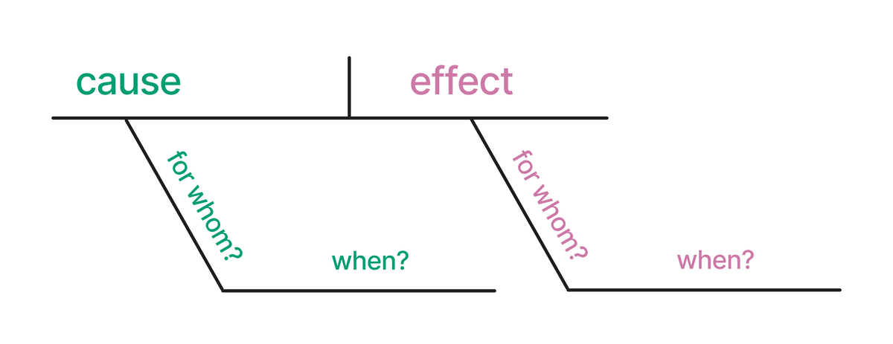
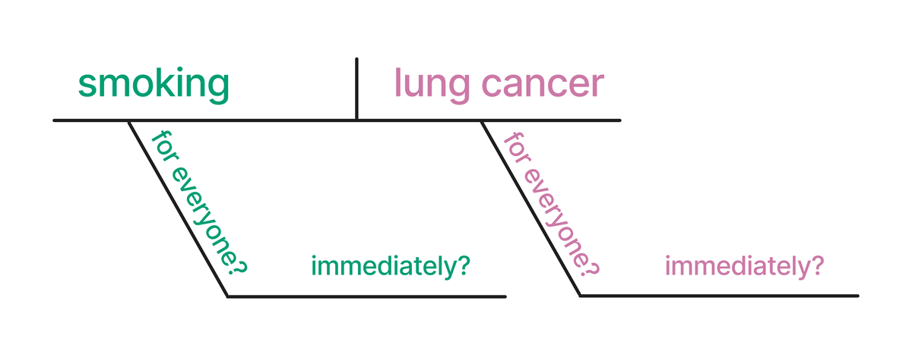
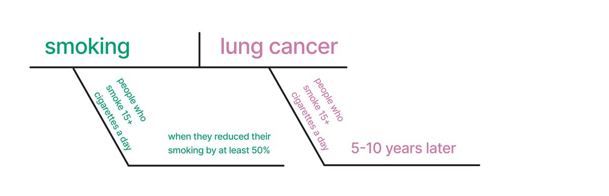
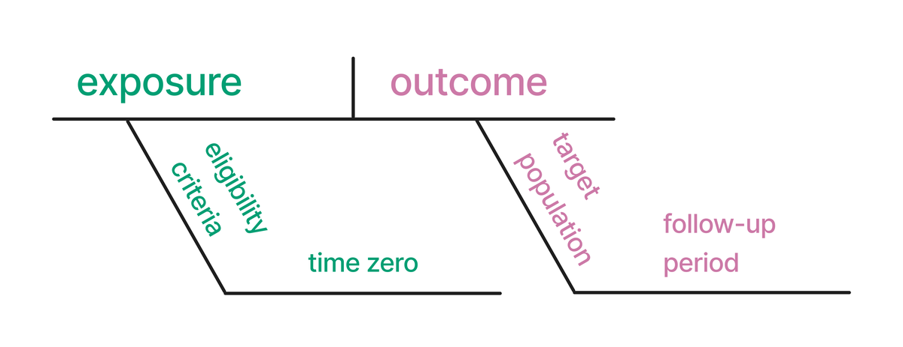

```{.r}
#| label: setup-main
#| include: false
if (file.exists("R/ggdag-mask.R")) source("R/ggdag-mask.R")
if (file.exists("R/setup.R")) source("R/setup.R")

if (requireNamespace("tidyverse", quietly = TRUE)) {
  library(tidyverse)
} else {
  if (requireNamespace("dplyr", quietly = TRUE)) library(dplyr)
  if (requireNamespace("ggplot2", quietly = TRUE)) library(ggplot2)
  if (requireNamespace("readr", quietly = TRUE)) library(readr)
  if (requireNamespace("tibble", quietly = TRUE)) library(tibble)
  if (requireNamespace("stringr", quietly = TRUE)) library(stringr)
  if (requireNamespace("forcats", quietly = TRUE)) library(forcats)
  if (requireNamespace("tidyr", quietly = TRUE)) library(tidyr)
  if (requireNamespace("purrr", quietly = TRUE)) library(purrr)
}
```


<!-- =========================================
     Section from: index.qmd
     ========================================= -->

*R을 이용한 인과 추론(Causal Inference in R)*에 오신 것을 환영합니다.
인과 관계 질문에 답하는 것은 과학 및 비즈니스 목적 모두에 중요하지만 무작위 임상 시험(RCT)이나 A/B 테스트와 같은 기술이 항상 실용적이거나 성공적인 것은 아닙니다.
이 책의 도구는 독자가 R 프로그래밍 언어를 활용해 관측 데이터(observational data)로 더 나은 인과 추론을 하도록 돕습니다.
이 책을 마칠 때쯤이면 다음 내용을 익힐 수 있습니다.

1. 더 나은 인과 관계 질문 던지기.
2. 인과 추론에 필요한 가정 이해하기.
3. 추론하고자 하는 대상 인구(target population) 식별하기.
4. 인과 모델 적합 및 문제점 확인.
5. 사용된 기술이 불완전한 상황에서의 민감도 분석(sensitivity analysis) 수행.

이 책은 학술 연구자와 데이터 과학자 모두를 위한 것입니다.
환경에 따라 질문은 다를 수 있지만 많은 기술은 동일합니다. 인과 추론은 암에 관한 질문만큼이나 클릭 수 질문을 던지는 데에도 유용합니다.
의학, 경제학, 기술 등 다양한 분야의 사례를 혼합해 명확한 인과 관계 질문과 가정을 투명하게 공개하려는 의지가 필요함을 보여줍니다.

이 책에서 많은 것을 배우겠지만 아이러니하게도 인과 추론의 가장 좋은 도구 중 하나인 무작위 시험 수행 방법은 깊게 다루지 않습니다.
무작위 시험과 그 사촌 격인 A/B 테스트(기술 분야의 표준)는 유효한 추론에 필요한 많은 가정을 완화해주므로 매우 강력합니다.
또한 설계가 충분히 복잡해 별도의 학습 리소스가 필요할 정도입니다.
대신 우리는 일반적으로 무작위 배정의 이점을 누릴 수 없는 관측 데이터에 집중할 것입니다.
무작위 배정 기술에 관심이 있더라도 책을 바로 덮지 마세요. 관측 데이터용으로 설계된 여러 인과 추론 기술은 무작위 분석도 개선할 수 있습니다.

독자에 관해 몇 가지 가정을 하고 있습니다.

1. R 패키지의 [tidyverse](https://www.tidyverse.org/) 생태계와 그 일반적인 철학에 익숙합니다. 예를 들어, 이 책에서는 dplyr와 ggplot2를 많이 사용하지만 기초 문법을 설명하지는 않습니다. tidyverse 시작에 대해 더 자세히 알고 싶다면 [*R for Data Science*](https://r4ds.hadley.nz/)를 추천합니다.
2. R의 기본적인 통계 모델링에 익숙합니다. 예를 들어, `lm`과 `glm`을 사용하여 많은 모델을 적합시키겠지만 그것들이 어떻게 작동하는지는 논의하지 않을 것입니다. R의 강력한 모델링 함수에 대해 더 배우고 싶다면 [*Tidy Modeling with R*](https://www.tmwr.org)의 ["A Review of R Modeling Fundamentals"](https://www.tmwr.org/base-r.html)를 읽어보시길 권장합니다.
3. 또한 [함수 작성](https://r4ds.hadley.nz/functions.html)과 같은 다른 R 기초에 익숙하다고 가정합니다. [*R for Data Science*](https://r4ds.hadley.nz/) 역시 이러한 주제에 좋은 리소스입니다. (R 프로그래밍 언어에 대해 더 깊이 파고들고 싶다면 [*Advanced R*](https://adv-r.hadley.nz/index.html)을 추천하지만 이 책을 위해 그 내용을 완전히 마스터했다고 가정하지는 않습니다.)

또한 tidyverse와 관련된 모델링용 R 패키지 세트인 tidymodels 생태계의 도구도 사용할 것입니다.
이전에 사용해 본 적이 없다고 가정합니다.
tidymodels는 예측 모델링에도 중점을 두기 때문에 많은 도구가 책에 적합하지 않을 수 있습니다.
그럼에도 불구하고가 주제에 관심이 있다면 [*Tidy Modeling with R*](https://www.tmwr.org)을 추천합니다.

인과 추론에 관한 다른 훌륭한 책들도 많이 있습니다.
이 책은 R에 집중한다는 점에서 차별화되지만 다른 관점에서가 분야를 바라보는 것도 도움이 됩니다.
좋아할 만한 몇 권의 책들:

- [*Causal Inference: What If?*](https://www.hsph.harvard.edu/miguel-hernan/causal-inference-book/)
- [*Causal Inference: The Mixtape*](https://mixtape.scunning.com/)
- [*The Effect*](https://theeffectbook.net/)

첫 번째 책은 역학(epidemiology)에 중점을 둡니다. 나머지 두 권은 계량경제학(econometrics)에 중점을 둡니다.
인과 다이어그램에 대해 더 자세히 알고 싶다면 *The Book of Why* [@pearl2018why]도 추천합니다.

## 설치

이 책은 현재 활발히 개발 중인 여러 패키지를 사용합니다. 필요한 개발 버전을 설치하려면 다음을 사용하세요:

```{.r}
#| eval: false
# install.packages("pak")
pak::pak(c(
  "r-causal/causalworkshop",
  "r-causal/ggdag",
  "r-causal/halfmoon",
  "r-causal/propensity",
  "r-causal/tipr",
  "LucyMcGowan/touringplans"
))
```

이러한 개발 버전에는 책 전체에서 사용되는 최신 기능과 버그 수정이 포함되어 있습니다.

## 관례 (Conventions)

### 현대적인 R 기능

이 책에서는 R 4.1.0 이상 버전의 두 가지 현대적인 R 기능을 사용합니다.
첫 번째는 네이티브 파이프, `|>`입니다.
이 R 기능은 여러분에게 더 익숙할 수 있는 tidyverse의 `%>%`와 유사합니다.
일반적인 경우, 두 기능은 서로 바꿔서 사용할 수 있습니다.
한 가지 눈에 띄는 차이점은 `|>`가 파이프의 결과를 전달하기 위해 `_` 기호를 사용한다는 점입니다(예: `.df |> lm(y ~ x, data = _)`).
이 주제에 대한 상세 내용은 [이 Tidyverse 블로그 포스트](https://www.tidyverse.org/blog/2023/04/base-vs-magrittr-pipe/)를 참조하세요.

우리가 사용하는 또 다른 현대적인 R 기능은 네이티브 람다(native lambda)로, `\(.x) do_something(.x)`와 같이 짧은 함수를 작성하는 방식입니다.
이는 purrr's `~` 람다 표기법과 유사합니다.
또한 네이티브 람다가 `function(.x) do_something(.x)`와 동일하며 여기서 `\`는 `function`의 약어임을 인식하는 것이 도움이 됩니다.
이 주제에 대한 상세 내용은 [R for Data Science의 반복(iteration)장](https://r4ds.hadley.nz/iteration.html)을 참조하세요.

## 테마 설정 (Theming)

이 책의 그래프들은 모든 코드 청크에 포함하지 않는 일관된 테마를 사용합니다. 즉, 시각화 코드를 직접 실행하면 약간 다르게 보일 수 있습니다.
우리는 ggplot2와 관련된 다음과 같은 기본값을 설정했습니다:

<!-- TODO: make sure these are up to date -->

```{.r}
#| eval: false
options(
  # ggplot2의 기본 색상을 색맹 친화적인 Okabe-Ito 및 Viridis 팔레트로 설정
  ggplot2.discrete.colour = ggokabeito::palette_okabe_ito(),
  ggplot2.discrete.fill = ggokabeito::palette_okabe_ito(),
  ggplot2.continuous.colour = "viridis",
  ggplot2.continuous.fill = "viridis",
  # 테마 글꼴 및 크기 설정
  book.base_family = "sans",
  book.base_size = 14
)

library(ggplot2)

# 기본 테마 설정
theme_set(
  theme_minimal(
    base_size = getOption("book.base_size"),
    base_family = getOption("book.base_family")
  ) %+replace%
    theme(
      panel.grid.minor = element_blank(),
      legend.position = "bottom"
    )
)
```

또한 우리가 커스터마이징하고 싶은 ggdag의 몇 가지 함수를 마스킹합니다:

```{.r}
#| eval: false
theme_dag <- function() {
  ggdag::theme_dag(base_family = getOption("book.base_family"))
}

geom_dag_label_repel <- function(..., seed = 10) {
  ggdag::geom_dag_label_repel(
    aes(x, y, label = label),
    box.padding = 3.5,
    inherit.aes = FALSE,
    max.overlaps = Inf,
    family = getOption("book.base_family"),
    seed = seed,
    label.size = NA,
    label.padding = 0.1,
    size = getOption("book.base_size") / 3,
    ...
  )
}
```

## 감사의 말 (Acknowledgements)

이 책은 단순히 Malcolm, Lucy, Travis만의 결과물이 아닙니다. 이 책에 기여해주신 R 커뮤니티의 모든 분들께 진심으로 감사드립니다!

<!-- 기여자는 GitHub Actions를 통해 매월 자동으로 업데이트됩니다. -->
<!-- 수동 업데이트: Rscript R/update-contributors.R -->

```{.r}
#| results: asis
#| echo: false
#| message: false
library(dplyr)
contributors <- readr::read_csv("data/contributors.csv")
contributors <- contributors |>
  filter(!login %in% c("malcolmbarrett", "LucyMcGowan", "tgerke")) |>
  mutate(
    login = paste0("\\@", login),
    desc = ifelse(is.na(name), login, paste0(name, " (", login, ")"))
  )

cat("이 책은 현재 공개적으로 작성되고 있으며 지금까지 ",nrow(contributors), "명의 사람들이 풀 리퀘스트를 통해 기여했습니다! GitHub 풀 리퀘스트를 통해 개선에 도움을 주신 모든 분들께 큰 감사를 드립니다(사용자 이름순): ", sep = "")
cat(paste0(contributors$desc, collapse = ", "))
cat(".\n")
```

## 라이선스 (License)

<p xmlns:cc="http://creativecommons.org/ns#" >이 저작물은 <a href="https://creativecommons.org/licenses/by-nc/4.0/?ref=chooser-v1" target="_blank" rel="license noopener noreferrer" style="display:inline-block;">CC BY-NC 4.0</a> 라이선스에 따라 이용할 수 있습니다: "이 라이선스는 재사용자가 원저작자를 표시할 것을 요구합니다. 비영리 목적으로만 저작물을 재배포, 리믹스, 변형 및 기반 저작물 작성이 가능합니다."</p>

이 책의 코드 또한 [MIT 라이선스](https://opensource.org/licenses/MIT)에 따라 사용할 수 있습니다. MIT 라이선스에 따라, 출처를 인용하는 한 여러분의 작업에 자유롭게 코드를 사용할 수 있습니다.


# 인과적 질문 던지기 {.unnumbered}


<!-- =========================================
     Section from: chapters/01-casual-to-causal.qmd
     ========================================= -->

# 일상에서 인과로 {#sec-causal-question}


```{.r}
#| echo: false
# TODO: remove when first edition complete
status("complete")
```

## 일상적인 추론 (Casual inference)

인과 분석의 핵심은 인과적 질문입니다. 이 질문은 우리가 어떤 데이터를 분석할지, 어떻게 분석할지, 그리고 우리의 추론이 어떤 인구 집단에 적용될지를 결정합니다.
이 책은 성격상 실무에 중점을 두고 있으며 주로 인과 추론의 분석 단계(analysis stage)를 다룹니다.
좋은 인과적 질문을 명시하는 복잡성에 비하면, 분석 단계는 상당히 간단합니다.
이 책의 처음 6장에서는 인과적 질문이 무엇인지, 질문을 어떻게 개선할 수 있는지 논의하고 몇 가지 사례를 살펴볼 것입니다.

인과적 질문은 데이터 과학의 주요 과업인 묘사(description), 예측(prediction), 인과 추론(causal inference)과 관련된 통계적 기술로 던질 수 있는 더 넓은 범위의 질문 중 일부입니다 [@hernan2019].
불행히도 이러한 과업들은 우리가 사용하는 기술(예를 들어 회귀 분석은 세 가지 과업 모두에 유용합니다)과 그것들을 이야기하는 방식 때문에 종종 뒤섞이곤 합니다.
연구자들이 무작위 배정되지 않은 데이터로부터 인과 추론에 관심을 가질 때, 인과 효과를 추정하려는 의도를 명확히 밝히는 대신 "연관성(association)"과 같은 완곡한 표현을 사용하는 경우가 많습니다 [@Hernan2018].

예를 들어, 최근 역학 연구의 분석 언어에 대한 연구에 따르면, 추정된 효과를 설명하는 가장 일반적인 어근은 "associate(연관시키다)"였지만 많은 연구자는 "associate"가 적어도 *어느 정도의* 인과 효과를 암시한다고 느꼈습니다 [@haber_causal_language].
분석된 연구 중 약 1%만이 "cause(원인)"라는 어근을 전혀 사용했습니다.
그럼에도 불구하고 연구의 1/3은 행동 권고안(action recommendations)을 담고 있었으며 연구자들은 이러한 권고안의 80%가 적어도 어느 정도의 인과적 함의를 가지고 있다고 평가했습니다.
종종 이러한 연구들은 효과에 대한 설명("associate"나 "compare"와 같은 어근)에서 암시하는 것보다 더 강력한 행동 권고(인과 효과를 암시함)를 내놓습니다.
많은 연구가 목표가 인과 추론임을 암시했음에도 불구하고, 이 책에서 논의하는 것과 같은 공식적인 인과 모델을 사용한 연구는 약 4%에 불과했습니다.
그러나 대부분은 그러한 원인이 이전 연구나 이론에 의해 어떻게 정당화될 수 있는지 논의했습니다.

```{.r}
#| label: "fig-word-ranking"
#| fig.cap: "연구자들이 사용한 어근의 인과적 강도 순위. 'Strong' 등급이 많은 어근은 'None'이나 'Weak' 등급이 많은 어근보다 인과적 함의가 더 강합니다. 데이터 출처: @haber_causal_language."
#| fig.height: 9
#| echo: false

rankings <- read_csv(here::here("data/word_rankings.csv"), show_col_types = FALSE) |>
  janitor::clean_names()

lvls <- rankings |>
  count(rating, root_word) |>
  filter(rating == "Strong") |>
  arrange(desc(n)) |>
  mutate(root_word = fct_inorder(root_word)) |>
  pull(root_word) |>
  levels()

rankings |>
  count(rating, root_word) |>
  mutate(root_word = factor(root_word, levels = lvls)) |>
  ggplot(aes(y = root_word, x = n, fill = rating)) +
  geom_col(position = "fill") +
  scale_fill_manual(
    values = c(
      "None" = "#FDE725FF",
      "Weak" = "#35B779FF",
      "Moderate" = "#31688EFF",
      "Strong" = "#440154FF"
    ),
    guide = guide_legend(reverse = TRUE)
  ) +
  scale_x_continuous(labels = scales::label_percent()) +
  theme_minimal(14) +
  labs(
    x = "비율",
    y = "어근",
    fill = "등급"
  )
```

### 묘사 (Description)

묘사적 분석(Descriptive analysis)은 변수의 분포를 설명하는 것을 목표로 하며 종종 주요 관심 변수에 따라 층화(stratified)됩니다.
이와 밀접한 관련이 있는 개념으로 탐색적 데이터 분석(EDA)이 있지만 묘사적 연구는 대개 EDA보다 더 명확한 목표를 가집니다.

묘사적 분석은 일반적으로 중심 경향성(평균, 중앙값)과 퍼짐 정도(최솟값, 최댓값, 사분위수)와 같은 통계적 요약에 기반하지만 가끔 회귀 모델링과 같은 기술을 사용하기도 합니다.
회귀와 같은 고급 기술을 적용하는 목표는 묘사적 분석에서 예측이나 인과 연구와는 다릅니다.
묘사적 분석에서 변수를 "조정(adjusting)"한다는 것은 그 변수의 연관 효과를 제거한다는 것(따라서 질문을 바꾸는 것)을 의미하며 교란(confounding)을 통제한다는 의미가 *아닙니다*.

역학에서 묘사적 분석의 유용한 개념은 "사람, 장소, 시간"입니다. 즉, 누가 어떤 질병을 앓고 있는지, 어디서, 언제 발생하는지를 따지는 것입니다.
이 개념은 다른 분야의 묘사적 분석에도 좋은 템플릿이 됩니다.
일반적으로 우리는 묘사하려는 대상 인구가 누구인지 명확히 하고 싶어 하므로 가능한 한 구체적이어야 합니다.
인간의 건강은 관련 인물, 위치 및 기간을 묘사하는 것이 모두 중요합니다.
다시 말해, 데이터에 대한 이해를 생성하는 첫 번째 원칙에 집중하고 그에 따라 데이터를 묘사하십시오.

#### 사례

사건의 수를 세는 것은 우리가 데이터로 할 수 있는 가장 좋은 일 중 하나입니다.
EDA는 예측 및 인과 분석 모두에 도움이 되지만 묘사적 분석은 다른 분석 과업과 독립적으로 가치가 있습니다.
복잡한 머신러닝 모델을 개발할 줄 알았는데 대부분의 시간을 대시보드 제작에 쓰고 있다는 사실을 깨달은 데이터 과학자에게 물어보십시오.
데이터의 분포, 특히 핵심 분석 목표(예: 산업계의 KPI 또는 역학의 질병 발생률)에 대한 분포를 이해하는 것은 많은 유형의 의사 결정에 매우 중요합니다.

최근 묘사적 분석의 가장 좋은 사례 중 하나는 코로나19 팬데믹에서 나타났습니다 [@Fox2022].
2020년, 특히 팬데믹 초기 몇 달 동안 묘사적 분석은 위험을 이해하고 자원을 배분하는 데 필수적이었습니다.
코로나바이러스는 다른 호흡기 질환과 유사하기 때문에 위험을 줄이기 위한 많은 공중보건 도구(예: 거리두기, 이후의 마스크 착용)가 있었습니다.
지역별 사례의 묘사 통계는 지역 정책과 그 정책의 강도를 결정하는 데 필수적이었습니다.

팬데믹 기간 중 더 복잡한 묘사적 분석의 훌륭한 사례는 여러 국가 및 지역의 기대 사망자 수와 관찰된 사망자 수를 비교한 파이낸셜 타임즈(Financial Times)의 지속적인 보고서였습니다[^01-casual-to-causal-1].
기대 사망자 수 계산은 대부분의 묘사 통계보다 약간 더 정교하지만 인과 효과를 풀지 않고도(예: 사망이 직접적으로 코로나19 때문인가? 접근 불가능한 의료 서비스 때문인가? 코로나 이후의 심혈관 사건 때문인가?) 현재 사망에 대한 엄청난 양의 정보를 제공했습니다.
2020년 7월의 차트를 (단순화하여) 재현한이 그래프에서 팬데믹 초기 몇 달 동안의 충격적인 영향을 볼 수 있습니다.

[^01-casual-to-causal-1]: John Burn-Murdoch은 이러한 많은 시각화를 담당했으며 [이 주제를 다룬 매혹적인 강연](https://cloud.rstudio.com/resources/rstudioglobal-2021/reporting-on-and-visualising-the-pandemic/)을 했습니다.

```{.r}
#| label: fig-ft-chart
#| fig-width: 10
#| fig-height: 7.5
#| fig-cap: "2020년 초과 사망자 수 vs. 모든 원인으로 인한 과거 기대 사망자 수. 데이터 출처: Financial Times."
#| echo: false
#| message: false
ft_excess_deaths <- read_csv(here::here("data/ft_excess_deaths.csv")) |>
  mutate(year = factor(year))

excess_deaths_prior_wk <- ft_excess_deaths |>
  filter(year != 2020)

excess_deaths2020_wk <- ft_excess_deaths |>
  filter(year == 2020)

excess_deaths_wk <- ft_excess_deaths |>
  filter(year == 2020)

ggplot(
  data = excess_deaths_prior_wk,
  aes(x = week, y = deaths, group = year)
) +
  geom_line(color = "grey75", alpha = 0.6) +
  geom_line(
    data = excess_deaths2020_wk,
    color = "#D55E00"
  ) +
  geom_ribbon(
    data = excess_deaths2020_wk,
    aes(ymin = pmin(deaths, expected_deaths), ymax = deaths),
    fill = "#D55E00",
    alpha = 0.7
  ) +
  geom_line(
    data = excess_deaths_wk,
    aes(x = week, y = expected_deaths),
    color = "steelblue",
    linewidth = 0.9,
    inherit.aes = FALSE
  ) +
  facet_wrap(vars(country), scales = "free_y") +
  scale_y_continuous(labels = scales::label_comma(), n.breaks = 4) +
  labs(
    x = NULL,
    y = NULL,
    title = "<span style = 'color:#D55E00;'>**2020년 사망자 수**</span>와 <span style = 'color:#4682b4;'>**기대 사망자 수**</span>의 비교",
    subtitle = "최근 몇 년 대비 모든 원인으로 인한 주간 사망자 수"
  ) +
  theme(
    text = element_text(size = 18),
    axis.text.x = element_blank(),
    plot.title = if(requireNamespace("ggtext", quietly = TRUE)) ggtext::element_markdown() else element_text(),
    plot.title.position = "plot"
  )
```

다음은 묘사적 분석의 다른 훌륭한 사례들입니다.

- **전 세계의 삼림 벌채**. Our World in Data [@owidforestsanddeforestation]는 다양한 주제를 사려 깊게 다루며 대개 묘사적인 보고서를 생성하는 데이터 저널리즘 조직입니다. 이 보고서에서 그들은 산림 면적의 절대적 변화(산림 전이)와 상대적 변화(삼림 벌채 또는 재조림)를 시각화하여 보여주며 기초 통계와 임업 이론을 사용하여 시간 경과에 따른 산림 상태를 보여주는 유용한 정보를 제공합니다.
- **클라미디아 및 임균 감염의 유병률** [@Miller2004]. 질병 유병률(현재 얼마나 많은 사람이 질병을 앓고 있는지를 인구당 비율로 나타낸 것)을 측정하는 것은 기초 공중보건(자원, 예방, 교육)과 과학적 이해에 도움이 됩니다. 이 연구에서 저자들은 미국의 모든 고등학교(대상 인구)를 대표하도록 설계된 복잡한 설문 조사를 실시했습니다. 그들은 질문과 관련된 다양한 요인을 다루기 위해 설문 가중치(survey weights)를 사용한 다음 유병률 및 기타 통계를 계산했습니다. 나중에 보겠지만 가중치는 인과 추론에서도 동일한 이유, 즉 특정 인구 집단을 대상으로 하기 위해 유용합니다. 그렇긴 하지만 모든 가중치 기술이 본질적으로 인과적인 것은 아니며 이 사례도 그러했습니다.
- **인종 및 민족별 자궁 적출술 불평등 추정** [@Gartner2020]. 묘사적 기술은 경제학이나 역학 같은 분야의 격차를 이해하는 데에도 도움이 됩니다. 이 연구에서 저자들은 인종 또는 민족 배경에 따라 자궁 적출술의 위험이 다른지 물었습니다. 분석이 주요 변수에 의해 층화되어 있기는 하지만 여전히 묘사적입니다. 이 논문의 또 다른 흥미로운 점은 연구가 올바른 대상 인구에 대한 질문에 답하도록 보장하려는 저자들의 노력이었습니다. 그들의 분석은 여러 데이터 소스를 결합하여 실제 인구 유병률을 더 잘 추정했습니다(흔히 제시되는 병원 내 유병률 대신). 그들은 또한 자궁 적출술의 유병률을 조정했습니다. 예를 들어, 실제로 자궁 적출술을 받을 수 있는 사람들(즉, 아직 받지 않은 사람들) 사이에서만 발생률(신규 사례 비율)을 계산했습니다.

#### 타당성 (Validity)

묘사적 분석에는 두 가지 중요한 타당성 문제가 있습니다: 측정 오차와 표본 추출 오차입니다.

측정 오차(Measurement error)는 하나 이상의 변수를 어떤 용량으로든 잘못 측정했을 때 발생합니다.
묘사적 분석에서 사물을 잘못 측정한다는 것은 질문에 대한 답을 얻지 못할 수도 있음을 의미합니다.
그러나 그 정도가 어느 정도인지는 측정 오차의 심각성과 질문 자체에 달려 있습니다.

표본 추출 오차(Sampling error)는 묘사적 분석에서 좀 더 미묘한 주제입니다.
이는 우리가 분석하는 인구(분석이 누구에 대한 묘사를 생성해야 하는가)와 불확실성(우리가 데이터를 가진 사람들에 대한 묘사가 우리가 묘사하려는 인구를 대표한다는 것을 얼마나 확신하는가)과 관련이 있습니다.

우리의 데이터가 나온 인구와 우리가 묘사하려는 인구는 유효한 묘사를 제공하기 위해 동일해야 합니다.
온라인 설문 조사로 생성된 데이터셋을 생각해 보십시오.
이 질문에 답하는 사람들은 누구이며 우리가 묘사하고 싶은 사람들과 어떤 관계가 있습니까?
많은 분석에서 설문 조사에 시간을 내어 응답하는 사람들은 우리가 묘사하고 싶은 사람들과 다릅니다. 예를 들어, 설문 조사를 작성하는 사람들의 그룹은 그렇지 않은 사람들과 변수의 분포가 다를 수 있습니다.
이와 같은 데이터의 결과는 기술적으로 편향(bias)된 것이 아닙니다. 표본 크기와 관련된 불확실성과 측정 오차를 제외하면 묘사는 정확하기 때문입니다. 단지 올바른 사람들의 집단에 대한 것이 아닐 뿐입니다!
다시 말해, *우리는 잘못된 질문에 대한 답을 얻은 것입니다*.

특히, 때때로 우리의 데이터가 전체 인구를 나타내거나(또는 그에 충분히 가까워) 표본 추출 오차가 무의미한 경우가 있습니다.
자사 서비스를 사용하는 모든 고객에 대한 특정 데이터를 가진 회사를 생각해 보십시오.
많은 분석에서 이것은 우리가 정보를 원하는 전체 인구(현재 고객)를 나타냅니다.
마찬가지로 전 국민 건강 등록부가 있는 국가에서는 특정 실용적 목적을 위해 사용 가능한 데이터가 전체 인구에 충분히 가까워 표본 추출이 필요하지 않습니다(비록 연구자들이 더 간단한 계산을 위해 표본 추출을 사용할 수는 있지만).
이러한 경우 불확실성이라는 것은 거의 존재하지 않습니다.
모든 것이 잘 측정되었다고 가정할 때, 우리가 생성하는 요약 통계는 인구 내의 모든 사람으로부터 정보를 가지고 있기 때문에 *본질적으로 편향이 없고 정밀합니다*.
물론 실제로는 최선의 상황에서도 측정 오차, 결측 데이터 등이 섞여 있기 마련입니다.

묘사적 분석의 한 가지 결정적인 세부 사항은 이 책의 주요 관심사 중 하나인 교란 편향(confounding bias)이 정의되지 않는다는 점입니다.
교란은 인과적인 관심사이기 때문입니다.
묘사적 분석은 관계 뒤에 있는 메커니즘이 아니라 관계 *있는 그대로*의 통계적 묘사이기 때문에 교란될 수 없습니다.

#### 인과 추론과의 관계

인간은 패턴을 매우 잘 봅니다.
패턴 찾기는 우리 뇌의 유용한 기능이지만 그것을 유효하게 할 수 있는 데이터나 방법으로 작업하지 않을 때 추론의 위험한 길로 이끌 수도 있습니다.
목표가 묘사일 때 가장 주의해야 할 점은 (암시적으로든 명시적으로든) 묘사에서 인과 관계로 도약하는 것입니다.

하지만 물론 인과 효과를 추정하고 *있을 때*도 묘사적 분석은 도움이 됩니다.
그것은 우리가 작업하는 인구, 결과의 분포, 노출(우리가 인과적일 수 있다고 생각하는 변수), 그리고 교란 요인(노출에 대한 편향되지 않은 인과 효과를 얻기 위해 고려해야 하는 변수)을 이해하는 데 도움을 줍니다.
또한 [Chapter -@sec-data-causal]에서 보게 되겠지만 우리가 사용하는 데이터 구조가 답하려는 질문과 일치하는지 확인하는 데에도 도움을 줍니다.
인과 연구를 수행할 때는 항상 데이터에 대한 묘사적 분석을 수행해야 합니다.

마지막으로, [Chapter -@sec-strat-outcome]에서 보겠지만 기초 통계로 인과 추론을 할 수 있는 특정 상황들이 있습니다.
여기서도 인과적 질문과 묘사적 구성 요소 사이의 구분에 주의하십시오. 동일한 계산(예: 평균 차이)을 사용한다고 해서 생성할 수 있는 모든 묘사가 인과적인 것은 아닙니다.
묘사적 분석이 인과적 분석과 겹치는지 여부는 데이터와 질문의 함수입니다.

### 예측 (Prediction)

예측의 목표는 데이터를 사용하여 변수를, 대개 새로운 데이터를 정확하게 예측하는 것입니다.
이것이 무엇을 의미하는지는 질문, 도메인 등에 따라 다릅니다.
예측 모델은 동료 검토를 거친 임상 모델부터 소비자 기기에 내장된 맞춤형 머신러닝 모델에 이르기까지 상상할 수 있는 거의 모든 환경에서 사용됩니다.
ChatGPT의 기반이 되는 것과 같은 대규모 언어 모델조차도 예측 모델입니다. 즉, 프롬프트에 대한 응답이 어떻게 생겼을지를 예측하는 것입니다.

예측 모델링은 일반적으로가 책에서 제시할 인과 모델링을 위한 워크플로와는 다른 워크플로를 사용합니다.
예측의 목표는 대개 새로운 데이터에 대한 예측을 하는 것과 관련이 있기 때문에, 이 유형의 모델링 워크플로는 새로운 데이터에 대한 일반화 능력을 유지하면서 예측 정확도를 최대화하는 데 중점을 둡니다. 이를 종종 편향-분산 트레이드오프(bias-variance trade-off)라고 합니다.
실무에서 이는 데이터를 훈련 세트(모델을 구축하는 데이터 부분)와 테스트 세트(모델을 평가하는 부분, 새로운 데이터에서 어떻게 수행될지에 대한 대리인)로 나누는 것을 의미합니다.
일반적으로 데이터 과학자들은 훈련 세트에 모델이 과적합(overfitting)되는 위험을 더욱 줄이기 위해 교차 검증(cross-validation)이나 다른 샘플링 기술을 사용합니다.

예측 모델링에 관한 훌륭한 텍스트들이 많이 있으므로, 기술의 목표와 방법을 더 깊이 탐구하려면 관련 문헌들을 참조하시길 바랍니다 [@kuhn2013a; @harrell2001; @Kuhn_Silge_2022; @James_Witten_Hastie_Tibshirani_2022].

#### 사례

예측은 데이터 과학에서 가장 인기 있는 주제이며 이는 주로 산업계의 머신러닝 응용 덕분입니다.
물론 예측은 통계학에서 오랜 역사를 가지고 있으며 오늘날 인기 있는 많은 모델이 학계 안팎에서 수십 년 동안 사용되어 왔습니다.

코로나19에 대한 예측 사례를 살펴봅시다[^01-casual-to-causal-2].
2021년, 연구자들은 급성 코로나19에 대한 심각한 부작용 결과를 예측하기 위한 임상 예후 모델인 ISARIC 4C 악화 모델(ISARIC 4C Deterioration model)을 발표했습니다 [@Gupta2021].
저자들은이 모델이 개발된 인구 집단, 특히 결과와 후보 예측 변수의 분포를 이해하기 위해 묘사적 분석을 포함했습니다.
이 모델의 유용한 점 중 하나는 코로나 관련 입원 첫날에 흔히 측정되는 항목들을 사용한다는 것입니다.
저자들은 영국의 지역별 교차 검증을 사용하여가 모델을 구축한 다음, 제외된 지역의 데이터로 모델을 테스트했습니다.
최종 모델에는 11개 항목과 모델 속성, 결과와의 관계 등에 대한 설명이 포함되었습니다.
특히 저자들은 후보 변수를 선택하기 위해 임상 도메인 지식을 사용했지만 모델 계수를 인과적으로 해석하려는 유혹에 빠지지 않았습니다.
의심할 여지 없이, 이 모델의 예측 가치 중 일부는 결과와 관련된 변수들의 인과 구조에서 비롯되지만 연구자들은 이 모델로 완전히 다른 목표를 가지고 있었고 그것을 고수했습니다.

[^01-casual-to-causal-2]: 여기서 자연스러운 모델은 확진자 수를 예측하는 것이겠지만 감염병 모델링은 복잡하며 대개 일반적인 예측 모델링 워크플로 밖의 기술을 사용합니다.

예측 분야의 다른 좋은 사례들은 다음과 같습니다:

- 예측 모델링에서 가장 흥미로운 작업 중 일부는 산업계에서 이루어집니다.
    넷플릭스(Netflix)는 정기적으로 그들의 모델링 성공 사례와 새로운 전략에 대한 세부 정보를 [연구 블로그](https://research.netflix.com/)에 공유합니다.
    그들은 또한 최근 추천 시스템(이 경우에는 사용자에게 쇼와 영화를 추천함)을 위한 딥러닝 모델 사용을 검토하는 논문을 발표했습니다 [@steck2021].
    저자들은 모델을 사용한 실험, 그 모델의 세부 사항, 그리고 그들이 직면한 많은 과제를 설명하며 그러한 모델 사용 실무 가이드를 제시했습니다.

- 2020년 초, 건강 연구의 예측 및 예후 모델링 경험이 풍부한 연구자들은 코로나19의 진단 및 예후를 위한 모델들에 대한 리뷰를 발표했습니다 [@Wynants2020].
    이 리뷰는 그 폭이 넓을 뿐만 아니라 품질이 좋지 않다고 평가된 모델의 수가 엄청나다는 점에서도 흥미롭습니다: "[232개의] 모델들이 편향의 위험이 높거나 불분명하다고 평가되었는데, 이는 주로 대조군 환자의 비대표적 선택, 연구 종료 시까지 관심 사건을 경험하지 않은 환자의 제외, 모델 과적합의 높은 위험, 그리고 불분명한 보고 때문이었습니다." 이 연구는 또한 [지속적으로 업데이트되는 리뷰(living review)](https://www.covprecise.org/)입니다.

#### 타당성 (Validity)

예측 모델링에서 타당성의 핵심 척도는 예측 정확도이며 이는 평균 제곱근 오차(RMSE), 평균 절대 오차(MAE), 곡선 아래 면적(AUC) 등 여러 방법으로 측정될 수 있습니다.
예측 모델링의 편리한 세부 사항은 우리가 맞았는지 자주 평가할 수 있다는 점입니다. 이는 데이터의 일부만 가지고 있는 묘사 통계나 실제 인과 구조를 알지 못하는 인과 추론에서는 맞지 않는 말입니다.
항상 진실을 평가할 수 있는 것은 아니지만 초기 예측 모델을 적합시키기 위해서는 거의 항상 요구됩니다[^01-casual-to-causal-3].

[^01-casual-to-causal-3]: 모델을 단수로 말하지만 일반적으로 데이터 과학자들은 실험을 위해 많은 모델을 적합시키며 종종 최고의 예측 모델은 여러 모델의 예측을 결합한 것이며 이를 스택 모델(stacked model)이라고 부릅니다.

측정 오차 또한 예측 모델링의 관심사입니다. 정확한 예측을 위해서는 대개 정확한 데이터가 필요하기 때문입니다.
흥미롭게도 측정 오차와 결측은 예측 환경에서 정보를 제공할 수 있습니다.
인과적 환경에서는 이것이 편향을 유발할 수 있지만 예측 모델은 문제없이 그 정보를 소비할 수 있습니다.
예를 들어 유명한 넷플릭스 프라이즈(Netflix Prize)에서 우승한 모델들은 추천 시스템을 개선하기 위해 고객이 영화를 평가했는지 여부에 대한 정보를 활용했습니다.

묘사적 분석과 마찬가지로 교란은 예측 모델링에서 정의되지 않습니다.
예측 모델의 계수는 교란될 수 없습니다. 우리는 변수가 예측 정보를 제공하는지 여부에만 관심이 있지, 그 정보가 인과 관계 때문인지 아니면 다른 것 때문인지는 상관하지 않기 때문입니다.

#### 인과 추론과의 관계

예측에서 가장 큰 위험은 모델의 특정 계수가 인과적으로 해석될 수 있다고 가정하는 것입니다.
그렇지 않을 가능성이 큽니다.
모델이 예측은 잘할 수 있지만 인과적인 관점에서는 완전히 편향된 계수를 가질 수도 있습니다.
이 내용은 @sec-pred-or-explain 및이 책의 나머지 부분에서 더 자세히 다룰 것입니다.

종종 사람들은 예측 모델을 위한 특징(변수) 선택 방법을 인과 모델의 교란 요인을 선택하는 데 잘못 사용하곤 합니다.
과적합의 위험은 차치하더라도, 이러한 방법은 예측 모델에는 적절하지만 인과 모델에는 적절하지 않습니다.
예측 메트릭은 질문의 인과 구조를 결정할 수 없으며 결과에 대한 예측 가치가 있다고 해서 변수가 교란 요인이 되는 것은 아닙니다.
일반적으로 (예측이나 연관 통계가 아닌) 배경 지식이 인과 모델을 위한 변수를 선택하는 데 도움이 되어야 합니다 @robinsImpossible. 우리는 [@sec-dags]장 및 [@sec-building-models]장에서가 과정을 자세히 논의할 것입니다.

그럼에도 불구하고 예측은 인과 추론에 필수적입니다.
철학적 관점에서 우리는 서로 다른 *만약에(what if)* 시나리오의 예측을 비교하고 있습니다: 한 가지 일이 일어났을 때와 다른 일이 일어났을 때 결과가 어떠할 것인가?
우리는 이 주제, 특히 [@sec-counterfactuals]장에서 많은 시간을 보낼 것입니다.
또한 실무적 관점에서의 예측도 많이 이야기할 것입니다. 예측 및 일부 묘사에서와 마찬가지로, 인과적 질문에 답하기 위해 모델링 기술을 사용할 것이기 때문입니다.
성향 점수(propensity score) 방법과 g-추정(g-computation)과 같은 기술은 인과적 질문에 답하기 위해 모델 예측을 사용하지만 모델 자체를 구축하고 해석하는 워크플로는 상당히 다릅니다.

### 인과 추론 (Causal Inference)

인과 추론의 목표는 노출(exposure)이라고 불리는 변수가 결과(outcome)라고 불리는 다른 변수에 미치는 영향을 이해하는 것입니다.
"노출"과 "결과"는 우리가 관심을 갖는 인과 관계를 설명하기 위해가 책에서 사용할 용어입니다.
중요한 것은 우리의 목표가가 질문에 명확하고 정확하게 답하는 것이라는 점입니다.
실무에서 이는 연구 설계(예: 무작위 시험) 또는 통계적 방법(예: 성향 점수)과 같은 기술을 사용하여 결과에 대한 노출의 편향되지 않은 효과를 계산하는 것을 의미합니다.

예측 및 묘사와 마찬가지로, 명확하고 정확한 답을 얻기 위해서는 명확하고 정확한 질문으로 시작하는 것이 좋습니다.
통계학 및 데이터 과학에서, 특히 현대 세계의 데이터 바다를 헤엄쳐 갈 때, 우리는 종종 질문 없는 답을 얻게 됩니다(예: [`42`](https://ko.wikipedia.org/wiki/42_(%EC%88%98)#%EC%9D%80%ED%95%98%EC%88%98%EB%A5%BC_%EC%97%AC%ED%96%89%ED%95%98%EB%8A%94_%ED%9E%88%EC%B9%98%ED%95%98%EC%9D%B4%EC%BB%A4%EB%A5%BC_%EC%9C%84%ED%95%9C_%EC%95%88%EB%82%B4%EC%84%9C)).
이것은 당연히 답의 해석을 어렵게 만듭니다.
[@sec-diag]에서는 인과적 질문의 구조를 논의할 것입니다.
[@sec-counterfactuals]장에서는 질문을 날카롭게 다듬는 철학적, 실무적 방법에 대해 논의할 것입니다.

::: {.callout-note}
## 인과 추론과 설명 (explanation)

일부 저자들은 "인과 추론"과 "설명"이라는 문구를 혼용하여 사용합니다.
우리는 그 점을 조금 더 신중하게 다룹니다.
인과 추론은 항상 설명과 관계가 있지만 우리는 한 가지가 다른 것에 미치는 영향을 그것이 어떻게 일어나는지 이해하지 못하더라도 정확하게 추정할 수 있습니다.

소위 역학의 아버지라고 불리는 존 스노우(John Snow)를 생각해 보십시오.
1854년, 스노우는 런던의 콜레라 발병을 조사하여 특정 수원이 질병의 원인임을 밝혀낸 것으로 유명합니다.
그가 옳았습니다. 오염된 물이 콜레라 전파의 메커니즘이었습니다.
하지만 그는 어떻게 그렇게 되는지 설명할 충분한 정보가 없었습니다. 콜레라를 일으키는 박테리아인 *콜레라균(Vibrio cholerae)*은 그로부터 거의 30년이 지나서야 발견되었기 때문입니다.

:::

#### 사례

이 책에서 인과 추론의 많은 사례를 보게 되겠지만 코로나19와 관련된 사례를 계속 살펴봅시다.
팬데믹이 지속되고 백신과 항바이러스 치료제 같은 도구들이 사용 가능해짐에 따라 보편적 마스크 착용과 같은 정책들도 바뀌기 시작했습니다.
2022년 2월, 미국의 매사추세츠주는 공립학교에서의 보편적 마스크 착용을 의무화하는 주 차원의 정책을 철회했습니다 [@Cowger2022].
보스턴 대도시 지역에서는 일부 학군이 정책을 유지한 반면 다른 학군들은 중단했습니다. 중단한 학군들도 정책 변경 후 몇 주에 걸쳐 서로 다른 시점에 중단했습니다.
이러한 정책의 차이는 연구자들이가 기간 동안 학군 정책의 차이를 활용하여 보편적 마스크 착용이 코로나19 사례에 미치는 영향을 연구할 수 있게 해주었습니다.
연구자들은 코로나19와 관련된 요인들 및 기타 건강 결정 요인들의 분포를 이해하기 위해 학군들의 묘사적 분석을 포함했습니다.
사례에 미치는 보편적 마스크 착용의 효과를 추정하기 위해, 저자들은 정책 관련 인과 추론에서 흔히 쓰이는 이중 차분법(difference-in-differences)이라는 기술을 사용하여가 효과를 추정했습니다(@sec-did 에서 논의할 것입니다).
저자들은 마스크 착용을 지속한 학군들이 그렇지 않은 학군들보다 훨씬 적은 수의 사례를 보였음을 발견했습니다. 그들의 분석은 정책 변화로 인해 거의 12,000건의 추가 사례가 발생했으며 이는 15주간의 연구 기간 동안 그 학군들에서 발생한 사례의 거의 30%에 해당한다고 결론지었습니다.

<!-- TODO: add example when code and data are available -->

다음은 몇 가지 다른 흥미로운 사례들입니다:

- 넷플릭스는 업무에서 정기적으로 인과 추론을 사용합니다.
    2022년에 그들은 자신들이 참여한 [일부 인과적 과업을 요약한 블로그 포스트](https://netflixtechblog.com/a-survey-of-causal-inference-applications-at-netflix-b62d25175e6f)를 게시했습니다.
    한 가지 흥미로운 사례는 현지화(localization)입니다.
    전 세계적인 서비스를 제공하는 넷플릭스는 자막과 더빙을 통해 콘텐츠를 현지화합니다.
    무작위 실험은 사용자에게 콘텐츠 제공을 보류하는 것을 의미하므로 좋지 않은 아이디어였고, 그래서 넷플릭스의 연구자들은 잠재적 교란을 해결하면서 현지화의 가치를 이해하기 위해 여러 접근 방식을 사용했습니다.
    한 가지 사례는 팬데믹으로 인한 더빙 지연의 영향을 연구하는 것이었습니다.
    연구자들은 합성 대조군(synthetic controls, @sec-did)을 사용하여 이러한 지연이 있을 때와 없을 때의 시청률에 미치는 영향을 시뮬레이션했습니다.
    아마도 팬데믹 관련 지연의 타이밍은 일반적으로 더빙 프로세스와 관련된 많은 요인과 무관했을 것이며 따라서 잠재적 교란의 일부를 줄였을 것입니다.

- 터스키기 연구(Tuskegee Study)는 현대 역사에서 가장 악명 높은 의료 남용 사례 중 하나입니다.
    이는 흑인 미국인들이 의료계를 불신하게 된 원인으로 흔히 지목됩니다.
    보건 경제학 연구자들은 터스키기 연구가 불신과 기대 수명에 미치는 효과를 평가하기 위해 이중 차분법 기술의 변형을 사용하여 노년층 흑인 남성들을 조사했습니다 [@Alsan2018].
    결과는 중요하면서도 충격적입니다: "우리는 1972년 그 연구가 공개된 것이 노년층 흑인 남성의 의료적 불신과 사망률 증가, 그리고 외래 및 입원 의사와의 상호작용 감소와 상관관계가 있음을 발견했습니다. 우리의 추정치는 연구 공개에 대한 반응으로 흑인 남성의 45세 시점 기대 수명이 최대 1.5년 감소했음을 시사하며 이는 1980년 흑인 남성과 백인 남성 간 기대 수명 격차의 약 35%, 남성과 여성 간 격차의 25%를 차지합니다."

#### 타당성 (Validity)

유효한 인과 추론을 하기 위해서는 @sec-assump 에서 논의할 몇 가지 가정이 필요합니다.
예측과 달리, 우리는 일반적으로 우리의 인과 모델이 정확한지 확인할 수 없습니다.
다시 말해, 우리가 해야 하는 대부분의 가정은 검증 불가능합니다.
우리는 이 책에서 이러한 가정의 기초부터 실무적인 의사 결정, 모델의 문제점 조사에 이르기까지가 주제로 계속해서 돌아올 것입니다.

### 왜 올바른 인과 모델이 단순히 최고의 예측 모델이 아닐까요? {#sec-pred-or-explain}

이쯤 되면 왜 올바른 인과 모델이 단순히 최고의 예측 모델이 아닌지 궁금할 수 있습니다.
두 모델이 관련이 있다는 것은 일리가 있습니다. 당연히 다른 것의 원인이 되는 것은 예측 변수가 될 것이기 때문입니다.
결국 모든 것은 인과 관계이므로, 모든 예측 정보는 우리가 예측하려는 대상의 인과 구조와 어떤 용량으로든 관련이 *있습니다*.
예측을 잘하는 모델이 인과적이기도 하다는 것이 타당해 보이지 않나요?
*일부* 예측 모델이 훌륭한 인과 모델이 될 수 있고 그 반대도 가능하다는 것은 사실입니다.
불행히도 항상 그런 것은 아닙니다. 인과 효과가 반드시 예측을 특별히 잘해야 하는 것은 아니며 좋은 예측 변수가 반드시 인과적으로 편향되지 않아야 하는 것도 아닙니다 [@shmueli2010a].
데이터만으로는 알 방법이 없으며 이것이 @sec-quartets 의 주제입니다.

먼저 인과적 관점을 살펴봅시다. 이쪽이 조금 더 간단하기 때문입니다.
결과 *및* 노출과 관련된 변수들만 포함하는, 노출에 대해 인과적으로 편향되지 않은 모델을 생각해 보십시오.
다시 말해, 이 모델은 관심 있는 노출에 대해 올바른 답을 제공하지만 결과의 다른 예측 변수들은 포함하지 않습니다(이는 @sec-strat-outcome 에서 논의한 것처럼 때때로 좋은 아이디어가 될 수 있습니다).
결과에 많은 원인이 있다면, 단일 노출과의 관계를 정확하게 설명하는 모델은 결과를 매우 잘 예측하지는 못할 것입니다.
마찬가지로, 결과에 대한 노출의 실제 인과 효과가 작다면 예측 가치를 거의 가져다주지 못할 것입니다.
즉, 모델의 예측 능력이 높든 낮든 간에 모델이 우리에게 정답을 주고 있는지 구별하는 데 도움이 되지 않습니다.
물론 낮은 예측력은 인과 효과가 응용 관점에서 큰 소용이 없음을 나타낼 수도 있지만 그것은 여러 통계적 요인에 달려 있습니다.

예측 모델이 항상 편향되지 않은 인과 모델이 되지는 않는 데에는 두 가지 더 복잡한 이유가 있습니다.
첫 번째 이유로, 인과적 관점에서 정확한 모델을 생각해 보십시오. 이 모델은 결과에 미치는 효과를 추정하며 이러한 모든 효과는 편향되지 않았습니다.
이러한 이상적인 환경에서도 다른 모델을 사용하여 더 나은 예측을 얻을 수 있습니다.
그 이유는 예측 모델링의 편향-분산 트레이드오프와 관련이 있습니다.
효과가 작거나, 데이터에 노이즈가 많거나, 예측 변수들 사이에 상관관계가 높거나, 데이터가 많지 않을 때, 페널티 회귀(penalized regression)와 같은 편향된 모델을 사용하는 것이 합리적일 수 있습니다.
이러한 모델들은 데이터 외(out-of-data) 예측에서 분산을 개선하는 대신 의도적으로 편향을 도입합니다.
예측과 인과 추론의 목표가 다르기 때문에(정확한 예측, 대개 데이터 외 관측치에 대한 것 vs. 편향되지 않은 효과), 추론을 위한 최선의 모델이 반드시 최선의 예측 모델인 것은 아닙니다.

<!-- TODO: maybe include a simulation to prove it? -->

둘째, 인과적 관점에서 편향된 변수들이 종종 예측력을 동반하곤 합니다.
모델에 어떤 변수를 포함하고 포함하지 *말아야* 할지는 @sec-dags 에서 논의하겠지만 간단한 예를 들어보겠습니다.
교란된 관계의 유명한 사례 중 하나는 여름철 아이스크림 판매량과 범죄율입니다.
[묘사적으로 아이스크림 판매량과 범죄는 관련이 있지만](https://slate.com/news-and-politics/2013/07/warm-weather-homicide-rates-when-ice-cream-sales-rise-homicides-rise-coincidence.html), 이 관계는 날씨에 의해 교란됩니다. 예를 들어, 날씨가 더워지면 아이스크림 판매량과 범죄가 모두 증가합니다.
(물론 날씨 자체가 범죄를 일으키는 것은 아니기 때문에 이는 단순화된 것이지만 인과 경로상에 있습니다.)

여러분이 어두운 방에 있는 사고 실험을 해보십시오.
여러분의 목표는 범죄를 예측하는 것이지만 날씨나 시기는 모릅니다.
하지만 여러분에게는 아이스크림 판매량에 대한 정보가 있습니다.
범죄에 대한 아이스크림 판매량 모델은 인과적 관점에서 편향될 것입니다. 아이스크림 판매가 범죄를 일으키지 않음에도 불구하고 모델은 효과를 보여줄 것이기 때문입니다. 하지만이 모델은 여러분의 범죄 모델에 약간의 예측 가치를 제공할 것입니다.
이 두 조건의 이유는 동일합니다. 날씨와 아이스크림 판매량은 상관관계가 있고, 날씨와 범죄도 마찬가지이기 때문입니다.
아이스크림 판매량은 완벽하지는 않더라도 날씨에 대한 대리인(proxy) 역할을 성공적으로 수행할 수 있습니다.
그 결과 범죄에 대한 아이스크림 판매의 인과적 영향에 대해서는 편향된 효과 추정치가 나오지만 범죄에 대해서는 부분적으로 효과적인 예측이 가능해집니다.
인과적 관점에서 유효하지 않은 다른 변수들도, 그 자체가 편향되었거나 인과 효과 추정치에 편향을 도입함으로써 종종 좋은 예측 가치를 제공합니다.
따라서 예측 정확도는 인과 관계의 좋은 척도가 아닙니다.

이와 밀접한 관련이 있는 개념으로 *표 2의 오류(Table Two Fallacy)*가 있습니다. 건강 연구 논문에서 묘사적 분석은 종종 표 1에 제시되고, 회귀 모델은 종종 표 2에 제시되기 때문에 붙여진 이름입니다 [@Westreich2013].
표 2의 오류는 연구자가 교란 요인과 기타 비노출 변수들을 제시하면서 특히 그러한 계수들을 마치 인과적인 것처럼 해석할 때 발생합니다.
문제는 어떤 상황에서는 한 변수의 편향되지 않은 효과를 추정하기 위한 모델이 다른 변수의 편향되지 않은 효과를 추정하기 위한 모델과 다를 수 있다는 점입니다.
다시 말해, 교란 요인들의 효과는 그들 자체가 원래 노출과 무관한 다른 변수에 의해 교란될 수 있기 때문에 인과적으로 해석할 수 없습니다.

묘사적, 예측적, 인과적 분석은 항상 서로의 측면을 어느 정도 포함하고 있습니다.
예측 모델은 결과의 인과 구조로부터 예측력의 일부를 얻고, 인과 모델은 결과에 대한 정보를 포함하고 있기 때문에 어느 정도의 예측력을 가집니다.
하지만 동일한 데이터에서 동일한 모델을 사용하더라도 목표가 다르면 그 목표에 따라 유용성도 달라집니다.
<!-- TODO: uncomment this when section is written -- 이 주제에 대해서는 @sec-causal-pred-revisit 에서 더 깊이 다룰 것입니다. -->

## 인과적 주장 다이어그램 그리기 {#sec-diag}

묘사적이든, 예측적이든, 추론적이든 각 분석 과업은 명확하고 정확한 질문에서 시작해야 합니다.
(우리가 다시 집중할) 인과적 질문의 구조를 더 잘 이해하기 위해 다이어그램을 그려봅시다.
문장 다이어그램(Diagramming sentences)은 문장의 구조를 시각적으로 표현하기 위해 사용되는 문법적 방법으로, 가끔 초등학교에서 교육되기도 합니다.
이 기술에서는 문장을 주어, 동사, 목적어, 수식어와 같은 구성 요소로 해체한 다음 일련의 선과 기호를 사용하여 표시합니다.
다이어그램에서 이러한 요소들의 배열은 그들의 구문적 역할과 문장의 전체 구조 내에서 어떻게 상호 작용하는지를 반영합니다.
문장을 이러한 시각적 표현으로 분해함으로써, 다이어그램 그리기는 학습자가 문장 구성의 미묘한 차이를 파악하고, 문법적 오류를 식별하며 단어들 사이의 복잡한 연결을 이해하는 데 도움을 줄 수 있습니다.
인과적 주장에도 비슷한 아이디어를 적용할 수 있습니다.
다음은 인과적 주장을 어떻게 다이어그램으로 그릴 수 있는지에 대한 예시입니다.
우리는 *원인(cause)*, *효과(effect)*, *주체(subject)* (누구를 위해?), 그리고 *시기(timing)* (언제?)를 뽑아냈습니다.

```{.r}
#| echo: false
#| fig-cap: "인과적 주장 다이어그램 그리기 예시."
#| fig-height: 2
#| label: fig-diagram-1

```

기본적인 인과적 질문부터 시작해 봅시다: 흡연은 폐암을 유발하는가?

여기서 인과적 주장은 흡연이 폐암을 유발한다는 것이 될 수 있습니다.
 는이 인과적 주장의 잠재적 다이어그램을 보여줍니다.

```{.r}
#| echo: false
#| label: fig-diagram-2
#| fig-height: 2
#| fig-cap: "\"흡연은 폐암을 유발한다\"는 인과적 주장의 다이어그램."

```

좀 더 구체적으로 들어가 봅시다.
2005년 *JAMA*(미국 의학 협회 저널)에 "흡연 감소가 폐암 위험에 미치는 효과"라는 제목의 연구가 발표되었습니다. 이 연구는 다음과 같이 결론지었습니다: "하루에 15개비 이상의 담배를 피우는 사람들 중에서, 흡연량을 50% 줄이면 폐암 위험이 유의미하게 감소한다."
[@godtfredsen2005effect] 이 연구는 연구된 기간을 5~10년으로 설명합니다.
이 인과적 주장을 다이어그램으로 그려봅시다.
여기서 우리는 선정 기준(eligibility criteria)과 추정된 인과 효과의 대상 인구(target population)가 동일하다고 가정합니다(하루에 15개비 이상의 담배를 피우는 사람들). 이것이 항상 같아야 하는 것은 아닙니다.
@sec-estimands 에서는 다른 잠재적 대상 인구에 대해 논의할 것입니다.

```{.r}
#| echo: false
#| fig-cap: "[@godtfredsen2005effect]의 결과에 기반한 좀 더 구체적인 인과적 주장의 다이어그램 예시."
#| label: fig-diagram-3

```

이 아이디어를 좋은 인과적 질문을 던지는 것으로 바꾸어 보면, 이 책 전체에서 보게 될 다음 용어들을 이러한 다이어그램에 매핑할 수 있습니다: *노출(exposure)* (원인), *결과(outcome)* (효과), *선정 기준(eligibility criteria)* (누구를 위해?), *시점 제로(time zero)* (참가자들에 대한 추적이 언제 시작되었는가?), *대상 인구(target population)* (누구에 대해 결과 효과를 추정할 수 있는가?), 그리고 *추적 관찰 기간(follow-up period)* (언제?).

```{.r}
#| echo: false
#| label: fig-diagram-4
#| fig-height: 2
#| fig-cap: "인과 분석 용어에 매핑된 다이어그램 예시"

```

좋은 인과적 질문을 던진다는 것은 질문을 관찰 가능한 증거에 매핑한다는 것을 의미합니다.
다시 흡연 사례로 돌아가 봅시다.
우리의 초기 질문은 다음과 같았습니다: *흡연은 폐암을 유발하는가?*; 연구의 증거는 하루에 15개비 이상의 담배를 피우는 사람들의 경우, 흡연량을 50% 줄이면 5~10년에 걸쳐 폐암 위험이 감소한다는 것을 보여줍니다.
답이 질문과 일치합니까?
그다지 일치하지 않습니다.
질문을 연구가 실제로 보여준 것과 일치하도록 업데이트해 봅시다: *하루에 15개비 이상의 담배를 피우는 사람들의 경우, 흡연량을 50% 줄이는 것이 5~10년에 걸쳐 폐암 위험을 줄이는가?*
이 기술 답할 수 있는 인과적 질문을 던지는 것 을 연마하는 것은 필수적이며가 책 전체에서 논의할 주제입니다.


<!-- =========================================
     Section from: chapters/02-whole-game.qmd
     ========================================= -->

# 전체 게임: 말라리아와 모기장 {#sec-whole-game}


```{.r}
#| echo: false
# TODO: remove when first edition complete
status("complete")
```

이 장에서는 이 책에서 배우는 기술을 활용해 데이터를 직접 분석해 보겠습니다.
다음과 같은 핵심 단계들을 거치며 인과 분석의 [전체 게임(whole game)](https://www.gse.harvard.edu/news/uk/09/01/education-bat-seven-principles-educators)을 실행해 볼 것입니다.

1. 인과적 질문 명시하기
2. 인과 다이어그램으로 가정 그리기
3. 가정 모델링하기
4. 모델 진단하기
5. 인과 효과 추정하기
6. 효과 추정치에 대한 민감도 분석 수행하기

여기서는 각 단계에 담긴 핵심 개념과 전체적인 흐름을 파악하는 데 집중하겠습니다. 모든 내용을 한꺼번에 완벽히 이해하지 못해도 괜찮습니다.
구체적인 내용은 이어지는 장들에서 자세히 다룹니다.

## 인과적 질문 명시하기

이번 연습에서 답을 찾아볼 인과적 질문은 다음과 같습니다. "모기장(bed net) 사용이 말라리아 위험을 낮추는가?"

말라리아는 여전히 심각한 공중보건 문제입니다.
2000년 이후 말라리아 발생률은 전반적으로 감소했지만 2020년 코로나19 팬데믹 기간에는 의료 서비스 중단 등의 여파로 사례와 사망자가 다시 늘어났습니다 [@worldma].
말라리아 사망자의 약 86%가 29개국에 집중되어 있습니다.
전체 사망자의 거의 절반이 나이지리아(27%), 콩고민주공화국(12%), 우간다(5%), 모잠비크(4%), 앙골라(3%), 부르키나파소(3%) 등 6개국에서 발생했습니다.
특히 사망자 대부분은 5세 미만 어린이입니다 [@Fink2022].
말라리아는 임산부에게도 치명적이며 조산이나 저체중아 출산 등 임신 결과에 악영향을 미칩니다.

모기장은 말라리아 기생충의 주요 숙주인 모기에게 물리지 않도록 물리적 장벽을 제공하여 질병과 사망을 예방합니다.
인류는 아주 오래전부터 모기장을 사용해 왔습니다.
기원전 5세기 그리스의 역사학자 헤로도토스(Herodotus)는 *역사(The Histories)*에서 이집트인들이 낚시 그물을 모기장 대용으로 쓰는 모습을 기록했습니다.

> 늪지대 위에 사는 사람들은 수많은 각다귀(gnats)를 피해 높은 타워 위에서 휴식을 취합니다. 각다귀는 바람 때문에 높이 날지 못하기 때문입니다. 타워를 세우기 어려운 지역의 사람들은 투망(casting net)을 활용합니다. 낮에는 물고기를 잡는 데 쓰고, 밤에는 침대 주위에 그물을 둘러 그 안에서 잠을 잡니다. 옷이나 리넨 시트는 각다귀가 뚫고 물 수 있지만 그물은 통과하지 못합니다 [@thehist].

현대의 모기장은 제2차 세계 대전 당시 러시아 군인들의 사례에서 착안해 살충제 처리가 된 경우가 많지만 [@nevill1996], 여전히 낚시 그물로 전용되는 사례도 종종 발견됩니다 [@gettleman2015].

이 질문을 확인하기 위한 무작위 시험을 상상하는 건 어렵지 않습니다. 참가자를 무작위로 배정해 모기장 사용 여부를 결정하고, 일정 기간 뒤 두 그룹 간의 말라리아 위험 차이를 비교하는 것입니다.
인과 효과를 추정할 때 무작위 배정(Randomization)은 가장 강력한 수단입니다. 분석 결과가 유효하기 위해 필요한 가정의 수를 크게 줄여주기 때문입니다(자세한 내용은 [@sec-assump]장에서 다룹니다).
특히 무작위 배정은 교란(confounding) 문제를 효과적으로 해결하며 우리가 미처 파악하지 못한 교란 요인들까지도 골고루 배분해 줍니다.

1990년대의 몇몇 획기적인 시험들은 모기장 사용이 말라리아 위험에 미치는 효과를 연구했습니다.
2004년의 메타 분석에 따르면 살충제 처리 모기장은 (모기장을 사용하지 않는 경우에 비해) 아동 사망률을 17%, 말라리아 기생충 유병률을 13%, 그리고 단순 및 중증 말라리아 사례를 약 50% 감소시켰습니다 [@lengeler2004].
세계보건기구(WHO)가 살충제 처리 모기장을 권장하기 시작한 이후, 살충제 저항성은 큰 우려 사항이 되었습니다.
그러나 시험들에 대한 후속 분석 결과, 그것이 아직 모기장의 공중보건상 이점에 영향을 미치지는 않은 것으로 나타났습니다 [@pryce2018].

시험들은 또한 모기장 프로그램의 경제성을 결정하는 데 영향력이 있었습니다.
예를 들어, 한 시험에서는 무료 모기장 배포와 비용 분담 프로그램(참가자가 보조금을 받는 수수료를 지불하는 방식)을 비교했습니다.
연구 저자들은 모기장 수용도가 두 그룹 간에 비슷했으며 접근이 더 쉬웠던 무료 모기장 배포가 더 많은 생명을 구했고, 구한 생명당 비용도 비용 분담 프로그램보다 저렴하다는 것을 발견했습니다 [@cohen2010].

윤리, 비용, 시간 등 말라리아 위험에 대한 모기장 사용 효과를 추정하기 위한 새로운 무작위 시험을 수행할 수 없는 몇 가지 이유가 있습니다.
우리는 모기장 사용을 지지하는 실질적이고 견고한 증거를 가지고 있지만 관측 데이터에 기반한 인과 추론이 도움이 될 수 있는 몇 가지 상황을 고려해 봅시다.

- 이 주제에 대한 시험이 이루어지기 전의 시점을 상상해 보십시오. 사람들이 이미 스스로 이러한 목적으로 모기장을 사용하기 시작했다고 가정해 봅시다.
    우리의 목표는 여전히 무작위 시험을 수행하는 것일 수 있지만 관찰된 데이터를 통해 더 빨리 질문에 답할 수 있습니다.
또한이 연구 결과는 시험 설계나 중간 정책 제안의 가이드가 될 수 있습니다.

- 때로는 시험을 수행하는 것이 윤리적이지 않을 수도 있습니다.
말라리아 연구에서 이러한 사례의 예는 모기장 효과 연구에서 제기된 질문입니다: 유아기의 말라리아 통제가 질병에 대한 면역 형성을 지연시켜, 결과적으로 인생 후반기에 중증 말라리아나 사망을 초래하는가?
우리는 이제 모기장 사용이 매우 효과적이라는 것을 알고 있기 때문에, 모기장을 *지급하지 않는* 것은 비윤리적일 것입니다.
최근의 한 관찰 연구는 유아기 모기장 사용이 모든 원인으로 인한 사망률에 미치는 이점이 성인기까지 지속됨을 발견했습니다 [@Fink2022].

- 우리는 또한 이전 시험과 다른 효과를 추정하거나 다른 인구 집단에 대한 효과를 추정하고 싶을 수도 있습니다.
예를 들어, 무작위 시험과 관찰 연구 모두 살충제 처리 모기장이 (사용률이 충분히 높기만 하다면) 모기장을 사용하는 사람들뿐만 아니라 전체 지역 사회의 말라리아 저항력을 향상시킨다는 점을 더 잘 이해하도록 도왔습니다 [@howard2000; @hawley2003].

@sec-strat-outcome 및 @sec-g-comp 에서 보겠지만 이 책에서 논의할 인과 추론 기술들은 무작위 배정이 가능한 상황에서도 종종 유익합니다.

관찰 연구를 수행할 때도 가능하다면 실행했을 무작위 시험을 끝까지 생각해보는 것이 여전히 도움이 됩니다.
이 인과 분석에서 우리가 모방하려는 시험은 **목표 시험(target trial)**입니다. 목표 시험을 고려하는 것은 우리의 인과적 질문을 더 정밀하게 만드는 데 도움이 됩니다.
우리는 @sec-designs 에서가 프레임워크를 더 명시적으로 사용할 것이지만 지금은 앞서 제기된 인과적 질문을 고려해 봅시다: 모기장(모기 그물)을 사용하는 것이 말라리아 위험을 줄이는가?
이 질문은 비교적 간단해 보이지만 여전히 모호합니다.
@sec-causal-question 에서 보았듯이, 우리는 몇 가지 핵심 영역을 명확히 해야 합니다:

- **"모기장"이란 무엇을 의미하는가?**
    모기장에는 여러 종류가 있습니다: 처리되지 않은 모기장, 살충제 처리 모기장, 그리고 최근의 지속성 살충제 처리 모기장.

- **무엇과 비교한 위험인가?**
    예를 들어, 살충제 처리 모기장을 모기장을 사용하지 않는 경우와 비교하는 것입니까?
    처리되지 않은 모기장과 비교하는 것입니까?
    아니면 지속성 살충제 처리 모기장과 같은 새로운 유형의 모기장을 이미 사용 중인 모기장과 비교하는 것입니까?

- **무엇에 의해 정의된 위험인가?**
    사람이 말라리아에 걸렸는지 여부입니까?
    사람이 말라리아로 사망했는지 여부입니까?

- **누구 사이에서의 위험인가?**
    우리는 이 지식을 어떤 인구 집단에 적용하려고 합니까?
    우리는 어떤 인구 집단을 연구에 포함하는 것이 실용적입니까?
    누구를 제외해야 할까요?

우리는 시뮬레이션된 데이터를 사용하여 더 구체적인 질문에 답할 것입니다: 살충제 처리 모기장을 사용하는 것이 사용하지 않는 것에 비해 1년 후 말라리아에 걸릴 위험을 감소시키는가?
Andrew Heiss 박사에 의해 [시뮬레이션된이 특정 데이터](https://evalsp21.classes.andrewheiss.com/example/matching-ipw/#program-background)에서:

> ...연구자들은 모기장 사용이 개인의 말라리아 감염 위험을 낮추는지에 관심이 있습니다.
> 그들은 익명의 국가에서 1,752가구로부터 데이터를 수집했으며 환경적 요인, 개인의 건강 및 가구 특성과 관련된 변수들을 가지고 있습니다.
    이 데이터는 **실험 데이터가 아닙니다** --- 연구자들은 누가 모기장을 사용할지 통제할 수 없으며 개별 가구는 무료 모기장을 신청할지 또는 직접 모기장을 구매할지, 그리고 모기장이 있을 때 이를 사용할지 여부를 스스로 선택합니다.

우리는 시뮬레이션된 데이터를 사용하기 때문에, 실제 생활에서는 갖기 힘든 말라리아 감염 가능성을 측정하는 결과 변수에 직접 접근할 수 있습니다.
우리는 이 척도를 그대로 사용할 것인데, 이는 우리가 실제 효과 크기를 더 면밀히 조사할 수 있게 해주기 때문입니다. 반면 실제로는 인구 집단에 대한 정기적인 말라리아 검사와 같은 다른 대리 지표를 통해 효과 크기를 추정해야 할 것입니다.
또한 데이터가 그렇게 시뮬레이션되었기 때문에, 우리 데이터셋의 인구가 우리가 추론하고자 하는 인구(이름 없는 국가)를 대표한다고 안전하게 가정할 수 있습니다.
우리는 {[causalworkshop](https://github.com/r-causal/causalworkshop)} 패키지의 `net_data`에서 시뮬레이션된 데이터를 찾을 수 있으며 여기에는 10개의 변수가 포함되어 있습니다:

`id`
: 아이디 변수

`net` and `net_num`
: 참가자가 모기장을 사용했는지(1) 또는 사용하지 않았는지(0)를 나타내는 이진 변수

`malaria_risk`
: 0-100 범위의 말라리아 위험 척도

`income`
: 달러로 측정된 주간 소득

`health`
: 0-100 범위의 건강 점수 척도

`household`
: 가구에 거주하는 인원수

`eligible`
: 가구가 무료 모기장 프로그램 대상인지 여부를 나타내는 이진 변수

`temperature`
: 섭씨로 측정된 야간 평균 기온

`resistance`
: 지역 모기의 살충제 저항성. 0-100 범위의 척도이며 값이 높을수록 저항성이 높음을 나타냄.

말라리아 위험의 분포는 모기장 사용 여부에 따라 상당히 다르게 나타나는 것으로 보입니다 .

```{.r}
#| label: fig-malaria-risk-density
#| fig.cap: >
#|   모기장을 사용한 사람들과 사용하지 않은 사람들의 말라리아 위험 밀도 그래프.
#|   모기장을 사용하는 사람들의 말라리아 위험이 더 낮습니다.
library(tidyverse)
if (requireNamespace("causalworkshop", quietly = TRUE)) {
  library(causalworkshop)
} else {
  # Create dummy data if causalworkshop is not available
  set.seed(123)
  n <- 1000
  net_data <- tibble(
    id = 1:n,
    income = rnorm(n, 500, 100),
    health = rnorm(n, 50, 15),
    temperature = rnorm(n, 25, 5),
    household = sample(1:8, n, replace = TRUE),
    eligible = sample(c(0, 1), n, replace = TRUE, prob = c(0.7, 0.3)),
    resistance = rnorm(n, 30, 10)
  ) |>
    mutate(
      # Create net usage based on income, health, temperature
      net_prob = plogis(-2 + 0.002 * income + 0.01 * health + 0.05 * temperature),
      net_num = rbinom(n, 1, net_prob),
      net = ifelse(net_num == 1, "Net", "No Net"),
      # Create malaria risk based on net usage and confounders
      malaria_risk = 60 - 15 * net_num - 0.005 * income - 0.3 * health - 1.0 * temperature + rnorm(n, 0, 10)
    ) |>
    select(-net_prob) # Remove intermediate variable
}

net_data |>
  ggplot(aes(malaria_risk, fill = net)) +
  geom_density(color = NA, alpha = .8)
```

```{.r}
#| echo: false
means <- net_data |>
  group_by(net) |> 
  summarize(malaria_risk = mean(malaria_risk)) |>
  arrange(net) |>
  pull(malaria_risk)
```

 에서 모기장을 사용한 사람들의 밀도는 사용하지 않은 사람들의 밀도보다 왼쪽에 위치합니다.
말라리아 위험의 평균 차이는 약 `r round(abs(means[[1]] - means[[2]]), digits = 1)`이며 이는 모기장 사용이 말라리아에 대해 보호 효과가 있을 수 있음을 시사합니다.

```{.r}
net_data |>
  group_by(net) |> 
  summarize(malaria_risk = mean(malaria_risk))
```

단순 선형 회귀에서도 예상대로 동일한 결과를 확인할 수 있습니다.

```{.r}
library(broom)
net_data |>
  lm(malaria_risk ~ net, data = _) |>
  tidy()
```

## 인과 다이어그램을 사용하여 우리의 가정 그리기

위의 단순 추정치를 인과적 추정치로 해석하려고 할 때 우리가 직면하는 문제는, 우리가 보고 있는 효과에 대해 다른 요인들이 원인일 수 있다는 점입니다.
이 예시에서는 교란(confounding)에 집중할 것입니다: 모기장 사용과 말라리아의 공통 원인은 우리가 어떤 방식으로든 이를 고려하지 않는 한 우리가 보는 효과를 편향시킬 것입니다.
우리가 어떤 변수들을 고려해야 하는지 결정하는 가장 좋은 방법 중 하나는 인과 다이어그램을 사용하는 것입니다.
인과 방향성 비순환 그래프(Causal Directed Acyclic Graphs, DAGs)라고도 불리는 이 다이어그램은 노출, 결과, 그리고 관련이 있다고 생각되는 다른 변수들 사이의 인과 관계에 대해 우리가 내리는 가정을 시각화합니다.
중요한 점은, DAG 구축은 데이터 기반 접근 방식이 아니라는 것입니다; 오히려 우리는 인과적 질문의 구조에 관한 전문가의 배경 지식을 통해 제안된 DAG에 도달하게 됩니다.

이 질문에 대해 우리가 제안하는 DAG는 다음과 같습니다.

```{.r}
#| label: fig-net-data-dag
#| echo: false
#| fig.width: 7
#| fig.cap: >
#|   모기장 사용이 말라리아에 미치는 효과에 대해 제안된 인과 다이어그램.
#|   이 방향성 비순환 그래프(DAG)는 모기장 사용이 말라리아 위험의 감소를 유발한다는 우리의 가정을 나타냅니다. 또한 우리는 다음을 가정합니다:
#|   말라리아 위험은 모기장 사용, 소득, 건강 상태, 기온, 그리고 살충제 저항성에 의해 영향을 받습니다; 모기장 사용은 소득, 건강 상태, 기온, 무료 모기장 프로그램 대상 여부, 그리고 가구원 수에 의해 영향을 받습니다; 무료 모기장 프로그램 대상 여부는 소득과 가구원 수에 의해 영향을 받으며; 건강 상태는 소득에 의해 영향을 받습니다.
if (requireNamespace("ggdag", quietly = TRUE) && requireNamespace("ggokabeito", quietly = TRUE)) {
  library(ggdag, warn.conflicts = FALSE)
  library(ggokabeito)
  
  mosquito_dag <- dagify(
    malaria_risk ~ net + income + health + temperature + resistance,
    net ~ income + health + temperature + eligible + household,
    eligible ~ income + household,
    health ~ income,
    exposure = "net",
    outcome = "malaria_risk",
    coords = list(
      x = c(
        malaria_risk = 7,
        net = 3,
        income = 4,
        health = 5,
        temperature = 6,
        resistance = 8.5,
        eligible = 2,
        household = 1
      ),
      y = c(
        malaria_risk = 2,
        net = 2,
        income = 3,
        health = 1,
        temperature = 3,
        resistance = 2,
        eligible = 3,
        household = 2
      )
    ),
    labels = c(
      malaria_risk = "말라리아 위험",
      net = "모기장",
      income = "소득",
      health = "건강 상태",
      temperature = "야간 기온",
      resistance = "살충제 저항성",
      eligible = "프로그램 대상 여부",
      household = "가구원 수"
    )
  )

  mosquito_dag |>
    tidy_dagitty() |>
    node_status() |>
    ggplot(
      aes(x, y, xend = xend, yend = yend, color = status)
    ) +
    geom_dag_edges() +
    geom_dag_point() +
    geom_dag_label_repel() +
    scale_color_okabe_ito(na.value = "grey90") +
    theme_dag() +
    theme(legend.position = "none") +
    coord_cartesian(clip = "off")
} else {
  # Create a simple placeholder plot if ggdag is not available
  ggplot() +
    annotate("text", x = 0.5, y = 0.5, 
             label = "DAG visualization requires ggdag package\nPlease install: remotes::install_github('r-causal/ggdag')", 
             hjust = 0.5, vjust = 0.5, size = 4) +
    theme_void()
}
```

우리는 @sec-dags 에서 DAG를 만들고 분석하는 방법을 알아볼 것입니다.

DAG에서 각 점은 변수를 나타내고, 각 화살표는 원인을 나타냅니다.
다시 말해, 이 다이어그램은 우리가 생각하는이 변수들 사이의 인과 관계가 무엇인지 선언하는 것입니다.
 에서 우리는 다음과 같이 믿는다고 말하고 있습니다:

- 말라리아 위험은 모기장 사용, 소득, 건강 상태, 기온, 그리고 살충제 저항성에 의해 인과적으로 영향을 받습니다.
- 모기장 사용은 소득, 건강 상태, 기온, 무료 모기장 프로그램 대상 여부, 그리고 가구원 수에 의해 인과적으로 영향을 받습니다.
- 무료 모기장 프로그램 대상 여부는 소득과 가구원 수에 의해 결정됩니다.
- 건강 상태는 소득에 의해 인과적으로 영향을 받습니다.

여러분은 이러한 주장 중 일부에 동의하거나 동의하지 않을 수 있습니다.
그것은 좋은 일입니다!
우리의 가정을 적나라하게 드러냄으로써 분석의 과학적 신뢰성을 투명하게 평가할 수 있기 때문입니다.
DAG를 사용하는 또 다른 이점은 그 기저에 깔린 수학 덕분에, 우리가가 DAG가 옳다고 가정할 때 고려해야 할 변수의 하위 집합을 정확하게 결정할 수 있다는 점입니다.

::: {.callout-tip}
## DAG 구성하기

이 연습에서는 데이터가 어떻게 생성되었는지에 대한 지식을 바탕으로 합리적인 DAG를 제공하고 있습니다.
실제 생활에서 DAG를 설정하는 것은 깊은 사고, 도메인 전문 지식, 그리고 (종종) 여러 전문가 간의 협력이 필요한 도전적인 작업입니다.

:::

우리가 다루고 있는 주요 문제는, 우리가 작업 중인 데이터를 분석할 때 모기장 사용이 말라리아 위험에 미치는 영향뿐만 아니라 *이 모든 다른 관계들의 영향*도 함께 보게 된다는 점입니다.
DAG 용어로 말하자면, 우리에게는 하나 이상의 열린 인과 경로(open causal pathway)가 있습니다.
만약이 DAG가 옳다면, 우리에게는 *8개*의 인과 경로가 있는 셈입니다: 모기장 사용과 말라리아 위험 사이의 경로 하나와 나머지 7개의 *교란* 경로입니다.
모기장 사용과 말라리아 위험 사이의 연관성(association)은이 모든 경로들이 뒤섞인 결과입니다.

```{.r}
#| label: fig-net-data-confounding
#| echo: false
#| fig.width: 14
#| fig.height: 10
#| fig.cap: >
#|   제안된 DAG에는 단순 회귀 분석에서 나타나는 인과 효과에 기여하는 8개의 열린 경로가 있습니다: 모기장 사용이 말라리아 위험에 미치는 실제 효과(녹색)와 7개의 다른 교란 경로(주황색)입니다. 단순 추정치는 이 모든 효과들의 복합체이기 때문에 틀린 것입니다.
if (requireNamespace("ggdag", quietly = TRUE) && requireNamespace("ggokabeito", quietly = TRUE)) {
  library(ggdag, warn.conflicts = FALSE)
  library(ggokabeito)
  
  glyph <- function(data, params, size) {
    data$shape <- 15
    data$size <- 12
    ggplot2::draw_key_point(data, params, size)
  }

  mosquito_dag |>
    dag_paths() |>
    mutate(
      effects = case_when(
        set == "1" & path == "open path" ~ "true effect",
        path == "open path" ~ "confounding effect",
        TRUE ~ NA_character_
      ),
      effects = factor(effects, c("true effect", "confounding effect"))
    ) |>
    ggplot(aes(x = x, y = y, xend = xend, yend = yend, color = effects, alpha = path)) +
    geom_dag_edges(aes(edge_alpha = path, edge_colour = effects), show.legend = FALSE) +
    geom_dag_point(
      data = function(.x) dplyr::filter(.x, is.na(path)),
      key_glyph = glyph
    ) +
    geom_dag_point(
      data = function(.x) dplyr::filter(.x, !is.na(path)),
      key_glyph = glyph
    ) +
    facet_wrap(vars(fct_inorder(factor(set)))) +
    expand_plot(
      expand_x = expansion(c(0.25, 0.25)),
      expand_y = expansion(c(0.1, 0.1))
    ) +
    theme_dag() +
    theme(
      legend.position = "top",
      legend.spacing.x = unit(8, "mm"),
      legend.text = element_text(size = rel(2.5)),
      legend.box.margin = margin(b = 20),
      strip.text = element_blank()
    ) +
    coord_cartesian(clip = "off") +
    scale_alpha_manual(
      drop = FALSE,
      values = c("open path" = 1),
      na.value = .5,
      breaks = "open path"
    ) +
    ggraph::scale_edge_alpha_manual(
      drop = FALSE,
      values = c("open path" = 1),
      na.value = .5,
      breaks = "open path"
    ) +
    scale_color_okabe_ito(
      name = NULL,
      na.value = "grey90",
      order = c(3, 6),
      breaks = c("true effect", "confounding effect")
    ) +
    scale_edge_color_okabe_ito(
      name = NULL,
      na.value = "grey90",
      order = c(3, 6),
      breaks = c("true effect", "confounding effect")
    ) +
    guides(alpha = "none", edge_alpha = "none")
} else {
  # ggdag 패키지를 사용할 수 없는 경우 간단한 자리 표시용 그래프 생성
  ggplot() +
    annotate("text", x = 0.5, y = 0.5, 
             label = "DAG 경로 시각화를 위해서는 ggdag 패키지가 필요합니다\n설치 방법: remotes::install_github('r-causal/ggdag')", 
             hjust = 0.5, vjust = 0.5, size = 4) +
    theme_void()
}
```

모기장 사용과 말라리아 위험만을 포함하는 단순 선형 회귀를 계산하면, 에 나타난 7개의 다른 교란 경로가 이를 왜곡하기 때문에 우리가 얻는 효과는 올바르지 않습니다.
DAG 용어로 말하자면, 우리가 추구하는 인과 추정치를 왜곡하는 이러한 열린 경로들을 *차단(block)*해야 합니다.
(층화, 매칭, 가중치 부여 등 여러 기술을 통해 경로를 차단할 수 있습니다. 책 전반에 걸쳐 여러 방법을 살펴볼 것입니다.) 다행히도 DAG를 명시함으로써 우리가 통제해야 할 변수들을 정확하게 결정할 수 있습니다.
이 DAG의 경우, 세 가지 변수를 통제해야 합니다: `income`(소득), `health`(건강 상태), 그리고 `temperature`(기온).
이 세 변수는 모든 교란 경로를 차단하는 데 필요한 최소한의 변수 집합인 *최소 조정 집합(minimal adjustment set)*입니다.
우리는 @sec-dags 에서 조정 집합에 대해 더 자세히 논의할 것입니다.

## 우리의 가정을 모델링하기

우리는 이러한 변수들을 통제하기 위해 **역확률 가중치(inverse probability weighting, IPW)**라고 불리는 기술을 사용할 것이며 이에 대해 @sec-using-ps 에서 자세히 다룰 것입니다.
우리는 로지스틱 회귀를 사용하여 교란 요인들을 바탕으로 처치를 받을 확률인 성향 점수(propensity score)를 예측할 것입니다.
그런 다음, 위에서 적합시킨 선형 회귀 모델에 적용할 역확률 가중치를 계산할 것입니다.
성향 점수 모델은 종속 변수로 노출(모기장 사용)을, 독립 변수로 최소 조정 집합을 포함합니다.

### 함수 형태 모델링하기

::: {.callout-tip}
일반적으로 성향 점수 모델을 적합시킬 때는 도메인 전문 지식과 좋은 모델링 관행에 의존하고 싶을 것입니다.
예를 들어, 연속형 교란 요인이 스플라인(splines)을 사용하여 비선형이 되도록 허용하거나, 교란 요인들 사이의 필수적인 상호작용을 추가하고 싶을 수 있습니다.
이 데이터는 시뮬레이션된 것이기 때문에 이러한 추가 파라미터가 필요하지 않음을 알고 있지만(그래서 건너뛸 것입니다), 실제로는 필요한 경우가 많습니다.
이에 대해서는 @sec-using-ps 에서 더 자세히 논의하겠습니다.

:::

성향 점수 모델은 `net ~ income + health + temperature` 공식을 사용하는 로지스틱 회귀 모델로, 교란 요인인 소득, 건강 상태, 기온을 바탕으로 모기장 사용 확률을 예측합니다.

```{.r}
propensity_model <- glm(
  net_num ~ income + health + temperature,
  data = net_data,
  family = binomial()
)
```

우리는 여러 가지 방법으로 성향 점수를 사용하여 교란을 통제할 수 있습니다.
이 예시에서는 가중치 부여(weighting)에 집중할 것입니다.
특히, **평균 처치 효과(average treatment effect, ATE)**를 위한 역확률 가중치를 계산할 것입니다.
ATE는 특정 인과적 질문을 나타냅니다: 연구에 참여한 *모든 사람*이 모기장을 사용했을 때와 *아무도* 모기장을 사용하지 않았을 때의 결과는 어떻게 다를 것인가?

ATE를 계산하기 위해 `{broom}`과 `{propensity}` 패키지를 사용할 것입니다.
broom의 `augment` 함수는 모델로부터 예측 관련 정보를 추출하여 데이터와 결합합니다.
propensity의 `wt_ate` 함수는 성향 점수와 노출이 주어졌을 때 역확률 가중치를 계산합니다.

역확률 가중치의 경우, ATE 가중치는 여러분이 실제로 받은 처치를 받을 확률의 역수입니다.
다시 말해, 모기장을 사용했다면 ATE 가중치는 모기장을 사용할 확률의 역수이고, 모기장을 사용하지 *않았다면* 모기장을 사용하지 않을 확률의 역수입니다.

```{.r}
library(broom)
if (requireNamespace("propensity", quietly = TRUE)) {
  library(propensity)
  net_data_wts <- propensity_model |>
    augment(data = net_data, type.predict = "response") |>
    # .fitted는 주어진 관측치에 대해 모델이 예측한 값입니다
    mutate(wts = wt_ate(.fitted, net_num))
} else {
  # propensity 패키지를 사용할 수 없는 경우 ATE 가중치의 수동 구현
  net_data_wts <- propensity_model |>
    augment(data = net_data, type.predict = "response") |>
    mutate(
      # 수동 ATE 가중치 계산
      wts = ifelse(net_num == 1, 1/.fitted, 1/(1-.fitted))
    )
}

net_data_wts |>
  select(net, .fitted, wts) |>
  head()
```

첫 번째 가구는 모기장을 사용하지 *않았습니다*. 그들의 모기장 사용 예측 확률은 약 `r round(net_data_wts$.fitted[[1]], digits = 2)`였습니다(달리 말하면, 모기장을 사용하지 않을 예측 확률은 `r 1 - round(net_data_wts$.fitted[[1]], digits = 2)`입니다).
이는 그들의 관찰된 `net` 값과 더 일치하지만 여전히 모기장을 사용할 어느 정도의 예측 확률이 있으므로 그들의 가중치는 `r round(net_data_wts$wts[[1]], digits = 2)`입니다.

`wts`는 곧 적합시킬 결과 모델에서 각 관측치에 부여될 가중치(가중치를 높이거나 낮춤)의 양을 나타냅니다.
예를 들어, 만약 어떤 가구가 모기장을 사용했는데 그 예측 확률이 매우 낮았다면, 그들이 실제로 모기장을 사용했다는 점을 고려할 때 그들의 가중치는 더 높아질 것입니다.
즉, 이 가구는 위에서 적합시킨 단순 선형 모델에 비해 가중치가 더 높아질 것입니다.

## 우리의 모델 진단하기

성향 점수 가중치 부여의 목표는 노출군들 사이에서 교란 요인의 분포가 균형을 이루도록 관측치들에 가중치를 부여하는 것입니다.
다른 방식으로 말하자면, 우리는 원칙적으로 DAG에서 교란 요인과 노출 사이의 화살표를 제거하여 교란 경로가 더 이상 우리의 추정치를 왜곡하도록 하지 않는 것입니다.
다음은 성향 점수 모델의 균형을 평가하기 위한 {[halfmoon](https://github.com/r-causal/halfmoon)} 패키지의 `geom_mirror_histogram`으로 만든 그룹별 성향 점수 분포입니다:

```{.r}
#| label: fig-mirror-histogram-net-data-unweighted
#| fig.cap: >
#|   모기장을 사용한 사람들(위, 파란색)과 사용하지 않은 사람들(아래, 주황색)의 성향 점수에 대한 대칭 히스토그램. 성향 점수의 범위는 그룹 간에 비슷하며 모기장을 사용한 사람들이 사용하지 않은 사람들보다 약간 왼쪽에 위치하지만 분포의 모양은 다릅니다.
if (requireNamespace("halfmoon", quietly = TRUE)) {
  library(halfmoon)
  ggplot(net_data_wts, aes(.fitted)) +
    geom_mirror_histogram(
      aes(fill = net),
      bins = 50
    ) +
    scale_y_continuous(labels = abs) +
    labs(x = "성향 점수 (propensity score)")
} else {
  # halfmoon 패키지를 사용할 수 없는 경우 일반 히스토그램으로 대체
  ggplot(net_data_wts, aes(.fitted, fill = net)) +
    geom_histogram(bins = 50, alpha = 0.7, position = "identity") +
    labs(x = "성향 점수 (propensity score)", fill = "Used net") +
    facet_wrap(~net, ncol = 1)
}
```

가중치가 적용된 성향 점수는 분포가 훨씬 더 유사해진 가상 인구를 생성합니다:

```{.r}
#| label: fig-mirror-histogram-net-data-weighted
#| fig.cap: >
#|   모기장을 사용한 사람들(위, 파란색)과 사용하지 않은 사람들(아래, 주황색)의 성향 점수에 대한 대칭 히스토그램. 어두운 영역은 가중치가 적용되지 않은 분포를 나타내고, 밝은 색 영역은 가중치가 적용된 분포를 나타냅니다. ATE 가중치는 성향 점수 분포의 범위와 모양이 유사해지도록 그룹의 가중치를 높입니다.
if (requireNamespace("halfmoon", quietly = TRUE)) {
  ggplot(net_data_wts, aes(.fitted)) +
    geom_mirror_histogram(
      aes(group = net),
      bins = 50
    ) +
    geom_mirror_histogram(
      aes(fill = net, weight = wts),
      bins = 50,
      alpha = .5
    ) +
    scale_y_continuous(labels = abs) +
    labs(x = "성향 점수 (propensity score)")
} else {
  # halfmoon 패키지를 사용할 수 없는 경우 일반 히스토그램으로 대체
  ggplot(net_data_wts, aes(.fitted, fill = net)) +
    geom_histogram(bins = 50, alpha = 0.7, position = "identity") +
    labs(x = "성향 점수 (propensity score)", fill = "Used net") +
    facet_wrap(~net, ncol = 1)
}
```

이 예시에서 가중치를 적용하지 않은 분포도 아주 나쁘지는 않습니다. 모양이 어느 정도 비슷하고 상당히 많이 겹치기 때문입니다. 하지만 의 가중 분포가 훨씬 더 비슷합니다.

::: {.callout-caution}
## 측정되지 않은 교란 (Unmeasured confounding)

성향 점수 가중치 부여 및 대부분의 다른 인과 추론 기술은 오직 *관찰된* 교란 요인들 우리가 모델에 올바르게 반영한 것들 에 대해서만 도움을 줍니다.
불행히도 여전히 측정되지 않은 교란이 존재할 수 있으며 이에 대해서는 아래에서 논의할 것입니다.

무작위 배정(Randomization)은 측정되지 않은 교란까지 해결할 수 있는 유일한 인과 추론 기술 중 하나이며 이것이 무작위 배정이 그토록 강력한 이유 중 하나입니다.

:::

우리는 또한 각 교란 요인별로 그룹 간의 균형이 얼마나 잘 잡혀 있는지 알고 싶을 수 있습니다.
이를 수행하는 한 가지 방법은 가중치 적용 전후의 각 교란 요인에 대한 **표준화된 평균 차이(standardized mean differences, SMDs)**를 계산하는 것입니다.
우리는 halfmoon 패키지의 함수인 `tidy_smd`로 SMD를 계산하고 `geom_love`로 그래프를 그릴 것입니다.

```{.r}
#| label: fig-love-plot-net-data
#| fig.cap: >
#|   기온, 소득, 건강 상태의 세 가지 교란 요인에 대해 노출군 사이의 표준화된 평균 차이(SMD)를 나타낸 러브 플롯(Love plot). 가중치를 적용하기 전에는 그룹 간에 상당한 차이가 있습니다. 가중치를 적용한 후에는 교란 요인들이 그룹 간에 훨씬 더 균형을 이룹니다.
if (requireNamespace("halfmoon", quietly = TRUE)) {
  library(halfmoon)
  plot_df <- tidy_smd(
    net_data_wts,
    c(income, health, temperature),
    .group = net,
    .wts = wts
  )
  
  ggplot(
    plot_df,
    aes(
      x = abs(smd),
      y = variable,
      group = method,
      color = method
    )
  ) +
    geom_love()
} else {
  # halfmoon 패키지를 사용할 수 없는 경우의 수동 SMD 계산 또는 밀도 그래프
  net_data_wts |>
    select(net, income, health, temperature) |>
    pivot_longer(-net, names_to = "variable", values_to = "value") |>
    ggplot(aes(x = value, fill = net)) +
    geom_density(alpha = 0.7) +
    facet_wrap(~variable, scales = "free") +
    labs(subtitle = "처치 그룹별 분포를 보여주는 밀도 그래프")
}
```

일반적으로 잘 균형 잡힌 교란 요인은 절대 척도에서 SMD가 0.1 미만이어야 한다는 가이드라인이 있습니다.
0.1은 단지 경험 법칙일 뿐이지만 이를 따른다면 의 변수들은 가중치 적용 후 잘 균형을 이루고 있습니다(가중치 적용 전에는 불균형함).

결과 모델에 가중치를 적용하기 전에, 극단적인 가중치가 있는지 전체 분포를 확인해 봅시다.
극단적인 가중치는 결과 모델의 추정치와 분산을 불안정하게 만들 수 있으므로 이를 인지하고 있어야 합니다.
우리는 또한 @sec-estimands 에서 이러한 문제에 덜 취약한 다른 여러 유형의 가중치에 대해 논의할 것입니다.

```{.r}
#| label: fig-ate-density-net-data
#| fig.cap: >
#|   평균 처치 효과(ATE) 가중치의 밀도 그래프. 그래프가 비대칭이며 8에 가까운 높은 값들이 있습니다. 이는 모델에 문제가 있을 수 있음을 나타낼 수 있지만 가중치가 추정치의 분산을 불안정하게 만들 정도로 극단적이지는 않습니다.
net_data_wts |>
  ggplot(aes(wts)) +
  geom_density(fill = "#CC79A7", color = NA, alpha = 0.8)
```

 의 가중치는 비대칭이지만 터무니없는 값은 없습니다.
만약 극단적인 가중치를 발견했다면, 가중치를 절단(trimming)하거나 안정화(stabilizing)해 볼 수 있고, 또는 다른 추정 대상(estimand)에 대한 효과 계산을 고려해 볼 수 있습니다. 이에 대해서는 @sec-estimands 에서 다룰 것입니다.
하지만 여기서는 그렇게 할 필요가 없어 보입니다.

## 인과 효과 추정하기

이제 단순 선형 회귀 모델에서 교란을 처리하기 위해 ATE 가중치를 사용할 준비가 되었습니다.
이러한 모델을 적합시키는 것은 이 사례에서 매우 간단합니다: 이전과 동일한 모델을 적합시키되, 역확률 가중치를 포함하는 `weights = wts`를 추가하면 됩니다.

```{.r}
net_data_wts |>
  lm(malaria_risk ~ net, data = _, weights = wts) |>
  tidy(conf.int = TRUE)
```

평균 처치 효과에 대한 추정치는 약 -12.5(95% CI: -13.5, -11.5)입니다.
불행히도 우리가 사용하고 있는 신뢰 구간은 틀렸습니다. 가중치를 추정할 때의 불확실성을 고려하지 않았기 때문입니다.
일반적으로 성향 점수 가중 모델의 신뢰 구간은 이 불확실성을 고려하지 않으면 너무 좁게 나타납니다.
따라서 신뢰 구간의 명목상 커버리지(nominal coverage)가 잘못될 것이며 이는 잘못된 해석으로 이어질 수 있습니다.

우리는 부트스트랩(bootstrap), 로버스트 표준 오차(robust standard errors), 그리고 경험적 샌드위치 추정량(empirical sandwich estimators)으로 추정 절차를 수동으로 고려하는 것을 포함하여가 문제를 해결할 여러 가지 방법을 가지고 있으며 이에 대해 @sec-outcome-model 에서 자세히 논의할 것입니다.
이 예시에서는 재표본 추출을 사용하여 파라미터의 분포를 계산하는 유연한 도구인 부트스트랩을 사용할 것입니다.
부트스트랩은 문제에 대한 닫힌 형태의 해가 존재하지 않거나 그러한 많은 해에 내재된 모수적 가정에 피하고 싶을 때 많은 인과 모델에 유용한 도구입니다.
우리는 부트스트랩 샘플 작업을 위해 tidymodels 생태계의 `{rsample}` 패키지를 사용할 것입니다.

부트스트랩은 매우 유연하기 때문에 우리가 계산하고 있는 통계량의 불확실성 원인에 대해 신중하게 생각해야 합니다.
우리는 *전체 모델링 과정*을 부트스트래핑함으로써가 불확실성을 고려해야 합니다.
모든 부트스트랩 샘플에 대해 성향 점수 모델을 적합시키고, 역확률 가중치를 계산한 다음, 가중 결과 모델을 적합시켜야 합니다.

```{.r}
library(rsample)

fit_ipw <- function(.split, ...) {
  # 부트스트랩된 데이터 프레임 가져오기
  .df <- as.data.frame(.split)

  # 성향 점수 모델 적합시키기
  propensity_model <- glm(
    net_num ~ income + health + temperature,
    data = .df,
    family = binomial()
  )

  # 역확률 가중치 계산하기
  .df <- propensity_model |>
    augment(type.predict = "response", data = .df) |>
    mutate(
      wts = if (requireNamespace("propensity", quietly = TRUE)) {
        propensity::wt_ate(.fitted, net_num)
      } else {
        # ATE 가중치 수동 계산
        ifelse(net_num == 1, 1/.fitted, 1/(1-.fitted))
      }
    )

  # 올바르게 부트스트랩된 ipw 모델 적합시키기
  lm(malaria_risk ~ net, data = .df, weights = wts) |>
    tidy()
}
```

이제 각 반복(iteration)에 대해 추정치를 계산하는 방법을 알았으므로, rsample의 `bootstraps` 함수를 사용하여 부트스트랩된 데이터셋을 만들어 봅시다.
우리는 1,000개를 만들 것입니다.

```{.r}
set.seed(123)
bootstrapped_net_data <- bootstraps(
  net_data,
  times = 1000,
  apparent = TRUE
)

ipw_results <- bootstrapped_net_data |>
  mutate(boot_fits = map(splits, fit_ipw))
```

이제 추정치들의 분포를 갖게 되었습니다:

```{.r}
#| label: fig-bootstrap-estimates-net-data
#| message: false
#| warning: false
#| fig.cap: >
#|   모기장 사용이 말라리아 위험에 미치는 효과에 대한 1,000개의 부트스트랩 추정치 히스토그램. 이 추정치들의 퍼짐 정도는 IPW 가중치 사용 시의 의존성과 불확실성을 고려합니다.

# 모기장 효과 항 찾기
sample_terms <- ipw_results$boot_fits[[1]]$term
net_term <- sample_terms[grepl("net", sample_terms, ignore.case = TRUE) & sample_terms != "(Intercept)"]

ipw_results |>
  filter(id != "Apparent") |> 
  mutate(
    estimate = map_dbl(
      boot_fits,
      \(.fit) .fit |>
        filter(term == net_term) |>
        pull(estimate)
    )
  ) |>
  ggplot(aes(estimate)) +
  geom_histogram(fill = "#D55E00FF", color = "white", alpha = 0.8)
```

이제 rsample의 `int_t`를 사용하여 부트스트랩 분포로부터 95% 신뢰 구간을 계산해 봅시다:

```{.r}
boot_estimate <- ipw_results |>
  int_t(boot_fits) |>
  filter(term == net_term)

boot_estimate
```

이제 우리는 올바른 표준 오차가 포함된, 교란 요인이 조정된 추정치를 갖게 되었습니다.
*모든* 가구가 모기장을 사용하는 것과 *어느* 가구도 모기장을 사용하지 않는 것이 말라리아 위험에 미치는 효과 추정치는 약 `r round(boot_estimate$.estimate, 1)` (95% CI: `r round(boot_estimate$.lower, 1)`, `r round(boot_estimate$.upper, 1)`)입니다.
이 연구에서 모기장은 실제로 말라리아 위험을 줄이는 것으로 보입니다.

## 효과 추정치에 대한 민감도 분석 수행하기

우리는 관찰된 데이터를 가져와서, 답하고 싶은 인과적 질문에 대해 비판적으로 생각하고, 그곳에 도달하기 위해 필요한 가정을 식별한 다음, 그 가정을 통계 모델에 적용하는 로드맵을 제시했습니다.
인과적 질문에 대한 올바른 답을 얻는 것은 우리의 가정이 어느 정도 맞느냐에 달려 있습니다. 하지만 만약 우리가 덜 정확한 편에 서 있다면 어떨까요?
스포일러 주의: 우리가 방금 계산한 답은 사실 *약간* 틀렸습니다.

인과 분석을 수행할 때는 민감도 분석을 사용하여 가정을 테스트하는 것이 좋습니다.
우리는 @sec-sensitivity 에서 이러한 기술들을 자세히 다룰 것이지만 여기서는 측정되지 않은 교란 요인이 결과에 어떤 영향을 미칠지 조사하는 임계점 분석(tipping point analysis)을 간단히 살펴보겠습니다.
`{tipr}` 패키지는 이러한 민감도 분석을 위한 도구입니다.
우리의 신뢰 구간 상한값이 0(효과가 없음)에 도달하게 하려면 측정되지 않은 교란 요인이 얼마나 강력해야 하는지 물어봅시다.

```{.r}
#| label: fig-tip-coef-net
#| fig.cap: >
#|   임계점 분석 결과. 선은 인과 효과 추정치의 신뢰 구간 상한을 0으로 만들기 위해 필요한 교란의 강도를 나타냅니다.
if (requireNamespace("tipr", quietly = TRUE)) {
  library(tipr)
  tipping_points <- tip_coef(boot_estimate$.upper, exposure_confounder_effect = 1:5)
  
  tipping_points |>
    ggplot(aes(confounder_outcome_effect, exposure_confounder_effect)) +
    geom_line(color = "#009E73", linewidth = 1.1) +
    geom_point(fill = "#009E73", color = "white", size = 2.5, shape = 21) +
    labs(
      x = "교란 요인-결과 효과 (Confounder-Outcome Effect)",
      y = "노출군 간 교란 요인의\n 표준화된 평균 차이"
    )
}
```

만약 노출군 간의 표준화된 평균 차이가 1인 측정되지 않은 교란 요인이 있다면, 그 교란 요인은 말라리아 위험을 상당히 큰 폭으로 감소시켜야 우리의 결론이 뒤집힐 것입니다.
우리는 이러한 시나리오가 우리의 도메인 지식에 비추어 볼 때 타당한지 고려해야 합니다.

사실이 데이터는 말라리아에 대한 유전적 저항력이라는 교란 요인을 포함하여 시뮬레이션되었습니다(일부 민족 집단, 이를 테면 풀라니족(Fulani)은 말라리아에 대한 유전적 저항성을 지니고 있습니다 [@arama2015]).
이 변수를 포함하지 않음으로써 우리는 약간 편향된 효과를 계산했던 것입니다.
모기장 사용이 말라리아에 미치는 실제 효과는 약 -10입니다.

이 효과를 계산하기 위해 우리는 다음과 같은 과정을 거쳤습니다:

1. 인과적 질문 명시하기
2. 인과 다이어그램을 사용하여 우리의 가정 그리기
3. 우리의 가정을 모델링하기 (성향 점수 가중치 부여 사용)
4. 우리의 모델 진단하기 (교란 요인 균형 확인)
5. 인과 효과 추정하기 (부트스트랩을 통한 신뢰 구간 계산)
6. 효과 추정치에 대한 민감도 분석 수행하기

책의 나머지 부분에서 우리는 다양한 도메인의 사례들을 통해 이러한 광범위한 단계들을 따를 것입니다.
우리는 성향 점수 기술을 더 깊이 파고들고, 인과 효과를 추정하기 위한 다른 방법들을 탐구하며 무엇보다도 우리가 내리는 가정이 합리적인지 반복해서 확인할 것입니다.


<!-- =========================================
     Section from: chapters/03-po-counterfactuals.qmd
     ========================================= -->

# 잠재적 결과와 반사실 {#sec-counterfactuals}


```{.r}
#| echo: false
# TODO: remove when first edition complete
status("complete")
library(gt)
```

> | 노란 숲 속에 두 갈래 길이 나 있었습니다.
> | 나는 두 길을 다 가지 못하는 것을 안타깝게 생각하며
> | 오랫동안 서서 한쪽 길이 굽어 꺾여 내려간 데까지,
> | 바라다볼 수 있는 데까지 멀리 바라다보았습니다.
> | --- 로버트 프로스트(Robert Frost)

2022년, 미국 래퍼이자 *Law and Order: SVU*의 핀(Fin)으로 잘 알려진 아이스티(Ice-T)는 *Split Decision: Life Stories*라는 책을 공동 집필했습니다 [@split].
이 책에서 아이스티는 범죄의 삶에서 명성과 성공에 이르기까지의 극적인 여정을 들려주며 자신의 전 범죄 파트너이자 공동 저자인 스파이크(Spike)의 운명과 대조합니다.
두 사람 모두 로스앤젤레스의 갱단이 지배하는 동네에서 자랐으며 함께 보석 강도 사건을 저질렀습니다.
그들의 삶은 아이스티가 클럽에서 랩을 하다가 발굴되면서 갈라졌습니다.
이를 계기로 그는 범죄의 과거를 뒤로하고 음악, 영화, 텔레비전 분야에서 성공적인 경력을 쌓기 시작했습니다.
반면 스파이크는 보석 강도 현장에서 잡혀 3년 동안 수감되었습니다.
그는 범죄의 삶을 계속했고, 결국 실패한 강도 사건으로 인해 35년에서 종신형에 처하는 징역형을 선고받았습니다.
책의 홍보 문구는 "서로 다른 삶을 사는 두 남자가 만약 다른 선택을 했더라면 그들의 경로가 어떻게 완전히 뒤바뀌었을지"를 설명합니다.

이 매력적인 전제는 우리가 **반사실(counterfactuals)**을 관찰하고 있음을 암시합니다. 하나의 결정(강도질을 계속할 것인지, 아니면 음악가로 성공할 것인지)이 두 사람을 갈라놓기 전까지 동일한 궤적을 따르던 두 삶을 보여줍니다. 한 삶은 감옥행이고 다른 삶은 성공과 명성입니다.
이 책은 아이스티와 그의 친구 스파이크가 분기점 이전에 얼마나 비슷했는지(예: 둘 다 로스앤젤레스에서 자랐고, 갱단에 연루되었으며 함께 보석 강도를 계획함)를 설명하며 시작합니다.
그러다 분기점이 찾아옵니다. 아이스티는 범죄의 삶을 버렸고, 스파이크는 반대로 계속하기로 결정합니다.
이후 아이스티는 명성과 부를 얻었지만 스파이크는 35년에서 종신형을 선고받고 감옥에 갇힙니다.
이 책은 사건 전에는 같았지만 사건 후에는 달라진 두 사람을 다루는 소규모 연구와 같습니다.
스파이크의 결과는 아이스티의 결과에 대한 반사실 역할을 합니다.

::: {#tbl-causal-map layout-ncol="1"}

```{mermaid}
%%| echo: false
flowchart LR
A{Ice-T} --> |관찰됨| B(범죄의 삶을 버림)
A -.-> |누락된 반사실| C(한 번 더 강도질을 함)
C -.-> D[35년의 징역형]
B --> E[명성과 부]

classDef grey fill:#ddd
class D,C grey
```

```{mermaid}
%%| echo: false
flowchart LR
A{Spike} -.-> |누락된 반사실| B(범죄의 삶을 버림)
A --> |관찰됨| C(한 번 더 강도질을 함)
C --> D[35년의 징역형]
B -.-> E[명성과 부]
classDef grey fill:#ddd
class E,B grey
```

아이스티와 스파이크의 인과 관계 지도.
두 사람 모두 단 하나의 관찰된 결과만 존재합니다.
회고록에서는 각자가 서로에게 좋은 반사실이 될 수 있음을 암시합니다.
만약 아이스티가 강도질을 계속했다면 그도 감옥에 갔을까요?
만약 스파이크가 강도질을 그만두었다면 그도 명성과 부를 얻었을까요?

:::

우리는 아이스티가 강도질을 계속했거나 스파이크가 범죄를 피했을 때 어떤 일이 일어났을지 알지 못합니다.
아이스티는 범죄를 떠나고 스파이크는 그러지 않은 단 하나의 실제 세계에 살고 있기 때문입니다.
하지만 두 사람이 서로의 반사실적 결과에 대한 대리인(proxy)이 될 수 있다는 점은 알 수 있습니다.
인과 추론 기술은 이와 비슷하게 관찰된 데이터를 사용하여 반사실을 시뮬레이션하려 시도합니다.
무작위 시험조차 단 하나의 실제 세계로 제한되므로, 서로 다른 노출을 가진 유사한 그룹들의 평균 효과를 비교하는 방식을 취합니다.

그럼에도 이러한 추론에서 몇 가지 문제가 즉시 눈에 띕니다.
첫째, 이 책은 두 사람이 갈라지기 전까지 비슷했다고 암시하지만 실제로는 어떠했을지 추측해 볼 수 있습니다.
강도질을 한 번 더 했다고 해서 아이스티가 정말 감옥에 갔을까요?
이 관점에서는 스파이크를 좋은 반사실로 보기 쉽습니다.
반대로 스파이크가 범죄를 그만두었다면 그도 유명한 음악가나 배우가 되었을까요?
아이스티가 범죄의 삶을 떠난 것이 성공의 유일한 요인은 아니었습니다. 그는 이를 직업으로 삼을 만큼 충분한 재능이 있었습니다.
스파이크도 아이스티 같은 재능이 있었을까요?
같은 선택을 했다고 해서 그의 삶도 똑같이 풀렸을 것이라고 단정할 수 있을까요?
범죄를 떠나기로 한 아이스티의 결정이 미래 결과에 미치는 인과 효과를 진정으로 추정하고 싶다면, 결정을 내리기 전후의 궤적을 모두 관찰해야 합니다.
마찬가지로 스파이크는 측정하기 어려운 면에서 아이스티와 다를 수 있으며 이는 그를 반사실에 대한 대리인으로 부적합하게 만듭니다.
그래서 단일 개인 대신 많은 사람에게 의존하곤 합니다.
많은 개인을 무작위로 배정하여 범죄를 떠나게 하거나 남게 한 뒤 결과에 어떤 영향을 미치는지 살펴보는 실험을 수행할 수 있습니다(물론 이는 윤리적 문제가 있어 관찰 데이터가 흥미로운 이유가 되기도 합니다).
어떤 경우든 관찰된 데이터로부터 관찰 불가능한 반사실을 구축하려면 통계적 기술이 필요합니다.

## 잠재적 결과 (Potential outcomes)

실제 결과(factual outcomes)와 반사실적 결과(counterfactual outcomes)는 **잠재적 결과**의 두 가지 실현입니다.
원인이 발생하기 전 잠재적 결과는 어떤 노출을 받느냐에 따라 일어날 수 있는 모든 가능성을 의미합니다.
여기서는 1980년대 특정 시점에 강도질을 그만둘지 계속할지 결정하는 것을 원인으로, 감옥행 여부를 결과로 봅니다.

노출 수준은 두 가지입니다:

- $X=continue$: 보석 강도질을 계속함

- $X=quit$: 보석 강도질을 그만둠

이 시나리오에서 잠재적 결과는 두 가지입니다:

- $Y(continue)$: $X=continue$일 때의 잠재적 결과
- $Y(quit)$: $X=quit$일 때의 잠재적 결과

잠재적 결과 중 단 *하나*만이 실현되며 이것이 실제로 발생한 노출에 해당하는 실제적 결과입니다.
따라서 개인별로 오직 하나의 잠재적 결과만 관찰할 수 있습니다.
노출은 특정 시점에 정의되므로 한 개인에게는 하나만 일어날 수 있기 때문입니다.
이진 노출이라면 하나의 잠재적 결과는 *관찰 가능*해지지만 다른 하나는 *누락*됩니다. 초기 인과 추론 방법은 이를 결측 데이터 문제(missing data problems)로 보기도 했습니다. 발생하지 않은 노출에 해당하는 잠재적 결과인 누락된 반사실에 대해 특정한 가정이 필요한 이유입니다.
우리가 관심을 갖는 인과 효과는 종종 $Y(continue) - Y(quit)$와 같은 잠재적 결과의 차이(예: 강도질 지속 여부에 따른 감옥행 확률 차이)입니다.
아이스티와 스파이크 사례에서는 개별 인과 효과에 주목합니다:

- $Y_{Ice-T}(continue) - Y_{Ice-T}(quit)$
- $Y_{Spike}(continue) - Y_{Spike}(quit)$

여기서 우리는 $Y_{Ice-T}(continue)$와 $Y_{Spike}(quit)$를 알 수 없으므로 그 값을 직접 계산할 수 없습니다.
실무에서는 관찰된 데이터를 누락된 잠재적 결과의 대리인으로 사용하며 대개 특정 인구 집단에 대해 평균화합니다.
하지만 단순히 관찰 데이터에 통계학을 적용하는 것만으로는 부족합니다. 관찰 데이터에 잠재적 결과의 의미를 부여하고 분석 결과에 인과 효과의 의미를 담으려면 특정 **인과적 가정**을 충족해야 합니다.

## 잠재적 결과로서의 반사실 (Counterfactuals as potential outcomes)

이 책에서 우리는 잠재적 결과(potential outcomes)와 반사실(counterfactuals)이라는 용어를 거의 상호 교환적으로 사용하지만 그 의미가 기술적으로 동일한 것은 아닙니다.
반사실은 잠재적 결과의 한 유형으로, 실현되지 않아 관찰 불가능한 잠재적 결과를 의미합니다.
반사실의 정의는 실제로 발생한 노출에 따라 달라집니다.
반면 잠재적 결과는 관찰된 노출과는 무관하며 노출이 일어나기 전에도 잘 정의되는 경우가 많습니다.
그럼에도 불구하고 우리는 대개 노출이 발생한 후의 데이터로 작업하므로, 하나의 실현된 잠재적 결과와 적어도 하나의 사실과 반대되는(counter to the fact) 잠재적 결과를 갖게 됩니다.
일부 완고한 이들은 한 용어만을 고집하기도 하지만 우리는 두 용어 모두 유용하다고 생각합니다.

다른 예시를 고려해 봅시다: 아이스크림이 행복도에 미치는 효과입니다.

### 초콜릿 아이스크림이 바닐라보다 여러분을 더 행복하게 만들까요? {#sec-po-sim}

1에서 10까지의 범위를 갖는 어떤 행복 지수가 존재한다고 가정해 봅시다.
우리는 초콜릿 아이스크림을 먹는 것이 바닐라를 먹는 것에 비해 행복도를 높이는지 평가하고 싶습니다.
우리에게는 각 개인에 대해 두 가지 잠재적 결과가 있는 10명의 개인이 있습니다.
하나는 초콜릿 아이스크림을 먹었을 때의 행복도(아래 코드에서 `y_chocolate`으로 정의됨)이고, 다른 하나는 바닐라 아이스크림을 먹었을 때의 행복도(`y_vanilla`)입니다.
우리는 각 개인에 대해 초콜릿 아이스크림을 먹는 것(바닐라와 비교하여)의 진정한 개별 인과 효과를 두 값의 차이로 정의할 수 있습니다 .

```{.r}
library(tidyverse)
data <- tibble(
  id = 1:10,
  y_chocolate = c(4, 4, 6, 5, 6, 5, 6, 7, 5, 6),
  y_vanilla = c(1, 3, 4, 5, 5, 6, 8, 6, 3, 5)
) |>
  mutate(causal_effect = y_chocolate - y_vanilla)
```

```{.r}
#| label: tbl-po
#| tbl-cap: "잠재적 결과 시뮬레이션: 초콜릿(바닐라 대비) 아이스크림을 먹는 것이 행복도에 미치는 인과 효과. 이 시뮬레이션에서 각 개인은 각 노출에 대해 알려진 결과를 가집니다. 우리가 각 잠재적 결과를 알고 있기 때문에, 초콜릿 대 바닐라 아이스크림을 먹는 것이 행복도에 미치는 개별 인과 효과를 계산할 수 있습니다."
#| code-fold: true
library(gt)
data |>
  gt::gt() |>
  gt::cols_label(
    id = "ID",
    y_chocolate = gt::md("$$Y_{\\text{id}}(\\text{chocolate})$$"),
    y_vanilla = gt::md("$$Y_{\\text{id}}(\\text{vanilla})$$"),
    causal_effect = gt::md("$$Y_{\\text{id}}(\\text{chocolate}) - Y_{\\text{id}}(\\text{vanilla})$$")
  ) |>
  gt::fmt_markdown(
    columns = c(y_chocolate, y_vanilla, causal_effect)
  ) |>
  gt::tab_header(
    title = gt::md("**잠재적 결과와 인과 효과**")
  ) |>
  gt::tab_spanner(
    label = "잠재적 결과",
    columns = c(y_chocolate, y_vanilla)
  ) |>
  gt::tab_spanner(
    label = "인과 효과",
    columns = causal_effect
  )
```

예를 들어를 살펴보면, 개인 4에 대해 초콜릿 아이스크림을 먹는 것(바닐라 대비)의 인과 효과는 `r data |> filter(id == 4) |> pull(causal_effect)`인 반면, 개인 9에 대한 인과 효과는 `r data |> filter(id == 9) |> pull(causal_effect)`입니다.

초콜릿을 먹은 후의 평균 잠재적 행복도는 `r mean(data |> pull(y_chocolate))`이고, 바닐라를 먹은 후의 평균 잠재적 행복도는 `r mean(data |> pull(y_vanilla))`입니다.
이 연구에 참여한 10명에 대해 초콜릿(바닐라 대비) 아이스크림을 먹는 것의 평균 처치 효과는 `r mean(data |> pull(y_chocolate))` - `r mean(data |> pull(y_vanilla))` = `r mean(data |> pull(causal_effect))`입니다.

```{.r}
data |>
  summarize(
    avg_chocolate = mean(y_chocolate),
    avg_vanilla = mean(y_vanilla),
    avg_causal_effect = mean(causal_effect)
  )
```

실제로 우리는 어떤 주어진 순간에 두 가지 잠재적 결과를 모두 관찰할 수 없습니다; 우리 연구의 각 개인은 연구가 수행되는 시점에 오직 한 가지 맛의 아이스크림만 먹을 수 있습니다[^03-po-counterfactuals-1].
우리가 각 참가자에게 두 가지 맛 중 하나를 무작위로 주었다고 가정해 봅시다.
이제 우리가 *관찰*하는 것은 에 나와 있습니다. 우리는 오직 하나의 잠재적 결과(참가자가 실제로 받은 노출과 관련된 결과)만을 알 수 있습니다.
우리는 다른 하나를 알 수 없으며 결과적으로 개별 인과 효과도 알 수 없습니다.

[^03-po-counterfactuals-1]: 연구 프로토콜에 따라 아이스크림 혼합(swirls)은 금지되었습니다.

```{.r}
## 우리는 무작위적인 일을 하고 있으므로,
## 코드를 실행할 때마다 항상 동일한 결과를 관찰할 수 있도록
## 시드를 설정합니다.
set.seed(11)
data_observed <- data |>
  mutate(
    # 노출을 무작위로 변경합니다. 각 그룹에 속할 확률이 0.5인
    # 이항 분포로부터 생성됩니다.
    exposure = if_else(
      rbinom(n(), 1, 0.5) == 1, "chocolate", "vanilla"
    ),
    observed_outcome = case_when(
      exposure == "chocolate" ~ y_chocolate,
      exposure == "vanilla" ~ y_vanilla
    )
  )
```

```{.r}
#| label: tbl-obs
#| tbl-cap: "잠재적 결과 시뮬레이션: 관찰된 노출은 우리가 아는 유일한 잠재적 결과입니다. 우리는 누락된 잠재적 결과를 알지 못하며 따라서 개별 인과 효과를 계산할 수 없습니다. 우리는 행복도에 대한 초콜릿(바닐라 대비) 아이스크림 섭취의 효과를 추정하기 위해 관찰된 노출과 결과를 사용해야 합니다. 불행히도, 개인 수준에서는 이를 수행할 수 없습니다."
#| code-fold: true
library(gt)
avg_chocolate <- data_observed |>
  filter(exposure == "chocolate") |>
  pull(observed_outcome) |>
  mean()

avg_vanilla <- data_observed |>
  filter(exposure == "vanilla") |>
  pull(observed_outcome) |>
  mean()

data_observed |>
  mutate(
    y_chocolate = if_else(exposure == "chocolate", y_chocolate, NA),
    y_vanilla = if_else(exposure == "vanilla", y_vanilla, NA),
    causal_effect = NA_real_
  ) |>
  select(-observed_outcome, -exposure) |>
  gt::gt() |>
  gt::cols_label(
    id = "ID",
    y_chocolate = gt::md("$$Y_{\\text{id}}(\\text{chocolate})$$"),
    y_vanilla = gt::md("$$Y_{\\text{id}}(\\text{vanilla})$$"),
    causal_effect = gt::md("$$Y_{\\text{id}}(\\text{chocolate}) - Y_{\\text{id}}(\\text{vanilla})$$")
  ) |>
  gt::fmt_markdown(columns = c(y_chocolate, y_vanilla, causal_effect)) |>
  gt::sub_missing(
    columns = c(y_chocolate, y_vanilla, causal_effect),
    missing_text = gt::md("---") # Format missing values as blank
  ) |>
  gt::tab_header(
    title = gt::md("**잠재적 결과와 숨겨진 인과 효과**")
  ) |>
  gt::tab_spanner(
    label = "잠재적 결과",
    columns = c(y_chocolate, y_vanilla)
  ) |>
  gt::tab_spanner(
    label = "인과 효과",
    columns = causal_effect
  )
```

이제 초콜릿 아이스크림을 먹은 사람들 사이에서 관찰된 평균 결과는 `r round(avg_chocolate, 1)`인 반면, 바닐라를 먹은 사람들 사이에서 관찰된 평균 결과는 `r round(avg_vanilla, 1)`입니다.
비록 지금은 반사실적 결과가 누락되었음에도 불구하고, 이 값들은 실제 평균에 가깝습니다.
추정된 평균 인과 효과는 `r round(avg_chocolate, 1)` - `r round(avg_vanilla, 1)` = `r round(avg_chocolate - avg_vanilla, 1)`입니다.
표본 크기가 작아서 약간의 오차가 있지만 표본 크기가 커질수록 더 정확한 답을 얻을 수 있을 것입니다.

```{.r}
data_observed |>
  group_by(exposure) |>
  summarise(avg_outcome = mean(observed_outcome))
```

더 이상 진정한 인과 효과를 계산할 수 없음에도 불구하고 왜가 방식이 작동할까요?
알고 보니, 무작위 배정은 우리가 관찰된 데이터에 대한 인과적 가정을 충족하는 데 필요한 속성들을 가지고 있습니다.
이러한 가정들이 충족되기 때문에, 우리는 관찰된 평균을 두 잠재적 결과의 평균에 대한 대리인(proxies)으로 사용할 수 있습니다.

그 이유가 무엇인지, 그리고 이러한 가정들이 위배될 때 어떤 일이 일어나는지 알아봅시다.

## 인과적 가정 {#sec-assump}

우리는 이 책 전반에 걸쳐 많은 방법론을 논의할 것입니다.
각 방법론에는 결과를 인과적으로 해석하기 위해 필요한 검증 불가능한 가정들이 수반됩니다.
이러한 가정들은 한 가지 목표를 가지고 있습니다: 관찰된 데이터를 사용하여 관찰 불가능한 반사실을 표현할 수 있게 하는 것입니다.
우리가 이를 수행하기 위해 필요한 것은 무엇일까요?

::: {.callout-note}
## 사과 대 사과 (Apples-to-apples)

인과 추론을 위해 우리가 해야 하는 대부분의 가정은 "사과 대 사과" 비교를 하기 위한 것입니다: 우리는 서로의 반사실에 대해 합리적인 대리인 역할을 할 수 있는 유사한 개인들을 비교하고 싶어 합니다.

"사과 대 사과(apples-to-apples)"라는 표현은 서로 비교할 수 없는 두 가지를 비교한다는 뜻의 "사과와 오렌지를 비교한다(comparing apples to oranges)"는 속담에서 유래했습니다.

이는 한 가지 표현 방식일 뿐입니다.
[전 세계적으로 많은 변형이 있습니다](https://en.wikipedia.org/wiki/Apples_and_oranges).
다음은 사람들이 비교하려고 해서는 안 되는 다른 것들입니다:

- 치즈와 분필 (영국 영어)
- 사과와 배 (독일어)
- 감자와 고구마 (라틴 아메리카 스페인어)
- 할머니와 두꺼비 (세르비아어)
- 말과 당나귀 (힌디어)

:::

책의 약 4분의 3 정도까지 우리는 소위 **비교란(unconfoundedness)** 방법론들을 다룰 것입니다.
이 방법론들은 모두[^03-po-counterfactuals-2] 세 가지를 가정합니다: **교환 가능성(exchangeability)**, **긍정성(positivity)**, 그리고 **일관성(consistency)**입니다.
지금은이 세 가지 가정에 집중하겠지만 도구 변수 분석(@sec-iv-friends)이나 이중 차분법(@sec-did)과 같은 다른 방법론들은 다른 인과적 가정을 합니다.
방법론의 가정을 아는 것은 그것을 올바르게 사용하는 데 필수적이지만 여러분이 해결하려는 문제에 대해 다른 방법론의 가정이 더 타당한지 고려해 볼 가치도 있습니다.

[^03-po-counterfactuals-2]: 이러한 *인과적* 가정은 우리가 사용하는 추정량이 요구하는 분포 가정과 같은 *통계적* 가정에 추가되는 것입니다.

::: {.callout-note}
이러한 가정들은 인과 추정치를 식별하기 위해 필요하기 때문에 때때로 **식별 조건(identifiability conditions)**이라고 불리기도 합니다.
마찬가지로, 특정 인과 효과가 "식별 가능한지(identifiable)" 여부를 논의하는 것을 가끔 볼 수 있을 것입니다.

:::

### 교환 가능성 (Exchangeability)

교환 가능성 가정은 역확률 가중치 부여 및 회귀 조정과 같은 비교란 방법론의 핵심입니다.
여기서 우리는 각 노출군이 평균적으로 동일한 잠재적 결과를 갖는다고 가정합니다.
따라서 "초콜릿" 아이스크림에 배정된 그룹은 바닐라 그룹이 (초콜릿에 배정되었을 경우 가졌을) 초콜릿에 대한 행복도와 동일한 잠재적 결과를 갖습니다.
수학적으로 교환 가능성은 $Y(x) \perp\!\!\!\perp X$ 로 표기됩니다.
노출 상태는 잠재적 결과와 독립적입니다. 예를 들어, 초콜릿 그룹에 속한다는 사실이 바닐라 그룹에 속했을 때와 비교하여 여러분의 잠재적 결과 `y(chocolate)`를 변화시키지 않습니다.
이 가정이 성립할 때,리는 에서처럼 바닐라 그룹을 초콜릿 그룹의 `y(vanilla)`에 대한 대리인으로, 그 반대의 경우도 마찬가지로 취급할 수 있습니다.

```{.r}
#| include: false
library(glue)

prepare_plot_data <- function(
  data,
  pivot_prefix = "y_",
  potential_outcome_transform = \(x) paste0("potential outcome: y(", x, ")"),
  transform_exposure = identity,
  id_assignment = TRUE
) {
  if (id_assignment && !"id" %in% names(data)) {
    data <- data |> mutate(id = row_number())
  }
  data |>
    pivot_longer(
      cols = starts_with(pivot_prefix),
      names_prefix = pivot_prefix,
      names_to = "potential_outcome",
      values_to = "happiness"
    ) |>
    mutate(observed = if_else(exposure == potential_outcome, "observed", "unobserved")) |>
    mutate(
      potential_outcome = potential_outcome_transform(potential_outcome),
      exposure = transform_exposure(exposure)
    ) |>
    arrange(id) |>
    mutate(y_id = dense_rank(id))
}

compute_avg_labels <- function(plot_data, group_vars) {
  plot_data |>
    group_by(across(all_of(group_vars))) |>
    summarize(happiness = mean(happiness, na.rm = TRUE), .groups = "drop") |>
    mutate(y_id = min(plot_data$y_id) - 1)
}

add_avg_layers <- function(avg_labels, observed_col = "grey50", unobserved_col = "grey50") {
  list(
    geom_point(
      data = avg_labels |> filter(observed == "unobserved"),
      mapping = aes(x = happiness, y = y_id),
      size = 4,
      shape = 23, 
      fill = "white",
      color = unobserved_col,
      inherit.aes = FALSE
    ),
    geom_point(
      data = avg_labels |> filter(observed == "observed"),
      mapping = aes(x = happiness, y = y_id),
      size = 4,
      shape = 23,
      fill = observed_col,
      color = observed_col,
      inherit.aes = FALSE
    )
  )
}

po_theme <- theme(
  panel.border = element_rect(color = "grey40", fill = NA, linewidth = 0.8),
  axis.title.y = element_blank(),
  coord_cartesian(clip = "off")
)
```


```{.r}
#| label: fig-po
#| fig-cap: "관찰된 노출군별 평균 잠재적 결과. 교환 가능성 하에서 노출군은 잠재적 결과와 아무런 관련이 없습니다. 만약 바닐라 그룹이 초콜릿을 받았다면, 그들의 잠재적 결과는 평균적으로 초콜릿 그룹과 거의 같았을 것이고, 그 반대도 마찬가지입니다. 교환 가능성은 우리가 각 그룹을 다른 그룹의 반사실적 상황으로 사용할 수 있게 해줍니다."
#| message: false
#| code-fold: true
plot_data <- data_observed |>
  select(starts_with("y"), exposure) |>
  mutate(id = row_number()) |>
  prepare_plot_data(
    pivot_prefix = "y_",
    potential_outcome_transform = \(x) paste0("potential outcome: y(", x, ")"),
    transform_exposure = \(exp) if_else(exp == "vanilla", "실제로 바닐라를 먹음", "실제로 초콜릿을 먹음"),
    id_assignment = FALSE
  )

# 그룹 평균 계산 및 레이블 텍스트 추가
avg_labels <- compute_avg_labels(plot_data, c("potential_outcome", "exposure", "observed")) |>
  mutate(
    exposure_lbl = str_replace_all(exposure, "실제로 |를 먹음", ""),
    po_lbl = str_replace_all(potential_outcome, "potential outcome: ", ""),
    label = glue("평균 {po_lbl}\n({exposure_lbl} 그룹, {observed})") |> str_wrap(19)
  )

# ID 3에 대한 주석 준비
id_annotation <- plot_data |>
  filter(id == 3) |>
  mutate(label = glue("ID 3의 잠재적 결과\n({observed})") |> str_wrap(15))

# 그룹 평균 간의 교환 가능성 주석
exchangeability_annotation <- tibble(
  x = 5.43,
  xend = 5.33,
  y = 1,
  yend = 0.5,
  potential_outcome = "potential outcome: y(chocolate)",
  label = str_wrap("교환 가능성이 성립하려면, 이 그룹 평균들이 비슷해야 합니다", 19)
)

ggplot(plot_data, aes(happiness, y_id, color = observed, shape = observed)) +
  geom_point(aes(fill = observed), size = 3, alpha = 0.8) +
  add_avg_layers(avg_labels, observed_col = ggokabeito::palette_okabe_ito(1), unobserved_col = ggokabeito::palette_okabe_ito(2)) +
  geom_curve(
    data = id_annotation,
    mapping = aes(x = happiness + 2.5, xend = happiness + 0.5, y = y_id + 2, yend = y_id),
    curvature = -0.2,
    arrow = arrow(length = unit(0.02, "npc")),
    inherit.aes = FALSE,
    color = "grey40"
  ) +
  geom_label(
    data = id_annotation,
    mapping = aes(x = happiness + 2, y = y_id + 1.5, label = label),
    hjust = 0,
    inherit.aes = FALSE,
    color = "grey40",
    size = 3.75,
    label.size = NA
  ) +
  geom_curve(
    data = exchangeability_annotation,
    mapping = aes(x = x + 0.5, xend = xend + 0.2, y = y + 0.5, yend = yend),
    curvature = 0.1,
    arrow = arrow(length = unit(0.02, "npc")),
    inherit.aes = FALSE,
    color = "grey40"
  ) +
  geom_label(
    data = exchangeability_annotation,
    mapping = aes(x = x + 0.05, y = y, label = label),
    inherit.aes = FALSE,
    hjust = "left",
    nudge_x = 0.5,
    color = "grey40",
    size = 4,
    label.size = NA
  ) +
  facet_wrap(~ potential_outcome) +
  scale_y_continuous(
    breaks = c(unique(plot_data$y_id), min(plot_data$y_id) - 1),
    labels = c(unique(plot_data$id), expression(bold("Avg")))
  ) +
  scale_shape_manual(
    name = NULL,
    values = c(19, 21)
  ) +
  scale_fill_manual(
    name = NULL,
    values = c("observed" = ggokabeito::palette_okabe_ito(1), "unobserved" = "white")
  ) +
  scale_color_manual(
    name = NULL,
    values = c("observed" = ggokabeito::palette_okabe_ito(1), "unobserved" = ggokabeito::palette_okabe_ito(2))
  ) +
  scale_x_continuous(
    breaks = seq(0, 12, by = 2.5),
    limits = c(NA, 12)
  ) +
  po_theme
```

::: {.callout-note}
교환 가능성은 때때로 "교란 없음(no confounding)" 또는 "비교란(unconfoundedness)" 가정이라고 불리기도 합니다.
또한 때때로 "무시 가능성(ignorability)"이라고 불리기도 합니다.

:::

교환 가능성은 앞서 아이스크림 맛 사례처럼 노출을 무작위로 배정할 때 보장됩니다.
무작위 배정 과정을 통해 교환 가능성을 생각하면 그 이름이 어디에서 유래했는지 알 수 있습니다.
누가 어떤 맛을 받았는지 레이블이 섞여서 "바닐라" 그룹에 실수로 초콜릿을 주고 "초콜릿" 그룹에 바닐라를 주었다고 가정해 봅시다.
맛 배정이 잠재적 결과와 독립적이므로 이러한 실수는 중요하지 않습니다.
할당을 뒤바꿈으로써 그룹을 교환했지만 여전히 올바른 인과 효과를 감지할 수 있습니다[^03-po-counterfactuals-3].

[^03-po-counterfactuals-3]: 숫자는 표본 크기 때문에 약간 다를 수 있습니다.
    표본 크기가 커질수록 무작위 배정으로 교환 가능성이 유지될 가능성이 높아지므로, 충분히 큰 표본을 사용하면 동일한 답을 얻게 됩니다.

```{.r}
set.seed(11)

mix_up <- function(flavor) {
  if_else(flavor == "chocolate", "vanilla", "chocolate")
}

data_observed <- data |>
  mutate(
    exposure = if_else(
      rbinom(n(), 1, 0.5) == 1, "chocolate", "vanilla"
    ),
    exposure = mix_up(exposure),
    observed_outcome = case_when(
      exposure == "chocolate" ~ y_chocolate,
      exposure == "vanilla" ~ y_vanilla
    )
  )

data_observed |>
  group_by(exposure) |>
  summarise(avg_outcome = mean(observed_outcome))
```

그렇다면 교환 가능성이 위배된다는 것은 무엇을 의미할까요?
대신 각 참가자가 자신의 아이스크림 맛을 직접 선택하도록 허용했다고 가정해 봅시다.
80%의 경우 참가자들은 자신을 가장 행복하게 만드는 맛, 즉 자신의 선호도를 선택했습니다.

```{.r}
set.seed(113)
data_observed_exch <- data |>
  mutate(
    prefer_chocolate = y_chocolate > y_vanilla,
    exposure = case_when(
      # 초콜릿을 더 좋아하는 사람들은 80%의 확률로 그것을 선택했습니다
      prefer_chocolate ~ if_else(
        rbinom(n(), 1, 0.8) == 1,
        "chocolate",
        "vanilla"
      ),
      # 바닐라를 더 좋아하는 사람들은 80%의 확률로 그것을 선택했습니다
      !prefer_chocolate ~ if_else(
        rbinom(n(), 1, 0.8) == 1,
        "vanilla",
        "chocolate"
      )
    ),
    observed_outcome = case_when(
      exposure == "chocolate" ~ y_chocolate,
      exposure == "vanilla" ~ y_vanilla
    )
  )
```

이제 바닐라가 여러분을 더 행복하게 만드는 것처럼 보입니다!

```{.r}
data_observed_exch |>
  group_by(exposure) |>
  summarise(avg_outcome = mean(observed_outcome))
```

왜 이런 일이 일어날까요?
우리는 @sec-dags 와 그 이후에서가 문제를 더 깊이 탐구하겠지만 가정의 관점에서 보면 교환 가능성이 더 이상 성립하지 않기 때문입니다.
두 노출군에 대해 잠재적 결과가 평균적으로 더 이상 동일하지 않습니다.
`y(chocolate)`의 평균값은 여전히 꽤 가깝지만 `y(vanilla)`는 그룹별로 상당히 다릅니다.
바닐라 그룹은 더 이상 초콜릿 그룹의 잠재적 결과에 대한 좋은 대리인 역할을 하지 못하며 우리는 편향된 결과를 얻게 됩니다.
여기서 우리가 보는 것은 실제로는 `y(flavor, preference)`에 대한 잠재적 결과입니다.
개별 인과 효과가 0이 아닌 개인들이 존재하기 때문에 이는 항상 사실입니다.
바뀐 점은 잠재적 결과가 더 이상 개인이 어떤 `flavor`를 가졌는지와 독립적이지 않다는 것입니다: 그들의 선호도가 맛의 선택과 잠재적 결과 모두에 영향을 미칩니다.
 에서 볼 수 있듯이, 우리 그룹들은 더 이상 교환 가능하지 않습니다; 그들은 `y(vanilla)`에 대해 평균적으로 동일한 잠재적 결과를 갖지 않습니다.

```{.r}
#| label: "fig-po-confounding"
#| fig-cap: "교란(confounding)이 존재할 때 관찰된 노출 그룹별 평균 잠재적 결과. 맛 배정이 더 이상 잠재적 결과와 독립적이지 않기 때문에 그룹들은 더 이상 교환 가능하지 않습니다."
#| code-fold: true
#| message: false 
data_observed_exch |>
  select(starts_with("y"), exposure) |>
  pivot_longer(
    starts_with("y"),
    names_prefix = "y_",
    names_to = "potential_outcome",
    values_to = "happiness"
  ) |> 
  mutate(
    observed = if_else(exposure == potential_outcome, "observed", "unobserved"),
    potential_outcome = paste0("잠재적 결과: y(", potential_outcome, ")"),
    exposure = if_else(exposure == "vanilla", "실제로 바닐라를\n먹음", "실제로 초콜릿을\n먹음")
  ) |>
  ggplot(aes(happiness, exposure, color = observed, fill = observed, shape = observed)) +
  stat_summary(
    fun = "mean", 
    size = 3.5, 
    geom = "point",
    shape = 23,
    position = position_nudge(y = 0.033)
  ) +
  stat_summary(
    fun = "mean",
    geom = "text",
    aes(label = round(after_stat(x), 1)),
    vjust = 1.8,
    show.legend = FALSE
  ) + 
  facet_wrap(~ potential_outcome) + 
  theme(
    panel.grid.major.y = element_blank(),
    panel.border = element_rect(color = "grey40", fill = NA, linewidth = 0.8),
    axis.title.y = element_blank()
  ) + 
  labs(
    y = "실제 노출", 
    color = NULL,
    shape = NULL,
    fill = NULL
  ) + 
  coord_cartesian(clip = "off") + 
  scale_shape_manual(values = c(19, 21)) +
  scale_fill_manual(values = c(observed = ggokabeito::palette_okabe_ito(1), unobserved = "white")) +
  scale_x_continuous(breaks = seq(0, 12, by = 2.5), limits = c(-2, 12)) 
```

교환 가능성이 위배될 때 우리는 무엇을 할 수 있을까요?
책 전반에 걸쳐 우리는 이 문제에 많은 시간을 할애할 것입니다.
하지만 해결책의 핵심은, 때때로 다른 변수의 수준 내에서 여전히 교환 가능성을 달성할 수 있다는 점입니다.
이를 **조건부 교환 가능성(conditional exchangeability)**이라고 부릅니다: $Y(x) \perp\!\!\!\perp X \mid Z$. 이 사례에서는 `prefer_chocolate`의 수준 내에서 교환 가능성이 필요합니다.

```{.r}
#| label: fig-po-cond-exch
#| fig-cap: "교란이 존재할 때 관찰된 노출 그룹별 평균 잠재적 결과. 우리는 여전히 교란 요인의 수준 내에서 *조건부* 교환 가능성을 달성할 수 있습니다. 여기서는 또한 표본 크기의 한계도 보이기 시작합니다. 더 큰 수에서는 유효했을 잠재적 결과들이 어긋나기 시작하기 때문입니다."
#| code-fold: true
#| message: false
data_observed_exch |>
  mutate(prefer_chocolate = if_else(
    prefer_chocolate,
    "초콜릿을\n선호함",
    "바닐라를\n선호함"
  )) |>
  pivot_longer(
    starts_with("y"),
    names_prefix = "y_",
    names_to = "potential_outcome",
    values_to = "happiness"
  ) |> 
  mutate(
    observed = if_else(exposure == potential_outcome, "observed", "unobserved"),
    potential_outcome = paste0("potential outcome: y(", potential_outcome, ")"),
    exposure = if_else(exposure == "vanilla", "실제로 바닐라를\n먹음", "실제로 초콜릿을\n먹음")
  ) |>
  
  ggplot(aes(happiness, exposure, color = observed, fill = observed, shape = observed)) +
  stat_summary(
    fun = "mean", 
    size = 3.5, 
    geom = "point",
    shape = 23,
    position = position_nudge(y = 0.033)
  ) +
  stat_summary(
    fun = "mean",
    geom = "text",
    aes(label = round(after_stat(x), 1)),
    vjust = 1.8,
    show.legend = FALSE
  ) + 
  facet_grid(prefer_chocolate ~ potential_outcome) + 
  theme(
    panel.grid.major.y = element_blank(),
    panel.border = element_rect(color = "grey40", fill = NA, linewidth = 0.8),
    axis.title.y = element_blank()
  ) + 
  labs(
    y = "실제 노출", 
    color = NULL,
    shape = NULL,
    fill = NULL
  ) + 
  coord_cartesian(clip = "off") + 
  scale_shape_manual(values = c(19, 21)) +
  scale_fill_manual(values = c(observed = ggokabeito::palette_okabe_ito(1), unobserved = "white")) +
  scale_x_continuous(breaks = seq(0, 12, by = 2.5), limits = c(-2, 12)) 
```

::: {.callout-warning}
 에서 우리는 이미 차원의 저주를 만나기 시작했습니다: 표본 크기가 너무 작아서 노출과 선호도의 조합에 대한 값이 매우 적습니다.
표본 크기가 커질수록 더 나은 교환 가능성을 달성하겠지만 좋은 통계 모델 없이는 이것이 금세 어려워집니다.

:::

### 긍정성 (Positivity)

긍정성 가정은 모든 개인이 각 수준의 노출을 받을 확률이 0보다 크다는 것을 의미합니다.
수학적으로 이는 모든 $x$ 에 대해 $P(X = x) > 0$ 임을 의미합니다. 다시 말해, 우리는 하나 이상의 노출 수준이 불가능한 사람이 아무도 없다고 가정합니다.
우리가가 가정을 필요로 하는 이유는 그것이 주어진 노출 수준에 대한 잠재적 결과를 정의하기 때문입니다.
만약 누군가가 어떤 상황에서도 초콜릿에 노출될 일이 없다면, 그 사람에게 `y(chocolate)`라는 잠재적 결과는 정의되지 않습니다.
우리는 그들을이 잠재적 결과에 대한 정보를 제공하는 데 사용할 수 없습니다.
무작위 시험에서 노출 확률은 설계에 의해 알려져 있습니다.
아이스크림 예시에서 모든 사람은 동일한 확률을 가졌습니다: 초콜릿을 받을 확률 50%, 바닐라를 받을 확률 50%입니다.
이러한 가능성들이 두 그룹 모두에 대해 두 잠재적 결과를 모두 정의합니다.

::: {.callout-note}
때때로 긍정성은 **확률론적 가정(probabilistic assumption)**이라고 불리기도 합니다.

:::

긍정성 위배는 두 가지 형태로 나타납니다: 확률적(stochastic) 위배와 구조적(structural) 위배입니다.
확률적 위배는 주어진 노출 수준에 대한 관측치가 하나도 없는 우연한 발생입니다.
참가자의 80%가 자신을 가장 행복하게 만들 아이스크림을 선택하는 예시에서, 표본 크기가 작을 경우 우연히 초콜릿만 선택하는 사람들만 남게 될 수도 있습니다.
당연히, 바닐라에 대한 관측치가 있어야만 바닐라 대 초콜릿의 효과를 계산할 수 있습니다.

긍정성의 미묘한 점은 교환 가능성에 필요한 모든 공변량의 수준 내에서 긍정성이 유지되어야 한다는 것입니다: 모든 $x$ 와 $z$ 에 대해 $P(X = x \mid Z = z) > 0$ 이어야 합니다. 맛이 다양하더라도, `prefer_chocolate`의 수준 내에서도 다양성이 필요합니다.
이 또한 우연히 실패할 수 있습니다.

```{.r}
set.seed(1)
data_observed_pos <- data |>
  mutate(
    prefer_chocolate = y_chocolate > y_vanilla,
    exposure = case_when(
      prefer_chocolate ~ if_else(
        rbinom(n(), 1, 0.8) == 1,
        "chocolate",
        "vanilla"
      ),
      !prefer_chocolate ~ if_else(
        rbinom(n(), 1, 0.8) == 1,
        "vanilla",
        "chocolate"
      )
    ),
    observed_outcome = case_when(
      exposure == "chocolate" ~ y_chocolate,
      exposure == "vanilla" ~ y_vanilla
    )
  )

data_observed_pos |>
  count(prefer_chocolate, exposure) |>
  complete(
    prefer_chocolate,
    exposure = c("chocolate", "vanilla"),
    fill = list(n = 0)
  )
```

구조적 긍정성 위배는 개인이 정의상 적어도 하나의 노출 수준을 받을 수 없는 경우입니다.
참가자 중 일부가 바닐라 알레르기가 있다고 가정해 봅시다.
무작위 설정에서도가 참가자들은 바닐라를 먹을 수 없습니다.
이 경우, 바닐라를 배정받은 바닐라 알레르기 환자는 모두 초콜릿으로 바꾼다고 가정해 봅시다.

```{.r}
set.seed(11)
data_observed_struc <- data |>
  mutate(
    exposure = if_else(
      rbinom(n(), 1, 0.5) == 1,
      "chocolate",
      "vanilla"
    )
  )

set.seed(1)
data_observed_struc <- data_observed_struc |>
  mutate(
    # 알레르기 확률 30%
    allergy = rbinom(n(), 1, 0.3) == 1,
    # 이 경우 `y_vanilla`는 불가능함
    exposure = if_else(allergy, "chocolate", exposure),
    y_vanilla = if_else(allergy, NA, y_vanilla),
    observed_outcome = case_when(
      # 알레르기가 있는 사람들은 항상 초콜릿을 선택함
      allergy ~ y_chocolate,
      exposure == "chocolate" ~ y_chocolate,
      exposure == "vanilla" ~ y_vanilla
    )
  )
```

이제 우리의 추정치가 꽤 많이 빗나갑니다.

```{.r}
data_observed_struc |>
  group_by(exposure) |>
  summarise(avg_outcome = mean(observed_outcome))
```

바닐라 알레르기가 있는 사람들에게 `y_vanilla`는 에서 보듯이 정의되지 않습니다.

```{.r}
#| label: "fig-po-pos"
#| fig-cap: "구조적 긍정성 위배가 존재할 때의 잠재적 결과. 잠재적 결과가 발생할 수 없을 때, 그것은 정의되지 않습니다. 바닐라 알레르기가 있는 사람들은 그에 대응하는 `y(vanilla)`를 갖지 않습니다."
#| code-fold: true
#| warning: false
plot_data <- data_observed_struc |>
  mutate(is_missing_y_vanilla = is.na(y_vanilla)) |>
  select(id, starts_with("y"), exposure, is_missing_y_vanilla) |>
  prepare_plot_data(
    pivot_prefix = "y_",
    potential_outcome_transform = \(x) paste0("y(", x, ")"),
    transform_exposure = \(exp) if_else(exp == "vanilla", "실제로 바닐라를 먹음", "실제로 초콜릿을 먹음"),
    id_assignment = FALSE
  )

avg_labels <- compute_avg_labels(plot_data, c("potential_outcome", "exposure", "observed")) |>
  mutate(
    exposure_lbl = str_replace_all(exposure, "실제로 |를 먹음", ""),
    po_lbl = str_replace_all(potential_outcome, "potential outcome: ", ""),
    label = glue("평균 {po_lbl}\n({exposure_lbl} 그룹, {observed})") |> str_wrap(19)
  )

# 초콜릿 쪽에서 누락된 y(vanilla) 지점들
missing_points <- plot_data |>
  filter(is_missing_y_vanilla, exposure == "실제로 초콜릿을 먹음") |>
  select(happiness, y_id) |>
  drop_na()

# 누락된 지점들에 대한 주석
missing_annotation <- tibble(
  x = max(missing_points$happiness, na.rm = TRUE) + 1,
  y = max(missing_points$y_id, na.rm = TRUE) - 1,
  label = "누락된 y(vanilla)\n대응치",
  potential_outcome = "y(chocolate)"
)

# 주석에서 누락된 지점들로 향하는 화살표
missing_arrows <- missing_points |>
  mutate(
    xend = happiness + 0.3,
    yend = y_id - c(-0.3, 0, 0.3),
    x = missing_annotation$x,
    y = missing_annotation$y,
    potential_outcome = "y(chocolate)"
  )

ggplot(
  plot_data,
  aes(
    x = happiness,
    y = y_id,
    color = is_missing_y_vanilla,
    fill = is_missing_y_vanilla,
    shape = observed
  )
) +
  geom_point(
    data = plot_data |> filter(observed == "observed"),
    mapping = aes(fill = is_missing_y_vanilla),
    size = 3,
    shape = 21,
    alpha = 0.8
  ) +
  geom_point(
    data = plot_data |> filter(observed == "unobserved"),
    mapping = aes(x = happiness, y = y_id),
    size = 3,
    shape = 21,
    fill = "white",
    color = "grey70",
    alpha = 0.8,
    inherit.aes = FALSE
  ) +
  add_avg_layers(avg_labels) +
  geom_curve(
    data = missing_arrows,
    mapping = aes(x = x, xend = xend, y = y, yend = yend),
    curvature = 0,
    arrow = arrow(length = unit(0.02, "npc")),
    inherit.aes = FALSE,
    color = "grey40"
  ) +
  geom_label(
    data = missing_annotation,
    mapping = aes(x = x, y = y, label = label),
    hjust = 0,
    inherit.aes = FALSE,
    color = "grey40",
    size = 4.5,
    label.size = NA
  ) +
  facet_wrap(~ potential_outcome) +
  scale_y_continuous(
    breaks = c(unique(plot_data$y_id), min(plot_data$y_id) - 1),
    labels = c(unique(plot_data$id), expression(bold("평균(Avg)")))
  ) +
  scale_shape_manual(values = c(19, 21)) +
  scale_fill_manual(
    name = NULL,
    values = c("TRUE" = ggokabeito::palette_okabe_ito(7)),
    labels = c("TRUE" = "누락된 y(vanilla) 대응치"),
    na.value = "grey80"
  ) +
  scale_color_manual(
    name = NULL,
    values = c("TRUE" = ggokabeito::palette_okabe_ito(7)),
    labels = c("TRUE" = "누락된 y(vanilla) 대응치"),
    na.value = "grey80"
  ) +
  scale_x_continuous(breaks = seq(0, 12, by = 2.5), limits = c(NA, 12)) +
  po_theme
```

긍정성 문제를 개선하는 몇 가지 방법이 있습니다.
확률적 긍정성 위배라면 데이터를 더 수집할 수 있습니다.
표본 크기를 늘리면 확률적 위배가 발생할 가능성이 줄어듭니다.
그러나 모든 공변량의 조합 내에서 긍정성이 요구되므로, 종속 데이터 차원을 가로질러 외삽(extrapolate)하기 위해 통계 모델을 사용해야 할 때가 많습니다.
자세한 내용은 [@sec-ps]장과 [@sec-g-comp]장에서 다루겠습니다.
또한 특정 노출 수준이 불가능한 사람을 제외하도록 적격성 기준(eligibility criteria, @sec-target-trial 참조)을 명시할 수 있습니다.
특정 교란 요인 내에서 긍정성이 문제라면 해당 요인을 제거하는 것도 고려해 볼 만합니다. 교란 요인을 통제하지 않아 발생하는 편향보다 긍정성 위배로 인한 편향이 작다면 그럴 가치가 있습니다.
마지막으로 추정하려는 인과 추정 대상(causal estimand)을 수정할 수 있습니다.
[@sec-estimands]장에서 보겠지만 인과 효과마다 인과적 가정을 충족하는 엄격함의 정도가 다릅니다.

### 일관성 (Consistency)

일관성은 여러분이 답하고 있다고 주장하는 인과적 질문이 여러분이 분석을 통해 *실제로* 답하고 있는 질문과 일치한다고 가정합니다.
일관성은 우리가 각 그룹에 대해 잠재적 결과 중 하나인 사실적(factual) 결과를 볼 수 있게 해줍니다.
수학적으로 이는 $Y_{obs} = (X)Y(1) + (1 - X)Y(0)$ 임을 의미합니다.
쉬운 말로 하면, 일관성 가정은 특정 처치 값의 잠재적 결과가 누군가가 그 처치 값을 배정받았을 때 우리가 실제로 관찰하는 값과 동일하다는 것을 말합니다.
이렇게 말하면 거의 우스꽝스러울 정도로 당연해 보입니다.
그게 아니면 또 무엇이겠어요?
하지만이 문제를 깊이 생각해 보면, 이 가정이 어떤 노출에 대해서든 쉽게 위배될 수 있음을 알게 될 것입니다.
두 가지 일반적인 경우를 고려해 봅시다:

- **잘못 정의된 노출 (Poorly-defined exposure)**: 각 노출 값에 대해, 그 노출을 전달할 때 대상자들 사이에 차이가 있습니다. 달리 말하면, 여러 버전의 처치가 존재합니다. 대신, 우리는 **잘 정의된 노출 (well-defined exposure)**이 필요합니다.
- **간섭 (Interference)**: 특정 대상자의 결과(관찰 여부와 관계없이 엄밀히 말하면 모든 잠재적 결과)가 다른 대상자의 노출에 의존합니다. 대신, 우리는 **간섭이 없음 (no interference)**이 필요합니다.

::: {.callout-tip}
일관성은 때때로 **안정적 단위 처치값 가정(stable-unit-treatment-value assumption)** 또는 **SUTVA**라고 불리기도 합니다 [@imbens2015causal].
그러나 인과적 일관성은 통계적 일관성(표본 크기가 커짐에 따라 추정량이 참값에 가까워지는 속성)과는 별개의 개념입니다.

:::

#### 잘못 정의된 노출 (Poorly-defined exposures)

일관성 위배는 노출이 제대로 정의되지 않았을 때 흔히 발생합니다.
수술(한 의사가 다른 의사보다 수술 절차에 더 숙련된 경우)부터 소득(모든 소득원이 달러 대 달러로 동일한가? 복권 당첨금이 주급과 같은가?), 교육(교육 연수가 학교의 질에 관계없이 동일한 효과를 갖는가?) 등 많은 분야에서 나타납니다 [@Rehkopf2016].

두 통의 초콜릿 아이스크림이 있는데 그중 하나가 상했다고 가정해 봅시다.
"초콜릿"에 노출된다는 것은 개인이 푼 아이스크림이 어디서 왔느냐(일반 초콜릿 아이스크림인가 아니면 상한 초콜릿 아이스크림인가)에 따라 서로 다른 의미를 가질 수 있습니다; 우리는 이들을 하나의 용어로 묶어서 취급하고 있습니다.
상한 아이스크림을 먹는 것은 여러분이 일반적으로 초콜릿 아이스크림에 대해 어떻게 느끼는지와 관계없이 여러분을 비참하게 만들 것이므로, 이는 동일한 잠재적 결과가 아닙니다.

```{.r}
data <- tibble(
  id = 1:10,
  y_spoiled_chocolate = c(0, 0, 0, 0, 0, 0, 0, 0, 0, 0),
  y_chocolate = c(4, 4, 6, 5, 6, 5, 6, 7, 5, 6),
  y_vanilla = c(1, 3, 4, 5, 5, 6, 8, 6, 3, 5)
) |>
  mutate(causal_effect = y_chocolate - y_vanilla)

set.seed(11)
data_observed_poorly_defined <- data |>
  mutate(
    exposure_unobserved = case_when(
      rbinom(n(), 1, 0.25) == 1 ~ "chocolate (spoiled)",
      rbinom(n(), 1, 0.25) == 1 ~ "chocolate",
      .default = "vanilla"
    ),
    observed_outcome = case_match(
      exposure_unobserved,
      "chocolate (spoiled)" ~ y_spoiled_chocolate,
      "chocolate" ~ y_chocolate,
      "vanilla" ~ y_vanilla
    ),
    exposure = case_match(
      exposure_unobserved,
      c("chocolate (spoiled)", "chocolate") ~ "chocolate",
      "vanilla" ~ "vanilla"
    )
  )
```

우리는 표본에서 (상하지 않은) 초콜릿의 *진정한* 평균 인과 효과가 `r mean(data |> pull(causal_effect))`라는 것을 알고 있습니다. 하지만 우리의 추정된 인과 효과는 `r data_observed |> group_by(exposure) |> summarise(avg_outcome = mean(observed_outcome)) |> mutate(exposure = c(1, 0)) |> pivot_wider(names_from = exposure, values_from = avg_outcome, names_prefix = "x_") |> summarise(estimate = x_1 - x_0) |> pull |> round(1)`입니다.

```{.r}
data_observed_poorly_defined |>
  group_by(exposure) |>
  summarise(avg_outcome = mean(observed_outcome))
```

우리가 추정하고 있다고 생각하는 잠재적 결과는 우리가 실제로 관찰하고 있는 것이 아닙니다.
우리는 신선한 초콜릿 아이스크림과 상한 초콜릿 아이스크림을 동일한 노출로 취급하고 있지만 그들은 잠재적 결과에 서로 다른 영향을 미칩니다.
노출이 무작위이기 때문에, 우리는 사실 `y(chocolate, spoiled = FALSE) | y(chocolate, spoiled = TRUE)`의 효과를 추정하는 일을 꽤 잘 해내고 있지만 그것은 우리가 관심을 갖는 것이 아닙니다.
우리는 단지 `y(chocolate, spoiled = FALSE)`를 원할 뿐입니다.

```{.r}
#| label: "fig-po-cons"
#| fig-cap: "일관성 위배가 있을 때의 잠재적 결과. 일관성은 우리가 관찰된 데이터를 사실적 결과로 취급할 수 있게 해줍니다. 여기서 우리는 초콜릿 그룹을 `y(chocolate)`를 대표하는 것으로 취급하고 있지만 이는 사실이 아닙니다. 데이터는 서로 다른 잠재적 결과인 `y(chocolate, spoiled = FALSE)`와 `y(chocolate, spoiled = TRUE)`의 혼합을 나타냅니다."
#| code-fold: true
plot_data <- data_observed_poorly_defined |>
  mutate(is_spoiled = exposure_unobserved == "chocolate (spoiled)") |>
  pivot_longer(
    cols = starts_with("y"),
    names_prefix = "y_",
    names_to = "potential_outcome",
    values_to = "happiness"
  ) |>
  filter(
    !(is_spoiled & potential_outcome == "chocolate"),
    !(is_spoiled == FALSE & potential_outcome == "spoiled_chocolate")
  ) |>
  mutate(
    potential_outcome = case_when(
      potential_outcome == "spoiled_chocolate" ~ "chocolate",
      TRUE ~ potential_outcome
    ),
    observed = if_else(exposure == potential_outcome, "observed", "unobserved"),
    potential_outcome = paste0("y(", potential_outcome, ")")
  ) |>
  mutate(observed = factor(observed, levels = c("observed", "unobserved"))) |>
  arrange(id) |>
  mutate(y_id = dense_rank(id))

avg_labels <- compute_avg_labels(plot_data, c("potential_outcome", "exposure", "observed"))

# 상한 초콜릿에 대한 주석
spoiled_annotation <- plot_data |>
  filter(is_spoiled, potential_outcome == "y(chocolate)") |>
  slice(1) |>
  mutate(label = "초콜릿이 상했습니다")

spoiled_arrows <- plot_data |>
  filter(is_spoiled, potential_outcome == "y(chocolate)") |>
  mutate(
    xend = happiness + c(0.35, 0.05),
    yend = y_id - c(0, 0.2),
    x = spoiled_annotation$happiness + 1.9,
    y = spoiled_annotation$y_id + 0.5
  )

flawed_avg_annotation <- avg_labels |>
  filter(potential_outcome == "y(chocolate)", exposure == "chocolate", observed == "observed") |>
  mutate(
    label = "두 잠재적 결과의\n평균입니다",
    x = happiness + 2.25,
    y = y_id + .9,
    happiness = happiness + 0.25,
    y_id = y_id + 0.15
  )

unspoiled_annotation <- plot_data |>
  filter(!is_spoiled, exposure == "chocolate", potential_outcome == "y(chocolate)", observed == "observed") |>
  slice(1) |>
  mutate(
    label = "하지만 이들은\n상하지 않았습니다",
    x = happiness + 2,
    y = y_id
  )

unspoiled_arrows <- plot_data |>
  filter(!is_spoiled, exposure == "chocolate", potential_outcome == "y(chocolate)", observed == "observed") |>
  mutate(
    xend = happiness + 0.35,
    yend = y_id - c(0.1, 0.2),
    x = unspoiled_annotation$x,
    y = unspoiled_annotation$y
  )

ggplot(plot_data, aes(x = happiness, y = y_id)) +
  geom_point(
    data = plot_data |> filter(!is_spoiled, observed == "observed"),
    size = 3,
    shape = 21,
    fill = "grey50",
    color = "grey50",
    alpha = 0.8
  ) +
  geom_point(
    data = plot_data |> filter(!is_spoiled, observed == "unobserved"),
    size = 3,
    shape = 21,
    fill = "white",
    color = "grey50",
    alpha = 0.8
  ) +
  geom_point(
    data = plot_data |> filter(is_spoiled, potential_outcome == "y(chocolate)", observed == "observed"),
    size = 3,
    shape = 21,
    fill = ggokabeito::palette_okabe_ito(7),
    color = ggokabeito::palette_okabe_ito(7),
    alpha = 0.8
  ) +
  geom_point(
    data = plot_data |> filter(is_spoiled, potential_outcome == "y(chocolate)", observed == "unobserved"),
    size = 3,
    shape = 21,
    fill = "white",
    color = ggokabeito::palette_okabe_ito(7),
    alpha = 0.8
  ) +
  add_avg_layers(avg_labels) +
  geom_curve(
    data = spoiled_arrows,
    mapping = aes(x = x, xend = xend, y = y, yend = yend),
    curvature = -0.2,
    arrow = arrow(length = unit(0.02, "npc")),
    inherit.aes = FALSE,
    color = "grey40"
  ) +
  geom_label(
    data = spoiled_annotation,
    mapping = aes(x = happiness + 2, y = y_id + 0.5, label = label),
    hjust = 0,
    inherit.aes = FALSE,
    color = "grey40",
    size = 4,
    label.size = NA
  ) +
  geom_curve(
    data = flawed_avg_annotation,
    mapping = aes(x = x, xend = happiness, y = y, yend = y_id),
    curvature = 0.2,
    arrow = arrow(length = unit(0.02, "npc")),
    inherit.aes = FALSE,
    color = "grey40"
  ) +
  geom_label(
    data = flawed_avg_annotation,
    mapping = aes(x = x, y = y, label = label),
    hjust = 0,
    inherit.aes = FALSE,
    color = "grey40",
    size = 4,
    label.size = NA
  ) +
  geom_curve(
    data = unspoiled_arrows,
    mapping = aes(x = x, xend = xend, y = y, yend = yend),
    curvature = -0.2,
    arrow = arrow(length = unit(0.02, "npc")),
    inherit.aes = FALSE,
    color = "grey40"
  ) +
  geom_label(
    data = unspoiled_annotation,
    mapping = aes(x = x, y = y, label = label),
    hjust = 0,
    inherit.aes = FALSE,
    color = "grey40",
    size = 4,
    label.size = NA
  ) +
  facet_wrap(~ potential_outcome) +
  scale_y_continuous(
    breaks = c(unique(plot_data$y_id), min(plot_data$y_id) - 1),
    labels = c(unique(plot_data$id), expression(bold("Avg")))
  ) +
  scale_x_continuous(breaks = seq(0, 12, by = 2.5), limits = c(NA, 12)) +
  labs(y = "실제 노출") +
  po_theme
```

우리는 처치 과정에서 미세한 변화가 발생하는 다른 방식들을 상상할 수 있습니다: 고품질 및 저품질 브랜드의 바닐라 아이스크림이 모두 "바닐라"로 분류되는 경우입니다. 한 사람은 아침에 먹고 다른 사람은 오후에 먹는 경우입니다.
누군가는 한 숟가락만 먹고 누군가는 세 그릇을 가득 먹는 경우입니다.
이런 의미에서의 일관성 위배는 거의 항상 어느 정도 존재하기 마련입니다; 우리에게 중요한 질문은 그 위배가 우리가 관찰하는 잠재적 결과와 관련하여 유의미한지 여부입니다.
만약 두 브랜드의 아이스크림이 동일한 행복도를 만들어낸다면, 이러한 변화는 중요하지 않습니다.
만약 차이가 있다면, 그 차이는 얼마나 클까요?

보다 구체적으로 노출을 정의하는 것 외에도 일관성 위배를 해결하는 한 가지 방법은 처치 수준 내에서의 잠재적 편차를 조사하는 것입니다.
실험 후에 아이스크림 통을 테스트하여 아이스크림이 상했는지 여부에 대한 데이터를 확보했다고 가정해 봅시다.
이제 우리는 실제 노출 상태에 따라 그룹을 나눌 수 있습니다.

```{.r}
data_observed_poorly_defined |>
  group_by(exposure_unobserved) |>
  summarise(avg_outcome = mean(observed_outcome))
```

이제 분석에서 잠재적 결과들을 올바르게 분리했기 때문에 에서처럼 정답으로 돌아왔습니다.

```{.r}
#| label: "fig-po-const-defined"
#| fig-cap: "일관성 위배 상황에서의 잠재적 결과. 이제 관찰된 데이터를 기저의 잠재적 결과와 올바르게 연결하여 일관성을 확보했습니다."
#| code-fold: true
plot_data <- data_observed_poorly_defined |>
  pivot_longer(
    cols = starts_with("y"),
    names_prefix = "y_",
    names_to = "potential_outcome",
    values_to = "happiness"
  ) |>
  mutate(
    potential_outcome = if_else(potential_outcome == "spoiled_chocolate", "chocolate (spoiled)", potential_outcome),
    observed = if_else(exposure_unobserved == potential_outcome, "observed", "unobserved"),
    potential_outcome = if_else(potential_outcome == "chocolate (spoiled)", "spoiled_chocolate", potential_outcome),
    potential_outcome = paste0("y(", potential_outcome, ")")
  ) |>
  arrange(id) |>
  mutate(y_id = dense_rank(id))

avg_labels <- compute_avg_labels(plot_data, c("potential_outcome", "exposure_unobserved", "observed"))

ggplot(plot_data, aes(x = happiness, y = y_id, color = exposure_unobserved)) +
  geom_point(
    data = plot_data |> filter(observed == "observed"),
    mapping = aes(fill = exposure_unobserved),
    size = 3,
    shape = 21,
    alpha = 0.8
  ) +
  geom_point(
    data = plot_data |> filter(observed == "unobserved"),
    size = 3,
    shape = 21,
    fill = "white",
    alpha = 0.8
  ) +
  geom_point(  
    data = avg_labels |> filter(observed == "unobserved"),
    aes(x = happiness, y = y_id, color = exposure_unobserved),  
    size = 4,  
    shape = 23, 
    fill = "white",  
    inherit.aes = FALSE  
  ) +  
  geom_point(  
    data = avg_labels |> filter(observed == "observed"),  
    aes(x = happiness, y = y_id, fill = exposure_unobserved, color = exposure_unobserved),  
    size = 4,  
    shape = 23,
    inherit.aes = FALSE  
  ) +
  facet_wrap(~ potential_outcome) +
  scale_y_continuous(
    breaks = c(unique(plot_data$y_id), min(plot_data$y_id) - 1),
    labels = c(unique(plot_data$id), expression(bold("Avg")))
  ) +
  scale_fill_manual(values = ggokabeito::palette_okabe_ito(c(1, 2, 7))) +
  scale_color_manual(values = ggokabeito::palette_okabe_ito(c(1, 2, 7))) +
  scale_x_continuous(breaks = seq(0, 12, by = 2.5), limits = c(NA, 12)) +
  labs(
    y = "실제 노출",
    color = NULL,
    fill = NULL
  ) +
  po_theme
```

#### 간섭 (Interference)

간섭은 개인의 노출이 다른 개인의 잠재적 결과에 영향을 미치는 것을 의미합니다.
간섭은 전염병 분야에서 매우 흔합니다. 백신 접종이나 치료제에 대한 누군가의 노출이 종종 다른 사람의 결과 위험에 영향을 미치기 때문입니다.
그러나 간섭은 소셜 네트워크, 정책 개입, 처치된 단위들의 지리적 근접성 등을 통해서도 다양한 다른 설정에서 발생할 수 있습니다.

우리 아이스크림 연구의 각 개인에게 파트너가 있고, 그들의 잠재적 결과가 자신이 먹은 아이스크림의 맛 *뿐만 아니라* 파트너가 먹은 맛에도 의존한다고 가정해 봅시다.
아래의 시뮬레이션에서, *다른* 맛의 아이스크림을 받은 파트너가 있는 경우 그 사람의 행복도는 2단위 증가합니다.

```{.r}
data <- tibble(
  id = 1:10,
  partner_id = c(1, 1, 2, 2, 3, 3, 4, 4, 5, 5),
  y_chocolate_chocolate = c(4, 4, 6, 5, 6, 5, 6, 7, 5, 6),
  y_vanilla_vanilla = c(1, 3, 4, 5, 5, 6, 8, 6, 3, 5)
) |>
  # 파트너가 다른 맛을 얻었을 때
  # 행복도가 2 증가함
  mutate(
    y_chocolate_vanilla = y_chocolate_chocolate + 2,
    y_vanilla_chocolate = y_vanilla_vanilla + 2
  )

set.seed(37)
data_observed_interf <- data |>
  mutate(
    exposure = if_else(
      rbinom(n(), 1, 0.5) == 1, "chocolate", "vanilla"
    ),
    exposure_partner = if_else(
      rbinom(n(), 1, 0.5) == 1, "chocolate", "vanilla"
    ),
    observed_outcome = case_when(
      exposure == "chocolate" & exposure_partner == "chocolate" ~
        y_chocolate_chocolate,
      exposure == "chocolate" & exposure_partner == "vanilla" ~
        y_chocolate_vanilla,
      exposure == "vanilla" & exposure_partner == "chocolate" ~
        y_vanilla_chocolate,
      exposure == "vanilla" & exposure_partner == "vanilla" ~
        y_vanilla_vanilla
    )
  )
```

잘못 정의된 노출의 경우와 마찬가지로, 간섭이 있는 상황에서도 우리는 올바른 답을 얻지 못합니다.

```{.r}
data_observed_interf |>
  group_by(exposure) |>
  summarise(avg_outcome = mean(observed_outcome))
```

마찬가지로 문제는 우리가 엉뚱한 잠재적 결과를 추정하고 있다는 점입니다 .
간섭과 잘못 정의된 노출은 동일한 가정 위배의 서로 다른 발현일 뿐입니다.
우리가 추정하고 있는 잠재적 결과들이 우리가 묻고 있는 인과적 질문과 일치하지 않습니다.
이 사례에서 우리에게는 세 가지 반사실이 있습니다: 한 개인이 가졌던 맛과 파트너가 가지지 *않았던* 노출의 조합, 그리고 개인이 가지지 *않았던* 맛과 파트너가 가질 수 있었던 두 가지 맛의 조합입니다.
우리가 계산한 평균들은 이러한 조합 중 어느 것도 추정하고 있는 것 같지 않습니다. 


```{.r}
#| label: "fig-const-interf"
#| fig-cap: "일관성 위배 상황에서의 잠재적 결과. 이번에는 바닐라 그룹의 `y(vanilla)`와 초콜릿 그룹의 `y(chocolate)`가 올바르지 않습니다. 파트너의 맛에 의한 간섭으로 인해 효과들이 뒤섞여 있기 때문입니다."
#| code-fold: true
plot_data <- data_observed_interf |>
  pivot_longer(
    cols = starts_with("y_"),
    names_prefix = "y_",
    names_to = "po_combination",
    values_to = "happiness"
  ) |>
  mutate(
    potential_outcome = paste0("y(", str_remove(po_combination, "_.*"), ")"),
    observed = po_combination == paste0(exposure, "_", exposure_partner),
    flavor_match = if_else(exposure == exposure_partner, "같은 맛", "다른 맛"),
    y_id = dense_rank(id)
  ) |>
  filter(
    observed | (potential_outcome != exposure)
  )

# Select two observed points for different flavor matches (Chocolate panel)
flavor_annotation <- plot_data |>
  filter(observed, potential_outcome == "y(chocolate)", id %in% c(3, 5)) |>
  summarize(
    x = max(happiness) + 0.5,
    y = mean(y_id) - 2,
    label = str_wrap("서로 다른 노출 쌍은 서로 다른 잠재적 결과를 낳습니다", 20),
    potential_outcome = "y(chocolate)"
  )

# Generate arrows for the flavor difference annotation
flavor_arrows <- plot_data |>
  filter(observed, potential_outcome == "y(chocolate)", id %in% c(3, 5)) |>
  mutate(
    xend = happiness,
    yend = y_id - .3,
    x = flavor_annotation$x,
    y = flavor_annotation$y,
    potential_outcome = "y(chocolate)"
  )

# Select a single ID with two unobserved potential outcomes (Vanilla panel)
unobserved_id <- 5

unobserved_annotation <- plot_data |>
  filter(!observed, id == unobserved_id, potential_outcome == "y(vanilla)") |>
  summarize(
    x = max(happiness) + 0.75,
    y = mean(y_id) - 0.5,
    label = str_wrap("반대 노출에 대해 두 개의 관찰되지 않은 잠재적 결과가 존재합니다", 20),
    potential_outcome = "y(vanilla)"
  )

# Generate arrows for the unobserved potential outcomes for the selected ID
unobserved_arrows <- plot_data |>
  filter(!observed, id == unobserved_id, potential_outcome == "y(vanilla)") |>
  mutate(
    xend = happiness + c(0.35, 0.15),
    yend = y_id - c(0.1, 0.2), 
    x = unobserved_annotation$x,
    y = unobserved_annotation$y,
    potential_outcome = "y(vanilla)"
  )

# Select ID 6's unobserved chocolate potential outcome annotation (Chocolate panel)
chocolate_unobserved_annotation <- plot_data |>
  filter(id == 6, potential_outcome == "y(chocolate)", !observed) |>
  summarize(
    x = min(happiness) - 2.5,
    y = mean(y_id) + .75,
    label = str_wrap("파트너의 다른 맛에 대한 관찰되지 않은 잠재적 결과가 있습니다", 15),
    potential_outcome = "y(chocolate)"
  )

# Generate arrow pointing to the unobserved chocolate potential outcome for ID 6
chocolate_unobserved_arrow <- plot_data |>
  filter(id == 6, potential_outcome == "y(chocolate)", !observed) |>
  mutate(
    xend = happiness - 0.25,
    yend = y_id + 0.1,
    x = chocolate_unobserved_annotation$x,
    y = chocolate_unobserved_annotation$y,
    potential_outcome = "y(chocolate)"
  )

# Create Plot 5
ggplot(plot_data, aes(x = happiness, y = y_id)) +
  geom_point(
    data = plot_data |> filter(observed),
    mapping = aes(fill = flavor_match, color = flavor_match),
    size = 3,
    shape = 21,
    alpha = 0.8
  ) +
  geom_point(
    data = plot_data |> filter(!observed),
    size = 3,
    shape = 21,
    fill = "white",
    color = "grey70",
    alpha = 0.8
  ) +
  geom_curve(
    data = flavor_arrows,
    mapping = aes(x = x, xend = xend, y = y, yend = yend),
    curvature = -0.2,
    arrow = arrow(length = unit(0.02, "npc")),
    inherit.aes = FALSE,
    color = "grey40"
  ) +
  geom_label(
    data = flavor_annotation,
    mapping = aes(x = x, y = y, label = label),
    hjust = 0,
    inherit.aes = FALSE,
    color = "grey40",
    size = 3,
    label.size = NA
  ) +
  geom_curve(
    data = unobserved_arrows,
    mapping = aes(x = x, xend = xend, y = y, yend = yend),
    curvature = -0.2,
    arrow = arrow(length = unit(0.02, "npc")),
    inherit.aes = FALSE,
    color = "grey40"
  ) +
  geom_label(
    data = unobserved_annotation,
    mapping = aes(x = x, y = y, label = label),
    hjust = 0,
    inherit.aes = FALSE,
    color = "grey40",
    size = 3,
    label.size = NA
  ) +
  geom_curve(
    data = chocolate_unobserved_arrow,
    mapping = aes(x = x, xend = xend, y = y, yend = yend),
    curvature = -0.2,
    arrow = arrow(length = unit(0.02, "npc")),
    inherit.aes = FALSE,
    color = "grey40"
  ) +
  geom_label(
    data = chocolate_unobserved_annotation,
    mapping = aes(x = x, y = y, label = label),
    hjust = 1,
    inherit.aes = FALSE,
    color = "grey40",
    size = 3,
    label.size = NA
  ) +
  facet_wrap(~ potential_outcome) +
  scale_y_continuous(
    breaks = unique(plot_data$y_id),
    labels = unique(plot_data$id)
  ) +
  scale_fill_manual(
    values = c(
      "같은 맛" = ggokabeito::palette_okabe_ito(3),
      "다른 맛" = ggokabeito::palette_okabe_ito(5)
    ),
    name = NULL
  ) +
  scale_color_manual(
    values = c(
      "같은 맛" = ggokabeito::palette_okabe_ito(3),
      "다른 맛" = ggokabeito::palette_okabe_ito(5)
    ),
    name = NULL
  ) +
  scale_x_continuous(breaks = seq(0, 12, by = 2.5), limits = c(NA, 12)) +
  labs(
    x = "행복도",
    y = "ID"
  ) +
  po_theme
```

이전과 마찬가지로, 우리는 잠재적 결과에 대해 더 구체적으로 명시할 수 있습니다.

```{.r}
data_observed_interf |>
  group_by(exposure, exposure_partner) |>
  summarise(avg_outcome = mean(observed_outcome), .groups = "drop")
```

간섭에 대처하는 주요 방법 중 하나는 고려 중인 *단위(unit)*를 변경하는 것입니다.
여기서 각 개인, 즉 각 고유 ID는 하나의 단위로 간주되며 단위 간(즉, 파트너 간) 간섭이 존재합니다.
만약 각 *파트너십*을 하나의 단위로 간주하고 개인이 아닌 파트너십을 무작위로 배정한다고 가정해 봅시다.
이 경우 서로 다른 파트너십 세트 간에는 간섭이 없으므로 간섭 문제를 해결할 수 있습니다.
이러한 유형의 무작위 배정은 때때로 클러스터 무작위 시험(cluster randomized trial)이라고 불립니다.
각 클러스터 내에서 무엇을 하기로 결정할지는 당면한 인과적 질문에 달려 있습니다.
예를 들어, 두 사람 모두 초콜릿 아이스크림을 먹었을 때와 바닐라를 먹었을 때 어떤 일이 일어날지 알고 싶다면, 아래와 같이 두 파트너 모두에게 초콜릿이나 바닐라를 무작위로 배정하고 싶을 것입니다.

```{.r}
set.seed(11)

## 우리는 이제 개인이 아니라 *파트너십*을 무작위 배정하고 있습니다
partners <- tibble(
  partner_id = 1:5,
  exposure = if_else(
    rbinom(5, 1, 0.5) == 1, "chocolate", "vanilla"
  )
)
partners_observed <- data |>
  left_join(partners, by = "partner_id") |>
  mutate(
    # 모든 파트너십은 동일한 노출을 가집니다
    exposure_partner = exposure,
    observed_outcome = case_when(
      exposure == "chocolate" & exposure_partner == "chocolate" ~
        y_chocolate_chocolate,
      exposure == "vanilla" & exposure_partner == "vanilla" ~
        y_vanilla_vanilla
    )
  )
```

이제 우리는 올바른 인과 효과를 감지할 수 있습니다.

```{.r}
partners_observed |>
  group_by(exposure) |>
  summarise(avg_outcome = mean(observed_outcome))
```

::: {.callout-note}
여러 버전의 처치나 간섭이 있는 상황에서 효과를 식별하기 위한 방법들도 존재하지만 이는 기술적이며 일관성 위배 상황에서 더 제한적입니다 [@Tchetgen2012; @VanderWeele2013].

:::

마찬가지로, 파트너에게 같은 맛이나 다른 맛을 배정하여 교차 맛 효과(cross-flavor effect)를 계산할 수도 있습니다.
또 다른 옵션은 간섭 효과가 없도록 파트너를 제외하는 것입니다.
핵심은 무엇을 추정하고 싶은지 생각하고, 해당 질문에 대한 잠재적 결과를 가능한 한 정확하게 표현하려고 노력하는 것입니다.

::: {.callout-note}
## 모기장 사례, 재검토

@sec-whole-game 에서 우리는 모기장이 말라리아 위험에 미치는 인과 효과를 추정했습니다.
이 질문에 대한 인과적 가정과 실제 분석에서 어떻게 위배될 수 있었을지 고려해 봅시다.

- **교환 가능성**: 측정되지 않은 교란 요인(예: 말라리아 유전적 저항력)이 존재할 때 어떤 일이 일어나는지 보았습니다. 교환 가능성을 판단하는 일은 관찰 데이터로 인과 추론을 할 때 가장 까다로우면서도 중요한 과정입니다. [@sec-dags]장에서 심도 있게 논의하고, 가정이 틀렸을 때 어떻게 대응할지는 [@sec-sensitivity]장에서 다루겠습니다. 또한 공변량을 제대로 측정하지 못했거나 결측치가 있는 상황(@sec-missingness)도 고려해야 합니다.
- **긍정성**: 가구가 모기장을 *항상* 사용하거나 *전혀* 사용하지 않으면 긍정성 위배가 발생합니다. 재질 알레르기가 있거나 특정 지역에서 특정 제품이 승인되지 않았을 때 충분히 일어날 수 있는 일입니다. 앞서 언급했듯 분석에 포함된 공변량 조합 수준 내에서도 긍정성이 유지되어야 합니다. 예를 들어 경제 수준이 낮고 날씨가 추워 모기가 없으며 건강 상태가 좋은 사람이 비용 문제로 모기장을 아예 사용하지 않을 가능성도 있습니다.
- **일관성**: 노출 정의가 중요한 사례를 보았습니다. "모기장"은 많은 것을 의미할 수 있습니다. 여기서는 살충제 처리 모기장과 모기장 없음을 비교하지만 제조사, 살충제 종류나 양 같은 더 상세한 정보가 필요할 수도 있습니다. 이러한 변화가 잠재적 결과에 미칠 영향을 생각해야 합니다. 간섭 또한 실제적인 문제입니다. 다만 관측 단위로 가구를 사용하여 국소적인 간섭을 줄이거나 지리적으로 멀리 떨어진 가구를 고려하는 식으로 대응할 수 있습니다.

:::

## 연구 설계는 언제 인과 추론을 뒷받침하는가? {#sec-designs}

교환 가능성, 긍정성, 일관성은 단순한 가정들이지만 우리가 보았듯이 쉽게 위배될 수 있습니다.
인과적 방법론을 위한 가정들이 충족되지 않을 때, 우리는 관찰된 데이터를 사용하여 반사실을 시뮬레이션하고 이를 관찰된 결과와 비교할 수 없습니다.
그러나 데이터를 수집하기 전이든, 이미 확보된 관찰 데이터를 다루든 상관없이 신중한 연구 설계를 통해 많은 잠재적 위배 사항을 해결할 수 있습니다.

### 무작위 시험 (Randomized trials)

우리가 보았듯이, 무작위 시험은 우리가 필요로 하는 인과적 가정을 충족하는 측면에서 탁월한 속성을 가지고 있습니다.
극한 상황에서 우리는 교환 가능성을 기대할 수 있는데, 이는 노출의 유일한 원인이 무작위 배정 과정 그 자체이기 때문입니다.
무작위이므로 연구 대상인 잠재적 결과와 완전히 독립적입니다.
마찬가지로 무작위 배정 과정은 아무도 결정론적인 노출을 갖지 않는 한 긍정성을 보장합니다; 우리는 노출을 배정하기 위해 사용하는 확률을 알고 있습니다.
무작위 시험은 또한 일관성, 특히 잘 정의된 노출을 보장하는 데 도움이 되지만 이를 완전히 보장하지는 않습니다.
노출을 실행하기 위해서는 노출이 정의되어야 하기 때문입니다.
하지만 간섭은 여전히 발생할 수 있습니다.
예를 들어, 일부 사람들에게 전염병 백신을 접종하도록 무작위 배정한다면, 그들이 백신을 접종받는 것이 주변 사람들이 병에 걸릴 확률을 낮출 수 있습니다. 노출 확률을 변화시키기 때문입니다.
이는 위의 예시들처럼 클러스터 무작위 배정이나 단위 분리 등 시험 설계에서 추가적인 고려 사항을 필요로 합니다.

::: {.callout-note}
우리는 노출이 무작위로 배정되는 분석을 *무작위 시험*이라고 부릅니다.
때때로 이러한 유형의 무작위 설계는 "어느 것이 더 나은가, A인가 B인가?"라는 의미에서 A/B 테스트라고 불리기도 합니다.
A/B 테스트는 산업계에서 흔히 쓰이며 예를 들어 두 가지 다른 웹사이트 UI 디자인을 테스트하는 경우 등이 있습니다.
하지만 그 본질은 무작위 실험이며 이 섹션의 모든 내용이 동일하게 적용됩니다.

:::

그러나 이러한 속성들은 *이상적인* 무작위 시험에 대한 것입니다.
실제 무작위 시험에서는 문제가 생길 수 있습니다.
표본 크기가 너무 작으면 우연히 교환 가능성이 깨질 수 있습니다.
사람들은 또한 지시받은 대로 정확히 행동하지 않을 수도 있습니다; 연구에 참여한 많은 사람들은 배정된 노출을 준수하지 않을 것입니다.
종종 이러한 비준수(non-adherence)의 원인은 교환 가능성의 문제를 야기합니다.
마찬가지로 사람들은 비교환 가능성을 만드는 방식으로 연구에서 탈락(중도 탈락)할 수도 있습니다.
우리는 @sec-longitudinal 과 @sec-iv-friends 에서 이러한 주제들과 그에 대해 우리가 할 수 있는 일들을 더 깊이 다룰 것입니다.
노출 또한 실제 시험에서 일관되지 않을 수 있는데, 이는 구현 과정에서의 문제(위의 수술 예시처럼)이거나 참가자에 의한 것일 수 있습니다.
예를 들어, 참가자가 하루에 두 알의 약을 먹도록 배정받았지만 하루에 한 알만 먹기로 결정할 수 있습니다.
간섭을 방지하려는 시도 또한 실패할 수 있습니다. 예를 들어 잘못된 단위에 대해 무작위 배정을 하거나 단위들이 예상치 못한 방식으로 서로 상호작용하는 경우입니다.

비무작위(관찰) 연구는 이러한 보장이 전혀 없으며 이상적인 상황에서도 마찬가지입니다.
실제 무작위 시험과 마찬가지로, 관찰 연구 또한 인과 추론에 필요한 가정들을 더 잘 충족하기 위해 신중한 설계와 실행이 필요합니다.
@tbl-assump-solved 는 이상적인 무작위 시험, 실제 무작위 시험, 그리고 관찰 연구가 각각 교환 가능성, 긍정성, 일관성 기준을 얼마나 잘 충족하는지 요약합니다.

| 가정 | 이상적인 무작위 시험 | 실제 무작위 시험 | 관찰 연구 |
|----------------------|-----------------|-----------------|-----------------|
| 일관성 (잘 정의된 노출) | `r emo::ji("smile")`   | `r emo::ji("shrug")`       | `r emo::ji("shrug")` |
| 일관성 (간섭 없음) | `r emo::ji("shrug")`   | `r emo::ji("shrug")`       | `r emo::ji("shrug")` |
| 긍정성 | `r emo::ji("smile")`   | `r emo::ji("smile")`       | `r emo::ji("shrug")` |
| 교환 가능성 | `r emo::ji("smile")`   | `r emo::ji("shrug")`       | `r emo::ji("shrug")` |

: 연구 설계에 의해 해결되는 가정들. `r emo::ji("smile")`는 기본적으로 해결됨을 나타내고, `r emo::ji("shrug")`는 해결 *가능*하지만 기본적으로 해결되지는 않음을 나타냅니다. {#tbl-assump-solved}

인과 분석의 설계에는 명확한 인과적 질문이 필요합니다.
그런 다음 우리는 @hernan2016using 이 정의한 목표 시험 프레임워크를 구성하는 다음 7가지 요소로 구성된 *프로토콜*에가 질문을 매핑할 수 있습니다:

- **적격성 기준 (Eligibility criteria)**: 누구를 또는 무엇을 연구에 포함해야 하는가?
- **노출 정의 (Exposure definition)**: 적격할 때, 연구 대상 단위가 받게 될 정확한 노출은 무엇인가?
- **배정 절차 (Assignment procedures)**: 적격한 단위가 노출에 어떻게 배정되는가?
- **추적 관찰 기간 (Follow-up period)**: 추적 관찰은 언제 시작하고 끝나는가?
- **결과 정의 (Outcome definition)**: 어떤 정확한 결과가 측정될 것인가?
- **관심 있는 인과적 대비 (Causal contrast of interest)**: 어떤 인과 추정 대상(estimand)을 추정할 것인가?
- **분석 계획 (Analysis plan)**: 관심 있는 인과적 대비를 추정하기 위해 데이터에 어떤 데이터 조작 및 통계적 절차가 적용될 것인가?

@sec-diag 의 다이어그램을 다시 떠올려 보십시오; 인과적 질문을 정의하려고 할 때 이러한 프로토콜 요소 중 여러 가지를 이 다이어그램들에 매핑할 수 있습니다.

```{.r}
#| echo: false
#| label: fig-diagram-4-again
#| fig-height: 2
#| fig-cap: "인과 분석 용어에 매핑된 다이어그램 예시"

```

### 목표 시험 모방 (Emulating target trials) {#sec-target-trial}

무작위 시험은 인과적 가정을 충족하는 데 도움이 되지만 @sec-causal-question 에서 논의했듯이 시간, 비용, 윤리적 고려 사항 등 무작위 배정을 할 수 없는 많은 이유가 있습니다.
또한 무작위 시험이 진행되는 동안 관찰 데이터를 사용하여 예비적인 답을 더 빨리 얻을 수도 있습니다.

무작위 시험을 수행하지 않을 때에도, 그러한 시험이 어떻게 진행될지 상상해보는 것은 관찰 데이터로부터의 추론 품질을 높일 수 있습니다.
이것이 바로 목표 시험 모방(target trial emulation)의 핵심 아이디어입니다: 여러분은 목표 시험(여러분이 실행하고 싶거나 이전에 실행된 적이 있는 무작위 시험)을 명시하고, 관찰 데이터를 사용하여가 설계를 모방하려고 노력합니다.

설계가 무작위 시험이든 관찰 연구이든 상관없이, 프로토콜을 사용하면 인과적 가정을 충족할 가능성을 높일 수 있습니다.
@tbl-protocol 에서는 이러한 요소들을 각각 해결할 수 있는 해당 가정에 매핑합니다.

| 가정 | 적격성 기준 | 노출 정의 | 배정 절차 | 추적 관찰 기간 | 결과 정의 | 인과적 대비 | 분석 계획 |
|---------|---------|---------|---------|---------|---------|---------|---------|
| 일관성 (잘 정의된 노출) | `r emo::ji("heavy_check_mark")` | `r emo::ji("heavy_check_mark")` | `r emo::ji("heavy_check_mark")` |                                 |                                 |                                 | `r emo::ji("heavy_check_mark")` |
| 일관성 (간섭 없음) | `r emo::ji("heavy_check_mark")` | `r emo::ji("heavy_check_mark")` | `r emo::ji("heavy_check_mark")` |                                 | `r emo::ji("heavy_check_mark")` |                                 | `r emo::ji("heavy_check_mark")` |
| 긍정성 | `r emo::ji("heavy_check_mark")` | `r emo::ji("heavy_check_mark")` | `r emo::ji("heavy_check_mark")` |                                 |                                 | `r emo::ji("heavy_check_mark")` | `r emo::ji("heavy_check_mark")` |
| 교환 가능성 | `r emo::ji("heavy_check_mark")` | `r emo::ji("heavy_check_mark")` | `r emo::ji("heavy_check_mark")` | `r emo::ji("heavy_check_mark")` | `r emo::ji("heavy_check_mark")` | `r emo::ji("heavy_check_mark")` | `r emo::ji("heavy_check_mark")` |

: 인과적 가정을 연구 프로토콜 요소에 매핑하기 {#tbl-protocol}

- **적격성 기준**: 적격성 기준은 (노출 중 하나를 가질 수 없는 사람들을 제외함으로써) 긍정성 위배를 방지하는 데 유익할 뿐만 아니라, 일관성과 교환 가능성에도 도움이 됩니다. 예를 들어, 서로의 결과에 영향을 미칠 가능성이 있는 사람들을 제외하거나 극단적인 특성을 가진 사람들만 포함할 수 있습니다.
- **노출 정의**: 정확한 노출 정의는 잘 정의된 노출을 장려하고 간섭의 가능성을 더 잘 통제할 수 있기 때문에 일관성을 개선하는 데 특히 유용합니다. 정확한 노출은 또한 교환 가능성 및 긍정성과 관련된 요인들을 식별하는 데 도움이 됩니다.
- **배정 절차**: 무작위 배정에서는 교환 가능성과 긍정성이 충족됩니다. 노출이 어떻게 발생하는지 이해하는 것은 비무작위 연구에서도 교환 가능성과 긍정성을 개선합니다. 우리가 보았듯이, 배정 절차를 사용하여 간섭을 방지할 수도 있으며 마찬가지로 배정 메커니즘이 정밀해야 하므로 잘 정의된 노출을 개선하는 데 도움이 될 수 있습니다.
- **추적 관찰 기간**: 추적 관찰 기간을 정의함으로써 해결되는 문제들은 @sec-longitudinal 에서 더 자세히 논의하겠지만 이는 모든 노출 수준에 대해 추적 관찰 시간을 비교 가능하게 보장함으로써 교환 가능성에 도움이 됩니다. 또한 잘 정의된 노출에는 시간적 요소가 필요할 수 있으므로 일관성과도 밀접하게 관련되어 있습니다.
- **결과 정의**: 결과를 정확하게 정의하면 예후 요인(prognostic factors)을 식별하는 데 도움이 되어, 무작위 시험에서는 정밀도를 높이고 관찰 연구에서는 교환 가능성을 개선합니다.
- **관심 있는 인과적 대비**: @sec-estimands 에서 보겠지만 일부 인과적 대비는 다른 것들에 비해 교환 가능성과 긍정성에 대해 덜 엄격합니다.
- **분석 계획**: 명확한 분석 계획은 관찰 연구에서 인과적 가정을 충족하는 모든 측면을 개선합니다. 예를 들어, 교환 가능성을 충족하기 위해 조정해야 할 변수들에 대해 명확해야 합니다. 또한 인과 방법론의 가정이 충족되었는지 결코 확인할 수는 없지만 탐색적 분석(@sec-data-causal)을 통해 증거를 제시하거나 민감도 분석(@sec-sensitivity)을 통해 가정이 위배되었을 때의 결과를 조사할 수 있습니다.

아이스티와 스파이크의 예시에서 목표 시험과 그 모방은 어떤 모습일까요?
우리가 필요한 모든 정보를 가진 데이터베이스를 가지고 있다고 상상해 보십시오.
한 가게에서 동일한 브랜드의 초콜릿 또는 바닐라 아이스크림을 정확히 100g씩 제공합니다.
이 데이터베이스 덕분에 우리는 참가자들의 맛 선택 정보와 입구에서의 측정치(기준점) 및 아이스크림을 먹은 지 30분 후의 측정치(추적 관찰)를 포함하여 행복도(위에서 사용한 것과 동일한 도구로 측정)와 같은 다양한 다른 특성 정보를 가지고 있습니다.
@tbl-target-trial 에서는이 질문에 대한 무작위 시험 아이디어와 데이터베이스를 사용하여 이를 모방할 관찰 연구의 프로토콜을 요약합니다.
특히, 우리가 모방할 수 있는 목표 시험은 대개 소위 실용적 시험(pragmatic trial) 눈가림(blinding)이 없는 시험 입니다.
누군가의 노출을 자신으로부터 숨기는 것이 불가능한 경우가 많기 때문입니다.

| 프로토콜 단계 | 설명 | 목표 시험 | 모방 연구 |
|-------------|-------------|--------------------|--------------------------|
| 적격성 기준 | 누구를 연구에 포함해야 하는가? | 포함 기준: 18세 이상 65세 이하. 제외 기준: 유당 불내증 또는 성분 알레르기가 없음; 연구 기간 내에 가게에 입장함. | 목표 시험과 동일. |
| 노출 정의 | 적격할 때, 연구 대상 단위가 받게 될 정확한 노출은 무엇인가? | 그릇에 담긴 100g의 바닐라 또는 초콜릿 아이스크림 (둘 다 Don and Jerzy 브랜드). | 목표 시험과 동일. |
| 배정 절차 | 적격한 단위가 노출에 어떻게 배정되는가? | 참가자들은 각 맛에 대해 50%의 확률로 무작위 배정됩니다. 배정은 눈가림되지 않습니다. | 참가자들은 자신의 데이터와 일치하는 맛(예: 본인이 선택한 맛)을 배정받습니다. 무작위 배정은 기준점 공변량을 사용하여 모방됩니다. |
| 추적 관찰 기간 | 추적 관찰은 언제 시작하고 끝나는가? | 시작: 적격성 기준을 충족하고 맛이 배정된 시점; 종료: 맛 배정 30분 후. | 목표 시험과 동일. |
| 결과 정의 | 어떤 정확한 결과가 측정될 것인가? | 표준 도구로 측정한 행복도 (1-10점). | 목표 시험과 동일. |
| 관심 있는 인과적 대비 | 어떤 인과 추정 대상이 추정될 것인가? | 평균 처치 효과 (ATE). | 목표 시험과 동일. |
| 분석 계획 | 어떤 통계적 절차가 적용될 것인가? | ATE는 기준점 행복도, 연령, 소득, 교육 수준 등에 대해 가중치를 둔 역확률 가중치 부여를 사용하여 계산됩니다. | ATE는 교란 요인 및 추가적인 예후 변수들에 대해 가중치를 둔 역확률 가중치 부여를 사용하여 계산됩니다. |

: 행복도에 대한 아이스크림 맛의 효과를 알아보는 목표 시험 프로토콜 및 이를 모방하는 관찰 연구 프로토콜 {#tbl-target-trial}

@tbl-target-trial 의 프로토콜은 다양한 방식으로 인과적 가정을 충족하도록 도와줍니다.
예를 들어, 알레르기나 민감성이 있는 사람들을 제외하면 긍정성이 유지될 가능성이 더 높습니다.
노출이 잘 정의되어 있으면 일관성이 유지될 가능성이 더 높습니다.
만약 간섭이 문제라고 생각된다면, 무작위 배정 절차를 클러스터 설계로 바꾸거나 서로 간섭할 것으로 생각되는 사람들을 제외(예: 그룹당 한 명만 포함)할 수도 있습니다.
또한 IPW를 통해 무작위 배정을 재현함으로써 교환 가능성을 다루려고 노력합니다.
이 인과적 질문에서 우리가 맛 선택과 행복도의 공통 원인이 기준점 행복도, 연령, 그리고 맛 선호도라고 믿습니다.
행동도에 영향을 미치는 추가적인 원인은 연령, 소득, 교육 수준, 신체 활동, 본인이 평가한 신체적/정신적 건강, 관계의 질 등이라고 생각합니다.
우리는 @sec-dags 에서가 아이디어를 더 자세히 논의할 것입니다.
나중에 더 자세히 다룰 몇 가지 다른 요소들이 여기에 있습니다.
언급했듯이, @sec-longitudinal 에서 추적 관찰을, @sec-estimands 에서 무작위 시험에 특화된 추정 대상을 포함한 추정 대상을 다룰 것입니다.
또한 무작위 배정을 하더라도 목표 시험을 위해 IPW를 사용합니다.
우리는 @sec-ci-rct 에서가 방식의 장점에 대해 논의할 것입니다.


<!-- =========================================
     Section from: chapters/04-dags.qmd
     ========================================= -->

# 인과적 질문을 DAG로 표현하기 {#sec-dags}


```{.r}
#| echo: false
# TODO: remove when first edition complete
status("complete")
```

## 인과적 가정의 시각화

> 우리가 어떤 것을 그 자체로만 떼어내려 할 때, 그것이 우주의 모든 것과 끊을 수 없는 수천 개의 보이지 않는 끈으로 단단히 묶여 있음을 발견하게 된다. -- 존 뮤어(John Muir)

**인과 다이어그램(Causal diagrams)**은 답하고자 하는 질문의 인과 구조 가정을 시각화하는 도구입니다.
무작위 실험에서 인과 구조는 매우 간단합니다.
결과(outcome)에는 원인이 많을 수 있지만 노출(exposure)의 유일한 원인은 무작위 배정 과정 그 자체입니다(그러기를 바랍니다!).
그러나 많은 비무작위 설정에서 질문 구조는 복잡한 인과 관계의 그물망일 수 있습니다.
인과 다이어그램은 우리가 생각하는이 구조가 어떤 모습인지 전달하는 데 도움이 됩니다.
인과 구조를 투명하게 공개하는 것 외에도, 인과 다이어그램은 관측 데이터만으로도 편향되지 않은 인과 효과를 추정하는 방법을 식별하게 해주는 놀라운 수학적 속성을 가지고 있습니다. 즉, 올바르게 명시된다면 교환 가능성(exchangeability)을 달성하는 데 도움이 됩니다.

인과 다이어그램은 점점 더 보편화되고 있습니다.
응용 건강 연구 논문의 인과 다이어그램에 대한 검토 결과 수집된 데이터에 따르면, 시간이 지남에 따라 사용량이 급격히 증가하고 있음을 보여줍니다 [@Tennant2021].

```{.r}
#| label: fig-dag-usage
#| echo: false
#| warning: false
#| fig-cap: "시간 경과에 따른 인과 다이어그램을 사용한 건강 연구 논문의 비율."
dag_data <- readxl::read_xlsx(here::here("data", "dag_data.xlsx"))

dag_data <- dag_data |>
  separate(
    dag_number,
    into = c("dag_number", "dag_location"),
    convert = TRUE,
    extra = "merge"
  ) |>
  separate(
    consistent_direction,
    into = c("consistent_direction", "dag_ordering"),
    extra = "merge"
  ) |>
  separate(
    report_adjset,
    into = c("report_adjset", "report_adjset_loc"),
    extra = "merge"
  ) |>
  mutate(
    year = str_extract(citation, "\\d{4}") |> as.integer(),
    used_dag = !is.na(nodes),
    reported_estimand = !str_detect(report_estimand, "Not reported")
  )

dag_data |>
  count(year, used_dag) |>
  mutate(pct = n / sum(n)) |>
  filter(used_dag, year < max(year)) |>
  ggplot(aes(year, pct)) +
  geom_line(color = "#0072B2", linewidth = .9) +
  scale_y_continuous(
    name = "논문의 비율 (percent of papers)",
    labels = scales::label_percent()
  )
```

우리가 사용하는 인과 다이어그램의 유형은 **방향성 비순환 그래프(directed acyclic graphs, DAGs)**라고도 불립니다[^04-dags-1].
이 그래프들은 특정 방향으로 향하는 화살표를 포함하기 때문에 '방향성(directed)'입니다.
또한 '비순환(acyclic)'인 이유는 원을 그리며 순환하지 않기 때문입니다. 예를 들어, 어떤 변수가 자기 자신의 원인이 될 수는 없습니다.
DAG는 다양한 문제에 사용되지만 우리는 특히 **인과적 DAG(causal DAGs)**에 관심이 있습니다.
이러한 종류의 DAG는 질문의 인과 구조에 대한 모델이기 때문에 때때로 **구조적 인과 모델(Structural Causal Models, SCMs)**이라고도 불립니다 [@hernan2021; @Pearl_Glymour_Jewell_2021].

[^04-dags-1]: 필수적이지만 드물게 관찰되는 세부 사항은 'dag'가 양의 똥 묻은 털인 *daglock*을 지칭하는 [애정 어린 호주식 비속어](https://en.wikipedia.org/wiki/Dag_(slang))이기도 하다는 점입니다.

DAG는 변수들 사이의 인과 관계를 묘사합니다.
시각적으로 변수들은 **에지(edges)**와 **노드(nodes)**로 묘사됩니다.
에지는 한 변수에서 다른 변수로 가는 화살표이며 때로는 아크(arcs) 또는 그냥 화살표라고도 합니다.
노드는 변수 그 자체이며 때로는 정점(vertices), 점(points), 또는 그냥 변수라고도 합니다.
 에는 `x`와 `y`라는 두 개의 노드가 있고, `x`에서 `y`로 가는 하나의 에지가 있습니다.
여기서 우리는 `x`가 `y`를 유발한다고 말합니다.
`y`는 `x`의 말을 "듣습니다" [@Pearl_Glymour_Jewell_2021].

```{.r}
#| code-fold: true
#| message: false
#| label: fig-dag-basic
#| fig-width: 3
#| fig-height: 2
#| fig-cap: "인과 방향성 비순환 그래프(DAG). DAG는 인과 관계를 묘사합니다. 이 DAG에서 가정은 `x`가 `y`를 유발한다는 것입니다."
library(ggdag)
dagify(y ~ x, coords = time_ordered_coords()) |>
  ggdag() +
  theme_dag() +
  expand_plot(expand_x = expansion(c(.2, .2)))
```

만약 우리가 `y`에 대한 `x`의 인과 효과에 관심이 있다면, 우리는 그 화살표의 수치적 표현을 추정하려고 노력하는 것입니다.
하지만 일반적으로 주어진 질문의 인과 구조에는 다른 많은 변수와 화살표가 있습니다.
일련의 화살표들을 **경로(path)**라고 부릅니다.
DAG에서 볼 수 있는 경로에는 세 가지 유형이 있습니다: **포크(forks)**, **체인(chains)**, 그리고 **콜라이더(colliders)**(때때로 **역포크**라고도 함)입니다.

```{.r}
#| code-fold: true
#| label: fig-dag-path-types
#| fig-cap: "세 가지 유형의 인과 관계: 포크(forks), 체인(chains), 그리고 콜라이더(colliders). 화살표의 방향과 관심 있는 관계에 따라 일련의 변수들이 어떤 유형의 경로인지가 결정됩니다. 포크는 공통 원인을, 체인은 직접적인 원인을, 그리고 콜라이더는 공통 후손을 나타냅니다."
coords <- list(x = c(x = 0, y = 2, q = 1), y = c(x = 0, y = 0, q = 1))

fork <- dagify(
  x ~ q,
  y ~ q,
  exposure = "x",
  outcome = "y",
  coords = coords
)

chain <- dagify(
  q ~ x,
  y ~ q,
  exposure = "x",
  outcome = "y",
  coords = coords
)

collider <- dagify(
  q ~ x + y,
  exposure = "x",
  outcome = "y",
  coords = coords
)

dag_flows <- map(list(fork = fork, chain = chain, collider = collider), tidy_dagitty) |>
  map("data") |>
  list_rbind(names_to = "dag") |>
  mutate(dag = factor(dag, levels = c("fork", "chain", "collider")))

dag_flows |>
  ggplot(aes(x = x, y = y, xend = xend, yend = yend)) +
  geom_dag_edges(edge_width = 1) +
  geom_dag_point() +
  geom_dag_text() +
  facet_wrap(~dag) +
  expand_plot(
    expand_x = expansion(c(0.2, 0.2)),
    expand_y = expansion(c(0.2, 0.2))
  ) +
  theme_dag()
```


::: {.callout-tip}
## DAG는 SEM인가요?

심리학 및 기타 사회과학 분야에서 흔히 사용되는 모델링 기법인 **구조 방정식 모델(structural equation models, SEM)**에 익숙하다면, SEM과 DAG 사이의 몇 가지 유사점을 발견할 수 있을 것입니다.
DAG는 *비모수적(non-parametric)* SEM의 한 형태입니다.
SEM은 모수적 가정을 사용하여 전체 그래프를 추정합니다.
반면, 인과적 DAG는 아무것도 추정하지 않습니다; 한 변수에서 다른 변수로 가는 화살표는 그 관계의 강도나 함수 형태에 대해 아무것도 말해주지 않으며 단지 그 관계가 존재한다고 우리가 생각한다는 것만을 나타냅니다.

:::

DAG의 큰 장점 중 하나는 편향의 원인을 식별하는 데 도움이 되고, 종종 이를 해결하는 방법에 대한 단서를 제공한다는 점입니다.
그러나 편향되지 않은 효과 추정치에 대해 논의하는 것은 우리가 염두에 두고 있는 구체적인 인과적 질문이 있을 때만 의미가 있습니다.
각 화살표가 원인을 나타내므로, 이는 끝까지 인과 관계입니다; 어떤 개별 화살표도 본질적으로 문제가 되지는 않습니다.
여기서 우리는 `y`에 대한 `x`의 효과에 관심이 있습니다.
이 질문은 우리가 어떤 경로에 관심이 있고 어떤 경로에 관심이 없는지를 정의합니다.

이 세 가지 유형의 경로는 `x`와 `y` 사이의 통계적 관계에 대해 서로 다른 함의를 갖습니다.
이러한 가정 하에서 두 변수 사이의 상관관계만 본다면 다음과 같습니다:

1. 포크에서 `x`와 `y`는 `x`에서 `y`로 가는 화살표가 없음에도 불구하고 서로 연관될 것입니다.
2. 체인에서 `x`와 `y`는 오직 `q`를 통해서만 관련됩니다.
3. 콜라이더에서 `x`와 `y`는 서로 관련되지 *않을* 것입니다.

연관성(association)을 전달하는 경로를 **열린 경로(open paths)**라고 부릅시다.
연관성을 전달하지 않는 경로를 **닫힌 경로(closed paths)**라고 부릅시다.
포크와 체인은 열려 있는 반면, 콜라이더는 닫혀 있습니다.

그렇다면 `q`를 조정해야 할까요?
그것은 경로의 성격에 달려 있습니다.
포크는 교란 경로(confounding paths)입니다.
`q`가 `x`와 `y` 모두를 유발하기 때문에, `x`와 `y`는 허위 연관성(spurious association)을 갖게 됩니다.
그들은 둘 다 공통 원인인 `q`로부터의 정보를 포함하고 있습니다.
그 공통된 인과 관계가 `x`와 `y`를 통계적으로 연관되게 만듭니다.
`q`를 조정하면 교란으로 인한 편향을 **차단(block)**하고 `x`와 `y` 사이의 진정한 관계를 얻을 수 있습니다.

::: {.callout-tip}
## 조정 (Adjustment)

우리는 변수를 고려하기 위해 다양한 기술을 사용할 수 있습니다.
우리는 우리가 관심 없는 변수의 효과를 제거하는 모든 기술을 지칭하기 위해 "조정(adjustment)" 또는 "통제(controlling for)"라는 용어를 사용합니다.

:::

 는이 효과를 시각적으로 묘사합니다.
여기서 `x`와 `y`는 연속형이며 DAG의 정의에 따라 서로 관련이 없습니다.
그러나 `q`는 둘 모두를 유발합니다.
조정되지 않은 효과는 `q`를 통해 `x`에서 `y`로 이어지는 열린 경로에 대한 정보를 포함하고 있기 때문에 편향되어 있습니다.
그러나 `q`의 수준 내에서는 `x`와 `y`가 서로 관련이 없습니다.

```{.r}
#| code-fold: true
#| label: fig-confounder-scatter
#| message: false
#| fig-cap: "`x`와 `y` 사이 관계를 나타낸 두 산점도. 포크의 경우, 관계는 `q`에 의해 편향됩니다. `q`를 고려하면 진정한 무효 관계를 볼 수 있습니다."
set.seed(123)
library(patchwork)
n <- 1000

### q
q <- rbinom(n, size = 1, prob = .35)
###

### x
x <- 2 * q + rnorm(n)
###

### y
y <- -3 * q + rnorm(n)
###

confounder_data <- tibble(x, y, q = as.factor(q))

p1 <- confounder_data |>
  ggplot(aes(x, y)) +
  geom_point(alpha = .2) +
  geom_smooth(method = "lm", se = FALSE, color = "black") +
  facet_wrap(~"not adjusting for `q`\n(biased)")

p2 <- confounder_data |>
  ggplot(aes(x, y, color = q)) +
  geom_point(alpha = .2) +
  geom_smooth(method = "lm", se = FALSE) +
  facet_wrap(~"adjusting for `q`\n(unbiased)")

p1 + p2
```

체인의 경우, 매개 요인을 조정할지 여부는 연구 질문에 따라 달라집니다.
여기서 `q`를 조정하면 `y`대한 `x`의 효과가 무효(null)로 추정될 것입니다.
`y`에 대한 `x`의 유일한 효과가 `q`를 통한 것이기 때문에, 다른 효과는 남지 않기 때문입니다.
`q`에 의해 매개되는 `y`에 대한 `x`의 효과를 **간접 효과(indirect effect)**라고 부르며 `y`에 대한 `x`의 직접적인 효과를 **직접 효과(direct effect)**라고 부릅니다.
만약 우리가 직접 효과에만 관심이 있다면, `q`를 통제하는 것이 우리가 원하는 것일 수 있습니다.
만약 우리가 두 효과 모두를 알고 싶다면, `q`를 조정하려고 해서는 안 됩니다.
이러한 매개 효과 및 다른 매개 효과들을 추정하는 방법은 @sec-mediation 에서 더 자세히 배울 것입니다.

 는이 효과를 시각적으로 보여줍니다.
조정되지 않은 `y`에 대한 `x`의 효과는 총 효과(total effect)를 나타냅니다.
총 효과는 전적으로 `q`에 의해 매개되는 경로 때문이므로, `q`를 조정하면 더 이상 관계가 남지 않습니다.
이 무효 효과(null effect)가 직접 효과입니다.
이 두 효과 중 어느 것도 편향에 의한 것은 아니며 각각 서로 다른 연구 질문에 답하는 것입니다.

```{.r}
#| code-fold: true
#| label: fig-mediator-scatter
#| message: false
#| fig-cap: "`x`와 `y` 사이의 관계를 나타낸 두 개의 산점도. 체인의 경우, `q`를 고려해야 할지 여부와 그 방법은 연구 질문에 따라 달라집니다. 고려하지 않을 경우, `q`를 통한 간접 효과를 포함하여 `x`와 `y`의 총 효과의 영향을 보게 됩니다. `q`를 고려할 경우, `y`에 대한 `x`의 직접(무효) 효과를 보게 됩니다."
### x
x <- rnorm(n)
###

### q
linear_pred <- 2 * x + rnorm(n)
prob <- 1 / (1 + exp(-linear_pred))
q <- rbinom(n, size = 1, prob = prob)
###

### y
y <- 2 * q + rnorm(n)
###

mediator_data <- tibble(x, y, q = as.factor(q))

p1 <- mediator_data |>
  ggplot(aes(x, y)) +
  geom_point(alpha = .2) +
  geom_smooth(method = "lm", se = FALSE, color = "black") +
  facet_wrap(~"`q`를 조정하지 않음\n(총 효과)")

p2 <- mediator_data |>
  ggplot(aes(x, y, color = q)) +
  geom_point(alpha = .2) +
  geom_smooth(method = "lm", se = FALSE) +
  facet_wrap(~"`q`를 조정함\n(직접 효과)")

p1 + p2
```

시각적으로, `x`와 `y`가 연속형이고 `q`가 이진형일 때 이런 현상이 일어나는 것을 볼 수 있습니다.
 에서, `q`를 포함하지 않을 때 우리는 `x`와 `y` 사이에 아무런 관계도 발견하지 못합니다.
그것이 올바른 결과입니다.
그러나 `q`를 포함하면 `x`와 `y` 모두에 대한 정보를 감지할 수 있으며 그들은 상관관계가 있는 것처럼 보입니다: `x`의 각 수준에서 `q = 0`인 사람들은 더 낮은 수준의 `y`를 갖습니다.
연관성이 마치 시간을 거꾸로 거슬러 흐르는 것처럼 보입니다.
물론 인과적 관점에서는 그런 일이 일어날 수 없으므로, `q`를 통제하는 것은 잘못된 일입니다.
결국 우리는 `y`에 대한 `x`의 효과에 대해 편향된 결과를 얻게 됩니다.

```{.r}
#| code-fold: true
#| label: fig-collider-scatter
#| message: false
#| fig-cap: "`x`와 `y` 사이의 관계를 나타낸 두 개의 산점도. 둘 사이의 조정되지 않은 관계는 편향되지 않았습니다. `q`를 고려할 때, 우리는 콜라이더 백도어 경로를 열게 되어 `x`와 `y` 사이의 관계를 편향시킵니다."
#|
### x
x <- rnorm(n)
###

### y
y <- rnorm(n)
###

### q
linear_pred <- 2 * x + 3 * y + rnorm(n)
prob <- 1 / (1 + exp(-linear_pred))
q <- rbinom(n, size = 1, prob = prob)
###

collider_data <- tibble(x, y, q = as.factor(q))

p1 <- collider_data |>
  ggplot(aes(x, y)) +
  geom_point(alpha = .2) +
  geom_smooth(method = "lm", se = FALSE, color = "black") +
  facet_wrap(~"`q`를 조정하지 않음\n(편향되지 않음)")

p2 <- collider_data |>
  ggplot(aes(x, y, color = q)) +
  geom_point(alpha = .2) +
  geom_smooth(method = "lm", se = FALSE, color = "black") +
  facet_wrap(~"`q`를 조정함\n(편향됨)")

p1 + p2
```

어떻게 이런 일이 일어날 수 있을까요?
`x`와 `y`가 `q`보다 먼저 발생하기 때문에, `q`는 그들에게 영향을 미칠 수 없습니다.
DAG를 옆으로 돌려서를 고려해 봅시다.
두 시점으로 나누어 보면, 시점 1에서 `q`는 아직 발생하지 않았고 `x`와 `y`는 서로 관련이 없습니다.
시점 2에서 `q`는 `x`와 `y`로 인해 발생합니다.
*하지만 인과 관계는 오직 시간상 앞으로만 나아갑니다*.
나중에 발생하는 `q`가 과거에 `x`와 `y`가 독립적으로 발생했다는 사실을 바꿀 수는 없습니다.

```{.r}
#| code-fold: true
#| label: fig-collider-time
#| fig-cap: "두 시점에 걸친 콜라이더 관계. 시점 1에서는 `x`와 `y` 사이에 아무런 관계가 없습니다. 시점 2까지 둘 다 `q`를 유발하지만 이것이 시점 1에서 이미 일어난 일을 바꾸지는 않습니다."

coords <- list(x = c(x = 0, y = 2, q = 1), y = c(x = 0, y = 0, q = -1))
collider <- dagify(
  q ~ x + y,
  exposure = "x",
  outcome = "y",
  coords = time_ordered_coords()
)

collider_t <- collider |>
  tidy_dagitty() |>
  mutate(time = "시점 1", direction = NA, to = NA) |>
  filter(name != "q")

t2 <- collider |>
  tidy_dagitty() |>
  mutate(time = "시점 2") |>
  pull_dag_data()

collider_t$data <- bind_rows(collider_t$data, t2)

collider_t |>
  mutate(deemphasize = (name %in% c("x", "y") & time ==
    "시점 2")) |>
  ggplot(aes(x = x, y = y, xend = xend, yend = yend)) +
  geom_dag_edges(edge_width = 1, edge_color = "grey85") +
  geom_dag_point(aes(color = deemphasize), show.legend = FALSE) +
  geom_dag_text() +
  facet_wrap(~time) +
  theme_dag() +
  scale_color_manual(values = c("TRUE" = "grey85", "FALSE" = "black"))
```

인과 관계는 오직 앞으로만 나아갑니다.
그러나 연관성(association)은 시간에 구애받지 않습니다.
그것은 단지 변수들 사이의 수치적 관계에 대한 관찰일 뿐입니다.
우리가 미래를 통제할 때, 우리는 편향을 도입할 위험이 있습니다.
이에 대한 직관을 기르는 데는 시간이 걸립니다.
`x`와 `y`가 `q`를 유발하는 유일한 원인이고 세 변수 모두 이진 변수인 경우를 생각해 보십시오.
`x` 또는 `y` 중 하나가 1일 때 `q`가 발생합니다.
만약 우리가 `q = 1`이고 `x = 0`이라는 것을 안다면, 논리적으로 `y = 1`임에 틀림없습니다.
따라서 `q`에 대해 아는 것은 `x`를 통해 `y`에 대한 정보를 제공합니다.
이 예시는 극단적이지만 때때로 **콜라이더 층화 편향(collider-stratification bias)** 또는 **선택 편향(selection bias)**이라고 불리는 이 유형의 편향이 어떻게 발생하는지를 보여줍니다: `q`에 대한 조건부화(conditioning)는 `x`와 `y`에 대한 통계적 정보를 제공하고 그들의 관계를 왜곡합니다 [@Banack2023].

::: {.callout-tip}
## 교환 가능성 재고 (Exchangeability revisited)

우리는 흔히 교환 가능성을 교란이 없다는 가정으로 언급합니다.
사실 이는 완전히 정확한 표현은 아닙니다.
잠재적 결과의 교환 가능성을 위해서는 **열린 비인과적 경로(open, non-causal paths)**가 없어야 합니다 [@hernan2021].
대부분의 경우 이들은 교란 경로입니다.
그러나 콜라이더에 대한 조건부화 또한 경로를 열 수 있습니다.
이들은 교란 요인이 아님에도 불구하고, 그렇게 함으로써 두 그룹 사이에 비교환 가능성(non-exchangeability)을 생성합니다: 그들은 노출과 결과에 중요한 방식으로 서로 다릅니다.

열린 비인과적 경로를 **백도어 경로(backdoor paths)**라고도 부릅니다.
우리는 이 용어를 자주 사용할 것인데, 그 이유는 우리가 추정하고자 하는 효과를 편향시키는 모든 열린 경로를 잘 포착하기 때문입니다.

:::

따라서 노출과 결과 사이의 인과 구조를 올바르게 식별하는 것은 1) 변수들 사이의 관계에 대해 우리가 내리는 가정을 전달하고 2) 편향의 원인을 식별하는 데 도움이 됩니다.
중요하게도, 2)를 수행함으로써 우리는 종종 1)의 가정을 바탕으로 편향을 방지하는 방법을 식별할 수도 있습니다.
 에 있는 세 가지 DAG의 단순한 사례에서, 우리는 인과 구조의 성격에 따라 `q`를 통제해야 할지 말아야 할지를 알 수 있습니다.
우리가 조정해야 할 변수들의 집합을 **조정 집합(adjustment set)**이라고 부릅니다.
DAG는 복잡한 설정에서도 조정 집합을 식별하는 데 도움을 줄 수 있습니다 [@vanderzander2019].

::: {.callout-tip}
## 상호작용은 어떤가요?

DAG는 추론의 중요한 부분임에도 불구하고 상호작용(interaction)이나 효과 추정치 수정(effect estimate modification)에 대해 직접적으로 언급하지 않습니다.
엄밀히 말하면, 상호작용은 DAG에 있는 관계들의 함수 형태(functional form)의 문제입니다.
우리가 DAG에서 변수를 어떻게 모델링할지(예: 스플라인 사용) 명시할 필요가 없는 것처럼, 변수들이 통계적으로 어떻게 상호작용하는지 결정할 필요도 없습니다.
그것은 모델링 단계의 문제입니다.

우리는 인과 추론에서 여러 방식으로 상호작용을 사용합니다.
한 극단적인 경우로, 상호작용은 단순히 함수 형태의 문제입니다: 상호작용 항이 모델에 포함되지만 전체적인 인과 효과를 얻기 위해 한계화(marginalized)됩니다.
반대로, 우리는 상호작용하는 두 변수가 모두 원인인 **결합 인과 효과(joint causal effects)**에 관심이 있을 수 있습니다.
그 중간 지점에서, 우리는 인과적이라고 가정되지 않는 두 번째 변수에 따라 달라지는 **이질적 인과 효과(heterogeneous causal effects)**를 식별하기 위해 상호작용 항을 사용할 수 있습니다.
인과 추론의 많은 도구들과 마찬가지로, 우리는 동일한 통계적 기술을 서로 다른 질문에 답하기 위해 여러 방식으로 사용합니다.
우리는 [Chapter -@sec-interaction] 에서가 주제를 자세히 다시 다룰 것입니다.

많은 사람들이 다양한 유형의 아크, 노드 및 기타 주석을 사용하여 DAG에서 상호작용을 표현하려고 시도했지만 선호되는 방식으로 정착된 접근법은 아직 없습니다 [@weinberg2007; @Nilsson2021].

:::

R에서의 예시를 살펴보겠습니다.
우리는 DAG를 구축하고, 시각화하며 조정 집합과 같은 중요한 정보를 식별하는 방법을 배울 것입니다.

## R에서의 DAG

먼저, 다음과 같은 연구 질문을 고려해 봅시다: 시험 전날 아침에 코미디 팟캐스트를 듣는 것이 대학원생들의 시험 점수를 향상시키는가?
우리는 @sec-diag 에서 설명한 방법을 사용하여 이를 도식화할 수 있습니다.

```{.r}
#| echo: false
#| fig-cap: "\"시험 전날 아침에 코미디 팟캐스트를 듣는 것이 대학원생들의 시험 점수를 향상시키는가?\"라는 질문에 대한 문장 다이어그램. 대상 인구는 대학원생입니다. 시작 시점은 아침이고, 결과 시점은 시험 후입니다."
#| fig-height: 2
#| label: fig-diagram-podcast

```

DAG를 만드는 데 사용할 도구는 `ggdag`입니다.
`ggdag`는 R에서 가장 강력한 시각화 도구인 `ggplot2`를 DAG 쿼리를 위한 정교한 알고리즘을 가진 R 패키지인 `dagitty`에 연결해 주는 패키지입니다.

DAG 객체를 생성하기 위해 우리는 `dagify` 함수를 사용합니다. `dagify`는 `dagitty` 패키지와 `ggdag` 패키지 모두에서 작동하는 `dagitty` 객체를 반환합니다.
`dagify` 함수는 쉼표로 구분된 공식(formulas)을 인자로 받아 원인과 결과를 지정합니다. 공식의 왼쪽 요소는 결과를 정의하고 오른쪽 요소는 그 결과를 유발하는 모든 요인들을 정의합니다.
이는 R의 대부분의 회귀 모델에서 지정하는 공식 유형과 매우 유사합니다.

```{.r}
#| eval: false
dagify(
  결과1 ~ 원인1 + 원인2 + 원인3,
  결과2 ~ 원인1 + 원인4,
  ...
)
```

대학원생들이 시험 전날 아침에 팟캐스트를 듣게 만드는 모든 요인들은 무엇일까요?
대학원생이 시험을 잘 보게 만들 수 있는 모든 요인들은 무엇일까요?
여기서 몇 가지를 가정해 봅시다.

```{.r}
library(ggdag)
dagify(
  podcast ~ mood + humor + prepared,
  exam ~ mood + prepared
)
```

위의 코드에서 우리는 다음과 같이 가정합니다:

- 대학원생의 기분(mood), 유머 감각(humor), 그리고 시험에 대해 얼마나 준비되었다고 느끼는지(prepared)가 시험 날 아침에 팟캐스트를 듣는지 여부에 영향을 미칠 수 있습니다.
- 그들의 기분과 준비 상태 또한 시험 점수에 영향을 미칩니다.

`exam` 방정식에 `podcast`가 포함되지 않았음을 주목하십시오; 이는 팟캐스트와 시험 점수 사이에 직접적인 인과 관계가 *없다*고 가정함을 의미합니다.

`dagify`에 자주 제공하게 될 다른 유용한 인자들이 있습니다:

- `exposure` 및 `outcome`: 연구 질문의 노출과 결과가 되는 변수들을 `ggdag`에 알려주는 것은 DAG로부터 가장 가치 있는 쿼리를 수행하는 데 필수적입니다.
- `latent`: 이 인자는 DAG의 일부 변수가 측정되지 않았음을 `ggdag`에 알려줍니다. `latent`는 실제로 우리가 가진 데이터를 사용하여 유효한 조정 집합을 식별하는 데 도움을 줍니다.
- `coords`: 변수들의 좌표입니다. 아래에서 논의할 알고리즘 방식 또는 수동 레이아웃 중에서 선택할 수 있습니다. 여기서는 `time_ordered_coords`를 사용할 것입니다.
- `labels`: 변수들에 대한 레이블 문자 벡터입니다.

이러한 속성들 중 일부를 포함하여 DAG 객체인 `podcast_dag`를 생성한 다음, `ggdag`로 DAG를 시각화해 보겠습니다.
`ggdag`는 `ggplot2` 객체를 반환하므로 테마와 같은 추가 레이어를 그래프에 추가할 수 있습니다.

```{.r}
#| label: fig-dag-podcast
#| fig-cap: "\"시험 전날 아침에 코미디 팟캐스트를 듣는 것이 대학원생들의 시험 점수를 향상시키는가?\"라는 질문에 답하기 위해 제안된 DAG."
#| fig-width: 4
#| fig-height: 4
#| warning: false
podcast_dag <- dagify(
  podcast ~ mood + humor + prepared,
  exam ~ mood + prepared,
  coords = time_ordered_coords(
    list(
      # 시점 1
      c("prepared", "humor", "mood"),
      # 시점 2
      "podcast",
      # 시점 3
      "exam"
    )
  ),
  exposure = "podcast",
  outcome = "exam",
  labels = c(
    podcast = "팟캐스트",
    exam = "시험 점수",
    mood = "기분",
    humor = "유머 감각",
    prepared = "준비 상태"
  )
)
ggdag(podcast_dag, use_labels = TRUE, use_text = FALSE) +
  theme_dag()
```

::: {.callout-note}
이 장의 나머지 부분에서는 DAG를 위해 고안된 ggdag의 ggplot 테마인 `theme_dag`를 사용할 것입니다.

```{.r}
theme_set(
  theme_dag() %+replace%
    # 몇 가지 추가 스타일링을 더합니다
    theme(
      legend.position = "bottom",
      strip.text.x = element_text(margin = margin(2, 0, 2, 0, "mm"))
    )
)
```

:::

::: {.callout-tip}
## DAG 좌표 (DAG coordinates)

`ggdag`에서 좌표를 꼭 지정할 필요는 없습니다.
좌표를 지정하지 않으면, 자동 레이아웃을 위해 설계된 알고리즘을 사용합니다.
그러한 알고리즘은 많이 있으며 모양, 노드 간의 간격, 에지 교차 최소화 등 레이아웃의 서로 다른 측면에 집중합니다.
이러한 레이아웃 알고리즘은 대개 무작위성을 포함하므로, 동일한 결과를 얻으려면 시드(seed)를 사용하는 것이 좋습니다.

```{.r}
#| fig-width: 4
#| fig-height: 4
#| fig-align: center
# 좌표를 지정하지 않음
set.seed(123)
pod_dag <- dagify(
  podcast ~ mood + humor + prepared,
  exam ~ mood + prepared
)

# 레이아웃 자동 결정
pod_dag |>
  ggdag(text_size = 2.8)
```

우리는 또한 특정 레이아웃을 요청할 수도 있습니다. 예를 들어 DAG에 널리 쓰이는 스기야마(Sugiyama) 알고리즘이 있습니다 [@sugiyama1981].

```{.r}
#| fig-width: 4
#| fig-height: 4
#| fig-align: center
pod_dag |>
  ggdag(layout = "sugiyama", text_size = 2.8)
```

인과적 DAG의 경우, 시간 순서 레이아웃(time-ordered layout) 알고리즘이 가장 좋을 때가 많은데, 이는 `time_ordered_coords` 또는 `layout = "time_ordered"`로 지정할 수 있습니다.
시간 순서에 대해서는 아래에서 더 자세히 논의하겠습니다.
앞서 우리는 `ggdag`에 어떤 변수가 어떤 시점에 있는지 명시적으로 알려주었지만 꼭 그럴 필요는 없습니다.
하지만 시간 순서 알고리즘은 `podcast`와 `exam`이 서로를 유발하지 않기 때문에(따라서 하나가 다른 것보다 앞서지 않기 때문에) 동일한 시점에 배치한다는 점에 유의하십시오.
우리는 그것이 사실이 아님을 알고 있습니다: 팟캐스트를 듣는 일은 시험을 보기 전에 일어났습니다.

```{.r}
#| fig-width: 4
#| fig-height: 4
#| fig-align: center
pod_dag |>
  ggdag(layout = "time_ordered", text_size = 2.8)
```

리스트나 데이터 프레임을 사용하여 좌표를 수동으로 지정하고 이를 `dagify`의 `coords` 인자에 제공할 수 있습니다.
또한 `ggdag`는 `dagitty`를 기반으로 하기 때문에, [dagitty 웹 앱](https://dagitty.net/)을 사용하여 그래픽 인터페이스로 DAG를 만들고 구성한 다음, 그 결과를 `ggdag`에서 사용할 수 있도록 `dagitty` 코드로 내보낼 수 있습니다.

알고리즘 기반 레이아웃은 DAG를 빠르게 시각화하거나 특히 복잡한 그래프를 그릴 때 매우 훌륭합니다.
일단 여러분의 DAG를 공유하고 싶다면, 아마도 좌표를 수동으로 지정하는 등 레이아웃에 대해 더 의도적으로 접근하는 것이 좋습니다.
`time_ordered_coords`는 종종 두 세계의 장점을 모두 갖춘 방식이며 우리는 이 책의 대부분의 DAG에가 방식을 사용할 것입니다.

:::

우리는 이 질문에 대한 DAG를 명시했고 `ggdag`에 관심 있는 노출과 결과를 알려주었습니다.
이 DAG에 따르면, 팟캐스트를 듣는 것과 시험 점수 사이에는 직접적인 인과 관계가 없습니다.
다른 열린 경로가 있을까요?
`ggdag_paths`는 DAG를 인자로 받아 열린 경로들을 시각화합니다.
 에서 우리는 두 개의 열린 경로를 봅니다: `podcast <- mood -> exam`과 `podcast <- prepared -> exam`입니다. 이들은 둘 다 포크 *교란 경로* 입니다. 팟캐스트 청취와 시험 점수 사이에 인과 관계가 없기 때문에, 유일한 열린 경로들은이 두 교란 경로와 같은 *백도어* 경로들뿐입니다.

```{.r}
#| label: fig-paths-podcast
#| fig-cap: "`ggdag_paths()`는 DAG의 열린 경로들을 시각화합니다. `podcast_dag`에는 두 개의 열린 경로가 있습니다: `mood`로부터의 포크와 `prepared`로부터의 포크입니다."
podcast_dag |>
  # 경로뿐만 아니라 전체 DAG를 연한 회색 "그림자"로 보여줍니다
  ggdag_paths(shadow = TRUE, use_text = FALSE, use_labels = TRUE)
```

::: {.callout-tip}
`dagify`는 `dagitty` 객체를 반환하지만 내부적으로 `ggdag`는 `dagitty` 객체를 **tidy DAG**로 변환합니다. 이는 `dagitty` 객체와 DAG에 대한 `dataframe`을 모두 보유하는 구조입니다.
이는 여러분이 프로그램 방식으로 DAG를 조작하고 싶을 때 유용합니다.

```{.r}
podcast_dag_tidy <- podcast_dag |>
  tidy_dagitty()

podcast_dag_tidy
```

대부분의 빠른 그래프 함수들은 `dagitty` 객체가 아직 tidy DAG라 아니라면 변환한 다음, 어떤 식으로든 데이터를 조작합니다.
예를 들어, `dag_paths`는 `ggdag_paths`의 기초가 되는 함수입니다; 이는 경로에 대한 데이터를 포함하는 tidy DAG를 반환합니다.
여러분은 이러한 객체들에 대해 여러 `dplyr` 함수들을 직접 사용할 수 있습니다.

```{.r}
podcast_dag_tidy |>
  dag_paths() |>
  filter(set == 2, path == "open path")
```

Tidy DAG는 순수한 데이터 프레임은 아니지만 `pull_dag_data` 또는 `pull_dag`를 사용하여 `dataframe`이나 `dagitty` 객체를 추출하여 직접 작업할 수 있습니다.
`pull_dag`는 `dagitty` 함수들과 함께 작업하고 싶을 때 유용할 수 있습니다:

```{.r}
library(dagitty)
podcast_dag_tidy |>
  pull_dag() |>
  paths()
```

:::

백도어 경로(backdoor paths)는 `podcast`와 `exam` 사이의 통계적 연관성을 왜곡하므로, 우리는 이를 처리해야 합니다.
`ggdag_adjustment_set`은 DAG에 의해 암시된 모든 유효한 조정 집합을 시각화합니다.
 은 조정된 변수들을 사각형으로 보여줍니다.
조정된 변수에서 나오는 모든 화살표는 DAG에서 제거되는데, 이는 해당 변수에서 경로가 더 이상 열려 있지 않기 때문입니다.

```{.r}
#| label: fig-podcast-adustment-set
#| fig-width: 8
#| fig-height: 4
#| fig-align: center
#| fig-cap: "팟캐스트-시험 DAG에 대한 최소 조정 집합의 시각화. 이 DAG가 옳다면, 백도어 경로를 차단하기 위해 `mood`와 `prepared`라는 두 변수가 필요합니다."
ggdag_adjustment_set(
  podcast_dag,
  use_text = FALSE,
  use_labels = TRUE
)
```

 은 **최소 조정 집합(minimal adjustment set)**을 보여줍니다.
기본적으로 ggdag는 가능한 가장 적은 수의 변수로 모든 백도어 경로를 닫을 수 있는 집합(들)을 반환합니다.
이 DAG에서는 `{mood, prepared}`라는 단 하나의 집합만이 존재합니다.
이 집합은 타당해 보입니다. 노출과 결과를 제외하고 백도어 경로 상에 있는 변수는 이 두 가지뿐이기 때문입니다.
따라서 유효한 추정치를 얻으려면 최소한이 두 가지를 모두 고려해야 합니다.

::: {.callout-tip}
`ggdag`와 그 일족들은 대개 `tidy_dagitty`와 `dag_*` 또는 `node_*` 함수들을 사용하여 기저의 데이터 프레임을 변경합니다.
마찬가지로, 빠른 그래프 함수들은 ggdag의 geom들을 사용하여 결과 DAG(들)를 시각화합니다.
즉, 여러분이 매일 사용하는 것과 동일한 데이터 조작 및 시각화 전략을 ggdag와 함께 직접 사용할 수 있습니다.

다음은 `ggdag_adjustment_set`이 수행하는 작업의 요약 버전입니다:

```{.r}
#| fig-width: 4.5
#| fig-height: 4.5
#| fig-align: center
podcast_dag_tidy |>
  # 데이터에 조정 집합 추가
  dag_adjustment_sets() |>
  ggplot(aes(
    x = x,
    y = y,
    xend = xend,
    yend = yend,
    color = adjusted,
    shape = adjusted
  )) +
  # ggdag의 커스텀 geom: 노드, 에지, 레이블 추가
  geom_dag_edges() +
  geom_dag_point() +
  # 조정된 경로 제거
  geom_dag_label_repel() +
  # 일반적인 ggplot 함수들도 사용할 수 있습니다
  scale_shape_manual(values = c(adjusted = 15, unadjusted = 19))
```

:::

최소 조정 집합은 유효한 조정 집합의 한 유형일 뿐입니다 [@vanderzander2019].
때때로 다른 변수들의 조합을 통해서도 편향되지 않은 효과 추정치를 얻으낼 수 있습니다.
ggdag에서 사용할 수 있는 다른 두 가지 옵션은 **전체 조정 집합(full adjustment sets)**과 **표준 조정 집합(canonical adjustment sets)**입니다.
전체 조정 집합은 유효한 결과를 낳는 모든 변수 조합을 의미합니다.

```{.r}
#| label: fig-adustment-set-all
#| fig-width: 6.5
#| fig-height: 5
#| fig-align: center
#| fig-cap: "`podcast_dag`에 대한 모든 유효한 조정 집합."
ggdag_adjustment_set(
  podcast_dag,
  use_text = FALSE,
  use_labels = TRUE,
  # 모든 조정 집합 가져오기
  type = "all"
)
```

우리는 `humor` 또한 통제할 수 있다는 사실을 알게 되었습니다.

표준 조정 집합은 조금 더 복잡합니다: 이들은 노출과 결과의 모든 가능한 조상(ancestors)에서 가능성 있는 후손들을 제외한 것입니다.
완전히 포화된 DAG(모든 노드가 시간상 뒤에 나오는 모든 것에 영향을 미치는 DAG)에서 표준 조정 집합은 최소 조정 집합과 동일합니다.

::: {.callout-tip}
ggdag의 대부분의 함수는 내부적으로 dagitty를 사용합니다.
dagitty 함수들을 직접 호출하는 것이 도움이 될 때가 많습니다.

```{.r}
adjustmentSets(podcast_dag, type = "canonical")
```

:::

우리가 제안한 DAG를 사용하여, 실무에서 최소 조정 집합을 고려하는 것이 어떻게 이루어지는지 보기 위해 데이터를 시뮬레이션해 봅시다.

```{.r}
set.seed(10)
sim_data <- podcast_dag |>
  simulate_data()

sim_data
```

 은 우리의 DAG를 기반으로 시뮬레이션된 데이터를 사용한 추정치의 포레스트 플롯(forest plot)을 보여줍니다.
하나의 추정치는 조정되지 않은 것이고, 다른 하나는 `mood`와 `prepared`에 대해 조정된 것입니다.
조정되지 않은 추정치는 허위 효과(우리는 참값이 0임을 알고 있음에도 불구하고 -0.1로 추정됨)를 낳았음을 주목하십시오.
반면에 `ggdag_adjustment_set`이 제안한 대로 두 변수를 조정한 추정치는 허위가 아닙니다(0에 훨씬 더 가깝습니다).

```{.r}
#| label: fig-dag-sim
#| fig-cap: "@fig-dag-podcast 에서 설명한 DAG를 기반으로 시뮬레이션된 데이터의 포레스트 플롯."
#| code-fold: true
## 백도어 경로를 닫지 않은 모델
library(broom)
unadjusted_model <- lm(exam ~ podcast, sim_data) |>
  tidy(conf.int = TRUE) |>
  filter(term == "podcast") |>
  mutate(formula = "조정하지 않음")

## 백도어 경로를 닫은 모델
adjusted_model <- lm(exam ~ podcast + mood + prepared, sim_data) |>
  tidy(conf.int = TRUE) |>
  filter(term == "podcast") |>
  mutate(formula = "기분 + 준비 상태 조정")

bind_rows(
  unadjusted_model,
  adjusted_model
) |>
  ggplot(aes(estimate, formula, xmin = conf.low, xmax = conf.high)) +
  geom_vline(xintercept = 0, linewidth = 1, color = "grey80") +
  geom_pointrange(fatten = 3, size = 1) +
  theme_minimal(18) +
  labs(
    y = NULL,
    caption = "진정한 효과 크기: 0"
  )
```

물론 우리는 우리가 실제 DAG로 작업하고 있다는 것을 알고 있습니다.
만약 실제 DAG를 모르는 상태에서, 을 그렸다고 가정해 봅시다.

```{.r}
#| label: fig-dag-podcast-wrong
#| fig-cap: "\"시험 전날 아침에 코미디 팟캐스트를 듣는 것이 대학원생들의 시험 점수를 향상시키는가?\" 라는 질문에 답하기 위해 제안된 DAG. 이번에는 잘못된 DAG를 제안했습니다."
#| fig-width: 4
#| fig-height: 4
#| warning: false
#| code-fold: true
podcast_dag_wrong <- dagify(
  podcast ~ humor + prepared,
  exam ~ prepared,
  coords = time_ordered_coords(
    list(
      # 시점 1
      c("prepared", "humor"),
      # 시점 2
      "podcast",
      # 시점 3
      "exam"
    )
  ),
  exposure = "podcast",
  outcome = "exam",
  labels = c(
    podcast = "팟캐스트",
    exam = "시험 점수",
    humor = "유머 감각",
    prepared = "준비 상태"
  )
)
ggdag(podcast_dag_wrong, use_labels = TRUE, use_text = FALSE) +
  theme_dag()
```

DAG가 틀렸기 때문에, 그것은 우리가 정답을 얻는 데 도움이 되지 않습니다.
그것은 우리가 `prepared`만 조정하면 된다고 말하지만 우리는 관계를 교란시키는 인과 경로를 하나 놓치고 있습니다.
이제 두 추정치 모두 옳지 않습니다.

```{.r}
#| label: fig-dag-sim-wrong
#| fig-cap: "@fig-dag-podcast 에서 설명한 DAG를 기반으로 시뮬레이션된 데이터의 포레스트 플롯. 그러나 우리는 이를 @fig-dag-podcast-wrong 의 조정 집합을 사용하여 분석했기 때문에 틀린 답을 얻었습니다."
#| code-fold: true
## 백도어 경로를 닫지 않은 모델
library(broom)
unadjusted_model <- lm(exam ~ podcast, sim_data) |>
  tidy(conf.int = TRUE) |>
  filter(term == "podcast") |>
  mutate(formula = "조정하지 않음")

## 백도어 경로를 닫은 모델
adjusted_model <- lm(exam ~ podcast + prepared, sim_data) |>
  tidy(conf.int = TRUE) |>
  filter(term == "podcast") |>
  mutate(formula = "준비 상태 조정")

bind_rows(
  unadjusted_model,
  adjusted_model
) |>
  ggplot(aes(estimate, formula, xmin = conf.low, xmax = conf.high)) +
  geom_vline(xintercept = 0, linewidth = 1, color = "grey80") +
  geom_pointrange(fatten = 3, size = 1) +
  theme_minimal(18) +
  labs(
    y = NULL,
    caption = "진정한 효과 크기: 0"
  )
```

## 인과관계의 구조 (Structures of Causality)

### 고급 교란 (Advanced Confounding)

`podcast_dag`에서 `mood`와 `prepared`는 **직접적인** 교란 요인이었습니다: 그들로부터 `podcast`와 `exam`으로 화살표가 직접 향했기 때문입니다.
종종 백도어 경로는 이보다 더 복잡합니다.
`alertness`와 `skills_course`라는 두 가지 새로운 변수를 추가하여 그러한 사례를 고려해 봅시다.
`alertness`는 좋은 기분에서 오는 기민함(alertness)을 나타내며 따라서 `mood`에서 `alertness`로 화살표가 향합니다.
`skills_course`는 학생이 "대학 기술 과정(College Skills Course)"을 수강하고 시간 관리 기술을 배웠는지 여부를 나타냅니다.
이제 `skills_course`는 팟캐스트를 들을 시간을 확보해줄 뿐만 아니라 시험 준비도 더 잘하게 만듭니다.
`mood`와 `prepared`는 더 이상 직접적인 교란 요인이 아닙니다: 그들은 더 복잡한 백도어 경로 상에 있는 두 변수가 되었습니다.
추가적으로, 우리는 `humor`에서 `mood`로 가는 화살표를 추가했습니다.
이 DAG를 살펴봅시다.

```{.r}
#| label: fig-podcast_dag2
#| fig-cap: "두 개의 추가 변수인 `skills_course`(대학 기술 과정)와 `alertness`(기민함)를 포함하도록 확장된 `podcast_dag`."
#| fig-height: 4
podcast_dag2 <- dagify(
  podcast ~ mood + humor + skills_course,
  alertness ~ mood,
  mood ~ humor,
  prepared ~ skills_course,
  exam ~ alertness + prepared,
  coords = time_ordered_coords(),
  exposure = "podcast",
  outcome = "exam",
  labels = c(
    podcast = "팟캐스트",
    exam = "시험 점수",
    mood = "기분",
    alertness = "기민함",
    skills_course = "대학\n기술 과정",
    humor = "유머 감각",
    prepared = "준비 상태"
  )
)

ggdag(podcast_dag2, use_labels = TRUE, use_text = FALSE)
```

```{.r}
#| echo: false
paths <- paths(podcast_dag2)
open_paths <- glue::glue_collapse(glue::glue("`{paths$paths[paths$open]}`"), sep = ", ", last = ", and")
adj_sets <- unclass(adjustmentSets(podcast_dag2)) |> map_chr(\(.x) glue::glue('{unlist(glue::glue_collapse(.x, sep = " + "))}'))
adj_sets <- glue::glue("`{adj_sets}`")
```
이제 우리가 닫아야 할 백도어 경로가 세 개 있습니다: `r open_paths`.

```{.r}
#| label: fig-podcast_dag2-paths
#| fig-width: 11
#| fig-height: 4.5
#| fig-cap: "`podcast_dag2`에 있는 세 개의 열린 경로. `podcast`가 `exam`에 미치는 효과가 없으므로, 정확한 효과를 얻기 위해서는 이 세 개의 백도어 경로를 모두 닫아야 합니다."
ggdag_paths(podcast_dag2, use_labels = TRUE, use_text = FALSE, shadow = TRUE)
```
세 경로를 모두 닫기 위한 네 개의 최소 조정 집합이 있습니다(그리고 전체 조정 집합은 18개나 됩니다!).
최소 조정 집합은 `r adj_sets`입니다.
우리는 이제 여러 방법으로 열린 경로를 차단할 수 있습니다.
`mood`와 `prepared`는 여전히 유효하지만 이제 다른 선택지들도 생겼습니다.
특히, `prepared`와 `alertness`는 `podcast`와 동시에 또는 심지어 그 이후에 일어날 수도 있습니다.
`skills_course`와 `mood`는 여전히 `podcast`와 `exam` 모두보다 먼저 일어나므로, 교란 경로가 노출과 결과보다 먼저 시작된다는 아이디어는 여전히 동일합니다.

```{.r}
#| label: fig-podcast_dag2-as
#| fig-cap: "@fig-podcast_dag2-paths 의 백도어 경로들을 닫아줄 유효한 최소 조정 집합들."
#| fig-height: 8
ggdag_adjustment_set(podcast_dag2, use_labels = TRUE, use_text = FALSE)
```
이러한 조정 집합들 중에서 선택하는 것은 판단의 문제입니다: 만약 모든 데이터가 완벽하게 측정되었고, DAG가 옳으며 우리가 그것들을 올바르게 모델링했다면, 어떤 것을 사용하든 상관없습니다.
각 조정 집합은 편향되지 않은 추정치를 제공할 것입니다.
하지만이 세 가지 가정은 대개 어느 정도는 틀리기 마련입니다.
`skills_course`와 `prepared`를 통과하는 경로를 고려해 봅시다.
누군가가 "대학 기술 과정"을 수강했는지 여부를 평가하는 것이 시험에 얼마나 준비되었는지를 평가하는 것보다 더 정확할 수 있습니다.
그럴 경우, `skills_course`가 포함된 조정 집합이 더 나은 선택입니다.
하지만 준비 상태와 시험 결과 사이의 관계를 더 잘 이해하고 있을 수도 있습니다.
그것이 측정되어 있다면, 이를 통제하는 것이 더 나을 수 있습니다.
두 변수를 모두 포함함으로써 두 세계의 장점을 모두 얻을 수도 있습니다: `skills_course`의 더 나은 측정과 `prepared`의 더 나은 모델링 사이에서, 이 경로로부터의 교란을 최소화할 더 좋은 기회를 가질 수 있기 때문입니다.

### 선택 편향과 매개 분석 (Selection Bias and Mediation)

선택 편향(selection bias)은 콜라이더를 조정함으로써 유발되는 편향의 또 다른 이름입니다 [@lu2022].
이것이 "선택 편향"이라고 불리는 이유는 콜라이더 유발 편향의 흔한 형태가 연구 설계에 의해 본질적으로 층화된 변수 --- 즉 연구 대상으로의 *선택* --- 이기 때문입니다.
원래의 `podcast_dag`를 기반으로 하되 한 가지 변수를 추가한 사례를 고려해 봅시다: 학생이 시험장에 나타났는지 여부(`showed_up`)입니다.
이제 `podcast`가 `exam`에 미치는 간접 효과가 존재합니다: 팟캐스트를 듣는 것이 학생들이 시험에 응시하는지 여부에 영향을 미칩니다.
시험장에 나타나지 않은 학생들의 실제 `exam` 결과는 누락되었습니다; 시험장에 *나타난* 학생 그룹을 연구함으로써, 우리는 본질적으로가 변수에 대해 층화하고 있는 것입니다.

```{.r}
#| label: fig-podcast_dag3
#| fig-width: 4.5
#| fig-cap: "`podcast_dag`의 또 다른 변형으로, 이번에는 시험장에 나타난 사람들에 대한 고유한 층화를 포함합니다. 여전히 `podcast`가 `exam`에 미치는 직접 효과는 없지만 `showed_up`을 통한 간접 효과가 존재합니다."
podcast_dag3 <- dagify(
  podcast ~ mood + humor + prepared,
  exam ~ mood + prepared + showed_up,
  showed_up ~ podcast + mood + prepared,
  coords = time_ordered_coords(
    list(
      # 시점 1
      c("prepared", "humor", "mood"),
      # 시점 2
      "podcast",
      "showed_up",
      # 시점 3
      "exam"
    )
  ),
  exposure = "podcast",
  outcome = "exam",
  labels = c(
    podcast = "팟캐스트",
    exam = "시험 점수",
    mood = "기분",
    humor = "유머 감각",
    prepared = "준비 상태",
    showed_up = "시험 응시 여부"
  )
)
ggdag(podcast_dag3, use_labels = TRUE, use_text = FALSE)
```
문제는 `showed_up`이 콜라이더이자 매개 요인이라는 점입니다: 이 변수에 대해 층화하는 것은 DAG의 많은 변수들 사이에 관계를 유발하지만 `podcast`가 `exam`에 미치는 간접 효과를 차단합니다.
다행히 조정 집합이 첫 번째 문제를 처리할 수 있습니다; `showed_up`이 `exam` *보다 먼저* 일어나기 때문에, 노출과 결과 사이의 콜라이더 편향 위험이 적습니다.
불행히도, 우리는 `podcast`가 `exam`에 미치는 총 효과를 계산할 수 없습니다. 효과의 일부가 누락되었기 때문입니다: 간접 효과가 `showed_up`에서 닫혀 버립니다.

```{.r}
#| label: fig-podcast_dag3-as
#| fig-width: 4.5
#| fig-height: 4
#| fig-cap: "데이터가 본질적으로 시험 응시 여부에 조건부화되어 있다는 점을 감안할 때 `podcast_dag3`에 대한 조정 집합. 이 경우, `podcast`가 `exam`에 미치는 총 효과에 대해 편향되지 않은 추정치를 복구할 방법이 없습니다."
podcast_dag3 |>
  adjust_for("showed_up") |>
  ggdag_adjustment_set(use_text = FALSE, use_labels = TRUE)
```

이런 상황에서도 여러분이 추정하고자 하는 추정 대상을 변경함으로써 여전히 효과를 추정할 수 있는 경우가 있습니다.
우리는 간접 효과를 놓치고 있기 때문에 총 효과를 계산할 수는 없지만 `podcast`가 `exam`에 미치는 직접 효과는 여전히 계산할 수 있습니다.

```{.r}
#| label: fig-podcast_dag3-direct
#| fig-width: 4.5
#| fig-height: 4
#| fig-cap: "다른 효과를 목표로 할 때 `podcast_dag3`에 대한 조정 집합. `podcast`가 `exam`에 미치는 직접 효과를 추정하기 위해 사용할 수 있는 하나의 최소 조정 집합이 있습니다."
podcast_dag3 |>
  adjust_for("showed_up") |>
  ggdag_adjustment_set(effect = "direct", use_text = FALSE, use_labels = TRUE)
```

#### M-편향(M-Bias) 및 나비 편향(Butterfly Bias) {#sec-m-bias}

사람들이 자주 이야기하는 선택 편향의 특별한 사례 중 하나는 **M-편향(M-bias)**입니다.
위에서 아래로 배치했을 때 M자 모양처럼 보이기 때문에 M-편향이라고 불립니다.

```{.r}
#| label: fig-m-bias
#| fig-width: 4
#| fig-height: 4
#| fig-cap: "콜라이더가 노출과 결과보다 먼저 발생하는 상황인 M-편향을 나타내는 DAG."
m_bias() |>
  ggdag()
```

::: {.callout-tip}
`ggdag`에는 `confounder_triangle`, `collider_triangle`, `m_bias`, `butterfly_bias` 등 기본적인 인과 구조를 보여주기 위한 몇 가지 '빠른 DAG(quick-DAGs)' 함수들이 있습니다.

:::

M-편향에서 이론적으로 흥미로운 점은 `m`이 콜라이더이지만 `x`와 `y`보다 먼저 발생한다는 것입니다.
연관성은 콜라이더에서 차단되므로, `x`와 `y` 사이에는 열린 경로가 없음을 기억하십시오.

```{.r}
paths(m_bias())
```

팟캐스트-시험 DAG의 `mood` 경로에 집중해 봅시다.
만약 우리가 기분에 대해 틀렸고, 실제 관계가 M자 모양이었다면 어떨까요?
`mood`가 `podcast`와 `exam`을 유발하는 것이 아니라, 에서처럼 `podcast`와 `exam`의 두 공통 원인인 `u1`과 `u2`에 의해 `mood` 자체가 유발되었다고 가정해 봅시다.
우리는 `u1`과 `u2`가 무엇인지 모르고, 측정하지도 않았습니다.
위와 마찬가지로, 이 DAG의 하위 집합에는 열린 경로가 없습니다.

```{.r}
#| label: fig-podcast_dag4
#| fig-width: 5.5
#| fig-height: 4
#| fig-cap: "`mood`가 M자형 경로 상의 콜라이더인 상황을 나타내도록 @fig-dag-podcast를 재구성한 DAG."
podcast_dag4 <- dagify(
  podcast ~ u1,
  exam ~ u2,
  mood ~ u1 + u2,
  coords = time_ordered_coords(list(
    c("u1", "u2"),
    "mood",
    "podcast",
    "exam"
  )),
  exposure = "podcast",
  outcome = "exam",
  labels = c(
    podcast = "팟캐스트",
    exam = "시험 점수",
    mood = "기분",
    u1 = "측정되지 않음",
    u2 = "측정되지 않음"
  ),
  # 측정되지 않은 변수들
  latent = c("u1", "u2")
)

ggdag(podcast_dag4, use_labels = TRUE, use_text = FALSE)
```

문제는 우리의 원래 DAG가 맞다고 생각할 때 발생합니다: `mood`가 조정 집합에 포함되어 있어서 이를 통제하게 됩니다.
하지만 이는 편향을 유발합니다!
그것은 `u1`과 `u2` 사이의 경로를 열어주어, 결과적으로 `podcast`에서 `exam`으로 가는 경로를 생성합니다.
만약 우리가 `u1`이나 `u2` 중 하나라도 측정했다면, 이 경로를 닫기 위해 조정할 수 있겠지만 우리는 그렇지 못합니다.
이 열린 경로를 닫을 방법이 없습니다.

```{.r}
#| label: fig-podcast_dag4-as
#| warning: false
#| fig-width: 5.5
#| fig-height: 4.5
#| fig-cap: "`mood`가 콜라이더인 경우의 조정 집합. 만약 우리가 `mood`를 통제하면서 `mood`를 유발하는 측정되지 않은 원인들에 대해 모르거나 가지고 있지 않다면, 콜라이더를 조정함으로써 열린 백도어 경로를 닫을 방법이 없습니다."
podcast_dag4 |>
  adjust_for("mood") |>
  ggdag_adjustment_set(use_labels = TRUE, use_text = FALSE)
```

물론 여기서 가장 좋은 것은 `mood`를 전혀 통제하지 않는 것입니다.
하지만 때때로 그것이 선택 사항이 아닐 수도 있습니다.
만약 `mood` 대신 이것이 `showed_up`의 실제 구조라고 가정해 보십시오: 우리는 본질적으로 `showed_up`을 통제하고 있고 측정되지 않은 변수들이 없기 때문에, 우리 연구 결과는 항상 편향될 것입니다.
우리가 그러한 상황에 처해 있는지 이해하는 것은 필수적이며 그래야만 민감도 분석을 통해 효과가 얼마나 편향될지 파악하고 대처할 수 있습니다.

`mood`가 `podcast`와 `exam`을 유발하고, `u1`과 `u2`가 `mood`와 노출 및 결과의 공동 원인인 M-편향의 변형을 고려해 봅시다.
이 배치는 그 모양 때문에 때때로 나비(butterfly) 또는 나비넥타이(bowtie) 편향이라고 불립니다.

```{.r}
#| label: fig-butterfly_bias
#| fig-width: 5
#| fig-height: 4
#| fig-cap: "나비 편향에서 `mood`는 콜라이더이자 교란 요인입니다. `mood`에 의한 편향을 통제하는 것은 콜라이더를 조건부화했기 때문에 새로운 경로를 열게 됩니다. 우리는 `u1`이나 `u2` 없이는 모든 백도어 경로를 적절히 닫을 수 없습니다."
butterfly_bias(x = "podcast", y = "exam", m = "mood", a = "u1", b = "u2") |>
  ggdag(use_text = FALSE, use_labels = TRUE)
```

이제 우리는 어려운 상황에 처해 있습니다: `mood`가 교란 요인이기 때문에 통제해야 하지만 `mood`를 통제하면 `u1`에서 `u2`로 가는 경로가 열립니다.
우리는 두 변수 중 어느 것도 측정하지 않았기 때문에, `mood`에 대한 조건부화로 인해 열린 경로를 닫을 수 없습니다.
어떻게 해야 할까요?
의심스러울 때는 `mood`를 통제하는 것이 두 옵션 중 더 낫다는 것이 밝혀졌습니다: 교란 편향은 대개 콜라이더 편향보다 더 심각한 경향이 있고, 콜라이더의 M자형 구조는 미세한 편차에 민감하기 때문입니다(예: 이것이 정확한 구조가 아니라면 종종 편향이 그렇게 나쁘지 않습니다) [@DingMiratrix2015].

선택 편향의 또 다른 흔한 형태는 **추적 관찰 소실(loss-to-follow-up)**로 인한 것입니다: 사람들이 노출 및 결과와 관련된 방식으로 연구에서 중도 탈락하는 경우입니다.
우리는 @sec-longitudinal 에서가 주제로 다시 돌아올 것입니다.

### 노출의 원인과 결과의 원인 (Causes of the exposure, causes of the outcome)

중요한 또 다른 유형의 인과 구조를 살펴봅시다: 노출의 원인이지만 결과의 원인은 아닌 경우와, 그 반대로 결과의 원인이지만 노출의 원인은 아닌 경우입니다.
원래의 DAG에 `grader_mood`(채점자의 기분)라는 변수를 추가해 보겠습니다.

```{.r}
#| label: fig-podcast_dag5
#| fig-width: 5
#| fig-height: 4
#| fig-cap: "노출의 원인이지만 결과의 원인은 아닌 변수(`humor`)와, 결과의 원인이지만 노출의 원인은 아닌 변수(`grader_mood`)를 포함하는 DAG."
podcast_dag5 <- dagify(
  podcast ~ mood + humor + prepared,
  exam ~ mood + prepared + grader_mood,
  coords = time_ordered_coords(
    list(
      # 시점 1
      c("prepared", "humor", "mood"),
      # 시점 2
      c("podcast", "grader_mood"),
      # 시점 3
      "exam"
    )
  ),
  exposure = "podcast",
  outcome = "exam",
  labels = c(
    podcast = "팟캐스트",
    exam = "시험 점수",
    mood = "학생의 기분",
    humor = "유머 감각",
    prepared = "준비 상태",
    grader_mood = "채점자의 기분"
  )
)
ggdag(podcast_dag5, use_labels = TRUE, use_text = FALSE)
```

이제 노출과 결과 *둘 다*와 관련되지는 않은 두 개의 변수가 있습니다: `podcast`를 유발하지만 `exam`은 유발하지 않는 `humor`, 그리고 `exam`을 유발하지만 `podcast`는 유발하지 않는 `grader_mood`입니다.
먼저 `humor`부터 살펴보겠습니다.

노출을 유발하지만 결과는 유발하지 않는 변수들을 **도구 변수(instrumental variables, IVs)**라고도 부릅립니다.
IV는 특정 조건 하에서 이를 통제하면 다른 유형의 편향을 더 악화시킬 수 있는 특이한 상황입니다.
이 방식이 독특한 이유는, IV가 노출이 결과에 미치는 편향되지 않은 효과를 추정하기 위한 완전히 다른 접근 방식을 수행하는 데에도 사용될 수 있다는 점입니다.
IV는 계량경제학에서 흔히 사용되며 다른 분야에서도 점점 더 인기를 얻고 있습니다.
요컨대, IV 분석은 지금까지 우리가 이야기한 접근 방식들과는 다른 가정 세트를 사용하여 인과 효과를 추정할 수 있게 해줍니다.
때때로 성향 점수 방법으로는 해결하기 힘든 문제를 IV를 사용하여 해결할 수 있으며 그 반대의 경우도 마찬가지입니다.
우리는 @sec-iv-friends 에서 IV에 대해 더 자세히 이야기할 것입니다.

그렇다면 IV 방법을 사용하지 *않는* 경우, 교란을 해결하기 위해 고안된 모델에 IV를 포함해야 할까요?
그 변수가 IV인지 아닌지 확실하지 않다면, 아마도 모델에 추가해야 할 것입니다: 그것이 IV일 확률보다는 교란 요인일 확률이 더 높으며 실제로 IV를 추가함으로써 발생하는 편향은 대개 작기 때문입니다.
따라서 잠재적인 M-구조 변수를 조정하는 것과 마찬가지로, 교란으로 인한 편향의 위험이 더 큽니다 [@Myers2011].

이제 IV의 반대인, 노출의 원인은 아니지만 결과의 원인인 변수에 대해 이야기해 봅시다.
이러한 변수들은 때때로 **경쟁 노출(competing exposures)**(결과를 유발하기도 하기 때문) 또는 **정밀도 변수(precision variables)**(나중에 보겠지만 인과 추정치의 정밀도를 높여주기 때문)라고 불립니다.
우리는 이 변수들이 다른 연구 질문에서는 노출일 수 있지만 현재 다루고 있는 연구 질문과의 관계에 집중하고 있으므로 정밀도 변수라고 부르겠습니다 [@Brookhart2006].

IV와 마찬가지로, 정밀도 변수는 노출에서 결과로 가는 경로 상에 존재하지 않습니다.
따라서 이들을 포함하는 것이 필수적인 것은 아닙니다.
하지만 IV와 달리, 정밀도 변수를 포함하는 것은 유익합니다.
결과의 다른 원인들을 포함하는 것은 통계 모델이 결과의 변동성 중 일부를 포착하는 데 도움이 됩니다.
이것이 효과의 점 추정치에는 영향을 미치지 않지만 분산을 감소시켜 표준 오차를 작게 하고 신뢰 구간을 좁게 만듭니다.
따라서 가능하면 이들을 포함할 것을 권장합니다.

그러므로 `grader_mood`를 통제할 필요는 없더라도, 데이터셋에 있다면 포함해야 합니다.
마찬가지로 `humor`는 그것이 정말로 교란 요인일 수 있다고 생각되지 않는 한 모델에 추가하는 것이 좋지 않습니다; 만약 그것이 유효한 도구 변수라면, 대신 IV 방법을 사용하여 효과를 추정하는 것을 고려해 볼 수 있습니다.

### 측정 오차와 누락 (Measurement Error and Missingness)

DAG는 또한 데이터의 오측정(mismeasurements)으로부터 발생하는 편향을 이해하는 데 도움을 줄 수 있습니다. 여기에는 가장 최악의 오측정인 '전혀 측정하지 않음'도 포함됩니다.
우리는 @sec-missingness 에서 이러한 주제들을 다룰 것이지만 기본 아이디어는 실제 값과 관찰된 값을 분리함으로써 그러한 편향들이 어떻게 작용하는지 더 잘 이해할 수 있다는 것입니다 [@Hernán2009].
여기에 **회상 편향(recall bias)**이라고 불리는 편향의 기본적인 예시가 있습니다.
회상 편향은 결과가 참가자의 노출에 대한 기억에 영향을 미칠 때 발생하며 특히 결과가 발생한 후에야 이전의 노출이 기록되는 후향적 연구에서 문제가 됩니다.
이러한 현상이 발생할 수 있는 예로 암에 대한 환자-대조군 연구가 있습니다.
암에 걸린 사람은 암에 걸리지 않은 사람보다 과거의 노출에 대해 더 많이 반추하려는 동기가 강할 수 있습니다.
따라서 특정 노출에 대한 그들의 기억은 그렇지 않은 사람보다 더 정교해질 수 있습니다.


```{.r}
#| label: fig-error_dag
#| fig-width: 5.5
#| fig-height: 4
#| fig-cap: "노출과 결과를 관찰할 때 발생하는 측정 오차를 나타내는 DAG. 이 사례에서 결과는 참가자의 노출에 대한 기억에 영향을 미치는데, 이를 회상 편향이라고도 합니다."
error_dag <- dagify(
  exposure_observed ~ exposure_real + exposure_error,
  outcome_observed ~ outcome_real + outcome_error,
  outcome_real ~ exposure_real,
  exposure_error ~ outcome_real,
  labels = c(
    exposure_real = "노출\n(실제값)",
    exposure_error = "측정 오차\n(노출)",
    exposure_observed = "노출\n(관찰값)",
    outcome_real = "결과\n(실제값)",
    outcome_error = "측정 오차\n(결과)",
    outcome_observed = "결과\n(관찰값)"
  ),
  exposure = "exposure_real",
  outcome = "outcome_real",
  coords = time_ordered_coords()
)

error_dag |>
  ggdag(use_text = FALSE, use_labels = TRUE)
```

## DAG 구축을 위한 권장 사항

원칙적으로 DAG를 사용하는 것은 쉽습니다: 존재한다고 생각하는 인과 관계들을 명시하고, 유효한 조정 집합과 같은 정보를 위해 DAG를 쿼리하면 됩니다.
실무적으로 DAG를 구축하는 데는 상당한 시간과 노력이 필요합니다.
연구 질문 자체가 정의하는 것 다음으로, 이는 인과 추론을 하는 데 있어 가장 어려운 단계 중 하나입니다.
DAG 구축의 모범 사례에 대한 지침은 거의 존재하지 않습니다.
@Tennant2021 은 연구자들이 DAG를 어떻게 사용하는지 더 잘 이해하기 위해 응용 건강 연구에서 사용된 DAG 데이터를 수집했습니다.
 는 그들이 수집한 몇 가지 정보를 보여줍니다: DAG에 포함된 노드와 아크의 수의 중앙값, 그 비율, DAG의 포화도(saturation percent), 그리고 얼마나 많은 DAG가 완전히 포화되었는지 등입니다.
DAG를 포화시킨다는 것은 시간상 앞으로 나아가는 모든 가능한 화살표를 추가하는 것을 의미합니다. 예를 들어, 완전히 포화된 DAG에서는 시점 1의 임의의 변수가 미래 시점의 모든 변수로 향하는 화살표를 갖게 됩니다.
대부분의 DAG는 약 절반 정도만 포화되었으며 완전히 포화된 DAG는 거의 없었습니다.

DAG를 사용한 논문의 약 절반만이 사용된 조정 집합을 보고했습니다.
다시 말해, 연구자들은 연구 질문에 대한 자신들의 가정을 제시했지만 모델링 단계를 어떻게 처리해야 하는지에 대한 함의나 유효한 조정 집합을 사용했는지 여부는 제시하지 않았습니다.
마찬가지로, 대다수의 연구가 관심 있는 추정 대상(estimand)을 보고하지 않았습니다.

::: {.callout-note}
추정 대상은 우리가 무엇을 추정하려고 하는지에 대한 목표이며 [Chapter -@sec-whole-game] 에서 간략히 논의되었습니다.
우리는 [Chapter -@sec-estimands] 에서 추정 대상에 대해 자세히 다룰 것입니다.

:::

```{.r}
#| label: tbl-dag-properties
#| echo: false
#| message: false
#| tbl-cap: "응용 건강 연구에서의 DAG 속성 표. 노드와 아크의 수는 분석된 DAG에 포함된 변수와 화살표 수의 중앙값이며 노드 대 아크 비율은 그 비율입니다. 포화도는 포함된 다른 변수들로 향하는 시간상 순방향의 모든 가능한 화살표들 중 실제 존재하는 화살표의 비율입니다. 완전히 포화된 DAG는 그러한 모든 화살표를 포함하는 DAG입니다. 연구자들은 또한 연구들이 자신들의 추정 대상과 조정 집합을 보고했는지 여부도 분석했습니다."
library(gtsummary)
library(gt)
dag_data_used <- dag_data |>
  filter(used_dag)

as_yes_no <- function(x) {
  factor(x, c(TRUE, FALSE), labels = c("Yes", "No"))
}

dag_data_used |>
  mutate(
    saturated = near(saturation, 1),
    report_adjset = report_adjset == "Yes",
    across(c(saturated, reported_estimand, report_adjset), as_yes_no)
  ) |>
  select(nodes, arcs, ratio, saturation, saturated, reported_estimand, report_adjset) |>
  tbl_summary(
    label = list(
      nodes ~ "Number of Nodes",
      arcs ~ "Number of Arcs",
      ratio ~ "Node to Arc Ratio",
      saturation ~ "Saturation Proportion",
      saturated ~ "Fully Saturated",
      reported_estimand ~ "Reported Estimand",
      report_adjset ~ "Reported Adjustment Set"
    ),
    digits = list(everything() ~ 0, c(ratio, saturation) ~ 2),
    type = list(where(is.factor) ~ "categorical")
  ) |>
  as_gt() |>
  tab_row_group(
    label = md("**DAG 속성**"),
    rows = 1:7,
    id = "dag_prop"
  ) |>
  tab_row_group(
    label = md("**보고 현황**"),
    rows = 8:13,
    id = "reporting"
  ) |>
  row_group_order(c("dag_prop", "reporting"))
```

이 섹션에서는 @Tennant2021 과 우리의 DAG 구축 경험을 바탕으로 몇 가지 조언을 드리고자 합니다.

### 조기에 그리고 자주 반복하십시오 {#sec-dags-iterate}

연구 결과의 품질을 위해 할 수 있는 가장 좋은 일 중 하나는 연구를 수행하기 전, 이상적으로는 데이터를 수집하기 전에도 DAG를 만드는 것입니다.
이미 데이터를 가지고 작업 중이라면, 최소한 데이터 분석을 하기 전에 DAG를 구축하십시오.
이 조언은 사전 등록된 분석 계획(pre-registered analysis plans)과 맥락을 같이 합니다: 미리 가정을 선언하는 것은 여러분이 무엇을 해야 할지 명확히 하는 데 도움이 되고, 과적합(overfitting)의 위험(예: 데이터로부터 교란 요인을 잘못 결정하는 것)을 줄여주며 여러분의 DAG에 대한 피드백을 받을 시간을 제공합니다.

이 마지막 이점은 매우 중요합니다: 이상적으로 여러분의 DAG를 민주화해야 합니다.
데이터, 도메인, 그리고 모델 전문가인 다른 사람들과 조기에 그리고 자주 공유하십시오.
DAG를 만들고 동료들에게 제시했을 때, 중요한 것을 놓쳤다는 것을 깨닫는 것은 자연스러운 일입니다.
때때로 여러분은 구조의 일부 세부 사항에 대해서만 합의하게 될 것입니다.
그것은 좋은 일입니다: 이제 여러분은 DAG의 어디에 불확실성이 있는지 알게 된 것입니다.
그런 다음 여러 가능한 DAG로부터의 결과를 검토하거나 민감도 분석을 통해 불확실성을 다룰 수 있습니다.

후보 DAG가 하나 이상이라면, 그들의 조정 집합을 확인하십시오.
만약 두 DAG가 공통으로 가진 조정 집합이 있다면, 그 집합들에 집중하십시오; 그러면 여러분이 가진 그럴듯한 가정들을 충족하는 방식으로 나아갈 수 있습니다.

### 여러분의 질문을 고려하십시오

 에서 보았듯이, 어떤 질문들은 특정 데이터로 답하기 어려울 수 있는 반면, 다른 질문들은 더 접근하기 쉬울 수 있습니다.
여러분은 정확히 무엇을 추정하고 싶은지 고려해야 합니다.
목표 추정치(target estimate)를 정의하는 것은 중요한 주제이며 [Chapter -@sec-estimands] 의 주제이기도 합니다.

여러분의 DAG가 질문과 어떻게 관련되는지에 대한 또 다른 중요한 세부 사항은 인구(population)와 시간입니다.
많은 인과 구조는 시간과 공간에 따라 정지해 있지 않습니다.
폐암을 생각해 보십시오: 폐암의 원인 분포는 흡연이 확산되기 전에는 상당히 달랐습니다.
수 세기 전 아메리카 대륙으로부터 담배가 확산되기 전의 중세 일본에서 폐암의 인과 구조는 담배 사용과 기타 요인(인구 연령 등) 측면에서 오늘날의 일본과는 실질적으로 달랐을 것입니다.

교란 요인에 대해서도 마찬가지입니다.
어떤 것이 노출과 결과를 유발할 수 *있다* 하더라도, 분석 중인 인구 집단에서 그 요인의 유병률(prevalence)이 0이라면 그것은 인과적 질문과 무관합니다.
또한 어떤 인구 집단에서는 그것이 둘 중 하나에 영향을 미치지 않을 수도 있습니다.
그 반대도 마찬가지입니다: 어떤 것은 대상 인구 집단에만 고유할 수도 있습니다.
수 세기 전 북미에서의 담배 사용은 전 세계 인구 중에서 독특한 것이었습니다. 비록 당시의 의례적인 담배 사용은 현대의 기호용 사용과는 꽤 달랐지만 말입니다.
많은 변화가 수 세기에 걸쳐서처럼 극적으로 일어나지는 않겠지만 때때로 그러한 일이 발생합니다. 예를 들어, 한 국가의 규제가 특정 요인에 대한 인구의 노출을 효과적으로 제거하는 경우가 그렇습니다.

### 노드들을 시간 순서대로 배치하십시오

앞서 논의했듯이, 변수들을 왼쪽에서 오른쪽으로 또는 위에서 아래로 시간 순서대로 배치할 것을 권장합니다.
여기에는 두 가지 이유가 있습니다.
첫째, 시간 순서는 여러분의 가정에서 필수적인 부분입니다.
결국, 어떤 것이 원인이 되기 위해서는 다른 것보다 먼저 일어나야 하기 때문입니다.
이를 신중하게 생각하는 것은 여러분의 DAG와 다루어야 할 변수들을 명확하게 해줄 것입니다.

둘째, 일정 수준 이상의 복잡성을 넘어서면 시간순으로 배치되었을 때 DAG를 읽기가 더 쉽습니다. 그 차원에 대해 덜 생각해도 되기 때문입니다; 그것은 레이아웃에 내재되어 있습니다.
`ggdag`의 시간 순서 알고리즘은 이를 상당 부분 자동화해 주지만 앞서 보았듯이 때때로 순서에 대한 더 많은 정보를 제공하는 것이 도움이 됩니다.

관련된 주제로 피드백 루프(feedback loops)가 있습니다 [@murray2022].
종종 우리는 서로를 유발하는 두 가지 요인이 지구 온난화와 에어컨 사용처럼 원을 그리며 일어난다고 생각합니다(에어컨 사용은 지구 온난화를 증가시키고, 이는 날씨를 더 덥게 만들며 다시 에어컨 사용을 증가시키는 식입니다).
그 관계를 다음과 같이 시각화하고 싶은 유혹이 생깁니다:

```{.r}
#| label: fig-feedback-loop
#| fig-width: 4.5
#| fig-height: 3.5
#| fig-cap: "지구 온난화로 인한 에어컨 사용과 지구 기온 사이의 상호 관계를 나타내는 개념도. 피드백 루프는 시간이 지남에 따라 서로 영향을 미치는 변수들을 간결하게 설명하는 유용한 심리적 속기(shorthand)이지만 진정한 인과 다이어그램은 아닙니다."
dagify(
  ac_use ~ global_temp,
  global_temp ~ ac_use,
  labels = c(ac_use = "에어컨 사용", global_temp = "지구 기온")
) |>
  ggdag(layout = "circle", edge_type = "arc", use_text = FALSE, use_labels = TRUE)
```

DAG의 관점에서 볼 때, 이것은 *DAG*의 *A*(비순환) 부분 때문에 문제가 됩니다: 그것은 순환적입니다!
하지만 중요한 것은, 인과적 관점에서도 이것이 옳지 않다는 점입니다.
피드백 루프는 실제로 일어나는 일에 대한 속기일 뿐이며 실제로는 두 변수가 *시간에 따라* 서로에게 영향을 미치는 것입니다.
인과 관계는 오직 시간상 앞으로만 나아가기 때문에, 처럼 앞뒤로 왔다 갔다 하는 것은 말이 되지 않습니다.

실제 DAG는 다음과 같은 모습일 것입니다:

```{.r}
#| label: fig-feedforward
#| fig-width: 5
#| fig-height: 3.5
#| fig-cap: "시간에 따른 에어컨 사용과 지구 기온 사이의 관계를 나타낸 DAG. 피드백 루프에서의 진정한 인과 관계는 *앞으로* 나아갑니다."
dagify(
  global_temp_2000 ~ ac_use_1990 + global_temp_1990,
  ac_use_2000 ~ ac_use_1990 + global_temp_1990,
  global_temp_2010 ~ ac_use_2000 + global_temp_2000,
  ac_use_2010 ~ ac_use_2000 + global_temp_2000,
  global_temp_2020 ~ ac_use_2010 + global_temp_2010,
  ac_use_2020 ~ ac_use_2010 + global_temp_2010,
  coords = time_ordered_coords(),
  labels = c(
    ac_use_1990 = "에어컨 사용\n(1990)",
    global_temp_1990 = "지구 기온\n(1990)",
    ac_use_2000 = "에어컨 사용\n(2000)",
    global_temp_2000 = "지구 기온\n(2000)",
    ac_use_2010 = "에어컨 사용\n(2010)",
    global_temp_2010 = "지구 기온\n(2010)",
    ac_use_2020 = "에어컨 사용\n(2020)",
    global_temp_2020 = "지구 기온\n(2020)"
  )
) |>
  ggdag(use_text = FALSE, use_labels = TRUE)
```

두 변수는 피드*백* 루프에 있는 것이 아니라, 실제로는 피드*포워드* 루프에 있습니다: 그들은 시간에 따라 함께 진화합니다.
여기서는 네 개의 불연속적인 시점(1990년부터 2020년까지의 10년 단위)만 보여주었지만 질문과 데이터에 따라 훨씬 더 세밀하게 나눌 수도 있습니다.

다른 모든 DAG와 마찬가지로, 적절한 분석 접근 방식은 질문에 달려 있습니다.
2000년의 에어컨 사용이 2020년의 지구 기온에 미치는 효과는, 2000년의 지구 기온이 2020년의 에어컨 사용에 미치는 효과와는 다른 조정 집합을 생성합니다.
마찬가지로, 우리가 변화를 시간의 흐름에 따라 모델링할지 아니면 단지 그 두 시점만 모델링할지 여부도 질문에 따라 달라집니다.
종종 이러한 피드포워드 관계는 여러분이 **시간 가변적 교란(time-varying confounding)**을 다루어야 함을 의미하며 우리는 이에 대해 [Chapter -@sec-longitudinal] 에서 논의할 것입니다.

### 전체 데이터 수집 과정을 고려하십시오

앞의 예가 보여주었듯이, 질문의 인과 구조만큼이나 우리가 데이터를 수집한 *방법*을 고려하는 것이 필수적입니다.
전체 데이터 수집 과정을 고려하는 것은 "발견된(found)" 데이터 --- 연구 질문에 답하기 위해 의도적으로 수집되지 않은 데이터셋 --- 로 작업할 때 특히 중요합니다.
우리는 항상 우리가 가진 데이터와 가지지 못한 데이터에 대해 본질적으로 조건부화하고 있습니다.
만약 인과 구조에서 데이터 수집 과정에 영향을 미친 다른 변수들이 있다면, 그 영향을 고려해야 합니다.
추가적인 변수들을 통제해야 할까요?
추정하고자 하는 효과를 변경해야 할까요?
그 질문에 답하는 것이 아예 가능하기는 할까요?

<!-- TODO: revisit this after I've thought it through a bit more -->

<!-- Let's consider an example: workers at a factory are potentially exposed to something (e.g., a carcinogenic) that may increase their risk of dying. Some workers are exposed, and some are not. The problem is that exposure *prior* to the study resulted in only those healthy enough to work being present at the start of the study. If there is another factor, say some important aspect of the worker's health, that also contributes to whether or not they are at work, we have selection bias. We are inherently stratifying on whether or not someone is at work. -->

<!-- ```{r} -->

<!-- dagify( -->

<!--     death ~ health, -->

<!--     exposed ~ exposed_prior + at_work, -->

<!--     at_work ~ exposed_prior + health, -->

<!--     exposure = "exposed", -->

<!--     outcome = "death", -->

<!--     latent = c("health", "exposed_prior"), -->

<!--     coords = time_ordered_coords(list( -->

<!--         c("health", "exposed_prior"), -->

<!--         "at_work", -->

<!-- "exposed", -->

<!--         "death" -->

<!--     )), -->

<!--     labels = c( -->

<!--         exposed_prior = "Exposed\n(prior)", -->

<!--         exposed = "Exposed\n(start)", -->

<!--         at_work = "Working", -->

<!--         health = "Health\nStatus", -->

<!--         death = "Death" -->

<!--     ) -->

<!-- ) |>  -->

<!--   ggdag(use_text = FALSE, use_labels = TRUE) -->

<!-- ``` -->

<!-- `at_work` is a collider: both health status and prior exposure have arrows going into it. Controlling for it induces a ... -->

<!-- -   race/shooting (show the `effect` argument of `adjustmentSets` to get direct effect) -->

<!-- -   healthy worker bias -->


::: {.callout-tip}
## 환자-대조군 연구는 어떤가요?

역학에서 표준적인 연구 설계 중 하나는 환자-대조군 연구(case-control study)입니다.
환자-대조군 연구는 연구 대상인 결과가 희귀하거나 발생하기까지 매우 오랜 시간이 걸릴 때(많은 종류의 암과 같이) 유익합니다.
참가자들은 그들의 결과에 따라 연구 대상으로 선택됩니다: 일단 어떤 사람에게 사건이 발생하면 그들은 '환자(case)'로 등록되고, 사건이 발생하지 않은 '대조군(control)'과 매칭됩니다.
종종 그들은 다른 요인들에 대해서도 매칭됩니다.

매칭된 환자-대조군 연구는 설계상 선택 편향(selection bias)을 갖습니다 [@mansournia2013].
 에서 우리가 연구 대상으로의 선택에 대해 조건부화할 때, 우리는 `confounder`를 통제하더라도 모든 백도어 경로를 닫을 수 있는 능력을 잃게 됩니다.
DAG로만 보면, 전체 설계가 무효인 것처럼 보일 것입니다!

```{.r}
#| label: fig-case-control
#| fig-width: 4.5
#| fig-height: 3.2
#| fig-cap: "매칭된 환자-대조군 연구를 나타내는 DAG. 그러한 연구에서 선택은 결과 상태와 매칭된 교란 요인들에 의해 결정됩니다. 따라서 연구 대상으로의 선택은 콜라이더가 됩니다. 본질적으로 연구에 실제로 참여한 사람들에 대해 층화되어 있기 때문에, 그러한 데이터는 추정할 수 있는 인과 효과의 유형에 제한이 있습니다."
dagify(
  outcome ~ confounder + exposure,
  selection ~ outcome + confounder,
  exposure ~ confounder,
  exposure = "exposure",
  outcome = "outcome",
  coords = time_ordered_coords()
) |>
  ggdag(edge_type = "arc", text_size = 2.2)
```

다행히도 이것이 전적으로 사실은 아닙니다.
환자-대조군 연구는 추정할 수 있는 인과 효과의 유형에 제한이 있지만(특정 상황에서 인과적 위험비에 근사하는 인과적 오즈비), 신중한 연구 설계와 샘플링을 통해 수학적으로 이러한 추정치들이 여전히 유효하도록 작동합니다.
환자-대조군 연구가 정확히 어떻게 그리고 왜 작동하는지는 이 책의 범위를 벗어나지만 그것은 매우 영리한 설계 방식입니다.

:::

### 가지고 있지 않은 변수들을 포함하십시오

데이터에서 측정한 변수들뿐만 아니라 인과 구조에 중요한 *모든* 변수들을 포함하는 것이 매우 중요합니다.
`ggdag`는 측정되지 않은 변수들을 "잠재적(latent)" 변수로 표시할 수 있습니다; 그러면 측정되지 않은 변수가 없는 사용 가능한 조정 집합들만 반환할 것입니다.
물론 가장 좋은 것은 처음부터 무엇을 측정해야 할지 이해하는 데 DAG를 사용하는 것이지만 데이터가 그와 다를 수 있는 많은 이유가 있습니다.
연구 질문을 위해 의도적으로 수집된 데이터조차도 데이터 수집 후에야 교란 요인으로 밝혀진 변수를 포함하지 못할 수 있습니다.

예를 들어, `exposure`와 `outcome` 사이에 `confounder1`과 `confounder2`로 구성된 교란 경로가 있는 DAG가 있다면, 우리는 추정치의 편향을 성공적으로 제거하기 위해 둘 중 하나를 통제할 수 있습니다:

```{.r}
dagify(
  outcome ~ exposure + confounder1,
  exposure ~ confounder2,
  confounder2 ~ confounder1,
  exposure = "exposure",
  outcome = "outcome"
) |>
  adjustmentSets()
```

따라서 단 하나만 누락(`latent`)되었다면 괜찮습니다:

```{.r}
dagify(
  outcome ~ exposure + confounder1,
  exposure ~ confounder2,
  confounder2 ~ confounder1,
  exposure = "exposure",
  outcome = "outcome",
  latent = "confounder1"
) |>
  adjustmentSets()
```

하지만 둘 다 누락되었다면 유효한 조정 집합이 존재하지 않습니다.

변수를 측정하지 못했을 때도 여전히 몇 가지 옵션이 있습니다.
앞서 언급했듯이, 대안적인 조정 집합을 식별할 수 있을 수도 있습니다.
만약 누락된 변수가 모든 백도어 경로를 완전히 닫는 데 필수적이라면, 그 변수가 없을 때의 영향을 이해하기 위해 민감도 분석을 수행할 수 있고 또 수행해야 합니다. 이것이 [Chapter -@sec-sensitivity] 의 주제입니다.

운이 좋은 상황이라면, **대리 교란 요인 (proxy confounder)**을 사용할 수도 있습니다 [@miao2018].
대리 교란 요인은 누락된 변수의 효과 중 일부를 통제해 줄 수 있을 정도로 그 변수와 밀접하게 관련된 변수입니다.
 처럼 `q`가 원인 `p`를 갖는 기본적인 교란 관계의 확장을 고려해 봅시다.
엄밀히 말하면 `q`가 없다면 백도어 경로를 닫을 수 없고 우리의 효과는 편향될 것입니다.
하지만 실무적으로 `p`가 `q`와 높은 상관관계를 갖는다면, `p`는 `q`로부터의 교란을 줄이는 수단이 될 수 있습니다.
여러분은 `p`를 `q`가 오측정된 버전으로 생각할 수 있습니다; 그것이 `q`를 통한 편향을 완전히 통제해 주는 경우는 드물겠지만 최소화하는 데는 도움을 줄 수 있습니다.

```{.r}
#| label: fig-proxy-confounder
#| fig-width: 4.5
#| fig-height: 3.2
#| fig-cap: "교란 요인 `q`와 대리 교란 요인 `p`가 포함된 DAG. 진정한 조정 집합은 `q`입니다. `p`가 `q`를 유발하므로, `p`는 `q`에 대한 정보를 포함하고 있으며 우리가 `q`를 측정하지 못했을 때 편향을 줄여줄 수 있습니다."
dagify(
  y ~ x + q,
  x ~ q,
  q ~ p,
  coords = time_ordered_coords()
) |>
  ggdag(edge_type = "arc")
```

### DAG를 포화시킨 뒤 정제하십시오

앞서 이를 논의할 때 **포화된 (saturated)** DAG를 언급했습니다.
이들은 시간 순서에 기반하여 가능한 모든 화살표가 포함된 DAG입니다. 즉, 모든 변수가 시간상 그 이후에 나오는 변수들을 유발한다고 가정하는 것입니다.

화살표를 포함하지 *않는* 것이 포함하는 것보다 더 큰 가정입니다.
다시 말해, 여러분의 기본 설정은 한 변수에서 미래의 변수로 향하는 화살표가 있는 것이어야 합니다.
이 기본 설정은 많은 사람들에게 직관에 어긋납니다.
인과 효과를 평가할 때는 그토록 신중해야 하는데, 어떻게 DAG에서 인과적 가정을 적용할 때는 그토록 자유로워야 한다는 것일까요?
이에 대한 답은 원인의 강도와 유병률에 있습니다.
엄밀히 말하면, 화살표가 존재한다는 것은 *적어도 단 하나의 관측치에 대해* 이전 노드가 다음 노드를 유발한다는 것을 의미합니다.
화살표는 마찬가지로 관계의 강도에 대해서는 아무것도 말해주지 않습니다.
따라서 단 한 명의 개인에게 미치는 아주 미세한 인과 효과라도 화살표의 존재를 정당화합니다.
실무적으로 그러한 사례는 아마도 중요하지 않을 것입니다. 사실상 화살표가 없는 것이나 마찬가지입니다.

::: {.callout-note}

달리 말하면, 이 가정은 연구 대상 단위 중 적어도 하나가 개별 인과 효과를 갖는다는 것을 말합니다. 만약 `Y`로 향하는 화살표를 가진 변수 `X`가 있다면, 우리는 적어도 한 명의 사람에 대해 연구 중인 `X` 값에 따라 잠재적 결과 `Y(X = x)`에 변화가 있다고 말하는 것입니다. 의 용어로 말하면, 모든 개인에 대해 `y_chocolate - y_vanilla`가 0인 상태입니다.

연구 대상 단위 중 단 하나도 개별 인과 효과를 갖지 않을 때, 우리는 이를 **강한 무효(sharp null)**라고 부릅니다. 

:::

더 중요한 점은 여러분이 화살표를 추가하는 데 자신감을 가져야 한다는 것입니다.
정당화의 기준은 생각보다 훨씬 낮습니다.
대신, 1) 시간 순서를 결정하고, 2) DAG를 포화시킨 다음, 3) 비현실적인 화살표들을 쳐내는(pruning) 방식이 유용합니다.

팟캐스트-시험 DAG의 포화된 버전을 작업하며 실험해 봅시다.

먼저 시간 순서입니다.
아마도 학생의 유머 감각은 시험 당일보다 훨씬 이전부터 형성되었을 것입니다.
아침의 기분 또한 팟캐스트 청취나 시험 점수보다 앞서며 준비 상태도 마찬가지입니다.
이 순서가 주어졌을 때 포화된 DAG는 다음과 같습니다:

```{.r}
#| label: fig-podcast_dag_sat
#| fig-width: 5.5
#| fig-height: 4
#| code-fold: true
#| fig-cap: "`podcast_dag`의 포화된 버전: 변수들이 시간이 지남에 따라 다른 변수들로 향하는 모든 가능한 화살표를 갖습니다."
podcast_dag_sat <- dagify(
  podcast ~ mood + humor + prepared,
  exam ~ mood + prepared + humor,
  prepared ~ humor,
  mood ~ humor,
  coords = time_ordered_coords(
    list(
      "humor",
      c("prepared", "mood"),
      "podcast",
      "exam"
    )
  ),
  exposure = "podcast",
  outcome = "exam",
  labels = c(
    podcast = "팟캐스트",
    exam = "시험 점수",
    mood = "기분",
    humor = "유머 감각",
    prepared = "준비 상태"
  )
)

curvatures <- rep(0, 8)
curvatures[1] <- .25

podcast_dag_sat |>
  tidy_dagitty() |>
  ggplot(aes(x, y, xend = xend, yend = yend)) +
  geom_dag_point() +
  geom_dag_edges_arc(curvature = curvatures) +
  geom_dag_label_repel()
```

여기에 몇 가지 새로운 화살표들이 있습니다.
유머 감각(`humor`)이 이제 다른 두 교란 요인과 시험 점수의 원인이 됩니다.
이들 중 일부는 일리가 있습니다.
유머 감각은 어떤 사람들에게는 기분에 영향을 줄 수 있습니다.
준비 상태(`prepared`)는 어떨까요?
이 관계는 조금 덜 그럴듯해 보입니다.
마찬가지로, 우리는 이 사례에서 채점이 블라인드로 진행되기 때문에 유머 감각이 시험 점수에 영향을 미치지 않는다는 것을 알고 있습니다.
이 두 화살표를 제거해 봅시다.

```{.r}
#| label: fig-podcast_dag_pruned
#| code-fold: true
#| fig-width: 5.5
#| fig-height: 4
#| fig-cap: "@fig-podcast_dag_sat 의 정제된 버전: 완전히 포화된 DAG에서 비현실적인 화살표들을 제거했습니다."
podcast_dag_pruned <- dagify(
  podcast ~ mood + humor + prepared,
  exam ~ mood + prepared,
  mood ~ humor,
  coords = time_ordered_coords(
    list(
      "humor",
      c("prepared", "mood"),
      "podcast",
      "exam"
    )
  ),
  exposure = "podcast",
  outcome = "exam",
  labels = c(
    podcast = "팟캐스트",
    exam = "시험 점수",
    mood = "기분",
    humor = "유머 감각",
    prepared = "준비 상태"
  )
)

ggdag(podcast_dag_pruned, use_text = FALSE, use_labels = TRUE)
```

이 DAG가 더 합리적으로 보입니다.
그렇다면 우리의 원래 DAG가 틀렸던 것일까요?
그것은 여러 요인에 달려 있습니다.
특히, 두 DAG 모두 동일한 조정 집합을 생성합니다: 두 DAG 중 어느 것이 옳든 간에 `mood`와 `prepared`를 통제하면 편향되지 않은 효과를 얻을 수 있습니다.
설령 새로운 DAG가 다른 조정 집합을 생성하더라도, 결과가 유의미하게 달라질지 여부는 교란의 강도에 달려 있습니다.

### 도구 변수 및 정밀도 변수 포함하기

엄밀히 말하면, DAG에 도구 변수나 정밀도 변수를 포함할 필요는 없습니다.
이들이 있든 없든 조정 집합은 동일할 것이기 때문입니다.
하지만 이들을 추가하는 것은 두 가지 이유에서 도움이 됩니다.
첫째, 이 변수들과 연구 대상 변수들 사이의 관계에 대한 여러분의 가정을 보여줍니다.
앞서 논의했듯이, 화살표를 포함하지 *않는* 것이 포함하는 것보다 더 큰 가정이며 따라서 이는 여러분이 인과 구조가 어떻게 작동한다고 생각하는지에 대한 귀중한 정보입니다.
둘째, 모델링 결정에 영향을 미칩니다.
추정치의 가변성을 줄이기 위해 모델에 정밀도 변수를 항상 포함해야 하므로, DAG에 이들을 표시하는 것이 변수 식별에 도움이 됩니다.
도구 변수 또한 @sec-evidence 에서 논의할 것처럼 대안적이거나 보완적인 모델링 전략을 안내할 수 있기 때문에 시각화하는 것이 유용합니다.

### 인과 구조에 집중한 뒤 측정 편향 고려하기

위에서 보았듯이, 누락과 측정 오차는 편향의 원인이 될 수 있습니다.
@sec-missingness 에서 보겠지만 우리는 그러한 상황에 대처하기 위한 여러 전략을 가지고 있습니다.
그럼에도 불구하고 우리가 측정하는 거의 모든 것은 어느 정도 부정확합니다.
현재 가지고 있는 데이터에 대한 진정한 DAG는 본질적으로 변수의 측정된 버전에 조건부화되어 있습니다.
그런 의미에서 여러분의 데이터는 항상 미묘하게 잘못되어 있으며 일종의 신뢰할 수 없는 화자(unreliable narrator)와 같습니다.
DAG에 언제가 정보를 포함해야 할까요?
우리는 먼저 각 변수를 완벽하게 측정했다고 가정하고 DAG의 인과 구조에 집중할 것을 권장합니다 [@hernan2021].
그 후에 오측정이나 누락이 실제 데이터에 어떻게 영향을 미칠지, 특히 노출, 결과, 그리고 중요한 교란 요인들과 관련하여 고려해 보십시오.
누락된 데이터 대치(imputation)나 민감도 분석과 같이 이러한 원인들로부터 발생하는 편향을 해결하기 위한 전략을 고려하기 위해 이를 대안적인 DAG로 제시하는 것을 선호할 수도 있습니다.
결국 의 DAG는 모든 백도어 경로를 닫을 수 있는 방법이 없기 때문에 질문에 답할 수 없다는 생각을 갖게 합니다.
모든 열린 경로와 마찬가지로, 이는 편향의 심각성과 그것을 계산해낼 수 있는 우리의 능력에 달려 있습니다.

### 성공 가능성이 가장 높은 조정 집합 선택하기

측정 오차가 중요한 고려 사항이 되는 한 분야는 조정 집합을 선택할 때입니다.
이론적으로 DAG가 옳다면, 어떤 조정 집합을 사용하더라도 편향되지 않은 결과를 얻을 수 있습니다.
하지만 실제로는 변수마다 품질이 다릅니다.
정확한 변수들을 포함하고 있어 성공할 가능성이 가장 높은 조정 집합을 선택하십시오.
마찬가지로 최소 조정 집합이 아닌 것들도 고려해 볼 만합니다. 백도어 경로 상에 측정 오차가 있는 여러 변수들이 함께 있다면 해당 경로로 인한 실질적인 편향을 최소화하기에 충분할 수 있기 때문입니다.

특정한 핵심 변수들을 측정하지 못해 유효한 조정 집합을 갖지 못한 경우는 어떨까요?
그럴 때는 다른 백도어 경로로부터의 편향을 최소화할 가능성이 가장 큰 조정 집합을 선택해야 합니다.
모든 교란 요인을 측정하지 못했다고 해서 모든 것을 잃은 것은 아닙니다: 여러분이 할 수 있는 가장 높은 품질의 추정치를 얻은 다음, 측정되지 않은 변수들에 대해 민감도 분석을 수행하여 그 영향을 파악하십시오.

### 강건성 체크(Robustness checks) 사용하기

마지막으로, 여러분의 DAG에 대해 강건성 체크를 수행할 것을 권장합니다.
대부분의 조건에서 DAG의 정확성을 결코 검증할 수 없지만 DAG의 함의들을 사용하여 이를 뒷받침할 수는 있습니다.
상황에 따라 세 가지 유형의 강건성 체크가 도움이 될 수 있습니다.

1. **부정 대조군 (Negative controls)** [@Lipsitch2010]. 이는 부정 노출 대조군과 부정 결과 대조군의 두 가지 형태가 있습니다. 아이디어는 하나와는 연관되어 있지만 다른 하나와는 연관되지 않은 것(예: 결과와는 연관되지만 노출과는 연관되지 않은 것)을 찾아내어, 아무런 효과가 나타나지 않아야 함을 이용하는 것입니다. 효과가 나타나지 않아야 하기 때문에, 여러분은 이제 *다른* 효과들을 얼마나 잘 통제하고 있는지에 대한 측정치(예: 무효값으로부터의 차이)를 갖게 됩니다. 이상적으로 부정 대조군의 교란 요인들은 연구 질문의 것들과 유사해야 합니다.
2. **DAG-데이터 일관성** [@Textor2016]. 부정 대조군은 여러분의 DAG가 갖는 하나의 함의입니다. 이 아이디어를 확장하면 그러한 함의들이 *많이* 존재합니다. 경로를 차단하는 것은 해당 경로로부터의 통계적 의존성을 제거하기 때문에, 여러분은 DAG의 여러 지점에서 그러한 가정들을 확인할 수 있습니다.
3. **대안적 조정 집합**. 조정 집합들은 대략적으로 동일한 답을 주어야 합니다. 무작위 오차와 측정 오차를 제외하면, 그들은 모두 백도어 경로를 차단하는 집합들이기 때문입니다. 만약 하나 이상의 조정 집합이 합리적으로 보인다면, 여러 모델을 확인해 봄으로써 이를 민감도 분석으로 활용할 수 있습니다.

우리는 @sec-sensitivity 에서 이들을 자세히 다룰 것입니다.
여기서 주의할 점은 이들이 여러분의 초기 DAG를 보완하는 것이어야지, 그것을 *대체*하는 수단이 되어서는 안 된다는 것입니다.
사실 분석 중에 하나 이상의 조정 집합을 사용한다면, 데이터에 결과를 과적합(overfitting)시키는 것을 피하기 위해 그 모든 결과를 보고해야 합니다.
그 모든 결과를 보고해야 합니다.


<!-- =========================================
     Section from: chapters/05-not-just-a-stats-problem.qmd
     ========================================= -->

# 인과 추론은 (단지) 통계적인 문제만은 아닙니다 {#sec-quartets}


```{.r}
#| echo: false
# TODO: remove when first edition complete
status("complete")
```

## 인과적 콰르텟 (The Causal Quartet)

이제 우리는 이 책에서 지금까지 암시해 온 내용을 살펴볼 수 있는 도구를 갖추었습니다: 인과 추론은 (단지) 통계적인 문제만은 아닙니다.
물론 우리는 인과적 질문에 답하기 위해 통계학을 사용합니다.
통계가 (무작위 설계에서 자주 그렇듯이) 비록 기초적일지라도 대부분의 질문에 답하는 데 필요합니다.
그러나 통계만으로는 인과 추론의 모든 가정을 다룰 수 없습니다.

1973년 프랜시스 앤스콤(Francis Anscombe)은 **앤스콤의 콰르텟(Anscombe's Quartet)**이라고 불리는 네 개의 데이터셋을 소개했습니다.
이 데이터는 중요한 교훈을 보여주었습니다: 요약 통계만으로는 데이터를 이해할 수 없으며 반드시 데이터를 시각화해야 한다는 것입니다.
 의 그래프에서 각 데이터셋은 거의 동일한 평균과 상관관계를 포함하여 놀라울 정도로 유사한 요약 통계를 가지고 있습니다.

```{.r}
#| label: fig-anscombe
#| message: false
#| fig-cap: "네 개의 데이터셋으로 구성된 앤스콤의 콰르텟. 요약 통계가 거의 동일합니다. 앤스콤의 요점은 데이터를 이해하려면 반드시 시각화해야 한다는 것이었습니다."
library(quartets)

anscombe_quartet |>
  ggplot(aes(x, y)) +
  geom_point() +
  geom_smooth(method = "lm", se = FALSE) +
  facet_wrap(~dataset)
```

**데이터사우루스 더즌(Datasaurus Dozen)**은 앤스콤의 콰르텟을 현대적으로 재해석한 것입니다.
각 데이터셋에서 평균, 표준 편차, 상관관계는 거의 동일하지만 시각화 결과는 매우 다릅니다.

```{.r}
library(datasauRus)

# 각 데이터셋에서 거의 동일한 상관관계
datasaurus_dozen |>
  group_by(dataset) |>
  summarize(cor = round(cor(x, y), 2))
```

```{.r}
#| label: fig-datasaurus
#| message: false
#| fig-cap: "요약 통계가 거의 동일한 데이터셋들의 집합인 데이터사우루스 더즌. 데이터사우루스 더즌은 앤스콤의 콰르텟의 현대판입니다. 실제로는 13개(baker's dozen)이지만 누가 일일이 세겠어요?"
#| fig-height: 8
datasaurus_dozen |>
  ggplot(aes(x, y)) +
  geom_point() +
  facet_wrap(~dataset)
```

그러나 인과 추론에서는 시각화만으로도 인과 효과를 풀어내기에 충분하지 않습니다.
@sec-counterfactuals 와 @sec-dags 에서 보았듯이, 상관관계로부터 인과관계를 추론하려면 배경 지식에 기반한 검증 불가능한 가정이 필요합니다 [@onthei1999].

앤스콤의 콰르텟에서 영감을 받은 **인과적 콰르텟(Causal Quartet)**은 앤스콤의 콰르텟 및 데이터사우루스 더즌과 많은 동일한 특성을 공유합니다: 데이터셋에 있는 변수들의 수치적 요약이 동일합니다 [@dagostinomcgowan2023].
이러한 데이터들과 달리, 인과적 콰르텟은 서로 *모양*도 똑같습니다.
차이점은 각 데이터셋을 생성한 인과 구조에 있습니다.
 은 노출(`exposure`)과 결과(`outcome`) 사이의 관측된 관계가 사실상 동일한 네 개의 데이터셋을 보여줍니다.

```{.r}
#| label: fig-causal_quartet_hidden
#| message: false
#| fig-cap: "요약 통계와 시각화 결과가 거의 동일한 네 개의 데이터셋인 인과적 콰르텟. 각 데이터셋의 인과 구조는 서로 다르며 데이터만으로는 어느 것이 어느 것인지 알 수 없습니다."
causal_quartet |>
  # 데이터셋 이름을 숨깁니다
  mutate(dataset = as.integer(factor(dataset))) |>
  group_by(dataset) |>
  mutate(exposure = scale(exposure), outcome = scale(outcome)) |>
  ungroup() |>
  ggplot(aes(exposure, outcome)) +
  geom_point() +
  geom_smooth(method = "lm", se = FALSE) +
  facet_wrap(~dataset)
```

이 데이터셋들을 사용하여 답하고자 하는 인과적 질문은 다음과 같습니다:
각 데이터셋에 대한 질문은 세 번째 변수인 `covariate`(공변량)를 조정할지 여부입니다.
`covariate`는 교란 요인(confounder)일까요?
매개 요인(mediator)일까요?
콜라이더(collider)일까요?
우리는 데이터를 사용하여가 문제를 해결할 수 없습니다.
[]에서는 어떤 효과가 맞는지 명확하지 않습니다.
마찬가지로 `exposure`와 `covariate` 사이의 상관관계도 도움이 되지 않습니다. 모두 똑같으니까요!

```{.r}
#| label: tbl-quartet_lm
#| code-fold: true
#| tbl-cap: "`covariate` 조정 여부에 따른 `outcome`에 대한 `exposure`의 추정 효과를 포함한 인과적 콰르텟. 조정되지 않은 추정치는 네 데이터셋 모두에서 동일하며 `exposure`와 `covariate` 사이의 상관관계도 마찬가지입니다. 조정된 추정치는 서로 다릅니다. 배경 지식 없이는 어느 것이 옳은지 명확하지 않습니다."
library(gt)
effects <- causal_quartet |>
  nest_by(dataset = as.integer(factor(dataset))) |>
  mutate(
    ate_x = coef(lm(outcome ~ exposure, data = data))[2],
    ate_xz = coef(lm(outcome ~ exposure + covariate, data = data))[2],
    cor = cor(data$exposure, data$covariate)
  ) |>
  select(-data, dataset) |>
  ungroup()

gt::gt(effects) |>
  gt::fmt_number(columns = -dataset) |>
  gt::cols_label(
    dataset = "데이터셋",
    ate_x = gt::md("`covariate`를 조정하지 않음"),
    ate_xz = gt::md("`covariate`를 조정함"),
    cor = gt::md("`exposure`와 `covariate` 사이의 상관관계")
  )
```

::: {.callout-warning}
## 10% 규칙

10% 규칙은 역학(epidemiology) 및 기타 분야에서 변수가 교란 요인인지 결정하기 위해 흔히 사용되는 기술입니다.
10% 규칙은 변수를 모델에 포함했을 때 효과 추정치가 10% 이상 변한다면 해당 변수를 모델에 포함해야 한다고 말합니다.
문제는, 이 규칙이 작동하지 않는다는 점입니다.
인과적 콰르텟의 *모든* 예시에서 10% 이상의 변화가 발생합니다.
우리가 알고 있듯이, 이는 일부 데이터셋에서 잘못된 답으로 이어집니다.
반대 기술, 즉 변화가 10% *미만*일 때 변수를 *제외*하는 것 또한 문제를 일으킬 수 있습니다. 많은 사소한 교란 효과들이 합쳐져 더 큰 편향을 만들어낼 수 있기 때문입니다.

```{.r}
#| label: tbl-quartet_ten_percent
#| code-fold: true
#| tbl-cap: "모델에 `covariate`를 포함했을 때 `exposure` 계수의 변화율."
effects |>
  mutate(percent_change = scales::percent((ate_x - ate_xz) / ate_x)) |>
  select(dataset, percent_change) |>
  gt::gt() |>
  gt::cols_label(
    dataset = "데이터셋",
    percent_change = "변화율"
  )
```

:::

`covariate`와 `exposure` 사이의 시각적 관계가 데이터셋마다 동일하지는 않지만 상관관계는 모두 같습니다.
 에서 두 변수 사이의 표준화된 관계는 동일합니다.

```{.r}
causal_quartet |>
  # 데이터셋 이름을 숨깁니다
  mutate(dataset = as.integer(factor(dataset))) |>
  group_by(dataset) |>
  summarize(cor = round(cor(covariate, exposure), 2))
```

`exposure`와 `covariate` 사이의 표준화된 관계. 우리는 여전히 `covariate`가 교란 요인인지, 매개 요인인지, 아니면 콜라이더인지 판단하기 위한 충분한 정보를 가지고 있지 않습니다.

```{.r}
#| label: fig-causal_quartet_covariate
#| message: false
#| fig-cap: "`exposure`와 `covariate` 사이의 표준화된 관계. 우리는 여전히 `covariate`가 교란 요인인지, 매개 요인인지, 아니면 콜라이더인지 판단하기 위한 충분한 정보를 가지고 있지 않습니다."
causal_quartet |>
  # 데이터셋 이름을 숨깁니다
  mutate(dataset = as.integer(factor(dataset))) |>
  group_by(dataset) |>
  mutate(covariate = scale(covariate), exposure = scale(exposure)) |>
  ungroup() |>
  ggplot(aes(covariate, exposure)) +
  geom_point() +
  geom_smooth(method = "lm", se = FALSE) +
  facet_wrap(~dataset)
```

::: {.callout-tip}
## 왜 계수를 표준화했나요?

`scale`에 구현된 것처럼 숫자형 변수를 평균이 0이고 표준 편차가 1이 되도록 표준화하는 것은 통계학에서 흔히 쓰이는 기술입니다.
이는 여러 이유로 유용하지만 여기서는 각 데이터셋에서 `covariate`와 `exposure` 사이의 동일한 상관관계를 강조하기 위해 변수들을 스케일링하기로 했습니다.
만약 변수들을 스케일링하지 않았다면 상관관계는 동일하겠지만 표준 편차가 다르기 때문에 그래프 모양이 다르게 보였을 것입니다.
OLS 모델의 베타 계수는 변수의 공분산과 표준 편차 정보를 사용하여 계산되므로, 이를 스케일링하면 계수가 피어슨 상관계수(Pearson's correlation)와 동일해집니다.

 는 `covariate`와 `exposure` 사이의 스케일링되지 않은 관계를 보여줍니다.
이제 몇 가지 차이점이 보입니다: 데이터셋 4는 `covariate`의 분산이 더 큰 것처럼 보이지만 이는 실행 가능한 정보(actionable information)가 아닙니다.
사실, 이는 데이터 생성 프로세스의 수학적 산물일 뿐입니다.

```{.r}
#| label: fig-causal_quartet_covariate_unscaled
#| message: false
#| fig-cap: "스케일링되지 않은 @fig-causal_quartet_covariate"
causal_quartet |>
  # 데이터셋 이름을 숨깁니다
  mutate(dataset = as.integer(factor(dataset))) |>
  ggplot(aes(covariate, exposure)) +
  geom_point() +
  geom_smooth(method = "lm", se = FALSE) +
  facet_wrap(~dataset)
```

:::

이제 데이터셋의 인과 구조를 나타내는 레이블을 공개해 보겠습니다.
 에서 `covariate`는 각 데이터셋에서 서로 다른 역할을 합니다.
1번과 4번에서는 콜라이더입니다(조정해서는 *안 됩니다*).
2번에서는 교란 요인입니다(조정해야 *합니다*).
3번에서는 매개 요인입니다(연구 질문에 따라 다릅니다).

```{.r}
#| label: fig-causal_quartet
#| message: false
#| fig-cap: "인과적 콰르텟 공개. 첫 번째와 마지막 데이터셋은 콜라이더 편향의 유형입니다; 우리는 `covariate`를 통제해서는 *안 됩니다*. 두 번째 데이터셋에서 `covariate`는 교란 요인이며 우리는 이를 통제해야 *합니다*. 세 번째 데이터셋에서 `covariate`는 매개 요인이며 직접 효과를 원한다면 통제해야 하지만 총 효과를 원한다면 통제해서는 안 됩니다."
causal_quartet |>
  ggplot(aes(exposure, outcome)) +
  geom_point() +
  geom_smooth(method = "lm", se = FALSE) +
  facet_wrap(~dataset)
```

데이터가 이러한 인과 구조를 구별할 수 없다면 우리는 무엇을 할 수 있을까요?
최선의 답은 데이터 생성 메커니즘에 대해 잘 이해하는 것입니다.
 에서는 각 데이터셋에 대한 DAG를 보여줍니다.
일단 각 데이터셋에 대한 DAG를 작성하면, DAG가 옳다는 가정 하에 올바른 조정 집합을 위해 DAG를 쿼리하기만 하면 됩니다.

```{.r}
#| label: fig-quartet-dag
#| fig-width: 3
#| fig-height: 3.5
#| code-fold: true
#| message: false
#| warning: false
#| layout-ncol: 2
#| fig-cap: "인과적 콰르텟을 위한 DAG."
#| fig-subcap:
#|   - "데이터셋 1에 대한 DAG. 여기서 `covariate` (c)는 콜라이더입니다. 우리는 `exposure` (e)와 `outcome` (o)의 후손(descendant)인 `covariate`를 조정해서는 *안 됩니다*."
#|   - "데이터셋 2에 대한 DAG. 여기서 `covariate` (c)는 교란 요인입니다. `covariate`는 `exposure` (e)와 `outcome` (o)의 공통 원인이며 백도어 경로를 나타내므로, 올바른 답을 얻기 위해 이를 반드시 조정해야 *합니다*."
#|   - "데이터셋 3에 대한 DAG. 여기서 `covariate` (c)는 매개 요인입니다. `covariate`는 `exposure` (e)의 후손이자 `outcome` (o)의 원인입니다. `covariate`를 통과하는 경로는 간접 경로이고, `exposure`를 통한 경로는 직접 경로입니다. 직접 효과를 원한다면 `covariate`를 조정해야 하지만 총 효과를 원한다면 조정하지 않습니다."
#|   - "데이터셋 4에 대한 DAG. 여기서 `covariate` (c)는 M-편향을 통한 콜라이더입니다. `covariate`가 `outcome` (o)와 `exposure` (e)보다 먼저 발생함에도 불구하고 여전히 콜라이더입니다. 우리는 `covariate`를 조정해서는 *안 됩니다*. 특히 측정되지 않은 `u1`과 `u2`를 통한 편향을 통제할 수 없기 때문입니다."
library(ggdag)

d_coll <- quartet_collider(x = "e", y = "o", z = "c")

d_conf <- quartet_confounder(x = "e", y = "o", z = "c")

d_med <- quartet_mediator(x = "e", y = "o", z = "c")

d_mbias <- quartet_m_bias(x = "e", y = "o", z = "c", u1 = "u1", u2 = "u2")

p_coll <- d_coll |>
  tidy_dagitty() |>
  mutate(covariate = if_else(label == "c", "covariate", NA_character_)) |>
  ggplot(
    aes(x = x, y = y, xend = xend, yend = yend)
  ) +
  geom_dag_point(aes(color = covariate)) +
  geom_dag_edges(edge_color = "grey70") +
  geom_dag_text(aes(label = label)) +
  theme_dag() +
  coord_cartesian(clip = "off") +
  theme(legend.position = "bottom") +
  ggtitle("(1) 콜라이더") +
  guides(color = guide_legend(
    title = NULL,
    keywidth = unit(1.4, "mm"),
    override.aes = list(size = 3.4, shape = 15)
  )) +
  scale_color_discrete(breaks = "covariate", na.value = "grey70")


p_conf <- d_conf |>
  tidy_dagitty() |>
  mutate(covariate = if_else(label == "c", "covariate", NA_character_)) |>
  ggplot(
    aes(x = x, y = y, xend = xend, yend = yend)
  ) +
  geom_dag_point(aes(color = covariate)) +
  geom_dag_edges(edge_color = "grey70") +
  geom_dag_text(aes(label = label)) +
  theme_dag() +
  coord_cartesian(clip = "off") +
  theme(legend.position = "bottom") +
  ggtitle("(2) 교란 요인") +
  guides(color = guide_legend(
    title = NULL,
    keywidth = unit(1.4, "mm"),
    override.aes = list(size = 3.4, shape = 15)
  )) +
  scale_color_discrete(breaks = "covariate", na.value = "grey70")

p_med <- d_med |>
  tidy_dagitty() |>
  mutate(covariate = if_else(label == "c", "covariate", NA_character_)) |>
  ggplot(
    aes(x = x, y = y, xend = xend, yend = yend)
  ) +
  geom_dag_point(aes(color = covariate)) +
  geom_dag_edges(edge_color = "grey70") +
  geom_dag_text(aes(label = label)) +
  theme_dag() +
  coord_cartesian(clip = "off") +
  theme(legend.position = "bottom") +
  ggtitle("(3) 매개 요인") +
  guides(color = guide_legend(
    title = NULL,
    keywidth = unit(1.4, "mm"),
    override.aes = list(size = 3.4, shape = 15)
  )) +
  scale_color_discrete(breaks = "covariate", na.value = "grey70")


p_m_bias <- d_mbias |>
  tidy_dagitty() |>
  mutate(covariate = if_else(label == "c", "covariate", NA_character_)) |>
  ggplot(
    aes(x = x, y = y, xend = xend, yend = yend)
  ) +
  geom_dag_point(aes(color = covariate)) +
  geom_dag_edges(edge_color = "grey70") +
  geom_dag_text(aes(label = label)) +
  theme_dag() +
  coord_cartesian(clip = "off") +
  ggtitle("(4) M-편향") +
  theme(legend.position = "bottom") +
  guides(color = guide_legend(
    title = NULL,
    keywidth = unit(1.4, "mm"),
    override.aes = list(size = 3.4, shape = 15)
  )) +
  scale_color_discrete(breaks = "covariate", na.value = "grey70")


p_coll
p_conf
p_med
p_m_bias
```

이 DAG들에서의 데이터 생성 메커니즘[^06-not-just-a-stats-problem-1]은 실제 데이터셋을 생성한 것과 일치하므로, 우리는 DAG를 사용하여 올바른 효과를 결정할 수 있습니다: 데이터셋 1과 4에서는 조정하지 않은 효과이고, 데이터셋 2에서는 조정한 효과입니다.
데이터셋 3의 경우, 우리가 어떤 매개 효과를 원하는지에 따라 달라집니다: 직접 효과를 위해서는 조정하고, 총 효과를 위해서는 조정하지 않습니다.

[^06-not-just-a-stats-problem-1]: 데이터셋을 생성한 모델들에 대해서는 @dagostinomcgowan2023 을 참조하십시오.

```{.r}
#| label: tbl-quartets_true_effects
#| echo: false
#| tbl-cap: "각 데이터셋의 데이터 생성 메커니즘과 실제 인과 효과. 때때로 조정되지 않은 효과가 동일할 때도 있고 그렇지 않을 때도 있는데, 이는 메커니즘과 질문에 따라 다릅니다."
tibble::tribble(
    ~`데이터 생성 메커니즘`, ~`올바른 인과 모델`, ~`실제 인과 효과`,
    "(1) 콜라이더", "outcome ~ exposure", "1",
    "(2) 교란 요인", "outcome ~ exposure + covariate", "0.5",
    "(3) 매개 요인", "직접 효과: outcome ~ exposure + covariate, 총 효과: outcome ~ exposure", "직접 효과: 0, 총 효과: 1",
  "(4) M-편향", "outcome ~ exposure", "1"
) |>
  gt::gt()
```

## 인과 구조의 휴리스틱으로서의 시간

지금까지 우리는 여러분에게 DAG의 유용성을 충분히 설득했기를 바랍니다.
하지만 올바른 DAG를 구축하는 것은 매우 어려운 일입니다.
인과적 콰르텟에서는 우리가 직접 데이터를 생성했기 때문에 DAG를 알고 있었습니다.
실제 생활에서는 인과 구조를 조립하기 위해 배경 지식이 필요합니다.
어떤 질문들에 대해서는 그러한 배경 지식이 가용하지 않을 수도 있습니다.
또 어떤 경우에는 에서처럼 변수들이 서로 맞물려 진화할 때 인과 구조의 복잡성을 걱정하게 될 수도 있습니다.

DAG가 불완전하거나 불확실할 때 특히 유용한 휴리스틱(heuristic)이 하나 있는데, 바로 시간입니다.
인과 관계는 시간적이기 때문에, 원인은 반드시 결과보다 먼저 일어나야 합니다.
교란 요인을 조정할지 여부를 결정할 때 발생하는 많은 문제(전부는 아니지만)는 단순히 변수들을 시간 순서대로 배치함으로써 해결됩니다.
시간 순서는 DAG에서 시각화할 수 있는 가장 중요한 가정 중 하나이므로, DAG의 완성도와 상관없이 시작하기에 아주 좋은 지점입니다.

이 DAG를 고려해 봅시다. 이는 `covariate`가 기준점과 추적 관찰 시점 모두에서 측정된 콜라이더 DAG의 시간 순서 버전입니다.
원래의 DAG는 사실 두 번째 측정을 나타내는데, 여기서 `covariate`는 결과와 노출 모두의 후손입니다.
하지만 연구 시작 시점에 측정된 동일한 `covariate`를 통제한다면 , 그것은 아직 일어나지 않았기 때문에 추적 관찰 시점의 결과의 후손이 될 수 없습니다.
따라서 `covariate`의 인과 구조에 대한 배경 지식이 부족할 때, 편향을 피하기 위한 방어적 조치로 시간 순서를 사용할 수 있습니다.
오직 결과보다 먼저 일어난 변수들만 통제하십시오.

```{.r}
#| label: fig-quartets-time-ordered
#| fig-cap: "각 변수가 두 번씩 측정된 콜라이더 DAG의 시간 순서 버전. 추적 관찰 시점의 `covariate`를 통제하는 것은 콜라이더이지만 기준점 시점의 `covariate`를 통제하는 것은 그렇지 않습니다."
#| fig-subcap:
#|   - "콜라이더 DAG의 시간 순서 버전에서, 추적 관찰 시점의 covariate를 통제하는 것은 편향을 유발합니다."
#|   - "반대로, 기준점 시점에서 측정된 covariate를 통제하는 것은 결과의 후손이 아니기 때문에 편향을 유발하지 않습니다."
#| layout-ncol: 2
#| code-fold: true
#| fig-width: 4
#| fig-height: 3.75
d_coll <- quartet_time_collider(
  x0 = "e0", x1 = "e1", x2 = "e2", x3 = "e3",
  y1 = "o1", y2 = "o2", y3 = "o3",
  z1 = "c1", z2 = "c2", z3 = "c3"
)

d_coll |>
  tidy_dagitty() |>
    mutate(covariate = if_else(label == "c3", "공변량\n(추적 관찰)", NA_character_)) |>
  ggplot(
    aes(x = x, y = y, xend = xend, yend = yend)
  ) +
  geom_dag_point(aes(color = covariate)) +
  geom_dag_edges(edge_color = "grey70") +
  geom_dag_text(aes(label = label)) +
  theme_dag() +
  coord_cartesian(clip = "off") +
  theme(legend.position = "bottom") +
  geom_vline(xintercept = c(2.6, 3.25, 3.6, 4.25), lty = 2, color = "grey60") +
    annotate("label", x = 2.925, y = 0.97, label = "기준점", color = "grey50") +
    annotate("label", x = 3.925, y = 0.97, label = "추적 관찰", color = "grey50") +
  guides(color = guide_legend(
    title = NULL,
    keywidth = unit(1.4, "mm"),
    override.aes = list(size = 3.4, shape = 15)
  )) +
  scale_color_discrete(breaks = "공변량\n(추적 관찰)", na.value = "grey70")

d_coll |>
  tidy_dagitty() |>
    mutate(covariate = if_else(label == "c2", "공변량\n(기준점)", NA_character_)) |>
  ggplot(
    aes(x = x, y = y, xend = xend, yend = yend)
  ) +
  geom_dag_point(aes(color = covariate)) +
  geom_dag_edges(edge_color = "grey70") +
  geom_dag_text(aes(label = label)) +
  theme_dag() +
  coord_cartesian(clip = "off") +
  theme(legend.position = "bottom") +
  geom_vline(xintercept = c(2.6, 3.25, 3.6, 4.25), lty = 2, color = "grey60") +
    annotate("label", x = 2.925, y = 0.97, label = "기준점", color = "grey50") +
    annotate("label", x = 3.925, y = 0.97, label = "추적 관찰", color = "grey50") +
  guides(color = guide_legend(
    title = NULL,
    keywidth = unit(1.4, "mm"),
    override.aes = list(size = 3.4, shape = 15)
  )) +
  scale_color_discrete(breaks = "공변량\n(기준점)", na.value = "grey70")
```

::: {.callout-warning}
시간 순서 휴리스틱은 간단한 규칙에 의존합니다: 미래를 조정하지 마십시오.

:::

`quartets` 패키지의 `causal_quartet_time`은 네 데이터셋 각각에 대해 각 변수의 시간 순서 측정값을 가지고 있습니다.
각각은 `*_baseline`(기준점)과 `*_followup`(추적 관찰) 측정값을 가집니다.

```{.r}
causal_quartet_time
```

`outcome_followup ~ exposure_baseline + covariate_baseline` 공식을 사용하면 네 데이터셋 중 세 개에서 잘 작동합니다.
비록 `covariate_baseline`이 두 번째 데이터셋의 조정 집합에만 포함되어 있지만 다른 두 데이터셋에서도 콜라이더가 아니기 때문에 문제가 되지 않습니다.

```{.r}
#| label: tbl-quartet_time_adjusted
#| code-fold: true
#| tbl-cap: "각 데이터셋에서 `exposure_baseline`이 `outcome_followup`에 미치는 조정된 효과. `covariate_baseline`을 조정한 효과는 네 데이터셋 중 세 개에서 올바릅니다."
causal_quartet_time |>
  nest_by(dataset) |>
  mutate(
    adjusted_effect =
      coef(
        lm(
          outcome_followup ~ exposure_baseline + covariate_baseline,
          data = data
        )
      )[2]
  ) |>
  bind_cols(tibble(truth = c(1, 0.5, 1, 1))) |>
  select(-data, dataset) |>
  ungroup() |>
  set_names(c("데이터셋", "조정된 효과", "참값")) |>
  gt::gt() |>
  gt::fmt_number(columns = -데이터셋)
```

이것이 실패하는 곳은 M-편향 예시인 데이터셋 4입니다.
이 사례에서 `covariate_baseline`은 여전히 콜라이더인데, 그 충돌이 노출과 결과 모두보다 먼저 발생하기 때문입니다.
그러나 @sec-m-bias 에서 논의했듯이, 무언가가 정말로 M-편향인지 의심스럽다면 이를 조정하는 것이 조정하지 않는 것보다 낫습니다.
교란 편향이 더 심각한 경향이 있고, 의미 있는 M-편향은 실제 생활에서 아마도 드물 것이기 때문입니다.
실제 인과 구조가 완벽한 M-편향에서 벗어날수록 편향의 심각성은 감소하는 경향이 있습니다.
따라서 그것이 명확하게 M-편향이라면 해당 변수를 조정하지 마십시오.
명확하지 않다면 조정하십시오.

::: {.callout-tip}
콜라이더 편향 또한 하나의 열린 경로일 뿐이므로, 특정 상황에서는 콜라이더를 조정함으로써 유발된 편향을 차단하는 것이 가능하다는 점을 기억하십시오.
만약 우리에게 `u1`과 `u2`가 있다면, 우리는 잠재적인 콜라이더 편향을 차단하면서 `covariate`를 통제할 수 있습니다.
즉, 때때로 우리가 경로를 열었을 때, 그것을 다시 닫을 수도 있습니다.

:::

## 인과 모델과 예측 모델, 다시 보기 {#sec-causal-pred-revisit}

### 예측 지표 (Prediction metrics)

예측 측정치들 또한 네 가지 데이터셋을 구별하는 데 실패합니다.
 에서는 모델에 `covariate`를 추가했을 때 몇 가지 표준 예측 지표의 차이를 보여줍니다.
각 데이터셋에서 `covariate`는 결과에 대한 연관성 정보를 포함하고 있기 때문에 모델에 정보를 추가합니다 [^06-not-just-a-stats-problem-2].
RMSE는 낮아져 더 나은 적합도를 나타내고, R^2^은 높아져 더 많은 변동성이 설명됨을 보여줍니다.
`covariate`의 계수는 그것이 포함하고 있는 `outcome`에 대한 정보를 나타낼 뿐이며 그 정보가 인과 구조의 어디에서 기인하는지는 말해주지 않습니다.
상관관계는 인과관계가 아니며 예측 또한 마찬가지입니다.
콜라이더 데이터셋의 경우, 그것은 노출과 결과 이후에 발생하기 때문에 예측 시점에는 `covariate`를 가질 수 없으므로 유용한 예측 도구조차 되지 못합니다.

[^06-not-just-a-stats-problem-2]: M-편향의 경우, 모델에 `covariate`를 포함하는 것은 그것이 결과의 원인 중 하나인 `u2`에 대한 정보를 가지고 있는 만큼 도움이 됩니다.
    이 사례에서 데이터 생성 메커니즘은 `covariate`가 `u2`보다 `u1`으로부터 더 많은 정보를 포함하도록 되어 있어서 예측 가치를 그렇게 많이 추가하지는 않습니다.
    무작위 노이즈가 `u2`가 설명하지 못하는 부분의 대부분을 차지합니다.

```{.r}
#| label: tbl-quartet_time_predictive
#| code-fold: true
#| tbl-cap: "`covariate` 포함 여부에 따른 각 데이터셋의 `outcome`에 대한 예측 지표 차이. 각 데이터셋에서 `covariate`는 모델에 정보를 추가하지만 이는 적절한 인과 모델이 무엇인지에 대해서는 거의 안내를 해주지 못합니다."

get_rmse <- function(data, model) {
  sqrt(mean((data$outcome - predict(model, data))^2))
}

get_r_squared <- function(model) {
  summary(model)$r.squared
}

causal_quartet |>
  nest_by(dataset) |>
  mutate(
    rmse1 = get_rmse(
      data,
      lm(outcome ~ exposure, data = data)
    ),
    rmse2 =
      get_rmse(
        data,
        lm(outcome ~ exposure + covariate, data = data)
      ),
    rmse_diff = rmse2 - rmse1,
    r_squared1 = get_r_squared(lm(outcome ~ exposure, data = data)),
    r_squared2 = get_r_squared(lm(outcome ~ exposure + covariate, data = data)),
    r_squared_diff = r_squared2 - r_squared1
  ) |>
  select(dataset, rmse = rmse_diff, r_squared = r_squared_diff) |>
  ungroup() |>
  gt::gt() |>
  gt::fmt_number() |>
  gt::cols_label(
    dataset = "데이터셋",
    rmse = "RMSE",
    r_squared = gt::md("R^2^")
  )
```

### '표 2의 오류' (The Table Two Fallacy)[^06-not-just-a-stats-problem-3]

[^06-not-just-a-stats-problem-3]: '표 2의 오류(Table Two Fallacy)'는 건강 연구 저널에서 논문의 두 번째 표에 모델 계수 전체 세트를 싣는 경향에서 이름을 따온 것입니다.
    이 오류에 대한 자세한 논의는 @Westreich2013 을 참조하십시오.

이와 관련하여, 우리가 관심을 갖는 원인 *이외의* 변수들에 대한 모델 계수는 해석하기 어려울 수 있습니다.
`outcome ~ exposure + covariate` 모델에서, `exposure`뿐만 아니라 `covariate`의 계수도 제시하고 싶은 유혹이 생깁니다.
문제는 @sec-pred-or-explain 에서 논의했듯이, `covariate`가 `outcome`에 미치는 효과에 대한 인과 구조가 `exposure`가 `outcome`에 미치는 효과에 대한 구조와 다를 수 있다는 점입니다.
다른 변수들이 포함된 콰르텟 DAG의 변형을 고려해 봅시다.

먼저 교란 요인 DAG부터 시작해 봅시다.
 에서 우리는 `covariate`가 교란 요인임을 봅니다.
만약이 DAG가 `outcome`에 대한 완전한 인과 구조를 나타낸다면, 모델링 과정의 다른 가정들을 충족했다는 전제 하에 `outcome ~ exposure + covariate` 모델은 `exposure`가 `outcome`에 미치는 효과에 대해 편향되지 않은 추정치를 제공할 것입니다.
`covariate`가 `outcome`에 미치는 효과에 대한 조정 집합은 비어 있으며 `exposure`는 콜라이더가 아니므로 이를 통제한다고 해서 편향이 유발되지는 않습니다 [^06-not-just-a-stats-problem-4].
하지만 다시 한번 보십시오.
`exposure`는 `covariate`가 `outcome`에 미치는 효과에 대해 매개 요인입니다; 총 효과의 일부는 `exposure`를 통해 매개되는 반면, `covariate`가 `outcome`에 직접적으로 미치는 효과도 존재합니다. 두 추정치 모두 편향되지 않았지만 그들은 서로 다른 *유형*의 추정치입니다. `exposure`가 `outcome`에 미치는 효과는 그 관계의 *총 효과(total effect)*인 반면, `covariate`가 `outcome`에 미치는 효과는 *직접 효과(direct effect)*입니다.

[^06-not-just-a-stats-problem-4]: 또한, OLS는 가산적(collapsible) 효과를 생성합니다.
    오즈비(odds ratio)나 위험비(risk ratio)와 같은 다른 효과들은 비가산적(non-collapsible)인데, 이는 교란이 없을 때조차 조건부 오즈비나 위험비가 한계(marginal) 버전과 다를 수 있음을 의미합니다.
    우리는 @sec-non-collapse 에서 비가산성에 대해 논의할 것입니다.

```{.r}
#| label: fig-quartet_confounder
#| code-fold: true
#| fig-cap: "데이터셋 2에 대한 DAG. 여기서 `covariate`는 교란 요인입니다. 자세히 살펴보면, `covariate`가 `outcome`에 미치는 효과의 관점에서 볼 때 `exposure`는 *매개 요인*이라는 것을 깨닫게 될 것입니다."
#| fig-width: 3
#| fig-height: 2.75
p_conf +
  ggtitle(NULL)
```

만약 `covariate`와 `outcome`의 공동 원인인 `q`를 추가한다면 어떨까요?
 에서 조정 집합은 여전히 서로 다릅니다.
`outcome ~ exposure`에 대한 조정 집합은 여전히 `{covariate}`로 동일합니다.
하지만 `outcome ~ covariate`에 대한 조정 집합은 `{q}`입니다.
즉, `q`는 `covariate`가 `outcome`에 미치는 효과에 대한 교란 요인입니다.
`outcome ~ exposure + covariate` 모델은 `exposure`에 대해서는 올바른 효과를 생성하겠지만 `covariate`의 직접 효과에 대해서는 그렇지 않을 것입니다.
이제 우리는 `covariate`가 `exposure`와 다른 유형의 질문에 답할 뿐만 아니라, `q`의 부재로 인해 편향되어 있는 상황에 놓이게 되었습니다.

```{.r}
#| label: fig-quartet_confounder_q
#| code-fold: true
#| fig-cap: "데이터셋 2에 대한 DAG의 변형. 여기서 `covariate`는 교란 요인입니다. 이제 `covariate`와 `outcome` 사이의 관계는 `q`에 의해 교란되는데, `q`는 `exposure`가 `outcome`에 미치는 편향되지 않은 효과를 계산하는 데는 필요하지 않은 변수입니다."
#| fig-width: 3.5
#| fig-height: 3
coords <- list(
  x = c(X = 1.75, Z = 1, Y = 3, Q = 0),
  y = c(X = 1.1, Z = 1.5, Y = 1, Q = 1)
)

d_conf2 <- dagify(
  X ~ Z,
  Y ~ X + Z + Q,
  Z ~ Q,
  exposure = "X",
  outcome = "Y",
  labels = c(X = "e", Y = "o", Z = "c", Q = "q"),
  coords = coords
)

p_conf2 <- d_conf2 |>
  tidy_dagitty() |>
  mutate(covariate = if_else(name == "Q", "공변량", NA_character_)) |>
  ggplot(
    aes(x = x, y = y, xend = xend, yend = yend)
  ) +
  geom_dag_point(aes(color = covariate)) +
  geom_dag_edges(edge_color = "grey70") +
  geom_dag_text(aes(label = label)) +
  theme_dag() +
  coord_cartesian(clip = "off") +
  theme(legend.position = "none") +
  guides(color = guide_legend(
    title = NULL,
    keywidth = unit(1.4, "mm"),
    override.aes = list(size = 3.4, shape = 15)
  )) +
  scale_color_discrete(breaks = "공변량", na.value = "grey70")

p_conf2
```

단일 인과 모델을 명시하는 것은 매우 어려운 일입니다.
하나의 모델이 여러 개의 인과적 질문에 답하도록 만드는 것은 기하급수적으로 더 어렵습니다.
만약 그렇게 하려고 시도한다면, 두 질문 모두에 대해 동일한 정밀 조사를 적용하십시오 [^06-not-just-a-stats-problem-5].
두 질문에 모두 답할 수 있는 단일 조정 집합을 갖는 것이 가능할까요?
불가능하다면, 두 개의 모델을 명시하거나 질문 중 하나를 포기하십시오.
가능하다면, 각 추정치가 올바른 질문에 답하고 있는지 확인해야 합니다.
우리는 @sec-interaction 에서 *결합(joint)* 인과 효과에 대해서도 논의할 것입니다.

[^06-not-just-a-stats-problem-5]: *일상적인(casual)* 추론을 하는 사람들은 이런 식으로 단일 모델에서 *많은* 효과들을 해석하곤 하지만 우리는 이를 무모한 행동이라고 생각합니다.

불행히도 여러 노출과 효과 유형에 대한 조정 집합을 찾아내는 알고리즘은 아직 충분히 발달하지 않았으므로, 조정 집합들의 교집합을 결정할 때 인과 구조에 대한 여러분의 지식에 의존해야 할 수도 있습니다.


<!-- =========================================
     Section from: chapters/06-stats-models-ci.qmd
     ========================================= -->

# 질문에서 답변으로: 층화 및 결과 모델 {#sec-strat-outcome}


```{.r}
#| echo: false
# TODO: remove when first edition complete
status("complete")
```

마지막으로, 이 책의 나머지 부분 대부분의 주제인 인과적 질문에 답하는 방법으로 관심을 돌려보겠습니다.
잠재적 결과, 반사실, 그리고 DAG를 활용하여 인과 효과를 추정할 조건을 설정할 수 있었습니다.
이제 이를 추정할 도구가 필요합니다.
이 장은 인과 추론을 더 실행 가능하게 만드는 모델을 탐구하는 전환점입니다.

하지만 모델을 전혀 사용하지 않는 것부터 시작해 봅시다.

## `group_by`와 `summarize`를 활용한 인과 추론 {#sec-group-sum}

우리가 소프트웨어를 만드는 회사의 데이터를 분석하고 있다고 가정해 봅시다.
우리는 소프트웨어 업데이트 빈도가 고객 만족도(모집단 평균 0, 표준 편차 1인 표준화된 점수로 측정)에 미치는 인과 효과를 추정하려고 합니다.
고객은 개별 사용자를 보유한 조직이며 조직 전체가 주간 또는 일간 업데이트를 받습니다.
업데이트 빈도는 무작위로 배정되지 않았으며 []에 나타난 것처럼 노출과 결과는 공동 원인인 교란 요인 고객 유형 을 가지고 있습니다.
무료 고객은 주간 업데이트를 받을 가능성이 더 높고, 프리미엄 고객은 일간 업데이트를 받을 가능성이 더 높습니다.
프리미엄 고객은 만족도가 더 높을 가능성이 큽니다.
노출과 결과 사이에 직접적인 관계가 없더라도, `customer_type`을 통한 `updates`와 `satisfaction` 사이의 열린 백도어 경로(backdoor path)로 인해 교란이 예상됩니다.
우리는 **단일 이진 교란 요인(single binary confounder)**에 의한 교란 상황에 놓여 있습니다.

```{.r}
#| label: fig-satisfaction-dag1
#| code-fold: true
#| warning: false
#| fig-cap: "소프트웨어 업데이트 빈도와 고객 만족도 사이의 관계를 나타낸 인과 다이어그램. 업데이트 빈도는 고객 만족도를 유발하지 않으며 그 관계는 그들의 공동 원인인 고객 유형에 의해 교란됩니다."

library(ggdag)

coords1 <- list(
  x = c(customer_type = 1, updates = 2, satisfaction = 3),
  y = c(customer_type = 0, updates = 0, satisfaction = 0)
)

dag1 <- dagify(
  satisfaction ~ customer_type,
  updates ~ customer_type,
  coords = coords1,
  labels = c(
    customer_type = "고객 유형",
    updates = "업데이트\n빈도",
    satisfaction = "고객\n만족도"
  )
)

ggdag(dag1, use_text = FALSE, use_edges = FALSE) +
  geom_dag_text(aes(label = label), nudge_y = c(-.05, -.05, -.05), color = "black") +
  geom_dag_edges_arc(curvature = c(0.07, 0)) +
  theme_dag() +
  ylim(c(.2, -.2))
```

이 데이터 생성 프로세스와 일치하는 몇 가지 데이터를 시뮬레이션해 봅시다.
이 시뮬레이션에서는 `satisfaction(weekly)`와 `satisfaction(daily)`에 대한 잠재적 결과를 생성합니다.
이 책의 많은 시뮬레이션은이 단계를 건너뛰고 관찰된 결과를 직접 시뮬레이션하지만 인과적 질문에 답하는 단계로 넘어가면서 추론을 하기 위해 어떤 가정을 충족해야 하는지 기억하는 것이 도움이 됩니다.

```{.r}
library(tidyverse)
set.seed(1)
n <- 10000
satisfaction1 <- tibble(
  # 무료 (0) 또는 프리미엄 (1)
  customer_type = rbinom(n, 1, 0.5),
  p_exposure = case_when(
    # 프리미엄 고객은 일간 업데이트를 받을 가능성이 더 높음
    customer_type == 1 ~ 0.75,
    # 무료 고객은 주간 업데이트를 받을 가능성이 더 높음
    customer_type == 0 ~ 0.25
  ),
  # 주간 (0) vs 일간 (1)
  update_frequency = rbinom(n, 1, p_exposure),
  # 0인 진정한 평균 처치 효과 생성
  # 이를 위해 잠재적 결과 생성, 먼저 노출 = 0인 경우
  # `y0` = `satisfaction(weekly)`
  # 아래 방정식에 `update_frequency`가 포함되지 않았음에 주목하십시오
  # 평균 0, 표준 편차 1인 정규 분포를 따르는 무작위 오차항을
  # 추가하기 위해 rnorm(n)을 사용합니다
  y0 = customer_type + rnorm(n),
  # 진정한 효과가 0이므로, 노출 = 1인 경우의 잠재적 결과도 동일함
  y1 = y0,
  # 실무에서는 이들 중 하나만 관찰함
  satisfaction = (1 - update_frequency) * y0 +
    update_frequency * y1,
  observed_potential_outcome = case_when(
    update_frequency == 0 ~ "y0",
    update_frequency == 1 ~ "y1"
  )
) |>
  mutate(
    satisfaction = as.numeric(scale(satisfaction)),
    update_frequency = factor(
      update_frequency,
      labels = c("weekly", "daily")
    ),
    customer_type = factor(
      customer_type,
      labels = c("free", "premium")
    )
  )
```

```{.r}
satisfaction1 |>
  select(update_frequency, customer_type, satisfaction)
```

이제 두 노출 그룹이 교환 가능하다고 가정하고, `update_frequency`가 `satisfaction`에 미치는 효과를 추정해 봅시다.

```{.r}
#| message: false
#| warning: false
satisfaction1 |>
  group_by(update_frequency) |>
  summarise(avg_satisfaction = mean(satisfaction))
```

물론 DAG와 잠재적 결과를 시뮬레이션한 방식을 통해, 우리는 두 그룹이 교환 가능하지 않다는 것을 알고 있습니다.
업데이트 빈도 그룹 간의 실제 차이는 0이지만 평균 만족도에는 차이가 나타납니다.
하지만 @sec-counterfactuals 에서 논의했듯이, 우리에게는 여전히 다른 선택지가 있습니다: 교란 요인의 수준 내에서의 교환 가능성입니다.
다시 말해, 유효한 조정 집합의 수준 내에서 교환 가능성이 필요합니다.
이 경우 그러한 집합은 오직 하나, `customer_type`뿐입니다.

```{.r}
#| message: false
#| warning: false
satisfaction_strat <- satisfaction1 |>
  group_by(customer_type, update_frequency) |>
  summarise(
    avg_satisfaction = mean(satisfaction),
    .groups = "drop"
  )

satisfaction_strat
```

고객 유형 수준 내에서 업데이트 빈도가 만족도에 미치는 효과를 추정하기 위해 데이터를 약간 가공해 봅시다.
이제 정답에 훨씬 더 가까워졌습니다: 고객 유형 수준 내에서는 업데이트 빈도에 따른 만족도 차이가 없습니다.

```{.r}
#| message: false
#| warning: false
satisfaction_strat_est <- satisfaction_strat |>
  pivot_wider(
    names_from = update_frequency,
    values_from = avg_satisfaction
  ) |>
  reframe(estimate = daily - weekly)

satisfaction_strat_est
```

우리는 각 고객 유형에 대해 정답(0)에 매우 가까운 두 가지 추정치를 얻었습니다.
그렇다면 전체 모집단에 대한 단일 추정치를 얻으려면 어떻게 해야 할까요?
각 층(stratum)의 추정치를 전체 모집단에서 각 고객 유형이 차지하는 비중에 따라 가중 평균을 내면 됩니다.
무료 고객은 `r scales::percent(mean(satisfaction1$customer_type == "free"))`이고 프리미엄 고객은 `r scales::percent(mean(satisfaction1$customer_type == "premium"))`이므로 다음과 같이 계산합니다:

```{.r}
satisfaction_strat_est |>
  summarise(
    ate =
      estimate[1] * mean(satisfaction1$customer_type == "free") +
        estimate[2] * mean(satisfaction1$customer_type == "premium")
  )
```

우리는 방금 전체 모집단에 대한 편향되지 않은 추정치를 계산했습니다.
우리가 한 일은 각 층(무료 및 프리미엄 고객) 내에서 효과를 추정한 다음, 이를 전체 모집단 분포에 맞게 다시 합친 것입니다.
이것이 바로가 책의 나머지 부분에서 논의할 기술들의 핵심 원리입니다.

이제 전체 평균을 낼 수 있으며 0에 가까운 효과를 얻게 됩니다.

```{.r}
satisfaction_strat_est |>
  # 참고: 교란 요인 그룹들의 크기가 동일하지 않다면
  # 여기에 가중치를 부여해야 합니다
  summarise(estimate = mean(estimate))
```

이제가 접근 방식을 **두 개의 이진 교란 요인**이 있는 경우로 생각해 봅시다.
두 번째 교란 요인이 있다고 가정해 봅시다: 업무 시간(business hours) 여부입니다.
주간 업데이트는 업무 시간 내에 발생할 확률이 더 높고, 일간 업데이트는 업무 시간 이후에 발생할 확률이 더 높습니다.
어떤 고객들은 회사의 업무 시간과 잘 겹치지만 어떤 고객들은 그렇지 않습니다; 겹치지 않는 고객들은 자신의 근무 시간 동안 고객 서비스(customer service)를 이용할 수 없기 때문에 만족도가 더 낮습니다.

```{.r}
#| label: fig-satisfaction-dag2
#| code-fold: true
#| warning: false
#| fig-cap: "소프트웨어 업데이트 빈도와 고객 만족도 사이의 관계를 나타낸 인과 다이어그램. 업데이트 빈도는 고객 만족도를 유발하지 않으며 그 관계는 공동 원인인 고객 유형과 업무 시간에 의해 교란됩니다. 업무 시간이 고객 만족도에 미치는 효과는 전적으로 고객 서비스 이용 가능성에 의해 매개됩니다."
dag2 <- dagify(
  satisfaction ~ customer_service + customer_type,
  customer_service ~ business_hours,
  updates ~ customer_type + business_hours,
  coords = time_ordered_coords(),
  labels = c(
    customer_type = "고객\n유형",
    business_hours = "업무\n시간",
    updates = "업데이트\n빈도",
    customer_service = "고객\n서비스",
    satisfaction = "고객\n만족도"
  )
)

ggdag(dag2, use_text = FALSE) +
  geom_dag_text(
    aes(label = label),
    nudge_y = c(-.35, -.35, .35, .35, .35),
    color = "black"
  ) +
  theme_dag()
```

이 데이터를 시뮬레이션해 봅시다:

```{.r}
satisfaction2 <- tibble(
  # 무료(0) 또는 프리미엄(1)
  customer_type = rbinom(n, 1, 0.5),
  # 업무 시간 (예: 1, 아니오: 0)
  business_hours = rbinom(n, 1, 0.5),
  p_exposure = case_when(
    customer_type == 1 & business_hours == 1 ~ 0.75,
    customer_type == 0 & business_hours == 1 ~ 0.9,
    customer_type == 1 & business_hours == 0 ~ 0.2,
    customer_type == 0 & business_hours == 0 ~ 0.1
  ),
  # 주간(0) 대 일간(1)
  update_frequency = rbinom(n, 1, p_exposure),
  # 업무 시간 동안 이용 가능성이 더 높음
  customer_service_prob = business_hours * 0.9 +
    (1 - business_hours) * 0.2,
  customer_service = rbinom(n, 1, prob = customer_service_prob),
  satisfaction = 70 + 10 * customer_type +
    15 * customer_service + rnorm(n),
) |>
  mutate(
    satisfaction = as.numeric(scale(satisfaction)),
    customer_type = factor(
      customer_type,
      labels = c("free", "premium")
    ),
    business_hours = factor(
      business_hours,
      labels = c("no", "yes")
    ),
    update_frequency = factor(
      update_frequency,
      labels = c("weekly", "daily")
    ),
    customer_service = factor(
      customer_service,
      labels = c("no", "yes")
    )
  )
```

이제 우리는 두 개의 교란 요인 수준 내에서 교환 가능성이 필요합니다.
이 경우, 우리는 두 개의 최소 조정 집합을 갖습니다: `customer_type + business_hours`와 `customer_type + customer_service`입니다.
각각을 살펴보겠습니다.

`customer_type`과 `business_hours`의 조합 내에서, 업데이트 빈도 그룹들은 매우 유사합니다.

```{.r}
#| message: false
#| warning: false
satisfaction2_strat <- satisfaction2 |>
  group_by(customer_type, business_hours, update_frequency) |>
  summarise(
    avg_satisfaction = mean(satisfaction),
    .groups = "drop"
  )

satisfaction2_strat |>
  select(avg_satisfaction, everything())
```

이전보다 약간 더 많은 데이터 조작을 거쳐, 전체 추정치를 계산할 수 있습니다.

```{.r}
satisfaction2_strat |>
  pivot_wider(
    names_from = update_frequency,
    values_from = avg_satisfaction
  ) |>
  summarise(estimate = mean(daily - weekly))
```

우리는 또한 `customer_type`과 `customer_service` 수준 내에서도 조건부 교환 가능성을 달성할 수 있습니다.
우리가 고려하기로 선택한 변수들 사이의 우연한 차이 때문에 결과는 약간 다르지만 두 접근 방식 모두 거의 무효(null)에 가까운 값을 얻습니다.

```{.r}
#| message: false
#| warning: false
satisfaction2 |>
  group_by(customer_type, customer_service, update_frequency) |>
  summarise(
    avg_satisfaction = mean(satisfaction),
    .groups = "drop"
  ) |>
  pivot_wider(
    names_from = update_frequency,
    values_from = avg_satisfaction
  ) |>
  summarise(estimate = mean(daily - weekly))
```

데이터가 충분하다면, 이 접근 방식은 범주형 교란 요인을 포함하여 많은 교란 요인이 있는 경우로 잘 확장됩니다.
그렇다면 **연속형 교란 요인**은 어떨까요?

이진 교란 요인 대신, 와 같이 조직 내 사용자 수라는 하나의 연속형 교란 요인이 있다고 가정해 봅시다.

```{.r}
#| label: fig-satisfaction-dag3
#| code-fold: true
#| warning: false
#| fig-cap: "소프트웨어 업데이트 빈도와 고객 만족도 사이의 관계를 나타낸 인과 다이어그램. 업데이트 빈도는 고객 만족도를 유발하지 않으며 그 관계는 공동 원인인 고객당 사용자 수에 의해 교란됩니다."

coords3 <- list(
  x = c(num_users = 1, updates = 2, satisfaction = 3),
  y = c(num_users = 0, updates = 0, satisfaction = 0)
)

dag3 <- dagify(
  satisfaction ~ num_users,
  updates ~ num_users,
  coords = coords3,
  labels = c(
    num_users = "사용자 수",
    updates = "업데이트\n빈도",
    satisfaction = "고객\n만족도"
  )
)

ggdag(dag3, use_text = FALSE, use_edges = FALSE) +
  geom_dag_text(aes(label = label), nudge_y = c(-.05, -.05, -.05), color = "black") +
  geom_dag_edges_arc(curvature = c(0.07, 0)) +
  theme_dag() +
  ylim(c(.2, -.2))
```

사용자가 많은 조직은 업데이트를 더 많이 받고 만족도 점수는 약간 낮습니다.

```{.r}
satisfaction3 <- tibble(
  # 사용자 수
  num_users = runif(n, min = 1, max = 500),
  # 큰 고객일수록 일간 업데이트를 받을 확률이 높음
  update_frequency = rbinom(n, 1, plogis(num_users / 100)),
  # 사용자가 많을수록 만족도는 낮아짐
  satisfaction = 70 + -0.2 * num_users + rnorm(n)
) |>
  mutate(
    satisfaction = as.numeric(scale(satisfaction)),
    update_frequency = factor(
      update_frequency,
      labels = c("weekly", "daily")
    )
  )
```

여전히 `group_by`와 `summarize`를 사용하고 싶다면, 연속형 교란 요인을 구간(bin)으로 나눌 수 있습니다. 예를 들어 5분위수(quintiles)를 사용하여 각 구간 내에서 인과 효과를 추정하는 것입니다:

```{.r}
#| message: false
#| warning: false
satisfaction3_strat <- satisfaction3 |>
  mutate(num_users_q = ntile(num_users, 5)) |>
  group_by(num_users_q, update_frequency) |>
  summarise(
    avg_satisfaction = mean(satisfaction),
    .groups = "drop"
  )

satisfaction3_strat
```

나누어진 사용자 수준 내에서 정답에 근접한 값을 얻습니다.
전체 평균을 구해 봅시다:

```{.r}
#| message: false
#| warning: false
satisfaction3_strat |>
  ungroup() |>
  pivot_wider(
    names_from = update_frequency,
    values_from = avg_satisfaction
  ) |>
  summarise(estimate = mean(daily - weekly))
```

이진 또는 범주형 교란 요인과 달리, 연속형 교란 요인을 구간으로 나누어 그룹화하는 것은 해당 변수를 완전히 통제하지 못합니다. 구간이 거칠수록 잔차 교란(residual confounding)이 더 많이 남게 되며 구간이 세밀할수록 연속형 버전에 더 가까워집니다(하지만 구간당 값의 수는 적어집니다. @tip-bins 를 참조하십시오).

::: {#tip-bins .callout-tip}

## 구간(bins)의 수를 바꾸면 어떤 일이 일어날까요?

구간의 수를 늘리면 어떻게 되는지 살펴봅시다. 아래 그림에서 우리는 구간의 수를 텍스트 예시의 5개에서 3개에서 20개 사이로 변경해 보았습니다. 구간의 수가 늘어날수록 편향이 감소하는 것을 확인할 수 있습니다. 


```{.r}
#| code-fold: true
update_bins <- function(bins) {
  satisfaction3 |>
    mutate(num_users_q = ntile(num_users, bins)) |>
    group_by(num_users_q, update_frequency) |>
    summarise(
      avg_satisfaction = mean(satisfaction),
      .groups = "drop"
    ) |>
    ungroup() |>
    pivot_wider(
      names_from = update_frequency,
      values_from = avg_satisfaction
    ) |>
    summarise(
      bins = bins,
      estimate = mean(daily - weekly)
    )
}

map(3:20, update_bins) |>
  bind_rows() |>
  ggplot(aes(x = bins, y = abs(estimate))) +
  geom_point() +
  geom_line() +
  labs(y = "Bias", x = "Number of bins")
```

예를 들어, 아래의 출력을 보면 구간이 5개일 때보다 20개일 때 추정치가 실제값(0)에 훨씬 더 가깝다는 것을 알 수 있습니다.

```{.r}
satisfaction3 |>
  mutate(num_users_q = ntile(num_users, 20)) |>
  group_by(num_users_q, update_frequency) |>
  summarise(
    avg_satisfaction = mean(satisfaction),
    .groups = "drop"
  ) |>
  ungroup() |>
  pivot_wider(
    names_from = update_frequency,
    values_from = avg_satisfaction
  ) |>
  summarise(estimate = mean(daily - weekly))
```

하지만 모든 좋은 일에는 한계가 있듯이, 구간의 수를 늘리는 데에도 한계가 있습니다. 예를 들어 구간을 30개로 늘리면 어떤 일이 일어나는지 봅시다.


```{.r}
satisfaction3 |>
  mutate(num_users_q = ntile(num_users, 30)) |>
  group_by(num_users_q, update_frequency) |>
  summarise(
    avg_satisfaction = mean(satisfaction),
    .groups = "drop"
  ) |>
  ungroup() |>
  pivot_wider(
    names_from = update_frequency,
    values_from = avg_satisfaction
  ) |>
  summarise(estimate = mean(daily - weekly))
```

추정치가 `NA`인 이유는 일부 구간에서 노출 그룹 중 하나에 속한 사람이 아무도 없어서 그 차이를 추정할 수 없기 때문입니다. 이제가 분석은 우리의 **긍정성(positivity)** 가정을 위배합니다. 이는 확률적(stochastic) 위배입니다; 이는 우리의 표본 크기 `r scales::comma(n)` 및 구간의 수 30개와 관련이 있습니다. 우연히 30개 구간 중 적어도 하나에서 노출 그룹 중 하나에 아무도 속하지 않게 되었고, 이로 인해 인과 효과를 추정할 수 없게 된 것입니다. 이 비모수적 방법은 유연하지만 표본 크기에 따른 한계가 있습니다. 모수적 모델(parametric models)은 특정 가정 하에 외삽(extrapolate)을 가능하게 해주므로 더 효율적이라는 장점이 있습니다(우리의 가정이 옳다는 전제 하에 말이죠. @sec-parametric 에서 더 자세히 배워봅시다). 


:::

`group_by`와 `summarize`를 사용하여 수행해 온이 접근 방식은 흔히 **층화(stratification)**라고 불립니다.
여러분은 이를 일종의 비모수적 접근 방식으로 생각할 수도 있습니다.
우리는 선형 회귀와 같이 변수의 형태를 제한하기 위해 통계 모델의 어떠한 매개변수화(parameterization)도 사용하지 않기 때문입니다.
(이것은 연속형 교란 요인에 대해서는 부분적으로만 사실입니다. 연속형 변수의 모든 값에 대해 층화하는 것은 실질적으로 불가능하기 때문입니다).

층화는 간단한 문제나 데이터가 아주 많을 때 모델 오명시(model misspecification) 문제를 피할 수 있기 때문에 강력한 도구가 될 수 있습니다.
그러나 교란 요인이 많아지면(특히 연속형 변수일 때), 우리는 금세 '차원의 저주(curse of dimensionality)'에 직면하게 되며 교란 요인 수준의 조합별로 관측치가 너무 적어 실질적으로 사용하기 불가능해집니다.

## 모수적 결과 모델 (Parametric outcome models) {#sec-parametric}

층화를 조건부 평균(conditional means)을 계산하는 것으로 생각할 수 있습니다.
조건부 평균의 더 일반적인 확장은 다변량 선형 회귀입니다.
우리가 `outcome ~ exposure + confounder1 + confounder2 + ...` 형태의 변수들로 `lm`을 적합시킬 때, 우리는 이를 **결과 모델(outcome model)**이라고 부릅니다. 노출과 교란 요인들을 포함하여 결과를 종속 변수로 하여 모델을 적합시키기 때문입니다.
이는 또한 회귀 모델에서 교란 요인들을 직접 조정하기 때문에 **직접 조정(direct adjustment)** 또는 **회귀 조정(regression adjustment)**이라고 불리기도 합니다.
두 개의 이진 교란 요인이 있는 예시에서 `lm`을 사용하여 효과를 계산해 봅시다:

```{.r}
library(broom)
lm(
  satisfaction ~ update_frequency + customer_type + business_hours,
  data = satisfaction2
) |>
  tidy(conf.int = TRUE) |>
  filter(term == "update_frequencydaily") |>
  select(estimate, starts_with("conf"))
```

연속형 교란 요인에 대해서도 잘 작동하며 더 이상 정답을 얻기 위해 이를 구간으로 나눌 필요가 없습니다:

```{.r}
lm(
  satisfaction ~ update_frequency + num_users,
  data = satisfaction3
) |>
  tidy(conf.int = TRUE) |>
  filter(term == "update_frequencydaily") |>
  select(estimate, starts_with("conf"))
```

하지만 이러한 일반화가 공짜로 얻어지는 것은 아닙니다: 우리는 이제 데이터가 희박한 영역 전반에 걸쳐 추정을 하기 위해 모수적 통계 모델을 도입했습니다.
`satisfaction ~ update_frequency + num_users` 모델에서 얻은 추정치가 정확히 정답인 이유는 `lm`의 기저에 깔린 통계 모델이 우리의 시뮬레이션과 완벽하게 일치하기 때문입니다.
예를 들어, `satisfaction`과 `num_users` 사이의 관계가 선형이므로, 이 모델을 적합시킬 때 우리는 차원의 문제로 고통받지 않습니다(비록 선형 회귀 또한 행과 열의 수에 따른 자체적인 한계가 있긴 하지만요).
즉, 우리는 이제 모델에 있는 변수들 사이의 관계에 대한 수학적 표현인 올바른 **함수 형태(functional form)**에 의존하게 된 것입니다 (@tip-functional-form 에서 더 자세한 내용을 확인하십시오).
우리는 노출과 교란 요인 모두에 대해 올바른 함수 형태가 필요합니다.
이를 잘 모델링하려면 이러한 변수들과 결과 사이의 관계의 성격에 대한 이해가 필요합니다.

::: {#tip-functional-form .callout-warning}

## 모수적 모델에서의 함수 형태

본문에서는 결과와 교란 요인 사이의 관계를 선형으로 시뮬레이션했습니다. 즉, `lm`의 기저 가정을 정확히 충족했기 때문에 모수적 모델을 적합시켰을 때 정답을 얻을 수 있었습니다. 만약 우리의 시뮬레이션이 `lm`의 기저 가정과 일치하지 않는다면 어떤 일이 일어날까요? 한번 살펴봅시다.

```{.r}
set.seed(11)
satisfaction4 <- tibble(
  # 사용자 수
  num_users = runif(n, 1, 500),
  # 큰 고객일수록 일간 업데이트를 받을 확률이 높음
  update_frequency = rbinom(n, 1, plogis(num_users / 100)),
  # 만족도와 사용자 수 사이의 비선형 관계
  satisfaction = 70 - 0.001 * (num_users-300)^2 - 0.001 * (num_users - 300)^3
) |>
  mutate(
    satisfaction = as.numeric(scale(satisfaction)),
    update_frequency = factor(
      update_frequency,
      labels = c("weekly", "daily")
    )
  )
ggplot(satisfaction4, aes(x = num_users, y = satisfaction)) +
  geom_line()
```

위 그림에서 우리는 이제 교란 요인인 사용자 수와 결과인 만족도 사이에 비선형 관계가 있음을 알 수 있습니다. 이 데이터에 대해 (잘못된) 모수적 모델을 적합시키면 어떤 일이 일어나는지 봅시다.

```{.r}
lm(
  satisfaction ~ update_frequency + num_users,
  data = satisfaction4
) |>
  tidy(conf.int = TRUE) |>
  filter(term == "update_frequencydaily") |>
  select(estimate, starts_with("conf"))
```


우리의 추정치는 참값(0이어야 함)에서 멀리 떨어져 있습니다; 참값이 신뢰 구간에 포함되어 있지도 않습니다. 무엇이 잘못되었을까요? 우리의 모수적 모델은 사용자 수와 만족도 사이의 관계의 함수 형태가 선형이라고 가정했지만 우리는 이를 비선형으로 생성했기 때문입니다. 여전히 모수적 모델을 사용할 수 있게 해주는 해결책이 있습니다; 우리가 만약 실제 함수 형태를 알고 있다면, 그것을 사용할 수 있습니다. 어떻게 하는지 살펴봅시다.

```{.r}
lm(
  satisfaction ~ update_frequency + poly(num_users, 3),
  data = satisfaction4
) |>
  tidy(conf.int = TRUE) |>
  filter(term == "update_frequencydaily") |>
  select(estimate, starts_with("conf"))
```

아름답군요! 이제가 모델은 데이터가 생성된 방식과 *정확히* 일치하게 적합되었고, 다시 한번 정확한 정답을 얻었습니다. 현실 세계에서는 데이터 생성 메커니즘을 알 수 없는 경우가 많지만 여전히 유연한 모수적 모델을 적합시킬 수 있습니다. 이를 위한 좋은 방법 중 하나는 자연 큐빅 스플라인(natural cubic splines)을 사용하는 것입니다.

```{.r}
lm(
  satisfaction ~ update_frequency + splines::ns(num_users, 3),
  data = satisfaction4
) |>
  tidy(conf.int = TRUE) |>
  filter(term == "update_frequencydaily") |>
  select(estimate, starts_with("conf"))
```
우리의 원래 비모수적 방법도 사용할 수 있습니다. 이를 20개의 구간으로 층화하면 역시 편향이 적은 추정치(즉, 진정한 값인 0에 매우 가까운 값)를 얻을 수 있습니다.

```{.r}
satisfaction4_strat <- satisfaction4 |>
  mutate(num_users_q = ntile(num_users, 20)) |>
  group_by(num_users_q, update_frequency) |>
  summarise(
    avg_satisfaction = mean(satisfaction),
    .groups = "drop"
  )

satisfaction4_strat |>
  ungroup() |>
  pivot_wider(
    names_from = update_frequency,
    values_from = avg_satisfaction
  ) |>
  summarise(estimate = mean(daily - weekly))
```


:::

나중에 우리는 이 가정을 줄이기 위해 머신러닝과 같은 데이터 적응형 방법(data-adaptive methods)을 사용하는 방법도 탐구할 것입니다 (@sec-causal-ml).

결과 회귀(Outcome regression)는 우리가 모델에 사용하는 추정량(estimator)의 가정을 충족할 때 매우 잘 작동할 수 있습니다.
예를 들어, 결과와 회귀 변수 사이의 관계를 이해하고 모델의 가정, 특히 선형성을 믿는다면 OLS는 매우 유익할 수 있습니다.
통계적으로 매우 효율적입니다(즉, 표준 오차가 작습니다).
또한 부트스트랩(@sec-appendix-bootstrap) 없이도 명목상으로 정확한 신뢰 구간을 얻을 수 있습니다.
데이터를 분석하는 과학자나 다른 사람들도 대개 선형 회귀에 익숙하므로, 인과 효과를 계산하기 위해 여러분이 한 일을 이해하기가 더 쉽습니다. 사실 결과와 노출 사이에 선형 관계가 있고 @sec-assump 에서 제시한 인과적 가정을 충족한다면, *상관관계가 곧 인과관계*라고 말할 수 있습니다.

그렇다면 왜 인과 효과를 계산할 때 항상 결과 모델을 사용하지 않을까요?
첫째, (예를 들어 역확률 모델에서처럼) 결과 대신 노출을 모델링하는 데 더 자신이 있을 수 있습니다.
우리는 @sec-g-comp 와 @sec-dr 에서가 아이디어를 더 탐구할 것입니다.
이와 관련하여 이진 결과(binary outcome)가 있을 때, 사건의 수에 따라 하나를 선택하는 것이 합리적일 수 있습니다.
예를 들어 결과는 희귀하지만 노출은 그렇지 않은 경우, 성향 점수 방법을 사용하는 것이 통계적으로 더 효율적일 수 있습니다.
둘째, 결과 모델을 사용하여 우리가 목표로 하는 추정치(정밀한 질문에 대한 답)를 얻는 것이 때때로 어려울 수 있습니다. 이에 대해서는 @sec-estimands 에서 더 깊이 살펴볼 것입니다.

이와 관련하여 결과 모델은 우리에게 **조건부 효과(conditional effects)**를 제공합니다.
즉, 추정된 계수를 설명할 때 우리는 종종 "노출이 한 단위 변화하면 모델의 *다른 모든 변수를 일정하게 유지할 때* 결과가 `계수`만큼 변화한다"와 같이 말합니다. 인과 추론에서 우리는 종종 **한계 효과(marginal effects)**에 관심이 있습니다. 수학적으로 이는 우리가 인과 효과를 추정하고자 하는 특정 모집단의 요인 분포에 대해 관심 효과를 평균화하고 싶다는 것을 의미합니다. 결과가 연속형이고 효과가 선형이며 노출 효과와 모집단에 관한 다른 요인 사이에 상호작용이 없는 경우, 조건부 효과와 한계 효과의 구분은 주로 용어상의 차이일 뿐입니다. 추정치는 동일할 것입니다.

만약 모델에 상호작용이 *있다면*, 즉 노출이 결과에 미치는 영향이 다른 요인에 따라 달라진다면, 더 이상 해석할 수 있는 단일 계수가 존재하지 않게 됩니다.
우리는 관심 있는 모집단에서 해당 요인의 분포를 고려하여 한계 효과를 추정하고 싶을 수 있습니다.
왜일까요?
우리는 궁극적으로 대상 모집단에 노출을 권장해야 할지 여부를 결정하려고 하므로, 평균적으로 그것이 유익할지 알고 싶기 때문입니다.

업데이트 빈도가 인과 효과를 가지지만 그 효과가 고객 유형에 따라 달라지는 의 변형을 고려해 봅시다.
프리미엄 고객의 경우 일간 업데이트가 만족도를 5점 *증가*시킵니다.
무료 고객의 경우 일간 업데이트가 만족도를 5점 *감소*시킵니다.
업데이트 빈도를 변경하는 효과는 고객 유형에 따라 이질적(heterogeneous)입니다.
모든 사람에게 업데이트 빈도를 일간으로 늘리는 것이 유익한지 여부는 프리미엄 고객 대 무료 고객 분포에 달려 있습니다.

- 고객의 50%가 프리미엄이고 50%가 무료라면, 업데이트를 일간으로 전환했을 때의 평균 효과는 다음과 같습니다:

    $(0.5 * 5) + (0.5 * -5) = 0$

- 고객의 100%가 프리미엄이라면 평균 효과는 다음과 같습니다:

    $(1 * 5) + (0 * -5) = 5$

- 고객의 100%가 무료라면 평균 효과는 다음과 같습니다:

    $(0 * 5) + (1 * -5) = -5$

한계화(Marginalization)는 데이터에 있는 공변량 분포의 평균 효과를 알려줍니다.
물론 우리는 고객 유형별로 인과 효과를 추정하고 싶을 수도 있습니다. 상호작용 효과는 [@sec-interaction]장에서 자세히 다룰 것입니다.

::: {.callout-note}
조건부 효과는 로지스틱 및 콕스(Cox) 회귀 모델에서 훨씬 더 복잡합니다. @sec-non-collapse 에서 보겠지만 이러한 모델의 조건부 계수는 모델의 변수에 따라 완전히 다른 질문에 대한 답을 추정하게 됩니다.

:::

결과 모델을 사용할 수 *없는* 경우도 있습니다.
첫째는 비교란(unconfoundedness) 방법의 가정을 충족할 수 없다고 생각될 때입니다.
이 경우 역확률 가중치 부여나 유사한 방법들도 사용할 수 없습니다.
그러나 도구 변수 분석, 회귀 불연속, 또는 이중 차분법과 같은 다른 방법을 사용할 수 있을지도 모릅니다 (@sec-iv-friends 및 @sec-did; 아래에서가 방법들을 요약하겠습니다).
둘째는 시간 가변적(time-varying) 노출과 교란이 있는 경우입니다.
선형 회귀는 편향 없이 이러한 유형의 효과를 추정할 수 없으므로, 이를 올바르게 계산하려면 역확률 가중치 부여나 g-추정(g-computation)과 같은 방법이 필요합니다.
책의 대부분에서 우리는 간단한 전후 데이터를 분석할 것입니다: 기준점 데이터가 있고, 단일 시점에 노출이 발생하며 노출 후에 결과가 발생합니다.
@sec-longitudinal 및 다른 장들에서 우리는 더 복잡한 질문과 데이터를 다룰 것입니다.

## 인과 추론을 위한 추정량 개요

우리가 보았듯이 층화나 다변량 선형 회귀와 같은 간단한 방법으로도 인과 추론을 하는 것이 가능합니다.
하지만 책의 나머지 부분에서는 우리가 던지고 싶은 질문에 더 유연하게 답할 수 있게 해주는 다른 인과 방법론들에 집중할 것입니다.
여기서 다룰 비교란 방법론들에 대한 간략한 요약입니다.

- *비교란 방법론 (Unconfoundedness methods)*
    - **역확률 가중치 부여 (Inverse probability weighting)** (성향 점수 가중치 부여): 성향 점수(예측된 처치 확률)를 사용하여 관측치에 다시 가중치를 부여함으로써 교환 가능성이 유지되는 가상 모집단을 만듭니다. 시간 가변적 처치로 확장 가능합니다.
    - **매칭 (Matching)** (성향 점수 매칭 및 기타 방법): 매칭을 위해 성향 점수(또는 다른 유사성 척도)가 유사한 노출 및 비노출 단위를 찾아 교환 가능성이 유지되는 하위 모집단을 만듭니다.
    - **G-추정 (G-computation)** (표준화 또는 한계 효과라고도 함): 결과 모델을 적합시키지만 한계 효과 추정치를 얻기 위해 한계화합니다. 시간 가변적 처치로 확장 가능합니다.
    - **이중 로버스트 방법 (Doubly robust methods)**: 결과와 처치 모두에 대한 모델을 적합시킵니다. 이중 로버스트 방법을 사용하면 두 모델 중 하나만 올바르면 추정치가 정확해집니다. 이중 로버스트 방법은 또한 머신러닝 알고리즘을 사용할 수 있게 해줍니다. 우리는 **대상 학습 (TMLE)**과 **증강된 성향 점수 (augmented propensity scores)**에 대해 논의할 것입니다.

이 책은 주로 비교란 방법론에 초점을 맞추고 있지만 나중에 다른 가정을 하는 방법들도 다룹니다 (@sec-iv-friends 및 @sec-did).
교환 가능성을 달성하려고 시도하는 대신 이러한 방법들을 탐구하고 싶을 때에 대한 간략한 요약입니다:

- **도구 변수 (Instrumental variables)**: 처치에는 영향을 미치지만 처치를 통하지 않고는 결과에 직접 영향을 미치지 않는 변수(도구)가 있습니다. 그것이 사실상 무작위이기 때문에, 이를 사용하여 일종의 인과 효과를 추정할 수 있습니다.
- **회귀 불연속 (Regression discontinuity)**: 누가 처치를 받을지 결정하는 컷오프(cutoff)나 임계값이 있으며 임계값 바로 위와 아래의 개인들은 비교 가능합니다. 회귀 불연속은 도구 변수와 밀접한 관련이 있습니다.
- **이중 차분법 (Difference-in-differences)**: 처치군과 비처치군이 처치가 없었더라면 시간에 따라 동일한 추세를 따랐을 것입니다(*평행 추세* 가정을 가짐). 처치가 없었을 때 두 그룹이 동일했을 것이라면, 비처치군을 처치군에 대한 반사실로 사용할 수 있습니다.
- **합성 대조군 (Synthetic controls)**: 비처치 단위들의 가중치 조합이 처치되지 않았을 때의 처치 단위의 결과를 밀접하게 근사할 수 있습니다. 합성 대조군은 이중 차분법과 밀접한 관련이 있습니다.

### 무작위 시험에서의 인과 방법론 {#sec-ci-rct}

무작위 시험은 인과 추론을 위해 우리가 해야 하는 많은 가정들을 완화해 줍니다.
무작위 배정이 성공했다면 교란 요인이 존재하지 않기 때문에 이를 통제할 필요가 없습니다.
그러나 무작위 노출에 대해서도 인과 방법론은 여전히 유용할 수 있습니다.

업데이트 빈도가 각 고객에게 무작위로 배정되지만 고객 유형과 업무 시간은 여전히 고객 만족도의 원인인 의 변형을 고려해 봅시다.
다시 말해, 이들은 결과의 원인이지만 노출의 원인은 아닙니다.
우리는 유효한 효과를 얻기 위해 조정되지 않은 회귀 모델이나 간단한 평균 차이를 사용할 수 있습니다.
하지만 @sec-dags 에서 논의했듯이, 노출의 원인은 아니지만 결과의 원인인 변수들을 포함하는 것은 추정치의 통계적 정밀도를 향상시킬 수 있습니다.
세 가지 접근 방식을 살펴봅시다: 조정되지 않은 OLS 결과 모델, 조정된 OLS 결과 모델(직접 조정), 그리고 역확률 가중 모델입니다.
 에서 세 가지 방법 모두 우리에게 편향되지 않은 효과를 제공합니다.
성향 점수의 효과는 한계적(marginal)인 반면, 결과 모델의 효과는 조건부(conditional)입니다.
우리가 데이터를 시뮬레이션한 방식 때문에 두 가지 유형의 효과는 동일합니다.
그러나 조정되지 않은 방법은 신뢰 구간이 더 넓고, 이와 관련하여 표준 오차도 더 큽니다.
직접 조정 방법과 역확률 가중치 부여는 표준 오차가 더 작고, 따라서 신뢰 구간이 더 좁습니다.
무작위 시험에서 기준점 요인들을 조정하기 위해 이와 같이 성향 점수를 사용하는 것이 조정되지 않은 추정치에 비해 정밀도를 *항상* 향상시키며 직접 조정에서 얻는 정밀도 이득과 동등하다는 것이 수학적으로 증명되었습니다 [@williamson2014variance].

```{.r}
#| label: fig-panel
#| code-fold: true
#| message: false
#| warning: false
#| fig-cap: "무작위 설정에서 인과 효과를 추정하는 세 가지 방법. 첫 번째 효과는 조정되지 않았습니다. 두 번째는 조정된 선형 모델(직접 조정)입니다. 세 번째는 역확률 가중 선형 모델입니다. 세 모델 모두 우리에게 편향되지 않은 답을 주지만 두 가지 조정 접근 방식은 더 정밀한 답을 줍니다. 그들의 표준 오차는 더 작고, 따라서 신뢰 구간은 더 좁습니다."

satisfaction_randomized <- tibble(
  # 무료(0) 또는 프리미엄(1)
  customer_type = rbinom(n, 1, 0.5),
  # 업무 시간 (예: 1, 아니오: 0)
  business_hours = rbinom(n, 1, 0.5),
  # 주간(0) vs 일간(1), 이제 무작위임
  update_frequency = rbinom(n, 1, 0.5),
  # 업무 시간 동안 이용 가능성이 더 높음
  customer_service_prob = business_hours *
    0.9 + (1 - business_hours) * 0.2,
  customer_service = rbinom(n, 1, prob = customer_service_prob),
  satisfaction = 70 + 10 * customer_type +
    15 * customer_service + rnorm(n),
) |>
  mutate(
    satisfaction = as.numeric(scale(satisfaction)),
    customer_type = factor(
      customer_type,
      labels = c("free", "premium")
    ),
    business_hours = factor(
      business_hours,
      labels = c("no", "yes")
    ),
    update_frequency = factor(
      update_frequency,
      labels = c("weekly", "daily")
    ),
    customer_service = factor(
      customer_service,
      labels = c("no", "yes")
    )
  )

plot_estimates <- function(d) {
  unadj_model <- lm(satisfaction ~ update_frequency, data = d) |>
    tidy(conf.int = TRUE) |>
    mutate(term = if_else(
      term == "update_frequencydaily",
      "update_frequency",
      term
    )) |>
    filter(term == "update_frequency") |>
    mutate(model = "조정하지 않음")

  adj_model <- lm(
    satisfaction ~ update_frequency + business_hours +
      customer_type,
    data = d
  ) |>
    tidy(conf.int = TRUE) |>
    mutate(term = if_else(
      term == "update_frequencydaily",
      "update_frequency",
      term
    )) |>
    filter(term == "update_frequency") |>
    mutate(model = "직접 조정")

  df <- d |>
    mutate(across(where(is.factor), as.integer)) |>
    mutate(update_frequency = update_frequency - 1) |>
    as.data.frame()

  x <- PSW::psw(
    df,
    "update_frequency ~ business_hours + customer_type",
    weight = "ATE",
    wt = TRUE,
    out.var = "satisfaction"
  )
  psw_model <- tibble(
    term = "update_frequency",
    estimate = x$est.wt,
    std.error = x$std.wt,
    conf.low = x$est.wt - 1.96 * x$std.wt,
    conf.high = x$est.wt + 1.96 * x$std.wt,
    statistic = NA,
    p.value = NA,
    model = "역확률 가중치 부여"
  )

  models <- bind_rows(unadj_model, adj_model, psw_model) |>
    mutate(model = factor(
      model,
      levels = c(
        "조정하지 않음",
        "직접 조정",
        "역확률 가중치 부여"
      )
    ))

  models |>
    select(model, estimate, std.error, starts_with("conf")) |>
    pivot_longer(
      c(estimate, std.error),
      names_to = "statistic"
    ) |>
    mutate(
      conf.low = if_else(statistic == "std.error", NA, conf.low),
      conf.high = if_else(statistic == "std.error", NA, conf.high),
      statistic = case_match(
        statistic,
        "estimate" ~ "추정치 (95% CI)",
        "std.error" ~ "표준 오차"
      )
    ) |>
    ggplot(aes(value, fct_rev(model))) +
    geom_point() +
    geom_errorbarh(
      aes(xmin = conf.low, xmax = conf.high),
      height = 0
    ) +
    facet_wrap(~statistic, scales = "free_x") +
    theme(axis.title.y = element_blank())
}

plot_estimates(satisfaction_randomized)
```

그러나가 두 가지 조정 접근 방식은 교란 요인을 조정하는 것이 아닙니다.
대신 데이터의 무작위 변동(random variation)을 통제합니다.
직접 조정의 경우, 우리는 결과의 변동을 고려함으로써 이를 수행합니다.
역확률 가중치의 경우, 결과와 관련된 변수들 전반에 걸쳐 처치 그룹들 사이의 우연한 불균형을 고려합니다.

인과적 방법론들은 또한 @sec-designs 에서 본 실제 무작위 시험에서 나타나는 인과적 가정 위배 사항들을 해결하는 데 도움을 줄 수 있습니다.
우리는 @sec-longitudinal 및 @sec-iv-friends 에서 무작위 시험의 두 가지 흔한 편향 원인인 비순응(non-adherence)과 추적 관찰 소실(loss-to-follow-up)을 이러한 방법들이 어떻게 해결할 수 있는지 탐구할 것입니다.

## 설계 단계로 진입하기

이제 실제 데이터를 사용한 예시로 관심을 돌려봅시다.
우리는 매칭(matching)과 역확률 가중치 부여와 같은 성향 점수 방법부터 시작할 것입니다. 이 방법들은 특별한 속성을 가지고 있기 때문입니다: 노출과 결과 사이의 관계를 미리 훔쳐보지 않고도 노출과 교란 요인 사이의 관계를 모델링할 수 있게 해줍니다.

인과적 질문에 답하기 위한 여정을 계속해 봅시다.


# 설계 단계 {.unnumbered}


<!-- =========================================
     Section from: chapters/07-prep-data.qmd
     ========================================= -->

# 인과적 질문에 답하기 위한 데이터 준비 {#sec-data-causal}


```{.r}
#| echo: false
# TODO: remove when first edition complete
status("polishing")
```

여러 면에서 인과 추론을 위한 데이터 준비와 탐색적 분석은 묘사(description)나 예측(prediction)을 위한 것과 동일합니다.
인과 추론에서 다른 점은이 과정을 인과적 질문 및 목표 시험 모방(target trial emulation)과 어떻게 연결하느냐 하는 것입니다.
또한이 기회를 빌려 우리 데이터가 인과적 가정을 얼마나 잘 충족하는지 더 잘 이해할 수 있습니다. 비록 [@sec-quartets]에서 보았듯이, 데이터만으로는 우리가 옳은지 그른지 결코 알 수 없지만 말입니다.

이제 다음 몇 장에 걸쳐 살펴볼 데이터와 인과적 질문을 살펴보겠습니다.

## 데이터 소개 {#sec-data}

이 책의 상당 부분에서 우리는 [Touring Plans](https://touringplans.com)로부터 얻은 데이터를 사용할 것입니다.
Touring Plans는 사람들이 디즈니(Disney)와 유니버설(Universal) 테마파크 여행을 계획하는 것을 돕는 회사입니다.
그들의 목표 중 하나는 데이터와 통계 모델링을 활용하여 테마파크의 어트랙션 대기 시간을 정확하게 예측하는 것입니다.
`{touringplans}` R 패키지에는 디즈니 테마파크 어트랙션에 대한 정보가 포함된 여러 데이터셋이 들어 있습니다.

```{.r}
library(touringplans)
attractions_metadata
```

또한, 이 패키지에는 매일 기록된 공원에 대한 가공되지 않은 메타데이터(raw metadata) 데이터셋이 포함되어 있습니다.
이 메타데이터에는 특정 날짜의 월트 디즈니 월드 티켓 시즌(성수기 크리스마스를 생각해보세요, 비수기 개학 직후를 생각해보세요, 또는 평수기), 그날 공원의 과거 기온, 그리고 그날 공원에 엑스트라 매직 아워(Extra Magic Hours, 월트 디즈니 월드 리조트에 숙박하는 고객에게 공원을 일찍 개방하는 시간)와 같은 특별 이벤트가 있었는지 여부와 같은 정보가 포함되어 있습니다.

```{.r}
parks_metadata_raw
```

매년 며칠은 아침에 엑스트라 매직 아워가 있는 날로 선정됩니다.

```{.r}
parks_metadata_raw |>
  # 0: 엑스트라 매직 아워 없음, 1: 엑스트라 매직 아워 있음
  count(year, mkemhmorn)
```

2019년까지 매년 총합은 해당 연도의 전체 일수와 일치합니다(2016년은 윤년이었습니다).
물론 2020년과 2021년에는 코로나19 팬데믹으로 인해 공원 운영이 제한되었으므로 이용 가능한 일수가 적습니다.

```{.r}
parks_metadata_raw |>
  # 엑스트라 매직 아워
  count(year, mkemhmorn) |>
  group_by(year) |>
  summarize(days = sum(n))
```

또한 개별 어트랙션의 대기 시간에 대한 데이터도 있습니다.
예를 들어, '세븐 드워프 마인 트레인(Seven Dwarfs Mine Train)'이라는 어트랙션의 데이터는 다음과 같습니다.

```{.r}
seven_dwarfs_train
```

각 `park_date`에 대해 게시된 대기 시간(`wait_minutes_posted`, 디즈니 웹사이트에 게시된 시간을 수집한 것)과 실제 대기 시간(`wait_minutes_actual`, 실제로 줄을 서서 기다린 사람들이 보고한 것)에 대한 여러 보고가 있습니다.
각 행은 특정 `wait_datetime`에서의 게시된 대기 시간 또는 실제 대기 시간의 기록이며 해당 행에서 다른 값은 `NA`로 표시됩니다.

```{.r}
seven_dwarfs_train |>
  count(park_date, sort = TRUE)
```

## 인과적 질문 던지기

이 데이터셋들을 사용하여 답하고자 하는 인과적 질문은 다음과 같습니다:

**2018년 매직 킹덤에서 아침에 "엑스트라 매직 아워"가 있었는지 여부와 같은 날 오전 9시에서 10시 사이의 "세븐 드워프 마인 트레인"의 평균 게시 대기 시간 사이에 관계가 있는가?**

먼저가 인과적 질문을 다이어그램으로 그려봅시다 .

```{.r}
#| code-fold: true
#| fig-cap: "\"2018년 매직 킹덤에서 아침에 엑스트라 매직 아워가 있었는지 여부와 같은 날 오전 9시에서 10시 사이의 세븐 드워프 마인 트레인의 평균 게시 대기 시간 사이에 관계가 있는가?\"라는 인과적 질문의 다이어그램"
#| label: fig-seven-diag
#| warning: false
knitr::include_graphics(here::here("images/emm-diagram.jpg"))
```

역사적으로 월트 디즈니 월드 리조트 호텔에 숙박하는 투숙객들은 엑스트라 매직 아워 동안 공원을 이용할 수 있었으며 이 시간 동안 공원은 다른 모든 일반 관람객에게는 폐쇄되었습니다.
이 추가 시간은 아침이나 저녁이 될 수 있습니다.
'세븐 드워프 마인 트레인'은 월트 디즈니 월드 매직 킹덤에 있는 놀이기구입니다.
매직 킹덤은 매일 엑스트라 매직 아워를 운영할지 여부를 결정합니다.
우리는 아침의 엑스트라 매직 아워("Extra Magic Morning")가 같은 날 오전 9시에서 10시 사이의 '세븐 드워프 마인 트레인' 평균 게시 대기 시간의 변화를 유발하는지 조사하는 데 관심이 있습니다.

 은이 질문에 대해 제안된 DAG입니다.
우리는 "Extra Magic Morning"이 공원 폐쇄 시간, 티켓 시즌, 그리고 과거 최고 기온에 근거하여 결정된다고 가정합니다.
마찬가지로, 이 세 가지 변수는 평균 게시 대기 시간의 원인이기도 합니다.
물론 이것은 매우 단순화된 DAG입니다.
게다가, 디즈니의 *누군가*는 2018년 엑스트라 매직 아워를 결정하는 배정 메커니즘을 알고 있었을 것이므로, 만약 우리가 그곳에서 일하고 있다면 그 과정에 대해 가능한 한 많은 것을 알아내고 싶을 것입니다.
우리는 노출과 결과 모두에 대한 실제 인과 과정이 이보다 훨씬 더 복잡할 것이라고 상상합니다.
하지만 사례 연구를 위해 단순함을 유지하겠습니다.

```{.r}
#| label: fig-dag-magic
#| code-fold: true
#| message: false
#| warning: false
#| fig.cap: >
#|   특정 공원의 아침 엑스트라 매직 아워와 오전 9시에서 10시 사이의 평균 게시 대기 시간 사이의 관계에 대해 제안된 DAG.
#|   여기서 우리는 1) 엑스트라 매직 아워가 평균 대기 시간에 영향을 미치고, 2) 엑스트라 매직 아워와 평균 게시 대기 시간 모두 공원 폐쇄 시간, 과거 최고 기온, 그리고 티켓 시즌에 의해 결정된다고 믿는다는 것을 말하고 있습니다.
library(ggdag)
library(ggokabeito)

coord_dag <- list(
  x = c(Season = 0, close = 0, weather = -1, x = 1, y = 2),
  y = c(Season = -1, close = 1, weather = 0, x = 0, y = 0)
)

labels <- c(
  x = "Extra Magic Morning",
  y = "평균 대기 시간",
  Season = "티켓 시즌",
  weather = "과거 최고 기온",
  close = "공원 폐쇄 시간"
)

dagify(
  y ~ x + close + Season + weather,
  x ~ weather + close + Season,
  coords = coord_dag,
  labels = labels,
  exposure = "x",
  outcome = "y"
) |>
  tidy_dagitty() |>
  node_status() |>
  ggplot(
    aes(x, y, xend = xend, yend = yend, color = status)
  ) +
  geom_dag_edges_arc(curvature = c(rep(0, 5), .3)) +
  geom_dag_point() +
  geom_dag_label_repel(seed = 1630) +
  scale_color_okabe_ito(na.value = "grey90") +
  theme_dag() +
  theme(legend.position = "none") +
  coord_cartesian(clip = "off")
```

만약 우리가 월트 디즈니 월드의 운영 책임자라면, 특정 날짜에 엑스트라 매직 아워를 (있게 하거나 없게 하도록) 무작위로 배정하고 싶을 것입니다.
우리는 그렇지 않기 때문에, 이전에 수집된 관찰 데이터에 의존해야 하며 가능한 한 우리가 만들었을 법한 목표 시험을 모방하기 위해 최선을 다해야 합니다.
여기서 우리의 관찰 단위는 *날짜(days)*입니다.
@tbl-tt-7dwarfs 는 인과적 질문의 각 요소를 목표 시험 프로토콜의 요소들에 매핑합니다.

| 프로토콜 단계 | 설명 | 목표 시험 | 모방 연구 |
|------------------|------------------|------------------|--------------------|
| 적격성 기준 | 어떤 날짜를 연구에 포함해야 하는가? | 2018년의 날짜여야 함. | 목표 시험과 동일. |
| 노출 정의 | 적격할 때, 연구 대상이 되는 날짜들이 받게 될 정확한 노출은 무엇인가? | 노출군: 매직 킹덤에서 아침에 엑스트라 매직 아워가 있음. 그 외에는 비노출군. | 목표 시험과 동일. |
| 배정 절차 | 적격한 날짜들이 노출에 어떻게 배정되는가? | 각 날짜는 아침에 엑스트라 매직 아워가 있을 확률 50%로 무작위 배정됨. 배정은 눈가림되지 않음. | 날짜들은 데이터와 일치하는 노출을 배정받음(예: 그날 아침에 엑스트라 매직 아워가 있었는지 여부). 무작위 배정은 교란 조정을 사용하여 모방됨. |
| 추적 관찰 기간 | 추적 관찰은 언제 시작하고 끝나는가? | 시작: 노출 당일 공원 개장 시점; 종료: 같은 날 오전 10시. | 목표 시험과 동일. |
| 결과 정의 | 어떤 정확한 결과가 측정될 것인가? | 같은 날 오전 9시에서 10시 사이의 세븐 드워프 마인 트레인 평균 게시 대기 시간. | 목표 시험과 동일. |
| 관심 있는 인과적 대비 | 어떤 인과 추정 대상을 추정할 것인가? | 평균 처치 효과 (ATE). | 목표 시험과 동일. |
| 분석 계획 | 관심 있는 인과적 대비를 추정하기 위해 어떤 데이터 조작 및 통계적 절차가 적용될 것인가? | ATE는 과거 최고 기온, 티켓 시즌, 공원 폐쇄 시간에 대해 가중치를 둔 역확률 가중치 부여를 사용하여 계산됨. | 목표 시험과 동일. 이 사례에서 변수들은 교란 요인이며 조정 집합은 에서 제시된 인과 구조를 가정하여 결정됨. |

: 아침 엑스트라 매직 아워가 평균 게시 대기 시간에 미치는 효과에 대한 목표 시험 프로토콜 및 이를 모방하는 관찰 연구 프로토콜 {#tbl-tt-7dwarfs}

## 데이터 가공과 목표 시험

프로토콜의 단계들을 수행해야 할 행동(actions)으로 생각할 수 있습니다.
무작위 시험에서 이러한 행동들 중 다수는 시험 설계 및 데이터 수집 단계의 일부입니다.
목표 시험 모방에서는 인과적 질문에 답하기 위해 준비 중인 데이터에 이러한 행동들을 우리가 직접 적용해야 할 때가 많습니다.
@tbl-dplyr 은 우리가 취해야 할 행동의 유형(여기서는 tidyverse의 함수들)을 보여줍니다.

| 목표 시험 프로토콜 요소 | tidyverse 함수 |
|------------------------------|------------------------------------------|
| 적격성 기준 | `filter` |
| 노출 정의 | `mutate` |
| 배정 절차 | `mutate`, `select` |
| 추적 관찰 기간 | `mutate`, `pivot_longer`, `pivot_wider` |
| 결과 정의 | `mutate` |
| 분석 계획 | `select`, `mutate`, `*_join` |

: 목표 시험 프로토콜 요소를 흔히 사용되는 tidyverse 함수들에 매핑하기 {#tbl-dplyr}

우리의 인과적 질문에 답하기 위해 `seven_dwarfs_train` 데이터셋과 `parks_metadata_raw` 데이터셋을 모두 가공해야 합니다.
먼저 `seven_dwarfs_train` 데이터셋부터 시작하겠습니다.
`{touringplans}` 패키지의 `seven_dwarfs_train` 데이터셋은 특정 대기 시간이 기록된 날짜(`park_date`), 대기 시간 기록 시각(`wait_datetime`), 실제 대기 시간(`wait_minutes_actual`), 그리고 게시된 대기 시간(`wait_minutes_posted`)에 대한 정보를 포함하고 있습니다.

이 데이터셋을 살펴봅시다.

```{.r}
seven_dwarfs_train |>
  reframe(
    across(
      c(park_date, starts_with("wait_minutes")),
      \(.x) range(.x, na.rm = TRUE)
    )
  )
```

날짜의 범위와 게시된 대기 시간은 합리적으로 보입니다.
하지만 실제 대기 시간의 최솟값이 `r min(seven_dwarfs_train$wait_minutes_actual, na.rm = TRUE)`이군요!
우리는 아직이 변수를 사용하지는 않겠지만 이 행은 미리 제거하는 것이 좋겠습니다.

```{.r}
seven_dwarfs_train <- seven_dwarfs_train |>
  filter(wait_minutes_actual >= 0 | is.na(wait_minutes_actual))
```

대기 시간의 분포는 상당히 넓으며 실제 대기 시간은 평균적으로 게시된 대기 시간보다 짧은 것으로 보입니다.

```{.r}
#| warning: false
seven_dwarfs_train |>
  pivot_longer(
    starts_with("wait_minutes"),
    names_to = "wait_type",
    values_to = "wait_minutes"
  ) |>
  ggplot(aes(wait_minutes, fill = wait_type)) +
  geom_density(color = NA, alpha = .8) +
  facet_wrap(~wait_type)
```

게시된 대기 시간은 또한 더 삐죽삐죽(jagged)합니다.
5분 단위로 반올림되는 것으로 보입니다.

```{.r}
seven_dwarfs_train |>
  pull(wait_minutes_posted) |>
  unique() |>
  sort()
```

::: {.callout-note}
이러한 종류의 데이터 확인을 수행하는 것은 데이터의 한계와 잠재적인 문제를 이해하는 데 필수적입니다.
R에는 `skimr::skim`이나 `pointblank::scan_data`와 같이 데이터셋을 빠르게 요약할 수 있는 훌륭한 도구들이 많이 있습니다.
또한 `{pointblank}`와 같은 데이터 검증 도구를 사용하여 데이터에 대한 기대를 기록하고 테스트할 것을 권장합니다.

:::

우리는 이 데이터셋을 사용하여 오전 9시에서 10시 사이의 평균 게시 대기 시간으로 정의된 결과를 계산해야 합니다.
우리의 적격성 기준에 따라 분석을 2018년의 날짜들로 제한해야 합니다.

```{.r}
#| message: false
#| warning: false
seven_dwarfs_9 <- seven_dwarfs_train |>
  # 적격성 기준
  filter(year(park_date) == 2018) |>
  # 대기 시간 기록에서 시간을 추출합니다
  mutate(hour = hour(wait_datetime)) |>
  # 결과 정의:
  # 날짜와 시간별로 평균 대기 시간을 계산합니다
  group_by(park_date, hour) |>
  summarize(
    across(
      c(
        wait_minutes_posted,
        wait_minutes_actual
      ),
      \(.x) mean(.x, na.rm = TRUE),
      .names = "{.col}_avg"
    ),
    .groups = "drop"
  ) |>
  # NaN을 NA로 대체합니다
  # 이는 해당 시간에 관측치가 없어 벡터의 길이가 0일 때 발생합니다
  mutate(across(
    c(
      wait_minutes_posted_avg,
      wait_minutes_actual_avg
    ),
    \(.x) if_else(is.nan(.x), NA, .x)
  )) |>
  # 결과 정의:
  # 9시에서 10시 사이의 평균 대기 시간만 유지합니다
  filter(hour == 9)

seven_dwarfs_9
```

## 여러 데이터 소스 활용하기

이제 결과가 정해졌으므로, 노출 변수와 분석에서 조정할 해당 날짜의 공원 관련 변수들을 가져와야 합니다.
이 DAG를 살펴보면, 세 개의 열린 백도어 경로가 있음을 알 수 있습니다.
우리는 각 경로 상의 세 가지 교란 요인인 티켓 시즌, 공원 폐쇄 시간, 그리고 과거 최고 기온을 통해 이들을 닫을 수 있습니다.
이 변수들은 `parks_metadata_raw` 데이터셋에 들어 있습니다.
이 데이터는 이름이 원래 형식으로 되어 있으므로 추가적인 정리가 필요할 것입니다.

종종 인과적 질문에 답하려고 할 때, 결과, 노출, 교란 요인들이 함께 결합되도록 여러 소스로부터 데이터를 병합하게 됩니다.
이 데이터를 정리하고 결과 데이터와 결합해 봅시다.

`parks_metadata_raw`는 `seven_dwarfs_train`보다 훨씬 많은 변수를 포함하고 있습니다.

```{.r}
parks_metadata_raw |>
  length()
```

이 분석을 위해 우리는 `date` (조인을 위한 ID 역할을 할 관찰 날짜), `wdw_ticket_season` (해당 날짜의 티켓 시즌), `wdwmaxtemp` (과거 최고 기온), `mkclose` (매직 킹덤 폐쇄 시간), 그리고 `mkemhmorn` (매직 킹덤에 아침 엑스트라 매직 아워가 있었는지 여부) 변수가 필요합니다.

```{.r}
parks_metadata <- parks_metadata_raw |>
  ## 노출 정의, 배정 절차, 
  ## 그리고 분석 계획: ID, 노출, 교란 요인들을 선택합니다
  select(
    # id
    park_date = date,
    # 노출
    park_extra_magic_morning = mkemhmorn,
    # 교란 요인들
    park_ticket_season = wdw_ticket_season,
    park_temperature_high = wdwmaxtemp,
    park_close = mkclose
  ) |>
  ## 적격성 기준: 2018년의 날짜들
  filter(year(park_date) == 2018)
```

::: {.callout-tip}
우리는 변수 이름이 깔끔한 관례를 따르는 것을 선호합니다; 이를 위한 한 가지 방법은 Emily Riederer의 "계약으로서의 열 이름(Column Names as Contracts)" 형식을 따르는 것입니다 [@Riederer_2020].
기본 아이디어는 정보를 인덱싱하기 위해 정밀한 의미를 가진 단어, 문구 또는 스텁(stubs) 세트를 미리 정의하고, 변수 이름을 지을 때 이를 일관되게 사용하는 것입니다.
예를 들어, 이 데이터에서 특정 대기 시간과 관련된 변수들은 `wait`라는 용어로 시작하고(예: `wait_datetime`, `wait_minutes_actual`), 공원 메타데이터에서 가져온 특정 날짜의 공원 관련 변수들은 `park`라는 용어로 시작합니다(예: `park_date`, `park_temperature_high`).

:::

2018년에는 매월 약 12~16%의 날에 아침 엑스트라 매직 아워가 있었는데, 한 가지 예외가 있습니다: 12월에는 42%의 날에 아침 엑스트라 매직 아워가 있었습니다.

```{.r}
parks_metadata |>
  group_by(month = month(park_date)) |>
  summarise(prop = sum(park_extra_magic_morning) / n())
```

교란 요인들에 대해서도 조금 더 알아봅시다.

모든 티켓 시즌 유형이 매달 발생하는 것은 아닙니다.
8월이나 9월에는 성수기(peak) 티켓이 없었고, 6월, 7월 또는 12월에는 비수기(value) 티켓이 없었습니다.

```{.r}
count_by_month <- function(parks_metadata, .var) {
  parks_metadata |>
    mutate(
      month = month(
        park_date,
        label = TRUE,
        abbr = TRUE
      )
    ) |>
    count(month, {{ .var }}) |>
    # 암묵적으로 누락된 조합을 채웁니다
    complete(
      month,
      {{ .var }},
      fill = list(n = 0)
    )
}

ticket_season_by_month <- parks_metadata |>
  count_by_month(park_ticket_season)

ticket_season_by_month |>
  arrange(n, park_ticket_season)
```

여름에는 평수기(regular) 티켓 날짜가 훨씬 더 많았고, 3월, 5월, 12월에는 성수기 티켓 날짜가 더 많았습니다 .

```{.r}
#| label: fig-ticket-season
#| fig-cap: "월별 티켓 시즌. 각 티켓 가격의 날짜 비율은 연중 내내 달라집니다. 여름에는 평수기 티켓 날짜가 훨씬 더 많았고, 3월, 5월, 12월에는 성수기 티켓 날짜가 더 많았습니다. 또한 8월이나 9월에는 성수기 티켓이 없었고, 6월, 7월 또는 12월에는 비수기 티켓이 없었습니다."
ticket_season_by_month |>
  ggplot(aes(month, n, fill = park_ticket_season)) +
  geom_col(position = "fill", alpha = .8) +
  labs(
    y = "날짜 비율",
    x = NULL,
    fill = "티켓 시즌"
  ) + 
  theme(panel.grid.major.x = element_blank())
```

연중 대부분의 기간 동안 매직 킹덤은 22:00, 21:00 또는 자정까지 운영되었지만 16:30에 끝나는 날을 포함하여 상당히 다양했습니다.

```{.r}
parks_metadata |>
  count(park_close, sort = TRUE)
```

폐쇄 시간은 연중 내내 달라지며 늦가을과 겨울에 더 이른 시간에 폐쇄하는 경우가 더 많습니다 .
여름에는 이른 폐쇄 시간이 거의 없고, 늦가을에는 늦은 폐쇄 시간이 거의 없습니다.

```{.r}
#| label: fig-close-time
#| fig-cap: "월별 매직 킹덤 공원 폐쇄 시간. 폐쇄 시간은 연중 내내 달라집니다. 늦가을과 겨울에 더 이른 폐쇄 시간이 더 자주 발생합니다. 여름의 이른 시간이나 늦가을의 늦은 시간처럼 특정 달에는 아예 나타나지 않는 폐쇄 시간들도 있습니다."
parks_metadata |>
  count_by_month(park_close) |>
  ggplot(aes(month, n, fill = ordered(park_close))) +
  geom_col(position = "fill", alpha = .85) +
  labs(
    y = "날짜 비율",
    x = NULL,
    fill = "폐쇄 시간"
  ) + 
  theme(panel.grid.major.x = element_blank())
```

디즈니 월드는 플로리다에 있어서 특별히 추워지지는 않지만 여름에는 매우 덥습니다 .

```{.r}
#| label: fig-high-temp
#| fig-cap: "월별 월트 디즈니 월드의 과거 최고 기온(화씨). 따뜻한 기후에 위치하여 공원이 특별히 추워지지는 않지만 기온은 연중 내내 꽤 많이 변하며 여름에는 매우 덥습니다."
parks_metadata |>
  mutate(
    month = month(
      park_date,
      label = TRUE,
      abbr = TRUE
    )
  ) |>
  ggplot(aes(month, park_temperature_high)) +
  geom_jitter(height = 0, width = .15, alpha = .5) +
  labs(
    y = "과거 최고 기온 (F)",
    x = NULL
  )
```

이제 교란 요인 및 노출 데이터(`parks_metadata`)를 결과 데이터(`seven_dwarfs_9`)와 결합하여 하나의 분석용 데이터셋을 만들어 봅시다.
이 경우에는 간단한 1:1 매칭이며 `seven_dwarfs_9`에 `parks_metadata`를 붙이려고 하므로, 왼쪽 조인(left join)을 사용할 수 있습니다.

::: {.callout-note}
조인(Joining)은 미묘한 데이터 조작 주제이지만 분석용 데이터셋을 만드는 데 필수적인 경우가 많습니다.
조인에 대한 자세한 논의는 *R for Data Science*를 추천합니다.

:::

특히, 모든 날짜에 대해 매칭되는 것은 아닙니다.
2018년은 365일이었고, 이는 `parks_metadata`의 행 수와 일치합니다.
하지만 `seven_dwarfs_9`는 362개 행만 가지고 있습니다.
안티 조인(anti-join)을 사용하여 `seven_dwarfs_9`에 어떤 날짜가 없는지 확인할 수 있습니다.

```{.r}
parks_metadata |>
  anti_join(seven_dwarfs_9, by = "park_date")
```

연속된이 사흘 동안은 오전 9시의 게시 대기 시간 기록이 누락되어 있습니다.

```{.r}
seven_dwarfs_train |>
  filter(
    park_date %in% c("2018-05-10", "2018-05-11", "2018-05-12"),
    hour(wait_datetime) == 9
  )
```

어쨌든, 데이터셋들을 날짜별로 결합합시다.
이제 우리의 인과 분석을 수행할 단일 분석용 데이터셋을 갖게 되었습니다.

```{.r}
seven_dwarfs_9 <- seven_dwarfs_9 |>
  left_join(parks_metadata, by = "park_date")

seven_dwarfs_9
```

## 기술 통계 표 생성하기

기술 통계 표를 만들어 데이터셋을 조감해 봅시다.
R에는 이를 위한 많은 도구들이 있으며 우리는 `{gtsummary}` 패키지의 `tbl_summary` 함수를 사용할 것입니다.
또한 표의 변수 이름을 정리하기 위해 `{labelled}` 패키지를 사용할 것입니다.

 에서 아침에 엑스트라 매직 아워가 없었던 날이 더 많았음을 알 수 있습니다.
약간의 차이로 평수기 티켓 시즌이었던 날이 가장 많았으며 노출군과 비노출군 날짜 모두 세 종류의 티켓 가격 시즌을 모두 포함하고 있었습니다.
폐쇄 시간 중에서는 22:00와 23:00가 가장 흔했습니다.
또한 폐쇄 시간 등에서 관측치가 희소하거나 비어 있는 셀들이 보이는데, 여기서 긍정성 위배(positivity violations)가 발생할 수 있습니다.
엑스트라 매직 아워가 있었던 날은 아주 약간 더 시원했지만 큰 차이는 아니었습니다.

```{.r}
#| label: tbl-unweighted-gtsummary
#| tbl-cap: touringplans 데이터셋의 엑스트라 매직 아워에 대한 기술 통계 표. 이 표는 관찰된 모집단에서 이 변수들의 분포를 보여줍니다.
library(gtsummary)
library(labelled)
seven_dwarfs_9 |>
  set_variable_labels(
    park_ticket_season = "티켓 시즌",
    park_close = "폐쇄 시간",
    park_temperature_high = "과거 최고 기온"
  ) |> 
  mutate(
    park_close = as.character(park_close),
    park_extra_magic_morning = factor(
      park_extra_magic_morning, 
      labels = c("Magic Hours 없음", "엑스트라 매직 아워")
    )
  ) |>
  tbl_summary(
    by = park_extra_magic_morning,
    include = c(
      park_ticket_season,
      park_close, 
      park_temperature_high
    )
  ) |>
  # 표에 전체 열을 추가합니다
  add_overall(last = TRUE)
```

## 결측 데이터 파악하기

우리의 변수들에 결측 데이터가 있는지 파악하는 것은 @sec-dags 에서 보았고 @sec-missingness 에서 더 자세히 탐구할 이유들로 인해 매우 중요합니다.
안티 조인 결과에서 보았듯이, 실제로 일부 데이터가 누락되어 있습니다.
좀 더 자세히 살펴봅시다.
`{visdat}` 패키지는 결측 데이터가 있는지 빠르게 파악하는 데 유용합니다.

```{.r}
library(visdat)
vis_miss(seven_dwarfs_9)
```

게시된 대기 시간의 누락된 관측치는 기록이 아예 없는 날짜들에만 국한되지 않았습니다.
일부 날짜들은 레코드는 있었지만 비어 있었습니다.
예를 들어 1월 24일에는 9개의 레코드가 있었지만 두 종류의 대기 시간 모두 누락되었습니다.

```{.r}
seven_dwarfs_train |>
  filter(
    park_date == "2018-01-24",
    hour(wait_datetime) == 9
  ) |>
  select(starts_with("wait_minutes"))
```

결과적으로, 기록이 없는 3일을 포함하여 총 8일 동안의 게시 대기 시간 데이터가 누락되었으며 이는 연간 총 일수의 약 3%에 해당합니다.
이 정도의 결측치는 우리 결과에 큰 영향을 미칠 가능성이 낮습니다.
이번 첫 분석에서는 게시된 대기 시간의 결측값을 무시할 것입니다.
실제 대기 시간(actual wait times)에는 훨씬 많은 결측치가 있으며 이 주제는 @sec-missingness 에서 다시 다룰 것입니다.
아직이 결과를 사용하고 있지 않으므로, 이 또한 일단 제쳐두겠습니다.

## 인과적 가정 탐색하기 {#sec-explore-assump}

[@sec-assump]와 [@sec-quartets]에서 보았듯이, 데이터만으로는 인과 추론에 필요한 검증 불가능한 가정 문제를 해결할 수 없습니다.
하지만 여전히 귀중한 정보를 제공합니다.

교환 가능성(Exchangeability)은 확인하기 어려운 가정입니다.
많은 경우, 교란 요인은 노출과 결과 모두와 연관됩니다.
하지만 교란 요인과가 두 변수 사이의 관계 자체가 교란되어 있을 수도 있습니다.
교환 가능성에 대한 데이터 확인은 [@sec-eval-ps-model]에서 더 나은 도구를 써서가 가정을 조사할 때까지 미루겠습니다.

일관성(Consistency)을 확인하는 한 가지 방법은 여러 버전의 처치 데이터를 쓰는 것입니다.
예를 들어, 질문이 "아침 엑스트라 매직 아워" 대신 단순히 "엑스트라 매직 아워"였다면 일관성 위배가 발생했을 수도 있습니다.
엑스트라 매직 아워는 저녁에도 있으며 이것이 아침 시간대와 다른 효과를 낼 수 있다는 것은 타당해 보입니다.
우리는 두 가지 엑스트라 매직 아워 유형을 별개의 노출로 분리하여 데이터를 탐색할 수 있습니다.
우리는 이미 구체적으로 명시하고 있으므로 이를 직접 계산하지는 않겠지만 아이디어는 다른 종류의 층화와 동일합니다.
여기서는 할당된 `exposure` 값과 `exposure_type`(예: "아침" 또는 "저녁" 노출)을 그룹화하여 살펴볼 것입니다.

```{.r}
#| eval: false
dataset |> 
  group_by(exposure, exposure_type) |> 
  summarize(...)
```

또한 측정하기 어려운 방식으로 아침 엑스트라 매직 아워들이 서로 다를 수도 있습니다; 우리는 많은 조사를 하지 않고는 이를 확인하지 못할 수도 있습니다.
이미 아침 엑스트라 매직 아워를 사용한다고 명확히 했으므로가 가정을 더 이상 조사하지 않겠습니다.
실무에서는 이러한 결정에 신중해야 하며 자신의 노출과 그 다양한 발현 양상에 대해 전문가가 되어야 합니다.

이제 긍정성(positivity)을 파헤쳐 봅시다.
긍정성 가정은 교환 가능성을 달성하기 위해 사용되는 변수들의 각 수준과 조합 내에서 노출된 대상과 노출되지 않은 대상이 모두 존재할 것을 요구합니다.
우리는 제안된 각 교란 요인의 분포를 노출에 따라 층화하여 시각화함으로써 이를 탐색할 수 있습니다.
이는 특정 수준에서 노출된 날짜나 노출되지 않은 날짜가 누락되었는지 이해하는 데 도움을 줄 것입니다.
하지만 확률적(stochastic) 긍정성 위배와 구조적(structural) 긍정성 위배의 차이를 구분할 수 있는 유일한 방법은 배경 지식뿐입니다.
예를 들어, 특정 폐쇄 시간에 엑스트라 매직 아워가 없었던 것이 단지 우연일 수도 있지만(확률적 위배), 교란 요인들을 고려할 때 엑스트라 매직 아워를 가질 자격이 없는 날들이 있을 수도 있습니다(구조적 위배).

### 긍정성 위배에 대한 단일 변수 체크

 는 아침 엑스트라 매직 아워 여부에 따른 매직 킹덤 공원 폐쇄 시간의 분포를 보여줍니다.
두 노출 수준 모두 대부분의 공변량 공간을 포괄하고 있지만 매직 킹덤이 16:30과 21:00에 폐쇄된 날 중에는 아침 엑스트라 매직 아워가 있었던 날이 없었습니다.

```{.r}
#| label: fig-close
#| fig-cap: "아침 엑스트라 매직 아워 여부에 따른 매직 킹덤 공원 폐쇄 시간 분포. 일부 폐쇄 시간에는 엑스트라 매직 아워가 있었던 날이 없었으며 이는 잠재적인 긍정성 위배를 나타냅니다."
ggplot(
  seven_dwarfs_9,
  aes(
    x = factor(park_close),
    group = factor(park_extra_magic_morning),
    fill = factor(park_extra_magic_morning)
  )
) +
  geom_bar(position = "fill", alpha = .8) +
  labs(
    fill = "엑스트라 매직 아워",
    x = "공원 폐쇄 시간"
  ) +
  theme(panel.grid.major.x = element_blank())
```

우리가 알다시피 16:30에 끝난 날은 하루뿐이었지만 21:00에 끝난 날은 28일이었으며 그중 아침 엑스트라 매직 아워가 있었던 날은 하루도 없었습니다.
이는 추가적인 통계적 가정이나 질문의 변경 없이는 데이터의가 공변량 공간 영역에 대해 추론을 이끌어내기 어렵게 만듭니다.
나중에 이에 대해 자세히 살펴보겠습니다.

```{.r}
#| message: false
library(hms)
seven_dwarfs_9 |>
  count(park_close, park_extra_magic_morning) |>
  complete(
    park_close,
    park_extra_magic_morning,
    fill = list(n = 0)
  ) |>
  filter(park_close %in% parse_hm(c("16:30", "21:00")))
```

우리는 대칭 히스토그램(mirrored histogram)을 사용하여 아침 엑스트라 매직 아워 여부에 따른 매직 킹덤의 과거 최고 기온 분포를 조사할 수 있습니다.
이를 만들기 위해 `{halfmoon}` 패키지의 `geom_mirror_histogram`을 사용할 것입니다.
이 히스토그램을 살펴보면, 노출군(EMM 있음) 중에서 최고 기온이 60도 미만인 날은 거의 없습니다.

```{.r}
#| label: fig-temp
#| fig-cap: "아침 엑스트라 매직 아워 여부에 따른 매직 킹덤의 과거 최고 기온 분포. 최고 기온이 화씨 60도 미만인 날 중에서 아침 엑스트라 매직 아워가 있었던 날은 단 하루뿐이었습니다."
library(halfmoon)
ggplot(
  seven_dwarfs_9,
  aes(
    x = park_temperature_high,
    group = factor(park_extra_magic_morning),
    fill = factor(park_extra_magic_morning)
  )
) +
  geom_mirror_histogram(bins = 20, alpha = .8) +
  scale_y_continuous(labels = abs) +
  labs(
    fill = "엑스트라 매직 아워",
    x = "과거 최고 기온 (F)"
  )
```

실제로가 과거 최고 기온 범위에서 아침 엑스트라 매직 아워가 있었던 날은 단 하루뿐입니다.
우리의 문제 이해도에 비추어 볼 때 이것이 특히 우려된다면, 분석 대상을 더 따뜻한 날로 제한하도록 인과적 질문을 변경하는 것을 고려할 수 있습니다.
그러한 변경은 또한 우리가 결론을 내릴 수 있는 날짜들을 제한하게 될 것입니다.

```{.r}
seven_dwarfs_9 |>
  filter(park_temperature_high < 60) |>
  count(park_extra_magic_morning)
```

마지막으로, 아침 엑스트라 매직 아워 여부에 따른 티켓 시즌의 분포를 살펴봅시다.
이 그림을 살펴보면, 어떠한 긍정성 위배도 보이지 않습니다.

```{.r}
#| label: fig-ticket
#| fig-cap: "아침 엑스트라 매직 아워 여부에 따른 티켓 시즌 분포. 아침 엑스트라 매직 아워가 있었던 날과 없었던 날이 세 수준 모두에서 나타나므로, 긍정성 위배는 없는 것으로 보입니다."
ggplot(
  seven_dwarfs_9,
  aes(
    x = park_ticket_season,
    group = factor(park_extra_magic_morning),
    fill = factor(park_extra_magic_morning)
  )
) +
  geom_bar(position = "dodge", alpha = .8) +
  labs(
    fill = "엑스트라 매직 아워",
    x = "매직 킹덤 티켓 시즌"
  ) +
  theme(panel.grid.major.x = element_blank())
```

### 긍정성 위배에 대한 다변수 체크

세 가지 교란 요인들 사이에서 긍정성 위배의 잠재적 증거가 보입니다.
여기서는 변수가 아주 적기 때문에 이를 더 자세히 살펴볼 수 있습니다.
먼저 `park_temperature_high` 변수를 3분위수로 나누어 이산화하는 것부터 시작하겠습니다.

```{.r}
#| label: fig-positivity
#| fig-cap: "세 가지 교란 요인(과거 최고 기온, 공원 폐쇄 시간, 티켓 시즌)에 걸친 긍정성 위배 확인."
#| fig-width: 9
prop_exposed <- seven_dwarfs_9 |>
  ## park_temperature_high를 3분위수로 나눕니다
  mutate(park_temperature_high_bin = cut(
    park_temperature_high,
    breaks = 3
  )) |>
  ## 공원 폐쇄 시간을 구간화합니다
  mutate(park_close_bin = case_when(
    hour(park_close) < 19 & hour(park_close) > 12 ~ "(1) early",
    hour(park_close) >= 19 & hour(park_close) < 24 ~ "(2) standard",
    hour(park_close) >= 24 | hour(park_close) < 12 ~ "(3) late"
  )) |>
  group_by(
    park_close_bin,
    park_temperature_high_bin,
    park_ticket_season
  ) |>
  ## 각 구간에서의 노출 비율을 계산합니다
  summarize(
    prop_exposed = mean(park_extra_magic_morning == "엑스트라 매직 아워"), 
    .groups = "drop"
  ) |>
  complete(
    park_close_bin,
    park_temperature_high_bin,
    park_ticket_season,
    fill = list(prop_exposed = 0)
  )

prop_exposed |>
  ggplot(
    aes(
      x = park_close_bin, 
      y = park_temperature_high_bin, 
      fill = prop_exposed
    )
  ) +
  geom_tile() +
  scale_fill_viridis_c(begin = .1, end = .9) +
  facet_wrap(~ park_ticket_season) +
  labs(
    y = "과거 최고 기온 (F)",
    x = "매직 킹덤 공원 폐쇄 시간",
    fill = "노출된\n날짜 비율"
  ) +
  theme(panel.grid = element_blank())
```

 는 흥미로운 잠재적 위배 사항을 보여줍니다.
기온이 낮은 날(과거 최고 기온 51~65도 사이)이면서 성수기 티켓 시즌인 경우, 100%의 날짜에 아침 엑스트라 매직 아워가 있었습니다.
이 데이터셋에 대해 조금만 생각해 보면 이는 실제로 말이 됩니다.
플로리다에서 기온이 낮으면서 동시에 월트 디즈니 월드를 방문하기에 "성수기"로 간주될 만한 날은 크리스마스와 새해 연휴뿐이기 때문입니다.
이 기간 동안에는 역사적으로 항상 엑스트라 매직 아워가 있었습니다.

또한 노출된 적이 없는 조합이 여러 개 있습니다.

```{.r}
#| label: tbl-positivity-check
#| tbl-cap: "구간화된 교란 요인 조합들 중에서 10개는 항상 노출되었거나 전혀 노출되지 않았습니다. 이들은 잠재적인 긍정성 위배를 나타냅니다."
#| code-fold: true
library(gt)
prop_exposed |>
  filter(prop_exposed %in% c(1, 0)) |>
  gt::gt() |>
  gt::cols_label(
    park_close_bin = "폐쇄 시간",
    park_temperature_high_bin = "기온",
    park_ticket_season = "티켓 시즌",
    prop_exposed = "노출 비율"
  )
```

이들이 단지 우연한 발생일까요, 아니면이 날짜들이 아침 엑스트라 매직 아워를 가질 수 없는 구조적인 부적격성 때문일까요?
만약 우연한 발생이라면, 우리 데이터의 공변량 공간에서 이러한 빈 영역들에 대해 유효하게 외삽(extrapolate)할 수 있게 해주는 통계적 가정을 세울 수 있을까요?
어떤 경우든, 적격성이나 추정 대상을 통해 우리가 묻고 있는 질문을 변경해야 할까요?
일단은 연구 질문이나 목표 시험 모방을 변경하지 않고 계속 진행하겠지만 이러한 관찰 결과들을 염두에 두고 향후 섹션에서 다른 옵션들을 탐구해 볼 것입니다.

이제 인과적 질문과 데이터(그리고 그 한계)에 대해 더 잘 이해하게 되었으므로, 우리가 찾고 있는 답의 추정치를 개선하기 위해 통계 모델을 사용하는 것으로 관심을 돌려봅시다.
통계 모델을 사용하는 것으로 관심을 돌려봅시다.


<!-- =========================================
     Section from: chapters/08-propensity-scores.qmd
     ========================================= -->

# 성향 점수 (Propensity scores) {#sec-ps}


```{.r}
#| echo: false
# TODO: remove when first edition complete
status("polishing")
```

@sec-data-causal 에서 제시했듯이, 우리가 답하고자 하는 인과적 질문은 다음과 같습니다: **2018년 매직 킹덤에서 아침에 "엑스트라 매직 아워"가 있었는지 여부와 같은 날 오전 9시에서 10시 사이의 "세븐 드워프 마인 트레인" 어트랙션 평균 대기 시간 사이에 관계가 있는가?** 아래는이 질문에 대해 제안된 DAG입니다.

```{.r}
#| label: fig-dag-magic-hours-wait2
#| code-fold: true
#| message: false
#| warning: false
#| fig.cap: >
#|   특정 공원의 아침 엑스트라 매직 아워와 오전 9시에서 10시 사이의 평균 대기 시간 사이의 관계에 대해 제안된 DAG.
#|   여기서 우리는 1) 엑스트라 매직 아워가 평균 대기 시간에 영향을 미치고, 2) 엑스트라 매직 아워와 평균 대기 시간 모두 공원 폐쇄 시간, 과거 최고 기온, 그리고 티켓 시즌에 의해 결정된다고 믿는다는 것을 말하고 있습니다.

library(tidyverse)
library(ggdag)
library(ggokabeito)

coord_dag <- list(
  x = c(Season = 0, close = 0, weather = -1, x = 1, y = 2),
  y = c(Season = -1, close = 1, weather = 0, x = 0, y = 0)
)

labels <- c(
  x = "Extra Magic Morning",
  y = "평균 대기 시간",
  Season = "티켓 시즌",
  weather = "과거 최고 기온",
  close = "공원 폐쇄 시간"
)

dag <- dagify(
  y ~ x + close + Season + weather,
  x ~ weather + close + Season,
  coords = coord_dag,
  labels = labels,
  exposure = "x",
  outcome = "y"
) |>
  tidy_dagitty() |>
  node_status()

dag_plot <- dag |>
  ggplot(
    aes(x, y, xend = xend, yend = yend, color = status)
  ) +
  geom_dag_point() +
  scale_color_okabe_ito(na.value = "grey90") +
  theme_dag() +
  theme(legend.position = "none") +
  coord_cartesian(clip = "off")

dag_plot +
  geom_dag_edges_arc(curvature = c(rep(0, 5), .3, 0)) +
  geom_dag_label_repel(seed = 1630)
```

이제 데이터에 대한 몇 가지 탐색적 분석을 마쳤으니, 이 질문에 어떻게 답해야 할까요? 우리는 @sec-dags 를 통해 닫아야 할 세 개의 백도어 경로가 있음을 알고 있습니다. 각 경로에는 하나의 변수가 있으며 결과적으로 세 개의 교란 요인이 존재합니다: 그날의 과거 최고 기온, 공원 폐쇄 시간, 그리고 티켓 시즌(비수기, 평수기, 성수기)입니다.
또한 우리는 이 경로들을 닫을 수 있는 여러 가지 방법이 있다는 것도 알고 있습니다. 층화(stratification)는 차원의 저주(curse of dimensionality) 때문에 여기서 좋은 해결책이 아니므로, 통계 모델을 사용하는 것이 좋습니다. 하지만 어떤 관계를 모델링해야 할까요? 이 세 가지를 고려해 보십시오.

```{.r}
#| label: fig-dag-close-paths
#| layout-ncol: 3
#| code-fold: true
#| fig-cap:
#|   - "노출(exposure)로 들어가는 경로를 닫을까요?"
#|   - "아니면 결과(outcome)로 들어가는 경로를 닫을까요?"
#|   - "둘 다 닫을까요?"
dag_plot +
  geom_dag_edges_arc(curvature = c(rep(0, 5), .3, 0), edge_color = "grey80") +
  geom_dag_edges_arc(
    data = \(.x) filter(.x, to == "x"),
    curvature = c(0, 0, 0),
    edge_width = 1.1
  )

dag_plot +
  geom_dag_edges_arc(curvature = c(rep(0, 5), .3, 0), edge_color = "grey80") +
  geom_dag_edges_arc(
    data = \(.x) filter(.x, name != "x", to == "y"),
    curvature = c(0, 0, .3),
    edge_width = 1.1
  )

dag_plot +
  geom_dag_edges_link(
    data = \(.x) filter(.x, name == "x", to == "y"),
    edge_color = "grey80"
  ) +
  geom_dag_edges_arc(
    data = \(.x) filter(.x, name != "x"),
    curvature = c(rep(0, 5), .3),
    edge_width = 1.1
  )
```

첫째, []에서처럼 교란 요인들과 노출 사이의 관계를 모델링할 수 있습니다. 노출될 확률인 **성향 점수(propensity score)**를 사용하는 일련의 기술들을 통해 이를 수행할 수 있습니다. 둘째, []에서처럼 교란 요인들과 결과 사이의 관계를 모델링할 수 있습니다. **결과 모델(outcome model)**을 사용하는 일련의 기술들을 통해 이를 수행할 수 있습니다. 우리는 [@sec-strat-outcome]장에서 결과 모델을 보았고, [@sec-g-comp]장에서 또 다른 접근 방식을 보게 될 것입니다. 성향 점수와 결과 모델 접근 방식 모두 올바른 DAG를 가지고 관계를 올바르게 모델링했다면 정답을 얻을 수 있게 해줍니다. 대안적으로 []에서처럼 두 세트의 관계를 모두 모델링할 수 있습니다. **이중 로버스트(doubly robust)** 추정량이라고 불리는 일련의 기술들을 통해 이를 수행할 수 있으며 이에 대해서는 [@sec-dr]장 및 [@sec-causal-ml]장에서 다시 다룰 것입니다.


다음 몇 장에 걸쳐 []을 통해 경로를 차단하는 성향 점수 기술을 다루겠습니다. 먼저 디즈니가 엑스트라 매직 아워 배정을 무작위로 했다면 어떤 모습일지 생각해 봅시다. 각 날짜가 엑스트라 매직 아워에 배정될 확률이 0.5라고 가정하면, 약 절반은 매직 아워가 있고 나머지는 없을 것입니다. 이 경우 []에 강조된 화살표는 존재하지 않겠지만 []에 강조된 화살표는 남습니다. 결과가 아닌 노출(엑스트라 매직 아워 여부)에만 개입했기 때문입니다. 과거 최고 기온, 공원 폐쇄 시간, 티켓 시즌은 여전히 대기 시간에 영향을 미치지만 엑스트라 매직 아워에는 영향을 주지 않습니다. 여기서 노출 확률인 성향 점수는 매일 0.5입니다. 다시 말해 실험에서는 성향 점수를 미리 알고 있습니다. 주어진 날짜는 `rbinom(1, 1, 0.5)`를 통해 무작위로 결정됩니다.

디즈니가 더 복잡한 실험을 수행했다고 가정해 봅시다. *DAG의 세 변수 수준 내에서* 노출을 무작위 배정한 것입니다. 예를 들어 모든 날짜에 기본 확률 0.5를 부여하되, 과거 기온이 화씨 80도 이상이면 확률이 0.1 감소하고, 공원 폐쇄 시간이 오후 10시 이전이면 0.2 증가하며 성수기 티켓 시즌이면 0.3 감소한다고 합시다. 과거 기온이 86도이고 성수기 티켓 시즌에 오후 9시에 폐장한 날이라면, 그날 아침 엑스트라 매직 아워가 배정될 확률은 $0.5 - 0.1 + 0.2 - 0.3 = 0.3$이 됩니다. 이 설계는 여전히 무작위 실험이지만 공변량 수준 내에서 무작위화된 것입니다. 이는 무작위 배정되지 않은 데이터에서 가정해야 하는 조건부 교환 가능성(conditional exchangeability)과 매우 비슷합니다. 날짜들이 공변량 수준 내에서 교환 가능하기 때문입니다.

하지만 우리 사례에서는 이러한 확률을 알 수 없습니다. 만약이 데이터에서 "숨겨진 실험"을 찾을 수 있다면 어떨까요? 누군가 특정 날짜에 엑스트라 매직 아워를 운영하기로 결정했다는 점을 기억하십시오. 그 의사 결정 과정은 무엇이었을까요? 도메인 지식(처치 배정과 결과 모두에 영향을 주는 요인이 무엇인지 이해하기 위해)과 통계학(조건부 확률을 추정하기 위해)을 결합한다면, 아마도 그 확률을 활용해 교환 가능성을 달성하고 편향되지 않은 인과 효과를 계산할 수 있을 것입니다. [@rosenbaum1983central]은 [@sec-assump]장에서 논의한 가정이 충족되는 한, 관찰 연구에서 성향 점수를 조건부화하는 것이 노출 효과의 편향되지 않은 추정으로 이어질 수 있음을 보여주었습니다.

## 성향 점수 모델 구축하기 {#sec-building-models}

성향 점수를 추정하는 방법은 많습니다. 이진 노출이라면 대개 로지스틱 회귀를 사용하지만 다른 접근 방식도 있습니다. 로지스틱 회귀로 얻은 추정치는 인과적 관점에서 해석하기 어려울 수 있으나([@sec-binary]장에서 더 자세히 다룹니다), 확률을 예측하는 데는 탁월합니다. 노출을 예측값으로 하고 교란 요인을 공변량으로 하는 로지스틱 회귀는 성향 점수 분석을 시작하기에 좋은 지점입니다.

아래는 로지스틱 회귀를 사용하여 성향 점수 모델을 적합하기 위해 `glm`을 사용하는 가상 코드입니다. 첫 번째 인자는 모델로, 왼쪽에는 노출이 있고 오른쪽에는 교란 요인이 있습니다. `data` 인자는 데이터 프레임을 받고, `family = binomial` 인자는 모델이 로지스틱 회귀를 사용하여 적합되어야 함을 나타냅니다. 이와 같은 모델을 적합해 본 적이 있을 텐데, 중요한 세부 사항은 우리가 (결과와 관련된 무엇이 아닌!) 노출 확률을 예측하고 있다는 점과 예측 변수들이 DAG로부터 결정된 교란 요인이라는 점입니다. [@sec-ci-rct]장에서 보았듯이 노출과는 관련이 없지만 결과의 예측 변수인 요인이 있다면, 정밀도를 위해 이들도 포함하는 것이 좋습니다.

```{.r}
#| eval: false
glm(
  # 처치 확률을 예측합니다
  exposure ~ confounder_1 + confounder_2,
  data = df,
  # 로지스틱 회귀를 사용합니다
  family = binomial()
)
```

우리는 `predict`나 `fitted`를 사용하여 확률 척도상의 예측값을 추출함으로써 성향 점수를 얻을 수 있습니다. 하지만 [{`broom`}](https://broom.tidymodels.org/) 패키지의 `augment` 함수를 사용하면 이러한 성향 점수를 추출하여 원래의 데이터 프레임에 추가하는 과정을 한 번에 수행할 수 있으므로, 이 접근 방식을 사용할 것입니다. 예측값은 기본적으로 *선형 로짓(linear logit)* 척도로 제공됩니다. `type.predict` 인자를 `"response"`로 설정하면 예측값을 *확률* 척도로 추출하겠다는 의미입니다. `data` 인자는 원래의 데이터 프레임을 포함합니다. 이를 비워두면 성향 점수 모델에 포함된 변수들만 있는 데이터 프레임이 반환됩니다. 하지만 우리에게는 결과 변수도 필요하므로, 데이터셋에 새로운 날짜가 추가되는 것은 아니더라도 전체 데이터 프레임을 사용하는 것이 편리합니다. 이 코드는 적합된 로지스틱 회귀 모델에 해당하는 6개의 추가 열과 `df`의 모든 구성 요소로 이루어진 새로운 데이터 프레임을 출력할 것입니다. `.fitted` 열이 바로 성향 점수입니다. broom의 편리한 세부 사항은 함수에서 반환되는 열들이 R의 여러 모델에 걸쳐 일관되게 유지된다는 점이며 따라서가 장의 코드는 많은 유형의 broom 출력물에 대해 작동할 것입니다.

```{.r}
#| eval: false
glm(
  exposure ~ confounder_1 + confounder_2,
  data = df,
  family = binomial()
) |>
  # .fitted 열에 예측된 확률이 포함된 원래의 데이터 프레임을 가져옵니다
  augment(type.predict = "response", data = df)
```

이 방법을 우리 예시에 적용해 봅시다.

우리는 `{touringplans}` 패키지의 `seven_dwarfs_train_2018` 데이터셋을 사용하여 성향 점수 모델을 구축할 수 있습니다.
먼저, 오전 9시에서 10시 사이의 평균 대기 시간만 포함하도록 데이터를 부분 집합화해야 합니다.
그런 다음 `glm` 함수를 사용하여 위에서 명시한 세 가지 교란 요인으로 `park_extra_magic_morning`을 예측하는 성향 점수 모델을 적합시킵니다.
`augment`를 통해 성향 점수를 데이터 프레임에 추가할 것입니다.

```{.r}
library(broom)
library(touringplans)

seven_dwarfs_9 <- seven_dwarfs_train_2018 |>
  filter(wait_hour == 9)

ps_mod <- glm(
  park_extra_magic_morning ~ park_ticket_season + park_close +
    park_temperature_high,
  data = seven_dwarfs_9,
  family = binomial()
)

seven_dwarfs_9_with_ps <- ps_mod |>
  augment(type.predict = "response", data = seven_dwarfs_9)
```

이 성향 점수들을 살펴보겠습니다.
 는 데이터셋의 처음 6일에 대한 성향 점수(`.fitted` 열)와 각 날짜의 노출, 결과, 교란 요인 값을 보여줍니다.
여기서 성향 점수는 관찰된 교란 요인들(이 경우 특정 날짜의 과거 최고 기온, 공원 폐쇄 시간, 티켓 시즌)이 주어졌을 때 해당 날짜에 아침 엑스트라 매직 아워가 있을 확률입니다.
예를 들어, 1월 1일은 티켓 시즌(이 경우 성수기), 공원 폐쇄 시간(오후 11시), 그리고 해당 날짜의 과거 최고 기온(화씨 58.6도)을 고려할 때 매직 킹덤에 엑스트라 매직 아워가 있을 확률이 30.2%였습니다.
이 특정 날짜에는 아침에 엑스트라 매직 아워가 *없었습니다* (`park_extra_magic_morning` 열의 첫 번째 행에 0으로 표시됨).
마찬가지로 1월 5일에도 낮은 확률(18.4%)이 나타났지만 이 날은 아침에 엑스트라 매직 아워가 *있었습니다*.

```{.r}
#| label: tbl-df-ps
#| tbl-cap: >
#|   `.fitted` 열에 성향 점수가 포함된 `seven_dwarfs_9_with_ps` 데이터셋의 처음 6개 관측치.
#| code-fold: true
library(gt)
seven_dwarfs_9_with_ps |>
  select(
    park_date,
    park_extra_magic_morning,
    .fitted,
    park_ticket_season,
    park_close,
    park_temperature_high
  ) |>
  head() |>
  gt::gt() |>
  gt::fmt_number(decimals = 3) |>
  gt::fmt_integer(park_extra_magic_morning) |>
  gt::cols_label(
    .fitted = "P(EMM)",
    park_date = "날짜",
    park_extra_magic_morning = "엑스트라 매직 아워",
    park_ticket_season = "티켓 시즌",
    park_close = "폐쇄 시간",
    park_temperature_high = "과거 기온"
  )
```

### 인과적 가정, 다시 보기

노출 그룹별 성향 점수의 분포를 시각화하는 것이 도움이 됩니다.
이를 시각화하는 좋은 방법은 대칭 히스토그램(mirrored histograms)입니다.
이를 만들기 위해 `{halfmoon}` 패키지의 `geom_mirror_histogram`을 사용할 것입니다.
아래 코드는 두 개의 성향 점수 히스토그램을 생성합니다. 하나는 노출군(아침 엑스트라 매직 아워가 있는 날짜)을 위해 "위"에, 다른 하나는 비노출군을 위해 "아래"에 배치합니다.
또한 `scale_y_continuous(labels = abs)`를 통해 y축 레이블이 (아래쪽 히스토그램의 경우 음수 값이 아닌) 절대값을 사용하도록 조정할 것입니다.

```{.r}
#| label: fig-mirrored-ps
#| fig.cap: >
#|   엑스트라 매직 아워가 있는 날(노출군, 위)과 없는 날(비노출군, 아래)에 대한
#|   추정된 성향 점수의 대칭 히스토그램.
library(halfmoon)
ggplot(
  seven_dwarfs_9_with_ps,
  aes(.fitted, fill = factor(park_extra_magic_morning))
) +
  geom_mirror_histogram(bins = 50) +
  scale_y_continuous(labels = abs) +
  labs(x = "성향 점수", fill = "엑스트라 매직 아워")
```

가중치 부여나 매칭과 같은 방법을 적용한 후 성향 점수 모델을 평가하는 방법은 @sec-eval-ps-model 에서 더 자세히 살펴보겠습니다. 하지만 여기서는 유효한 추론을 위해 필요한 인과적 가정의 관점에서 우리가 보고 있는 것을 생각해 봅시다. @sec-explore-assump 에서 우리는 교환 가능성과 긍정성 모두에 문제가 있을 수 있음을 보았습니다. 이 질문에 대해 인과적 일관성은 문제가 되지 않는다고 확신했지만 (가중치나 매칭을 적용하기 전의) 가공되지 않은 성향 점수를 살펴보는 것은 나머지 두 가정에 대한 통찰을 줄 수 있습니다. 데이터가 우리의 가정이 옳고 그름을 결코 증명할 수는 없지만 몇 가지 증거를 제공하기는 합니다.

긍정성과 교환 가능성을 위해 우리는 두 가지를 찾습니다: **중첩(overlap)**과 **균형(balance)**입니다. 중첩은 노출 그룹별 성향 점수의 범위가 겹치는 것을 의미하며 때로는 **공통 지지 영역(common support)**이라고도 불립니다. 중첩은 긍정성과 관련이 있습니다: 성향 점수의 특정 영역에 하나의 노출 그룹만 관측치를 가지고 있다면, 긍정성 위배가 있을 수 있습니다. 다른 하나는 인구 집단 간의 균형입니다. 무작위 설정에서는 노출 가능성이 기준점 공변량들과 무관하기 때문에 두 그룹 간의 분포가 대략적으로 같을 것으로 기대합니다. 이 균형은 "교환 가능하다(exchangeable)"는 단어 선택에 대한 또 다른 관점입니다: 우리는 두 그룹의 노출을 서로 바꾸어 배정하더라도 여전히 올바른 답을 얻으낼 수 있어야 합니다.

 는 좋음, 보통, 그리고 나쁨 수준의 중첩과 균형 상태에서 흔히 보게 되는 분포의 종류들을 시뮬레이션한 시나리오를 보여줍니다. 좋지 않은 균형과 중첩은 편향과 분산을 악화시키고 우리가 내려야 하는 인과적 가정에 대한 확신을 떨어뜨릴 수 있습니다.

```{.r}
#| label: fig-sim-ps
#| fig-cap: "성향 점수의 시뮬레이션된 분포. 우리는 대칭 히스토그램에서 두 가지 속성을 찾습니다: 중첩과 균형이며 이는 각각 긍정성 및 교환 가능성과 관련이 있습니다."
#| code-fold: true
library(patchwork)

set.seed(2025)

make_model <- function(n = 1000, intercept, slope) {
  df <- tibble(
    z = rnorm(n),
    exposure = rbinom(n, 1, plogis(intercept + slope * z))
  )
  glm(exposure ~ z, data = df, family = binomial)
}

models_overlap <- list(
  good = make_model(intercept = 0, slope = 0.5),
  moderate = make_model(intercept = 0, slope = 1.5),
  poor = make_model(intercept = 0, slope = 3.0)
)

plot_ps <- function(.x, .y, title = "중첩 (Overlap)") {
  .x |>
    augment(type.predict = "response") |>
    ggplot(aes(.fitted, fill = factor(exposure))) +
    geom_mirror_histogram(bins = 50) +
    scale_y_continuous(labels = abs) +
    labs(
      x = "성향 점수",
      fill = "노출",
      title = paste(str_to_title(.y), title)
    ) +
    theme(legend.position = "none")
}

plots_overlap <- imap(
  models_overlap,
  plot_ps
)

models_balance <- list(
  good = make_model(intercept = 0.0, slope = 1.5),
  moderate = make_model(intercept = log(0.25 / 0.75), slope = 1.5),
  poor = make_model(intercept = log(0.10 / 0.90), slope = 1.5)
)

plots_balance <- imap(
  models_balance,
  plot_ps,
  title = "균형 (Balance)"
)

plots_balance$moderate <- plots_balance$moderate +
  theme(legend.position = "bottom")

(plots_overlap$good + plots_overlap$moderate + plots_overlap$poor) /
  (plots_balance$good + plots_balance$moderate + plots_balance$poor)
```

 는 이러한 가정들을 단일 차원(성향 점수)으로 축소하여 보여줍니다. 우리는 확실히 중첩과 균형 문제를 볼 수 있습니다. 분명히 그룹 간의 분포는 모양과 일수 측면에서 다릅니다. 그룹별 성향 점수의 범위도 살펴봅시다.

```{.r}
seven_dwarfs_9_with_ps |>
  group_by(park_extra_magic_morning) |>
  reframe(range = range(.fitted))
```

그룹 간의 범위가 꽤 가까워 보입니다. 꼬리 부분을 살펴보는 유용한 방법 중 하나는 *노출군*의 최저 확률보다 더 낮은 확률을 가진 *비노출군* 관측치 수와, *비노출군*의 최고 확률보다 더 높은 확률을 가진 *노출군* 관측치 수를 확인하는 것입니다.

```{.r}
seven_dwarfs_9_with_ps |>
  mutate(
    support = case_when(
      park_extra_magic_morning == 0 &
.fitted < min(.fitted[park_extra_magic_morning == 1]) ~ "비노출군_범위미만",
      park_extra_magic_morning == 1 & 
        .fitted > max(.fitted[park_extra_magic_morning == 0]) ~ "노출군_범위초과",
      .default = "공통_지지_영역내",
      .ptype = factor(levels = c("비노출군_범위미만", "공통_지지_영역내", "노출군_범위초과"))
    )
  ) |>
  count(support, .drop = FALSE)
```

하지만을 보면, 일부 데이터가 희소한(sparse) 영역이 보이는데, 이는 일부 조합에서 긍정성 위배가 있을 수 있음을 암시합니다. 예를 들어, 확률이 10% 미만인 날들 중에는 아침 엑스트라 매직 아워가 없는 날이 훨씬 더 많습니다.

```{.r}
seven_dwarfs_9_with_ps |>
  count(park_extra_magic_morning, low_prob = .fitted <= .1)
```

우리는 아마도 구조적 긍정성(디즈니의 의사 결정 과정에 따라 어떤 날들은 결코 매직 아워를 갖지 않거나 항상 갖게 됨)과 확률적 위배가 복합적으로 나타나는 것을 보고 있는 것 같습니다. 연간 일수가 제한되어 있고 약 17%의 날들만 아침 엑스트라 매직 아워가 있기 때문에, 어느 정도의 희소성은 예상되는 결과입니다. 예를 들어, 는 아침 엑스트라 매직 아워가 동일한 노출 비율로 무작위 배정되었을 때 그래프가 어떤 모습일지 보여줍니다. (서로 다른 시드로 시도해 보면, 이 데이터가 그러한 무작위 위배에 취약하다는 것을 알게 될 것입니다.) 성향 점수 방법은 결과 모델 기반 방법이나 일부 이중 로버스트 방법보다 긍정성 위배 문제에 더 민감합니다; 우리는 이 점을 계속 주시해야 할 것입니다.

```{.r}
#| label: fig-random-days-ps
#| code-fold: true
#| fig-cap: "엑스트라 매직 아워 무작위 배정 시뮬레이션. 우연을 제외하고는 공변량과 노출 사이에 아무런 관계가 없습니다. 작은 표본 크기와 낮은 노출 비중 때문에, 이러한 분포의 결과를 해석할 때 주의가 필요합니다."
set.seed(2025)
seven_dwarfs_9 |>
  mutate(randomized_emm = rbinom(n(), 1, .17)) |>
  glm(
    randomized_emm ~ park_ticket_season + park_close + park_temperature_high,
    data = _,
    family = binomial()
  ) |>
  augment(type.predict = "response") |>
  ggplot(
    aes(.fitted, fill = factor(randomized_emm))
  ) +
  geom_mirror_histogram(bins = 50) +
  scale_y_continuous(labels = abs) +
  labs(x = "성향 점수", fill = "엑스트라 매직 아워")
```

이러한 문제들에 대해 무엇을 할 수 있을까요? 우리의 가정을 뒷받침할 훌륭한 도메인 지식이 필요하지만(또한 구조적으로 엑스트라 매직 아워를 받을 수 없는 날들에 대해 더 나은 제외 기준이 필요할 수도 있습니다), 성향 점수에 담긴 정보를 사용하는 것은 교환 가능성과 (일부 방법의 경우) 긍정성 모두에 도움이 될 수 있습니다.

## 성향 점수 사용하기 {#sec-using-ps}

성향 점수는 그 핵심에 있어 **균형(balancing)**을 위한 도구입니다.
우리는 이를 사용하여 노출 그룹들을 교환 가능하게 만들려고 노력합니다 (그리고 @sec-estimands 에서 보겠지만 때때로 긍정성을 개선하는 데 사용할 수도 있습니다).
분석에 성향 점수를 통합하는 방법은 많습니다.
흔히 사용되는 기술로는 층화(stratification, 성향 점수 층 내에서 인과 효과 추정), 매칭(matching), 가중치 부여(weighting), 그리고 직접 공변량 조정(direct covariate adjustment, 결과 모델에 성향 점수를 공변량으로 포함) 등이 있습니다.
이 섹션에서는 **매칭**과 **가중치 부여**에 집중할 것입니다.

매칭과 가중치 부여는 공변량 균형이 더 잘 잡힌 인구 집단을 만드는 두 가지 다른 방법입니다. 매칭에서는 교환 가능성이 유지되기를 기대하며 관측치의 하위 그룹을 선택하여 *하위 인구(sub-population)*를 만듭니다. 가중치 부여에서는 교환 가능성이 유지되기를 기대하며 관측치에 다시 가중치를 부여하여 *가상 인구(pseudo-population)*를 만듭니다.

## 매칭 (Matching) {#sec-matching}

매칭은 "사과 대 사과" 비교를 할 수 있는 인구 집단을 만드는 직관적인 방법입니다.
노출된 관측치 하나에서 시작한다고 상상해 봅시다. 무한한 인구 집단에서라면, 노출 상태를 제외하고는 모든 것이 동일한 노출되지 않은 관측치 하나를 직접 선택할 수 있을 것입니다.
다시 말해, 공변량 값은 동일하지만 노출 값은 반대인 두 관측치를 매칭하는 것입니다.
이를 **정확 매칭(exact matching)**이라고 합니다. 정확 매칭은 매우 큰 데이터나 공변량의 수(및 값)가 매우 제한적일 때 잘 작동하지만 공변량의 수와 연속성이 증가함에 따라 그러한 짝을 찾는 것이 점점 더 복잡해집니다.
여기서 모든 공변량의 요약 측정치인 성향 점수가 등장합니다.

`{MatchIt}` 패키지는 R에서 매칭을 위한 가장 유연한 도구 중 하나입니다.
`matchit`을 사용하여 유사한 날짜들을 매칭해 봅시다.
(만약 `distance` 인자에 미리 계산된 성향 점수를 포함하지 않았다면, `matchit`이 우리를 위해 로지스틱 회귀를 다시 적합시켰을 것입니다.)
2018년에 매직 킹덤에 아침 엑스트라 매직 아워가 있었던 날은 60일이었습니다.
이 60일의 노출된 각 날짜에 대해, `matchit`은 구성된 성향 점수를 사용한 최근접 이웃(nearest-neighbor) 매칭을 구현하여 비교 가능한 노출되지 않은 날짜를 찾았습니다.
출력 결과를 살펴보면, 기본 대상 추정 대상(target estimand)이 "ATT", 즉 처치받은 집단에서의 평균 처치 효과임을 알 수 있습니다. 우리는 @sec-estimands 에서 이에 대해 더 자세히 논의할 것이지만 현재로서는 `matchit`이 아침 엑스트라 매직 아워가 있었던 모든 날짜를 유지하고 노출되지 않았던 날짜 중 일부를 버릴 것임을 아는 것이 중요합니다.

```{.r}
library(MatchIt)
ps_logit_scale <- predict(ps_mod)
matchit_obj <- matchit(
  park_extra_magic_morning ~ park_ticket_season + park_close + park_temperature_high,
  data = seven_dwarfs_9_with_ps,
  # 로짓 척도로 적합시킨 성향 점수로 매칭합니다
  distance = ps_logit_scale
)

matchit_obj
```

`get_matches` 함수를 사용하여 매칭된 사람들로만 구성된 원래 변수들이 포함된 데이터 프레임을 만들 수 있습니다.
표본 크기가 354일에서 120일로 줄어든 점에 주목하십시오.

```{.r}
matched_data <- get_matches(matchit_obj) |>
  as_tibble()

matched_data
```

`subclass` 열은 어떤 날짜들이 서로 매칭되었는지 알려줍니다. 예를 들어 `subclass == 1`의 경우, 아침 엑스트라 매직 아워가 있었던 날과 없었던 날의 한 쌍이 있습니다. 그들의 성향 점수는 동일합니다.

```{.r}
matched_data |>
  filter(subclass == 1) |>
  select(park_date, park_extra_magic_morning, .fitted)
```

그들의 공변량들을 자세히 살펴보면 이유를 알 수 있습니다. 이들은 정확히 일치하지는 않지만 --- 기온과 공원 폐쇄 변수가 약간 다릅니다 --- 둘 다 과거 기온이 낮고 폐쇄 시간이 늦은 평수기 티켓 시즌 날짜들임을 볼 수 있습니다. 이들이 서로에게 좋은 반사실이 될 수 있을까요?

```{.r}
matched_data |>
  filter(subclass == 1) |>
  select(park_date, park_temperature_high, park_ticket_season, park_close)
```

쌍 45번도 비슷한 성향 점수를 가지고 있지만 쌍 1번만큼 가깝지는 않습니다.

```{.r}
matched_data |>
  filter(subclass == 45) |>
  select(park_date, park_extra_magic_morning, .fitted)
```

하지만 그들의 실제 변수들은 그렇게 가깝지 않습니다. 과거 기온에 약 20도 정도 차이가 나고, 공원 폐쇄 시간은 둘 다 이른 편이지만 쌍 1번보다는 조금 더 떨어져 있습니다.

```{.r}
matched_data |>
  filter(subclass == 45) |>
  select(park_date, park_temperature_high, park_ticket_season, park_close)
```

우리는 또한 어떤 날짜들이 매칭되지 *않았는지* 알고 싶을 수 있습니다. 엑스트라 매직 아워가 있었던 모든 날짜를 유지했으므로, 제외된 모든 날짜들은 엑스트라 매직 아워가 없었던 날들임을 알 수 있습니다. 안티 조인(anti-join)을 사용하여 매칭된 데이터에 없는 날짜들을 확인할 수 있습니다.

```{.r}
seven_dwarfs_9_with_ps |>
  anti_join(matched_data, by = "park_date") |>
  select(park_date, park_extra_magic_morning, .fitted)
```

우리는 이렇게 제외된 데이터에도 여전히 가치 있는 통계적 정보가 많이 있다고 느낄 수 있습니다. 엑스트라 매직 아워가 있었던 각 날짜에 대해 하나 이상의 매칭 대상을 사용함으로써 추가적인 통계적 정밀도를 얻을 수 있습니다. 이전에는 $1:1$ 매칭을 사용했지만 `matchit`은 `ratio` 인자를 통해 $1:k$ 매칭도 지원합니다. 예를 들어 `ratio = 2`로 설정하면 엑스트라 매직 아워가 있었던 매일 매일애 대해 두 개의 매칭 대상을 얻게 되어 표본 크기가 180이 됩니다.

하지만 데이터가 제한적일 때는 매칭 대상을 늘리는 것에 주의해야 합니다. 더 많은 날짜를 매칭하려고 할수록 매칭의 품질은 떨어질 것입니다. 예를 들어, 엑스트라 매직 아워가 있었던 각 날짜에 대해 4개의 매칭 대상을 찾으려고 하면, `subclass == 1`에 대해 나중에 매칭된 대상들의 성향 점수가 꽤 달라지기 시작합니다. 이것이 편향-분산 트레이드오프(bias-variance trade-off)입니다: 더 많은 매칭 대상을 사용하면 정밀도는 좋아지지만 좋은 짝을 찾기 어려워져 편향이 증가할 수 있습니다.

```{.r}
matchit(
  park_extra_magic_morning ~ park_ticket_season + park_close + park_temperature_high,
  data = seven_dwarfs_9_with_ps,
  distance = ps_logit_scale,
  ratio = 4
) |>
  get_matches() |>
  as_tibble() |>
  filter(subclass == 1) |>
  select(park_date, park_extra_magic_morning, .fitted)
```

우리는 `matchit`에게 일정 거리 이내의 관측치들만 매칭하도록 요청함으로써 매칭의 품질을 제어할 수 있습니다. 다시 말해, 성향 점수가 우리가 원하는 것보다 멀리 떨어진 관측치들은 매칭하지 않도록 요청할 수 있습니다. 우리는 이를 **캘리퍼(caliper)** 설정을 통해 제어합니다. 캘리퍼는 로짓 척도에서 매칭 가능한 두 관측치 사이의 최대 허용 거리입니다. 이는 동적인 값으로, `caliper` 인자에 제공하는 값에 성향 점수의 표준 편차를 곱하여 계산됩니다. 하지만 캘리퍼를 0.2로 설정하여 1:2 매칭을 시도해 봅시다. 캘리퍼를 사용한 매칭 결과 178일이 얻어졌는데, 이는 $60 + 60*2$보다 2일 적은 수치입니다. 엑스트라 매직 아워가 있었던 날들 중 두 날은 매칭 대상을 2개가 아닌 1개만 찾았기 때문입니다.

```{.r}
mtchs <- matchit(
  park_extra_magic_morning ~ park_ticket_season + park_close + park_temperature_high,
  data = seven_dwarfs_9_with_ps,
  distance = ps_logit_scale,
  ratio = 2,
  caliper = 0.2
)

mtchs |>
  get_matches() |>
  group_by(subclass) |>
  summarise(n = n()) |>
  filter(n < 3)
```

중요한 점은 캘리퍼를 설정함으로써, 어떤 관측치들이 얼마나 제외되느냐에 따라 우리가 추론을 이끌어내는 인구 집단이 달라질 수 있다는 점입니다. 우리는 @sec-estimands 에서 이를 다시 살펴볼 것입니다.

## 가중치 부여 (Weighting) {#sec-weighting}

매칭을 생각하는 한 가지 방법은 거친 가중치(crude weight)로 보는 것입니다: 최종 표본에서 매칭된 모든 사람은 1의 가중치를 받고, 매칭되지 않은 모든 사람은 0의 가중치를 받습니다.
또 다른 접근 방식은이 가중치를 매끄럽게 허용하여, 가중치가 부여된 가상 인구에서 관심 있는 공변량들이 평균적으로 균형을 이루도록 가중치를 적용하는 것입니다.
우리는 이미 균형을 맞춰야 할 공변량들의 유용한 요약치를 가지고 있습니다: 바로 성향 점수입니다.
성향 점수로 매칭을 하는 대신, 이를 가중치의 기초로 사용할 것입니다.
우리는 관심 있는 대상 추정 대상에 따라 다양한 가중치를 계산할 수 있습니다 (자세한 내용은 @sec-estimands 참조).
이 섹션에서는 일반적으로 역확률 가중치(inverse probability weights)라고 불리는 평균 처치 효과(ATE) 가중치에 집중할 것입니다.
가중치는 다음과 같이 구성됩니다: 각 관측치는 자신이 실제로 받은 노출을 받을 확률의 *역수*로 가중치가 부여됩니다.

$$w_{ATE} = \frac{X}{p} + \frac{(1 - X)}{1 - p}$$

예를 들어, 관측치 1이 노출 전 공변량들이 주어졌을 때 노출될 확률이 매우 높았지만($p = 0.9$), 실제로는 노출되지 *않았다면*, 그 가중치는 10이 됩니다($w_1 = 1 / (1 - 0.9)$).
마찬가지로, 관측치 2가 노출될 확률이 매우 높았고($p = 0.9$), 실제로 노출*되었다면*, 그 가중치는 1.1이 됩니다($w_2 = 1 / 0.9$).
직관적으로, 우리는 측정된 교란 요인들을 바탕으로 반사실을 구성하는 데 도움이 되는 정보를 가진 관측치에 더 많은 가중치를 부여하는 것입니다 --- 노출될 것으로 예측되었지만 우연히 노출되지 않았거나, 그 반대의 경우들입니다.

`{propensity}` 패키지는 `wt_estimand` 패턴을 따르는 이름의 함수들로 다양한 성향 점수 가중치를 계산합니다. ATE를 계산하기 위해 `wt_ate`를 사용하며 여기에 적합된 성향 점수와 관찰된 노출 값을 제공합니다.

```{.r}
library(propensity)

seven_dwarfs_9_with_wt <- seven_dwarfs_9_with_ps |>
  mutate(w_ate = wt_ate(.fitted, park_extra_magic_morning))
```

 는 처음 6개 행의 가중치를 보여줍니다. 예를 들어, 1월 1일은 엑스트라 매직 아워가 없었으며 이를 갖지 *않을* 확률은 $1 - 0.3 = 0.7$이었습니다. 따라서가 날은 특별히 놀라운 날이 아닙니다. 가중치는 1.4를 받습니다. 반면 1월 5일은 더 놀라운 날입니다: 엑스트라 매직 아워를 가질 확률이 0.18이었지만 실제로 이를 가졌기 때문입니다. 이 날은 이를 갖지 않은 다른 날들에 대해 좋은 반사실이 될 수 있으므로 5.4의 가중치를 받습니다.

```{.r}
#| label: tbl-df-wt
#| tbl-cap: >
#|   `.fitted` 열에 성향 점수가, `w_ate` 열에 가중치가 포함된 `seven_dwarfs_9_with_wt` 데이터셋의 처음 6개 관측치.
#| code-fold: true
seven_dwarfs_9_with_wt |>
  select(
    park_date,
    park_extra_magic_morning,
    park_ticket_season,
    park_close,
    park_temperature_high,
    .fitted,
    w_ate
  ) |>
  head() |>
  gt::gt() |>
  gt::cols_label(
    .fitted = "P(EMM)",
    park_date = "날짜",
    park_extra_magic_morning = "엑스트라 매직 아워",
    park_ticket_season = "티켓 시즌",
    park_close = "폐쇄 시간",
    park_temperature_high = "과거 기온",
    w_ate = "ATE 가중치"
  )
```

::: {.callout-note}

## WeightIt

만약 MatchIt의 방식이 마음에 든다면, 동일한 설계 원칙과 많은 유용한 기능을 가진 형제 패키지인 `{WeightIt}`이 있습니다. 우리는 `propensity`에 집중하겠지만 MatchIt에 익숙하다면 WeightIt도 사용하기 쉽습니다.

```{.r}
wt_it <- WeightIt::weightit(
  park_extra_magic_morning ~ park_ticket_season + park_close + park_temperature_high,
  data = seven_dwarfs_9_with_ps,
  ps = ".fitted"
)

wt_it

head(wt_it$weights)
```

:::

아침에 엑스트라 매직 아워를 가질 예측 확률이 매우 낮았던 날이 실제로 이를 가졌다면 높은 가중치를 받게 됩니다. ATE 가중치의 최솟값은 1이지만 최댓값은 제한이 없습니다. 관찰된 노출을 받을 확률이 0에 가까울수록 가중치는 더 높아집니다. 이는 우리가 **극단적인 가중치(extreme weights)**에 주의해야 함을 의미합니다. 극단적인 가중치는 결과로 나타나는 결과 모델에 과도한 정보를 추가하는 가중치입니다. 극단적인 가중치는 우리의 추정치를 *불안정하게(destabilize)* 만들어, 정밀도를 떨어뜨리고 잠재적으로 편향을 악화시키는 경향이 있습니다. 은 ATE 가중치의 분포를 보여줍니다.

```{.r}
#| label: fig-wts-distr
#| fig-cap: "평균 처치 효과(ATE) 가중치의 분포. ATE 가중치는 하한이 1이며 상한은 없습니다. 여기서는 1 근처에 많은 값이 몰려 있지만 오른쪽 꼬리 부분에 훨씬 높은 가중치들이 많이 보입니다."
#| message: false
seven_dwarfs_9_with_wt |>
  ggplot(aes(w_ate)) +
  geom_histogram() +
  scale_x_log10() +
  xlab("ATE 가중치")
```

실제로 가중치가 10을 넘는 날들이 여러 개 있습니다 . 예를 들어 4월 27일은 거의 20일치에 해당하는 가중치를 받고 있습니다! 이 날이 엑스트라 매직 아워가 없었던 날들에 대해 좋은 반사실이 될 수는 있겠지만 가중치가 이렇게 높으면 편향을 줄이는 것보다 분산을 더 많이 키우게 될 것입니다.

```{.r}
#| label: tbl-extreme-wts
#| tbl-cap: "ATE 가중치가 10을 넘는 날들. 이 날들은 발생 확률이 낮기 때문에 우리 인구 집단에서 상향 가중되었지만 가중치가 높아질수록 더 많은 불안정성을 도입하게 됩니다."
#| code-fold: true
seven_dwarfs_9_with_wt |>
  filter(w_ate > 10) |>
  select(
    park_date,
    park_extra_magic_morning,
    park_ticket_season,
    park_close,
    park_temperature_high,
    .fitted,
    w_ate
  ) |>
  gt::gt() |>
  gt::cols_label(
    .fitted = "P(EMM)",
    park_date = "날짜",
    park_extra_magic_morning = "엑스트라 매직 아워",
    park_ticket_season = "티켓 시즌",
    park_close = "폐쇄 시간",
    park_temperature_high = "과거 기온",
    w_ate = "ATE 가중치"
  )
```

우리는 안정화 계수(stabilization factor)인 노출군과 비노출군의 비율을 사용하여 극단적인 가중치의 불안정성을 일부 완화할 수 있습니다. 받은 노출의 확률을 역전시키는 대신, 분자에 해당 비율을 사용합니다. 안정화는 가중치에 흥미로운 효과를 줍니다. 첫째, 가중치의 퍼짐 정도를 작게 만들어 분산을 개선합니다. 둘째, 평균이 1인 가중치를 생성합니다. 다시 말해, 가상 인구의 크기가 원래 인구와 거의 같아집니다.

```{.r}
#| label: fig-stbl-wts
#| fig-cap: "안정화된 ATE 가중치의 분포. 그 분포가 안정화되지 않은 가중치보다 훨씬 더 제한적이며 평균 가중치는 1입니다."
#| message: false
seven_dwarfs_9_with_wt <- seven_dwarfs_9_with_ps |>
  mutate(stbl_wts = wt_ate(.fitted, park_extra_magic_morning, stabilize = TRUE))

seven_dwarfs_9_with_wt |>
  summarize(
    mean = mean(stbl_wts),
    min = min(stbl_wts),
    max = max(stbl_wts),
    n = n(),
    sum = sum(stbl_wts)
  )

seven_dwarfs_9_with_wt |>
  ggplot(aes(stbl_wts)) +
  geom_histogram() +
  scale_x_log10() +
  xlab("안정화된 ATE 가중치")
```

극단적인 가중치(및 부족한 중첩)를 해결하기 위해 사용되는 또 다른 기술 세트는 **트리밍(trimming)**과 **절단(truncation)**입니다. 트리밍은 성향 점수의 허용 범위를 설정하고 그 범위를 벗어나는 관측치들을 분석에서 제외하는 것입니다. 트리밍을 할 때는 적합도와 캘리브레이션을 개선하기 위해 성향 점수 모델을 다시 적합시켜야 합니다. 절단은 관측치를 제외하는 대신, 허용 범위를 벗어나는 모든 값을 해당 범위의 최솟값 또는 최댓값으로 *절단*하는 것입니다. 절단은 때때로 **윈저화(Winsorizing)**라고도 불립니다. 저자들에 따라 "트리밍"과 "절단"을 혼용하거나 심지어 반대 의미로 사용하기도 하므로, 자신이 의미하는 바를 명확히 하고 다른 분석가들이 의미하는 바도 잘 이해해야 합니다.

`propensity` 패키지는 이러한 과정들을 관리하기 위한 헬퍼 함수들을 제공합니다. `ps_trim`은 관측치들을 트리밍하고, `ps_trunc`는 이들을 절단합니다. `ps_refit`은 트리밍되지 않은 관측치들로만 성향 점수 모델을 다시 적합시킵니다. 여기서 몇 가지 주의할 점이 있습니다. 첫째, 우리는 점수를 트리밍할 최적의 범위를 결정하기 위해 적응형(adaptive) 방법을 사용하고 있습니다; 이 접근 방식은 결과 관측치들의 분산을 최적화합니다. 둘째, 트리밍된 성향 점수에 대해 `ps_refit`을 사용하여 트리밍된 관측치 없이 성향 점수를 다시 계산합니다. 셋째, `ps_trunc`에서 우리는 성향 점수를 하위 1% 미만인 경우 1% 값으로 절단하고 있습니다. 연구자들은 흔히 1%와 99% 백분위수에서 절단하지만 우리의 가장 높은 성향 점수는 약 0.50이므로 극단적인 가중치를 생성하지 않을 것이기 때문에 상한선은 그대로 둡니다.

```{.r}
seven_dwarfs_9_with_wt <- seven_dwarfs_9_with_wt |>
  mutate(
    trimmed_ps = ps_trim(.fitted, method = "adaptive") |>
      ps_refit(ps_mod),
    trunc_ps = ps_trunc(.fitted, method = "pctl", lower = .01, upper = 1)
  )
```

트리밍과 절단은 우리 표본에 서로 다른 방식으로 영향을 미칩니다. 트리밍을 하면 나중에 관측치 수가 줄어듭니다. 어떤 관측치가 트리밍되었는지는 `is_unit_trimmed`로 확인할 수 있습니다. 원래 성향 점수의 낮은 범위에 있는 관측치들만 트리밍되었습니다. `ps_refit`을 사용할 때 모델에 포함되지 않았기 때문에 이들의 `trimmed_ps` 값은 `NA`입니다.

```{.r}
seven_dwarfs_9_with_wt |>
  filter(is_unit_trimmed(trimmed_ps)) |>
  select(park_date, park_extra_magic_morning, .fitted, trimmed_ps)
```

이 하위 집합에서 중첩이 약간 개선된 것을 볼 수 있습니다 .

```{.r}
#| label: fig-dist-ps-trimmed
#| fig-cap: "트리밍 후 노출 그룹별 성향 점수 분포. 트리밍이 중첩을 개선했습니다."
#| message: false
#| warning: false
ggplot(
  seven_dwarfs_9_with_wt,
  aes(trimmed_ps, fill = factor(park_extra_magic_morning))
) +
  geom_mirror_histogram(bins = 50) +
  scale_y_continuous(labels = abs) +
  labs(x = "성향 점수", fill = "엑스트라 매직 아워")
```

절단의 경우, 관측치를 제거하지 않고 일부 관측치들이 허용 범위 내에 있도록 강제합니다. 절단된 모든 관측치들(`is_unit_truncated`로 찾음)은 이제 `trunc_ps`에서 `.fitted`의 1% 백분위수와 동일한 값을 갖게 됩니다.

```{.r}
seven_dwarfs_9_with_wt |>
  filter(is_unit_truncated(trunc_ps)) |>
  select(park_date, park_extra_magic_morning, .fitted, trunc_ps)
```

그래프의 왼쪽에서 절단이 어떻게 중첩을 강제하는지 볼 수 있습니다 . 절단은 단위를 버리지 않기 때문에 트리밍보다 표본 크기를 개선하지만 이렇게 성향 점수를 강제로 변경하는 것은 직관적이지 않을 수 있습니다.

```{.r}
#| label: fig-dist-ps-trunc
#| fig-cap: "절단 후 노출 그룹별 성향 점수 분포. 절단 또한 중첩을 개선했습니다."
#| message: false
#| warning: false
ggplot(
  seven_dwarfs_9_with_wt,
  aes(trunc_ps, fill = factor(park_extra_magic_morning))
) +
  geom_mirror_histogram(bins = 50) +
  scale_y_continuous(labels = abs) +
  labs(x = "성향 점수", fill = "엑스트라 매직 아워")
```

그런 다음 트리밍되거나 절단된 점수를 사용하여 가중치를 계산할 수 있습니다. 사실, 이러한 접근 방식들을 안정화된 가중치와 결합할 수 있습니다. 절단된 성향 점수에 대해 안정화된 가중치를 계산해 봅시다. (우리는 또한 매칭 및 캘리퍼(caliper)와 함께 절단되거나 트리밍된 가중치를 사용할 수 있지만 여기서는 보여주지 않겠습니다.) 는 절단 및 안정화 후의 가중치 분포를 보여줍니다.

```{.r}
#| label: fig-sbl-trunc-wts
#| fig-cap: "성향 점수가 1% 백분위수에서 절단된 상황에서의 안정화된 가중치 분포. 이전에 보았던 극단적인 가중치들이 약간 개선되었습니다."
#| message: false
#| warning: false
seven_dwarfs_9_with_wt <- seven_dwarfs_9_with_wt |>
  mutate(trunc_stbl_wt = wt_ate(
    trunc_ps,
    park_extra_magic_morning,
    stabilize = TRUE
  ))

seven_dwarfs_9_with_wt |>
  ggplot(aes(trunc_stbl_wt)) +
  geom_histogram() +
  scale_x_log10() +
  xlab("절단 및 안정화된 ATE 가중치")
```

절단과 트리밍은 캘리퍼 사용과 마찬가지로 우리가 추론을 이끌어내는 인구 집단을 변화시킬 수 있습니다. 우리는 [@sec-estimands]장에서 이를 더 조사할 것입니다.

극단적인 가중치가 종종 긍정성의 문제라는 점을 눈치채셨을 것입니다. 예를 들어 트리밍된 관측치들은 주로 엑스트라 매직 아워가 없었던 날들 중 이를 가질 예측 확률이 낮았던 날들이었습니다. 일단 성향 점수를 적합시켰다면, 트리밍되거나 절단된 결과들을 조사하여 왜 처음에 이를 수정해야 했는지 더 잘 이해할 수 있습니다. 여기서는 트리밍된 관측치들이 모두 티켓 시즌이 비수기이면서 폐쇄 시간이 늦고 따뜻했던 날들인 것으로 보입니다. 아마도 이러한 날들은 디즈니의 요구 사항에 따라 구조적으로 아침 엑스트라 매직 아워를 가질 수 없는 날들일 수 있습니다. 성향 점수에 따라 관측치를 동적으로 제거하기보다는 제외 기준을 수정하는 것이 좋을 수 있으므로, 그것이 사실인지 확인하고 싶을 것입니다.

```{.r}
seven_dwarfs_9_with_wt |>
  filter(is_unit_trimmed(trimmed_ps)) |>
  select(
    park_ticket_season,
    park_close,
    park_temperature_high
  )
```

::: {.callout-note}

## 매칭과 가중치 부여 중 언제 무엇을 사용해야 할까요?

가중치 부여가 매칭보다 통계적으로 더 효율적이므로, 가능하면 매칭보다는 가중치 부여를 사용할 것을 권장합니다. 하지만 매칭에는 뚜렷한 장점이 있습니다: 바로 이해하기 쉽다는 것입니다. 통계적 배경 지식이 있는 사람은 가중치 분석 결과를 해석하는 데 익숙할 수 있지만 그렇지 않은 이해관계자는 가상 인구나 왜 표본 크기가 정수가 아닌 값이 될 수 있는지 이해하지 못할 수 있습니다. 따라서 데이터가 많고 분석 결과의 해석을 돕는다고 판단된다면 매칭이 좋은 옵션이 될 수 있습니다.

우리는 또한 @sec-estimands 에서 가중치 부여된 인구 집단을 제시하는 몇 가지 방법들을 소개할 것이며 이는 이해관계자들이 분석을 더 잘 이해하도록 도와 두 마리 토끼를 모두 잡을 수 있게 해줄 것입니다.

:::

이제 매칭과 가중치 부여를 통해 성향 점수를 적용했으니, 이러한 접근 방식들이 에서 보았던 균형을 개선했는지 물을 때입니다. 성향 점수 기술의 결과를 조사하기 위한 기법들로 넘어가 봅시다.


<!-- =========================================
     Section from: chapters/09-evaluating-ps.qmd
     ========================================= -->

# 성향 점수 모델 평가하기 {#sec-eval-ps-model}


```{.r}
#| echo: false
# TODO: remove when first edition complete
status("polishing")
```

성향 점수는 본질적으로 *균형(balancing)* 점수입니다.
목표는 교란 요인 전반에 걸쳐 노출군들 사이의 *균형*을 맞추는 것입니다.

## 표준화된 평균 차이(Standardized mean difference) 계산하기

균형을 평가하는 한 가지 방법은 *표준화된 평균 차이(standardized mean difference, SMD)*입니다.
이 척도는 교란 요인의 평균값이 노출군 사이에 균형이 잡혀 있는지 평가하는 데 도움이 됩니다.
예를 들어, 어떤 연속형 교란 요인 $Z$ 가 있고, $\bar{z}_{exposed} = \frac{\sum Z_i(X_i)}{\sum X_i}$ 가 노출군에서 $Z$ 의 평균값, $\bar{z}_{unexposed} = \frac{\sum Z_i(1-X_i)}{\sum 1-X_i}$ 가 비노출군에서 $Z$ 의 평균값이며 $s_{exposed}$ 가 노출군에서 $Z$ 의 표본 표준 편차, $s_{unexposed}$ 가 비노출군에서 $Z$ 의 표본 표준 편차라고 할 때, 표준화된 평균 차이는 다음과 같이 표현될 수 있습니다:

$$
d =\frac{\bar{z}_{exposed}-\bar{z}_{unexposued}}{\frac{\sqrt{s^2_{exposed}+s^2_{unexposed}}}{2}}
$$

이진 변수 $Z$ (두 개의 수준만 있는 교란 요인)의 경우, $\bar{z}$ 는 각 그룹의 표본 비율(예: $\hat{p}_{exposed}$ 또는 $\hat{p}_{unexposed}$ )로 대체되고 $s^2=\hat{p}(1-\hat{p})$ 가 됩니다.
$Z$ 가 세 개 이상의 범주를 가진 범주형 변수인 경우, $\bar{z}$ 는 그룹 내 각 범주 수준의 비율 벡터이고 분모는 다항 공분산 행렬($S$)이 되며 위의 식은 다음과 같이 더 일반적으로 쓰일 수 있습니다:

$$
d = \sqrt{(\bar{z}_{exposed} - \bar{z}_{unexposed})^TS^{-1}(\bar{z}_{exposed} - \bar{z}_{unexposed})}
$$

종종 우리는 조정되지 않은 전체 데이터셋에서 각 교란 요인에 대한 표준화된 평균 차이를 계산한 다음, 이를 *조정된* 표준화된 평균 차이와 비교합니다.
만약 성향 점수가 *매칭(matching)*을 사용하여 통합되었다면, 이 조정된 표준화된 평균 차이는 위와 정확히 같은 공식을 사용하지만 표본을 매칭된 사람들로만 제한합니다.
만약 성향 점수가 *가중치 부여(weighting)*를 사용하여 통합되었다면, 이 조정된 표준화된 평균 차이는 구성된 성향 점수 가중치를 사용하여 위의 각 구성 요소에 *가중치*를 부여합니다.

R에서 `{halfmoon}` 패키지는 데이터셋에 대해 이를 계산해 주는 `tidy_smd` 함수를 가지고 있습니다.

```{.r}
#| eval: false
library(halfmoon)

smds <- tidy_smd(
  df,
  .vars = c(confounder_1, confounder_2, ...),
  .group = exposure,
  .wts = wts # 가중치는 선택 사항입니다
)
```

@sec-using-ps 와 동일한 데이터를 사용한 예시를 살펴보겠습니다.

```{.r}
library(broom)
library(touringplans)
library(propensity)
library(halfmoon)

seven_dwarfs_9 <- seven_dwarfs_train_2018 |> filter(wait_hour == 9)

seven_dwarfs_9_with_ps <-
  glm(
    park_extra_magic_morning ~
      park_ticket_season + park_close + park_temperature_high,
    data = seven_dwarfs_9,
    family = binomial()
 ) |>
  augment(type.predict = "response", data = seven_dwarfs_9)
seven_dwarfs_9_with_wt <- seven_dwarfs_9_with_ps |>
  mutate(
    w_ate = wt_ate(.fitted, park_extra_magic_morning),
    park_extra_magic_morning = factor(park_extra_magic_morning)
 )
```

이제 `tidy_smd` 함수를 사용하여 가중치 부여 전후의 표준화된 평균 차이를 검토해 보겠습니다.

```{.r}
library(halfmoon)
balance_metrics <-
  seven_dwarfs_9_with_wt |>
  mutate(park_close = as.numeric(park_close)) |>
  check_balance(
    .vars = c(park_ticket_season, park_close, park_temperature_high),
    .exposure = park_extra_magic_morning,
    .weights = w_ate
 )

balance_metrics
```

`check_balance`는 다른 지표들도 계산하지만 여기서는 표준화된 평균 차이에 집중하겠습니다.

```{.r}
smds <- balance_metrics |>
  filter(metric == "smd")

smds
```

예를 들어, 위에서 티켓 시즌에 대한 *관찰된* 표준화된 평균 차이(성향 점수를 반영하기 전)는 `r smds |> filter(variable == "park_ticket_season" & method == "observed") |> pull(estimate) |> round(2)`임을 볼 수 있습니다. 하지만 성향 점수 가중치를 반영한 후에는이 수치가 감소하여 `r smds |> filter(variable == "park_ticket_season" & method == "w_ate") |> pull(estimate) |> round(2)`가 되었습니다.

이 지표의 한 가지 단점은 오직 *평균*에서의 균형만을 정량화한다는 것입니다. 이는 연속형 교란 요인에 대해서는 충분하지 않을 수 있는데, 평균에서는 균형이 잡혀 있더라도 꼬리 부분에서는 심각하게 불균형할 수 있기 때문입니다.
이 장의 끝에서 우리는 교란 요인의 전체 분포에 걸쳐 균형을 검토하기 위한 몇 가지 도구들을 보여줄 것입니다.

## 균형 시각화하기 (Visualizing balance)

### 러브 플롯 (Love Plots)

이러한 표준화된 평균 차이를 시각화하는 것부터 시작해 봅시다.
이를 위해 우리는 *러브 플롯(Love Plot)*을 즐겨 사용합니다(토마스 러브의 이름을 딴 것인데, 그가 이를 처음으로 대중화한 사람 중 한 명이기 때문입니다).
`{halfmoon}` 패키지는이 구현을 단순화해주는 `geom_love` 함수를 가지고 있습니다.

```{.r}
#| label: fig-love-plot
#| fig-cap: "티켓 시즌, 공원 폐쇄 시간, 그리고 과거 최고 기온에 대한 표준화된 평균 차이를 보여주는 러브 플롯."
ggplot(
  data = smds,
  aes(
    x = abs(estimate),
    y = variable,
    group = method,
    color = method
 )
) +
  geom_love()
```

### 박스 플롯과 eCDF 플롯 (Boxplots and eCDF plots)

위에서 언급했듯이, 표준화된 평균 차이의 한 가지 문제는 연속형 교란 요인에 대해 단 한 지점(평균)에서의 균형 만을 정량화한다는 점입니다.
꼬리 부분에 잔차 불균형(residual imbalance)이 남아 있지 않은지 확인하기 위해 전체 분포를 시각화하는 것이 도 움이 될 수 있습니다.
먼저 박스 플롯(boxplot)을 사용해 봅시다.
예시로 `park_temperature_high` 변수를 사용하겠습니다.
우리는 박스 플롯을 만들 때 데이터의 이상치를 가리지 않도록 항상 점들을 그 위에 흩뿌려(jitter) 그리는 것을 선 호합니다 이를 위해 `geom_jitter`를 사용합니다.
먼저, 가중치가 적용되지 않은 박스 플롯을 만들어 보겠습니다.

```{.r}
#| label: fig-boxplot
#| fig.cap: "엑스트라 매직 아워가 있었던 날과 없었던 날 사이의 과거 최고 기온 차이를 보여주는 가중치 미적용 박스 플롯."
ggplot(
  seven_dwarfs_9_with_wt,
  aes(
    x = factor(park_extra_magic_morning),
    y = park_temperature_high,
    color = park_extra_magic_morning
 )
) +
  geom_jitter(width = .12, height = 0, alpha = .5) +
  geom_boxplot(
    outlier.color = NA,
    fill = NA,
    width = .3,
    color = "black"
 ) +
  labs(
x = "엑스트라 매직 아워",
    y = "최고 기온"
  )
```

이제 가중 박스 플롯을 살펴봅시다.

```{.r}
#| label: fig-weighted-boxplot
#| fig.cap: "성향 점수 가중치(ATE 가중치)를 반영한 후, 엑스트라 매직 아워가 있었던 날과 없었던 날 사이의 과 거 최고 기온 차이를 보여주는 가중 박스 플롯."
#| warning: false
ggplot(
  seven_dwarfs_9_with_wt,
  aes(
    x = factor(park_extra_magic_morning),
    y = park_temperature_high,
    color = park_extra_magic_morning,
    weight = w_ate
 )
) +
  geom_jitter(width = .12, height = 0, alpha = .5) +
  geom_boxplot(
    outlier.color = NA,
    fill = NA,
    width = .3,
    color = "black"
 ) +
  labs(
x = "엑스트라 매직 아워",
    y = "과거 최고 기온"
  )
```

마찬가지로, 우리는 각 노출 그룹별로 층화된 교란 요인의 경험적 누적 분포 함수(empirical cumulative distribution function, eCDF)를 살펴볼 수도 있습니다.
가중치를 적용하지 않은 eCDF는 `geom_ecdf`를 사용하여 시각화할 수 있습니다.

```{.r}
#| label: fig-ecdf
#| fig.cap: "아침 엑스트라 매직 아워가 있었던 날(보라색)과 없었던 날(초록색) 사이의 과거 최고 기온 분포 차이를 살펴보는 가중치 미적용 eCDF."

ggplot(
  seven_dwarfs_9_with_wt,
  aes(
    x = park_temperature_high,
    color = factor(park_extra_magic_morning)
 )
) +
  geom_ecdf() +
scale_color_manual(
    "엑스트라 매직 아워",
    values = c("#5154B8", "#5DB854"),
    labels = c("있음", "없음")
  ) +
  labs(
    x = "과거 최고 기온",
    y = "비율 (<= x)"
  )
```

`{halfmoon}` 패키지는 `geom_ecdf`에 추가적인 `weight` 인자를 전달하여 가중치가 적용된 eCDF 그래프를 표시할 수 있게 해줍니다.

```{.r}
#| label: fig-weighted-ecdf
#| fig.cap: "성향 점수 가중치(ATE)를 통합한 후, 아침 엑스트라 매직 아워가 있었던 날(보라색)과 없었던 날(초록색) 사이의 과거 최고 기온 분포 차이를 살펴보는 가중 eCDF."

ggplot(
  seven_dwarfs_9_with_wt,
  aes(
    x = park_temperature_high,
    color = factor(park_extra_magic_morning)
 )
) +
  geom_ecdf(aes(weights = w_ate)) +
scale_color_manual(
    "엑스트라 매직 아워",
    values = c("#5154B8", "#5DB854"),
    labels = c("있음", "없음")
  ) +
  labs(
    x = "과거 최고 기온",
    y = "비율 (<= x)"
  )
```

이를 살펴보면 몇 가지 사항을 알 수 있습니다.
첫째, 이전 표와 비교했을 때 두 분포 사이의 중첩이 개선되었습니다.
 에서는 초록색 선이 보라색 선보다 거의 항상 뚜렷하게 위에 있는 반면, 에서는 두 선이 80도를 약간 넘을 때까지 대부분 겹쳐 보입니다.
80도를 넘어서면 가중치 적용 그래프에서 두 선이 갈라지는 것처럼 보입니다.
이것이 바로 단일 요약 지표보다는 전체 분포를 살펴보는 것이 유용한 이유입니다.
만약 우리가 표준화된 평균 차이(SMD)만 사용했다면, 아마도가 두 그룹이 균형을 이루고 있다고 말하고 넘어갔을 것입니다.
이를 보면 아침 엑스트라 매직 아워가 있을 확률과 과거 최고 기온 사이에 비선형 관계가 있을 수 있음을 시사합니다.
자연 스플라인(natural spline)을 사용하여 성향 점수 모델을 다시 적합시켜 봅시다.
이를 위해 `splines::ns` 함수를 사용할 수 있습니다.

::: {.callout-tip}
## 자연 큐빅 스플라인 (Natural Cubic Splines)

자연 큐빅 스플라인(natural cubic splines)은 변수 사이의 복잡한 비선형 관계를 모델링하기 위해 사용되는 도구입니다. 전체 범위를 "매듭(knots)"이라고 불리는 여러 구간으로 나누고, 각 구간 내에서 3차 다항식(cubic polynomial)을 적합시킵니다. "자연(natural)"이라는 수식어는 데이터의 양 끝단 밖에서 관계가 선형이 되도록 제약을 가한다는 것을 의미하며 이는 이상치에 대한 모델의 안정성을 높여줍니다.

:::

```{.r}
seven_dwarfs_9_with_ps <-
  glm(
    park_extra_magic_morning ~ park_ticket_season + park_close +
splines::ns(park_temperature_high, df = 5), # 스플라인을 사용하여 모델 재적합
    data = seven_dwarfs_9,
    family = binomial()
 ) |>
  augment(type.predict = "response", data = seven_dwarfs_9)
seven_dwarfs_9_with_wt <- seven_dwarfs_9_with_ps |>
  mutate(w_ate = wt_ate(.fitted, park_extra_magic_morning))
```

이제 그것이 가중 eCDF 그래프에 어떤 영향을 미치는지 봅시다.

```{.r}
#| label: fig-weighted-ecdf-2
#| fig.cap: "과거 최고 기온을 스플라인으로 유연하게 모델링하여 성향 점수 가중치를 통합한 후, 아침 엑스트라 매직 아워가 있었던 날(보라색)과 없었던 날(초록색) 사이의 과거 최고 기온 분포 차이를 살펴보는 가중 eCDF."

ggplot(
  seven_dwarfs_9_with_wt,
  aes(
    x = park_temperature_high,
    color = factor(park_extra_magic_morning)
 )
) +
  geom_ecdf(aes(weights = w_ate)) +
scale_color_manual(
    "엑스트라 매직 아워",
    values = c("#5154B8", "#5DB854"),
    labels = c("있음", "없음")
  ) +
  labs(
    x = "과거 최고 기온",
    y = "비율 (<= x)"
  )
```

이제 에서는 전체 공간에 걸쳐 선들이 겹쳐 보입니다.

## 균형 개선하기

### 인과 모델링에 예측 지표를 사용하지 마십시오

대체로 예측 모델을 구축할 때 흔히 사용되는 지표들은 인과 모델을 구축하는 데 부적절합니다.
연구자와 데이터 과학자들은 종종 R^2^, AUC, 정확도(accuracy), 그리고 (종종 부적절하게) p-값과 같은 지표들을 사용하여 모델에 대한 결정을 내립니다.
그러나 인과 모델의 목표는 결과에 대해 가능한 한 많이 예측하는 것이 아닙니다 [@hernan2021]; 목표는 노출과 결과 사이의 관계를 정확하게 추정하는 것입니다.
인과 모델은 편향되지 않기 위해 특별히 예측을 잘 할 필요가 없습니다.

하지만 이러한 지표들은 모델의 최적의 **함수 형태(functional form)**를 식별하는 데 도움이 될 수 있습니다.
일반적으로 우리는 모델 자체를 구축하기 위해 DAG와 도메인 지식을 사용합니다.
그러나 교란 요인과 결과 또는 노출 사이의 수학적 관계에 대해서는 확신이 없을 수 있습니다.
예를 들어, 그 관계가 선형인지 모를 수 있습니다.
이 관계를 잘못 명시하면 잔차 교란(residual confounding)이 발생할 수 있습니다: 해당 교란 요인을 부분적으로만 통제하게 되어 추정치에 약간의 편향이 남게 될 수 있습니다.
예측 중심의 지표들을 사용하여 다양한 함수 형태를 테스트하는 것은 모델의 정확도를 높이는 데 도움이 될 수 있으며 잠재적으로 더 나은 통제를 가능하게 합니다.

::: {.callout-note}
## 인과 모델을 과적합(overfit)시킬 수 있나요?

예측 모델링에서 데이터 과학자들은 종종 모델이 데이터의 우연한 패턴에 과적합되는 것을 방지해야 합니다.
모델이 그러한 우연한 패턴을 포착하면, 다른 데이터셋에 대해서는 예측력이 떨어집니다.
그렇다면 인과 모델도 과적합될 수 있을까요?

짧은 대답은 '예'입니다. 하지만 로지스틱 회귀 등보다는 머신러닝 기술을 사용할 때 더 발생하기 쉽습니다.
과적합된 모델은 본질적으로 잘못 명시된 모델(misspecified model)입니다 [@Gelman_2017].
잘못 명시된 모델은 잔차 교란으로 이어지고, 결과적으로 편향된 인과 효과를 낳게 됩니다.
과적합은 또한 확률적 긍정성 위배를 악화시킬 수 있습니다 [@zivich2022positivity].
올바른 인과 모델(데이터 생성 메커니즘과 일치하는 함수 형태)은 과적합될 수 없습니다.
이는 올바른 예측 모델의 경우에도 마찬가지입니다.

하지만이 답변에는 몇 가지 미묘한 차이가 있습니다.
인과 추론과 예측에서의 과적합은 서로 다릅니다; 우리는 인과 추정치를 다른 데이터셋에 적용하는 것이 아니기 때문입니다(그나마 유사한 것이 운송 가능성(transportability)과 일반화 가능성(generalizability) 문제인데, 이는 [Chapter -@sec-evidence]장에서 논의할 것입니다).
인과 모델이 편향되지 않기 위해 특별히 예측을 잘 할 필요가 없다는 사실은 여전히 유효합니다.

예측 모델링에서 사람들은 외부 데이터에 대한 예측력을 높이기 위해 종종 편향-분산 트레이드오프(bias-variance trade-off)를 사용합니다.
요컨대, 모델 적합의 분산을 개선하고 외부 데이터에 대해 더 나은 예측을 하기 위해 표본에 대한 약간의 편향을 도입합니다.
그러나 우리는 주의해야 합니다: 여기서 '편향'이라는 단어는 모델 추정치와 *데이터셋 내* 종속 변수의 실제 값 사이의 불일치를 나타냅니다.
이를 통계적 편향(statistical bias)이라고 부릅시다.
우리가 인과 효과에 대해 말할 때 관심을 갖는 편향(인과적 편향)은 이와 다릅니다. 인과적 편향은 우리의 추정치와 *진정한 인과 효과* 사이의 불일치입니다.
데이터를 더 잘 예측하기 위해 (통계적) 편향을 도입하는 것이 반드시 인과적 편향을 줄이는 것은 아니며 실제로는 인과적 편향을 악화시킬 수도 있습니다.
따라서 우리의 목표는 항상 예측력이 아닌, 인과적 가정을 충족하고 올바른 인과 구조를 모델링하는 데 있어야 합니다.

또 다른 미묘한 점은 과적합이 표본 내 추정치의 표준 오차를 팽창시킬 수 있다는 것인데, 이는 편향-분산 트레이드오프에서의 분산과는 다릅니다 [@schuster2016].
빈도주의적 관점에서 볼 때, 추정치의 인과적 편향 때문에 신뢰 구간 또한 명목상 커버리지를 갖지 못하게 될 것입니다 (@sec-appendix-bootstrap 참조).

실무적으로는, 과적합을 줄이는 기술인 교차 검증(cross-validation)이 머신러닝을 사용하는 인과 모델에서 자주 사용되며 이에 대해서는 [Chapter -@sec-causal-ml] 에서 논의할 것입니다.

:::

### 매칭과 성향 점수 역설 (Matching and the propensity score paradox)

성향 점수 매칭의 한 가지 특이한 점은, 충분한 균형을 달성한 후에도 매칭을 *계속해서* 솎아내면(pruning) 반대의 효과가 나타난다는 것입니다. 즉, 불균형이 오히려 *증가*하게 됩니다.
그 이유는 성향 점수 매칭의 경우 균형이 달성된 후에는 솎아내기 관점에서 어떤 매칭을 다른 매칭보다 선호해야 할 타당한 이유가 없기 때문입니다. 즉, 솎아내기가 무작위적으로 변하게 됩니다.
문제는 균형을 유지하기보다 잘 매칭된 쌍들을 제거할 가능성이 더 커진다는 것입니다.

이를 보면 캘리퍼(caliper)를 좁힐수록(매칭된 쌍의 수가 줄어듦에 따라) 처음에는 균형이 개선되다가, 캘리퍼가 0에 가까워지면 균형이 악화되는 것을 볼 수 있습니다.

```{.r}
#| label: fig-ps-paradox-caliper
#| fig-cap: "성향 점수 매칭에서 다양한 캘리퍼 너비에 따른 균형 지표. 성향 점수 역설을 보여줍니다."
#| code-fold: true
library(MatchIt)
caliper_widths <- c(0.25, 0.1, 0.05, 0.025, 0.01)

check_balance_by_cal <- function(caliper) {
  match_obj <- matchit(
    park_extra_magic_morning ~
      park_ticket_season + park_close + park_temperature_high,
    data = seven_dwarfs_9,
    method = "nearest",
    caliper = caliper,
    distance = "glm"
 )

  matched_data <- match.data(match_obj)

  balance <- matched_data |>
    mutate(park_close = as.numeric(park_close)) |>
    check_balance(
      .vars = c(park_ticket_season, park_close, park_temperature_high),
      .exposure = park_extra_magic_morning
 )

  balance |>
    filter(metric == "smd") |>
    mutate(
      caliper = caliper,
      n_matched = nrow(matched_data)
 )
}

balance_by_caliper <- map(caliper_widths, check_balance_by_cal) |>
  bind_rows()

ggplot(
  balance_by_caliper,
  aes(x = caliper, y = abs(estimate), color = variable)
) +
  geom_line() +
  geom_point() +
  scale_x_reverse() +
  labs(
    x = "caliper",
    y = "smd"
 ) +
  theme(legend.position = "right")
```

실무적으로 성향 점수 역설은 두 가지 이유로 그리 큰 문제가 되지 않습니다. 첫째, 많은 데이터셋에서 역설이 발생하기 훨씬 전에 매칭을 솎아냄으로써 균형이 개선되는 것을 확인할 수 있습니다.
둘째, 만약 캘리퍼가 너무 엄격하여 균형을 악화시킨다는 것을 알게 된다면, 간단히 덜 엄격한 캘리퍼를 사용하면 됩니다.
그렇긴 하지만 `{MatchIt}`에서 사용할 수 있는 거친 정확 매칭(coarsened exact matching)이나 마할라노비스 거리 매칭(Mahalanobis distance matching)과 같은 다른 매칭 알고리즘들은 이러한 문제를 겪지 않으므로, 만약 역설이 발생하고 있지만 계속해서 솎아내기가 필요하다고 느껴진다면 고려해 볼 만한 대안입니다.


# 인과 효과 추정하기 {.unnumbered}


<!-- =========================================
     Section from: chapters/10-estimands.qmd
     ========================================= -->

# 인과 추정치 (Causal estimands) {#sec-estimands}


```{.r}
#| echo: false
# TODO: remove when first edition complete
status("complete")
```

## 추정 대상, 추정량, 추정치 (Estimands, Estimators, Estimates)

인과 관계를 분석할 때는 우리가 풀고자 하는 인과적 질문을 항상 염두에 두어야 합니다.
인과적 질문은 분석에 필요한 가정뿐 아니라 질문에 답하는 방식까지 안내합니다.
이번 장에서는 인과적 질문의 해답과 밀접하게 연관된 세 개념인 추정 대상(estimand), 추정량(estimator), 추정치(estimate)를 다룹니다.
**추정 대상(estimand)**은 *우리가 알고자 하는 목표*이고, **추정량(estimator)**은 데이터로가 대상을 근사하는 방법입니다. **추정치(estimate)**는 추정량에 데이터를 대입해 얻은 값입니다.
**추정 대상**은 굽고 싶은 케이크의 화보 사진, **추정량**은 조리법(레시피), **추정치**는 오븐에서 갓 꺼낸 실제 케이크에 비유할 수 있습니다.

```{.r}
#| label: fig-cake-est
#| echo: false
#| fig-cap: "추정 대상, 추정량, 추정치는 모두 통계적 추정 과정의 중요한 부분입니다. 추정 대상은 요리책에 있는 완벽한 케이크와 같습니다. 추정량은 그 케이크를 만들기 위해 사용하는 요리법과 같습니다. 추정치는 오븐에서 꺼낸 케이크입니다... 때로는 우리의 큰 실망을 자아내기도 하죠."
knitr::include_graphics(here::here("images/cake_est.jpg"))
```

지금까지 우리는 주로 평균 처치 효과(average treatment effect, ATE), 즉 전체 인구에 대한 관심 노출의 평균적인 효과에 집중해 왔습니다.
여기서 **추정 대상**은 모든 개인에 대한 잠재적 결과 차이의 기댓값입니다:

$$E[Y(1) - Y(0)]$$

우리가 사용하는 **추정량**은 선택한 방법에 따라 달라집니다.
예를 들어, A/B 테스트나 무작위 대조 시험(RCT)에서 우리의 추정량은 노출 A를 받은 사람들의 평균 결과에서 노출 B를 받은 사람들의 평균 결과를 뺀 값이 될 수 있습니다.

$$\sum_{i=1}^{N}\frac{Y_i\times X_i}{N_{\textrm{A}}} - \frac{Y_i\times (1-X_i)}{N_{\textrm{B}}}$$

여기서 $X$ 는 노출 A에 대한 지시 변수($X=1$ 이면 노출 A, $X=0$ 이면 노출 B)이고, $N_A$ 는 그룹 A의 총 인원, $N_B$ 는 그룹 B의 총 인원이며 $N_A + N_B = N$ 입니다.
이 예시를 좀 더 구체화해 봅시다.
행동 유도(Call-To-Action, 흔히 CTA로 약칭하며 마케팅 캠페인을 위한 서면 지침)를 위한 두 가지 디자인이 있고, 이들이 사용자의 평균 구매 품목 수에 차이를 만드는지 평가하고 싶다고 가정해 봅시다.
사용자의 일부를 무작위로 배정하여 디자인 A 또는 디자인 B를 보게 하는 A/B 테스트를 만들 수 있습니다.
100명의 참가자에 대한 A/B 테스트 데이터가 `ab`라는 데이터셋에 있다고 가정해 봅시다.
다음은 그러한 데이터셋을 시뮬레이션하는 코드입니다.

```{.r}
set.seed(928)
ab <- tibble(
  # 노출 x를 이항 분포로부터 생성합니다.
  # 노출 A일 확률은 0.5입니다.
  x = rbinom(100, 1, 0.5),
  # "진정한" 평균 처치 효과를 1로 생성합니다.
  # 평균이 0이고 표준 편차가 1인 정규 분포를 따르는
  # 무작위 오차항을 추가하기 위해 rnorm(100)을 사용합니다.
  y = x + rnorm(100)
)
```

여기서 노출은 `x`이고 결과는 `y`입니다.
실제 평균 처치 효과는 1이며 이는 평균적으로 행동 유도 디자인 A를 보는 것이 구매 품목 수를 1만큼 증가시킨다는 것을 의미합니다.

```{.r}
ab
```

아래는 R에서 이를 추정하는 두 가지 방법입니다.
공식(formula) 접근법을 사용하여, 첫 번째 예시에서는 노출 값에 따른 `y`의 차이를 계산합니다.

```{.r}
ab |>
  summarize(
    n_a = sum(x),
    n_b = sum(1 - x),
    estimate = sum(
      (y * x) / n_a -
        y * (1 - x) / n_b
    )
  )
```

또는, `x`로 `group_by`하고 각 그룹에 대해 `y`의 평균을 `summarize`한 다음, 결과를 피벗(pivot)하여 그 차이를 구할 수도 있습니다.

```{.r}
ab |>
  group_by(x) |>
  summarize(avg_y = mean(y)) |>
  pivot_wider(
    names_from = x,
    values_from = avg_y,
    names_prefix = "x_"
  ) |>
  summarize(estimate = x_1 - x_0)
```

노출인 $X$ 가 무작위로 배정되었기 때문에, 이 추정량은 우리가 관심 있는 추정 대상에 대한 편향되지 않은 추정치를 제공합니다.

```{.r}
#| include: false
estimate <- ab |>
  summarize(
    n_a = sum(x),
    n_b = sum(1 - x),
    estimate = sum(
      (y * x) / n_a -
        y * (1 - x) / n_b
    )
  ) |>
  pull(estimate)
```

그렇다면 편향되지 않았다(unbiased)는 것은 무엇을 의미할까요?
"진정한" 인과 효과는 1이지만 이 추정치는 정확히 1이 아니라 `r round(estimate, 3)`임을 알 수 있습니다.
왜 차이가 날까요?
이 A/B 테스트는 전체 인구가 아닌 100명의 참가자 샘플을 포함했기 때문입니다.
샘플 크기가 커질수록 우리의 추정치는 진실에 더 가까워질 것입니다.
한번 시도해 봅시다.
데이터를 다시 시뮬레이션하되 샘플 크기를 100에서 100,000으로 늘려보겠습니다:

```{.r}
set.seed(928)
ab <- tibble(
  x = rbinom(100000, 1, 0.5),
  y = x + rnorm(100000)
)

ab |>
  summarize(
    n_a = sum(x),
    n_b = sum(1 - x),
    estimate = sum(
      (y * x) / n_a -
        y * (1 - x) / n_b
    )
  )
```

추정치가 1.01로, 실제 평균 처치 효과인 1에 훨씬 더 가까워진 것을 확인하십시오.

만약 $X$ 가 무작위로 배정되지 않았다고 가정해 봅시다.
그럴 경우, 우리는 노출 전 공변량(pre-exposure covariates)을 사용하여 $X$ 의 조건부 확률(성향 점수)을 추정하고, 이 확률을 *가중치* $(w_i)$ 에 통합하여 인과 효과를 추정할 수 있습니다.
우리는 가중치가 없는 추정량을 확장하여 가중 평균을 사용함으로써 우리의 평균 처치 효과 *추정 대상*을 *추정*할 수 있습니다.
이러한 버전의 역확률 가중치 부여는 때때로 Hajek 추정량(Hajek estimator)이라고 불립니다.
우리는 결과 모델을 위해 회귀를 사용하는 데 집중하겠지만 가중치가 없는 추정량의가 간단한 확장은 우리가 서로 다른 추정 대상에 적응하기 위해 추정량을 어떻게 수정할 수 있는지 보여줍니다.

$$\frac{\sum_{i=1}^NY_i\times X_i\times w_i}{\sum_{i=1}^NX_i\times w_i}-\frac{\sum_{i=1}^NY_i\times(1-X_i)\times w_i}{\sum_{i=1}^N(1-X_i)\times w_i}$$

## 특정 대상을 염두에 둔 처치 효과 추정

연구의 목표나 인과적 질문에 따라 우리는 서로 다른 추정 대상을 추정하고 싶을 수 있습니다.
여기서는 가장 일반적인 인과 추정 대상들과 그들의 대상 인구, 그들이 답하는 데 도움이 될 수 있는 인과적 질문들, 그리고 이를 추정하기 위해 사용되는 방법들을 개괄할 것입니다 [@greifer2021choosing].

### 평균 처치 효과 (Average treatment effect)

흔히 쓰이는 추정 대상은 평균 처치 효과(average treatment effect, ATE)입니다.
대상 인구(target population)는 관심 있는 *전체 표본* 또는 인구 집단입니다.
여기서 추정 대상은 모든 개인에 대한 잠재적 결과 차이의 기댓값입니다:

$$E[Y(1) - Y(0)]$$

예를 들어 "특정 정책을 모든 대상 환자에게 적용해야 하는가?"와 같은 연구 질문이 이에 해당합니다 [@greifer2021choosing].

대부분의 무작위 대조 시험은 ATE를 목표 추정 대상으로 설계됩니다.
앞서 `ab` 데이터에 적용했던 추정량은이 경우 잘 작동할 것입니다.
우리는 또한 매칭(matching)과 가중치 부여(weighting)라는 다른 두 가지 유형의 추정량도 보았습니다.
비무작위 설정에서 여러분은 전체 매칭(full matching)을 사용하여 ATE를 추정할 수 있습니다.
노출군의 각 관측치는 대조군의 적어도 하나의 관측치와 (그 반대의 경우도 마찬가지로) 복원 없이 매칭됩니다.
매칭을 이용한 추정 대상에 대해서는 [@sec-matching-estimands]에서 더 자세히 논의하겠습니다. 또는 다음과 같은 역확률 가중치를 사용하여 성향 점수 가중치 부여 방식으로 ATE를 추정할 수 있습니다.

$$w_{ATE} = \frac{X}{p} + \frac{(1 - X)}{1 - p}$$

다시 말해, 가중치는 노출군에 속한 사람들에게는 성향 점수의 역수(1/p)이고, 대조군에게는 (1 - 성향 점수)의 역수(1/(1-p))입니다.
직관적으로가 가중치는 여러분이 실제로 속했던 그룹에 속할 확률의 역수와 같습니다.
매칭과 가중치 부여 모두에서, 추정량에는 [@sec-outcome-model]에서 할 것처럼 결과 모델을 적합시키는 과정이 포함된다는 점에 유의하십시오.
즉, 성향 점수에 기반한 매칭이나 가중치 부여는 ATE 추정의 첫 번째 단계일 뿐입니다.
매칭되거나 가중치가 부여된 데이터를 결과 모델에서 사용해야만 비로소 ATE의 추정치가 생성됩니다.

Touring Plans 데이터를 사용하여가 인과 추정 대상을 더 깊이 파헤쳐 봅시다.
[@sec-using-ps]에서 우리는 아침에 "엑스트라 매직 아워"가 있었는지 여부와 같은 날 오전 9시에서 10시 사이의 "세븐 드워프 마인 트레인" 평균 대기 시간 사이의 관계를 조사했었습니다.
우리의 데이터셋인 `seven_dwarfs`를 다시 구성하고 이전에 명시했던 것과 동일한 성향 점수 모델을 적합시켜 봅시다.

```{.r}
library(broom)
library(touringplans)

seven_dwarfs <- seven_dwarfs_train_2018 |>
  filter(wait_hour == 9) |>
  mutate(park_extra_magic_morning = factor(
    park_extra_magic_morning,
    labels = c("Magic Hours 없음", "엑스트라 매직 아워")
  ))

seven_dwarfs_with_ps <- glm(
  park_extra_magic_morning ~ park_ticket_season + park_close +
    park_temperature_high,
  data = seven_dwarfs,
  family = binomial()
) |>
  augment(type.predict = "response", data = seven_dwarfs)
```

이 데이터 프레임에서 관심 있는 변수들의 표를 살펴봅시다.
이를 위해 `{gtsummary}` 패키지의 `tbl_summary` 함수를 사용할 것입니다.
(또한 표의 변수 이름을 정리하기 위해 `{labelled}` 패키지도 사용할 것입니다.)

```{.r}
#| label: tbl-unweighted-gtsummary_10_estimands
#| tbl-cap: touringplans 데이터셋의 엑스트라 매직 아워에 대한 요약 표. 이 표는 관찰된 인구에서 이 변수들의 분포를 보여줍니다.
library(gtsummary)
library(labelled)
seven_dwarfs_with_ps <- seven_dwarfs_with_ps |>
  set_variable_labels(
    park_ticket_season = "티켓 시즌",
    park_close = "폐쇄 시간",
    park_temperature_high = "과거 최고 기온"
  )

tbl_summary(
  seven_dwarfs_with_ps,
  by = park_extra_magic_morning,
  include = c(park_ticket_season, park_close, park_temperature_high)
) |>
  # 표에 전체(overall) 열을 추가합니다
  add_overall(last = TRUE)
```

이를 보면, 294일은 아침에 엑스트라 매직 아워가 없었고, 60일은 있었습니다.
또한 엑스트라 매직 아워가 있었던 날의 30%가 성수기였던 반면, 그렇지 않았던 날은 20%가 성수기였습니다.
게다가 엑스트라 매직 아워가 있는 날은 그렇지 않은 날에 비해 오후 6시(18:00:00)에 폐쇄될 확률이 더 높았습니다.
엑스트라 매직 아워가 있는 날의 최고 기온 중앙값은 83도로, 그렇지 않은 날보다 약간 낮았습니다.

이제 ATE를 추정하기 위해 성향 점수 가중치를 구성해 봅시다.
[@sec-ps]에서 보았듯이, `{propensity}` 패키지는 가중치를 추정하기 위한 헬퍼 함수들을 가지고 있습니다.
`wt_ate` 함수가 우리를 위해 ATE 가중치를 계산해 줄 것입니다.

```{.r}
library(propensity)
seven_dwarfs_wts <- seven_dwarfs_with_ps |>
  mutate(w_ate = wt_ate(.fitted, park_extra_magic_morning))
```

이 가중치들의 분포를 살펴봅시다.

```{.r}
#| label: fig-sd-ate-hist
#| fig.cap: >
#|   아침 엑스트라 매직 아워 여부에 따른 평균 처치 효과(ATE) 가중치의 히스토그램. ATE 가중치는 1부터 무한대까지의 범위를 가질 수 있으므로, 실제 가중치의 범위에 주의를 기울이는 것이 중요합니다.
ggplot(seven_dwarfs_wts, aes(x = w_ate)) +
  geom_histogram(bins = 50)
```

[]에서 많은 가중치가 1(ATE 가중치가 가질 수 있는 가장 작은 값)에 가깝고, 가장 큰 가중치(약 24)까지 긴 꼬리가 이어져 있습니다.
이 분포는 ATE 가중치의 잠재적인 문제를 부각시킵니다.
가중치의 범위가 1부터 무한대까지이기 때문에, 작은 표본에서 가중치가 너무 크면 추정치에 편향이 생길 수 있습니다(유한 표본 편향, finite sample bias).
우리는 [@sec-ps]에서 이러한 가중치들이 추정치의 분산을 불안정하게 만들 수 있으며 이는 안정화를 통해 개선될 수 있음을 보았습니다.
그러나 ATE 가중치는 유한 표본 편향의 문제도 겪고 있으며 이는 안정화로 해결할 수 없습니다.

::: {.callout-warning}
## 유한 표본 편향 (Finite sample bias)

우리는 교란 요인을 고려하지 않는 것이 인과 추정치를 편향시킬 수 있다는 것을 알고 있지만 모든 교란 요인을 고려한 후에도 유한 표본에서는 여전히 편향된 추정치를 얻을 수 있습니다.
통계학에서 우리가 내세우는 많은 속성들은 대표본(large samples)에 의존하지만 얼마나 "큰지"에 대한 정의는 모호할 수 있습니다.
간단한 시뮬레이션을 살펴봅시다.
여기 노출 $X$ , 결과 $Y$ , 그리고 하나의 교란 요인 $Z$ 가 있습니다.
우리는 $Z$ 에만 의존하는 $Y$ (따라서 실제 처치 효과는 0임)와 역시 $Z$ 에 의존하는 $X$ 를 시뮬레이션할 것입니다.

```{.r}
set.seed(928)
n <- 100
finite_sample <- tibble(
  # z는 평균 0, 표준 편차 1인 정규 분포를 따름
  z = rnorm(n),
  # x는 정규 분포 오차를 가진 프로빗 선택 모델로부터 정의됨
  x = case_when(
    0.5 + z + rnorm(n) > 0 ~ 1,
    TRUE ~ 0
  ),
  # y는 연속형이며 정규 분포 오차를 가지고 오직 z에만 의존함
  y = z + rnorm(n)
)
```

만약 우리가 하나의 교란 요인 $Z$ 를 사용하여 성향 점수 모델을 적합시키고 가중 추정량을 계산한다면, 편향되지 않은 결과(이 경우 0)를 얻어야 합니다.

```{.r}
## 성향 점수 모델 적합
finite_sample_wts <- glm(
  x ~ z,
  data = finite_sample,
  family = binomial("probit")
) |>
  augment(data = finite_sample, type.predict = "response") |>
  mutate(wts = wt_ate(.fitted, x))

finite_sample_wts |>
  summarize(
    effect = sum(y * x * wts) / sum(x * wts) -
      sum(y * (1 - x) * wts) / sum((1 - x) * wts)
  )
```

결과가 0에서 꽤 떨어져 있지만 이것이 편향인지 아니면 단지가 시뮬레이션된 표본에서 우연히 관찰되는 것인지 알기는 어렵습니다.
유한 표본 편향의 가능성을 탐구하기 위해 서로 다른 샘플 크기에서가 시뮬레이션을 여러 번 재실행하고 그 결과를 그래프로 그려봅시다.

```{.r}
#| label: fig-finite-sample-bias
#| fig-cap: "올바르게 명시된 성향 점수 모델을 사용하여 생성된 ATE 가중치에서 나타나는 유한 표본 편향. 샘플 크기 n을 50에서 10,000까지 변화시켰습니다."
#| warning: false
#| message: false
#| cache: true
#| code-fold: true
sim <- function(n) {
  ## 시뮬레이션 데이터셋 생성
  finite_sample <- tibble(
    z = rnorm(n),
    x = case_when(
      0.5 + z + rnorm(n) > 0 ~ 1,
      TRUE ~ 0
    ),
    y = z + rnorm(n)
  )
  finite_sample_wts <- glm(
    x ~ z,
    data = finite_sample,
    family = binomial("probit")
  ) |>
    augment(data = finite_sample, type.predict = "response") |>
    mutate(wts = wt_ate(.fitted, x))
  bias <- finite_sample_wts |>
    summarize(
      effect = sum(y * x * wts) / sum(x * wts) -
        sum(y * (1 - x) * wts) / sum((1 - x) * wts)
    ) |>
    pull()
  tibble(
    n = n,
    bias = bias
  )
}

## 5가지 다른 샘플 크기를 검토하고, 각각 1000번씩 시뮬레이션
set.seed(1)
finite_sample_sims <- map_df(
  rep(
    c(50, 100, 500, 1000, 5000, 10000),
    each = 1000
  ),
  sim
)

bias <- finite_sample_sims |>
  group_by(n) |>
  summarize(bias = mean(bias))

ggplot(bias, aes(x = n, y = bias)) +
  geom_point() +
  geom_line() +
  geom_hline(yintercept = 0, lty = 2)
```

표본 크기가 클 때조차(5,000명), 우리는 여전히 "진정한" 효과인 0에서 벗어난 약간의 편향을 보게 됩니다. 표본 크기가 10,000보다 커져야 비로소가 편향이 사라지는 것을 볼 수 있습니다.

경계가 없는(unbounded) 가중치(즉, 이론적으로 무한히 커질 수 있는 가중치)를 사용하는 추정 대상은 유한 표본 편향을 겪을 가능성이 더 높습니다. 유한 표본 편향에 빠질 가능성은 다음에 달려 있습니다:
(1) 여러분이 선택한 추정 대상 (즉, 가중치에 경계가 있는가?)
(2) 노출군과 비노출군에서의 공변량 분포 (즉, 중첩이 잘 되어 있는가? 중첩이 좋지 않은 경우 발생하는 잠재적인 긍정성 위배 영역은 가중치가 너무 커질 수 있는 영역입니다)
(3) 표본 크기.

:::

역확률 가중치 부여는 (바라건대) 관측치들이 교란 요인들에 대해 균형을 이루는 가상 인구(pseudo-population)를 생성합니다. 이 가상 인구는 원래의 표본 인구와 다르며 (진단 및 의사소통 목적으로) 그 차이를 이해하는 것이 도움이 됩니다. `{gtsummary}` 패키지는 *가중치가 적용된* 표를 생성할 수 있게 해주며 이는 가중치에 의해 생성된 가상 인구에 대한 직관을 얻는 데 도움을 줍니다. 먼저, `{survey}` 패키지를 불러오고 설문 조사 설계 객체(survey design object)를 생성해야 합니다. `{survey}` 패키지는 가중치를 사용하여 통계량과 모델을 계산하는 기능을 지원합니다. 역사적으로 많은 연구자들이 설문 조사 분석에 가중치를 통합하는 기술들을 적용해 왔습니다. 비록 우리가 설문 조사 분석을 하고 있는 것은 아니지만 동일한 기술들이 우리의 성향 점수 가중치에도 유용하게 쓰입니다.

```{.r}
#| label: tbl-weighted-gtsummary
#| tbl-cap: 평균 처치 효과(ATE) 가중치로 가중된 엑스트라 매직 아워에 대한 요약 표. 이 표는 이러한 가중치에 의해 생성된 가상 인구에서의 변수 분포를 보여줍니다.
#| message: false
#| warning: false
library(survey)
library(halfmoon)
hdr <- paste0(
  "**{level}**  \n",
  "N = {n_unweighted}; ESS = {format(n, digits = 1, nsmall = 1)}"
)
seven_dwarfs_svy <- svydesign(
  # ~1은 설문 조사가 클러스터링된 데이터가 아님을 survey에 알려줍니다
  ids = ~1,
  data = seven_dwarfs_wts,
  weights = ~w_ate
)
tbl_svysummary(
  seven_dwarfs_svy,
  by = park_extra_magic_morning,
  include = c(park_ticket_season, park_close, park_temperature_high)
) |>
  # 그룹별 *유효 표본 크기(effective sample size)*를 제공합니다
  add_ess_header(header = hdr) |>
  add_overall(last = TRUE)
```

 에서 변수들이 그룹 간에 더 균형을 이루고 있음을 확인하십시오.
예를 들어, 에서 `park_ticket_season` 변수를 보면, 아침에 엑스트라 매직 아워가 있었던 날 중 성수기(peak season)였던 날의 비율(30%)이 엑스트라 매직 아워가 없었던 날의 비율(23%)보다 높았습니다.
 에서는 이것이 균형을 이루어, 엑스트라 매직 아워 그룹과 그렇지 않은 그룹 모두에서 성수기의 가중 비율이 22%가 되었습니다.
가중치는 각 관측치에 가중치를 부여함으로써 두 그룹이 균형 잡힌 것처럼 보이도록 변수의 분포를 변화시킵니다.
또한, 의 변수 분포가 이제 의 전체(Overall) 열과 일치한다는 점에 주목하십시오.
ATE 가중치는 정확히가 역할을 수행합니다: 각 노출군에 대해 성향 점수에 포함된 변수들의 분포가 전체 샘플의 분포와 일치하도록 만듭니다.

ATE 가중치에 의해 생성된 가상 인구를 이해하는 데 도움이 되는 또 다른 시각화 방법인 대칭 히스토그램(mirrored histogram)을 살펴봅시다.
그래프의 윗부분에는 노출군(아침에 엑스트라 매직 아워가 있었던 날)의 성향 점수 분포를 그리고, 그 아래에는 비노출군의 성향 점수 분포를 대칭으로 그릴 것입니다.
이 시각화를 통해 두 분포를 빠르게 비교할 수 있습니다.
그런 다음 가중치가 포함되었을 때 이러한 분포가 어떻게 달라지는지 보여주기 위해 가중치가 적용된 히스토그램을 겹쳐서 그릴 것입니다.
[@sec-eval-ps-model]에서 보았듯이, `{halfmoon}` 패키지는이 시각화를 돕는 `geom_mirror_histogram` 함수를 포함하고 있습니다.

```{.r}
#| label: fig-sd-mirror-hist-ate
#| fig.cap: >
#|   노출군 간의 성향 점수 분포를 나타낸 대칭 히스토그램. 어두운 막대는 가중치가 적용되지 않은 분포를 나타내고, 유색 막대는 평균 처치 효과(ATE) 가중치로 가중된 분포를 나타냅니다.
library(halfmoon)
ggplot(seven_dwarfs_wts, aes(.fitted, group = park_extra_magic_morning)) +
  geom_mirror_histogram(bins = 50) +
  geom_mirror_histogram(
    aes(fill = park_extra_magic_morning, weight = w_ate),
    bins = 50,
    alpha = 0.5
  ) +
  scale_y_continuous(labels = abs) +
  labs(
    x = "성향 점수",
    fill = "엑스트라 매직 아워"
  )
```

[]로부터 몇 가지 사실을 알 수 있습니다.
첫째, 실제 관찰된 인구 집단에는 노출된 날보다 노출되지 않은 날(아침에 엑스트라 매직 아워가 없었던 날)이 더 많습니다.
이런 이유로 관찰된 샘플에서의 분포를 보여주는 더 어두운 히스토그램을 통해 확인할 수 있습니다.
마찬가지로, 노출된 날들이 상당히 더 많이 가중되었음을 위쪽의 밝은 파란색 영역을 통해 알 수 있습니다.
또한 가중치를 적용한 후 두 분포가 비슷해 보임을 알 수 있습니다. 위쪽의 파란색 가중 분포의 모양이 아래쪽의 주황색 가중 분포의 모양과 유사합니다.

우리의 추정 대상은 다음과 같음을 기억하십시오:

$$E[Y(1) - Y(0)]$$

데이터를 사용하여 잠재적 결과의 평균을 추정하려면, @sec-assump 에서 논의한 세 가지 인과적 가정인 교환 가능성, 긍정성, 그리고 일관성을 충족해야 합니다.
이 추정 대상은 또한 우리가 데이터의 어느 부분에 대해 이러한 가정들을 세워야 하는지도 알려줍니다.
ATE는 *전체 인구*를 목표로 하는 추정 대상입니다.
따라서 우리는 처치 값의 전체 범위에 걸쳐 이러한 가정들을 충족해야 합니다. 즉, 처치받지 않은 그룹의 반사실적 상황을 추정하기 위해 처치받은 그룹을 사용해야 하고, 처치받은 그룹의 반사실적 상황을 추정하기 위해 처치받지 않은 그룹을 사용해야 합니다.
두 집단 모두로부터 정보를 빌려와야 하기 때문에, 긍정성 가정의 한 측면은 노출될 확률이 0보다 크고 1보다 작아야 한다는 것입니다: $0<p<1$.

### 처치받은 집단에서의 평균 처치 효과 (Average treatment effect among the treated)

우리가 본 또 다른 추정 대상 `{MatchIt}`의 기본 추정 대상이기도 한 은 처치받은 집단에서의 평균 처치 효과(average treatment effect among the treated, ATT)입니다.
ATT의 대상 인구는 *노출된(처치받은)* 인구 집단입니다.
이 인과 추정 대상은 노출군에 속한 사람들에 대해 조건부화합니다:

$$E[Y(1) - Y(0) | X = 1]$$

ATT가 관심 대상이 되는 연구 질문의 예는 "현재 마케팅 캠페인을 받고 있는 사람들에게 캠페인을 중단해야 하는가?" 또는 "현재 처치를 받고 있는 환자들에게 의료진이 처치 권장을 중단해야 하는가?" 등이 있습니다 [@greifer2021choosing].

ATT는 매칭을 할 때 흔히 사용되는 목표 추정 대상입니다. 여기서는 모든 노출된 관측치들이 포함되고 대조군 관측치와 매칭되며 대조군의 일부 관측치는 버려질 수 있습니다.
대안적으로, 우리는 가중치 부여를 통해 ATT를 추정할 수 있습니다.
ATT 가중치는 다음과 같이 추정됩니다:

$$w_{ATT} = X + \frac{(1-X)p}{1-p}$$

다시 말해, 처치받은 집단은 1의 가중치를 받고, 처치받지 않은 집단은 처치받을 *오즈(odds)*와 동일한 가중치를 받습니다.
왜가 가중치들이 해당 인구 집단을 대상으로 작동할까요?
이 가중치들을 쓰는 다른 방법은 ATE 가중치의 변환으로 보는 것입니다.
ATE와 ATT 가중치는 오직 분자만 다릅니다.
가중치의 분자는 때때로 **틸팅 함수(tilting functions)**라고 불립니다.
ATE 가중치의 틸팅 함수는 1이고, ATT의 틸팅 함수는 처치받을 확률(성향 점수)입니다.
만약 ATE 가중치에 1을 곱하면 아무것도 변하지 않으며 우리는 여전히 전체 인구를 다루게 됩니다.
만약 ATE 가중치에 처치 확률을 곱하면, 가중치의 척도가 조정되어 이제 처치받은 집단을 목표로 하게 됩니다.

$$
\begin{aligned}
w_i^{\mathrm{ATE}}
&=
\begin{cases}
\dfrac{1}{p}, & X_i = 1,\\[8pt]
\dfrac{1}{1 - p}, & X_i = 0,
\end{cases}
\quad
\Bigl(tilt_{\rm ATE}(p)=1\Bigr)
\\[1em]
w_i^{\mathrm{ATT}}
&=
\begin{cases}
\dfrac{p}{p} = 1, & X_i = 1,\\[6pt]
\dfrac{p}{1 - p}, & X_i = 0,
\end{cases}
\quad
\Bigl(tilt_{\rm ATT}(p)=p\Bigr)
\end{aligned}
$$

틸팅 함수는 우리가 가중치를 어떻게 수정하여 특정 인구 집단을 목표로 삼는지, 그리고 가중치가 어떻게 거동하는지 이해하는 데 도움을 줍니다.
예를 들어 ATE의 경우, 틸팅 함수는 대상 인구를 있는 그대로(전체 인구) 유지하며 에서 보듯이 가중치는 무한대로 발산할 수 있습니다(처치받은 집단은 왼쪽으로, 처치받지 않은 집단은 오른쪽으로 갈수록).

```{.r}
#| label: fig-ate-prop
#| fig-cap: "ATE의 틸팅 함수와 성향 점수(x축) 범위에 따른 각 그룹 가중치의 거동. y축은 틸팅 함수 스칼라 값(위쪽 패널) 또는 성향 점수 값에 해당하는 가중치(아래쪽 두 패널)를 나타냅니다. ATE의 경우 틸팅 함수는 $1$ 이므로 가중치는 변하지 않은 채로 유지됩니다. ATE 가중치는 두 그룹 모두에 대해 0에서 무한대까지의 범위를 가질 수 있습니다."
#| code-fold: true
#| fig-width: 3
ps <- seq(0.01, 0.99, by = 0.01)

df <- tibble(ps = ps) |>
  mutate(
    h_ate = 1,
    h_att = ps,
    h_atc = 1 - ps,
    h_ato = ps * (1 - ps),
    h_atm = pmin(ps, 1 - ps),
    w0_att = h_att / (1 - ps),
    w1_atc = h_atc / ps,
    w0_atc = h_atc / (1 - ps),
    w1_ato = h_ato / ps,
    w0_ato = h_ato / (1 - ps),
    w1_atm = h_atm / ps,
    w0_atm = h_atm / (1 - ps)
  )

plot_df <- bind_rows(
  df |> select(ps, starts_with("h_")) |>
    pivot_longer(
      -ps,
      names_to = "estimand",
      names_prefix = "h_",
      values_to = "value"
    ) |>
    mutate(panel = "틸팅 함수"),
  df |>
    select(ps, starts_with("w0_")) |>
    pivot_longer(
      -ps,
      names_to = "estimand",
      names_prefix = "w0_",
      values_to = "value"
    ) |>
    mutate(panel = "가중치 (처치받지 않은 집단)"),
  df |>
    select(ps, starts_with("w1_")) |>
    pivot_longer(
      -ps,
      names_to = "estimand",
      names_prefix = "w1_",
      values_to = "value"
    ) |>
    mutate(panel = "가중치 (처치받은 집단)")
) |>
  mutate(
    panel = factor(
      panel,
      levels = c("틸팅 함수", "가중치 (처치받지 않은 집단)", "가중치 (처치받은 집단)"),
    )
  )

plot_weight_properties <- function(plot_df, estimand_type) {
  plot_df |>
    filter(estimand == estimand_type) |>
    ggplot(aes(ps, value)) +
    geom_line() +
    facet_wrap(~panel, ncol = 1, scales = "free_y") +
    labs(
      x = "성향 점수",
      y = NULL
    ) +
    expand_limits(y = c(0, 1))
}

plot_weight_properties(plot_df, "ate")
```

ATT의 경우, 틸팅 함수는 인구 집단을 처치받은 집단과 더 비슷하게 만들려고 노력합니다. 처치받지 않은 집단은 처치받을 오즈(odds)인 가중치를 갖게 되는데, 이는 ATE와 마찬가지로 0에서 무한대까지의 범위를 갖습니다. 하지만 처치받은 집단은 이미 처치받은 집단과 같으므로 1의 가중치를 갖습니다 .

```{.r}
#| label: fig-att-prop
#| fig-cap: "ATT의 틸팅 함수와 성향 점수(x축) 범위에 따른 각 그룹 가중치의 거동. y축은 틸팅 함수 스칼라 값(위쪽 패널) 또는 성향 점수 값에 해당하는 가중치(아래쪽 두 패널)를 나타냅니다. ATT의 경우 틸팅 함수는 성향 점수 $p$ 이므로, 가중치는 처치받은 집단에 대해 1이고 대조군에 대해 처치받을 오즈입니다. 처치받지 않은 관측치의 성향 점수가 1에 가까워질수록 오즈는 무한대로 발산합니다."
#| code-fold: true
#| fig-width: 3
plot_weight_properties(plot_df, "att")
```

`seven_dwarfs_wts` 데이터 프레임에 ATT 가중치를 추가하고 그 분포를 살펴봅시다.

```{.r}
#| label: fig-sd-att-hist
#| fig.cap : >
#|   처치받은 집단에서의 평균 처치 효과(ATT) 가중치 히스토그램. 이 예시에서 ATT 가중치의 범위는 ATE 가중치보다 더 안정적입니다: 범위가 훨씬 작습니다.
seven_dwarfs_wts <- seven_dwarfs_wts |>
  mutate(w_att = wt_att(.fitted, park_extra_magic_morning))

ggplot(seven_dwarfs_wts, aes(w_att)) +
  geom_histogram(bins = 50)
```

ATE 가중치와 비교했을 때, 의 가중치는 더 안정적으로 보입니다. 분포가 심하게 치우쳐 있지 않고 범위가 0에서 1을 약간 넘는 수준으로 작으며 많은 가중치가 정확히 1에 몰려 있습니다.
이 가중치들은 노출군에 속한 모든 날에 대해 정확히 1입니다.
이론적으로가 가중치들은 비노출군에 대해 0에서 무한대까지의 범위를 가질 수 있습니다.
그러나 우리는 ATT 및 그와 유사한 가중치들에서 더 안정적인 가중치를 보게 되는 경향이 있습니다.
이 특정 샘플은 노출된 날보다 노출되지 않은 날이 훨씬 더 많기 때문에 가중치 범위가 훨씬 작으며 이는 대다수의 노출되지 않은 날들이 노출된 날들의 변수 분포와 일치하도록 하향 가중(downweighted)되었음을 의미합니다.
이러한 안정성은 직관적으로 예상할 수 있는 것이기도 합니다: 처치받지 않은 그룹의 가중치는 처치받을 오즈입니다.
이 가중치가 매우 높아지려면 처치받을 오즈 또한 매우 높아야 하는데, 물론 처치받지 않은 집단에서 그런 일은 훨씬 드물게 발생합니다.
우리가 만든 가상 인구를 더 명확히 이해하기 위해 가중치가 적용된 표를 살펴봅시다.

```{.r}
#| label: tbl-weighted-att
#| tbl-cap: 처치받은 집단에서의 평균 처치 효과(ATT) 가중치로 가중된 엑스트라 매직 아워에 대한 기술 통계 표. 이 표는 이러한 가중치에 의해 생성된 가상 인구에서의 변수 분포를 보여줍니다.
#| message: false
#| warning: false
seven_dwarfs_svy <- svydesign(
  ids = ~1,
  data = seven_dwarfs_wts,
  weights = ~w_att
)
tbl_svysummary(
  seven_dwarfs_svy,
  by = park_extra_magic_morning,
  include = c(park_ticket_season, park_close, park_temperature_high)
) |>
  add_ess_header(header = hdr) |>
  add_overall(last = TRUE)
```

우리는 다시 한번 그룹 간의 균형을 달성했지만 의 목표값들은 이전 표들과 다릅니다.
ATE 가중 표에서 `wdw_ticket_season` 변수를 보았을 때, 성수기의 가중 비율이 관찰된 샘플의 전체 성수기 비율인 22% 근처에서 균형을 이루었던 것을 기억하십시오.
ATT 가중 표에서는 성수기 날짜의 가중 비율이 노출군과 비노출군 모두에서 30%이며 이는 가중치가 적용되지 않은 노출군의 비율을 반영합니다.
이를 가중치가 적용되지 않은 표와 비교해 보면, 각 열이 가중치가 적용되지 않은 표의 노출군 열과 가장 유사하다는 점을 알 수 있을 것입니다.
이러한 유사성은 대상 인구가 노출군(아침에 엑스트라 매직 아워가 있었던 날들)이기 때문이며 따라서 우리는 비교군(매직 아워 없음)을 해당 그룹과 최대한 비슷하게 만들려고 노력하는 것입니다.

가중 가상 인구를 관찰하기 위해 다시 한번 대칭 히스토그램을 생성할 수 있습니다.

```{.r}
#| label: fig-sd-mirror-hist-att
#| fig.cap: >
#|   노출군 간의 성향 점수 분포를 나타낸 대칭 히스토그램. 어두운 막대는 가중치가 적용되지 않은 분포를 나타내고, 유색 막대는 처치받은 집단에서의 평균 처치 효과(ATT) 가중치로 가중된 분포를 나타냅니다.
ggplot(seven_dwarfs_wts, aes(.fitted, group = park_extra_magic_morning)) +
  geom_mirror_histogram(bins = 50) +
  geom_mirror_histogram(
    aes(fill = park_extra_magic_morning, weight = w_att),
    bins = 50,
    alpha = 0.5
  ) +
  scale_y_continuous(labels = abs) +
  labs(
    x = "성향 점수",
    fill = "엑스트라 매직 아워"
  )
```

노출군의 모든 날이 1의 가중치를 가지기 때문에, 에서의 성향 점수 분포(그래프에서 0 위의 어두운 막대들)는 파란색으로 겹쳐진 가중 분포와 정확히 일치합니다.
비노출군 인구 집단에서는 거의 모든 관측치가 *하향 가중(downweighted)* 됩니다; 어두운 주황색 분포는 성향 점수의 분포보다 작으며 그 위의 노출군 분포와 더 밀접하게 일치합니다.
ATT는 노출군에 비해 비노출군에 훨씬 더 많은 관측치가 있을 때 추정하기가 더 쉽습니다.

ATT와 다른 추정 대상들은 ATE에 비해 한 가지 장점이 있습니다: 전체 인구의 하위 집합에 대해서만 추론을 하기 때문에, *우리가 세워야 하는 인과적 가정들이 해당 인구 집단의 하위 집합에 대해서만 충족되면 된다*는 것입니다.
ATT의 추정 대상은 다음과 같으므로:

$$E[Y(1) - Y(0) | X = 1]$$

가정이 전체 인구가 아닌 처치받은 집단에만 적용되기 때문에 더 약한 가정을 갖게 됩니다.
교환 가능성의 경우, 우리는 더 이상 처치받지 않은 사람들에 대해 잠재적 결과 `y(1)`을 추정하려고 시도하지 않습니다; 우리는 오직 처치받은 사람들에 대해서만 추론을 하며 해당 그룹에 대해서는 이미 `y(1)`을 관찰했습니다.
우리는 오직 `y(0)`만 추정하면 되며 이를 위해 처치받지 않은 사람들로부터 정보를 빌려올 것입니다.
이는 우리 가정에 두 가지 결과를 가져옵니다: 1) 교환 가능성 가정은 오직 잠재적 결과 `y(0)`에 대해서만 충족되면 되도록 완화되고, 2) 긍정성 가정은 $p < 1$ 만 요구하도록 완화됩니다; 즉, 노출되지 *않을* 확률이 *어느 정도는* 있어야 합니다.

### 비노출군에서의 평균 처치 효과 (Average treatment effect among the unexposed)

비노출군(대조군)에서의 평균 처치 효과(ATU 또는 ATC)를 추정하기 위한 대상 인구는 *비노출된(처치받지 않은)* 인구 집단입니다.
우리는 이 추정 대상을 지칭하기 위해 ATU와 ATC를 모두 사용할 것입니다.
이 인과 추정 대상은 비노출군에 속한 사람들에 대해 조건부화합니다.

$$E[Y(1) - Y(0) | X = 0]$$

ATU가 관심 대상이 되는 연구 질문의 예는 "현재 마케팅 캠페인을 받지 않는 사람들에게 캠페인을 시작해야 하는가?" 또는 "현재 처치를 받지 않는 환자들에게 의료진이 처치를 확장 권장해야 하는가?" 등이 있습니다 [@greifer2021choosing].

ATU 또한 매칭을 통해 추정될 수 있습니다. 여기서는 모든 비노출된 관측치들이 포함되고 노출된 관측치와 매칭되며 노출된 관측치의 일부는 버려질 수 있습니다.
대안적으로, 우리는 가중치 부여를 통해 ATU를 추정할 수 있습니다.
ATU 가중치는 다음과 같이 추정됩니다:

$$w_{ATU} = \frac{X(1-p)}{p}+ (1-X)$$

이는 ATT의 반대입니다: 비노출군이 1의 가중치를 받고, 노출군이 처치받지 않을 오즈와 동일한 가중치를 받습니다.
우리는 비처치 확률을 틸팅 함수로 사용함으로써 비처치 그룹을 목표로 삼고 있습니다.

$$
\begin{aligned}
w_i^{\mathrm{ATC}}
&=
\begin{cases}
\dfrac{1 - p}{p}, & X_i = 1,\\[6pt]
\dfrac{1 - p}{1 - p} = 1, & X_i = 0,
\end{cases}
\quad
\Bigl(tilt_{\rm ATC}(p)=1 - p\Bigr)
\end{aligned}
$$

ATC의 틸팅 함수는 인구 집단을 처치받지 않은 집단과 더 비슷하게 만들려고 작동합니다.
따라서 처치받지 않은 집단은 1의 가중치를 갖는 반면, 처치받은 집단은 처치받지 않을 오즈인 가중치를 갖는데, 이는 0에서 무한대까지의 범위를 가집니다.

```{.r}
#| label: fig-atc-prop
#| fig-cap: "ATU의 틸팅 함수와 성향 점수(x축) 범위에 따른 각 그룹 가중치의 거동. y축은 틸팅 함수 스칼라 값(위쪽 패널) 또는 성향 점수 값에 해당하는 가중치(아래쪽 두 패널)를 나타냅니다. ATU의 경우 틸팅 함수는 $1-p$ 이므로 가중치는 처치받지 않은 집단에 대해 1이고 노출군에 대해 처치받지 않을 오즈입니다. 노출된 관측치의 성향 점수가 0에 가까워질수록 오즈는 무한대로 발산합니다."
#| code-fold: true
#| fig-width: 3
plot_weight_properties(plot_df, "atc")
```

`seven_dwarfs_wts` 데이터 프레임에 ATU 가중치를 추가하고 그 분포를 살펴봅시다.

```{.r}
#| label: fig-sd-atu-hist
#| fig.cap : >
#|   비노출군에서의 평균 처치 효과(ATU) 가중치 히스토그램. 이 예시에서 ATU 가중치의 범위는 ATE 가중치와 매우 유사합니다.
seven_dwarfs_wts <- seven_dwarfs_wts |>
  mutate(w_atu = wt_atu(.fitted, park_extra_magic_morning))

ggplot(seven_dwarfs_wts, aes(w_atu)) +
  geom_histogram(bins = 50)
```

 의 가중치 분포는 ATE 가중치에서 보았던 것과 매우 비슷해 보입니다 --- 1 근처에 여러 개가 있고 긴 꼬리가 있습니다.
이 가중치들은 비노출군에 속한 모든 관측치에 대해 1이 될 것이며 노출군에 대해서는 0에서 무한대까지의 범위를 가질 수 있습니다.
우리 비노출군에 더 많은 관측치가 있기 때문에, 노출군 관측치들은 그들의 분포와 일치하도록 상향 가중(upweighted)됩니다.

이제 가중치가 적용된 표를 살펴봅시다.

```{.r}
#| label: tbl-weighted-atu
#| tbl-cap: ATU 가중치로 가중된 엑스트라 매직 아워에 대한 기술 통계 표. 이 표는 이러한 가중치에 의해 생성된 가상 인구에서의 변수 분포를 보여줍니다.
#| warning: false

seven_dwarfs_svy <- svydesign(
  ids = ~1,
  data = seven_dwarfs_wts,
  weights = ~w_atu
)
tbl_svysummary(
  seven_dwarfs_svy,
  by = park_extra_magic_morning,
  include = c(park_ticket_season, park_close, park_temperature_high)
) |>
  add_ess_header(header = hdr) |>
  add_overall(last = TRUE)
```

이제 의 노출군 열은 가중치가 적용되지 않은 표의 비노출군 열과 일치하도록 가중되었습니다.

가중 가상 인구를 관찰하기 위해 다시 한번 대칭 히스토그램을 생성할 수 있습니다.

```{.r}
#| label: fig-sd-mirror-hist-atu
#| fig.cap: >
#|   노출군 간의 성향 점수 분포를 나타낸 대칭 히스토그램. 어두운 막대는 가중치가 적용되지 않은 분포를 나타내고, 유색 막대는 비노출군에서의 평균 처치 효과(ATU) 가중치로 가중된 분포를 나타냅니다.
ggplot(seven_dwarfs_wts, aes(.fitted, group = park_extra_magic_morning)) +
  geom_mirror_histogram(bins = 50) +
  geom_mirror_histogram(
    aes(fill = park_extra_magic_morning, weight = w_atu),
    bins = 50,
    alpha = 0.5
  ) +
  scale_y_continuous(labels = abs) +
  labs(
    x = "성향 점수",
    fill = "엑스트라 매직 아워"
  )
```

비노출군인 날들에 대한 가중치는 모두 1이므로, 이 그룹의 성향 점수 분포는 주황색으로 표시된 가중 가상 인구와 정확히 겹칩니다.
파란색 막대는 노출된 인구 집단이 비노출군 분포와 일치하도록 상당히 상향 가중(upweighted)되었음을 나타냅니다.

ATT와 마찬가지로, 우리의 추정 대상은 처치 상태에 대해 조건부화합니다.
ATC의 경우, 우리는 인과적 가정을 *처치받지 않은* 그룹에 대해서만 필수적인 것으로 완화합니다.
처치받지 않은 사람들에 대해서는 이미 `y(0)`를 관찰했기 때문에 `y(1)`만 추정하면 됩니다.
이는 비노출군이 있는 곳 어디에나 노출군 관측치가 일부 있어야 함을 의미합니다.
즉, 이제 우리는 $p > 0$ 이라는 긍정성 가정을 갖게 됩니다: 처치받을 확률이 *어느 정도는* 존재해야 합니다.

### 균등하게 매칭 가능한 집단에서의 평균 처치 효과 (Average treatment effect among the evenly matchable)

균등하게 매칭 가능한 집단에서의 평균 처치 효과(average treatment effect among the evenly matchable, ATM)를 추정하기 위한 대상 인구는 균등하게 매칭 가능한 사람들입니다.
이 인과 추정 대상은 어떤 거리 척도에 의해 "균등하게 매칭 가능"하다고 간주되는 사람들에 대해 조건부화합니다.

$$E[Y(1) - Y(0) | M_d = 1]$$

여기서 $d$ 는 거리 척도를 나타내고, $M_d=1$ 은 해당 거리 척도 하에서 단위가 균등하게 매칭 가능함을 나타냅니다 [@samuels2017aspects; @d2018improving].
ATM에 관한 연구 질문의 예로는 "임상적 평형 상태(clinical equipoise)에 있는 사람들이 노출을 받아야 하는가?" 등이 있을 수 있습니다 [@greifer2021choosing].
의학에서 **임상적 평형 상태**에 있는 사람들이란 어떻게 처치해야 할지 진정으로 불확실한 사람들을 의미합니다.
이러한 불확실성에 직면하여 최선의 결정을 내리고 싶어 하기 때문에, 이들은 우리가 추론을 이끌어낼 인구 집단의 매우 중요한 부분인 경우가 많습니다.

ATM은 매칭을 할 때 흔히 사용되는 목표 추정 대상입니다.
여기서 일부 노출군 관측치는 대조군 관측치와 매칭됩니다.
하지만 두 그룹의 일부 관측치들은 버려질 수도 있습니다.
이러한 유형의 매칭은 종종 캘리퍼(caliper)를 통해 수행되는데, @sec-matching 에서 보여준 것처럼 관측치들이 사전에 지정된 캘리퍼 거리 내에 있을 때만 매칭됩니다.
대안적으로, ATM은 가중치 부여를 통해 추정될 수 있습니다.
ATM 가중치는 다음과 같이 추정됩니다:

$$w_{ATM} = \frac{\min \{p, 1-p\}}{Xp + (1-X)(1-p)}$$

ATM의 틸팅 함수는 $min\{p, 1-p\}$ 입니다.

$$
\begin{aligned}
w_i^{\mathrm{ATM}}
&=
\begin{cases}
\dfrac{min \{p, 1-p\}}{p}, & X_i = 1,\\[6pt]
\dfrac{min \{p, 1-p\}}{1 - p}, & X_i = 0,
\end{cases}
\quad
\Bigl(tilt_{\rm ATM}(p)=min \{p, 1-p\}\Bigr)
\end{aligned}
$$

이는 가중치에 흥미로운 영향을 미칩니다.
틸팅 함수는 0.5에서 가장 높은 값을 갖는 삼각형 모양의 함수로 가중치를 조절하는데, 이 지점은 처치 그룹 사이에서 가장 불확실성이 큰 지점(임상적 평형 상태)입니다.
0.5 이상에서는 비노출군이 1의 가중치를 갖지만 확률이 0에 가까워질수록 하향 가중됩니다.
처치받을 확률이 낮은 사람들은 많은 정보를 제공하지 않기 때문입니다.
노출군의 경우는 그 반대입니다.
0.5 이하에서 그들은 1의 가중치를 가지며 확률이 1에 가까워질수록 하향 가중됩니다.

```{.r}
#| label: fig-atm-prop
#| fig-cap: "ATM의 틸팅 함수와 성향 점수(x축) 범위에 따른 각 그룹 가중치의 거동. y축은 틸팅 함수 스칼라 값(위쪽 패널) 또는 성향 점수 값에 해당하는 가중치(아래쪽 두 패널)를 나타냅니다. ATM의 경우 틸팅 함수는 $min\\{p, 1-p\\}$ 입니다. 비노출군은 0.5 이상에서 1의 가중치를 가지며 성향 점수가 0에 가까워질수록 하향 가중됩니다. 노출군의 경우는 그 반대입니다."
#| code-fold: true
#| fig-width: 3
plot_weight_properties(plot_df, "atm")
```

`seven_dwarfs_wts` 데이터 프레임에 ATM 가중치를 추가하고 그 분포를 살펴봅시다.

```{.r}
#| label: fig-sd-atm-hist
#| fig.cap: >
#|   엑스트라 매직 아워 유무에 따른 균등하게 매칭 가능한 집단에서의 평균 처치 효과(ATM) 가중치 히스토그램. ATM 가중치는 오직 0에서 1 사이의 범위를 가지므로 항상 안정적입니다.
seven_dwarfs_wts <- seven_dwarfs_wts |>
  mutate(w_atm = wt_atm(.fitted, park_extra_magic_morning))

ggplot(seven_dwarfs_wts, aes(w_atm)) +
  geom_histogram(bins = 50)
```

 에서 가중치의 분포는 ATT 가중치에서 보았던 것과 매우 비슷해 보입니다.
이는이 특정 샘플에서 노출군에 비해 비노출군 관측치가 훨씬 더 많기 때문입니다.
이 가중치들은 0에서 1 사이의 범위를 갖는다는 좋은 속성을 가지고 있어, 노출 그룹 간의 불균형에 관계없이 *항상* 안정적입니다.

이제 가중치가 적용된 표를 살펴봅시다.

```{.r}
#| label: tbl-weighted-atm
#| tbl-cap: ATM 가중치로 가중된 엑스트라 매직 아워에 대한 기술 통계 표. 이 표는 이러한 가중치에 의해 생성된 가상 인구에서의 변수 분포를 보여줍니다.
#| warning: false

seven_dwarfs_svy <- svydesign(
  ids = ~1,
  data = seven_dwarfs_wts,
  weights = ~w_atm
)
tbl_svysummary(
  seven_dwarfs_svy,
  by = park_extra_magic_morning,
  include = c(park_ticket_season, park_close, park_temperature_high)
) |>
  add_ess_header(header = hdr) |>
  add_overall(last = TRUE)
```

이 특정 샘플에서, ATM 가중치는 ATT 가중치와 유사하므로, 이 표는 ATT 가중 표와 비슷해 보입니다.
이러한 유사성이 항상 보장되는 것은 아니며 ATM 가상 인구는 전체, 노출군, 그리고 비노출군 가중치 미적용 인구와 다르게 보일 수 있습니다.
따라서 ATM 가중치를 사용할 때는 최종적으로 어떤 인구 집단에 대해 추론을 이끌어내게 될지 이해하기 위해 가중 표를 검토하는 것이 필수적입니다.

가중 가상 인구를 관찰하기 위해 다시 한번 대칭 히스토그램을 생성할 수 있습니다.

```{.r}
#| label: fig-sd-mirror-hist-atm
#| fig.cap: >
#|   노출군 간의 성향 점수 분포를 나타낸 대칭 히스토그램. 어두운 막대는 가중치가 적용되지 않은 분포를 나타내고, 유색 막대는 균등하게 매칭 가능한 집단에서의 평균 처치 효과(ATM) 가중치로 가중된 분포를 나타냅니다.
ggplot(seven_dwarfs_wts, aes(.fitted, group = park_extra_magic_morning)) +
  geom_mirror_histogram(bins = 50) +
  geom_mirror_histogram(
    aes(fill = park_extra_magic_morning, weight = w_atm),
    bins = 50,
    alpha = 0.5
  ) +
  scale_y_continuous(labels = abs) +
  labs(
    x = "성향 점수",
    fill = "엑스트라 매직 아워"
  )
```

ATM 가중치는 0과 1 사이로 제한되므로, 모든 관측치들은 하향 가중(downweighted)될 것입니다.
이는 작은 샘플에서 큰 가중치로 인해 발생할 수 있는 유한 표본 편향의 가능성을 제거하며 개선된 분산 속성을 갖습니다.

인과적 가정 또한 ATM에 대해서는 완화됩니다: 우리는 ATE와 동일한 교환 가능성 및 긍정성 가정을 가지지만 이러한 가정들은 전체 인구가 아닌 오직 균등하게 매칭 가능한 사람들에 대해서만 요구됩니다.
중첩 영역의 중간 부분에서의 교란이 덜 극단적이고, 정의상 더 나은 긍정성을 갖기 때문에 이는 종종 더 실현 가능한 가정이 됩니다.

### 중첩된 집단에서의 평균 처치 효과 (Average treatment effect among the overlap population)

ATM은 임상적 평형 상태에 있는 특정 인구 집단(균등하게 매칭 가능한 사람들)을 추정하지만 평형 상태를 고려하는 방법에는 여러 가지가 있습니다.
관련된 또 다른 대상 인구는 중첩된 집단에서의 평균 처치 효과(average treatment effect among the overlap population, ATO)입니다.
ATO가 관심 대상이 되는 연구 질문의 예는 ATM과 동일하게 "임상적 평형 상태에 있는 사람들이 노출을 받아야 하는가?" 등이 있습니다 [@greifer2021choosing].

다시 말하지만 이 가중치들은 ATM 가중치와 유사하지만 약간 감쇄되어 있어 분산 속성이 더 개선되었습니다.

ATO 가중치는 다음과 같이 추정됩니다:

$$w_{ATO} = X(1-p) + (1-X)p$$

ATO의 틸팅 함수는 $p(1-p)$ 입니다[^10-estimands-1].

[^10-estimands-1]: 흥미롭게도 여기서 틸팅 함수는 베르누이 분포의 분산입니다; 우리는 0.5일 때 가장 큰 불확실성을 갖습니다!

$$
\begin{aligned}
w_i^{\mathrm{ATO}}
&=
\begin{cases}
\dfrac{p(1-p)}{p} = 1-p, & X_i = 1,\\[6pt]
\dfrac{p(1-p)}{1 - p} = p, & X_i = 0,
\end{cases}
\quad
\Bigl(tilt_{\rm ATO}(p)=p(1-p)\Bigr)
\end{aligned}
$$

ATM과 마찬가지로, ATO의 틸팅 함수는 성향 점수가 0.5인 사람들을 가장 강조하고 확률이 0 또는 1에 가까운 사람들의 가중치를 낮춥니다.
하지만 ATO의 틸팅 함수는 ATM의 것보다 더 매끄럽기 때문에 분산 속성이 더 좋습니다.
가중치에 미치는 영향은 성향 점수 전 범위에 걸쳐 선형적이라는 것인데, 처치받지 않은 집단의 가중치는 성향 점수가 1에 가까워질수록 1에 수렴하고, 반대로 처치받은 집단의 가중치는 성향 점수가 0에 가까워질수록 1에 수렴합니다.
우리는 각 그룹에 다른 그룹에 속할 확률과 동일한 가중치를 부여합니다!

```{.r}
#| label: fig-ato-prop
#| fig-cap: "ATO의 틸팅 함수와 성향 점수(x축) 범위에 따른 각 그룹 가중치의 거동. y축은 틸팅 함수 스칼라 값(위쪽 패널) 또는 성향 점수 값에 해당하는 가중치(아래쪽 두 패널)를 나타냅니다. ATO의 경우 틸팅 함수는 $p(1-p)$ 입니다. 가중치는 해당 관측치가 속한 그룹의 확률이 0에 가까워질수록 선형적으로 가중치가 낮아집니다."
#| code-fold: true
#| fig-width: 3
plot_weight_properties(plot_df, "ato")
```

`seven_dwarfs_wts` 데이터 프레임에 ATO 가중치를 추가하고 그 분포를 살펴봅시다.

```{.r}
#| label: fig-sd-ato-hist
#| fig.cap: >
#|   엑스트라 매직 아워 유무에 따른 중첩된 집단에서의 평균 처치 효과(ATO) 가중치 히스토그램. ATM 가중치와 마찬가지로 ATO 가중치는 0에서 1 사이의 범위를 가지므로 항상 안정적입니다. 또한 ATO 가중치는 ATM 가중치에 비해 개선된 분산 속성을 갖습니다.
seven_dwarfs_wts <- seven_dwarfs_wts |>
  mutate(w_ato = wt_ato(.fitted, park_extra_magic_morning))

ggplot(seven_dwarfs_wts, aes(w_ato)) +
  geom_histogram(bins = 50)
```

ATM 가중치와 마찬가지로, ATO 가중치는 0과 1 사이로 제한되어 있어 노출군과 비노출군 사이의 불균형에 관계없이 ATE, ATT, ATU보다 더 안정적입니다.

::: {.callout-warning}
## 유한 표본 편향의 재검토 (Finite sample bias, revisited)

유한 표본 편향 시뮬레이션을 다시 살펴보면서 ATO 가중치를 추가하여 이러한 편향 가능성이 가중치에 어떤 영향을 미치는지 알아봅시다.

```{.r}
#| label: fig-finite-sample-bias-2
#| fig-cap: "올바르게 명시된 성향 점수 모델을 사용하여 생성된 ATE 가중치(주황색)와 ATO 가중치(파란색)에서의 유한 표본 편향. 샘플 크기 n을 50에서 10,000까지 변화시켰습니다."
#| warning: false
#| message: false
#| cache: true
#| code-fold: true
sim <- function(n) {
  ## 시뮬레이션 데이터셋 생성
  finite_sample <- tibble(
    z = rnorm(n),
    x = case_when(
      0.5 + z + rnorm(n) > 0 ~ 1,
      TRUE ~ 0
    ),
    y = z + rnorm(n)
  )
  finite_sample_wts <- glm(
    x ~ z,
    data = finite_sample,
    family = binomial("probit")
  ) |>
    augment(data = finite_sample, type.predict = "response") |>
    mutate(
      wts_ate = wt_ate(.fitted, x),
      wts_ato = wt_ato(.fitted, x)
    )
  bias <- finite_sample_wts |>
    summarize(
      effect_ate = sum(y * x * wts_ate) / sum(x * wts_ate) -
        sum(y * (1 - x) * wts_ate) / sum((1 - x) * wts_ate),
      effect_ato = sum(y * x * wts_ato) / sum(x * wts_ato) -
        sum(y * (1 - x) * wts_ato) / sum((1 - x) * wts_ato)
    )
  tibble(
    n = n,
    bias = c(bias$effect_ate, bias$effect_ato),
    weight = c("ATE", "ATO")
  )
}

## 5가지 다른 샘플 크기를 검토하고, 각각 1000번씩 시뮬레이션
set.seed(1)
finite_sample_sims <- map_df(
  rep(
    c(50, 100, 500, 1000, 5000, 10000),
    each = 1000
  ),
  sim
)

bias <- finite_sample_sims |>
  group_by(n, weight) |>
  summarize(bias = mean(bias))

ggplot(bias, aes(x = n, y = bias, color = weight)) +
  geom_point() +
  geom_line() +
  geom_hline(yintercept = 0, lty = 2)
```

ATO 가중치 추정치는 상대적으로 작은 샘플에서도 거의 즉시 편향이 사라지는 것에 주목하십시오.

:::

이제 가중치가 적용된 표를 살펴봅시다.

```{.r}
#| label: tbl-weighted-ato
#| tbl-cap: 중첩된 집단에서의 평균 처치 효과(ATO) 가중치로 가중된 엑스트라 매직 아워에 대한 기술 통계 표. 이 표는 이러한 가중치에 의해 생성된 가상 인구에서의 변수 분포를 보여줍니다.
#| warning: false

seven_dwarfs_svy <- svydesign(
  ids = ~1,
  data = seven_dwarfs_wts,
  weights = ~w_ato
)
tbl_svysummary(
  seven_dwarfs_svy,
  by = park_extra_magic_morning,
  include = c(park_ticket_season, park_close, park_temperature_high)
) |>
  add_ess_header(header = hdr) |>
  add_overall(last = TRUE)
```

ATM 가중치와 마찬가지로, ATO 가상 인구는 가중치가 적용되지 않은 전체, 노출군, 또는 비노출군 인구와 닮지 않았을 수 있으므로, 우리가 추론을 이끌어낼 인구 집단을 이해하기 위해 이러한 가중 표를 검토하는 것이 필수적입니다.

ATO 가중 가상 인구를 관찰하기 위해 다시 한번 대칭 히스토그램을 생성할 수 있습니다.

```{.r}
#| label: fig-sd-mirror-hist-ato
#| fig.cap: >
#|   노출군 간의 성향 점수 분포를 나타낸 대칭 히스토그램. 어두운 막대는 가중치가 적용되지 않은 분포를 나타내고, 유색 막대는 중첩된 집단에서의 평균 처치 효과(ATO) 가중치로 가중된 분포를 나타냅니다.
ggplot(seven_dwarfs_wts, aes(.fitted, group = park_extra_magic_morning)) +
  geom_mirror_histogram(bins = 50) +
  geom_mirror_histogram(
    aes(fill = park_extra_magic_morning, weight = w_ato),
    bins = 50,
    alpha = 0.5
  ) +
  scale_y_continuous(labels = abs) +
  labs(
    x = "성향 점수",
    fill = "엑스트라 매직 아워"
  )
```

 는 ATM 가상 인구와 유사해 보이지만 노출된 인구 집단에서 하향 가중(downweighting)이 증가한 것에서 알 수 있듯이 약간의 감쇄가 있습니다.
중첩된(또는 균등하게 매칭 가능한) 집단이 목표일 때는 ATO 가중치를 사용하는 것이 더 나은데, 이는 더 나은 분산 속성을 갖기 때문입니다.
또 다른 장점은 성향 점수 모델에 포함된 모든 변수들이 (로지스틱 회귀를 통해 적합된 경우[^10-estimands-2]) 평균에서 완벽하게 균형을 이룬다는 점입니다.
러브 플롯(Love plot)을 살펴봅시다.
 에서는 ATO 가중치로 가중되었을 때 세 가지 공변량 모두 SMD가 0임을 알 수 있습니다.

[^10-estimands-2]: 여기서 ATO 가중치를 사용함으로써 발생하는 완벽한 균형은 성향 점수 추정에 로지스틱 회귀를 사용했을 때만 해당됩니다. 다른 GLM 링크를 포함하여 다른 추정량을 사용하는 경우에는 완벽한 균형이 보장되지 않습니다.

```{.r}
#| label: fig-ato-love
#| fig-cap: "원래 데이터셋과 ATO 가중치를 적용했을 때의 티켓 시즌, 공원 폐장 시간, 그리고 역사적 최고 기온에 대한 러브 플롯. ATO 가중치는 모든 교란 요인에 대해 평균에서 완벽하게 균형을 맞춥니다."
seven_dwarfs_wts |>
  mutate(park_close = as.numeric(park_close)) |>
  tidy_smd(
    .vars = c(park_ticket_season, park_close, park_temperature_high),
    .group = park_extra_magic_morning,
    .wts = w_ato
  ) |>
  ggplot(aes(abs(smd), variable, color = method, group = method)) +
  geom_love()
```

::: {.callout-note}
## 절단 및 절삭의 재검토 (Trimming and truncation, revisited)

@sec-weighting 에서 보았듯이, 절단(trimming)이나 절삭(truncation)은 긍정성 및 중첩 문제를 다루기 위한 흔한 기술입니다.
여러분은 그 결과로 나타나는 추정 대상을 또 다른 유형의 중첩 집단으로 생각할 수 있습니다.
예를 들어, 절단된 관측치의 경우 틸팅 함수는 절단된 관측치에 대해 0이고 남겨진 관측치에 대해 1입니다.
많은 분석가들은 이렇게 함으로써 여전히 ATE를 근사화하고 있기를 바랍니다. 즉, 이 대상 인구가 전체 인구와 충분히 가까워 거의 동일한 답을 주면서도 더 나은 분산을 갖기를 기대하는 것입니다.
하지만 우리는 중첩된 집단이 그 자체로 가치 있는 대상 인구라는 사실도 알고 있습니다.
절단이나 절삭을 할 때 인구 집단 간의 변화를 살펴보는 것은 여러분의 인구가 전체 인구를 얼마나 잘 근사하는지, 아니면 중첩된 집단으로 간주하는 것이 더 나은지 이해하는 데 도움이 될 수 있습니다.

:::

## 매칭 시 추정 대상의 이해 {#sec-matching-estimands}

MatchIt은 `estimand` 인자를 사용하여 서로 다른 추정 대상을 쉽게 목표로 삼을 수 있습니다.
ATE의 경우 전체 매칭(full matching)을 사용해야 하고, ATM의 경우 캘리퍼(caliper)를 사용해야 함에 유의하십시오.

| 추정 대상 | MatchIt 명령 |
|----------|-------------------------------------------------|
| ATE      | `matchit(…, method = "full", estimand = "ATE")` |
| ATT      | `matchit(…, estimand = "ATT")`                  |
| ATC      | `matchit(…, estimand = "ATC")`                  |
| ATM      | `matchit(…, caliper = <caliper>)`               |

가중치가 서로 다른 인구 집단을 어떻게 목표로 삼는지에 대한 직관은 틸팅 함수로 귀결됩니다: 우리는 관심 있는 인구 집단을 대표하도록 가중치의 척도를 조정하는 것입니다.
매칭에 대한 직관은 더 간단합니다: 그것은 누구를 제외하고 누구를 남길 것인가의 문제입니다.
수학적으로 이는 동일합니다: 매칭에서 모든 사람은 0 또는 1의 가중치를 받으며 이러한 가중치를 결정하는 방식은 알고리즘적 틸팅 함수와 관련이 있습니다.
하지만 매칭을 사용하면, 누가 왜 제외되었는지 생각하기가 더 쉽습니다.

ATE, ATT, ATC, ATM을 목표로 하는 시뮬레이션 예제인을 고려해 봅시다.
ATE의 경우, 우리는 전체 인구 중에서 매칭되는 짝을 찾습니다.
ATT의 경우, 우리는 처치군(treated group)에 대한 짝을 찾으므로, 처치군의 범위를 벗어나는 대조군(untreated) 관측치는 제외될 수 있습니다.
ATC의 경우는 그 반대입니다: 우리는 대조군에 대한 짝을 찾으므로, 대조군과 겹치지 않는 처치군 관측치가 제외될 수 있습니다.
ATM의 경우, 우리는 대신 두 그룹 사이에 중첩(overlap)이 존재하는 인구 집단에 집중하며 따라서 어느 그룹이든 좋은 짝이 없는 관측치는 제외될 수 있습니다.
매칭에서, 우리는 캘리퍼를 통해 우리가 수용 가능한 중첩의 수준을 조절합니다.

```{.r}
#| label: fig-match-plots
#| layout-ncol: 2
#| fig-cap: "추정 대상에 따라 누가 매칭되는지 보여주는 장난감 예제. x축은 성향 점수를 나타내고, 각 텍스트 레이블은 처치 상태별로 흩뿌려진 점들을 나타냅니다. 수직 검은색 선은 우리가 매칭하고자 하는 관심 범위를 나타냅니다. 회색 텍스트는 매칭되지 않아 제외된 점을 의미합니다."
#| fig-subcap:
#|   - "ATE. 아무도 제외되지 않으며 매칭은 전체 인구를 기반으로 합니다."
#|   - "ATT. 우리는 처치군의 범위에서 매칭을 수행하므로, 대응하는 처치군 관측치가 없는 하나의 대조군 관측치가 제외됩니다."
#|   - "ATU. 이제 대조군의 범위에서 매칭을 수행하므로, 대응하는 대조군 관측치가 없는 하나의 처치군 관측치가 제외됩니다."
#|   - "ATM. 이제 균등하게 매칭 가능한 사람들 --- 즉, 중첩이 있는 사람들 --- 에 대해 매칭을 수행합니다. 대응하는 중첩이 없는 두 점이 제외됩니다."
#| echo: false
#| fig-width: 4
#| fig-height: 4
set.seed(10)
p <- tibble(
  x = c(runif(10, 0, 0.9), runif(10, 0.1, 1)),
  y = rep(c(1, 0), each = 10),
  col = rep(c("처치군", "대조군"), each = 10)
)

limiter <- expand_limits(x = c(min(p$x), max(p$x)))
expander <- ggdag::expand_plot(expansion(c(0.08, 0.08), c(0.08, 0.08)))

p_ate <- ggplot(p, aes(x = x, y = y, color = col)) +
  geom_text(aes(label = col), position = "jitter") +
  theme(
    legend.position = "none",
    axis.text = element_blank(),
    axis.ticks = element_blank()
  ) +
  scale_color_manual(values = c("cornflower blue", "orange")) +
  labs(x = "", y = "") +
  limiter +
  expander

p_att <- p |>
  mutate(color = ifelse(x > 0.8, "grey", col)) |>
  ggplot(aes(x = x, y = y, color = color)) +
  geom_text(aes(label = col), position = "jitter") +
  theme(
    legend.position = "none",
    axis.text = element_blank(),
    axis.ticks = element_blank()
  ) +
  scale_color_manual(
    values = c("cornflower blue", "grey", "orange")
  ) +
  labs(x = "", y = "") +
  geom_vline(xintercept = c(0, 0.8)) +
  limiter +
  expander

p_atu <- p |>
  mutate(color = ifelse(x < 0.1, "grey", col)) |>
  ggplot(aes(x = x, y = y, color = color)) +
  geom_text(aes(label = col), position = "jitter") +
  theme(
    legend.position = "none",
    axis.text = element_blank(),
    axis.ticks = element_blank()
  ) +
  scale_color_manual(
    values = c("cornflower blue", "grey", "orange")
  ) +
  labs(x = "", y = "") +
  geom_vline(xintercept = c(0.115, 1)) +
  expander +
  limiter

p_atm <- p |>
  mutate(color = ifelse(x < 0.1 | x > 0.8, "grey", col)) |>
  ggplot(aes(x = x, y = y, color = color)) +
  geom_text(aes(label = col), position = "jitter") +
  theme(
    legend.position = "none",
    axis.text = element_blank(),
    axis.ticks = element_blank()
  ) +
  scale_color_manual(
    values = c("cornflower blue", "grey", "orange")
  ) +
  labs(x = "", y = "") +
  geom_vline(xintercept = c(0.115, 0.8)) +
  limiter +
  expander


p_ate
p_att
p_atu
p_atm
```

::: {.callout-note}
## 매칭을 이용한 가중 표 (Weighted tables with matching)

매칭을 사용하면, 우리는 매칭되는 짝이 있는 인구 집단으로 부분 집합을 만듭니다.
이는 우리가 추론을 이끌어낼 인구 집단을 설명하기 위해 가중 표를 사용할 필요가 없음을 의미합니다.
하지만 만약 여러분이 여러 매칭 체계를 탐색하고 있다면 어떨까요?
그런 경우, 데이터의 여러 복사본을 만드는 대신 `bind_matches`를 사용하여 원래 데이터셋에서 각 매칭 체계에 대한 (0 또는 1) 가중치를 추적하는 것이 도움이 될 수 있습니다.
그러한 이진 가중치를 사용하여 가중 표를 이용할 수 있습니다.

:::

## 추정 대상 선택하기 (Choosing estimands)

주어진 분석을 위한 추정 대상을 선택할 때 몇 가지 요소를 고려해야 합니다.
서로 다른 추정 대상은 서로 다른 질문에 답합니다; 이상적으로 우리는 질문과 일치하는 추정 대상을 선택할 것입니다.
예를 들어, 만약 디즈니가 아침 엑스트라 매직 아워가 없는 날에 이를 추가할지 여부를 평가하는 데 관심이 있다면, 여기서 ATU가 관심 있는 추정 대상이 될 것입니다.
우리는 또한 가용한 샘플 크기와 노출군 및 비노출군 관측치의 분포(즉, 유한 표본 편향이 문제가 될 수 있는 지) 등에 근거하여 특정 질문에 답하는 것이 얼마나 실용적인지도 고려해야 합니다.
ATE 이외의 다른 추정 대상들은 인과적 가정을 완화해주기 때문에, 데이터가 주어졌을 때 더 실용적인 목표가 될 수 있습니다.

아래는 추정 대상과 이를 추정하기 위한 방법들(R 함수 포함), 그리고 @greifer2021choosing 의 표 2에서 확장된 예시 질문들을 요약한 표입니다.

| 추정 대상 | 대상 인구 | 예시 연구 질문 | 매칭 방법 | 가중치 부여 방법 |
|:---|:---|:---|:---|:---|
| ATE | 전체 인구 | 오후 5-6시 사이의 세븐 드워프 마인 트레인 대기 시간을 변화시키기 위해 *모든* 아침에 엑스트라 매직 아워를 운영해야 하는가? 특정 정책이 모든 적격 관측치에 적용되어야 하는가? | 전체 매칭 (Full matching), 미세 층화 (Fine stratification) | ATE 가중치, `wt_ate` |
| ATT | 노출된(처치받은) 관측치 | 오후 5-6시 사이의 세븐 드워프 마인 트레인 대기 시간을 변화시키기 위해 엑스트라 매직 아워를 중단해야 하는가? 현재 마케팅 캠페인을 받고 있는 사람들에게 캠페인을 중단해야 하는가? 현재 처치를 받고 있는 환자들에게 의료진이 처치 권장을 중단해야 하는가? | 캘리퍼 없는 쌍 매칭 (Pair matching), 전체 매칭 (Full matching), 미세 층화 (Fine stratification) | ATT 가중치, `wt_att` |
| ATU | 비노출된(대조군) 관측치 | 오후 5-6시 사이의 세븐 드워프 마인 트레인 대기 시간을 변화시키기 위해 모든 날에 엑스트라 매직 아워를 추가해야 하는가? 현재 마케팅 캠페인을 받지 않는 사람들에게 캠페인을 확장해야 하는가? 현재 처치를 받지 않는 환자들에게 의료진이 처치를 확장 권장해야 하는가? | 캘리퍼 없는 쌍 매칭 (Pair matching), 전체 매칭 (Full matching), 미세 층화 (Fine stratification) | ATU 가중치, `wt_atu` |
| ATM | 균등하게 매칭 가능한 집단 | 오후 5-6시 사이의 세븐 드워프 마인 트레인 대기 시간을 변화시키기 위해 엑스트라 매직 아워 제공 여부를 변경해야 할 날들이 있는가? 일부 관측치들에 대해 노출의 효과가 존재하는가? 임상적 평형 상태에 있는 환자들이 처치를 받아야 하는가? | 캘리퍼 매칭 (Caliper matching), 거친 정확 매칭 (Coarsened exact matching), 카디널리티 매칭 (Cardinality matching) | ATM 가중치, `wt_atm` |
| ATO | 중첩된 집단 | ATM과 동일 | | ATO 가중치, `wt_ato` |

### 유효 표본 크기 (Effective Sample Size)

@sec-eval-ps-model 에서 논의했듯이, 유효 표본 크기(ESS)는 다양한 추정치들이 얼마나 효율적인지 이해하는 방법입니다. 이는 가중치가 적용된 표본과 동일한 분산을 제공하는 독립적인 관측치의 수를 측정합니다. ESS는 선택한 방법과 추정 과정의 효율성에 대한 일반적인 점검뿐만 아니라, 여러 접근 방식이 연구 질문을 다룰 때 방법들을 선택하는 도구로도 유용합니다.

연구 질문을 다루는 가중치 세트나 매칭 체계가 하나 이상인 경우, 각각의 ESS를 비교하는 것이 선택에 도움이 될 수 있습니다. 다른 모든 조건이 같다면 ESS가장 높은 것을 선택하십시오. `{halfmoon}` 패키지의 `ess`와 `plot_ess`가 이에 도움이 될 수 있습니다. 에서 우리는 ATE와 ATU 가중치의 ESS가 다른 가중치들보다 훨씬 낮음을 볼 수 있습니다. 다른 가중치들은 모두 비교적 비슷하며 ATO 가중치가 가장 높은 ESS를 가집니다.

```{.r}
#| label: fig-ess
#| fig-cap: "각 가중치 세트에 대한 유효 표본 크기(ESS) 그래프. ESS는 가중 표본과 동일한 분산을 제공하는 관측치의 수입니다. 막대는 원래 표본 크기에 대한 백분율을 나타냅니다."
#| fig-width: 5
library(halfmoon)
seven_dwarfs_wts |>
  plot_ess(.weights = starts_with("w_"))
```

균형(balance)과 정밀도(precision)를 바라보는 근본적인 긴장은 편향-분산 트레이드오프(bias-variance trade-off)입니다. 관찰된 표본 크기가 가장 크지만 균형은 가장 나쁘고 우리의 연구 질문을 해결하지 못할 수 있습니다. ATO는 가장 좋은 균형과 가장 높은 ESS를 가지지만 우리의 요구에 맞지 않을 수 있는 특정한 종류의 연구 질문을 다룹니다. 만약 우리가 노출을 무작위 배정했다면, 적어도 평균적으로 그리고 충분히 큰 (실제) 표본 크기에서 가장 좋은 균형과 가장 높은 ESS를 가졌을 것입니다. 그러나 관찰 데이터에서는 종종 편향과 분산 사이에서 타협을 해야 합니다. 가중치 부여가 유효 표본 크기를 줄이기는 하지만 이는 종종 필요한 타협입니다: 가중치 없이는 정밀하게 추정된 틀린 답을 얻게 될 것이기 때문입니다!

## 다변량 선형 회귀는 어떤 추정 대상을 목표로 하는가?

@sec-strat-outcome 에서 우리는 다변량 선형 회귀와 같은 표준적인 방법들이 언제 성공하고 실패하는지 논의했습니다. 그렇다면 `lm(outcome ~ exposure + confounder)`와 같은 회귀 추정량은 어떤 추정 대상을 추정할까요?

간단한 문제들을 탐구하다 보면, 다변량 회귀에서 얻는 답이 종종 ATE 가중치로 얻는 답과 가깝다는 것을 알게 될 것입니다. 만약 노출군들 사이의 분포에서 처치군이나 비처치군의 비율이 불균형하게 높다면, 그 답은 ATT나 ATU에 더 가까울 수 있습니다.

실제로는 우리가 어떤 추정 대상을 다루고 있는지 항상 명확한 것은 아닙니다. 이를 조사하는 한 가지 방법은 선형 회귀로부터 **함축된(implied)** 가중치를 도출하는 기술을 사용하는 것입니다 [@chattopadhyay2022; @aronow2015]. `{lmw}` 패키지를 사용하면 이러한 가중치를 계산할 수 있습니다. 기본값은 ATE에 대한 것이지만 다른 추정 대상을 목표로 할 수도 있습니다.

```{.r}
library(lmw)
implied_weights <- lmw(
  ~ park_extra_magic_morning + park_ticket_season + park_close +
      park_temperature_high,
  data = seven_dwarfs_with_ps,
  treat = "park_extra_magic_morning"
)
seven_dwarfs_with_ps$iw <- implied_weights$weights
```

이러한 함축된 가중치들은 몇 가지 좋은 속성을 가지고 있습니다. 이들은 평균에 대해 완벽하게 균형을 이루며 그러한 가중치들 중에서 가장 낮은 분산을 가집니다.

```{.r}
seven_dwarfs_with_ps |>
  mutate(park_close = as.numeric(park_close)) |>
  tidy_smd(
    .vars = c(park_ticket_season, park_close, park_temperature_high),
    .group = park_extra_magic_morning,
    .wts = iw
  ) |>
  ggplot(aes(abs(smd), variable, color = method, group = method)) +
  geom_love()
```

또한 평균이 1이므로, 그 합이 원래 데이터셋의 크기와 같습니다. 유효 표본 크기 또한 관찰된 표본 크기에 비해 높습니다.

```{.r}
seven_dwarfs_with_ps |>
  summarize(mean = mean(iw), sum = sum(iw), n = n(), ess = ess(iw))
```

문제는이 가중치들이 일관되지 않은(incoherent) 속성들도 가지고 있다는 점입니다. 평균에 대해서는 균형을 맞추지만 목표 인구 집단에 대해서는 균형을 맞추지 못할 수도 있습니다. 이와 관련하여, 때때로 음수 가중치(negative weights)를 생성하기도 합니다. 예를 들어, 이 모델에 상호작용 항을 추가하면 일부 가중치가 0보다 작아집니다. 음수 가중치는 데이터에 있는 공변량들의 결합 분포를 벗어난 외삽(extrapolation)을 의미합니다. 여기서는 0에 가깝지만 더 극단적일 수도 있습니다.
따라서 우리가 ATE를 목표로 삼았다 하더라도, 이를 매우 정밀하게 수행하지 못했을 수 있습니다. 즉, 대상 인구 집단이 누구인지 더 이상 명확하지 않게 됩니다.

```{.r}
implied_weights_int <- lmw(
  ~ park_extra_magic_morning *
    (park_ticket_season + park_close + park_temperature_high),
  data = seven_dwarfs_with_ps,
  treat = "park_extra_magic_morning"
)

min(implied_weights_int$weights)
```

이러한 속성이 연구 주제에 적절하다고 판단된다면, 이 접근 방식은 추가적인 이점을 제공합니다. 이제 결과와 노출 사이의 관계를 미리 들여다보지 않고도 @sec-ps 및 [@sec-eval-ps-model]의 기술을 사용하여 다변량 선형 모델의 균형과 함수 형태를 진단할 수 있습니다. 이들은 단지 가중치일 뿐이므로 halfmoon, gtsummary 등 가중치를 다루는 모든 도구를 여전히 사용할 수 있습니다. `lmw` 패키지는 로버스트 표준 오차를 포함한 결과 효과를 계산하기 위한 편리한 추정 함수인 `lmw_est`도 제공합니다. 따라서 동료들이 OLS를 사용하고 싶어 하지만 여러분은 균형과 외삽에 대해 비판적으로 생각하고 싶을 때, 두 마리 토끼를 다 잡을 수 있습니다. 하지만 음수 가중치나 다른 이상한 속성이 나타난다면, 추정 대상에 따라 다른 접근 방식을 사용하는 것이 더 나을 수 있습니다.

우리는 [@sec-g-comp]장에서 이와 같은 다변량 결과 모델을 사용하여 다른 추정 대상을 목표로 하는 또 다른 방법에 대해 논의할 것입니다.


<!-- =========================================
     Section from: chapters/11-outcome-model.qmd
     ========================================= -->

# 가중 결과 모델 적합시키기 {#sec-outcome-model}


```{.r}
#| echo: false
# TODO: remove when first edition complete
status("complete")
```

## 매칭된 데이터셋 사용하기

매칭된 데이터셋으로 결과 모델을 적합할 때는 원본 데이터를 매칭된 관측치로만 부분 집합화(subset)한 뒤 평소처럼 모델을 적합하면 됩니다.
예를 들어 [@sec-using-ps]에서 했던 것처럼 매칭을 다시 수행하고, 다음과 같이 `matched_data`라는 데이터셋에 매칭된 관측치를 추출할 수 있습니다.

```{.r}
#| message: false
#| warning: false
library(broom)
library(touringplans)
library(MatchIt)

seven_dwarfs_9 <- seven_dwarfs_train_2018 |>
  filter(wait_hour == 9)

m <- matchit(
  park_extra_magic_morning ~ park_ticket_season + park_close + park_temperature_high,
  data = seven_dwarfs_9
)
matched_data <- get_matches(m)
```

그런 다음이 데이터에 대해 결과 모델을 적합시킬 수 있습니다.
이 분석에서 우리는 아침 엑스트라 매직 아워가 오전 9시에서 10시 사이의 평균 게시 대기 시간에 미치는 영향에 관심이 있습니다.
아래의 선형 모델은 매칭된 코호트(cohort)에서 이를 추정할 것입니다.

```{.r}
lm(wait_minutes_posted_avg ~ park_extra_magic_morning, data = matched_data) |>
  tidy(conf.int = TRUE)
```

`{MatchIt}`은 기본적으로 처치군에 대한 평균 처치 효과(ATT)를 추정한다는 점을 기억하십시오.
이는 엑스트라 매직 아워가 있는 날들 중에서, 엑스트라 매직 아워가 오전 9시에서 10시 사이의 평균 게시 대기 시간에 미치는 기대 영향이 7.9분(95% CI: 1.2-14.5)임을 의미합니다.

## 결과 모델에서 가중치 사용하기

이제 성향 점수 가중치를 사용하여 동일한 추정 대상을 추정해 봅시다.
앞서 수행한 매칭 분석과 일치하도록 ATT 가중치를 사용할 것입니다.

```{.r}
#| message: false
#| warning: false
library(propensity)

propensity_model <- glm(
    park_extra_magic_morning ~ park_ticket_season + park_close + park_temperature_high,
    data = seven_dwarfs_9,
    family = binomial()
  )

seven_dwarfs_9_with_ps <- propensity_model |>
  augment(type.predict = "response", data = seven_dwarfs_9)
seven_dwarfs_9_with_wt <- seven_dwarfs_9_with_ps |>
  mutate(w_att = wt_att(.fitted, park_extra_magic_morning))
```

우리는 `weights` 인자를 사용하여 *가중(weighted)* 결과 모델을 적합시킬 수 있습니다.

```{.r}
lm(
  wait_minutes_posted_avg ~ park_extra_magic_morning,
  data = seven_dwarfs_9_with_wt,
  weights = w_att
) |>
  tidy()
```

가중치 부여를 사용하여, 엑스트라 매직 아워가 있는 날들 중에서 엑스트라 매직 아워가 오전 9시에서 10시 사이의 평균 게시 대기 시간에 미치는 기대 영향이 6.2분이라고 추정합니다.
이 접근 방식은 점 추정치(point estimate)에 대해서는 원하는 값을 얻게 해주지만 불확실성(표준 오차 및 신뢰 구간)에 대한 `lm` 함수의 기본 출력값은 정확하지 않습니다.

::: {.callout-tip}
## `group_by`와 `summarize`를 이용한 인과 추론, 다시 보기

이 간단한 예시에서 가중 결과 모델은 가중 평균의 차이를 구하는 것과 동일합니다.

```{.r}
wt_means <- seven_dwarfs_9_with_wt |>
  group_by(park_extra_magic_morning) |>
  summarize(average_wait = weighted.mean(wait_minutes_posted_avg, w = w_att))

wt_means
```

차이는 `r round(wt_means$average_wait[[2]] - wt_means$average_wait[[1]], 2)`분이며 이는 가중 결과 모델의 결과와 같습니다.

가중치가 적용된 인구는 성향 점수에 포함된 변수들에 의한 교란이 없는 가상 인구(pseudo-population)입니다.
철학적으로나 실무적으로나 우리는 이 인구의 데이터를 사용하여 계산을 수행할 수 있습니다.
이미 가중치에서 교란 요인을 고려했기 때문에, 이제 `group_by`와 `summarize`를 이용한 인과 추론이 잘 작동합니다.

:::

## 불확실성 추정 (Estimating uncertainty)

불확실성을 추정하는 데는 세 가지 방법이 있습니다:

1. 부트스트랩 (The bootstrap)
2. 결과 모델(outcome model)만 고려하는 샌드위치 추정량 (A sandwich estimator)
3. 성향 점수 모델과 결과 모델을 모두 고려하는 샌드위치 추정량

첫 번째 옵션은 계산 집약적일 수 있지만 정확한 추정치를 제공할 것입니다.
두 번째 옵션은 계산상 가장 간단하지만 변동성을 과대 추정하는 경향이 있습니다.
세 번째 옵션에 대해서는 (직접 코딩하는 것 외에) 현재 R에서 제공되는 솔루션이 많지 않지만 `{propensity}` 패키지의 `ipw` 함수가 이를 지원합니다.

### 부트스트랩 (The bootstrap)

1. 데이터 샘플에 대해 분석을 한 번 실행하는 함수를 만듭니다.

```{.r}
fit_ipw <- function(.split, ...) {
  # 부트스트랩된 데이터 프레임 가져오기
  .df <- as.data.frame(.split)

  # 성향 점수 모델 적합시키기
  propensity_model <- glm(
    park_extra_magic_morning ~ park_ticket_season + park_close + park_temperature_high,
    data = .df,
    family = binomial()
  )

  # 역확률 가중치 계산하기
  .df <- propensity_model |>
    augment(type.predict = "response", data = .df) |>
    mutate(wts = wt_att(
      .fitted,
      park_extra_magic_morning,
      exposure_type = "binary"
    ))

  # 올바르게 부트스트랩된 ipw 모델 적합시키기
  lm(
    wait_minutes_posted_avg ~ park_extra_magic_morning,
    data = .df,
    weights = wts
  ) |>
    tidy()
}
```

2. 우리의 인과 효과를 부트스트래핑하기 위해 `{rsample}`을 사용합니다.

```{.r}
#| message: false
#| warning: false
library(rsample)
library(tidyverse)

# 부트스트랩 샘플에 대해 ipw 모델을 적합시킵니다
bootstrapped_seven_dwarfs <- bootstraps(
  seven_dwarfs_9,
  times = 1000,
  apparent = TRUE
)

ipw_results <- bootstrapped_seven_dwarfs |>
  mutate(boot_fits = map(splits, fit_ipw))

ipw_results
```

결과를 살펴봅시다.

```{.r}
ipw_results |>
  mutate(
    estimate = map_dbl(
      boot_fits,
      \(.fit) .fit |>
        filter(term == "park_extra_magic_morning") |>
        pull(estimate)
    )
  ) |>
  ggplot(aes(estimate)) +
  geom_histogram(bins = 30, fill = "#D55E00FF", color = "white", alpha = 0.8) +
  theme_minimal()
```

3. 인과 효과를 추출합니다.

```{.r}
# t-기반 신뢰 구간 가져오기
boot_estimate <- int_t(ipw_results, boot_fits) |>
  filter(term == "park_extra_magic_morning")
boot_estimate
```

우리는 엑스트라 매직 아워가 있는 날들 중에서, 엑스트라 매직 아워가 오전 9시에서 10시 사이의 평균 게시 대기 시간에 미치는 기대 영향이 `r round(boot_estimate$.estimate, 1)`분(95% CI: `r round(boot_estimate$.lower, 1)`, `r round(boot_estimate$.upper, 1)`)인 것으로 추정합니다.

### 결과 모델 샌드위치 추정량 (The outcome model sandwich)

샌드위치 추정량을 구하는 데는 두 가지 방법이 있습니다.
첫 번째는 위의 가중 결과 모델과 함께 `{sandwich}` 패키지를 사용하는 것입니다.
아래에 나타난 것처럼, `sandwich` 함수를 사용하여 관심 있는 파라미터에 대한 로버스트(robust) 분산 추정치를 얻을 수 있습니다.

```{.r}
#| message: false
#| warning: false
library(sandwich)
weighted_mod <- lm(
  wait_minutes_posted_avg ~ park_extra_magic_morning,
  data = seven_dwarfs_9_with_wt,
  weights = w_att
)

sandwich(weighted_mod)
```

여기서 로버스트 분산 추정치는 `r round(sandwich(weighted_mod)[2,2], 3)`입니다.
우리는 이를 사용하여 로버스트 신뢰 구간을 구축할 수 있습니다.

```{.r}
robust_var <- sandwich(weighted_mod)[2, 2]
point_est <- coef(weighted_mod)[2]
lb <- point_est - 1.96 * sqrt(robust_var)
ub <- point_est + 1.96 * sqrt(robust_var)
lb
ub
```

우리는 엑스트라 매직 아워가 있는 날들 중에서, 엑스트라 매직 아워가 오전 9시에서 10시 사이의 평균 게시 대기 시간에 미치는 기대 영향이 `r round(point_est, 1)`분(95% CI: `r round(lb, 1)`, `r round(ub, 1)`)인 것으로 추정합니다.

대안적으로, 우리는 `{survey}` 패키지를 사용하여 모델을 적합시킬 수도 있습니다.
이를 위해, 가중 표를 적합시킬 때 했던 것처럼 설계 객체(design object)를 생성해야 합니다.

```{.r}
#| message: false
#| warning: false
library(survey)

des <- svydesign(
  ids = ~1,
  weights = ~w_att,
  data = seven_dwarfs_9_with_wt
)
```

그런 다음 `svyglm`을 사용하여 결과 모델을 적합시킬 수 있습니다.

```{.r}
svyglm(wait_minutes_posted_avg ~ park_extra_magic_morning, des) |>
  tidy(conf.int = TRUE)
```

### 성향 점수 모델까지 고려하는 샌드위치 추정량

가장 정확한 샌드위치 추정량은 성향 점수 모델을 추정할 때의 불확실성까지 고려하는 것입니다.
`ipw` 함수를 통해 이를 수행할 수 있습니다.
이를 위해 성향 점수 모델과 결과 모델을 모두 제공해야 합니다.

```{.r}
results <- ipw(propensity_model, weighted_mod)
results
```

결과를 데이터 프레임으로 수집할 수도 있습니다.

```{.r}
results |> 
  as.data.frame()
```

## 이진 결과: 위험비, 위험 차이, 그리고 오즈비 {#sec-binary}

우리가 다룬 예시에서 결과 변수인 게시 대기 시간은 연속형입니다.
가중 선형 회귀를 사용하면, ATE와 그 일족들은 평균의 차이로 계산됩니다.
평균 차이는 추정하기에 가치 있는 효과이지만 유일한 방법은 아닙니다.
예를 들어 ATT 가중치를 사용하고 결과 회귀에 가중치를 부여하여 게시 대기 시간의 상대적 변화를 계산한다고 합시다.
상대적 변화는 여전히 처치받은 집단에서의 처치 효과이지만 상대적 척도 위에 있습니다.
중요한 점은 가중치를 통해 우리가 추정하고자 하는 특정 추정 대상에 맞춰 처치받은 집단의 공변량들에 대해 평균을 낼 수 있다는 것입니다.
때때로 사람들이 "평균 처치 효과"라고 말할 때 전체 샘플에서의 평균 결과 차이를 의미하기도 하므로, 구체적으로 명시하는 것이 좋습니다.

<!-- TODO: 결과 변수를 이산화하고 코드에서 무엇을 해야 할지 보여주는 예시 추가 -->

이진 결과의 경우, 우리는 세 가지 표준 옵션을 가집니다: 위험비(risk ratio), 위험 차이(risk difference), 그리고 오즈비(odds ratio).
이진 결과의 경우, 우리는 각 처치 그룹에 대한 평균 확률을 계산합니다.
이를 `p_untreated`와 `p_treated`라고 부릅시다.
이러한 확률들을 다룰 때, 위험 차이와 위험비를 계산하는 것은 간단합니다:

- **위험 차이 (Risk difference)**: `p_treated - p_untreated`
- **위험비 (Risk ratio)**: `p_treated / p_untreated`

::: {.callout-note}
여기서 "위험(risk)"은 결과의 발생 위험을 의미합니다.
이는 질병 발생과 같이 결과가 부정적인 상황을 가정한 용어입니다.
때때로 이를 "반응비(response ratio)" 또는 "반응 차이(response difference)"라고 부르기도 합니다.
더 일반적인 방식은 이를 결과 확률의 차이 또는 비율로 생각하는 것입니다.

:::

확률에 대한 오즈(odds)는 `p / (1 - p)`로 계산되므로, 오즈비는 다음과 같습니다:

- **오즈비 (Odds ratio)**: `(p_treated / (1 - p_treated)) / (p_untreated / (1 - p_untrtated))`

결과가 희귀할 때 `(1 - p)`는 1에 가까워지며 오즈비는 위험비에 근사합니다.
결과가 희귀할수록이 근사는 더 정확해집니다.

로지스틱 회귀 모델의 한 가지 특징은 계수가 로그 오즈비(log-odds ratios)라는 점입니다. 따라서 이를 지수화(exponentiating)하면 오즈비가 생성됩니다.
그러나 로지스틱 회귀를 사용할 때, [@sec-g-comp]장에서 보겠지만 예측 확률(predicted probabilities)을 사용하여 위험 차이와 위험비를 계산할 수도 있습니다.

연속형 결과와 마찬가지로, 이러한 각 추정 대상을 모집단의 다른 하위 집합에 대해 목표로 삼을 수 있습니다. 예를 들어 비노출군에서의 위험비, 균등하게 매칭 가능한 사람들 사이에서의 오즈비 등이 있습니다.

이러한 옵션들은 범주형 결과(categorical outcomes)로도 확장됩니다.
범주형 변수의 성격에 따라 이를 구성하는 방법은 다양합니다.
서열이 없는(non-ordinal) 범주형 변수에 대해 흔히 추정되는 효과는 결과의 한 수준을 기준 수준(reference level)으로 삼는 일련의 오즈비들입니다(예: 1 대 2의 OR, 1 대 3의 OR 등).
다항 로지스틱 회귀 모델(Multinomial regression models), 예를 들어 `nnet::multinom`은 이러한 로그 오즈비들을 계수로 생성할 수 있으며 이는 로지스틱 회귀의 확장입니다.
서열 결과(ordinal outcomes)의 경우, `MASS::polr`와 같은 서열 로지스틱 회귀는 결과의 각 이전 값과 비교하는 일련의 로그 오즈비들을 계산합니다.
로지스틱 회귀와 마찬가지로, 이러한 확장 모델에서도 오즈비에만 국한되지 않으며 각 범주의 예측 확률을 사용하여 관심 있는 효과를 계산할 수 있습니다.

::: {.callout-note}
환자-대조군 연구(Case-control studies)는 역학에서 전형적인 설계 방식으로, 참가자들을 결과 상태(outcome status)에 따라 샘플링합니다 [@schlesselman1982case].
결과가 발생한 '사례(cases)'를 모집하고, 그 사례들이 나온 인구 집단으로부터 '대조군(controls)'을 샘플링합니다.
이러한 유형의 연구는 결과가 희귀할 때 사용됩니다.
또한 노출 시점부터 사람들을 추적하는 연구보다 더 빠르고 저렴할 수 있습니다.

환자-대조군 연구에서의 샘플링 방식 때문에, 결과가 발생하지 않은 모든 개인을 파악할 수 없으므로 기준 위험(baseline risk)을 알 수 없습니다.
흥미롭게도, 여전히 오즈비는 복구할 수 있습니다.
결과가 희귀할 때 오즈비는 위험비에 근사합니다.
그러나 위험 차이는 계산할 수 없습니다.

:::

### 절대적 및 상대적 척도

위험 차이와 같은 절대적 척도(absolute measures)와 위험비 및 오즈비와 같은 상대적 척도(relative measures)는 처치 효과에 대해 서로 다른 관점을 제공합니다.
결과의 기준 확률(baseline probability)에 따라, 절대적 척도와 상대적 척도는 서로 다른 결론으로 이끌 수 있습니다.

기준 확률이 0.0001인 희귀한 결과(10,000개 관측치 당 1건 발생)를 생각해 봅시다.
이것이 비노출군의 확률입니다.
노출군의 결과 확률이 0.0008이라고 가정해 봅시다.
이는 비노출군보다 8배 높은 것으로, 상당한 상대적 효과입니다.
하지만 절대적 척도로 보면 0.0007에 불과합니다.

이제 기준 확률이 0.20인 더 흔한 결과를 생각해 봅시다.
노출군의 결과 확률은 0.40입니다.
이제 상대 위험도는 2인 반면, 위험 차이는 0.20입니다.
상대적 효과는 훨씬 작지만 결과가 더 널리 퍼져 있기 때문에 더 많은 결과 사건을 만들어냅니다.

흡연이 건강에 미치는 영향이 이에 대한 훌륭한 예시입니다.
우리가 알다시피, 흡연은 폐암의 상대 위험도를 급격히 높입니다.
하지만 폐암은 꽤 희귀한 질병입니다.
흡연은 또한 심장병의 위험도 높이는데, 비록 상대적 효과는 폐암만큼 높지 않습니다.
하지만 심장병은 훨씬 더 흔합니다.
위험의 절대적 변화 때문에, 폐암으로 사망하는 사람보다 흡연 관련 심장병으로 사망하는 사람이 더 많습니다.
절대적 관점과 상대적 관점 모두 타당합니다.

::: {.callout-note}
## 처치 필요 환자 수 (The number needed to treat)

확률 차이에 대한 또 다른 관점은 처치 필요 환자 수(number needed to treat, NNT) 지표입니다.
이는 단순히 위험 차이의 역수이며 하나의 결과를 방지하거나 만들어내기 위해 필요한 노출된 개인의 수를 나타냅니다.

기준 구매 확률이 5%인 제품을 생각해 봅시다. 이는 100명 중 5명이가 제품을 구매한다는 뜻입니다.
마케팅 팀이 광고를 만들었고, 광고를 본 사람들이 제품을 구매할 확률이 7%가 되었습니다.
제품 구매 확률의 절대적 차이는 0.02이며 따라서 구매 횟수를 한 번 늘리기 위해 광고를 봐야 할 사람은 `1 / 0.02 = 50`명입니다.

NNT는 단순함 때문에 완벽한 척도는 아니지만 처치 효과가 실제로 무엇을 의미하는지에 대해 또 다른 관점을 제공합니다.

:::

### 비가산성 (Non-collapsibility) {#sec-non-collapse}

오즈비는 로지스틱 회귀와의 연관성 때문에 편리합니다.
또한 독특한 성질을 가지고 있는데, 바로 **비가산성(non-collapsible)**입니다.
비가산성은 전체 표본에서의 오즈비(한계 오즈비)와 하위 그룹에서의 오즈비(조건부 오즈비)를 비교할 때, 한계 오즈비가 조건부 오즈비의 가중 평균이 아니라는 것을 의미합니다 [@Didelez2022; @Greenland2021; @Greenland2021a].
이는 예를 들어 위험비가 가지고 있는 성질이 아닙니다.
예시를 살펴봅시다.

`outcome`, `exposure`, 그리고 `covariate`가 있다고 합시다.
`exposure`가 `outcome`을 유발하고, `covariate` 또한 그렇습니다 [^10-estimands-3].
하지만 `covariate`는 `exposure`를 유발하지 않습니다; 즉, 교란 요인이 *아닙니다*.
다시 말해, `outcome`에 대한 `exposure`의 효과 추정치는 `covariate`를 고려하든 안 하든 동일해야 합니다.

[^10-estimands-3]: 만약 `exposure`와 `outcome` 사이에 관계가 없다면, 둘 사이의 관계는 무효(null)가 될 것이고, `covariate`의 유무와 상관없이 오즈비는 가산적일 것입니다.

```{.r}
#| label: fig-dag-nc
#| code-fold: true
#| message: false
#| fig-width: 4
#| fig-height: 4
#| fig-align: "center"
#| fig-cap: "`outcome`, `exposure`, `covariate` 사이의 인과 관계를 보여주는 DAG. `exposure`와 `covariate` 모두 `outcome`을 유발하지만 `exposure`와 `covariate` 사이에는 아무런 관계가 없습니다. 로지스틱 회귀에서 노출에 대한 오즈비는 공변량의 층 전반에 걸쳐 비가산적일 것입니다."
library(ggdag)
dagify(
  outcome ~ exposure + covariate,
  coords = time_ordered_coords()
) |>
  ggdag(use_text = FALSE) +
  geom_dag_text_repel(aes(label = name), box.padding = 1.8, direction = "x") +
  theme_dag()
```

이를 시뮬레이션해 봅시다.

```{.r}
set.seed(123)
n <- 10000

exposure <- rbinom(n, 1, 0.5)
covariate <- rbinom(n, 1, 0.5)
outcome <- rbinom(n, 1, plogis(-0.5 + exposure + 2 * covariate))
```

```{.r}
#| echo: false
odds_ratio <- function(tbl) {
  or <- (tbl[2, 2] * tbl[1, 1]) / (tbl[1, 2] * tbl[2, 1])
  round(or, digits = 2)
}

risk_ratio <- function(tbl) {
  risk_exposed <- tbl[2, 2] / (tbl[2, 2] + tbl[2, 1])
  risk_unexposed <- tbl[1, 2] / (tbl[1, 2] + tbl[1, 1])
  round(risk_exposed / risk_unexposed, digits = 2)
}

marginal_table <- table(exposure, outcome)
marginal_or <- odds_ratio(marginal_table)
marginal_rr <- risk_ratio(marginal_table)
conditional_tables <- table(exposure, outcome, covariate)
conditional_or_0 <- odds_ratio(conditional_tables[, , 1])
conditional_or_1 <- odds_ratio(conditional_tables[, , 2])
conditional_rr_0 <- risk_ratio(conditional_tables[, , 1])
conditional_rr_1 <- risk_ratio(conditional_tables[, , 2])
```

먼저, 모든 사람에 대해 `exposure`와 `outcome` 사이의 관계를 살펴봅시다.

```{.r}
table(exposure, outcome)
```

이 빈도표를 사용하여 오즈비를 계산할 수 있습니다: ((`r marginal_table[2, 2]` \* `r marginal_table[1, 1]`) / (`r marginal_table[1, 2]` \* `r marginal_table[2, 1]`)) = `r marginal_or`.

이 오즈비는 로지스틱 회귀를 사용하고 결과를 지수화했을 때 얻는 결과와 같습니다.

```{.r}
glm(outcome ~ exposure, family = binomial()) |>
  broom::tidy(exponentiate = TRUE)
```

이는 시뮬레이션 모델 계수인 `exp(1)`에서 약간 벗어나 있습니다.
우리가 `covariate`를 추가하면 더 가까워집니다.

```{.r}
glm(outcome ~ exposure + covariate, family = binomial()) |>
  broom::tidy(exponentiate = TRUE)
```

`covariate`는 교란 요인이 아니므로, 원칙적으로 `exposure`에 대한 효과 추정치에 영향을 주어서는 안 됩니다. `covariate`에 따른 조건부 오즈비(conditional odds ratios)를 살펴봅시다.

```{.r}
table(exposure, outcome, covariate)
```

`covariate = 0`인 사람들에 대한 오즈비는 `r conditional_or_0`입니다.
`covariate = 1`인 사람들에 대한 오즈비는 `r conditional_or_1`입니다.
한계 오즈비인 `r marginal_or`는이 두 값 모두보다 작습니다!

한계 위험비(marginal risk ratio)는 `r marginal_rr`입니다.
`covariate = 0`인 사람들의 위험비는 `r conditional_rr_0`입니다.
`covariate = 1`인 사람들의 위험비는 `r conditional_rr_1`입니다.
이 경우, 한계 위험비는 `covariate`의 층(strata) 전반에 걸쳐 가산적(collapsible)인 가중 평균입니다 [@Huitfeldt2019].

`covariate`를 추가했을 때 오즈비가 변하고 시뮬레이션의 모델 계수에 더 가까워지기 때문에 이를 반드시 포함해야 한다고 생각하기 쉽습니다. 여기서 중요한 세부 사항은 비가산성(non-collapsibility)이 *편향*이 아니라는 점입니다. 일부 저자들은 이를 누락 변수 편향(omitted variable bias)으로 설명하기도 하지만 `covariate`가 교란 요인이 아니기 때문에 한계 오즈비와 조건부 오즈비는 둘 다 옳습니다. 그들은 단순히 서로 다른 추정 대상일 뿐입니다. 조건부 오즈비는 `covariate`에 조건부화된 오즈비입니다. 이를 다른 오즈비와 유의미하게 비교하려면, 그 오즈비들도 `covariate`에 조건부화되어야 합니다. 비가산성은 오즈(odds)의 수치적 속성입니다; 그것은 편향을 만들기보다는 조금 더 미묘한 해석을 필요로 하게 만듭니다. 비가산성이 정확히 어떻게 작동하는지는 데이터 생성 메커니즘이 가산적(additive) 척도에서 일어나는지 아니면 승법적(multiplicative) 척도에서 일어나는지에 따라서도 달라집니다; 승법적 척도에서는(우리의 시뮬레이션처럼) 결과와 강하게 관련된 변수를 제거하면 효과 추정치가 변하는 반면, 가산적 척도에서는 결과와 강하게 관련된 변수를 추가하면 비록 그 정도는 작지만 효과가 변합니다 [@Whitcomb2021]. 어떤 버전의 오즈비가 맞는지 걱정하기보다는, 편향되지 않은 추정치를 위해 필수적인 교란 요인들과 분산 감소에 도움이 되는 결과의 예측 요인들에 집중할 것을 권장합니다.

오즈비와 위험비, 그리고 상대적 척도와 절대적 척도 사이의 논의는 활발히 이루어져 왔습니다. 우리는 이진 결과에서 오즈비, 위험비, 위험 차이라는 세 가지 측정치를 기준 확률과 함께 모두 제시하기를 제안합니다. 각각은 인과 효과에 대해 서로 다른 관점을 제공합니다. 추정치에 포함된 처치 그룹을 고려하여 이를 해석하도록 주의하십시오. 예를 들어 ATT 가중치로 구한 평균 위험 차이는 처치군에서의 평균 위험 차이를 뜻합니다.

::: {.callout-note}
## 선형 확률 모델 (The linear probability model)

선형 확률 모델(linear probability model)은 이진 결과에서 처치 효과를 추정하는 흔한 방법 중 하나입니다. 선형 확률 모델은 계량경제학 등 여러 분야에서 표준으로 사용됩니다. 기본적으로 OLS와 같지만 잔차의 분산에 이질성(heterogeneity)이 있어 보통 로버스트 표준 오차를 함께 활용합니다. 결과는 가산적 측정치인 위험 차이로 나타납니다.

```{.r}
lm(outcome ~ exposure)
```

<!-- TODO: 로버스트 분산을 얻을 수 있는 곳(estimatr, marginaleffects) 추가 -->

선형 확률 모델은 가산적 척도에서 관계를 모델링하는 편리한 방법입니다. 하지만 로지스틱 회귀가 0과 1 사이로 결과가 제한되는 반면, OLS는 그렇지 않다는 중대한 문제점이 있습니다. 즉, 개별 예측값이 0보다 작거나 1보다 클 수 있는데 이는 확률상 불가능한 값입니다.

우리는 [@sec-g-comp]장에서 로지스틱 회귀를 사용하여 위험 차이를 계산하는 대안적인 방법을 살펴볼 것입니다.

:::


<!-- =========================================
     Section from: chapters/12-other-exposures.qmd
     ========================================= -->

# 연속형 및 범주형 노출 (Continuous and categorical exposures)

## 연속형 노출 (Continuous exposures) {#sec-continuous-exposures}


```{.r}
#| echo: false
# TODO: remove when first edition complete
status("wip")
```

### 연속형 노출의 성향 점수 계산하기

성향 점수는 연속형 노출을 포함한 다른 여러 노출 유형으로 일반화할 수 있습니다.
주요 작업 흐름은 같습니다. 노출을 결과로 하는 모델을 만든 뒤, 이 모델로 두 번째 결과 모델에 가중치를 줍니다.
연속형 노출일 때 성향을 생성하는 가장 간단한 방법은 선형 회귀입니다.
확률 대신 누적 밀도 함수(cumulative density function)를 사용하며 이 밀도로 결과 모델에 가중치를 부여합니다.

예시를 살펴보겠습니다.
`touringplans` 데이터셋에는 놀이기구의 게시 대기 시간 정보가 있습니다.
또한 관찰된 실제 대기 시간 데이터도 일부 있습니다.
여기서 다룰 질문은 '오전 8시 세븐 드워프 마인 트레인의 게시 대기 시간이 오전 9시 실제 대기 시간에 영향을 미치는가?'입니다.
우리의 DAG는 다음과 같습니다.

```{.r}
#| label: fig-dag-avg-wait
#| code-fold: true
#| message: false
#| warning: false
#| fig.cap: >
#|    특정 공원의 아침 게시 대기 시간과 오전 9시 평균 실제 대기 시간 사이의 관계를 나타낸 DAG.

library(tidyverse)
library(ggdag)
library(ggokabeito)

coord_dag <- list(
  x = c(Season = -1, close = -1, weather = -2, extra = 0, x = 1, y = 2),
  y = c(Season = -1, close = 1, weather = 0, extra = 0, x = 0, y = 0)
)

labels <- c(
  extra = "Extra Magic Morning",
  x = "평균 게시 대기 시간",
  y = "평균 실제 대기 시간",
  Season = "티켓 시즌",
  weather = "과거 최고 기온",
  close = "공원 폐쇄 시간"
)

dagify(
  y ~ x + close + Season + weather + extra,
  x ~ weather + close + Season + extra,
  extra ~ weather + close + Season,
  coords = coord_dag,
  labels = labels,
  exposure = "x",
  outcome = "y"
) |>
  tidy_dagitty() |>
  node_status() |>
  ggplot(
    aes(x, y, xend = xend, yend = yend, color = status)
  ) +
  geom_dag_edges_arc(curvature = c(rep(0, 7), .2, 0, .2, .2, 0), edge_colour = "grey70") +
  geom_dag_point() +
  geom_dag_label_repel(seed = 1602) +
  scale_color_okabe_ito(na.value = "grey90") +
  theme_dag() +
  theme(
    legend.position = "none",
    axis.text.x = element_text()
  ) +
  coord_cartesian(clip = "off") +
  scale_x_continuous(
    limits = c(-2.25, 2.25),
    breaks = c(-2, -1, 0, 1, 2),
    labels = c(
      "\n(1년 전)",
      "\n(6개월 전)",
      "\n(3개월 전)",
      "오전 8-9시\n(오늘)",
      "오전 9-10시\n(오늘)"
    )
  )
```

[]에서 주요 교란 요인이 공원 폐쇄 시간, 과거 최고 기온, 그 놀이기구의 아침 엑스트라 매직 아워 여부, 티켓 시즌이라고 가정합니다.
이는이 DAG에서 유일한 최소 조정 집합(minimal adjustment set)이기도 합니다.
교란 요인은 노출과 결과보다 앞서며 정의상 노출은 결과보다 앞섭니다.
평균 게시 대기 시간은 이론적으로 조작할 수 있는 노출입니다. 공원에서 예상과는 다른 시간을 게시할 수도 있기 때문입니다.

모델은 이진 노출과 비슷하지만 게시된 시간이 연속형 변수이므로 선형 회귀를 사용합니다.
확률을 쓰지 않으므로 정규 밀도(normal density)에서 가중치 분모를 계산합니다.
그 뒤 `dnorm` 함수로 `exposure`의 정규 밀도를 구하며 이때 `.fitted`를 평균으로, `mean(.sigma)`을 표준 편차로 씁니다.

```{.r}
#| eval: false
lm(
  exposure ~ confounder_1 + confounder_2,
  data = df
) |>
  augment(data = df) |>
  mutate(
    denominator = dnorm(exposure, .fitted, mean(.sigma, na.rm = TRUE))
  )
```

### 진단 및 안정화 (Diagnostics and stabilization)

연속형 노출 가중치는 모델링 선택에 매우 민감합니다.
특히 극단적인 가중치의 존재가 문제인데, 이는 다른 유형의 노출에서도 발생할 수 있습니다.
일부 관측치가 극단적인 가중치를 가질 때 성향이 *불안정해져* 신뢰 구간이 넓어집니다.
노출의 한계 분포(marginal distribution)를 써서 이를 안정화할 수 있습니다.
성향 점수의 한계 분포를 계산하는 일반적인 방법은 예측 변수가 없는 회귀 모델을 사용하는 것입니다.

::: {.callout-caution}
극단적인 가중치는 추정치를 불안정하게 만들어 신뢰 구간을 넓게 만듭니다.
극단적인 가중치는 경계가 없는 모든 유형의 가중치(이진 노출 및 기타 유형 포함)에서 문제가 될 수 있습니다.
하지만 ATO(0과 1 사이로 제한됨)와 같은 경계가 있는 가중치는 이러한 문제를 겪지 않으며 이는 많은 장점 중 하나입니다.

:::

```{.r}
#| eval: false
# 연속형 노출일 때
lm(
  exposure ~ 1,
  data = df
) |>
  augment(data = df) |>
  transmute(
    numerator = dnorm(exposure, .fitted, mean(.sigma, na.rm = TRUE))
  )

# 이진 노출일 때
glm(
  exposure ~ 1,
  data = df,
  family = binomial()
) |>
  augment(type.predict = "response", data = df) |>
  select(numerator = .fitted)
```

그런 다음, 이를 단순히 역전시키는 대신 `numerator / denominator`로 가중치를 계산합니다.
우리의 게시 대기 시간 예시에 이를 적용해 봅시다.
먼저, 질문에 답하기 위해 데이터를 정리하겠습니다: 8시의 게시 대기 시간이 9시의 실제 대기 시간에 영향을 미치는가?
우리는 기준점 데이터(모든 공변량과 8시의 게시 대기 시간)를 결과(평균 실제 대기 시간)와 결합할 것입니다.
`wait_minutes_actual_avg` 변수에도 결측치가 많으므로, 일단 관찰되지 않은 값들은 제외하겠습니다.

```{.r}
library(tidyverse)
library(touringplans)
eight <- seven_dwarfs_train_2018 |>
  filter(wait_hour == 8) |>
  select(-wait_minutes_actual_avg)

nine <- seven_dwarfs_train_2018 |>
  filter(wait_hour == 9) |>
  select(park_date, wait_minutes_actual_avg)

wait_times <- eight |>
  left_join(nine, by = "park_date") |>
  drop_na(wait_minutes_actual_avg)
```

먼저, 분모 모델을 계산해 봅시다.
공변량들을 사용하여 `wait_minutes_posted_avg`에 대한 모델을 `lm`으로 적합시킨 다음, 적합된 예측값(`.fitted`)을 사용하여 `dnorm`으로 밀도를 계산할 것입니다.

```{.r}
library(broom)
denominator_model <- lm(
  wait_minutes_posted_avg ~
    park_close + park_extra_magic_morning + park_temperature_high + park_ticket_season,
  data = wait_times
)

denominators <- denominator_model |>
  augment(data = wait_times) |>
  mutate(
    denominator = dnorm(
      wait_minutes_posted_avg,
      .fitted,
      mean(.sigma, na.rm = TRUE)
    )
  ) |>
  select(park_date, denominator, .fitted)
```

`denominator`의 역수만 사용하면, 다음과 같이 몇 개의 극단적인 가중치가 발생합니다:

```{.r}
#| label: fig-hist-sd-unstable
#| fig.cap: >
#|   게시 대기 시간에 대한 역확률 가중치 히스토그램. 연속형 노출 가중치는 극단적인 값을 갖기 쉬워 추정치와 분산을 불안정하게 만들 수 있습니다.
denominators |>
  mutate(wts = 1 / denominator) |>
  ggplot(aes(wts)) +
  geom_histogram(fill = "#E69F00", color = "white", bins = 50) +
  scale_x_log10(name = "가중치")
```

[]에서 가중치가 100을 넘는 사례 여럿과 10,000을 넘는 사례 하나를 볼 수 있습니다. 이러한 극단적인 가중치는 특정 지점에 과도한 영향을 주어 추정 결과를 복잡하게 만듭니다.

이제 안정화된 가중치에 사용할 분자 밀도를 적합시켜 봅시다:

```{.r}
numerator_model <- lm(
  wait_minutes_posted_avg ~ 1,
  data = wait_times
)

numerators <- numerator_model |>
  augment(data = wait_times) |>
  mutate(
    numerator = dnorm(
      wait_minutes_posted_avg,
      .fitted,
      mean(.sigma, na.rm = TRUE)
    )
  ) |>
  select(park_date, numerator)
```

또한 적합된 값들을 날짜별로 원래 데이터셋에 다시 결합한 다음, `numerator / denominator`를 사용하여 안정화된 가중치(`swts`)를 계산해야 합니다.

```{.r}
wait_times_wts <- wait_times |>
  left_join(numerators, by = "park_date") |>
  left_join(denominators, by = "park_date") |>
  mutate(swts = numerator / denominator)
```

안정화된 가중치는 훨씬 덜 극단적입니다.
안정화된 가중치는 평균이 1에 가까워야 합니다(이 예시에서는 `round(mean(wait_times_wts$swts), digits = 2)`입니다); 평균이 1에 가까울 때 가상 인구(즉, 가중치 부여 후의 등가 관측치 수)는 원래 모집단 크기와 같아집니다.
만약 평균이 1에서 멀다면, 모델 오명시나 긍정성 위배의 문제가 있을 수 있습니다 [@hernan2021].

```{.r}
#| label: fig-hist-sd-stable
#| fig.cap: >
#|   게시 대기 시간에 대한 안정화된 역확률 가중치 히스토그램. 가중치가 훨씬 합리적이며 결과 모델이 더 잘 작동하게 해줄 것입니다.
ggplot(wait_times_wts, aes(swts)) +
  geom_histogram(fill = "#E69F00", color = "white", bins = 50) +
  scale_x_log10(name = "가중치")
```

노출 평균 게시 대기 시간 을 표준화된 가중치와 비교해 보면, 여전히 예외적으로 높은 가중치가 하나 있습니다.
이것이 문제일까요, 아니면 유효한 데이터 포인트일까요?

```{.r}
#| label: fig-stabilized-wts-scatter
#| fig.cap: >
#|   게시 대기 시간에 대한 안정화된 역확률 가중치 대 게시 대기 시간의 산점도. 평균에서 멀리 떨어진 `wait_minutes_posted_avg` 값을 가진 날들은 몇 가지 예외를 제외하고는 가중치가 낮아지는 경향이 있습니다. 가장 특이한 가중치는 2018년 6월 23일의 데이터입니다.
ggplot(wait_times_wts, aes(wait_minutes_posted_avg, swts)) +
  geom_point(size = 3, color = "grey80", alpha = 0.7) +
  geom_point(
    data = function(x) filter(x, swts > 10),
    color = "firebrick",
    size = 3
  ) +
  geom_text(
    data = function(x) filter(x, swts > 10),
    aes(label = park_date),
    size = 5,
    hjust = 0,
    nudge_x = -15.5,
    color = "firebrick"
  ) +
  scale_y_log10() +
  labs(x = "평균 게시 대기 시간", y = "안정화된 가중치")
```

```{.r}
wait_times_wts |>
  filter(swts > 10) |>
  select(
    park_date,
    wait_minutes_posted_avg,
    .fitted,
    park_close,
    park_extra_magic_morning,
    park_temperature_high,
    park_ticket_season
  ) |>
  knitr::kable()
```

우리의 모델은 관찰된 것보다 훨씬 낮은 게시 대기 시간을 예측했기 때문에, 이 날짜의 가중치가 높아졌습니다.
왜 게시된 시간이 그렇게 높았는지(실제 시간은 훨씬 낮았습니다)는 알 수 없지만 해당 날짜에 [세븐 드워프 마인 트레인의 보물을 파고 있는 플루토(Pluto)](https://disneyparks.disney.go.com/blog/2018/06/disney-doodle-pluto-sniffs-out-fun-at-seven-dwarfs-mine-train/)의 아티스트 렌더링을 발견했습니다.

### 연속형 노출에 대한 결과 모델 적합시키기

## 범주형 노출 (Categorical exposures)


```{.r}
#| echo: false
# TODO: remove when first edition complete
status("wip")
```

이진 노출과 연속형 노출 외에도, 많은 연구에서 **범주형 노출(categorical exposures)**을 다루게 됩니다.
예를 들어, 세 가지 치료 옵션(A, B, C) 중 하나, 또는 세 가지 티켓 시즌(peak, regular, value) 중 하나와 같이 세 개 이상의 범주를 가진 노출입니다.

범주형 노출에서도 성향 점수 접근법을 적용할 수 있지만 이진 노출에 비해 몇 가지 추가적인 고려가 필요합니다.

## 범주형 노출의 성향 점수 계산하기 (Calculating propensity scores for categorical exposures)

범주형 노출에서 성향 점수는 각 처치 범주를 받을 확률의 벡터입니다.
$K$개의 범주가 있는 노출에서 개인 $i$에 대한 성향 점수 벡터는 다음과 같습니다.

$$\hat{e}_k(C_i) = P(X_i = k \mid C_i), \quad k = 1, 2, \ldots, K$$

이 확률들의 합은 1입니다: $\sum_{k=1}^{K} \hat{e}_k(C_i) = 1$.

**다항 로지스틱 회귀(multinomial logistic regression)**가 범주형 노출의 성향 점수를 추정하는 가장 일반적인 방법입니다.

```{.r}
#| message: false
#| warning: false
library(broom)
library(touringplans)
library(dplyr)

# 범주형 노출 예시: 티켓 시즌(peak, regular, value)이 대기 시간에 미치는 영향
seven_dwarfs_9 <- seven_dwarfs_train_2018 |>
  filter(wait_hour == 9) |>
  drop_na() |>
  mutate(
    # 티켓 시즌을 명시적으로 factor로 지정
    park_ticket_season = factor(
      park_ticket_season,
      levels = c("value", "regular", "peak")  # value를 기준 범주로
    )
  )

cat("티켓 시즌 분포:\n")
table(seven_dwarfs_9$park_ticket_season)
```

```{.r}
#| message: false
# 다항 로지스틱 회귀로 성향 점수 계산
# nnet::multinom()을 사용
# install.packages("nnet")
library(nnet)

# 범주형 노출(티켓 시즌)에 대한 다항 로지스틱 회귀
# 티켓 시즌을 예측하는 교란 요인: 공원 폐쇄 시간, 기온, 엑스트라 매직 아워
ps_model_multinom <- multinom(
  park_ticket_season ~
    park_close + park_temperature_high + park_extra_magic_morning,
  data = seven_dwarfs_9,
  trace = FALSE
)

# 각 범주에 대한 예측 확률 (성향 점수)
ps_probs <- predict(ps_model_multinom, type = "probs") |>
  as.data.frame() |>
  setNames(paste0("ps_", c("value", "regular", "peak")))

head(ps_probs)
```

### 범주형 노출에 대한 IPTW 계산

범주형 노출에서 각 개인의 가중치는 실제로 받은 처치를 받을 확률의 역수입니다:

$$w_i = \frac{1}{P(X_i = k_i \mid C_i)} = \frac{1}{\hat{e}_{k_i}(C_i)}$$

```{.r}
# 각 개인의 실제 처치에 해당하는 확률 추출
seven_dwarfs_with_ps <- seven_dwarfs_9 |>
  bind_cols(ps_probs) |>
  mutate(
    # 실제 받은 처치의 성향 점수
    ps_actual = case_when(
      park_ticket_season == "value"   ~ ps_value,
      park_ticket_season == "regular" ~ ps_regular,
      park_ticket_season == "peak"    ~ ps_peak
    ),
    # ATE 가중치 (역확률)
    w_ate = 1 / ps_actual,
    # 안정화된 ATE 가중치
    marginal_prob = case_when(
      park_ticket_season == "value"   ~ mean(park_ticket_season == "value"),
      park_ticket_season == "regular" ~ mean(park_ticket_season == "regular"),
      park_ticket_season == "peak"    ~ mean(park_ticket_season == "peak")
    ),
    w_ate_stable = marginal_prob / ps_actual
  )

cat("ATE 가중치 요약:\n")
summary(seven_dwarfs_with_ps$w_ate_stable)
```

### 범주가 많을 때의 진단 (Diagnostics with many categories)

범주형 노출에서 가중치 부여의 효과를 진단하는 방법은 이진 노출과 유사합니다.
각 처치 범주 쌍 사이의 공변량 균형을 확인해야 합니다.

```{.r}
#| message: false
#| label: fig-categorical-love
#| fig-cap: >
#|   범주형 노출에서 가중치 부여 전후의 공변량 균형. 각 처치 쌍 간의 표준화 평균 차이를
#|   보여줍니다. 가중치 부여 후 SMD가 0.1 미만이면 균형이 달성된 것입니다.

library(ggplot2)

# 각 처치 쌍의 균형 점검 (단순화된 버전)
seasons <- c("value", "regular", "peak")
balance_results <- list()

for (s1 in 1:(length(seasons) - 1)) {
  for (s2 in (s1 + 1):length(seasons)) {
    season_a <- seasons[s1]
    season_b <- seasons[s2]

    subset_data <- seven_dwarfs_with_ps |>
      filter(park_ticket_season %in% c(season_a, season_b))

    # 가중치 부여 전후 온도의 SMD
    preweight_smd <- with(
      subset_data,
      (mean(park_temperature_high[park_ticket_season == season_a]) -
       mean(park_temperature_high[park_ticket_season == season_b])) /
      sd(park_temperature_high)
    )

    postweight_smd <- with(
      subset_data,
      (weighted.mean(park_temperature_high[park_ticket_season == season_a],
                     w_ate_stable[park_ticket_season == season_a]) -
       weighted.mean(park_temperature_high[park_ticket_season == season_b],
                     w_ate_stable[park_ticket_season == season_b])) /
      sd(park_temperature_high)
    )

    balance_results[[paste(season_a, "vs", season_b)]] <- tibble(
      comparison = paste(season_a, "vs", season_b),
      variable = "park_temperature_high",
      before = abs(preweight_smd),
      after = abs(postweight_smd)
    )
  }
}

balance_df <- bind_rows(balance_results) |>
  tidyr::pivot_longer(
    cols = c(before, after),
    names_to = "timing",
    values_to = "smd"
  ) |>
  mutate(timing = factor(timing, levels = c("before", "after"),
                         labels = c("가중치 부여 전", "가중치 부여 후")))

ggplot(balance_df, aes(x = smd, y = comparison, color = timing, shape = timing)) +
  geom_point(size = 4) +
  geom_vline(xintercept = 0.1, linetype = "dashed", alpha = 0.5) +
  scale_color_manual(values = c("가중치 부여 전" = "#E69F00", "가중치 부여 후" = "#009E73")) +
  labs(
    x = "표준화 평균 차이 (기온)",
    y = "처치 비교 그룹",
    color = NULL,
    shape = NULL,
    title = "범주형 노출에서의 공변량 균형 점검"
  )
```

### 결과 모델 다시 만들기 (Fitting the outcome model again)

범주형 노출에서 결과 모델은 기준 범주와 비교한 각 범주의 효과를 추정합니다.

```{.r}
# 가중치를 사용한 결과 모델
outcome_categorical <- lm(
  wait_minutes_posted_avg ~ park_ticket_season,
  data = seven_dwarfs_with_ps,
  weights = w_ate_stable
)

tidy(outcome_categorical, conf.int = TRUE)
```

`park_ticket_seasonregular`와 `park_ticket_seasonpeak` 계수는 기준 범주(`value`)에 비해 각 시즌이 평균 게시 대기 시간에 미치는 추정 효과입니다.

::: {.callout-note}
## 범주형 노출 vs. 이진 노출

범주형 노출에서는 여러 개의 비교(pairwise comparisons)가 가능합니다.
$K$개의 범주가 있을 때, 가능한 쌍별 비교의 수는 $\binom{K}{2} = K(K-1)/2$입니다.
각 쌍별 비교에 대해 별도의 인과 추정치를 보고하거나, 공통 기준 범주와 비교한 효과를 보고할 수 있습니다.

어떤 비교가 인과적으로 의미 있는지는 연구 질문에 따라 다릅니다.

:::


<!-- =========================================
     Section from: chapters/13-g-comp.qmd
     ========================================= -->

# G-추정 (G-computation) {#sec-g-comp}


```{.r}
#| echo: false
# TODO: remove when first edition complete
status("wip")
```

## 모수적 G-공식 (The Parametric G-Formula)

지금까지가 책에서 다룬 인과 분석의 전형적인 목표를 정리해 봅시다. 연구에 참여한 *모든 사람*이 노출되었을 때 일어날 일과 *아무도* 노출되지 않았을 때 일어날 일을 추정하는 것입니다.
이를 위해 교란 요인의 균형이 잡힌 가상 인구(pseudopopulations)를 생성하는 가중치 부여 기술을 사용해 왔으며 이는 다시 한계 결과 모델(marginal outcome models)에서 편향되지 않은 인과 효과 추정치를 제공합니다.
가중치 부여의 대안인 **모수적 G-공식(parametric G-formula)**은 일반적으로 다음 4단계를 거쳐 실행합니다.

1. 적절한 시간 순서의 DAG를 그립니다([@sec-dags]에서 설명한 대로).

2. 기준점(baseline) 이후 각 시점마다, DAG에서 이전에 측정된 변수를 기반으로 각 변수 값을 예측하는 모수적 모델(parametric model)을 결정합니다.
    주로 연속형 변수일 때는 선형 모델을, 이진 변수일 때는 로지스틱 회귀 모델을 씁니다.

3. 기준점의 관찰 데이터 분포에서 추출된 표본으로 시작하여 2단계 모델에 따라 이후 모든 변수 값을 생성합니다(즉, *몬테카를로 시뮬레이션*을 수행합니다).
    이때 한 가지를 수정합니다. 비교하려는 각 노출 체계(예: 모두 노출됨 vs 모두 노출되지 않음)에 맞춰 노출 변수를 할당합니다(즉, 시뮬레이션이 노출 변수 값을 정하게 두지 않습니다).

4. 각 노출 그룹에서 시뮬레이션된 결과에 기반하여 관심 있는 인과적 대비(causal contrast)를 계산합니다.

::: {.callout-tip}
## 몬테카를로 시뮬레이션 (Monte Carlo simulations)

몬테카를로 시뮬레이션은 무작위 프로세스에 대한 결과 표본을 생성하는 계산적 접근 방식입니다.
한 가지 예로, 두 개의 6면체 주사위를 한 번 던졌을 때 "뱀의 눈(snake eyes, 두 눈이 모두 1인 경우)"이 나올 확률을 계산하는 것이 있습니다.
우리는 이 확률을 수학적으로 확실히 계산할 수 있지만($\frac{1}{6}*\frac{1}{6}=\frac{1}{36}\approx 2.8$%), 해당 프로세스에 대한 몬테카를로 시뮬레이션을 작성하는 것도 그만큼 빠를 수 있습니다(아래에 1,000,000번의 던지기 결과가 나와 있습니다).

```{.r}
n <- 1000000
tibble(
  roll_1 = sample(1:6, n, replace = TRUE),
  roll_2 = sample(1:6, n, replace = TRUE),
) |>
  reframe(roll_1 + roll_2 == 2) |>
  pull() |>
  sum() / n
```

몬테카를로 시뮬레이션은 닫힌 수학적 해(closed mathematical solutions)를 결정하기 쉽지 않은 복잡한 프로세스의 결과를 추정하는 데 매우 유용합니다.
실제로, 그것이 바로가 책에서 설명하는 현실 세계의 인과 메커니즘에 몬테카를로 시뮬레이션이 매우 유용하게 쓰이는 이유입니다!

:::

## 엑스트라 매직 아워 예시 다시 보기

[@sec-outcome-model]에서 아침 엑스트라 매직 아워가 오전 9시와 10시 사이 '세븐 드워프' 놀이기구 평균 게시 대기 시간에 미치는 효과를 추정했습니다.
이를 위해 교란 요인인 `park_ticket_season`, `park_close`, `park_temperature_high`를 써서 노출(`park_extra_magic_morning`)에 대한 성향 점수 모델을 만들었습니다.
이 성향 점수들은 결과 모델을 위한 회귀 가중치로 변환됐으며 엑스트라 매직 아워가 있을 때 오전 9시에서 10시 사이 평균 게시 대기 시간에 미치는 기대 효과가 6.2분이라는 결론을 내렸습니다.

이제 g-공식 접근법으로가 분석을 재현합니다.
위에서 설명한 4단계를 따라가 질문과 관련된 시간 순서의 DAG를 다시 살펴보는 것부터 시작하겠습니다.

```{.r}
#| label: fig-dag-magic-hours-wait-take-2
#| code-fold: true
#| message: false
#| warning: false
#| fig.cap: >
#|   특정 공원의 아침 엑스트라 매직 아워와 오전 9시에서 10시 사이의 평균 대기 시간 사이의 관계에 대해 제안된 DAG.
#|   여기서 우리는 1) 엑스트라 매직 아워가 평균 대기 시간에 영향을 미치고, 2) 엑스트라 매직 아워와 평균 대기 시간 모두 공원 폐쇄 시간, 과거 최고 기온, 그리고 티켓 시즌에 의해 결정된다고 믿는다는 것을 말하고 있습니다.

library(ggdag)
library(ggokabeito)

coord_dag <- list(
  x = c(Season = 0, close = 0, weather = -1, x = 1, y = 2),
  y = c(Season = -1, close = 1, weather = 0, x = 0, y = 0)
)

labels <- c(
  x = "Extra Magic Morning",
  y = "평균 대기 시간",
  Season = "티켓 시즌",
  weather = "과거 최고 기온",
  close = "공원 폐쇄 시간"
)

dagify(
  y ~ x + close + Season + weather,
  x ~ weather + close + Season,
  coords = coord_dag,
  labels = labels,
  exposure = "x",
  outcome = "y"
) |>
  tidy_dagitty() |>
  node_status() |>
  ggplot(
    aes(x, y, xend = xend, yend = yend, color = status)
  ) +
  geom_dag_edges_arc(curvature = c(rep(0, 5), .3)) +
  geom_dag_point() +
  geom_dag_label_repel(seed = 1630) +
  scale_color_okabe_ito(na.value = "grey90") +
  theme_dag() +
  theme(
    legend.position = "none",
    axis.text.x = element_text()
  ) +
  coord_cartesian(clip = "off") +
  scale_x_continuous(
    limits = c(-1.25, 2.25),
    breaks = c(-1, 0, 1, 2),
    labels = c(
      "\n(1년 전)",
      "\n(6개월 전)",
      "\n(3개월 전)",
      "오전 9-10시\n(오늘)"
    )
  )
```

두 번째 단계는 기준점이 아닌 각 변수마다, DAG에서 이전에 측정된 변수를 기반으로 모수적 모델을 지정하는 것입니다.
이 예시는 이전 특성에 영향받는 변수가 두 개(`park_extra_magic_morning`, `wait_minutes_posted_avg`)뿐이므로 간단합니다.
두 변수에 대한 적절한 모델이 아래처럼 단순한 로지스틱 및 선형 모델이라고 가정합시다.
아직 노출(`park_extra_magic_morning`) 모델을 쓰지는 않겠지만 다음 섹션(@sec-dynamic)에서 보게 될 패턴의 중요한 부분이라가 단계를 넣었습니다.

```{.r}
# 패키지 및 데이터 불러오기
library(broom)
library(touringplans)

seven_dwarfs_9 <- seven_dwarfs_train_2018 |>
  filter(wait_hour == 9)

# park_extra_magic_morning에 대한 로지스틱 회귀
fit_extra_magic <- glm(
  park_extra_magic_morning ~
    park_ticket_season + park_close + park_temperature_high,
  data = seven_dwarfs_9,
  family = "binomial"
)

# wait_minutes_posted_avg에 대한 선형 모델
fit_wait_minutes <- lm(
  wait_minutes_posted_avg ~
    park_extra_magic_morning +
    park_ticket_season +
    park_close +
    park_temperature_high,
  data = seven_dwarfs_9
)
```

다음으로, 기준점 특성들의 분포로부터 큰 샘플을 추출해야 합니다.
이 샘플의 크기를 얼마나 크게 할지는 대개 계산 자원의 가용성에 따라 결정됩니다; 샘플 크기가 클수록 시뮬레이션 오차로 인한 정밀도 손실 위험을 최소화할 수 있습니다 [@keil2014].
현재 사례에서는 크기가 10,000인 데이터 프레임을 생성하기 위해 복원 추출(sampling with replacement)을 사용할 것입니다.

```{.r}
# 몬테카를로 실행에서 재현성을 위해 시드를 설정하는 것이 중요합니다
set.seed(8675309)

df_sim_baseline <- seven_dwarfs_9 |>
  select(park_ticket_season, park_close, park_temperature_high) |>
  slice_sample(n = 10000, replace = TRUE)
```

이 모집단을 확보했으므로, 이제 방금 정의한 모수적 모델에 따라 각 후속 시점에 어떤 일이 일어날지 시뮬레이션할 수 있습니다.
3단계에서 중요한 주의 사항은, 우리가 개입하려는 변수(이 경우 `park_extra_magic_morning`)에 대해서는 모델이 값을 결정하도록 내버려 두지 않고, 우리가 직접 값을 설정한다는 점입니다.
구체적으로, 처음 5,000개는 `park_extra_magic_morning = 1`로 설정하고, 나머지 5,000개는 `park_extra_magic_morning = 0`으로 설정할 것입니다.
다른 시뮬레이션(이 경우 유일하게 남은 변수인 `wait_minutes_posted_avg`)은 예상대로 진행됩니다.

```{.r}
# 우리가 추정하고자 하는 인과적 대비를 위해 노출 그룹을 설정합니다
df_sim_time_1 <- df_sim_baseline |>
  mutate(park_extra_magic_morning = c(rep(1, 5000), rep(0, 5000)))

# 2단계의 모수적 모델에 따라 결과를 시뮬레이션합니다
df_outcome <- fit_wait_minutes |>
  augment(newdata = df_sim_time_1) |>
  rename(wait_minutes_posted_avg = .fitted)
```

이제 남은 일은 우리가 추정하고자 하는 인과적 대비를 계산하는 것입니다.
여기서 그 대비는 엑스트라 매직 아워가 있는 아침과 없는 아침 사이의 기대 대기 시간 차이입니다.

```{.r}
df_outcome |>
  group_by(park_extra_magic_morning) |>
  summarize(wait_minutes = mean(wait_minutes_posted_avg))
```

차이가 약 6.2분($74.3-68.1=6.2$)임을 알 수 있는데, 이는 우리가 IP 가중치 부여를 사용했을 때 얻은 추정치인 6.2와 동일합니다.

## 연속형 노출의 G-공식

앞서 언급했듯, G-공식의 주요 장점 중 하나는 연속형 노출을 다룰 수 있다는 점입니다. 연속형 노출은 IP 가중치 부여가 불안정한 추정치를 낼 수 있는 상황입니다.
여기서는 [@sec-continuous-exposures]의 예시를 반복해 이를 보여줍니다.
패턴을 확장해 신뢰 구간 계산 방식을 보여주려가 기술 실행 과정을 부트스트랩으로 감싸겠습니다.

우리의 관심 있는 인과적 질문은 "오전 8시의 '세븐 드워프 마인 트레인' 게시 대기 시간이 오전 9시의 실제 대기 시간에 영향을 미치는가?"였습니다. 이 질문에 대한 시간 순서의 DAG(1단계)는 다음과 같습니다:

```{.r}
#| label: fig-dag-avg-wait-2
#| code-fold: true
#| message: false
#| warning: false
#| fig.cap: >
#|    특정 공원의 아침 게시 대기 시간과 오후 5시에서 6시 사이의 평균 대기 시간 사이의 관계에 대해 제안된 DAG.

coord_dag <- list(
  x = c(Season = -1, close = -1, weather = -2, extra = 0, x = 1, y = 2),
  y = c(Season = -1, close = 1, weather = 0, extra = 0, x = 0, y = 0)
)

labels <- c(
  extra = "Extra Magic Morning",
  x = "평균 게시 대기 시간",
  y = "평균 실제 대기 시간",
  Season = "티켓 시즌",
  weather = "과거 최고 기온",
  close = "공원 폐쇄 시간"
)

dagify(
  y ~ x + close + Season + weather + extra,
  x ~ weather + close + Season + extra,
  extra ~ weather + close + Season,
  coords = coord_dag,
  labels = labels,
  exposure = "x",
  outcome = "y"
) |>
  tidy_dagitty() |>
  node_status() |>
  ggplot(
    aes(x, y, xend = xend, yend = yend, color = status)
  ) +
  geom_dag_edges_arc(curvature = c(rep(0, 7), .2, 0, .2, .2, 0), edge_colour = "grey70") +
  geom_dag_point() +
  geom_dag_label_repel(seed = 1602) +
  scale_color_okabe_ito(na.value = "grey90") +
  theme_dag() +
  theme(
    legend.position = "none",
    axis.text.x = element_text()
  ) +
  coord_cartesian(clip = "off") +
  scale_x_continuous(
    limits = c(-2.25, 2.25),
    breaks = c(-2, -1, 0, 1, 2),
    labels = c(
      "\n(1년 전)",
      "\n(6개월 전)",
      "\n(3개월 전)",
      "오전 8-9시\n(오늘)",
      "오전 9-10시\n(오늘)"
    )
  )
```

2단계를 위해, 우리는 DAG에서 기준점이 아닌 변수들(즉, 화살표가 들어오는 모든 변수들)에 대한 모수적 모델을 명시해야 합니다.
이 경우, 우리는 `park_extra_magic_morning`, `wait_minutes_posted_avg`, 그리고 `wait_minutes_actual_avg`에 대한 모델이 필요합니다; 우리는 아래의 로지스틱 및 선형 모델들이 적절하다고 가정할 것입니다.
이전 구현에서 확장된 한 가지는, 프로세스의 각 단계를 함수 안에 포함시킬 것이라는 점입니다. 이를 통해 전체 파이프라인을 부트스트래핑하고 신뢰 구간을 얻을 수 있습니다.

```{.r}
library(splines)

fit_models <- function(.data) {
  # park_extra_magic_morning에 대한 로지스틱 회귀
  fit_extra_magic <- glm(
    park_extra_magic_morning ~
      park_ticket_season + park_close + park_temperature_high,
    data = .data,
    family = "binomial"
  )

  # wait_minutes_posted_avg에 대한 선형 모델
  fit_wait_minutes_posted <- lm(
    wait_minutes_posted_avg ~
      park_extra_magic_morning + park_ticket_season + park_close +
      park_temperature_high,
    data = .data
  )

  # wait_minutes_actual_avg에 대한 선형 모델
  # 더 유연하게 만들기 위해 스플라인을 추가해 봅시다.
  # 여기에는 상호작용 등 많은 옵션을 추가할 수 있지만
  # 데이터가 충분하지 않으면 경고가 뜨거나 모델이 수렴하지 않을 수 있음에 유의하십시오.
  fit_wait_minutes_actual <- lm(
    wait_minutes_actual_avg ~
      ns(wait_minutes_posted_avg, df = 3) +
      park_extra_magic_morning +
      park_ticket_season + park_close +
      park_temperature_high,
    data = .data
  )

  # 다음 시뮬레이션 단계로 넘길 수 있도록 리스트를 반환합니다
  return(
    list(
      .data = .data,
      fit_extra_magic = fit_extra_magic,
      fit_wait_minutes_posted = fit_wait_minutes_posted,
      fit_wait_minutes_actual = fit_wait_minutes_actual
    )
  )
}
```

다음으로, 3단계를 수행할 함수를 작성합니다: 기준점 변수들의 무작위 표본으로부터, 우리가 정의한 모델에 따라 (개입 변수를 제외한) 모든 후속 변수의 값을 생성합니다.

```{.r}
# simulate_process의 인자들은 다음과 같습니다:
# fit_obj는 fit_models 함수로부터 반환된 리스트입니다
# contrast는 노출 그룹(기본값 60)과 대조 그룹(기본값 30) 설정을 제공합니다
# n_sample은 .data의 기준점 재표본 크기입니다
simulate_process <- function(
  fit_obj,
  contrast = c(60, 30),
  n_sample = 10000
) {
  # 기준점 변수들의 무작위 표본을 추출합니다
  df_baseline <- fit_obj |>
    pluck(".data") |>
    select(park_ticket_season, park_close, park_temperature_high) |>
    slice_sample(n = n_sample, replace = TRUE)

  # park_extra_magic_morning을 시뮬레이션합니다
  df_sim_time_1 <- fit_obj |>
    pluck("fit_extra_magic") |>
    augment(newdata = df_baseline, type.predict = "response") |>
    # .fitted는 park_extra_magic_morning이 1일 확률이므로,
    # 이를 사용하여 0/1 결과를 생성합니다
    mutate(
      park_extra_magic_morning = rbinom(n(), 1, .fitted)
    )

  # 개입 변수이므로 wait_minutes_posted_avg를 할당합니다
  df_sim_time_2 <- df_sim_time_1 |>
    mutate(
      wait_minutes_posted_avg =
        c(rep(contrast[1], n_sample / 2), rep(contrast[2], n_sample / 2))
    )

  # 결과를 시뮬레이션합니다
  df_outcome <- fit_obj |>
    pluck("fit_wait_minutes_actual") |>
    augment(newdata = df_sim_time_2) |>
    rename(wait_minutes_actual_avg = .fitted)

  # 대비 추정 단계로 파이프할 수 있도록 리스트를 반환합니다
  return(
    list(
      df_outcome = df_outcome,
      contrast = contrast
    )
  )
}
```

마지막으로 4단계에서는, 시뮬레이션된 데이터를 사용하여 요약 통계량과 관심 있는 인과적 대비를 계산합니다.

```{.r}
# sim_obj는 simulate_process() 함수에 의해 생성된 리스트입니다
compute_stats <- function(sim_obj) {
  exposure_val <- sim_obj |>
    pluck("contrast", 1)

  sim_obj |>
    pluck("df_outcome") |>
    group_by(wait_minutes_posted_avg) |>
    summarize(avg_wait_actual = mean(wait_minutes_actual_avg)) |>
    pivot_wider(
      names_from = wait_minutes_posted_avg,
      values_from = avg_wait_actual,
      names_prefix = "x_"
    ) |>
    summarize(
      x_60,
      x_30,
      estimate = x_60 - x_30
    )
}
```

이제가 모든 것을 하나로 합쳐서 단일 점 추정치를 구해 봅시다.
그 과정을 확인한 후에는, 신뢰 구간을 얻기 위해 부트스트래핑을 수행할 것입니다.

```{.r}
# 우리가 던지는 인과적 질문을 반영하도록 데이터를 가공합니다
eight <- seven_dwarfs_train_2018 |>
  filter(wait_hour == 8) |>
  select(-wait_minutes_actual_avg)

nine <- seven_dwarfs_train_2018 |>
  filter(wait_hour == 9) |>
  select(park_date, wait_minutes_actual_avg)

wait_times <- eight |>
  left_join(nine, by = "park_date") |>
  drop_na(wait_minutes_actual_avg)
# 모든 것이 계획대로 작동하는지 확인하기 위해 단일 점 추정치를 구합니다
wait_times |>
  fit_models() |>
  simulate_process() |>
  compute_stats() |>
  # rsample은 결과가 이런 식으로 이름 붙여지는 것을 선호합니다
  pivot_longer(
    names_to = "term",
    values_to = "estimate",
    cols = everything()
  )

# 부트스트랩 신뢰 구간을 계산합니다
library(rsample)

boots <- bootstraps(wait_times, times = 1000, apparent = TRUE) |>
  mutate(
    models = map(
      splits,
      \(.x) as.data.frame(.x) |>
        fit_models() |>
        simulate_process() |>
        compute_stats() |>
        pivot_longer(
          names_to = "term",
          values_to = "estimate",
          cols = everything()
        )
    )
  )

results <- int_pctl(boots, models)
results
```

요약하자면, 우리의 결과는 다음과 같이 해석됩니다: 오전 8시의 게시 대기 시간을 60분으로 설정하면 오전 9시의 실제 대기 시간은 `r results |> filter(term == "x_60") |> pull(.estimate) |> round(1)`분이 되는 반면, 게시 대기 시간을 30분으로 설정하면 실제 대기 시간은 이보다 더 긴 `r results |> filter(term == "x_30") |> pull(.estimate) |> round(1)`분이 됩니다.
달리 말하면, 오전 8시의 게시 대기 시간을 30분에서 60분으로 늘리면 오전 9시의 실제 대기 시간은 약 `r round(abs(results |> filter(term == "estimate") |> pull(.estimate)), 1)`분 짧아지는 결과를 낳습니다.

우리 모델 중 하나에서 완전 분류(perfect discrimination)에 관한 경고(`fitted probabilities numerically 0 or 1 occurred`)가 발생했음에 유의하십시오; 이는 표본 크기가 크지 않고 모델 중 하나가 복잡성으로 인해 과하게 명시되었을 때 발생할 수 있습니다.
이 실습에서는 `wait_minutes_actual_avg`에 대한 회귀 모델에서 스플라인이 추가한 유연성이 문제를 일으켰습니다.
이런 일이 발생했을 때의 한 가지 해결책은 문제가 되는 모델을 단순화하는 것입니다(예: `wait_minutes_actual_avg` 모델을 `wait_minutes_posted_avg`에 대한 단순 선형 항을 포함하도록 수정하면 경고가 해결됩니다).
우리는 중소 규모의 데이터셋에서 모수적 G-공식을 사용할 때 해결해야 할 흔한 과제를 강조하기 위해가 경고를 그대로 남겨두었습니다.

## G-공식을 이용한 동적 처치 체계 (Dynamic treatment regimes) {#sec-dynamic}

## 자연적 과정 (The Natural Course)


<!-- =========================================
     Section from: chapters/14-interaction.qmd
     ========================================= -->

# 상호작용 (Interaction) {#sec-interaction}


```{.r}
#| echo: false
# TODO: remove when first edition complete
status("wip")
```

인과 추론에서 **상호작용(interaction)**은 한 변수의 효과가 다른 변수 값에 따라 달라지는 현상을 뜻합니다.
예를 들어 아침 엑스트라 매직 아워(Extra Magic Morning)가 대기 시간에 미치는 효과는 티켓 시즌에 따라 다를 수 있습니다. 성수기에는 효과가 더 크고 비수기에는 작을 수 있기 때문입니다.
이처럼 상호작용은 '효과 수정(effect modification)'이라고도 하며 인과 추론에서 매우 중요한 개념입니다.

## 함수 형태, 이질적 효과, 그리고 공동 원인 (Functional form, heterogeneous effects, and joint causes)

인과 효과는 모집단 전체에서 균일하지 않을 때가 많습니다.
이처럼 개인마다 다르게 나타나는 효과를 **이질적 처치 효과(heterogeneous treatment effects, HTE)**라고 합니다.
이질적 효과를 탐색하면 단순한 통계 개념을 넘어 "누구에게 개입 효과가 더 큰가?"라는 실용적인 질문에 답할 수 있습니다.

### 함수 형태 (Functional form)

선형 회귀 모델을 적합할 때, 예측 변수와 결과의 관계가 기본적으로 **선형(linear)**이라고 가정합니다.
하지만 현실에서의 관계는 비선형적일 때가 많습니다.
예를 들어 공원 기온이 올라갈수록 대기 시간이 늘어나지만 그 증가 폭이 점차 커지거나 일정 수준에서 멈출 수 있습니다.

함수 형태를 잘못 설정하면 추정치에 편향이 생길 수 있습니다.
이를 해결하기 위해 다항식 항(polynomial terms), 스플라인(splines) 또는 기타 비선형 변환을 활용합니다.

```{.r}
#| message: false
#| warning: false
library(broom)
library(touringplans)
library(splines)

seven_dwarfs_9 <- seven_dwarfs_train_2018 |>
  filter(wait_hour == 9)

# 선형 모델
fit_linear <- lm(
  wait_minutes_posted_avg ~ park_temperature_high,
  data = seven_dwarfs_9
)

# 비선형 모델 (3차 자연 스플라인)
fit_spline <- lm(
  wait_minutes_posted_avg ~ ns(park_temperature_high, df = 3),
  data = seven_dwarfs_9
)

# 두 모델 비교
tidy(fit_linear)
tidy(fit_spline)
```

### 이질적 처치 효과 (Heterogeneous treatment effects)

이질적 처치 효과가 나타나면 평균 처치 효과(ATE)뿐만 아니라 특정 하위 집단의 효과에도 주목하게 됩니다.
이를 **조건부 평균 처치 효과(Conditional Average Treatment Effect, CATE)**라고 합니다.

$$\text{CATE}(x) = E[Y(1) - Y(0) \mid X = x]$$

예를 들어 티켓 시즌에 따라 엑스트라 매직 아워의 효과가 어떻게 달라지는지 살펴보겠습니다.

```{.r}
#| message: false
#| warning: false

# 티켓 시즌별 하위 집단에서의 효과 탐색
library(dplyr)

seven_dwarfs_9 |>
  group_by(park_ticket_season) |>
  summarize(
    mean_wait_emm = mean(wait_minutes_posted_avg[park_extra_magic_morning == 1], na.rm = TRUE),
    mean_wait_no_emm = mean(wait_minutes_posted_avg[park_extra_magic_morning == 0], na.rm = TRUE),
    n_emm = sum(park_extra_magic_morning == 1),
    n_no_emm = sum(park_extra_magic_morning == 0)
  ) |>
  mutate(diff = mean_wait_emm - mean_wait_no_emm)
```

이 단순 비교는 교란 요인을 통제하지 않으므로 인과적으로 해석할 때 주의해야 합니다.

### 공동 원인 (Joint causes)

두 변수가 동시에 결과를 유발하면 이를 **공동 원인(joint causes)**이라고 합니다.
DAG에서는 두 노출 변수 모두 결과로 향하는 화살표를 가진 형태로 나타납니다.
공동 원인 그 자체는 상호작용이 아닙니다. 두 변수의 효과가 단순히 합산될 수 있기 때문입니다.
상호작용은 한 변수의 *효과 크기*가 다른 변수에 의해 *수정(modified)*될 때 일어납니다.

::: {.callout-note}
## 상호작용 vs. 교란 (Interaction vs. Confounding)

상호작용과 교란을 혼동하지 않도록 주의하세요.

- **교란(confounding)**: 공통 원인이 노출과 결과 사이에 가공의 연관성을 만드는 것
- **상호작용(interaction)**: 한 변수가 다른 변수의 효과 크기를 변화시키는 것

교란은 편향의 원인이며 상호작용은 인과 구조의 고유한 특성입니다.

:::

## 인과 모델에서 상호작용 항 적합하기 (Fitting interaction terms in causal models)

상호작용은 보통 두 변수의 **곱(product)**을 모델에 포함해 분석합니다.
R에서는 `*` 연산자를 사용해 주효과(main effects)와 상호작용 항을 동시에 포함할 수 있습니다.

$$E[Y \mid X, Z] = \beta_0 + \beta_1 X + \beta_2 Z + \beta_3 (X \times Z)$$

여기서 $\beta_3$가 상호작용 효과를 나타냅니다.

### IPW를 활용한 상호작용 추정

성향 점수 가중치(IPW)를 사용하면 가중 결과 모델에 상호작용 항을 추가해 이질적 효과를 추정할 수 있습니다.

```{.r}
#| message: false
#| warning: false
library(propensity)

propensity_model <- glm(
  park_extra_magic_morning ~ park_ticket_season + park_close + park_temperature_high,
  data = seven_dwarfs_9,
  family = binomial()
)

seven_dwarfs_9_with_wt <- propensity_model |>
  augment(type.predict = "response", data = seven_dwarfs_9) |>
  mutate(w_ate = wt_ate(.fitted, park_extra_magic_morning))

# 티켓 시즌과의 상호작용 포함
fit_interaction <- lm(
  wait_minutes_posted_avg ~
    park_extra_magic_morning * park_ticket_season,
  data = seven_dwarfs_9_with_wt,
  weights = w_ate
)

tidy(fit_interaction, conf.int = TRUE)
```

결과에서 `park_extra_magic_morning:park_ticket_seasonvalue` 같은 항들이 상호작용 추정치입니다.
이 계수들은 각 티켓 시즌의 엑스트라 매직 아워 효과가 기준 시즌(peak)과 얼마나 다른지 보여줍니다.

### 상호작용의 가산적($\times$ 절대적) vs. 승법적($\times$ 상대적) 척도

상호작용은 **가산적(additive) 척도**와 **승법적(multiplicative) 척도** 모두에서 정의할 수 있으며 두 척도의 상호작용이 항상 일치하지는 않습니다.

- **가산적 상호작용(additive interaction)**: 두 요인이 결합했을 때의 효과가 각 효과의 합보다 크거나 작은 경우
- **승법적 상호작용(multiplicative interaction)**: 로지스틱 회귀 등 곱셈 척도에서 두 요인의 효과를 곱한 것보다 효과가 크거나 작은 경우

공중보건학에서는 가산적 상호작용이 특히 중요합니다.
가산적 상호작용이 없다는 가정은 모든 하위 집단에서 개입 효과의 절대적 크기가 같음을 뜻하기 때문입니다.

::: {.callout-tip}
## 상호작용 해석 시 주의 사항

상호작용 계수는 해석하기 까다로운 편입니다.
특히 연속형 변수 간의 상호작용은 항 자체만으로는 직관적으로 이해하기 어렵습니다.
이럴 때는 **예측 그림(prediction plots)**으로 상호작용을 시각화하는 것이 좋습니다.

:::

```{.r}
#| message: false
#| warning: false
#| label: fig-interaction-plot
#| fig-cap: "티켓 시즌별 엑스트라 매직 아워가 평균 게시 대기 시간에 미치는 효과. 상호작용이 있다면 선들의 기울기나 차이가 시즌마다 달라질 것입니다."

library(ggplot2)

# 각 조합의 예측값 계산
pred_data <- expand.grid(
  park_extra_magic_morning = c(0, 1),
  park_ticket_season = unique(seven_dwarfs_9$park_ticket_season)
) |>
  mutate(
    pred = predict(fit_interaction, newdata = pick(everything())),
    emm_label = ifelse(park_extra_magic_morning == 1,
                       "엑스트라 매직 아워 있음", "엑스트라 매직 아워 없음")
  )

ggplot(pred_data, aes(
  x = park_ticket_season,
  y = pred,
  color = emm_label,
  group = emm_label
)) +
  geom_point(size = 3) +
  geom_line(linewidth = 1) +
  labs(
    x = "티켓 시즌",
    y = "예측 평균 게시 대기 시간 (분)",
    color = NULL,
    title = "티켓 시즌별 엑스트라 매직 아워의 효과"
  )
```

이 그림에서 두 선이 평행하지 않으면 상호작용(가산적 척도 기준)이 있음을 시각적으로 알 수 있습니다.
각 시즌의 두 그룹 간 차이가 엑스트라 매직 아워의 효과이며 이 차이가 시즌마다 다르면 효과 수정이 일어난 것입니다.

<!-- Maybe also: -->

<!-- ## type ii selection bias, induced by EM [@lu2022] -->


<!-- =========================================
     Section from: chapters/15-missingness-and-measurement.qmd
     ========================================= -->

# 결측치와 측정 (Missingness and measurement) {#sec-missingness}


```{.r}
#| echo: false
# TODO: remove when first edition complete
status("wip")
library(gt)
library(broom)
library(tidyverse)
```

데이터 누락(missingness)이나 측정 오차(measurement error)는 실제 데이터셋에서 흔히 발생하는 문제입니다. 이는 묘사, 예측, 인과 추론 등 모든 분석 유형에 영향을 줍니다.
분석 목적이 다르듯, 누락과 측정 오차를 해결하기 위해 다중 대치법(multiple imputation) 같은 동일한 도구를 쓰더라도 그 영향은 분야마다 다르게 나타납니다.
운이 좋으면 단순히 정밀도가 낮아지거나 편향이 조금 심해지는 정도에 그치지만 최악의 경우에는 해결 불가능한 선택 편향(selection bias)이 생겨 완전히 잘못된 결론에 도달할 수도 있습니다.
이번 장에서는 누락과 측정 오차가 인과 분석에서 어떤 편향을 일으키는지, 그리고 이를 어떻게 해결할 수 있는지(가능하다면!) 살펴보겠습니다.

## 구조적 편향으로서의 누락과 측정 오차

인과 추론은 근본적으로 '결측 데이터 문제(missing data problem)'라고 불리기도 합니다. 우리는 반사실적 상태(counterfactual states)를 비교하고 싶어 하지만 현실에서 관측되는 것 외의 모든 상태는 '누락'된 것이나 마찬가지이기 때문입니다.
인과 추론을 결측 문제로 바라보는 관점은 철학적으로 흥미로울 뿐 아니라 통계학의 두 방법론을 연결해 주기도 합니다.
여기서는 반대의 관점을 살펴보겠습니다. 즉, 누락과 측정 오차 자체를 하나의 인과 추론 문제로 다루는 것입니다.

지금까지 우리는 DAG에 포함된 변수들이 실제로 데이터에 있는 변수들이라는 큰 가정을 해왔습니다.
다시 말해, 데이터가 완벽하고 완전하게 측정되었다고 가정합니다.
이 가정은 사실이 아닐 때가 많습니다.
측정 오차와 누락이 미치는 영향을 이해하려 인과 다이어그램을 활용한 몇 가지 시나리오를 살펴보겠습니다.

::: {.callout-tip}
`x`는 부분적으로 누락되었으나 `y`는 완전하다면, `x`의 평균을 구할 때보다 더 큰 표본으로 `y`의 평균을 측정할 수 있습니다.
그러나 회귀 계수 같은 결합 파라미터(joint parameters)는 `x`와 `y`가 모두 완전한 관측치일 때만 계산할 수 있습니다.
R 도구(예: `lm`)는 대개 필요한 변수가 빠진 행을 자동으로 삭제합니다.

필요한 변수가 모두 갖춰진 관측치만 사용하는 방식을 *완전 사례 분석(complete-case analysis)*이라고 하며 이 책에서는 지금까지가 방식을 써왔습니다.

:::

TouringPlans 데이터의 변수는 대부분 누락이 없고 정확하게 측정되었을 것입니다(예: 티켓 시즌이나 과거 날씨 등).
반면 놀이기구의 실제 대기 시간은 누락되거나 잘못 측정될 수 있습니다.
앞서 보았듯이 데이터는 줄을 서서 기다리는 사람들에게 의존합니다. 자신의 경험을 보고하는 일반 사용자나 대기 시간을 측정하려 고용된 사람들 모두 포함됩니다.
따라서 누락 여부는 주로 대기 시간을 측정할 사람이 현장에 있는지에 좌우됩니다.
측정하는 사람이 있더라도 오차가 생길 수 있는데, 이 오차는 대개 측정 주체가 누구냐에 따라 달라집니다.
예를 들어 디즈니 월드 방문객이 짐작으로 제출한 대기 시간은, 보수를 받고 분 단위로 시간을 재는 사람이 측정한 값보다 오차가 클 가능성이 높습니다.

그 점을 염두에 두고, 측정 오차와 누락을 하나씩 살펴보겠습니다.

### 구조적 측정 오차 (Structural measurement error)

먼저 측정 오차를 살펴보겠습니다.
[]에서 실제 대기 시간과 게시 대기 시간을 각각 실제 버전과 측정된 버전으로 표현했습니다.
측정된 버전은 실제 값뿐만 아니라 측정 오차를 유발하는 미지의 요인들에 의해서도 결정됩니다.
두 대기 시간이 어떻게 잘못 측정되는지는 서로 독립적입니다.
단순함을 위해가 DAG에서 교란 요인들은 제거했습니다.

```{.r}
#| label: fig-meas-err-dag
#| fig-cap: "게시 대기 시간과 실제 대기 시간의 관계를 보여주는 DAG입니다. 측정에 관한 추가 정보를 포함했습니다. 두 대기 시간 변수의 오측정 버전은 별개 노드로 표현했습니다. 오측정 버전은 실제 값과 측정을 방해하는 미지의 메커니즘에 의해 생성됩니다. 오측정된 변수로 인과 분석을 수행할 때는 이를 실제 값의 대리인(proxies)으로 활용합니다."
#| code-fold: true
#| message: false
library(ggdag)

glyph <- function(data, params, size) {
  # data$shape <- 15
  data$size <- 5
  ggplot2::draw_key_point(data, params, size)
}

show_edge_color <- function(...) {
  list(
    theme(legend.position = "bottom"),
    ggokabeito::scale_edge_color_okabe_ito(name = NULL, breaks = ~ .x[!is.na(.x)]),
    guides(color = "none")
  )
}

edges_with_aes <- function(..., edge_color = "grey85", shadow = TRUE) {
  list(
    if (shadow) {
      geom_dag_edges_link(
        data = \(.x) filter(.x, is.na(path)),
        edge_color = edge_color
      )
    },
    geom_dag_edges_link(
      aes(edge_color = path),
      data = \(.x) mutate(.x, path = if_else(is.na(to), NA, path))
    )
  )
}

ggdag2 <- function(.dag, ..., order = 1:9, seed = 1633, box.padding = 3.4, edges = geom_dag_edges_link(edge_color = "grey85")) {
  ggplot(
    .dag,
    aes_dag(...)
  ) +
    edges +
    geom_dag_point(key_glyph = glyph) +
    geom_dag_text_repel(aes(label = label), size = 3.8, seed = seed, color = "#494949", box.padding = box.padding) +
    ggokabeito::scale_color_okabe_ito(order = order, na.value = "grey90", breaks = ~ .x[!is.na(.x)]) +
    theme_dag() +
    theme(legend.position = "none") +
    coord_cartesian(clip = "off")
}

add_measured <- function(.df) {
  if (!"label" %in% names(.df)) {
    .df <- mutate(.df, label = labels[name])
  }
  mutate(
    .df,
    measured = case_when(
      str_detect(label, "측정된|measured") ~ "측정됨",
      str_detect(label, "대기|wait") ~ "참값",
      .default = NA
    )
  )
}

add_missing <- function(.df) {
  if (!"label" %in% names(.df)) {
    .df <- mutate(.df, label = labels[name])
  }
  mutate(
    .df,
    missing = case_when(
      str_detect(label, "결측|missing") ~ "결측 지시 변수",
      str_detect(label, "대기|wait") ~ "대기 시간",
      .default = NA
    )
  )
}

labels <- c(
  "actual" = "실제\n대기",
  "actual_star" = "측정된\n실제",
  "posted" = "게시\n대기",
  "posted_star" = "측정된\n게시",
  "u_posted" = "알려지지 않음",
  "u_actual" = "알려지지 않음 "
)

dagify(
  actual ~ posted,
  posted_star ~ u_posted + posted,
  actual_star ~ u_actual + actual,
  coords = time_ordered_coords(),
  labels = labels,
  exposure = "posted_star",
  outcome = "actual_star"
) |>
  tidy_dagitty() |>
  add_measured() |>
  ggdag2(color = measured, order = 6:7) +
  theme(legend.position = "bottom") +
  labs(color = NULL) +
  theme(
    legend.key.spacing.x = unit(4, "points"),
    legend.key.size = unit(1, "points"),
    legend.text = element_text(size = rel(1.25), margin = margin(l = -10.5, b = 2.6)),
    legend.box.margin = margin(b = 20),
    strip.text = element_blank()
  )
```

TouringPlans는 디즈니 웹사이트에서 대기 시간을 스크래핑(scraping)해 수집했습니다.
이 과정에서 오측정이 발생할 수도 있습니다. 디즈니가 실제 공원에 게시된 것과 다른 시간을 온라인에 올렸거나, TouringPlans의 데이터 수집 코드에 오류가 있었을 가능성입니다.
하지만 이런 오차는 매우 작다고 보는 것이 합리적입니다.

반면 실제 대기 시간은 측정 오차가 꽤 섞여 있을 것입니다.
사람이 직접 시간을 재야 하므로 자연스럽게 오차가 발생하기 마련입니다.
또한 측정값은 보수 지급 여부에 따라 달라지기도 합니다.
자발적으로 데이터를 입력하는 사용자는 대기 시간을 짐작해서 제출할 가능성이 크지만 보수를 받는 사람은 더 정밀하게 측정할 것이기 때문입니다.

업데이트된 DAG는 []과 같습니다.
이 DAG는 '실제 대기 시간' 측정 오차의 구조적 원인을 설명하며 이 구조는 '게시 대기 시간'과 연결되어 있지 않습니다.
'게시 대기 시간'에서 '실제 대기 시간'으로 가는 화살표가 없는 *무효(null)* DAG를 보면이 점이 더 명확해집니다.
게시 시간은 실제 시간을 측정할 때 오차를 일으키는 메커니즘과 무관합니다.
즉, 이런 측정 오차로 발생하는 편향은 비교환 가능성(nonexchangeability) 문제라기보다 측정값의 수치적 오차 때문에 생깁니다. 인과 그래프의 경로가 열려서 생기는 문제가 아니라는 뜻입니다.
편향의 정도는 측정값이 실제 값과 얼마나 상관관계가 있는지에 좌우됩니다.

```{.r}
#| label: fig-meas-err-other
#| fig-subcap:
#|   - "업데이트된 DAG. 게시 대기 시간은 실제 값에만 영향을 받으므로 완벽하게 측정되었다고 봅니다. 반면 실제 대기 시간은 세 가지 요인, 즉 실제 값과 TouringPlans의 리포터 고용 여부, 그리고 알려지지 않은 오측정 메커니즘의 영향을 받습니다."
#|   - "무효 DAG. 실제 대기 시간에서 게시 대기 시간으로 가는 화살표를 제거한 모습입니다. 이를 통해 두 변수의 오측정 메커니즘이 서로 분리되어 있음을 알 수 있습니다."
#| code-fold: true
#| layout-ncol: 2
#| fig-width: 4
#| fig-height: 4
labels <- c(
  "actual" = "실제\n대기",
  "actual_star" = "측정된\n실제",
  "posted" = "게시\n대기",
  "posted_star" = "측정된\n게시",
  "employed" = "TP에\n고용됨",
  "u_actual" = "알려지지 않음"
)

dagify(
  actual ~ posted,
  posted_star ~ posted,
  actual_star ~ u_actual + actual + employed,
  coords = time_ordered_coords(),
  labels = labels
) |>
  tidy_dagitty() |>
  add_measured() |>
  ggdag2(color = measured, order = 6:7, box.padding = 3.7, seed = 123)

dagitty::dagitty(
  'dag {
actual [pos="1.000,-2.000"]
actual_star [pos="2.000,-1.000"]
employed [pos="1.000,-1.000"]
posted [pos="1.000,2.000"]
posted_star [pos="2.000,1.000"]
u_actual [pos="1.000,1.000"]
actual -> actual_star
employed -> actual_star
posted -> posted_star
u_actual -> actual_star
}'
) |>
  dag_label(labels = labels) |>
  add_measured() |>
  ggdag2(color = measured, order = 6:7, box.padding = 2.5)
```

이런 유형의 측정 편향은 교란으로 인한 비교환 가능성 문제와는 다릅니다. 우리가 실제 원인(`posted`)과 결과(`actual`) 대신 그 대리인인 측정값(`posted_measured`, `actual_measured`) 사이의 효과를 분석하기 때문에 발생합니다.
분석 결과의 정확성은 `actual_measured`가 `actual`을 얼마나 잘 반영하느냐에 달려 있습니다.
측정된 변수를 연구 대상인 원인과 결과로 본다면, 실제 변수들의 관계를 파악하려 인과 구조를 이용하고 있음을 알 수 있습니다.
[]의 측정된 변수들은 서로 영향을 주지 않습니다.
하지만 두 변수의 관계를 계산하면 실제 변수들에 의해 교란됩니다.
흥미롭게도 우리는 실제 변수들 사이의 관계를 추정하려 바로가 교란을 이용하는 셈입니다.
이 방법이 유효한 정도는 실제 변수를 제외한 교환 가능성과, '알려지지 않은 요인' 같은 독립적인 측정 오차의 양에 좌우됩니다.

이를 *독립적, 비차별적(independent, non-differential)* 측정 오차라고도 합니다. 편향이 구조적 비교환 가능성이 아니라 실제값과 관찰값의 차이에서 비롯되기 때문입니다.

::: {.callout-warning}
상관관계가 0에 가까워질수록 측정값은 연구 중인 관계에서 무작위성을 갖게 됩니다.
변수가 독립적인 측정 오차를 포함하면, 실제값 사이에 화살표가 있더라도 측정값 사이의 관계는 무효(null)에 가까워집니다.
여기서 `x`의 계수는 약 1이어야 하지만 무작위 측정이 부정확할수록 계수는 0에 수렴합니다.
오측정으로 생긴 무작위성(`u`)과 `y` 사이에는 아무런 관계가 없기 때문입니다.

```{.r}
n <- 1000
x <- rnorm(n)
y <- x + rnorm(n)
# x의 잘못된 측정
u <- rnorm(n)
x_measured <- .01 * x + u
cor(x, x_measured)
lm(y ~ x_measured)
```

하지만 모든 무작위 오측정이 효과를 무효화하는 것은 아닙니다.
예를 들어 세 개 이상의 범주가 있는 범주형 변수라면, 오측정은 값의 빈도 분포를 변화시킵니다(이를 범주형 변수의 오분류, misclassification라고도 합니다).
무작위 오분류에서도 일부 관계는 무효 쪽으로, 일부는 무효에서 멀어지는 쪽으로 편향됩니다. 단순히 한 범주에서 빈도가 빠지면 다른 범주로 들어가기 때문입니다.
예를 들어 레이블 "c"와 "d"를 무작위로 섞으면 두 값이 평균화되면서 c의 계수는 과대평가되고 d의 계수는 과소평가되는 반면, 나머지 두 계수는 정확하게 유지됩니다.

```{.r}
x <- sample(letters[1:5], size = n, replace = TRUE)
y <- case_when(
  x == "a" ~ 1 + rnorm(n),
  x == "b" ~ 2 + rnorm(n),
  x == "c" ~ 3 + rnorm(n),
  x == "d" ~ 4 + rnorm(n),
  x == "e" ~ 5 + rnorm(n),
)

x_measured <- if_else(
  x %in% c("c", "d"),
  sample(c("c", "d"), size = n, replace = TRUE),
  x
)

lm(y ~ x_measured)
```

일부 연구자들은 무작위 측정 오차가 예측 가능하게 무효 쪽으로 향할 것이라고 기대하지만 이것이 항상 사실은 아닙니다.
이 가정이 어긋나는 사례는 [@Yland2022]를 참조하십시오.

:::

하지만 []처럼 알려지지 않은 단일 요인이 게시 대기 시간과 실제 대기 시간 측정 모두에 영향을 준다고 가정해 봅시다.
앞서 언급한 문제에 더해, 측정 변수의 교란으로 비교환 가능성 문제도 생깁니다.
이를 '종속적, 비차별적(dependent, non-differential) 측정 오차'라 합니다.

```{.r}
#| label: fig-meas-err-dag-dep
#| fig-subcap:
#|   - "이제 DAG에는 '알려지지 않음'에서 두 측정 변수 모두로 향하는 화살표가 있습니다. 이는 오측정 방식이 독립적이지 않음을 뜻합니다. 즉, '알려지지 않음'은 오측정된 변수들의 공통 원인인 교란 요인이 됩니다."
#|   - "이 DAG의 열린 경로입니다. 무효 DAG이므로, 유일한 열린 경로는 '알려지지 않음'을 거쳐 두 오측정 변수 사이의 편향을 일으키는 경로뿐입니다."
#| code-fold: true
#| layout-ncol: 2
#| fig-width: 4
#| fig-height: 4
labels <- c(
  "actual" = "실제 대기",
  "actual_star" = "측정된\n실제",
  "posted" = "게시 대기",
  "posted_star" = "측정된\n게시",
  "employed" = "TP에 고용됨",
  "u_actual" = "알려지지 않음"
)

depend_dag <- dagify(
  posted_star ~ posted + u_actual,
  actual_star ~ u_actual + actual + employed,
  coords = time_ordered_coords(),
  labels = labels,
  exposure = "posted_star",
  outcome = "actual_star"
)

depend_dag |>
  tidy_dagitty() |>
  add_measured() |>
  ggdag2(color = measured, order = 6:7, box.padding = 3.7, seed = 123)

depend_dag |>
  dagitty::backDoorGraph() |>
  tidy_dagitty() |>
  add_measured() |>
  ggdag2(color = measured, order = 6:7, box.padding = 3.7, seed = 123)
```

만약이 요인이 연구 대상 중 일부에만 영향을 준다면 어떨까요?
예를 들어 []처럼 게시 대기 시간이 실제 대기 시간을 측정하는 방식에 영향을 준다고 가정해 봅시다.
이때의 오차는 차별적(differential)입니다.
이러한 오측정은 [@sec-dags]에서 살펴본 선택 편향과 인과 구조가 같습니다. 바로 콜라이더입니다.
결과와 노출 모두 측정 오차를 일으키기에, 측정된 결과값에 조건부화하면 둘 사이에 가짜(spurious) 경로가 열립니다.

```{.r}
#| label: fig-meas-err-diff
#| fig-cap: >
#|   차별적 측정 오차를 나타내는 DAG입니다. 실제 게시 대기 시간이 실제 대기 시간 측정 방식에 영향을 줍니다. 이 인과 구조는 선택 편향과 같습니다. 측정된 실제 대기 시간은 실제 값과 게시 대기 시간의 콜라이더가 됩니다.
#| code-fold: true
#| fig-width: 4
#| fig-height: 4
dagify(
  actual ~ posted,
  posted_star ~ posted,
  actual_star ~ posted + actual,
  coords = time_ordered_coords(),
  labels = labels
) |>
  tidy_dagitty() |>
  add_measured() |>
  ggdag2(color = measured, order = 6:7, box.padding = 3.7, seed = 123)
```

측정 오차에 대처하려면 무엇을 해야 할까요?
아쉽게도 해결책은 대개 더 나은 데이터를 얻는 것뿐입니다.
우리는 [@sec-sensitivity]에서 오측정이 결과에 미치는 영향을 이해하는 데 필요한 민감도 분석 기법을 몇 가지 살펴보겠습니다.

### 교란 요인 오측정 (Mismeasured confounders)

교란 요인을 잘못 측정하는 것도 문제를 일으킵니다.
첫째, 교란 요인을 잘못 측정하면 백도어 경로를 완전히 닫지 못할 수 있습니다.
이는 잔차 교란(residual confounding)으로 이어져 효과 추정치가 여전히 어느 정도 편향될 수 있습니다.

둘째, 측정 오차가 결과에 따라 차별적일 때, 오측정된 교란 요인이 마치 효과 수정자(effect modifier)처럼 보일 수 있습니다.
노출과 교란 요인 사이에 실제로는 상호작용이 없는데도 있는 것처럼 나타날 수 있습니다.
[]는 이러한 현상을 시뮬레이션한 결과입니다.

```{.r}
#| label: tbl-confounder-me
#| tbl-cap: "교란 요인과 노출 사이의 상호작용 항 계수 비교입니다. 한 모델은 교란 요인을 정확하게 측정했고, 다른 모델은 결과에 따라 차별적으로 오측정했습니다. 이러한 오측정은 백도어 경로를 완전히 닫지 못할 뿐만 아니라, 실제로는 없는 상호작용이 노출과 교란 요인 사이에 있는 것처럼 보이게 할 때가 많습니다."
#| code-fold: true
set.seed(123)
n <- 1000
confounder <- rnorm(n)
exposure <- confounder + rnorm(n)
outcome <- exposure + confounder + rnorm(n)

true_model <- lm(outcome ~ exposure * confounder)

# 교란 요인 오측정
confounder_star <- if_else(
  outcome > 0,
  confounder,
  confounder + 10 * rnorm(n)
)

mismeasured_model <- lm(outcome ~ exposure * confounder_star)

pull_interaction <- function(mdl) {
  mdl |>
    tidy() |>
    filter(term == "exposure:confounder" | term == "exposure:confounder_star") |>
    mutate(
      term = "exposure:confounder"
    ) |>
    select(term, estimate, `p-value` = p.value)
}

map(
  list("실제" = true_model, "오측정" = mismeasured_model),
  pull_interaction
) |>
  list_rbind(names_to = "모델") |>
  gt::gt()
```

### 구조적 결측 (Structural missingness)

결측에도 인과 구조가 있습니다.
[]에서 우리는 `actual` 대신 `actual_observed`를 사용합니다.
`actual_observed`에는 두 가지 원인이 있습니다. 실제 값과 `actual`이 관찰되었는지 여부를 나타내는 지시 변수(`actual_missing`)입니다.
만약 `actual_missing`이 1이면 `actual_observed`는 실제 값을 갖고, 그렇지 않으면 결측됩니다.
이 DAG는 분석 데이터에서 대기 시간 변수가 생성된 과정을 설명합니다.

```{.r}
#| label: fig-missing-dag
#| fig-cap: >
#|   결측 메커니즘을 나타내는 DAG입니다. 관찰된 실제 대기 시간은 실제 값과 결측 지시 변수 모두의 영향을 받습니다.
#| code-fold: true
#| fig-width: 4
#| fig-height: 4
labels <- c(
  "actual" = "실제 대기",
  "actual_observed" = "관찰된\n실제",
  "actual_missing" = "결측 지시 변수",
  "u_actual" = "알려지지 않음"
)

dagify(
  actual_observed ~ actual + actual_missing,
  actual_missing ~ u_actual,
  coords = time_ordered_coords(),
  labels = labels
) |>
  tidy_dagitty() |>
  add_missing() |>
  ggdag2(color = missing, order = 6:7, box.padding = 3.7, seed = 123)
```

통계학에서는 보통 결측 메커니즘을 세 가지로 분류합니다. 완전 무작위 결측(MCAR), 무작위 결측(MAR), 비무작위 결측(MNAR)입니다.
이러한 통계적 분류를 DAG로 구조화하여 이해할 수 있습니다[@Mohan2021].

먼저 MCAR를 살펴봅시다.
MCAR에서 데이터가 결측되는 이유는 데이터셋의 다른 변수와 관련이 없기 때문입니다.
[]의 DAG에서 보듯, 결측 지시 변수는 노출(`posted`)이나 결과(`actual`)와 연결되지 않았습니다.
이때는 결측 데이터를 무시하고 완전 사례 분석(complete-case analysis)을 수행해도 편향되지 않은 결과를 얻습니다. 다만 정보를 버리기 때문에 정밀도는 낮아집니다.

```{.r}
#| label: fig-missing-mcar
#| fig-cap: >
#|   MCAR를 나타내는 DAG입니다. 결측 지시 변수는 노출이나 결과와 연결되지 않았습니다.
#| code-fold: true
#| fig-width: 4
#| fig-height: 4
labels <- c(
  "actual" = "실제 대기",
  "actual_observed" = "관찰된\n실제",
  "actual_missing" = "결측 지시 변수",
  "posted" = "게시 대기"
)

dagify(
  actual ~ posted,
  actual_observed ~ actual + actual_missing,
  coords = time_ordered_coords(),
  labels = labels
) |>
  tidy_dagitty() |>
  add_missing() |>
  ggdag2(color = missing, order = 6:7, box.padding = 3.7, seed = 123)
```

다음은 MAR입니다.
MAR에서 데이터가 결측되는 이유는 관찰된 다른 변수로 설명할 수 있습니다.
[]에서 결측 지시 변수는 노출(`posted`)의 영향을 받습니다.
예를 들어 게시 대기 시간이 매우 길면 사람들이 줄을 서지 않기로 해, 실제 대기 시간을 측정할 수 없어 데이터가 결측될 수 있습니다.
posted를 올바르게 조정하면 MAR 상황에서도 편향되지 않은 추정치를 얻습니다.

```{.r}
#| label: fig-missing-mar
#| fig-cap: >
#|   MAR를 나타내는 DAG입니다. 결측 지시 변수는 노출(`posted`)의 영향을 받습니다.
#| code-fold: true
#| fig-width: 4
#| fig-height: 4
dagify(
  actual ~ posted,
  actual_observed ~ actual + actual_missing,
  actual_missing ~ posted,
  coords = time_ordered_coords(),
  labels = labels
) |>
  tidy_dagitty() |>
  add_missing() |>
  ggdag2(color = missing, order = 6:7, box.padding = 3.7, seed = 123)
```

마지막으로 MNAR입니다.
MNAR에서 데이터가 결측되는 이유는 변수 자체의 값이나 미지의 요인과 관련이 있기 때문입니다.
[]에서는 실제 값(`actual`) 자체가 결측 여부를 결정합니다.
예를 들어, 실제 대기 시간이 너무 길면 사람들이 도중에 포기하고 나갈 수 있어 데이터가 기록되지 않을 수 있습니다.
[]에서는 미지의 요인(`unknown`)이 실제 값과 결측 여부 모두에 영향을 미칩니다.
이 두 경우 모두 단순히 관찰된 변수를 조정해서는 편향을 해결할 수 없습니다.

```{.r}
#| label: fig-missing-mnar
#| fig-subcap:
#|   - "MNAR 사례 1: 실제 값 자체가 결측 여부를 결정합니다."
#|   - "MNAR 사례 2: 미지의 공통 원인이 실제 값과 결측 여부 모두에 영향을 줍니다."
#| code-fold: true
#| layout-ncol: 2
#| fig-width: 4
#| fig-height: 4
labels <- c(
  "actual" = "실제 대기",
  "actual_observed" = "관찰된\n실제",
  "actual_missing" = "결측 지시 변수",
  "posted" = "게시 대기",
  "u_actual" = "알려지지 않음"
)

dagify(
  actual ~ posted,
  actual_observed ~ actual + actual_missing,
  actual_missing ~ actual,
  coords = time_ordered_coords(),
  labels = labels
) |>
  tidy_dagitty() |>
  add_missing() |>
  ggdag2(color = missing, order = 6:7, box.padding = 3.7, seed = 123)

dagify(
  actual ~ posted + u_actual,
  actual_observed ~ actual + actual_missing,
  actual_missing ~ u_actual,
  coords = time_ordered_coords(),
  labels = labels
) |>
  tidy_dagitty() |>
  add_missing() |>
  ggdag2(color = missing, order = 6:7, box.padding = 3.7, seed = 123)
```

어떤 효과를 복구(recoverable)할 수 있는지 판단하는 일은 단순히 백도어 경로를 찾는 것보다 복잡합니다.
[]의 DAG들을 살펴봅시다. 여기서 `a`는 `actual`, `p`는 `posted`, `u`는 `unknown`, `m`은 결측 여부입니다.

```{.r}
#| label: fig-missing-dags-sim
#| fig-cap: "5가지 서로 다른 결측 상황을 나타내는 DAG. 각 DAG는 약간씩 다른 결측 메커니즘을 나타냅니다. DAG 1~3은 실제 대기 시간(`a`)에 결측이 있고, DAG 4~5는 게시 대기 시간(`p`)의 일부가 누락되었습니다. 결측의 인과 구조는 정확한 추정 가능 여부에 영향을 줍니다."
#| code-fold: true
library(patchwork)

define_dag <- function(..., tag, title) {
  dagify(
    ...,
    coords = time_ordered_coords(),
    exposure = "p",
    outcome = "a"
  ) |>
    ggdag(size = .7) +
    labs(title = paste0(tag, ": ", title)) +
    theme_dag() +
    theme(plot.title = element_text(size = 12)) +
    expand_plot(expand_x = expansion(c(.2, .2)))
}

dag_1 <- define_dag(
  a ~ p,
  m ~ u,
  tag = "1",
  title = "`actual` 결측 (MCAR)"
)

dag_2 <- define_dag(
  a ~ p,
  m ~ u + p,
  tag = "2",
  title = "`actual` 결측 (MAR)"
)

dag_3 <- define_dag(
  a ~ p,
  m ~ u + a,
  tag = "3",
  title = "`actual` 결측 (MNAR)"
)

dag_4 <- define_dag(
  a ~ p,
  m ~ u + p,
  tag = "4",
  title = "`posted` 결측"
)

dag_5 <- define_dag(
  a ~ p,
  m ~ u + a,
  tag = "5",
  title = "`posted` 결측"
)

(dag_1 + dag_2 + dag_3) / (plot_spacer() + dag_4 + dag_5)
```

[]는이 DAG들로 시뮬레이션한 데이터의 `posted`와 `actual` 평균, 그리고 `posted`가 `actual`에 미치는 인과 효과 추정치를 보여줍니다.
결측이 전혀 없다면 세 가지 모두 추정할 수 있습니다.
DAG 1도 세 가지 모두 추정할 수 있지만 결측 때문에 표본 크기가 줄어 정밀도는 낮아집니다.
DAG 2는 `posted` 평균과 인과 효과는 계산할 수 있지만 `actual` 평균은 계산할 수 없습니다.
DAG 3은 인과 효과도 계산할 수 없습니다.
DAG 4는 `actual` 평균과 인과 효과를 계산할 수 있지만 `posted` 평균은 계산할 수 없고, DAG 5는 `actual` 평균만 계산할 수 있습니다.

```{.r}
#| label: fig-recoverables
#| fig-cap: "[@fig-missing-dags-sim]의 각 DAG로 시뮬레이션한 데이터의 세 가지 효과를 나타낸 포레스트 플롯. 결측이 없을 때(No missingness) 표본의 효과가 어떠한지 확인할 수 있습니다. 각 시뮬레이션 데이터셋은 실제 또는 게시 대기 시간 중 하나가 결측된 365개 행으로 구성됩니다. DAG마다 올바르게 추정할 수 있는 범위가 다릅니다."
#| code-fold: true
set.seed(123)
posted <- rnorm(365, mean = 30, sd = 5)
# 게시 시간이 한 시간 늘어날 때 실제 시간이 50분 늘어나는 효과 생성
coef <- 50 / 60
actual <- coef * posted + rnorm(365, mean = 0, sd = 2)

posted_60 <- posted / 60
missing_dag_1 <- rbinom(365, 1, .3) |>
  as.logical()
missing_dag_2 <- if_else(posted_60 > .50, rbinom(365, 1, .95), 0) |>
  as.logical()
missing_dag_3 <- if_else(actual > 22, rbinom(365, 1, .99), 0) |>
  as.logical()
# 동일한 구조이지만 결측이 발생하는 것은 `posted` 변수입니다
missing_dag_4 <- missing_dag_2
missing_dag_5 <- missing_dag_3

fit_stats <- function(dag, actual, posted_60, missing_by = NULL, missing_for = "actual") {
  if (!is.null(missing_by) & missing_for == "actual") {
    actual[missing_by] <- NA
  }
  
  if (!is.null(missing_by) & missing_for == "posted") {
    posted_60[missing_by] <- NA
  }
  
  t_actual <- t.test(actual)
  t_posted <- t.test(posted_60 * 60)
  mdl <- lm(actual ~ posted_60)
  mdl_confints <- confint(mdl)
  
  tibble(
    dag = dag,
    mean_actual_estimate = as.numeric(t_actual$estimate),
    mean_actual_lower = t_actual$conf.int[[1]],
    mean_actual_upper = t_actual$conf.int[[2]],
    mean_posted_estimate = as.numeric(t_posted$estimate),
    mean_posted_lower = t_posted$conf.int[[1]],
    mean_posted_upper = t_posted$conf.int[[2]],
    coef_60_estimate = coefficients(mdl)[["posted_60"]],
    coef_60_lower = mdl_confints[2, 1],
    coef_60_upper = mdl_confints[2, 2]
  ) |>
    pivot_longer(
      cols = -dag,
      names_to = c("stat", ".value"),
      names_pattern = "^(.*)_(estimate|lower|upper)$"
    )
}

dag_stats <- bind_rows(
  fit_stats("결측 없음", actual, posted_60),
  fit_stats("DAG 1", actual, posted_60, missing_by = missing_dag_1),
  fit_stats("DAG 2", actual, posted_60, missing_by = missing_dag_2),
  fit_stats("DAG 3", actual, posted_60, missing_by = missing_dag_3),
  fit_stats("DAG 4", actual, posted_60, missing_by = missing_dag_4, missing_for = "posted"),
  fit_stats("DAG 5", actual, posted_60, missing_by = missing_dag_5, missing_for = "posted"),
)

dag_stats |>
  mutate(
    true_value = if_else(dag == "결측 없음", "참값", "관찰값"),
    dag = factor(dag, levels = c(paste("DAG", 5:1), "결측 없음")),
    stat = factor(
      stat,
      levels = c("mean_posted", "mean_actual", "coef_60"),
      labels = c("게시 대기 평균", "실제 대기 평균", "인과 효과")
    )
  ) |>
  ggplot(aes(color = true_value)) +
  geom_point(aes(estimate, dag)) +
  geom_segment(aes(x = lower, xend = upper, y = dag, yend = dag, group = stat)) +
  facet_wrap(~stat, scales = "free_x") +
  labs(y = NULL, color = NULL)
```

어떤 효과를 복구할 수 있는지 정리한 포괄적인 개요는 [@Moreno-Betancur2018]을 참고하세요.

측정 오차와 마찬가지로 인과 모델의 교란 요인이 실제 대기 시간의 결측 원인이 될 수 있습니다. 예를 들어 시즌이나 기온에 따라 TouringPlans가 측정 인원을 보낼지 결정할 수도 있습니다.
이 데이터의 교란 요인은 모두 관찰되지만 교란 요인이 결측되면 잔차 교란과 완전 사례(complete case) 층화에 따른 선택 편향이 모두 발생할 수 있습니다.

::: {.callout-tip}
통계학계의 유구한 작명 전통에 따라, 결측은 흔히 *완전 무작위 결측*, *무작위 결측*, 그리고 *비무작위 결측*이라는 용어로 논의됩니다.

인과 모델에서는 결측의 인과 구조와 해당 구조와 관련된 변수 및 값의 가용성으로 이를 설명할 수 있습니다.

- **완전 무작위 결측 (MCAR)**: 결측치가 있지만 결측 원인이 연구 질문의 인과 구조와 무관한 경우입니다. 즉, 결측으로 인해 표본 크기가 줄어들 뿐 다른 문제는 없습니다.
- **무작위 결측 (MAR)**: 결측 원인이 연구 문제의 인과 구조와 관련되지만 관찰된 데이터의 변수와 값에만 의존하는 경우입니다.
- **비무작위 결측 (MNAR)**: 결측 원인이 연구 문제의 인과 구조와 관련이 있고, 관찰하지 못한 값들과도 연관된 경우입니다. 변수의 결측 여부가 그 변수 자체의 값에 영향을 받는 상황이 대표적입니다(예: `x`가 클수록 결측될 확률이 높은 경우). 정의상 값이 누락되었으므로 그 정보는 알 수 없습니다.

이 용어들이 해결책을 명확히 제시해주지는 않으므로, 결측 생성 과정을 명시적으로 설명하는 방식을 권장합니다.

:::

실제 값을 놓친다는 점에서 측정 오차를 결측의 일종으로 볼 수 있을까요?
아니면 일부 값을 `NA`로 아주 잘못 측정해서 발생하는 측정 오차의 일종이 결측일까요?
우리는 두 문제를 서로 다른 구조로 제시했습니다. 측정 오차는 대리 변수(proxy variables)의 인과 효과를 계산하는 문제로, 결측은 결측을 조건부로 한 실제 변수의 인과 효과를 계산하는 문제로 표현됩니다.
이 두 구조는 각 상황에서 발생하는 편향을 더 명확히 설명합니다.
물론 다른 관점에서 접근하는 것도 도움이 됩니다.
예를 들어 측정 오차를 결측 문제로 간주하면 다중 대치법(multiple imputation) 같은 기술로 해결할 수 있습니다.
현실에서는 일부 데이터는 누락되고 일부는 잘못 측정되므로, 종종 두 방식을 병행합니다.

이제 DAG에서 나타나는 수치적 문제와 구조적 비교환 가능성을 교정하기 위해, 측정 오차와 결측을 해결하는 분석 기법을 살펴보겠습니다.
[@sec-sensitivity]장에서는 결측과 측정 오차의 민감도 분석도 다룰 예정입니다.

## 회귀 교정 (Regression Calibration)

일부 관측치에는 정확히 측정된 변수가 있지만 데이터셋 대부분에는 오차가 섞인 변수만 있을 때가 있습니다. 이를 흔히 **검증 세트(validation set)**라고 부릅니다.
이때 *회귀 교정(regression calibration)*이라는 간단한 접근 방식을 사용하면, 데이터셋의 나머지 관측치에 대해서도 정확한 값을 예측할 수 있습니다.
정확히 측정된 일부 데이터를 바탕으로 전체 변수를 다시 교정(recalibrating)한다는 뜻에서 붙여진 이름입니다.
본질적으로는 관측수가 많은 변수와 측정 과정에 필수적인 다른 변수들을 포함하는 예측 모델입니다.

알다시피 실제 대기 시간 데이터에는 결측치가 많습니다.
게시 대기 시간을 실제 대기 시간의 대리 변수로 쓰면 어떨까요?
이 경우 교정된 실제 대기 시간으로 엑스트라 매직 아워의 효과를 다시 분석할 수 있습니다.

먼저 `wait_minutes_posted_avg`로 `wait_minutes_actual_avg`를 예측하는 모델을 만듭니다. 그 다음 `wait_minutes_posted_avg` 대신이 모델로 얻은 교정값을 분석에 사용합니다.

회귀 교정 모델을 만들 때는 이후 분석 모델에 포함될 모든 변수를 동일한 형태(예: 최종 모델에서 스플라인을 사용한다면 교정 모델에서도 동일한 스플라인 사용)로 포함해야 합니다.


```{.r}
library(splines)
library(touringplans)
library(broom)

calib_model <- lm(
  wait_minutes_actual_avg ~
    wait_minutes_posted_avg * wait_hour +
    park_extra_magic_morning + 
    park_temperature_high + park_close + park_ticket_season,
  data = seven_dwarfs_train_2018)

seven_dwarves_calib <- calib_model |>
  augment(newdata = seven_dwarfs_train_2018) |>
    rename(wait_minutes_posted_calib = .fitted)
```


```{.r}
#| echo: false
library(propensity)
fit_ipw_effect <- function(.fmla, .data = seven_dwarfs, .trt = "park_extra_magic_morning", .outcome_fmla = wait_minutes_posted_calib ~ park_extra_magic_morning) {
  .trt_var <- rlang::ensym(.trt)
  
  # 성향 점수 모델 적합
  propensity_model <- glm(
    .fmla,
    data = .data,
    family = binomial()
  )
  
  # ATE 가중치 계산
  .df <- propensity_model |>
    augment(type.predict = "response", data = .data) |>
    mutate(w_ate = wt_ate(.fitted, !!.trt_var, exposure_type = "binary"))
  
  # IPW 모델 적합
  lm(.outcome_fmla, data = .df, weights = w_ate) |>
    tidy() |>
    filter(term == .trt) |>
    pull(estimate)
}

effect_calib <- fit_ipw_effect(
  park_extra_magic_morning ~ park_temperature_high +
    park_close + park_ticket_season,
  .outcome_fmla = wait_minutes_posted_calib ~ park_extra_magic_morning,
  .data = seven_dwarves_calib |> filter(wait_hour == 9)
) |>
  round(2)
```
이 모델을 IPW 추정량으로 적합시키면 효과는 `r effect_calib`분이 되는데, 이는 [Chapter -@sec-outcome-model]에서 보정되지 않은 `wait_minutes_posted_avg`를 사용했을 때 확인한 값에 비해 약간 감쇄된 것입니다.

값을 **대치(impute)**하는 방법도 있습니다. `wait_minutes_actual_avg`를 사용할 수 있는 곳에서는 이를 사용하고, 그렇지 않은 곳에서는 예측값을 사용합니다. 실무에서는 앞서 살펴본 교정 모델을 쓰되, 모든 관측치를 교정하기보다 검증 세트의 결측치만 대치하는 방식을 주로 사용합니다. 이 방법은 *회귀 대치(regression imputation)* 또는 *결정론적 대치(deterministic imputation)*로도 불립니다. 결측치에 변동성을 추가하지 않고 단일 예측값을 고정해서 부여하므로 결정론적이라고 합니다(이어서 변동성을 약간 도입하는 *확률적* 대치 방법을 살펴보겠습니다).

```{.r}
seven_dwarves_reg_impute <- calib_model |>
  augment(newdata = seven_dwarfs_train_2018) |>
  rename(wait_minutes_actual_impute = .fitted) |>
  # 실제 값이 존재하는 경우 이를 채워 넣습니다
  mutate(
    wait_minutes_actual_impute = coalesce(
      wait_minutes_actual_avg,
      wait_minutes_actual_impute
    )
  )
```

```{.r}
#| echo: false

effect_reg_impute <- fit_ipw_effect(
  park_extra_magic_morning ~ park_temperature_high +
    park_close + park_ticket_season,
  .outcome_fmla = wait_minutes_actual_impute ~ park_extra_magic_morning,
  .data = seven_dwarves_reg_impute |> filter(wait_hour == 9)
) |>
  round(2)
```

이 모델을 IPW 추정량으로 적합시키면 효과는 `r effect_reg_impute`분이 됩니다.

::: {.callout-warning}
회귀 교정 모델을 쓰면 교정된 변수의 추정치에 불확실성이 생깁니다.
따라서 회귀 교정이나 대치를 수행할 때 정확한 표준 오차를 구하려면 부트스트랩 과정에 모델 적합 단계를 반드시 포함해야 합니다.

:::

## 다중 대치법 (Multiple Imputation) {#sec-imputation}

회귀 교정은 단일 모델로 값을 예측해 분석에 활용함으로써 측정 오차와 결측 문제를 직관적으로 해결합니다. 하지만 이런 방식은 대개 비효율적입니다. 불확실성을 정확히 추정하면(예: 교정 모델과 결과 모델 모두 부트스트래핑), 단일 대치 값에 의존한 한계가 반영되어 신뢰 구간이 매우 넓어지곤 합니다.

이럴 때 다중 대치법(MI)이 효율적인 대안이 될 수 있습니다. 결측값 하나를 "최선의 추정치"로 정하는 대신, MI는 분포에서 예측값을 추출해 결측 데이터의 불확실성을 포착합니다. 이를 통해 요약 통계량(대치 변수의 평균 등)과 후속 조건부 효과(결과 모델에 대치 변수가 포함될 때의 처치 효과 등)를 더 정확하게 추정할 수 있습니다. 이 과정에서 대치된 데이터셋을 여러 개 생성합니다. 보통 5개를 기본으로 생성하지만 결측치가 많다면 안정적인 결과를 얻기 위해 대치 횟수를 늘려야 합니다. 대개 결측 비율과 비슷하게 대치 횟수를 정하는 것이 좋습니다.

인과 분석에서 MI를 사용할 때 주의할 모델링 고려 사항은 다음과 같습니다.

1. 대치 모델에는 최종 결과 모델과 성향 점수 모델에 쓰인 *모든 변수를 포함해야* 합니다. 처치-결과 관계를 교란하는 변수와 처치 변수, *그리고 결과 변수 자체*도 포함됩니다(결과 변수가 대치 대상이 아니더라도 포함해야 합니다). 주요 변수, 특히 결과 변수를 빠뜨리면 추정치에 편향이 생길 수 있습니다 [@d2024behind].
2. 회귀 교정과 마찬가지로, *이후 분석에서 사용할 것과 같은 함수 형태를 대치 모델에도 적용하십시오*. 변수를 스플라인이나 상호작용 항으로 모델링할 계획이라면 대치 단계에서도 이를 반영해야 합니다.

일반적인 인과 분석 절차는 다음과 같습니다.

1. 결과와 모든 공변량을 포함한 대치 모델로 완전한 데이터셋을 여러 개 생성합니다.
2. 각 데이터셋에서 처치 효과를 추정합니다.
    * 성향 점수 모델을 적합시킵니다.
    * 역확률 가중치를 계산합니다.
    * 가중 결과 모델을 적합시킵니다.
3. 루빈의 법칙(Rubin's rules, @tip-rubin 참조)에 따라 추정치를 통합해 전체 처치 효과와 유효한 표준 오차를 구합니다.


::: {#tip-rubin .callout-tip}

### 루빈의 법칙 (Rubin's Rules)

$m$ 개의 대치된 데이터셋 각각에 대해 분석을 수행한 후:

다음을 정의합니다.

- $\hat{Q}_i$: $i$ 번째 대치 데이터셋으로부터의 추정치
- $U_i$: $\hat{Q}_i$ 의 분산
- $\bar{Q} = \frac{1}{m} \sum_{i=1}^m \hat{Q}_i$: 통합 추정치 (pooled estimate)
- $\bar{U} = \frac{1}{m} \sum_{i=1}^m U_i$: 대치 내 평균 분산 (average within-imputation variance)
- $B = \frac{1}{m - 1} \sum_{i=1}^m (\hat{Q}_i - \bar{Q})^2$: 대치 간 분산 (between-imputation variance)

그러면 총 분산은 다음과 같습니다.

$$T = \bar{U} + \left(1 + \frac{1}{m}\right) B$$

통합 추정치의 표준 오차는 $\sqrt{T}$ 이며 이는 신뢰 구간을 구축하거나 가설 검정을 수행하는 데 사용될 수 있습니다.

:::


이 방식은 대치 단계와 처치 효과 추정 단계에서 발생하는 불확실성을 모두 고려합니다. 처치 배정이나 결과 발생에 관여하는 변수에 결측치가 있을 때 특히 유용하며 이때 완전 사례 분석이나 단일 대치를 쓰면 편향되거나 비효율적인 추정치가 나올 수 있습니다.

실무에서는 주로 MICE(Multivariate Imputation by Chained Equations) 알고리즘으로 다중 대치법을 구현합니다. 이 알고리즘은 각 결측 변수를 다른 변수에 조건부화한 모델로 반복해서 대치하는 방식입니다. R에서는 보통 `{mice}` 패키지를 사용합니다.

앞서 살펴본 예시를 활용해, 단일 회귀 대치 대신 확률적(다중) 대치를 10번 수행해 보겠습니다. 우선 데이터를 대치합니다.

```{.r}
#| message: false
#| warning: false
library(mice)

seven_dwarfs_to_impute_data <- seven_dwarfs_train_2018 |>
  mutate(park_ticket_season = as.factor(park_ticket_season)) |>
  select(
    park_date,
    wait_minutes_actual_avg,
    wait_minutes_posted_avg,
    wait_hour,
    park_temperature_high,
    park_close,
    park_ticket_season,
    park_extra_magic_morning
  )

predictor_matrix <- make.predictorMatrix(seven_dwarfs_to_impute_data)

# 대치 모델에서 공원 날짜를 제외합니다
predictor_matrix[, 1] <- 0

# 데이터 대치
seven_dwarfs_mi <- mice(
  seven_dwarfs_to_impute_data,
  m = 10, # 10개의 대치 수행
  predictorMatrix = predictor_matrix,
  method = "pmm",  # 예측 평균 매칭 (predictive mean matching)
  seed = 1,
  print = FALSE
)
```

그런 다음 `complete` 함수를 사용하여 대치된 데이터셋들을 리스트로 수집할 수 있습니다.

```{.r}
seven_dwarfs_mi_data <- complete(seven_dwarfs_mi, action = "all")
```


마지막으로 여러 데이터셋에 걸쳐 IPW 효과를 적합시키는 함수를 작성해 보겠습니다. 루빈의 법칙(Rubin's Rules)을 적용하려면 처치 효과와 함께 표준 오차도 확인해야 합니다.

```{.r}
fit_ipw_effect <- function(.fmla, .data = seven_dwarfs, .trt = "park_extra_magic_morning", .outcome_fmla = wait_minutes_posted_calib ~ park_extra_magic_morning) {
  .trt_var <- rlang::ensym(.trt)
  
  # 성향 점수 모델 적합
  propensity_model <- glm(
    .fmla,
    data = .data,
    family = binomial()
  )
  
  # ATE 가중치 계산
  .df <- propensity_model |>
    augment(type.predict = "response", data = .data) |>
    mutate(w_ate = wt_ate(.fitted, !!.trt_var, exposure_type = "binary"))
  
  # 결과 모델 적합
  outcome_model <- lm(.outcome_fmla, data = .df, weights = w_ate) 
  
  # IPW 효과 적합
  ipw_output <- ipw(propensity_model, outcome_model, .df)
  return(c(estimate = ipw_output$estimates$estimate,
           std.err = ipw_output$estimates$std.err))
}
```

```{.r}
effect_mi_all <- map(seven_dwarfs_mi_data, ~fit_ipw_effect(
  park_extra_magic_morning ~ park_temperature_high +
    park_close + park_ticket_season,
  .outcome_fmla = wait_minutes_actual_avg ~ park_extra_magic_morning,
  .data = .x |> filter(wait_hour == 9)
)) |>
  bind_rows()
```

이제 대치된 각 데이터셋에서 추정된 효과와 표준 오차를 담은 데이터 프레임이 생성되었습니다.

```{.r}
effect_mi_all
```

최종 효과를 구하기 위해 `estimate` 열의 평균을 내고, 루빈의 법칙에 따라 적절한 표준 오차를 산출하겠습니다(@tip-rubin 참고).

```{.r}
effect_mi_all |>
  summarise(
    effect_mi = mean(estimate),      # 통합 추정치
    u_bar = mean(std.err^2),         # 대치 내 평균 분산
    b = var(estimate),               # 대치 간 분산
    t_var = u_bar + (1 + 1/n()) * b, # 총 분산
    se_mi = sqrt(t_var)              # 통합 표준 오차
  ) |>
  select(effect_mi, se_mi)
```

다시 말씀드리지만 이 효과는 [@sec-outcome-model]장에서 확인한 결과보다 약해졌습니다(다만 표준 오차가 커서 차이가 유의미하지 않을 수 있습니다).


::: {.callout-tip}
결측치가 결과에 미치는 영향이나 완전 사례 분석 및 다중 대치의 효과는 매우 비직관적일 수 있습니다.
여기에 측정 오차와 여러 편향까지 더해지면 머릿속으로만 계산하기는 거의 불가능에 가깝습니다.
이 문제를 해결하는 한 가지 방법은 추론의 일부를 뇌 대신 컴퓨터에 맡기는 것입니다.

여러분의 연구 질문과 관련된 인과 메커니즘을 정리한 뒤, 시뮬레이션으로 다양한 전략을 검토해 보시길 권합니다.

1. 결측 및 오측정 과정과 필수적이라고 판단되는 여러 편향을 포함한 DAG를 만드십시오.
2. 이 과정에 맞춰 데이터를 시뮬레이션하십시오. 오측정이나 결측의 강도가 DAG 변수와 어떻게 관련되는지 등 다양한 가정을 반영해 시뮬레이션하는 것이 좋습니다.
3. 완전 사례 분석과 대치법 등 여러 분석 전략에 따른 결과를 확인하십시오. 또한 시뮬레이션으로 신뢰 구간의 명목상 커버리지(nominal coverage)를 계산해 보는 것도 좋습니다(예: 95% 신뢰 구간이라면 시뮬레이션에서 얻은 신뢰 구간의 95%가 실제 결과값을 포함하는지 확인합니다).

DAG와 관련된 일반적인 제안처럼, 적절한 DAG를 확신할 수 없다면 사양(specification)에 따라 결과가 어떻게 달라지는지 확인해야 합니다.

:::


<!-- =========================================
     Section from: chapters/16-sensitivity.qmd
     ========================================= -->

# 민감도 분석 (Sensitivity analysis) {#sec-sensitivity}


```{.r}
#| echo: false
# TODO: remove when first edition complete
status("wip")
```

```{.r}
#| include: false
library(ggdag)
library(touringplans)
library(ggokabeito)
library(broom)
library(propensity)
library(gt)
```

인과 추론의 많은 가정이 검증 불가능하므로, 결과의 타당성을 우려하는 것은 자연스러운 일입니다.
16장에서는 가정과 결과의 강점 및 약점을 검토하는 몇 가지 방법을 소개합니다.
우리는 두 가지 주요 방법을 살펴봅니다. 하나는 인과적 질문과 관련 DAG의 논리적 함의를 탐구하는 것이고, 다른 하나는 측정되지 않은 교란(unmeasured confounding) 등이 있을 때 결과가 어떻게 달라질지 수학적 기법으로 정량화하는 것입니다.
이런 접근 방식을 **민감도 분석(sensitivity analyses)**이라고 합니다. 분석 시 설정한 가정과 조건이 바뀌었을 때 결과가 얼마나 민감하게 반응하는지 확인하는 과정입니다.

## DAG의 강건성(Robustness) 확인하기

모델링을 시작했던 지점인 인과 다이어그램 작성 단계부터 다시 살펴봅시다.
DAG는 분석의 기초가 되는 가정을 담고 있으므로, 타인뿐만 아니라 스스로의 분석을 비판적으로 검토하기 좋은 지점입니다.

### 대안적 조정 집합(Adjustment sets)과 대안적 DAG

조정 집합 등을 찾으려고 DAG를 쿼리하는 수학적 원리를 활용하면 DAG의 다른 함의들도 확인할 수 있습니다.
가장 단순한 함의 중 하나는, DAG가 옳고 데이터가 정확하게 측정되었다면 어떤 유효한 조정 집합을 사용하더라도 인과 효과에 대해 편향되지 않은 추정치를 얻어야 한다는 것입니다.
 에서 소개한 DAG를 살펴봅시다.

```{.r}
#| label: fig-dag-magic-orig
#| code-fold: true
#| fig-cap: >
#|   특정 공원의 아침 엑스트라 매직 아워와 오전 9시에서 10시 사이의 평균 대기 시간 사이의 관계에 대해 원래 제안된 DAG.
#|   이전과 마찬가지로, 우리는 1) 엑스트라 매직 아워가 평균 대기 시간에 영향을 미치고, 2) 엑스트라 매직 아워와 평균 대기 시간 모두 공원 폐쇄 시간, 과거 최고 기온, 그리고 티켓 시즌에 의해 결정된다고 믿는다는 것을 말하고 있습니다.
coord_dag <- list(
  x = c(park_ticket_season = 0, park_close = 0, park_temperature_high = -1, park_extra_magic_morning = 1, wait_minutes_posted_avg = 2),
  y = c(park_ticket_season = -1, park_close = 1, park_temperature_high = 0, park_extra_magic_morning = 0, wait_minutes_posted_avg = 0)
)

labels <- c(
  park_extra_magic_morning = "엑스트라 매직 아워",
  wait_minutes_posted_avg = "평균\n대기 시간",
  park_ticket_season = "티켓\n시즌",
  park_temperature_high = "과거 최고 기온",
  park_close = "공원 폐쇄\n시간"
)

emm_wait_dag <- dagify(
  wait_minutes_posted_avg ~ park_extra_magic_morning + park_close + park_ticket_season + park_temperature_high,
  park_extra_magic_morning ~ park_temperature_high + park_close + park_ticket_season,
  coords = coord_dag,
  labels = labels,
  exposure = "park_extra_magic_morning",
  outcome = "wait_minutes_posted_avg"
)

curvatures <- rep(0, 7)
curvatures[5] <- .3

emm_wait_dag |>
  tidy_dagitty() |>
  node_status() |>
  ggplot(
    aes(x, y, xend = xend, yend = yend, color = status)
  ) +
  geom_dag_edges_arc(curvature = curvatures, edge_color = "grey80") +
  geom_dag_point() +
  geom_dag_text_repel(aes(label = label), size = 3.8, seed = 1630, color = "#494949") +
  scale_color_okabe_ito(na.value = "grey90") +
  theme_dag() +
  theme(legend.position = "none") +
  coord_cartesian(clip = "off") +
  scale_x_continuous(
    limits = c(-1.25, 2.25),
    breaks = c(-1, 0, 1, 2)
  )
```

 에는 세 개의 교란 요인이 모두 독립적인 백도어 경로를 나타내기 때문에 단 하나의 조정 집합만 존재합니다.
하지만 만약 우리가를 대신 사용했다고 가정해 봅시다. 여기에는 공원 폐쇄 시간과 과거 기온에서 아침 엑스트라 매직 아워 여부로 가는 화살표가 누락되어 있습니다.

```{.r}
#| label: fig-dag-magic-missing
#| code-fold: true
#| fig-cap: >
#|   특정 공원의 아침 엑스트라 매직 아워와 평균 대기 시간 사이의 관계에 대한 대안적 DAG.
#|   이 DAG는 공원 폐쇄 시간과 과거 최고 기온에서 엑스트라 매직 아워로 가는 화살표가 없습니다.
emm_wait_dag_missing <- dagify(
  wait_minutes_posted_avg ~ park_extra_magic_morning + park_close + park_ticket_season + park_temperature_high,
  park_extra_magic_morning ~ park_ticket_season,
  coords = coord_dag,
  labels = labels,
  exposure = "park_extra_magic_morning",
  outcome = "wait_minutes_posted_avg"
)

# 생성된 조정 집합:
# park_ticket_season, park_close + park_ticket_season, park_temperature_high + park_ticket_season, or park_close + park_temperature_high + park_ticket_season
adj_sets <- unclass(dagitty::adjustmentSets(emm_wait_dag_missing, type = "all")) |>
  map_chr(\(.x) glue::glue('{unlist(glue::glue_collapse(.x, sep = " + "))}')) |>
  glue::glue_collapse(sep = ", ", last = ", 또는 ")

curvatures <- rep(0, 5)
curvatures[3] <- .3

emm_wait_dag_missing |>
  tidy_dagitty() |>
  node_status() |>
  ggplot(
    aes(x, y, xend = xend, yend = yend, color = status)
  ) +
  geom_dag_edges_arc(curvature = curvatures, edge_color = "grey80") +
  geom_dag_point() +
  geom_dag_text_repel(aes(label = label), size = 3.8, seed = 1630, color = "#494949") +
  scale_color_okabe_ito(na.value = "grey90") +
  theme_dag() +
  theme(legend.position = "none") +
  coord_cartesian(clip = "off") +
  scale_x_continuous(
    limits = c(-1.25, 2.25),
    breaks = c(-1, 0, 1, 2)
  )
```

이제 `r length(dagitty::adjustmentSets(emm_wait_dag_missing, type = "all"))`개의 잠재적인 조정 집합이 있습니다: `r adj_sets`.
[]은 각 조정 집합별 IPW 추정치를 보여줍니다.
결과들이 상당히 다릅니다.
완벽하게 측정되지 않은 서로 다른 변수들을 사용했으므로 추정치에 약간의 변동이 생기는 것은 자연스럽습니다. 하지만이 DAG가 옳다면 결과들이 지금보다 훨씬 더 일관되어야 합니다.
특히 공원 폐쇄 시간이 포함된 모델과 포함되지 않은 모델 사이에 약 3분의 차이가 납니다.
이런 결과 차이는 설정한 인과 구조에 오류가 있을 수 있음을 시사합니다.

```{.r}
#| label: tbl-alt-sets
#| tbl-cap: "IPW 추정량으로부터 얻은 ATE 추정치 표. 각 추정치는 DAG의 유효한 조정 집합 중 하나를 사용하여 계산되었습니다. 추정치들은 효과 크기 순으로 정렬되었습니다. 만약 DAG가 옳고 모든 데이터가 잘 측정되었다면, 서로 다른 조정 집합들은 대략적으로 같은 답을 주어야 합니다."
#| code-fold: true
seven_dwarfs <- touringplans::seven_dwarfs_train_2018 |>
  filter(wait_hour == 9)

# 나중에 `.data`와 `.trt`를 사용할 것입니다
fit_ipw_effect <- function(.fmla, .data = seven_dwarfs, .trt = "park_extra_magic_morning", .outcome_fmla = wait_minutes_posted_avg ~ park_extra_magic_morning) {
  .trt_var <- rlang::ensym(.trt)

  # 성향 점수 모델 적합
  propensity_model <- glm(
    .fmla,
    data = .data,
    family = binomial()
  )

  # ATE 가중치 계산
  .df <- propensity_model |>
    augment(type.predict = "response", data = .data) |>
    mutate(w_ate = wt_ate(.fitted, !!.trt_var, exposure_type = "binary"))

  # IPW 모델 적합
  lm(.outcome_fmla, data = .df, weights = w_ate) |>
    tidy() |>
    filter(term == .trt) |>
    pull(estimate)
}

effects <- list(
  park_extra_magic_morning ~ park_ticket_season,
  park_extra_magic_morning ~ park_close + park_ticket_season,
  park_extra_magic_morning ~ park_temperature_high + park_ticket_season,
  park_extra_magic_morning ~ park_temperature_high +
    park_close + park_ticket_season
) |>
  map_dbl(fit_ipw_effect)

tibble(
  `조정 집합` = c(
    "티켓 시즌",
    "폐쇄 시간, 티켓 시즌",
    "과거 최고 기온, 티켓 시즌",
    "과거 최고 기온, 폐쇄 시간, 티켓 시즌"
  ),
  ATE = effects
) |>
  arrange(desc(ATE)) |>
  gt::gt()
```

### 부정 대조군 (Negative controls)

대안적 조정 집합(alternate adjustment sets)은 DAG의 논리적 함의를 조사하는 한 방법입니다. DAG가 옳다면 열린 백도어 경로를 올바르게 통제하는 방법은 여러 가지가 있을 수 있습니다.
반대로 연구 질문의 인과 구조는 관계가 없어야 하는, 즉 **무효(null)**인 관계들도 함의합니다.
연구자들은 이런 함의를 활용하기 위해 *부정 대조군(negative controls)*을 이용하기도 합니다.
부정 대조군은 연구 질문과 가능한 한 많은 면에서 유사하지만 인과적 효과가 *없어야* 하는 노출(부정 노출 대조군)이나 결과(부정 결과 대조군)를 말합니다.
@Lipsitch2010 은 관찰 연구를 위한 부정 대조군을 설명합니다.
그들의 논문에서는 기초 과학(bench science)에서의 표준적인 대조군들을 언급합니다.
실험실 실험에서는 다음과 같은 조치 중 하나라도 취하면 무효 효과(null effect)가 나타나야 합니다:

1. 필수 성분을 빠뜨린다.
2. 가설상의 활성 성분을 비활성화한다.
3. 가설상의 결과에 의해 불가능할 효과를 확인한다.

이는 실험실 연구에만 국한된 것이 아닙니다. 과학자들은 자신의 이해와 가설이 지닌 논리적 함의를 조사할 뿐입니다.
적절한 부정 대조군을 찾으려면 대개 질문을 둘러싼 인과 구조를 더 폭넓게 포함하도록 DAG를 확장해야 합니다.
몇 가지 예시를 살펴봅시다.

#### 부정 노출 (Negative exposures)

먼저 부정 노출 대조군을 살펴보겠습니다.
엑스트라 매직 아워가 실제로 대기 시간을 늘린다면, 그 효과는 특정 시간대에 국한된다고 보는 것이 타당합니다.
다시 말해, 일정 기간이 지나면 엑스트라 매직 아워의 효과가 사라져야 합니다.
오늘을 *i*, 이전 날을 *i - n*이라 합시다. 여기서 *n*은 결과 발생 며칠 전에 부정 노출 대조군이 나타나는지를 뜻합니다.
먼저 `n = 63`인 경우를 조사해 봅시다. 즉, 9주 전에 엑스트라 매직 아워가 있었는지 확인하는 것입니다.
이는 꽤 합리적인 시작점입니다. 대기 시간에 미치는 효과가 63일 후까지 지속될 가능성은 낮기 때문입니다.
이 분석은 '필수 성분을 빠뜨린' 사례에 해당합니다. 현실적인 원인으로 작용하기에는 너무 긴 시간이 지났기 때문입니다.
여전히 효과가 남아 있다면 이는 잔차 교란(residual confounding) 때문일 가능성이 큽니다.

이 상황을 시각화하기 위해 DAG를 살펴봅시다.
 에서 원래 구조에 동일한 레이어를 하나 더 추가했습니다. 이제 두 개의 엑스트라 매직 아워가 있습니다. 하나는 `i`일의 것이고 하나는 `i - 63`일의 것입니다.
마찬가지로 각 날짜별로 두 버전의 교란 요인이 있습니다.
이 DAG에서 한 가지 중요한 세부 사항은 `i - 63`일의 엑스트라 매직 아워가 `i`일의 상태에 영향을 미친다고 가정한다는 점입니다. 특정 날의 엑스트라 매직 아워 시행 여부가 다른 날의 시행 여부에도 영향을 줄 가능성이 크기 때문입니다.
연중 배치 시점이 무작위로 결정되지 않기 때문입니다.
이것이 사실이라면 `i`일의 엑스트라 매직 아워 상태를 통한 간접 효과가 나타날 것입니다.
유효한 부정 대조군을 얻으려면이 효과를 *비활성화*해야 하며 이는 통계적으로 `i`일의 엑스트라 매직 아워 상태를 통제하여 수행할 수 있습니다.
따라서가 DAG에서 조정 집합은 교란 요인의 임의 조합(각 날짜별로 최소 하나씩 포함)과 `i`일의 엑스트라 매직 아워(간접 효과 억제용)가 됩니다.

```{.r}
#| label: fig-dag-day-i
#| code-fold: true
#| fig-cap: >
#|   @fig-dag-magic 에서 제시된 인과 구조의 확장.
#|   이 DAG에서 노출은 우리가 조사하고 있는 대기 시간 발생일의 63일 전에 엑스트라 매직 아워가 있었는지 여부입니다.
#|   오랜 기간이 지났기 때문에 아무런 효과가 없어야 합니다.
#|   마찬가지로, DAG에는 `i - 63`일과 관련된 이전의 교란 요인들도 포함되어 있습니다.
labels <- c(
  x63 = "엑스트라 매직 아워 (i-63)",
  x = "엑스트라 매직 아워 (i)",
  y = "평균 대기 시간",
  season = "티켓 시즌",
  weather = "과거 최고 기온",
  close = "폐쇄 시간 (i)",
  season63 = "티켓 시즌\n(i-63)",
  weather63 = "과거 최고 기온\n(i-63)",
  close63 = "폐쇄 시간 (i-63)"
)

dagify(
  y ~ x + close + season + weather,
  x ~ weather + close + season + x63,
  x63 ~ weather63 + close63 + season63,
  weather ~ weather63,
  close ~ close63,
  season ~ season63,
  coords = time_ordered_coords(),
  labels = labels,
  exposure = "x63",
  outcome = "y"
) |>
  tidy_dagitty() |>
  node_status() |>
  ggplot(
    aes(x, y, xend = xend, yend = yend, color = status)
  ) +
  geom_dag_edges_link(edge_color = "grey80") +
  geom_dag_point() +
  geom_dag_text_repel(aes(label = label), size = 3.8, color = "#494949") +
  scale_color_okabe_ito(na.value = "grey90") +
  theme_dag() +
  theme(legend.position = "none") +
  coord_cartesian(clip = "off")
```

노출이 `i - 63`일 데이터이므로 그날과 관련된 교란 요인을 통제하는 것이 좋습니다. 따라서 `i - 63` 시점의 변수들을 사용하겠습니다.
dplyr의 `lag` 함수로가 변수들을 가져옵니다.

```{.r}
#| eval: false
n_days_lag <- 63
distinct_emm <- seven_dwarfs_train_2018 |>
  filter(wait_hour == 9) |>
  arrange(park_date) |>
  transmute(
    park_date,
    prev_park_extra_magic_morning = lag(park_extra_magic_morning, n = n_days_lag),
    prev_park_temperature_high = lag(park_temperature_high, n = n_days_lag),
    prev_park_close = lag(park_close, n = n_days_lag),
    prev_park_ticket_season = lag(park_ticket_season, n = n_days_lag)
  )

seven_dwarfs_train_2018_lag <- seven_dwarfs_train_2018 |>
  filter(wait_hour == 9) |>
  left_join(distinct_emm, by = "park_date") |>
  drop_na(prev_park_extra_magic_morning)
```

```{.r}
#| echo: false
calculate_coef <- function(n_days_lag) {
  distinct_emm <- seven_dwarfs_train_2018 |>
    filter(wait_hour == 9) |>
    arrange(park_date) |>
    transmute(
      park_date,
      prev_park_extra_magic_morning = lag(park_extra_magic_morning, n = n_days_lag),
      prev_park_temperature_high = lag(park_temperature_high, n = n_days_lag),
      prev_park_close = lag(park_close, n = n_days_lag),
      prev_park_ticket_season = lag(park_ticket_season, n = n_days_lag)
    )

  seven_dwarfs_train_2018_lag <- seven_dwarfs_train_2018 |>
    filter(wait_hour == 9) |>
    left_join(distinct_emm, by = "park_date") |>
    drop_na(prev_park_extra_magic_morning)

  fit_ipw_effect(
    prev_park_extra_magic_morning ~ prev_park_temperature_high + prev_park_close + prev_park_ticket_season,
    .data = seven_dwarfs_train_2018_lag,
    .trt = "prev_park_extra_magic_morning",
    .outcome_fmla = wait_minutes_posted_avg ~ prev_park_extra_magic_morning + park_extra_magic_morning
  )
}

result63 <- calculate_coef(63) |>
  round(2)
```

이 데이터를 IPW 효과에 사용하면 `r result63`분을 얻는데, 이는 `i`일에 발견한 것보다 훨씬 무효(null)에 가깝습니다.
시간에 따른 효과를 살펴봅시다.
엑스트라 매직 아워의 효과가 잠시(예: 디즈니 월드 평균 여행 기간) 동안은 남아있을 수 있지만 곧 사라져야 합니다.
하지만 []에서 보듯, 효과는 결국 사라지더라도 꽤 오랫동안 남아있습니다.
이 결과가 정확하다면 효과 추정치에 약간의 잔차 교란(residual confounding)이 존재함을 의미합니다.

```{.r}
#| label: fig-sens-i-63
#| fig-cap: >
#|    `i`일의 대기 시간과 `i - n`일의 엑스트라 매직 아워 여부 사이의 관계를 나타낸 산점도와 평활 회귀선. 여기서 `n`은 `i`일 이전의 일수를 나타냅니다. 우리는 이 관계가 빠르게 무효로 수렴할 것으로 기대하지만 효과는 꽤 오랫동안 무효값 위에 머물러 있습니다. 이렇게 지속되는 효과는 잔차 교란이 존재함을 의미합니다.
#| code-fold: true
#| warning: false
#| message: false
coefs <- purrr::map_dbl(1:63, calculate_coef)

ggplot(tibble(coefs = coefs, x = 1:63), aes(x = x, y = coefs)) +
  geom_hline(yintercept = 0) +
  geom_point() +
  geom_smooth(se = FALSE) +
  labs(y = "대기 시간 차이 (분)\n (`i`일 대기 시간 vs `i-n`일 EMM)", x = "`i - n`일")
```

#### 부정 결과 (Negative outcomes)

이제 부정 대조군 결과의 예시를 살펴보겠습니다. 유니버설 스튜디오(Universal Studios)의 놀이기구 대기 시간입니다.
유니버설 스튜디오 역시 올랜도에 있으므로 대기 시간을 유발하는 요인들은 같은 날의 디즈니 월드와 비슷할 가능성이 큽니다.
물론 디즈니의 엑스트라 매직 아워 시행 여부가 같은 날 유니버설의 대기 시간에 영향을 주지는 않을 것입니다. 두 공원은 서로 다르며 대부분의 방문객이 한 시간 내에 두 곳을 모두 방문하지는 않기 때문입니다.
이 부정 대조군은 가설상의 메커니즘상 나타날 수 없는 효과를 보여주는 예시입니다.

유니버설 놀이기구 데이터가 없으므로 잔차 교란 유무에 따른 변화를 시뮬레이션해 보겠습니다.
과거 기온, 공원 폐쇄 시간, 티켓 시즌을 바탕으로 대기 시간을 생성합니다. (폐쇄 시간과 티켓 시즌은 디즈니 전용 변수지만 유니버설의 상황과도 강한 상관관계가 있을 것입니다.)
이것은 부정 결과이므로, 디즈니에 엑스트라 매직 아워가 있었는지 여부와는 관련이 없습니다.

```{.r}
seven_dwarfs_sim <- seven_dwarfs_train_2018 |>
  mutate(
    # 합리적인 유니버설 대기 시간을 시뮬레이션하기 위해
    # 각 변수를 스케일링하고 약간의 무작위 노이즈를 추가합니다
    wait_time_universal =
      park_temperature_high / 150 +
        as.numeric(park_close) / 1500 +
        as.integer(factor(park_ticket_season)) / 1000 +
        rnorm(n(), 5, 5)
  )
```

```{.r}
#| echo: false
wait_universal <- seven_dwarfs_sim |>
  fit_ipw_effect(
    park_extra_magic_morning ~ park_temperature_high +
      park_close + park_ticket_season,
    .data = _,
    .outcome_fmla = wait_time_universal ~ park_extra_magic_morning
  ) |>
  round(2)
```

`wait_time_universal`에 대한 `park_extra_magic_morning`의 IPW 효과를 계산하면, 예상대로 무효에 가까운 `r wait_universal`분이 나옵니다.
하지만 디즈니와 유니버설 모두의 엑스트라 매직 아워와 대기 시간에 영향을 주는 측정되지 않은 교란 요인 `u`를 놓쳤다면 어떨까요?
데이터를 보강해 해당 시나리오를 시뮬레이션해 보겠습니다.

```{.r}
seven_dwarfs_sim2 <- seven_dwarfs_train_2018 |>
  mutate(
    u = rnorm(n(), mean = 10, sd = 3),
    wait_minutes_posted_avg = wait_minutes_posted_avg + u,
    park_extra_magic_morning = if_else(
      u > 10,
      rbinom(1, 1, .1),
      park_extra_magic_morning
    ),
    wait_time_universal =
      park_temperature_high / 150 +
        as.numeric(park_close) / 1500 +
        as.integer(factor(park_ticket_season)) / 1000 +
        u +
        rnorm(n(), 5, 5)
  )
```

```{.r}
#| echo: false
disney <- seven_dwarfs_sim2 |>
  fit_ipw_effect(
    park_extra_magic_morning ~ park_temperature_high +
      park_close + park_ticket_season,
    .data = _
  ) |>
  round(2)

universal <- seven_dwarfs_sim2 |>
  fit_ipw_effect(
    park_extra_magic_morning ~ park_temperature_high +
      park_close + park_ticket_season,
    .data = _,
    .outcome_fmla = wait_time_universal ~ park_extra_magic_morning
  ) |>
  round(2)
```

이제 디즈니와 유니버설 대기 시간 모두에 대한 효과가 바뀝니다.
만약 우리가 디즈니에 대해 `r disney`분의 효과를 보았다면, 그것이 교란된 결과라는 것을 반드시 알 수는 없었을 것입니다.
하지만 유니버설 대기 시간은 관련이 없어야 하므로, 결과값 `r universal`분이 무효가 아니라는 점은 의심스러운 부분입니다.
이는 측정되지 않은 교란이 존재한다는 증거입니다.

### DAG-데이터 일관성

부정 대조군은 가정한 인과 구조의 논리적 함의를 활용합니다.
우리는 그 아이디어를 전체 DAG로 확장할 수 있습니다.
DAG가 옳다면 내부 변수들이 통계적으로 어떤 관계를 맺어야 하는지(또는 맺지 않아야 하는지)에 대한 많은 함의가 존재합니다.
부정 대조군과 마찬가지로 데이터에서 독립적이어야 할 변수들이 실제로 그러한지 확인할 수 있습니다.
때로 DAG가 변수 간 독립성을 함의하는 방식은 다른 변수에 대한 *조건부*입니다.
그래서가 기법을 함의된 조건부 독립성(implied conditional independencies)이라고 부르기도 합니다 [@Textor2016].
원래 DAG를 쿼리하여 변수 간 관계를 어떻게 설명하는지 알아봅시다.

```{.r}
query_conditional_independence(emm_wait_dag) |>
  unnest(conditioned_on)
```

이 DAG에서는 다음 세 관계가 무효(null)여야 합니다. 1) `park_close`와 `park_temperature_high`, 2) `park_close`와 `park_ticket_season`, 3) `park_temperature_high`와 `park_ticket_season`.
이들은 독립성을 위해 다른 변수를 조건부화할 필요가 없습니다. 즉, 무조건부 독립(unconditionally independent) 상태여야 합니다.
상관관계나 회귀 분석 등 간단한 통계 기법을 사용하여 이러한 무효성이 유지되는지 확인할 수 있습니다.
복잡한 DAG에서는 조건부 독립성(conditional independencies)의 수가 급격히 늘어납니다. 따라서 `{dagitty}`는 이런 함의된 무효성을 바탕으로 DAG와 데이터의 일관성을 자동 확인하는 기능을 제공합니다.
`{dagitty}`는 주어진 조건부 관계의 잔차(residuals)들이 서로 상관되어 있는지 확인하며 이는 여러 방식으로 자동 모델링됩니다.
`type = "cis.loess"`를 사용하여 비선형 모델로 잔차를 계산하도록 설정하겠습니다.
상관관계를 다루므로 DAG가 옳다면 결과는 0에 가까워야 합니다.
하지만 []에서 보듯, 한 관계가 성립하지 않습니다.
공원 폐쇄 시간과 티켓 시즌 사이에 상관관계가 존재합니다.

```{.r}
#| label: fig-conditional-ind
#| fig-cap: >
#|    관계가 없어야 하는 DAG 내 변수들에 대한 회귀 분석 결과 잔차들 사이의 상관관계 추정치와 95% 신뢰 구간 그래프. 두 관계는 무효로 보이지만 공원 폐쇄 시간과 티켓 시즌은 상관관계가 있는 것으로 보이며 이는 우리가 DAG를 잘못 명시했음을 시사합니다. 이러한 오명시의 한 가지 원인은 변수들 사이에 빠진 화살표일 수 있습니다. 특히, 이 화살표가 있든 없든 조정 집합은 동일합니다.
test_conditional_independence(
  emm_wait_dag,
  data = seven_dwarfs_train_2018 |>
    filter(wait_hour == 9) |>
    mutate(
      across(where(is.character), factor),
      park_close = as.numeric(park_close),
    ) |>
    as.data.frame(),
  type = "cis.loess",
  # 신뢰 구간 계산을 위해 200개의 부트스트랩 샘플 사용
  R = 200
) |>
  ggdag_conditional_independence()
```

왜 관계가 없어야 할 지점에서 관계가 나타날까요?
단순하게는 우연일 수 있습니다. 모든 통계적 추론이 그렇듯 제한된 표본의 결과를 과도하게 일반화하지 않도록 주의해야 합니다.
하지만 여기서는 2018년 전체 데이터를 사용하므로 우연일 가능성은 낮습니다.
다른 이유는 변수 간 직접적인 화살표가 누락되었기 때문일 수 있습니다. 예컨대 과거 기온에서 공원 폐쇄 시간으로 가는 화살표 같은 경우입니다.
추가 화살표를 그리는 것은 합리적입니다. 공원 폐쇄 시간과 티켓 시즌은 날씨와 밀접하게 관련되기 때문입니다.
이는 화살표가 누락되었다는 증거가 됩니다.

이때 데이터를 DAG에 과적합(overfitting)시키지 않도록 주의해야 합니다.
DAG-데이터 일관성 테스트는 DAG의 정답 여부를 *증명할 수 없으며*, [@sec-quartets]에서 보았듯 통계적 기법만으로는 인과 구조를 결정할 수 없습니다.
그렇다면 왜 이런 테스트를 수행할까요?
부정 대조군처럼이 테스트도 가정을 검토하는 수단이 됩니다.
확신할 수는 없더라도 데이터가 전하는 정보에 귀를 기울일 필요가 있습니다.
조건부 독립성이 성립함을 확인하는 것은 가정을 뒷받침하는 또 하나의 근거가 됩니다.
주의할 점이 있으므로 이런 확인 작업은 투명하게 공개해야 합니다. 테스트 결과에 따라 수정했다면 원래 DAG도 함께 보고하는 것이 좋습니다.
특히가 사례에서는 세 관계 모두에 직접적인 화살표를 추가해도 조정 집합은 바뀌지 않습니다.

화살표가 누락되어 잘못 설정된 예시를 살펴봅시다. 공원 폐쇄 시간과 티켓 시즌에서 엑스트라 매직 아워로 가는 화살표를 제거해 보겠습니다.

```{.r}
labels <- c(
  park_extra_magic_morning = "엑스트라 매직\n아워",
  wait_minutes_posted_avg = "평균\n대기 시간",
  park_ticket_season = "티켓\n시즌",
  park_temperature_high = "과거 최고\n기온",
  park_close = "공원 폐쇄\n시간"
)
```

```{.r}
emm_wait_dag2 <- dagify(
  wait_minutes_posted_avg ~ park_extra_magic_morning + park_close +
    park_ticket_season + park_temperature_high,
  park_extra_magic_morning ~ park_temperature_high,
  coords = coord_dag,
  labels = labels,
  exposure = "park_extra_magic_morning",
  outcome = "wait_minutes_posted_avg"
)

query_conditional_independence(emm_wait_dag2) |>
  unnest(conditioned_on)
```

이 대안적 DAG는 독립적이어야 할 두 가지 새로운 관계를 도입합니다.
문제의 특성을 고려할 때 그럴 가능성이 높아 보이지만 DAG-데이터 일관성 테스트를 해석하는 데는 한계가 있습니다. 서로 다른 DAG들이 동일한 조건부 독립성 집합을 가질 수 있기 때문입니다.

```{.r}
#| label: fig-equiv-dag
#| code-fold: true
#| fig-width: 9
#| fig-cap: >
#|    [@fig-dag-magic]의 오명시 가능성이 높은 버전에 대한 동등한 DAG들.
#|    이 두 DAG는 동일한 조건부 독립성 집합을 생성합니다.
#|    둘 사이의 차이점은 오직 과거 최고 기온과 엑스트라 매직 아워 사이의 화살표 방향뿐입니다.
curvatures <- rep(0, 10)
curvatures[3] <- .25
curvatures[8] <- .25

ggdag_equivalent_dags(emm_wait_dag2, use_edges = FALSE, use_text = FALSE) +
  geom_dag_edges_arc(curvature = curvatures, edge_color = "grey90") +
  geom_dag_point() +
  geom_dag_text_repel(aes(label = label), data = function(x) filter(x, label %in% c("엑스트라 매직\n아워", "과거 최고\n기온")), box.padding = 15, seed = 12, color = "#494949") +
  theme_dag()
```

이들은 함의하는 바가 같기 때문에 '동등한(equivalent)' DAG라고 부릅니다.
동등한 DAG는 화살표를 '반전(reversing)'시켜 생성합니다.
동일한 함의를 가지면서 반전 가능한 화살표를 포함한 DAG들의 집합을 '동등류(equivalence class)'라고 합니다.
다소 기술적인 내용이지만 이러한 연결을 통해 반전 가능한 에지를 화살표가 없는 직선으로 표시함으로써 시각화 결과를 하나의 DAG로 응축할 수 있습니다 .

```{.r}
#| label: fig-equiv-class
#| code-fold: true
#| fig-width: 5
#| fig-cap: >
#|    [@fig-equiv-dag]를 시각화하는 대안적인 방법. 모든 동등한 DAG를 하나의 버전으로 응축하여, *반전 가능한* 에지들을 화살표가 없는 에지로 표시했습니다.
curvatures <- rep(0, 4)
curvatures[3] <- .25

emm_wait_dag2 |>
  node_equivalent_class() |>
  ggdag(use_edges = FALSE, use_text = FALSE) +
  geom_dag_edges_arc(data = function(x) filter(x, !reversable), curvature = curvatures, edge_color = "grey90") +
  geom_dag_edges_link(data = function(x) filter(x, reversable), arrow = NULL) +
  geom_dag_text_repel(aes(label = label), data = function(x) filter(x, label %in% c("엑스트라 매직\n아워", "과거 최고\n기온")), box.padding = 16, seed = 12, size = 5, color = "#494949") +
  theme_dag()
```

그렇다면이 정보를 어떻게 활용할 수 있을까요?
여러 DAG가 동일한 조건부 독립성 집합을 생성할 수 있으므로, 모든 동등한 DAG에 대해 유효한 조정 집합을 모두 찾는 전략을 취할 수 있습니다.
`{dagitty}` 패키지의 `equivalenceClass`와 `adjustmentSets`를 활용하면 이를 간단히 수행할 수 있습니다. 다만이 사례에서는 겹치는 조정 집합이 전혀 없습니다.

```{.r}
library(dagitty)
# 모든 동등한 DAG에 대해 유효한 집합 결정
equivalenceClass(emm_wait_dag2) |>
  adjustmentSets(type = "all")
```

개별적인 동등 DAG들을 살펴보면 이를 확인할 수 있습니다.

```{.r}
dags <- equivalentDAGs(emm_wait_dag2)

# 겹치는 집합이 없음
dags[[1]] |> adjustmentSets(type = "all")
dags[[2]] |> adjustmentSets(type = "all")
```

다행히가 사례에서는 동등한 DAG 중 하나가 논리적으로 타당하지 않습니다. 반전 가능한 에지가 '과거 날씨'에서 '엑스트라 매직 아워'로 향하고 있는데, 이는 시간적 순서(과거 기온은 이미 발생함)나 현실적인 논리(날씨 조절은 불가능함)로 볼 때 불가능하기 때문입니다.
이런 확인 작업을 할 때는 더 많은 데이터를 사용하더라도 시나리오들의 논리적, 시간적 타당성을 반드시 고려해야 합니다.

### 대안적 DAG (Alternate DAGs)

[@sec-dags-iterate]장에서 언급했듯이, 다른 전문가들의 충분한 피드백을 받아 미리 DAG를 명시해야 합니다.
[]장의 확장된 DAG를 살펴보겠습니다.
여기서는 '주말 여부'와 '휴일 여부'라는 두 개의 새로운 교란 요인을 추가했습니다.
공원이 주말이나 휴일에 더 붐비기 때문에 폐쇄 시간이 늦어지고, 동시에 엑스트라 매직 아워 배정과 대기 시간에도 영향을 줄 것이라고 판단했기 때문입니다.

```{.r}
#| label: fig-dag-extra-days
#| fig-cap: >
#|    [@fig-dag-magic]의 확장 버전. 이제 주말과 휴일 여부가 추가되었습니다.
#| code-fold: true
labels <- c(
  park_extra_magic_morning = "엑스트라 매직\n아워",
  wait_minutes_posted_avg = "평균\n대기 시간",
  park_ticket_season = "티켓\n시즌",
  park_temperature_high = "과거 최고\n기온",
  park_close = "공원 폐쇄\n시간",
  is_weekend = "주말",
  is_holiday = "휴일"
)

emm_wait_dag3 <- dagify(
  wait_minutes_posted_avg ~ park_extra_magic_morning + park_close + park_ticket_season + park_temperature_high + is_weekend + is_holiday,
  park_extra_magic_morning ~ park_temperature_high + park_close + park_ticket_season + is_weekend + is_holiday,
  park_close ~ is_weekend + is_holiday,
  coords = time_ordered_coords(),
  labels = labels,
  exposure = "park_extra_magic_morning",
  outcome = "wait_minutes_posted_avg"
)

curvatures <- rep(0, 13)
curvatures[11] <- .25

emm_wait_dag3 |>
  tidy_dagitty() |>
  node_status() |>
  ggplot(
    aes(x, y, xend = xend, yend = yend, color = status)
  ) +
  geom_dag_edges_arc(curvature = curvatures, edge_color = "grey80") +
  geom_dag_point() +
  geom_dag_text_repel(aes(label = label), size = 3.8, seed = 16301, color = "#494949") +
  scale_color_okabe_ito(na.value = "grey90") +
  theme_dag() +
  theme(legend.position = "none") +
  coord_cartesian(clip = "off")
```

`timeDate` 패키지를 사용해 `park_date`로부터 이러한 특징들을 계산할 수 있습니다.

```{.r}
library(timeDate)
# 2018년 휴일 목록 가져오기
holidays <- holidayNYSE(2018) |>
  as.Date()

seven_dwarfs_with_days <- seven_dwarfs |>
  mutate(
    is_holiday = park_date %in% holidays,
    is_weekend = isWeekday(park_date, wday = 1:5) == FALSE
  )
```

엑스트라 매직 아워와 게시 대기 시간 모두 휴일이나 주말 여부와 연관되어 있습니다 .

```{.r}
#| label: tbl-days
#| tbl-cap: >
#|    두 개의 새로운 변수인 휴일 및 주말과 노출 및 결과 사이의 기술적 연관성. 평균 게시 대기 시간은 휴일과 주말 모두에서 다르며 엑스트라 매직 아워의 발생 빈도 또한 다릅니다. 기술 통계만으로는 교란 관계를 확정할 수 없지만 이는 이들이 교란 요인이라는 근거를 뒷받침합니다.
#| code-fold: true
library(labelled)
var_label(seven_dwarfs_with_days) <- list(
  is_weekend = "주말",
  is_holiday = "휴일",
  park_extra_magic_morning = "엑스트라 매직 아워",
  wait_minutes_posted_avg = "게시 대기 시간"
)

tbl1 <- gtsummary::tbl_summary(
  seven_dwarfs_with_days,
  by = is_weekend,
  include = c(park_extra_magic_morning, wait_minutes_posted_avg)
)

tbl2 <- gtsummary::tbl_summary(
  seven_dwarfs_with_days,
  by = is_holiday,
  include = c(park_extra_magic_morning, wait_minutes_posted_avg)
)

gtsummary::tbl_merge(list(tbl1, tbl2), c("주말", "휴일"))
```

```{.r}
#| echo: false
ipw_results_with_days <- fit_ipw_effect(
  park_extra_magic_morning ~ park_temperature_high +
    park_close + park_ticket_season + is_weekend + is_holiday,
  .data = seven_dwarfs_with_days
) |>
  round(2)
```

IPW 추정량을 다시 적용했을 때 `r ipw_results_with_days`분을 얻었습니다. 이는 두 개의 새로운 교란 요인을 넣지 않았을 때보다 약간 더 큰 수치입니다.
이는 분석 계획과는 조금 다른 결과이므로 두 효과를 모두 보고하는 것이 좋습니다.
다만이 새로운 DAG가 원래의 것보다 더 정확할 가능성이 큽니다.
의사 결정 관점에서 보면 절대적인 수치 차이는 약 1분 정도로 미미하며 효과의 방향도 원래 추정치와 같습니다.
현재 가용한 정보들을 종합해 볼 때가 결과는 큰 영향을 받지 않습니다.

여기서 한 가지 더 주의할 점이 있습니다. 때로는 점점 더 복잡한 조정 집합을 사용한 결과들을 제시하곤 하는데, 이는 복잡한 모델을 단순한 모델과 비교하는 전통에서 기인합니다.
이런 식의 비교 자체가 일종의 민감도 분석이 될 수 있지만 원칙이 있어야 합니다. 단순히 분석을 위해 모델을 복잡하게 만들기보다, 서로 경쟁하는 조정 집합이나 조건들을 비교해야 합니다.
예를 들어 두 DAG가 똑같이 타당하다고 느끼거나, 다른 변수를 추가하는 것이 매직 킹덤의 기준점 군중 흐름을 더 잘 포착하는지 조사하고 싶을 수 있습니다.

## 정량적 편향 분석 (Quantitative bias analyses)

지금까지 인과 구조에 대해 세운 가이드라인들을 살펴보았습니다.
이제 수학적 가정을 활용해 서로 다른 조건에서 결과가 어떻게 달라지는지 확인하는 '정량적 편향 분석'으로 내용을 확장해 보겠습니다.

### 측정되지 않은 교란 요인에 대한 민감도 분석

측정되지 않은 교란 요인에 대한 민감도 분석은 관찰 연구 결과가 잠재적인 미측정 요인들에 대해 얼마나 강건한지 평가하는 중요한 도구입니다 [@d2022sensitivity].
이 분석은 다음 세 가지 핵심 요소에 의존합니다.

1) 측정된 교란 요인들을 조정한 후의 관찰된 노출-결과 효과
2) 가상의 미측정 교란 요인과 노출 사이의 추정 관계
3) 해당 미측정 교란 요인과 결과 사이의 추정 관계

연구자가 이러한 관계들에 대해 타당한 값을 지정하면, 미측정 교란 요인이 존재할 때 관찰된 효과가 얼마나 바뀔지 정량화할 수 있습니다.
위의 예시 상황에서 이것이 왜 효과적인지 생각해 봅시다.

```{.r}
#| label: fig-dag-magic-sens
#| code-fold: true
#| fig-cap: >
#|   [@fig-dag-magic]에서 원래 제안된 DAG. 점선은 '과거 최고 기온'이 측정되지 않은 교란 요인으로 취급되고 있음을 나타냅니다.
emm_wait_dag |>
  tidy_dagitty() |>
  node_status() |>
  mutate(linetype = if_else(name == "park_temperature_high", "dashed", "solid")) |>
  ggplot(
    aes(x, y, xend = xend, yend = yend, color = status, edge_linetype = linetype)
  ) +
  geom_dag_edges_arc(curvature = curvatures, edge_color = "grey80") +
  geom_dag_point() +
  geom_dag_text_repel(aes(label = label), size = 3.8, seed = 1630, color = "#494949") +
  scale_color_okabe_ito(na.value = "grey90") +
  theme_dag() +
  theme(legend.position = "none") +
  coord_cartesian(clip = "off") +
  scale_x_continuous(
    limits = c(-1.25, 2.25),
    breaks = c(-1, 0, 1, 2)
  )
```

결과 유형(연속형, 이진형, 시간-사건형 등)과 미측정 교란 요인에 대해 알고 있는 정보에 따라 다양한 방법을 적용할 수 있습니다.
이러한 분석이 미측정 교란이 전혀 없음을 증명할 수는 없지만 인과 추론의 핵심인 '미측정 교란 부재' 가정이 위배되었을 때 결과가 얼마나 민감하게 반응하는지 귀중한 통찰을 제공합니다.

#### 관찰된 노출-결과 효과 (Observed exposure-outcome effect)

첫 번째 요소인 관찰된 노출-결과 효과는 민감도 분석을 수행하고자 하는 대상 인과 효과입니다.
효과 자체는 결과 모델의 선택에 따라 달라지며 이는 다시 결과의 분포와 원하는 효과 척도에 따라 결정됩니다.

1. 연속형 결과: 가우시안 분포와 항등 연결 함수(identity link)를 사용하는 선형 모델이나 일반화 선형 모델(GLM)로 계수(coefficient)를 추정합니다.
2. 이진 결과: 다음과 같은 선택지가 있습니다.
    - 이항 분포와 로그 연결 함수를 사용하는 GLM
    - 포아송 분포와 로그 연결 함수를 사용하는 GLM
    - 이항 분포와 로짓 연결 함수를 사용하는 GLM. 이들은 계수를 추정하며 이를 지수화하여 위험비(risk ratios, 로그 연결 모델)나 오즈비(odds ratios, 로짓 연결 모델)를 얻습니다.
3. 시간-사건 결과: 콕스 비례 위험 모델(Cox proportional hazards models)로 위험비(hazard ratio)를 구합니다.

'공원 폐쇄 시간'과 '티켓 시즌'만 조정한 []장의 분석 결과를 사용해 보겠습니다.
[]장에 따르면 '과거 최고 기온'도 교란 요인이지만 이것이 측정되지 않아 조정 집합에 포함할 수 없다고 가정하겠습니다.
이로 인해 관찰된 효과는 `r round(effects[2], 2)`가 되었습니다.

#### 미측정 교란 요인-노출 효과 (Unmeasured confounder-exposure effect)

미측정 교란 요인과 노출 사이의 관계는 세 가지 방식으로 특징지을 수 있습니다.

1. 이진형 미측정 교란 요인:
    - 노출군에서의 미측정 교란 요인 유병률(prevalence)
    - 비노출군에서의 미측정 교란 요인 유병률
2. 연속형 미측정 교란 요인(정규 분포 및 단위 분산 가정):
    - 노출군과 비노출군 사이의 미측정 교란 요인 평균 차이
3. 분포 무관(Distribution-agnostic) 접근법:
    - 부분 $R^2$ (Partial $R^2$): 측정된 교란 요인들을 조정한 후, 미측정 교란 요인에 의해 설명되는 노출의 변동 비율

이러한 분류를 통해 연구자는 교란 요인의 유형과 분포에 대한 지식 수준에 맞춰 민감도 분석 파라미터를 지정할 수 있습니다.

여기서 미측정 교란 요인인 '과거 최고 기온'은 연속형입니다.
이 예시를 위해 해당 변수가 정규 분포를 따른다고 가정하겠습니다.
'단위 분산(unit variance, 분산 1)'을 가정하는 이유는 교란 요인의 영향을 표준 편차 단위로 설명하는 것이 더 직관적이기 때문입니다.
엑스트라 매직 아워가 있었던 날의 과거 최고 기온이 평균 80.5도, 표준 편차 9도인 정규 분포를 따른다고 합시다.
마찬가지로 엑스트라 매직 아워가 없었던 날은 평균 82도, 표준 편차 9도인 정규 분포를 따른다고 가정합니다.
이 변수들을 표준 편차 9로 나누면 '단위 분산' 정규 분포 변수로 표준화할 수 있습니다. 이렇게 하면 엑스트라 매직 아워가 있었던 날의 표준화된 평균은 8.94, 그렇지 않은 날은 9.11이 되어 평균 차이는 -0.17이 됩니다.
이 수치를 기억해 두세요. 다음 섹션의 민감도 분석에 활용할 것입니다.

#### 미측정 교란 요인-결과 효과 (Unmeasured confounder-outcome effect)

미측정 교란 요인과 결과 사이의 관계는 크게 두 가지 방식으로 정량화합니다.

1. 계수 기반 접근법: 완전히 조정된 결과 모델에서 미측정 교란 요인의 계수를 추정합니다. 지수화된 계수(위험비, 오즈비 등)를 쓸 수도 있습니다.
2. 분포 무관 접근법(연속형 결과): 부분 $R^2$를 사용해 노출과 측정된 교란 요인들을 조정한 후, 미측정 교란 요인에 의해 설명되는 결과 변동 비율을 나타냅니다.

계수 기반 접근법을 사용해 보겠습니다.
사례의 맥락에서가 효과를 설명하자면 다음과 같습니다. "만약 우리가 엑스트라 매직 아워 여부, 공원 폐쇄 시간, 티켓 시즌을 조정한 후 과거 최고 기온을 1 표준 편차만큼 변화시킨다면, 평균 게시 대기 시간은 어떻게 변할 것인가?" 이 변화가 -2.3분이라고 가정해 봅시다.
즉, 과거 최고 기온이 1 표준 편차만큼 높다면(9도 더 따뜻하다면), 평균 게시 대기 시간은 2.3분 감소할 것으로 예상하는 것입니다.

수학적인 상세 설명은 [@d2022sensitivity]를 참조하세요.

#### 구성 요소 결합하기 (Putting the components together)

위의 세 가지 수치를 추정했다면, 미측정 요인을 고려해 노출과 결과 사이의 업데이트된 효과 추정치를 계산할 수 있습니다.
R의 `{tipr}` 패키지를 활용하면 편리합니다.
함수 이름은 `{action}_{effect}_with_{what}` 형식을 따릅니다.

예를 들어 이진형 미측정 교란 요인(`what`)으로 계수(`effect`)를 조정(`action`)하려면 `adjust_coef_with_binary` 함수를 씁니다.

다음은 `{tipr}` 패키지에 대해가 패키지의 논문 [@lucy2022tipr] 에 수록된 표를 옮겨온 것입니다.

| 카테고리 | 함수 용어 | 용도 |
|----------------|-----------------|---------------------------------------|
| **action** | `adjust`      | 관찰된 효과를 조정합니다. 미측정 교란 요인-노출 관계와 미측정 교란 요인-결과 관계를 모두 지정해야 합니다. |
|            | `tip`         | 관찰된 효과를 임계점으로 전환합니다(tipping). 두 관계 중 하나만 지정하면 됩니다. |
| **effect** | `coef`        | 선형, 로그 선형, 로지스틱, 콕스 모델 등의 계수를 지정합니다. |
|            | `rr`          | 로그 선형이나 콕스 모델의 위험비(RR)를 지정합니다. |
|            | `or`          | 로지스틱 회귀 모델의 오즈비(OR)를 지정합니다. |
|            | `hr`          | 콕스 모델의 하위 위험비(HR)를 지정합니다. |
| **what**   | `binary`      | 미측정 교란 요인이 이진형인 경우입니다. |
|            | `continuous`  | 미측정 교란 요인이 연속형인 경우입니다. |
|            | `unspecified` | 미측정 교란 요인의 분포가 특정되지 않은 경우입니다. |

: {tipr} 패키지의 함수 문법 체계 {#tbl-tipr-grammar}

우리는 연속형 미측정 교란 요인을 다루므로 `adjust_coef_with_continuous` 함수를 사용합니다.
추정한 세 가지 수치는 다음과 같습니다.

1. 관찰된 노출-결과 효과: `r round(effects[2], 2)` (계수)
2. 미측정 교란 요인-노출 효과: -0.17 (평균 차이)
3. 미측정 교란 요인-결과 효과: -2.3 (계수)

이제 함수에 대입해 보겠습니다.

```{.r}
library(tipr)
adjust_coef_with_continuous(
  effect = effects[2],
  exposure_confounder_effect = -0.17,
  confounder_outcome_effect = -2.3
)
```

결과를 보면, 가정한 미측정 교란 요인이 존재할 때 효과가 `r round(effects[2], 2)`에서 `r round(adjust_coef_with_continuous(effects[2], -0.17, -2.3), 2)`로 바뀝니다.
이 사례에서 미측정 교란 요인과 노출 및 결과 사이의 관계에 대한 우리의 '추측'은 결론을 크게 뒤흔들지 않습니다.
하지만 만약 그 관계들이 훨씬 더 강력했다면 어떨까요?

이런 분석 결과는 시각화하여 보여줄 수 있습니다.
[]장은 정규 분포를 따르는 미측정 교란 요인과 결과 사이의 관계가 -2.3분일 때, 노출-미측정 교란 요인 관계의 변화에 따라 조정된 효과가 어떻게 달라지는지 보여줍니다.
엑스트라 매직 아워가 있는 날과 없는 날 사이의 기온 차이가 커질수록(x축 값이 왼쪽으로 갈수록), 실제 인과 효과 추정치는 더 작아지는 것을 확인할 수 있습니다.

```{.r}
#| label: fig-sens-array
#| fig-cap: >
#|   가정된 교란 요인-결과 효과가 -2.3일 때, 정규 분포를 따르는 미측정 교란 요인이 관찰된 계수 6.58(점선)에 미치는 영향.
#|   x축은 노출과 미측정 교란 요인 사이의 가정된 관계를 보여줍니다.
#|   y축은 미측정 교란 요인을 조정한 후의 대응하는 노출-결과 관계를 보여줍니다.

adjust_df <- adjust_coef_with_continuous(
  effect = 6.58,
  exposure_confounder_effect = seq(0, -1, by = -0.05),
  confounder_outcome_effect = -2.3
)

ggplot(
  adjust_df,
  aes(
    x = exposure_confounder_effect,
    y = effect_adjusted
  )
) +
  geom_hline(yintercept = 6.58, lty = 2) +
  geom_point() +
  geom_line() +
  labs(
    x = "노출 - 미측정 교란 요인 효과",
    y = "조정된 효과"
  )
```

대부분의 경우 미측정 교란 요인이 노출과 결과에 미치는 정확한 영향력을 알기 어렵습니다.
이럴 때는 조사할 두 값의 범위를 결정하는 방식이 효과적입니다.
[]장이 그 예시입니다.
이 그래프를 보면, 과거 최고 기온의 1 표준 편차 변화가 평균 대기 시간을 최소 7분 정도 변화시키고, 엑스트라 매직 아워가 있는 날과 없는 날의 평균 과거 최고 기온 차이가 약 1 표준 편차일 때 조정된 효과가 0(null)을 지나게 됨을 알 수 있습니다.
이를 **임계점(tipping point)**이라고 합니다.

```{.r}
#| label: fig-sens-array-2
#| fig-cap: >
#|   관찰된 계수가 6.58(점선)인 정규 분포 미측정 교란 요인의 영향.
#|   짧은 점선은 효과가 *무효(null)*를 가로지르는 지점, 즉 조정된 효과가 실제로 0이 되는 지점을 보여줍니다.
#|   x축은 노출과 미측정 교란 요인 사이의 가정된 관계를 보여줍니다.
#|   각 선은 오른쪽 레이블에 표시된 대로 -1에서 -7까지 변화하는 미측정 교란 요인과 결과 사이의 서로 다른 관계를 나타냅니다.
#|   y축은 각 미측정 교란 요인을 조정한 후의 노출과 결과 사이의 관계를 보여줍니다.

adjust_df <- map_df(
  seq(-1, -7, by = -1),
  ~ adjust_coef_with_continuous(
    effect = 6.58,
    exposure_confounder_effect = seq(0, -1, by = -0.05),
    confounder_outcome_effect = .x
  )
)

ggplot(
  adjust_df,
  aes(
    x = exposure_confounder_effect,
    y = effect_adjusted,
    group = factor(confounder_outcome_effect)
  )
) +
  geom_hline(yintercept = 6.58, lty = 2) +
  geom_hline(yintercept = 0, lty = 3) +
  geom_point() +
  geom_line() +
  geom_label(
    data = adjust_df |> filter(exposure_confounder_effect == -1),
    aes(label = confounder_outcome_effect),
    hjust = 1.1
  ) +
  labs(
    x = "노출 - 미측정 교란 요인 효과",
    y = "조정된 효과"
  )
```

#### 임계점 분석 (Tipping point analyses)

임계점 민감도 분석의 목적은 관찰된 효과를 특정 값(주로 무효값)으로 바꿀 수 있는 미측정 교란 요인의 특성을 찾아내는 것입니다.
알려지지 않은 민감도 파라미터들의 범위를 일일이 탐색하는 대신, 관찰된 효과를 뒤집는(tip) 구체적인 값을 식별합니다.
이 방식은 점 추정치나 신뢰 구간 경계값에 모두 적용할 수 있으며 뒤집기를 유발하는 미측정 교란 요인의 최소 효과를 계산합니다.
수식을 재배열해 조정된 결과를 무효로 설정하면, 다른 파라미터가 주어졌을 때 단일 민감도 파라미터를 구할 수 있습니다.
`{tipr}` 패키지는 다양한 시나리오에 대해 이러한 계산을 수행하는 함수들을 제공합니다.

위의 예시를 토대로 `tip_coef_with_continuous` 함수를 통해 어떤 값이 관찰된 계수를 뒤집을 수 있는지 확인해 보겠습니다.
노출-미측정 교란 요인 효과 또는 미측정 교란 요인-결과 효과 중 하나만 명시하면, 함수가 관찰된 효과를 무효로 뒤집는 데 필요한 나머지 하나를 계산합니다.
[]장에서 확인한 내용을 재현해 보겠습니다.
미측정 교란 요인-결과 효과를 -7분으로 설정하면, 관찰된 6.58분의 효과를 뒤집기 위해 노출군과 비노출군 사이에 -0.94의 차이가 필요하다는 결과가 나옵니다.

```{.r}
tip_coef_with_continuous(
  effect = 6.58,
  confounder_outcome_effect = -7
)
```

반대로 미측정 교란 요인-결과 효과가 -2.3분이라는 점은 확신하지만 과거 최고 기온과 엑스트라 매직 아워 배정 사이의 관계가 불확실하다고 가정해 보겠습니다.
관찰된 효과 6.58분을 0분으로 뒤집기 위해 필요한 차이를 확인해 보겠습니다.

```{.r}
tip_coef_with_continuous(
  effect = 6.58,
  confounder_outcome_effect = -2.3
)
```

결과를 보면 노출과 교란 요인 사이에 -2.86의 효과가 필요합니다.
즉, 이 사례에서 효과를 무효로 바꾸려면 과거 최고 기온의 평균 차이가 약 25도(-2.86에 표준 편차 9를 곱함)나 되어야 합니다.
이는 현실적으로 일어나기 힘든 매우 큰 수치입니다.
따라서 과거 최고 기온 데이터를 빠뜨렸고 그 효과가 -2.3이라고 가정하더라도, 이 누락이 결론의 방향을 바꿀 정도로 결과를 왜곡하지는 않을 것이라고 자신할 수 있습니다.

### 다른 유형의 QBA (Other types of QBA)


### 다른 유형의 QBA (Other types of QBA)


<!-- =========================================
     Section from: chapters/17-mediation.qmd
     ========================================= -->

# 인과 매개 분석 (Causal mediation analysis) {#sec-mediation}


```{.r}
#| echo: false
# TODO: remove when first edition complete
status("wip")
```

지금까지 우리는 노출이 결과에 미치는 **총 효과(total effect)**를 추정하는 데 초점을 맞추어 왔습니다.
그러나 많은 연구에서는 "왜(why)?" 또는 "어떻게(how)?"라는 질문에 답을 구하고자 합니다.
예를 들어 엑스트라 매직 아워가 대기 시간에 영향을 준다면, 그 효과 중 얼마만큼이 방문객 수 변화를 거쳐 발생하는 것일까요?

이러한 질문에 답하는 분석 방법이 바로 **인과 매개 분석(causal mediation analysis)**입니다.
매개 분석은 처치 효과를 두 성분으로 나눕니다:

- **직접 효과(direct effect)**: 매개변수를 거치지 않고 노출이 결과에 직접 미치는 효과
- **간접 효과(indirect effect)**: 매개변수를 거쳐 노출이 결과에 미치는 효과

```{.r}
#| label: fig-dag-mediation
#| code-fold: true
#| message: false
#| warning: false
#| fig-cap: >
#|   매개 분석의 기본 구조를 보여주는 DAG. 노출(X)은 매개변수(M)를 거쳐 간접적으로,
#|   그리고 직접적으로 결과(Y)에 영향을 미칩니다.

library(ggdag)
library(ggokabeito)

dagify(
  Y ~ X + M + C,
  M ~ X + C,
  coords = list(
    x = c(X = 0, M = 1, Y = 2, C = 1),
    y = c(X = 0, M = 0, Y = 0, C = 1)
  ),
  labels = c(
    X = "노출",
    M = "매개변수",
    Y = "결과",
    C = "교란 요인"
  ),
  exposure = "X",
  outcome = "Y"
) |>
  tidy_dagitty() |>
  node_status() |>
  ggplot(aes(x, y, xend = xend, yend = yend, color = status)) +
  geom_dag_edges() +
  geom_dag_point() +
  geom_dag_label_repel(seed = 42) +
  scale_color_okabe_ito(na.value = "grey90") +
  theme_dag() +
  theme(legend.position = "none")
```

## 직접 효과 추정하기 (Estimating direct effects)

인과 매개 분석에서 직접 효과와 간접 효과를 정의하는 방식은 잠재적 결과(potential outcomes) 프레임워크에 기반합니다.

**자연 직접 효과(Natural Direct Effect, NDE)**는 매개변수가 노출을 받지 않았을 때의 값(자연적 수준)으로 고정된 상태에서 노출을 변화시켰을 때의 효과입니다:

$$\text{NDE} = E[Y(1, M(0)) - Y(0, M(0))]$$

여기서 $Y(1, M(0))$는 노출이 있고 매개변수는 노출이 없을 때의 자연적 수준인 경우의 잠재적 결과입니다.

### 순차적 회귀 접근법

직접 효과를 추정하는 가장 일반적인 방법 중 하나는 **순차적 회귀법(sequential regression approach)**입니다.
이 접근법은 두 단계로 이루어집니다:

1. 노출과 교란 요인을 사용하여 매개변수를 예측하는 모델 적합
2. 노출, 매개변수, 그리고 교란 요인을 사용하여 결과를 예측하는 모델 적합

```{.r}
#| message: false
library(broom)
library(touringplans)
library(dplyr)

seven_dwarfs_9 <- seven_dwarfs_train_2018 |>
  filter(wait_hour == 9)

# 결과 모델: 노출, 가상의 매개변수(게시 대기 시간), 교란 요인 포함
# 여기서는 설명 목적으로 오전 8시 게시 대기를 매개변수로 활용

eight <- seven_dwarfs_train_2018 |>
  filter(wait_hour == 8) |>
  select(park_date, wait_minutes_posted_avg) |>
  rename(wait_8am = wait_minutes_posted_avg)

mediation_data <- seven_dwarfs_9 |>
  left_join(eight, by = "park_date") |>
  drop_na(wait_8am)

# 매개변수 모델: 노출 -> 매개변수
mediator_model <- lm(
  wait_8am ~ park_extra_magic_morning +
    park_ticket_season + park_close + park_temperature_high,
  data = mediation_data
)

# 결과 모델: 노출 + 매개변수 -> 결과 (직접 효과 추정)
outcome_model_direct <- lm(
  wait_minutes_posted_avg ~
    park_extra_magic_morning + wait_8am +
    park_ticket_season + park_close + park_temperature_high,
  data = mediation_data
)

tidy(outcome_model_direct, conf.int = TRUE)
```

결과 모델에서 `park_extra_magic_morning`의 계수가 직접 효과의 추정치입니다.
이는 매개변수(오전 8시 대기 시간)를 고정시킨 상태에서 엑스트라 매직 아워가 오전 9시 대기 시간에 미치는 효과를 나타냅니다.

::: {.callout-warning}
## 매개 분석의 가정

인과 매개 분석을 유효하게 수행하려면 네 가지 형태의 교란이 없어야 합니다:

1. 노출-결과 교란이 없을 것
2. 매개변수-결과 교란이 없을 것
3. 노출-매개변수 교란이 없을 것
4. **노출에 의해 유발되는 매개변수-결과 교란이 없을 것** 이 가정이 가장 까다롭습니다

특히 네 번째 가정은 종종 충족하기 어렵습니다.
이 경우 [@sec-g-comp]에서 소개한 G-공식과 같은 고급 방법이 필요합니다.

:::

## 간접 효과 추정하기 (Estimating indirect effects)

**자연 간접 효과(Natural Indirect Effect, NIE)**는 노출이 없을 때의 값으로 고정된 상태에서 매개변수가 노출로 인해 변화했을 때의 효과입니다:

$$\text{NIE} = E[Y(0, M(1)) - Y(0, M(0))]$$

간접 효과는 매개변수 모델의 계수와 결과 모델에서 매개변수의 계수를 곱하여 추정할 수 있습니다.
이 **곱의 방법(product of coefficients method)**은 간단하고 직관적입니다:

$$\hat{\text{NIE}} = \hat{\alpha}_1 \times \hat{\beta}_2$$

여기서 $\hat{\alpha}_1$은 노출이 매개변수에 미치는 효과의 추정치이고, $\hat{\beta}_2$는 매개변수가 결과에 미치는 효과의 추정치입니다.

```{.r}
# 매개변수 모델에서 노출 계수
alpha_1 <- tidy(mediator_model) |>
  filter(term == "park_extra_magic_morning") |>
  pull(estimate)

# 결과 모델에서 매개변수 계수
beta_2 <- tidy(outcome_model_direct) |>
  filter(term == "wait_8am") |>
  pull(estimate)

# 직접 효과 (결과 모델의 노출 계수)
direct_effect <- tidy(outcome_model_direct) |>
  filter(term == "park_extra_magic_morning") |>
  pull(estimate)

# 간접 효과 = 곱의 방법
indirect_effect <- alpha_1 * beta_2

# 총 효과 = 직접 효과 + 간접 효과
total_effect <- direct_effect + indirect_effect

cat(
  "직접 효과:", round(direct_effect, 3), "\n",
  "간접 효과:", round(indirect_effect, 3), "\n",
  "총 효과:", round(total_effect, 3), "\n",
  "매개 비율:", round(indirect_effect / total_effect * 100, 1), "%\n"
)
```

### 부트스트랩을 이용한 불확실성 추정

매개 효과의 신뢰 구간은 부트스트랩을 사용하여 계산할 수 있습니다.
직접 효과와 간접 효과 모두 두 개의 모델에서 계산되기 때문에, 델타 방법(delta method)보다 부트스트랩이 더 일반적으로 사용됩니다.

```{.r}
#| message: false
#| warning: false
library(rsample)

compute_mediation <- function(.split) {
  .df <- as.data.frame(.split)

  # 매개변수 모델
  m_model <- lm(
    wait_8am ~ park_extra_magic_morning +
      park_ticket_season + park_close + park_temperature_high,
    data = .df
  )

  # 결과 모델
  y_model <- lm(
    wait_minutes_posted_avg ~
      park_extra_magic_morning + wait_8am +
      park_ticket_season + park_close + park_temperature_high,
    data = .df
  )

  a1 <- tidy(m_model) |>
    filter(term == "park_extra_magic_morning") |>
    pull(estimate)
  b2 <- tidy(y_model) |>
    filter(term == "wait_8am") |>
    pull(estimate)
  de <- tidy(y_model) |>
    filter(term == "park_extra_magic_morning") |>
    pull(estimate)
  ie <- a1 * b2

  tibble(
    term = c("직접효과", "간접효과", "총효과"),
    estimate = c(de, ie, de + ie)
  )
}

boots <- bootstraps(mediation_data, times = 500, apparent = TRUE) |>
  mutate(results = map(splits, compute_mediation))

int_pctl(boots, results)
```

## 상호작용 고려하기 (Allowing for interactions)

[@sec-interaction]에서 살펴본 것처럼, 노출과 매개변수 사이에 상호작용이 존재할 때 상황이 더 복잡해집니다.
노출-매개변수 상호작용이 있는 경우, 자연 직접 효과와 자연 간접 효과는 더 이상 간단한 회귀 계수로 추정할 수 없습니다.

이 경우 결과 모델에 상호작용 항을 포함시키고, 반사실적 예측값을 직접 계산해야 합니다.

$$E[Y \mid X, M, C] = \beta_0 + \beta_1 X + \beta_2 M + \beta_3 (X \times M) + \beta_4 C$$

```{.r}
# 노출-매개변수 상호작용을 포함한 결과 모델
outcome_with_interaction <- lm(
  wait_minutes_posted_avg ~
    park_extra_magic_morning * wait_8am +
    park_ticket_season + park_close + park_temperature_high,
  data = mediation_data
)

tidy(outcome_with_interaction, conf.int = TRUE)
```

상호작용이 존재할 때 자연 직접 효과와 간접 효과는 반사실적 시뮬레이션을 사용하여 계산할 수 있습니다.
이 경우 G-공식(@sec-g-comp) 방식이 자연스럽게 확장됩니다.

::: {.callout-tip}
## `{mediation}` 패키지

R의 `{mediation}` 패키지는 상호작용이 있는 경우를 포함하여 다양한 인과 매개 분석 방법을 지원합니다.
부트스트랩 기반의 신뢰 구간과 민감도 분석 기능도 포함하고 있어 실무에서 유용합니다.

```{.r}
#| eval: false
# install.packages("mediation")
library(mediation)

med_out <- mediate(
  mediator_model,
  outcome_model_direct,
  treat = "park_extra_magic_morning",
  mediator = "wait_8am",
  boot = TRUE,
  sims = 500
)
summary(med_out)
```

:::


<!-- =========================================
     Section from: chapters/18-longitudinal.qmd
     ========================================= -->

# 시간에 따른 인과 추론 {#sec-longitudinal}


```{.r}
#| echo: false
# TODO: remove when first edition complete
status("wip")
```

지금까지가 책에서 살펴본 대부분의 예시는 단일 시점에서의 노출과 결과를 다루었습니다.
그러나 많은 실제 연구에서 노출과 결과, 그리고 교란 요인은 **시간에 따라 변화(time-varying)**합니다.
예를 들어, 장기간의 식이 패턴이 건강 결과에 미치는 영향, 또는 반복적인 약물 처치가 질병 진행에 미치는 영향을 연구할 때 단순한 단면적 분석만으로는 부족합니다.

18장에서는 종단(longitudinal) 데이터에서 인과 추론을 수행하는 데 필요한 주요 개념과 방법을 소개합니다:

1. **추적 관찰 소실(loss to follow-up)**이 어떻게 편향을 일으키는지
2. **시간 가변적 교란 요인(time-varying confounders)**을 올바르게 처리하는 방법

## 추적 관찰 소실 (Loss to follow-up)

종단 연구에서는 연구 기간 동안 일부 참가자가 중도 이탈(drop out)하기도 합니다.
이를 **추적 관찰 소실(loss to follow-up, LTFU)**이라고 합니다.

추적 관찰 소실이 단순히 무작위로 발생한다면(완전 무작위 결측, MCAR) 편향을 일으키지 않습니다.
그러나 현실에서는 이탈 여부가 종종 노출이나 결과와 관련된 요인에 의해 결정됩니다.
이때 **선택 편향(selection bias)**이 발생하며 이를 **정보적 검열(informative censoring)**이라고도 부릅니다.

```{.r}
#| label: fig-dag-ltfu
#| code-fold: true
#| message: false
#| warning: false
#| fig-cap: >
#|   추적 관찰 소실의 인과 구조를 보여주는 DAG. 교란 요인(C)이 노출(X), 결과(Y),
#|   그리고 이탈 여부(S=1)를 동시에 유발할 때 선택 편향이 발생합니다.

library(ggdag)
library(ggokabeito)

dagify(
  Y ~ X + C,
  X ~ C,
  S ~ X + C + Y,
  coords = list(
    x = c(X = 0, C = 0.5, Y = 2, S = 1),
    y = c(X = 0, C = 1,   Y = 0, S = -0.5)
  ),
  labels = c(
    X = "노출",
    Y = "결과",
    C = "교란 요인",
    S = "이탈(이탈=1)"
  ),
  exposure = "X",
  outcome = "Y"
) |>
  tidy_dagitty() |>
  node_status() |>
  ggplot(aes(x, y, xend = xend, yend = yend, color = status)) +
  geom_dag_edges() +
  geom_dag_point() +
  geom_dag_label_repel(seed = 42) +
  scale_color_okabe_ito(na.value = "grey90") +
  theme_dag() +
  theme(legend.position = "none")
```

### IPTW를 이용한 검열 편향 교정

추적 관찰 소실에 따른 선택 편향은 **역확률 검열 가중치(Inverse Probability of Censoring Weights, IPCW)**를 사용하여 교정할 수 있습니다.
이는 이탈하지 않을 확률의 역수를 각 관측치에 가중치로 부여하여, 남아 있는 참가자들을 통해 이탈한 참가자들의 정보를 복원하는 방법입니다.

```{.r}
#| message: false
library(dplyr)
library(touringplans)
library(broom)

# 디즈니 월드 예시: 특정 시간대의 데이터 분석
# 시뮬레이션: 더운 날에 게시 대기 시간이 긴 경우 데이터가 누락되는 상황
set.seed(2024)

seven_dwarfs_complete <- seven_dwarfs_train_2018 |>
  filter(wait_hour == 9) |>
  drop_na(wait_minutes_posted_avg) |>
  mutate(
    # 더운 날 + 긴 대기 시간일수록 기록이 빠진 확률 높다고 가정
    p_censored = plogis(
      -3 + 0.02 * park_temperature_high +
      0.01 * wait_minutes_posted_avg
    ),
    censored = rbinom(n(), 1, p_censored),
    # 검열된 관측치의 결과를 NA로 처리
    wait_observed = ifelse(censored == 0, wait_minutes_posted_avg, NA)
  )

cat("전체 관측치:", nrow(seven_dwarfs_complete), "\n")
cat("검열된 관측치:", sum(seven_dwarfs_complete$censored), "\n")
cat("완전 관측치:", sum(!seven_dwarfs_complete$censored), "\n")
```

```{.r}
library(propensity)

# 검열 모델: 어떤 관측치가 이탈하지 않는지(censored = 0) 예측
censoring_model <- glm(
  I(censored == 0) ~
    park_extra_magic_morning + park_temperature_high +
    park_ticket_season + park_close,
  data = seven_dwarfs_complete,
  family = binomial()
)

# IPCW 계산: 이탈하지 않은 사람들에게 가중치 부여
seven_dwarfs_with_ipcw <- censoring_model |>
  augment(type.predict = "response", data = seven_dwarfs_complete) |>
  filter(censored == 0) |>
  mutate(
    ipcw = 1 / .fitted
  )

cat("IPCW 가중치 요약:\n")
summary(seven_dwarfs_with_ipcw$ipcw)
```

```{.r}
# 검열 보정 없이 추정
fit_naive <- lm(
  wait_observed ~ park_extra_magic_morning,
  data = filter(seven_dwarfs_complete, censored == 0)
)

# IPCW를 사용한 검열 보정 추정
fit_ipcw <- lm(
  wait_observed ~ park_extra_magic_morning,
  data = seven_dwarfs_with_ipcw,
  weights = ipcw
)

cat("검열 보정 전 효과:\n")
tidy(fit_naive) |> filter(term == "park_extra_magic_morning") |> print()

cat("\nIPCW 검열 보정 후 효과:\n")
tidy(fit_ipcw) |> filter(term == "park_extra_magic_morning") |> print()
```

## 시간 가변적 교란 및 노출 (Time-varying confounding and exposures)

종단 데이터에서 가장 어려운 문제 중 하나는 **시간 가변적 교란(time-varying confounding)**입니다.
시간 가변적 교란 요인은 시간에 따라 변하는 교란 요인이며 이전 노출의 영향도 받는다는 점이 핵심입니다.

예를 들어 다음과 같은 인과 구조를 생각해 봅시다:

- `X_t`: 시점 t에서의 노출
- `L_t`: 시점 t에서의 교란 요인 (시간에 따라 변함)
- `Y`: 결과

여기서 `L_t`는 이전 노출 `X_{t-1}`의 영향을 받고, 동시에 현재 노출 `X_t`와 최종 결과 `Y`에도 영향을 미칩니다.

```{.r}
#| label: fig-dag-time-varying
#| code-fold: true
#| message: false
#| warning: false
#| fig-cap: >
#|   시간 가변적 교란 요인이 있는 종단 데이터의 인과 구조. L_t는 과거 노출(X_{t-1})의
#|   영향을 받으면서 동시에 현재 노출(X_t)과 결과(Y)의 교란 요인 역할을 합니다.
#|   이 구조에서 L_t를 조건부화하면 X_{t-1}에서 Y로의 경로를 막게 되어 충돌체 편향이 발생합니다.

dagify(
  L2 ~ X1 + L1,
  X2 ~ L2 + X1,
  Y ~ X2 + L2 + X1,
  X1 ~ L1,
  coords = list(
    x = c(L1 = 0, X1 = 1, L2 = 2, X2 = 3, Y = 4),
    y = c(L1 = 1, X1 = 0, L2 = 1, X2 = 0, Y = 0)
  ),
  labels = c(
    L1 = "L(t=1)\n교란",
    X1 = "X(t=1)\n노출",
    L2 = "L(t=2)\n교란",
    X2 = "X(t=2)\n노출",
    Y = "Y\n결과"
  )
) |>
  tidy_dagitty() |>
  ggplot(aes(x, y, xend = xend, yend = yend)) +
  geom_dag_edges() +
  geom_dag_point(color = "grey50") +
  geom_dag_label_repel(aes(label = label), seed = 100, size = 3) +
  theme_dag()
```

### 왜 표준 회귀 방법이 실패하는가?

위의 DAG에서 `L_t`를 표준 회귀 방법으로 보정하면 **충돌체 편향(collider bias)**이 발생합니다.
`L_t`는 `X_{t-1}`의 결과이자 `X_t`와 `Y`의 원인이므로, `L_t`를 통제하면 `X_{t-1}`과 `Y` 사이의 경로가 열리기 때문입니다.

이 문제를 해결하기 위해 Robins(1986)가 개발한 **한계 구조 모델(Marginal Structural Model, MSM)**을 사용합니다.

### 한계 구조 모델과 시간 가변적 IPTW

한계 구조 모델은 시간 가변적 처치와 교란을 다루는 데 유용한 도구입니다.
각 시점에서의 처치 확률의 역수를 가중치로 사용합니다:

$$SW_t = \prod_{k=0}^{t} \frac{P(X_k = x_k \mid \bar{X}_{k-1})}{P(X_k = x_k \mid \bar{X}_{k-1}, \bar{L}_k)}$$

여기서:
- 분자: 과거 처치 이력만을 기반으로 한 처치 확률 (안정화 가중치)
- 분모: 과거 처치 이력과 시간 가변적 교란 요인을 모두 기반으로 한 처치 확률

```{.r}
#| message: false
# 예시: 두 시점의 데이터를 사용한 시간 가변적 IPTW 계산
# 디즈니 월드 예시: 오전 8시와 9시 시점의 데이터

eight_for_longitudinal <- seven_dwarfs_train_2018 |>
  filter(wait_hour == 8) |>
  select(
    park_date,
    park_extra_magic_morning,
    park_temperature_high,
    park_ticket_season,
    park_close,
    wait_minutes_posted_avg
  ) |>
  rename_with(~ paste0(.x, "_t1"), -park_date)

nine_for_longitudinal <- seven_dwarfs_train_2018 |>
  filter(wait_hour == 9) |>
  select(
    park_date,
    park_extra_magic_morning,
    park_temperature_high,
    park_ticket_season,
    park_close,
    wait_minutes_posted_avg
  ) |>
  rename_with(~ paste0(.x, "_t2"), -park_date)

longitudinal_data <- eight_for_longitudinal |>
  inner_join(nine_for_longitudinal, by = "park_date") |>
  drop_na()

cat("종단 데이터 차원:", nrow(longitudinal_data), "x", ncol(longitudinal_data), "\n")
```

```{.r}
# t=1 시점의 처치 확률 모델 (분모)
ps_model_t1_denom <- glm(
  park_extra_magic_morning_t1 ~
    park_temperature_high_t1 + park_ticket_season_t1 + park_close_t1,
  data = longitudinal_data,
  family = binomial()
)

# t=1 시점의 처치 확률 모델 (분자: 안정화)
ps_model_t1_num <- glm(
  park_extra_magic_morning_t1 ~ 1,
  data = longitudinal_data,
  family = binomial()
)

# t=2 시점의 처치 확률 모델 (분모: 과거 처치 이력 + 시간 가변적 교란 포함)
ps_model_t2_denom <- glm(
  park_extra_magic_morning_t2 ~
    park_extra_magic_morning_t1 +
    park_temperature_high_t2 + park_ticket_season_t2 + park_close_t2 +
    wait_minutes_posted_avg_t1,  # 과거 결과가 새로운 교란 역할
  data = longitudinal_data,
  family = binomial()
)

# t=2 시점의 처치 확률 모델 (분자)
ps_model_t2_num <- glm(
  park_extra_magic_morning_t2 ~ park_extra_magic_morning_t1,
  data = longitudinal_data,
  family = binomial()
)
```

```{.r}
library(broom)

# 각 시점의 가중치 계산
longitudinal_with_weights <- longitudinal_data |>
  mutate(
    ps_t1_denom = predict(ps_model_t1_denom, type = "response"),
    ps_t1_num   = predict(ps_model_t1_num, type = "response"),
    ps_t2_denom = predict(ps_model_t2_denom, type = "response"),
    ps_t2_num   = predict(ps_model_t2_num, type = "response"),

    # 각 시점에서의 실제 처치를 받을 확률
    prob_t1_denom = ifelse(park_extra_magic_morning_t1 == 1, ps_t1_denom, 1 - ps_t1_denom),
    prob_t1_num   = ifelse(park_extra_magic_morning_t1 == 1, ps_t1_num, 1 - ps_t1_num),
    prob_t2_denom = ifelse(park_extra_magic_morning_t2 == 1, ps_t2_denom, 1 - ps_t2_denom),
    prob_t2_num   = ifelse(park_extra_magic_morning_t2 == 1, ps_t2_num, 1 - ps_t2_num),

    # 시간 가변적 안정화 IPTW (두 시점의 가중치 곱)
    sw = (prob_t1_num * prob_t2_num) / (prob_t1_denom * prob_t2_denom)
  )

cat("시간 가변적 IPTW 요약:\n")
summary(longitudinal_with_weights$sw)
```

```{.r}
# 한계 구조 모델 적합: MSM
msm_fit <- lm(
  wait_minutes_posted_avg_t2 ~
    park_extra_magic_morning_t1 + park_extra_magic_morning_t2,
  data = longitudinal_with_weights,
  weights = sw
)

tidy(msm_fit, conf.int = TRUE)
```

::: {.callout-note}
## 한계 구조 모델의 중요성

한계 구조 모델의 핵심은 결과 모델(**MSM**)에서 시간 가변적 교란 요인(`L_t`)을 포함하지 않는다는 점입니다.
교란은 이미 IPTW 가중치를 거쳐 처리되었기 때문입니다.
MSM에 교란 요인을 다시 포함시키면 가중치 부여 효과가 상쇄됩니다.

이는 단면 분석에서 IPTW를 사용할 때와 원리는 같으나(@sec-outcome-model), 종단 데이터에서는 각 시점의 가중치를 곱해서 사용한다는 점이 다릅니다.

:::


<!-- =========================================
     Section from: chapters/19-time-to-event.qmd
     ========================================= -->

# 인과 시간-사건 모델 (Causal time-to-event models) {#sec-survival}


```{.r}
#| echo: false
# TODO: remove when first edition complete
status("wip")
```

지금까지 살펴본 대부분의 예시는 연속형이나 이진형 결과를 다루었습니다.
그러나 많은 연구에서 관심 있는 결과는 **어떤 사건이 발생하기까지의 시간(time-to-event)**입니다.
예를 들어, 환자가 치료 후 얼마나 오래 생존하는지, 또는 기계 부품이 고장나기까지 얼마나 오래 작동하는지가 관심 대상일 수 있습니다.

이러한 분석을 **생존 분석(survival analysis)** 또는 **시간-사건 분석(time-to-event analysis)**이라고 합니다.
생존 분석에서 인과 추론을 적용하면 처치가 사건 발생 시간에 미치는 인과적 효과를 추정할 수 있습니다.

19장에서는 세 가지 주요 주제를 다룹니다:

1. 시간-사건 분석을 위한 데이터 준비
2. 인과적 생존 분석을 위한 **풀링된 로지스틱 회귀(pooled logistic regression)**
3. 신뢰 구간 추정

## 시간-사건 분석을 위한 데이터 준비 (Data preparation for time-to-event analysis)

시간-사건 분석의 주요 특징은 **검열(censoring)**입니다.
검열은 관찰 기간이 종료될 때까지 일부 참가자에게 관심 사건이 나타나지 않을 때 생깁니다.
이때 우리는 그 참가자가 검열 시점까지는 사건이 발생하지 않았다는 것만 알 수 있습니다.

### 생존 데이터 구조

생존 데이터는 일반적으로 다음과 같은 형태를 가집니다:

- `id`: 개인 식별자
- `time`: 추적 관찰 기간 또는 사건 발생 시간
- `event`: 사건 발생 여부 (1 = 사건 발생, 0 = 검열)
- 기타 공변량들

```{.r}
#| message: false
#| warning: false
library(dplyr)
library(tidyr)
library(broom)

# 생존 분석 데이터를 시뮬레이션합니다
# (실제 생존 데이터가 없어 touringplans 데이터를 기반으로 시뮬레이션)
set.seed(2024)
n <- 500

survival_sim <- tibble(
  id = 1:n,
  # 노출: 처치군(1) vs 대조군(0)
  treatment = rbinom(n, 1, 0.5),
  # 공변량 (교란 요인)
  age_group = sample(c("young", "middle", "old"), n, replace = TRUE),
  severity = rnorm(n, 5, 1.5),  # 질병 중증도
) |>
  mutate(
    # 처치가 사건 발생 위험을 감소시킨다고 가정
    baseline_hazard = 0.05 * exp(0.3 * (severity - 5)),
    hazard = baseline_hazard * exp(-0.5 * treatment),
    # 지수 분포에서 생존 시간 생성
    true_time = rexp(n, rate = hazard),
    # 12개월에서 행정적 검열
    admin_censor = 12,
    # 무작위 탈락 검열 (처치군과 비교하여 중증도가 높으면 탈락 가능성 증가)
    random_censor = rexp(n, rate = 0.02 + 0.01 * (severity - 5)),
    # 최종 추적 관찰 시간과 사건 여부
    time = pmin(true_time, admin_censor, random_censor),
    event = as.integer(true_time <= pmin(admin_censor, random_censor))
  ) |>
  select(id, treatment, age_group, severity, time, event)

cat("데이터 구조:\n")
glimpse(survival_sim)

cat("\n사건 발생 요약:\n")
survival_sim |>
  group_by(treatment) |>
  summarize(
    n = n(),
    events = sum(event),
    event_rate = mean(event),
    median_time = median(time)
  )
```

### 장기형 데이터로 변환 (Long format for pooled logistic regression)

풀링된 로지스틱 회귀를 위해 생존 데이터를 각 시간 구간마다 하나의 행이 있는 **장기형(long format)**으로 변환해야 합니다.

```{.r}
# 생존 데이터를 장기형으로 변환 (purrr::map + tidyr::unnest 방식)
# make_long_rows: interval과 event_at_interval만 반환 (부모 df와 충돌 방지)
make_long_rows <- function(time_int, event) {
  max_t <- pmax(1L, as.integer(time_int))  # 최소 1구간 보장
  tibble(
    interval          = seq_len(max_t),
    event_at_interval = as.integer(seq_len(max_t) == max_t & event == 1)
  )
}

survival_long <- survival_sim |>
  mutate(time_int = ceiling(time)) |>
  filter(!is.na(time_int)) |>        # NA 행 제거
  mutate(
    rows = purrr::pmap(list(time_int, event), make_long_rows)
  ) |>
  tidyr::unnest(rows) |>
  select(id, treatment, age_group, severity, interval, event_at_interval)

cat("장기형 데이터 첫 10행:\n")
head(survival_long, 10)
cat("\n총 관측 행 수:", nrow(survival_long), "\n")
```

## 풀링된 로지스틱 회귀 (Pooled logistic regression)

**풀링된 로지스틱 회귀(pooled logistic regression)**는 각 시간 구간에서 사건이 발생할 조건부 확률을 모델링하는 방법입니다.
각 시간 구간에서의 사건 발생 여부를 이진 결과로 취급하고, 로지스틱 회귀를 적합시킵니다.

사건 발생 위험이 충분히 희귀할 때(희귀 사건 가정), 풀링된 로지스틱 회귀는 이산 시간 위험 모델(discrete-time hazard model)로 볼 수 있으며 연속시간 콕스 비례 위험 모델(Cox proportional hazards model)과 유사한 결과를 제공합니다.

```{.r}
#| message: false
library(splines)

# 풀링된 로지스틱 회귀 (처치, 시간, 공변량 포함)
# 시간의 비선형적 영향을 포착하기 위해 자연 스플라인 사용
pooled_logistic <- glm(
  event_at_interval ~
    treatment +
    ns(interval, df = 3) +  # 시간의 비선형 효과
    age_group + severity,
  data = survival_long,
  family = binomial()
)

tidy(pooled_logistic, exponentiate = TRUE, conf.int = TRUE) |>
  filter(term == "treatment")
```

처치 효과의 지수화된 계수는 오즈비(odds ratio)로 해석됩니다.
희귀 사건 가정 하에서 이는 위험비(hazard ratio)에 근사합니다.

### G-공식을 활용한 한계 생존율 추정

풀링된 로지스틱 회귀 모델을 사용하여 각 처치 조건에서의 **한계 생존율(marginal survival curve)**을 추정할 수 있습니다.
이는 @sec-g-comp 에서 소개한 G-공식의 시간-사건 버전입니다.

```{.r}
# 한계 생존 곡선 계산
max_time <- max(ceiling(survival_sim$time))

# 각 처치 조건에서 모든 시간 구간에 대한 사건 확률 예측
predict_marginal_survival <- function(trt_val) {
  # 모든 개인을 동일한 처치값으로 설정
  pred_data <- survival_long |>
    mutate(treatment = trt_val)

  # 각 시간 구간에서의 조건부 사건 확률 예측
  pred_probs <- predict(pooled_logistic, newdata = pred_data, type = "response")

  pred_data |>
    mutate(hazard_predicted = pred_probs) |>
    group_by(interval) |>
    summarize(avg_hazard = mean(hazard_predicted)) |>
    arrange(interval) |>
    mutate(
      survival = cumprod(1 - avg_hazard),
      treatment = trt_val
    )
}

survival_curves <- bind_rows(
  predict_marginal_survival(0),
  predict_marginal_survival(1)
) |>
  mutate(treatment_label = ifelse(treatment == 1, "처치군", "대조군"))

# 생존 곡선 시각화
library(ggplot2)

ggplot(survival_curves, aes(x = interval, y = survival,
                             color = treatment_label,
                             group = treatment_label)) +
  geom_step(linewidth = 1) +
  scale_y_continuous(limits = c(0, 1), labels = scales::percent) +
  labs(
    x = "시간 (월)",
    y = "생존율",
    color = NULL,
    title = "처치군과 대조군의 한계 생존 곡선"
  )
```

```{.r}
# 특정 시점에서의 효과 추정: 6개월 및 12개월 생존율 차이
time_points <- c(6, 12)

survival_at_time <- survival_curves |>
  filter(interval %in% time_points) |>
  select(interval, treatment_label, survival) |>
  pivot_wider(names_from = treatment_label, values_from = survival) |>
  mutate(
    risk_difference = 처치군 - 대조군,
    risk_ratio = 처치군 / 대조군
  )

cat("시점별 생존율 비교:\n")
print(survival_at_time)
```

## 인과 시간-사건 모델의 신뢰 구간 (Confidence intervals for causal time-to-event models)

풀링된 로지스틱 회귀를 사용한 한계 생존 곡선과 처치 효과의 신뢰 구간은 부트스트랩을 통해 계산할 수 있습니다.

```{.r}
#| message: false
#| warning: false
library(rsample)

compute_survival_effect <- function(.split) {
  .df <- as.data.frame(.split)

  # 선택된 샘플에 대한 장기형 데이터 재생성 (make_long_rows 재사용)
  survival_long_boot <- .df |>
    mutate(time_int = ceiling(time)) |>
    filter(!is.na(time_int)) |>
    mutate(
      rows = purrr::pmap(list(time_int, event), make_long_rows)
    ) |>
    tidyr::unnest(rows) |>
    select(id, treatment, age_group, severity, interval, event_at_interval)

  # 풀링된 로지스틱 회귀
  fit <- glm(
    event_at_interval ~
      treatment + ns(interval, df = 3) + age_group + severity,
    data = survival_long_boot,
    family = binomial()
  )

  # 각 처치 조건에서 12개월 생존율 추정
  compute_surv_at_12 <- function(trt) {
    pred_d <- survival_long_boot |> mutate(treatment = trt)
    prbs <- predict(fit, newdata = pred_d, type = "response")
    pred_d |>
      mutate(haz = prbs) |>
      group_by(interval) |>
      summarize(avg_haz = mean(haz)) |>
      arrange(interval) |>
      slice(1:12) |>
      summarize(survival_12m = prod(1 - avg_haz)) |>
      pull(survival_12m)
  }

  s1 <- compute_surv_at_12(1)
  s0 <- compute_surv_at_12(0)

  tibble(
    term = c("treated_12m", "control_12m", "risk_diff_12m"),
    estimate = c(s1, s0, s1 - s0)
  )
}

# 부트스트랩 수행
boots_survival <- bootstraps(survival_sim, times = 200, apparent = TRUE) |>
  mutate(results = map(splits, compute_survival_effect))

# 신뢰 구간 계산
ci_result <- int_pctl(boots_survival, results)

cat("12개월 생존율과 처치 효과의 95% 신뢰 구간:\n")
print(ci_result)
```

::: {.callout-note}
## 풀링된 로지스틱 회귀 vs. 콕스 회귀

전통적인 생존 분석에서는 콕스 비례 위험 모델(Cox proportional hazards model)이 많이 사용됩니다.
풀링된 로지스틱 회귀는 몇 가지 장점을 가집니다:

1. **유연성**: 비례 위험 가정(proportional hazards assumption)이 필요없음
2. **G-공식과의 통합**: G-공식 프레임워크와 자연스럽게 결합
3. **IPTW와의 결합**: 시간 가변적 중재에 대해 IPTW와 쉽게 결합
4. **해석 가능성**: 한계 생존율로 직접적인 인과 효과 추정 가능

단, 연속 시간 데이터를 이산화해야 하며 데이터 크기가 증가한다는 단점이 있습니다.

:::


<!-- =========================================
     Section from: chapters/20-doubly-robust.qmd
     ========================================= -->

# 이중 로버스트 모델 (Doubly robust models) {#sec-dr}


```{.r}
#| echo: false
# TODO: remove when first edition complete
status("wip")
```

지금까지가 책에서 우리는 두 가지 주요 접근 방식을 배웠습니다:

1. **성향 점수 기반 방법(PS-based methods)**: 처치 메커니즘 모델($P(X \mid C)$)을 올바르게 명시
2. **결과 회귀 방법(Outcome regression)**: 결과 모델($E[Y \mid X, C]$)을 올바르게 명시(G-공식)

두 방법 모두 모델을 올바르게 명시해야만 편향되지 않은 추정치를 얻습니다.
**이중 로버스트(doubly robust, DR) 추정량**은 두 모델 중 *하나만* 올바르게 명시되어도 편향되지 않은 추정치를 얻는 특별한 성질이 있습니다.

## 증강된 성향 점수 (Augmented propensity scores)

이중 로버스트 추정량의 대표적인 형태는 **증강된 역확률 가중치(Augmented Inverse Probability Weighting, AIPW)** 추정량입니다.
AIPW는 IPTW와 G-공식(결과 회귀)을 결합합니다.

ATE AIPW 추정량은 다음과 같이 정의됩니다:

$$\hat{\tau}_{AIPW} = \frac{1}{n}\sum_{i=1}^{n}\left[\hat{\mu}_1(C_i) - \hat{\mu}_0(C_i) + \frac{X_i(Y_i - \hat{\mu}_1(C_i))}{\hat{e}(C_i)} - \frac{(1-X_i)(Y_i - \hat{\mu}_0(C_i))}{1-\hat{e}(C_i)}\right]$$

여기서:
- $\hat{\mu}_x(C_i) = E[Y \mid X = x, C = C_i]$: 결과 모델 예측값
- $\hat{e}(C_i) = P(X = 1 \mid C = C_i)$: 성향 점수

이 추정량에는 두 가지 "방어선"이 있습니다:
- 결과 모델이 올바르면: 성향 점수 부분 기대값이 0이 되어 결과 모델만으로 추정합니다.
- 성향 점수 모델이 올바르면: 결과 모델 편향을 성향 점수 부분이 보정합니다.

```{.r}
#| message: false
#| warning: false
library(broom)
library(touringplans)
library(dplyr)
library(propensity)

seven_dwarfs_9 <- seven_dwarfs_train_2018 |>
  filter(wait_hour == 9) |>
  drop_na()

# 1단계: 성향 점수 모델 적합
ps_model <- glm(
  park_extra_magic_morning ~
    park_ticket_season + park_close + park_temperature_high,
  data = seven_dwarfs_9,
  family = binomial()
)

# 2단계: 결과 모델 적합 (G-공식 스타일)
outcome_model <- lm(
  wait_minutes_posted_avg ~
    park_extra_magic_morning *
    (park_ticket_season + park_close + park_temperature_high),
  data = seven_dwarfs_9
)

# 3단계: AIPW 추정량 계산
seven_dwarfs_aipw <- seven_dwarfs_9 |>
  mutate(
    # 성향 점수
    ps = predict(ps_model, type = "response"),

    # 결과 모델: 처치군으로 설정했을 때의 예측값
    mu1 = predict(outcome_model,
                  newdata = mutate(seven_dwarfs_9, park_extra_magic_morning = 1)),

    # 결과 모델: 비처치군으로 설정했을 때의 예측값
    mu0 = predict(outcome_model,
                  newdata = mutate(seven_dwarfs_9, park_extra_magic_morning = 0)),

    # AIPW 개별 공헌
    aipw_component = (mu1 - mu0) +
      park_extra_magic_morning * (wait_minutes_posted_avg - mu1) / ps -
      (1 - park_extra_magic_morning) * (wait_minutes_posted_avg - mu0) / (1 - ps)
  )

# AIPW ATE 추정치
aipw_ate <- mean(seven_dwarfs_aipw$aipw_component)
cat("AIPW ATE 추정치:", round(aipw_ate, 3), "분\n")

# 비교: 순수 IPTW
iptw_estimate <- seven_dwarfs_9 |>
  mutate(
    ps = predict(ps_model, type = "response"),
    w_ate = wt_ate(ps, park_extra_magic_morning)
  ) |>
  lm(wait_minutes_posted_avg ~ park_extra_magic_morning, data = _, weights = w_ate) |>
  tidy() |>
  filter(term == "park_extra_magic_morning") |>
  pull(estimate)

# 비교: 순수 G-공식
gcomp_estimate <- mean(
  predict(outcome_model,
          newdata = mutate(seven_dwarfs_9, park_extra_magic_morning = 1)) -
  predict(outcome_model,
          newdata = mutate(seven_dwarfs_9, park_extra_magic_morning = 0))
)

cat("\n세 가지 추정량 비교:\n")
cat("  AIPW (이중 로버스트):", round(aipw_ate, 2), "분\n")
cat("  IPTW (성향 점수만):", round(iptw_estimate, 2), "분\n")
cat("  G-공식 (결과 모델만):", round(gcomp_estimate, 2), "분\n")
```

::: {.callout-note}
## 이중 로버스티(Double Robustness)란?

이중 로버스트 추정량은 두 모델 중 하나만 잘못 명시되어도 편향되지 않습니다:

- **성향 점수 모델이 올바른 경우**: 결과 모델의 오명시를 보정
- **결과 모델이 올바른 경우**: 성향 점수 모델의 오명시를 보정
- **둘 다 올바른 경우**: 더 효율적인(분산이 작은) 추정치를 제공합니다.

물론 두 모델이 모두 잘못 명시되면 이중 로버스트 추정량도 편향됩니다.

:::

### `{DoubleML}` 또는 `{AIPW}` 패키지 사용

실무에서는 전용 패키지를 사용하면 편리합니다:

```{.r}
#| eval: false
# install.packages("AIPW")
library(AIPW)

aipw_result <- AIPW$new(
  Y = seven_dwarfs_9$wait_minutes_posted_avg,
  A = seven_dwarfs_9$park_extra_magic_morning,
  W = select(seven_dwarfs_9, park_ticket_season, park_close, park_temperature_high),
  Q.SL.library = "SL.glm",  # 결과 모델에 Super Learner 사용 가능
  g.SL.library = "SL.glm",  # 성향 점수에 Super Learner 사용 가능
  k_split = 5,               # 교차 적합(cross-fitting)
  verbose = FALSE
)

aipw_result$fit()
aipw_result$summary()
```

## 대상 학습 (Targeted Learning)

**대상 학습(Targeted Learning, TL)**은 Laan과 동료들이 개발한 세미파라메트릭 추정 프레임워크로, 사전에 지정된 추정 대상의 통계적 성능을 최적화하는 것이 목표입니다 [@laan2006targeted; @laan2011targeted].

대상 학습의 핵심 알고리즘은 **TMLE(Targeted Maximum Likelihood Estimation)** 또는 **TMLE(Targeted Minimum Loss-based Estimation)**입니다.

### TMLE의 작동 원리

TMLE는 세 단계로 이루어집니다:

**1단계: 초기 추정(Initial estimation)**
- 결과 모델 $Q = E[Y \mid X, C]$ 추정 (G-공식 부분)
- 성향 점수 $g = P(X = 1 \mid C)$ 추정

**2단계: 목표 업데이트(Targeting/Fluctuation)**
- 초기 결과 모델을 성향 점수 정보로 "목표" 추정 대상에 맞춰 업데이트합니다.
- 이 과정에서 이중 로버스트 성질을 보장합니다.

**3단계: 추정치 계산(Substitution)**
- 업데이트한 모델로 최종 추정치를 계산합니다.

```{.r}
#| message: false
#| warning: false
# TMLE 수동 구현 (개념 설명용)
# 실제로는 tmle, tmle3, ltmle 패키지 사용 권장

# 1단계: 초기 추정
# 결과 모델 초기 예측
Q0_1 <- predict(outcome_model,
                newdata = mutate(seven_dwarfs_9, park_extra_magic_morning = 1))
Q0_0 <- predict(outcome_model,
                newdata = mutate(seven_dwarfs_9, park_extra_magic_morning = 0))
Q0   <- predict(outcome_model)

# 성향 점수
g1 <- predict(ps_model, type = "response")
g0 <- 1 - g1

# 2단계: 영리한 공변량(clever covariate)으로 업데이트
# 영리한 공변량: 처치군은 1/g(X=1), 비처치군은 -1/g(X=0)
clever_cov <- seven_dwarfs_9$park_extra_magic_morning / g1 -
  (1 - seven_dwarfs_9$park_extra_magic_morning) / g0

# 잔차를 대상으로 영리한 공변량을 활용해 로지스틱 회귀를 수행합니다 (fluctuation)
# 선형 결과이므로 선형 회귀 사용
fluctuation <- lm(
  (seven_dwarfs_9$wait_minutes_posted_avg - Q0) ~ clever_cov - 1
)
epsilon <- coef(fluctuation)["clever_cov"]

# 3단계: 업데이트한 예측값으로 ATE 계산
Q_star_1 <- Q0_1 + epsilon / g1
Q_star_0 <- Q0_0 - epsilon / g0

tmle_ate <- mean(Q_star_1 - Q_star_0)
cat("TMLE ATE 추정치:", round(tmle_ate, 3), "분\n")
```

### `{tmle}` 패키지를 사용한 TMLE

실무에서는 `{tmle}` 또는 `{tmle3}` 패키지를 사용하는 것이 더 편리하고 정확합니다:

```{.r}
#| eval: false
# install.packages("tmle")
library(tmle)

# TMLE에서는 머신러닝 알고리즘을 사용하는 Super Learner와 결합하여
# 모델 오명시의 위험을 더욱 줄일 수 있습니다
tmle_fit <- tmle(
  Y = seven_dwarfs_9$wait_minutes_posted_avg,
  A = seven_dwarfs_9$park_extra_magic_morning,
  W = select(seven_dwarfs_9, park_ticket_season, park_close, park_temperature_high),
  family = "gaussian",
  Q.SL.library = c("SL.glm", "SL.ranger"),   # 결과 Super Learner
  g.SL.library = c("SL.glm", "SL.ranger")    # 성향 점수 Super Learner
)

summary(tmle_fit)
```

### 이중 로버스트 방법의 실무적 장점

```{.r}
#| label: fig-dr-comparison
#| fig-cap: >
#|   모델을 잘못 명시했을 때 세 가지 추정량 비교. 결과 모델이나 성향 점수 모델 중
#|   하나만 올바르면 이중 로버스트 추정량(AIPW, TMLE)은 편향되지 않습니다.
#| message: false
#| warning: false

library(ggplot2)

# 각 추정량의 특성 비교를 위한 시각화
methods_comparison <- tibble(
  방법 = c("G-공식\n(결과 모델만)", "IPTW\n(성향 점수만)", "AIPW\n(이중 로버스트)", "TMLE\n(이중 로버스트)"),
  이중_로버스트 = c("아니요", "아니요", "예", "예"),
  효율성 = c("중간", "낮음", "높음", "가장 높음"),
  ATE = c(gcomp_estimate, iptw_estimate, aipw_ate, tmle_ate),
  방법_순서 = 1:4
)

ggplot(methods_comparison, aes(x = reorder(방법, 방법_순서), y = ATE,
                                fill = 이중_로버스트)) +
  geom_col(alpha = 0.8) +
  geom_hline(yintercept = aipw_ate, linetype = "dashed", color = "grey40") +
  scale_fill_manual(values = c("아니요" = "#E69F00", "예" = "#009E73")) +
  labs(
    x = NULL,
    y = "ATE 추정치 (분)",
    fill = "이중 로버스트",
    title = "추정 방법별 ATE 비교"
  )
```

::: {.callout-tip}
## 어떤 방법을 선택해야 할까요?

실무에서는 다음을 고려하세요:

1. **표본 크기가 작을 때**: AIPW나 TMLE가 더 안정적입니다.
2. **모델을 잘못 명시할 우려가 있을 때**: 이중 로버스트 방법이 안전장치가 됩니다.
3. **머신러닝과 결합할 때**: TMLE가 자연스러운 선택입니다.
4. **해석 가능성이 중요할 때**: G-공식이나 IPTW가 더 직관적입니다.

현대 인과 추론 실무에서는 이중 로버스트 방법을 기본으로 사용하고, 단순한 방법들과 결과를 비교하는 것이 좋습니다.

:::


<!-- =========================================
     Section from: chapters/21-machine-learning.qmd
     ========================================= -->

# 머신러닝과 인과 추론 {#sec-causal-ml}


```{.r}
#| echo: false
# TODO: remove when first edition complete
status("wip")
```

전통적인 통계 모델은 인과 추론에서 중요한 역할을 해왔지만 복잡한 고차원 데이터에서는 한계를 보일 수 있습니다.
**머신러닝(machine learning)**은 복잡한 비선형 관계를 포착할 수 있는 강력한 도구를 제공하지만 그 자체로는 인과적 추론에 직접 사용할 수 없습니다.

이 장에서 머신러닝과 인과 추론을 결합하는 방법을 살펴봅니다:
1. 예측과 인과 추론의 근본적인 차이 다시 살펴보기
2. 이중 로버스트 추정량(@sec-dr)과 머신러닝 결합하기
3. 교차 적합(cross-fitting)의 중요성

## 예측과 인과 추론, 다시 보기 (Prediction and causal inference, again)

[@sec-pred-or-explain]에서 예측과 인과 추론의 차이를 처음 소개했습니다.
여기서가 차이를 머신러닝 맥락에서 다시 살펴봅니다.

### 예측 정확도 ≠ 인과 추론

머신러닝 모델의 목표는 주어진 입력에서 결과를 최대한 정확하게 예측하는 것입니다.
반면 인과 추론의 목표는 개입 효과를 편향 없이 추정하는 것입니다.
둘은 근본적으로 목표가 다릅니다.

```{.r}
#| message: false
#| warning: false
library(dplyr)
library(broom)
library(touringplans)
library(ggplot2)

seven_dwarfs_9 <- seven_dwarfs_train_2018 |>
  filter(wait_hour == 9) |>
  drop_na()

# 예측 정확도가 높은 복잡한 모델이 반드시 좋은 인과 추정치를 주지 않습니다
# 예시: 교란 요인을 과적합하면 성향 점수가 불안정해짐

# 단순 성향 점수 모델
ps_simple <- glm(
  park_extra_magic_morning ~
    park_ticket_season + park_close + park_temperature_high,
  data = seven_dwarfs_9,
  family = binomial()
)

# 복잡한 모델 (많은 상호작용 포함)
ps_complex <- glm(
  park_extra_magic_morning ~
    park_ticket_season * park_close * park_temperature_high,
  data = seven_dwarfs_9,
  family = binomial()
)

# 두 모델의 성향 점수 분포 비교
seven_dwarfs_9 |>
  mutate(
    ps_simple = predict(ps_simple, type = "response"),
    ps_complex = predict(ps_complex, type = "response")
  ) |>
  tidyr::pivot_longer(
    cols = starts_with("ps_"),
    names_to = "모델",
    values_to = "성향점수"
  ) |>
  mutate(모델 = ifelse(모델 == "ps_simple", "단순 모델", "복잡한 모델")) |>
  ggplot(aes(x = 성향점수, fill = 모델)) +
  geom_histogram(bins = 30, alpha = 0.7, position = "dodge") +
  facet_wrap(~ 모델) +
  labs(
    title = "단순 vs 복잡한 성향 점수 모델의 분포",
    x = "성향 점수",
    y = "빈도"
  ) +
  theme(legend.position = "none")
```

복잡한 모델은 예측 성능이 더 좋을 수 있지만 성향 점수가 0 또는 1에 근접한 극단적인 값을 가질 위험이 있습니다.
이는 IPTW 가중치를 매우 불안정하게 만들고, 결국 인과 추정치의 분산을 크게 증가시킵니다.

::: {.callout-warning}
## 머신러닝의 정규화 vs. 인과 추론

머신러닝에서 **정규화(regularization)**는 과적합을 방지하는 데 도움이 됩니다.
예를 들어 LASSO는 불필요한 변수 계수를 0으로 만들어 모델을 단순화합니다.

그러나 인과 추론에서 중요한 교란 요인 계수가 정규화로 0이 되면 편향이 발생합니다.
따라서 머신러닝을 인과 추론에 적용할 때는 각별히 주의해야 합니다.

:::

## 증강된 성향 점수 (Augmented propensity scores)

[@sec-dr]에서 소개한 AIPW는 성향 점수와 결과 모델을 모두 사용합니다.
**Super Learner**라는 앙상블 머신러닝 방법과 결합하면 이중 로버스트 추정량을 더욱 강력하게 만들 수 있습니다.

Super Learner는 여러 머신러닝 알고리즘의 예측을 최적으로 결합하여 단일 최상의 예측을 제공하는 앙상블 방법입니다.

```{.r}
#| message: false
#| warning: false
# Super Learner를 사용한 AIPW (개념 설명)
# 실제 구현에서는 SuperLearner 또는 sl3 패키지 사용

library(propensity)

# 성향 점수 모델: 여러 방법으로 시도 후 비교
# 방법 1: 로지스틱 회귀
ps_logistic <- glm(
  park_extra_magic_morning ~
    park_ticket_season + park_close + park_temperature_high,
  data = seven_dwarfs_9,
  family = binomial()
)

# 방법 2: 랜덤 포레스트 (ranger 패키지)
# 실제 사용 시 아래 코드를 활성화
# library(ranger)
# ps_rf <- ranger(
#   park_extra_magic_morning ~
#     park_ticket_season + park_close + park_temperature_high,
#   data = seven_dwarfs_9,
#   probability = TRUE
# )

# 여기서는 로지스틱 회귀만 사용하여 AIPW 구현 보여줌
outcome_model <- lm(
  wait_minutes_posted_avg ~
    park_extra_magic_morning *
    (park_ticket_season + park_close + park_temperature_high),
  data = seven_dwarfs_9
)

# AIPW 추정
ps_hat <- predict(ps_logistic, type = "response")
mu1_hat <- predict(outcome_model,
                   newdata = mutate(seven_dwarfs_9, park_extra_magic_morning = 1))
mu0_hat <- predict(outcome_model,
                   newdata = mutate(seven_dwarfs_9, park_extra_magic_morning = 0))

Y <- seven_dwarfs_9$wait_minutes_posted_avg
A <- seven_dwarfs_9$park_extra_magic_morning

aipw_scores <- (mu1_hat - mu0_hat) +
  A * (Y - mu1_hat) / ps_hat -
  (1 - A) * (Y - mu0_hat) / (1 - ps_hat)

aipw_ate <- mean(aipw_scores)
aipw_se <- sd(aipw_scores) / sqrt(length(aipw_scores))

cat("AIPW ATE 추정치:", round(aipw_ate, 3), "분\n")
cat("표준 오차:", round(aipw_se, 3), "\n")
cat("95% CI: [",
    round(aipw_ate - 1.96 * aipw_se, 3), ",",
    round(aipw_ate + 1.96 * aipw_se, 3), "]\n")
```

## 대상 학습 (Targeted Learning)

[@sec-dr]에서 소개한 TMLE는 머신러닝과 결합했을 때 특히 강력합니다.
TMLE + Super Learner 조합은 현대 인과 추론에서 표준적인 접근법이 되고 있습니다.

### 교차 적합 (Cross-fitting)

머신러닝을 사용할 때 중요한 기술은 **교차 적합(cross-fitting)** 또는 **이중 기계 학습(Double Machine Learning, DML)**입니다.

교차 적합이 필요한 이유: 같은 데이터로 성향 점수/결과 모델을 훈련하고 AIPW를 계산하면, 과적합으로 인한 "과잉 적합 편향(overfitting bias)"이 발생할 수 있습니다.

```{.r}
#| message: false

# 교차 적합 AIPW 구현
library(rsample)

# K-겹 교차 적합
k_folds <- 5
set.seed(2024)
cv_splits <- vfold_cv(seven_dwarfs_9, v = k_folds)

# 각 폴드에서 교차 적합 수행
compute_aipw_fold <- function(split) {
  # 훈련 데이터와 검증 데이터 분리
  train_data <- training(split)
  test_data  <- testing(split)

  # 훈련 데이터로 모델 적합
  ps_fold <- glm(
    park_extra_magic_morning ~
      park_ticket_season + park_close + park_temperature_high,
    data = train_data,
    family = binomial()
  )

  outcome_fold <- lm(
    wait_minutes_posted_avg ~
      park_extra_magic_morning *
      (park_ticket_season + park_close + park_temperature_high),
    data = train_data
  )

  # 검증 데이터에서 AIPW 점수 계산
  ps_test <- predict(ps_fold, newdata = test_data, type = "response")
  mu1_test <- predict(outcome_fold,
                      newdata = mutate(test_data, park_extra_magic_morning = 1))
  mu0_test <- predict(outcome_fold,
                      newdata = mutate(test_data, park_extra_magic_morning = 0))

  Y_test <- test_data$wait_minutes_posted_avg
  A_test <- test_data$park_extra_magic_morning

  aipw_test <- (mu1_test - mu0_test) +
    A_test * (Y_test - mu1_test) / ps_test -
    (1 - A_test) * (Y_test - mu0_test) / (1 - ps_test)

  tibble(aipw_score = aipw_test, fold = split$id)
}

# 모든 폴드에서 AIPW 점수 계산
cv_aipw_scores <- map_dfr(cv_splits$splits, compute_aipw_fold)

# 교차 적합 AIPW ATE
cf_ate <- mean(cv_aipw_scores$aipw_score)
cf_se  <- sd(cv_aipw_scores$aipw_score) / sqrt(nrow(cv_aipw_scores))

cat("교차 적합 AIPW ATE:", round(cf_ate, 3), "분\n")
cat("표준 오차:", round(cf_se, 3), "\n")
cat("95% CI: [",
    round(cf_ate - 1.96 * cf_se, 3), ",",
    round(cf_ate + 1.96 * cf_se, 3), "]\n")
```

### 이중 기계 학습 (Double Machine Learning)

Chernozhukov et al.(2018)이 개발한 **이중 기계 학습(DML)**은 교차 적합 AIPW와 유사한 아이디어를 사용하지만 부분선형 모델(partially linear model)에 초점을 맞춥니다.

DML의 핵심 아이디어는 **잔차화(residualization)**입니다:

1. 머신러닝으로 교란 요인을 활용해 노출을 예측하고 잔차를 계산합니다: $\tilde{X} = X - \hat{E}[X \mid C]$
2. 머신러닝으로 교란 요인을 활용해 결과를 예측하고 잔차를 계산합니다: $\tilde{Y} = Y - \hat{E}[Y \mid C]$
3. 잔차를 선형 회귀합니다: $\tilde{Y} \sim \tilde{X}$

```{.r}
# DML 부분 선형 모델 구현 (교차 적합 포함)
compute_dml_fold <- function(split) {
  train_data <- training(split)
  test_data  <- testing(split)

  # 노출 모델: E[X | C]
  x_model <- lm(
    park_extra_magic_morning ~
      park_ticket_season + park_close + park_temperature_high,
    data = train_data
  )

  # 결과 모델: E[Y | C] (노출 제외)
  y_model <- lm(
    wait_minutes_posted_avg ~
      park_ticket_season + park_close + park_temperature_high,
    data = train_data
  )

  # 검증 데이터에서 잔차 계산
  x_resid <- test_data$park_extra_magic_morning -
    predict(x_model, newdata = test_data)
  y_resid <- test_data$wait_minutes_posted_avg -
    predict(y_model, newdata = test_data)

  tibble(x_resid = x_resid, y_resid = y_resid)
}

dml_residuals <- map_dfr(cv_splits$splits, compute_dml_fold)

# 잔차에 대한 선형 회귀 = DML 추정치
dml_fit <- lm(y_resid ~ x_resid - 1, data = dml_residuals)
tidy(dml_fit, conf.int = TRUE)
```

::: {.callout-note}
## 언제 머신러닝을 인과 추론에 사용해야 할까요?

머신러닝을 인과 추론에 사용하면 유리한 상황:

1. **고차원 공변량**: 변수가 많아 수동으로 상호작용이나 비선형 관계를 지정하기 어려울 때
2. **함수 형태의 불확실성**: 올바른 모델 형태를 모를 때
3. **이질적인 효과 추정**: CATE 추정에서 특히 유용합니다.

머신러닝 사용 시 주의사항:
- 항상 교차 적합 사용
- 이중 로버스트 추정량과 결합
- 성향 점수의 극단값 확인 (positivity 가정)
- 결과가 직관과 크게 다르면 의심해봐야 함

:::


<!-- =========================================
     Section from: chapters/22-iv-and-friends.qmd
     ========================================= -->

# 도구 변수와 관련 방법들 {#sec-iv-friends}


```{.r}
#| echo: false
# TODO: remove when first edition complete
status("wip")
```

지금까지 살펴본 방법들은 모두 **측정되지 않은 교란이 없다(no unmeasured confounding)**는 가정에 의존했습니다.
그러나 실제 연구에서는 중요한 교란 요인을 측정할 수 없는 경우가 많습니다.

이 장에서는 측정되지 않은 교란이 있는 상황에서도 인과 효과를 식별할 수 있는 설계 기반(design-based) 방법들을 소개합니다:

- **도구 변수 분석(Instrumental variable analysis)**: 자연 실험을 활용
- **회귀 불연속(Regression discontinuity)**: 자의적 임계값을 활용
- **이중 차분법(Difference-in-Differences)**: 시계열 비교를 활용

## 도구 변수 분석 (Instrumental variable analysis)

**도구 변수(instrumental variable, IV)**는 노출에는 영향을 미치지만
노출을 제외하고는 결과에 직접 영향을 미치지 않는 변수입니다.

유효한 도구 변수는 세 가지 조건을 충족해야 합니다:

1. **관련성(Relevance)**: 도구 변수가 노출에 영향을 미쳐야 합니다: $Z \not\perp X$
2. **배제 제약(Exclusion restriction)**: 도구 변수는 노출을 통해서만 결과에 영향을 미칩니다: $Z \perp Y \mid X, U$
3. **외생성(Exogeneity/Independence)**: 도구 변수는 측정되지 않은 교란과 독립적입니다: $Z \perp U$

```{.r}
#| label: fig-dag-iv
#| code-fold: true
#| message: false
#| warning: false
#| fig-cap: >
#|   도구 변수의 인과 구조를 보여주는 DAG. 도구 변수(Z)는 노출(X)에 영향을 미치지만
#|   측정되지 않은 교란 요인(U)과는 독립적이며 결과(Y)에는 노출을 통해서만 영향을 미칩니다.

library(ggdag)
library(ggokabeito)

dagify(
  X ~ Z + U,
  Y ~ X + U,
  coords = list(
    x = c(Z = 0, X = 1, Y = 2, U = 1.5),
    y = c(Z = 0, X = 0, Y = 0, U = 1)
  ),
  labels = c(
    Z = "도구 변수\n(Z)",
    X = "노출 (X)",
    Y = "결과 (Y)",
    U = "측정되지 않은\n교란 요인 (U)"
  ),
  latent = "U"
) |>
  tidy_dagitty() |>
  node_status() |>
  ggplot(aes(x, y, xend = xend, yend = yend, color = status)) +
  geom_dag_edges() +
  geom_dag_point() +
  geom_dag_label_repel(seed = 42) +
  scale_color_okabe_ito(na.value = "grey90") +
  theme_dag() +
  theme(legend.position = "none")
```

### 2단계 최소제곱법 (2SLS)

도구 변수 추정의 가장 일반적인 방법은 **2단계 최소제곱법(Two-Stage Least Squares, 2SLS)**입니다:

**1단계**: 도구 변수를 사용하여 노출을 예측하는 회귀 모델 적합

$$X = \alpha_0 + \alpha_1 Z + \varepsilon_1$$

**2단계**: 1단계에서의 예측값($\hat{X}$)으로 결과를 예측

$$Y = \beta_0 + \beta_1 \hat{X} + \varepsilon_2$$

$\beta_1$이 도구 변수 추정치가 됩니다.

```{.r}
#| message: false
#| warning: false
library(dplyr)
library(broom)

# 도구 변수 분석 시뮬레이션 예시
# 의료 복지 프로그램 참여가 건강 결과에 미치는 효과
# 도구 변수: 무작위 배정된 인센티브(추첨)

set.seed(2024)
n <- 1000

# 데이터 생성
iv_data <- tibble(
  u = rnorm(n),                           # 측정되지 않은 교란 (예: 건강 의식)
  z = rbinom(n, 1, 0.5),                  # 도구 변수: 인센티브 배정 (무작위)
  # 노출: 프로그램 참여 (z와 u에 영향 받음)
  x = as.integer(plogis(-1 + 1.5 * z + 0.8 * u) > runif(n)),
  # 결과: 건강 점수 (x와 u에 영향 받음, z와는 x를 통해서만)
  y = 2 * x + 1.5 * u + rnorm(n, sd = 0.5)
)

cat("프로그램 참여율 (z=0):", round(mean(iv_data$x[iv_data$z == 0]), 3), "\n")
cat("프로그램 참여율 (z=1):", round(mean(iv_data$x[iv_data$z == 1]), 3), "\n")
```

```{.r}
# 편향된 OLS 추정치 (측정되지 않은 교란 무시)
ols_naive <- lm(y ~ x, data = iv_data)
cat("\n단순 OLS 추정치 (편향됨):",
    round(tidy(ols_naive) |> filter(term == "x") |> pull(estimate), 3), "\n")

# 2SLS: 1단계
first_stage <- lm(x ~ z, data = iv_data)
iv_data$x_hat <- predict(first_stage)

cat("1단계 F-통계량 (도구 변수 강도 확인):",
    round(summary(first_stage)$fstatistic[1], 1), "\n")

# 2SLS: 2단계
second_stage <- lm(y ~ x_hat, data = iv_data)
cat("\n2SLS IV 추정치 (올바른 추정):",
    round(tidy(second_stage) |> filter(term == "x_hat") |> pull(estimate), 3), "\n")
cat("(참 효과: 2.0)\n")
```

```{.r}
#| message: false
#| eval: false
# ivreg 패키지를 사용한 2SLS (표준 오차 올바른 계산)
# install.packages("ivreg")
library(ivreg)

iv_fit <- ivreg(y ~ x | z, data = iv_data)
tidy(iv_fit, conf.int = TRUE)
```

### IV가 추정하는 것: LATE

중요한 점은, 표준 IV는 전체 인구에서의 ATE가 아닌 **지역 평균 처치 효과(Local Average Treatment Effect, LATE)**를 추정한다는 것입니다.
LATE는 도구 변수로 인해 처치 상태가 변한 사람들("순응자, compliers")에서의 평균 처치 효과입니다.

## 회귀 불연속 (Regression discontinuity)

**회귀 불연속 설계(Regression Discontinuity Design, RDD)**는 처치 배정이 연속형 변수(점수, 등급 등)의 임계값을 기준으로 결정될 때 사용합니다.
임계값 주변에서 배정은 사실상 무작위적이라고 볼 수 있어, 인과 효과를 식별할 수 있습니다.

```{.r}
#| label: fig-rdd
#| fig-cap: >
#|   회귀 불연속 설계의 시각화. 임계값(점선) 왼쪽과 오른쪽에서 결과 변수의 불연속적인
#|   점프가 처치 효과를 나타냅니다.
#| message: false
#| warning: false

library(ggplot2)

# RDD 시뮬레이션: 입학 시험 점수를 기준으로 한 장학금 배정
set.seed(2024)
n <- 500
threshold <- 60  # 장학금 기준 점수

rdd_data <- tibble(
  score = runif(n, 40, 80),               # 입학 시험 점수
  treatment = as.integer(score >= threshold),  # 장학금 배정
  u = rnorm(n),                           # 측정되지 않은 개인 특성
  # 결과: GPA (장학금이 5점 향상 효과, 점수/u도 영향)
  outcome = 2 + 0.05 * score + 5 * treatment + 0.3 * u + rnorm(n)
)

ggplot(rdd_data, aes(x = score, y = outcome, color = factor(treatment))) +
  geom_point(alpha = 0.4, size = 1.5) +
  geom_smooth(method = "lm", se = TRUE, formula = y ~ x) +
  geom_vline(xintercept = threshold, linetype = "dashed", linewidth = 1.2) +
  scale_color_manual(
    values = c("0" = "#E69F00", "1" = "#009E73"),
    labels = c("0" = "장학금 없음", "1" = "장학금 있음")
  ) +
  labs(
    x = "입학 시험 점수",
    y = "GPA",
    color = NULL,
    title = "회귀 불연속 설계: 장학금이 GPA에 미치는 효과"
  ) +
  annotate("text", x = threshold + 0.5, y = max(rdd_data$outcome) - 0.5,
           label = "임계값", hjust = 0, color = "black")
```

```{.r}
# RDD 추정: 임계값 주변 좁은 대역(bandwidth) 사용
bandwidth <- 10

rdd_subset <- rdd_data |>
  filter(abs(score - threshold) <= bandwidth)

# 임계값 기준으로 중심화된 점수 변수 생성
rdd_subset <- rdd_subset |>
  mutate(score_centered = score - threshold)

# RDD 추정치: 임계값에서의 불연속성
rdd_fit <- lm(
  outcome ~ score_centered * treatment,
  data = rdd_subset
)

tidy(rdd_fit, conf.int = TRUE)
```

`treatment` 계수가 임계값에서의 처치 효과 추정치입니다 이것이 RDD가 추정하는 것입니다.

::: {.callout-tip}
## `{rdrobust}` 패키지

R에서 RDD를 위한 최적 대역폭 선택과 강건한 신뢰 구간을 계산하는 `{rdrobust}` 패키지를 사용하는 것을 권장합니다:

```{.r}
#| eval: false
# install.packages("rdrobust")
library(rdrobust)

rdd_result <- rdrobust(
  y = rdd_data$outcome,
  x = rdd_data$score,
  c = threshold  # 임계값
)
summary(rdd_result)
```

:::

## 이중 차분법 (Difference-in-Differences)

**이중 차분법(Difference-in-Differences, DiD)**은 처치 전후의 두 시점에서의 데이터를 사용하여 처치 효과를 추정합니다.
이 방법은 관찰되지 않는 고정된 개인 특성(time-invariant unobserved confounders)을 통제할 수 있습니다.

DiD의 핵심 가정은 **평행 추세(parallel trends) 가정**입니다:
처치를 받지 않았다면, 처치군과 대조군은 시간에 따라 동일한 방향으로 변화했을 것이라는 가정입니다.

```{.r}
#| message: false

# DiD 시뮬레이션: 최저임금 인상이 고용에 미치는 효과 (Card & Krueger 1994 스타일)
set.seed(2024)
n_units <- 100  # 각 그룹의 지역 수

did_data <- tibble(
  unit = rep(1:(2 * n_units), each = 2),
  time = rep(c("before", "after"), 2 * n_units),
  treatment_group = rep(c(rep(0, n_units), rep(1, n_units)), each = 2),
  # 측정되지 않은 지역 고정 효과
  unit_effect = rep(rnorm(2 * n_units, 0, 2), each = 2),
  # 공통 시간 추세
  time_trend = ifelse(time == "before", 0, 1),
  # 처치 더미 (after × treatment)
  treated = as.integer(treatment_group == 1 & time == "after"),
  # 결과: 고용률 (처치 효과 = 3%)
  employment = 50 + unit_effect + 2 * time_trend +
    3 * treated + rnorm(2 * n_units * 2)
) |>
  arrange(unit, time)

cat("DiD 데이터 구조 (첫 8행):\n")
print(head(did_data, 8))
```

```{.r}
#| label: fig-did
#| fig-cap: >
#|   이중 차분법의 평행 추세 가정 시각화. 처치 전 두 그룹의 추세가 평행하다면,
#|   처치 후 처치군의 추세 이탈이 처치 효과를 나타냅니다.
#| message: false

did_summary <- did_data |>
  group_by(treatment_group, time) |>
  summarize(mean_employment = mean(employment), .groups = "drop") |>
  mutate(
    group_label = ifelse(treatment_group == 1, "처치군", "대조군"),
    time_num = ifelse(time == "before", 0, 1)
  )

ggplot(did_summary, aes(x = time_num, y = mean_employment,
                         color = group_label, group = group_label)) +
  geom_point(size = 3) +
  geom_line(linewidth = 1.2) +
  scale_x_continuous(breaks = c(0, 1), labels = c("처치 전", "처치 후")) +
  scale_color_manual(values = c("처치군" = "#009E73", "대조군" = "#E69F00")) +
  labs(
    x = NULL,
    y = "평균 고용률",
    color = NULL,
    title = "이중 차분법: 처치 전후 두 그룹의 변화"
  )
```

```{.r}
# DiD 회귀 모델
# 패널 데이터에서 이중 차분법
did_fit <- lm(
  employment ~ treatment_group + time_trend + treated,
  data = did_data
)

tidy(did_fit, conf.int = TRUE)
```

`treated` 계수가 DiD 추정치입니다. 이는 처치그룹이 처치 후 시점에서 보인 변화에서 대조군의 시간적 추세를 뺀 차이입니다.

::: {.callout-note}
## 이중 차분법의 DiD 추정치 수식

$$\hat{\tau}_{DiD} = (\bar{Y}_{T,post} - \bar{Y}_{T,pre}) - (\bar{Y}_{C,post} - \bar{Y}_{C,pre})$$

여기서 T는 처치군, C는 대조군, post와 pre는 처치 후와 처치 전을 의미합니다.
이 추정량이 인과적 의미를 갖기 위해서는 평행 추세 가정이 충족되어야 합니다.

:::


<!-- =========================================
     Section from: chapters/23-diff-in-diff.qmd
     ========================================= -->

# 이중 차분법 (Difference-in-differences) {#sec-did}


```{.r}
#| echo: false
# TODO: remove when first edition complete
status("wip")
```

[@sec-iv-friends]에서 이중 차분법(DiD)을 간략히 소개했습니다.
23장에서는 DiD를 더 깊이 탐구하고, 현대의 확장된 방법들과 관련 접근법인 **합성 대조군(synthetic controls)**을 소개합니다.

이중 차분법은 다음과 같은 상황에서 특히 유용합니다.
- 처치군과 대조군이 존재할 때
- 처치 전후 데이터가 있을 때
- 측정되지 않은 시불변(time-invariant) 교란 요인이 있을 때

## 이중 차분법 (Difference-in-Differences)

### 기본 DiD 설정

DiD의 주요 아이디어는 처치군에서 관찰된 변화에서 처치가 없었을 경우의 변화를 제외하는 것입니다.
대조군은 처치가 없었을 때의 반사실적 변화를 대신하는 역할을 합니다.

```{.r}
#| message: false
#| warning: false
library(dplyr)
library(broom)
library(ggplot2)

# 확장된 DiD 예시: 여러 시점의 데이터
# 시나리오: 특정 지역에서 최저임금 인상 정책 도입
set.seed(42)
n_regions <- 20
n_time <- 6
treatment_time <- 3  # 3기에 처치 시작

did_panel <- expand.grid(
  region = 1:n_regions,
  time = 1:n_time
) |>
  tibble() |>
  mutate(
    # 처치군: 지역 11~20
    treated_region = as.integer(region > n_regions / 2),
    # 처치: 처치군에서 처치 시점 이후
    treatment = as.integer(treated_region == 1 & time >= treatment_time),
    # 지역 고정 효과
    region_fe = rep(rnorm(n_regions, 0, 2), each = n_time),
    # 공통 시간 추세
    time_trend = time * 0.5,
    # 결과 변수 (처치 효과 = 2.5)
    outcome = 10 + region_fe + time_trend + 2.5 * treatment +
      rnorm(n_regions * n_time, 0, 0.8)
  ) |>
  mutate(region = as.factor(region))
```

```{.r}
#| label: fig-did-parallel
#| fig-cap: >
#|   이중 차분법의 평행 추세 가정 검증. 처치 시점 이전에 두 그룹의 추세가 평행해야
#|   DiD 추정이 유효합니다.

did_summary <- did_panel |>
  group_by(time, treated_region) |>
  summarize(mean_outcome = mean(outcome), .groups = "drop") |>
  mutate(group = ifelse(treated_region == 1, "처치군", "대조군"))

ggplot(did_summary, aes(x = time, y = mean_outcome,
                         color = group, group = group)) +
  geom_point(size = 3) +
  geom_line(linewidth = 1.2) +
  geom_vline(xintercept = treatment_time - 0.5,
             linetype = "dashed", color = "grey50") +
  annotate("text", x = treatment_time - 0.3, y = max(did_summary$mean_outcome),
           label = "처치 시작", hjust = 0, color = "grey40") +
  scale_color_manual(values = c("처치군" = "#009E73", "대조군" = "#E69F00")) +
  labs(
    x = "시점",
    y = "평균 결과",
    color = NULL,
    title = "이중 차분법: 처치군과 대조군의 시계열"
  )
```

### TWFE(Two-Way Fixed Effects) 모델

전통적인 DiD는 **이원 고정 효과(Two-Way Fixed Effects, TWFE)** 모델로 추정됩니다:

$$Y_{it} = \alpha_i + \lambda_t + \delta D_{it} + \varepsilon_{it}$$

여기서:
- $\alpha_i$: 개인(지역) 고정 효과
- $\lambda_t$: 시간 고정 효과
- $D_{it}$: 처치 더미 (처치군 & 처치 이후 시점 = 1)
- $\delta$: DiD 추정치

```{.r}
# TWFE 모델 추정
# 지역과 시간 고정 효과를 factor로 처리
did_twfe <- lm(
  outcome ~ treatment + region + factor(time),
  data = did_panel
)

tidy(did_twfe) |>
  filter(term == "treatment")
```

```{.r}
# 또는 plm 패키지를 사용한 패널 데이터 분석
# install.packages("plm")
# library(plm)
# plm_did <- plm(
#   outcome ~ treatment,
#   data = did_panel,
#   index = c("region", "time"),
#   model = "within",   # 고정 효과
#   effect = "twoways"  # 이원 고정 효과
# )
# summary(plm_did)

# 이벤트 스터디(Event study): 각 시점별 효과 추정
event_study <- lm(
  outcome ~ treated_region * factor(time) + factor(time),
  data = did_panel
)

event_study_results <- tidy(event_study, conf.int = TRUE) |>
  filter(grepl("treated_region:factor\\(time\\)", term)) |>
  mutate(
    time = as.numeric(gsub("treated_region:factor\\(time\\)", "", term))
  ) |>
  bind_rows(
    tibble(term = "treated_region:factor(time)2",
           estimate = 0, conf.low = 0, conf.high = 0, time = 2)
  ) |>
  arrange(time)
```

```{.r}
#| label: fig-event-study
#| fig-cap: >
#|   이벤트 스터디 플롯. 처치 시점(기간 3) 이전에는 효과가 0에 가까워야 하고(평행 추세 가정 검증),
#|   처치 이후에는 처치 효과가 나타납니다.

ggplot(event_study_results, aes(x = time, y = estimate)) +
  geom_point(size = 3, color = "#009E73") +
  geom_errorbar(
    aes(ymin = conf.low, ymax = conf.high),
    width = 0.2, color = "#009E73"
  ) +
  geom_hline(yintercept = 0, linetype = "dashed") +
  geom_vline(xintercept = treatment_time - 0.5,
             linetype = "dotted", color = "grey50") +
  labs(
    x = "시점",
    y = "추정된 처치 효과 (ref: 시점 2)",
    title = "이벤트 스터디: 처치 효과의 동적 패턴"
  )
```

이벤트 스터디에서 처치 전 지점의 추정치가 0에 가까우면 평행 추세 가정에 대한 지지 근거가 됩니다.

### 이종적 처치 시점 문제 (Staggered adoption)

최근 계량경제학 연구는 TWFE 모델의 주요한 한계를 규명했습니다.
이종 처치 시점(staggered adoption) 설계의 TWFE 추정치는 음수 가중치가 부여된 처치 효과가 섞여 있어 해석하기 힘듭니다.

```{.r}
# 이종 처치 시점 예시
set.seed(2024)

staggered_data <- expand.grid(
  unit = 1:30,
  time = 1:8
) |>
  tibble() |>
  mutate(
    # 처치 시점이 다른 세 그룹
    treat_cohort = case_when(
      unit <= 10 ~ 3,   # 시점 3에 처치
      unit <= 20 ~ 5,   # 시점 5에 처치
      TRUE ~ Inf         # 처치 없음
    ),
    treatment = as.integer(time >= treat_cohort),
    unit_fe = rep(rnorm(30, 0, 1), each = 8),
    time_trend = time * 0.3,
    # 각 코호트마다 다른 처치 효과
    te = case_when(
      treat_cohort == 3 ~ 2,
      treat_cohort == 5 ~ 4,
      TRUE ~ 0
    ),
    outcome = 5 + unit_fe + time_trend + te * treatment + rnorm(30 * 8, 0, 0.5)
  )

# TWFE는 이 경우 편향될 수 있음
twfe_staggered <- lm(
  outcome ~ treatment + factor(unit) + factor(time),
  data = staggered_data
)

cat("TWFE 추정치 (이종 처치 시점에서 편향 가능):",
    round(tidy(twfe_staggered) |> filter(term == "treatment") |> pull(estimate), 3), "\n")
cat("참 효과 (가중 평균):",
    round((2 * 10 + 4 * 10) / 20, 1), "\n")
```

이를 해결하기 위한 현대적 추정량으로는 Callaway & Sant'Anna(2021)의 방법이 있습니다:

```{.r}
#| eval: false
# install.packages("did")
library(did)

# Callaway & Sant'Anna 이종 처치 시점 DiD
cs_did <- att_gt(
  yname = "outcome",
  tname = "time",
  idname = "unit",
  gname = "treat_cohort",
  data = staggered_data |> mutate(treat_cohort = ifelse(is.infinite(treat_cohort), 0, treat_cohort))
)

# 집계된 처치 효과
aggte(cs_did, type = "simple")
```

## 합성 대조군 (Synthetic controls)

**합성 대조군(Synthetic Control Method, SCM)**은 Abadie et al.(2010)이 개발한 방법으로, 처치된 단일 단위(국가, 지역 등)의 반사실적 결과를 대조군들의 가중 조합으로 구성합니다.

이 방법은 처치받지 않은 집단이 처치군을 비교하기에 적합하지 않을 때 특히 유용합니다.

```{.r}
#| message: false
#| label: fig-synthetic-control
#| fig-cap: >
#|   합성 대조군 방법의 시각화. 실선은 처치를 받은 단위의 실제 결과이고,
#|   점선은 대조군들의 가중 조합으로 구성된 합성 대조군의 추세입니다.
#|   처치 후의 두 선 간의 차이가 처치 효과 추정치입니다.

# 합성 대조군 시뮬레이션
set.seed(2024)
n_donors <- 10
n_time <- 16
treat_time <- 8

# 대조군 단위들의 결과
donor_outcomes <- matrix(
  rnorm(n_donors * n_time, mean = 10, sd = 2),
  nrow = n_time, ncol = n_donors
) |>
  as.data.frame() |>
  setNames(paste0("donor_", 1:n_donors))

# 처치를 받은 단위의 결과 (대조군들의 가중 조합 + 처치 효과)
# 참 가중치: donor_1은 0.4, donor_2는 0.3, donor_3는 0.3
true_weights <- c(0.4, 0.3, 0.3, rep(0, n_donors - 3))
pre_treat_synthetic <- as.matrix(donor_outcomes[1:treat_time, ]) %*% true_weights

treated_unit <- c(
  pre_treat_synthetic + rnorm(treat_time, 0, 0.5),  # 처치 전 (합성 대조군과 유사)
  pre_treat_synthetic[treat_time] + (1:8) * 0.5 + 3 + rnorm(8, 0, 0.5)  # 처치 후 (효과 발생)
)

# 최적 가중치 찾기 (처치 전 기간에서 처치 단위와 유사하도록)
pre_treat_matrix <- as.matrix(donor_outcomes[1:treat_time, ])
pre_treat_treated <- treated_unit[1:treat_time]

# 최소제곱법으로 가중치 추정 (비음수 제약 포함은 생략하고 단순화)
sc_weights_fit <- lm(pre_treat_treated ~ pre_treat_matrix - 1)
sc_weights <- coef(sc_weights_fit)
sc_weights[sc_weights < 0] <- 0
sc_weights <- sc_weights / sum(sc_weights)

# 합성 대조군 구성
synthetic_control <- as.matrix(donor_outcomes) %*% sc_weights

synth_plot_data <- tibble(
  time = 1:n_time,
  treated = treated_unit,
  synthetic = as.numeric(synthetic_control)
) |>
  tidyr::pivot_longer(
    cols = c(treated, synthetic),
    names_to = "group",
    values_to = "outcome"
  ) |>
  mutate(
    group_label = ifelse(group == "treated", "처치 단위 (실제)", "합성 대조군")
  )

ggplot(synth_plot_data, aes(x = time, y = outcome,
                              color = group_label, linetype = group_label)) +
  geom_line(linewidth = 1.2) +
  geom_vline(xintercept = treat_time + 0.5,
             linetype = "dashed", color = "grey50") +
  annotate("text", x = treat_time + 1, y = max(treated_unit),
           label = "처치 시작", hjust = 0, color = "grey40") +
  scale_color_manual(values = c("처치 단위 (실제)" = "#009E73",
                                 "합성 대조군" = "#E69F00")) +
  scale_linetype_manual(values = c("처치 단위 (실제)" = "solid",
                                    "합성 대조군" = "dashed")) +
  labs(
    x = "시점",
    y = "결과",
    color = NULL,
    linetype = NULL,
    title = "합성 대조군: 처치 효과 추정"
  )
```

합성 대조군 방법의 처치 효과는 처치 후 실제 결과와 합성 대조군의 차이로 계산합니다.
추론에는 **치환 검정(permutation tests)** 또는 **플라세보 검정(placebo tests)**을 사용합니다.

::: {.callout-note}
## DiD vs. 합성 대조군

| 특성 | DiD | 합성 대조군 |
|------|-----|------------|
| 처치 단위 수 | 여러 단위 가능 | 보통 1~수 개 |
| 대조군 수 | 적어도 됨 | 많을수록 좋음 |
| 식별 가정 | 평행 추세 | 처치 전 기간 적합 |
| 추론 방법 | 표준 회귀 추론 | 치환 검정 |
| 적용 예시 | 정책 평가 | 자연 실험, 사례 연구 |

두 방법 모두 시계열 데이터에서 인과 효과를 추정하는 강력한 도구이므로, 연구 설계와 데이터 구조에 맞춰 적합한 방법을 선택해야 합니다.

:::


<!-- =========================================
     Section from: chapters/24-evidence.qmd
     ========================================= -->

# 근거 (Evidence) {#sec-evidence}


```{.r}
#| echo: false
# TODO: remove when first edition complete
status("wip")
```

> "정황 증거는 매우 까다로운 것입니다. 그것은 한 가지를 매우 분명하게 가리키는 것처럼 보일 수 있지만 관점을 조금만 바꾸면 전혀 다른 것을 가리키고 있음을 발견하게 될 수도 있습니다." --- 셜록 홈즈 (Sherlock Holmes)

이 책의 마지막인 24장에서는 한 걸음 물러서서 더 큰 그림을 봅니다.
단일 연구가 아무리 잘 설계되었어도 연구 하나만으로 인과적 주장을 확립하기는 어렵습니다.
과학적 지식은 단일 연구가 아닌 **증거의 축적(accumulation of evidence)**으로 구축됩니다.

24장에서는 인과 추론 맥락에서 증거를 평가하고, 여러 연구로부터 일관된 결론을 도출하는 방법을 탐구합니다.

1. **삼각 측량(Triangulation)**: 다양한 방법과 데이터로 같은 질문에 접근하기
2. **일반화 가능성과 운송 가능성(Generalization and transportability)**: 연구 결과를 새로운 맥락에 적용하기
3. **불완전한 근거(Ragged evidence)**: 불완전하고 이질적인 증거를 다루는 방법

## 삼각 측량 (Triangulation)

**삼각 측량(triangulation)**은 서로 다른 방법, 데이터 출처, 가정을 활용해 동일한 인과적 질문에 접근하는 전략입니다.
서로 다른 접근법들이 동일한 결론을 내린다면 그 결론을 더 신뢰할 수 있습니다.

삼각 측량의 논리는 다음과 같습니다. 각 방법은 서로 다른 가정에 의존하며 편향의 원천도 다릅니다.
여러 방법이 같은 결론을 내린다면 그 결론은 특정 가정 위반에 덜 민감하다고 볼 수 있습니다.

```{.r}
#| message: false
#| label: fig-triangulation
#| fig-cap: >
#|   삼각 측량의 개념 시각화. 서로 다른 방법들이 동일한 인과 효과를 추정할 때,
#|   비슷한 결과는 견고성의 증거가 됩니다.

library(dplyr)
library(ggplot2)
library(broom)
library(touringplans)
library(propensity)
library(ggokabeito)

seven_dwarfs_9 <- seven_dwarfs_train_2018 |>
  filter(wait_hour == 9) |>
  drop_na()

# 방법 1: IPTW (ATE)
ps_model <- glm(
  park_extra_magic_morning ~
    park_ticket_season + park_close + park_temperature_high,
  data = seven_dwarfs_9,
  family = binomial()
)

seven_dwarfs_with_wt <- ps_model |>
  augment(type.predict = "response", data = seven_dwarfs_9) |>
  mutate(w_ate = wt_ate(.fitted, park_extra_magic_morning))

iptw_result <- lm(
  wait_minutes_posted_avg ~ park_extra_magic_morning,
  data = seven_dwarfs_with_wt,
  weights = w_ate
) |>
  tidy(conf.int = TRUE) |>
  filter(term == "park_extra_magic_morning") |>
  mutate(method = "IPTW (ATE)")

# 방법 2: IPTW (ATT)
seven_dwarfs_with_att <- ps_model |>
  augment(type.predict = "response", data = seven_dwarfs_9) |>
  mutate(w_att = wt_att(.fitted, park_extra_magic_morning))

att_result <- lm(
  wait_minutes_posted_avg ~ park_extra_magic_morning,
  data = seven_dwarfs_with_att,
  weights = w_att
) |>
  tidy(conf.int = TRUE) |>
  filter(term == "park_extra_magic_morning") |>
  mutate(method = "IPTW (ATT)")

# 방법 3: G-공식 (결과 모델)
outcome_model <- lm(
  wait_minutes_posted_avg ~
    park_extra_magic_morning *
    (park_ticket_season + park_close + park_temperature_high),
  data = seven_dwarfs_9
)

gcomp_ate <- mean(
  predict(outcome_model,
          newdata = mutate(seven_dwarfs_9, park_extra_magic_morning = 1)) -
  predict(outcome_model,
          newdata = mutate(seven_dwarfs_9, park_extra_magic_morning = 0))
)

gcomp_result <- tibble(
  term = "park_extra_magic_morning",
  estimate = gcomp_ate,
  conf.low = gcomp_ate - 1.96 * 3,  # 근사 SE (설명 목적)
  conf.high = gcomp_ate + 1.96 * 3,
  method = "G-공식"
)

# 방법 4: AIPW (이중 로버스트)
ps_hat <- predict(ps_model, type = "response")
mu1_hat <- predict(outcome_model,
                   newdata = mutate(seven_dwarfs_9, park_extra_magic_morning = 1))
mu0_hat <- predict(outcome_model,
                   newdata = mutate(seven_dwarfs_9, park_extra_magic_morning = 0))
Y <- seven_dwarfs_9$wait_minutes_posted_avg
A <- seven_dwarfs_9$park_extra_magic_morning

aipw_scores <- (mu1_hat - mu0_hat) +
  A * (Y - mu1_hat) / ps_hat -
  (1 - A) * (Y - mu0_hat) / (1 - ps_hat)

aipw_result <- tibble(
  term = "park_extra_magic_morning",
  estimate = mean(aipw_scores),
  conf.low = mean(aipw_scores) - 1.96 * sd(aipw_scores) / sqrt(length(aipw_scores)),
  conf.high = mean(aipw_scores) + 1.96 * sd(aipw_scores) / sqrt(length(aipw_scores)),
  method = "AIPW (이중 로버스트)"
)

# 결과 통합 및 시각화
all_results <- bind_rows(iptw_result, att_result, gcomp_result, aipw_result) |>
  mutate(method = factor(method, levels = c("IPTW (ATE)", "IPTW (ATT)",
                                            "G-공식", "AIPW (이중 로버스트)")))

ggplot(all_results, aes(x = estimate, y = method, color = method)) +
  geom_point(size = 4) +
  geom_errorbarh(aes(xmin = conf.low, xmax = conf.high), height = 0.2) +
  geom_vline(xintercept = 0, linetype = "dashed", alpha = 0.5) +
  scale_color_okabe_ito() +
  labs(
    x = "추정된 처치 효과 (분)",
    y = NULL,
    color = NULL,
    title = "삼각 측량: 여러 방법의 인과 효과 추정치 비교"
  ) +
  theme(legend.position = "none")
```

### 삼각 측량의 과학적 맥락

역학에서의 유명한 예시는 흡연과 폐암 사이의 인과관계 규명 과정입니다.
관찰 연구, 동물 실험, 메커니즘 연구, 자연 실험 등 다양한 접근법이 모두 같은 방향을 가리켰을 때, 과학자들은 인과관계를 확신하게 되었습니다.

Hill(1965)의 **인과성 기준(Hill's criteria)**은 역학에서 인과성을 판단하는 전통적인 지침입니다:

```{.r}
#| label: tbl-hill-criteria
#| tbl-cap: >
#|   Hill의 인과성 기준과 디즈니 월드 엑스트라 매직 아워 예시 적용

library(gt)

tibble(
  기준 = c(
    "강도 (Strength)",
    "일관성 (Consistency)",
    "특이성 (Specificity)",
    "시간성 (Temporality)",
    "생물학적 구배\n(Biological gradient)",
    "그럴듯함 (Plausibility)",
    "일관성 (Coherence)",
    "실험 (Experiment)",
    "유사성 (Analogy)"
  ),
  설명 = c(
    "연관성이 강할수록 인과 관계 가능성 높음",
    "여러 연구에서 반복 발견됨",
    "특정 원인이 특정 결과에만 연결됨",
    "원인이 결과보다 시간적으로 선행함",
    "노출량 증가에 따른 결과 변화",
    "생물학적/과학적 메커니즘 존재",
    "역학과 생물학 지식과 모순 없음",
    "무작위 대조 실험 증거",
    "유사한 인과 관계 존재"
  )
) |>
  gt() |>
  tab_header(title = "Hill의 인과성 기준") |>
  cols_label(
    기준 = "기준",
    설명 = "설명"
  )
```

## 일반화 가능성과 운송 가능성 (Generalization and transportability)

단일 연구에서 얻은 인과 효과 추정치는 특정 연구 모집단에서 도출된 것입니다.
이를 다른 집단이나 맥락에 적용하려면 **일반화 가능성(generalizability)**과 **운송 가능성(transportability)**을 고려해야 합니다.

- **일반화 가능성**: 연구 표본에서 얻은 효과를 *같은 모집단* 전체로 확장
- **운송 가능성**: 한 모집단에서 얻은 효과를 *다른 모집단*으로 전달

### 샘플링 편향과 외적 타당성

연구 표본이 목표 모집단을 대표하지 않을 때 **외적 타당성(external validity)** 문제가 발생합니다.

```{.r}
#| label: fig-transportability
#| fig-cap: >
#|   운송 가능성의 인과 구조. 연구 표본 포함 여부(S=1)가 공변량(C)에 의해 결정될 때,
#|   표본 효과를 목표 모집단으로 운송하기 위해 재가중이 필요합니다.
#| code-fold: true
#| message: false

library(ggdag)

dagify(
  Y ~ X + C,
  X ~ C,
  S ~ C,  # 표본 포함이 공변량에 의해 결정
  coords = list(
    x = c(X = 0, C = 1, Y = 2, S = 1),
    y = c(X = 0, C = 1, Y = 0, S = -0.5)
  ),
  labels = c(
    X = "노출",
    Y = "결과",
    C = "공변량",
    S = "표본 포함\n(S=1)"
  )
) |>
  tidy_dagitty() |>
  node_status() |>
  ggplot(aes(x, y, xend = xend, yend = yend, color = status)) +
  geom_dag_edges() +
  geom_dag_point() +
  geom_dag_label_repel(seed = 42) +
  scale_color_okabe_ito(na.value = "grey90") +
  theme_dag() +
  theme(legend.position = "none")
```

### 가중치를 사용한 운송 가능성

목표 모집단과 연구 표본의 공변량 분포가 다를 때, **역확률 샘플링 가중치(Inverse Probability of Sampling Weights, IPSW)**를 활용해 효과를 운송할 수 있습니다.

```{.r}
#| message: false

# 시뮬레이션: 여름 시즌 데이터로 연구했지만 연간 효과를 추정하고 싶은 경우
# 연구 표본: 여름(peak season) 데이터만 있음
study_sample <- seven_dwarfs_train_2018 |>
  filter(wait_hour == 9, park_ticket_season == "peak") |>
  drop_na() |>
  mutate(in_study = 1)

# 목표 모집단: 전체 연간 데이터
target_population <- seven_dwarfs_train_2018 |>
  filter(wait_hour == 9) |>
  drop_na() |>
  mutate(in_study = 0)

# 결합된 데이터
combined <- bind_rows(study_sample, target_population)

# 표본 포함 확률 모델
sampling_model <- glm(
  in_study ~ park_close + park_temperature_high,
  data = combined,
  family = binomial()
)

# 연구 표본에서의 가중치 계산
# sampling_model은 combined 데이터로 학습되었으므로
# study_sample에 직접 augment() 불가 → predict()로 예측
study_sample_with_weights <- study_sample |>
  mutate(
    ps_sampling = predict(sampling_model, newdata = study_sample,
                          type = "response"),
    # 운송 가중치: (1 - P(S=1)) / P(S=1)
    transport_weight = (1 - ps_sampling) / ps_sampling
  )

cat("운송 가중치 요약:\n")
summary(study_sample_with_weights$transport_weight)
```

```{.r}
# 연구 표본(peak season)에서의 효과
ps_study <- glm(
  park_extra_magic_morning ~
    park_close + park_temperature_high,
  data = study_sample,
  family = binomial()
)

study_result <- ps_study |>
  augment(type.predict = "response", data = study_sample) |>
  mutate(w_ate = wt_ate(.fitted, park_extra_magic_morning)) |>
  lm(wait_minutes_posted_avg ~ park_extra_magic_morning,
     data = _, weights = w_ate) |>
  tidy() |>
  filter(term == "park_extra_magic_morning") |>
  pull(estimate)

# 운송 가중치를 적용한 효과 (연간 효과로 운송)
transported_result <- study_sample_with_weights |>
  mutate(
    ps_emm = predict(ps_study, newdata = study_sample_with_weights,
                     type = "response"),
    w_combined = wt_ate(ps_emm, park_extra_magic_morning) * transport_weight
  ) |>
  lm(wait_minutes_posted_avg ~ park_extra_magic_morning,
     data = _, weights = w_combined) |>
  tidy() |>
  filter(term == "park_extra_magic_morning") |>
  pull(estimate)

cat("연구 표본(peak season) 효과:", round(study_result, 2), "분\n")
cat("운송 후(연간 평균) 효과:", round(transported_result, 2), "분\n")
```

## 불완전한 근거 (Ragged evidence)

실제 과학적 작업에서 우리는 완벽한 증거를 가지는 경우가 거의 없습니다.
**불완전한 근거(ragged evidence)**는 서로 다른 연구들이 서로 다른 추정 대상을 사용하고, 서로 다른 가정을 만들고, 서로 다른 측면을 측정하며 심지어 서로 다른 결론에 도달할 수 있음을 의미합니다.

### 메타 분석의 한계와 기회

**메타 분석(meta-analysis)**은 여러 연구의 결과를 통합하는 표준적인 방법이지만 인과 추론에서는 몇 가지 주의점이 있습니다:

1. **출판 편향(Publication bias)**: 통계적으로 유의미한 결과만 출판되는 경향
2. **이질성(Heterogeneity)**: 연구마다 다른 인구, 노출 정의, 결과 측정
3. **모델 오명시**: 각 연구의 분석 방법에 따른 편향

```{.r}
#| label: fig-forest-plot
#| fig-cap: >
#|   가상의 메타 분석 포레스트 플롯. 여러 연구의 효과 추정치와 신뢰 구간을 표시합니다.
#|   다이아몬드는 메타 분석 통합 추정치를 나타냅니다.
#| message: false

# 가상의 여러 연구 결과
meta_results <- tibble(
  study = c(
    "연구 1 (RCT, 작은 규모)",
    "연구 2 (관찰 연구, IPTW)",
    "연구 3 (관찰 연구, 매칭)",
    "연구 4 (자연 실험)",
    "연구 5 (RCT, 큰 규모)"
  ),
  estimate = c(5.2, 6.8, 4.9, 7.1, 6.2),
  se = c(2.1, 1.8, 2.5, 3.0, 1.2),
  type = c("RCT", "관찰 연구", "관찰 연구", "자연 실험", "RCT")
) |>
  mutate(
    conf.low = estimate - 1.96 * se,
    conf.high = estimate + 1.96 * se,
    weight = 1 / se^2
  )

# 역분산 가중 메타 분석 추정치
pooled_estimate <- sum(meta_results$weight * meta_results$estimate) /
  sum(meta_results$weight)
pooled_se <- sqrt(1 / sum(meta_results$weight))

ggplot(meta_results, aes(y = study, x = estimate, color = type)) +
  geom_point(aes(size = weight), alpha = 0.8) +
  geom_errorbarh(aes(xmin = conf.low, xmax = conf.high), height = 0.2) +
  geom_vline(xintercept = pooled_estimate, linetype = "dashed", color = "grey50") +
  annotate("rect",
           xmin = pooled_estimate - 1.96 * pooled_se,
           xmax = pooled_estimate + 1.96 * pooled_se,
           ymin = 0.4, ymax = 0.6,
           fill = "grey50", alpha = 0.3) +
  annotate("point", x = pooled_estimate, y = 0.5,
           shape = 18, size = 5, color = "grey20") +
  annotate("text",
           x = pooled_estimate, y = 0.3,
           label = paste0("통합 추정치: ", round(pooled_estimate, 1), "분"),
           vjust = 1, color = "grey20") +
  scale_color_okabe_ito() +
  labs(
    x = "처치 효과 추정치 (분)",
    y = NULL,
    color = "연구 유형",
    size = "가중치",
    title = "메타 분석 포레스트 플롯"
  )
```

### 증거 통합 원칙

불완전한 증거를 통합할 때는 다음 원칙을 고려하십시오.

1. **인과성 사다리를 따라 생각하기**: 모든 연구가 같은 인과적 질문을 다루는가?
2. **추정 대상 명확히 하기**: ATE, ATT 중 어떤 추정 대상인가?
3. **이질성의 원천 탐색**: 다른 결과가 나오는 이유는 무엇인가?
4. **편향의 방향 생각하기**: 각 연구의 편향은 어떤 방향인가?

```{.r}
#| label: fig-evidence-synthesis
#| fig-cap: >
#|   다양한 증거 유형의 강점과 한계. 각 연구 유형은 서로 다른 내적/외적 타당성을
#|   가지며 이를 보완적으로 활용하는 것이 삼각 측량의 주요 원리입니다.
#| message: false

evidence_types <- tibble(
  유형 = c("무작위 대조 실험\n(RCT)", "자연 실험\n(IV/RDD/DiD)", "관찰 연구\n(관측 데이터)", "메커니즘 연구\n(동물/세포)"),
  내적_타당성 = c(9, 7, 5, 3),
  외적_타당성 = c(5, 6, 8, 2),
  실용성 = c(4, 6, 9, 7)
) |>
  tidyr::pivot_longer(
    cols = c(내적_타당성, 외적_타당성, 실용성),
    names_to = "차원",
    values_to = "점수"
  )

ggplot(evidence_types, aes(x = 유형, y = 점수, fill = 차원)) +
  geom_col(position = "dodge", alpha = 0.8) +
  scale_fill_okabe_ito() +
  scale_y_continuous(limits = c(0, 10), breaks = 0:10) +
  labs(
    x = NULL,
    y = "점수 (1-10)",
    fill = NULL,
    title = "다양한 연구 유형의 특성 비교"
  )
```

### 마지막으로: 인과 추론의 실무

이 책에서 우리는 인과 추론의 다양한 측면을 탐구했습니다.
올바른 인과 효과 추정을 위한 주요 단계를 정리해 봅시다.

1. **인과 질문 명확히 하기**: 내가 답하고 싶은 인과적 질문은 무엇인가?

2. **추정 대상 정의하기**: ATE, ATT, ATC 등 어떤 것이 질문에 답하는가?

3. **DAG 그리기**: 인과 가정을 명시적으로 표현하고 동료들과 공유해 피드백 받기

4. **적절한 방법 선택하기**: 연구 설계와 데이터 구조에 맞는 방법 선택

5. **가정 검증하기**: 성향 점수 중첩, 균형, 민감도 분석 등으로 가정 확인

6. **불확실성 정직하게 보고하기**: 신뢰 구간, 민감도 분석, 방법의 한계 보고

7. **삼각 측량하기**: 단일 분석에 의존하지 말고 여러 방법으로 결과 확인

8. **일반화 가능성 논의하기**: 연구 결과가 어떤 집단과 맥락에 적용되는지 명시

인과 추론은 단순한 통계 기술이 아닙니다.
우리가 세계에 대해 알고 있는 것, 알 수 있는 것, 알아야 하는 것에 관한 과학적 사고방식입니다.
셜록 홈즈의 말처럼 증거는 까다롭습니다. 하지만 올바른 도구와 사고방식으로 접근한다면 훨씬 더 믿을 만한 결론에 도달할 수 있습니다.


<!-- =========================================
     Section from: chapters/99-references.qmd
     ========================================= -->

# 참고문헌 {.unnumbered}


::: {#refs}
:::


# 부록 (Appendices) {.unnumbered}


<!-- =========================================
     Section from: appendices/A-bootstrap.qmd
     ========================================= -->

# 부트스트랩 (The Bootstrap) {#sec-appendix-bootstrap}


```{.r}
#| echo: false
# TODO: remove when first edition complete
status("polishing")
```

## 개요 {#sec-boot-alg}

부트스트랩(bootstrap)은 복원 추출(resampling with replacement)을 사용하여 통계량을 계산하는 단순하면서도 유연한 알고리즘입니다.
어떤 값을 계산하기 위한 닫힌 형태의 해(closed-form solution)가 존재하지 않을 때 매우 유용하며 인과 추론에서(특히 표준 오차 계산 시) 흔히 발생하는 경우입니다. 또한 특정 상황에서 모수적 접근법(parametric approach)에 사용된 가정이 유효하지 않다고 의심될 때도 유용합니다.

R에서의 부트스트래핑은 고전적인 `boot` 패키지를 시작으로, 관심 있는 통계량을 계산하는 함수를 작성하는 오랜 전통을 가지고 있습니다.
이 책 전반에 걸쳐 우리는 재표본 추출을 위한 더 현대적인 대안인 `rsample`을 사용할 것이지만 일반적으로는 우리가 관심 있는 추정치를 계산하는 함수를 작성하는 것부터 시작합니다.

`this_data`에 대해 `some_statistic`을 계산하고 싶다고 가정해 봅시다.
*R*번의 재표본 추출을 위해 부트스트랩을 수행하려면 다음 단계를 따릅니다:

1. `this_data`를 복원 추출로 재표본 추출합니다.
    동일한 행이 주어진 부트스트랩 재표본에 여러 번 나타나거나 전혀 나타나지 않을 수 있으며 이는 기저 모집단에서의 샘플링 과정을 시뮬레이션합니다.

    ``` r
    indices <- sample(
      # 인덱스 벡터 생성:
      # 1부터 행의 수까지
      seq_len(nrow(this_data)), 
      # this_data와 동일한 길이의
      # 인덱스 벡터를 샘플링
      size = nrow(this_data), 
      replace = TRUE
    )
    bootstrap_resample <- this_data[indices, ]
    ```

2. `bootstrap_resample`에 대해 `some_statistic`을 적합시킵니다.

    ``` r
    estimate <- some_statistic(bootstrap_resample)
    ```

3. *R*번 반복합니다.

그러면 우리는 `estimate`들의 분포를 얻게 되며 이를 통해 점 추정치, 표준 오차, 신뢰 구간과 같은 모집단 통계량을 계산할 수 있습니다.

## rsample을 이용한 부트스트래핑

`rsample`은 tidymodels 프레임워크의 재표본 추출 패키지이지만 tidymodels 밖의 문제들에도 잘 작동합니다.
`boot` 패키지보다 오버헤드가 조금 더 있지만 그 결과로 더 유연합니다.

`x`, `z`, `y`라는 세 가지 변수를 가진 샘플링된 데이터가 있고, `y`를 결과로 하는 선형 회귀에서 `x`와 `z` 계수의 신뢰 구간을 계산하고 싶다고 가정해 봅시다.
우리는 부트스트랩을 사용하여 이를 계산할 수 있습니다(R에서 제공하는 닫힌 형태의 해 외에도).

```{.r}
library(tidyverse)
library(rsample)
set.seed(1)
n <- 1000
sampled_data <- tibble(
  z = rnorm(n),
  x = z + rnorm(n),
  y = x + z + rnorm(n)
)

lm(y ~ x + z, data = sampled_data)
```

먼저, `bootstraps` 함수를 사용하여 각 재표본 추출된 데이터셋이 `rsplit` 객체로 저장된 중첩된(nested) 데이터셋을 생성합니다.

```{.r}
bootstrapped_resamples <- bootstraps(sampled_data, times = 10)

bootstrapped_resamples$splits[[1]]
```

여기서 첫 번째 부트스트랩 데이터셋에는 원래 행의 `r n_distinct(bootstrapped_resamples$splits[[1]]$in_id)`개가 포함되어 있고, `r n - n_distinct(bootstrapped_resamples$splits[[1]]$in_id)`개는 포함되지 않았습니다.
결과 데이터 프레임을 살펴보면 원래 데이터셋과 동일한 `r n`개의 행이 있음을 알 수 있습니다.
이는 포함된 일부 행이 두 번 이상 나타난다는 것을 의미하며 각 행은 *복원 추출*되었습니다.
이 분포는 우리가 평균적으로 기대하는 바와 가깝습니다: 원래 데이터셋의 약 2/3가 각 부트스트랩 데이터셋에 포함됩니다.

```{.r}
boot_resample <- bootstrapped_resamples$splits[[1]] |>
  as.data.frame()

boot_resample
```

@sec-boot-alg 의 알고리즘에 설명된 대로, 각 부트스트랩 데이터셋에 대해 모델을 적합시킬 것입니다.

```{.r}
lm(y ~ x + z, data = boot_resample)
```

이를 함수로 표현해 봅시다.

```{.r}
fit_lm <- function(.split) {
  .df <- as.data.frame(.split)
  lm(y ~ x + z, data = .df)
}

bootstrapped_resamples$splits[[1]] |>
  fit_lm()
```

하나씩 차례대로 수행하는 대신, 반복문(iteration)을 사용하여 각 재표본에 대해 회귀 분석을 실행할 것입니다.
`bootstrapped_resamples$splits`는 리스트이므로, 우리는 `map`을 사용하여 이를 반복 처리하고 리스트를 결과로 받을 수 있습니다.
`bootstrapped_resamples$splits`는 구체적으로 리스트-열(list-column)로, 데이터 프레임의 한 열로 존재하는 리스트입니다.
우리는 `bootstrapped_resamples`의 기존 구조를 활용하여 결과도 또 다른 리스트-열에 저장할 것입니다.

```{.r}
bootstrapped_resamples <- bootstrapped_resamples |>
  mutate(lm_results = map(splits, fit_lm))
```

이제 `lm_results`의 각 요소는 `lm` 객체 즉, 부트스트랩 재표본에 적합된 회귀 결과 입니다.
다음은 마지막 재표본으로부터 얻은 모델입니다.

```{.r}
bootstrapped_resamples$lm_results[[10]]
```

이제 모델의 세 가지 계수(절편, `x`, `z`) 각각에 대해 10개의 추정치를 갖게 되었습니다.
 은 이들의 분포를 보여줍니다.

```{.r}
library(broom)
bootstrapped_resamples <- bootstrapped_resamples |>
  mutate(tidy_results = map(lm_results, tidy))

unnested_results <- bootstrapped_resamples |>
  select(id, tidy_results) |>
  unnest(tidy_results)

unnested_results
```

```{.r}
#| label: fig-r-10
#| fig-cap: "`lm(y ~ x + z, data = .df)` 모델로부터 얻은 계수들의 부트스트랩 분포. 10개의 부트스트랩 재표본으로 계산되었습니다."
unnested_results |>
  ggplot(aes(estimate)) +
  geom_density(fill = "steelblue", color = NA) +
  facet_wrap(~term, scales = "free")
```
재표본 추출 횟수가 많아질수록 추정치들의 분포는 더 매끄러워집니다.
다음은 1,000번 반복한 결과입니다 .

```{.r}
#| label: fig-r-1000
#| fig-cap: "`lm(y ~ x + z, data = .df)` 모델로부터 얻은 계수들의 부트스트랩 분포. 1,000개의 부트스트랩 재표본으로 계산되었습니다."
bootstrapped_resamples_1k <- bootstraps(
  sampled_data,
  times = 1000
) |>
  mutate(
    lm_results = map(splits, fit_lm),
    tidy_results = map(lm_results, tidy)
  )

bootstrapped_resamples_1k |>
  select(id, tidy_results) |>
  unnest(tidy_results) |>
  ggplot(aes(estimate)) +
  geom_density(fill = "steelblue", color = NA) +
  facet_wrap(~term, scales = "free")
```

우리는 `int_*(nested_results, list_column_name)` 패턴을 따르는 `rsample`의 신뢰 구간 함수들을 사용하여 이러한 계수들의 퍼짐 정도에 관한 정보를 계산할 수 있습니다.
`rsample`은 결과가 `broom::tidy`의 결과물이거나 유사한 열들을 가진 데이터 프레임일 것을 기대합니다.

`int_pctl`을 사용하여 간단한 백분위수 기반의 신뢰 구간을 구해 봅시다.
이는 하위 2.5%와 상위 97.5% 분위수를 구할 것입니다.

```{.r}
int_pctl(bootstrapped_resamples_1k, tidy_results)
```

이제 각 추정치와 그에 대한 부트스트랩 신뢰 구간이 포함된 데이터 프레임을 갖게 되었습니다.
부트스트랩의 놀라운 점은이 레시피를 다른 방식으로는 해결하기 불가능했을 문제들을 포함하여, 놀라울 정도로 다양한 통계적 문제들에 적용할 수 있다는 것입니다.

## 왜 작동하는가?

왜가 놀랍도록 간단한 알고리즘이 그토록 많은 문제들에 대해 잘 작동할까요?
기술적인 세부 사항에 대해서는 부트스트랩에 관한 원본 논문과 서적[@efron1979; @EfroTibs93]을 참조하시기 바랍니다.
여기서는 어떤 일이 일어나고 있는지에 대한 직관을 길러 봅시다.

우리가 이해하고자 하는 모집단(population)을 생각해 봅시다.
때때로 우리는 모집단의 모든 관측치에 대한 데이터를 가지고 있지만 종종 필요에 의해서나 효율성을 위해 모집단을 샘플링해야 합니다.

```{.r}
library(tidyverse)
n <- 1000000
population <- tibble(
  z = rnorm(n),
  x = z + rnorm(n),
  y = x + z + rnorm(n)
)
```

`population`은 100만 개의 관측치를 가지고 있지만 우리는 전체 모집단에서 무작위로 200개의 관측치를 샘플링할 것입니다.
만약 더 많은 샘플링을 수행해야 한다면, 원래의 샘플과는 독립적으로 수행합니다.
특정 관측치는 둘 이상의 연구에 포함될 수 있습니다.
동일한 모집단으로부터 20개의 그러한 연구가 수행되었다고 가정해 봅시다.

```{.r}
samples <- map(1:20, ~ population[sample(n, size = 200), ]) |>
  bind_rows(.id = "sample") |>
  mutate(sample = as.numeric(sample))
```

무작위 샘플링 변동(random sampling variation) 때문에, 각 샘플의 `x`의 평균은 `population`의 평균인 `r mean(population$x)`와 약간씩 다릅니다.
각각의 샘플 추정치는 모집단 추정치 주변을 맴돕니다 .

```{.r}
#| label: fig-pop-samples
#| fig-cap: "20개 샘플에 대한 `x`의 표본 평균 분포. 각 샘플은 `population`으로부터 샘플링되었으며 표본 크기는 200입니다."
#| warning: false
sample_means <- samples |>
  group_by(sample) |>
  summarize(across(everything(), mean))

samples |>
  ggplot(aes(x = x)) +
  geom_histogram() +
  geom_vline(
    data = sample_means,
    aes(xintercept = x),
    color = "firebrick"
  ) +
  facet_wrap(~sample)
```

모집단으로부터 샘플링하는 것이 부트스트랩에서 수행하는 샘플링과 유사하다는 점을 눈치채셨을 것입니다.
우리는 재표본(resample)을 그것이 나온 모집단을 대표하는 것으로 취급합니다.
이는 우리가 모수적 신뢰 구간(parametric confidence intervals)을 사용할 때와 마찬가지로, 우리가 관찰하는 분포를 원래 모집단의 관점에서 해석하는 데 도움을 줍니다.
모집단 샘플링과 부트스트랩의 핵심적인 차이점은, 부트스트랩은 모집단 추정치가 아닌 *표본* 추정치 주변의 퍼짐 정도를 결정한다는 점입니다.
샘플 8을 좀 더 자세히 살펴봅시다.

```{.r}
sample_8 <- samples |>
  filter(sample == "8")

sample_8 |>
  summarize(across(everything(), mean))
```

`x`의 샘플 평균은 `r round(mean(sample_8$x), 2)`입니다.
이제가 샘플을 부트스트랩하고 각 부트스트랩 재표본에 대해 `x`의 평균을 계산해 봅시다.
 의 부트스트랩 추정치 분포는 샘플 평균을 중심으로 대칭적으로 나타납니다.

```{.r}
#| label: fig-boot-x
#| fig-cap: "단일 샘플에 대한 x의 부트스트랩 분포. 기저 모집단으로부터의 샘플링 과정을 시뮬레이션하고 있지만 분포는 모집단 평균이 아닌 샘플 평균을 중심으로 합니다."
calculate_mean <- function(.split, what = "x", ...) {
  .df <- as.data.frame(.split)
  t <- t.test(.df[[what]])

  tibble(
    term = paste("mean of", what),
    estimate = as.numeric(t$estimate),
    std.error = t$stderr
  )
}

s8_boots <- bootstraps(sample_8, times = 1000, apparent = TRUE)
s8_boots <- s8_boots |>
  mutate(boot_mean_x = map(splits, calculate_mean))

s8_boots |>
  mutate(boot_mean_x = map_dbl(boot_mean_x, \(.df) .df$estimate)) |>
  ggplot(aes(x = boot_mean_x)) +
  geom_histogram() +
  geom_vline(
    data = sample_means |> filter(sample == "8"),
    aes(xintercept = x),
    color = "firebrick"
  )
```
추정치들의 분포가 샘플 평균을 중심으로 형성되어 있음에도 불구하고, 부트스트랩은 모집단으로부터의 샘플링 과정을 시뮬레이션함으로써 우리에게 신뢰 구간에 대한 모집단 해석을 가능하게 해줍니다.
신뢰 구간은 동일한 모집단으로부터의 여러 번의 샘플링과 관련된 빈도주의적(frequentist) 개념입니다.
95% 신뢰 구간의 경우, 샘플들로부터 추정된 신뢰 구간의 95%가 실제 모집단 추정치를 포함하게 됩니다.
이것이 참일 때(예: 모집단으로부터 샘플링된 100개의 연구 중 95개가 모집단 추정치를 포함하는 신뢰 구간을 추정한 경우), 우리는 신뢰 구간이 *명목상(nominal)* 커버리지를 갖는다고 말합니다.
95% 신뢰 구간의 경우, 샘플들로부터 추정된 신뢰 구간의 95%가 실제 모집단 추정치를 포함하게 됩니다.
예를 들어, 모집단 평균 `x`를 포함하는 신뢰 구간의 비율을 구해 봅시다.
커버리지를 더 잘 근사하기 위해 샘플 수를 늘려보겠습니다.
(샘플 수를 늘릴수록 95%에 더 가까워질 것입니다.)

```{.r}
n_samples <- 1000

samples <- map(seq_len(n_samples), ~ population[sample(n, size = 200), ]) |>
  bind_rows(.id = "sample") |>
  mutate(sample = as.numeric(sample))

cis <- samples |>
  group_by(sample) |>
  group_modify(~ t.test(.x$x) |> tidy())

between(
  rep(mean(population$x), n_samples),
  cis$conf.low,
  cis$conf.high
) |>
  mean()
```
부트스트래핑은 위에서 본 잘 정의된 모수적 접근법과 마찬가지로 많은 상황에서 명목상 커버리지를 갖는 신뢰 구간을 얻게 해줍니다.
이 코드는 `1000 * n_samples`번의 계산이 필요하기 때문에 여기서는 직접 실행하지 않겠지만 결과는 비슷하게 나타납니다.

```{.r}
#| eval: false
bootstrap_ci <- function(.sample_df, ...) {
  sample_boots <- bootstraps(.sample_df, times = 1000)
  sample_boots <- sample_boots |>
    mutate(boot_mean_x = future_map(splits, calculate_mean))

  sample_boots |>
    int_pctl(boot_mean_x)
}

boot_cis <- samples |>
  group_by(sample) |>
  group_modify(bootstrap_ci)

coverage <- between(
  rep(mean(population$x), n_samples),
  boot_cis$.lower,
  boot_cis$.upper
) |>
  mean()
```
## 왜 복원 추출인가?
부트스트랩을 처음 접하는 사람들은 우리가 복원 추출(resampling with replacement)을 한다는 점과 동일한 관측치가 부트스트랩 샘플에 두 번 이상 나타날 수 있다는 점에 종종 놀라곤 합니다.
수학적인 세부 사항은 위에서 인용한 출처들에 나와 있지만 왜 복원 추출이 효과가 있는지에 대한 직관을 기르는 데 도움이 될 몇 가지 실무적인 이유가 있습니다.
첫째, 만약 *비복원(without replacement)* 추출을 한다면, 매번 원래의 데이터셋을 그대로 얻게 되므로 매번 동일한 추정치를 얻게 될 것입니다.
샘플들을 뒤섞음으로써(jittering) 추정치에 변동을 주는 것입니다.
또한 하위 샘플링(sub-sampling)을 할 수도 있습니다: 원래 데이터셋보다 작은 크기로 비복원 추출을 하는 것입니다.
하지만 이는 다른 문제들에는 유용할 수 있어도 복원 추출만큼 잘 작동하지는 않습니다.
그 이유는 원래의 모집단과 그것이 샘플링되는 방식과 관련이 있습니다.
각 샘플은 서로 독립적이며 이는 한 개인이 하나 이상의 샘플에 포함될 수 있음을 의미합니다.
만약 이전 샘플에 포함된 개인을 제외하도록 샘플링을 제한한다면, 여러분의 샘플링 계획은 더 이상 독립적이지 않게 될 것입니다; 각 샘플이 이전 샘플들에 의존하게 되기 때문입니다.
재표본 추출에서 각 관측치를 독립적으로 허용하는 것은, 마치 역확률 가중치 부여에서 샘플들의 가중치를 높이는 것과 비슷하게( @sec-using-ps 참조), 해당 관측치가 원래 모집단에서 자신과 유사한 다른 관측치들을 대리할 수 있게 해줍니다.

## 부트스트랩 재표본은 몇 번이나 해야 할까요?

이 책에서는 안정성과 계산 속도의 균형을 맞추기 위해 대부분의 문제에 1,000번의 부트스트랩 재표본을 사용합니다.
여러분의 실제 분석에서는 몇 번을 사용해야 할까요?

수십 번이나 수백 번의 재표본을 권장하는 오래된 지침들을 자주 보게 되지만 이는 처리 능력이 더 제한적이었던 시절의 이야기입니다.
현대적인 컴퓨터(개인용 노트북조차도)에서는 훨씬 더 많이 수행하는 것이 실용적입니다.
@Hesterberg2015 는 대략적인 추정치를 위해서는 1,000번의 재표본을, 정확도가 중요할 때는 10,000~15,000번의 재표본을 권장합니다.
여기서 "정확도"란 부트스트랩 시뮬레이션 자체로 인한 분산을 최소화하는 것을 의미합니다.
이에 대한 실무적인 테스트 방법은 `R`번의 재표본 추출을 여러 번 시도해보고, 결과의 안정성 정도에 만족할 때까지 `R`을 늘려보는 것입니다.

::: {.callout-tip}
각 부트스트랩 계산은 서로 독립적이므로, 재표본 횟수가 많을 경우 병렬 처리(parallel processing)를 사용하는 것이 좋습니다.
우리가 보여준 `rsample` 방식에서는 `map` 대신 병렬화된 대체 함수로 `furrr` 패키지를 사용할 수 있습니다.
`furrr`는 `future` 프레임워크에 대한 `purrr` 스타일의 API입니다.

```{.r}
#| eval: false
library(future)
library(furrr)
n_cores <- availableCores() - 1
plan(multisession, workers = n_cores)

s8_boots <- s8_boots |>
  mutate(boot_mean_x = future_map(splits, calculate_mean))
```

:::

## 어떤 신뢰 구간을 사용해야 할까요?

지금까지 우리는 백분위수 기반의 신뢰 구간(percentile-based confidence intervals)을 사용해 왔습니다.
이는 말 그대로 부트스트랩 추정치 분포의 2.5%와 97.5% 백분위수입니다.
빠르고, 단순하며 직관적입니다.
하지만 부트스트랩 신뢰 구간에는 여러 다른 유형이 존재하며 특정 상황에서는 이들이 더 나은 명목상 커버리지(nominal coverage)를 가질 수 있습니다.
이 글을 쓰는 시점에 `rsample`은 두 가지를 추가로 포함하고 있습니다: `int_t`와 `int_bca`입니다.
`int_t`는 부트스트랩 T-통계량으로부터 신뢰 구간을 계산합니다.
`int_bca`는 편향 수정 및 가속(bias-corrected and accelerated, BCa) 신뢰 구간을 계산합니다.

이러한 유형의 신뢰 구간을 위해서는 원래 데이터셋에서의 추정치가 필요합니다.
`bootstraps(data, times = 1000, apparent = TRUE)`와 같이 `apparent = TRUE`를 사용하여 원래 데이터셋을 포함하도록 `rsample`에 지시할 수 있습니다(우리는 이미 `s8_boots`에 대해 그렇게 했습니다).
그러면 원래 데이터셋 1개와 1,000개의 부트스트랩 데이터셋을 합쳐 총 1,001개의 데이터셋이 생성됩니다.
`int_bca`의 경우, 추정치를 계산하는 데 사용한 함수(이 경우 `calculate_mean`)를 `.fn` 인자에 제공해야 합니다.

```{.r}
ints <- bind_rows(
  int_pctl(s8_boots, boot_mean_x),
  int_t(s8_boots, boot_mean_x),
  int_bca(s8_boots, boot_mean_x, .fn = calculate_mean)
)

ints
```

이 사례에서 신뢰 구간들은 매우 비슷합니다.
`x`와 같이 정규 분포를 따르는 데이터에 대해서는 모두 잘 작동하기 때문입니다.

신뢰 구간의 명목상 커버리지에 대한 미묘한 세부 사항은, 구간 밖에 떨어지는 추정치의 비율이 구간의 양쪽에서 대략적으로 같아야 한다는 점입니다.
예를 들어 `x`에 대한 전통적인 t-테스트의 신뢰 구간에서 이를 확인할 수 있습니다.

```{.r}
c(
  mean(mean(population$x) < cis$conf.low),
  mean(mean(population$x) > cis$conf.high)
)
```

이러한 대칭성은 데이터가 비대칭(skewed)일 때 많은 유형의 신뢰 구간에서 유지되지 않습니다.
예를 들어, 오른쪽으로 꼬리가 긴 분포는 95%의 명목상 커버리지를 가질 수 있지만 하한값 아래(분포의 왼쪽)에 1%의 값이 있고 상한값 위(분포의 오른쪽)에 4%의 값이 있을 수 있습니다.

BCa 구간과 부트스트랩 t-통계량 구간은 비대칭 데이터에서 더 잘 작동합니다.
주목할 점은, 데이터의 분포와 관계없이 중심 극한 정리(central limit theorem)에 의해 표본 크기가 커질수록 평균은 정규 분포에 접근한다는 것입니다(비록 비대칭 분포의 경우 필요한 표본 크기가 흔히 언급되는 30개가 아니라 수천 개가 될 수도 있지만요).
조건부 평균인 회귀 모델의 계수들에 대해서도 흔히 이와 같은 현상이 나타납니다.
중심 극한 정리가 효과를 발휘했다면, 백분위수 및 다른 유형의 신뢰 구간들도 아마 좋은 커버리지를 가질 것입니다.

::: {.callout-tip}
평균이 정규 분포를 따르는 것과 같이 부트스트랩 분포가 특정한 모양을 가져야 한다고 믿을 만한 이유가 있는 결과가 있다면, 이는 여러분의 분석에 대한 잠재적인 진단 도구를 제공합니다. 예를 들어, 인과 추론에서 계수가 비대칭이거나 예상치 못한 다른 분포를 보인다면, 이는 긍정성 가정(positivity assumption)이 위배되었다는 신호일 수 있습니다(@sec-counterfactuals 를 참조하십시오). 부트스트랩 재표본 사이의 예상치 못한 불안정성을 주의 깊게 살펴보십시오.

:::

백분위수 구간과 BCa 구간은 변환 불변성(transformation invariant)을 가집니다. 즉, 부트스트랩한 추정치를 변환한 결과가 변환된 추정치를 부트스트랩한 결과와 같다는 뜻입니다.
이에 대한 예로 로그 오즈비 대 오즈비가 있습니다.
부트스트랩 t-통계량 구간의 경우, 실제로 어떤 것을 부트스트랩했느냐에 따라 결과가 달라질 수 있습니다.
따라서 하나 이상의 척도에서 보고 싶은 데이터를 다루고 있다면, 백분위수나 BCa 구간 중 하나를 사용하는 것이 좋습니다.

마지막 고려 사항은 계산 속도입니다.
백분위수 방식은 매우 빠르며 추가 정보가 필요하지 않습니다.
부트스트랩 t-구간과 BCa 구간은 원래 데이터셋의 정보가 필요합니다.
BCa 방식은 세 가지 중 계산 집약도가 가장 높습니다.
현대적인 컴퓨터에서는 많은 문제에 대해 속도 차이가 미미하지만 백분위수 신뢰 구간이 잘 작동할 것으로 생각되고 BCa가 특히 오래 걸릴 때는 백분위수 방식을 사용하는 것이 유용할 수 있습니다.

## 부트스트랩이 바로 작동하지 않는 경우는 언제인가요?

여기서 제시한 알고리즘은 많은 계산에 있어 단순하고 강력하지만 일부 유형의 추정치는 부트스트랩으로 작동하지 않거나 명목 신뢰 구간을 계산하기 위해 알고리즘의 변형이 필요한 것으로 알려져 있습니다.
전형적인 예로 최솟값이나 최댓값과 같은 극단값(extrema)이 있습니다.
예를 들어, `x`의 최솟값을 부트스트래핑하면 이상한 분포가 나타납니다.

```{.r}
#| label: fig-boot-min
#| fig-cap: "표본 `x`의 최솟값에 대한 부트스트랩 분포. 부트스트랩은 극단값에 대한 분포를 계산하는 데 어려움을 겪습니다."
#| warning: false
calculate_min <- function(.split, what = "x", ...) {
  .df <- as.data.frame(.split)

  tibble(
    term = paste(what, "의 최솟값"),
    estimate = min(.df[[what]])
  )
}

s8_boots <- s8_boots |>
  mutate(boot_min_x = map(splits, calculate_min))

s8_boots |>
  mutate(boot_min_x = map_dbl(boot_min_x, \(.df) .df$estimate)) |>
  ggplot(aes(x = boot_min_x)) +
  geom_histogram()
```

부트스트랩이 바로 작동하지 않는 다른 흔한 상황으로는 규제 회귀(lasso 회귀 등)와 시계열과 같이 강한 상관 구조를 가진 데이터가 있습니다.
종종 그러한 문제들에 대해 작동하는 부트스트랩의 변형 버전이 존재합니다.
`survey` 패키지의 저자이자 R 코어 멤버인 Thomas Lumley는 부트스트랩이 바로 작동하지 않는 흔한 상황들(그리고 그러한 시나리오에서 작동하는 변형된 부트스트랩의 예시들)에 대한 훌륭한 요약을 제공합니다 [@Lumley_2017].
또한 @Hesterberg2015 도 참조하십시오.
