# 서문

데이터를 이해하려 할 때, 통계학자들은 언제나 인과적 질문에 이끌린다. 예컨대 "주어진 처치(treatment)는 병을 예방하는 데 얼마나 효과적인가?", "비만과 관련된 의료 비용을 추정할 수 있는가?", "정부의 조치가 2008년 금융 위기를 막을 수 있었을까?", "고용 기록만으로 고용주의 성차별 죄책을 입증할 수 있는가?" 같은 질문들이다.

이런 질문들의 특이한 점은, 전통적인 통계학의 언어로는 답할 수 없을은 물론 제대로 서술조차 할 수 없다는 것이다. 실제로 그런 질문을 표현할 수 있는 수학적 언어와, 데이터로부터 답을 찾아내게 해 주는 도구를 과학이 갖추게 된 것은 아주 최근의 일이다.

이러한 도구의 발전은 통계학과 그 주변 학문들, 특히 사회과학과 생물의학 분야에서 인과성이 다뤄지는 방식에 일대 혁명을 일으켰다. 한 예로, 2003년 샌프란시스코에서 열린 합동통계학회(Joint Statistical Meeting) 기술 프로그램에서는 제목에 "원인" 또는 "인과"라는 말이 든 논문이 겨우 13편이었다. 그런데 2014년 보스턴 학회에서는 그 수가 100편을 넘어섰다. 이 숫자는 통계학 연구의 초점이 근본적으로 바뀌었음을 보여주며 새로운 문제와 난제들이 통계적 분석의 영역으로 열려 들면서 느껴지는 전례 없는 흥분을 반영한다. 하버드의 정치학 교수 게리 킹(Gary King)은 이 혁명을 역사적 관점에서 이렇게 평했다. "지난 수십 년 동안 인과추론(causal inference)에 대해 배운 것은, 그 이전의 기록된 역사 전체에서 배운 모든 것을 합친 것보다 많다."

그럼에도 이런 흥분은 통계학 교육자들 사이에서는 거의 보이지 않으며 특히 입문 수준의 통계학 교과서에는 사실상 전혀 반영되어 있지 않다. 이 격차의 원인은 통계학 교육의 전통과, 대부분의 통계학자가 통계적 추론의 역할을 바라보는 시각에 깊숙이 뿌리내리고 있다.

로널드 피셔(Ronald Fisher)의 영향력 있는 선언문에서 그는 "통계적 방법의 목적은 데이터의 축약이다"(Fisher 1922)라고 밝혔다. 이 취지에 따라, 데이터를 이해하는 전통적 과업흔히 총칭해 "추론(inference)"이라 부르는 것은, 관심 변수들 결합분포의 간결한 수학적 기술 또는 그 분포의 특정 모수를 찾는 일이 되었다. 이 일반적인 추론 전략은 통계학 연구자나 데이터 과학자뿐 아니라 기초 통계학 과목이라도 들어본 사람이라면 누구에게나 익숙하다. 실제로 훌륭한 입문서들이 가용한 데이터에서 최대한의 정보를 뽑아내는 영리하고 효과적인 방법들을 소개한다. 이 책들은 초심자를 실험 설계부터 모수 추정, 가설 검정까지 상세하게 안내한다. 그러나 이런 기법들의 목표는 어디까지나 데이터의 기술이지, 데이터를 만들어낸 과정의 기술이 아니다. 대부분의 통계학 교과서에는 차례에 "인과적(causal)" 혹은 "인과(causation)"라는 단어조차 없다.

그러나 수많은 통계적 추론의 핵심에 놓인 근본적인 질문은 인과적인 것이다. 한 변수의 변화가 다른 변수의 변화를 일으키는가? 그렇다면 얼마나? 이런 질문들을 회피하다 보니, 통계적 추론에 대한 입문서들은 관심이 원인과 결과에 있을 때 추정하는 모수가 really 적절한 평가 대상인지 조차 논하지 못하는 경우가 많다.

대부분의 입문 교재가 하는 최선은 이것이다. 먼저 자주 인용되는 격언, 즉 "연관성은 인과를 함축하지 않는다"를 제시하고 교란변수(confounder)와, 숨은 변수(lurking variable)가 두 변수 사이의 겉보기 관계를 어떻게 오해하게 만드는지 짧게 설명한다. 나아가 가장 대담한 교재들은 "두 변수 사이의 인과적 연결은 어떻게 확립할 수 있는가?"라는 근본 질문을 던지고 무작위 실험(randomized experiment)이라는 오랜 "황금 표준"으로 답한다. 이 접근법은 오늘날까지도 미국을 비롯한 여러 나라에서 신약 승인 절차의 초석으로 남아 있다.

하지만 대부분의 인과 질문은 무작위 실험으로 다룰 수 없기 때문에, 학생과 강사들은 순수한 무작위성이 없는 상황에서 어느 정도 확신을 가지고 말할 수 있는 것이 무엇이든 있는지 궁금해할 수밖에 없다.

요컨대 인과 모델과 인과 모수를 논하지 않음으로써, 입문 교체독은 독자에게 통계 기법이 인과성이라는 과학적 질문을 어떻게 다루는지 이해할 바탕을 전혀 주지 못한다.

이 입문서는 바로 이 괴롭힐 만큼 큰 공백을 메우고 자연과학과 사회과학의 거의 모든 비실험적 연구를 둘러싼 인과 질문을 초등 통계학의 교사와 학생들이 다룰 수 있도록 돕고자 한다. 여기서 우리는 우리가 이해하고자 하는 *인과적* 모수를 정의하는 단순하고 자연스러운 방법에 집중하고 관찰 연구(observational study)에서 이 모수들을 추정하기 위해 어떤 가정이 필요한지 보여준다. 아울러 이런 가정들은 수학적으로 명료하게 표현될 수 있으며 단순한 수학적 장치만으로 처치나 정책 개입의 효과 같은 추정 가능한 인과량으로 번역하고 검증 가능한 함의를 식별할 수 있음을 보인다.

우리의 목표는 당분간 거기까지다. 데이터를 사용해 효과적인 통계적 추정치와 그 불확실성 수준을 산출하는 최적의 모수 추정 절차는 상세히 다루지 않는다. 다만 그런 생각들일부는 상당히 고급인 것들도 있다은 인과추론에 관해 성장 중인 문헌에서 폭넓게 다루어진다. 따라서 이 짧은 책이 앞서 묘사한 표준 입문 통계학 교재와 함께 쓰여, 통계 모델과 추론이 인과성에 대한 철저한 이해와 쉽게 손잡을 수 있음을 보여줄 수 있기를 바란다.

우리의 굳은 믿음은 이렇다. 단순한 기술을 넘어서려면, 인과적 질문을 진지하게 생각하지 않고서, 그리고 현대 분석이 그런 질문에 답하기 위해 발전시킨 단순하지만 강력한 도구를 활용하지 않고서는 통계적 추론을 효과적으로 수행할 수 없다는 것이다. 경험상으로도, 인과적으로 생각하면 가장 단순한 통계 분석에서부터 가장 복잡한 분석까지 훨씬 더 흥미롭고 만족스러워진다. 새삼스러운 관찰은 아니다. 버질(Virgil)은 기원전 29년에 우리보다 훨씬 간결하게 이미 말했다.

*"Felix, qui potuit rerum cognoscere causas"* (버질, 기원전 29년) (사물의 원인을 알 수 있었던 사람은 행복하다)

이 책은 네 장으로 이루어져 있다.

1장에서는 이 책의 나머지를 이해하는 데 필요한 기본적인 통계학·확률론·그래프 개념을 제공한다. 인과 모델을 포함한 인과성의 기본 개념도 소개하고 예제를 통해 순수한 데이터만으로는 얻을 수 없는 정보를 인과 모델이 어떻게 전달하는지 설명한다.

2장은 인과 모델이 통계적 의존성의 패턴을 통해 데이터에 어떻게 반영되는지 설명한다. 주어진 데이터 집합이 주어진 인과 모델과 부합하는지 판단하는 법을 다루고 주어진 데이터 집합을 설명하는 모델을 탐색하는 방법도 간략히 논의한다.

3장은 인과 모델로 예측하는 방법, 특히 정책 개입의 결과를 예측하는 데 초점을 맞춘다. 여기서 공변량(covariate) 조정을 통한 교란 편향 감소 기법과 역확률 가중(inverse probability weighting) 기법을 소개한다. 이 장은 매개 분석(mediation analysis)도 다루며 지금까지 논의한 인과 방법들이 선형 시스템에서 어떻게 작동하는지 심층적으로 살펴본다. 이 방법들의 핵심은 회귀 계수와 구조적 모수 사이의 근본적 구별이며 학생들이 선형 모델에서 인과 효과를 예측할 때 이 둘을 어떻게 함께 써야 하는지 다룬다.

4장은 반사실(counterfactual)과거의 한 지점에서 다르게 선택했더라면 무슨 일이 있었을까 하는 것의 개념을 소개하고 반사실을 계산하고 확률을 추정하는 방법과 이를 통해 어떤 실질적 질문에 답할 수 있는지 논의한다. 이 장은 앞선 장들에 비해 다소 고급인데, 주로 기호의 새로움과 질문의 가정적 성격 때문이다. 그러나 이전 장들에서 썼던 바로 그 과학적 모델로 반사실을 읽고 계산한다는 사실은, 학생과 강사에게 이 분석을 수월한 여정으로 만들어 줄 것이다. 반사실을 친숙한 수학적 수준에서 이해하고 싶은 독자에게 이 장은 좋은 출발점이자, 이 책이 취한 모델 기반 접근과 일부 실험주의자들이 통계학에서 추구하는 잠재결과(potential outcome) 프레임워크를 잇는 튼튼한 다리가 될 것이다.

## 감사의 글

이 책은 첫 저자가 지난 20년간 UCLA에서 가르쳐 온 인과추론 대학원 과목에서 자라난 것이다. 도구와 예제의 상당수는 연구자로서, 또 조교로서 이 재료의 개발에 참여한 인지 시스템 연구실(Cognitive Systems Laboratory)의 옛 구성원들에게 빚지고 있다. 여기에는 Alex Balke, David Chickering, David Galles, Dan Geiger, Moises Goldszmidt, Jin Kim, George Rebane, Ilya Shpitser, Jin Tian, Thomas Verma가 포함된다.

우리는 인과 문제와 그 해법, 그리고 이를 일반 독자에게 어떻게 제시할지에 대해 많은 것을 배운 수많은 동료들에게 빚이 있다. Clark Glymour와 Maria Glymour는 인과성과 글쓰기 모든 문제에서 인내심 있는 귀와 타당한 조언을 주었고 Felix Elwert와 Tyler VanderWeele은 원고 초기판에 날카로운 의견을 주었다. UCLA 인과성 블로그(causality.cs.ucla.edu/blog)의 수많은 방문객과 토론자들은 논의를 활발하고 때로 논쟁적으로, 그러나 결코 지루하지 않게 유지해 주었다.

Elias Bareinboim, Bryant Chen, Andrew Forney, Ang Li, Karthika Mohan이 정확성과 명료함을 위해 원고를 검토했다. Ang과 Andrew는 또한 학습 문제의 해설을 집필했는데, 이는 출판사를 통해 강사들에게 제공된다(http://bayes.cs.ucla.edu/PRIMER/CIS-Manual-PUBLIC.pdf 참조).

원고의 입력, 편집, 삽화, 교정은 UCLA의 Kaoru Mulvihill이 가장 성실하게 수행했다. Wiley의 Debbie Jupe와 Heather Kay는 이런 규모의 책이 이 분야에 절실하다는 것을 알아보고 우리를 설득했으며 출간 과정 내내 격려해 주었다.

마지막으로 National Science Foundation와 Office of Naval Research는 이 결과로 이어진 연구를 꾸준히 후원해 주었으며 특히 Behzad Kamgar-Parsi에게 감사를 전한다.

# 그림 목록

1. 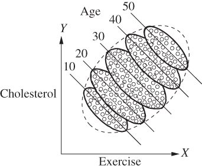 [그림 1.1](#c01-fig-anc-001) 운동콜레스테롤 연구 결과, 연령별로 분리한 경우
2. 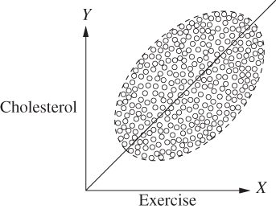 [그림 1.2](#c01-fig-anc-002) 운동콜레스테롤 연구 결과, 분리하지 않은 경우. 데이터 점은 그림 1.1과 동일하되 연령군 사이의 경계만 표시되지 않았다
3. 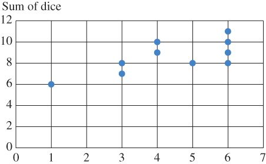 [그림 1.3 표 1.6 결과의 산점도. -축은 첫 번째 주사위 값, -축은 두 주사위 눈의 합](c01.xhtml#c01-fig-anc-0003)
4. 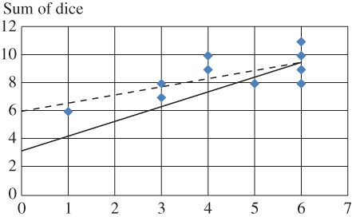 [그림 1.4 표 1.6 결과의 산점도. -축은 첫 번째 주사위 값, -축은 두 주사위 눈의 합. 점선은 데이터에 기반한 최적 적합선, 실선은 모집단에서 기대되는 최적 적합선](c01.xhtml#c01-fig-anc-0004)
5. 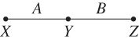 [그림 1.5 무방향 그래프. 노드 와 는 인접하고 노드 와 도 인접하나 와 는 인접하지 않음](c01.xhtml#c01-fig-anc-0005)
6. 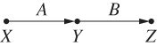 [그림 1.6 방향 그래프. 노드 가 의 부모이고 가 의 부모임](c01.xhtml#c01-fig-anc-0006)
7. 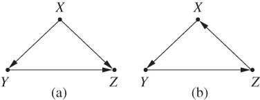 [그림 1.7](#c01-fig-anc-007) (a) 비순환 그래프와 (b) 순환 그래프
8. 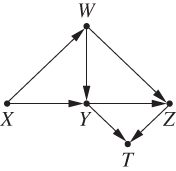 [그림 1.8](#c01-fig-anc-008) 학습 문제 1.4.1에 사용된 방향 그래프
9. 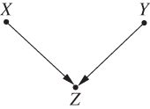 [그림 1.9 SCM 1.5.1의 그래픽 모델. 는 교육 연수, 는 취업 연수, 는 급여를 나타냄](c01.xhtml#c01-fig-anc-0009)
10. 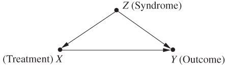 [그림 1.10 관찰되지 않은 증후군 이 처치( )와 결과( ) 모두에 영향을 주는 모델](c01.xhtml#c01-fig-anc-0010)
11. 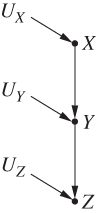 [그림 2.1](#c02-fig-anc-001) SCM 2.12.3의 그래픽 모델
12. 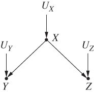 [그림 2.2](#c02-fig-anc-002) SCM 2.6과 2.7의 그래픽 모델
13. 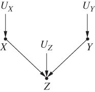 [그림 2.3](#c02-fig-anc-003) 단순 콜라이더(collider)
14. 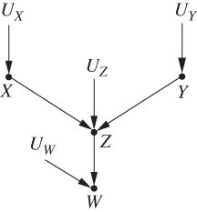 [그림 2.4 자식 하나를 둔 단순 콜라이더 . 표 2.3의 시나리오를 나타내며 는 첫 번째 동전 던지기, 는 두 번째 동전 던지기, 는 어느 하나라도 앞면이면 울리는 종, 는 종이 울렸는지 보고하는 신뢰도 낮은 목격자를 나타냄](c02.xhtml#c02-fig-anc-0004)
15. 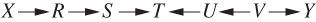 [그림 2.5](#c02-fig-anc-005) 조건부 독립을 설명하기 위한 방향 그래프 (오차항은 명시적으로 표시하지 않음)
16. 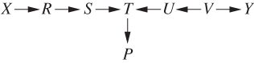 [그림 2.6](#c02-fig-anc-006) *P*가 콜라이더의 자손인 방향 그래프
17. 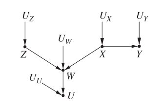 [그림 2.7](#c02-fig-anc-007) 자식 을 둔 콜라이더와 포크(fork)를 포함하는 그래픽 모델
18. 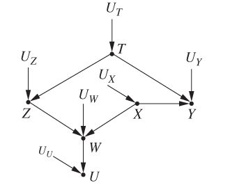 [그림 2.8 그림 2.7의 모델에 와 사이의 추가 포크 경로를 넣은 모델](c02.xhtml#c02-fig-anc-0008)
19. 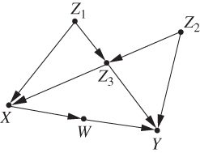 [그림 2.9 학습 문제 2.4.1에 사용된 인과 그래프. 모든 (그림에는 표시되지 않음)은 독립이라고 가정](c02.xhtml#c02-fig-anc-0009)
20. 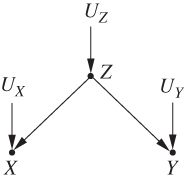 [그림 3.1 기온( ), 아이스크림 판매( ), 범죄율( )의 관계를 나타내는 그래픽 모델](c03.xhtml#c03-fig-anc-0001)
21. 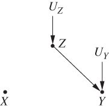 [그림 3.2](#c03-fig-anc-002) 그림 3.1의 모델에서 아이스크림 판매를 낮추는 개입을 나타내는 그래픽 모델
22. 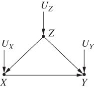 [그림 3.3 신약의 효과를 나타내는 그래픽 모델. 는 성별, 는 약물 사용, 는 회복을 나타냄](c03.xhtml#c03-fig-anc-0003)
23. 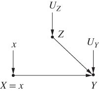 [그림 3.4 그림 3.3의 모델에서 모집단의 약물 사용을 로 설정하는 개입을 나타내는 수정된 그래픽 모델. 조작된 확률 ](c03.xhtml#c03-fig-anc-0004)
24. 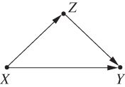 [그림 3.5 신약의 효과를 나타내는 그래픽 모델. 는 약물 사용, 는 회복, 는 혈압(연구 말기에 측정). 외생 변수는 그래프에 표시되지 않으며 서로 독립임을 암시함](c03.xhtml#c03-fig-anc-0005)
25. 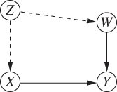 [그림 3.6 신약( ), 회복( ), 체중( ), 미측정 변수(사회경제적 지위) 사이의 관계를 나타내는 그래픽 모델](c03.xhtml#c03-fig-anc-0006)
26. 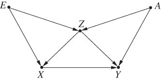 [그림 3.7 에서 로의 효과를 확정하려면 콜라이더( )에 조건을 걸어야 하는 후문 기준(backdoor criterion)의 그래픽 모델](c03.xhtml#c03-fig-anc-0007)
27. 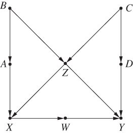 [그림 3.8](#c03-fig-anc-008) 이어지는 학습 문제들에서 후문 기준을 설명하는 데 쓰인 인과 그래프
28. 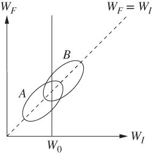 [그림 3.9 학생들의 초기 체중을 -축에, 최종 체중을 -축에 둔 산점도. 세로선은 초기 체중이 같은 학생들이며 B 계획이 A 계획보다 (평균적으로) 최종 체중이 더 높음을 보여줌](c03.xhtml#c03-fig-anc-0009)
29. 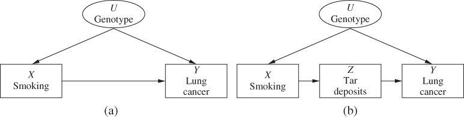 [그림 3.10 흡연과 폐암의 관계를 나타내는 그래픽 모델. 관찰되지 않은 교란변수 와 매개 변수 ](c03.xhtml#c03-fig-anc-0010)
30. 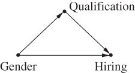 [그림 3.11](#c03-fig-anc-011) 성별, 자격, 채용 사이의 관계를 나타내는 그래픽 모델
31. 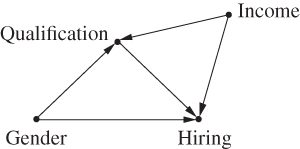 [그림 3.12](#c03-fig-anc-012) 성별, 자격, 채용 사이의 관계를 나타내는 그래픽 모델. 사회경제적 지위가 자격과 채용 사이의 매개자 역할을 함
32. 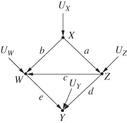 [그림 3.13](#c03-fig-anc-013) 경로 계수와 총효과의 관계를 보여주는 그래픽 모델
33. 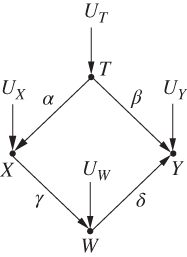 [그림 3.14 가 에 직접 효과는 없지만 를 조정하여 결정되는 총효과가 있는 그래픽 모델](c03.xhtml#c03-fig-anc-0014)
34. 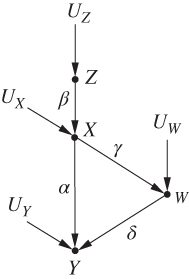 [그림 3.15 가 에 직접 효과를 갖는 그래픽 모델](c03.xhtml#c03-fig-anc-0015)
35. 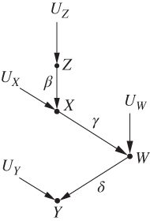 [그림 3.16 에서 로의 직접 간선을 제거하고 를 -분리하는 변수 집합을 찾으면, 에서 로의 직접 효과를 확정하기 위해 조정해야 할 변수를 알 수 있음](c03.xhtml#c03-fig-anc-0016)
36. 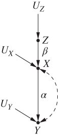 [그림 3.17 점선 이중 화살표 호가 미측정 변수로 이루어진 와 사이의 후문 경로를 나타내므로, 조정을 통해서는 에서 로의 직접 효과를 찾을 수 없는 그래픽 모델. 이 경우 는 에서 로의 효과에 관해 를 식별하게 해 주는 도구 변수(instrument)](c03.xhtml#c03-fig-anc-0017)
37. 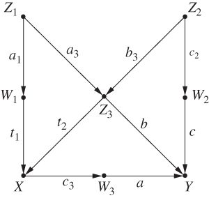 [그림 3.18](#c03-fig-anc-0018) 학습 문제 3.8.1의 모델 3.1에 해당하는 그래프
38. 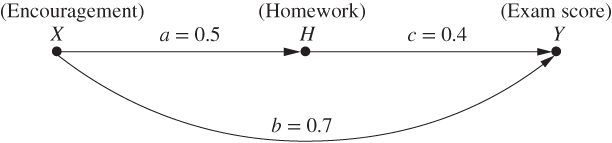 [그림 4.1 격려(Encouragement)가 학생 점수에 미치는 효과를 나타내는 모델](c04.xhtml#c04-fig-anc-0001)
39. 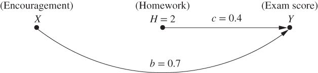 [그림 4.2 특정 학생의 점수에 대한 반사실 질문에 답하기. 숙제가 로 늘어났을 것이라는 가정에 근거함](c04.xhtml#c04-fig-anc-0002)
40. 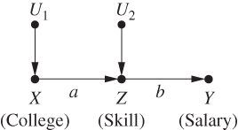 [그림 4.3 식 (4.7)을 나타내는 모델. 대학 교육( ), 기술( ), 임금( ) 사이의 인과 관계](c04.xhtml#c04-fig-anc-0003)
41. 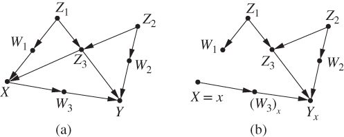 [그림 4.4 반사실의 그래프적 해석. (a) 원래 모델. (b) 수정된 모델로, 라는 이름의 노드는 에 근거한 잠재결과를 나타냄](c04.xhtml#c04-fig-anc-0004)
42. 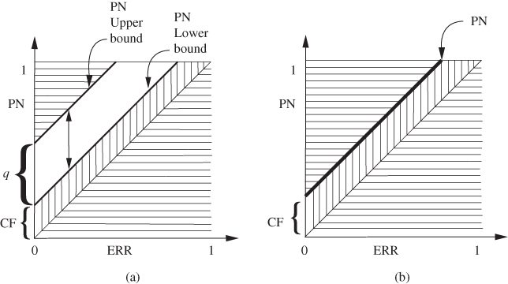 [그림 4.5](#c04-fig-anc-005) (a) 필연성 확률(PN)이 과잉위험비(ERR)와 교란 요인(CF)의 함수로 어떻게 한정되는지 (식 (4.31)); (b) 단조성을 가정하면 PN이 식별되는 경우 (정리 4.5.1)
43. 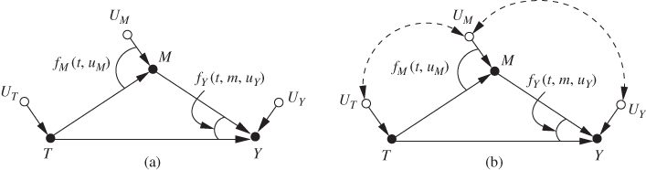 [그림 4.6 (a) 교란이 없는 기본 비모수 매개 모델. (b) 와 사이에 의존성이 존재하는 교란된 매개 모델](c04.xhtml#c04-fig-anc-0006)

# 보조 웹사이트 안내

이 책에는 보조 웹사이트가 있다:

[www.wiley.com/go/Pearl/Causality](http://www.wiley.com/go/Pearl/Causality)

# 1장 기초: 통계적 모델과 인과 모델

## 1.1 왜 인과성을 연구하는가

"왜 인과성을 연구하는가?"라는 질문에 대한 답은 "왜 통계학을 연구하는가?"에 대한 답만큼이나 자명하다. 우리는 데이터를 이해하고, 행동과 정책을 이끌고, 성공과 실패에서 배우기 위해 인과성을 연구한다. 흡연이 폐암에, 교육이 임금에, 탄소 배출이 기후에 미치는 효과를 추정해야 한다. 더 야심차게는, 원인이 결과에 *어떻게*, *왜* 영향을 주는지 이해해야 하는데, 이 역시 결코 덜 가치 있는 일이 아니다. 예를 들어 말라리아가 모기를 통해서 전염되는지, 아니면 과거 많은 사람들이 믿었듯 "나쁜 공기(mal-air)" 때문인지 아는 것만으로도, 늪지대 여행에 모기장을 챙길지 방독면을 챙길지 결정할 수 있다.

덜 명백한 것은 "왜 인과성을 전통 통계 커리큘럼과 구별되는 별도의 주제로 연구하는가?"라는 질문에 대한 답이다. 검증된 통계 방법으로는 알 수 없는 것을, "인과성"이라는 개념 하나로 세상에 대해 알 수 있다는 말인가?

알고 보면 알 수 있는 게 아주 많다. 엄격하게 다루면 인과성은 통계학의 한 국면이 아니라 통계학에 대한 추가, 곧 전통적 방법만으로는 밝힐 수 없는 세상의 작동 원리를 드러내게 해 주는 풍요화다. 예컨대 많은 사람이 놀라겠지만 위에서 언급한 문제들 가운데 하나도 표준 통계학의 언어로는 서술할 수 없다.

통계학에서 인과성의 특별한 위치를 이해하려면, 통계학 문헌에서 가장 매혹적인 퍼즐 중 하나를 들여다보자. 이 퍼즐은 위에서 언급한 것 같은 원인관계를 다루기 위해 전통적 통계 언어에 새로운 재료를 반드시 보태야 하는 이유를 생생하게 보여준다.

## 1.2 심슨의 역설

에드워드 심슨(Edward Simpson, 1922년생)이 역설을 처음 널리 알린 통계학자의 이름을 딴 이 역설은, 전체 모집단에서 성립하는 통계적 연관이 모든 하위 모집단에서 뒤집어지는 데이터가 존재한다는 사실을 가리킨다. 예컨대 흡연하는 학생들이 비흡연 학생들보다 평균적으로 더 높은 성적을 받는다는 것을 발견했다 치자. 그런데 학생들의 나이를 고려하면, 어느 연령군에서든 흡연자가 비흡연자보다 낮은 성적을 받음을 발견할 수도 있다. 그 상태에서 나이와 소득을 함께 고려하면, 같은 나이·소득의 비흡연자보다 흡연자가 다시 *더 높은* 성적을 받는다는 것을 발견하게 될지도 모른다. 이런 뒤집힘은 무한히 계속될 수 있고 속성을 하나씩 더 고려할 때마다 왔다 갔다 한다. 이런 상황에서 우리는 흡연이 성적 향상을 일으키는지, 어느 방향인지, 얼마나 큰지를 결정하고 싶은데, 답이 데이터에서 도무지 나올 것 같지 않다.

심슨(1951)이 사용한 고전적인 예에서, 한 환자 집단에게 신약을 시도할 기회가 주어진다. 약을 먹은 사람 중 회복한 비율이 먹지 않은 사람보다 낮았다. 그러나 성별로 나누어 보면, 약을 복용한 남성이 복용하지 않은 남성보다 *더 많이* 회복했고 여성 역시 복용한 여성이 복용하지 않은 여성보다 더 많이 회복했다! 요컨대 이 약은 남녀에게는 도움이 되지만 전체 모집단에는 해롭다는 얘기다. 말이 안 되고 불가능해 보이기까지 한다. 그래서 당연히 역설로 여겨지는 것이다. 숫자가 저렇게 합쳐질 수 있다는 것 자체를 믿기 어려워하는 사람도 있다. 그렇다면 이를 믿을 만하게 만들어 주는 다음 예를 보라:

***

# 예제 1.2.1

*약물 접근이 허용된 700명 환자의 회복률을 기록했다. 총 350명이 약을 복용하기로 했고 350명은 하지 않았다. 연구 결과는 [표 1.1](#c01-tbl-0001)과 같다.*

***

[**표 1.1**](#c01-tbl-anc-0001) 성별을 고려한 신약 연구 결과

Drug No drug Men 81 out of 87 recovered (93%) 234 out of 270 recovered (87%) Women 192 out of 263 recovered (73%) 55 out of 80 recovered (69%) Combined data 273 out of 350 recovered (78%) 289 out of 350 recovered (83%)

첫 행은 남성 환자의 결과를, 두 번째 행은 여성 환자의 결과를, 세 번째 행은 성별 구분 없이 전체 환자의 결과를 보여준다. 남성 환자에서는 약을 복용한 쪽이 복용하지 않은 쪽보다 회복률이 좋았다(93% vs 87%). 여성 환자에서도 마찬가지로 복용한 쪽이 낫게 회복했다(73% vs 69%). 그런데 전체를 합치면, 복용하지 않은 쪽이 복용한 쪽보다 회복률이 더 높다(83% vs 78%).

데이터가 말하길, 환자의 성별을 알고 있다면남성이든 여성이든약을 처방해도 되지만 성별을 모른다면 처방해서는 안 된다는 것이다. 물론 터무니없는 결론이다. 약이 남녀 모두에게 돕는다면 누구에게나 도움이 되어야 마땅하다. 환자의 성별을 모른다고 해서 약이 해롭게 변할 리 없다.

그렇다면 이 연구 결과를 두고 의사는 여성에게 약을 처방해야 할까? 남성에게는? 성별을 모르는 환자에게는? 아니면 약의 모집단 전체에 대한 효과를 평가하는 정책 입안자는 어떻게 해야 할까. 전체 모집단의 회복률을 써야 할까, 아니면 성별로 나눈 하위 모집단의 회복률을 써야 할까?

답은 단순한 통계 어디에도 없다. 약이 환자를 해칠지 돕는지 판단하려면 먼저 데이터 뒤에 깔린 이야기, 즉 우리가 보는 결과를 낳거나 *생성한* 인과 메커니즘을 이해해야 한다. 예컨대 한 가지 추가 사실을 알고 있었다 치자. 에스트로겐은 회복에 부정적 영향을 미치므로, 약과 무관하게 여성은 남성보다 회복하기 어렵다. 게다가 데이터에서 보듯 여성은 남성보다 약을 복용할 가능성이 훨씬 *높다*. 따라서 약이 전체적으로 해로워 보이는 이유는, 복용자를 무작위로 뽑으면 그 사람이 여성일 확률이 높고 따라서 복용하지 않는 무작위 개인보다 회복할 확률이 낮기 때문이다. 다시 말해 '여성일 것'은 약물 복용과 회복 실패 양쪽의 공통 원인(common cause)이다. 그러므로 효과를 평가하려면 같은 성별의 대상들을 비교해야 한다. 그래야 복용군과 비복용군 사이의 회복률 차이가 에스트로겐 탓이라고 볼 여지가 없어진다. 즉 분리된 데이터를 참조해야 하는데, 이 데이터는 약이 도움이 된다는 것을 명백히 보여준다. 이는 직관과도 부합한다. 분리된 데이터가 "더 구체적"이므로, 분리하지 않은 데이터보다 정보가 많다는 직관 말이다.

몇 가지만 바꾸면 같은 뒤집힘이 연속형 예에서도 일어남을 볼 수 있다. 여러 연령군에서 주간 운동량과 콜레스테롤을 측정한 연구를 생각하자. 운동을 -축에, 콜레스테롤을 -축에 놓고 처럼 연령별로 나누어 그리면 각 군에서 일관되게 아래로 향하는 추세가 보인다. 젊은 사람일수록 운동을 많이 할수록 콜레스테롤이 낮고 중장년층이든 노년층이든 마찬가지다. 그런데 같은 산점도를 처럼 연령으로 나누지 않고 그리면 위로 향하는 추세가 나타난다. 운동을 많이 하는 사람일수록 콜레스테롤이 높아 보인다. 이 문제를 풀려면 다시 데이터 뒤의 이야기를 찾는다. 운동을 할 가능성이 더 높은() 나이 든 사람이, 운동과 무관하게 콜레스테롤이 높을 가능성도 더 높다는 것을 알면, 뒤집힘은 쉽게 설명되고 쉽게 해결된다. 나이는 처치(운동)와 결과(콜레스테롤) 양쪽의 공통 원인이다. 따라서 같은 나이끼리 비교하려면 연령별로 분리된 데이터를 봐야 한다. 그래야 검토하는 각 군에서 운동을 많이 하는 사람이 나이 때문에 콜레스테롤이 높을 확률이 높지, 운동 때문이라는 가능성을 배제할 수 있다.

 운동콜레스테롤 연구 결과, 연령별로 분리한 경우
 운동콜레스테롤 연구 결과, 분리하지 않은 경우. 데이터 점은 과 동일하되 연령군 사이의 경계만 표시되지 않았다
그런데 일부 독자는 놀랄지 모르지만 분리된 데이터가 항상 옳은 답을 주는 것은 아니다. 첫 예제의 약물 복용회복 실험에서 참가자의 성별 대신 실험 끝에 환자의 혈압을 기록했다고 하자. 이 경우 약은 혈압을 낮춤으로써 회복에 영향을 준다는 것을 알고 있다. 그러나 불행히도 독성 효과도 있다. 실험이 끝나면 [표 1.2](#c01-tbl-0002)와 같은 결과를 받게 된다. ([표 1.2](#c01-tbl-0002)는 열 라벨만 서로 바뀌었을 뿐 [표 1.1](#c01-tbl-0001)과 수치가 동일하다.)

[**표 1.2**](#c01-tbl-anc-0002) 처치 후 혈압을 고려한 신약 연구 결과

No drug Drug Low BP 81 out of 87 recovered (93%) 234 out of 270 recovered (87%) High BP 192 out of 263 recovered (73%) 55 out of 80 recovered (69%) Combined data 273 out of 350 recovered (78%) 289 out of 350 recovered (83%)

자, 이번엔 환자에게 이 약을 권하겠는가?

역시 답은 데이터가 생성된 방식에서 나온다. 전체 모집단에서는 혈압에 미치는 효과 덕분에 약이 회복률을 높일 수 있다. 그러나 하위 모집단처치 후 혈압이 높은 집단과 낮은 집단에서는 당연히 그 효과가 보이지 않는다. 약의 독성 효과만 보일 뿐이다.

성별 예와 마찬가지로 실험의 목적은 처치가 회복률에 미치는 전체 효과를 가늠하는 것이었다. 그런데 이번 예에서는 혈압을 낮추는 것이 처치가 회복에 영향을 주는 메커니즘의 하나이기 때문에, 결과를 혈압 기준으로 나누는 것은 아무 의미가 없다. (환자의 혈압을 처치 *전에* 기록했고, 처치에 영향을 주는 것이 BP였다면반대가 아니라이야기가 달라졌을 것이다.) 그러므로 전체 모집단의 결과를 참조하고, 처치가 회복 확률을 높인다는 것을 확인한 뒤, 처치를 권해야 *한다*고 판단하면 된다. 놀랍게도 성별 예와 혈압 예는 숫자가 완전히 같은데도, 옳은 답은 전자에서는 분리된 데이터에, 후자에서는 합산된 데이터에 들어 있다.

처치 결정을 내리게 해 준 정보측정 시점이 아니, 처치가 혈압에 영향을 준다는 사실도 아니고 혈압이 회복에 영향을 준다는 사실도 아닌, 그 어떤 것도데이터 안에는 없었다. 실제로 통계학 교과서가 전통적으로 (그리고 올바르게) 학생들에게 경고하듯 상관은 인과가 아니므로, 데이터만으로 인과 이야기를 밝혀내는 통계 방법은 존재하지 않는다. 그러므로 우리의 결정을 도울 통계 방법 또한 존재하지 않는다.

그럼에도 통계학자들은 늘 이런 종류의 인과적 가정을 바탕으로 데이터를 해석한다. 실제로 맨 처음의 정성적 성별 예가 지닌 역설적 성격은, "처치가 성별에 영향을 줄 수는 없다"는 강한 확신에서 나온 것이다. 만약 영향을 줄 수 있다면 역설은 없다. 그때는 데이터 뒤의 인과 이야기가 혈압 예와 같은 구조를 취할 수 있기 때문이다. "처치는 성별을 일으키지 않는다"는 가정은 사소해 보이지만 데이터로 검증할 방법도 없고 표준 통계학의 수학으로 표현할 방법도 없다. 사실 통계적 추론이 흔히 기반하는 분할표(예: [표 1.1](#c01-tbl-0001), [표 1.2](#c01-tbl-0002))에는 *어떤* 인과 정보도 표현할 방법이 없다.

다만 인과적 가정을 표현하고 해석하는 데 쓸 수 있는 *통계 외적* 방법들은 있다. 이 방법들과 그 함의가 이 책의 주제다. 이 방법의 도움으로 독자는 어떤 복잡도의 인과 시나리오도 수학적으로 기술할 수 있게 되고 심슨의 역설이 던진 것과 비슷한 결정 문제를 대수 문제를 푸는 것처럼 빠르고 편하게 풀 수 있게 된다. 이 방법들은 위 세 예를 쉽게 구별해 적절한 통계 분석과 해석으로 나아갈 길을 열어준다. 단순한 논리 연산으로 이루어진 인과 계산학(causal calculus)은, 남녀를 치료하면서 전체를 해치는 약 같은 건 없다는 직관과, 혈압이 같은 환자끼리 비교하는 것은 헛수고라는 직관을 명확히 다져준다. 이 계산학은 우리를 심슨 역설의 장난감 문제 너머, 직관이 더 이상 분석을 이끌 수 없는 복잡한 문제로 데려다줄 것이다. 간단한 수학적 도구가 정책 평가의 실용적 질문에도, 사건이 어떻게, 왜 일어나는지 묻는 과학적 질문에도 답할 수 있다.

하지만 그런 대업을 치르기엔 아직 준비가 덜 되었다. 데이터 뒤의 인과 이야기를 엄격하게 이해하려면 네 가지가 필요하다:

1. **1.** "인과(causation)"의 실용적 정의.
2. **2.** 인과적 가정을 형식적으로 서술하는 방법, 곧 인과 모델을 만드는 방법.
3. **3.** 인과 모델의 구조를 데이터의 특징과 연결하는 방법.
4. **4.** 모델에 담긴 인과적 가정과 데이터를 결합해 결론을 끌어내는 방법.

이 책의 앞 두 부는 인과적 가정을 모델링하고 이를 데이터 집합과 연결하는 방법에 할애되며 세 번째 부에서 그 가정과 데이터를 이용해 인과 질문에 답한다. 그 전에 인과를 정의해야 한다. 직관적이고 간단해 보이지만 인과에 대한 보편적으로 합의된, 완전히 포괄적인 정의는 몇 세기 동안 통계학자와 철학자의 손을 빗나갔다. 우리 목적에는 조금 은유적이긴 해도 정의는 간단하다. 변수 가 어떤 방식으로든 값의 근거로 에 의존한다면, 는 의 *원인*이다. 이 정의는 나중에 조금 확장하겠지만 우선은 인과를 일종의 '경청'이라고 생각하라. 가 의 원인이라는 것은, 가 을 경청하고 들은 것에 반응해 자기 값을 정한다는 뜻이다.

독자는 또한 앞서 말한 인과 방법을 이해하기 위해 확률론, 통계학, 그래프 이론의 초급 개념을 알아야 한다. 다음 두 절에서 필요한 정의와 예제를 제공한다. 확률론, 통계학, 그래프 이론에 대한 기본 이해가 있는 독자는 이해에 지장 없이 1.5절로 건너뛰어도 좋다.

*학습 문제*

**학습 문제 1.2.1**

1. *다음 주장들에는 무엇이 잘못되었는가?*
   1. ***a.*** *"데이터에 따르면 소득과 결혼은 높은 양의 상관이 있다. 따라서 결혼하면 소득이 늘어날 것이다."*
   2. ***b.*** *"데이터에 따르면 화재 건수가 늘어날 때 소방관 수도 늘어난다. 따라서 화재를 줄이려면 소방관 수를 줄여야 한다."*
   3. ***c.*** *"데이터에 따르면 서두르는 사람들은 회의에 늦는 경향이 있다. 서두르지 마라. 늦어진다."*

**학습 문제 1.2.2**

1. *야구 타자 팀은 동료 프랭크보다 타율이 더 높다. 그런데 누군가 프랭크가 우완 투수 상대로도 좌완 투수 상대로도 팀보다 타율이 높다는 것을 알아차렸다. 이것은 어떻게 가능한가? (답을 표로 제시하라.)*

**학습 문제 1.2.3**

1. *다음 각 인과 이야기에 대해 진짜 효과를 판단하려면 합산 데이터를 써야 하는지, 분리된 데이터를 써야 하는지 결정하라.*
   1. ***a.*** *신결석 치료에 두 가지 처치가 쓰인다: Treatment와 Treatment. 의사는 크고 (따라서 심각한) 결석에는 Treatment를, 작은 결석에는 Treatment를 쓰는 경향이 있다. 자기 결석의 크기를 모르는 환자는 어느 처치가 더 효과적인지 판단할 때 전체 모집단 데이터를 봐야 할까, 아니면 결석 크기별 데이터를 봐야 할까?*
   2. ***b.*** *작은 마을에 의사가 두 명 있다. 각자 커리어에서 100건의 수술을 했으며 수술은 매우 어려운 것과 매우 쉬운 것 두 종류다. 첫 의사는 어려운 수술보다 쉬운 수술을 훨씬 자주 했고 두 번째 의사는 쉬운 수술보다 어려운 수술을 더 자주 했다. 당신은 수술이 필요하지만 자기 사례가 쉬운지 어려운지 모른다. 수술 성공 확률을 최대화하려면 의사별 전체 성공률을 봐야 할까, 아니면 쉬운/어려운 사례별 성공률을 따로 봐야 할까?*

**학습 문제 1.2.4**

1. *신약의 효과를 추정하기 위해 무작위 실험을 실시한다. 전체 환자의 50%는 신약 투여군에, 50%는 위약군에 배정된다. 실험 전날, 한 간호사가 우울 증세를 보이는 환자들주로 다음 날 처치군에 배정된 환자들에게 롤리팝을 나눠주었다 (간호사의 동선이 우연히 처치군 병동을 지나게 되었다). 이상하게도 실험 데이터는 심슨의 뒤집힘을 드러냈다. 약이 모집단 전체로는 유익한 것으로 나타났지만 롤리팝을 받은 군과 받지 않은 군 모두에서 복용자가 비복용자보다 회복할 가능성이 낮았던 것이다. 롤리팝을 빠는 행위 자체는 회복에 아무런 영향이 없다고 가정하고 다음 질문에 답하라:*
   1. ***a.*** *약은 모집단 전체에 유익한가, 해로운가?*
   2. ***b.*** *당신의 답은, 성별별 데이터가 더 적절하다고 판단했던 우리의 성별 예와 모순되는가?*
   3. ***c.*** *이 이야기를 대략 잡아내는 그래프를 (격식 없이) 그려라. 원한다면 1.4절을 미리 보라.*
   4. ***d.*** *이 이야기에서 심슨의 뒤집힘이 생긴 이유를 어떻게 설명하겠는가?*
   5. ***e.*** *같은 기준으로 롤리팝을 연구 하루 뒤에 나눠주었다면 답이 달라지는가?*

*[힌트: 롤리팝을 받는다는 것은 약물 처치군에 배정될 가능성이 더 높다는 뜻이며 동시에 우울회복 가능성을 낮추는 위험 요인의 증상을 겪고 있음을 뜻한다는 사실을 이용하라.]*

## 1.3 확률과 통계

통계학이 대체로 절대값이 아니라 가능성을 다루는 만큼, 확률의 언어는 통계학에 매우 중요하다. 확률은 인과 연구에도 똑같이 중요하다. 인과적 진술 대부분은 불확실하기 때문이다 (예: "부주의한 운전은 사고를 일으킨다"는 참이지만 부주의한 운전자가 반드시 사고를 낸다는 뜻은 아니다). 그리고 불확실성을 표현하는 방법이 곧 확률이다. 이 책에서는 세상에 관한 믿음과 불확실성을 표현하는 데 확률의 언어와 법칙을 사용한다. 확률에 대한 배경이 부족한 독자를 위해, 이 책의 나머지를 이해하는 데 필요한 가장 중요한 용어와 개념의 용어집을 여기서 제공한다.

## 1.3.1 변수

*변수(variable)*는 여러 값을 가질 수 있는 속성이나 서술자를 뜻한다. 흡연자와 비흡연자의 건강을 비교하는 연구에서 변수는 참가자의 나이, 성별, 암 가족력 유무, 흡연 연수 같은 것일 수 있다. 변수를 하나의 질문으로, 그 값을 그 답으로 생각할 수 있다. 예컨대 "이 참가자는 몇 살인가?" "38살입니다." 여기서 "나이"가 변수고 "38"이 값이다. 변수가 값 을 가질 확률은 로 쓴다. 맥락이 허락하면 이를 로 줄여 쓰기도 한다. 여러 값의 동시 확률도 다룰 수 있다. 예컨대 와 이 동시에 성립할 확률은 로, 혹은 로 쓴다. 는 구체적으로 모집단에서 무작위로 선택된 개인의 나이가 38세일 확률로 해석됨에 유의하라.

변수는 *이산형(discrete)*이거나 *연속형(continuous)*이다. 이산형 변수(때로 *범주형(categorical)* 변수라고 불림)는 임의의 범위 안에서 유한하거나 가산 무한한 값 집합 중 하나를 취할 수 있다. 표준 전등 스위치의 상태를 나타내는 변수는 "켜짐"과 "꺼짐" 두 값을 갖으므로 이산형이다. 연속형 변수는 연속적인 척도 위의 무한한 값 집합 중 어떤 것이든 취할 수 있다 (즉, 임의의 두 값 사이에는 항상 그 둘 사이에 놓이는 세 번째 값이 있다). 예컨대 사람의 체중을 정밀하게 나타내는 변수는 연속형인데, 체중은 실수로 측정되기 때문이다.

## 1.3.2 사건

*사건(event)*은 하나 또는 여러 변수에 값이나 값 집합을 부여하는 것을 말한다. " "은 사건이고 " 또는"도, " 와"도, " 또는"도 사건이다. "동전 던지기 결과가 앞면이다", "대상자가 40세보다 많다", "환자가 회복했다" 모두 사건이다. 첫째에서 "동전 던지기 결과"가 변수고 "앞면"이 그 값이다. 둘째에서 "대상자의 나이"가 변수이고 "40세 초과"는 그 변수가 취할 수 있는 값들의 집합이다. 셋째에서 "환자의 상태"가 변수이고 "회복"이 그 값이다. 이런 "사건" 정의는 무언가 변화가 일어나야 한다는 일상적 관념과는 어긋난다 (예컨대 일상 대화에서 사람이 특정 나이인 것을 사건이라 부르지 않지만 그 사람이 한 살 *더 먹는* 것은 사건이라 부른다). 확률론에서 사건을 이렇게 생각해도 좋다. 참거짓을 판별할 수 있는 모든 선언적 진술은 사건이다.

*학습 문제*

**학습 문제 1.3.1**

1. *학습 문제 1.2.4의 롤리팝 이야기에 등장하는 변수와 사건을 찾아라*

## 1.3.3 조건부 확률

어떤 사건 이 일어났다는 것을 알고 있을 때 다른 사건 이 일어날 확률은, 에 대한 의 *조건부 확률(conditional probability)*이다. 가 주어졌을 때 의 조건부 확률은 로 쓴다. 비조건부 확률과 마찬가지로 맥락상 줄여서 로 쓰곐 한다. 우리가 사건 " "에 부여하는 확률은, 조건으로 거는 지식 " "에 따라 극적으로 달라질 때가 많다. 예컨대 지금 당장 독감에 걸렸을 확률은 꽤 낮다. 하지만 체온을 재서 102°F(섭씨 38.9도)임을 발견했다면 그 확률은 훨씬 높아진다.

데이터 집합의 빈도로 표현되는 확률을 다룰 때, 조건화(conditioning)는 하나 이상 변수의 값에 따라 데이터 집합을 *걸러내는* 작업으로 생각할 수 있다. 예컨대 지난 대선에서 미국 유권자들의 나이를 들여다본다 치자. Census Bureau 자료에 따르면 [표 1.3](#c01-tbl-0003)과 같은 데이터 집합을 얻을 수 있다.

[**표 1.3**](#c01-tbl-anc-0003) 2012년 선거 유권자의 연령 분포 (단위:천 명)

Age group # of voters 1829 20,539 3044 30,756 4564 52,013 65+ 29,641 132,948

[표 1.3](#c01-tbl-0003)에서 투표는 총 132,948,000건이었으므로, 주어진 유권자가 45세 미만일 확률은 다음처럼 추정할 수 있다

그런데 그 유권자가 29세보다 많다는 것을 *알고* 있을 때 45세 미만일 확률을 추정하고 싶다면? 간단하다. 29세보다 많은 경우만 골라 새 집합([표 1.4](#c01-tbl-0004) 참조)을 만들면 된다.

[**표 1.4**](#c01-tbl-anc-0004) 2012년 선거에서 29세 초과 유권자의 연령 분포 (단위:천 명)

Age group # of voters 3044 30,756 4564 52,013 65+ 29,641 112,409

새 데이터 집합의 총 투표는 112,409,000건이므로 다음을 추정할 수 있다

이런 조건부 확률들은 인과 질문 탐구에서 중요한 역할을 한다. 어떤 결과의 확률(혹은 위험)이 걸러내기, 즉 노출(exposure) 조건에 따라 어떻게 달라지는지 비교하고 싶을 때가 많기 때문이다. 예컨대 흡연자가 폐암에 걸릴 확률은 비흡연자의 그것과 비교해서 어떤가?

*학습 문제*

**학습 문제 1.3.2**

1. *[표 1.5](#c01-tbl-0005)는 미국 성인 모집단에서 성별과 교육 수준의 관계를 보여준다.*
   1. ***a.*** * 을 추정하라*
   2. ***b.*** * 을 추정하라*
   3. ***c.*** * 을 추정하라*
   4. ***d.*** * 을 추정하라*

[**표 1.5**](#c01-tbl-anc-0005) 성별·최종 교육 수준별 비율

Gender Highest education achieved Occurrence (in hundreds of thousands) Male Never finished high school 112 Male High school 231 Male College 595 Male Graduate school 242 Female Never finished high school 136 Female High school 189 Female College 763 Female Graduate school 172

## 1.3.4 독립성

한 사건의 확률이 다른 사건의 관찰에 영향받지 않는 경우가 있다. 예컨대 높은 체온을 관찰하면 독감일 확률이 올라가지만 친구 조가 38세라는 것을 관찰해도 그 확률은 조금도 변하지 않는다. 이런 경우 두 사건은 *독립(independent)*이라고 한다. 형식적으로, 사건 과 은 다음이 성립할 때 독립이라 한다.

**1.1**

즉, 이 일어났다는 사실은 이 일어날 확률에 아무 추가 정보도 주지 않는다는 뜻이다. 이 등식이 성립하지 않으면 과 는 *종속(dependent)*이라고 한다. 종속과 독립은 대칭적 관계다. 가 에 종속이면 도 에 종속이고 가 와 독립이면 도 와 독립이다. (형식적으로 이라면 반드시 도 성립해야 한다.) 직관에도 맞다. "연기"가 "불"에 대해 무언가를 알려준다면, "불"도 "연기"에 대해 무언가를 알려줄 수밖에 없다.

두 사건 과 이 세 번째 사건 에 대해 *조건부 독립(conditionally independent)*이라는 것은 다음이 성립하는 경우다.

**1.2**

그리고 . 예컨대 "연기 감지기가 작동한다"는 사건은 "근처에 불이 있다"는 사건에 종속이다. 그러나 세 번째 사건 "근처에 연기가 있다"에 조건을 걸면 두 사건은 독립이 될 수 있다. 연기 감지기는 연기의 원인이 아니라 연기의 존재에만 반응하기 때문이다. 데이터 집합이나 확률표를 다룰 때, 에 조건을 걸어 필터링해 만든 새 데이터 집합에서 와 이 독립이면 와 은 에 대해 조건부 독립이다. 원래 필터링 전 데이터 집합에서 이미 독립이었다면 이들을 *주변 독립(marginally independent)*이라고 부른다.

변수도 사건처럼 서로 종속하거나 독립일 수 있다. 두 변수 와 은, 와 이 가질 수 있는 모든 값 , 에 대해 다음이 성립하면 독립으로 본다.

[**1.3**](#c01-disp-anc-0002)

(사건의 독립과 마찬가지로 변수의 독립도 대칭적이므로, 식 ([1.3](#c01-disp-0002))을 을 함축함을 알 수 있다.) 와 의 어떤 값 쌍에 대해서든 이 등식이 성립하지 않으면 와 는 *종속*이라 한다. 이런 의미에서 변수의 독립은 사건 독립성들의 집합으로 이해할 수 있다. 예컨대 "키"와 "음악적 재능"은 독립 변수다. 어떤 신장과 재능 수준에 대해서도, 키가 피트인 사람일 확률은 그 사람의 재능이 임을 알게 되어도 변하지 않는다.

## 1.3.5 확률분포

변수 의 *확률분포(probability distribution)*는 의 가능한 각각의 값에 부여된 확률들의 집합이다. 예컨대 가 1, 2, 3의 세 값을 취할 수 있다면 가능한 확률분포 하나는 ",." 같은 것이다. 확률분포의 확률들은 0과 1 사이에 있어야 하고 합이 1이어야 한다. 확률 0의 사건은 불가능하고 확률 1의 사건은 확실하다.

연속형 변수에도 확률분포가 있다. 연속형 변수의 확률분포는 *밀도 함수(density function)*라 불리는 함수로 표현된다. 를 좌표평면에 그렸을 때 변수 값이 와 사이에 있을 확률은 와 사이의 곡선 밑 넓이, 즉 미적분을 배운 사람이라면 알겠지만 이다. 곡선 전체의 밑넓이즉 은 물론 1이어야 한다.

변수들의 집합도 확률분포를 가질 수 있는데, 이를 *결합분포(joint distribution)*라 한다. 변수 집합 의 결합분포는 에서 가능한 모든 변수 값 조합의 확률들이다. 예컨대 가 두 변수 와 로 이루어져 있고 각각 1과 2의 두 값을 취할 수 있다면, 가능한 결합분포 하나는 "." 같다. 단일 변수 분포와 마찬가지로 결합분포의 확률들도 합이 1이어야 한다.

## 1.3.6 전확률 법칙

알아두면 유용한 보편적 확률적 진실들이 몇 가지 있다. 첫째, 서로 배반적인 두 사건 과 에 대해 (즉, 와 은 동시에 일어날 수 없음), 다음이 성립한다.

**1.4**

따라서 임의의 두 사건 과 에 대해 다음이 성립한다.

**1.5**

왜냐하면 " 와 "와 " 와 'not '"은 서로 배반적이고 가 참이면 " 와 " 또는 " 와 'not '" 중 하나는 반드시 참이어야 하기 때문이다. 예컨대 "Dana는 큰 남자다"와 "Dana는 큰 여자다"는 배반적이고 Dana가 크다면 큰 남자이거나 큰 여자여야 하므로, 가 성립한다.

더 일반적으로, 정확히 하나만 참이어야 하는 사건들의 집합 (배반적이며 전체를 덮는 집합, 이른바 *분할(partition)*)에 대해 다음이 성립한다.

**1.6**

*전확률 법칙(law of total probability)*으로 알려진 이 규칙은 현실 언어로 옮기면 꽤 자명해진다. 표준 카드 덱에서 카드 한 장을 뽑을 때, 그 카드가 Jack일 확률은 Jack이면서 스페이드일 확률 + 하트일 확률 + 클로버일 확률 + 다이아몬드일 확률과 같다. 모든 에 걸쳐 확률을 더해 사건 의 확률을 계산하는 것을 에 대해 *주변화(marginalizing over)*한다고 하고 그 결과 확률을 의 *주변 확률(marginal probability)*라 한다.

의 확률과, 가 주어졌을 때 의 조건부 확률을 알면, 단순 곱셈으로 와 의 확률을 알 수 있다:

[**1.7**](#c01-disp-anc-0003)

예컨대 조가 웃기고 총명할 확률은, 총명한 사람이 웃길 확률 곱하기 조가 총명할 확률과 같다. 나눗셈 규칙

은 공식적으로 조건부 확률의 정의로 간주되는데, [표 1.3](#c01-tbl-0003), [표 1.4](#c01-tbl-0004)에서 했듯 조건화를 필터링 연산으로 보면 그 타당성이 설명된다. 에 조건화하면 와 어긋나는 사건들을 표에서 모두 제거한다. 결과 하위표는 원래 표처럼 하나의 확률분포를 나타내므로, 모든 확률분포가 그렇듯 합이 1이어야 한다. 하위표 행들의 확률은 원래 분포에서 (정의상) 합이 였으므로, 새 분포에서의 확률은 각각 에 를 곱해 구할 수 있다.

식 ([1.7](#c01-disp-0003))은 지금까지 "추가 정보를 주지 않는다"는 뜻으로 비공식적으로 쓰던 독립 개념이 확률분포 속에 수치적 표현을 갖는다는 것을 함축한다. 구체적으로 사건 과 이 독립이려면 다음이 필요하다.

예컨대 두 동전의 결과가 진짜 독립인지 확인하려면, 둘 다 뒷면이 나오는 빈도를 세어, 각 동전이 뒷면이 나오는 빈도의 곱과 일치하는지 확인하면 된다.

([1.7](#c01-disp-0003))을 대칭성과 함께 쓰면 확률론의 가장 중요한 법칙 중 하나, *베이즈 규칙(Bayes' rule)*을 바로 얻는다:

**1.8**

([1.7](#c01-disp-0003))의 곱셈 규칙을 활용하면 전확률 법칙을 조건부 확률의 가중합으로 표현할 수 있다:

[**1.9**](#c01-disp-anc-0004)

이는 매우 유용하다. 을 직접 평가할 수 없지만 이 분해를 통해서는 가능한 상황에 자주 처하기 때문이다. 맥락에 묶인 조건부 확률 같은 것을 평가하는 편이, 맥락 없이 떠 있는 보통 더 쉽다. 예컨대 두 출처의 기계부품 재고가 있다 치자. 30%는 공장 에서 만들어졌고 여기서는 5000개 중 1개가 불량이다. 70%는 공장 에서 만들었으며 여기서는 10,000개 중 1개가 불량이다. 무작위로 고른 부품이 불량일 확률을 머릿속에서 바로 구하기는 쉽지 않지만 식 ([1.9](#c01-disp-0004))에 따라 분해하면 간단해진다:

좀 더 어려운 예로, 두 주사위를 굴려 두 번째 눈이 첫 번째보다 클 확률 을 알고 싶다 치자. 이 확률을 한 번에 계산할 뚜렷한 방법은 없다. 그러나 첫 주사위 값에 조건화해 맥락별로 나누면 쉽게 풀린다:

식 ([1.9](#c01-disp-0004))의 분해는 때로 "대안의 법칙(law of alternatives)" 또는 "대화 확장(extending the conversation)"이라 불리기도 하는데, 이 책에서는 *조건화(conditionalizing on)*라고 부르겠다.

## 1.3.7 베이즈 규칙의 활용

베이즈 규칙을 쓸 때 사건 을 느슨히 "가설", 사건 을 "증거"라고 부르곤 한다. 이 명명은 베이즈 정리가 왜 그토록 중요한지를 보여준다. 많은 경우 우리는 (가설이 옳다는 전제에서 어떤 증거가 나타날 확률)을 알거나 쉽게 구할 수 있지만 (증거를 얻었을 때 가설이 옳을 확률)을 구하는 것은 훨씬 어렵다. 그런데 실세계에서 우리가 대개 답하고 싶은 것은 바로 후자다. 일반적으로 증거가 나타난 뒤 어떤 가설 에 대한 믿음을 로 갱신하고 싶어한다. 베이즈 규칙을 이렇게 정확하게 쓰려면 각 가설을 하나의 사건으로 다루고 주어진 상황의 모든 가설에 *사전 확률(prior)*이라 부르는 확률분포를 할당해야 한다.

예컨대 당신이 카지노에 있다가 딜러가 "11!"을 외치는 것을 들었다 치자. 그 카지노에서 그런 일이 일어날 수 있는 게임은 크랩스(craps)와 룰렛 두 가지뿐이고 어느 순간이든 진행 중인 크랩스 게임 수와 룰렛 게임 수가 같다는 것도 알고 있다. 딜러가 "11"을 외쳤다는 조건에서 그가 크랩스 게임을 진행 중일 확률은 얼마인가?

이때 "크랩스"가 가설이고 "11"이 증거다. 이 확률을 바로 구하기는 어렵다. 하지만 반대 방향크랩스 한 판에서 11이 나올 확률은 계산이 쉽다. 게임 규칙이 정해주기 때문이다. 크랩스는 두 주사위 눈의 합에 내기를 거는 놀이므로, 합이 11일 확률은 의 경우에 해당한다: . 룰렛은 38개의 동등한 결과가 있으므로 이다. 가능한 가설은 "크랩스"와 "룰렛" 두 개뿐이고 크랩스 게임과 룰렛 게임 수가 같으므로 이다. 이것이 "11" 외침을 듣기 전의 우리 사전 믿음이다. 전확률 법칙에 따라

필요한 정보를 모두 손쉽게 얻었으므로 를 결정할 수 있다:

베이즈 규칙의 작동을 보여주는 또 하나의 유익한 예가 몬티 홀 문제(Monty Hall problem)다. 통계학의 고전적인 두뇌 퍼즐이다. 이 문제에서 당신은 몬티 홀이 진행하는 게임 쇼 출연자다. 몬티는 세 개의 문 , , 를 보여주는데, 그중 단 하나 뒤에 새 차가 있다. (나머지 두 문 뒤에는 염소가 있다.) 맞히면 차는 당신 것, 아니면 염소를 가져간다. 당신은 무작위로 하나를 고른다. 차의 위치를 밝힐 수 없도록 금지된 몬티는 이제 문 을 열어 보인다. 물론 그 뒤에는 염소가 있다. 몬티는 문 로 바꿀 수도, 문 에 머물 수도 있다고 말한다. 어느 쪽을 고르든 뒤에 있는 것이 당신 것이다.

문 으로 바꾸는 편이 나은가, 문 로 바꾸는 편이 나은가?

많은 사람이 처음 이 문제를 만나면 이렇게 추리한다. 차의 위치는 당신의 첫 선택과 독립이므로 문을 바꿔도 이득도 손해도 없다. 차가 문 뒤에 있을 확률과 문 뒤에 있을 확률은 같다는 것이다.

그러나 수십 년간 통계학도들이 허를 찔린 채 확인했듯 올바른 답은 다르다. 문 으로 바꾸면 차를 얻을 확률이 문 에 머물 때의 두 배다. 이 직관에 반하는 해법에 대해 흔히 듣는 추리는 이렇다. 처음 문을 골랐을 때 차가 있는 문을 고를 확률은 였다. 몬티는 당신이 처음에 차를 골랐든 아니든 *항상* 염소가 있는 문을 열므로, 그 이후로 새 정보는 받지 못했다. 따라서 당신이 고른 문 뒤에 차가 있을 확률은 여전히 이고 남은 확률은 마지막으로 닫혀 있는 다른 문 하나에 있어야 한다.

베이즈 규칙으로 이 놀라운 사실을 증명할 수 있다. 여기엔 세 변수가 있다: 플레이어가 고른 문 ; 차가 숨겨진 문 ; 호스트가 여는 문 . 와 은 모두 , , 값 중 하나를 취할 수 있다. 우리가 증명하려는 것은 이다. 가설은 차가 문 뒤에 있다는 것이고 증거는 몬티가 문 을 열었다는 것이다. 증명은 독자에게 맡긴다학습 문제 1.3.5 참조. 직관을 더 키우고 싶다면 게임을 100개의 문(숨겨진 차 1대, 염소 99마리)으로 확장해 보라. 출연자는 여전히 한 문을 고르지만 이번엔 몬티가 최종 선택 전에 염소만 드러내며 98개의 문을 연다. 이제 바꾸는 게 낫다는 것은 너무나 분명하다.

몬티가 문 을 여는 행위가 왜 차 위치에 관한 증거가 되는 걸까? 그것은 당신의 첫 선택이 맞았는지에 대한 아무 증거도 주지 않았는데 말이다. 그리고 그가 문이든 문이든 하나를 열려던 찰나에, 그 뒤에 차가 없다는 것은 미리 알고 있었다. 답은 이렇다. 당신이 문 을 고른 뒤 몬티가 문 을 열 방법은 없었지만 그는 문 을 열 *수는* 있었다. 그러지 않았다는 사실은, 그가 강제되어서 문 을 열었다는 것차가 문 뒤에 있다는 증거을 더 그럴듯하게 만든다. 이것은 베이즈 분석의 일반적 주제다. 반박 시험을 견뎌낸 가설은 무엇이든 더 신빙성이 커진다. 문 은 반박에 노출되어 있었지만(몬티가 열 수 있었으니), 문 은 아니었다. 그래서 문 이 더 유력한 후보가 되고 문 은 그렇지 않다.

위 설명이 반사실(counterfactual) 용어로 가득하다는 점은 독자에게 유익한 지점이다. 예컨대 "그는 문을 열 수 있었다", "강제되어서였다", "열려던 참이었다." 실제로 몬티 홀 예가 확률 퍼즐들 가운데 특별한 이유는 데이터 생성 과정에 결정적으로 의존하기 때문이다. 우리의 믿음은 관찰된 사실뿐 아니라 그 사실로 이끈 과정에도 의존해야 함을 보여준다. 특히 "차가 문 뒤에 없다"는 정보 자체로는 문제를 서술하기에 충분하지 않다. 관련 확률들을 알아내려면 호스트가 문 을 열기 전 어떤 선택지가 있었는지도 알아야 한다. 이 책 4장에서는 이런 과정과 대안적 선택지를 기술하여 선택에 관한 올바른 믿음을 형성하게 해 주는 반사실 이론을 공식화한다.

베이즈 규칙에는 약간의 논쟁이 붙어 있다. 어떤 증거가 주어졌을 때 가설의 확률을 알아내려 할 때, 가설의 사전 확률 을 비율이나 빈도로 계산할 방법이 없을 때가 흔하다. 생각해 보라. 카지노에서 룰렛 테이블과 크랩스 게임의 비율을 모른다면 도대체 사전 확률을 어떻게 정하겠는가? 무지를 표현하기 위해 라고 설정하고 싶어질 것이다. 하지만 이 카지노에서는 룰렛 테이블이 덜 흔하다는 직감이 들거나, 외침의 목소리 톤이 어제 들었던 크랩스 딜러를 떠올리게 한다면? 이런 경우 베이즈 규칙을 쓰기 위해 대신 우리의 *주관적 믿음*, 즉 다른 가능성과 비교한 가설의 상대적 진실성에 대한 믿음을 집어넣는다. 논쟁은 그 믿음의 주관성에서 생긴다. 할당된 이 가설에 관한 우리가 가진 정보를 정확히 요약하는지 어떻게 알겠는가? 그렇게 한다 해도, 가설에 대한 주관적 믿음을 객관적 빈도를 갱신하는 것과 똑같은 방식으로 갱신해야 하는 이유는 무엇인가? 일부 행동 실험들은 사람들이 베이즈 규칙에 따라 믿음을 갱신하지 않음을 시사한다. 그러나 많은 사람은 *그래야 한다*고 믿으며 규칙과의 일탈은 추론의 결함은 몰라도 타협으로 보고 차선의 결정으로 이어진다고 본다. 베이즈 정리의 적절한 사용을 둘러싼 논쟁은 오늘날까지 이어진다. 그럼에도 베이즈 규칙은 통계학의 강력한 도구이며 이 책 내내 큰 효과를 위해 사용할 것이다.

*학습 문제*

**학습 문제 1.3.3**

1. *1.3.6절에서 설명한 카지노 문제를 고려하라*
   1. ***a.*** *카지노에 룰렛 테이블이 크랩스 게임보다 두 배라고 가정하고 을 계산하라.*
   2. ***b.*** *카지노에 크랩스 게임이 룰렛 테이블보다 두 배라고 가정하고 을 계산하라.*

**학습 문제 1.3.4**

1. *카드 세 장이 있다. 카드 1은 양면이 검정, 카드 2는 양면이 흰색, 카드 3은 한 면이 흰색이고 한 면이 검정이다. 무작위로 한 장을 골라 테이블에 놓았더니 위를 향한 면이 검정이었다. 아래를 향한 면도 검정일 확률은 얼마인가?*
   1. ***a.*** *직관으로 아래 면도 검정일 확률이 라고 논증해 보라. 왜 보다 클 수 있을까?*
   2. ***b.*** *추정하기 쉬운 확률과 조건부 확률들 (예: P(CD = Black))을 다음 변수들로 표현하라*

   3. *위 추정값을 사용해 선택한 카드의 아래 면이 검정일 확률을 구하라.*
   4. ***c.*** *베이즈 정리를 사용해, 앞면이 검정으로 관찰되었을 때 무작위 선택된 카드의 뒷면이 검정일 올바른 확률을 구하라.*

**학습 문제 1.3.5 (몬티 홀)**

1. *베이즈 정리를 사용해, 몬티 홀 문제에서 문을 바꾸는 것이 차를 얻을 확률을 높인다는 것을 증명하라.*

## 1.3.8 기댓값

통계학에서는 데이터 집합과 확률분포가 너무 커서 모든 가능한 값 조합을 일일이 살펴볼 수 없을 때가 많다. 대신 통계적 척도를 써서 정보를 다소 잃으면서도 분포의 의미 있는 특징을 표현한다. 그런 척도 중 하나가 *기댓값(expected value)*, 이른바 *평균(mean)*이다. 변수들이 수치 값을 취할 때 쓸 수 있다. 변수 의 기댓값(로 표기)은, 각 가능한 값에 그 값이 나올 확률을 곱한 뒤 곱들을 모두 더해 구한다.

**1.10**

예컨대 공정한 육면체 주사위 한 번의 결과를 나타내는 변수 의 확률분포는 : 과 같다. 의 기댓값은 다음과 같다.

마찬가지로 의 임의 함수 예컨대 의 기댓값은 의 모든 값에 대해 합산해 얻는다.

**1.11**

예컨대 주사위를 굴린 뒤 결과의 제곱과 같은 현금 상금을 받는다면 이고 기대 상금은

**1.12**

에 조건부인 의 기댓값 도 계산할 수 있는데, 의 각 가능한 값에 를 곱하고 곱들을 더하면 된다.

**1.13**

은 의 값을 "최선의 추측"하는 방법의 하나다. 구체적으로 가능한 모든 추측 가운데 " "라는 선택이 기대 제곱오차를 최소화한다. 마찬가지로 은 를 관찰했을 때 의 최선의 추측을 나타낸다. 이라면 은 기대 제곱오차를 최소화한다.

예컨대 [표 1.3](#c01-tbl-0003)에서 보듯 2012년 유권자의 기대 나이는

(이 계산에서는 각 범주 안의 모든 나이가 동등하게 가능하다고 가정했다. 예컨대 유권자가 18세일 확률과 25세일 확률이 같고 30세일 확률과 44세일 확률이 같다. 또 유권자의 최고령은 75세라고 가정했다.) 즉 무작위로 고른 유권자의 나이를 맞히되, 살 찍을 때마다 달러를 잃는 조건이라면, 평균적으로 돈을 가장 적게 잃는 추측은 48.9다. 마찬가지로 45세 미만 무작위 유권자의 나이를 맞혀야 한다면 최선은

**1.14**

예측이나 "최선의 추측"의 기준으로 기댓값을 쓰는 것은, 나 혹은 그 분포에 관한 암묵적 가정에 크게 좌우된다. 바로 그런 분포가 대체로 *대칭(symmetric)*이라는 가정이다. 그러나 관심 분포가 심하게 *치우쳐(skewed) 있다면* 다른 예측 방법이 나을 수 있다. 예컨대 그런 경우 의 분포의 중앙값을 "최선의 추측"으로 쓸 수 있는데, 이 추정은 기대 절대오차를 최소화한다. 여기서는 이런 대안적 척도를 더 파고들지 않겠다.

## 1.3.9 분산과 공분산

변수 의 *분산(variance)*(또는 로 표기)은 데이터 집합이나 모집단에서 의 값들이 평균으로부터 대략 얼마나 "퍼져 있는지"의 척도다. 값들이 한 값 근처에 몰려 있으면 분산은 작고 넓은 범위에 걸쳐 있으면 비교적 크다. 수학적으로 변수 의 분산은 평균으로부터의 제곱 편차들의 평균으로 정의한다. 먼저 평균 을 구한 뒤 다음을 계산한다.

[**1.15**](#c01-disp-anc-0006)

확률변수의 *표준편차(standard deviation)*는 분산의 제곱근이다. 분산과 달리 은 와 같은 단위로 표현된다. 예컨대 [표 1.3](#c01-tbl-0003)에 따르면 45세 미만 유권자 나이 분포의 분산은 (식 ([1.15](#c01-disp-0006))) 다음과 같이 쉽게 계산된다:

표준편차는

즉 무작위로 유권자를 고르면 그 나이가 평균 31.5에서 6.56년 안쪽에 있을 가능성이 높다는 뜻이다. 이런 해석은 정량화될 수 있다. 예컨대 정규분포 확률변수의 경우 모집단 값 의 약 3분의 2가 기댓값, 즉 평균으로부터 *1* 표준편차 이내에 있다. 나아가 약 95%는 평균으로부터 *2* 표준편차 이내다.

특히 중요한 것은 곱의 기댓값인데, 이를 와 의 *공분산(covariance)*이라 한다.

[**1.16**](#c01-disp-anc-0007)

공분산은 와 이 함께 변하는 정도, 곧 "연관되어 있는" 정도를 측정한다. 이 연관 척도는 실제로 와 이 함께 변하는 특정 방식, 곧 *선형적으로* 함께 변하는 정도를 잰다. 를 축으로, 를 축으로 그림을 그려 가 변할 때 가 변하는 방식을 직선이 얼마나 잘 포착하는지 생각하면 된다.

공분산은 종종 정규화되어 *상관계수(correlation coefficient)*를 낳는다.

[**1.17**](#c01-disp-anc-0008)

이는 1부터 1까지의 무차원 숫자로, 와 을 각각 표준편차로 정규화한 뒤 최적 적합선의 기울기를 나타낸다. 은 어떤 변수가 다른 변수를 *선형* 방식으로 예측할 수 있을 때만 1이며 그런 선형 예측이 무작위 추측보다 나을 때는 0이다. 와 의 의미는 다음 절에서 논의한다. 지금은 이런 함께-변함의 정도들이 결합분포로부터 식 ([1.16](#c01-disp-0007)), ([1.17](#c01-disp-0008))을 통해 손쉽게 계산될 수 있음에 유의하라. 나아가 와 이 독립이면 와 은 모두 0이 된다. 와 사이의 비선형 관계는 단순한 수치 요약으로는 자연스럽게 포착되지 않으며 조건부 확률 전체를 명시해야 함에도 유의하라.

*학습 문제*

**학습 문제 1.3.6**

1. 1. ***a.*** *일반적으로 와 이 독립이면 와 은 모두 0임을 증명하라.*[*힌트: 식 ([1.16](#c01-disp-0007))와 ([1.17](#c01-disp-0008))을 이용하라.]*
   2. ***b.*** *매우 깊이 종속하지만 상관계수가 0이 되는 두 변수의 예를 들어라.*

**학습 문제 1.3.7**

1. *마을 카지노에서 두 플레이어의 배당금을 정하기 위해 공정한 동전 두 개를 동시에 던진다. 플레이어 1은 적어도 한 동전이 앞면일 경우에만 달러를 얻는다. 플레이어 2는 두 동전이 같은 면일 경우에만 달러를 받는다. 플레이어 1의 배당금을, 플레이어 2의 배당금을 이라 하자.*
   1. ***a.*** *의 확률분포를 구하고 기술하라*

   2. ***b.*** *(a)의 기술을 사용해 다음 척도들을 계산하라*

   3. ***c.*** *플레이어 2가 달러를 얻었다는 조건에서 플레이어 1의 배당금에 대한 최선의 추측은?*
   4. ***d.*** *플레이어 1이 달러를 얻었다는 조건에서 플레이어 2의 배당금에 대한 최선의 추측은?*
   5. ***e.*** *서로 독립인 두 사건 와 이 존재하는가?*

**학습 문제 1.3.8**

1. *크랩스 한 판(독립적인 주사위 두 개 한 번 굴리기)의 결과에 대한 다음 이론적 척도들을 계산하라. 는 Die 1의 결과, 는 Die 2의 결과, 는 그 합을 나타낸다.*
   1. ***a.***

   2. *[표 1.6](#c01-tbl-0006)은 크랩스 12판의 결과를 보여준다.*
   3. ***b.*** *[표 1.6](#c01-tbl-0006) 데이터에 기반해 (a)에서 계산한 척도들의 표본 추정값을 구하라.*[*힌트: 이 계산을 대신 해 주는 소프트웨어 패키지가 많다.]*
   4. ***c.*** *(a)의 결과를 사용해, 를 측정했다는 조건에서 합 에 대한 최선의 추정을 구하라.*
   5. ***d.*** *를 측정했다는 조건에서 에 대한 최선의 추정은?*
   6. ***e.*** *와 를 측정했다는 조건에서 에 대한 최선의 추정은? 왜 (d)와 같지 않은지 설명하라.*

[**표 1.6**](#c01-tbl-anc-0006) 공정한 주사위 두 개 12회 굴리기 결과

   Die 1 Die 2 Sum Roll 1 6 3 9 Roll 2 3 4 7 Roll 3 4 6 10 Roll 4 6 2 8 Roll 5 6 4 10 Roll 6 5 3 8 Roll 7 1 5 6 Roll 8 3 5 8 Roll 9 6 5 11 Roll 10 3 5 8 Roll 11 5 3 8 Roll 12 4 5 9

## 1.3.10 회귀

통계학에서 한 변수 의 값을 다른 변수 의 값에 근거해 예측하고 싶을 때가 많다. 예컨대 학생의 나이로 키를 예측하고 싶을 수 있다. 앞서 평균제곱오차의 관점에서 에 기반한 의 최선의 예측은 조건부 기댓값 임을 언급했다. 그러나 이는 결합분포에서 를 알거나 계산할 수 있다는 전제를 깔고 있다. *회귀(regression)*에서는 데이터에서 직접 예측을 만든다. 보통 선형 함수 형태의 공식, 즉 관찰된 값을 입력받아 값을 출력하는 공식을 찾아, 예측값과 실제 값의 제곱오차가 평균적으로 최소화되게 한다.

데이터 집합의 모든 사례를 좌표평면에 찍은 산점도( 참조)에서 출발한다. 예측자, 즉 입력 변수는 -축에, 예측하려는 변수는 -축에 놓는다.

최소제곱 회귀선(least squares regression line)은 산점도 점들에서 선까지 수직 거리의 제곱합이 최소화되는 직선이다. 즉 산점도에 개의 데이터 점 있고 임의의 데이터 점 에 대해 값이 선에서 위치 의 값이라면, 최소제곱 회귀선은 다음 값을 최소화하는 선이다.

**1.18**

기울기가 확률분포와 어떻게 연결되는지 보려고 하자. 크랩스를 12판 연속으로 해서 [표 1.6](#c01-tbl-0006)과 같은 결과를 얻었다 치자. Die 1의 값만으로 주사위 눈의 합을 예측하고 싶다면, [표 1.6](#c01-tbl-0006) 데이터로 의 산점도를 쓸 것이다. 이 크랩스 예의 최소제곱 회귀선은 와 같다. 우리가 쓴 *표본*의 회귀선이 반드시 *모집단*의 회귀선과 같지는 않음에 유의하라. 모집단은 표본 크기를 무한대로 늘렸을 때 얻어지는 것이다. 의 실선은 이론적 최소제곱선을 나타내며 다음과 같다.

**1.19**

점선은 표본 최소제곱선인데, 표본 변동 때문에 기울기와 절편 모두 이론값과 어긋난다.

 [표 1.6](#c01-tbl-0006) 결과의 산점도. -축은 Die 1의 값, -축은 두 주사위 눈의 합
 [표 1.6](#c01-tbl-0006) 결과의 산점도. -축은 Die 1의 값, -축은 두 주사위 눈의 합. 점선은 데이터에 기반한 최적 적합선, 실선은 모집단에서 기대되는 최적 적합선
에서 모집단 회귀선의 방정식을 알 수 있는 이유는, 첫 주사위가 인 눈을 보였을 때 두 주사위 합의 기댓값을 알기 때문이다. 계산은 간단하다:

이 결과는 놀랍지 않다. (두 주사위의 합) 은

로 쓸 수 있고 여기서 는 Die 2의 결과다. 가 한 단위, 말하자면 에서 로 늘어나면 도 마찬가지로 한 단위 늘어난다는 것이 자연스럽다. 그런데 독자는 반대는 성립하지 않는다는 것에 조금 놀랄지도 모른다. 의 회귀 기울기는 1.0이 아니다. 그 이유를 보려고,

[**1.20**](#c01-disp-anc-0010)

라고 써 보면, 추가된 항 이 (선형적으로) 에 의존하기 때문에 기울기가 1보다 작아짐을 깨닫게 된다. 실제로 정확한 값은 대칭성을 이용해

라고 쓰면 구할 수 있고 식 ([1.20](#c01-disp-0010))에 대입하면

감소하는 이유는, 를 한 단위 올릴 때 와 이 평균적으로 이 증가에 똑같이 기여하기 때문이다. 직관과 부합한다. 두 주사위 합이 임을 관찰했다면 각각의 최선 추정은 과 이다.

일반적으로 의 회귀방정식을

**1.21**

로 쓸 때 기울기는 로 표기되며 공변량 을 사용해 다음처럼 나타낼 수 있다.

[**1.22**](#c01-disp-anc-0011)

이 식에서 명확히 보듯 의 기울기와 의 기울기는 다를 수 있다. 즉 대부분의 경우이다. ( 의 분산과 의 분산이 같을 때만 이다.) 회귀선의 기울기는 양수, 음수, 또는 0일 수 있다. 양수이면 와 은 *양의 상관(positive correlation)*이 있다고 하며 값이 커질수록 값도 커진다는 뜻이다. 음수이면 *음의 상관(negative correlation)*이 있고 값이 커질수록 값은 작아진다. 0이면(수평선) 와 은 선형 상관이 없으며 적어도 선형적으로는 의 값을 알아도 예측에 도움이 되지 않는다. 두 변수가 양이든 음이든 (혹은 다른 어떤 방식이든) 상관이 있으면 종속이다.

## 1.3.11 중회귀

*중선형 회귀(multiple linear regression)*로 하나의 변수를 여러 변수에 대해 회귀시키는 것도 가능하다. 예컨대 변수 의 값을 변수 와 의 값으로 예측하고 싶다면, 에 대한 의 중선형 회귀를 수행해 다음 회귀 관계를 추정할 수 있다.

[**1.23**](#c01-disp-anc-0012)

이는 삼차원 좌표계 속의 기울어진 평면을 나타낸다.

삼차원 산점도를 만들 수 있다. 값을 -축에, 를 -축에, 를 -축에 놓는 것이다. 그다음 산점도를 축 방향으로 슬라이스할 수 있는데, 각 슬라이스는 류의 이차원 산점도가 되고 각각 기울기를 가진 회귀선을 갖는다. 축을 따라 자르면 기울기 를 얻는다.

를 고정했을 때 에 대한 의 기울기를 *편회귀계수(partial regression coefficient)*라 하며 로 나타낸다. 에서 보듯 이 양수인데 음수인 일도 가능함에 유의하라. 이것이 바로 심슨의 역설의 한 발현이다. 와 사이의 전체적인 양의 연관이 세 번째 변수에 조건을 걸면 음으로 뒤집어지는 것이다.

편회귀계수의 계산 (예: ([1.23](#c01-disp-0012))의 와 )는 회귀분석의 가장 기본적인 결과 중 하나인 정리 덕분에 크게 수월해진다. 이 정리는, 를 변수들의 선형결합에 잡음항을 더한 형태로 쓰면,

**1.24**

의 밑바탕 분포와 무관하게, 최선의 최소제곱 계수는 이 각 설명변수와 무상관일 때 얻어진다는 것이다. 즉

이 *직교성 원리(orthogonality principle)*가 어떻게 유용하게 쓰이는지 보자. 합

이 주어졌을 때 의 최선 추정을 계산하고 싶다고 하자.

[**1.25a**](#c01-disp-anc-1115)

라고 쓰면 목표는 추정 가능한 통계 척도들로 와 를 표현하는 것이 된다. 일반성을 잃지 않고 라고 놓고 등식 양변의 기댓값을 취하면

[**1.25b**](#c01-disp-anc-0014)

나아가 ([1.25](#c01-disp-1115)a) 양변에 를 곱하고 기댓값을 취하면

[**1.26**](#c01-disp-anc-0015)

직교성 원리는 를 요구하므로, ([1.25](#c01-disp-0014)b)와 ([1.26](#c01-disp-0015))는 미지수 , 에 관한 두 방정식이 된다. 이들을 풀면

유도가 끝난다. 기울기 는 식 ([1.22](#c01-disp-0011))에서 와 를 맞바꾸기만 해도 얻을 수 있었겠지만 위 유도는 2차원 이상에서 기울기를 계산하는 일반적 방법을 보여준다.

예컨대 두 관측 와 이 주어졌을 때 의 최선 추정을 찾는 문제를 생각하자. 앞서처럼 회귀방정식을 쓴다.

그러나 이제 , , 에 관한 세 방정식을 얻으려면 양변에 와 를 곱하고 기댓값을 취한다. 직교성 조건을 부과하고 나온 방정식들을 풀면

[**1.27**](#c01-disp-anc-0016)

[**1.28**](#c01-disp-anc-0017)

식 ([1.27](#c01-disp-0016))과 ([1.28](#c01-disp-0017))은 일반식이다. 임의의 세 변수에 대해 선형 회귀 계수 와 을 분산·공분산으로 표현하므로, 이 기울기들이 다른 모델 모수에 얼마나 민감한지 볼 수 있게 해 준다. 다만 실무에서는 회귀 기울기를 효율적인 "최소제곱" 알고리즘으로 표본 데이터에서 추정하며 수학적 등식을 외울 일은 드물다. 예외는 데이터를 얻기 전에 이런 기울기 중 어느 것이 0인지 예측하는 작업이다. 어떤 목적으로 설명변수 집합을 고를지 궁리할 때 이런 예측이 중요한데, 3.8절에서 보겠지만 이 작업은 인과 그래프를 통해 매우 효율적으로 처리된다.

**학습 문제 1.3.9**

1. 1. ***(a)***(a)***  *직교성 원리를 사용해 식 ([1.22](#c01-disp-0011))을 증명하라.*[*힌트: 식 ([1.26](#c01-disp-0015))의 처리 방식을 따르라.]*
   2. ***(b)***(b)***(b)***  *학습 문제 1.3.7의 크랩스 게임에 대해 모든 편회귀계수*

   3. *를 구하라.*[*힌트: 식 ([1.27](#c01-disp-0016))을 적용하고 이 문제 (a)에서 계산한 분산과 공분산을 사용하라.]*

## 1장 문헌 노트

심슨의 역설의 역사에 관한 폭넓은 서술은 Pearl (2009, pp. 174182)에 있으며 인과를 동원하지 않고 해결하려던 통계학자들의 수많은 시도를 포함한다. 통계학 강사용 최근 서술은 (Pearl 2014c)에 있다. 확률론의 기초 입문을 제공하는 많은 교재 중 Lindley (2014)와 Pearl (1988, Chapters 1 and 2)이 1장에서 쓴 베이즈 관점과 정신이 가장 가깝다. Selvin (2004), Moore et al. (2014)의 교재는 모수 추정, 가설 검정, 회귀분석을 포함한 고전 통계 방법의 훌륭한 입문을 제공한다.

1.3절에서 다룬 몬티 홀 문제는 확률론 입문서 여럿에 등장하며 (예: Grinstead and Snell 1998, p. 136; Lindley 2014, p. 201), (Pearl 1988, pp. 5862)에서 논의된 "세 죄수 딜레마"와 수학적으로 동등하다. 그래픽 모델의 친근한 입문은 Elwert (2013), Glymour and Greenland (2008)에, 더 고급 교재는 Pearl (1988, Chapter 3), Lauritzen (1996), Koller and Friedman (2016)에 있다. 1.5.2절의 곱 분해 규칙은 Howard and Matheson (1981), Kiiveri et al. (1984)에서 쓰였으며 *베이즈 네트워크(Bayesian Networks)* (Pearl 1985)반드시 인과적일 필요는 없는 확률적 지식을 나타내는 방향 비순환 그래프의 의미론적 토대가 되었다. 베이즈 네트워크의 추론과 응용은 Darwiche (2009), Fenton and Neil (2013), Conrady and Jouffe (2015) 참조. 구조적 인과 모델에 대한 곱 분해 규칙의 타당성은 Pearl and Verma (1991)에서 보였다.

# 2장 그래픽 모델과 그 응용

## 2.1 모델을 데이터와 연결하기

1장에서 우리는 확률, 그래프, 구조 방정식을 서로를 잇는 끈이 거의 없는 고립된 수학적 대상으로 다루었다. 그러나 사실 셋은 긴밀히 연결되어 있다. 이 장에서는 확률 언어에서 대수적 등식으로 정의되는 독립 개념이 방향 비순환 그래프(DAG)로 시각적으로 표현될 수 있음을 보인다. 나아가 이 그래프 표현은 구조 방정식 모델에 내재된 확률적 정보를 포착하게 해 준다.

결국 구조 방정식 모델이라는 형태의 과학적 지식을 가진 연구자는, 방정식이나 오차의 분포가 실은 어떤 양적 정보에도 기대지 않고 모델 그래프의 구조만으로 데이터 속 독립성 패턴을 예측할 수 있다. 반대로 데이터 속 독립성 패턴을 관찰하면 가설 모델이 맞는지 무언가 말할 수 있다. 궁극적으로 3장에서 보겠지만 그래프의 구조는 데이터와 결합될 때 개입을 실제로 수행하지 않고도 개입 결과를 정량적으로 예측하게 해 준다.

## 2.2 연쇄와 포크

지금까지 우리는 인과 모델을 데이터 밑에 깔린 "인과 이야기"의 표현이라 불렀다. 다르게 말하면 인과 모델은 데이터가 *생성된 메커니즘*을 나타낸다. 인과 모델은 우주의 관련 부분에 대한 일종의 설계도이며 이를 통해 그 우주에서 데이터를 시뮬레이션할 수 있다. 고2 학생의 수학 시험 점수에 대해 진정으로 완전한 인과 모델과 그 모델의 모든 외생 변수 값 목록이 주어지면, 이론상 누구에게든 하나의 데이터 점 (즉 시험 점수)을 생성할 수 있다. 물론 이는 학생 시험 점수에 영향을 줄 수 있는 모든 요인을 명시해야 함을 뜻하며 비현실적인 과업이다. 대부분의 경우 그렇게 정밀한 모델 지식은 없다. 대신 외생 변수의 확률분포를 갖고 있을 수 있는데, 그러면 전체 학생 모집단과 관련 하위집단의 점수 분포를 흉내 내는 분포를 생성할 수 있다.

그런데 확률적으로 명세된 인과 모델조차 없이 그래픽 구조만 있는 경우를 생각해 보자. 어떤 변수가 어떤 변수에 의해 발생하는지는 알지만 관계의 강도나 성질은 모른다. 그렇게 제한된 정보로도 모델이 생성한 데이터 집합에 대해 많은 것을 알아낼 수 있다. 명세되지 않은 그래픽 인과 모델즉 어떤 변수가 어떤 변수의 함수인지만 알고 그 함수들의 구체적 성질은 모르는 모델에서, 데이터 집합 속 어떤 변수들이 서로 독립이고 어떤 변수들이 다른 변수에 조건부 독립인지 배울 수 있다. 이 독립성들은 SCM에 붙은 구체적 함수가 무엇이든, 그 그래픽 구조를 가진 인과 모델이 생성하는 모든 데이터 집합에서 참이다.

예컨대 같은 그래픽 모델을 공유하는 다음 세 가지 가설 SCM을 생각해 보자. 첫 SCM은 어떤 해의 고등학교 재정(달러)( ), 평균 SAT 점수( ), 대학 합격률( ) 사이의 인과 관계를 나타낸다. 두 번째 SCM은 전등 스위치의 상태( ), 관련 전기 회로의 상태( ), 전구의 상태( ) 사이의 인과 관계를 나타낸다. 세 번째 SCM은 달리기 참가자들에 관한 것으로, 참가자들의 주당 노동 시간( ), 주당 훈련 시간( ), 달리기 완주 시간(분)( ) 사이의 인과 관계를 나타낸다. 세 모델 모두에서 외생 변수들은 내생 변수들 사이 관계를 바꿀 수 있는 미지의 혹은 무작위적 효과를 대표한다. 구체적으로 SCM 2.2.1과 2.2.3에서 와 은 개인 간 변동을 설명하는 가법적 요인이다. SCM 2.2에서 와 은 미관찰 이상이 있으면 1, 없으면 0을 취한다.

***

# SCM 2.2.1 (School Funding, SAT Scores, and College Acceptance)

***

***

# SCM 2.2.2 (Switch, Circuit, and Light Bulb)

***

***

# SCM 2.2.3 (Work Hours, Training, and Race Time)

***

SCM 2.2.12.2.3은 의 그래픽 모델을 공유한다.

 SCM 2.12.3의 그래픽 모델
SCM 2.1과 2.3은 연속형 변수를, SCM 2.2는 범주형 변수를 다룬다. 2.2.1의 변수들 사이 관계는 모두 양(+)이다 (부모 변수 값이 클수록 자식 변수 값이 커짐). 2.3의 변수들 사이 상관은 모두 음(−)이다 (부모 변수 값이 클수록 자식 변수 값이 작아짐). 2.2의 상관은 전혀 선형이 아니라 논리적이다. 세 SCM 중 어느 두 개도 함수를 공유하지 않는다. 그러나 공통의 그래픽 구조를 공유하기 때문에 세 SCM이 생성한 데이터 집합은 특정 독립성들을 반드시 공유하며 의 그래픽 모델을 들여다보는 것만으로 그 독립성들을 예측할 수 있다. 이 세 SCM이 생성한 데이터 집합이 공유하는 독립성들과, 그런 SCM들이 공유할 가능성이 높은 종속성들은 다음과 같다:

1. **1.** ***와*** ***는 likely 종속***

For some
2. **2.** ***와*** ***는 likely 종속***

For some
3. **3.** ***와*** ***는 likely 종속***

For some
4. **4.** ***와*** ***는 conditional on 에 독립***

For all

이 독립성과 종속성이 왜 성립하는지 이해하려 그래픽 모델을 살펴보자. 먼저 간선으로 직결된 임의의 두 변수가 likely 종속임을 확인한다. 화살표는 첫 변수가 둘째 변수를 일으킨다는 것즉 첫 변수의 값이 둘째 변수의 값을 결정하는 함수의 일부라는 것을 나타낸다. 따라서 둘째 변수는 자기 값에 대해 첫 변수에 *의존*한다. 첫 변수의 값을 바꾸면 둘째 변수의 값이 바뀌는 사례가 존재한다. likely라는 말은, 데이터에서 그 변수들을 살펴볼 때 한 변수의 주어진 값에 대한 확률이 다른 변수의 값을 알면 변할 것임을 뜻한다. 그러므로 구체적 함수가 무엇이든, 전형적인 인과 모델에서 간선으로 연결된 두 변수는 종속이다. 이 논리로 SCMs 2.12.3에서 와 은 likely 종속이고 와 도 likely 종속임을 볼 수 있다.[1](#c02-note-0001)

이 두 사실로 와 이 *likely* 종속임을 결론지을 수 있다. 가 에 의해, 가 에 의해 값을 좌우된다면, 는 likely 에 의해 값을 좌우된다. 그렇지 않은 병리적 경우도 있다. 예컨대 과 같은 그래프를 가진 다음 SCM을 생각해 보자.

***

# SCM 2.2.4 (Pathological Case of Intransitive Dependence)

***

이 경우 와 이 어떤 값을 취하든, 가 취하는 값에 아무 영향을 주지 않는다. 의 변화는 에서 사이의 변동만 설명할 뿐, 값을 취하지 않는 한 을 좌우하지 못한다. 그러므로 이 모델에서 와 은 독립적으로 변한다. 이런 경우를 *비이행적 경우(intransitive case)*라 부르겠다.

그러나 비이행적 경우는 우리가 만나는 경우의 일부일 뿐이다. 대부분의 경우 과 의 값은 과 처럼, 그리고 와 처럼 함께 변한다. 따라서 데이터 집합에서 likely 종속이다.

이제 4번 항목을 보자. 와 는 conditional on 에 독립이다. 조건을 건다는 것은 값에 따라 데이터를 집단으로 나눈다는 것을 기억하자. 그래서 인 모든 경우, 인 모든 경우 등을 비교한다. 인 경우들을 본다 치자. 우리가 알고 싶은 것은 *이 경우들에서만* 의 값이 의 값과 독립인지이다. 앞서 와 이 likely 종속임을 확인했다. 값이 변하면 값이 likely 변하고 값이 변하면 값도 likely 변하기 때문이다. 그러나 이제 *인 경우만* 살펴보면, 다른 값의 경우들을 고를 때 의 값이 를 유지하도록 바뀌지만 은 와 에만 의존하고 에는 의존하지 않으므로 의 값은 그대로다. 즉 다른 값을 고르는 것이 의 값을 바꾸지 못한다. 그러므로 인 경우에는 가 와 독립이다. 물론 어느 특정 값에 조건을 걸든 마찬가지다. 따라서 는 conditional on 에 대해 의 독립이다.

이 변수 배치세 노드와 두 간선, 하나는 중간 변수로 들어가고 하나는 나가는를 *연쇄(chain)*라 한다. 위와 같은 추리로 임의의 그래픽 모델에서 임의의 두 변수 와 에 대해, 와 사이의 유일한 경로가 전부 연쇄로 이루어져 있다면 와 은 그 경로상 임의의 중간 변수에 조건부 독립임을 알 수 있다. 이 독립 관계는 변수들을 잇는 함수가 무엇이든 성립한다. 여기서 규칙이 하나 나온다:

***

# 규칙 1 (연쇄에서의 조건부 독립)

*두 변수 와 은, 와 사이의 단방향 경로가 유일하고 가 그 경로를 차단하는 임의의 변수 집합이라면, 에 대해 조건부 독립이다.*

***

중요한 주의사항: 규칙 1은 오차항 , , 이 서로 독립이라고 가정할 때만 성립한다. 예컨대 가 의 원인이라면 에 조건화해도 와 이 독립이 되리란 보장이 없다. 오차항을 통해 의 변동이 여전히 의 변동과 연관될 수 있기 때문이다.

이제 의 그래픽 모델을 생각하자. 이 구조는 예컨대 어느 도시의 하루 기온(화씨), 그날 현지 아이스크림 가게의 판매 건수, 그날 도시의 폭력 범죄 건수를 잇는 인과 메커니즘을 나타낼 수 있다. 가능한 함수 관계는 SCM 2.6에 제시되어 있다. 또는 SCM 2.7처럼 스위치 상태(up/down), 한 전구의 상태(on/off), 두 번째 전구의 상태(on/off)를 잇는 인과 메커니즘일 수도 있다. 외생 변수들 , 은 이 장치들의 작동에 영향을 주는 다른, 무작위일 수 있는 요인들을 나타낸다.

 SCM 2.6과 2.7의 그래픽 모델
***

# SCM 2.2.5 (Temperature, Ice Cream Sales, and Crime)

***

***

# SCM 2.2.6 (Switch and Two Light Bulbs)

***

오차항 , 이 독립이라고 가정하면 의 그래픽 모델만 들여다봐도 SCM 2.6과 2.7이 다음 종속성과 독립성을 공유함을 알 수 있다:

1. **1.** ***와*** ***는 likely 종속*.**

For some
2. **2.** ***와*** ***는 likely 종속*.**

For some
3. **3.** ***와*** ***는 likely 종속*.**

For some
4. **4.** ***와*** ***는 independent, conditional on***.

For all

1항과 2항은 역시 와 이 둘 다 화살표로 직결되어 있어, 값이 변하면 와 의 값 모두 likely 변한다는 사실에서 나온다. 그런데 여기서 더 알 수 있는 게 있다. 가 변할 때 변하고 가 변할 때 변한다면, 가 와 함께 변할 가능성이 (확실하진 않아도) 높고 그 반대도 마찬가지다. 따라서 값의 변화가 값의 연관된 변화에 관한 정보를 주므로 와 은 likely 종속 변수다.

그렇다면 왜 와 은 conditional on 에서 독립인가? 에 조건을 걸면 무슨 일이 생기는가. 값으로 데이터를 거른다. 이제 값이 일정한 경우들만 비교하는 것이다. 는 변하지 않으므로, 와 의 값도 그것에 맞춰 변하지 않는다. 둘은 독립이라고 가정한 와 에만 반응해 변한다. 그러므로 와 값의 추가적인 변화들은 서로 독립일 수밖에 없다.

이 변수 배치중간 변수에서 화살표 두 개가 뻗어 나가는 세 노드를 *포크(fork)*라 한다. 포크의 중간 변수는 다른 두 변수와 그 자손들의 *공통 원인(common cause)*이다. 두 변수가 공통 원인을 공유하고 그 공통 원인이 둘 사이의 유일한 경로에 속한다면, 위와 같은 추론 이런 종속성과 조건부 독립성들이 그 변수들에 대해 참임을 알 수 있다. 따라서 또 하나의 규칙이 나온다:

***

# 규칙 2 (포크에서의 조건부 독립)

*변수 가 변수 와 의 공통 원인이고 와 사이의 경로가 유일하다면, 와 은 에 대해 조건부 독립이다.*

***

## 2.3 콜라이더

지금까지 두 변수 사이 경로상에 나타날 수 있는 두 가지 간단한 노드·간선 배치인 연쇄와 포크를 살펴보았다. 세 번째 배치는 고유한 고민과 난제를 안고 있기에 따로 논할 필요가 있다. 세 번째 배치는 *콜라이더(collider)* 노드를 담으며 한 노드가 두 다른 노드로부터 간선을 받을 때 생긴다. 콜라이더를 포함하는 가장 단순한 그래픽 인과 모델은 에 있으며 두 원인 와 의 공통 결과 를 나타낸다.

 단순 콜라이더
모든 그래픽 인과 모델이 그렇듯, 을 그래프로 하는 모든 SCM은 그래픽 모델만으로 판단할 수 있는 종속성과 독립성의 집합을 공유한다. 의 모델에서 , , 의 독립을 가정하면, 이 독립성들은 다음과 같다:

1. **1.** ***와*** ***는 likely dependent***

For some
2. **2.** ***와*** ***는 likely dependent***

For some
3. **3.** ***와*** ***는 independent***

For all
4. **4.** ***와*** ***는 likely dependent conditional on***.

For some

처음 두 항의 참은 2.2절에서 확립했다. 3항은 자명하다. 와 는 서로의 자손도 조상도 아니며 같은 변수에 값이 좌우되지도 않는다. 둘은 독립이라 가정된 , 에만 반응하므로, 의 값 변동이 의 값 변동과 연관될 인과 메커니즘이 없다. 이 독립은 시간 속에서 인과가 작동하는 방식에 대한 우리의 이해를 반영하기도 한다. 현재 서로 독립인 사건들이 미래에 공통 효과를 둘 수 있다는 이유만으로 종속이 되지는 않는다는 것이다.

그렇다면 4항은 왜 성립할까? 서로 독립인 두 변수가 공통 효과에 조건화하자 갑자기 종속이 되는 걸까? 답하려면 다시 조건화의 정의, 곧 조건 변수의 값에 의한 필터링으로 돌아가자. 에 조건화하면 비교 대상을 같은 값을 갖는 경우들로 한정한다. 그런데 의 값은 와 에 좌우됨을 기억하라. 그래서 어떤 값의 경우들을 비교할 때 값의 변화는 반드시 값의 변화로 상쇄되어야 한다. 그렇지 않으면 의 값까지 변해버린다.

콜라이더의 이 성질콜라이더 노드에 조건화하면 그 부모들 사이에 종속이 생긴다은 처음엔 파악하기 어려울 수 있다. 가장 기본적인 상황, 곧 와 이 독립 변수일 때의 논리는 다음과 같다. 내가 말한다 치자. 당신은 의 가능한 값에 대해 아무것도 배우지 못한다. 두 숫자가 독립이기 때문이다. 반면 내가 먼저 말한 뒤 말하면, 그 즉시 반드시 7임을 알게 된다. 그러므로 와 은 *조건하에서* 종속이다.

이 현상은 실제 사례로 더 명료해진다. 어떤 대학이 두 부류의 학생에게 장학금을 준다 치자: 남다른 음악 재능을 지닌 학생과 뛰어난 학점을 지닌 학생. 평소 음악 재능과 학업 성취는 독립적 특성이므로, 모집단 전체에서 재능 있는 사람을 발견해도 그 사람의 성적에 대해선 아무것도 알 수 없다. 그러나 장학생임을 알게 되면 사정이 달라진다. 그 사람에게 음악 재능이 없다는 것을 알면 곧바로 학점이 높을 가능성이 크다고 알 수 있다. 즉 주변적으로 독립이던 두 변수가, 첫 둘의 공통 효과인 세 번째 변수(장학금)의 값을 알게 되면서 종속이 되는 것이다.

수치 예를 살펴보자. 공정한 동전 두 개를 동시에 (독립적으로) 던지고 적어도 한 동전이 앞면이면 울리는 종이 있다 치자. 두 동전의 결과를 각각 , 로 나타내고 종의 상태를 로 나타내되 은 울림, 은 침묵을 나타낸다. 이 메커니즘은 처럼 콜라이더로 표현할 수 있는데, 두 동전의 결과가 부모 노드, 종의 상태가 콜라이더 노드다.

동전 1이 앞면이었단 걸 알아도 독립이기 때문에 동전 2의 결과에 대해선 아무것도 알려주지 않는다. 그런데 종이 울리는 걸 듣고 나서 동전 1이 뒷면이었다는 걸 알게 됐다 치자. 이제 동전 2가 반드시 앞면이었음을 안다. 마찬가지로 종이 울렸다고 가정한 상태에서, 동전 2도 앞면이었다는 걸 알면 동전 1이 앞면일 확률이 변한다. 후자의 확률 변화는 첫 경우보다 다소 미묘하다.

후자 계산을 위해 [표 2.1](#c02-tbl-0001)과 같은 초기 확률을 보자.

[**표 2.1**](#c02-tbl-anc-0001) 공정한 동전 두 번 던지기의 확률분포. 는 첫 번째, 는 두 번째 동전, 는 어느 쪽이든 앞면이면 울리는 종

    Heads Heads 1 0.25 Heads Tails 1 0.25 Tails Heads 1 0.25 Tails Tails 0 0.25

우리는 다음을 본다.

즉 와 은 독립이다. 이제 과 (종이 울림/침묵)에 조건화하자. 결과 데이터 하위집합은 [표 2.2](#c02-tbl-0002)와 같다.

[**표 2.2**](#c02-tbl-anc-0002) [표 2.1](#c02-tbl-0001) 분포의 조건부 확률분포. (위: conditional on . 아래: conditional on )

   Heads Heads 0.333 Heads Tails 0.333 Tails Heads 0.333 Tails Tails 0   Heads Heads 0 Heads Tails 0 Tails Heads 0 Tails Tails 1

표들의 확률을 계산하면 다음을 얻는다.

하위표를 더 걸러 만 경우만 보면 다음을 얻는다.

주어진 상태에서 의 확률이 임을 알게 되면서 로 변함을 볼 수 있다. 그러므로 명백히 와 은 주어진 상태에서 종속이다. 물론 종이 울리지 않는 경우()에는 더 뚜렷한 종속이 생긴다. 그때는 두 동전 모두 뒷면이었음을 알기 때문이다.

콜라이더 작동의 또 다른 예이런 배치가 통계학자에게 얼마나 곤혹스러운지 더 밝혀줄 만한 예는 1.3절에서 처음 본 몬티 홀 문제다. 본질적으로 몬티 홀 문제는 콜라이더의 존재를 반영한다. 당신의 초기 문 선택이 하나의 부모 노드, 차가 놓인 문이 다른 부모 노드, 몬티가 열어 염소를 보여주는 문이 콜라이더 노드로, 다른 두 변수의 영향을 받는다. 인과는 명확하다. 당신이 문 을 골랐고 문 뒤에 염소가 있다면, 몬티는 남은 문 중 염소가 있는 쪽을 열 수밖에 없다.

당신의 초기 선택과 차의 위치는 독립이다. 그래서 처음에 차가 있는 문을 고를 확률이 였던 것이다. 그러나 두 독립 동전의 경우처럼, 몬티의 문 선택에 조건을 걸면 초기 선택과 상품 배치는 종속이 된다. 차가 문 뒤에 있을 확률이 전체적으로 이라 해도, 당신이 문 을 골랐고 몬티가 문 을 연 경우들에서는 이다.

콜라이더에 조건화하면 원래 독립이던 변수들이 종속이 되듯, 콜라이더의 자손에 조건화해도 마찬가지다. 왜 그런지 보려 두 독립 동전과 종의 예로 돌아가자. 종 소리를 직접 듣지 못하고 다소 믿음직하지 못한 목격자에게 의존한다 치자. 종이 *울리지 않았을* 때 목격자가 잘못 울렸다고 보고할 확률이 50%다. 목격자의 보고를 라 하면, 인과 구조는 와 같고 , 의 모든 조합에 대한 확률은 [표 2.3](#c02-tbl-0003)과 같다.

 자식 하나를 둔 단순 콜라이더 . [표 2.3](#c02-tbl-0003)의 시나리오를 나타내며 는 첫 번째 동전 던지기, 는 두 번째 동전 던지기, 는 어느 쪽이든 앞면이면 울리는 종, 는 종이 울렸는지 보고하는 신뢰도 낮은 목격자
[**표 2.3**](#c02-tbl-anc-0003) 공정한 동전 두 번 던지기와 어느 쪽이든 앞면이면 울리는 종의 확률분포. 는 첫 번째, 는 두 번째 동전, 는 신뢰도가 변하는 목격자가 종이 울렸는지 보고

    Heads Heads 1 0.25 Heads Tails 1 0.25 Tails Heads 1 0.25 Tails Tails 1 0.125 Tails Tails 0 0.125

독자는 이 표에 기반해 다음을 쉽게 확인할 수 있다.

그리고

그리고

즉 와 은 목격자 보고 전에는 독립이지만 보고 후에는 종속이 된다.

이런 고찰은 2.2절에서 정한 두 규칙에 더해 세 번째 규칙으로 이어진다.

***

# 규칙 3 (콜라이더에서의 조건부 독립)

*변수 가 두 변수 와 사이의 콜라이더 노드이고 와 사이의 경로가 유일하다면, 와 은 무조건적으로는 독립이지만 와 의 임의의 자손에 대해 조건부로는 종속이다.*

***

규칙 3은 인과성 연구에 매우 중요하다. 앞으로의 장에서 보겠지만 이 규칙은 어떤 인과 모델이 데이터 집합을 생성했을 수 있는지 검증하게 하고 데이터에서 모델을 발견하게 하며 어떤 변수를 측정할지 결정하고 교란 상황에서 인과 효과를 추정하는 법을 통해 심슨의 역설을 완전히 해결하게 해 준다.

**주석** 궁금한 독자는, 몬티 홀 예처럼 콜라이더 조건화와 관련된 종속성이 사람들에게 왜 그토록 놀랍게 다가오는지 묻고 싶을 것이다. 이유는 인간이 종속을 인과와 연결 짓는 경향 때문이다. 그래서 (잘못되게) 두 변수 사이 통계적 종속은 그런 종속을 만들어내는 인과 메커니즘이 있을 때만 존재할 수 있다고 가정한다. 즉 한 변수가 다른 변수를 일으키거나, 세 번째 변수가 둘 다를 일으킨다는 식이다. 콜라이더의 경우 세 번째 방식으로 만들어진 종속을 발견하고 놀라는 것이다. "인과 없는 상관 없다"는 가정이 깨지는 순간이다.

*학습 문제*

**학습 문제 2.3.1**

1. 1. ***a.*** *에서 집합 에 대해 조건부 독립인 변수 쌍을 모두 나열하라.*
   2. ***b.*** *의 인접하지 않은 각 변수 쌍에 대해, 조건화했을 때 그 쌍을 독립으로 만드는 변수 집합을 제시하라.*
   3. ***c.*** *에서 집합 에 대해 조건부 독립인 변수 쌍을 모두 나열하라.*
   4. ***d.*** *의 인접하지 않은 각 변수 쌍에 대해, 조건화했을 때 그 쌍을 독립으로 만드는 변수 집합을 제시하라.*
   5. ***e.*** *의 모델로 데이터를 생성하고 Y = a + bX + cZ로 피팅한다 치자. 기울기 b가 0임을 보장하도록 Z로 선택될 수 있는 모델 속 변수는 어느 것인가?*[*힌트: 0이 아닌 기울기는 Z가 주어졌을 때 Y와 X가 종속임을 뜻함을 상기하라.]*
   6. ***f.*** *(e)를 이어서 이번엔 을 참조해 다음 방정식으로 데이터를 피팅한다 치자*

   7. *어느 계수가 0이 되겠는가?*

 조건부 독립을 설명하기 위한 방향 그래프 (오차항은 명시적으로 표시하지 않음)
 *P*가 콜라이더의 자손인 방향 그래프
## 2.4 d-분리(d-separation)

인과 모델은 지금까지 살펴본 사례들만큼 단순하지 않은 경우가 대부분입니다. 실제로 변수 사이에 경로가 딱 하나만 있는 그래프 모델은 드물죠. 대부분의 그래프 모델에서는 변수 쌍을 잇는 경로가 여러 개 존재하고 각 경로는 다양한 연쇄(chain)와 분기(fork), 충돌점(collider)을 지나갑니다. 그렇다면 *아무리* 복잡한 그래프 인과 모델에도 적용할 수 있으면서 그 그래프가 만들어내는 모든 데이터 집합에 공통으로 나타나는 의존성을 예측해 주는 기준이나 절차가 있을까요?

그런 절차가 실제로 존재합니다. 바로 이전 절에서 세운 규칙들을 토대로 만들어진 d-분리(d는 "directional", 즉 '방향성'을 뜻합니다)를 쓰면 임의의 두 노드에 대해 그 둘이 d-연결(d-connected), 즉 둘을 잇는 경로가 존재하는지, 아니면 d-분리(d-separated), 즉 그런 경로가 없는지 판정할 수 있습니다. 두 노드가 d-분리되어 있다고 하면 그 노드들이 나타내는 변수는 확실하게 독립이라는 뜻이고 d-*연결*되어 있다고 하면 의존일 가능성이 있거나 아마도 의숈이라는 뜻입니다.[2](#c02-note-0002)

두 노드와 을 잇는 모든 경로(존재한다면)가 *차단(blocked)*되어 있으면 두 노드는 d-분리되어 있습니다. 경로 중 단 하나라도 차단되지 않았다면 두 노드는 d-연결입니다. 변수 사이의 경로를 파이프라고 생각하고 의존성을 그 파이프를 흐르는 물이라고 생각해 봅시다. 파이프가 하나라도 뚫려 있으면 물이 한곳에서 다른 곳으로 흐를 수 있고 경로가 하나라도 열려 있으면 양 끝의 변수는 의존 관계에 놓입니다. 반대로 파이프는 한 곳만 막혀도 물이 흐르지 못하듯, 경로 전체의 의존성 흐름도 노드 하나만으로 막을 수 있습니다.

경로를 막을 수 있는 노드의 종류는 무조건적(unconditional) d-분리를 하는지, 조건부(conditional) d-분리를 하는지에 따라 달라집니다. 어떤 변수에도 조건을 걸지 않는다면 경로를 막을 수 있는 것은 충돌점뿐입니다. 이유는 간단합니다. 2.3절에서 봤듯 무조건적인 의존성은 충돌점을 통과할 수 없기 때문입니다. 따라서 두 노드 사이의 모든 경로에 충돌점이 포함되어 있다면 두 노드는 무조건적으로 의숈 수 없고 주변확률 수준(marginally)에서 독립일 수밖에 없습니다.

반면 어떤 노드 집합에 조건을 걸고 있다면 다음 종류의 노드들이 경로를 막을 수 있습니다.

* 조건 집합 에 속하지 않고(조건을 걸지 않았고), 에 속한 자손도 없는 충돌점
* 중간 노드가 에 속한 연쇄 또는 분기

이런 판단의 근거는 2.2절과 2.3절에서 배운 내용으로 거슬러 올라갑니다. 충돌점은 부모 노드 사이에 의존성이 흐르게 하지 않으므로 경로를 막습니다. 하지만 규칙 3에 따르면 충돌점이나 그 자손에 조건을 걸면 부모 노드들이 의존 관계가 될 수 있습니다. 따라서 충돌 노드가 조건 집합에 없으면 의존성이 경로를 통과하지 못하게 막지만 충돌 노드나 그 자손이 조건 집합에 *있으면* 막지 못합니다. 반대로 의존성은 비충돌 노드, 즉 연쇄와 분기는 통과할 수 있지만 규칙 1과 2에 따르면 이들에 조건을 걸면 경로 양 끝의 변수들이 독립이 됩니다(경로를 하나씩 따져볼 때). 그러므로 조건 집합에 들어 있는 비충돌 노드는 의존성을 막고 조건 집합에 없는 비충돌 노드는 의존성이 통과하도록 내버려둡니다.

이제 d-분리의 일반적인 정의를 내릴 준비가 되었습니다.

***

# 정의 2.4.1 (d-분리)

*노드 집합 가 경로를 차단한다는 것은 다음 중 하나가 성립할 때, 그리고 그때에 한해서입니다.*

1. ***1.** 경로에 연쇄 또는 분기가 포함되는데, 그 중간 노드가 에 속해 있는 경우(즉, 조건이 걸린 경우), 또는*
2. ***2.** 경로에 충돌점이 포함되는데, 충돌 노드가 에 속하지 않고 의 자손 어느 것도 에 속하지 않는 경우.*

*가 두 노드 와 사이의 모든 경로를 차단하면, 와 는 에 대한 조건하에서 d-분리되어 있으며 따라서 조건하에서 독립입니다.*

***

d-분리라는 도구를 손에 넣었으니, 이제 좀 더 복잡한 그래프 모델을 보고 그 안의 변수들이 주변확률 수준에서, 그리고 다른 변수들에 조건을 걸었을 때 각각 독립인지 의숈지 판정할 수 있습니다. 의 그래프 모델을 예로 들어 보죠. 이 그래프에는 여러 가지 인과 모델이 대응될 수 있습니다. 변수들은 이산형일 수도, 연속형일 수도, 둘의 혼합일 수도 있습니다. 변수들 사이의 관계는 선형일 수도, 지수형일 수도, 무한히 많은 관계 중 무엇이든 될 수 있습니다. 그러나 모델이 무엇이든, d-분리는 그 모델이 만들어내는 데이터에서 항상 같은 독립성 집합을 알려 줍니다.

 자식을 둔 충돌점과 분기를 담고 있는 그래프 모델
특히 와 사이의 관계를 살펴봅시다. 조건 집합이 비어 있으면 둘은 d-분리되어 있고 이는 와 가 무조건적으로 독립이라는 말입니다. 왜냐하면 둘 사이에 차단되지 않은 경로가 없기 때문입니다. 와 를 잇는 경로는 단 하나뿐이고 그 경로는 충돌점( )에 의해 막혀 있습니다.

그런데 에 조건을 걸어 봅시다. d-분리는 와 가 에 대한 조건하에서 d-연결되어 있다고 말해 줍니다. 조건 집합이 이제 이고 와 를 잇는 유일한 경로에는 그 집합에 속하지 않는 분기( )가 있으며 경로에 있는 유일한 충돌점( )은 그 집합에 속하기 때문에 경로가 차단되지 않는 것입니다. (충돌점에 조건을 걸면 "막힘이 풀린다"는 사실을 기억하세요.) 에 조건을 걸어도 마찬가지인데, 이는 가 와 사이 경로에 있는 충돌점의 자손이기 때문입니다.

반대로 집합 에 조건을 걸면 와 는 여전히 독립입니다. 이번에는 경로가 두 번째 기준이 아니라 첫 번째 기준으로 막힙니다. 경로 위에 조건 집합에 속한 비충돌 노드( )가 생긴 것이죠. 조건을 걸어 막힘이 풀렸다 하더라도, 경로를 막는 노드가 하나만 있어도 경로 전체는 막힙니다. 와 를 잇는 유일한 경로가 이 조건 집합에 의해 막혀 있으므로, 와 는 에 대한 조건하에서 d-분리되어 있습니다.

이번에는 와 사이에 또 다른 경로를 추가하면 어떻게 되는지, 처럼 말이죠. 이제 와 는 무조건적으로 의숈입니다. 왜일까요? 둘 사이에 충돌점 하나도 없는 경로( )가 존재하기 때문입니다. 그러나 에 조건을 걸면 그 경로가 막히고 와 는 다시 독립이 됩니다. 반대로 에 조건을 걸면 둘은 다시 d-연결됩니다( 에 조건을 걸면 경로 가 막히지만 에 조건을 걸면 경로 가 다시 열립니다). 그리고 조건 집합에 을 추가해 를 만들면, 와 는 또다시 독립이 됩니다! 이 그래프에서 와 는 에 대한 조건하에서 d-연결(따라서 의숈 가능성이 큼)이고 에 대한 조건하에서는 d-분리(따라서 독립)입니다. 와 를 d-분리하는 모든 조건 집합에 가 반드시 들어 있음을 눈여겨보세요. 는 와 를 무조건적으로 d-연결하는 경로에서 유일한 노드이므로, 에 조건을 걸지 않는 한 와 는 언제나 d-연결 상태로 남기 때문입니다.

 의 모델에 와 사이의 분기 경로를 하나 추가한 모델
*학습 문제*

**학습 문제 2.4.1**

1. *[아래의 그림 2.9](#c02-fig-0009)는 오차항을 삭제한 인과 그래프를 나타낸다. 모든 오차항이 서로 독립이라고 가정한다.*
   1. ***a.** 이 그래프에서 인접하지 않은 노드 쌍 각각에 대해, 그 쌍을 d-분리하는 변수 집합을 구하여라. 이 목록은 데이터의 독립성에 대해 무엇을 말해 주는가?*
   2. ***b.** 집합 에 속한 변수만 측정할 수 있다고 가정하고 문제 (a)를 반복하여라.*
   3. ***c.** 그래프에서 인접하지 않은 노드 쌍 각각에 대해, 나머지 모든 변수에 조건을 걸었을 때 독립인지 판정하여라.*
   4. ***d.** 그래프의 모든 변수에 대해, 를 그래프의 나머지 모든 변수로부터 독립으로 만드는 최소 노드 집합을 구하여라.*
   5. ***e.***모델의 나머지 모든 변수에 대한 측정값으로 Y의 값을 추정하고 싶다고 하자. 모든 변수를 측정했을 때만큼 좋은 Y 추정치를 주는 가장 작은 변수 집합을 구하여라.*
   6. ***f.***의 값을 추정하고 싶다고 가정하고 문제 (e)를 반복하여라.*
   7. ***g.***의 측정값으로 의 값을 예측하고 싶다고 하자. 측정을 추가하면 예측의 질이 좋아질까? 설명하여라.*

 학습 문제 2.4.1에서 사용하는 인과 그래프, 모든 오차항(그림에는 표시하지 않음)은 서로 독립이라고 가정
## 2.5 모델 검증과 인과 탐색

앞 절들을 통해 우리는 인과 모델이 자신이 만들어내는 데이터 집합 안에 *검증 가능한 함축(testable implications)*을 남긴다는 사실을 확인했습니다. 예컨대 어떤 그래프 가 데이터 집합 을 만들어냈다고 믿는다면, d-분리는 의 어떤 변수가 어떤 변수들에 조건을 걸었을 때 독립이어야 하는지를 알려 줍니다. 조건부 독립은 데이터 집합으로 검사할 수 있는 성질입니다. 의 d-분리 조건들을 나열했는데, 변수 와 가 에 조건을 걸었을 때 독립이어야 한다고 합시다. 그런데 을 바탕으로 확률을 추정해 보니 데이터는 와 가 에 조건을 걸어도 독립이 *아니*라고 말해 줍니다. 그렇다면 우리는 를 가능한 인과 모델에서 기각할 수 있습니다.

의 인과 모델로 이를 확인해 봅시다. 이 모델이 알려 주는 수많은 조건부 독립 가운데, 가 주어졌을 때 와 가 독립이라는 사실을 찾을 수 있습니다. 왜냐하면 이 로부터 을 d-분리하기 때문입니다. 이제 을 과 에 회귀해 봅시다. 즉, 데이터에 가장 잘 맞는 직선

을 찾는 것이죠. 만약 이 0이 아니라면, 와 가 주어졌을 때 에 의숀이 된다는 것, 그리고 결과적으로 모델 이 틀렸다는 것을 알게 됩니다. [조건부 상관은 곧 조건부 의존을 함의한다는 점을 상기하세요.] 모델이 틀렸다는 사실뿐 아니라 어디가 틀렸는지도 알 수 있습니다. 참된 모델에는 와 사이에 이 로 d-분리되지 않는 경로가 반드시 있어야 하기 때문입니다. 마지막으로, 이것은 오차가 독립인 모든 비순환 모델에 성립하는 이론적 결과이며(Verma and Pearl 1990), 모델의 모든 d-분리 조건이 데이터의 조건부 독립과 일치한다면 그 이상의 검사로는 모델을 반박할 수 없다는 것도 알려져 있습니다. 이는 어떤 데이터 집합이든, 모델의 함수 집합과 오차항의 확률 할당을 적절히 정하면 그 데이터를 정확히 재현할 수 있다는 뜻입니다.

모델의 적합도를 검사하는 방법은 이 외에도 있습니다. 표준적인 방법은 모델 전체에 대한 통계적 가설 검정입니다. 즉, 관측된 표본이 가설 모델에서 순전히 우연에 의해 만들어졌다고 보기보다는 그 모델에서 나왔을 가능성이 얼마나 되는지 평가하는 것이죠. 그런데 모델이 완전히 특정되어 있지 않으므로, 그 가능도를 평가하기 전에 먼저 모수를 추정해야 합니다. 선형·가우시안 모델(모델의 모든 함수가 선형이고 모든 오차항이 정규분포를 따른다는 가정)을 받아들이면 이를 (근사적으로) 해낼 수 있습니다. 그런 가정 아래에서는 결합분포 역시 가우시안이 되고 모델의 모수로 간결하게 표현할 수 있어서 완전히 모수화된 모델에서 관측 표본이 나왔을 가능도를 평가할 수 있기 때문입니다(Bollen 1989).

그러나 이 절차에는 몇 가지 문제가 있습니다. 첫째, 모수 중 하나라도 추정할 수 없으면 결합분포를 추정할 수 없고 모델을 검사할 수도 없습니다. 3.8.3절에서 보겠지만 이는 오차항 일부가 서로 상관되어 있을 때, 다시 말해 변수 일부가 관측되지 않을 때 일어날 수 있습니다. 둘째, 이 절차는 모델을 전역적으로(global) 검사합니다. 모델이 데이터에 잘 맞지 않는다는 것을 알아도, 어느 부분 때문에 그런지적합도를 개선하려면 어떤 변(edge)를 제거하거나 추가해야 하는지판단할 방법이 없습니다. 셋째, 모델을 전역적으로 검사하면 관련 변수의 수가 커질 수 있는데, 각 변수에 측정 잡음이나 표본 변동이 얽려 있다면 검사 결과는 신뢰하기 어렵습니다.

d-분리는 이런 전역 검사 방법에 비해 몇 가지 장점이 있습니다. 첫째, 비모수적(nonparametric)이라는 점입니다. 변수들을 잇는 구체적인 함수에 의존하지 않고 해당 모델의 그래프만 사용합니다. 둘째, 전역이 아니라 국소적으로(local) 모델을 검사합니다. 덕분에 가설 모델의 결함이 있는 특정 부위를 찾아 고칠 수 있고 처음부터 새 모델을 만들 필요가 없습니다. 또한 어떤 이유로 모델의 한 영역에서 계수를 확인할 수 없더라도, 모델의 나머지 부분에 대해서는 불완전하나마 정보를 얻을 수 있습니다. (첫 번째 방법이라면 계수 하나를 추정하지 못하는 순간 모델의 어느 부분도 검사하지 못합니다.)

컴퓨터가 있다면 이런 식으로 가능한 모델 수십 수백 개를 검사하고 기각하면서 검증 가능한 함축이 데이터 집합의 의존성과 모순되지 않는 소수의 모델만 남길 수 있습니다. 모델 하나가 아니라 모델의 *집합*이 남는 이유는, 서로 구별할 수 없는 함축을 지닌 그래프들이 있기 때문입니다. 함축이 구별되지 않는 그래프들의 집합을 *동치 클래스(equivalence class)*라고 부릅니다. 두 그래프 와 가 같은 동치 클래스에 속한다는 것은 공통의 골격(skeleton)변이 향하는 방향과 무관하게 같은 변들의 집합을 공유하고 공통의 v-구조(v-structure)부모들이 서로 인접하지 않은 충돌점를 공유한다는 뜻입니다. 이 기준을 만족하는 임의의 두 그래프는 동일한 d-분리 조건의 집합, 따라서 동일한 검증 가능한 함축의 집합을 지닙니다(Verma and Pearl 1990).

이 결과의 중요성은 데이터 집합에서 그것을 만들어낼 수 있는 인과 모델을 *탐색*할 수 있게 해 준다는 데 있습니다. 즉, 인과 모델에서 출발해 데이터 집합을 만들어낼 수 있을 뿐 아니라, 데이터 집합에서 출발해 거꾸로 인과 모델을 추론할 수도 있습니다. 대부분의 데이터 기반 연구의 목적이 바로 데이터를 설명하는 모델을 찾는 것이므로 이는 매우 강력한 도구입니다.

인과 탐색 방법에는 다른 것들도 있습니다이 절의 처음에서 다룬 전역 모델 검사에 기반한 방법들도 포함하여하지만 이를 깊이 파는 일은 이 책의 범위를 벗어납니다. 탐색에 대해 더 알고 싶은 독자는 (Pearl 2000; Pearl and Verma 1991; Rebane and Pearl 2003; Spirtes and Glymour 1991; Spirtes et al. 1993)를 참고하기 바랍니다.

*학습 문제*

**학습 문제 2.5.1**

1. 1. ***a.** 의 화살표 중 어떤 것들이 어떤 통계적 검사에도 드러나지 않고 방향을 뒤집을 수 있는가? *[힌트: 동치 클래스의 기준을 이용하라.]*
   2. ***b.** 의 그래프와 관측적으로 동등한 모든 그래프를 나열하여라.*
   3. ***c.** 의 화살표 중 비실험 데이터만으로 방향을판단할 수 있는 것들을 나열하여라.*
   4. ***d.** 에 대한 회귀방정식 중 특정 계수가 0이 아니면 의 모델이 틀렸다고 판정할 수 있는 것을 하나 쓰어라.*
   5. ***e.** 문제 (d)를 변수 에 대해 반복하여라.*
   6. ***f.** 가 측정되지 않는다고 가정하고 문제 (e)를 반복하여라.*
   7. ***g.** (d)와 (e)류의 회귀방정식을 몇 개나 검사해야 모델이 완전히 검증된다고 말할 수 있는가? 즉, 이 모든 검사를 통과하면 같은 종류의 추가 검사로는 반박할 수 없다고 확신하려면 몇 개가 필요한가? *[힌트: 곱분해 (1.29)가 함의하는 소멸하는 편회귀계수(vanishing partial regression coefficient)를 모두 검사하도록 하라.]*

## 제2장 참고문헌 노트

인과 모델에서 연쇄와 분기의 구분은 Simon (1953)과 Reichenbach (1956)에 의해 이루어졌고 충돌점(또는 공통 효과)의 다룸은 영국의 경제학자 피구(Pigou, 1911)까지 거슬러 올라갑니다(Stigler 1999, pp. 3641 참조). 역학(epidemiology)에서 충돌점은 "선택 편향(selection bias)" 또는 "버크슨 역설(Berkson paradox)"(Berkson 1946)과 연결되었고 인공지능에서는 "설명 제거 효과(explaining away effect)"(Kim and Pearl 1983)로 알려지게 되었습니다. 그래프로 조건부 독립을 판정하는 d-분리 규칙(정의 2.10)은 Pearl (1986)에서 소개되었고 그래포이드(graphoid) 이론(Pearl and Paz 1987)을 이용해 Verma and Pearl (1988)에서 형식적으로 증명되었습니다. d-분리에 관한 부드러운 입문서로는 Hayduk et al. (2003), Glymour and Greenland (2008), Pearl (2000, pp. 335337)이 있습니다. d-분리 검출 알고리즘 및 소프트웨어, 최소 분리 집합 찾기는 Tian et al. (1998), Kyono (2010), Textor et al. (2011)에 설명되어 있습니다. 전역 검사에 비한 국소 모델 검사의 장점은 Pearl (2000, pp. 144145)에서 논의되고 Chen and Pearl (2014)에서 발전되었습니다. d-분리의 최근 응용으로는 집단 간 외삽(Pearl and Bareinboim 2014), 표본 선택 편향의 복원(Bareinboim et al. 2014), 결측 데이터 처리(Mohan et al. 2013) 등이 있습니다.

[1](#c02_enote-anc-0001) 이런 일은 예컨대 *X*와 가 공정한 동전이고 인 경우에 일어난다. 이 경우 . 이런 병적인 사례는 독립을 이루기 위해 정확한 수치 확률을 요구한다. 드물어서 실용적인 목적에서는 무시할 수 있다. [2](#c02_enote-anc-0002) d-연결된 변수들은 그래프의 화살표에 할당된 거의 모든 함수 집합에 대해 의숈이다. 예외는 2.2절에서 논의한 종류의 비전이적 사례들이다.

# 제3장 개입의 효과

## 3.1 개입(intervention)

통계학 연구 대부분의 궁극적인 목표는 개입의 효과를 예측하는 것입니다. 서부 지역의 산불 관련 요인들에 대한 데이터를 수집할 때 우리는 사실 산불 빈도를 줄이기 위해 손을 댈 수 있는 무언가를 찾고 있는 것입니다. 새로운 항암제 연구를 할 때는 환자의 병이 약물 투여라는 개입에 어떻게 반응하는지 알아내려는 것입니다. 폭력적인 TV와 아동의 공격성 사이의 상관관계를 연구할 때는 아이들이 폭력적인 TV를 덜 보게 만들면 공격성도 줄어들지 판단하려는 것이죠.

통계학 수업에서 여러 번 들었을 겁니다. "상관은 인과가 아니다." 두 변수 사이의 단순한 상관관계는, 그리고 대개는 그렇지 않은데, 한 변수가 다른 변수를 일으킨다는 뜻이 아닙니다. (유명한 예가 아이스크림 판매 증가와 폭력 범죄 증가의 상관입니다. 아이스크림이 범죄를 일으켜서가 아니라, 더운 날씨에는 아이스크림 판매와 폭력 범죄 둘 다 늘기 때문이죠.) 그래서 무작위 대조 실험(randomized controlled experiment)이 통계학의 황금 표준으로 여겨집니다. 제대로 무작위화된 대조 실험에서는 결과 변수에 영향을 주는 요인 가운데 단 하나를 빼고 모두 고정되어 있거나 무작위로 변동합니다. 따라서 결과 변수의 변화는 반드시 그 하나의 입력 변수 탓이라고 말할 수 있습니다.

안타깝게도 많은 질문은 무작위 대조 실험으로 답할 수 없습니다. 날씨는 통제할 수 없으니 산불에 영향을 주는 변수들을 무작위화할 수 없습니다. 폭력적인 TV 연구의 참가자들을 무작위 배정하는 것은 상상할 수 있지만 각 아이가 TV를 얼마나 보는지 효과적으로 통제하기란 어렵고 통제가 제대로 되고 있는지조차 알기 거의 불가능합니다. 심지어 무작위 약물 시험도 참가자가 중도 탈락하거나 약을 복용하지 않거나 복용 사실을 잘못 보고하면 문제에 부딪힙니다.

무작위 대조 실험이 현실적이지 않은 경우, 연구자들은 데이터를 통제하지 않고 그저 기록만 하는 관측 연구(observational study)를 수행합니다. 이런 연구의 문제는 인과적인 것과 단순히 상관일 뿐인 것을 분리하기 어렵다는 점입니다. 상식적으로는 아이스크림 판매에 개입한다고 범죄가 달라질 리 없다고 생각하지만 사실이 언제나 그렇게 분명한 건 아닙니다. 최근 위니펙 대학교 연구에서 청소년들의 과도한 문자 메시지 사용이 '피상성(shallowness)'과 상관되어 있음이 밝혀진 예를 들어 봅시다. 언론들은 이를 곧장 "문자 사용이 청소년을 피상적으로 만든다"는 증거로 받아들였습니다. (개입의 언어로 말하면, 청소년이 문자를 덜 하도록 개입하면 피상성도 줄어든다는 주장이죠.) 그러나 이 연구는 그런 결론을 전혀 입증하지 못했습니다. 피상성이 청소년을 문자 사용으로 이끌 가능성도 있습니다. 혹은 피상성과 과도한 문자 사용 둘 다 어떤 공통 요인어쩌면 유전자에서 비롯되어 그 변수에 개입할 수만 있다면 둘이 함께 줄어들 수도 있습니다.

변수에 개입하는 것과 그 변수에 조건을 거는 것의 차이는 이제 익숙할 겁니다. 모델 안의 변수에 개입하면 그 값을 고정합니다. 우리는 시스템을 *바꾸는* 것이고 다른 변수들의 값도 그 결과로 자주 변합니다. 반면 변수에 조건을 걸 때는 아무것도 바꾸지 않습니다. 우리가 관심을 두는 값을 그 변수가 갖는 사례들만 골라 들여다볼 뿐이죠. 바뀌는 것은 세계가 아니라 세계를 바라보는 우리의 시선입니다.

예컨대 은 아이스크림 판매 사례의 그래프 모델로, 는 아이스크림 판매량, 는 범죄율, 는 기온입니다. 변수의 값을 고정하기 위해 개입하면, 그 변수가 자연계의 다른 변수들에 반응하려는 성향을 차버립니다. 이것은 그래프 모델에 일종의 외과수술(surgery)을 가해서 그 변수로 향하는 화살표를 모두 제거하는 것과 같습니다. 아이스크림 판매를 낮추도록 개입하면(예컨대 아이스크림 가게를 전부 문닫게 하는 방식으로) 와 같은 그래프 모델이 됩니다. 이 새 그래프에서 상관관계를 살펴보면, 범죄율은 당연히 아이스크림 판매량과 완전히 독립(즉, 무상관)입니다. 후자가 더 이상 기온과 연결되어 있지 않기 때문이죠. 다시 말해, 고정된 값의 수준을 바꾸더라도 그 변화는 변수 (범죄율)까지 전달되지 않습니다. 변수에 개입하는 것은 조건을 거는 것과 완전히 다른 의존성 패턴을 만들어 냅니다. 게다가 후자는 1부에서 설명한 절차대로 데이터 집합에서 직접 구할 수 있지만 전자는 인과 그래프의 구조에 따라 달라집니다. 어떤 개입에 대해 어느 화살표를 제거해야 하는지 지시하는 것은 바로 그래프입니다.

 기온( ), 아이스크림 판매량( ), 범죄율( ) 사이의 관계를 나타내는 그래프 모델
 의 모델에서 아이스크림 판매량을 낮추는 개입을 나타내는 그래프 모델
표기법으로는 변수가 자연스럽게 값을 갖는 경우와 우리가 를 고정하는 경우를 구별합니다. 는 임금이 를 발견했을 때 일 확률이고 는 우리가 개입하여 를 만들 때 일 확률입니다. 분포의 용어로 말하면, 는 의 값이 인 사람들 모집단에서 의 분포를 반영합니다. 반면 는 *모집단의 모든 사람*의 값이 로 고정된다면 의 분포를 나타냅니다. 마찬가지로 는 개입이 만들어낸 분포에서 주어졌을 때 의 조건부 확률을 뜻합니다.

do-표현식(do-expression)과 그래프 수술을 활용하면 인과관계를 상관관계에서 걷어내기 시작할 수 있습니다. 이 장의 나머지 부분에서는 물론 그래프가 현실을 올바르게 표현한다는 전제 아래, 순수하게 관측된 데이터에서 놀랍게도 인과 정보를 뽑아내는 방법을 배웁니다. 여기서 우리는 개입에 '부작용'이 없다는 암묵적 가정, 즉 개인에게 변수 의 값을 *할당*하는 행위가 이후의 변수들을 직접적으로 바꾸지 않는다는 가정을 깔고 있음을 밝혀 둡니다. 예컨대 약을 '할당받는' 것은 종교적 반대 때문에 강제로 약을 먹게 되는 것과 회복에 미치는 영향이 다를 수 있습니다. 부작용이 존재한다면 모델에 명시적으로 기술해야 합니다.

## 3.2 조정 공식(adjustment formula)

아이스크림 사례는 극단적인 경우입니다. 에서 로 가는 인과 경로가 없었기 때문에 두 변수 사이의 상관은 인과의 관점에서 완전히 허위(spurious)였죠. 실제 상황은 대부분 이렇게 단순하지 않습니다. 좀 더 현실적인 상황을 살피기 위해 을 살펴봅시다. 여기서 는 와 모두에 반응합니다. 이런 모델은 예컨대 처음 만난 심슨의 역설 이야기를 나타낼 수 있습니다. 이야기에서 는 약 복용 여부, 는 회복 여부, 는 성별을 뜻했죠. 약이 모집단에서 얼마나 효과적인지 알아내려면, 전체 모집단에 약을 골고루 투여하는 가상의 개입과, 누구도 약을 쓰지 못하게 하는 상보적 개입 아래에서의 회복률을 비교하면 됩니다. 첫 번째 개입을 , 두 번째 개입을 라고 표기하면, 우리의 과제는 차이

**3.1**

을 추정하는 것입니다. 이것은 '인과 효과 차이(causal effect difference)' 또는 '평균 인과 효과(average causal effect, ACE)'로 알려져 있습니다. 일반적으로 와 가 각각 둘 이상의 값을 가질 수 있다면, 일반화된 인과 효과를 예측하고 싶어질 겁니다. 여기서 와 는 와 가 취할 수 있는 임의의 두 값입니다. 예컨대 가 약의 용량이고 가 환자의 혈압일 수 있죠.

 새로운 약의 효과를 나타내는 그래프 모델, 는 성별, 는 약 복용 여부, 는 회복 여부
인과 스토리 없이는 데이터 집합만으로 인과 효과를 추정할 수 없다는 것은 원리론부터 알려져 있습니다. 그것이 심슨의 역설의 교훈이었습니다. 데이터 자체로는 약의 효과가 긍정적인지 부정적인지조차 정할 수 없었죠. 그러나 의 그래프의 도움을 빌리면 데이터에서 인과 효과의 크기를 계산할 수 있습니다. 아이스크림 사례에서처럼 그래프 수술()의 형태로 개입을 시뮬레이션하면 됩니다. 인과 효과는 의 *조작된(manipulated)* 모델에서 성립하는 조건부 확률 과 같습니다. (이로써 올바른 답이 통합 표에 있는지 -별 표에 있는지의 문제도 해결됩니다. 개입으로 답을 정하면 다룰 표는 하나뿐이니까요.)

 의 모델에서 모집단의 약 복용을 설정하는 개입을 나타내는 수정된 그래프 모델, 그 결과 조작된 확률 이 만들어진다
인과 효과 계산의 열쇠는, 조작된 확률 인 가 (의 개입 이전 모델에서 성립하는 원래의 확률 함수 )와 두 가지 본질적 성질을 공유한다는 관찰에 있습니다. 첫째, 주변확률 은 개입 아래서도 변하지 않습니다. 을 결정하는 과정은 에서 로 가는 화살표를 제거해도 영향을 받지 않기 때문입니다. 우리 예에서 이는 남녀 비율이 개입 전후로 같다는 뜻입니다. 둘째, 조건부 확률 도 변하지 않습니다. 이 와 에 반응하는 과정은 스스로 변하든 의도적 조작으로 변하든 똑같기 때문입니다. 따라서 불변성 방정식 두 개를 쓸 수 있습니다.

또한 수정된 모델에서 와 는 d-분리되므로 개입 분포 아래에서 독립이라는 사실도 쓸 수 있습니다. 이는 을 말해 주며 마지막 등식은 위에서 따라 나왔습니다. 이 관찰들을 모으면

**3.2**

[**3.3**](#c03-disp-anc-0003)

[**3.4**](#c03-disp-anc-0004)

방정식 ([3.3](#c03-disp-0003))은 에 조건을 걸고 의 모든 값에 걸쳐 더하는 전확률의 법칙(방정식 (1.9)처럼)으로 얻어졌고 방정식 ([3.4](#c03-disp-0004))은 수정된 모델에서 와 가 독립이라는 사실을 이용했습니다.

마지막으로 불변성 관계를 이용해 개입 이전 확률만으로 인과 효과를 나타내는 공식을 얻습니다.

[**3.5**](#c03-disp-anc-0005)

방정식 ([3.5](#c03-disp-0005))을 *조정 공식(adjustment formula)*이라 부릅니다. 보다시피 이 공식은 의 각 값에 대해 와 사이의 상관을 계산한 뒤 그 값들에 걸쳐 평균을 냅니다. 이 절차를 "'에 대해 조정하기(adjusting for Z)' 또는 '통제하기(controlling for Z)'"라고 부릅니다.

마지막 식방정식 ([3.5](#c03-disp-0005))의 우변은 데이터에서 직접 추정할 수 있습니다. 조건부 확률들로만 구성되어 있고 각각은 1장에서 설명한 필터링 절차로 계산할 수 있기 때문입니다. 또한 무작위 대조 실험에서는 조정이 필요 없다는 점도 짚어 둡시다. 그런 설정에서는 데이터가 이미 의 구조를 갖춘 모델에서 만들어지므로, 에 영향을 주는 요인이 무엇이든 관계없이 성립하기 때문입니다. 조정 공식 ([3.5](#c03-disp-0005))의 유도는 무작위화가 우리가 추정하고자 하는 양, 즉 를 주어 준다는 것에 대한 형식적 증명이 됩니다. 실제로 연구자들은 표본 변동을 최소화하려고 무작위 실험에서도 조정을 활용하곤 합니다(Cox 1958).

조정 공식의 작동을 확인하기 위해 심슨의 이야기에 수치를 적용해 봅시다. 는 환자가 약을 복용함, 는 환자가 남성임, 는 환자가 회복함을 뜻합니다.

표 1.1의 수치를 대입하면

을 얻고 마찬가지로,

약 복용의 효과( )와 비복용의 효과( )를 비교하면

즉, 약 복용이 분명히 유리합니다. ACE를 좀 더 일상적으로 해석하자면, 모두가 약을 먹었을 때 회복할 모집단 비율과 아무도 약을 먹지 않았을 때의 비율의 차이라고 할 수 있습니다.

조정 공식이 우리에게 시키는 일은 이렇습니다. 성별에 조건을 걸고 남성과 여성 각각에 대해 약의 이득을 구한 뒤, 그제서야 모집단 내 남녀 비율로 평균을 내는 것입니다. 동시에 통합된 모집단 데이터 와 는 무시하라고 명령합니다. 그걸 보면 (잘못된) 결론, 즉 약이 전체적으로 부정적 효과가 있다는 결론에 도달할 수 있으니까요.

이 간단한 예들을 보면 독자는 세 번째 변수에 조건을 걸지 말지 고민될 때마다 조정 공식이 -별 분석을 비특정 분석보다 선호한다는 인상을 받을지 모릅니다. 그러나 그렇지 않다는 걸 우리는 압니다. 심슨의 역설의 혈압 예(표 1.2)를 기억하세요. 거기서는 혈압에 조건을 걸지 않고 무조건적인 모집단 표를 직접 보는 편이 더 합리적이라고 논했습니다. 조정 공식은 그런 상황은 어떻게 처리할까요?

의 그래프는 혈압 예의 인과 스토리를 나타냅니다. 와 같지만 와 사이 화살표가 반대로 바뀌어 있습니다. 처치가 혈압에 영향을 주는 것이지 그 반대가 아니라는 사실을 반영한 것입니다. 이제 성별 예에서 했던 것처럼 이 모델의 인과 효과를 계산해 봅시다. 먼저 개입을 시뮬레이션하고 그 시뮬레이션이 산출하는 조정 공식을 살펴봅니다. 그래프 모델에서 개입은 조작하는 변수로 들어오는 모든 화살표를 끊음으로써 시뮬레이션됩니다. 그런데 의 그래프에는 으로 들어오는 화살표가 없습니다. 에는 부모가 없기 때문입니다. 즉 수술이 필요 없다는 뜻입니다. 데이터가 수집된 조건 자체가 처치를 '무작위 배정된 것처럼' 주어진 조건이었던 것이죠. 피험자가 처치를 선호하거나 거부하게 만드는 요인이 있다면 그 요인은 모델에 드러나야 합니다. 그런 요인이 없다는 사실이 우리에게 를 무작위 처치로 다룰 면허를 주는 것입니다.

 새로운 약의 효과를 나타내는 그래프 모델, 는 약 복용, 는 회복, 는 혈압(연구 말기에 측정). 외생 변수는 그래프에 표시되지 않았는데, 이는 이들이 서로 독립임을 함의한다
이런 조건이라면 개입 그래프는 원래 그래프와 같습니다. 끊을 화살표가 없으니 조정 공식은

로 단순해지는데, 이는 조정 공식에서 조정 대상을 공집합으로 놓으면 얻어지는 식입니다. 당연한 말이지만 혈압에 대해 조정하면 잘못된 평가혈압이 사람들을 치료로 이끈다는 모델에 대응하는 평가를 얻게 됩니다.

### 3.2.1 조정할 것인가, 말 것인가?

이제 어떤 변수, 또는 어떤 변수 집합이 조정 공식에 정당하게 들어갈 수 있는지 이해할 차례입니다. 조정 공식으로 이어진 개입 절차는 가 의 부모와 일치해야 한다고 명령합니다. 왜냐하면 를 외부 조작으로 고정할 때 중화하는 것이 바로 이 부모들의 영향이기 때문입니다. 의 부모를 라고 표기하면, 일반적인 조정 공식을 쓰고 하나의 규칙으로 요약할 수 있습니다.

***

# 규칙 1 (인과 효과 규칙)

*변수 집합 이 의 부모로 지정된 그래프가 주어졌을 때, 의 에 대한 인과 효과는 다음과 같다.*

[**3.6**](#c03-disp-anc-0006)

*여기서 는 의 변수들이 취할 수 있는 값 조합 전체를 순회한다.*

***

([3.6](#c03-disp-0006))의 항을 확률 로 곱하고 나누면 더 편리한 형태가 됩니다.

**3.7**

이 식은 개입의 결과를 예측할 때 의 부모들이 하는 역할을 명시적으로 보여 줍니다. 인자 는 '경향 점수(propensity score)'로 알려져 있으며 이 형태로 표현했을 때의 장점은 3.5절에서 논의합니다.

이제 인과 그래프가 심슨의 역설 해소에 어떤 역할을 하는지, 더 일반적으로 그래프의 어떤 측면이 순수한 통계 데이터에서 인과 효과를 예측할 수 있게 해 주는지 알겠습니다. 의 부모비실험 조건에서 의 값 또는 그 값의 확률을 결정하기에 충분한 요인의 집합의 신원을 밝히려면 그래프가 필요한 것입니다.

이 결과만으로도 놀랍습니다. 그래프와 그 이면의 가정을 이용해 순수한 관측 데이터 속에서 인과관계를 찾아냈으니까요. 그러나 여기서 독자는 그래프의 역할이 그리 크지 않다고 생각할지도 모릅니다. 의 부모만 찾아내면 나머지 그래프는 버려도 되고 조정 공식으로 기계적으로 인과 효과를 계산하면 되니까요. 하지만 다음 절에서 보듯 일이 그리 단순하지 않을 수 있습니다. 대부분의 실제 사례에서 의 부모 집합은 관측되지 않은 변수를 포함하고 그러면 조정 공식의 조건부 확률을 계산할 수 없습니다. 다행히 이후 절에서 보겠지만 에 포함된 미측정 요소를 대신할 다른 변수들로 조정할 수 있습니다.

*학습 문제*

**학습 문제 3.2.1**

1. *학습 문제 1.5.2(그림 1.10)와 그곳에 나열된 모수를 참조하자.*
   1. ***a.**모델에 대한 개입을 시뮬레이션하여 의 모든 값에 대해 를 계산하여라.*
   2. ***b.** 조정 공식 ([3.5](#c03-disp-0005))을 이용해 의 모든 값에 대해 를 계산하여라.*
   3. ***c.** ACE를 계산하여라.*

   4. *그리고 위험 차이(Risk Difference)와 비교하여라.*

   5. *ACE와 RD의 차이는 무엇인가? 어떤 모수 값이 그 차이를 최소화하는가?*
   6. ***d.** 심슨의 역전(Simpson's reversal)(학습 문제 1.5.2(c)처럼)이 나타나는 모수 조합을 찾고 비분리 데이터(desegregated data)에서 약의 전체 인과 효과가 구해짐을 명시적으로 보여라.*

## 3.2.2 다중 개입과 절단 곱 규칙(truncated product rule)

조정 공식을 유도할 때 우리는 변수 하나, 즉 에 대한 개입을 가정했습니다. 의 부모들을 끊어서 개입 후에는 그들의 영향이 없는 것처럼 시뮬레이션한 것이죠. 그러나 사회·의료 정책 중에는 여러 변수의 값을 동시에 정하는 개입이나, 한 변수를 시간에 걸쳐 통제하는 개입처럼 다중 개입을 포함하는 경우가 있습니다. 다중 개입을 표현하려면 1.5.2절에서 논의했듯 그래프 모델이 결합분포에 부과하는 곱분해(product decomposition)를 활용하는 편이 편리합니다. 곱분해 규칙에 따르면 의 모델에서 개입 이전 분포는 다음 곱으로 주어집니다.

[**3.8**](#c03-disp-anc-0008)

반면 의 모델이 지배하는 개입 이후 분포는 다음 곱입니다.

[**3.9**](#c03-disp-anc-0009)

여기서 인자 은 곱에서 제거되었습니다. 는 로 고정됨으로써 부모가 없게 되었기 때문입니다. 이것은 조정 공식과 일치합니다. 를 평가하려면 에 대해 주변화(또는 합산)해야 하고 그러면

이 되어 ([3.5](#c03-disp-0005))와 일치하기 때문입니다.

이 관찰은 조정 공식을 다중 개입, 즉 변수 집합 의 값을 상수로 고정하는 개입으로 일반화하게 해 줍니다. 방법은 간단합니다. 개입 이전 분포의 곱분해를 써 놓고 개입 집합에 속한 변수에 해당하는 인자를 모두 지우면 됩니다. 형식적으로는

라고 씁니다. 이것이 *절단 곱 공식(truncated product formula)* 또는 -공식으로 알려지게 된 것입니다. 예를 들어 그림 2.9의 모델에서 에 개입하여 를 로, 를 로 설정한다고 합시다. 모델 안 나머지 변수들의 개입 이후 분포는

이 되며 우리는 인자 과 을 곱에서 지운 것입니다.

흥미롭게도 ([3.8](#c03-disp-0008))과 ([3.9](#c03-disp-0009))을 결합하면 개입 전후 분포 사이의 간단한 관계를 얻습니다.

**3.10**

이 식은 비실험 데이터분포 가 지배하는 데이터에서 개입의 효과를 예측하기 위해 알아야 할 것이 조건부 확률 전부라는 것을 말해 줍니다.

## 3.3 후문 기준(backdoor criterion)

앞 절에서 우리는 어떤 변수가 다른 변수에 미치는 효과를 구하려 할 때 그 변수의 부모들에 대해 조정해야 한다는 결론에 도달했습니다. 그런데 자주 있는 일이지만 변수들이 관측되지 않은 부모를 갖고 있다고 알거나 믿는 경우가 있습니다. 그래프에는 표현되어 있어도 측정에는 접근할 수 없는 부모들이죠. 이런 경우엔 대신 조정할 수 있는 다른 변수 집합을 찾아야 합니다.

이 딜레마는 더 깊은 통계학적 질문으로 이어집니다. 어떤 조건 아래에서 인과 스토리는, 개입 없이 수동적 관측으로 얻은 데이터만으로 한 변수의 다른 변수에 대한 인과 효과 계산을 허용하는가? 인과 스토리를 그래프로 표현하기로 했으니 이 질문은 그래프 이론 문제가 됩니다. 어떤 조건 아래에서 인과 그래프의 구조만으로 주어진 데이터 집합에서 인과 효과 계산이 충분한가?

이 질문에 답은 길고 그만큼 중요해서 장의 나머지를 모두 바칠 것입니다. 인과 효과를 계산할 수 있는지 판정하는 데 쓰는 가장 중요한 도구 중 하나가 *후문 기준(backdoor criterion)*이라는 간단한 검사입니다. 이것을 쓰면 DAG로 표현된 인과 모델의 임의의 두 변수 와 에 대해, 와 사이의 인과관계를 찾을 때 모델 안의 어느 변수 집합에 조건을 걸어야 하는지 알 수 있습니다.

***

# 정의 3.3.1 (후문 기준)

*유향 비순환 그래프에서 순서쌍 ( )이 주어졌을 때, 변수 집합 이 ( )에 대해 *후문 기준*을 만족한다는 것은 의 어떤 노드도 의 자손이 아니며 가 으로 들어오는 화살표를 포함하는 와 사이의 모든 경로를 차단한다는 것이다.*

***

변수 집합 이 와 에 대해 후문 기준을 만족하면, 의 에 대한 인과 효과는 다음 공식으로 주어집니다.

마치 에 대해 조정할 때와 같습니다. (참고로 은 언제나 후문 기준을 만족합니다.)

후문 기준 뒤의 논리는 꽤 단순합니다. 일반적으로 우리는 다음을 만족하도록 노드 집합에 조건을 걸고 싶어 합니다.

1. **1.** 와 사이의 모든 허위 경로(spurious path)를 막는다.
2. **2.** 에서 로 가는 모든 유향 경로는 그대로 둔다.
3. **3.** 새로운 허위 경로를 만들지 않는다.

의 에 대한 인과 효과를 찾을 때, 조건을 거는 노드들이 '후문' 경로한쪽 끝이 으로 들어오는 화살표를 갖는 경로를 막기를 원합니다. 그런 경로는 와 를 의존 관계로 만들 수 있지만 명백히 으로부터의 인과 영향을 전달하지 않고 막지 않으면 가 에 미치는 효과를 교란하기 때문입니다. 첫 번째 요건을 충족시키려고 후문 경로에 조건을 거는 것입니다. 반면 의 자손에는 조건을 걸고 싶지 않습니다. 의 자손은 에 대한 개입의 영향을 받으며 스스로 에 영향을 줄 수도 있는데, 그들에게 조건을 걸면 그 경로들을 막아 버립니다. 두 번째 요건 때문에 의 자손에는 조건을 걸지 않는 것이죠. 마지막으로 세 번째 요건을 지키려면, 와 사이에 새 경로를 열어 버리는 충돌점에는 조건을 걸지 말아야 합니다. 의 자손 제외 요건은 동시에 와 사이 중간 노드의 자식들(예: 그림 2.4의 충돌 노드)에 조건을 거는 실수로부터도 우리를 보호합니다. 그런 조건은 그들의 부모에게 조건을 거는 것과 비슷한 식으로 와 사이의 인과 연결 흐름을 왜곡합니다.

실전에서 무슨 뜻인지 보려면 의 구체적인 예를 살펴봅시다.

 새로운 약( ), 회복( ), 체중( ), 미측정 변수(사회경제적 지위) 사이의 관계를 나타내는 그래프 모델
여기서 우리는 약( )이 회복( )에 미치는 효과를 재려 합니다. 체중( )도 측정했는데, 이것은 회복에 영향을 줍니다. 게다가 사회경제적 지위( )가 체중과 치료 받을지의 선택 양쪽에 영향을 준다는 것도 압니다그러나 참조한 연구는 사회경제적 지위를 기록하지 않았습니다.

대신 에서 로 가는 후문 기준을 만족하는 관측된 변수를 찾습니다. 그래프를 잠깐 들여다보면, 의 자손이 아니면서 후문 경로를 막는 이 있습니다. 따라서 는 후문 기준을 충족합니다. 인과 스토리가 의 그래프를 따르기만 한다면, 에 대한 조정은 의 에 대한 인과 효과를 내다 줍니다. 조정 공식을 사용하면

을 얻습니다. 이 합은 가 관측되어 있기만 하면 관측 데이터로 추정할 수 있습니다.

후문 기준이 있으면 복잡한 그래프에서도 긴급한 정책 판단을 쉽고 알고리즘적으로 내릴 수 있습니다. 그림 2.8의 모델을 생각하고 다시 의 에 대한 효과를 평가하고 싶다고 합시다. 올바른 효과를 얻으려면 어떤 변수에 조건을 걸어야 할까요? 질문은 후문 기준을 만족하는 변수 집합 찾기로 귀결되는데, 에서 로 가는 후문 경로가 없으므로 답은 자명합니다. 공집합이 기준을 만족하므로 조정이 필요 없습니다. 답은

입니다.

그렇다면 만약 에 대해 조정했다면 어떻게 될까요? 의 에 대한 효과를 올바르게 구할 수 있을까요? 는 충돌점이므로 에 조건을 걸면 경로 가 열립니다. 이 경로는 에서 로 가는 인과 경로 밖에 있으므로 허위 경로입니다. 이 경로를 여는 것은 편향을 낳고 잘못된 답을 줍니다. 즉 의 각 값별로 와 사이의 상관을 따로 계산하는 것은 의 에 대한 올바른 효과를 주지 못하고 각 값별 효과조차 틀리게 내놓을 수 있습니다.

그렇다면 특정 값 에서의 의 에 대한 인과 효과는 어떻게 계산할까요? 그림 2.8에서 가 예컨대 환자의 치료 후 통증 수준을 나타내고 우리는 통증을 전혀 겪지 않은 환자들에 한해서만 의 에 대한 효과를 평가하고 싶다고 합시다. 의 값을 지정하는 것은 에 조건을 거는 것과 같고 앞서 깨달았듯 가 충돌점이기 때문에 이는 에서 로 가는 허위 경로를 엽니다.

답은 그 경로를 다른 변수들로 막을 선택지가 여전히 있다는 것입니다. 예컨대 에 조건을 걸면 조건 집합에 가 포함되어 있더라도 허위 경로를 막을 수 있습니다. 따라서 -별 인과 효과, 로 표기되는 것을 계산하려면 에 대해 조정하여

[**3.11**](#c03-disp-anc-0011)

을 얻습니다.

이런 -별 인과 효과 계산은 *효과 수정(effect modification)* 또는 *조절(moderation)*, 즉 의 에 대한 인과 효과가 서로 다른 값에서 얼마나 달라지는지를 검토하는 데 필수적인 단계입니다. 다시 의 모델을 생각하고 수준 의 단위들에 대한 인과 효과가 수준 의 단위들에 대한 효과와 같은지 검사하고 싶다고 합시다( 는 나이, 성별, 인종 같은 처치 이전 변수 무엇이든 될 수 있습니다). 이 질문은 두 인과 효과의 비교를 요구합니다.

의 구체적인 예에서 답은 간단합니다. 가 후문 기준을 만족하기 때문입니다. 따라서 비교할 필요가 있는 것은 조건부 확률 과 뿐이고 합산은 필요 없습니다. 더 일반적인 경우, 즉 혼자서는 후문 기준을 만족하지 못하지만 더 큰 집합 이 만족하는 경우에는 의 원소들에 대해 조정해야 하고 그 결과가 방정식 ([3.11](#c03-disp-0011))입니다. 이 주제는 3.5절에서 다시 다룹니다.

지금까지의 예들을 보면 독자는 충돌점에 대한 조정은 피해야 한다고 생각할지 모릅니다. 그러나 에서 보듯 그런 조정이 불가피한 때도 있습니다. 여기서 에서 로 가는 후문 경로가 네 개 있는데, 모두 경로 위의 충돌점인 변수 을 지나갑니다. 에 조건을 걸면 이 경로가 열리고 후문 기준을 위반하게 됩니다. 모든 후문 경로를 막으려면 다음 집합 중 하나에 조건을 걸어야 합니다. , 또는 . 이들 각각은 을 포함합니다. 따라서 충돌점인 이 의 에 대한 효과의 불편 추정치를 내는 모든 집합에서 반드시 조정 대상이 되어야 함을 알 수 있습니다.

 의 에 대한 효과를 확정하려고 충돌점( )에 조건을 걸어야만 하는 그래프 모델
후문 기준에는 추가 이점도 있습니다. 이는 자연의 경험적 사실이지 우리 분석의 산물이 아니라는 사실을 생각해 봅시다. 그렇다면 후문 기준을 만족하는 적합한 변수 집합든 그 밖의 어떤 집합이든은 무엇으로 조정하든 같은 결과 를 내야 합니다. 에서 본 경우라면

라는 등식이 성립한다는 뜻입니다.

이 등식은 두 가지 면에서 쓸모가 있습니다. 첫째, 조정에 적합한 관측된 변수 집합이 여럿일 때(에서 와 둘 다 관측되었다면), 어느 집합으로 조정할지 선택할 수 있다는 것입니다. 실무상 이유는 다양합니다. 한쪽 변수 집합이 측정비가 더 비쌀 수도 있고, 사람의 실수가 더 잦을 수도 있고, 단지 변수가 많아 계산이 어려울 수도 있죠.

둘째, 모든 조정 변수가 관측되어 있을 때 이 등식은 d-분리의 규칙들처럼 검증 가능한 데이터의 제약이 됩니다. 그런 등식으로 이어지는 모델을 등식을 위반하는 데이터 집합에 맞추려 한다면, 그 모델을 폐기할 수 있습니다.

*학습 문제*

**학습 문제 3.3.1**

1. *의 그래프를 생각하자.*

 이어지는 학습 문제들에서 후문 기준을 설명하는 데 쓰이는 인과 그래프
   1. ***a.** 의 에 대한 인과 효과를 확정하기 위해 후문 기준을 만족하는 모든 변수 집합을 나열하여라.*
   2. ***b.** Y에 대한 인과 효과를 확정하기 위해 후문 기준을 만족하는 최소 변수 집합 전부를 나열하여라(즉, 집합에서 변수를 하나만 빼도 기준을 더는 만족하지 않게 되는 집합).*
   3. ***c.** 의 에 대한 효과를 식별하기 위해 측정해야 하는 최소 변수 집합을 모두 나열하여라. 의 에 대한 효과에 대해서도 반복하여라.*

**학습 문제 3.3.2 (로드의 역설)**

1. *연초에 한 기숙사 학교가 학생들에게 두 가지 급식 플랜, 플랜 A와 플랜 B 중 하나를 선택하게 했다. 학생들의 몸무게는 연초와 연말에 기록되었다. 각 플랜이 학생의 체중 증가에 어떤 영향을 주는지 알아보기 위해 학교는 통계학자 두 명을 고용했는데, 이상하게도 두 사람은 서로 다른 결론에 도달했다. 첫 번째 통계학자는 각 학생의 6월 몸무게( )와 9월 몸무게( )의 차이를 계산해서, 각 플랜의 평균 체중 증가가 0임을 발견했다.*

*두 번째 통계학자는 학생들을 초기 몸무게 별로 여러 하위집단으로 나누었다. 그리고 초기 몸무게가 같은 각 집단에서 플랜 B의 최종 몸무게가 플랜 A의 최종 몸무게보다 높음을 발견했다.*

*그래서 첫 번째 통계학자는 식이가 체중 증가에 효과가 없다고 결론 내렸고 두 번째는 그렇다고 결론 내렸다.*

*는 두 통계학자가 모순된 결론에 도달하게 만들 수 있는 데이터 집합을 보여 준다. 통계학자 1은 체중 증가, 즉 각 학생마다 45도 선까지의 최단 거리로 표현되는 양을 살폈다. 실제로 각 급식 플랜의 평균 증가는 0이다. 두 집단 모두 영증가선, 에 대해 대칭적으로 위치해 있다. 반면 통계학자 2는 같은 초기 몸무게로 입학한 학생들끼리 플랜 B 학생과 플랜 A 학생의 최종 몸무게를 비교했는데, 그림의 수직선이 보여 주듯 이 수직선 위에서 플랜 B 학생들은 플랜 A 학생들보다 위에 위치해 있다. 이는 다른 수직선에서도 마찬가지일 것이다.*

   1. ***a.** 이 상황을 나타내는 인과 그래프를 그려라.*
   2. ***b.** 어느 통계학자가 옳은지 판정하여라.*
   3. ***c.** 이 예가 심슨의 역설과 어떻게 관련되는가?*

 가로축에 초기 몸무게, 세로축에 최종 몸무게를 놓은 산점도. 수직선은 초기 몸무게가 같은 학생들을 나타내며 그들의 최종 몸무게는 평균적으로 플랜 A보다 플랜 B에서 더 높다
**학습 문제 3.3.3**

1. *학습 문제 1.2.4의 롤리팝 이야기를 다시 들춰 보고 다음 질문에 답하여라.*
   1. ***a.** 이야기를 담아내는 그래프를 그려라.*
   2. ***b.** 후문 기준을 적용하여 어떤 변수들을 조정해야 하는지 판정하여라.*
   3. ***c.** 약의 회복에 대한 효과에 대한 조정 공식을 써라.*
   4. ***d.** 간호사가 연구 다음 날 롤리팝을 나눠줬다면, 여전히 위약군보다 치료군을 선호했다면, 문제 (a)(c)를 반복하여라.*

## 3.4 전문 기준(front-door criterion)

후문 기준은 비실험 데이터에서 인과 효과를 추정하려 할 때 조정해야 할 공변량 집합을 찾는 간단한 방법을 제공합니다. 그러나 이것이 그런 효과를 추정하는 *모든* 방법을 다 소진하지는 않습니다. do-연산자(do-operator)는 후문 기준을 만족하지 않는 그래프 패턴에도 적용될 수 있고 언뜻 손이 닿지 않아 보이는 효과를 식별해 냅니다. '전문(front-door)'이라 불리는 그런 패턴 하나를 이 절에서 다룹니다.

흡연과 폐암의 관계를 둘러싼 한세기를 넘긴 논쟁을 생각해 봅시다. 1970년대 이전 몇 해 동안 담배 산업은 흡연과 폐암 사이의 관측된 상관이 선천적으로 니코틴 갈망을 유발하는 발암 유전형 같은 것으로 설명될 수 있다는 이론을 내세워 반흡연 입법을 막아 냈습니다.

이 예를 나타내는 그래프가 (a)에 있습니다. 이 그래프는 후문 조건을 만족하지 않습니다. 변수 가 관측되지 않아서 로부터 으로 가는 후문 경로를 막는 데 쓸 수 없기 때문입니다. 이 모델에서 흡연의 폐암에 대한 인과 효과는 식별 가능하지 않습니다. 와 사이의 관측된 상관 중 어느 부분이 공통 효과 에 돌린 허위 상관이고 어느 부분이 진짜 인과인지 결코 알 수 없습니다. (그래도 이런 상황에서도, (관측되지 않은) 연관이 와 사이, 그리고 와 사이에서 얼마나 강해야 와 사이의 관측된 연관을 전부 설명할 수 있는지 정량화하려는 설득력 있는 작업들이 많이 이루어졌다는 점은 밝혀 둡니다.)

 흡연과 폐암의 관계를 나타내는 그래프 모델, 관측되지 않은 교란변수 와 매개 변수 을 포함한다
그러나 (b)의 모델을 고려하면 훨씬 더 나아갈 수 있습니다. 여기에는 추가 측정치가 있습니다. 바로 환자 폐에 쌓인 타르의 양이죠. 이 모델 역시 후문 기준을 만족하지 못합니다. 허위 경로를 막을 수 있는 변수가 여전히 없으니까요. 그럼에도 두 번에 걸친 후문 기준의 적용을 통해 인과 효과가 식별 가능함을 우리는 보게 됩니다.

과연 어떻게 중간 변수 가 의 효과 평가를 도와줄까요? 답이 결코 자명하지 않음은, 아래의 정량적 예가 보여 주듯, 격렬한 논쟁까지 일으킬 수 있습니다.

암 위험이 매우 높다고 여겨지는(흡연, 석면 등 환경 노출 때문에) 피험자 80만 명을 무작위로 표집하여 다음 요인들을 동시에 측정한 치밀한 연구가 수행되었다고 합시다.

1. **1.** 피험자가 흡연자인지 여부
2. **2.** 피험자 폐의 타르 양
3. **3.** 폐암이 발견되었는지 여부

이 연구의 데이터는 [표 3.1](#c03-tbl-0001)에 제시되어 있습니다. 단순함을 위해 세 변수 모두 이진 변수라고 가정합니다. 모든 숫자는 천 명 단위입니다.

[**표 3.1**](#c03-tbl-anc-0001) 무작위 표본으로 구성된 가상 데이터 집합, 타르 범주별 흡연자와 비흡연자의 암 발생률을 보여 준다 (단위: 천 명)

Tar No tar All subjects 400 400 800 Smokers Nonsmokers Smokers Nonsmokers Smokers Nonsmokers *380* *20* *20* *380* *400* *400* No cancer 323 1 18 38 341 39 (85%) (5%) (90%) (10%) (85%) (9.75%) Cancer 57 19 2 342 59 361 (15%) (95%) (10%) (90%) (15%) (90.25%)

이 데이터에는 서로 반대되는 해석 두 가지가 가능합니다. 담배 산업 측은 이 표가 흡연의 유익한 효과를 증명한다고 주장합니다. 흡연자 중 폐암 발생자가 15%뿐인 데 비해 비흡연자는 90.25%라는 사실을 근거로 들죠. 게다가 타르 있음/없음 하위집단 각각 안에서도 흡연자의 암 비율이 비흡연자보다 훨씬 낮습니다. (이 수치는 당연히 경험적 관찰과 배치되지만 관측을 맹신해서는 안 된다는 우리의 요점을 잘 보여 줍니다.)

반면 반흡연 로비 측은 같은 표에서 완전히 다른 이야기흡연은 오히려 폐암 위험을 낮추는 것이 아니라 높인다는를 읽어 냅니다. 그들의 논리는 이렇습니다. 흡연을 선택하면 타르가 쌓일 확률이 95%지만 흡연하지 않으면 5%입니다(380/400 vs 20/400). 타르 축적의 효과를 평가하려면 [표 3.2](#c03-tbl-0002)처럼 흡연자와 비흡연자 두 집단을 따로 들여다봅니다. 모든 숫자는 천 명 단위입니다.

[**표 3.2**](#c03-tbl-anc-0002) [표 3.1](#c03-tbl-0001)의 데이터 집합을 재편성한 것, 흡연-타르 범주별 암 발생률을 보여 준다 (단위: 천 명)

Smokers Nonsmokers All subjects 400 400 800 Tar No tar Tar No tar Tar No tar *380* *20* *20* *380* *400* *400* No cancer 323 18 1 38 324 56 (85%) (90%) (5%) (10%) (81%) (19%) Cancer 57 2 19 342 76 344 (15%) (10%) (95%) (90%) (9%) (81%)

보기에는 두 집단 모두에서 타르 축적이 유해합니다. 흡연자에게는 암 발생률을 10%에서 15%로, 비흡연자에게는 90%에서 95%로 올리죠. 따라서 나에게 선천적인 니코틴 갈망이 있든 없든, 나는 타르 축적의 유해한 영향을 피해야 하고 금연은 그걸 피는 아주 효과적인 수단입니다.

(b)의 그래프는 이 두 부류의 통계학자 사이에서 승자를 가려 줍니다. 먼저 의 에 대한 효과는 식별 가능합니다. 에서 로 가는 후문 경로가 없기 때문입니다. 따라서 곧바로 다음을 쓸 수 있습니다.

[**3.12**](#c03-disp-anc-0012)

다음으로 의 에 대한 효과 역시 식별 가능합니다. 로부터 로 가는 후문 경로, 즉 을 막는 조건을 걸면 되기 때문입니다. 따라서 다음을 쓸 수 있습니다.

[**3.13**](#c03-disp-anc-0013)

([3.12](#c03-disp-0012))와 ([3.13](#c03-disp-0013))은 모두 조정 공식으로 얻어집니다. 첫 번째는 공집합에 조건을 걸어, 두 번째는 에 대해 조정해서 말이죠.

이제 두 부분 효과를 사슬처럼 잇고 의 에 대한 전체 효과를 구하겠습니다. 논리는 이렇습니다. 자연이 의 값 을 할당하기로 했다면 일 확률은 입니다. 그런데 우리가 을 로 정하기로 선택했다는 조건에서 자연이 그렇게 선택할 확률은 입니다. 따라서 의 모든 상태에 걸쳐 합산하면

[**3.14**](#c03-disp-anc-0014)

([3.14](#c03-disp-0014)) 우변의 항들은 ([3.12](#c03-disp-0012))와 ([3.13](#c03-disp-0013))에서 이미 계산했으므로, 대입하여 -free 표현식을 얻을 수 있습니다. 또한 ([3.12](#c03-disp-0012))에 나오는 와 ([3.13](#c03-disp-0013))에 나오는 를 구별해야 하는데, 후자는 단순히 합산 지수일 뿐이므로 로 표기해도 무방합니다. 최종 표현식은

[**3.15**](#c03-disp-anc-0015)

방정식 ([3.15](#c03-disp-0015))이 바로 *전문 공식(front-door formula)*입니다.

이 공식을 [표 3.1](#c03-tbl-0001)의 데이터에 적용해 보면 담배 산업이 틀렸음을 알 수 있습니다. 타르 축적은 폐암 가능성을 높이는 방향으로 유해하고 흡연은 타르 축적을 늘림으로써 이 해악의 가능성을 키웁니다.

[표 3.1](#c03-tbl-0001)의 데이터는 당연히 비현실적입니다. 관측 데이터의 순진한 분석에서 나올 수 있는 직관에 반하는 결론으로 독자를 놀라게 하려고 일부러 만든 것이니까요. 실제로는 관측 연구가 흡연과 폐암 사이의 양(+)의 상관을 보여 줄 겁니다. 그렇다면 ([3.15](#c03-disp-0015))의 추정 대상(estimand)은 흡연의 암에 대한 유해 효과를 확인하고 정량화하는 데 쓰일 수 있습니다.

앞선 분석은 에서 로 여러 경로가 이어지는 구조로 일반화할 수 있습니다.

***

# 정의 3.4.1 (전문)

*변수 집합 이 순서쌍의 변수들에 대해 전문 기준을 만족한다는 것은 다음 조건들이 성립할 때이다.*

1. ***1.**에서 로 가는 모든 유향 경로를 가로막는다.*
2. ***2.**에서 으로 가는 막히지 않은 경로가 하나도 없다.*
3. ***3.**에서 로 가는 모든 후문 경로가 에 의해 막혀 있다.*

***

***

# 정리 3.4.1 (전문 조정)

*가 순서쌍에 대해 전문 기준을 만족하고 이면, 의 에 대한 인과 효과는 식별 가능하며 다음 공식으로 주어진다.*

**3.16**

***

정의 3.4.1의 조건들은 지나치게 보수적입니다. 조건 (2)와 (3)이 배제하는 경로 가운데 일부는 어떤 변수들이 막아 주기만 한다면 실제로 허용될 수 있습니다. 이런 복잡한 구조의 분석을 가능하게 하는 강력한 상징적 도구가 있는데, *do-계산법(do-calculus)*이라 불립니다. 실제로 do-계산법은 주어진 그래프에서 식별 가능한 *모든* 인과 효과를 찾아냅니다. 불행하게도 이것은 이 책의 범위를 벗어납니다(자세한 내용은 Tian and Pearl 2002, Shpitser and Pearl 2008, Pearl 2009, Bareinboim and Pearl 2012 참조). 그러나 조정 공식, 후문 기준, 전문 기준의 조합만으로도 수많은 시나리오를 다룹니다. 인과 그래프가 인과 정보를 단지 표현할 뿐 아니라 실제로 발견한다는 사실그 엄청나고도 계시적인 힘을 입증하는 셈입니다.

*학습 문제*

**학습 문제 3.4.1**

1. *에서 만, 그리고 변수 하나만 더 측정할 수 있다고 가정하자. 어떤 변수를 측정하면 의 에 대한 효과를 식별할 수 있겠는가? 그 효과는 얼마인가?*

**학습 문제 3.4.2**

1. *약국에 어떤 약을 사러 갔다. 그런데 같은 약이 두 종류의 병에 담겨 있었다. 하나는 $1짜리, 다른 하나는 $10짜리였다. "차이가 뭔가요?"라고 물었더니 약사가 말했다. "$10짜리는 신선하고 $1짜리는 3년 동안 진열대에 있었던 거예요. 그런데 말이죠, 데이터를 보면 싼 것을 산 사람들의 회복률이 훨씬 높거든요. 놀랍지 않나요?" 오래된 약을 검사해 본 적이 있느냐고 묻자 그는 말했습니다. "검사했지요. 게다가 더 놀라운 건, 오래된 약의 95%, 신선한 약의 5%만 유효 성분을 잃었는데도, 유효 성분이 전혀 없는 나쁜 병을 받은 사람들의 회복률이 유효 성분이 있는 좋은 병을 받은 사람들보다 여전히 훨씬 높다는 거예요."*

*싼 병을 주문하기 전에 데이터를 자세히 들여다봤습니다. 데이터는 이전 고객 각각에 대해 구매한 병의 종류(오래된 것/신선한 것), 병 속 유효 성분의 농도(높음/낮음), 그리고 질병에서 회복했는지 여부였습니다. 데이터는 약사의 말을 완벽하게 뒷받침했습니다. 그러나 몇 가지 계산을 더 해본 끝에 나는 결국 비싼 병을 사기로 했습니다. 내용물을 검사하지 않고도, 신선한 병이 평균적인 환자에게 더 큰 회복 가능성을 준다는 것을 알 수 있었으니까요.*

*아주 합리적인 두 가지 가정 아래에서, 데이터는 신선한 약이 더 효과적임을 명확히 보여 줍니다. 가정은 다음과 같습니다.*

   1. ***i.** 고객들은 자신이 사는 특정 병의 화학적 함량(높음/낮음)에 대한 정보가 없었다. 선택은 가격과 진열대 수명에만 영향받았다.*
   2. ***ii.** 개인에게 미치는 약의 효과는 화학적 함량에만 의존하고 진열대 수명(신선/오래됨)에는 의존하지 않는다.*
   1. ***a.** 문제의 관련 변수들을 정하고 이 시나리오를 인과 그래프로 묘사하여라.*
   2. ***b.** 이야기와 '비싼 병 구매' 결론과 양립하는 데이터 집합을 구성하여라.*
   3. ***c.** 가정 (i), (ii)와 (b)의 데이터를 이용해 신선한 약과 오래된 약 중 선택의 효과를 판정하여라.*
## 3.5 조건부 개입과 공변량-별 효과(covariate-specific effects)

지금까지 고려한 개입은 변수 하나 또는 변수 집합에 특정 값을 강제하는 행위로 국한되어 있었습니다. 일반적으로 개입은 동적 정책을 포함할 수 있습니다. 어떤 변수가 다른 변수 집합에 지정된 방식으로 반응하게 만드는 것이죠. 함수적 관계를 통해서일 수도 있고 확률적 관계즉 확률 로 가 되도록 를 설정하는 방식를 통해서일 수도 있습니다. 예컨대 의사가 체온이 일정 수준, 을 넘는 환자에게만 약을 투여하기로 결정했다고 합시다. 이때 행위의 대상은 의 값이고 와 같이 쓸 수 있습니다. 는 일 때 1이고 그렇지 않으면 0입니다( 는 약 없음을 나타냄). 가 확률 변수이므로 이 행위가 선택하는 의 값 역시 마찬가지로 확률 변수가 되어 의 변동을 따라갑니다. 그런 정책을 시행한 결과는 확률 분포 로 쓰이며 이것은 함수 과 를 움직이게 하는 변수 집합 에만 의존합니다.

그런 정책의 효과를 추정하기 위해 3.3절(방정식 ([3.11](#c03-disp-0011)))에서 잠깐 만났던 개념, 의 '-별 효과'를 자세히 들여다봅시다. 로 표기되는 이 효과는 개입 후에 가 값 을 달성하는 모집단의 부분집합에서 의 분포를 측정합니다. 예컨대 처치가 특정 연령 집단, 에 미치는 영향이 궁금할 수도 있고 처치 후에 측정될 수도 있는 특정 성질, 을 가진 사람들에게 미치는 영향이 궁금할 수도 있습니다.

-별 효과는 후문 조정과 비슷한 절차로 식별할 수 있습니다. 논리는 이렇습니다. 을 추정하고자 할 때, 집합 에 대한 조정은 가 에서 로 가는 모든 후문 경로를 막을 때 정당화됩니다. 이제 을 식별하고자 하니, 조건 집합에 한 변수 을 더 추가하더라도 그 경로들이 계속 막혀 있는지 확인해야 합니다. 여기서 -별 효과 식별의 간단한 기준이 나옵니다.

***

# 규칙 2

*측정 가능한 변수 집합 이 후문 기준을 만족하기만 하면 -별 효과는 식별된다. 게다가 -별 효과는 다음 조정 공식으로 주어진다.*

***

이 수정된 조정 공식은 두 가지 예외를 빼면 방정식 ([3.5](#c03-disp-0005))와 비슷합니다. 첫째, 조정 집합이 단순히 이 아니라 이라는 점. 둘째, 합산이 만 대상이고 는 포함되지 않는다는 점입니다. 식 안의 기호 는 집합 덧셈(또는 합집합)을 뜻합니다. 즉 가 의 부분집합이면 이고 혼자서 후문 기준을 만족하면 충분합니다.

-별 효과의 식별 기준이 비특정 효과의 기준보다 다소 엄격하다는 점을 눈여겨보세요. 를 조건 집합에 추가하면 모든 후문 경로의 차단을 가로막는 새 의존성이 생길 수 있습니다. 가 충돌점인 경우가 간단한 예입니다. 에 조건을 걸면 의 부모들 사이에 새 의존성이 생겨 후문 요건을 어길 수 있습니다.

이제 원래의 과제, 조건부 개입 효과의 추정에 도전할 준비가 되었습니다. 정책 입안자가 나이에 따라 약의 양을 달리 투여하는 정책, 즉 로 쓰이는 정책을 생각한다고 합시다. 이 정책이 낳는 결과의 분포를 알아내려면 을 추정해야 합니다.

이제 그런 정책의 효과 식별이 -별 효과 표현식의 식별과 동치임을 보이겠습니다.

을 계산하기 위해 에 조건을 걸면

[**3.17**](#c03-disp-anc-0017)

등식

은 물론 가 보다 먼저 발생한다는 사실에서 비롯됩니다. 따라서 에 가해진 어떤 통제도 의 분포에는 영향을 줄 수 없죠. 방정식 ([3.17](#c03-disp-0017))은 또한

로 쓸 수도 있는데, 이는 조건부 정책의 인과 효과가 의 표현식에서 단지 을 로 치환하고 (관측된 분포 )에 대해 기댓값을 취함으로써 직접 계산될 수 있음을 말해 줍니다.

**학습 문제 3.5.1**

1. *의 인과 모델을 생각하자.*
   1. ***a.***의 에 대한 -별 효과의 표현식을 구하여라.*
   2. ***b.***의 에 대한 z-specific effect를 추정하기 위해 측정해야 하는 네 변수의 집합을 밝히고 그 효과 크기의 표현식을 구하여라.*
   3. ***c.** (b)의 답을 이용해, 이 2 이하일 때 는 0으로, 가 2보다 클 때 는 1로 설정되는 -의존 전략 아래서 의 기댓값을 판정하여라. ( 는 1부터 5까지 정수 값을 취한다고 가정한다.)*

## 3.6 역확률 가중(inverse probability weighing)

여기까지 읽은 눈 밝은 독자라면 우리의 개입 절차에 숨어 있는 문제를 이미 알아챘을 겁니다. 후문 기준과 전문 기준은 관측 연구에서 얻은 데이터로 가상 개입의 결과를 예측할 수 있는지 알려 줍니다. 나아가 개입을 시뮬레이션하지 않고도, 생각조차 하지 않고도 예측할 수 있다고 말해 줍니다. 기준 중 하나를 만족하는 공변량 집합을 찾아 조정 공식에 넣기만 하면 끝입니다. 그 식이 개입이 결과에 미칠 영향의 타당한 예측임이 보장되니까요.

이론상 아름답지만 실전에서 에 대한 조정은 문제가 될 수 있습니다. 의 각 값 또는 값 조합을 따로따로 들여다보고 각 층(stratum) 안에서 주어졌을 때 의 조건부 확률을 추정한 뒤 결과들을 평균해야 합니다. 층의 수가 늘어나면 조정은 계산적·추정적 어려움 둘 다에 부딪힙니다. 집합 이 수십 개 변수, 각각이 수십 개 이산 값으로 이루어질 수 있으니 조정 공식이 요구하는 합산은 만만치 않고 각 칸(cell)에 떨어지는 표본 수는 관련된 조건부 확률의 신뢰할 만한 추정치를 내기엔 너무 적을 수 있습니다.

그렇다고 이 장에서 한 노력이 물거품이 되는 건 아닙니다. 조정 절차는 단순해서 개입 기준을 설명하기에 좋습니다. 하지만 조정의 실용적 어려움을 극복하는, 더 정교한 절차가 하나 더 있습니다.

이 절에서는 함수 흔히 '경향 점수(propensity score)'라 불리는에 대한 신뢰할 만한 추정치를 각 , 에 대해 얻을 수만 있다면 이 문제를 피해 가는 방법 하나를 논합니다. 그런 추정치는 손에 잡히는 데이터에 유연한 함수의 모수를 맞춤으로써 얻을 수 있습니다. 일련의 표본에 대해 평균제곱오차를 최소화하도록 선형 회귀 함수의 계수를 맞췄던 것(그림 1.4)과 거의 같은 방식이죠. 어떤 방법을 쓸지는 확률 변수 의 성질연속형인지, 이산형인지, 이진형인지에 따라 달라집니다.

함수 을 사용할 수 있다고 가정하면, 이걸로 마치 사후개입 확률 에서 뽑힌 것처럼 행동하는 인공 표본을 생성할 수 있습니다. 그런 가상의 표본들을 손에 넣으면, 표본 안 각 층마다 사건 의 빈도를 세기만 해서 를 평가할 수 있습니다. 이렇게 하면 모든 층에 걸친 합산의 수고를 건너뛰게 됩니다. 요컨대 자연에게 대신 합산을 시키는 것이죠.

가상 표본으로 확률을 추정한다는 발상은 새롭지 않습니다. 유한 표본에서 조건부 확률을 추정할 때마다 암묵적으로 늘 써 왔던 방법입니다.

1장에서 우리는 조건화를 필터링 과정으로 규정했습니다. 즉 조건이 성립하지 않는 모든 사례를 무시하고 살아남은 사례들의 전체 확률이 1이 되도록 재정규화하는 것이죠. 이 연산의 순효과는 살아남은 각 사례의 확률이 인자 배만큼 부스트된다는 것입니다. 베이즈 규칙에서 바로 보이는데, 베이즈 규칙은

라고 말해 줍니다. 다시 말해 살아남은 표의 각 행의 확률을 구하려면 무조건적 확률 에 상수 을 곱하면 되는 것입니다.

이번에는 연산 이 만들어낸 모집단을 들여다보고 이 연산 때문에 각 사례의 확률이 어떻게 변하는지 물어봅시다. 답은 조정 공식이 줍니다.

합 안의 식을 경향 점수 로 곱하고 나누면

분자가 다름 아닌 의 처치 이전 분포임을 깨닫고 다시 쓰면

이제 답이 명료해집니다. 모집단의 각 사례는 자신의 확률을 인자 배만큼 부스트해야 합니다. ('역확률 가중'이라는 이름의 유래입니다.)

유한 표본이 있을 때 를 추정하는 간단한 절차가 여기서 나옵니다. 이용 가능한 각 표본에 인자 를 곱해 가중하면, 재가중된 표본들이 이 아니라 에서 나온 것처럼 다루고 그에 따라 를 추정할 수 있습니다.

예로 보는 게 가장 빠릅니다.

[표 3.3](#c03-tbl-0003)은 남성과 여성에게는 도움이 되는 듯하지만 전체 모집단에는 해로운 것처럼 보이는 약, 즉 심슨의 역설 예로 돌아갑니다. 같은 데이터를 쓰지만 이번엔 가중표 형태로 제시합니다. 여기서 는 환자가 약을 복용했는지, 는 환자가 회복했는지, 는 환자의 성별을 나타냅니다.

[**표 3.3**](#c03-tbl-anc-0003) 1장(표 1.1)의 약-성별-회복 이야기에 대한 결합확률분포

   % of population Yes Yes Male 0.116 Yes Yes Female 0.274 Yes No Male 0.01 Yes No Female 0.101 No Yes Male 0.334 No Yes Female 0.079 No No Male 0.051 No No Female 0.036

"에" 조건을 걸면 [표 3.4](#c03-tbl-0004)와 같은 데이터 집합을 얻는데, 두 단계로 만들어집니다. 먼저 인 모든 행을 제외합니다. 다음으로 남은 행들의 가중치를 '재정규화'합니다. 즉 합이 1이 되도록 상수를 곱하는 것이죠. 베이즈 규칙에 따르면 그 상수는 이고 우리 예에서 는 [표 3.3](#c03-tbl-0003) 위쪽 네 행의 결합 가중치, 즉

입니다. 결과는 [표 3.4](#c03-tbl-0004) 위쪽 네 행의 가중 분포입니다. 각 행의 가중치는 인자 배만큼 부스트된 것이죠.

[**표 3.4**](#c03-tbl-anc-0004) [표 3.3](#c03-tbl-0003)의 모집단에서 약 복용자에 대한 조건부 확률분포

   % of population Yes Yes Male 0.232 Yes Yes Female 0.547 Yes No Male 0.02 Yes No Female 0.202

이번에는 연산 이 만들어낸 모집단, 즉 같은 모집단에 약을 투여하기로 의도적으로 결정했을 때의 모집단을 살펴봅시다.

이 모집단의 가중 분포를 계산하려면 각 , 에 대해 인자 를 계산해야 하는데, [표 3.3](#c03-tbl-0003)에 따르면 이는

로 주어집니다. 성별이 일치하는 행들에 각각 과 을 곱하면 [표 3.5](#c03-tbl-anc-0005)를 얻습니다. [표 3.3](#c03-tbl-0003)의 모집단의 사후개입 분포를 나타내는 것이죠. 이 분포에서 회복 확률은 이제 첫 두 행을 합산해 데이터에서 직접 계산할 수 있습니다.

[**표 3.5**](#c03-tbl-anc-0005) 역확률 방법으로 구한 [표 3.3](#c03-tbl-0003) 모집단의 개입 아래 확률분포

   % of population Yes Yes Male 0.476 Yes Yes Female 0.357 Yes No Male 0.041 Yes No Female 0.132

이 절차에 대해 세 가지를 짚어 둘 필요가 있습니다. 첫째, 가중치의 재분배는 더 이상 비례적이지 않고 꽤 차별적입니다. 예컨대 1행은 가중치가 0.116에서 0.476으로, 4.1배 부스트됐지만 2행은 0.274에서 0.357로 겨우 1.3배입니다. 이 재분배는 무작위 시험()처럼 를 에 대해 독립으로 만듭니다.

둘째, 이 예에서는 계산상 절약이 전혀 없었다는 걸 눈 밝은 독자는 알아챌 겁니다. 를 추정하려면 여전히 남녀, 즉 의 모든 값에 걸쳐 합산해야 했으니까요. 실제로 절약이 커지는 경우는 값의 수가 수천, 수백만에 이르고 표본 크기가 수백일 때입니다. 그런 경우 역확률 방법이 만나게 될 값의 수는 가능한 값의 개수감당하기 어려운 수치가 아니라 이용 가능한 표본의 수와 같습니다.

마지막으로 중요한 경고 하나. 역확률 가중 방법은 인자 로 들어가는 집합 이 후문 기준을 만족할 때만 타당합니다. 이 보장이 없으면 이 방법은 오히려 [표 3.4](#c03-tbl-0004)와 심슨의 역설이라는 불합리를 낳는 순진한 조정보다 더 큰 편향을 도입할 수 있습니다.

여기까지, 그리고 이후에도 우리는 인과 효과의 불편(unbiased) 추정에 초점을 맞춥니다. 다시 말해 표본 수가 무한히 늘어날 때 참된 인과 효과로 수렴하는 추정치 말이죠.

물론 이것은 중요합니다. 그러나 추정과 관련된 *유일한* 문제는 아닙니다. 추가로 다뤄야 할 것은 *정밀도(precision)*입니다. 정밀도란 표본 수가 유한할 때 인과 추정치가 얼마나 변동하는지, 특히 실험마다 추정치가 얼마나 달라질지를 가리킵니다. 물론 다른 조건이 같다면 편향이 작거나 없는 데 더해 정밀도가 높은 추정 절차를 선호하게 됩니다. 실무적으로 정밀도 높은 추정치는, 표본 추정치가 관심 있는 인과 효과를 얼마나 잘 묘사하는지 우리의 확신 수준을 정량화하는 짧은 신뢰구간으로 이어집니다. 이 책의 논의 대부분은 관련 인과 평균과 효과를 추정하는 '최선의', 즉 가장 정밀한 방법을 다루지 않습니다. 대신 표본 수가 무한대로 갈 때 그런 양들을 관측된 데이터 분포에서 추정할 수 있는 가능성에 초점을 둡니다.

예컨대 (위의 인과 그래프에서) 의 에 대한 인과 효과를 추정하고 싶다고 합시다. 와 는 둘 다 연속 변수를 반영합니다. 의 효과가 의 높은 값과 낮은 값을 가장 흔히 관측되게 만들고 범위 중간에 가까운 값을 훨씬 덜 흔하게 만든다고 합시다. 그러면 역확률 가중은 양쪽 끝의 극단값들에 작은 가중치를 부여하고( 이므로 이 값들이 가장 자주 관측되니까) 사실상 의 '중간' 값들에만 집중합니다. 이 상태에서 재가중된 관측값을 써서 의 역할을 반영한 뒤 회귀 모델로 의 에 대한 인과 효과를 추정하면(예: 3.8절 참조), 결과 추정치는 매우 부정확할 것입니다. 그런 경우엔 보통 더 정밀한 대안적 추정 전략을 찾게 됩니다. 이 책에서 그 대안들을 추구하지는 않지만 데이터에서 인과 효과가 식별되는 것을 확인하는 일에 더해, 유한한 데이터로 효과 크기를 추정하는 효과적인 전략도 설계해야 한다는 점은 강조할 가치가 있습니다.

## 3.7 매개(mediation)

어떤 변수가 다른 변수를 일으킬 때 직접적으로도, 그리고 매개 변수들의 집합을 통해서 간접적으로도 일으키는 경우가 흔합니다. 예컨대 심슨의 역설의 혈압/치료/회복 예에서 치료는 회복의 직접적(부정적) 원인인 동시에 혈압이라는 매개자를 통한 간접적(긍정적) 원인입니다. 치료는 혈압을 낮추고 낮아진 혈압은 회복을 높이죠. 많은 경우 변수 의 변수 에 대한 효과 중 얼마가 직접이고 얼마가 매개되는지 아는 것이 유용합니다. 그러나 실전에서 이 두 갈래의 인과를 분리하는 일은 어렵다는 게 판명되어 있습니다.

예컨대 어떤 회사의 고용 관행이 성별에 따라 차별하는지, 그 정도는 어느 정도인지 알고 싶다고 합시다. 그런 차별은 성별이 고용에 미치는 직접 효과에 해당하며 많은 경우 불법입니다. 그러나 성별은 다른 경로로도 고용 관행에 영향을 줍니다. 예컨대 여성이 남성보다 특정 분야에 진출하거나 그 분야의 고등 학위를 취득할 가능성이 높거나 낮은 경우가 흔하죠. 그러니 성별은 자격(qualifications)이라는 매개 변수를 통해 고용에 간접 효과를 미칠 수도 있습니다.

성별이 고용에 미치는 직접 효과를 찾으려면 자격 somehow 고정시키고 남은 성별-고용 관계를 측정해야 합니다. 자격이 변하지 않는 한 고용의 변화는 오직 성별 때문일 테니까요. 전통적으로는 매개 변수에 조건을 거는 방식으로 이를 해왔습니다. 즉 이 와 다르다면 성별의 고용에 대한 직접 효과가 있다는 논리였습니다.

의 예에서는 이것이 옳습니다. 그러나 매개 변수와 결과 변수 둘 다에 교란변수가 있으면 어떻게 되는지 생각해 봅시다. 예컨대 소득입니다. 높은 소득 배경의 사람들은 대학에 갈 가능성이 더 높고 취업에 도움 되는 인맥을 가졌을 가능성도 더 높습니다.

 성별, 자격, 고용 사이의 관계를 나타내는 그래프 모델
이제 자격에 조건을 걸면 충돌점에 조건을 거는 셈이 됩니다. 자격에 조건을 걸지 않으면 간접 의존성이 경로 을 따라 성별에서 고용으로 흘러갑니다. 그런데 자격에 조건을 걸면 이번엔 경로 을 따라 간접 의존성이 성별에서 고용으로 흘러갑니다. (직관적으로 문제를 이해하려면, 자격에 조건을 걸면 서로 다른 소득 수준의 남녀를 비교하게 된다는 점을 보세요. 자격을 고정하려면 소득이 바뀌어야 하니까요.) 어느 쪽을 보든 성별의 고용에 대한 참된 직접 효과는 구할 수 없습니다. 그래서 전통적으로 통계학은 '직접 효과'라는 개념을 정의할 수조차 없는, 하물며 추정할 수 없는 거대한 부류의 매개 문제를 포기해야 했습니다.

다행히 이제 매개 변수에 조건을 걸지 않고 그것을 고정시키는 개념적 방법이 있습니다. 바로 개입하는 것이죠. 조건을 거는 대신 자격을 고정하면, 성별과 자격 사이의 화살표(그리고 소득과 자격 사이의 화살표)가 사라져 허위 의존성이 그것을 통과할 수 없게 됩니다. (물론 지원자의 자격을 문자 그대로 바꿀 수는 없습니다. 하지만 기억하세요, 이것은 적절한 조정을 선택함으로써 이루어지는, 앞 절에서 논한 종류의 이론적 개입입니다.) 따라서 세 변수 ,, 에서 가 와 사이의 매개자일 때, 의 값을 에서 로 바꾸는 것의 *통제 직접 효과(controlled direct effect, CDE)*는 다음과 같이 정의됩니다.

[**3.18**](#c03-disp-anc-0018)

조건화에 기반한 정의 대비 이 정의의 명백한 장점은 일반성입니다. 관계가 교란되어 있을 때조차 '을 일정하게 유지한다'는 의도를 담아 냅니다( 및 관계도 마찬가지입니다). 실용적으로 이 정의는 개입된 확률이 관측된 확률에서 식별 가능한 모든 경우에 의 에 대한 직접 효과를 추정할 수 있음을 보증합니다. 직접 효과는 서로 다른 값에서 서로 다를 수 있음을 유의하세요. 예컨대 자격 요건이 높은 직업에서는 여성이 차별받지만 자격 요건이 낮은 직업에서는 남성이 차별받을 수 있습니다. 따라서 직접 효과의 전체 모습을 얻으려면 관련된 모든 값 에 대해 계산을 수행해야 합니다. (선형 모델에서는 이럴 필요가 없습니다. 자세한 내용은 3.8절 참조.)

직접 효과의 식에 do-연산자가 두 번 들어 있으면 어떻게 추정할까요? 기법은 3.2절에서 do-연산자 하나를 조정으로 처리했던 것과 거의 같습니다. 의 예에서 우리는 먼저 모델에 에서 로 가는 후문 경로가 없음을 알아채고 를 단순히 에 조건을 거는 것으로 치환할 수 있습니다(본질적으로 모든 교란변수에 대한 조정과 같습니다). 그러면

가 됩니다.

 자격(*Z*)이 성별(*X*)과 고용(*Y*) 사이의 매개자이고 소득(*I*)이 자격과 고용 사이의 교란변수임을 보여 주는 그래프 모델
다음으로 항 을 제거하려 하는데, 에서 으로 가는 후문 경로가 둘 있음을 알아챕니다. 하나는 *X*를 지나고 하나는 을 지나죠. 첫 번째는 막혀 있고(*X*에 조건이 걸려 있으므로), 두 번째는 *I*에 대해 조정하면 막을 수 있습니다. 그러면

을 얻습니다. 마지막 공식은 -free이므로 비실험 데이터로 추정할 수 있습니다.

일반적으로, 가 매개하는 의 에 대한 CDE는 다음 두 성질이 성립하면 식별 가능합니다.

1. **1.** 에서 로 가는 모든 후문 경로를 막는 변수 집합 이 존재한다.
2. **2.** 으로 들어오는 모든 화살표를 지운 뒤, 에서 로 가는 모든 후문 경로를 막는 변수 집합 이 존재한다.

모델에서 이 두 성질이 성립하면 적절한 변수들에 조정하여 데이터 집합에서 를 판정하고 이어지는 조건부 확률들을 추정할 수 있습니다. 조건 2는 무작위 시험에서는 필요 없다는 점을 유의하세요. 무작위화가 를 부모 없게 만들기 때문입니다. 앞서 든 성별 차별 예처럼 가 외생적(exogenous, 즉 '무작위 배정된 것처럼')으로 판정되는 경우도 마찬가지입니다.

간접 효과를 판정하는 일은 직접 효과보다 더 까다롭습니다. 의 의 에 대한 직접 효과를 조건화로 제거할 방법이 애초에 없기 때문입니다. 전체 효과와 직접 효과는 구하기 쉬우니, 간접 효과를 그 둘의 차이로 정의하자는 사람도 있을 겁니다. 선형 시스템에서는 맞을 수 있지만 비선형 시스템에서는 차이가 별 의미가 없습니다. 변수들의 변화가 와 의 상호작용에 좌우될 수 있으니까요. 앞서 가정했듯 여성이 고자격 직업에서, 남성이 저자격 직업에서 차별받는다면, 전체 효과에서 직접 효과를 빼는 것은 자격으로 매개되는 성별의 고용 효과에 대해 거의 아무것도 말해 주지 못합니다. 분명히 우리는 전체 효과나 직접 효과에 의존하지 않는 간접 효과의 정의가 필요합니다.

4장에서 이 어려움이 반사실(counterfactual)개인 수준에 적용되고 구조적 모델에서 계산될 수 있는, 한층 정교한 개입 유형을 활용해 극복될 수 있음을 보이겠습니다.

## 3.8 선형 시스템에서의 인과 추론

이 책에서 소개한 인과 방법들의 장점 중 하나는 대상 모델을 이루는 방정식의 종류가 무엇이든 작동한다는 점입니다. d-분리와 후문 기준은 두 변수 사이 관계의 형태에 대해 아무런 가정도 하지 않습니다. 관계가 존재한다는 것만 전제할 뿐이죠.

그러나 비모수적 관점에서 인과 방법을 보여 주고 설명하다 보니, 사회·행동과학에서 전통적 인과 분석이 주로 이루어져 온 무대인 선형 시스템 안에서 이 방법들이 발휘하는 온전한 힘을 제대로 보여 드리지 못했습니다. 안타까운 일입니다. 많은 통계학자가 선형 시스템에서 폭넓게 일하고 거의 모든 통계학자가 선형 시스템에 매우 익숙하니까요.

이 절에서는 선형 방정식 시스템에서 인과 가정과 그 함축이 어떤 모습인지, 그리고 그래프 방법이 그런 시스템에서 던진 인과 질문에 답하는 데 어떻게 도움 되는지 깊이 살펴봅니다. 이것은 비모수 모델에 적용했던 방법들을 다시금 굳혀 줄 것이고 선형 시스템의 맥락에서 구체적으로 인과추론(causal inference)을 적용하고 싶은 독자들에게 유용한 길잡이가 될 것입니다.

예컨대 교란변수(confounder)를 조정한 뒤 피임약 사용이 혈압에 미치는 효과를 알고 싶을 수 있습니다. 방과 후 학습 프로그램이 시험 점수에 미치는 총 효과, 다른 변수로 매개되지 않은 프로그램의 직접 효과, 또는 등록 여부와 소득이 공통 원인(예: 동기)으로 교란되어 있을 때 선택적인 직업훈련 프로그램 등록이 미래 소득에 미치는 효과도 궁금할 수 있죠. 연속 변수를 다루는 이런 질문들은 전통적으로 그 방정식 고유의 인과적 성격에는 별 관심 없이 선형 방정식 모델로 정식화되어 왔습니다. 우리는 이 성격을 명확히 만들겠습니다.

이 절에서 쓰는 모든 모델에서 우리는 변수들 사이의 관계가 선형이고 모든 오차항이 가우시안(정규)분포를 따른다는 강한 가정을 합니다(어떤 경우엔 대칭 분포만 가정해도 됩니다). 이 가정은 인과 분석 절차를 어마어마하게 단순화합니다. 한 변수의 정규분포 특유의 종 모양 곡선은 누구나 압니다. 통계학에서 이 분포가 워낙 인기 있는 이유는 자연계에서 너무 흔하기 때문입니다. 키, 몸무게, 소득, 사망률 같은 거시적 측정치를 만들어 내는 잡음 섞인 미시 과정들이 많이 겹쳐질 때마다 나타나거든요. 하지만 우리가 정규분포에 관심 갖는 주된 이유는, 정규분포를 따르는 여러 변수들이 결합하여 그들의 결합분포를 빚어내는 방식에 있습니다. 정규성 가정은 선형 시스템 작업에 엄청나게 쓸모 있는 네 가지 성질을 낳습니다.

1. **1.** 효율적 표현
2. **2.** 확률을 기댓값으로 치환
3. **3.** 기댓값의 선형성
4. **4.** 회귀계수의 불변성

두 정규 변수 , 에서 출발합시다. 두 변수의 결합 밀도는 삼차원 봉우리( 평면 위로 솟은 산 같은)를 이루고 그 산의 등고면은 그림 1.2처럼 타원들입니다. 각 타원은 다섯 개의 모수, , 로 특징지어지며 이들은 1.3.8절과 1.3.9절에서 정의되었습니다. 모수 와 는 타원의 위치(중심)를  평면에 지정하고 분산 와 는 각각 및 차원을 따른 타원의 퍼짐을 지정하며 상관계수 는 방향을 지정합니다. 삼차원에서 결합분포를 묘사하는 가장 좋은 방법은   공간에 공처럼 생긴 타원체가 떠 있다고 상상하는 것입니다(그림 1.2). 상수 의 모든 평면은 그 타원체를 그림 1.1의 타원들처럼 이차원 단면으로 자르겠죠.

더 높은 차원으로 가서 정규분포 변수들의 집합 을 생각하면 추가 모수를 신경 쓸 필요가 없습니다. 변수 쌍 들을 특징짓는 모수들만 지정하면 충분합니다. 즉 ( 와 가 1부터 까지 순회)의 이변량 밀도를 지정하는 순간 의 결합 밀도가 완전히 특정됩니다. 엄청나게 유용한 성질입니다. -변수 결합분포를 극도로 간명하게 지정하는 방법을 주니까요. 게다가 각 쌍의 결합분포가 다섯 개 모수로 지정되므로, 결합분포에는 기댓값으로 정의되는 최대 개의 모수(평균, 분산, 공분산)가 필요하다고 결론 내릴 수 있습니다. 실제로 총 모수 개수는 이보다 더 적어서 입니다. 첫 항이 평균·분산 모수의 개수, 둘째 항이 상관의 개수를 세는 것이죠.

여기서 또 하나의 유용한 성질이 나옵니다. 다변량 정규분포는 기댓값만으로 완전히 정의됩니다. 따라서 이산 변수를 다룰 때처럼 확률표를 신경 쓸 필요가 없습니다. 조건부 확률은 조건부 기댓값으로 표현될 수 있고 그래프 모델의 구조를 정의하는 조건부 독립 같은 개념은 조건부 기댓값들 사이의 등식 관계로 표현될 수 있죠. 예컨대 와 가 에 조건을 걸었을 때 독립임을 표현하려면

다음과 같이 쓸 수 있습니다.

(는 변수 집합).

정규 시스템의 이 성질은 놀랍도록 유용한 능력을 줍니다. 확률을 기둿값으로 치환하면 회귀예측 방법로 인과 정보를 판별할 수 있게 됩니다. 정규분포의 다음 유용한 성질은 선형성입니다. 모든 조건부 기댓값은 조건 변수들의 선형결합으로 주어집니다. 형식적으로,

여기서 각 기울기 는 1.3.10절과 1.3.11절에서 정의된 편회귀계수(partial regression coefficient)입니다.

이 기울기들의 크기는 조건 변수들, 이른바 *회귀자(regressor)*의 값에 좌우되지 않습니다. 어느 변수들을 회귀자로 골랐는지만이 문제입니다. 다시 말해 측정 에 대한 의 민감도는 회귀식 안 다른 변수들의 측정값에 의존하지 않고 어떤 변수를 측정하기로 했는지만에 의존합니다. 이든, 이든 상관없습니다. 를 *X*1, *X*2,..., *X**n*에 회귀하는 한 모든 기울기는 동일하게 유지됩니다.

정규분포의 이 독특하고 유용한 성질은 1장의 그림 1.1과 1.2에 그려져 있습니다. 그림 1.1은 어떤 수준의 나이를 고르든 그 수준에서 의 에 대한 기울기가 같음을 보여 줍니다. 반면 나이를 고정하지 않으면(즉, 나이에 대해 회귀하지 않으면) 기울기는 그림 1.2에서 보듯 전혀 딴판이 됩니다.

선형성 가정 덕분에 인과 그래프의 변마다 *경로 계수(path coefficient)* 또는 구조 계수(structural coefficient)를 붙여 모델의 함수들을 완전히 특정할 수도 있습니다. 변 을 따라가는 경로 계수는 모델에서 을 정의하는 함수 안에서 의 기여를 정량화합니다. 예컨대 함수 가 를 정의한다면 의 경로 계수는 3입니다. 경로 계수는 1.3절에서 논한 회귀계수와 본질적으로 다릅니다. 전자는 '구조적' 또는 '인과적'이고 후자는 통계적입니다. 그 차이는 다음 절에서 설명합니다.

우리가 논하는 회귀 방법 다수는 훨씬 더 일반적이라서 변수들이 다변량 정규에서 한참 벗어난 분포를 따르는 상황에도 적용됩니다. 예컨대 일부 가 범주형, 심지어 이진형일 때 말이죠. 그런 일반화는 조건평균이 효과 수정(effect modification), 즉 상호작용(interaction)을 허용하기 위해 같은 항들을 포함한 의 비선형 조합을 담는 것도 가능하게 합니다. 우리는 의 값을 알고 조건을 거는 것이므로 그런 변수들에 대해 분포 가정을 강제할 필요는 대개 없습니다. 그럼에도 완전한 다변량 정규 시나리오는 구조적 인과 모델에 대한 상당한 통찰을 줍니다.

## 3.8.1 구조 계수 대 회귀계수

이제 선형 모델, 따라서 당연히 회귀류 방정식을 다루려고 하니, 회귀방정식과 이 책 내내 SCM에서 써 온 구조방정식(structural equation)의 차이를 정의하는 일이 무엇보다 중요합니다. 회귀방정식은 서술적(descriptive)입니다. 인과에 대해 아무 가정도 하지 않죠. 을 회귀방정식으로 쓴다고 해서 와 가 을 일으킨다고 말하는 게 아닙니다. 어떤 , 의 값이 데이터에 대한 최선의 선형근사, 즉 의 최선의 선형근사가 되는지 알고 싶다는 우리의 필요를 토로할 뿐입니다.

구조방정식과 회귀방정식의 이 근본적 차이 때문에, 어떤 책들은 구조방정식에서 등호 대신 화살표를 써서 구별하거나 계수를 다른 서체로 구별하기도 합니다. 우리는 구조 계수를 , 등으로, 회귀계수를 , 등으로 표기해 구별합니다. 또한 이 방정식들에 등장하는 확률론적 '오차항'도 구별합니다. 회귀방정식의 오차는 방정식 (1.24)처럼 , 등으로, 구조방정식의 오차는 SCM 1.5.2처럼 , 등으로 표기합니다. 전자는 방정식을 데이터에 맞춘 뒤 남는 관측의 잔차 오차를 뜻하고 후자는 에 영향을 주면서 스스로 의 영향을 받지 않는 잠재 요인(때로 '교란(disturbance)' 또는 '생략 변수'라 불림)을 나타냅니다. 전자는 사람이 만든 것(불완전한 적합 탓)이고 후자는 자연이 만든 것입니다.

회귀방정식 스스로는 인과적으로 속박하지는 않지만 선형 시스템에 관한 인과 연구에 상당히 쓸모 있습니다. 생각해 봅시다. 3.2절에서 우리는 방정식 ([3.5](#c03-disp-0005))의 조정 공식처럼 개입의 효과를 조건부 확률로 표현할 수 있었습니다. 선형 시스템에서는 조건부 확률의 자리를 회귀계수가 대신합니다. 이 계수들이 모델이 유발하는 의존성을 나타낼 뿐 아니라 최소제곱 분석으로 손쉽게 추정 가능하기 때문입니다. 마찬가지로 비모수 모델의 검증 가능한 함축이 조건부 독립의 형태로 표현되는데, 선형 모델에서는 이 독립들이 1.3.11절에서 논한 것 같은 소멸하는 회귀계수(vanishing regression coefficient)로 표지됩니다. 구체적으로, 회귀방정식

이 주어졌을 때, 이면 은 나머지 모든 회귀 변수에 조건을 걸었을 때 독립입니다.

## 3.8.2 구조 계수의 인과 해석

선형 시스템에서 모든 경로 계수는 독립 변수, 의 종속 변수, 에 대한 직접 효과를 나타냅니다. 왜 그런지 보려면 3.7절(방정식 ([3.18](#c03-disp-0018)))에서 주어진 직접 효과의 개입적 정의를 참조합시다. 그 정의는 의 다른 부모들을 모두 고정한 채 가 한 단위 증가할 때 의 변화를 계산하라고 요구합니다. 이 정의를 교란항들이 상관되어 있든 아니든 어떤 선형 시스템에 적용하든 결과는 화살표 위의 경로 계수입니다.

예컨대 의 모델을 생각하고 의 에 대한 직접 효과를 추정하고 싶다고 합시다. 완전히 특정된 모델의 구조방정식들은 다음과 같습니다.

방정식 ([3.18](#c03-disp-0018))을 기댓값 형태로 쓰면

을 얻습니다. 그래프에서 의 유일한 다른 부모가 이기 때문입니다. 연산자들을 모델에서 해당 방정식들을 삭제함으로써 적용하면, 증가 후의 항은 이 되고 증가 전의 항은 이 됩니다. 예상대로 둘의 차이는 와 사이의 경로 계수입니다. 이렇게 방정식을 축소할 면허는 do-연산자의 정의(방정식 ([3.18](#c03-disp-0018)))가 오차항들 간의 상관에 대한 아무 가정도 하지 않는 데서 바로 나옵니다. 오차항 이 와 상관되어 있더라도 등식은 유효합니다(물론 그렇다면 는 식별 불가능해졌겠지만요). 다른 직접 효과들도 마찬가지입니다. 오차항의 분포가 어떻든 모든 구조 계수는 직접 효과를 나타냅니다. 또한 변수 와 계수 ,, 는 이 계산에 들어오지 않는다는 점도 눈여겨보세요. 연산자들이 요구하는 '수술'이 모델에서 이들을 제거하기 때문입니다.

 경로 계수와 총 효과의 관계를 보여 주는 그래프 모델
직접 효과는 이상입니다. 그러나 만약 의 에 대한 *총(total)* 효과를 계산하고 싶다면 어떨까요?

선형 시스템에서 의 에 대한 총 효과는 단순히 에서 로 가는 모든 비후문(nonbackdoor) 경로 위 변들의 계수 곱들의 합입니다.

다소 말이 길죠. 과정으로 생각하면 편합니다. 의 에 대한 총 효과를 찾으려면 먼저 에서 로 가는 모든 비후문 경로를 찾습니다. 다음으로 각 경로 위의 모든 계수를 곱합니다. 그리고 모든 곱을 더합니다.

이 등식의 이유는 SCM의 성질에 있습니다. 다시 의 그래프를 생각해 봅시다. 의 에 대한 총 효과를 찾고 싶으니 먼저 에 개입해서 으로 들어오는 모든 화살표를 제거한 뒤, 남은 모델에서 를 로 표현해야 합니다. 약간의 대수로 할 수 있는 일입니다.

최종 표현식은 꼴이며 는 수정된 모델에서 에 의존하지 않는 항들만 포함합니다. 따라서 의 한 단위 증가는 을 만큼 올립니다. 총 효과의 정의죠. 잠깐 들여다보면 가 에서 로 가는 두 비후문 경로 위 계수 곱들의 합임을 알 수 있습니다. 모든 선형 모델에서 그럴 것입니다. 대수가 그렇게 요구하니까요. 게다가 곱합 규칙은 변수들의 분포가 어떻든, 서로 의숛든 독립이든 상관없이 성립합니다.

## 3.8.3 구조 계수와 인과 효과의 식별

지금까지 우리는 경로 계수로 총 효과와 직접 효과를 표현했고 그 계수들이 사전에 알려져 있거나 개입 실험으로 추정된다고 가정했습니다. 이제 훨씬 어려운 문제, 비실험 데이터에서 총 효과와 직접 효과를 추정하는 문제에 착수합니다. 이 문제는 '식별 가능성(identifiability)'으로 알려져 있고 수학적으로는 총 효과와 직접 효과에 관련된 경로 계수들을 공분산 또는 회귀계수 로 표현하는 일입니다(방정식 (1.27), (1.28) 및 1.3.11절). 여기서 와 는 모델 안 임의의 두 변수이고 는 모델 안 변수 집합입니다.

그러나 많은 경우 직접·총 효과를 식별하는 데 모델의 구조적 모수 전부를 식별할 필요는 없다는 게 드러납니다. 먼저 총 효과 로 보여 봅시다. 후문 기준은 의 에 대한 인과 효과를 판정하기 위해 조정해야 할 변수 집합을 내다 줍니다. 그런데 선형 시스템에서 이 기준을 어떻게 활용해 효과를 판정할까요? 원리상 을 얻으면 *Y*가 와 에 주어졌을 때의 조건평균을 추정하고 에 대해 평균을 낸 다음, 결과적으로 생긴 와 사이의 의존성으로 의 에 대한 효과를 측정할 수 있습니다. 이 절차를 회귀의 언어로 옮기기만 하면 됩니다.

옮기는 일은 꽤 간단합니다. 먼저 모델에서 에서 로 가는 후문 기준을 만족하는 공변량 집합 을 찾습니다. 다음으로 을 과 에 회귀합니다. 나오는 방정식에서 의 계수 가 곧 의 에 대한 참된 인과 효과입니다. 논리는 애초에 후문 기준을 정당화했던 것과 같습니다. 을 , 에 회귀하면 그 변수들이 방정식 안으로 들어가면서 와 사이 모든 후문 경로가 막히고 그래서 의 계수가 그 경로들이 담은 허위 정보를 흡수하지 않게 됩니다.

예컨대 의 그래프를 따르는 선형 모델을 생각해 봅시다. 의 에 대한 총 인과 효과를 찾으려면 먼저 후문 기준으로 을 조정해야 함을 판정합니다. 그래서 회귀방정식 으로 을 과 에 회귀합니다. 계수 가 의 에 대한 총 효과입니다. 이 식별이 모델의 모수 하나도 식별하지 않고 변수 도 측정하지 않고 가능했다는 점을 유의하세요. 그래프 구조 자체가 을 무시하고 을 , 에만 회귀해도 되며 그 회귀식의 계수 를 (의 ) 총 효과로 삼아도 된다는 면허를 내준 것입니다.

 이 에 대한 직접 효과는 없지만 을 조정하여 결정되는 총 효과가 있는 그래프 모델
이번엔 총 인과 효과 대신 의 의 에 대한 직접 효과를 찾고 싶다고 합시다. 선형 시스템에서 이 직접 효과는 시스템에서 를 정의하는 함수 안의 구조 계수입니다. 의 그래프에서 에서 로 가는 직접 화살표가 없으므로 입니다. 즉 이 특수한 경우 답은 자명합니다. 직접 효과는 0입니다. 하지만 일반적으로, 모델이 값을 특정해 주지 않을 때 데이터에서 의 크기를 어떻게 찾을까요?

후문과 비슷한 절차를 동원하면 됩니다. 다만 이번에는 후문 경로뿐 아니라 에서 로 가는 간접 경로도 막아야 합니다. 먼저 에서 으로 가는 변을 제거하고(존재한다면) 결과 그래프를 라고 부릅니다. 만약 안에서 와 를 d-분리하는 변수 집합 이 있다면, 단순히 을 과 에 회귀할 수 있고 나오는 방정식의 계수 는 구조 계수 와 같습니다.

위 절차'식별을 위한 회귀 규칙'이라 불러도 좋겠습니다은 주어진 모수(말하자면 α)가 최소제곱(OLS) 회귀로 식별될 수 있는지, 그렇다면 회귀방정식에 어떤 변수들이 들어가야 하는지 빠르게 판정하는 길을 줍니다. 예컨대 의 선형 모델에서 이 방법으로 의 에 대한 직접 효과를 찾을 수 있습니다. 먼저 와 사이의 변을 제거하면 의 그래프가 됩니다. 새 그래프에서 가 와 를 d-분리함을 쉽게 볼 수 있죠. 그래서 회귀방정식 으로 을 과 에 회귀하면, 계수 가 의 에 대한 직접 효과입니다.

 이 에 직접 효과를 미치는 그래프 모델
 에서 으로 가는 직접 변을 제거하고 둘을 d-분리하는 변수 집합을 찾으면, 의 에 대한 직접 효과를 판정하기 위해 조정해야 하는 변수들을 알게 된다
여기까지의 관찰을 요약하면 흥미로운 두 가지가 드러납니다. 첫째, 선형 시스템에서는 회귀가 인과 효과의 식별과 추정의 주요 도구로 기능한다는 것입니다. 주어진 효과를 추정하려면 회귀방정식 하나 쓰고 (1) 어떤 변수들이 방정식에 들어가야 하는지, (2) 그 방정식의 어느 계수가 관심 효과인지 지정하기만 하면 됩니다. 나머지는 표본 데이터에 대한 일상적인 최소제곱 분석이고 앞서 말했듯 매우 효율적인 소프트웨어 패키지 여럿이 이를 도와 줍니다. 둘째, 오차항들이 서로 독립이고 그래프의 모든 변수가 측정되어 있는 한 모든 구조적 모수가 이런 식으로 식별 가능하다는 것입니다. 즉 우리가 추정하려는 모수에 해당하는 계수를 포함하는 식별용 회귀방정식이 적어도 하나 존재합니다. 그런 방정식 하나는 당연히 구조방정식 자체, 즉 의 부모들을 회귀자로 쓰는 것이죠. 하지만 추정과 그래프 분석에 더 유리한 성질을 지닌 다른 식별용 방정식들이 몇 개 더 있을 수 있고 그래프 분석은 그것들을 모두 드러내 줍니다(학습 문제 3.8.1(c) 참조). 게다가 어떤 변수들이 측정되지 않았거나 오차항들이 상관되어 있으면 구조방정식들만으로 식별용 회귀를 찾는 일은 보통 감당하기 어렵습니다. 그럴 때 이 절차는 없어서는 안 되는 것이 됩니다(학습 문제 3.8.1(d) 참조).

주목할 만하게도 이 회귀 규칙 절차는 거의 한세기 동안 연구자들의 눈을 피해 왔습니다. 아마 대수적, 비그래프적 용어로는 표현하기가 극도로 어려웠기 때문일 겁니다.

그러나 안에서 와 를 d-분리하는 변수 집합이 없다고 합시다. 예컨대 에서 와 는 파선의 양방향 호로 표현된 관측되지 않은 공통 원인을 공유합니다. 측정되지 않았으니 그것에 조건을 걸 수 없고 따라서 와 는 그것을 통해서 언제나 의존 상태입니다. 이 특수한 경우 *도구 변수(instrumental variable)*를 사용해 직접 효과를 판정할 수 있습니다. 변수 가 '도구'라는 것은 안에서 와 d-분리되고 에 d-*연결*되어 있을 때입니다. 그런 변수가 어떻게 구조 계수의 식별을 가능하게 하는지 을 자세히 들여다봅시다.

 파선의 양방향 호가 와 사이의 관측되지 않은 변수들로 이루어진 후문 경로의 존재를 나타내므로 조정으로는 의 에 대한 직접 효과를 찾을 수 없는 그래프 모델. 이 경우 은 의 에 대한 효과에 관한 도구 변수가 되어 의 식별을 가능케 한다
에서 은 에 d-연결되어 있고 안에서 와 d-분리되어 있으므로, 의 에 대한 효과에 관한 도구입니다. 을 각각 에 따로 회귀하면 회귀방정식 과 을 얻습니다. 은 어떤 후문도 내보내지 않으므로 는 이고 는 의 에 대한 총 효과, 입니다. 따라서 비율 이 원하는 계수 를 내다 줍니다. 이 예는 직접 효과가 총 효과에서 식별될 수는 있어도 그 반대는 아니라는 것을 보여 줍니다.

그래프 모델은 시스템 안의 모든 도구 변수를 찾는 절차를 제공하지만 그 열거 절차는 이 책의 범위를 벗어납니다. 더 알고 싶은 독자는 (Chen and Pearl 2014; Kyono 2010)을 참고하세요.

*학습 문제*

**학습 문제 3.8.1**

***

# 모델 3.1

***

1. *위에 그려진 모델이 주어졌을 때 다음 질문에 답하여라.*

*(모든 답은 지정된 회귀방정식의 회귀계수로 서술해야 한다.)*

   1. ***a.** 이 모델의 검증 가능한 함축 세 가지를 밝혀라.*
   2. ***b.** 만,,,, 만 관측된다고 가정하고 검증 가능한 함축을 하나 밝혀라.*
   3. ***c.** 모델의 각 모수에 대해 그 모수와 같은 계수를 포함하는 회귀방정식을 써라. 그런 방정식이 둘 이상 존재하는 모수들을 밝혀라.*
   4. ***d.***,, 만 관측된다고 하자. 데이터에서 어떤 모수들을 식별할 수 있는가? 의 에 대한 총 효과를 추정할 수 있는가?*
   5. ***e.** 을 모델 안 나머지 모든 변수에 회귀하면 어느 회귀계수가 0이 되겠는가?*
   6. ***f.** 의 모델은 추가 변수가 회귀자로 들어와도 변하지 않는 특정 회귀계수들이 있음을 함의한다. 그런 계수 다섯 개를 그 추가 회귀자와 함께 밝혀라.*
   7. ***g.** 변수 와 을 측정할 수 없다고 하자. 회귀계수로 를 추정하는 방법을 찾아라.* *[힌트: 을 위한 도구 변수로 만드는 방법을 찾아라.]*

 학습 문제 3.8.1의 모델 3.1에 대응하는 그래프
## 3.8.4 선형 시스템에서의 매개

변수들 사이에 선형 관계를 가정할 수 있으면 매개 분석(mediation analysis)은 비선형 또는 비모수 시스템(3.7절)에서의 분석보다 훨씬 단순해집니다. 예컨대 의 에 대한 직접 효과를 추정하는 일은 두 변수 사이의 경로 계수를 추정하는 것과 같고 3.8.3절에서 소개한 기법을 쓰면 상관계수 추정으로 환원됩니다. 마찬가지로 간접 효과는 차이 로 계산되는데, 여기서 총 효과 는 에서 보인 방식대로 회귀로 추정할 수 있습니다. 반면 비선형 시스템에서는 직접 효과가 ([3.18](#c03-disp-0018)) 같은 표현식,

으로 정의되는데, 여기서 는 (외의) 의 다른 부모들의 특정 층(stratum)을 나타냅니다. 식별 조건이 충족되어 do-연산자를 (조정으로) 보통의 조건평균으로 축소할 수 있더라도, 결과는 , , 의 구체적 값에 여전히 좌우됩니다. 게다가 간접 효과는 -표현식으로 정의될 수 없습니다. 변수들을 고정시킴으로써 가 에 반응하는 능력을 끌 방법이 없기 때문입니다. 간접 효과를 총 효과와 직접 효과의 차이로 정의할 수도 없습니다. 차이는 비선형 시스템에서의 연산을 충실히 반영하지 못하니까요.

그런 연산은 4장에서 이 어려움이 반사실(counterfactual)개인 수준에 적용되고 구조적 모델에서 계산될 수 있는, 한층 정교한 개입 유형을 활용해 극복될 수 있습니다.

## 제3장 참고문헌 노트

학습 문제 3.3.2는 로드의 역설(Lord's paradox)(Lord 1967)의 한 버전이며 Glymour (2006), Hernández-Díaz et al. (2006), Senn (2006), Wainer (1991)에 기술되어 있습니다. 통일된 다룸은 Pearl (2014b)에 주어집니다. 수정된 모델로서의 -연산자와 "ACE"의 정의는 개념적으로 경제학자 트리그베 하벨모(Trygve Haavelmo, 1943)에 뿌리를 둡니다. 그가 처음으로 모델의 방정식을 수정하는 방식으로 개입을 시뮬레이션했습니다(역사적 배경은 Pearl (2015c) 참조). Strotz and Wold (1960)는 이후 을 결정하는 방정식을 '지워버리기(wiping out)'하는 접근을 옹호했고 Spirtes et al. (1993)는 이를 '조작된 그래프(manipulated graph)' 형태로 그래프적 표현을 부여했습니다. 방정식 ([3.5](#c03-disp-0005))의 '조정 공식'과 '절단 곱 공식'은 Spirtes et al. (1993)에 처음 등장하지만 반사실 가정으로 유도된 Robins (1986)의 -계산 공식(4장 참조)에 암묵적으로 담겨 있었습니다. 정의 3.2의 후문 기준과 그것이 조정에 주는 함축은 Pearl (1993)에서 소개되었습니다. 전문 기준과 관측·실험 데이터에서 인과 효과를 식별하는 일반적 계산법(do-계산법)은 Pearl (1995)에서 소개되었고 Tian and Pearl (2002), Shpitser and Pearl (2007), Bareinboim and Pearl (2012)에서 발전되었습니다. 3.7절, 그리고 조건부 개입과 -별 효과의 식별은 (Pearl 2009, pp. 113114)에 바탕을 둡니다. 동적이고 시간에 따라 변하는 정책으로의 확장은 Pearl and Robins (1995)와 (Pearl 2009, pp. 119126)에 기술되어 있습니다. 최근에는 do-계산법이 외적 타당성(external validity), 데이터 융합(data-fusion), 메타분석 문제의 해결에 쓰였습니다(Bareinboim and Pearl 2013, Bareinboim and Pearl 2016, Pearl and Bareinboim 2014). 공변량-별 효과가 상호작용·조절·효과 수정 평가에서 하는 역할은 Morgan and Winship (2014)과 Vanderweele (2015)에 기술되어 있으며 규칙 3.5의 응용이 잠재 이질성(latent heterogeneity) 검출에 쓰이는 방식 역시 거기서 다뤄집니다.

매개 분석은 지난 15년간, 주로 반사실 논리(4.4.5절 참조)의 등장 덕분에 극적으로 활발해졌습니다. 이 진전에 대한 종합적 다룸은 Vanderweele (2015)에 있습니다. 선형 시스템(3.8절)의 인과추론, 특히 모수 식별에 초점을 맞춘 튜토리얼 서베이는 Chen and Pear1 (2014)이 제공합니다. 회귀방정식과 구조방정식의 혼동에 대한 추가 논의는 Bollen and Pearl (2013)에서 찾을 수 있습니다.

구조 계수와 회귀계수의 관계에 관한 고전이자 아직 최고의 교과서는 Heise (1975)입니다(온라인 이용 가능: [http://www.indiana.edu/∼socpsy/public\_files/CausalAnalysis.zip](http://www.indiana.edu/~socpsy/public_files/CausalAnalysis.zip)). 그 밖의 고전으로 Duncan (1975), Kenny (1979), Bollen (1989)이 있습니다. 다만 이런 전통적 교과서들은 후문 기준 같은 그래프 기반 식별 도구(학습 문제 3.8.1 참조)는 내주지 못합니다. 최근의 예외로 Kline (2016)이 있습니다.

도구 변수 입문서는 Greenland (2000) 및 계량경제학 교과서 여럿(예: Bowden and Turkington 1984, Wooldridge 2013)에서 찾을 수 있습니다. 3.8.3절의 고전적 정의를 확장한 일반화된 도구 변수는 Brito and Pearl (2002)에서 소개되었습니다.

프로그램 DAGitty(온라인 이용 가능: <http://www.dagitty.net/dags.html>)는 사용자가 그래프에서 일반화된 도구 변수를 탐색하고 결과 IV 추정량을 보고하게 해 줍니다(Textor et al. 2011).

# 제4장 반사실과 그 응용

## 4.1 반사실(counterfactuals)

어젯밤 집으로 운전해 가던 길에 갈림길에 다다랐습니다. 고속도로로 갈지, 아니면 설불베다 대로라는 일반 도로로 갈지 선택해야 했지요. 저는 설불베다를 택했고 그 결과 교통 체증이 극심하다는 걸 알게 됐습니다. 한 시간 뒤에야 집에 도착한 나는 이렇게 중얼거렸습니다. "아이고 고속도로로 갈 걸 그랬나."

"고속도로로 갈 그랬다"는 말은 무슨 뜻일까요? 일상 언어로는 "내가 고속도로로 갔더라면 더 일찍 집에 도착했을 것이다"라는 뜻입니다. 과학적으로 말하자면, 같은 날, 똑같은 상황 아래, 나 특유의 운전 습관이 그대로 적용되는 조건에서 내가 고속도로 주행 시간에 대해 마음속으로 계산했을 기대값이 실제 주행 시간보다 짧았으리라는 추정이라는 뜻입니다.

이런 종류의 문장, 곧 "만약 ~했다면"에서 "만약" 부분이 실제로 사실이 아니거나 실현되지 않은 문장을 *반사실(counterfactual)*이라고 부릅니다. 반사실의 "만약" 부분은 *가상 조건(hypothetical condition)*, 혹은 더 자주 *선행조건(antecedent)*이라고 불립니다. 우리가 반사실을 쓰는 이유는 정확히 동일한 조건 아래서 단 하나의 측면만 다른 두 결과(예컨대 주행 시간)를 비교하고자 하는 소망을 강조하기 위함입니다. 여기서 유일하게 다른 측면이 바로 선행조건, 즉 일반 도로가 아니라 "고속도로를 택한 경우"를 뜻합니다. 실제 선택의 결과를 우리가 알고 있다는 사실이 중요합니다. 설불베다를 택한 결정의 결과를 목격한 뒤의 고속도로 주행 시간 추정치는, 그 결과를 보기 전의 추정치와 완전히 달라질 수 있기 때문입니다. 그 결과(1시간)는 평가에 귀중한 증거가 됩니다. 예컨대 그날 교통이 유난히 심했으며 그것이 산불 때문일 수 있다는 식의 판단 말입니다. "고속도로로 갈 걸 그랬다"는 내 말에는 이런 판단이 담겨 있습니다. 설불베다에서 내 속도를 가로막았던 어떤 메커니즘도 고속도로의 속도에는 같은 정도로 영향을 미치지 않았으리라는 것입니다. 내 소급적 추정으로는 고속도로 주행이 1시간 미만이 걸렸을 것이며 이 추정은 결과를 보기 전에 결정을 내렸을 당시의 사전적 추정과 분명히 다릅니다. 그렇지 않았다면 애초에 고속도로를 택했겠지요.

이 추정을 do-표현식으로 나타내려 하면 막다른 길에 부딪힙니다.

라고 쓰면 우리가 추정하고자 하는 주행 시간과 실제 관측된 주행 시간이 충돌해 버립니다. 분명히 이 충돌을 피하려면 다음 두 변수를 기호상으로 구분해야 합니다.

1. **1.** 실제 주행 시간
2. **2.** 실제 일반 도로 주행 시간이 1시간임이 확인된 상태에서, 고속도로 상황이었다면 가정되는 주행 시간.

안타깝게도 do-연산자는 너무 조잡해서 이 구분을 해내지 못합니다. do-연산자는 두 확률을 구별할 수 있게 해 주지만 변수 자체들을 구별할 방법은 제공하지 않습니다. 하나는 설불베다의 시간을, 다른 하나는 고속도로의 가상적 시간을 나타내는 두 변수 말입니다. 실제 주행 시간(설불베다에서의)이 가상적 주행 시간에 대한 평가에 정보를 줄 수 있으려면 이 구분이 필요합니다.

다행히 이 구분을 만드는 일은 어렵지 않습니다. 두 결과에 서로 다른 아래첨자를 붙이면 됩니다. 고속도로 주행 시간을 (문맥이 허락하는 곳에서는 )로, 설불베다 주행 시간을 ( )로 표기합시다. 우리 경우 실제로 관측된 것이 이므로, 추정하고자 하는 양은

[**4.1**](#c04-disp-anc-0001)

입니다. 초심 학생이라면 마지막 표현식을 보고 다소 불편함을 느낄지 모릅니다. 여기에는 세 변수가 뒤섞여 있으니까요. 하나는 가상적이고 두 개는 관측된 것인데, 가상적 변수는 한 사건에 술어화되어 있으면서도 실제로 관측된 상충하는 사건 인 에 조건화되어 있습니다. 이런 충돌은 지금까지 만난 적이 없습니다. 개입의 효과를 예측하기 위해 do-연산자를 사용할 때는 다음처럼 표현식을 썼습니다.

[**4.2**](#c04-disp-anc-0002)

이 표현식의 는 사건 에 술어화되어 있습니다. 새 표기법으로는 이 표현식을 그냥 로 쓴 것과 다름없습니다. 하지만 이 표현식의 모든 변수는 같은 세계에서 측정된 것이므로, do-연산자를 버리고 반사실 표기를 도입할 필요가 없었던 것입니다.

([4.1](#c04-disp-0001)) 같은 반사실 표현식에서 문제가 생기는 이유는 와 가그리고 반드시 그래야 하는데서로 다른 조건, 때로 "서로 다른 세계"라 불리는 조건 아래에서 일어나는 사건이기 때문입니다. 개입 표현식에서는 이런 문제가 생기지 않습니다. 식 ([4.2](#c04-disp-0002))는 고속도로를 택한 세계의 기대 주행 시간을 추정하되, 다른 세계를 전혀 참조하지 않습니다.

그러나 식 ([4.1](#c04-disp-0001))에서는 이 충돌 때문에 표현식을 do-표현식으로 환원할 수 없고 따라서 개입 실험으로부터 추정할 수 없다는 뜻이 됩니다. 실제로 두 선택지에 대한 무작위 대조 실험은 결코 우리가 원하는 추정치를 주지 못합니다. 그런 실험이 와 을 줄 수는 있지만 고속도로와 설불베다를 동시에 갈 수 없다는 사실이 조건부 기대값, 곧 우리가 추정하고자 하는 양의 추정을 막습니다. 나중에 고속도로 시간을 측정하거나 다른 운전자의 시간을 측정하는 우회로가 생각날 수 있지만 그러면 조건이 시간에 따라 변할 수 있고 다른 운전자는 나와 운전 습관이 다를 수 있습니다. 어느 쪽이든 이런 대리 수단으로 측정한 주행 시간은 우리가 본래 추정하려던 값 의 근사치에 불과하며 근사의 정도는 대리 조건이 내가 고속도로를 택했을 경우의 주행 시간과 얼마나 비슷하다고 가정할 수 있는지에 따라 달라집니다. 이런 근사는 어떤 상황에서는 목표량 추정에 적절할 수 있지만 그것을 *정의*하는 데는 적절하지 않습니다. 정의는 우리가 추정하고자 하는 바를 정확하게 포착해야 합니다. 그래서 우리는 아래첨자 표기법, 곧 을 써야 하며 가 역사상 바로 그 시점에 고속도로를 택했더라면 내가 얻었을 "가정적(would-be)" 주행 시간이라는 이해를 겸합니다.

식 ([4.1](#c04-disp-0001))의 충돌적 성격에 대한 독자의 불편함은 오래가지 않을 것이니 안심해도 좋습니다. 반사실은 가상적 성격을 지니지만 이 책 2부에서 공부한 구조적 인과 모델(structural causal model)은 완전히 명시된 모델에 대한 반사실의 확률을 계산할 수 있을 뿐 아니라, 기저 함수가 명시되지 않았거나 일부 변수가 측정되지 않은 경우에도 데이터로부터 그 확률을 추정할 수 있음이 입명될 것입니다.

다음 절에서는 반사실의 성질을 계산하고 추정하는 방법을 자세히 다룹니다. 그다음 그 방법들로 온갖 복잡하고 겉보기에 풀 수 없어 보이는 문제들을 풀어 보겠습니다. 반사실을 활용하면 직업 훈련 프로그램의 효과를, 등록자들이 등록하지 않았더라면 몇 명이 취업했을지 계산해서 판정할 수 있고; 균일 개입(환자군의 인슐린 수치를 모두 동일한 값으로 고정)을 행한 실험 연구로부터 가산 개입(인슐린 수치가 제각각인 환자군에 5mg/l의 인슐린을 추가)의 효과를 예측할 수 있고; 개별 암 환자가 다른 치료를 택했더라면 다른 결과가 나왔을 가능성을 확인할 수 있고; 채용 지원자를 밀어낸 회사가 차별을 했는지 충분한 확률로 입증할 수 있고; 직접 효과와 간접 효과의 분석을 통해 성별을 묻지 않는 채용 관행이 노동력의 성별 격차 시정에 얼마나 효과적인지 파악할 수 있습니다.

이 모든 것, 그리고 그 이상을 반사실로 해낼 수 있습니다. 하지만 먼저 반사실을 정의하는 법, 계산하는 법, 실전에 쓰는 법을 배워야 합니다.

## 4.2 반사실의 정의와 계산

## 4.2.1 반사실의 구조적 해석

개입에 관한 소절에서 보았듯이, 구조적 인과 모델은 지금까지 한 번도 실행된 적 없는 행동과 정책의 효과를 예측하는 데 쓰일 수 있습니다. 변수 를 값 으로 설정하는 행동은 의 구조방정식을 방정식 으로 대체함으로써 시뮬레이션됩니다. 이번 절에서는 같은 조작을 조금 다른 맥락에서 씀으로써 SEM으로 반사실이 무엇을 뜻하는지 정의하고 주어진 모델로부터 반사실을 읽어내는 법, 그리고 모델의 일부를 모를 때 반사실의 확률을 추정하는 법을 보이겠습니다.

완전히 명시된 모델, 즉 함수와 모든 외생 변수의 값을 우리가 알고 있는 모델부터 시작합니다. 그런 결정론적 모델에서 외생 변수에 대한 각 할당은 모집단의 단일 구성원, 곧 "단위(unit)", 혹은 자연계의 한 "상황"에 대응합니다. 이 대응의 이유는 다음과 같습니다. 각 할당은 의 모든 변수 값을 유일하게 결정합니다. 마찬가지로 모집단에서 각 개별 "단위"의 특성들은 그 개인의 정체성에 따라 유일한 값을 갖습니다. 모집단이 "사람"이라면 이 특성에는 급여, 주소, 교육 수준, 음악 활동에 참여하려는 성향, 그리고 임의 시점에서 그 개인과 연관된 다른 모든 속성이 포함됩니다. 모집단이 "농경지"라면 토양 성분, 주변 기후, 그리고 그 지역 야생동물 등이 포함되겠지요. 이런 정의적 속성은 워낙 많아서 모두 모델에 담을 수는 없지만 전부 모으면 각 개인을 유일하게 구별하고 우리가 모델에 넣은 변수들의 값을 결정합니다. 바로 이 의미에서 모든 할당은 모집단의 단일 구성원 또는 "단위", 혹은 자연계의 한 "상황"에 대응하는 것입니다.

예컨대 가 Joe라는 사람의 정의적 특성을 나타내고 가 "월급"이라는 변수를 나타낸다면, 는 Joe의 월급을 뜻합니다. 가 어떤 농경지의 정체성을, 가 특정 계절에 측정된 수확량을 나타낸다면, 는 그 계절에 농경지 이 낳은 수확량을 뜻합니다.

이제 "상황 u에서, 만약 Y가 y였더라면 X는 x였을 것이다"라는 반사실 문장, 곧 로 표기되는 문장을 생각해 봅시다. 여기서 와 는 의 임의의 두 변수입니다. 이런 문장을 해석하는 열쇠는 "만약 ~였더라면"이라는 구를 현재 모델에 최소한의 수정을 가해 선행조건 을 성립시키라는 지시로 다루는 것입니다. 선행조건은 대개 관측된 의 값과 어긋날 가능성이 큽니다. 이 최소 수정은 곧 방정식 을 상수 로 대체하는 것이며 이는 꼭 인간 실험자에 의한 것이 아닌 외부 개입으로 생각할 수 있습니다. 이 대체는 상수 가 의 실제 값(즉 )과 달라져도 방정식 체계가 비일관적으로 되지 않게 하며 이렇게 해서 모든 변수외생 변수든 내생 변수든가 다른 변수들의 선행조건이 될 수 있게 해 줍니다.

세 변수 , , 만으로 이루어진 두 방정식:

[**4.3**](#c04-disp-anc-0003)

[**4.4**](#c04-disp-anc-0004)

의 간단한 인과 모델로 이 정의를 시연해 봅시다.

먼저 반사실 , 즉 "상황 u에서 만약 Z가 3이었더라면 X는 얼마였을까"를 계산합니다. 첫 방정식을 로 바꾸면 "수정된" 모델이 얻어집니다.

대입하여 에 대해 풀면

가 나오는데, 이는 당연합니다. 구조방정식의 의미가 정확히 "자연이 에 부여하는 값은 에 부여된 값에 를 곱한 것이어야 한다"이기 때문입니다. 덜 자명한 결과를 보이기 위해 반사실 , 즉 "상황 u에서 만약 X가 1이었더라면 Z는 얼마였을까"를 살펴봅시다. 여기서는 두 번째 방정식을 상수 로 바꾸고 에 대해 풀면 가 되는데, 이는 가 가상 조건 "X가 1이었더라면"에 의해 변하지 않음을 뜻합니다. 이 가상 조건을 외부의, 비록 불특정하기는 하지만 개입에서 비롯된 것으로 해석한다면 당연한 결과입니다. 그러나 개입의 은유를 끌어들이지 않고 를 자발적이고 예기치 못한 변화로만 취급하면 덜 자명해집니다. 이런 반사실 조건 아래서 의 불변성은 "미래의 우발사를 가정하는 것이 과거를 바꾸지는 않는다"는 직관을 반영합니다.

각 SCM은 그 안에 변수들이 취할 수 있는 여러 값에 해당하는 수많은 반사실을 내포합니다. 이 모델이 만드는 반사실을 더 보기 위해 가 1, 2, 3의 세 값을 취할 수 있다 하고 식 ([4.3](#c04-disp-0003))과 ([4.4](#c04-disp-0004))에서 이라고 합시다. [Table 4.1](#c04-tbl-0001)은 몇몇 와 수준에서 , 이 갖는 값을 보여 줍니다. 예컨대 , 에서 를 계산하려면 를 로 바꾼 새 방정식 체계를 풀기만 하면 되고 그 결과 가 나옵니다. 계산은 극히 간단합니다. 이는 통계학적 관점에서 반사실이 가상적이거나 심지어 신비한 것으로 여겨짐에도, 구조적 모델에 담긴 우리의 현실 인식으로부터 매우 자연스럽게 떠어나온다는 점을 잘 보여 줍니다. 모든 구조방정식 모델은 상상 가능한 모든 반사실에 확정적 값을 부여합니다.

[**Table 4.1**](#c04-tbl-anc-0001) 식 ([4.3](#c04-disp-0003))과 ([4.4](#c04-disp-0004))의 선형 모델에서 , , 이 갖는 값

         1 1 2 2 3 4 1 1 1 2 2 4 3 4 5 2 2 2 3 3 6 4 5 6 3 3 3

이 예에서 독자는 반사실이 do-연산자로 포착되는 보통의 개입과 다를 게 없다고 느낄지도 모릅니다. 그러나 주목할 점은, 이 예에서 우리는 어떤 개입 아래서의 의 확률이나 기댓값을 계산한 것이 아니라, 가정된 새 조건 아래서 의 실제 값을 계산했다는 것입니다. 각 상황 u마다 확정된 수, 곧 을 얻었으며 이는 그 상황에서의 가상적 값 을 나타냅니다. 반면 do-연산자는 확률분포 위에서만 정의되며 곱분해에서 인자 를 삭제한 후(식 (1.29)) 항상 와 같은 확률적 결과를 내놓습니다. 실험가의 관점에서 이 차이는 모집단 수준과 개인 수준의 분석 사이의 깊은 간극을 반영합니다. do-연산자는 개입 아래 모집단의 거동을 포착하지만 은 특정 개인 의 그런 개입 아래 거동을 기술합니다. 이 차이는 지대한 함의를 지니며 공로, 책임, 후회 같은 개념의 확률을 정의할 수 있게 해 줍니다. do-연산자로는 이를 포착할 수 없습니다.

## 4.2.2 반사실의 기본 법칙

이제 반사실 개념을 임의의 구조 모델 로 일반화할 준비가 되었습니다. 반드시 하나의 방정식으로 연결되어 있을 필요 없는 임의의 두 변수 와 를 생각합니다. 의 방정식을 로 대체한 의 수정판을 이라 합시다. 반사실의 형식적 정의는 다음과 같습니다.

[**4.5**](#c04-disp-anc-0005)

말로 표현하면: 모델 M에서 반사실 은 "외과적으로 수정된" 하위모델 에서 를 풀어 얻는 값으로 정의됩니다. 식 ([4.5](#c04-disp-0005))는 인과추론(causal inference)의 가장 근본적인 원리 중 하나입니다. 이 원리는 현실에 대한 우리의 과학적 관념 를 가져다가 "Y가 y였더라면 X는 얼마였을까" 유형의 헤아릴 수 없이 많은 가상 질문에 답을 생성하는 데 쓸 수 있게 해 줍니다. 와 가 변수 집합일 때도 같은 정의가 적용되는데, 이때 는 의 모든 구성원의 방정식을 상수로 대체한 모델을 뜻합니다. 이는 주어진 모델이 계산할 수 있는 반사실 문장의 수를 엄청나게 늘리며 흥미로운 질문을 낳습니다. 몇 개의 방정식만으로 이루어진 단순한 모델이 어떻게 그토록 많은 반사실에 값을 부여할 수 있을까? 답은 이렇습니다. 이 반사실들이 받는 값은 전적으로 자의적이지 않으며 기저 모델과 일관되려면 서로 어울려야 합니다.

예컨대 와 을 관측했다면 은 반드시 0이어야 합니다. 이미 가진 값 으로 를 설정하는 것은 세계에 아무 변화도 일으키지 않아야 하기 때문입니다. 그러므로 는 현재 값 에 머물러야 합니다.

일반적으로 반사실은 다음의 *일관성 규칙(consistency rule)*을 따릅니다.

[**4.6**](#c04-disp-anc-0006)

가 이진 변수라면 일관성 규칙은 편리한 형태를 취합니다.

이는 다음처럼 해석됩니다. 가 1일 때마다 는 의 관측값과 같습니다. 대칭적으로, 가 0일 때마다 는 의 관측값과 같습니다. 이 모든 제약은 식 ([4.5](#c04-disp-0005))로 반사실을 계산하면 자동으로 충족됩니다.

## 4.2.3 모집단 데이터에서 개인 행동으로한 가지 예

개별 단위의 행동을 추론하는 데 반사실을 쓰는 방식을 보이기 위해 [Figure 4.1](#c04-fig-0001)에 그려진 모델을 참조합시다. 이는 "격려 설계(encouragement design)"를 나타냅니다. 는 학생이 방과후 보충 프로그램에 보내는 시간, 는 학생이 하는 숙제의 양, 는 학생의 시험 점수입니다. 각 변수의 값은 평균보다 몇 표준편차 위인지로 주어집니다(즉 모델은 모든 변수의 평균이 0, 분산이 1이 되도록 *표준화*되어 있습니다). 예컨대 이라면 그 학생은 시험에서 평균보다 1 표준편차 위의 점수를 받은 것입니다. 이 모델은 학생들이 제비뽑기로 보충 수업에 배정되는 무작위 시범 프로그램을 나타냅니다.

[**Figure 4.1**](#c04-fig-anc-0001) 격려(Encouragement)가 학생 점수에 미치는 효과를 나타내는 모델

***

# Model 4.1

***

모든 요인이 서로 독립이며 Model 4.1의 계수 값들이 주어졌다고 가정합니다(이 값들은 모집단 데이터로부터 추정할 수 있습니다):

Joe라는 학생을 생각해 봅시다. 그에게서 우리는 를 측정했습니다. 다음 질문에 답하고 싶습니다. Joe가 공부 시간을 두 배로 늘렸더라면 그의 점수는 얼마였을까?

선형 SEM에서 각 변수의 값은 계수와 변수들에 의해 결정되며 후자가 개인 간 모든 변동을 설명합니다. 따라서 우리는 증거를 이용해 Joe와 연관된 변수들의 값을 결정할 수 있습니다. 이 값들은 Joe가 숙제를 두 배로 하게 만드는 것 같은 가상적 행위(혹은 "기적")에는 불변입니다.

이 경우 증거로부터 Joe의 특성을 구할 수 있습니다:

다음으로, 의 구조방정식을 상수 로 대체하여 Joe의 공부 시간을 두 배로 하는 행위를 시뮬레이션합니다. 수정된 모델은 [Figure 4.2](#c04-fig-anc-0002)에 그려져 있습니다. 마지막으로 갱신된 값들을 사용해 수정된 모델에서 의 값을 계산하면

[**Figure 4.2**](#c04-fig-anc-0002) 숙제가 로 늘었다는 가정에 근거한 특정 학생 점수에 관한 반사실 질문에 답하기

요컨대 숙제를 두 배로 했더라면 Joe의 점수는 1.5 대신 1.9였을 것이라고 결론짓습니다. 우리의 관례에 따르면 이는 현재 평균보다 1.5 표준편차 위인 것에서 1.9 표준편차 위로 올라간다는 뜻입니다.

정리하면, 먼저 증거를 적용해 변수들의 값을 갱신했습니다. 그다음 외부 개입을 시뮬레이션해서 구조방정식 을 방정식 으로 대체함으로써 조건 을 강제했습니다. 마지막으로 구조방정식과 갱신된 값들이 주어졌을 때 의 값을 계산했습니다. (물론 위 전 과정에서 변수들이 에 대한 가상 개입으로부터 변하지 않는다고 가정했습니다.)

## 4.2.4 반사실 계산의 세 단계

Joe와 방과후 프로그램 사례는 반사실의 기본 정의가 주어진 반사실의 값을 구는 절차로 어떻게 바뀌는지 보여 줍니다. 임의의 결정론적 반사실을 계산하는 세 단계 과정이 있습니다.

1. **i.** 소거(Abduction): 증거 e로 부터 의 값을 결정한다.
2. **ii.** 작용(Action): 모델 를 수정한다. 곧 내의 변수들에 대한 구조방정식을 제거하고 적절한 함수로 대체하여 수정된 모델 를 얻는다.
3. **iii.** 예측(Prediction): 수정된 모델 와 값 을 사용해 반사실의 결과인 의 값을 계산한다.

시간의 은유로 말하면, 단계 (i)는 현재의 증거를 비추어 과거를 설명합니다. 단계 (ii)는 역사의 흐름을 선행조건에 (최소한으로) 일치하도록 휘어 놓습니다. 마지막 단계 (iii)은 과거에 대한 새 이해와 새로 성립시킨 조건 에 근거해 미래를 예측합니다.

이 과정은 임의의 결정론적 반사실, 즉 관련 변수의 값을 모두 알고 있는 모집단의 단일 단위에 관한 반사실을 풀어 줍니다. 구조방정식 모델이 이런 성격의 반사실 질문에 답할 수 있는 까닭은 각 방정식이 변수가 자신의 값을 얻는 메커니즘을 나타내기 때문입니다. 그 메커니즘들을 알고 있다면, 일부 메커니즘이 변경되었을 때 주어진 변경 아래 어떤 값이 얻어졌을지 예측할 수 있어야 마땅합니다. 그래서 반사실을 구조방정식의 *도출된* 속성으로 보는 것이 자연스럽습니다. (일부 체계에서는 반사실을 원시개념으로 삼습니다(Holland 1986; Rubin 1974).)

그런데 반사실은 확률적일 수도 있습니다. 모집단 안의 한 부류의 단위들에 관한 것이 되는 거지요. 예컨대 방과후 프로그램 예에서, 인 모든 학생들이 숙제 시간을 두 배로 늘렸다면 무슨 일이 있었을지 알고 싶을 수 있습니다. 이런 확률적 반사실은 do-연산자의 개입과 다릅니다. 결정론적 반사실과 마찬가지로 개입 대상이 되는 개인 집합을 제한하는데, do-표현식으로는 이것이 불가능합니다.

이제 결정론적 모델에서 확률적 모델로 나아가 반사실의 확률과 기댓값에 관한 질문을 다룰 수 있습니다. 예컨대 Joe가 [Figure 4.1](#c04-fig-0001)의 연구에 참여한 학생이며 시험에서 점수를 받았다고 합시다. 격려 훈련을 다섯 시간 더 받았더라면 Joe의 점수가 이 될 확률은 얼마일까요? 아니면 그런 가상 세계에서 그의 *기대* 점수는 얼마일까요? Model 4.1의 예와 달리 이번에는 , , 세 변수에 대한 정보가 없으므로 Joe에게 해당하는 의 값을 유일하게 결정할 수 없습니다. 대신 Joe는 주어진 증거와 양립하는 많은 단위 부류에 속해 있을 수 있으며 부류마다 의 값이 다릅니다.

비결정론은 외생 변수들 위에 확률을 부여함으로써 인과 모델에 들어옵니다. 이는 고려 중인 대상이 누구인지, 혹은 대상이 알려져 있다면 그 대상이 문제와 관련될 만한 다른 특성으로 무엇이 있는지에 대한 우리의 불확실성을 나타냅니다.

외생 확률은 내생 변수들 위에 유일한 확률분포를 유도하며 이 분포 덕분에 단일 반사실 의 확률뿐 아니라 관측 변수와 반사실 변수의 모든 조합의 결합분포도 정의하고 계산할 수 있습니다. 예컨대 모델 내 임의 변수인 , , 에 대해 를 결정할 수 있습니다. 이런 결합확률은 괄호 안의 모든 사건즉 와 그리고 이 참인 모집단 내 개인의 비율을 가리키며 특히 나 이 와 어긋나는 것을 허용합니다.

이 확률들에 관한 전형적인 질문은 "어떤 개인에게 특징 이 관측된다는 조건에서, 만약 이 였더라면 그 개인의 값 은 얼마라고 기대할 수 있는가?"입니다. 이 기댓값은 로 표기되며 여기서 가 선행조건 와 어긋나는 것을 허용합니다. 조건화 막대 뒤의 는 그 개인에 대해 우리가 가질 수 있는 모든 정보(증거)를 나타내며 식 ([4.1](#c04-disp-0001))에서 본 것처럼 , 또는 다른 변수의 값을 포함할 수 있습니다. 아래첨자 는 반사실 문장이 명시한 선행조건을 나타냅니다.

이 확률과 기댓값을 다루는 구체적 방법은 다음 절들에서 살펴보겠지만 지금 당장 중요한 것은 이것들을 통해 3단계 과정을 임의의 확률적 비선형 체계로 일반화할 수 있다는 점입니다.

형태의 임의 반사실 가 주어지면 3단계 과정은 다음과 같습니다.

1. **i. 소거**: 증거 e로 를 갱신하여 을 얻는다.
2. **ii. 작용**: 모델 를 수정한다. 곧 내의 변수들에 대한 구조방정식을 제거하고 적절한 함수로 대체하여 수정된 모델 를 얻는다.
3. **iii. 예측**: 수정된 모델 과 변수들 위의 갱신된 확률 을 사용해 반사실의 결과인 의 기댓값을 계산한다.

4.4절에서 이 확률적 절차가 소급적(retrospective) 반사실 질문("Y가 y였더라면 X의 값은 얼마였을까" 형태)뿐 아니라 특정 종류의 개입 질문에도 적용됨을 보겠습니다. 특히 모든 개인이 자신의 현재 값 에 의존하는 행동을 취하게 하는 경우에 적용됩니다. 대표적인 예가 "가산 개입(additive intervention)"입니다. 예컨대 환자마다 기존 용량과 무관하게 모두에게 5mg/l의 인슐린을 추가하는 것이지요. 최종 인슐린 수치가 환자마다 달라지므로, 이 정책은 do-표기법으로 표현할 수 없습니다.

다른 예로, [Figure 4.1](#c04-fig-0001)을 이용해, 숙제를 게으리한 학생들을 시간 동안 방과후 프로그램에 보내는 학교 정책이 시험 점수에 미치는 효과를 추정하고 싶다고 합시다. 가 낮은 경우에 단순히 do(X = 1)로 개입할 수는 없습니다. 우리 모델에서 는 의 원인 중 하나이기 때문입니다.

대신 이 양의 기댓값을 반사실 표기법으로 표현하면 이 되며 원칙적으로 앞서의 3단계 방법으로 계산할 수 있습니다. 그 자체로 정책의 영향을 받는 특징(예: )으로 규정되는 모집단 부분집합에 대한 행동과 정책의 효과를 추정하려면, 반사실 추론과 앞서의 절차가 필요합니다.

## 4.3 비결정론적 반사실

## 4.3.1 반사실의 확률

비결정론이 반사실 계산에 어떻게 반영되는지 살펴보기 위해 식 ([4.3](#c04-disp-0003))과 ([4.4](#c04-disp-0004))의 모델에서 U의 값에 확률을 부여합시다. 가 모집단의 세 유형을 나타내며 다음 확률로 발생한다고 상상해 봅시다.

각 모집단 유형 내의 개인들은 [Table 4.1](#c04-tbl-0001)의 해당 행이 명시하듯 같은 반사실 값을 갖습니다. 이 값들로 반사실이 주어진 조건을 충족할 확률을 계산할 수 있습니다. 예컨대 이었더라면 이 3이 될 단위의 비율, 곧 을 계산할 수 있습니다. 이 조건은 표의 첫 행에서만 참이고 이것이 uU의 속성이므로 확률 로 발생한다고 결론 내릴 수 있어, 이 됩니다. 마찬가지 방식으로 임의의 반사실 문장, 예컨대 등의 확률을 계산할 수 있습니다. 그러나 주목할 만한 것은 반사실 사건과 관측 가능한 사건의 모든 조합에 대한 결합확률도 계산할 수 있다는 점입니다. 예를 들면,

첫 표현식에는 서로 다른 두 세계에서 일어나는 두 사건의 결합확률이 나타납니다. 첫째는 -세계에서, 둘째는 -세계에서 일어나는 사건입니다. 그 논리곱의 확률은 이 되는데, 두 사건이 함께 일어나는 곳은 확률 이 할당된 뿐이기 때문입니다. 다른 세계 간(cross-world) 사건들이 두 번째와 세 번째 표현식에도 등장합니다. 놀랍게도(그리고 실용적으로도) 세계 간의 이 충돌은 계산에 아무 장애가 되지 않습니다. 실제로 세계 간 확률은 세계 내(intra-world) 확률만큼이나 도출이 간단합니다. 주어진 조합이 참인 행을 찾아 그 행에 할당된 확률을 더하면 됩니다. 이것만으로 반사실들 사이의 조건부확률을 계산하고 1장에서 관측 변수를 다룰 때처럼 반사실들 사이의 의존성과 조건부독립 같은 개념을 정의할 수 있게 됩니다. 예컨대 이 2보다 큰 개인들 가운데서 가 3이었다면 이 증가했을 확률이 임을 쉽게 검증할 수 있습니다. (왜냐하면 이기 때문입니다.) 비슷하게 차이 가 와 독립임을 확인할 수 있는데, 이는 의 에 대한 인과효과가 모집단 유형에 따라 변하지 않는다는 뜻이며 모든 선형 모델이 공유하는 성질입니다.

여러 세계에 걸친 반사실에 대한 이런 결합확률은 아래첨자 표기법, 곧 처럼 쉽게 표현할 수 있고 [Table 4.1](#c04-tbl-0001)에서 했던 것처럼 임의의 구조 모델로부터 계산할 수 있습니다. 그러나 표기법으로는 표현할 수 없는데, do-표기법은 각 개입마다 단 하나의 확률만 내놓기 때문입니다. 이 한계의 함의를 보기 위해 식 ([4.3](#c04-disp-0003))과 ([4.4](#c04-disp-0004))의 모델을 조금 변형해, 세 번째 변수 가 와 사이의 매개자(mediator) 역할을 하게 해 봅시다. 새 모델의 방정식은

[**4.7**](#c04-disp-anc-0007)

이며 그 구조는 [Figure 4.3](#c04-fig-0003)에 그려져 있습니다. 이 모델을 맥락에 놓기 위해 는 대학 교육 여부, 는 전문직 경험, 는 특정 직무에 필요한 기술 수준, 는 월급을 나타낸다고 합시다.

[**Figure 4.3**](#c04-fig-anc-0003) 식 ([4.7](#c04-disp-0007))을 나타내는 모델로, 대학 교육( ), 기술( ), 월급( ) 사이의 인과관계를 보여 줌

목표가 을 계산하는 것, 즉 기술 수준 인 사람들이 대학 교육을 받았더라면 얻었을 기대 월급이라 합시다. 이 양은 do-표현식으로 포착할 수 없습니다. 조건과 선행조건이 서로 다른 세계를 참조하기 때문입니다. 전자는 현재의 기술을, 후자는 실현되지 못한 과거의 가상적 교육을 나타냅니다. 표현식 으로 이 가상 월급을 잡으려는 시도는 원하는 정보를 드러내 주지 못합니다. do-표현식은 모두 대학을 졸업한 뒤 기술 수준 에 이른 사람들의 기대 월급을 나타냅니다. 그래프가 보여 주듯 이 사람들의 월급은 오직 기술에만 좌우되며 기술을 대학에서 얻었는지 직장 경험에서 얻었는지의 영향을 받지 않습니다. 이 경우 에 대한 조건화는 우리가 관심 있는 개입의 효과를 끊어 버립니다. 반면 현재 인 사람들 중 일부는 대학에 가지 않았을 수 있고 대학에 갔더라면 더 높은 기술(그리고 월급)에 도달했을 것입니다. 그들의 월급야말로 우리에게 큰 관심사인데, do-표현식에는 포함되지 않습니다. 따라서 일반적으로 do-표현식은 우리의 반사실 질문을 잡아내지 못합니다.

[**4.8**](#c04-disp-anc-0018)

이 부등식은 다음 사실로 더 확인할 수 있습니다. 는 와 같지만 은 이 아니라는 점입니다. 전자들은 를 두 선행조건 아래 서로 다른 단위 집합에 걸쳐 지속되는 개입 후 조건으로 다루고 후자들은 를 현재 세계에서 두 선행조건 아래 다르게 반응할 *하나의* 단위 집합을 정의하는 것으로 다릅니다. 표기법은 후자를 잡을 수 없습니다. 표현식 안의 사건 와 이 각각 개입 전과 후의 서로 다른 두 세계를 참조하기 때문입니다. 반면 표현식 은 개입 후 사건만을 불러오므로 do-표기법으로 표현 가능한 것입니다.

자연스럽게 드는 질문은, 반사실 표기법으로 개입 후의 단일 세계 표현식 을 잡을 수 있느냐는 것입니다. 답은 긍정입니다. 반사실은 더 유연해서 단일 세계 확률과 세계 간 확률을 모두 잡을 수 있습니다. 를 반사실 표기법으로 옮기면 단순히 이 되며 이는 사건 이 개입 후임을 명시적으로 지정합니다. 변수 는 이었다면 이 얻었을 값을 나타내는데, 이는 베이즈 규칙으로 do-표현식 안에 넣을 때 우리가 뜻하는 바와 정확히 일치합니다.

이것은 의 에 대한 의존성을 어떻게 다루어야 하는지 명시적으로 보여 줍니다. 가 조건부 개입 논의(3.5절)에서 나이였던 것처럼 개입 전 변수인 특수한 경우에는 이므로 둘을 구별할 필요가 없습니다. 그러면 ([4.8](#c04-disp-0018))의 부등식은 등식으로 바뀝니다.

이 논리가 수치에 어떻게 반영되는지 봅시다. [Table 4.2](#c04-tbl-anc-0002)는 ([4.7](#c04-disp-0007))의 모델에 딸린 반사실들을 보여 주며 모든 아래첨자는 의 상태를 나타냅니다. 이는 [Table 4.1](#c04-tbl-0001)을 만들 때 썼던 같은 방법, 즉 방정식 을 적절한 상수(0 또는 1)로 대체하고 와 에 대해 푸는 방식으로 만들어졌습니다. 이 표를 쓰면 (각주 [2](#c04-note-0002) 참조)

**4.9**

**4.10**

**4.11**

**4.12**

임을 곧바로 검증할 수 있습니다. 이 방정식들은 ([4.8](#c04-disp-0018))의 부등식을 수치적으로 확인해 줍니다. 또한 앞서 지적했던 반사실 조건화의 기묘한 성질 하나를 보여 줍니다. [Figure 4.3](#c04-fig-0003)의 그래프에서 가 로부터 를 분리함에도, 다음에 해당하는 단위들에게는 이 에 영향을 미친다는 사실입니다:

이 거동의 이유는 월급 예의 맥락에서 가장 잘 설명됩니다. 기술 수준 을 이미 획득한 사람들의 월급은 오직 그 기술에만 좌우되지 의 영향을 받지 않습니다. 그러나 현재 에 있는 사람들의 월급은 *과거가 달랐더라면* 달랐을 것입니다. 실현되지 못한 과거에 대한 의존성을 다루는 이런 소급적 추론은 [Figure 4.3](#c04-fig-0003)의 그래프에 명시적으로 나타나지 않습니다. 이런 추론을 가능하게 하려면 반사실 변수를 그래프에 직접 나타내는 수단을 고안해야 합니다. 그런 표현은 4.3.2절에서 제공합니다.

[**Table 4.2**](#c04-tbl-anc-0002) 식 ([4.7](#c04-disp-0007))의 모델에서 , , 이 갖는 값

            0 0 0 0 0 0 0 0 1 0 1   1 1 0 1  0 0 1 1 1    1

지금까지 와 의 확률의 상대적 크기는 계산에 들어오지 않았습니다. 조건 은 와 (그리고 을 가정하면 과 )에서만 일어나고 이 조건들 아래 , , 각각은 확정적 값을 갖기 때문입니다. 그러나 모델에서 라고 가정하면 이 확률들이 역할을 하게 됩니다. 이제 는 두 조건, 즉 ( )와 ( ) 아래서 발생할 수 있기 때문입니다. 첫 번째는 확률 로, 두 번째는 확률 로 발생합니다. 이런 경우 다음을 얻습니다.

**4.13**

**4.14**

첫 표현식이 두 번째보다 크다는 사실은, 월급이 오직 기술에 의해서만 결정되고 교육에 의해서는 결정되지 않음에도, 교육의 기술별 인과효과가 0이 아니라는 것을 다시금 보여 줍니다. 이는 당연합니다. 기술 수준 인 노동자 중 0이 아닌 비율은 대학 교육을 받지 않았고 대학 교육을 받았더라면 그들의 기술은 로, 월급은 로 올라갔을 테니까요.

**Study question 4.3.1**

1. *[Figure 4.3](#c04-fig-0003)의 모델을 생각하고 와 가 각각 평균 0, 분산 1인 서로 독립인 가우스 변수라고 가정하세요.*
   1. ***a.** 기술 수준 인 노동자들이 년의 대학 교육을 받았더라면 기대 월급을 구하세요. *[힌트: Theorem 4.3을 와 함께 사용하고 임의의 두 가우스 변수 와 에 대해 이 성립함을 이용하세요. 3.8.2절과 3.8.3절의 내용을 사용해 모든 회귀 계수를 구조 모수로 표현하고 임을 보이세요.]*
   2. ***b.** (a)의 풀이에 근거해 교육의 월급에 대한 기술별 효과가 기술 수준과 독립임을 보이세요.*

## 4.3.2 반사실의 그래프적 표현

반사실은 구조방정식 모델의 부산물이므로, 그 모델에 딸린 인과 그래프에서 반사실을 볼 수 있는지 묻는 것이 자연스럽습니다. 답은 긍정이며 반사실의 기본 법칙인 식 ([4.5](#c04-disp-0005))에서 확인할 수 있습니다. 이 법칙은 모델 을 수정해 하위모델 를 얻으면, 수정된 모델의 결과 변수 가 원래 모델에서 의 반사실임을 말해 줍니다. [Figure 4.4](#c04-fig-anc-0004)처럼 수정은 로 들어오는 모든 화살표를 제거하는 것을 요구하므로, 변수 와 연관된 마디가 의 대리자 역할한다고 결론 내릴 수 있습니다. 단, 치환이 오직 수정 아래서만 유효하다는 이해를 겸합니다.

[**Figure 4.4**](#c04-fig-anc-0004) 반사실의 그래프적 판독을 보여 주는 그림. (a) 원래 모델. (b) 라는 라벨이 붙은 마디가 에 술어화되는 잠재 결과를 나타내는 수정된 모델

반사실의 이런 임시적 시각화만으로도 의 통계적 성질, 그리고 그 성질이 모델 내 다른 변수들특히 조건화되는 변수들에 어떻게 의존하는지에 관한 근본적인 질문들에 답하기에 충분합니다.

의 통계적 성질을 묻는다면 무엇이 로 하여금 변동하게 하는지 살펴봐야 합니다. 구조적 정의에 따르면 는 이 상수 에 고정된 조건 아래서 의 값을 나타냅니다. 따라서 의 통계적 변동은 가 고정되었을 때즉 [Figure 4.4](#c04-fig-anc-0004)(b)처럼 로 들어오는 화살표가 제거되었을 때에 영향을 줄 수 있는 모든 외생 변수에 의해 좌우됩니다. 그런 조건 아래서 변동을 전달할 수 있는 변수들의 집합은 의 부모들(관측되든 아니든)과 와 사이 경로상의 마디들의 부모들입니다. 예컨대 [Figure 4.4](#c04-fig-anc-0004)(b)에서 이 부모들은 이며 여기서 , 는 각각 , 의 오차항으로 도식에는 나타나 있지 않습니다. (이 변수들은 두 모델에서 동일하게 유지됩니다.) 이 부모들로 가는 어떤 경로든 차단하는 변수 집합은 으로 가는 그 경로도 차단하므로, 에 대한 조건부독립을 낳습니다. 특히 (Definition 3.3.1의) 후문 기준(backdoor criterion)을 만족하는 공변량 집합이 있다면, 그 집합은 와 그 부모들 사이의 모든 경로도 차단하며 따라서 모든 계층에서 와 을 독립으로 만듭니다.

이런 고려들은 Theorem 4.3.1로 형식화됩니다.

***

# Theorem 4.3.1 (후문 기준의 반사실적 해석)

*변수 집합 이 에 상대적인 후문 조건을 만족한다면, 임의의 x에 대해 반사실 은 주어진 조건 아래 조건부독립이다.*

[**4.15**](#c04-disp-anc-0012)

***

Theorem 4.3.1은 관측 연구에서 반사실의 확률을 추정하는 문제에 지대한 함의를 지닙니다. 특히 이 정리는 식 (3.5)의 조정 공식(adjustment formula)으로 식별 가능함을 함축합니다. 증명하려면 에 조건화하고(식 (1.9)처럼) 다음과 같이 씁니다.

[**4.16**](#c04-disp-anc-0013)

두 번째 등호는 Theorem 4.3.1이, 세 번째 등호는 일관성 규칙 ([4.6](#c04-disp-0006))이 허락한 것입니다.

익숙한 조정 공식인 식 ([4.16](#c04-disp-0013))에 도달한 것은 사실 놀랍지 않습니다. 같은 공식이 3.2절(식 (3.4))에서 에 대해 이미 유도되었고 은 단지 를 쓰는 또 다른 방법임을 우리가 알기 때문입니다. 흥미롭게도 이 유도는 대수적 단계만 사용합니다. 가 후문 기준을 만족함을 확인한 뒤에는 모델 을 전혀 참조하지 않습니다. 이 그래프적 현실을 대수적 표기로 바꾸어 ([4.16](#c04-disp-0013))를 유도하게 해 주는 식 ([4.15](#c04-disp-0012))은 때로 "조건부 무시가능성(conditional ignorability)"이라 불립니다. Theorem 4.3.1은 이 개념에 과학적 해석을 부여하고 주어진 모델에서 그것이 성립하는지 검증할 수 있게 합니다.

반사실의 그래프적 표현을 손에 넣었으니, 4.3.1절([Figure 4.3](#c04-fig-0003))에서 직면했던 딜레마를 해소하고 모델에 따르면 월급이 오직 기술에 의해서만 결정됨에도 더 강한 교육( )이 현재 기술 수준 인 사람들의 월급( )에 영향을 미쳤으리라는 것을 그래프적으로 설명할 수 있습니다. 형식적으로, 교육의 월급( )에 대한 효과가 교육 수준과 통계적으로 독립인지 판정하려면 그래프에서 를 찾아, 주어진 조건에서 이 -분리되는지 확인해야 합니다. [Figure 4.3](#c04-fig-0003)을 보면 는 와 동일시될 수 있음을 알 수 있습니다. 는 로부터 까지 인과 경로 위의 마디들의 유일한 부모이며(따라서 가 고정된 상태에서 의 변동을 만드는 유일한 변수입니다). [Figure 4.3](#c04-fig-0003)을 빠르게 살펴보면 가 와 사이의 콜라이더(collider) 역할을 하고 따라서 와 (마찬가지로 와 )는 주어진 조건에서 -분리되지 않음을 알 수 있습니다. 그러므로 다음을 결론 내립니다.

비록 다음이 성립함에도 불구하고 말입니다.

Study question 4.3.1에서 선형 가우스 모델을 가정하고 이 반사실 기댓값들을 명시적으로 계산합니다. 이 절에서 확립한 그래프적 표현 덕분에 선형성이나 특정 매개변수형을 가정하지 않고도 그래프적 수단으로 반사실들 사이의 독립성을 판정할 수 있습니다. 이것은 현대 인과 분석이 통계학에 도입한 도구 중 하나이며 교육기술월급 이야기의 분석에서 보았듯 직관만으로는 극히 풀기 어려운 과제를 그래프 위의 단순한 조작으로 환원해 줍니다. 반사실 의존성을 시각화하는 "쌍둥이 네트워크(twin networks)"라 불리는 추가 방법은 (Pearl 2000, pp. 213215)에서 논의됩니다.

## 4.3.3 실험 환경에서의 반사실

모든 반사실 질문이 완전히 명시된 구조 모델로 답할 수 있다는 것을 확인했으니, 이제 모델이 없고 실험자가 유한한 관측 표본만으로 개입적 질문에 답해야 하는 실험 환경으로 옮겨갑시다. [Figure 4.1](#c04-fig-0001)의 "격려 설계" 모델, 곧 Joe라는 개인의 행동을 분석했던 그 모델로 돌아가, 실험자가 10명의 개인을 관측하되 Joe가 1번 참가자라고 합시다. 각 개인은 [Table 4.3](#c04-tbl-anc-0003)의 처음 세 열에 보이듯 서로 다른 벡터 로 특징지어집니다.

[**Table 4.3**](#c04-tbl-anc-0003) [Figure 4.1](#c04-fig-0001)의 구조 모델이 예측한 잠재 결과와 관측 결과. 단위들은 무작위로 선택되었으며 각 는 균등분포를 따름

Participant characteristics Observed behavior Predicted potential outcomes Participant 1 0.5 0.75 0.75 0.5 1.50 1.0 1.05 1.95 0.75 1.25 0.75 2 0.3 0.1 0.4 0.3 0.71 0.25 0.44 1.34 0.1 0.6 0.4 3 0.5 0.9 0.2 0.5 1.01 1.15 0.56 1.46 0.9 1.4 0.2 4 0.6 0.5 0.3 0.6 1.04 0.8 0.50 1.40 0.5 1.0 0.3 5 0.5 0.8 0.9 0.5 1.67 1.05 1.22 2.12 0.8 1.3 0.9 6 0.7 0.9 0.3 0.7 1.29 1.25 0.66 1.56 0.9 1.4 0.3 7 0.2 0.3 0.8 0.2 1.10 0.4 0.92 1.82 0.3 0.8 0.8 8 0.4 0.6 0.2 0.4 0.80 0.8 0.44 1.34 0.6 1.1 0.2 9 0.6 0.4 0.3 0.6 1.00 0.7 0.46 1.36 0.4 0.9 0.3 10 0.3 0.8 0.3 0.3 0.89 0.95 0.62 1.52 0.8 1.3 0.3

이 정보로 모델에 부합하는 완전한 데이터 집합을 만들 수 있습니다. 각 삼조합 마다 [Figure 4.1](#c04-fig-0001)의 모델은 표의 한 행 전체를 완성하게 해 주는데, 여기에는 처치(treatment)와 통제 조건 아래의 잠재 결과를 나타내는 와 도 포함됩니다. [Figure 4.1](#c04-fig-0001)의 구조 모델은 사실상 개인들로 이루어진 합성 모집단, 관측 조건과 실험 조건 양쪽에서의 예측 행동과 함께 부호화한다고 볼 수 있습니다. 라고 라벨 붙인 열들은 관측 연구의 결과를 예측하고 라고 라벨 붙인 열들은 두 처치 체제 와 아래의 가상 결과를 예측합니다. 실제로 훨씬 많은, 사실상 무한한 잠재 결과들이 예측될 수 있습니다. 예컨대 Joe에 대해 [Figure 4.2](#c04-fig-0002)에서 계산된 것처럼요. 물론 아래첨자 붙은 변수들의 모든 조합도 가능합니다. 물론 우리가 표의 모든 칸을 갖추고 있다는 전제 아래, 이 합성 모집단으로부터 변수 , 에 대한 모든 반사실 질문의 확률을 추정할 수 있습니다. 추정은 4.3.1절에서 보였듯 주어진 질문을 충족하는 개인의 비율을 세기만 하면 됩니다.

말할 것도 없이 [Table 4.3](#c04-tbl-anc-0003)이 전하는 정보는 관측 연구나 실험 연구 어느 쪽에서도 우리에게 주어지지 않습니다. 이 정보는 [Figure 4.2](#c04-fig-0002)와 같은 매개변수 모델로부터 추론된 것으로, 관측치가 주어졌을 때 각 참가자의 정의적 특성을 거꾸로 밝혀낸 것입니다. 일반적으로 매개변수 모델이 없으면, 관측된 행동만 가지고서는 개별 참가자의 잠재 결과 와 에 대해 아주 wenig밖에 배울 수 없습니다. 이론적으로 반사실과 관측 가능한 것을 잇는 유일한 연결은 식 ([4.6](#c04-disp-0006))의 일관성 규칙입니다. 즉 인 경우 는 이어야 하고 인 경우 는 이어야 한다는 것뿐입니다. 그러나 이 미약한 연결을 제외하면 개별 참가자에 해당하는 반사실 대부분은 끝내 관측되지 않은 채 남습니다.

다행히 모집단 수준에서는 그 반사실들에 대해 많은 것확률이나 기댓값의 추정 등을 배울 수 있습니다. 이는 이미 조정 공식 ([4.16](#c04-disp-0013))을 통해 목격했습니다. 완전한 모델 대신 그래프만으로 를 계산할 수 있었지요. 실험 연구에서는 그래프조차 없어도 되는 훨씬 많은 것을 얻을 수 있습니다.

기저 모델에 대해 아무 정보도 없다고 합시다. 우리가 갖고 있는 것은 실험 연구에서 이 두 수준 과 위에서 무작위화된 채 측정된 값들뿐입니다.

[Table 4.4](#c04-tbl-anc-0004)는 그런 실험 조건 아래 같은 10명 참가자(Joe는 1번)의 반응을 보여 줍니다. 참가자 , , 10은 에 배정되고 나머지는 에 배정되었습니다. 앞의 두 열은 참된 잠재 결과([Table 4.3](#c04-tbl-anc-0003)에서 가져온)를, 뒤의 두 열은 실험자가 접근 가능한 정보를 나타내며 네모 칸은 반응이 관측되지 않았음을 뜻합니다. 분명히 는 에 배정된 참가자에게만, 마찬가지로 는 에 배정된 참가자에게만 관측됩니다. 무작위화는, 절반의 잠재 결과가 관측되지 않음에도, 처치군과 통제군의 관측된 *평균*의 차이가 모집단 평균의 차이 로 수렴할 것임을 보장합니다. 무작위화가 [Table 4.4](#c04-tbl-anc-0004) 오른쪽 두 열에 네모 칸을 와 의 실제 값과 무관하게 무작위로 분배하기 때문입니다. 표본 수가 늘어나면 표본평균은 모평균으로 수렴합니다.

[**Table 4.4**](#c04-tbl-anc-0004) 이 와 사이에서 무작위화된 무작위 임상시험의 잠재 결과와 관측 결과

Predicted potential outcomes Observed outcomes Participant 1 1.05 1.95 1.05 2 0.44 1.34 1.34 3 0.56 1.46 1.46 4 0.50 1.40 1.40 5 1.22 2.12 1.22 6 0.66 1.56 0.66 7 0.92 1.82 1.82 8 0.44 1.34 0.44 9 0.46 1.36 1.36 10 0.62 1.52 0.62   True average treatment effect: 0.90 Study average treatment effect: 0.68

무작위 실험의 이 독특하고 중요한 성질은 새로운 게 아닙니다. 무작위화는 개입처럼 를 에 영향을 줄 수 있는 어떤 변수와도 독립으로 만들기 때문입니다([Figure 4.4](#c04-fig-0004)(b) 참조). 그런 조건 아래 조정 공식 ([4.16](#c04-disp-0013))이 로 적용되어 을 주며 여기서 는 처치받은 단위, 은 받지 않은 단위를 나타냅니다. [Table 4.4](#c04-tbl-anc-0004)는 실험 환경에서 표본평균을 취할 때 실제로 무엇이 계산되는지, 그리고 그 평균들이 기저의 반사실 와 와 어떻게 관련되는지 이해하게 해 줍니다.

## 4.3.4 선형 모델에서의 반사실

비매개변수 모델에서는 형태의 반사실 양이 실험을 할 수 있는 사치가 있더라도 식별되지 않을 수 있습니다. 그러나 완전 선형 모델에서는 훨씬 수월합니다. 모델 모수가 식별되는 한 임의의 반사실 양이 식별됩니다. 모수가 모델의 함수를 완전히 정의하고 함수가 주어지면 앞서 본 것처럼 식 ([4.5](#c04-disp-0005))으로 반사실을 계산할 수 있기 때문입니다. 모든 모델 모수는 직접효과의 개입적 정의를 통해 개입 연구로부터 식별 가능하므로, 선형 모델에서 모든 반사실은 실험적으로 식별 가능하다고 결론 내릴 수 있습니다. 남는 질문은 일부 모델 모수가 식별되지 않을 때 관측 연구에서 반사실이 식별될 수 있는가입니다. 결과는, 임의의 증거 e를 갖는 형태의 반사실은 식별되는 한 식별된다는 것입니다(Pearl 2000, p. 389). 둘의 관계는 Theorem 4.3.2로 정리되며 이 정리는 반사실 계산의 지름길을 제공합니다.

***

# Theorem 4.3.2

*가 의 에 대한 총효과의 기울기라면,*

*임의의 증거 e에 대해 다음이 성립한다.*

[**4.17**](#c04-disp-anc-0014)

***

이것은 선형 모델에서 반사실의 직관적 해석을 제공합니다. 는 먼저 증거 e로 조건화된 의 최선 추정값 을 계산한 다음, 가 현재 최선 추정값 에서 가정값 로 이동할 때 에 기대되는 변화를 더하여 계산할 수 있습니다.

방법론적으로 Theorem 4.3.2의 중요성은 연구자가 모집단 데이터로부터 개인(또는 개인 집합)에 관한 가상 질문에 답할 수 있게 한다는 데 있습니다. 이 특징이 법적·사회적 맥락에서 갖는 함의는 다음 절들에서 다룹니다. [Figure 4.2](#c04-fig-0002)로 그려진 상황에서 우리는 증거 아래 반사실을 계산했습니다. 이제 Theorem 4.3.2를 이 모델에 적용해 *처치받은 자에 대한 처치의 효과(effect of treatment on the treated)*를 계산하는 방법을 보이겠습니다.

[**4.18**](#c04-disp-anc-0015)

증거 를 식 ([4.17](#c04-disp-0014))에 대입하면

얻어집니다. 다시 말해 처치받은 자에 대한 처치의 효과는 모집단 전체에 대한 처치의 효과와 같습니다. 이는 식 ([4.17](#c04-disp-0014))에서 바로 읽을 수 있는 선형 체계의 일반적 결과입니다. 즉 은 증거 와 무관합니다. 출력 방정식에 승법적(즉 비선형) 상호작용 항이 추가되면 사정이 달라집니다. 예컨대 [Figure 4.1](#c04-fig-0001)에서 화살표가 뒤집혀 있고 의 방정식이

[**4.19**](#c04-disp-anc-0016)

와 같이 주어진다면 은 ETT와 달라질 것입니다. 이때 그 차이가 임을 보이는 것은 연습 문제로 독자에게 맡깁니다(Study question 4.3.2(c) 참조).

*Study questions*

**Study question 4.3.2**

1. ***a.** Model 3.5([Figure 4.1](#c04-fig-0001))의 모수를 비실험 데이터로부터 추정하는 방법을 기술하세요.*
2. ***b.** [Figure 4.3](#c04-fig-0003)의 모델에서 월급이 인 학생들에 대한 교육의 효과를 구하세요. *[힌트: Theorem 4.3.2를 사용해 계산하세요.]*
3. ***c.** Eq. ([4.19](#c04-disp-0016))로 기술된 모델에 대해 τ와 를 추정하세요. *[힌트: 반사실의 기본 정의인 식 ([4.5](#c04-disp-0005))와 등식 을 사용하세요.]*

## 4.4 반사실의 실전 활용

반사실을 계산하는 법을 알았으니, 반사실이 실제로 쓰이는 모습을 보는 것이 유익할 뿐 아니라 동기 부여도 될 것입니다. 이 절에서는 언뜻 당황스러워 보이지만 방금 소개한 기법으로 풀 수 있는 문제들의 예를 살펴봅니다. 독자가 이 장을 마칠 때쯤에는 반사실이 어떻게 쓰이는지에 대한 이해뿐 아니라, 어째서 쓰고 싶어지는지에 대한 깊은 감회도 얻기를 바랍니다.

## 4.4.1 프로그램 모집

***

# Example 4.4.1

*어떤 정부가 실업자들을 노동 시장으로 되돌리기 위한 직업 훈련 프로그램에 자금을 지원하고 있습니다. 시범 무작위 실험에 따르면 프로그램이 효과적입니다. 프로그램을 마친 사람들 중 취업된 비율이 프로그램을 거치지 않은 사람들보다 높았습니다. 그 결과 프로그램은 승인되었고, 훈련을 받고자 하는 모든 실업자에게 프로그램을 제공하는 방식의 모집 활동이 시작되었습니다.*

*그런데 놀랍게도 등록은 성공적이었고, 수료생들의 취업률은 무작위 시범 연구보다 오히려 더 높게 나타났습니다. 프로그램 개발자들은 결과에 만족하며 추가 자금을 요청하기로 합니다.*

***

묘하게도 비판자들은 이 프로그램이 납세자 돈의 낭비이므로 중단되어야 한다고 주장합니다. 그들의 논리는 다음과 같습니다. 사람들이 무작위로 선발되었던 실험 연구에서는 프로그램이 어느 정도 성공했지만 스스로의 의지로 등록하는 사람들 사이에서 프로그램이 소임을 다한다는 증거는 없다는 것입니다. 비판자들 말로는, 자발적으로 등록하는 사람들은 등록하지 않은 적격자보다 더 똑똑하고, 더 재능 있고, 인맥도 더 넓어서 훈련 여부와 무관하게 취업했을 가능성이 더 크다고 합니다. 비판자들이 주장하길, 우리가 추정해야 하는 것은 프로그램이 등록자들에게 주는 *차등적(differential)* 편익입니다. 즉 등록자들 사이에서 취업률이, 훈련받지 않았더라면 얻었을 취업률에 비해 얼마나 올랐는가입니다.

반사실을 위한 아래첨자 표기법을 쓰고 를 훈련을, 을 취업을 나타내게 하면 평가해야 할 양은 훈련받은 자에 대한 훈련의 효과(ETT, "effect of treatment on the treated"라 더 잘 알려진 개념, 식 ([4.18](#c04-disp-0015)))입니다.

**4.20**

여기서 차이 는 무작위 선택된 개인에 대한 훈련( )의 취업( )에 대한 인과효과를 나타내며 조건 는 선택을 자신의 의지로 실제로 훈련 프로그램에 참여한 사람들로 한정합니다.

4.1절의 고속도로 예처럼 우리는 반사실의 선행조건(훈련이 없었다면 얻었을 취업)과 그것이 조건화되는 사건 사이의 충돌을 목격하고 있습니다. 그러나 고속도로 예의 반사실 분석이 "고속도로로 갈 걸"이라는 개인적 아쉬움 외에는 실질적 결과가 없었던 것과 달리, 여기서의 결과는 훈련 프로그램 중단 같은 심각한 경제적 함의를 지니며 나아가 제공되는 프로그램에서 더 큰 편익을 볼 사람들을 끌어들이도록 모집 전략을 재편하는 일까지 걸려 있습니다.

ETT의 표현식은 관측 데이터나 실험 데이터 어느 쪽에서든 추정 불가능해 보입니다. 그 이유는 역시 의 아래첨자와 그것이 조건화되는 사건 사이의 충돌에 있습니다. 실제로 은 훈련받은 사람이 훈련받지 않았더라면 취업했을 기대값을 나타냅니다. 이 반사실 기댓값은 경험적 측정에 저촉되는 듯 보입니다. 역사를 다시 돌려 훈련받은 사람에게서 훈련을 빼앗을 수는 없으니까요. 그러나 이 장의 이후 절들에서 보겠지만 세계 간의 이 충돌에도 불구하고 그 기댓값은 많은전부는 아니지만상황에서 추정 가능한 표현식으로 환원됩니다. 한 가지 상황은 공변량 집합이 처치 변수와 결과 변수에 대해 후문 기준을 만족할 때입니다. 이런 경우 ETT 확률은 수정된 조정 공식으로 주어집니다.

[**4.21**](#c04-disp-anc-0017)

이것은 Theorem 4.3.1에서 바로 따릅니다. 에 조건화하면

을 얻는데, Theorem 4.3.1은 로 대체할 수 있게 해 주며 ([4.6](#c04-disp-0006)) 덕분에 에서 아래첨자를 제거하여 ([4.21](#c04-disp-0017))에 이를 수 있습니다.

([4.21](#c04-disp-0017))을 식 (3.5)의 표준 조정 공식,

과 비교해 보면 두 공식 모두 에 대한 조건화와 에 걸친 평균화를 요구하지만 ([4.21](#c04-disp-0017))은 을 로 대체한 서로 다른 가중평균을 요구함을 알 수 있습니다.

식 ([4.21](#c04-disp-0017))을 사용하면 ETT에 대한 추정 가능한 비반사실적 표현식을 곧바로 얻습니다.

여기서 최종 표현식의 첫 항은 식 ([4.6](#c04-disp-0006))의 일관성 규칙을 사용해 얻어집니다. 다시 말해, 조건 에서 이었다면 이 얻는 값은 단순히 의 관측값이기 때문입니다.

ETT의 식별을 허용하는 또 다른 상황은, 이진 변수 이면서 실험 데이터 와 비실험 데이터 가 모두 주어질 때입니다. 또 하나는 와 사이에서 전문(front-door) 기준(Figure 3.10(b))을 만족하는 중간 변수가 있을 때입니다. 이 상황들에 공통적인 것은 인과 그래프를 살펴보는 것만으로 ETT가 추정 가능한지, 가능하다면 어떻게인지 알 수 있다는 점입니다.

*Study questions*

**Study question 4.4.1**

1. ***a.** 이진 변수일 때, 처치받은 자에 대한 처치의 효과를 관측 데이터와 실험 데이터 모두로부터 추정할 수 있음을 증명하세요. 힌트: 를 다음으로 분해하세요*

2. ***b.** 질문 (a)의 결과를 Table 1.1의 비실험 데이터와 함께 심슨 이야기에 적용하고 약을 자발적으로 사용한 사람들에 대한 처치 효과를 추정하세요. *[힌트: 성별이 유일한 교란변수(confounder)라고 가정하고 를 추정하세요.]*
3. ***c.** 질문 (b)를 Theorem 4.3.2와 Figure 3.3에서 가 후문 기준을 만족한다는 사실을 사용해 다시 수행하세요. (b)와 (c)의 답이 일치함을 보이세요.*

## 4.4.2 가산 개입

***

# Example 4.4.2

*수많은 실험에서 외부 조작은 do-연산자가 요구하는 대로 의 기존 원인들을 무력화하는 것이 아니라, 변수 에 어떤 양을 더하거나(혹은 빼는) 방식으로 이루어집니다. 예컨대 이미 몸속에 여러 수준의 인슐린이 있는 환자군에게 5mg/l의 인슐린을 줄 수 있습니다. 여기서 조작된 변수의 기존 원인들은 계속 영향력을 행사하고 새로운 양이 더해져 단위 간 차이가 그대로 유지됩니다. 그런 개입의 효과를 관측 연구나, 혹은 를 균일하게 미리 정해진 값으로 설정한 실험 연구로부터 예측할 수 있을까요?*

***

질문을 반사실 변수로 쓰면 답이 명백해집니다. 현재 수준 에 있는 처치 변수 에 양 를 더한다고 합시다. 그 결과 나오는 결과 는 이고 현재 수준 에 있는 모든 단위에 걸친 이 결과의 평균값은 , 단 입니다. 여기서 우리는 다시금 ETT 표현식을 만나며 앞 예에서 기술한 결과를 적용할 수 있습니다. 특히 우리 모델에서 집합 이 후문 기준을 만족하는 한, 가산 개입의 효과는 식 ([4.21](#c04-disp-0017))의 ETT 조정 공식으로 추정 가능함을 곧바로 결론 내릴 수 있습니다. ([4.21](#c04-disp-0017))에 를 대입하고 기댓값을 취하면 이 개입의 효과, 곧 을 얻습니다.

**4.22**

우리 예에서 에는 나이, 몸무게, 유전적 소인 같은 변수들이 포함될 수 있습니다. 필요한 것은 그 변수들 각각이 측정되어 있고 후문 조건을 만족한다는 것뿐입니다.

마찬가지 방식으로 ETT가 식별 가능한 다른 모든 경우에도 추정 가능성이 보장됩니다.

이 예는 do-표현식으로는 항상 기술될 수 없는 실용적 개입의 효과를 반사실을 사용해 추정하는 방법을 보여 주며 그럼에도 특정 상황에서는 추정이 가능합니다. 자연스러운 질문이 생깁니다. 인구 수준에서는 간단한 임상시험으로 추정할 수 있는 흔한 개입의 효과를 예측하는 데 어째서 반사실이라는 우회로에 의지해야 할까요? 그저 무작위로 선발된 피험자 집단을 둘로 나누어 절반에는 do-유형 개입을 가하고 이 집단에서의 의 기댓값을 집단에서의 그것과 비교하면 될 텐데 말입니다. 단순한 무작위 시험으로 답을 얻을 수 있는데도 가산 개입은 왜 우리를 반사실과 ETT라는 꼬불꼬불한 신탁에 문의하게 만드는 걸까요?

답은 이렇습니다. 우리가 반사실에 의지하는 이유는 오직 목표량 이 do-표현식으로 환원되지 않기 때문이고 과학자들은 바로 do-표현식을 통해 실험 결과를 보고합니다. 이것이 원하는 양을 특별히 설계된 실험으로부터 얻을 수 없다는 뜻은 아닙니다. 그런 특별한 실험을 수행하지 않는 한, 원하는 양을 과학 지식이나, 인구 전체에 걸쳐 를 균일하게 설정하는 표준 실험으로부터 추론할 수 없다는 뜻일 뿐입니다. 우리가 정책을 이런 이상적 표준 실험에 기반 두려 하는 까닭은 그것이 과학적 지식을 포착하기 때문입니다. 과학자들은 혈중 인슐린 농도를 주어진 수준에서 다른 수준으로 올리는 효과를 정량화하는 데 관심이 있으며 이 증가는 do-표현식 으로 포착됩니다. 이것을 "과학적"이라 부르는 이유는 생물학적으로 의미가 있기 때문입니다. 즉 그 함의가 모집단에 걸쳐 불변입니다. (실제로 검사실 혈액 검사는 환자의 농도 수치, 를 보고하며 이는 시간에 걸쳐 추적됩니다.) 반면 가산 개입의 경우 정책 질문에는 이 불변성 특징이 없습니다. 그것은 이 특정 모집단의 각 개인이 현재 어떤 수준이든 무관하게 모두에게 증분을 더하는 평균 효과를 묻는 것입니다. 연구 대상 모집단의 확률 에 극도로 민감해서 당장 타 모집단으로 이식할 수 없습니다. 이렇게 과학이 말해 주는 것과 정책 입안자가 추정하라고 요청하는 것 사이에 불일치가 생깁니다. 그러니 한 언어에서 다른 언어로 번역하기 위해 단위 수준 분석, 곧 반사실에 의지해야 하는 것도 당연합니다.

독자는 또한 와 평균 인과효과

가 같지 않은 이유도 궁금할 것입니다. 수준 인 개인에게 를 더하면 기대 이 로 증가한다는 것을 알고 있다면, 이 증가를 에 걸쳐 평균하면 정책 질문의 답이 나올 것 같지 않습니까? 불행히도 이 평균은 정책 질문을 *포착하지 못합니다*. 이 평균은 모집단에서 무작위로 피험자를 뽑아 비율 에게 추가 용량을 주고 나머지는 그대로 두는 실험을 나타냅니다. 그러나 지금 다루는 정책 질문에서는 사정이 다릅니다. 는 자유 의지로 수준 에 들어선 피험자의 비율을 나타내며 자유 의지로 에 도달한 피험자가 실험의 명령으로 "받은" 피험자와 다르게 에 반응할 가능성을 배제할 수 없습니다. 예컨대 에 매우 민감한 피험자라면 선택권이 주어졌을 때 자신의 수준을 낮추려 했을 수 있습니다.

를 반사실 분석으로 옮겨 다음 부등식을 씁니다.

등호가 성립하는 것은 이 와 독립일 때뿐이며 이 조건은 비교란(nonconfounding)에 해당합니다(Theorem 4.3.1 참조). 이 조건이 없으면 의 추정은 -특정 개입으로, 혹은 식 ([4.21](#c04-disp-0017))처럼 ETT를 do-표현식으로 번역해 주는 더 강한 가정을 통해 이루어질 수 있습니다.

**Study question 4.4.2**

1. *Joe는 지금까지 담배를 피운 적이 없지만 친구들의 압박과 다른 개인적 요인 때문에 흡연을 시작하기로 결심했습니다. 담뱃갑 한 갑을 사서 집에 돌아온 Joe는 스스로에게 물습니다. "곧 담배를 피울 건데, 피워야 할까?"*
   1. ***a.** 관심 결과가 폐암이라고 가정하고 Joe의 질문을 ETT로 수학적으로 정식화하세요.*
   2. ***b.** 흡연 결정을 실행할 때와 삼갈 때 Joe가 암에 걸릴 확률을 추정하게 해 주는 데이터의 유형은 무엇입니까?*
   3. ***c.** Table 3.1의 데이터를 사용해 (b)의 결정에 딸린 확률을 추정하세요.*

## 4.4.3 개인적 의사결정

***

# Example 4.4.3

*암 환자 Jones 여사는 두 가지 치료법 사이에서 힘든 결정을 앞두고 있습니다. (i) 종양 절제술만 받거나, (ii) 종양 절제술에 방사선 치료를 더하거나. 담당 종양 전문의와 상의 끝에 그녀는 (ii)를 택합니다. 10년 후, Jones 여사는 살아 있고 종양은 재발하지 않았습니다. 그녀는 이렇게 생각합니다. 내 목숨은 방사선 치료 덕분일까?*

*한편 Smith 부인은 종양 절제술만 받았고 1년 뒤 종양이 재발했습니다. 그녀는 후회하고 있습니다. 방사선 치료를 받을 걸 그랬어.*

*이런 생각들이 통계 데이터로 뒷받침될 수 있을까요? 나아가 Jones 여사의 승리나 Smith 부인의 후회를 확인해 무슨 좋은 점이 있을까요?*

***

방사선 치료의 전반적 효과는 물론 무작위 실험으로 판명할 수 있습니다. 실제로 2002년 10월 17일 *New England Journal of Medicine*은 Fisher 등의 논문을 실었는데, 종양 절제술만 받은 군과 절제술에 방사선 치료를 더한 군을 비교하는 무작위 시험의 20년 추적 결과를 기술한 것이었습니다. 절제술에 방사선 치료를 더하면 유방암 재발이 실질적으로 훨씬 적었다는 것입니다(14% vs 39%).

그러나 이것들은 모집단 수준의 결과였습니다. 이것들로부터 Jones 여사와 Smith 부인의 구체적 사례를 추론할 수 있을까요? 그리고 만약 추론한다면, Jones 여사의 결정에 대한 만족을 뒷받침하거나 Smith 부인의 좌절감을 가중시키는 것 외에 무엇을 얻게 될까요?

첫 질문에 답하려면 먼저 두 분의 걱정을 반사실을 사용해 수학적 형태로 옮겨야 합니다. 관해(remission)를 , 방사선 치료를 받기로 한 결정을 라 하면, Jones 여사가 자신의 관해를 방사선 치료 덕분으로 돌리는 것이 정당한지 판가름하는 확률은

**4.23**

입니다. 읽어 보면: 실제로 방사선 치료를 받았고 관해가 일어났다는 조건 아래, 방사선 치료를 받지 않았더라면 관해가 일어나지 *않았을* 확률입니다. PN이라는 라벨은 "필요성의 확률(probability of necessity)"을 뜻하며 긍정적 결과에 대해 Jones 여사의 결정이 얼마나 *필요했는지*의 정도를 측정합니다.

마찬가지로 Smith 부인의 후회가 정당한 확률은

**4.24**

로 주어집니다. 읽어 보면: 실제로 방사선 치료를 받지 않았고 관해가 일어나지 않았다는 조건 아래, 방사선 치료를 받았더라면 관해가 일어났을 확률입니다. PS는 "충분성의 확률(probability of sufficiency)"을 뜻하며 취해지지 않은 행동이 결과를 낳는 데 얼마나 충분했을지의 정도를 측정합니다.

이 두 표현식은 거의 같은 형태를 지닙니다(1과 0을 맞바꾼 것일 뿐). 게다가 둘 다 식 ([4.1](#c04-disp-0001))과 비슷합니다. 고속도로 예에서 는 연속 변수였고 따라서 관심량이 기댓값이었다는 점만 다릅니다.

이 두 확률(때로 "인과의 확률(probabilities of causation)"이라 불림)은 법적 책임에서 개인적 의사결정에 이르는 모든 "귀속(attribution)" 질문에서 큰 역할을 합니다. 일반적으로 관측 데이터나 실험 데이터 어느 쪽으로도 추정되지 않지만 아래에서 보겠지만 관측 데이터와 실험 데이터가 모두 주어지면 특정 조건 아래 *추정 가능합니다*.

다만 정량적 분석에 착수하기 전에 두 번째 질문을 다뤄 봅시다. 이런 소급적 반사실 모수를 평가해서 얻는 것이 무엇인가? 한 가지 답은 후회와 성공, 옳음과 그름 같은 개념이 감정적 가치 이상의 것이라는 점입니다. 인지 발달과 적응 학습에서 중요한 역할을 한다는 것이지요. Jones 여사의 승리 확인은 그녀의 의사결정 전략에 대한 자신감을 강화합니다. 그 전략에는 의학 정보 출처, 위험에 대한 태도, 우선순위 감각, 그리고 이 모든 고려를 종합해 온 방식들이 포함되어 있겠지요. 후회도 마찬가지입니다. 후회는 우리가 전략의 약점을 찾아내고 이를 개선할 변화를 궁리하도록 몰아붙입니다. 반사실적 강화를 통해 우리는 자신의 의사결정 과정을 개선하고 더 높은 성과를 이루는 법을 배웁니다. Kathryn Schultz가 그 매력적인 책 *Being Wrong*에서 말했듯이, "우리의 실수가 아무리 방향 감각을 흐트러뜨리고, 어렵고, 겸손하게 만들더라도, 결국 우리가 누구인지 가르쳐 주는 것은 옳음이 아니라 그름이다."

옳고 그름의 확률을 추정하는 일은 중대한 의사결정에도 실질적이고 깊은 영향을 미칩니다. Jones 여사와 같은 결정을 앞둔 세 번째 분, Daily 여사를 상상해 봅시다. 그녀는 스스로에게 말합니다. 내 종양이 절제술만으로도 관해될 유형이라면 굳이 방사선 치료의 고생을 왜 감수하겠는가? 마찬가지로, 방사선 치료를 하든 안 하든 재발할 유형이라면 차라리 받지 않겠다. 치료를 받을 유일한 이유는 종양이 치료 아래서는 관해되고 치료 없이는 재발하는 유형일 때뿐이다.

형식적으로 Daily 여사의 딜레마는 방사선 치료가 자신의 종양 제거에 *필요하면서 동시에 충분한* 확률, 곧

**4.25**

을 정량화하는 것입니다. 여기서 와 는 각각 치료( ) 아래와 비치료( ) 아래의 관해를 나타냅니다. 이 확률을 알면 Daily 여사가 자신이 및 인 개인군에 속할 가능성을 평가하는 데 도움이 됩니다.

물론 이 확률은 실험 연구로부터 평가할 수 없습니다. 실험 데이터로는 그 사람이 다른 처치에 배정되었더라면 결과가 달랐을지 알 수 없으니까요. 그러나 Daily 여사의 질문을 수학적 형태로 옮기면 PNS를 추정하는 데 어떤 가정이 필요하고 어떤 유형의 데이터가 필요한지 대수적으로 조사할 수 있습니다. 다음 절(4.5.1절, 식 ([4.42](#c04-disp-0028)))에서 보겠지만 *단조성(monotonicity)*, 즉 방사선 치료가 막 관해하려던 종양의 재발을 일으킬 수는 없다는 가정을 두면 PNS를 추정할 수 있습니다. 게다가 단조성 아래서는 실험 데이터만으로

[**4.26**](#c04-disp-anc-0019)

을 결론 내릴 수 있습니다. 예컨대 Fisher 등 2002년의 실험 데이터에 의존하면, 이 공식은 Daily 여사의 PNS가

임을 알게 해 줍니다. 그녀의 종양이 치료에 반응하는 유형일 확률이 25%라는 것입니다. 구체적으로는 절제술+방사선 치료 아래서는 관해되지만 절제술만으로는 재발할 유형이라는 뜻입니다. 이런 개인별 위험의 정량화는 개인적 의사결정에서 극히 중요하며 모집단 데이터로부터 그런 위험을 추정하는 것은 반사실 분석과 적절한 가정을 통해서만 가능합니다.

## 4.4.4 채용 차별

***

# Example 4.4.4

*Mary는 뉴욕 소재 XYZ 인터내셔널을 상대로 차별적 채용 관행을 이유로 소송을 제기합니다. 그녀 말로는, XYZ 인터내셔널에 직무에 지원했고 그 자리에 필요한 자격을 모두 갖추었는데도 채용되지 않았으며 그 이유는 면접 중 자신이 게이라고 밝혔기 때문이라고 합니다. 나아가 그녀는 XYZ 인터내셔널의 채용 기록이 이성애자 직원들에 대한 일관된 선호를 보여 준다고 주장합니다. 그녀에게 사건의 실익이 있을까요? 채용 기록으로 XYZ 인터내셔널이 그녀의 지원을 거절할 때 차별을 했는지 입증할 수 있을까요?*

***

이 글을 쓰는 시점에서 미국 연방법은 성적 지향을 이유로 한 고용 차별을 명시적으로 금지하지 않지만 뉴욕주 법은 금지합니다. 그리고 뉴욕은 연방법과 거의 같은 방식으로 차별을 정의합니다. 미국 법원들은 고용 차별이 무엇을 구성하는지에 관해 명확한 지침을 내놓았습니다. 입법자들에 따르면, "어떤 고용차별 사건에서든 핵심 질문은, 피고용인이 다른 인종(연령, 성별, 종교, 출신 국가 등)이었고 다른 모든 조건이 동일했다면 고용주가 같은 행동을 취했을 것인가이다."(Carson vs Bethlehem Steel Corp., 70 FEP Cases 921, 7th Cir. (1996).)

이 지침에서 첫째로 눈여겨볼 점은 모집단 기준이 아니라 원고 개개의 사안에 호소하는 기준이라는 것입니다. 둘째로, "취했을 것이다", "피고용인이 ~였더라면", "동일했다면" 같은 어구로 반사실 용어로 공식화되어 있다는 점입니다. 이것들은 무슨 뜻일까요? Mary가 이성애자였다면 고용주가 어떻게 행동했을지를 과연 증명할 수 있을까요? 분명히 이것은 실험 환경에서 개입할 수 있는 변수가 아닙니다. 관측 연구 데이터로 고용주의 차별을 증명할 수 있을까요?

Mary의 사건은 겉보기와 달리 Example 4.4.3에서 Smith 부인이 실패한 암 치료로 겪은 문제와 많은 공통점이 있습니다. Mary의 불채용이 성적 지향 탓일 확률은 Smith 부인의 암 치료와 마찬가지로 충분성의 확률로 표현될 수 있습니다.

이 경우 는 Mary의 채용 여부를, 은 면접관이 지각한 Mary의 성적 지향을 나타냅니다. 표현식을 읽으면: "면접관이 Mary를 게이라고 지각했고 그녀가 채용되지 않았다는 조건 아래, 면접관이 그녀를 이성애자라고 지각했더라면 그녀가 채용되었을 확률"입니다. (여기서 문제가 되는 변수는 Mary의 성적 지향 자체가 아니라 면접관이 지각한 *인상*임에 유의하세요. 이 사례에서 지각에 대한 개입은 아주 간단하기 때문입니다. Mary가 자신이 게이라고 말하지 않았을 일을 상상하기만 하면 됩니다. Mary의 실제 지향의 변화를 가정하는 것도 형식적으로는 허용되지만 어딘가 껄끄러운 기운을 따라옵니다.)

4.5.2절에서 보겠지만 개별 사건에서 차별을 입증할 수는 없더라도 그런 차별이 일어났을 확률은 판정할 수 있으며 이 확률이 확실성에 근접하는 수준에 이를 때도 있습니다. 다음 예는 차별 문제이번에는 성적 지향이 아니라 성별입니다가 배심원이 아니라 정책 입안자에게는 어떤 모습으로 나타날지 살펴봅니다.

## 4.4.5 매개분석과 경로 무력화 개입

***

# Example 4.4.5

*어떤 정책 입안자가 채용 결정을 성별에 무관하게 만드는 것이, 교육이나 직업 훈련에서의 성별 불평등을 없애는 것보다 채용의 성별 격차를 얼마나 줄일 수 있는지 평가하고자 합니다. 전자는 성별이 채용에 미치는 "직접효과(direct effect)"를, 후자는 직무 자격을 *매개로 하는(mediated)* "간접효과(indirect effect)"를 다룹니다.*

***

이 예에서 고용주들의 편견에 맞서는 것과 교육 개혁을 추진하는 것은 값비싼 투자와 서로 다른 실행 전략을 수반하는 경합 정책 선택지입니다. 두 가운데 어느 쪽이, 성공할 경우 채용 격차 감소에 더 큰 영향을 미칠지 미리 아는 것은 계획 수립에 필수적이며 그 해결은 매개분석(mediation analysis)에 결정적으로 의존합니다. 예컨대 현재의 채용 격차가 주로 고용주들의 편견 탓이라는 것을 알면 교육 개혁은 불필요해지며 이 사실 하나로 상당한 자원을 아낄 수 있습니다. 다만 이 예의 정책 결정들이 특정 변수 값을 낮추거나 올리는 것이 아니라 과정(process)을 활성화하거나 무력화하는 것에 관한다는 점에 유의하세요. 교육 개혁 프로그램은 현재의 교육 관행을 무력화하고 여성이 남성과 동등한 교육 기회를 얻는 새 프로그램으로 대체할 것을 요구합니다. 채용 기반 제안은 현재의 채용 과정을 무력화하고 성별이 채용 결정에 아무 역할도 하지 않는 방식으로 대체할 것을 요구합니다.

변수의 수준을 바꾸는 것이 아니라 과정을 무력화하는 문제이므로, 3.7절 매개분석에서 했던 것처럼 do-연산자로 그런 개입의 효과를 표현할 방법이 없습니다. 그러나 반사실 언어로는 표현할 수 있습니다. 원하는 최종 결과를 선행조건으로 삼으면 됩니다. 예컨대 성별에 무관한 채용 절차를 성공적으로 도입한 뒤의 채용 격차를 평가하고 싶다면, 모든 여성 지원자가 남성처럼 대우받는다는 조건을 선행조건으로 부과하고 그런 반사실 조건 아래의 채용률을 추정하면 됩니다.

분석은 다음과 같이 진행됩니다. 자격 이 있는 여성 지원자의 채용 여부( )로서, 고용주가 그녀를 남성인 것처럼 대우한다는 조건 아래의 것은 반사실 으로 포착되며 여기서 는 남성임을 가리킵니다. 하지만 이 값은 지원자마다 다르므로 여성 자격 분포에 따라 이 양을 평균해야 하며 그 결과 가 나옵니다. 남성 지원자도 비슷한 채용 기회를 갖지만 평균이 남성 자격 분포에 좌우되므로

가 됩니다. 두 양을 빼면

을 얻으며 이는 자격에 의해 매개되는 성별의 채용에 대한 간접효과입니다. 우리는 이 효과를 자연 간접효과(natural indirect effect, NIE)라 부릅니다. 3장의 통제 직접효과(controlled direct effect)가 모집단 전체에 걸쳐 매개자를 일정 수준에 고정했던 것과 달리, 여기서는 자격이 지원자마다 자연스럽게 변동하도록 허용하기 때문입니다. 여기서는 단지 가 에 반응하는 능력만 무력화하고 의 에 대한 반응은 그대로 둡니다.

다음 질문은 그런 반사실 표현식을 데이터로부터 식별할 수 있느냐입니다. 교란(confounding)이 없는 한 NIE는 조건부확률로 추정할 수 있음을 보일 수 있고(Pearl 2001), 그 결과는

입니다. 이 표현식은 *매개 공식(mediation formula)*으로 알려져 있습니다. 이것은 의 에 대한 효과 중 매개자에 대한 효과로 *설명되는* 정도를 측정합니다. 반사실 분석은 의 에 대한 직접효과를 "얼려 두면서" 각 단위의 매개자( )가 마치 얼음이 없었던 것처럼 자연스럽게 에 반응하도록 함으로써 NIE를 정의하고 평가하게 해 줍니다.

매개의 여러 미묘함을 추정하는 데 필요한 수학적 도구들은 4.5절에 요약되어 있습니다.

## 4.5 귀속과 매개를 위한 수학 도구 모음

4.4절에서 반사실 분석의 실전 활용을 살펴보면서 수학적 표현식과 풀이 방식을 공유하는 되풀이되는 몇 가지 패턴을 발견했습니다. 첫 번째는 처치받은 자에 대한 처치의 효과 였습니다. 통어론적 특징은 반사실 표현식, 즉 와 의 서로 다른 두 값으로 이루어진 것이었습니다. 프로그램 모집(4.4.1절)부터 가산 개입(Example 4.5)까지 다양한 문제가 이 표현식의 추정에 의존함을 보였고 추정이 가능한 조건들과 결과 추정량(식 ([4.21](#c04-disp-0017)) 및 ([4.8](#c04-disp-0018)))을 목록화했습니다.

또 하나의 되풀이 패턴은 개인적 의사결정 문제(Example 4.4.3)와 차별 가능 사건(Example 4.7) 같은 귀속(attribution) 문제에서 나타났습니다. 여기서의 패턴은 필요성의 확률에 대한 표현식입니다.

필요성의 확률은 법적 책임 문제에서도 튀어나옵니다. 거기서는 이렇게 읽힙니다: "실제로 손해가 발생했고 행동이 취해졌다는 조건 아래, 행동이 취해지지 않았더라면 손해가 발생하지 않았을 확률." 4.5.1절은 독자가 관측 데이터와 실험 데이터를 조합해 PN을 추정(또는 경계)할 수 있게 해 주는 수학적 결과들을 요약합니다.

마지막으로 매개 질문(Example 4.8)에서 열쇠가 된 반사실 표현식은

이었으며 이렇게 읽습니다: "처치가 이었고 동시에 매개자가 였다면 얻었을 값( )에 도달했다면 얻었을 기대 결과." 4.5.2절은 이 "중첩된(nested)" 반사실 표현식이 추정될 수 있는 조건들과 결과 추정량 및 그 해석을 목록화할 것입니다.

## 4.5.1 귀속과 인과의 확률을 위한 도구 모음

이진 사건을 가정하고 와 는 각각 처치와 결과를, 와 는 각각의 부정을 나타낸다고 합시다. 목표량은 다음 영어 문장으로 정의됩니다.

> "현실에서 이고 임이 주어졌을 때, 만약 이었다면 이었으리라는 확률을 구하라."

수학적으로는 다음과 같습니다.

[**4.27**](#c04-disp-anc-0020)

"필요성의 확률(probability of necessity, PN)"이라 이름 붙은 이 반사실 양은 법의 "but for" 기준을 포착합니다. 이 기준에 따르면, 피고의 행동이 *없었더라면(but for)* 손해가 발생하지 않았을 가능성이 "없다고 볼 만큼 더 큰(more probable than not)" 경우에 한해 원고 승소 판결을 내려야 합니다(Robertson 1997).

PN의 형식적 표현식, 곧 식 ([4.27](#c04-disp-0020))을 썼으니 식별 단계로 넘어갈 수 있습니다. 어떤 가정이 관측 연구든 실험 연구든, 아니면 그 조합이든 간에 경험 연구로부터 PN의 식별을 허용하는지 묻는 것입니다.

이 문제의 수학적 분석((Pearl 2000, Chapter 9)에 기술됨)은 다음 결과를 낳습니다.

***

# Theorem 4.5.1

*가 에 대해 단조적(monotonic), 즉 모든 x, y에 대해 이면, PN은 인과효과가 식별 가능한 한 식별 가능하며*

[**4.28**](#c04-disp-anc-0021)

*를 만족한다. 또한 를 대입하면*

[**4.29**](#c04-disp-anc-0022)

*을 얻는다.*

***

([4.29](#c04-disp-anc-0022)) 우변의 첫 항은 *초과 위험비(excess risk ratio, ERR)*라 불리며 실험 데이터가 없을 때 재판에서 자주 쓰입니다(Greenland 1999). 노출군의 기인 위험 비율(Attributable Risk Fraction among the exposed)로도 알려져 있습니다(Jewell 2004, Chapter 4.7). 두 번째 항(*교란 인자(confounding factor, CF)*)은 교란 편향, 곧 을 설명하는 데 필요한 *보정*을 나타냅니다. 말로 풀면, 모두에게 을 설정했을 때 인 모집단 비율이, 자발적으로 을 획득한 사람들 중 인 비율과 같지 않을 때 교란이 일어납니다. 예컨대 어떤 자동차 제조업체가 상대로 소송이 걸렸는데, 자사차의 결함 설계가 교통사고로 한 남성의 죽음을 초래했다는 청구라 합시다. ERR은 제조사의 차를 운전할 때 사고로 사망할 가능성이 얼마나 더 높은지 알려 줍니다. 만약 제조사의 차를 사는 사람들이 일반 인구보다 과속(더 치명적인 사고로 이어짐)할 가능성이 높다면, 두 번째 항이 그 편향을 보정해 줍니다.

식 ([4.29](#c04-disp-0022))는 이렇게 필요인과(necessary causation)의 추정 가능한 측도를 제공하며 인과효과가 무작위 시험이든 그래프를 활용한 관측 연구(예: 후문 기준)든 간에 추정 가능한 한 단조적 에 대해 사용할 수 있습니다. 더 중요하게도, ([4.28](#c04-disp-anc-0021))의 표현식이 일반적인 비단조 경우에 PN의 하한을 제공함이 밝혀졌습니다(Tian and Pearl 2000). 특히 PN의 상한과 하한은

[**4.30**](#c04-disp-anc-0023)

으로 주어집니다.

약물 관련 소송에서는 실험 연구와 관측 연구 양쪽의 데이터를 얻는 일이 드물지 않습니다. 전자는 대개 제조사나 유통 승인 기관(예: FDA)으로부터, 후자는 흔히 인구 조사로부터 얻어집니다.

몇 단계의 대수적 조작으로 하한( )과 상한( )을 다음처럼 표현할 수 있습니다.

[**4.31**](#c04-disp-anc-0024)

여기서 *ERR*, *CF*, *q*는 다음과 같이 정의됩니다.

**4.32**

**4.33**

**4.34**

여기서 CF는 비노출군( ) 사이의 정규화된 교란의 정도를 나타내고 ERR은 "초과 위험비", 은 노출군 내 음성 결과 대 양성 결과의 비율입니다.

[Figure 4.5](#c04-fig-anc-0005)(a)와 (b)는 이 경계들을 ERR의 함수로 그린 것으로 세 가지 유용한 특징을 드러냅니다. 첫째, 교란과 무관하게 간격 은 일정하게 유지되며 오직 하나의 관측 가능한 모수 에만 의존합니다. 둘째, ERR만으로는 부족할 때 CF가 하한을 끌어올려 "없다고 볼 만큼 더 큰" 기준, 곧 을 충족시킬 수 있습니다. 마지막으로 두 경계의 "상승량"은 로, 이것이 실험 데이터에서 필요한 유일한 추정값입니다. 인과효과는 필요치 않습니다.

[**Figure 4.5**](#c04-fig-anc-0005) (a) 필요성의 확률(PN)이 초과 위험비(ERR)와 교란 인자(CF)의 함수로 어떻게 경계 지어지는지 보여 줌(식 ([4.31](#c04-disp-anc-0024))); (b) 단조성이 가정될 때(Theorem 4.5.1) PN이 어떻게 식별되는지 보여 줌

Theorem 4.5.1은 또한 단조성을 가정할 수 있다면 상한과 하한이 일치하여 [Figure 4.5](#c04-fig-anc-0005)(b)처럼 간극이 완전히 닫힌다고 보증합니다. 이 닫힘은 이 아니라, ([4.30](#c04-disp-anc-0023))의 경계에서 ([4.28](#c04-disp-anc-0021))의 식별 조건으로의 이동을 반영합니다.

실험 데이터와 조사 데이터가 같은 모집단에서 무작위로 뽑혔다면, 실험 데이터로 관심 반사실, 예컨대 를 관측 표본 모집단과 실험 표본 모집단 모두에 대해 추정할 수 있습니다.

***

# Example 4.5.1 (법적 맥락에서의 귀속)

*약 X 제조사를 상대로 소송이 제기되었는데, 허통을 덜기 위해 약을 복용했던 A 씨의 죽음을 약이 초래했을 개연성이 있다는 청구입니다. 제조사는 요통 환자에 대한 실험 데이터가 약이 사망률에 미미한 영향만 미친다는 것을 결정적으로 보여 준다고 주장합니다. 그러나 원고 측은 실험 연구가 이 사건과 거의 관련이 없다고 반박합니다. 실험 연구는 연구 참여 환자들에 대한 평균 효과를 나타낼 뿐, 참여하지 않은 A 씨 같은 환자에 대한 효과가 아니라는 것입니다. 특히 원고는, A 씨가 자발적으로 약을 사용했다는 점에서 독특하며 실험 연구의 피험자들이 실험 프로토콜 준수를 위해 약을 복용했다는 것과 다르다고 논합니다. 이 주장을 뒷받침하려고 원고는, A 씨처럼 요통을 덜기 위해 스스로 약을 택했지만 어떤 실험에도 참여하지 않은 환자들에 대한 비실험 데이터를 제출합니다. 그들은 약을 복용하지 않은 사람들보다 낮은 사망률을 경험했습니다. 이제 법원은 실험 연구와 비실험 연구 양쪽에 기반해, 약이 실제로 A 씨의 죽음의 원인이었을 가능성이 "없다고 볼 만큼 더 큰지" 판단해야 합니다.*

***

식 ([4.30](#c04-disp-anc-0023))의 경계의 유용성을 보이기 위해 [Table 4.5](#c04-tbl-anc-0005)에 보인 두 연구와 연관된 (가상의) 데이터를 생각합시다. (아래 분석에서는 표본 변동성을 무시합니다.)

[**Table 4.5**](#c04-tbl-anc-0005) 약이 한 사람의 죽음의 원인이었을 확률(PN)의 추정을 보이는 데 쓰인 실험·비실험 데이터

Experimental Nonexperimental Deaths 16 14 2 28 Survivals 984 986 998 972

실험 데이터는 다음 추정값을 제공합니다.

**4.35**

**4.36**

반면 비실험 데이터는 다음 추정값을 제공합니다.

**4.37**

**4.38**

**4.39**

**4.40**

약이 죽음을 일으킬 수만 있고(절대 막을 수는 없다)고 가정하면 단조성이 성립하고 Theorem 4.5.1(식 ([4.29](#c04-disp-0022)))은

**4.41**

을 줍니다. 관측된 ERR이 음수( )여서 약이 오히려 죽음을 막고 있다는 인상을 줌에도, 편향 보정항(+14)이 그 인상을 바로잡아 필요성의 확률(PN)을 1로 만듭니다. 게다가 식 ([4.30](#c04-disp-anc-0023))의 하한이 1이 되므로, 단조성 없이도 임을 결론 내릴 수 있습니다. 그러므로 원고가 옳았습니다. 표본 오차를 제외하면, 데이터는 약이 실제로 A 씨의 죽음의 원인이었다는 100%의 확신을 우리에게 줍니다.

귀속을 위한 도구 모음을 완성하기 위해, 개인적 의사결정 논의(Example 4.4.3)에서 등장했던 나머지 두 확률 PS와 PNS도 비슷한 표현식으로 경계 지어질 수 있음을 밝혀 둡니다. (Pearl 2000, Chapter 9)와 (Tian and Pearl 2000)을 보세요.

특히 단조적이면

[**4.42**](#c04-disp-anc-0028)

이 성립하며 이는 Example 4.4.3의 식 ([4.26](#c04-disp-0019))에서 주장한 바입니다.

*Study questions*

**Study question 4.5.1**

1. *Example 4.4.3에서 기술된 Jones 여사의 딜레마를 생각해 봅시다. Fisher 등 2002년의 실험 결과 외에도, 그녀가 관측 연구에 접근하게 되었다고 합시다. 그 연구에 따르면 모든 환자(치료법 무관)에서 종양 재발 확률은 30%이고 재발 사례 중 70%는 치료를 택하지 않았습니다. 식 ([4.30](#c04-disp-anc-0023))이 제공하는 경계를 사용해 자신의 결정이 관해에 필요했을 추정값을 갱신하세요.*

## 4.5.2 매개를 위한 도구 모음

전형적인 매개 문제의 정준 모델은 다음 형태를 취합니다.

[**4.43**](#c04-disp-anc-0029)

여기서 (처치), (매개자), (결과)는 이산 또는 연속 확률변수이고 , 는 임의의 함수이며 는 각각 에 영향을 미치는 생략된 요인들을 나타냅니다. 삼조합 은 개인 간 모든 변동을 설명하는 확률벡터입니다.

[Figure 4.6](#c04-fig-anc-0006)(a)에서 생략된 요인들은 임의로 분포하지만 서로 독립이라고 가정합니다. [Figure 4.6](#c04-fig-anc-0006)(b)에서 와 (그리고 과 )를 잇는 점선 호는 해당 요인들이 서로 의존할 수 있다는 이해를 부호화합니다.

[**Figure 4.6**](#c04-fig-anc-0006) (a) 교란 없는 기본 비매개변수 매개 모델. (b) 와 사이에 의존성이 존재하는 교란된 매개 모델

**직접효과와 간접효과의 반사실적 정의**

식 ([4.43](#c04-disp-anc-0029))의 구조 모델과 4.2.1절에서 정의한 반사실 표기법을 사용하면 로의 전이에 대해 네 가지 유형의 효과가 정의됩니다. 임의의 기준점, 예컨대 로부터 로의 전이로의 일반화는 간단합니다[1](#c04-note-0001).

**(a) 총효과(Total effect) **

**4.44**

 는 처치가 로 바뀔 때 의 기대 증가분을 측정하며 이때 매개자는 함수 가 명령하는 대로 의 변화를 자연스럽게 따라갑니다.

**(b) 통제 직접효과(Controlled direct effect) **

**4.45**

 는 처치가 로 바뀔 때 의 기대 증가분을 측정하며 이때 매개자는 모집단 전체에 걸쳐 지정된 수준 m으로 고정됩니다.

**(c) 자연 직접효과(Natural direct effect) **

[**4.46**](#c04-disp-anc-0030)

 는 처치가 로 바뀔 때 의 기대 증가분을 측정하되, 매개자는 변화 이전, 즉 아래서 각 개인이 *도달했을 값*으로 고정됩니다.

**(d) 자연 간접효과(Natural indirect effect) **

[**4.47**](#c04-disp-anc-0031)

 는 처치를 에 고정한 채, 가 아래서 도달했을 값을 취할 때 의 기대 증가분을 측정합니다. 따라서 의 가 에 반응하는 능력을 무력화한 상태에서 매개만으로 설명될 수 있는 효과의 부분을 포착합니다.

일반적으로 총효과는 다음처럼 분해될 수 있음에 유의합니다.

[**4.48**](#c04-disp-anc-0032)

여기서 는 반대 전이, 곧 로부터 의 NIE를 나타냅니다. 이는 와 이 식별 가능한 한 식별 가능함을 함축합니다. 전이의 역방향이 그 효과들의 부호를 뒤집는 것과 같은 선형 체계에서는 표준 덧셈 공식, 이 성립합니다.

더 나아가 와 은 do-표현식이므로 실험 데이터로부터, 혹은 후문·전문 조정을 사용한 관측 연구에서 추정 가능합니다. 그러나 와 는 그렇지 않습니다. 두 효과의 식별에는 새로운 가정 집합이 필요합니다.

**자연 효과의 식별 조건**

다음의 조건들, -1부터 -4까지는 자연 직접효과와 간접효과 양쪽의 식별에 충분합니다.

측정된 공변량 집합 W가 존재하여 다음을 만족하면 와 을 식별할 수 있습니다.

1. **A-1**  W의 어떤 구성원도 X의 자손이 아니다.
2. **A-2** W는 X에서 Y로 가는 모든 후문 경로를 차단한다( 및 제거 후).
3. **A-3**  X가 M에 미치는 -특정 효과가 식별 가능하다(실험이나 조정을 사용할 수 있음).
4. **A-4**  X가 (M,Y)에 미치는 -특정 결합 효과가 식별 가능하다(실험이나 조정을 사용할 수 있음).

***

# Theorem 4.5.2 (의 식별)

*조건 A-1과 A-2가 성립하면 자연 직접효과는 실험적으로 식별 가능하며 다음으로 주어진다.*

[**4.49**](#c04-disp-anc-0033)

*식 ([4.49](#c04-disp-anc-0033)) 안 do-표현식들의 식별 가능성은 조건 A-3과 A-4에 의해 보장되며 후문 기준이나 전문 기준으로 판정할 수 있다.*

***

***

# Corollary 4.5.1

*조건 A-1과 A-2가 A-3과 A-4의 관계들까지 탈교란하는 집합 W에 의해 만족되면, 식 ([4.49](#c04-disp-anc-0033))의 do-표현식들은 조건부 기댓값으로 환원되고 자연 직접효과는 다음이 된다.*

**4.50**

***

비교란 경우([Figure 4.6](#c04-fig-anc-0006)(a))에는 이 다음으로 환원됩니다.

[**4.51**](#c04-disp-anc-0035)

마찬가지로 ([4.48](#c04-disp-anc-0032))과 , 를 사용하면 *NIE*는

[**4.52**](#c04-disp-anc-0036)

이 됩니다. 마지막 두 표현식은 *매개 공식(mediation formulas)*으로 알려져 있습니다. 은 의 가중평균인 반면, 에는 그런 해석을 줄 수 없음을 볼 수 있습니다.

와 의 반사실적 정의(식 ([4.46](#c04-disp-anc-0030))와 ([4.47](#c04-disp-anc-0031)))는 이 효과들을 "반응 분율(response fraction)"으로 의미 있게 해석하게 해 줍니다. 비율 은 를 "얼려 둔" 상태에서 반응 중 직접 전달되는 부분을 측정합니다. 은 를 에 눈먼 상태에서 을 통해 전달될 수 있는 부분을 측정합니다. 그러므로 그 차이 은 반드시 에 기인하는 반응의 부분을 측정합니다.

**수치 예: 이진 변수로 하는 매개**

이 매개 공식들을 구체적 예에 고착시키기 위해 4.2.3절의 격려 설계 예로 돌아가, 는 강화 훈련 프로그램 참여를, 는 시험 합격을, 는 학생이 주당 3시간 넘게 숙제에 시간을 쓰는 것을 나타내게 합시다. 나아가 [Tables 4.6](#c04-tbl-anc-0006)과 [4.7](#c04-tbl-anc-0007)에 기술된 데이터가 매개자결과 교란이 없는 무작위 시험([Figure 4.6](#c04-fig-anc-0006)(a))에서 얻어졌다고 가정합니다. 데이터에 따르면 훈련은 숙제 시간과 시험 합격률을 모두 올리는 경향이 있습니다. 게다가 훈련과 숙제 시간이 함께 작용할 때 어느 하나 단독보다 합격을 낳을 가능성이 더 큽니다.

[**Table 4.6**](#c04-tbl-anc-0006) 처치받은( ) 학생과 받지 않은( ) 학생의 기대 합격( )이 숙제( )의 함수로 나타난 것

Treatment Homework Success rate 1 1 0.80 1 0 0.40 0 1 0.30 0 0 0.20

[**Table 4.7**](#c04-tbl-anc-0007) 처치받은( ) 학생과 받지 않은( ) 학생의 기대 숙제량( )

Treatment Homework 0 0.40 1 0.75

우리의 연구 질문은, 훈련 프로그램과 별개로 학생들의 숙제가 합격률 증가에 기여하는 정도를 묻습니다. 이런 질문의 정책적 함의는 숙제 노력을 축소하거나 강화하는 정책 선택지예컨대 최종 성적에 숙제 노력을 반영하거나 학생에게 적절한 가정 내 학습 환경을 제공하는 것를 평가하는 데 있습니다. 데이터에 대한 극단적 설명 하나는 교육 정책에 큰 영향을 미칠 만한 것으로, 프로그램은 학생들이 숙제에 더 많은 시간을 쓰도록 격려하는 것 외에는 실질적 기여가 없으며 그 격려는 더 저렴한 수단으로도 얻을 수 있다는 논리입니다. 이 이론에 반대하는 교사들이 있을 수 있습니다. 프로그램의 성공은 실질적인 것이며 주로 다루는 커리큘럼의 독특한 특징 때문에 이루어진 것이고 숙제 노력의 증가만으로 관측된 성공을 설명할 수 없다는 것이지요.

데이터를 식 ([4.51](#c04-disp-anc-0035))과 ([4.52](#c04-disp-anc-0036))에 대입하면

얍니다. 결론은 이렇습니다. 프로그램 전체는 합격률을 46% 끌어올렸고 이 증가의 상당 부분인 30.4%는 숙제 노력 향상을 자극하는 프로그램의 능력 탓입니다. 동시에 증가 중 7%만이 프로그램 자체의 이득 없이 자극된 숙제만으로 설명됩니다.

*Study questions*

**Study question 4.5.2**

1. *다음 구조 모델을 생각해 봅시다.*

**4.53**

**4.54**

   1. ***a.** 자연 효과의 기본 정의(식 ([4.46](#c04-disp-anc-0030))과 ([4.47](#c04-disp-anc-0031)))를 사용해 TE, NDE, NIE를 구하세요.*
   2. ***b.*** *가 와 상관되어 있다고 가정하고 (a)를 반복하세요.*

**Study question 4.5.3**

1. *다음 구조 모델을 생각해 봅시다.*

**4.55**

**4.56**

**4.57**

*여기서 는 상호작용항을 나타냅니다.*

   1. ***a.** 자연 효과의 기본 정의(식 ([4.46](#c04-disp-anc-0030))과 ([4.47](#c04-disp-anc-0031)))를 사용하고(Z를 매개자로 취급하여), 매개가 *필요한*( ) 효과의 부분과 매개가 *충분한*( ) 부분을 구하세요. 힌트: 다음을 보이세요.*

**4.58**

**4.59**

**4.60**

**4.61**
   2. ***b.*** *를 매개자로 하여 반복하세요.*

**Study question 4.5.4**

1. *이 절의 매개 공식을 4.4.4절에서 논의한 차별 사례에 적용하고 ABC 인터내셔널이 채용 기준에서 차별을 행한 정도를 구하세요. [Tables 4.6](#c04-tbl-anc-0006)과 [4.7](#c04-tbl-anc-0007)의 데이터를, 는 남성 지원자, 는 고학력·고자격 지원자, 는 채용을 나타내게 하여 사용하세요. (채용 격차 중 성별 탓인 비율과, 자격 격차만으로 설명될 수 있는 비율을 구하세요.)*

## 맺음말

매개 분석은 이 책에서 추구해 온 반사실그래프 공생의 효과를 보여 주는 가장 좋은 무대일지 모릅니다. 식별 조건 A-1부터 A-4를 살펴보면, 모델에 관해 그다지 쉽게 이해되지 않는 네 가지 주장을 발견합니다. 그래프가 눈앞에 없는 상태에서 임의의 시나리오에서 그 개연성을 판단하는 것은 틀림없이 어렵고 초인적인 과업입니다. 그러나 공생적 분석은 연구자가 식별에 필요한 가정들을 이해하고, 표현하고, 검토하고, 개연성을 판단해야 할 필요에서 벗어나게 해 줍니다. 대신 그 방법은 더 믿을 만한 가정 집합, 즉 구조 모델 자체에 부호화된 가정들로부터 알고리즘적으로 이 가정들을 확인하거나 반증할 수 있습니다. 일단 구축되면 인과 도표는 매개 분석에서 필요하다고 여겨졌던 인간 판단의 상당 부분을 단순한 경로 추적 절차로 대체하게 해 줍니다. 도표 구축에 동원되는 판단이면 충분하며 그 구축에는 실현 가능한 변수들과 그 교란항들 사이의 인과관계에 대한 판단만이 요구됩니다.

## 4장의 문헌 노트

반사실을 구조방정식의 도함수로 정의한 것, 곧 식 ([4.5](#c04-disp-0005))은 Balke와 Pearl(1994a,b)이 소개했으며 이들은 이것을 법적 맥락에서 인과의 확률 추정에 적용했습니다. 철학자 David Lewis는 가능세계들 사이의 유사성으로 반사실을 정의했습니다(Lewis 1973). 통계학에서 표기법 은 Neyman 1923이 통제 무작위 시험에서 처치 t 아래 단위 u의 잠재 반응을 나타내기 위해 고안했습니다. Rubin 1974가 를 확률변수로 취급하고 일관성 규칙(식 ([4.6](#c04-disp-0006)))을 거쳐 관측 변수 와 연결하기까지 상대적으로 주목받지 못했습니다. 이 일관성 규칙은 Lewis의 논리와 구조 모델 양쪽에서 정리입니다. 반사실의 이 세 형식주의 사이의 관계는 Pearl(2000, Chapter 7)에서 상술되어 있으며 논리적으로 동치임이 보입니다. 한 체계에서 풀린 문제는 다른 체계에서 같은 답을 낳습니다. "잠재 결과(potential outcomes)"로 알려진 Rubin의 체계는 문제가 정의되는 언어, 그리고 그에 따라 풀이에 쓸 수 있는 수학적 도구에서만 구조적 설명과 다릅니다. 잠재 결과 체계에서 문제는 대수적으로, 반사실 독립성에 관한 가정곧 "무시가능성 가정(ignorability assumptions)"이라 불리는 것으로 정의됩니다. 식 ([4.15](#c04-disp-0012))로 예시된 이런 종류의 판단만으로는 해석하거나 검증하기 너무 복잡해질 수 있습니다. 반면 구조적 체계에서 문제는 인과 그래프의 형태로 정의되며 반사실의 의존성(예: 식 ([4.15](#c04-disp-0012)))은 기계적으로 도출될 수 있습니다. 일부 통계학자들이 대수적 접근을 선호하는 까닭은 주로 통계학에 그래프가 비교적 새롭기 때문입니다. 사회과학(예: Morgan and Winship 2014)과 건강과학(예: VanderWeele 2015)의 최근 저술들은 우리 책이 추구하는 그래프반사실 하이브리드 접근을 채택하고 있습니다.

선형 반사실에 관한 절은 Pearl(2009, pp. 389391)에 기반합니다. 최근 진전은 Cai와 Kuroki(2006), Chen과 Pearl(2014)에 있습니다. ETT(Effect of Treatment on the Treated)와 가산 개입에 관한 우리의 논의는 Shpitser와 Pearl 2009에 기반하며 여기서는 ETT가 식별 가능한 모델의 완전한 특성 규명을 제공합니다.

법적 귀속 질문과 인과의 확률은 Greenland 1999에서 상술되어 있으며 이런 질문에 반사실 접근을 개척한 사람이 바로 Greenland입니다. 와 에 관한 우리의 논의는 Tian과 Pearl 2000, Pearl(2000, Chapter 9)에 기반합니다. 4.5.1절의 도구 모음을 포함한 최근 결과는 Pearl(2015a)에 있습니다.

3장에서 언급했듯 매개 분석(4.4.5절과 4.5.2절)은 사회과학(Duncan 1975; Kenny 1979)에서 오랜 전통이 있지만 반사실 분석의 도입으로 극적인 변혁을 겪었습니다. Baron과 Kenny 1986의 통계적 접근에서 자연 직접효과·간접효과라는 현대적 반사실 기반 접근(Pearl 2001; Robins and Greenland 1992)으로의 개념적 전환에 관한 역사적 서술은 Pearl(2014a)의 1절과 2절에 있습니다. VanderWeele 2015의 최근 저술은 새로운 결과와 응용으로 이 흐름을 한층 풍부하게 합니다. 민감도 분석, 경계, 다중 매개자, 더 강한 식별 가정 등 매개에 관한 추가 진전은 Imai 등 2010과 Muthén과 Asparouhov(2015)에서 논의됩니다.

4.5.2절의 매개 도구 모음은 Pearl 2014a에 기반합니다. Shpitser 2013은 그래프에서 간접효과를 식별하기 위한 일반 기준을 도출했습니다.

[1](#c04_enote-anc-0001)  이 정의들은 모집단 수준에서 적용됩니다. 단위 수준의 효과는 기댓값 안의 표현식들로 주어집니다. 모든 기댓값은 요인 와 에 대해 취해집니다. [2](#c04-note-anc-0002) 엄밀히 말해 식 (4.11)의 양은 정의되지 않는데, 관측 *Z* = 1은 *do*(*X* = 1)의 개입 후에는 불가능하기 때문입니다. 그러나 이 예의 목적상, 편차를 설명하는 어떤 오차항 때문에 *Z* = 1이 관측되었다고 상상할 수 있습니다. 그러면 식 (4.11)이 따릅니다.

# References

1. Balke A and Pearl J 1994a Counterfactual probabilities: computational methods, bounds, and applications In *Uncertainty in Artificial Intelligence 10* (ed. de Mantaras RL and Poole D) Morgan Kaufmann Publishers, San Mateo, CA pp. 4654.
2. Balke A and Pearl J 1994b Probabilistic evaluation of counterfactual queries *Proceedings of the Twelfth National Conference on Artificial Intelligence*, vol. **I**, MIT Press, Menlo Park, CA pp. 230237.
3. Bareinboim E and Pearl J 2012 Causal inference by surrogate experiments (or, *z*-identifiability) In *Proceedings of the Twenty-eighth Conference on Uncertainty in Artificial Intelligence* (ed. de Freitas N and Murphy K) AUAI Press, Corvallis, OR, pp. 113120.
4. Bareinboim E and Pearl J 2013 A general algorithm for deciding transportability of experimental results *Journal of Causal Inference* **1** (1), 107134.
5. Bareinboim E and Pearl J 2016 Causal inference and the data-fusion problem *Proceedings of the National Academy of Sciences* **113** (17), 73457352.
6. Bareinboim E, Tian J and Pearl J 2014 Recovering from selection bias in causal and statistical inference In *Proceedings of the Twenty-eighth AAAI Conference on Artificial Intelligence* (ed. Brodley CE and Stone P) AAAI Press, Palo Alto, CA, pp. 24102416.
7. Baron R and Kenny D 1986 The moderator-mediator variable distinction in social psychological research: conceptual, strategic, and statistical considerations. *Journal of Personality and Social Psychology* **51** (6), 11731182.
8. Berkson J 1946 Limitations of the application of fourfold table analysis to hospital data. *Biometrics Bulletin* **2**, 4753.
9. Bollen K 1989 *Structural Equations with Latent Variables*. John Wiley & Sons, Inc., New York.
10. Bollen K and Pearl J 2013 Eight myths about causality and structural equation models In *Handbook of Causal Analysis for Social Research* (ed. Morgan S) Springer-Verlag, Dordrecht, Netherlands pp. 245274.
11. Bowden R and Turkington D 1984 *Instrumental Variables*. Cambridge University Press, Cambridge, England.
12. Brito C and Pearl J 2002 Generalized instrumental variables In *Uncertainty in Artificial Intelligence, Proceedings of the Eighteenth Conference* (ed. Darwiche A and Friedman N) Morgan Kaufmann San Francisco, CA pp. 8593.
13. Cai Z and Kuroki M 2006 Variance estimators for three ‘probabilities of causation’. *Risk Analysis* **25** (6), 16111620.
14. Chen B and Pearl J 2014 *Graphical tools for linear structural equation modeling*. Technical Report R-432, Department of Computer Science, University of California, Los Angeles, CA. Forthcoming, Psychometrika, <http://ftp.cs.ucla.edu/pub/stat_ser/r432.pdf>.
15. Cole S and Hernán M 2002 Fallibility in estimating direct effects. *International Journal of Epidemiology* **31** (1), 163165.
16. Conrady S and Jouffe L 2015 *Bayesian Networks and BayesiaLab: A Practical Introduction for Researchers* 1st edition edn. Bayesia USA.
17. Cox D 1958 *The Planning of Experiments*. John Wiley and Sons, New York.
18. Darwiche A 2009 *Modeling and Reasoning with Bayesian Networks*. Cambridge University Press, New York.
19. Duncan O 1975 *Introduction to Structural Equation Models*. Academic Press, New York.
20. Elwert F 2013 Graphical causal models In *Handbook of Causal Analysis for Social Research* (ed. Morgan S) Springer-Verlag, Dordrecht, Netherlands pp. 245274.
21. Fenton N and Neil M 2013 *Risk Assessment and Decision Analysis with Bayesian Networks*. CRC Press, Boca Raton, FL.
22. Fisher R 1922 On the mathematical foundations of theoretical statistics. *Philosophical Transactions of the Royal Society of London, Series A* **222**, 311.
23. Fisher B, Anderson S, Bryant J, Margolese RG, Deutsch M, Fisher ER, Jeong JH and Wolmark N 2002 Twenty-year follow-up of a randomized trial comparing total mastectomy, lumpectomy, and lumpectomy plus irradiation for the treatment of invasive breast cancer. *New England Journal of Medicine* **347** (16), 12331241.
24. Glymour MM 2006 Using causal diagrams to understand common problems in social epidemiology *Methods in Social Epidemiology* John Wiley & Sons, Inc., San Francisco, CA pp. 393428.
25. Glymour M and Greenland S 2008 Causal diagrams In *Modern Epidemiology* (ed. Rothman K, Greenland S, and Lash T) 3rd edn. Lippincott Williams & Wilkins Philadelphia, PA pp. 183209.
26. Greenland S 1999 Relation of probability of causation, relative risk, and doubling dose: a methodologic error that has become a social problem. *American Journal of Public Health* **89** (8), 11661169.
27. Greenland S 2000 An introduction to instrumental variables for epidemiologists. *International Journal of Epidemiology* **29** (4), 722729.
28. Grinstead CM and Snell JL 1998 *Introduction to Probability* second revised edn. American Mathematical Society, United States.
29. Haavelmo T 1943 The statistical implications of a system of simultaneous equations. *Econometrica* **11**, 112.Reprinted in DF Hendry and MS Morgan (Eds.), 1995 *The Foundations of Econometric Analysis*, Cambridge University Press pp. 477490.
30. Hayduk L, Cummings G, Stratkotter R, Nimmo M, Grygoryev K, Dosman D, Gilespie, M., Pazderka-Robinson H and Boadu K 2003 Pearl's -separation: one more step into causal thinking. *Structural Equation Modeling* **10** (2), 289311.
31. Heise D 1975 *Causal Analysis*. John Wiley and Sons, New York.
32. Hernán M and Robins J 2006 Estimating causal effects from epidemiological data. *Journal of Epidemiology and Community Health* **60** (7), 578586. doi: 10.1136/jech.2004.029496.
33. Hernández-Díaz S, Schisterman E and Hernán M 2006 The birth weight “paradox” uncovered? *American Journal of Epidemiology* **164** (11), 11151120.
34. Holland P 1986 Statistics and causal inference. *Journal of the American Statistical Association* **81** (396), 945960.
35. Howard R and Matheson J 1981 Influence diagrams. *Principles and Applications of Decision Analysis*. Strategic Decisions Group, Menlo Park, CA.
36. Imai K, Keele L and Yamamoto T 2010 Identification, inference, and sensitivity analysis for causal mediation effects. *Statistical Science* **25** (1), 5171.
37. Jewell NP 2004 *Statistics for Epidemiology*. Chapman & Hall/CRC, Boca Raton, FL.
38. Kenny D 1979 *Correlation and Causality*. John Wiley & Sons, Inc., New York.
39. Kiiveri H, Speed T and Carlin J 1984 Recursive causal models. *Journal of Australian Math Society* **36**, 3052.
40. Kim J and Pearl J 1983 A computational model for combined causal and diagnostic reasoning in inference systems *Proceedings of the Eighth International Joint Conference on Artificial Intelligence (IJCAI-83)*, pp. 190193, Karlsruhe, Germany.
41. Kline RB 2016 *Principles and Practice of Structural Equation Modeling* fourth: revised and expanded edn. Guilford Publications, Inc., New York.
42. Koller K and Friedman N 2009 *Probabilistic Graphical Models: Principles and Techniques*. MIT Press, United States.
43. Kyono T 2010 *Commentator: A front-end user-interface module for graphical and structural equation modeling* Master's thesis Department of Computer Science, University of California, Los Angeles Los Angeles, CA.
44. Lauritzen S 1996 *Graphical Models*. Clarendon Press, Oxford. Reprinted 2004 with corrections.
45. Lewis D 1973 Causation. *Journal of Philosophy* **70**, 556567.
46. Lindley DV 2014 *Understanding Uncertainty* revised edn. John Wiley & Sons, Inc., Hoboken, NJ.
47. Lord FM 1967 A paradox in the interpretation of group comparisons. *Psychological Bulletin* **68**, 304305.
48. Mohan K, Pearl J and Tian J 2013 Graphical models for inference with missing data In *Advances in Neural Information Processing Systems 26* (ed. Burges C, Bottou L, Welling M, Ghahramani Z and Weinberger K) Neural Information Processing Systems Foundation, Inc. pp. 12771285.
49. Moore D, McCabe G and Craig B 2014 *Introduction to the Practice of Statistics*. W.H. Freeman & Co., New York.
50. Morgan SL and Winship C 2014 *Counterfactuals and Causal Inference: Methods and Principles for Social Research*, *Analytical Methods for Social Research* 2nd edn. Cambridge University Press, New York.
51. Muthén B and Asparouhov T 2015 Causal effects in mediation modeling: An introduction with applications to latent variables. *Structural Equation Modeling: A Multidisciplinary Journal* **22** (1), 1223.
52. Neyman J 1923 On the application of probability theory to agricultural experiments. Essay on principles. Section 9. *Statistical Science* **5** (4), 465480.
53. Pearl J 1985 Bayesian networks: A model of self-activated memory for evidential reasoning *Proceedings, Cognitive Science Society*, pp. 329334, Irvine, CA.
54. Pearl J 1986 Fusion, propagation, and structuring in belief networks. *Artificial Intelligence* **29**, 241288.
55. Pearl J 1988 *Probabilistic Reasoning in Intelligent Systems*. Morgan Kaufmann, San Mateo, CA.
56. Pearl J 1993 Comment: Graphical models, causality, and intervention. *Statistical Science* **8** (3), 266269.
57. Pearl J 1995 Causal diagrams for empirical research. *Biometrika* **82** (4), 669710.
58. Pearl J 1998 Graphs, causality, and structural equation models. *Sociological Methods and Research* **27** (2), 226284.
59. Pearl J 2000 *Causality: Models, Reasoning, and Inference* 2nd edn. Cambridge University Press, New York, 2009.
60. Pearl J 2001 Direct and indirect effects *Proceedings of the Seventeenth Conference on Uncertainty in Artificial Intelligence* Morgan Kaufmann San Francisco, CA pp. 411420.
61. Pearl J 2009 *Causality: Models, Reasoning, and Inference* 2nd edn. Cambridge University Press, New York.
62. Pearl J 2014a Interpretation and identification of causal mediation. *Psychological Methods* **19**, 459481.
63. Pearl J 2014b *Lord's paradox revisited(oh Lord! Kumbaya!)*. Technical Report R-436, Department of Computer Science, University of California, Los Angeles, CA. <http://ftp.cs.ucla.edu/pub/stat_ser/r436.pdf>. Forthcoming, *Journal of Causal Inference*, 2016.
64. Pearl J 2014c Understanding Simpson's paradox. *The American Statistician* **88** (1), 813.
65. Pearl J 2015a Causes of effects and effects of causes. *Journal of Sociological Methods and Research* **44**, 149164.
66. Pearl J 2015b Detecting latent heterogeneity. *Sociological Methods and Research* DOI: 10.1177/0049124115600597, online:120.
67. Pearl J 2015c Trygve Haavelmo and the emergence of causal calculus *Econometric Theory*, Special issue on Haavelmo Centennial **31** (1), 152179.
68. Pearl J and Bareinboim E 2014 External validity: from -calculus to transportability across populations. *Statistical Science* **29**, 579595.
69. Pearl J and Paz A 1987 GRAPHOIDS: a graph-based logic for reasoning about relevance relations In *Advances in Artificial Intelligence-II* (ed. Duboulay B, Hogg D and Steels L) North-Holland Publishing Co. pp. 357363.
70. Pearl J and Robins J 1995 Probabilistic evaluation of sequential plans from causal models with hidden variables In *Uncertainty in Artificial Intelligence 11* (ed. Besnard P and Hanks S) Morgan Kaufmann, San Francisco, CA pp. 444453.
71. Pearl J and Verma T 1991 A theory of inferred causation In *Principles of Knowledge Representation and Reasoning: Proceedings of the Second International Conference* (ed. Allena J, Fikes R and Sandewall E) Morgan Kaufmann San Mateo, CA pp. 441452.
72. Pigou A 1911 *Alcoholism and Heredity*. Westminster Gazette. February 2.
73. Rebane G and Pearl J 1987 The recovery of causal poly-trees from statistical data *Proceedings of the Third Workshop on Uncertainty in AI*, pp. 222228, Seattle, WA.
74. Reichenbach H 1956 *The Direction of Time*. University of California Press, Berkeley, CA.
75. Robertson D 1997 The common sense of cause in fact. *Texas Law Review* **75** (7), 17651800.
76. Robins J 1986 A new approach to causal inference in mortality studies with a sustained exposure periodapplications to control of the healthy workers survivor effect. *Mathematical Modeling* **7**, 13931512.
77. Robins J and Greenland S 1992 Identifiability and exchangeability for direct and indirect effects. *Epidemiology* **3** (2), 143155.
78. Rubin D 1974 Estimating causal effects of treatments in randomized and nonrandomized studies. *Journal of Educational Psychology* **66**, 688701.
79. Selvin S 2004 *Biostatistics: How it Works*. Pearson, New Jersey.
80. Senn S 2006 Change from baseline and analysis of covariance revisited. *Statistics in Medicine* **25**, 43344344.
81. Shpitser I 2013 Counterfactual graphical models for longitudinal mediation analysis with unobserved confounding. *Cognitive Science* **37** (6), 10111035.
82. Shpitser I and Pearl J 2007 What counterfactuals can be tested *Proceedings of the Twenty-Third Conference on Uncertainty in Artificial Intelligence* AUAI Press Vancouver, BC, Canada pp. 352359.Also, *Journal of Machine Learning Research* **9**, 19411979, 2008.
83. Shpitser I and Pearl J 2008 Complete identification methods for the causal hierarchy. *Journal of Machine Learning Research* **9**, 19411979.
84. Shpitser I and Pearl J 2009 Effects of treatment on the treated: Identification and generalization *Proceedings of the Twenty-Fifth Conference on Uncertainty in Artificial Intelligence* AUAI Press Montreal, Quebec pp. 514521.
85. Simon H 1953 Causal ordering and identifiability In *Studies in Econometric Method* (ed. Hood WC and Koopmans T) John Wiley & Sons, Inc. New York pp. 4974.
86. Simpson E 1951 The interpretation of interaction in contingency tables. *Journal of the Royal Statistical Society, Series B* **13**, 238241.
87. Spirtes P and Glymour C 1991 An algorithm for fast recovery of sparse causal graphs. *Social Science Computer Review* **9** (1), 6272.
88. Spirtes P, Glymour C and Scheines R 1993 *Causation, Prediction, and Search*. Springer-Verlag, New York.
89. Stigler SM 1999 *Statistics on the Table: The History of Statistical Concepts and Methods*. Harvard University Press, Cambridge, MA, Hoboken, NJ.
90. Strotz R and Wold H 1960 Recursive versus nonrecursive systems: an attempt at synthesis. *Econometrica* **28**, 417427.
91. Textor J, Hardt J and Knuüppel S 2011 DAGitty: a graphical tool for analyzing causal diagrams. *Epidemiology* **22** (5), 745.
92. Tian J, Paz A and Pearl J 1998 *Finding minimal d-separators*. Technical Report R-254, Department of Computer Science, University of California, Los Angeles, CA. <http://ftp.cs.ucla.edu/pub/stat_ser/r254.pdf>.
93. Tian J and Pearl J 2000 Probabilities of causation: bounds and identification. *Annals of Mathematics and Artificial Intelligence* **28**, 287313.
94. Tian J and Pearl J 2002 A general identification condition for causal effects *Proceedings of the Eighteenth National Conference on Artificial Intelligence* AAAI Press/The MIT Press Menlo Park, CA pp. 567573.
95. VanderWeele T 2015 *Explanation in Causal Inference: Methods for Mediation and Interaction*. Oxford University Press, New York.
96. Verma T and Pearl J 1988 Causal networks: semantics and expressiveness *Proceedings of the Fourth Workshop on Uncertainty in Artificial Intelligence*, pp. 352359, Mountain View, CA.Also in R. Shachter, T.S. Levitt, and L.N. Kanal (Eds.), *Uncertainty in AI 4*, Elsevier Science Publishers, 6976, 1990.
97. Verma T and Pearl J 1990 Equivalence and synthesis of causal models *Proceedings of the Sixth Conference on Uncertainty in Artificial Intelligence*, pp. 220227, Cambridge, MA.
98. Virgil 29 BC Georgics. Verse 490, Book 2.
99. Wainer H 1991 Adjusting for differential base rates: Lord's paradox again. *Psychological Bulletin* **109**, 147151.
100. Wooldridge J 2013 Introductory Econometrics: A Modern Approach 5th international edn. South-Western, Mason, OH.

