# 서문

본 서적은 약리학 교과서입니다. 미국 식품의약국(FDA) 및 유럽 의약품청(EMA) 직원을 비롯하여 규제 대상 임상시험에 참여하는 모든 실무자를 위한 실무 편람(핸드북) 역할을 할 수 있습니다(1). 본서는 의약품에 대한 FDA 승인 시 FDA 웹사이트에 공개되는 FDA 심사관들의 의견을 광범위하게 인용하고 있습니다. 즉, FDA는 승인 서한과 함께 의학 심사 보고서(Medical Reviews), 임상 심사 보고서(Clinical Reviews), 약리학 심사 보고서(Pharmacology Reviews) 및 기타 문서를 공개하며 각 문서에는 다양한 FDA 심사관들의 의견이 포함되어 있습니다. 이러한 심사 보고서의 내용은 신약허가신청(NDA)이나 생물의약품 허가신청(BLA)의 일환으로 제출되는 의뢰자(Sponsor)의 안전성 통합 요약(ISS, Integrated Summary of Safety)을 충실히 추적합니다. 따라서 본서는 의뢰자가 제출한 2상 및 3상 임상시험 제출 자료를 심사하는 과정에서 FDA가 무엇을 찾고(또한 무엇에 문제를 제기하는지)에 대해 정확한 실상을 제공합니다. 저자는 약 75건의 FDA 승인 서한에 수반된 의학 심사 보고서와 임상 심사 보고서를 전반적으로 활용하였습니다.

본서에서는 "의뢰자(Sponsor)"와 "임상시험 연구자(investigator)"라는 단어가 때때로 상호 호환적으로 사용되기도 하지만, 의뢰자는 임상시험을 개시하는 주체이고 임상시험 연구자는 임상시험계획서(Clinical Study Protocol) 및 기타 FDA 제출 문서를 작성하고, 시험대상자를 모집하고, 시험약을 투여하며, 유효성 및 안전성에 대한 데이터를 수집하는 등의 실제 작업을 수행하는 주체라는 점에 유의해야 합니다(1).

또한 본서가 생동감 넘치고 흥미진진한 교과서이자 실무 편람이 될 수 있도록, 월터 리드(Walter Reed) 박사의 황열병 연구 사례를 통한 동의서 양식의 역사, FDA와 EMA의 역사, 생화학 및 면역학의 분석 시험법(assay)에 관한 배경 정보, 임상시험과 관련된 법원 판례 판결문의 인용문 등을 수록하였습니다.

본서는 아래에 상술하는 바와 같이 임상시험 분야의 다양한 미충족 요구(unmet needs)를 충족합니다.

## 임상시험 계획 모식도 및 시험 설계

임상시험 설계를 전달하는 가장 좋은 방법은 스키마(schema, 모식도)라고 하는 흐름도(flow chart)나 표를 사용하는 것입니다. 저자는 기존 교과서나 학술지 논문에서 이러한 스키마가 명시적인 방식으로 상세히 다루어지는 경우가 드물다는 점을 확인하였습니다. 안타깝게도 임상시험 관련 서적들은 대체로 임상시험 설계에 대해 많은 정보를 공개하지 않는 편입니다. 예를 들어 도입기(run-in period)의 다양한 목표나 진행 중인 임상시험 과정에서 약물 용량을 변경할 수 있는 의사결정 나무(decision tree)에 관한 설명이 부족합니다. 본서는 임상시험 설계에 대한 철저한 소개를 제공하고, 임상시험 스키마를 보여주는 대표적인 다이어그램을 다수 포함하며, 도입기를 두는 몇 가지 뚜렷한 이유를 상세히 설명합니다.

***
1 American Academy of Pediatrics Policy Statement. Off-label use of drugs in children. Pediatrics 2014;133:5637. xvii

## 치료의도(ITT) 분석 및 위약

둘째, 저자들은 임상시험의 다른 중요한 측면들이 교과서에서 부적절하게 다루어지거나 짧은 한 문단 정도로만 언급되는 데 그쳤음을 관찰하였습니다. 이러한 측면에는 치료의도(ITT, intent-to-treat) 분석, 수정 치료의도(mITT, modified ITT) 분석, 프로토콜 순응(PP, per protocol) 분석 등이 포함됩니다. ITT 분석은 임상시험에서 거의 보편적으로 사용되는 용어이지만 기존의 임상시험 설계 교과서들은 대체로 ITT 분석, mITT 분석, PP 분석의 차이와 이 세 가지 유형의 데이터 분석 중 무엇을 선택해야 하는지를 설명하지 못하고 있습니다. 본서는 ITT, mITT, PP 분석에 대해 한 장(chapter) 전체를 할애하여 다룹니다. 또한 대부분 혹은 모든 임상시험 서적이 위약(placebo)에 대한 체계적인 설명을 담지 못하고 있다는 점을 감안하여 본서는 위약만을 다루는 완전한 한 장을 마련하였습니다.

## 평가변수 선택 방법

셋째, 종양학(항암) 임상시험에 사용되는 평가변수(endpoint)의 정의는 기존 교과서에 자주 제시되어 있지만 안타깝게도 특정 평가변수가 다른 평가변수에 비해 갖는 장점이나 특정 평가변수가 모호한 정보를 제공하는 상황, 혹은 특정 평가변수를 사용할 수 없는 상황에 대해서는 일반적으로 서술하지 않고 있습니다. 이러한 종양학 평가변수에는 객관적 반응률(ORR, objective response rate), 전체생존기간(OS, overall survival), 무진행생존기간(PFS, progression-free survival), 질병진행까지의 시간(TTP, time to progression), 원격전이까지의 시간(TDM, time to distant metastasis), 무병생존기간(DFS, disease-free survival), 6개월 PFS, 건강 관련 삶의 질(HRQoL, health-related quality of life) 등이 포함됩니다. FDA의 업계 지침(Guidance for Industry)(2)은 이러한 평가변수들에 대한 훌륭한 소개를 제공하지만 특정 평가변수가 신뢰할 수 없거나 사용할 수 없게 되는 구체적인 상황까지는 상세히 다루지 않습니다. 본서는 가장 적절한 종양학 평가변수를 선택하는 방법과 특정 평가변수의 사용을 지양해야 하는 시점에 대한 심층적인 설명을 제공함으로써 이러한 미충족 요구를 해결합니다.

***
2 U.S. Department of Health and Human Services. Food and Drug Administration. Guidance for industry. Clinical trial endpoints for the approval of cancer drugs and biologicals; 2007 (19 pp.).

## 진단 검사

넷째, 본서는 질환별 진단 검사(diagnostic tests)의 통합적 이해에 주의를 기울였습니다. 장애 상태 평가 설문지, HRQoL 설문지, 전혈구 계산(blood count), 유세포분석(flow cytometry), 면역측정법(immunoassay), 중합효소연쇄반응(PCR), 마이크로어레이(microarray), 자기공명영상(MRI) 등을 상세히 설명합니다. 아울러 본서는 진단 검사에 대한 FDA 승인 절차에 대해서도 폭넓게 소개합니다.

## 작용 기전

다섯째, 본서는 다양한 질환의 병태생리 기전과 여러 약물의 작용 기전(mechanism of action)을 기술합니다. 이러한 기전들은 임상시험의 맥락과 통합되어 있으며 작용 기전이 선정/제외 기준, 동의서의 경고 문구, 첨부문서(package insert, 제품설명서)의 정보에 어떻게 영향을 미치는지 보여주는 해설과 함께 제공됩니다. 또한 본서는 작용 기전이 임상시험 설계, 즉 투여 약물의 특정 조합과 투여 시점 등에 어떻게 영향을 미치는지 설명합니다. 본서는 작용 기전에 대한 지식이 규제 기관으로 하여금 임상시험 개시를 승인하도록 촉진할 수 있음을 밝힙니다.

## 표준 및 기준

여섯째, 본서는 임상시험에 적용되는 다양한 표준(standard)의 역할을 강조합니다. 이러한 표준에는 동부협력종양학그룹(ECOG, Eastern Cooperative Oncology Group) 점수, 카르노프스키(Karnofsky) 점수, 쿠르츠케 확장 장애 상태 척도(EDSS, Kurtzke Expanded Disability Status Scale) 점수와 같은 신체 기능 측정 기준, 종양의 크기와 수를 측정하는 기준(고형암 반응평가기준, RECIST, Response Evaluation Criteria in Solid Tumors), 종양 병기 분류 기준(TNM 병기, 듀크 병기) 등이 포함됩니다. 본서는 한 가지 질환에 두 가지 서로 다른 표준 체계가 적용될 때 발생할 수 있는 혼란을 경고하며 이는 윌 로저스 현상(Will Rogers Phenomenon)에 관한 이야기 형식으로 풀어냅니다.

행정법과 규제 기관의 지침 문서(Guidance documents) 또한 중요한 표준의 한 형태입니다. 이러한 표준들은 수시로 개정됩니다. ICH 가이드라인과 FDA의 업계 지침 문서는 본 교과서 전반을 관통하는 핵심 주제입니다.

## FDA 경고 서한

본 교과서는 FDA의 경고 서한(Warning Letters)을 중요한 원천 자료로 활용합니다. FDA는 의약품, 의료기기, 식품, 식이보충제 제조업체에 경고 서한을 발행합니다. 일반적으로 이러한 서한에는 기업이 미국 연방규정집(CFR, Code of Federal Regulations) 제21조(Title 21)의 하나 이상의 조항을 준수하지 않은 사항에 대한 지적이 포함됩니다. FDA는 의뢰자의 임상 시험 기관이나 제조 시설을 실사하는 과정에서 Title 21 위반 사항이 발견된 경우, 두 가지 서로 다른 수단을 활용하여 시정을 요구합니다.

이 두 가지 수단은 바로 FDA의 양식 483(Form 483) 통지서와 FDA의 경고 서한입니다. 본서 곳곳에는 FDA의 경고 서한에서 발췌한 인용문이 포함되어 있습니다. FDA 경고 서한에 대한 지속적인 분석과 Form 483과의 연관성에 대한 설명은 본서의 마지막 장 중 하나에서 다룹니다.

유럽 연합(EU)은 EU 임상시험 레지스트리(EU Clinical Trials Registry)를 제공하며 여기에는 2004년 5월 1일 이후 유럽 연합 내에서 수행된 임상시험 정보가 수록되어 있습니다. 이 레지스트리는 임상시험 의뢰자가 입력한 정보를 담고 있습니다. EudraCT 데이터베이스에 등록된 이 정보는 일반 대중이 검색할 수 있으며 시험 설계, 의뢰자, 의약품명, 치료 영역, 결과 요약, 그리고 시험이 단순 승인 상태인지, 진행 중인지 또는 완료되었는지 여부를 포함합니다. EudraCT는 24개 언어로 제공됩니다. 사용자가 언어를 선택하는 단계는 웹사이트(www.eudrapharm.eu/eudrapharm/)에서 제공됩니다. 일반인은 누구나 상품명이나 의약품의 화학명 등의 검색어를 입력하여 조회할 수 있습니다.

***
3 Steinbrook R. Public registration of clinical trials. New Engl. J. Med. 2004;351:3157.  
4 Anderson ML, et al. Compliance with results reporting at ClinicalTrials.gov. New Engl. J. Med. 2015;372:10319.  
5 Wood AJ. Progress and deficiencies in the registration of clinical trials. New Engl. J. Med. 2009;360:82430.  
6 Zarin DA, Tse T, Williams RJ, Califf RM, Ide NC. The ClinicalTrials.gov results database-update and key issues. New Engl. J. Med. 2011;364:85260.

## 임상시험 등록 포털 및 기타 임상시험 등록소

ClinicalTrials.gov는 FDA와 미국 국립보건원(NIH)이 공동 개발하여 2000년에 최초로 운영을 시작한 임상시험 등록소입니다(3). 2007년 식품의약국개선법(FDAAA)에 따라 임상시험 의뢰자는 www.ClinicalTrials.gov에 임상시험을 등록하고 결과 요약을 보고하는 것이 의무화되었습니다(4). 2009년 1월 기준으로 ClinicalTrials.gov에는 67,000건 이상의 임상시험이 등록되었습니다(5). 이 중 약 4분의 1은 제약 회사가 의뢰한 시험입니다. Zarin 등(6)은 이 웹사이트의 구체적인 내용에 대해 기술하고 있습니다.

진행 중이거나 완료된 연구를 위한 유사한 서비스는 국제제약협회연맹(IFPMA)(http://www.ifpma.org/clinicaltrials)에서도 제공됩니다(11).

어떠한 정부 기관에도 소속되지 않은 비정부 등록소의 예로는 타이사브리 임신 노출 등록소(TYSABRI Pregnancy Exposure Registry)를 들 수 있습니다. 이 등록소는 타이사브리의 제품설명서(package insert)에 명시되어 있으며 다음과 같이 기술되어 있습니다: "여성이 타이사브리를 복용하는 동안 임신한 경우, 1-800-456-2255로 전화하여 타이사브리 임신 노출 등록소에 등록할 것을 고려하십시오"(7). 각 연구는 고유한 등록 번호를 가집니다.

임상시험에 사용되는 또 다른 등록소는 국제 표준 무작위 대조시험 번호(ISRCTN, International Standard Randomised Controlled Trial Number)입니다(8). 임상시험이 단 한 국가에서만 수행되는 경우, 중복과 혼란을 피하기 위해 연구 정보는 하나의 등록소에만 입력해야 합니다. 그러나 다국가 임상시험을 수행하는 기업은 자국의 국가 임상시험 등록소뿐만 아니라 국제 임상시험 등록소에도 시험을 등록해야 할 수 있습니다(9). 세계보건기구(WHO) 국제 임상시험 등록 플랫폼(ICTRP)은 전 세계 여러 1차 등록소의 임상시험을 검색할 수 있는 포털을 제공합니다(http://www.who.int/ictrp/en/). 이 등록 플랫폼은 2005년에 운영을 시작했습니다(10).

2007년 9월에 제정된 FDA 개선법(FDAAA)을 통해 미 의회는 의뢰자와 연구자가 ClinicalTrials.gov에 시험 결과의 특정 측면을 포함한 임상시험 정보를 게시해야 하는 요건을 확대하였습니다(12). 등록과 관련된 요건은 이 법 제801조(Section 801)에 명시되어 있습니다. 제801조는 FDA 규제 대상인 의약품, 생물의약품 및 의료기기에 대한 모든 새로운 대조 임상 연구(1상 제외)를 ClinicalTrials.gov에 의무적으로 등록하도록 규정합니다. 이는 제약업계, 정부, 학계 등 의뢰자 유형에 관계없이 모든 질환에 대한 연구에 적용됩니다(13). 신규 임상 연구는 첫 환자가 등록된 후 21일 이내에 등록되어야 하며 등록 정보 업데이트는 최소 12개월마다 이루어져야 합니다. 환자 모집 상태는 변경 발생 후 30일 이내에 업데이트해야 합니다. 2007년 12월은 신규 연구 등록을 시작하거나 진행 중인 연구에 대해 필수 정보를 모두 업데이트해야 하는 마감 시한이었습니다(14, 15). FDA의 업계 지침 문서 중 하나인 *전자 형식 규제 제출 자료 제공(Providing Regulatory Submissions in Electronic Format)*은 임상시험 등록을 위한 실무 지침을 제공합니다(16).

***
7 TYSABRI (natalizumab) Injection Full Prescribing Information. Biogen IDEC, Inc.; January 1, 2012 (32 pp.).  
8 Thomas KB, Tesch C. Clinical trial disclosure-focusing on results. The Write Stuff. 2008;17:703.  
9 Thomas KB, Tesch C. Clinical trial disclosure-focusing on results. The Write Stuff. 2008;17:703.  
10 Sim I. Trial registration for public trust: making the case for medical devices. J. Gen. Intern. Med. 2008;23 (Suppl. 1):648.  
11 Thomas KB, Tesch C. Clinical trial disclosure-focusing on results. The Write Stuff. 2008;17:703.  
12 Wood AJ. Progress and deficiencies in the registration of clinical trials. New Engl. J. Med. 2009;360:82430.  
13 Thomas KB, Tesch C. Clinical trial disclosure-focusing on results. The Write Stuff. 2008;17:703.  
14 Thomas KB, Tesch C. Clinical trial disclosure-focusing on results. The Write Stuff. 2008;17:703.  
15 Wood AJJ. Progress and deficiencies in the registration of clinical trials. New Engl. J. Med. 2009;360:82430.  
16 U.S. Department of Health and Human Services. Food and Drug Administration. Providing regulatory submissions in electronic format-drug establishment registration and drug listing; May 2009 (13 pp.).

공법 제110-85호(Public Law No. 110-85)에는 제801조(Section 801)라는 조항이 포함되어 있지만 법률 자체는 총 88개의 조항으로만 이루어져 있습니다. 제801조의 일부 내용은 다음과 같습니다(17):

> (i) 검색 가능한 카테고리(SEARCHABLE CATEGORIES).-NIH 국장은 대중이 키워드 검색 외에도 다음 기준 중 하나 이상으로 등록 데이터베이스 항목을 검색할 수 있도록 보장해야 한다:
> 
> (I) 의학주제표목(MeSH, Medical Subject Headers) 기술어를 사용하여 임상시험에서 연구 중인 질환 또는 병태.  
> (II) 임상시험에서 연구 중인 의약품이나 의료기기를 포함한 중재(intervention)의 명칭.  
> (III) 임상시험의 실시 지역/위치.  
> (IV) 소아 하위 집단을 포함하여 임상시험에서 연구된 연령대.  
> (V) 임상시험의 연구 단계(임상시험 단계, phase).  
> (VI) 국립보건원이나 다른 연방 기관, 민간 업계 원천, 대학 또는 기타 기관일 수 있는 임상시험의 의뢰자.  
> (VII) 임상시험의 환자 모집 현황(recruitment status).  
> (VIII) 임상시험의 국립임상시험 번호(NCT 번호) 또는 기타 연구 식별 번호.

국제 의학학술지 편집인위원회(ICMJE, International Committee of Medical Journal Editors)는 논문 출판의 전제 조건으로 환자 등록 개시 시점에 임상시험을 등록하도록 하는 정책을 채택했습니다(18). ICMJE는 임상시험 등록이 대체로 자발적으로 이루어지고 있으며 등록소들이 전체 임상시험 중 극히 일부만을 보유하고 있다는 점을 지적하면서 시험 등록이 선택적 인지(selective awareness, 유리한 시험만 공개하는 문제)에 대한 해결책이 될 수 있다고 제안했습니다. 이에 따라 ICMJE 회원 학술지들이 공공 임상시험 등록소 등록을 논문 심사의 필수 조건으로 요구하도록 하는 목표를 수립했습니다(19, 20). 시험 등록은 환자 등록 개시 시점 또는 그 이전에 완료되어야 합니다. Hirsch(21) 등(22, 23)은 이 정책에 대한 논평을 제공합니다. 165개 의학 학술지의 편집 정책을 조사한 Hopewell 등(24)의 연구에 따르면, 44개 학술지가 원고를 학술지에 제출하기 전에 임상시험이 등록되어 있을 것을 명시적으로 요구하고 있었습니다.

우수 약물의약품 감시 실무(Good pharmacovigilance practices)에 관한 FDA의 업계 지침 문서에 따르면, 의뢰자는 자발적 부작용 증례 보고(spontaneous case reports)나 문헌 보고에서 확인된 안전성 시그널을 평가하고 용량, 노출 시점 또는 환자 특성과 같은 이상반응 위험에 영향을 미치는 요인을 평가하기 위한 목적 등으로 새로운 등록소를 개설하거나 구축할 수 있습니다(25).

***
17 Public Law 110-85. 110th Congress. September 27, 2007. Food and Drug Administration Amendments of 2007.  
18 Foote M. Clinical trial registries and publication of results-a primer. In: Foote M, editor. Clinical trial registries a practical guide for sponsors and researchers of medicinal products. Basel, Switzerland: Birkhäuser Verlag; 2006. pp. 1-12.  
19 DeAngelis CD, Drazen JM, Frizelle FA, et al. Is this clinical trial fully registered?-A statement from the International Committee of Medical Journal Editors. New Engl. J. Med. 2005;352:2436-8.  
20 DeAngelis CD, Drazen JM, Frizelle FA, et al. Clinical trial registration: a statement from the International Committee of Medical Journal Editors. J. Am. Med. Assoc. 2004;292:1363-4.  
21 Hirsch L. Trial registration and results disclosure: impact of US legislation on sponsors, investigators, and medical journal editors. Curr. Med. Res. Opin. 2008;24:1683-9.  
22 Bonati M, Pandolfini C. Trial registration, the ICMJE statement, and paediatric journals. Arch. Dis. Child 2006;91:93.  
23 Sekeres M, Gold JL, Chan AW, et al. Poor reporting of scientific leadership information in clinical trial registers. PLoS One 2008;3:e1610.  
24 Hopewell S, Altman DG, Moher D, Schulz KF. Endorsement of the CONSORT Statement by high impact factor medical journals: a survey of journal editors and journal ‘Instructions to Authors’. Trials 2008;9:20.  
25 U.S. Department of Health and Human Services. Food and Drug Administration. Guidance for industry. Good pharmacovigilance practices and pharmacoepidemiologic assessment; March 2005 (20 pp.).

본서가 암(종양학)을 유독 강조하는 데에는 여러 가지 이유가 있습니다. 암 치료는 다른 질환 치료에 비해 더 많은 변수, 더 많은 후보 물질, 더 다양한 병용 요법을 수반합니다. 따라서 암 분야에 적용되는 임상시험 설계와 평가변수에 대해 일관되고 조화로운 설명을 제공할 필요성이 더욱 큽니다. 또한 암 임상시험의 수는 다른 질환에 비해 훨씬 많습니다. 2011년 1월 기준으로 www.ClinicalTrials.gov에는 약 27,000건의 암 임상시험이 등록되어 있었던 반면, 면역계 질환 시험은 4,190건(관절염, 다발성 경화증, 루푸스, 건선, 크론병, 궤양성 대장염의 합계), 당뇨병 시험은 5,180건, 죽상경화증 시험은 690건에 불과했습니다.

# 서론

의약품이나 의료기기를 사람을 대상으로 시험할 때 이를 '임상시험(clinical trial)'이라고 부릅니다. 임상시험은 학술적 환경(대학/연구소)에서 수행될 수 있으며 이때의 주요 목표는 약물의 작용 기전, 유효성 및 약동학(pharmacokinetics)에 관한 지식을 얻는 것입니다. 임상시험은 또한 제약업계에 의해서도 수행되며 이때의 목표는 안전성, 유효성, 약동학 및 작용 기전에 대한 지식을 확보하고 궁극적으로 규제 당국의 품목 허가(승인)를 획득하는 것입니다.

임상시험의 구조는 '임상시험계획서(Clinical Study Protocol)'라는 문서에 명시됩니다. 임상시험계획서는 시험 대상 약물과 질환의 다양성에도 불구하고 공통된 핵심 요소나 개념을 포함하고 있습니다. 이러한 공통 요소에는 시험대상자 선정 및 제외 기준(inclusion and exclusion criteria), 연구 대상 모집단의 하위군(subgroups), 시험대상자 층화(stratification) 방법, 모집(recruitment) 기법, 동의서 취득(informed consent), 무작위 배정(randomization) 및 배정 할당(allocation), 그리고 데이터 제시 및 통계 분석 방법 등이 포함됩니다. 임상시험계획서에는 시놉시스(synopsis, 요약문)와 시험 스키마(study schema)라 불리는 흐름도가 포함되어 있습니다. 스키마는 시험 설계, 시험약과 대조약(control)의 정체, 주요 평가변수를 시각적으로 보여줍니다.

임상시험의 평가변수(endpoints)는 예를 들어 종양의 크기, 장기나 조직 내 병변의 수, 혈류 내 박테리아나 바이러스의 농도, 또는 혈류 내 대사체나 호르몬 농도 등과 관련될 수 있습니다. 평가변수는 시험대상자가 직접 작성한 설문지로부터 얻은 비교적 주관적인 데이터 형태일 수도 있고 화학 및 혈액학 분야의 검사실 검사 수치나 컴퓨터단층촬영(CT) 및 자기공명영상(MRI) 이미지와 같은 비교적 객관적인 데이터 형태를 취할 수도 있습니다.

임상시험의 주된 목표는 안전성과 유효성에 관한 데이터를 포착하고 분석하는 것입니다. 시험대상자가 질환으로부터 완전히 회복되도록 보장하는 것은 일반적으로 임상시험의 1차 목표가 아닙니다.

미국 식품의약국(FDA)의 규제 승인을 목표로 하는 임상시험과 시판 후 모니터링 활동은 미국 법전(USC, United States Code)과 행정법, 즉 연방규정집(CFR, Code of Federal Regulations)의 규제를 받습니다. "행정법"이라는 용어는 CFR에 수록된 규칙(규정)을 의미합니다. USC는 의회가 제정한 법률(statutes)을 담고 있으며 CFR은 세부 규칙(rules)을 담고 있습니다. 관련 법률은 미국 법전 제21조(21 USC §355)에서 찾아볼 수 있습니다.

관련 행정 규정(규칙)은 아래와 같이 CFR 제21조 및 제45조에 규정되어 있습니다:

- 임상시험용 신약 승인신청(IND) (21 CFR §312)
- 신약허가신청(NDA) (21 CFR §314)
- 임상시험자 자료집(IB, Investigator’s Brochures) (21 CFR §312)
- 안전성 통합 요약(ISS, Integrated Summary of Safety) (21 CFR §314.50 (d)(5))
- 유효성 통합 요약(ISE, Integrated Summary of Efficacy) (21 CFR §314.50 (d)(5))
- 동의서 양식(Consent form) (21 CFR §50 및 45 CFR §46)
- 첨부문서/제품설명서(Package insert) (21 CFR §201.10 및 21 CFR §201.56)
- 데이터 모니터링 위원회 헌장(DMC Charter) (21 CFR §312.50 및 45 CFR §46)

## I. 임상시험 관리기준

규제 승인을 목적으로 하는 임상시험은 의약품 임상시험 관리기준(GCP, Good Clinical Practice)으로 알려진 가이드라인을 준수해야 합니다. ICH 가이드라인에 따르면:

> "임상시험 관리기준(GCP)은 인간을 대상으로 하는 시험의 설계, 실시, 기록 및 보고에 대한 윤리적·과학적 국제 품질 표준이다. 이 표준을 준수함으로써 헬싱키 선언에 뿌리를 둔 원칙에 부합하여 시험대상자의 권리, 안전 및 복지가 보호되고 임상시험 데이터의 신뢰성이 보장된다는 대중적 확신을 제공할 수 있다."1

GCP는 임상시험을 개시하기 전에 기관생명윤리위원회(IRB)와 같은 독립된 윤리위원회의 승인을 받아야 한다는 요건을 포함합니다. 또한 GCP는 시험에 참여하기 전에 시험대상자로부터 서면동의(informed consent)를 얻어야 하고, 시험대상자의 기록을 철저히 기밀로 유지해야 하며, 임상시험 연구자는 교육과 훈련을 통해 적절한 자격을 갖추어야 하고, 시험 관련 이상반응으로 고통받는 시험대상자에게 적절한 의료 조치를 제공해야 하며, 중대한 이상반응(SAE)은 의뢰자에게 즉시 보고되어야 하고, 시험약 및 위약(있는 경우)은 우수의약품 제조 및 품질관리기준(GMP, Good Manufacturing Practices)에 따라 생산되어야 한다는 요건을 포함합니다.

ICH GCP 가이드라인은 또한 임상시험계획서(Clinical Study Protocol)의 구성과 내용에 대해서도 규정하고 있습니다. 임상시험계획서는 본질적으로 시험 실시에 참여하는 인력이 사용하는 설명서(매뉴얼)입니다. 아울러 ICH GCP 가이드라인은 연구 자체와 별도로 도출된 비임상 데이터(동물 연구 보고서 등) 및 타 연구진의 임상시험 데이터뿐만 아니라 해당 연구 자체에서 도출된 인체 대상 데이터를 망라하여 관련 임상·비임상 데이터를 종합한 문서인 임상시험자 자료집(IB, Investigator’s Brochure)의 구성과 내용을 구체적으로 명시합니다. 본 교과서에 제시된 대부분의 정보는 GCP의 맥락 속에서 파악할 수 있습니다.

ICH GCP 가이드라인은 개발 단계에 있는 의약품의 품질, 안전성 및 유효성에 대한 국제 표준을 제시합니다. 이 ICH GCP 가이드라인은 2004년 EU 임상시험 지침(EU Clinical Trials Directive)에 의해 법적 구속력을 갖게 되었습니다.2 지침은 의뢰자가 임상시험 연구자의 자격을 검증하고, 각 대상자가 시험에 참여하기 전에 사전동의를 얻도록 보장하며, 시험이 적절하게 모니터링되도록 보장하고, 기관생명윤리위원회(IRB)가 임상시험계획서를 심의·승인하고 시험을 감독하도록 규정합니다.

본 교과서는 ICH 가이드라인과 FDA의 업계 지침 문서를 빈번하게 언급하며 이러한 문서들을 다양한 서술의 핵심 닻(기준점)으로 활용합니다.

***
1 ICH Harmonised Tripartite Guidelines. Guideline for Good Clinical Practice E6(R1). Step 4 version, June 1996.  
2 Hathaway CR, Manthei JR, Haas JB, Scherer CA. Looking abroad: clinical drug trials. Food and Drug Law Journal. 2008;63:673-681.

## II. 의약품 승인에 관한 FDA의 의사결정 과정

본 교과서는 FDA가 의약품 허가를 승인할 때 공개하는 문서들을 광범위하게 활용한다는 점에서 매우 독보적입니다. 이러한 문서들은 의뢰자가 제출한 NDA나 BLA에 대응하여 FDA가 공식 발표하는 것입니다. 다양한 의약품의 규제 승인으로 이어지는 의사결정 과정은 상당 부분 FDA 웹사이트에서 찾아볼 수 있습니다. FDA가 약물 승인 시점에 공개하는 자료는 다음과 같습니다:

- 승인 서한(Approval Letter)
- 첨부문서/제품설명서(Package Insert)
- 의학 심사 보고서(Medical Review) 또는 임상 심사 보고서(Clinical Review)
- 약리학 심사 보고서(Pharmacology Review)
- 통계 심사 보고서(Statistical Review)
- 행정 문서 및 서신 교환 내역(Administrative Documents and Correspondence)

심사 보고서(Reviews)의 경우, FDA 심사관들은 의뢰자가 제출한 데이터의 일부를 재현하고, 결과를 재분석하며, 독자적인 결론을 도출합니다. 심사 보고서에는 심사관들의 명확한 평가 의견(comments)이 기재되어 있습니다. 이러한 의견들은 FDA의 승인을 이끌어내는 데 필요한 임상시험 설계와 데이터의 유형에 대해 최고 규제 권위 기관이 제공하는 매우 값진 지침이 됩니다. 때때로 이러한 의견은 비판이나 문제 제기(complaints)의 형태를 띠기도 하지만 심사 보고서가 약물 승인 시점에 최종 공개된다는 점을 감안할 때, 이러한 지적이 신약 승인 절차 자체를 영구히 중단시킬 만큼 치명적인 경우는 드뭅니다. 간혹 신약 승인 과정의 초기 단계에 대응하는 FDA 심사 보고서 일부에서는 임상시험 중지(Clinical Hold) 명령이나 접수 거부(RTF, Refuse to File) 통지와 같은 엄격한 문제 제기가 드러나기도 하지만 이는 결국 의뢰자에 의해 성공적으로 해결된 사안들입니다. 더욱이 심사 보고서는 FDA 승인 시점에 발행되기 때문에, 신속 승인(가속 승인, accelerated approval)을 받은 시험의 경우 확증 임상시험(confirmatory clinical trials)을 수행해야 하는 요구조건이나 시판 후 위해성 평가 및 완화 전략(REMS)을 수립해야 하는 요건 등 FDA가 부과한 시판 후 요구사항(postmarketing requirements)을 심도 있게 다루는 경우가 많습니다.

## III. 면책 조항

다음은 면책 조항입니다. 본 저작물은 법률적 자문을 구성하지 않으며 독자와 저자 사이에 어떠한 법적 대리 관계도 형성하지 않습니다. 본 저작물의 목적은 동의서 서식, 제품설명서, 특허에 국한된 사안에 관하여 제약회사의 연구자와 법률 대리인(변호사) 간의 원활한 소통을 촉진하는 데 있습니다. 여기에 제시된 의견은 저자의 과거, 현재 또는 미래 고용주의 의견을 반드시 반영하는 것은 아닙니다.

(이어서) 신약 승인 시점에 FDA가 공개하는 자료에는 승인 서한, 제품설명서(첨부문서), 의학 심사 보고서 또는 임상 심사 보고서, 약리학 심사 보고서, 통계 심사 보고서, 행정 문서 및 서신 교환 내역 등이 포함됩니다.

심사 보고서(Reviews)의 경우, FDA 심사관들은 의뢰자가 제출한 데이터의 일부를 재현하고 결과를 재분석하여 독자적인 결론을 도출합니다. 심사 보고서에는 심사관들의 명확한 평가 의견이 기재되어 있습니다. 이러한 의견들은 FDA 승인을 얻는 데 필요한 임상시험 설계 및 데이터 유형에 대해 최고 규제 권위 기관이 제공하는 값진 지침이 됩니다. 때때로 이러한 의견은 비판이나 문제 제기의 형태를 띠기도 하지만 심사 보고서가 최종 승인 시점에 공개된다는 점을 감안할 때, 이러한 지적이 신약 승인 절차를 영구 중단시킬 정도로 치명적인 경우는 드뭅니다. 간혹 신약 승인 과정의 초기 단계에 대응하는 FDA 심사 보고서 일부에서는 임상시험 중지(Clinical Hold) 명령이나 접수 거부(RTF, Refuse to File) 통지와 같은 엄격한 문제 제기가 드러나기도 하지만 이는 결국 의뢰자에 의해 성공적으로 해결된 사안들입니다. 더욱이 심사 보고서는 FDA 승인 시점에 발행되므로, 신속 승인(가속 승인)을 받은 시험의 경우 확증 임상시험을 수행해야 하는 요구조건이나 시판 후 위해성 평가 및 완화 전략(REMS)을 수립해야 하는 요건 등 FDA가 부과한 시판 후 요구사항을 심도 있게 다루는 경우가 많습니다.

## III. 면책 조항

다음은 면책 조항입니다. 본 저작물은 법률적 자문을 구성하지 않으며 독자와 저자 사이에 어떠한 법적 대리 관계도 형성하지 않습니다. 본 저작물의 목적은 동의서 서식, 제품설명서, 특허에 국한된 사안에 관하여 제약회사의 연구자와 법률 대리인(변호사) 간의 원활한 소통을 촉진하는 데 있습니다. 여기에 제시된 의견은 저자의 과거, 현재 또는 미래 고용주의 의견을 반드시 반영하는 것은 아닙니다.

***

# 약어 및 용어 정의

- **ADCC**: 항체의존 세포독성 (antibody-dependent cell cytotoxicity)
- **ADME**: 흡수, 분포, 대사 및 배설 (absorption, distribution, metabolism, and excretion)
- **ADR**: 약물이상반응 (adverse drug reaction)
- **AE**: 이상사례/이상반응 (adverse event)
- **ALL**: 급성 림프모구 백혈병 / 급성 림프구성 백혈병 (acute lymphocytic leukemia; acute lymphoblastic leukemia)
- **AML**: 급성 골수성 백혈병 (acute myeloid leukemia; acute myelogenous leukemia)
- **APC**: 항원제시세포 (antigen presenting cell). 수지상세포, 대식세포 등 면역계 세포를 포함. 펩타이드 및 올리고펩타이드 형태의 항원이 MHC에 비공유 결합하여 T세포에 제시됨.
- **ASCO**: 미국임상종양학회 (American Society of Clinical Oncology)
- **AUC**: 혈청 또는 혈장 농도-시간 곡선하면적 (area under the curve). 생리학적 환경에서 장기, 조직, 세포에 미치는 약물의 총체적 노출 영향을 대변.
- **bid**: 1일 2회 (bis in die, 라틴어)
- **$C_{max}$**: 혈장 또는 혈청 내 최고 농도 (maximum concentration)
- **$C_{min}$**: 혈장 또는 혈청 내 최저 농도 (minimum concentration)
- **CBER**: 미국 FDA 생물의약품 평가연구센터 (Center for Biologics Evaluation and Research)
- **CD**: 분화표지군 (cluster of differentiation). 면역세포 표면 단백질 명명법.
- **CDER**: 미국 FDA 의약품 평가연구센터 (Center for Drug Evaluation and Research)
- **CFR; C.F.R.**: 미국 연방규정집 (Code of Federal Regulations)
- **CI**: 신뢰구간 (confidence interval)
- **CIOMS**: 국제의과학기구협회 (Council for International Organizations of Medical Sciences)
- **CLL**: 만성 림프구성 백혈병 (chronic lymphocytic leukemia)
- **CMI**: 소비자 복약 정보 (Consumer Medication Information)
- **CML**: 만성 골수성 백혈병 (chronic myeloid leukemia)
- **CONSORT**: 임상시험 보고 표준 지침 (Consolidated Statement of Reporting Trials)
- **COPD**: 만성 폐쇄성 폐질환 (chronic obstructive pulmonary disease)
- **CR**: 완전관해/완전반응 (complete response). RECIST 기준에 따른 종양 소실 평가.
- **CRF**: 증례기록서 (Case Report Form)
- **CRP**: C-반응성 단백질 (C-reactive protein)
- **CTCAE**: 이상사례 공통 용어 기준 (Common Terminology Criteria for Adverse Events)
- **DC**: 수지상세포 (dendritic cell)
- **DFS**: 무병생존기간 (disease-free survival)
- **DMC**: 데이터 모니터링 위원회 (Data Monitoring Committee)
- **DNA**: 디옥시리보핵산 (deoxyribonucleic acid)
- **DSMC**: 데이터 및 안전성 모니터링 위원회 (Data and Safety Monitoring Committee)
- **ECG**: 심전도 (electrocardiogram)
- **ECOG**: 동부협력종양학그룹 (Eastern Cooperative Oncology Group)
- **ECRIN**: 유럽 임상시험 인프라 네트워크 (European Clinical Infrastructure Network)
- **EGF**: 표피성장인자 (epidermal growth factor)
- **EMA; EMEA**: 유럽 의약품청 (European Medicines Agency)
- **FDA**: 미국 식품의약국 (Food and Drug Administration)
- **FDA Form 356h**: NDA 또는 BLA 제출용 양식
- **FDA Form 483**: FDA 제조/임상 실사 시 발행되는 지적사항 통지서
- **FDA Form 1571**: IND 신청서 양식
- **FOLFIRI**: 폴린산(류코보린), 플루오로우라실(5-FU), 이리노테칸 병용 항암화학요법
- **FPI**: 정식 처방 정보 (Full Prescribing Information)
- **5-FU**: 5-플루오로우라실 (5-fluorouracil)
- **GCP**: 의약품 임상시험 관리기준 (Good Clinical Practices)
- **GLP**: 우수 비임상시험 관리기준 (Good Laboratory Practices)
- **Gy**: 그레이 (흡수선량 단위, 1 Gy = 1 J/kg = 100 rad)
- **HCV**: C형 간염 바이러스 (hepatitis C virus)
- **HERG 유전자**: human ether-à-go-go-related gene (심장 재분극 및 QT 연장 관련)
- **HIPAA**: 건강보험 이전 및 책임에 관한 법률 (Health Insurance Portability and Accountability Act)
- **HR**: 위험비 (hazard ratio)
- **HRQoL**: 건강 관련 삶의 질 (health-related quality of life)
- **IB**: 임상시험자 자료집 (Investigator’s Brochure)
- **ICH**: 의약품 규제조화 국제회의 (International Council for Harmonisation)
- **ICMJE**: 국제 의학학술지 편집인위원회 (International Committee of Medical Journal Editors)
- **ICSR**: 개별 증례 안전성 보고 (Individual Case Safety Reports)
- **IM**: 근육 내 투여 (intramuscular)
- **IND**: 임상시험용 신약 승인신청 (Investigational New Drug application)
- **IP**: 복강 내 투여 (intraperitoneal)
- **ITT**: 치료의도 분석 (intent-to-treat)
- **IV**: 정맥 내 투여 (intravenous)
- **IVRS**: 대화형 음성 응답 시스템 (interactive voice response systems)
- **LDH**: 젖산탈수소효소 (lactic dehydrogenase)
- **LLOQ**: 정량하한 (lower limit of quantification)
- **M**: 몰농도 (molarity, mol/L)
- **MABEL**: 최소 예상 생물학적 효과 용량 (minimum anticipated biological effect level)
- **MDS**: 골수형성이상증후군 (myelodysplastic syndromes)
- **MedDRA**: 국제의약용어집 (Medical Dictionary for Regulatory Activities Terminology)
- **MHC**: 주요 조직적합성 복합체 (major histocompatibility complex)
- **MHRA**: 영국 의약품 및 건강관리제품 규제청 (Medicines and Healthcare products Regulatory Agency)
- **miRNA**: 마이크로 RNA (micro-ribonucleic acid)
- **mL**: 밀리리터 (milliliter)
- **MOG**: 미엘린 희돌기교세포 당단백질 (myelin oligodendrocyte glycoprotein)
- **MRD**: 미세잔존질환 (minimal residual disease)
- **MTX**: 메토트렉세이트 (methotrexate)
- **NK 세포**: 자연살해세포 (natural killer cell)
- **NOAEL**: 무관찰 부작용 수준 (no-observed adverse effect level)
- **NS2**: C형 간염 바이러스 비구조단백질 2 (nonstructural protein 2 of HCV)
- **NS5A**: C형 간염 바이러스 비구조단백질 5A (nonstructural protein 5A of HCV)
- **OR**: 객관적 반응 (objective response)
- **OS**: 전체생존기간 (overall survival)
- **P 값**: 유의확률 (P value)
- **PBMCs**: 말초혈액 단핵세포 (peripheral blood mononuclear cells)
- **PCR**: 중합효소연쇄반응 (polymerase chain reaction)
- **PD**: 질병진행 (progressive disease)
- **PDR**: 미국 의사용 처방 참고서 (Physician’s Desk Reference)
- **PFS**: 무진행생존기간 (progression-free survival)
- **pH**: 수소이온지수 (negative log of hydrogen ion concentration)
- **PK**: 약동학 (pharmacokinetics)
- **PP**: 프로토콜 순응 분석 (per protocol)
- **PPI**: 환자용 복약 설명서 (Patient Package Insert)
- **PR**: 부분관해/부분반응 (partial response)
- **PSUR**: 정기적 안전성 최신 보고 (Periodic Safety Update Reports)
- **QT 간격**: 심전도 Q파에서 T파까지의 시간 간격 (Time between Q wave and T wave)
- **QTc 간격**: 보정 QT 간격 (corrected QT interval)
- **RCT**: 무작위 대조시험 (randomized controlled trial)
- **RECIST**: 고형암 반응평가기준 (Response Evaluation Criteria in Solid Tumors)
- **REMS**: 위해성 평가 및 완화 전략 (Risk Evaluation and Mitigation Strategy)
- **RFS**: 무재발생존기간 (relapse-free survival)
- **RNA**: 리보핵산 (ribonucleic acid)
- **RTF**: 접수 거부 (Refuse to File)
- **RTOG**: 방사선치료 종양학 그룹 (Radiation Therapy Oncology Group)
- **SAE**: 중대한 이상사례/이상반응 (serious adverse event)
- **SC**: 피하 투여 (subcutaneous)
- **SNP**: 단일염기다형성 (single nucleotide polymorphism)
- **SPA**: 특별 프로토콜 평가 (Special Protocol Assessment)
- **SVR**: 지속적 바이러스 반응 (sustained virological response)
- **SWOG**: 서남부 종양학 그룹 (Southwest Oncology Group)
- **T세포**: 흉선 유래 림프구 (thymus-derived cells)
- **TDM**: 원격전이까지의 시간 (time to distant metastasis)
- **TdP**: 토르사드 드 포인트 (Torsade de pointes, 다형성 심실빈맥)
- **q3w**: 3주마다 (every three weeks)
- **Th1 / Th2**: 제1형 / 제2형 헬퍼 T세포 (Th1/Th2-type helper T cells)
- **tid**: 1일 3회 (ter in die, 라틴어)
- **USC; U.S.C.**: 미국 법전 (United States Code)
- **USPTO**: 미국 특허상표청 (United States Patent and Trademark Office)
- **WHO**: 세계보건기구 (World Health Organization)

***

# 저자 약력

저자는 1980년 UC 버클리(University of California at Berkeley)에서 박사학위(PhD)를 취득하였으며 위스콘신 대학교 매디슨 및 UC 버클리에서 박사후 연구를 수행했습니다. 그의 20편에 달하는 주요 연구 논문은 엽산(folates) 및 관련 아미노산의 효소학, 대사, 약동학을 중점적으로 다루고 있습니다(1-4). 또한 발암 유전자(XPE 유전자)를 클로닝, 염기서열 분석 및 발현시켰습니다(5-7). 이후 다발성 경화증 치료에 사용되는 단일클론항체(나탈리주맙, natalizumab)의 구조에 관한 연구를 수행했습니다(8). 저자는 쉐링프라우(Schering-Plough), 세러스 코퍼레이션(Cerus Corporation), 아테나 뉴로사이언스(Athena Neurosciences/Elan Pharmaceuticals)에서 15년간의 제약 업계 경력을 쌓았으며 다발성 경화증, 흑색종, 두경부암, 간암, 췌장암 및 C형 간염 적응증에 대한 FDA 제출 자료 작성에 기여했습니다. 이전에는 엘스비어(Elsevier)에서 출간된 *영양생화학(Nutritional Biochemistry)* 1판과 2판을 집필한 바 있습니다(9). *영양생화학*은 대사 질환과 관련된 40가지 약물의 임상적 특징, 진단, 치료 및 작용 기전을 다룹니다. 최근 저자는 캘리포니아 코스타메사의 Baker Hostetler, LLP에서 의약품 제품설명서에 적용되는 FDA 규제 분야 3년 경력을 포함하여 종양학, 면역 질환 및 감염 질환 관련 메디컬 라이팅 경험을 쌓았습니다. 저자는 의약품 및 임상시험 설계에 적용되는 미국 연방규정집(CFR)에 관해 16년의 전문 교육과 실무 경험을 보유하고 있습니다.

제10장 "생물통계학: 제2부(Biostatistics: Part II)"의 공동 저자인 제니퍼 A. 엘더 박사(Dr Jennifer A. Elder, PhD)는 노스캐롤라이나주 더럼 소재 PharPoint Research, Inc.의 최고과학책임자(CSO)입니다. 엘더 박사는 15년 동안 임상시험 통계 분석을 수행해 왔으며 그중 11년을 임상시험수탁기관(CRO) 업계에서 근무했습니다. 엘더 박사는 다양한 후보 물질의 중추적 확증 연구(pivotal studies)에서 수석 통계학자로 활동했으며 다수의 NDA, MAA, sNDA 및 IND 신청 완료에 기여하고 75개 이상의 프로젝트에 대한 전략적 컨설팅과 통계 분석 총괄을 담당했습니다.

***

# 제1장: 의약품의 기원과 구조

의약품은 생합성 경로의 중간체 또는 최종 생성물의 유사체(analogs)인 화합물에서 기원하기도 합니다. 생합성 경로 내 화학물질의 유사체인 의약품으로는 메토트렉세이트(methotrexate), 클라드리빈(cladribine), 리바비린(ribavirin) 등이 있습니다.

또한 표적 세포나 표적 단백질을 먼저 규명한 후 해당 표적에 결합하는 항체를 제작하는 방식으로 기원한 약물도 있습니다. 백신 또한 유사한 기원을 갖습니다. 표적 단백질이 규명되면, 이 표적 단백질(또는 그 유도체)을 백신으로 제형화할 수 있습니다. 일반적으로 백신은 면역증강제(adjuvant) 역할을 하는 제2의 화합물과 결합된 '항원(antigen)'이라는 표적 단백질 유도체 형태를 취합니다.

의약품은 스크리닝 분석법(screening assay)을 활용하여 수백 내지 수천 개의 정제된 후보 물질을 시험함으로써 도출되기도 합니다. 스크리닝 방식이 자동화된 경우 이를 초고속 스크리닝(HTS, high-throughput screening)이라 부릅니다. 스크리닝 분석은 시험관 내(in vitro)에서 배양된 종양 세포로 구성될 수 있으며 로봇이 후보 약물이 종양 세포의 특정 효소를 억제하는지 또는 종양 세포를 사멸시키는지 판정합니다.

## II. 의약품의 화학 구조

임상시험에 사용될 의약품의 구조에 관한 지식은 다음 이유로 필수적입니다.
첫째, 약물이 소수성(hydrophobic)인지 친수성(hydrophilic)인지의 여부가 부형제(excipient)의 특성을 결정합니다. 약물이 수용성이 아닌 경우 부형제에 용매와 같은 가용화제가 포함되어야 할 수 있습니다.
둘째, 화학 구조를 통해 장기 보관 중 안정성을 예측할 수 있으며 이에 따라 차광 보관이나 냉장 보관의 필요성을 판단할 수 있습니다.
셋째, 구조는 투여 경로를 결정짓고 체내 대사, 수송 및 배설 경로와 약동학(PK)을 예측할 수 있게 해줍니다.
넷째, 약물의 구조는 연구자가 해당 약물로부터 예상되는 이상반응을 예측하는 데 도움을 줍니다. 예를 들어 약물이 사이토크롬 P450(CYP450)을 활성화하는 화합물 군에 속한다면 특정 이상반응을 미리 예측할 수 있습니다.
다섯째, 임상시험용 신약 승인신청(IND), 임상시험자 자료집(IB), 제품설명서(첨부문서) 등 미국 FDA에 제출하는 규제 문서에는 통상적으로 약물의 화학 구조도가 포함됩니다.

### a. 와파린의 기원

와파린(Warfarin)은 심근경색이나 뇌졸중 위험이 있는 환자 등에서 혈액 응고를 예방하기 위해 널리 사용되는 항응고제입니다(10). 상한 스위트 클로버(sweet clover)에서 생성되는 천연 물질이 와파린 설계에 영감을 주었습니다. 와파린이라는 이름은 쥐를 잡는 데 사용된다고 해서 전쟁(warfare)에서 따온 것이 아니라, 위스콘신 동문 연구재단(WARF, Wisconsin Alumni Research Foundation)의 이름에서 유래되었습니다.

상한 스위트 클로버에는 쿠마린(coumarin)이라는 간 효소 억제 화합물이 함유되어 있어 결국 혈액 응고 장애를 유발합니다. 혈액 응고 인자는 간에서 생합성되어 혈류로 방출됩니다. 미국 중서부 농부들은 상한 스위트 클로버를 먹은 소들이 제각(뿔 제거) 과정에서 피를 멈추지 못하고 과다출혈로 사망하는 현상을 발견했습니다. 결국 위스콘신의 한 농부가 응고되지 않는 피가 담긴 양동이를 들고 위스콘신 대학교 연구진을 찾아갔습니다. 연구진은 혈액과 상한 스위트 클로버 샘플을 분석하여 원인 물질이 쿠마린의 분해 산물인 디쿠마롤(dicoumarol)임을 밝혀냈습니다. 연구진은 이 화합물의 유사체 약 50종을 합성하고 토끼를 대상으로 시험하였으며 가장 우수한 유사체가 바로 와파린임이 확인되었습니다(11). 와파린은 쥐약의 유효 성분으로도 사용됩니다.

### b. 메토트렉세이트 및 5-플루오로우라실의 기원

특정 효소인 디히드로엽산 환원효소(DHFR, dihydrofolate reductase)의 천연 기질은 메토트렉세이트(methotrexate)의 설계에 결정적 영감을 주었습니다. 이 천연 기질은 디히드로엽산(dihydrofolic acid)입니다(12). 디히드로엽산은 엽산 생합성 경로의 최종 산물입니다(13). 디히드로엽산 환원효소를 억제하는 항암제는 디히드로엽산과 유사한 화학물질을 합성하고 스크리닝함으로써 설계되었습니다(14-16). 디히드로엽산의 유사체이자 엽산의 유사체인 메토트렉세이트는 디히드로엽산 환원효소를 강력히 억제합니다.

종양학에 사용되는 또 다른 항엽산 항암제는 5-플루오로우라실(5-FU)입니다. 플루오로우라실은 찰스 하이델베르거(Charles Heidelberger)에 의해 개발되었습니다(17, 18). 이 약물은 1950년대 암세포가 정상 세포보다 더 많은 양의 우라실 염기를 DNA에 통합한다는 연구 결과를 바탕으로 개발되었습니다. 다양한 할로겐 치환 우라실 화합물을 시험한 결과 5-플루오로우라실이 가장 활성이 높고 유망한 약물로 나타났습니다. 플루오로우라실은 티미딜산 합성효소(thymidylate synthase)의 자살 억제제(suicide inhibitor)입니다. 즉, 효소 자체의 촉매 작용에 의해 약물이 활성화되고 활성화된 약물이 효소와 공유 결합하여 효소의 촉매 활성을 비가역적으로 파괴합니다.

### c. 리바비린의 기원

리바비린(Ribavirin)은 뉴클레오타이드 생합성 경로에 참여하는 화합물의 유사체를 합성하는 과정에서 발견되었습니다. 뉴클레오타이드 생합성 중간체의 다양한 유사체를 설계, 합성, 시험한 끝에 비라졸(virazole)로도 알려진 리바비린이 발견되었습니다(19, 20).

리바비린은 하나 이상의 약물과 병용하여 C형 간염 바이러스(HCV) 감염증 치료에 널리 사용됩니다(21-29). 병용되는 약물로는 소포스부비르(sofosbuvir), 다사부비르(dasabuvir), 페그인터페론 알파 등이 있습니다. 리바비린 단독 요법은 E형 간염 바이러스 치료에도 사용되었습니다(30).

### d. 파클리탁셀의 기원

항암제인 파클리탁셀(Paclitaxel, 상품명 탁솔 Taxol®)은 태평양 주목나무(Taxus brevifolia) 추출물에서 발견되었습니다. 1963년 태평양 주목나무 껍질의 조추출물이 실험동물의 종양에 대해 억제 활성을 나타내는 것이 발견되었습니다(31). 1991년 활성 성분인 파클리탁셀이 FDA로부터 항암제로 승인되었습니다. 탁산(taxane) 계열 약물인 파클리탁셀은 세포의 세포골격(미세소관)에 작용합니다. 구체적으로 튜불린(tubulin)에 결합하여 세포 분열을 매개하는 미세소관 세포골격의 정상적인 동역학을 교란함으로써 세포 사멸을 유도합니다(32).

도세탁셀(Docetaxel, 상품명 탁소텔 Taxotere®)은 파클리탁셀과 유사한 기전 및 항암 특성을 갖는 반합성 유사체입니다(33). 도세탁셀은 유럽 주목(Taxus baccata)의 잎에서 추출한 전구체를 이용하여 합성할 수 있습니다(34). 파클리탁셀은 물에 녹지 않으므로 알부민과 결합된 제형(nab-paclitaxel, 아브락산 등)으로 다양한 암 치료에 활용됩니다(35-37). 알부민은 비수용성인 파클리탁셀에 수용성을 부여합니다.

### e. 클라드리빈의 기원

클라드리빈(Cladribine, 2-chloro-2'-deoxyadenosine)은 뉴클레오사이드 유사체 저분자 약물로, 디옥시아데노신(deoxyadenosine)의 유사체입니다.
투여 후 클라드리빈은 여러 세포 내로 진입하며 세포 내에서 디옥시시티딘 인산화효소(deoxycytidine kinase)에 의해 인산기 3개가 연속적으로 부가되어 클라드리빈 삼인산(cladribine triphosphate)으로 전환됩니다. 이 클라드리빈 삼인산이 DNA 합성과 DNA 복구를 억제하여 궁극적으로 세포자멸사(apoptosis)를 유발합니다.

# 제1장: 의약품의 기원과 구조

클라드리빈은 림프구와 같이 디옥시시티딘 인산화효소(deoxycytidine kinase) 수치가 높은 세포에서 가장 강력한 활성을 나타냅니다(38, 39). 클라드리빈은 다발성 경화증 및 특정 유형의 백혈병(모발상세포 백혈병, hairy cell leukemia) 치료에 사용됩니다(40).

디옥시뉴클레오타이드와 림프구 사멸 사이의 연관성은 다음과 같습니다. 아데노신 탈아미노효소(ADA, adenosine deaminase)의 선천적 유전 결핍은 다른 대부분의 장기 체계는 침범하지 않으면서 림프구 발달만을 선택적으로 방해합니다(41). 아데노신 탈아미노효소 결핍증 환자의 림프구 내에 디옥시아데노신 뉴클레오타이드가 축적되면 림프구 수가 급격히 감소합니다. 그 결과 환자는 중증 면역결핍증(SCID의 일종)을 앓게 됩니다.

Carson 등(42)은 아데노신 탈아미노효소 활성의 소실이 백혈병 세포와 같은 병리적 림프구(백혈병은 림프구의 암)의 증식을 차단할 수 있음을 간파했습니다. 이러한 억제 효과를 약물학적으로 구현한 것이 바로 클라드리빈입니다. 클라드리빈은 아데노신 탈아미노효소의 분해 작용에 저항하기 때문에 결과적으로 선천성 유전 질환(아데노신 탈아미노효소 결핍증)의 상황을 모방합니다. 클라드리빈은 구조적으로 아데노신 탈아미노효소에 의한 탈아미노화에 저항성을 갖습니다(클라드리빈이 림프구를 파괴하는 효과를 나타내기 위해 환자가 반드시 선천성 아데노신 탈아미노효소 결핍증을 앓고 있을 필요는 없습니다). 유전 질환인 아데노신 탈아미노효소 결핍증 환자에서 정상적으로 존재하는 디옥시아데노신이 림프구를 사멸시키는 것과 마찬가지로, 정상인에게 클라드리빈을 투여하면 림프구가 사멸됩니다(43). 백혈병 치료에 클라드리빈이 처음 사용된 지 약 10년 후, 클라드리빈은 다발성 경화증 치료에도 처음으로 적용되었습니다(44, 45).

다발성 경화증 치료제로서 클라드리빈의 발견 경로는 다음과 같이 요약됩니다. 첫째, 선천적 유전 질환에서 세포 내 디옥시아데노신 뉴클레오타이드 축적이 림프구 사멸을 초래한다는 사실이 알려졌습니다. 둘째, 연구자들은 사람에게 투여했을 때 아데노신 탈아미노효소에 분해되지 않아 이 질환의 효과를 모방하는 약물을 개발했습니다. 셋째, 이 약물은 처음에 백혈병 치료에 사용되었습니다. 넷째, 이후 이 약물은 다발성 경화증 치료에도 성공적으로 적용되었습니다(46).

***

### f. 치료용 항체의 기원

동물 모델의 도움으로 설계된 항체 의약품은 다양한 암 및 면역 질환 치료에 사용됩니다. 예를 들어 표피성장인자(EGF/HER2)에 결합하여 유방암 치료에 사용되는 트라스투주맙(Trastuzumab, 상품명 허셉틴 Herceptin®)(47)이 있습니다. 또한 혈관내피성장인자(VEGF) 또는 그 수용체에 결합하여 다양한 암 치료에 사용되는 베바시주맙(Bevacizumab, 상품명 아바스틴 Avastin®)(48)이 있습니다. 아울러 백혈구 표면에 존재하는 인테그린(integrin) 단백질에 결합하여 다발성 경화증과 크론병이라는 두 가지 자가면역질환 치료에 승인된 나탈리주맙(Natalizumab, 상품명 타이사브리 Tysabri®)(49)이 있습니다.

항체 의약품 개발에는 항체의 폴리펩타이드 서열을 인체 투여에 적합한 약물로 개량하는 단계가 포함됩니다(50-52). 이러한 개량 단계를 **인간화(humanization)**라고 합니다(53). 인간화란 유전공학을 이용하여 동물 유래 단백질을 인체 주입 시 항체 자체에 대한 면역 반응을 일으키지 않는 단백질로 전환하는 과정을 의미합니다.

항체는 2개의 경쇄(light chain)와 2개의 중쇄(heavy chain)로 이루어진 총 4개의 폴리펩타이드 사슬로 구성됩니다. 첫 번째 경쇄와 첫 번째 중쇄는 이황화 결합(disulfide bond)으로 공유 결합하여 첫 번째 복합체를 형성하고 두 번째 경쇄와 두 번째 중쇄 역시 이황화 결합으로 두 번째 복합체를 형성합니다. 이 두 복합체는 다시 이황화 결합을 통해 서로 단단히 연결됩니다.

```
       경쇄 (Light chain)
      ──────┐ 
  중쇄      │  이황화 결합
 (Heavy)    ├───────────
  ──────┬───┘
        │
        ├─ [이황화 결합]
        │
  ──────┴───┐
 (Heavy)    ├───────────
  중쇄      │  이황화 결합
      ──────┘
       경쇄 (Light chain)
```

항체 의약품의 구체적인 예로서 트라스투주맙의 경쇄 및 중쇄 아미노산 서열이 규명되어 있습니다(54). 트라스투주맙의 경쇄는 214개의 아미노산으로 구성되어 있으며(55, 56), 중쇄는 451개의 아미노산으로 구성되어 있습니다(57). 이 항체의 3차원 입체 구조는 DrugBank(www.drugbank.ca/drugs/DB00072) 등에서 확인할 수 있습니다.

항체와 같은 폴리펩타이드 의약품을 시험하고 시판할 때 제약회사는 약물의 안정성 문제에 큰 관심을 기울입니다. 첫째, 폴리펩타이드를 장기 보관하면 글루타민(Q) 및 아스파라긴(N) 잔기에서 자발적인 탈아미드화(deamidation)가 일어납니다. 탈아미드화는 제조 공정의 여러 단계, 운송 중, 또는 보관 중에 발생할 수 있습니다. 둘째, 시스테인(C) 잔기의 산화 역시 제조, 유통 및 보관 과정에서 발생할 수 있습니다. 이러한 구조적 손상은 단백질 의약품의 역가(potency)를 저하시킬 수 있습니다.

***

# 제3부: 20가지 표준 아미노산

단백질을 구성하는 20가지 표준(고전적) 아미노산(표 1.1)이 존재합니다. 비표준 아미노산에는 호모시스테인, 셀레노시스테인(58), 메티오닌 설폭사이드, 오르니틴, 감마-카르복시글루타메이트(GLA)(59), 포스포티로신, 히드록시프롤린(60), 사르코신, 베타인 등이 있습니다. 단백질은 통상 100~500개 아미노산 길이의 선형 중합체인 긴 폴리펩타이드입니다. '올리고펩타이드'라는 용어는 약 10~50개 아미노산 범위의 더 짧은 펩타이드 중합체를 가리킵니다. 호모시스테인과 같은 일부 비표준 아미노산은 유리 상태로만 존재하며 폴리펩타이드에 직접 통합되지 않습니다. 반면 GLA나 포스포티로신과 같은 비표준 아미노산은 번역 후 변형(PTM, post-translational modification) 과정을 통해 천연 단백질 내에 존재합니다.

### 표 1.1 20가지 표준 아미노산

| 구분 | 아미노산 | 1문자 약어 | 3문자 약어 | 특성 |
| :--- | :--- | :---: | :---: | :--- |
| **전하를 띤 곁사슬** | 글루탐산 (Glutamic acid) | E | Glu | 친수성, 음전하 |
| | 아스파르트산 (Aspartic acid) | D | Asp | 친수성, 음전하 |
| | 리신 (Lysine) | K | Lys | 친수성, 양전하 |
| | 히스티딘 (Histidine) | H | His | 친수성, 양전하/중성 |
| | 아르기닌 (Arginine) | R | Arg | 친수성, 양전하 |
| | 아스파라긴 (Asparagine) | N | Asn | 친수성, 극성 무전하 |
| | 글루타민 (Glutamine) | Q | Gln | 친수성, 극성 무전하 |
| **소수성(지용성) 곁사슬** | 페닐알라닌 (Phenylalanine) | F | Phe | 비극성 방향족 |
| | 티로신 (Tyrosine) | Y | Tyr | 양친매성 방향족 (OH 보유) |
| | 류신 (Leucine) | L | Leu | 비극성 지방족 |
| | 이소류신 (Isoleucine) | I | Ile | 비극성 지방족 |
| | 발린 (Valine) | V | Val | 비극성 지방족 |
| | 트립토판 (Tryptophan) | W | Trp | 비극성 방향족 |
| **하이드록실기 보유** | 세린 (Serine) | S | Ser | 극성 무전하 |
| | 트레오닌 (Threonine) | T | Thr | 극성 무전하 |
| **황(S) 원자 보유** | 시스테인 (Cysteine) | C | Cys | 극성, 이황화 결합 형성 |
| | 메티오닌 (Methionine) | M | Met | 비극성 |
| **기타 아미노산** | 글리신 (Glycine) | G | Gly | 비극성 (가장 작은 크기) |
| | 알라닌 (Alanine) | A | Ala | 비극성 |
| | 프롤린 (Proline) | P | Pro | 고리형 이미노산 |

표 1.1은 전하를 띤 곁사슬을 가져 물과 잘 상호작용하는 친수성(hydrophilic) 아미노산과, 전하를 띠지 않아 물과 잘 상호작용하지 않는 소수성(hydrophobic) 아미노산을 분류합니다. 친수성 작용기에는 카르복실기, 아미노기, 하이드록실기 등이 포함되며 소수성 작용기에는 알칸 사슬 및 방향족 고리가 포함됩니다(61).

아미노산에 대한 기초 지식은 다음 사안들을 이해하는 데 필수적입니다:
- 제조 및 보관 중 약물의 안정성
- 약물에 대한 폴리에틸렌 글리콜(PEG) 결합 부위 (해당되는 경우)
- 원치 않는 면역원성(immunogenicity)의 제어
- 백신 등에서 약효 발현에 필수적인 의도된 면역 반응의 유도

올리고펩타이드나 단백질 의약품의 경우, 제조 및 보관 중 자발적인 탈아미드화(deamidation)가 발생하여 안정성이 저해될 수 있습니다(62, 63). 또한 미량 혼입된 단백분해효소(protease)에 의한 분해 및 단백질 응집(aggregation) 현상에 의해 안정성이 손상될 수 있습니다(64-66). 단백분해효소는 의약품 제조 과정에서 오염물질로 유입될 수도 있고 인체 내에도 광범위하게 존재합니다.

재조합 효소 및 사이토카인에 폴리에틸렌 글리콜(PEG)을 화학적으로 결합시키면 혈류 내 안정성과 반감기를 크게 연장할 수 있습니다. 이러한 방식으로 변형된 폴리펩타이드 의약품을 **페길화 폴리펩타이드(pegylated polypeptides)**라 부르며(67-69), PEG는 주로 리신(lysine) 또는 아르기닌(arginine) 잔기에 결합됩니다(70-72).

항체, 효소, 사이토카인, 호르몬 의약품의 경우 약물이 체내에서 면역 반응(면역원성)을 유발하지 않는 것이 바람직합니다. 반면 백신 의약품의 경우 체내에서 강력한 면역 반응을 자극하는 것이 본질적이고 필수적인 요건입니다. 원치 않는 면역원성은 동물 조직/장기 추출물이거나 동물 유래 재조합 단백질일 때 발생하기 쉽습니다. 유전공학을 통해 동물 단백질의 1차 서열을 인간 단백질 서열과 일치하도록 변경하는 인간화(humanization) 과정을 통해 이러한 원치 않는 면역원성을 줄이거나 완전히 제거할 수 있습니다(73).

***

# 제4부: 동물 모델

### a. 인간 질환의 동물 모델 개요

동물은 다양한 질환의 생화학, 분자생물학, 유전학, 즉 질환의 병태생리 기전을 연구하는 데 활용됩니다. 인간의 해당 질환과 기전이 유사한 적절한 동물이 확인되면, 그 특정 동물을 후보 약물의 유효성을 평가하기 위한 **동물 모델(animal model)**로 사용할 수 있습니다. 종양학 분야에서 동물 모델은 일반적으로 종양 세포를 주입받습니다. 면역 질환의 경우 염증을 유발하는 물질을 투여받으며 감염병의 경우 해당 미생물이나 바이러스에 노출시킵니다.

이러한 이유로 동물 모델의 활용은 신약 개발에서 핵심적인 역할을 합니다. 본 장에서는 동물 모델의 타당성 평가(validation), 동물 규칙(Animal Rule), 그리고 동물 데이터를 활용한 인체 투여 용량 산출 방법 등을 종합적으로 다룹니다.

신약의 규제 승인을 받으려면 동물에서의 안전성 및 유효성 데이터가 필수적입니다. 안전성 데이터는 동물 질환과 인간 질환 기전의 엄격한 일치 없이도 마우스, 랫드, 토끼, 개, 영장류 등을 이용한 연구로부터 확보할 수 있습니다. 그러나 유효성 데이터는 해당 질환을 대표할 수 있는 타당한 동물 모델이 존재하는 경우에만 신뢰성 있게 도출될 수 있습니다. 상처 치유를 촉진하는 약물의 경우 적절한 동물 모델을 찾기 쉽지만(동물의 피부 일부를 외과적으로 절제하는 것만으로 충분함), 암, 면역 질환, 중증 감염증의 경우에는 적합한 질환 동물 모델을 확보하는 것이 매우 중요한 과제입니다(74).

설치류는 자연 발생적으로 다양한 암을 발병하지만 동일한 유형의 암이 동일한 병기로 동시에 발생한 동물 군을 인위적으로 확보하는 것은 현실적으로 불가능합니다(75, 76). 따라서 각 암종별로 특화된 암 동물 모델이 개발되어 활용되고 있습니다(77-81).

# 제1장: 의약품의 기원과 구조

유사하게 특정 감염성 질환에 대한 동물 모델도 확립되어 있습니다. 감염병 동물 모델로는 B형 간염 바이러스의 대표적 모델인 우드척(woodchuck, 마못의 일종)(82), C형 간염 바이러스(HCV)의 적절한 대동물 모델인 침팬지(83), 그리고 한센병(나병)의 원인균인 나균(*Mycobacterium leprae*) 연구를 위한 아르마딜로(armadillo)(84) 등이 있습니다. C형 간염 바이러스 감염에 대한 적절한 소동물 모델은 아직 발견되지 않았습니다.

면역학적 요소를 지닌 질환에 대한 동물 모델을 제안하고 활용할 때는 마우스(생쥐)의 면역계와 인간 면역계 사이의 유사점과 차이점을 충분히 인식하는 것이 매우 유용합니다. Mestas와 Hughes(85)는 이러한 면역학적 유사점과 차이점을 체계적으로 정리하였습니다. 암, 자가면역질환, 염증성 질환 등 면역계와 관련된 질환의 동물 모델을 다루는 연구자는 인간과 동물 모델 간 면역 시스템의 차이를 명확히 이해해야 합니다. 예를 들어 마우스와 인간의 수지상세포(86), T세포(87), B세포(88), NK세포(89), 대식세포(90), 호산구(91), 톨유사수용체(TLR)(92) 등에 대한 비교 연구가 잘 보고되어 있습니다.

면역 질환의 주요 동물 모델은 다음과 같습니다:
- **다발성 경화증 설치류 모델(EAE)**: 미엘린 염기성 단백질(MBP)을 주입하여 유도(93, 94)
- **류마티스 관절염 마우스 모델**: 제2형 콜라겐을 주입하여 자가면역 관절염 유도(95)
- **염증성 장질환(IBD) 마우스 모델**: 장관 염증이 자연 발생하도록 형질전환된 마우스 계통(mdr1a-/-) 활용(96)
- 건선(97), 루푸스(SLE)(98), 천식(99) 등 다양한 면역 질환에서도 특성화된 동물 모델이 널리 쓰이고 있습니다.

***

### b. FDA 규제 및 동물 모델

동물 모델은 안전성과 유효성에 대한 데이터를 확보하는 데 사용되며 이 데이터는 다양한 FDA 제출 자료에 포함됩니다. 이때 핵심 고려 사항은 다음과 같습니다:
- 질환의 병태생리 기전 (disease mechanisms)
- 동물 모델의 타당성 검증 (validation)
- 우수 비임상시험 관리기준 (GLP, Good Laboratory Practice)
- 동물 규칙 (Animal Rule)

동물은 다음과 같은 상황에서 연구에 사용됩니다.
1. 질환 자체의 병태생리 기전을 규명할 때
2. 질환 유무와 관계없이 약물의 작용 기전을 탐색할 때 (예: 브루톤 티로신 인산화효소 억제제인 이브루티닙의 작용을 정상 세포 및 암세포에서 규명하는 연구(100))
3. 특정 질환에 적합한 신규 동물 모델을 개발해야 할 때
4. 기존에 개발된 질환 동물 모델의 유효성을 검증(validation)할 때
5. 비임상시험 관리기준(GLP)을 준수하여 동물 연구를 수행할 때

GLP는 동물 실험뿐만 아니라 비임상 시험 시설의 전반적인 실험실 운영 관행을 엄격히 규제합니다. 의뢰자가 21 CFR §58 및 GLP 규정을 준수하지 않고 동물을 사용하는 경우 심각한 규제상의 불이익을 받게 됩니다.

***

### c. 질환 기전과 모델의 한계

특정 동물 모델이 질환 기전 규명이나 초기 약물 스크리닝에는 매우 이상적일 수 있지만 그 질환에 대한 특정 치료법의 인체 유효성이나 안전성을 입증하는 데는 부적합할 수 있습니다.

예를 들어 **초파리(fruitfly, *Drosophila melanogaster*)** 모델은 FDA가 신약의 인체 유효성과 안전성을 인정하는 근거 자료로는 승인되지 않을 가능성이 높습니다. 초파리 모델의 유용성은 신경퇴행성 질환 연구나 표적 발굴 및 대량 스크리닝(HTS)에 한정됩니다(101, 102).

특정 동물 모델이 약물의 인체 유효성 입증에 부적합한 이유에 대한 대표적인 규제 지침은 미국 특허상표청(USPTO)의 특허심판원(PTAB) 판례에서 명확히 드러납니다.
- **Steffan 판례(Ex parte Steffan, 2010)**(103): 헌팅턴병 치료를 위한 유전자 변형 초파리 모델 데이터를 근거로 특허를 출원했으나 특허청은 이를 기각했습니다. 기각 사유로는 무척추동물 모델의 불확실성, 초파리에 약물을 인체와 동일하게 투여하기 어렵다는 점(개방 순환계를 가지며 동맥과 정맥이 없음(104)), 초파리 염색체의 smt3 유전자를 돌연변이시켜 질환을 예방한 기법을 인체 환자에게 그대로 적용할 수 없다는 점, 그리고 포유류가 무척추동물에 비해 인간의 질환 병태생리를 훨씬 잘 반영한다는 점(105)이 제시되었습니다.
- **Franzoso 판례(Ex parte Franzoso, 2008)**(106): 마우스의 Gadd45beta 유전자를 돌연변이시킨 모델을 인간 퇴행성 질환 치료의 모델로 주장했으나 심판원은 이를 인정하지 않았습니다.

요약하면 초파리나 제브라피시(107, 심혈관 질환 모델)와 같은 모델, 또는 단순 특정 유전자 변이 마우스는 질환 연구에 널리 쓰이지만 FDA가 인체 임상시험 개시를 승인할 만큼의 결정적인 안전성 및 유효성 근거로 단독 채택되기는 어렵습니다.

***

### d. 질환 동물 모델의 확립 및 역사

질환 동물 모델 확립의 첫 단계는 질환의 생리학적 기전, 증상, 약물 투여에 대한 치료 반응 측면에서 인간의 질환 상태와 유사한 동물 모델을 개발하는 것입니다. Varga 등(108)은 인간의 병태와 유사한 모델을 가리켜 "유효한 동물 모델(valid animal model)"이라는 표현을 썼으나, 이는 공식적으로 규정된 검증 절차인 "타당성 검증(validation)"과는 구별되어야 합니다.

동물 모델 개발 역사에서 랫드(쥐)를 표준 실험동물로 채택한 초기 역사 중 하나는 위스콘신 대학교 매디슨의 E.V. 맥콜럼(E.V. McCollum)이 소(cow) 대신 랫드를 사용할 것을 제안한 사례입니다. 당시 하트 교수는 소 프로젝트 대신 랫드를 실험동물로 쓰자는 제안에 매우 불쾌해하고 경멸적인 반응을 보였습니다(109). 그러나 수십 년에 걸쳐 랫드를 비롯한 설치류는 의약품 시험의 표준 모델로 자리 잡았으며 이는 FDA의 공식 지침 문서에서도 확인됩니다(110).

- **관절염 표준 동물 모델**: 제2형 콜라겐에 대한 단일클론항체를 주입하여 관절염 증상을 유발(111, 112)
- **다발성 경화증 표준 동물 모델(EAE)**: 미엘린 유래 단백질을 동물에 주입(113, 114)
- **알츠하이머병 유전자재조합 모델**: 변이 인간 아밀로이드 전구체 단백질(APP)을 발현하도록 조작된 PDAPP 형질전환 마우스(115)
- **하버드 마우스(Harvard Mouse/OncoMouse)**: c-myc 등 발암 유전자를 발현하도록 조작된 최초의 특허 암 모델 마우스(116)

유럽 의약품청(EMA)은 특정 질환에 대한 약물 효능 평가에 사용되는 동물 모델의 타당성을 평가하는 지침을 제공하고 있습니다(117). 동물과 인간 사이에는 분자 표적에 대한 친화도, 표적의 조직 분포, 표적 결합 후 세포 내 신호전달 결과, 대사 경로, 초기 생리학적 교란에 대한 보상 반응 등에서 정성적 및 정량적 생물학적 차이가 존재할 수 있음을 항상 고려해야 합니다.

***

### e. 동물 모델의 타당성 검증

동물 모델이 개발된 후에는 공인된 **타당성 검증(validation)** 절차를 거쳐야 합니다. Varga 등(118)에 따르면 동물 모델의 타당성 검증은 다음 과정을 포함합니다:
1. 특정 유형의 동물을 사용하는 구체적인 실험 절차 또는 시험법 확립
2. 최소 3개 이상의 독립된 실험실에서 맹검 시험(blind trial)으로 동일한 실험실 절차를 재현 수행(실험실 간 교차 시험)
3. 사전 정의된 성능 기준과 결과를 비교 분석 및 평가
4. 국가 또는 국제 규제 기관에 의한 공식 승인 및 채택

***

### f. 동물 시험에 적용되는 우수 비임상시험 관리기준

GLP(Good Laboratory Practice)는 미국 FDA가 규정한 엄격한 비임상 시험 품질 표준입니다.
FDA가 의뢰자에게 임상시험 개시 및 대상자 모집을 승인하기 전에, 의뢰자는 비임상 안전성 및 독성학 연구를 제출하여 해당 약물이 인체 대상 임상시험에서 안전할 가능성이 높음을 입증해야 합니다. '비임상 연구'에는 동물 시험, 시험관 내 세포 배양 시험, 에임스(Ames) 세균 돌연변이원성 시험 등이 포함되며 모두 GLP 규정(21 CFR §58, "비임상 실험실 연구를 위한 우수 실험실 기준")의 적용을 받습니다(119).

GLP 요건(예: 동물 사육 시설 유지 관리)에 결함이 있는 경우, FDA는 **접수 거부(RTF, Refuse to File)** 통지를 발행하여 의뢰자가 적절한 시정 조치를 취할 때까지 신청서에 대한 일체의 심사를 전면 중단합니다.

21 CFR §58은 동물 관리에 대해 다음과 같은 구체적 요건을 규정합니다:
- **동물 관리 규정 (21 CFR §58.90)**: 케이지, 랙 및 부속 장비는 적절한 주기로 세척 및 소독해야 함. 사료 및 식수는 정기적으로 분석하여 시험을 방해할 수 있는 오염물질이 프로토콜 기준치를 초과하지 않음을 입증하고 그 원시 데이터(raw data)를 보관해야 함.
- **문서화된 프로토콜 및 기록 (21 CFR §58.120)**: 명확한 시험 목적과 실시 방법이 기술된 승인된 시험계획서 필수. 시험물질 및 대조물질 식별 정보, 동물의 수, 체중 범위, 성별, 공급처, 종, 계통, 연령, 사료 식별, 투여 용량(mg/kg) 및 투여 방법/빈도를 상세히 기록해야 함.

기초 연구에서는 실험 결과에 따라 매달 실험 프로토콜이 자유롭게 변경되지만 GLP 규정 하에서는 임의 변경이 허용되지 않으므로 일반적인 기초 연구와는 운영 방식이 본질적으로 다릅니다.

GLP를 준수하지 않는 시험 시설은 자격 박탈(disqualification, 21 CFR §58.202) 처분을 받을 수 있습니다. FDA는 비임상 연구가 21 CFR Part 58 요건에 따라 수행되었다는 공식 진술문이 신청서에 결여된 경우 RTF를 발부합니다(123, 124). GLP는 생체 내 돌연변이원성 시험, 급성 독성, 만성 독성, 발암성 시험 등에 적용되며 임상시험이나 동물용 수의약품 연구에는 직접 적용되지 않습니다(125). GLP 기관에는 품질보증(QA) 책임자, 품질관리(QC) 분석가 및 표준작업지침서(SOP)가 필수적으로 운영됩니다(126).

***

### g. 동물 시험과 관련된 FDA 양식 483 및 경고 서한 사례

현장 실사 후 FDA 조사관이 발행하는 **FDA Form 483(Inspectional Observations)** 통지서와 본부 차원에서 고위 법률 검토를 거쳐 발행되는 **경고 서한(Warning Letter)**은 엄격히 구별되지만(127), 업계에서는 통상 중대한 지적 사항을 경고 서한이 연계되어 발행됩니다(128).

- **사례 1 (동물 케이지 관리 및 SOP 위반, CBER-09-01)**(129): 동물 사육 케이지의 사료와 물을 매일 점검하지 않고 12일 동안 시험 대상 케이지를 청소하지 않아 동물 관리 일정 SOP 및 GLP 규정을 위반한 사례.
- **사례 2 (동물 검체 미분석 및 은폐, CBER-07-007)**(130): 특정 투여 용량군의 동물 8마리 검체가 담긴 상자를 1년간 방치했다가 FDA 실사 중에야 발견하였으며 프로토콜 일탈 보고서도 없이 최종 보고서에서 누락시킨 행위에 대해 FDA가 데이터 신뢰성 훼손으로 강력히 경고한 사례.

***

### h. 동물 규칙

인간을 대상으로 유효성 시험을 수행하는 것이 윤리적으로 불가능한 경우(예: 치명적인 독성 물질이나 생화학 무기 노출), FDA는 동물 모델의 유효성 데이터를 근거로 인체 사용 허가를 승인할 수 있도록 허용하고 있으며 이를 **동물 규칙(Animal Rule)**이라고 합니다.

- **실제 승인 사례**(131):
  - 페스트균(*Yersinia pestis*) 치료제: 아프리카 그린원숭이 모델 데이터를 근거로 승인
  - 시안화물(청산가리) 중독 치료제: 개(dog) 모델 데이터를 근거로 승인
  - 천연두(두창 바이러스) 치료제: 영장류의 원숭이두창 및 토끼의 토끼두창 모델을 근거로 승인
  - 핵폭발 시 급성 방사선 노출로 인한 위장관 장애 치료제 모델(132)

동물 규칙은 미국 연방규정집 21 CFR §314.600(저분자 화합물) 및 21 CFR §601.90(생물의약품)에 법적 근거를 두고 있습니다(133). 동물 규칙 승인을 위해서는 인간 대상 노출 시험이 비윤리적이어야 할 뿐만 아니라, 동물 모델에서의 질환 발생 기전 및 제안된 약물의 치료 작용 기전이 인간에서의 기전과 명확히 일치해야 합니다.

# 제1장: 의약품의 기원과 구조

치료제의 동물 모델 내 작용 기전 또한 인간에서의 치료 작용 기전과 일치해야 합니다. 동물 모델의 기전이 인간의 기전을 정확히 반영해야 하는 필요성과 관련하여 FDA는 페스트균(*Y. pestis*)에 의한 폐페스트(pneumonic plague) 치료 사례를 제시합니다. FDA에 따르면 이 세균에 의한 감염은 벼룩 물림을 통해 발생할 수 있으며(림프절 페스트 유발), 세균 흡입을 통해 발생하면 폐페스트를 유발합니다. 따라서 폐페스트 치료제 승인을 획득하기 위해서는 동물 모델에서 벼룩 물림 경로가 아닌 흡입 감염 경로를 반드시 적용해야 합니다(134). 또한 인간과 동물 모델의 역치(thresholds)가 크게 다른 경우 동물 모델의 적합성에 의문이 제기될 수 있으므로 FDA와 사전에 긴밀히 논의해야 합니다(135).

인간 환자 대상 의약품 승인을 얻기 위해 동물 규칙(Animal Rule)을 적용한 구체적인 적응증으로는 천연두(136, 137), 폐페스트(138), 에볼라 바이러스(139), 탄저균(140), 급성 방사선 피폭(141) 등이 있습니다.

***

### i. 탄저균 치료제 락시바쿠맙에 대한 FDA 심사 과정

약물 승인 시 FDA는 승인 서한과 함께 의학 심사 보고서(Medical Review), 임상 심사 보고서(Clinical Review), 약리학 심사 보고서, 통계 심사 보고서 등을 공개합니다. 다음은 탄저균 감염 치료제인 락시바쿠맙(Raxibacumab)의 FDA 승인 사례입니다. 이 약물은 탄저병 치료를 위한 항체 의약품으로, 인체 환자를 대상으로 대조 임상시험을 수행하는 것이 윤리적으로 불가능합니다(BLA 125349, 2012년 12월).

유효성 데이터는 토끼와 원숭이 연구에서 확보되었고 안전성 데이터는 건강한 인간 자원자 연구에서 수집되었습니다(인간 자원자는 탄저균에 노출되지 않고 시험약만 단독 투여받음).

FDA 심사관은 동물 연구 결과 시험약이 탄저병 환자에게 "잠재적 생존 이점"을 제공한다고 평가했습니다. 심사관은 뉴질랜드 백색 토끼(NZW rabbits, 35~44% 생존율)와 게잡이원숭이(cynomolgus macaques, 69% 생존율)라는 두 가지 대표적 흡입 탄저병 동물 모델에서, 모든 동물이 균혈증/독소혈증 및 발열 상태에 도달한 감염 후 시점에 치료를 시작했음에도 뛰어난 유효성을 입증했다고 기술했습니다. 이는 감염 전 예방 투여가 아닌 감염 후 치료 투여라는 매우 엄격한 시험 설계를 적용한 것입니다. 인간 대상 연구는 오직 안전성 평가만을 목적으로 진행되었으며 326명의 건강한 자원자에게 락시바쿠맙 단회 정맥 점적 투여를 실시하여 안전성을 확립했습니다.

***

# 제5부: 동물 연구로부터 인체 투여 용량 추정

### a. 개요

인간에게 가장 적절한 약물 용량은 동물 연구로부터 도출할 수 있습니다. FDA는 동물 연구의 유효 용량을 인간 대상 유효 용량으로 외삽(변환)하는 지침을 제공하고 있습니다(142). 일반적으로 동물 실험에서 두 가지 접근법이 널리 쓰입니다:
1. **독성이 나타나지 않는 최고 용량 탐색**: 암 치료용 저분자 화합물에서 주로 활용
2. **최적의 효과를 나타내는 용량 탐색**: 유효성에 민감한 시험법을 통해 확인

연구자들은 동물 연구에서 확인된 용량 정보를 바탕으로 스케일업(scale-up) 계산을 거쳐 인간 대상 최초 투여 용량(first-in-humans dose)을 결정합니다(143-146). 이러한 용량 외삽에는 체표면적(BSA, body surface area) 기반 방식과 약동학(PK) 데이터 기반 방식이 사용됩니다(147, 148).

***

### b. NOAEL 접근법

**무관찰 부작용 수준(NOAEL, No-Observed Adverse Effect Level)**은 가장 민감하고 관련성이 높은 동물 종에서 수행된 비임상 안전성 연구에서 결정됩니다. NOAEL 방식은 최초 인체 투여 용량을 결정하는 데 가장 널리 사용됩니다. 결정된 용량에 통상 10배(안전계수 10) 등의 적절한 안전 계수를 적용하여 감량합니다. FDA 지침에 따르면 대조군에 비해 중대한 유해 작용을 유발하지 않는 최고 용량 수준이 출발 용량(starting dose) 산출의 기준이 됩니다(149).

***

### c. MABEL 접근법

인간 대상 적정 용량을 산출하는 또 다른 접근법은 **최소 예상 생물학적 효과 용량(MABEL, Minimal Anticipated Biological Effect Level)** 방식입니다(150). MABEL은 원하는 생물학적 효과(약물 수송 기전의 포화, 세포 신호전달 경로의 자극, 세포 활성화 등)를 유도하는 용량 수준을 의미합니다. MABEL 계산은 PK 및 약력학(PD) 데이터로부터 도출된 시험관 내(in vitro) 및 생체 내(in vivo) 정보를 통합적으로 활용합니다(151).

***

### d. 체표면적 기반 인체 용량 스케일업

NOAEL 또는 MABEL 방식으로 동물 연구의 적정 용량이 도출되면, 체표면적 측정치와 안전 계수를 적용하여 인간 최초 투여 용량을 산출합니다. FDA는 체표면적을 기준으로 동물 용량을 인간 상응 용량으로 변환하는 환산표를 제공합니다(152). 이 환산표는 계산된 용량에 안전 계수 0.1(1/10)을 곱하여 인체 투여 시 독성이 발생하지 않도록 보장합니다(153).

연구자가 체표면적 스케일링 계수를 적용하여 산출한 값을 **인간 등가 용량(HED, Human Equivalent Dose)**이라고 부릅니다(154). 가장 낮은 HED를 도출하는 동물 종을 '가장 민감한 종(most sensitive species)'이라고 부릅니다. FDA 지침에 따르면 도출된 HED에 추가적인 안전 계수를 적용하여 최초 인체 투여의 안전성을 더욱 높입니다(155).

***

### e. 임상시험계획서의 실제 인체 용량 산출 사례

#### 1. 비소세포폐암(NSCLC) 치료제
이후 역형성 림프종 인산화효소(ALK) 양성 비소세포폐암 치료제로 FDA 승인을 받은 세리티닙(ceritinib, 개발명 LDK378)의 1상 임상시험계획서에서는 다음과 같은 용량 결정 과정이 제시되었습니다(156-158):
- **핵심 용어**:
  - $STD_{10}$: 중증 독성 용량 10 (동물의 약 10%에서 중증 독성을 유발하는 용량)
  - HNSTD: 최고 비중증 독성 용량 (highest nonseverely toxic dose)
  - BSA: 체표면적 (body surface area, 평균 $1.73\text{ m}^2$ 기준)
- **산출 과정**:
  - 랫드 4주 GLP 연구에서 $STD_{10}$은 50 mg/kg/day로 확인됨.
  - 이를 랫드 체표면적 기준 용량으로 환산하면 $300\text{ mg/m}^2$에 해당함.
  - 안전계수 10을 적용하여 인체 시작 용량을 랫드 $STD_{10}$의 1/10인 $30.0\text{ mg/m}^2$로 설정.
  - 이 용량($30\text{ mg/m}^2$)은 원숭이에서의 HNSTD($30\text{ mg/kg}$ 또는 $360\text{ mg/m}^2$)보다 훨씬 낮으므로 안전성이 담보됨.
  - 평균 체표면적 $1.73\text{ m}^2$를 곱하면 고정 권장 시작 용량은 환자당 $51.9\text{ mg}$ (약 $50\text{ mg/환자}$)로 결정됨.
  - 인체 유효 용량은 종양 이종이식(xenograft) 모델의 PK/PD 모델링(혈장 $AUC_{0-24}$ 목표치 $3000 \sim 12408\text{ ng}\cdot\text{hr/mL}$)을 통해 $120 \sim 480\text{ mg/day}$ 범위로 추정됨.

#### 2. 장 점막 질환(크론병) 치료제
장내 자가면역질환(대장염) 치료제의 2상 임상시험계획서(159)에서는 체표면적 대신 **장 점막 표면적(intestinal mucosal surface area)**을 기준으로 동물(마우스) 용량을 인체 용량으로 외삽하는 독창적인 접근법을 적용했습니다:
- 이유: 본 약물은 경구 투여 시 전신으로 거의 흡수되지 않고 장 상피 점막에 국소적으로 작용하기 때문임.
- 마우스의 결장 및 회장 말단 점막 표면적($947.5\text{ mm}^2$)은 인간의 해당 표면적(약 $251,000\text{ mm}^2$)보다 약 265배 작음.
- 대장염 마우스의 치료 유효 용량이 $0.125\text{ mg/마우스}$였으므로, 여기에 265를 곱하여 인체 투여 용량을 약 $33\text{ mg}$으로 산출함.

***

# 제6부: 바이오시밀러 의약품의 기원

'바이오시밀러(Biosimilars)'는 생물의약품(biologicals) 범주에 속합니다. 생물의약품에는 항체, 바이러스, 백신, 혈청, 혈액 제제, 폴리펩타이드 등이 포함됩니다(160). 바이오시밀러 폴리펩타이드는 살아있는 세포에서 발현·생산된 것이며 유기 합성으로 만들어진 폴리펩타이드는 포함하지 않습니다.

미 의회는 대중의 생물의약품 접근성을 향상시키기 위해 바이오시밀러 승인 제도를 법제화했습니다(161). 바이오시밀러는 기존에 FDA 승인을 받은 오리지널 '대조의약품(reference biological)'과 동등하거나 거의 동일한 생물의약품을 의미합니다. 저분자 합성의약품에서는 이에 상응하는 용어로 '제네릭 의약품(generic drug)'이 있습니다. 제네릭 의약품은 오리지널 화학물질과 화학 구조가 완벽히 동일하지만 생물의약품은 당화(glycosylation), 인산화(phosphorylation)(162), 카르복실화(carboxylation)(163)와 같은 번역 후 변형의 다양성, 단백질 분해/응집/탈아미드화의 차이(164), 입체 구조 변화(165), 면역원성의 차이 등으로 인해 서로 다른 제조사가 완벽히 동일한 제품을 만드는 것이 불가능합니다. 세포 배양 생산 공정 및 보관 조건(시간, 온도)은 저분자 약물보다 생물의약품에 훨씬 큰 영향을 미칩니다.

FDA는 바이오시밀러를 "안전성, 순도, 역가 측면에서 임상적으로 의미 있는 차이가 없는 경미한 차이에도 불구하고 대조의약품과 고도로 유사한(highly similar) 생물학적 제제"로 정의합니다(166). FDA 승인을 받기 위해서는 분석적 동등성 연구 및 최소 1회 이상의 임상 약동학(PK) 연구에서 미국 허가 대조의약품과 직접적인 1:1 비교 시험을 수행해야 합니다(167).

***

# 제7부: 희귀의약품의 기원

### a. 희귀질환의 정의

미국 희귀의약품법(Orphan Drug Act)은 미국 내 환자 수가 20만 명 미만인 질환을 희귀질환(rare disease)으로 정의합니다. 미국과 유럽에는 약 5,000~8,000종의 희귀질환이 존재하며 미국 인구의 약 8%인 2,500만 명이 희귀질환을 앓고 있습니다(168). 대표적인 희귀질환으로는 파브리병(환자 수 약 5,000명), 고셔병(2,500명), 제1형 티로신혈증(2,500명), 점액다당류증(200명) 등이 있습니다(169). 모르키오 A 증후군(Morquio A syndrome)은 인구 76,000명~640,000명당 1명꼴로 발생합니다(170).

희귀질환 임상시험의 주요 난관은 임상시험 참여 자원자 수의 부족, 연구용 혈액 및 조직 검체 확보의 어려움, 질환 병태생리 기전에 대한 기초 연구 부족 등입니다. 일반적인 FDA 규제 임상시험에는 약 350~4,000명의 시험대상자가 필요합니다(171).

***

### b. 희귀의약품법 및 개발 인센티브

희귀의약품법(1983년 제정)과 21 CFR §316에 따라, 환자 수가 적어 시장성이 낮다는 이유로 제약사들이 개발을 기피하는 것을 방지하고 희귀질환 치료제 연구개발을 촉진합니다.

희귀의약품 지정을 받는다고 해서 시판 허가를 위한 안전성·유효성·약동학·통계학적 입증 요건이 면제되는 것은 아니며 임상시험은 필수적입니다. 다만 21 CFR §316.20(b)(4)에 따르면 동물 독성학 시험 요건 등에서 일부 차별화된 심사 기준이 적용됩니다(172).

희귀의약품 지정 시 제공되는 3대 핵심 인센티브는 다음과 같습니다(173):
1. **임상시험 연방 연구비 지원**: 희귀질환 제품 임상시험 연구비 보조
2. **임상시험 비용 50% 세액 공제**: 임상 연구비의 절반을 세액에서 감면
3. **시판 후 7년간의 독점 판매권(7-year market exclusivity)**: 허가일로부터 7년 동안 경쟁 제품의 진입을 법적으로 차단

# 제1장: 의약품의 기원과 구조

한 논평가(174)에 따르면, 의약품에 대한 희귀의약품 지정을 신청하고 승인받는 기회는 다음과 같은 혜택을 제공합니다:
- 제조업체가 일반 대중 집단에서도 시험할 수 있는 약물에 대해 희귀 적응증을 적극적으로 발굴하도록 유도합니다(환자에게 유익).
- 제품 개발에 대한 공공 보조금 및 세제 혜택을 제공합니다(기업에 유익).
- 뒷받침하는 데이터 없이 관행적으로 광범위하게 사용되던 오프라벨(허가 외 처방) 약물에 대해 정식 임상 데이터를 확립하여 공식 승인으로 이어지도록 합니다(환자에게 유익).

미국 연방규정집(CFR)은 대상 질환이 유병률 기준의 희귀질환이 아니더라도 의뢰자가 희귀의약품 지정을 신청할 수 있도록 허용하고 있습니다. 미국 내 환자 수가 20만 명 이상인 질환이더라도, 해당 적응증에 대해 미국 내 판매 수익만으로는 연구개발 비용을 회수할 수 없다는 합리적인 근거 자료가 있는 경우 FDA는 희귀의약품 신청을 승인합니다(21 CFR §316.20(b)(8)(ii))(175).

***

### c. FDA 희귀의약품 지정 승인 사례

FDA는 다양한 적응증에 대해 다음과 같은 의약품들에 희귀의약품 지정을 승인하였습니다(176):
- **이브루티닙(Ibrutinib)**: 외투세포림프종(MCL, mantle cell lymphoma) 치료제 (2013년 11월 승인)
- **이마티닙(Imatinib)**: 필라델피아 염색체 양성 만성 골수성 백혈병(CML) 치료제 (2013년 1월)
- **오비누투주맙(Obinutuzumab)**: 만성 림프구성 백혈병(CLL) 치료제 (2013년 11월)
- **아파티닙(Afatinib)**: EGFR 엑손 19 결손 또는 엑손 21 치환 변이(L858R)를 가진 비소세포폐암 치료제 (2013년 7월)
- **벨라글루세라제 알파(Velaglucerase alpha)**: 제1형 고셔병(Gaucher disease) 효소대체 치료제 (2013년 11월)
- **글리세롤 페닐부티레이트(Glycerol phenylbutyrate)**: 요소회로 장애(urea cycle disorders) 치료제 (2013년 1월)
- **시스테아민 주석산염(Cysteamine bitartrate)**: 신병증성 시스틴증(nephropathic cystinosis) 치료제 (2013년 4월)
- **리오시구앗(Riociguat)**: 폐동맥 고혈압(PAH) 치료제 (2013년 10월)
- **사프로프테린(Sapropterin)**: 페닐케톤뇨증 환자의 고페닐알라닌혈증 치료제 (2013년 12월)
- **엘로설파제 알파(Elosulfase alpha)**: 모르키오 A 증후군(점액다당류증 IVA형) 환자의 결핍 효소(N-아세틸갈락토사민-6-황산분해효소) 대체 치료제 (2014년 2월)

***

### d. 외투세포림프종(MCL) 적응증에 대한 이브루티닙의 희귀의약품 지정

본 절은 향후 장에서 상세히 다룰 핵심 주제들을 미리 소개하는 예고편 역할을 합니다:
- 혈액암의 특성
- 환자군 내 세부 하위군을 정의하는 바이오마커 (biomarkers)
- 미치료 환자의 예후(survival/prognosis)를 예측하는 바이오마커
- 특정 약물에 대한 유효성과 안전성을 예측하는 바이오마커
- 신약 승인 시 공개되는 FDA 승인 서한 및 심사관 보고서 분석

FDA 종양학 책임자였던 리처드 파즈두르(Richard Pazdur) 박사는 "FDA는 희귀질환을 치료하기 위한 목적으로 개발된 점을 인정하여 이브루티닙에 희귀의약품 지정을 부여했다"고 밝혔습니다(177). 비호지킨 림프종에는 30개 이상의 아형이 존재하며 MCL은 그중 희귀하고 치명적인 아형입니다. MCL은 $t(11;14)(q13;q32)$ 염색체 전좌로 특징지어지며 ATM(DNA 손상 감지 유전자), NOTCH1/2, WHSK1, MLL2 등의 유전자 돌연변이가 흔히 동반됩니다(178). 이러한 돌연변이들은 환자의 예후 및 약물 반응성을 예측하는 주요 바이오마커로 작용합니다.

2014년 기준 미국 내 MCL 환자는 약 15,000명이었습니다(179). MCL은 림프종 중 가장 예후가 불량한 불치성 질환 중 하나입니다. 2015년 기준 FDA 허가를 받은 MCL 치료제는 이브루티닙(임브루비카), 보르테조밉(벨케이드), 템시롤리무스(토리셀), 레날리도마이드(레블리미드) 4종이었습니다(180).

이브루티닙은 브루톤 티로신 인산화효소(BTK)를 선택적으로 억제합니다. 과거의 에토포시드, 메틸프레드니솔론, 시타라빈, 시스플라틴 병용 화학요법은 독성이 심각했던 반면, 이브루티닙 경구 표적 치료는 비교적 독성이 적고 우수한 내약성을 보였습니다(181).

이브루티닙은 성인에서 가장 흔한 백혈병인 만성 림프구성 백혈병(CLL)에도 뛰어난 효과를 나타냅니다(182). CLL 환자 중 17번 염색체 결손($17p13.1$)을 가진 하위군은 플루다라빈, 시클로포스파미드, 항-CD20 항체(리툭시맙 등) 병용 화학면역요법에 반응하지 않는 매우 불량한 예후를 보입니다. 그러나 이브루티닙은 17p 결손 유무와 관계없이 우수한 치료 반응을 보여주었습니다(183). 이는 염색체 이상 및 유전자 돌연변이와 같은 바이오마커 하위군 분석이 신약 개발 및 임상시험 설계에서 얼마나 결정적인 가치를 갖는지를 명확히 보여줍니다.

***

# 제8부: 제1장 요약

의약품은 일반적으로 저분자 합성의약품과 생물의약품으로 분류됩니다. FDA 규제 문서를 작성하기 위해서는 화학적 배경지식이 필수적이므로, 본 장에서는 친수성 및 소수성의 개념, 항체 구조의 기본 다이어그램, 폴리펩타이드 사슬의 아미노산 서열, 20가지 표준 아미노산 분류표를 개괄하였습니다.

동물 모델과 관련하여 동물로부터 도출된 안전성 및 유효성 데이터는 의뢰자가 인체 대상 임상시험 승인을 신청하는 IND(임상시험용 신약 승인신청) 제출의 핵심 근거가 됩니다. 또한 동물 데이터는 의약품 첨부문서(제품설명서)의 경고 문구를 뒷받침하는 데도 사용됩니다. FDA 지침에 따르면 동물의 최기형성(기형 유발) 데이터 등 동물 시험 결과가 인체 유해반응에 대한 중대한 우려를 제기할 때 라벨에 경고 문구를 포함하도록 규정하고 있습니다(184).

신약 개발 전 과정에서 동물은 질환 및 약물의 작용 기전을 규명하는 데 필수적으로 활용됩니다. 규제 기관(FDA)과의 소통 단계가 진전될수록 비임상시험 관리기준(GLP) 및 검증된 표준작업지침서(SOP) 준수 등 실험동물 취급 규정을 엄격히 이행해야 할 필요성이 더욱 커집니다.

# 제1장: 의약품의 기원과 구조 (마무리) 및 제2장: 임상시험 설계

신약 개발 과정에서 의뢰자에게 닥칠 수 있는 부정적인 규제 조치(불이익)는 동물 실험의 결함뿐만 아니라 비동물 연구 이슈에서도 비롯될 수 있습니다.
- **접수 거부 (RTF, Refuse to File)**: 제출된 서류나 전자 파일이 판독 불가능하거나 불완전하여 중대한 결함이 있을 때 FDA가 심사를 거부하는 조치(185, 186)
- **임상시험 중지 명령 (Clinical Hold)**: 시험대상자에게 불합리하고 중대한 위험이 초래될 우려가 있을 때 FDA가 임상시험의 개시를 지연시키거나 진행 중인 시험을 전면 중단시키는 행정 명령(187, 188)
- **FDA Form 483 및 경고 서한(Warning Letter)**: 실사 지적 사항 및 법적 시정 조치 요구

***

# 제2장: 임상시험 설계

## I. 규제 대상 임상시험 개요

임상시험에 진입하기 전에는 세포 배양 등 시험관 내(in vitro) 연구, 동물 연구에서 얻은 독성 및 유효성 데이터, 그리고 기존 인간 대상 가용 데이터를 모두 종합적으로 평가합니다. 여기서 **"임상 데이터(clinical data)"**라는 용어는 오직 인간 대상 연구 데이터만을 의미하며 동물 연구 데이터는 포함하지 않습니다.

### 1상 임상시험
1상 임상시험의 주된 목표는 **안전성을 평가하고 후속 2상 임상시험에 적합한 유효 용량을 결정**하는 것입니다. 항암제 임상시험에서 1상 시험은 종종 심각한 독성을 유발할 수 있는 최소 용량을 결정하도록 설계됩니다. 종양학에서는 허용 불가능한 독성을 유발하는 용량 바로 직전의 용량이 암에 대해 가장 효과적일 것이라는 가정하에, 해당 용량을 **최대 내약 용량(MTD, Maximum Tolerated Dose)**으로 정의하고 이를 2상 및 3상 권장 용량으로 삼습니다. 그러나 이러한 방식은 암 이외의 질환에 대한 임상시험에서는 사용되지 않습니다.

1상 임상시험은 소수의 환자군(통상 3명 이상)에게 시험약을 저용량으로 투여하며 시작합니다. 이후 환자 코호트별로 $100\% \to 66\% \to 50\% \to 40\% \to 33\%$씩 용량을 단계적으로 증량하며 이는 피보나치 수열(Fibonacci sequence)에 느슨하게 기반한 방식입니다(10, 11). 전통적인 $3+3$ 설계나 롤링-6(rolling-6) 설계(12) 등이 1상 용량 증량에 널리 활용됩니다. 특정 용량 코호트에서 다수의 환자가 심각한 **용량제한독성(DLT, Dose-Limiting Toxicity)**을 경험하면 증량을 중단하고 과도한 DLT가 관찰된 용량 바로 아래 단계의 용량을 MTD로 확립합니다. 최저 용량군에 배정된 대상자의 약 절반은 치료 효과가 없는 '치료역하(subtherapeutic) 용량'을 투여받을 수밖에 없는 윤리적 한계가 존재합니다(13).

개별 환자 내에서 용량을 점진적으로 올려가는 단일 환자 내 용량 적정(titration) 방식은 ICH E4 가이드라인(14)에서 엄격히 경고하고 있습니다. 단일 환자에서 용량을 연속적으로 올릴 경우, 관찰된 반응이나 독성이 '증가된 용량 자체' 때문인지, 아니면 '투여 기간 연장에 따른 누적 용량 효과' 때문인지 구별할 수 없기 때문입니다.

ICH 가이드라인(15)은 유효 용량 범위와 독성 용량 범위가 겹치는지, 아니면 충분히 분리되어 있는지에 따라 1상 시작 용량 선택 전략이 달라져야 함을 강조합니다:
- **분리 폭이 넓거나 질환 진행이 급격한 경우**: 유효 용량-반응 곡선의 평체기(plateau)에 가까운 비교적 높은 시작 용량 선택 가능
- **분리 폭이 좁은 경우**: 극히 일부 환자에서만 임상적 효과를 나타내는 낮은 시작 용량으로 출발하여 내약성을 확인하며 조심스럽게 증량해야 함

### 2상 및 3상 임상시험
- **2a상 임상시험 (Phase IIa)**: 소규모 환자군(12~100명)을 대상으로 MTD 수준의 단일 고용량 등을 투여하여 개념 증명(PoC) 및 초기 효능 평가
- **2b상 임상시험 (Phase IIb)**: 여러 용량 수준을 비교하는 용량 탐색(dose-ranging) 연구를 수행하여 최소 유효 용량과 최적 치료 용량을 결정(16, 17)
- **3상 임상시험 (Phase III)**: 수백 내지 수천 명의 대규모 환자를 대상으로 확증적 유효성 및 빈도가 낮은 이상반응을 검증하고 최종 의약품 라벨(제품설명서)의 근거를 확립(18, 19)

***

### a. 1상 용량 증량의 실제 의사결정 프로세스

항암제 1상 용량 증량 시험계획서(23)에 명시된 실제 운영 방식(logistics)은 다음과 같습니다:
- 각 치료 코호트가 종료될 때마다 의뢰자는 증량 단계 임상시험 연구자들과 원격회의를 소집합니다.
- 주기 1(Cycle 1) 동안 발생한 DLT 및 CTCAE 2등급 이상의 모든 독성 데이터, 약동학(PK) 데이터 등 환자별 안전성 프로파일을 철저히 검토합니다.
- 연구자들과 의뢰자 연구진은 독성 정보, PK/PD 데이터, 베이지안 로지스틱 회귀 모델(BLRM) 권고안 등을 종합 평가하여 MTD 선언, 추가 증량, 감량 또는 코호트 확장 여부를 합의(consensus)합니다.
- 의뢰자의 서면 승인 없이는 다음 용량 코호트로 진행할 수 없습니다.

***

### b. 1상 데이터로부터 최적 용량을 결정한 FDA 심사 사례 (세툭시맙)

결장직장암(대장암) 치료를 위한 항-EGFR 단일클론항체인 세툭시맙(Cetuximab, 얼비툭스 Erbitux®, BLA 125084)의 1상 심사 보고서 사례(24-26):
- 환자들에게 $50, 100, 250, 400, 500\text{ mg/m}^2$ (체표면적 기준)의 용량을 투여하며 종양 조직의 EGFR 발현 억제 및 독성을 평가함.
- **안전성 결과**: $400\text{ mg/m}^2$까지는 수용 가능한 안전성을 보였으나, $500\text{ mg/m}^2$에서는 허용할 수 없는 중증 피부 독성이 빈발함.
- **약력학(PD) 결과**: EGFR 발현의 최대 억제는 $250 \sim 500\text{ mg/m}^2$에서 나타났고 $250\text{ mg/m}^2$ 미만에서는 오히려 EGFR 발현 증가가 관찰됨.
- **결론**: 최적의 치료 활성을 유지하는 용량 범위는 $250\text{ mg/m}^2$ 이상이면서 $500\text{ mg/m}^2$ 미만인 $400\text{ mg/m}^2$로 도출되었으며 이것이 최종 제품설명서의 승인 권장 용량이 됨.

***

## II. 임상시험 설계의 기본 유형

임상시험은 혈압, 심전도(ECG/QT 간격), 병원체 역가 등의 변화를 측정하는 기초적인 형태부터 대규모 비교 시험까지 다양합니다. 투여 경로는 경구(PO), 근육(IM), 정맥(IV), 피하(SC), 직장(rectal), 흡입(inhalation) 등이 있습니다.

대규모 비교 임상시험의 기본 구성:
- **2군 시험 (Two-arm study)**:
  - 시험약군 vs 위약군 (Placebo control)
  - 시험약군 vs 활성 대조군 (Active control, 기존 표준 치료제)
- **3군 시험 (Three-arm study)**: 시험약군 vs 위약군 vs 활성 대조군

***

## III. 임상시험 계획 모식도

임상시험 계획서나 학술 논문에서 치료 일정과 타임라인을 가장 명확하게 전달하는 도구는 **시험 스키마(study schema, 모식도)**입니다. 글이나 문장으로만 시험 설계를 기술할 경우 문장 부호나 용어의 다의성(예: "biweekly"는 주 2회 또는 2주에 1회라는 두 가지 상반된 의미를 가짐) 때문에 심각한 모호성과 오류가 발생할 수 있습니다.

### 대표적인 스키마 구조
1. **2군 임상시험 스키마 (그림 2.1)**:
   - 등록 및 무작위 배정 $\to$ A군(시험약 투여 및 평가) / B군(위약 투여 및 평가)
2. **단일군 임상시험 스키마 (그림 2.2, Single-arm study)**:
   - 대조군 없이 모든 환자가 시험약을 투여받음.
   - 환자 본인의 투약 전 상태(baseline)를 대조군으로 삼거나 과거 대조군(historical control)과 비교함.
3. **도입기를 포함하는 스키마 (그림 2.3, Run-in period)**:
   - 무작위 배정 직전에 전 환자를 대상으로 위약 등을 복용하게 하는 도입기(예: 3개월)를 두어, 복약 순응도(compliance)가 우수한 환자만을 선별하여 본 시험에 무작위 배정함.

# 제2장: 임상시험 설계

### 시험 도중 설계 변경(계획서 변경)을 반영한 스키마 (그림 2.4)
임상시험 진행 도중 임상시험계획서 변경(amendment)이 발생하는 경우가 많습니다. 예를 들어 그림 2.4와 같은 2군 시험 스키마에서는 시험 초기에는 1일 1회 투여(위약 vs 시험약)로 5주간 진행되다가, 약물 용량을 증량하기 위한 계획서 변경 승인 후 1일 2회 투여로 일정이 전환되는 타임라인을 명확하게 보여줍니다. 베이스라인(투약 전) 및 각 1주 주기의 첫째 날에 혈액 검체를 채취하는 시점도 함께 표시됩니다.

규제 기관 제출이나 출판을 위한 스키마는 다음과 같은 핵심 절차적 요소를 직관적으로 표현합니다:
- **병기 분류(Staging)**: 질환의 중증도 및 진행 병기 판정(32-34)
- **재병기 분류(Restaging)**: 치료 반응에 따른 병기 재평가(35)
- **의사결정 나무(Decision Tree)**: 특정 평가 시점에 환자의 반응이나 독성에 따라 용량을 증량/감량하거나 시험 참여를 중단할지 결정하는 경로(36, 37)
- **용량 증량 스키마(Dose-escalation schema)**: 코호트별 단계적 증량 일정(38-40)
- **바이오마커 발현 확인을 위한 도입기(Run-in period)**: 특정 표적 유전자나 단백질 발현 환자만을 선별(41)
- **약동학(PK) 평가 일정**: 혈액 채취 시점 명시(42)
- **이상반응 위험 평가 도입기**: 약물 투여 전 심장 독성 위험 등을 스크리닝(43)
- **투여량 차이에 따른 위약 보정 설계**: 두 군의 약물 부피가 다를 때 위약 부피를 맞추는 방법(44)
- **유도 화학요법 반응 평가 도입기**: 본 시험 전 선행 화학요법 반응자 선별(45)
- **순차 투여(Sequential) vs 동시 병용(Concurrent) 투여 비교**(46)
- **선행요법(Neoadjuvant) vs 수술 후 보조요법(Adjuvant) 비교**(47)
- **수술 전후 복합 화학요법 스키마**(48)
- **투약 순서 역전(Forward vs Reverse Sequence) 비교**(49)
- **서로 다른 투약 일정을 갖는 3제 병용 요법**(50)

***

### a. 순차 투여 vs 동시 병용 투여 - 페레즈 스키마 (그림 2.5)

Perez 등(53)의 3군 임상시험 스키마는 유방암 환자에서 화학요법과 표적항체(트라스투주맙)의 투여 방식을 비교하여 심장 독성(cardiotoxicity)을 평가한 대표적인 사례입니다:
- **A군 (활성 대조군)**: AC(독소루비신+시클로포스파미드, 3주 주기 4사이클) $\to$ 파클리탁셀(12주간 주 1회) 단독
- **B군 (순차 투여군, Sequential)**: AC $\to$ 파클리탁셀(12주간 주 1회) 종료 후 $\to$ 트라스투주맙(허셉틴, 52주간 주 1회 단독 투여)
- **C군 (동시 병용 투여군, Concurrent)**: AC $\to$ 파클리탁셀(12주간 주 1회)과 트라스투주맙을 **동시에 병용 투여**하고 이후 트라스투주맙을 추가로 40주간 단독 투여

#### 심장 독성 결과:
- **A군 (항체 미투여)**: 심장 독성 발생률 0.3% (가장 안전)
- **B군 (순차 투여)**: 심장 독성 발생률 2.8%
- **C군 (동시 병용 투여)**: 심장 독성 발생률 3.3% (가장 독성이 높음)

일반적으로 고령 환자 등 독성 경감이 필수적인 경우, 동일한 날에 두 약물을 동시에 투여하는 병용요법보다 서로 다른 기간에 나누어 투여하는 순차적 화학요법이 선호됩니다(54). 반면 소아 백혈병 재유도 요법과 같이 장기 관해 유도가 시급한 경우에는 비중복 약물 블록을 연속해서 투여하는 집중 순차 요법이 활용됩니다(55).

***

### b. 수술 후 보조요법 vs 수술 전 선행요법 - 잔니 스키마 (그림 2.6)

Gianni 등(56)은 수술 전 선행 화학요법(neoadjuvant)과 수술 후 보조 화학요법(adjuvant)을 비교하는 3군 시험 스키마를 제시했습니다:
- **선행 화학요법 (Neoadjuvant chemotherapy, 유도 화학요법)**: 종양 크기를 줄여 수술 성공률을 높이기 위해 수술 전에 먼저 약물을 투여하는 요법
- **보조 화학요법 (Adjuvant chemotherapy)**: 수술로 눈에 보이는 종양을 제거한 후 미세 잔존 암세포를 제거하기 위해 수술 후에 투여하는 요법
- **시험 구성**:
  - **1군 (보조요법군)**: 수술 $\to$ A (독소루비신 4사이클) $\to$ CMF (시클로포스파미드+메토트렉세이트+5-FU 4사이클)
  - **2군 (보조요법군)**: 수술 $\to$ AT (독소루비신+파클리탁셀 4사이클) $\to$ CMF (4사이클)
  - **3군 (선행요법군)**: AT (4사이클) $\to$ CMF (4사이클) 선행 투여로 종양 축소 $\to$ **수술**

***

### c. 수술 전 선행요법 및 수술 후 보조요법 병용 - 운트슈 스키마 (그림 2.7)

Untch 등(57)의 유방암 임상시험 스키마에서는 모든 환자가 수술 전(선행)과 수술 후(보조) 모두에서 화학요법을 받도록 설계되었습니다:
- **A군**: 수술 전 에피루비신 + 파클리탁셀 동시 병용 4사이클 $\to$ 수술 $\to$ 수술 후 CMF 3제 보조 화학요법
- **B군**: 수술 전 에피루비신 3사이클 순차 투여 후 파클리탁셀 3사이클 순차 투여(총 6사이클) $\to$ 수술 $\to$ 수술 후 CMF 보조 화학요법

***

### d. 정순 투여 vs 역순 투여 - 푸할라 스키마 (그림 2.8)

Puhalla 등(58)의 2상 시험 스키마는 두 가지 강력한 항암 화학요법의 투여 순서(정방향 vs 역방향)가 치료 결과에 미치는 영향을 비교했습니다:
- **A군 (정방향 순서, Forward Sequence)**: 도세탁셀(D, 2주 주기 4사이클)을 먼저 투여한 후 $\to$ AC(독소루비신+시클로포스파미드, 2주 주기 4사이클)를 투여
- **B군 (역방향 순서, Reverse Sequence)**: AC(4사이클)를 먼저 투여한 후 $\to$ 도세탁셀(D, 4사이클)을 투여

# 제2장. 임상시험 설계

이제 두 번째 시험군(arm)에 관한 내용이다. 두 번째 시험군의 대상자들은 약물을 역순(reverse order), 즉 AC 투여 후 D를 투여받았다. 연구진이 각 군이 서로 역순으로 투여되는 2군(two-arm) 연구 설계를 선택한 이유는 어떤 순서가 최선의 결과를 낳을지 예측할 수 없었기 때문이다.

한 군은 두 약물의 "정방향 순서(forward sequence)"를 사용하고 다른 군은 두 약물의 "역방향 순서(reverse sequence)"를 사용하는 시험 설계의 유용성은 종종 특정 약물의 작용 기전에서 그 근거를 찾는다. 다음은 파클리탁셀(paclitaxel)과 젬시타빈(gemcitabine)을 포함하는 화학요법에 관한 구체적인 내용이다. 파카넬라(Paccagnella) 등(59)이 비소세포폐암 임상시험을 설명한 바와 같이, "여러 보고에 따르면 젬시타빈과 파클리탁셀의 투여 순서 또한 병용 화학요법의 효능에 영향을 미칠 수 있는데, 이는 파클리탁셀을 먼저 투여할 경우 젬시타빈의 활성 대사체(dFdCTP) 농도가 증가하기 때문이다."

### f. 두 군 모두 세 가지 약물을 투여받되 각 군마다 투여 일정이 다른 경우 - 세키네 스키마

폐암 임상시험에서 세키네(Sekine) 등(60)은 A군의 모든 대상자에게 세 가지 약물을 투여하고 B군의 모든 대상자에게도 동일한 세 가지 약물을 투여하였다(그림 2.9). 세 가지 약물 각각에 대해 서로 다른 투여 일정(schedule)이 사용되었다. 두 군은 약물 투여에 사용된 일정이 다르다는 점에서 상호 구별되었다.

```
A군: 1 2 3 4 5 6 7 8 9 10 11 12 13 주
시스플라틴 (이 주들의 제1일)
무작위배정 - 이리노테칸 (이 주들의 제1일)
에토포시드 (이 주들의 제1~3일)

B군: 1 2 3 4 5 6 7 8 9 10 11 12 13 주
시스플라틴 (이 주들의 제1일)
이리노테칸 (이 주들의 제1, 8, 15일)
에토포시드 (이 주들의 제1~3일)
```
**그림 2.9** 2군 연구를 보여주는 스키마. 각 군은 동일한 세 가지 약물을 투여받았으나, 세 약물 각각의 투여 타이밍이 달랐다.  
*(59: Paccagnella A, et al. J. Clin. Oncol. 2006;24:6817. 60: Sekine I, et al. Ann. Oncol. 2003;14:709-14.)*

스키마에 표시된 세 가지 약물인 시스플라틴(cisplatin), 이리노테칸(irinotecan), 에토포시드(etoposide)는 저분자 화합물(small-molecule drugs)이다. 대상자들은 과립구 콜로니 자극인자(G-CSF, granulocyte colony-stimulating factor)라는 네 번째 약물도 투여받았다. G-CSF는 저분자 화합물이 아닌 폴리펩타이드(단백질)이다. 제시의 명확성을 위해 G-CSF는 스키마에 표시되지 않았다. 혈액 검체 채취와 흉부 X선 검사는 다양한 간격으로 시행되었다(미표시). 혈구수(blood count) 검사는 주 2회, 흉부 X선 검사는 주 1회 시행되었다. 흉부 X선은 폐암의 진단 및 치료 과정에서 사용된다(61).

### g. 병기 분류 - 블루멘샤인 스키마

블루멘샤인(Blumenschein Jr) 등(62)의 스키마는 임상시험 설계에서 세 가지 서로 다른 단계를 보여준다(그림 2.10). 이들은 질병 병기(disease stage)에 따라 환자를 층화(stratification)하는 단계, 무작위배정(randomization) 단계, 그리고 약물 투여 단계이다. 종양학 임상시험의 대부분이 무작위배정 전에 환자를 층화하지만 이 특정 스키마는 출판된 순서도(flow chart)에 실제로 층화 단계를 나타내는 상자(box)를 포함하고 있다는 점에서 독특하다. 두 군의 대상자들은 B군이 벡사로텐(bexarotene)이라는 추가 약물을 투여받았다는 점을 제외하고는 동일한 약물을 투여받았다.

```
                  [질병 병기에 따라 대상자 층화]
                                │
                         [무작위배정]
                                │
        ┌───────────────────────┴───────────────────────┐
     [CP군]                                         [CP + 벡사로텐군]
  CP CP CP CP (1, 2, 3, 4주기)                  CP CP CP CP (1, 2, 3, 4주기)
  CP는 4주기 동안 투여, 각 주기는 3주간 지속.    CP는 4주기 동안 투여, 각 주기는 3주간 지속.
                                                벡사로텐은 매일 1회 투여.
```
**그림 2.10** 2군 연구를 보여주는 스키마. 스키마는 층화 및 무작위배정 단계를 보여준다. 벡사로텐의 매일 투여는 명확하게 표현되어 있으며 스키마에서는 이 약물의 투여 일수인 28일 각각에 대해 별도의 화살표를 표시하고 있다.  
*(61: Gohagan JK, et al. Lung Cancer 2005;47:9-15. 62: Blumenschein Jr GR, et al. SPIRIT II. J. Clin. Oncol. 2008;26:1879-85.)*

CP는 카보플라틴(carboplatin)에 파클리탁셀(paclitaxel)을 병용한 요법을 가리킨다. 카보플라틴은 백금계(platinum) 약물군에 속한다. 파클리탁셀은 탁산계(taxanes) 약물군에 속한다.

이 임상시험은 단일군(single-arm) 시험이었다. 시험군이 단 하나뿐이었기 때문에 대상자들을 무작위배정하지 않았다. 즉, 시험군이 하나뿐이었으므로 대상자들을 A군 약물이나 B군 약물로 치료받도록 무작위배정하지 않은 것이다. 이 시험은 1상 시험이었으므로 주된 목적은 DLT를 확인하는 것, 즉 후속 2상 시험에서 사용하기에 적합한 용량을 결정하는 것이었다.

화학요법은 38일 동안 매일 투여되었다. 방사선 치료는 약물과 동일한 날에 투여되었으나 토요일이나 일요일에는 투여되지 않았다. 방사선 치료일은 스키마에 평일에만 화살표를 표시하고 주말에는 표시하지 않음으로써 명확하게 전달되었다.

### h. 병기 판정 및 재병기 판정 - 지토 스키마

화학요법과 방사선 치료를 병용한 임상 연구에서 지토(Czito) 등(63)은 병기 판정(staging)이 수행된 시점들을 명시한 스키마를 제공하였다(그림 2.11). 병기 판정은 종양학, 감염병, 면역 질환 및 기타 질환의 임상시험에서 널리 사용되지만 병기 판정 단계가 스키마에 실제로 묘사되는 경우는 드물다. 이 스키마에 병기 판정이 구체적으로 포함된 것은 임상시험 진행 과정 중 두 번의 서로 다른 시점에서 병기 판정이 이루어졌다는 사실을 강조하기 위함이었다.

```
[병기 판정(Staging)]
        │
[카페시타빈 + 게피티닙 매일 투여 (연속 38일간)]
(방사선 치료는 평일에만 병용 시행)
        │ (2주 간격)
[재병기 판정(Restaging)]
        │ (4주 간격)
     [수술]
```
**그림 2.11** 단일군 임상시험 스키마. 표시된 바와 같이 두 시점에서 종양 병기 판정이 이루어졌다.  
*(63: Czito BG, et al. J. Clin. Oncol. 2006;24:656-62.)*

### i. 방법론 팁 - 병기 판정

"병기 판정(staging)"이라는 용어는 의학계에서 인정되는 일련의 기준에 따라 암의 매개변수를 측정하는 것을 의미한다. 대부분의 암에는 해당 암이 예를 들어 1기, 2기, 3기 또는 4기인지 여부를 결정하기 위한 확립되고 출판된 기준이 존재한다. 병기 판정이란 종양의 크기, 수, 위치를 확인하고 이 값들을 해당 암의 서로 다른 병기에 대해 확립된 표준 기준과 비교하는 것을 의미한다.

"재병기 판정(restaging)"이란 종양의 크기, 수, 위치에 대한 측정을 반복하고 이 값들을 해당 암의 병기 기준과 비교하는 것을 뜻한다. 병기 판정에는 종양이 절제 가능한지(resectable), 국소 진행성인지(locally advanced), 또는 전이성인지(metastatic) 판단하는 행위가 포함된다. 병기 판정은 컴퓨터단층촬영(CT), 내시경 초음파(EUS), 외과적 평가 등을 통해 이루어질 수 있다.

### j. 의사결정 나무 - 바셀가 스키마

바셀가(Baselga) 등(64)의 스키마는 결정이 내려져야 하는 두 지점을 묘사한다(그림 2.12). 이 두 지점은 갈라진 화살표(forked arrows)로 표시되어 있다. 이 결정은 개별 환자마다 (해당 시점에서) 종양의 치료 반응을 평가하는 과정을 수반했다. 종양 반응에 기초하여 환자는 두 가지 서로 다른 치료 경로 중 하나에 배정되었다.

바셀가 임상시험은 대조군이나 위약군이 없었기 때문에 단일군 시험으로 분류될 수 있다. 이 시험의 목적은 종양 생검에서 유전자 발현을 측정하여 확인된 유전자 발현과 약물 치료에 대한 긍정적 반응 사이의 상관관계를 탐색하는 것이었다. 연구 시작 전에 미리 선정된 200개 유전자의 발현이 측정되었다. 이 임상시험은 신보조 화학요법(neoadjuvant chemotherapy)을 포함하였다. "신보조(neoadjuvant)"란 수술 후가 아니라 수술 전에 화학요법을 투여함을 의미한다.

스키마에서 "종양이 축소되거나 안정 상태 유지(tumors shrink or remain stable)" 또는 "종양 진행(tumors progress)"이라고 표시된 부분은 의사가 환자를 진찰하고 종양 상태를 평가한 후, 순서도 상의 후속(아래쪽) 화살표에 공개된 치료법을 적용하기로 결정을 내렸음을 의미한다.

시험 설계에 결정 지점이나 의사결정 나무가 포함된 경우, 메디컬 라이터는 결정을 표시하기 위해 스키마에 갈라진 화살표를 사용해야 한다.

```
[생검, 유방촬영술 및 유전자 발현 분석]
                   │
             [익사베필론]
                   │
         ┌─────────┴─────────┐
[종양 축소 또는 안정]       [종양 진행]
         │                   │
[익사베필론 다음 주기로     [익사베필론 치료 중단]
 진행, 총 4주기 완료]
         │
[안트라사이클린 6주기 시작]
         │
         ├───────────────────┐
[종양 축소 또는 안정]       [종양 진행]
         │                   │
[안트라사이클린 지속,       [치료 중단]
 총 6주기 완료]
         │
  [유방촬영술 재시행]
         │
       [수술]
```
**그림 2.12** 결정 지점을 나타내는 상자가 포함된 스키마. 갈라진 화살표는 종양이 평가되고 지정된 조치 경로를 진행하기로 결정이 내려진 시점을 나타낸다.  
*(64: Baselga J, et al. J. Clin. Oncol. 2009;27:526-34.)*

### k. 의사결정 나무 - 카츠마타 스키마

의사결정 나무는 카츠마타(Katsumata) 등(65)의 스키마에도 등장하며 여기서 결정은 종양 크기의 증가 여부에 의해 촉발된다(그림 2.13). 각 결정 지점에서 결정은 대체 치료법으로 교차(cross-over)하거나 동일한 약물 치료를 계속하는 형태를 취한다. 문자 "A"는 안트라사이클린계 화합물인 독소루비신(doxorubicin)을 나타낸다(66). C는 시클로포스파미드(cyclophosphamide)를 나타낸다. 따라서 AC는 독소루비신과 시클로포스파미드의 병용을 의미한다. D는 도세탁셀(docetaxel)을 나타낸다.

약물을 전환하기로 하는 결정은 치료 첫 18주 동안 또는 첫 18주 치료 완료 후 종양 진행이 발견됨으로써 유발되었다. 연구자들의 표현을 빌리면, "치료 중 또는 치료 후 치료 실패나 질병 진행 시, 환자들은 AC에서 D로, 또는 D에서 AC로 교차 투여되었다"(67).

```
                             [무작위배정]
                                  │
         ┌────────────────────────┴────────────────────────┐
      [CA군]                                            [D군]
CA 주 1회 투여 (18주간)                           D 주 1회 투여 (18주간)
         │                                                 │
[결정: 치료 중 또는 18주 시점에                   [결정: 치료 중 또는 18주 시점에
 종양이 진행한 경우 즉시 CA에서 D로 전환]          종양이 진행한 경우 즉시 D에서 CA로 전환]
         │                                                 │
D 주 1회 투여 (18주간)                            CA 주 1회 투여 (18주간)
```
**그림 2.13** 2군 연구를 보여주는 스키마. 두 군 각각 교차(cross-over) 설계를 통합하였다.  
*(65: Katsumata N, et al. JCOG9802. Ann. Oncol. 2009;20:1210-5. 66: O'Shaughnessy J, et al. Oncologist 2002;7(Suppl 6):4-12. 67: Katsumata N, et al. Ann. Oncol. 2009;20:1210-5.)*

카츠마타 스키마는 교차 설계(cross-over design)를 보여준다(그림 2.13). 교차란 CA 요법을 받던 대상자가 의사결정 나무를 만나 종양이 진행한 경우 D 요법으로 교차됨을 의미한다. 또한 D 요법을 받던 대상자가 의사결정 나무를 만나 종양이 진행한 경우 CA 요법으로 교차되었다. 종양 진행이 감지되지 않은 경우에는 환자의 약물을 전환하지 않았다. (해당 임상시험에는 실제로 세 번째 군이 포함되어 있었으나, 명확한 설명을 위해 아래 제시된 스키마에서는 생략되었다.)

다음에 교차 설계가 정의되어 있다. 도너(Donner)(68)에 따르면 교차 설계는 단일 대상자 집단을 대상으로 하며 각 대상자가 두 가지 치료법을 비교하기 위한 자체 대조군(own control) 역할을 한다. 대상자들은 두 가지 치료 순서 중 하나로 무작위배정되며 절반의 대상자는 EC 순서로 치료를 받고 나머지 절반은 CE 순서로 치료를 받는다. 이 설계의 장점은 동일한 대상자 내에서 치료 효과를 비교할 수 있다는 점이다.

교차 설계는 다양한 목적으로 활용될 수 있다. 한 가지 목적은 두 약물 중 단 하나에 대해서만 규제 당국의 품목 허가를 얻는 것, 즉 두 약물 중 하나만을 사용하는 치료 요법에 대한 승인을 얻는 것이다. 또 다른 목적은 약물 A를 일정 기간 투여한 후 별도의 기간 동안 약물 B를 투여하는 치료 요법과 같이 두 약물의 병용 요법에 대해 규제 승인을 얻는 것이다.

실제 임상 현장에서 사용되는 교차 요법의 바람직성에 대해 카츠마타 등(69)은 다음과 같이 언급하였다. "교대 화학요법(alternating chemotherapy)은 비교차 내성(noncross-resistant) 화학요법 요법을 교대로 적용하여 최대의 항종양 활성을 유도하도록 고안된 접근법이다. 교대 화학요법은 호지킨 림프종 및 소세포폐암에서 효과적인 것으로 제안되어 왔다." 이러한 유형의 교차 설계에서는 "이월 효과(carry-over effects)"가 존재하는 것이 바람직하다. 다시 말해 교차 설계에 의해 생성된 이월 효과가 치료 효능을 향상시키기를 기대하는 것이다.

ICH 가이드라인(70)은 교차 시험 설계에 대한 일반적인 논평과 경고를 제시한다. 이 논평은 (두 약물이 순차적으로 투여될 때 두 약물의 병용 효능을 평가하려는 목적이 아니라) 연구에 사용된 두 약물 중 단 하나의 효능만을 평가하려는 교차 설계를 가리킨다:

> "약물 효과가 신속하게 나타나고 치료 중단 후 환자가 신속하게 기저 조건으로 복귀하며 반응이 비가역적이지 않고(치유, 사망 등), 환자가 합리적으로 안정적인 질환 상태를 유지하는 경우 다양한 용량에 대한 무작위 다중 교차 연구(randomized multiple cross-over study)가 성공할 수 있다. 그러나 이 설계는 모든 교차 연구의 잠재적 문제점을 지닌다. 즉 치료 중도 탈락(withdrawal)이 많을 경우 분석상의 문제가 발생할 수 있고, 개별 환자 관점에서 시험 기간이 매우 길어질 수 있으며, 이월 효과(더 긴 치료 기간을 두면 이 문제가 최소화될 수 있음), 첫 번째 기간 이후 기저 시점의 비교가능성(baseline comparability), 기간-치료 간 상호작용(period-by-treatment interactions)에 대한 불확실성이 흔히 존재한다."

교차 설계는 위약군이 존재하는 임상시험에서 때때로 사용된다(71, 72). 한 대상자 집단이 처음에 위약군에 배정된 경우, 해당 대상자들은 관심 평가변수(endpoint of interest)에 도달할 때까지 위약을 투여받도록 배정된다. 일반적으로 종양학 임상시험에서 관심 평가변수는 사전 결정된 기준점을 초과하는 종양의 성장이다.

# 제2장. 임상시험 설계 - 계속

종양이 사전 결정된 기준점을 초과하여 성장하는 사건을 "진행(progression)"이라고 부른다. 위약군의 특정 대상자에게 이 평가변수가 도달하는 시점에 해당 대상자는 시험약군에서 사용되었던 약물(유효 활성 치료제)로 교차(cross-over)된다. 위약을 포함하는 임상시험에서 교차 설계를 사용하는 경우, 위약 치료에 배정되기를 원치 않는 시험 대상자의 모집률을 개선할 수 있다(73, 74).

### l. 방법론 팁 - "종양 진행"이란 무엇인가?

카츠마타(Katsumata) 등(75)의 임상시험에서 종양 크기의 증가는 인정받는 표준 기준과 비교되었다. 인정된 표준 기준은 다음과 같았다: 화학요법 시작 시점과 후속 종양 평가 시점 사이의 간격 동안 종양 치수가 20% 이상 증가하는 경우이다.

종양학 분야에서 "진행(progression)"이라는 용어는 이러한 기준에 의해 설정된 특정 최소 한계를 초과하여 종양의 크기와 수가 증가하는 것을 의미한다. 진행 판정은 RECIST 기준(76, 77, 78)을 참조하여 이루어질 수 있다. 일부 연구자들은 보다 오래된 기준 세트인 WHO 반응 기준(79, 80)을 사용하는 것을 선호한다. 카츠마타 연구는 WHO 기준에 따라 종양을 평가하였다.

### m. 방법론 팁 - 체표면적(BSA)으로 표현되는 약물 용량 단위

다음은 앞서 언급된 카츠마타 등(81)의 연구에서 사용된 약물 용량 단위인 "독소루비신 40 mg/m²"에 대한 설명이다. 연구진에 따르면 임상시험의 A군은 "독소루비신 40 mg/m² + 시클로포스파미드 500 mg/m²(AC)을 3주마다 6주기 동안" 투여받았다. 또한 연구진은 시험의 B군 환자들이 "도세탁셀 60 mg/m²(D)을 3주마다 6주기 동안 1시간에 걸쳐 정맥 점적 주입(IV infusion)으로 투여받았다"고 기술하였다.

여기서 "mg/m²이라는 단위의 의미는 무엇인가?"라는 의문이 생긴다.

약물 용량은 종종 체표면적(BSA, body surface area, 제곱미터: m²) 단위로 표현된다. 펠리치(Felici) 등(82) 및 다른 연구자들(83, 84)에 따르면 많은 항암제는 좁은 치료 지수/치료 창(narrow therapeutic window)을 갖는다. 이는 용량이 조금만 변해도 항종양 효과가 불량해지거나 용납할 수 없는 독성이 발생할 수 있음을 의미한다. 체표면적을 사용하는 근거는 환자 간 약물 용량을 정규화(normalize)하기 위함이다. 약물 투여 단위에 체표면적을 적용하는 방식은 체표면적과 약동학적 파라미터(예: 혈류 내 반감기 파라미터) 사이에 상관관계가 존재하는 약물에서 가장 효과적으로 작동하는 것으로 보인다.

### n. 도입기 - 디 스키마

디(Dy) 등(85)의 스키마는 도입기(run-in period)를 명시하고 있다(그림 2.14). 임상시험에 도입기가 포함되는 경우, 이는 대상자의 무작위배정 전 및 대상자를 시험의 여러 군에 할당하기 전에 발생한다.

도입기는 예를 들어 환자가 제때 약물을 복용할 의지나 능력이 있는지 확인하거나, 환자가 시험약을 견딜 수 없을 정도로 독성이 강하다고 느끼는지 확인하는 등 다양한 목적으로 사용된다.

다음 스키마에 제시된 바와 같이, 도입기는 바이오마커인 c-kit의 발현 여부를 환자에게서 선별(screening)하는 데 사용되었다. 종양이 c-kit 음성인 경우 해당 대상자는 시험에서 제외되었다. 종양이 c-kit 양성인 경우 환자는 시험에 등록되어 이마티닙(imatinib)으로 치료를 받았다.

종양학, 감염병 또는 면역 질환을 불문하고 모든 임상시험에는 선정 기준과 제외 기준이 있지만 디 등(86)의 임상시험은 스키마에서 선정 기준 중 하나를 명확하게 식별하고 있다는 점에서 독특하다. 순서도에 표시된 기준은 c-kit의 양성 발현이다.

```
                    [사전 등록(Preregistration)]
                                │
               [종양의 c-kit 바이오마커 양성 여부 검사]
                                │
        ┌───────────────────────┴───────────────────────┐
 [c-kit 음성인 경우]                             [c-kit 양성인 경우]
  환자를 시험에서 제외                            환자를 시험에 포함
                                                        │
                                          [이마티닙 28일간 지속 주입]
```
**그림 2.14** 단일군 시험의 연구 스키마. 스키마에는 각 잠재적 대상자의 적격성을 판별하기 위해 사용되는 도입기(run-in period)가 포함되어 있다.  
*(85, 86: Dy GK, et al. Ann. Oncol. 2005;16:1811-6.)*

시험에 등록된 환자들은 28일간 지속되는 이마티닙 주기를 반복 투여받아 총 16주 동안 치료를 받았다. 28일 주기가 2회 끝날 때마다 영상 검사를 시행하였으며 영상 검사로 종양 크기와 수에 관한 데이터를 확보하였다.

### o. 도입기 - 한나 스키마

한나(Hanna) 등(87)의 도입기는 세 가지 약물의 병용 요법에 환자가 양호하게 반응할지 여부를 판별하는 것을 목표로 하는 일종의 소형 임상시험(miniature clinical trial) 형태를 취했다(그림 2.15).

세 가지 약물은 에토포시드, 이포스파미드, 시스플라틴이었다. 도입기 동안 이 세 가지 약물로 치료한 후, 종양의 크기와 수를 측정하기 위해 환자의 종양을 평가하였다. 종양의 크기와 수가 일정하게 유지되거나 종양이 축소된 경우, 환자는 임상시험에 등록되어 무작위배정된 후 A군 또는 B군에 배정되었다. 그러나 세 약물의 병용 요법으로도 종양이 제어되지 않은 경우, 환자는 추가 연구에서 제외되었다.

스키마(그림 2.15)에 나타난 바와 같이 세 약물로 종양이 억제된 환자들은 무작위배정되어 다른 약물을 투여받지 않는 A군(대조군) 또는 에토포시드를 투여받는 B군(시험약군)에 배정되었다.

```
                  [대상자 등록 (한나 연구)]
                             │
     [도입기: 에토포시드, 이포스파미드, 시스플라틴 투여]
                 (4주기, 각 주기는 3주간)
                             │
       ┌─────────────────────┴─────────────────────┐
[종양 안정 또는 축소]                         [종양 크기 또는 수 증가]
       │                                           │
  [무작위배정]                                [시험에서 대상자 제외]
       │
 ┌─────┴────────────────┐
[대조군 (무약제)]   [에토포시드군 (시험약)]
```
**그림 2.15** 도입기를 포함하는 2군 연구의 시험 스키마. 도입기는 잠재적 연구 대상자의 적격성을 결정하는 데 사용되었다.  
*(87: Hanna NH, et al. Ann. Oncol. 2002;13:95-102. 88: Belani CP, et al. ECOG 2597. J. Clin. Oncol. 2005;23:3760-7.)*

벨라니(Belani) 등(88) 역시 무작위배정 전에 일어나는 소형 임상시험 형태의 도입기를 포함하는 스키마를 제공하였다. 저자들의 기술에 따르면, "2주기의 화학요법을 완료한 후, 환자들은 전이성 진행이 없음을 확인하기 위해 흉부 CT로 재평가되었다. 전이성 진행이 없는 경우 환자들은 두 가지 서로 다른 요법 중 하나로 무작위배정되었다."

한나 등(89)과 벨라니 등(90)이 사용한 특정 유형의 시험 설계를 "무작위 중단(randomized discontinuation)" 설계라고 부른다(91). 무작위 중단 특성을 지닌 임상시험의 도입기는 시험약에 긍정적으로 반응할 가능성이 높은 환자들로 연구 모집단을 부화(enrich)시키는 역할을 한다.

### p. 시험약과 대조 치료제가 서로 다른 크기의 알약(또는 서로 다른 용량의 주사액)으로 제공될 때 치료 맹검을 유지하는 방법 - 렉 스키마

다음은 렉(Reck) 등(92)의 연구와 같이 "이중 위약(double dummy)" 설계가 필요한 연구에 관한 내용이다(그림 2.16). 이는 두 개의 서로 다른 시험군을 갖는 임상시험과 관련된다. 각 시험군의 대상자들은 서로 다른 개수의 알약(또는 서로 다른 주사액 용량)을 투여받도록 배정된다. 예를 들어 A군의 대상자는 하루 1정을 복용하고 B군의 대상자는 하루 4정을 복용할 수 있다. 또 다른 예로 A군의 대상자는 하루 5 mL를 주사받고 B군의 대상자는 하루 20 mL를 주사받는다. 이는 위약군을 설계할 때 매우 까다로운 문제를 야기한다.

```
                              [무작위배정 (렉 연구)]
                                        │
      ┌────────────────────┬────────────┴───────────┬────────────────────┐
      │                    │                        │                    │
[베바시주맙            [위약 (고용량)           [위약 (저용량)       [베바시주맙
 (15.0 mg/kg) + CG]     + CG]                    + CG]                (7.5 mg/kg) + CG]
                           │                        │
                           └────────────┬───────────┘
                                        │
                           [모든 위약 데이터를 통합하여 분석]
```
**그림 2.16** 4개 군을 갖는 연구 스키마.  
*(89: Hanna NH, et al. Ann. Oncol. 2002;13:95-102. 90: Belani CP, et al. J. Clin. Oncol. 2005;23:3760-7. 91: Fu P, et al. J. Clin. Oncol. 2009;27:4135-41. 92: Reck M, et al. AVAiL. J. Clin. Oncol. 2009;27:1227-34. 93: FDA Guidance E10; May 2001.)*

이 문제는 다음과 같이 명확히 정의될 수 있다. 연구의 C군(위약군)에 어떤 접근법을 사용해야 하는가?

FDA는 이러한 상황을 구체적으로 인지하고 다음과 같이 기술하였다: "일부 시험에서는 시험 치료제의 둘 이상의 용량을 연구할 수 있다... 이러한 경우 시험자가 모든 치료제가 동일해 보이도록 만드는 것보다 하나 이상의 위약을 사용하는 것(이중 위약)이 더 쉬울 수 있다." 따라서 최선의 해결책은 C군(위약군)에 5 mL/일의 위약 주사를 투여하고 D군(동일한 위약군)에 10 mL/일의 위약 주사를 투여하는 것일 수 있다(93). 따라서 이러한 상황에서 맹검을 유지하기 위한 일반적인 접근법은 이중 위약을 사용하는 것이다.

렉 등(94)의 임상시험에서 시험약인 베바시주맙(bevacizumab)의 제형은 액상 형태였으며 두 개의 서로 다른 시험군 환자에게 주사되었다. 한 군은 더 적은 용량을 투여받고 다른 군은 더 많은 용량을 투여받았다. 두 용량은 각각 체중 1 kg당 7.5 mg과 15 mg이었다.

연구진이 직면한 문제는 위약을 어떻게 구성할 것인가였다. 시험약은 단 한 가지 크기의 바이알에만 담겨 있었고 단 한 가지 농도로만 제공되었다. 따라서 일부 시험약 환자는 1개 바이알의 내용물을 투여받아야 했고 다른 시험약 환자는 2개 바이알의 내용물을 투여받아야 했다. 시험의 비뚤림(편향, bias)을 피하기 위해 시험약의 부피에 상응하도록 적은 부피와 많은 부피의 두 가지 서로 다른 위약이 사용되었다.

그 결과 대용량을 투여하는 의사라 할지라도 해당 대용량 투여분이 위약인지 시험약인지 추측하기 어려웠다. 베바시주맙 또는 위약은 매 3주 주기의 제1일에 화학요법과 병용하여 정맥 내로 투여되었다.

시험의 4개 군 환자 모두 시스플라틴과 젬시타빈(CG)을 투여받았다. 시스플라틴은 각 21일 주기의 제1일에 투여되었고 젬시타빈은 제1일과 제8일에 투여되었다. 약물 투여는 6주기 동안 계속되었다. 두 위약군과 관련하여 렉 등(95)은 "고용량 및 저용량 위약에 배정된 환자들은 모든 분석에서 하나의 위약군으로 통합되었다"고 기술하였다.

시험약의 저용량과 고용량에 각각 상응하는 두 가지 서로 다른 위약을 사용한 또 다른 예는 다발성 경화증 치료를 위한 경구용 클라드리빈 사례에서 찾아볼 수 있다(96).

다음은 이중 위약 설계가 사용될 수 있는 두 가지 상황을 제시한다. 모든 경우에 이중 위약 설계는 두 치료제를 동일하게 만들 수 없을 때 임상시험에서 의약품을 공급하면서 맹검을 유지하기 위한 기법이다(97).

ICH 가이드라인(98)의 예시에서 가져온 첫 번째 설계는 첫 번째 군이 시험약을 투여받고 두 번째 군이 다른 약물, 즉 활성 대조약(active control drug)을 투여받는 2군 연구를 포함한다. (이 연구 설계에는 순수 위약군이 포함되지 않는다.)
- **A군**: A군의 모든 대상자는 활성 대조약인 둥근 알약과 위약인 납작한 알약을 투여받는다.
- **B군**: B군의 모든 대상자는 시험약인 납작한 알약과 위약인 둥근 알약을 투여받는다.

아래에 제시된 두 번째 설계는 4군 연구로, 두 군은 약물만을 투여받고 나머지 두 군은 위약만을 투여받는다.
- **A군**: 둥근 알약 시험약.
- **B군**: 둥근 알약 위약.
- **C군**: 납작한 알약 활성 대조약.
- **D군**: 납작한 알약 위약.

*(94, 95: Reck M, et al. J. Clin. Oncol. 2009;27:1227-34. 96: Giovannoni G, et al. N. Engl. J. Med. 2010;362:416-26. 97, 98: ICH E9; Feb 1998.)*

### q. 용량 증량 - 무어 스키마

화학요법에 사용되는 많은 저분자 약물의 경우 용량이 높을수록 항종양 치료 효과가 더 우수할 것으로 가정된다(99). 따라서 1상 용량 증량(dose-escalation) 임상시험의 목표는 최대 내약 용량을 결정하는 것이다. 측정된 이상반응은 용량제한독성(DLT, dose-limiting toxicity)을 정의하는 데 사용된다. DLT는 연구자에게 어떤 용량이 최대 내약 용량(MTD, maximum tolerated dose)인지 알려준다.

고형암 임상시험에서 무어(Moore) 등(100)은 서로 다른 환자군에게 증가하는 수준의 약물(소라페닙, sorafenib)을 투여하였다(그림 2.17). 완전히 다른 환자군이 각각의 특정 용량을 투여받았다. 

```
                                [3명의 대상자 등록]
                                         │
        ┌────────────────────────────────┼────────────────────────────────┐
  [어떤 대상자에서도 DLT 없음]        [단 1명의 대상자에서 DLT]      [2명 또는 3명의 대상자에서 DLT]
        │                                │                                │
[다음 상위 용량으로 증량하고       [추가로 3명의 대상자 등록]              [최대 내약 용량(MTD)의 정의 충족]
 3명의 새로운 대상자 등록]                 │
                                ┌────────┴────────┐
                        [추가 대상자에서    [1명 이상의 대상자에서
                         DLT 발생 없음]      추가 DLT 발생]
                                │                 │
                        [다음 상위 용량으로 [최대 내약 용량(MTD)의 정의 충족]
                         증량하고 3명의 새로운
                         대상자 등록]
```
**그림 2.17** 용량 증량 연구에 사용된 스키마. 이 스키마는 연구 대상자에게 나타난 독성에 대응하여 결정을 내리고 후속 등록 대상자에 대한 용량을 증가시키도록 결정하는 다수의 의사결정 나무를 포함한다.  
*(99: Postel-Vinay S, et al. Br. J. Cancer 2009;100:1373-8. 100: Moore M, et al. Ann. Oncol. 2005;16:1688-94.)*

# 제2장. 임상시험 설계 - 계속

한 환자가 특정 용량을 투여받은 후 시험의 후반부에서 동일한 약물의 더 높은 용량으로 시험을 받는 일은 결코 없었다. 이 용량 증량 시험은 용량 탐색 시험(dose-finding trials)의 전형적이고 전통적인 설계를 따랐다.

린(Lin)과 시(Shih)(101)에 따르면 용량 증량 1상 임상시험의 목표는 최대 내약 용량을 찾는 것인데, 이는 이 용량에서 환자에게 최대의 이익이 달성될 수 있다고 믿어지기 때문이다. 이러한 일반화는 종양학에 사용되는 저분자 화합물에 적용된다. 1상 시험이 완료되면 시험자는 최대 내약 용량(MTD) 또는 MTD보다 한 단계 낮은 용량을 후속 2상 시험을 위한 권장 용량으로 사용한다. 최적 용량을 찾기 위한 이러한 접근법은 항체나 사이토카인과 같은 생물학적 제제(biologics)나 감염병, 면역 질환 또는 대사 질환 치료제에는 사용되지 않는다. (감염병, 면역 질환 및 대사 질환을 치료할 때 더 낮은 용량이 효과적이지 않은 경우 의사가 투여량을 증량하는 것은 일반적인 의료 관행임에 유의해야 한다.)

무어 연구에서 증량된 소라페닙 용량은 다음과 같았다:
- 4일마다 50 mg
- 이틀마다 50 mg
- 1일 50 mg
- 1일 100 mg
- 1일 200 mg
- 1일 400 mg
- 1일 800 mg
- 1일 1200 mg

스키마를 보면 처음에 3명의 대상자가 등록되었음을 알 수 있다(그림 2.17). 이들에게는 가장 낮은 용량이 투여되었다. 그런 다음 의사결정 나무에 따라 3명 중 2명의 대상자에서 DLT가 발생한 경우 이것이 MTD로 정의되었다. 그러나 1명의 대상자에서만 DLT가 발생한 경우 시험에 3명의 새로운 대상자를 추가 등록하고 다음으로 높은 용량을 제공하였다. 또한 3명의 대상자 중 누구에게도 DLT가 발생하지 않은 경우에도 마찬가지로 3명의 새로운 대상자를 등록하고 다음으로 높은 용량을 투여하였다. 이 과정은 MTD 값에 도달할 때까지 반복되었다.

치료는 종양이 진행할 때까지 계속되었으며 그 시점에서 치료가 중단되었고 환자에게 독성이 나타날 때까지 계속되어 그 시점에서 치료가 중단되었다. 독성을 초래한 용량이 DLT를 나타내었으며 최대 내약 용량(MTD)을 정의하는 데 사용되었다. 시험의 모든 환자들은 불치암 환자였으며 이미 불치암 치료를 받은 상태였다. 위에서 설명한 내용은 제약 산업계의 표준 절차이다.

무어 등(102)의 연구 결과 MTD는 소라페닙 1일 800 mg이었다. 저자들은 이 용량을 후속 2상 및 3상 시험에 사용할 것을 권장하였다. 판 쿠셈(Van Cutsem) 등(103)은 또 다른 용량 증량 시험에 사용된 유사한 스키마를 제시하였다.

*(101: Lin Y, Shih WJ. Biostatistics 2001;2:203-15. 102: Moore M, et al. Ann. Oncol. 2005;16:1688-94. 103: Van Cutsem E, et al. Ann. Oncol. 2008;19:332-9.)*

### r. 약동학 - 마샬 스키마

마샬(Marshall) 등(104)이 제시한 스키마는 분석 방법과 관련된 시점들을 명시하고 있다는 점에서 두드러진다(그림 2.18). 표시된 시점은 채혈이 이루어진 날짜들이다. 채혈 검체는 혈장 내 약물 및 약물 대사체 분석, 그리고 약물의 약동학적(PK) 및 약력학적(PD) 특성을 규명하기 위해 채취되었다. "약력학(pharmacodynamics)"이라는 용어는 시간에 따른 생리학, 생화학 및 분자생물학에 대한 약물의 영향을 의미한다.

대부분의 임상시험에 약동학 분석이 포함되어 있지만 마샬 등(105)의 스키마는 채혈 날짜를 표시한 몇 안 되는 스키마 중 하나이다.

```
[오블리메르센 투여일: 제1~21일]
PK   PK   PK   PK   PK   PK   PK
 │    │    │    │    │    │    │
 1    2    3    4    5    6    7  ... 21 일
                      │         │    │    │         │
[도세탁셀 투여일:   제6일    제15일 제19일 제21일    제28일]
```
**그림 2.18** 채혈 시점을 보여주는 연구 스키마. 약물의 약동학적 및 약력학적 특성을 규명하기 위해 화살표로 표시된 시점에 연구 대상자로부터 혈액을 채취하였다.  
*(104, 105: Marshall J, et al. Ann. Oncol. 2004;15:1274-83.)*

마샬 등(106)의 임상시험은 용량 증량 연구이다(그림 2.18). 용량 증량 연구는 견디기 어려운 독성을 유발하지 않으면서 가장 효과적일 가능성이 높은 용량에 도달하는 것을 목표로 하는 1상 임상시험에서 사용된다. 연구진의 표현에 따르면, "이전 용량의 모든 환자가 용량제한독성(DLT) 없이 4주간의 치료를 받을 때까지는 다음 용량 코호트로의 등록이 이루어질 수 없었다"(107). 이것은 단일군, 용량 증량 연구였다.

시험약은 도세탁셀과 오블리메르센(oblimersen)이었다. 오블리메르센은 역센스 RNA(안티센스 RNA, reverse sense RNA / antisense RNA)라고 불리는 화합물 계열에 속한다. 배양 세포에 시험관 내(in vitro)로 투여하거나 동물 또는 인간 대상자에게 투여할 때 오블리메르센은 Bcl-2 유전자의 발현을 억제한다. 오블리메르센은 종양이 Bcl 유전자를 과발현하는 암에 사용된다.

도세탁셀의 용량은 전체 연구 기간 동안 고정되었다. 그러나 오블리메르센의 용량은 표시된 단계에 따라 대상자의 연속적인 집단(코호트, cohorts)에서 증량되었다. 개별 대상자 각자는 오직 한 가지 특정 용량에만 노출되었으며 그 특정 대상자가 이후에 더 높은 용량으로 치료받는 일은 결코 없었다. 구체적으로 5 mg/kg/day 용량에 2명의 대상자가 참여하였고, 7 mg/kg/day 요법에 4명의 대상자가 참여하였으며, 마지막으로 9 mg/kg/day 요법에 4명의 대상자가 참여하였다.

세 가지 증량 용량 각각에 대해 다음 일정이 사용되었다. 즉 다음 일정이 세 번 반복되었다. "PK"라는 표시는 혈장 오블리메르센의 화학적 분석을 위해 혈액 검체를 채취한 날을 나타낸다. 또한 이 날짜들에 채취된 혈액 검체는 백혈구에서 Bcl 유전자 발현에 미치는 오블리메르센의 생체 내(in vivo) 영향을 측정하는 데 사용되었다. 모리스(Morris) 등(108) 역시 실험실 검사 날짜를 광범위하게 표시한 스키마를 제공하였다.

*(106, 107: Marshall J, et al. Ann. Oncol. 2004;15:1274-83. 108: Morris MJ, et al. Eur. Urol. 2009;56:237-44.)*

# 제2장. 임상시험 설계 - 계속

## IV. 임상시험 설계의 추가 개념

연구 설계의 추가 개념에는 다음이 포함된다:
- 활성 대조군(Active control)
- 추가 설계 활성 대조군(Add-on design active control)
- 3군 연구(Three-arm study)
- 용량 조절 및 용량 영구 중단(Dose modification and dose discontinuation)

### a. 활성 대조군

임상시험은 일반적으로 새로운 약물, 새로운 수술법 및 새로운 의료기기를 시험하는 임상시험을 포함하여 활성 대조 치료(active control treatment)를 사용한다. 기존에 확립된 치료법이 존재하고 해당 치료법의 효능과 안전성이 합리적으로 예측 가능하거나 균일한 경우, 활성 대조군이 선호되는 임상시험 설계일 수 있다. 신약과 위약을 비교하는 가상의 상황을 생각해보자. 신약이 위약보다 효과가 우수하다고 가정하자. 그러나 신약이 위약보다 우수하다 할지라도, 이 결과는 그 약물이 기존의 확립된 치료법보다 우수한지에 대한 어떠한 직접적인 정보도 제공하지 못한다. 이러한 비교는 한 군에는 시험약이 포함되고 대조군에는 기존의 확립된 치료법인 활성 대조약이 포함된 임상시험에서만 확립될 수 있다.

활성 대조군의 예는 앞서 제시된 스키마, 즉 페레즈(Perez) 등(109), 운트히(Untch) 등(110), 푸할라(Puhalla) 등(111), 세키네(Sekine) 등(112)의 임상시험에 공개되어 있다. FDA는 시험자들에게 활성 대조약을 선택할 때 시대에 뒤떨어지거나 다른 약물로 대체된 활성 약물을 사용하는 것을 피하도록 구체적으로 경고하였다(113).

소브레로(Sobrero)와 굴리엘미(Guglielmi)(114)는 수십 년에 걸쳐 활성 대조군 설계를 사용하는 종양학 임상시험에서 수익 체감(diminishing returns) 현상이 나타났음을 지적하였다. 다시 말해 수십 년이 흐르면서 새로운 항암제를 발견하기는 쉽지만 최근에 사용 가능해진 다른 약물들보다 유의하게 더 우수한 새로운 항암제를 찾기는 점차 더 어려워지고 있다는 것이다.

신약이 개발되었으나 신약과 활성 대조약 사이에 유의한 차이가 발견될지 확실하지 않은 경우, 시험 설계의 관점이 바뀔 수 있다. 바뀐 관점은 비열등성 시험(noninferiority trial)의 형태를 취한다. 비열등성 시험의 주된 목표는 시험약이 활성 대조약보다 열등하지 않음(less effective하지 않음)을 입증하는 것이다.

활성 대조약에 대해 비열등성을 입증한 시험약에 대한 임상시험은 다음과 같은 이유로 시험약에 마케팅상의 이점을 제공할 수 있다. 르사프르(Lesaffre)(115)가 요약한 바와 같이 이러한 이점에는 다음이 포함된다:
- 시험약의 효능이 활성 대조약에 비해 비열등할 뿐일지라도, 시험약이 훨씬 더 우수한 안전성 프로파일을 가질 수 있다.
- 시험약이 투여하기 더 쉬울 수 있다. 이에 대한 예로는 주사제인 나타리주맙(natalizumab)과 대조적으로 다발성 경화증용 경구 알약인 핑골리모드(fingolimod)(116, 117)가 있다.
- 활성 대조약은 엄격하고 통제된 일정을 요구할 수 있는 반면, 시험약은 유연한 일정으로 투여될 수 있다.

*(109: Perez EA, et al. J. Clin. Oncol. 2008;26:1231-8. 110: Untch M, et al. J. Clin. Oncol. 2009;27:2938-45. 111: Puhalla S, et al. J. Clin. Oncol. 2008;26:1691-7. 112: Sekine I, et al. Ann. Oncol. 2003;14:709-14. 113: FDA Guidance on Non-inferiority trials; March 2010. 114: Sobrero A, Guglielmi A. Ann. Oncol. 2004;15(Suppl 4):iv39-41. 115: Lesaffre E. Bull. NYU Hosp. Jt. Dis. 2008;66:150-4. 116: Cohen JA, et al. N. Engl. J. Med. 2010;362:402-15. 117: Kappos L, et al. N. Engl. J. Med. 2010;362:387-401.)*

### b. 추가 설계 활성 대조군

추가 설계(add-on design)에서는 시험약이 이전에 확립된 기존 약물과 병용 투여되며 대조군은 이전에 확립된 기존 약물만을 투여받는다(118). ICH 가이드라인에 따르면, "추가 연구는 표준 치료를 받고 있는 환자를 대상으로 수행되는 신약의 위약 대조 시험이다. 이러한 연구는 이용 가능한 치료법이 사망률이나 비가역적 이환율을 감소시키는 것으로 알려져 있고 표준 치료를 활성 대조약으로 하는 비열등성 시험을 수행할 수 없거나 해석하기 어려운 경우에 특히 중요하다. 항암제, 항뇌전증제, 심부전 치료제를 이런 방식으로 연구하는 것이 일반적이다"(119). FDA는 종양학, 심부전, 발작 장애 및 인간 면역결핍 바이러스(HIV) 임상시험에서 추가 설계 임상 연구가 보편적임을 인정하였다(120).

로버츠(Roberts) 등(121)에 따르면 시험에서 추가 설계를 사용할 때 항암제에 대한 규제 승인을 받기가 더 쉬울 수 있다고 기술하며 "1차 적응증을 가진 대부분의 제제는 병용 요법으로 승인된다(예: 1차 대장암에 대한 이리노테칸 + 플루오로우라실 및 류코보린)"고 언급하였다.

비소세포폐암 임상시험에서 로셀(Rosell) 등(122)은 추가 설계를 사용하였다. 신약은 항체(세툭시맙)였다. 기존 치료법은 두 가지 저분자 화합물의 병용, 즉 시스플라틴과 비노렐빈(vinorelbine)의 조합이었다. 연구진의 표현에 따르면, "이 연구의 주된 목적은 세툭시맙의 추가 활성(add-on activity)을 평가하는 것이었다."

추가 설계 임상시험은 아나킨라(anakinra)와 아바타셉트(abatacept)의 FDA 승인을 얻는 데도 사용되었다. 불행하게도 오톨렝기(Ottolenghi) 등(123)이 관찰한 바와 같이, 추가 설계 연구 보고서는 시험약 단독에 의해 명백하게 유발된 이상반응 목록을 제공하지 못하고 시험약과 이전에 승인된 약물의 병용에 의해 유발된 이상반응만을 제공하였다.

*(118: Daugherty CK, et al. J. Clin. Oncol. 2008;26:1371-8. 119: ICH E10; July 2000. 120: FDA Guidance on Non-inferiority trials; March 2010. 121: Roberts TG, et al. J. Clin. Oncol. 2003;21:3683-95. 122: Rosell R, et al. Ann. Oncol. 2008;19:362-9. 123: Ottolenghi L, et al. Eur. J. Clin. Pharmacol. 2009;65:33-41.)*

### c. 3군 연구 - 두 가지 서로 다른 활성 대조군을 포함하는 임상시험

임상시험에는 둘 이상의 대조군이 포함될 수 있다. 시험 설계를 구성할 때 시험약을 투여받는 군 외에도 각각 서로 다른 활성 대조약을 투여받는 두 개의 활성 대조군을 포함할 수 있다. 황색포도상구균(*Staphylococcus aureus*) 감염에 대한 임상시험에서 스트리제프스키(Stryjewski) 등(124)은 다음과 같이 시험약군(텔라반신)과 제1 활성 대조군(반코마이신), 제2 활성 대조군(페니실린)을 포함하였다:
- 시험약군 (텔라반신, telavancin)
- 제1 활성 대조군 (반코마이신, vancomycin)
- 제2 활성 대조군 (페니실린, penicillin)

두 개의 활성 대조군을 사용한 이유는 다음과 같다. 첫째, 반코마이신과 페니실린 모두 표준 치료(standard of care)에 해당하여 둘 다 활성 대조약으로 사용하기에 적합했다. 둘째, 감염 원인균인 황색포도상구균이 이질적(heterogeneous)이었다. 이러한 이질성은 다음과 같은 형태를 띠었다. 황색포도상구균은 메티실린 내성균(MRSA)과 메티실린 감수성균(MSSA)의 형태로 존재한다. 반코마이신은 MRSA에 효과적이지만 MSSA에는 효과적이지 않을 수 있다(125). 반대로 페니실린은 MSSA에 효과적이지만 MRSA에는 효과적이지 않다. 만약 단 하나의 활성 대조약만을 사용했다면 이 임상 연구 결과는 연구자들로 하여금 표준 치료의 효능 대비 시험약의 효능을 과대평가하도록 만들었을 수 있다.

두 가지 서로 다른 활성 대조약을 사용하는 임상 연구 설계는 감염병 연구뿐만 아니라 종양학, 면역 질환, 대사 질환 및 신경 질환의 임상 연구에도 사용될 수 있다.

*(124: Stryjewski ME, et al. FAST 2 study. Antimicrob. Agents Chemother. 2006;50:862-7. 125: Stryjewski ME. E-mail of Oct 10, 2010.)*

### d. 용량 조절 및 용량 영구 중단

용량 조절(dose modification)은 용량 감량(dose reductions), 용량 증량(dose increases), 그리고 투약의 일시 중단(interruptions) 또는 투약 지연(delays)을 포괄하는 임상시험 설계의 한 구성요소이다. 용량 영구 중단(dose discontinuation)은 특정 연구 대상자에 대한 투약을 영구적으로 중단하는 것을 의미한다.

용량 조절 및 중단은 임상시험 스키마 다이어그램에 표시될 수도 있지만 임상시험계획서(Clinical Study Protocol) 본문에만 명시되는 경우가 더 흔하다. 용량 조절 및 중단은 연구의 특정 군에 속한 모든 대상자에게 동시에 적용되는 용량 수준의 일괄 변경이 아니라 개별 대상자에 대해 내려지는 결정을 의미한다. 일반적으로 이는 특정 대상자에게 이상반응(adverse event)이 구체화됨으로써 촉발된다. 또한 시험자가 시험약이 효과가 없다고 판단하여 특정 대상자에 대해 용량을 늘리고자 할 때도 용량 조절이 촉발된다.

용량 조절에 관한 다음 해설에서는 "이상반응(adverse event)"과 "CTCAE"(126)라는 용어를 도입한다. CTCAE는 다양한 이상반응에 대한 용어 사전이다. 이 사전은 특정 이상반응이 심각도(중증도) 수준이 증가하며 발생할 수 있다는 점을 고려한다. CTCAE는 이러한 심각도 수준이 증가함에 따라 발생하는 각 이상반응에 대한 정의를 제공한다.

CTCAE 및 임상시험에 사용되는 다른 사전들에 정의된 이상반응에는 높은 혈청 빌리루빈 수치와 같은 비정상적인 실험실 검사 수치뿐만 아니라 피부 발진, 통증 또는 심장 부정맥과 같은 임상적 문제가 포함된다. 임상시험 문서에서 사용될 때 "이상반응"이라는 용어는 시험약과의 연관성이나 인과적 영향이 있는지 여부와 무관하게 사용된다.

이상반응 및 CTCAE에 대한 추가 정보는 제25장에 나와 있다.

#### 1. 비소세포폐암 임상시험계획서의 용량 조절

항암제인 세리티닙(ceritinib)의 임상시험계획서(127)는 용량 감량, 투약 지연 및 용량 증량을 규정하였다. 이 시험약은 비소세포폐암에 사용되었다. 시험계획서는 약물 독성이 발생했을 때 용량 감량과 지연을 사용하도록 명시하며 "LDK378로 인해 용량제한독성을 경험한 환자의 경우 치료를 계속하는 것이 환자에게 최선의 이익이라고 간주되면 용량 조절이 허용된다"고 밝혔다. 독성이 발생했을 때 사용해야 하는 용량 감량과 관련하여 시험계획서는 다음과 같은 지침을 제공하였다:

> "각 환자당 최대 3회의 용량 감량이 허용되며 그 이후에는 해당 환자의 시험 참여를 중단(discontinue)해야 한다. 각 환자에서 일단 용량 수준 감량이 발생하면 LDK378을 사용한 후속 치료 주기 동안 용량 수준을 다시 재증량(re-escalate)할 수 없다. LDK378의 용량 감량은 더 낮은 LDK378 용량 수준으로 치료함을 의미한다. LDK378의 잠정적 용량 수준은 표 5-1에 나열되어 있다."

임상시험이 수행된 후 시험자는 임상시험에서 실제로 발생했던 용량 감량 및 지연에 관한 의견을 발표하면서, "총 130명의 환자 중 66명(51%)이 최소 1회의 용량 감량을 필요로 했으며, 치료 일시 중단의 중앙값 기간은 7.3일이었다"(128)고 기술하였다.

시험계획서는 또한 투약 지연에 대해서도 규정하며 "환자가 LDK378 관련 독성으로 인해 21일 초과의 투약 지연이 필요한 경우, 환자가 임상적 이익의 증거를 경험하지 않은 한 해당 환자의 시험 참여를 중단해야 한다"고 지시하였다.

시험계획서는 또한 용량 증량에 대한 지침을 제시하여 연구 대상자가 주어진 일련의 치료를 완료한 후까지는 용량 증량이 금지된다고 명시하였다. 용량 증량에 관한 지침은 다음과 같았다:

> "치료 첫 4주기 동안에는 용량 증량이 허용되지 않는다. 제4주기가 완료된 후, 개별 환자는 처음에 배정받은 용량보다 더 높은 LDK378 용량으로 치료받는 것을 고려할 수 있다. 환자가 더 높은 용량의 LDK378로 치료받기 위해서는 CTCAE 등급 ≥ 2의 약물 관련 독성 없이 최소 4주기의 치료 동안 더 낮은 용량을 투여받았어야 한다."

*(126: CTCAE는 미국의 국립암연구소(NCI)에서 발행하며 주기적으로 개정된다. 127, 128: Shaw AT, et al. N. Engl. J. Med. 2014;370:1189-97.)*

#### 2. 빈혈 임상시험계획서의 용량 조절

이 사례는 약물의 효능에 기초하여 용량을 증량하거나 감량하도록 지침을 제공한 임상시험계획서에 관한 것이다. 시험약은 다르베포에틴(darbepoetin)(129)이었다. 이 지침들은 약물과 관련된 이상반응이 아니라 효능 수치에 연계되었다. 이 점을 강조하자면, 시험계획서가 용량 감량에 관한 지침을 제공했음에도 불구하고 이는 약물 유발 독성이 아니라 효능 수치에 연계되어 있었다.

약물은 빈혈 치료를 위한 다르베포에틴이었으며 효능은 혈중 헤모글로빈(Hb) 수치와 시간에 따른 혈중 헤모글로빈 증가율에 의해 결정되었다. 지침은 표(표 2.1)로 제공되었다. 이 지침들은 프리필드 시린지(prefilled syringes)를 기준으로 하였다. 시린지에는 10, 15, 20, 30, 40, 50, 60, 80, 100, 150, 200, 300 μg 용량의 시험약이 포함되어 있었다.

**표 2.1** 빈혈 치료용 다르베포에틴 임상시험을 위한 용량 조절 지침^a^

| 헤모글로빈 (g/dL) | 헤모글로빈 상승 속도 (g/dL/2주) | 지침 |
| :--- | :--- | :--- |
| 12.2 미만 | 0.5 미만 | 다음 상위 프리필드 시린지로 증량 |
| 12.2 미만 | 0.5 ~ 1.0 | 용량 유지 |
| 12.2 미만 | 1.0 이상 | 다음 하위 프리필드 시린지로 감량 |
| 12.5 ~ 13.5 | 0.5 미만 | 용량 유지 |
| 12.5 ~ 13.5 | 0.5 ~ 1.0 | 용량 유지 |
| 12.5 ~ 13.5 | 1.0 이상 | 다음 하위 프리필드 시린지로 감량 |

*(^a^Solomon SD, et al. N. Engl. J. Med. 2010;363:1146-55의 임상시험계획서 표에서 약간 수정됨.)*

#### 3. 쿠싱병 임상시험계획서의 용량 조절

쿠싱병(Cushing's disease) 치료 약물에 관한 임상시험계획서(130)는 용량 감량 및 용량 증량에 대한 지침을 제공하였으며 여기서 지침은 특정 이상반응을 명시하였다. 이러한 이상반응에는 혈청 코르티솔 수치로 정의되는 부신 기능 저하증(hypoadrenalism)이 포함되었다. 지침은 또한 용량 감량의 크기와 의사가 용량 감량을 적용한 후 이상반응을 모니터링하는 방법을 명시하였다:

> "불내약성(intolerance)이 발생하는 경우 언제든지 300 μg b.i.d. 단위로 용량을 감량할 수 있다(1200 μg b.i.d.에서 900 μg b.i.d.로, 900 μg b.i.d.에서 600 μg b.i.d.로, 600 μg b.i.d.에서 300 μg b.i.d.로). 투여되어야 하는 최저 용량은 300 μg b.i.d.이다. 그러나 효능이 유지되는 한 더 낮은 용량(예: 150 μg b.i.d.)이 허용될 수 있으며 그렇지 않은 경우 환자의 시험 참여를 중단해야 한다. 다음 기준에 따라 용량 감량이 요구된다: 부신 기능 저하증의 증거: 이른 아침(오전 8시~10시 사이) 혈청 코르티솔 ≤ 3 μg/dL 및 요중 유리 코르티솔(UFC) 측정치 < 정상치 하한(LLN)으로 정의되거나, 부신 기능 저하증을 시사하는 증상(예: 기립성 저혈압, 오심 및 복통) 및 UFC 측정치 < LLN... 용량 감량은 다음과 같이 수행된다: 1주일 동안 용량을 300 μg b.i.d. 감량한다. 1주일 이내에 이상반응(AE)이 등급 ≤ 2로 호전되면 용량을 300 μg b.i.d. 증량한다."

*(129: Solomon SD, et al. N. Engl. J. Med. 2010;363:1146-55. 130: Colao A, et al. N. Engl. J. Med. 2012;366:914-24.)*

쿠싱병에 관한 임상시험계획서(131)는 또한 효능이 달성되지 않았을 때 사용하는 용량 증량에 대한 지침도 명시하였다. 시험계획서는 "반응이 달성되거나 유지되지 않는 경우 언제든지 용량을 증량할 수 있다. 용량 증량은 300 μg b.i.d. 단위로 수행된다(300 μg b.i.d.에서 600 μg b.i.d.로, 600 μg b.i.d.에서 900 μg b.i.d.로, 900 μg b.i.d.에서 1200 μg b.i.d.로). 투여 가능한 최고 용량은 1200 μg b.i.d.이다"라고 기술하였다.

한 단계 더 복잡한 수준으로는 간세포암(hepatocellular carcinoma) 연구의 용량 감량 체계가 있었다(132). 용량 감량 지침에 포함된 이상반응 목록에는 혈청 효소 수치 상승, 3등급 저나트륨혈증, 4등급 저나트륨혈증 및 피부 이상반응이 포함되었다. 이 용량 감량 체계의 보다 상세한 특징은 특정 유형의 이상반응이 첫 번째, 두 번째 및 세 번째로 발생한 후 용량을 감량하는 방법에 관한 지침이었다. 예를 들어 빌리루빈 수치와 관련된 첫 번째 이상반응 후에는 빌리루빈이 정상 상한치(ULN)의 3배 미만으로 떨어질 때까지 시험약 투여를 보류하도록 명시되었다. 그러나 빌리루빈과 관련된 세 번째 이상반응 후에는 시험약 투여를 영구 중단하도록 지시하였다.

#### 4. 백혈병 임상시험계획서의 용량 조절

또 다른 모범적인 용량 감량 체계로서 만성 림프구성 백혈병(CLL) 치료를 위한 임상시험계획서는 이상반응 유형별로 별도의 용량 감량을 규정하였고 또한 해당 특정 이상반응의 심각도(등급)별로도 별도의 용량 감량을 규정하였다(133). 이상반응은 혈청 효소(ALT/AST), 빌리루빈, 호중구 감소증 및 혈소판 감소증이었다. 이들 이상반응 각각에 대해 지침은 1등급, 2등급, 3등급 및 4등급 이상반응에 대해 서로 다른 용량 감량을 제시하였다. 0등급은 최소 1등급 이상의 비정상 기준을 충족하지 않는 모든 수치를 포함한다. 임상시험계획서에서 이러한 용량 조절은 표 2.2와 같은 형태를 취했다. 이상반응 심각도의 단위와 특정 이상반응의 용어는 CTCAE의 용어였다는 점에 유의해야 한다. 높은 효소 수치와 빌리루빈 수치는 "실험실 검사치(laboratory value)" 이상반응의 형태를 취하는 반면, 발진은 "임상적(clinical)" 이상반응의 형태를 취한다는 점에 유의해야 한다.

**표 2.2** 만성 림프구성 백혈병 임상시험에서 이델라리십(Idelalisib)에 대한 용량 조절^a^

| 이상반응 | CTCAE 1등급 | CTCAE 2등급 | CTCAE 3등급 | CTCAE 4등급 |
| :--- | :--- | :--- | :--- | :--- |
| **간 효소 (트랜스아미나제)** | 정상 상한치(ULN) 미만 ~ 3×ULN | 3 초과 ~ 5×ULN | 5 초과 ~ 20×ULN | 20×ULN 초과 |
| **빌리루빈** | ULN 초과 ~ 1.5×ULN | 1.5 초과 ~ 3×ULN | 3 초과 ~ 10×ULN | 10×ULN 초과 |
| **간 효소 또는 빌리루빈 증가에 따른 용량 권고사항** | 용량 수준 유지 | 용량 수준 유지. 모든 이상이 1등급 이하가 될 때까지 최소 1주일간 효소 및 빌리루빈 모니터링 | 시험약 투여 보류, 3일 이내에 이상 소견 재확인. 모든 이상이 1등급 이하가 될 때까지 최소 1주일간 효소 및 빌리루빈 모니터링. 다음 하위 용량 수준에서 시험약 재개 가능 | 시험약 투여 영구 중단 |
| **발진 (Rash)** | 1등급: 경미한 발진 | 2등급: 중등도 발진 | 3등급: 중증 발진 | 4등급: 생명을 위협하거나 장애를 유발하는 발진 |
| **발진 중증도에 따른 용량 조절 권고사항** | 독성이 0등급으로 감소할 때까지 시험약 투여 보류. 현재 용량 수준에서 시험약 재개. 동일 용량 수준에서 재투여 시 발진이 재발하면 다음 하위 용량 수준에서 시험약 재개 가능 | 독성이 0등급으로 감소할 때까지 시험약 투여 보류. 현재 용량 수준에서 시험약 재개. 동일 용량 수준에서 재투여 시 발진이 재발하면 다음 하위 용량 수준에서 시험약 재개 가능 | 독성이 0등급이 될 때까지 시험약 투여 보류. 다음 하위 용량 수준에서 시험약 재개 가능 | 시험약 투여 영구 중단 |

*용어 "ULN"은 정상 상한치(Upper Limit of Normal)를 가리킨다. 따라서 이 표는 효소나 빌리루빈의 농도를 리터당 마이크로그램(μg/L)과 같은 통상적인 단위로 표현하지 않고 대신 정상 상한치 단위로 표현한다.*  
*(^a^Furman RR, et al. N. Engl. J. Med. 2014;370:997-1007의 데이터.)*

*(131: Colao A, et al. N. Engl. J. Med. 2012;366:914-24. 132: Johnson PJ, et al. BRISK-FL Study. J. Clin. Oncol. 2013;31:3517-26. 133: Furman RR, et al. N. Engl. J. Med. 2014;370:997-1007.)*

### 5. 용량 영구 중단 소개

특정 연구 대상자에 대한 약물 투여를 중단하는 이유는 다양할 수 있다. 여기에는 독성, 약물의 효능 부족, 또는 임상시험계획서에 대한 순응도 부족(낮은 복약 순응도)이 포함된다. 치료 중단(treatment discontinuations)이라고도 불리는 약물 중단에 대한 한 분석에 따르면 중단율은 성별, 인종 그룹, 흡연 여부와 같은 하위 집단별로 분석될 수 있을 뿐만 아니라 의사의 결정에 의한 것인지 또는 연구 대상자의 결정에 의한 것인지에 따라서도 분석될 수 있다(134, 135).

FDA의 리처드 파즈두르(Richard Pazdur) 박사는 "중단은 독성, 환자의 선호도, 또는 치료를 지속하길 꺼리는 의사의 태도 때문일 수 있다. 이러한 요인들은 약물의 유효성을 직접적으로 평가하는 것이 아니다"라고 논평하였다(136). 파즈두르 박사는 약물이 중단될 때 "시험약이 중단된 후 투여된 후속 치료로 인해 생존 분석이 교란될 수 있다"고 추가로 경고하였다.

FDA의 업계 지침(Guidance for Industry)은 암 임상시험의 평가변수를 설명할 때 용량 영구 중단을 고려한다. 다음은 특정 평가변수 중 하나인 치료 실패까지의 시간(TTF, time to treatment failure)에 관한 것이다. FDA에 따르면, "TTF는 질병 진행, 치료 독성 및 사망을 포함하여 어떠한 이유로든 무작위배정부터 치료 중단까지의 시간을 측정하는 복합 평가변수(composite endpoint)로 정의된다. TTF는 의약품 허가를 위한 규제 평가변수로 권장되지 않는다. TTF는 효능을 이러한 추가적인 변수들과 적절히 구별하지 못한다"(137). 게다가 FDA는 "규제적 관점에서 볼 때..."라고 기술하고 있다.

*(134: Cicconi P, et al. HIV Med. 2010;11:104-13. 135: Yuan Y, et al. HIV Med. 2010;7:156-62. 136: Pazdur R. Oncologist 2008;13(Suppl 2):19-21. 137: FDA Guidance: Clinical Trial Endpoints for the Approval of Cancer Drugs and Biologics; May 2007.)*

# 제2장. 임상시험 설계 - 계속 / 제3장. 도입기

...관점에서 볼 때 TTF는 일반적으로 유효한 평가변수로 인정되지 않는다. TTF는 효능과 무관한 요인들에 의해 영향을 받는 복합 평가변수이다... 이러한 요인들은 약물의 유효성을 직접적으로 평가하는 것이 아니다"(138).

따라서 윤리적으로 허용되는 한, 용량 영구 중단보다는 용량 조절이 선호된다고 합리적으로 결론지을 수 있다.

## V. 용량 조절 및 중단에 관한 FDA의 의사결정 과정

### a. 단순한 용량 조절이 아닌 용량 영구 중단은 의사의 미숙함에서 기인할 수 있다

이 절은 독성을 이유로 한 용량 조절 및 중단에 관한 것이다. 이는 신장이식 거부반응 예방 약물인 에베롤리무스(everolimus)의 임상시험에서 발췌한 것이다. 이 정보는 FDA 웹사이트에서 2015년 1월부터 공개된 NDA 21560에서 비롯되었다. FDA의 승인 서한(Approval Letter)에 첨부된 의학 검토 보고서(Medical Review)에서 FDA 심사관은 활성 대조군에 비해 시험약군에서 용량 중단율이 훨씬 더 높았던 이유를 다음과 같이 추정하였다. 시험약은 에베롤리무스였고 대조약은 마이코페놀산(마이포틱, Myfortic®)이었다.

심사관은 "시험약[에베롤리무스] 중단으로 이어지는 이상반응은 용량 조절과 동일하지 않다... 마이포틱에 비해 에베롤리무스군의 중단율이 더 높았다는 사실은... 시험자들이 에베롤리무스 농도를 조절하는 데 경험이 많지 않았을 수 있다는 사실을 반영했을 수 있다. 결과적으로 시험자들은 용량을 조절하기보다는 환자의 투약을 중단하는 것을 선호했을 수 있다. 반면 임상의들은 독성에 따라 마이포틱 용량을 감량하는 데 매우 익숙하다"고 기술하였다.

여기서 얻을 수 있는 교훈은 일반적인 원칙으로서 최대 다수의 연구 대상자가 임상시험에 계속 등록되어 약물을 중단하지 않도록 보장하는 것이 의뢰자(Sponsor)의 목표라는 점이다. 이러한 목표를 보장하기 위해 의뢰자는 독성의 심각도와 권장 용량 감량을 연계하는 용량 조절 지침을 포함해야 한다.

### b. 용량 조절의 필요성이 긍정적인 특징으로 간주되는 경우

이 내용 역시 바로 위에서 설명한 에베롤리무스 임상시험에서 나온 것이다. FDA 심사관은 임상시험의 대조군에 사용된 활성 대조약의 용량 조절(조정, 일시 중단) 빈도를 관찰하였다. 활성 대조약은 마이포틱이었다. 심사관의 견해는 용량 조절의 필요성이 특정 약물에 대한 부정적인 측면으로 볼 필요가 없으며 심지어 약물의 긍정적인 특징으로 볼 수도 있다는 것이었다. 심사관은 다음과 같이 작성하였다:

> "마이포틱군은 이상반응으로 인한 용량 조정 및 일시 중단 비율이 더 높다. 심사관은 이상반응(AE)으로 인한 용량 조정 및 일시 중단의 높은 비율을 마이포틱 요법의 약점이 아닌 강점으로 보는데, 이는 마이포틱 면역억제 요법의 관리 용이성(manageability)을 입증하기 때문이다. 이식 환자를 돌보아 온 의사인 심사관은 백혈구 수 감소나 설사, 오심, 구토와 같은 위장관 증상으로 인해 MPA 유도체의 용량을 조절하거나 일시적으로 중단하는 것이 임상 현장에서 매우 흔하다는 것을 잘 알고 있다."

### c. 시험약 중단 후 다른 약물로 전환하는 경우 결과에 편향이 생길 수 있다

이 내용 역시 위에서 설명한 에베롤리무스 임상시험에서 나온 것이다. FDA 심사관은 용량 중단 후 시험약과 다른 약물로 전환하는 상황을 경고하였다. FDA 심사관은 다음과 같이 기술하였다:

> "더 높은 이상반응 발생률로 인해 유발된 불균형적인 조기 치료 중단율은 이 연구에서 안전성과 효능 결과를 모두 해석할 때 반드시 고려되어야 한다. 마이포틱군[대조군]보다 두 에베롤리무스군 모두에서 더 많은 환자가 시험 치료를 조기 중단하고 후속적으로 대체 요법으로 전환되었으며 이는 연구 결과의 해석을 왜곡(편향)시킬 수 있다."

*(138: Pazdur R. Oncologist 2008;13(Suppl 2):19-21.)*

## VI. 임상시험계획서 변경

임상시험계획서(Protocol)가 FDA에 제출된 후, 연구 설계의 필요한 변경과 같이 임상 연구 진행 중에 발생하는 새로운 요구에 대응하여 계획서가 변경될 수 있다. 원하는 변경 사항은 계획서 변경계획서(amendments)를 통해 FDA에 제출된다. 이러한 변경은 FDA뿐만 아니라 임상시험심사위원회/생명윤리위원회(IRB/ethics committee)의 승인이 필요할 수 있다.

임상시험계획서 변경은 미국 연방규정집(CFR, Code of Federal Regulations)에 근거를 두고 있으며 다음 CFR(139) 발췌문에서 확인할 수 있다:

> "(b) 계획서의 변경. (1) 의뢰자는 대상자의 안전에 중대한 영향을 미치는 1상 계획서의 변경, 또는 대상자의 안전, 연구 범위 또는 연구의 과학적 타당성(품질)에 중대한 영향을 미치는 2상 또는 3상 계획서의 변경을 기술한 계획서 변경을 제출해야 한다. 본 항에 따라 변경이 요구되는 변경 사례는 다음을 포함한다:  
> (i) 현재 계획서에 명시된 범위를 초과하는 개별 대상자에 대한 약물 용량 또는 노출 기간의 증가, 또는 연구 대상자 수의 유의한 증가.  
> (ii) 계획서 설계의 유의한 변경(대조군의 추가 또는 삭제 등).  
> (iii) 부작용 또는 이상반응에 대한 모니터링을 개선하거나 위험을 줄이기 위한 새로운 검사 또는 절차의 추가, 또는 안전성을 모니터링하기 위한 검사의 삭제."

실제 계획서 변경의 모음이 아래에 문서화되어 있다. 변경 사항은 대개 용량 변경, 대상자 수 변경, 대상자 선정 기준 변경 및 검사 변경 범주에 속한다. 임상시험계획서 변경 목록은 이러한 변경의 목적을 파악하게 해줄 뿐만 아니라 임상시험에서 전형적으로 발견되는 다양한 요소에 대한 요약 역할도 한다:
- 용량 증량(140)
- 최저 용량 삭제(141)
- 선정 기준 변경(142, 143)
- 투약 빈도 2배 증가(144)
- 맹검 요건 변경(145)
- 등록 대상자 수 증가(146, 147, 148)
- 통계 분석 방법 변경(149)
- 통계 분석 수행 시점 지정(150)
- 약물 독성을 줄이기 위한 용량 감량 또는 투약 중단(151, 152)
- 선정 기준 세트에서 바이오마커 사용 관련(153)
- 시험약의 독성으로 인한 특정 시험군의 등록 중단(154)
- 활성 약물군 대 위약군의 대상자 비율 변경(155)
- 검사 변경(예: 심전도, 폐 기능 검사 또는 소변 검사)(156, 157, 158)
- 종양학 시험에서 항생제와 같은 예방 약물의 허용 또는 요구(159, 160)
- 임상 연구에 등록하기 전에 대상자가 해당 질환에 대한 일종의 치료(1차 치료)를 이미 받았어야 한다는 요건 도입(161, 162)
- 질환 발현 시점부터 임상시험 등록/무작위배정까지 허용되는 최대 시간 범위 증가(163). 급성 관상동맥 증후군을 대상으로 한 이 임상시험의 평균 시간 범위는 5.6시간이었다.

제안된 변경이 승인되면 후속 버전의 임상시험계획서 표지에 변경 날짜가 나열된다(164).

*(139: 21 CFR §312.30(b). 140: Bander NH, et al. J. Clin. Oncol. 2005;23:4591-601. 141: Zimmerman TM, et al. J. Clin. Oncol. 2004;22:4816-22. 142: Palumbo P, et al. N. Engl. J. Med. 2010;363:1510-20. 143: Hohnloser SH, et al. N. Engl. J. Med. 2009;360:668-78. 144: Raetz EA, et al. J. Clin. Oncol. 2008;26:3756-62. 145: Reck M, et al. J. Clin. Oncol. 2009;27:1227-34. 146: Temel JS, et al. N. Engl. J. Med. 2010;363:733-42. 147: Massie BM, et al. N. Engl. J. Med. 2010;363:1419-28. 148: André T, et al. MOSAIC trial. J. Clin. Oncol. 2009;27:3109-16. 149: Serra AL, et al. N. Engl. J. Med. 2010;363:820-9. 150: Kaufmann M, et al. ARNO 95 Study. J. Clin. Oncol. 2007;25:2664-70. 151: Pfeffer MA, et al. N. Engl. J. Med. 2009;361:2019-32. 152: Le Cesne A, et al. EORTC trial. J. Clin. Oncol. 2005;23:5768-84. 153: Perez EA, et al. N9831 trial. J. Clin. Oncol. 2006;24:3032-8. 154: Vansteenkiste J, et al. J. Clin. Oncol. 2007;25:3448-55. 155: Sparano JA, et al. E2196. J. Clin. Oncol. 2004;22:4683-90. 156: Jeha S, et al. J. Clin. Oncol. 2009;27:4392-7. 157: Kappos L, et al. N. Engl. J. Med. 2006;355:1124-40. 158: Belch A, et al. IND.150. Ann. Oncol. 2007;18:1162-1. 159: Bontenbal M, et al. J. Clin. Oncol. 2005;23:708-18. 160: Martín M, et al. Ann. Oncol. 2006;17:1205-12. 161: Schiller JH, et al. J. Clin. Oncol. 2009;27:3836-41. 162: Blackwell KL, et al. Ann. Oncol. 2009;20:1026-31. 163: Giugliano RP, et al. N. Engl. J. Med. 2009;360:2176-90. 164: Wood LF, Foote MA. Targeted regulatory writing techniques. 2009.)*

## VII. 맺음말

연구 스키마는 연구 설계의 전체적인 모습을 한눈에 보여주는 순서도이다. 스키마는 일반적으로 임상시험계획서뿐만 아니라 임상 연구에서 파생된 모든 연구 논문에 포함된다.

임상시험계획서는 FDA의 규제를 받는 임상시험에 종사하는 의사 및 의료 종사자를 위한 지침서(instruction manual)이다. 이 지침서의 유용성은 정확한 스키마를 포함함으로써 더욱 향상될 수 있다. 스키마는 연구군의 수, 시험약, 대조약 및 위약(해당하는 경우)의 정체를 명확히 밝혀준다. 잘 작성된 스키마는 약물 용량과 투여 타이밍도 나타낸다. 도입기 및 의사결정 나무와 같이 잠재적으로 혼란을 줄 수 있거나 특이한 시험 설계 측면은 스키마에 반드시 포함되어야 한다.

임상시험계획서에는 용량 감량, 투약 지연, 용량 증량 또는 용량 영구 중단에 대한 지침이 선택적으로 포함된다. 이러한 지침은 서로 다른 이상반응에 연계된 별도의 지침 형태, 특정 유형의 이상반응에 대한 심각도 또는 등급에 연계된 별도의 지침 형태, 그리고 특정 연구 대상자에 대해 언제 감량하고 반응을 모니터링하며 궁극적으로 투약을 재개할 것인지에 대한 지침 형태를 취할 수 있다.

***

# 제3장. 도입기

다음은 도입기(run-in period)가 수행할 수 있는 다양한 목적을 나열한 것이다:
1. 휴약기(washout period)를 허용하기 위함.
2. 기저 시점의 이상반응(baseline adverse events)을 감지할 시간을 확보하기 위함.
3. 연구 기간 동안 과도한 안전성 문제를 경험할 가능성이 높은 잠재적 연구 대상자를 선별하여 배제하기 위함.
4. 조절 가능한 통증(controllable pain)을 가진 연구 대상자만을 선별하여 포함하기 위함.
5. 최대 내약 용량(MTD)을 결정하기 위함.
6. 도입기 동안 시험약을 투여하는 경우 시험약의 생체 내 정상 상태 농도(steady-state in vivo concentrations)를 달성하고 보장하기 위함.
7. 연구 대상자의 생활 방식 조정 기간(예: 식습관 변화)을 두기 위함.
8. 약물을 투여하기 전에 모든 연구 대상자의 대사적 특성이 유사함을 보장하기 위함.
9. 잠재적 연구 대상자가 연구 계획서를 준수하거나 순응할 수 있는지 확인하기 위함.
10. 모든 연구 대상자가 선정 및 제외 기준을 충족하는지 확인할 시간을 확보하기 위함.
11. 시험약에 대해 원하는 반응 또는 균일한(homogeneous) 반응을 보이는 잠재적 연구 대상자를 발견하여 이러한 대상자만을 포함하기 위함.
12. 대상자가 A 치료를 받아야 할지 B 치료를 받아야 할지 결정하는 의사결정 나무를 적용하기 위함.
13. 자체 대조군(self-control group)을 생성하기 위함.

이러한 범주의 도입기에 대한 구체적인 세부 사항은 아래에 제공된다.

### a. 휴약기

휴약기(washout period)는 이전에 투여된 약물의 잔류 효과(lingering effects)를 최소화할 수 있다. 이러한 잔류 효과는 해당 시험약의 안전성 및 유효성에 대해 나중에 수집되는 데이터에 영향을 미칠 수 있다. 슈워츠(Schwartz) 등(8)은 천식 연구에서 2주의 휴약기를 사용하였다. 연구 등록 전에 연구 대상자들은 항천식 약물로 만성 치료를 받아왔다. 대상자들이 천식 약물을 전혀 복용하지 않는 2주의 휴약기 후에 대상자들은 무작위배정되어 시험약 또는 위약에 할당되었다.

### b. 기저 이상반응 감지

크레이머(Kramer)(9)는 이전에 투여된 약물로 인한 잔류 이상반응을 감지하는 논리적 근거를 설명한다. 이 근거는 이전 약물 요법에서 발생하는 이상반응을 감지할 뿐만 아니라 이전 약물 요법의 중단(금단)과 관련된 잠재적 이상반응을 감지하는 것이다.

### c. 시험약과 관련된 안전성 문제를 가진 잠재적 연구 대상자 배제

그린스펀(Greenspan) 등(10)은 시험약에 대해 (최소한 도입기 동안) 이상반응을 보인 대상자를 배제하기 위해 도입기(3개월)를 소형 임상시험으로 활용하였다. 이는 임상시험 전에 투여된 약물이 아니라 당해 관심 임상시험에 사용된 약물을 의미한다. 시험약은 골소실 예방을 위한 호르몬 대체 요법이었다. 도입기 이후 대상자들은 위약 또는 시험약을 투여받도록 무작위배정되었다. 연구자들의 설명에 따르면, "도입 단계의 배경 근거는 3년 후 4개 그룹이 대략 동일한 크기를 유지하여 호르몬 대체를 받는 여성이 병용 요법 또는 위약을 복용하는 여성과 비교될 수 있도록 보장하는 것이었다." 도입기 동안 112명의 잠재적 대상자가 시험에서 중단되었으며 이 중 73명은 시험약으로 인한 약물이상반응 때문에 중단되었다.

그린스펀 임상시험은 도입기 동안 단순한 위약이 아닌 약물이 투여되었다는 점에서 특이하다. 결국 위약을 투여받도록 무작위배정된 대상자들조차 도입기 동안 시험약을 투여받았다. 연구 설계의 일부로 도입기를 사용하는 대부분의 임상시험은 해당 기간을 위약만을 투여하는 데 사용한다.

### d. 조절 가능한 통증이 있는 연구 대상자만 포함

도입기는 적절한 통증 조절이 가능한 연구 대상자를 선별할 수 있다. 블룸(Blum) 등(11)의 유방암 연구에서 대상자들은 먼저 1주의 도입기에 들어갔으며 이 기간 동안 대상자들의 적절한 통증 조절 여부가 평가되었다. 통증이 없거나 안정적인 통증 강도를 가진 대상자들만이 임상 연구를 계속할 수 있도록 허용되었다. 유사하게 버리스(Burris) 등(12)은 췌장암 연구에서 안정적인 통증 조절을 얻을 수 없는 대상자를 배제하기 위해 도입기를 포함하였다. 카트라이트(Cartwright) 등(13)도 통증 조절 여부를 평가하여 부적절한 통증 조절을 보이는 대상자를 배제하는 도입기를 포함하였다. 또한 도입기는 활력 징후, 신체 계측 및 임상 검사실 검사를 측정하는 편리한 시간으로 활용되었으며 이 모든 검사는 시험약 치료 시작 전 7일 이내에 수행되었다. 펠리우(Feliu) 등(14)의 연구에서는 조절되지 않는 통증을 가진 대상자를 배제하기 위해서가 아니라 오직 통증을 평가하기 위해서만 도입기를 사용하였다. 상기 인용된 연구들에서 통증은 메모리얼 통증 평가 척도(Memorial Pain Assessment scale)(15)를 사용하여 평가되었다.

### e. 최대 내약 용량 결정

도입기는 첫 번째 연구 대상자 그룹을 대상으로 하는 1상 임상시험의 형태를 취할 수 있으며 후속 2상 시험에서는 완전히 다른 대상자 그룹을 사용한다. 이러한 종류의 연구 설계의 목표는 시험약의 안전성 프로파일을 확인하는 것이다. 폐암 연구에서 헤이마크(Heymach) 등(16)은 파클리탁셀 및 카보플라틴과 병용 투여되는 반데타닙(vandetanib) 200 mg이라는 시험약의 두 가지 용량의 안전성 프로파일을 확인하기 위해 소규모 대상자 그룹을 대상으로 도입기를 사용하였다.

*(8: Schwartz HJ, et al. Chest 1996;109:945-52. 9: Kramer M. Neuropsychopharmacology 1996;15:105. 10: Greenspan SL, et al. JAMA 2003;289:2525-33. 11: Blum JL, et al. J. Clin. Oncol. 1999;17:485-93. 12: Burris HA, et al. The Oncologist 2005;10:183-90. 13: Cartwright TH, et al. J. Clin. Oncol. 2001;20:160-4. 14: Feliu J, et al. J. Clin. Oncol. 2005;23:3104-11. 15: Fishman B, et al. Cancer 1987;60:1151-8. 16: Heymach JV, et al. J. Clin. Oncol. 2008;26:5407-15.)*

# 제3장. 도입기 - 계속

...파클리탁셀 및 카보플라틴(PC)과 병용하거나, 반데타닙 300 mg을 PC와 병용 투여하였다. 이 도입기에는 총 25명의 대상자만이 참여하였다. 도입기 연구 결과 더 높은 용량에서도 우수한 내약성을 보였다. 연구진에 따르면 "도입 단계의 주된 목적은 PC와 병용 투여할 반데타닙의 적절한 용량을 확립하는 것이었다"(17). PC는 파클리탁셀과 카보플라틴의 병용을 의미한다. 이 25명의 대상자는 181명을 대상으로 한 후속의 더 대규모 임상시험에는 포함되지 않았다(18). 도입기 연구에 이어 181명의 서로 다른 대상자가 무작위배정 위약 대조 임상시험에 등록되었으며 여기에는 더 높은 용량의 반데타닙이 사용되었다. 25명의 대상자를 대상으로 한 도입기 결과는 별도로 출판되었다(19).

*(17: Heymach JV, et al. J. Clin. Oncol. 2008;26:5407-15. 18: Johnson BE, Sallaway DL. E-mail of Aug 16, 2010. 19: Heymach JV, et al. Lung Cancer 2005;49(Suppl 2):S247.)*

### f. 시험약의 생체 내 정상 상태 농도 달성 및 보장

도입기는 시험약의 정상 상태 농도(steady-state concentrations)에 도달했음을 확립할 수 있을 뿐만 아니라, 시험약 대사체의 정상 상태 농도가 달성되었음을 보장할 수 있다. 또한 도입기는 시험약의 약동학적(PK) 특성을 평가하는 기회로 활용될 수 있다.

두경부암 연구에서 엘로티닙(erlotinib)과 시스플라틴의 병용 요법을 사용할 때(20), 모든 연구 대상자에게 엘로티닙만을 투여하는 도입기가 사용되었다. 엘로티닙은 지속적인 일일 일정으로 투여되었다. 제1주기에 한하여 시스플라틴 투여 시점에 정상 상태 농도에 도달할 수 있도록 처음 7일 동안 엘로티닙을 단독 복용하는 도입기를 가졌다. 도입기 이후 엘로티닙 투약은 매일 일정으로 지속되었으며 시스플라틴은 3주마다 제1일에 정맥 투여되었다. 제-6일, 1일, 15일, 22일, 43일에 엘로티닙 투약 전에 혈액 검체를 채취하였다. 엘로티닙과 그 대사체 중 하나의 정상 상태 농도가 결정되었다. 도입기의 목표는 시험약의 정상 상태 농도에 도달했음을 확인하는 것이었다.

엘로티닙의 정상 상태 농도가 필요한 한 가지 근거는 정상 상태 수준에 도달했음을 보장하고 도입기 이후 기간에 혈액 검체를 채취했을 때 엘로티닙 및 그 대사체(OSI-420)의 농도 값에서 더 큰 일관성을 확보하기 위함이었다.

비교적 짧은 기간 동안 이 약물에 노출된 후와 비교적 긴 기간 동안 노출된 후 엘로티닙이 생리에 미치는 영향의 차이가 문서화되어 있다. 뵈러(Boehrer) 등(21)은 3일간의 엘로티닙 노출은 P39 세포 분화를 비교적 적게 유도한 반면, 6일간의 엘로티닙 노출은 비교적 큰 P39 세포 분화를 유도함을 입증하였다.

엘로티닙의 정상 상태 농도가 필요한 또 다른 근거는 다음과 같았다. 그 목적은 엘로티닙이 정상 상태 수준으로 존재하도록 보장하여 도입기 이후 시스플라틴이 투여될 때 두 약물이 시너지(상승 작용)를 일으키도록 하는 것이었다. 엘로티닙은 일부 항암제와 상승 작용을 나타낸다(22).

더욱이 도입기는 연구진에게 엘로티닙의 PK 특성에 관한 정보도 제공하였다. 도입기는 시스플라틴 부재 시 엘로티닙의 PK 특성과 시스플라틴 존재 시 엘로티닙의 PK 특성을 확인하는 데 사용되었다(23).

*(20: Siu LL, et al. J. Clin. Oncol. 2007;25:2178-83. 21: Boehrer S, et al. Blood 2008;111:2170-80. 22: Ling YH, et al. Eur. J. Cancer 2009;45:1855-64. 23: Siu LL. E-mail of Aug 3, 2010.)*

### g. 연구 대상자의 생활 방식 조정 기간 허용 (예: 식습관 변화)

도입기는 임상시험에 영양학적 요소가 포함된 경우 연구 대상자의 식습관 변화를 유도하는 데 사용될 수 있다. 가드너(Gardner) 등(24)은 식이 대두 단백질이 혈중 콜레스테롤에 미치는 영향에 관한 연구에서 7일간의 도입기를 제공하였다. 보충제에서 제공되지 않는 여러 영양소의 섭취 변화가 전체 그룹에 대해 기저 시점과 무작위배정 시점 사이에 관찰되었다. 이러한 변화에는 총지방, 포화지방, 콜레스테롤, 식이섬유 및 철분 섭취량의 감소와 비타민 C 섭취량의 증가가 포함되었다. 도입 단계는 매일 복용하는 식이 보충제에 적응할 수 있도록 식단을 변경하는 데 성공적이었다.

*(24: Gardner CD, et al. Am. J. Clin. Nutr. 2001;73:728-35.)*

### h. 약물 투여 전 모든 연구 대상자의 대사적 특성이 유사함을 보장

도입기는 실제 시험을 시작하기 전에 모든 연구 대상자의 대사적 특성이 적절하게 균일해지도록 보장할 수 있다. 연구 대상자 중 일부가 경구 피임약을 복용해 온 경우 피임약을 복용하지 않는 도입기를 사용하여 모든 대상자에서 시토크롬(cytochrome) 효소의 발현이 균일해지도록 만들 수 있다.

자몽 주스(25, 26, 27)와 같은 식단의 특정 구성 요소는 임상시험에 사용되는 약물의 대사를 조절하는 단백질의 발현에 영향을 미칠 수 있다. 더욱이 경구 피임약(28)이나 천식 치료제(29)와 같이 임상 연구 등록 전에 복용했던 약물은 임상시험에 사용되는 약물의 대사를 조절하는 효소의 발현에 영향을 미칠 수 있다. 특히 약물과 식단은 시토크롬 효소 및 약물 수송 시스템(drug transport systems)의 발현에 영향을 미칠 수 있다.

*(25: Lown KS, et al. J. Clin. Invest. 1997;99:2545-53. 26: Li Z, et al. Biopharm. Drug Dispos. 2002;23:165-71. 27: Fuhr U. Drug Saf. 1998;18:251-72. 28: Teichmann AT. Am. J. Obstet. Gynecol. 1990;163:2208-13. 29: Boobis A, et al. Drug Metab. Rev. 2009;41:486-527.)*

### i. 잠재적 연구 대상자가 연구 계획서를 준수(순응)할 수 있는지 확인

에리티에(Heritier) 등(30)은 "중도 탈락할 가능성이 높은 환자를 식별하기 위해 유효 약물 도입기(active run-in phase)가 유용할 수 있다"고 주장하였다. 파트리지(Partridge) 등(31)은 항암제와 같이 유해 반응을 일으키는 약물이 환자의 복약 순응도를 떨어뜨릴 수 있다는 일반적인 경고를 제시하였다. 이 저자들은 시험약으로 진행되는 시험의 무작위배정 단계가 실제로 시작되면 경구용 시험약을 준수하지 않을 가능성이 높은 대상자를 배제하기 위해 경구 위약만을 사용하는 도입기를 둘 것을 제안한다. 다음 임상시험들은 잠재적 연구 대상자가 위약만을 복용하고 순응도를 측정하여 합리적인 수준의 순응도를 보인 대상자만을 실제로 무작위배정하여 시험에 참여시킨 도입기를 포함하였다.

모인푸어(Moinpour) 등(32, 33)은 무작위배정 직전에 3개월의 도입기(위약만 투여)를 사용하였다. 도입기의 목표는 재택 투약 일정에 대한 순응도를 평가하는 것이었다. 이 연구는 전립선암 예방을 위한 피나스테리드(finasteride)에 관한 연구였다. 이 연구는 7년간 진행되는 장기 연구였다. 이러한 이유로 도입기를 통해 순응도를 평가해야 했으며 이 기간은 비교적 길어야(3개월) 했다. 모인푸어 등(34)의 스키마는 순서도 상에 도입기를 하나의 블록으로 명확하게 보여준다.

대장암 임상시험에서 앨버츠(Alberts) 등(35)은 잠재적 연구 대상자가 방문을 위해 병원에 안정적으로 내원할 수 있는지, 또는 잠재적 연구 대상자가 위약 용량의 최소 75%를 안정적으로 복용하는지 확인하기 위해 4주의 도입기를 사용하였다. 동일한 연구진에 의한 또 다른 연구에서는 무작위배정 전에 3개월의 도입기를 사용한 후 9개월의 연구 기간이 이어졌다(36). 여기서도 도입기의 목표는 순응도를 평가하는 것이었다.

마찬가지로 시험약과 위약을 비교한 당뇨병에 관한 5년 임상시험에서도 약물 복용 일정을 준수할 수 있는 대상자를 선별하기 위해 2주의 도입기를 두었다(37). 마찬가지로 브란트(Brandt) 등(38)은 관절염에 관한 30개월 임상시험을 수행하면서 순응도를 결정하는 4주의 도입기를 두었다.

*(30: Heritier SR, et al. Med. J. Aust. 2003;179:438-40. 31: Partridge AH, et al. J. Natl Cancer Inst. 2002;94:652-61. 32-34: Moinpour CM, et al. J. Clin. Oncol. 2000;18:1942-53; JNCI 2007;99:1025-35. 35: Alberts DS, et al. J. Natl Cancer Inst. 2005;97:846-53. 36: Alberts DS, et al. J. Natl Cancer Inst. 1996;88:81-92. 37: Mauer M, et al. N. Engl. J. Med. 2009;361:40-51. 38: Brandt KD, et al. Arthritis Rheum. 2005;52:2015-25.)*

### j. 모든 연구 대상자가 선정 및 제외 기준을 충족하는지 확인

도입기는 잠재적 연구 대상자가 모든 선정 및 제외 기준을 충족하는지 확인하는 데 사용될 수 있다. 전형적으로 잠재적 연구 대상자는 시험약 또는 대조군에 무작위배정 및 할당되기 전에 선별(스크리닝)을 거치며 여기서 선별의 목표는 대상자가 특정 기준을 충족하는지 확인하는 것이다. 잠재적 콜레스테롤 강하제 시험에서 베르톨트(Berthold) 등(39)은 모든 대상자가 위약만을 복용하는 6주의 도입기를 포함하였다. 등록된 215명의 대상자 중 75명이 다양한 이유로 도입 단계 동안 제외되었다. 잠재적 대상자들은 모든 선정 기준을 충족하지 못한 것을 포함하여 여러 가지 이유로 제외되었다. 이러한 종류의 도입기를 연구 설계에 통합하기 전에 통계학자들은 이것이 임상시험 결과에 편향을 도입하지 않는지 확인할 필요가 있다. ITT 분석에 관한 제8장에서 설명하듯이 연구 대상자가 임상시험계획서의 특정 요건을 벗어났다는 이유로 제외하면 결과에 편향이 유발될 수 있다.

*(39: Berthold HK, et al. JAMA 2006;295:2262-9.)*

### k. 시험약에 대해 사전 결정된 원하는 반응을 보이는 잠재적 연구 대상자 선별 및 포함

스타들러(Stadler)(40)는 논평에서 시험약에 대해 사전 결정된 원하는 반응을 보이는 잠재적 대상자를 선별하여 유지하는 유형의 도입기를 설명한다. 이러한 유형의 도입기 동안 모든 잠재적 대상자는 시험약을 투여받는다. 도입기 기간은 너무 짧아서는 안 되며 그렇지 않으면 시험약의 영향을 감지할 수 없을 수 있다. 더욱이 최소한 항암제 맥락에서는 도입 기간이 너무 길어서도 안 되는데 (보통) 불가피한 사건인 사망이 발생할 수 있기 때문이다. 구체적으로 도입기는 약물이 효과가 없고 종양 크기가 증가하는 대상자를 감지하여 제외한다. 동일한 도입기는 종양이 축소되는 대상자도 감지하여 제외한다. 도입기 이후 연구에 유지되는 유일한 대상자는 종양이 안정적인(stable) 대상자뿐이다. 이 대상자 그룹은 이후 무작위배정되어 위약을 받거나 시험약을 계속 투여받도록 할당된다. 스타들러(41)가 기술한 임상시험은 종양을 죽이지는 않지만 종양 성장을 억제하는 계열의 약물을 포함한다. 이 약물 계열은 아래 방법론 팁에서 자세히 설명된다.

*(40, 41: Stadler WM. Mol. Cancer Ther. 2007;6:1180-5.)*

### l. 방법론 팁 - 종양 성장을 억제하고 단순히 종양을 안정화시키는 항암제

스타들러(46)의 논평은 약물이 종양 크기를 안정화시키는 유형의 반응, 즉 종양 축소가 아니라 종양 크기의 유지가 약물의 효과인 경우에 초점을 맞춘다. 약물의 작용 기전이 종양 세포 살상이 아니라 종양 세포 성장 억제인 경우 종양 안정화라는 평가변수가 선호된다. 소라페닙이 그러한 약물 중 하나이다. 혈관신생을 억제하는 항암제는 종양을 죽이기보다는 종양 성장을 억제하는 경향이 있다. 마(Ma)와 왁스만(Waxman)(47)은 소라페닙을 포함한 약 12종의 혈관신생 억제제에 대한 고찰을 제공하였다. 저자들은 "혈관신생 억제제는 일반적으로 세포감소성(cytoreductive)이라기보다는 세포증식억제성(cytostatic)이다"라고 명시적으로 기술하고 있다.

신장암에 관한 논문에서 로즈너(Rosner) 등(42)은 중요한 예후 인자와 관련하여 비교적 균일한 등록 환자의 하위 집합을 도입기를 통해 선별하고 이 환자들만을 무작위배정하는 시험을 가리켜 "무작위 중단 설계(randomized discontinuation design)"라는 용어를 사용하였다. 이러한 종류의 도입기는 효능이 측정되고 사전 결정된 기준에 부합하는 대상자만이 연구에 유지되어 후속적으로 시험약과 대조군으로 무작위배정되는 단기 임상시험의 형태를 취한다. 초우(Chow)와 장(Chang)(43)은 위에서 설명한 시험 설계를 "낙오자 탈락 설계(drop-the-losers design)"라고 불렀다.

소라페닙을 사용한 흑색종 치료 연구에서 아이젠(Eisen) 등(44)은 시험약에 대한 반응을 평가하기 위해 도입기(12주)를 소형 임상시험으로 사용하였다. 평가된 것은 약물에 대한 종양의 반응이었다. 도입기 동안 종양이 빠른 속도로 자란 대상자는 시험에 포함되지 않았다. 종양 크기가 급격히 감소한 대상자 또한 포함되지 않았다. 도입기 후 시험군과 위약군으로 나뉘는 시험에는 그 중간 반응을 보인 대상자만이 사용되었다. 실제로 시험에 진입한 대상자들은 "종양 크기의 미확인 변화가 ±25% 이내인 환자들로, 12주차부터 소라페닙 또는 일치하는 위약을 투여받도록 이중맹검 방식으로 무작위배정되었다." 라테인(Ratain) 등(45)도 이 12주 도입기와 동일한 흑색종 연구의 다른 세부 사항을 기술하였다.

*(42: Rosner GL, et al. J. Clin. Oncol. 2002;20:4478-84. 43: Chow SC, Chang M. Orphanet J. Rare Dis. 2008;3:11. 44: Eisen T, et al. Br. J. Cancer 2006;95:581-6. 45: Ratain MJ, et al. J. Clin. Oncol. 2006;24:2505-12. 46: Stadler WM. Mol. Cancer Ther. 2007;6:1180-5. 47: Ma J, Waxman DJ. Mol. Cancer Ther. 2008;7:3670-84.)*

### m. 의사결정 나무

도입기는 연구자가 대상자가 A 치료를 받아야 할지 B 치료를 받아야 할지 결정하는 분기점을 만드는 데 사용될 수 있다. 워든(Worden) 등(48, 49)의 두경부암 임상시험에서 대상자들은 먼저 시스플라틴 + 5-플루오로우라실 1주기 치료를 받은 후(도입기), 이 단기 치료에 대한 반응을 진단받았다. 대상자의 반응에 따라 의사는 환자를 (1) 화학방사선요법(CRT) 또는 (2) 수술 후 방사선 요법 중 하나로 치료하였다. 구체적으로 도입기에 제공된 약물에 대해 50%를 초과하는 반응을 보인 환자는 CRT로 치료받았다. 이 접근법의 장점은 환자의 조직을 보존할 수 있다는 것이었다. 그러나 50% 이하의 반응을 보인 환자는 수술 후 방사선 치료를 받았다(이 접근법은 조직 손실을 초래함).

허친스(Hutchins) 등(50) 역시 의사결정 나무를 포함하는 도입기를 사용한 임상시험을 수행하였다. 유방암 임상시험에서 지원자들은 선정/제외 기준에 대해 선별을 거쳤으며 이를 통해 시험을 위한 잠재적 대상자 풀이 확보되었다. 종양 크기 및 호르몬 수용체 발현 기준에 따라 고위험군으로 확인된 잠재적 대상자들은 무작위배정되어 다양한 시험약에 할당되었다. 그러나 동일한 기준(종양 크기 및 호르몬 수용체)에 따라 위험도가 불확실한 것으로 판명된 잠재적 대상자들은 유세포분석(flow cytometry)을 통해 종양 세포를 규명하는 추가 선별을 거쳤다. 유세포분석에서 고위험군으로 나타난 경우 이 대상자들은 무작위배정되어 다양한 시험약에 할당되었다. 그러나 유세포분석에서 저위험군으로 나타난 대상자들은 무작위배정되지 않았고 치료도 받지 않았다. 따라서 도입기는 선정/제외 기준에 대한 보충 역할을 하였으며 도입기의 이점은 시험에 등록된 더 많은 수의 대상자를 확보하는 것이었다.

*(48, 49: Worden FP, et al. J. Clin. Oncol. 2008;26:3138-46. 50: Hutchins LF, et al. INT-0102. J. Clin. Oncol. 2005;23:8313-21.)*

### n. 자체 대조군 생성

도입기는 각 대상자가 자신의 대조군(own control) 역할을 할 수 있도록 기저 시점의 이상반응에 대한 정보를 제공하는 데 사용될 수 있다. 영아용 조제유 연구에서 나카무라(Nakamura) 등(51)은 시험에 등록된 영아들의 조제유 섭취량, 변비 빈도, 설사 빈도 및 보챔(fussiness) 빈도를 연구하기 위해 7일간의 도입기를 사용하였다. 도입기 후 모든 영아는 4개 그룹으로 나뉘었으며 각 그룹은 서로 다른 조제유 식단을 섭취하였다. 저자들은 예를 들어 "도입기 또는 수유 시험 동안 변비나 설사를 경험한 영아의 수에서 수유 그룹 간에 유의한 차이가 없었다"고 보고하였다. 따라서 도입기의 목적은 추가적인 대조군을 제공하는 것이었다. 다시 말해 하나의 대조군은 무작위배정 수유 시험 동안의 기본 조제유였다. 그러나 또 다른 대조군은 각 영아의 도입기 동안의 특성과 후속 무작위배정 시험 동안의 특성을 비교함으로써 얻어졌다.

*(51: Nakamura N, et al. Appl. Environ. Microbiol. 2009;75:1121-8.)*

## II. 도입기 평가에 대한 FDA의 의사결정 과정

FDA는 의약품 품목 허가를 부여할 때 의학 검토 보고서(Medical Reviews), 약리학 검토 보고서(Pharmacology Reviews) 및 기타 검토 보고서를 발행한다. 이러한 검토 보고서에 담긴 FDA의 논평은 FDA의 의사결정 과정에 대한 생생한 모습을 제공한다. 다음은 보세프레비르(boceprevir), 오말리주맙(omalizumab) 및 시스테아민 중주석산염(cysteamine bitartrate)에 대한 임상시험 검토 보고서에서 발췌한 연구 설계의 도입기에 관한 내용이다. FDA 검토 보고서의 의견은 연구 설계의 일부로 도입기를 포함시키는 근거에 대한 통찰을 제공한다.

### a. C형 간염 바이러스 치료제 보세프레비르

시험약은 보세프레비르였다. 임상시험에서 보세프레비르는 리바비린(ribavirin) 및 페그인터페론 알파-2a(pegylated interferon-2A)와 병용 투여되었다. 이 정보는 FDA 웹사이트의 2011년 5월 NDA 202258에 대한 FDA 검토 보고서에서 발췌한 것이다.

시험약군은 세 가지 약물을 모두 투여받은 반면 대조군은 리바비린과 페그인터페론 알파-2a를 투여받았다. 대조군의 대상자들은 활성 대조약, 즉 질환 치료에 효능이 이미 확립된 약물(또는 병용 약물)을 투여받았다. 디누빌(DiNubile)(52)은 활성 대조군을 포함하는 연구 설계를 사용할 때의 몇 가지 측면을 논의한다. 활성 대조약을 사용할 때 의뢰자는 각 군에 대상자를 배정하는 데 주의를 기울여야 한다. 시험약을 투여받는 대상자와 활성 대조약(비교 약물)을 투여받는 대상자 모두 안전성 문제가 발생할 가능성이 사전적(a priori)으로 동일하도록 주의를 기울여야 한다. 활성 대조군은 위약군을 사용하는 것이 비윤리적인 경우에도 연구 설계의 일부로 사용된다(53).

보세프레비르 임상시험에서 도입기는 4주간 지속되었으며 이 기간 동안 시험약군과 활성 대조군의 모든 대상자는 리바비린과 페그인터페론 알파-2a의 병용 요법을 투여받았다(보세프레비르는 투여되지 않음). 그런 다음 4주의 도입기 후 시험약군에 보세프레비르가 추가되었다. FDA 심사관에 따르면 이 도입기는 다음과 같은 장점을 가졌다:
- **약물 내성 가능성 감소**: 4주의 도입기는 모든 대상자에서 바이러스 부하(viral load)를 감소시켜 보세프레비르에 노출되었을 때 바이러스가 내성을 일으킬 가능성을 낮추었다. 즉 보세프레비르 투여가 시작되는 시점에 보세프레비르에 노출되는 바이러스의 수가 적을수록 이 약물에 대한 내성이 발생할 가능성이 적어진다.
- **세 가지 약물이 동시에 활성화되도록 보장**: 도입기는 면역 체계가 면역 자극제인 페그인터페론 알파-2a에 적응할 수 있도록 해준다. 이 약물에 대한 다양한 구성요소를 가진 면역 체계의 반응은 최대로 발달하는 데 수일 또는 수주일이 걸릴 수 있다. 만약 도입기를 사용하지 않고 처음부터 세 가지 약물을 동시에 투여했다면 오직 보세프레비르와 리바비린만이 바이러스에 대해 온전한 효력을 발휘하고 있었을 것이다.
- **인터페론에 반응하지 않는 연구 대상자 식별**: 도입기의 추가적인 장점은 의뢰자로 하여금 인터페론에 반응하지 않는 면역 체계를 가진 연구 대상자를 식별할 수 있게 해준다는 점이다.

*(52: DiNubile MH. Clin. Infect. Dis. 2008;47:1064-7. 53: Kaul S, Diamond CA. Ann. Intern. Med. 2006;145:62-9.)*

# 제3장. 도입기 - 계속 / 제4장. 선정/제외 기준, 층화 및 하위 집단

...의뢰자로 하여금 보세프레비르를 시작하기 전에 이들을 시험에서 제외할 수 있게 해준다.
- **인터페론을 견디지 못하는 연구 대상자 식별**: 또 다른 장점은 도입기를 통해 의뢰자가 인터페론 또는 리바비린을 견디지 못하는 대상자, 즉 중증 약물이상반응을 보이는 대상자를 식별할 수 있다는 점이다. 이러한 대상자를 식별하면 의뢰자가 이들을 시험에서 제외할 수 있다.

이 도입기의 특징들이 결국 첨부문서(package insert)에 통합되었다는 점은 주목할 만하다. 첨부문서는 약물이 들어 있는 상자 안에 포함되어 약물 사용에 관한 지침과 경고를 제공하는 인쇄물이다. 보세프레비르(빅트렐리스, Victrelis®)의 첨부문서에는 다음과 같은 투약 지침이 포함되었다(54). 첨부문서에는 "빅트렐리스는 반드시 페그인터페론 알파 및 리바비린과 병용 투여되어야 한다"고 명시되어 있었지만 일부 하위 집단에 대해서는 권장 용량이 다르다고 명시되어 있었다. 간경변 환자의 경우 첨부문서는 "간경변 환자는 페그인터페론 알파 및 리바비린을 4주간 투여받은 후 빅트렐리스를 44주간 투여받아야 한다"고 권고하였다. 요컨대 첨부문서에는 사실상 도입기를 포함하는 약물 투약 지침이 수록된 것이다.

*(54: Package insert for VICTRELIS (boceprevir) Capsules; May 2011.)*

### b. 신병증성 시스틴증 치료를 위한 시스테아민 중주석산염

시험약은 12시간마다 1회 복용하는 시스테아민 중주석산염(cysteamine bitartrate) 서방형 제제이다. 이 정보는 FDA 웹사이트의 2013년 4월 NDA 203389에 대한 FDA 검토 보고서에서 발췌한 것이다. 시험약과 활성 대조약은 모두 시스테아민 중주석산염이었으며 시험약(프로시스비, Procysbi®)은 12시간마다 1회 복용하는 서방형 제제였고 대조약(시스타곤, Cystagon®)은 6시간마다 1회 복용해야 하는 제형이었다.

도입기의 목표는 모든 연구 대상자가 선정 기준을 준수하는지 확인하는 것이었다.

선정 기준은 대상자가 시스타곤을 복용 중이어야 하고 백혈구 시스틴 수치가 단백질 1 mg당 반시스틴(half-cystine) 2 nmol 미만이어야 하며 캡슐을 삼킬 수 있어야 한다고 규정하였다. FDA 의학 검토 보고서에 기술된 바와 같이 선정 기준은 다음을 요구하였다:
1. 안정적인 시스타곤 요법을 유지 중인 남성 및 여성 신병증성 시스틴증 환자(즉, 백혈구 시스틴 수치를 < 2 nmol 1/2 시스틴/mg 단백질로 유지할 수 있는 환자).
2. 온전한 형태의 시스타곤 캡슐을 삼킬 수 있는 환자.

FDA 규제를 받는 대부분 또는 모든 임상시험을 위한 임상시험계획서에는 어떤 대상자가 시험에 참여할 수 있는지를 결정하기 위한 선정 및 제외 기준 목록이 포함되어 있다는 점에 유의해야 한다.

구체적으로 프로시스비 임상시험의 선정 기준은 모든 대상자가 무작위배정 전 2주의 도입기 동안 활성 비교약물(시스타곤)을 복용할 것을 요구하였다. 도입기 직후 대상자들은 시험약(프로시스비)을 투여받거나 비교약물(시스타곤)을 계속 복용하도록 무작위배정되었다. 도입기의 중요성은 연구 대상자가 시스타곤 캡슐을 삼키지 못할 매우 현실적인 가능성에 있었다. FDA 심사관은 "제형 문제(소아가 과도하게 캡슐화된 캡슐을 삼키지 못함)와 폐를 통해 배설되는 약물 대사체의 유황 냄새를 차폐하지 못함"을 기술하였다. 따라서 다른 여러 임상시험과 마찬가지로 이 임상시험의 도입기는 대상자가 시험 설계를 준수하고 실제로 약물을 복용할 수 있는지 확인하기 위한 것이었다.

### c. 천식 치료제 오말리주맙

시험약은 재조합 항체인 오말리주맙(omalizumab)이었다. 정보는 FDA 웹사이트의 2011년 12월 BLA 103976에 대한 FDA 검토 보고서에서 발췌한 것이다. 시험 설계는 모든 대상자에게 베클로메타손(beclomethasone)으로 알려진 저분자 화합물인 흡입용 코르티코스테로이드 용량을 투여하는 도입기를 요구하였다. 흡입용 코르티코스테로이드의 용량은 "대상자와 연구자에게 '수용 가능한' 증상 수준과 최대호기유속(PEFR, peak expiratory flow rate)을 달성하기 위해" 도입기 동안 일정하게 유지되었다.

도입기의 목표에 대한 추가 정보는 특정 대상자가 도입기 동안 복용해야 하는 약물 투여를 준수하지 못했을 때의 결과에 관한 FDA 심사관의 논평에서 분명하게 드러난다. 그 결과는 시험약(오말리주맙)의 효능에 대한 혼란이었다. FDA 심사관의 논평을 인용하면 다음과 같다:

> "도입기 위반은 가장 흔한 계획서 위반이었다... 너무 짧은 도입기는 스테로이드 안정화 기간 시작 시 코르티코스테로이드 용량 설정에 잠재적으로 불확실성을 초래했을 수 있다. 이로 인한 가장 문제가 되는 결과는 효능 측정치에 변동성을 초래하는 것이었겠지만 위반이 치료군 간에 균등하게 분포되었고 동일한 방향(두 군 모두 기간이 너무 짧음)이었기 때문에 영향은 동등했을 가능성이 높다."

결론적으로 도입기의 목표는 시험약 또는 위약 대조군으로 무작위배정하기 전에 모든 연구 대상자가 최대호기유속으로 확인된 동일한 호흡 능력을 갖추었음을 보장하는 것이었다. 시험약과 위약 대조약은 모두 정맥 투여되었다.

## III. 맺음말

가장 단순한 유형의 도입기는 이 기간 동안 위약을 복용하고 순응하는 것으로 확인된 사람만을 실제로 시험에 등록시키는 방식이다. 센(Senn)(55)은 논평에서 위약 도입기에 대한 추가 의견을 제시하였다:

> "많은 임상시험이 모든 환자에게 위약을 투여하는 위약 도입기를 선행한다. 이 관행은 제약 업계 내에서 보편적이며, 무작위배정 전에 비순응자를 걸러내고, 위약 반응자를 제거하며, 환자가 안정적인지 확인하고, 이전 치료를 씻어내거나(워시아웃), 단순히 기저 측정을 위한 기간을 제공하는 수단으로 표준 교재에서 권장된다."

센(56)의 목록은 위약 도입기를 두는 특이한 이유, 즉 "위약 반응자 제거(eliminating placebo responders)"를 밝히고 있다. 이 특정 근거는 항우울제 임상시험에서는 바람직할 수 있지만 종양학이나 감염병 임상시험에서는 무관할 것이다.

한 단계 더 복잡한 도입기는 안전성 문제가 비교적 없는 잠재적 대상자를 선별하는 도입기와 해당 질환의 진단을 확인하는 선별을 수행하는 도입기이다. 도입기는 임상시험계획서에 명시된 선정/제외 기준을 준수하지 않는 것으로 판명된 잠재적 대상자를 배제하는 데 사용될 수 있다. 예를 들어 부셰이(Boushey) 등(57)이 사용한 도입기는 과도한 증상을 보이는 대상자, 너무 적은 증상을 보이는 대상자, 동의 철회자, 추적 관찰 실패자, 순응도 기준 미충족자, 제외 약물 사용자 및 제외 대상 의학적 질환이 있는 잠재적 대상자를 제외하였다. 이러한 유형의 도입기는 치료의도(ITT, intent-to-treat) 분석의 원칙과 일치하지 않는 것으로 간주될 수 있다. 따라서 임상시험계획서의 요건을 충족하지 못하는 대상자를 감지하기 위해 도입기를 사용하려는 연구진은 먼저 통계학자와 상의해야 한다.

*(55, 56: Senn S. BMJ 1997;314:1191-3. 57: Boushey HA, et al. N. Engl. J. Med. 2005;352:1519-28.)*

***

# 제4장. 선정/제외 기준, 층화 및 하위 집단 - 제1부

## I. 임상시험계획서는 연구 설계를 제공하는 지침서이다

임상시험계획서(Clinical Study Protocol, 이하 "계획서/프로토콜")는 인간 대상 임상시험에 사용되는 지침서(instruction manual)이다. 계획서의 내용은 연구의 책임연구자(PI)에 의해 결정되며 연구자와 메디컬 라이터가 작성 및 편집한다. 그런 다음 계획서는 윤리위원회와 FDA(미국 식품의약국)의 승인 절차를 거친다. 윤리위원회는 일반적으로 기관생명윤리위원회(IRB, Institutional Review Board)이다(1, 2, 3). 행정법에 근거를 둔 IRB(4)는 "건전한 연구 설계와 일치하고 대상자를 불필요하게 위험에 노출시키지 않는 절차를 사용함으로써... 대상자에 대한 위험이 최소화되도록"(5) 보장한다.

지침서로서 계획서의 중요성은 계획서의 모든 일탈(deviations)에 대한 기록을 반드시 유지해야 한다는 사실에서 분명하게 드러난다. "일탈"이라는 용어는 의도적인 일탈, 오류로 인한 일탈, 연구 직원의 통제 범위를 벗어난 사건으로 인한 일탈 등을 포괄한다. 이러한 일탈에는 필수 용량 투여 실패, 투약 일정 미준수, 요구된 날짜에 평가변수 데이터를 획득하지 못한 실패 등이 포함된다. 계획서로부터의 일탈을 미리 예측해야 할 필요성은 미국 연방규정집(CFR)에 근거를 두고 있으며 CFR은 다음과 같이 제시한다:

> "2상 및 3상에서는 연구의 모든 측면을 기술한 상세한 계획서를 제출해야 한다. 2상 또는 3상 조사를 위한 계획서는 연구가 진행됨에 따라 연구 설계로부터의 일부 일탈이 필요해질 수 있다고 의뢰자가 예상하는 경우, 그러한 일탈에 대비한 대안이나 비상 대책이 처음부터 계획서에 내장되도록 설계되어야 한다"(6).

*(1-3: IRB 규정. 4: 행정법 근거. 5: 21 CFR §56.111(a)(1). 6: 21 CFR §312.23(a)(6)(iii)(b).)*

임상 연구의 표준(gold standard)으로서 계획서의 중요성은 실제 임상 연구가 시작된 후 계획서를 변경하고자 할 때 CFR에 의해 공식적인 변경(amendment) 절차가 요구된다는 사실에서 명백하다. 계획서 변경은 다음 CFR 발췌문(7)에 나타난 바와 같이 CFR에 근거를 둔다:

> "(b) 계획서의 변경. (1) 의뢰자는 대상자의 안전에 중대한 영향을 미치는 1상 계획서의 변경, 또는 대상자의 안전, 연구 범위 또는 연구의 과학적 품질에 중대한 영향을 미치는 2상 또는 3상 계획서의 변경을 기술한 계획서 변경을 제출해야 한다."

### a. 임상시험계획서는 선정/제외 기준 및 층화를 규정한다

계획서는 선정 기준(inclusion criteria), 제외 기준(exclusion criteria) 및 연구 대상자의 층화(stratification)를 규정한다. 이 세 가지 개념은 서로 중복될 수 있다. 일반적으로 임상 연구의 제목은 선정 기준의 전부는 아니더라도 일부를 식별한다. 선정/제외 기준의 전체 목록은 계획서의 시놉시스(요약)뿐만 아니라 본문에도 나타난다. 동일한 기준을 선정 기준 목록과 제외 기준 목록 양쪽에 모두 기술하는 것도 가능하다. 예를 들어 계획서에 "모든 대상자는 치료 경험이 없어야 한다(treatment naive)"는 선정 기준과 "대상자는 사전 치료를 받지 않았어야 한다"는 제외 기준을 동시에 둘 수 있다. 두 목록 모두에 동일한 기준이 들어갈 가능성과 관련하여 문서의 후속 개정본이나 버전에서 혼란을 방지하기 위해 이러한 중복을 피하는 것이 권장되었다(8).

다양한 암 및 감염병에 대한 제목의 예가 아래에 제시되어 있다. 다음 임상시험계획서의 제목은 역대 임상시험계획서에 부여된 가장 긴 제목 중 하나이다. 이 제목은 제외 기준, 즉 환자가 다발성 골수종 치료를 받은 적이 없어야 한다는 점을 밝히고 있다. 또한 이 제목은 "또는(or)" 문 형태를 취하는 선정 기준, 즉 65세 이상이거나 줄기세포 이식 대상자가 아니어야 한다는 점도 밝히고 있다. 인용된 임상시험(9)의 다음 제목을 살펴보자:

> **제목**: 이전에 치료받은 적이 없고 65세 이상이거나 줄기세포 이식 대상자가 아닌 다발성 골수종 환자에서 질병 진행 시까지 또는 18회의 4주 주기 동안 투여된 레날리도마이드(레블리미드®) + 저용량 덱사메타손 요법과 12회의 6주 주기 동안 투여된 멜팔란, 프레드니손 및 탈리도마이드 병용 요법의 유효성 및 안전성을 판별하기 위한 3상, 무작위배정, 공개, 3군 연구(10)

위 제목에 따르면 선정 기준 중 하나는 대상자가 여성이어야 하고 유방암을 앓고 있어야 한다는 것이다. 또 다른 선정 기준은 암이 0기, I기 또는 II기여야 한다는 점이다.

다음 제목(11)은 환자가 화학요법을 받은 적이 없어야 한다는(항암화학요법 미치료, chemotherapy-naive) 선정 기준을 공개한다. 또 다른 선정 기준은 환자가 진행성 전이성 전립선암을 앓고 있어야 한다는 점이다. 또 다른 선정 기준은 실패 요건, 즉 안드로겐 박탈 요법으로 이 암에 대해 이미 치료를 받았어야 하고 이 치료에 실패했어야 한다는 점이다:

> **제목**: 안드로겐 박탈 요법에 실패한 화학요법 미치료 진행성 전이성 전립선암 환자를 대상으로 경구용 MDV3100의 유효성 및 안전성을 평가하는 다국가, 3상, 무작위배정, 이중맹검, 위약 대조 연구(12)

다음 제목은 시험에 참여하는 연구 대상자가 항-EGFR 항체 치료를 받은 적이 없어야 함을 보여준다(13, 14):

> **제목**: 이전에 항-EGFR(상피세포 성장인자 수용체) 치료를 받은 적이 없는 전이성 대장암 환자를 대상으로 BIBW 2992의 유효성 및 안전성을 조사하기 위한 공개, 부분 무작위배정 2상 연구

다음 제목(15, 16)에 따르면 선정 기준 중 하나는 환자를 감염시킨 바이러스가 5가지 서로 다른 유전자형 중 하나여야 한다는 점이다. 일반적인 원칙으로서 바이러스의 유전자형이나 질병의 병기와 같은 질병의 하위 유형이 제목의 일부가 될 수 있다:

> **제목**: 유전자형 2, 3, 4, 5 및 6형 C형 간염 감염 대상자에서 1일 1회 7일간 단독 투여 후 TMC435350의 항바이러스 활성, 안전성, 내약성 및 약동학을 평가하기 위한 공개 시험

출판된 임상시험 논문 보고서에도 선정 및 제외 기준이 기술된다. 로(Roh) 등(17)은 의학 학술지에 발표된 가장 포괄적인 선정 및 제외 기준 세트 중 하나를 제공한다.

*(7: 21 CFR §312.30(b). 8: Wood LF, Foote MA. Targeted regulatory writing techniques. 2009. 9, 10: Benboubker L, et al. N. Engl. J. Med. 2014;371:906-17. 11, 12: Beer TM, et al. N. Engl. J. Med. 2014;371:424-33. 13, 14: NCT01152437. 15, 16: NCT00812331. 17: Roh MS, et al. NSABP R-03. J. Clin. Oncol. 2009;27:5124-30.)*

### b. 연구 대상자의 층화

임상시험에 등록된 대상자들은 일반적으로 층화(stratification)라고 불리는 과정을 통해 다양한 층(strata)으로 분류된다. 층화는 무작위배정과 거의 같은 시점에 일어나며 대상자가 시험 치료 또는 대조 치료를 받기 전에 일어난다. 층화란 연구 모집단의 하위 집단을 질병의 병기, 성별, 연령, 임상시험 기관의 위치, 이전 치료력(있는 경우), 세포유전학적 특성 또는 바이오마커 발현에 따라 분류하는 체계를 의미한다(18). 층화의 본질은 대략 동등한 수의 대상자가 시험 치료군과 대조 치료군에 배정되도록 하는 것이다.

무작위배정 시점에 임상시험에서 사용되는 층화 인자에는 다음이 포함된다:
- 바이오마커 수준 (종양 염색 시 PD-L1 양성 대 PD-L1 음성)(19)
- ECOG 수행 상태 (0 대 1)(20)
- 혈청 단백질 (높은 베타2-마이크로글로불린 대 낮은 수치)(21)
- 이전 약물 치료력 (레날리도마이드 대 탈리도마이드)(22); (타목시펜 대 비타목시펜)(23)
- 연령대 (50~59세, 60~69세, 70세 이상)(24)
- 연구 기관 위치 (아시아 또는 호주, 유럽, 라틴아메리카, 북미)(25)
- 기저 질환 상태 (NIHSS 뇌졸중 점수: 6~16 대 17 이상)(26)
- 병변의 위치 (경동맥 혈전 대 대뇌동맥 혈전)(27)

위치(도시, 국가)에 따른 층화는 예를 들어 특정 위치 중 한 곳의 데이터가 비정상적인 경우에 유용하다. 데이터가 수집된 후 특정 위치나 병원의 모든 데이터가 이상치(outliers)로 간주되어 이상치를 제외하고 연구 데이터를 재계산하는 계기가 될 수 있다. 판 동언(van Dongen) 등(28)은 위치 간 차이가 치료 기법의 차이, 병리학자 및 방사선 종양학자뿐만 아니라 외과의사의 숙련도 차이, 시험 대상 환자 선정의 차이, 또는 환자가 선별된 모집단 내 위험 인자의 분포 차이에서 비롯될 수 있다고 언급하였다.

대상자의 층화는 아래에 요약된 바와 같이 여러 가지 목적을 수행한다:
- **시험약군과 대조군 간의 동등한 균형 유지**: 광범위한 전이와 같이 잠재적으로 교란을 일으키는 특성을 가진 대상자를 시험약과 대조군에 배정하기 전에 식별하고 이러한 교란 특성을 가진 대상자의 비율이 시험약군과 대조군에 균등하게 분포되도록 보장한다(29). 다시 말해 시험약군과 대조군의 기저 특성이 가능한 한 유사하도록 보장하는 것이 목표이다(30).
- **서로 다른 임상 연구 간의 비교 가능성 확보**: 층화는 시험약의 효능과 안전성이 동일한 약물을 사용하는 다른 임상시험과 합리적으로 비교될 수 있도록 보장한다(31).
- **효능 및 안전성에 대한 확고한 결론 도출 가능**: 전체 연구 모집단을 대상으로 분석할 경우 효능 및 안전성에 관하여 시험약군과 대조군 간의 차이에 대해 확고한 결론을 내리기 어려울 수 있다. 그러나 하위 집단 분석을 가능하게 하는 층화를 연구 모집단에 적용하면 명확한 결론에 도달할 가능성이 높아진다.
- **특정 하위 집단 결과에 집중**: 하위 집단에 집중하면 다른 하위 집단에 의해 제공되는 배경 잡음(background noise)이 제거된다.
- **데이터 모니터링 위원회(DSMC/DMC) 지원**: 임상시험 책임연구자는 데이터 모니터링 위원회, 기관생명윤리위원회(IRB), 식품의약국(FDA) 등 최소 세 기관으로부터 지침과 피드백을 받는다. 위원회는 특정 간격으로 효능 및 안전성에 관한 데이터를 검토하고 책임연구자 또는 의뢰자에게 권고사항을 제공한다. 이 위원회는 시험을 직접 통제하지 않고 권고사항만을 제공한다. 위원회가 시험약이 유의하게 효과적이거나, 효과가 없거나(무용성), 과도하게 독성이 강하다고 판단하는 경우 시험을 조기 중단하도록 권고할 수 있다. 이 세 가지 사실 패턴에 대해 중단은 효능(efficacy), 무용성(futility), 안전성(safety)을 이유로 한다. 다시 말해 초기 데이터가 약물이 극적으로 효과적임을 보여주거나(효능), 약물이 가망 없는 실패작임을 보여주거나(무용성), 약물에 매우 심각한 독성 문제가 있음을 보여주는 경우(안전성) 위원회는 임상시험 중단을 권고할 수 있다. 환자를 다양한 하위 집단으로 층화하는 것은 위원회의 의사결정에 도움이 될 수 있다(32). 예를 들어 약물이 과도하게 독성이 있는 것으로 나타났으나 독성이 주로 하나의 하위 집단에서 나타나는 경우, 위원회는 전체 시험을 중단하도록 권고하기보다는 시험에서 이 하위 집단을 제거하고 이 하위 집단에 대한 신규 환자 모집을 중단하도록 권고할 수 있다. 더욱이 약물이 환자 모집단 전체에서는 유의하게 효과적이지 않지만 오직 하나의 하위 집단에서만 극적으로 효과적인 것으로 나타난 경우, 위원회는 효능을 이유로 시험 중단을 권고할 수 있다.

*(18-27: 층화 인자 관련 문헌 인용. 28: van Dongen JA, et al. J. Natl Cancer Inst. 2000;92:1143-50. 29-31: Sorbye H, et al. Ann. Oncol. 2007;18:1666-72. 32: DeMets DL, et al. Data monitoring in clinical trials. 2006.)*

# 제4장. 선정/제외 기준, 층화 및 하위 집단 - 제1부 - 계속

...위원회는 전체 시험을 중단하도록 권고하기보다는 이 하위 집단을 시험에서 제거하고 이 하위 집단에 대한 신규 환자 모집을 중단하도록 권고할 수 있다. 더욱이 약물이 환자 모집단 전체에서는 유의하게 효과적이지 않지만 오직 하나의 하위 집단에서만 극적으로 효과적인 것으로 나타난 경우 위원회는 효능을 이유로 시험 중단을 권고할 수 있다.

### c. 경고의 말

히르지(Hirji)와 파게를란(Fagerland)(33)은 임상시험이 완료된 후에 사후적으로 하위 집단을 정의하는 것을 경고하였다. 시험이 완료된 후 하위 집단을 생성하는 것은 연구 결과를 보고할 때 편향을 초래할 수 있다. 시험 후 하위 집단 생성에 관해 저자들은 다음과 같이 경고하였다:

> "부적절한 하위 집단에 대한 사후 분석은 매력적일 수 있지만 극도로 오해를 불러일으킬 수 있는데, 특정 치료 효과가 해당 하위 집단으로의 분류에 영향을 미칠 수 있기 때문이다. 따라서 겉보기에 나타난 하위 집단 효과는 치료의 진정한 효과가 아니라 특정 반응이나 부작용 발생으로 이어진 환자의 고유한 내재적 특성의 결과일 수 있다."

프뢰스텔(Proestel)(34)이 경고한 바와 같이 임상시험에서 하위 집단을 정의하려는 시험자의 노력은 대개 탐색적 목적만을 지향한다. 특정 하위 집단의 대상자가 시험약군과 대조군에 대략 동등한 수로 존재하고 이 하위 집단의 대상자 수가 통계적으로 유의미한 수치를 제공하기에 충분한 경우라면, 하위 집단 분석은 시험약의 효능 또는 안전성에 관한 확고한 지침을 제공할 수 있다. 그러나 그렇지 않은 경우 하위 집단 분석에서 얻은 정보는 단지 탐색적이거나 시사적인 수준에 불과하다. 순(Sun) 등(35)은 연구 모집단을 지나치게 많은 수의 하위 집단(예: 23개 하위 집단)으로 나누는 것을 경고하였다.

또 다른 주의 사항은 2상 임상시험은 상대적으로 소규모인 반면 3상 임상시험은 상대적으로 대규모라는 사실과 관련된다. 맥더멋(McDermott) 등(36)은 하위 집단과 관련하여 2상 시험에 사용되는 적은 대상자 수의 문제를 다음과 같이 다루었다: "무작위배정 2상 시험의 또 다른 한계는 연구 설계상 가장 흔한 예후 인자에 대해서조차 광범위한 층화를 허용하지 않는 경우가 많기 때문에 치료군 간 불균형의 가능성이 증가한다는 점이다."

### d. 질병의 병기 분류

대상자들은 질병의 병기(stage)에 따라 층화될 수 있다. 임상시험에 등록하는 대상자(37)들은 종종 병기 판정(staging)이라는 과정을 통해 병기별로 분류된다. 병기 판정에 관한 정보는 더 심각한 형태의 질병을 가진 대상자와 덜 극단적인 형태의 질병을 가진 대상자의 비율이 국가 전체 인구의 환자들에게서 발견되는 비율을 반영하도록 보장할 수 있다(38).

임상시험 외부의 실제 진료 환경에서 질병의 병기 판정은 의사에게 최선의 치료 경로를 안내한다(39). 의사는 환자가 예상되는 결과를 이해할 수 있도록 돕기 위해 환자 교육 과정의 일환으로 병기 체계를 설명할 수 있다. 해머(Hammer) 등(40)에 따르면 유방암 진단을 새로 받은 모든 환자가 묻는 질문은 "제가 몇 기인가요?"이다. 층화 과정에서 대상자는 병기에 따라 층화될 수도 있고 층화되지 않을 수도 있다.

### e. 연구 스키마

연구 스키마는 일부 선정 기준, 제외 기준 및 층화에 관한 정보를 제공할 수 있다. 모든 임상 연구에서 스키마는 순서도의 형태를 취하거나 임상시험 과정 중에 발생하는 가장 중요한 이벤트 일정을 담은 표의 형태를 취할 수 있다.

다음은 출판된 임상시험계획서(41)의 스키마에서 발췌한 층화의 예시이다. 약간 단순화된 형태의 스키마가 아래에 제시되어 있다. 스키마의 첫 번째 상자에는 일부 선정 기준이 포함되어 있다. 선정 기준은 모든 연구 대상자가 유방보존술(lumpectomy)로 절제된 0기, I기 또는 II기 유방암 환자여야 함을 요구한다(더 진행된 병기의 유방암은 제외).

```
[선정 기준]
- 유방보존술로 절제된 0기, I기 또는 II기 유방암 환자
- 종양 크기 ≤ 3.0 cm
- 조직학적 양성 림프절 수 ≤ 3개
                   │
                   ▼
[층화 (Stratification)]
1. 질병 병기 (DCIS 단독, 림프절 음성 침윤성 암, 1~3개 양성 림프절 침윤성 암)
2. 폐경 상태 (폐경 전, 폐경 후)
3. 호르몬 수용체 상태 (ER 양성, ER 음성)
                   │
                   ▼
             [무작위배정]
                   │
         ┌─────────┴─────────┐
       [A군]               [B군]
    전유방 방사선       부분유방 방사선
```

순서도의 두 번째 상자는 층화를 보여준다. 하위 집단으로의 층화는 질병 병기, 환자의 생리학적 상태 및 종양의 생화학적 특성에 따라 이루어졌다. 스키마에 제시된 임상시험의 경우 A군에서 DCIS(상피내 유관암)라는 질병 병기를 가진 환자의 비율이 B군에서 DCIS 질병 병기를 가진 환자의 비율과 동일하도록 보장하는 것이 목표가 된다. 또한 A군에서 폐경 전 여성의 비율이 B군에서 폐경 전 여성의 비율과 동일하도록 보장하는 것이 목표가 된다. 다시 말해 A군과 B군에서 하위 집단들의 균형을 맞추는 것이 목표이다.

임상시험계획서는 모든 층화 인자와 관련하여 두 시험군의 환자 균형을 맞추는 것이 연구 체계의 한 가지 목표임을 명시적으로 밝히고 있다(42):

> "환자에 대한 치료 배정은 질병 병기(DCIS 단독, 병리학적 검사상 양성 림프절이 없는 침윤성 질환, 병리학적 검사상 1~3개의 양성 림프절이 있는 침윤성 질환), 폐경 상태, 호르몬 수용체 상태(ER 양성 및/또는 PgR 양성 대 ER 음성 및 PgR 음성)...와 관련하여 균형을 이룰 것이다."

다음은 서로 다른 임상시험, 즉 전립선암 연구(43)에 사용된 임상시험계획서의 일부 선정/제외 기준을 제공한다:

#### 1. RTOG 0232 전립선암 연구의 선정 기준
1. 조직학적으로 확인된 전립선 선암종, 임상 병기 T1c~T2b, N0, M0. CT, MRI 또는 림프절 절제술에 의한 림프절 평가 필수.
2. 환자의 연령은 18세 이상이어야 함.
3. 연구 진입 전 전립선 특이 항원(PSA) 수치는 20 ng/mL 이하여야 함.
4. 환자는 연구 진입 전에 연구 전용 사전동의서에 서명해야 함.

#### 2. RTOG 0232 전립선암 연구의 제외 기준
1. T1c 미만, T2c, T3 또는 T4 병기의 전립선암.
2. 림프절 침범 (N1).
3. 원격 전이의 증거 (M1).
4. 이전의 호르몬 치료력.
5. 시험자의 판단에 따라 치료 완료를 방해할 수 있는 중대한 내과적 또는 정신과적 질환.

*(33: Hirji KF, Fagerland MW. Trials 2009;10:33. 34: Proestel S. N. Engl. J. Med. 2008;358:1199. 35: Sun X, et al. Trials 2009;10:101. 36: McDermott DF, et al. J. Clin. Oncol. 2008;26:2178-85. 37-40: 병기 분류 인용. 41, 42: NSABP B-39 / RTOG 0413 계획서. 43: RTOG 0232 계획서.)*

### f. 대상자의 하위 집단 층화 (하위 집단의 예)

대상자가 층화되는 경우 각 층은 특정 하위 집단을 포함한다. 그러나 대상자가 층화되지 않는 경우라도 시험자는 각 대상자를 하나 이상의 하위 집단에 따라 분류할 수 있다. 하위 집단은 치료받지 않은 대상자에서 유리한 예후(또는 불리한 예후)로 예상되는 특성을 반영할 수 있다. 하위 집단은 또한 시험약에 대해 예상되는 반응과 상관관계가 있을 것으로 기대되는 혈청 젖산탈수소효소(LDH) 수치나 종양 항원과 같은 예측 마커(predictive marker)의 데이터를 반영할 수도 있다. 하위 집단은 또한 임상시험 기관의 위치나 새로 발견된 유전자의 발현과 같이 결과에 대해 특별한 기대가 없는 순수하게 탐색적인 특성을 반영하도록 선택될 수도 있다.

이는 난소암에 대한 올라파립(린파자, Lynparza®)의 임상시험과 관련된다. 특정 질환의 예후에 관한 정보나 약물 효능 또는 약물 안전성의 예측 가능성에 관한 정보는 하위 집단 분석으로 얻을 수 있다. 난소암 임상시험은 유전자 돌연변이(BRCA), 연령(50세 미만, 50~65세, 65세 초과), 인종 및 임상시험 등록 전 약물 치료에 대한 반응 정도라는 하위 집단을 포함하였다. 이전 약물 치료에 따른 하위 집단과 관련하여 이 하위 집단은 "직전 백금 치료 완료 시점부터 질병 진행까지의 시간(6~12개월 대 12개월 초과)에 따라 무작위배정이 층화되었다"(44).

예측 정보를 얻고자 하는 의뢰자의 목표는 "하위 집단별로 확인된 예측 인자가 없었다"(45)는 기술에서 드러난다. 바이오마커에 의해 정의된 하나 이상의 하위 집단의 필요성에 대해 연구진은 "이 치료를 위해 환자를 선별할 바이오마커를 식별할 필요가 있다"고 덧붙였다.

### g. 올라파립 임상시험의 하위 집단 평가에 대한 FDA의 의사결정 과정

올라파립(린파자)에 관한 서술을 이어간다. FDA는 의약품을 승인할 때 승인 서한, 의학 검토 보고서, 약리학 검토 보고서, 통계 검토 보고서 및 기타 검토 보고서를 발행한다. 이러한 검토 보고서에 대한 FDA의 의견은 FDA가 어떻게 결정을 내리는지에 대한 내부자적 설명을 제공한다.

올라파립 임상시험의 데이터는 NDA 206162에 대한 FDA 심사 과정에서도 면밀히 검토되었다. 의학 검토 보고서에서 FDA는 뉴잉글랜드 저널 오브 메디신(NEJM)(46)에 보고된 연구를 "연구 19(Study 19)"(47)로 지칭하였다. 의학 검토 보고서는 FDA 웹사이트의 2014년 12월 자료이다. FDA 심사관은 다음과 같이 밝혔다:

> "FDA에 의해 추가적인 하위 집단 분석이 수행되었다. 이러한 하위 집단에는 gBRCA1 변이(gBRCA1m) 환자, gBRCA2 변이(gBRCA2m) 환자, 생식세포 변이 없이 조직(체세포) BRCA 변이가 있는 환자, 그리고 야생형 BRCA(wtBRCA)가 확인된 환자가 포함되었다."

FDA 심사관은 가장 큰 효능을 보인 하위 집단이 BRCA 유전자에 특정 돌연변이를 가진 대상자들임을 확인하였다. 이 돌연변이는 gBRCA1m 및 gBRCA2m이었다. 문자 "g"는 돌연변이가 유전된 것, 즉 생식세포계열 돌연변이(germline mutation)임을 나타낸다. 심사관은 "치료 효과는 gBRCA1m 및 gBRCA2m 집단에서 일관되게 나타났다"고 밝혔다. 야생형 BRCA 환자와 관련하여 의학 검토 보고서의 데이터는 시험약이 야생형 BRCA 환자에서도 효과적이었으나 BRCA 돌연변이를 가진 대상자들에 비해 효능이 낮았음을 보여주었다(48).

BRCA 돌연변이 하위 집단은 린파자의 첨부문서에 반영되어 있으며 첨부문서에는 "린파자는 생식세포계열 BRCA 변이 난소암 환자에게 적응증을 갖는다"(49)고 명시되어 있다.

전형적인 하위 집단들은 다음 항목들로 예시된다:
- 연구 기관 위치 (도시, 국가)(50-53)
- 환자를 감염시킨 바이러스 균주(54)
- 환자의 혈류 내 바이러스 역가(55)
- 종양 생검에서 발현된 바이오마커(56-58)
- 종양의 크기 (예: 2 cm 미만 대 2 cm 이상)(59)
- 연구 대상자의 인종 그룹 (예: 백인 대 비백인)(60)
- 연구 대상자의 연령 (예: 65세 미만 대 65세 이상)(61)
- 임상 연구 등록 이전의 과거 치료 병력(62)
- 종양 세포를 포함하는 림프절 수 (예: 3개 이하 대 3개 초과)(63)
- 백혈구 수(64) (예: CD4 T 세포 수 50 cells/mm³ 미만, 50~100 cells/mm³, 100 cells/mm³ 초과)

이러한 특정 하위 집단들이 본 장에서 다루어진 이유는 인용된 참고문헌에서 포레스트 플롯(forest plot)이라고 불리는 체계적인 형식으로 공개되었기 때문이다. 포레스트 플롯은 일종의 히스토그램으로 그림이 수많은 나무가 있는 숲을 닮았다고 하여 이러한 이름이 붙여졌다(65).

*(44, 45: Ledermann J, et al. N. Engl. J. Med. 2012;366:1382-92; FDA Medical Review. 46-49: FDA Medical Review and Package insert for Lynparza. 50-64: 하위 집단 인용. 65: Callcut RA, Branson RD. Respir. Care 2009;54:1379-85.)*

### h. 이전 치료력

이전 치료력(사전 치료)은 선정/제외 기준에 자주 포함된다. 기준은 연구 대상자가 치료 경험이 없어야 하거나(treatment-naive), 반대로 이미 표준 치료를 받았어야 한다고 요구할 수 있다. 대상자는 이전 치료를 받았는지 여부에 따라 층화될 수 있다.

환자가 치료 경험이 없어야 한다는 요건은 바제타(Bajetta) 등(66)이 문서화한 바와 같이 참여 가능한 대상자 풀을 감소시킬 수 있다.

그러나 대상자가 치료 경험이 없어야 한다고 요구하는 데에는 여러 가지 타당한 이유가 있다. 화학요법이나 방사선 치료를 이미 받은 환자의 열악한 건강 상태 때문에 치료 경험이 없는 대상자를 사용해야 할 수 있다. 이전 치료로 인한 누적적(cumulative)이거나 비가역적인 독성으로 인해 치료 경험이 없는 대상자를 사용해야 할 수 있다. 이전 치료 과정에서 시험약에 대한 (종양 세포의) 내성 획득은 치료 경험이 없는 대상자의 사용을 의무화한다. 치료 경험이 없는 대상자를 사용하는 또 다른 이유는 이전의 호르몬 치료가 바이오마커 발현에 인위적인 오류(artifact)를 초래할 수 있기 때문이다. 더욱이 연구 대상자에게 면역 기억을 형성하여 연구를 방해할 수 있는 이전 치료는 이전 치료력의 배제를 의무화한다.

그러나 임상시험 설계는 반대로 모든 연구 대상자가 임상시험에 등록하기 전에 특정 약물로 치료를 받았어야 한다고 요구할 수도 있다. 이러한 요건의 한 가지 이유는 다음과 같다. 특정 약물이 2차 치료제(second-line therapy)로 사용 승인을 받는 경우 규제 승인을 받기가 더 쉬울 수 있다. 이는 특정 환자에서 다른 보다 확립된 약물이 실패한 경우에만 해당 약물이 사용되도록 승인되었음을 의미한다. 로버츠(Roberts) 등(67)의 표현에 따르면 "2차 및 3차 적응증으로 승인된 대부분의 제제가 단일 제제로 승인된다는 것은 일반적으로 사실이다(예: 2차 난소암에 대한 파클리탁셀, 3차 고환암에 대한 이포스파미드)."

로버츠 박사(68)와 린치(Lynch) 박사(69)에 따르면 "2차 임상시험"이라고 불리는 종양학 임상시험은 (2차 시험에 등록하기 전에) 환자가 1차 치료 요법에 노출되었을 것을 요구한다. 이러한 요건의 한 가지 이유는 균일한 연구 대상자 그룹을 확보하는 데 도움이 되기 때문이다(70). 또 다른 이유는 연구 대상자에게 2차 시험에 등록하기 전에 이용 가능한 최선의 치료를 받을 수 있는 기회를 제공하기 위함이다. 이러한 이유와 관련하여 FDA는 윤리적인 이유로 이전 치료를 선정 기준 중 하나로 의무화할 수 있다(71).

수천 건의 임상시험에 대한 선정/제외 기준이 www.clinicaltrials.gov에 공개되어 있다. 이 중 약 500건의 임상시험이 2차 치료, 즉 이전 치료가 실패한 환자를 위한 치료에 관한 것이다. 많은 사례 중 하나는 "1차 수니티닙에 실패한 진행성 신세포암(RCC) 환자에서 2차 치료로서의 템시롤리무스 대 소라페닙" 시험(72)이다. 선정 기준 목록은 "대상자는 최소 1주기의 수니티닙 치료를 받았어야 한다"고 요구한다. FDA의 발표물에 나온 또 다른 예는 다발성 골수종에 관한 시험이다(73).

*(66: Bajetta E, et al. Ann. Oncol. 2005;16:1374-80. 67: Roberts TG, et al. J. Clin. Oncol. 2003;21:3683-95. 68-71: Roberts TG, Lynch TJ 인용. 72: NCT00474786. 73: Hazarika M, et al. Oncologist 2008;13:1120-7.)*

### i. 불량한 수행 상태 (ECOG)에 따른 배제

이미 1차 치료에 노출된 잠재적 대상자는 1차 치료 중에 투여된 약물이나 방사선으로 인해 수행 상태(performance status)가 저하되었을 수 있다. 불량한 수행 상태는 표 4.1에 제시된 바와 같이 ECOG 평가 척도에서 2점 이상의 점수로 정의되어 왔다. 웨이클리(Wakelee)와 벨라니(Belani)(74)에 따르면 ECOG 수행 상태로 평가했을 때 불량한 수행 상태를 보이는 환자는 "종종 임상시험에서 제외된다. 이들은 PS 점수가 0~1점인 환자에 비해 치료에 대한 반응이 불량하고 생존 기간이 짧은 경향이 있다. 또한 이들이 독성에 대한 위험이 더 크다고 일반적으로 믿어진다." 마찬가지로 헤네시(Hennessy) 등(75)에 따르면 "고령 환자와 불량한 수행 상태를 가진 환자는 더 높은 독성 발생률을 경험한다고 일반적으로 간주되어 임상시험에서 종종 배제되며... 고령 환자는 동반 질환(comorbid conditions)을 동반하는 경우가 많다."

**표 4.1** ECOG 수행 상태 (ECOG Performance Status)^a^

| 등급 | ECOG 수행 상태 |
| :---: | :--- |
| **0** | 완전히 활동적임(Fully active). 제한 없이 발병 전의 모든 활동을 수행할 수 있음. |
| **1** | 육체적으로 힘든 활동은 제한되지만 거동 가능하며(ambulatory), 가벼운 가사일이나 사무직 업무와 같은 가볍거나 앉아서 하는 활동을 수행할 수 있음. |
| **2** | 거동이 가능하고 모든 개인위생 및 신변처리가 가능하지만 어떠한 업무 활동도 수행할 수 없음. 깨어 있는 시간의 50% 이상 동안 거동하고 활동함. |
| **3** | 제한된 개인위생만 가능하며 깨어 있는 시간의 50% 이상 동안 침상이나 의자에 머무름. |
| **4** | 완전히 장애 상태임(Completely disabled). 어떠한 개인위생도 스스로 수행할 수 없음. 전적으로 침상이나 의자에 국한됨. |
| **5** | 사망 (Dead) |

*(^a^Oken MM, et al. Toxicity and response criteria of the Eastern Cooperative Oncology Group. Am. J. Clin. Oncol. 1982;5:649-55.)*

*(74: Wakelee H, Belani CP. Oncologist 2005;10(Suppl 3):1-10. 75: Hennessy BT, et al. Oncologist 2003;8:270-7.)*

### j. 비가역적 및 누적 독성에 따른 배제

대부분의 화학요법 제제가 관련 독성을 수반하지만 가역적인 부작용은 향후 치료 옵션에 더 적은 제한을 부과한다(76). 토포테칸(topotecan)의 독성(호중구 감소증, 백혈구 감소증)은 가역적이며 비누적적이다(77). 트라스투주맙의 심장독성은 가역적인 경향이 있다. 페레즈(Perez)(78)에 따르면 "안트라사이클린 유발 심장 독성과 대조적으로 트라스투주맙 관련 심장 기능장애는 누적 용량에 따라 증가하지 않고 심근의 초미세구조 변화와 관련이 없는 것으로 보이며 일반적으로 가역적이다."

그러나 독소루비신과 같은 안트라사이클린계 약물의 독성은 비가역적이고 누적되는 경향이 있다. 독소루비신의 비가역적 심장독성은 잘 문서화되어 있다(79, 80). 몬테무로(Montemurro) 등(81)의 표현에 따르면 "독소루비신 및 에피독소루비신의 누적 용량에 따른 비가역적 심장독성 위험의 급격한 증가는... 이러한 약물로의 재투여(rechallenge)에 대한 주요한 제한을 나타낸다."

카보플라틴은 비가역적 독성을 유발할 수 있다. 특정 암 치료를 위해 카보플라틴을 사용한 후 암이 재발하여 카보플라틴을 다시 투여할 때 빈맥 형태의 과민반응이 발생할 수 있다(82). 칸델(Kandel) 등(83)은 백금계 약물의 재투여가 필요한 상황에서 누적 카보플라틴 독성을 극복하기 위한 전략을 제시하였다. 예를 들어 난소암 재발 시 백금계 약물의 재투여가 필요할 수 있다. 이들이 제안한 방법은 한 유형의 백금계 약물에서 다른 유형의 백금계 약물로 전환하는 것, 즉 카보플라틴에서 시스플라틴으로 전환하는 것이다(84, 85).

*(76, 77: Dunton CJ. Oncologist 2002;7(Suppl 5):1-19. 78: Perez EA. Clin. Breast Cancer 2008;8(Suppl 3):S114-20. 79: Chan S, et al. J. Clin. Oncol. 1999;17:2341-54. 80: Armenian SH, et al. J. Clin. Oncol. 2008;26:5537-43. 81: Montemurro F, et al. Oncologist 2010;15:665-72. 82: Markman M, et al. J. Clin. Oncol. 1999;17:1141-5. 83: Kandel MJ, et al. Int. J. Gynecol. Cancer 2005;15:780-4. 84: Ardizzoni A, et al. J. Natl Cancer Inst. 2007;99:847-57. 85: Hartmann JT, et al. Int. J. Cancer 1999;83:866-9.)*

# 제4장. 선정/제외 기준, 층화 및 하위 집단 - 제1부 - 계속

람라우(Ramlau) 등(86)의 비소세포폐암 임상시험에서 선정 기준은 모든 연구 대상자가 람라우 연구에 등록하기 전에 표준 화학요법을 받았을 것을 요구하였다. 그러나 이 사전 화학요법은 람라우 연구 기간 동안 수집된 이상반응을 분석하는 과정에서 문제로 드러났다. 람라우의 시험약은 신경병증(neuropathy)을 유발하는 것으로 알려지지 않은 약물인 토포테칸(topotecan)이었다. 그러나 토포테칸 치료를 받은 대상자 중 일부에서 신경병증 이상반응이 나타났다. 저자들은 이 신경병증이 임상시험 진입 전에 받은 화학요법 때문인 것으로 보며 "토포테칸은 신경병증을 유발하는 것으로 알려져 있지 않기 때문에 이 군의 환자들에 의해 보고된 신경병증(도세탁셀군의 26% 대비 토포테칸군 8%)은 1차 치료나 악성 종양 과정 자체에서 기인했을 가능성이 높다"고 기술하였다.

방사선 치료는 예를 들어 심장에 비가역적인 독성을 유발할 수 있다. 빌링햄(Billingham) 등(87, 88)은 방사선 치료가 심장에 비가역적 손상을 일으킬 수 있으며 수년 후 화학요법을 투여할 때 누적 효과(cumulative effect)가 발생한다는 사실을 문서화하였다. 이 저자들은 "본 연구는 비록 오래전일지라도 방사선 치료가 아드리아마이신(독소루비신) 유발 심근병증을 강화함을 보여준다. 따라서 이전에 종격동 방사선 치료를 받은 환자에게는 아드리아마이신을 신중하게 투여해야 한다"고 보고하였다.

**표 4.2** 누적 독성 (Cumulative Toxicity)^b^

| 약물 | 누적 독성 |
| :--- | :--- |
| **시스플라틴 (Cisplatin)** | 신독성, 신경독성, 고음역 청력 상실 |
| **카보플라틴 (Carboplatin)** | 혈소판 감소증 |
| **파클리탁셀 (Paclitaxel)** | 말초 신경독성 |
| **에토포시드 (Etoposide)** | 백혈병 |
| **독소루비신 (Doxorubicin)** | 수족증후군(수족홍반장애, PPE), 심장독성 |
| **젬시타빈 (Gemcitabine)** | 심장독성, 폐독성, 혈전성 미세혈관병증 |
| **토포테칸 (Topotecan)** | 누적 독성 없음 |

*(^b^Dunton CJ. The Oncologist 2002;7(Suppl 5):1-19.)*

누적 독성은 이전에 화학요법이 투여되었고 나중에 추가 투여가 고려될 때 이전 치료와 후속 치료의 독성이 가산되는(additive) 상황을 의미한다(89).

이상의 고려사항은 대상자가 치료 경험이 없어야 한다는 선정 기준의 근거를 제공하며 일부 선정 기준이 초과되어서는 안 되는 이전 화학요법의 용량 수준을 규정하는 이유를 설명해준다(90).

*(86: Ramlau R, et al. J. Clin. Oncol. 2006;24:2800-7. 87: Billingham ME, et al. Am. J. Surg. Pathol. 1977;1:17-23. 88: Bird BR, Swain SM. Clin. Cancer Res. 2008;14:14-24. 89, 90: Barrett-Lee PJ 인용.)*

### k. 배제 기준으로 작용하는 약물 내성

특정 화학요법 약물로의 사전 치료는 약물 내성(이전 약물과 시험약 모두에 대한 내성)을 이유로 제외 기준 목록에 포함될 수 있다. 내성은 이전에 투여된 약물이 종양의 염색체에 유전적 변화(예: 약물 수송체의 발현 변화 및 종양유전자의 돌연변이 변화)를 유도한다는 사실에서 발생할 수 있다.

약물에 대한 내성이 반드시 종양이 유전적 변화를 겪었음을 의미하지는 않는다. 내성은 종양이 이질적(heterogeneous)일 때도 나타날 수 있는데, 예를 들어 종양이 두 가지 유형의 암세포를 포함하여 첫 번째 유형은 화학요법에 민감하지만 두 번째 유형은 화학요법에 내성을 갖는 경우이다. 콜레치스(Koletsis) 등(91)은 적어도 폐암의 맥락에서 종양이 이질적인 경우, 즉 폐 종양이 소세포폐암과 비소세포폐암의 조직학적 특성을 가진 세포들의 혼합물인 경우 화학요법에 대한 무반응이 발생할 수 있음을 관찰하였다.

*(91: Koletsis EN, et al. J. Cardiothorac. Surg. 2009;4:30.)*

## II. 약물 내성의 생화학

### a. ABC 약물 수송체의 생화학

종양에 대한 화학요법 동안 대부분의 약물은 종양 세포 내부에 위치한 단백질이나 핵산을 표적으로 한다. 불행하게도 종양은 약물을 종양 세포 밖으로 다시 펌프질해 내보낼 수 있는 다수의 수송 시스템을 가지고 있다. 오브라이언(O'Brien) 등(92)과 버트니스(Burtness) 등(93)은 다수의 약물 수송체를 설명한다. 이러한 수송 시스템 중 하나가 ABC 수송체(ABC transporters)라고 불리는 시스템이다. 엘리엇(Elliott)과 알하지(Al-Hajj)(94)의 고찰에 따르면 인간 게놈은 거의 50종의 ABC 수송체를 암호화한다. 이 수송체들 중 다약제 수송에 사용되는 것들이 아래에 나열되어 있다.

다음 약물 수송체 목록에는 다른 이름들이 함께 공개되어 있다(예: ABCC1은 MRP1과 동일한 단백질임):
- MRP1 / ABCC1
- MRP2 / ABCC2
- MRP3 / ABCC3
- MRP4 / ABCC4
- MRP5 / ABCC5
- MRP6 / ABCC6
- MRP7 / ABCC10
- MRP8 / ABCC11
- MRP9 / ABCC12 (95)

여러 발표 논문(96, 97)에 따르면 ABCC1으로 알려진 수송체는 독소루비신, 다우노루비신, 빈크리스틴, 에토포시드, 에피루비신, 클로람부실, 메토트렉세이트(98, 99), 멜팔란 및 파클리탁셀에 대한 내성을 부여할 수 있다. ABCC2는 독소루비신, 에토포시드, 메토트렉세이트, 이리노테칸(SN-38), 빈크리스틴, 빈블라스틴, 캄프토테신, 파클리탁셀, 도세탁셀, 에토포시드 및 시스플라틴에 대한 내성을 부여할 수 있으며 ABCC4는 루비테칸 및 이리노테칸에 대한 내성을 부여할 수 있다.

*(92: O'Brien C, et al. Cancer Res. 2008;68:5380-9. 93: Burtness BA, et al. Ann. Oncol. 2008;19:977-83. 94: Elliott AM, Al-Hajj MA. Mol. Cancer Res. 2009;7:79-87. 95: Zhou SF, et al. Curr. Med. Chem. 2008;15:1981-2039. 96: Hembruff SL, et al. BMC Cancer 2008;8:318. 97: Deeley RG, Cole SP. FEBS Lett. 2006;580:1103-11. 98, 99: Maeno K, et al. Drug Metab. Dispos. 2009;37:1411-20; Yang HH, et al. J. Clin. Oncol. 2003;21:4239-47.)*

### b. 교차 내성의 생물학

교차 내성(cross-resistance)은 첫 번째 약물로 환자를 치료함으로써 종양의 생리에 변화를 초래하여 나중에 투여될 수 있는 관련 없는 두 번째 약물의 효능을 감소시키는 상황을 가리킨다(100).

교차 내성은 첫 번째 약물이 특정 ABC 수송체의 발현을 유도하고 이 특정 ABC 수송체가 첫 번째 약물을 종양 세포 밖으로 퍼낼 뿐만 아니라 임상시험에서 나중에 투여된 두 번째 약물까지 종양 세포 밖으로 퍼내는 상황에서 발생할 수 있다.

서로 다른 순서의 약물 투여에 관한 임상적 결정을 내릴 때 첫 번째 약물이 약물 수송체의 활성을 자극함으로써 두 번째 약물에 대한 내성을 유도한다는 정보를 마주하면 주의를 기울여야 한다. 또한 첫 번째 약물이 친수성이고 두 번째 약물이 소수성인 상황, 그리고 첫 번째 약물이 고분자이고 두 번째 약물이 저분자인 상황에서도 주의를 기울여야 한다(101). 또한 배양 세포를 사용한 잘 통제된 연구보다는 실제 인체 대상자를 대상으로 한 잘 통제된 약물 내성 연구에 더 큰 신뢰를 두어야 한다. 적절한 시험 설계의 궁극적인 판정 기준은 해당 요법이 실제로 효과가 있는지 여부이다. 내성을 피하기 위해 고안된 약물 순서를 사용하려는 많은 시도가 종종 효과를 입증하지 못하고 실패해 왔다(102).

*(100: Giai M, et al. Eur. J. Gynaecol. Oncol. 1991;12:359-73. 101: Norris MD 인용. 102: Esteva FJ, Hortobagyi GN. J. Natl Cancer Inst. 2008;100:521-13.)*

### c. 종양의 유전자 발현을 통한 약물 내성 지침 확보

종양의 유전자 발현 데이터는 종양이 특정 약물에 내성을 가질 가능성이 있는지 확인할 수 있다(103, 104).

- **독소루비신 (Doxorubicin)**: 무뇨스(Munoz) 등(105), 그랜트(Grant) 등(106), 디 니콜란토니오(Di Nicolantonio) 등(107)에 따르면 독소루비신은 독소루비신과 메토트렉세이트를 수송하는 다약제 수송체인 ABCC1의 발현을 유도한다. 따라서 환자가 독소루비신을 투여받고 종양이 ABCC1을 상향 조절하여 반응하는 경우 종양은 독소루비신과 메토트렉세이트 모두에 대한 내성을 획득할 것으로 예상할 수 있다. 독소루비신은 안트라사이클린계 약물이다. 이 약물은 DNA 대사에 사용되는 효소인 토포이소머라제 II를 표적으로 한다.
- **파클리탁셀 (Paclitaxel)**: 파클리탁셀은 탁산계 약물이다. 탁산계 약물 역시 ABC 약물 수송체인 ABCB1 또는 ABCB4를 통해 종양에서 제거될 수 있다(108). 암 환자가 탁산계 약물로 치료를 받고 종양이 예를 들어 ABCB1 또는 ABCB4의 과발현에 의해 내성을 획득한 경우 의사는 약물을 변경할 수 있다. 예를 들어 탁산계 약물로 치료받은 유방암 환자의 종양은 종종 이 약물에 대한 내성을 발달시킨다. 이러한 맥락에서 FDA는 다른 약물, 즉 익사베필론(ixabepilone)으로의 전환을 구체적으로 승인하였다(109). 유방암 임상 연구에서 토마스(Thomas) 등(110)은 탁산 내성 종양이 익사베필론에 대해 교차 내성을 보이지 않았다고 밝혔다. 이 설명은 첫 번째 임상 연구에서 탁산을 사용하고 두 번째 임상 연구에서 익사베필론을 사용하는 상황에 유용하다. 일관되게 부즈다(Buzdar)(111)는 유방 종양이 MDR1 유전자와 MRP 유전자의 과발현을 통해 안트라사이클린계와 탁산계에 대한 내성을 빈번하게 발달시키는 반면, 대조적으로 익사베필론은 이러한 유전자를 유도하지 않는다고 기술하였다.
- **타목시펜 (Tamoxifen)**: 약물 내성은 유전적 돌연변이에 의해 획득될 수 있다. 타목시펜을 사용한 유방암 화학요법은 종양의 약물 내성에 빈번하게 직면한다(112). 타목시펜은 에스트로겐 수용체를 표적으로 한다. 에스트로겐 수용체는 유방암 종양의 성장을 촉진하는 세포 신호전달 경로의 일부이다(113). 에스트로겐 수용체를 발현하는 유방암 종양 환자는 이 약물 치료의 대상이 된다(114). 초기 타목시펜 치료에 반응하는 ER 양성 유방암의 높은 비율이 이후 내성을 발달시킨다. 지속적인 타목시펜 내성은 진행성 유방암 관리에서 계속해서 주요한 문제로 남아 있다(115). 밀러(Miller) 등(116)과 판(Fan) 등(117)은 에스트로겐 수용체가 타목시펜에 대한 내성을 획득하는 기전을 설명한다. 여기에는 종양의 포스파티딜이노시톨 3-키나아제(PI3K) 활성을 증가시켜 타목시펜에 대한 내성으로 이어질 수 있는 종양 게놈의 돌연변이가 포함된다. 또한 타목시펜 내성은 TGF-베타 수용체 2형의 발현 감소 및 ABCG2 다약제 내성 단백질의 발현 증가로 인해 발생할 수도 있다(118).
- **이마티닙 (Imatinib)**: c-KIT는 정상 세포와 암세포에서 세포 신호전달을 매개하는 키나아제이다. 그러나 일부 종양 세포에서는 c-KIT가 정상 숙주 세포를 종양 세포로 형질전환시키는 돌연변이를 획득한다(119). c-KIT를 억제하는 이마티닙은 c-KIT가 이러한 형질전환의 원인이 되는 종양 환자를 치료하는 데 사용된다. 약물 내성을 초래하는 c-KIT 돌연변이는 정상 c-KIT를 종양유전자로 전환시키는 c-KIT 돌연변이와 구별되어야 한다(120). 정상적으로 c-KIT는 적혈구 생성과 멜라닌 형성에 사용되지만 돌연변이로 인해 이러한 전환이 일어날 수 있다(121). 그러나 이마티닙을 투여받는 환자의 50%는 c-KIT의 추가 돌연변이로 인해 내성을 발달시킨다. 따라서 2차 치료는 또 다른 약물인 수니티닙(sunitinib)으로 진행된다. 수니티닙은 이마티닙에 대한 종양의 내성으로 인해 이마티닙 치료에 실패한 후 암에 사용하도록 승인되었다(122). 따라서 이마티닙으로 임상 연구를 수행할 경우 대상자의 종양이 이마티닙에 내성이 없음을 보장하기 위해 임상시험계획서에 대상자가 이마티닙에 대해 치료 경험이 없어야 한다(treatment-naive)고 명시하는 것이 합리적이다.

*(103-122: 내성 기전 및 분자 표적 문헌 인용.)*

### d. 제외 기준으로 작용하는 호르몬 사전 치료력

전립선 특이 항원(PSA)은 전립선암 임상시험(123)에서 사용되는 바이오마커이며 전립선암에 대한 일반 대중의 정기 선별검사에도 사용된다. 남성이 (어떠한 이유로든) 테스토스테론으로 치료받는 경우 PSA 발현이 증가할 수 있다(124). 콜레트(Collette) 등(125)은 유전자 수준에서 안드로겐 반응 요소(androgen-responsive element)에 의해 PSA 발현이 조절된다고 지적한다. 혈청 안드로겐 수치의 변화는 전립선 종양의 부담(tumor burden)과 완전히 무관하게 PSA 발현의 변화를 유발할 수 있다. 이러한 메커니즘으로 발생하는 PSA 상승은 전립선암 위험의 증가를 나타내지 않는다.

더욱이 전이성 전립선암으로 진단받은 남성의 경우 테스토스테론 생성을 억제하는 류프로라이드(leuprolide) 또는 고세렐린(goserelin)으로 치료를 받는다(126). 류프로라이드는 호르몬 유사체인 올리고펩타이드이다(127). 이러한 테스토스테론 발현 감소의 결과로 PSA 발현도 감소한다. 호르몬(및 호르몬 유사체)이 PSA 발현을 변화시킬 수 있다는 사실 때문에 전립선암 임상시험에서는 호르몬을 투여받았던 남성을 배제하거나, 호르몬을 투여받았던 남성과 호르몬을 투여받지 않았던 남성으로 층화할 수 있다(128). 테스토스테론 수치가 저하된 남성을 배제하거나 층화하는 또 다른 이유는 테스토스테론 저하가 남성의 전반적인 삶의 질을 저하시킬 수 있기 때문이다(이로 인해 연구 대상자가 전립선암과 테스토스테론 저하로 인한 삶의 질 저하라는 두 가지 장애를 동시에 겪게 됨)(129).

*(123: Collette L. Eur. Urol. 2008;53:6-9. 124: Gore J, Rajfer J. Rev. Urol. 2004;6(Suppl 6):S41-3. 125: Collette L, et al. J. Clin. Oncol. 2005;23:6139-48. 126: D'Amico AV, et al. Cancer 2007;110:1723-8. 127: Okada H, et al. Cancer Res. 1983;43:1869-74. 128, 129: Prestidge BR 인용.)*

### e. 제외 기준으로서의 면역 상태

면역 상태는 백신이나 사이토카인과 같이 면역 체계를 조절하는 약물에 대한 임상시험에서 특별한 문제가 된다. 대상자가 이전에 백신 접종을 받은 경우 전형적인 결과는 장기 면역 기억(long-term immune memory)이다. 대상자가 이전에 사이토카인이나 TLR 작용제와 같은 면역 증강제(면역 보조제, immune adjuvant)에 노출된 경우에도 장기 면역 기억이 형성될 수 있다. 이전에 백신이나 면역 보조제로 치료받은 대상자를 포함할지 배제할지의 문제는 사례별로 다루어져야 한다. "TLR 작용제(TLR-agonist)"라는 용어는 체내의 톨 유사 수용체(TLR)라고 불리는 일련의 면역 단백질의 자극제(작용제)인 약물을 의미한다.

면역 기억은 다음과 같이 설명된다. 기억 면역 반응은 이전에 마주쳤던 병원체에 대해 면역 체계가 더 격렬하게 반응할 수 있도록 한다(130). 항원에 의한 1차 활성화 시 CD8 T 세포는 증식과 분화 프로그램을 따른다. 이러한 팽창기(expansion phase) 이후 항원 특이적 CD8 T 세포의 대다수는 프로그램된 세포사멸을 겪는다. 그러나 체내에 남아 있는 잔류 CD8 T 세포 덕분에 신속하고 강력한 회상 반응(recall response)이 가능하다.

백신으로의 이전 치료는 나중에 투여되는 백신의 효능을 방해할 수 있다. 이전에 투여된 백신은 두 가지 서로 다른 메커니즘을 통해 후속 백신의 효능을 감소시킬 수 있다. 이 두 가지 메커니즘은 면역 관용(immune tolerance)(131, 132)과 면역 우성(immunodominance)(133)이다. 면역 관용은 환자가 백신을 접종받고 그 백신이 면역 관용을 유발하여 특정 병원체의 항원 또는 특정 종양 항원에 대한 면역 반응을 감소시키는 시나리오를 수반할 수 있다.

### f. 선정 기준으로서의 이전 백신 접종 사례

이전 백신 접종에 대한 요구는 부스터 백신(추가 접종)에 관한 임상 연구에서 발견된다. 일반적으로 백신 접종은 프라임 백신(기초 접종)과 부스트 백신(추가 접종)의 형태를 취한다. 이 두 백신은 수 주 간격으로 투여될 수도 있고 수 년 간격으로 투여될 수도 있다. 다음은 결핵 치료에 사용되는 칼메트-게랭 간균(BCG, Bacille Calmette-Guérin) 백신 접종에 관한 내용이다. 다수의 임상시험에서 소아기에 투여된 BCG 백신 접종에 이어 성인기에 투여되는 2차 BCG 백신 접종의 효능을 다루어 왔다. 이러한 유형의 프라임-부스트 체계를 BCG-BCG 백신 접종이라고 부른다.

휠런(Whelan) 등(134)은 BCG-BCG 임상시험에 등록된 14명의 건강한 자원자 대상자를 연구하였다. 모든 대상자는 소아기에 BCG 접종을 받은 적이 있었으며 본 임상시험은 성인기 추가 BCG 접종을 포함하였다. 성인기 접종 후 성인 연구 대상자들은 1주, 2주, 4주, 8주, 24주 및 52주 간격으로 모니터링되었다. 이 특정 임상시험은 이전에 BCG 치료를 받았을 것을 요구하였다. 이러한 요건의 근거는 부스트 BCG 접종의 효능이 이전의 프라임 BCG 접종에 의존한다는 점이었다. 이전의 BCG 치료력은 필수 선정 기준이었다.

*(130: Cush SS, et al. J. Immunol. 2007;179:141-53. 131: Muraoka D, et al. J. Immunol. 2010;185:3768-76. 132: Ichino M, et al. J. Immunol. 1999;162:3814-8. 133: Riedl P, et al. J. Immunol. 2009;183:370-80. 134: Whelan KT, et al. PLoS One 2009;4:e5934.)*

## III. FDA의 경고 서한 및 선정/제외 기준

FDA는 의뢰자에게 Form 483 통지서 및 경고 서한(Warning Letters)을 발행한다. Form 483 통지서와 경고 서한의 내용은 임상시험계획서를 준수해야 하는 요건과 같은 FDA 규정을 준수하지 못했을 때 발생할 수 있는 잠재적 결과를 보여준다. 다음은 계획서의 선정/제외 기준과 관련된 Form 483 통지서 및 후속 경고 서한의 예시이다.

FDA 직원의 실사는 임상시험계획서 준수 실패(예: 대상자의 선정/제외 기준 미준수)를 적발할 수 있다. 이는 의뢰자 시설에 대한 FDA의 실사로 시작되어 FDA의 "시설 실사 보고서(establishment inspection report)" 및 Form FDA 483 발행, 의뢰자와 FDA 간의 서한 교환, 그리고 궁극적으로 FDA의 경고 서한 발행으로 이어진 서류 경로를 보여준다.

경고 서한(135)은 임상시험의 일부 대상자가 선정/제외 기준을 준수하지 않았다는 점에 대해 불만을 제기하였다. 이 점을 경고 서한은 다음과 같이 기술하였다:

> "귀하는 연구를 수행하지 못했거나 연구가 시험 계획서에 따라 수행되도록 보장하지 못했습니다... 계획서에 대해 다음과 같은 계획서 위반이 기록되었습니다... 계획서 선정 기준은 대상자가 좌위 수축기 혈압(SeSBP) 140 mmHg 초과 180 mmHg 미만, 좌위 이완기 혈압(SeDBP) 90 mmHg 초과 110 mmHg 미만의 최소 3회 측정 평균값을 가져야 한다고 명시했습니다... 대상자는 SeDBP가 85였던 방문 P2와 SeDBP가 87이었던 방문 P3 모두에서 선정 기준을 충족하지 못했음에도 불구하고 연구에 등록되었습니다... 위에 언급된 위반 사항을 적절하고 신속하게 설명하지 못할 경우 추가 통지 없이 규제 조치가 취해질 수 있습니다."

FDA의 Form 483과 FDA의 경고 서한은 위반 사항에 대해 의뢰자에게 경고하는 서로 다른 절차이다. Form 483은 "현장 실사 종료 시 한 명 이상의 FDA 조사관에 의해 발행되며 일반적으로 발행 전에 규정 준수 책임자(compliance officer), 지역 국장 또는 FDA 본부 공무원에 의해 검토되지 않는다. 반면 FDA 경고 서한은 지역 국장 또는 유사한 고위직 본부 공무원에 의해 발행되며 반드시 FDA 법률고문실(Office of Chief Counsel)의 검토를 거친 후에만 발행된다"(136).

*(135: FDA 경고 서한 Ref # 09-HFD-45-01-02; Feb 2, 2009. 136: Cooper RM, Fleder JR. Food Drug Law J. 2005;60:479-93.)*

## IV. 하위 집단 및 하위 집단 분석

### a. 서론

일반적으로 하위 집단 분석은 새로운 가설을 수립하는 역할을 하며 이 가설은 이후 새로운 전향적 연구에서 입증되어야 한다(137). 하위 집단 분석이 후속 조치 경로에 어떻게 영향을 미쳤는지에 대한 일반적인 관찰은 다음과 같다. 2상 시험에서 특정 하위 집단에서는 약물의 효능이 나타났으나 다른 하위 집단에서는 나타나지 않은 경우, 연구자는 후속적으로 해당 특정 하위 집단의 특성을 가진 대상자만을 포함하는 3상 시험을 수행할 수 있다(138).

특정 단일 하위 집단에 대해 통계적으로 유의미한 효능이 입증된 경우 규제 승인이 부여될 수 있다. 이 하위 집단은 임상시험계획서에 의해 사전에 정의되어 있어야 한다. 이 하위 집단에 적용되는 1종 오류(alpha)는 예를 들어 0.05로 제한되어야 한다. FDA는 하위 집단을 적절히 정의하고 제한하는 것에 대해 매우 엄격한 주의를 기울인다.

*(137: Dr. Israel Rios 인용. 138: Dr. John Quiring 인용.)*

# 제4장. 선정/제외 기준, 층화 및 하위 집단 - 제1부 - 계속

...위양성률(false-positive rate)을 적절히 정의하고 제한하는 것에 대해 매우 엄격한 주의를 기울인다(139). 다시 말해 임상시험계획서에 의해 정의된 하위 집단의 수가 많을수록 연구 데이터가 위양성을 제공할 확률이 커진다. FDA가 방지하고자 하는 것이 바로 이러한 유형의 위양성이다. 또 다른 규제 기관인 유럽 의약품청(EMA) 역시 하위 집단 분석의 과도한 사용을 경고하며 "하위 집단 분석의 흔한 오용 중 하나는 전체 분석 대상군(full analysis set)의 사전 지정된 1차 분석에 근거하여 공식적으로 실패한 임상시험을 구제하려는 것"(140)이라고 기술하였다. 팟소풀로스(Patsopoulos) 등(141)은 불충분하고 허위의 문서에 근거한 남성 대 여성 하위 집단과 관련된 오해의 소지가 있는 하위 집단 분석에 대한 철저한 설명을 제공한다. 하위 집단의 예가 아래에 제시되어 있다.

*(139: Rubinstein L 인용. 140: EMA Concept paper; Apr 22, 2010. 141: Patsopoulos NA, et al. JAMA 2007;298:880-93.)*

### b. 비고령자 하위 집단 및 고령자 하위 집단

유방암 연구에서 로슈(Roché) 등(142)은 50세 미만 여성과 50세 이상 여성 하위 집단을 포함하였다. 저자들은 "50세 이상의 여성은 FEC-D 치료를 통해 무질병 생존율(DFS)에서 유의한 이익을 얻었으나(P = 0.001), 이러한 이점은 더 젊은 여성에서는 발견되지 않았다(P = 0.65)"고 밝혔다. DFS는 질병이 없는 상태로 생존하는 무질병 생존율 평가변수를 의미한다. FEC-D는 플루오로우라실, 에피루비신 및 시클로포스파미드(FEC)에 이어 도세탁셀(D)을 투여하는 병용 약물을 의미한다.

로슈 등(143)에 의한 이러한 발견, 즉 50세 이상의 여성이 이익을 얻었다는 발견은 구체적이며 일상적인 환자 진료 맥락에서 쉽게 실천에 옮길 수 있다. 다시 말해 유방암 환자를 치료할 때 환자의 연령을 확인하기 쉽고 특정 약물을 투여할지 여부에 대한 진행/비진행(go/no-go) 결정을 내리기 쉽다. 두 가지 모두 수행하기 쉽다.

다음은 고령자 및 노인 대상자 하위 집단에 대해 보다 광범위하게 다룬다. 노령이 약물이상반응 위험에 미치는 영향에 대한 고찰에서 샤(Shah)(144)는 고령, 즉 70세 이상의 연령이 베녹사프로펜(benoxaprofen)에 대한 유해 반응의 위험을 증가시킨다고 밝혔다. 베녹사프로펜은 광과민증 및 간독성이라는 이상약물반응을 수반하는 항염증제이다. 홀시(Halsey)와 카도(Cardoe)(145)는 베녹사프로펜의 부작용이 70세 이상의 환자에서 크게 증가한다고 보고하였다. 샤(146)는 또한 노인에서 다양한 약물의 약동학 및 약물 분해 효소인 시토크롬의 발현에서의 몇 가지 차이점을 문서화하였다. 비록 노령이 대부분의 약물의 약동학에 영향을 미치지 않는 것으로 보이지만 샤(147)가 제시한 사례들은 임상시험을 설계할 때 노인을 하위 집단으로 설정하거나 노인을 배제하기 위한 구체적인 근거를 제공한다.

노인에 관한 ICH 가이드라인(148)에 따르면, "노인 모집단은 본 지침의 목적상 임의로 65세 이상의 환자로 정의된다. 그러나 가능한 한 75세 이상의 고령 연령대 환자를 찾는 것이 중요하다. 시험계획서는 원칙적으로 임의의 상한 연령 제한을 포함해서는 안 된다." 더욱이 ICH 가이드라인은 "임상시험에 참여하는 환자는 나중에 약물로 치료받을 모집단을 합리적으로 대표해야 한다"(149)고 조언하며, "노인 대상자 또는 환자에서 약물의 약동학적 거동이 젊은 성인과 다른지 여부를 확인하고, 노인에게서 더 흔한 비정상적인 신장 또는 간 기능과 같은 영향의 효과를 규명하는 것이 중요하다"(150)고 추가로 경고한다.

*(142, 143: Roché H, et al. PACS 01 trial. J. Clin. Oncol. 2006;24:5664-71. 144, 146, 147: Shah RR. Br. J. Clin. Pharmacol. 2004;58:452-69. 145: Halsey JP, Cardoe N. BMJ 1982;284:1365-8. 148-150: ICH E7 Geriatrics; June 1993.)*

### c. 비전이성 대상자 하위 집단 및 전이성 대상자 하위 집단

그리어(Grier) 등(151)의 종양학 임상시험은 다음과 같이 두 개의 시험군을 포함하였다:
- **A군**: 표준 약물.
- **B군**: 표준 약물 + 다른 두 약물(이포스파미드 및 에토포시드).

연구 모집단은 두 개의 하위 집단으로 층화되었다. 두 하위 집단은 (기저 시점에) 전이가 있는 환자와 (기저 시점에) 전이가 없는 환자였다. 기저 시점에 전이가 있는 하위 집단을 분석한 결과 A군과 B군 간에 차이가 입증되지 않았다. 그러나 기저 시점에 전이가 없는 하위 집단에서는 B군에서 현저하고 극적인 효능의 차이가 입증되었다.

데이터를 살펴보면 평가변수 중 하나는 5년 전체 생존율(5-year overall survival)이었다. 5년 전체 생존율은 특정 시험군에서 5년 시점에 여전히 생존해 있는 전체 대상자의 백분율을 의미한다. 비전이성 대상자 하위 집단의 경우 5년 전체 생존율 수치는 표준 치료군이 61%였던 반면, 시험 치료군은 71%로 더 높았다(P = 0.01). 그러나 전이성 대상자 하위 집단의 경우 두 시험군 간에 5년 전체 생존율에서 유의한 차이가 감지되지 않았다(약간의 차이는 있었으나 이 차이는 통계적으로 유의하지 않았다: P = 0.81). P 값은 본 교재 제9장에서 추가로 설명된다.

이 결과는 구체적이며 일상적인 환자 진료 맥락에서 쉽게 실천에 옮길 수 있다. 즉 환자의 암이 전이성인지 확인하고 적절한 약물을 투여하는 것은 일상적인 진료 업무이다.

*(151: Grier HE, et al. N. Engl. J. Med. 2003;348:694-701.)*

### d. 흡연자 하위 집단 및 비흡연자 하위 집단

밀러(Miller) 등(152)의 종양학 연구는 비소세포폐암(NSCLC) 치료를 위한 게피티닙(gefitinib)의 효능을 다루었다. 게피티닙은 상피세포 성장인자 수용체(EGFR)의 키나아제 활성을 억제한다. 이 임상시험의 환자들은 다음 하위 집단으로 나뉘었다:
- 환자의 흡연 여부 (흡연자 대 비흡연자)
- 암의 병기
- 환자의 연령
- 성별
- 암의 골 전이 여부
- 게피티닙 투여 전 화학요법 치료력 유무

연구 결과 평생 비흡연자(never-smokers) 36명 중 13명(36%)이 종양의 객관적 퇴행을 경험한 반면, 흡연자 104명 중에서는 8명(8%)만이 객관적 퇴행을 경험하였다(36% 대 8%; P < 0.001). 비소세포폐암의 게피티닙에 대한 반응에 관한 논평에서 저자들은 "흡연 상태가... 반응에 대한 강력하고 독립적인 예측 인자로 부상한다"고 결론지었다. 이 연구가 하위 집단에 집중한 유용성은 다음과 같다. 의사는 게피티닙으로 치료받는 환자에게 담배를 피운 적이 없다면 화학요법의 성공 가능성이 더 높다고 상담할 수 있을 것이다.

*(152: Miller VA, et al. J. Clin. Oncol. 2004;22:1103-9.)*

### e. 임상시험계획서에 명시된 하위 집단은 FDA 승인의 근거로 사용될 수 있다

하위 집단을 정의하기 위해 임상시험계획서를 사용하는 한 가지 이점은 향후 더 잘 정의된 임상시험을 위한 지침을 제공하는 것이다. 그러나 모든 제약회사에서 하위 집단을 정의하는 더 우수하고 즉각적인 이유는 FDA 승인을 확보하는 것이다. 다음은 임상시험의 특정 하위 집단에서 얻은 효능 결과에 근거하여 의약품에 대한 FDA 승인이 이루어진 사례를 제공한다.

히드랄라진(hydralazine)과 이소소르비드 질산염(isosorbide dinitrate)은 각각 혈관확장제이다(153). 이 두 약물의 병용 요법은 심장 질환 치료에 사용된다. 현재 바이딜(BiDil®)로 시판되는 특정 약물 복합제에 대한 임상 연구에서 이 약물들은 백인 환자들의 사망률 감소에는 거의 또는 전혀 효과를 보이지 않았다. 그러나 바이딜은 아프리카계 미국인(흑인) 환자들에게서 유의한 효능을 입증하였다.

가장 관련성이 높은 임상시험은 총 344명의 흑인과 총 898명의 백인을 포함한 아프리카계 미국인 심부전 시험(A-HeFT, African American Heart Failure Trials)이다(154). FDA 승인 이전에 두 독립적인 약물은 약 30년 동안 시장에 출시되어 있었다(155). FDA에 의해 승인된 것은 두 약물의 고정 복합제였으며 첨부문서에 표시된 바와 같이 이 승인은 특히 아프리카계 미국인을 명시적으로 대상으로 하였다.

아프리카계 미국인이 심부전 유병률이 더 높고(아프리카계 미국인 남녀의 3% 대 일반 인구의 2%), 더 젊은 나이에 심부전이 발병하며 관상동맥 질환보다는 고혈압을 심부전의 원인으로 가질 가능성이 더 높다는 사실은 잘 확립되어 있다. 약물 및 식단에 의한 고혈압 치료뿐만 아니라 아프리카계 미국인에서 발견되는 증가된 고혈압 위험에 대한 내용이 고찰된 바 있다(156).

바이딜의 첨부문서(157)는 A-HeFT 임상시험을 언급하며 데이터가 "흑인 환자에서의 생존 효과를 시사하지만 백인 인구에서는 효과의 증거가 거의 없음을 보여준다..."고 언급하고 있다.

더욱이 첨부문서에 명시된 적응증은 부분적으로 다음과 같이 기술되어 있다: "바이딜은 생존율을 개선하고, 심부전으로 인한 입원까지의 시간을 연장하며, 환자가 보고한 기능 상태를 개선하기 위해 스스로 흑인으로 식별한 환자에서 표준 치료에 대한 보조제(adjunct)로서 심부전 치료에 적응증을 갖는다." 이는 임상시험에 하위 집단을 포함하는 가치를 보여주는 구체적인 사례이다.

*(153: Cohn JN, et al. N. Engl. J. Med. 1991;325:303-10. 154: Temple R, Stockbridge NL. Ann. Intern. Med. 2007;146:57-62. 155: Colvin-Adams M, Taylor AL. Cleve. Clin. J. Med. 2007;74:227-34. 156: Brody T. Nutritional biochemistry. 1999. 157: BiDil package insert; June 23, 2005.)*

### f. 특정 치료 과정에 대한 권고사항을 가능하게 하는 하위 집단 분석

두경부암 연구에서 파카넬라(Paccagnella) 등(158)은 대상자들을 다음과 같은 하위 집단으로 층화하였다:
- **하위 집단 A**: 수술 가능한 대상자 (Operable)
- **하위 집단 B**: 수술 불가능한 대상자 (Inoperable)

이 임상시험은 두 가지 서로 다른 치료법을 포함하였다. 연구 결과 오직 수술 불가능한 대상자에게서만 이익이 확인되었다.

저자들은 "두 치료 전략 간에 국소-영역 실패(loco-regional failure)나 무질병 생존율 또는 전체 생존율에서 유의한 차이가 없었으나 원격 전이의 발생은 감소하였다... 수술 불가능한 환자의 경우 선행 화학요법이 국소 제어를 개선하고 원격 전이 발생률을 감소시켰으며 완전 관해율과 전체 생존율을 개선하였다"고 기술하였다. 따라서 수술 불가능한 대상자라는 단 하나의 하위 집단에 대해서만 이익이 관찰되고 보고되었다.

파카넬라 연구에서 하위 집단 분석의 이점을 관찰하면서 제이콥스(Jacobs)(159)는 환자들이 수술 불가능한 대상자와 수술 가능한 대상자로 층화되었다는 사실을 재차 강조하였다. 제이콥스는 "이러한 흥미로운 결과는 수술 가능한 환자를 포함하고 전체적으로는 원격 전이의 통계적으로 유의한 감소만을 입증한 임상시험에서 수술 불가능한 환자의 하위 집단 분석에서 나온 것이다"라고 기술하였다.

제이콥스는 하위 집단 분석을 활용한 이러한 유형의 발견이 두경부암의 표준 치료 변화를 초래할 수 있음을 암시하며 "저자들도 인정하듯이 이 시험 단독으로는 표준 치료를 바꾸는 근거가 되지 못하겠지만 절제 불가능한 암 환자에서 화학요법이 방사선 치료의 결과를 향상시킬 수 있다는 결론을 뒷받침한다"고 밝혔다.

*(158: Paccagnella A, et al. J. Natl Cancer Inst. 1994;86:265-72. 159: Jacobs C. J. Natl Cancer Inst. 1994;86:250-2.)*

# 제4장. 선정/제외 기준, 층화 및 하위 집단 - 제1부 - 계속

### g. 예후 인자를 제공하는 하위 집단 분석

위장관(GI) 암 임상시험에서 판 글라베케(Van Glabbeke) 등(160)은 다음을 포함한 여러 하위 집단을 정의하였다:
- 연령
- 성별
- 원발 질환 부위 (복부, 위, 소장)
- 위장관 암에 대한 과거 치료력 (수술, 방사선 치료, 화학요법)
- 시험 등록 시점의 병변 크기 (가장 큰 병변의 직경)
- 기저 혈액학적 및 생물학적 파라미터 (백혈구, 과립구, 혈소판, 헤모글로빈, 크레아티닌, 빌리루빈, 알부민)

이 임상시험의 목표 중 하나는 약물의 효과가 덜한 하위 집단을 식별하는 것이었다. 낮은 효능은 화학요법 중 초기, 즉 화학요법 첫 3개월 동안 종양의 크기나 수가 증가하는 것으로 확인되었다. 연구진은 약물의 효능이 낮은 하위 집단을 확인하였는데, 이는 기저 시점에 높은 과립구 수를 가진 환자 하위 집단이었다. 이러한 발견에 기초하여 저자들은 이 특정 하위 집단에 대해 다음과 같이 시험약(이마티닙)의 용량을 증량할 것을 권고하였다. "특히 기저 과립구 수가 높은 환자에서 초기 용량을 증량함으로써 이마티닙 내성을 지연시킬 수 있다"(161).

*(160, 161: Van Glabbeke M, et al. J. Clin. Oncol. 2005;23:5795-804.)*

### h. 전체 시험을 중단하기보다는 시험에서 한 하위 집단만을 탈락시키도록 권고

임상시험의 특정 단일 하위 집단에서 사망과 같은 중증 약물이상반응이 발생하는 경우, 시험자는 시험에서 해당 하위 집단만을 탈락(drop)시킬 수 있다(162). 시험에서 한 하위 집단만을 탈락시키는 것은 전체 시험을 중단하는 것보다 선호된다. 따라서 연구 모집단에서 하위 집단을 구성할 때 시험자나 메디컬 라이터는 연구 모집단에서 예상될 수 있는 다양한 위험 인자를 고려해야 하며 각 위험 인자에 대해 대상자를 고위험군, 중등도 위험군 및 저위험군으로 식별하는 데 사용할 수 있는 기준을 임상시험계획서에 포함해야 한다. 임상시험에서 특정 하위 집단 하나를 탈락시킨 사례는 폐기종 연구(163)에서 찾아볼 수 있다. 임상시험에서 하위 집단을 탈락시키는 것에 관한 추가 정보는 본 교재 제25장(의약품 안전성)에 제시되어 있다.

*(162: DeMets DL, et al. Data Monitoring in Clinical Trials. 2006. 163: National Emphysema Treatment Trial Research Group. N. Engl. J. Med. 2001;345:1075-83.)*

## V. 층화 및 하위 집단 평가에 대한 FDA의 의사결정 과정

### a. 서론

FDA의 의학 검토 보고서(Medical Reviews)에 포함된 논평은 층화 및 하위 집단 분석에 대한 지침을 제공한다. 층화의 목표는 무작위배정 과정에서 특정 특성을 가진 동일한 수의 대상자가 시험약군과 대조군에 무작위배정되도록 보장하는 것이다. 대상자가 특정 인자에 따라 층화되었다는 사실이 해당 인자가 연구 대상자의 하위 집단이었음을 의미하기는 하지만 의뢰자가 반드시 이 하위 집단에 따라 유효성 및 안전성 결과 분석을 수행했음을 의미하지는 않는다.

### b. 대상자가 특정 인자에 따라 층화되었더라도 유효성 및 안전성의 하위 집단 분석이 반드시 그 인자를 고려하는 것은 아니다

대장암에 대한 세툭시맙 임상시험에서 모든 대상자는 연구 기관(site)별로 층화되었으며 이는 각 기관별로 시험약군과 대조군에 동일한 수가 배분되도록 시험 설계가 보장했음을 의미한다. 이 정보는 FDA 웹사이트의 2015년 3월 BLA 125084에서 발췌한 것이다. 의뢰자는 연구 기관에 근거한 하위 집단 분석 수행을 자제하였다. 연구 기관에 따른 하위 집단 분석을 수행하지 않은 이유는 많은 수의 기관이 참여했고 각 기관별로 적은 수의 대상자만 등록되었기 때문이었다. 심사관은 하위 집단 분석이 연구 기관을 고려하지 않았다는 사실에 대해 다음과 같이 논평하였다:

> "무작위배정을 위한 층화 변수였던 연구 기관을 분석에서 제외하였으나, 많은 기관 수로 인해 표본 수가 매우 적거나 비어 있는 셀(empty cells)이 많이 생성될 것이기 때문에 이는 수용 가능했다."

### c. 바이오마커에 따른 하위 집단 분석

다음의 하위 집단 분석은 특정 환자 하위 집단에 대해 약물 투여 용량을 낮추어야 한다는 권고로 이어졌다. 또한 하위 집단 분석은 임상시험 과정 중에 이루어진 용량 조절 횟수를 다루었다. 더욱이 이 하위 집단 분석은 시판 의약품의 첨부문서에 경고를 기재하는 결과로 이어졌다.

이는 암의 일종인 골수이형성증후군(MDS) 환자의 빈혈 치료를 위한 레날리도마이드(레블리미드, Revlimid®) 임상시험에 관한 것이다. 정보는 FDA 웹사이트의 2013년 11월 NDA 21880에 대한 의학 검토 보고서에서 발췌한 것이다. 이는 5번 염색체 이상이 있는 하위 집단과 없는 하위 집단에 관한 것이다. 이 이상은 "5q 결실[del(5q)]"이었다. 이 결실과 관련하여 "5번 염색체 장완의 전체 또는 일부 소실인 del(5q)는 골수이형성증후군의 특징이다"(164).

샐먼(Sallman) 등(165)은 이 결실과 관련된 혈액 질환에 대해 다음과 같이 기술하였다: "골수이형성증후군은... 혈액학적으로 다양한 골수성 신생물 그룹을 나타내지만 5번 염색체 장완의 단독 결실[del(5q)]을 특징으로 하는 한 하위 유형은 병리학적 및 임상적으로 뚜렷이 구별된다. del(5q) 환자는... 형성저하성 빈혈과 레날리도마이드 치료에 대한 독특한 감수성을 갖는다."

FDA 제출을 뒷받침하는 데 사용된 임상시험들은 결실이 있는 대상자와 없는 대상자를 모두 포함하였다. 의학 검토 보고서에 따르면 임상시험 중 하나에서 "del(5q)가 있거나 없는 총 45명의 대상자가 등록되었다." 95명의 대상자가 참여한 또 다른 임상시험에서는 대상자 중 46명이 del(5q)를 가지고 있었다.

FDA 심사관은 del(5q) 하위 집단의 이상반응에 대해 다음과 같이 논평하였다:

> "del(5q) MDS 집단은 호중구 감소증과 혈소판 감소증을 가진 대상자의 수가 약 2배 더 많았다... 또한 비-del(5q) 집단에 비해 del(5q) 집단에서 폐렴을 포함한 감염 사건이 2배 증가하였다."

이러한 하위 집단 분석을 고려하여 FDA 심사관은 약물 투약과 관련하여 다음과 같은 권고를 내렸다: "상기 결과는 레날리도마이드 시작 용량이 비-del(5q) MDS 집단에는 적절할 수 있으나 del(5q) MDS 집단에는 명백히 너무 높음을 시사한다."

FDA 심사관은 또한 임상시험 과정 동안 이루어졌던 용량 조절(용량 감량, 투약 일시 중단)에 대해서도 다음과 같이 논평하였다:

> "del(5q) 집단에서 레날리도마이드에 대한 증가된 감수성은 비-del(5q) 집단에 비해 del(5q) 집단에서 10 mg/일 시작 용량에 대한 용량 감량 및 투약 일시 중단의 필요성이 훨씬 더 컸던 원인일 수 있다... 이러한 데이터는 레날리도마이드의 시작 용량이 del(5q) 집단에 너무 높다는 점을 시사한다."

그 결과 첨부문서에는 시험약(레날리도마이드, 레블리미드®)과 관련된 호중구 감소증 및 혈소판 감소증을 언급하는 블랙박스 경고(Black Box Warning)(166)가 포함되었다. 블랙박스 경고는 다음과 같았다:

> **혈액학적 독성 (호중구 감소증 및 혈소판 감소증)**: REVLIMID는 중대한 호중구 감소증 및 혈소판 감소증을 유발할 수 있다. del(5q) 골수이형성증후군 환자의 80%가 주요 연구 동안 용량 지연/감량이 필요했다. 환자의 34%는 두 번째 용량 지연/감량이 필요했다... del(5q) 골수이형성증후군 치료를 받는 환자는 치료 첫 8주 동안 매주, 그 후에는 최소 매월 전혈구수(CBC)를 모니터링해야 한다. 환자는 투약 일시 중단 및/또는 감량이 필요할 수 있다.

여기서 얻을 수 있는 핵심 교훈은 하위 집단 분석이 첨부문서의 '경고' 섹션에 포함할 정보를 획득하는 데 기여할 수 있다는 점이다.

*(164: Liu TX, et al. PNAS 2002;99:6136-41. 165: Sallman DA, et al. Front. Oncol. 2014;4:264. 166: Package insert for REVLIMID; Feb 2015.)*

### d. 연구 대상 질환과 동반된 질환에 따른 하위 집단 분석

이는 다발성 경화증 치료제인 디메틸 푸마레이트(dimethyl fumarate)의 의학 검토 보고서에서 발췌한 것이다. 정보는 FDA 웹사이트의 2013년 3월 NDA 204063에서 확인된다.

다음은 동반된 위장관(GI) 장애 및 당뇨병에 관한 것이다. 이러한 장애는 다발성 경화증 임상시험에서 발생했으며 이상반응으로 분류되었다.

하위 집단 분석은 요중 케톤 상승이라는 이상반응을 규명할 목적으로 사용되었다. 일반적으로 "케톤체"로 알려진 요중 케톤 수치는 당뇨병, 단식 및 기아와 같은 상태에서 상승한다는 점에 유의해야 한다(167). 증가된 요중 케톤의 원인을 탐색하면서 의뢰자는 위장관 장애가 있는 대상자의 하위 집합이 케톤이 증가한 하위 집합일 가능성을 고려하였다. 그 결과 이 하위 집합은 음성이었으며 즉 이 하위 집합이 증가된 케톤을 특징으로 하지 않았다. 또한 의뢰자는 당뇨병 환자 하위 집합이 케톤 증가 하위 집합일 가능성을 탐색하였다. 이 분석 역시 음성이었다. 의학 검토 보고서에 따르면 FDA는 의뢰자에게 "시험약 투여 환자의 더 높은 비율이 요중 케톤 양성 반응을 보인 이유를 설명할 것"을 요청하였다.

의뢰자(바이오젠, Biogen)는 다음과 같이 답변하였다:

> "바이오젠은... 증가된 케톤이 시험약의 위장관 이상반응(AE)으로 인한 경구 섭취 감소, 설사, 구토 및 궁극적으로 기아 케토시스를 초래했을 가능성을 제안했으나 기각하였다. 바이오젠은 위장관 내약성 사건이 있는 대상자와 없는 대상자 하위 집단에 대해 요중 케톤을 분석하였다... 바이오젠은 위장관 내약성 사건이 있는 대상자에서 케톤뇨증의 발생률 증가를 발견하지 못했다... 바이오젠은 당뇨병 병력이 있는 환자와 없는 환자의 케톤뇨증을 비교하였다... 바이오젠은 위약 대비 관찰된 케톤뇨증 발생률 증가의 병인이 알려지지 않았으며 이 소견이 임상적으로 의미 있는 영향을 미치지 않는다고 결론지었다."

FDA 심사관은 다음과 같이 결론지었다: "바이오젠은 MS 임상시험에서 관찰된 요중 케톤 상승 결과를 추가로 평가해야 한다. 바이오젠이 관찰된 요중 케톤 상승이 위양성 결과를 나타낼 가능성이 있다고 제안했으므로 그 가설을 평가해야 한다." 여기서 얻을 수 있는 교훈은 안전성 분석에 동반 질환이나 상태를 가진 연구 대상자의 하위 집단 분석이 포함되어야 한다는 점이다. 이러한 유형의 분석은 첨부문서용 정보를 생성하는 데 기여한다. 최종 출판된 첨부문서에는 요중 케톤이 시험약과 관련된 이상반응으로 언급되지 않았음에 유의해야 한다.

*(167: Brody T. Nutritional biochemistry. 1999.)*

### e. 연구 기관 위치에 따른 하위 집단 분석 - 자나미비르

www.ClinicalTrials.gov 레지스트리에 등재된 약 125,000건의 연구 중 약 90%는 단 하나의 국가만을 포함하였다. 나머지 연구는 다국가(multinational) 임상시험이었다. 임상시험은 점차 글로벌화되어 중앙 및 동유럽, 라틴아메리카 및 아시아와 같은 비전통적인 지역의 연구 기관을 포함하고 있다(168).

이는 인플루엔자 바이러스 감염 임상시험에서 자나미비르에 관한 것이다. 정보는 FDA 웹사이트의 2011년 12월 NDA 21036에 대한 의학 검토 보고서에서 발췌한 것이다. FDA 심사관은 "일반적으로 FDA는 데이터가 미국의 표적 모집단에 임상적으로 일반화될 수 있고 시험이 우수 임상시험 관리기준(GCP)과 일치하는 방식으로 수행되는 경우 해외 연구를 수용하며 해외 연구 결과에만 근거하여 약물을 승인할 수 있다"고 밝혔다.

FDA 심사관은 일부 연구 기관이 유럽과 남미에 위치했다는 사실에 대해 "이러한 상황에서 유럽 및 남반구 임상시험 결과는 미국 승인 가능성에 적용될 수 있는데, 유사한 유형의 인플루엔자에 감염된 환자의 약물 반응이 국가 간에 다를 것이라고 믿을 생물학적 이유가 없기 때문이다"라고 추가로 기술하였다.

여기서 얻을 수 있는 교훈은 다음과 같다. 임상시험에 둘 이상의 연구 기관, 특히 여러 국가의 연구 기관이 포함되는 경우 의뢰자는 FDA와의 소통을 촉진하기 위해 유전적 배경과 같은 연구 모집단의 특성 및 감염 바이러스의 유전자형과 같은 질병의 특성을 규명해야 한다.

*(168: Richter TA. PLoS One 2014;9:e115063.)*

### f. 연구 기관 위치에 따른 하위 집단 분석 - 핑골리모드

이는 다발성 경화증 치료제인 핑골리모드에 관한 것이다. 정보는 FDA 웹사이트의 2011년 7월 NDA 22527에 대한 의학 검토 보고서에서 발췌한 것이다. 쟁점은 미국뿐만 아니라 다른 국가의 연구 기관을 활용한 점이었다. 미국 이외의 연구 기관은 호주, 벨기에, 캐나다, 체코, 에스토니아, 핀란드, 프랑스, 독일, 그리스, 헝가리, 아일랜드, 이스라엘, 네덜란드, 폴란드, 루마니아, 러시아, 슬로바키아, 남아프리카공화국, 스웨덴, 스위스, 터키 및 영국에 위치해 있었다.

의학 검토 보고서에 따르면 의뢰자는 여러 국가의 대상자를 등록한 것이 미국 내 시판을 위한 FDA 승인 절차에 부정적인 영향을 미쳐서는 안 된다고 주장하였다. 의뢰자는 다음과 같이 주장하였다:

> "MS(다발성 경화증)는 임상적 표현형이나 중증도 측면에서 알려진 지리적 차이가 없는 질환이며 미국의 인구통계학적 및 질환 특성과 전 세계 MS 진료 패턴은 균일하다."

FDA 심사관은 또한 이전에 다발성 경화증에 대해 FDA 승인을 받았던 다른 약물들의 경우에도 해당 약물의 임상시험이 주로 해외 대상자를 포함하고 미국 대상자는 상대적으로 적었다는 점을 지적하였다. 이 점에 대해 심사관은 다음과 같이 기술하였다:

> "핑골리모드 시험에 포함된 미국 환자 수가 적었지만... 시판 승인 당시 다른 많은 MS 시판 제품들도 미국 환자 수가 동일하게 적었다."

여기에는 미국인 대상자가 전혀 포함되지 않았던 미톡산트론(mitoxantrone) 임상시험도 포함되었다. 마지막으로 FDA 심사관은 FDA와의 합의를 언급하며 "의뢰자와의 회의에서 FDA는 본 시판 허가 신청서에서 미국 환자가 15% 이하에 불과하더라도 이는 아마도 수용 가능할 것이라는 점에 동의하였다"고 밝혔다.

여기서 얻을 수 있는 교훈은 다음과 같다. 많은 연구 기관이 미국 이외의 국가에 있는 경우 의뢰자는 미국 이외 대상자의 결과가 미국 시판 허가 신청에 적용될 수 있는 이유를 공식화할 것을 고려해야 한다. 이러한 이유에는 질환 특성의 지리적 동질성, 질환 치료를 위한 임상 관행의 지리적 동질성, 동일한 질환에 대해 승인된 다른 제품들도 미국 이외 연구 기관을 포함했다는 사실 등이 포함된다.

미국 이외 연구 기관의 문제는 반복되는 우려 사항이다. 예를 들어 또 다른 임상시험에서 FDA 심사관은 "캐나다 출신 환자 1명을 제외하고 연구 모집단은 유럽인이다. 이 연구 모집단이 폐암에 걸리는 이질적인 미국인 모집단과 어떻게 상관되는지 불분명하다"고 불만을 제기하였다. 이 정보는 소세포폐암에 대한 토포테칸 임상시험인 FDA 웹사이트의 2011년 10월 NDA 20981에서 확인된다. 다시 한 번 강조하자면 의뢰자는 미국 이외 대상자로부터 얻은 효능 및 안전성 데이터가 미국 환자에게도 적용될 수 있음을 논증할 준비가 되어 있어야 한다.

### g. 다수의 인자에 의한 층화 - 베무라페닙

이는 흑색종 적응증에 대한 베무라페닙(vemurafenib) 임상시험에서 발췌한 것이다. 정보는 FDA 웹사이트의 2013년 7월 NDA 202429에서 확인된다. 이 예시에서 연구 대상자들은 여러 인자 각각에 대해 층화되었다. 의학 검토 보고서는 다음과 같이 기술하였다:

> "치료 배정은 다음 균형 인자들을 사용하는 최소화 알고리즘(minimization algorithm)에 기초하였다:  
> - 지리적 지역 (북미, 서유럽, 호주/뉴질랜드, 기타)  
> - ECOG 수행 상태 (0 대 1)  
> - 전이 분류 (절제 불가능한 IIIC기, M1a, M1b, M1c)  
> - 혈청 젖산탈수소효소(LDH): 정상 대 상승"

임상시험계획서는 모든 대상자가 BRAF 유전자에 돌연변이를 가지고 있어야 하며 이 돌연변이가 발린 600번(V600) 위치에 있어야 함을 요구하였다. 이 돌연변이는 임상시험에 등록된 모든 대상자에게 필수적인 요건이었으며 즉 단순한 층화 인자가 아니었다. 의학 검토 보고서는 이 돌연변이의 생물학적 기전을 상세히 설명하였다(169).

층화 인자는 대상자가 일조량이 많은 기후에 사는지 적은 기후에 사는지 여부, 건강 상태가 양호한지(ECOG 0) 또는 저하되었는지(ECOG 1), 흑색종의 병기, 그리고 바이오마커(LDH)의 상태를 고려하였다.

흑색종 시험에서 층화 요소인 LDH와 관련하여 에거몬트(Eggermont)(170)는 "특성들이... 치료군 간에 잘 균형을 이루었다. 층화에는 젖산탈수소효소(LDH), 전이 부위 및 ECOG 수행 상태가 포함되었다"고 밝혔다. 에거몬트(171)는 또한 의학계가 흑색종 임상시험에서 "LDH를 가장 중요하고 가장 단순한 층화 인자로 식별하였다"고 덧붙였다.

지리적 층화와 관련하여 FDA 심사관은 "환자들이 일조량이 많은 지리적 지역에서 적절하게 등록되었다"고 기술하였다. 일조량 노출과 관련하여 FDA 심사관은 또한 "자외선 노출, 태닝 베드 사용, 밝은 피부색, 일광 화상 병력 및 면역억제는 모두 흑색종 위험 증가와 관련이 있다"고 기술하였다. 다른 연구자들도 햇빛 노출과 흑색종 간의 연관성을 문서화하였다(172).

*(169: 흑색종에서 BRAF 변이는 약 40~60%의 빈도로 보고되며 가장 흔한 변이는 V600E이다. 170, 171: Eggermont AM. J. Clin. Oncol. 2006;24:4673-4. 172: Swerdlow AJ. BMJ 1979;2:1324-7.)*

## VI. 맺음말

본 장에서는 선정/제외 기준, 하위 집단 정의, 그리고 정의된 하위 집단을 층화의 기초 및 특정 약물의 효능 예측과 관련된 탐색적 연구의 기초로 활용하는 것과 관련된 다양한 주제를 제공하였다.

처음에는 임상시험계획서를 소개하고 계획서 제목, 시놉시스 및 연구 스키마에서 선정/제외 기준이 어떻게 식별되는지 설명하였다. 그 후 시험약군과 대조 치료군 간의 인체 대상자 균등 배분과 같은 층화의 목표를 개략적으로 설명하였다. 이어서 임상 연구를 수행한 후가 아니라 수행하기 전에 하위 집단을 정의해야 한다는 경고를 밝혔다. 포레스트 플롯(forest plot)은 특정 임상시험에 대해 정의된 모든 하위 집단 각각에 대해 효능 및 안전성 데이터를 요약하는 가장 효과적인 방법으로 규명되었다.

선정/제외 기준 주제는 종양의 약물 내성 생화학에 대한 설명으로 구체화되었다. 선정/제외 기준 주제는 노인, 흡연자, 인종 그룹 및 과립구 수치와 관련된 하위 집단을 다룬 짧은 서술을 통해 더욱 심도 있게 전개되었다.

# 제5장. 선정/제외 기준, 층화 및 하위 집단 - 제2부

## I. 서론

종양학 임상시험에 등록하는 대상자의 선정 기준에는 암의 병기 판정(staging)이 포함될 수 있다. 본 장에서는 암의 TNM(종양-림프절-전이, tumor-node-metastasis) 분류 체계, 림프계 및 전이의 생리학, 두 가지 암 유형(대장암, 유방암)에 사용되는 병기 분류 시스템의 사례, 그리고 윌 로저스 현상(Will Rogers phenomenon)을 개략적으로 설명한다. (암뿐만 아니라) 대부분의 질환을 진단할 때 발생할 수 있는 이 현상은 병기 분류 체계가 개정되거나 수년에 걸쳐 진단 도구의 민감도가 향상될 때 나타난다. 이 현상을 인지하지 못하면 인위적인 오류(artifact)를 포함하는 데이터 해석을 초래할 수 있다.

병기 판정은 다음과 같은 네 가지 목적을 수행한다:
1. 치료법의 선택을 안내할 수 있다.
2. 예후 인자로 작용하여 의사와 환자에게 생존 가능성에 대한 지표를 제공할 수 있다.
3. 연구 대상자 간의 균일성을 확보하기 위해 임상시험의 선정 기준으로 유용하다.
4. 동일한 유형의 암에 대해 발표된 별도의 임상시험 결과를 비교할 때 합리적인 비교를 보장할 수 있다.

T는 원발 종양의 범위(extent of the primary tumor)를 의미하고, N은 림프절 침범(involvement of lymph nodes)을 의미하며, M은 전이(metastasis)를 의미한다. 원발 종양은 I기(가장 초기)부터 IV기(가장 진행된 단계)까지 병기가 분류될 수 있다. 림프절 침범 역시 I기(가장 초기)부터 IV기(가장 진행된 단계)까지 분류될 수 있다. 원격 전이도 I기(가장 초기)부터 IV기(가장 진행된 단계)까지 병기가 부여될 수 있다. 일부 병기는 로마자 숫자 외에도 알파벳 문자로 세분화된다.

종양은 치료 전, 즉 임상적 병기 판정(cTNM)과 수술 후 병리학적 병기 판정(pTNM)으로 분류될 수 있다. 수술로 치료하지 않는 환자의 경우 병리학적 병기 판정이 불가능하다. 예를 들어 간암 환자의 수술은 빈번하지 않다. 따라서 간암 환자로부터는 병리학적 병기 판정에 대한 데이터를 얻기 어려운 경우가 많다(2).

*(2: Marrero JA, et al. Oncologist 2010;15(Suppl 4):23-33.)*

## II. 병기 분류

### a. 종양 병기 분류의 역사

암 병기 분류의 초기 역사는 다음과 같다. 싱글터리(Singletary)와 코놀리(Connolly)(3)에 따르면 1904년 슈타인탈(Steinthal)은 유방암을 세 가지 예후 병기로 나눌 것을 제안하였다: 유방에 국한된 작은 종양(I기), 겨드랑이(액와) 림프절을 침범한 더 큰 종양(II기), 그리고 유방 주변 조직을 침범한 종양(III기). 슈타인탈의 병기에 상응하는 A기부터 C기까지의 4단계 컬럼비아 임상 분류 시스템은 1956년 하겐센(Haagensen)과 스타우트(Stout)에 의해 도입되었다. TNM 시스템은 1942년부터 드누아(Denoix)에 의해 개발되었으며 질병 예후에 영향을 미치는 것으로 생각되는 악성 종양의 형태학적 속성, 즉 원발 종양의 크기(T), 국소 림프절(RLN) 침범 유무 및 범위(N), 원격 전이의 유무(M)에 기초하여 암을 분류하였다.

*(3: Singletary SE, Connolly JL. CA Cancer J. Clin. 2006;56:37-47.)*

### b. 병기 분류 체계의 개정

특정 병기 분류 체계가 확립된 후에도 시스템은 수시로 업데이트되거나 개정될 수 있다. 한 논평가에 따르면 "대장암 환자를 위한 TNM 병기 분류 시스템을 개선하기 위한 전략은 격렬한 논쟁의 대상이다"(4). 또 다른 논평가에 따르면 "폐암 분류의 T 및 M 구성요소 변경 권고의 결과로 병기 그룹화에 대한 변경도 제안되었다"(5). 전통적인 병기 기준 업데이트와 관련하여 제러스(Jeruss) 등(6)은 "본 연구에서 제안된 점수화 시스템은 전통적인 미국암연합위원회(AJCC, American Joint Committee on Cancer)(7) 병기 시스템을 넘어 신보조 요법으로 치료받은 환자의 예후를 결정하는 데 추가로 도움이 될 수 있는 생물학적 요소를 통합한다"고 제안하였다.

병기 분류 시스템이 수시로 변경된다는 사실은 AJCC 문서에 명시되어 있는데, 이 문서는 다양한 암 유형에 사용되는 두 가지 버전의 병기 분류, 즉 2003년 1월 이전에 유효했던 이전 버전과 2003년 1월부터 유효한 대체 버전을 비교하고 있다(8).

병기 분류 시스템이 때때로 개정된다는 사실은 윌 로저스 현상(Will Rogers phenomenon)에 대한 경고가 필요하다. 이 문제는 본 장의 뒷부분에서 자세히 다룬다.

*(4: Zlobec I, et al. Cancer 2009;115:4021-9. 5: Rami-Porta R, et al. Ann. Thorac. Cardiovasc. Surg. 2009;15:4-9. 6: Jeruss JS, et al. Cancer Res. 2008;68:6477-81. 7: AJCC Cancer Staging Manual. 8: AJCC comparison guide; Jan 2003.)*

### c. 종양의 생물학

유방암의 예를 사용하여 종양의 생물학을 아래에 개략적으로 설명한다. 종양의 발생(initiation), 성장 및 전이는 일반적으로 장기간에 걸쳐 발생한다(9). 유방촬영술(mammography)에 따르면 원발성 유방 종양의 평균 배가 시간(doubling time)은 157일이다. 따라서 종양 발생부터 영상 진단 도구의 검출 하한선인 1 cm 크기로 자라기까지 평균 12년이 걸린다. 이 크기(1 cm)의 종양은 약 100억 개의 세포를 포함하며 종양 발생부터 진단까지 최소 30회의 배가를 겪었다. 치명적인 종양 부담(tumor burden)은 1,000 cm³의 종양 부피이다.

다음은 종양 조직학에 관한 보다 일반적인 내용이다. 종양은 종양 세포와 숙주 세포의 혼합물을 포함한다(10). 이러한 숙주 세포에는 상피세포, 섬유아세포, 내피세포 및 침윤성 백혈구가 포함될 수 있다. 종양은 이질적이며 종양 세포의 아집단을 포함하는데, 이들 중 대부분은 전이 과정의 일부 단계를 완료할 수 있지만 모든 단계를 완료할 수는 없다. 증식, 혈관신생, 응집성, 운동성 및 침습 과정에 필요한 유전자의 발현은 종양의 서로 다른 부위 간에 다양하게 나타난다.

*(9, 10: Talmadge JE, Fidler IJ. Cancer Res. 2010;70:5649-69.)*

### d. 림프계의 생물학

TNM 병기 분류 체계가 림프계를 포함하므로 림프계의 몇 가지 생리학적 측면을 개략적으로 살펴볼 필요가 있다. 장에서 림프계는 장 점막 세포 부근에서 체액을 수집하며 여기서 달성되는 목표는 지질 영양소를 수집하여 간에서 최종 처리되도록 혈류로 운반하는 것이다. 위장관의 내강 표면인 장 점막에는 암죽관(유미관, lacteals)이라는 구조로 끝나는 림프 모세관이 포함되어 있다(11). 암죽관은 림프 모세관의 맹단(막힌 끝, dead end)을 구성한다. 암죽관의 기능은 흡수된 식이 지질을 수집하는 것이다. 이 모세관들은 합쳐져 궁극적으로 흉관(가슴관, thoracic duct)이라는 커다란 림프관으로 내용물을 전달한다. 신체의 다른 부위에서 수집된 림프액 역시 흉관으로 전달된다. 흉관은 다시 림프액을 혈류로 전달한다. 림프계는 순환계에서 유출된 간질액(interstitial fluids)을 수집하는 역할을 한다.

나탄손(Nathanson)(12)의 고찰에 따르면 림프관은 체액, 단백질, 입자 및 세포를 위한 일방통행 수송 시스템으로 작용한다. 초기 또는 말단 림프관은 맹단 구조(blind-ended structures)로서 종양 세포를 포함하여 체액, 미립자 및 세포의 흡수에 최적으로 적합하다. 내강(lumen)은 모세관 내부의 빈 공간이다. 림프 모세관은 불규칙하고 넓은 내강을 갖는 반면, 혈관 모세관의 내강은 규칙적이고 좁다. 림프 모세관의 내피세포는 서로 겹쳐져 있고 세포질이 적은 반면, 혈관 모세관의 내피세포는 겹치지 않고 풍부한 세포질을 가지고 있다는 점에서 구별된다.

*(11: Brody T. Nutritional biochemistry. 1999. 12: Nathanson SD. Cancer 2003;98:413-23.)*

### e. 종양과 림프계의 관계

마(Ma)와 왁스만(Waxman)(13)에 따르면 "종양은 혈관주위세포(pericytes), 기저막 및 내피세포로 구성된 다층 장벽의 관통이 필요한 과정을 통해 혈액 및 림프 순환계로 수백만 개의 세포를 흘려보낸다(shed)." 개별 종양 세포가 종양을 떠날 때 림프 모세관을 만나 내피의 외부 표면을 따라 이동할 수 있으며 궁극적으로 상피세포 층을 통해 이동하여 림프 모세관의 내강으로 침습한다(14). 일단 내강 안으로 들어가면 종양 세포는 림프 모세관을 통해 이동하여 궁극적으로 림프절을 만나게 된다.

일단 림프절에 안착한 종양 세포는 증식하여 작은 종양을 형성할 수 있다. 또는 일부 종양 세포는 감시 림프절(sentinel lymph node)에 도달하지 않고 이동 중에 림프 모세관의 내피세포에 부착되어 증식함으로써 림프관 벽에 "이동 중(in transit)" 종양을 형성하기도 한다(15).

이동 중 전이 종양은 종양에서 암세포가 탈락한 후 종양과 림프절 사이에서도 형성될 수 있다. 이런 방식으로 발생하는 종양은 흑색종에서 발생하며 때로는 피부 악성 종양에서도 나타난다(16).

암 환자 관점에서 림프절 생리학의 바람직한 측면은 림프절에서 일어나는 항원 제시(antigen presentation) 사건이다. 신체 여러 부위의 종양은 종양 항원을 방출할 수 있다. 이 항원들은 수지상세포(dendritic cells)에 의해 포획된다. 그런 다음 수지상세포는 림프절로 이동한다. 일단 림프절에 도달하면 수지상세포는 종양 항원의 에피토프(항원결정기)를 T 세포(림프구)에 제시한다. 수지상세포가 종양 항원을 T 세포에 제시하면 T 세포가 특이적으로 활성화된다. 그런 다음 T 세포는 림프절을 떠나 전신을 순환하며 궁극적으로 종양 세포를 파괴한다. 면역 체계에 의한 종양의 궁극적인 파괴는 다음 단계들이 필요하다: 수지상세포에 의한 종양 항원 포획, 면역 보조제 등에 의한 수지상세포의 활성화, 수지상세포의 T 세포에 대한 항원 제시, 그리고 CD8+ T 세포에 의한 종양 세포의 최종 파괴.

*(13: Ma J, Waxman DJ. Mol. Cancer Ther. 2008;7:3670-84. 14, 15: Nathanson SD. Cancer 2003;98:413-23. 16: Kocaturk E, et al. J. Cutan. Med. Surg. 2015;19:167-70.)*

### f. 종양의 전이

1889년 영국 외과의사 스티븐 파젯(Stephan Paget)이 제안한 "종자와 토양(seed and soil)" 가설은 특정 종양(종자)이 전이에 선호하는 부위(토양)를 가지고 있다고 주장하였다(17, 18, 19).

1829년 레카미에(Recamier)(20, 21)는 "전이(metastasis)"라는 용어를 고안하였다. 일반적으로 원발성 유방암 종양 세포는 뼈나 간으로 전이한다. 대장암 세포는 간으로 전이한다. 흑색종 세포는 폐, 간, 위장관 또는 뇌로 전이한다.

그림 5.1은 종양 전이 과정을 개략적으로 보여준다. 이 과정은 다음 단계들을 포함한다:
- **1단계**: 종양에서 종양 세포 이탈
- **2단계**: 종양 세포가 림프 모세관과 접촉
- **3단계**: 종양 세포가 림프관 벽을 통과하여 내강으로 이동
- **4단계**: 일단 내강 안으로 들어가면 종양 세포 성장 (림프절 안착)
- **5단계**: 종양 세포가 순환계로 가기 위해 림프절을 떠남. 이들 중 극히 일부가 신체 여러 기관에 전이성 종양 형성.

```
[1단계: 종양 이탈] ──> [2~3단계: 림프관 벽 침습] ──> [4단계: 림프절 내 성장] ──> [5단계: 혈류 및 타 장기 전이]
      (원발 종양)          (림프 모세관 내강)             (감시 림프절)             (순환계/원격 장기)
```
**그림 5.1** 종양 전이. 단일 종양 세포가 종양을 떠나 림프계로 이동하고 림프절에 안착하여 새로운 종양을 형성한 후, 마침내 또 다른 단일 종양 세포가 림프관을 통해 혈류로 통과하여 다시 전이하는 모습을 보여준다. 명확한 설명을 위해 단일 세포만 도시되었을 뿐 전이가 오직 하나의 세포로만 일어남을 뜻하지는 않는다.  
*(17-19: Paget 가설 및 전이 메커니즘. 20: Recamier 1829. 21: Cohen SJ, et al. J. Clin. Oncol. 2008;26:3213-21.)*

히라카와(Hirakawa)(22)의 고찰에 따르면 원발 종양이 실제로 전이하기 전에 배액 림프절(draining lymph nodes) 내에서 새로운 림프관 성장을 유도한다는 증거가 제시되어 있다. 이는 원발 종양이 선호하는 재배치를 위해 미래의 전이 부위를 능동적으로 수정할 수 있음을 의미한다. 원발 종양은 새로운 혈관의 성장(혈관신생)을 유도함으로써 인접한 림프절(배액 림프절)을 변화시키는 것으로 보인다. 새로운 혈관에서 공급되는 영양소는 림프절로 전이하는 종양 세포에 영양을 공급한다. 다수의 약물이 혈관신생을 표적으로 삼아 억제함으로써 항암제로 작용한다. 이러한 약물에는 혈관내피 성장인자(VEGF)가 VEGF 수용체에 결합하는 것을 방지하는 약물이 포함된다.

원발 종양이 작거나 심지어 발견할 수 없을 때 종양 진행 초기에 종양 전이가 발생할 수 있지만 대부분은 원발 종양이 더 커졌을 때 나중에 발생한다. 이러한 패턴은 더 작은 병변을 외과적으로 절제하면 종종 환자의 암이 완치된다는 관찰에 의해 뒷받침된다. 전이 후 종양 세포는 전이성 종양으로 진행하기 전 수년 동안 휴면기(dormant phase) 상태로 림프절에 머물 수 있다(23).

*(22: Hirakawa S. Cancer Sci. 2009;100:983-9. 23: Röcken M. J. Clin. Invest. 2010;120:1800-3.)*

### g. 감시 림프절 및 원격 림프절

특정 악성 종양의 초기 단계는 국소 림프절(regional lymph nodes)로의 전이이다(그림 5.1). 국소 림프절에서 종양이 발견되면 이는 더 큰 위험을 나타낸다. 종양이 이동하여 안착하는 첫 번째 국소 림프절을 "감시 림프절(sentinel lymph node)"이라고 부른다. 따라서 전이의 초기 단계는 종양 세포가 원발 종양을 빠져나와 림프관을 통해 감시 림프절 및 기타 림프절로 이동한 다음 순환계(혈류)로 이동하는 것이다. 종양 세포가 종양을 떠나는 사건을 상피-중간엽 전이(EMT, epithelial-mesenchymal transition)라고 부른다(24).

원발 종양에 상피세포가 포함된 경우 일부 상피세포는 세포 간 부착력을 잃고 운동성 중간엽 세포가 될 수 있다. 중간엽 세포는 단일 세포 또는 세포 클러스터로 이동할 수 있다. 세포 클러스터로 존재할 때 이들은 상피세포와 중간엽 세포의 혼합물이다(25). 일반적으로 상피세포에서 중간엽 세포로의 전이는 E-카드헤린(E-cadherin)의 하향 조절과 N-카드헤린(N-cadherin), 비멘틴(vimentin) 및 기질금속단백분해효소-2(MMP-2)의 상향 조절을 수반한다(26). 이러한 전이 메커니즘의 예를 들면 폐암 전이에 관한 연구에서 침습성 폐암 세포에서 NANOS3 유전자가 과발현되는 것으로 나타났다. NANOS3는 E-카드헤린과 같이 세포 간 부착을 매개하는 단백질의 발현을 제어하며 폐암 세포에서 NANOS3 발현을 증가시키면 침습성이 향상된다(27). 도탄(Dotan) 등(28)은 예후 인자로서의 순환 종양 세포(CTC) 사용을 고찰하였다.

종양 내 대부분의 종양 세포는 전이하지 않는다. 다른 세포들은 전이하여 감시 림프절로 이동하고 다른 종양 세포들은 감시 림프절을 통과하여 다른 림프절이나 혈류로 들어간다. 그리고 일부 종양 세포는 감시 림프절에 머물며 림프절 내에 종양을 형성한다(29). 원발 종양에서 이탈한 종양 세포가 인접한 림프절에 안착하는 경우 국소 림프절은 병기 판정, 생존율 예측 및 재발 위험 평가에 사용될 수 있다(30). 토블러(Tobler)와 데트마르(Detmar)(31) 및 뢰켄(Röcken)(32)은 종양, 감시 림프절, 원격 림프절 및 순환계 간의 관계를 보여주는 다이어그램을 제시하였다.

*(24-28: EMT 및 CTC 인용. 29: Nathanson SD. Cancer 2003;98:413-23. 30: Hammer C, et al. Cleve. Clin. J. Med. 2008;75(Suppl 1):S106. 31: Tobler NE, Detmar M. J. Leukoc. Biol. 2006;80:691-6. 32: Röcken M. J. Clin. Invest. 2010;120:1800-3.)*

## III. 다양한 암의 병기 분류 시스템

### a. 대장암

대장암은 미국 남성과 여성에서 세 번째로 흔한 암이다(33). 조기에 진단되어 외과적으로 절제되면 예후가 매우 우수하다. 그러나 질병이 장 외부로 확장되면 예후는 악화된다. 간은 가장 흔한 전이 부위이다. 대장암을 치료하지 않고 방치할 경우 5년 이상 생존율은 거의 0에 가깝다(34).

컴퓨터단층촬영(CT)과 초음파 검사가 대장암 병기 판정에 사용된다. 내시경 초음파(EUS)는 암 침습 깊이와 림프절 전이를 평가하는 데 사용된다(35). 국소 림프절 내 종양 세포의 존재는 대장암 환자의 병기 판정에서 가장 중요한 예후 마커이다. 림프절의 암세포는 불량한 예후와 관련이 있다(36). 림프절에서 발견되는 종양의 수는 대장암 재발률, 즉 수술 및 화학요법 후의 재발을 예측하는 데 사용된다. 요약하자면 대장암의 (치료 후) 재발률은 림프절에 종양이 없는 환자에서 25%인 반면 전이를 보유한 림프절이 4개 이상인 환자에서는 60%에 달한다(37).

대장암 병기 판정 결과는 치료법을 결정한다. 수술 후 보조 화학요법은 모든 3기 대장암 환자에게 권장된다.

*(33: Kukreja SS, et al. Arch. Surg. 2009;144:612-7. 34: Robertson DJ, et al. Cancer 2009;115:752-9. 35: Yamada I, et al. Int. J. Biomed. Imaging 2009;2009:659836. 36: Mejia A, et al. Expert Rev. Mol. Diagn. 2009;9:777-85. 37: Waldman SA, Terzic A. Biomark. Med. 2008;2:1-3.)*

# 제5장. 선정/제외 기준, 층화 및 하위 집단 - 제2부 - 계속

...그러나 2기 암 환자에게 일반적으로 권장되는 것은 수술 단독 요법이다(38).

### b. 대장암에 대한 TNM 정의

다음 표와 본문은 대장암에 적용되는 TNM 병기 체계의 정의를 제공한다(표 5.1).

**표 5.1** 대장암에 대한 T, N, M 정의^a^

| 분류 | 정의 |
| :--- | :--- |
| **T: 원발 종양 (Primary Tumor)** | |
| **Tis** | 가장 초기 단계의 암(상피내암, in situ). 점막층(mucosa)에만 국한됨. 점막근판(muscularis mucosa, 내부 근육층)을 넘어 성장하지 않음 |
| **T1** | 암이 점막근판을 관통하여 점막하층(submucosa)으로 확장됨 |
| **T2** | 암이 점막하층을 관통하여 고유근층(muscularis propria, 두꺼운 외부 근육층)으로 확장됨 |
| **T3** | 암이 고유근층을 관통하여 결장 또는 직장의 가장 외측 층으로 확장되었으나 이를 뚫고 나가지는 않음. 인접 장기나 조직에는 도달하지 않음 |
| **T4** | **T4a**: 장의 가장 바깥쪽 내벽인 장막(serosa, 내장 복막)을 뚫고 성장함.<br>**T4b**: 결장이나 직장의 벽을 뚫고 성장하여 인접 조직이나 장기에 부착되거나 침습함 |
| **N: 국소 림프절 (Regional Lymph Nodes)** | N 범주는 암이 인접 림프절로 퍼졌는지 여부와 침범된 림프절 수를 나타냄. 림프절 침범에 대한 정확한 판단을 위해 대부분의 의사는 수술 중 최소 12개의 림프절을 절제하여 현미경으로 검사할 것을 권장함 |
| **N0** | 인접 림프절로의 암 전이 없음 |
| **N1** | **N1a**: 1개의 인접 림프절에서 암세포 발견.<br>**N1b**: 2~3개의 인접 림프절에서 암세포 발견 |
| **N2** | **N2a**: 4~6개의 인접 림프절에서 암세포 발견.<br>**N2b**: 7개 이상의 인접 림프절에서 암세포 발견 |
| **M: 원격 전이 (Metastasis Categories)** | M 범주는 간, 폐, 원격 림프절 등 원격 장기로 암이 퍼졌는지(전이되었는지) 여부를 나타냄 |
| **M0** | 조직학적으로 국소 림프절 전이 없음, 고립성 종양 세포에 대한 추가 검사 없음 (원격 전이 없음) |
| **M1a** | 암이 1개의 원격 장기 또는 1개 부위의 원격 림프절로 전이됨 |
| **M1b** | 암이 둘 이상의 원격 장기 또는 원격 림프절 부위로 전이되었거나 복막(복강 내벽)의 원격 부위로 전이됨 |

*(^a^미국암학회 American Cancer Society 정의 개정본 인용.)*

#### 대장암의 세부 병기 분류
1. **0기 (Tis, N0, M0)**: 가장 초기 단계의 암이다. 결장이나 직장의 내부 층(점막)을 벗어나 자라지 않았다. 이 병기는 상피내암종(carcinoma in situ) 또는 점막내암종(intramucosal carcinoma)으로도 알려져 있다.
2. **I기 (T1~T2, N0, M0)**: 암이 점막근판을 뚫고 점막하층(T1)으로 자랐거나 고유근층(T2)으로도 자라 들어갔다. 인접 림프절이나 원격 부위로 퍼지지 않았다.
3. **IIA기 (T3, N0, M0)**: 암이 결장이나 직장의 가장 바깥층으로 자라 들어갔으나 이를 뚫고 나가지는 않았다. 인접 장기에 도달하지 않았다. 인접 림프절이나 원격 부위로 아직 퍼지지 않았다.
4. **IIB기 (T4a, N0, M0)**: 암이 결장이나 직장의 벽(장막)을 뚫고 자랐으나 다른 인접 조직이나 장기로는 자라 들어가지 않았다. 인접 림프절이나 원격 부위로 아직 퍼지지 않았다.
5. **IIC기 (T4b, N0, M0)**: 암이 결장이나 직장의 벽을 뚫고 자라 다른 인접 조직이나 장기에 부착되거나 자라 들어갔다. 인접 림프절이나 원격 부위로 아직 퍼지지 않았다.
6. **IIIA기**: 다음 중 하나에 해당한다.
   - **T1~T2, N1/N1c, M0**: 암이 점막하층(T1) 또는 고유근층(T2)까지 자랐고 1~3개의 인접 림프절(N1a/N1b) 또는 림프절 주변 지방 조직(N1c)으로 전이됨. 원격 전이 없음.
   - **T1, N2a, M0**: 암이 점막하층(T1)까지 자랐고 4~6개의 인접 림프절(N2a)로 전이됨. 원격 전이 없음.
7. **IIIB기**: 다음 중 하나에 해당한다.
   - **T3~T4a, N1/N1c, M0**: 암이 결장/직장의 가장 외측 층(T3) 또는 장막을 관통(T4a)하여 자랐으나 인접 장기에는 도달하지 않음. 1~3개의 인접 림프절(N1a/N1b) 또는 림프절 인근 지방 부위(N1c)로 전이됨. 원격 전이 없음.
   - **T2~T3, N2a, M0**: 암이 고유근층(T2) 또는 외측 층(T3)으로 자랐고 4~6개의 인접 림프절로 전이됨. 원격 전이 없음.
   - **T1~T2, N2b, M0**: 암이 점막하층(T1) 또는 고유근층(T2)까지 자랐고 7개 이상의 인접 림프절로 전이됨. 원격 전이 없음.
8. **IIIC기**: 다음 중 하나에 해당한다.
   - **T4a, N2a, M0**: 암이 장막을 뚫고 자랐으나 인접 장기에는 미치지 않음. 4~6개의 인접 림프절로 전이됨. 원격 전이 없음.
   - **T3~T4a, N2b, M0**: 암이 외측 층(T3) 또는 내장 복막을 관통(T4a)하여 자랐고 7개 이상의 인접 림프절로 전이됨. 원격 전이 없음.
   - **T4b, N1~N2, M0**: 암이 결장/직장 벽을 뚫고 인접 조직/장기에 부착 또는 침습함. 1개 이상의 인접 림프절 또는 림프절 주변 지방으로 전이됨. 원격 전이 없음.
9. **IVA기 (Any T, Any N, M1a)**: 암이 결장/직장 벽을 뚫었을 수도 있고 아닐 수도 있으며 인접 림프절로 전이되었을 수도 있고 아닐 수도 있음. 1개의 원격 장기(간이나 폐 등) 또는 1개 부위의 원격 림프절로 전이됨.
10. **IVB기 (Any T, Any N, M1b)**: 암이 둘 이상의 원격 장기나 원격 림프절 부위로 전이되었거나 복막의 원격 부위로 전이됨.

*(38: Govindarajan A, Baxter NN. Clin. Colorectal Cancer 2008;7:240-6.)*

### c. 유방암

다음은 유방암의 TNM 병기 분류 예시를 제공한다. 유방암은 아래에 설명된 바와 같이 여러 가지 형태를 취한다(39).

### d. 유방 상피내암

주로 유방촬영술에 의해 조기에 발견되는 많은 유방암은 상피내암(carcinoma in situ)으로 분류된다. 상피내암의 두 가지 유형은 다음과 같다: (1) 관상피내암(상피내 유관암, DCIS) 및 (2) 소엽상피내암(LCIS). 라주(Raju) 등(40)은 DCIS와 LCIS의 조직학을 비교한 컬러 사진을 제공하였다. 설리번(Sullivan) 등(41)은 두 암 유형이 서로 다른 치료법을 적용받기 때문에 조직학의 올바른 해석이 중요함을 강조한다. DCIS는 수술과 방사선 치료를 병용하여 관리할 수 있는 반면 방사선에 저항하는 경향이 있는 LCIS는 방사선 이외의 방법으로 치료한다.

- **관상피내암 (DCIS)**: DCIS는 유방 유관(milk duct)의 내벽에서만 비정상 세포가 발견됨을 의미한다. 이러한 비정상 세포는 관 외부로 퍼지지 않았다. DCIS에는 여러 유형이 있다. 절제하지 않을 경우 일부는 시간이 지남에 따라 침윤성 암으로 변할 수 있지만 다른 것들은 그렇지 않을 수 있다. DCIS는 미국 여성에서 네 번째로 흔한 암 형태이다(42). DCIS는 유관 내강에 국한된 암성 유관 세포를 특징으로 하는 비침윤성 또는 전침윤성 병변이지만 암 조직을 제거하기 위해 수술만을 사용하는 경우 환자의 약 12%가 5년 이내에 재발을 경험한다(43). 따라서 선호되는 치료법은 수술과 방사선 또는 화학요법의 병용이다.
- **소엽상피내암 (LCIS)**: LCIS는 유방 소엽(milk lobule)의 내벽에서 비정상 세포가 발견됨을 의미한다. LCIS는 이 비침윤성 단계에서 실제 유방암으로 간주되지는 않지만 침윤성 암이 발생할 위험이 증가한다는 경고 신호이다. LCIS는 때때로 다른 멍울이나 유방촬영술에서 감지된 비정상적인 변화에 대한 생검에서 발견된다.

*(39: UCSF Health breast cancer signs. 40: Raju U, et al. Curr. Genomics 2006;7:523-32. 41: Sullivan ME, et al. Arch. Pathol. Lab. Med. 2010;134:1024-8. 42: Kuerer HM, et al. J. Clin. Oncol. 2009;27:2798-88. 43: Wong JS, et al. J. Clin. Oncol. 2006;24:1031-6.)*

### e. 침윤성 유방암

침윤성 암세포는 유관이나 유방 소엽에서 형성되어 주변 유방 조직으로 퍼진다. 종양은 유방 검진이나 유방촬영술과 같은 선별검사로 발견될 수 있다. 종양의 크기, 현미경 하에서의 소견, 림프절 전이 여부에 따라 암의 중증도와 치료법이 결정된다.

- **전이성 유방암 (Metastatic breast cancer)**: 전이성 암은 유방에서 시작되지만 혈액이나 림프계를 통해 유방 외부의 다른 장기로 퍼진다. 여성은 대개 유방암 진단 후 수개월 또는 수년 내에 전이성 질환을 발병한다. 이 암은 유방을 넘어 뼈, 폐, 간, 뇌로 가장 흔하게 퍼진다.
- **국소 진행성 유방암 및 염증성 유방암**: 국소 진행성 유방암의 한 아형인 염증성 유방암(inflammatory breast cancer)은 매우 공격적인 형태의 유방암이다. 유방이 붉게 보이고 따뜻하게 느껴진다. 혈관 형성 증가로 인해 피부가 붉어진다. 염증성 유방암은 전체 유방암의 약 5%를 차지한다(44).

*(44: Wedam SB, et al. J. Clin. Oncol. 2006;24:769-77.)*

### f. 유방암에 대한 정의

다음 표와 본문은 유방암에 적용되는 TNM 병기 분류 체계의 정의를 제공한다(표 5.2).

**표 5.2** 유방암에 대한 T, N, M 정의^a^

| 분류 | 정의 |
| :--- | :--- |
| **T: 원발 종양 (Primary Tumor)** | |
| **T0** | 원발 종양의 증거 없음 |
| **Tis** | 상피내암종 (Carcinoma in situ: DCIS, LCIS, 또는 종양 종괴가 없는 유두의 파제트병) |
| **T1** | 종양 직경이 2 cm 이하 |
| **T2** | 종양 직경이 2 cm 초과 5 cm 이하 |
| **T3** | 종양 직경이 5 cm 초과 |
| **T4** | 크기에 상관없이 흉벽이나 피부로 자라 들어간 종양. 염증성 유방암 포함 |
| **N: 림프절 (Lymph Nodes)** | |
| **N0** | 인접 림프절로 암이 퍼지지 않음 |
| **N1** | 암이 1~3개의 액와(겨드랑이) 림프절로 퍼졌거나, 감시 림프절 생검에서 내유선(내흉) 림프절(흉골 근처)에 미세한 양의 암이 발견됨.<br>**N1mi**: 액와 림프절 1~3개에 미세전이(micrometastases, 0.2 mm 초과 2 mm 이하 또는 200개 초과의 세포).<br>**N1a**: 1~3개 액와 림프절로 전이되었으며 최소 하나의 전이 부위가 2 mm 초과.<br>**N1b**: 내유선 림프절로 전이되었으나 감시 림프절 생검에서만 발견됨(림프절 비대 없음).<br>**N1c**: N1a와 N1b 모두 해당 |
| **N2** | 4~9개 액와 림프절로 전이되었거나 내유선 림프절 비대를 초래함.<br>**N2a**: 4~9개 액와 림프절 전이(최소 1개 부위 2 mm 초과).<br>**N2b**: 1개 이상의 내유선 림프절 비대 유발 |
| **N3** | **N3a**: 10개 이상의 액와 림프절 전이 또는 쇄골하(빗장밑) 림프절 전이.<br>**N3b**: 액와 림프절 전이가 있으면서 내유선 림프절 비대 동반, 또는 4개 이상 액와 림프절 전이와 함께 감시 림프절 생검상 내유선 림프절 미세전이 발견.<br>**N3c**: 쇄골상(빗장위) 림프절 전이 |
| **병리학적 림프절 (pN)^b^** | **pN0**: 조직학적 국소 림프절 전이 없음.<br>**pN1**: 1~3개 액와 림프절 및/또는 미세 내유선 림프절 전이.<br>**pN1mi**: 미세전이(>0.2 mm, 모두 ≤2.0 mm).<br>**pN1a**: 1~3개 액와 림프절 전이.<br>**pN1b**: 내유선 림프절 미세전이.<br>**pN1c**: 1~3개 액와 림프절 및 내유선 림프절 미세전이 |
| **M: 원격 전이 (Metastasis)** | **M0**: X선(또는 기타 영상 절차) 또는 신체 검사에서 원격 전이가 발견되지 않음.<br>**cM0(i+)**: 혈액이나 골수에서 소수의 암세포가 발견되거나 유방에서 멀리 떨어진 림프절에서 미세 침범(0.2 mm 이하)이 발견됨.<br>**M1**: 원격 장기로의 전이 존재 (가장 흔한 부위는 뼈, 폐, 뇌, 간) |

*(^a^미국암학회 2010년 9월 개정본 인용. ^b^Singletary SE, Connolly JL. CA Cancer J. Clin. 2006;56:37-47.)*

### g. 유방암의 세부 병기 분류
- **0기 (Tis, N0, M0)**: DCIS에 해당하며 가장 초기 형태의 유방암이다. DCIS에서는 암세포가 여전히 유관 내에 있으며 주변 지방 조직으로 깊이 침습하지 않았다. LCIS도 때로 0기로 분류되지만 진정한 유방암은 아니다. 종양 덩어리가 없는 유두의 파제트병도 0기이다.
- **IA기 (T1, N0, M0)**: 종양 직경이 2 cm 이하(T1)이고 림프절(N0)이나 원격 부위(M0)로 퍼지지 않았다.
- **IB기 (T0 또는 T1, N1mi, M0)**: 종양이 2 cm 이하(또는 발견되지 않음)이면서 1~3개 액와 림프절에 미세전이(N1mi)가 존재함. 원격 전이 없음(M0).
- **IIA기**: 다음 중 하나에 해당함.
  - **T0~T1, N1(N1mi 제외), M0**: 종양이 2 cm 이하(또는 미발견)이면서 1~3개 액와 림프절(>2 mm) 전이(N1a), 또는 감시 림프절 생검상 내유선 림프절 미세전이(N1b), 또는 둘 다 해당(N1c).
  - **T2, N0, M0**: 종양이 2 cm 초과 5 cm 미만(T2)이지만 림프절 전이는 없음(N0).
- **IIB기**: 다음 중 하나에 해당함.
  - **T2, N1, M0**: 종양이 2 cm 초과 5 cm 미만(T2)이면서 1~3개 액와 림프절 또는 내유선 림프절 전이(N1). 원격 전이 없음.
  - **T3, N0, M0**: 종양이 5 cm 초과(T3)이지만 흉벽이나 피부를 침범하지 않았고 림프절 전이 없음(N0).
- **IIIA기**: 다음 중 하나에 해당함.
  - **T0~T2, N2, M0**: 종양이 5 cm 이하(또는 미발견)이면서 4~9개 액와 림프절 전이 또는 내유선 림프절 비대(N2). 원격 전이 없음.
  - **T3, N1 또는 N2, M0**: 종양이 5 cm 초과(T3)이면서 1~9개 액와 림프절 또는 내유선 림프절 전이(N1 또는 N2). 원격 전이 없음.
- **IIIB기 (T4, N0~N2, M0)**: 종양이 흉벽이나 피부로 자라 들어갔고(T4), 림프절 전이가 없거나(N0), 1~3개 액와/내유선 전이(N1), 또는 4~9개 액와/내유선 림프절 비대(N2)가 동반됨. 원격 전이 없음(M0). 염증성 유방암은 T4로 분류되며 원격 전이가 없는 한 IIIB기에 속한다.

# 제5장. 선정/제외 기준, 층화 및 하위 집단 - 제2부 - 계속 / 제6장. 맹검, 무작위배정 및 배정

...원격 림프절이나 장기로 퍼진 경우는 제외되며 이 경우 IV기가 된다.
- **IIIC기 (any T, N3, M0)**: 종양 크기는 다양하며(또는 발견되지 않음), 다음 중 하나에 해당한다:
  - 암이 10개 이상의 액와 림프절로 전이됨(N3).
  - 암이 쇄골하(빗장밑) 림프절로 전이됨(N3).
  - 암이 쇄골상(빗장위) 림프절로 전이됨(N3).
  - 암이 액와 림프절을 침범하고 내유선 림프절 비대를 유발함(N3).
  - 암이 4개 이상의 액와 림프절로 전이되었고 감시 림프절 생검에서 내유선 림프절 미세전이가 발견됨(N3).  
  *원격 전이는 없음(M0).*
- **IV기 (any T, any N, M1)**: 종양은 임의의 크기일 수 있고 인접 림프절 침범 여부와 무관하며 원격 장기 또는 유방에서 멀리 떨어진 림프절로 전이됨(M1). 가장 흔한 전이 부위는 뼈, 간, 뇌, 폐이다.

병기 판정 외에도 유방암의 진단 및 치료 전략 수립에는 유전자와 단백질의 발현도 관여한다. 유전자 발현은 혼성화(hybridization) 또는 중합효소연쇄반응(PCR) 기반 기술로 분석할 수 있으며 단백질 발현은 항체를 사용하여 분석한다. 관련 유전자 및 단백질에는 에스트로겐 수용체(ER), 프로게스테론 수용체(PgR) 및 인간 상피세포 성장인자 수용체-2(HER-2)가 포함된다(45, 46). 과발현되거나 증폭된 HER-2는 치료받지 않은 환자에서 비교적 약한 예후 인자이지만 허셉틴(Herceptin®)으로도 알려진 항체인 트라스투주맙에 대한 반응성을 나타내는 강력한 예측 인자(predictive factor)이다. 거의 모든 질환에 적용 가능한 일반적인 원칙으로서 특정 마커가 미치료 질환의 예후에만 관련되는지 또는 특정 약물의 효능에만 관련되는지 질문해야 한다.

*(45: Allred DC. Breast Cancer Res. 2008;10(Suppl 4):S4. 46: Peppercorn J, Partridge AH. J. Clin. Oncol. 2008;26:330-5.)*

### h. 요약

TNM 병기 분류 시스템은 많은 고형암에 대해 확립되어 있다. 이러한 병기 분류 시스템은 암 진단, 선정 기준 정의, 연구 모집단의 층 정의, 모든 연구 데이터 수집 후 탐색적 분석 목적을 위한 연구군 정의, 예후 수립 및 최적의 치료 안내에 사용될 수 있다. 따라서 TNM 병기 분류는 다양한 용도를 갖는다. TNM 병기 분류와 별개로 ECOG 수행 상태와 같은 임상적 특징 평가 및 바이오마커 발현과 같은 객관적 기준을 포함한 다른 유형의 기준들도 존재한다.

## IV. 윌 로저스 현상

### a. 서론

윌 로저스 현상(Will Rogers phenomenon)은 특정 질환의 분포나 유병률에 겉보기 변화가 나타나지만 이 변화가 어떠한 생물학적 변화에서도 기인하지 않는 인위적 오류(artifact)를 의미한다. 이 인위적 오류는 질병 병기 분류의 변경이나 개정, 또는 종양 검출 기술과 같은 진단 도구의 민감도 향상에서 비롯된다(47). 이 용어는 윌 로저스의 유명한 인용구인 "오클라호마 주민(Okies)들이 오클라호마를 떠나 캘리포니아로 이주했을 때 그들은 두 주 모두의 평균 지능 수준을 높였다"(48)에서 유래되었다.

이 현상은 종양학자들의 다음과 같은 언급을 통해 명시적으로 인정되어 왔다:
- "병기 이동(stage migration)은 종양학에서 진화적 위험이다... 잠재적 전이를 발견하기 위한 새로운 영상 기법의 사용은... 초기 폐암 환자를 더 높은 병기로 이동시켰고 생존율을 인위적으로 부풀렸다... 따라서 각 그룹의 생존율은 상승하지만 개별 결과의 실제 개선은 없다. 이를 윌 로저스 현상이라고 명명하였다"(49).
- "분석에 포함된 환자들 중에서 우리는 과거 시대 시험에 비해 최신 시험에서 더 많은 림프절(LN)이 검사되었음을 발견했으며 이는 윌 로저스 현상을 통한 병기 이동을 초래하였다"(50).
- "우리는 또한 병기별 생존율의 증가를 관찰했으며 이를 때때로 윌 로저스 현상이라고 불리는 잘 알려진 병기 이동 인위 오류의 탓으로 돌렸다"(51).

*(47: Feinstein AR, et al. N. Engl. J. Med. 1985;312:1604-8. 48: Chee KG, et al. Arch. Intern. Med. 2008;168:1541-9. 49: Leighl NB. J. Clin. Oncol. 2012;30:2710-1. 50: Shi Q, et al. ACCENT database. J. Clin. Oncol. 2013;31:3656-63. 51: Dinan MA, et al. J. Clin. Oncol. 2013;820.)*

### b. 전립선암에서의 윌 로저스 현상

종양 등록 데이터 연구에서 앨버트센(Albertsen) 등(52, 53)은 수년에 걸쳐 전립선암의 병기 분포에 변화가 있음을 발견하였다. 연구진은 전립선 종양 등록부를 연구하여 저등급 전립선암의 보고된 발생률이 수년에 걸쳐 감소했음을 확인하였다. 연구진은 이러한 감소가 생물학적 현상을 반영한 것이 아니라 전립선암 점수화 시스템(글리슨 점수, Gleason score)의 변화로 인한 인위적 오류라고 결론지었다.

*(52: Albertsen PC, et al. J. Natl Cancer Inst. 2005;97:1248-53. 53: Thompson IM, et al. J. Natl Cancer Inst. 2005;97:1236-7.)*

### c. 비소세포폐암에서의 윌 로저스 현상

비소세포폐암의 영상 데이터 조사에서 치(Chee) 등(54)은 양전자방출단층촬영(PET)이 광범위하게 사용되기 이전 시대(1994~1998년)와 PET 도입 이후 시대(1999~2004년)의 데이터를 검토하였다. 연구진은 이전 기간에 비해 이후 기간 동안 III기 질환 환자 수가 5.4% 감소하고 IV기 질환 환자 수가 8.4% 증가했음을 발견하였다. 저자들은 이를 윌 로저스 현상 때문으로 보았는데, 다른 일상적인 영상 검사에서는 보이지 않던 원격 전이 질환을 PET 스캔이 감지함으로써 다른 방식이었다면 III기 질환으로 진단되었을 환자들을 IV기로 "병기 상향(up-staged)"시켰기 때문이다.

*(54: Chee KG, et al. Arch. Intern. Med. 2008;168:1541-9.)*

### d. 직장암에서의 윌 로저스 현상

직장암 연구에서 폴케손(Folkesson) 등(55)은 연구의 성공을 윌 로저스 현상으로 설명하였는데, I기 직장암에 대한 방사선 치료의 이점에 관한 결론이 수술 기법의 변화에서 비롯되었을 수 있기 때문이다. 새로운 기법은 "전직장간막 절제술(TME, total mesorectal excision)"이었다. 비록 폴케손 시험이 이 새로운 기법을 사용했지만 당시 대부분의 병원은 이 새로운 방법을 채택하지 않았었다. 이 새로운 방법은 1982년에 처음 사용되었으며(56, 57) 이후 널리 채택되었다(58).

*(55: Folkesson J, et al. J. Clin. Oncol. 2005;23:5644-50. 56: Zolfaghari S, et al. Minerva Chir. 2010;65:197-211. 57: Maughan NJ, Quirke P. Scand. J. Surg. 2003;92:11-9. 58: Glynne-Jones R, et al. Ann. Oncol. 2006;17:1239-48.)*

### e. 다발성 경화증에서의 윌 로저스 현상

다발성 경화증에 대한 임상시험은 맥도널드 기준(McDonald criteria)과 함께 사용하기 위한 자기공명영상(MRI)의 도입을 시작으로 윌 로저스 현상의 영향을 받았다. MRI와 맥도널드 기준은 이전의 포저(Poser) 진단 기준을 대체하였다(59). 질병 활성을 감지하는 데 있어 이전 방법에 비해 MRI의 민감도가 5배 더 높다는 점을 고려할 때 맥도널드 기준은 다발성 경화증의 더 조기 진단을 가능하게 할 것으로 기대된다. 역사적 관점에서 물러서서 살펴보면 이전의 포저 기준에서 이후의 맥도널드 기준으로 전환하는 과정에서 병기 이동이 발생했음을 알 수 있다.

소르마니(Sormani) 등(60)은 이전 포저 척도와 최신 맥도널드 척도를 사용하여 나란히 비교 연구를 수행하였다. 이 연구자들은 질환 유병률이 이전 포저 척도에 따르면 16%였던 반면 최신 맥도널드 척도에 따르면 44%임을 발견하였다. 소르마니 등(61, 62)은 또한 대조군이 없고 대신 과거 대조군(historical control)을 사용하는 모든 임상시험에 관한 일반적인 경고를 제시하였다. 이 경고는 암, 다발성 경화증과 같은 면역 질환, 감염병 등 표준 병기 척도가 존재하는 모든 질환에 적용된다.

*(59: Gafson A, et al. Mult. Scler. Relat. Disord. 2012;1:9-14. 60-62: Sormani MP, et al. Ann. Neurol. 2008;64:428-33; J. Neurol. Sci. 2009;287(Suppl 1):S46-9.)*

## V. 임상시험 데이터의 기타 인위적 오류 원인

임상시험의 인위적 오류는 중국, 인도, 러시아 등 전 세계의 다양하고 광범위한 지역에서 임상시험이 수행될 때도 발생할 수 있다. 카라토(Carrato)(63)는 동양인과 서양인 환자 모집단의 서로 다른 다형성(polymorphisms)이 관찰된 서로 다른 효능 프로파일 및 독성 프로파일의 원인일 수 있음을 관찰하였다.

또 다른 오류 원인은 수십 년의 세월에 걸쳐 질병 자체의 특성이 변할 수 있다는 점이다. 아르달란(Ardalan) 등(64)은 식도암 맥락에서 서구 세계에서 1970년대와 1980년대에는 편평상피세포암이 지배적이었으나 1990년대 이후에는 선암(adenocarcinoma)이 지배적이었음을 관찰하였다. 흥미롭게도 이 현상을 보고한 역학자들은 윌 로저스 현상이 그 원인일 가능성을 고려했으나 기각하였다(65).

*(63: Carrato A. Gastrointest. Cancer Res. 2008;2(4 Suppl):S42-6. 64: Ardalan B, et al. Jpn. J. Clin. Oncol. 2007;37:590-6. 65: Devesa SS, et al. Cancer 1998;83:2049-53.)*

## VI. 맺음말

임상시험을 계획할 때 또는 발표된 임상시험의 데이터를 비교할 때는 어떤 병기 분류 시스템이 사용되었는지 확인할 필요가 있다. 두 개의 서로 다른 임상시험 데이터를 비교하는데 두 시험이 서로 다른 병기 시스템을 사용한 경우 도출될 수 있는 결론의 범위와 세부사항은 손상되거나 제약을 받기 쉽다. 더욱이 동일한 병기 시스템을 사용하더라도 질병을 감지하는 데 서로 다른 기술이 사용된 경우에도 결론의 신뢰성이 손상될 수 있다. 때때로 종양 병기 분류 표준은 변경된다.

임상시험 진행 도중에 종양 병기 체계나 객관적 종양 반응 측정 표준이 변경되는 경우 난감한 상황이 발생한다. 미첼(Mitchell) 등(66), 프레이어(Freyer) 등(67), 그로티(Grothey) 등(68), 페레즈-솔레르(Pérez-Soler) 등(69), 러스틴(Rustin) 등(70), 카우프만(Kaufmann) 등(71)의 연구는 연구진이 종양 측정 표준의 개정으로 인한 새로운 표준의 출현, 그리고/또는 의학계에서 공인된 두 가지 서로 다른 표준의 존재를 인지하고 데이터에 충돌이 발생하는 것을 방지하기 위한 조치를 취했던 연구들을 대표한다.

*(66-71: 종양 평가 기준 개정 및 병기 변경 관련 문헌 인용.)*

***

# 제6장. 맹검, 무작위배정 및 배정

```
[모집 및 등록] ──> [무작위배정] ──> [A군 배정 (시험약 치료)] ──> [임상시험 종료 시 맹검 해제]
                                │
                                └──> [B군 배정 (대조 치료)]   ──> [임상시험 종료 시 맹검 해제]

*(예기치 않게 높은 이상반응 발생률 등으로 인해 시험 중간에 모든 대상자에 대해 의도적 맹검 해제 가능)*
```

다음 정의들은 본 장의 이해를 위한 맥락을 제공한다:
- **공개 연구 (Open-label study)**: 무작위배정 후 모든 당사자가 투여받는 치료법을 알고 있는 연구이다. 공개 연구는 맹검되지 않는다.
- **단일맹검 연구 (Single-blind study)**: 연구 대상자는 자신이 배정받은 치료법을 알지 못하지만 시험자는 모든 대상자에게 배정된 치료법을 알고 있는 연구이다.
- **이중맹검 연구 (Double-blind study)**: 연구 대상자와 시험자 모두 개별 대상자에게 배정된 치료법을 알지 못하는 연구이다.
- **이중 위약 설계 (Double-dummy design)**: 시험약군과 활성 대조약(비교약)군이 존재할 때 이중 위약 설계를 통해 맹검을 보장할 수 있다. 이 설계는 시험약에 대한 대조군 역할을 하는 위약과 활성 비교약에 대한 대조군 역할을 하는 또 다른 위약의 두 가지 서로 다른 위약을 포함한다. 임상시험에는 두 가지 활성 약물과 두 가지 일치하는 위약이 포함된다. 예를 들어 파란색 캡슐에 든 제제와 빨간색 캡슐에 든 제제를 비교할 때 시험자는 파란색 위약 캡슐과 빨간색 위약 캡슐을 확보한다. 그런 다음 시험약군의 모든 대상자는 파란색 캡슐과 빨간색 캡슐을 각각 하나씩(하나는 활성약, 하나는 비활성 위약) 투여받는다. 그리고 활성 대조군의 모든 대상자 역시 파란색 캡슐과 빨간색 캡슐을 각각 하나씩 투여받는다.
- **맹검 (Blinding)**: 연구 대상자와 대부분의(전부는 아닌) 연구 인력이 특정 연구 대상자가 시험약을 투여받고 있는지 대조 치료를 받고 있는지에 대한 지식에 접근하는 것을 집합적으로 방지하는 임상시험 설계의 다양한 특징들을 의미한다. 임상시험에서 "맹검" 또는 "맹검 단계"라고 불리는 특정 순간은 존재하지 않는다.
- **맹검 해제 (Unblinding)**: 한 연구 대상자, 한 대상자 그룹 또는 모든 대상자의 배정 정보가 계획적으로 또는 의도치 않게 공개되는 것을 의미한다. 맹검 해제는 하나 이상의 대상자가 시험약을 받았는지 대조군 치료를 받았는지에 대한 정보가 드러나는 명확한 순간에 일어날 수 있다.

맹검은 여러 가지 이유로 요구된다. 슐츠(Schulz) 등(3)은 이러한 이유들을 시험자의 행동과 연구 대상자의 행동으로 나누었다. "시험자"라는 용어는 시험 설계자, 의사, 간호사, 대상자를 등록하는 사무원, 대상자를 무작위배정하는 사무원, 데이터 수집자 등 다양한 인력을 포괄한다. 필달(Pildal) 등(4)은 이중맹검 연구에서 맹검되어야 하는 시험자 인력 목록에 관한 통일된 기준이 없다고 보고한다.

맹검 해제가 발생하거나 애초에 구현되지 않은 경우 환자가 질병을 보고하는 방식에 영향을 미칠 수 있다. 예를 들어 환자가 자신이 시험약군에 속해 있다고 믿는 경우 회복되고 있다고 보고하는 경향이 있을 수 있다. 대상자가 위약이 아닌 시험약을 복용하고 있다는 사실을 알게 되면 개선을 과장하여 의사를 기쁘게 하려 할 수 있으며 반대로 자신이 위약군에 속해 있다는 사실을 알게 된 대상자는 치료를 박탈당했다고 느낄 수 있어 자신의 경험을 더 부정적으로 바라보는 경향이 있을 수 있다(5). 맹검 해제는 또한 환자가 연구 계획서를 준수하는 방식에도 영향을 미칠 수 있다. 예를 들어 환자가 자신이 위약군에 속해 있다고 (옳든 그르든) 믿는 경우 제때 약을 복용하지 않을 수 있다.

맹검 해제는 또한 대상자가 연구에서 중도 탈락하는 경향에도 영향을 미칠 수 있다. 환자가 자신이 위약군에 속해 있다고 믿으면 연구를 중단하고 싶은 유혹을 받을 수 있다. 맹검 해제는 추적 관찰 실패(lost to follow-up) 경향에도 영향을 미칠 수 있다. 대상자가 자신이 위약군에 속해 있었다고 믿는 경우 연구 종료 후 수년 동안 시험자에게 정보를 제공하지 않을 수 있다. 연구 대상자가 자신이 위약군에 배정되었음을 알게 되면 일단 시험이 진행된 후 임상시험에서 더 쉽게 중도 탈락할 수 있다(6). 특정 시험군에서 다른 시험군에 비해 불균형적으로 발생하는 탈락률은 임상시험의 해석과 결과에 중대한 영향을 미칠 수 있다.

ICH 가이드라인(7)에 따르면 맹검은 다음과 같은 편향(bias) 원인을 방지할 수 있다:
1. 활성 약물을 복용하는 대상자는 이익을 기대하기 때문에 더 유리한 결과를 보고할 수 있으며 자신이 활성 약물을 복용하고 있다는 사실을 알면 연구에 계속 머물 가능성이 더 높을 수 있다.
2. 관찰자(평가자)는 무치료군에서 치료 반응을 식별하고 보고할 가능성이 적거나, 활성 약물을 복용하는 환자에서 유리한 결과나 이상반응에 더 민감할 수 있다.
3. 치료 배정에 대한 지식은 시험 중 또는 추적 관찰 데이터를 얻으려는 노력의 강도에 영향을 미칠 수 있다.
4. 치료 배정에 대한 지식은 대상자가 치료를 계속 유지해야 하는지, 또는 병용 약물이나 기타 보조 요법을 받아야 하는지에 대한 결정에 영향을 미칠 수 있다.
5. 치료 배정에 대한 지식은 특정 대상자의 결과를 분석에 포함해야 하는지에 대한 결정에 영향을 미칠 수 있다.

*(3: Schulz KF, et al. Ann. Intern. Med. 2002;136:254-9. 4: Pildal J, et al. Int. J. Epidemiol. 2007;36:847-57. 5: Krogsbøll LT, et al. BMC Med. Res. Methodol. 2009;9:1. 6: Forder PM, et al. Med. J. Aust. 2005;182:87-9. 7: ICH E10; July 2000.)*

# 제6장. 맹검, 무작위배정 및 배정 - 계속

임상시험 출판물에서 나타난 배정 및 맹검 방법에 대한 보고의 불균일한 품질을 관찰한 저널 편집자 D. C. 바우어(Bauer)(8)는 자신의 저널에 임상시험을 보고할 때 CONSORT 지침을 사용할 것을 의무화하였다. CONSORT 지침(9)은 임상시험 관련 출판물에 포함해야 할 합리적인 매개변수 목록을 제공한다.

시험약과 구체적으로 관련된 부작용이 대상자나 임상시험 인력에게 알려져 있는 경우, 이러한 부작용의 발생은 의도치 않은 맹검 해제(unintentional unblinding)를 초래할 수 있다. 이러한 부작용의 차폐(masking)는 동일한 유형의 부작용을 일으키는 위약을 사용함으로써 연구 전에 수행될 수 있다. 제7장에서 논의되는 바와 같이 활성 위약(active placebo)은 입마름(구갈)이나 발한과 같은 부작용을 모방하는 특성을 가진 위약으로, 그렇지 않았을 경우 대상자가 시험약군에 있는지 위약군에 있는지 드러날 수 있는 상황을 방지한다(10, 11). 시험약의 알려진 부작용으로 인한 맹검 해제를 방지하기 위한 또 다른 접근법은 다음 사례에서 확인할 수 있다. (남성 대상자의) 여성형 유방화라는 약물이상반응을 일으키는 스피로노락톤(spironolactone) 임상시험에서 연구진은 이 부작용 및 기타 이상반응을 알파벳 문자로 표기하도록 의무화함으로써 맹검을 유지하였다(12).

의도치 않은 맹검 해제는 시험약이 시험 진행 중에 지속적인 용량 조정이 필요한 경우에도 발생할 수 있다. 따라서 일부 대상자의 용량은 조정해야 하지만 다른 대상자의 용량은 조정할 필요가 없는 의사는 용량이 조정된 대상자가 시험약군에 속하고 조정되지 않은 대상자가 위약군에 속한다고 추측할 수 있다. 이러한 유형의 맹검 해제는 위약군 대상자 중 일부에게도 위약의 외견상 용량 조정을 받도록 요구함으로써 방지할 수 있다(13, 14, 15).

*(8: Bauer DC. J. Clin. Endocrinol. Metab. 2008;93:3733-4. 9: CONSORT 2010 Statement. PLoS Med. 2010;7(3):e1000251. 10: Schulz KF, et al. Ann. Intern. Med. 2002;136:254-9. 11: Moncrieff J, et al. Cochrane Database Syst. Rev. 2004;CD003012. 12: DeMets DL, et al. Data Monitoring in Clinical Trials. 2006. 13: Hertzberg V, et al. Clin. Trials 2008;5:25-30. 14: CARS Investigators. Lancet 2008;350:389-96. 15: Friedman LM, et al. Fundamentals of Clinical Trials. 2010.)*

## II. 연구 대상자 추적 관리의 물류 및 실행

한 항암제 임상시험계획서의 발췌문은 연구 대상자를 추적 관리하는 방법에 대한 구체적인 지침을 제공한다. 각 연구 대상자의 적절한 식별 및 관리는 연구 기관과 대상자를 식별하는 번호를 통해 보장되었다. 시험계획서의 지침은 다음과 같다(16):

> "환자 번호 부여 및 선별: 본 연구에 대한 환자의 적격성을 확인하기 위해 환자 번호가 할당되기 전 및 연구 전용 검사가 수행되기 전에 환자에게 연구 사전동의서에 서명하도록 요청할 것이다. 연구에 참여하는 각 환자는 4자리 기관 번호와 5자리 대상자 번호의 조합인 9자리 환자 번호로 고유하게 식별된다... 참여 기관 간의 대상자 번호 부여 절차 및 코호트 조율 절차는 연구 시작 전에 별도의 문서로 제공될 것이다. 사전동의서에 서명하면 연구자 또는 연구자의 대리인이 환자에게 대상자 번호를 할당한다. 환자에게 한 번 할당된 환자 번호는 재사용되지 않는다."

*(16: Oncology Clinical Trial Protocol CLDK378X2101; Aug 19, 2010.)*

### a. 배정 및 배정 은폐

배정(allocation)이란 각 대상자를 연구군 중 하나에 할당하는 행위, 의사결정 과정 또는 자동화된 프로세스를 의미한다. 요컨대 배정은 특정 대상자를 특정 치료법에 연결하는 행위를 뜻한다. 배정은 무작위배정(randomization)과 동일하지 않다. 배정은 무작위적일 수도 있고 비무작위적일 수도 있다. 슐츠(Schulz)(17)에 따르면 "해당 배정 순서의 예측 불가능성을 보장하기 위해 시험자는 무작위 프로세스(예: 컴퓨터 생성 난수, 난수표 또는 동전 던지기)를 통해 배정 순서를 생성해야 한다."

배정 은폐(allocation concealment)는 선택 편향(선택 비뚤림, selection bias)을 방지하고자 하며 연구군 중 하나에 할당되기 전까지 배정 순서를 보호한다. 배정 은폐에 의해 제공되는 보호가 없으면 시험자가 특정 치료에 누가 배정되는지(예: 누가 시험약군에 배정되고 누가 위약군에 배정되는지)를 변경하는 것으로 알려져 있다(18). 배정 은폐가 없는 가상의 예를 들자면, 참가자를 등록하는 사무원이 곧 배정될 치료 할당을 미리 파악한 후 예후가 더 좋은 참가자를 시험 치료군으로 보내고 예후가 더 나쁜 참가자를 대조군으로 보낼 수 있으며 여기서 사무원의 목표는 시험약이 더 우수한 효능을 가진 것처럼 보이게 만드는 것이다.

배정 은폐는 맹검(blinding)과 동일한 것이 아니다. 배정 은폐와 대조적으로 맹검은 배정 이후에 편향이 도입되는 것을 방지하고자 한다.

풀만(Poolman) 등(19)이 설명한 바와 같이, "시험자가 자신의 연구에 등록될 다음 환자의 배정된 치료를 사전에 결정할 수 없을 때 임상시험의 배정이 은폐된다. 배정 은폐는 선택 편향을 방지하는 데 필요한 반면, 맹검은 탐지 편향(detection bias), 즉 결과의 편향된 평가를 방지하는 데 중요하다."

슐츠 등(20)은 수술을 포함하는 임상 연구의 예를 통해 배정 은폐와 맹검을 구별한다. 스포츠 손상에 대한 새로운 무릎 수술 기법(A군)과 확립된 무릎 수술 기법(B군)을 비교하는 가상의 임상시험에서 목표는 A군이 주로 관절염 환자들로 구성되지 않도록 보장하는 무작위배정 기법을 사용하는 것이다. 배정 은폐는 연구 인력이 모든 관절염 환자를 B군에 은밀히 배치하는 것을 방지한다. 그러나 이 특정 가상 사례에서 (최소한 의사의 맹검에 적용되는 한) 맹검은 불가능한데 의사는 자신이 수행해야 하는 두 가지 유형의 수술 중 어느 것인지 알 수밖에 없기 때문이다. 배정 은폐에 대한 논평에서 리오스(Rios) 등(21)은 배정 은폐의 부재가 임상 연구 설계의 선택적 할당을 허용하여 무작위배정의 목적을 파괴할 수 있음을 발견하였다. 따라서 이 가상 사례에서는 배정 은폐는 존재하지만 맹검은 존재하지 않는다.

비커스(Vickers)(22)는 시험자가 임상시험을 의도치 않게 전복시킬 수 있는 구체적인 예를 제시한다:

> "어느 날 외과의사가 무작위배정 목록을 보고 다음 환자가 수술군에 무작위로 배정될 것임을 알고 있다고 가정해 보자. 임상시험의 적격성 기준을 충족하지만 외과의가 전반적으로 보아 예후가 좋지 않을 것이라고 느끼는 환자가 걸어 들어온다. 이에 따라 외과의사는 수술을 권하지 않고 환자와의 연구 참여 논의를 꺼내지 않는다. 그러나 다음 환자는 수술을 받기에 훌륭한 후보자이며 환자가 연구에 다소 신중한 태도를 보이더라도 외과의사는 동의하도록 압력을 가한다. 다시 말해 외과의사는 무작위배정을 무력화하고 어떤 환자가 어떤 치료를 받을지 선택할 수 있게 되는데, 이는 바로 무작위배정이 방지하고자 고안된 바로 그 문제이다."

비에라(Viera)와 방디왈라(Bangdiwala)(23)는 배정 은폐를 포함하지 않는 배정 체계의 위험성에 대한 또 다른 예를 제공한다. 슬림미나우(Slimmenow)라는 비만 치료제와 관련된 가상 사례에서 저자들은 다음과 같이 기술하였다:

> "환자를 의뢰하는 의료진이 다음 배정을 알고 있는 경우 그는 (자신도 모르게) 참여 대상자의 등록이나 선택에 영향을 미칠 수 있다. 예를 들어 의뢰 의료진이 다음 대상자가 슬림미나우에 배정될 것임을 알고 있다면 더 많은 혜택을 받을 수 있다고 생각하는 특정 환자를 도우려는 경향을 보일 수 있다. 또는 다음 대상자가 위약에 배정될 것임을 알고 실제로 체중을 많이 감량할 필요가 없는 사람을 의뢰할 수도 있다."

필달 등(24)은 배정 은폐 실패를 "은폐가 없으면 등록 담당자가 더 나은 예후를 가진 환자를 자신이 선호하는 치료법으로 유도할 수 있다"고 규정하였다.

슐츠(25)는 배정을 전복시키려 하여 임상시험의 맹검 해제를 초래한 다수의 의도적 시도를 기술하였다. 여기에는 마스터 무작위배정 목록을 확보하려는 시도와 환자의 약물 또는 위약 배정이 들어 있는 밀봉된 봉투를 X선으로 투시하려는 시도가 포함된다. 또 다른 발표에서 슐츠 등(26)은 배정이 제대로 제어되지 않아 결과에 편향이 발생한 것으로 보이는 몇 가지 임상 연구를 확인하였다.

토거슨(Torgerson)과 로버츠(Roberts)(27)에 따르면 "무작위배정이 훼손된 임상시험은 전적으로 편향된 배정으로 인한 치료 효과를 겉보기에 나타낼 수 있다. 이러한 연구의 결과는 명시적인 비무작위 연구보다 더 해로운데 후자의 경우 편향이 인정되기 때문이다."

무작위배정은 적절한 배정의 결과이다. 그 역은 성립하지 않는다. 글루드(Gluud)(28)에 따르면 "적절한 무작위배정은 다음 환자의 배정이 예측 불가능할 것을 요구한다."

*(17, 18: Schulz KF. Evid. Based Nurs. 2001;4:4-6. 19: Poolman RW, et al. J. Bone Joint Surg. Am. 2007;89:550-8. 20: Schulz KF, et al. Ann. Intern. Med. 2002;136:254-9. 21: Rios LP, et al. J. Clin. Endocrinol. Metab. 2008;93:3810-6. 22: Vickers AJ. J. Soc. Integr. Oncol. 2006;4:194-8. 23: Viera AJ, Bangdiwala SI. Fam. Med. 2007;39:132-7. 24: Pildal J, et al. Int. J. Epidemiol. 2007;36:847-57. 25, 26: Schulz KF, et al. JAMA 1995;274:1456-8; JAMA 1995;273:408-12. 27: Torgerson DJ, Roberts C. BMJ 1999;319:375-6. 28: Gluud LL. Am. J. Epidemiol. 2006;163:493-501.)*

### b. 단순 무작위배정

단순 무작위배정(simple randomization)은 시험에 등록하는 각 개인에 대해 동전을 던져 동전 던지기 결과를 사용하여 해당 환자를 치료 A 또는 치료 B에 배정하는 행위를 의미한다. 그러나 슐츠와 그라임스(Grimes)(29)에 따르면 이 무작위배정 방법은 특히 시험에 등록하는 전체 인원수가 적을 때 오류를 초래할 수 있다. 남성 8명과 여성 8명으로 구성된 16명의 대상자만을 포함하는 임상시험의 경우 이상적인 임상시험은 남성 4명과 여성 4명이 치료 A를 받고 남성 4명과 여성 4명이 치료 B를 받는 시험이다. 그러나 불균형이 발생할 수 있다는 것은 직관적으로 명백하다. 확률의 법칙에 따르면 동전 던지기 기법이 대부분의 대상자 또는 심지어 모든 대상자를 치료 B에 배정하는 것이 전적으로 가능하다. 대상자의 생년월일(짝수 생일 대 홀수 생일)을 확인하는 것과 같은 단순 무작위배정의 다른 방법은 대상자의 병력의 일부 측면과 어떤 식으로든 상관될 수 있으므로 진정으로 무작위적이지 않을 수 있다(30).

*(29: Schulz KF, Grimes DA. Lancet 2002;359:515-9. 30: Berger VW, Weinstein S. Control Clin. Trials 2004;25:515-24.)*

### c. 층화

층화는 하위 집단에 따라 대상자를 분류하고 각 연구군에 다양한 하위 집단을 동등하게 배정하는 행위를 의미한다. 임상시험을 설계할 때 시험자는 종종 모집단을 다양한 하위 집단으로 나눈다. 이러한 활동을 층화라고 부른다. 일반적으로 층화는 각 연구 대상자를 성별, 연령(65세 초과 대 65세 이하), 질병 병기(II기 대 III기) 등에 따라 분류하는 것을 포함한다(31).

비커스(32)는 진통제 임상시험을 위한 가상의 층화 사례를 제시한다. 등록 전에 잠재적 등록자들은 골 통증(bone pain)과 신경병증성 통증(neuropathic pain)이라는 두 가지 유형의 통증을 가지고 있었다. 하위 집단에 따른 배정은 다음과 같은 방식으로 작동할 수 있다. 통증 시험에 등록한 첫 번째 대상자가 골 통증을 가지고 있다고 상상해보자. 이 대상자는 치료군(위약군이 아님)에 배정된다. 등록할 두 번째 대상자는 골 통증이 있으며 위약군에 배정된다. 세 번째 대상자 역시 골 통증이 있으며 치료군에 배정된다. 네 번째 대상자는 신경병증성 통증을 나타내므로 이 대상자는 치료군에 무작위배정된다. 층화 및 배정의 목표는 특정 특성을 가진 대략 동등한 수의 대상자가 치료군과 위약군에 배치되도록 하는 것이다.

임상시험 설계에 남성과 여성이라는 하위 집단도 포함된 경우, 잠재적 대상자들은 서로 다른 블록, 즉 골 통증이 있는 남성, 신경병증성 통증이 있는 남성, 골 통증이 있는 여성, 신경병증성 통증이 있는 여성으로 무작위배정된다.

연구 설계에 하위 집단이 없는 임상시험에서는 시험에 진입하는 대상자들이 A군, A군, B군, A군, B군, A군, A군, A군, B군, B군 등과 같은 무작위 순서로 배정된다. 그러나 연구 설계에 층화가 포함된 경우 배정 절차는 A군과 B군이 동일한 비율의 골 통증 환자, 동일한 비율의 신경병증성 통증 환자, 동일한 비율의 남성 및 동일한 비율의 여성을 포함하도록 보장하고자 시도한다.

*(31: Kundt G, Glass A. Methods Inf. Med. 2012;51:55-62. 32: Vickers AJ. J. Soc. Integr. Oncol. 2006;4:194-8.)*

### d. 배정을 위한 수작업 기법

배정을 위한 직접적인 기법은 순차 번호가 부여된 불투명 밀봉 봉투(SNOSE, sequentially numbered opaque sealed envelopes)를 활용한다(33-36). 이 수작업 기법을 이해하면 컴퓨터 기반 배정의 목표를 파악하는 데 유용하다.

```
[불투명 봉투]
     ▲
     │  (내부에 삽입)
[알루미늄 포일로 감싼 샌드위치]
     │
     ├─ [반으로 접은 알루미늄 포일] (빛 투과 방지)
     ├─ [먹지 (인쇄면을 아래로)]
     └─ [치료군 표기 종이 (Treatment A 또는 Treatment B)]
```
**그림 6.1** 배정 및 무작위배정을 위한 밀봉 봉투 기법. 각 연구 대상자를 연구군 중 하나와 연결하는 작업을 완수한다.  
*(33: Doig GS, Simpson F. J. Crit. Care 2005;20:187-93. 34-36: SNOSE 프로토콜 문헌 인용.)*

다음은 전형적인 50명 규모의 임상시험을 위해 대상자를 배정하기 위한 준비물이다(그림 6.1). 배정 키트에는 50장의 불투명 편지 크기 봉투, 50장의 표준 크기 종이, 50장의 먹지(carbon paper)가 필요하다. 또한 봉투만큼 넓지만 높이는 두 배인 직사각형으로 자른 50장의 알루미늄 포일이 필요하다. 먹지는 봉투와 동일한 치수를 가져야 한다.

25장의 종이에는 "치료 A(Treatment A)"를 인쇄하고 다른 25장의 종이에는 "치료 B(Treatment B)"를 적는다. ("시험약"이나 "위약"이라고 인쇄하지 않는다.)

이제 치료 A 그룹을 위한 샌드위치를 만든다(그림 6.1). 샌드위치는 도표에 표시된 바와 같이 레터 용지, 먹지 및 알루미늄 포일로 구성된다. 먼저 "치료 A"라고 표시된 종이를 봉투 안에 들어갈 수 있도록 접는다. 그런 다음 접힌 종이에 먹지를 대고 먹지의 잉크 면이 접힌 종이를 향하도록 배치한다. 그런 다음 먹지/종이 샌드위치의 양쪽 면을 알루미늄 포일로 접어 감싼다. 마지막으로 알루미늄 포일을 샌드위치 위로 접은 후 완성된 큰 샌드위치를 봉투 안에 넣는다. 포일은 사람들이 봉투를 빛에 비추어 종이에 "치료 A" 또는 "치료 B"가 적혀 있는지 확인하는 것을 방지한다.

먹지가 올바르게 위치하면 봉투 전면에 글씨를 쓸 때 내부의 치료 배정 종이로 글씨가 전사된다(그림 6.1). 먹지는 배정 은폐 위반을 모니터링하는 데 사용할 수 있는 감사 추적(audit trail)을 구축하는 역할을 한다. 25개의 치료 A 봉투를 모두 완성하고 각 봉투를 밀봉한다.

위와 같이 치료 B 봉투를 준비한다. 치료 B 봉투가 완성되면 25개의 밀봉된 치료 A 봉투 한 더미와 25개의 밀봉된 치료 B 봉투 두 번째 더미가 준비된다. 25개의 밀봉된 치료 A 봉투와 25개의 밀봉된 치료 B 봉투를 합쳐 카드 덱을 섞듯이 섞는다. 그런 다음 단호한 필체로 각 봉투 앞면에 1부터 50까지 펜으로 순차적인 고유 번호를 기재한다. 봉투 내부의 먹지가 이 번호를 내부의 배정 종이로 전사한다. 이 시점에서 내부의 종이는 "치료 A" 또는 "치료 B"라는 문구와 함께 고유 번호를 지니게 된다. 이 봉투들을 플라스틱 용기에 번호순으로 정리하여 사용할 수 있도록 준비한다.

키트를 사용하려면 봉투 앞면에 환자의 연구 식별자 번호를 적는다. 봉투 내부의 먹지가 환자 식별자를 내부의 치료 배정 종이로 전사할 것이다(그림 6.1).

실제 임상 현장에서 잠재적 연구 대상자는 봉투를 보거나 만질 수 없다. 봉투는 연구자와 완전히 독립된 당사자에 의해 준비될 수 있다. 봉투는 각 연구 대상자의 배정이 은폐되도록 보장하는 데만 도움이 된다. 봉투는 일단 임상시험이 진행된 후 연구 대상자의 우발적이거나 원치 않는 맹검 해제와는 무관하다. 연구가 진행된 후 연구 대상자의 맹검을 보장하는 데 도움이 되는 것은 시험약과 위약 라벨의 비밀 코드이다. 이 코드는 시험약 관리 서비스(IDS, Investigational Drug Service)라고 불리는 독립적인 그룹에 의해서만 알려진다(37).

연구 대상자를 배정하기 위해 밀봉된 봉투를 사용해야 하는 이유는 다음과 같다. 첫째, 대부분의 임상시험은 대상자를 한꺼번에 등록하지 않고 수 주 또는 수 개월에 걸쳐 등록한다. 환자의 식별 번호와 치료법(치료 A 대 치료 B)을 보여주는 종이 쪽지가 밀봉되지 않는다면 연구 인력이 시간이 지남에 따라 어떤 대상자가 시험약을 받고 위약을 받을지 추측하도록 유혹할 것이다. 둘째, 많은 임상시험이 여러 기관에서 진행된다. 따라서 (이 가상 사례의 50명 대상자를 위한) 50개의 밀봉 봉투를 한 번에 생성하면 각 연구 센터마다 서로 다른 무작위배정 체계를 사용하는 문제를 해결할 수 있다. 또한 봉투 기법은 글을 작성하는 각 사람이 밀봉된 봉투 외부에 서명을 추가하도록 요구한다. 이러한 방식으로 감사 추적이 생성되어 방법에 일정 수준의 보안성을 부여한다.

영국 런던에 위치한 Sealed Envelope, Ltd와 같은 인터넷 기반 배정 및 무작위배정 시스템도 이용 가능하다(38, 39, 40). 스윙글러(Swingler)와 즈와렌스타인(Zwarenstein)(41)은 위에서 설명한 봉투 기법과 유사하지만 그만큼 안전하지는 않은 기법을 설명하였다. 이들의 방법은 밀봉된 봉투를 사용하지만 먹지는 사용하지 않는다. 버거(Berger)와 와인스타인(42)은 봉투를 빛에 비추어 보는 등 밀봉된 봉투가 조작된 다수의 임상시험을 문서화하였다. 알루미늄 포일을 사용하면 이러한 특정 조작 문제를 방지할 수 있다.

인간 대상 임상시험에는 연구군 배정을 수령하고 알고 있는 유일한 구성원인 IDS라는 독립적인 조직이 포함될 수 있다. 즉 IDS만이 봉투를 개봉하는 유일한 당사자이다. 약병이나 바이알은 IDS만이 이해할 수 있는 기호로 코딩되며 즉 약병에 "치료 A" 및 "치료 B"로 라벨이 붙지 않는다. 연구자, 환자를 돌보는 의사, 통계학자, 모니터링 위원회는 특정 대상자, 하위 집단 또는 전체 연구 모집단의 맹검을 해제하기로 공식 결정하기 전까지 참가자가 어느 군에 속해 있는지에 대한 정보를 전혀 알지 못한다.

인용된 연구(43)에서와 같이 각 대상자에게 위약 또는 적절한 용량의 시험약을 조제하기 위해 약사에게 코드로 환자 배정이 통지될 수 있다.

*(37: Viera A 인용. 38-40: Sealed Envelope 시스템 활용 문헌. 41: Swingler GH, Zwarenstein M. J. Clin. Epidemiol. 2000;53:702-6. 42: Berger VW, Weinstein S. Control Clin. Trials 2004;25:515-24. 43: Romine JS, et al. Proc. Assoc. Am. Physicians 1999;111:35-44.)*

### e. 동전 던지기 배정 대 밀봉 봉투 배정

임상시험에 대상자를 등록하는 동안 동전을 던져 각 대상자가 등록될 때마다 치료 A 또는 치료 B에 배정하는 것이 가능하다. 앞면은 치료 A를 의미하고 뒷면은 치료 B를 의미한다. 위에서 언급한 바와 같이 이 기법의 문제점은 모든 대상자가 치료 A를 받도록 배정되고 아무도 치료 B를 받지 못하는 것이 통계적으로 가능하다는 점이다. 따라서 동전 던지기 방법은 사용되어서는 안 된다. 밀봉 봉투에 의한 배정은 동일한 수의 대상자가 치료 A와 치료 B를 받도록 절대적으로 보장한다.

## III. 블록 무작위배정

대부분의 임상시험에서 대상자들은 수개월에 걸쳐 한 명씩 등록된다. 가장 단순한 배정 절차는 완전 무작위배정(2개 군의 경우 반복적인 동전 던지기와 유사)이며 각 환자는 독립적으로 배정된다.

# 제6장. 맹검, 무작위배정 및 배정 - 계속

...각 환자에 대한 배정은 완전히 무작위로 이루어진다(44). 빨간 공 50개와 초록 공 50개가 들어 있는 모자를 사용하여 배정이 이루어진다고 가정해 보자. 등록 사무실에 들어오는 각 사람은 모자에 손을 넣어 공을 하나 꺼내 약국으로 가져가 치료 A 또는 치료 B를 받는다. 이 방법을 사용하면 처음 30명 이상의 대상자가 치료 A만을 받을 수 있다(치료 B는 아무도 받지 않음). 모자에서 모든 공을 다 꺼낸 후에야 동등한 수의 대상자가 치료 A와 치료 B를 받았음을 확신할 수 있다(45). 그러나 임상시험의 현실은 효능과 안전성이 지속적으로 모니터링된다는 점이다. 다음 가상 상황을 고려해 보자. 시험이 아직 초기 단계에 있고 모자에서 30개의 공만 꺼내졌으며 거의 모든 대상자가 치료 A를 받고 있다고 가정하자. 치료 A는 활성 대조약(예: 매우 독성이 강한 항암제 메토트렉세이트)이고 치료 B는 항체 트라스투주맙(독성이 특별히 강하지 않음)이라고 가정하자.

이제 가상 상황으로 돌아가 보면 임상시험 초기 단계의 대부분의 대상자가 메토트렉세이트로 인해 심각한 독성 반응을 경험하고 있을 수 있음을 알 수 있다. 높은 독성 반응 발생률의 결과로 시험자들은 대상자의 맹검 해제를 요청하고 치료법의 실체를 밝히며 가용한 데이터를 분석할 것이다. 높은 독성 반응 발생률을 고려하여 시험자들은 시험을 일시적으로 중단하고 신규 대상자 등록을 중단할 수도 있다. 위의 문제는 블록 무작위배정(blocked randomization)을 통해 해결할 수 있다.

블록 무작위배정 기법에 의한 배정 및 무작위배정은 시험 초기 단계부터 임상시험 전반에 걸쳐 신규 대상자가 등록되는 한 대략 동등한 비율의 대상자가 치료 A와 치료 B에 배정되도록 보장한다(46).

다음 예시는 4개 단위 블록(4-unit blocks)에 관한 것이다(47). 이 예시에서 각 블록은 4명의 대상자로 구성된 일정한 크기를 갖는다. 블록 무작위배정에서 처음 4명의 대상자는 BBAA 순서로 치료 A 또는 치료 B를 받도록 배정된다. 다음 4명의 대상자는 각각 ABBA 순서로 치료 A 또는 치료 B를 받는다. 그리고 다음 4명의 대상자는 각각 BBAA 순서로 치료 A 또는 B를 받는다. 이러한 방식으로 배정은 무작위화된다. 또한 블록 무작위배정 기법을 사용함으로써 시험의 맨 처음부터 치료 A 또는 치료 B를 받는 대상자 수 간의 균형이 보장된다.

각 블록은 정의된 순서(AABB, BBAA, ABAB, BABA, ABBA, BAAB)를 갖는다. 대상자를 배정하기 위해 블록이 활용되는 특정 순서는 전적으로 무작위적이다. 이 블록들은 4개 단위 길이이다. 그러나 6개 단위 블록과 같이 다른 크기의 블록도 임상시험에 사용된다. 배정을 수행하는 기관은 시험자나 대상자에게 블록 크기를 공개하지 않는다. 더욱이 특정 시험에서 4개 단위 블록, 6개 단위 블록 또는 10개 단위 블록의 혼합을 사용할 수도 있다. 층화 블록 무작위배정의 효과는 층의 수가 많거나 등록된 환자 수에 비해 블록 크기가 너무 큰 경우 감소될 수 있다(48).

*(44: Kundt G, Glass A. Methods Inf. Med. 2012;51:55-62. 45: Schulz KF, Grimes DA. Lancet 2002;359:515-9. 46: Efird J. Int. J. Environ. Res. Public Health 2011;8:15-20. 47: Matts JP, Lachin JM. Control Clin. Trials 1988;9:327-44. 48: Kundt G, Glass A. Methods Inf. Med. 2013;51:55-62.)*

## IV. 임상시험계획서의 무작위배정 지침

다음은 두 가지 임상시험계획서의 무작위배정 지침 사례를 제공한다. 시험계획서는 뉴잉글랜드 저널 오브 메디신(NEJM)에 게재된 논문의 보충 자료로 출판되었다.

### a. 만성폐쇄성폐질환 연구 계획서의 무작위배정 절차

이 사례는 만성폐쇄성폐질환(COPD)에 관한 임상시험계획서의 무작위배정 지침이다. 시험약은 항생제인 아지트로마이신(azithromycin)이었다. 발췌문에 따르면 사용자는 웹사이트에 정보를 입력하고 연구 기관을 선택한다. 웹사이트 소프트웨어는 특정 임상 센터 내의 연구 기관별로 연구 대상자를 층화한다. 소프트웨어는 "치료 배정 번호(treatment assignment number)"를 제공하여 응답한다. 이 번호는 다시 약국에 보관된 "일정표(schedule)"와 연결된다. 시험계획서 발췌문은 다음과 같다(49):

> "무작위배정은 사용자 ID와 비밀번호를 사용하여 웹사이트(http://www.copdcrn.org)를 통해 데이터 조율 센터(DCC)에 연결하여 수행될 것이다. 접속 후 임상 기관 목록 메뉴가 나타나며 사용자는 이 중 하나를 선택해야 한다... 무작위배정은 각 임상 센터의 지정된 각 기관별로 층화된다. 예를 들어 미니애폴리스 임상 센터에는 미니애폴리스 VA 병원, 헬스파트너스(Health Partners), 메이요 클리닉(Mayo Clinic)의 3개 기관이 있다... 모든 적격성 기준이 충족되면 무작위배정 프로그램은 '113'과 같은 치료 배정 번호를 발급한다. 이 번호는 각 기관의 임상 약국에 보관된 일정표와 일치하며 약국에는 활성 약물과 위약이 든 캡슐이 별도로 보관되어 있다. 이 일정표를 아는 사람은 약사와 DCC뿐이다. 임상 코디네이터가 치료 배정 #113에 대한 알약을 요청하면 약사는 일정표를 확인하고 적절한 약국 재고에서 배정된 약물을 불출한다. 실제 배정은 응급 상황 시에만 공개될 것이다."

*(49: Albert RK, et al. N. Engl. J. Med. 2011;365:689-98.)*

### b. 관절염 연구 계획서의 무작위배정 절차

이는 류마티스 관절염 치료를 위한 토파시티닙(tofacitinib) 임상시험계획서에서 발췌한 또 다른 무작위배정 절차 예시이다. 이 절차는 잠재적 대상자가 선별검사를 위해 연구 기관을 방문하고 방문 중에 기관 직원이 자동화된 무작위배정 시스템에 연락한다는 점을 언급한다. 대상자 정보가 입력되면 시스템이 "환자 ID 번호"를 제공하여 응답한다. 또한 이 절차는 시험약 또는 위약과 같은 약물에 해당하는 코드를 환자에게 할당하는 후속 방문("기저 방문, Baseline Visit")도 언급한다. 절차 내용은 다음과 같다(50):

> "약 900명의 환자가 치료군 1, 치료군 2 또는 치료군 3에 각각 2:2:1 비율로 무작위배정될 것이다. 무작위배정은 Impala(의뢰자가 제공하는 자동 웹/전화 무작위배정 시스템)를 사용하여 수행된다... 선별 방문 시 연구 기관은 Impala에 온라인 또는 전화로 연락할 것이다. 기관은 환자를 식별하기에 충분한 최소한의 정보(예: 생년월일 및 이니셜)를 입력하여 환자를 Impala에 등록하고 환자 ID 번호를 받는다. 기저 방문 시 시스템은 해당 환자를 무작위배정 일정의 다음 사용 가능한 치료와 연결하고 무작위배정 번호를 제공한다. 그런 다음 시스템은 사전에 기관으로 배송되어 기관 재고에 불출 준비가 된 시험약에 해당하는 코드를 연구 기관에 제공한다. 이 코드는 방금 환자가 무작위배정된 치료 순서의 해당 기간 시험약에 해당한다."

*(50: Tofacitinib Phase 3 Protocol A3921069; Nov 2012.)*

## V. 맹검 해제 지침

### a. 서론

무작위배정 및 맹검에 대한 지침 외에도 임상시험계획서에는 맹검 해제에 대한 지침이 포함될 수 있다. ICH 가이드라인(51)은 의뢰자가 무작위배정 방법과 코드를 해제할 수 있는 상황을 명시하도록 구체적으로 권장한다:

> "맹검을 수행하기 위해 사용된 구체적인 절차에 대한 설명(예: 병 라벨링 방식, 맹검 해제를 드러내는 라벨, 밀봉된 코드 목록/봉투, 이중 위약 기법)을 제공해야 하며 개별 환자 또는 모든 환자에 대해 맹검이 해제되는 상황(예: 중대한 이상반응 발생 시), 사용된 절차 및 환자 코드에 접근 권한이 있는 사람을 포함해야 한다."

다양한 임상시험계획서의 다음 발췌문들은 무작위배정 코드, 코드를 보유하는 사람, 코드를 해제할 수 있는 조건에 대한 지침을 제공한다. "[XXXX]"는 의뢰자의 가려진 이름을 나타낸다.

*(51: ICH E3 CSR Guideline; Nov 1995.)*

### b. 무작위배정 코드 해제 시점 - 알츠하이머병 시험 계획서 (52)

> "시험에 참여하는 환자에게는 순차적인 시험 번호가 할당된다. 컴퓨터로 생성된 시험 번호 목록은 인도메타신 80배치 및 위약 80배치에 해당하는 투약 번호가 포함된 무작위배정 목록과 연결된다. 참여 약사가 무작위배정 코드를 보관한다. 인도메타신 사용과 인과관계가 있을 가능성이 있는 이상반응이 발생하는 경우 담당 의료진(예: 가정의, 주치의)은 시험 약물을 중단한다. 시험은 종료되지만 시험 코드는 해제되지 않으며 환자의 데이터는 분석될 것이다. 담당 의료진은 가능한 한 빨리 이 결정을 시험자에게 보고하도록 요청받는다.  
> 담당 의료진은 이상반응과 시험 약물 간의 인과관계가 의심스러운 경우 시험 약물의 용량을 낮출 수 있다. 시험 코드는 해제되지 않으며 환자는 시험의 정상적인 참여자로 간주된다.  
> 중대한 이상반응이 발생하는 경우 환자의 담당 의료진은 약사에게 시험 약물의 실체를 공개하도록 요청할 것이다. 코드가 해제되고 약물이 중단되며 환자의 데이터는 최종 결과 측정 분석에 포함되지 않는다. 그러나 시험을 중단하는 환자의 데이터는 '치료의도(ITT)' 원칙에 따라 분석될 것이다."

*(52: Indomethacin Alzheimer's trial protocol.)*

### c. 무작위배정 코드 해제 시점 - 말라리아 백신 시험 계획서 (53)

> "등록된 각 연구 대상자에 대한 코드 해제 봉투는 각 치료 번호를 특정 백신과 연결하며 가봉의 현지 안전성 모니터(Local Safety Monitor)와 Rixensart에 있는 [XXXX] 중앙 안전성 부서의 안전하고 잠긴 장소에 무단 접근이 불가능하도록 보관된다. 안전성과 같은 이유로 필요하다고 판단되는 경우 가봉의 현지 안전성 모니터 및 [XXXX] 중앙 안전성 부서는 연구자들에게 연구 맹검을 공개하지 않고 특정 등록 대상자의 맹검을 해제할 수 있다."

*(53: Malaria Vaccine RTS,S Protocol; Dec 7, 2005.)*

### d. 무작위배정 코드 해제 시점 - 장티푸스 백신 시험 계획서 (54)

> "치료 배정의 실체를 아는 것이 대상자의 치료에 영향을 미칠 수 있는 의학적 응급 상황에서는 특정 대상자에 대한 코드를 해제할 수 있다. 코드가 해제될 때마다 코드를 해제한 사람은 근거 문서에 시간, 날짜, 이유 및 자신의 이니셜을 기록해야 한다. 기관에서 코드를 해제해야 하는 경우 가능하다면 코드 해제 전에 의뢰자에게 연락해야 한다. 모든 경우에 코드가 해제된 후 24시간 이내에 시험 모니터요원(CRA)에게 알려야 한다. 모든 코드 해제 문서(해제되었든 아니든)는 연구 기간 내내 보관되어야 한다. 연구 기관 종료 시 시험 모니터요원이 코드의 무결성을 확인하고 수거할 것이다."

*(54: Typhoid Vaccine M01ZH09 Protocol; Jan 2007.)*

### e. 무작위배정 코드 해제 시점 - 폐암 시험 계획서 (55)

> "치료군(니트로글리세린 또는 위약)은 환자 번호에 의해 결정된다. 무작위배정 목록은 컴퓨터 프로그램에 의해 생성된다. 무작위배정은 블록 내에서 1:1로 균형을 이룬다. 동일한 블록에 속한 환자들은 한 센터에서 치료를 받는다. 개별 환자의 치료 배정은 응급 상황 시 개봉할 수 있는 환자 번호가 적힌 밀봉 봉투에 기록된다. 봉투가 개봉된 경우 개봉 날짜와 이유를 문서화해야 한다. 개봉되지 않은 봉투는 시험 종료 시 반환되어야 한다."

*(55: Nitroglycerin NSCLC trial protocol; May 2007.)*

### f. 무작위배정 코드 해제 시점 - 패혈증 시험 계획서 (56)

> "개별 치료 코드는 대화형 음성 응답 시스템(IVRS)을 통해 제공될 것이다. 각 연구 센터의 약사만이 치료에 대해 맹검이 해제된다. 시험자 및 기타 연구 센터 직원은 치료에 대해 계속 맹검 상태를 유지한다. 환자의 적절한 관리가 치료 무작위배정에 대한 지식이 필요한 의학적 응급 상황을 제외하고는 맹검 인력이 치료 코드를 해제해서는 안 된다. 시험자는 치료 코드의 해제에 대해 메디컬 모니터에게 문서화하여 보고해야 한다. 시험자는 치료 코드를 얻기 위해 IVRS에 연락하기 전에 메디컬 모니터에게 알려야 한다. 맹검 해제로 이어지는 모든 호출은 IVRS에 의해 기록되고 메디컬 모니터에게 보고된다. [XXXX]는 예상치 못하고 시험약과 인과관계가 있는 것으로 의심되며 규제 당국에 대한 신속 보고가 잠재적으로 필요한 SAE에 대해 코드를 해제할 권리를 보유한다. 맹검이 해제되면 날짜, 시간 및 이유를 환자의 eCRF 및 관련 AE 보고서에 기록해야 한다. 시험자 또는 대리인에 의해 환자의 시험 치료 맹검이 해제된 경우 환자는 시험 치료에서 제외된다."

*(56: Severe Sepsis trial protocol; Sep 2008.)*

### g. 무작위배정 코드 해제 시점 - 흑색종 시험 계획서 (57)

> "정상적인 상황에서는 모든 대상자가 연구를 완료하고 데이터베이스가 잠길(DB lock) 때까지 맹검을 해제해서는 안 된다. 대상자에 대한 특정 응급 치료가 치료 배정에 대한 지식을 필요로 하거나 후속 치료가 이가 필요한 경우 시험자는 IVRS에 전화하여 해당 대상자 한 명에 대한 치료 코드를 확인한다. 시험자는 중대한 이상반응이 발생하고 시험자가 치료에 대해 아는 것이 대상자의 안전이나 후속 치료의 필요성에 유용하다고 간주되는 경우에만 치료 코드를 해제할 수 있다."

*(57: Melanoma Dacarbazine Phase 3 protocol; Sep 2008.)*

### h. 무작위배정 코드 해제 시점 - 다발성 경화증 시험 계획서 (58)

> "치료 무작위배정은 [XXXX]에 의해 생성된다. 생물통계학자와 지원 프로그래머는 무작위배정 코드에 접근할 수 있는 유일한 개인이며 약물의 라벨링 및 포장에 사용할 코드 사본을 하나 가지고 있는 의약품 포장 및 라벨링 부서는 예외이다.  
> 의학적 이유로 인한 긴급 맹검 해제: 각 환자에 대한 시험 약물의 식별 정보가 포함된 밀봉 봉투가 연구 센터에 제공될 것이다. 이 밀봉 봉투는 모니터링이 가능하도록 안전한 장소에 보관되어야 한다.  
> 응급 상황에서 시험자는 특정 환자의 코드를 공개하기 전에 먼저 [XXXX] CRA 또는 메디컬 모니터에게 연락해야 한다. [XXXX] CRA 또는 메디컬 모니터와 연락이 닿지 않는 경우 치료 의사 또는 대리인은 봉투를 열어 해당 환자의 코드를 확인함으로써 이중 마스킹 코드를 해제할 수 있다. 코드를 해제한 사람은 평가 의사에게 해당 정보를 공개해서는 안 된다. 코드를 해제한 사람은 맹검 해제 날짜, 시간 및 이유를 기록하고 서명으로 절차를 문서화한다. 이 정보는 봉투에 제공된 섹션에 기록되며 봉투는 다시 밀봉된다. 모든 밀봉 및 개봉된 봉투는 마스킹이 유지되었는지 확인하기 위해 [XXXX]로 반환된다."

*(58: Multiple Sclerosis Betaseron Phase III protocol; Aug 19, 1997.)*

## VI. 맹검 해제의 요약

특정 연구 대상자에게 발생한 중대한 이상반응이나 응급 상황은 해당 대상자의 맹검을 해제하기로 하는 결정을 촉발할 수 있다. 임상시험계획서는 맹검 해제된 대상자에 대한 정보를 어떤 사람이 받을 것인지에 대한 공개 방식에서 차이를 보인다. 즉 안전성 모니터만 맹검 해제된 정보를 받아야 하는지, 의뢰자도 받아야 하는지에 차이가 있다. 또 다른 개념은 약사와 같은 선별된 인원만이 무작위배정 코드를 보유한다는 점이다. 맹검 해제를 촉발할 수 있는 사건인 중대한 이상반응에 대해서는 제25장을 참조할 수 있다.

## VII. FDA 경고 서한

### a. 임상시험 중의 맹검 관리 소홀

FDA 경고 서한은 임상시험계획서 지침 준수의 필요성 및 기관생명윤리위원회(IRB)의 책임에 대한 지침을 제공한다. 다음 경고 서한은 맹검에 관한 계획서 지침 중 하나에 관한 것이다. 서한은 21 CFR §312.50을 언급하며 치료군 대 대조군에 대해 간호사가 맹검 상태를 유지해야 하는 요건과 관련된 지침 미준수를 지적하였다(59):

> "시험 모니터요원은 기관 #063의 연구에 대해 계획된 연구 맹검 절차가 올바르게 준수되도록 보장하지 못했습니다. 이 연구는 이중맹검 방식으로 수행되어야 했습니다. 계획서에 따르면... '맹검 해제된 약사는 시험자와 직원이 투여되는 약물에 대해 맹검 상태를 유지할 수 있도록 각 대상자에 대한 시험 약물을 조제할 책임이 있다'... 그러나 맹검 해제된 약사가 아닌 연구 간호사가 약물 용해 및 재구성을 완료하고 시험약 주입 투여 및 대상자 간호를 담당했습니다. 따라서 대상자를 돌보는 간호 인력은 계획서에 명시된 바와 달리 연구 치료에 대해 맹검되지 않았습니다."

서한은 또한 "간호 기록이 현장의 임상시험자들에 의해 열람되었다. 간호사들이 글씨를 가리기 위해 수정액을 사용한 것으로 보이지만 일부 경우에는 가려진 글씨를 여전히 읽을 수 있었다"고 불만을 제기하였다.

*(59: Warning Letter No. 09-HFD-45-0702; Aug 10, 2009.)*

### b. 광고에서 시험약에 대한 주장을 하였으나 광고가 맹검되지 않은 조잡한 임상시험 정보를 포함한 경우

FDA는 임상시험의 설계 및 수행을 규제할 뿐만 아니라 시판 의약품의 라벨 정보 및 홍보와 광고도 규제한다. 다음 경고 서한은 맹검되지 않은 조잡하게 설계된 임상시험을 사용했기 때문에 오해의 소지가 있다고 간주된 홍보 활동에 대해 문제를 제기하였다. 약물은 소아 과잉행동 치료를 위한 덱스메틸페니데이트(포칼린 XR, Focalin XR®)였다(60). 서한에서 맹검이 결여된 임상시험을 가리켜 "공개(open-label)"라는 용어를 사용한 것에 주목해야 한다. 경고 서한은 다음과 같이 지적하였다(61):

> "슬라이드 덱은 Focalin XR의 장기적 유효성 및 안전성에 대해 수많은 주장을 제시합니다... 이러한 제시는 Focalin XR이 장기 사용에 효과적이라는 점을 오해의 소지가 있게 암시하지만 이는 실질적인 증거나 상당한 임상 경험으로 입증되지 않았습니다... 실제로 장기적 유효성을 뒷받침하는 잘 통제된 임상시험은 없으며 슬라이드 25~27의 참조 문헌은 장기적 유효성의 실질적인 증거로 간주될 수 없는 동시 대조군이 없는 공개 연구를 가리킵니다."

경고 서한은 일반적으로 주관적 데이터는 맹검된 시험 설계를 사용하여 획득하거나 수집해야 한다는 사실을 구체적으로 언급하였다. 주관적 데이터란 연구 대상자의 느낌과 감정에 관한 데이터를 의미한다. 이러한 유형의 데이터는 대개 설문지를 사용하여 수집된다. 이 임상시험을 위한 설문지는 과잉행동의 심각도를 측정하기 위한 척도를 사용하여 데이터를 수집하였다. 서한은 다음과 같이 지적하였다(62):

> "공개(비맹검) 연구는 주의력결핍/과잉행동장애 평가 척도에 의해 측정되는 것과 같은 주관적 평가변수를 평가하기에 적절한 연구 설계가 아닙니다... 맹검은 대상자나 시험자가 배정된 치료를 알게 됨으로써 발생할 수 있는 환자의 관리, 치료 또는 평가의 차이나 결과 해석에서 비롯되는 잠재적 편향을 최소화하기 위한 것입니다. 따라서 연구가 맹검되지 않았기 때문에 Focalin XR에 대한 결과는 편향되지 않은 것이 아니며 해당 연구는 주장을 뒷받침하는 실질적인 증거로 신뢰될 수 없습니다."

*(60: Seif E, Carlson J. Dialog 2015;17:83-98. 61, 62: FDA Warning letter to Sue Duvall; Sep 25, 2008.)*

### c. 무작위배정에 관한 FDA의 경고 서한

다음 경고 서한은 시험자가 연구 대상자에게 의료 시술을 시행하기 전이 아니라 시행한 후에 무작위배정을 수행한 기이한 상황을 설명한다. 서한은 임상시험계획서가 의료 시술을 시행하기 전에 무작위배정을 요구했음을 상기시켰다. 21 CFR §312.60을 인용하며 서한은 다음과 같이 지적하였다(63):

> "귀하는 연구가 시험 계획에 따라 수행되도록 보장하지 못했습니다... 대상자들은 계획서를 위반하여 수술 전이 아니라 수술 후에 무작위배정되었습니다... 무작위배정은 수술 하루 전인 제0일 선별검사 후에 이루어져야 했습니다... 귀하의 2009년 6월 3일자 서면 답변에서 귀하는 이 위반이 계획서에 대한 오해로 인해 발생했다고 기술했습니다."

또 다른 경고 서한도 동일한 불만을 제기하였다. 서한은 계획서가 "계획서 일탈"에 대한 논평에서 분명히 드러나듯이 수술 후가 아니라 수술 전에 무작위배정을 적절하게 요구했음을 보여준다. 두 서한 모두 앨라배마에 거주하는 의사들에게 발행되었고 서한 날짜가 서로 약 1주일 간격이었다는 점에서 동일한 임상시험에서 비롯되었을 가능성이 높다. 서한은 다음과 같이 지적하였다(64):

> "귀하는 시험이 연구 계획에 따라 수행되도록 보장하지 못했습니다... 계획서는 수술 1일 전인 제0일 선별검사 후에 무작위배정이 이루어질 것을 요구했습니다. 그러나 귀하의 기관 대상자들은 계획서를 위반하여 수술 전이 아닌 수술 후에 무작위배정되었습니다. 2007년 5월 30일자 계획서 일탈 보고서에서 귀하의 기관은 대상자 5001번부터 5139번까지가 수술 후에 무작위배정되었음을 기관생명윤리위원회(IRB)에 통지했습니다."

*(63: Warning Letter No. 10-HFD-45-11-03; Nov 24, 2009. 64: Warning Letter No. 10-HFD-45-12-01; Dec 3, 2009.)*

## VIII. 대화형 음성 응답 시스템

대화형 음성 응답 시스템(IVRS, Interactive Voice Response System)은 연구 대상자를 선별하고 등록하며, 동의서에 서명한 사람만 등록되도록 보장하고, 전체 임상시험 동안 연구 대상자의 데이터를 관리하는 데 사용될 수 있다.

# 제6장. 맹검, 무작위배정 및 배정 - 계속

...IVRS는 원격 연구 기관에서 신규 대상자를 무작위배정할 수 있도록 해준다. IVRS는 전화나 인터넷을 사용하여 정보를 입력하는 도구이다. IVRS를 통한 대상자 모집에서 잠재적 대상자는 수신자 부담 전화번호로 전화를 걸어 인구통계학적 질문과 같은 잠재적 적격성을 확인하기 위한 일련의 질문에 응답할 수 있다(65). 사용자는 사용 가능한 다양한 옵션을 나열하거나 특정 질문에 대한 응답을 요청하는 사전 녹음된 안내 음성을 듣는다(66). IVRS가 대상자가 적격하다고 판단하면 대상자의 세부 정보를 기록하고 데이터베이스에 정보를 저장하는 반면, 적격하지 않은 대상자에게는 자신의 상태에 대해 추가 조언을 구하는 방법에 대한 정보가 제공될 수 있다. 그런 다음 IVRS는 연구 기관이나 훈련된 전화 상담원에게 대상자에게 연락하도록 알리는 자동 경고를 생성한다.

다시 강조하자면 IVRS는 선정/제외 기준 목록에 따른 대상자 선별, 치료 배정의 층화 및 무작위배정, 환자보고결과(PRO, patient-reported outcomes)의 수집을 가능하게 한다(67). IVRS는 사전동의 획득, 대상자 등록, 연구 대상자 무작위배정, 환자 일지 관리 및 등록 대상자 수 추적에 사용될 수 있다(68).

IVRS가 어떻게 사용될 수 있는지에 대한 생생하고 유익한 설명은 다음 종양학 임상시험 논문 보고에서 찾아볼 수 있다:

> "크기 4의 순열 블록을 사용한 단순 층화 무작위배정(simple stratified randomization with permuted blocks of size 4)을 의뢰자가 사용하여 전향적 무작위배정 일정을 생성하였고 이를 전화 기반 대화형 음성 인식 시스템(IVRS) 공급업체에 제공하였다. 적격 환자의 무작위 배정은 각 참여 기관의 지정된 인력이 IVRS를 사용하여 시험자, 의뢰자 및 환자가 치료 배정을 알지 못하도록 이중맹검 방식으로 수행되었다"(69).

연구 대상자 선별, 등록 및 무작위배정에 사용되는 것 외에도 IVRS는 무작위배정된 대상자 수, 약물 수령, 연구 철회, 연구 완료(70), 이상반응 모니터링, 약물 복용 순응도, 응급 코드 해제 및 임상시험용 의약품 공급망 관리에 관한 최신(실시간) 정보를 제공하는 데 사용된다(71).

다음은 IVRS와 연구 대상자 간의 상호작용에 관한 것이다. IVRS는 수신 전화와 발신 전화를 모두 수용한다(72, 73). 이는 연구 대상자가 시작하는 전화(인바운드)와 관련된다. 참가자는 사전 녹음된 설문조사로 연결되는 전화번호로 전화를 걸고 전화 키패드의 숫자를 누르거나 음성 응답을 녹음하여 각 설문 질문에 응답한다.

IVRS에 할당된 지역 또는 수신자 부담 전화번호로 전화를 거는 연구 참가자는 수신 통화를 시작할 수 있다. 시스템은 설문조사를 실시하여 수신 전화에 응답할 수 있다. 일부 연구에서는 유효한 패스코드를 제공하는 참가자에게만 스크립트 접근이 제한된다. 그러나 연구의 모집 단계에서 IVRS는 우편번호, 주민등록번호(사회보장번호) 뒷자리 4자리 및 생년월일의 조합을 통해 참가자를 고유하게 식별하는 정보를 수집하여 고유한 대상자 식별자를 생성하도록 프로그래밍될 수 있다(74). 연구 대상자의 IVRS 사용과 관련된 흥미로운 관찰 중 하나는 실제 면담원(사람)과의 통화에 비해 IVRS를 사용하는 대상자가 음주, 약물 복용, 성기능, 심리적 기능과 같은 민감한 정보를 공개할 때 더 정직한 답변을 제공하는 것으로 밝혀졌다는 점이다(75).

발신 전화(아웃바운드)는 IVRS에 의해 시작되며 사전 결정된 일정에 따라 참가자의 전화번호로 자동으로 전화를 건다. 발신 전화는 연구 계획서를 지원하고 순응도를 향상시키는 데 사용된다. 예를 들어 IVRS는 연구 참가자에게 전화를 걸어 시험약을 복용하도록 상기시키거나 예정된 면담을 진행하기 위해 IVRS로 전화하도록 상기시킬 수 있다(76).

종이 일지와 IVRS로 기록된 일지를 비교하며 연구 대상자가 작성한 일지에 대해 나란히 진행된 연구에 따르면 (두 데이터 수집 방식 모두에 대해) 편향의 부재가 입증되었으며 두 방법으로 수집된 데이터는 높은 상관관계(P < 0.001)를 보였다(77). 종양학 임상시험에서 수집된 건강 관련 삶의 질 정보에 대한 연구에서 런디(Lundy) 등(78)은 종이 양식과 IVRS로 수집된 데이터가 동등함을 발견하였다. 건강 관련 삶의 질에 대한 데이터를 수집한 임상 연구에서 무어(Moore) 등(79)은 IVRS 전화 통화를 완료하는 데 평균 약 4분이 소요된다고 확인하였다. 그러나 종이 양식(일지 카드)과 IVRS로 데이터를 수집한 알레르기 임상시험에서 와일러(Weiler) 등(80)은 연구 대상자들이 압도적으로 종이 양식 사용을 선호했다고 확인한 점은 흥미롭다. 한 가지 이유는 자동차 안에서 대기하는 동안 종이 일지를 작성할 수 있기 때문이었다.

모집뿐만 아니라 전체 임상시험과 관련된 또 다른 쟁점은 기밀성(confidentiality)이다.

*(65: Stone J. Conducting Clinical Research. 2010. 66: Byrom B. Appl. Clin. Trials 2002. 67, 68: Syntellect, Premier Research. 69: McDermott DF, et al. J. Clin. Oncol. 2008;26:2178-85. 70, 71: Abu-Hasaballah K, et al. Contemp. Clin. Trials 2007;28:593-602. 72, 73: Lee H, et al. Nurs. Outlook 2003;51:277-83. 74-76: IVRS 활용 문헌. 77: Kelly MD, et al. J. Allergy Clin. Immunol. 2004;113(Suppl):S320. 78: Lundy II, et al. ISPOR 2008. 79: Moore HK, et al. Psychiatry (Edgmont) 2007;4:30-8. 80: Weiler K, et al. Ann. Allergy Asthma Immunol. 2004;92:335-9.)*

# 제6장. 맹검, 무작위배정 및 배정 - 계속 / 제7장. 임상시험 설계의 일부로서의 위약군

미국에서 수행되는 임상시험은 건강보험 양도 및 책임에 관한 법률(HIPAA)의 적용을 받으며 이 법은 연구 대상자의 개인 건강 정보의 기밀성을 보호하기 위한 개인정보 보호 및 보안 안전장치를 제공한다(81).

다음은 공급망을 관리하기 위한 IVRS의 사용에 관한 것이다. 쿠즈네초바(Kuznetsova)(82)는 약병에 고유한 약물 코드가 부착된 임상시험, 즉 코드가 위약, 1 mg 활성약 정제, 2 mg 활성약 정제 등을 가리키는 연구에서 약물을 분배하기 위한 IVRS 사용을 설명하였다. 약병에 코드를 라벨링함으로써 이러한 유형의 약물이 조제되어야 하는 방문 시점에 적절한 약병이 대상자에게 전달될 수 있다. IVRS는 대상자에게 약물 팩을 불출하고 제약회사나 외부 포장 및 유통 대행업체와 같은 약물 유통 창고(depot) 및 연구 기관에서 적절한 재고 수준을 유지하는 데 사용될 수 있다(83). IVRS는 약물 팩을 불출하고, 해당 치료에 대한 기관의 재고가 사전 정의된 최소치로 떨어졌을 때 이를 식별하며, 추가 공급품을 기관으로 보내도록 약물 유통 창고에 요청을 보낸다.

IVRS는 대상자에게 키트 번호를 할당하고 재고 차감을 수행하며 각 연구 기관에 남아 있는 모든 의약품의 재고를 모니터링하는 데 사용될 수 있다(84). 임상 공급품을 관리할 때 IVRS는 약물 유효기간도 추적한다(85). 이러한 작업들을 통해 최소한의 의약품 공급으로 임상시험을 진행할 수 있고 과잉 재고를 피할 수 있으며 적기(just-in-time) 방식으로 약물을 재공급할 수 있다(86). IVRS에 의해 포착될 수 있는 추가 유형의 정보에는 기관 개시율(초기 공급품을 요청한 기관의 비율, 월별 개시 기관 수), 모집률(현재까지의 연구 전체, 이전 각 월별, 국가별 및 연구별), 선별 실패율, 도달한 평가변수 추적(예: 사망자 수, 성공적인 완료자 수)이 포함된다(87).

다음 전립선암 임상시험계획서 발췌문은 IVRS 사용을 포함하는 연구 대상자 등록 절차의 일부를 개략적으로 보여준다. 발췌문은 선별검사, 무작위배정 승인 양식 작성, 무작위배정을 수행하기 위한 IVRS 사용, 대상자에게 약병 번호 및 환자 ID 번호를 할당하는 단계를 보여준다(88, 89):

> "환자가 선별검사를 받고 시험자가 환자가 등록에 적격하다고 판단한 후, 기관 직원은 무작위배정 승인 양식을 작성하여 [의뢰자] 또는 대리인에게 팩스로 전송한다. [의뢰자] 또는 대리인은 환자의 등록을 서면으로 승인할 것이다. 기관이 승인을 받으면 환자는 제1일 방문을 진행할 수 있다. 제1일에 모든 선정 기준이 충족되고 제외 기준이 충족되지 않음을 확인한 후, 기관은 환자의 제1일 방문 동안 대화형 음성/웹 인식 서비스(IVRS/IWRS)를 사용하여 환자를 치료군에 무작위배정할 것이다. IVRS/IWRS는 무작위배정 코드에 따라 기관에서 사용 가능한 시험약 약병 번호를 환자에게 할당할 것이다. IVRS/IWRS는 또한 환자 ID 번호를 할당할 것이다."

*(81: Hathaway CR, et al. Food Drug Law J. 2008;63:673-81. 82: Kuznetsova OM. Control. Clin. Trials 2001;22:69-71. 83: Byrom B. Appl. Clin. Trials 2002. 84: Almac Group. 85: Premier Research. 86: Almac Group. 87: Futcher A. Pharmaceutical Visions, p.51-54. 88, 89: PREVAIL trial protocol MDV3100-03; NEJM 2014;371:424-33.)*

## IX. 맺음말

본 장은 의학적 또는 과학적 측면보다는 임상시험의 방법론적 측면에 초점을 맞추었다. 가장 흔한 유형의 임상시험인 무작위배정 이중맹검 임상시험의 올바른 연구 설계는 연구 대상자 등록 및 선별, 배정, 무작위배정에 사용되는 기법에 대한 지식, 그리고 배정 은폐의 보장과 맹검의 유지가 필요하다. 또한 대상자가 실수로 맹검 해제되었을 때 대처하는 방법에 대한 지침과 대상자가 중대한 이상반응을 경험할 때 맹검을 해제하는 방법에 대한 지침을 임상시험계획서에 포함하는 것이 신중할 것이다.

***

# 제7장. 임상시험 설계의 일부로서의 위약군

재발완화형 다발성 경화증(RRMS) 및 화학요법 유발 오심 및 구토와 같은 질환의 경우: 둘째, 활성 약물에 대한 다양한 연구 대상자의 순응도가 대상자마다 다를 수 있다. 셋째, 활성 대조약에 대한 질병의 반응은 대상자마다 다소 다를 것이다. 더욱이 적절한 비교약물이 존재하지 않는 경우 임상시험은 위약을 사용할 수밖에 없을 수 있다.

위약은 위약 효과(placebo-effect)와 연관될 수 있다. 위약 효과란 (위약의 화학물질이 아니라) 위약을 복용하는 행위 자체가 질환에 대한 효능을 나타내는 상황을 의미한다. 통증, 천식 및 고혈압과 같은 질환에 대해 위약 효과가 문서화되었지만 이러한 효과의 통계적 유의성은 미미하다(2, 3). 신장암 임상시험에서는 위약군에서 종양 반응이 때때로 발견되는데, 이 특정 유형의 암은 자발적으로 관해(remission)될 수 있기 때문이다(4). 종양학 임상시험의 목표가 오심이나 구토를 예방하는 약물(항구토제)의 효능을 평가하거나 통증을 예방하는 것인 경우 위약은 약간의 효과를 나타낼 수 있다(5). 그러나 종양학 임상시험에서 종양 성장 속도에 대한 위약 효과는 존재할 수 없다(6). 템플(Temple)(7)은 종양학 임상시험의 맥락에서 통증, 식욕 또는 수행 상태와 같은 평가변수 측면에서 위약 효과가 거의 또는 전혀 없음을 확인하였다.

*(2, 3: Hróbjartsson A, Gøtzsche PC. N. Engl. J. Med. 2001;344:1594-602; J. Intern. Med. 2004;256:91-100. 4, 5: Chvetzoff G, Tannock IF. J. Natl Cancer Inst. 2003;95:19-29. 6: Wang L. J. Natl Cancer Inst. 2003;95:6-7. 7: Temple RJ. J. Natl Cancer Inst. 2003;95:2-3.)*

## II. 호손 효과

위약 효과와 관련된 현상으로 호손 효과(Hawthorne effect)가 있다. 호손 효과는 연구 대상자에게 임상시험 인력이 기울이는 단순한 관심에 대한 대상자의 반응을 의미한다(8, 9). 단순한 관심은 임상 인력이 연구 대상자에게 거는 전화 통화의 형태를 취할 수 있다. 위약 효과와 호손 효과는 건강 관련 삶의 질(HRQoL) 도구에 대한 대상자의 응답에 영향을 미칠 수 있다. HRQoL 도구는 종양학 및 기타 만성 질환의 임상시험에서 사용되며 다양한 주관적 매개변수를 측정하는 설문지이다. HRQoL 도구에 관한 장들에서는 임상시험이 시험약과 활성 대조약을 비교할 때 두 연구군의 효능 반응이 동일하거나 거의 동일한 경우 HRQoL 결과가 시험약이 기존의 표준 치료보다 우수하다고 FDA를 설득하는 결정적인 계기가 될 수 있음을 보여준다.

한 임상시험계획서가 호손 효과를 명시적으로 언급했다는 점은 흥미롭다. 이 언급은 연구 대상자가 약물 복용에 관한 시험계획서 지침을 준수하도록 보장하는 방법을 논의하는 과정에서 나타났다. 시험계획서는 "마지막으로 모든 모니터링 방법은 호손 효과에 취약하다. 즉 환자가 자신의 약물 사용이 모니터링되고 있음을 알기 때문에 순응도가 향상된다"고 기술하였다. 이 시험계획서는 의학 학술지 논문의 보충 자료로 출판되었다(10).

*(8: Johansson B, et al. Br. J. Cancer 2008;99:1975-83. 9: de Craen AJM, et al. J. R. Soc. Med. 1999;92:511-5. 10: Albert RK, et al. N. Engl. J. Med. 2011;365:689-98.)*

## III. 무치료군

임상시험에는 때때로 대상자가 시험약도 받지 않고 어떠한 위약도 받지 않는 무치료군(no-treatment arm)이 포함된다. 무치료군은 독특한 유형의 임상 연구, 즉 위약 효과의 특성을 규명하는 연구에 필요하다. 위약 효과를 연구하도록 구성된 임상시험은 (1) 시험약군, (2) 위약군, (3) 무치료군의 3개 군을 사용할 수 있다. 이러한 유형의 3군 임상 연구에 대한 조사에서 크로그스뵐(Krogsbøll) 등(11)은 최소한 일부 질환의 경우 호전을 "위약 효과" 탓으로 돌리는 것이 잘못일 수 있다는 결론에 도달하였다. 이 결론은 최소한 일부 질환에서 위약군과 무치료군의 호전 정도가 서로 유사했다는 사실에 의해 뒷받침된다. 자발적 호전(무치료군)과 위약군에서의 호전이 유사했던 질환으로는 오심, 우울증, 급성 통증, 흡연 및 공포증이 있다. 오심, 우울증 및 통증은 종양학 임상시험에서 흔한 이상반응이다. 따라서 이러한 이상반응에 대한 데이터를 평가할 때 메디컬 라이터는 "위약 효과"가 존재했다고 결론짓는 것을 자제하는 것을 고려할 수 있다.

*(11: Krogsbøll LT, et al. BMC Med. Res. Methodol. 2009;9:1.)*

## IV. 위약의 물리적 측면

시험약이 알약, 액체, 분말, 용액, 슬러리, 현탁액, 좌제, 국소 크림, 에어로졸 등인 경우, 위약(또는 활성 대조약)은 환자, 의료진 및 사무 직원이 시험약, 활성 대조약 및 위약 간의 차이를 구별하는 능력을 저해하도록 항상 제조되어야 한다. 이 설명은 약물 및 위약의 분해 산물에도 적용된다. 수개월에 걸친 보관 과정에서 시험약이나 위약의 색상이나 물리적 특성이 변할 수 있다. 위약 알약을 포함한 알약 연구에서 카마르코(Camarco) 등(12)은 구강 촉감(입안 느낌, mouth feel)과 마손도(friability)의 특성을 공개하였다. 구강 촉감은 알약을 제조하는 데 사용된 큰 입자로 인한 거친 느낌과 알약이 물과 접촉할 때 젤과 같은 농도로 인한 끈적끈적한 느낌을 포괄한다.

위약과 시험약은 포장, 라벨, 크기, 모양, 불투명도, 코팅, 점도, 색상, 냄새, 맛 및 투여 경로 측면에서 구별할 수 없어야 한다(13). 시험약이나 활성 대조약이 상업적으로 시판되고 있는 경우 상응하는 위약도 시판될 가능성은 낮은데, 제약회사가 임상시험에 필요한 소량의 위약을 제조할 유인이 거의 없기 때문이다(14).

맹검을 보장해야 할 필요성 때문에 의뢰자는 약물의 맛을 차폐하기 위해 새로운 부형제를 사용하는 등 시험약 또는 활성 대조약의 제형을 맞춤 제조해야 할 수도 있다. 시험약과 대조약이 모두 동일한 모양과 크기를 갖도록 보장하기 위해 과립 캡슐화(과캡슐화, over-encapsulation) 기법이 때때로 사용된다. 과캡슐화는 내용물이 숨겨져 시각적으로 동일한 제품을 생산하도록 불투명한 캡슐 껍질 내부에 정제나 캡슐을 숨기는 것(종종 달그락거리는 소리를 방지하기 위해 부형제를 채워 넣음)이다. 잠재적인 문제는 과캡슐화가 약물의 크기를 삼키기 어려울 정도로 증가시킬 수 있다는 점이다(15).

*(12: Camarco W, et al. Pharm. Technol. 2006. 13: Monkhouse DC, Rhodes CT. Drug Products for Clinical Trials. 1998. 14, 15: Wan M, et al. Arch. Dis. Child. 2013;98:656-9.)*

## V. 활성 위약

일부 약물은 명백한 부작용을 나타낸다. 따라서 시험자나 연구 대상자가 예상되는 부작용에 대한 지식이 있는 경우 투여된 물질이 약물인지 위약인지 추측하기 쉬울 것이다. 이러한 이유로 제약계는 활성 위약(active placebo)을 고안하였다. 활성 위약은 증상이나 부작용(예: 입마름 또는 발한)을 모방하는 특성을 가진 위약으로, 그렇지 않았을 경우 특정 대상자가 시험약군에 있는지 위약군에 있는지 드러날 수 있는 상황을 방지한다(16, 17).

*(16: Schulz KF, et al. Ann. Intern. Med. 2002;136:254-9. 17: Moncrieff J, et al. Cochrane Database Syst. Rev. 2004;CD003012.)*

## VI. 위약군의 대상자는 최적 지지 요법 또는 완화 치료를 받을 수 있다

최적 지지 요법(BSC, best supportive care)과 완화 치료(palliative care)는 임상시험 맥락뿐만 아니라 호스피스와 같은 임상시험 외부에서도 사용되는 치료법이다. 일반적으로 BSC와 완화 치료에는 통증 조절, 정서적 지원, HRQoL 극대화를 위한 노력이 포함된다. 이러한 치료에는 삶의 질 극대화, 통증 조절, 항생제, 진통제, 항구토제 및 기침 치료를 목표로 하는 치료가 포함될 수 있다(18).

완화 치료 증진에 헌신하는 조직인 국립 양질 완화 치료 컨센서스 프로젝트(National Consensus Project for Quality Palliative Care)는 완화 치료를 다음과 같이 정의한다: "완화 치료는 환자/가족의 필요, 선호도, 가치관, 신념 및 문화를 고려하여 심리사회적 및 영적 치료를 통합하면서 통증 및 기타 고통스러운 증상의 효과적인 관리를 통해 실행된다"(19). 상기 조직은 삶의 마지막 수개월 또는 수주일의 사람들을 대상으로 알츠하이머병, 파킨슨병, 호흡곤란, 다발성 경화증, 심부전 및 암과 같은 질환에 노력을 집중한다.

BSC와 완화 치료의 정의는 때때로 의학 출판물에 명확하게 기술되지 않는다. 자파르(Zafar) 등(20, 21)은 메디컬 라이터가 모든 출판물이나 보고서에 이러한 유형의 치료를 상세히 기술할 것을 제안한다. R. L. 쉴스키(Schilsky) 교수(22)는 다음과 같이 설명한다:

> "대부분의 완화 치료 전문가들은 완화 치료(PC)가 진단 시점부터 사망할 때까지 암 치료의 한 구성요소이며 증상 조절과 삶의 질 향상을 목표로 하는 의학적 및 심리적 관리의 본질적으로 모든 측면을 포괄한다고 느낀다. 최적 지지 요법(BSC)도 동일한 역할을 수행하지만 이 용어는 종종 적극적인 항암 치료가 더 이상 적용되지 않을 때 주로 적용되는 완화 치료를 가리킨다. 따라서 완치 목적으로 치료받는 신규 진단 환자는 전반적인 치료의 한 구성요소로서 적절한 완화 치료를 받아야 하지만 알려진 모든 치료 옵션을 소진하고 검증되지 않은 새로운 제제의 임상시험에 참여하기로 선택한 환자는 최적 지지 요법을 받도록 무작위배정될 수 있다. 인정하건대 두 개념 사이의 구분은 매우 미세하다."

BSC는 아래에 문서화된 바와 같이 종양학의 여러 임상시험에서 유일한 대조군 치료였다. 불행하게도 다음 내용 역시 BSC의 본질이 때때로 공개되지 않음을 보여준다.

셰퍼드(Shepherd) 등(23)의 폐암 임상시험에서 대조군 대상자들은 BSC만을 받았다. BSC는 다음과 같이 공개되었다: "BSC군에 무작위배정된 환자들은 담당 의사가 적절하다고 판단한 치료를 받았다. 이 치료에는 항생제, 진통제, 수혈 및 완화 방사선 치료가 포함될 수 있었다."

자셈(Jassem) 등(24)의 중피종 임상시험에서 대조군의 대상자들은 오직 BSC만을 받았으며 이는 다음과 같은 형태를 취했다: "BSC군의 환자들은 특정 항암 요법 없이 삶의 질을 극대화하려는 의도로 투여되는 치료를 받았다. 여기에는 통증, 기침, 호흡곤란 또는 객혈 조절을 위한 항생제, 진통제, 항구토제, 흉강천자, 흉막유착술, 수혈, 영양 지원 및 국소 체외 빔 방사선 조사가 포함되었다. BSC에서 수술, 면역요법, 항암 호르몬 요법, 전신 화학요법 및 방사선 치료(완화 목적 제외)는 제외되었다."

케임-기베르(Keime-Guibert) 등(25)의 교모세포종 연구에서 대조군은 지지 요법만을 받았으며 지지 요법은 "코르티코스테로이드 및 항경련제 치료, 신체적 및 심리적 지원, 완화 치료 팀에 의한 관리로 구성되었다"고 정의되었다.

벨문트(Bellmunt) 등(26)의 요로상피암 임상시험에서 대조군 대상자들은 BSC만을 받았으며 이는 "BSC는 기관 표준에 따라 투여되었다(완화 방사선 치료, 항생제, 진통제, 코르티코스테로이드 및 수혈 포함)"고 기술되었다.

상기 보고서들은 BSC가 무엇인지에 대해 구체적인 진술을 제공한다. 대조적으로 BSC에 대한 다른 공개들은 다음과 같이 세부 사항이 거의 또는 전혀 없는 특징을 보인다. 판 쿠셈(Van Cutsem) 등(27)의 대장암 연구에서 대조군 대상자들은 BSC만을 받았으며 이 치료는 "BSC는 항암제를 제외하고 시험자가 판단한 최적의 완화 치료로 정의되었다"고 기술되었다. 바르바르(Barbare) 등(28)의 간암 연구에서 대조군 대상자들은 BSC만을 받았으며 "연구군과 대조군의 모든 환자는 개별 센터에서 통상적으로 시행되는 최적 지지 요법과 간 질환의 적절한 관리를 받았다"고 기술되었다.

*(18-21: BSC 및 완화 치료 정의 문헌. 22: Schilsky RL 인용. 23-28: 종양학 임상시험에서의 BSC 보고 사례.)*

## VII. BSC와 HRQoL 평가변수 간의 충돌

일반적으로 종양학 임상시험에는 객관적 반응, 전체 생존율 및 HRQoL 평가변수가 포함된다. HRQoL이 평가변수 중 하나이고 대조군이 BSC만을 받는 경우 시험약군 역시 BSC를 받는 것이 매우 중요하다. 유익한 예를 들자면 글리멜리우스(Glimelius) 등(29)은 췌장암 연구에서 HRQoL을 평가변수 중 하나로 사용하였다. 대조군은 BSC만을 받았다. 저자들은 두 연구군 모두, 즉 시험약군과 대조군 모두 BSC를 받았음을 명시하는 데 주의를 기울였다.

HRQoL 평가변수에 대한 BSC의 간섭은 스미스(Smith) 등(30)의 임상시험에서 문서화되었다: "우리 데이터는 완화 치료를 받는 진행성 질환 환자의 높은 비율 때문일 가능성이 있어... 치료와 관련된 삶의 질 개선을 보여주지 못했다." 삶의 질에 대해 수집된 데이터는 시험약군과 대조군의 효능 및 안전성을 비교할 때 결정적인 요소가 될 수 있다(31).

*(29: Glimelius B, et al. Ann. Oncol. 1996;7:593-600. 30: Smith RE Jr, et al. J. Clin. Oncol. 2008;26:1040-50. 31: Efficace F, et al. J. Clin. Oncol. 2003;21:3502-11.)*

## VIII. 위약의 윤리

다음은 위약의 윤리를 고려할 때의 맥락을 제공한다. 연구 설계에 관한 고전적 저서에서 E. B. 윌슨(Wilson)(32)은 "의학 및 기타 연구에서 대조군의 사용은 심각한 도덕적 문제를 제기한다. 특정 환자에게 한 치료법을 사용할지 다른 치료법을 사용할지를 동전 던지기로 결정하는 것이 옳은지 의문이 제기될 수 있다"고 기술하였다. 이어서 저자는 "의학의 역사는 확고하게 믿어졌다가 원래의 치료법이 효과가 없었다는 점진적인 깨달음으로 인해 폐기된... 오류이거나 실제로 위험한 치료법으로 가득 차 있다"(33)고 밝혔다.

다음 항목들은 위약군이 윤리적이라고 간주되는 이유를 공개한다:
- 위약군과 같은 적절한 대조군이 없으면 약물의 효능과 안전성을 결정할 수 없고, 규제 승인을 획득할 수 없으며, 환자에게 승인된 약물을 제공할 수 없을 수 있다. 규제 승인이 없으면 대중이 새로운 유형의 약물에 접근하는 것이 불가능할 것이다.
- FDA의 업계 지침에 따르면, "연구 모집단에서 사망이나 비가역적 이환율과 같은 심각한 위해를 예방하는 것으로 알려진 이용 가능한 치료법이 있는 경우 일반적으로 위약 대조군을 사용하는 것은 부적절하다... 심각한 위해가 없는 다른 상황에서는 비강압적인 환경이고 환자가 이용 가능한 치료법 및 치료 지연의 결과에 대해 충분한 정보를 제공받는 한 결과적으로 불편함을 경험할 수 있더라도 위약 대조 시험에 참여하도록 환자에게 요청하는 것이 일반적으로 윤리적인 것으로 간주된다"(34, 35).
- 위약군을 포함하면 시험자가 시험 민감도(assay sensitivity)를 결정하기 위한 확고한 기반이나 닻(anchor)을 확보할 수 있다. 다시 말해 임상시험에 시험약군과 활성 대조군이라는 두 개 군이 있는 경우 시험약도 효과가 없고 활성 대조약도 효과가 없는 상황이 발생할 수 있다. 이러한 상황이 발생하면 시험자는 시험약이 활성 대조약만큼 효과가 있다는 잘못된 결론을 내리기 쉽다. 이러한 오류를 방지하기 위해 FDA는 위약군을 포함할 것을 권장한다. 즉 항우울제 임상시험과 같이 활성 대조약이 대조군 대상자 모집단 전체에서 실패할 것으로 예상되는 상황에서는 위약이 윤리적으로 정당화된다(36).
- 특정 백신 접종(37)이나 병역과 대조적으로 임상 연구는 자발적이다. 연구 대상자는 대상자가 위약군에 속할 수 있다는 사실을 포함하여 연구의 위험을 공개한 동의서에 서명하였다.

*(32, 33: Wilson EB. Introduction to Scientific Research. 1952. 34: FDA Guidance on Non-inferiority trials; March 2010. 35: ICH E10; July 2000. 36: FDA Non-inferiority Guidance. 37: Pickering LK, et al. Clin. Infect. Dis. 2009;49:817-40.)*

## 임상시험 설계에서 조기 탈출의 활용

조기 탈출(Early escape) 설계는 다음과 같은 목적을 가진다:

a. 피험자가 반응하지 않는 치료(위약 또는 효과가 떨어지는 대조약)에 머무르는 기간을 단축하여 환자의 안전과 치료 기회를 보장한다.
b. 유효성 평가변수(예: 증상 악화, 재발 등 조기 탈출 기준 도달 시점)를 객관적이고 조기에 포착할 수 있도록 한다.
c. 탈락률(drop-out rate)을 낮추고 피험자의 임상시험 순응도 및 유지율을 향상시킨다.

***

### 인플릭시맙 크론병 시험의 교차 설계

크론병 환자를 대상으로 한 인플릭시맙(레미케이드, Remicade)의 주요 임상시험에서는 위약 투여군 환자의 윤리적 보호와 치료 실패에 대응하기 위해 다음과 같은 프로토콜 기반 조기 탈출 및 교차(Cross-over) 기전을 적용하였다:

- **1단계 (이중맹검 기간)**: 환자들은 인플릭시맙 투여군(용량별 5 mg/kg, 10 mg/kg 등) 또는 위약 대조군으로 무작위 배정되어 초기 치료를 받는다.
- **반응 평가**: 특정 시점(예: 4주차 또는 8주차)에 크론병 활성도 지수(CDAI, Crohn's Disease Activity Index)를 통해 치료 반응을 평가한다.
- **조기 탈출/교차 적용**: 위약군 피험자 중 CDAI 점수가 호전되지 않거나 질환이 악화된 환자는 사전에 정의된 '조기 탈출 기준'에 도달하게 된다. 이들 환자는 맹검을 유지하거나 오픈라벨(open-label) 형태로 활성 대조약인 인플릭시맙 치료로 전환(cross-over)되어 유효한 치료를 받을 수 있도록 보장된다.

이러한 설계는 중증 소화기 질환 환자에게 장기간 위약만을 투여하는 비윤리적 상황을 방지하는 동시에, 초기 이중맹검 기간 동안 명확한 위약 대비 효능 차이를 통계적으로 입증할 수 있게 해준다.

***

## 샴 수술의 윤리적·임상적 고려사항

수술적 중재(surgical intervention)나 침습적 의료기기 임상시험에서 위약 대조군으로 샴 수술(Sham surgery, 위약 수술)을 사용하는 것은 강력한 위약 효과(placebo effect)를 통제하기 위한 강력한 과학적 도구이지만 상당한 윤리적 딜레마를 수반한다:

1. **환자 위험 대 과학적 타당성**: 피부 절개, 마취 등 치료적 이점이 전혀 없는 침습적 위해(risk of harm)를 피험자에게 가하게 되므로, 임상시험심사위원회(IRB)의 엄격한 심의가 필요하다.
2. **동의 취득(Informed Consent)**: 피험자는 자신이 실제로 치료적 처치를 받지 않고 흉터나 감각만 흉내 내는 샴 수술을 받을 수 있다는 사실을 완벽히 이해하고 자발적으로 동의해야 한다.
3. **적용 사례**: 관절경을 이용한 퇴행성 골관절염 연골 성형술(Moseley et al., NEJM 연구)이나 파킨슨병 뇌심부 태아세포 이식술 연구 등에서 샴 수술 대조군이 위약 효과의 크기를 밝혀내고 표준 치료의 실제 효능을 재평가하는 데 결정적인 역할을 하였다.

***

## 단일군 임상시험과 역사적 대조군

위약 대조군이나 활성 대조군을 둘 수 없는 특정 희귀질환 및 치명적 암종에서는 단일군 시험(Single-arm trials)이 규제 승인의 근거로 인정된다:

### 에베롤리무스의 SEGA(결절성 경화증 관련 상의하 거대세포 성상세포종) 치료
- **임상적 배경**: 결절성 경화증(Tuberous Sclerosis Complex, TSC)과 연관된 SEGA 환자는 종양이 뇌실 내에서 성장하여 수두증을 유발하고 생명을 위협하지만 대체 가능한 약물 치료 옵션이 전무하였다.
- **시험 설계**: 에베롤리무스 단일군 임상시험으로 종양 부피의 현저한 감소(종양 크기 50% 이상 감소율)를 입증하였다. 질환의 자연사(natural history)상 SEGA 종양이 자발적으로 축소되는 경우는 거의 없으므로, 위약 대조군 없이도 객관적 반응률(ORR) 자체가 확실한 약물 유효성의 증거로 인정되어 FDA 신속 승인(accelerated approval)을 획득하였다.

### 다사티닙의 만성 골수성 백혈병(CML) 치료
- 이마티닙(Imatinib)에 내성을 보이거나 불내약성을 나타내는 필라델피아 염색체 양성 CML 환자를 대상으로 한 단일군 시험에서, 다사티닙은 강력한 혈액학적 및 세포유전학적 반응을 달성하였다.
- 진행 단계 환자에서 역사적 대조군(Historical controls, 과거 무치료 또는 기존 표준요법 데이터)의 예후가 극히 불량함이 이미 확립되어 있었기 때문에, 위약을 사용하는 것은 비윤리적이었으며 단일군 연구 결과만으로 혁신적 치료제 승인을 뒷받침하였다.

***

## 이중 위약 기법과 텔비부딘

서로 다른 투여 경로, 제형, 또는 투여 일정을 가진 두 약물을 이중맹검으로 비교할 때는 이중 위약(Double-dummy) 설계가 필수적이다:

- **텔비부딘(Telbivudine) vs 아데포비어(Adefovir)**:
  - B형 간염 치료제 임상에서 텔비부딘 600 mg 1일 1회 경구 투여와 아데포비어 10 mg 1일 1회 경구 투여를 비교할 때, 알약의 크기, 색상, 냄새가 완전히 다를 경우:
    - 군 A: 활성 텔비부딘 정제 + 아데포비어 위약 정제
    - 군 B: 활성 아데포비어 정제 + 텔비부딘 위약 정제
  - 두 군 모두 매일 외형이 동일한 두 개의 알약을 복용하도록 하여 완전한 이중맹검을 유지한다.

***

## 알리스키렌 고혈압 임상시험에서의 위약 감산

혈압 강하제와 같은 심혈관계 약물의 효능을 정확히 측정하기 위해서는 베이스라인 대비 단순 강하 폭이 아니라, 위약 대조군에서의 혈압 변화를 뺀 순수 약물 효과(Placebo-subtracted change)를 계산해야 한다:

$$\Delta_{\text{순수 강하}} = (\text{치료군 수축기 혈압 변화}) - (\text{위약군 수축기 혈압 변화})$$

- 레닌 억제제인 알리스키렌 임상에서 환자들은 클리닉 방문, 의료진과의 상호작용, 생활습관 의식 변화 등으로 인해 위약군에서도 수축기 혈압이 3~5 mmHg 이상 유의하게 떨어지는 현상이 관찰된다.
- 따라서 위약 감산 분석(Placebo-subtracted analysis)을 통해서만 약물의 진정한 혈역학적 치료 효과를 과학적으로 입증할 수 있다.

# 제7장 임상시험 설계의 일환으로서의 위약군 (계속)

FDA 심사관은 위약 효과에 대해 다음과 같이 기술하였다: "위약 효과(placebo effect)는 연구 간뿐만 아니라 하위군 간에도 다양하게 나타날 수 있다." 심사관은 1201 시험 [23.2], 2201 시험 [26.5], 2203 시험 [28.4], 2204 시험 [27.0], 2308 시험 [24.8] 등으로 번호가 매겨진 여러 임상시험을 언급하였다. 괄호 안의 숫자는 혈압에 대한 위약 효과를 나타낸다. 심사관은 "연구 간 위약 효과에 상당한 차이가 존재하는 것으로 보인다"라고 기술하였다.

연구 간 위약 효과의 차이를 지적하는 것 외에도, 심사관은 성별 하위군과 인종 하위군을 언급하였다. 이와 관련하여 심사관은 "모든 연구는 아니지만 일부 연구에서는 성별에 따른 위약 효과에 상당한 차이를 보인다"라고 기록하였다. FDA 심사관은 "따라서 연구 및 성별 모두에 대해 위약 보정(placebo correction)을 수행하는 것이 타당하다고 판단된다"라고 결론지었다. 인종과 관련하여 FDA 심사관은 다음과 같이 기술하였다: "전반적으로 백인이 흑인보다 더 높은 위약 효과를 보였으며 아시아인은 가장 낮았다... 흑인과 아시아인에 대한 위약 효과 추정치는 변동성이 매우 컸는데, 이는 이들 인종 집단의 환자 수가 불충분했기 때문일 가능성이 높다."

따라서 FDA 심사관은 시험약의 혈압에 대한 영향에 관한 모든 데이터에 대해 유효성 결론에 도달하기 전 위약 효과에 대한 보정을 수행하였다.

***

### f. 이중 위약 기법 사용 시 오류 발생 위험

이 사례는 앞서 기술한 뇌졸중 및 색전증 예방을 위한 아픽사반(apixaban) 임상시험에서 비롯된 것이다. 해당 정보는 2015년 3월 FDA 웹사이트에 게시된 동일한 NDA, 즉 NDA 202155에서 발췌한 것이다.

시험약 투여군은 아픽사반에 활성 대조약인 와파린의 위약(dummy)을 함께 투여받았다. 대조군은 활성 비교약(와파린)에 시험약의 위약을 함께 투여받았다.

문제는 소수의 피험자에게 두 병의 약물이 지급되었는데, 한 병에는 아픽사반이, 다른 병에는 와파린이 들어 있었던 점이다. 또 다른 문제는 일부 피험자에게 두 병 모두 위약이 든 약물이 지급되었는데, 첫 번째 병에는 아픽사반 위약이, 두 번째 병에는 와파린 위약이 들어 있었다. FDA 심사관은 "따라서 투약 오류로 인해 환자가 두 가지 서로 다른 활성 의약품(와파린과 아픽사반)을 동시에 복용하거나... [또는]... 두 가지 위약을 동시에 복용하는 결과가 발생할 수 있었다"라고 언급하였다.

의뢰자에게는 다행스럽게도 이러한 오류는 거의 발생하지 않았으며 FDA는 "의뢰자가 당사의... 서한에 대해 제출한 답변을 통해 임상시험 결과가... 투약 오류로 인해 교란되었을 가능성이 허용 가능한 수준으로 낮다는 점을 확신하게 되었다"라고 결론지었다. 여기서 얻을 수 있는 핵심 교훈은 투약 오류는 모든 임상시험에서 실질적으로 발생할 수 있는 위험이며 이중 위약 기법을 사용할 때 그 위험이 증가할 수 있다는 점이다.

***

### g. 피험자 및 임상시험 인력에 대한 시험약 대 위약의 맹검 유지 필요성

이 또한 직전에 기술된 바와 같이 뇌졸중 및 색전증 예방을 위한 아픽사반 임상시험 사례이다. 해당 정보는 앞서 언급한 NDA 202155(2015년 3월 FDA 웹사이트)에서 발췌하였다.

문제는 시험약을 제공하는 알약과 해당 약물의 위약 버전 알약 간의 크기 차이였다. 일반 관찰자도 시험약과 위약 사이의 차이를 알아차릴 수 있었다는 사실과 관련하여 FDA 심사관은 다음과 같이 기술하였다:

> "이 문제에 대해 의뢰자와 논의한 후, 우리는 위약과 5 mg 활성 아픽사반 정제 간의 두께 차이의 중요성을 축소하면서도 그 존재를 인정하는 제출 서류를 접수하였다. 의뢰자는 개별 환자가 활성약 또는 위약 중 하나에만 노출될 것이며... 통상적으로 그 차이를 인지할 기회가 전혀 없을 것이라고 주장하였다."

FDA 심사관은 시험약과 위약이 왜 서로 육안으로 구별되지 않아야 하는지를 계속해서 설명하였다. 심사관은 다음과 같이 기술하였다:

> "의뢰자는 개별 환자가 활성약 또는 위약 중 하나에만 노출될 것이며... 그 차이를 인지할 기회가 없을 것이라고 주장하였다. 이는 사실일 수 있으나, 시험기관 인력은 활성약 정제와 위약 정제를 모두 취급하였다. 시험기관 인력이 두께의 차이를 인지하게 되었을 수 있으며... 어떤 이유로든 결과가... 알려지게 된다면, 해당 기관은 그 기관의 모든 환자에 대한 배정 상태를 완전히 언블라인딩(unblinding)하게 될 위험이 있었다."

***

### h. 위약 캡슐의 부실한 설계로 인한 조기 맹검 해제 위험

부실하게 설계된 위약으로 인한 맹검 해제(unblinding) 문제는 혈전증 예방 약물인 티카그렐러(ticagrelor) 임상시험에서 제기되었다. 해당 정보는 2015년 3월 FDA 웹사이트의 NDA 22433에서 발췌하였다. 시험약은 티카그렐러였고 활성 대조약은 클로피도그렐(clopidogrel)이었다.

문제는 클로피도그렐 위약 제형의 부적절한 설계였다. 문제는 FDA 심사관의 표현을 빌리자면 다음과 같았다:

> "사용된 클로피도그렐 제형은 클로피도그렐 정제를 반으로 잘라 캡슐 안에 채워 넣은 것이었다. 위약 캡슐도 외형은 동일하였다. 그러나 시험기관에서는 환자의 클로피도그렐/위약 캡슐 중 하나를 쪼개어 그 내용물을 확인함으로써 어느 환자든 맹검을 해제할 수 있었다."

FDA 심사관은 다음과 같이 덧붙여 설명하였다:

> "즉, 캡슐화된(overencapsulated) 클로피도그렐 정제를 열어봄으로써 시험약을 맹검 해제하는 것이 가능했을 텐데, 이는 클로피도그렐 위약 캡슐이 비어 있었을 것이기 때문이다."

***

## 제10절 표준 치료

### a. 흑색종 임상시험 사례

"표준 치료(Standard of Care, SOC)"라는 용어는 FDA 제출 문서에서 활성 비교약, 즉 대조군에 투여되는 약물을 지칭하기 위해 사용되기도 한다. 표준 치료의 개념과 위약의 개념은 각각 윤리적 문제를 야기하므로 본 위약 장에서 표준 치료를 함께 다룬다. 한 가지 윤리적 문제는 임상시험 피험자들이 일반적으로 연구 당시에는 표준 치료로 인정되지 않은 시험용 약물을 투여받는다는 점이다 (70).

다음은 "표준 치료"라는 용어의 사용에 관한 대표적인 사례를 제공한다. 이는 특정 시점에 둘 이상의 표준 치료 유형이 존재할 수 있음을 보여주고, 표준 치료가 임상시험에서 테스트되는 시험약과 구별됨을 입증하며, 표준 치료가 수년에 걸쳐 변경될 수 있다는 사실을 보여주기 때문에 훌륭한 예시가 된다.

이 사례는 대조군 피험자가 항체(시험약)와 소분자 화합물(활성 비교약)을 투여받은 흑색종(melanoma) 임상시험에서 가져온 것이다. 이 예에서 대조군 피험자에게는 실제로 두 가지 서로 다른 소분자 약물 중 하나가 투여되었으며 각각은 "표준 치료"로 지칭되었다. 해당 논문(71)을 인용하면 다음과 같다:

> "표준 치료군에 무작위 배정된 환자들은 28일 주기의 1~5일차에 단일 제제 DTIC(다카바진) 또는 단일 제제 테모졸로미드(temozolomide)를 경구 투여받았다."

다시 말해, 표준 치료 약물은 다카바진(DTIC) 또는 테모졸로미드 중 하나였다.

| 용어 | 정의 및 임상적 맥락 |
| :--- | :--- |
| **표준 치료 (Standard of Care, SOC)** | 현존하는 최선의 의학적 근거에 기반하여 임상 진료 지침에서 권고되는 표준 치료법 또는 관행적 치료법 |
| **DTIC (Dacarbazine)** | 전이성 흑색종에서 오랫동안 사용되어 온 표준 참조 화학요법(Standard reference therapy) |
| **Temozolomide** | DTIC와 동일한 활성 대사체로 전환되는 경구용 전구약물로, 허가 외(off-label)였으나 일부 국가에서 널리 사용됨 |

흑색종 연구에는 DTIC와 테모졸로미드가 각각 "표준 치료"로 간주된 이유를 설명하는 타당성 근거가 포함되어 있었다. 한 가지 근거는 DTIC가 "표준 참조 요법(standard reference therapy)"이라는 점이었다. 또 다른 근거는 테모졸로미드가 비록 흑색종에 대해 FDA 승인을 받지는 않았으나 "흔히 사용(commonly used)"되고 있었다는 점이었다. 해당 연구 논문(72)에는 다음과 같이 명시되어 있다:

> "본 연구를 설계할 당시 다카바진(DTIC)은 전이성 흑색종 환자를 위한 표준 참조 요법이었다. 경구용 테모졸로미드와 DTIC는 모두 동일한 활성 항종양 대사체에 대한 전구약물이다. 비록 테모졸로미드가 흑색종 환자를 대상으로 공식 승인되지는 않았으나, 일부 국가에서는 이 적응증에 흔히 사용되었다."

또한 이 연구는 흑색종에 대한 표준 치료가 소분자 화학요법에서 항체 약물(이필리무맙, ipilimumab) 및 새로운 유형의 표적 소분자 억제제(베무라페닙, vemurafenib)로 변화했음을 기술하였다. 이러한 변화와 관련하여 해당 연구는 다음과 같이 언급하였다:

> "본 보고서에 기술된 임상시험이 시작된 이후 흑색종에 대한 표준 치료가 변화하였다. CTLA-4 차단 단클론항체인 이필리무맙과... 베무라페닙이... 최근 미국을 포함한 여러 국가에서 승인되었다."

요약하자면, 이 흑색종 연구 사례는 "표준 치료"라는 용어가 동시에 둘 이상의 방식(표준 참조 요법, 통상적으로 사용되는 요법)으로 정의될 수 있으며 예를 들어 FDA가 신약을 승인할 때처럼 수년의 기간 동안 그 의미가 변화할 수 있음을 보여준다.

***

### b. 표준 치료에 대한 복수 정의의 공존

이 흑색종 연구는 "표준 치료"의 사용 및 정의에 관한 문헌을 검토할 때 훌륭한 기준점을 제공한다. 흑색종 연구에서 제시된 표준 치료에 대한 두 가지 상이한 정의와 일치하게, Miller와 Silverman (73)은 다음과 같이 논평하였다:

> "의학적 표준 치료는 두 가지 다른 의미로 사용된다. 하나는 특정 의료 커뮤니티 내에서 널리 퍼져 있거나 관례적인 진료 패턴을 지칭하며... 다른 하나는 현재의 과학적 지식과 전문가의 의견에 비추어 볼 때 '최선(best)'의 진료로 간주되는 것을 지칭한다."

보다 구체적인 지침은 Strauss와 Thomas (74) 및 Bramwell (75)에 의해 제시되었는데, 이들은 어떤 질환에 대한 표준 치료가 다양한 의학 학회에 의해 발행되며 예를 들어 "임상 진료 지침(practice guidelines)"의 형태로 공표된다고 지적하였다. Strauss와 Thomas (76)는 특정 질환의 표준 치료를 기술하는 출판물이 실제로는 자기 홍보성 의견 형태를 띨 수도 있으므로 실제 "표준 치료"로 받아들여서는 안 된다고 경고한다.

***

### c. 일상 진료의 윤리와 구별되는 임상시험에서의 표준 치료 윤리

윤리와 관련하여 Miller와 Silverman (77)은 "임상 연구 설계에서 의학적 표준 치료의 윤리적 중요성"에 대해 논평하였다. 요약하자면, 임상시험에서는 시험약을 투여받는 군(표준 치료가 아님)의 필요성, 일부 임상시험에서의 위약 사용(표준 치료가 아님), 그리고 "타당한 데이터를 생성"하기 위해 동반 약물 제한과 같은 임상시험 계획서상의 제한 사항이 요구되기 때문에 모든 피험자에게 표준 치료가 제공되지는 않는다. Miller와 Silverman (78)은 다음과 같이 결론지었다:

> "이러한 차이점으로부터 임상 연구를 지배하는 윤리적 원칙은 통상적인 의료 진료에 일차적으로 적용되는 원칙과 동일하지 않다는 결론이 도출된다."

다음은 임상시험에 적용되는 표준 치료의 의미를 일상 진료에 적용되는 표준 치료와 구별한다. De Ville과 Brigham (79)은 다음과 같이 지적하였다:

> "의사-연구자는 전통적인 의료 과실 상의 '주의의무 기준(standard of care)' 및 환자의 최선의 이익을 위해 행동해야 하는 의무에 기속될 수 없다... 임상 연구의 상당 부분은 의학적 표준 치료와 일치하지 않는다."

Miller와 Silverman (80)은 일반 의료 진료와 관련된 의료 과실 소송에 적용되는 법적 용어로서의 표준 치료를 다음과 같이 기술하였다:

> "표준 치료의 개념은 의료 과실 관련 법률에서 유래한다. 의사에게 책임을 묻는 표준 치료에 대한 전통적인 법적 이해는 전문가 증인의 증언에 의해 입증되는 바와 같이 해당 전문 분야 커뮤니티 의사들의 전형적이거나 관습적인 진료를 지칭한다."

더 나아가 Strauss와 Thomas (81)는 이 용어가 "유사한 상황에서 합리적인 사람이 환자에게 진료를 제공할 때 기울여야 할 주의(caution)"로 정의되는 법률 용어라고 기술하였다. Moffett과 Moore (82)에 따르면 현재 널리 사용되는 법적 정의는 "동일한 분야의 최소한의 유능성을 갖춘 의사가 동일한 자원을 가지고 동일한 상황에서 수행할 행위"이다.

따라서 많은 법원 판결이 주의의무 기준에 대한 정의를 제공하고 특정 질환의 표준 치료를 식별하는 방법에 대한 지침(예: 전문가 증인 활용)을 제공하지만 일상 진료에 관한 법원 판결문은 임상시험에 적용되는 "표준 치료"라는 용어와 반드시 직접적인 관련이 있는 것은 아니다. 임상시험에 적용될 때 "표준 치료"라는 용어는 통상적으로 피험자가 (비연구 환경에서) 표준 치료로 간주되는 동일한 약물을 투여받는 시험군을 지칭하며 일상 진료에서 제공될 수 있는 추가적인 치료나 추가적인 진단 검사를 피험자가 추가로 받는다는 것을 반드시 의미하지는 않는다.

***

### 참고문헌
70. Nardini C. The ethics of clinical trials. *Ecancer* 2014;8:387.
71. Ribas A, Kefford R, Marshall MA, et al. Phase III randomized clinical trial comparing tremelimumab with standard-of-care chemotherapy in patients with advanced melanoma. *J. Clin. Oncol.* 2013;31:616-22.
72. Ribas A, Kefford R, Marshall MA, et al. Phase III randomized clinical trial comparing tremelimumab with standard-of-care chemotherapy in patients with advanced melanoma. *J. Clin. Oncol.* 2013;31:616-22.
73. Miller FG, Silverman HJ. The ethical relevance of the standard of care in the design of clinical trials. *Am. J. Respir. Crit. Care Med.* 2004;169:562-4.
74. Strauss DC, Thomas JM. What does the medical profession mean by “standard of care?” *J. Clin. Oncol.* 2009;27:e19-23.
75. Bramwell VH. Adjuvant chemotherapy for adult soft tissue sarcoma: is there a standard of care? *J. Clin. Oncol.* 2001;19:1235-7.
76. Strauss DC, Thomas JM. What does the medical profession mean by “standard of care?” *J. Clin. Oncol.* 2009;27:e19-23.
77. Miller FG, Silverman HJ. The ethical relevance of the standard of care in the design of clinical trials. *Am. J. Respir. Crit. Care Med.* 2004;169:562-4.
78. Miller FG, Silverman HJ. The ethical relevance of the standard of care in the design of clinical trials. *Am. J. Respir. Crit. Care Med.* 2004;169:562-4.
79. DeVille KA, Brigham D. Chapter 9. Liability in clinical trials research in medical malpractice survival handbook. Mosby, Inc. p. 91-110.
80. Miller FG, Silverman HJ. The ethical relevance of the standard of care in the design of clinical trials. *Am. J. Respir. Crit. Care Med.* 2004;169:562-4.
81. Strauss DC, Thomas JM. What does the medical profession mean by “standard of care?” *J. Clin. Oncol.* 2009;27:e19-23.
82. Moffett P, Moore G. The standard of care: legal history and definitions: the bad and good news. *Western J. Emergency Med.* 2011;12:109-12.

### d. 결론

결론적으로, 임상시험 설계에는 흔히 "표준 치료(Standard of care)"로 지칭되는 약물로 피험자를 치료하는 시험군이 포함된다. 저자는 "표준 치료"라는 용어를 사용하는 메디컬 라이터(medical writer)가 해당 치료법이 실제로 "표준 치료"임을 입증하는 공식 출판물을 명시할 것을 권고한다. 이러한 출판물은 예를 들어 의학 학회, FDA 또는 유럽의약품청(EMA)에서 발행한 것일 수 있다.

예를 들어, 미국 종합 암 네트워크(NCCN)는 다양한 암종에 대한 표준 치료 정보를 제공한다. 흑색종의 경우 NCCN은 "상피내 흑색종(in situ melanoma)에 대해서는 외과적 절제가 여전히 표준 치료로 남아 있다"라고 명시하고 있다 (83). 만성 골수성 백혈병(CML)의 경우 NCCN은 "티로신 키나아제 억제제(TKI) 요법이 CML 환자의 표준 치료가 되었다"라고 기술한다 (84). 또 다른 기관인 유럽종양학회(ESMO)는 다양한 임상 진료 지침을 제공하며 이러한 모든 지침이 "최선의 암 진료 표준을 위한 권고사항을 제공하기 위한 것"이라고 명시하고 있다 (85). 흑색종 (86) 및 만성 골수성 백혈병(CML) (87)에 대한 임상 진료 지침이 문헌으로 이용 가능하다. ESMO의 CML 임상 진료 지침은 수년에 걸친 표준 치료의 변화 과정을 다음과 같이 기술한다:

> "인터페론-알파는... 티로신 키나아제 억제제(TKI)가 도입되기 전인 90년대와 그 후 10년 동안 골드 스탠다드(gold standard)였다... 이마티닙(Imatinib)은 최초로 사용된 TKI였으며 현재도 전 세계적으로 1차 치료의 골드 스탠다드로 유지되고 있다."

TKI에 대한 ESMO의 진술은 CML에 대한 NCCN의 진술과 일치한다.

또한 FDA의 업계 지침(Guidance for Industry) 문서에서도 전신 홍반성 루푸스 (88), 만성 피부 궤양 및 화상 상처 (89), 인플루엔자 바이러스 (90), 비만 (91)에 대한 임상시험의 표준 치료에 대한 간략한 논평을 제공하고 있음을 유의할 필요가 있다.

***

# 제8장 배정의향(ITT) 분석 대 계획서순응(PP) 분석

## 제1절 서론

일관되면서도 보다 간결한 용어로, 미국 FDA는 배정의향(Intent-to-Treat, ITT) 집단을 **"무작위 배정된 모든 환자(all patients who were randomized)"**로 정의하였다 (3).

Heritier 등의 문헌 고찰(4)에 따르면, ITT 분석은 피험자가 실제로 투여받은 치료와 무관하게 **무작위로 배정되었던 치료군에 따라 연구 집단을 비교하는 전략**이다. 순응도가 떨어지는 피험자나 임상시험 계획서 위반(deviation)에 따라 치료받은 피험자를 제외하는 분석은 결코 ITT 분석이 아니다.

ITT 분석은 탈락 편향(attrition bias)과 같은 다양한 비뚤림의 유입을 방지한다. Nüesch 등(5)에 따르면, 계획서 위반 및 추적 관찰 실패(loss to follow-up)는 분석에서 일부 피험자가 제외되는 결과를 초래할 수 있다. 이렇게 제외된 피험자는 임상시험에 끝까지 남아 있는 환자들을 대표하지 못할 가능성이 높다. 예를 들어, 피험자가 중증 이상반응을 겪었기 때문에 추적 관찰이 불가능해졌을 수 있다. 또한 임상시험 계획서의 지침을 이탈한 피험자는 계획서를 철저히 준수한 피험자보다 예후가 더 나쁠 수 있다. 따라서 ITT 분석은 시험약 투여군과 대조군 사이의 무작위 배정에 의한 기저 균형(comparability)을 보존해 준다.

ITT 분석은 유효성 및 안전성 분석 모두에서 비순응 피험자 및 탈락자의 데이터를 포함할 것을 요구한다. 이러한 유형의 데이터를 다루는 정확한 접근 방식은 통계 전문가의 전문 지식을 필요로 하지만 FDA는 일반적인 접근 방식에 대한 알기 쉬운 설명을 제공하였다. FDA 업계 지침(6)은 다음과 같이 권고한다:

> "탈락(dropouts)의 영향은 결론이 견고(robust)함을 입증하기 위해 모든 임상시험 분석에서 다루어져야 한다. 한 가지 시험 설계 접근 방식은 중도 탈락 이후의 정보가 새로운 구제 치료에 의해 교란되더라도 모든 환자(탈락자 포함)를 계획된 시험 평가변수까지 추적 관찰하고 이 환자들을 포함하여 분석을 수행하는 것이다. 또 다른 접근 방식은 최악 조건 규칙(worst-case rule)을 적용하는 것이다. 즉, 탈락한 모든 위약군 환자에게는 가능한 최선의 점수를 부여하고, 탈락한 모든 시험군 환자에게는 최악의 점수를 부여한 후 이 점수들을 포함하여 분석을 수행하는 방법이다."

중도 탈락 및 기타 평가 실패를 방지하는 목표와 관련하여, Friedman 등(7)은 연구 담당자가 엽서, 전화 또는 이메일을 통해 피험자에게 다가오는 진료소 방문 일정을 상기시켜 줄 것을 제안하였다.

***

### b. 이탈과 불일치

ITT 분석의 개념은 ITT 분석에 적용되는 시험 설계상의 오류를 문서화하고 ITT 분석을 계획서순응(Per Protocol, PP) 분석과 대조함으로써 가장 잘 이해될 수 있다.

임상시험 보고서의 오류는 평가변수 계산을 위한 시작 날짜의 불일치, 임상시험 중 건강 관련 삶의 질(HRQoL) 설문지를 사용하면서도 베이스라인 HRQoL 데이터를 확보하지 못한 점, 배정 은폐 방법을 공개하지 않은 점 등의 형태로 나타날 수 있다. 이러한 특정 불일치들은 본서의 다른 장에서 기술된다. 또 다른 흔한 불일치는 FDA나 ICH 가이드라인이 정한 ITT 정의를 준수하지 않는 것이다.

Auerbach 등(8)은 ITT 집단을 다음과 같이 정의하였다: "안전성 데이터의 경우 배정의향(ITT) 집단을 분석하였다. 이 집단은 시험약을 적어도 1회 이상 투여받은 모든 환자로 정의되었다." 그러나 이 정의는 잘못된 것이다. ICH 가이드라인과 FDA 업계 지침에서 정한 기준을 벗어났기 때문이다.

Krainick-Strobel 등(9)은 ITT 집단을 다음과 같이 정의하였다: "임상시험의 일차 목적을 고려하여 미치료 환자와 시험약을 4개월 미만으로 복용한 환자를 모두 사후적으로 제외하도록 이 유효성 집단을 수정하였다." 그러나 이 정의 또한 잘못되었다. ICH 가이드라인 및 FDA 업계 지침에서 벗어났기 때문이다. 저자들은 이 대신 **수정 배정의향(modified ITT, mITT) 분석**이라는 용어를 사용했어야 한다.

Vazquez 등(10)은 다음과 같이 정의하였다: "안전성 분석은 구강인두 칸디다증(OPC) 또는 식도 칸디다증(EC) 진단을 받고 시험약을 1회 이상 투여받은 모든 참가자를 포함하는 배정의향(ITT) 분석군에서 수행되었다."  
Caraceni 등(11)은 "주요 분석은 배정의향(ITT) 분석군(시험약을 1회 이상 투여받은 모든 환자)을 대상으로 수행되었다"라고 정의하였다.  
Pichichero 등(12)은 "시험약을 1회 이상 투여받고 베이스라인 이후 임상적 안전성 평가를 1회 이상 받은 모든 환자"로 정의하였다.  
File 등(13)은 "배정의향 분석군은 시험약을 1회 이상 복용한 모든 무작위 배정 환자로 구성되었다"라고 기술하였다.  
Vahdat 등(14)은 "배정의향(ITT) 집단은 에리불린(eribulin)을 1회 이상 투여받은 모든 환자로 구성되었다"라고 정의하였다.

그러나 이 모든 정의는 잘못되었다. 사용되었어야 할 올바른 용어는 **수정 배정의향(modified ITT) 분석**이다.

거듭 강조하건대, 이러한 정의들은 모두 ICH 가이드라인과 FDA 업계 지침이 명시한 표준에서 벗어난 것이다.

Altman 등(15)이 발표한 임상시험 문헌 서베이에 따르면 ITT 분석과 PP 분석이 명확히 구별된다. 이들 저자에 따르면, 모든 참가자가 원래 배정된 군에 포함되어 분석되었다고 보고한 119편의 논문 중 15편(13%)이 실제로는 배정된 환자 전체를 분석에 포함하지 못했다. 또한 선정/제외 기준을 충족하지 못했다는 이유로 무작위 배정 이후에 피험자를 제외하는 것은 "배정의향 원칙에 위배"된다. 그 결과로 도출된 분석은 엄밀히 **PP 분석**으로 분류되어야 마땅하다.

Gravel 등(16)이 ITT 분석을 사용했다고 보고한 249개 임상시험을 조사한 결과, 이 중 7%(17개 시험)가 실제로는 PP 분석을 사용하였다. Gravel 등(17)은 이 17개 시험이 ITT 분석 요건을 명백히 위반했다고 결론지었다. Baron 등(18)이 관절염 임상시험에 관한 81개 발표 연구를 조사한 결과, ITT 분석이 수행된 연구는 6개에 불과했고 48개 연구에서는 PP 분석이 수행되었다.

임상시험 설계를 검토할 때 메디컬 라이터는 **ITT 집단**, **수정 ITT(mITT) 집단**, **계획서순응(PP) 집단**의 데이터를 반드시 구별해야 한다. 이 세 집단을 명확히 구분함으로써 독자는 유효성 데이터를 더 잘 해석하고 편향의 원인을 감지할 수 있으며 안전성 데이터를 더 잘 해석하고 데이터 왜곡을 포착할 수 있다.

***

## 제2절 ITT 분석과 PP 분석의 대비

계획서순응(Per Protocol, PP) 분석이란 임상시험에 등록되고 임상시험 계획서(Clinical Study Protocol)에 명시된 모든 실질적인 지침을 실제로 준수한 피험자만을 분석에 포함하는 것을 의미한다. 업계 지침 문서 중 하나에서 FDA는 PP 분석을 다음과 같이 정의한다:

> "기저에 깔린 과학적 모델에 따라 데이터가 치료 효과를 나타낼 가능성이 높음을 보장할 수 있을 정도로 계획서를 충분히 준수한 피험자 하위 집단에 의해 생성된 데이터 세트. 순응도(compliance)는 치료에 대한 노출, 측정값의 가용성, 중대한 계획서 위반의 부재와 같은 고려사항을 포괄한다" (19).

Le Henanff 등(20)은 PP 분석을 정의하고 이를 ITT 분석과 다음과 같이 대조하였다:

> "ITT 분석은 등록 기준 준수 여부, 실제로 투여받은 치료, 치료 중단 또는 계획서 이탈과 무관하게 모든 피험자를 포함하는 반면, PP 분석은 임상시험의 등록 기준을 충족하고 임상시험 계획서에 정의된 대로 치료를 완전히 완료한 피험자만을 포함한다."

PP 분석을 수행하는 매력은 직관적이며 일반인도 쉽게 이해할 수 있다. 유럽의약품청(EMA) (21)에 따르면, 계획서순응 분석은 새로운 치료법이 추가적인 유효성을 입증할 수 있는 기회를 극대화할 수 있다. PP 분석은 임상시험 설계의 기반이 되는 과학적 근거를 가장 밀접하게 반영한다.

그러나 EMA (22)는 PP 분석의 사용에 대해 다음과 같이 경고한다:

> "그러나 가설 검정 및 치료 효과 추정치는 임상시험에 따라 보수적일 수도 있고 그렇지 않을 수도 있다. 중대할 수 있는 편향(bias)은 임상시험 계획서 준수 여부가 치료 및 임상 결과와 관련될 수 있다는 사실에서 발생한다. PP 세트를 생성하기 위해 피험자를 제외하게 만든 문제점들과 기타 계획서 위반 사항은 완전히 규명되고 요약되어야 한다."

PP 분석은 다음과 같은 방식으로 편향을 초래할 수 있다. 만약 피험자가 심각한 이상반응을 경험하여 투약 계획 준수를 거부하거나 클리닉 방문 약속을 지킬 수 없게 된 경우, 이 피험자를 임상시험 분석에서 제외하면 이상반응을 감지하려는 임상시험의 본래 목표를 달성하지 못하게 된다. 이런 방식으로 PP 분석은 시험약을 실제보다 더 안전하게 보이도록 왜곡할 수 있다.

***

### a. ITT 분석 대 PP 분석 - Molina 연구 사례

크루스파동편모충(*Trypanosoma cruzi*) 감염에 관한 임상시험에서 Molina 등(23)은 ITT 분석과 PP 분석을 모두 사용하였다. PP 분석에 사용된 군은 등록된 모든 환자로 정의되었으나, "추적 관찰이 소실된 환자, 이상반응으로 인해 중도 탈락한 환자"뿐만 아니라 혈류 내 트리파노소마 DNA 측정을 통해 약물이 감염 치료에 실제로 실패한 것으로 판정된 환자까지 제외하였다. 이 임상시험은 실제로 *T. cruzi*에 의해 유발되는 샤가스병(Chagas' disease) 환자를 대상으로 하였다.

이 임상시험은 ITT 분석과 PP 분석의 결과가 극적으로 달랐다는 점에서 매우 이례적이다. 효과가 확립된 약물인 벤즈니다졸(benznidazole)을 사용한 활성 대조군 결과만을 살펴보면 다음과 같다:
- **ITT 분석군**: 활성 대조약의 유효율은 **61.6%**
- **PP 분석군**: 활성 대조약의 유효율은 **94.4%**

ITT 분석과 PP 분석을 모두 포함하는 대부분의 임상시험에서 유효성 결과가 서로 유사하게 나타난다는 점을 고려할 때, 이러한 차이는 매우 두드러진다.

왜 활성 대조약의 유효성이 ITT군보다 PP군에서 훨씬 높게 나타났을까? 유효성은 "치료 실패(treatment failure)"라는 매개변수로 측정되었는데, 이는 다시 "추적 관찰 실패 환자, 이상반응으로 인한 탈락 환자", 그리고 혈액 내 트리파노소마 DNA 분석상 실제 질병이 지속된 환자의 합으로 정의되었다. 환자의 상당한 비율(3분의 1)에서 치료 실패가 발생하였다. 시험약 투여군 환자 26명 중 9명이 치료 실패를 겪었는데, 이 중 5명은 이상반응으로 중도 탈락했고 4명은 추적 관찰이 소실되었다.

핵심 교훈은 다음과 같다. 만약 임상시험에 등록된 피험자의 상당수가 PP 분석군에서 제외되고(ITT 분석군에는 포함됨), 제외된 가장 주된 이유가 **"유효성 부족"** 때문이라면, PP 분석군과 ITT 분석군의 유효성 결과는 완전히 달라질 가능성이 높다.

***

### b. ITT 분석 대 PP 분석 - Sethi 연구 사례

기관지염 감염 연구에서 Sethi 등(24)은 ITT 분석과 PP 분석을 모두 사용하였으며 치료 유효성 평가에 영향을 미칠 수 있는 수준으로 임상시험 계획서의 요소를 위반한 환자를 제외하도록 PP 집단을 정의하였다. 평가에 영향을 미칠 수 있는 계획서 위반은 연구 시작 전에 미리 정의되었으며 제외 기준 위반(연령 포함), 심각하거나 합병된 감염/질환, 활동성 알코올 또는 약물 남용, 금지된 동반 약물 복용, 평가를 방해하는 이상반응, 약물 복용 또는 방문 비순응, 만성 기관지염의 급성 악화라는 선정 기준 미충족, "판정 불가(unable to determine)" 결과 등이 포함되었다.

***

### c. ITT 분석 대 PP 분석 - Abrial 연구 사례

유방암에 대한 화학요법 연구에서 Abrial 등(25)은 ITT 분석과 PP 분석을 모두 사용하였다. 임상시험 피험자의 상당수가 전체 치료를 다 받지 못했기 때문에 계획서순응 분석이 수행되었다. 50명의 피험자 중 8명은 알레르기 또는 독성 때문에 전체 치료를 받지 못했다. 따라서 유방촬영술(mammogram) 및 초음파 데이터와 임상 결과는 ITT 기준(50명)과 PP 기준(42명) 모두에서 산출되었다.

PP 분석 데이터는 ITT 분석보다 다소 양호하였다:
- **임상적 유효성 평가 (완전 관해, CR)**: ITT 피험자에서 26%, PP 피험자에서 31%
- **객관적 유효성 평가 (유방촬영술상 완전 관해, CR)**: ITT 피험자에서 18%, PP 피험자에서 21.4%

이 연구에서는 ITT 분석과 PP 분석이 전반적으로 유사한 유효성 결과를 나타내었다.

***

### 참고문헌
3. U.S. FDA. Guidance for Industry. Community-acquired bacterial pneumonia: developing drugs for treatment; March 2009.
4. Heritier SR, Gebski VL, Keech AC. Inclusion of patients in clinical trial analysis: the intention-to-treat principle. *Med. J. Aust.* 2003;179:438-40.
5. Nüesch E, Trelle S, Reichenbach S, et al. The effects of excluding patients from the analysis in randomised controlled trials: meta-epidemiological study. *Brit. Med. J.* 2009;339:b3244.
6. U.S. FDA. Guidance for Industry. Clinical development programs for drugs, devices, and biological products for the treatment of rheumatoid arthritis (RA); March 1998.
7. Friedman LM, Furberg CD, DeMets DL. *Fundamentals of clinical trials*. 4th ed. Munich: Springer; 2010. p. 259.
8. Auerbach M, Ballard H, Trout JR, et al. Intravenous iron optimizes the response to recombinant human erythropoietin in cancer patients with chemotherapy-related anemia: a multicenter, open-label, randomized trial. *J. Clin. Oncol.* 2004;22:1301-7.
9. Krainick-Strobel UE, Lichtenegger W, Wallwiener D, et al. Neoadjuvant letrozole in postmenopausal estrogen and/or progesterone receptor positive breast cancer: a phase IIb/III trial to investigate optimal duration of preoperative endocrine therapy. *BMC Cancer* 2008;8:62-72.
10. Vazquez JA, Skiest DJ, Tissot-Dupont H, et al. Safety and efficacy of posaconazole in the long-term treatment of azole-refractory oropharyngeal and esophageal candidiasis in patients with HIV infection. *HIV Clin. Trials* 2007;8:86-97.
11. Caraceni A, Zecca E, Bonezzi C. Gabapentin for neuropathic cancer pain: a randomized controlled trial from the gabapentin cancer pain study group. *J. Clin. Oncol.* 2004;22:2909-17.
12. Pichichero ME, Casey JR, Block SL, et al. Pharmacodynamic analysis and clinical trial of amoxicillin sprinkle administered once daily for 7 days compared to penicillin V potassium administered four times daily for 10 days in the treatment of tonsillopharyngitis due to Streptococcus pyogenes in children. *Antimicrob. Agents Chemother.* 2008;52:2512-20.
13. File TM, Lode H, Kurz H, et al. Double-blind, randomized study of the efficacy and safety of oral pharmacokinetically enhanced amoxicillin-clavulanate versus amoxicillin-clavulanate in treatment of bacterial community-acquired pneumonia in adults. *Antimicrob. Agents Chemother.* 2004;48:3323-31.
14. Vahdat LT, Pruitt B, Fabian CJ, et al. Phase II study of eribulin mesylate, a halichondrin B analog, in patients with metastatic breast cancer previously treated with an anthracycline and a taxane. *J. Clin. Oncol.* 2009;27:2954-61.
15. Altman DG, Schulz KF, Moher D, et al. The revised CONSORT statement for reporting randomized trials: explanation and elaboration. *Ann. Intern. Med.* 2001;134:663-94.
16. Gravel J, Opatrny L, Shapiro S. The intention-to-treat approach in randomized controlled trials: are authors saying what they do and doing what they say? *Clin. Trials* 2007;4:350-6.
17. Gravel J, Opatrny L, Shapiro S. *Clin. Trials* 2007;4:350-6.
18. Baron G, Boutron I, Giraudeau B, Ravaud P. Violation of the intent-to-treat principle and rate of missing data in superiority trials assessing structural outcomes in rheumatic diseases. *Arthritis Rheum.* 2005;52:1858-65.
19. U.S. FDA. Guidance for Industry. Coronary drug-eluting stents-nonclinical and clinical studies; March 2008.
20. Le Henanff AL, Giraudeau B, Baron G, Ravaud P. Quality of reporting of noninferiority and equivalence randomized trials. *J. Am. Med. Assoc.* 2006;295:1147-51.
21. European Medicines Agency (EMEA) ICH Topic E9 Statistical Principles for Clinical Trials; September 1998.
22. European Medicines Agency (EMEA) ICH Topic E9 Statistical Principles for Clinical Trials; September 1998.
23. Molina I, Prat J, Salvador F, et al. Randomized trial of posaconazole and benznidazole for chronic Chagas' disease. *New Engl. J. Med.* 2014;370:1899-908.
24. Sethi S, Breton J, Wynne B. Efficacy and safety of pharmacokinetically enhanced amoxicillin-clavulanate versus amoxicillin-clavulanate in the treatment of acute exacerbations of chronic bronchitis. *Antimicrob. Agents Chemother.* 2005;49:153-60.
25. Abrial C, van Praagh I, Delva R, et al. Pathological and clinical response of a primary chemotherapy regimen combining vinorelbine, epirubicin, and paclitaxel as neoadjuvant treatment in patients with operable breast cancer. *Oncologist* 2005;10:24-29.
83. NCCN. NCCN clinical practice guidelines in oncology Melanoma. Ver. 3. 2015.
84. NCCN. NCCN clinical practice guidelines in oncology Chronic Myelogenous Leukemia. Ver. 1. 2015.
85. European Society for Medical Oncology (ESMO) Switzerland, www.esmo.org.
86. Dummer R, Hauschild A, Guggenheim M, et al. Cutaneous melanoma: ESMO clinical practice guidelines. *Ann. Oncol.* 2012;23(Suppl. 7):vii86-vii91.
87. Baccani M, Pileri S, Steegmann J-L, et al. Chronic myeloid leukemia: ESMO clinical practice guidelines. *Ann. Oncol.* 2012;23(Suppl. 7):vii72-vii77.
88. Guidance for Industry. Systemic lupus erythematosus-developing medical products for treatment; June 2010.
89. Guidance for Industry. Chronic cutaneous ulcer and burn wounds-developing products for treatment; June 2006.
90. Guidance for Industry. Influenza: developing drugs for treatment and/or prophylaxis; April 2011.
91. Guidance for Industry. Developing products for weight management; February 2007.

### d. ITT 분석 대 PP 분석 - Berthold 연구 사례

콜레스테롤 강하 천연물을 테스트한 연구에서 Berthold 등(26)은 PP 집단을 정의하였다. 처방된 용량의 80% 미만을 복용했거나 120%를 초과하여 복용한 환자는 비순응(nonadherent)으로 분류되었다. 순응도는 위약 도입기(run-in phase)의 4차 방문(0일차)과 치료기의 5차 방문(6주차) 및 6차 방문(12주차)에서 알약 계량(pill count)을 통해 확인되었다. 5차 또는 6차 방문에서 임상시험 요법을 준수하지 않은 것으로 확인된 환자는 PP 분석에서 제외되었다. ITT 분석에는 143명의 피험자가 사용되었고 PP 분석에는 129명이 사용되었다. 저자들은 두 분석 간에 유효성 결과의 차이가 없음을 확인하였다.

***

### e. ITT 분석 대 PP 분석 - Geddes 연구 사례

Geddes 등(27)은 PP 분석 집단을 임상적 패혈증 징후 및 증상이 있고 감염이 입증된 모든 치료 피험자로 정의하였으며 중대한 계획서 위반자(major protocol violators)는 제외하였다. PP 집단에 포함되지 않은 중대한 계획서 위반자는 등록 진단 오류, 부적절한 치료 기간, 항생제 사전 치료, 또는 치료 후 임상 평가 누락이 있는 피험자였다.

연구진은 두 가지 서로 다른 항생제 치료법에 대한 임상시험에서 ITT 분석과 PP 분석을 모두 수행하였다:
- **ITT 분석 결과**: 레보플록사신(levofloxacin)의 치유율(77%)이 이미페넴/실라스타틴(imipenem/cilastatin)의 치유율(68%)보다 높게 나타남.
- **PP 분석 결과**: 레보플록사신의 치유율(89%)과 이미페넴/실라스타틴의 치유율(85%)이 유사하게 나타남.

따라서 Geddes 연구는 ITT 분석과 PP 분석이 유효성에 관해 서로 다른 결론에 도달한 대표적인 사례를 보여준다.

***

## 제3절 ITT 분석의 단점

ITT 분석 대 PP 분석에 관한 대부분의 논의는 PP 분석을 사용할 때 발생하는 편향에 초점을 맞춘다. 그러나 편향은 ITT 분석을 사용할 때도 발생할 수 있다. Nüesch 등(28)에 따르면, ITT 분석은 다음과 같은 방식으로 임상시험 분석에 비뚤림을 유발할 수 있다:

제외 환자가 없는 임상시험은 제외 환자가 있는 시험에 비해 결측치 대체(imputation of missing data)를 보고하는 빈도가 더 높다. 다시 말해, 결측값을 마지막 관측값(LOCF, Last Observation Carried Forward)으로 대체하는 방식이다. 이 방법은 결측치 대체에 널리 쓰이지만 추정치를 지나치게 정밀한 것처럼 보이게 만들고 편향을 초래한다.

또한 본 장의 후반부에서 자세히 설명하겠지만 피험자가 실제로 의심 질환을 가지고 있는지 확인되기 전에 응급 상황에서 등록되는 경우 ITT 분석은 오해의 소지가 있는 결과를 낳을 수 있다.

***

## 제4절 ITT 및 PP 분석과 관련된 시험 설계 요소로서의 도입기

Montori와 Guyatt (29)는 임상시험 스키마에 도입기(run-in period)를 사용할 경우 PP 분석을 사용할 때 도입되는 편향을 극복할 수 있다고 설명한다. 저자들에 따르면 이러한 유형의 연구 설계는 치료 시작일 이후 기간 동안 최대의 순응도를 보장한다. 도입기는 비순응 피험자나 복약 지침을 따르지 않는 피험자를 식별하여 무작위 배정 전에 제외할 수 있도록 해준다. 이러한 시험 설계를 적용하면 도입기 동안 설정된 요구사항을 성공적으로 준수한 피험자만이 ITT 집단에 포함된다.

***

### a. 진단 확정을 위해 특별히 사용되는 도입기

도입기 형태를 띠는 또 다른 연구 설계 방식은 임상시험 등록 후보자를 식별하여 약물 치료를 시작함과 동시에 시간이 많이 걸리는 진단 검사를 의뢰하는 것이다. 시간이 많이 걸리는 진단 검사가 완료되면, 피험자는 비로소 임상시험에 공식적으로 등록된다. 이러한 연구 설계를 사용함으로써 연구자들은 (수정 ITT 분석이라는 용어를 피하면서도) 자신의 분석을 진정한 ITT 분석으로 지칭할 수 있다.

이러한 형태의 연구 설계는 Schultz 등(30)의 백혈병 연구에서 사용되었는데, 여기서 시간이 많이 소요되는 진단 검사는 염색체 분석이었다. 이 검사는 급성 림프모구 백혈병(ALL)의 표준 진단 검사인 필라델피아 염색체(Philadelphia chromosome)를 식별하기 위한 조직학적 기법이었다. 잠재적인 모든 피험자를 대상으로 화학요법이 즉시 시작되었고 이어서 시간이 걸리는 조직학적 검사가 진행되었다. 필라델피아 염색체를 보유한 것으로 입증된 잠재 피험자만이 임상시험에 실제로 등록되었으며 ITT 집단의 일부로 간주되었다. 도입기 동안 투여된 화학요법은 빈크리스틴(vincristine), 아스파라기나제(asparaginase), 그리고 프레드니손 또는 덱사메타손이었다 (31).

***

## 제5절 요약

배정의향(ITT) 분석은 무작위 배정 임상시험의 골드 스탠다드이다 (32). ITT 분석에서는 임상시험에 최초로 등록된 모든 피험자의 데이터를 유효성 및 안전성 분석에 사용한다. 수집된 데이터가 불완전할 수 있고 일부 피험자가 임상시험 계획서의 지침에서 다소 벗어났을 수 있다는 점을 고려할 때, "완벽한" 피험자의 데이터만을 사용하여 분석하고 싶은 유혹이 생기는데, 이러한 분석을 계획서순응(PP) 분석이라고 부른다.

ITT 분석과 PP 분석은 각각 안전성 및 유효성에 관한 결론에 서로 다른 편향을 유입시킬 수 있다. 이러한 이유로 연구자들은 통상적으로 두 가지 유형의 분석을 모두 수행한다.

***

## 제6절 시험약과 대조약의 유효성이 동일한 가상의 예시

Brittain과 Lin (33)은 ITT 분석이 잘못된 결론(인위적 오류, artifact)을 내리는 반면 PP 분석이 올바른 결론을 도출하는 가상의 사례를 제시하였다. 이 가상 시나리오는 시험약을 활성 대조약과 비교하는 연구 설계를 포함한다.

이 가상 시나리오에서 시험약과 대조약은 **정확히 동일한 유효성**을 갖는다. 두 약물은 질병 치료에 똑같이 효과적이다. 물론 어느 군에서든 피험자가 연구에서 중도 탈락하면 약물을 더 이상 투여받지 못하므로 약물은 더 이상 효과를 나타낼 수 없다.

이제 이 가상 사례에서 두 약물 중 하나가 참을 수 없는 약물 이상반응을 유발하여 많은 피험자가 연구에서 중도 탈락하게 만든다고 가정해 보자.

이 시나리오에서 유효성에 대한 **ITT 분석**은 환자가 더 오랜 기간 동안 약물을 유지한 시험군에 유리하게 편향될 것이며 따라서 독성이 덜한 약물이 더 큰 유효성을 가진다는 잘못된 결론을 내리게 된다. 반면 유효성에 대한 **PP 분석**은 올바른 해답을 제공할 것이다. 올바른 해답은 두 약물이 동일한 유효성을 갖는다는 것이다.

여기서 얻을 수 있는 교훈은 연구자가 임상시험의 두 군 간 중도 탈락률의 차이를 반드시 고려해야 한다는 점이다. 이 경고는 시험약 대 활성 대조약 설계뿐만 아니라 시험약 대 위약 설계에도 적용된다. 핵심 문제는 ITT 분석을 사용할 경우 연구 집단 내의 탈락자가 두 시험군 간의 진정한 차이를 희석(dilute)시킬 수 있다는 점이다. 반면 PP 분석을 사용할 경우 연구 집단 내의 탈락자가 두 시험군 간의 진정한 차이를 희석시키지 않는다.

***

## 제7절 수정 배정의향 분석

### a. 서론

수정 배정의향(modified ITT, mITT) 분석은 ITT 분석보다는 적은 피험자를 포함하고 PP 분석보다는 많은 피험자를 포함한다. 한 문헌 조사에서 Abraha와 Montedori (34)는 임상시험의 약 절반이 수정 ITT 분석을 사용한다고 보고하였다.

수정 ITT는 특정 피험자를 통계 분석에서 사전에 정의된 기준에 따라 제외한다:
- 임상시험에 등록되었으나 사후에 선정 또는 제외 기준을 충족하지 않는 것으로 밝혀진 피험자
- 예정된 모든 시험약을 복용하지 않은 피험자 또는 결측 데이터가 있는 피험자
- 전체 치료 과정을 완료하지 못한 피험자
- 적격성 정보가 확보되기 전에 등록 및 무작위 배정된 피험자
- 치료를 받기 전에 사망한 피험자

세균 감염에 대한 임상시험은 수정 ITT 분석의 훌륭한 예시를 제공한다. 헬리코박터 파일로리(*Helicobacter pylori*) 감염 연구에서 Vaira 등(35)은 표준 3제 요법과 순차적 약물 요법의 제균율을 비교하였다. ITT 분석에는 모든 피험자(총 300명)가 포함되었다. 임상시험 계획서는 10일 동안 매일 복용할 것을 요구하였다.

ITT 집단에는 속했으나 수정 ITT 집단에서 제외된 피험자는 다음 5명이었다. 제외된 사유는 다음과 같았다:
- 선정 기준 미충족
- 심한 복통으로 인해 시험약을 전혀 복용하지 못함
- 환자가 임신한 사실이 발견됨
- 피험자가 스스로 약을 복용하지 않기로 결정함
- 피험자가 해외로 이주함

FDA 업계 지침은 *H. pylori* 임상시험을 위한 ITT 분석, 수정 ITT 분석, PP 분석에 대해 다음과 같은 권고를 제공한다 (36):

> "의뢰자는 두 개의 특정 집단인 **mITT** 및 **계획서순응(PP)** 집단에 대해 유효성 분석을 수행해야 한다... 또한 세 번째 집단인 **배정의향(ITT)** 집단(안전성 집단으로 지칭될 수도 있음)은 기저 감염 상태와 무관하게 시험약을 1회 이상 복용한 모든 환자로 정의되어야 한다."

FDA 업계 지침은 mITT 집단을 다음과 같이 정의한다:
- 치료 전 요소호기검사(UBT) 또는 내시경으로 *Helicobacter pylori* 감염이 입증됨.
- 시험약을 적어도 1회 이상 복용함.
- 베이스라인 내시경 검사에서 직경 3~25 mm의 활동성 십이지장 궤양이 확인되거나, 등록 전 지난 5년 이내에 십이지장 궤양 병력이 (내시경 또는 방사선 검사로) 입증됨.

FDA 관계자에 따르면 항균제 임상시험 의뢰자는 때때로 유효성 데이터에 PP 분석을 반드시 포함하는데, 그 이유는 다음과 같다:
> "새로운 항균제의 라벨에 PP 반응률이 계속 기재되는 이유는... 신약과 기존 구약 간의 비교 가능성(comparability)을 유지하기 위해서이다. 기존 약물 대다수가 라벨에 PP 반응률을 가지고 있고 ITT 반응률은 일반적으로 PP 반응률보다 낮기 때문에, 라벨에 PP 결과를 유지하지 않으면 신약이 구약보다 덜 효과적인 것처럼 보일 수 있다" (37).

항균제 품목허가 라벨에 ITT 및 PP 집단에 대한 유효성 데이터가 함께 제시된 대표적인 예는 클래리스로마이신(clarithromycin)으로, "계획서순응 및 배정의향 *H. pylori* 제균율"이라는 표를 포함하고 있다 (38).

***

### b. ITT 분석, 수정 ITT 분석, PP 분석에 포함된 피험자를 보여주는 흐름도

수정 ITT 분석은 다수의 발표된 임상시험 보고서에 나타나는 흐름도(Flow Chart, 그림 8.1)를 통해 명확히 문서화된다. 이러한 유형의 흐름도는 시험 스키마(study schema)가 아니다. 이러한 흐름도는 스키마와 완전히 다르다. ITT군, 수정 ITT군, PP군의 피험자 수를 명시하는 동일한 유형의 흐름도는 환자 수의 변동과 탈락 원인을 일목요연하게 파악할 수 있게 해준다.

```
                    [예비 검사 결과 감염 치료제 임상시험의 선정/제외 기준을 충족한 피험자]
                                           (n = 300)
                                               │
                                               ▼
                    [도입기(Run-in period) 동안 제외 (n = 20)]
                    - 동의 철회
                    - 암 진단 확인
                    - 시간이 소요되는 감염 진단 검사 결과 음성 판정
                                               │
                                               ▼
                    [표준 치료군 또는 시험군으로 무작위 배정 및 할당]
                                           (n = 280)
                       ┌───────────────────────┴───────────────────────┐
                       ▼                                               ▼
             [표준 치료군 (n = 140)]                                [시험약 치료군 (n = 140)]
                 (ITT 집단)                                           (ITT 집단)
                       │                                               │
                       ▼                                               ▼
             [ITT 분석에서 제외 (n = 5)]                           [ITT 분석에서 제외 (n = 8)]
             - 약물 미투여                                         - 약물 미투여
             - 정해진 날짜에 약물 복용 실패                        - 감염 진단 검사 위양성 판정
                       │                                               │
                       ▼                                               ▼
             [표준 치료군 (n = 135)]                                [시험약 치료군 (n = 132)]
              (수정 ITT / mITT 집단)                                (수정 ITT / mITT 집단)
                       │                                               │
                       ▼                                               ▼
             [추적 관찰 실패 (n = 5)]                              [추적 관찰 실패 (n = 10)]
                       │                                               │
                       ▼                                               ▼
             [표준 치료군 (n = 130)]                                [시험약 치료군 (n = 122)]
              (계획서순응 / PP 집단)                                (계획서순응 / PP 집단)
```

**그림 8.1** 전형적인 약리학 임상시험의 주요 마일스톤을 보여주는 흐름도. 이 차트는 도입기를 포함하며, ITT 집단, 수정 ITT 집단, 계획서순응(PP) 집단에 등록된 피험자 수를 포함하고, 이들 집단에서 특정 피험자를 제외하는 다양한 사유를 제시한다. 이 흐름도는 여러 임상시험 발표 자료를 종합한 것이다.

***

### 참고문헌
26. Berthold HK, Unverdorben S, Degenhardt R, Bulitta M, Gouni-Berthold I. Effect of policosanol on lipid levels among patients with hypercholesterolemia or combined hyperlipidemia. *J. Am. Med. Assoc.* 2006;295:226-29.
27. Geddes A, Thaler M, Schonwald S, Härkönen M, Jacobs F, Nowotny I. Levofloxacin in the empirical treatment of patients with suspected bacteraemia/sepsis: comparison with imipenem/cilastatin in an open, randomized trial. *J. Antimicrob. Chemother.* 1999;44:799-810.
28. Nüesch E, Trelle S, Reichenbach S, et al. The effects of excluding patients from the analysis in randomised controlled trials: meta-epidemiological study. *Brit. Med. J.* 2009;339:b3244.
29. Montori VM, Guyatt GH. Intention-to-treat principle. *Can. Med. Assoc. J.* 2001;165:1339-41.
30. Schultz KR, Bowman WP, Aledo A, et al. Improved early event-free survival with imatinib in Philadelphia chromosome-positive acute lymphoblastic leukemia: a children’s oncology group study. *J. Clin. Oncol.* 2009;27:5175-81.
31. Schultz KR, Bowman WP, Aledo A, et al. *J. Clin. Oncol.* 2009;27:5175-81.
32. Tillmann HC, Sharpe N, Sponer G, Wehling M. Does intention-to-treat analysis answer all questions in long-term mortality trials? Considerations on the basis of the ANZ trial. *Int. J. Clin. Pharmacol. Ther.* 2001;39:205-12.
33. Brittain E, Lin D. A comparison of intent-to-treat and per-protocol results in antibiotic non-inferiority trials. *Stat. Med.* 2005;24:1-10.
34. Abraha I, Montedori A. Modified intention to treat reporting in randomised controlled trials: systematic review. *Brit. Med. J.* 2010;340:c2697.
35. Vaira D, Zullo A, Vakil N. Sequential therapy versus standard triple-drug therapy for Helicobacter pylori eradication. *Ann. Intern. Med.* 2007;146:556-63.
36. U.S. FDA. Guidance for Industry. Helicobacter pylori-associated duodenal ulcer disease in adults: developing drugs for treatment; October 2009.
37. Kind thanks to Dr Joette M. Meyer, PharmD of FDA. E-mail of July 14, 2010.
38. Package insert for BIAXIN Filmtab (clarithromycin tablets, USP) January 2015. AbbVie, Inc.

# 제8장 배정의향(ITT) 분석 대 계획서순응(PP) 분석 (계속)

이러한 유형의 흐름도는 각주에 인용된 바와 같이 수많은 다른 임상시험 보고서에서도 찾아볼 수 있다 (39-53). 이러한 형식의 흐름도는 의학 출판물에 포함되도록 **CONSORT 2010 성명(CONSORT 2010 Statement)** (54)에 의해 권고된다. 이러한 흐름도를 **CONSORT 다이어그램(CONSORT diagram)**이라고 부르기도 한다. CONSORT는 '임상시험 보고 표준(Consolidated Standards of Reporting Trials)'을 의미한다.

Toerien 등(55), Paccagnella 등(56), Wee 등(57)의 논문은 우수한 CONSORT 다이어그램의 예시를 제공한다. 이러한 형태의 흐름도는 **환자 배치도(disposition diagram)**라고도 불린다 (58).

수년마다 개정되어 온 CONSORT 성명은 임상시험 관리자 및 의학 저널 편집자들의 국제 그룹에 의해 개발된 결과물이다 (59). 다루어야 할 필수 항목 체크리스트로 구성된 CONSORT 성명은 임상시험 분야의 부실한 보고 관행을 개선하기 위해 고안되었다.

***

### c. 수정 배정의향 분석을 사용하는 이유

다음 항목들은 수정 ITT 집단을 정의하고 수정 ITT 분석을 사용하는 사유를 개괄한다. 순수 ITT 집단과 비교할 때, 수정 ITT 집단은 다음과 같은 피험자들을 제외할 수 있다:
- 동의를 철회한 피험자
- 시험약을 단 1회도 투여받지 않은 피험자
- 특정 하위군(subgroup)의 정의를 충족하지 못한 피험자
- 시험약의 독성으로 인해 중도 탈락한 피험자
- 의료진의 실수로 잘못된 치료를 투여받은 피험자
- 측정 가능한 효과를 나타내기에 충분히 오랜 기간 동안 시험약을 복용하지 못한 피험자
- 금지된 약물을 복용하는 등 임상시험 계획서의 특정 측면을 위반한 피험자
- 등록 후 선정 기준이나 제외 기준을 충족하지 못한 것으로 판정된 피험자

***

### d. 수정 ITT 분석 및 PP 분석에서의 피험자 제외 사유 상세 목록 - Jindani 연구 사례

이 사례는 수정 ITT 분석 및 PP 분석에 사용될 피험자 집단을 정의하는 방법을 보여준다. 결핵균(*Mycobacterium tuberculosis*) 감염에 관한 임상시험에서 Jindani 등(60)은 수정 ITT 분석과 PP 분석을 모두 사용하였다(순수 ITT 분석은 보고되지 않음).

이 출판물은 수정 ITT 분석에서 피험자를 제외하는 사유 목록과, PP 분석에서 추가로 피험자를 제외하는 두 번째 사유 목록을 구분하여 제공한다는 점에서 매우 모범적이다. 통상적으로 순수 ITT 분석에 사용되었을 등록 피험자 수는 총 827명이었다.

**수정 ITT 분석 제외 사유 (1차 목록)**:
- 세균 배양 검사가 너무 일찍 수행됨
- 세균 배양 결과 누락
- 배양 검체 오염
- 피험자 추적 관찰 실패
- 결핵과 무관한 원인으로 사망한 피험자
- 재감염이 발생한 피험자
- 객담을 생성하지 못한 피험자
- 임신으로 인해 임상시험에서 탈락한 피험자

**계획서순응(PP) 분석 추가 제외 사유 (2차 목록)**:
- 상기 사유 외에, 적절한 치료 과정을 완료하지 못한 피험자

상기 제외 사유들은 *New England Journal of Medicine* 및 기타 유수 학술지에서 권고하는 CONSORT 다이어그램 형식으로 일목요연하게 제시되었다 (61).

***

### e. 선정/제외 기준 미충족 또는 시험약 미투여 피험자 제외 - Vaira 연구 사례

Vaira 등(62)의 헬리코박터 파일로리 감염 연구에서는 등록된 300명의 피험자 중 5명을 제외하기 위해 수정 ITT 분석을 사용하였다. 1명의 피험자는 베이스라인에서 헬리코박터 감염 기준을 충족하지 못하는 것으로 확인되었으며 4명은 시험약을 전혀 복용하지 않았다.

이 환자들이 시험약을 복용하지 않은 구체적 사유는 다음과 같았다:
- 1명은 베이스라인 방문 다음 날 극심한 복통이 발생하여 담낭절제술(cholecystectomy)을 받음
- 1명은 치료 시작 전 임신 사실을 확인함
- 1명은 무작위 배정 후 시험약을 복용하지 않기로 스스로 결정함
- 1명은 해외로 이주하면서 약 복용을 잊어버림

PP 분석도 함께 수행되었는데, PP 분석에서는 추가적인 제외가 요구되었다. PP 분석을 위해 상기 5명의 환자가 제외되었고 추가로 6명의 환자가 더 제외되었다(5명은 추적 관찰 소실, 1명은 부작용으로 인해 1일 만에 치료 중단).

헬리코박터는 위궤양을 유발하는 균주로 잘 알려져 있다. 헬리코박터 감염에 대한 표준 검사인 요소호기검사는 간혹 위양성(false-positive) 결과를 나타낸다 (63-67). 호기검사를 수행한 후 호기검사의 위양성은 일반적으로 세균 배양 검사로 선별해 낼 수 있다.

***

### f. 선정 또는 제외 기준 미충족 피험자 제외 - Weigelt 연구 사례

연조직 감염에 대한 연구에서 Weigelt 등(68)은 ITT 분석과 수정 ITT 분석으로 유효성을 분석하였다. ITT 집단에는 시험약을 1회 이상 투여받은 모든 무작위 배정 환자가 포함되었다. 그러나 수정 ITT 집단에는 베이스라인에서 세균 배양으로 입증된 그람 양성 병원균을 가진 ITT 환자만이 포함되었다.

이러한 수정 ITT 집단을 구성한 근거는, 임상시험 등록 시 선정 기준에서 그람 양성균 감염이 "추정(presumed)"될 것만을 요구하였고 실제 검사 데이터의 확인까지 요구하지 않았기 때문이다.

연구를 완료한 환자 중 ITT 군은 930명이었던 반면, 수정 ITT 군은 664명에 불과하였다. 여기서 "연구 완료 환자"란 약물 치료 완료 7일 후에 평가를 받은 환자 수를 의미한다. 이는 배양 검사상 입증된 그람 양성 세균 감염을 갖지 못한 환자의 비율이 매우 상당하고 극적이었음을 보여준다.

***

### g. 선정 또는 제외 기준 미충족 피험자 제외 - Pichichero 연구 사례

항생제로 치료한 소아 세균 감염 연구에서 Pichichero 등(69)은 환자들을 신속 면역측정법(신속 항원 검사)을 통해 화농성 연쇄상구균(*Streptococcus pyogenes*) 감염 여부를 선별하였으며 양성 결과가 주요 선정 기준 중 하나였다.

신속 검사를 수행할 때 두 번째 생체 검체를 채취하여 시간이 더 오래 걸리는 검사(세균 배양 분석)에 사용하였으며 배양 결과는 나중에 확인되었다. 신속 검사를 통과한 모든 피험자는 ITT 군에 포함되었으나, 신속 검사에서 양성이었으나 느린 배양 검사에서 음성으로 판명된 피험자는 수정 ITT 분석에서 제외되었다. 후속 배양 검사에서 음성으로 확인된 피험자 비율은 5% 미만이었다 (70).

통계 분석에는 단순 ITT 및 수정 ITT 집단뿐만 아니라 아래에 제시된 네 가지 서로 다른 집단이 사용되었다. 여기서 명시된 ITT 집단의 정의는 ICH 가이드라인이 제시한 엄격한 정의와는 다소 차이가 있음에 유의해야 한다:

1. **배정의향(ITT)/안전성 집단**: 시험약을 적어도 1회 이상 투여받고 베이스라인 이후 임상적 안전성 평가를 1회 이상 받은 모든 환자.
2. **수정 배정의향(mITT) 집단**: 베이스라인 인후 도말 배양에서 *S. pyogenes* 양성으로 확인된 모든 ITT/안전성 환자.

초기에 *S. pyogenes*에 대한 신속 선별 면역검사에서 양성 반응을 보였으나 나중에 실험실 면역/도말 배양 검사에서 감염되지 않은 것으로 판명된 환자의 비율은 5% 미만이었다 (71).

***

### 참고문헌
39. Chiasson JL, Josse RG, Gomis R, et al. Acarbose treatment and the risk of cardiovascular disease and hypertension in patients with impaired glucose tolerance: the STOP-NIDDM trial. *J. Am. Med. Assoc.* 2003;290:486-94.
40. Emery P, Fleischmann RM, Moreland LW, et al. Golimumab in methotrexate-naive patients with active rheumatoid arthritis. *Arthritis Rheum.* 2009;60:2272-83.
41. Hesketh PJ, Grunberg SM, Gralla RJ, et al. The oral neurokinin-1 antagonist aprepitant for the prevention of chemotherapy-induced nausea and vomiting. *J. Clin. Oncol.* 2003;21:4112-9.
42. Manegold C, Gravenor D, Woytowitz D, et al. Randomized phase II trial of PF-3512676 in combination with first-line taxane plus platinum chemotherapy for advanced-stage NSCLC. *J. Clin. Oncol.* 2008;26:3979-86.
43. Rijnders BJ, Van Wijngaerden E, Vandecasteele SJ, et al. Treatment of long-term intravascular catheter-related bacteraemia with antibiotic lock. *J. Antimicrob. Chemother.* 2005;55:90-4.
44. Strasser F, Demmer R, Böhme C, et al. Prevention of docetaxel- or paclitaxel-associated taste alterations in cancer patients with oral glutamine. *Oncologist* 2008;13:337-46.
45. Waltzman R, Croot C, Justice GR, et al. Randomized comparison of epoetin alfa and darbepoetin alfa in anemic patients with cancer receiving chemotherapy. *Oncologist* 2005;10:642-50.
46. Warr DG, Hesketh PJ, Gralla RJ, et al. Efficacy and tolerability of aprepitant for the prevention of chemotherapy-induced nausea and vomiting in patients with breast cancer. *J. Clin. Oncol.* 2005;23:2822-30.
47. Cohen JA, Barkhof F, Comi G, et al. Oral fingolimod or intramuscular interferon for relapsing multiple sclerosis. *New Engl. J. Med.* 2010;362:402-15.
48. Haldar P, Brightling CE, Hargadon B, et al. Mepolizumab and exacerbations of refractory eosinophilic asthma. *New Engl. J. Med.* 2009;360:973-84.
49. Jonas MM, Mizerski J, Badia IB, et al. Clinical trial of lamivudine in children with chronic hepatitis B. *New Engl. J. Med.* 2002;346:1706-13.
50. Shiffman ML, Suter F, Bacon BR, et al. Peginterferon alfa-2a and ribavirin for 16 or 24 weeks in HCV genotype 2 or 3. *New Engl. J. Med.* 2007;357:124-34.
51. Leroy O, Saux P, Bédos JP, Caulin E. Comparison of levofloxacin and cefotaxime combined with ofloxacin for ICU patients with community-acquired pneumonia. *Chest* 2005;128:172-83.
52. Kreijkamp-Kaspers S, Kok L, Grobbee DE, et al. Effect of soy protein containing isoflavones on cognitive function, bone mineral density, and plasma lipids in postmenopausal women. *J. Am. Med. Assoc.* 2004;292:65-74.
53. Vaira D, Zullo A, Vakil N, et al. Sequential therapy versus standard triple-drug therapy for Helicobacter pylori eradication. *Ann. Intern. Med.* 2007;146:556-63.
54. Schulz KF, Altman DG, Moher D, CONSORT Group. CONSORT 2010 statement: updated guidelines for reporting parallel group randomised trials. *PLoS Med.* 2010;7(3):e1000251.
55. Toerien M, Brookes ST, Metcalfe C, et al. A review of reporting of participant recruitment and retention in RCTs in six major journals. *Trials* 2009;10:52.
56. Paccagnella A, Oniga F, Bearz A, et al. Adding gemcitabine to paclitaxel/carboplatin combination increases survival in advanced non-small-cell lung cancer. *J. Clin. Oncol.* 2006;24:681-7.
57. Wee J, Tan EH, Tai BC, et al. Randomized trial of radiotherapy versus concurrent chemoradiotherapy followed by adjuvant chemotherapy in nasopharyngeal cancer. *J. Clin. Oncol.* 2005;23:6730-8.
58. Fidias PM, Dakhil SR, Lyss AP, et al. Phase III study of immediate compared with delayed docetaxel after frontline therapy with gemcitabine plus carboplatin in advanced NSCLC. *J. Clin. Oncol.* 2009;27:591-8.
59. www.consort-statement.org.
60. Jindani A, Harrison TS, Nunn AJ, et al. High-dose rifapentine with moxifloxacin for pulmonary tuberculosis. *New Engl. J. Med.* 2014;371:1599-608.
61. *New England Journal of Medicine* instructions to authors.
62. Vaira D, Zullo A, Vakil N, et al. *Ann. Intern. Med.* 2007;146:556-63.
63. Cardinali LC, Rocha GA, Rocha AM, et al. Evaluation of [13C]urea breath test and Helicobacter pylori stool antigen test for diagnosis of H. pylori infection in children. *J. Clin. Microbiol.* 2003;41:3334-5.
64. Kindermann A, Demmelmair H, Koletzko B, et al. Influence of age on 13C-urea breath test results in children. *J. Pediatr. Gastroenterol. Nutr.* 2000;30:85-91.
65. Mauro M, Radovic V, Zhou P, et al. 13C urea breath test for Helicobacter pylori: determination of the optimal cutoff point. *Can. J. Gastroenterol.* 2006;20:770-4.
66. Osaki T, Mabe K, Hanawa T, Kamiya S. Urease-positive bacteria in the stomach induce a false-positive reaction in a urea breath test. *J. Med. Microbiol.* 2008;57:814-9.
67. Abraha I, Montedori A. Modified intention to treat reporting in randomised controlled trials: systematic review. *Brit. Med. J.* 2010;340:c2697.
68. Weigelt J, Itani K, Stevens D, et al. Linezolid versus vancomycin in treatment of complicated skin and soft-tissue infections. *Antimicrob. Agents Chemother.* 2005;49:2260-6.
69. Pichichero ME, Casey JR, Block SL, et al. *Antimicrob. Agents Chemother.* 2008;52:2512-20.
70. Pichichero ME. E-mail of August 16, 2010.
71. Pichichero ME. E-mail of August 13, 2010.

# 제8장 배정의향(ITT) 분석 대 계획서순응(PP) 분석 (계속)

3. **임상적 계획서순응(Per-Protocol Clinical, PPc) 집단**: 베이스라인에서 신속 A군 연쇄상구균 검사 양성이거나 인후 도말 배양 검사에서 *S. pyogenes* 양성이었던 모든 ITT/안전성 환자 중, 중대한 계획서 위반이 없고 완치 판정(Test of Cure, TOC) 방문에서 임상 평가를 완료한 환자.
4. **세균학적 계획서순응(Per-Protocol Bacteriological, PPb) 집단 (일차 유효성 집단)**: 베이스라인 인후 도말 배양에서 *S. pyogenes* 양성이 확인되고 TOC 방문 시점에 인후 도말 배양 결과를 확보할 수 있었던 모든 PPc 환자. 조기에 임상시험에서 탈락하고 편도염 및/또는 인두염 치료를 위해 새로운 항균제 투여를 시작한 임상적 치료 실패 환자의 유효성 결과는 PPb 분석에 포함되었다.

Pichichero 등(72)의 연구는 통계 분석에 사용되는 집단의 정의가 적격성을 결정하는 데 사용된 다양한 진단 검사의 가용성과 같은 피험자의 특정 특성을 반영하도록 맞춤 설계(custom-made)될 수 있음을 보여준다.

***

### h. 선정 또는 제외 기준 미충족 피험자 제외 - Leroy 연구 사례

항균제 임상시험에 피험자를 등록할 때는 확정적인 실험실 검사 결과를 확인하기 전에 예비 검사를 바탕으로 환자를 먼저 등록하는 것이 일반적이다. 항감염제 시험에서는 적절한 증상을 호소할 때 환자를 즉시 등록하게 되는데, 치료를 시작하기 전에 세균 배양 검사 결과를 기다리기에는 시간이 너무 오래 걸릴 수 있기 때문이다. 나중에 배양 검사 결과 환자가 해당 약물이 치료하려는 유형의 감염을 앓고 있지 않은 것으로 밝혀질 수 있으며 이 경우 일차 유효성 분석에서 제외될 수 있다 (73). 이는 임상시험 등록을 위해 종양 생검 분석이 필수적인 종양학 임상시험의 상황과 대조적이다. 더욱이 세균 감염은 암 질환과 달리 종종 응급 의료 상황의 형태를 띤다는 점을 지적해야 한다.

단일요법(레보플록사신) 또는 병용요법(세포탁심 + 오플록사신)으로 치료한 폐렴 연구에서 Leroy 등(74)은 수정 ITT 분석과 PP 분석을 수행하였다. ITT 군에는 398명의 무작위 배정 환자가 포함되었다. 수정 ITT 군(308명)은 감염이 오진(misdiagnosed)된 환자를 제외하였다. 총 62명의 환자가 오진된 상태였다. 중대한 계획서 위반자를 제외한 PP 군(271명)은 연구 등록 시 폐렴의 원인 병원균이 분리 배양될 것을 요구하였다. 수정 ITT 군에서 제외된 다수의 오진 환자는 응급 상황에서 중환자실(ICU)에 입원한 환자들이었으며 오진 원인은 폐렴 증상과 유사하게 나타날 수 있는 폐색전증(pulmonary embolism)이나 심부전(heart failure) 때문이었다 (75).

***

### i. 선정 기준 미충족 및 동의 철회로 인한 피험자 제외 - Dupont 연구 사례

복막염에 대한 항생제 치료 연구에서 Dupont 등(76)은 ITT 분석, 수정 ITT 분석, PP 분석을 수행하였다. ITT 분석은 227명의 피험자를 대상으로 수행되었다.

수정 ITT 분석에서는 감염이 입증되지 않은 피험자가 사후에 제외되어 23명이 제외되었다. 또한 무작위 배정된 피험자 중 14명이 동의를 철회하여 ITT 군에서 제외되었다.

PP 분석에서는 임상시험 계획서에서 중대한 이탈을 보인 피험자를 제외하였으며 PP 분석을 위해 45명의 피험자가 추가로 제외되었다.

***

### j. 선정 기준 미충족으로 인한 피험자 제외 - Florescu 연구 사례

황색포도상구균(*Staphylococcus aureus*) 감염의 항생제 치료 연구에서 Florescu 등(77)은 ITT 집단, 수정 ITT 집단, 그리고 "미생물학적 평가 가능(microbiologically evaluable) 집단"을 기술하였다. ITT 집단은 모든 무작위 배정 피험자로 구성되었다. 수정 ITT 집단은 시험약을 1회 이상 투여받은 모든 피험자로 구성되었다.

"미생물학적 평가 가능 집단"은 선정/제외 기준을 충족하고, 시험약의 첫 투여 후 메티실린 내성 황색포도상구균(MRSA) 또는 반코마이신 내성 장구균(VRE) 감염에 대한 치료제를 1회 이하로 투여받았으며, 두 시험약 모두에 감수성이 있는 MRSA 또는 VRE 균주가 치료 전 배양에서 확인된 피험자로 정의되었다.

이 연구는 연구자가 특정 임상시험의 요구에 부합하도록 수정 ITT 집단의 구체적인 정의를 정밀하게 구성할 수 있다는 사실 패턴을 보여준다.

***

### k. 임상시험 중 금지 약물 복용 또는 동의 철회로 인한 피험자 제외 - Manegold 연구 사례

Manegold 등(78)이 보고한 폐암 연구에서 ITT 군은 117명의 피험자를 포함했으나, 수정 ITT 분석에서는 그보다 적은 111명의 피험자가 포함되었다. 즉, 6명의 피험자가 제외되었다. 6명의 피험자는 무작위 배정 후 발생한 다양한 문제로 인해 제외되었다. 이들 사유는 임상시험 계획서에서 금지된 약물 복용, 카르노프스키 수행능력 점수(KPS) 저하 (79), 동의 철회 등이었다.

***

### l. 의료진의 투약 실수로 배정된 치료를 받지 못한 피험자 제외 - Berek 연구 사례

난소암 연구에서 Berek 등(80)은 수정 ITT 분석으로 데이터를 분석하였다. 수정 ITT 분석은 시험 치료를 적어도 1회 이상 투여받은 피험자만을 대상으로 수행되었다. 따라서 어떠한 치료에도 노출되지 않은 피험자는 분석에서 제외되었다.

저자들에 따르면, 이 연구는 치료 주입 백(infusion bag)을 조제하는 제3자 약사를 활용하여 맹검을 유지하였다. 그러나 소수의 피험자가 의료진의 조제/투약 실수로 인해 원래 배정된 치료와 정반대의 치료를 투약받기 시작하여 전체 시리즈를 완료하였다. 이러한 잘못된 치료는 맹검이 해제된 후 약국 감사 절차 과정에서야 비로소 확인되었다 (81).

***

### m. 기대 유효성을 나타내기에 충분한 기간 동안 약물을 복용하지 못한 피험자 제외 - Krainick-Strobel 연구 사례

레트로졸(letrozole)을 이용한 유방암 연구에서 Krainick-Strobel 등(82)은 수정 ITT 분석과 PP 분석을 사용하였다. 수정 ITT 분석에서는 미치료 환자와 종양 축소의 임상적으로 타당한 평가를 위한 최소 치료 기간인 4개월 미만으로 시험약을 복용한 환자를 모두 제외하였다. 저자들은 종양 축소 측면에서 레트로졸 유효성의 타당한 평가를 위해서는 최소 4개월의 치료가 필요하다고 명시하였다.

PP 분석에서는 다음과 같이 정의된 중대한 계획서 위반이 있는 모든 환자를 제외하였다:
1. 레트로졸의 마지막 투여와 유방 수술 사이의 간격이 30일을 초과한 경우
2. 환자가 수술 받기를 거부한 경우
3. 임상적으로 관련된 선정 기준의 이탈
4. 금지 약물을 사용한 일체의 치료

Krainick-Strobel 연구는 유효성 평가 피험자와 안전성 평가 피험자가 별도로 정의되었다는 점에서 두드러진다. 즉, 시험약을 투여받은 모든 피험자(투여 기간과 무관)는 안전성 평가 대상(32명)이 되었고 유효성 평가 대상은 수정 ITT 군 29명, PP 군 25명이었다.

***

### n. 이상반응 및 시험약의 나쁜 맛으로 인한 중도 탈락 피험자 제외 - Kreijkamp-Kaspers 연구 사례

식물성 에스트로겐 보충제가 골밀도에 미치는 영향에 관한 연구에서 Kreijkamp-Kaspers 등(83)은 수정 ITT 분석과 PP 분석을 모두 사용하였다. ITT 집단은 202명의 피험자였다. 수정 ITT 집단은 베이스라인 분석과 적어도 한 번의 추가 분석을 받은 175명으로 더 적었다. PP 집단은 전체 치료 계획을 완료한 153명으로 훨씬 더 적었다.

따라서 무작위 배정 이후 위장관 불편감 및 시험약 맛에 대한 거부감으로 인한 피험자의 지속적인 중도 탈락으로 인해 수정 ITT 군은 175명, PP 군은 153명에 불과하게 되었다.

***

### o. 이상반응으로 인해 배정된 치료를 완료하지 못한 피험자 제외 - Caraceni 연구 사례

신경병증성 통증 연구에서 Caraceni 등(84)은 ITT 분석과 수정 ITT 분석으로 데이터를 분석하였다.

ITT 집단은 가바펜틴(gabapentin) 또는 위약을 적어도 1회 이상 투여받은 모든 피험자로 구성되었다. 수정 ITT 집단은 115명의 환자로 구성되었으며 이 분석의 포함 기준은 최소 3일간의 통증 평가를 완료하는 것이었다. 임상시험에서 환자를 중도 탈락시킨 사유는 가바펜틴 투여군 6명(7.6%)과 위약군 3명(7.3%)에서 발생한 이상반응이었다. 5명의 환자(위약군 2명, 가바펜틴군 3명)는 추적 관찰 기간이 3일 미만이었다.

ITT 집단(120명) 분석 결과 가바펜틴군과 위약군 간의 평균 통증 강도에서 유의미한 차이가 나타났다($P = 0.0250$). 수정 ITT 분석에서도 가바펜틴군과 위약군 간에 통증 강도의 유의미한 차이가 입증되었다($P = 0.0257$).

***

### p. 피험자 하위군에 기반한 수정 ITT 집단 - Gralla 연구 사례

항암화학요법 유발 구토에 관한 연구에서 Gralla 등(85)은 환자들에게 대조 항구토 요법 또는 추가 약물인 아프레피탄트(aprepitant)가 포함된 항구토 요법을 제공하였다. 총 1,043명의 피험자가 참여하였다. 아프레피탄트는 저분자 유기 화합물이다.

데이터 분석에는 수정 ITT 접근법이 사용되었으며 시스플라틴을 투여받고 시험약을 복용했으며 적어도 1회 이상의 치료 후 평가를 받은 모든 환자가 포함되었다. 치료 후 평가를 받기 위한 기준은 환자가 가장 구토 유발성이 높은(emetogenic) 항암제 조합을 투여받는 것이었다. 이 조합은 독소루비신(doxorubicin)과 시클로포스파미드(cyclophosphamide)였다.

이 기준으로 인해 전체 1,043명의 피험자 중 142명만이 수정 ITT 분석에 포함되었다. ITT 군과 수정 ITT 군의 결과는 아프레피탄트 추가가 구토를 줄이는 데 효과적임을 보여주었으며 수정 ITT 군 분석에서 더욱 극적인 유효성 결과가 나타났다. Gralla는 이 집단을 "수정 배정의향 접근법"으로 지칭하였다.

Gralla 연구는 수정 ITT 집단의 정의가 임상시험 계획서 준수 여부라는 통상적인 기준에 기반하지 않은 사례를 보여준다. 대신 수정 ITT 집단은 전체 연구 집단의 사전 정의된 하위군(subgroup)에 기반하였다.

거시적으로 볼 때 임상시험은 거의 항상 연령, 성별, 진료소 위치 등에 따라 연구 집단을 다양한 하위군으로 층화한다. Gralla 연구에서 하위군은 층화 시점에 정의된 것이 아니라 치료가 시작된 후에만 적용 가능한 기준, 즉 독소루비신 또는 시클로포스파미드를 투여해야 하는 필요성에 따라 정의되었다. 어떤 기법으로 정의되든, 또는 임상시험 시작 전이든 시작 후이든 정의된 하위군에 따른 분석은 수정 ITT 분석 또는 PP 분석의 범주에 속하게 된다.

***

### q. 이탈을 고려한 임상시험 계획서 작성

임상시험 계획서는 시험 진행 중에 발생할 수 있는 이탈을 사전에 고려하여 작성될 수 있다. 이러한 이탈에 적용되는 의사결정 나무(decision-tree)를 제공함으로써, 의뢰자는 ITT 집단을 사용하는 안전성 및 유효성 분석을 위해 유효한 데이터가 손실되는 것을 방지할 수 있다.

다음은 낭포성 섬유증 치료제에 대한 임상시험 계획서에서 발췌한 의사결정 나무의 예시이다. 이 의사결정 나무는 경미한 투약 지연에 대한 지침을 제공한다. 지침은 매우 현실적이며 피험자가 "복용을 잊어버릴" 가능성을 고려하고 있다 (86):

> **투약 누락(Missed Doses)**: 피험자가 투약을 누락하고 예정된 복용 시간으로부터 6시간 이내에 이를 기억해 낸 경우, 음식과 함께 해당 용량을 복용해야 한다. 통상적인 복용 시간으로부터 6시간 이상이 경과한 경우에는 해당 용량을 건너뛰고 다음 용량부터 정상 일정을 재개해야 한다. 예를 들어 시험약의 아침 복용 시간이 대략 08:00였는데 피험자가 12:00에 복용을 잊었음을 기억해 낸 경우, 가능한 한 빨리 음식과 함께 약을 복용해야 한다. 만약 아침 복용 예정 시간이 대략 08:00였고 예정된 복용 시간으로부터 6시간 이상이 경과했다면(즉, 14:00 이후), 피험자는 해당 회차를 거르고 대략 20:00에 저녁 용량부터 투약을 재개해야 한다.

***

## 제8절 임상시험 평가변수의 시작 날짜

Mathoulin-Pelissier 등(87)의 문헌 조사에 따르면, 발표된 임상 연구들은 종종 시작 날짜(start date)를 정의하지 못하거나 평가변수의 명확한 정의를 제공하지 못하는 것으로 나타났다. 이러한 문제는 발표된 임상 연구의 4분의 1 이상에서 발생하고 있다. ICH 가이드라인이 제시한 적절한 시작 날짜(무작위 배정일)로부터의 이탈 사례들이 아래에 문서화되어 있다.

평가변수는 시작 날짜와 측정 날짜를 가지며 측정 대상은 종양 수와 같은 객관적 평가변수, 생화학적 매개변수, 또는 수행능력 점수 변화와 같은 임상적 평가변수가 될 수 있다. 아래에 문서화된 바와 같이 시작 날짜는 연구마다 다양할 수 있다. 시작 날짜는 진단일, 무작위 배정일, 수술일, 또는 수술 후 정확히 6개월이 되는 날짜일 수 있다 (88). 따라서 메디컬 라이터는 규제 제출 서류 및 논문에서 시작 날짜가 정확히 식별되도록 보장할 뿐만 아니라, 임상시험 문헌을 상호 비교할 때도 세심한 주의를 기울여야 한다.

가장 보편적인 시작 날짜는 **무작위 배정일(date of randomization)**이다. 예를 들어 무작위 배정일은 van Geelen 등(89)과 Gill 등(90)의 결장암 연구, Goss 등(91), Schmid 등(92), Dirix 등(93)의 유방암 연구, Roach 등(94)의 전립선암 연구에서 시작 날짜로 사용되었다.

진단일(date of diagnosis)은 대개 무작위 배정일 직전에 발생한다. DiGiovanna 등(95)의 유방암 연구에서는 다양한 기간을 시작하기 위해 진단일을 사용하였다. Ferrier 등(96)에서는 임상시험 등록일(date of registration)이 시작 날짜였다. 유사하게 Betticher 등(97)도 다양한 평가변수 계산을 위해 등록일을 사용하였다.

수술일(date of surgery) 또한 평가변수 계산의 시작 날짜로 사용되어 왔다. Berger 등(98), Mitry 등(99), Lembersky 등(100)의 결장암 연구에서는 수술일이 시작 날짜로 사용되었다. Merlo 등(101), Colleoni 등(102), Bilimoria 등(103)의 유방암 연구에서도 수술일로부터 평가변수가 계산되었다. 식도 수술 임상시험에서 Allum 등(104)은 수술 후 6개월 시점의 날짜를 시작 날짜로 사용하였다. 수술일을 시작 날짜로 사용하는 경우, (무병생존율 DFS 평가변수에 대해) 이러한 계산 방식은 본 교재의 무병생존율 장에서 상세히 다룬 특정 불일치를 방지할 수 있다.

***

## 제9절 ITT 분석 및 PP 분석에 관한 FDA의 의사결정 과정

### a. 서론

ITT 분석 및 PP 분석에 적용되는 FDA의 의사결정 과정은 FDA의 승인 서한(Approval Letter)과 함께 공개되는 의학 심사보고서(Medical Reviews), 통계 심사보고서(Statistical Reviews) 및 기타 심사 문헌의 인용구를 통해 가장 잘 드러난다.

다음 예시들은 FDA의 계획서순응(PP) 분석 정의와 비교하여 검토되어야 한다. 그 정의를 다시 강조하자면, PP 분석은 다음과 같다:

> "기저에 깔린 과학적 모델에 따라 데이터가 치료 효과를 나타낼 가능성이 높음을 보장할 수 있을 정도로 계획서를 충분히 준수한 피험자 하위 집단에 의해 생성된 데이터 세트. 순응도는 치료에 대한 노출, 측정값의 가용성, 중대한 계획서 위반의 부재와 같은 고려사항을 포괄한다" (105, 106).

따라서 PP 분석은 약물의 효과가 발현되었을 가능성이 높을 정도로 피험자가 임상시험 계획서를 준수할 것을 요구한다.

다음 서술은 임상시험 계획서 위반에 관한 것이며 그 결과 위반 피험자의 데이터는 ITT 분석에만 사용되고 PP 분석에는 사용될 수 없게 된다. 다음 예시들은 세툭시맙(cetuximab)과 이브루티닙(ibrutinib)에 대한 두 개의 독립적인 FDA 제출 자료에서 발췌한 것이다. NDA 및 BLA 제출에 대한 FDA의 심사보고서는 FDA 웹사이트에서 확인할 수 있다 (107).

***

### b. 항생제 임상시험에 관한 FDA의 의사결정 과정

특정 유형의 감염에 대한 임상시험의 경우, 피험자들은 의심되는 감염을 바탕으로 등록 및 무작위 배정되며 대상 감염의 확정 진단은 무작위 배정 며칠 후에 이루어진다. 따라서 항생제 임상시험에서는 수정 ITT(mITT) 또는 계획서순응(PP) 분석을 사용하는 것이 순수 ITT 분석보다 훨씬 더 합리적이다.

***

### 참고문헌
72. Pichichero ME, Casey JR, Block SL, et al. *Antimicrob. Agents Chemother.* 2008;52:2512-20.
73. Bittman R. E-mail of July 14, 2010.
74. Leroy O, Saux P, Bédos JP, et al. Comparison of levofloxacin and cefotaxime combined with ofloxacin for ICU patients with community-acquired pneumonia. *Chest* 2005;128:172-83.
75. Leroy O. E-mail of August 31, 2010.
76. Dupont H, Carbon C, Carlet J. Monotherapy with a broad-spectrum beta-lactam is as effective as its combination with an aminoglycoside in treatment of severe generalized peritonitis. *Antimicrob. Agents Chemother.* 2000;44:2028-33.
77. Florescu I, Beuran M, Dimov R, et al. Efficacy and safety of tigecycline compared with vancomycin or linezolid for treatment of serious infections with MRSA or VRE: a Phase 3 study. *J. Antimicrob. Chemother.* 2008;62(Suppl. 1):i17-i28.
78. Manegold C, Gravenor D, Woytowitz D, et al. Randomized phase II trial of PF-3512676 in combination with first-line taxane plus platinum chemotherapy for advanced NSCLC. *J. Clin. Oncol.* 2008;26:3979-86.
79. Schag CC, Heinrich RL, Ganz PA. Karnofsky performance status revisited: reliability, validity, and guidelines. *J. Clin. Oncol.* 1984;2:187-93.
80. Berek JS, Taylor PT, Gordon A, et al. Randomized, placebo-controlled study of oregovomab for consolidation of clinical remission in patients with advanced ovarian cancer. *J. Clin. Oncol.* 2004;22:3507-16.
81. Berek JS. E-mail of August 10, 2010.
82. Krainick-Strobel UE, Lichtenegger W, Wallwiener D, et al. *BMC Cancer* 2008;8:62.
83. Kreijkamp-Kaspers S, Kok L, Grobbee DE, et al. *J. Am. Med. Assoc.* 2004;292:65-74.
84. Caraceni A, Zecca E, Bonezzi C, et al. *J. Clin. Oncol.* 2004;22:2909-17.
85. Gralla RJ, de Wit R, Herrstedt J. Antiemetic efficacy of the neurokinin-1 antagonist aprepitant. *Cancer* 2005;104:864-8.
86. Clinical Study Protocol VX12-809-103 (Lumacaftor/Ivacaftor). Vertex Pharmaceuticals.
87. Mathoulin-Pelissier S, Gourgou-Bourgade S, Bonnetain F, et al. Survival endpoint reporting in randomized cancer clinical trials. *J. Clin. Oncol.* 2008;26:3721-6.
88. Allum WH, Stenning SP, Bancewicz J, et al. Long-term results of a randomized trial of surgery with or without preoperative chemotherapy in esophageal cancer. *J. Clin. Oncol.* 2009;27:5062-7.
89. van Geelen CM, Westra JL, de Vries EG, et al. *J. Clin. Oncol.* 2006;24:4998-5004.
90. Gill S, Charles L, Loprinzi CL, et al. *J. Clin. Oncol.* 2004;22:1797-806.
91. Goss PE, Ingle JN, Martino S, et al. *J. Clin. Oncol.* 2007;25:2006-11.
92. Schmid P, Untch M, Kossé V, et al. *J. Clin. Oncol.* 2007;25:2509-15.
93. Dirix LY, Ignacio J, Nag S, et al. *J. Clin. Oncol.* 2008;26:1253-9.
94. Roach M, Bae K, Speight J, et al. *J. Clin. Oncol.* 2008;26:585-91.
95. DiGiovanna MP, Stern DF, Edgerton SM, et al. *J. Clin. Oncol.* 2005;23:1152-60.
96. Ferrier CM, Suciu S, van Geloof WL, et al. *Br. J. Cancer* 2000;83:1351-9.
97. Betticher DC, Schmitz SH, Totsch M, et al. *J. Clin. Oncol.* 2003;21:1752-9.
98. Berger AC, Sigurdson ER, LeVoyer T, et al. *J. Clin. Oncol.* 2005;23:8706-12.
99. Mitry E, Fields AL, Bleiberg H, et al. *J. Clin. Oncol.* 2008;26:4906-11.
100. Lembersky BC, Wieand HS, Petrelli NJ, et al. *J. Clin. Oncol.* 2006;24:2059-64.
101. Merlo A, Casalini P, Carcangiu ML, et al. *J. Clin. Oncol.* 2009;27:1746-52.
102. Colleoni M, Rotmensz N, Peruzzotti G, et al. *J. Clin. Oncol.* 2005;23:1379-89.
103. Bilimoria KY, Bentrem DJ, Hansen NM, et al. *J. Clin. Oncol.* 2009;27:2946-53.
104. Allum WH, Stenning SP, Bancewicz J, et al. *J. Clin. Oncol.* 2009;27:5062-7.
105. U.S. FDA. Guidance for Industry. E9 Statistical principles for clinical trials; September 1998.
106. U.S. FDA. Guidance for Industry. Coronary drug-eluting stents-nonclinical and clinical studies; May 2008.
107. Drugs@FDA (www.fda.gov).

# 제8장 배정의향(ITT) 분석 대 계획서순응(PP) 분석 (계속)

이러한 상황에서는 ITT 집단에 감염이 없는 피험자가 다수 포함되기 때문에, mITT 또는 PP 분석이 임상적 실체에 더 부합한다.

이 예시는 항생제(아지트로마이신, azithromycin) 점안액 대 위약 점안액 임상시험에서 발췌한 것이다. 해당 정보는 2007년 4월 FDA 웹사이트의 NDA 050810 의학 심사보고서 및 통계 심사보고서에서 가져왔다. 의학 심사보고서의 "배정의향(즉, 반드시 배양 양성은 아님)"이라는 장에서 FDA 심사관은 다음과 같이 지적하였다:

> "배정의향(ITT) 집단에는 세균성 결막염이 의심되었으나 세균성 결막염을 확진하는 데 필요한 기준을 충족하지 못한 환자들이 포함되었다" (108).

ITT 군은 683명, 수정 ITT 군은 283명, PP 군은 279명의 피험자로 구성되었다.

FDA 심사관은 수정 ITT 군의 정의를 다음과 같이 제시하였다: "시험약을 1방울 이상 투여받았고, 베이스라인 배양에서 병원성 세균 수치를 나타낸 모든 무작위 배정 피험자."  
PP 군은 다음과 같이 정의되었다: "시험약을 1방울 이상 투여받았고, 베이스라인 배양에서 병원성 세균 수치를 나타냈으며, 첫 투약 후 최소 1회의 유효성 측정을 완료한 모든 무작위 배정 피험자."

FDA는 시험약의 승인을 허가하면서 ITT 군의 결과가 필수적인 것은 아니라고 다음과 같이 명시하였다:

> "승인을 뒷받침하는 데 필수적인 것은 아니었으나, AzaSite(시험약)는 배정의향(ITT) 집단에서도 기제(vehicle, 대조군) 대비 우월성을 입증하였다."

따라서 암, 만성 바이러스 감염, 자가면역 질환과 같은 만성 질환 임상시험과 달리, 일부 세균 감염에서는 의심되는 세균의 신원을 확정하기 전에 등록과 무작위 배정이 먼저 이루어져야 한다. 이러한 상황에서는 mITT 및 PP 분석이 FDA 승인의 주요 근거로 선호된다.

***

### c. ITT 집단 대 수정 ITT 집단 기반 유효성 데이터 평가에 관한 FDA 의사결정 과정

이 사례는 요로 감염증에 대한 세프톨로잔(ceftolozane) + 타조박탐(tazobactam) 병용요법에 관한 것이다. 정보는 2014년 12월 FDA 웹사이트의 NDA 206829 통계 심사보고서에서 발췌하였다.

FDA 심사관은 수정 ITT 집단이 원래 무작위 배정된 피험자 집단인 ITT 집단과 일치하지 않는 방식으로 층화되었을 수 있다고 지적하였다. 심사관은 수정 ITT 집단에 기반한 분석이 오해의 소지가 있는 결과를 초래할 수 있다고 다음과 같이 경고하였다:

> "예를 들어, ITT 피험자의 초기 무작위 배정은 연구 기관별로 층화되었으나, MITT 집단에서는 지역 변수 간에 일부 불균형이 관찰되었다."

심사관은 이것이 교란 결과로 이어질 수 있음을 추가로 경고하면서도 ITT 분석과 수정 ITT 분석을 모두 사용하여 비교를 진행하였으며 다음과 같이 덧붙였다:

> "비록 이것이 일차 분석에서 잠재적 교란을 초래할 수 있으나, 주요 위험 인자(예: 층화 인자)를 조정한 심사관 민감도 분석 결과는 일차 분석 결과와 유사한 것으로 나타났다."

의뢰자의 주요 분석은 ITT 집단이 아니라 "수정 미생물학적 배정의향(modified microbiological intention-to-treat, mMITT) 집단"으로 불리는 하위 집단을 대상으로 수행되었다. 의뢰자는 ITT 집단의 두 가지 하위 집단을 정의하였다:
- **MTT 집단**: 시험약을 일정량이라도 투여받은 모든 무작위 배정 피험자
- **mMITT 집단**: 시험약을 일정량이라도 투여받았으며 시험약 투여 전에 채취한 검체에서 미생물학적으로 입증된 감염을 가진 모든 무작위 배정 피험자

여기서 얻을 수 있는 핵심 교훈은 ITT 집단의 하위 집단에 대해 유효성 또는 안전성 분석을 수행하는 모든 의뢰자에게 공통적이다. 즉, **어떠한 하위 집단을 정의하든 초기 무작위 배정에 의해 확보된 균등한 층화(stratification)가 상실될 수 있음을 의뢰자가 반드시 고려해야 한다는 점**이다.

***

### d. ITT 집단과 PP 집단을 구분 짓는 계획서 위반 - 이브루티닙 사례

다음 정보는 이브루티닙의 FDA 제출 자료에 관한 것이다. 이 정보는 2013년 11월 FDA 웹사이트의 NDA 205552에서 발췌하였다.

FDA 심사관은 임상시험 과정에서 누적된 계획서 위반 사항을 나열한 모범적인 표(표 8.1)를 제공하였다. FDA 의학 심사보고서에 수록된 해당 표를 아래에 재현하였다.

**표 8.1 적격성 기준의 중대한 계획서 위반 (Significant Protocol Violations of Eligibility Criteria)**

| 피험자 ID | 위반 범주 (Category of Violation) | 세부 설명 (Description) | FDA 심사관 논평 (FDA Reviewer Comments) |
| :--- | :--- | :--- | :--- |
| **032-001** | 금지 약물 복용 | 주기 1, 18~20일차에 뉴포젠(Neupogen) 투여받음 | 환자 안전 또는 임상시험 평가변수에 유의미한 영향 없음 |
| **032-011** | 제외 기준 #8 위반 | 과거 병력상 아전 대장절제술(subtotal colectomy) 병력 확인 | 환자 안전 또는 임상시험 평가변수에 유의미한 영향 없음 |
| **200-001** | 선정 기준 #5b 위반 | 보르테조밉(bortezomib)에 대한 사전 노출 이력 | 계획서 변경(Amendment #1)을 통해 이전 보르테조밉 노출 환자의 등록이 허용됨 |
| **200-003** | 베이스라인 질환 평가 | 골수 생검 및 흡인이 치료 시작 후 30일 초과 시점 및 이전 치료 요법 중에 시행됨 | 이브루티닙 치료 시작 시점에 골수에 질환이 존재했는지 불확실함 |
| **200-009** | 시험대상자 동의 | 피험자가 선택적 실험실 검사에 동의하지 않았으나 검체가 채취됨 | 실험실에 통보하여 검체를 폐기함; 환자 안전 또는 임상시험 평가변수에 중대한 영향 없음 |

표 8.1은 각 위반 사항을 "범주(Category)" 및 보다 상세한 "설명(Description)"으로 기술한다. 위반 범주가 선정 또는 제외 기준인 경우, 표는 번호를 사용하여 임상시험 계획서의 선정/제외 기준 목록을 참조한다.

FDA 심사관의 논평은 "환자 안전 또는 시험 평가변수"를 언급하면서 FDA의 계획서순응 분석 정의와 일치하고 있으며 논평들은 PP 분석이 전체 피험자 집단에 적용하기에 적절함을 나타낸다. 실제로 FDA 심사관은 해당 계획서 위반들이 "환자 안전이나 시험 평가변수에 영향을 미치지 않았다"라고 명시하였다 (109).

표 8.1은 또한 본 교재의 다른 장들에서 기술된 개념들, 즉 선정 기준이 피험자에게 "치료 경험이 없을 것(treatment-naive)"을 요구할 수도 있고 반대로 다른 약물로 사전 치료를 받았을 것을 요구할 수도 있다는 사실을 명확히 보여준다.

***

### e. ITT 집단과 PP 집단을 분리하고 파일링 거부를 초래할 수 있는 계획서 위반

임상시험은 전형적으로 위반 건수나 중증도가 낮아서 위반 피험자의 데이터를 ITT 분석에는 포함하되 PP 분석에서는 제외하도록 요구하는 정도의 계획서 위반을 수반한다. 그러나 계획서 위반 건수가 너무 많고 중증도가 심각한 경우에는 **파일링 거부(Refuse to File, RTF)** 통지라는 추가적인 파국적 결과를 초래할 수 있다.

다음은 항암 항체 의약품인 세툭시맙(cetuximab, 얼비툭스 Erbitux) 임상시험에서 발췌한 것이다. 시험 설계의 일환으로 세툭시맙은 또 다른 약물인 이리노테칸(irinotecan)과 병용 투여되었다. 해당 정보는 2015년 3월 FDA 웹사이트의 BLA 125084에서 발췌하였다.

의학 심사보고서는 FDA가 "지원 시험(supporting trial)"으로 명명한 초기 9923 시험과, FDA가 "중추적 시험(pivotal trial)"으로 명명한 후기 62202-007 시험에 초점을 맞추고 있다. 이전 시험(9923)은 계획서 이탈의 수와 중증도가 너무나 심각하여 FDA가 **파일링 거부(RTF)** 통지를 발부하였다. 후기 시험 또한 일부 중대 및 경미한 계획서 이탈이 있었으나, 이는 FDA가 약물 승인을 내리는 데 걸림돌이 되지 않았다 (110).

#### 1. FDA의 파일링 거부를 초래한 초기 지원 시험
이 내용은 세툭시맙 BLA 125084의 일부였던 두 임상시험 중 초기 시험의 계획서 위반 사항과 FDA 심사관의 부정적인 논평을 보여준다. 의학 심사보고서는 계획서 위반을 **계획서 적격성 위반(Protocol Eligibility Violations)**과 **연구 진행 중 계획서 이탈(Protocol Deviations During Study)**로 구분하였다. 이는 표 8.2와 표 8.3에 제시되어 있다.

**표 8.2 계획서 적격성 위반 (Protocol Eligibility Violations - No. 9923 시험)**

| 선정 기준 위반 (Inclusion Criterion) | 환자 비율 (%) |
| :--- | :--- |
| 양방향 측정 가능 질환; 이전에 방사선 치료를 받지 않은 지표 병변 기준 미충족 | 2.9% |
| 등록 후 서명된 시험대상자 동의서 획득 | 2.9% |
| 혈액학적 기능 기준 미충족 | 4.3% |
| 간 기능 기준 미충족 | 25.9% |
| 신장 기능 기준 미충족 | 6.5% |

| 제외 기준 위반 (Exclusion Criterion) | 환자 비율 (%) |
| :--- | :--- |
| 이전 마우스 항체 또는 세툭시맙 치료 이력 | 1.4% |
| 연구 진입 전 1개월 이내 수술 시행 | 1.4% |
| 이리노테칸 요법과 등록 사이에 결장직장암에 대한 추가 화학요법 시행 | 0.7% |
| 임상적으로 유의미한 심장 질환, 부정맥 또는 전도 이상 병력 | 0.7% |

**표 8.3 연구 진행 중 계획서 이탈 (Protocol Deviations During Study - No. 9923 시험)**

| 계획서 이탈 항목 | 환자 비율 (%) |
| :--- | :--- |
| 3/4등급 이상반응으로 인한 세툭시맙 치료 용량 변경 누락 또는 부적절한 변경 | 5.8% |
| 3/4등급 이상반응으로 인한 이리노테칸 치료 용량 변경 누락 또는 부적절한 변경 | 0.7% |
| 연구 진행 중 계획된 용량과의 세툭시맙 용량 불일치 | 36.2% |
| 연구 진행 중 계획된 용량과의 이리노테칸 용량 불일치 | 28.3% |
| 연구 진행 중 혈액학적 검사 측정 누락 또는 오류 | 11.6% |
| 연구 진행 중 생화학적 검사 측정 누락 또는 오류 | 18.8% |
| 요검사 측정 누락 또는 오류 | 31.2% |
| 진단 검사 누락 또는 오류 | 29.0% |
| 시험 투여를 위한 디펜히드라민 염산염 투여 누락 또는 오류 | 1.4% |

FDA 심사관은 다음과 같이 심각하게 질타하였다:
> "계획서 위반 및 이탈의 방대한 수와 심각성은 본 연구에서 도출된 데이터의 무결성과 안전성에 강한 의문을 제기한다. 가장 당혹스러운 점은... 방대한 수의 용량 불일치와 심각한 이상반응으로 인한 용량 변경 누락/부적절한 변경이다" (111).

#### 2. FDA 승인을 이끌어낸 후기 중추적 시험
이는 세툭시맙 BLA 125084의 후기 임상시험의 계획서 위반 사항과 FDA의 승인을 이끌어낸 호의적인 논평을 보여준다.

**주요 계획서 위반(Major Protocol Violations)**은 계획서에 사전 정의되어 있었으며 다음과 같이 정의되었다:
- 베이스라인에서 전이성 결장직장암의 증거 없음
- 적어도 하나의 1차원 측정 가능 지표 병변의 결여
- 연구 진행 중 추가적인 비허용 화학요법 투여
- 무작위 배정 실패 (즉, 잘못된 치료군 배정)
- 주요 위반 환자는 단 3명이었다: 각 치료군당 1명의 환자가 EGFR 양성 발현의 증거가 없었고 단독요법군 환자 1명은 베이스라인에서 전이성 결장직장암의 증거가 없었다.

**경미한 계획서 위반(Minor Protocol Violations)** 발췌:
1. **선정/제외 기준 위반**:
   - 환자가 서명된 동의서 2부를 제공하지 않음: 1명 (0.3%)
   - 호중구 수 $\le 1.5 \times 10^9/\text{L}$ 또는 혈소판 수 $\le 100 \times 10^9/\text{L}$ 또는 $\text{Hb} \le 9\,\text{g/dL}$: 5명 (1.5%)
   - 빌리루빈 수치 이상 및 정상 상한치(ULN)의 1.5배 초과: 3명 (0.9%)
   - 연구 진입 전 4주 이내에 수술 또는 방사선 치료 시행: 1명 (0.3%)
2. **무작위 배정 후 위반**:
   - 무작위 배정과 치료 시작 사이의 간격이 7일 초과: 14명 (4.3%)

경미한 위반에 대해 심사관은 "이러한 경미한 위반은 유효성이나 안전성 분석에 영향을 미치지 않았으며 양 군에서 유사하게 나타났다"라고 기술하였다. 주요 위반에 대해서도 FDA 심사관은 "주요 위반 환자 수는 매우 적었으며 유효성 또는 안전성 분석에 영향을 미치지 않았다"라고 평가하였다.

***

### f. 파일링 거부 - 세툭시맙 사례

FDA는 우수 심사 기준(Good Review Practice) 문서에서 파일링 거부 통지를 정의한다 (112). 세툭시맙 BLA에 발부된 RTF를 포함하여 FDA의 RTF 통지에 관한 글에서 Scheindlin (113)은 다음과 같이 기술하였다:

> "NDA 심사는 약리학자, 의사, 통계학자, 약사, 화학자를 포함한 학제 간 과학자 그룹에 의해 수행된다. 첫 번째 단계는 규정에서 요구하는 모든 '구성 요소'가 갖추어져 있는지 확인하기 위한 피상적이면서도 완전한 검토이다. 이 단계에서 NDA가 불완전하다고 판단되면 FDA는 접수를 거부(Refuse to File)할 수 있다... 결함이 비교적 경미한 경우 의뢰 회사는 신속하게 시정 조치를 취할 수 있다. 그러나 결함이 중대한 결점과 관련된 경우 심각한 파장을 불러일으킬 수 있다... 파일링 관문을 통과해야만 NDA에 대한 실질적인 본심사가 시작된다."

세툭시맙 승인과 함께 공개된 행정 문서(Administrative Documents) 심사보고서에는 RTF를 언급하는 메모가 포함되어 있다. 메모에서 FDA 심사관은 다음과 같이 기술하였다:

> "심사팀은... 임상시험 계획서의 임상시험 관리기준(GCP) 이탈, 유효성 및 이상반응 보고 데이터의 결측 및 불일치... 제안된 용량 및 투약 일정에 대한 불충분한 정당성을 확인하였다... 이러한 결함의 총체로 인해 본 품목허가 신청서는 접수 불가(unacceptable for filing)로 판정되었으며 파일링 거부(RTF) 서한이 발송되었다."

통계 심사보고서에서 FDA 심사관은 RTF의 범위에 대해 논평하며 의뢰자가 지적된 결함을 시정할 수 있기를 희망하였다. 심사관은 RTF가 "비교적 경미하여 회사가 신속하게 시정할 수 있는 경우도 있고 얼비툭스의 사례처럼 중대한 결함과 관련된 경우도 있다"라고 기술하였다.

결론적으로, FDA 승인 당시 발표된 의학 심사보고서와 기타 심사 자료는 상대적으로 경미한 빈도로 발생하여 위반 피험자가 PP 분석에서만 제외되는 계획서 위반에 대한 구체적인 데이터를 제공한다. 또한 이러한 보고서는 FDA가 파일링 거부를 발부하게 만드는 계획서 위반의 성격과 빈도에 대한 명확한 정보를 제공한다. 나아가 이 심사보고서는 계획서 적격성 위반과 시험 진행 중 발생하는 계획서 이탈의 전형적인 분류를 보여준다. 또한 대부분의 신약 허가 신청(NDA 및 BLA)이 단 하나의 임상시험이 아니라 둘 이상의 임상시험 데이터에 기반한다는 사실을 잘 보여준다.

***

### g. 계획서 위반으로 인한 FDA 경고 서한

#### 1. FDA 경고 서한과 응급 의료 질환 임상시험
위에서 언급한 바와 같이, 응급 의료 상황의 환자 등록에서는 피험자가 해당 질환을 앓고 있는지 확진하기 전에 피험자를 등록하고 무작위 배정 및 치료를 시작해야 할 수 있다. 이는 임상시험에 계획서 위반이 수반될 때 FDA가 의뢰자에게 경고 서한(Warning Letter)을 발부할 수 있는 쟁점을 제기한다.

급성 감염 임상시험을 진행하던 한 의뢰자에게 발부된 경고 서한(114)은 등록 시점에 요구되는 필수 검사와 관련된 계획서 위반을 지적하였다. 서한은 감염 유기체를 식별하지 못한 점, 피험자가 요구되는 백혈구 수치를 가지고 있는지 확인하지 못한 점, 호흡기 질환 및 흡연력에 대한 정보를 수집하는 완전한 병력을 확보하지 못한 점을 지적하였다.

의뢰자는 본 연구가 응급 의료 상황, 즉 급성 감염에 관한 것이라고 해명하며 답변하였다. 의뢰자의 해명은 FDA 경고 서한에 다음과 같이 인용되어 있다 (115):

> "귀하의 2007년 9월 18일자 서면 답변에서, 급성 감염으로 내원하는 환자는 신속하게 치료받아야 한다고 언급하셨습니다. 귀하는 연구 참가자들이 비감염성 질환에 대한 통상적인 임상시험보다 훨씬 더 빠른 방식으로 선별, 등록 및 무작위 배정되어야 했다고 기술하셨습니다."

안타깝게도 의뢰자에게 FDA는 다음과 같이 반박하였다:

> "이러한 답변은 불충분합니다. FDA 규정은 임상시험 책임자가 연구 중 수집된 데이터의 신뢰성을 확보하고 피험자의 권리, 안전, 복지가 보호되도록 보장할 것을 엄격히 요구하고 있습니다."

***

## 제10절 결언

배정의향(ITT) 분석은 무작위 배정 임상시험의 골드 스탠다드이다. PP 분석이 직관적으로 가장 논리적인 분석 방법처럼 보이지만 PP 분석은 다양한 편향의 근원이 될 수 있다.

수정 ITT(mITT) 분석은 피험자가 응급 의료 상황으로 내원하여 감염의 확정 진단이 내려지기 전에 임상시험에 먼저 등록되어야 하는 감염병 임상시험에서 흔히 사용된다. 이러한 응급 감염 질환의 사례는 Leroy 등(116)에 의해 기술되었는데, 초기 등록 피험자의 4분의 1이 시간이 걸리는 확진 검사가 완료된 후 수정 ITT 분석에서 제외되었다. 시간이 많이 걸리는 진단 검사는 Schultz 등(117)의 백혈병 연구에서도 잘 나타나 있다.

ITT 분석 대 PP 분석을 사용하는 문제는 비열등성(non-inferiority) 분석 대 우월성(superiority) 분석이라는 통계학적 주제가 등장할 때도 매우 핵심적인 쟁점으로 부각된다 (118-120).

***

### 참고문헌
108. Medical Review, NDA 050810 (AzaSite), April 2007. FDA website, p. 17.
109. Medical Review, NDA 205552 (Ibrutinib), November 2013. FDA website, pp. 25-26.
110. Medical Review, BLA 125084 (Cetuximab), March 2015. FDA website.
111. Medical Review, BLA 125084 (Cetuximab), p. 22.
112. U.S. FDA CDER. Manual of Policies and Procedures (MAPP). Good Review Practice: Refuse to File; October 11, 2013.
113. Scheindlin S. Demystifying the New Drug Application. *Mol. Interv.* 2004;4:188-91.
114. Warning Letter No. 08-HFD-45-0204, CDER, U.S. FDA; May 8, 2001.
115. Warning Letter No. 08-HFD-45-0204, May 8, 2001.
116. Leroy O, Saux P, Bédos JP, et al. *Chest* 2005;128:1728-33.
117. Schultz KR, Bowman WP, Aledo A, et al. *J. Clin. Oncol.* 2009;27:5175-81.
118. Piaggio G, Elbourne DR, Altman DG, et al. Reporting of noninferiority and equivalence randomized trials: an extension of the CONSORT statement. *J. Am. Med. Assoc.* 2006;295:1152-60.
119. Tuma RS. Trend toward noninferiority trials means more difficult interpretation of trial results. *J. Natl. Cancer Inst.* 2007;99:1746-8.
120. Eyawo O, Lee CW, Rachlis B, et al. Reporting of noninferiority and equivalence randomized trials for major prostaglandins: a systematic survey of the ophthalmology literature. *Trials* 2008;9:69.

# 제9장 생물통계학 - 제1부

임상시험 기간 중 사망자가 발생하지 않은 시간 간격은 카플란-마이어(Kaplan-Meier, KM) 생존 곡선에서 수평선(하향 계단이 없음)으로 표시된다. 즉, 피험자 중 아무도 사망하지 않은 시간 간격 동안 플롯의 선은 왼쪽에서 오른쪽으로 수평으로 이동한다. 일반적으로 플롯의 수평 구간은 임상시험 시작 초기에는 더 짧은데, 이는 수많은 피험자가 시험에 참여하고 있어(아직 사망하지 않음) 관심 사건을 촉발할 위험에 노출된 피험자가 많기 때문이다. 반면 임상시험 종료 시점 부근에서는 수평 구간이 더 길어지는데, 이는 아직 시험에 참여 중인 피험자가 상대적으로 적고 사망 사건이 드물게 발생하기 때문이다 (6).

카플란-마이어 플롯에서 관심 사건은 원칙적으로 단 1회만 발생하는 사건(one-time event)이어야 한다. 다시 말해, 임상시험 시작 2개월 차에 관절염 통증 완화가 관찰되고 동일한 피험자에게서 3개월 차에 다시 완화가 관찰되더라도, 이 사건은 단 한 번만 카운트된다(2개월 시점에 발생한 통증 완화만 카운트됨). 또는 관심 사건이 "재발 없는 통증 완화"로 정의되고 2개월 시점의 정기 평가에서 완화가 처음 감지된 후 3개월 시점의 정기 평가에서도 완화가 다시 확인되는 경우, 이 두 차례의 예정된 평가변수 모두에서 완화가 확인되어야 비로소 사건으로 인정된다 (7). 연구자의 목표가 반복적으로 재발하는 성격의 사건을 그래프로 나타내는 것인 경우에는 카플란-마이어 플롯을 사용하지 않는다 (8).

카플란-마이어 플롯에 두 개의 곡선이 포함된 경우, 이 곡선들을 그리는 데 사용된 데이터는 P값($P$-value)과 위험비(Hazard Ratio, HR)를 산출하는 데도 함께 사용된다.

***

### b. 카플란-마이어 곡선의 예시 - Holm 연구 사례

Holm 등(9)은 유방암 환자를 대상으로 임상시험을 수행하였다. 이 시험에는 총 564명의 피험자가 등록되었다. 모든 피험자는 암을 제거하기 위해 외과 수술을 받은 후 방사선 치료를 받았다. 이들 중 276명의 피험자는 시험군(Arm A)에 등록되어 타목시펜(tamoxifen)을 투여받았고 288명의 피험자는 대조군(Arm B)에 등록되어 위약만을 투여받았다. 두 군은 다음과 같이 요약된다:

- **Arm A**: 타목시펜 (Tamoxifen)
- **Arm B**: 위약 (Placebo)

타목시펜과 위약은 2년 동안 투여되었다. 피험자들은 Arm A 또는 Arm B에 배정된 날부터 시작하여 총 15년 동안 추적 관찰되었다. 이 기간 동안 피험자들은 정기적으로 암 재발 여부를 검사받았다. 수집된 데이터는 **무재발 생존율(recurrence-free survival, RFS)**이라는 평가변수의 형태를 취했다.

각 피험자에 대해 유방암 재발 사건 또는 유방암 재발로 인한 사망 사건이 발생하면 이 평가변수가 촉발되었다.

각 피험자에게 사건이 발생할 때마다 연구진은 생존 곡선, 즉 카플란-마이어 플롯(그림 9.1)에 점을 표시하였다. 이 플롯에는 두 개의 생존 곡선이 포함되어 있는데, 하나는 Arm A를 위한 것이고 다른 하나는 Arm B를 위한 것이다. 곡선 위의 점(또는 틱 마크)은 중도절단(censored)된 피험자를 나타낸다. 각 점은 한 명의 피험자를 나타낸다. 그림 9.1에 제시된 카플란-마이어 플롯은 설명의 명확성을 위해 원본 도표에서 다소 단순화되었다. 중도절단된 피험자는 대개 점이나 세로 틱 마크(tick mark)로 표시되지만 일부 연구자는 중도절단 피험자를 표시하지 않기도 한다. 중도절단의 정의는 아래에서 자세히 설명한다.

```
무재발 생존 비율
(Proportion of subjects still
 experiencing recurrence-free survival)
1.0 ┬───────────────────────────────┐
    │                               │
0.8 ┼───────────────────┐           │ Arm A. 타목시펜 (Tamoxifen)
    │                   └───────────┼───────────────────────────
0.6 ┼─────────────┐                 │
    │             └─────────────────┼─────────────────────────── Arm B. 위약 (Placebo)
0.4 ┼───────┐                       │
    │       └───────────────────────┴───────────────────────────
0.2 ┼───────────────────────────────────────────────────────────
    │
  0 ┴───────┬───────────────┬───────────────┬───────────────┬───
    0       5              10              15              20
                    무작위 배정 후 경과 년수 (Years after randomization)
```

**그림 9.1** Holm 연구의 카플란-마이어 플롯. 카플란-마이어 플롯에는 시간에 따른 두 시험군 피험자들의 사건 발생을 비교할 수 있는 두 개의 곡선이 포함된다. 두 곡선 간의 분리 정도는 위험비(HR)로 측정되며 이 분리의 통계적 유의성은 P값으로 측정된다.

***

## 제1절 서론

두 곡선 사이의 시각적 분리는 대조군 치료 대비 시험 치료의 상대적 유효성을 보여준다. 시험 치료가 대조군 치료보다 더 우수한 생존율을 가져오기를 기대하지만 식별 가능한 차이가 없거나 때로는 시험 치료가 대조군에 비해 오히려 생존율을 감소시키는 경우도 종종 발생한다.

시험 치료와 대조 치료 간의 유효성 차이는 일반적으로 **위험비(Hazard Ratio, HR)**라는 수치로 표현된다. 통계학자들은 위험비를 **Arm B에서의 동일 사건 발생 위험률(hazard rate) 대비 Arm A에서의 관심 사건 발생 위험률의 비**로 정의한다 (10).

종양학 임상시험에서 카플란-마이어 플롯에 전형적으로 표시되는 사건은 사전 정의된 기준을 초과하는 종양 부담의 증가이다. 이러한 종양 증가를 **"진행(progression)"**이라고 부른다. 카플란-마이어 플롯에 흔히 표시되는 또 다른 사건은 **사망(death)**이다. 다른 질환에 대한 임상시험에서는 안과 질환의 발생(황반변성) (11), 다발성 경화증 환자의 재발 발생 (12), 간경변 환자의 세균 감염 발병 (13), 죽상동맥경화증 환자의 심장마비 발작 (14) 등이 사건이 될 수 있다.

카플란-마이어 플롯을 사용할 때 플롯은 두 가지 핵심 정보, 즉 **사건을 경험한 피험자의 누적 비율**과 **사건 발생 시점(timing)**을 제공한다.

Holm 등(15)의 암 연구에서 얻은 카플란-마이어 플롯의 경우, 위험비(HR)는 **0.502**였다.

***

### 참고문헌
6. Kirkwood BR, Sterne JA. *Essential medical statistics*. 2nd ed. Malden, MA: Blackwell Science Ltd.; 2003. p. 278.
7. The author thanks Dr Jenna Elder for this suggestion.
8. Motulsky H. *Intuitive biostatistics*. New York, NY: Oxford University Press; 1995. p. 54.
9. Holm C, Rayala S, Jirström K, et al. Association between Pak1 expression and subcellular localization and tamoxifen resistance in breast cancer patients. *J. Natl. Cancer Inst.* 2006;98:671-80.
10. Dawson B, Trapp RG. *Basic and clinical biostatistics*. 4th ed. New York, NY: Lange Medical Books; 2004. pp. 229-35.
11. Cukras C, Agrón E, Klein ML, et al. Natural history of drusenoid pigment epithelial detachment in age-related macular degeneration: Age-Related Eye Disease Study Report No. 28. *Ophthalmology* 2010;117:489-99.
12. Kappos L, Radue EW, O’Connor P, et al. A placebo-controlled trial of oral fingolimod in relapsing multiple sclerosis. *N. Engl. J. Med.* 2010;362:387-401.
13. Papp M, Norman GL, Vitalis Z, et al. Presence of anti-microbial antibodies in liver cirrhosis-a tell-tale sign of compromised immunity? *PLoS One* 2010;5:e12957.
14. Stone GW, Maehara A, Lansky AJ, et al. A prospective natural-history study of coronary atherosclerosis. *N. Engl. J. Med.* 2011;364:226-35.
15. Holm C, Rayala S, Jirström K, et al. *J. Natl. Cancer Inst.* 2006;98:671-80.

# 제9장 생물통계학 - 제1부 (계속)

위험비를 계산할 때 $\text{HR} = 1.0$은 항상 두 군의 기저 위험률에 아무런 차이가 없음을 의미한다.

이 특정 카플란-마이어 플롯에서 Arm A와 Arm B 곡선 분리의 유효성을 나타내는 P값은 $P = 0.001$이었다. 이 P값은 실험 결과를 다음과 같이 해석하는 데 적용된다. 즉, 귀무가설이 참일 때 순전히 우연에 의해 실제로 관찰된 것만큼 극단적이거나 그보다 더 극단적인 결과가 관찰될 확률이 1,000분의 1에 불과함을 의미한다. 만약 P값이 0.01이었다면 순전히 우연에 의해 그와 같은 결과가 관찰될 확률이 100분의 1임을 의미했을 것이다. 0.001이라는 수치는 0.05보다 작기 때문에 우리는 귀무가설을 기각할 수 있다. Holm 등(16)은 "$P < 0.05$를 통계적으로 유의한 것으로 간주하였다"라고 명시하였다. 관례적으로 P값을 다룰 때 이 기준 숫자(0.05)를 **유의수준(알파 값, $\alpha$-value)**이라고 부른다.

***

### c. 데이터의 중도절단

특정 피험자에 대한 데이터는 피험자가 임상시험에서 중도 탈락할 때 **"중도절단(censored)"**된다. 암에 대한 임상시험이 종료되고 공식적으로 완료되었을 때 여전히 생존해 있는 피험자의 데이터 또한 중도절단된다. 종양학 임상시험 종료 시점에 여전히 생존해 있는 피험자의 경우, 통상적인 관심 사건(사망)이 아직 발생하지 않았기 때문에 해당 피험자는 중도절단 처리된다.

"중도절단"이라는 용어는 피험자의 정확한 사망 날짜가 카플란-마이어 플롯 상에서 아래로 내려가는 계단으로 표시되지 않으며 생존 피험자 비율 계산에 직접적인 사망 사건으로 사용되지 않음을 의미한다. 피험자가 중도절단된 경우 이는 카플란-마이어 플롯 상에 틱 마크(tick mark)나 점으로 표시될 수 있다. Bland와 Altman (17)은 카플란-마이어 플롯을 다음과 같이 설명하였다:

> "이 '곡선'은 계단 함수(step function)이며 추정 확률의 급격한 변화는 사건이 관찰된 시점에 해당한다. 중도절단된 데이터의 시점은 짧은 수직선으로 표시된다."

피험자가 중도절단되면 그래프에 틱 마크나 점이 표시된다.

일반적으로 피험자는 연구에서 추적 관찰이 소실될 때 중도절단되지만 약물 투약 일정을 지키지 못한 것과 같이 덜 심각한 문제로 피험자를 중도절단하는 것은 바람직하지 않다. 만약 피험자가 너무 아파서 항암제 투여를 받으러 병원에 올 수 없게 되었을 때 연구자가 그 피험자를 중도절단 처리한다면, 이러한 중도절단 행위 자체가 계산 및 분석에 심각한 편향을 유입시킬 수 있다.

다음의 가상 사례를 고려해 보자. 이 시나리오에서 어떤 시험약은 상피세포 성장인자(EGF) 수용체 유전자의 희귀 돌연변이를 가진 일반 인구 집단의 극소수를 제외하고는 유방암에 전혀 효과가 없다. 이제 연구에 참여한 대다수 피험자의 건강 상태가 더 이상 병원에 올 수 없을 정도로 악화되고 연구자가 이 피험자들의 데이터를 중도절단하기로 결정했다고 상상해 보자. 이 가상 시나리오에서 오직 희귀 돌연변이를 가진 피험자들(전체 등록 피험자의 약 5%)만이 기운을 차리고 추가 치료를 받기 위해 병원에 올 수 있을 것이다. 이 돌연변이 보유 하위 집단은 예정된 검사와 약물 투여를 받으러 병원에 올 수 있을 만큼 전신 상태가 양호하다.

이러한 부적절한 중도절단의 결과는 다음과 같을 것이다. 그 결과 해당 약물이 유방암에 극적으로 효과적인 것으로 나타나게 된다. 그러나 실제로는 약물이 단 5%의 피험자(돌연변이를 가진 피험자)에게만 효과가 있었기 때문에, 이는 완전히 오해를 불러일으키는 인위적 오류(artifactual result)에 불과하다.

임상시험 데이터를 검토할 때 통계학자는 전체 피험자 집단의 데이터뿐만 아니라 특정 하위군(subgroup)의 데이터도 함께 분석할 수 있다. 이러한 하위군은 통상적으로 18~65세 피험자 대 65세 초과 피험자, 이전 화학요법 치료 이력이 있는 피험자 대 치료 경험이 없는 피험자(treatment-naive), 야생형 유전자(예: EGFR)를 가진 피험자 대 돌연변이 유전자를 가진 피험자 등을 포함한다.

특정 유전자의 발현이나 돌연변이가 시험약에 대한 반응과 관련이 있다고 의심할 만한 이유가 있는 경우, 연구가 완료되고 모든 데이터가 수집된 후에 하위군 분석을 수행할 수 있다. 그러나 Harvey Motulsky 박사(18)는 임상시험 설계의 올바른 방법론은 임상시험 데이터를 확인한 사후가 아니라 임상시험을 시작하기 전에 하위군을 사전 정의할 것을 요구하며 임상시험 완료 후 하위군을 임의로 정의하는 것은 **"데이터 마이닝(data mining)"** 문제를 야기할 수 있다고 강조하였다. 데이터 마이닝은 흔히 "데이터 낚시(data dredging or fishing)이자 패턴을 찾아내기를 바라며 데이터를 무작위로 뒤지는 과정"으로 비판받아 왔다 (19).

***

### d. 위험비

위험비(Hazard Ratio, HR)는 **(치료군에서 사건이 발생할 확률) / (대조군에서 사건이 발생할 확률)**의 비이다 (20). HR은 특정 시간 간격 동안 발생하는 **(한 군에서의 결과 위험) / (다른 군에서의 결과 위험)**의 비로도 정의된다 (21).

Group A의 결과 위험이 Group B의 정확히 2배인 상황에서, 위험비의 수치는 계산 방식에 따라 2.0이 될 수도 있고 0.5가 될 수도 있다. 계산 결과가 $\text{HR} = 2.0$이 될지 아니면 $0.5$가 될지는 연구자가 위험의 비를 (Group A)/(Group B)로 계산할지, 아니면 (Group B)/(Group A)로 계산할지에 달려 있다 (22, 23).

**"위험(Hazard)"**이라는 용어는 임상시험에서 시간 $t$까지 관찰 중인 개인이 바로 그 시간 $t$에 사건을 겪게 될 확률을 의미한다 (24). 이는 시간 $t$까지 이미 생존해 있는 개체에 대한 순간 사건 발생률(instantaneous event rate)을 나타낸다.

임상시험의 두 군은 위험비와 P값을 통해 비교될 수 있다. 카플란-마이어 플롯의 두 곡선에 적용되는 위험비와 P값의 직관적 정의는 다음과 같다:
- **위험비(HR)**: 카플란-마이어 플롯에서 두 곡선 사이의 차이의 크기(magnitude)를 측정하는 척도.
- **P값 ($P$-value)**: 이러한 차이의 통계적 유의성을 측정하는 척도.

수치적 위험비는 대조군 치료에 의한 위험 감소 대비 시험약에 의해 달성된 **상대적 위험 감소(relative hazard reduction)**를 나타낸다. 이 수치는 1.0 미만의 분수일 수도 있고 1.0보다 클 수도 있다. 예를 들어, **위험비 0.70**은 시험약이 대조 치료에 비해 **30%의 위험 감소**를 제공함을 의미한다 (25). 정확히 **1.0의 위험비**는 시험약이 대조 치료에 비해 아무런 위험 감소도 제공하지 못함을 의미한다.

**P값**은 귀무가설이 참일 때 순전히 우연에 의해 해당 사건(또는 그 이상의 차이)이 관찰될 확률을 제공한다 (26). 연구 결과의 P값이 사전에 설정된 알파 값(0.05)보다 작으면, 관찰된 차이가 우연에 의한 것일 가능성은 낮으며 임상시험에 사용된 치료 효과에서 비롯된 것이라고 결론짓는다.

카플란-마이어 플롯은 단 하나의 군에 대한 결과를 플롯하는 데 사용될 수도 있고, 시험약군과 대조군 등 두 군의 결과를 플롯하는 데 사용될 수도 있으며, 셋 이상의 군에 대한 데이터를 플롯하는 데도 사용될 수 있다. 그러나 위험비는 원칙적으로 **단 두 군 간의 상대적 차이**를 나타내는 데 사용된다.

또한 하나의 플롯에서 두 생존 곡선 간의 차이를 측정하기 위해 위험비를 사용할 때, 위험비는 전체 연구 기간 동안 수집된 데이터로부터 산출될 수도 있고 초기 시간 간격 또는 후기 시간 간격으로부터 별도로 산출될 수도 있다 (27). 그러나 Harvey Motulsky 박사(28)에 따르면, 위험비는 **모든 시점에서 위험비가 일정하다(비례위험 가정, proportional hazards assumption)**고 가정할 때만 진정한 통계적 의미를 갖는다.

***

## 제2절 정의 및 공식

위험비를 계산하기 위해 다음의 정의와 공식이 사용된다 (29):
- $O_1$: 시간 $t$에서 군 1(시험약군)의 관측된 사망자 수.
- $O_2$: 시간 $t$에서 군 2(대조군)의 관측된 사망자 수.
- $E_1$: 시간 $t$에서 군 1의 기대 사망자 수(직전 시점의 생존자 수에 기반함).
- $E_2$: 시간 $t$에서 군 2의 기대 사망자 수(직전 시점의 생존자 수에 기반함).

$E_1$은 다음 공식(식 9.1)에 의해 계산된다:

$$E_1 = \sum \frac{(r_{1i})(d_i)}{r_i} \tag{9.1}$$

$E_2$는 다음 공식(식 9.2)에 의해 계산된다:

$$E_2 = \sum \frac{(r_{2i})(d_i)}{r_i} \tag{9.2}$$

여기서:
- $r_{1i}$: 시간 $t_i$ 직전에 군 1에서 생존해 있고 중도절단되지 않은 피험자 수.
- $r_{2i}$: 시간 $t_i$ 직전에 군 2에서 생존해 있고 중도절단되지 않은 피험자 수.
- $r_i$: 분모에 나타나는 항으로, $r_{1i} + r_{2i}$를 의미함. 즉, 시간 $t_i$ 직전에 두 군을 합쳐 생존해 있고 중도절단되지 않은 총 피험자 수.
- $d_i$: 시간 $t_i$에 두 군을 합쳐 사망한 총 피험자 수 ($d_i = d_{1i} + d_{2i}$).
- 기호 $\sum$(합산 기호)는 시간 $t$까지의 각 사망 시점에 걸친 합산을 나타낸다.

위험비(HR)는 다음 공식(식 9.3)으로부터 계산된다 (30):

$$\text{Hazard ratio (HR)} = \frac{O_1 / E_1}{O_2 / E_2} \tag{9.3}$$

***

## 제3절 Machin과 Gardner 연구의 데이터

Machin과 Gardner (31)는 결장직장암 환자 49명을 대상으로 한 임상 연구 데이터의 실제 계산 예시를 제공하였다. 피험자 중 25명은 시험약으로 치료받았고 24명은 대조군이었다.

**원시 데이터**:
- **사망 사건 발생 개월 수**:
  - 군 1 (시험약군): 6, 6, 10, 10, 12, 12, 12, 12, 24, 32개월 (총 10명 사망)
  - 군 2 (대조군): 6, 6, 6, 6, 8, 8, 12, 12, 20, 24, 30, 42개월 (총 12명 사망)
- **중도절단 개월 수**:
  - 군 1: 1, 5, 9, 10, 12, 13, 15, 16, 20, 24, 27, 34, 36, 36, 44개월
  - 군 2: 3, 12, 15, 16, 18, 18, 22, 28, 28, 28, 30, 33개월

모든 경우에 관심 사건(사망)을 겪은 피험자는 중도절단된 피험자와 다른 개별 환자이다. 사건과 중도절단은 수학적 공식의 서로 다른 지점에서 계산에 반영된다. 표 9.1은 위험비 계산의 중간 단계 수치($r_{1i}$, $r_{2i}$, $d_i$)를 보여준다.

**표 9.1 위험비 계산을 위한 임상시험 데이터**

| 경과 개월 ($i$) | 군 1 (시험약) $r_{1i}$ | 군 2 (대조군) $r_{2i}$ | 시점 $t_i$에서의 총 사망자 수 ($d_i$) |
| :---: | :---: | :---: | :---: |
| 1 | 25 | 24 | 0 |
| 3 | 24 | 24 | 0 |
| 5 | 24 | 23 | 0 |
| 6 | 23 | 23 | 6 |
| 8 | 21 | 19 | 2 |
| 9 | 21 | 17 | 0 |
| 10 | 20 | 17 | 2 |
| 12 | 17 | 17 | 6 |
| 13 | 13 | 14 | 0 |
| 15 | 11 | 14 | 0 |
| 16 | 10 | 13 | 0 |
| 18 | 9 | 12 | 0 |
| 20 | 9 | 10 | 1 |
| 22 | 8 | 9 | 0 |
| 24 | 8 | 8 | 2 |
| 27 | 6 | 7 | 0 |
| 28 | 5 | 7 | 0 |
| 30 | 5 | 4 | 1 |
| 32 | 5 | 2 | 1 |
| 33 | 4 | 2 | 0 |
| 34 | 4 | 1 | 0 |
| 36 | 3 | 1 | 0 |
| 42 | 1 | 1 | 1 |
| 44 | 1 | 0 | 0 |

계산 결과 $O_1 = 10$, $E_1 = 11.37$, $O_2 = 12$, $E_2 = 10.63$으로 산출된다. 따라서 최종 위험비(HR)는 다음과 같다 (식 9.4):

$$\text{Hazard ratio} = \frac{O_1 / E_1}{O_2 / E_2} = \frac{10 / 11.37}{12 / 10.63} = \frac{0.8795}{1.1289} = 0.78 \tag{9.4}$$

이는 시험약 치료가 대조군 치료에서 관찰된 사망 위험을 **78% 수준으로 감소**시켰음(즉, 22%의 위험 감소 달성)을 의미한다. Dawson과 Trapp (32)은 위험비 계산과 계산 과정에서 사용된 중간 수치에 대한 또 다른 예시를 제공한다.

***

## 제4절 카플란-마이어 플롯 작성에 사용되는 데이터는 서로 다른 시점에 등록된 피험자로부터 도출된다

전형적인 임상시험에서 각 피험자의 사건 순서는 광고 응답, 의뢰자/시험기관 연락, 선별 검사 및 등록을 거친다.

의뢰자가 목표한 수의 피험자를 한꺼번에 모두 등록시킨 후 정확히 같은 날에 모든 피험자에게 시험약이나 대조 치료를 투여하기 시작하는 경우는 거의 없다. 카플란-마이어 플롯에서 "0일차(day 0)"로 표시되는 시점은 실제 달력상으로는 1년 이상의 기간에 걸쳐 분산된 수백 개의 서로 다른 날짜에 해당할 수 있다.

각 피험자가 적격성을 갖추고 임상시험에 공식 등록된 직후 시험약과 대조 치료가 시작된다는 사실로 인해, 일부 연구자들은 시험 초기에 등록된 피험자와 시험 후기에 등록된 피험자의 베이스라인 특성 차이를 비교하기도 한다. Jacobs 등(33)은 이러한 비교의 좋은 예를 제시한다.

영양학 연구(nutritional studies)에서는 일반적으로 등록된 모든 피험자가 정확히 같은 날에 시험 치료와 대조 치료를 시작한다. 영양학 연구에 기꺼이 참여하려는 건강한 피험자가 충분히 확보되어 있기 때문에 이러한 유형의 시험 설계가 가능하다. 더욱이 비시험 식품 섭취를 엄격히 통제하기 위해 연구 기간 동안 영양학 연구 피험자들을 "대사 병동(metabolic unit)"에 격리 수용해야 하므로, 모든 피험자가 동일한 날짜에 시험을 시작해야만 한다 (34).

또한 일부 임상시험은 모든 피험자에게서 관심 사건이 발생하기 전에 조기 종료되기도 한다. 이러한 상황은 시험 초기에 등록된 환자의 생리학적 특성이 시험 후기에 등록된 환자와 다를 경우 편향을 초래할 수 있다. Bland와 Altman (35)이 명확히 지적한 바와 같이, "우리는 연구 초기에 모집된 피험자와 후기에 모집된 피험자의 생존 확률이 동일하다고 가정하지만 예를 들어 암 환자를 대상으로 한 장기 관찰 연구에서는 모집 기간 동안 환자 구성(case mix)이 변화할 수 있다."

***

## 제5절 표본 대 모집단

표본(sample)과 모집단(population)은 통계학의 기본 표준 용어이다.

- **표본(Sample)**: 실제 측정을 통해 얻은 데이터를 의미한다. 연구자는 모집단에서 추출한 하나의 표본을 테스트할 수도 있고 여러 개의 표본을 테스트할 수도 있다. 예를 들어 50개의 알약 또는 임상시험에 등록된 100명의 피험자가 표본이 된다. 표본은 반드시 모집단을 대표(representative)해야 한다.
- **모집단(Population)**: 제조된 10,000개의 알약 전체 배치, 또는 관심 질환을 앓고 있는 전 세계의 모든 환자 집단을 의미한다. 모집단은 가설적이거나 이상화된 전체 집합을 지칭할 수 있다.

연구자가 모집단의 모든 구성원으로부터 관심 매개변수를 직접 측정하는 것이 가능한 경우도 있지만 대개의 경우 모집단 전체를 측정하는 것은 비현실적이거나 불가능하다.

표본을 분석하여 얻은 데이터는 표본 자체의 고유한 변동성과 연구자가 사용하는 측정 기법의 변동성에 영향을 받는다. 예를 들어 50명의 인간 피험자를 대상으로 한 연구에서 15명은 성장인자 수용체 유전자에 돌연변이를 가지고 있고 나머지 35명은 야생형 유전자를 가질 수 있다. 또는 50명의 피험자 중 5명은 약물 복용을 2회 잊어버렸고 45명은 모든 약물을 정확히 복용했을 수 있다. 모집단을 전수 분석하여 얻은 데이터는 이러한 모든 변동을 포괄하지만 이 50명의 모집단에서 추출한 단 15명의 표본만을 분석할 경우(예: 공교롭게도 15명 전원이 유전자 돌연변이를 가진 경우) 데이터는 극심하게 왜곡될 수 있다.

연구자들은 모집단 전체에서 해당 매개변수를 직접 측정하는 것이 불가능하거나 실용적이지 않을 때 표본으로부터 매개변수를 측정하여 전체 모집단의 모수를 추정하고자 한다. 알약이나 정제의 제조 공정이 좋은 예이다. 정제의 무게를 측정하고 무게의 변동 범위가 제조 규격 내에 있는지 확인하는 것이 목표일 때, 품질관리 분석가는 특정 배치에서 생산된 100만 개의 정제 모집단에서 추출한 100개의 정제 표본을 측정할 수 있다. 이 상황에서 100개의 정제는 "표본"을 구성하며 특정 배치에서 생산된 100만 개의 정제는 "모집단"을 구성한다.

이 시나리오에서 표본의 다양한 통계적 모수(평균, 표준편차)가 산출되며 연구자는 제약 산업이 정한 표준 규격(평균 무게 및 허용 표준편차 범위)을 참조하여 해당 로트 전체의 적합성을 판정하게 된다.

***

### 참고문헌
16. Holm C, Rayala S, Jirström K, et al. *J. Natl. Cancer Inst.* 2006;98:671-80.
17. Bland JM, Altman DG. Survival probabilities (the Kaplan-Meier method). *Brit. Med. J.* 1998;317:1572.
18. Motulsky H. E-mail of May 9, 2011.
19. Hand DJ. Data mining: statistics and more? *The American Statistician* 1998;52:112-18.
20. Duerden M. What are hazard ratios? *What is...? series*. Hayward Medical Communications, 2009. p. 8.
21. Dawson B, Trapp RG. *Basic and clinical biostatistics*. 4th ed. New York: Lange Medical Books; 2004. p. 407.
22. Machin D, Cheung YB. *Survival analysis: a practical approach*. 2nd ed. Hoboken, NJ: John Wiley & Sons; 2006. p. 62.
23. Crowley J. *Handbook of statistics in clinical oncology*. New York: Marcel Dekker; 2001. p. 541.
24. Duerden M. *What are hazard ratios?* 2009. p. 8.
25. Kane RC. The clinical significance of statistical significance. *The Oncologist* 2008;13:1129-33.
26. Kane RC. *The Oncologist* 2008;13:1129-33.
27. Kestenbaum B. *Epidemiology and biostatistics: an introduction to clinical research*. New York: Springer; 2009. pp. 227-28.
28. Motulsky H. E-mail of May 9, 2011.
29. Machin D, Gardner MJ. Calculating confidence intervals for survival time analyses. *Brit. Med. J.* 1988;296:1369-71.
30. Machin D, Gardner MJ. *Brit. Med. J.* 1988;296:1369-71.
31. Machin D, Gardner MJ. *Brit. Med. J.* 1988;296:1369-71.
32. Dawson B, Trapp RG. *Basic and clinical biostatistics*. 2004. pp. 229-235.
33. Jacobs LD, Cookfair DL, Rudick RA, et al. Intramuscular interferon beta-1a for disease progression in relapsing multiple sclerosis. *Ann. Neurol.* 1996;39:285-94.
34. Margen S, Chu JY, Kaufmann NA, Calloway DH. Studies in calcium metabolism. I. The calciuretic effect of dietary protein. *Am. J. Clin. Nutr.* 1974;27:584-89.
35. Bland JM, Altman DG. Survival probabilities (the Kaplan-Meier method). *Brit. Med. J.* 1998;317:1572.

# 제9장 생물통계학 - 제1부 (계속)

연구자들은 첫 번째 표본의 매개변수를 두 번째 표본의 동일한 매개변수와 비교하기를 원할 수도 있다. 이러한 상황은 임상시험에서 시험약 투여군과 대조군이라는 두 개의 시험군이 존재할 때 발생한다. 임상시험의 맥락에서 관련 매개변수(예: 사망률의 평균값, 표준편차)는 두 표본으로부터 수집된다. 그러나 해당 모집단 매개변수(사망률의 모평균, 모표준편차)를 수집하는 것은 통상 불가능한데, 왜냐하면 이 모집단은 임상시험 설계에서 규정한 특정 선정 및 제외 기준을 충족하고 관심 질환을 앓고 있는 전 세계의 모든 환자로 구성되기 때문이다.

***

## 제6절 비교 대상의 세 가지 형태

의약품 제조 공정의 품질 시험이나 임상시험에서 수행되는 통계적 비교는 흔히 다음의 세 가지 형태 중 하나를 취한다 (36):

1. **표본의 평균값과 가설적 값의 비교**: 가설적 값은 제조 업계가 설정한 표준 규격(제조 사양)일 수 있다. 또는 한 국가의 모든 인구를 대상으로 한 인구 조사(센서스)나 역학 연구에서 도출된 값일 수도 있다. 이러한 유형의 연구에서는 하나의 표본 집단과 하나의 모집단 기준값이 존재한다.
2. **짝지은 데이터(Paired Data)의 비교**: 각 피험자별로 치료 전(Before)과 치료 후(After)에 동일한 매개변수를 측정한다. 따라서 각 피험자 자신이 스스로의 대조군(own control) 역할을 한다. 이 유형의 연구에는 두 개의 측정 표본이 존재하며(별도의 독립 모집단군은 없음), 치료 전 측정값의 평균과 치료 후 측정값의 평균을 비교한다. Disis 등(37)은 암 환자에게 백신을 접종하기 전과 접종한 후에 면역 반응을 측정한 짝지은 데이터 분석의 훌륭한 예시를 제공한다.
3. **첫 번째 독립 표본의 평균값과 두 번째 독립 표본의 평균값 비교**: 이 비교 유형에서는 첫 번째 표본의 인간 피험자와 두 번째 표본의 인간 피험자가 서로 완전히 다른 환자들이다. 이 세 번째 유형의 비교는 무작위 배정 대조 임상시험에서 가장 보편적으로 사용되는 시험 설계이다.

***

## 제7절 단측 검정 대 양측 검정

단측 검정(one-tailed test, 일측 검정/one-sided test)과 양측 검정(two-tailed test, 양측 검정/two-sided test)이라는 용어는 제조된 알약의 분석 연구를 수행하거나 임상시험을 진행할 때 빈번히 접하게 된다. 계산 과정에서는 표준 정규 곡선 아래 면적표에 Z값을 대입하여 P값을 도출할 때 이 용어들을 마주치게 된다.

이 표준 정규분포 표는 문헌에 따라 "표준 정규분포 면적표(Standard Normal Distribution Areas)" (38), "표준 정규분포 꼬리 면적표" (39), 또는 "표준 정규 곡선 아래 면적표" (40) 등으로 불린다. 정규분포 표의 상단 제목은 일반적으로 독자에게 단측 검정에 사용할 수치 열(column)과 양측 검정에 사용할 수치 열을 구분하여 안내한다 (41).

- **단측 검정**: 군 1의 평균이 군 2의 평균보다 **더 큰지(또는 더 작은지)** 방향성을 가지고 검정하는 데 사용된다.
- **양측 검정**: 군 1의 평균이 군 2의 평균과 **통계적으로 유의하게 다른지** 여부를 검정하는 데 사용된다 (42). 여기서 "다르다"는 것은 허용 가능한 오차 한계 내에서 차이가 존재하는지를 의미한다 (43). Dawson과 Trapp (44)이 설명한 바와 같이, 단측 검정은 **방향성 검정(directional test)**인 반면, 양측 검정은 **비방향성 검정(nondirectional test)**이다.

단측 검정은 표본의 평균값이 해당 모집단의 평균값보다 유의하게 더 큰지, 또는 한 표본의 평균값이 다른 표본의 평균값보다 유의하게 더 큰지 여부를 확인하고자 할 때 사용된다. 예를 들어, 개선된 새로운 알약이 기존 제형보다 물에서 더 빨리 용해되는지 확인할 때 단측 검정이 사용된다. 또한 유효성이 기대되는 약물이 비활성 위약보다 더 나은 완치율을 가져오는지 검정할 때 사용될 수 있다. 백신 바이알이 10개 이상의 박테리아로 오염되었는지 검사할 때도 단측 검정이 사용된다 (45).

그러나 두 제조사 간 정제의 무게가 허용 규격보다 무겁거나 가벼운 비율(규격 초과 비율 + 미달 비율의 합)을 비교할 때는 양측 검정을 사용해야 한다. 임상시험에서는 양측 검정이 단측 검정보다 훨씬 널리 사용되는데, 이는 **양측 검정이 통계적으로 더 엄격하고 보수적이기 때문**이다 (46, 47).

***

## 제8절 P값

P값은 **가설 검정(hypothesis testing)** 절차에서 사용된다. 확률(Probability)을 나타내는 $P$는 0.0에서 1.0 사이의 수치이다.

Whitley와 Ball (48)에 따르면, "0에 가까운 값은 관찰된 차이가 우연에 의한 것일 가능성이 낮음을 나타내는 반면, 1에 가까운 P값은 무작위 변동에 의한 것 외에는 집단 간에 차이가 없음을 시사한다." Motulsky (49)는 "P값은 단순히 다음 질문에 답하는 확률이다: 만약 귀무가설이 참이라면, 무작위 표본 추출을 통해 관찰된 것만큼 크거나 그보다 더 큰 차이가 발생할 확률은 얼마인가?"라고 기술하였다.

Whitley와 Ball (50)은 심장 질환으로 인한 사망을 예방하는 질산염(nitrate) 제제의 예를 들어 왜 가설 검정이 필요한지 설명한다. 질산염이 사망률에 실질적인 영향을 미치지 않더라도, 표본 추출 변동성(sampling variation)으로 인해 각 군에서 정확히 동일한 비율의 환자가 사망할 가능성은 낮다. 따라서 두 군 사이에 관찰된 차이는 치료 효과 때문일 수도 있고 순전히 우연 때문일 수도 있다. 가설 검정의 목표는 이 두 가지 설명(치료 효과 대 우연) 중 어느 쪽이 더 그럴듯한지를 규명하는 것이다.

가설 검정은 표본의 평균이 모집단의 평균과 통계적으로 유의미한 차이가 있는지를 묻는 과정을 포함할 수 있다 (51). 차이가 존재하는지에 대한 질문은 **귀무가설(Null Hypothesis, $H_0$)**의 형태를 취한다. 귀무가설은 **"표본과 모집단 사이에 통계적으로 유의한 차이가 없다"**는 가설이다. 시험약 투여군과 위약 대조군을 비교하는 임상 연구에서 귀무가설은 "시험약군과 위약군 사이에 통계적으로 유의한 차이가 없다"가 된다.

귀무가설을 검정할 때 연구자는 "시험약이 위약보다 더 효과적인가?"라고 묻지 않는다. 귀무가설은 단지 "시험약이 위약과 동일하게 작용하는가?"만을 묻는다. 귀무가설이 묻는 질문이 두 질문 중 훨씬 더 보수적이다. 여러 학자들(52, 53)에 따르면 귀무가설은 기각되기 위해 세워진 일종의 "허수아비 가설(straw man hypothesis)"이다.

귀무가설을 기각하지 못하는 결과($P \ge 0.05$)는 여러 원인에서 비롯될 수 있다:
1. 데이터 내의 무작위 산포(random scatter) 또는 잡음(noise)
2. 임상시험에 참여한 피험자 수의 부족 (검정력 부족)
3. 시험약의 유효성과 대조 치료의 유효성 간에 실제 기저 차이가 존재하지 않음

무작위 산포는 피험자가 정해진 일정대로 약을 복용하지 않은 경우, 항바이러스제 시험에서 바이러스의 유전적 변이, 항암제 시험에서 종양의 유전적 이질성, 정상 조직의 유전적 가변성 등에서 발생할 수 있다. 피험자의 유전적 다양성에는 시토크롬 P450(CYP450) 효소 활성의 개인차 (54) 및 주조직적합성복합체(MHC)의 차이 (55, 56) 등이 포함된다.

P값이 계산되면 연구자는 이를 **0.05**와 비교한다. 이 기준값(0.05)을 **유의수준(알파 값, $\alpha$-value)**이라고 부른다. 만약 $P \le 0.05$라면 집단 간의 차이는 통계적으로 유의한 것으로 간주되며 **귀무가설은 기각**된다.

미국생리학회(APS) 편집위원회의 지침에 따르면, 달성된 유의수준 P가 임계 유의수준 알파 값보다 작으면 실험 효과는 실제(real)일 가능성이 높다. 대부분의 연구자는 알파를 0.05로 정의한다. 연구자가 0.05의 알파를 선택한다는 것은, 실제로는 효과가 존재하지 않는데 효과가 존재한다고 잘못 선언할 위험(제1종 오류)을 5%까지 기꺼이 감수하겠다는 의미이다 (57). 통계학자는 어떠한 데이터가 수집되기도 전에 사용할 알파 값을 미리 결정한다.

연구자는 필요에 따라 0.01 또는 0.001과 같은 더 엄격한 알파 값을 선택할 수도 있다. 세균학 (59)이나 유전학 (60-62) 분야의 실험실 연구에서는 $\alpha = 0.001$이 흔히 사용된다.

### 통계적 유의성과 임상적 유의성의 구분
**통계적 유의성(statistical significance)**은 **임상적 유의성(clinical significance)**과 반드시 구분되어야 한다. Kaul과 Diamond (63), Kane (64), Bhardwaj 등(65), Houle과 Stump (66)는 데이터가 통계적으로는 유의하지만 임상적으로는 전혀 유의하지 않고 실질적 가치가 없는 상황을 경고한다. 수많은 연구에서 특정 매개변수가 통계적으로는 유의했으나 임상적으로는 무의미했다고 보고되었다 (67, 68). Fethney (69)는 P값 자체만으로는 임상 진료 현장에서 해당 결과가 갖는 전반적인 중요성이나 의미에 대해 어떠한 정보도 제공하지 못한다고 지적하였다.

***

## 제9절 P값 계산의 실제 사례

표 9.2는 P값 계산에 필요한 매개변수와 공식을 요약한다. 여기서는 Machin과 Gardner (70)의 데이터를 바탕으로 첫 번째 표본(시험약군)의 평균과 두 번째 표본(대조군)의 평균을 비교하는 계산 예시를 살펴본다.

- **군 1 (시험약군)** 사망 시점: 6, 6, 10, 10, 12, 12, 12, 12, 24, 32개월
- **군 0 (대조군)** 사망 시점: 6, 6, 6, 6, 8, 8, 12, 12, 20, 24, 30, 42개월

**표 9.2 주요 기호, 정의 및 공식**

| 기호 | 수식 번호 | 공식 또는 정의 |
| :---: | :---: | :--- |
| **표본 수 ($n$)** | - | 주어진 표본 내의 개체 수. 특정 시험군에 배정된 실제 환자 수. |
| **모집단 수 ($N$)** | - | 정의된 전체 제조 배치의 총 정제 수, 또는 전 세계 질환 환자 총수. |
| **표본 평균 ($\bar{x}$)** | 식 (9.5) | $\bar{x} = \frac{1}{n} \sum x_i$ |
| **모평균 ($\mu$)** | 식 (9.6) | $\mu = \frac{1}{N} \sum x_j$ |
| **표본 표준편차 ($s$)** | 식 (9.7) | $s = \sqrt{\frac{\sum (x_i - \bar{x})^2}{n - 1}}$ |
| **모표준편차 ($\sigma$)** | 식 (9.8) | $\sigma = \sqrt{\frac{\sum (x_j - \mu)^2}{N}}$ |
| **단일 표본 Z-점수** | 식 (9.9) | $Z = \frac{\bar{x} - \mu}{\sigma}$ (모표준편차를 아는 경우) |
| **두 표본 비교 Z-점수 ($\sigma$ 기지)** | 식 (9.10) | $Z = \frac{\bar{x}_1 - \bar{x}_0}{\sqrt{\frac{\sigma_1^2}{n_1} + \frac{\sigma_0^2}{n_0}}}$ |
| **두 표본 비교 Z-점수 ($\sigma$ 미지)** | 식 (9.11) | $Z = \frac{\bar{x}_1 - \bar{x}_0}{\sqrt{\frac{s_1^2}{n_1} + \frac{s_0^2}{n_0}}}$ |

Pocock (71)에 따르면 두 치료 간의 차이를 확인하는 가장 단순한 통계 검정은 Z 통계량을 사용하는 것이다. 단, 표본 크기가 작은 경우에는 t 통계량을 사용하는 것이 더 적절하다 (72). 대규모 표본에서는 t 통계량과 Z 통계량이 사실상 동등해진다 (73).

표본 표준편차 계산 공식(식 9.12)과 두 표본 비교를 위한 Z값 계산 공식(식 9.13, 9.14)은 다음과 같다:

$$Z = \frac{\bar{x}_1 - \bar{x}_0}{\sqrt{\frac{s_1^2}{n_1} + \frac{s_0^2}{n_0}}} = \frac{13.6 - 15.0}{\sqrt{\frac{66.49}{10} + \frac{136.35}{12}}} = \frac{-1.4}{\sqrt{6.649 + 11.363}} = \frac{-1.4}{\sqrt{18.012}} = \frac{-1.4}{4.244} \approx -0.330 \tag{9.14}$$

표 9.3은 Z값 계산을 위한 중간 단계 계산 과정을 상세히 보여준다.

**표 9.3 Z값 산출을 위한 중간 계산 단계**

| 군 1 (시험약군) 생존 개월 | 군 1 편차 ($x - \bar{x}_1$) ($\bar{x}_1 = 13.6$) | 군 1 편차 제곱 | 군 0 (대조군) 생존 개월 | 군 0 편차 ($x - \bar{x}_0$) ($\bar{x}_0 = 15.0$) | 군 0 편차 제곱 |
| :---: | :---: | :---: | :---: | :---: | :---: |
| 6 | -7.6 | 57.76 | 6 | -9.0 | 81.00 |
| 6 | -7.6 | 57.76 | 6 | -9.0 | 81.00 |
| 10 | -3.6 | 12.96 | 6 | -9.0 | 81.00 |
| 10 | -3.6 | 12.96 | 6 | -9.0 | 81.00 |
| 12 | -1.6 | 2.56 | 8 | -7.0 | 49.00 |
| 12 | -1.6 | 2.56 | 8 | -7.0 | 49.00 |
| 12 | -1.6 | 2.56 | 12 | -3.0 | 9.00 |
| 12 | -1.6 | 2.56 | 12 | -3.0 | 9.00 |
| 24 | +10.4 | 108.16 | 20 | +5.0 | 25.00 |
| 32 | +18.4 | 338.56 | 24 | +9.0 | 81.00 |
| - | - | - | 30 | +15.0 | 225.00 |
| - | - | - | 42 | +27.0 | 729.00 |
| **합계** | - | **598.40** | **합계** | - | **1500.00** |
| **표본 표준편차** | $s_1 = \sqrt{598.4/9} = \mathbf{8.154}$ | - | **표본 표준편차** | $s_0 = \sqrt{1500/11} = \mathbf{11.677}$ | - |

$Z = -0.330$을 표준 정규분포 곡선 면적표에 대입하면 단측 검정 P값은 **$P = 0.3707$**로 도출된다. 이 P값은 유의수준 0.05보다 훨씬 크므로, 두 군 간의 생존 기간 평균에 통계적으로 유의미한 차이가 없으며 귀무가설을 기각할 수 없다.

***

### 참고문헌
36. Whitley E, Ball J. Statistics review 5: comparison of means. *Critical Care* 2002;6:424-28.
37. Disis ML, Wallace DR, Gooley TA, et al. Concurrent trastuzumab and HER2/neu-specific vaccination in patients with metastatic breast cancer. *J. Clin. Oncol.* 2009;27:4685-92.
38. Durham TA, Turner JR. *Introduction to statistics in pharmaceutical clinical trials*. PhP Pharmaceutical Press; 2008. pp. 195-203.
39. Kirkwood BR, Sterne JA. *Essential medical statistics*. 2nd ed. Blackwell Science Ltd.; 2003. pp. 470-71.
40. Dawson B, Trapp RG. *Basic and clinical biostatistics*. 4th ed. Lange Medical Books; 2004. pp. 364-65.
41. Dawson B, Trapp RG. *Basic and clinical biostatistics*. pp. 364-65.
42. Norman GR, Streiner DL. *Biostatistics*. 3rd ed. Hamilton, Ontario: B.C. Decker, Inc.; 2008. p. 56.
43. Elder J. E-mail of May 12, 2011.
44. Dawson B, Trapp RG. *Basic and clinical biostatistics*. p. 104.
45. Jones D. *Pharmaceutical statistics*. Pharmaceutical Press; 2002. p. 108.
46. Norman GR, Streiner DL. *Biostatistics*. p. 56.
47. Motulsky H. *Intuitive biostatistics*. 2nd ed. Oxford University Press; 2010. p. 99.
48. Whitley E, Ball J. Statistics review 3: hypothesis testing and P values. *Critical Care* 2002;6:222-25.
49. Motulsky H. *Intuitive biostatistics*. 2010. p. 104.
50. Whitley E, Ball J. *Critical Care* 2002;6:222-25.
51. Jones D. *Pharmaceutical statistics*. 2002. pp. 15-46.
52. Durham TA, Turner JR. *Introduction to statistics in pharmaceutical clinical trials*. 2008. p. 76.
53. Hulley SB, Cummings SR, Browner WS, et al. *Designing Clinical Research*. 3rd ed. Lippincott Williams & Wilkins; 2006. p. 58.
54. De Gregori M, Allegri M, De Gregori S, et al. How and why to screen for CYP2D6 interindividual variability in patients under pharmacological treatments. *Curr. Drug Metab.* 2010;11:276-82.
55. Sidney J, Steen A, Moore C, et al. *J. Immunol.* 2010;185:4189-98.
56. de Araujo Souza PS, Sichero L, Maciag PC. *Future Oncol.* 2009;5:359-70.
57. Curran-Everett D, Benos DJ. Guidelines for reporting statistics in journals published by the American Physiological Society. 2004;287:E189-91.
58. Healy MJR. Significance tests. *Arch. Dis. Childhood* 1991;66:1457-8.
59. Kinder SA, Holt SC. *Infect. Immun.* 1989;57:3425-33.
60. Mutch DM, Simmering R, Donnicola D, et al. *Physiol. Genomics* 2004;19:22-31.
61. Travers SA, Tully DC, McCormack GP, et al. *Mol. Biol. Evol.* 2007;24:2787-801.
62. Znaidi S, Weber S, Al-Abdin OZ, et al. *Eukaryot. Cell* 2008;7:836-47.
63. Kaul S, Diamond GA. Trial and error. How to avoid commonly encountered limitations of published clinical trials. *J. Am. Coll. Cardiol.* 2010;55:1542-7.
64. Kane RC. The clinical significance of statistical significance. *Oncologist* 2008;13:1129-33.
65. Bhardwaj SS, Camacho F, Derrow A, et al. *Arch. Dermatol.* 2004;140:1520-23.
66. Houle TT, Stump DA. Statistical significance versus clinical significance. *Semin. Cardiothorac. Vasc. Anesth.* 2008;12:5-6.
67. Jeffery NN, Douek N, Guo DY, et al. *BMC Urol.* 2011;11:2.
68. van Maldegem BT, Duran M, Wanders RJ, et al. *J. Am. Med. Assoc.* 2006;296:943-52.
69. Fethney J. Statistical and clinical significance, and how to use confidence intervals to help interpret both. *Aust. Crit. Care* 2010;23:93-7.
70. Machin D, Gardner MJ. Calculating confidence intervals for survival time analyses. *Brit. Med. J.* 1988;296:1369-71.
71. Pocock SJ. The simplest statistical test: how to check for a difference between treatments. *Brit. Med. J.* 2006;332:1256-8.
72. Motulsky H. E-mail of May 9, 2011.
73. Motulsky H. E-mail of May 9, 2011.
74. Durham TA, Turner JR. *Introduction to statistics in pharmaceutical clinical trials*. 2008. pp. 195-203.
75. Kirkwood BR, Sterne JA. *Essential medical statistics*. 2003. pp. 470-71.
76. Dawson B, Trapp RG. *Basic and clinical biostatistics*. 2004. pp. 364-65.
77. Louisiana State University StatLab Z-tables.
78. LSU StatLab Tables note.

# 제9장 생물통계학 - 제1부 (계속)

**표 9.4 표준 정규분포 꼬리 면적표 (Z값부터 무한대까지의 우측 꼬리 면적)**

| Z값 | 0.00 | 0.01 | 0.02 | 0.03 | 0.04 | 0.05 | 0.06 | 0.07 | 0.08 | 0.09 |
| :---: | :---: | :---: | :---: | :---: | :---: | :---: | :---: | :---: | :---: | :---: |
| **0.00** | 0.5000 | 0.4960 | 0.4920 | 0.4880 | 0.4840 | 0.4801 | 0.4761 | 0.4721 | 0.4681 | 0.4641 |
| **0.10** | 0.4602 | 0.4562 | 0.4522 | 0.4483 | 0.4443 | 0.4404 | 0.4364 | 0.4325 | 0.4286 | 0.4247 |
| **0.20** | 0.4207 | 0.4168 | 0.4129 | 0.4090 | 0.4052 | 0.4013 | 0.3974 | 0.3936 | 0.3897 | 0.3859 |
| **0.30** | 0.3821 | 0.3783 | 0.3745 | **0.3707** | 0.3669 | 0.3632 | 0.3594 | 0.3557 | 0.3520 | 0.3483 |
| **0.40** | 0.3446 | 0.3409 | 0.3372 | 0.3336 | 0.3300 | 0.3264 | 0.3228 | 0.3192 | 0.3156 | 0.3121 |
| **0.50** | 0.3085 | 0.3050 | 0.3015 | 0.2981 | 0.2946 | 0.2912 | 0.2877 | 0.2843 | 0.2810 | 0.2776 |
| **0.60** | 0.2743 | 0.2709 | 0.2676 | 0.2643 | 0.2611 | 0.2578 | 0.2546 | 0.2514 | 0.2483 | 0.2451 |
| **0.70** | 0.2420 | 0.2389 | 0.2358 | 0.2327 | 0.2296 | 0.2266 | 0.2236 | 0.2206 | 0.2177 | 0.2148 |
| **0.80** | 0.2119 | 0.2090 | 0.2061 | 0.2033 | 0.2005 | 0.1977 | 0.1949 | 0.1922 | 0.1894 | 0.1867 |
| **0.90** | 0.1841 | 0.1814 | 0.1788 | 0.1762 | 0.1736 | 0.1711 | 0.1685 | 0.1660 | 0.1635 | 0.1611 |
| **1.00** | 0.1587 | 0.1562 | 0.1539 | 0.1515 | 0.1492 | 0.1469 | 0.1446 | 0.1423 | 0.1401 | 0.1379 |
| **1.10** | 0.1357 | 0.1335 | 0.1314 | 0.1292 | 0.1271 | 0.1251 | 0.1230 | 0.1210 | 0.1190 | 0.1170 |
| **1.20** | 0.1151 | 0.1131 | 0.1112 | 0.1093 | 0.1075 | 0.1056 | 0.1038 | 0.1020 | 0.1003 | 0.0985 |
| **1.30** | 0.0968 | 0.0951 | 0.0934 | 0.0918 | 0.0901 | 0.0885 | 0.0869 | 0.0853 | 0.0838 | 0.0823 |
| **1.40** | 0.0808 | 0.0793 | 0.0778 | 0.0764 | 0.0749 | 0.0735 | 0.0721 | 0.0708 | 0.0694 | 0.0681 |
| **1.50** | 0.0668 | 0.0655 | 0.0643 | 0.0630 | 0.0618 | 0.0606 | 0.0594 | 0.0582 | 0.0571 | 0.0559 |
| **1.60** | 0.0548 | 0.0537 | 0.0526 | 0.0516 | 0.0505 | 0.0495 | 0.0485 | 0.0475 | 0.0465 | 0.0455 |
| **1.70** | 0.0446 | 0.0436 | 0.0427 | 0.0418 | 0.0409 | 0.0401 | 0.0392 | 0.0384 | 0.0375 | 0.0367 |
| **1.80** | 0.0359 | 0.0351 | 0.0344 | 0.0336 | 0.0329 | 0.0322 | 0.0314 | 0.0307 | 0.0301 | 0.0294 |
| **1.90** | 0.0287 | 0.0281 | 0.0274 | 0.0268 | 0.0262 | 0.0256 | 0.0250 | 0.0244 | 0.0239 | 0.0233 |
| **2.00** | 0.0228 | 0.0222 | 0.0217 | 0.0212 | 0.0207 | 0.0202 | 0.0197 | 0.0192 | 0.0188 | 0.0183 |
| **2.10** | 0.0179 | 0.0174 | 0.0170 | 0.0166 | 0.0162 | 0.0158 | 0.0154 | 0.0150 | 0.0146 | 0.0143 |
| **2.20** | 0.0139 | 0.0136 | 0.0132 | 0.0129 | 0.0125 | 0.0122 | 0.0119 | 0.0116 | 0.0113 | 0.0110 |
| **2.30** | 0.0107 | 0.0104 | 0.0102 | 0.0099 | 0.0096 | 0.0094 | 0.0091 | 0.0089 | 0.0087 | 0.0084 |
| **2.40** | 0.0082 | 0.0080 | 0.0078 | 0.0075 | 0.0073 | 0.0071 | 0.0069 | 0.0068 | 0.0066 | 0.0064 |
| **2.50** | 0.0062 | 0.0060 | 0.0059 | 0.0057 | 0.0055 | 0.0054 | 0.0052 | 0.0051 | 0.0049 | 0.0048 |
| **2.60** | 0.0047 | 0.0045 | 0.0044 | 0.0043 | 0.0041 | 0.0040 | 0.0039 | 0.0038 | 0.0037 | 0.0036 |
| **2.70** | 0.0035 | 0.0034 | 0.0033 | 0.0032 | 0.0031 | 0.0030 | 0.0029 | 0.0028 | 0.0027 | 0.0026 |
| **2.80** | 0.0026 | 0.0025 | 0.0024 | 0.0023 | 0.0023 | 0.0022 | 0.0021 | 0.0021 | 0.0020 | 0.0019 |
| **2.90** | 0.0019 | 0.0018 | 0.0018 | 0.0017 | 0.0016 | 0.0016 | 0.0015 | 0.0015 | 0.0014 | 0.0014 |
| **3.00** | 0.0013 | 0.0013 | 0.0013 | 0.0012 | 0.0012 | 0.0011 | 0.0011 | 0.0011 | 0.0010 | 0.0010 |
| **3.10** | 0.0010 | 0.0009 | 0.0009 | 0.0009 | 0.0008 | 0.0008 | 0.0008 | 0.0008 | 0.0007 | 0.0007 |
| **3.20** | 0.0007 | 0.0007 | 0.0006 | 0.0006 | 0.0006 | 0.0006 | 0.0006 | 0.0005 | 0.0005 | 0.0005 |
| **3.30** | 0.0005 | 0.0005 | 0.0005 | 0.0004 | 0.0004 | 0.0004 | 0.0004 | 0.0004 | 0.0004 | 0.0003 |
| **3.40** | 0.0003 | 0.0003 | 0.0003 | 0.0003 | 0.0003 | 0.0003 | 0.0003 | 0.0003 | 0.0003 | 0.0002 |
| **3.50** | 0.0002 | 0.0002 | 0.0002 | 0.0002 | 0.0002 | 0.0002 | 0.0002 | 0.0002 | 0.0002 | 0.0002 |
| **3.60** | 0.0002 | 0.0002 | 0.0001 | 0.0001 | 0.0001 | 0.0001 | 0.0001 | 0.0001 | 0.0001 | 0.0001 |
| **3.70** | 0.0001 | 0.0001 | 0.0001 | 0.0001 | 0.0001 | 0.0001 | 0.0001 | 0.0001 | 0.0001 | 0.0001 |
| **3.80** | 0.0001 | 0.0001 | 0.0001 | 0.0001 | 0.0001 | 0.0001 | 0.0001 | 0.0001 | 0.0001 | 0.0001 |
| **3.90** | 0.0000 | 0.0000 | 0.0000 | 0.0000 | 0.0000 | 0.0000 | 0.0000 | 0.0000 | 0.0000 | 0.0000 |
| **4.00** | 0.0000 | 0.0000 | 0.0000 | 0.0000 | 0.0000 | 0.0000 | 0.0000 | 0.0000 | 0.0000 | 0.0000 |

y축(좌측 경계)은 Z값의 소수점 바로 앞 및 소수점 첫째 자리 숫자를 나타낸다. x축(상단 경계)은 Z값의 소수점 둘째 자리 숫자를 나타낸다. 표 본문(표 9.4)은 P값(확률, 면적)을 나타낸다.

$0.3707$은 $0.05$보다 크므로, 군 1과 군 0 간의 차이는 통계적으로 유의하지 않은 것으로 결론내린다. 군 1과 군 0 사이의 차이가 유의하지 않으므로 **귀무가설이 채택(수용)**된다.

독자는 통계학 교재마다 표준 정규분포 표의 형식이 균일하지 않으므로 사용하기 전에 극도의 주의를 기울여야 한다. 통계학 서적에 따라 서로 다른 형식이 사용된다. Norman과 Streiner (79)는 통계 서적에 실린 정규 곡선 표를 읽을 때 주의해야 한다고 명시적으로 경고한다. 문제는 어떤 책에서는 $Z = 0.0$에 해당하는 면적을 $0.5$로 지정하는 반면, 다른 책에서는 $Z = 0.0$에 해당하는 면적을 $0.0$으로 지정한다는 점이다. 이러한 표를 사용할 때 독자는 해당 면적(확률)이 Z값 이상의 면적에 해당하는지, 아니면 Z값 이하의 면적에 해당하는지 반드시 확인해야 한다.

Kirkwood와 Sterne (80)은 두 표본을 포함하는 예시에서 동일한 계산 과정을 제공한다. 첫 번째 표본은 실험군(Group 1; 흡연자 36명)이고 두 번째 표본은 대조군(Group 0; 비흡연자 64명)이다. 이 예에서 흡연자의 폐활량 평균값은 $\bar{x}_1 = 4.7\,\text{L}$인 반면, 비흡연자의 폐활량 평균값은 $\bar{x}_0 = 5.0\,\text{L}$였다. 두 군의 표준편차는 $s_1(\text{흡연자}) = 0.6$, $s_0(\text{비흡연자}) = 0.6$이었다(표준편차가 동일했던 것은 우연의 일치이다). 계산을 진행하면 다음과 같다 (식 9.15):

$$Z = \frac{\bar{x}_1 - \bar{x}_0}{\sqrt{\frac{s_1^2}{n_1} + \frac{s_0^2}{n_0}}} = \frac{4.7 - 5.0}{\sqrt{\frac{0.6^2}{36} + \frac{0.6^2}{64}}} = \frac{-0.3}{\sqrt{\frac{0.36}{36} + \frac{0.36}{64}}} = \frac{-0.3}{\sqrt{0.01 + 0.005625}} = \frac{-0.3}{0.125} = -2.4 \tag{9.15}$$

$Z = -2.4$ 값을 표준 정규분포 표에 대입하면 **$P = 0.0082$**를 얻는다. 이 확률은 단측 검정 P값이다. $0.0082$는 $0.05$보다 작으므로 차이는 통계적으로 유의미한 것으로 판명되며 귀무가설은 기각된다. 기각되는 것은 "흡연이 폐활량에 유의한 영향을 미치지 않는다"는 전제이다.

흡연 연구를 설계할 때 통계학자는 "흡연이 폐활량을 유의하게 감소시키는가?"라고 물을 수 있다. 이는 단측 검정 P값을 사용하는 것이다. 반대로 통계학자는 "흡연이 폐활량을 유의하게 변화시키는가?"라고 물을 수도 있다. 이는 양측 검정 P값을 사용하는 것이다. 양측 검정 P값은 $0.0082$의 두 배인 **$P = 0.0164$**이다.

위의 Z값에서 음수 부호($Z = -2.4$)에 유의하라. Z값을 표에 대입하여 확률을 도출하는 목적에서는 음수 부호를 무시해도 무방하다. Norman과 Streiner (81)의 표현을 빌리자면, "우리가 하는 일은 부호를 무시하되 머릿속에 담아두는 것"이다. Pocock (82)은 실제 임상시험에서 도출된 추가 예시들을 제공한다.

***

## 제10절 요약

P값을 계산하기 위해 연구자는 첫 번째 표본의 관심 사건 데이터와 두 번째 표본의 동일 사건 데이터로부터 시작한다. 이 데이터로부터 연구자는 평균, 표준편차 및 Z값을 계산한다. 그런 다음 Z값을 정규분포 곡선 아래의 면적에 해당하는 숫자가 있는 표준 표에 대입한다. Z값을 대입함으로써 연구자는 P값에 도달한다. 이 특정 절차는 첫 번째 표본(시험약)의 값 분포가 정규분포를 따르고 두 번째 표본(대조 치료)의 분포 또한 정규분포를 따를 때 사용된다. 값의 분포가 정규분포가 아닌 경우, 즉 분포가 치우쳐 있거나(skewed) 봉우리가 두 개인 경우, 연구자는 비모수 검정(nonparametric test)이라는 다른 통계적 도구를 사용해야 한다.

Daniel (83)은 사용할 통계 공식을 결정하기 위한 흐름도(의사결정 나무)를 제공한다. 의사결정 나무는 모집단이 정규분포를 따르는지, 표본이 대규모인지 소규모인지, 모집단의 분산(또는 표준편차)이 알려져 있는지 여부를 묻는다. 답변에 따라 연구자는 Z 통계량, t 통계량 또는 윌콕슨 순위합 검정(Wilcoxon rank sum test)과 같은 비모수 검정을 사용하게 된다.

***

## 제11절 Z값과 표준 정규분포 꼬리 면적표의 배경 이론

요약하자면, Z값을 계산하는 것은 원시 데이터를 표준화된 정규 값으로 변환하는 것이다. 이 정규화된 값을 표준 표에 대입하면 정규분포를 나타내는 곡선 아래의 면적을 얻게 된다. 이 면적은 사실상 확률(P값)과 동일하다. 본 장의 목적은 생물통계학의 출발점 역할을 하고 생물통계학 교재를 탐색할 때 기준점을 제공하는 것이다.

***

## 제12절 우월성 분석 대 비열등성 분석을 통한 통계 분석

전형적인 카플란-마이어 플롯에 나타나는 두 군은 우월성(superiority) 분석과 비열등성(noninferiority) 분석을 포함한 다양한 통계적 방법으로 비교 및 분석될 수 있다. 시험약이 위약과 비교되는 경우에는 우월성 분석이 사용된다. 그러나 시험약이 활성 대조약이나 표준 치료법과 비교되는 경우에는 우월성 분석과 비열등성 분석이 모두 사용된다 (84).

의뢰자와 연구자는 자사의 시험약이 대조 치료제보다 유효성 면에서 우월함을 입증하기를 선호하지만 유효성의 차이가 유의하지 않을 수 있다. 차이가 유의하지 않은 경우, 적어도 일부 상황에서는 비열등성 분석으로 임상시험을 구제(salvage)할 수 있다.

임상시험에 이어 통계학자는 시험약이 활성 대조약보다 우월한지 확인하기 위해 결과를 분석한다. 통계학자는 또한 시험약이 활성 대조약에 비해 유의미하게 열등하지 않은지 여부도 분석한다. 비열등성 분석에서 연구자의 목표는 시험약의 유효성이 활성 대조약보다 우수하거나, 동등하거나, 또는 오직 무시할 수 있을 정도로만 열등함을 입증하는 것이다 (85). D'Agostino 등(86)은 비열등성 임상시험을 설계할 때 비교약이 현재 이용 가능한 최선의 비교약이어야 함을 강조한다.

우월성 시험 설계 및 비열등성 시험 설계 외에도 또 다른 유형의 시험 설계는 **동등성(equivalence) 시험**이다. 이 시험 설계의 목표는 시험약이 활성 대조약보다 유의하게 낫지도 않고 유의하게 나쁘지도 않음을 입증하는 것이다. Piaggio 등(87)은 임상시험 발표 보고서들이 종종 비열등성과 동등성의 개념을 혼동하고 있다고 지적한다.

실제 임상 현장에서 통계학자들은 비열등성 분석을 먼저 수행하고 이것이 완료되면 우월성 분석을 수행한다 (88). 다음 상황은 시험약의 유효성이 활성 대조약(비교약)보다 통계적으로 우수하지는 않지만 비열등한 것으로 판명된 경우에 해당한다. 이 경우 시험약이 더 안전하거나, 생산 비용이 저렴하거나, 투여하기 더 쉽거나(예: 주사제 대신 경구제), 또는 임상시험 밖의 실제 환자 복약 순응도가 더 좋을 것으로 기대된다는 점에 근거하여 규제 승인을 획득할 수 있다 (89, 90). 예를 들어 엄격한 시간 간격으로 하루 세 번 복용해야 하는 알약에 비해 하루 한 번 복용하는 알약의 경우 복약 순응도가 훨씬 우수할 것이다.

비열등성 분석은 시험 설계가 시험약과 **활성 대조약(비교약)**을 비교할 때만 적용 가능하다. 이러한 유형의 분석은 시험약과 위약을 비교하는 시험 설계에서는 전혀 타당하지 않다 (91).

연구자가 유효성 결과에 대해 비열등성 분석을 수행할 계획인 경우, 가장 이상적인 시험 설계는 **시험약, 활성 대조약(비교약), 위약을 포함하는 3군 시험(three-arm study)**이다. ICH 가이드라인에 따르면, "비열등성 시험에는 위약이 통합될 수도 있으며 이를 통해 한 시험 내에서 다중 목표를 추구할 수 있다. 예를 들어 위약에 대한 우월성을 확립하여 시험 설계를 검증하는 동시에 활성 비교약에 대한 유효성 및 안전성의 유사성 정도를 평가할 수 있다" (92).

D'Agostino 등(93)은 다양한 치료법의 유효성을 나타내는 틱 마크가 있는 다이어그램을 제공하였는데, 여기서 틱 마크 사이의 거리는 통계적으로 유의미한 차이와 유의미하지 않은 차이를 나타낸다. 이 다이어그램의 핵심 교훈은 다음과 같다: 시험약이 활성 대조약에 대해 비열등하다는 결론에 도달하려면 시험약의 유효성(신뢰구간의 형태를 취함)이 위약의 유효성(효능 0으로 정의됨)보다 커야 한다. 또한 시험약의 유효성은 하한선이 활성 대조약의 효능보다 '유의하지 않게 열등한 수준(비열등성 한계 이내)'으로 정의되고 상한선이 활성 대조약의 효능보다 큰 범위에 위치해야 한다 (그림 9.2).

```
  위약의 유효성                     활성 대조약의 유효성         시험약의 유효성
(Placebo, 효능 0)                     (Active Control)            (Study Drug)
       │                                     │                         │
       ├─────────────────────────────────────┼──────[──────────────────┼──────────────>
       │                                     │      │                  │
       │                                     │      │<─ 비열등성 한계 ─>│
```

**그림 9.2 비열등성 시험 (Noninferiority trial).** 비열등성 시험에서 시험약의 유효성은 활성 대조약의 유효성보다 유의미하게 열등하지 않아야 하며 위약군의 외견상 유효성보다는 반드시 유의미하게 커야 한다. 열린 대괄호는 통계적으로 비열등한 범위를 나타낸다.

```
  위약 또는 활성 대조약의 유효성                                시험약의 유효성
 (Active Control or Placebo)                                      (Study Drug)
              │                                                        │
              ├─────────────────────────────────────────[──────────────┼──────────────>
              │                                         │              │
              │                                         │<─ 우월성 영역 ─>
```

**그림 9.3 우월성 시험 (Superiority trial).** 우월성 시험에서 시험약의 유효성은 활성 대조약(또는 위약)의 유효성보다 유의미하게 커야 한다. 열린 대괄호는 통계적으로 유의미하게 우월한 범위를 나타낸다.

비열등성 시험은 데이터 분석 방식뿐만 아니라 시험 설계 측면에서도 우월성 시험과 근본적으로 다르다. 비열등성 시험은 **훨씬 더 많은 수의 피험자가 필요하다.** 한 논평자의 표현을 빌리자면, "두 군 간에 허용 가능한 차이가 일반적으로 위약에서 표준 치료로 전환할 때 얻은 이득의 절반 이하로 작기 때문에, 동일한 통계적 검정력을 유지하는 데 필요한 환자 수가 실질적으로 증가한다. 평균적으로 비열등성 설계에는 우월성 설계보다 **약 4배 더 많은 환자가 필요**하다" (94).

Le Henanff 등(95)은 비열등성 시험의 설계 및 보고에 관한 지침을 제공한다. 예를 들어 "치료군이 대조군보다 실질적으로 낮지 않다"고 모호하게 기술하기보다는 "치료제 A는 사전에 명시된 마진 $\Delta$에 관하여 치료제 B에 대해 열등하지 않다"와 같은 표준화된 용어를 사용할 것을 권고하였다 (96). 또한 비열등성 시험 결과를 보고할 때는 계획서순응(PP) 분석 결과와 배정의향(ITT) 분석 결과를 모두 공개하고 신뢰구간을 보고할 것을 권고한다. **비열등성 시험에서는 PP 분석이 일차적으로 선호되며 ITT 분석은 보조적이다** (97, 98). 비열등성 시험의 맥락에서 PP 분석은 ITT 분석보다 더 보수적이거나 신중한 결론을 제공할 수 있다 (99, 100).

신뢰구간은 시험약과 활성 대조약 간의 유효성 차이를 정의한다. 비열등성 시험이 시험약과 활성 대조약의 유효성이 동등할 것이라는 기대 하에 진행된다는 사실을 고려할 때, Dignam (101)은 시험 초기에 확보된 데이터에서 시험약이 활성 대조약보다 우월한 것처럼 보인다고 해서 임상시험을 조기 종료하는 것을 경고하였다. 임상시험 초기 단계에는 산발적인 데이터로 인해 시험약이 대조 치료보다 월등히 우수한 것처럼 보일 수 있으나, 더 많은 데이터가 수집됨에 따라 이러한 초기 차이는 사라지는 경우가 많기 때문이다.

***

### 참고문헌
79. Norman GR, Streiner DL. *Biostatistics*. 3rd ed. 2008. p. 35.
80. Kirkwood BR, Sterne JA. *Essential medical statistics*. 2nd ed. 2003. pp. 61-3.
81. Norman GR, Streiner DL. *Biostatistics*. p. 35.
82. Pocock SJ. The simplest statistical test. *Brit. Med. J.* 2006;332:1256-58.
83. Daniel WW. *Biostatistics*. 9th ed. John Wiley & Sons; 2009. p. 176.
84. U.S. FDA. Guidance for Industry. Non-inferiority clinical trials. 2010.
85. Piaggio G, Elbourne DR, Altman DG, et al. Reporting of noninferiority and equivalence randomized trials: an extension of the CONSORT statement. *J. Am. Med. Assoc.* 2006;295:1152-60.
86. D’Agostino RB Sr, Massaro JM, Sullivan LM. Non-inferiority trials: design concepts and issues. *Stat. Med.* 2003;22:169-86.
87. Piaggio G, Elbourne DR, Altman DG, et al. *J. Am. Med. Assoc.* 2006;295:1152-60.
88. The author thanks Dr Jenna Elder for this fact.
89. Lesaffre E. Superiority, equivalence, and non-inferiority trials. *Bull. NYU Hosp. Jt. Dis.* 2008;66:150-4.
90. Durham TA, Turner JR. *Introduction to statistics in pharmaceutical clinical trials*. 2008. pp. 28, 130-31.
91. Durham TA, Turner JR. *Introduction to statistics in pharmaceutical clinical trials*. p. 187.
92. EMEA ICH Topic E9. Statistical principles for clinical trials. 1998.
93. D’Agostino RB Sr, Massaro JM, Sullivan LM. *Stat. Med.* 2003;22:169-86.
94. Tuma RS. Trend toward noninferiority trials means more difficult interpretation of trial results. *J. Natl. Cancer Inst.* 2007;99:1746-8.
95. Le Henanff A, Giraudeau B, Baron G, et al. *J. Am. Med. Assoc.* 2006;295:1147-51.
96. Le Henanff A, Giraudeau B, Baron G, et al. *J. Am. Med. Assoc.* 2006;295:1147-51.
97. Sanjay Mitter, personal communication of May 13, 2011.
98. The author thanks Dr Jenna Elder for this advice.
99. Matsuyama Y. A comparison of the results of intent-to-treat, per-protocol, and g-estimation. *Stat. Med.* 2010;29:2107-16.
100. Matilde-Sanchez M, Chen X. Choosing the analysis population in non-inferiority studies: per protocol or intent-to-treat. *Stat. Med.* 2006;25:1169-81.
101. Dignam JJ. Early viewing of noninferiority trials in progress. *J. Clin. Oncol.* 2005;23:5461-3.

# 제9장 생물통계학 - 제1부 (계속)

임상시험의 초기 몇 주 또는 몇 달 동안 이용 가능한 데이터는 산발적인 특성을 띠는 경우가 많으며 초기에 나타난 눈부신 유효성이나 비정상적인 독성은 더 많은 데이터가 수집됨에 따라 점차 사라지는 것이 일반적이다. 따라서 유효성의 차이가 없을 것으로 기대되는 비열등성 시험의 맥락에서, 임상시험이 일부만 완료된 시점에 연구자가 시험약이 활성 대조약보다 더 효과적이라고 성급히 단정하는 것은 반드시 지양해야 한다.

***

# 제10장 생물통계학 - 제2부

통계학자는 임상시험 설계 시 제기되는 핵심 질문들에 대한 답변을 통계적 가정으로 변환하여 통계학적 원리에 기반해 임상시험에 고려될 수 있는 표본 크기(sample size) 또는 표본 크기의 범위를 결정할 수 있다. 그런 다음 이러한 수치들을 임상시험 설계 팀과 함께 검토하여 최종 표본 크기를 확정한다. 이러한 이유로 표본 크기 산출과 관련된 생산적인 논의를 보장하기 위해 이러한 기본 통계 용어들에 대한 이해가 필수적이다.

***

## 제1절 표본 크기 결정에 영향을 미치는 핵심 고려사항

### a. 임상시험의 일차 목적은 무엇인가?
임상시험의 목적(objective)은 시험이 답하고자 설계된 주요 질문과 부차적 질문에 대한 간결한 진술이다. 목적에 대한 진술에는 임상시험의 구체적인 세부 사항이 포함되어야 한다 (2). 연구의 일차 목적은 일반적으로 유효성 평가와 관련된다.

예를 들어, CEL-SCI 사는 표준 치료(수술 + 방사선요법 또는 수술 + 동시 화학방사선요법) 단독 대비 진행성 원발성 구강 및 연구개 편평세포암 환자를 대상으로 표준 치료에 멀티카인(Multikine)을 추가한 요법의 효과를 평가하기 위해 3상, 라벨 공개, 무작위 배정, 대조군, 다기관 임상시험을 시작하였다. 임상시험 계획서에 명시된 일차 목적은 "NCCN 가이드라인에 정의된 표준 치료(SOC)를 시행하기 전에 투여된 시험용 멀티카인 요법의 종양 주위 및 림프 주위 주사의 유효성을 평가하는 것"이었다. 이 연구에서 유효성은 **전체 생존율(Overall Survival, OS)**을 사용하여 평가된다 (3).

임상시험의 일차 목적이 안전성 결정 또는 복합 평가변수와 관련될 수도 있음에 유의해야 한다. 이러한 경우 요구되는 표본 크기는 일차 유효성 목적 하나만을 위해 요구되었던 표본 크기보다 더 클 수 있다 (4). 표준 치료(SOC)의 개념은 제7장에서 정의된 바 있다.

***

### b. 특정 피험자에 대한 결과를 결정하기 위해 어떤 측정 척도가 사용되는가?
일차 목적을 결정하는 데 사용되는 측정 척도를 흔히 **일차 평가변수(Primary Endpoint)**라고 부른다. 이 측정값은 평가 대상 집단에서 임상적으로 관련성이 있거나 중요한 치료적 이점을 나타내는 것으로 인정되어야 한다. 또한 임상시험에 참여하는 각 피험자로부터 일관되게 관찰되거나 획득될 수 있는 측정값이어야 한다.

앞서 언급한 멀티카인 연구에서 일차 유효성 평가변수는 전체 생존율이다. 이 연구에서 각 피험자는 연구 기간 동안 추적 관찰되며 전체 생존 여부가 기록된다.

***

### c. 임상적으로 의미 있는 차이란 무엇인가?
임상적으로 의미 있는 차이란 일반적으로 환자나 의사에게 임상적으로 중요하거나 유의미한 것으로 간주되는 차이를 의미한다. 임상적으로 유의미한 차이의 결정은 환자 보고 결과(PRO)의 개발 등에서 지속적으로 발전하고 있는 과학이다.

반응의 객관적 측정(예: 생존율, 혈압 변화, HIV-1 RNA 수치 감소)의 경우, 임상적으로 의미 있는 차이는 발표된 문헌 데이터의 평가와 임상시험 결과를 검토하는 연구 작업반 및 전문 위원회의 논의를 기반으로 설정된다. 예를 들어, 미국임상종양학회(ASCO) 췌장암 작업반은 FOLFIRINOX 요법이 적합한 췌장암 환자에서 신약의 임상적으로 의미 있는 생존 이득을 **4~5개월**로 제시한 바 있다 (4).

통계 기법을 사용하면 매우 작고 임상적으로는 무의미한 차이도 유의미한 것으로 감지될 수 있으므로, 무엇이 임상적으로 의미 있는 차이를 구성하는지 이해하는 것이 매우 중요하다. 효과성을 확립하기 위해 임상시험은 **"중요한 임상적 이점에 대한 고도로 신뢰할 수 있고 통계적으로 강력한 증거"**를 제공해야 함을 상기해야 한다 (5).

***

### d. 기대되는 치료 효과는 어느 정도인가?
치료 효과란 다른 치료 대비 특정 치료를 받았을 때 얻게 되는 효과나 이득을 의미한다. 초기 예비 시험에서는 인간에서의 치료 효과 크기를 정확히 알지 못할 수 있다. 후기 단계 연구의 경우, 치료 효과에 대한 가정은 통상 이전에 완료된 연구 결과(가용한 경우)를 기반으로 수립된다.

이전 연구 데이터가 없는 경우, 연구자들은 치료 효과를 어떻게 추정할 것인가라는 문제에 직면한다. 일반적으로 두 가지 접근 방식 중 하나가 사용된다:
1. 임상적으로 의미 있는 차이와 함께 이용 가능한 정보를 바탕으로 치료 효과를 추정한다.
2. 유사한 연구의 발표된 문헌 데이터를 활용하여 치료 효과에 대한 최선의 추정치(best guess)를 도출한다.

예를 들어 항-HIV 화합물에 대한 1상 시험에서는 HIV 감염 피험자에게 14일 치료 후 HIV-1 RNA가 최소 $1\,\log_{10}\,\text{copies/mL}$ 이상 감소할 것으로 통상 기대된다. 임상시험의 크기(표본 크기)는 치료 효과 크기에 반비례하므로, 표본 크기를 산출하는 과정에서 치료 효과에 대한 정보에 기반한 타당한 가정을 세우는 것이 얼마나 중요한지 쉽게 알 수 있다.

***

### e. 치료 간 차이를 판정하기 위해 어떤 데이터 분석 기법이 적절한가?
사용되는 데이터 분석 기법은 연구 설계, 일차 목적을 측정하는 데 사용되는 평가변수의 유형, 규제 당국의 선례에 따라 달라진다. 보편적인 데이터 분석 기법은 다음과 같다:
- 이분형 데이터(binary data)의 차이를 검정하는 **비율 검정(tests of proportions)**
- 연속형 평가변수(continuous endpoints)의 차이를 평가하는 **t-검정(t-tests)**, **윌콕슨 순위합 검정(Wilcoxon rank sum tests)**, **분산분석(ANOVA) 모델**
- 사건 발생 시간(time-to-event) 데이터의 차이를 검정하는 **로그순위 검정(logrank tests)**

대부분의 경우 데이터 분석 기법은 임상시험 계획서의 사전 기획 단계에서 통계학자에 의해 결정된다.

***

### f. 치료 차이를 확인하기 위해 어느 정도의 확실성이 요구되는가?
확실성의 정도, 즉 **검정력(Power)**은 실제 그러한 효과가 존재할 때 명시된 치료 효과를 성공적으로 감지해 낼 확률로 정의된다. 통상적으로 검정력은 **80% 또는 90%**로 설정되지만 단 하나의 임상시험 결과만으로 신약 후보물질의 유효성 증거를 구성해야 하는 경우에는 검정력을 95% 또는 99%로 높여 설정하는 것이 권장될 수 있다.

***

## 제2절 표본 크기 계산에 흔히 사용되는 통계 용어

통계학자는 앞서 제기된 질문들에 대한 논의를 표본 크기 계산으로 변환할 수 있다. 이 과정을 이해하기 위해 몇 가지 핵심 통계 개념을 소개한다.

***

## 제3절 귀무가설과 대립가설

앞서 언급한 CEL-SCI의 멀티카인 연구의 경우, 검정하고자 하는 일차 연구 질문은 "멀티카인 + 표준 치료(SOC)를 투여받은 피험자의 생존율($p_{\text{Multikine+SOC}}$)이 표준 치료 단독을 투여받은 피험자의 생존율($p_{\text{SOC}}$)보다 더 우수한가?"이다.

이를 통계적 용어로 표현하면 다음과 같다:

$$p_{\text{Multikine+SOC}} > p_{\text{SOC}}$$

물론 회사는 그렇게 믿고 있기 때문에 대규모 3상 연구를 시작했을 것이다. 통계학에서는 이러한 주장의 가능성을 평가하기 위해 가설을 수립한다. 가설 검정에는 귀무가설($H_0$)과 대립가설($H_1$)의 진술이 필요하다. 이 두 가설은 서로 정반대이다.

- **귀무가설 ($H_0$)**: 연구자가 사실이 아니라고 믿는 진술이며 대개 등호($=$)를 포함하여 진술된다:
  $$H_0: p_{\text{Multikine+SOC}} \le p_{\text{SOC}}$$
- **대립가설 ($H_1$)**: 연구자가 사실이라고 믿는 진술이다:
  $$H_1: p_{\text{Multikine+SOC}} > p_{\text{SOC}}$$

위의 예시는 **단측 가설(one-sided hypothesis)**에 해당한다. 연구자는 신약 치료가 표준 치료보다 우수한지에만 관심을 둔다.

규제 환경(FDA 등)에서 우리는 일반적으로 **양측 가설(two-sided hypothesis)**을 다룬다. 동일한 예시의 양측 가설 진술은 다음과 같다:

$$H_0: p_{\text{Multikine+SOC}} = p_{\text{SOC}}$$
$$H_1: p_{\text{Multikine+SOC}} \ne p_{\text{SOC}}$$

임상시험에 사용되는 통계적 방법은 적절한 통계 기법을 사용하여 이러한 가설을 검정한다. 검정의 결과는 **"귀무가설을 기각한다"** 또는 **"귀무가설을 기각하는 데 실패한다"** 중 하나가 된다.

**귀무가설을 기각하지 못하는 것(failing to reject)이 귀무가설을 채택(accepting)하는 것과 동일하지 않다**는 점에 유의해야 한다. 즉, 양측 예시에서 $H_0: p_{\text{Multikine+SOC}} = p_{\text{SOC}}$를 기각하지 못했다고 해서 두 군의 생존율이 동일하다는 것을 입증한 것은 아니다. 단지 멀티카인 + SOC 치료군의 생존율이 SOC 단독군과 다르다는 것을 뒷받침할 결정적인 증거를 확보하지 못했음을 의미할 뿐이다. 마찬가지로 귀무가설을 기각할 경우 대립가설을 지지하는 강력한 증거를 확보하게 된다.

***

## 제4절 확실성의 정도: 알파와 베타

현실(진실)에서 귀무가설은 참이거나 거짓이다. 통계적 결정 과정은 귀무가설을 기각하거나 기각하지 못하는 두 가지 결정 중 하나를 내린다. 따라서 표 10.1과 같이 네 가지 결과 가능성이 존재한다. 네 가지 중 두 가지는 올바른 결정이지만 두 가지는 오류를 범하는 경우이다.

**표 10.1 확실성의 정도와 통계적 결정**

| 통계적 결정 (Statistical Decision) | 진실: $H_0$가 참일 때 ($H_0$ Is True) | 진실: $H_1$가 참일 때 ($H_1$ Is True) |
| :--- | :--- | :--- |
| **$H_0$ 기각 실패** (Fail to reject $H_0$) | **올바른 결정** (Correct decision) | **제2종 오류 ($\beta$)** (Type II error) |
| **$H_0$ 기각** (Reject $H_0$, 대립가설 채택) | **제1종 오류 ($\alpha$)** (Type I error) | **올바른 결정: 검정력 ($1 - \beta$)** |

- **제1종 오류 (Type I Error, $\alpha$)**: 귀무가설이 참인데도 잘못 기각하는 확률, 즉 **위양성률(false-positive rate)**이다. 사회적 관점에서 효과가 없는 약물이 시장에 출시되는 것은 용납될 수 없으므로 이 오류는 엄격히 최소화되어야 한다. 일반적으로 제1종 오류율은 **5% 이하 ($\alpha \le 0.05$)**로 설정된다. 둘 이상의 목적을 검정하거나 셋 이상의 치료군이 있는 경우, 또는 중간 분석이 포함된 연구에서는 다중성(multiplicity) 문제로 인해 알파 오류가 팽창하므로 알파 수준의 보정이 필요하다.
- **제2종 오류 (Type II Error, $\beta$)**: 대립가설이 참인데도 귀무가설을 기각하지 못하는 확률, 즉 **위음성률(false-negative rate)**이다. 연구자 입장에서의 위험을 나타내며 실제로 효과가 있는 혁신적 치료제를 실수로 간과하거나 폐기하게 만드는 오류이다. 연구자들은 이 값을 대개 **10~20% 범위**로 낮게 유지하고자 한다.
- **검정력 (Power)**: $1 - \beta$ (백분율로는 $100 - \beta\,\%$)로 산출된다. 따라서 $\beta = 10\%$라면 검정력은 **90%**가 된다.

***

## 제5절 시험 크기 결정을 위한 통계적 방법

임상시험에서 마주치는 다양한 통계 문제에는 여러 분석 기법이 적용될 수 있으며 각 기법에 적합한 표본 크기 산출 공식이 존재한다.

***

## 제6절 연속형 변수: 두 평균 간의 차이 검정

임상시험은 HIV 환자 대상의 베이스라인 대비 HIV-1 RNA 수치 변화나 COPD 환자의 1초간 강제호기량($\text{FEV}_1$) 변화와 같이 연속형 수치 척도로 측정되는 평가변수를 갖는 경우가 매우 흔하다.

***

### 참고문헌
2. Spilker B. *Guide to clinical trials*. Philadelphia: Lippincott Williams & Wilkins; 1991.
3. Cel-Sci Corporation. Multikine phase 3 clinical trial design.
4. Stenger M. ASCO Committee defines clinically meaningful goals for clinical trials in pancreas, breast, lung, and colorectal cancers. *The ASCO Post*. May 15, 2014;5(8).
5. U.S. FDA. Guidance for Industry. Providing clinical evidence of effectiveness for human drug and biological products; May 1998.
6. Moffet P, Moore G. The standard of care: legal history and definitions. *Western J. Emergency Med.* 2011;7:109-12.
7. Strauss DC, Thomas JM. What does the medical profession mean by “standard of care?” *J. Clin. Oncol.* 2009;27:e19-23.

# 제10장 생물통계학 - 제2부 (계속)

정교한 통계적 모델링 기법을 적용할 수도 있겠지만 연속형 변수에 대해 두 군 간의 평균 차이의 유무를 확인하는 것이 매우 중요한 경우가 많다. 이 경우 제2종 오류($\beta$), $\alpha$ 수준, 평균 간 차이의 크기(치료 차이, treatment difference), 그리고 변동성(분산)이 주어졌을 때 양측 가설에 대한 표본 크기를 계산하기 위해 Z-검정 통계량 공식에서 파생된 다음의 간단한 공식을 사용할 수 있다:

$$n = \frac{2\sigma^2 \left( z_{1 - (\alpha/2)} + z_{1 - \beta} \right)^2}{(\mu_1 - \mu_2)^2}$$

여기서:
- $n$: 군당 표본 크기
- $\mu_1$: 군 1의 평균
- $\mu_2$: 군 2의 평균
- $\sigma^2$: 분산 ($\sigma$는 표준편차)
- $\alpha$: 평가 대상 제1종 오류율
- $\beta$: 제2종 오류율
- $z_{1 - (\alpha/2)}$ 및 $z_{1 - \beta}$: 표준 정규분포의 임계값

수량 $(z_{1 - (\alpha/2)} + z_{1 - \beta})^2$의 값은 일반적으로 선택되는 $\alpha$ 및 $\beta$ 값에 대해 표 10.2에서 확인할 수 있다. 표 10.2에 나타나지 않은 $\alpha$ 및 $\beta$ 값의 경우, 임계값은 SAS나 R과 같은 표준 통계 소프트웨어 패키지 또는 Geigy 통계 수치표(8)와 같은 참고 문헌에서 얻을 수 있다.

**표 10.2 $\alpha$(제1종 오류) 및 $\beta$(제2종 오류) 선택에 따른 $(z_{1 - (\alpha/2)} + z_{1 - \beta})^2$의 값**

| $\alpha$ (제1종 오류) | $\beta = 0.01$ | $\beta = 0.05$ | $\beta = 0.10$ | $\beta = 0.20$ |
| :---: | :---: | :---: | :---: | :---: |
| **0.01** | 24.0 | 17.8 | 14.9 | 11.7 |
| **0.02** | 21.6 | 15.8 | 13.0 | 10.0 |
| **0.05** | 18.4 | 13.0 | **10.5** | **7.8** |
| **0.10** | 15.8 | 10.8 | 8.6 | 6.2 |

여기에 제시된 표본 크기 공식이 유효하려면 다음 가정들이 성립해야 한다:
1. 측정 반응은 독립적인 관측치여야 한다. 즉, 각 관측치는 단일 환자로부터 독립적으로 얻어진다.
2. 데이터는 정규분포를 따르거나, 중심극한정리(Central Limit Theorem)를 활용할 수 있을 만큼 표본 크기가 충분히 커야 한다. 일반적으로 각 군당 30명 이상의 표본 크기이면 중심극한정리에 의존하기에 충분하다.
3. 분산($\sigma^2$)은 기지(known)의 값이며 두 치료군 모두에서 동일하다.
4. 각 군의 피험자 수는 동일하다.

이러한 가정 중 어느 하나라도 타당성이 의심되는 경우, 다른 공식으로 표본 크기를 산출해야 한다. 그러나 이 공식은 임상시험 크기를 기획할 때 유용한 "냅킨 뒷면(back of the napkin)" 수준의 실용적 출발점으로 활용될 수 있다.

***

### a. 예시 1: 표준편차를 알고 있을 때 두 평균 간 차이에 대한 표본 크기 계산

무릎 골관절염 통증 완화를 위한 신약 후보물질이 웨스턴 온타리오 및 맥매스터 대학교 골관절염 지수(WOMAC) A 통증 하위 척도로 측정된 통증을 개선하는지 테스트한다고 가정해 보자. 이전 연구들을 바탕으로 신약 후보물질과 활성 대조약 간의 베이스라인 대비 12주 차 변화의 평균 차이는 **0.8 단위**이고 표준편차는 **2 단위**이다. 제약회사가 검정력($100 - \beta$) **90%**와 제1종 오류율($\alpha$) **5%**로 새 연구를 계획하고자 할 때 필요한 표본 크기는 얼마인가?

표본 크기를 계산하기 위해 주어진 정보들을 공식에 대입한다:
- $\sigma = 2$ (즉, 표준편차는 2)
- $\mu_1 - \mu_2 = 0.8$ (신약과 대조약 간 12주 변화량의 평균 차이는 0.8)
- $(z_{1 - (\alpha/2)} + z_{1 - \beta})^2$ 값은 $\alpha = 0.05$, $\beta = 0.10$에 해당하는 표 10.2의 수치인 **10.5**이다.

이 값들을 표본 크기 공식에 대입하면:

$$n = \frac{2(2)^2 (10.5)}{(0.8)^2} = \frac{2 \times 4 \times 10.5}{0.64} = \frac{84}{0.64} = 131.25$$

따라서 각 치료군당 **132명**의 피험자가 필요하며 시험의 총 크기는 **264명**이어야 한다.

만약 제약회사가 90% 대신 **80% 검정력**($\beta = 0.20$, 표 10.2에서 수치 **7.8**)을 사용하기로 결정했다면, 군당 필요한 표본 크기는 다음과 같다:

$$n = \frac{2(2)^2 (7.8)}{(0.8)^2} = \frac{62.4}{0.64} = 97.5$$

이 경우 총 연구 크기는 **196명**(군당 98명)이 된다. 따라서 검정력 가정을 80%에서 90%로 높이려면 표본 크기를 거의 **35% 증가**시켜야 한다.

***

### b. 예시 2: 신뢰구간에서 확보 가능한 정보를 활용한 두 평균 간 차이의 표본 크기 계산

알레르기 비염 증상 완화를 위한 신약 후보물질을 위약 대조 시험에서 평가한다고 가정하자. 이전에 수행된 연구에서 2주간의 반성적 총 비강 증상 점수(TNSS)의 베이스라인 대비 평균 변화에서 위약과의 차이는 양측 95% 신뢰구간 $(-0.9, -0.1)$과 함께 **$-0.5$**로 보고되었다. 이전 연구의 총 표본 크기는 총 **50명**이었다. 제약회사가 검정력 **80%**와 제1종 오류율 **5%**로 새로운 연구를 계획하고자 한다면 필요한 표본 크기는 얼마인가?

정보를 공식에 매핑하면:
- $\mu_1 - \mu_2 = -0.5$
- $\alpha = 0.05$, $\beta = 0.20$에 해당하는 표 10.2의 수치는 **7.8**이다.

그러나 공식을 완성하는 데 필요한 표준편차($\sigma$) 정보가 직접 주어지지 않았다. 이 정보는 이전 연구의 신뢰구간과 표본 크기로부터 간접적으로 도출할 수 있다. 분산을 알고 있을 때 정규분포 데이터의 모평균에 대한 양측 $(1 - \alpha)$ 신뢰구간 공식은 다음과 같다:

$$\bar{x} \pm z_{1 - (\alpha/2)} \frac{\sigma}{\sqrt{n}}$$

이 예에서 신뢰구간은 $-0.5 \pm 0.4$로 보고되었다(즉, 하한 $-0.5 - 0.4 = -0.9$, 상한 $-0.5 + 0.4 = -0.1$). 이는 다음을 의미한다:

$$z_{1 - (\alpha/2)} \frac{\sigma}{\sqrt{n}} = 0.4$$

이전 연구의 표본 크기 $n = 50$이었고 95% 신뢰구간($\alpha = 0.05$)에 해당하는 정규분포 임계값 $z_{1 - (\alpha/2)}$는 **1.96**(표 10.3 참조)이다.

**표 10.3 표준 정규분포의 주요 임계값 ($z_{1 - (\alpha/2)}$ 또는 $z_{1 - \beta}$)**

| $\alpha$ (제1종 오류) | $\beta$ (제2종 오류) | 임계값 ($z_{1 - (\alpha/2)}$ 또는 $z_{1 - \beta}$) |
| :---: | :---: | :---: |
| 0.01 | 0.005 | 2.58 |
| 0.02 | 0.010 | 2.33 |
| 0.05 | 0.025 | 1.96 |
| 0.10 | 0.050 | 1.64 |
| 0.20 | 0.100 | 1.28 |
| 0.40 | 0.200 | 0.84 |
| 0.90 | 0.450 | 0.13 |

이 수치들을 대입하면:

$$1.96 \times \frac{\sigma}{\sqrt{50}} = 0.4 \implies 1.96 \times \frac{\sigma}{7.07} = 0.4 \implies 0.28\sigma = 0.4 \implies \sigma = \frac{0.4}{0.28} \approx 1.43$$

이제 새로운 연구의 표본 크기를 산출할 수 있다:

$$n = \frac{2(1.43)^2 (7.8)}{(-0.5)^2} = \frac{2 \times 2.045 \times 7.8}{0.25} = \frac{31.90}{0.25} = 127.60$$

따라서 각 치료군당 **128명**의 피험자가 필요하며 총 시험 규모는 **256명**이어야 한다.

제약회사가 이전 연구에서 관찰된 평균 차이가 정확하지 않을 수 있다는 점을 우려한다면, 95% 신뢰구간의 하한($-0.9$)과 상한($-0.1$)을 $\mu_1 - \mu_2$의 대안 값으로 고려할 수 있다:
- **보수적인 큰 효과 가정 (하한 $-0.9$ 대입)**:
  $$n = \frac{2(1.43)^2 (7.8)}{(-0.9)^2} \approx 39.38 \quad (\text{군당 약 40명})$$
- **비관적인 작은 효과 가정 (상한 $-0.1$ 대입)**:
  $$n = \frac{2(1.43)^2 (7.8)}{(-0.1)^2} \approx 3190.04 \quad (\text{군당 약 3,190명})$$

***

## 제8절 표본 크기 가정의 변화가 표본 크기에 미치는 극적인 영향

위의 예시들에서 알 수 있듯이, 임의의 가정에 대한 겉보기에는 사소한 변화가 필요한 표본 크기에 매우 막대한 변화를 가져올 수 있다. $\alpha$와 $\beta$의 선택은 연구 기획자에 의해 통제 가능하지만 $\mu_1 - \mu_2$ 및 $\sigma$에 관한 가정은 통제할 수 없으며 불확실성이 크다. 따라서 표본 크기를 결정할 때는 합리적인 값의 범위를 폭넓게 검토하는 것이 지극히 실용적이다.

표본 크기 공식은 다음과 같이 다시 쓸 수 있다:

$$n = 2 \left( \frac{1}{\theta} \right)^2 \left( z_{1 - (\alpha/2)} + z_{1 - \beta} \right)^2$$

여기서 $\theta = \frac{\mu_1 - \mu_2}{\sigma}$이다. $\theta$의 값은 **모집단 효과 크기(population effect size)**로 불리며 두 모집단 간의 표준화된 평균 차이를 나타낸다.

$\theta$가 커질수록 $1/\theta$는 작아지므로, 효과 크기가 증가할수록 필요한 표본 크기는 감소하고 효과 크기가 작아질수록 필요한 표본 크기는 급증한다.

***

## 제9절 알파 또는 베타에 관한 가정 변경

두 연구 설계의 상대적 표본 크기 비율은 공통 항을 약분한 후 다음과 같이 표현된다:

$$\frac{n_A}{n_B} = \frac{\left( z_{1 - (\alpha_a/2)} + z_{1 - \beta_a} \right)^2}{\left( z_{1 - (\alpha_b/2)} + z_{1 - \beta_b} \right)^2}$$

예를 들어 설계 A가 90% 검정력과 5% 제1종 오류율을 갖고 설계 B가 80% 검정력과 5% 제1종 오류율을 갖는다면:

$$\frac{n_A}{n_B} = \frac{10.5}{7.8} = 1.35$$

즉, 검정력을 80%에서 90%로 높이면 표본 크기가 **35% 증가**한다.

기준 설계를 $\alpha = 0.05, \beta = 0.20$ (수치 7.8)으로 설정하고 표 10.2의 각 값을 7.8로 나누면 다양한 $\alpha, \beta$ 조합에 대한 상대적 효율성(표본 크기 배수)을 나타내는 표 10.4를 도출할 수 있다.

**표 10.4 동일 효과 크기에서 기준 연구($\alpha = 0.05, \beta = 0.20$) 대비 표본 크기 상대 효율성**

| $\alpha$ (제1종 오류) | $\beta = 0.01$ | $\beta = 0.05$ | $\beta = 0.10$ | $\beta = 0.20$ (기준) |
| :---: | :---: | :---: | :---: | :---: |
| **0.01** | 3.1 | 2.3 | 1.9 | 1.5 |
| **0.02** | 2.8 | 2.0 | 1.7 | 1.3 |
| **0.05** | 2.4 | 1.7 | 1.3 | **1.0** |
| **0.10** | 2.0 | 1.4 | 1.1 | 0.8 |

예를 들어 동일한 효과 크기에서 95% 검정력과 1% 유의수준을 갖는 연구의 표본 크기는 80% 검정력과 5% 유의수준을 갖는 동일 연구 표본 크기의 **2.3배**에 달한다.

검정력 곡선(Power Curves, 그림 10.1)은 특정 효과 크기에 대해 다양한 $\alpha$ 값에서 검정력($1 - \beta$) 대비 치료군당 표본 크기의 변화를 보여주는 선 그래프이다.

```
치료군당 표본 크기
(Sample size per treatment group)
400 ┬───────────────────────────────────────────
    │                                          / (α = 0.01)
300 ┼─────────────────────────────────────/─────
    │                                /  / (α = 0.02)
200 ┼───────────────────────────/──/───/ (α = 0.05)
    │                     /───/──/─────/ (α = 0.10)
100 ┼──────────────/────/───/──/───────
    │        /────/────/───/──/─────────
  0 ┴───────┬──────────┬──────────┬──────────┬──
           0.80       0.85       0.90       0.95       1.00
                           검정력 (Power)
```

**그림 10.1** 예시 1에 해당하는 검정력 곡선.

***

## 제10절 세타에 관한 가정 변경

$\alpha$와 $\beta$를 일정하게 유지하고 효과 크기 $\theta$만 변경할 때, 두 시나리오 간의 표본 크기 비율은 효과 크기 비의 제곱에 반비례한다:

$$\frac{n_1}{n_2} = \frac{(1/\theta_1)^2}{(1/\theta_2)^2} = \left( \frac{\theta_2}{\theta_1} \right)^2$$

즉, 시나리오 1의 효과 크기가 시나리오 2보다 크면 필요한 표본 크기는 줄어들고 효과 크기가 작아지면 표본 크기는 급격히 증가한다 (그림 10.2). 실제 임상 연구에서 미세한 차이를 통계적으로 입증하기 위해서는 훨씬 더 방대한 표본 크기가 필요하다.

```
치료군당 표본 크기
500 ┬────────────
    │   \
400 ┼────\────────────────────────────────────── (θ = 0.25)
    │     \
300 ┼──────\──────────────────────────────────── (θ = 0.33)
    │       \
200 ┼────────\────────────────────────────────── (θ = 0.50)
    │         \───────────────────────────────── (θ = 0.75)
100 ┼─────────────────────────────────────────── (θ = 1.00)
    │─────────────────────────────────────────── (θ = 2.00)
  0 ┴─────────┬─────────┬─────────┬─────────┬───
             0.60      0.70      0.80      0.90      1.00
                           검정력 (Power)
```

**그림 10.2** $\alpha = 0.05$일 때 다양한 효과 크기 $\theta$에 대응하는 검정력 곡선.

***

## 제11절 이분형 변수: 두 비율 간의 차이 검정

임상시험에서는 정성적(질적) 평가변수가 자주 활용된다. 이러한 평가변수가 양분되는 성격을 띨 때 이를 **이분형 평가변수(binary endpoints)**라고 부른다. 이분형 평가변수는 피험자의 치료 결과가 "성공" 또는 "실패"로 분류될 수 있는 경우에 사용된다. HIV 감염 피험자 연구에서 48주 차에 바이러스(HIV-1 RNA)가 미검출 수준에 도달했는지 여부, 또는 항생제 임상시험의 완치 판정(TOC) 방문에서 세균이 완전히 박멸되었는지 여부 등이 대표적인 예이다.

대규모 표본의 경우 중심극한정리에 의해 이항분포가 정규분포로 근사되므로, 두 비율의 차이를 검정하기 위한 표본 크기 공식은 두 평균 간 차이 공식으로부터 파생된다:

$$n = \frac{\left[ p_1 (1 - p_1) + p_2 (1 - p_2) \right] \left( z_{1 - (\alpha/2)} + z_{1 - \beta} \right)^2}{(p_1 - p_2)^2}$$

***

### 참고문헌
8. Lentner C, ed. *Geigy scientific tables*. 8th ed. Vol 2: Introduction to statistics, statistical tables, mathematical formulae. Basle: Ciba-Geigy; 1982.
9. Lentner C, ed. *Geigy scientific tables*. 1982.

# 제10장 생물통계학 - 제2부 (계속)

여기서:
- $n$: 군당 표본 크기
- $p_1$: 군 1에서 "성공"을 보인 피험자의 비율
- $p_2$: 군 2에서 "성공"을 보인 피험자의 비율
- $\alpha$: 평가 대상 제1종 오류율
- $\beta$: 제2종 오류율
- $z_{1 - (\alpha/2)}$ 및 $z_{1 - \beta}$: 표준 정규분포의 임계값

이전과 마찬가지로 $(z_{1 - (\alpha/2)} + z_{1 - \beta})^2$ 값은 일반적으로 선택되는 $\alpha$ 및 $\beta$ 값에 대해 표 10.2에서 확인할 수 있다. 여기에 제시된 표본 크기 공식이 유효하려면 다음 가정이 충족되어야 한다:
1. 각 반응은 독립적인 관측치여야 한다(각 관측치는 단일 환자로부터 독립적으로 얻어짐).
2. 각 군의 피험자 수는 동일해야 한다.

***

### a. 예시 3: 두 비율 간의 차이에 대한 표본 크기 계산

치료 경험이 없는(naive) 피험자를 대상으로 한 HIV 치료 신약 후보물질이 표준 치료에 병용 투여될 때 48주 차에 90%의 피험자에서 HIV-1 RNA를 검출 한계 미만으로 낮출 것으로 기대된다고 가정하자. 표준 치료 단독군은 동일 시점에 80%의 피험자에서 검출 한계 미만을 나타낼 것이다. 제약회사가 **검정력 95%**($100 - \beta$)와 **제1종 오류율 5%**($\alpha = 0.05$)로 새로운 연구를 계획하고자 할 때 필요한 표본 크기는 얼마인가?

정보를 공식에 매핑하면:
- $p_1 = 0.90$
- $p_2 = 0.80$
- $p_1 - p_2 = 0.10$
- $\alpha = 0.05$, $\beta = 0.05$에 대응하는 $(z_{1 - (\alpha/2)} + z_{1 - \beta})^2$ 값은 표 10.2에서 **13.0**이다.

이 값들을 표본 크기 공식에 대입하면:

$$n = \frac{\left[ 0.9(1 - 0.9) + 0.8(1 - 0.8) \right] (13.0)}{(0.10)^2} = \frac{[0.9(0.1) + 0.8(0.2)] \times 13.0}{0.01} = \frac{(0.09 + 0.16) \times 13.0}{0.01} = \frac{0.25 \times 13.0}{0.01} = 325$$

따라서 각 치료군당 **325명**의 피험자가 필요하며 시험의 총 피험자 수는 **650명**이어야 한다.

***

### b. 예시 4: 주어진 표본 크기에서 검정력 추정 및 두 비율 간 차이 검정

실제 임상 현장에서는 표본 크기에 현실적인 제약이 따르는 경우가 흔하다. 예를 들어 희귀의약품(orphan drug) 적응증에서는 연구할 수 있는 환자 수 자체가 매우 제한적이다. 또 다른 예로 회사가 정해진 기한 내에 결과를 도출해야 하는 경우, 기한 준수를 위해 표본 크기가 특정 수치로 제한될 수 있다. 이러한 경우 표본 크기는 이미 주어져 있지만 주어진 가정 하에서 성공적인 결과가 도출될 가능성을 확인하기 위해 해당 연구의 **검정력(Power)**을 역산하는 것이 중요하다.

어떤 회사가 희귀암에 대한 초기 임상시험을 진행하는 예시를 살펴보자. 연구 대상 암종에 대해 표준 치료의 반응률은 **30%**, 시험 치료의 반응률은 **50%**로 기대된다. 암이 희귀하기 때문에 회사는 합리적인 기간 내에 **군당 50명**의 피험자만을 등록할 수 있을 것으로 예상한다. 최고 의학 책임자(CMO)는 이 계획된 연구의 검정력을 알고 싶어 한다.

이 연구에 5% 제1종 오류율($\alpha = 0.05$)이 타당하다고 가정할 때, 표본 크기 공식을 $\beta$에 대해 정리하여 검정력을 산출할 수 있다:

$$n = \frac{\left[ p_1(1 - p_1) + p_2(1 - p_2) \right] \left( z_{1 - (\alpha/2)} + z_{1 - \beta} \right)^2}{(p_1 - p_2)^2}$$

$$\frac{n (p_1 - p_2)^2}{p_1(1 - p_1) + p_2(1 - p_2)} = \left( z_{1 - (\alpha/2)} + z_{1 - \beta} \right)^2$$

$$\sqrt{\frac{n (p_1 - p_2)^2}{p_1(1 - p_1) + p_2(1 - p_2)}} = z_{1 - (\alpha/2)} + z_{1 - \beta}$$

$$z_{1 - \beta} = \sqrt{\frac{n (p_1 - p_2)^2}{p_1(1 - p_1) + p_2(1 - p_2)}} - z_{1 - (\alpha/2)}$$

$p_1 = 0.5$, $p_2 = 0.3$, $n = 50$, 그리고 표 10.3에서 $\alpha = 0.05$에 대한 $z_{1 - (\alpha/2)} = 1.96$을 대입하면:

$$z_{1 - \beta} = \sqrt{\frac{50 (0.5 - 0.3)^2}{0.5(1 - 0.5) + 0.3(1 - 0.3)}} - 1.96$$

$$z_{1 - \beta} = \sqrt{\frac{50 (0.2)^2}{0.5(0.5) + 0.3(0.7)}} - 1.96 = \sqrt{\frac{50 \times 0.04}{0.25 + 0.21}} - 1.96 = \sqrt{\frac{2.0}{0.46}} - 1.96 = \sqrt{4.348} - 1.96 \approx 2.085 - 1.96 = 0.125$$

임계값 $0.125$(반올림하여 약 $0.13$)에 해당하는 $\beta$ 값을 표준 정규분포 표(표 10.3)에서 찾으면, 임계값 $0.13$은 $\beta = 0.45$에 해당한다.

검정력은 $1 - \beta = 1 - 0.45 = 0.55$, 즉 **55%**로 계산된다. 이 연구의 검정력은 50%를 겨우 넘는 수준이다. 성공적인 결과를 보여줄 확률이 동전 던지기에 가까운 상황이므로, 최고 의학 책임자는 합리적인 수의 피험자를 확보할 수 있을 때까지 연구 개시를 보류하거나, 이 적응증에서 타당할 수 있는 **단일군(single-arm) 임상시험 옵션**을 평가하도록 결정할 수 있다.

***

## 제12절 사건 발생 시간 변수: 로그순위 검정을 사용한 두 군 간 차이 검정

특정 임상 연구에서는 일차 평가변수가 종양학 연구에서의 사망 또는 질병 진행, 또는 인플루엔자 연구에서의 증상 완화와 같이 사건이 발생할 때까지 걸리는 시간(time-to-event)을 기반으로 한다. 이러한 연구에서 피험자는 정해진 연구 기간 동안 또는 서로 다른 기간 동안 추적 관찰된다. 피험자에게 사건이 결코 발생하지 않을 가능성도 존재하며 이 경우 반응은 어떤 방식으로든 **중도절단(censored)**되어야 한다.

로그순위 검정(logrank test)은 사건 발생 시간 평가변수를 가진 두 군 간의 차이를 평가하는 데 가장 보편적으로 사용된다. 이 경우 두 가지 표본 크기, 즉 **관찰되어야 하는 사건의 수(number of events)**와 **총 피험자 수(number of subjects)**가 확립되어야 한다.

Schoenfeld (10)의 연구에 따르면, 연구 기간 동안 관찰되어야 하는 **총 사건 수($n_{\text{Events}}$)**는 다음 공식에 의해 주어진다:

$$n_{\text{Events}} = \frac{4 \left( z_{1 - (\alpha/2)} + z_{1 - \beta} \right)^2}{(\ln(h))^2}$$

필요한 사건 수를 관찰하기 위해 **각 치료군에 필요한 피험자 수($n$)**는 다음 공식에 의해 주어진다:

$$n = \frac{4 \left( z_{1 - (\alpha/2)} + z_{1 - \beta} \right)^2}{(p_1 + p_2) (\ln(h))^2}$$

여기서:
- $p_1$: 연구 기간 중 어느 시점에서든 사건을 경험할 군 1의 피험자 비율
- $p_2$: 연구 기간 중 어느 시점에서든 사건을 경험할 군 2의 피험자 비율
- $h$: 위험비(Hazard Ratio), $\frac{\ln(1 - p_1)}{\ln(1 - p_2)}$로 정의됨
- $\alpha$: 평가 대상 제1종 오류율
- $\beta$: 제2종 오류율
- $z_{1 - (\alpha/2)}$ 및 $z_{1 - \beta}$: 표준 정규분포의 임계값

이전과 마찬가지로 수량 $(z_{1 - (\alpha/2)} + z_{1 - \beta})^2$의 값은 표 10.2에서 확인할 수 있다.

사건 수 공식은 **두 치료군을 합친 총 사건 수**를 나타내는 반면, 피험자 수 공식은 **각 치료군당 피험자 수**를 나타낸다는 점에 유의해야 한다. 전체 연구에 필요한 총 피험자 수를 구하려면 군당 피험자 수에 2를 곱해야 한다.

***

### 참고문헌
10. Schoenfeld D. The asymptotic properties of nonparametric tests for comparing survival distributions. *Biometrika* 1981;68:316-9.

# 제10장 생물통계학 - 제2부 (계속)

여기서 제시된 표본 크기 공식이 유효하려면 다음 가정들이 성립해야 한다:
1. 각 치료군의 피험자 수는 동일해야 한다.
2. 사건 발생률은 각 군 내에서 특정 치료군의 모든 참가자가 사건을 경험할 확률이 대략 동일하도록 유지되어야 한다.
3. 추적 관찰 소실(loss to follow-up)이 없어야 한다(즉, 연구가 종료되거나 사건이 발생하기 전에 연구에서 중도 탈락하는 피험자가 없음).

***

### a. 예시 5: 로그순위 검정을 사용한 두 군 간 차이에 대한 표본 크기 계산

FOLFIRINOX 요법이 적합한 췌장암 치료를 위한 신약 후보물질이 있다고 가정하자. 연구 기간 동안 신약 후보물질 + 표준 치료군 피험자의 50%가 사망하고 표준 치료 단독군 피험자의 63%가 사망할 것으로 추정된다. 제약회사가 **검정력 95%**($100 - \beta$)와 **제1종 오류율 1%**($\alpha = 0.01$)로 새로운 연구를 계획하고자 할 때 필요한 표본 크기는 얼마인가?

필요한 사건 수와 피험자 수를 계산하기 위해 주어진 매개변수들을 매핑한다:
- $p_1 = 0.50$
- $p_2 = 0.63$
- $h = \frac{\ln(1 - p_1)}{\ln(1 - p_2)} = \frac{\ln(0.50)}{\ln(0.37)} = \frac{-0.693}{-0.994} \approx 0.697$
- $\ln(h) = \ln(0.697) \approx -0.361$
- $\alpha = 0.01$, $\beta = 0.05$에 대응하는 $(z_{1 - (\alpha/2)} + z_{1 - \beta})^2$ 값은 표 10.2에서 **17.8**이다.

이 값들을 공식에 대입하면:

$$n_{\text{Events}} = \frac{4 (17.8)}{(-0.361)^2} = \frac{71.2}{0.1303} = 546.34$$

$$n = \frac{4(17.8)}{(0.50 + 0.63) (-0.361)^2} = \frac{71.2}{1.13 \times 0.1303} = \frac{71.2}{0.1473} = 483.49$$

따라서 연구 기간 동안 **최소 547건의 사건**을 관찰하기 위해 **치료군당 484명의 피험자(총 968명)**가 필요하다.

***

### b. 예시 6: 로그순위 검정을 사용한 두 군 간 차이에 대한 표본 크기 평가

프로젝트 매니저가 담낭암에 대한 유망한 신약 치료 임상시험 계획서를 검토하고 있다고 가정하자. 계획서의 통계 섹션에는 로그순위 검정과 단측 전체 유의수준 0.005를 기준으로 목표 위험비 0.6을 감지하기 위해 **최소 234건의 무진행 생존(PFS) 사건**이 90%의 검정력을 제공한다고 명시되어 있다. 명시된 표본 크기는 타당한가?

여기서 $h = 0.6$, $\beta = 0.10$, $\alpha = 0.01$을 사용하여 사건 수 공식을 적용하는 것이 타당하다. 사건 수 공식이 양측 검정을 기반으로 하므로 $\alpha$는 0.01로 조정된다. 예시 계획서는 양측 검정이 아닌 단측 검정이 사용됨을 명시하고 있다. 따라서 공식에서 이를 적절히 조정해야 한다. $\alpha = 0.01$이면 $\alpha/2 = 0.005$가 되어 양측 검정의 한쪽에 전체 $\alpha$의 0.005를 갖게 된다.

이 값들을 사건 수 공식에 대입하면:
- $\ln(h) = \ln(0.6) = -0.511$
- $\alpha = 0.01$, $\beta = 0.10$에 대응하는 $(z_{1 - (\alpha/2)} + z_{1 - \beta})^2$ 값은 표 10.2에서 **14.9**이다.

$$n_{\text{Events}} = \frac{4 (14.9)}{(-0.511)^2} = \frac{59.6}{0.2611} = 228.25$$

이 추정치인 **229건의 사건**은 계획서에 명시된 추정치 234건과 매우 근접하며 약간의 차이는 반올림 차이나 사용된 계산식의 미세한 차이로 설명될 수 있다. 어쨌든 계획서에 명시된 사건 수는 제공된 가정을 바탕으로 볼 때 매우 타당한 것으로 판단된다.

그러나 제공된 정보만으로는 **치료군당 피험자 수**를 결정할 수 없다는 점에 유의해야 한다. 계획서 섹션에는 목표 위험비 0.6만 명시되어 있을 뿐, 어느 치료군에서도 무진행 생존을 경험할 피험자의 예상 비율이 명시되어 있지 않다. 이 정보 없이는 군당 피험자 수를 계산할 수 없다.

한 군에서 무진행 생존을 경험할 피험자의 예상 비율에 대한 값의 범위를 사용하고 위험비와 각 군의 비율 간의 관계를 활용하여 필요한 표본 크기를 추정할 수 있다:

$$h = \frac{\ln(1 - p_1)}{\ln(1 - p_2)}$$

필요한 비율 중 하나인 $p_1$에 대해 풀면:

$$h \ln(1 - p_2) = \ln(1 - p_1) \implies \exp\left( h \ln(1 - p_2) \right) = 1 - p_1 \implies p_1 = 1 - \exp\left( h \ln(1 - p_2) \right)$$

$p_2$의 다양한 값과 지정된 위험비 값을 사용하여 대응하는 $p_1$ 값을 추정한 다음 군당 표본 크기를 계산할 수 있다. $p_2$ 값을 0.3에서 0.7까지 0.1 단위로 적용하여 산출한 표본 크기는 표 10.5에 제시되어 있다.

**표 10.5 위험비 $h = 0.6$, $\alpha = 0.01$, $\beta = 0.1$일 때 $p_2$ 추정치에 따른 군당 산출 표본 크기**

| $p_2$ | $p_1 = 1 - \exp(0.6 \ln(1 - p_2))$ | 군당 표본 크기 $n = \frac{4(14.9)}{(p_1 + p_2) (-0.511)^2}$ |
| :---: | :---: | :---: |
| **0.3** | $p_1 = 1 - \exp(0.6 \ln(0.7)) = 0.19$ | $n = \frac{4(14.9)}{(0.3 + 0.19)(-0.511)^2} = \mathbf{465.81}$ |
| **0.4** | $p_1 = 1 - \exp(0.6 \ln(0.6)) = 0.26$ | $n = \frac{4(14.9)}{(0.4 + 0.26)(-0.511)^2} = \mathbf{345.83}$ |
| **0.5** | $p_1 = 1 - \exp(0.6 \ln(0.5)) = 0.34$ | $n = \frac{4(14.9)}{(0.5 + 0.34)(-0.511)^2} = \mathbf{271.72}$ |
| **0.6** | $p_1 = 1 - \exp(0.6 \ln(0.4)) = 0.42$ | $n = \frac{4(14.9)}{(0.6 + 0.42)(-0.511)^2} = \mathbf{223.77}$ |
| **0.7** | $p_1 = 1 - \exp(0.6 \ln(0.3)) = 0.51$ | $n = \frac{4(14.9)}{(0.7 + 0.51)(-0.511)^2} = \mathbf{188.63}$ |

표 10.5의 수치들을 살펴보면, 무진행 생존을 경험하는 피험자의 비율이 연구의 표본 크기를 설정하는 데 있어 매우 중요한 가정임을 명확히 알 수 있다. 따라서 이는 계획서의 표본 크기 섹션에 반드시 포함되어야 할 중요한 정보이다.

***

## 제13절 이분형 변수: 두 비율의 동등성 검정

지금까지의 표본 크기 계산은 모두 **우월성 검정(tests of superiority)**에 해당하였다. 즉, 두 치료가 서로 다른지를 평가하고자 하였다.

그러나 두 치료가 서로 다르지 않음을 보여주고자 할 때는 어떻게 해야 하는가? **동등성 시험(Equivalence trial)**의 목적은 두 치료가 동일하거나 거의 동일한 임상적 이점을 제공한다는 증거를 제시하는 것이다. 이는 신약 후보물질이 유효성 면에서 기존 승인 의약품보다 뛰어나지는 않지만 우수한 안전성 프로파일을 갖추고 있거나 작용 기전이 고유하여 환자에게 이점을 제공할 수 있는 경우에 해당한다.

우리는 두 치료의 치료 효과 차이가 특정 한도, 즉 통상 **동등성 마진(Equivalence Margin)**으로 불리는 값 이상으로 벌어지지 않을 때 두 치료가 동등하다고 수용한다. 귀무가설을 기각하지 못했다고 해서 단순히 동등성을 가정할 수는 없으므로, 데이터를 우월성 검정 방식으로 분석하는 것은 불가능하며 특별한 통계적 고려가 필요하다.

일반적으로 동등성 시험의 표본 크기는 치료 간의 차이가 기껏해야 임상적으로 수용 가능한 차이 이내임을 보여주는 치료 차이에 대한 신뢰구간을 생성한다는 개념에 기반한다. Makuch와 Simon (11)은 두 비율 간의 차이에 대해 임상적으로 허용 가능한 차이 $d$를 초과하지 않는 $100(1 - \alpha)\%$ 상한 신뢰한계를 $1 - \beta$의 확률로 생성하는 데 필요한 표본 크기를 결정하는 매우 단순한 공식을 제시하였다:

$$n = \frac{2p(1 - p) \left( z_{1 - (\alpha/2)} + z_{1 - \beta} \right)^2}{d^2}$$

여기서:
- $p$: 기대되는 성공 비율
- $d$: 임상적으로 허용 가능한 차이 (동등성 마진)
- $\alpha$: 평가 대상 제1종 오류율
- $\beta$: 제2종 오류율
- $z_{1 - (\alpha/2)}$ 및 $z_{1 - \beta}$: 표준 정규분포의 임계값

이 공식이 유효하려면 다음 가정들이 성립해야 한다:
1. 각 반응은 독립적인 관측치여야 한다.
2. 각 군의 피험자 수는 동일해야 한다.
3. **두 군 간의 기저 실제 차이는 0이어야 한다.**

마지막 가정은 특히 주의를 요한다. ICH E9 가이드라인(12)에 명시된 바와 같이, 실제 차이가 0이라고 가정할 때 시험약의 반응률이 활성 대조약보다 낮으면 명시된 수준의 검정력을 제공하는 데 필요한 표본 크기가 과소평가될 수 있다. 따라서 이 공식을 사용하여 표본 크기를 평가할 때는 세심한 주의가 필요하다. 또한 적절한 임상적 허용 차이의 선택은 모든 표본 크기 계산에서 정당화되어야 한다. 이 차이를 결정하는 절차는 해당 치료 영역의 위약 대조 임상시험 데이터를 검토하여 치료/무치료 차이의 일부로 가장 잘 설명되는 값을 도출함으로써 가장 신뢰성 있게 수행된다 (13).

***

### a. 예시 7: 두 비율의 동등성에 대한 표본 크기 계산

치료 경험이 없는(naive) 피험자를 대상으로 한 HIV 치료 신약 후보물질이 48주 차에 80%의 피험자에서 HIV-1 RNA를 검출 한계 미만으로 낮출 것으로 기대된다고 가정하자. 제약회사가 **검정력 90%**($100 - \beta$)와 **제1종 오류율 5%**($\alpha = 0.05$)로 새로운 연구를 계획하고 임상적으로 허용 가능한 차이($d$)가 **10%**(0.10)일 때 신약의 동등성을 입증하기 위해 필요한 표본 크기는 얼마인가?

정보를 공식에 매핑하면:
- $p = 0.80$
- $d = 0.10$
- $\alpha = 0.05$, $\beta = 0.10$에 대응하는 $(z_{1 - (\alpha/2)} + z_{1 - \beta})^2$ 값은 표 10.2에서 **10.5**이다.

공식에 대입하면:

$$n = \frac{2(0.8)(1 - 0.8)(10.5)}{(0.10)^2} = \frac{2(0.8)(0.2)(10.5)}{0.01} = \frac{0.32 \times 10.5}{0.01} = 336$$

따라서 각 치료군당 **336명**의 피험자가 필요하며 시험의 총 피험자 수는 **672명**이어야 한다.

***

### b. 예시 8: 두 비율의 동등성에 대한 표본 크기 계산

치료 경험이 없는 HIV 피험자 연구에서 48주 차에 85%의 피험자가 검출 한계 미만의 HIV-1 RNA를 나타낼 것으로 기대되는 신약 후보물질을 고려하자. 회사가 **검정력 90%**와 **제1종 오류율 1%**($\alpha = 0.01$)로 연구를 계획하고 임상적으로 허용 가능한 차이가 **12%**(0.12)일 때 필요한 표본 크기는 얼마인가?

정보를 매핑하면:
- $p = 0.85$
- $d = 0.12$
- $\alpha = 0.01$, $\beta = 0.10$에 대응하는 $(z_{1 - (\alpha/2)} + z_{1 - \beta})^2$ 값은 표 10.2에서 **14.9**이다.

공식에 대입하면:

$$n = \frac{2(0.85)(1 - 0.85)(14.9)}{(0.12)^2} = \frac{2(0.85)(0.15)(14.9)}{0.0144} = \frac{0.255 \times 14.9}{0.0144} = \frac{3.7995}{0.0144} \approx 263.85$$

따라서 각 치료군당 **264명**의 피험자가 필요하며 시험의 총 피험자 수는 **528명**이어야 한다.

***

## 제14절 기타 유용한 고려사항

표본 크기 계산은 원칙적으로 **일차 분석(primary analysis)에 필요한 피험자 수**를 기준으로 해야 한다. 일차 분석에 포함될 피험자 수가 무작위 배정된 피험자 수와 달라질 것으로 예상되는 경우, 표본 크기는 그에 맞추어 상향 조정되어야 한다.

예를 들어 특정 연구에서는 시험약을 1회 이상 투여받고 베이스라인 이후 측정값을 1회 이상 보유한 모든 무작위 배정 피험자로 정의되는 **수정 배정의향(mITT) 집단**을 사용하도록 허용된다. 이러한 연구의 표본 크기 계산은 무작위 배정될 환자 수가 아니라 **mITT 집단에 필요한 환자 수**를 계산해야 한다. 무작위 배정된 피험자의 약 10%가 mITT 집단 포함 기준을 충족하지 못할 것으로 예상된다면, 무작위 배정 대상자 수를 적절히 산출하기 위해 계산된 표본 크기를 비례적으로 증원해야 한다.

앞서 논의된 통증 연구의 경우, 90% 검정력에서 0.8 단위의 차이를 감지하기 위해 mITT 집단에 총 264명의 피험자가 필요한 것으로 계산되었다면, 일차 분석에 필요한 264명을 실제로 확보하기 위해서는 **최소 294명의 피험자를 무작위 배정**해야 한다 ($264 / 0.9 \approx 293.3$).

본 장에서 제시된 표본 크기 계산은 특정 가정이 충족될 때 적용 가능한 단순 공식들이다. 임상시험에서는 미지의 분산 또는 불균등 분산, 중간 분석의 포함, 적응형 설계의 사용 등 더욱 정교한 통계적 방법이 필요한 수많은 고려사항이 존재한다.

***

### 참고문헌
11. Makuch R, Simon R. Sample size requirements for evaluating a conservative therapy. *Cancer Treat. Rep.* 62:1037-40.
12. ICH Harmonised Tripartite Guideline. Statistical principles for clinical trials E9; September 1998.
13. U.S. FDA. Guidance for industry. Non-inferiority clinical trials; March 2010.

# 제10장 생물통계학 - 제2부 (계속)

임상시험에서는 층화 변수, 셋 이상의 치료군 사용, 결측 데이터, 사건 발생 시간 변수를 일차 평가변수로 활용하는 연구에서의 상이한 추적 관찰 기간 등 더욱 정교한 통계적 방법을 요구하는 많은 변수들이 존재한다. 이러한 문제들을 해결하기 위한 통계적 방법들이 존재하지만 주어진 상황에 맞는 올바른 방법을 결정하고 실행하기 위해서는 전문적인 통계 교육을 받은 전문가의 개입이 필수적이다.

통계학계 내부에서조차 표본 크기 계산은 **"과학으로 뒷받침되는 예술(art backed by science)"**로 간주된다. 가정의 사소한 변화에도 계산 결과가 매우 민감하게 변한다는 점을 고려할 때, 예상 치료 효과나 분산에 대해 합리적인 범위 내에서 필요한 표본 크기를 폭넓게 탐색하는 것이 지극히 중요하다. 이러한 작업은 특정 표본 크기를 선택할 때의 위험과 이점에 대한 명확한 통찰을 제공한다.

표본 크기 계산의 근거가 될 양질의 데이터가 거의 없거나 전무한 경우, 연구 진행 중에 표본 크기를 재추정하는 절차를 포함할 수 있다. **표본 크기 재추정(sample size reestimation) 기법**으로 불리는 이러한 방법들은 연구의 제1종 오류율을 엄격히 보존하면서 중간 데이터를 사용하여 표본 크기를 재계산한다. 미국 FDA는 적응형 설계에 관한 지침 초안을 발표하여 표본 크기 재추정에 대한 규제 당국의 최신 입장을 밝힌 바 있다 (14). 맹검 데이터를 사용한 재추정 기법들이 개발되어 임상 연구에 성공적으로 적용되고 있다.

연구가 완료되고 결과를 검토한 후, 임상 연구자들은 통계학자에게 종종 다음과 같은 질문을 던진다: "연구에서 실제로 관찰된 치료 차이를 바탕으로 할 때 이 연구의 검정력은 얼마였습니까?" 본질적으로 연구자는 **사후 검정력 분석(post-hoc power analysis)**을 요구하고 있는 것이다. 앞서 언급했듯이 검정력은 귀무가설을 올바르게 기각할 확률이다. 엄밀한 통계적 관점에서 볼 때, 연구가 이미 완료된 후 해당 연구와 관련된 검정력은 **100%**(귀무가설이 올바르게 기각된 경우)이거나 **0%**(귀무가설이 기각되지 못한 경우) 중 하나일 뿐이다.

그럼에도 불구하고 주어진 연구에서 관찰된 실제 효과 크기를 바탕으로 **향후 진행할 후속 연구의 검정력**을 평가하는 것은 연구진이 약물 후보물질의 향후 개발 방향을 평가하는 데 매우 유용한 도구가 될 수 있다. 이러한 분석을 위해 본 장에 제시된 공식을 관찰된 치료 차이에 적용할 수 있다. 수정된 가정이 더 큰 표본 크기를 요구했을 것으로 판명되면, 이러한 추정치는 향후 연구를 기획할 때 반드시 반영되어야 한다.

***

## 제15절 임상시험 계획서의 표본 크기 섹션 작성

모든 임상시험 계획서(Clinical Study Protocol)는 연구에 채택된 표본 크기에 대한 명확한 정당화 근거를 포함해야 한다. 이 정당화에는 일차 평가변수, 검정 대상 귀무가설 및 대립가설, 검정 통계량, 제1종 및 제2종 오류율, 치료 효과 및 변동성 추정치, 그리고 다른 사람이 계산을 재현하는 데 필요한 모든 정보가 포함되어야 한다.

임상시험 계획서에 포함될 수 있는 표본 크기 정당화 기술의 모범 예시는 다음과 같다:

> "HIV 감염 피험자를 대상으로 한 본 3상 무작위 배정 다기관 연구에서, 귀무가설($H_0$)은 표준 치료에 시험약 후보물질을 추가했을 때 48주 차에 HIV-1 RNA가 검출 한계 미만인 피험자 비율이 표준 치료 단독 투여 시 48주 차에 HIV-1 RNA가 검출 한계 미만인 피험자 비율과 동일하다는 것이다.  
> 이용 가능한 문헌 검토 결과, 표준 치료군은 48주 차에 피험자의 80%가 검출 한계 미만의 HIV-1 RNA를 나타낼 것으로 예상된다. 최근 완료된 2상 연구 결과를 바탕으로 표준 치료에 신약 후보물질을 추가한 시험군에서는 이 비율이 90%에 달할 것으로 기대된다.  
> 이러한 가정에 기초하여 Z-검정 통계량을 사용할 때, 95%의 검정력과 5%의 제1종 오류율($\alpha = 0.05$) 하에서 48주 차에 바이러스 검출 한계 미만 피험자 비율의 10% 차이를 감지하기 위해 **ITT 분석군 기준 치료군당 325명(총 650명)**의 피험자가 충분한 것으로 산출되었다."

***

# 제11장 평가변수 서론

단일 임상시험 연구 결과는 통계적으로 고도로 유의해야 하며, 평가 대상 약물은 연구의 일차 평가변수에 근거하여 임상적으로 의미 있는 우월한 치료 효과를 보여야 하고, 이차 평가변수에서도 이를 확증하는 치료 효과가 관찰되어야 한다 (4).

***

### a. 1상 임상시험 평가변수
1상 임상시험은 주로 2상 및 3상 임상시험에서 사용할 최적 용량을 결정하기 위해 수행되며 유효성에 관한 데이터 수집은 부차적인 목적에 불과하다. 종양학 1상 시험과 관련하여 Llovet 등(5)은 다음과 같이 기술하였다:

> "현재 종양학 임상에서 1상 연구는 용량 제한 독성(DLT), 최대 내약 용량(MTD), 약동학적 프로파일, 약력학적 프로파일과 같은 평가변수를 사용하여 적절한 용량을 정의하는 것을 목적으로 한다. 이러한 연구의 일차 평가변수는 안전성 프로파일 또는 관련 생물학적 과정을 반영하는 측정치의 변화이다."

***

### b. 임상적 평가변수
피험자에게 가장 직접적으로 관련된 평가변수는 피험자가 직접 자각하거나 두려워하는 사건들, 즉 사망, 심장마비, 시력 상실, 바이러스 감염으로 인한 간 이식 필요성 등이다 (6). 이러한 평가변수들은 **임상적 평가변수(clinical endpoints)**로 분류된다.

생명을 위협하는 질환에 대한 임상시험에서 가장 흔한 임상적 평가변수는 **전체 생존율(Overall Survival, OS)**이다. 그러나 Le Tourneau 등(7)에 따르면, "전체 생존율의 주된 단점은 대리 평가변수(surrogate endpoints)에 비해 대개 더 많은 환자 수와 훨씬 더 긴 추적 관찰 기간이 필요하다는 점이다."

***

### c. 대리 평가변수
평가변수의 또 다른 범주는 **대리 평가변수(surrogate endpoints)**이다. 특정 질환의 자연 경과가 극도로 길거나 약물 치료 기간이 매우 긴 경우, 시험 설계에 하나 이상의 대리 평가변수가 포함될 수 있다. 대리 평가변수는 임상시험의 비용과 기간을 획기적으로 줄여줄 수 있다.

Fleming과 DeMets (8)에 따르면, 대리 평가변수란 임상적으로 의미 있는 평가변수를 대신하여 사용되는 실험실 측정값이나 임상 징후이다. 대리 평가변수는 환자가 어떻게 기능하고 생존하며 느끼는지를 간접적으로 측정한다. 치료에 의해 대리 평가변수에 유도된 변화는 궁극적으로 임상적으로 의미 있는 평가변수의 변화를 충실히 반영해야 한다.

대리 평가변수의 대표적인 예는 다음과 같다:
- 종양학 임상시험: 종양의 크기 및 수, 종양 전이 감지까지의 시간
- 죽상동맥경화증 치료제 임상시험: LDL-콜레스테롤 수치
- 다발성 경화증 임상시험: 뇌 병변의 감소
- 감염증 임상시험: 감염 징후/증상과 관련된 임상적 평가변수와 대비되는, 감염 인자의 역가를 측정하는 세균학적 평가변수 (9)

대리 평가변수는 모든 임상시험에 포함될 수 있지만 특히 미국 FDA의 **신속 승인(Accelerated Approval) 프로그램**에서 그 중요성이 더욱 두드러진다. FDA 업계 지침에 따르면, 심각하거나 생명을 위협하는 질환을 치료하는 약물의 경우 "임상적 이점을 합리적으로 예측할 수 있는 대리 평가변수에 미치는 영향을 근거로 승인을 허가할 수 있다" (19).

***

### d. 상대적 객관적 평가변수 대 상대적 주관적 평가변수
평가변수 스펙트럼의 가장 객관적인 끝에는 전체 생존율(사망 여부)이 위치하며 가장 주관적인 끝에는 **건강 관련 삶의 질(Health-Related Quality of Life, HRQoL)**이 위치한다. Slamon 등(31)은 전체 생존율을 "확인 편향(ascertainment bias)으로부터 자유로운 평가변수"로 지칭하였다.

HRQoL은 설문지를 통해 피험자로부터 수집되는 주관적 정보를 나타낸다. 암(유방암, 대장암, 폐암, 흑색종, 간암) 및 비암성 질환(C형 간염, 결핵, 다발성 경화증, 천식)에서 HRQoL 설문지의 신뢰성을 다룬 연구들이 다수 보고되었다 (20-30).

이 스펙트럼의 중간에 위치하는 평가변수로는 종양의 크기와 수가 있다. 종양 크기 측정은 직관적인 것처럼 보이지만, 독립된 영상의학 전문의와 시험기관 영상의학자의 측정 간에 차이가 발생할 수 있으며, 특정 시점에 측정된 후 추후 재확인 절차를 거치게 된다.

환자 보고 결과(PRO) (32, 33)의 경우 객관성과 주관성의 정도는 측정 대상에 따라 달라진다. 편두통 발작 (34), 안면홍조 (35), 이명 (36) 등은 비교적 객관적인 PRO인 반면, 피로나 우울감은 매우 주관적인 PRO이다.

***

### e. 다중 평가변수 사용 및 결론의 근거가 될 평가변수 선택
ICH 가이드라인은 평가변수 선택과 관련하여 중요한 일반적 경고를 제시한다 (37):

> "동일한 질병이나 상태에 두 가지 치료법이 사용될 때, 특히 서로 다른 계열이나 양식을 대표하는 치료법이라면 해당 질환의 다양한 관심 결과에 서로 다른 영향을 미칠 수 있다. 따라서 임상시험에서 이들을 비교할 때 평가변수의 선택과 측정 타이밍에 따라 어느 한 치료법에 유리하게 작용할 수 있다.  
> 예를 들어 급성 심근경색 환자에서 혈전용해제는 사망률을 낮출 수 있지만 출혈성 뇌졸중 위험을 증가시킬 수 있다. 더 강력한 신약 혈전용해제를 기존 혈전용해제와 비교할 때, 평가변수가 사망률 단독이라면 신약이 더 우수해 보일 수 있지만 사망률과 장애성 뇌졸중의 복합 평가변수라면 오히려 더 나빠 보일 수 있다.  
> 마찬가지로 치통 치료에서 두 진통제를 비교할 때 초기 시점의 통증에 무거운 가중치를 두면 효과 발현이 빠른 약물에 유리하고 후기 시점에 가중치를 두면 작용 지속 시간이 긴 약물에 유리하게 된다."

***

### f. 평가변수 선택 시 임상시험의 최종 목표 고려
임상시험 의뢰자는 수집된 특정 매개변수가 다음 세 가지 목적을 위해 FDA에 의해 수용될 수 있는지 확인해야 한다:
1. 약물의 공식 품목허가 승인
2. 의약품 첨부문서(패키지 인서트) 라벨 기재
3. 대중 광고 및 판촉 주장(promotional claims) 활용

제약회사에서 사용하는 **목표 제품 프로파일(Target Product Profile, TPP)** 문서는 이러한 목표를 체계적으로 추적하는 데 사용된다 (38, 39). TPP는 의약품이 임상적으로 성공적인 제품이 되기 위해 필요한 필수 속성들을 나열한다. 대상 환자군, 목표 유효성 및 안전성 수준, 투여 경로 및 일정, 제형, 허용 가능한 비용 등을 정의하여 제형 개발 및 임상 전략의 확고한 나침반 역할을 수행한다 (40, 41).

***

# 제12절 종양학 평가변수 - 객관적 반응

중앙값 PFS(무진행 생존기간)와 중앙값 OS(전체 생존기간)는 전체 피험자로부터 얻은 중앙값을 의미한다. 2년 PFS와 같이 특정 시점에 연계된 평가변수는 평균값이 아니라 전체 피험자 중 2년 시점까지 해당 평가변수를 달성한 환자의 백분율을 의미한다.

종양학에서 사용되는 주요 평가변수들은 다음과 같다:
- **객관적 반응 (Objective Response)** $\leftarrow$ 본 장의 주제
- 전체 생존율 (Overall Survival, OS)
- 무진행 생존율 (Progression-Free Survival, PFS)
- 질병 진행까지의 시간 (Time to Progression, TTP)
- 무병 생존율 (Disease-Free Survival, DFS)
- 원격 전이까지의 시간 (Time to Distant Metastasis, TTDM)

***

### a. 객관적 반응
Grothey 등(11)은 새로운 항암제의 효능이 전통적으로 기존 종양을 축소시키는 능력과 전체 생존 기간을 연장하는 능력을 통해 평가되어 왔다고 설명한다. 종양 축소에 대한 신뢰할 수 있는 데이터는 소규모 임상시험으로서도 얻을 수 있지만 전체 생존에 대한 확실한 데이터는 대규모 임상시험에서만 얻을 수 있다. 종양 축소는 소규모 시험에서 쉽게 측정되므로 대규모 임상시험에서의 추가 검증을 정당화해 준다. 임상 진료에서 "반응(response)"으로 불리는 종양 축소의 관찰은 환자와 종양내과 의사에게 선택된 치료법이 암에 효과적으로 작용하고 있다는 강력한 확신을 준다.

객관적 반응은 고형암(solid tumors) 임상시험에서 사용되는 평가변수이다. 객관적 반응이라는 용어는 피험자 종양의 크기와 수를 지칭한다. 종양 측정의 표준화를 위한 최초의 시도는 1960년대와 1970년대 Moertel과 Hanley에 의해 수행되었다 (12). 당시에는 촉진(palpation)과 단순 X선 검사가 사용되었다. 이후 컴퓨터 단층촬영(CT), 양전자 방출 단층촬영(PET), 자기공명영상(MRI) 등 정밀한 영상의학적 방법이 도입되었다 (13).

종양 크기와 수를 측정하는 기준은 세계보건기구(WHO)와 유럽 암 연구 및 치료 기구(EORTC)에 의해 마련되었다. 1979년 WHO 기준에 영상 검사가 병변 측정으로 채택되었다. 그러나 WHO 기준의 여러 한계로 인해 2000년에 **고형암 반응평가기준(RECIST, Response Evaluation Criteria in Solid Tumors)**이 도입되었다. 임상시험 결과 보고 시 치료에 대한 종양 반응은 최신 RECIST 기준(14-16) 또는 초기 WHO 반응 기준(17, 18)에 의해 표현된다.

```
          [WHO 기준: 2차원 측정]                        [RECIST 기준: 1차원 측정]
          
                 최장 직경 (A)                                최장 직경 (A)
              ┌─────────────────┐                          ┌─────────────────┐
              │                 │                          │                 │
   최장       │                 │                          │                 │
   수직 직경  │                 │                          │                 │
   (B)        │                 │                          │                 │
              └─────────────────┘                          └─────────────────┘
           측정값 = A × B (면적)                        측정값 = A (최장 직경 단독)
```

**그림 12.1** 방사선 영상학적 종양 측정법: RECIST와 WHO 기준의 비교. WHO 기준에서는 최장 직경(A)과 이에 수직인 최장 직경(B)을 측정하여 두 값을 곱한다(2차원 측정, 2D). 반면 RECIST 기준에서는 최장 직경(A)만을 측정한다(1차원 측정, 1D).

***

### 참고문헌
4. Sridhara R, et al. Review of oncology and hematology drug product approvals at the US FDA. *J. Natl. Cancer Inst.* 2010;102:222-35.
5. Llovet JM, Di Bisceglie AM, Bruix J, et al. Design and endpoints of clinical trials in hepatocellular carcinoma. *J. Natl. Cancer Inst.* 2008;100:698-711.
6. Fleming RT, DeMets DL. Surrogate endpoints in clinical trials: are we being misled? *Ann. Intern. Med.* 1996;125:605-13.
7. Le Tourneau C, Michiels S, Gan HK, et al. *J. Clin. Oncol.* 2009;27:5965-71.
8. Fleming RT, DeMets DL. *Ann. Intern. Med.* 1996;125:605-13.
9. Smith C, Burley C, Ireson M, et al. Clinical trials of antibacterial agents. *J. Antimicrob. Chemother.* 1998;41:467-80.
10. Dhani N, Tu D, Sargent DJ, et al. *Clin. Cancer Res.* 2009;15:1873-82.
11. Gill S, Sargent D. *Oncologist* 2006;11:624-9.
12. Pazdur R. *The Oncologist* 2008;13(Suppl. 2):19-21.
13. McKee AE, Farrell AT, Pazdur R, Woodcock J. *Oncologist* 2010;15(Suppl. 1):13-18.
14. Allegra C, Blanke C, Buyse M, et al. *J. Clin. Oncol.* 2007;25:3572-5.
15. Hoos A, Eggermont AM, Janetzki S, et al. *J. Natl. Cancer Inst.* 2010;102:1388-97.
16. Soria JC, Massard C, Le Chevalier T. *Ann. Oncol.* 2010;21:2324-32.
17. Lamborn KR, Yung WK, Chang SM, et al. *Neuro. Oncol.* 2008;10:162-70.
18. Armstrong AJ, Febbo PG. *Oncologist* 2009;14:816-27.
19. U.S. FDA. Guidance for industry. Clinical trial endpoints for the approval of cancer drugs and biologics; 2005.
20. Twelves CJ, Miles DW, Hall A. *Clin. Breast Cancer* 2004;5:216-22.
21. Cornish D, Holterhues C, et al. *Ann. Oncol.* 2009;20(Suppl. 6):51-8.
22. Gridelli C, Ardizzoni A, Le Chevalier T, et al. *Ann. Oncol.* 2004;15:419-26.
23. Cornish D, Holterhues C, et al. *Ann. Oncol.* 2009;20(Suppl. 6):51-8.
24. Yeo W, Mo FK, Koh J, et al. *Ann. Oncol.* 2006;17:1083-9.
25. Gutteling JJ, de Man RA, et al. *Neth. J. Med.* 2007;65:227-34.
26. Guo N, Marra F, Marra CA. *Health Qual. Life Outcomes* 2009;7:14.
27. Marra CA, Marra F, Colley L, et al. *Chest* 2008;133:396-403.
28. Ramp M, Khan F, Misajon RA, et al. *Health Qual. Life Outcomes* 2009;7:58.
29. Mowry EM, Beheshtian A, Waubant E, et al. *Neurology* 2009;72:1760-5.
30. Ehrs PO, Nokela M, Ställberg B, et al. *Chest* 2006;129:925-32.
31. Slamon DJ, Leyland-Jones B, Shak S, et al. *New Engl. J. Med.* 2001;344:783-92.
32. U.S. FDA. Guidance for industry. Patient-reported outcome measures; December 2009.
33. Bharmal M, Viswanathan S. *Appl. Clin. Trials* 2009;18:5pp.
34. Acquadro C, Berzon R, Dubois D, et al. *Value Health* 2003;6:522-31.
35. Freedman RR. *Open Med. Device J.* 2009;1:1-2.
36. Meikle MB, Stewart BJ, Griest SE, et al. *Trends Amplif.* 2008;223-35.
37. ICH Tripartite Guideline E10. Choice of control group and related issues in clinical trials; July 2000.
38. U.S. FDA. Guidance for industry. Target product profile; March 2007.
39. Lambert WJ. *AAPS PharmSciTech* 2010;11:1476-81.
40. Wyatt PG, et al. *Curr. Top. Med. Chem.* 2011;11:1275-83.
41. Lionberger RA, et al. *AAPS J.* 2008;10:268-76.

# 제12장 종양학 평가변수 - 객관적 반응 (계속)

WHO 기준에서는 2차원(2D) 측정이 사용되어 최장 직경(A)과 이에 수직인 최장 직경(B)을 곱한다. 반면 RECIST 기준에서는 최장 직경(A)만을 측정하며 이는 1차원(1D) 측정이다.

이는 객관적 반응이라는 평가변수에 대한 추가적인 통찰을 제공한다. Rubinstein 등(21)에 따르면, RECIST 기준 이전 시대 종양학 2상 임상시험의 전형적인 평가변수는 객관적 종양 반응(종양의 크기 및 수의 변화)이었다. 불행히도 폐암, 대장암, 유방암, 신세포암 등 많은 암종에서 객관적 종양 반응은 생존 이득을 예측하는 데 실패하였다 (22). 교모세포종이나 전립선암과 같은 다른 암종의 경우 종양 반응 자체를 측정하기가 매우 어렵다는 사실이 입증되었다. 따라서 객관적 반응이 종양학 임상시험에 가장 적절한 평가변수라고 결코 단정할 수 없다.

흑색종 임상시험과 관련하여 Korn 등(23)은 객관적 반응이 생존율과 상관관계를 보이지 않는 것이 일반적임을 발견하였다. Korn 등(24)과 Dy 등(25)은 객관적 반응이 **세포정지성 약물(cytostatic drugs)**의 치료 효과를 반영하는 데 특히 민감하지 않다고 지적한다. 세포정지성 약물은 종양을 축소시키기보다는 주로 안정화(stasis)시키는 경향이 있다. 결과적으로 저자들은 세포정지성 약물 임상시험에서는 객관적 반응보다 전체 생존율(OS)과 무진행 생존율(PFS)이 훨씬 더 우수한 평가변수라고 결론지었다. Grothey 등(26) 또한 종양 크기의 객관적 변화가 고형암 치료의 중요한 기준이지만 세포정지 효과를 갖는 약물보다는 세포독성 화학요법(cytotoxic chemotherapy)의 효능을 평가하는 대리 지표로서 더 적절할 수 있다고 재차 강조하였다.

객관적 반응은 주로 **세포독성 약물(cytotoxic agents)**에서 널리 사용된다 (27). Rixe와 Fojo (28), 그리고 Fleming 등(29)은 종양 축소와 종양 정지를 모두 유발하는 세포독성 약물의 유효성은 객관적 반응을 통해 쉽게 포착될 수 있는 반면, 주로 종양 정지만을 유발하는 약물의 효능은 객관적 반응을 통해 감지하기 어렵다고 설명한다. 시스플라틴과 같이 DNA 대사를 방해하는 약물은 세포독성 경향이 더 강한 반면, 소라페닙(sorafenib)이나 플라보피리돌(flavopiridol)은 세포정지성 특성이 더 강하다 (30).

일반인들은 종양 크기와 수를 측정하는 것이 약물의 효능을 판정하고 장기 생존을 예측하는 최선의 방법이라고 직관적으로 생각할 수 있다. 그러나 고형암 영역에서 객관적 반응과 전체 생존율(OS) 간의 직접적인 상관관계를 규명하려는 시도는 대부분 실망스러운 결과로 귀결되었다.

그림 12.2는 약물 효능의 척도로서 객관적 반응을 사용하는 것의 한계를 보여준다. Weber (31)가 제시한 다음의 가상 모델에서, 빠르게 성장하는 종양(A)은 치료를 통해 크기가 축소된다. 그러나 서서히 자라는 또 다른 종양(B)은 계속해서 성장한다.

```
종양 직경 (cm)
10 ┬────────────────────────────────────────── (B) 천천히 자라는 종양
 9 ┼──────────────────────────────/───────────
 8 ┼─────────────────────────/───/────────────
 7 ┼─ 치료(Tx) ─────────/───/────────────────
 6 ┼────▼──────────────/───/──────────────────
 5 ┼───\──────────────/───/─────────────────── (A) 빠르게 자라는 종양
 4 ┼────\────────────/───/────────────────────
 3 ┼─────\─ (-33%) ─/───/─────────────────────
 2 ┼──────\────────/───/──────────────────────
 1 ┼───────\──────/───/───────────────────────
 0 ┴────────┴────┴───┴────────────────────────
  -1.0   -0.5    0  0.5   1.0   1.5   2.0  경과 시간 (년)
```

**그림 12.2 종양 크기 대비 시간(년).** 종양 성장에 관한 이 가상 다이어그램은 빠르게 자라는 종양(A)과 천천히 자라는 종양(B)의 성장 양상을 보여준다. Tx는 치료 시작을 의미한다.

이 시점에서 의사는 해당 약물이 빠르게 자라는 종양에 효과적이라고 결론지을 수 있다. 그러나 환자 입장에서는 빠르게 자라던 종양이 약물의 독성 효과로부터 회복되어 결국 이전보다 훨씬 더 크게 성장하기 때문에 장기적인 이점을 전혀 얻지 못한다. 이러한 가상 사례는 왜 많은 종양학 임상시험에서 PFS와 OS가 일차 평가변수로 선택되고 객관적 반응은 이차 평가변수로만 사용되는지를 명확히 보여준다.

***

다음 인용문들은 RECIST 기준의 실제 적용 맥락을 제공한다.

유방암 연구에서 Geyer 등(32)은 객관적 반응을 이차 평가변수로 분류하였다:
> "일차 평가변수는 질병 진행까지의 시간(TTP)으로, 무작위 배정부터 질병 진행 또는 유방암으로 인한 사망까지의 시간으로 정의되었다. 이차 평가변수는 모든 원인으로 인한 질병 진행 또는 사망까지의 시간으로 정의된 무진행 생존율(PFS), 전체 생존율(OS), **객관적 반응률(ORR)**, 그리고 최소 6개월 동안 지속된 **완전 관해(CR), 부분 관해(PR) 또는 안정 병변(SD)**이었다."

결장직장암 연구에서 Van Cutsem 등(33) 역시 객관적 반응을 이차 평가변수로 포함하였다:
> "일차 평가변수는 무진행 생존 기간이었다. 이차 평가변수에는 전체 생존 기간, 최소 28일 이상 지속되는 반응으로 정의된 **완전 관해(CR) 또는 부분 관해(PR)**가 포함되었다."

비소세포폐암 연구에서 Shepherd 등(34)은 다음과 같이 명시하였다:
> "일차 평가변수는 전체 생존율이었다. 이차 평가변수에는 무진행 생존율, **전체 반응률(완전 관해 및 부분 관해)**, 반응 지속 기간 등이 포함되었다. 종양 반응은 고형암 반응평가기준(RECIST)을 사용하여 평가되었다."

두경부암 연구에서 Vermorken 등(35)은 광범위한 평가변수 목록을 제공하였다:
> "일차 평가변수는 무작위 배정부터 사망까지의 시간으로 정의된 전체 생존율이었다. 이차 평가변수는 무진행 생존율, **완전 관해(CR), 부분 관해(PR) 또는 안정 병변(SD)**, 치료 실패까지의 시간이었다."

***

### 고형암 반응평가기준

RECIST 기준은 다음과 같은 네 가지 하위 범주를 포함한다 (36):

1. **완전 관해 (Complete Response, CR)**: 모든 표적 병변(target lesions)의 완전한 소실.
2. **부분 관해 (Partial Response, PR)**: 베이스라인 표적 병변 직경의 합을 기준으로, 표적 병변 직경의 합이 **최소 30% 이상 감소**.
3. **진행 병변 (Progressive Disease, PD)**: 연구 진행 중 관찰된 가장 작은 표적 병변 직경의 합(베이스라인 합이 가장 작은 경우 베이스라인 합 포함)을 기준으로, 표적 병변 직경의 합이 **최소 20% 이상 증가**. 20%의 상대적 증가와 함께 직경의 합이 **절대값으로도 최소 5 mm 이상 증가**해야 한다. 또한 **하나 이상의 새로운 병변이 출현**하는 경우도 진행 병변(PD)으로 간주된다.
4. **안정 병변 (Stable Disease, SD)**: 연구 진행 중 가장 작은 표적 병변 직경의 합을 기준으로, 부분 관해(PR)에 해당할 만큼 충분한 축소도 없고 진행 병변(PD)에 해당할 만큼 충분한 증가도 없는 상태.

***

### b. 객관적 반응 - Demetri 연구의 부분 관해 사례

Demetri 등(37)의 임상시험은 위장관 기질 종양(GIST) 환자를 대상으로 하였다. 환자들은 KIT 수용체 티로신 키나아제를 포함한 관련 티로신 키나아제군을 억제하는 소분자 화합물인 이마티닙(imatinib, 글리벡)을 투여받았다. 시험은 1일 400 mg 투여군(Arm A)과 1일 600 mg 투여군(Arm B)으로 구성되었다.

대조군은 없었으나, 기존 화학요법에 대한 GIST의 반응률이 극히 낮다는 점(기존 객관적 반응률 5%, 절제 불가능 환자의 OS 12개월 미만)이 이전 연구들을 통해 확립되어 있었다 (38).

GIST 환자의 약 85%는 KIT 수용체 티로신 키나아제의 활성화 돌연변이에 의해 발생하며 약 8%는 혈소판 유래 성장인자 수용체 알파(PDGFRA)의 활성화 돌연변이에 의해 발생한다 (40). 전이성 GIST 환자의 생존율은 이마티닙 치료를 통해 극적으로 향상되었으나, 결국 돌연변이의 추가 진화로 인해 내성이 발생한다 (41).

GIST 치료 반응은 CT나 PET 영상 기법으로 측정된다. GIST 임상시험에서는 PET 검사가 더 우수한 성능을 보인다. PET 검사에는 $[^{18}\text{F}]\text{플루오로-2-데옥시글루코스(FDG)}$ 주입이 사용된다. ECOG 가이드라인은 최대 표준화 섭취값(SUV)의 25% 감소를 부분 관해(PR)의 정의 기준으로 설정하고 있다 (42).

흥미롭게도 GIST에서 **RECIST 기준을 적용했을 때는 종양 반응이 생존율을 예측하지 못했으나, ECOG(또는 Choi) PET 기준을 적용했을 때는 객관적 반응이 생존 결과와 밀접하게 상관**하는 것으로 나타났다 (43). "적어도 GIST에서는 RECIST 사용을 중단해야 한다(We Should Desist Using RECIST, at Least in GIST)"라는 제목의 논문은 GIST에서 RECIST 기준이 생존율과 상관관계가 떨어진다는 문제를 정면으로 지적하였다 (44).

**표 12.1 Demetri 연구의 위장관 기질 종양(GIST) 환자 객관적 반응**

| 객관적 반응의 특성 | 400 mg 이마티닙 투여군 (% 피험자) | 600 mg 이마티닙 투여군 (% 피험자) |
| :--- | :---: | :---: |
| **완전 관해 (CR)** | 0% | 0% |
| **부분 관해 (PR)** | 49.3% | 58.1% |
| **안정 병변 (SD)** | 31.5% | 24.3% |
| **진행 병변 (PD)** | 16.4% | 10.8% |
| **평가 불가** | 2.7% | 6.8% |

Demetri 등(45)의 결과(표 12.1)는 피험자의 약 절반이 부분 관해(PR)를 나타내었고 약 4분의 1이 안정 병변(SD)을 나타냈음을 보여준다. 두 용량 간에 객관적 반응의 유의미한 차이는 없었다.

***

### c. 객관적 반응 - van Meerten 연구의 부분 관해 영상 사례

자궁암 전이로 인한 폐 종양에서 van Persijn van Meerten 등(46)은 RECIST 기준에 따라 평가된 종양 영상을 제시하였다. 표적 병변(target lesions)은 연구 기간 동안 반복 측정하기로 사전에 지정된 특정 종양을 지칭한다.

화학요법 전후의 CT 영상을 비교했을 때, 표적 병변은 크기가 현저히 줄어들었으나 완전히 사라지지는 않았다. 반면 비표적 병변 중 하나는 실제로 크기가 약간 증가하였다. 이 환자의 전체 종양 반응은 표적 병변의 직경 합이 30% 이상 감소했으므로 **부분 관해(PR)**로 최종 분류되었다.

***

### d. 객관적 반응 - 진행 병변(PD) 사례

Suzuki 등(47)은 직장암 환자의 폐 전이 종양 영상을 통해 RECIST 기준에 따른 **진행 병변(PD)**의 전형적인 적용 사례를 제시하였다. 종양 직경의 합이 최저점 대비 20% 이상 증가하고 절대적으로 5 mm 이상 증가하거나 새로운 병변이 출현할 때 진행 병변으로 판정된다.

***

### 참고문헌
21. Rubinstein L, Crowley J, Ivy P, et al. Randomized phase II designs. *Clin. Cancer Res.* 2009;15:1883-90.
22. Rubinstein L, Crowley J, Ivy P, et al. *Clin. Cancer Res.* 2009;15:1883-90.
23. Korn EL, Liu PY, Lee SJ, et al. *J. Clin. Oncol.* 2008;26:527-34.
24. Korn EL, Liu PY, Lee SJ, et al. *J. Clin. Oncol.* 2008;26:527-34.
25. Dy GK, Miller AA, Mandrekar SJ, et al. *Ann. Oncol.* 2005;16:1811-6.
26. Grothey A, Hedrick EE, Mass RD, et al. *J. Clin. Oncol.* 2008;26:183-9.
27. Rubinstein L. E-mail of August 21, 2010.
28. Rixe O, Fojo T. Is cell death a critical endpoint for anticancer therapies or is cytostasis sufficient? *Clin. Cancer Res.* 2007;13:7280-7.
29. Fleming TR, Rothmann MD, Lu HL. Issues in using progression-free survival when evaluating oncology products. *J. Clin. Oncol.* 2009;27:2874-80.
30. Rixe O, Fojo T. *Clin. Cancer Res.* 2007;13:7280-7.
31. Weber WA. Assessing tumor response to therapy. *J. Nucl. Med.* 2009;50:1S-10S.
32. Geyer CE, Forster J, Lindquist D, et al. Lapatinib plus capecitabine for HER2-positive advanced breast cancer. *New Engl. J. Med.* 2006;355:2733-43.
33. Van Cutsem E, Köhne CH, Hitre E, et al. Cetuximab and chemotherapy as initial treatment for metastatic colorectal cancer. *New Engl. J. Med.* 2009;360:1408-17.
34. Shepherd FA, Rodrigues Pereira J, Ciuleanu T, et al. Erlotinib in previously treated non-small-cell lung cancer. *New Engl. J. Med.* 2005;353:123-32.
35. Vermorken JB, Mesia R, Rivera F, et al. Platinum-based chemotherapy plus cetuximab in head and neck cancer. *New Engl. J. Med.* 2008;359:1116-27.
36. Eisenhauer EA, Therasse P, Bogaerts J, et al. New response evaluation criteria in solid tumours: revised RECIST guideline (version 1.1). *Eur. J. Cancer* 2009;45:228-47.
37. Demetri GD, von Mehren M, Blanke CD, et al. Efficacy and safety of imatinib mesylate in advanced gastrointestinal stromal tumors. *New Engl. J. Med.* 2002;347:472-80.
38. von Mehren M. E-mail of May 2, 2011.
39. Heinrich MC, Owzar K, Corless CL, et al. *J. Clin. Oncol.* 2008;26:5360-7.
40. Demetri GD, Heinrich MC, Fletcher JA, et al. *Clin. Cancer Res.* 2009;15:5902-9.
41. Demetri GD, Heinrich MC, Fletcher JA, et al. *Clin. Cancer Res.* 2009;15:5902-9.
42. Holdsworth CH, Badawi RD, Manola JB. CT and PET: early prognostic indicators of response to imatinib mesylate in patients with gastrointestinal stromal tumor. *Am. J. Roentgenol.* 2007;189:W324-30.
43. Holdsworth CH, Badawi RD, Manola JB. *Am. J. Roentgenol.* 2007;189:W324-30.
44. Benjamin RS, Choi H, Macapinlac HA, et al. We should desist using RECIST, at least in GIST. *J. Clin. Oncol.* 2007;25:1760-4.
45. Demetri GD, von Mehren M, Blanke CD, et al. *New Engl. J. Med.* 2002;347:472-80.
46. van Persijn van Meerten EL, Gelderblom H, Bloem JL. RECIST revised: implications for the radiologist. *Eur. Radiol.* 2010;20:1456-67.
47. Suzuki C, Jacobsson H, Hatschek T, et al. Radiologic measurements of tumor response to treatment: practical approaches and limitations. *Radiographics* 2008;28:329-44.

# 제12장 종양학 평가변수 - 객관적 반응 (계속)

```
[그림 12.3 이마티닙 치료 중 GIST 환자의 PET 스캔]
- 베이스라인 (좌측): 골반 부위의 강한 종양 신호 관찰
- 화학요법 1개월 차 (중앙): 종양 신호의 현저한 감소
- 화학요법 16개월 차 (우측): 골반 종양 신호의 완전한 소실에 근접함

[그림 12.4 전이성 자궁 육종 환자의 화학요법 전후 컴퓨터 단층촬영(CT) 영상]
- 치료 전 (a, b) 및 치료 후 (c, d) 폐 종양 CT 영상
- a와 c의 화살표: 부분 관해(PR)를 나타내며 축소된 표적 병변(target lesion)
- b와 d의 화살표: 실제 크기가 약간 증가한 비표적 병변(nontarget lesion)
```

Suzuki 등(48)은 진행 병변(PD) 평가변수를 무분별하게 사용하는 것을 경고하며 다음과 같이 주의를 당부하였다:

> "WHO 기준은... 당시 이용 가능한 영상 기술로는 종양 부피를 직접 측정할 수 없었기 때문에 2차원(2D) 측정을 기반으로 하였다. 이 기준은 종양이 구형(spherical)이며 원형의 단면을 갖는다는 가정을 전제로 하였다... 그러나 WHO 기준은 다발성 병변 환자에서 측정해야 할 병변의 최소 크기나 병변의 수를 명시하지 않았다. 또한 WHO 기준은 어떤 영상 양식(imaging modality)을 사용해야 하는지 명시하지 않았다. 원래 2차원 직경의 곱이 25% 증가하는 것으로 정의된 진행 병변(PD)은 연구자에 따라 모든 병변의 합의 증가로 정의되기도 하고 어느 단 하나의 병변의 증가로 정의되기도 하였다."

Suzuki 등의 논문(49)은 진행 병변(PD)을 포함한 객관적 평가변수의 올바른 사용법에 대한 모범적인 분석을 제공한다.

```
[그림 12.5 진행 병변(PD)을 나타내는 객관적 종양 반응]
- 직장암 환자에서 폐(a, b) 및 부신(c, d)으로 전이된 종양 영상
- (a, b) 폐 CT: 치료 전(a)과 치료 후(b). 표적 병변(화살촉)을 포함한 폐 전이 병변들은 크기가 감소함.
- (c, d) 복부 CT: 치료 전(c)과 치료 후(d). 치료 후 부신에 새로운 전이 병변이 명확히 출현함(d의 화살표).
- 새로운 병변의 출현으로 인해 환자의 전체 객관적 반응은 최종적으로 진행 병변(PD)으로 판정됨.
```

***

## 제2절 객관적 반응과 생존율 간의 연관성을 평가한 연구들

Grothey 등(50)의 전이성 결장직장암 연구에서 상술된 바와 같이, 객관적 반응의 크기는 적어도 어느 정도까지는 전체 생존율(OS)의 크기와 상관관계를 보일 수 있다. Buyse 등(51) 또한 진행성 대장암에서 1차 화학요법에 대한 종양 반응과 생존율 사이에 중간 정도의 양호한 상관관계가 있음을 메타분석으로 보고하였다. A. Grothey 박사의 개인 서신(52)에 따르면 고환암 연구에서 객관적 반응과 OS 사이에 훨씬 더 강한 상관관계가 발견된다. 또한 백혈병과 같은 혈액암에서도 객관적 반응과 전체 생존 간에 매우 뛰어난 상관관계가 존재한다 (53). Benjamin 등(54)에 따르면 GIST에서도 (적절한 영상 기준 사용 시) 객관적 반응이 생존율과 상관될 수 있다.

그러나 불행하게도 대부분의 고형암에서 객관적 종양 반응은 생존율을 대리하는 지표로서 일반적으로 매우 불충분한 것으로 나타났다 (55). Sargent (56)에 따르면 객관적 반응의 개선이 반드시 전체 생존의 이점으로 전환되는 것은 아니다. 반대로 예를 들어 결장암 환자는 객관적 반응을 보이지 않더라도 더 효과적인 치료법으로부터 전체 생존율(OS) 측면의 명확한 이점을 얻을 수 있음이 입증되었다 (57).

***

## 제3절 객관적 반응을 평가변수로 사용할 때 혼란을 방지하는 방법

객관적 반응 평가변수는 아래에 나열된 이유들로 인해 잠재적 혼란을 야기할 수 있다. 이러한 혼란의 원인들은 객관적 반응 데이터가 필요한 평가변수들, 즉 무진행 생존율(PFS)과 질병 진행까지의 시간(TTP)에도 동일하게 적용된다.

***

### a. 치료 시작일 대비 두 시험군의 객관적 반응 측정 시작일의 차이
임상시험에 두 시험군이 포함되어 있을 때, 약물 투여 시작일을 기준으로 두 군에서 객관적 반응 평가가 동일한 날짜에 시작되지 않으면 심각한 혼란이 발생할 수 있다.

예를 들어 시험약군과 대조군을 포함하는 암 임상시험에서 시험약군의 객관적 반응 평가 시작일이 대조군보다 2주 지연되었다고 가정해 보자. 두 치료법의 진정한 효능이 동일하더라도, 시험약군의 객관적 반응 평가가 2주 늦게 시작되면 임상시험은 시험약이 대조약보다 더 오래 병변을 억제한 것처럼 평가되어 시험약이 더 우수하다는 왜곡된 결론을 내리게 된다.

이러한 상황은 실제로 전이성 악성 흑색종 환자를 대상으로 테모졸로미드(시험약)와 다카바진(DTIC, 대조약)의 유효성을 비교한 연구에서 보고되었다 (58). 저자들은 다음과 같이 기술하였다:

> "DTIC 치료 환자들은 테모졸로미드 치료 환자들보다 질병 진행에 대한 첫 공식 평가를 2주 더 일찍 받았으며 이는 PFS에서 관찰된 차이에 기여했을 수 있다" (59).

***

### b. 다중 측정이 수행된 경우 유효성 분석에 사용되는 측정값의 기준
객관적 반응을 중복 측정하는 경우, 논문에서 어떤 측정값이 객관적 반응 판정에 사용되었는지 명확히 밝히지 않으면 모호성이 발생한다. 일반적으로 두 번의 측정 중 두 번째 측정은 반응의 지속성을 확인하는 확인(confirmatory) 검사이다.

한 흑색종 임상시험(60)에서는 모든 피험자에 대해 두 시점에서 객관적 반응을 측정하였으며 연구 책임자와의 서신을 통해 논문에 보고된 수치가 두 번째 시점의 측정값이었음이 확인되었다 (61).

또 다른 흑색종 연구(62)에서는 8주 치료 주기마다 측정이 이루어졌으나 어떤 시점의 수치를 보고했는지 명시하지 않았다. 연구 책임자에게 확인한 결과 환자 개개인의 **"최상의 반응(Best Response)"**을 제공한 수치가 유효성 평가 및 논문 보고에 사용되었음이 확인되었다 (63, 64). 즉, 종양 축소가 가장 컸던 시점의 측정값이 유효성 분석에 사용된 것이다.

***

### c. 객관적 반응 및 복합 평가변수에서 의미 있는 수치를 얻는 원리
항암 치료 직후부터 종양이 다시 자라기 시작할 수 있는데, 전형적인 임상시험 보고서에서 어떻게 중앙값 PFS가 3개월 또는 5개월 등으로 보고될 수 있는가? 그 이유는 객관적 반응이 RECIST와 같은 표준 기준에 따라 측정되기 때문이다. RECIST 기준은 종양 크기나 수에서 사전에 정의된 특정 증가(예: 표적 병변의 20% 및 5 mm 이상 증가)가 실제로 발생할 때까지는 진행 사건(PD)으로 인정하지 않기 때문이다.

***

### d. "반응률"과 "백분율"의 표기 혼선
종양학 학술 논문 본문에서는 종양 크기 및 수에 관한 데이터를 언급할 때 **"객관적 반응률(Objective Response Rate, ORR)"**이라는 용어를 사용한다. 그러나 동일한 논문의 표(Table)에서 이 "비율/율(rate)"은 항상 **"백분율(%, percent)"** 단위를 가진다.

물리학이나 화학에서 '율(rate)'은 시간 단위(예: 단위 시간당 변화)를 수반하지만 종양학에서 '객관적 반응률'은 시간 단위를 수반하지 않는다. 종양학에서 객관적 반응률은 단순히 **비율(proportion) 또는 백분율(percent)**을 의미한다 (65).

***

### e. 세포정지성 약물에서의 오해의 소지
Dhani 등(66)은 특정 항암제에서 인상적인 객관적 종양 축소를 보이지 못하더라도 이것이 전체 생존율(OS)에 대한 잘못된 인상을 줄 수 있다고 경고하였다. 매우 미미한 반응률을 보이지만 PFS나 OS의 상당한 연장을 가져오는 약물들이 존재하며 이는 종양 축소보다는 종양 안정화(stasis)가 실질적인 임상적 이점을 가져올 수 있음을 시사한다.

Dhani 등(67)은 종양 반응률을 약물 개발의 "진행/중단(go/no-go)" 기준으로만 사용할 경우 유망한 약물의 개발을 부적절하게 조기 중단할 위험이 있다고 지적하였다. 대표적인 예가 신세포암 및 간세포암에서의 표적치료제 **소라페닙(sorafenib)**이다. 소라페닙의 RECIST 반응률은 10% 미만으로 전통적인 기준이라면 개발을 포기해야 할 수치였으나, 후속 임상시험에서 PFS와 OS 모두의 유의미한 연장을 확고히 입증하였다.

***

### f. 상이한 반응 기준의 사용 및 기준 개정
서로 다른 임상시험 간 약물 효능을 비교할 때 WHO 기준, 초기 RECIST 1.0, 개정된 RECIST 1.1 등 상이한 반응 기준이 사용되는 것도 혼란의 주된 원인이다. 또한 더 민감한 최신 영상 기법이 도입되면 종양 진행의 조기 감지에 직접적인 영향을 미쳐 겉보기 생존 지표를 왜곡할 수 있다(윌 로저스 현상).

***

## 제4절 객관적 반응 평가에 관한 FDA의 의사결정 과정

### a. 서론
이 사례는 뇌종양의 일종인 신경교종(glioma) 치료제 테모졸로미드에 관한 것이다. 의뢰자는 두 가지 서로 다른 신경교종, 즉 **다형성 교모세포종(GBM)**(NDA 21050)과 **역형성 성상세포종(AA)**(NDA 21029)에 대한 허가를 신청하였다 (2011년 6월 FDA 웹사이트).

***

### b. 신경교종 종양의 불규칙한 형태
FDA 심사의 핵심 쟁점은 신경교종 종양, 특히 교모세포종 종양의 극도로 **불규칙한 형태(irregular shape)**였다. 연구자들은 불규칙한 종양 경계와 침윤성 성장으로 인해 항암제 치료에 따른 종양 크기의 정확한 측정이 저해된다는 사실을 입증해 왔다 (68, 69).

***

### c. 객관적 반응의 측정
신경교종 연구에서 객관적 반응은 MRI를 통해 단면의 면적으로 측정되었으며 종양 부피는 측정되지 않았다. FDA는 연구 집단에서의 객관적 반응률을 다음과 같이 정의한다:

> "사전에 정의된 크기 이상의 종양 축소가 최소 정의된 기간 동안 지속된 환자의 비율. 반응 기간은 최초 반응 시점부터 종양 진행이 입증될 때까지 측정된다. 일반적으로 FDA는 객관적 반응률(ORR)을 **부분 관해(PR)와 완전 관해(CR)의 합**으로 정의한다" (70).

***

### d. 종양 크기의 과대평가 및 과소평가
안타깝게도 의뢰자에게 FDA 심사관은 교모세포종 연구의 영상 판독 중 상당수에서 종양 크기가 과대평가되거나 과소평가되었다고 지적하였다:

> "재발성 GBM 9례의 20개 영상에서 병변 크기를 과소평가(6개 영상), 과대평가(5개 영상)하거나 정확히 식별(9개 영상)하였다."

반면 역형성 성상세포종(AA)의 영상 판독은 훨씬 더 정확하였다(8개 영상 중 7개 정확, 1개 과소평가).

교모세포종 데이터에 대해 FDA 심사관은 다음과 같이 지적하였다:
> "FDA와 외부 전문가들은 종양의 불규칙한 형태 때문에 종양 축소나 증가를 적절히 평가할 수 없다고 판단한다. 따라서 종양 반응과 종양 진행을 승인의 주요 근거로 사용할 수 없다."

여기서 얻는 교훈은, **불규칙한 형태를 가진 고형암 임상시험을 진행할 때 의뢰자는 종양 면적이나 부피 측정을 요구하지 않는 평가변수(예: 전체 생존율 OS)를 일차 평가변수로 고려해야 한다는 점**이다.

***

### e. 성상세포종 적응증 승인 및 교모세포종 적응증 승인 거부
FDA 의학 심사보고서는 다음과 같이 결론지었다:

> "FDA 심사관들은 신경교종(GBM) 환자에서 정확한 종양 측정을 얻을 수 없다고 보았으며 이는 무진행 생존율의 판정을 교란시켰다... 이러한 고려사항을 바탕으로 FDA 심사팀은 **다형성 교모세포종(GBM) 환자 치료에 대한 테모졸로미드의 승인을 불허해야 한다**고 판단하였다."

반면 FDA는 **역형성 성상세포종(AA) 치료에 대해서는 테모졸로미드의 승인을 허가**하였다. 성상세포종에서는 객관적 반응률과 반응 지속 기간이 비교적 명확히 측정되었고 만족스러운 안전성 프로파일과 함께 승인을 부여하기에 충분하다고 판단되었기 때문이다.

***

### f. 종양 크기 측정이 부정확할 때의 객관적 반응의 비신뢰성
FDA 관계자들은 종양 크기 측정이 부정확한 상황에서 객관적 종양 반응에 임상시험의 근거를 두는 위험성을 경고하였다. McKee 등(71)은 악성 중피종, 진행성 위암, 국소 진행성 췌장암을 방사선학적 종양 평가가 신뢰하기 어렵고 **전체 생존율(OS)의 직접 평가가 필수적인 암종**의 대표적인 예로 꼽았다.

교모세포종에 대해 FDA 관계자들은 다음과 같이 인정하였다:
> "GBM은 부종, 괴사 등을 다양하게 동반하는 형태학적으로 극히 이질적인 종양이다... 침윤성 특성으로 인해 MRI 상 종양 직경의 정확한 측정은 중대한 문제를 야기하며 본 시험에서도 두 명의 신경영상의학 전문의 간 MRI 판독 일치도가 약 50%에 불과하였다" (72).

***

### g. 신속 승인
의뢰자는 두 신경교종 적응증 모두에 대해 FDA의 **신속 승인(Accelerated Approval)** 경로로 품목허가를 신청하였다. 신속 승인은 생존율 증가를 입증하는 최종 데이터 없이도 대리 평가변수인 객관적 종양 반응만을 근거로 시장 판매 승인을 획득할 수 있도록 허용한다. 따라서 신속 승인 경로를 활용하려는 의뢰자는 시험약이 설득력 있는 객관적 반응을 가져왔음을 입증해야 하는 입증 책임(burden of proof)이 훨씬 더 무거워진다.

***

## 제5절 결언

결론적으로, 항암제 임상시험에서 객관적 반응(종양 크기 및 수)을 일차 평가변수로 사용할 때 의뢰자는 종양 크기를 오류 없이 정확하게 측정할 수 있는지 사전에 철저히 검증해야 하며 FDA 제출 자료가 심사관들에게 종양 측정의 객관적 정확성을 확신시킬 수 있도록 견고하게 구성되어야 한다.

***

### 참고문헌
48. Suzuki C, Jacobsson H, Hatschek T, et al. *Radiographics* 2008;28:329-44.
49. Suzuki C, Jacobsson H, Hatschek T, et al. *Radiographics* 2008;28:329-44.
50. Grothey A, Hedrick EE, Mass RD, et al. *J. Clin. Oncol.* 2008;26:183-9.
51. Buyse M, Thirion P, Carlson RW, et al. *The Lancet* 2000;356:373-8.
52. Grothey A. E-mail of August 25, 2010.
53. Hedrick EE. Personal communication, March 2, 2011.
54. Benjamin RS, Choi H, Macapinlac HA, et al. *J. Clin. Oncol.* 2007;25:1760-4.
55. Sargent DJ. E-mail of August 31, 2010.
56. Sargent D. *Oncology* 2006;20(6 Suppl. 5):5-9.
57. Sargent D. *Oncology* 2006;20(6 Suppl. 5):5-9.
58. Middleton MR, Grob JJ, Aaronson N, et al. *J. Clin. Oncol.* 2000;18:158-66.
59. Middleton MR, Grob JJ, Aaronson N, et al. *J. Clin. Oncol.* 2000;18:158-66.
60. Tarhini AA, Kirkwood JM, Gooding WE, et al. *J. Clin. Oncol.* 2007;25:3802-7.
61. Agarwala SS. E-mail of September 8, 2010.
62. Hwu WJ, Krown SE, Menell JH, et al. *J. Clin. Oncol.* 2003;21:3351-6.
63. Hwu WJ, Krown SE, Menell JH, et al. *J. Clin. Oncol.* 2003;21:3351-6.
64. Hwu WJ. E-mail of September 10, 2010.
65. Eisenhauer E. E-mail of September 12, 2010.
66. Dhani N, Tu D, Sargent DJ, et al. *Clin. Cancer Res.* 2009;15:1873-82.
67. Dhani N, Tu D, Sargent DJ, et al. *Clin. Cancer Res.* 2009;15:1873-82.
68. van den Bent MJ, et al. *J. Clin. Oncol.* 2009;27:2905-8.
69. Upadhyay N, Waldman AD. Conventional MRI evaluation of gliomas. *Br. J. Radiol.* 2011;84:S107-11.
70. U.S. FDA. Guidance for industry. Clinical trial endpoints for the approval of cancer drugs and biologics; May 2007.
71. McKee AE, et al. *The Oncologist* 2010;15(Suppl. 1):13-18.
72. Cohen MH, et al. FDA drug approval summary: bevacizumab (Avastin) as treatment of recurrent glioblastoma multiforme. *The Oncologist* 2009;14:1131-8.

# 제13장 종양학 평가변수: 전체 생존율(OS) 및 무진행 생존율(PFS)

전체 생존율(Overall Survival, OS)은 두경부암(10) 및 위암(11) 등 다양한 암종에서 일차 평가변수로 사용된다. 이 평가변수는 단 하나의 사건, 즉 **모든 원인으로 인한 사망(death from any cause)**에 의해 촉발된다. 전체 생존율은 종양학 임상시험에서 가장 널리 사용되는 평가변수이며 그 뒤를 무진행 생존율(PFS), 질병 진행까지의 시간(TTP), 무병 생존율(DFS)이 잇고 있다 (12).

FDA 업계 지침(13)은 PFS를 **무작위 배정부터 객관적 진행(objective progression) 또는 사망까지의 시간**으로 정의한다. PFS는 특정 피험자에게서 전체 생존율 도달 이전에 먼저 도달될 수 있는 평가변수이다. PFS는 두 가지 사건, 즉 **질병의 진행 사건**과 **모든 원인으로 인한 사망 사건** 중 먼저 발생하는 것에 의해 촉발된다. 다시 말해, 피험자의 종양이 사전 설정된 기준 이상으로 성장하면 PFS 사건으로 카운트된다. 또한 피험자가 어떤 원인으로든 사망하면 이 역시 PFS 사건으로 카운트된다. 만약 어떤 피험자가 사망했고 동시에 종양이 기준 이상으로 성장한 것으로 확인되더라도, 이는 단 하나의 PFS 사건으로만 카운트된다(두 번 카운트되지 않음).

***

### a. 객관적 반응의 복습
위에서 언급한 사전 설정된 기준은 객관적 반응(objective response)의 기준을 의미한다. 객관적 반응은 고형암 반응평가기준(RECIST) 또는 WHO 기준과 같은 통상적인 종양 측정 표준에 의해 판정된다. Freidlin 등(14)은 객관적 반응을 "방사선학적 진행 기준(예: 최장 직경의 20% 이상 증가)을 충족할 만큼 종양이 충분히 성장한 시점"으로 명시하였다.

***

### b. PFS와 TTP의 대비
이는 무진행 생존율(PFS)과 **질병 진행까지의 시간(Time to Progression, TTP)**을 대조한다. TTP는 무작위 배정부터 **객관적 종양 진행까지의 시간**으로 정의된다. **TTP는 사망을 사건으로 포함하지 않는다.** TTP 평가변수를 사용하는 분석에서 사망 환자는 사건이 아니라 중도절단(censored) 처리되어 시간 계산에 포함되지 않는다.

Bergmann 등(15)에 따르면, 계획서 위반, 시험약 중단, 구제 요법 변경과 무관하게 객관적 진행 또는 재발의 첫 번째 증거가 나타난 시점을 기준으로 진행 날짜가 부여되어야 한다. Llovet 등(16)은 "규제 기관은 약물 승인을 위해 TTP보다 PFS를 선호하는데, 이는 PFS가 전체 생존율과 더 밀접하게 상관될 수 있기 때문"이라고 지적하였다.

***

### c. 우수한 평가변수로서의 PFS
PFS가 왜 훌륭한 평가변수인지 이해하기 위해 먼저 어떤 평가변수가 불량한 대리 평가변수가 되는 원인을 살펴볼 필요가 있다. Fleming과 DeMets (17, 18)는 대리 평가변수가 실패하는 주요 이유를 다음과 같이 기술하였다:
1. 대리 지표가 질병 과정의 인과적 경로(causal pathway) 상에 위치하지 않는다.
2. 치료 중재가 대리 지표를 매개하는 경로에만 영향을 미치고 다른 중요한 인과 경로에는 영향을 미치지 않는다.
3. 대리 지표가 치료 효과에 둔감하거나 치료 효과의 경로 상에 있지 않다.
4. 치료법이 질병 과정과 독립적인 별개의 작용 기전을 가진다.

Prentice (19)에 따르면, 대리 표지자는 진정한 평가변수와 상관관계를 가져야 할 뿐만 아니라 진정한 평가변수에 미치는 치료의 순 효과(net effect)를 온전히 포착해야 한다. Methy 등(20)이 강조했듯이, 특정 매개변수가 생존율과 "상관(correlated)"된다고 해서 그 매개변수가 생존율에 대한 진정한 예후 인자임을 의미하지는 않는다. 환자의 임상시험 첫날 착용한 옷의 색깔과 이후의 종양 전이율 사이에서도 우연한 통계적 상관관계가 발견될 수 있다는 점을 상기해야 한다.

PFS는 이러한 엄격한 기준을 훌륭히 충족한다:
1. **PFS는 정의상 사망을 포함**하므로, 전체 생존율(OS)의 수치와 본질적인 상관관계를 형성한다.
2. PFS는 종양의 성장이나 수의 증가(객관적 반응)에 의해 촉발되는데, **종양의 성장은 환자를 사망으로 이끄는 암의 직접적인 인과적 경로의 핵심 과정**이다. Prentice (21)는 대리 평가변수가 타당성을 가지려면 대리로 사용되는 사건이 환자를 사망이나 질병의 중대한 악화로 이끄는 생물학적 경로의 일부여야 한다고 권고한다.

FDA 업계 지침 문서(22)는 다음과 같이 명시한다:
> "PFS는 종양 성장을 반영하고(암 관련 이환 및 사망의 직접적 인과 경로에 있을 가능성이 높음), 생존 이점이 입증되기 전에 조기에 평가될 수 있으며 **후속 치료(subsequent therapy)에 의한 잠재적 교란 영향에 노출되지 않기 때문에** 대리 평가변수로서 매우 바람직한 특성을 가지고 있다."

***

## 제1절 전체 생존율(OS) 대비 PFS의 장점

### a. 서론
PFS는 전체 생존율 평가변수에 비해 다음과 같은 명확한 장점들을 제공한다:
- 임상시험을 종료하고 퇴장한 피험자에게 투여되는 비시험 약물의 교란 효과 배제
- 전체 생존 데이터 수집에 필요한 장기간의 추적 관찰 기간 단축
- 다양한 사망 원인(질환과 무관한 사망)으로 인한 혼란 방지
- 윤리적 이점 (질병 진행 시 환자의 신속한 구제 요법 전환 허용)
- 시험의 조기 종료 필요성 발생 시 PFS 데이터는 확보 가능하나 OS 데이터는 미성숙할 위험 방지
- 전체 생존 데이터의 결론이 PFS 데이터의 결론과 중복(redundant)되는 실용적 현실

***

### b. 시험 종료 후 투여되는 비시험 약물(후속 치료)에 의한 교란
전체 생존율은 임상시험을 완료한 환자가 연구 계획서에 포함되지 않은 다른 약물을 복용하기 시작하는 상황에서 신뢰성이 크게 떨어질 수 있다 (23). 이 경우 추적 관찰 기간 동안의 생존 데이터는 2차, 3차 후속 치료제에 의해 심각하게 교란(confounded)된다.

Van Cutsem 등(24)은 "연구 종료 후 추가된 치료는 전체 생존율 분석을 교란할 수 있으며 본 연구에서는 각 군 환자의 약 3분의 2가 연구 완료 후 후속 화학요법을 투여받았다"라고 기술하였다. Sobrero 등(25) 역시 "초기 이리노테칸 투여 환자의 상당 비율(46.9%)이 이리노테칸 실패 후 효과적인 표준 치료인 세툭시맙 기반 요법을 후속 투여받았다는 점을 고려할 때, 계획서 외 후속 치료가 생존율에 영향을 미쳤을 수 있다"라고 보고하였다.

***

### c. 전체 생존율 수집에 필요한 장기간의 추적 관찰 기간
Hudis 등(26)과 Gill 및 Sargent (27)는 자연 경과가 매우 긴 암종의 경우 사망 사건이 발생하기까지 수년에서 십수 년이 걸릴 수 있어 신약 승인 절차가 극도로 지연된다고 지적한다. 반면 PFS의 구성 요소인 질병 진행은 사망보다 훨씬 조기에 발생하므로 신속한 임상 평가가 가능하다.

***

### d. 긴 기간에 연계된 평가변수 사용 시 약물 유효성 결론의 약화
이는 6개월, 2년, 5년, 10년 PFS/OS 등 특정 시간 간격에 연계된 평가변수에 관한 것이다. 10년 생존율과 같이 지나치게 긴 기간을 평가변수로 설정하면, 두 군 모두에서 대다수 환자가 이미 사망에 도달하기 때문에 생존율 곡선이 바닥(0)으로 수렴하여 두 치료 간의 진정한 효능 차이가 희석된다 (28-30). Allum 등(29)의 식도암 연구에서 초기 분석 시 cisplatin + 수술군의 전체 생존 위험비는 $\text{HR} = 0.79$로 명확한 우월성을 보였으나, 장기 추적 관찰 후에는 생존 곡선이 자연스럽게 가까워지면서 $\text{HR} = 0.84$로 약화되었다.

***

### e. 암과 무관한 다양한 사망 원인에 의한 혼란
피험자는 연구 등록 후 수개월 만에 질병 진행(PFS 사건)을 겪을 수 있지만 실제 사망(OS 사건)은 수년 후에 발생할 수 있다. 이 기간 동안 피험자가 암과 무관한 원인(예: 교통사고 심장마비)으로 사망하더라도 그 시점이 OS 분석에 사망 사건으로 산입된다 (31). 이는 치료제의 순수한 항종양 효과 평가를 왜곡시킨다.

***

### f. 윤리적 이유
PFS 평가는 피험자가 질병 진행이 확인되는 즉시 임상시험 치료를 중단하고 효과적인 다른 표준 치료나 구제 요법으로 신속하게 전환(cross-over)할 수 있는 기회를 보장한다.

***

### g. 시험의 조기 종료 시 데이터 확보
환자 모집이 지연되어 시험이 조기 종료되거나, 규제 당국 제출 또는 논문 발표를 위해 조기 데이터 컷오프를 시행할 때, OS 데이터는 아직 미성숙(immature)하더라도 PFS 데이터는 이미 충분한 임상 사건이 누적되어 성숙(mature)한 상태에 도달할 수 있다 (32-34).

***

### h. PFS 데이터와 OS 데이터 결론의 높은 일치도
Tang 등(35)이 전이성 결장직장암에 대한 39개 무작위 배정 대조시험을 메타분석한 결과, **임상시험의 약 80%에서 PFS(또는 TTP)의 결과가 전체 생존율(OS)의 결과와 통계적으로 유의미한 차이를 보이지 않았다.** 즉, 대다수의 시험에서 PFS는 OS의 결과를 매우 정확하게 대변한다.

***

## 제2절 PFS 대비 전체 생존율(OS)의 장점

### a. 전체 생존율은 명실상부한 '골드 스탠다드'
미국 FDA는 전체 생존율을 "가장 신뢰할 수 있는 암 임상시험 평가변수... 사망 날짜로 문서화되므로 정밀하고 측정이 용이하며 평가변수 측정에 어떠한 확인 편향(bias)도 개입되지 않는다"라고 명시한다 (36). Zhuang 등(37)은 "전체 생존율은 임상적 이점을 입증하는 골드 스탠다드로서 중요성이 확고하며 약물의 안전성과 유효성을 동시에 종합 평가한다"라고 기술하였다.

***

### b. PFS 촉발 사건 날짜의 모호성 대 OS 날짜의 명확성
Stone 등(38)이 지적했듯이, 사망 날짜와 달리 환자가 실제로 종양 진행을 일으킨 정확한 시점은 결코 실시간으로 관찰되지 않는다. 종양 평가는 매일 수행되는 것이 아니라 계획서에 명시된 방문 일정(예: 6주 또는 8주 간격)에 따라 간헐적으로 수행되기 때문이다.

Pangeas 등(39)은 PFS 측정 날짜를 산출하는 세 가지 상이한 방식을 제시하였다:
1. 종양 스캔을 통해 진행이 실제로 감지된 방문 날짜
2. 진행이 확인된 스캔 직전의 정상 종양 스캔 날짜
3. 이 두 스캔 날짜의 정확한 중간 날짜

Freidlin 등(40)은 환자가 정확한 날짜에 병원에 내원하기 어려우므로 임상시험 계획서에 예정된 스캔 시점의 허용 기간(window, 예: 무작위 배정 6주 차 $\pm 1$주)을 반드시 명시해야 한다고 권고하였다. Dancey 등(41)은 종양 평가 주기가 잦을수록 두 군 간의 PFS 차이를 감지할 가능성이 높아진다고 설명하였다.

***

## 제3절 평가변수 사용에 관한 임상시험의 지침

### a. "반응률/비율" 용어의 주의
임상시험 보고서에서 PFS율이나 반응률의 'Rate'는 물리적 속도(단위 시간당 사건 수)가 아니라 백분율(%, proportion)을 의미한다.

***

### b. 특정 시점에 연계된 평가변수 - 6개월 PFS
PFS는 정확히 피험자의 절반이 사건을 겪은 시점인 **중앙값 PFS(median PFS, 단위: 개월)**로 표현될 수도 있고 6개월 시점까지 진행 없이 생존한 피험자의 백분율인 **6개월 PFS율(6-month PFS, 단위: %)**로 표현될 수도 있다. Lamborn 등(44)은 고정된 특정 시점(예: 6개월)의 PFS를 사용하면 방문 또는 영상 촬영 빈도의 차이로 인해 발생하는 시간 의존적 평가 편향을 크게 줄일 수 있다고 지적하였다.

***

### c. 전체 생존율보다 PFS 데이터가 더 유의미했던 사례 - Maemondo 연구
비소세포폐암(NSCLC) 환자를 대상으로 한 Maemondo 등(45)의 연구에서는 피험자를 게피티닙(gefitinib, 이레사) 투여군(Arm A)과 카보플라틴 + 파클리탁셀 병용 화학요법군(Arm B)으로 배정하였다. 2개월 간격의 CT 평가를 통해 RECIST 기준에 따라 종양 반응을 측정하였다.

이 연구에서 게피티닙은 카보플라틴 + 파클리탁셀 요법에 비해 부분 관해율이 약 2배에 달하는 등 모든 객관적 반응 지표에서 우수함을 보였으며 이는 PFS의 유의미한 연장으로 직결되었다.

***

### 참고문헌
10. Le Tourneau C, Michiels S, Gan HK, et al. *J. Clin. Oncol.* 2009;27:5965-71.
11. Méthy N, Bedenne L, Bonnetain F. *BMC Cancer* 2010;10:277.
12. Mathoulin-Pelissier S, Gourgou-Bourgade S, Bonnetain F, et al. *J. Clin. Oncol.* 2008;26:3721-6.
13. U.S. FDA. Guidance for industry. Clinical trial endpoints for the approval of cancer drugs and biologics; April 2005.
14. Freidlin B, Korn EL, Hunsberger S, et al. *J. Clin. Oncol.* 2007;25:2122-6.
15. Bergmann L, Berns B, Dalgleish AG, et al. *Ann. Oncol.* 2010;21:1573-8.
16. Llovet JM, Di Bisceglie AM, Bruix J, et al. *J. Natl. Cancer Inst.* 2008;100:698-711.
17. Fleming TR, DeMets DL. *Ann. Intern. Med.* 1996;125:605-13.
18. Gill S, Sargent D. *Oncologist* 2006;11:624-9.
19. Prentice RL. Surrogate endpoints in clinical trials: definition and operational criteria. *Stat. Med.* 1989;8:431-40.
20. Méthy N, Bedenne L, Bonnetain F. *BMC Cancer* 2010;10:277.
21. Prentice RL. *Stat. Med.* 1989;8:431-40.
22. U.S. FDA. Guidance for industry. Clinical trial endpoints for the approval of cancer drugs and biologics; April 2005.
23. Burzykowski T, Buyse M, Yothers G, et al. *Lifetime Data Anal.* 2008;14:54-64.
24. Van Cutsem E, Köhne CH, Hitre E, et al. *New Engl. J. Med.* 2009;360:1408-17.
25. Sobrero AF, Maurel J, Fehrenbacher L, et al. *J. Clin. Oncol.* 2008;26:2311-9.
26. Hudis CA, Barlow WE, Costantino JP, et al. *J. Clin. Oncol.* 2007;25:2127-32.
27. Gill S, Sargent D. *Oncologist* 2006;11:624-9.
28. Allum WH, Stenning SP, Bancewicz J, et al. *J. Clin. Oncol.* 2009;27:5062-7.
29. Allum WH, Stenning SP, Bancewicz J, et al. *J. Clin. Oncol.* 2009;27:5062-7.
30. Allum WH, Stenning SP, Bancewicz J, et al. *J. Clin. Oncol.* 2009;27:5062-7.
31. Yothers G. *J. Clin. Oncol.* 2007;25:5153-4.
32. Petrelli NJ. *J. Clin. Oncol.* 2008;26:4862-3.
33. Grever MR, Lucas DM, Dewald GW, et al. *J. Clin. Oncol.* 2007;25:799-804.
34. Gradishar WJ, Krasnojon D, Cheporov S, et al. *J. Clin. Oncol.* 2009;27:3611-9.
35. Tang PA, Bentzen SM, Chen EX, et al. *J. Clin. Oncol.* 2007;25:4562-8.
36. U.S. FDA. Guidance for industry. Clinical trial endpoints for the approval of cancer drugs and biologics; May 2007.
37. Zhuang SH, Xiu L, Elsayed YA. *Cancer J.* 2009;15:395-400.
38. Stone A, Wheeler C, Carroll K, et al. *Contemp. Clin. Trials* 2007;28:146-52.
39. Pangeas KS, Ben-Porat L, Dickler MN, et al. *J. Natl. Cancer Inst.* 2007;99:428-32.
40. Freidlin B, Korn EL, Hunsberger S, et al. *J. Clin. Oncol.* 2007;25:2122-6.
41. Dancey JE, Dodd LE, Ford R, et al. *Eur. J. Cancer* 2009;45:281-9.
42. Scientific terminology definitions.
43. Eisenhauer EA. E-mail of September 11, 2010.
44. Lamborn KR, Yung WK, Chang SM, et al. *Neuro. Oncol.* 2008;10:162-70.
45. Maemondo M, Inoue A, Kobayashi K, et al. Gefitinib or chemotherapy for non-small-cell lung cancer with mutated EGFR. *New Engl. J. Med.* 2010;362:2380-8.

# 제13장 종양학 평가변수: 전체 생존율 및 무진행 생존율 (계속)

카보플라틴 + 파클리탁셀 군의 진행 병변(PD) 환자 비율은 게피티닙 군보다 약 50% 더 높았다.

PFS는 다음 카플란-마이어 플롯(그림 13.1)에 나타나 있다. 이 플롯을 시각적으로 살펴보면, 표준 치료(카보플라틴 + 파클리탁셀)를 투여받은 피험자들에게서 PFS 평가변수가 더 이른 시점에 촉발되었고 게피티닙을 투여받은 피험자들에게서 더 늦은 시점에 촉발되었음을 알 수 있다. 즉, 표준 치료에서는 종양이 더 조기에 진행하였고 사망이 더 일찍 발생하였다.

이 플롯을 구성하는 데 사용된 데이터로 계산된 위험비는 **$\text{HR} = 0.30$**이었다. 카플란-마이어 플롯 상 두 곡선 간 분리의 통계적 유의성은 **$P < 0.001$**이었다. 위험비는 두 곡선의 분리 정도를 나타내는 척도로서, $\text{HR} = 1.0$은 분리가 전혀 없음을 의미한다. 일반적으로 P값이 0.05 이하이면 두 곡선의 분리가 통계적으로 유의미함을 의미한다.

PFS는 중앙값을 구하는 방식으로도 계산되었다. 중앙값 PFS는 게피티닙 군이 **10.8개월**이었던 반면, 카보플라틴 + 파클리탁셀 군은 **5.4개월**에 불과하였다($P < 0.001$). 이 결과 또한 두 시험군 간의 유효성이 뚜렷하게 분리되었으며 그 분리가 통계적으로 고도로 유의함을 보여준다.

**표 13.1 Maemondo 연구 피험자들의 객관적 반응**

| 객관적 반응 범주 | 게피티닙 투여군 (% 피험자) | 카보플라틴 + 파클리탁셀 투여군 (% 피험자) |
| :--- | :---: | :---: |
| **완전 관해 (CR)** | 4.4% | 0% |
| **부분 관해 (PR)** | 69.3% | 30.7% |
| **안정 병변 (SD)** | 15.8% | 49.1% |
| **진행 병변 (PD)** | 9.6% | 14.0% |

```
무진행 생존 확률
(PFS Probability)
1.0 ┬───────────────────────────────────────────
    │                                           게피티닙 군 (상단 곡선)
0.8 ┼───────────────────┐                       (Gefitinib)
    │                   └───────────┐
0.6 ┼─────────────┐                 └───────────
    │             └─────────────────┐
0.4 ┼───────┐                       └─────────── 카보플라틴 + 파클리탁셀 군 (하단 곡선)
    │       └─────────────────────────────────── (Carboplatin + Paclitaxel)
0.2 ┼───────────────────────────────────────────
    │
  0 ┴───────┬───────────────┬───────────────┬───
    0       5              10              15  (개월)
```

**그림 13.1** Maemondo 연구의 PFS 카플란-마이어 플롯. 상단 곡선은 게피티닙 투여 피험자의 PFS 데이터를 나타내며 하단 곡선은 카보플라틴 + 파클리탁셀 투여 피험자의 PFS 데이터를 나타낸다.

안타깝게도 전체 생존율(OS) 데이터는 PFS 데이터만큼 설득력 있게 나타나지 않았다. 그림 13.2는 OS에 대한 카플란-마이어 플롯을 보여준다. 이 플롯을 시각적으로 살펴보면 연구 시작 후 첫 20개월 동안은 두 군에서 전체 생존 평가변수가 동일한 빈도로 발생하였다. 20개월 이후부터 약 40개월까지의 후기 시점에서는 Arm B(대조군)에서 Arm A보다 OS 사건이 다소 더 높은 빈도로 발생하였다.

```
전체 생존 확률
(OS Probability)
1.0 ┬───────────────────────────────┐
    │                               │           게피티닙 군 (상단 곡선)
0.8 ┼───────────────────────────────┴──┐
    │                                  └────────
0.6 ┼───────────────────────────────────────────
    │                                  ┌──────── 카보플라틴 + 파클리탁셀 군 (하단 곡선)
0.4 ┼──────────────────────────────────┴────────
    │
0.2 ┼───────────────────────────────────────────
    │
  0 ┴───────┬───────────────┬───────────────┬───
    0      10              20              30  (개월)
```

**그림 13.2** Maemondo 연구의 전체 생존율(OS) 카플란-마이어 플롯. 상단 곡선은 게피티닙 투여 피험자의 OS 데이터를 나타내며 하단 곡선은 카보플라틴 + 파클리탁셀 투여 피험자의 OS 데이터를 나타낸다.

따라서 임상시험 후반부에 도출된 생존 데이터만 본다면 게피티닙이 카보플라틴 + 파클리탁셀보다 우월한 효능을 가진다고 결론내릴 수 있을 것이다. 그러나 전체 데이터를 종합적으로 고려했을 때, 두 시험군 간의 생존율 차이는 통계적으로 유의하지 않았다(**$P = 0.31$**).

OS의 차이는 중앙값 OS 매개변수로도 측정되었다. 중앙값 생존 기간은 게피티닙 군이 30.5개월, 카보플라틴 + 파클리탁셀 군이 23.6개월이었다. 이 수치상으로는 게피티닙이 카보플라틴 + 파클리탁셀보다 우수한 효능을 보였다.

거시적으로 볼 때, 객관적 반응률, 위험비로 측정된 PFS, 중앙값 PFS, 중앙값 OS 데이터 모두에서 게피티닙이 카보플라틴 + 파클리탁셀보다 우수한 효능을 나타냈다. 또한 게피티닙은 설사 및 피부 발진을 주로 유발하여 독성이 덜했던 반면, 카보플라틴 + 파클리탁셀 병용요법은 혈액학적 및 신경학적 독성을 유발하여 훨씬 더 유독하였다. 따라서 PFS 평가변수에서의 우월한 유효성 데이터와 게피티닙의 우수한 안전성 프로파일이 결합되어 게피티닙이 EGFR 변이 비소세포폐암(NSCLC)의 우선적 권고 화학요법으로 자리잡게 되었다 (46, 47).

***

### d. 방법론적 조언 - Maemondo 연구의 카플란-마이어 곡선 형태

Wittes (48)는 임상시험의 대부분의 기간 동안 두 곡선(예: 시험약군 대 대조군)이 서로 밀접하게 붙어서 진행하다가 임상시험의 거의 끝부분에 이르러서야 두 곡선이 뚜렷하게 갈라지는 카플란-마이어 플롯 형태에 대해 중요한 관찰을 제시하였다. 이러한 상황은 앞서 제시된 Maemondo 등의 생존 곡선(그림 13.2)에서 잘 나타난다.

모든 질환 및 치료 임상시험에 적용되는 일반적인 견해로서, Wittes는 **"연구 후반부에 두 곡선 사이에 나타나는 커다란 백색 공간(간격)이 충분히 오래 기다렸을 때 나타나는 치료의 극적인 유익성(또는 위해성)을 의미하는 것이 아니라, 연구 종료 시점에 분석 가능한 표본 크기가 극히 적어짐에 따라 발생하는 높은 변동성을 반영할 가능성이 높다"**고 지적하였다 (50). 이러한 이유로 임상시험의 후반부에 나타나는 두 군 간의 현저한 분리를 관찰하는 연구자는 두 곡선 분리의 통계적 유의성(P값)을 반드시 확인해야 한다.

***

### e. 방법론적 조언 - Gradishar 연구의 독립 영상의학 평가

유방암 연구에서 Gradishar 등(51)은 피험자들을 다음 네 개 군으로 배정하였다:
- Arm 1: 파클리탁셀 300 mg/m², 3주 간격
- Arm 2: 파클리탁셀 100 mg/m², 매주
- Arm 3: 파클리탁셀 150 mg/m², 매주
- Arm 4: 도세탁셀 100 mg/m², 3주 간격

RECIST 기준에 따른 종양 크기 및 수는 **시험기관 영상의학 전문의**와 **독립된 중앙 영상의학 평가자(independent radiologist)** 모두에 의해 평가되었다. 종양 크기와 수에 대한 데이터는 객관적 반응 평가변수뿐만 아니라 PFS 평가변수를 산출하는 데도 사용되었다.

Gradishar 연구는 거의 모든 다른 종양학 임상시험과 달리, **시험기관 판독 데이터로 작성된 카플란-마이어 플롯과 독립 판독 데이터로 작성된 카플란-마이어 플롯을 별도로 발표**했다는 점에서 두드러진다.

또 다른 방법론적 쟁점은 동일한 영상의학자가 약 2주의 간격을 두고 종양 크기와 수를 중복 측정하는 방식이다. 1차 검사와 확인 검사를 병행하는 방식은 Bedikian 등(53)과 Tarhini 등(54)의 연구에서 채택되었다. Tarhini 연구의 책임자는 1차 검사 데이터를 확인하는 역할을 수행한 2차 검사 데이터만이 최종 보고되었다고 밝혔다 (55).

또한 Gradishar 등(56)은 "본 논문의 데이터 컷오프 시점에 환자 생존 데이터가 아직 성숙하지 않았다"라고 기술하였다. 이 진술은 OS 대비 PFS, TTP, DFS 평가변수의 핵심적 이점을 보여준다. 즉, **PFS, TTP, DFS는 OS를 계산하기에 충분한 사망 데이터가 누적되기 훨씬 전에 조기에 산출될 수 있다**는 점이다.

***

### f. 객관적 반응과 중앙값 PFS의 일치 - Robert 연구

Robert 등(57)이 보고한 악성 흑색종 임상시험에서는 객관적 반응과 PFS 간의 뛰어난 일치가 확인되었다. 이 연구는 RECIST 기준에 의해 측정된 객관적 반응 평가변수가 중앙값 PFS라는 임상적 평가변수와 명확히 일치한 모범적 사례이다.

Robert 임상시험은 중앙값 PFS 평가변수를 산출하기에 충분한 기간 동안 데이터를 수집하였다. 펨브롤리주맙(pembrolizumab, 키트루다) 투여군의 중앙값 PFS는 **4.1~5.5개월**이었던 반면, 이필리무맙(ipilimumab, 여보이) 투여군의 중앙값 PFS는 **2.8개월**로 실질적으로 짧았다:
- **펨브롤리주맙 군**: 객관적 반응률 33%, 중앙값 PFS 4.1~5.5개월
- **이필리무맙 군**: 객관적 반응률 11.9%, 중앙값 PFS 2.8개월

이 연구는 객관적 반응률과 중앙값 PFS가 완전히 일치함을 보여주었을 뿐만 아니라, 중앙값 PFS를 계산할 수 있을 만큼 시험이 충분히 오래 지속되었다는 점에서도 모범적이다. 반면 Postow 등(58)의 흑색종 임상시험에서는 중앙값 PFS에 도달하기 전에 조기 분석 및 발표가 이루어져 병용요법군에서 중앙값 PFS에 도달하지 못했다(not reached)고 보고되었다.

***

### g. 흑색종 치료를 위한 항-PD-1, 항-PD-L1, 항-CTLA-4 항체

Robert 시험, Postow 시험, 그리고 Weber 시험은 흑색종 임상시험에서 시험약들의 극적인 유효성으로 인해 깊이 있게 검토될 가치가 있다:
- **Weber 시험**: 다카바진 화학요법(반응률 11%) 대 니볼루맙(nivolumab, 항-PD-1, 반응률 32%) (59)
- **Robert 시험**: 펨브롤리주맙(항-PD-1, 반응률 33%) 대 이필리무맙(항-CTLA-4, 반응률 11.9%) (60)
- **Postow 시험**: 이필리무맙 단독요법(반응률 11%) 대 니볼루맙 + 이필리무맙 병용요법(반응률 61%) (61)

이 세 가지 흑색종 임상시험으로 화학요법이 가장 덜 효과적이었고, 면역관문억제제 단독요법이 그 다음이었으며, 서로 다른 표적을 차단하는 **니볼루맙 + 이필리무맙 2중 병용요법이 가장 뛰어난 유효성을 나타냄**을 확인할 수 있다.

***

### h. OS 데이터보다 더 조기에, 더 극적으로 나타나는 PFS 데이터 - Slamon 연구

유방암 임상시험에서 Slamon 등(63)은 수술 후 종양 검체에서 HER2 과발현이 확인된 전이성 유방암 환자들을 대상으로 화학요법 단독군(Arm A)과 화학요법 + 트라스투주맙(trastuzumab, 허셉틴) 병용군(Arm B)을 비교하였다.

화학요법은 독소루비신, 에피루비신, 시클로포스파미드, 파클리탁셀의 조합으로 구성되었다. 평가변수는 객관적 반응, 무진행 생존율, 전체 생존율이었다.

**표 13.2 Slamon 연구의 객관적 반응**

| 시험군 | 완전 관해 (CR, %) | 부분 관해 (PR, %) | 전체 반응률 (CR+PR, %) |
| :--- | :---: | :---: | :---: |
| **Arm A (화학요법 단독)** | 3% | 28% | 31% |
| **Arm B (화학요법 + 트라스투주맙)** | 8% | 43% | 51% |

그림 13.3(PFS)과 그림 13.4(OS)의 카플란-마이어 곡선은 모두 트라스투주맙 병용군의 우월성을 입증하였다:
- **중앙값 PFS**: 화학요법 단독군 4.6개월 vs 트라스투주맙 병용군 **7.4개월**
- **중앙값 OS**: 화학요법 단독군 20.3개월 vs 트라스투주맙 병용군 **25.1개월**

저자들은 표준 화학요법에 트라스투주맙을 추가하는 것이 HER2 과발현 전이성 유방암 환자의 예후를 유의미하게 개선한다고 결론지었다. 많은 임상시험에서와 마찬가지로, **유효성은 생존율(OS) 데이터가 유의성을 입증하기 수개월 전에 PFS를 통해 조기에 입증**되었다.

***

### i. PFS와 하위군 분석 - Van Cutsem 연구

Van Cutsem 등(66)의 전이성 결장직장암 임상시험은 세툭시맙(cetuximab)을 평가한 2군 연구였다:
- **Arm A**: 세툭시맙 + FOLFIRI (이리노테칸, 류코보린/폴리닉산, 5-FU)
- **Arm B**: FOLFIRI 단독

```
[EGFR 과발현 전이성 결장직장암 환자]
                   │
                   ▼ 무작위 배정
      ┌────────────┴────────────┐
      ▼                         ▼
[세툭시맙 + FOLFIRI]        [FOLFIRI 단독]
- 14일 주기의 1일차 투여    - 14일 주기의 1일차 투여
- 질병 진행 또는            - 질병 진행 또는
  허용 불가능한 독성 시까지   허용 불가능한 독성 시까지
```

**그림 13.5** Van Cutsem 연구의 시험 스키마. 이 설계는 기존 화학요법에 세툭시맙을 추가한 "추가(add-on)" 연구 설계이다.

- 객관적 반응률: FOLFIRI 단독군 38.7% $\to$ 세툭시맙 병용군 46.9%
- 중앙값 PFS: FOLFIRI 단독군 8.0개월 $\to$ 세툭시맙 병용군 8.9개월
- 중앙값 OS: FOLFIRI 단독군 18.6개월 $\to$ 세툭시맙 병용군 19.9개월

그림 13.6의 카플란-마이어 플롯은 전체 연구 집단(1,198명)과 **KRAS 정상(야생형, wild-type) 하위군(348명)**에 대한 PFS 및 OS를 비교하여 보여준다. 시각적 검토 결과 세툭시맙 항체는 특히 **KRAS 돌연변이가 없는(야생형) 하위군에서 PFS를 개선하는 데 탁월한 효과**를 나타내었다.

***

### 참고문헌
46. de Marinis F, Rossi A, Di Maio M, et al. Treatment of advanced non-small-cell lung cancer: AIOT clinical practice guidelines. *Lung Cancer* 2011.
47. Keedy VL, Temin S, Somerfield MR, et al. ASCO provisional clinical opinion: EGFR mutation testing. *J. Clin. Oncol.* 2011.
48. Wittes J. Times to event: why are they hard to visualize? *J. Natl. Cancer Inst.* 2008;100:801.
49. Maemondo M, Inoue A, Kobayashi K, et al. *New Engl. J. Med.* 2010;362:2380-8.
50. Wittes J. *J. Natl. Cancer Inst.* 2008;100:801.
51. Gradishar WJ, Krasnojon D, Cheporov S, et al. *J. Clin. Oncol.* 2009;27:3611-19.
52. Woodward EJ, Twelves C. Scheduling of taxanes: a review. *Curr. Clin. Pharmacol.* 2010;5:226-31.
53. Bedikian AY, Millward M, Pehamberger H, et al. *J. Clin. Oncol.* 2006;24:4738-45.
54. Tarhini AA, Kirkwood JM, Gooding WE, et al. *J. Clin. Oncol.* 2007;25:3802-7.
55. Agarwala SS. E-mail of September 8, 2010.
56. Gradishar WJ, Krasnojon D, Cheporov S, et al. *J. Clin. Oncol.* 2009;27:3611-19.
57. Robert C, Schacter J, Long GV, et al. Pembrolizumab versus ipilimumab in advanced melanoma. *New Engl. J. Med.* 2015.
58. Postow MA, Chesney J, Pavlick AC, et al. Nivolumab and ipilimumab versus ipilimumab in untreated melanoma. *New Engl. J. Med.* 2015.
59. Weber JS, D’Angelo SP, Minor D, et al. Nivolumab versus chemotherapy in patients with advanced melanoma. *Lancet Oncol.* 2015;16:375-84.
60. Robert C, Schacter J, Long GV, et al. *New Engl. J. Med.* 2015.
61. Postow MA, Chesney J, Pavlick AC, et al. *New Engl. J. Med.* 2015.
62. Postow MA, Chesney J, Pavlick AC, et al. *New Engl. J. Med.* 2015.
63. Slamon DJ, Leyland-Jones B, Shak S, et al. *New Engl. J. Med.* 2001;344:783-92.
64. Fleming T. E-mail of April 6, 2011.
65. *Living Proof*. Sony Pictures Television, 2008.
66. Van Cutsem E, Köhne CH, Hitre E, et al. *New Engl. J. Med.* 2009;360:1408-17.
67. Hess GP, Wang PF, Quach D, et al. *J. Oncol. Pract.* 2010;6:301-7.
68. WHO handbook for reporting results of cancer treatment. 1979.
69. Van Cutsem E, Köhne CH, Hitre E, et al. *New Engl. J. Med.* 2009;360:1408-17.

# 제13장 종양학 평가변수: 전체 생존율 및 무진행 생존율 (계속)

KRAS 유전자는 Werner Kirsten의 이름을 따서 명명되었다 (70, 71). KRAS 유전자의 발암성 돌연변이는 결장직장암 환자의 약 40%에서 발생한다. 베이스라인에서 종양 검체를 채취하여 KRAS 유전자 염기서열을 분석한 결과, 피험자의 약 3분의 2(64.4%)는 정상형(야생형, wild-type) KRAS를 보유하였고 3분의 1(35.6%)은 돌연변이 KRAS 유전자를 보유하였다.

PFS 평가변수를 사용한 유효성은 각 군의 중앙값 PFS뿐만 아니라 두 군을 비교하는 위험비(HR)로도 표현된다. 전체 연구 집단에 대한 위험비는 **$\text{HR} = 0.85$ ($P = 0.048$)**로, 세툭시맙 추가 요법이 어느 정도 유효함을 나타내었다. $P = 0.048$은 통계적으로 유의미한 차이임을 보여준다.

돌연변이가 없는 **KRAS 야생형 하위군 피험자들의 위험비는 $\text{HR} = 0.68$ ($P = 0.02$)**로, 항체가 전체 집단에서보다 이 특정 하위군에서 훨씬 더 강력하고 유의미한 효능을 나타냄을 확증하였다. 이는 세툭시맙이 종양에 정상형(wild-type) KRAS를 가진 환자에게서만 선택적으로 효과적이며 돌연변이 KRAS를 가진 환자에게는 효과가 없음을 보여주는 다른 여러 연구들과 일치한다 (72, 73).

출판된 논평들은 세툭시맙이 전체 생존율(OS)의 유의미한 개선을 가져오지 못했다는 점을 지적하였으나 (74), 이후 연구진은 추가적인 유전자 분석으로 세툭시맙에 훨씬 더 잘 반응하는 환자 하위군을 정밀하게 규명하였다 (75, 76).

Van Cutsem 연구(77)는 전체 연구 집단에 대한 카플란-마이어 곡선과 함께 집단 내 특정 유전자 하위군에 대한 카플란-마이어 곡선을 나란히 제시한 모범적 사례이다. 이러한 프레젠테이션은 종양학뿐만 아니라 면역 질환, 감염 질환, 대사 질환 임상시험 보고서에서도 널리 사용되는 핵심적인 방식이다.

***

### j. OS 및 PFS에 기반한 임상시험 평가에 관한 FDA의 의사결정 과정

이 사례는 전체 생존율(OS)을 일차 평가변수로 설정하기 어려운 특정 암종에서 발생하는 문제를 보여준다. 이는 갑상선 수질암(medullary thyroid cancer) 치료제인 **반데타닙(vandetanib)**에 관한 것이다 (2013년 7월 FDA 웹사이트, NDA 22405).

갑상선 수질암 환자는 생존 기간이 매우 길다. 이러한 유형의 암은 진행이 매우 느린 **"완만형(indolent)"** 종양으로 분류된다 (78).

이 임상시험의 일차 평가변수는 PFS였고 주요 이차 평가변수는 OS였다. FDA는 PFS 데이터를 근거로 약물 품목허가를 승인하였다. FDA가 의학 심사보고서를 완료한 시점은 2011년 3월이었다. 그러나 이 시점까지 축적된 OS 데이터에서는 유의미한 유효성을 전혀 확인할 수 없었다. FDA 심사관은 다음과 같이 기술하였다:

> "전체 생존율은 핵심적인 이차 평가변수였으나, 데이터 컷오프 시점에 반데타닙 투여군과 위약군 간에 유의미한 차이가 관찰되지 않았다. 사망 사건의 단 15%만이 발생했다는 점에 유의하는 것이 중요하다... 이 평가변수의 최종 분석은 사건의 50%가 발생하는 시점(현재 2012년으로 예상됨)에 이루어질 것이다."

OS 데이터를 확보할 수 없다는 불만 외에도, FDA 심사관은 갑상선 수질암과 같은 질환에서는 현실적으로 OS 데이터를 수집하는 것이 불가능에 가깝기 때문에 PFS가 OS를 대체하기에 매우 불리한 대리 지표라고 지적하면서도 다음과 같이 기록하였다:

> "이 환자 집단에서 전체 생존율을 일차 평가변수로 하여 임상시험을 수행하는 것은 극도로 어려울 것이다. 이 질환의 긴 자연사를 감안할 때, 일차 평가변수인 무진행 생존율의 임상적 이점을 생존율로 확인하기는 어렵다. 이전 회의에서 의뢰자와 FDA는 위해성/유익성 프로파일이 반데타닙 치료에 유리하다면 **PFS만으로도 완전 승인(full approval)에 사용될 수 있다**는 점에 합의하였다."

여기서 얻을 수 있는 핵심 교훈은, 의뢰자가 NDA나 BLA를 작성할 시점까지 각 평가변수에 대해 충분한 데이터를 수집하는 것이 실질적으로 가능한지 여부를 임상 기획 단계에서 철저히 검토해야 한다는 점이다. 또한 이 의학 심사보고서는 신속 승인 경로를 거치지 않더라도, 자연 경과가 매우 긴 암종에서는 **PFS 단독 데이터만으로도 FDA의 정식 승인(full approval)을 획득할 수 있음**을 명확히 보여준다.

***

## 제4절 결언

- **Maemondo 시험**: 시험약(게피티닙)의 효능은 전체 생존율(OS) 평가변수에 비해 **PFS 평가변수를 통해 임상시험 진행 중 훨씬 더 이른 시점에 최초로 감지**될 수 있음을 입증하였다.
- **Gradishar 시험**: PFS 평가변수를 사용함으로써 OS에 비해 훨씬 조기에 약물의 효능을 평가할 수 있음을 보여주었으며 두 명의 독립된 영상의학 전문의가 방사선 데이터를 중복 판독하는 것의 방법론적 유용성을 확립하였다.
- **Robert 시험**: 펨브롤리주맙(반응률 33%, 중앙값 PFS 4.1~5.5개월) 대 이필리무맙(반응률 11.9%, 중앙값 PFS 2.8개월)을 통해 객관적 종양 반응률과 중앙값 PFS 평가변수 간의 명확한 일치성을 보여주었다.

***

### 참고문헌
70. Russo A, Bazan V, Agnese V, et al. Prognostic and predictive factors in colorectal cancer: Kirsten Ras in CRC (RASCAL) and TP53 CRC collaborative studies. *Ann. Oncol.* 2005;16(Suppl. 4):iv44-9.
71. Kirsten WH, Schauf V, McCoy J. Properties of a murine sarcoma virus. *Bibl. Haematol.* 1970;36:246-9.
72. Van Cutsem E, Köhne CH, Láng I, et al. Cetuximab plus irinotecan, fluorouracil, and leucovorin as first-line treatment for metastatic colorectal cancer: updated analysis of overall survival according to tumor KRAS and BRAF mutation status. *J. Clin. Oncol.* 2011.
73. De Roock W, Claes B, Bernasconi D, et al. Effects of KRAS, BRAF, NRAS, and PIK3CA mutations on the efficacy of cetuximab plus chemotherapy in chemotherapy-refractory metastatic colorectal cancer. *Lancet Oncol.* 2010;11:753-62.
74. Garattini S, Valter Torri V, Floriani I. To the editor. *New Engl. J. Med.* 2009;361:957.
75. Van Cutsem E, Köhne CH, Láng I, et al. *J. Clin. Oncol.* 2011.
76. De Roock W, Claes B, Bernasconi D, et al. *Lancet Oncol.* 2010;11:753-62.
77. Van Cutsem E, Köhne CH, Hitre E, et al. *New Engl. J. Med.* 2009;360:1408-17.
78. de Groot JW, et al. Determinants of life expectancy in medullary thyroid cancer: age does not matter. *Clin. Endocrinol.* 2006;65:729-36.

# 제14장 종양학 평가변수: 질병 진행까지의 시간 (TTP)

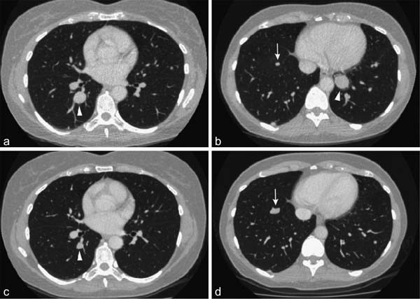

## 도입

질병 진행까지의 시간(Time to progression, TTP)은 환자가 무작위 배정(또는 치료 시작)된 시점부터 객관적인 종양 진행이 처음으로 문서화될 때까지의 시간으로 정의된다. 무진행 생존기간(Progression-Free Survival, PFS)과 달리, TTP는 질병 진행 없이 발생한 사망을 사건(event)으로 간주하지 않고 중도 절단(censoring) 처리한다.

역사적으로 TTP는 항암제 임상시험에서 널리 사용되어 왔으나, 미국 식품의약국(FDA) 및 유럽 의약품청(EMA)과 같은 현대 규제 기관들은 일반적으로 사망을 불리한 사건으로 포괄하는 PFS를 TTP보다 선호한다. 그럼에도 불구하고 특정 임상적 상황에서는 TTP가 고유한 가치를 지니며 특히 암과 무관한 기저 질환으로 인한 경쟁 사망 위험이 높은 환자군이나 세포 증식 억제제(cytostatic agents)의 효능을 평가할 때 중요한 지표로 기능한다.

## TTP와 PFS의 비교 분석

PFS와 TTP의 가장 본질적인 차이는 질병 진행 전 사망의 처리 방식에 있다.

| 특성 | 질병 진행까지의 시간 (TTP) | 무진행 생존기간 (PFS) |
| :--- | :--- | :--- |
| **사건(Event) 정의** | 객관적 종양 진행만 해당 | 객관적 종양 진행 또는 모든 원인에 의한 사망 |
| **진행 전 사망 처리** | 마지막 평가 시점에 중도 절단(Censored) | 사건(Event)으로 처리 |
| **약물 독성 반영** | 독성으로 인한 조기 사망을 직접 반영하지 못함 | 독성 관련 사망이 유효성 손실(사건)로 반영됨 |
| **주요 적용 영역** | 비암성 동반 질환 사망률이 높은 질환, 세포 증식 억제제 | 현대 항암제 3상 확증 임상시험의 표준 대리 평가변수 |

TTP에서 질병 진행 전 사망을 중도 절단하는 것은 잠재적인 비뚤림(bias)을 유발할 수 있다. 예를 들어, 시험약의 독성이 매우 높아 환자가 종양 진행을 경험하기 전에 조기 사망하는 경우, TTP 분석에서는 이 환자들이 단순히 중도 절단되므로 시험약군의 TTP 중앙값이 대조군보다 역설적으로 길어 보이거나 유사해 보이는 왜곡이 발생할 수 있다.

반대로, 독성이 낮고 종양 성장을 효과적으로 억제하는 표적치료제나 세포 증식 억제제의 경우, 고령 환자군이나 중증 간경변을 동반한 간세포암(HCC) 환자군 등에서 비종양성 사망의 잡음(noise)을 제거하고 순수한 항종양 억제 효과를 평가하는 데 TTP가 통찰을 제공하기도 한다.

## Paccagnella 비소세포폐암 임상시험 사례

Paccagnella 등의 진행성 비소세포폐암(NSCLC) 임상시험은 TTP와 PFS의 상호작용 및 해저드 비율(Hazard Ratio, HR) 해석의 복잡성을 보여주는 대표적인 사례이다.

| 평가변수 | 시험군 중앙값 | 대조군 중앙값 | 해저드 비율 (HR) | 95% 신뢰구간 (CI) | P-값 |
| :--- | :--- | :--- | :--- | :--- | :--- |
| **TTP** | 6.2개월 | 4.1개월 | 0.68 | 0.52 - 0.89 | 0.005 |
| **PFS** | 5.4개월 | 3.9개월 | 0.74 | 0.58 - 0.95 | 0.018 |
| **OS** | 10.5개월 | 9.8개월 | 0.88 | 0.69 - 1.12 | 0.29 |

이 연구에서 TTP와 PFS 모두 통계적으로 유의미한 개선을 보였으나, PFS의 중앙값이 TTP보다 짧았는데, 이는 종양 진행 전에 발생한 사망 사건들이 PFS에 포함되었기 때문이다. 또한 전체 생존기간(OS)에서는 유의한 차이가 관찰되지 않았는데, 이는 후속 치료(post-progression crossover therapy)의 영향과 진행 후 생존 기간의 희석 효과에 기인한다.

## Lynparza 난소암 승인 사례

PARP 억제제인 린파자(Lynparza, 성분명 olaparib)의 재발성 난소암 유지요법 임상시험(Study 19)은 규제기관이 TTP 및 PFS 데이터를 바탕으로 승인 결정을 내린 중요한 선례이다.

해당 시험에서는 BRCA 변이 환자 하위군에서 olaparib 투여군이 위약군에 비해 PFS를 유의미하게 연장하였다(HR = 0.18, 95% CI 0.10 - 0.31, P < 0.0001). 이 임상에서는 종양 평가와 함께 혈청 바이오마커인 CA-125의 배제 여부가 논의되었으며 규제 당국은 RECIST 1.1 기반의 독립적 영상 검토(BICR)에 따른 무진행 기간 및 TTP 데이터의 일관성을 검토한 끝에 가속 승인 및 정규 승인으로 이어졌다.

## Park 비소세포폐암 임상시험과 2차 치료 희석 효과

Park 등의 임상시험에서는 진행성 비소세포폐암 환자에서 1차 화학요법 후 유지요법의 효능을 평가하였다.

| 군(Arm) | 환자 수 (N) | 중앙 TTP (개월) | 중앙 OS (개월) | 1년 생존율 (%) |
| :--- | :--- | :--- | :--- | :--- |
| **유지요법군** | 170 | 4.8 | 12.1 | 51.2% |
| **관찰 대조군** | 173 | 2.8 | 11.0 | 45.8% |

통계적 분석 결과 TTP는 유의하게 연장되었으나(HR = 0.61, P = 0.0002), OS의 연장은 통계적 유의성에 도달하지 못하였다(P = 0.35). 대조군 환자의 상당수가 질병 진행 후 유효한 2차 및 3차 항암 요법을 받았기 때문에, 1차 유지요법에 따른 생존 혜택이 후속 치료에 의해 희석(dilution effect)된 전형적인 사례로 평가된다.

## Llovet 간세포암 소라페닙 임상시험

간세포암(HCC) 치료제 소라페닙(sorafenib)의 중추적 3상 임상시험(Llovet et al., SHARP trial)은 세포 증식 억제 약물에서 TTP와 OS의 관계를 명확히 입증한 역사적 연구이다.

간경변을 앓고 있는 간암 환자는 종양 진행뿐만 아니라 간부전, 정맥류 출혈 등 비암성 간질환 합병증으로 사망할 위험이 매우 높다. 따라서 종양 진행만을 순수하게 포착하는 TTP와 모든 원인의 사망을 측정하는 OS가 상호보완적으로 활용되었다.

| 지표 | 소라페닙 투여군 (N=299) | 위약군 (N=303) | 해저드 비율 (HR) | P-값 |
| :--- | :--- | :--- | :--- | :--- |
| **중앙 TTP** | 5.5개월 | 2.8개월 | 0.58 (95% CI 0.45 - 0.74) | < 0.001 |
| **중앙 OS** | 10.7개월 | 7.9개월 | 0.69 (95% CI 0.55 - 0.87) | < 0.001 |
| **질병조절률 (DCR)** | 43% | 32% | - | 0.002 |
| **객관적 반응률 (ORR)** | 2% (7명, 모두 PR) | 1% (2명, 모두 PR) | - | 0.19 |

SHARP 시험에서 주목할 점은 객관적 반응률(ORR)이 소라페닙군에서 단 2%에 불과했음에도 불구하고, TTP가 2.8개월에서 5.5개월로 2배 가까이 연장되었으며, 이것이 전체 생존기간(OS)의 통계적으로 유의한 연장(10.7개월 vs 7.9개월, HR 0.69)으로 직결되었다는 점이다. 이는 세포 증식 억제제가 종양의 축소(shrinkage)를 유도하지 않더라도 종양 성장을 지연(growth arrest)시킴으로써 환자의 생존을 실질적으로 연장할 수 있음을 완벽하게 증명하였다.

## 소규모 2상 시험에서의 TTP 평가: McDermott 흑색종 시험

McDermott 등의 전이성 흑색종 2상 무작위 임상시험에서는 표본 크기가 작을 때 TTP 해저드 비율 추정의 변동성을 보여준다.

| 치료군 | 등록 환자 수 | 중앙 TTP (개월) | TTP 해저드 비율 (HR) | 95% CI |
| :--- | :--- | :--- | :--- | :--- |
| **치료 A군** | 48 | 3.1 | 1.02 | 0.68 - 1.54 |
| **치료 B군** | 46 | 3.0 | - | - |

표본 크기가 작은 조기 임상시험에서는 사건 발생 건수가 충분하지 않아 신뢰구간이 넓어지며 치료 효과가 미미할 경우 HR이 1.0 전후로 수렴하여 두 군 간의 차이를 식별하기 어렵다. 따라서 2상 시험에서 TTP를 1차 평가변수로 설정할 때는 적절한 검정력(power) 계산과 중도 절단 패턴에 대한 엄밀한 사전 정의가 필수적이다.

## Cappuzzo 비소세포폐암 시험: EGFR FISH 바이오마커

Cappuzzo 등은 비소세포폐암 환자에서 게피티닙(gefitinib) 치료 시 EGFR 유전자 복제수(EGFR gene copy number, FISH 양성 여부)가 TTP에 미치는 예측적 가치를 규명하였다.

| 바이오마커 군 | 환자 수 (N) | 중앙 TTP (개월) | TTP 해저드 비율 (HR) | P-값 |
| :--- | :--- | :--- | :--- | :--- |
| **EGFR FISH 양성** | 45 | 7.6 | 0.44 (95% CI 0.28 - 0.69) | < 0.001 |
| **EGFR FISH 음성** | 57 | 2.7 | 1.00 (참조) | - |

EGFR FISH 양성 환자군은 게피티닙 치료 시 TTP가 현저히 연장되었으며 이는 TTP가 적절한 분자 바이오마커와 결합될 때 표적 치료제의 수혜 대상을 선별하는 강력한 대리 지표로 작동함을 입증한다.

## 규제적 시각 및 결론

TTP는 약물의 항종양 억제 활성을 질병 진행의 관점에서 직접적으로 파악할 수 있는 유용한 평가변수이지만 진행 전 사망을 중도 절단함으로써 생길 수 있는 비뚤림의 가능성 때문에 현대 항암제 확증 임상시험(pivotal Phase 3 trials)에서는 대부분 PFS로 대체되었다.

그러나 질병 자체의 진행 외에 비종양성 원인에 의한 기저 사망률이 높은 질환(예: 간경변 동반 간세포암)이나, 후속 치료가 극도로 제한되어 진행 사건 자체가 환자의 임상 경과를 좌우하는 특정 세팅에서는 여전히 중요한 2차 또는 탐색적 평가변수로 그 가치를 유지하고 있다.

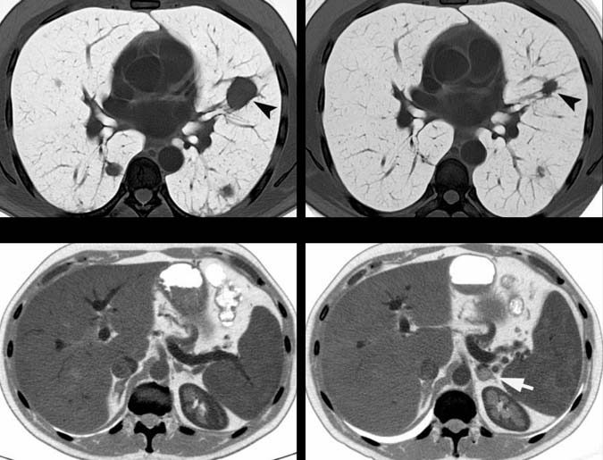

# 제14장 종양학 평가변수: 질병 진행까지의 시간 (TTP) (계속) 및 제15장 종양학 평가변수: 무병 생존기간

## X. 방법론적 팁 - "중앙값" 시간을 통합하는 평가변수 활용의 이점

Cappuzzo 등(34)의 데이터는 표 14.4에 표시된 바와 같이 전체 생존기간(OS) 평가변수에 대해 불완전하였다. 저자들은 "중앙 추적관찰 기간이 생존 결과의 유의미한 차이를 검정하기에는 너무 짧았다"고 설명하였다.

그렇다면 임상시험 추적 기간이 전체 생존기간 중앙값을 계산하기에는 너무 짧으면서도, TTP 중앙값을 계산하기에는 충분히 길 수 있는 이유는 무엇일까? 이는 평균(mean)과 중앙값(median)의 통계적 특성과 밀접하게 관련된다.

평균을 계산하려면 모든 데이터 포인트의 수집이 필요하다. 따라서 임상시험 맥락에서 평균 생존 기간을 계산하려면 모든 대상자가 사망할 때까지 수십 년을 기다려야 할 수도 있다. 반면 중앙 생존 기간 계산은 대상자의 절반(50%)이 해당 평가변수에 도달할 때까지만 기다리면 된다. 중앙값은 관찰값의 절반은 그보다 작고 절반은 그보다 큰 중간 관찰 지점이다(35). 일반적으로 종양학 임상시험에서 중앙 TTP는 종양 진행이 대개 사망의 전제 조건이기 때문에 중앙 생존 기간보다 훨씬 이른 시점에 도달한다.

```
누적 진행 환자 비율 (%)
 ^
 |             EGFR 음성
 |            /
 |           /
 |          /   EGFR 양성
 |         /   /
 |        /   /
 |       /   /
 |      /   /
 +-------------------------> 시간 (Time)
```

**그림 14.3** 카플란-마이어(Kaplan-Meier) 곡선의 모식도 표현. 단일 군 연구로 모든 환자가 게피티닙(gefitinib)을 투여받았다. 두 곡선은 EGFR 발현이 높은 25명의 하위군(FISH 양성)의 TTP와 EGFR 발현이 낮은 11명의 하위군(FISH 음성)의 TTP를 보여준다.

***

## XI. 요약

지금까지 제시된 내용을 요약하면 다음과 같다:
1. **Cappuzzo 등(36)의 연구**: 임상시험의 추적 관찰 기간이 비교적 짧은 경우, TTP가 전체 생존기간 평가변수에 비해 이점을 가질 수 있음을 보여준다.
2. **McDermott 등(37)의 연구**: 등록된 대상자 수가 적은 상황에서 TTP가 전체 생존기간보다 조기에 신호를 탐지하는 이점을 가질 수 있음을 나타낸다.
3. **Llovet 등(38)의 논평**: 간경변 등 암 이외의 건강 요인으로 인한 사망이 빈번한 상황에서 TTP가 전체 생존기간 평가변수에 비해 장점을 가질 수 있음을 보여준다.
4. **Park 등(39)의 연구**: 대상자가 질병 진행 후 2차 치료를 광범위하게 받는 임상 양상에서, TTP가 전체 생존기간의 치료 효과 희석을 극복하는 이점을 가질 수 있음을 입증한다.

***

## XII. 생존 바이오마커로서의 티미딘 포스포릴라아제 - Meropol 연구

대장암 환자를 대상으로 한 연구에서 Meropol 등(40)은 모든 환자에게 이리노테칸(irinotecan)과 카페시타빈(capecitabine) 병용 화학요법을 투여하였다.

카페시타빈은 세포 내에서 티미딘 포스포릴라아제(thymidine phosphorylase) 효소에 의해 활성형인 5-플루오로우라실(5-FU)로 전환되는 독특한 전구약물이다. 이 효소는 대장암 세포에서 정상 조직에 비해 우선적으로 과발현되므로, 카페시타빈의 세포독성 효과가 정상 조직보다는 암세포에 선택적으로 집중된다. 카페시타빈의 유효성은 5-FU와 유사하며 볼루스(bolus) 5-FU보다는 독성이 적고 지속 정맥 주입(infusional) 5-FU와 유사한 독성 프로파일을 보인다(41).

이 연구의 목적은 티미딘 포스포릴라아제의 발현도와 임상적 치료 결과 간의 상관관계를 평가하는 것이었으며 따라서 이는 **예측 바이오마커(predictive biomarker)**에 대한 연구였다(예측 바이오마커와 예후 바이오마커의 상세한 차이는 제19장에서 다룬다).

### 표 14.5 Meropol 연구 결과

| 평가변수 | 원발 종양 생검 티미딘 포스포릴라아제 양성 (+) | 원발 종양 생검 티미딘 포스포릴라아제 음성 (-) | 전이 종양 생검 티미딘 포스포릴라아제 양성 (+) | 전이 종양 생검 티미딘 포스포릴라아제 음성 (-) |
| :--- | :--- | :--- | :--- | :--- |
| **중앙 TTP** | 8.7개월 | 6.0개월 | 8.7개월 | 5.4개월 |
| **중앙 전체 생존기간 (OS)** | 28.2개월 | 14.9개월 | 26.2개월 | 9.8개월 |

연구 결과, 티미딘 포스포릴라아제의 발현 증가는 TTP의 연장을 예측하는 우수한 지표였으며 전체 생존기간의 극적인 연장을 예측하는 강력한 바이오마커임이 입증되었다.

전체 52명의 환자 모두가 원발 종양 조직 생검을 제공하였으나, 진단 당시 원격 전이 병변이 확인된 환자는 30명이었다(대부분 간, 폐, 림프절 전이). 따라서 전이 종양의 바이오마커 발현과 평가변수의 상관관계는 이 30명의 환자 데이터를 바탕으로 분석되었다.

이러한 발견을 바탕으로, 단순한 PCR 기반 RNA 측정법이나 항체 기반 단백질 발현 분석으로 종양 내 티미딘 포스포릴라아제 수치를 검사하여 카페시타빈과 5-FU 중 최적의 약제를 합리적으로 선택해야 한다는 임상적 제언이 대두되었다(42).

***

## XIII. 카페시타빈을 포함하는 약물 병용 요법

Meropol 등(43)의 연구는 이리노테칸과 카페시타빈 병용 요법을 다루었다. 또 다른 대장암 임상시험에서 Petrioli 등(44)은 카페시타빈과 옥살리플라틴(oxaliplatin)의 다른 조합을 투여하였을 때도 티미딘 포스포릴라아제의 높은 발현이 양호한 임상 반응과 상관관계가 있음을 확인하였다.

종양학에서 병용 요법의 흔한 사용과 2제 요법 중 한 약제를 교체하는 결정은 **상승작용(synergy)**에 대한 논의를 촉발한다. 여기서 상승작용이란 유효성 측면에서 단순 가산 효과(additive effect)를 초과하는 효과를 의미하며 독성 측면에서도 단순 가산 이상의 부작용이 나타날 수 있음을 함의한다.

Aprile 등(45)은 탁산계(taxane) 약물이 종양 세포 내 티미딘 포스포릴라아제의 발현을 자극하며 이러한 유도 작용이 카페시타빈과 탁산 병용 요법의 항종양 활성을 극대화하는 기전이라고 보고하였다. Kikuno 등(46) 역시 탁산 제제인 파클리탁셀(paclitaxel, 주목나무에서 추출된 천연물 유래 항암제) 투여 시 이 효소가 유도됨을 보고하였다.

***

## XIV. 방법론적 팁 - mRNA 발현 변화가 폴리펩타이드(단백질) 발현 변화로 직결되는가?

Meropol 등(47)은 폴리펩타이드를 검출하는 면역학적 분석법과 발현된 mRNA를 측정하는 PCR 분석법을 병행하여 티미딘 포스포릴라아제의 발현을 측정하였다.

일반적으로 연구자들은 mRNA 발현 변화가 폴리펩타이드 단백질 수준의 변화와 상관관계를 갖기를 기대한다. 그러나 mRNA의 증가가 반드시 이에 상응하는 단백질의 증가로 이어진다고 단정해서는 안 된다. Pennica 등(48), Haynes 등(49), Hu 등(50), Oh 등(51), Schantz와 Pegg(52), Anderson과 Seilhamer(53)는 폴리펩타이드 발현 증가가 mRNA 발현 증가와 일치하는지에 대한 상반된 증거들을 제시하였다.

예를 들어 Fu 등(54)은 mRNA 수준과 단백질 수준 사이에 상관관계가 전혀 존재하지 않는 시나리오를 명확히 입증하였다. 따라서 바이오마커 분석을 수행할 때는 전사체(mRNA) 데이터와 번역체(단백질) 데이터의 일치 여부를 신중히 검증해야 한다(55).

***

## XV. 결론

질병 진행까지의 시간(TTP) 평가변수는 환자의 생존 시간을 직접적으로 고려하지 않으며 특정 개별 환자나 연구 집단 전체의 생존 척도가 아니다.

그러나 평가변수로서 TTP는 생존 시간을 반영하는 평가변수들에 비해 몇 가지 분명한 장점을 지닌다:
1. **조기 데이터 확보**: 전체 생존기간보다 훨씬 이른 시점에 데이터를 수집할 수 있어 임상시험이 공식적으로 종료되기 전에 약물의 효능 결론에 도달할 수 있다.
2. **탈락 환자 및 조기 사망 영향 최소화**: 다수의 환자가 사망 평가변수를 유발하기 전에 시험에서 탈락하거나 추적 소실되는 경우 유용하다.
3. **2차 치료 교란 배제**: 연구 대상자가 질병 진행 후 연구를 종료하고 강력한 2차 치료를 받을 때 발생하는 희석 효과를 배제한다.
4. **비암성 사망 분리**: 간경변 등 암과 무관한 질환으로 인한 조기 사망의 잡음을 걸러내고 순수한 종양 억제 효과를 평가할 수 있다.

또한 임상시험을 설계할 때는 사전에 어떤 평가변수가 가장 통계적으로 유의미한 결과를 도출할지 예측하기 어려우므로, 단일 평가변수에 의존하기보다는 상호보완적인 복수의 평가변수를 다각도로 포함하는 것이 권장된다.

***
***

# 제15장 종양학 평가변수: 무병 생존기간 (DFS)

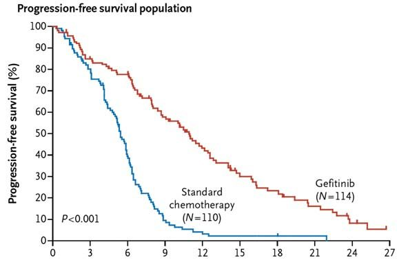

## I. 도입

무병 생존기간(Disease-Free Survival, DFS)은 종양을 외과적으로 완전히 절제하거나 1차 유도 화학요법 등으로 완전 관해(CR)를 달성하여 신체 내에 측정 가능한 암이 완전히 사라진 환자를 대상으로 평가하는 대표적인 종양학 평가변수이다.

Wee 등(4)은 비인두암 임상시험에서 DFS의 측정 기준에 대해 다음과 같이 기술하였다:
> "DFS의 시작점은 무작위 배정일이었으며 종료점은 질병의 재발이 처음 발생한 날짜 또는 지속적인 질병 및 기타 원인으로 인한 사망일이었다."

임상시험 데이터에서 특정 약물이 수년간의 DFS 연장을 입증했을 때, 해당 환자가 실제로 **완치(cure)**되었다고 결론 내릴 수 있는지에 대한 의문이 제기된다. 이에 대해 Pui(5)는 급성 림프모구 백혈병(ALL) 연구에서 중요한 관점을 제시하였다. 어떤 약물이 약 90%의 시험 대상자에서 3년 이상의 DFS를 달성하더라도, 진정한 완치가 이루어졌는지를 확증하기 위해서는 추가로 수년간의 장기 추적 관찰 기간이 반드시 필요하다.

***

## II. DFS와 PFS의 본질적 차이

임상시험 프로토콜의 일환으로 환자의 종양이 수술을 통해 완전히 제거된 경우, 임상의는 무진행 생존기간(PFS)과 무병 생존기간(DFS) 중 어떤 평가변수를 사용하는 것이 적절한지 고심할 수 있다. 수술 직후에는 모든 대상자가 무병(disease-free) 상태로 간주되며 진행이나 재발이 감지되는 순간을 기다리는 상태가 되므로, 이 상황에서는 두 평가변수의 결과가 사실상 동일하게 나타날 수 있다(6).

그러나 근본적으로 PFS와 DFS는 서로 다른 임상적 의미를 내포한다:
- **무진행 생존기간 (PFS)**: 일반적으로 진행성 또는 전이성 암(advanced or metastatic disease) 환자를 대상으로 사용된다. 즉, 1차 치료가 완전 관해에 도달하지 못해 기저 시점(baseline)에 여전히 측정 가능한 종양이 남아 있고 이 잔류 종양이 향후 진행할 운명에 처해 있는 상황에서 적용된다(7, 8).
- **무병 생존기간 (DFS)**: 기저 시점에 질병의 증거가 완전히 없는(no evidence of disease at baseline) 조기 암 환자나 수술 후 보조요법(adjuvant therapy) 환자를 대상으로 사용된다(8, 9). 재발 없는 생존기간(Relapse-Free Survival, RFS)과 유사한 맥락으로 사용된다.

유방암 연구의 권위자인 Miguel Martin 박사에 따르면, DFS는 조기 유방암의 수술 후 보조요법 임상시험에서 궁극적 목표인 전체 생존기간(OS)의 우수한 대리 지표로 널리 인정받는 표준 1차 평가변수이다(10). 유방암에서 DFS 사건은 원격 전이, 국소 재발, 구역 재발 등을 포괄한다. 반면 PFS는 기저 시점에 진행성 암을 가진 전이성 유방암 임상시험에 한하여 엄격히 적용되어야 한다(11).

***

## III. 평가변수 명칭 "DFS"의 모호성과 기산점 문제

통상적으로 임상시험의 평가변수는 **무작위 배정일(date of randomization)**로부터 기산된다. 그러나 수술 전 무작위 배정을 시행하는 경우, 무작위 배정 시점부터 DFS를 계산하는 것은 논리적인 모순(contradiction)을 야기한다. 등록 시점에 환자는 체내에 종양을 가지고 있으므로 엄밀히 말해 "무병(disease-free)" 상태가 아니기 때문이다. 대상자는 수술을 통해 육안적 종양이 완전히 절제된 후에야 비로소 무병 상태가 된다.

Sally Stenning 박사는 이에 대해 다음과 같이 지적하였다:
> "엄밀한 의미에서 무병 생존기간은 시간 원점(time origin)에서 질병이 전혀 없는 환자에게만 적용될 수 있다. 따라서 수술 후 완전히 질병이 제거된 환자를 대상으로 하는 보조요법 임상시험에서 적절한 결과 척도가 된다(12)."

유방암이나 대장암의 수술 후 보조요법 임상시험처럼 등록 시점에 이미 수술을 마치고 거시적으로 질병이 없는 환자군에서는 무작위 배정일로부터 기산하는 DFS가 정확하고 타당하다(13).

등록과 수술 사이의 간격이 매우 짧고 첫 번째 사건 발생까지의 기간이 길다면 이러한 모순이 결과에 미치는 영향은 미미할 수 있다. 그러나 엄밀한 방법론을 유지하고 모순을 피하기 위해 연구자들은 수술 후 시점을 DFS의 기산점으로 설정해야 한다.

Allum 등(14, 15)은 식도암 임상시험에서 다음과 같이 프로토콜을 설계하였다:
> "전체 생존기간(OS)은 무작위 배정일로부터 모든 원인에 의한 사망일까지로 계산되었으며 생존 환자는 마지막 생존 확인일에 중도 절단되었다. 반면 무병 생존기간(DFS)은 두 군 간의 수술 타이밍 차이를 보정하기 위해 무작위 배정 후 6개월 시점의 랜드마크(landmark) 시간으로부터 계산되었다."

Rothmann 등(16) 또한 이를 명확히 정리하였다:
> "완전 절제된 질병(resected disease)에 대해 빈번히 사용되는 규제 승인 평가변수는 무병 생존기간(DFS)이다. 반면 절제되지 않은 진행성 질병(unresected disease)에 대해 신속 승인 또는 정규 승인에 사용되어 온 핵심 평가변수는 무진행 생존기간(PFS)이다."

***

## IV. 무병 생존기간의 신속성: Romond 유방암 보조요법 임상시험

Romond 등(17)은 수술적 완전 절제를 마친 HER2 과발현 조기 유방암 여성을 대상으로 트라스투주맙(trastuzumab, 상품명 허셉틴)의 효능을 평가하는 대규모 보조요법 3상 임상시험을 수행하였다. 원격 전이가 있는 환자는 등록에서 제외되었다.

- **A군 (대조군)**: 독소루비신 + 시클로포스파미드 투여 후 파클리탁셀 투여 (AC $\to$ T)
- **B군 (시험군)**: 독소루비신 + 시클로포스파미드 투여 후 파클리탁셀 및 트라스투주맙 병용 투여 (AC $\to$ TH)

DFS 사건은 국소 재발, 구역 재발, 원격 재발, 반대측 유방암(상피내암 포함), 기타 2차 원발암, 재발 전 모든 원인의 사망으로 정의되었다.

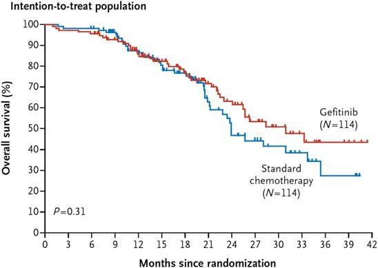

### 표 15.1 Romond 임상시험 결과 요약

| 평가변수 | 대조군 (A군) | 트라스투주맙군 (B군) | 해저드 비율 (HR) | 통계적 유의성 |
| :--- | :--- | :--- | :--- | :--- |
| **3년 무병 생존율 (DFS)** | 75.4% (261건 사건) | 87.1% (133건 사건) | HR = 0.48 | P < 0.0001 |
| **3년 전체 생존율 (OS)** | 91.7% (92건 사망) | 94.3% (62건 사망) | HR = 0.67 | P = 0.015 |

DFS 결과는 중앙값이 아닌 특정 시점(3년)의 무병 생존율로 표현되었다.

```
(a) 무병 생존율 (DFS)                    (b) 전체 생존율 (OS)
100% +-----------------------------      100% +-----------------------------
     |       \ 트라스투주맙 (87.1%)            |       \ 트라스투주맙 (94.3%)
 90% |        \                                90% |        \ 대조군 (91.7%)
     |         \ 대조군 (75.4%)                80% |
 80% |                                             |
     |   HR = 0.48, P < 0.0001                     |   HR = 0.67, P = 0.015
 70% +-----------------------------       70% +-----------------------------
     0   1   2   3   4   5 (년)                0   1   2   3   4   5 (년)
```

**그림 15.1** Romond 연구의 카플란-마이어 생존 곡선:
- **(a) DFS 결과**: 트라스투주맙 추가 시 조기부터 곡선이 극적으로 분리되어 뚜렷한 재발 억제 이점을 입증함.
- **(b) OS 결과**: 트라스투주맙 투여군이 우수한 생존율을 보이지만 초기에는 두 군의 생존 곡선이 거의 겹치며 약 4년 이상이 경과한 후에야 통계적 차이가 가시화됨.

이 연구는 보조요법 임상시험에서 DFS가 OS보다 훨씬 조기에 치료 효과를 명확하게 규명할 수 있는 강력한 평가변수임을 증명한다.

***

## V. 하위군 분석에서의 무병 생존기간: Hayes 유방암 임상시험

Hayes 등(18)은 림프절 양성 유방암 환자에서 독소루비신 + 시클로포스파미드 병용요법(A군) 대비 파클리탁셀 추가 병용요법(B군)의 효능을 평가하였다. 모든 환자는 임상시험 시작 전 수술적 절제를 완료하여 무병 상태였다.

연구진은 환자의 종양 생검 조직에서 HER2 발현 여부(면역조직화학염색 3+ 강도 50% 이상)에 따른 하위군 분석을 수행하였다.

- **HER2 음성 하위군 (그림 15.2a)**: 파클리탁셀 추가군과 대조군의 DFS 카플란-마이어 곡선이 거의 겹치며 임상적으로 유의미한 이점을 보이지 못함.
- **HER2 양성 하위군 (그림 15.2b)**: 파클리탁셀을 추가한 군에서 DFS 곡선이 대조군과 극적으로 분리되며 현저한 재발 위험 감소를 나타냄.

이 결과는 세포독성 항암제인 탁산 제제조차도 특정 분자 아형(HER2 과발현) 환자군에서 차별화된 치료 반응을 유도할 수 있음을 보여주며 DFS가 분자 표적 하위군 분석에서 결정적인 분별력을 제공함을 입증한다.

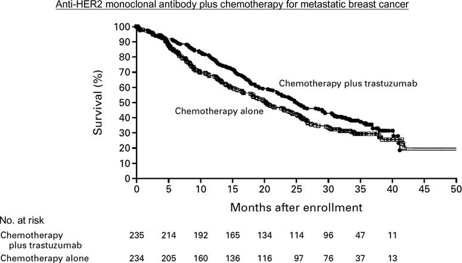

# 제15장 종양학 평가변수: 무병 생존기간 (DFS) (계속) 및 제16장 종양학 평가변수: 원격 전이까지의 시간

## V. 하위군 분석에서의 무병 생존기간 (계속)

Hayes 등의 연구는 유방암 환자에서 파클리탁셀(paclitaxel) 추가 요법의 효과를 에스트로겐 수용체(ER) 상태에 따라 더욱 심층적으로 분석하였다(20, 21).

HER2 음성 환자(파클리탁셀에 전반적으로 반응이 낮았던 군)만을 대상으로 조직 생검의 ER 음성군과 ER 양성군으로 나누어 DFS를 비교하였을 때 극적인 대조가 관찰되었다.
- **ER 음성 하위군**: 파클리탁셀 추가 시 DFS가 통계적으로 매우 유의미하게 개선되었다(P = 0.002).
- **ER 양성 하위군**: 파클리탁셀 추가에 따른 유의한 DFS 개선이 전혀 관찰되지 않았다(P = 0.71).

이 분석이 임상의 및 연구자에게 주는 핵심 교훈은 다음과 같다:
1. **DFS의 전제 조건**: 임상시험 시작 시점에 모든 환자가 완전 절제를 거쳐 질병이 없는(disease-free) 상태로 간주될 때 DFS가 가장 정확한 평가변수로 기능한다.
2. **독성 약물 불필요 노출 방지**: 파클리탁셀에 반응하지 않는 특정 하위군(HER2 음성 및 ER 양성 환자)을 선별함으로써 환자들을 불필요한 독성 노출로부터 보호할 수 있다.
3. **작용 기전의 심층적 의문**: 파클리탁셀과 같은 저분자 화합물이 직접적인 표적이 아닌 HER2나 ER과 같은 수용체 발현 수준에 따라 어떻게 차별적 효능을 나타내는지에 대한 생물학적 기전 연구의 중요성을 시사한다.

***

## VI. 직장암의 선행화학요법 대 보조요법 - Roh 연구

Roh 등(22)은 국소 진행성 직장암 환자를 대상으로 수술 전 항암화학방사선요법(선행요법; neoadjuvant)과 수술 후 항암화학방사선요법(보조요법; adjuvant)의 효능을 비교하는 무작위 3상 임상시험(NSABP R-03)을 수행하였다.

- **A군 (선행요법군)**: 5-FU 투여 $\to$ 방사선 + 5-FU 병용 $\to$ 근치적 수술 $\to$ 유지 5-FU 화학요법
- **B군 (보조요법군)**: 근치적 수술 $\to$ 5-FU 투여 $\to$ 방사선 + 5-FU 병용 $\to$ 유지 5-FU 화학요법

이 연구에서 DFS는 무작위 배정 시점부터 국소 재발, 2차 원발암(피부 기저세포암 및 자궁경부 상피내암 제외), 또는 재발이나 2차 원발암의 증거가 없는 사망 중 가장 먼저 발생하는 시점까지로 정의되었다.

선행요법군의 경우 등록 시점에 직장암 종양이 체내에 존재하여 엄밀한 의미의 "무병" 상태는 아니었으나(23), 이는 용어상의 문제일 뿐 결과 해석에는 영향을 미치지 않았다. 모든 환자는 7년간 추적 관찰되었다.

### 주요 결과
- **무병 생존기간 (DFS)**: 선행요법군은 보조요법군에 비해 DFS가 유의미하게 우수하였다(HR = 0.629, P = 0.011).
- **전체 생존기간 (OS)**: 선행요법군이 개선 경향을 보였으나 통계적 유의성 경계선에 머물렀다(HR = 0.693, P = 0.065).

이 결과는 수술 전 종양의 크기를 줄이고 미세 전이를 조기에 통제하는 선행 항암화학방사선요법이 수술 후 보조요법보다 종양학적 제어에서 우월함을 명확히 입증하였다. 또한 전체 생존기간(OS)보다 DFS에서 통계적 유의성이 훨씬 뚜렷하게 관찰되어 복수의 평가변수를 병행 설정하는 임상 설계의 중요성을 재확인시켜 준다.

***

## VII. 효능이 동등할 때 삶의 질을 개선하는 치료법 선택 - Ring 연구

Ring 등(24)은 조기 유방암 환자에서 선행 화학요법 후 임상적 완전 관해(complete clinical remission)를 달성한 환자들을 대상으로 수술의 필요성을 평가하였다.

- **A군**: 선행 화학요법 후 표준 유방 수술 시행
- **B군**: 선행 화학요법 단독 (수술 생략)

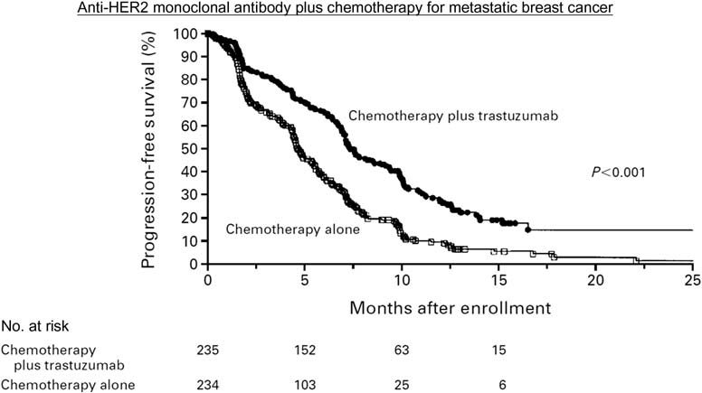

### 표 15.2 Ring 임상시험 결과

| 치료군 | 5년 DFS (%) | 10년 DFS (%) (P=0.7) | 5년 OS (%) | 10년 OS (%) (P=0.9) |
| :--- | :--- | :--- | :--- | :--- |
| **화학요법 후 수술군** | 64% | 52% | 74% | 60% |
| **화학요법 단독군 (수술 없음)** | 61% | 46% | 76% | 70% |

두 군 간에 5년 및 10년 시점의 DFS 및 OS 모두 통계적으로 유의미한 차이가 관찰되지 않았다(큰 P-값). 

이 연구는 두 치료법 간의 유효성(효능)에 차이가 없을 때, 치료 선택의 기준이 **안전성(safety)** 및 **삶의 질(Quality of Life, QoL)**로 전환된다는 중요한 원칙을 보여준다(25). 수술을 생략할 경우 만성 상지 림프부종, 통증, 장액종(seroma) 형성(26), 창상 감염 등의 수술 합병증을 피할 수 있고 유방 보존에 따른 심리적·미용적 만족도를 극대화할 수 있다.

***

## VIII. 예후 바이오마커 검증을 위한 DFS 및 OS의 활용 - Bepler 폐암 연구

Bepler 등(27)은 비소세포폐암(NSCLC) 환자의 수술 검체 조직에서 **RRM1** 및 **PTEN** 유전자 발현이 환자의 예후에 미치는 영향을 탐색군(exploratory set)과 전향적 검증군(validation set, 77명)으로 나누어 분석하였다. 모든 환자는 수술 단독 치료를 받아 항암제나 방사선에 의한 유전자 발현 변화 가능성을 원천 배제하였다.

### 결과
1. **RRM1 고발현 vs 저발현**: 중앙 생존기간 52개월 vs 24개월 (HR = 0.452, P = 0.013)
2. **PTEN 고발현 vs 저발현**: 중앙 생존기간 62개월 vs 23개월 (HR = 0.469, P = 0.011)

카플란-마이어 곡선 분석에서 DFS 평가변수는 임상시험 시작 후 **10개월** 만에 고발현군과 저발현군 간의 명확한 곡선 분리를 포착하였다. 반면 전체 생존기간(OS)은 약 **20개월**이 경과한 후에야 두 군의 분리가 가시화되었다(28, 29).

이 연구는 DFS가 신규 바이오마커의 예후적 가치를 신속하게 검증하는 데 매우 민감하고 강력한 평가 도구임을 보여준다.

***

## IX. DFS 평가변수에 대한 FDA의 규제적 의사결정 프로세스

트라스투주맙(Herceptin) 유방암 보조요법 생물의약품 허가신청서(BLA 103792, 2008년 5월 22일) 검토 보고서는 규제기관이 DFS를 어떻게 평가하고 재계산하는지를 명확히 보여준다.

당시 임상시험의 1차 평가변수는 DFS, 2차 평가변수는 OS였다. FDA의 가이드라인에 따르면 DFS는 일반적으로 "무작위 배정일로부터 종양 재발 또는 모든 원인의 사망일까지의 시간"으로 정의된다(30).

FDA 심사관은 의뢰자(스폰서)가 정의한 DFS 복합 평가변수에 **"2차 원발암 발생일(second primary cancer)"**이 포함된 점을 문제 삼았다. 심사관은 유방암과 무관한 2차 원발암(예: 대장암, 자궁내막암 등)은 유방암에 대한 약물 유효성 사건으로 간주될 수 없다고 판단하였다. 이에 따라 FDA는 2차 원발암 중 다른 원발성 유방암을 제외한 비유방 2차 원발암을 사건에서 제외하고 독자적인 정의에 따라 DFS 효능 결과를 재계산(recalculation)하였다(31).

이 사례는 의뢰자가 임상시험을 개시하기 전에 규제 당국과의 사전 협의(End-of-Phase 2 미팅 등)를 통해 평가변수의 세부 구성 요소(composite endpoint components)를 공식적으로 합의하는 것이 얼마나 중요한지 보여준다.

***

## X. 요약

1. **Romond 연구**: 트라스투주맙 보조요법이 대조군 대비 현저한 재발 위험 감소를 유도하며 DFS가 OS보다 훨씬 조기에 극적인 유효성 결과를 제공함을 실증함.
2. **Roh 연구**: 직장암에서 수술 전 선행화학방사선요법이 수술 후 보조요법보다 우수한 DFS 결과를 보임.
3. **Ring 연구**: 효능이 대등할 때 수술을 생략함으로써 삶의 질과 안전성을 극대화하는 치료 결정 모델을 제시함.
4. **Bepler 연구**: RRM1 및 PTEN 바이오마커의 예후적 가치를 DFS가 OS보다 훨씬 신속하게 판별할 수 있음을 검증함.

***
***

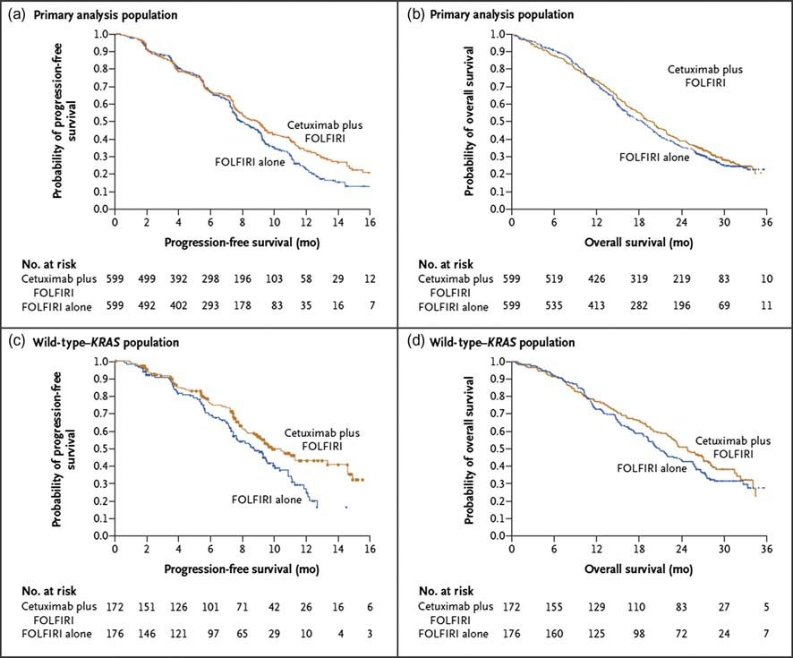

# 제16장 종양학 평가변수: 원격 전이까지의 시간 (TDM)

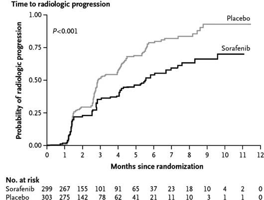

## I. 도입 및 개념

원격 전이까지의 시간(Time to Distant Metastasis, TDM)은 환자가 무작위 배정된 시점부터 원발 부위나 구역 림프절을 벗어난 신체의 원격 장기(폐, 간, 뼈, 뇌 등)로 암이 전이된 것이 최초로 객관적 영상이나 생검을 통해 확인될 때까지의 시간으로 정의된다.

원격 전이는 대부분의 고형암 환자에서 궁극적인 사망을 유발하는 치명적인 병태생리학적 사건이므로, TDM은 질병의 원격 확산을 억제하는 국소 또는 전신 요법의 효능을 특이적으로 평가하는 매우 중요한 종양학 평가변수이다. 기저세포암(5, 6, 7)이나 섬유종증(8)과 같이 전이가 극히 드문 암종에서는 거의 사용되지 않지만 비인두암, 전립선암, 유방암 등 원격 전이 위험이 높은 악성종양에서는 핵심적인 평가 척도가 된다.

## II. 전체 생존기간보다 조기에 확보되는 TDM 데이터 - Wee 비인두암 연구

Wee 등(9)은 방사선 치료 반응률이 높지만 원격 전이 재발이 흔한 진행성 비인두암 환자를 대상으로 방사선 단독요법(A군, 110명)과 시스플라틴 + 5-FU 화학방사선 병용요법(B군, 111명)의 효능을 비교하였다.

6년간의 추적 관찰 기간 동안:
- **원격 전이 재발**: 방사선 단독군 38명 vs 화학방사선 병용군 18명
- **국소 재발**: 방사선 단독군 10명 vs 화학방사선 병용군 9명

TDM은 국소 재발을 배제하고 오직 원격 전이 사건만을 측정하였다.

### 결과
- **2년 시점 TDM 누적 발생률 (그림 16.1)**: 방사선 단독군 30% vs 화학방사선 병용군 13% (P = 0.0029)
- **전체 생존기간 (OS) (그림 16.2)**: 2년 생존율은 단독군 78% vs 병용군 85%로 차이가 미미했으나, 3년 시점에서는 65% vs 80%로 차이가 벌어졌으며 장기 생존 위험비는 HR = 0.51 (P = 0.0061)로 유의하였다.

```
원격 전이 누적 발생률 (%)
 ^
40% |             A군 (방사선 단독) [30%]
    |            /
20% |           /      B군 (방사선 + 화학요법) [13%]
    |          /______/
 0% +----------------------------> 시간 (년)
    0     1     2     3     4
```

**그림 16.1** TDM 카플란-마이어 발생률 곡선의 모식도. 화학방사선 병용군에서 원격 전이 발생률이 현저히 억제됨 (P = 0.0029).

```
누적 전체 생존율 (%)
 ^
100% +---------------------------
     |      \______ B군 (방사선 + 화학요법) [85%]
 80% |             \______ A군 (방사선 단독) [78%]
     |
 60% |      HR = 0.51, P = 0.0061
     +---------------------------> 시간 (년)
     0     1     2     3     4
```

**그림 16.2** 전체 생존기간(OS) 카플란-마이어 곡선의 모식도.

이 연구는 TDM이 치료 개입 후 단 2년 만에 두 군의 효능 차이를 극명하게 보여줌으로써, 전체 생존기간의 차이가 나타나기까지 걸리는 시간(3~6년)을 크게 단축할 수 있음을 실증하였다.

***

## III. 전체 생존기간에서 차이가 없더라도 유효성을 입증하는 TDM - Roach 전립선암 연구

Roach 등(10)은 국소 진행성 전립선암 환자를 대상으로 방사선 단독요법 대비 호르몬 차단 요법(고세렐린 + 플루타미드 병용 ADT 요법) 추가의 효능을 평가한 RTOG 8610 3상 임상시험을 수행하였다(11).

이 연구에서는 장기 추적 관찰 결과 전체 생존기간(OS)에서 통계적 유의성에 도달하기 어려운 조건에서도, 원격 전이까지의 시간(TDM)에서는 병용요법군이 원격 전이를 극적으로 지연시키고 발생률을 유의미하게 억제함을 증명하였다. 이는 질병 진행 후 환자들이 다양한 구제 요법(salvage therapies)을 받음으로써 생존기간이 연장되어 OS의 차이가 희석되는 전형적인 전립선암 임상 세팅에서 TDM이 치료제의 특이적 항전이 효과를 온전히 평가할 수 있는 독보적인 평가변수임을 증명한다.

# 제16장 종양학 평가변수: 원격 전이까지의 시간 (TDM) (계속)

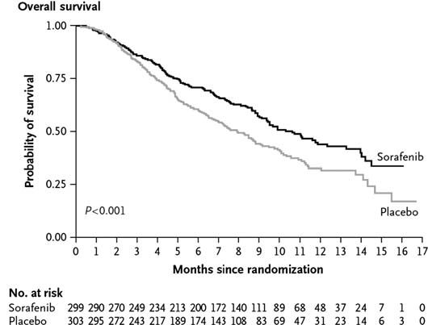

## III. TDM 데이터가 약물의 극적인 이점을 규명하는 사례 (계속)

Roach 등의 RTOG 8610 임상시험(12)에서 안드로겐 차단 요법(ADT)은 체외 방사선 치료(EBRT) 전에 투여되어 선행요법(neoadjuvant therapy)으로 분류되었으며 방사선 치료와 병용 투여되기도 하였다.

TDM은 무작위 배정 시점부터 원격 전이가 발생한 날까지로 측정되었다. 일반적으로 TDM 평가변수는 전체 연구 대상자의 TDM 중앙값(median TDM)으로 보고되며 이는 André 등(13), Chagpar 등(14), Coen 등(15), Gomez-Fernandez 등(16), Jeremic 등(17), Specenier 등(18)의 여러 연구에서 채택되었다.

그러나 Roach 연구에서는 TDM과 전체 생존기간(OS) 결과 모두 해저드 비율(HR)로 제시되었다. 15년에 걸친 추적 관찰 결과:
- **원격 전이까지의 시간 (TDM)**: HR = 1.52 (P = 0.006)로 두 군 간의 뚜렷한 곡선 분리가 입증되었다.
- **전체 생존기간 (OS)**: HR = 1.18 (P = 0.12)로 두 군 간의 유의미한 차이가 거의 관찰되지 않았다.

연구진은 단 4개월간의 선행 ADT를 EBRT에 추가함으로써 8년 시점에서 환자의 40%가 전이 발생을 지연시킨 TDM 개선 효과가 "주목할 만하다(remarkable)"고 평가하였다(19).

이 연구는 전체 생존기간(OS)에서는 끝내 두 치료군 간의 명확한 차이가 확인되지 않더라도, TDM 평가변수를 통해 약물의 실질적인 항종양 전이 억제 효능을 조기에 명확하게 입증할 수 있음을 완벽히 보여준다.

***

## IV. TDM을 활용한 유방암 환자의 유전자 마이크로어레이 예후 평가 - Loi 연구

Loi 등(20)은 수술을 받았으나 전신 화학요법을 받지 않은 에스트로겐 수용체 양성(ER+) 유방암 환자 417명의 종양 생검 조직을 분석하였다.

연구진은 Sotiriou 등(21)이 확립한 97개 유전자 마이크로어레이 패널을 사용하여 유전자 발현을 측정하였다. 이 유전자 세트에서 가장 과발현된 상위 유전자들로는 *UBE2C*, *KPNA2*, *TPX2*, *FOXM1*, *STK6*, *CCNA2*, *BIRC5*, *MYBL2* 등이 포함되어 있었다(각 유전자의 염기서열 및 상세 정보는 NCBI 데이터베이스에서 확인 가능).

연구진은 이 유전자 발현 데이터를 기반으로 **유전자 발현 등급 지수(Gene expression Grade Index, GGI)** 점수를 산출하여 환자군을 고등급 GGI(high GGI)와 저등급 GGI(low GGI)의 두 하위군으로 분류하였다. 카플란-마이어 분석 결과, 낮은 GGI 점수는 양호한 예후(긴 TDM)를 예측하는 반면, 높은 GGI 점수는 불량한 예후(짧은 TDM, 조기 원격 전이)를 예측하는 강력한 예후 인자임이 규명되었다. 궁극적으로 연구진은 97개 유전자 마이크로어레이를 유방암 환자의 최적 치료법 결정을 돕는 정밀의료 도구로 활용하는 것을 목표로 하였다.

***

## V. 유방암 환자의 예후 인자로서 마이크로RNA 발현 데이터의 활용 - Foekens 연구

Foekens 등(22)은 림프절 음성, ER 양성 유방암 환자의 종양 생검 조직에서 마이크로RNA(microRNA, miRNA) 발현과 TDM 평가변수 간의 상관관계를 탐색하였다.

249개의 서로 다른 miRNA 서열로 구성된 유전자 어레이를 분석한 결과, 불량한 TDM 환자군과 양호한 TDM 환자군 간에 극명한 발현 차이를 보이는 특정 miRNA 군이 식별되었다:
- **주요 차등 발현 miRNA**: miR-7, miR-22, miR-34b, miR-128a, miR-145, miR-151, miR-193b, miR-205, miR-210, miR-449, miR-489, miR-516-3p.

임상병리학적 특성과의 상관관계 분석:
- **종양 크기와의 상관관계**: miR-7, miR-34b, miR-151 발현은 종양 크기와 유의한 양의 상관관계를 보였다(P < 0.05).
- **병리학적 악성도 등급과의 상관관계**: miR-7, miR-210, miR-489, miR-516-3p는 높은 병리학적 등급과 유의하게 연관되었다(P < 0.01).
- **예후 클러스터**: 클러스터 1 miRNA 군은 양호한 예후(긴 TDM)와 연관된 반면, 클러스터 3 miRNA 군은 불량한 예후(짧은 TDM)와 유의하게 연관되었다.

저자들은 불량한 예후와 관련된 특정 발현 miRNA를 억제(silencing)하거나 표적하는 신약 개발 전략을 제안하였다.

***

## VI. miRNA의 생물학적 기전

마이크로RNA(miRNA)는 19~25개 뉴클레오타이드로 구성된 작은 비암호화 단일가닥 RNA(non-coding RNA)로서, 표적 mRNA의 상보적 서열에 결합하여 번역을 억제하거나 mRNA의 분해를 유도함으로써 전사 후 유전자 발현을 조절한다(23). miRNA는 전체 인간 유전자의 약 30~50%를 조절하는 것으로 추정된다(24, 25).

### miRNA의 생합성 과정
1. **전사**: RNA 중합효소 II 또는 III에 의해 긴 1차 전사체인 pri-miRNA가 핵 내에서 합성된다(26).
2. **Drosha 절단**: 핵 내 RNase III 효소 복합체에 의해 60~70개 뉴클레오타이드의 헤어핀 전구체인 pre-miRNA로 절단된다.
3. **핵외 수송 및 Dicer 가공**: Exportin-5에 의해 세포질로 수송된 pre-miRNA는 세포질 내 RNase III 효소인 Dicer에 의해 성숙한 이중가닥 miRNA로 절단된다.
4. **RISC 복합체 결합**: 성숙한 단일가닥 miRNA가 RNA 유도 침묵 복합체(RISC)에 로딩되어 상보적인 표적 mRNA를 절단하거나 번역을 차단한다.

### 암과 전이에서의 역할
- **혈관신생 조절**: 
  - *항혈관신생 miRNA*: miR-221/222 (c-kit 및 cyclin G1 발현 조절)
  - *친혈관신생 miRNA*: miR-126 및 miR-378 (VEGF 발현 조절). miR-126을 녹아웃시키면 종양 혈관신생이 현저히 억제된다.
- **전이 폭포(Metastatic Cascade) 조절**: 
  - 종양 세포의 탈락, 이동, 침습, 세포외기질(ECM) 분해 효소 발현 등 조기 전이 과정을 조절한다.
  - *miR-21*: 다수의 종양에서 상향 조절되어 암세포 증식, 이동, 침습을 촉진하고 세포자멸사(apoptosis)를 억제한다.
  - *원격 장기 정착 조절*: 원격 장기에서의 거시적 종양 정착(macroscopic colonization)의 최종 단계를 조절하는 대표적 인자로 miR-34 패밀리(miR-34a, miR-34b, miR-34c)가 있다.

다양한 연구들은 miRNA 프로파일링이 암의 분자 아형 분류 및 예후 예측에 매우 유용함을 증명하고 있다(27). 또한 miRNA는 다발성 경화증과 같은 자가면역 질환(28, 29), 당뇨병(30), 죽상경화증(31), C형 간염 바이러스 감염(32), 우울증과 같은 신경정신과적 장애(33) 등 광범위한 인간 질환의 병인에도 깊이 관여한다.

***

## VII. 결론

원격 전이까지의 시간(TDM)은 원격 전이가 거의 예외 없이 치명적 사망으로 이어지는 암종에서 전체 생존기간(OS)의 우수한 대리 평가변수로 기능한다.

1. **Wee 비인두암 연구**: 방사선 단독 대비 방사선-화학요법 병용의 치료적 우월성이 전체 생존기간보다 TDM에서 훨씬 조기에 뚜렷하게 관찰됨을 입증하였다.
2. **Roach 전립선암 연구**: 15년에 걸친 추적 조사에서 전체 생존기간으로는 통계적 차이를 입증하기 어려운 상황에서도, TDM 평가변수를 통해 선행 호르몬 차단 요법의 현저한 원격 전이 지연 효과(HR = 1.52, P = 0.006)를 결정적으로 입증할 수 있음을 보여주었다.
3. **Loi 및 Foekens 연구**: mRNA 유전자 어레이(97개 유전자) 및 miRNA 발현 프로파일링을 TDM 평가변수와 연계함으로써 환자의 원격 전이 위험을 조기에 층화하고 예후를 정밀하게 예측할 수 있음을 규명하였다.

# 제17장 선행요법 대 보조요법

## 도입

항암화학요법과 방사선 요법은 단일제 요법(single-agent therapy), 병용요법(combination therapy), 순차 치료(sequential treatment) 등 다양한 형태로 시행된다(9). 순차 화학요법은 두 가지 서로 다른 약물을 각각의 최대 내약 용량(MTD)으로 분리 투여할 수 있게 해준다(10). 병용요법은 두 약물의 조합이 효능 측면에서 상승작용(synergy)이나 가산 효과(additive effect)를 나타낼 때 선호된다. 물론 독성의 가산 효과는 바람직하지 않다. 상승작용을 나타내는 약물 조합은 여러 연구에서 보고되었다(11-16). 그러나 세포독성 항암요법이나 방사선 조사는 이차성 백혈병이나 골수이형성증후군(MDS) 발생 위험을 수반할 수 있다(2-8).

선행요법(neoadjuvant therapy)과 보조요법(adjuvant therapy) 중 하나를 선택하는 궁극적인 목표는 환자의 생존기간을 연장하는 것이다. 화학요법은 수술 전과 후 모두에 투여될 수도 있다. 전체 생존기간은 종양학 임상시험의 골드 스탠다드 평가변수이지만 선행요법 대 보조요법 임상시험의 생존 결과를 비교할 때는 **화학요법에 대한 순응도(adherence)**를 반드시 감안해야 한다.

직장암 임상시험 종설에서 Boland와 Fakih(17)는 "이러한 결과가 다소 실망스러울 수 있지만 화학요법 순응도 비율이 수술 전 82%였던 반면 수술 후에는 42.9%에 불과했다는 매우 저조한 수치를 주목하는 것이 중요하다"고 경고하였다(18-22).

참고로 방사선 치료에서 선량 단위인 **그레이(Gray, Gy)**는 $1\text{ Gy} = 1\text{ J/kg}$으로 정의된다. 즉, 1 kg의 질량이 전리방사선에 노출되어 1 줄(J)의 에너지를 흡수하는 것을 의미하며 물리학자 루이스 H. 그레이(Louis H. Gray, 1905~1965)의 이름을 따서 명명되었다(23, 24).

***

## I. 선행요법의 장점

보조요법 대비 선행요법(수술 전 치료)의 주요 장점은 다음과 같다:

### a. 미세전이의 조기 사멸
선행요법의 결정적 장점은 육안이나 통상적 영상으로 감지되지 않는 미세전이에 대해 지체 없이 유효한 전신 치료를 즉각 개시할 수 있다는 점이다(25, 26). 수술은 국소 병변만 제거할 뿐 미세전이에는 효과가 없다.

### b. 수술 용이성 증대
선행요법은 종양의 병기를 낮추어(down-staging), 치료 전에는 외과적으로 안전하게 절제할 수 없었던 종양을 수술 가능한 상태로 전환시킨다(27, 28). 진행성 대장암이나 간암이 대표적이다. 간암의 경우 종양이 주요 대혈관에 밀착되어 있는 경우 즉각적인 수술이 불가능하며(30), 선행요법을 통해 종양을 축소시킨 후 안전한 절제연을 확보하여 수술을 시행할 수 있다.

### c. 장기 기능 보존 및 미용적 이점
1. **유방암**: 화학요법으로 유방 종양의 병기를 낮춤으로써 유방 전절제술(mastectomy)을 피하고 유방보존술(lumpectomy) 및 겨드랑이 림프절 곽청술 축소를 가능하게 한다(31-33). Bear 등(33)은 유방암에서 선행 화학요법이 유방보존율을 높이고 유효 반응률을 신속히 테스트할 수 있는 확립된 대안이라고 강조하였다.
2. **후두암/구인두암**: 종양 축소를 통해 영구적 기관절개관 삽입이나 발성 기능 상실 없이 후두를 보존할 수 있다(34, 35).
3. **직장암**: 수술 전 화학방사선요법을 통해 항문 괄약근을 보존(sphincter-sparing surgery)하여 영구 장루 형성을 피할 수 있다(36-38). 장기 기능 상실의 최소화는 중요한 임상 평가변수이지만 전체 생존기간보다는 2차적인 목표로 다루어진다(39).

또한, 수술을 먼저 시행하면 잔류 종양으로 가는 혈관 구조가 절단되어 혈류 공급이 손상될 수 있으나, 선행요법은 온전한 혈관망을 통해 약물을 종양 중심부까지 효율적으로 전달하고 종양 저산소증(방사선 저항성의 주원인)을 피할 수 있게 해준다(40).

### d. 생체 내 약물 반응성 평가 및 후속 치료 결정
선행요법은 체내 종양의 실제 치료 반응을 실시간으로 관찰할 수 있는 "생체 내 감수성 시험(in vivo chemosensitivity test)"의 기회를 제공한다(41, 42).
- Worden 등(44, 45, 46)의 구인두암 임상시험: 모든 환자에게 화학요법을 1주기 투여한 후 3주 뒤 후두경 검사로 종양 축소율을 직접 평가하였다. 종양이 50% 초과 축소된 반응군에게는 장기 보존을 위해 방사선화학요법을 지속하였고 축소율이 50% 이하인 비반응군에게는 즉시 근치적 수술 및 방사선 치료로 전환하였다.
- Pointreau 등(47)의 후두암 시험: TPF 3제 요법 반응군은 방사선 단독요법(수술 생략), 비반응군은 즉시 수술을 시행하였다.

이처럼 반응에 따라 용량을 증량하거나 다른 약제로 신속히 전환하는 맞춤 치료가 가능해진다(43).

### e. 환자의 화학요법 내약성 증대
수술 전 전신 상태가 양호할 때 환자는 강력한 화학요법의 독성을 훨씬 잘 견뎌낸다(48). 반면 위암 등에서 수술 직후 화학요법을 시행하면 수술 관련 합병증이 증가할 수 있고(49), 수술 후 회복 지연이나 감염 등으로 인해 계획된 보조 화학요법이 지연되거나 중단되는 경우가 흔하다(50).

***

## II. 보조요법의 장점

선행요법 대비 보조요법(수술 후 치료)의 주요 장점은 다음과 같다:

### a. 즉각적인 수술 시행 및 전이 위험 최소화
진단 후 수술까지의 지연이 없다(51). 방광암 등의 경우 즉각적인 방광적출술을 시행하여 수술 대기 중 전이 위험을 차단한다(52). 만약 선행 화학요법이 효과가 없을 경우 종양이 급격히 자라 수술 시기를 놓치게 되어 환자의 생존율을 위협할 수 있다(53, 54).

### b. 정확한 병리학적 병기 판정
수술을 먼저 시행하여 얻은 절제 검체로 종양의 침윤 깊이, 절제연 상태, 정확한 림프절 전이 개수 등 병리학적 병기(pathological stage)를 오차 없이 확정할 수 있다(55-58). 선행요법을 먼저 시행하면 종양 조직이 변성되거나 괴사하여 정확한 기저 병기를 파악하기 어렵다.

### c. 장기 만성 투여가 필요한 약물 적용
수술 후 수년간 지속 투여해야 하는 치료법에는 보조요법 설계가 필수적이다. 호르몬 수용체 양성 유방암에서 수술 후 5년간 타목시펜(tamoxifen)을 투여하는 보조 내분비 요법이 대표적이다(59-61). 5년 동안 선행요법을 진행한 후 수술을 시행하는 것은 임상적으로 불가능하다.

***

## III. "보조제"라는 단어의 두 가지 의미

의학 분야에서 *Adjuvant*라는 용어는 맥락에 따라 완전히 다른 두 가지 의미를 갖는다:
1. **종양학에서의 보조요법(Adjuvant Therapy)**: 1차 근치적 치료(대개 외과적 수술)가 완료된 후 남아있을 수 있는 미세 잔류 암세포를 박멸하기 위해 시행하는 후속 화학요법, 방사선요법, 호르몬요법.
2. **백신학에서의 면역보조제(Immune Adjuvant)**: 백신 투여 시 특정 항원에 대한 면역 반응을 비특이적으로 증강시키기 위해 첨가하는 물질. 사이토카인, CpG 올리고뉴클레오타이드(62), Poly(I:C)(63), 이미퀴모드(imiquimod, 64), 프로인트 불완전 보조제(Freund's incomplete adjuvant, 65) 등이 포함된다(66-68).

***

## IV. 암 치료에서의 선행요법 대 보조요법 요약

종양학 임상시험 설계는 수술 단독, 화학요법 단독, 수술과 화학요법 병용, 방사선 추가 등 다양한 순열을 포함하며 이에 따라 치료 순서(선행 vs 보조)를 결정해야 한다. 이마티닙(imatinib)과 같은 혁신 신약이 등장했을 때도 학계는 위장관 기질종양(GIST) 환자를 대상으로 선행요법과 보조요법 디자인 모두에서 유효성을 평가하였다(69, 70).

***

## V. 자가면역 질환에서의 유도요법 대 유지요법

암에서 화학요법 후 수술(또는 수술 후 화학요법)의 순차적 치료 개념은 자가면역 질환에서 **유도요법(induction therapy)**과 **유지요법(maintenance therapy)**의 2단계 치료 체계와 개념적으로 동일하다. 질병의 급성 악화를 신속히 진압하여 관해를 유도하는 강력한 초기 치료 후, 반응을 평가하고 장기적인 재발 방지를 위한 안전한 유지 치료로 전환한다.

### a. 전신 홍반성 루푸스 (SLE) 임상시험
루푸스 신염 환자를 대상으로 한 다양한 임상시험에서 유도 단계와 유지 단계에 서로 다른 약제 조합이 사용된다(71). Houssiau는 시클로포스파미드 유도 후 아자티오프린 유지, MMF(mycophenolate mofetil) 유도 후 MMF 유지 등을 보고하였으며 MMF가 완전 관해 유도에서 시클로포스파미드보다 우월함을 제시하였다.

중추적 ALMS 임상시험 프로토콜(WX17801, 72, 73)의 설계:
- **유도 단계 (Week 0~24)**: 총 358명 등록 (군당 179명). 경구 MMF (1.5g BID) vs 정맥 시클로포스파미드 (IVC, 월 1회 $0.5\sim 1.0\text{ g/m}^2$).
- **유지 단계 (Week 24~Month 36)**: 유도 단계 반응자 약 278명을 재무작위 배정 (군당 139명). 이중맹검 이중위약(double-blind double-dummy) 방식으로 경구 MMF (1g BID + 아자티오프린 위약) vs 경구 아자티오프린 (2mg/kg/일 + MMF 위약) 비교.

### b. 류마티스 관절염 (RA) 임상시험
인플릭시맙(infliximab, 항-TNF-$\alpha$ 단클론항체) 임상시험에서 FDA 허가 용법은 메토트렉세이트(MTX)와 병용하여 0주, 2주, 6주 시점에 $3\text{ mg/kg}$을 정맥 투여하는 **유도 기간(induction period)**을 거친 후, 이후 매 8주마다 투여하는 **유지 기간(maintenance period)**을 적용한다(74-76).

### c. 건선 임상시험
Gordon 등(77)은 IL-12/23 억제제인 브리아키누맙(briakinumab) 3상 시험에서 0~12주의 유도 단계와 12~52주의 유지 단계를 설정하였다. 유도 단계 완료 후 반응자들을 대상으로 시험약 유지군과 위약 전환군으로 재무작위 배정하여 약물의 지속적 관해 유지 효과를 검증하였다.

***

## VI. 결론

선행요법과 보조요법은 종양학 임상시험의 핵심 설계 원칙이며 수술과 약물 치료의 순차적 결합 순서를 다룬다. 한편 자가면역 질환에서는 이와 유사한 개념으로 급성 염증을 신속히 통제하는 유도요법과 질병의 장기 관해를 유지하는 유지요법의 순차적 치료 체계가 광범위하게 적용된다.

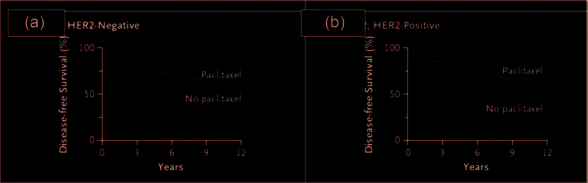

# 제18장 혈액암

## 도입 및 개요

혈액암(Hematological Cancers)은 혈액, 골수 및 림프계에 발생하는 악성 종양을 총칭하며 크게 림프구계 암(Lymphoid Cancers)과 골수구계 암(Myeloid Cancers)으로 분류된다.

### 표 18.1 혈액암의 주요 분류

| 분류 | 약어 | 질환명 (국문/영문) |
| :--- | :--- | :--- |
| **림프구계 암 (Lymphoid Cancers)** | **ALL** | 급성 림프모구 백혈병 (Acute lymphoblastic leukemia / Acute lymphocytic leukemia)<sup>a</sup> |
| | **CLL** | 만성 림프구성 백혈병 (Chronic lymphocytic leukemia / Chronic lymphoblastic leukemia)<sup>b</sup> |
| | **HCL** | 모발세포 백혈병 (Hairy cell leukemia) |
| **골수구계 암 (Myeloid Cancers)** | **AML** | 급성 골수성 백혈병 (Acute myeloid leukemia / Acute myelogenous leukemia) |
| | **APL** | 급성 전골수구성 백혈병 (Acute promyelocytic leukemia) |
| | **CML** | 만성 골수성 백혈병 (Chronic myeloid leukemia / Chronic myelogenous leukemia) |
| | **MDS** | 골수이형성증후군 (Myelodysplastic syndromes) |

> <sup>a</sup> 2000~2011년 Journal of Clinical Oncology 논문 검색 결과 'Acute lymphoblastic leukemia'가 'Acute lymphocytic leukemia'보다 10배 더 빈번하게 사용됨.  
> <sup>b</sup> 동 기간 검색 결과 'Chronic lymphocytic leukemia'가 'Chronic lymphoblastic leukemia'보다 10배 더 빈번하게 사용됨.

백혈병 임상시험에서 재발 없는 생존기간(Relapse-Free Survival, RFS)은 관해에 도달한 시점부터 질병 재발 또는 사망까지의 기간으로 정의되며 관해 유지 상태의 환자는 중도 절단된다(9). Chen 등(10)의 급성 골수성 백혈병(AML) 임상시험에서 재발은 "골수 내 아세포(blasts)가 최소 5% 이상 관찰되거나 골수외 백혈병(extramedullary leukemia)이 발생한 경우"로 정의되었다.

고형암이 수술 전 선행요법 및 수술 후 보조요법의 단계적 치료를 거치는 것과 유사하게, 혈액암은 **관해 유도요법(remission induction therapy)**에 이은 **공고요법(consolidation therapy)**이라는 2단계 치료 체계를 적용한다(11).
- **관해 유도요법**: 치료의 첫 블록으로 보통 4~6주간 진행된다. 첫 치료 시 대개 입원 치료를 시행하며 환자의 95% 이상에서 완전 관해(Complete Remission, CR)를 유도하는 것을 목표로 한다.
- **공고요법**: 약 6~9개월간 진행되며 완전 관해 후 체내에 잔류하는 현미경적 미세잔존질환(minimal residual disease, MRD)을 완전히 박멸하는 것을 목표로 한다. 외래 기반으로 투여되며 고위험군 환자일수록 더 강력하고 장기적인 공고 화학요법을 적용한다(12).

***

## I. 혈액암의 분류 및 진단 기준

### a. 혈액암의 분류 체계
세계보건기구(WHO)는 형태학, 면역표현형, 유전학 및 임상적 특징을 통합한 혈액종양 분류 기준을 제공하고 주기적으로 개정하고 있다(13-15).

전통적인 **FAB(French-American-British) 협력 그룹** 분류 체계는 형태학 및 세포화학 염색(cytochemical stains)을 기반으로 급성 백혈병을 분류한다(16-19).
- FAB 체계는 AML 아세포를 M0부터 M7까지 8개 아형으로 분류한다.
- 급성 전골수구성 백혈병(APL)은 **M3** 아형으로 지정되며 성인 AML 환자의 약 10%를 차지한다(20-22).
- FAB 분류는 소아 및 성인 AML의 다기관 임상시험(AML-BFM 등)에서 널리 활용되어 왔으며(23-25), 골수이형성증후군(MDS)이 급성 백혈병으로 진행할 위험을 예측하는 데도 사용된다(26).

혈액암 세포의 감별 및 모니터링에는 세포유전학(Cytogenetics)과 유세포분석법(Flow Cytometry)이 필수적이다(27-33).
- **세포유전학 명명법**: 인간 세포유전학 명명에 관한 국제 표준(ISCN) 시스템을 따른다(34, 35).
- **유세포분석법 및 CD 명명법**: 분화 클러스터(Cluster of Differentiation, CD) 항체 패널을 사용하여 백혈병 세포를 면역표현형으로 정밀 감별한다(36-38). CD3, CD4, CD8, CD19, CD20, CD33, CD34 등이 활용된다. 유세포분석법은 정상 세포 10,000개 중 백혈병 아세포 1개를 검출할 수 있는 0.01%($10^{-4}$)의 고감도 검출 능력을 제공한다(39).

고형암과 달리 백혈병 임상시험에서는 RECIST 기준이 일반적으로 적용되지 않으며 림프절 비대를 동반하는 백혈병에서 림프절 크기를 측정할 때 제한적으로 검토된다(40).

### b. 2차성 혈액암
이전의 고형암이나 림프종 등으로 인해 투여받은 세포독성 화학요법 또는 방사선 조사로 인해 발생하는 치료 관련 2차성 혈액암(therapy-related hematological malignancies)이 다수 보고되어 있다.
- 2차성 AML 및 ALL, 2차성 MDS, 2차성 림프종이 대표적이다(41-48). 호지킨 림프종 생존자에서 2차 백혈병이나 육종, 고형암 발생 위험이 잘 알려져 있다(49, 50).
- 2차 백혈병은 염색체에 손상을 가하는 두 가지 주요 항암제 계열, 즉 **알킬화제(alkylating agents)**와 **토포이소머라아제 II 억제제(topoisomerase inhibitors)**에 의해 주로 유발된다(51-53).

### c. 조혈모세포의 분화 계통 (림프구계 및 골수구계)

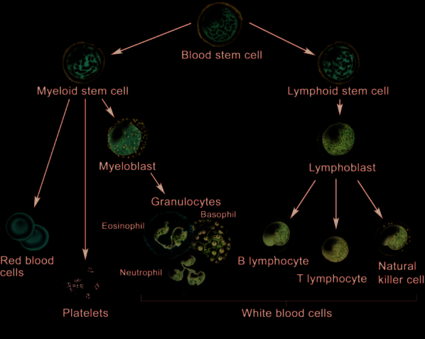
모든 혈액 세포는 골수 내의 다능성 **조혈모세포(Hematopoietic Stem Cell, HSC)**로부터 기원하며 크게 두 가지 계통으로 분화한다(54, 55):
1. **림프구계(Lymphoid Lineage)**: T세포, B세포, NK세포로 분화하며 악성화될 경우 ALL, CLL, 림프종 등 림프구계 종양을 형성한다(56-59).
2. **골수구계(Myeloid Lineage)**: 적혈구, 거핵구(혈소판 생성), 대식세포, 중성구, 호산구, 호염기구로 분화하며 악성화될 경우 AML, CML, MDS 등 골수구계 종양을 형성한다(60-63).

백혈병의 병태생리학적 본질은 **아세포(blast cells)의 성숙 정체(maturation arrest)**이다. 정상 골수에서 아세포는 5% 미만을 차지하지만 백혈병에서는 단일 백혈병 줄기세포로부터 클론성 증식(clonal expansion)한 미성숙 아세포가 비정상적으로 축적되어 정상 조혈 기능을 마비시킨다(64-68).

```
                      [ 조혈모세포 (HSC) ]
                              |
               +--------------+--------------+
               |                             |
       [ 골수구계 전구세포 ]          [ 림프구계 전구세포 ]
               |                             |
     +---------+---------+            +------+------+
     |         |         |            |      |      |
  [적혈구]  [혈소판]  [골수아세포]   [T세포] [B세포] [NK세포]
                         |
                      [중성구]
```

**그림 18.1** 혈액 세포의 정상 분화 경로 및 백혈병에서의 아세포 축적 모식도.

### d. 체내 백혈병 세포의 위치 및 재발
백혈병은 골수에서 발생하여 혈관을 통해 전신 장기로 순환한다. 종양 덩어리(mass)를 형성하는 고형암의 전이와 달리, 백혈병은 간, 비장, 피부 등에 광범위한 **미만성 침윤(diffuse infiltration)**을 유발한다(69-73).

치료 후 재발은 화학요법에 의해 박멸되지 않고 휴면 상태(quiescent)로 남아 있던 잔존 백혈병 세포로부터 발생한다. 특히 **중추신경계(CNS)**와 **고환(testes)**은 혈액-뇌 장벽(BBB)이나 P-당단백질(P-gp) 약물 배출 펌프로 인해 항암제의 침투가 차단되는 대표적인 **성역 부위(sanctuary sites)**로서 백혈병 재발의 주된 온상이 된다(70, 71).

CLL 환자의 약 3~10%는 미만성 거대 B세포 림프종 등 공격적인 고등급 림프종으로 급격히 전환되는 **리히터 증후군(Richter's syndrome / transformation)**을 겪는다(74-76).

***

## II. 림프구계 종양

### 1. 급성 림프모구 백혈병 (ALL)
ALL은 15세 미만 소아에서 가장 흔한 악성종양으로, 전체 소아 백혈병의 약 76%를 차지한다(78-80). 미성숙 림프아세포의 급격한 증식이 특징이다.

- **L-아스파라기나아제(Asparaginase)**: 정상 세포와 달리 림프아세포는 아스파라긴 합성 효소가 결핍되어 있어 외부 아스파라긴 공급에 전적으로 의존한다. 아스파라기나아제는 세포외 아스파라긴을 아스파르트산과 암모니아로 분해하여 고갈시킴으로써 백혈병 세포의 사멸을 유도하는 ALL 치료의 핵심 효소 치료제이다(81, 82).
- **필라델피아 염색체(Philadelphia Chromosome, $t(9;22)$) 및 티로신 키나아제 억제제(TKI)**:
  - 9번 염색체의 *ABL1* 유전자($9\text{q}34$)와 22번 염색체의 *BCR* 유전자($22\text{q}11.2$) 간의 상호 전좌(reciprocal translocation)로 인해 발생한다.
  - 소아 ALL의 약 3~5%, 성인 ALL의 약 20~25%에서 발견된다.
  - 지속적으로 활성화된 비정상 티로신 키나아제인 BCR-ABL 융합 단백질을 생성한다(83-90).
  - 필라델피아 염색체 양성($\text{Ph}^+$) ALL 환자에서는 표준 화학요법에 **이마티닙(imatinib, Gleevec)** 등 BCR-ABL 티로신 키나아제 억제제를 병용 투여하는 것이 필수적이며 이를 통해 환자의 무사건 생존율(EFS)이 극적으로 개선되었다(85, 86, 91, 92).

```
  9번 염색체:  ---[ ABL ]--->         (상호 전좌 발생)
                                      ----------------->   [ 22q- : BCR-ABL 융합유전자 ]
 22번 염색체:  ---[ BCR ]--->                              (필라델피아 염색체)
```

**그림 18.2** 필라델피아 염색체 형성 모식도: 9번 염색체의 ABL 부위와 22번 염색체의 BCR 부위 간의 상호 전좌를 통해 종양형성 BCR-ABL 융합 키나아제가 발현된다.

### 2. 만성 림프구성 백혈병 (CLL)
미국에서 연간 약 15,000명의 신규 환자가 발생하는 성인의 대표적인 지연성 백혈병이다(93). 림프구 수의 급격한 증가(배가 시간 6개월 미만), 골수 부전에 따른 빈혈 및 혈소판 감소증, 림프절 비대, 감염, 발열, 극심한 피로, 야간 발한, 체중 감소 등을 동반한다(94, 95).

임상시험에서의 반응 평가는 미국 국립암연구소(NCI) 후원 워킹그룹 가이드라인 및 IWCLL 기준(96, 99)에 따라 말초혈액 수치(림프구, 혈소판, 중성구), 헤모글로빈, 골수 침윤 정도 등을 정밀하게 측정하여 완전 관해(CR), 부분 관해(PR), 질병 진행(PD)을 판정하며 주요 평가변수로 PFS 및 TTP가 사용된다(97, 98).

# 제18장 혈액암 (계속)

## II. 림프구계 종양 (계속)

### 2. 만성 림프구성 백혈병 (CLL) (계속)

CLL의 확진을 위해서는 말초혈액 마이크로리터($\mu\text{L}$)당 최소 5,000개 이상의 클론성 B 림프구가 요구된다. CLL B세포 표면의 CD20 및 CD79b 막 단백질 발현 수준은 정상 B세포에 비해 현저히 낮다.

전체 CLL 환자의 80% 이상에서 세포유전학적 이상이 발견된다.
- **del(13q14)**: 13번 염색체 장완의 결손으로, CLL에서 가장 흔하게 관찰되는 세포유전학적 이상이다.
- **기타 주요 염색체 이상**: 12번 삼염색체성(trisomy 12), 11번 결손[del(11q22)], 17번 결손[del(17p13), *TP53* 소실 연관 불량 예후 인자] 등이 포함된다(100). 이들 이상은 간기 형광제자리부합법(iFISH)이나 MLPA 기법으로 검출된다.

CLL의 치료 반응 및 경과 평가는 완전 관해(CR), 부분 관해(PR), 안정 병변(SD), 치료 실패(진행)로 분류되며 림프구 수, 림프절 직경, 중성구 및 혈소판 수치, 골수 생검 소견을 종합하여 판정한다. 관련 대리 평가변수로는 PFS와 TTP가, 최종 임상 평가변수로는 OS가 사용된다.

#### 치료 전략
- **신체 상태가 양호한 환자(Fit patients)**: 플루다라빈 + 시클로포스파미드 + 리툭시맙(FCR 요법) 3제 병용 요법이 전통적인 표준 1차 치료이다.
- **고령 또는 동반 질환 환자(Unfit patients)**: 항-CD20 단클론항체(오비누투주맙, 리툭시맙, 또는 오파투무맙) 기반의 완화된 요법이 권장된다(101).

**플루다라빈(Fludarabine)**은 퓨린 유사체(purine analog)로, 세포 내로 유입된 후 인산화되어 활성형인 플루다라빈 5'-삼인산(fludarabine 5'-triphosphate)으로 전환된다(102). 이는 DNA 사슬에 결합하여 교차결합(cross-linking)을 유발하고 뉴클레오타이드 절제 복구를 억제하여 백혈병 세포의 세포자멸사(apoptosis)를 유도한다(103).

**리툭시맙(Rituximab)**은 B세포 표면 막 단백질인 CD20에 특이적으로 결합하는 키메라 단클론항체이다. 리툭시맙이 악성 B세포의 CD20에 결합하면 **항체의존성 세포독성(Antibody-Dependent Cellular Cytotoxicity, ADCC)**, 보체 유도 세포독성(CDC), 직접적 세포자멸사를 통해 악성 B세포를 고갈시킨다(104, 105). ADCC 기전에서 항체는 접착제 역할을 수행하여 세포독성 CD8+ T세포 또는 NK세포를 악성 B세포와 밀착시켜 종양 세포를 사멸시킨다.

### 3. 모발세포 백혈병
모발세포 백혈병(Hairy Cell Leukemia, HCL)은 성숙 B세포 림프종의 드문 아형으로, 림프구성 백혈병의 약 2%를 차지한다(106, 107).

퓨린 유사체 계열 약물인 **클라드리빈(Cladribine)** 투여 시 80% 이상의 환자에서 완전 관해가 유도되며 단 1주일간의 투약만으로도 10년 이상 지속되는 장기 관해를 달성한다(108-110). 통상적인 세포독성 항암제의 부작용(탈모, 오심 등)은 적으나, T세포 고갈에 따른 면역 억제로 인해 거대세포바이러스(CMV)나 폐포자충(Pneumocystis jirovecii) 감염 위험이 증가한다(111). 클라드리빈은 다발성 경화증 치료에도 승인되어 사용된다.

***

## III. 골수구계 종양

### 1. 급성 골수성 백혈병 (AML)
미국에서 연간 약 13,000명의 신규 환자가 발생하며 성인 급성 백혈병의 약 25%를 차지한다(112, 113). 주요 증상으로는 극심한 피로, 빈혈, 혈소판 감소에 따른 멍/출혈, 과립구 감소에 따른 발열 및 중증 감염 등이 있다(114). 임상시험에서는 국제워킹그룹(IWG) 반응 기준에 따라 관해율, RFS, 무이벤트 생존율(EFS), OS를 평가한다(115-118).

AML은 전 연령에서 발생할 수 있으나 65세 이상 고령층에서 발생률이 급증한다(119). 현대 의학의 발전에도 불구하고 젊은 성인의 약 2/3, 65세 이상 고령 환자의 90%가 질병으로 사망하는 난치성 질환이다(120).

표준 치료법은 고용량 시타라빈(cytarabine, Ara-C)과 안트라사이클린(다우노루비신 또는 이다루비신)의 "7+3" 관해 유도 화학요법 후, 완전 관해에 도달한 환자를 대상으로 고용량 시타라빈 공고요법 또는 동종 조혈모세포 이식을 시행하는 2단계 전략이다(121).

AML 환자의 약 50%는 염색체 전좌에 따른 융합 유전자 및 융합 단백질을 보유한다(122-126):
- **RUNX1-RUNX1T1 [t(8;21)]**: 양호한 예후
- **CBFB-MYH11 [inv(16) 또는 t(16;16)]**: 양호한 예후
- **PML-RARA [t(15;17)]**: APL 아형, 완치율 극히 높음
- **MLL(KMT2A) 재배열 [11q23]**: 불량한 예후
- **NUP98-HOXA9, 복합 핵형**: 불량한 예후

이러한 융합 종양 단백질들은 조혈 전구세포의 자가재생(self-renewal) 능력을 증폭시키거나 골수계 분화 과정을 차단(differentiation block)하여 백혈병을 유발한다.

또한 마이크로어레이 유전자 발현 분석으로 *BCL11A*, *TBXAS1*, *HOXB5*, *HOXA10*의 상향 조절 및 *EML4*, *C3AR1*, *SEMA3F*의 하향 조절이 환자의 불량한 예후와 직결됨이 밝혀졌으며 이들은 신규 치료 표적으로 연구되고 있다(127-129).

신약 개발 영역에서는 퓨린 유사체인 클로파라빈(clofarabine), 알킬화제 라로무스틴(laromustine), 항-CD33 항체-약물 접합체(ADC)인 겜투주맙 오조가마이신(gemtuzumab ozogamicin), DNA 메틸화전이효소(DNMT) 억제제인 데시타빈(decitabine) 및 아자시티딘(azacitidine) 등이 도입되었다(130, 131).

### 2. 급성 전골수구성 백혈병
APL은 성인 AML의 약 10%를 차지하는 특수 아형으로, 중증 파종성 혈관내 응고(DIC)에 의한 자발적 출혈(뇌출혈, 폐출혈, 위장관 출혈)이 발생하여 진단 전후 치명적 조기 사망을 초래할 수 있다(132-134). 따라서 임상적 의심 즉시 응급 치료를 개시해야 한다.

- **분자 병태생리**: 15번 염색체의 *PML* 유전자와 17번 염색체의 레티노산 수용체-알파(*RARA*) 유전자 간의 상호 전좌[$t(15;17)$]로 인해 생성된 **PML-RARA** 융합 단백질이 전골수구(promyelocyte) 단계에서의 성숙 분화를 완전히 차단한다(135).
- **표적 분화 유도 치료**: 비타민 A 유도체인 **모든-트랜스 레티노산(All-trans retinoic acid, ATRA)**과 비소 화합물인 **삼산화비소(Arsenic Trioxide, ATO)**, 또는 안트라사이클린 병용 요법을 투여한다. ATRA는 PML-RARA 융합 단백질의 분해를 촉진하고 백혈병 세포가 성숙한 정상 과립구로 분화하도록 유도함으로써 90% 이상의 완치율을 달성하는 표적 치료의 기념비적 성공 사례이다.

# 제18장 혈액암 (계속)

## III. 골수구계 종양 (계속)

### 2. 급성 전골수구성 백혈병 (APL) (계속)

APL 환자는 심한 혈소판 감소증과 응고장애로 인해 다량의 혈소판 수혈이 필수적이다. APL은 **모든-트랜스 레티노산(all-trans retinoic acid, ATRA)**과 **삼산화비소(arsenic trioxide, $\text{As}_2\text{O}_3$, ATO)**의 병용 요법으로 높은 비율로 완치될 수 있다(136). Nayak 등(136)은 ATRA 단독 또는 ATO 단독 투여 시에도 생존율이 향상되지만 두 약제를 병용할 때 상가적(additive) 상승 효과를 나타내어 생존율이 더욱 극적으로 개선됨을 확인하였다.

- **PML-RARA 융합 단백질의 작용**: 정상 RARA의 DNA 결합 도메인과 리간드 결합 도메인을 모두 보존하고 있어 레티노산과 결합할 수 있다(137). 그러나 비정상적인 전사 억제 복합체를 형성하여 조혈모세포 분화에 관여하는 레티노산 반응 유전자들을 지속적으로 침묵(silencing)시킴으로써 세포 분화를 영구 차단한다(138).
- **작용 기전**: 고용량 ATRA는 PML-RARA 융합 단백질의 구조적 변화와 단백질 분해를 촉진하여 분화 차단을 해제한다(139, 140). 삼산화비소(ATO) 역시 PML 부위에 직접 결합하여 융합 단백질의 분해를 가속화할 뿐만 아니라 자가포식(autophagy, 141) 및 세포자멸사(apoptosis, 142)를 유도하여 백혈병 클론을 직접 사멸시킨다. 따라서 병용 요법은 백혈병 세포의 분화를 유도함과 동시에 클론성 세포 사멸을 촉진하는 이중 기전으로 작용한다.

#### 방법론 팁 - 혈소판과 혈액 응고 기전
혈관 손상 시 혈관벽에 존재하는 **조직 인자(Tissue Factor, TF)**가 혈류에 노출되면서 외인성 응고 폭포가 촉발된다(143, 144). 일련의 신속한 효소 반응을 거쳐 비활성 프로트롬빈(prothrombin)이 활성 트롬빈(thrombin)으로 전환된다. 트롬빈은 피브리노겐(fibrinogen)을 불용성 피브린(fibrin)으로 활성화할 뿐만 아니라 혈소판(platelet)을 강력하게 활성화한다(145). 활성화된 혈소판들이 피브린 그물망과 교차결합(cross-linking)함으로써 안정된 혈전(blood clot)을 형성하여 지혈을 완성한다. APL 환자에서는 이러한 지혈 기전의 붕괴로 인해 혈소판 수혈과 신속한 항백혈병 치료가 생명을 좌우한다.

***

### 4. 만성 골수성 백혈병 (CML)

미국에서 연간 약 5,000명의 신규 CML 환자가 발생하며 전체 성인 백혈병의 약 14%를 차지한다(146, 147). 환자의 80% 이상이 극심한 피로를 호소하며 약 40%는 무증상 상태에서 다른 건강 검진 시 우연히 비정상적으로 높은 백혈구 수치가 확인되어 진단된다.

CML은 다능성 조혈모세포에서 발생하는 클론성 골수증식질환이다(148). 9번 염색체와 22번 염색체의 전좌에 의해 생성되는 필라델피아 염색체[$t(9;22)(q34;q11)$] 및 지속적으로 활성화된 **BCR-ABL1 티로신 키나아제**가 발병의 핵심 원인이다.

- **치료**: 1차 치료제로 BCR-ABL 티로신 키나아제 억제제(TKI)인 **이마티닙(imatinib)**이 사용된다. 내성이나 불내약성이 발생할 경우 2세대 TKI인 **닐로티닙(nilotinib)** 또는 **다사티닙(dasatinib)**으로 전환한다(149-151).
- **치료 반응 평가 및 평가변수**:
  - *혈액학적 반응(Hematologic response)*: 말초혈액 수치의 정상화(152-154).
  - *세포유전학적 반응(Cytogenetic response)*: 골수 내 필라델피아 염색체 양성 중기 세포의 비율 평가. 완전 세포유전학적 반응(CCyR, Ph+ 0%)이 핵심 지표이다.
  - *분자유전학적 반응(Molecular response)*: 실시간 정량 PCR(RQ-PCR)을 이용하여 가계 유전자(housekeeping gene, 예: *ABL1*) 대비 *BCR-ABL1* 전사체 비율(국제표준화 지수, IS)을 정밀 측정한다.
  - 유럽백혈병네트워크(ELN) 가이드라인(157, 158)은 치료 3, 6, 12, 18개월 시점에 혈액학적, 세포유전학적, 분자유전학적 반응을 주기적으로 평가할 것을 권고한다(155, 156, 159, 160). 12개월 시점의 세포유전학적 반응률 및 분자유전학적 반응률(MMR), 치료 실패까지의 시간, PFS 등이 CML 임상시험의 핵심 평가변수로 활용된다.

***

## IV. 골수이형성증후군

### a. 도입 및 임상적 특징
골수이형성증후군(Myelodysplastic Syndromes, MDS)은 무효 조혈(ineffective hematopoiesis)과 골수 내 조혈세포의 형태학적 이형성(dysplasia), 그리고 말초혈액의 혈구감소증(빈혈, 호중구 감소증, 혈소판 감소증)을 특징으로 하는 이질적인 골수 줄기세포 질환군이다(161).

- **임상 증상**: 만성 빈혈로 인한 피로 및 호흡곤란, 호중구 감소로 인한 중증 재발성 감염, 혈소판 감소로 인한 멍과 출혈 경향이 나타난다.
- **역학**: 주로 고령에서 발생하며 진단 시 70세 이상 환자가 70%를 초과한다(162).
- **진단 및 감별**: 골수 흡인 및 생검의 세포형태학, 유세포분석(181-183), 형광제자리부합법(FISH, 5q, 7q, 8q, 20q 탐침 패널), 분자유전학적 검사가 복합적으로 요구된다(163, 169). 특히 엽산(folate)이나 비타민 B12 결핍으로 인한 거대적혈모구빈혈에서도 유사한 골수 이형성이 나타나므로 이를 반드시 배제해야 한다(180).
- **위험도 및 자연경과**: 저위험군 환자는 중앙 생존기간이 약 3~7년인 반면, 고위험군은 약 1.5년에 불과하며 약 30%의 환자가 급성 골수성 백혈병(AML)으로 전환된다(164, 165). 주요 사망 원인은 골수 부전에 따른 치명적 감염 및 출혈, 그리고 백혈병성 전환이다.

### b. MDS의 분류 및 국제 예후 점수 시스템
WHO 분류 체계는 이형성을 보이는 계통의 수, 고리철모구(ring sideroblasts) 유무, 아세포 비율, 5q 결손 단독 유무에 따라 MDS를 세부 아형으로 분류한다(170, 178).

환자의 치료 방침 결정과 예후 판정을 위해 **국제 예후 점수 체계(International Prognostic Scoring System, IPSS)** 및 개정판인 **IPSS-R**이 표준 도구로 활용된다(171-174, 185).

### 표 18.2 MDS의 IPSS 점수 산출 기준

| 평가 기준 | 0점 | 0.5점 | 1.0점 | 1.5점 | 2.0점 |
| :--- | :--- | :--- | :--- | :--- | :--- |
| **골수 아세포 비율 (%)** | < 5% | 5 ~ 10% | - | 11 ~ 20% | 21 ~ 30% |
| **세포유전학적 핵형<sup>a</sup>** | 양호 (Good) | 중간 (Intermediate) | 불량 (Poor) | - | - |
| **혈구감소증 계통 수<sup>b</sup>** | 0 또는 1개 계통 | 2 또는 3개 계통 | - | - | - |

> <sup>a</sup> **양호(Good)**: 정상 핵형, 단독 del(5q), 단독 del(20q), -Y.  
> **불량(Poor)**: 7번 염색체 이상(-7 또는 del(7q)), 3개 이상의 복합 염색체 이상.  
> **중간(Intermediate)**: 기타 염색체 이상.  
> <sup>b</sup> 혈구감소증 기준: 호중구 < $1,800/\mu\text{L}$, 헤모글로빈 < $10\text{ g/dL}$ (적혈구용적률 < 36%), 혈소판 < $100,000/\mu\text{L}$.

IPSS 총점에 따라 저위험(Low), 중위험-1(INT-1), 중위험-2(INT-2), 고위험(High) 군으로 분류된다.

### c. MDS의 체세포 돌연변이와 예후
차세대 염기서열 분석(NGS)을 통해 확인된 *TP53*, *RUNX1*, *ASXL1*, *EZH2*, *ETV6* 등의 유전자 변이는 기존 IPSS 점수와 독립적으로 불량한 생존율 및 AML 전환 위험을 예측하는 중요한 추가 예후 바이오마커로 활용된다(186, 187).

### d. MDS의 치료 전략
1. **저위험군 환자**:
   - del(5q) 결손이 없는 환자: 적혈구 조혈자극제(EPO / Darbepoetin)를 투여하여 빈혈을 교정하고 수혈 요구도를 감소시킨다(188, 189).
   - **del(5q) 결손 환자**: **레날리도마이드(lenalidomide)**가 특이적인 표적 치료제이다(190, 191).
2. **고위험군 환자**:
   - 저메틸화제(Hypomethylating agents, HMA)인 **5-아자시티딘(azacitidine)** 또는 **데시타빈(decitabine, 5-aza-2'-deoxycytidine)**을 투여하며 두 약제는 대등한 임상 효능을 보인다(194, 195).
   - 적합한 환자에서는 동종 조혈모세포 이식이 유일한 완치 수단이다.

### e. 수혈 의존성과 철 과잉증
MDS 환자는 만성적인 적혈구 수혈에 의존하게 되며 **수혈 의존성(transfusion dependency)** 자체가 독립적인 불량 예후 인자이다(196-198, 200). 만성 수혈 시 체내에 배출 경로가 없는 철분이 심장, 간, 내분비 장기에 축적되어 펜톤 반응(Fenton reaction)을 통해 유해 활성산소종을 생성하고 치명적인 장기 손상을 유발한다(199). 따라서 장기 생존이 예상되는 저위험군 환자에서는 철 킬레이트제(iron chelator, 데페라시록스 등)를 병행 투여하여 철 과잉증 독성을 예방해야 한다.

### f. 5q 결손과 레날리도마이드의 작용 기전
MDS 환자의 16~28%에서 5번 염색체 장완의 결손[del(5q)]이 관찰된다(201). List 등(202, 203)의 중추적 임상시험에서 레날리도마이드는 **5q31 결손** 클론을 선택적으로 사멸시켜 환자의 약 절반에서 완전한 세포유전학적 관해와 수혈 독립(transfusion independence)을 유도하고 정상 적혈구 조혈을 회복시켰다.

- **작용 기전**: 레날리도마이드는 *p21WAF-1* 유전자 발현을 증가시켜 사이클린 의존성 키나아제(CDK)를 억제하고 망막모세포종 단백질(pRB)의 인산화를 차단함으로써 5q 결손 백혈병 세포의 세포 주기를 $G_1$기에서 정지시킨다(204, 205). 정상 세포에는 이러한 항증식 독성이 나타나지 않는다.

### g. 데시타빈의 작용 기전
데시타빈은 DNA 메틸화 억제제(HMA)이다. 디옥시시티딘 유사체로서 DNA 복제 시 염색체 내로 통합된다. DNA 메틸화전이효소(DNMT1)가 데시타빈에 메틸기를 부착하려 할 때 효소가 DNA에 공유결합으로 비가역적으로 포획(covalent trapping)되어 프로테아솜 분해를 겪게 된다(206). 그 결과 세포 전반의 DNA 메틸화 수준이 감소(hypomethylation)하고 비정상적으로 침묵되었던 종양 억제 유전자 및 분화 촉진 유전자들이 재활성화되어 이형성 암세포가 정상 분화 과정을 회복하거나 세포자멸사에 이르게 된다.

# 제18장 혈액암 (계속)

## III. 고형암과 혈액암의 비교 요약

고형암과 혈액암은 전체 생존기간(OS) 평가변수, 미치료 환자의 예후 인자, 특정 약물의 반응을 예측하는 바이오마커 등에서 많은 공통점을 공유한다.

그러나 혈액암은 다음과 같은 뚜렷한 특징으로 고형암과 구별된다:
1. **전이(Metastasis) 개념의 부재**: 혈액암은 특정 국소 장기에 국한된 고형 덩어리가 아니라 조혈계 전반에 걸친 미만성 침윤으로 발생하므로 전형적인 고형암 전이 개념이 적용되지 않는다.
2. **높은 완치율**: 모발세포 백혈병(HCL)이나 급성 전골수구성 백혈병(APL)과 같이 특정 백혈병 아형에서는 단일 또는 2제 요법만으로도 경이적으로 높은 완치율(80~90% 이상)을 나타낸다.
3. **복잡한 감별 진단**: 형태학만으로는 감별이 극히 어려워 정밀 유세포분석(CD 마커)과 분자세포유전학 분석이 필수적이다.
4. **RECIST 기준의 비적용**: 종양의 직경 합을 측정하는 RECIST 1.1 기준 대신 골수 아세포 비율, 혈액 세포 수치 회복, 세포유전학/분자유전학적 관해 기준이 적용된다.

***

## IV. 혈액암의 세포유전학

### a. 인간 염색체 명명법의 기초
인간 체세포는 22쌍의 상염색체와 1쌍의 성염색체(여성 XX, 남성 XY)로 구성된 총 46개의 염색체($2n=46$)를 갖는다(207). 세포분열 중기(metaphase)에 응축된 염색체는 현미경 하에서 고유한 밴드 패턴을 보이며 이를 **핵형(karyotype)**이라 부른다.

각 염색체는 동원체(centromere)를 중심으로 두 개의 완(arm)으로 나뉜다(208):
- **단완 (p arm)**: 프랑스어 *petit*(작은)에서 유래.
- **장완 (q arm)**: p 다음 알파벳에서 유래.

동원체로부터 말단(telomere)을 향해 가면서 영역(region)과 밴드(band), 서브밴드(sub-band)가 숫자로 부여된다(208).
- **예시 1**: `14q32`는 14번 염색체 장완(q)의 3번 영역, 2번 밴드를 가리키며 "일사 큐 삼이(one-four q three-two)"로 읽는다(209).
- **예시 2**: 유방암 감수성 유전자 *BRCA1*의 유전자좌인 `17q21.31`은 17번 염색체 장완, 2번 영역, 1번 밴드의 3번 서브밴드, 1번 하위 서브밴드에 위치함을 의미한다(210).

***

### b. 급성 골수성 백혈병 (AML)의 세포유전학적 예후 분류

AML 환자의 예후는 세포유전학적 이상에 따라 크게 세 가지 군으로 계층화된다(211). 현미경적 염색체 이상이 관찰되지 않는 정상 핵형 AML 환자에서는 DNA 염기서열 분석을 통한 유전자 변이 프로파일이 예후 판정에 결정적인 역할을 한다.

### 표 18.3 AML의 세포유전학 및 유전자 변이에 따른 예후 분류

| 예후 군 | 염색체/유전자 이상 | 세부 설명 및 생성 융합 유전자 |
| :--- | :--- | :--- |
| **양호한 예후 (Favorable)** | **inv(16)(p13q22)** | 16번 염색체 역위. *CBFB-MYH11* 융합 유전자 생성. |
| | **t(15;17)(q22;q12)** | APL 아형. *PML-RARA* 융합 유전자 생성, ATRA/ATO에 탁월한 반응. |
| | **t(8;21)(q22;q22)** | *RUNX1-RUNX1T1* (*AML1-ETO*) 융합 유전자 생성. 고용량 Ara-C에 반응 양호. |
| **중간 예후 (Intermediate)** | **정상 핵형 (Normal cytogenetics)** | 현미경적 염색체 이상 없음. 유전자 돌연변이 상태에 따라 재분류: |
| *(분자유전학적 분류)* | *NPM1* 변이 | 성인 정상 핵형 AML의 50~60%에서 발생. *FLT3-ITD* 음성 시 양호한 예후. |
| | *CEBPA* 변이 | 이중 대립유전자 변이 시 양호한 예후. |
| | *FLT3-ITD* 변이 | *Fms*-유사 티로신 키나아제 3 유전자 변이. 높은 재발률 및 불량한 예후. |
| | 기타 유전자 과발현 | *MLL*, *BAALC*, *MN1*, *ERG*, *AF1q* 과발현 시 불량한 예후. |
| **불량한 예후 (Poor)** | **단염색체 5 (-5) / del(5q)** | 5번 염색체 소실 또는 장완 결손. 알킬화제 노출 환자에서 빈번. |
| | **단염색체 7 (-7) / del(7q)** | 7번 염색체 소실 또는 장완 결손. 치료 불응성. |
| | **11q23 (MLL) 이상** | $t(9;11)$, $t(11;19)$, $t(6;11)$ 등 *MLL(KMT2A)* 재배열. 영아 및 2차성 백혈병에서 빈번. |
| | **복합 핵형 (Complex karyotype)** | 3개 이상의 독립적인 세포유전학적 이상 동반. |

***

### c. 급성 림프모구 백혈병 (ALL)의 세포유전학적 분류

Cortes와 Kantarjian(212)에 따르면, 세포유전학적 특성은 ALL의 가장 중요한 독립적 예후 인자이다. 이는 염색체 수의 수적 이상(numeric abnormalities)과 구조적 이상(structural abnormalities)으로 대별된다(213).

### 표 18.4 ALL의 세포유전학적 이상 빈도 및 예후

| 세포유전학적 이상 분류 | 소아 발생률 (%) | 성인 발생률 (%) | 예후적 의미 |
| :--- | :--- | :--- | :--- |
| **수적 이상 (Numeric)** | | | |
| 고이배수체 (Hyperdiploid > 50개) | 25 ~ 30% | 5 ~ 10% | **매우 양호한 예후** (항암제 감수성 높음) |
| 정상 이배수체 (Diploid, 46개) | 10 ~ 30% | 25 ~ 35% | 중간 예후 |
| 저이배수체 (Hypodiploid < 44개) | 5 ~ 10% | 5 ~ 18% | **매우 불량한 예후** |
| 저-저이배수체(33~39개) / 근-반수체(23~29개) | < 2% | < 2% | 극히 불량한 예후 (조혈모세포이식 필수) |
| **구조적 이상 (Structural)** | | | |
| **t(9;22)(q34;q11)** [Ph 염색체] | 3 ~ 5% | 15 ~ 25% (고령에서 최대 40%) | 전통적으로 극히 불량 $\to$ TKI 병용으로 개선 |
| **t(12;21)(p13;q22)** [*ETV6-RUNX1*] | 23 ~ 25% | 2 ~ 3% | **매우 양호한 예후** |
| **t(1;19)(q23;p13.3)** [*TCF3-PBX1*] | 5 ~ 7% | < 5% | 백혈구 수치 높고 중추신경계 침범 흔함 |
| **t(4;11)(q21;q23)** [*MLL-AF4*] | 5% | 5% | 영아 ALL에서 호발, 극히 불량한 예후 |
| **t(8;14), t(8;2), t(8;22)** [*MYC* 재배열] | 3 ~ 5% | 5 ~ 10% | 성숙 B세포(Burkitt) ALL |

#### 1. 수적 이상
- **고이배수성(Hyperdiploidy, 50개 초과)**: 소아 ALL의 약 25~30%를 차지하며 세포 내 메토트렉세이트 다중글루탐산화 능력이 높아 화학요법에 매우 우수한 반응을 보이고 최상의 예후를 나타낸다.
- **저이배수성(Hypodiploidy, 44개 미만)**: 근-반수체(near-haploid, 23~29개) 및 저-저이배수체(low-hypodiploid, 33~39개)를 포함하며 전통적인 화학요법에 저항성을 보이고 조기 재발 위험이 극히 높다.

#### 2. ALL과 CML에서 필라델피아 염색체 [$t(9;22)$]의 분자적 차이
ALL과 CML 모두 $t(9;22)(q34;q11)$ 전좌에 의해 필라델피아 염색체가 형성되지만 22번 염색체 *BCR* 유전자 내의 **절단점(breakpoint)** 위치에 결정적인 차이가 있다(214-216):
- **CML**: 절단점이 주요 절단점 집합 영역(major breakpoint cluster region, M-bcr, exon b2/b3/b4)에 위치하여 더 큰 **p210 BCR-ABL** 융합 단백질(210 kDa)을 발현한다.
- **ALL**: 절단점의 50~80%가 경미한 절단점 집합 영역(minor breakpoint cluster region, m-bcr, exon e1/a2)에 위치하여 더 작은 **p190 BCR-ABL** 융합 단백질(190 kDa)을 발현한다.
- p190 단백질은 p210에 비해 훨씬 강력한 자가인산화 및 티로신 키나아제 활성을 나타내어 급성 백혈병의 공격적인 임상 경과를 유발한다.

#### 3. 구조적 이상 t(1;19) 및 t(12;21)
- **t(1;19)(q23;p13.3)**: 소아 ALL의 5~7%에서 발생하며 *TCF3-PBX1* 융합 유전자를 형성한다. 높은 백혈구 수치 및 높은 LDH 수치와 연관되며 강화된 다약제 화학요법이 요구된다(217).
- **t(12;21)(p13;q22)**: 소아 ALL의 약 25%에서 발생하는 가장 흔한 전좌로, 12번 염색체의 *ETV6(TEL)* 유전자와 21번 염색체의 *RUNX1(AML1)* 유전자가 융합하여 *ETV6-RUNX1* 종양 단백질을 형성한다(218, 219). 자궁 내 태아 발생 단계에서 첫 번째 발암 타격(first hit)으로 발생하며(220, 221), 표준 치료 시 90% 이상의 탁월한 완치율을 보인다(222).

***

### d. 만성 골수성 백혈병 (CML)의 분자세포유전학

CML 환자의 95% 이상은 세포유전학적으로 필라델피아 염색체 양성($\text{Ph}^+$)이다. 그러나 환자의 약 1%에서는 표준 핵형 분석상 $\text{Ph}$ 염색체가 관찰되지 않는 **$\text{Ph}$ 음성, BCR-ABL1 양성 CML**이 존재한다(223-225). 이는 복합 전좌 또는 잠재성 전좌(cryptic translocation)로 인해 *BCR-ABL1* 융합 유전자가 9번, 22번 또는 제3의 염색체에 삽입된 경우이며 FISH나 RT-PCR로 확진할 수 있다.

CML이 만성기(chronic phase)에서 가속기(accelerated phase)나 급성기(blast crisis)로 진행할 때, BCR-ABL 단백질 유도 유전체 불안정성에 의해 부가적인 염색체 이상(+8, +Ph, i(17q), +19 등) 및 *TP53*, *RB1*, *CDKN2A* 유전자 변이가 축적된다(226-229).

***

### e. 필라델피아 염색체의 4대 임상적 유용성

필라델피아 염색체 및 BCR-ABL1 전사체는 현대 혈액종양학에서 다음과 같은 핵심 역할을 담당한다:
1. **진단(Diagnosis)**: CML의 확진 및 $\text{Ph}^+$ ALL의 아형 분류.
2. **치료 표적(Drug Target)**: 이마티닙, 닐로티닙, 다사티닙, 보수티닙, 포나티닙 등 선택적 ABL 티로신 키나아제 억제제의 직접적 결합 표적.
3. **객관적 치료 반응 및 미세잔존질환(MRD) 정량**: 실시간 정량 PCR(RQ-PCR)을 통해 $10^{-4}\sim 10^{-5}$ 수준의 미세잔존 백혈병 클론을 추적(주요 분자유전학적 반응, MMR 달성 여부 평가)(230-232).
4. **치료 변경의 의사결정(Clinical Decision Making)**: 치료 중 BCR-ABL 전사체 수치가 상승하거나 특정 시점(3, 6, 12개월)에 목표 반응에 도달하지 못할 경우, TKI 용량 증량, 2/3세대 TKI로의 교체, 또는 동종 조혈모세포 이식으로의 신속한 치료 전환을 결정하는 기준이 된다(233).

# 제18장 혈액암 (계속)

## IV. 혈액암의 세포유전학 (계속)

### e. 필라델피아 염색체 및 BCR-ABL1의 임상적 유용성 (계속)

*BCR-ABL1* 융합 유전자는 지속적이고 비정상적인 티로신 키나아제 활성을 갖는 온코프로틴을 발현한다. O'Brien 등(234)에 따르면 이 융합 유전자의 존재는 백혈병의 발생과 유지에 필요충분조건이다.

- **융합 단백질의 아형**: CML에서는 대부분 **p210 BCR-ABL** 형태가 관찰되는 반면, $\text{Ph}^+$ ALL에서는 주로 **p190 BCR-ABL** 형태가 나타난다(235).
- **치료 성적 혁신**: 이마티닙(imatinib)과 같은 표적 TKI의 도입은 CML 환자의 치료 성적을 극적으로 변화시켰다. 중추적 IRIS 3상 임상시험에서 7년 전체 생존율(OS) 86%, 사건무진행 생존율(EFS) 81%라는 전례 없는 성과를 입증하였다(236, 237).
- **분자유전학적 반응 모니터링**: 1년간 이마티닙을 투여받은 환자 124명 중 66명에서 *BCR-ABL* 전사체 수치가 최소 1,000배 이상(3-log 이상 감소, 주요 분자유전학적 반응, MMR) 감소하였다(237-239). 세계보건기구(WHO) 국제 표준화 척도(International Scale, IS)에 따른 *BCR-ABL1* mRNA 정량 검사는 체내 총 백혈병 세포 종양 부하(tumor burden)를 정확히 반영하는 표준 예후 도구로 확립되었다(240, 241).
- **신약 비교 임상시험의 1차 평가변수**: Saglio 등(242)의 3상 ENESTnd 시험에서는 신규 진단 CML 환자에서 *BCR-ABL* 분자유전학적 반응률을 1차 평가변수로 설정하여 2세대 TKI인 닐로티닙(nilotinib)이 이마티닙 대비 우월한 효능을 입증하였다(243).

***

### f. 만성 림프구성 백혈병 (CLL)의 세포유전학 및 TP53 변이

CLL에서 가장 빈번하게 관찰되는 세포유전학적 이상은 del(13q), del(11q), del(17p), 12번 삼염색체성(+12), 14q32(*IGH*) 전좌 등이다(244).
- **del(17p) 및 del(11q)**: 매우 불량한 예후를 나타낸다.
- **del(13q 단독)**: 양호한 예후를 나타낸다.

#### TP53 돌연변이의 임상적 의미
17번 염색체 단완(17p13.1)에는 핵심 종양 억제 유전자인 **TP53**이 위치하며 이는 세포 손상 시 세포자멸사(apoptosis)를 유도하여 종양 발생을 차단하는 p53 전사인자를 암호화한다(249, 250).
- del(17p) 결손을 가진 CLL 환자의 80% 이상에서 대립유전자 *TP53* 점돌연변이가 동반된다(245-247).
- *TP53* 변이는 17p 결손 없이도 독립적으로 발생할 수 있으며(초기 진단 환자의 약 1~4.5%), 두 이상 모두 화학면역요법(FCR 요법)에 대한 일차성 불응, 조기 질병 진행, 현저히 단축된 전체 생존기간을 강력하게 예측하는 최고위험군 지표이다(246, 248).
- p53 돌연변이는 단백질의 DNA 결합 도메인 내 6개 핫스팟 코돈(175, 245, 248, 249, 273, 282번)에 집중되어 전사 조절 기능을 상실시킨다(251-253).

***

### g. 골수이형성증후군의 세포유전학적 다양성

염색체 이상은 원발성(de novo) MDS 환자의 약 50%, 2차성 MDS 환자의 최대 80%에서 검출된다(254).

Haase 등(256)이 MDS 환자 2,072명을 대상으로 진행한 대규모 연구에 따르면, 비정상 핵형을 보인 환자들은 무려 684개의 서로 다른 염색체 이상 패턴으로 세분화되었다:
- **가장 흔한 단독 이상**: **del(5q)**(전체 이상 환자의 30%), **-7 / del(7q)**(21%).
- **생존 기간 비교**:
  - *단독 del(5q)*: 평균 생존기간 **80개월** (가장 양호한 예후).
  - *정상 핵형*: 평균 생존기간 **53개월**.
  - *-7 / del(7q)*: 중앙 생존기간 **14개월** (불량한 예후).
  - *t(5q) 단독 전좌*: 평균 생존기간 **4.4개월** (극히 불량).
  - *복합 핵형(Complex karyotype, 3개 이상의 이상 동반)*: 생존 기간이 급격히 붕괴함.

Haase(259)는 단일 염색체 전좌($\text{Ph}$ 염색체)로 특징지어지는 CML과, 수백 가지의 복잡한 염색체 이상 스펙트럼을 나타내는 MDS의 극적인 세포유전학적 대조를 강조하였다.

***

## V. 고형암에서의 염색체 이상

고형암에서도 세포유전학적 이상이 분석되지만 혈액암에 비해 빈도는 낮다.
- **대장직장암**: Bardi 등(260)은 8번 및 16번 염색체의 구조적 이상, 18번 염색체 결손(18q 소실, *DCC/SMAD4* 결손)이 짧은 생존기간과 연관됨을 보고하였으며 결장암과 직장암 간에 서로 다른 세포유전학적 패턴이 존재함을 확인하였다.
- **유방암**: 대립유전자 불균형(allelic imbalance) 및 이형접합성 상실(LOH)이 질병 진행 및 불량한 예후와 연관된다(261-263).

***

## VI. 혈액암 임상시험의 평가변수

### a. 개요 및 무사건 생존기간 (EFS)의 중요성
혈액암 임상시험에서 널리 활용되는 주요 평가변수로는 무사건 생존기간(Event-Free Survival, EFS), 무진행 생존기간(PFS), 전체 생존기간(OS), 그리고 미세잔존질환(MRD)이 있다.

EFS는 전체 백혈병 임상시험의 약 25%에서 사용되며(264), 림프종, 신경모세포종, 유방암 등에서도 채택된다(265).
- **1차 치료의 순수한 효능 반영**: 시험약 실패 후 투여되는 2차 구제 요법이나 연구자가 통제할 수 없는 후속 치료의 교란 효과를 배제하고 초기 계획된 1차 치료 요법의 성패를 온전히 평가할 수 있다(266).
- **소아 혈액암에서의 핵심 역할**: 소아 급성 백혈병은 현대 다약제 복합요법으로 80~90% 이상의 완치율을 달성하므로, 사망을 기다리는 OS는 평가변수로 적절하지 않으며 EFS가 표준 1차 평가변수로 채택된다(267, 268).

### b. 다양한 임상시험에서의 EFS 사건 정의
EFS는 복합 평가변수(composite endpoint)이므로 임상시험 프로토콜마다 사건(event)의 정의가 다를 수 있으며 프로토콜 및 논문에 명확한 정의를 기술해야 한다(269).

- **Creutzig 등(270) (소아 AML)**: 조기 사망, 불응성 백혈병, 재발, 2차 원발 악성종양, 모든 원인의 사망.
- **Langebrake 등(271) / Marcucci 등(272) (AML)**: 완전 관해(CR) 도달 실패, 백혈병 재발, 모든 원인의 사망.
- **Basso 등(274) / Butturini 등(275) / Nachman 등(276) (소아 ALL)**: 관해 유도 실패, 유도 기간 중 사망, 골수/골수외 재발, 지속적 CR 중 사망, 2차 악성종양.
- **Cortes 등(278) (CML)**: 모든 원인의 사망, 완전 혈액학적 반응(CHR) 상실, 완전 세포유전학적 반응(CCyR) 상실, 독성 또는 유효성 부족으로 인한 치료 중단, 가속기(AP) 또는 급성기(BP)로의 질병 진행.
- **Caballero 등(279) (CLL)**: 질병 진행, 완전/부분 관해 미도달, 사망.

> **주의 - Thomas Fleming 교수의 복합 평가변수 권고(282)**:  
> PFS나 EFS와 같이 의학적으로 명확한 사건으로 구성된 복합 평가변수와 달리, "치료 중단(discontinuation of treatment)"과 같은 지나치게 광범위한 복합 평가변수는 피해야 한다. 약물 부작용뿐만 아니라 단순 환자의 동의 철회, 이사, 교통 파업 등 치료 효과와 무관한 사유로도 유발되어 데이터의 왜곡을 초래하기 때문이다.

***

## VII. 만성 림프구성 백혈병(CLL)에서의 세포유전학적 예후 인자 - Grever 연구

CLL 환자 235명을 대상으로 플루다라빈 단독요법(A군)과 플루다라빈 + 시클로포스파미드 병용요법(FC 요법, B군)의 효능 및 세포유전학적 이상의 예후적 가치를 평가하였다(283, 284).

### 표 18.5 Grever CLL 임상시험 결과

| 치료군 | 객관적 완전 관해율 (CR, %) | 무진행 생존기간 중앙값 (PFS) |
| :--- | :--- | :--- |
| **플루다라빈 단독군 (A군)** | 5.3% | 19.9개월 |
| **플루다라빈 + 시클로포스파미드 병용군 (B군)** | 24.6% | 33.5개월 |

완전 관해(CR)는 신체 검사상 림프절 비대 및 장기 비대 소실, 말초혈액 림프구 수 $\le 5,000/\mu\text{L}$, 중성구 $\ge 1,500/\mu\text{L}$, 혈소판 $\ge 100,000/\mu\text{L}$, 헤모글로빈 $\ge 11.0\text{ g/dL}$, 골수 내 림프구 비율 < 30%로 정의되었다(285, 286).

FC 2제 병용요법은 단독요법 대비 CR 반응률을 5배 가까이 높이고 PFS를 13.6개월 유의미하게 연장하였다. 동시에 FISH 형광 탐침 분석으로 del(17p13.1) 및 del(11q22.3) 결손을 보유한 환자군은 병용 화학요법에도 불구하고 PFS와 OS가 현저히 불량함을 규명하여 세포유전학이 치료 전략 선택의 결정적 예후 마커임을 입증하였다.

# 제18장 혈액암 (계속)

## VII. 만성 림프구성 백혈병(CLL)에서의 세포유전학적 예후 인자 (계속)

Grever 등의 연구(US Intergroup E2997)에서는 약물 투여 전(기저 시점) 모든 환자로부터 분리한 말초혈액 단핵세포(PBMC)를 대상으로 형광제자리부합법(FISH)을 시행하였다(287). 형광 탐침당 200개의 세포를 평가하여 비정상적인 신호 패턴을 보이는 핵의 백분율을 산출하였다.

연구진은 235명 전체 환자의 생존 데이터를 통합한 후, 치료군이 아닌 세포유전학적 이상에 따라 세 개의 카플란-마이어 곡선으로 분리하였다:
1. **del(17p13.1) 보유 환자군**: 무진행 생존기간(PFS) 중앙값 **10.8개월**
2. **del(11q22.3) 보유 환자군**: 무진행 생존기간(PFS) 중앙값 **21.5개월**
3. **상기 두 이상이 없는 환자군**: 현저하게 연장된 양호한 PFS

통계 분석 결과 del(17p13.1)과 del(11q22.3) 모두 독립적인 불량한 예후 인자임이 입증되었다. 저자들은 이러한 유전적 결손을 가진 초고위험군 환자들에게는 기존 화학요법 대신 알렘투주맙(alemtuzumab), 플라보피리돌(flavopiridol), 또는 동종 조혈모세포 이식과 같은 대안적 치료 전략을 조기에 적용해야 한다고 권고하였다.

> **용어에 관한 고찰**: 이질적인 B세포 질환에서 del(17p13.1)과 같은 결손을 질환의 세부 세포유전학적 "아형(subtype)"으로 정의할 것인지, 아니면 불량한 치료 결과를 예측하는 "바이오마커(biomarker)"로 정의할 것인지는 용어 사용의 관점 차이일 뿐 임상적 의미는 동일하다.

***

## VIII. 미세잔존질환

### 도입 및 개념
미세잔존질환(Minimal Residual Disease, MRD)은 혈액암 환자가 초기 치료 후 완전 관해(CR)에 도달하여 기존의 광학 현미경 검사나 신체 검사로는 백혈병 세포가 전혀 발견되지 않는 상태에서, 유세포분석법(flow cytometry)이나 중합효소연쇄반응(PCR) 등 초고감도 기술을 통해서만 검출되는 체내 잔류 악성 클론을 의미한다.

고형암 임상시험에서 RECIST 직경 측정 기준이 치료 반응의 척도로 사용되는 것과 유사하게, 혈액암에서는 MRD가 치료 반응 평가의 핵심 척도로 사용된다. 그러나 RECIST 기준이 환자의 궁극적인 임상 경과나 생존율과 종종 일치하지 않는 한계를 보이는 반면, **MRD는 혈액암에서 환자의 재발 및 장기 생존율을 예측하는 가장 강력하고 신뢰할 수 있는 대리 평가변수(surrogate endpoint)**임이 확립되어 있다(288).

MRD는 전체 백혈병 및 림프종 임상시험의 약 12%에서 주요 평가변수로 채택되고 있으며(289), 유방암, 신경모세포종, 난소암의 미세전이 평가에도 일부 응용된다.

### 광학 현미경의 한계와 초고감도 검출 기술
전통적으로 백혈병 치료 반응은 현미경으로 골수와 말초혈액의 아세포 백분율을 직접 계수하여 평가하였다(골수 아세포 < 5% 시 형태학적 완전 관해로 판정).
- **현미경 검사의 한계**: 현미경의 검출 한계는 약 1~5%($10^{-1}\sim 10^{-2}$) 수준에 불과하여 체내에 수억 개의 백혈병 세포가 잔류하더라도 "완전 관해"로 오판하게 된다(290). 또한 골수 재생 과정의 정상 전구세포와 백혈병 아세포의 형태학적 구별이 불가능한 경우가 많다(291).
- **초고감도 검출 기법**:
  - *다중 다색 유세포분석법(Multicolor Flow Cytometry)*: 백혈병 세포 표면의 비정상적인 백혈병 연관 면역표현형(leukemia-associated immunophenotype, LAIP)을 감별하여 $10^{-4}$ (1만 개 중 1개) 감도로 검출한다(292, 294).
  - *실시간 역전사 정량 PCR(RT-qPCR) 및 NGS*: *BCR-ABL1*, *PML-RARA*, *RUNX1-RUNX1T1* 등 융합 유전자 전사체나 면역글로불린/T세포 수용체 유전자 재배열(Ig/TCR)을 증폭하여 $10^{-5}\sim 10^{-6}$ (10만~100만 개 중 1개)의 극미량 아세포를 검출한다(293).

Pui(295)는 ALL 치료 15일째의 골수 MRD 수치가 환자의 궁극적인 완치와 재발을 결정하는 가장 강력한 예후 인자임을 보고하였다. Grimwade 등(296) 역시 APL에서 정기적인 MRD 분자유전학적 모니터링이 임상적 혈액학적 재발이 발생하기 수개월 전에 분자 재발을 정확히 포착하고 삼산화비소(ATO)를 통한 선제적 치료(pre-emptive therapy)를 유도하여 무재발 생존율(RFS)을 극대화함을 입증하였다(297-301).

***

### a. MRD와 재발의 상관관계 사례 - Scheuring의 Ph 양성 ALL 연구

Scheuring 등(302)은 필라델피아 염색체 양성($\text{Ph}^+$) ALL 환자에서 이마티닙 치료 중 화학요법 전 기저 시점, 2주 후, 4주 후, 그리고 이후 매월 말초혈액단핵세포(PBMC) 및 골수를 주기적으로 채취하여 MRD를 정량 분석하였다.

- **재발의 정의**: 골수 아세포 < 5% 및 PBMC 내 아세포 소실로 완전 관해를 달성했던 환자에서 PBMC 내 아세포가 재출현하는 것.
- **연구 결과**: 반복적인 혈액 샘플링을 통해 PBMC 내 아세포의 유의미한 증가 시점을 포착하였다.
  - *MRD 증가율이 낮은 환자군 (< $5 \times 10^{-4}$)*: 재발까지의 기간이 현저히 길었다.
  - *MRD 증가율이 높은 환자군 ($\ge 5 \times 10^{-4}$)*: 아세포 증가 감지 후 재발까지의 중앙값이 단 **27일**에 불과하였다.

```
재발 없는 환자 비율 (%)
 ^
 |    +----------------------------  MRD 증가율 낮은 군 (< 5x10^-4)
 |    |                \
 |    |                 \
 |    +------------\     \
 |                  \_____\________  MRD 증가율 높은 군 (>= 5x10^-4, 중앙값 27일)
 0%   +----------------------------> 시간 (Time)
```

**그림 18.3** Ph 양성 ALL에서 MRD 증가 속도에 따른 카플란-마이어 재발 곡선의 모식도. 조기 MRD 급증은 임상적 혈액학적 재발의 강력한 전조이다.

***

### b. MRD와 무사건 생존기간(EFS)의 상관관계 사례 - Basso의 Ph 음성 ALL 연구

Basso 등(303)은 소아 필라델피아 염색체 음성 ALL 환자에서 화학요법 시작 후 **15일째** 골수 검체로부터 측정한 유세포분석 MRD 데이터를 전통적 세포유전학 인자와 결합하여 위험군을 층화하였다(304).

1. **고위험군 (High risk, C군)**: $t(4;11)(q21;q23)$ 또는 *MLL-AF4* 융합 유전자를 보유하고 15일째 골수 아세포 MRD $\ge 10\%$인 환자.
2. **저위험군 (Low risk, A군)**: 고위험 세포유전학적 이상이 없고 15일째 골수 아세포 MRD < 0.1%인 환자.
3. **중간위험군 (Intermediate risk, B군)**: 상기 고위험 및 저위험 기준에 해당하지 않는 환자 (MRD 0.1% ~ 10%).

모든 환자는 7일간의 동일한 유도 화학요법을 투여받았으며 5년간 추적 관찰되었다. 1차 평가변수는 사망, 재발, 2차 악성종양 발생을 포괄하는 **무사건 생존기간(EFS)**이었다.

```
무사건 생존율 (EFS, %)
 ^
100% +----------------------------- A군: 저위험군 (MRD < 0.1%)
     |       \_____________________
 80% |              \______________ B군: 중간위험군 (MRD 0.1% ~ 10%)
     |                     \_______
 40% |                             \ C군: 고위험군 (MRD >= 10% 또는 MLL-AF4)
     +-----------------------------> 추적 관찰 기간 (Years)
     0      1      2      3      4      5
```

**그림 18.4** 15일째 MRD 층화에 따른 카플란-마이어 EFS 곡선의 모식도.

- **결과**: 15일째 MRD가 가장 낮았던 A군(< 0.1%)은 탁월한 무사건 생존율을 기록하며 완치에 도달한 반면, MRD가 10% 이상으로 높았던 C군은 조기 재발 및 치료 실패로 인해 극히 불량한 EFS를 나타냈다.

이 연구는 치료 개시 단 15일 만에 평가된 MRD가 환자의 5년 장기 예후(EFS)를 완벽하게 예측하며 불량한 반응군에게 조기에 강화된 치료 요법이나 이식을 적용할 수 있는 과학적 근거를 제공함을 입증한다.

# 제18장 혈액암 (계속) 및 제19장 바이오마커

## VIII. 미세잔존질환 (MRD) (계속)

### b. Basso의 소아 ALL 연구에서의 5년 EFS 분석 (계속)

카플란-마이어 곡선 분석과 더불어, 3개 위험군 환자들의 치료 성적은 **5년 무사건 생존율(5-year EFS)** 평가변수로도 명확히 입증되었다. 여기서 5년 EFS는 5년 시점까지 어떠한 재발이나 사망 사건 없이 생존해 있는 대상자의 백분율(%)을 의미한다.
- **고위험군 (C군, 15일째 골수 아세포 $\ge 10\%$ 또는 *MLL-AF4*)**: 5년 EFS **46.1%**
- **중간위험군 (B군, 15일째 골수 아세포 0.1% ~ 10%)**: 5년 EFS **79.3%**
- **저위험군 (A군, 15일째 골수 아세포 < 0.1%)**: 5년 EFS **89.9%**

저자들은 치료 개시 15일째의 골수 검체에서 가장 낮은 MRD 수치를 보인 환자군의 90% 이상이 5년 후에도 재발 없이 완치 상태를 유지하였음을 확인하였다(305). 이러한 조기 MRD 정량화는 의사가 고위험군 환자에게는 조기에 강화된 항암화학요법이나 조혈모세포 이식을 적용하고 저위험군 환자에게는 불필요한 독성 치료를 감량하여 삶의 질을 보존할 수 있도록 돕는 정밀의료의 결정적 기준을 제공한다.

### c. 방법론 팁 - 다중 유세포분석법
Basso 등의 임상시험에서 미세잔존질환 분석을 위해 유세포분석법(Flow Cytometry)이 사용되었다. 연구진은 정상 조혈 전구세포와 구별되는 악성 세포의 세포 표면 분화 항원(CD 마커)에 형광 염료가 공유결합된 단클론항체를 반응시켜 레이저 광원을 통과시키면서 개별 세포의 형광 신호를 측정하였다(306).
- **B세포계 ALL**: **CD19**, CD10, CD22, CD79a 등이 특이적 마커로 활용된다.
- **T세포계 ALL**: **CD7**, CD3, CD5 등이 특이적 마커로 활용된다.

유세포분석법은 단 수시간 만에 $10^{-4}$ (0.01%) 수준의 희귀 백혈병 세포를 식별할 수 있어 백혈병의 신속한 진단과 치료 중 MRD 모니터링에 필수적으로 사용된다(307-309).

***

### d. 화학요법 후 세포를 이용한 장기 재발 예측 - Cilloni 성인 AML 연구

Cilloni 등(310)은 유럽백혈병네트워크(ELN) 연구에서 성인 AML 환자에서 **WT1(Wilms' tumor-1)** 유전자 발현을 실시간 정량 RT-PCR로 측정하여 MRD 및 재발 예측 바이오마커로서의 유용성을 평가하였다.

- **WT1 유전자**: 염색체 11p13에 위치하며 세포 성장과 분화를 조절하는 아연 집게형(zinc finger) 전사인자를 암호화한다. AML, MDS 및 고형암 환자의 대다수에서 과발현되거나 돌연변이를 보여 범종양 항원(pan-tumor antigen)이자 면역치료의 표적으로 주목받고 있다(311-313).
- **표준화 및 정량 방법**: 정상 골수에서는 WT1 전사체가 거의 발현되지 않는다(가계 유전자 *ABL1* $10^4$ 카피당 정상 골수 0~200 카피, 정상 PBMC 0~50 카피)(314). 모든 AML 환자는 안트라사이클린 + 시타라빈 기반의 표준 유도 화학요법을 받았다.
- **연구 결과**: 유도 화학요법 1주기 완료 후 채취한 골수 검체에서 *ABL1* 대비 정상화된 *WT1* 전사체 수치가 크게 감소한 환자군은 WT1 감소폭이 작았던 환자군에 비해 백혈병 재발 위험이 절반 가까이 유의미하게 감소하였다(HR = 0.54, P = 0.004)(315).

#### 방법론 팁 - 바이오마커 측정 시점: 치료 전인가, 치료 후인가?
대부분의 종양학 바이오마커 연구는 약물 투여에 따른 교란 효과를 피하기 위해 치료 전(pre-treatment) 기저 검체를 선호한다. 그러나 Cilloni 연구에서는 치료 전 기저 시점의 WT1 발현량 자체는 예후와 상관이 없었으며 오직 **화학요법 1주기 후(post-induction) WT1 전사체의 감소폭**만이 강력한 예후 예측력을 나타냈다.

유사하게 Penault-Llorca 등(317)의 유방암 연구에서도 HER2 발현이 전체 생존기간(OS)에 미치는 영향은 수술 전 선행 화학요법을 마친 후 절제 검체에서 측정한 HER2 상태만이 통계적으로 유의미한 생존 차이를 예측하였다. 따라서 특정 약물의 생체 내 반응성을 평가할 때는 치료 전과 치료 후의 검체를 쌍(paired samples)으로 비교 분석하는 설계가 매우 생산적일 수 있다.

***

### e. MRD 모니터링과 선제적 치료 - Grimwade APL 연구

Grimwade 등(318)은 급성 전골수구성 백혈병(APL) 환자를 대상으로 완전 관해 후 골수 검체에서 RT-qPCR을 통해 *PML-RARA* 융합 유전자 전사체(MRD)를 정기적으로 추적 관찰하였다.

- **선제적 치료(Pre-emptive therapy) 전략**: 환자가 아무런 증상이나 혈액학적 이상을 보이지 않더라도, 추적 검사에서 *PML-RARA* mRNA 수치가 유의미하게 상승하여 분자학적 재발(molecular relapse)이 감지되면 즉시 삼산화비소(Arsenic Trioxide, ATO)를 투여하는 선제적 화학요법을 시행하였다.
- **성과**: 정기적인 MRD 모니터링에 기반한 조기 선제 치료는 환자가 치명적인 임상적·혈액학적 재발(전신 출혈 등)로 진행하는 것을 사전에 차단하여 전체 재발률을 절반(50%) 이하로 격감시키는 혁신적인 치료 성과를 거두었다.

***

## IX. 세포유전학과 유전자 발현 프로파일링의 융합

세포유전학(고전적 현미경 염색체 분석)과 현대의 마이크로어레이 유전자 발현 프로파일링은 혈액암의 정밀 진단에서 상호보완적인 일관성을 입증하고 있다.

- **소아 ALL의 아형 규명**: Yeoh 등(320)은 B세포계 ALL에서 $t(1;19)(E2A\text{-}PBX1)$, $t(9;22)(BCR\text{-}ABL1)$, $t(12;21)(ETV6\text{-}RUNX1)$, *MLL* 재배열 등 각각의 세포유전학적 이상에 따라 고유한 유전자 발현 시그니처가 존재함을 입증하였다.
  - $t(1;19)$ ALL: *MERTK* 유전자 과발현
  - *MLL* 재배열 ALL: *HOXA9* 및 *MEIS1* 유전자 과발현
- **전좌 음성 환자의 진단적 이점**: T세포계 ALL(T-ALL)의 약 70%는 현미경적 염색체 전좌가 관찰되지 않는다. 그러나 유전자 발현 분석으로 염색체 전좌가 없는 환자에서도 *HOX11*, *TAL1*, *LYL1*과 같은 핵심 T-ALL 발암 유전자들이 후성유전학적 또는 인핸서 기전에 의해 비정상적으로 과발현되어 있음을 포착할 수 있다(321).

***

## X. 제18장 결론

혈액암 임상시험을 설계할 때는 세포형태학, 유세포분석(CD 마커), 세포유전학(핵형 및 FISH), 유전자 돌연변이(NGS), 그리고 미세잔존질환(MRD)을 아우르는 다층적 진단 및 반응 평가 체계를 확립해야 한다.
1. **평가변수**: EFS, PFS, OS 및 MRD 음성화율.
2. **환자군 층화**: 소아 대 성인, 치료 미경험 대 재발/불응성, 기저 분자유전학적 위험도에 따른 엄격한 계층화.
3. **지리적 다양성 및 발전 속도**: $t(12;21)$ *ETV6-RUNX1* 전좌 빈도가 지역에 따라 상이하듯 지리적·인종적 변이를 고려해야 하며 지속적으로 진화하는 분자 표적 치료와 초고감도 MRD 분석 기술을 프로토콜에 반영해야 한다(322-324).

***
***

# 제19장 바이오마커

## I. 도입 및 개념

**바이오마커(Biomarker, 생물학적 표지자)**는 정상적인 생물학적 과정, 병원성 과정, 또는 치료적 개입에 대한 약리학적 반응의 객관적 지표로서 측정되고 평가되는 특성이다.

바이오마커는 세포막 결합 단백질, 혈청 항체, 혈청 케모카인, DNA 체세포 돌연변이, 유전자 발현 프로파일 등 다양한 형태로 존재한다:
- **종양 PD-L1 발현**: 비소세포폐암 환자의 종양 생검에서 PD-L1 발현율이 50% 이상인 경우, 면역관문억제제 펨브롤리주맙(pembrolizumab, Keytruda)의 단독 1차 요법 효능을 예측하는 표준 바이오마커이다(9).
- **혈청 땅콩 특이 IgE 항체**: 영유아에서 땅콩 알레르기 반응의 발생 위험을 예측한다(10).
- **혈청 TARC(CCL17) 케모카인**: 아토피 피부염 환자에서 Th2 면역 반응의 활성도 및 소양증(가려움증) 악화 위험을 예측한다(11).

> **일상적 검진 수치와의 차이점**: 혈색소(헤모글로빈) 수치나 전해질 농도는 그 자체로 즉각적인 임상적 이상(예: 중증 빈혈, 저칼륨혈증)을 규정하는 진단 파라미터이지, 미래의 질병 발생이나 특정 약물의 감수성을 예측하기 위해 대리 측정되는 바이오마커가 아니다(12).

### 유전자 마이크로어레이와 정밀의료
수십 개에서 수천 개의 유전자 발현을 동시에 측정하는 **유전자 마이크로어레이(Microarray)**는 환자 개개인의 독특한 분자적 지문(fingerprint)을 제공한다. 이를 통해 특정 고독성 항암요법을 진행할 것인지, 혹은 생략할 것인지에 대한 임상적 '진행/중단(go/no go)' 결정을 내릴 수 있으며 이는 현대 정밀의료(맞춤의학)의 근간을 이룬다.

임상시험에서 바이오마커는 환자의 사전 층화(stratification), 농축 설계(enrichment design), 또는 탐색적 유효성 분석에 광범위하게 활용된다.

### 바이오마커의 핵심 유용성
1. **예후 판정**: 치료를 받지 않거나 표준 치료 하에서 환자의 질병 자연경과(양호한 예후 vs 불량한 예후)를 식별한다.
2. **약물 반응성 예측**: 특정 시험약에 치료 반응을 보일 환자군과 그렇지 않을 환자군을 선별한다.
3. **약물 부작용 위험 예측**: 특정 약물 투여 시 중증 약물 이상반응(ADR)을 겪을 고위험 환자군을 사전에 배제한다.

***

### a. 예후 마커 대 예측 마커의 본질적 구별

Mandrekar와 Sargent(13)에 따르면, 종양학에서 바이오마커는 임상적 역할에 따라 엄격히 구분되어야 한다:

```
[ 바이오마커의 2대 축 ]
 1. 예후 바이오마커 (Prognostic Marker):
    - 치료와 무관하게 환자의 전반적인 임상 경과 및 생존 결과(자연사)를 예측
    - "이 환자의 종양이 본질적으로 얼마나 공격적인가?"
 2. 예측 바이오마커 (Predictive Marker):
    - 특정 치료 약제에 대한 반응 및 생존 연장 효과의 유무를 예측
    - "이 환자가 약제 X를 투여받았을 때 이점을 얻을 것인가?"
```

#### 1. 유방암에서의 HER2 바이오마커
유방암 세포에서의 **HER2(ERBB2)** 과발현(대부분 유전자 증폭에 기인)은 예후 마커와 예측 마커의 이중적 특성을 완벽히 보여준다(14-16).
- **예후 마커로서의 HER2 (나쁜 소식)**: HER2 과발현 종양은 세포 증식과 침습성이 매우 높아, 표적 치료가 없던 시절에는 림프절 전이와 조기 재발 위험이 극히 높은 불량한 예후 인자였다.
- **예측 마커로서의 HER2 (좋은 소식)**: 항-HER2 표적 항체인 **트라스투주맙(trastuzumab, Herceptin)**이 개발됨으로써, HER2 과발현은 트라스투주맙 치료의 극적인 효능을 보장하는 강력한 양성 예측 인자가 되었다. 실제로 허셉틴의 FDA 허가사항은 종양 생검에서 HER2 단백질 과발현(IHC 3+) 또는 유전자 증폭(FISH 양성)이 확인된 전이성 및 조기 유방암 환자에게만 투여하도록 엄격히 제한하고 있다.

#### 2. 대장직장암에서의 KRAS 바이오마커
*RAS* 패밀리는 세포 내 신호전달 폭포를 매개하는 GTPase 단백질로 *KRAS*, *NRAS*, *HRAS* 유전자로 구성된다(17-19). 전이성 대장암 환자의 약 40%에서 *KRAS* 엑손 2(코돈 12, 13)의 종양형성 돌연변이가 발견된다.
- **예후적 측면**: 돌연변이형 KRAS 종양은 야생형에 비해 다소 불량한 예후를 보인다.
- **예측적 측면**: Mandrekar와 Sargent(20)가 요약한 대장암 임상시험(427명 대상 파니투무맙 vs 위약)에 따르면, 항-EGFR 단클론항체(**파니투무맙, 세툭시맙**)는 **KRAS 정상 야생형(wild-type)** 환자에서만 종양 축소와 무진행 생존기간 연장 혜택을 나타냈으며 **KRAS 돌연변이형** 환자에서는 약물에 의한 효능이 전혀 관찰되지 않았다(EGFR 하류의 KRAS가 독립적으로 지속 활성화되어 상위 EGFR 항체 차단이 무력화됨). 따라서 KRAS는 항-EGFR 치료 반응을 배제하는 결정적인 음성 예측 바이오마커로 확립되었다.

# 제19장 바이오마커 (계속)

## I. 도입 및 임상시험 설계 (계속)

### a. 대장암에서의 KRAS 예측 마커 (계속)

전이성 대장암 임상시험에서 시험약(항-EGFR 항체)과 위약을 비교한 해저드 비율(HR) 분석은 유전자형에 따른 극명한 대조를 나타냈다:
- **KRAS 야생형(정상) 종양 환자**: $\text{HR} = 0.45$ (시험약군에서 질병 진행 또는 사망 위험이 55% 감소하여 극적인 유효성 입증).
- **KRAS 돌연변이형 종양 환자**: $\text{HR} = 0.99$ (시험약군과 위약군 간에 질병 진행 위험의 차이가 전혀 없음).

이러한 결정적 임상 근거를 바탕으로 미국임상종양학회(ASCO)는 오직 KRAS 야생형 환자에게만 항-EGFR 단클론항체(세툭시맙, 파니투무맙)를 투여하고 12번 또는 13번 코돈에 KRAS 돌연변이를 가진 환자에게는 이들 약제의 투여를 전면 배제할 것을 공식 임상 진료 권고안으로 채택하였다(21, 22).

결국 KRAS 돌연변이를 가진 대장암 환자는 두 가지 불리한 현실에 직면하게 된다. 첫째, 돌연변이 자체가 불량한 질병 경과를 나타내는 예후 인자라는 점이며 둘째, 효과적인 표적 항암제인 항-EGFR 치료를 받을 수 없다는 점이다.

***

### b. 임상시험 설계에 바이오마커 검사 통합

바이오마커 상태는 임상시험 프로토콜 설계의 핵심 축으로 통합될 수 있으며 Freidlin 등(23)에 따라 다음의 세 가지 대표적 임상시험 스키마로 구현된다:

```
1. 선정/제외 기준 (Enrichment Design, 그림 19.1):
   [전체 등록 대상자] ---> [바이오마커 검사] ---> 양성(고발현): 무작위 배정 (시험약 vs 위약)
                                            ---> 음성(저발현): 시험 참여 제외 (Screen failure)

2. 층화 무작위 배정 (Stratified Design, 그림 19.2):
   [전체 등록 대상자] ---> [바이오마커 검사] ---> 양성 층: 무작위 배정 (시험약 vs 위약)
                                            ---> 음성 층: 무작위 배정 (시험약 vs 위약)

3. 바이오마커 기반 치료 배정 (Marker-Directed Design, 그림 19.3):
   [전체 등록 대상자] ---> [바이오마커 검사] ---> 양성(고발현): 치료약 A 투여
                                            ---> 음성(저발현): 치료약 B 투여
```

- **선정/제외 기준 활용 (농축 설계, 그림 19.1)**: 특정 표적 단백질을 과발현하거나 특정 유전자 변이를 가진 환자만을 선별적으로 시험에 등록시키고 바이오마커 음성 환자는 제외한다.
- **층화 인자 활용 (그림 19.2)**: 바이오마커 발현도(고발현 vs 저발현)에 따라 시험군과 대조군에 환자가 균등하게 배정되도록 사전에 층화 무작위 배정을 시행한다.
- **맞춤 치료 결정 활용 (그림 19.3)**: 바이오마커 검사 결과에 따라 환자가 투여받을 약제의 종류(약제 A vs 약제 B)를 직접 배정한다.

***

### c. 대리 평가변수의 선정 기준

모든 바이오마커가 대리 평가변수가 될 수 있는 것은 아니다. 프렌티스 기준(Prentice criteria, 24, 25)에 따르면, 진정한 유효 대리 평가변수는 **임상적 최종 결과(사망, 삶의 질 등)와 강력하게 상관되어 있을 뿐만 아니라, 치료 약물이 최종 임상 결과에 미치는 순 효과(net effect)를 온전히 대리 포착**해야 한다.

- 고혈압 치료제에서 혈압 강하 $\to$ 뇌졸중/심근경색 감소의 대리 평가변수
- 고지혈증 치료제에서 LDL 콜레스테롤 저하 $\to$ 심혈관 사건 감소의 대리 평가변수
- 항바이러스제에서 혈중 바이러스 농도(viral load) 감소 $\to$ 감염증 완치의 대리 평가변수
- 항암제에서 종양 축소(RECIST) $\to$ 생존기간 연장의 대리 평가변수

#### 플레밍과 드메츠의 대리 평가변수 검증 원칙
Fleming과 DeMets(26, 29) 및 Molenberghs 등(27, 28)은 바이오마커와 임상 결과 간의 단순한 통계적 상관관계만으로는 대리 평가변수의 타당성을 입증할 수 없다고 경고하였다. 제안된 바이오마커가 신뢰할 수 있는 대리 평가변수로 성립되지 못하는 4대 기전적 오류는 다음과 같다:
1. **질병 병태생리 경로의 불일치**: 대리 표지자가 질병의 실제 인과 경로(causal pathway) 상에 위치하지 않는 경우.
2. **복수 병인 경로의 존재**: 질병을 유발하는 여러 병인 경로 중 시험약이 오직 대리 표지자가 관여하는 단일 경로만 차단하고 실제 사망을 초래하는 다른 우회 경로는 전혀 억제하지 못하는 경우.
3. **약물 작용점의 괴리**: 대리 표지자가 시험약의 실제 약리학적 치료 효과 경로 상에 놓여 있지 않은 경우.
4. **질병과 무관한 치명적 오프타깃 독성**: 시험약이 질병 경로와 무관한 독립적인 독성(예: 부정맥, 심부전, 간독성)을 유발하여 대리 지표는 개선시키면서도 환자를 사망에 이르게 하는 경우(예: CAST 부정맥 임상시험의 교훈).

***

### d. 바이오마커 유용성을 평가하는 임상시험

#### 1. 유방암에서의 바이오마커 - Stratton 연구
유방암과 연관된 주요 바이오마커로는 *BRCA1*, *BRCA2*, *HER2*, 에스트로겐 수용체(ER), 프로게스테론 수용체(PR)가 있다(30). 생식세포계열 *BRCA1/2* 돌연변이를 보유한 여성은 평생 유방암에 걸릴 위험이 약 50%에 달하며 난소암 발생 위험도 급증한다(31).

### 표 19.1 BRCA1 유전자 돌연변이와 난소암/유방암 발생 기여도

| 환자 진단 및 연령 | BRCA1 유전자 돌연변이 부위 및 형태 |
| :--- | :--- |
| 유방암, 50세 | 230번 뉴클레오타이드에서 AA(아데닌-아데닌) 결실 |
| 난소암, 38세 | 1942번 뉴클레오타이드에서 4개 염기쌍 결실 |
| 난소암, 34세 | 3452번 뉴클레오타이드에서 4개 염기쌍 결실 |
| 유방암, 38세 | 4287번 뉴클레오타이드에서 GT(구아닌-티민) 결실 |
| 유방암, 60세 | 4446번 뉴클레오타이드에서 C $\to$ T 치환 (조기 종결 코돈 형성) |
| 유방암, 44세 | 5149번 뉴클레오타이드에서 4개 염기쌍 결실 |
| 난소암, 44세 | 5382번 뉴클레오타이드에서 C(사이토신) 1개 염기 삽입 |
| 난소암, 40세 | 5629번 뉴클레오타이드에서 G(구아닌) 결실 |

*BRCA1*은 1,863개의 아미노산으로 구성된 대형 단백질로서 mRNA 코딩 영역만 5,589개 뉴클레오타이드에 이른다(32, 33). 돌연변이 분석 시 단순 발현 여부뿐만 아니라 프레임시프트 결실, 조기 종결 변이 등 정밀 염기서열 분석이 요구된다.

#### 삼중음성 유방암
전체 유방암의 약 15%는 HER2, ER, PR의 세 수용체 발현이 모두 결여된 **삼중음성 유방암(TNBC)**이다(38-41).
- 주로 폐경 전 젊은 여성, 특히 아프리카계 미국인 여성에서 3배 더 빈번하게 발생하며 침습성이 강하고 예후가 극히 불량하다.
- 진단은 면역조직화학염색(IHC)을 통해 이루어진다.
- 호르몬 수용체와 HER2가 결여되어 있으므로 타목시펜, 아로마타아제 억제제, 트라스투주맙 등 표적 치료제의 적용 대상이 되지 못하며 전통적인 세포독성 화학요법에 의존한다(42).
- 상피세포 성장인자 수용체 1형(EGFR / HER1)을 과발현하는 특성이 있어 세툭시맙(Erbitux) 등 항-EGFR 제제 연구가 활발히 진행되었다(43, 44).

***

#### 2. 유방암에서의 HER2와 트라스투주맙 효능 - Vogel 연구

HER2 막 단백질은 세포 내 신호전달을 통해 세포의 생존, 증식 및 세포자멸사를 통제하는 핵심 효소인 **PI3K(Phosphatidylinositol-3,4,5-trisphosphate kinase)** 복합체 및 하류 AKT 경로를 강력하게 활성화한다(45-48).

Vogel 등(49)은 HER2 과발현 전이성 유방암 환자 108명을 대상으로 트라스투주맙 단독 1차 요법의 효능을 평가하고 종양 생검의 HER2 발현 수준과 임상 반응 간의 상관관계를 분석하였다.

- **객관적 반응률 (ORR)**: 
  - HER2 고과발현군(IHC 3+ 또는 FISH 양성): **34%** (CR + PR)
  - HER2 정상/저발현군: 단 **7%**
- **질병 진행까지의 시간 (중앙 TTP)**:
  - HER2 고과발현군: **4.9개월**
  - HER2 정상/저발현군: **1.7개월** ($P < 0.0001$)

임상시험 선정 기준에서는 면역조직화학염색(IHC 2+ 또는 3+)을 사용하였으나, 사후 TTP 분석에서는 **형광제자리부합법(FISH)**을 적용하여 유전자 복제수 증폭(gene amplification) 여부를 확인하였다.

#### 방법론 팁 - FISH 기법과 단백질 면역염색의 상호 비교
형광제자리부합법(FISH)은 세포 투과화 후 형광 표지된 특정 DNA 탐침을 염색체 상의 표적 유전자(*HER2*)에 혼성화시켜 세포당 유전자 복제수를 직접 계수하는 기술이다(54-56).
- **FISH 기법의 장단점**: 유전자 복제수는 검체 보관이나 가공 과정에서 쉽게 변성되지 않는 강력한 안정성을 지니지만 슬라이드 보관 시 형광 신호가 시간이 지남에 따라 퇴색(fading)되는 단점이 있다(50-53).
- **IHC 기법의 장단점**: 항체-항원 복합체의 발색 신호는 장기 보관에 안정적이나, 검체 고정(formalin fixation) 지연 시 단백질 에피토프가 쉽게 파괴되어 위음성이 발생할 수 있다.
- **생물학적 불일치**: 단백질 과발현(IHC)이 반드시 유전자 증폭(FISH)에 의해서만 발생하는 것은 아니며 전사 활성화나 단백질 분해 지연에 의해서도 나타날 수 있으므로 임상의와 연구자는 두 검사법의 생물학적·기술적 차이를 명확히 인지해야 한다.

***

#### 4. 대장암의 예후 바이오마커로서의 순환 종양 세포 (CTC) - Cohen 연구

혈류 내를 순환하는 **순환 종양 세포(Circulating Tumor Cells, CTC)**는 전이성 고형암 환자에서 미세전이 및 질병 부담을 대변하는 비침습적 액체 생검 바이오마커이다(65).

Cohen 등(65)은 전이성 대장암 환자를 대상으로 전신 화학요법(베바시주맙, 이리노테칸, 또는 옥살리플라틴 기반 요법) 시작 전 말초혈액 7.5 mL를 채취하여 시토케라틴(cytokeratin) 특이 항체를 이용한 면역자기선별법으로 CTC를 정량하였다.

### Cohen 연구의 CTC 기준에 따른 예후 분석

| 하위군 분류 | 환자 기준 | 무진행 생존기간 중앙값 (PFS) | 전체 생존기간 중앙값 (OS) |
| :--- | :--- | :--- | :--- |
| **저 CTC 군** | 혈액 7.5 mL당 CTC < 3개 | **7.9개월** | **18.5개월** |
| **고 CTC 군** | 혈액 7.5 mL당 CTC $\ge$ 3개 | **4.5개월** | **9.4개월** |
| **통계적 유의성** | - | $P = 0.0002$ | $P < 0.0001$ |

치료 전 기저 시점의 혈중 CTC가 3개 미만인 환자군은 3개 이상인 고위험군에 비해 PFS와 OS 모두 2배 가까이 길었으며 CTC는 다변량 분석에서 가장 강력한 독립적 예후 인자임이 확인되었다.

#### CTC 검사의 임상적 활용 가치
1. **임상시험 층화 변수**: 예후 불균형을 방지하기 위한 계층화 도구.
2. **치료 강도 결정**: 고 CTC 환자에게는 조기 다제 복합 화학요법을 적용하고 저 CTC 환자에게는 저독성 요법 적용.
3. **휴약기(Drug Holiday) 모니터링**: 유지요법 중 치료를 일시 중단할 수 있는 안전한 대상자를 선별하고 CTC 상승 시 즉각 치료를 재개하는 역동적 모니터링 척도로 기능한다(66, 67).

# 제19장 바이오마커 (계속)

## I. 도입 및 임상시험 설계 (계속)

### d. 바이오마커 유용성을 평가하는 임상시험 (계속)

대장직장암 연구에서 정제되지 않은 말초혈액단핵세포(PBMC) 내의 순환 종양 세포(CTC)를 정량하기 위해 중합효소연쇄반응(PCR)이 널리 활용되었다. 

Iinuma 등(68, 69)은 암배아항원(CEA)과 시토케라틴 20(CK20)을 표적 유전자로 하여 정량적 실시간 RT-PCR을 시행하였다. 연구진은 정상 대조군과 대장암 환자 간에 CTC 수치에서 통계적으로 유의미한 차이를 확인하였으며 PBMC 300만 개 중 단 1개의 종양 세포를 검출할 수 있는 $3 \times 10^{-7}$의 초고감도 검출 한계를 보고하였다.

***

### 6. 대장암의 수용성 단백질 바이오마커로서의 시토케라틴 - Koelink 연구

시토케라틴은 상피세포 유래 암종의 대표적인 구조 단백질이다. Koelink 등(70)은 시토케라틴-18의 세포자멸사 분해 산물인 **CK18-Asp396(M30)**을 측정하였다.

- **연구 결과**: 대장암 환자의 혈장에서 수용성 시토케라틴 단백질이 현저히 상승되어 있었으며 이는 환자의 무병 생존기간(DFS)과 밀접하게 상관되었다.
- 환자군을 혈장 시토케라틴 중앙값 농도를 기준으로 상위군과 하위군으로 분류했을 때, 저농도 환자군이 유의미하게 우수한 DFS를 나타냈다.
- Scott 등(71) 역시 위장관 선암 환자에서 혈장 시토케라틴-18이 종양의 치료 반응 및 예후를 반영하는 유용한 혈청 바이오마커임을 독립적으로 보고하였다.

***

### 7. 대장암의 예후 바이오마커로서의 종양침윤림프구 - Galon 연구

종양 조직 내부로 침윤하는 면역세포의 수, 표현형 및 활성화 상태는 암의 원격 전이 및 환자의 생존율을 예측하는 강력한 바이오마커이다(72).

Galon 등(73, 74)은 대장직장암 환자의 절제 검체에서 면역조직화학염색을 통해 종양 중심부(CT)와 침윤 변연부(IM)의 T세포 침윤 양상을 분석하였다(그림 19.4).
- **T세포 마커 패널**: CD3(전체 T세포), CD8(세포독성 T세포), CD45RO(기억 T세포), GZMB(그랜자임 B, 세포독성 매개 인자).
- **종양 세포 마커**: 시토케라틴 및 시토케라틴-8.

```
+-------------------------------------------------------+
|  [종양 중심부 및 변연부 미세환경 모식도]              |
|                                                       |
|   (종양 세포 침윤 부위)          (침윤 T 림프구 집적)  |
|      [ Tumor Cell ]  <======>  [ CD8+ / CD45RO+ T ]   |
|   Cytokeratin(+) 염색          CD3 / GZMB(+) 염색     |
+-------------------------------------------------------+
```

**그림 19.4** 대장암 생검 조직의 종양침윤림프구(TIL)와 종양 세포의 침윤 양상 모식도.

#### 핵심 연구 결과
- 종양 주변 및 내부에 세포독성 및 기억 T세포 침윤 밀도가 높았던 환자군의 **5년 생존율은 73%**에 달한 반면, T세포 침윤 밀도가 낮았던 환자군의 5년 생존율은 **30%**에 불과하였다($P < 0.0001$).
- 놀랍게도 종양 내 면역세포 침윤 밀도(면역점수, Immunoscore)는 기존의 종양 크기, 침윤 깊이, 림프절 전이 여부에 기반한 **전통적인 AJCC/UICC TNM 병기 체계보다 환자의 생존율을 훨씬 더 정확하게 예측**하였다.
- 이러한 면역반응의 결정적 예후 가치는 Pagès 등(75, 76) 및 Camus 등(77)의 후속 연구에서 확증되었다.

***

### 8. 5-FU 화학요법 반응을 예측하는 종양침윤림프구 - Morris 연구

Morris 등(78)은 대장암 환자에서 수술 단독 치료군과 수술 후 5-플루오로우라실(5-FU) 보조 화학요법군을 대상으로 종양침윤림프구(TIL)의 예측적 가치를 평가하였다.

- **수술 + 5-FU 화학요법군**: 림프구 침윤이 높은 환자군은 낮은 군에 비해 사망 위험이 절반으로 감소하였다($\text{HR} = 0.52$).
- **수술 단독군**: 림프구 침윤 수준과 환자의 생존율 간에 유의미한 상관관계가 없었다($\text{HR} = 0.98$).

이 결과는 종양침윤림프구가 단순한 예후 인자에 그치지 않고 **5-FU 보조 화학요법의 치료적 이득을 예측하는 강력한 예측 바이오마커(predictive biomarker)**로 작동함을 명확히 입증하였다.

#### 화학요법과 체내 항암 백신 가설
Morris 연구진은 세포독성 화학요법이 단순한 종양 세포 사멸에 그치지 않고 체내 항암 면역을 촉발하는 기전을 제시하였다:
1. 세포독성 약물이 대량의 종양 세포 사멸을 유도한다.
2. 사멸한 종양 세포로부터 방출된 암 항원들이 수지상세포(Dendritic Cells, DCs)에 의해 섭취된다.
3. 수지상세포가 종양 항원을 펩타이드로 가공하여 주조직적합성복합체(MHC)를 통해 T세포에 제시한다.
4. 항원 특이적 CD8+ 세포독성 T세포 클론이 증식·활성화되어 체내 잔류 미세 전이 암세포를 제거하는 면역 폭포가 유도된다.

***

### e. 림프구의 이중성: 암세포 사멸자이자 암 발생의 원인

림프구는 종양에 침윤하여 강력한 항종양 면역으로 환자의 생존을 연장할 수 있지만 반대로 장기간 지속되는 만성 림프구 침윤과 염증은 암을 직접 유발(carcinogenesis)하는 이중성을 갖는다.

- **만성 염증성 장질환(IBD)**: 크론병(Crohn's disease)이나 궤양성 대장염(ulcerative colitis) 환자에서 장점막에 만성적으로 침윤하는 림프구와 호중구는 반응성 산소종(ROS)을 대량 생성한다(81, 82).
- **발암 기전**: 유해 산소 라디칼은 장 상피세포의 DNA를 직접 손상시켜 *TP53*, *KRAS*, *APC*(선종성 용종증 대장암 유전자)와 같은 핵심 암 유전자의 돌연변이를 유발하고 대장암 발생 위험을 비약적으로 증가시킨다(83-85). IBD 유병 기간이 7년 이상 경과하면 대장암 위험이 급증한다.
- **C-반응성 단백질 (CRP)**: 크론병 환자의 약 75%, 궤양성 대장염 환자의 약 30%에서 전신 염증 마커인 혈청 CRP가 유의미하게 상승하며 이는 염증 활성도 및 합병증 위험을 모니터링하는 표준 바이오마커로 사용된다(86).

***

## II. 방법론 팁 - DNA 마이크로어레이

DNA 마이크로어레이는 슬라이드 글라스, 실리콘 칩, 또는 나일론 막과 같은 미세한 고체 지지체 표면에 수십 개에서 수만 개의 단일가닥 DNA(ssDNA) 올리고뉴클레오타이드를 수천~수만 개의 미세 구획(spot)으로 고정화한 분석 장치이다(87).

### 마이크로어레이의 실험 절차
1. **검체 채취 및 RNA 분리**: 환자의 종양 생검 조직이나 림프구로부터 총 mRNA를 추출한다.
2. **형광 cDNA 합성**: 역전사 효소를 이용하여 mRNA로부터 형광 염료(예: Cy3 녹색, Cy5 적색)가 결합된 단일가닥 상보적 DNA(cDNA)를 합성한다.
3. **혼성화(Hybridization)**: 형광 cDNA를 마이크로어레이 칩에 반응시켜 상보적인 염기서열을 가진 고정화 ssDNA 탐침과 특이적으로 결합시킨다.
4. **세척 및 스캔**: 결합하지 않은 비특이적 cDNA를 세척(washing)한 후 레이저 형광 스캐너로 각 구획의 형광 강도를 측정한다. 통상적으로 녹색은 유전자 발현 감소, 적색은 과발현을 나타낸다.

### 바이오마커 유전자 시그니처 발굴 및 검증의 2단계 임상 설계
신뢰할 수 있는 임상 마이크로어레이를 개발하기 위해 연구는 엄격한 2단계(two-part) 설계를 거쳐야 한다:
- **1단계: 발굴 단계(Discovery Phase)**: 수천~수만 개의 유전자가 탑재된 전장 유전체 어레이를 사용하여 치료 반응군(helped patients)과 비반응군(non-helped patients) 간에 통계적으로 유의미한 차등 발현을 보이는 핵심 유전자 세트(예: 50~70개 유전자 시그니처)를 도출한다.
- **2단계: 독립 검증 단계(Validation Phase)**: 도출된 핵심 유전자만으로 구성된 소형 진단용 마이크로어레이 칩을 제작하여 완전히 독립된 제2의 전향적 환자 코호트(validation cohort)에 적용하여 사전에 정의된 유전자 발현 프로파일이 실제 임상 치료 반응 및 생존 결과를 정확히 예측하는지 전향적으로 검증한다.

> **FDA 규제 가이드라인 요건**:  
> 미국 FDA의 마이크로어레이 가이드라인(88)에 따르면, 임상 의사결정에 사용되는 진단용 유전자 발현 프로파일링 기기(예: MammaPrint, Oncotype DX 등)는 발굴 세트와 검증 세트에 사용된 대상자의 임상 병력, 인구학적 특성, 유전자 선별 알고리즘, 재현성 및 분석적 타당도 데이터를 완벽하게 제출해야 한다(89).

# 제19장 바이오마커 (계속)

## II. 방법론 팁 - DNA 마이크로어레이의 임상적 응용 (계속)

### a. 난소암에서의 마이크로어레이 활용 - Spentzos 연구

Spentzos 등(90)은 상피성 난소암 환자 68명의 수술 절제 종양 조직으로부터 대규모 유전자 발현을 분석하였다. 난소암은 초기 화학요법으로 약 70%에서 종양이 소실되지만 대다수에서 재발하며 재발 시 기존 약제에 극심한 저항성을 나타낸다.

- **발굴 전략**: 수술 후 2년 이내 사망한 단기 생존자 7명과 5년 이상 생존한 장기 생존자 7명의 종양 조직을 비교 분석하여 생존 기간과 유의미한 상관관계를 보이는 **115개 유전자 시그니처("Ovarian Cancer Prognostic Profile")**를 도출하였다.
- **임상 검증**: 68명의 독립된 환자군에 적용하여 카플란-마이어 분석을 수행한 결과, 유전자 프로파일에 따른 양호한 예후군과 불량한 예후군의 생존 곡선이 통계적으로 매우 유의미하게 분리되었다($P = 0.004$).
- 저자들은 불량한 유전자 프로파일을 보이는 환자들을 식별하여 조기에 유지요법(maintenance therapy)이나 혁신적 실험 약제를 선제적으로 투여해야 한다고 결론지었다.

***

### b. 대장암에서의 마이크로어레이 활용 - Wang 연구

Wang 등(91)은 듀크스 B기(Dukes' B) 대장암 환자 74명의 수술 검체로부터 22,000개 전장 유전자를 탑재한 마이크로어레이를 분석하였다. 수술 후 추적 관찰 중 31명은 3년 이내에 재발하였고 43명은 3년 이상 무재발 상태를 유지하였다.

- **23개 유전자 재발 예측 시그니처**: 연구진은 장기 추적 데이터와 연계하여 3년 이내 조기 재발 위험을 예측하는 23개 유전자 패널을 확립하였다.
- **36명 독립 코호트 전향적 검증**: 36명의 새로운 듀크스 B 대장암 환자 생검에 23개 유전자 진단 도구를 적용하여 양호군과 불량군으로 분류한 후 6년간 추적한 결과, 두 군 간의 무재발 생존율 곡선이 극명하게 분리되었다($P = 0.0001$).
- **임상적 가치**: 림프절 전이가 없는 듀크스 B기(II기) 대장암 환자에서 수술 후 보조 화학요법의 필요성에 대한 오랜 논쟁을 해결할 수 있는 강력한 분자 도구를 제공하였다. 즉, 23개 유전자 검사로 고위험군을 사전에 선별하여 표적화된 보조 화학요법을 처방할 수 있게 되었다.

> **대장암 병기 분류 체계 (Dukes vs TNM)**:
> - **Dukes' A**: 장관 벽(고유근층) 내부에 국한된 침윤.
> - **Dukes' B**: 장관 벽(장막)을 통과하였으나 국소 림프절 전이가 없는 상태(II기).
> - **Dukes' C**: 국소 림프절 전이를 동반한 상태(III기).
> - **Dukes' D**: 원격 장기 전이가 동반된 상태(IV기).

***

### c. 간세포암에서의 마이크로어레이 활용 - Hoshida 연구

Hoshida 등(93)은 간세포암(HCC) 환자 307명의 근치적 간 절제 검체를 대상으로 수술 후 재발 및 생존을 예측하는 유전자 시그니처를 탐색하였다.

- **획기적 발견(인접 정상 간 조직의 분석)**: 연구진이 종양 중심부 조직의 6,100개 유전자를 분석했을 때는 장기 생존과의 유의미한 상관관계를 찾지 못했다. 그러나 **종양 인접 부위의 비종양 정상 간 조직(cirrhotic background)**을 분석했을 때 결정적인 상관관계를 발견하였다.
- **186개 유전자 예후 시그니처 확립**: 근치 수술 후 간암 재발 위험을 예측하는 186개 유전자 세트를 규명하였다.
  - *불량 예후 연관 유전자*: *FSHB*, *SH3GL2*, *RBM34*, *NCAPH*, *EGF* 등.
  - *양호 예후 연관 유전자*: *ALDH9A1*, *TTR*, *RLF*, *IPA1*, *PFKFB1* 등(94).
- **234명 독립 환자군 검증**: 234명의 독립된 HCC 환자군에 적용했을 때 생존 기간 및 다중 중심성 재발 위험을 정확하게 예측함을 입증하였다. 이는 간암 재발이 원발 종양 세포의 파종뿐만 아니라 기저 간경변증 간 조직의 '발암 환경(field cancerization)'에 의해 좌우됨을 보여준다.

***

## III. C-반응성 단백질

### a. 도입 및 생물학적 개요

**C-반응성 단백질(C-Reactive Protein, CRP)**은 감염, 조직 손상 및 전신 염증에 반응하여 혈중 농도가 급격히 상승하는 대표적인 **급성기 반응 단백질(Acute-Phase Protein)**이다. 정상 상태에서 혈중 농도는 $0.003\text{ mg/mL}$($3\text{ mg/L}$) 미만이지만 급성 염증 발생 후 며칠 내에 최대 $1.0\text{ mg/mL}$($1,000\text{ mg/L}$)까지 수백~수천 배 폭발적으로 증가한다.

- **주요 유도 인자**: 염증 부위의 대식세포와 T 림프구가 분비하는 **인터루킨-6 (IL-6)**가 혈류를 통해 간으로 이동하여 간세포의 CRP 합성을 촉진한다.
- **임상적 응용 범위**:
  1. *만성 장 염증(크론병, 궤양성 대장염)*: 대장암 발생 위험을 경고하는 전신 염증 지표.
  2. *다양한 악성종양(폐암, 간암, 유방암, 전립선암)*: 종양 미세환경의 염증성 반응 및 불량한 예후 예측.
  3. *심혈관 질환*: 혈중 미세 지속 상승(hs-CRP)은 죽상경화증 및 급성 심근경색(AMI) 위험의 강력한 예측 인자.

***

### b. CRP의 생화학 및 선천 면역 인식 기전

CRP는 선천 면역계의 **패턴 인식 수용체(Pattern-Recognition Receptor, PRR)** 분자로서, Toll-유사 수용체(TLR) 및 NOD 단백질과 기능적으로 유사하다(96, 97).

- **리간드 결합 특이성**: 폐렴구균 등 세균 세포벽의 캡슐 다당류에 존재하는 **포스포콜린(Phosphocholine, PC)** 잔기 및 사멸 중인 인간 세포(세포자멸사 또는 괴사 세포)의 노출된 포스파티딜콜린에 특이적으로 결합한다(98). 이를 통해 옵소닌화(opsonization)를 촉진하여 식균작용을 유도하고 폐렴구균, 살모넬라, 수막구균, 말라리아 원충 감염을 방어한다(99-103).
- **분자 구조**: 중앙 통로(central pore)를 중심으로 5개의 동일한 단량체 서브유닛이 비공유결합으로 링 형태를 이룬 펜타머(pentameric) 구조를 갖는다(105). 각 서브유닛은 206개의 아미노산으로 구성되며 Phe66, Thr76, Glu81 잔기가 포스포콜린 결합 포켓을 형성한다(106-109).

```
  [염증 부위 면역세포 (림프구/대식세포)]
                   |
             (IL-6 분비)
                   v
              [ 혈  류 ]
                   |
                   v
         [ 간세포 (Hepatocyte) ]
                   |
            (CRP 대량 합성/분비)
                   v
              [ 혈  류 ]  ===>  세균 PC 결합 / 사멸 세포 청소 / 보체 활성화
```

***

### c. 다양한 악성종양에서의 CRP 예후 바이오마커 연구

#### 1. 폐암 예측 바이오마커 - Allin 연구
Allin 등(111)은 기저 간경변이 없는 덴마크 암 미발생 성인 10,408명을 대상으로 기저 혈장 CRP를 측정하고 16년간 추적 관찰하였다.
- 혈장 CRP 수준을 저농도(< 1.0 mg/L), 중간(1.0~3.0 mg/L), 고농도(> 3.0 mg/L)의 3개 군으로 계층화하였다.
- 기저 CRP 수치가 높을수록 향후 폐암 발생 위험 및 암 관련 사망률이 비례하여 증가하였다. 이는 진단 전 체내에 존재하던 미세 폐암 병변 주변의 무증상 염증 반응이 IL-6 분비를 통해 간의 CRP 생성을 조기에 유도했기 때문으로 분석되었다.

#### 2. 전이성 간암의 간 절제술 후 생존 예측 - Wong 연구
대장암의 간 전이 병변으로 근치적 간 절제술을 시행받은 환자군에서 수술 1일 전 혈장 CRP를 측정한 결과(112):
- **정상 CRP 환자군**: 수술 후 중앙 생존기간 **42.8개월**
- **고농도 CRP 환자군**: 수술 후 중앙 생존기간 **19.0개월** ($P = 0.004$)

> **CRP와 종양침윤림프구(TIL)의 상반된 예후 가치 해석(113)**:  
> 혈청 CRP의 상승은 **불량한 예후**를 나타내는 반면, 종양 내 림프구 침윤(TIL) 증가는 **양호한 예후**를 나타낸다. 이는 겉보기에는 모순처럼 보이지만 면역 반응의 성격 차이에 기인한다:
> - **CRP**: 종양 주변의 조직 파괴와 괴사에 따른 전신적·비특이적 선천 염증(non-specific systemic inflammation)을 반영.
> - **TIL**: 암세포 특이적 네오안티겐을 정확히 표적하여 종양을 파괴하는 항원 특이적 적응 면역(tumor-specific adaptive immunity)을 반영.

#### 3. 흑색종 예후 바이오마커 - Findeisen 연구
Findeisen 등(114)은 질량분석기(MALDI-TOF MS) 단백체학(proteomics) 분석으로 조기 병기(I기) 흑색종 환자의 혈청에서 고농도로 검출된 $m/z = 11,680$ 단백질이 **혈청 아밀로이드 A(Serum Amyloid A, SAA)**임을 규명하였다. SAA와 CRP라는 두 급성기 단백질의 병용 측정은 기존의 혈청 LDH가 판별하지 못했던 조기 흑색종 환자의 재발 및 불량한 생존율을 정밀하게 예측하였다(116, 117).

***

### d. 암 임상시험에서 시험약의 CRP 감소 효과에 대한 FDA 심사 과정

골수섬유증(Myelofibrosis) 치료제인 JAK1/JAK2 억제제 **룩소리티닙(ruxolitinib, Jakafi)**의 미국 FDA 의약품 심사 보고서(Medical Review)는 규제 기관이 CRP 바이오마커를 어떻게 평가하는지 보여준다.

골수섬유증 환자는 과도한 전신 염증 사이토카인 분비로 인해 기저 혈장 CRP가 현저히 상승되어 극심한 전신 소모증과 비장 비대를 겪는다. FDA 심사관은 룩소리티닙 투여 후 단 4주 만에 **혈장 CRP 수치가 86% 격감**했음을 확인하였다.

이는 룩소리티닙이 JAK-STAT 염증 신호 경로를 효과적으로 차단함으로써 종양 미세환경의 병리적 사이토카인 폭풍을 진압하고 비장 크기 축소 및 환자의 전신 증상 개선이라는 실제 임상적 유효성(clinical benefit)으로 이어지는 핵심 작용 기전(mechanism of action)을 뒷받침하는 결정적 증거로 승인 심사에 반영되었다.

# 제19장 바이오마커 (계속)

## III. C-반응성 단백질 (CRP) (계속)

### d. 암 임상시험에서 시험약의 CRP 감소 효과에 대한 FDA 심사 과정 (계속)

골수섬유증(Myelofibrosis) 환자를 대상으로 한 룩소리티닙(ruxolitinib, Jakafi)의 FDA 의약품 심사 보고서(Medical Review)에서 심사관은 지속적인 **JAK2 키나아제 활성화 변이**가 하류 전사인자인 **STAT3**의 인산화를 유도하고 이것이 혈장 내 염증 사이토카인 및 간의 CRP 생성을 폭발적으로 증가시킨다는 병태생리를 지적하였다(118).

- **심사관의 평가**: 환자의 혈액 내 인산화된 STAT3(pSTAT3) 및 혈장 CRP의 극적인 감소는 룩소리티닙이 체내에서 표적인 JAK2의 효소 활성을 실질적으로 억제하고 있음을 입증하는 강력한 **약력학적 대리 지표(pharmacodynamic surrogate marker)**로 간주되었다.
- **제품 설명서(Package Insert) 반영**: 비록 FDA 승인 후 허가사항 본문에 CRP라는 단어가 직접 명시되지는 않았으나, 약력학(Pharmacodynamics) 항에 *"룩소리티닙 투여 2시간 후 STAT3 인산화가 최대로 억제되었으며 투약 10시간 후 기저치로 회복되었다"*는 문구가 정식 기재되었다.

***

### e. C-반응성 단백질과 죽상경화증

CRP는 간세포뿐만 아니라 동맥 혈관벽의 **죽상경화반(atherosclerotic plaque)** 자체에서도 국소적으로 합성·분비된다(119). 병변 부위의 국소 CRP 농도는 혈장 농도보다 훨씬 높으며 죽상경화증의 발생과 진행을 촉진하는 전염증성 작용을 나타낸다(120, 121).

- **기전적 역할**: CRP는 대식세포 표면의 Fc 수용체에 결합하여 **산화 저밀도 지질단백질(Oxidized LDL)**의 대식세포 내 탐식을 매개한다(122-126). 산화 LDL을 과도하게 탐식한 대식세포는 거품세포(foam cell)로 변성되고 이는 지질 줄무늬(fatty streak)를 거쳐 섬유성 죽종 플라크로 발전한다. 또한 혈관 내피세포에 작용하여 혈소판 부착을 촉진하고 혈전 형성을 유도한다(133, 134).
- **심혈관 위험 예측 가치**: 혈장 기저 CRP가 $3.0\text{ mg/L}$ 초과인 환자는 $1.0\text{ mg/L}$ 미만인 환자에 비해 허혈성 심장질환 발생 위험이 **1.6배** 증가한다(127, 128). 만성 심혈관 질환 위험 평가에서는 통상 $3.0\sim 10.0\text{ mg/L}$를 고위험 기준으로 본다(129).
- **급성 심근경색(AMI) 시의 CRP 급증**: 급성 심근경색 발생 시 심근 괴사 부위에서 보체계를 활성화하고 조직 손상을 악화시키며 발병 2~4일째 혈장 CRP가 $35\sim 200\text{ mg/L}$까지 폭발적으로 치솟는다(135-139).

#### 멘델 무작위화 연구와 Fleming-DeMets 기준: CRP는 진정한 인과적 대리 평가변수인가?
CRP 농도가 미래의 심근경색이나 뇌졸중 발생과 강력한 통계적 상관관계를 보임에도 불구하고 **CRP는 심혈관 질환 치료제의 공식적인 대리 평가변수로 인정되지 않는다**(130).

대규모 **멘델 무작위화(Mendelian Randomization) 유전학 연구**(131, 132) 및 유전자 녹아웃 마우스 실험(127) 결과, 유전적으로 평생 높은 혈중 CRP 농도를 유지하는 다형성을 가진 사람들에게서 관상동맥질환 발생 위험이 증가하지 않는 것으로 밝혀졌다. 즉, CRP는 혈관벽 염증의 '결과'로 나타나는 표지자일 뿐, 죽상경화증을 직접 유발하는 **인과적 경로(causal pathway)** 상에 위치하지 않는다. 따라서 Fleming-DeMets의 대리 평가변수 제1원칙을 충족하지 못하므로, 약물이 혈중 CRP를 낮춘다고 해서 그것만으로 심혈관 질환 예방 효능이 입증되었다고 규제 기관은 인정하지 않는다.

***

## IV. 바이오마커의 특수 주제 및 다중 지표 알고리즘

### a. 바이오마커의 다각적 활용
바이오마커는 단독 또는 패널 형태로 질병의 진단, 예후 판정, 약물 유효성 예측, 약물 독성 예측에 활용된다.

### b. 탐색적 바이오마커
임상시험 계획서(CSP)에서 바이오마커는 1차/2차 평가변수뿐만 아니라 향후 후속 임상시험을 위한 신규 평가변수 발굴 목적인 **탐색적 평가변수(exploratory endpoints)**로도 광범위하게 수집된다(140).

### c. 바이오마커와 임상 파라미터의 결합: 복합 알고리즘

단일 바이오마커의 진단 민감도와 특이도 한계를 극복하기 위해 다중 마커 패널과 임상적 변수를 수학적 알고리즘으로 결합한 지수(Index/Score)가 개발되었다(141-144).

#### 1. 난소암의 악성 위험 지수
단독 **CA-125**는 조기 난소암 환자의 약 절반에서 위음성을 보이며 자궁내막증, 골반염, 임신 등 양성 질환에서 위양성을 나타낸다(145). 골반 초음파 역시 위양성률이 높다. 이에 따라 CA-125와 임상 소견을 결합한 RMI가 표준화되었다(146, 147):

$$\text{RMI} = [\text{혈청 CA-125 농도 (U/mL)}] \times [\text{초음파 점수}] \times [\text{폐경 상태 점수}]$$

- **초음파 점수**: 다방성 낭종(격벽), 고형 성분, 복수, 양측성 병변, 전이 소견 등 각 소견당 1점 부여 (0점, 1점, 3점).
- **폐경 상태 점수**: 폐경 전 1점, 폐경 후 3점.

#### 2. 난소 악성 종양 위험 알고리즘
임상 소견 없이 혈청 **CA-125**와 **HE4(Human Epididymis Protein 4)**라는 두 가지 종양 표지자 농도만을 대수(logarithm) 수학식에 대입하여 산출하는 알고리즘이다(152-156).
- **폐경 전 여성 예측 지수(Predictive Index)**:
  $$\text{Predictive Index} = -12.0 + 2.38 \times \ln[\text{HE4}] + 0.0626 \times \ln[\text{CA-125}]$$
- HE4는 난소암 세포에서 과발현되는 분비 단백질로, 양성 부인과 질환에서 위양성이 적어 CA-125의 한계를 완벽히 보완한다.
- 유사한 다중 마커 진단 검사로 5개 단백질(CA-125, 프리알부민, ApoA-1, $\beta_2$-마이크로그로불린, 트랜스페린)을 결합한 **OVA-1** 검사(1~10점 척도)가 상용화되었다(157, 158).

***

## V. 신규 바이오마커 영역의 탐색

기존의 혈청 단백질 마커를 넘어 최근 분자생물학의 발전과 함께 새로운 형태의 종양 바이오마커가 활발히 개발되고 있다(159, 160).

### a. 순환 핵산 및 액체 생검
- **혈중 순환 microRNA (Circulating miRNA)**: 21~23개 뉴클레오타이드의 단일가닥 RNA로 혈액 및 체액 내에서 엑소좀에 포장되거나 단백질과 결합하여 극히 안정적이다(161, 162).
  - *폐선암 객담(Sputum) 검사 (Yu 연구)*: 기관지 객담 내 4개 miRNA 패널(**miR-21**, **miR-200b**, **miR-375** 상승, **miR-486** 감소)을 통해 폐암을 비침습적으로 조기 진단하고 64명 환자에서 검증하였다(163).
- **순환 종양 DNA (Circulating Tumor DNA, ctDNA)**: 혈류 내로 유리된 무세포 종양 유래 DNA이다. Dawson 등(164, 165)은 전이성 유방암 환자에서 기존 단백질 마커(CA 15-3)보다 ctDNA가 환자의 종양 부하 및 치료 반응 변화를 훨씬 더 민감하고 실시간으로 반영함을 입증하였다. 이를 **액체 생검(Liquid Biopsy)**이라 부른다(166).

### b. 엑소좀
대부분의 세포가 세포외로 분비하는 30~150 nm 크기의 미세 소낭성 소포(extracellular vesicle)이다(167). 종양 세포 유래 엑소좀은 기원 종양 세포의 발암 유전자 돌연변이(*KRAS*, *TP53*, *MET*, *HER2*) DNA, mRNA, miRNA 및 종양 표면 항원을 그대로 내포하고 있어 강력한 조기 진단 및 전이 모니터링 도구로 부상하고 있다.

### c. 순환 종양 세포 (CTC) 대 파종 종양 세포 (DTC)
- **개념적 구별**:
  - **원발 종양 세포(Primary tumor cells)**: 원발 병소에 국한된 종양 세포.
  - **순환 종양 세포(Circulating Tumor Cells, CTC)**: 원발 종양에서 탈락하여 혈류를 타고 전신으로 순환하는 희귀 종양 세포(168).
  - **파종 종양 세포(Disseminated Tumor Cells, DTC)**: 순환하던 CTC가 골수, 간, 폐 등 원격 장기에 착상하여 미세전이 집락을 형성하고 동면(dormant) 상태로 생존하는 세포(169). 골수는 종양 세포의 생존을 보호하는 완벽한 미세환경 '니치(niche)' 역할을 한다.
- **CTC의 임상적 측정**: 전신 혈액 7.5 mL에서 상피세포 부착분자(**EpCAM**) 양성 세포를 면역자기 분리하고 면역형광염색으로 시토케라틴(Cytokeratin) 양성, CD45 음성인 세포를 정량 계수한다(170).
- **Wallwiener 유방암 연구**: 전이성 유방암 환자 393명을 전향적으로 추적한 결과, **혈액 7.5 mL당 CTC $\ge$ 5개**인 환자군은 5개 미만인 환자군에 비해 무진행 생존기간과 전체 생존기간이 현저하게 단축되었다(171). 이는 액체 생검으로서 CTC 계수가 환자의 예후 판정 및 치료 효과 모니터링에 탁월한 임상적 유용성을 가짐을 입증한다.

# 제19장 바이오마커 (계속) 및 제20장 심혈관 질환 임상시험

## V. 신규 바이오마커 영역의 탐색 (계속)

### d. 순환 종양 세포 (CTC)와 파종 종양 세포 (DTC) (계속)

순환 종양 세포(Circulating Tumor Cells, CTC)의 가장 큰 임상적 장점은 침습적인 종양 조직 생검 없이도 단순한 정맥 채혈을 통해 암세포의 분자생물학적 진화와 치료 반응을 지속적으로 추적할 수 있다는 점이다.

Wallwiener 등(171)의 전향적 393명 전이성 유방암 연구에 이어, Cristofanilli 등(172) 및 de Bono 등(173)의 연구에서도 전이성 유방암, 거세저항성 전립선암, 전이성 대장암 전반에 걸쳐 치료 전후 혈액 7.5 mL당 CTC의 수가 감소하거나 $5\text{개}/7.5\text{ mL}$ 미만으로 유지되는 환자군에서 무진행 생존기간(PFS)과 전체 생존기간(OS)이 현저하게 연장됨이 확인되었다.

따라서 CTC는 고형암 환자의 액체 생검으로서, 치료 반응을 신속하게 모니터링하고 불필요한 고독성 항암요법의 조기 전환을 결정하는 핵심 바이오마커로 자리 잡고 있다.

***

## VI. 제19장 결론

1. **바이오마커의 다층적 분류**: 예후 바이오마커(Prognostic)는 질병의 자연사적 중증도를 반영하며 예측 바이오마커(Predictive)는 특정 약물 투여에 따른 치료적 이득 여부를 사전에 선별한다.
2. **임상시험 설계 통합**: 바이오마커는 환자 선정/제외 기준(농축 설계), 층화 무작위 배정 변수, 또는 바이오마커 기반 치료 배정 알고리즘으로 임상 프로토콜에 필수적으로 통합된다.
3. **대리 평가변수 검증의 엄격성**: 통계적 상관관계만으로는 대리 평가변수가 될 수 없으며 질병의 실제 인과 경로(causal pathway) 상에 위치하고 약물의 전체 임상적 순 효과를 대리해야 한다(Fleming-DeMets 기준). CRP는 죽상경화증의 강력한 위험 지표이나 인과성이 결여되어 심혈관 약물의 대리 평가변수로 인정되지 않는다.
4. **차세대 바이오마커 기술**: 단일 단백질 측정을 넘어 DNA 마이크로어레이 유전자 발현 시그니처, 다중 마커 결합 복합 알고리즘(ROMA, RMI), 순환 종양 DNA(ctDNA), 엑소좀, 순환 종양 세포(CTC) 기반의 비침습적 액체 생검이 정밀의료의 표준으로 확장되고 있다.

***
***

# 제20장 심혈관 질환 임상시험

## I. 도입 및 개요

심혈관 질환(Cardiovascular Disease, CVD)은 전 세계적으로 가장 주요한 단일 사망 원인이다. 심혈관 임상시험은 관상동맥질환(CAD), 급성 관상동맥 증후군(ACS), 심근경색(MI), 심부전(HF), 뇌졸중(Stroke), 죽상경화증(Atherosclerosis) 및 고혈압을 포함한 광범위한 질환을 대상으로 신약 및 의료기기의 안전성과 유효성을 평가한다.

종양학 임상시험이 종양의 축소(RECIST)나 무진행 생존기간(PFS)을 측정하는 것과 달리, 심혈관 임상시험은 흔히 수천~수만 명의 환자를 수년간 추적하는 대규모 결과 임상시험(Cardiovascular Outcome Trials, CVOT)으로 수행된다.

### 심혈관 임상시험의 1차 평가변수: 주요 심혈관 사건
현대 심혈관 임상시험에서 가장 널리 사용되는 표준 1차 유효성 복합 평가변수는 **주요 심혈관 사건(Major Adverse Cardiovascular Events, MACE)**이다.

```
[ 표준 3-Point MACE ]
  1. 심혈관 질환으로 인한 사망 (Cardiovascular Death)
  2. 비치명적 심근경색 (Nonfatal Myocardial Infarction)
  3. 비치명적 뇌졸중 (Nonfatal Stroke)

[ 확장형 4-Point MACE ]
  - 3-Point MACE + 불안정 협심증으로 인한 긴급 입원 (Hospitalization for Unstable Angina)
    또는 관상동맥 혈관재생술 (Coronary Revascularization: PCI / CABG)
```

규제 기관(FDA 및 EMA)은 신약(예: 제2형 당뇨병 치료제, 지질 강하제, 비만 치료제 등)의 심혈관 안전성을 입증하기 위해 3-Point MACE를 1차 평가변수로 요구하는 지침을 운영하고 있다.

***

## II. 죽상경화증과 지질 강하 치료 임상시험

### a. 스타틴 요법과 LDL 콜레스테롤 가설
죽상경화성 심혈관 질환(ASCVD)의 예방 및 치료에서 HMG-CoA 환원효소 억제제인 **스타틴(Statin)**은 현대 심혈관 의학의 가장 확립된 표준 치료제이다.
- **LDL 콜레스테롤과 심혈관 사건의 선형적 비례 관계**: 대규모 메타분석(CTT Collaboration)에 따르면, 스타틴 치료를 통해 혈중 저밀도 지질단백질 콜레스테롤(LDL-C)을 $1\text{ mmol/L}$($\approx 38.7\text{ mg/dL}$) 감소시킬 때마다 주요 혈관 사건(MACE) 발생 위험이 약 **21~22%** 유의미하게 감소한다.
- **랜드마크 임상시험들**:
  - *4S 임상시험 (Scandinavian Simvastatin Survival Study)*: 관상동맥질환 환자에서 심바스타틴 투여 시 전체 사망률 30% 감소, 관상동맥 사망 42% 감소.
  - *JUPITER 임상시험*: 정상 LDL-C이지만 고감도 CRP(hs-CRP $\ge 2.0\text{ mg/L}$)가 상승된 심혈관 위험 환자에서 로수바스타틴 투여 시 MACE 발생 위험이 44% 극적으로 감소($\text{HR} = 0.56, P < 0.00001$).

### b. 비스타틴계 신약 및 대리 평가변수 검증
스타틴 외에 LDL-C를 추가로 강하시키는 신약들의 심혈관 결과 임상시험은 대리 평가변수의 타당성 검증에 결정적인 교훈을 남겼다:
1. **에제티미브 (Ezetimibe) - IMPROVE-IT 시험**:
   - 콜레스테롤 소장 흡수 억제제인 에제티미브를 스타틴에 병용 투여하여 LDL-C를 추가로 강하시켰을 때($53.7\text{ mg/dL}$ vs $69.5\text{ mg/dL}$), 급성 관상동맥 증후군 환자에서 MACE 발생 위험이 유의미하게 감소하였다($\text{HR} = 0.936, P = 0.016$). 이는 비스타틴 제제라도 LDL-C 강하 자체가 심혈관 사건 감소로 직결됨을 증명하였다.
2. **PCSK9 억제제 단클론항체 (Evolocumab / Alirocumab)**:
   - **FOURIER 시험 (Evolocumab)** 및 **ODYSSEY Outcomes 시험 (Alirocumab)**: 인간 단클론항체로 PCSK9을 억제하여 LDL 수용체 재활용을 촉진함으로써 LDL-C를 $30\text{ mg/dL}$ 이하로 극적으로 낮추었을 때, MACE 발생 위험이 추가로 15% 유의미하게 감소하였다.
3. **CETP 억제제의 실패 (Torcetrapib / Dalcetrapib)**:
   - 혈중 HDL 콜레스테롤(좋은 콜레스테롤)을 획기적으로 상승시켰음에도 불구하고 토르세트라핍(ILLUMINATE 시험)은 오프타깃 알도스테론 상승과 혈압 상승으로 인해 오히려 사망률이 58% 증가하여 시험이 조기 중단되었다. 이는 HDL-C 상승이라는 바이오마커가 유효 대리 평가변수가 될 수 없음을 보여준 대표적 반면교사이다.

***

## III. 항혈소판제 및 항응고제 임상시험

심근경색 및 허혈성 뇌졸중의 주된 병태생리는 동맥 플라크 파열 후 발생하는 혈소판 응집 및 혈전 형성(Atherothrombosis)이다.

### a. 이중 항혈소판 요법
경피적 관상동맥 중재술(PCI) 및 약물방출 스텐트(DES) 삽입 환자에서는 스텐트 혈전증(Stent Thrombosis)과 심근경색 재발을 방지하기 위해 아스피린(Aspirin)과 P2Y12 억제제를 병용하는 **이중 항혈소판 요법(Dual Antiplatelet Therapy, DAPT)**이 표준이다.
- **클로피도그렐(Clopidogrel) - CURE 시험**: 비ST분절상승 심근경색(NSTEMI) 환자에서 아스피린 단독 대비 클로피도그렐 병용 시 심혈관 사망/MI/뇌졸중이 20% 감소($\text{HR} = 0.80, P < 0.001$).
- **신규 P2Y12 억제제(Prasugrel, Ticagrelor)**:
  - *TRITON-TIMI 38 시험 (Prasugrel)*: 클로피도그렐 대비 심혈관 사건 19% 감소(그러나 주요 출혈 위험 증가).
  - *PLATO 시험 (Ticagrelor)*: 클로피도그렐 대비 총사망률 및 혈관 사건 16% 유의미한 감소.

### b. 유효성과 안전성의 상충
항혈전 임상시험의 핵심 방법론적 특징은 **유효성 평가변수(허혈성 사건 방지)**와 **안전성 평가변수(출혈 위험)** 간의 엄격한 상충(trade-off) 균형이다.
- 주요 출혈 평가는 **TIMI 출혈 기준(TIMI Major/Minor Bleeding)** 또는 **BARC(Bleeding Academic Research Consortium) 기준**을 사용하여 객관적으로 정량화한다.
- 순 임상적 이득(Net Clinical Benefit, NCB) 평가변수를 사전에 정의하여 허혈 감소 이득이 치명적 출혈 위험을 능가하는지 종합적으로 검증한다.

# 제19장 바이오마커 (계속)

## VIII. 미국 FDA 체외진단 의료기기 허가 제출 자료를 통한 바이오마커 유효성 검증

### a. 도입 및 바이오마커 유효성 검증의 3단계 체계

바이오마커 검증(Biomarker Validation)은 임상 개발 과정에서 다음과 같은 3가지 수준의 평가 활동을 포괄한다(210):
1. **분석적 타당성(Analytical Validity)**: 특정 바이오마커를 검출하고 정량하는 분석 검사법의 정확도(accuracy), 정밀도(precision), 신뢰도 및 재현성(reproducibility).
2. **생물학적 타당성(Biologic Validity)**: 비임상 동물 모델이나 시험관 내(in vitro) 세포배양 실험을 통해 바이오마커의 발현과 특정 생물학적 기전 간의 연관성을 확립하는 것.
3. **임상적 타당성(Clinical Validity)**: 임상시험에서 바이오마커의 발현 또는 수치 변화가 실제 임상적 평가변수(예후 또는 약물 유효성)와 유의미하게 상관됨을 입증하는 것(211-217).

새로운 체외진단용(In Vitro Diagnostic, IVD) 바이오마커 검사법이 신약 승인(NDA/BLA)을 위한 환자 선별(동반진단, Companion Diagnostics)에 사용되거나 독립적인 의료기기로 시판되기 위해서는, 미국 FDA의 **510(k)(시판 전 신고)** 또는 **PMA(시판 전 허가)** 승인을 받아야 한다(218-220).

***

### b. 510 제출 자료에서의 유전체 DNA 진단 시약 검증 사례

이 사례는 인체 B 림프구로부터 추출된 정제 인간 유전체 DNA(보존제 포함)로 구성된 의료기기(진단 대조 물질)의 510(k) 승인 요약서이다(221). 이 제품은 시토크롬 P450 2D6(*CYP2D6*) 유전자의 10가지 대립유전자 변이를 검출하는 임상 검사의 정도관리(control) 물질로 사용된다.

#### FDA가 요구한 검증 시험 항목
1. **검사실 간 및 로트 간 재현성**: 서로 다른 검사실(lab-to-lab), 서로 다른 시약 로트(lot-to-lot), 서로 다른 분석 런(run-to-run) 간에 100% 동일한 유전자형 결과가 재현됨을 입증.
2. **DNA 무결성(Integrity) 평가**: 아가로스 겔 전기영동, PCR 증폭산물 형성능 검사, 양방향 Sanger 염기서열 분석으로 3개 독립 로트의 구조적 온전성을 확인.
3. **가혹 보관 조건에서의 안정성(Stability) 검증**:
   - $2\sim 8^\circ\text{C}$, $-30^\circ\text{C}$, 실온 보관.
   - 최소 10회 이상 튜브 뚜껑을 개폐(open-vial)한 상태에서의 안정성.
   - $45^\circ\text{C}$ 고온에서 5일간 노출 후 안정성.
   - 3회의 동결/해동(freeze-thaw) 사이클 반복 후 안정성(222).

***

### c. 510 제출 자료에서의 다중 PCR 반응 진단 키트 검증

폴리에스터 필름 상의 미세 어레이 스팟, PCR 액상 시약, 형광 현미경 스캐너로 구성된 다중 PCR 분석 시스템의 검증 항목(223):
- **변동성 평가**: 런 간(run-to-run) 변동성, 3대의 서로 다른 장비 간(machine-to-machine) 변동성, 기관 간(site-to-site) 변동성, 검사자 간(operator-to-operator) 변동성.
- **장기 보관 안정성**: 어레이 및 액상 시약의 180일 보관 안정성.
- **최저 검출 한계(Limit of Detection, LoD)**: 반응 혼합물당 검출 가능한 최저 DNA 농도 확립.
- **내인성/외인성 간섭 물질(Interfering Substances) 평가**: 혈액 검체에 흔히 존재하는 빌리루빈(bilirubin), 콜레스테롤, 헤파린(heparin) 항응고제가 PCR 증폭을 방해하는지 여부를 검증(224).

***

### d. PMA(시판 전 허가) 제출 자료에서의 BRCA 동반진단 키트 검증 사례

이 사례는 난소암 환자에서 PARP 억제제인 **올라파립(olaparib, Lynparza)** 치료 적격자를 선별하기 위한 *BRCA1* 및 *BRCA2* 유전자 돌연변이 검출 키트의 PMA 승인 심사이다(225). 동반진단의 위양성은 환자에게 불필요한 약물 부작용을 유발하고 위음성은 생명을 구할 수 있는 표적 치료 기회를 박탈하므로 최고 수준의 규제 검증이 요구된다.

- **차세대 염기서열 분석(NGS)과의 일치도**: 맹검 방식으로 시험된 모든 검체에서 단일염기다형성(SNV), 결실, 삽입 변이에 대해 기승인된 NGS 분석법과 **100% 양성 일치도(Percent Positive Agreement, PPA = 100%)**를 달성.
- **간섭 물질 스파이킹(Spiking) 시험**:
  - 혈청 대사물질: IgG, 헤모글로빈, 알부민, 빌리루빈.
  - 혈액 첨가제: EDTA.
  - 실험실 세척 화학물질: 에탄올, 표백제(bleach).
  - *결과*: **$60\text{ g/L}$의 고농도 IgG** 첨가 시 '판정 불가(no-call)' 비율이 33%에 달하여 검사를 방해함을 발견하고 허가사항에 간섭 한계로 명시함(226-228).
- **가드밴딩(Guardbanding) 시험**: 고의로 PCR 어닐링 온도를 $\pm 1^\circ\text{C}, \pm 2^\circ\text{C}, \pm 3^\circ\text{C}$ 변동시켜 프로토콜 허용 오차 한계를 검증함(229, 230).
- **교차 오염(Carryover Contamination) 배제**: 연속된 고농도 양성 검체와 음성 검체를 교대 분석하여 런 간 오염(carryover)이 발생하지 않음을 증명.

***

### e. 체외진단 의료기기의 510 대 PMA 인허가 경로의 차이

미국 FDA는 의료기기를 환자에게 미치는 잠재적 위험도에 따라 3개 등급으로 분류한다(231-237):

| 구분 | Class I (1등급) | Class II (2등급) | Class III (3등급) |
| :--- | :--- | :--- | :--- |
| **위험도 수준** | 저위험 ~ 중등도 위험 | 중등도 ~ 고위험 | 최고 위험 (생명 유지, 중대 의사결정) |
| **규제 요건** | 일반 통제 (General Controls) | 일반 통제 및 특수 통제 (Special Controls) | 시판 전 허가 (PMA) |
| **제출 서류** | 대부분 510(k) 면제 또는 510(k) | **510(k) (Premarket Notification)** | **PMA (Premarket Approval)** |
| **승인 요건** | 기허가 기기와의 동등성 | **실질적 동등성 (Substantial Equivalence)** 입증 | 독자적인 안전성 및 유효성의 과학적 입증 |
| **임상시험 데이터** | 거의 불필요 (10~15% 미만) | 제한적 요구 (분석적 성능 위주) | **대규모 전향적 임상시험 데이터 필수** |
| **대표적 예시** | 설압자, 단순 수술 기구 | 확립된 혈청 분석 키트, X선 기기 | **BRCA 동반진단 키트**, 인공심장박동기 |

기존에 승인된 동등 기기(predicate device)가 없는 완전히 새로운 바이오마커 분석법이거나 암 환자의 치료 약제 선택과 같은 중대한 임상 결정을 내리는 동반진단 기기는 자동으로 Class III로 분류되어 엄격한 PMA 임상 검증을 거쳐야 한다.

***

## IX. 제19장 총결론

바이오마커는 환자의 층화, 치료 배정, 독성 모니터링 등 임상시험 전 과정의 나침반 역할을 수행한다.
- 유방암의 **HER2**는 트라스투주맙의 극적인 유효성을 예측하는 표준 마커이다(Vogel 연구).
- 대장암의 **순환 종양 세포(CTC)**와 혈청 **시토케라틴**은 비침습적으로 환자의 생존기간을 정확히 예측한다(Cohen 및 Koelink 연구).
- 종양 조직의 **면역점수(Immunoscore / TIL)**는 전통적인 병기 체계를 뛰어넘는 독립적 예후 및 화학요법 감수성 지표로 확립되었다(Galon 및 Morris 연구).
- **C-반응성 단백질(CRP)**은 강력한 전신 염증 및 종양 불량 예후 인자이자 환자 층화에 유용하지만 인과 경로의 결여로 인해 심혈관 치료제의 유효 대리 평가변수로는 인정되지 않는다.
- 바이오마커를 임상시험의 평가변수나 진단 도구로 활용하기 위해서는 분석적 타당도, 생물학적 기전, 임상적 타당도에 대한 철저한 규제적 유효성 검증(510(k) 및 PMA)이 선행되어야 한다.

# 제19장 바이오마커 (결론) 및 제20장 면역 질환 평가변수: 다발성 경화증

## 제19장 결론 (추가)

규제 기관의 관점에서 CRP는 심혈관 질환 임상시험의 1차 대리 평가변수로 인정되지 않는다. 아토르바스타틴(atorvastatin)과 같은 스타틴 제제가 LDL 콜레스테롤 저하와 더불어 CRP 농도를 강력하게 감소시키지만(245-249), 이러한 CRP 저하 효과가 심혈관 사건 감소의 독립적 인과 기전인지에 대해서는 논쟁이 지속되고 있다.

***
***

# 제20장 면역 질환 임상시험 평가변수: 다발성 경화증

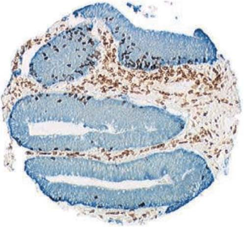

## I. 도입 및 질환 개요

다발성 경화증(Multiple Sclerosis, MS)은 중추신경계(CNS)의 수초(myelin sheath)를 자가면역 기전으로 공격하여 신경 축삭의 탈수초화(demyelination), 축삭 손상 및 신경 기능 장애를 초래하는 만성 염증성 질환이다.

최근 수십 년간 핑골리모드(fingolimod, 7), 클라드리빈(cladribine, 8), 나탈리주맙(natalizumab, 9), 디메틸 푸마레이트(dimethyl fumarate, 10, 11), 테리플루노마이드, 글라티라머 아세테이트, 인터페론-베타 등 혁신적인 질병완화치료제(DMT)들이 개발되었다.

### 다발성 경화증의 4대 임상 아형 (미국 국립 다발성 경화증 학회 기준)
1. **재발-완화형 MS (RRMS)**:
   - 급성 악화(재발, flare-up) 후 증상이 부분적 또는 완전히 회복되는 완화기가 반복되는 형태.
   - 전체 MS 환자의 약 **65%**를 차지하며 가장 흔하다(12).
   - 치료를 받지 않을 경우 환자의 약 90%가 20~25년 이내에 2차 진행형(SPMS)으로 이행한다(13).
2. **2차 진행형 MS (SPMS)**:
   - 초기에는 재발-완화형으로 시작하지만 점차 재발과 무관하게 신경학적 장애가 비가역적으로 축적되는 형태(16).
3. **1차 진행형 MS (PPMS)**:
   - 초기 발병 시점부터 뚜렷한 재발과 완화의 주기 없이 질병이 점진적으로 악화되는 형태. 전체 환자의 약 **7.5%**(14, 15).
4. **진행-재발형 MS (PRMS)**:
   - 발병 초기부터 질병이 꾸준히 진행하면서 그 과정 중에 뚜렷한 급성 악화가 중첩되는 드문 형태(약 7.5%)(17).

> **임상적 독립 증후군 (Clinically Isolated Syndrome, CIS)**:  
> 시신경염(optic neuritis), 뇌간 증후군, 척수염 등 다발성 경화증의 첫 번째 탈수초성 임상 발작을 의미한다. CIS 환자의 상당수가 향후 명확한 MS로 전환되며 조기 DMT 치료는 CIS에서 확진 MS로의 전환을 유의미하게 지연시킨다(18, 19).

***

## II. 다발성 경화증의 진단 기준

임상시험에 환자를 등록하기 위해서는 명확하고 표준화된 진단 기준이 필수적이다(20, 21).

### 포저 기준 대 맥도널드 기준
- **포저 기준 (1983년, 24)**: 순수한 임상적 발작 횟수와 뇌척수액(CSF) 올리고클론 밴드(OCB)에 주로 의존했던 고전적 기준.
- **맥도널드 기준 (2001년 도입, 2005년 및 2017년 개정, 25-27)**: 뇌 자기공명영상(MRI) 소견을 진단 체계의 중심에 통합하여 **공간적 다발성(Dissemination in Space, DIS)**과 **시간적 다발성(Dissemination in Time, DIT)**을 조기에 객관적으로 증명할 수 있도록 혁신함.

> **임상시험 간 비교 시 주의점 (Will Rogers 현상)**:  
> 맥도널드 기준을 적용하면 포저 기준 대비 발병 1년 차에 MS로 진단되는 환자 수가 2배 이상 증가한다(28-30). 진단 기준이 서로 다른 임상시험의 결과(예: 연간 재발률이나 장애 진행률)를 직접 비교할 경우 환자 구성군의 차이로 인해 심각한 통계적 왜곡(Will Rogers 현상)이 발생하므로 연구자는 진단 기준의 일치 여부를 면밀히 확인해야 한다(31-33).

***

## III. 생물학적 바이오마커

- **뇌척수액 신경미세섬유 경쇄/중쇄 (CSF NFL / NFH)**:
  - 신경 축삭(axon)의 핵심 세포골격 단백질이다(34, 35).
  - 축삭 손상 시 뇌척수액으로 방출되며 **NFL**은 급성 축삭 파괴를, **NFH**는 만성 비가역적 손상을 반영한다(36).
  - Kuhle 등(37)은 CSF NFL 농도가 EDSS 장애 점수와 유의미하게 상관됨을 입증하고 약물의 신경보호 효과를 평가하는 대리 지표로 제안하였다.
- **빛간섭단층촬영(OCT)과 망막신경섬유층(RNFL) 두께**:
  - MS 환자의 약 20%가 초기 증상으로 시신경염을 겪는다(38).
  - OCT를 통해 망막신경섬유층 두께를 측정하면 축삭 퇴행을 비침습적으로 평가할 수 있다. 정상인의 연간 감소율이 약 $0.2\ \mu\text{m}$인 반면 MS 환자에서는 연간 약 $2\ \mu\text{m}$씩 박막화된다(39-41).

***

## IV. 다발성 경화증 임상시험의 핵심 평가변수

다발성 경화증 임상시험에서 사용되는 평가변수 체계(42-58):

1. **연간 재발률 (Annualized Relapse Rate, ARR)**: 연간 확인된 평균 재발 횟수로 대부분의 RRMS 3상 시험에서 **1차 평가변수(Primary Endpoint)**로 채택된다.
2. **재발 없는 환자 비율 (Proportion of Relapse-Free Patients)**: 96주(2년) 추적 시점까지 재발을 겪지 않은 환자의 백분율.
3. **확인된 장애 진행까지의 시간 (Time to Confirmed Disability Progression, CDP)**:
   - EDSS 점수가 기저치 대비 3개월 또는 6개월 이상 지속적으로 1.0점 이상(기저 EDSS가 0점인 경우 1.5점 이상) 상승한 상태로 유지되는 기간.
4. **MRI 영상 평가변수 (핵심 대리 평가변수)**:
   - 가돌리늄 조영증강 T1 병변의 개수 (신규 급성 염증 병변).
   - 신규 또는 확대된 T2 고신호강도 병변의 개수 및 부피 변화 (누적된 전체 질병 부담).
   - 뇌 위축(Brain Volume Loss / Brain Atrophy) 비율.

***

## V. Kappos 등의 핑골리모드 중추적 3상 임상시험

Kappos 등(59)은 경구용 스핑고신-1-인산(S1P) 수용체 조절제인 **핑골리모드(fingolimod, Gilenya)**의 3상 위약 대조 시험으로 평가변수 측정 체계를 명확히 제시하였다.

### a. 1차 평가변수: 연간 재발률
- **임상적 재발(Relapse)의 엄격한 정의(Cohen 박사, 61-66)**:
  1. *주관적 증상*: 발열이나 감염 없이 다발성 경화증에 부합하는 새로운 또는 악화된 신경학적 증상이 **최소 24시간 이상 지속**.
  2. *객관적 신경학적 검사 이상*: 신경과 전문의의 진찰 결과, **EDSS 종합 점수가 최소 0.5점 이상 상승**하거나, 2개 기능계(FS) 점수가 각 1점 이상 상승, 또는 1개 기능계 점수가 2점 이상 상승함을 객관적으로 확인.

### b. 확장 장애 상태 척도
신경학적 장애의 객관적 표준 정량 도구로서 8개 기능계(추체로, 소뇌, 뇌간, 감각, 방광/장, 시각, 대뇌 기능 등)를 평가하여 0.0점부터 10.0점까지 0.5점 단위로 평정한다(60, 67, 68).

### 표 20.1 쿠르츠케 확장 장애 상태 척도 (EDSS)

| EDSS 점수 | 임상적 장애 상태 정의 |
| :--- | :--- |
| **0.0** | 정상적인 신경학적 검사 소견 |
| **1.0 ~ 1.5** | 장애 없음, 1개 이상의 기능계에서 최소한의 징후만 관찰됨 |
| **2.0 ~ 2.5** | 1~2개 기능계의 경미한 장애 |
| **3.0 ~ 3.5** | 1개 기능계의 중등도 장애, 보행 장애 없음 (완전 보행 가능) |
| **4.0** | 보조기구 없이 독립 보행 가능, 일상생활 자립, 쉬지 않고 **500 m** 보행 가능 |
| **4.5** | 보조기구 없이 독립 보행 가능, 하루 대부분 활동 가능, 쉬지 않고 **300 m** 보행 가능 |
| **5.0** | 보조기구나 휴식 없이 약 **200 m** 보행 가능, 일상 업무에 지장 초래 |
| **5.5** | 보조기구나 휴식 없이 약 **100 m** 보행 가능 |
| **6.0** | **약 100 m 보행을 위해 간헐적 또는 편측의 지속적 보조(지팡이, 목발) 필요** |
| **6.5** | **약 20 m 보행을 위해 양측성 지속 보조(양쪽 목발 등) 필요** |
| **7.0** | 보조기를 사용해도 약 5 m 이상 보행 불가, **휠체어에 의존** (자력 이동 가능) |
| **7.5** | 몇 걸음 이상 걷지 못함, 휠체어에 전적으로 의존 |
| **8.0 ~ 8.5** | 침상 또는 휠체어에 전적으로 국한, 상지(팔) 기능 일부 유지 |
| **9.0 ~ 9.5** | 침상에 완전히 누워 지내는 상태 (소통/연하 곤란) |
| **10.0** | 다발성 경화증으로 인한 사망 |

***

### c. 다발성 경화증 기능 복합 척도
EDSS가 보행 능력에 지나치게 편중되어 있다는 비판을 극복하기 위해 Fischer 등(70, 71)이 개발한 다차원 복합 검사이다:
1. **25피트 보행 검사 (Timed 25-Foot Walk, T25FW)**: 하지 운동 및 보행 속도 측정.
2. **9구멍 페그 검사 (9-Hole Peg Test, 9HPT)**: 상지 민첩성 및 손기능 측정.
3. **간이 청각 연속 덧셈 검사 (PASAT-3)**: 인지 처리 속도 및 작업 기억력 측정.

***

### d. 뇌 자기공명영상 (MRI)과 병변 분석

MRI는 임상적 증상보다 진행 중인 탈수초 염증 반응을 **5~10배 더 민감**하게 감지하므로 대부분의 병변은 '임상적으로 무증상(clinically silent)'이다(72, 89-91).
- **도슨 손가락 (Dawson's fingers)**: 뇌실 주위 수질정맥을 따라 방사상으로 뻗어나가는 전형적인 난형 염증 병변(73, 74).
- **가돌리늄(Gd) 조영증강 T1 병변**:
  - 급성 염증으로 혈액-뇌 장벽(BBB)이 붕괴되어 가돌리늄 조영제가 혈관 밖 신경 조직으로 유출된 부위이다(79-84).
  - 균일한 조영증강은 신규 급성 병변을, 고리형(ring-like) 조영증강은 기존 병변의 재활성화를 나타낸다(85-88).
- **T1 저신호강도 병변 ("T1 Black Holes")**:
  - T1 강조 영상에서 뇌척수액처럼 어둡게 보이는 만성 병변으로, 단순 부종을 넘어 축삭의 영구적 파괴 및 비가역적 신경세포 소실을 반영하므로 **환자의 장기 장애(EDSS)와 가장 강력한 상관관계**를 보인다(76, 77).
- **T2 고신호강도 병변**: 탈수초, 부종, 염증, 신경교종(gliosis)을 모두 포괄하는 누적된 전체 병변 부하(lesion load)를 측정한다(78).

# 제20장 면역 질환 임상시험 평가변수: 다발성 경화증 (계속) 및 제21장 감염 질환 임상시험 평가변수

## II. 다발성 경화증의 아형 및 영상 진단 (계속)

### e. 자기공명영상(MRI) 촬영 조건 및 병변 특성

다발성 경화증 환자의 뇌 병변은 MRI 영상에서 결절(nodes), 고리(rings), 호(arcs) 등 다양한 형태로 나타난다(92). Ge(93)의 종설에서는 30세 여성 환자의 극적인 뇌 병변 MRI 사진을 제시하였으며(그림 20.1), 거대 병변은 결절과 고리 형태로 관찰되고 화살표는 미세 병변들을 가리킨다.

MRI 영상은 통상 세 가지 조건으로 획득된다:
1. **비조영 T1 강조 영상 (Noncontrast T1-weighted imaging)**
2. **비조영 T2 강조 영상 (Noncontrast T2-weighted imaging)**
3. **가돌리늄 조영증강 T1 강조 영상 (Gadolinium-enhanced T1-weighted imaging)**

물리학적으로 T1과 T2는 각각 종이완 시간(longitudinal relaxation time) 및 횡이완 시간(transverse relaxation time)을 의미한다.

***

### f. T2 강조 MRI

T2 강조 영상은 다발성 경화증 병변 검출에 매우 높은 민감도(sensitivity)를 보인다(조영제를 투여하지 않는 비조영 영상임).
- **진단 및 전체 질병 부담(Disease Burden) 평가**: 높은 민감도로 인해 진단뿐 아니라 연간 스캔에서 고신호강도 병변의 총 부피(total hyperintense lesion volume)를 측정하여 누적된 질병 부담을 정량하는 데 핵심적으로 활용된다(94).
- **민감도 대 특이도**: 질병의 공간적 다발성을 입증하는 가장 민감한 진단 도구이지만 특이도(specificity)는 중등도 수준이다(95).
- **병리학적 비특이성**: T2 강조 영상에서 밝게 관찰되는 고신호강도 병변(T2-hyperintense lesions)은 기저의 세부 병리학적 상태(염증, 탈수초, 신경교종, 부종, 허혈, 축삭 소실 등)를 명확히 구별하지 못한다(98-100). 따라서 병변 부하가 환자의 기능적 장애 상태를 완벽하게 대변하지는 못하더라도, 질병의 자연 경과와 치료 반응을 모니터링하는 데 필수적인 정보를 제공한다(96).
- **병변의 경과**: 일부 T2 병변은 시간이 흐르며 가라앉거나 소실되기도 하지만(97), 새로 형성된 대다수의 T2 병변은 뇌 조직 손상의 영구적 '발자국(footprints)'으로 만성 지속된다.

***

### g. T1 강조 MRI 및 지속성 블랙홀

- **급성 병변의 특징**: T1 강조 영상에서 급성 병변은 대개 정상 백질과 신호 강도가 유사(등신호강도, isointense)하지만 만성 조직 손상이나 중증 부종이 동반되면 저신호강도(hypointense)로 나타난다.
- **장애 진행과의 상관성**: 저신호강도 병변의 축적은 환자의 질병 진행 및 신경학적 장애와 유의미한 상관관계를 보인다(101).
- **가돌리늄 조영증강**: 급성 염증 단계에서는 혈액-뇌 장벽(BBB)이 파괴되어 수일~수주 동안 T1 조영증강이 유지된다. 가돌리늄 투여 전후의 T1 스캔을 비교함으로써 진행 중인 활동성 병변과 비활동성 병변을 명확히 구별할 수 있다(102).
- **병변의 진화**: 조영증강 병변은 균일한 조영증강 결절로 시작하여 점차 고리형(ring-like) 증강으로 진행한다(103).
- **영구적 축삭 손상의 지표 (T1 Black Holes)**:
  - 새로운 병변 형성 시 일시적으로 T1 저신호강도가 관찰될 수 있으나, 환자의 약 30%에서는 **영구적 만성 T1 블랙홀(persistent T1 black holes)**이 발생한다.
  - 이 블랙홀 병변은 비가역적 축삭 파괴, 세포외 기질 파괴, 신경교종, 심각한 조직 소실 및 세포외 공간 확장을 대변한다(104-106).
  - 초기 가돌리늄 조영증강 병변 중 약 50%는 수개월 내 회복되는 일과성 병변이지만 나머지 50%는 영구적인 T1 블랙홀로 굳어진다(107).

***

### h. Gold 등의 3상 중추적 임상시험: 디메틸 푸마레이트

Gold 등(108)은 재발-완화형 다발성 경화증(RRMS) 환자를 대상으로 경구용 **디메틸 푸마레이트(dimethyl fumarate, 제품명 Tecfidera)**의 3상 위약 대조 임상시험을 수행하였다.

- **약물 개발 배경 및 기전**:
  - 1950년대 독일에서 건선(psoriasis)이 크렙스 회로(Krebs cycle) 장애로 발생한다는 잘못된 가설에서 출발하였으나, 푸마르산염이 크렙스 회로의 중간 대사체라는 점에 착안하여 개발되었다(109, 110). 건선과 다발성 경화증은 모두 자가면역 질환이다.
  - **작용 기전**: 림프구의 사이토카인 분비 프로파일을 염증성 Th1 표현형에서 항염증성 Th2 표현형으로 전환시킨다. 또한 **Nrf2 항산화 반응 경로를 활성화**하여 일산화질소(NO), 과산화수소, 과산화아질산염 등 독성 반응성 산소종(toxic oxygen)의 생성을 억제함으로써 신경 조직의 산화적 파괴를 방지한다.
- **임상시험 설계 및 등록 현황**:
  - 총 1,237명의 환자가 등록되었고 952명이 시험을 완료하였다. 연구 약물군(31%)과 위약군(35%)의 치료 중단율은 유사하였다.
  - **1차 평가변수(Primary Endpoint)**: 2년 시점까지 재발(relapse)을 경험한 피험자 비율.
  - **2차 평가변수(Secondary Endpoints)**:
    1. 신규 또는 확대된 병변의 수 (피험자당 평균 병변 수; 부록에서 0개, 1개, 2개, 3~4개, 5개 이상 환자 분포 분석).
    2. 환자-인년당 총 재발 횟수 (연간 재발률).
    3. EDSS 척도 기준 장애 진행 환자 비율 (기저 EDSS $\ge 1.0$인 경우 1.0점 이상 상승, 기저 EDSS 0인 경우 1.5점 이상 상승하여 최소 12주 이상 지속).
  - **임상적 재발의 정의**: 최소 24시간 이상 지속되고 객관적인 신규 신경학적 소견이 수반되는 새로운 또는 재발성 신경학적 증상(시력 상실, 복시, 감각 이상, 근력 약화, 구음 장애, 운동 실조, 방광 기능 장애 등)(111-113).

### 표 20.2 Gold 임상시험의 주요 유효성 평가 결과

| 평가변수 | 시험약군 (디메틸 푸마레이트) | 위약군 (Placebo) |
| :--- | :--- | :--- |
| **1차 평가변수**<br>2년 시점 재발 발생 환자 비율 | **26% ~ 27%** | 46% |
| **2차 평가변수**<br>신규 또는 확대된 T2 병변 수 (평균) | **2.6 ~ 4.4개** | 17.0개 |
| **2차 평가변수**<br>환자-인년당 총 재발률 (ARR) | **0.17 ~ 0.19** | 0.36 |
| **2차 평가변수**<br>EDSS 기준 장애 진행 환자 비율 | **16% ~ 18%** | 27% |

시험약의 두 가지 투여 용량군 모두에서 위약 대비 통계적으로 현저하고 극적인 임상적·영상학적 유효성이 입증되었다.

***

## III. 미국 FDA의 다발성 경화증 평가변수 심사 및 규제적 의사결정: 팜프리딘 승인 사례

**팜프리딘(Fampridine, Ampyra; 4-아미노피리딘, 4-AP)**은 다발성 경화증 환자의 보행 기능을 개선하는 대증 치료제로서 질병 자체의 병태생리학적 진행 경과를 바꾸지는 못한다.
- **약리 기전**: 탈수초된 신경 섬유의 전압개폐성 칼륨 통로를 차단하여 활동 전위의 전도를 개선하고 신경근 접합부 및 시냅스에서 신경전달물질 방출을 촉진한다. 지용성이 높아 혈액-뇌 장벽(BBB)을 쉽게 통과한다.
- **임상적 효능**: 환자의 약 3분의 1에서 근력 및 보행 속도를 유의미하게 향상시킨다(114, 115).

### FDA 심사관의 평가변수 타당성 지적 및 승인 쟁점
FDA의 승인 서한(Approval Letter) 및 의학 심사 요약서(Medical Review)에 공개된 규제 심사 과정은 다음과 같은 교훈을 준다:

1. **무의미하거나 검증되지 않은 평가변수에 대한 비판**:
   - 스폰서가 제안한 '보행 반응자(Timed Walk Responder)' 기준에 대해 FDA 심사관은 *"임상시험에서 반응자 비율은 위약 대비 높았으나 그 혜택의 임상적 유의성(clinical meaningfulness)이 불분명하다. 보행 속도가 단지 미세하게 향상된 환자까지 반응자로 분류함으로써 개선의 크기(magnitude)를 반영하지 못했다"*고 지적하였다.
   - 즉, 다수의 환자에서 나타난 미미한 변화로 인해 임상적 혜택이 실질적으로 결여되었음에도 통계적으로 양성인 시험 결과가 도출될 위험을 경고하였다.
2. **평가변수 유효성 검증(Validation) 요구**:
   - FDA는 반응자 기준이 장기적인 효과 유지를 입증하지 못함을 지적하며 추가 검증을 요구하였다. 심사관은 **25피트 보행 검사(T25FW)** 결과를 **가이 신경학적 장애 척도(GNDS)** 또는 **EDSS** 점수와 상관분석하여 임상적 타당도를 입증할 것을 권고하였다.
3. **보조 평가변수(Supportive Endpoints)의 필수성 및 기저치 측정 한계**:
   - MSWS-12 척도처럼 확립되지 않은 지표를 사용할 경우 EDSS와 같은 객관적 보조 지표가 필수적이다.
   - 특히 스폰서가 기저(Baseline) 시점의 EDSS만 측정하고 무작위 배정 이후 추적 EDSS를 측정하지 않은 점을 강하게 질타하였다. 기저 EDSS는 환자 층화에는 유용하지만 약물의 유효성 평가변수로 기능하려면 약물 투여 전후의 시점별 측정이 반드시 이루어져야 한다(116-118).

***

## IV. 제20장 결론

다발성 경화증을 비롯한 면역 질환 임상시험에서는 임상의사가 관찰·기록하는 일상생활 기능 평가(예: EDSS 보행 장애 수준)와 특수 정밀 장비가 요구되는 MRI 영상 평가변수가 상호보완적으로 활용된다.
고형암 임상시험(RECIST 기준)과 마찬가지로 MRI 영상 데이터는 거의 모든 MS 시험에서 필수적으로 수집되지만 대부분의 등록 임상시험에서 규제 기관의 최종 허가를 견인하는 것은 환자가 직접 느끼는 기능적 개선(재발률 및 장애 진행)이며 MRI 지표는 핵심 2차 또는 대리 평가변수로 위치한다.

***
***

# 제21장 감염 질환 임상시험 평가변수

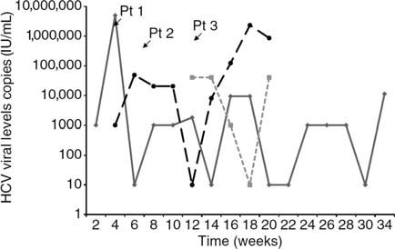

## I. 도입 및 개요

감염 질환(Infections)은 세균 감염, 원충 감염, 바이러스 감염을 포괄한다. 감염 질환 임상시험의 평가변수는 다음 세 가지 범주로 구분된다:
1. **병원체 자체의 직접적 측정** (바이러스 RNA 정량, 세균 배양 음전 등).
2. **병원체에 의해 손상된 생리학적 기능의 측정** (간 효소 수치 ALT/AST, 폐 기능 등).
3. **병원체에 대항하는 숙주 면역 반응의 측정** (항체 역가, 병원체 특이적 T 세포 반응).

### 만성 잠복성 감염과 평가변수 설정의 어려움
모든 감염 질환이 급성 치명적인 것은 아니다. 예를 들어 *Trypanosoma cruzi*에 의한 샤가스병(Chagas' disease)은 10~30년에 이르는 긴 임상적 잠복기를 거치며 평생 만성으로 지속된다(1). 따라서 전체 생존기간(OS)이나 무진행 생존기간(PFS)과 같은 생존 지표는 감염 질환 임상시험에서 적절한 평가변수가 되기 어렵다.
또한 Molina 등(2)이 지적했듯이 만성 감염에서는 '완치(cure)'를 확정할 수 있는 완벽한 진단법이 존재하지 않는 경우가 많으므로 바이오마커 기반의 **대리 평가변수(surrogate endpoints)**가 불가피하게 핵심 역할을 담당하게 된다.

***

## II. C형 간염 바이러스(HCV) 감염의 임상적 및 면역학적 특성

C형 간염 바이러스(HCV)는 1989년에 최초로 동정되었다(3). 전 세계적으로 약 1억 7천만 명, 미국 내에서만 약 4백만 명이 감염되어 있다(4).

### a. 만성 감염의 역학과 치명적 결과
- **간경변증 및 간암 위험**: 만성 HCV 감염자의 약 **20%**가 20년 이내에 간경변증(cirrhosis)으로 진행하며 간경변증 환자의 연간 **1~4%**에서 간세포암(HCC)이 발생한다. 스위스 코호트 연구(Prasad 등, 11)에 따르면 2,452명의 HCV 환자 중 14%(339명)가 간경변증, 약 2%(54명)가 간세포암을 동반하였다. 비간경변 만성 HCV 환자에서 HCC 발생은 드물다(12).
- **간이식의 주요 원인**: HCV는 말기 간부전으로 인한 간이식의 가장 흔한 원인이다(2000년 미국 내 약 5,000건의 간이식 중 약 40%가 만성 HCV 환자)(4).
- **진단 시점의 특징**: 초기 감염 후 혈청 알라닌 아미노전이효소(ALT) 수치가 상승하는 8~12주 시점에 이르러서야 비로소 진단되며 이때 비로소 HCV 특이 항체 및 T 세포가 검출된다(5, 6).

### b. HCV 감염의 주요 유해 결과 (7)
1. 만성 간염(Chronic hepatitis) 진행 (감염자의 60~80%)(10).
2. 간경변증 위험 증가.
3. 간세포암(HCC) 발생 위험 증가.
4. 약물 치료 실패 (인터페론 + 리바비린 병용 요법 시 환자의 약 절반에서 실패)(8, 9).
5. 간이식 필요성 대두.

***

## III. 급성 HCV 대 만성 HCV 감염

- **급성 감염(Acute infection)**: 신규 감염 환자의 대다수는 무증상이거나 피로, 미열, 근육통, 오심 등 비특이적 증상만 겪으며 황달은 20~30%에서만 관찰된다. 조기 진단 및 치료 시 대부분 완치될 수 있다.

# 제21장 감염 질환 임상시험 평가변수 (계속)

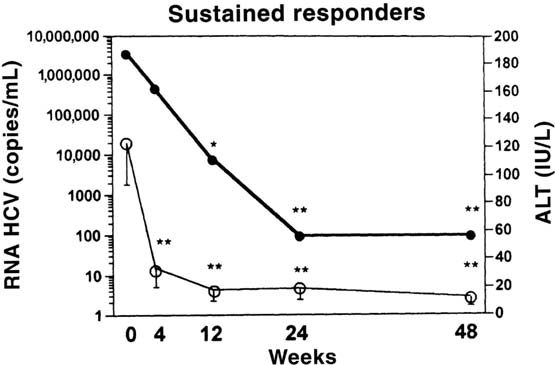

## III. 급성 HCV 대 만성 HCV 감염 (계속) 및 자연 치유 기전

급성 감염 환자의 대다수는 바이러스가 체내에 지속되어 약 80%에서 만성 감염으로 이행하지만(14, 15), 약 20%는 발병 1년 이내에 자연 치유(자연 소멸, spontaneous clearance)된다(13).

### a. 인간 유전체 다형성과 자연 치유: IFN-감마 유전자 변이
251명의 HCV 환자를 대상으로 한 Huang 등(16)의 연구에서 34%는 자연 치유되었고 66%는 만성 감염으로 진행하였다.
- 연구진은 자연 치유 여부를 가르는 결정적 요인으로 **인간 인터페론-감마(IFN-$\gamma$) 유전자의 단일염기다형성(SNP)**을 규명하였다.
- IFN-$\gamma$ 유전자 프로모터(promoter) 부위의 염기서열 다형성에 따라 환자의 바이러스 자연 제거율 및 인터페론 치료 반응률에 현저한 차이가 발생한다.

### b. 면역학적 기전: CD4 T 세포 '도움'의 결정적 역할
HCV 감염 시 대부분의 환자는 **CD8 양성 세포독성 T 세포(CTL)** 반응을 형성하지만 결과의 차이는 **CD4 양성 도움 T 세포(Helper T cell)** 반응의 유무에서 비롯된다(17):
- **급성기 회복군**: 강력한 CD8 T 세포 반응과 더불어 효과적인 **CD4 T 세포 반응**이 함께 작동한다.
- **만성 진행군**: 바이러스 특이적 CD8 T 세포 수는 증가해 있으나, CD4 T 세포의 보조(대자연의 면역증강제 역할)가 결여되어 있어 CD8 T 세포가 최대 활성에 도달하지 못하고 기능 부전에 빠진다.
- Smyk-Pearson 등(18)은 CD4 T 세포의 도움을 받지 못한 '무력한(helpless)' 기억 CTL의 특징을 규명하였다. 이들 세포는 바이러스 재공격 시 2차 반응 증식 능력이 크게 손상되어 HCV를 완전히 제거하지 못한다.

***

## IV. C형 간염 치료제의 변천

### a. 전통적 표준 요법: 인터페론-알파 및 리바비린
과거 가장 널리 사용된 병용 요법은 **페그인터페론-알파2(pegylated IFN-$\alpha$-2)**와 **리바비린(ribavirin)**이었다(19). 구아노신 유사체(guanosine analog)인 리바비린은 일과성 억제 효과를 보이지만 인터페론과 병용 투여할 경우 바이러스를 영구 박멸할 수 있다.

#### 리바비린의 3대 추정 약리 기전
1. **인터페론 신호전달 촉진**: 인터페론 자극 유전자(ISG)의 발현을 유도하여 인터페론의 항바이러스 효과를 극대화한다(20, 21).
2. **IMPDH 억제**: 뉴클레오티드 생합성 핵심 효소인 이노신 일인산 탈수소효소(IMPDH)를 억제하여 바이러스 복제에 필수적인 세포 내 구아노신 풀(pool)을 고갈시킨다(22, 23).
3. **바이러스 유전체 돌연변이 유발(치명적 돌연변이)**: 바이러스 RNA 복제 시 전이 돌연변이(C-U, G-A 등)를 급증시켜 바이러스 증식을 종결시킨다는 가설이 보고되었으나(24), 환자 대상 연구에 따라 돌연변이율에 미치는 영향에 대한 논쟁도 존재한다(25).

#### 인터페론 페길화의 의의
IFN-$\alpha$-2는 생체 내 사이토카인이지만 혈중 반감기가 매우 짧다. 비활성 고분자인 폴리에틸렌글리콜(PEG)을 공유결합(페길화)시킴으로써 체내 반감기를 대폭 연장하여 주 1회 투여가 가능하도록 개선하였다. 2011년 이전까지 인터페론 기반 요법의 완치율(SVR)은 바이러스 유전자형(Genotype)에 따라 **40% ~ 90%** 수준에 머물렀다(26).

***

### b. 직접작용 항바이러스제의 혁명

인터페론과 리바비린의 심각한 전신 부작용(호중구 감소증, 빈혈, 우울증 등)을 극복하고 완치율을 극대화하기 위해 바이러스 단백질을 직접 표적하는 경구용 신약들이 등장하였다.

1. **NS3/4A 단백질분해효소 억제제 (Protease Inhibitors)**:
   - 2011년 최초 승인된 1세대 제제: **보세프레비르(boceprevir)**, **텔라프레비르(telaprevir)**.
   - 이후 개발된 제제: **시메프레비르(simeprevir)**, **아수나프레비르(asunaprevir)** 등(39-41, 47).
2. **NS5A 복제 복합체 억제제 (NS5A Inhibitors)**:
   - **레디파스비르(ledipasvir)**, **다클라타스비르(daclatasvir)**, **옴비타스비르(ombitasvir)**, **사마타스비르(samatasvir)**(27, 42-45).
   - 바이러스 증식 및 조립에 관여하는 비구조 단백질 NS5A를 강력하게 억제한다.
3. **NS5B 중합효소 억제제 (Polymerase Inhibitors)**:
   - 뉴클레오티드 유사체: **소포스부비르(sofosbuvir, Sovaldi)**(28, 33-36).
   - 비뉴클레오티드 유사체: **다사부비르(dasabuvir)**(43).
4. **약동학적 촉진제(PK Booster)**:
   - **리토나비르(ritonavir)**: CYP3A 효소를 억제하여 병용된 프로테아제 억제제의 혈중 농도를 유지시킨다(48, 49).

최신 DAA 임상시험(레디파스비르+소포스부비르, 다사부비르+옴비타스비르+ABT-450/r 등)은 인터페론을 완전히 배제한 경구 단기 요법으로 95% 이상의 완치율을 달성하며 치료 패러다임을 전환시켰다(29-50).

***

## V. HCV에 대한 숙주 면역 반응

- **세포독성 T 세포(CD8 CTL)의 이중 항바이러스 작용**:
  1. 바이러스에 감염된 간세포를 직접 인식하여 사멸시킨다.
  2. **IFN-감마(IFN-$\gamma$)**를 국소 분비하여 바이러스 복제를 직접 억제한다(51).
- **면역 모니터링**: 바이러스 특이적 CD8 T 세포는 간 생검뿐 아니라 말초혈액(PBMC)에서도 용이하게 측정할 수 있어 임상시험에서 면역 반응 지표로 활용된다(52).
- **CD4-CD8 상호작용**: 보조 T 세포는 사이토카인 분비뿐 아니라 **CD40 리간드(CD40L)와 CD8 T 세포의 CD40 수용체(CD40R)** 간의 직접 접촉을 통해 CTL의 생존과 기능을 유지시킨다(53).

***

## VI. HCV 바이러스 동태학

감염 후 혈청 HCV-RNA가 검출되기까지 1~3주의 잠복기가 존재하며 항체 양전(seroconversion)은 4~10주 시점에 일어난다(54, 55).

### a. 급성 및 만성 감염에서의 바이러스 부하 변동
- 급성기에는 혈청 HCV-RNA 농도가 격렬하게 변동(fluctuation)하며 일시적으로 검출 한계 미만으로 떨어지기도 한다(Loomba 및 Meyer 연구, 그림 21.1)(56-58).
- 자연 치유가 일어나는 경우 1개월에서 12개월 사이에 완전히 소멸된다(59).
- 만성 감염 환자(Gordon 등, 그림 21.2)에서는 치료를 받지 않을 때 환자에 따라 HCV-RNA와 간 손상 지표인 ALT 수치가 장기간(48~72개월)에 걸쳐 증가, 감소 또는 일정한 평형 상태를 유지한다(60).

### b. 인터페론 투여 시의 이상성 감소 패턴
인터페론-알파 투여 시작 후 혈청 HCV-RNA는 특징적인 **2단계 동태(이상성 감소)**를 보인다(Zeuzem 및 Neumann 연구, 61-64):
1. **지연기 (Lag phase, 약 9시간)**: 투여 직후 바이러스 농도에 유의한 변화가 없는 잠복 시간.
2. **1차 급격한 감소기 (Rapid first phase)**: 혈류 내 유리 바이러스 입자의 제거 및 신규 감염 차단으로 인해 24~48시간 동안 바이러스 수치가 수 log 단위로 급감한다(거의 모든 환자에서 관찰됨).
3. **2차 완만한 감소기 (Slower second phase)**: 이미 감염된 간세포의 사멸 및 세포 내 바이러스 청소 속도를 반영하는 완만한 감소 단계.

### c. 반응자 대 무반응자의 분필
치료 미경험 만성 C형 간염 환자에게 인터페론+리바비린을 투여했을 때(그림 21.3, 21.4):
- **반응자**: 1차 급격한 감소에 이어 바이러스 RNA가 신속하게 검출 한계(100 copies/mL) 미만으로 떨어지며 정상 ALT를 회복한다(65).
- **무반응자**: 1차 감소 폭이 미미하거나 감소 후 지속적인 고원(plateau)을 형성하거나 바이러스 반등(rebound)을 보여 공중보건상의 난제로 남았다.

# 제21장 감염 질환 임상시험 평가변수 (계속)

## VII. 치료 반응자 대 무반응자의 유전체 및 분자 기전

만성 C형 간염 환자의 약 절반은 페그인터페론-알파 및 리바비린 표준 치료(SOC)에 반응하지 않는다. 무반응률은 코카시안(백인) 대비 아프리카계 미국인(흑인)에서 유의미하게 더 높게 나타난다.

### a. 유전자 발현 프로파일링과 인터페론 반응성 결여
Taylor 등(66)은 치료를 받는 반응자와 무반응자의 말초혈액 백혈구(PBMC)에서 수백 개 유전자의 mRNA 및 단백질 발현 변화를 마이크로어레이로 비교 분석하였다:
- 인터페론-알파는 세포 표면 수용체에 결합하여 약 1,000개에 달하는 유전자의 전사를 유도한다.
- **무반응자의 유전자 발현 억제**: 무반응자에서는 반응자에 비해 항바이러스 면역에 필수적인 핵심 유전자들의 유도 반응이 전반적으로 저하되어 있었다. 특히 다음 4가지 핵심 면역 유전자의 발현이 뚜렷하게 억제되었다:
  1. **$2',5'$-올리고아데닐산 합성효소 ($2',5'$-Oligoadenylate Synthetase, OAS)**: 바이러스 RNA 분해를 촉진하는 핵심 선천면역 효소.
  2. **MX1 단백질 (Myxovirus resistance protein 1)**: 바이러스 복제를 차단하는 GTPase.
  3. **IRF-7 (Interferon Regulatory Factor-7)**: 제1형 인터페론 생성 증폭의 핵심 전사인자.
  4. **TLR7 (Toll-like receptor-7)**: 단일가닥 바이러스 RNA를 직접 인식하여 인터페론 분비 및 항원 특이적 T 세포 반응을 촉발하는 핵심 패턴인식수용체.

### b. 면역관문 수용체 PD-1의 과발현과 T 세포 탈진
Golden-Mason 등(67)은 표준 요법에 반응하지 않는 만성 C형 간염의 또 다른 핵심 원인으로 **면역관문 분자인 PD-1 (Programmed Death-1)**을 규명하였다:
- PD-1은 T 세포와 NK 세포의 활성을 억제하는 면역 브레이크 단백질이다.
- 건강한 사람에서는 발현 수준이 매우 낮지만 표준 치료에 반응하지 않는 만성 HCV 환자(특히 아프리카계 미국인)에서는 발현이 비정상적으로 급증해 있었다.
- 주목할 점은 PD-1 발현이 모든 면역세포에서 무차별적으로 증가한 것이 아니라, **HCV 바이러스 항원 특이적 CD8 양성 세포독성 T 세포에서만 선택적이고 극적으로 증가(T 세포 탈진, T-cell exhaustion)**하여 바이러스 박멸 기능을 상실하게 만들었다는 점이다.

이러한 약물유전체학 연구는 급성에서 만성으로의 이행 위험군을 식별하고 특정 약물에 반응할 환자군을 사전에 선별하는 **정밀 맞춤의학(Personalized Medicine)**의 기반이 된다.

***

## VIII. C형 간염 임상시험의 평가변수 체계

C형 간염 임상시험에서 활용되는 평가변수는 크게 다음 4가지 범주로 나뉜다:
1. **바이러스 직접 정량 지표**:
   - 혈장 HCV-RNA 농도(68).
   - **지속 바이러스 반응 (SVR: Sustained Virologic Response)**: 치료 종료 후 일정 기간 바이러스 미검출 상태 유지(골드 스탠다드 평가변수)(69).
   - 치료 종료 후 재발률(Relapse rate).
2. **간 손상 간접 반영 지표**:
   - 혈청 아미노전이효소(ALT / AST).
3. **간 조직 손상 직접 평가 지표**:
   - 간 생검(Liver biopsy)을 통한 조직학적 괴사염증 점수(Histology necroinflammatory scores).
4. **만성 감염 합병증 발생 평가 지표**:
   - 간 섬유화 진행률 (FibroScan, FibroTest, HepaScore 등)(70-72).
   - **간 비대상성 사건 (Hepatic Decompensation)**: 간경변증 환자에서 연간 3~6% 위험 발생(식도정맥류 출혈, 복수, 간성뇌증 등; 비대상성 사건 발생 시 1년 내 사망률 15~20%)(73).
   - **간세포암 (HCC)**: 전 세계적으로 연간 약 195,000명의 HCV 관련 간암 발생(74).

***

## IX. C형 간염 중추적 임상시험 사례 분석

### a. McHutchison 등의 3상 임상시험: 페그인터페론 2a vs 2b 비교

McHutchison 등(79)은 치료 미경험 만성 C형 간염 환자를 대상으로 세 가지 치료군의 유효성과 안전성을 비교하였다:
- **A군**: 리바비린 + 페그인터페론-알파2a (PegIFN-$\alpha$-2a)
- **B군**: 리바비린 + 표준용량 페그인터페론-알파2b (PegIFN-$\alpha$-2b)
- **C군**: 리바비린 + 저용량 페그인터페론-알파2b

#### 평가변수 정의 및 층화
- **1차 평가변수(Primary Endpoint)**: **치료 종료 24주 후 지속 바이러스 반응 (SVR24)** - 치료 종료 24주 시점 혈청 HCV-RNA 미검출(검출 한계 27 IU/mL).
- **2차 평가변수(Secondary Endpoints)**: 치료 기간 중 반응률, 치료 종료 후 **재발률(Relapse rate)**(48주 치료 종료 시점에는 바이러스 미검출이었으나 24주 추적 기간 동안 바이러스가 재검출된 비율).
- **환자 층화(Stratification)**:
  1. 기저 혈장 HCV-RNA 농도 ($\le 600,000\text{ IU/mL}$ 대 $> 600,000\text{ IU/mL}$).
  2. 인종 (아프리카계 미국인 대 비아프리카계 미국인).

#### 임상 결과
- **SVR24 달성률**: 세 군 모두 **약 40%**로 유의미한 차이가 없었다.
- **재발률**: PegIFN-$\alpha$-2b 투여군(약 22%)이 PegIFN-$\alpha$-2a 투여군(31.5%)에 비해 유의하게 낮았다. PegIFN-$\alpha$-2a는 치료 중 반응률은 높았으나 투약 종료 후 재발률이 더 높았다.

***

### b. Di Bisceglie 등의 HALT-C 3상 임상시험: 진행성 섬유화 환자의 장기 유지 요법

Di Bisceglie 등(80)은 표준 치료에 실패한 진행성 간 섬유화 및 간경변증 환자를 대상으로 저용량 페그인터페론 장기 유지 요법의 임상적 혜택을 평가하였다:
- **A군**: 페그인터페론-알파2a 저용량 장기 유지 요법
- **B군**: 위약(Placebo) 대조군 (기존 표준 요법 실패 환자 대상이므로 위약 대조 시험의 윤리성이 정당화됨)(81, 82).
- **1차 평가변수**: **간 질환의 임상적 진행(Progression of Liver Disease)** - 사망, 간세포암(HCC), 비대상성 간질환(정맥류 출혈 등), 간 생검 조직 검사상 섬유화 점수 악화를 포괄한 복합 평가변수.
- **2차 평가변수**: 혈청 ALT, 혈청 HCV-RNA, 1.5년 및 3.5년 시점의 간 생검 조직학적 괴사염증 점수.

#### 임상 결과 및 교훈
- **1차 임상 평가변수 불일치**: 1차 평가변수 발생률은 시험약군 **34.1%**, 위약군 **33.8%**(HR 1.01, P=0.90)로 **치료 효과가 전무**하였다.
- **2차 대리 지표의 유의한 개선**: 시험약군에서 혈청 ALT 감소, 혈청 HCV-RNA 감소, 간 생검 괴사염증 점수의 유의미한 개선($P < 0.001$)이 확인되었고 SVR도 시험약군 18명(3.5%) 대 위약군 1명에서 관찰되었다.
- **결론**: 인터페론 장기 유지 요법이 바이러스 부하 및 혈청 효소 수치(대리 평가변수)를 일시적으로 개선할지라도, **실제 환자의 간경변증 합병증 발생, 간암 발생 및 사망률(궁극적 임상 평가변수)을 개선하지 못함**을 명백히 보여줌으로써 대리 평가변수와 실제 임상 결과 간의 간극을 입증한 결정적 연구이다.

***

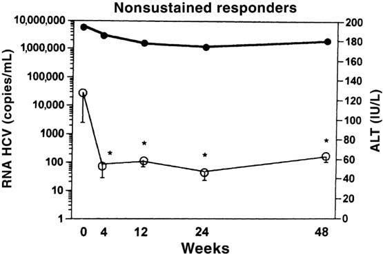

## X. 제21장 총결론

감염 질환 임상시험에서는 혈청 효소(간접 지표), 조직 생검(직접 지표), 혈중 바이러스 핵산 정량(HCV-RNA/SVR) 등 다층적 평가변수가 동원된다.
특히 중추적 허가 임상시험에서는 치료 종료 후 바이러스 미검출 상태의 유지를 의미하는 **SVR(지속 바이러스 반응)**이 임상적 완치를 입증하는 핵심 규제 평가변수로 확립되어 있다(83).

# 제22장 건강 관련 삶의 질 평가 도구: 종양학

## I. 도입 및 개념적 정의

암(3), 다발성 경화증(4), C형 간염 바이러스 감염(5) 등 만성 질환 환자를 대상으로 한 임상시험에서 **건강 관련 삶의 질 (Health-Related Quality of Life, HRQoL)** 평가변수의 중요성이 급격히 부각되고 있다.

### a. 도메인과 문항 체계: SF-36 도구
가장 널리 사용되는 일반 건강 설문지인 **SF-36 (RAND 36-Item Health Survey)**은 36개 문항으로 8개 건강 도메인을 측정한다:
1. **신체 기능 (Physical Functioning)**: 식료품 나르기, 걷기, 계단 오르기, 옷 입기 등 신체 활동 능력을 묻는 10개 문항.
2. **신체적 문제로 인한 역할 제한 (Physical Role Limitations)**
3. **활력 (Vitality)**
4. **일반 건강 지각 (General Health Perceptions)**
5. **통증 (Bodily Pain)**: 지난 4주간 겪은 통증의 강도 및 통증이 일상 업무를 방해한 정도를 묻는 2개 문항.
6. **사회적 기능 (Social Functioning)**
7. **감정적 문제로 인한 역할 제한 (Emotional Role Limitations)**
8. **정신 건강 (Mental Health)**: 불안 및 우울 정도를 묻는 5개 문항.

이들 8개 영역 점수는 최종적으로 **신체 건강 요약 점수 (Physical Summary Score)**와 **정신 건강 요약 점수 (Mental Summary Score)**라는 두 가지 종합 지표로 집계된다(Schroeder 등, 6).

### b. HRQoL 대 삶의 질의 개념 구분 및 규제적 관점
- **HRQoL 개선 표기(Labeling claim)**: 제약기업들이 의약품 설명서(Package Insert)에 표기하기를 가장 열망하는 효능 지표 중 하나이나, 규제 기관(FDA 및 EMA)은 이를 제품 승인의 주요 근거로 인정하는 데 엄격한 기준(환자보고결과 PRO 가이드라인)을 적용한다(7, 8).
- **QOL과의 차이**: '삶의 질(Quality of Life, QOL)'은 HRQoL보다 훨씬 포괄적인 개념으로 건강 상태뿐 아니라 안전한 주거 환경, 적절한 소득, 자유, 기본권 등 사회경제적 요인을 모두 포함한다(Patrick 등, 9). 반면 HRQoL은 질병 및 그 치료로 인해 직접적으로 영향을 받는 건강 영역에 국한된다.

### c. 설문 실시 시점 및 환자 순응도 관리
- **측정 주기 권고**: 임상시험에서 HRQoL 도구는 **최소 3회 이상**, 즉 **치료 시작 전(기저 시점, Baseline) 1회**와 **치료 기간 중 최소 2회 이상** 평가하는 것이 권장된다(Kopec 등, 10).
- **기저치 HRQoL의 강력한 예후 가치**: 기저 시점의 삶의 질 정보는 진행성 암 환자의 예후를 예측하는 데 매우 강력한 인자이며 환자 층화에 유용하다(11).
- **문해력(Reading Level) 고려**: 설문지는 만 10~12세 어린이도 쉽게 이해할 수 있는 평이한 읽기 수준으로 작성되어야 하며(14), 이는 임상시험 서면동의서의 요구 조건과 일맥상통한다(15-19).
- **순응도 유지**: 중증 암 환자의 탈락 및 응답 누락을 방지하기 위해 시험자는 각 치료군 간의 설문 작성 순응도를 동등하게 높게 유지하도록 엄격히 관리해야 한다(12, 13, 20).

***

## II. HRQoL 평가변수가 결정적 역할을 하는 임상 상황

생존기간(OS, PFS) 연장 효과가 주 목적인 질환 치료 임상시험에서 HRQoL은 대개 2차 평가변수로 활용되지만 다음 상황에서는 **치료적 승인 및 의사결정의 핵심 잣대**로 부상한다(Hauser/Walsh, Joly 등, 21-23):

1. **완화 치료(Palliative Treatment) 임상시험**: 종양 완치가 불가능한 상태에서 증상 완화 및 기능 보존이 1차 목표일 때.
2. **동등한 생존 결과를 보이는 두 치료법의 비교**:
   - 시험약과 활성 대조약이 종양 축소율이나 생존율(OS/PFS)에서 통계적 차이가 없을 때, 환자의 우울, 불안, 자존감 및 일상 기능 등 삶의 질을 유의하게 개선하거나 덜 악화시키는 약물이 규제 승인과 임상 선택의 결정적 승자가 된다(Di Maio/Perrone, Frost/Sloan, 24, 25).
3. **독성 프로파일의 차이(고용량 vs 저용량 화학요법)**:
   - 두 요법의 종양 억제 효능이 유사할 때, 치료로 인한 부작용의 강도와 회복 속도를 입증하는 객관적 근거가 된다.

***

## III. HRQoL 설문 실시 일정의 중요성

HRQoL 설문 일정은 무작위 배정 후 단순한 **달력 날짜(Calendar time)** 기준이 아니라 **치료 주기(Treatment cycle)**와 동기화하여 측정해야 한다(EORTC 지침, 26).

> **달력 기반 평가의 치명적 오류 (인공물, Artifacts)**:
> 즉각적인 급성 독성을 유발하는 시험약 A와 지연성 중증 독성을 유발하는 대조약 B가 있다고 가정할 때, 화학요법 직후에 달력 날짜에 맞춰 설문을 실시하면 A약의 급성 독성만 부각되어 A약에 불리하고 B약에 유리한 왜곡된 결론(Artifact)이 초래된다(27).
> 따라서 설문은 대개 **다음 주기 화학요법 투여 직전(급성 독성이 가라앉고 만성적 상태가 안정된 시점)**에 표준적으로 실시해야 한다.

***

## IV. 종양학 분야의 주요 HRQoL 평가 도구 및 질환별 적용

종양학 임상시험에서 20여 종 이상의 검증된 설문 도구가 사용된다(Buchanan 등, 28):
- **SF-36**: 범용 건강 설문지.
- **EORTC QLQ-C30**: 유럽 암 연구 및 치료 기구의 암 환자용 30문항 핵심 설문지. 폐암(LCSS/QLQ-LC13), 유방암, 대장암(QLQ-CR38) 등 15종 이상의 암종별 특이 모듈과 결합하여 사용된다.
- **FACT (Functional Assessment of Cancer Therapy)**: 일반 암용 FACT-G 및 유방암(FACT-B), 뇌종양(FACT-Br), 대장암(FACT-C) 등 질환별 모듈(FACIT 시스템)(31, 32).

### a. 증상 대 기능의 구분
- **증상 (Symptoms)**: 통증, 피로, 오심 등 환자가 느끼는 주관적 경험. 암 관련 피로(Cancer-related fatigue)는 통증이나 구토보다 환자를 더 괴롭히는 최빈 불량 증상이다(34, 35).
- **기능 (Functioning)**: 계단 오르기, 요리, 옷 입기 등 신체적·일상적 수행 능력. 중증 증상은 일상 기능을 저해하고 기능 상실은 다시 우울 등 정신적 증상을 악화시키는 상호 악순환을 유발한다(36).

### b. 비소세포폐암(NSCLC) 3상 임상시험 사례: Ramlau 연구
Ramlau 등(37)은 진행성 비소세포폐암 환자에서 경구용 토포테칸(topotecan)과 정맥투여 도세탁셀(docetaxel)의 삶의 질 영향을 폐암 증상 척도(LCSS) 9개 항목으로 비교하였다(표 22.1).
- 3개월간 두 치료군 모두 점수가 하락하였으나, 토포테칸 투여군에서 **식욕(Appetite)**(-12.6 vs -3.13)과 전반적 삶의 질(-13.2 vs -8.45)의 감소 폭이 훨씬 컸다.
- Hollen 등(38)은 LCSS 척도의 최적 설문 주기가 **3주 간격**이며 4주 간격으로 늘어날 경우 신뢰도가 저하됨을 입증하였다.

***

### c. 대장암 임상시험에서의 HRQoL 평가 현황 (표 22.2 심층 분석)

대장암 임상시험에서 수집된 주요 HRQoL 데이터 결과(39):
1. **Sobrero 등의 EPIC 3상 시험 (세툭시맙 + 이리노테칸)**:
   - 기저 및 치료 3주, 이후 6주 간격으로 EORTC QLQ-C30 측정.
   - 생존기간 개선과 더불어 피로($P=0.005$), 통증($P < 0.001$), 오심/구토($P < 0.001$), 전반적 건강 상태($P=0.047$), 신체 기능($P=0.002$), 인지 기능($P < 0.001$) 등 거의 전 영역에서 대조군 대비 우월한 삶의 질 유지를 입증함(41).
2. **Jonker 등의 CO.17 3상 시험 (세툭시맙 단독요법)**:
   - 최적 지지요법(BSC) 단독 대비 세툭시맙 투여군이 8주($P < 0.05$) 및 16주($P=0.03$) 시점에서 신체 기능 악화 지연을 통계적으로 입증함(Au 등, 40).
3. **임상 보고의 문제점과 주의사항**:
   - Giacchetti 등의 시험(42)처럼 2차 평가변수로 삶의 질을 명시하고도 논문 본문에 도구 이름이나 데이터를 전혀 누락하여 2년 뒤 별도 논문(Efficace 등, 43)으로 보고되는 사례가 존재한다.
   - 기저치(Baseline) 삶의 질을 측정하지 않거나 치료군 간 순응도 차이를 보정하지 않는 결함은 피해야 한다.

# 제22장 건강 관련 삶의 질 평가 도구: 종양학 (계속)

## V. 종양학 임상시험에서의 HRQoL 적용 사례 (계속)

### d. 대장암에서의 사회적 기능과 생존율 상관관계
Efficace 등(43)은 기저 시점의 EORTC QLQ-C30 삶의 질 점수가 전이성 대장암 환자의 장기 생존을 예측하는 독립적 예후 인자임을 입증하였다:
- 사회적 기능 점수 하위 1/3에 속한 환자의 **2년 생존율은 22%**에 불과했던 반면, 중간 1/3 및 상위 1/3에 속한 환자의 **2년 생존율은 42~43%**로 2배가량 높았다.

***

### e. 악성 흑색종 임상시험에서의 HRQoL 평가 (표 22.3)

악성 흑색종 보조 요법 및 전이성 치료 임상시험에서 삶의 질 지표는 독성과 유효성의 균형을 판단하는 결정적 잣대로 작용하였다:

1. **Bottomley 등의 EORTC 18991 3상 시험 (페그인터페론 vs 단순 관찰)**:
   - 절제술을 받은 3기 흑색종 환자에서 페그인터페론 알파-2b 보조 요법과 단순 경과 관찰(Observation)을 비교(44).
   - 페그인터페론 투여군은 전반적 삶의 질(Global HRQoL)이 관찰군 대비 극심하게 악화되었다($P \le 0.0004$). 특히 심각한 피로(Fatigue), 식욕 부진, 사회적 기능 장애가 지속되었다.
   - Janku와 Kurzrock(45)은 이 연구가 인터페론 알파의 독성으로 인한 삶의 질 황폐화가 약물의 미미한 재발 지연 이득을 완전히 압도함을 증명하였으며 고위험 흑색종에서 인터페론 보조 요법 시대를 종식시킨 결정적 근거라고 평석하였다.
2. **Middleton 등의 테모졸로미드 vs 다카바진(DTIC) 비교 3상 시험**:
   - 두 치료군 간의 생존기간(Survival)은 통계적으로 유사하였다(46).
   - 그러나 EORTC QLQ-C30으로 측정한 신체 및 인지 기능 영역에서 경구용 테모졸로미드 투여군이 정맥주사 다카바진 투여군보다 유의미하게 우월한 삶의 질 유지를 입증하였으며 이 HRQoL 우수성이 테모졸로미드를 우선 권고 치료제로 채택하는 결정적 근거가 되었다.
3. **삶의 질 평가 보고 누락에 대한 규제적·학술적 비판**:
   - Pectasides 등(46)이 고용량 인터페론 임상시험 논문에서 삶의 질 개선을 목표로 천명하고도 실제 HRQoL 데이터를 전혀 보고하지 않자, Mohr 등(46)은 편집자 서한을 통해 피로도 평가 누락을 강하게 비판하였다.

***

### f. 비소세포폐암(NSCLC) 임상시험에서의 심층 사례 (표 22.4 및 표 22.5)

1. **Shepherd 등의 BR.21 3상 시험 (Erlotinib vs Placebo)**:
   - 기치료 비소세포폐암 환자에서 표적치료제 엘로티닙(Erlotinib, Tarceva)의 효능을 EORTC QLQ-C30 및 폐암 특이 모듈 QLQ-LC13으로 평가(47).
   - **증상 개선과 신체 기능의 직접 연관성**: 엘로티닙 투여군은 위약군 대비 통증($P=0.01$), 호흡곤란(Dyspnea, $P=0.03$), 기침($P=0.00$), 정서적 기능($P=0.01$)의 유의미한 증상 완화를 달성하였으며(표 22.4), 이러한 증상 조절이 신체 활동 기능의 유지로 직결됨을 입증하였다.
   - **다국가 임상시험에서의 다국어 검증 도구 사용**: 비영어권 국가 연구센터에서도 각국 언어(포르투갈어, 중국어, 독일어, 이탈리아어 등)로 공식 검증(Validation)을 통과한 번역 척도만을 엄격히 적용하였다(48-51).
2. **Bezjak 등의 JBR.10 3상 시험: 일과성 독성 vs 장기 회복의 입증**:
   - 수술 단독군과 수술 후 보조 화학요법군을 비교(52).
   - 화학요법 초기(5주, 9주)에는 환자의 기능 저하와 오심 등이 심각했으나, **치료 종료 9개월 시점에는 급성 부작용이 해소되면서 정상 기능 수준으로 완전히 회복**됨을 추적 입증하였다(단, 말초신경병증과 이독성만이 장기 잔존). 이러한 객관적 장기 회복 데이터는 환자와 의사가 보조 화학요법을 수용하도록 결단하는 데 핵심 정보가 된다.
3. **Bonomi 등의 ECOG 3상 시험: 순응도 저하와 데이터 편향(Bias)**:
   - 파클리탁셀+시스플라틴 대 에토포시드+시스플라틴 비교 시험에서, 질병이 진행함에 따라 설문지 작성 순응도(Compliance)가 급격히 하락하여 분석 결과에 편향이 유발되는 방법론적 한계를 경고하였다(53).

***

### g. 만성 림프구성 백혈병(CLL) 임상시험 계획서에서의 모범적 HRQoL 체계

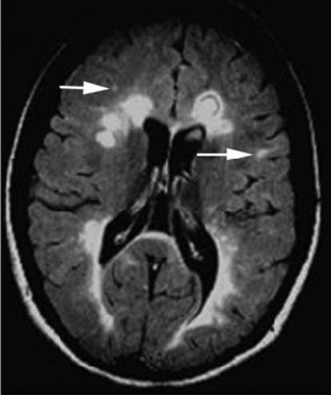

Gilead의 이델라리십(GS-1101) + 리툭시맙 3상 임상시험 계획서(56, 57)는 백혈병 환자용 **FACT-Leu** 척도를 사용한 표준적 환자보고결과(PRO) 분석 알고리즘을 제시하였다:
- **기저치 대비 결정적 증감(Definitive Increment / Decrement)**:
  - 기저 점수 대비 10%, 20%, 40% 이상의 점수 호전이 연속적으로 지속되는 기간을 '결정적 개선까지의 시간(Time to definitive increment)'으로 정의.
  - 기저 점수 대비 악화 또는 사망까지의 기간을 '결정적 악화까지의 시간'으로 정의하여 Kaplan-Meier 분석에 통합함.
- 완치가 어려운 만성 혈액암 환자에서 피로, 불안, 죽음에 대한 공포 등 환자의 주관적 안녕감(Well-being)을 객관적으로 정량하는 것은 신약의 진정한 임상적 유익성을 입증하는 핵심 요소이다.

***

### h. 유방암 임상시험: 동일한 생존율에서 판세를 뒤집는 HRQoL

1. **Watanabe 등의 NSAS-BC 01 3상 시험 (UFT vs CMF)**:
   - 림프절 음성 고위험 유방암 환자의 수술 후 보조요법으로 경구용 UFT와 복합 정맥요법인 CMF를 2년간 비교(58).
   - **생존 데이터(OS)는 두 치료군 간에 완벽히 동일**하였다.
   - 그러나 삶의 질 지표 중 **탈모로 인한 고통(Upset by hair loss)**은 CMF 투여군에서 치료 14개월까지 극심하게 치솟았던 반면, 경구용 UFT 투여군에서는 기저선 수준의 평온을 유지하였다.
   - 저자들은 완벽히 동일한 생존율 속에서 현저히 우월한 삶의 질을 보존한 UFT를 최적의 표준 치료로 권고하였다.
2. **Muss 등의 NCIC CTG MA.17 시험 (타목시펜 5년 완료 후 레트로졸 장기 연장 요법)**:
   - 무병 생존 고령 환자에서 5년간의 레트로졸(letrozole) 복용이 위약 대비 삶의 질에 미치는 영향을 평가(61).
   - 레트로졸 투여 시 삶의 질 저하는 극히 미미하여 고령 여성에서도 장기 복용 내약성이 매우 우수함을 입증함으로써 5년 연장 보조 호르몬 요법의 표준 가이드라인을 확립하였다.

***

## VI. 임상적 의사결정 및 상담에서의 HRQoL 활용

- **수술 전 심리 상담 및 합병증 예방**: 대장암 환자에서 SF-36으로 평가한 기저 사회적 기능 점수가 현저히 낮은 환자는 수술 후 합병증 위험이 높으므로 수술 전 전문 심리 상담 및 지지 프로그램을 제공하여 예후를 개선할 수 있다(Anthony 등, 62).
- **치료 경로 선택(수술 vs 화학요법)**: 경련, 식욕 부진 등 환자의 자각 증상 패턴에 따라 환자가 더 잘 견딜 수 있는 치료 옵션을 합리적으로 선택하도록 돕는다(63).

***

## VII. 제22장 총결론: HRQoL 평가의 핵심 방법론적 원칙

1. **기저치(Baseline) 평가의 필수성**: 기저 시점의 점수가 결여된 사후 설문은 치료 간 진정한 비교를 불가능하게 만든다(64).
2. **치료 주기와 연동된 다회 평가**: 치료 전, 치료 중, 치료 종료 후 최소 2~3회 이상의 일관된 시점 측정이 요구된다.
3. **무작위 배정 시 군 간 균형(Stratification)**: 배정된 양 군 간 기저 삶의 질 점수가 동등하도록 층화 배정해야 한다(Tol 등, 65).
4. **환자 순응도(Compliance) 극대화**: 질병 악화로 인한 응답 누락이 생존 편향(Survival bias)을 초래하지 않도록 설문 작성을 전향적으로 철저히 추적·관리해야 한다(66-68).

# 제22장 종양학 삶의 질 도구 (결론) 및 제23장 건강 관련 삶의 질 평가 도구: 자가면역 질환

## 제22장 종양학 삶의 질 도구 총결론 및 유효성/안전성 쟁점 요약

임상시험에서 종양학 삶의 질(HRQoL) 도구가 제공하는 유효성 및 안전성 평가의 핵심 양상은 다음과 같이 요약된다:
1. **생존율 우위와 HRQoL 우위가 일치하는 경우**: 시험약이 대조약 대비 전체 생존기간(OS) 연장과 더불어 전반적 삶의 질에서도 우월한 개선을 입증함(예: 전이성 대장암에서 세툭시맙+이리노테칸의 Sobrero EPIC 시험, 70).
2. **생존율은 동일하지만 HRQoL에서 우위를 보이는 경우**: 시험약이 대조약 대비 생존기간을 연장하지는 못하더라도 독성 프로파일 개선, 신체/인지 기능 보존, 증상 완화 등 삶의 질에서 통계적으로 유의미한 우위를 입증하여 승인 및 임상 권고를 획득함(예: 흑색종에서 테모졸로미드 vs 다카바진의 Middleton 시험, 71; 유방암에서 경구 UFT vs CMF의 Watanabe 시험).
3. **종합 점수 차이가 없을 때 세부 하위 영역(Domains) 분석의 가치**: 전체 총점에서는 통계적 차이가 없더라도 특정 하위 도메인(통증 완화, 피로 개선, 신체 기능 유지 등)에서 유의미한 이득이 확인되어 임상적 결론을 도출할 수 있음(Kemeny 간동맥 화학색전술 시험, 72; Shepherd 비소세포폐암 엘로티닙 시험, 73).
4. **삶의 질 평가가 전무한 경우의 한계**: 고용량 항암제 투여 시 환자의 극심한 피로와 기능 저하를 입증하지 못해 임상적 해석이 제한됨(Pectasides 흑색종 시험, 69).

***
***

# 제23장 건강 관련 삶의 질 평가 도구: 자가면역 질환

## I. 도입 및 SF-36 도구의 전면 분석

종양학뿐 아니라 다발성 경화증, 류마티스 관절염, 건선, 크론병 등 만성 자가면역 질환에서도 환자의 주관적 건강 안녕을 정량화하는 HRQoL 도구가 필수적으로 활용된다.
가장 대표적인 범용 도구는 **SF-36 (Medical Outcomes Study 36-Item Short Form Health Survey)**이다(3, 4).

### 표 23.1 SF-36 건강 설문지 원문 체계 분석 (36개 문항)

- **평가 척도 및 점수 체계**: 8개 하위 척도(0점~100점; 점수가 높을수록 양호한 HRQoL)와 2개 요약 지표인 **신체 구성요소 요약(PCS)** 및 **정신 구성요소 요약(MCS)**으로 집계된다(미국 일반 인구 표준 평균은 각 50점)(5-7).
1. **일반 건강 지각 (문항 1~6)**: 현재 전반적 건강 상태(탁월~나쁨), 발병 취약성, 타인과의 비교, 건강 악화 예상, 1년 전 대비 건강 변화(훨씬 좋아짐~훨씬 나빠짐).
2. **신체 활동 기능 제한 (문항 7~16)**:
   - 격렬한 활동(달리기, 무거운 물건 들기, 격렬한 스포츠).
   - 중등도 활동(탁자 옮기기, 진공청소기 밀기, 볼링, 골프).
   - 식료품 들기/나르기, 여러 층 계단 오르기, 한 층 계단 오르기.
   - 몸 구부리기/무릎 꿇기, 1마일 이상 걷기, 몇 블록 걷기, 한 블록 걷기, 혼자 목욕 및 옷 입기.
3. **신체 건강으로 인한 업무/일반 활동 제한 (문항 17~20)**:
   - 업무/활동 시간 단축, 원하는 만큼 일하지 못함, 업무 종류의 제약, 업무 수행의 난이도 증가(추가 노력 필요).
4. **신체적 통증 (문항 21~22)**:
   - 지난 4주간 겪은 신체 통증의 강도(전혀 없음~매우 극심함) 및 통증이 일상 업무(가사 노동 포함)를 방해한 정도.
5. **감정적 문제로 인한 업무/활동 제한 (문항 23~25)**:
   - 우울이나 불안으로 인한 활동 시간 단축, 성취량 감소, 업무 집중도/주의력 저하.
6. **사회적 기능 장애 (문항 26, 36)**:
   - 신체적·감정적 문제로 인해 가족, 친구, 이웃 및 집단과의 정상적 사회 활동이 방해받은 정도 및 빈도.
7. **정신 건강 및 정서적 안녕 (문항 27~35)**:
   - 활력이 넘침, 심한 불안/초조, 어떤 것으로도 회복되지 않는 극도의 우울감, 평화롭고 차분함, 기운이 넘침, 우울하고 침울함, 녹초가 됨, 행복함, 피로감.

***

## II. 다양한 자가면역 질환에서의 SF-36 활용 사례

1. **류마티스 관절염 (Rheumatoid Arthritis)**:
   - van der Kooij 등(8)의 연구에서 생물학적 제제인 **인플릭시맙(infliximab)**을 먼저 투여한 후 설파살라진을 투여하는 순서가, 설파살라진을 먼저 쓰고 인플릭시맙으로 전환하는 역순서보다 SF-36으로 측정한 환자보고결과(PRO)가 유의미하게 우수함을 입증하였다.
2. **건선 (Psoriasis)**:
   - Reich 등(9)은 중등도~중증 건선 환자에서 인플릭시맙 투여가 위약 대비 SF-36 직장 생산성, 업무 성취감, 세심한 업무 수행 능력 등을 극적으로 개선함을 보고하였다.
3. **크론병 (Crohn's Disease)**:
   - Cadahia 등(10)은 누공성 크론병 환자에서 인플릭시맙 투여 시 일상 과업 수행의 어려움을 반영하는 **신체 역할 척도(Physical Role, PR)**는 유의미하게 개선되었으나, 보행이나 계단 오르기 등을 반영하는 신체 기능(Physical Function, PF) 척도에는 유의한 변화가 없음을 규명하였다.
4. **만성 폐쇄성 폐질환 (COPD)**:
   - Eaton 등(11)은 이동식 산소 요법이 환자의 불안을 낮추고 HRQoL을 유의하게 향상시킴을 입증하였다(단, 무거운 압축 가스통을 들고 다녀야 하는 물리적 부담이 일부 삶의 질을 상쇄함을 지적).

***

## III. 다발성 경화증 특이적 삶의 질 평가 도구 및 중추적 임상시험

다발성 경화증은 극심한 피로, 통증, 감각 이상, 방광/장 장애 등 검사실 검사나 MRI로 직접 측정할 수 없는 주관적 증상을 광범위하게 초래하므로 삶의 질 측정이 필수적이다(12-14).
범용 SF-36 외에도 MS 특이적 척도로 **MSQLI (Multiple Sclerosis Quality of Life Inventory)**, **MSQOL-54** (SF-36 36문항에 MS 특이 18문항 추가)(15), **FIS (피로 영향 척도, Fatigue Impact Scale)**(16) 등이 사용된다.

### a. Rudick 등의 나탈리주맙 3상 임상시험
Rudick 등(18)은 재발-완화형 MS(RRMS) 환자 942명을 대상으로 나탈리주맙 투여군(627명)과 위약군(315명)의 삶의 질 지표(SF-36 PCS 및 MCS)를 104주(2년) 동안 장기 추적하였다:
- **신체 및 정신 안녕의 장기 개선**: 나탈리주맙 투여군은 투여 **24주 시점부터 PCS 및 MCS 점수가 위약 대비 유의미하게 향상**되었으며(그림 23.1, 그림 23.2), 이 개선 효과는 104주 종료 시점까지 지속적으로 유지되었다.
- **임상적 상담 가치**: 환자에게 *"치료 시작 후 24주 이내에 삶의 질이 실질적으로 호전될 것을 기대할 수 있다"*는 과학적 근거 기반 상담을 가능케 하였다.
- **임상 및 영상 지표와의 강력한 상관성**: EDSS 장애 점수가 악화된 환자, 연간 재발률(ARR)이 높은 환자, 뇌 MRI 상 병변 부하가 심각한 환자일수록 PCS 및 MCS 점수가 유의미하게 낮아 HRQoL이 객관적 질병 활성을 정확히 대변함을 입증하였다.

### b. EDSS 점수 대 HRQoL 점수의 차이점
Twork 등(19, 20)은 EDSS 장애 척도와 MSQOL-54 삶의 질 척도를 비교 분석하였다:
- EDSS는 주로 신경과 의사의 객관적 신경학적 진찰(특히 보행 거리)에 기반한 장애 평가 도구이며 환자 자신의 삶의 질을 직접 측정하는 도구가 아니다.
- 두 지표 간에는 중등도의 상관관계가 존재하지만 비선형적(Non-linear) 관계를 보이며 인지 기능 저하나 우울, 피로와 같은 환자 중심 영역은 EDSS에서 크게 간과되므로 HRQoL 설문이 상호보완적으로 반드시 병행되어야 한다.

### c. 인터페론 제제의 상반된 삶의 질 결과
1. **인터페론-알파-2a (Nortvedt 연구)**:
   - 97명의 MS 환자 대상 시험에서 뇌 MRI 신규 병변 형성은 극적으로 억제하였으나, SF-36으로 평가한 환자의 실제 삶의 질은 전혀 개선시키지 못하였다(21).
2. **인터페론-베타-1a (Avonex; Jongen 연구)**:
   - 284명의 환자에게 2년간 투여했을 때 신체 복합 척도(MSFC) 점수는 유의한 변화가 없었으나, MSQOL-54 신체 점수는 유의하게 향상되었다(22). 특히 저연령 및 초기 경증 장애 환자군에서 삶의 질 향상이 두드러졌다.

### d. 글라티라머 아세테이트
글라티라머 아세테이트(Copolymer-1)는 L-알라닌, L-글루탐산, L-라이신, L-티로신으로 구성된 합성 폴리펩티드로 Th1 염증 반응을 억제하고 Th2 조절 반응을 유도한다(23-25).
- 805명의 환자를 대상으로 한 대규모 시험에서, **치료 미경험(Treatment-naive) 환자에서는 40% 확률로 6개월 내에 현저한 삶의 질 향상($P < 0.001$)이 나타나 12개월 이상 지속**되었다(26).
- 반면 과거 인터페론-베타-1b 치료 실패 경험이 있는 환자군에서는 삶의 질 개선 효과가 유의하지 않았다($P=0.13$).

# 제23장 자가면역 질환 삶의 질 도구 (결론), 제24장 감염 질환 삶의 질 도구 및 제25장 의약품 안전성 개요

## 제23장 자가면역 질환 삶의 질 (결론): 심신 중재 요법과 총괄 평가

### a. Grossman 등의 다발성 경화증 마음챙김 명상 3상 임상시험
Grossman 등(27, 28)은 150명의 다발성 경화증 환자를 대상으로 8주간의 마음챙김 기반 스트레스 완화(MBSR; 주 1회 2.5시간 명상 및 요가 자세) 중재군과 비중재 대조군을 무작위 비교하였다:
- 만성 질환 삶의 질 척도(PQOLC) 및 함부르크 MS 삶의 질 척도(HAQUAMS)를 사용하여 평가한 결과, **명상 중재군은 훈련 직후뿐 아니라 종료 6개월 후 추적 시점까지 삶의 질, 우울증 및 만성 피로가 대조군 대비 유의미하게 개선**되었다.
- 저자들은 고가의 질병완화치료제(DMT)들이 질병 활성을 억제하더라도 환자의 주관적 삶의 질을 직접적으로 향상시키지 못하는 경우가 흔함을 지적하며 핑골리모드나 나탈리주맙 치료를 받는 모든 유형의 MS 환자에게 명상 및 요가 요법이 매우 가치 있는 보조 치료가 될 수 있음을 강조하였다(29, 31).

***
***

# 제24장 건강 관련 삶의 질 평가 도구: 감염 질환

## I. C형 간염 치료 패러다임 전환과 삶의 질

만성 C형 간염(HCV) 환자에서 항바이러스 치료제의 발전은 환자의 삶의 질 지형을 근본적으로 바꾸어 놓았다:
- **과거 표준 요법(인터페론 + 리바비린)**: 골수 억제성 중증 빈혈뿐 아니라 **우울증, 극심한 불안, 피로, 자살 충동** 등 심각한 중추신경계 부작용을 유발하여 치료 중 SF-36의 거의 모든 도메인 점수가 급락하였다(Conversano 등, 8; Intron A 설명서 경고 문구, 9). 이로 인한 조기 투약 중단이 치료 실패의 주원인이었다.
- **신규 DAA 경구 요법(소포스부비르 + 레디파스비르, Harvoni)**: 인터페론과 리바비린을 완전히 배제함으로써 빈혈이나 우울증 부작용이 전혀 없으며 매우 뛰어난 내약성과 순응도로 95% 이상의 SVR 달성과 함께 치료 기간 중에도 양호한 삶의 질을 유지시켰다(Younossi/Henry, 10, 11).

### a. 만성 HCV 환자의 삶의 질 특성과 인터페론 유발성 우울증의 역설
- 무증상 잠복기가 길지만 진행성 간경변증이나 간세포암으로 악화될 경우 삶의 질은 치명적으로 붕괴된다(Bonkovsky 등, 12).
- **치료 반응과 우울증의 역설(Loftis 연구)**: 인터페론+리바비린 치료 중 심한 우울증을 겪은 환자군이 우울증을 겪지 않은 환자군보다 오히려 바이러스 완치율(SVR)이 높았는데, 이는 우울증 부작용을 감수하면서도 고용량의 강력한 인터페론 면역 활성화를 체내에서 충분히 유지했기 때문으로 분석되었다(18).

### b. Mathew 등의 장기 삶의 질 추적 임상시험 (표 24.1)
치료 불응성 만성 C형 간염 환자 152명에게 페그인터페론+리바비린을 48주간 재투여하고 72주 시점까지 SF-36을 추적하였다(19):
- **반응자(Responders, SVR 달성군)**: 24주 치료 중에는 활력(-8.28), 통증(-3.31), 감정 역할(-4.98) 등 삶의 질 점수가 기저치보다 급락했으나, 투약 종료 후 **72주 추적 시점에는 활력(+15.69), 통증(+11.96), 감정 역할(+15.50)로 기저치 대비 극적인 반등 개선**을 보였다.
- **무반응자(Nonresponders)**: 치료 중 점수 하락 폭도 적었으나 치료 종료 후에도 유의한 삶의 질 개선이 전혀 나타나지 않았다.
- 이는 환자 복약 지도 시 *"치료 중에는 극도로 힘들 수 있지만 바이러스가 완치되면 이전보다 훨씬 활기찬 삶의 질을 누릴 수 있다"*는 확고한 임상적 근거가 된다.

***
***

# 제25장 의약품 안전성 평가 및 관리

## I. 도입 및 안전성 중심의 임상시험 설계

신약 개발 및 허가 과정에서 안전성(Safety)은 유효성(Efficacy)과 대등하거나 그 이상의 비중을 갖는다.
- **비열등성 임상시험 (Non-inferiority Trials)**: 신약의 유효성이 기존 표준 치료제보다 우월하지 않더라도, *"기존 약제보다 부작용이 현저히 적거나 덜 침습적임"*을 입증함으로써 규제 기관의 시판 승인을 획득하는 대표적 시험 설계이다(EMA 지침, Pocock, 21 CFR §314.126)(4-6).
- **미국(FDA) 대 유럽(EMA)의 이상사례 보고 규정 차이**:
  - 유럽은 CIOMS 서식에 따라 의사가 약물과의 합리적 인과관계를 인정한 **약물이상반응(ADR)**에 집중 보고하는 경향이 있는 반면, 미국 FDA는 인과관계와 무관한 모든 이상사례(AE)의 철저한 보고를 요구하는 등 규제 차이가 존재하므로 다국가 시험자는 각국의 가이드라인을 면밀히 준수해야 한다(Castle/Kelly, Mann/Andrews, 7, 8).

***

## II. 약물 유발 이상사례의 전형적 스펙트럼: 인터페론-알파-2b 사례

인터페론-알파-2b(IFN-$\alpha$-2b)는 흑색종, 백혈병, 림프종, B형/C형 간염 등 다양한 질환에 사용되는 대표적 면역 사이토카인이다(9-14). Hauschild 등(15)이 정리한 인터페론의 시간대별 이상사례 발현 경과는 약물 안전성 모니터링의 전형적 모델을 보여준다(그림 25.1):

### 발현 시점별 이상사례 경과
1. **수일 이내 (Days)**: 발열, 오한, 두통, 근육통 등 급성 **독감 유사 증상 (Flu-like symptoms)** (대부분 투여 초기에 발생하며 해열진통제로 조절 가능).
2. **수주 이내 (Weeks)**:
   - **호중구 감소증 (Neutropenia)**: 골수 억제로 인해 선천 면역의 1차 방어선인 호중구 수가 급감하여 세균 감염 위험 초래.
   - **빈혈 (Anemia)**: 적혈구 생성 저하로 인한 피로 악화.
   - **간 손상 (Hepatic damage)**: 혈청 아미노전이효소(ALT/AST) 상승.
3. **수개월 지속 (Months)**:
   - **만성 피로 (Fatigue)** 및 **우울증 (Depression)**: 장기 투여 시 누적되는 대표적 신경정신과적 독성으로 투약 중단 및 감량의 주원인이 됨.

이러한 안전성 약리학 연구는 중추신경계, 심혈관계 및 호흡기계를 포함하는 필수 중요 기관에 초점을 맞추어야 합니다. 기타 비필수 기관 계통(예: 신장, 위장관계)은 안전성 약리학 연구에서 이차적인 중요성을 가집니다.

일부 임상시험계획서(protocol)는 특정 이상반응 발생 시 용량 조절(감량), 치료 중단, 또는 연구 약물 영구 투여 중단에 대한 매우 구체적인 지침을 제시합니다. 이러한 조항들은 종종 용량 중단(dose interruption), 용량 감량(dose reduction), 용량 보류(dose withholding), 또는 약물 휴약기(drug holiday)로 지칭됩니다.

이러한 규정은 연구 집단이 심각한 독성 위험에 노출되어 있고, 이러한 독성이 사전에 예상 가능하며, 환자의 지속적인 시험 참여를 위해 필수적일 때 가장 빈번하게 적용됩니다.

이러한 규정이 적용된 연구의 구체적 사례는 다음과 같습니다:

1. 급성 백혈병 환자를 대상으로 한 연구. 백혈병 치료에 사용되는 세포독성 화학요법제는 심각한 골수억제를 유발하여 호중구감소증과 혈소판감소증을 초래합니다. 시험계획서에는 절대 호중구 수(ANC)가 500/$\mu 미만으로 떨어지거나 혈소판 수가 25,000/$\mu 미만으로 떨어질 경우 용량을 감량하거나 투여를 보류하도록 명시할 수 있습니다. 수치가 회복되면 감량된 용량으로 치료를 재개할 수 있습니다.

2. 진행성 간세포암 환자를 대상으로 소라페닙(sorafenib)을 평가하는 연구. 소라페닙은 흔히 수족증후군(hand-foot skin reaction)을 유발합니다. 중증(3등급) 피부 독성이 발생하는 환자의 경우, 독성이 1등급 이하로 호전될 때까지 시험계획서에 따라 치료를 최소 7일간 중단해야 합니다. 이후 1일 400mg(표준 800mg 대비)으로 감량하여 재투여할 수 있습니다.

3. 교모세포종 환자를 대상으로 테모졸로마이드(temozolomide)와 방사선 치료를 병용하는 연구. 테모졸로마이드는 혈소판감소증과 호중구감소증을 유발할 수 있습니다. 1일 유지요법 기간 동안 독성이 발생할 경우 시험계획서의 가이드라인에 따라 1회 투약 수준을 감량(예: 00\,	ext{mg/m}^2$에서 50\,	ext{mg/m}^2$로)할 수 있습니다.

표 25.1 BG00012 연구의 임상검사치 중단 기준

| 검사항목 | 기준 수치 | 조치 사항 |
| :--- | :--- | :--- |
| 절대 림프구 수(ALC) | $< 0.5 \times 10^9/\text{L}$ (3등급 이상) | 4주 이내 재검사. 지속 시 용량 감량 또는 투약 보류 고려 |
| 간기능 수치 (ALT/AST) | 정상 상한치(ULN)의 $> 3 \times$ 및 총 빌리루빈 $> 2 \times \text{ULN}$ | 즉시 투약 중단 및 하이의 법칙(Hy's law) 사례 여부 정밀 평가 |
| 신기능 (혈청 크레아티닌) | 기저치 대비 $> 50\%$ 증가 | 2주 이내 재검사; 지속 시 시험약물 중단 |

*(참고: 상기 기준은 BG00012(디메틸 푸마레이트) 다발성 경화증 3상 임상시험 프로토콜에 기술된 안전성 모니터링 기준의 대표적 예시임)*

임상시험에서 환자의 안전을 보호하지 못한 경우 규제 당국의 강력한 행정 조치로 이어질 수 있습니다. 예를 들어, 미국 FDA가 1999년 한 임상시험책임자에게 발행한 경고 서한(Warning Letter)에서는 경구용 클로드로네이트(oral clodronate) 연구에서 발생한 중대한 시험계획서 위반을 지적하였습니다:

> "귀하는 시험계획서에 명시된 독성 기준에 따라 연구 약물의 용량을 감량하거나 투여를 중단해야 하는 환자들에게 약물 투여를 계속하도록 허용하였습니다. 특히 시험대상자 012호는 혈청 크레아티닌 수치가 기저치 대비 2배 이상 상승하여 시험계획서상 연구 약물 영구 중단 기준에 도달하였음에도 불구하고 치료를 지속하였으며 결국 비가역적 신부전으로 진행되었습니다..."

이러한 규제 당국의 조치는 시험계획서에 정의된 안전성 규칙을 엄격하게 준수하는 것이 대상자 보호와 임상 데이터의 신뢰성 확보에 얼마나 결정적인지를 잘 보여줍니다.

### 이상반응(AE), 중대한 이상반응(SAE), 그리고 약물이상반응(ADR)의 정의

의약품 임상시험 관리기준(GCP) 및 ICH E2A 가이드라인에 따른 주요 안전성 용어의 정의는 다음과 같습니다:

1. **이상반응 (Adverse Event, AE)**: 의약품을 투여받은 임상시험 대상자에게 발생한 모든 바람직하지 않고 의도되지 않은 징후(증상, 비정상적 검사소견 포함)로서, 해당 의약품과의 인과관계를 반드시 입증할 필요는 없습니다.
2. **약물이상반응 (Adverse Drug Reaction, ADR)**: 투여된 의약품과 적어도 합리적인 가능성이 있는 인과관계(causal relationship)가 성립하는 모든 유해하고 의도되지 않은 반응을 의미합니다.
3. **중대한 이상반응/약물이상반응 (Serious Adverse Event / Reaction, SAE/SAR)**: 투여량에 관계없이 다음 결과 중 하나 이상을 초래하는 경우입니다:
   - 사망을 초래함
   - 생명을 위협함
   - 입원 또는 기존 입원의 연장이 필요함
   - 지속적이거나 중대한 불구나 기능 저하를 초래함
   - 선천성 기형이나 이상을 초래함
   - 기타 의학적으로 중요한 상황(의학적 판단에 따라 즉각적인 치료적 개입이 필요한 경우)

### 안전성 분석군과 ITT 원칙

유효성(efficacy) 평가에서는 일반적으로 무작위 배정된 모든 환자를 배정된 군에 따라 분석하는 배정의도 분석(Intention-to-Treat, ITT) 원칙이 준수됩니다. 그러나 안전성 평가에서는 실제로 시험 약물을 1회 이상 투여받은 환자를 대상으로 하며 환자가 실제로 투여받은 치료제(as-treated)를 기준으로 평가하는 안전성 분석군(Safety Population)이 표준적으로 사용됩니다.

안전성 분석군(Safety Population)은 유효성 분석을 위한 ITT 집단과 대조됩니다. 유효성 분석에서는 임상시험에 무작위 배정된 모든 환자가 실제로 약물을 투여받았는지 여부나 시험계획서를 준수했는지와 무관하게 원래 배정된 군에 포함됩니다. 반면, 안전성 분석은 원칙적으로 약물에 실제로 노출된 환자만을 대상으로 하며 투약 오류 등으로 인해 계획과 다른 약물을 투여받은 경우 실제 투여받은 약물군으로 분류하여 분석합니다.

### 예상된 이상반응 대 예상치 못한 이상반응

임상시험 중 발생하는 이상반응은 해당 약물의 기존 안전성 프로파일에 근거하여 분류됩니다:
- **예상된 이상반응 (Expected/Anticipated AE)**: 임상시험자 자료집(Investigator's Brochure, IB), 의약품 설명서(package insert) 또는 시험계획서에 그 성격, 중등도 또는 빈도가 이미 기술되어 있는 이상반응입니다.
- **예상치 못한 이상반응 (Unexpected/Unanticipated AE)**: 기존 안전성 문서(IB 등)에 명시되지 않았거나, 기술된 내용보다 중등도나 발생 빈도가 현저히 높은 이상반응입니다.

예를 들어, 항암 화학요법제에서 가벼운 오심은 '예상된' 이상반응이지만 예상치 못한 심근염이나 중증 스티븐스-존슨 증후군(SJS)이 발생한다면 이는 '예상치 못한 중대한 이상반응(SUSAR)'으로 분류되어 규제기관 및 윤리위원회(IRB/IEC)에 신속 보고(expedited reporting, 통상 7~15일 이내)되어야 합니다.

### 약물유전체학적 이상반응과 QT 간격 연장 위험

최근 안전성 평가에서는 유전적 소인(pharmacogenetic factors)에 의한 이상반응 위험이 중요하게 다루어지고 있습니다. 예를 들어, 카르바마제핀(carbamazepine) 투여 시 -B*1502$ 대립유전자를 가진 환자에서 SJS/TEN의 위험이 극적으로 증가하며 와파린 투여 시 $ 및 $ 변이에 따른 출혈 위험이 크게 달라집니다.

또한 신약 개발 과정에서 가장 면밀하게 모니터링되는 심장 안전성 지표 중 하나가 바로 심전도상 QT 간격의 연장(QT prolongation)입니다. 심실 재분극 지연으로 인한 QT 연장은 치명적인 심실성 부정맥인 토르사드 드 포인트(Torsade de Pointes, TdP)로 이어질 수 있습니다.

### ICH E14 가이드라인과 철저한 QT/QTc 연구

국제조화회의(ICH) E14 가이드라인은 비항부정맥용 신약의 임상적 심장 재분극 지연 가능성을 평가하기 위한 명확한 기준을 제시합니다:
- **신호 검출 기준**: 위약 대비 기저치 보정 QTc 간격 변화의 상한(95% 단측 신뢰구간)이 10ms를 초과하는 경우, 약물이 심장 재분극을 지연시키는 것으로 간주됩니다.
- **절대적 위험 기준**: 
  - QTc 간격 $> 500\,	ext{ms}$
  - 기저치 대비 QTc 간격의 증가량($\Delta	ext{QTc}$) $> 60\,	ext{ms}$

심박수에 따른 왜곡을 보정하기 위해 바젯(Bazett) 공식($\text{QTc} = \text{QT}/\sqrt{\text{RR}}$)이나 프레데리시아(Fridericia) 공식($\text{QTcF} = \text{QT}/\sqrt[3]{\text{RR}}$)이 사용되며 최근 규제기관은 심박수 변화에 덜 민감한 Fridericia 공식을 강력히 선호합니다.

### hERG 칼륨 이온 채널과 TdP 부정맥 발생 기전

심전도(ECG)에서 P파는 심방 탈분극, QRS 복합체는 심실 탈분극, 그리고 T파는 심실 재분극을 나타냅니다. QT 간격은 심실의 전기적 수축과 재분극 전 과정을 반영합니다.

대부분의 약물 유발성 QT 연장은 심근세포막의 hERG($) 유전자에 의해 암호화된 급속 지연 정류 칼륨 전류({\text{Kr}}$)의 약리학적 차단에 의해 발생합니다. {\text{Kr}}$ 전류가 억제되면 세포 내 칼륨 배출이 지연되어 활동전위 지속시간(APD)이 연장되고 이는 초기 후탈분극(Early Afterdepolarizations, EAD)을 유발하여 전형적인 다형성 심실빈맥인 토르사드 드 포인트(Torsade de Pointes, TdP)를 촉발합니다. TdP는 저절로 멈추기도 하지만 흔히 심실세동(Ventricular Fibrillation)으로 진행되어 심장 돌연사를 유발합니다.

hERG 채널의 독특한 구조적 특징(넓은 내부 전도공과 특정 방향을 향한 방향족 잔기들)은 다양한 화학 구조를 가진 약물 분자들이 쉽게 결합하여 채널을 차단할 수 있게 만듭니다. 또한 일부 약물은 채널을 직접 차단하지 않고 세포막으로의 채널 단백질 수송(trafficking)을 방해하여 장기적인 {\text{Kr}}$ 감소를 초래하기도 합니다.

과거 키니딘(quinidine), 테르페나딘(terfenadine, Seldane), 시사프라이드(cisapride, Propulsid), 아스테미졸(astemizole) 등의 약물들이 치명적인 TdP 유발로 인해 시장에서 퇴출되거나 적응증이 엄격히 제한되었습니다. 에리트로마이신(erythromycin)과 같은 마크로라이드계 항생제나 특정 플루오로퀴놀론계 항균제 역시 QT 연장 위험으로 인해 신중한 투약이 요구됩니다.

이러한 역사적 배경으로 인해 미국 FDA는 QT 복합 심사팀(QT Interdisciplinary Review Team, QT-IRT)을 조직하여 신약 허가 신청서에 포함된 모든 TQT 연구 및 심전도 데이터를 전문적으로 심사하고 있습니다.

예를 들어, 낭포성 섬유증 치료제인 이바카프토(ivacaftor, Kalydeco)의 임상 개발 과정에서 수행된 철저한 QT(TQT) 연구에서는 건강한 지원자를 대상으로 치료 용량 및 초치료 용량(supratherapeutic dose)을 양성 대조군(목시플록사신 400mg) 및 위약과 비교 평가하였습니다. 연구 결과, 이바카프토는 상한 신뢰구간이 10ms 미만으로 유지되어 임상적으로 유의미한 QT 연장을 유발하지 않음이 입증되었습니다.

미국심장협회(AHA)와 미국심장학회(ACC) 가이드라인에 따르면, 12유도 심전도에서 QT 간격 측정 시 T파의 끝부분이 기저선(isoelectric baseline)과 만나는 지점을 정확히 파악해야 하며 통상 가장 긴 간격을 보이는 II 유도 또는 V2-V3 흉부 유도가 권장됩니다.

### 중증 피부이상반응: 스티븐스-존슨 증후군과 독성 표피괴사용해

스티븐스-존슨 증후군(Stevens-Johnson Syndrome, SJS)과 독성 표피괴사용해(Toxic Epidermal Necrolysis, TEN)는 약물 투여 후 발생할 수 있는 가장 치명적인 지연형 과민반응(Type IVc hypersensitivity)입니다. 

이 질환은 표피-진피 경계부의 광범위한 각질세포(keratinocyte) 세포사멸(apoptosis)을 특징으로 하며 박탈성 수포 및 점막 미란을 동반합니다. 박탈된 체표면적(Body Surface Area, BSA) 비율에 따라 다음과 같이 분류됩니다:
- **SJS**: 체표면적의 $< 10\%$ 박탈
- **SJS/TEN 중복 (Overlap)**: 체표면적의 0\% \sim 30\%$ 박탈
- **TEN**: 체표면적의 $> 30\%$ 박탈

주요 원인 약물로는 알로푸리놀(allopurinol), 항경련제(카르바마제핀, 라모트리진, 페니토인), 설폰아미드계 항생제(코트리목사졸), 비스테로이드성 소염진통제(NSAIDs, 예: 옥시캄 계열) 및 네비라핀(nevirapine) 등이 있습니다.

치료의 핵심은 의심 약물의 즉각적인 투약 중단과 화상 전문 치료 병동(burn unit) 또는 중환자실에서의 집중적인 대증 지지요법(체액/전해질 균형 유지, 창상 감염 예방, 기도 확보)입니다. 보조적으로 전신 스테로이드, 면역글로불린 정맥주사(IVIG), 또는 사이클로스포린(cyclosporine) 투여가 고려됩니다.

### 특이체질성 약물 반응과 약물 유발성 간손상

특이체질성 약물 반응은 약물의 알려진 약리학적 작용과 무관하게 발생하며 용량 의존성이 뚜렷하지 않고 예측하기 어렵습니다. 면역학적 기전에서는 반응성 약물 대사체가 체내 자가 단백질과 공유 결합하여 햅텐(hapten)을 형성하거나, 주조직적합성복합체(MHC) 분자 또는 T세포 수용체(TCR)와 직접 비공유 결합(-i$ 개념)하여 면역 반응을 촉발합니다.

약물 유발성 간손상(Drug-Induced Liver Injury, DILI)은 신약 개발 중단 및 시판 후 의약품 회수의 가장 흔한 원인 중 하나입니다.

### 하이의 법칙

미국 FDA의 간질환 전문가 하이먼 짐머만(Hyman Zimmerman) 박사의 이름을 딴 **하이의 법칙(Hy's Law)**은 약물에 의해 유발된 중증 간세포성 손상이 치명적인 급성 간부전으로 진행할 위험(사망률 약 10~50%)을 조기에 식별하는 황금 기준입니다. 하이의 법칙을 충족하기 위해서는 다음 네 가지 조건을 모두 만족해야 합니다:

1. **간세포 손상**: 아미노전이효소(ALT 또는 AST) 수치가 정상 상한치(ULN)의 3배 이상($> 3 \times \text{ULN}$) 상승.
2. **담즙 배설 장애**: 총 빌리루빈(Total Bilirubin) 수치가 정상 상한치의 2배 이상($> 2 \times \text{ULN}$) 상승.
3. **담즙정체 배제**: 알칼리성 포스파타제(ALP) 수치가 정상 상한치의 2배 미만($< 2 \times \text{ULN}$)이거나, 담즙정체보다 간세포 손상이 우세함.
4. **다른 원인 부재**: 바이러스성 간염(A, B, C형), 알코올성 간염, 담도 폐쇄, 자가면역성 간질환, 혈역학적 허혈 등 간손상을 유발할 수 있는 다른 명백한 원인이 배제됨.

FDA의 신약 검토(예: 파조파닙(pazopanib), 퍼투주맙(pertuzumab), 프라미펙솔(pramipexole) 등)에서는 임상시험 중 단 한 건의 참(true) 하이의 법칙 증례가 발생하는 것만으로도 심각한 간독성 경고 문구(Black Box Warning) 부착이나 승인 거절의 근거가 될 수 있습니다.

### 나란조 알고리즘을 통한 인과관계 평가

임상시험에서 관찰된 이상반응이 투여된 약물로 인한 것인지를 객관적으로 평가하기 위해 나란조 평가 척도(Naranjo Adverse Drug Reaction Probability Scale)가 널리 사용됩니다. 이 척도는 10개의 표준 질문(이전 보고 유무, 시간적 선후관계, 투약 중단 후 호전 여부, 재투여 시 재발 여부, 대체 원인 배제 등)으로 구성되어 점수를 산출합니다:
- **$\ge 9$점**: 확실함(Definite)
- ** \sim 8$점**: 가능성 높음(Probable)
- ** \sim 4$점**: 가능성 있음(Possible)
- **$\le 0$점**: 의심스러움(Doubtful)

# 25. 약물 안전성 - 계속

이상반응의 발생 빈도를 비치료 질환 상태에서의 빈도와 약물 치료 시의 빈도를 비교하여 평가해야 합니다. 이에 대한 지침은 한 백혈병 임상시험 프로토콜(248)에서 잘 제시되어 있습니다. 해당 프로토콜에는 질환 자체와 관련된 이상반응 목록과 함께 다음과 같은 지침이 포함되어 있었습니다.

### c. 임상시험계획서에 연구진의 인과관계 판단 사례 포함하기

이는 연구 담당 인력이 이상반응의 인과관계를 객관적으로 평가하도록 돕기 위한 참신한 접근법을 설명합니다. 크론병 치료를 위한 안티센스 핵산(antisense nucleic acid) 제제의 3상 임상시험계획서 부록에는 앞서 완료된 초기 임상시험 대상자들의 증례 기록이 포함되어 있었습니다. 이 증례 기록들은 짧고 명확했으며 특정 이상반응의 인과관계 판단에 초점을 맞추었습니다. 부록에는 약 6건의 증례 기록이 수록되었으며 그중 하나가 아래에 소개되어 있습니다(250). 여기서 ULN은 정상 상한치(Upper Limit of Normal)를 의미합니다. 해당 증례의 이상반응은 혈청 빌리루빈 상승이었습니다.

#### 임상시험계획서에 명시된 중대한 이상반응
FDA 가이드라인은 또한 의뢰자(Sponsor)로 하여금 대상 환자군에서 흔히 발생할 수 있어 신속 보고(expedited reporting) 기준을 충족하지 않을 수 있는 이상반응들을 시험계획서에 구체적으로 명시하도록 권고합니다. 가이드라인에 따르면, 약물 노출과 무관하게 기저 질환 자체로 인해 발생이 예상되는 이상반응이 제한된 횟수로 발생한 경우, 이를 단독으로 '약물이상반응 의심사례(suspected adverse reaction)'로 결론짓기에는 근거가 불충분합니다. 이러한 개별 SAE의 발생만으로는 약물과의 인과관계를 단정하기 어렵습니다.

***

임상시험 기간 동안 대상자 1인당 약 50건의 이상반응이 발생하며 임상시험 전체 수명 주기 동안 총 2,000~3,000건의 이상반응이 집계되기도 합니다(280).

이상반응의 기록, 전달 및 평가에 참여하는 인력에는 연구책임의사(Study Chair), 데이터 모니터 요원, 통계학자, 그리고 기관생명윤리위원회(IRB), 데이터안전성모니터링위원회(DSMC), 규제기관 담당관이 포함됩니다. 이상반응 보고 프로세스의 세부 흐름을 살펴보면, "매일 밤 자동화된 컴퓨터 프로그램이 연구책임의사, 시험 통계학자 및 데이터 모니터에게 전날 보고된 모든 사건을 이메일로 통보하고 해당 연구에서 관찰된 모든 사건의 누적 요약 보고서를 전달"하는 방식으로 운영될 수 있습니다(281). IRB 보고와 관련하여 일부 임상시험에서는 중대하고 예상치 못한 모든 이상반응(SUSAR)을 사건 발생 후 48시간 이내에 IRB에 보고하도록 규정하고 있습니다(282).

이 시나리오에서 핵심 실무자는 임상시험 모니터 요원(Clinical Research Associate, CRA)입니다. CRA(283, 284)는 목표 대상자 수를 충족할 수 있도록 환자 등록 전략을 관리하고, 중대한 이상반응이 표준작업지침서(SOP)에 따라 보고되는지 확인하며, 임상시험계획서 변경 사항을 점검하고, 적절한 주기로 모니터링 방문을 조율하며, 프로토콜 위반 및 결함을 포함한 모니터링 보고서를 작성하고 연구자에게 추적 관찰 서한을 발송하며, 데이터 관리 부서로 전달된 완료 증례기록서(CRF)와 발행 및 해결된 데이터 질의(query)를 추적합니다. CRA는 CRF를 작성할 때 경련, 구토, 빈혈 등의 이상반응 명칭, 발생 일시, 시험책임자에게 보고된 일시, 지속 여부, 중등도(severity), 시험약 또는 의료기기와의 인과관계 귀속 가능성, 입원 초래 여부, 의뢰자 또는 규제기관(FDA, EMA) 보고 여부, 그리고 해당 이상반응이 동의서 서식(Consent Form)에 기재되어 있었는지 여부 등을 철저히 기록합니다(285).

### b. 데이터 관리자의 과업: 결측치 문서화 및 용어 표준화

데이터 관리자(Data Manager)는 컴퓨터 시스템, 원격 데이터 수집(EDC) 및 품질 관리 분야의 전문가입니다. 데이터 관리자는 결측치와 데이터 불일치를 식별하여 시험책임자에게 보고합니다.

데이터 관리의 또 다른 핵심 과업은 여러 시험기관에서 제출한 서식에 기재된 이상반응 명칭 및 병용 약물 명칭이 적절한 의학 용어 사전에 수록된 표준 명칭과 일치하도록 검증하는 것입니다. 이러한 사전으로는 모든 유형의 임상시험에서 사용되는 MedDRA 사전과 주로 항암제 임상시험에서 이상반응 평가에 사용되는 CTCAE 사전이 있습니다.

- **MedDRA (Medical Dictionary for Regulatory Activities)**: 국제조화회의(ICH)에서 개발한 의약 용어 사전으로, 80,000개 이상의 용어를 수록하고 있으며 규제기관 보고의 표준으로 활용됩니다.
- **CTCAE (Common Terminology Criteria for Adverse Events)**: 미국 국립암연구소(NCI)에서 개발한 암 치료 이상반응 평가 기준입니다. CTCAE(버전 3 기준)는 1,059개의 용어를 포함하며 임상의는 이상반응 정보를 수집한 뒤 CTCAE를 참조하여 해당 용어로 변환하여 데이터 관리자에게 전송합니다(288).

CTCAE의 용어들은 중등도 등급(severity grading)을 제공합니다. 의사는 각 용어에 대해 경증(Grade 1), 중등증(Grade 2), 중증(Grade 3), 생명 위협(Grade 4), 사망(Grade 5) 중 하나를 선택할 수 있습니다(289). 반면 MedDRA 시스템 자체는 이러한 중등도 등급 체계를 내장하고 있지 않습니다.

표 25.2는 CTCAE의 정의 예시(경련/발작)를 보여줍니다. CTCAE가 항암 임상시험용으로 개발되었지만 수록된 이상반응들이 반드시 암이나 항암제에만 국한되는 것은 아님을 알 수 있습니다(290).

표 25.2 CTCAE의 이상반응 정의 예시: 경련(Seizure)

| 이상반응 | Grade 1 | Grade 2 | Grade 3 | Grade 4 | Grade 5 |
| :--- | :--- | :--- | :--- | :--- | :--- |
| **경련 (Seizure)** | 짧은 부분 발작, 의식 소실 없음 | 짧은 전신 발작 | 의학적 중재에도 불구하고 반복되는 다발성 발작 | 생명 위협; 지속적이고 반복적인 발작(간질중첩상태) | 사망 |

MedDRA는 규제 당국 보고에 주로 사용되는 반면, CTCAE는 종양학 전문 학술지 게재용 논문 작성에 널리 사용됩니다. NCI의 연구비 지원을 받는 암 임상시험의 경우 CTCAE 사용이 필수적이며 동시에 규제기관 승인을 목적으로 할 때는 MedDRA가 선호되므로 두 사전이 병행 사용되기도 합니다(291). FDA 가이드라인에 따르면 규제 당국이 특정 사전을 법적으로 강제하지는 않지만 신청자가 MedDRA를 사용할 것을 강력히 선호하고 있습니다(292).

# 25. 약물 안전성 - 계속

FDA는 단일 용어 사전을 사용할 것을 선호합니다(293). 그러나 FDA가 모든 연구의 이상반응 보고나 자발적 이상반응 보고에서 MedDRA 사용을 법적으로 의무화하고 있는 것은 아닙니다(294).

CTCAE는 본래 항암제 임상시험용으로 고안되었으나, 때로는 HIV 감염증이나 고혈압과 같은 다른 질환의 임상시험에서도 활용되어 왔습니다(295). CTCAE 사전은 MedDRA 사전 체계 내에 통합될 수 있습니다. NCI의 지원을 받는 임상시험의 경우 연구자는 항상 CTCAE(예: CTCAE 버전 4.0)를 사용하여 NCI에 이상반응 보고서를 제출해야 합니다(296). CTCAE 4.0의 모든 용어는 MedDRA 용어에 해당하므로, CTCAE 4.0은 MedDRA의 부분 집합(subset)입니다. FDA 승인을 목적으로 하는 임상시험의 경우, CTCAE 용어만을 사용한 이상반응 데이터 역시 FDA에 의해 인정될 수 있습니다(297).

### c. FDA 제출 문서에서의 결측치 사례

정보의 누락은 신약의 규제 승인을 지연시키거나 가로막을 수 있습니다. 결측치가 심각한 문제가 되었던 대표적 사례는 항암 단클론항체 제제인 세툭시맙(cetuximab, Erbitux)의 승인 과정에서 나타났습니다. 승인 초기 심사 단계에서 FDA는 다음과 같이 지적하였습니다:
> "심사팀은 결측치를 포함한 여러 중대한 임상적·과학적 결함을 확인하였으며... 이러한 결함들의 총체적 결과로 인해 신청서는 접수 불가(unacceptable for filing) 판정을 받았고 2001년 12월 28일 접수 거부(Refuse to File) 서한이 발행되었습니다"(298, 299).

그러나 이후 승인 절차 후반부에서 FDA는 "신청자가 보고한 경미한 프로토콜 위반 사항(5.3.5.1.1)에는... 환자 2명의 동의서 누락 등이 포함되어 있다"고 기록하였습니다(300, 301). 즉, 심사 초기의 상당한 양의 결측치는 약물의 승인을 지연시켰지만 마침내 약물이 최종 승인 단계에 이르렀을 때 단 2건의 동의서 누락과 같은 경미한 결측치는 승인을 저해하지 않았습니다.

### d. 증례기록서(CRF)의 작성 양식 및 의뢰자의 안전성 보고 책임

경고 서한(Warning Letter)에서 규제기관은 의뢰자(품목허가권자)가 이상반응 보고 업무를 임상시험수탁기관(CRO)에 위탁(outsourcing)했다는 사실을 인지하면서도, 이것이 관련 규정을 준수해야 하는 의뢰자의 책임을 면제해주지는 않는다고 명시하였습니다:
> "귀사의 지연 보고에 대한 시정 조치 계획의 일환으로 개별 안전성 증례 보고를 처리하던 계약업체와의 관계를 자진 종료하고 다른 계약업체와 이상반응 보고 처리 계약을 체결하였습니다. 그러나 위에서 지적된 지연 보고 중 추가적인 지연 보고 건들이 시정 조치 계획이 이행된 이후에도 발생하였습니다... 승인된 신청서의 보유자로서 의뢰자는 최초 접수일로부터 역일 기준 15일 이내에 중대하고 예상치 못한 약물이상반응을 FDA에 보고할 의무가 있습니다... 품목허가권자가 약물 안전성 업무를 외부에 위탁하기로 결정하더라도, 해당 업무가 FDA 규정과 일치하는 방식으로 수행되도록 보장할 책임은 여전히 품목허가권자에게 있습니다."

***

## XII. 감염 위험을 초래하는 약물들

### a. 면역계를 억제하는 약물

면역계를 억제하는 약물들은 다발성 경화증, 류마티스 관절염, 건선, 염증성 장질환과 같은 자가면역 질환의 치료에 사용됩니다. 자가면역 질환은 T세포 및 기타 면역세포들의 병리적 과잉 반응에서 비롯됩니다.

그러나 면역계를 억제하는 모든 약물이 감염 위험을 증가시킬 수 있다는 점은 자명합니다. 한 평론가의 표현에 따르면, 면역계를 억제하고 병리적 염증을 완화하는 치료제의 안전성 문제는 "동전의 양면과 같아서 일정 수준의 면역억제를 유발함으로써 환자를 감염에 더 취약하게 만든다"는 것입니다(310).

### b. 종양괴사인자-알파 저해제

종양괴사인자-알파(TNF-$\alpha$)를 저해하는 약물들은 면역 반응을 억제하며 류마티스 관절염 치료에 널리 사용됩니다. TNF-$\alpha$는 핵심 염증성 사이토카인입니다. 에타너셉트(etanercept), 인플릭시맙(infliximab), 아달리무맙(adalimumab)을 포함한 이러한 저해제들은 모두 결핵(tuberculosis), B형 간염 바이러스(HBV) 재활성화(311), 심재성 진균 감염 등의 감염 위험 증가와 연관되어 있습니다. 예를 들어, 항-TNF-$\alpha$ 항체를 이용한 면역억제 치료는 뉴모시스티스(Pneumocystis) 진균 감염 위험을 증가시킵니다(312).

실제로 에타너셉트(Enbrel)의 처방 정보에는 감염에 대한 블랙박스 경고(Black Box Warning)가 포함되어 있습니다(313):
> **중대한 감염증 (SERIOUS INFECTIONS)**: 입원 또는 사망에 이르는 중대한 감염증 위험이 증가하며 여기에는 결핵(TB), 세균성 패혈증, 침습성 진균 감염(히스토플라스마증 등) 및 기타 기회감염균에 의한 감염이 포함됩니다.

'경고 및 주의사항' 항목에서는 진균 감염에 대해 다음과 같이 주의를 당부합니다:
> **경고 및 주의사항**: 활동성 감염이 있는 동안에는 엔브렐 투여를 시작하지 마십시오. 감염이 발생하면 면밀히 모니터링하고 감염이 중대해지면 엔브렐을 중단하십시오. 엔브렐 투여 중 중증 전신 질환이 발생한 침습성 진균 감염 위험 환자(진균증 풍토병 지역 거주자 또는 여행자)의 경우 경험적 항진균 요법을 고려하십시오.

감염 퇴치에서 TNF-$\alpha$의 기전은 잘 알려져 있습니다(314). 요약하면, 톨유사수용체(TLR)를 자극하는 분자를 지닌 세균이 감염 과정에서 대식세포와 접촉하여 대식세포의 TLR을 자극하고 그 결과 대식세포에서 TNF-$\alpha$가 발현 및 분비됩니다.

### c. 중추신경계로의 T세포 이동을 차단하는 약물

나탈리주맙(natalizumab, Tysabri)은 또 다른 자가면역 질환인 다발성 경화증을 치료하는 데 사용되는 면역억제제입니다. 이 약물은 중추신경계로의 T세포 통과를 차단함으로써 중추신경계의 병리적 염증을 억제합니다. 그러나 불행하게도 드물지만 치명적인 결과로 중추신경계 내 JC 바이러스 감염이 발생하여 **진행성 다발초성 백질뇌병증(Progressive Multifocal Leukoencephalopathy, PML)**이라는 질환을 유발할 수 있습니다(315, 316). 나탈리주맙의 허가 라벨에는 이 질환에 관한 강력한 블랙박스 경고가 포함되어 있습니다(317):
> **경고: 진행성 다발초성 백질뇌병증 (PML)**. 티사브리는 뇌의 기회감염성 바이러스 감염으로서 일반적으로 사망이나 중증 장애를 초래하는 진행성 다발초성 백질뇌병증(PML)의 위험을 증가시킵니다.

### d. 표피성장인자수용체(EGFR) 억제 항체 제제

표피성장인자수용체(EGFR)에 결합하는 재조합 항체는 고형암 치료에 사용됩니다. 이러한 항체에는 대장암 치료에 사용되는 세툭시맙(cetuximab)과 파니투무맙(panitumumab)이 포함됩니다. 그러나 대장암 환자를 대상으로 이들 약물을 평가한 임상시험들에서 감염 위험이 유의미하게 증가하는 현상이 관찰되었습니다.

Altan과 Burtness는 항암제와 감염 사이의 연관성이 초기에 예상되지 못했음을 지적하며 "최근까지 EGFR 표적 항체 치료 중 관찰된 감염은... 항체 자체의 탓으로 돌려지지 않았으며 이러한 효과의 작용 기전은 확립되지 않았다"고 기술하였습니다(318). 흥미롭게도 이후 연구들을 통해 리간드인 EGF와 수용체인 EGFR 및 관련 신호전달 경로가 감염에 대항하는 선천 면역 반응을 매개하는 데 관여한다는 사실이 밝혀졌습니다(319, 320).

# 25. 약물 안전성 - 계속

EGF 리간드 및 EGFR 수용체와 그 관련 신호전달 경로는 감염에 대항하는 선천 면역 반응을 매개하는 데 관여합니다(319, 320). 세툭시맙과 감염 사이의 연관성을 문서화한 FDA 심사관들의 평가는 매우 주목할 만합니다. 해당 의학 심사 보고서(Medical Review)는 2007년 10월 2일자로 작성된 것으로, EGFR 매개 신호전달과 감염 사이의 구체적 연관 기전이 학계에 밝혀지기 훨씬 전의 일이었습니다.

FDA 심사관은 "세툭시맙 투여는 카테터 사용, 의료 시술의 증가... 기타 의인성(iatrogenic) 요인으로 인해 감염을 유발하거나 감염에 취약하게 만든다"고 기술하였습니다. 카테터의 만성 사용이 감염을 초래한다는 사실에 비추어 볼 때 심사관의 논평은 합리적이었습니다(321, 322).

여기서 얻을 수 있는 핵심 교훈은, **시험약과 이상반응 사이의 인과관계가 당시에는 명확히 알려지지 않았더라도 의뢰자는 모든 이상반응을 빠짐없이 문서화해야 한다**는 점입니다.

세툭시맙의 의약품 첨부문서는 '경고 및 주의사항', '이상반응' 및 '임상시험 경험' 항목에 감염 정보를 제공하고 있습니다. 임상시험 경험 항목에는 다음과 같이 기재되어 있습니다:
> "감염: 감염 발생률은 연구에 따라 다양하여 13~35%에 달했습니다. 패혈증은 환자의 1~4%에서 발생했습니다"(323). (당시 블랙박스 경고가 있었으나 감염을 직접 언급하지는 않았습니다.)

### e. 세툭시맙과 감염의 연관성에 대한 FDA의 의사결정 과정

대장암 치료를 위한 항-EGFR 항체 세툭시맙의 BLA 125084 심사 보고서에서 심사관은 인과관계가 불분명한 이상반응을 규제기관이 어떻게 다루는지 잘 보여줍니다:
> "본 연구 및 다른 대조 임상시험에서 세툭시맙 투여군에서 감염 사건이 더 흔하게 관찰되었다. 본 환자에서 발생한 그람 음성균 패혈증(세균 감염)과 세툭시맙 사이의 인과관계를 배제할 수 없다."

### f. 잠재적 면역조절제의 의약품 첨부문서 예시: 글라티라머

면역억제 약물 계열이 전반적으로 감염 위험을 증가시키는 것과 대조적으로, 면역계에 작용하는 약물인 글라티라머(glatiramer acetate, Copaxone)의 허가 라벨에는 감염 증가가 관찰되지 않았음이 명시되어 있어 흥미롭습니다. '경고 및 주의사항' 항목은 다음과 같이 기술합니다(324):
> "코팍손은 면역 반응을 조절할 수 있으므로 감염에 대한 인체의 방어 기전을 저해하는 방식으로 면역 기능에 영향을 미칠 수 있습니다. 그러나 코팍손이 이러한 작용을 한다는 근거는 없습니다."

Masha Hareli 박사 역시 글라티라머가 감염 위험을 증가시키지 않는다는 점에 대해 "흥미롭게도 코팍손은 짧은 반감기로 인해 일반적으로 예상하는 것과 같은 면역억제를 유발하지 않는다"고 설명하였습니다(325).

***

## XIII. 시험약과 무관해 보이는 이상반응에 대한 FDA의 의사결정 과정

### a. 서론

본 절에서는 시험약과 외견상 전혀 무관해 보이는 이상반응을 FDA 심사관들이 어떻게 평가하는지 보여주는 사례들을 검토합니다. 약물과 무관해 보임에도 불구하고 해당 이상반응들은 약물 안전성 데이터베이스에 충실히 기록되었으며 무시되지 않았습니다. 모든 사례에서 FDA 심사관은 해당 이상반응이 약물과 관련되었는지 여부를 논리적 추론과 의학적 판단에 따라 분석하였습니다.

연구책임자와 메디컬 라이터가 얻어야 할 핵심 교훈은, **이상반응이 시험약의 작용 기전과 아무리 동떨어져 보일지라도 결코 이를 임의로 무시하거나 누락해서는 안 된다**는 것입니다.

### b. 다발성 경화증 치료제 디메틸 푸마레이트

디메틸 푸마레이트의 사례는 NDA 204063에 근거합니다. 디메틸 푸마레이트는 체내에서 대부분의 식품에 자연적으로 존재하는 푸마르산(fumaric acid)으로 대사되므로, 얼핏 보기에 생명을 위협하는 안전성 문제를 일으키지 않을 것으로 생각될 수 있습니다. 그러나 임상시험은 치명적일 수 있는 질환인 다발성 경화증 환자를 대상으로 진행되었습니다. 의학 심사 보고서에서는 사망 원인으로 "자전거 사고 후 외상성 뇌손상, 자동차 사고 다발성 경화증 재발 합병증" 등이 언급되었습니다. 한 대상자는 음주 운전자와의 충돌을 피하려다 자전거 사고를 당해 외상성 뇌손상을 입었습니다. 심사관은 시험약군과 위약군 사이에 사망률의 유의미한 차이가 없다는 합리적인 결론을 도출하였습니다.

### c. 고혈압 치료제 이르베사르탄

이르베사르탄의 사례(NDA 20758)에서 이상반응은 자동차 교통사고 사망이었습니다. 심사 보고서에 따르면 대상자는 32년간 고혈압을 앓아온 55세 남성으로, 이르베사르탄을 20개월간 복용한 후 자동차 사고로 사망하였습니다. 심사관은 "시험약과의 관련성은 낮다고 판단되나, 사고 직전 피험자의 급작스러운 신체적·의식적 무능력화(sudden incapacitation) 가능성을 완전히 배제하는 기술은 없다"고 적시하였습니다.

***

## XIV. 위험 평가 및 완화 전략 (REMS)의 요소

약물의 유익성이 위험성을 상회하도록 보장하기 위해 FDA는 특정 고위험 약물에 대해 위험 평가 및 완화 전략(Risk Evaluation and Mitigation Strategies, REMS)을 요구할 수 있습니다(350, 351).

FDA가 REMS 필요 여부를 판단할 때 고려하는 법적 요인들은 다음과 같습니다:
1. 해당 약물을 사용할 것으로 예상되는 환자 집단의 규모
2. 해당 약물로 치료하고자 하는 질환 또는 상태의 중증도
3. 질환 치료와 관련하여 기대되는 약물의 유익성
4. 기대되는 약물 치료의 지속 기간
5. 약물과 관련된 알려졌거나 잠재적인 이상반응의 중증도
6. 해당 약물이 새로운 분자 물질(신약)인지 여부

REMS 프로그램에는 의료 전문가 대상 서한("Dear Health Care Professional" 서한), 환자용 복약안내서(Medication Guide), 의약품 설명서(Package Insert), 그리고 안전한 사용을 보장하기 위한 요소(Elements to Assure Safe Use, ETASU) 등이 포함될 수 있습니다(352, 353).

# 25. 약물 안전성 - 계속

FDA의 가이드라인은 "동일한 약물에 대해 환자용 설명서(patient package insert)와 복약안내서(Medication Guide)를 동시에 요구하는 경우는 흔하지 않을 것으로 예상된다"고 명시하고 있습니다.

FDA 가이드라인은 또한 REMS에 포함될 수 있는 선택적 요소들을 제시합니다. REMS는 처방 의사가 특정 교육이나 인증을 이수하도록 요구하거나, 약국 직원이 약물을 조제하기 전 교육 자료를 숙지하도록 하거나, 약물이 병원 약국에서만 조제되도록 하거나, 환자가 사전 상담을 받도록 하거나, 모든 환자가 레지스트리(환자 등록부)에 등록되도록 요구할 수 있습니다.

### b. 레지스트리의 활용

위에서 언급한 바와 같이, REMS에는 해당 약물을 복용하는 모든 환자를 특정 레지스트리에 등록하도록 요구하는 조건이 포함될 수 있습니다.

#### 1. 레날리도마이드 레지스트리
레날리도마이드(Revlimid, NDA 021880) 승인 과정에서 확립된 REMS에 따르면:
"임신 보고를 접수하는 즉시... 의뢰자(Celgene)는 해당 여성 환자를 REVLIMID 임신 노출 등록부(Pregnancy Exposure Registry)에 등록해야 합니다. 이 등록부의 목적은 임신 결과를 추적 모니터링하고 해당 증례에서 피임 조치가 실패한 원인을 규명하는 데 있습니다."

#### 2. 핑골리모드 레지스트리
다발성 경화증 치료제인 핑골리모드(Gilenya, NDA 22527)의 REMS는 다음과 같이 기술합니다:
"임산부를 대상으로 한 적절하고 잘 통제된 길레니아 연구가 없으므로, 임신 등록부가 개설되었습니다... 적격 환자를 진료하는 처방의나 환자 본인은 이메일을 통해 임신 노출 등록부에 등록할 수 있습니다."

#### 3. 우스테키누맙 레지스트리
건선 치료제 우스테키누맙(Stelara, BLA 125261)의 REMS에 명시된 등록부는 다음과 같습니다:
"건선 환자와 담당 의사로부터 정보를 수집하는 자발적 질환 특이적 등록부입니다. 이 등록부는 10년간 지속되므로, 악성 종양과 같이 잠복기가 긴 중대한 사건의 위험성을 보다 명확히 이해하는 데 기여할 것입니다."

#### 4. 테두글루타이드 레지스트리
단장증후군(short bowel syndrome) 치료를 위한 33개 아미노산 올리고펩타이드인 테두글루타이드(Gattex, NDA 203441)의 경우, FDA는 REMS와 더불어 환자 등록부 개설을 의무화하였습니다. FDA 의학 심사 보고서에 따르면 "자문위원회 위원들은 REMS 외에도 환자들을 최소 10년간 추적 관찰하여 대장암 및 기타 암 발생 여부를 모니터링하는 등록부의 필요성을 표명하였습니다."

***

### c. QT 연장 위험으로 인한 REMS 요구 및 림프종 약물(이브루티닙) 사례

갑상선암 치료제 반데타닙(vandetanib) 승인 시 FDA는 TdP 및 QT 연장 위험으로 인해 REMS를 요구하였습니다. 반데타닙 역시 암 질환과 비교적 소수의 환자군을 대상으로 하는 약물입니다.

반면, 외투세포림프종 치료제인 이브루티닙(ibrutinib, Imbruvica, NDA 205552)의 경우, 임상시험 중 출혈 사건(bleeding events)이 발생했음에도 불구하고 의뢰자는 REMS를 제안하지 않았고 FDA 심사관 역시 REMS 부과에 반대하였습니다. 심사관은 다음과 같이 기술하였습니다:
> "현재로서는 중요한 위험 인자를 명확히 식별할 수 없기 때문에, 출혈 위험이 높은 환자의 이브루티닙 투여를 막기 위해 REMS를 사용하는 것은 도움이 되지 않는다... 출혈 위험에 기여하는 요인을 명확히 이해하지 못한 상태에서 REMS를 시행할 경우, 누가 출혈 위험에 처해 있는지를 입증하는 근거도 없이 치료를 부당하게 제한할 수 있으며 이 약물로 혜택을 볼 수 있는 환자들의 접근을 가로막는 장벽이 될 수 있다."

해당 전문의(종양학 전문의)들이 고도로 훈련되어 있고 약물 유통이 전문 약국 등으로 엄격히 제한되는 경우, 굳이 공식적인 REMS 프로그램 없이도 라벨의 '경고 및 주의사항' 표기만으로 위험 관리가 가능할 수 있음을 보여주는 사례입니다.

# 25. 약물 안전성 - 계속

### 이브루티닙의 출혈 안전성 신호 평가

출혈 안전성 신호(bleeding safety signal)라는 표현을 사용할 때 FDA 심사관은 이브루티닙 용량과 출혈 이상반응 사이의 상관관계를 규명할 수 있는 바이오마커의 필요성을 염두에 두었을 것입니다.

FDA는 의뢰자에게 REMS 제출을 요구하는 대신 다음과 같은 시판 후 조치를 부과하였습니다:
> "혈소판 응집에 미치는 이브루티닙의 영향을 조사하기 위한 체외(in vitro) 연구가 요구될 것이다. 혈액 응고를 방해하는 기전을 규명하기 위한 이 실험 외에도, FDA는 이브루티닙을 투여받는 환자에서 발생하는 출혈 사건에 관한 정보를 수집하기 위한 '강화된 약물감시(enhanced pharmacovigilance)'를 요구하였다. 이 약물감시 프로그램을 통해 얻은 정보는 이브루티닙 투여 시 출혈 위험 인자를 식별하는 데 기여할 것이다."

그 결과, 이브루티닙 첨부문서의 '경고 및 주의사항' 항목에는 출혈과의 연관성에 대한 경고와 함께 그 기전이 아직 명확히 밝혀지지 않았다는 문구가 포함되었습니다(378):
> "임브루비카 치료를 받은 환자에서 치명적인 출혈 사건이 발생했습니다. 3등급 이상의 출혈 사건(경막하혈종, 위장관 출혈, 혈뇨 및 시술 후 출혈)이 환자의 최대 6%에서 발생했습니다. 멍과 점상출혈을 포함한 모든 등급의 출혈 사건은 치료 환자의 약 절반에서 발생했습니다. 이러한 출혈 사건의 정확한 기전은 잘 알려져 있지 않습니다."

여기서 얻는 교훈은, **이상반응의 구체적 기전이 아직 완전히 규명되지 않았을 때 FDA는 섣불리 REMS를 강제하기보다 라벨의 '경고 및 주의사항'에 해당 위험을 명시하고 강화된 약물감시 및 기전 규명 연구를 요구하는 방식을 택할 수 있다**는 점입니다.

### e. 반데타닙에서의 복약안내서 요구

반데타닙(Caprelsa, NDA 22405) 승인과 함께 FDA는 5페이지 분량의 복약안내서 발행을 요구하였습니다. 21 CFR §208.24에 따라 조제 시마다 환자에게 복약안내서가 의무적으로 전달되어야 합니다:
> "카프렐사를 복용하기 전과 처방을 리필할 때마다 이 복약안내서를 읽으십시오... 본 복약안내서는 담당 의료진과의 상담을 대신할 수 없습니다. 카프렐사는 심장의 전기적 활동에 QT 연장이라는 변화를 일으켜 불규칙한 심장 박동과 사망을 초래할 수 있습니다... 귀하의 의료진은 카프렐사 치료를 시작하기 전, 그리고 치료 2~4주 후 및 8~12주 후에 혈중 칼륨, 칼슘, 마그네슘 및 갑상선자극호르몬(TSH) 수치를 정기적으로 검사해야 합니다."

이처럼 복약안내서는 환자의 안전 인식 수준을 의사의 수준으로 끌어올려, 예상되는 위험을 함께 조기에 감시할 수 있도록 파트너십을 형성하는 것을 목표로 합니다.

### f. 텔라반신: 의료 전문가 서한 및 복약안내서의 전형적 사례

그람 양성균 감염증 치료를 위한 항생제인 텔라반신(Vibativ, NDA 22110)은 다양한 위험 관리 도구가 종합적으로 부과된 REMS의 전형적인 사례입니다.

승인 심사 요약서에서 FDA 심사관은 "동물 모델에서 관찰된 기형유발성(teratogenicity) 결과에 근거하여 REMS의 필요성이 제기되었다"고 밝혔습니다. 이에 따라 복약안내서, 의료 전문가 대상 서한("Dear Healthcare Provider" 서한), 그리고 임신 환자 등록부가 REMS의 핵심 구성요소로 지정되었습니다.

복약안내서는 신장 질환이 있는 환자에서 사망 위험이 증가한다는 점을 강조하고 정기적인 신기능 혈액 검사를 지시하였으며 NSAID, ACE 억제제, 이뇨제, 항응고제 및 항부정맥제를 병용하는 환자들에게 각별한 주의를 당부하였습니다.

***

## 26장. 임상시험 조기 중단

임상시험의 조기 중단은 데이터안전성모니터링위원회(DMC/DSMB)와 연구 의뢰자가 직면하는 가장 중대한 윤리적·통계적 의사결정 중 하나입니다(401-408). 조기 중단의 주요 사유는 유효성(Efficacy), 안전성/독성(Safety/Toxicity), 무용성(Futility)으로 나뉩니다.

# 25. 약물 안전성 및 임상시험 조기 중단 - 계속

임상시험 조기 중단의 3대 원칙적 개념은 다음과 같습니다:
1. **유효성 (Efficacy)**: 현재까지 축적된 중간 데이터가 약물의 탁월한 치료 효과를 설득력 있게 입증하여 대조군 환자들에게 효과적인 치료 기회를 박탈하는 것이 비윤리적인 경우.
2. **독성/안전성 (Safety/Toxicity)**: 약물의 독성이 압도적으로 용인할 수 없는 수준이어서 환자 안전을 심각하게 위협하는 경우.
3. **무용성 (Futility)**: 시험을 계획대로 끝까지 진행하더라도 약물의 유효성을 입증할 가능성이 통계적으로 극히 희박한 경우.

다시 강조하지만 데이터모니터링위원회(DMC/DSMB)는 임상시험의 중단이나 프로토콜 수정을 직접 '명령(mandate)'할 권한은 없습니다. DMC는 오직 의뢰자나 시험책임자에게 권고(recommendation)를 제시할 수 있을 뿐입니다.

임상시험에 참여하는 모든 대상자는 시험 개시 전 동의서(Consent Form)를 읽고 서명해야 합니다. 그러나 시험 진행 중 예상치 못한 중대한 이상반응이 새롭게 관찰되는 경우, DMC는 이러한 새로운 위험 정보를 반영하여 동의서를 개정하고 기존 환자들에게 재동의(re-consent)를 받도록 권고할 수 있습니다.

또한 DMC는 시험 전체를 전면 중단하기보다는 특정 독성 고위험 하위군(subgroup)의 등록만을 선별적으로 제외하거나, 의심되는 특정 이상반응이 적절히 감지되지 않고 있다고 판단될 때 해당 이상반응에 대한 감시 모니터링을 대폭 강화하도록 권고할 수 있습니다(409).

FDA의 '임상시험 데이터 모니터링 위원회의 설립 및 운영(Establishment and Operation of Clinical Trial Data Monitoring Committees)' 가이드라인(410)과 DeMets 등의 저서(411)는 DMC의 구조, 윤리적 독립성 및 운영에 관한 필수 지침을 제공합니다.

***

### 안전성 데이터 관리 도구 요약

약물 안전성 평가에서 데이터 관리 및 프로세스는 안전성 데이터를 수집·전달·평가하기 위한 다양한 도구의 활용을 포함합니다:
- **증례기록서 (Case Report Forms, CRF)**: 시험기관 수준에서의 1차적 이상반응 및 임상 데이터 수집.
- **FDA MedWatch 서식 (Form FDA 3500 / 3500A)**: 미국 규제기관 보고 및 자발적 부작용 보고 서식.

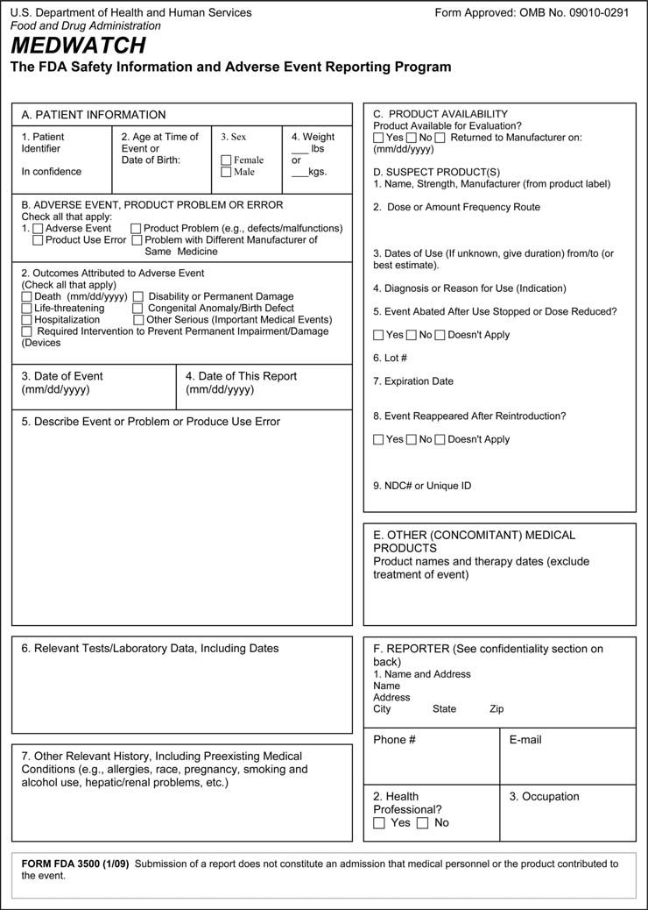
- **영국 Yellow Card 서식**: 영국 MHRA의 자발적 약물 유해반응 보고 시스템.
- **CIOMS I 서식**: 국제의학단체협의회(CIOMS) 표준 안전성 신속 보고 서식.

이러한 안전성 데이터는 의뢰자 내부 안전성 위원회, 독립적 DMC/DSMB, 그리고 FDA 및 각국 규제 당국으로 실시간 혹은 정기적으로 전송되어 평가됩니다(413).

# 26. 질환 및 약물의 작용 기전 - 제1부

### 1. 작용 기전의 정의 및 분류

약물의 작용 기전(Mechanism of Action, MOA)은 약물이 체내에서 특정한 약리학적 효과를 나타내는 구체적인 생화학적·분자생물학적 상호작용 과정을 의미합니다. 표적 분자의 성격에 따라 다음과 같이 분류할 수 있습니다:
- **고분자 구조 표적 (Macromolecular structures)**: 세포골격(미세소관 등)이나 세포외기질(ECM)과 같은 거대 구조를 표적으로 하는 약물.
- **대사체 상호작용 (Metabolites)**: 특정 대사체와 직접 상호작용하거나 대사 경로를 차단하는 약물(예: 아스파라긴을 분해하는 아스파라기나아제(asparaginase)(3)).
- **체내 활성화가 필요한 약물 (Prodrugs & Vaccines)**: 표적에 작용하기 전 체내 대사나 가공이 선행되어야 하는 약물(예: 전구약물인 디메틸 푸마레이트(4), 이소니아지드(5), 백신 등).

약물의 알부민 등 혈장 수송 단백질 결합, 세포 유입 및 유출 수송체(transporter), 분해 대사 경로 등은 MOA보다는 약동학(PK)적 특성으로 분류하는 것이 더 적절합니다.

### 2. 약물 작용 기전에 대한 이해가 임상시험에 중요한 이유

- **임상시험 진입 및 승인**: 안전성 및 유효성 데이터와 함께 명확한 MOA 정보는 임상시험 진입 결정의 핵심 근거가 됩니다(8).
- **의약품 첨부문서(Package Insert) 기재**: 규제 당국 제출 문서 및 처방 라벨에 MOA 기술이 필수적으로 요구됩니다.
- **대체 평가변수(Surrogate Endpoint) 타당성 입증**: MOA는 대체 평가변수와 최종 임상 평가변수(clinical endpoint) 사이의 생물학적 인과관계를 입증하는 데 결정적인 역할을 합니다.
- **탐색적 평가변수(Exploratory Endpoints) 정당화**: 질환 바이오마커와 임상 결과의 상관성을 설명하고 환자 반응군(responder)을 식별하는 데 기여합니다.
- **투약 스케줄 설계**: 약물의 수용체 결합 지속 시간이나 신호전달 차단 주기를 바탕으로 최적의 투약 간격을 도출할 수 있습니다.

***

### III. MOA와 대체 평가변수

대체 평가변수가 규제 승인의 근거로 채택되기 위해서는 해당 지표의 변화가 환자의 임상적 유익성(생존 기간 연장, 증상 개선 등)을 진정으로 반영한다는 과학적 증거가 필요합니다(13). 예를 들어, 저밀도 지질단백질 콜레스테롤(LDL-C) 강하는 심혈관 질환 발생 감소를 예측하는 대표적 대체 평가변수로 확립되어 있습니다.

특정 생화학적 경로(경로 A)를 억제하는 기존 약물이 특정 약물이상반응을 유발하는 것으로 알려져 있다면, 동일한 경로를 표적으로 하는 신약 개발 시에도 유사한 독성 프로파일이 나타날 가능성을 염두에 두고 임상 설계를 진행해야 합니다.

***

### VI. MOA와 병용 요법

#### a. 상보적 또는 상승적 병용 요법
항암 화학요법에서 이포스파마이드(ifosfamide)와 에토포사이드(etoposide)의 병용처럼, 작용 기전이 서로 다른 약물을 병용함으로써 항암 효능을 극대화하고 약제 내성(drug resistance) 발생을 억제할 수 있습니다. 

종양 세포는 종양 밖으로 약물을 배출하는 유출 펌프(P-glycoprotein 등)의 활성을 증가시키거나, 표적 분자의 유전적 돌연변이를 통해 단일 약제에 대한 내성을 획득합니다. 서로 다른 기전의 약물을 병용하면 종양이 이러한 다중 내성 기전을 동시에 획득하기 어렵게 만듭니다. 이러한 상보적 접근법은 알레르기 비염, 아토피 피부염, 만성 폐쇄성 폐질환(COPD) 등 다양한 면역 및 염증성 질환 치료에도 광범위하게 적용됩니다.

***

### VII. 면역 구성요소를 지닌 질환의 작용 기전

#### b. 림프구의 종양 침윤
인체 내에서 종양이 성장할 때 다양한 면역세포들이 종양 미세환경(TME)으로 침윤합니다. 면역계는 암세포를 비자가(non-self) 항원으로 인식하여 제거하려 하지만 종양은 다양한 면역 회피 기전을 동원하여 이러한 면역 감시를 무력화합니다.

#### c. T세포 및 자연살해 세포의 암세포 사멸 기전
대부분의 T세포는 림프조직, 장, 폐, 피부 등 말초 조직에 상주합니다. 세포독성 T세포(CTL)와 NK세포는 표적 암세포와 접촉(면역 시냅스 형성)한 후 탈과립(degranulation)을 통해 퍼포린(perforin)과 그랜자임(granzyme)을 방출하여 암세포의 세포사멸(apoptosis)을 유도합니다.

#### d. 종양 관련 대식세포와 M1/M2 표현형
대식세포는 종양 미세환경에서 극히 중요한 역할을 담당합니다:
- **M1형 대식세포**: Th1 사이토카인인 인터페론 감마(IFN-$\gamma$)에 의해 활성화되며 IL-12 및 IL-23과 같은 염증성 사이토카인을 분비하여 항종양 면역 반응을 촉진합니다.
- **M2형 대식세포 (종양 촉진형)**: 종양 세포가 분비하는 CCL2, VEGF 등에 의해 유인된 종양 관련 대식세포(TAM)는 주로 M2 표현형을 나타내며 VEGF, TGF-$\beta$ 등을 대량 분비하여 혈관신생을 촉진하고 면역 반응을 억제하여 종양 성장을 돕습니다(42).

# 26. 질환 및 약물의 작용 기전 - 제1부 (계속)

### e. 조절 T세포와 종양의 면역 회피

조절 T세포(Treg)의 중요성은 '스커피 마우스(scurfy mouse)' 모델에서 극명하게 입증됩니다. 스커피 마우스는 $FOXP3$ 유전자의 돌연변이로 인해 Treg이 결핍되어 있으며 그 결과 T세포가 무제한 증식하여 전신에 걸친 치명적인 자가면역 염증으로 조기 사망합니다(47).

그러나 종양 미세환경에 침윤한 Treg은 오히려 종양이 면역계의 공격을 회피하도록 돕습니다. Treg은 세포사멸 수용체(CD95/Fas) 경로를 통해 세포독성 $\text{CD8}^+$ T세포를 직접 사멸시키거나, 강력한 면역억제성 사이토카인인 IL-10 및 TGF-$\beta$를 분비하여 면역 반응을 무력화합니다(48, 49). TGF-$\beta$는 다양한 암 환자의 혈장에서 고농도로 검출되며 세포독성 림프구의 그랜자임 분비 및 IFN-$\gamma$ 생성을 억제합니다(50).

### f. PD-1/PD-L1 신호전달을 통한 종양의 면역 회피

PD-L1(리간드)은 다양한 암세포의 세포막에 발현되는 막관통 단백질입니다. PD-L1은 종양세포뿐만 아니라 종양 침윤 림프구에서도 발현될 수 있습니다(51).

PD-1(수용체)은 활성화된 T세포, B세포, 단핵구, NK세포 및 대식세포 표면에 발현되는 억제성 공자극 수용체(negative costimulatory receptor)입니다(52, 53). 종양세포의 PD-L1이 T세포의 PD-1과 결합하면, T세포 내부로 억제 신호가 전달되어 세포독성 T세포의 증식과 항종양 면역 기능이 억제됩니다(54). Garon 등의 설명처럼 "암의 핵심 특징 중 하나는 면역 회피이며 종양은 PD-1/PD-L1 경로를 가로채어 T세포 매개 항종양 공격으로부터 벗어납니다"(55).

이 리간드-수용체 결합을 차단하는 단클론항체(면역관문억제제)는 환자의 생존율을 획기적으로 개선함으로써 종양의 면역 회피 기전을 직접적으로 입증하였습니다:
- **펨브롤리주맙 (Pembrolizumab, 항-PD-1)**: 비소세포폐암(NSCLC)(56) 및 흑색종(57)에서 전체 생존율을 유의하게 개선.
- **니볼루맙 (Nivolumab, 항-PD-1)**: 호지킨 림프종(58), 비소세포폐암(59), 흑색종(60), 신세포암(61) 등에서 우수한 생존 연장 효과 입증.
- **항-PD-L1 항체 (Atezolizumab, Durvalumab 등)**: 비소세포폐암, 흑색종, 신세포암 등에서 유의미한 항종양 반응 유도(62, 63).

***

## VIII. 염증성 질환에서의 면역계 병태생리 (천식 모델)

천식(asthma)은 면역계 병태생리가 명확히 규명된 대표적 염증성 질환입니다. 핵심적인 병태생리 경로 중 하나는 IL-4 및 IL-13 사이토카인에서 기관지 평활근 세포의 수축과 경련으로 이어지는 과정입니다. IL-4와 IL-13의 공통 수용체 결합을 차단하는 항체 제제가 천식 증상을 완화한다는 사실은 이 수용체 신호전달이 질환 메커니즘의 핵심임을 입증합니다.

천식 환자를 대상으로 한 듀필루맙(dupilumab) 임상시험(64)은 IL-4 수용체 알파(IL-4R$\alpha$) 신호전달 차단이 기도 염증과 천식 악화를 현저히 억제함을 증명하였습니다.

# 26. 질환 및 약물의 작용 기전 - 제1부 (계속)

### 1. 천식에서의 Th2 염증 반응 및 IL-4/IL-13 신호전달

Wenzel 등에 따르면(65), 천식 환자의 약 절반은 Th2형 염증이 항진되어 있으며 IL-4 및 IL-13의 발현이 증가되어 있습니다. 대부분의 천식 환자는 흡입형 글루코코르티코이드와 지속성 베타-2 작용제(LABA)의 병용 요법으로 잘 조절되지만 약 20%의 중증 환자는 이러한 표준 치료에 불응합니다.

기존 문헌은 혈장 IL-4 및 IL-13 사이토카인의 증가가 기도 평활근의 직접적인 수축 및 기도 과민성(Airway Hyper-responsiveness, AHR)을 유발하는 핵심 작용 기전임을 명확히 보여줍니다(67). 또한 Faffe 등(70)은 IL-4 또는 IL-13이 Th2 세포 유인 화학주성 인자인 TARC(CCL17)의 분비를 유도하여 Th2 세포의 기도 침윤을 더욱 증폭시키는 양성 피드백 루프를 형성한다고 보고하였습니다.

호산구(eosinophil)는 천식 병태생리의 또 다른 핵심 실행 세포입니다(73). 호산구 탈과립을 통해 방출되는 주요 염기성 단백질(MBP), 호산구 유래 신경독소(EDN), 호산구 양이온 단백질(ECP) 및 활성산소종/과산화질소(peroxynitrite)는 기도 상피 손상과 조직 개형을 촉진합니다(76-80).

***

## IX. 면역계의 주요 세포 및 항원 제시

수지상세포(Dendritic Cell, DC)는 선천 면역과 후천 면역을 연결하는 가장 강력한 전문 항원제시세포(APC)입니다.
1. **항원 포획 및 처리**: 미성숙 DC는 말초 조직에서 외래 항원이나 종양 항원을 세포내이입(endocytosis)하여 펩타이드 조각으로 가공합니다.
2. **MHC 복합체 형성**: 처리된 항원 펩타이드는 세포 표면의 주요조직적합성복합체(MHC class I 또는 II) 분자에 장착됩니다.
3. **면역 시냅스(Immune Synapse) 형성 및 T세포 활성화**: DC는 림프절로 이동하여 T세포 수용체(TCR)와 결합합니다. 이때 완전한 활성화를 위해서는 항원 특이적 자극(신호 1) 외에도 공자극 분자(CD80/CD86과 CD28의 결합, CD40과 CD40L의 상호작용; 신호 2) 및 사이토카인 환경(신호 3)이 필수적입니다(그림 26.2). CD40-CD40L 신호가 결여된 경우 T세포는 완전한 효과기 세포로 분화하지 못하고 무반응(anergy) 상태에 빠지게 됩니다.

***

## X. 면역계를 조절하는 약물들

### a. 백신의 역사와 사이토카인 신호전달
에드워드 제너의 우두 접종(1796년 James Phipps 대상) 이래, 백신은 외래 항원을 미리 노출시켜 기억 T세포 및 B세포를 형성하는 대표적 면역 요법으로 발전하였습니다. 사이토카인은 자가분비(autocrine), 주변분비(paracrine) 및 병렬분비(juxtacrine) 방식으로 면역세포 간의 복잡한 통신망을 조율합니다. 1957년 최초로 기술된 인터페론(IFN)을 필두로 인터루킨, 케모카인 등 수많은 면역 조절 인자들이 질환 치료제로 개발되었습니다(91, 98).

### d. 톨유사수용체 작용제
톨유사수용체(TLR)는 병원체 연관 분자 패턴(PAMPs)을 인식하는 핵심 패턴인식수용체(PRR)입니다. 천연 병원체(세균, 바이러스)가 강력한 면역 반응을 촉발하는 이유는 외래 항원을 제공할 뿐만 아니라 내재적인 TLR 자극 신호를 동시에 제공하기 때문입니다.

항암 면역치료에서는 이러한 기전을 모방하여 합성 TLR 작용제를 항암 백신 보조제(adjuvant) 또는 단독 면역치료제로 사용합니다:
- **TLR9 작용제 (CpG 올리고데옥시뉴클레오타이드, CpG-ODN)**: B세포와 형질세포양 수지상세포(pDC)를 강력히 자극하여 Th1 면역 반응을 유도하며 비소세포폐암 및 전이성 식도암 임상시험에서 강력한 CD8+ T세포 반응을 유도하였습니다(103-105).
- **TLR7 작용제 (이미퀴모드, Imiquimod)**: 피부암 및 악성 흑색종 치료에 사용됩니다(109-111).
- **TLR3 작용제 (Poly I:C / Poly-ICLC)**: 수지상세포 성숙과 수지상세포 백신 요법의 효능을 극대화합니다(107).

# 26. 질환 및 약물의 작용 기전 - 제1부 (계속)

### 1. 다양한 TLR 작용제와 항암 치료 시 투여 타이밍

TLR4 작용제(예: ONO-4007 등)(108)와 TLR7 작용제인 이미퀴모드(109-111)는 항암 치료에 활발히 응용되고 있습니다. 리스테리아균(*Listeria monocytogenes*)(112)은 자연적으로 3가지 주요 TLR 작용제-세균 펩티도글리칸(TLR2 작용제), 세균 편모 단백질 플라겔린(TLR5 작용제), 세균 핵산 비메틸화 DNA(TLR9 작용제)-를 동시에 발현합니다(113-115).

항암 화학요법과 병용 시 TLR 작용제의 투여 타이밍은 항종양 효능에 결정적인 영향을 미칩니다. Nierkens 등(116)은 종양 파괴(disruption)와 CpG 투여가 동시에 이루어질 때 탁월한 항종양 효과가 유도되는 반면, CpG가 종양 파괴 전후 하루 정도의 시차를 두고 투여될 경우 항암 효과가 나타나지 않음을 규명하였습니다. 종양 파괴는 세포독성 화학요법, 방사선 치료 또는 냉동절제술(cryoablation)을 통해 유도될 수 있습니다.

또한 조절 T세포(Treg)의 면역억제 활성을 억제하기 위해 저용량 사이클로포스파마이드(cyclophosphamide)를 병용하는 전략이 널리 연구되고 있습니다(123).

***

## XI. 면역학을 구성하는 대립적 쌍 개념

현대 면역학의 조절 네트워크는 종종 상호 견제와 균형을 이루는 '대립적 쌍'의 개념으로 이해할 수 있습니다:

### a. Th1 대 Th2 면역 반응
- **Th1 반응**: 인터페론 감마(IFN-$\gamma$) 및 IL-12에 의해 주도되며 세포내 병원체(바이러스, 세포내 세균) 및 종양 세포를 제거하기 위한 세포성 면역을 촉진합니다.
- **Th2 반응**: IL-4, IL-5, IL-13에 의해 주도되며 기생충 감염 방어 및 체액성(B세포 항체) 반응을 매개하지만 과도할 경우 알레르기 및 천식을 유발합니다. 살모넬라균과 같은 병원체는 감염 시 수지상세포(DC)를 자극하여 Th1 편향을 유도합니다.

### c. $\text{CD4}^+$ T세포 대 $\text{CD8}^+$ T세포
- **$\text{CD4}^+$ 헬퍼 T세포**: MHC class II 분자에 제시된 항원을 인식하며 사이토카인을 분비하여 B세포와 대식세포 및 $\text{CD8}^+$ T세포의 활성화를 보조합니다.
- **$\text{CD8}^+$ 세포독성 T세포(CTL)**: MHC class I 분자에 결합된 항원을 인식하여 바이러스 감염 세포나 종양 세포를 직접 파괴합니다.

### e. 외인성 항원 대 내인성 항원 제시
일반적으로 외인성 항원은 세포내이입 후 가공되어 MHC class II를 통해 $\text{CD4}^+$ T세포에 제시되고 바이러스 복제나 세포 내 변이 단백질과 같은 내인성 항원은 프로테아좀에 의해 분해되어 MHC class I을 통해 $\text{CD8}^+$ T세포에 제시됩니다. 

그러나 수지상세포의 독특한 능력인 **교차 제시(Cross-Presentation)**를 통해 외래 종양 항원이나 사멸 세포 파편이 흡수된 후에도 MHC class I 경로를 거쳐 $\text{CD8}^+$ T세포를 프라이밍할 수 있습니다(146).

### f. 다클리주맙의 이중적 면역 조절 기전
항-CD25(IL-2R$\alpha$) 항체인 다클리주맙은 다발성 경화증 치료에서 병리적인 활성화 자가반응성 T세포를 억제하는 동시에, 조절 T세포와 NK세포 활성의 균형을 조절하여 임상적 치료 효과를 나타냅니다(156-158). 반면 종양 미세환경에서는 Treg의 활성을 억제하여 항종양 면역 반응을 촉진하는 목적으로 연구되기도 합니다(159, 160).

# 27. 질환 및 약물의 작용 기전 - 제2부

### I. 서론: 종양 면역학 및 세포독성 약물의 면역학적 기전

젬시타빈(gemcitabine)(5, 6), 시스플라틴(cisplatin)(7) 등 전통적인 세포독성 화학요법제는 단순히 종양 세포를 직접 사멸시키는 데 그치지 않습니다. 최근의 증거들은 이러한 약물에 의한 종양 세포 손상이 종양 관련 항원(TAA)의 대량 방출을 유발하여 수지상세포 등 면역세포에 의한 항원 포획과 제시를 촉진한다는 사실을 입증합니다. 

림프구를 선택적으로 사멸시키는 클라드리빈(cladribine)은 매우 상이한 두 질환(특정 림프세포성 백혈병 및 다발성 경화증)의 치료에 성공적으로 사용되는 독특한 약물입니다.

종양은 흔히 '면역학적 특권(immunoprivileged)' 부위처럼 행동하여 인체 면역계의 감시와 공격으로부터 스스로를 보호하며 종양에 대한 면역학적 관용(tolerance)을 유도합니다(11). 종양 항원을 발현하는 약독화 리스테리아 균주(19)와 같은 면역원성 플랫폼은 종양에 대한 면역 공격을 자극하는 데 활용될 수 있습니다. 또한 인터페론 감마(IFN-$\gamma$)와 같은 사이토카인은 종양 세포의 MHC 분자 발현을 상향 조절하여 항암 면역 반응을 촉진합니다(29).

***

### II. 항체 매개 세포독성 및 수용체 표적 항체

항체가 암세포를 사멸시키는 핵심 기전 중 하나는 **항체의존성 세포매개 세포독성(Antibody-Dependent Cellular Cytotoxicity, ADCC)**입니다. 자연살해(NK) 세포의 표면에 존재하는 Fc 수용체(CD16)가 암세포 표면에 결합된 항체의 Fc 영역을 인식하고 결합하면, NK세포가 활성화되어 퍼포린과 그랜자임을 분비하여 암세포를 용해시킵니다.

EGFR(HER1) 표적 단클론항체(세툭시맙, 파니투무맙)는 대장암 치료에 널리 사용되며 세포 생존 및 증식 신호를 차단하는 동시에 ADCC 효과를 유도합니다. 그러나 KRAS 등 하위 신호전달 물질의 자연 발생적 돌연변이가 존재하는 경우 이러한 표적 항체 치료에 저항성을 나타냅니다.

***

### III. 종양 미세환경 내 조절 T세포와 면역관문 수용체

많은 고형암 조직 내에 조절 T세포(Tregs)가 고밀도로 침윤되어 있으며 이는 환자의 불량한 예후와 밀접한 상관관계를 보입니다(49, 50). Tregs는 면역억제 환경을 조성하여 세포독성 T세포의 기능을 억제합니다.

항원제시세포(DC)와 T세포 간의 면역 시냅스 상호작용은 복잡한 공자극 및 억제 신호의 균형으로 조절됩니다(그림 27.1):
- **자극 신호**: MHC 복합체와 TCR의 결합, 그리고 수지상세포의 B7-1/B7-2(CD80/CD86)와 T세포의 CD28 간의 결합.
- **억제(면역관문) 신호**: T세포 활성화 후 유도되는 CTLA-4와 B7의 결합(CD28과 경쟁), 그리고 종양세포나 대식세포의 PD-L1과 T세포의 PD-1 간의 결합.

이러한 면역관문 억제 신호를 차단함으로써 T세포의 면역 브레이크를 해제하는 것이 현대 면역관문억제제 항암 요법의 핵심입니다.

# 27. 질환 및 약물의 작용 기전 - 제2부 - 계속

### IV. CTLA-4와 PD-1/PD-L1 억제 경로의 작용 기전 비교

Hamid 등에 따르면(58), "세포독성 T림프구 연관 항원 4(CTLA-4)와 같은 억제성 수용체를 차단하는 항체(예: 이필리무맙(ipilimumab))는 면역계의 음성 조절 경로 중 하나를 차단하여 T세포의 항종양 활성을 촉발합니다."

- **CTLA-4 경로**: 주로 림프절과 같은 2차 림프기관에서 T세포 활성화의 초기 단계를 조절합니다. 나이브(naive) T세포나 휴지기 기억 T세포에서는 발현되지 않다가 T세포 수용체(TCR) 자극 후 유도 발현됩니다(62). CTLA-4는 양성 공자극 수용체인 CD28보다 B7 리간드(CD80/CD86)에 대해 훨씬 더 높은 친화도(affinity)를 가지고 결합하여 CD28 신호 전달을 경쟁적으로 억제함으로써 T세포의 과도한 증식을 막는 브레이크 역할을 수행합니다.
- **PD-1/PD-L1 경로**: 주로 종양 조직과 같은 말초 조직 및 종양 미세환경에서 이미 활성화된 효과기 T세포(effector T cells)의 소진(exhaustion)을 유도합니다. 암세포가 발현하는 PD-L1이 T세포의 PD-1에 결합하면 세포독성 기능이 마비됩니다.

이 두 경로를 표적으로 하는 차단 항체들이 암 환자에서 괄목할 만한 치료 반응을 유도한다는 임상시험 결과들은 암 치료에서 면역 회피 차단의 중요성을 결정적으로 입증하였습니다.

### V. T세포 소진과 면역 관용

지속적인 항원 노출(만성 바이러스 감염 또는 진행성 암) 하에서 T세포는 점진적인 기능 상실 과정을 겪으며 이를 **T세포 소진(T-cell exhaustion)**이라고 부릅니다. 소진된 T세포는 IL-2, TNF-$\alpha$, IFN-$\gamma$와 같은 효과기 사이토카인의 분비 능력을 상실하고 PD-1, TIM-3, LAG-3 등 다수의 억제성 수용체를 동시에 고발현합니다.

면역관문억제제는 이러한 소진된 T세포의 기능을 재활성화(reinvigoration)하여 암세포를 공격하도록 유도합니다. 그러나 면역 브레이크를 해제하는 것은 동시에 자가면역 반응을 촉발하여 대장염, 간염, 뇌하수체염, 폐렴과 같은 면역 관련 이상반응(irAE)을 동반할 수 있습니다.

***

# 28. 질환 및 약물의 작용 기전 - 제3부

### I. 서론: 자가면역 질환의 병태생리

자가면역 질환은 면역계가 자신의 정상 세포 및 조직 항원을 비자가(non-self)로 오인하여 공격함으로써 발생합니다:
1. **전신 홍반성 루푸스 (SLE)**: 세포 사멸 과정에서 방출된 자가 핵산 및 염색질 단백질에 대한 자가항체(항핵항체(ANA), 항-dsDNA 항체)가 형성되고 면역 복합체가 신장(루푸스 신염) 및 전신 혈관에 침착되어 중증 염증과 조직 손상을 유발합니다.
2. **건선 (Psoriasis)**: IL-23/IL-17 축을 중심으로 한 면역 이상 반응으로 표피 각질형성세포의 과증식과 피부 염증이 발생합니다.

# 28. 질환 및 약물의 작용 기전 - 제3부 - 계속

### I. 기도 개형 및 인터루킨 표적 치료

천식의 만성 진행 과정은 기도 상피 탈락, 기저막 비후, 기도 평활근 비대 및 혈관 증식을 특징으로 하는 **기도 개형(Airway Remodeling)**으로 이어집니다. Th2 사이토카인인 IL-13은 상피하 섬유화와 점액 과분비를 촉진하는 주요 인자입니다. 항-IL-13 단클론항체인 레브리키주맙(lebrikizumab) 등의 임상시험은 혈청 페리오스틴(periostin)과 같은 바이오마커가 높은 환자군에서 폐 기능 개선 효과가 두드러짐을 보여주었습니다.

또한 크론병과 궤양성 대장염을 포함하는 염증성 장질환(IBD)에서는 장관 점막의 면역 항상성 파괴와 비정상적인 사이토카인 생성(TNF-$\alpha$, IFN-$\gamma$, IL-12/23 등)이 장벽 손상과 만성 궤양을 유발합니다.

***

## II. 다발성 경화증의 상세 작용 기전

다발성 경화증은 중추신경계(CNS)의 수초(myelin sheath)를 침범하는 만성 탈수초성 자가면역 질환으로, 근력 약화, 감각 이상, 구음 장애(dysarthria), 현기증 및 운동실조를 유발합니다.

### a. 혈뇌장벽 통과와 나탈리주맙
병리적 과정은 자가반응성 T세포가 뇌혈관 내피세포의 접착 분자와 상호작용하여 혈뇌장벽을 통과함으로써 시작됩니다. 
- T세포 표면의 **알파-4 인테그린($\alpha_4\beta_1$, VLA-4)**은 혈관 내피세포의 VCAM-1과 결합하여 T세포의 내피 부착 및 중추신경계 실질 내 유출(extravasation)을 매개합니다.
- 단클론항체인 **나탈리주맙(Tysabri)**은 $\alpha_4$ 인테그린에 특이적으로 결합하여 T세포와 VCAM-1의 상호작용을 물리적으로 차단합니다. 이를 통해 면역세포의 뇌 조직 침투를 원천 차단하여 중추신경계 염증과 새로운 병변 형성을 억제합니다.

### b. 클라드리빈과 퓨린 대사
클라드리빈(2-chlorodeoxyadenosine)은 아데노신 탈아미노효소(adenosine deaminase, ADA)에 의한 분해에 저항성을 갖는 데옥시아데노신 유사체입니다(68). 림프구는 높은 데옥시시티딘 인산화효소(deoxycytidine kinase, DCK) 활성을 지니고 있어 클라드리빈 삼인산(Cd-ATP)을 세포 내에 축적하며 이는 DNA 합성 저해, DNA 가닥 절단 및 선택적 림프구 사멸(림프구 소진)을 유발하여 MS 재발을 지속적으로 억제합니다.

# 28. 질환 및 약물의 작용 기전 - 제3부 - 계속

### c. 글라티라머 아세테이트의 상세 작용 기전

글라티라머 아세테이트(Copaxone, 코폴리머-1)는 4가지 아미노산(L-글루탐산, L-알라닌, L-티로신, L-리신)의 무작위 중합체로, 다발성 경화증의 치료에 널리 사용됩니다.

1. **MHC class II 직접 결합 및 자가항원 치환**:
일반적인 단백질 항원은 수지상세포(DC) 내부로 흡수되어 엔도솜/리소좀 내 'MHC class II 함유 구획(MIIC)'에서 절편화 가공을 거친 후 MHC class II에 장착됩니다(82-85). 그러나 Masha Hareli 박사의 연구에 따르면, 글라티라머는 세포 내 가공 과정을 거치지 않고 세포 표면에 이미 노출된 MHC class II의 결합 홈(binding groove)에 직접 높은 친화도로 결합합니다(79, 80). 글라티라머는 결합 홈의 양 끝이 열려 있는 MHC class II의 구조적 특성 덕분에 긴 폴리펩타이드 상태로 직접 결합할 수 있으며 기존에 결합되어 있던 수초 염기성 단백질(MBP)과 같은 병리적 자가항원을 경쟁적으로 밀어내어(치환하여) 자가항원의 면역 제시를 차단합니다(86, 87).

2. **Th2 편향 면역 조절 및 신경 보호 효과**:
Arnon과 Aharoni의 연구(81)에 따르면, 글라티라머 투여는 글라티라머 특이적 $\text{CD4}^+$ T세포의 생성을 유도합니다. 이 T세포들은 혈뇌장벽을 통과하여 중추신경계로 이동한 후, Th1 전염증성 사이토카인 대신 항염증성 Th2 사이토카인(IL-4, IL-10 등)을 분비합니다. 나아가 뇌 내 미세아교세포(microglia)와 성상교세포(astrocyte)를 자극하여 항염증 환경을 조성하고 중추신경계의 염증성 손상을 완화합니다.

# 28. 질환 및 약물의 작용 기전 - 제3부 - 계속

### d. 신경영양인자 유도 및 양자 면역세포 이식

글라티라머 아세테이트 치료는 항염증 사이토카인뿐만 아니라 뇌유래신경영양인자(Brain-Derived Neurotrophic Factor, BDNF) 및 인슐린유사성장인자-1(IGF-1)과 같은 성장 인자의 발현을 T세포 및 성상교세포에서 유도합니다. 이러한 인자들은 중추신경계의 탈수초 병변 부위에서 수초 재생(remyelination) 및 신경 보호 효과를 촉진합니다(96). 미치료 EAE 마우스에 비해 글라티라머를 투여한 EAE 마우스의 대뇌 피질에서 BDNF 발현이 약 4배 증가하는 것으로 확인되었습니다.

글라티라머의 치료 효과가 T세포 매개 반응에 기인함을 명확히 입증하기 위해 연구자들은 **양자 면역세포 이식(Adoptive Transfer)** 기법을 사용하였습니다. 글라티라머로 면역화된 마우스에서 분리한 글라티라머 특이적 T세포를 다른 EAE 유도 마우스의 혈류로 주입했을 때, 이 T세포들이 중추신경계로 이동하여 EAE 발병을 현저히 억제하고 신경 손상을 호전시키는 결과를 나타냈습니다(97, 98).

***

## III. 다발성 경화증의 동물 모델

다발성 경화증(MS) 연구의 대부분은 **실험적 자가면역성 뇌척수염(Experimental Autoimmune Encephalomyelitis, EAE)**이라는 확립된 동물 모델을 기반으로 진행되어 왔습니다(99).
- **역사적 기원**: 1885년 루이 파스퇴르가 토끼 척수로 제조한 광견병 백신을 접종받은 일부 개체에서 마비 증상이 발생한 관찰에서 출발하였습니다.
- **유도 프로토콜**: 설치류(마우스, 래트) 또는 영장류(커먼 마모셋)에 수초 희소돌기아세포 당단백질(MOG)이나 수초 염기성 단백질(MBP)과 같은 수초 구성 단백질을 프로인트 완전 보조제(CFA) 및 백일해 독소(Pertussis toxin)와 함께 주사하여 중추신경계 자가면역 뇌척수염을 유발합니다(100-102).

***

## IV. 다발성 경화증의 병인론 및 병태생리 기전

다발성 경화증의 면역 병리 네트워크는 감염이나 암에 대한 면역 반응과 현저한 차이를 보입니다:
1. **발병 원인의 불명확성**: 질환을 촉발하는 초기 유발 인자가 여전히 명확하지 않습니다.
2. **표적 자가항원의 다변성**: MBP, MOG, PLP 등 여러 후보 자가항원이 제시되지만 단일 원인 항원을 특정하기 어렵습니다.
3. **광범위한 비특이적 염증 손상**: 암에 대항하는 CD8+ T세포의 정밀한 표적 공격과 달리, MS에서는 중추신경계로 침윤한 대식세포와 미세아교세포가 활성산소종(ROS)과 산화질소(NO)를 무차별적으로 분비하여 주변 신경섬유와 희소돌기아세포(oligodendrocyte)에 심각한 방관자 손상(bystander damage)을 유발합니다.

Ortiz 등(108)의 요약에 따르면, 다발성 경화증은 "혈뇌장벽의 파괴, 병변 부위로의 림프구·미세아교세포·대식세포의 동원, 뇌간 및 척수에서의 다발성 병변 형성, 염증에서 탈수초화 및 신경교증(gliosis)으로 이어지는 병변의 시간적 성숙"을 특징으로 합니다.

# 28. 질환 및 약물의 작용 기전 - 제3부 - 계속

### d. EAE 유도 및 글라티라머 치료에 따른 Th1 및 Th17 세포의 동태

자가면역성 뇌척수염(EAE)의 발병에서 Th1 세포와 Th17 세포의 역할은 오랫동안 집중적인 연구 대상이었습니다. Aharoni 등(161)은 수초 항원으로 EAE를 유도했을 때 뇌 조직에 축적되는 T세포 중 Th1 세포와 Th17 세포가 각각 대략 동일한 비율을 차지함을 입증하였습니다. EAE 유도 후 뇌 조직 검사에서 Th17 세포는 침윤된 전체 T세포의 약 40%를 차지했습니다.

수초 특이적 Th1 세포 또는 Th17 세포의 양자 이식(adoptive transfer)은 모두 수혜 동물에서 EAE를 유발할 수 있습니다(157). 그러나 흥미롭게도 Th17 세포를 이식한 경우 EAE 증상의 발현이 지연되며 이는 이식된 Th17 세포가 체내에서 Th1형 사이토카인인 IFN-$\gamma$를 발현하는 표현형으로 전환된 이후에 비로소 질환이 발생하기 때문입니다(158). 

수혜 마우스에서 적출한 T세포를 분석한 연구들은 Th17 세포가 수초 항원과 조우하면서 가소성(plasticity)을 발휘하여 "중추신경계 특이적으로 $\text{IFN-}\gamma^+\text{IL-17}^+$ 이중 양성 세포로 풍부화"되거나 Th1 유사 세포로 형질 전환됨을 보여주었습니다(159, 160).

5주간에 걸친 정밀한 시간별 경과 연구(time-course study)에서 꼬리 마비, 후지 마비, 사지 마비 및 사망을 기준으로 질환 점수(clinical score)를 산출하였을 때:
- 면역 유도 0일 차에는 뇌 조직 $1\,\text{mm}^2$당 T세포 수가 5개 미만이었으나,
- 5주에 걸쳐 침윤 T세포 수는 $1\,\text{mm}^2$당 50~150개로 급격히 증가하였습니다.

이러한 상태에서 글라티라머 아세테이트를 투여하면, 뇌 조직 내 Th1 및 Th17 병리적 T세포의 비율이 급격히 감소하고 항염증성 Th2/Treg 세포가 증가하면서 임상 증상이 유의미하게 호전됩니다.

# 29. 질환 및 약물의 작용 기전 - 제4부

### I. C형 간염 바이러스(HCV) 비구조 단백질 NS5A의 구조와 기능

Eyre 등(27)에 따르면, HCV 비구조 단백질 5A(NS5A)는 바이러스 복제 복합체인 '막성 웹(membranous web)' 및 숙주 간세포의 '지질 방울(lipid droplet)' 표면에서 바이러스 입자의 조립(assembly)과 방출에 중추적인 역할을 담당합니다.

NS5A 단백질 자체는 내재적인 효소 활성(효소 촉매 기능)을 가지고 있지 않습니다(28). 그러나 NS5A는 숙주 지질 키나아제인 포스파티딜이노시톨 4-키나아제 III 알파(PI4KIII$\alpha$)를 동원하고 활성화하여 포스파티딜이노시톨 4-인산(PI4P)을 국소적으로 합성함으로써, 바이러스 복제에 필수적인 막성 웹 구조를 형성합니다(29). 또한 미세소관을 따라 이동하는 세포 내 소포 수송(vesicular traffic, 다이닌 및 키네신 분자 모터 의존적)을 조율합니다.

NS5A의 여러 세린(Ser) 잔기는 인산화(phosphorylation) 상태에 따라 바이러스 라이프사이클의 '게놈 복제 단계'와 '바이러스 입자 조립 단계' 사이의 스위치 역할을 수행합니다. 특히 세린-225(Ser-225) 잔기의 인산화는 HCV 게놈 복제 복합체의 확립에 필수적입니다(30, 31).

### II. NS5A 저해제와 약제 내성 변이

레디파스비르(ledipasvir), 다클라타스비르(daclatasvir)와 같은 직접작용 항바이러스제(DAA)는 NS5A 이량체에 피코몰(pM) 수준의 초고친화도로 결합하여 그 기능을 마비시킵니다(28).

그러나 바이러스 게놈의 자연 발생 변이는 약제 내성을 유발할 수 있습니다. 대표적인 NS5A 내성 변이는 다음과 같습니다(32, 33):
- **Y93H (Tyr-93-His)**: 93번 위치의 야생형 티로신이 히스티딘으로 치환되는 변이로, 레디파스비르 및 다클라타스비르에 대한 감수성을 수백~수천 배 감소시킵니다.
- **L31V (Leu-31-Val)**: 31번 위치의 류신이 발린으로 치환되는 변이입니다.

이러한 내성 연관 변이의 분석은 임상시험 설계 시 환자 층화 기준 및 병용 약제(예: 소포스부비르와 같은 NS5B 중합효소 억제제 병용) 선택의 중요한 분자생물학적 근거가 됩니다.

# 29. 질환 및 약물의 작용 기전 - 제4부 - 계속

### III. 만성 C형 간염의 간병변 진행: 간섬유화, 간경변 및 간세포암

만성 HCV 감염은 간섬유화(fibrosis), 간경변(cirrhosis) 및 간세포암(HCC)의 주요 원인입니다(72). 간경변의 유무는 DAA 신약 임상시험 설계에서 핵심적인 고려사항입니다:
- 특정 임상시험에서는 간경변 환자를 제외 기준(exclusion criteria)으로 설정하기도 하고(73),
- 다른 3상 임상시험(예: ION 연구 등)에서는 간경변 환자의 등록을 허용하되, 간경변 동반 여부에 따라 대상을 층화(stratification)하여 치료 기간(12주 vs 24주)이나 리바비린 병용 필요성을 평가하였습니다(74).

면역 매개성 간손상은 바이러스 자체의 직접적인 세포독성과는 별개로 만성 염증을 지속시키는 주요 기전입니다(75-78).

### IV. 간성상세포와 간섬유화의 분자 기전

만성 간염 환자의 약 20%가 20~50년에 걸쳐 간경변으로 진행합니다. 조직학적 병기는 전통적으로 메타비어(Metavir) 척도에 따라 분류됩니다:
- **F0**: 섬유화 없음
- **F1**: 격벽(septa)이 없는 문맥 섬유화(portal fibrosis)
- **F2**: 소수의 격벽을 동반한 문맥 섬유화
- **F3**: 간경변이 없는 다수의 격벽 섬유화(septal fibrosis)
- **F4**: 간경변(cirrhosis)

간섬유화의 중심 실행 세포는 간의 디세강(Space of Disse)에 상주하는 **간성상세포(Hepatic Stellate Cells, HSC)**입니다(83). 정상 상태에서 성상세포는 체내 비타민 A(레티노이드)의 약 80%를 지질 방울 형태로 저장하는 휴지기 상태로 존재합니다. 

그러나 HCV에 감염된 간세포와 침윤 면역세포에서 TGF-$\beta_1$, PDGF 등 강력한 전섬유화 사이토카인이 분비되면 성상세포가 활성화(activation/transdifferentiation)되어 근섬유아세포(myofibroblast) 유사 세포로 변환됩니다. 활성화된 성상세포는 비타민 A 지질 방울을 소실하고 알파 평활근 액틴($\alpha$-SMA)을 발현하며 제1형 및 3형 콜라겐 등 세포외기질(ECM)을 과도하게 분비하여 간 조직의 광범위한 섬유화와 결절 형성을 촉발합니다.

# 29. 질환 및 약물의 작용 기전 - 제4부 - 계속

### V. HCV에 대한 획득 면역 반응과 MHC class I의 이중 역할

MHC class I 분자 복합체는 바이러스 감염 과정에서 두 가지 상이하고 결정적인 단계에 관여합니다:
1. **1단계 (면역 유도 단계)**: 수지상세포(DC) 표면의 MHC class I 분자가 가공된 HCV 바이러스 항원을 나이브 $\text{CD8}^+$ T세포에 교차 제시하여 효과기 세포독성 T세포(CTL)로 분화·활성화시키는 단계.
2. **2단계 (효과기 살상 단계)**: 감염된 간세포 표면의 MHC class I 분자가 바이러스 항원 펩타이드를 노출하여 순환 중인 $\text{CD8}^+$ CTL이 감염된 간세포를 정확히 식별하고 퍼포린/그랜자임 경로를 통해 사멸시키도록 유도하는 단계(112, 113).

### VI. 선천 면역 감지: 수지상세포, TLR 및 RIG-I 신호전달

수지상세포가 단순히 항원을 포획하는 것만으로는 T세포를 효과적으로 자극하기에 불충분하며 세포 성숙을 유도하는 '위험 신호(danger signal)'가 반드시 수반되어야 합니다(114).
- **HCV RNA 감지**: HCV의 단일가닥 RNA는 엔도솜 내의 **TLR7**(특히 형질세포양 수지상세포, pDC에서)(115)과 **TLR3**(이중가닥 RNA 중간체 감지)(116)를 자극하여 대량의 제1형 인터페론(IFN-$\alpha/\beta$) 분비를 촉진합니다.
- **HCV 단백질 감지**: 바이러스 코어 단백질과 NS3 단백질은 세포막의 TLR2(및 TLR1, TLR6 복합체)를 자극하여 전염증성 신호를 전달합니다(117-120).
- **세포질 센서 RIG-I**: 세포질 내에서 숙주의 바이러스 RNA 감지 센서인 RIG-I는 5'-삼인산을 지닌 비자기 HCV RNA를 감지하여 항바이러스 면역 경로를 활성화합니다(121, 122). 

그러나 HCV는 비구조 단백질인 NS3/4A 세린 단백질분해효소를 통해 RIG-I 신호전달의 핵심 어댑터 단백질인 MAVS(Cardif/IPS-1)와 TRIF를 직접 절단함으로써 숙주의 선천 면역 감시를 정교하게 회피합니다.

# 29. 질환 및 약물의 작용 기전 - 제4부 결론

임상시험 설계에서 선정/제외 기준의 설정과 연구 대상자의 층화는 약물의 명확한 분자생물학적 작용 기전(MOA)에 대한 이해를 바탕으로 이루어져야 합니다. 또한, 잘 규명된 MOA 정보는 FDA와 같은 규제 당국이 제안된 임상시험계획서(IND)를 승인하도록 설득하고 최종 허가 시 처방 의약품 첨부문서의 '임상약리학(Clinical Pharmacology)' 항목을 충실히 구성하는 핵심 근거가 됩니다(177, 178).

***

# 30. 동의서

### I. 연구 윤리와 동의서의 역사적 기원: 황열병 연구

임상 연구에서 피험자의 자발적 동의(Informed Consent)의 개념을 확립한 선구적 사건 중 하나는 1900년 쿠바에서 수행된 월터 리드(Walter Reed) 박사의 황열병(Yellow Fever) 연구였습니다.

쿠바의 의사 카를로스 핀레이(Carlos Finlay)는 무더운 여름철 이집트숲모기(*Aedes aegypti*)의 번식과 황열병 유행이 일치한다는 관찰을 바탕으로 모기가 매개체라는 가설을 제안하였습니다(5). 황열병은 실제로 10개의 단백질을 암호화하는 소형 플라비바이러스(yellow fever virus)에 의해 발생합니다(6, 7). 당시 미국-스페인 전쟁에서 전투로 사망한 미군(약 400명)보다 황열병으로 사망한 군인이 2,000명을 넘을 정도로 심각한 보건 위기였습니다(9, 10).

당시 지배적인 통념은 황열병이 세균(예: *Bacillus icteroides*)에 의해 발생한다는 것이었습니다. 1900년 6월 쿠바에 파견된 월터 리드 연구팀(Jesse Lazear, Aristides Agramonte, James Carroll)은 세균설을 반증하고 병원체가 버케펠트 여과기(Berkefeld filter)를 통과하는 여과성 병원체(바이러스)임을 입증하였습니다(11).

월터 리드는 인간을 대상으로 모기 매개 감염 실험을 수행하기 전, 자원자들에게 연구의 위험성을 설명하고 서면으로 된 공식 동의서를 작성하도록 하였습니다. 비록 현대적 기준의 생명윤리와는 차이가 있으나, 이는 의학 역사상 최초로 문서화된 형태의 임상시험 피험자 동의서 중 하나로 평가받고 있습니다.

# 30. 동의서 - 계속

### IV. 치료 중단과 시험 철회의 구분

FDA의 ICH E6(R1) 가이드라인(20)은 환자가 언제든지 임상시험에서 철회할 수 있는 권리를 명시하고 있습니다. Fleming(21)은 시험 탈락(dropping out)과 동의 철회(withdrawal of consent)의 차이에 대해 매우 중요한 통찰을 제공합니다. 대상자가 임상시험 연구 자체를 공식적으로 종료하는 정당한 사유는 단 두 가지뿐입니다:
1. **동의 철회 (Withdrawal of Consent)**
2. **시험계획서에 규정된 모든 유효성 및 안전성 평가변수의 완료**

Fleming(22)에 따르면, 많은 임상시험계획서가 내약성 부족, 독성 발생, 주치의의 판단, 또는 다른 치료의 필요성 등을 이유로 환자가 시험에서 완전히 배제(off-study)되는 것으로 잘못 기술하는 관행이 있습니다. 이러한 사유들은 '시험 약물 치료의 중단(off study treatment / nonadherence)'에 대한 정당한 사유는 될 수 있으나, '연구 관찰 대상에서 완전히 제외(dropped from study)'되는 사유는 아닙니다. 배정의도(ITT) 원칙을 유지하고 생존율 및 장기 안전성을 추적하기 위해, 환자가 약물 복용을 중단하더라도 동의를 명시적으로 철회하지 않는 한 추적 관찰은 계속되어야 합니다.

***

### V. 연구 윤리 선언과 역사적 발전

동의서의 기초가 되는 주요 윤리적 규범은 다음과 같습니다:
- **뉘른베르크 강령 (Nuremberg Code, 1947)**: 제2차 세계대전 나치 전범들의 반인륜적 생체실험 재판 후 제정되었으며 피험자의 '자발적 동의(voluntary consent)'가 절대적으로 필수적임을 천명하였습니다.
- **헬싱키 선언 (Declaration of Helsinki, 1964)**: 세계의사회(WMA)가 채택한 인간 대상 의학 연구 윤리 원칙으로, 환자의 복지가 과학과 사회의 이익보다 우선함을 명시하였습니다.
- **벨몬트 보고서 (Belmont Report, 1979)**: 터스키기 매독 연구(Tuskegee Syphilis Study) 및 윌로우브룩 간염 연구(Willowbrook Hepatitis Studies)와 같은 비윤리적 인체실험에 대한 반성으로 미국 의회가 제정한 국가연구법(1974)에 따라 출범한 위원회가 작성하였습니다(23). 핵심 3대 윤리 원칙으로 **인간 존중(Respect for Persons; 자율성 존중 및 동의)**, **선행(Beneficence; 위험 최소화 및 유익 극대화)**, **정의(Justice; 공정한 피험자 선정)**를 제시하였습니다.

***

### VI. 미국 연방규정집의 법적 요건 및 실제 동의서 사례

21 CFR §50.25는 피험자 동의서에 반드시 포함되어야 할 필수 기본 요소(Basic elements of informed consent)를 규정하고 있습니다:
1. 연구라는 사실에 대한 명시적 설명, 연구의 목적, 예상 참여 기간, 절차에 대한 기술
2. 합리적으로 예측 가능한 위험 또는 불편에 대한 설명
3. 피험자 또는 타인이 기대할 수 있는 잠재적 유익성에 대한 설명
4. 피험자에게 유리할 수 있는 적절한 대체 치료법 또는 치료 과정
5. 피험자의 신원 비밀 보장 수준 및 FDA의 기록 검토 가능성 고지
6. 연구 관련 상해 발생 시 보상 및 의학적 치료 조치에 대한 설명
7. 연구 및 피험자의 권리에 관한 질문 시 연락할 담당자 정보
8. 참여가 전적으로 자발적이며 언제든 불이익 없이 참여를 거부하거나 중단할 수 있다는 서술

실제 현대 임상시험 동의서는 대상자가 이해하기 쉬운 문장으로 치료군 배정(군별 투약 주기 등)과 발생 가능한 이상반응(수족 저림, 혼돈, 기분 변화 등)을 상세히 설명하도록 작성됩니다.

# 30. 동의서 - 계속

### 예상되는 위험 및 잠재적 유익성 고지 예시

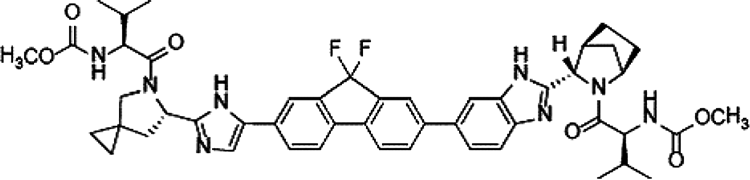

임상시험 동의서의 위험 및 이상반응 고지 문구는 환자가 위험을 명확히 인지할 수 있도록 다음과 같이 구체적이고 평이하게 작성됩니다:
> "식욕 감퇴, 피로, 근력 약화, 근육통 및 관절통, 탈모가 발생할 수 있습니다. 어지러움, 두통, 고혈압, 시야 흐림 또는 빛 번쩍임 감각, 주사 부위 자극감, 손발 저림, 혼돈, 기분 변화, 간 및 신장 기능 저하, 그리고 신장 손상도 흔히 나타날 수 있는 부작용입니다. 칼슘, 나트륨, 마그네슘 수치 저하 또는 지질 수치 증가와 같은 비정상적인 혈액 검사 소견이 나타날 수 있습니다. 드물게 발생하는 부작용으로는 실신, 불규칙한 심장 박동(부정맥), 심장 전도 장애(빈맥, 방실 차단 등), 심근경색이 있습니다. 이러한 생명 위협 부작용을 예방하기 위해 약물이 투여될 수 있으며 환자 상태를 면밀히 관찰할 것입니다."

유익성(Benefits) 항목의 기술 역시 객관적이어야 하며 과도한 기대를 유발해서는 안 됩니다:
> "귀하에게 개인적인 치료 이익이 발생할지 여부는 사전에 예측할 수 없습니다. 기대 가능한 잠재적 이익으로는 종양의 관해 및 생존 기간 연장이 있습니다. 그러나 시험 약물이 기존 표준 치료법보다 효과가 떨어질 가능성도 있습니다. 실험 약물 치료를 받고 효과가 나타나지 않는 경우, 이전에 효과가 입증된 치료를 받게 됩니다. 질환이 악화되거나, 부작용이 매우 심각해지거나, 본 치료가 환자에게 최선이 아님을 시사하는 새로운 과학적 사실이 밝혀지거나, 담당 의사가 본 치료가 더 이상 유익하지 않다고 판단하는 경우 언제든지 시험 참여가 중단될 수 있습니다."

***

### 서명란 구성 및 다기관 임상시험 동의서의 비교

동의서 말미에는 대상자의 자발적 서명란(Patient signature), 법정 대리인 서명란, 설명 의사 및 연구자 서명란, 그리고 기관명(Institution)이 위치합니다.

여러 임상시험 센터에서 사용되는 현대 동의서들은 두 개 이상의 시험 약물이 사용되는 복합 요법에서 각 약물의 시험용(investigational) 지위를 명확히 명시하고 대상자가 언제든지 불이익 없이 시험을 중단할 수 있는 자율적 권리를 재차 보장합니다.

# 30. 동의서 - 계속

### 가독성과 작성 언어 수준: 초등학교 4학년 수준 vs 대학 수준

임상시험 동의서의 언어는 일반 대중이 명확히 이해할 수 있도록 평이해야 합니다. 표 30.2는 초등학교 4학년 수준(권장)과 대학 수준의 언어 표현을 비교하여 보여줍니다.

표 30.2 동의서 언어 수준 비교 (초등학교 4학년 수준 vs 대학 수준)

| 항목 | 초등학교 4학년 수준 (권장) | 대학 수준 (지양) |
| :--- | :--- | :--- |
| **자발적 참여 고지** | "이 연구에 꼭 참여하지 않아도 됩니다. 지금 참여하기로 했다가도 나중에 마음을 바꿀 수 있습니다. 참여하지 않거나 그만두더라도 귀하의 진료에는 아무런 불이익이 없습니다." | "귀하는 본 임상 연구 조사에 참여하는 데 자발적으로 동의합니다. 귀하는 참여를 거부하거나 언제든지 불이익 없이 참여를 철회할 수 있는 재량권을 보유합니다." |
| **연구 목적 설명** | "이 연구의 목적은 새로운 약이 기존 약보다 안전하고 효과가 좋은지 알아보기 위한 것입니다." | "본 임상시험 조사의 목적은 피험 약물의 약력학적 프로파일 및 기존 표준 치료 대비 우월성을 입증하는 것입니다." |

표 30.3은 환자 이해도를 저해하는 난해하고 부적절한 표현과 명확하고 친절한 권장 표현을 대조하여 제시합니다.

***

### XI. 동의서 관련 FDA 경고 서한

FDA는 정기 실사(inspections)를 통해 동의서 취득 과정의 결함을 적발하고 엄격한 경고 서한을 발부합니다:

1. **필수 법적 고지 항목 누락**: 동의서에 연구 관련 상해 발생 시 치료 및 보상 대책, FDA의 기록 열람 권한 등의 필수 항목이 누락된 사례.
2. **만료된 동의서 사용 (Expired Consent Forms)**: IRB 승인 유효기간이 경과한 구 버전의 동의서를 사용하여 피험자 동의를 취득한 중대한 규정 위반 사례.
3. **시험 보상 및 비용 부담 고지 결함**: 피험자가 연구 참여로 인해 부담해야 할 추가 비용이나, 중도 탈락 시의 교통비/참여 수당 지급 조건이 불명확하게 기재된 경우.

***

### XII. 의사결정 보조 도구

환자의 진정한 이해와 자발적 결정을 돕기 위해 전통적인 서면 동의서 외에도 일정표(Schedule of Events) 시각 자료, 소책자, 비디오테이프/동영상 등 다양한 의사결정 보조 도구(Decision Aids)가 임상 현장에 도입되고 있습니다(78, 85).

# 30. 동의서 - 결론

### XIII. 재동의 절차 및 건강 문해력

임상시험 진행 중 새로운 안전성 정보가 확인되거나 프로토콜이 변경되는 경우, 개정된 동의서를 작성하여 시험대상자에게 재동의(re-consent)를 받아야 합니다(95-98). 개정 동의서는 IRB의 사전 승인을 받아야 하며 환자의 지속적인 참여 결정에 영향을 미칠 수 있는 새롭고 중대한 정보에 초점을 맞추어야 합니다.

또한 환자의 낮은 건강 문해력(Health Literacy)은 고지된 동의 절차의 유효성을 저해하는 주요 요인입니다(104). 임상시험 인력은 대상자가 전문 의학 용어를 온전히 이해하지 못할 수 있음을 인지하고 충분한 질의응답 시간을 제공해야 합니다.

***

# 31. 의약품 첨부문서

### I. 서론 및 규제 서식 요건

의약품 첨부문서(처방 정보)는 의약품의 안전하고 효과적인 사용을 위해 보건의료전문가와 환자에게 제공되는 공식 법적 문서입니다. 

미국 연방규정집(21 CFR Part 201) 및 FDA의 PLR(Physician Labeling Rule)에 의해 표준화된 첨부문서의 필수 서식 구성은 다음과 같습니다(표 31.1):
1. **하이라이트 요약 (Highlights of Prescribing Information)**: 효능·효과, 용법·용량, 제형, 금기, 경고 및 주의사항, 이상반응, 약물상호작용, 특정 집단 투여 정보 등의 핵심 요약.
2. **목차 (Table of Contents)**
3. **전체 처방 정보 (Full Prescribing Information)**:
   - 1. 효능 및 효과 (Indications and Usage)
   - 2. 용법 및 용량 (Dosage and Administration)
   - 3. 제형 및 함량 (Dosage Forms and Strengths)
   - 4. 금기 (Contraindications)
   - 5. 경고 및 주의사항 (Warnings and Precautions)
   - 6. 이상반응 (Adverse Reactions)
   - 7. 약물상호작용 (Drug Interactions)
   - 8. 특정 집단 투여 (임산부, 수유부, 소아, 고령자 등)
   - 9. 약물 남용 및 의존성
   - 10. 과량투여 (Overdosage)
   - 11. 성상 및 기술 (Description)
   - 12. 임상약리학 (Clinical Pharmacology: 작용 기전, 약력학, 약동학)
   - 13. 비임상 독성학 (Nonclinical Toxicology: 발암성, 변이원성, 생식독성)
   - 14. 임상시험 결과 (Clinical Studies)
   - 16. 공급 및 보관 방법 (How Supplied/Storage and Handling)
   - 17. 환자 상담 정보 (Patient Counseling Information)

### c. 블랙박스 경고
라벨 최상단에 굵은 검은색 테두리로 둘러싸여 표기되는 블랙박스 경고는 사망, 영구적 장애, 치명적 부정맥, 심각한 기형 유발 등 의약품이 초래할 수 있는 가장 중대한 위험을 경고하기 위해 FDA가 부과하는 최고 수위의 경고 조치입니다.

# 31. 의약품 첨부문서 - 계속

### II. 약물상호작용

첨부문서의 약물상호작용 섹션은 시토크롬 P450(CYP) 효소계 및 유입·유출 수송체(transporter)에 대한 시험약의 영향을 명시합니다.
- **CYP3A4/5 및 CYP2C9 상호작용**: 강력한 CYP3A4 억제제(케토코나졸, 클라리스로마이신 등) 또는 유도제(리팜핀, 세인트존스워트 등)와의 병용은 시험약의 혈중 농도를 급격히 변화시킵니다. 예를 들어, ALK 억제제 세리티닙(ceritinib, LDK378)은 강력한 CYP3A4 억제제 및 유도제와의 병용이 금기되며 좁은 치료 지수(narrow therapeutic index)를 갖는 CYP2C9 기질 약물과의 병용 시 각별한 주의가 요구됩니다.
- **약물 대사 효소 억제로 인한 퇴출 사례**: 미베프라딜(mibefradil, Posicor)은 강력한 CYP3A4 억제 작용으로 인해 병용 투여된 다른 심혈관계 약물의 치명적인 독성을 유발하여 시판 후 시장에서 자진 철회된 대표적 사례입니다.
- **유전 다형성과 수송체 상호작용**: 유기 음이온 수송 폴리펩타이드인 OATP1B1(*15 대립유전자) 변이 환자에서 스타틴계 약물의 간 흡수가 저하되어 혈중 농도가 급상승하고 그 결과 횡문근융해증(rhabdomyolysis) 및 근병증 위험이 급증합니다.

***

### III. 약물상호작용 평가에 대한 FDA의 의사결정 과정

FDA 심사관은 의뢰자가 제출한 체외(in vitro) 대사 시험 및 임상 DDI 연구 데이터를 면밀히 검토하여 라벨링 문구를 결정합니다. 약물 병용 시 혈중 최고 농도($C_{\max}$)나 혈중 농도-시간 곡선하 면적(AUC)이 임상적으로 유의미하게 변화하는 경우, FDA는 용량 조절 지침, 모니터링 강화 지시, 또는 '병용 금기(contraindicated)' 조항을 첨부문서에 명시하도록 요구합니다.

# 31. 의약품 첨부문서 - 계속

### IV. 라파티닙 사례를 통한 DDI 및 시판 후 연구 요건

라파티닙(Tykerb, HER2/EGFR 이중 티로신 키나아제 억제제)의 허가 심사 과정(NDA)에서 FDA는 임상약리학 심사를 통해 CYP3A4 억제제(케토코나졸) 및 유도제(카르바마제핀 등) 병용 시의 극적인 체내 노출량 변화를 확인하였습니다.

신약 승인 시점에서 모든 약물상호작용 데이터가 완벽히 확보되지 않은 경우, FDA는 허가 조건으로 시판 후 임상시험(Postmarketing Requirements, PMR)을 의무화하여 특정 병용 약물이나 수송체 매개 상호작용에 관한 추가 연구를 수행하도록 지시합니다.

***

### V. 동물 독성 데이터와 첨부문서 기재

비임상 동물 독성 시험(생쥐, 랫트, 개, 원숭이 등) 결과는 인체 임상시험에서 안전성을 확보하고 잠재적 독성을 예측하기 위해 첨부문서에 필수적으로 수록됩니다:
- **발암성 (Carcinogenesis)**: 2년간의 설치류 생애주기 노출 시험을 통한 종양 발생 위험 평가.
- **돌연변이원성 (Mutagenesis)**: Ames 시험, 염색체 이상 시험 등을 통한 유전독성 평가.
- **수태능 및 생식독성 (Impairment of Fertility & Teratogenicity)**: 배·태자 발생 독성 및 기형 발생 위험.

***

### VII. 브랜드명, 일반명 및 포장 규제

21 CFR §201에 따르면, 의약품의 브랜드명(상표명)은 기존에 승인된 다른 약물의 명칭과 시각적·청각적으로 혼동을 유발하지 않아야 합니다(음운 및 철자 유사성 검토). 규제 당국은 투약 오류(medication error)를 방지하기 위해 상표명 심사를 전담하는 전문 부서를 운영합니다.

# 31. 의약품 첨부문서 - 계속

### VIII. 첨부문서의 모호한 표현 지양 및 의약품 명명법

의뢰자는 처방 임상 현장에서 약물 이름이 어떻게 발음될지에 대해 직접적인 통제권을 갖지 못합니다. 이 때문에 상표명과 일반명의 철자 및 발음(orthographic and phonetic appearance)에 대해 다각도의 필기체 샘플 및 음성 시뮬레이션 평가가 수행됩니다. 팜프리딘(fampridine)의 경우 고용량 조제 오류를 방지하기 위해 일반명 표기 방식에 대한 규제 당국의 정밀 검토가 이루어졌습니다.

첨부문서에서 모호한 표현(ambiguous writing)은 중대한 의료 과오로 직결될 수 있으므로, 용법·용량과 이상반응 경고는 명확하고 단정적인 어조로 서술되어야 하며 필요한 안전성 정보는 관련 섹션에 일관되게 반복 명시되어야 합니다.

***

### IX. 첨부문서와 제조사의 법적 책임 보호

의약품 첨부문서는 제품 책임 소송에서 제약사를 부당한 법적 배상 책임으로부터 보호하는 핵심적인 법적 방패 역할을 합니다. 

미국 판례법에서 확립된 **'숙련된 중재자 원칙(Learned Intermediary Doctrine)'**에 따르면, 제약회사가 의사(처방의)에게 의약품의 위험성과 부작용에 대한 충분하고 정확한 경고(첨부문서 및 라벨링을 통해)를 제공했다면, 환자에게 직접 경고할 의무를 다한 것으로 간주됩니다. 

딜란틴(Dilantin, 페니토인) 및 쿠마딘(Coumadin, 와파린) 관련 유명 판례들에서 법원은 첨부문서에 해당 위험(예: 독성 증상, 출혈 위험, 병용 금기 등)이 명확히 경고되어 있었는지를 제조사의 과실 유무를 판정하는 핵심 기준으로 삼았습니다.

# 31. 의약품 첨부문서 - 결론

### XI. 첨부문서, 진료 표준 및 허가초과 사용

의약품 첨부문서와 임상 진료 표준(Standard of Care)은 밀접하지만 구분되는 개념입니다:
- 첨부문서는 규제 당국의 엄격한 심사를 거쳐 승인된 공식 적응증과 용법만을 반영합니다.
- 그러나 실제 임상 현장에서 의사는 최신 의학적 문헌과 전문적 임상 판단에 근거하여 허가되지 않은 적응증에 약물을 처방하는 **허가초과 사용(Off-label use)**을 합법적으로 수행할 수 있습니다. 법원 역시 첨부문서의 내용이 진료 표준의 강력한 증거가 될 수는 있지만 의사의 임상적 재량을 절대적으로 구속하는 유일한 기준은 아니라고 판시하고 있습니다(95, 96).

***

# 32. 규제기관 경고 서한

### I. 서론 및 주요 주제

FDA 경고 서한(Warning Letter)은 임상시험 의뢰자, 시험책임자(PI), 기관생명윤리위원회(IRB), 또는 의약품 제조업체가 연방 법규(FD&C Act 및 CFR)를 중대하게 위반했을 때 FDA가 발행하는 가장 엄중한 공식 행정 통지문입니다.

### IV. FDA 현장 실사 및 문서 보관 요건

FDA 조사관은 사전 통보 또는 불시 방문을 통해 시험기관과 의뢰자의 업무 현장을 실사합니다.
- 조사관은 시험대상자의 진료 원본 의무기록(Source Documents), 증례기록서(CRF), 의약품 수불부, IRB 승인 문서 및 시험계획서 준수 여부를 철저히 대조합니다.
- 실사 과정에서 발견된 결함 사항은 **FDA Form 483(실사 관찰 소견서)**에 기록되어 실사 종료 시 연구자에게 전달됩니다.

### V. FDA 경고 서한과 Form 483의 구별

- **FDA Form 483 (Inspectional Observations)**: 현장 실사를 마친 FDA 조사관이 현장에서 발견한 규정 위반이나 미흡한 사항을 나열하여 시험책임자에게 직접 교부하는 소견서입니다. 이는 아직 FDA 본부의 공식적인 최종 법적 판정이 아닙니다.
- **경고 서한 (Warning Letter)**: Form 483에 대한 피실사자의 소명 및 시정 조치 계획이 미흡하거나, 위반 사항이 공중보건 및 피험자 안전에 심각한 위협이 된다고 판단될 때 FDA 본부 규제국장 명의로 공식 발행되는 고수위 행정 제재 조치입니다. 수신자는 영업일 기준 15일 이내에 구체적인 시정 및 예방 조치(CAPA)를 보고해야 합니다.

# 32. 규제기관 경고 서한 - 계속

### VI. 종양 임상시험 의뢰자의 시정 조치 미흡에 대한 경고 서한 사례

그림 32.1은 이상반응 보고 누락과 관련하여 FDA 조사관이 작성한 FDA Form 483 서식의 대표적 예시를 보여줍니다.

의뢰자가 Form 483에 대해 제출한 답변서 및 시정 조치 계획(CAPA)이 충분하지 않을 때 발행된 경고 서한에서는 다음과 같은 지적이 포함되었습니다:
> "귀사가 제출한 답변서에는 표준작업지침서(SOP) 개정안 등 여러 첨부문서가 포함되어 있으나, 과거에 발생한 중대한 프로토콜 위반 및 이상반응 지연 보고 건들에 대한 근본 원인 분석(Root Cause Analysis)과 구체적인 재발 방지 검증 방안이 결여되어 있습니다..."

***

### VIII. FDA 승인 임상시험계획서(IND) 없이 시험을 진행한 위반 사례

21 CFR §312에 따라 신약을 인간에게 투여하는 모든 임상시험은 사전에 FDA에 임상시험용 신약 승인신청(IND)을 제출하고 30일간의 안전성 검토 기간을 거쳐 유효한 승인 상태를 유지해야 합니다.
- 호흡기 및 알레르기 약물 부서(DPADP)에서 발행한 한 경고 서한에서는 의뢰자가 FDA의 유효한 IND 승인 없이, 또는 IND 효력 정지(Clinical Hold) 명령이 내려진 상태에서 피험자에게 약물을 투여한 중대한 법적 위반 행위를 적발하고 즉각적인 연구 중단과 시정 조치를 명령하였습니다.

***

### IX. 기관생명윤리위원회(IRB)의 감독 부실 관련 위반

임상시험의 윤리적 수행을 감독할 1차 책임이 있는 IRB의 부실 운영 역시 경고 서한의 주요 대상입니다:
- 중대한 프로토콜 변경 사항을 정식 심의 없이 승인한 사례
- 연례 정기 재심사(continuing review)를 기한 내에 수행하지 않은 사례
- 피험자 동의서 서식의 변경 사항을 검토·승인하지 않고 방치한 사례 등이 적발되었습니다.

# 32. 규제기관 경고 서한 - 계속

### IX. 기관생명윤리위원회(IRB)의 절차적 결함 및 표준작업지침서 부재

임상연구에 어린이가 피험자로 포함되는 경우, IRB는 해당 연구가 미성년자 피험자 보호에 관한 연방규정(21 CFR Part 50, Subpart D)을 철저히 준수하는지 심의해야 합니다.

IRB와의 초기 연구 심의 절차는 위험도에 따라 신속 심의(Expedited Review: 최소 위험 이하인 연구)와 전원위원회 정규 심의(Full IRB Review)로 구분됩니다(40). IRB는 연구를 승인하기 전 시험책임자가 필요한 GCP 교육 및 윤리 훈련을 이수했는지 확인해야 합니다.

FDA가 특정 IRB에 발부한 경고 서한(42)에서는 자체적인 서면 운영 표준절차(SOP) 목록을 제정 및 유지하지 않은 중대한 절차적 결함을 지적하였습니다:
1. 연구에 대한 최초 심의 및 지속 심의(continuing review)를 수행하고 그 결과와 조치 사항을 연구자 및 기관에 공식 보고하는 절차의 부재
2. 연 1회 이상의 빈번한 심의가 필요한 고위험 과제를 식별하고 이전 심의 이후 중대한 변경이 없었음을 연구자 외의 독립적 출처로부터 검증하는 절차의 결여
3. 승인된 연구의 변경 사항이 IRB의 사전 검토 및 승인 없이 임의로 적용되지 않도록 통제하는 절차의 결여
4. 승인되지 않은 연구 변경, 심각하거나 지속적인 프로토콜 미준수, 또는 피험자에게 예상치 못한 위험을 초래하는 사건을 IRB 및 규제 당국에 신속히 보고하도록 보장하는 서면 절차의 부재
5. 심의 회의록(minutes)에 출석 위원 명단, 결석 및 이해상충 회피(recusal) 여부, 찬반 투표 결과(찬성, 반대, 기권 수)를 정확히 기록하지 않은 위반 사항

이러한 서면 절차의 부재와 부실한 회의록 관리는 IRB의 독립성과 심의 유효성을 훼손하는 중대한 규정 위반으로 간주됩니다.

# 32. 규제기관 경고 서한 - 계속

### IRB 위원 구성 요건: 비과학계 위원의 자격 검증

21 CFR §56.107에 따라 기관생명윤리위원회(IRB)는 최소 5명 이상의 위원으로 구성되어야 하며 과학적 분야를 전공하지 않은 최소 1인 이상의 **비과학계 위원(Nonscientific Member)**과 기관과 이해관계가 없는 최소 1인의 외부 위원을 반드시 포함해야 합니다.

FDA는 IRB 위원 명단을 매우 정밀하게 검토하여 비과학계 위원의 자격을 실사합니다. 한 경고 서한(49)에서는 다음과 같은 지적이 있었습니다:
> "IRB 위원 명단에는 [삭제됨] 위원이 비과학계 위원으로 등재되어 있습니다. 그러나 해당 위원은 생물학 학사 학위 및 공중보건학 석사(MPH) 학위를 소지하고 있으며 과학적 분야에 깊이 관여하고 있는 것으로 확인되었습니다. 따라서 해당 위원은 과학계 위원으로 분류되어야 하며 현재 위원회는 진정한 비과학계 위원을 결여하고 있습니다."

또한 IRB가 자체 서면 지침(SOP)을 제정하지 않은 경우, 비록 실제로 해당 규정을 위반한 구체적 사건이 발생하지 않았더라도 절차적 결함 자체만으로 경고 서한 발행 사유가 됩니다.

### IRB 위원 교육 및 FDA Form 483에 대한 불충분한 소명

FDA 실사 후 발부된 Form 483에 대한 IRB의 답변서가 미흡한 경우 발행된 경고 서한(51)에서는:
> "IRB는 서면 답변서에서 새로운 정책과 절차를 초안 작성하였고 위원들을 교육할 것이라고 기술하였습니다. 그러나 제출된 신규 절차서는 아직 위원회의 최종 승인을 받지 못했습니다. 또한 위원들을 교육하겠다는 진술 역시 규제 요건에 대해 위원과 직원을 구체적으로 어떻게 교육하고 훈련할 것인지에 대한 상세 프로세스를 기술하지 못하여 부적절합니다."

# 32. 규제기관 경고 서한 - 계속

### 취약한 피험자 보호 및 심혈관계 위험 심의 미흡

취약한 환경에 있는 피험자(경제적·교육적으로 불우한 대상자 등)를 모집하는 임상시험의 경우, IRB는 이들이 부당한 유인이나 강압 없이 자발적으로 참여하는지, 대상자로서 적절한지에 대해 특별한 주의를 기울여 심의해야 합니다. 

한 경고 서한에서는 심각한 심혈관 질환 위험 증가와 명확히 연관된 약물 계열의 임상시험을 심의하면서 취약 피험자 보호 대책이나 심혈관계 위험-유익성 평가에 대한 어떠한 논의 기록도 회의록에 남기지 않은 IRB의 직무 유기를 강력히 비판하였습니다.

### 이해상충 배제 및 정족수 미달

21 CFR §56.107(e)에 따르면 어떠한 IRB 위원도 자신이 관여하거나 이해상충이 있는 연구 과제의 최초 또는 지속 심의에 참여하거나 표결할 수 없습니다. 
- 회의록에 이해상충이 있는 연구자 위원이 심의 및 표결에서 공식적으로 퇴장(recusal)했음을 기록하지 않은 사례
- 과반수 이상의 정족수(특히 비과학계 위원의 참석)를 충족하지 못한 상태에서 원격 서면 투표(mail ballot) 등으로 편법 의결한 사례 등이 경고 서한을 통해 지적되었습니다.

# 32. 규제기관 경고 서한 - 계속

### X. 정식 소집 회의 및 신속 심의 오용

IRB 심의는 원칙적으로 비과학계 위원을 포함한 과반수 이상의 위원이 물리적으로 참석한 '정식 소집 회의(convened meeting)'에서 이루어져야 합니다. 우편이나 이메일을 통한 서면 표결은 정식 소집 회의로 인정되지 않습니다.

또한 신속 심의(Expedited Review) 절차는 연방 규정집에 등재된 '최소 위험(minimal risk) 이하'의 특정 범주(예: 비침습적 생체 시료 채취, 기존 기록 연구 등)나 이미 승인된 연구의 경미한 변경에 한해 위원장이나 지정 위원이 단독으로 수행할 수 있습니다. 피험자에게 잠재적 위험이 따르는 새로운 중재적 연구나 중대한 프로토콜 변경에 신속 심의 절차를 부당하게 적용한 IRB을 경고 서한이 발부되었습니다.

### XI. 데이터모니터링위원회(DMC)와 피험자 안전 감시 결함

임상시험 모니터링이 적절히 이루어지지 않아 피험자가 위험에 노출된 사례에서, 의뢰자 및 연구책임자는 DMC의 정기 보고서를 검토하지 않거나 프로토콜에 명시된 모니터링 계획을 이행하지 않아 경고 서한을 받았습니다. 특히 특정 대상자에서 발생한 중대한 이상반응이 적시에 보고 및 모니터링되지 않은 채 방치된 위반 사항이 적발되었습니다.

# 32. 규제기관 경고 서한 - 계속

### DMC 독립성 요건 및 안전성 검토 누락

데이터안전성모니터링위원회(DMC/DSMB) 위원은 임상시험의 설계, 직접적 수행 또는 피험자 모집에 관여하지 않아야 하며 연구 의뢰자나 시험약과 관련된 어떠한 재정적, 전문적, 지적재산권적 이해상충도 없어야 합니다. 

한 임상시험에서는 출혈, 색전증 형성 및 사망 사례가 발생하였음에도 불구하고 직전 분기별 DMC 검토 회의록을 적절히 보관하거나 규제 당국의 요청에 제출하지 못해 경고 서한이 발행되었습니다.

***

### XII. 프로토콜 위반

21 CFR §312.66 및 §812.150에 따라 시험책임자는 사전에 승인된 시험계획서에 따라 연구를 수행해야 합니다.

경고 서한에서 적발된 주요 중대 프로토콜 위반 사항은 다음과 같습니다:
1. **선정/제외 기준 위반**: 시험계획서상 수축기 혈압 기준(고혈압 제외 기준)을 초과하거나 간기능 검사 수치가 정상 상한치를 초과하여 제외되어야 할 환자를 부당하게 등록시킨 사례
2. **사전 정의된 중간 분석(Interim Analysis) 미준수**: 계획서에 명시된 중간 안전성 및 무용성 분석 시점을 준수하지 않고 시험을 임의 진행한 사례
3. **병용 금기 약물(Concomitant Medications) 투여 및 미보고**: 시험계획서에서 엄격히 금지한 병용 약물이 투여되었음에도 이를 증례기록서(CRF)에 기록하지 않고 규제기관에 보고하지 않은 위반 사항

# 32. 규제기관 경고 서한 - 계속

### XIV. 병용 약물 관리 결함

임상시험계획서가 특정 병용 약물(예: 메토트렉세이트(MTX), 면역억제제 등)의 투여를 엄격히 금지하거나 용량을 제한하고 있는 경우, 이는 시험약의 유효성 평가 왜곡을 방지하고 상가적 독성(additive toxicity)을 예방하기 위함입니다.

경고 서한에서는 다음과 같은 사례들이 지적되었습니다:
- 금지된 병용 약물이 지속적으로 처방되었음에도 시험책임자가 이를 인지하지 못하거나 묵인한 사례
- 동물 독성 시험이 완료되지 않은 상태에서 안전성 검토 위원회가 무단으로 연구 진행을 승인한 사례

***

### XVI. 시험약 관리, 보관 및 수불 기록

21 CFR §312.62에 따라 시험책임자는 시험용 의약품의 입고 조제, 피험자 투여, 잔여 약물 반납 및 폐기에 이르는 전 과정에 대해 정확하고 완전한 수불 기록(Drug Accountability Records)을 유지해야 합니다:
- 약물의 보관 온도(콜드체인) 일탈 기록 누락
- 환자에게 투약된 실제 알약 수와 반납된 빈 용기의 불일치 등은 데이터 신뢰성을 훼손하는 중대한 위반 사항입니다.

# 32. 규제기관 경고 서한 - 계속

### XVI. 시험약 반납 및 약물 수불 모니터링

시험계획서에 규정된 약물 수불 지침에 따르면, 시험기관 담당자 또는 약국 인력은 모니터 요원(CRA)이 수불 검증을 완료할 때까지 환자가 반납한 모든 약물 용기 및 잔여 약물을 안전하게 보관해야 합니다.

경고 서한에서 지적된 중대한 위반 사항:
- 연구자가 약물 처방 내역 및 피험자 반납 잔여량을 기록하지 않고 임의 폐기한 사례
- 규제 당국 승인 또는 시판 허가 신청서 제출 후 요구되는 법정 문서 보존 기간(통상 승인 후 2년 이상) 동안 의무기록, 동의서 및 CRF 원본을 보존하지 못한 사례
- 환자의 복약 순응도(Compliance)를 객관적인 알약 계량(pill count) 없이 형식적으로 확인한 위반 사례

***

### XVII. 피험자의 시험 탈락 및 치료 중단 규정 미준수

시험대상자 안전 모니터링 지침을 준수하지 않고 계획서에 규정된 중단 기준에 도달한 환자를 시험에서 제때 탈락시키지 않거나 투약을 강행한 중대한 안전성 관리 태만이 지적되었습니다.

# 32. 규제기관 경고 서한 - 계속

### XVII. 결측치 대치 및 피험자 탈락 규정

임상시험 프로토콜상 결측 데이터(missing data points) 처리와 관련하여 연속적인 측정값의 성공/실패 여부에 따라 결측치를 보정하는 통계적 규칙이 정의되어 있더라도, 규정에 어긋나게 임의로 유효 데이터로 처리해서는 안 됩니다.

또한 연구 참여 유지율(retention)과 순응도를 높이기 위해 피험자에게 제공되는 교통비 및 통신비 실비 보상이 적절히 관리되지 않거나, 환자의 비순응 경향을 조기에 파악하지 못한 사례가 지적되었습니다.

***

### XVIII. 임상시험수탁기관의 모니터링 부실

FDA는 의뢰자가 CRO에 연구 관리를 위탁하더라도 최종 법적 책임은 의뢰자에게 있음을 분명히 합니다.
- Form 483 및 경고 서한에서는 CRO의 모니터 요원이 시험기관 방문 시 발견된 약물 수불 오류나 프로토콜 불일치 사항을 시험책임자 및 의뢰자에게 적시에 시정 조치하도록 보고하지 않은 직무 태만이 적발되었습니다.

***

### XIX. 증례기록서(CRF) 작성 및 원본 데이터와의 불일치

임상시험의 신뢰성은 원본 데이터(의무기록, 검사 결과지)와 CRF 데이터의 완벽한 일치에 기반합니다. 원본 문서와 CRF 간의 수치 불일치 및 임의 수정은 데이터 조작 의혹으로 이어질 수 있습니다.

# 32. 규제기관 경고 서한 - 결론

### XIX. 시험책임자의 정확한 기록 유지 의무

모든 FDA 경고 서한의 결론부에 명시되듯이, 수신자는 통지서를 받은 날로부터 **영업일 기준 15일 이내**에 확인된 위반 사항을 시정하기 위한 구체적인 조치와 재발 방지 계획을 서면으로 회신해야 합니다.

시험책임자(CI)는 증례기록서(CRF)를 포함하여 각 대상자의 병력, 약물 또는 의료기기 노출 내역에 관한 정확하고 완전하며 최신의 기록을 유지할 법적 책임이 있습니다:
- 시험계획서에 규정된 신체검사 및 필수 안전성 검사를 누락한 사례
- 계획된 방문 일정을 준수하지 않고 사후에 허위 기록한 사례 등이 엄격히 제재되었습니다.

***

### XXI. 허가초과 사용과 임상 연구

신약이 첫 번째 적응증에 대해 규제 당국의 승인을 받은 이후, 임상의들은 동료 심사를 거친 학술 문헌(peer-reviewed literature)을 바탕으로 다른 적응증에 대한 허가초과 사용(off-label use)을 탐색하곤 합니다.

FDA 가이드라인은 허가초과 사용 정보를 배포하거나 연구할 때 엄격한 과학적 타당성을 요구합니다. 예를 들어, 베바시주맙(bevacizumab, Avastin)의 경우 대장암으로 최초 승인되었으나, 이후 안과 영역에서 연령관련 황반변성(AMD) 치료를 위한 오프라벨 유리체강 내 주사 요법으로 널리 사용된 대표적인 사례가 있습니다.

# 32. 규제기관 경고 서한 - 결론

### XXI. 허가초과 사용과 재조합 제7응고인자

재조합 활성화 제7응고인자(rFVIIa, NovoSeven)는 본래 혈우병 환자의 출혈 억제용으로 승인되었으나, 외상성 대량 출혈, 뇌출혈, 심장 수술 후 출혈 등 다양한 적응증에 오프라벨로 널리 사용되었습니다. 그러나 오프라벨 사용 시 치명적인 혈전색전증(thromboembolism) 위험이 크게 증가할 수 있음을 규제 당국과 학계가 경고하였습니다.

### XXII. 결론: FDA 경고 서한에서 배우는 교훈
FDA 경고 서한의 대부분은 **프로토콜 위반, IRB 승인 및 감독 결함, 부적절한 동의서 취득, 불완전한 기록 보관 및 약물 수불 관리 태만**에서 비롯됩니다. 규정을 철저히 준수하는 것만이 임상 데이터의 과학적 무결성과 피험자의 안전을 담보하는 유일한 길입니다.

***

# 33. 규제 승인

### I. 미국 의약품 규제법의 역사: 1938년 연방 식품·의약품·화장품법

미국 의약품 규제의 현대적 기틀은 1937년 엘릭시르 설파닐아미드(Elixir Sulfanilamide) 참사를 계기로 마련되었습니다. 독성 용매인 디에틸렌 글리콜(부동액 성분)을 사용하여 제조된 설파닐아미드 시럽으로 인해 100명 이상의 어린이와 환자가 사망하였습니다.

이에 따라 미국 의회는 **1938년 연방 식품·의약품·화장품법(FD&C Act)**을 제정하였습니다. 이 법은 의약품을 시장에 출시하기 전 동물 및 인체 실험을 통해 '안전성(Safety)'을 사전에 입증하여 FDA의 승인을 받도록 의무화하였습니다.

### III. 1962년 케포버-해리스 수정법

1960년대 초 유럽에서 발생한 탈리도마이드(thalidomide) 기형아 참사(해표지증, phocomelia)는 의약품 규제 역사상 가장 중대한 전환점이 되었습니다. 미국 FDA 심사관 프랜시스 켈시(Frances Kelsey) 박사는 안전성 자료 부족을 이유로 미국의 탈리도마이드 승인을 보류하여 대재앙을 막아냈습니다.

미국 의회는 1962년 케포버-해리스 수정법을 통과시켰습니다. 이 법은 제약회사가 신약 허가를 받기 위해 안전성뿐만 아니라 **"적절하고 잘 통제된 임상시험(adequate and well-controlled clinical trials)"을 통해 '유효성(Efficacy)'을 과학적으로 입증**할 것을 세계 최초로 의무화하였습니다.

***

### V. 유럽 의약품청(EMA)의 설립 역사

유럽연합(EU)은 회원국 간의 의약품 인허가 조화를 위해 1993년 규정(EEC Regulation 2309/93)을 통해 **유럽의약품평가청(EMEA, 현 EMA)**을 설립하였습니다(20, 24).

# 33. 규제 승인 - 계속

### V. 유럽의약품청(EMA)의 조직 및 중앙집중심사 절차

1993년 7월 22일 채택된 EU 규정(EEC Regulation 2309/93)은 인체 및 동물용 의약품의 허가 및 감독을 위한 유럽 공동체 차원의 통일된 절차를 확립하고 유럽의약품평가청(EMEA, 2009년 12월 EMA로 명칭 변경)을 창설하였습니다(24-27).

유럽의 의약품 인허가 역사는 1965년 지침(Directive 65/65/EEC)으로 거슬러 올라갑니다. EMA 설립 이전에는 각 국가별 규제기관이 개별적으로 의약품을 승인하였으나, 오늘날에는 생명공학 제제 및 첨단 치료제에 대해 **중앙집중 절차(Centralized Procedure)**가 적용됩니다:
- 의뢰자는 EMA 산하 인체용의약품위원회(CHMP, 구 CPMP)에 단일 시판 허가 신청서(MAA)를 제출합니다.
- CHMP가 과학적 심사를 거쳐 긍정적 의견(favorable opinion)을 권고하면, 유럽위원회(European Commission)가 이를 채택하여 모든 EU 회원국에서 동시에 유효한 단일 시판 허가를 부여합니다.

***

### VI. 국제조화회의(ICH)와 규제 조화

미국(FDA), 유럽(EMA), 일본(PMDA)의 규제 당국과 제약업계 대표들이 모여 출범한 **의약품 규제조화 국제회의(ICH)**는 글로벌 신약 개발의 표준을 획기적으로 통일하였습니다:
- **E-분야 (유효성/임상)**: ICH E6 (GCP), E2A (안전성 보고), E14 (QT 연장) 등
- **Q-분야 (품질)**: 제조 및 품질 관리 기준
- **S-분야 (안전성/비임상)**: 약리 독성 시험 기준
- **M-분야 (다분야)**: 국제공통기술문서(CTD) 및 MedDRA 용어 표준화

이를 통해 불필요한 시험의 중복을 방지하고 전 세계 환자들에게 안전하고 혁신적인 치료제를 신속히 공급할 수 있는 국제적 기반이 마련되었습니다.

# 33. 규제 승인 - 계속

### VI. 국제조화회의(ICH)의 역사와 출범

ICH는 1990년 4월 브뤼셀에서 개최된 회의에서 유럽, 일본, 미국의 규제 당국 및 제약업계 대표들이 모여 창립하였습니다. 
ICH의 주요 업적으로는 국제공통기술문서(CTD) 체계 구축, MedDRA 의학 용어 표준화, 위해성 관리 계획 가이드라인, 면역독성 시험 지침, 의약품 안정성 및 불순물 시험 가이드라인 등이 있습니다.

***

### VIII. 미국의 의약품 규제 승인 개요 및 연방규정집(CFR)

미국 연방규정집(Code of Federal Regulations, Title 21)에서 의약품 규제와 관련된 핵심 조항은 다음과 같습니다:
- **21 CFR Part 312**: 임상시험용 신약 승인신청(Investigational New Drug Application, IND)
- **21 CFR Part 314**: 신약 허가 신청(New Drug Application, NDA)
- **21 CFR Part 601**: 생물의약품 허가 신청(Biologics License Application, BLA)
- **21 CFR Part 50 / 56**: 피험자 보호(동의서) 및 기관생명윤리위원회(IRB)

***

### IX. 임상시험용 신약 승인신청 (IND)의 구성 요건

IND는 연구 의뢰자가 동물 및 실험실 데이터를 근거로 인체 대상 임상시험을 개시할 수 있도록 연방 법률의 미승인 의약품 유통 금지 조항에 대한 법적 면제를 요청하는 공식 신청서입니다.
- **Form FDA 1571**: IND 신청서 표지 및 의뢰자의 법적 서약
- **Form FDA 1572**: 임상시험책임자 서약서(자격, 연구 수행 및 보고 의무 서약)
- **비임상 독성 및 약리 데이터, 원료의약품 품질(CMC) 데이터, 임상시험계획서(Protocol) 및 임상시험자 자료집(IB)**이 필수적으로 포함됩니다.

***

### X. 국제공통기술문서

CTD는 ICH가 확립한 표준 규제 제출 서식으로 5개 모듈로 구성됩니다:
- **모듈 1**: 행정 정보 및 지역별 처방 라벨링 정보
- **모듈 2**: CTD 개요 및 요약 (품질, 비임상, 임상 요약)
- **모듈 3**: 품질(Quality) 평가 자료 (CMC: 원료 및 완제의약품)
- **모듈 4**: 비임상 시험 보고서 (Nonclinical Study Reports)
- **모듈 5**: 임상 시험 보고서 (Clinical Study Reports)

# 33. 규제 승인 - 계속

### X. 국제공통기술문서 상세 구성 (표 33.3)

표 33.3은 CTD 각 모듈의 상세 구조를 제시합니다:
- **Module 1**: 지역별 행정 서류, 신청서 양식, 제안된 의약품 첨부문서 및 포장 디자인.
- **Module 2**: CTD 총괄 개요(품질 전반 개요, 비임상 개요/요약, 임상 개요/요약).
- **Module 3 (Quality)**: 원료의약품(Drug Substance) 및 완제의약품(Drug Product)의 물리화학적 특성, 제조공정 개발, 불순물 프로파일, 기준 및 시험방법, 안정성 시험.
- **Module 4 (Nonclinical)**: 약리 작용(효력 시험), 안전성 약리학, 약동학(ADME), 단회 및 반복투여 독성시험, 유전독성, 발암성, 생식발생독성 시험 보고서.
- **Module 5 (Clinical)**: 생체이용률/생물학적동등성 시험, 집단 약동학(PopPK), 용량 반응 시험, 각 상별 임상시험 결과 보고서(CSR), 유효성 및 안전성 종합 평가, 발표 문헌 목록.

***

### XII. FDA 신약 승인 타임라인 및 공식 미팅

의뢰자와 FDA 간의 공식 미팅(21 CFR §312.47)은 개발 성공률을 높이는 핵심적인 소통 창구입니다:
1. **Pre-IND 미팅**: 최초 임상 개시 전 비임상 데이터 적합성 및 1상 시험계획서 검토.
2. **End-of-Phase 1 (EOP1) 미팅**: 중증 희귀질환 또는 가속 승인 대상 약물의 경우 조기 논의.
3. **End-of-Phase 2 (EOP2) 미팅**: 2상 결과를 바탕으로 3상 피벗(pivotal) 임상시험의 디자인, 1차 평가변수, 통계적 검정력, 환자군 설정 등을 협의하는 가장 중요한 미팅.
4. **Pre-NDA / Pre-BLA 미팅**: 품목허가 신청서 제출 전 데이터 구성, 제출 서식 및 분석 방법을 사전 점검.

# 33. 규제 승인 - 계속

### XIII. 특별 프로토콜 평가

특별 프로토콜 평가(SPA)는 피벗 3상 임상시험, 동물 효능 시험 또는 안정성 프로토콜의 설계 및 통계 분석 계획이 시판 허가 신청을 뒷받침하기에 충분한지에 대해 의뢰자와 FDA가 사전에 공식적으로 서면 합의하는 절차입니다(21 U.S.C. §355(b)(5)).

SPA 합의가 체결되면, 과학적 패러다임의 본질적인 변화나 중대한 안전성 문제가 발생하지 않는 한, FDA는 사전 합의된 프로토콜에 따라 성공적으로 완료된 시험 결과에 대해 승인을 거부할 수 없는 구속력 있는 규제 안정성을 의뢰자에게 제공합니다.

***

### XIV. 목표 제품 프로파일

목표 제품 프로파일(TPP)은 의약품 개발의 초기부터 상용화에 이르기까지 원하는 최종 의약품의 특성(적응증, 환자군, 투여 경로, 용법, 안전성 목표, 차별화 유효성 등)을 체계적으로 기술한 '살아있는 전략 문서(living document)'입니다(103). 의뢰자는 TPP를 바탕으로 FDA와의 공식 미팅을 효율적으로 조율할 수 있습니다.

***

### XV. 회사 핵심 데이터 시트

CCDS는 다국적 제약회사가 특정 의약품에 대해 전 세계적으로 유지하는 공식 내부 안전성 및 유효성 기준 문서입니다. CCDS에는 회사가 승인한 전 세계 공통의 최소 안전성 정보(CCSI)가 포함되어 있어, 각 국가별 규제 환경에 따른 첨부문서 개정의 기준선 역할을 수행합니다(108).

***

### XVI. 신속 심사 프로그램: 가속 승인

심각하거나 생명을 위협하는 질환에 대해 미충족 의료 수요를 해결하기 위해 도입된 가속 승인(21 CFR Part 314 Subpart H)은 임상적 유익성(생존율 등)을 합리적으로 예측할 수 있는 **대체 평가변수(Surrogate Endpoint)** 또는 중간 임상 평가변수에 근거하여 신약을 조기 승인하는 제도입니다(107).

# 33. 규제 승인 - 계속

### 가속 승인 요건 및 시판 후 확증 임상시험

21 CFR §314.510에 따른 가속 승인은 의뢰자가 약물의 실제 임상적 유익성을 입증하고 기술하기 위한 시판 후 확증 임상시험(Postmarketing confirmatory studies)을 성실히 수행해야 한다는 조건부 승인입니다.

#### 파니투무맙 대장암 치료제 가속 승인 사례
FDA 심사관은 무진행 생존기간(PFS) 개선이라는 대체 평가변수를 근거로 가속 승인을 권고하면서 의뢰자가 전체 생존율(OS)을 1차 평가변수로 하는 후속 무작위 배정 확증 3상 시험을 완수해야 할 구체적 의무를 명시하였습니다.
FDA 승인 서한은 다음과 같이 경고합니다:
> "본 규정에 따른 승인은 귀사가 증가된 생존율 등 임상적 유익성을 검증하기 위한 적절하고 잘 통제된 연구를 수행할 것을 요구합니다... 시판 후 연구가 임상적 유익성을 입증하는 데 실패할 경우, 규제 당국은 청문 절차를 거쳐 해당 의약품의 승인을 취소하거나 변경할 수 있습니다."

***

### XVII. 접수 거부

FDA는 의뢰자가 제출한 NDA나 BLA 신청서를 공식 심사(review)에 착수하기 전 60일간의 예비 적격성 검토(filing review)를 수행합니다. 
신청서에 필수적인 임상 데이터가 누락되었거나, 형식적 결함이 심각하거나, 전자 제출 규격(eCTD)을 준수하지 못한 경우, FDA는 접수 거부(RTF) 서한을 발행하여 신청서를 반려합니다(세툭시맙 초기 신청 사례 등).

# 33. 규제 승인 - 계속

### XVIII. 임상시험 진행 정지

임상시험 진행 정지(Clinical Hold)는 피험자가 불합리하고 심각한 위험에 노출되거나, 연구자가 부적격하거나, 임상시험자 자료집(IB)이 오도되어 있을 때 FDA가 시험의 개시를 보류하거나 진행 중인 시험을 즉각 중단시키기 위해 발행하는 명령입니다(21 CFR §312.42). 
- **전면 진행 정지 (Full Clinical Hold)**: 해당 IND 하의 모든 임상 프로토콜의 진행이 전면 금지됩니다.
- **부분 진행 정지 (Partial Clinical Hold)**: 특정 프로토콜 또는 특정 고용량 투여군의 진행만 중단되고 나머지 시험은 허용됩니다.

***

### XIX. NDA/BLA 제출 후 승인까지의 타임라인 및 PDUFA 심사 주기

전문의약품 허가 신청자 수수료법(PDUFA)에 따라 FDA는 표준 심사(Standard Review, 10개월) 및 우선 심사(Priority Review, 6개월)의 법정 심사 기한을 준수해야 합니다. 
심사 과정에서 규제 당국은 자문위원회(Advisory Committee)를 소집하여 외부 전문가들의 의견을 청취하고 실사(BIMO inspection)를 통해 데이터의 무결성을 검증합니다.

***

### XX. FDA 승인 서한 및 시판 후 요구사항

승인 서한은 신약의 공식 허가를 선언하는 최종 법적 문서입니다. 승인 서한에는 시판 후 의무 연구(PMR) 및 시판 후 자발적 약정 연구(PMC) 목록이 명시됩니다(예: 이브루티닙의 혈소판 기능 저해 평가 연구 등).

***

### XXI. FDA 승인 서한 발행 시점의 피드백

의학 심사 보고서는 환자 인구통계학적 특성, 신기능 저하 환자에 대한 용량 조절, 그리고 지역별 치료 반응의 일관성 등에 관한 상세한 평가 의견을 수록합니다.

# 33. 규제 승인 - 계속

### XXI. FDA 승인 서한 발행 시점의 심사관 피드백 상세 분석

#### 1. 시판 후 안전성 연구 권고 불필요 판단 사례
인터페론 제제 심사에서 심사관은 추가적인 시판 후 위험 평가 및 완화 전략(REMS)이나 안전성 연구가 불필요하다고 판단하였습니다. 기존 인터페론 약물군에서 축적된 방대한 임상 경험상 승인 후 추가적인 위해성 완화 조치를 요구할 새로운 안전성 신호가 없었기 때문입니다.

#### 2. 다국가 임상시험에서 비미국 피험자 하위군의 미국 환자 대표성 문제
글로벌 다기관 임상시험에서 북미 외 지역(동유럽, 남미, 인도, 뉴질랜드 등) 환자군이 미국 내 환자 집단을 적절히 대표할 수 있는지는 FDA 심사의 핵심 쟁점입니다(가교 자료 및 외삽 가능성). 심사관은 기저 인구통계학적 특성, 질환 활성도 및 치료 효과가 지역별(Region 1 vs Region 2/3)로 유의미한 차이를 보이지 않고 일관됨을 확인하고 비미국 데이터의 유효성을 인정하였습니다.

#### 3. 더 빈번한 투약 스케줄 탐색 필요성
심사관은 카플란-마이어(Kaplan-Meier) 생존 곡선 및 약동학 데이터를 분석하여 4주 1회(q4w) 투여보다 2주 1회(q2w) 투여 스케줄이 혈중 약물 농도의 저류(trough)를 방지하고 더 우수한 임상 반응을 유지할 수 있는지에 대한 추가적인 최적화 연구를 권고하였습니다.

# 33. 규제 승인 - 계속

### 5. 약물상호작용(DDI) 시험과 FDA 가이드라인 준수 요건

FDA 심사관은 사전 정의된 역치(predefined thresholds) 기준을 적용하여 시험 약물이 특정 대사 효소(CYP 효소군)의 유도제(inducer) 또는 억제제(inhibitor)로 작용하는지 여부를 엄격히 평가합니다(151). 효소 유도 활성이 확인될 경우 병용 약물의 대사를 촉진하여 약효를 떨어뜨릴 수 있으므로, 적절한 DDI 가이드라인에 따른 체계적인 평가가 필수적입니다.

### 6. 약동학(PK) 혈액 채취 설계
PK 분석의 신뢰성을 확보하기 위해 혈중 농도-시간 곡선하 면적($\text{AUC}_{0-\infty}$)의 최소 80% 이상을 포괄할 수 있도록 충분한 반감기 동안 혈액 검체 채취(sampling)가 지속되어야 합니다.

***

## XXII. 임상시험 관리 및 문서 작성 프로세스

### a. 임상시험 관련 부서 간 협업
임상시험의 성공적인 관리는 임상 연구자, 생명통계학자, 데이터 관리자, 메디컬 라이터, 규제 업무(RA) 전문가, 의학 모니터 요원 간의 유기적인 협력에 달려 있습니다.

### b. 규제 문서 작성 스타일 및 모호성 배제
메디컬 라이팅에서 문법적 모호성(ambiguity), 과도한 축약어 남용, 다의적 수식어의 사용은 규제 기관과의 소통 오류 및 심사 지연을 초래합니다.
표 33.4는 가독성이 떨어지는 난해한 문서 서식(Version A)과 계층적 구조화 및 명확한 글머리 기호를 적용한 권장 서식(Version B)을 비교하여 보여줍니다.

# 33. 규제 승인 - 결론

### 임상시험 대상자 흐름도

임상시험 결과 보고서 및 논문 출판에서 배정의도(ITT) 분석군, 수정 배정의도(mITT) 분석군, 계획서 순응(Per-Protocol, PP) 분석군의 대상자 수와 탈락 사유를 시각화한 CONSORT 흐름도(Flow Chart)는 데이터 투명성을 입증하는 필수 표준입니다(194-207).

***

# 34. 특허와 지식재산권

### I. 제약 바이오 분야 특허의 중요성 및 변리사/특허 변호사의 역할

신약 개발에는 수억~수십억 달러의 막대한 자본과 10년 이상의 기간이 소요되므로, 독점적 상업화 권리를 보장하는 특허권(Patent Rights)의 확보는 생명공학 및 제약 기업의 존폐를 결정합니다.
- **특허 출원 및 권리화 (Prosecution)**: 특허청(USPTO 등)을 상대로 명세서(Specification)와 청구항(Claims)을 작성하고 심사관의 거절 이유를 극복하여 특허를 등록시키는 업무.
- **실시권 분석 (Freedom-to-Operate, FTO)**: 자사의 신약 후보물질이나 상용화 제형이 타인의 유효한 기존 특허를 침해하지 않는지 사전에 정밀 분석하는 업무.

### III. 특허 제도의 역사적 기원 및 법적 목적

특허법의 기원은 1474년 베네치아 특허법 및 1624년 영국 전매조례(Statute of Monopolies)로 거슬러 올라갑니다. 
미국 헌법(제1조 제8항 제8호)은 "과학 및 유용한 기술의 진보를 촉진하기 위해 저작자와 발명가에게 일정 기간 배타적 권리를 보장한다"고 명시하고 있습니다. 특허는 발명의 상세한 공개(disclosure)를 대가로 국가가 부여하는 일정 기간 동안의 법적 독점권(배타적 배제권)입니다.

### IV. 특허 출원 및 심사 절차 개요

출원서가 제출되면 특허청 심사관은 선행 기술(Prior Art)을 검색하여 발명의 **신규성(Novelty)** 및 **진보성/비자명성(Non-obviousness)**을 심사합니다.

# 34. 특허와 지식재산권 - 계속

### V. 특허 문서의 종류 및 계속출원 제도

특허 문서는 공개특허공보(published patent applications)와 등록특허공보(patents)로 구분됩니다.
미국 특허 제도에는 다음과 같은 독특하고 유연한 계속출원 제도가 존재합니다:
- **계속출원 (Continuation Application, CA)**: 최초 출원의 명세서 범위 내에서 새로운 청구항을 추가하여 권리 범위를 넓히는 출원.
- **일부계속출원 (Continuation-in-Part, CIP)**: 기존 출원의 내용에 새로운 연구 결과(신규 물질, 신규 데이터)를 추가하는 출원으로, 원출원 내용은 원출원일을 우선일로 인정받고 신규 추가 내용은 CIP 출원일을 기준으로 심사를 받습니다(32, 33).
- **분할출원 (Divisional Application)**: 하나의 출원에 2개 이상의 독립된 발명이 포함되어 있을 때 한정 요구(Restriction Requirement)에 따라 발명을 분리하는 출원.

***

### VI. 특허 문서의 구성 및 서지사항 (그림 34.1)

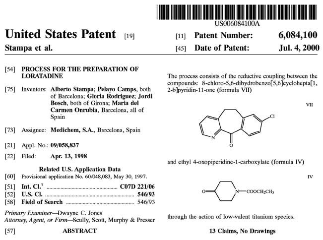

미국 등록특허의 표지(First Page)는 다음과 같은 핵심 서지정보를 포함합니다:
- 특허 번호(Patent Number) 및 등록일자(Date of Patent)
- 발명자(Inventors) 및 특허권자(양수인, Assignee)
- 출원일(Filing Date) 및 우선권 주장 데이터(Priority Data)
- 발명의 명칭(Title), 초록(Abstract), 대표 도면 및 선행 기술 인용 문헌(References Cited)

***

### VII. 특허 출원 타임라인 및 가출원

미국 가출원(Provisional Patent Application) 제도는 발명자에게 매우 유용한 전략적 도구입니다:
1. **가출원 제출**: 정식 청구항이나 복잡한 서식 없이도 연구 노트나 슬라이드 발표 자료 형태로 신속히 출원하여 **우선일(Priority Date)**을 확보할 수 있습니다.
2. **12개월의 유예 기간**: 가출원일로부터 12개월 이내에 정식 비임시 출원(Non-provisional Application) 또는 PCT 국제출원으로 전환해야 우선권이 유지됩니다.
3. 가출원은 특허청에 의해 심사되지 않으며, 정식 출원으로 승계되지 않으면 12개월 후 자동 소멸하지만, 출원일을 조기에 선점함으로써 후속 공개 문헌에 의한 신규성 상실을 방어합니다.

# 34. 특허와 지식재산권 - 결론

### VIII. 특허 존속기간과 가출원의 전략적 이점

기본적으로 미국의 정식 특허 존속기간은 **미국 정식 출원일(Filing Date)로부터 20년**입니다(41). 
가출원(Provisional Application)을 선행 출원한 후 1년이 되는 시점에 정식 출원으로 전환(conversion)하면, 가출원일로 우선일을 소급하여 확보하면서도 20년의 특허 만료 시점을 정식 출원일 기준으로 기산함으로써 **실질적인 특허 독점 기간을 1년 연장(총 21년 효력)**하는 결정적인 전략적 이점을 얻을 수 있습니다(42).

또한 이 1년의 유예 기간 동안 연구팀은 추가적인 실시예(working examples) 데이터를 축적하고 재현성을 검증하여 정식 명세서의 완성도를 극대화할 수 있습니다.

***

### IX. 특허법의 법적 근거

미국 특허법(Title 35)의 핵심 조항:
- **35 U.S.C. §101**: 특허 적격성 (새롭고 유용한 공정, 기계, 제조물, 물질의 조성)
- **35 U.S.C. §102**: 신규성 (선행 기술에 의해 공지되거나 공개되지 않을 것)
- **35 U.S.C. §103**: 진보성 / 비자명성 (당업자가 선행 기술로부터 용이하게 도출할 수 없을 것)
- **35 U.S.C. §112**: 기재 요건 (충분한 상세한 설명(Written Description), 실시 가능성(Enablement), 명확성(Definiteness))

***

### X. FDA 규제 심사와 특허의 교차점: 해치-왁스먼 법과 오렌지북

1984년 제정된 **의약품 가격 경쟁 및 특허기간 연장법(Hatch-Waxman Act)**은 신약 개발사의 지식재산권 보호와 제네릭 의약품의 신속한 시장 진입 간의 균형을 확립한 기념비적인 법률입니다(55-58).

1. **특허권 존속기간 연장 (Patent Term Extension, PTE / 35 U.S.C. §156)**:
신약이 규제 당국(FDA)의 임상시험 승인(IND) 및 품목허가 심사(NDA) 과정에서 소요된 시간으로 인해 특허 독점권을 행사하지 못한 기간을 보상하기 위해, 최대 5년(총 유효 특허 기간 14년 한도 내)까지 특허 존속기간을 연장해 주는 제도입니다.

2. **FDA 오렌지북 (Orange Book)과 특허 등재 (21 CFR §314.53)**:
신약 허가 신청자(NDA 스폰서)는 해당 의약품의 원료물질(active ingredient), 완제품 제형(formulation) 및 사용 방법(method of use)을 청구하는 특허 정보를 FDA에 제출해야 하며(Form FDA 3542), FDA는 이를 공인 치료 동등성 평가 의약품 목록집인 **'오렌지북(Orange Book)'**에 공식 등재합니다.

3. 제네릭 의약품 제조사는 약식 신약 허가 신청(ANDA) 제출 시 오렌지북에 등재된 특허에 대해 특허 침해 여부 또는 무효를 주장하는 특허 도전(Paragraph IV Certification)을 진행할 수 있으며 이에 따라 제약 특허 침해 소송과 제네릭 독점권(180일 우선 판매권)이 연계되어 작동합니다.
