# 연구자가 되다

연구자라고 하면 떠오르는 이미지가 있는가? 실험복을 입고 현미경을 들여다보는 사람? 도서관 혼자서 메모를 하는 고독한 인물? 대부분의 사람이 그렇게 상상할 것이다. 하지만 당신 자신을 떠올렸을 수도 있다. 호텔이나 레스토랑 리뷰를 검색하거나, 역대 최고 농구 선수가 누구인지 논쟁하기 위해 통계를 모으거나, 좀 더 무겁게는 당신이 사는 지역 공립학교의 교사 부족이 학생들에게 미치는 부정적 영향을 파악하기 위해 자료를 찾는 당신 말이다. 그런 논증을 전개하는 과정에서, 당신은 어디서 정확하고 신뢰할 수 있는 정보를 찾을지 결정해야 했고 부정확한 정보에 맞서야 했을지도 모른다. 당신은 아직 *전문적* 연구자는 아닐지라도, 모든 연구가 요구하는 탐구와 조사 활동에는 익숙할 것이다.

정보가 정확하고 공정하게 제시된다는 높은 수준의 신뢰가 연구에 필요하다는 것을 당신은 알고 있다. 그리고 항상 그런 것은 아니라는 것도 알고 있다. 우리는 매일 접하는 정보에 대해 분별력을 키워야 하고 제시되는 수많은 사실과 주장 중 어떤 것을 받아들일지, 왜 받아들일지 판단할 수 있어야 한다. 연구자로 성장하면서 연구는 연구자와 청중 사이, 연구를 수행하는 사람과 그 연구를 공유하는 사람 사이의 묵시적 계약(contract)에 기반한다는 것을 배우게 된다. 우리는 순수한 발견의 즐거움이나 퍼즐 해결을 위해 연구를 할 수도 있지만 궁극적인 목표는 연구--그리고 연구에서 얻는 지식과 통찰--를 남과 공유하는 것이다.

연구가 다른 사람과 공유된다는 관념은 이 책의 근본 전제다. 이 책의 다섯 저자는 시간이 흐르면서 다양한 공동체를 향해 글을 쓰는 법을 배웠고 각 공동체는 우리에게 서로 다른 것을 기대했다. 연구란 하나의 것이 아니라 여러 가지라는 것을 배웠다. 그럼에도 불구하고 모든 연구자가 따르는 원칙이 있다는 것을 발견했다. 그 원칙들을 이 책에서 공유한다. 그중 하나는 연구가 거의 항상 직선적으로 진행되지 않는다는 점이다. 연구는 지그재그로 움직이고 때로는 되돌아가기도 한다. 우리는 현실보다는 보다 선형적인 방식으로 연구 과정을 제시한다. 각 단계를 명확히 이해하고 각 부분을 보다 자신감 있게 조합하는 법을 배울 수 있도록 하기 위해서다.

*초보 연구자에게:* 이 책은 특별히 당신을 위해 쓰였다. 아마 "연구 논문"이라는 것에 대해 어느 정도 익숙할 것이다. 소위 *외부* 자료를 사용하여 논증을 뒷받침하거나 사실을 입증하는 종류의 글 말이다. 그런 학교 과제는 이 책에서 우리가 옹호하는 종류의 *진정한* 연구--연구자와 그들의 청중의 이해를 넓혀주는 연구, 즉 *실제* 질문(답을 미리 알 수 없는 질문)에서 출발하는 연구--를 위한 준비가 될 수 있다. 선생님들이 그런 과제를 낼 때 무엇을 가르치려 하고 무엇을 시키려 하는지 이해하도록 도울 것이다. 그 과정에서 경험 많은 연구자도 겪는 불안을 줄일 수 있기를 바란다.

과학적 돌파구나 국제 정세의 위기에 대해 읽을 때, 우리는 공유한 사람들의 연구로부터 이익을 얻고 그 사람들도 다른 사람들의 연구로부터 이익을 얻었다. 도서관에 가거나, 물리적으로든 온라인으로든, 25세기에 걸친 연구의 축적과 마주한다. 온라인에서 검색할 때, 우리는 연구의 산물인 수많은 자료에 접근한다. *연구*라는 명목 하에 다양한 활동이 이루어지지만 우리는 이 용어를 특정한 유형의 지향적 탐구--연구자의 질문에서 시작하여 관심 있는 청중과 답을 공유하는 것으로 끝나는 탐구--로 이해한다. 일반적으로 연구는 어느 정도의 형태로 된 논문이나 보고서에 담긴다. 하지만 발표, 웹사이트, 포스터 등 다른 방식으로도 공유될 수 있다. 전문적인 맥락에서 연구는 궁극적으로 *출판(published)*된다. 하지만 오늘날 출판된 연구가 모두 인쇄물을 통해 나오거나 논문의 형태를 갖추지는 않는다.

## 연구란 무엇인가?

가장 넓은 의미에서, 우리는 문제를 해결하는 질문에 답하기 위해 정보를 모을 때마다 연구를 한다:

* 문제: 맛있는 피자집을 알고 싶다.
* 연구: 여러 친구들에게 어디에 가는지 묻는다.
* 문제: 내기를 해결하려면 르브론 제임스가 언제 태어났는지 알아야 한다.
* 연구: "르브론 제임스 생일"을 검색한다.
* 문제: 해변에서 읽을 새 책을 찾고 있다.
* 연구: 생성형 AI 도구에 추천을 요청하고 온라인으로 확인한다.

우리는 매일 이런 종류의 실용적 연구를 한다. 발표하거나 글로 정리하는 경우는 드물지만 우리는 타인의 지식이나 타인이 만든 도구에 기반하여 문제를 해결할 답을 찾는다.

연구 프로젝트를 수행하는 것이 본인이 원해서가 아니라 과제로 배정되어서 준비하고 있다면, 이것이 단순한 헛일에 불과하다고 생각하고 형식적으로 대할 수도 있다. 우리는 그렇게 하지 않기를 바란다. 제대로 수행된 프로젝트는 여러분을 인류 역사상 가장 오래되고 존경받는 대화에 참여시키는 준비를 해준다. 그것은 수천 년 동안 철학자, 공학자, 생물학자, 사회과학자, 역사학자, 문학평론가, 언어학자, 신학자들 사이에서 이어져 온 대화일 뿐 아니라, CEO, 변호사, 마케터, 투자매니저, 정치인, 활동가들까지--이 목록은 끝이 없다--모두가 자신의 질문에 답하고, 자신의 문제를 해결하고, 이상적으로는 모두를 위한 더 나은 세상을 만들기 위해 노력하는 대화다.

지금 초보자라면, 이 대화가 일방향이라고 느낄 수 있다. 기여할 것이 거의 없기에 말보다 더 많이 들어야 한다고 느낄 수도 있다. 학생이라면 독자가 오직 선생님 한 명뿐이라고 느낄 수 있다. 지금은 그럴 수도 있다. 하지만 언젠가 여러분은 대화에 참여하게 될 것이다. 그 대화는 가장 순수한 형태에서 우리 모두를 무지, 편견, 그리고 수많은 사기꾼과 물장수가 우리에게 강요하려는 미숙한 생각으로부터 해방시키는 데 기여할 수 있다. 오늘 내일은 아닐지라도, 언젠가 여러분이 수행하는 연구와 전개하는 논증은 온 세상을 변화시키지 못할지라도, 적어도 여러분이 살고 있는 그 작은 세상은 개선할 수 있을 것이다.

## 청중과의 연결

어떤 형태를 취하든, 연구는 연구자와 청중 사이의 관계에 의존한다. 우리가 하는 대부분의 중요한 일은 다른 사람들과 함께 한다. 연구도 다르지 않다. 책이나 논문을 읽거나, 온라인에서 발표나 강의를 볼 때, 우리는 그 저자와--그리고 그들이 연구하고 읽은 모든 사람과--침묵 속에서 대화한다. 그리고 여러분이 글이나 다른 방식으로 연구를 공유할 때, 여러분은 자신의 목소리를 더하고 다른 사람들이 여러분에게 화답하기를 기대할 수 있다. 그렇게 대화는 이어진다.

우리에게 있어서 소통은 *대화*라는 관념이 핵심적이다. 우리가 의미하는 바는, 소통을 작가, 화자, 발표자와 그들의 청중이 각자의 역할을 하는 사회적 활동으로 이해하는 것이 가장 적절하다는 것이다. 이 대화에서 우리는 서로를 동등하게 대하는가, 예의를 지키며 말하고 드는가? 우리 중 한 명만이 전문가라고 가정하는가? 특히 글쓰기는 텍스트를 통해 이루어지는 *상상된* 대화로서, 어떤 오해도 실시간으로 바로잡을 수 없다. 그래서 특히 글쓰기에서 우리의 역할을 신중히 선택하는 것이 중요하다. 다음 두 문장을 생각해 보라:

> REM 수면의 방해는 기억의 고착화--특히 선언적 기억--를 억제할 뿐 아니라, 작업 기억 기능에 의존하는 인지 과정을 크게 손상시키는 것으로 밝혀졌다.

>
> 충분한 수면을 취하지 않으면 사실과 개념을 유지하는 데 어려움을 겪을 뿐 아니라, 작업 기억 기능도 손상되어 정보를 마음속에 유지하기 어렵고, 결과적으로 이해하고, 생각하고, 배우는 데 문제가 생긴다.

각 문장은 독자의 필요와 목표에 대한 글쓴이의 판단을 반영한다. 첫 번째 문장은 고급 교재의 발췌문일 수 있다. 수면과 기억의 심리학에 대해 배우고 싶어하는 지식이 풍부한 동료들을 대상으로 하며 추상적 개념에 초점을 맞추고 전문 용어를 사용한다. 두 번째 문장은 좋은 학습 습관에 대한 안내서에서 나왔을 수 있다. 그것에 대해 잘 모르는 독자들에게 전문가가 친절하게 복잡한 일을 설명하는 목소리이며 전문 용어를 거의 사용하지 않는다. 독자는 실용적 조언을 원하며 "당신"이라는 호칭으로 직접적으로 대한다.

차이점에도 불구하고 두 문장 모두 글쓴이가 독자를 올바르게 판단했다면 효과적일 것이다. 하지만 그 첫 번째 문장이 실용적 조언을 원하는 사람들에게 제시된다면, 글쓴이가 자신의 필요에 무관심하다고 느낄 것이다. 마찬가지로, 두 번째 문장이 더 고급 독자들에게 제시된다면, 글쓴이가 자신을 깔본다고 생각할 수 있다. 그래서 글을 한 자도 쓰기 전에 독자에 대해--여러 독자를 대상으로 쓸 수도 있다--그리고 그들과의 관계에서 자신의 역할에 대해 생각하는 것이 중요하다. 이 원칙은 연구를 발표하거나 다른 방식으로 전달할 때도 마찬가지로 적용된다.

이 책을 쓰면서 우리는 여러분을 위한 *페르소나*를 상상했다. 여러분이 Adopt하기를 바라는 역할이다: 연구를 수행하고 공유하는 법에 대해 관심이 있고 연구의 중요성을 우리와 공유하는 사람(적어도 설득의 여지가 있는 사람). 그런 다음 우리 자신의 페르소나도 상상했다: 연구의 가치에 헌신하고 그것이 어떻게 작동하는지 공유하는 데 관심이 있는 작가로서, 강의하듯 *당신에게* 말하거나 깔보듯이 말하는 것이 아니라, 여러분이 되기를 바라는 "당신"과 *함께* 말하는 것이다. 우리는 첫 프로젝트를 시작하는 분들에게나 고급 작업을 수행하는 분들에게 모두 편안하게 말하려 했다. 새로운 연구자들이 우리가 아직 접하지 못한 문제를 논의할 때 좌절하지 않기를 바랐고 더 경험 많은 독자들이 우리 익숙한 지면을 다룰 때 인내하기를 바랐다. 우리가 얼마나 성공했는지는 여러분만이 판단할 수 있다.

## 자신의 역할 이해하기

많은 초보 연구자들이 작가나 발표자로서 자신의 역할을 잘못 이해한다. 그들은 청중에게 불량한 수업을 흉내 내는 관계를 제안한다: *선생님, 저는 당신보다 아는 것이 적으므로, 제가 얼마나 많은 사실을 파헤칠 수 있는지 보여주는 것이 제 역할입니다. 당신의 역할은 제가 충분히 찾아서 좋은 성적을 받았는지 말해주는 것입니다.* 진정한 연구에서 학생과 선생님의 역할은 뒤집힌다. 당신은 다른 사람들이 반드시 알지 못하는 것을 배우고 공유한다. 그래서 연구를 공유할 때, 청중을 당신이 아는 것을 모르지만 알아야 하는 사람들--심지어 자신도 그런 필요를 아직 인식하지 못할 수 있는 사람들--로 생각해야 한다. 더 나아가, 당신은 단순히 사실이나 정보를 전달하는 사람이 아니라, 청중에게 관심을 가질 이유를 제공하는 사람으로 생각해야 한다. *여기는 14세기 티베트 직조에 대해 제가 파헤친 몇 가지 사실입니다.*를 넘어선 관계를 상상해야 한다. 연구를 공유하는 더 좋은 이유들이 있다.

### 새롭고 흥미로운 정보를 발견했다

청중에게 *당신이 모르고 흥미로워할 만한 14세기 티베트 직조에 관한 몇 가지 사실이 있습니다.*라고 말할 때, 진정한 연구를 향한 첫 걸음을 내딛는 것이다. 물론 이 제안은 그들이 알고 싶어한다는 전제 하에 성립한다. 하지만 그렇지 않더라도, 당신은 자신이 그들이 흥미로워할 만한 것을 발견한 사람의 역할을 맡아야 하고 그들은 알고 싶어하는 사람들의 역할을 맡아야 한다. 나중에 글을 쓸 때는 당신의 주제에 대한 공유된 관심--혹은 설득될 수 있는--을 가진 연구 공동체를 발견하거나 만들어낼 것이 기대될 것이다. 그리고 그 주제에 대해 당신이 답할 수 있는 질문이 있는 공동체 말이다. 하지만 지금 당장 그런 공동체가 없다 하더라도, 있는 것처럼 글을 써야 한다. 당신은 새롭고 흥미로운 것을 공유하고 싶어하고 심지어 열정적이라고 자신을 제시해야 한다. 왜냐하면 작업에 대한 당신의 관심이 대체로 청중의 관심을 예측하기 때문이다.

### 실용적 문제의 해결책을 발견했다

청중에게 단순히 *당신이 관심을 가질 만한 사실이 몇 가지 있습니다.*가 아니라 *이 사실들은 당신이 관심 있는 문제를 해결하는 데 도움이 될 것입니다.*라고 말할 수 있을 때, 더 중요한 연구를 향한 한 걸음을 내딛는 것이다. 사람들은 매일 업무, 정부, 다양한 직업과 전문 분야에서 이런 종류의 연구를 한다. 그들은 불면증부터 이익 감소, 교체 문제, 테러리즘에 이르기까지, 먼저 문제를 이해하고 다음에 해결하기 위해 연구가 필요한 실용적 문제에 직면한다.

새로운 연구자들이 이 역할을 배우도록 돕기 위해, 교사들은 때때로 "실제" 시나리오를 다루는 문제 기반 학습을 활용한다. 예를 들어, 환경과학 교수는 당신에게 주 환경보호국 국장을 위해 지역 호수를 어떻게 정화할지 보고서를 쓰는 과제를 낼 수 있다. 이 시나리오에서 당신은 실용적 조언이 필요한 사람에게 전문적인 조언을 하는 역할을 맡는다. 보고서를 설득력 있게 만들려면 적절한 용어를 사용하고, 적절한 출처를 인용하며, 적절한 형식으로 적절한 증거를 찾아 제시해야 한다. 하지만 가장 중요한 것은, 당신의 역할을 정의하는 특정 의도를 중심으로 보고서를 설계해야 한다는 것이다: 문제를 해결하기 위해 어떤 조치를 취할지 결정권자에게 조언하는 것이다.

### 중요한 질문에 대한 답을 발견했다

학술 연구자들은 때때로 그런 실용적 연구를 하기도 하지만 더 흔한 역할은 단순히 연구 공동체가 무언가를 더 잘 이해하도록 돕는 것이다. 다른 사람들이 그 발견을 사용하여 실용적 문제를 해결할 수도 있다--예를 들어, 소수의 분포에 대한 발견이 암호학자들이 깨지지 않는 암호를 설계하는 데 도움이 되었다. 하지만 그 연구 자체는 비밀을 더 잘 보호하는 *실용적* 문제가 아니라 소수를 더 잘 이해하는 *개념적* 문제를 해결하는 것을 목표로 했다(이 두 가지 문제는 2장에서 더 자세히 논의한다). 어떤 연구자들은이러한 연구를 "순수" 연구라고 부르며 이는 "응용" 연구와 구별된다.

교사들은 때때로 개념적 문제를 다루는 "실제" 시나리오를 만들어내기도 한다: 정치학 교수는 주 밖 대학생들의 투표 습관을 연구하는 상원의원 보좌관 역할을 맡길 수 있다. 하지만 보통은 여러분이 배우고 있는 바로 그 사람이 되도록 기대한다: 다른 연구자들의 공동체--여러분의 주요 청중--가 더 잘 이해하고 싶어하는 문제를 다루는 연구자. 예를 들어, 14세기 티베트 직조에 대한 여러분의 연구는 카펫 디자이너들이 더 많은 카펫을 파는 데 도움이 될 수도 있지만 주요 목표는 학자들이 티베트 예술에 대해 더 잘 이해하도록 돕는 것이다. 예를 들어, *14세기 티베트 카펫은 현대 중국 예술에 어떤 영향을 미쳤는가?*와 같은 질문을 통해서 말이다.

## 청중의 역할 상상하기

세 가지 역할 중 하나를 Adopt하여 청중과의 관계에서 자신의 쪽을 확립한다: *당신에게 정보가 있습니다; 당신의 문제를 해결하는 데 도움을 줄 수 있습니다; 당신이 무언가를 더 잘 이해하도록 도울 수 있습니다.* 하지만 청중에게 상보적인 역할도 부여해야 한다: 당신이 자신의 역할을 하면 나도 내 역할을 하겠다. 그것은 그들의 역할을 이해해야 한다는 뜻이다. 그들이 받아들이지 않을 역할을 부여하면, 그들을 완전히 잃을 수 있다. 여러분이 그들에게 부여한 역할을 수행하도록 동기를 부여하는 방식으로 연구를 공유해야 한다.

예를 들어, 당신이 와플 전문가라고 상상해 보자. 당신은 세 그룹에게 각각 다른 이유로 듣고 싶어하는 연구를 공유하도록 요청받았다. 그들이 당신을 어떻게 받아들일지는 각자의 역할을 얼마나 정확히 상상하고 자신의 역할을 그들의 역할과 얼마나 잘 부합시키느냐에 달려 있다. 그러려면 그들이 원하는 것이 무엇인지, 그리고 그 대가로 당신을 위해 기꺼이 하고 할 수 있는 것이 무엇인지 이해해야 한다.

### 나를 즐겁게 해 줘

당신을 초대한 첫 번째 그룹이 지역 와플 애호가 협회라고 상상해 보자. 구성원들은 전문가는 아니지만 와플에 대해 많이 알고 있다. 그들은 와플에 대해 읽고, 와플 전문 식당을 자주 방문하며, 다양한 와플 테마 기념품을 수집한다. 당신은 1930년대 벨기에에서 이민 온 조부모에게 쓴 증조할머니의 편지에서 발견한 새로운 사실과 레시피를 공유하기로 한다.

연설을 계획하면서 당신은 이해의 여지가 단지 재미있는 한 시간의 와플 전설이라는 판단을 내린다. 그룹이 흥미로워할 만한 모든 것--추측과 사변까지 포함하여--을 공유함으로써 자신의 쪽 계약을 이행한다. 최근 발견한 편지의 스크린샷을 보여줄 수도 있지만 어떤 주장도 뒷받침하기 위해 학술 자료를 인용하지는 않을 것이다. 청중은 관심을 가지고 경청하고, 질문을 하며, 어쩌면 자신의 일화를 공유함으로써 자신의 역할을 수행할 것이다. 당신은 그들이 편지의 진위를 의심하거나, 그 편지나 레시피가 와플의 사회사--북유럽 식문화의 역사는 더더욱--와 어떤 관련이 있는지 질문할 것으로 기대하지 않는다. 당신의 임무는 흥미로운 연설을 하는 것이고 그들의 임무는 친절하게 몰두하는 것이다.

일부 초보 연구자들은 청중이 이미 주제에 매료되어 있고 새로운 것이면 무엇이든 듣고 싶어하는 와플 애호가 협회와 같다고 상상한다. 적합한 청중을 가진 전문가에게는 때때로 맞을 수 있지만 진정한 연구를 수행하고 공유하는 법을 배우는 학생들에게는 거의 작동하지 않는다. 선생님은 당신이 발견한 것을 공유하는 것뿐만 아니라, 그것으로 할 수 있는 것이나 그것이 왜 중요한지를 보여주기를 기대할 것이다.

### 나의 실용적 문제를 해결하는 데 도움을 줘

다음 만남이 영화사와의 것이라고 상상해 보자. 그들은 1930년대 벨기에 시골을 배경으로 한 역사 영화를 만들 계획이며 농가 부엌 장면 등 역사적 세부사항을 올바르게 잡는 데 당신의 도움을 원한다. 부엌이 어떻게 배치되었는지, 조리 도구가 어떻게 생겼는지 등을 알고 싶어한다. 그들은 당신의 사실이 새로운지에는 관심이 없고 오직 정확한지에만 관심이 있다. 그래야 장면을 사실적으로 만들 수 있기 때문이다. 당신은 편지와 레시피를 보여주고 그 시대에 와플이 어떻게 준비되었는지 설명한다. 이 역할에서 성공하려면, 당신이 찾을 수 있는 모든 정보--새로운 것이든 아니든--에 기반한 것이 아니라, 진정성 문제와 관련된 특정 사실들만으로 그들의 실용적 문제를 해결하는 데 도움을 주어야 한다. 그리고 그 출처가 신뢰할 수 있음을 보여줄 수 있어야 한다. 청중은 세부사항을 올바르게 잡고 싶기에 경청할 것이다.

선생님이 "실제" 과제를 만들 때면 마주하게 되는 종류의 과제다. 오염된 호수에 대해 어떤 조치를 취해야 하는 EPA 관리에게 쓰는 것이다. 학술 연구자들은 때때로 이런 실용적 문제를 다루기도 하지만 앞에서 말했듯이 보통 개념적 문제를 다루한다. 그래서 선생님이 만들어내는 실용적 문제만 다루고 그렇지 않으면 계획이 적절한지 확인부터 하라.

### 나를 더 잘 이해하도록 도와 줘

이제 청중이쿡 대학교 조리문화학과 교수진이라고 상상해 보자. 이것은 여러분의 관심사를 가장 잘 공유할 청중이다. 그들은 식품 역사와 전통의 모든 측면을 연구하고 그것의 사회적, 문화적, 정치적 중요성에 대한 국제적 토론에 참여한다. 학술 저널과 책을 통해, 그들은 관심 있는 주제에 대한 더 풍부한 설명을 만들기 위해 다른 식품학 학자들과 경쟁한다. 이렇게 함으로써 그들은 자신의 연구 분야를 발전시키기도 협력한다.

이 학자들은 당신의 전문 분야--20세기 전반기의 식품 사회사--에 대해 이야기하도록 초대했다. 그들은 당신이 새로운 사실로 즐겁게 해 주기를 원하지 않는다(기꺼이 하겠지만). 도움이 필요한 일을 돕기를 원하지도 않는다(영화 자문 같은). 그들은 당신이 가진 새로운 사실과 정보를 사용하여 와플의 사회사, 또는 더 넓게는 2차 세계대전 이전 유럽 지역 식문화를 더 잘 이해하도록 돕기를 원한다.

이 학자들은 과거를 가능한 한 깊고 정확하게 이해하는 데 헌신하기에, 당신이 사고에 주의를 기울이고 모든 측면에서 문제를 검토하기를 기대할 것이다. 그들은 당신이 엄격하거나 정확하지 않다고 판단되면 당신의 추론을 질문하고 사실에 대해 도전할 것이다. 그들은 최근 발견한 증조할머니의 편지와 레시피를 보게 되어 기뻐하겠지만 그것의 진위를 확인하고 그것의 중요성에 대해 제시하는 모든 주장을 뒷받침하기를 기대할 것이다. 그들이 와플의 사회사를 자신들이 생각한 것만큼 완전히 이해하지 못하고 있으며 예상치 못하게도 더 알 것이 있다는 것을 설득할 수 있다면 특별히 호의적일 것이다. 그렇게 할 수 없다면, 그들은 *동의하지 않습니다*--우리는 모두 그것과 함께 살아가는 법을 배운다--라는 것이 아니라 훨씬 더 치명적인 반응을 보일 것이다: *관심 없습니다.*

발표를 시작한다:

> 우리는 와플이 벨기에와 관련이 있으면서도 유럽 요리에서 오랜 역사를 가지고 있다는 것을 알고 있다. 현대 와플은 제조에 사용되는 주철 틀에 따라 둥글거나 직사각형일 수 있다는 것을 알고 있다. 하지만 우리가 완전히 인식하지 못했던 것은, 와플의 형태가 한때 사회적이고 심지어 정치적인 의미를 가지고 있었다는 것이다. 벨기에 전역의 농촌 지역에서 20세기까지도 직사각형 와플에 대한 저항이 지속되었는데, 이것은 국가 정체성의 표식이었다. 직사각형 와플은 네덜란드와 관련되었고 둥근 와플이 진정한 플라망 것으로 여겨졌다. 먼 친척이 공유한 최근 발견 편지는 밝혀낸다...

연구를 학술 공동체와 공유할 때참여하는 대화는 바로 이것이다. 당신과 그들은 오락이나 이익을 엄격히 위해서가 아니라, 새롭고 흥미로운 것을 발견하고 공유하는 자체로 흥미롭기 때문에 무언가를 더 잘 이해하고 싶어한다.

학술 청중은 거의 항상 세 번째 역할을 취할 것이다. 그들은 당신이 그들을 자신이 그렇다고 생각하는 사람--더 많은 지식과 더 나은 이해에 관심이 있는 학자--로 대할 때에만 사회적 계약을 이행했다고 생각할 것이다. 물론 화학과나 철학과 교수진은 와플의 사회사에별로 관심이 없다. 하지만 당신도 그들의 문제에는별로 관심이 없다. 당신은 당신의 *특정한* 학자나 연구자 공동체, 그들의 관심과 기대, 당신이 찾을 수 있는 최고의 증거에 기반하여 그들의 이해를 향상시키는 것에 관심이 있다.

## 이 책을 사용하는 법

연구의 복잡함(과 그 불안)에 대처하는 최선의 방법은 이 책을 두 번 읽는 것이다. 먼저 앞 내용을 파악하기 위해 훑어보라(지루하거나 혼란스러워 보이는 부분은 넘겨도 된다). 하지만 작업을 시작할 때, 당면한 과제와 관련된 장을 주의 깊게 읽으라. 연구가 처음이라면 처음부터 다시 읽으라. 중급 과정에 있지만 아직 분야에 익숙하지 않다면 1부와 2부를 훑고 나머지에 집중하라. 경험이 많은 연구자라면 2장과 3부, 4부가 가장 유용할 것이다.

이 서론에서 우리는 연구를 이해하는 법과 청중이 왜 특별한 방식으로 연구를 제시하기를 기대하는지에 대해 논의했다. 1부에서는 연구 프로젝트를 설정하고 발전시키는 법을 다룬다:

* 관심 영역에서 주제를 찾고, 그것을 집중시키고, 그것에 대한 질문을 개발하는 법(1장);
* 그 질문들을 연구 문제로 변환하는 법(2장).

2부에서는 다양한 원자료를 다루는 법을 논의한다. 우리는 다음을 설명한다:

* 답을 찾는 데 도움이 되는 자료를 찾는 법(3장);
* 당신 자신의 최고의 사고를 촉진하는 방식으로 자료에 참여하는 법(4장).

3부에서는 주장의 타당성을 뒷받침하는 논증을 만드는 법을 논의한다. 여기에는 다음이 포함된다:

* 연구 논증의 개요(5장);
* 주장을 명확히 하고 그 중요성을 평가하는 법(6장);
* 어떤 것이 좋은 이유와 타당한 증거인지 판단하는 법(7장);
* 논증의 논리를 명확히 하는 법(8장);
* 질문, 이의, 대안적 견해를 인정하고 대응하는 법(9장).

4부에서는 공식 논문이나 발표를 만드는 과정을 설명한다:

* 초안을 계획하고 실행하는 법(10장);
* 초안을 수정하고 구성하는 법(11장);
* 자료를 포함시키는 법(12장);
* 양적 증거를 명확하고 효과적으로 제시하는 법(13장);
* 청중이 당신의 논증에 시간을 쏟을 가치가 있다고 확신시키는 서론과 결론을 쓰는 법(14장);
* 명확하고 직접적이며 읽기 쉬운 스타일로 편집하는 법(15장);
* 연구를 발표로 전달하는 법(16장).

5부에서는 연구를 윤리적으로 수행할 의무에 대해 성찰하고(17장), 다른 사람들에게 연구 기술을 가르치는 이들에게 특별한 조언을 제공한다(18장).

5부의 장을 제외한 모든 장 끝에는 "빠른 팁"--실용적 조언으로 장을 보충하는 간략한 섹션--이 있다. 책 끝에는 초급 및 고급 연구자를 위한 참고자료 목록이 있다.

연구는 힘든 작업이지만 어떤 도전적인 작업이든 제대로 수행하듯이, 그 과정과 결과는 큰 만족감을 가져다줄 수 있다. 그 만족감의 상당 부분은 자신의 작업이 관심사를 공유하는 공동체를 풍요롭게 한다는 것을 아는 데서 온다. 특히 그것을 바꿀 수 있다고 믿는 무언가를 발견했을 때 그렇다.

::: {.callout-tip}
### 청중 이해를 위한 체크리스트

처음부터 청중에 대해 생각하라. 프로젝트를 진행하면서 그들을 더 잘 이해하게 될 것이다. 이 질문들에 일찍 답하고 계획을 시작할 때와 수정할 때 다시 검토하라.

1. 누구와 내 작업을 공유할 것인가?
   * 모든 학술 관례를 따르고 표준 형식을 사용할 것을 기대하는 전문가인가?
   * 지식이 풍부한 일반 청중인가?
   * 주제에 대해 거의 모르는 청중인가?
2. 그들은 나에게 무엇을 하기를 기대하는가?
   * 그들을 즐겁게 해야 하는가?
   * 새로운 사실적 지식을 제공해야 하는가?
   * 무언가를 더 잘 이해하도록 도와야 하는가?
   * 실용적 문제를 해결하기 위해 무언가를 하도록 도와야 하는가?
3. 그들이 이미 어느 정도 알고 있을 것으로 기대할 수 있는가?
   * 그들은 내 주제에 대해 무엇을 알고 있는가?
   * 문제가 그들이 이미 인식하고 있는 것인가?
   * 그들에게 있지만 아직 인식하지 못하는 문제인가?
   * 문제가 그들의 것이 아니라 나의 것뿐인가?
   * 그들이 문제를 심각하게 받아들일 것인가, 아니면 그것이 중요한지 내가 설득해야 하는가?
4. 내 주요 주장의 해결책/답변에 대해 청중이 어떻게 반응할 것인가?
   * 그들이 이미 믿고 있는 것과 모순되는가? 어떻게?
   * 그들이 내 해결책에 대해 표준적인 논의를 제기할 것인가?
   * 그들이 그 해결책에 이르게 한 과정을 보고 싶어할 것인가?
:::

# 1부

# 질문하고 답을 찾기

# 서문

# 프로젝트 계획하기-개요

이미 연구 질문이 있고 그 답을 찾는 법을 알고 있다면, 첫 두 장을 빠르게 검토한 다음 나머지 장을 주의 깊게 읽으라. 처음부터 시작한다면, 첫 번째 과제는 가치 있는 연구 *프로젝트*를 찾는 것이다. 즉, 수행하는 연구가 주어진 시간 안에 관리할 수 있을 정도로 구체적인 *주제*를 다루는 프로젝트를 상상해야 한다. 하지만 아무리 구체적인 주제만으로는 충분하지 않다. 연구 프로젝트는 연구 *질문*에서 시작된다. 그것은 당신에게 흥미로운 것뿐만 아니라, 다른 사람들에게도 흥미로운 질문이어야 한다. 그리고 그 질문은 *답*이 있어야 한다.

물론, 질문하는 순간에 연구 질문의 답을 알 수는 없다. 진정한 연구 질문은 *증거*를 수집하고 분석하여 *논쟁의 여지가 있는 주장*에 도달하는 노력으로만 답할 수 있는 질문이다. 간단한 사실 질문--*로사 파크스가 몬트고메리 버스 보이콧을 촉발한, 백인 승객에게 자리를 양보하기를 거부한 것은 언제인가?*--에는 답이 있다: 1955년 12월 1일. 하지만 그 날짜에 다툼의 여지가 없다면(이것은 없다), *로사 파크스가 왜 그날 자리를 옮기기를 거부했는가?*나 *로사 파크스의 그날 행동이 어떻게 미국 민권사의 전환점을 열었는가?*와 같은 질문보다 논의할 것이 적다.

이런 종류의 해석적 질문에 답하려면 하나의 증거, 하나의 유형의 증거만으로는 부족하다. 이 *증거*라는 용어에 대해서는 이후 장에서 더 자세히 논의하지만 지금은 우리가 책 전체에서 이것과 다른 용어를 어떻게 사용하는지에 대해 몇 가지 말하겠다. *증거*라는 것은 연구자들이 주장을 뒷받침하기 위해 사용하는 모든 "자료"를 의미한다. 다른 분야의 연구자들은 이것을 다른 이름으로 부르는 경향이 있다: *사실*, *발견*, *데이터*, *정보*. 이 책에서 우리는 *데이터*와 *정보*를 어느 정도 교차적으로 사용한다. 여기서 인식해야 할 중요한 것은, 정보의 조각이나 데이터는 그 자체로는 무의미하다는 것이다. 그것들은 연구 질문에 대한 답인 주장을 뒷받침하기 위해 사용될 때에만 증거가 된다.

주제를 집중시키고 연구 질문을 구성하면서 어떤 종류의 증거가 필요한지 고려해야 한다. 청중이 2차 출처의 데이터나 정보를 받아들일 것인가, 아니면 1차 출처를 참고하기를 기대할 것인가(4.5 참조)? 양적 데이터, 권위 있는 인용문, 직접 관찰을 기대할 것인가? 연구 프로젝트를 시작할 때 이 질문들의 답을 완전히 알 수 없을 것이며 그 답은 연구 분야에 따라 달라질 것이다. 하지만 연구 질문을 구성하는 기본 단계는 모든 분야에서 유사하다. 질문에 대한 적어도 그럴듯한 답을 뒷받침할 만큼 충분한 데이터나 정보가 있다고 생각되면, 주장을 만드는 논증을 조립하기 시작할 준비가 된 것이다(3부 참조). 그런 다음 계획하고, 초안을 잡고, 수정한다(4부 참조).

하지만 우리가 제시하는 깔끔한 순서대로 이 단계들을 진행할 수는 없을 것이다. 모든 증거를 갖추기 전에 연구 질문에 대한 잠정적 답을 생각해낼 것이다. 그리고 가치 있는 논증이 있다고 생각할 때, 새로운 출처에서 더 많은, 아마도 다른 증거가 필요하다는 것을 발견할 수 있다. 주제를 수정할 수도 있다. 연구는 쉽고 잘 표시된 길을 따라 익숙한 목적지까지 산책하는 것이 아니다. 덤불이 우거진 숲속의 바위 언덕을 구불구불 오르내리는 것이며 때로는 안개 속에서, 볼 때까지 알아보지 못할 무언가를 찾는 것이다. 경로가 아무리 간접적이어도, 매 단계에서 예상되는 우회를 계획하면(어떤 것은 피할 수도 있다) 진전을 이룰 수 있다.

::: {.callout-tip}
### 혼자서와 그룹에서 연구 프로젝트 지속하기

연구 프로젝트는 스프린트보다 마라톤에 가깝다. 하지만 반드시 힘든 과정인 것은 아니다: 느리고 꾸준히가 승리한다. 연구 프로젝트가 몇 주 동안이든, 1년 이상이든, 휴식을 취하거나 프로젝트 완료 전에 진행 상황을 공유하거나(심지어 프로젝트가 새로운 프로젝트를 낳도록 허용하는) 기회가 있을 때, 자기 관리가 중요하다. 글쓰기는 힘든 작업이다. 하지만 많은 활동과 마찬가지로, *더 많이 하는* 것이 시간이 지나면 더 쉽게 만든다. 그리고 *다른 사람들과 함께* 하는 것이 노력을 지속하는 데 도움이 된다.

최종 산출물이 논문이 아닐지라도, 과정에서 많은 글쓰기를 하기로 결심하라. 대부분은 일상적인 메모이겠지만 이해하기 위해 성찰적으로 써야 한다. 읽기와 쓰기를 글쓰기의 한 형태로 만들어라: 개요를 만들고; 왜 자료에 동의하지 않는지 설명하고; 이질적인 사실들을 연결하는 다이어그램을 그리고; 자료, 입장, 사상 학파를 요약하고; 무작위 생각까지 기록하라. 많은 연구자들이 직감, 새로운 아이디어, 생각, 문제, 추가 질문 등을 기록하는 일지를 유지하는 것이 유용하다고 생각한다. 이런 탐색적 글쓰기의 상당 부분이 최종 초안에 포함되지 않을 수 있다. 하지만 매일 쓰면서 진행하면, 자신만의 최고의 비판적 사고를 촉진하고, 자료를 더 잘 이해하며, 때가 되면 더 효과적으로 초안을 잡을 수 있다. 우리는 너무 자주, 생각을 종이에 옮기려 고생한 후에 *정말로* 생각하고 말하고 싶은 것이 무엇인지 발견한다. 공식적인 초안 작성 전에 비공식적으로 미리 쓰면 그 순간을 더 일찍 가져올 수 있다. 그리고 그 과정에서 많은 슬픔이나 후회를 피할 수도 있다.

어떤 학문에서 학술 연구의 주요 단점은 고립이다. 그룹 프로젝트를 제외하면, 대부분 혼자 읽고 쓸 것이다. (어떤 사람들에게는 다른 사람들과 떨어져 있는 이 시간이 연구하고 글쓰기에서 가장 어려운 부분이다.) 하지만 그렇게 될 필요는 없다. 선생님이나 지도교수 외에 진행 상황에 대해 이야기할 수 있고 초안을 검토하거나, 얼마나 썼는지에 대해 쪼개줄 수 있는 사람을 찾아라. 관대한 친구일 수도 있지만 더 나은 것은 다른 작가이다. 서로의 아이디어와 초안에 대해 코멘트할 수 있으니까. 점점 더 많은 작가들이 계획과 초안 과정의 다양한 단계에서 작업에 대응하도록 하나 이상의 파트너의 지원을 찾고 있다.

가장 좋은 것은 네 명이나 다섯 명으로 구성된 그룹으로, 각자의 프로젝트를 수행하면서 정기적으로 모여 서로의 작업을 읽고 토론하는 것이다. 처음에는 각 회의가 이 세 부분 문장으로 각자의 프로젝트 요약으로 시작해야 한다: *나는 X에 대해 작업하고 있습니다. 왜냐하면 Y를 발견하고 싶고 그래서 나(와 당신)가 Z를 더 잘 이해할 수 있도록 하기 위해서입니다*(1.3에서 더 자세히). 프로젝트가 진행되면서 짧은 프로젝트 요약인 "승강기 피치"를 개발하라. 승강기 안에서 회의장으로 가는 동안 누군가에게 말할 수 있을 정도로 짧아야 한다. 연구 질문, 가장 좋은 추측, 그리고 그것을 뒷받침하는 데 사용할 증거의 유형이 포함되어야 한다. 그룹은 질문, 반응, 제안으로 후속 조치를 취할 수 있다.

하지만 당신의 이야기만으로 말을 제한하지 말라. 의도하거나 잠재적인 청중에 대해 말하라: 그들이 당신의 질문에 왜 관심을 가져야 하는가? 그들이 당신의 논증에 어떻게 반응할 것인가? 그들이 당신의 증거를 신뢰할 것인가? 그들이 다른 증거를 염두에 둘 것인가? 이런 질문들은 청중의 기대를 예상하는 논증을 계획하는 데 도움이 된다. 그룹은 당신이 막힐 때 브레인스토밍을 도와줄 수도 있다. 나중에 그룹 구성원은 서로의 개요와 초안을 검토하여 최종 청중이 어떻게 반응할지 상상할 수 있다. 그룹이 당신의 초안에 문제가 있다면, 그 청중도 문제가 있을 것이다. 하지만 대부분의 작가에게 글쓰기 그룹은 부과하는 규율 때문에 가장 가치 있다. 다른 사람들에게 보고해야 한다는 것을 알면 일정을 지키기가 더 쉽다. 하지만 우리의 작업, 도전, 성공을 공유에서 나오는 공동체 정신에도 가치가 있다.

논문이나 학위논문을 쓰는 사람들에게 글쓰기 그룹은 일반적이다. 하지만 수업 논문이나 발표의 규칙은 다르다. 어떤 교사들은 그룹이나 글쓰기 파트너가 적절한 것보다 더 많은 도움을 준다고 생각하니, 선생님이 허용하는 것이 무엇인지 명확히 하라.
:::

# 1 주제에서 질문으로

이 장에서는 관심 영역에서 주제를 찾고 관리 가능한 범위로 좁힌 다음, 연구를 이끌어갈 수 있는 문제의 씨앗을 찾기 위해 질문하는 법을 논의한다. 경험이 많은 연구자이거나 추구할 주제를 알고 있다면 2장으로 건너뛰어도 된다. 하지만 첫 프로젝트를 시작한다면 이 장이 유용할 것이다.

우리 대부분의 초기 연구 경험에는 선생님에게 주제를 *배정*받는 것이 포함된다. 무언가를 더 많이 배우기 위해 자료를 찾고 발견한 것을 보고하는 것이다(예: 퇴적작용의 지질학적 과정, 또는 파키스탄 인권운동가이자 노벨평화상 수상자인 말랄라 유사프자이의 생애와 경력). 그래서 연구를 주제의 관점에서 생각할 수 있다. 연구가 처음이라면, 자신만의 주제를 선택할 수 있는 자유가 부담스러워 보일 수 있다. *어디서 시작하지? 좋은 주제와 나쁜 주제를 어떻게 구별하지? 이 주제에 대해 글을 쓸 만큼 충분한 정보를 찾을 수 있을까?* 이 질문들은 타당하지만 연구에 대한 근본적인 오해를 반영한다. 이 장에서는 연구 프로젝트에 대해 더 나은 생각을 하는 법과 시작하는 법을 제안한다.

주제를 탐구의 출발점으로 생각하라. 이 단어는 그리스어 *topos*, 즉 *장소*에서 비롯되었다. 학문(subject)이 광범위한 지식 영역(예: 동물학)인 반면, 주제(topic)는 그 영역 내의 특정 관심사(예: 무척추동물)이다. 물론 주제는 더 좁아질 수 있다(예: 곤충, 더 나아가 무당벌레). 하지만 연구할 주제를 선택하는 것은 정보를 충분히 찾되 너무 많지는 않도록 학문을 좁히는 단순한 문제가 아니다. 최고의 주제는 당신과 청중이 관심 있는 *문제*를 해결하는 답을 가진 주제에 대한 *질문*을 제기할 것이다. 이 장에서는 주제에 대해 질문하는 법에 초점을 맞춘다. 다음 장에서는 연구 질문이 단순히 *답*을 가질 뿐 아니라 *문제*를 해결한다는 점에 초점을 맞춘다.

## 관심사에서 주제로

다시 한번, 초보 연구자들은 다양한 관심사 중에서 주제를 찾는 것이 어렵다고 느낀다. 이는 부분적으로 많은 관심사에 대한 학술적 접근이 처음에는 어색해 보이기 때문이다. 학생들에게 주제에 대해 자신이 할 말을 듣고 싶어하는 연구자나 학자 공동체를 상상하거나, 자신에게 연구를 제시할 권위가 있다고 생각하기란 쉽지 않다. 이는 어떤 초보 연구자든 넘어야 할 장애물이다. 그렇게 하면서 기억할 것은, 연구가 당신이 주제에 대해 *상대적* 전문가가 *되도록* 해준다는 것이다. 다른 사람들만큼 많이 알지는 못할 수 있지만 이미 진행 중인 학자들의 대화에 참여하기에는 충분히 알 수 있다--심지어 새로운 대화를 시작할 수도 있다.

동시에, 분야에 새로 입문한 사람들은 흔히 새롭게 사물을 본다. 그것만으로도 다른 연구자들과의 대화에 참여할 이유가 될 수 있다. 진부할 수 있지만 여전히 유용한 조언이다: 자신에게 흥미로운 것으로 시작하라.

### 글쓰기 수업에서 주제 찾기

많은 연구 프로젝트는 학술 연구를 수행하는 법을 배우는 것이 목표인 글쓰기 수업에서 시작된다. 당신이 그런 상황이고 주제를 어느 정도 자유롭게 선택할 수 있다면, 이 기회를 활용하여 아무리 평범하거나 마이너한 관심사라도 탐구하라. 당신이 *해야 한다고* 생각하는 것이나 선생님이 승인할 것만 제한하지 말라. 최근에 읽거나 듣거나 친구나 가족과 토론한 것을 생각해 보라. 불일치의 지점이나 놀라움의 요소를 생각해 보라. 호기심을 충족시키기 위해 온라인에서 검색하게 된 무언가일 수도 있다. 관심사를 최대한 많이 열거(10개 이상)해 보라. 아직 결정할 필요 없이 추가로 탐구하기 위해서다. 이 시점에서는 *...에 대해 더 많이 배우고 싶다*(예: QR 코드의 기술)는 생각만 완성하고 있을 수 있으며 구체적인 초점은 없다. 유망한 주제가 떠오르지 않는다면, 장 끝의 빠른 팁을 참고하라.

이 초기 단계에서는 *거기*에 정보가 있는지, 또는 다른 사람들도 관심을 공유하여 이미 연구했는지 확인하는 것이 안심이 될 수 있다. 주제를 검색하는 것은 쉽지만 받게 될 검색 결과를 헤쳐나가는 것은 압도적일 수 있다. 주제에 대한 관심을 반영하는 유망한 웹사이트들이 있을 것이며 그것은 당신의 추가적인 사고를 촉진할 것이다. 많은 주제에 대해 인기 웹사이트 위키피디아에서 유용한 정보를 찾을 수 있다. 하지만 위키피디아가 의존하는 참고 자료를 검증하지 않고 위키피디아를 연구에서 사용할 신뢰할 수 있는 증거 출처로 삼지는 말라(3.4 참조).

### 특정 분야의 연구 프로젝트를 위한 주제 찾기

특정 분야나 학문에 대해 더 많이 배우면서 연구의 초점은 더 구체적으로 될 것이다. 주제를 찾으려면 여전히 *브리태니커 백과사전* 같은 일반 학술 자료를 참고할 수 있지만 *국제정치학 백과사전*이나 *여성학 국제* 같은 전문 자료를 통해서도 주제를 찾을 수 있다. 학술 저널과 책에 초점을 맞춘 검색 엔진인 구글 스칼라를 통해서도 주제를 탐구할 수 있다.

연구 분야에서 소개 수준을 넘어섰다면, 그 분야의 *문헌*(3.1.2 참조)의 일부를 읽었을 것이며 토론 영역에 대한 인식이 있을 것이다(외부인에게는 보이지 않을 수 있다). 그렇다면 연구 프로젝트는 그 토론에 직접 참여할 기회이다. 더 잘 이해하기 위해, 분야의 최신 저널을 훑어보거나 학술대회 발표 초청을 읽어볼 수 있다. 도서관사서--특히 분야를 전공하는 사서--에게 연락하거나, 소장 자료와 기록물을 살펴볼 수도 있다.

### 주제를 초점 맞추기

흥미로운 주제가 몇 마디로 표현할 수 *없을 때* 연구 프로젝트의 결정적인 단계에 도달한다. 예를 들어, "톨스토이의 자유의지", "상업 항공의 역사", "2차 세계대전 시기의 인물 로지 리비터"는 너무 짧고 너무 포괄적이다. 또 다른 수준의 세부사항이 필요하다:

> *전쟁과 평화*에서 세 전투에 대한 묘사에서 자유의지와 불가피성의 충돌
>
> 상업 항공 초기에 DC-3 개발에 대한 군의 기여
>
> 페미니스트 상징으로서 2차 세계대전 시기 인물 로지 리비터의 진화

우리는 특별한 종류의 단어와 구절--*충돌*, *묘사*, *기여*, *개발*, *진화*--을 추가하여 주제를 초점 맞추었다. 이 명사들은 동사에서 유래했다: *충돌하다*, *묘사하다*, *기여하다*, *개발하다*, *진화하다*. "행동" 단어가 없으면, 주제는 정적인 것이다.

정적인 주제를 완전한 문장으로 다시 말할 때 어떤 일이 일어나는지 주목하라. 주제 (1), (2), (3)은 거의 변하지 않는다:

(1) 톨스토이의 자유의지 → 톨스토이의 소설에는 자유의지가 있다.
>
(2) 상업 항공의 역사 → 상업 항공에는 역사가 있다.
>
(3) 2차 세계대전 시기의 인물 로지 리비터 → 2차 세계대전 시기의 인물 로지 리비터가 있다.

사실, (1), (2), (3)은 어디로도 이끌지 않기에 유용한 주제가 아니다. 어떤 이들은 이것들이 주제 자체가 아니라고 말할 수도 있다. 하지만 (4), (5), (6)은 유용한 주제이다. 왜냐하면 그것들이 완전한 문장으로 수정될 때, 청중이 흥미로워할 수 있는 주장이 되기 때문이다.

(4) *전쟁과 평화*에서 세 전투에 대한 묘사에서 자유의지와 불가피성의 *충돌* → *전쟁과 평화*에서 톨스토이는 자유의지와 불가피성이 *충돌하는* 세 전투를 *묘사한다*.
>
(5) 상업 항공 초기에 DC-3 *개발*에 대한 군의 *기여* → 상업 항공 초기에, 군은 DC-3이 *개발*된 방식에 *기여했다*.
>
(6) 페미니스트 상징으로서 2차 세계대전 시기 인물 로지 리비터의 *진화* → 2차 세계대전 이후, 로지 리비터의 인물은 페미니스트 상징으로 *진화해 왔다*.

이런 주장은 처음에는 빈약해 보일 수 있지만 프로젝트를 진행하면서 더 풍부하게 만들 것이다. 그리고 그것이 요점이다: 주제를 발전시켜 주장으로 만드는 것은 프로젝트를 설계하고 궁극적으로 전개할 논증을 상상하는 데 도움이 될 것이다.

## 초점 맞춘 주제에서 연구 질문으로

초점 맞춘 주제를 확인하면, 많은 초보 연구자가 실수를 한다: 그 주제에 대해 찾을 수 있는 모든 정보를 찾으려 한다. *2차 세계대전 시기 인물 로지 리비터의 페미니스트 상징으로서의 진화*와 같은 유망한 주제가 있으면, 초보자는 노트와 요약을 축적하고, 타임라인과 "로지" 이미지 모음을 만들며, 그 인물의 중요성에 대한 경쟁적 설명을 확인할 수 있다--그런 다음 포장할 수 있는 많은 사실을 포함하는 논문을 쓴다.

많은 고등학교 교사는 그런 논문에 좋은 성적을 줄 것이다. 왜냐하면 글쓴이가 주제에 집중하고, 정보를 찾고, 그 정보를 논문으로 조립할 수 있다는 것을 보여주기 때문이다--작은 성과가 아니다. 하지만 어떤 대학 과정에서든, 그리고 그 너머에서든, 글쓴이가 가치 있는 *질문*을 제기하지 않는다면 이 논문은 미치지 못한다. 질문이 없으면, 지원할 가치 있는 *답*이 없다. 그리고 지원할 답이 없으면, 연구자가 찾을 수 있는 주제에 대한 모든 데이터 중 관련 있는 것을 선택하고 지식에 대한 기여로서 답의 중요성을 논증할 방법이 없다. 물론, 멕시코 레슬링이나 1세대 비디오 게임에 매료된 사람들은 그것에 대한 새로운 것이면 무엇이든 읽을 것이다. 하지만 진지한 연구자들은 정보를 그 자체로 기록하지 않고 자신(그리고 자신이 청중도 그렇게 하기를 바란다)이 가치 있다고 생각하는 질문에 대한 답을 뒷받침하는 데 사용한다.

연구 질문은 당신이 답을 찾는 데 필요한 정보를 향해 안내하는 데 도움이 된다. 마찬가지로, 그것은 연구의 목적을 확립하여 당신과 청중이 그것을 공유함으로써 얻을 수 있는 것을 이해할 수 있게 한다. 이 섹션에서는 주제에 대해 질문하는 전략을 제시한다.

일반적인 저널리즘 질문--*누가*, *무엇을*, *언제*, *어디서*--으로 시작하라. 하지만 *어떻게*와 *왜*에 집중하라. 당신의 최고의 비판적 사고를 촉진하기 위해, 주제의 역사, 구성, 범주에 대해 체계적으로 질문하라. 그런 다음 떠올릴 수 있는 다른 질문이나 자료에서 발견한 질문을 모두 하라. 모든 질문을 기록하라. 하지만 한두 가지가 관심을 끌더라도 즉시 답하려 하지 말라. 이런 질문 목록은 탐색 활동을 안내하고 발견한 정보를 이해하는 데 도움이 될 것이다(모든 것을 바로잡아둘 걱정은 하지 마라; 이 시점에서 당신의 유일한 목적은 주제에 대한 질문을 촉진하고 답변을 구성하는 것이다).

도예--점토로 물건을 빚고 높은 온도에서 굳게 구워 단단하고 튼튼하게 만드는 과정--의 발전을 예로 들겠다.

### 주제의 역사에 대해 질문하라

* 더 큰 발전적 맥락에 어떻게 맞는가? *도예는 얼마나 오래되었는가? 누가 도예를 발명했는가? 모든 문명에는 어떤 형태의 도예가 있는가? 도예 이전에는 무엇이 있었는가? 도예와 농경 중 어느 것이 더 오래되었는가?*
* 도예 자체의 내적 역사는 무엇인가? 주제 자체는 시간이 지남에 따라 어떻게, 왜 변했는가? *도예의 발전 단계는 방법, 재료, 목적 측면에서 시간이 지남에 따라 어떤 것들이 있는가? 도예 생산은 어떻게, 왜 변했는가? 도예에 새로운 발전이 있는가?*

### 구조와 구성에 대해 질문하라

* 주제가 더 큰 구조의 맥락이나 더 큰 시스템의 일부로서 어떻게 기능하는가? *도예와 도자기의 차이는 무엇인가? 도예의 사용 범위는 무엇인가? 도예는 경제 교역과 문화 교류에서 어떤 역할을 했는가?*

::: {.callout-note appearance="simple"}
### 직감을 믿어라

연구 질문이 가치 있다고 느끼지만 적어도 처음에는 왜 그런지 말할 수 없을 수 있다. 우리는 당신이 직감을 믿고, 연구를 시작하고, 어디로 흘러가는지 보기를 권한다. 세상에서 가장 중요한 연구 중 상당 부분은 무관심이나 적대감에 맞서 꾸준히 노력한 사람들이 수행했다. 유전학자 바바라 매클린톡은 그녀의 학술 공동체가 연구를 주목할 가치가 없다고 여겨 인정받지 못한 채 수년간 투쟁했다. 하지만 그녀는 멈추지 않았다. 동료들이 마침내 그녀가 이미 자신들이 막 시작한 질문에 답했음을 깨달았을 때, 그녀는 과학의 최고 영예인 노벨상을 수상했다.
:::

* 부분들이 시스템으로서 어떻게 함께 맞는가? *도예를 생산하는 방법과 재료는 무엇인가? 단계와 과정은 무엇인가? 도예를 만들려면 무엇을 알아야 하는가?*

### 주제가 어떻게 범주화되는지 질문하라

* 주제를 어떻게 유형으로 구성할 수 있는가? *도예의 기본 유형은 무엇인가? 레저나 예술적 목적으로 도예를 만드는 것은 산업적 생산과 어떻게 다른가? 도예는 예술인가 공예인가?*
* 주제가 다른 유사한 것들과 어떻게 비교되고 대조되는가? *도예와 바구니 짜기, 금속 가공, 유리 세공의 관계는 무엇인가? 도예의 품질과 가격이 왜 다른가? 도예로 만든 것과 플라스틱으로 만든 것 중 어느 것이 더 좋은가?*

### 만약-어쩌면 및 기타 사변적 질문을 하라

* 주제가 존재하지 않았거나, 사라졌거나, 새로운 맥락에 놓였다면 상황이 어떻게 달라졌을 것인가? *도예가 없는 인간 문화는 어떤 모습일까? 우리는 도예 없이 살 수 있는가? 도예는 미래에 어떤 역할을 할 것인가?*

### 자료가 암시하는 질문을 하라

주제에 대해 어느 정도 읽기 전에는 이것이 불가능하다. 동의를 기반으로 한 질문을 하라:

* 자료가 설득력 있다고 생각하는 주장을 제시하면, 그것의 도달 범위를 넓힐 수 있는 질문을 하라. *Wu 등은 "동아시아 도자의 초기 연대 측정은 도자기 생산의 시작이 농경으로의 전환과 관련되었다는 관념을 반박한다"(*Science*, 2012년 6월). 농경이 아니라면, 그것의 발명은 어떤 사회적 맥락에서 이루어졌는가?*
* 새로운 증거로 같은 주장을 뒷받침할 수 있는 질문을 하라. *다른 세계에서도 농경 이전 도예 사용에 대한 증거를 찾을 수 있는가?*
* 자료가 유사한 주제에 대해 한 것과 유사한 질문을 하라. *Smith는 무역 비밀 보호의 관점에서 유리 세공을 분석한다. 도예에 대한 유사한 분석은 무엇을 밝혀낼 것인가?*

이제 불일치를 반영하는 질문을 하라:

* 새로운 증거, 또는 새로운 방식으로 고려된 기존 증거가 자료의 주장을 뒤집을 수 있는지 확인하라. *Martinez는 도예가 미국 남동부와 남서부 지역에서 독립적으로 발전했다고 주장한다. 하지만 이 지역들 사이의 문화 교류에 대한 고고학적 기록에 증거가 있는가?*
* 두 자료가 불일치하는 곳을 주목하라. *Nguyen의 주장에 비추어 Martinez가 어떻게 미국 남동부와 남서부 지역에서 도예가 독립적으로 발전했다고 주장할 수 있는가?*

(자료와의 불일치를 사용하는 법에 대해서는 4.4장과 9장에서 더 자세히 논의한다.)

경험이 많은 연구자라면, 다른 연구자들이 하는 질문 중 답하지 않는 질문을 찾아보라. 많은 저널 논문은 열린 질문, 추가 연구 아이디어 등을 다루는 단락으로 끝난다(예시는 2.4.2 참조). 그들이 제안한 모든 연구를 수행할 수는 없을지라도, 한 조각은 해볼 수 있다. 주제에 대한 온라인 토론이나 소셜 미디어 스레드를 찾아서 "잠복"--토론을 읽기만 하여--할 수도 있다. 흥미를 끄는 질문을 기록하라. 준비가 되었다면, 자신도 기여하라.

### 질문을 평가하라

생각할 수 있는 모든 질문을 한 후에 평가하라. 모든 질문이 똑같이 좋은 것은 아니기 때문이다. 그 답이 당신(그리고 이상적으로는 청중)이 주제에 대해 새로운 방식으로 생각하게 할 수 있는 질문을 찾아라. 이런 질문들은 피하라:

* 답이 이미 정해진 사실이라 조회만 하면 되는 질문. *도자기의 주요 원료는 무엇인가?* *왜*, *어떻게*를 묻는 질문은 *누가*, *무엇을*, *언제*, *어디서*를 묻는 질문보다 더 깊은 사고를 초래하고 더 깊은 사고는 더 흥미로운 답으로 이어진다.
* 합리적으로 찾을 수 있는 어떤 데이터로도 뒷받침할 수 없는 답을 가진 질문. *윌리엄 셰익스피어는 어떤 책을 소유했는가?* 안타깝게도 수세기에 걸친 이 질문에 대한 관심에도 불구하고 셰익스피어 서재의 신뢰할 만한 목록은 없다. 그래서 당신이 대단한 발견을 하지 않는 한, 다룰 수 있는 질문이 아니다.
* 답이 지푸라기라리에 그칠 가능성이 높은 질문. *에이브러햄 링컨은 포드 극장에 가기 전에 무엇을 먹었는가?* 이 답이 더 잘 이해할 가치가 있는 더 큰 문제에 대해 생각하는 데 어떻게 도움이 되는지 알기 어렵기에, 아마 물어볼 가치가 없는 질문이다.

하지만 기억하라: 생산적이지 않아 보이는 질문도 그렇지 않을 수 있다. 확정된 사실은 새로운 증거로 뒤집힐 수 있고 한때 답할 수 없다고 여겨졌던 질문들(예: *인간 의식이란 무엇인가?*)은 지금은 완곡한 과학 연구의 대상이 되었다. 사소하거나 어리석어 보이는 질문조차 예상보다 더 중요한 답을 가질 수 있다. 한 연구자는 커피가 왜 고리 형태로 마르는지 궁금해하다가 그의 분야 사람들이 중요하다고 생각하고 페인트 제조사들이 가치 있다고 여긴 유체의 특성에 대해 발견했다. 그래서 링컨의 저녁 식사에 대한 질문이 어디로 이끌지 누가 아는가? 거기에 도달하기 전에는 알 수 없다.

몇 가지 유망한 질문을 얻으면, 더 큰 질문으로 결합해 보라. 예를 들어, 최근 공공장소에서 남군 기념물 철거 논의에 대한 많은 질문은 그 철거나 보존을 옹호하는 것의 정치적 함의를 인식한다: *철거는 어떤 목적에 기여하는가? 보존 논의에 어떤 요인이 기여하는가? 정치인들은 이 논쟁을 어떻게 이용해 왔는가?* 이것들을 하나의 질문으로 결합할 수 있다:

> *남군 기념물의 보존이나 철거가 왜 미국에서 정치적 쟁점이 되었으며 어떤 과정을 거쳐 그랬는가?*

이런 질문은 연구에 방향을 부여하고(끝없는 정보 수집을 피하는 데도 도움이 된다) 당신의 질문이 중요한지 판단할 청중을 상상하기 시작하게 한다.

## 가장 중요한 질문: *그래서 뭐요?*

흥미를 끄는 질문을 찾았다면, 더 어려운 질문을 던져야 한다: *그래서 뭐요?* 답에 대한 당신 자신의 흥미를 넘어 다른 사람들이 왜 그것이 물어볼 가치가 있는 질문이라고 생각할 것인가? *그래서 뭐요?*라는 질문에 일찍 답할 수 없을 수도 있지만 생각하기 시작해야 한다. 왜냐하면 그것은 당신에게 자신의 관심사를 넘어 당신의 작업이 다른 사람들에게 어떻게 비칠지 고려하도록 강제하기 때문이다.

이렇게 생각해 보라: 질문에 답하지 *않으면* 무엇이 손실되는가? 답하지 *않음*으로써 우리가 다른 무언가를 더 잘 이해하는 것을 어떻게 막게 되는가? *그래서 뭐요?*라는 질문으로 시작하라. 처음에는 자기 자신에게.

> *나비가 겨울에 어디로 가는지, 또는 15세기 음악가들이 악기를 어떻게 조율했는지, 또는 남군 기념물의 지위가 왜 그렇게 분열적인 이슈가 되었는지 모르거나 이해하지 못한다면 그래서 뭐요? 내 질문에 답할 수 없다면 그래서 뭐요? 우리가 잃는 것은 무엇인가?*

당신의 답은 *아무것도. 나는 그냥 알고 싶을 뿐이다.*가 될 수 있다. 시작하기에는 충분하지만 끝내기에는 부족하다. 왜냐하면 결국 청중도 그렇게 물을 것이며 *그냥 호기심일 뿐입니다.*를 넘어선 답을 원할 것이기 때문이다. *그래서 뭐요?*에 답하는 것은 초보자와 경험 많은 연구자 모두를 괴롭힌다. 왜냐하면 질문만 가지고 있을 때, 다른 사람들이 그 답이 중요한지 예상하기 어렵기 때문이다. 하지만 프로젝트 내내 그 답을 향해 노력해야 한다. 세 단계로 그렇게 할 수 있다.

### 주제를 명명하라

주제만으로 시작하고 어쩌면 좋은 질문 한두 가지의 실마리가 있다면, 프로젝트를 명명하는 것으로 시작하라:

> 나는 ~에 대해 배우고/작업하고/연구하고 있다.

동사에서 유래한 명사들을 사용하여 빈칸을 채우라:

> 나는 북극 빙핵 샘플을 연구하고 있다...
>
> 나는 링컨의 *숙명론*에 대한 *신념*과 그것이 그의 *추론*에 미친 *영향*에 대해 작업하고 있다...

### 간접 질문을 추가하라

주제에 대해 모르거나 이해하지 못하는 것을 나타내는 간접 질문을 추가하라:

1. 나는 ~를 연구/작업하고 있다
   1. 왜냐하면 누구/무엇/언제/어디서/whether/왜/어떻게를 알아보고 싶기 때문이다.
2. 나는 북극 빙핵 샘플을 연구하고 있다
   1. 왜냐하면 과거 지질 시대의 대기 조성을 알아보고 싶기 때문이다...
3. 나는 링컨의 숙명론에 대한 신념과 그것이 그의 추론에 미친 영향에 대해 작업하고 있다
   1. 왜냐하면 하나님의 뜻에 대한 그의 개념이 남북전쟁의 원인에 대한 그의 이해에 어떤 영향을 미쳤는지 알아보고 싶기 때문이다...

*왜냐하면 누구를 알아보고 싶기 때문이다/.../어떻게*라는 조항을 추가함으로써, 당신은 왜 *당신이* 주제를 추구하는지 진술한다: 당신에게 중요한 질문에 답하기 위해서다.

새로운 연구자이고 여기까지 왔다면, 축하하라. 단순한 데이터 수집을 넘어섰기 때문이다. 하지만 이제 가능하다면 한 단계 더 나아가라. 고급 연구자들은 자신의 작업이 자기에게 중요한 것이 아니라 분야의 다른 사람들에게 중요한 것으로 평가된다는 것을 알기에 이 단계를 거쳐야 한다는 것을 안다. 그들은 *그래서 뭐요?*에 답이 있어야 한다.

### 질문에 동기를 부여하여 *그래서 뭐요?*에 답하라

이 단계는 당신의 질문이 당신뿐만 아니라 다른 사람들에게도 흥미로울 수 있는지 알려준다. 그렇게 하려면, 왜 첫 번째 질문을 했는지 설명하는 두 번째 간접 질문을 추가하라. *청중이 왜/어떻게/어떤지 이해하도록 돕기 위해*라는 말로 이 두 번째 암시적 질문을 도입하라:

1. 나는 북극 빙핵 샘플을 연구하고 있다
   1. 왜냐하면 과거 지질 시대의 대기 조성을 알아보고 싶기 때문이다,
      1. 청중이 지구의 기후가 시간이 지남에 따라 어떻게 변했는지 이해하도록 돕기 위해.
2. 나는 링컨의 숙명론에 대한 신념과 그것이 그의 추론에 미친 영향에 대해 작업하고 있다
   1. 왜냐하면 하나님의 뜻에 대한 그의 개념이 남북전쟁의 원인에 대한 그의 이해에 어떤 영향을 미쳤는지 알아보고 싶기 때문이다,
      1. 청중이 그의 종교적 신념이 그의 군사적 결정에 어떤 영향을 미쳤을 수 있는지 이해하도록 돕기 위해.

청중의 관심을 사로잡기를 바라는 것은 3단계의 간접 질문이다. 그것이 당신의 분야에 중요한 문제--간접적으로라도--에 닿아 있다면, 청중은 그 답에 관심을 가져야 한다.

일부 고급 연구자들은 분야의 다른 사람들도 이미 관심을 가지고 있는 질문으로 시작한다: *중생대에 대기 중 메탄은 얼마나 있었는가?* 또는: *위험 감수는 유전적인가?* 하지만 많은 연구자들은 그 세 부분 문장의 마지막 단계를 첫 초안을 완성할 때까지 구체화할 수 없다는 것을 발견한다. 그래서 세 번째 질문--*왜 이것이 중요한가?*--에 대한 좋은 답 없이 연구를 *시작*하는 것은 실수가 아니다. 하지만 세 단계를 모두 생각하지 않고 연구를 *끝내면* 문제가 된다. 그리고 고급 연구를 하고 있다면, 세 번째 단계를 반드시 거쳐야 한다. 왜냐하면 마지막 질문에 답하는 것이 연구 공동체의 대화에 참여하는 표가 되기 때문이다.

다른 사람들과 프로젝트에 대해 이야기함으로써 진행 상황을 점검하라. 연구 팀의 일원이라면, 협력자들과 정기적으로 무엇을 하고 있는지뿐만 아니라 왜 하고 있는지 토론하라. 혼자 작업하고 있다면, 당신의 주제에 대해 지식이 있는 사람과 이야기하라. 가능할 때마다, 그것에 대해 많이 알지는 못하지만 당신이 존중하고 신뢰하는 사람들에게도 프로젝트를 설명하라. 그들의 질문과 반응은 당신이 그 세 단계를 채우도록 강제할 것이다. 완전히 그렇게 하지 못하더라도, 당신이 어디에 있는지, 아직 어디로 가야 하는지 알게 될 것이다.

요약하자: 당신의 목표는 다음을 설명하는 것이다:

1. 무엇을 연구하고 있는지--*나는 ~에 대해 작업하고 있다.*
2. 그것에 대해 무엇을 모르는지--*왜냐하면 ~를 알아보고 싶기 때문이다.*
3. 왜 청중이 그것을 알고 관심을 가져야 한다고 생각하는지--*청중이 더 잘 이해하도록 돕기 위해...*

이후 장에서, 이 세 단계와 그에 내포된 질문으로 돌아간다. 그것들이 청중이 가치를 두기를 바라는 연구 문제를 설정하는 데 중요하기 때문이다.

::: {.callout-tip}
### 주제 찾기

초보자라면 인터넷 탐색과 참고 자료 훑어보기에 대한 우리 제안으로 시작하라(1.1 참조). 여전히 아무것도 떠오르지 않는다면 다음 단계를 시도하라.

### 일반 관심 주제를 위한

* 어떤 특별한 관심이 있는가? 항해, 체스, 참새, 옛 만화책? 덜 일반적일수록 좋다. 그것에 대해 모르는 것을 탐구하라: 기원, 기술, 다른 문화에서 어떻게 행해지는지 등.
* 어디로 여행하고 싶은가? 인터넷과 소셜 미디어를 훑고 목적지에 대해 할 수 있는 모든 것을 알아보라. 어떤 특별한 측면이 놀랍거나 더 알고 싶게 만드는가?
* 매력적인 전시--미술 작품, 공룡, 옛 차--가 있는 박물관을 배회하라. 또는 현재 많은 박물관이 온라인에 올려놓은 소장품을 둘러보라. 무언가가 관심을 끌면 멈추라. 그것에 대해 무엇을 더 알고 싶은가?
* 상점이나 공예 시장을 배회하면서 *저것은 어떻게 만드는가?*라고 자문하라. 또는 *누가 그 제품을 생각해 냈을까?*
* 뉴스 소스와 책이나 영화 리뷰를 훑어보라.
* 팟캐스트를 듣고, 유튜브 영상을 보고, 인터뷰 프로그램에 귀를 기울이다가 동의하지 않는 주장을 들을 때까지. 그것에 반박하는 논증을 만들 수 있는지 보라.
* 검색 엔진을 사용하여 관심사와 관련된 웹사이트와 기타 온라인 자료를 찾아보라. 수백 개의 결과를 받겠지만 놀라운 것만 보라.
* 생성형 AI 도구에 질문을 제안하도록 요청하라. 그런 다음 그 질문들을 평가하여 가치 있는 것이 있는지 살펴보고 가장 좋은 것을 우리 세 단계에 맞추어 보라.
* 자신의 정체성을 생각해 보라. 당신을 독특하게 만드는 것은 무엇인가? 다른 사람들과 당신을 하나로 잇는 것은 무엇인가? 이런 정체성을 가능하게 하는 역사(개인적, 사회적)를 살펴보라.
* 귀찮거나 잘못된 것이라고 의심되는 흔한 신념이 있는가? 부당하다고 생각하는 흔한 관행이 있는가? 그것에 반대하는 논증을 만들기 위해 연구하라.
* 미래에 어떤 과목을 수강할 것인가? 그것에 대비하는 데 도움이 되는 연구는 무엇인가?

### 특정 분야에 초점을 맞춘 주제를 위한

분야에서 경험이 있다면 1.1.2를 검토하라.

* 분야의 소셜 미디어 그룹을 찾아보라. 그 아카이브를 둘러보고 논쟁이나 불확실한 사안을 찾아보라.
* 분야의 공개 강의에 참석하거나 온라인으로 시청하고 동의하지 않거나 이해하지 못하거나 더 알고 싶은 것을 찾아보라.
* 주요 대학의 학과 웹사이트와 소셜 미디어 피드, 수업 웹사이트를 포함하여 서핑하라. 관련 있다면 박물관, 국가 협회 및 전문 기관, 정부 기관의 웹사이트도 확인하라.
* 학생이라면, 분야에서 가장 논쟁이 되는 문제에 대해 선생님에게 물어보라.
* 당신 수준보다 한 단계 높은 수업이나 반드시 수강해야 할 수업의 교재를 둘러보라. 특히 연습 문제를 주의 깊게 살펴보라.
:::

# 2 질문에서 문제로

이 장에서는 청중이 해결할 가치가 있다고 생각하는 문제로 질문을 전환하는 법을 설명한다. 고급 연구자라면 이 단계가 얼마나 중요한지 알고 있을 것이다. 연구가 처음이라면, 그것의 중요성을 납득시키기를 바란다. 여기서 배우는 것이 모든 미래 프로젝트에 필수적이기 때문이다.

이전 장에서, 이 세 단계 공식을 구체화함으로써 연구 질문의 중요성을 확인할 수 있다고 제안했다:

1. 주제: 나는 ~를 연구하고 있다
   1. 질문: 왜냐하면 무엇을/왜/어떻게를 알아보고 싶기 때문이다,
      1. 중요성: 청중이 ~를 이해하도록 돕기 위해.

이 단계들은 프로젝트의 발전뿐만 아니라 당신 자신의 연구자로서의 발전도 묘사한다.

1단계에서 2단계로 넘어갈 때, 당신은 단순한 데이터 수집자가 아니라 무언가를 더 잘 이해하는 데 관심이 있는 연구자가 된다.
2단계에서 3단계로 넘어갈 때, 그 이해가 *중요한* 이유에 초점을 맞춘다.

그 중요성은 처음에는 자기 자신을 위한 것일 수 있지만 그 중요성을 *청중의 관점에서* 진술할 수 있을 때 연구자 공동체에 참여하게 된다. 그렇게 함으로써, 당신은 연구에 대한 청중의 관심에 대한 대가로 *더 깊은 이해*--*그들에게* 중요한 무언가의--를 약속함으로써 더 강한 관계를 만든다. 그 시점에서, 당신은 해결책이 필요하다는 것을 그들이 인식하는 *문제*를 제기한 것이다.

## 연구 문제 이해하기

모든 수준에서 너무 많은 연구자들이 자기 자신만 흥미로워하는 질문에 답하는 것이 자신의 임무인 것처럼 진행한다. 그것은 틀렸다: 연구를 중요하게 만들려면, 당신의 공동체--당신의 청중--도 해결하고 싶어하는 문제를 다루어야 한다.

그래서 *문제*라는 용어는 연구 세계에서 특별한 의미를 가지며 때때로 초보자를 혼란스럽게 한다. 우리의 일상 세계에서 문제는 피하려는 것이다. 하지만 학술 연구에서 문제는 찾는 것이다, 심지어 필요하다면 만들어내기도 한다. 왜 그런지 이해하려면 *연구 문제*가 어떻게 생겼는지 이해해야 한다. 그렇게 하려면 두 가지 다른 유형의 문제--실용적 문제와 개념적 문제--를 이해해야 한다. 이 구분을 이해하면, 어떤 것이 문제를 *연구 문제*로 만드는지 이해할 수 있다.

### 연구 문제의 공통 구조

일상적 연구는 보통 쓸 주제를 찾는 것이 아니라, 무시하면 문제가 되는 실용적 문제로 시작한다. 그 해결책이 명백하지 않을 때, 그것을 어떻게 해결할지 알아내야 한다. 그렇게 하려면, 실용적 문제에 대해 *모르거나 이해하지 못하는 것*으로 정의되는 또 다른 유형의 문제--*연구* 문제--를 제기하고 해결해야 한다.

친숙한 작업으로, 보통 다음과 같이 보인다:

* 실용적 문제: 자전거 체인이 끊어졌다.
* 연구 문제: 교체해 줄 자전거 가게를 찾을 수 있는가?
* 연구 해결책: 여기 있다: Cycle Source, 1401 East 55th Street.
* 실용적 해결책: 걸어가서 자전거를 수리한다.

그런 문제는 본질적으로 더 복잡한 문제와 다르지 않다.

* 재생에너지산업협회가 풍력발전 보조금 지원을 로비하고 있다. *동의하면 몇 표를 잃게 되는가?* 설문조사를 한다. *나의 유권자 대부분이 풍력발전 개발을 지지한다.* 요청에 동의할 수 있다.
* 오마하 공장의 비용이 증가했다. *무엇이 변했는가?* 컨설팅 회사를 고용하여 파악한다. *이직률 증가.* 교육과 사기를 개선하면, 우리 노동자들은 우리 곁에 머물 것이다.

일반적으로, *실용적* 문제는 우리에게 시간, 돈, 존경, 안전, 기회, 심지어 생명까지 비용을 부과하는 세계의 어떤 상태 때문에 발생한다. 우리는 실용적 문제를 *무언가를 함으로써*(또는 다른 사람들에게 무언가를 하도록 격려함으로써) 해결한다. 그 상태를 제거하거나 적어도 완화하기 위해서다.

하지만 무엇을 해야 하는지 알기 위해서는, 누군가가 먼저 무언가를 더 잘 *이해*해야 한다. 예를 들어, 재생에너지산업협회에게 로비를 받는 그 정치인은 유권자들의 견해를 이해하여 투표 방식을 결정해야 한다; 오마하 공장의 경영진은 증가하는 비용의 원인을 알아야 해결할 수 있다.

### 실용적 문제 이해하기: 우리는 무엇을 해야 하는가?

실용적 문제는 두 부분으로 구성된다: 견딜 수 없는 비용을 부과하는 상태, 그리고 그 비용들. 실용적 문제를 다른 사람들이 명확히 이해하도록 진술하려면, 두 부분 모두를 설명해야 한다.

1. 상태: 버스를 놓쳤다.
2. 그 상태의 비용--당신(또는 청중)이 싫어할 비용: 직장에 늦게 도착해 실직하게 될 것이다.
3. 산성화가 진행되고 있다.
4. 그 상태의 비용: 어떤 종류의 플랑크톤이 칼슘 껍질을 형성하기가 더 어려워지고 있다.

하지만 주의: 청중 구성원은 문제의 중요성을 *당신이* 치르는 비용이 아니라, 당신이 그것을 해결하지 못할 때 *그들이* 치르는 비용으로 판단할 것이다. 그래서 *당신*이 문제라고 생각하는 것을 그들은 그렇지 않을 수 있다. *당신의* 문제를 *그들의* 문제로 만들려면, *그들의* 관점에서 설정하여 그것이 *그들에게* 미치는 비용을 보게 해야 한다. 그렇게 하려면, 문제의 상태 부분을 제기하고 청중이 *그래서 뭐요?*라고 반응한다고 상상하라.

> 그 종류의 플랑크톤이 감소하고 있다.
>
> *그래서 뭐요?*

다른 비용으로 답한다:

> 그 플랑크톤에 의존하는 해양 생물도 힘들어하고 있다.

다시 *그래서 뭐요?*라고 물으면, 이번에는 환경적 비용이 아닌 경제적 비용으로 답한다:

> 상업적 어업의 생산량이 감소하여 어업에서 실업과 가격 상승으로 이어지고 있다.

하지만 아무리 그럴듯하지 않게, 또다시 *그래서 뭐요?*라고 물으면, 당신은 *그들*에게 문제가 있다는 것을 설득하는 데 실패한 것이다. 우리는 *그래서 뭐요?*를 멈추고 대신 *그것에 대해 어떻게 할 것인가?*라고 말할 때에만 문제를 인정한다.

이런 실용적 문제는 구체적이기에 이해하기 쉽다: 가격이 오르고 사람들이 실직하면, 우리는 *그래서 뭐요?*라고 묻지 않는다. 하지만 학술 연구에서는, 개념적 문제를 다루게 될 것이며 그것의 상태와 비용이 모두 추상적이기에 이해하기 더 어렵다.

### 개념적 문제 이해하기: 우리는 무엇을 생각해야 하는가?

지식이나 이해의 필요성은 개념적 문제를 야기한다. 연구에서 *개념적* 문제는 우리가 세계에 대해 우리가 원하는 만큼 잘 이해하지 못할 때 발생한다. 우리는 개념적 문제를 세계를 바꾸는 무언가를 함으로써 해결하는 것이 아니라, 그것을 더 잘 이해하도록 도와주는 질문에 답함으로써 해결한다.

우리는 보통 연구를 통해 이 질문들에 답한다. 그래서 개념적 문제는 때때로 연구 문제라고 불리기도 한다. *개념적*이라는 단어는 그들의 상태와 비용 또는 결과를 묘사하고; *연구*라는 단어는 우리가 그것을 어떻게 해결하는지를 가리킨다. 시각적으로, 실용적 문제와 개념적 또는 연구 문제 사이의 관계는 다음과 같이 보인다:

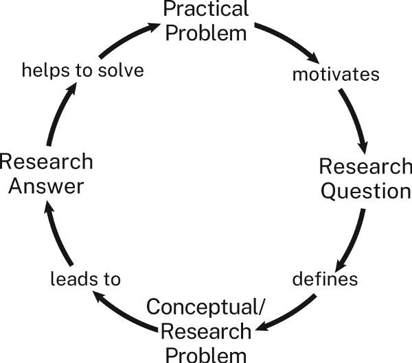

경험이 부족한 연구자들은 때때로 이 개념들로 어려움을 겪는다. 왜냐하면 경험이 많은 연구자들은 흔히 자기 작업에 대해 약어로 말하기 때문이다. 무엇에 대해 작업하고 있냐는 질문에, 우리가 경고한 그런 일반적 주제 중 하나처럼 들리는 대답을 한다: *성인 홍역*, *에밀리 디킨슨의 운율*, 또는 *와이오밍 elk의 교배용음*. 그래서 초보자들은 읽을 주제가 있다는 것이 해결할 문제가 있다는 것과 같다고 생각하기도 한다.

### 실용적 문제와 개념적 문제의 공통점

실용적 문제와 개념적 문제는 똑같이 두 부분 구조를 가지고 있지만 다른 유형의 상태와 비용을 가진다.

* 실용적 문제의 상태는 당신에게, 또는 더 나아가 청중에게 구체적인 비용을 가진 *어떤* 상황일 수 있다.
* 개념적 문제의 상태는 *항상* 무언가를 모르거나 이해하지 못하는 어떤 형태이다.

3단계 문장을 완성하여 개념적 문제의 상태를 확인할 수 있다(1.3 참조): 1단계는 *나는 ~이라는 주제를 연구/작업하고 있다.*이다. 2단계에서 간접 질문은 개념적 문제의 상태, 즉 당신이 모르거나 이해하지 못하는 것을 진술한다:

> 나는 2차 세계대전 시기 인물 로지 리비터의 페미니스트 상징으로서의 진화를 연구하고 있다. 왜냐하면 그 인물이 시간이 지남에 따라 다양한 의미를 획득한 어떻게 그리고 왜를 이해하고 싶기 때문이다.

그래서 우리는 질문의 가치를 강조한다: 그것들은 당신이 모르거나 이해하지 못하지만 알고 싶어하는 것을 진술하도록 강제하기 때문이다. 문제는 연구를 이끌어갈 것이기에, 그것의 구성이 특정 방향으로 이끌거나 가능한 답이나 관점을 배제할 수 있는지에 특히 주의를 기울여야 한다. 예를 들어, 로지 리비터에 대한 문제의 구성은 원래 로지 인물이 어떻게 유색인종 여성을 주변화하는지를 인식하거나 심지어 살펴보는 것을 막을 수 있다. 진정한 연구는 최선을 다할 때 우리와 우리 청중을 무지와 편견에서 끌어올리지만 가장 저항하기 어려운 편견은 우리 자신과 문제에 내재된 것들이다.

두 가지 유형의 문제는 또한 두 가지 다른 유형의 비용을 가진다.

* 실용적 문제의 비용은 항상 우리가 싫어하는 구체적인 것이나 상황이다.

개념적 문제는 그런 구체적인 비용이 없다. 사실, 개념적 문제의 비용을 *결과*라고 부르면서 이 차이를 강조할 것이다.

* 개념적 문제의 결과는 특별한 유형의 무지이다: 그것은 우리가 더 중요하거나 더 많이 이해해야 할 다른 무언가를 이해하는 것을 방해하는 이해의 부족이다. 다른 말로, 우리가 하나의 질문에 답하지 않았기에, 더 중요한 다른 질문에 답할 수 없는 것이다.

연구자들은 단순히 호기심 때문에 프로젝트를 선택하는 경우가 많다. 사실, 대부분의 사람들이 자신이 연구하는 주제에 관심을 갖게 되는 방식이기도 하다. 하지만 연구를 다른 사람들에게 중요하게 만들려면, *여기 흥미로운 것이 있습니다.* 이상의 것을 보여주어야 한다. 당신의 문제를 해결하는 것이 그들의 문제를 해결하는 데 어떻게 도움이 되는지 설명해야 한다. 그것은 문제의 결과를 설명함으로써 할 수 있다.

문제의 결과는 공식의 3단계 간접 질문에서 표현한다:

> 나는 2차 세계대전 시기 인물 로지 리비터의 페미니스트 상징으로서의 진화를 연구하고 있다. 왜냐하면 그 인물이 시간이 지남에 따라 다양한 의미를 획득한 어떻게 그리고 왜를 알아보고, 이미지가 새로운 목적에 재사용될 수 있으며, 많은 시청자가 인식하지 못하는 배제적 의미도 가질 수 있는지 이해하기 위해서다.

이 모든 것은 혼란스러워 보일 수 있지만 생각보다 간단하다. 개념적 문제의 상태와 결과는 두 가지 방식으로 서로 관련된 질문들이다:

* 첫 번째 질문(Q1)의 답이 두 번째 질문(Q2)에 답하는 데 도움이 된다.
* 두 번째 질문(Q2)의 답이 첫 번째 질문(Q1)의 답보다 더 중요하다.

다시 한번, 연구 문제의 첫 번째 부분은 모르지만 알고 싶은 것이다. 그 지식이나 이해의 격차를 직접 질문으로 표현할 수 있다: *지난 50년 동안 로맨틱 영화는 어떻게 변했는가?* 또는 간접 질문으로: *나는 지난 50년 동안 로맨틱 영화가 어떻게 변했는지 알아보고 싶다.*

이제 누군가가 *그 질문에 답할 수 없다면 그래서 뭐요?*라고 물었다고 상상하라. 첫 번째 질문의 답이 더 잘 알게 되는 *다른 더 중요한 무언가*를 진술함으로써 답한다. 예를 들어:

> 지난 50년 동안 로맨틱 영화가 어떻게 변했는지에 대한 질문에 답하는 것은 더 중요한 질문에 답하는 데 도움이 된다: 우리의 로맨틱 사랑에 대한 문화적 묘사가 어떻게 변했는가?라는 더 크고 더 중요한 두 번째 질문이다.

두 번째 질문에 답하는 것이 중요하다고 생각한다면, 당신은 문제를 추구할 가치 있게 만드는 결과를 진술한 것이며 청중이 동의한다면, 당신은 사업에 들어선 것이다.

하지만 청중이 다시 *지금 우리가 로맨틱 사랑을 과거와 다르게 묘사하는지 모르면 그래서 뭐요?*라고 물었다면? 청중이 중요하다고 생각할 더 큰 질문을 제기해야 한다:

> 우리의 로맨틱 사랑에 대한 묘사가 어떻게 변했는지에 대한 질문에 답하는 것은 더 중요한 것에 답하는 데 도움이 된다: 우리의 문화가 젊은 남녀의 결혼과 가족에 대한 기대를 어떻게 형성하는가?

청중이 다시 *그래서 뭐요?*라고 물었다면, *잘못된 청중이다.*라고 생각할 수 있다. 하지만 그 청중에 갇혀 있다면, 다시 시도해야 한다: *글쎄, 만약 그 질문에 답하지 않으면, 우리는...할 수 없다.*

학술 분야 외부의 사람들은 종종 그 분야 전문가들이 터무니없이 사소한 질문을 한다고 생각한다: *_hopscotch는 어떻게 기원했는가?* 하지만 연구자들이 그런 질문에 답하는 것은 두 번째, 더 중요한 질문에 답하기 위해서라는 것을 깨닫지 못한다. 민속 게임이 아이들의 사회적 발전에 미치는 영향에 관심이 있는 사람들에게는, 모르는 것의 개념적 결과가 연구를 정당화한다. *만약 우리가 아이들의 민속 게임이 어떻게 기원했는지 발견할 수 있다면, 게임이 어떻게 아이들을 사회화하는지 더 잘 이해할 수 있고 그리고 당신이 묻기 전에, 그것을 알면, 우리는 더 잘 이해할 수 있을 것이다...*

## "순수" 연구와 "응용" 연구의 구별

앞서 우리는 진정한 연구를 사전에 알려지지 않은 답을 가진 질문에 의해 동기 부여된 연구로 설명했다. 두 가지 유형을 구별할 수 있다. 개념적 문제를 다루되 그것이 세계의 어떤 실용적 상황과 직접 관련이 없고 연구 공동체의 이해만을 향상시키는 연구를 *순수* 연구라고 부른다. 개념적 문제를 다루면서 실용적 결과를 가진 연구를 *응용* 연구라고 부른다. 연구가 순수인지 응용인지 확인하는 방법은 프로젝트를 정의하는 세 단계의 마지막을 살펴보는 것이다. *앎*을 가리키는가, 아니면 *함*을 가리키는가?

1. 주제: 나는 우주의 한 구간에서 전자기 복사를 연구하고 있다
   1. 질문: 왜냐하면 하늘에 얼마나 많은 은하가 있는지 알아보고 싶기 때문이다,
      1. 중요성: 우주가 영원히 팽창할지 결국 한 점으로 붕괴할지 이해하도록 돕기 위해.

이것은 순수 연구이다. 왜냐하면 3단계가 이해만을 가리키기 때문이다.

응용 연구에서는 2단계가 여전히 앎이나 이해를 가리키지만 3단계는 함을 가리킨다:

1. 주제: 나는 Webb 망원경의 측정값이 지구상 망원경으로 측정한 같은 별의 측정값과 어떻게 다른지 연구하고 있다
   1. 질문: 왜냐하면 대기가 전자기 복사 측정을 얼마나 왜곡하는지 알아보고 싶기 때문이다,
      1. 실용적 중요성: 천문학자들이 지구상 망원경의 데이터를 사용하여 전자기 복사의 밀도를 더 정확하게 측정할 수 있도록 하기 위해.

이 문제는 응용 연구를 요구한다. 왜냐하면 천문학자들이 대기 왜곡을 어떻게 설명할지 *알 때에야* 그들이 원하는 것--빛을 더 정확하게 측정하는 것--을 *할 수 있기* 때문이다.

## 연구와 실용적 결과 연결하기

일부 경험이 부족한 연구자들은 순수 연구에 불편함을 느낀다. 왜냐하면 개념적 문제의 결과--단순히 무언가를 모르는 것--가 너무 추상적이기 때문이다. 아직 세계의 그 부분을 깊이 이해하는 데 관심이 있는 연구 공동체의 일원이 아니기에, 그들의 발견이 별로 쓸모가 없다고 느낀다. 그래서 개념적 질문에 실용적 결과나 중요성을 억지로 붙여 더 중요해 보이게 만들려 한다:

1. 주제: 나는 2차 세계대전 시기 인물 로지 리비터의 페미니스트 상징으로서의 진화를 연구하고 있다
   1. 연구 질문: 왜냐하면 그 인물이 시간이 지남에 따라 다양한 의미를 획득한 어떻게 그리고 왜를 알아보고 싶기 때문이다,
      1. 잠재적 실용적 중요성: 그래픽 아티스트가 더 포용적인 정치 포스터를 디자인하도록 돕기 위해.

대부분의 사람들은 2단계와 3단계 사이의 연결이 좀 무리라고 생각할 것이다.

좋은 응용 연구 프로젝트를 구성하려면, 2단계의 간접 질문의 답이 3단계의 간접 질문에 답하는 데 *그럴듯하게* 도움이 된다는 것을 보여야 한다. 다음 질문을 하라:

* (a) 만약 청중이  [3단계의 목표를 진술]라는 목표를 달성하고 싶다면,
* (b) ~를 알아낸다면 그것을 할 수 있을 것이라고 생각하는가? [2단계의 질문을 진술]

이 응용 천문학 문제에 그 테스트를 적용해 보라:

* (a) 만약 청중이 지구상 망원경의 데이터를 사용하여 전자기 복사의 밀도를 더 정확하게 측정하고 싶다면,
* (b) 대기가 측정을 얼마나 왜곡하는지 안다면 그것을 할 수 있을 것이라고 생각하는가?

답은 *예*일 것이다.

이제 로지 리비터 문제에 그 테스트를 적용해 보라:

* (a) 만약 청중이 더 좋은 정치 캠페인 포스터를 디자인하고 싶다면,
* (b) 로지 리비터의 인물이 어떻게 그리고 왜 시간이 지남에 따라 다양한 의미를 획득했는지 안다면 그것을 할 수 있을 것이라고 생각하는가?

답은 아마 *아니오*일 것이다. 우리는 연결을 볼 수 있지만 좀 무리다.

개념적 문제의 해결책이 실용적 문제에 *적용*될 수 있다고 생각한다면, 프로젝트를 순수 연구로 구성한 다음, *네 번째* 단계로 응용을 *추가*하라:

1. 주제: 나는 2차 세계대전 시기 인물 로지 리비터의 페미니스트 상징으로서의 진화를 연구하고 있다
   1. 개념적 질문: 왜냐하면 그 인물이 시간이 지남에 따라 다양한 의미를 획득한 어떻게 그리고 왜를 알아보고 싶기 때문이다,
      1. 개념적 중요성: 이미지가 새로운 목적에 재사용될 수 있으며 많은 시청자가 인식하지 못하는 배제적 의미도 가질 수 있는지 이해하기 위해,
         1. 잠재적 실용적 응용: 그래픽 아티스트가 더 포용적인 정치 포스터를 디자인할 수 있도록 하기 위해.

하지만 서론에서 문제를 진술할 때는, 개념적 결과에 중요성이 있는 순수 개념적 연구 문제로 제시하라. 그런 다음 결론에서 그 실용적 응용을 제안하기를 기다리라(이에 대한 더 자세한 내용은 14장 참조).

인문학의 대부분의 연구 프로젝트와 자연과학 및 사회과학의 많은 프로젝트는 일상생활에 직접 적용되지 않는다. 하지만 *순수*라는 단어가 암시하듯이, 많은 연구자들은 응용 연구보다 그런 연구를 더 가치 있게 여긴다. 그들은 "자기 존재의 이유를 위한" 지식 추구가 인간의 최고 소명--돈이나 권력이 아니라 더 깊은 이해와 더 풍부한 정신적 삶의 초월적 선을 위해 더 많이 아는 것--을 반영한다고 믿는다.

짐작했듯이, 우리는 순수 연구에 깊이 헌신하지만 응용 연구에도 헌신한다--연구가 제대로 수행되고 악의적 동기에 의해 부패하지 않는 한. 예를 들어, 이윤 추구 가능성은 화학 및 생물학 분야의 순수 및 응용 연구의 진정성을 손상시킬 수 있다. 왜냐하면 그것은 어떤 문제를 해결할지뿐만 아니라 해결책에도 영향을 미칠 수 있기 때문이다: *우리에게 무엇을 찾으라고 말해주십시오, 우리가 제공하겠습니다!* 그런 상황은 17장 "연구의 윤리"에서 다루는 윤리적 질문을 제기한다.

## 좋은 연구 문제 찾기

위대한 연구자와 나머지를 구별하는 것은, 그 해결책이 우리 모두가 세상을 새로운 방식으로 보게 만드는 문제를 발견하는 뛰어남, 요령, 또는 단순한 행운이다. 좋은 문제에 부딪힐 때 또는 그것이 우리에게 부딪힐 때 인식하기는 쉽다. 하지만 연구자들은 종종 자신의 진짜 문제가 무엇인지 모른 채 프로젝트를 시작한다. 때때로 퍼즐을 더 명확하게 정의하기만 바랄 때도 있다. 실제로 새로운 문제를 발견하거나 기존 문제를 명확히 하는 사람들은 이미 정의된 문제를 해결하는 사람들보다 분야에 더 큰 기여를 하는 경우가 많다. 어떤 연구자들은 자신이 증명하려 했던 그럴듯한 가설을 *반증*함으로써 명예를 얻기도 했다.

그래서 프로젝트 시작에 문제를 완전히 구성할 수 없더라도 좌절하지 마라. 대부분의 사람들이 그렇게 하지 못한다. 하지만 일찍 생각하는 것은 과정에서 많은 시간을 절약해 줄 것이다(그리고 아마도 마지막에 당황하는 것도). 또한 고급 작업에 필수적인 사고 방식으로 들어서게 한다. 좋은 문제를 확인하고 다듬는 데 도움이 되는 몇 가지 방법이 있다.

### 도움을 요청하라

경험이 많은 연구자들이 하듯이 하라: 동료, 선생님, 친구, 친척, 이웃--관심을 가질 만한 누구에게든--이야기하라. 왜 누군가가 당신의 질문에 답하기를 원할 것인가? 그 답으로 무엇을 할 것인가? 새로운 질문은 어떤 것이 제기될 수 있는가?

어떤 문제든 자유롭게 작업할 수 있다면, 더 큰 문제의 일부인 작은 문제를 찾아라. 큰 문제를 해결하지 못할지라도, 그 작은 조각은 더 큰 중요성의 일부를 물려받을 것이다(당신의 분야 문제에 대해서도 교육받을 것이다-작지 않은 이점이다). 학생이라면, 선생님에게 지금 무엇에 대해 작업하고 있고 그것의 일부를 작업할 수 있는지 물어보라. 그들의 제안이 당신 연구의 한계를 정의하도록 두지 마라. 선생님이 제안한 것을 *정확히* 하고 *더 이상 하지 않는* 것보다 선생님을 좌절시키는 것은 없다. 선생님은 당신이 그들의 제안을 사고를 *끝내는* 데 사용하기보다 *시작하는* 데 사용하기를 원한다. 선생님이 가장 기뻐하는 것은 당신이 그들의 제안을 사용하여 그들이 기대하지 못한 것을 발견할 때이다.

### 읽으면서 문제를 찾아라

자료에서도 연구 문제를 찾을 수 있다. 자료에서 모순, 불일치, 불완전한 설명이 보이는 곳은 어디인가? 다른 사람들도 그렇게 느끼거나 느껴야 한다고 잠정적으로 가정하라. 많은 연구 프로젝트는 자료 저자와의 상상적 대화로 시작한다: *잠깐만, 당신은 ~를 무시하고 있다...* 하지만 공백이나 오해를 바로잡기 전에, 그것이 진짜인지, 아니면 단순히 당신 자신의 오독인지 확인하라. 수많은 연구 논문이 아무도 하지 않은 주장을 반박했다(4.3에서 *자료는 X라고 생각하지만 나는 Y라고 생각한다.*의 변형이자, 저자가 자료에서 문제를 찾기 위한 몇 가지 일반적인 "논증 전략"을 나열한다).

진짜 퍼즐이나 오류를 찾았다고 생각되면, 단순히 지적하는 것 이상을 하라. 자료가 X라고 하고 당신이 Y라고 생각한다면, 연구 문제를 가질 수 있다. 하지만 X라고 생각하는 사람들이 더 큰 문제도 잘못 이해하고 있다는 것을 보여줄 수 있을 때만.

마지막으로, 자료의 마지막 몇 페이지를 주의 깊게 읽어보라. 많은 연구자들이 더 많은 질문이 필요하다고 제안하는 곳이다. 다음 단락의 저자는 19세기 러시아 농민의 삶이 군인으로서의 성과에 어떤 영향을 미쳤는지 설명한 직후였다:

> 군인의 평시 경험이 전장에서의 성과에 영향을 미쳤듯이, 장교단의 경험도 그들의 성과에 영향을 미쳤을 것이다. 실제로 러일전쟁 후 몇몇 평론가들은 러시아의 패배를 장교들의 경제적 업무 과정에서 습득한 습관 탓으로 돌렸다.어쨌든, 평화와 전쟁에서 차르 장교들의 복무 습관을 이해하기 위해, *우리는 여기서 병사들에게 제공한 것과 같은 구조적-if you will, 인류학적-장교단 분석이 필요하다.* [강조 표시]

그 마지막 문장은 당신이 해결하기를 기다리는 새로운 문제를 제공한다.

### 자신의 결론을 살펴보라

비판적 독서는 당신의 초안에서 좋은 연구 문제를 발견하는 데도 도움이 될 수 있다. 우리는 보통 마지막 몇 페이지에서 최고의 사고를 한다. 왜냐하면 시작할 때 예상하지 못한 주장을 거기에서 구성하기 때문이다. 초기 초안에서 예상하지 못한 주장에 도달했다면, 그것이 어떤 질문에 답할 수 있는지 자문하라. 역설적으로 보일 수 있지만 당신은 아직 하지 않은 질문에 답함으로써 아직 제기하지 않은 문제를 해결했을 수 있다. 그 문제가 무엇인지 파악하는 것이 당신의 임무다.

## 문제를 다루는 법 배우기

경험이 많은 연구자들은 새로운 문제를 발견하기를 꿈꾼다. 더 큰 꿈은 아무도 문제가 있다고 생각하지 못했던 문제를 해결하는 것이다. 하지만 그 새로운 문제는 다른 사람들이(또는 설득될 수 있는 사람들이) 해결할 필요가 있다고 생각하기 전까지는 많이 가치가 없다. 그래서 경험이 많은 연구자가 문제에 대해 해야 할 첫 번째 질문은 *해결할 수 있는가?*가 아니라 *다른 사람들이 해결해야 한다고 생각할 것인가?*이다.

누구도 처음에 모든 것을 하기를 기대하지 않는다. 하지만 그 순간에 대비하도록 정신적 습관을 발전시키기 시작해야 한다. 연구는 단순히 사실을 축적하고 보고하는 것 이상이다. *당신이* 답할 가치가 있다고 생각하는 질문을 구성하려 노력하라. 그래서 나중에 *다른 사람들이* 해결할 가치가 있다고 생각하는 문제를 찾는 법을 알게 될 것이다. 그렇게 할 수 있을 때까지, 연구자가 받을 수 있는 가장 나쁜 반응--*동의하지 않습니다*가 아니라 *관심 없습니다*(I.4.3, 6.2, 9.1 참조)--의 위험이 있다.

이 시점까지, 학술 연구에 대한 이 공허한 말은 소위 "실제 세계"와 동떨어진 것처럼 보일 수 있다. 하지만 업무와 정부에서, 법과 의학에서, 정치와 국제 외교에서, 문제를 인식하고 그것에 관심을 가지도록 그리고 특히 당신이 그것을 해결할 수 있다고 다른 사람들을 설득하는 방식으로 표현하는 능력보다 더 높이 평가되는 기술은 없다. 비잔틴 도자기 수업에서 그렇게 할 수 있다면, 메인 스트리트나 월 스트리트의 사무실에서, 또는 주방 테이블에서의 화상 회의에서 그렇게 할 수 있다.

::: {.callout-tip}
### 경험이 부족한 것을 기회로

우리는 가치, 관심사, 사고와 논증 방식을 완전히 이해하지 못하는 새로운 분야에서 작업을 시작할 때 불안을 느낀다. 사실, 우리 저자들도 새로운 주제에 대한 새로운 종류의 프로젝트를 시작할 때 그 신입의 불안을 여전히 경험한다. 그 느낌을 피할 수는 없지만 관리하는 방법이 있다:

* *불확실성과 불안은 자연스럽고 불가피하다는 것을 알아라.* 그런 느낌은 무능함이 아니라 경험 부족을 신호할 뿐이다.
* *그 과정에서 그것에 대해 쓰면서 주제를 장악하라.* 진행 상황을 성찰하는 일지를 유지하라. 이런 종류의 글쓰기는 읽은 것을 이해하는 데 도움이 될 뿐 아니라 그것에 대한 사고를 자극한다. 초안 작성을 시작하기 전에 얼마나 대략적으로든, 초기에 많이 쓸수록, 그 위협적인 첫 초안에 직면하기가 더 쉬워질 것이다.
* *자료에 반응하라; 단순히 축적하지 마라.* 유용한 자료를 발견했을 때, 사진을 찍거나 스크린샷을 찍거나 브라우저 탭에 열어두지 마라. 그것은 쉽지만 당신의 사고를 진전시키지 않는다. 추가로, 요약이나 비판을 쓰라. 그 자료가 당신의 마음속에서 일으킨 질문을 나열하라.
* *과제를 관리 가능한 단계로 나누고 그것들이 서로 지지한다는 것을 알아라.* 좋은 질문을 구성하면, 초안을 잡고 수정하는 것이 더 효과적이 될 것이다. 첫 초안을 어떻게 작성하고 수정할지 예상할수록, 그것을 더 효과적으로 생산할 것이다.
* *학생이라면, 선생님이 당신의 투쟁을 이해할 것이라고 생각하라.* 그들은 당신이 성공하기를 원하며 그들의 도움을 기대할 수 있다. 도서관사서나 캠퍼스 글쓰기 센터에 도움을 요청할 수도 있다.
* *현실적인 목표를 세워라.* 청중이 당신의 주장에 동의하지 않더라도, 그것을 잘 논증했다는 것을 인식한다면, 의미 있는 것을 한 것이다.
* *가장 중요한 것은, 투쟁이 무엇인지 인식하라-학습 경험.* 모든 초보자가 직면하는 불안을 관리하고 어려움을 극복하려면, 성공한 연구자들이 하듯이 하라. 특히 좌절할 때: 계획과 쓴 것을 검토한 다음, 계속하라. 성공한 연구자들은 확실한 것은 없지만 잘 계획된 대부분의 연구 프로젝트는 괜찮게 될 것이라는 것을 안다. 아마도 "고려하면 괜찮다" 수준이겠지만 아마 그것보다는 훨씬 나을 것이다.
:::

# 2부

# 자료와 리소스

# 서문

# 자료와 진정한 연구

연구는 연구 분야와 질문에 따라 다양한 형태를 취할 수 있다. 어떤 연구자들은 실험실에서 실험을 하고; 어떤 연구자들은 자연 세계나 인간 행동을 관찰하고; 어떤 연구자들은 설문조사나 인터뷰를 통해 사람들로부터 데이터를 수집하고; 어떤 연구자들은 다른 방법들 중에서 텍스트, 음향, 시각적, 또는 물질적 자료를 분석하거나 해석한다. 다음 두 장에서는 자료에 기반한 연구에 초점을 맞춘다. 그렇게 하는 이유는, 자료를 다루는 것이 가장 일반적인 연구 형태이자 대부분의 사람들이 처음 배우는 유형이기 때문이다. 3장에서는 자료의 관련성과 신뢰성을 평가하여 찾는 데 초점을 맞춘다. 4장에서는 논증에서 이 자료를 사용하는 준비에 초점을 맞춘다. 이것들을 별도의 단계로 다루지만 실제로는 서로 얽혀 있다. 진정한 연구에서는 모든 자료를 먼저 찾은 다음 읽고 메모하는 것이 아니다. 오히려, 좋은 자료 하나를 찾으면 그것이 다른 자료로 이끈다. 얻은 지식을 사용하여 탐구를 다듬고 질문에 대한 답을 알려주면서 더 읽고 탐구한다. 자료를 찾고, 평가하고, 참여하는 이 순환적 접근은 모든 진정한 연구의 특징이다.

# 3 자료 찾기와 평가

새로운 연구자이고 대부분의 자료를 도서관이나 온라인에서 찾을 것으로 예상한다면, 이 장은 연구를 위한 계획을 세우는 데 도움이 될 것이다. 더 경험이 있다면 다음 장으로 건너뛰어도 된다.

초보 연구자들은 연구를 논문에 넣을 정보를 찾는 것, 특히 자신의 논증을 *뒷받침*한다고 믿는 정보를 찾는 것으로 생각하는 경우가 많다. 이 연구관은 틀렸다. 모든 증거가 같고 연구가 선생님의 과제에서 지정된 만큼의 자료를 찾는 것으로 이루어진다고 가정하기 때문이다. 물론 어떤 경우에는 학생들에게 최소한의 자료를 사용하거나 *학술적인* 자료만 사용하거나 위키피디아를 자료로 사용하지 말도록 지시받을 수 있다. 연구 프로젝트를 계획하려면, 어떤 유형의 자료가 자료로 기능하는지, 논증에서 어떻게 사용하는지 이해해야 한다.

## 세 가지 유형의 자료 이해하기

자료는 통상적으로 세 가지로 분류된다: 1차, 2차, 3차. 경계가 명확하지 않지만 이 범주를 알면 연구를 계획하는 데 도움이 된다. 주로 연구자가 그것들을 어떤 용도로 사용하느냐에 따라 다르다.

### 증거를 위한 1차 자료

1차 자료는 가설이나 주장을 개발하고 검증하는 데 사용할 "원시 데이터" 또는 증거를 제공하는 "원본" 자료이다. 어떤 것이 1차 자료에 해당하는지는 분야에 따라 크게 다르다. 역사에서 1차 자료는 연구하는 시기나 사건에서 직접 나온 유물이나 문서이다: 편지, 일기, 물건, 지도, 심지어 의류. 문학이나 철학에서, 주요 1차 자료는 보통 당신이 분석하는 텍스트(예: 셰익스피어의 맥베스 또는 한나 아렌트의 인간 조건)이며 데이터는 페이지 위의 글자이다. 미술비평에서, 1차 자료는 당신이 해석하는 미술 작품이다. 사회학이나 정치학 같은 사회과학에서, 인구조사나 설문조사 데이터도 1차 자료에 해당하며 인터뷰, 현장조사(민족지학적 관찰), 또는 실험을 통해 얻은 데이터도 마찬가지이다. 자연과학에서, 원래 연구 보고서는 때때로 1차 자료로 분류된다(비록 과학자 자신은 그 용어를 거의 사용하지 않지만).

### 다른 연구자들로부터 배우기 위한 2차 자료

2차 자료는 1차 자료에 기반한 books, articles, 또는 reports이며 학술적 또는 전문적 청중을 대상으로 한다. 한 분야의 2차 자료 모음은 때때로 그 분야의 *문헌*이라고 불린다. 최고의 2차 자료는 평판이 좋은 대학 출판사의 책과 *동료 심사*를 거친 기사나 보고서이다. 이것은 출판되기 전에 분야의 전문가에 의해 검증되었음을 의미한다. 연구자들은 분야의 발전을 따라잡기 위해 2차 자료를 읽고 이런 방식으로 자신의 사고를 자극한다. 새로운 연구 문제를 설정하는 표준적인 방법은 2차 자료에 제시된 다른 사람들의 결론이나 방법에 도전하거나 기반으로 구축하는 것이다. 2차 자료에는 또한 한 분야의 학자들이 쓴 에세이를 제공하는 전문 백과사전과 사전도 포함된다. 2차 자료는 한때 주로 대학 및 대학교 도서관을 통해 이용할 수 있었지만 EBSCOhost나 구글 스칼라를 포함한 온라인 카탈로그와 데이터베이스를 통해서도 이용할 수 있다.

2차 자료는 세 가지 주요 목적으로 사용할 수 있다:

1. 다른 사람들이 당신 주제에 대해 무엇을 썼는지 배우기 위해. 2차 자료는 다른 연구자들이 당신의 주제에 대해 무엇을 말했는지, 그리고 어떤 유형의 질문이 중요하다고 생각하는지 배우는 가장 좋은 방법이다(그들이 다루는 연구 질문뿐만 아니라 그들이 제기하는 추가 질문에도 주목하라). 이런 질문들 중 하나를 모델로 삼을 수 있을 것이다.
2. 다른 관점을 찾기 위해. 초보 연구자들은 때때로 자신의 생각과 모순되는 아이디어를 언급하면 주장이 약해질 것이라고 믿는다. 사실은 반대이다: 반대 견해를 인정할 때, 청중은 그 견해를 고려했을 뿐만 아니라 그것에 대응할 수 있다는 것을 보여준다(9장 참조). 당신의 연구는 청중의 예측 가능한 질문과 불일치를 상상하고 대응할 때에야 완성된다. 그런 것들을 2차 자료에서 찾을 수 있다. 당신의 아이디어에 대한 대안은 무엇인가? 인정해야 할 증거는 무엇인가? 더 중요한 것은, 다른 사람들의 논증을 사용하여 자신의 논증을 시험하고 개선할 수 있다. 합리적인 사람이 왜 다르게 생각할 수 있는지 알아야 당신이 무엇을 생각하는지 이해할 수 있다. 그래서 자료를 찾을 때, 당신의 견해를 지지하는 것뿐만 아니라 도전하는 것도 찾아라.
3. 자신의 연구와 글쓰기를 위한 모델을 찾기 위해. 2차 자료는 다른 사람들이 당신의 주제에 대해 무엇을 썼는지뿐만 아니라 *어떻게* 썼는지 알아내는 데 사용할 수 있다. 대부분의 자료가 제목, 도표, 글머리 기호를 사용한다면, 당신도 같은 것을 고려할 수 있다; 자료가 그것을 사용하지 않는다면, 아마 사용하지 않는 것이 좋다. 언어(전문적인가, 널리 접근 가능한가?), 단락(긴가 짧은가?), 다른 자료를 어떻게 사용하는가(인용인가, 패러프레이즈인가?) 같은 것에 주목하라. 대부분의 자료가 사용하는 유형의 증거와 거의 또는 전혀 사용하지 않는 유형의 증거에 특히 주목하라. 2차 자료를 자신의 논증의 모델로 사용할 수도 있다. 자료의 구체적인 주장과 이유를 재사용할 수는 없지만, 자신의 논증에서 같은 종류의 추론을 사용할 수 있으며, 어쩌면 같은 구성을 따를 수도 있다. 그래서 당신의 주제와 정확히 일치하지는 않지만 비슷한 것을 다루는 자료를 만나면, 그것을 훑어보라. 주장을 어떻게 논증할 수 있는지 배울 수 있는지 보라(논리만 사용한다면 그 자료를 인용할 필요는 없지만 더 권위를 부여하기 위해 인용할 수도 있다).

### 소개 개요를 위한 3차 자료

3차 자료는 일반 독자를 위해 2차 자료를 종합한 books와 articles이다. 교재, 백과사전의 기사(위키피디아 포함), *사이콜로지 투데이* 같은 대중 매체의 기사, 또는 일부 교육용 유튜브 영상이 포함된다. 연구 초기에 3차 자료를 사용하여 주제에 대한 광범위한 개요를 얻을 수 있다. 하지만 학술적 논증을 하고 있다면, 2차 자료에 의존해야 한다. 왜냐하면 그것들이 당신이 참여하려는 대화를 구성하기 때문이다. 학술적 논증에서 3차 자료를 인용하면 초보자나 외부인으로 표식될 것이며 많은 독자는 당신이나 당신의 논증을 진지하게 받아들이지 않을 것이다.

이 반응은 불공평해 보일 수 있지만 그렇지 않다. 3차 자료가 반드시 잘못된 것은 아니다--많은 것이 실제로 저명한 학자에 의해 쓰여졌다--하지만 제한적이다. 다루는 주제에 익숙하지 않은 대중을 대상으로 하기 때문에, 3차 자료는 기반 연구를 지나치게 단순화할 수 있으며 시대에 뒤떨어질 수 있다. 하지만 이 제한을 염두에 둔다면, 3차 자료는 가치 있는 자료가 될 수 있다: 새로운 주제에 대해 알려줄 수 있으며 참고문헌이 있다면 때때로 가치 있는 2차 자료로 이끌어줄 수 있다.

### 1차, 2차, 3차 자료의 구별

연구자들은 항상 이 세 범주로 자료를 나눈 것은 아니다. 1차와 2차 자료의 구별은 19세기 역사학자에서 비롯되었고 다른 분야로 퍼졌다. 3차 자료 범주는 나중에 추가되었다. 이 체계는 이제 학생들에게 자료를 분류하는 표준적인 방법으로 가르쳐지지만 어떤 학문에는 다른 것보다 더 잘 맞는다. 역사에서는 1차 자료가 역사적 사건이나 시기와 직접 연결된 자료이고 비평에서는 1차 자료가 해석하는 원래의 미술, 음악, 또는 문학 작품이기에 잘 작동한다. 하지만 수학, 화학, 또는 간호학에는 잘 작동하지 않는다.

1차, 2차, 3차의 구분이 절대적인 것이 아니라 연구자의 프로젝트에 상대적이라는 것도 이해하는 것이 중요하다. 대부분의 경우, 학술 저널의 기사는 2차 자료로 간주될 것이다. 하지만 연구 문제가 그 저자 자체나 분야 자체와 관련된다면, 예를 들어 인류학자 마거릿 미드의 전기를 쓰고 있다면, 1차 자료가 될 것이다. 마찬가지로, T. S. 엘리OT의 에세이 "햄레트와 그의 문제들"은 엘리OT를 연구한다면 1차 자료이지만 셰익스피어를 연구한다면 2차 자료이다. 백과사전 기사는 보통 3차 자료로 간주되지만 백과사전이 성별 문제를 다루는 방식을 연구한다면 1차 자료가 될 것이다. 선거 캠페인에 대한 TED 강연은 정치학에서는 3차 자료일 수 있지만 미디어 연구에서는 1차 자료일 수 있다. 초점을 바꾸면 자료의 분류도 바뀐다.

이것이 혼란스럽다면, 그렇지 않아도 된다. 이 분류는 단지 수단일 뿐이라는 것을 기억하라. 궁극적으로 중요한 것은 자료를 무엇이라고 *부르는* 것이 아니라, 연구 문제를 다루고, 새로운 아이디어를 개발하고, 흥미로운 논증을 만드는 데 얼마나 잘 *사용*하는가이다. 다음 장에서는 글쓰기에서 자료를 어떻게 사용할 수 있는지에 대해 더 자세히 논의할 것이다.

## 도서관을 최대한 활용하기

인터넷이 있더라도 도서관을 대체할 것은 없다. 도서관은 주제에 대한 자료를 찾을 뿐만 아니라, 추구하고 싶은 주제와 연구 질문을 탐구하고 다듬는 데 사용할 수 있다. 직접 방문(매우 권장)하든, 가상으로 하든, 도서관은 연구에 없어서는 안 될 도구이다. 현재 온라인에서 이용할 수 있는 방대한 정보를 고려하면, 도서관이 특수한 연구를 제외하고는 더 이상 필요하지 않다고 생각할 수 있다. 하지만 사실은 반대이다. *그렇게 많은* 정보가 손끝에 있는 지금, 도서관은 연구에서 그 어느 때보다 필수적이다. 도서관은 정보에 접근할 수 있게 할 뿐만 아니라 자료가 신뢰할 수 있음을 보장한다. 공공 또는 학술 도서관이 비교적 작더라도, 연구 가이드, 참고 자료, 온라인 데이터베이스 및 콘텐츠를 포함한 훨씬 광범위한 리소스로의 *포털* 역할을 한다. 물론 이 리소스의 이점을 얻으려면 도서관을 탐색하는 법을 배워야 한다.

### 도서관 검색 계획하기

자료를 사용하기 전에 먼저 그것들을 찾아 평가해야 한다. 궁극적으로 자료로 기능할 일부 자료는 도서관에 물리적으로 위치할 것이고 다른 것들은 온라인이든 다른 도서관이든 다른 곳에 있을 가능성이 높다. 도서관이 제공하는 것을 최대한 활용하려면, 검색을 *계획*해야 한다. 다행히도, 이것이 바로 도서관과 도서관사서가 가장 유용한 부분이다.

검색을 어디서 시작해야 하는지 아는 것은 처음에는 압도적일 수 있다. 주제나 연구 질문이 손에 있으면, 도서관 검색 엔진에 몇 가지 용어를 입력하고 무엇이 나오는지 보는 것이 유혹적이다. 우리도 그렇게 하지만 도서관이 유용하고 신뢰할 수 있는 자료를 발견하기 위한 더 체계적이고 생산적인 방법을 제공한다는 것도 알고 있다.

*

도서관사서에게 물어보라. 우리가 제공할 수 있는 최고의 조언은 아마도 도서관사서의 연구 전문성에 의존하는 것이다. 일반 참고 도서관사서와 (대형 도서관에서는) 전문 분야 전문가가 검색 매개변수를 다듬고 특정 연구 질문에 맞는 올바른 도구로 안내할 수 있다. 카탈로그를 사용하여 도서관이 보유한 자료나 다른 도서관(도서관 간 대출을 통해 얻을 수 있는)의 자료를 찾는 데 도움을 줄 수 있다. 같은 도서관사서들이 특정 분야의 참고 작품과 온라인 데이터베이스를 식별하는 연구 가이드를 설계하는 경우가 많다.

그리고 부끄러워하지 마라. 도서관사서는 모든 수준의 연구자와 연구 과정의 모든 단계에서 도움을 주는 것을 좋아한다. 연구 질문을 구성하고, 검색 용어를 개발하고, 결과를 정리하여 가치 있는 것을 놓치지 않도록 도와줄 수 있다. 유일한 당황스러운 질문은 물어보지 *않았지만* 물어봐야 했던 질문이다. 물론, 바쁜 도서관사서에게 미리 준비함으로써 반쯤 만나는 것이 좋다. 잘 발전된 연구 질문을 공유할 준비가 되어 있다면, 더 나은 조언을 받을 수 있을 것이다. 1장의 세 단계 기준을 사용하여 프로젝트를 설명할 수 있다:

1. 나는 1980년대 교육 정책에 대해 작업하고 있다
   1. 중서부 학교 위원회가 인종 분리 문제를 어떻게 처리했는지 알아보기 위해
      1. 왜냐하면 인종 관계에서 지역적 차이를 이해하고 싶기 때문이다.

*

참고 작품을 참고하라. 주제에 대해 이미 많이 알고 있다면, 자료를 찾는 법도 알고 있을 것이다. 하지만 주제가 처음이라면, 관련성 있는 것처럼 보이는 1차 또는 2차 자료로 바로 가는 유혹을 참아야 한다. 이 접근은 신뢰할 수 없고 예측할 수 없으며 아마 시간을 절약해주지 못할 것이다. 더 성공적인 전략은 참고 작품이 당신의 검색 노력을 형성하도록 허용하는 것이다. *브리태니커 백과사전* 같은 일반 참고 작품과 *철학 백과사전* 같은 더 전문적인 작품을 포함하여 전문가들이 편집한 참고 작품은 지형을 알려줄 것이며 나중에 자료가 더 큰 그림에 어떻게 맞는지 더 쉽게 볼 수 있을 것이다. 추가로, 참고 작품에는 종종 인용문이나 참고문헌이 포함되어 있어 당신이 놓쳤을 수 있는 자료로 이끌어줄 수 있다.

연구 초기에 특히 가치 있는 것은 참고문헌 작품이다. 많은 것이 주제에 대한 중요한 기사나 책을 요약하는 초록을 제공한다. 주석이 달린 참고문헌이나 최근 책이나 기사를 요약하는 연례 문헌 검토를 찾아보라. 그것들이 종종 당신 연구를 위한 유망한 단서를 제공하기 때문이다.

*

온라인 데이터베이스를 탐구하라. 도서관을 대중이 이용할 수 있는 인터넷과 구별하는 것은 색인과 데이터베이스에 대한 구독이다. 책 다음으로, 이것들은 아마도 도서관의 가장 가치 있는 자산이다. 왜냐하면 연구자들이 다른 방법으로는 얻을 수 없는 자료에 접근할 수 있게 해주기 때문이다. 각 도서관의 구독은 다를 것이며 주요 연구 도서관이 전문 색인과 데이터베이스에 대한 가장 포괄적인 접근을 제공할 것이다. 하지만 모든 학술 도서관과 많은 공공 도서관은 실제 소장품을 크게 확장하는 강력한 온라인 도구 세트를 제공한다. JSTOR, Academic Search Premier, MLA International Bibliography, 또는 PubMed 같은 도서관이 구독하는 주요 데이터베이스에 적어도 익숙해져야 한다. 많은 학술 데이터베이스는 초록을 제공하거나 초록이 포함된 기사로 안내한다. 이것을 보면 기사 자체가 읽을 가치가 있는지 결정하는 데 도움이 된다. 일부 데이터베이스는 전체 텍스트 기사나 심지어 책에 접근할 수 있게 해준다. 하지만 명심하라: 도서관이 데이터베이스에 포함된 특정 저널에 구독하지 않는다면, 전체 텍스트 기사에 접근하기 위해 요금을 내야 할 수 있다. 그렇게 하기 전에, *항상* 다른 접근 방법에 대해 도서관사서와 상담하라.

### 특정 자료 찾기

검색 전략과 리소스를 고려한 지금, 도서관 안팎에서 특정 자료를 찾을 위치에 있다. 물론 이 과정은 엄격하게 선형적이지 않다. 하나의 자료가 다른 자료로 이끌 수 있으며 이미 방문한 카탈로그와 데이터베이스로 돌아가게 할 수 있다. 다만 이번에는 새로운 검색 용어를 가지고. 초보 연구자들은 때때로 몇 가지 용어에만 지나치게 의존하거나 관련 자료를 불러오기에 너무 광범위하거나 좁은 용어에 의존한다. 성공한 연구자들은 유연해야 한다는 것을 안다: 검색은 보통 가장 관련성 있는 자료를 산출할 용어를 발견하기 위한 시도와 오류를 포함한다.

*

도서관 카탈로그를 검색하라. 연구에서, 도서관 카탈로그를 두 가지 상보적인 방식으로 사용해야 할 것이다: 키워드 검색과 탐색. 주제와 관련된 *키워드* 목록을 확인하기 위해 몇 가지 자료를 검토한 후, 이 용어를 사용하여 카탈로그를 검색할 준비가 된다. 대부분의 도서관에서는 검색에 사용할 범주(책, 기사, 저널 등)를 선택해야 한다.

자료에 책이 포함되어 있다면, 컨그레스 도서관 주제 제목을 사용하여 관련 자료를 검색할 수 있다. 그것은 책의 제목 페이지 뒷면이나 온라인 카탈로그의 "세부정보" 페이지에서 찾을 수 있다. 이 책의 제목 페이지 뒷면에는 다음 용어가 있다:

> 연구-방법론. | 기술 글쓰기.

온라인 카탈로그에서 이 용어를 검색하면, 그 주제에 대한 다른 책을 찾을 수 있다. 책은 여러 주제 제목 아래에 교차 나열될 수 있다. 그런 경우에는 그 제목 아래에 나열된 것들도 빠르게 살펴보라. 그렇지 않았다면 놓쳤을 수 있는 유용한 자료를 찾을 수 있다. 유사한 *도서 분류 번호*를 가진 책을 *탐색*할 수도 있다. 대상에 맞는 것처럼 보이는 책을 확인하면, 그 옆에 진열된 다른 책을 찾기 위해 그 분류 번호를 사용하라. 책의 카탈로그 항목에서 탐색 링크를 찾아보라. 이 목록은 키워드 목록만큼 초점이 맞추어지지 않을 수 있지만 예상치 못한 보석을 포함할 수 있다. 그래서 대상에 가장 가까운 책으로만 제한하지 말라. 널리 탐색하는 데 시간을 투자하라.

온라인 검색의 문제점은 압도적인 수의 제목을 산출할 수 있다는 것이다. 시카고 대학교 도서관은 나폴레옹에 대한 수백 권의 책과 제목에 *환경*이 포함된 수천 권의 책을 가지고 있다. 검색 결과가 너무 많은 자료를 산출하면, 좁히라. 오늘날의 온라인 카탈로그는 여러 가지 방식으로 검색을 제한할 수 있다: 출판 연도, 언어, 주제, 자원 유형(책, 기사, 데이터베이스 등), 그리고 카탈로그에 따라 기타 여러 가지. 검색을 어떻게 좁혀야 할지 모르겠다면, 출판 연도부터 시작하라. 지난 15년 이내에 출판된 자료로 제한하라; 그래도 너무 많다면 지난 10년으로 줄여라.

컨그레스 도서관이나 대형 대학교 카탈로그를 검색한 후, 도서관이 당신이 찾은 것의 일부만 보유하고 있다는 것을 발견할 수 있다. 하지만 도서관은 도서관 간 대출 같은 서비스를 통해 필요한 것을 빌리는 데 도움을 줄 수 있을 것이다. 도서관이 무언가를 가져다줄 수 없거나, 유용하게 쓰이기 전에 제시간에 가져다줄 수 없다면, 구매를 고려할 수 있다.

한편, 아무것도 찾지 못한다면, 주제가 너무 좁거나 벗어난 길이라서 빠른 결과를 얻지 못하는 것일 수 있다. 하지만 아무도 생각하지 않았던 중요한 질문에 도달했을 수도 있다. 예를 들어, "우정"은 한때 철학자들에게 중요한 주제였지만 주요 백과사전에서 오랫동안 무시되었다. 최근에는 다시 진지한 연구의 주제로 부상했다. 소홀히 된 주제를 당신의 힘든 사고를 통해서만 성취할 가능성이 높다. 장기적으로는 그 연구가 당신을 유명하게 만들 수 있지만 몇 주 안에 제출해야 하는 논문에는 작동하지 않을 것이다.

*

서가를 탐색하라. 온라인에서 연구하는 것은 걸어서보다 빠르지만 도서관 서가(들어갈 수 있다고 가정)에 들어가지 않는다면, 거기에서만 찾을 수 있는 중요한 자료를 놓칠 수 있다. 더 중요한 것은, 우연의 발견--제목이 우연히 눈에 띌 때만 일어나는 가치 있는 자료와의 우연한 만남--의 이점을 놓칠 것이다(우리 모두가 이런 방식으로 중요한 자료를 발견한 적이 있다).

서가에 들어갈 수 있다면, 주제에 대한 책이 있는 선반을 찾고 그 선반의 제목을 스캔한 다음, 위, 아래, 양쪽 선반의 제목을 살펴보라. 특히 대학 출판사에서 새로 출간된 제본된 책을 찾아보라. 그런 다음 돌아서서 뒤쪽의 제목을 훑어보라; 어떤 일이 일어날지 모른다. 유망한 학술 책을 살펴볼 때, 관련 키워드를 위해 목차와 색인을 훑어보라. 그런 다음 관련성 있는 것처럼 보이는 다른 제목을 위해 참고문헌을 훑어보라. 손에 책을 들고 하는 것이 온라인보다 더 빨리 그렇게 할 수 있다(체계적인 훑어보기에 대한 더 자세한 내용은 3.4 참조).

대부분의 저널의 목차는 온라인에서 확인할 수 있지만 진열된 저널을 탐색하는 것이 더 생산적일 수 있다. 온라인이나 참고문헌에서 유망한 저널을 확인하면, 선반에서 찾아보라. 지난 10년의 제본된 권을 훑어보라(대부분 앞면에 연간 목차가 있다). 그런 다음 근처에 진열된 저널을 빠르게 살펴보라. 온라인에서는 놓쳤을 관련 기사를 얼마나 자주 발견하는지 놀랄 것이다.

직접 서가를 탐색할 수 없다면, 가상으로 탐색할 수 있을 것이다. 가상 탐색은 손에 책을 들고 페이지를 넘기거나 선반을 따라 손가락을 움직여 무엇을 발견하는지 보는 것을 대체할 수 없지만 여전히 직접 탐색의 일부 우연의 발견을 경험할 수 있게 해준다. 사실, 온라인 저널이나 전자책 같은 전자 자료는 도서관의 온라인 카탈로그에서만 찾을 수 있으므로 항상 두 가지 방식으로 탐색해야 한다. 대부분의 도서관 카탈로그는 분류 번호 순서대로 소장품을 스크롤할 수 있게 해준다. 그렇게 검색하는 법을 모르면, 도서관사서에게 물어보라.

*

참고문헌 트레일을 따라가라. 대부분의 자료는 참고문헌 검색을 위한 기점(trailhead)을 제공할 것이다. 유용해 보이는 학술 자료를 발견하면, 다른 유망한 자료를 위해 참고문헌이나 인용 작품을 훑어보라. 자료가 책이라면, 색인을 확인하라. 일반적으로, 특정 인물의 처리가 더 광범위할수록, 그 인물은 더 중요하다. 저널 기사는 보통 이전 연구의 검토로 시작하며 모두 인용되어 있다. 이 참고문헌 트레일을 따라가면, 하나의 자료가 항상 다른 자료로 이끌고 그것이 다른 자료로, 그리고 또 다른 것으로...이끌기에 가장 어려운 연구 영역을 탐색할 수 있다. 하지만 참고문헌 트�레일을 따라가는 것은 회고적 작업이라는 것을 기억하라--그것은 다른 연구자들이 글을 쓸 때 중요하다고 *생각했던* 자료로 이끌 것이며 그런 자료는 오늘날 그만큼 중요할 수도 있고 아닐 수도 있다. 과거에 인용된 자료가 계속 인용되는 특정 유형의 편견을 영속시킬 수도 있다.

*

인용 색인을 활용하라. 많은 온라인 카탈로그와 데이터베이스는 이미 알고 있는 자료를 인용한 다른 자료를 찾아볼 수 있게 해준다. 인용 색인이라고 불리는 이 기법은 참고문헌 트레일을 따라가는 것과 비슷하지만,backward이 아니라 forward이다. 주어진 자료가 인용하는 자료를 검색하는 대신(*backward* 인용), 주어진 자료를 인용하는 자료를 검색할 수 있다(*forward* 인용). 이런 종류의 연구를 하려면, 연구자들은 한때 몇 시간 또는 며칠이 걸릴 수 있는 인쇄된 인용 색인을 참고해야 했다. 하지만 오늘날의 온라인 카탈로그와 데이터베이스는 그것을 쉽게 해준다. 일반적으로, 주어진 자료가 자주 인용될수록, 그 명성과 영향력은 더 크다. 다시 한번, 주의하라: 때때로 자료가 자주 인용되는 것은 그것이 너무 *나쁘기* 때문에 또는 한때 두드러졌지만 반증된 아이디어를 대변하기 때문이다.

자료의 신뢰성은 그것이 인용하는 자료와 그것을 *인용하는* 자료 모두로 측정될 수 있다. 참고문헌 트레일을 따라가고 인용 색인을 병행 사용함으로써, 자신의 연구를 뒷받침하는 풍부한 자료 네트워크를 구축할 수 있다.

## 온라인에서 자료 찾기

이미 대중이 이용할 수 있는 인터넷을 검색하는 법을 알고 있다: 브라우저의 검색 창에 몇 단어를 입력하면, URL(통일 자원 위치 지정자)로 전달되는 링크 페이지가 화면에 나타난다. 이런 일상적 연구에 대한 실용적 경험은 인터넷을 포괄적이고 신뢰할 수 있다고 생각하게 할 수 있다. 하지만 그것은 실수가 될 것이다. 다시 한번, 도서관의 카탈로그와 데이터베이스가 구글(심지어 구글 스칼라)을 통해서는 얻을 수 없는 방대한 정보에 접근할 수 있게 해준다는 것을 기억하라.

연구를 위해 인터넷을 사용할 때, 건강한 회의주의를 유지하라: 구글, 다른 검색 엔진, 또는 생성형 AI를 통해 우리가 발견하는 많은 것들이 신뢰할 수 있지만 전부는 아니다. 도서관의 카탈로그와 데이터베이스와 대조적으로, 인터넷은 본질적으로 감시되지 않는다. 수많은 웹사이트에 게시되고 전송되는 자료와 콘텐츠의 신뢰성을 보증할 사람이 없다. 그리고 마지막으로, 무료 검색 엔진을 제공하는 회사가 온라인 행동을 통해 당신에 대한 데이터를 수집하고 광고를 판매함으로써 돈을 벌고 있으며 웹마스터는 검색 결과에서 더 높은 순위를 차지하기 위해 정기적으로 사이트를 수정한다는 것을 명심하라. 이런 관행이 반드시 악의적인 것은 아니지만 검색 엔진 회사와 웹사이트 자체가 당신이 어디로 가고 온라인에서 무엇을 보는지에 관심이 있다는 것을 기억해야 한다.

하지만 이 제한을 염두에 둔다면, 인터넷 사용은 연구 계획의 가치 있는 구성 요소가 될 수 있다. 우리가 자체 연구에서 인터넷을 사용하는 몇 가지 방법이 있다:

* 새로운 주제에 대한 파악을 얻기 위해-이 단계에서 배우는 모든 것을 잠정적으로 취급.
* 더 체계적인 검색에 사용할 잠재적 키워드를 탐구하기 위해.
* 날짜나 사실을 상기하기 위해-더 신뢰할 수 있는 자료와 대조하여 확인함을 다시 한번 명심.
* 연락하고 싶은 자료의 저자를 찾기 위해: 많은 학자와 연구자들의 프로필은 대학교 웹사이트에서 이용할 수 있다.
* 전문 데이터베이스 검색을 통해 발견할 수 있는 것에 대한 "대략적" 감각을 얻기 위해 구글 스칼라를 사용한 빠른 검색.

위키피디아와 같은 대중이 이용할 수 있는 일반 3차 자료와 철학의 Internet Encyclopedia of Philosophy, 사회학의 Sociosite, 빅토리안 시대 연구의 Victorian Web과 같은 전문 자료는 종종 상당히 신뢰할 수 있다. 하지만 여전히 회의적으로 접근해야 한다. 일반적으로, 온라인 기사(학술 저널의 기사 제외)를 2차 자료로 취급하지 마라. 왜냐하면 그것들은 학술 출판 시스템, 특히 동료 심사의 검증에 의존하기 때문이다. 하지만 인터넷을 1차 자료로 자유롭게 사용할 수 있다. 예를 들어, 연속극 스토리라인이 팬들의 반응에 어떻게 반응하는지 연구한다면, 팬 블로그는 좋은 1차 자료가 될 것이다(자료 평가에 대해서는 다음 섹션에서 논의한다).

*

저자의 권리를 존중하라. Project Gutenberg이나 Google Books 같은 사이트는 저작권이 만료된 오래된 텍스트의 신뢰할 수 있는 온라인 사본을 제공할 수 있다. 하지만 더 최근 텍스트(미국에서는 지난 95년 이내에 출판된)의 게시물은 저자의 저작권을 위반할 수 있다. 무단 사본에 의존하는 것을 피해야 한다-그 사본이 불법일 뿐만 아니라 부정확하게 복제되는 경우가 많기 때문이다.

## 자료의 관련성과 신뢰성 평가

자료를 찾기 시작하면, 사용할 수 있는 것보다 더 많이 발견할 가능성이 높다. 그래서 빠르게 유용성을 평가해야 한다. 그렇게 하려면 두 가지 기준을 사용하라: 관련성과 신뢰성.

### 자료를 관련성으로 평가

자료가 책이나 전자책이라면, 다음을 하라:

* 키워드를 위해 색인을 훑고 그 단어가 나오는 페이지를 훑어보라. 자료가 전자책이라면, 전체 텍스트에서 키워드를 검색할 수 있다.
* 많은 키워드를 사용하는 장의 첫 번째와 마지막 단락을 훑어보라.
* 서론, 도입, 요약 장 등을 훑어보라.
* 마지막 장, 특히 첫 번째와 마지막 두세 페이지를 훑어보라.
* 자료가 기사 모음이라면, 편집자의 서론을 훑어보라.
* 주제와 관련된 제목을 위해 참고문헌을 확인하라.

자료가 온라인이나 인쇄된 저널 기사라면, 다음을 하라:

* 초록이 있다면 읽어보라.
* 기사가 온라인이라면, 키워드를 위해 텍스트를 검색하라.
* 서론과 결론을 훑어보라. 또는 제목으로 구분되어 있지 않다면, 첫 여섯 일곱 단락과 마지막 네 다섯 단락을 훑어보라.
* 섹션 제목을 위해 훑어보고 그 섹션의 첫 번째와 마지막 단락을 읽어보라.
* 주제와 관련된 제목을 위해 참고문헌을 확인하라.

자료가 다른 유형의 온라인 자료라면, 다음을 하라:

* 인쇄된 기사처럼 보인다면, 저널 기사의 단계를 따르고 키워드도 검색하라.
* "도입", "개요", "요약" 또는 이와 유사하게 라벨이 붙은 섹션을 훑어보라. 그런 것이 없다면, "사이트 소개" 또는 이와 유사한 라벨이 붙은 링크를 찾아보라.
* 사이트에 "사이트 맵" 또는 "색인"이라는 링크가 있다면, 키워드를 위해 확인하고 참조된 페이지를 훑어보라.
* 사이트에 "검색" 리소스가 있다면, 키워드를 입력하라.

이런 속독은 당신의 글쓰기와 수정을 안내할 수 있다. 독자들이 빠르게 훑고 논증의 윤곽을 볼 수 있도록 논문을 구성하지 않는다면, 논문에 문제가 있는 것이다. 이것은 10장과 11장에서 논의하는 이슈이다.

### 자료를 신뢰성으로 평가

자료의 신뢰성에 대한 감각을 발전시켜야 한다. 이것은 경험과 실천, 그리고 자료의 주장 뒤에 있는 정확성과 동기에 대해 일정한 정도의 회의주의를 기르는 것에서 비롯된다. 진정한 연구를 지원하기 위해 존재하는 대학, 대학 출판사, 학술 저널, 그리고 일부 독립 연구 재단과 같은 기관에 의존하는 것이 보통 안전하다. 하지만 그런 기관 자체도 대화에 허용하는 것에 제한이 있을 수 있다: 더 확립된 것과 충돌하는 새로운 아이디어나 다양한 통찰, 배경, 경험을 가진 사람들에게서 나오는 아이디어를 배제할 수 있다. 그래서 당신도 자신만의 판단을 내려야 하며 특정 자료에 대한 우려를 항상 선생님, 멘토, 또는 도서관사서와 논의할 수 있다.

신뢰성의 몇 가지 징후가 있다:

1. 자료가 평판이 좋은 출판사에서 인쇄 또는 온라인으로 출판되었는가? 대부분의 대학 출판사와 그들이 출판하는 책과 저널은 신뢰할 수 있다. 특히 그 대학의 이름을 인식할 수 있다면. Norton(문학), Elsevier(과학), 또는 West(법률)와 같이 대학과 관련되지 않은 상업 출판사 중 일부는 특정 분야에서 신뢰할 수 있다. Sensational한 주장을 하는 상업 출판사, 특히 자가 출판 책에 대해서는 회의적이어라. 저자 이름 뒤에 "박사"가 있더라도, 그들의 학문이 신뢰할 수 없는 경우가 있다(이것은 에토스의 문제이다; 5.6 참조). 로비나 무역 단지와 같이 학술 기관의 외양을 채택했지만 그렇지 않은 조직에 대해서는 특히 회의적이어라.
2. 책이나 기사가 동료 심사를 거쳤는가? 대부분의 평판이 좋은 출판사와 저널은 출판 전에 전문가에게 정확성과 내용의 타당성을 검토하도록 요청한다: 이것이 동료 심사이다. 대학 출판사에서 출판한 에세이 모음은 종종 그렇지만 항상 동료 심사를 거치는 것은 아니다; 때때로 지정된 편집자에 의해서만 검토된다. 상업 출판사나 잡지 중 동료 심사를 사용하는 것은 거의 없다. 동료 심사를 거치지 않은 출판물이라면, 주의하라.
3. 저자가 평판이 좋은 학자인가? 분야가 처음이라면 대답하기 어렵다. 대부분의 출판물은 저자의 학술 자격을 인용한다; 검색 엔진으로 더 많은 것을 찾을 수 있다. 대부분의 확립된 학자들은 신뢰할 수 있지만 평판이 좋은 학자라도 특히 특정 이해단체의 재정적 지원을 받는다면 편향될 수 있다. 검색 엔진을 사용하여 저자가 누구에게 감사하는지, 그들의 작업을 지원한 재단을 포함하여 확인하라.
4. 자료가 공개 웹사이트라면, 평판이 좋은 조직이 후원하는가? 웹사이트는 후원자만큼이나 신뢰할 수 있다. 평판이 좋은 조직이 후원하고 관리하는 것은 보통 신뢰할 수 있다. 웹사이트 후원자가 익숙하지 않다면, 더 알아보기 위해 검색하라. 하지만 일부 조직은 정당한 옹호를 위한 은폐로 객관적으로 보이는 이름을 채택한다는 것을 명심하라. 예를 들어, 20세기에 담배 제조사는 Tobacco Institute를 만들었고 나중에 Council for Tobacco Research로 이름이 바뀌었는데, 그 사명은 담배에 대한 진정한 연구에 참여하는 것이 아니라 그것을 반대하는 것이었다. 개인이 후원하는 일부 사이트는 신뢰할 수 있지만 특정 기술이 있는 누구나 웹 콘텐츠를 만들 수 있기에, 많은(아마도 대부분의) 사이트는 신뢰할 수 없다.
5. 자료가 최신인가? 최신 자료를 사용해야 하지만 최신에 해당하는 것은 분야에 따라 다르다. 컴퓨터 과학에서는 저널 기사가 몇 달 만에 오래될 수 있다; 사회과학에서는 10년이 한계에 해당한다. 인문학에서는 출판물의 유효 기간이 더 길다: 예를 들어, 문학이나 미술 비평은 수십 년 동안 관련성을 유지할 수 있다. 일반적으로, 다른 연구자들이 받아들인 주요 입장이나 이론을 제시하는 자료는 그것에 대응하거나 발전시키는 자료보다 오래 간다. 대부분의 교재는 최신이 *아니라고* 가정하라. 자료가 최신으로 간주될지 확신이 없다면, 분야의 확립된 연구자들의 관행을 참고하라. 분야의 최근 몇몇 책이나 기사의 인용 작품 목록에서 기사 날짜를 살펴보라: 그 목록에서 가장 오래된 것만큼 오래된 것은 인용할 수 있다(안전을 위해 아마 가장 오래된 것만큼은 아닐지라도). 소설, 희곡, 편지 등의 1차 작품의 표준 판을 찾아보라-보통 가장 최근의 것은 아니다. 2차 또는 3차 자료의 가장 최근 판을 참고하라는 것을 명심하라: 연구자들은 종종 견해를 바꾸며 이전 판에서 옹호했던 것까지 거부하기도 한다. 그리고 온라인 자료가 최근에 업데이트되지 않았다면, 버려졌고 더 이상 신뢰할 수 없을 수 있다.
6. 자료가 책이나 기사라면, 각주와/또는 참고문헌이 있는가? 그렇지 않다면, 의심하라. 왜냐하면 자료가 주장하는 모든 것을 추적할 방법이 없기 때문이다.
7. 자료가 공개 웹사이트라면, 참고문헌 데이터가 포함되어 있는가? 누가 후원하고 관리하는지, 누가 무엇을 게시했는지, 언제 게시되었거나 마지막으로 업데이트되었는지 나타내지 않는 사이트의 신뢰성을 판단할 수 없다.
8. 자료가 공개 웹사이트라면, 주제에 대해 신중하게 접근하는가? 진정한 연구는 자신의 것 외의 아이디어를 고려할 의지를 전제로 한다(9장 참조). 황당한 주장을 하거나, 모욕적 언어를 사용하거나, 대안적 견해를 가진 사람들을 공격하는 웹사이트(일반 자료와 마찬가지로)를 주의하라.
9. 자료가 기본 수준의 편집 관리를 보여주는가? 어떤 자료든 가끔 오타가 있을 수 있지만 부주의를 시사하는 철점, 구두점, 문법 오류에 주목하게 된다면, 주의하라. 그런 부주의가 내용에도 미칠 수 있다. 예를 들어, 명백한 사실 오류가 포함된 자료라면, 불신하라.
10. 자료가 책이라면, 잘 리뷰되었는가? 많은 분야에 다른 사람들이 자료를 어떻게 평가했는지 알려주는 리뷰 색인이 있다.
11. 자료가 다른 사람들에 의해 자주 인용되었는가? 다른 사람들이 얼마나 자주 인용하는지에 의해 자료가 얼마나 영향력 있었는지 대략 추정할 수 있다. 인용 색인은 그것을 쉽게 해준다(3.2.2 참조). 자료가 반복적으로 인용되는 것을 발견한다면, 분야의 전문가들이 그것을 신뢰할 수 있고 중요하다고 간주한다고 추론할 수 있다. 그런 자료는 높은 "영향력 지수"를 가진다고 한다. 그런 자료를 주시하고 연구 분야에서 자신을 지향하는 데 사용해야 한다. 하지만 자료가 자주 인용되지 않았다고 해서 신뢰할 수 없는 것은 아니다. 때때로 전문가들은 젊은 학자나 주변화된 배경을 가진 사람들의 관점을 간과하거나 무시하지만 그들의 작업이 여기서 설명하는 다른 기준을 충족하고 당신의 연구와 관련된다면,당연히 참고하고 인용해야 한다.

이런 지표는 신뢰성을 보장하지 않는다. 검토자들은 전문가이지만 사람이기도 하다. 작품을 잘못 판단하거나 다른 사람들이 출판 후 발견한 결점을 놓칠 수 있다. 그래서 자료가 평판이 좋은 연구자에 의해 쓰이고 평판이 좋은 출판사에서 출판되었다고 해서 비판 없이 읽을 수 있다고 가정하지 마라.

## 예측 가능한 자료를 넘어선 탐색

수업 논문을 위해서는 분야에서 일반적인 자료를 사용할 것이다. 하지만 고급 프로젝트, 석사 논문, 또는 박사 학위 논문을 하고 있다면, 그것들을 넘어 탐색하라. 예를 들어, 프로젝트가 16세기 후반 영국의 농업 변화의 경제적 영향에 대한 것이라면, 시골 인물이 등장하는 엘리자베스 시대 희곡을 읽고 농촌 생활의 목판화를 살펴보거나, 농촌 사회 행동에 대한 종교적 인물의 논평을 찾을 수 있다. 반대로, 18세기 런던의 일상생활에 대한 시각적 표현에 대해 작업하고 있다면, 그 시기와 장소의 경제사를 연구할 수 있다. 분야나 주제에서 표준으로 간주되는 자료의 *유형*을 넘어 탐색할 때, 분석뿐만 아니라 지적 참고 범위와 다양한 유형의 데이터를 종합하는 능력도 풍요롭게 된다. 이것은 탐구하는 정신의 핵심 역량이다. 가장 관련성 있는 자료의 참고문헌에 언급되지 않은 당신 주제에 대한 작업을 무시하지 마라--다른 사람들이 놓친 좋은 자료를 발견한다면 독창성에 대한 인정을 받을 것이다.

## 사람을 활용하여 연구를 진전시키기

21세기 연구의 역설 중 하나는 새로운 기술이 우리가 전례 없는 풍부한 자료에 쉽게 접근할 수 있게 해주면서 연구가 더 개인적인 것이 되었다는 것이다. 그래서 프로젝트를 진행하면서 인간 요소를 잊지 마라.

::: {.callout-note appearance="simple"}
### 누군가가 먼저 도착했을 때

연구 문제를 제기하고 해결하는 자료를 발견해도 당황하지 마라. 맞을 수도 있지만 아마 그렇지 않을 것이다. 자료가 실제로 당신의 *정확한* 문제를 해결한다면, 새로운 문제를 구성해야 한다. 하지만 자료의 문제나 해결책은 처음에 두려운 것만큼 당신의 것에 가깝지 않을 가능성이 높다. 이 경우, 자료의 주장의 강점을 인정하고 당신의 주장이 어디서 어떻게 다른지 명시함으로써 근접성을 활용하라. 실제로 이것이 바로 연구를 대화로 만드는 종류의 대화이다.
:::

가장 분명하게, 사람들은 관찰, 설문조사, 또는 인터뷰를 통해 수집된 1차 데이터의 원천이 될 수 있다. 1차 연구를 위해 사람들을 사용할 때 창의적이어라: 지역 비즈니스, 정부, 또는 시민 단지의 사람들을 무시하지 마라. 예를 들어, 당신의 마을에서 레드라이닝의 사회적, 경제적 영향을 연구하고 있다면, 문서를 넘어 장기 거주자들에게 기억이나 이야기를 공유할 것이 있는지 물어볼 수 있다. 여기서 인터뷰의 복잡함을 설명할 수는 없다(그 과정에 대한 많은 안내서가 있다), 하지만 원하는 것을 질문할 것을 철저히 계획할수록, 필요한 것을 더 효율적으로 얻을 수 있음을 기억하라. 고정된 질문 목록을 인터뷰 대상자에게 물어볼 필요는 없다--사실, 인터뷰 대상자를 얼어붙게 만들 수 있다면 나쁜 생각일 수 있다. 하지만 목적 없이 자료에 질문하지 않도록 준비하라. 놓친 것을 위해 항상 책을 다시 읽을 수 있지만 처음에 필요한 것을 얻기 위해 충분히 준비하지 않았기 때문에 사람들에게 계속 돌아갈 수는 없다.

사람들은 또한 좋은 2차 자료로 이끌어주거나 그 자체로 그런 자료가 될 수 있다. 우리는 이미 한 종류의 전문가--참고 도서관사서--와 연구를 논의하도록 권장했다. 도서관사서는 도서관 연구 과정의 전문가이다. 주제에 대한 전문가들과 직접 이야기하는 것에서도 이점을 얻을 수 있다. 분야에서 중요한 열린 질문에 대해 물어보라. 당신의 프로젝트나 잠정적 논제에 대해 어떻게 생각하는지 물어보라. 읽을 2차 자료를 제안해 달라고 요청하라. 이런 종류의 개인적 지도는 초보 연구자에게 매우 가치 있을 수 있으며 많은 전문가들은 기꺼이 당신과 이야기할 것이다(적어도 약간의 이메일을 주고받을 것이다).

우리 모두가 자신의 연구에서 이런 종류의 질의를 큰 성공을 거두었으며 우리 모두가 연락해 온 사람들을 도움으로써 그것에 대응해 왔다. 우리 중 한 명은 한때 저명한 학자에게 일류 대학생들에게 연구 과정에 대해 이야기하도록 초대했다. 그는 연설을 이렇게 시작했다: "나는 사실 연구 과정이 없습니다; 그냥 내 똑똑한 친구들에게 무엇을 읽어야 하는지 물어볼 뿐입니다." 이 학자는 적어도 조금은 농담조였지만 우리 모두는 적어도 시작하기 위해 그런 똑똑한 친구들에게 의존하는 것보다 나은 것을 할 수 없다.

마지막으로, 연구에서 사람을 사용할 때, 윤리적으로 그렇게 하라(17장 참조). 대학과 대학교는 사람을 사용하는 연구가 그들을 해칠 수 있다는 점에 점점 더 인식하고 있다-신체적으로뿐만 아니라 당황하게 하고 사생활을 침해하는 등. 모든 대학과 대학교에는 학생이나 전문 연구자에 의해 수행되는 것을 포함하여 사람을 직접 또는 간접적으로 관련하는 모든 프로젝트를 검토하는 위원회와 함께, 책임 있는 연구 수행 지침이 있다. 이런 안전장치는 좋은 이유로 존재한다: 특히 가장 취약한 사람들이, 자신들의 작업이 중요하기에 연구 대상인 사람들과 공동체를 무시하거나 심지어 학대할 수 있다고 믿는 연구자들에 의해 크게 해를 입었기 때문이다. 그래서 이런 중요한 검증을 단순한 관료적 헛일로 치부하지 마라. 그것은 당신, 당신의 기관, 그리고 가장 중요한 당신이 연구하는 사람들을 보호하기 위해 자리 잡고 있다.

::: {.callout-tip}
### 생성형 인공지능 사용하기

2022년 말, 새로운 종류의 "자료"인 생성형 인공지능(AI) 도구가 대중에게 무료로 온라인에서 이용 가능하게 되었다. 이 기술은 우리가 연구하고, 논증하고, 소통하는 방식을 포함하여 우리의 삶에 대한 많은 것을 거의 확실히 혁명적으로 변화시킬 것이다. 어떤 구체적인 변화가 올지 말할 수는 없지만(우리의 추측은 있지만), 생성형 AI를 생산적이고 윤리적으로 사용하는 데 도움이 되는 몇 가지 일반 원칙을 제공할 수 있다.

*탐구하라:* 모든 새로운 기술은 새로운 *실행 가능성*, 즉 이전에는 그렇게 쉽게 하거나 전혀 할 수 없었던 것을 가능하게 하는 것을 동반한다. 생성형 AI도 예외는 아니다: 그것의 놀라운 잠재력에 대한 감각은 있지만 그것이 할 수 있는 모든 것을 아직 알지 못한다. 그래서 가지고 놀아보라. 그것의 기능을 시험해 보라. 연구 프로젝트에 대해 질문하거나 자체 연구 질문을 생성하도록 요청하고 어떤 결과를 산출하는지 보라. 당신의 사고를 촉진하고, 정보를 생성하고, 추가 자료를 추천하고, 심지어 논문의 일부로 수정할 수 있는 텍스트를 만드는 데 사용하라. 시도해 보아야 그것이 어떻게 도움이 될지 알게 될 것이다.

*소통하라:* 우리가 아직 생성형 AI의 모든 실행 가능성을 알지 못하듯이, 연구와 글쓰기에서 그것이 어떻게, 언제 적절하게 사용될 수 있는지에 대한 합의된 표준도 아직 없다. 학생이라면, 선생님과 지도교수와 그 질문을 토론하라. 학교의 정책을 알아두라. 연구자라면, 연구 공동체의 다른 구성원들과 이야기하라. 분야의 전문 협회나 주요 저널이 어떤 관행을 지지하는지 알아두라. 그리고 자신의 생각과 제안을 공유하라.

*정직하라:* 우리가 생성형 AI의 새로운 합법적 용도를 계속 발견하듯이, 그것을 사용하여 속이는 새로운 방법을 계속 발명할 사람들도 있을 것이다. 생성형 AI를 사용하여 데이터를 조작하거나, 그런 도움 없이 해결해야 할 문제를 해결하거나, 자기 것처럼 넘기는 텍스트를 작성하지 마라. 연구자이자 작가이자 개인으로서, 당신의 명성과 진정성이 가장 큰 자산 중 하나임을 기억하라. 좋은 기준은 이것이다: 선생님, 멘토, 또는 저널 편집자에게 생성형 AI를 어떻게 사용했는지 말하는 것이 불편하다면, 그런 방식으로 사용하지 마라.

*비판적이어라:* 생성형 AI는 초기 단계이며 점점 더 좋아질 것이다. 하지만 지금은 결과가 항상 신뢰할 수 없다. 우리 자신도, 우리가 알고 신뢰하는 다른 연구자와 학자들도 우리 자신의 전문 분야와 관련된 질문을 하여 그것을 테스트했다. 유용한 정보와 통찰을 생산할 수 있지만 잘못된 사실을 제공하거나, 인용문을 잘못 귀속시키거나, 심지어 참고문헌을 만들어낼 수도 있다는 것을 발견했다. 그래서 주의하라: 생성형 AI가 강력하지만 오류가 있을 수 있음을 이해하고 다른 방법을 사용하여 결과를 확인하라.

*투명하라:* 청중(선생님이든 다른 연구자들이든)이 연구와 글쓰기에서 생성형 AI를 정확히 어떻게 사용했는지 알게 하라. 적어도 이 문제를 규율하는 확립된 관례가 있을 때까지, 연구를 발표하거나 글을 쓸 때 다른 자료를 인정하듯이 생성형 AI를 어떻게, 어느 정도 사용했는지 인정할 것을 제안한다. 논문을 쓰고 있다면, 참고 작품 페이지나 참고문헌에 진술을 포함하라. 발표를 전달하고 있다면, 시작이나 끝에서 간략한 인정을 고려하라.
:::

# 4 자료에 참여하기

연구를 신뢰할 수 있게 만들려면, 자료를 공정하고 정확하게 사용해야 한다. 이 장에서는 자료에 생산적으로 참여하는 법과, 당신의 사고를 진전시키고 자료에 의존하거나 비판할 때 청중이 당신을 신뢰할 수 있도록 메모하는 법을 설명한다.

이 장에서는 자료, 특히 2차 자료에서 최대한 많은 것을 얻는 법을 보여준다. 이 초점을 선택한 이유는 간단하다: 우리가 유용하고 일반적인 조언을 제공할 수 있는 주제이기 때문이다. 연구자들이 데이터를 찾거나 만드는 방식, 그리고 청중이 증거로 기대하는 데이터의 유형은 분야마다 크게 다르다. 역사학자와 문학평론가는 증거를 위해 1차 자료를 채굴하는 반면, 다른 연구자들은 1차 자료를 전혀 사용하지 않는다. 분야에 따라 토양 샘플을 실험실에서 분석하거나, 설문조사를 실시하거나, 시뮬레이션을 수행하기 위해 컴퓨터 모델을 구축할 수 있다. 하지만 모든 분야에는 2차 자료의 본문이 있으며 때로는 그 분야의 *문헌*이라고 불린다. 모든 분야의 연구자들은 비슷한 방식으로 이런 자료에 참여한다.

2차 자료를 사용하는 방식은 프로젝트를 찾는 과정에서 당신이 서 있는 위치에 달려 있다. 경험이 많은 연구자들은 분야의 최신 작업을 따라잡기 위해 정기적으로 2차 자료를 읽으며 그래서 보통 문제가 있는 질문이나 문제를 염두에 두고 프로젝트를 시작한다. 하지만 주제가 처음이거나 주제만 가지고 있다면, 추구할 문제를 찾기 위해 많은 자료를 읽어야 할 것이고 그것을 어떻게 해결할지 파악하기 위해 더 많이 읽어야 할 것이다. 이 장에서는 경험이 많은 연구자들처럼 2차 자료를 읽는 법을 보여준다: 자신의 논증에 사용할 수 있는 데이터뿐만 아니라, 자신의 사고를 촉진하는 질문, 문제, 논증을 위해.

## 완전한 참고문헌 정보 기록하기

가장 중요한 것부터: 자료가 읽을 가치가 있다고 결정하면, *모든* 참고문헌 정보를 기록하라. 다른 일을 하기 전에 그렇게 하라-잠깐밖에 걸리지 않으며 남은 커리어 동안 어떤 습관보다 당신을 더 잘 도와줄 것이라고 약속한다.

자료의 참고문헌 정보는 읽은 것을 기억할 때뿐만 아니라, 쓸 때 자료를 인정할 때도 필요하다. 자체 메모에서 원하는 형식으로 참고문헌 데이터를 기록할 수 있다-기록이 완전한 한. 글에서 자료를 인용할 때는 분야의 인용 스타일을 따라야 한다(12.8 참조). 대부분의 도서관과 데이터베이스 인터페이스는 몇 번의 클릭으로 선택한 형식으로 인용문을 내보낼 수 있게 해준다.

인쇄된 책의 경우 다음을 기록하라:

* 저자(들)
* 제목(부제 포함)
* 편집자(들) 및 번역자(들)(해당 시)
* 판(첫 번째가 아닌 경우)
* 권 번호(해당 시)
* 출판사
* 출판 연도
* 참고한 장의 페이지 번호
* 도서관 도서 분류 번호(해당 시)
* ISBN

전자책의 경우, 인쇄된 책에 기록하는 모든 것과 함께 다음을 기록하라:

* URL(해당 시)
* 데이터베이스 이름(해당 시)
* 접근 날짜(온라인으로 참고한 경우)
* 책의 전자 형식

인쇄된 저널 기사의 경우 다음을 기록하라:

* 저자(들)
* 기사 제목(부제 포함)
* 저널 제목
* 권 및 호 번호
* 날짜
* 기사 페이지 번호
* 도서관 도서 분류 번호(해당 시)

온라인 저널 기사 및 기타 유형의 온라인 자료의 경우, 해당되는 위의 모든 것을 기록하라. 또한 다음을 기록하라:

* URL 또는 자료가 있다면, 디지털 객체 식별자(DOI)-해당 자료에 고유한 안정적인 코드(보통 https://doi.org/로 시작하는 URL로 제시됨)
* 데이터베이스 이름(해당 시)
* 사이트의 소유자 또는 후원자
* 접근 날짜

온라인에서 인쇄된 텍스트에 접근한다면, 원래 인쇄본의 참고문헌 데이터와 온라인 접근 소스를 모두 기록하라.

책에서 한 구절을 스캔하거나 복사한다면, 제목 페이지와 뒷면의 참고문헌 정보도 스캔하거나 복사하라. 그런 다음 도서관 도서 분류 번호를 추가하라(알고 있다면). 자료를 인용할 때 분류 번호를 포함할 필요는 없지만 가지고 있으면 필요할 때 자료를 쉽게 다시 찾을 수 있다.

이 조언이 지나치게 조심스러워 보일 수 있지만 그렇지 않다. 메모에 완벽한 인용문이나 데이터 조각이 있는데 완전한 자료 기록을 하지 않아 다시 찾을 수 없기에 글이나 발표에 사용할 수 없는 것보다 더 좌절스러운 것은 없다.

## 자료에 능동적으로 참여하기

메모는 자료와 데이터를 기록하고 축적하는 것만이 아니다; 그것은 또한 그것들을 처리하고 이해하는 것이다. 사실, 두 번째 목표가 더 중요하다. 오늘날, 연구 도서관의 데이터베이스와 인터넷에 접근할 수 있기에, 무한한 자료를 즉시 화면으로 불러올 수 있다. 이것은 2차 자료뿐만 아니라 1차 자료에도 해당된다(다음 페이지의 윌리엄스에 대한 일화를 보라: 그가 오늘 글을 쓴다면, 임대인 목록이 디지털화되어 전 세계 연구자에게 이용 가능하게 되었을 가능성이 높다).

::: {.callout-note appearance="simple"}
### 잘못된 장소

윌리엄스는 한때 엘리자베스 시대 사회사에 대한 출판을 1년 이상 보류해야 했다. 왜냐하면 자료를 완전히 기록하지 않았기 때문이다. 몇 년 전에 그는 언젠가 유용할 것이라고 생각한 데이터--1638년 런던의 임대인 목록--를 발견했다. 하지만 자료에 대한 완전한 정보를 기록하지 않았기에, 그날이 왔을 때 그 데이터를 사용할 수 없었다. 그는 시카고 대학교 도서관에서 몇 시간을 검색했고 어느 밤 침대에서 일어나 앉아서 자료가 다른 도서관에 있다는 것을 깨달았다!
:::

경험이 많은 연구자들은 스프레드시트에 자료를 기록하거나 브라우저 탭에 열어두는 것이 자료를 이해했거나 자신의 사고에 도움이 되었다는 것을 의미하지 않는다는 것을 안다. 그들은 수동적으로 읽지 않는다; 자료에 능동적으로 참여하여 대화에 들어간다. 가능하다면, 중요한 자료를 두 번 읽어보라. 먼저, 관대하게 읽어보라. 관심을 끄는 것에 주목하라. 당황스럽거나 혼란스러운 구절을 다시 읽어보라. 바로 불일치를 찾지 말고 자료가 이해되도록 돕는 방식으로 읽어보라. 그렇지 않다면, 당신의 논증과 경쟁하는 논증을 제시할 때 그 약점을 강조하게 될 것이다. 적어도 처음에는 그 유혹을 참아라.

그런 다음, 자료가 중요해 보이거나 당신의 입장을 도전하는 것처럼 보인다면, 두 번째로 천천히 그리고 더 비판적으로 읽어보라. 한 구절을 읽을 때, 그것이 무엇을 말하는지뿐만 아니라 어떻게 대응할지에 대해서도 생각하라. 메모에 또는-자료를 소유하고 있거나 사본으로 작업하고 있다면-자료 자체의 여백에 그런 반응을 기록하라. 요약함으로써 이해를 테스트하라: 구절을 마음속으로 요약할 수 없다면, 동의하거나 반대하기에 충분히 이해하지 못한 것이다.

권위가 주장한다고 해서 주장을 받아들이지 마라. 그 주장은 잘못되었거나, 자료의 날짜에 따라, 구식일 수 있다. 예를 들어, 오래된 자료는 태양계의 아홉 행성을 언급할 수 있지만 2006년에 명왕성이 "왜행성"으로 강등되었기에 오늘날 그것은 부정확할 것이다. 그리고 전문가들이 자주 의견을 달리한다는 것을 이해하라. 전문가 A가 한 가지를 말하면, B는 다른 것을 주장할 것이고 C는 전문가라고 주장하지만 실제로는 아닐 것이다. 전문가들이 의견 불일치를 보이는 것을 들으면, 어떤 학생들은 냉소적이 되어 전문가 지식을 단순한 의견으로 치부한다. 하지만 합법적으로 논쟁이 되는 문제에 대한 정통하고 숙고된 토론을 단순한 의견으로 착각하지 마라. 사실, 그것은 활발한 분야의 표시이다.

::: {.callout-note appearance="simple"}
### 확인하라-그리고 다시 확인하라

연구자들은 자료를 의도적으로 왜곡하는 경우가 거의 없지만 때때로 부주의하거나 지적 게으름을 보인다. 콜롬비아는 한 저명한 연구자가 연설 후에 자신이 방금 논의한 작업을 단 한 번도 읽지 않았다고 고백하는 것을 들었다. 부스의 책 중 하나는 한 비평가에 의해 "반증"되었는데, 그 비평가가 "소설은 현실적이어야 한다"는 제목의 섹션 제목만 읽은 것으로 보인다. 그 너머를 읽지 않았기에, 부스 자신이 그 제목의 주장과 소설에 대한 다른 오해를 공격하고 있다는 것을 알지 못했다. 윌리엄스의 책에 대한 한 리뷰어는 그를 잘못 인용했고 그런 다음 그가 반대한다고 생각하면서 윌리엄스가 처음에 한 주장을 옹호했다!
:::

고급 연구자라면, 논증에 중요한 모든 것의 정확성을 확인하라. 다른 사람들이 사용한 작업을 수행한 연구자들은 보통 부정확하게 보고되었거나, 부주의하게 요약되었거나, 무지하게 비판되었다고 말할 것이다. 작가들은 정기적으로 뉴욕 리뷰 오브 북스와 뉴욕 타임즈의 "북 리뷰"에 기고하여 리뷰어가 그들의 아이디어를 왜곡했거나 사실 오류를 저질렀음을 지적한다.

## 문제를 위해 읽기

연구 문제가 있다면, 그것을 사용하여 증거, 모델, 대응할 논증을 찾는 데 안내하라. 하지만 아직 없다면, 어떤 데이터, 모델, 또는 논증이 관련성 있는지 알지 못할 것이다. 그래서 무작위가 아니라 의도적으로 문제를 찾기 위해 자료를 읽으라. 당황스럽거나 부정확하거나 단순해 보이는 주장을 찾아보라-동의할 수 있는 모든 것. 자료에 동의하지 않을 때 연구 문제를 발견할 가능성이 더 높지만 동의하는 자료에서도 찾을 수 있다.

### 창의적 동의를 찾아라

자료의 주장을 믿는다면, 그 주장을 확장해 보라: 어떤 새로운 사례를 다룰 수 있는가? 어떤 새로운 통찰을 제공할 수 있는가? 자료가 고려하지 않은 확인 증거가 있는가? 창의적 동의를 통해 문제를 찾는 몇 가지 방법이 있다.

1. 추가 지지를 제공하라. 자료의 주장을 뒷받침하는 새로운 증거를 제공할 수 있다.
   * Smith는 로지 리비터가 1980년대에 페미니스트 상징으로 부상했음을 일화를 사용하여 보여주지만 잡지의 이미지가 더 좋은 문서 증거를 제공한다.
   * 자료가 오래된 증거로 주장을 지지하지만 당신은 새로운 증거를 제공한다.
   * 자료가 약한 증거로 주장을 지지하지만 당신은 더 강한 증거를 제공한다.
2. 뒷받침되지 않은 주장을 확인하라. 자료가 단순히 가정하거나 사변하는 것을 증명할 수 있다.
   * Smith는 스포츠 성과를 개선하기 위해 시각화를 추천하지만 선수들의 정신 활동에 대한 fMRI 연구가 왜 그것이 좋은 조언인지 보여주는 증거를 제공한다.
   * 자료가 ~가 사실일 수 있다고 사변하지만 당신은 그것이 사실임을 보여주는 증거를 제공한다.
   * 자료가 ~가 사실이라고 가정하지만 그것을 증명할 수 있다.
3. 주장을 더 널리 적용하라. 입장을 확장할 수 있다.
   * Smith는 의대생들이 여러 비유로 설명할 때 생리학적 과정을 더 잘 배운다고 주장한다. 공학과 법학 학생들에게도 마찬가지로 사실인 것 같다.
   * 자료가 ~를 한 상황에 올바르게 적용하지만 당신은 새로운 상황에 적용한다.
   * 자료가 ~가 특정 상황에서 사실이라고 주장하지만 당신은 일반적으로 사실임을 보여준다.

### 창의적 불일치를 찾아라

능동적으로 읽는다면, 자료에 동의하지 않는 자신을 필연적으로 발견하게 될 것이다. 그런 불일치를 무시하지 마라. 왜냐하면 그것들은 종종 새로운 연구 문제를 가리키기 때문이다. 이런 유형들을 찾아보라(목록은 완전하지 않으며 일부 유형은 겹친다):

1. 분류 또는 정의에 대한 불일치. 자료가 무언가가 한 종류의 것이라고 말하지만 실제로는 다른 것이다.
   * Smith는 그래피티를 단순한 파괴행위라고 말하지만 공공 예술의 한 형태로 이해하는 것이 더 적절하다.
   * 자료가 ~가 ~의 한 종류라고 주장하지만 그렇지 않다.
   * 자료가 ~가 항상 ~를 특징이나 특성 중 하나로 가지고 있다고 주장하지만 그렇지 않다.
   * 자료가 ~가 일반적/좋은/중요한/유용한/도덕적인/흥미로운이라고 주장하지만 그렇지 않다.
   * 그런 주장들과 뒤따르는 주장들을 뒤집어 반대를 진술할 수 있다:
   * 자료가 ~가 ~의 한 종류가 *아니라고* 말하지만 나는 그것이 그렇다는 것을 보여줄 수 있다.
2. 부분과 전체에 대한 불일치. 자료가 무언가의 부분들이 어떻게 관련되는지를 잘못 이해하고 있다는 것을 보여줄 수 있다.
   * Smith는 코딩이 교양 교육과 무관하다고 주장했지만 사실 필수적이다.
   * 자료가 ~가 ~의 일부라고 주장하지만 그렇지 않다.
   * 자료가 ~의 한 부분이 다른 부분과 특정 방식으로 관련된다고 주장하지만 그렇지 않다.
   * 자료가 모든 ~가 ~를 부분 중 하나로 가지고 있다고 주장하지만 그렇지 않다.
3. 역사나 발전에 대한 불일치. 자료가 주제의 기원이나 발전을 잘못 이해하고 있다는 것을 보여줄 수 있다.
   * Smith는 비극이 종교 의식에서 발전했다고 주장하지만 그렇지 않다.
   * 자료가 ~가 변하고 있다고 주장하지만 그렇지 않다.
   * 자료가 ~가 ~에서 기원했다고 주장하지만 그렇지 않다.
   * 자료가 ~가 특정 방식으로 발전했다고 주장하지만 그렇지 않다.
4. 원인과 결과에 대한 불일치. 자료가 인과 관계를 잘못 이해하고 있다는 것을 보여줄 수 있다. *인과관계*(A가 B를 초래함)와 *상관관계*(A가 B와 동시에 발생함)의 혼동에 특히 주의하라.
   * Smith는 학교 바우처 프로그램이 공립학교에 대한 자금을 감소시키지 않는다고 주장하지만 그런 프로그램을 시도한 세 학군의 증거는 그렇게 한다고 시사한다.
   * 자료가 ~가 ~를 초래한다고 주장하지만 그렇지 않다/둘 다 ~에 의해 초래된다.
   * 자료가 ~가 ~를 초래하기에 충분하다고 주장하지만 그렇지 않다.
   * 자료가 ~가 ~만 초래한다고 주장하지만 ~도 초래한다.
5. 관점의 불일치. 대부분의 불일치는 개념적 틀을 변경하지 않지만 사물의 "표준" 견해에 반대할 때, 다른 사람들이 새로운 방식으로 생각하도록 촉구한다.
   * Smith는 광고가 경제적 기능만 가지고 있다고 가정하지만 그것은 새로운 예술 형식을 위한 실험장으로서도 기능한다.
   * 자료가 ~를 ~의 관점에서 논의하지만 새로운 맥락이나 관점이 새로운 진실을 밝힌다[새로운 또는 오래된 맥락은 사회적, 정치적, 철학적, 역사적, 경제적, 윤리적, 성별 특정 등일 수 있다].
   * 자료가 ~를 이론/가치 체계 ~를 사용하여 분석하지만 새로운 관점에서 분석하여 새로운 방식으로 볼 수 있다.

## 논증을 위해 읽기

경험이 많은 연구자들은 또한 다른 사람들의 반대 견해를 설명하고 다른 사람들의 논증을 추론과 분석의 모델로 개방함으로써 자신의 논증을 개선하기 위해 읽는다.

### 대응할 논증을 위해 읽기

청중의 예측 가능한 질문과 불일치를 인정하고 대응할 때까지 어떤 논증도 완성되지 않는다. 그런 경쟁적 견해의 일부를 2차 자료에서 찾을 수 있다. 당신의 주장에 대한 대안은 무엇인가? 인정해야 할 증거는 무엇인가? 일부 초보 연구자들은 자기 주장과 반대되는 견해를 언급하면 주장이 약해질 것이라고 생각한다. 사실은 반대이다. 다른 사람들의 견해를 인정할 때, 당신은 그것들을 알고 있을 뿐만 아니라 주의 깊게 고려하고 자신 있게 대응할 수 있다는 것을 보여준다(이에 대한 더 자세한 내용은 9장 참조).

경험이 많은 연구자들은 또한 그런 경쟁적 견해를 사용하여 자신의 것을 개선한다. 합리적인 사람이 왜 다르게 생각할 수 있는지 이해해야 당신이 무엇을 생각하는지 정말로 이해할 수 있다. 그래서 자료를 찾을 때, 주장에 동의하는 것만 찾지 마라. 도전하는 자료에 주의를 기울이려라. 그런 자료가 청중에게 잘 알려져 있다면, 그것에 참여함으로써 연구자로서의 신뢰성을 높인다. 그렇지 않다면, 새로운 목소리와 관점을 대화에 가져옴으로써 연구 공동체에 가치 있는 봉사를 한다.

### 추론과 분석의 모델을 위해 읽기

2차 자료를 다른 방식으로도 사용할 수 있다: 추론과 분석의 모델로서. 당신이 계획한 것과 비슷한 논증을 한 적이 없다면, 2차 자료에서 찾은 다른 논증의 패턴을 따를 수 있다. 구체적인 아이디어를 사용할 수는 없다(그것은 표절이다). 하지만 자료의 논증 방식이나 데이터 분석 방식을 빌릴 때 표절하지 않는다. 자료를 모델로 사용하면 연구가 비원본적으로 보일까 걱정하지 마라. 연구 논증은 방법과 추론 방식에서 종종 비원본적이다. 독자들은 문제, 주장, 증거에서 독창성을 찾을 것이다.

당신이 미국의 첫 추수감사절 이야기가 그것이 만들어진 사람들과 시간이 지남에 따라 기여한 사람들의 정치적 이익에 봉사했으며 그것을 반복한 사람들의 감정적 필요를 충족시켰기에 번성했다고 주장하고 싶다고 상상해 보라. 당신의 주장에 고유한 이유와 증거가 필요하지만 다른 전설, 실제이든 허구이든,에 대한 유사한 논증에서 유사한 *유형*의 문제를 제기할 수 있다. 예를 들어, 자료가 아서 왕 전설이 어떻게 영국 사회와 정치를 형성하는 데 도움이 되었는지 보여준다면, 추수감사절과 미국에 대해 유사한 논증을 할 수 있다. 모델을 인용할 의무는 없지만 신뢰성을 얻기 위해, 그것이 당신과 비슷한 논증을 한다는 점을 지적할 수 있다:

> 아서 왕 전설이 결정적으로 영국의 사회적, 정치적 정체성을 단조하는 데 도움이 되었듯이(Weiman 2019), 첫 추수감사절 이야기도...

## 데이터와 지지를 위해 읽기

2차 자료를 사용하여 증거로 사용할 데이터를 찾고 논증을 지지할 수 있다.

### 증거로 사용할 데이터 읽기

초보 연구자들은 자주 2차 자료에서 데이터를 채굴하지만 가능하다면 1차 자료를 확인하라. 예를 들어, 중요한 인용문이 원래 형태와 맥락에서 이용 가능하다면, 그것을 찾아보지 않는 것은 위험한 지적 지름길이다. 자료의 데이터를 사용하기 위해 그 자료에 동의할 필요는 없다. 사실 그 자료의 주장은 당신의 질문과 관련이 없더라도, 데이터만 관련성 있다면 사용할 수 있다. 하지만 통계 데이터를 사용할 때는 그것이 적절하게 수집되고 분석되었는지 스스로 판단할 수 있을 때만 사용하라.

하지만 주의할 점 하나: *항상* 참고한 자료를 인용하라. 일부 초보 연구자들은 2차 자료에 보고된 데이터를 사용할 때 원래의 1차 자료를 인용해야 한다고 생각하며(반대라고 생각하는 사람들도 있다). 하지만 양쪽 모두에서 반쯤만 맞다. 1차 자료만 인용하면, 그 자료를 직접 참고했다는 것을 암시한다. 2차 자료만 인용하면, 그것이 데이터의 궁극적 원천이라는 것을 암시한다. 대신, *양쪽* 자료를 인용해야 한다. 예를 들어, Wong의 기사에서 Anderson이 쓴 2차 자료의 1차 데이터를 사용한다면, APA 스타일의 인용문은 이렇게 생겼을 것이다: (Wong, 1989, p. 45; quoted in Anderson, 2015, p. 19).

인용문의 기능은 독자들이 원한다면 당신의 발자취를 되짚을 수 있게 하는 것이다. 일부 학문에서는, 특히 과학 분야에서, 연구 출판물은 기존 인용문 대신 또는 그것과 함께 링크를 포함한다. 일부 교사들은 링크를 선호하거나 인용문 대신 허용하기도 하는데, 그 링크가 학생들의 자료를 쉽고 효율적으로 검토할 수 있게 해주기 때문이다. 인용문 대신 또는 추가로 링크를 사용하는 것을 고려한다면, 분야의 관습이나 선생님과 상담하라.

### 지원으로 사용할 주장 읽기

연구자들은 자주 2차 자료에서 발견한 결과를 자신의 논증을 강화하는 데 사용한다. 유용한 주장을 발견했다면, 특히 그것이 잘 뒷받침되고 널리 받아들여졌다면, 그것을 인용하여 자신의 주장을 지지할 수 있다. 하지만 많은 주장은 다른 연구자들이 당신과 동의한다는 것 이상을 보여주지 않는다. 그런 주장을 증거로 사용하려면, 자료의 결론뿐만 아니라 그 추론과 지지 증거도 보고해야 한다. 다시 말해, 선택한 다른 사람들의 증거의 관련성과 신뢰성을 스스로 판단할 기회를 *독자에게* 제공해야 한다.

## 체계적으로 메모하기

사용할 수 있을 것 같은 자료를 발견하면, 그것에 주의 깊고 의도적으로 읽어야 한다. 하지만 나중에 그것을 찾거나 충분히 기억할 수 없다면 별 도움이 안 될 것이다. 그래서 다시 한번, 다른 일을 하기 전에 자료의 완전한 참고문헌 정보를 기록하라. 그런 다음 읽은 것을 기억하고 사용하는 데 도움이 될 뿐만 아니라 자신의 사고를 진전시키는 방식으로 메모하라. 주의 깊고 체계적인 메모는 의도하지 않은 표절로부터도 당신을 보호할 것이다(12장과 17장 참조).

전자적으로 메모할 수 있다. 예를 들어, PDF를 다운로드하여 주석을 달거나 유용한 웹사이트를 북마크할 수 있다. 손으로 메모할 수도 있다. 컴퓨터, 태블릿, 또는 휴대폰에 수동으로 타이핑하거나, 색인 카드나 노트에 손으로 쓸 수도 있다. 마찬가지로, 온라인 참고문헌 관리 시스템, 스프레드시트, 컴퓨터의 폴더, 심지어 신발 상자로도 메모를 정리할 수 있다. 이 접근법들 각각에는 장단점이 있다. 그것들을 이해하고 자신에게 가장 잘 맞는 접근법을 선택해야 한다.

### 종이로 메모하기

수년 전, 자료에 대한 메모를 취하는 표준 방법은 색인 카드 파일을 만드는 것이었다:

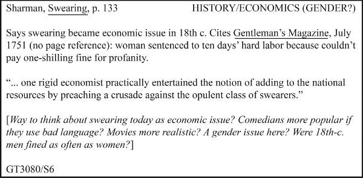

좌상단에는 저자, 짧은 제목, 페이지 번호가 있다. 우상단에는 연구자가 메모를 다른 카테고리와 순서로 분류하고 재분류할 수 있게 해주는 키워드가 있다. 카드 본문은 자료를 요약하고(적절한 경우) 직접 인용문을 기록하며 연구자의 질문과 답변을 포함한다. 이런 종류의 카드가 오래되어 보일 수 있지만 효율적인 메모를 위한 템플릿을 제공한다:

* 각 자료의 완전한 참고문헌 정보를 기록하여 올바르게 인용하고 쉽게 다시 찾을 수 있도록 하라.
* 서로 다른 주제에 대한 메모는 같은 자료에서 나온 것이더라도 분리하라.
* 메모가 정확한지 확인하라. 나중에 그것에 의존할 수 있어야 하기 때문이다. 몇 줄 이상을 인용하고 싶다면, 그 구절이나 전체 문서를 복사하거나 저장하라. 전사 오류에 주의하라: 손으로 복사하거나 타이핑하여 인용문을 작성할 때, 주의하고 있다고 생각하더라도 단어를 변경하기가 놀라울 정도로 쉽다. (이런 전사의 위험은 그것의 이점과 관련된다-인용문을 실제로 손으로 쓰거나 타이핑할 때, 단순히 복사-붙여넣기하는 것과는 달리, 그것에 대해 생각하게 된다.)
* 자료의 주장뿐만 아니라 흥미롭게 느끼는 데이터나 지원도 기록하라.
* 동의, 불일치, 사변, 질문 등을 메모하라. 자료의 주장에서 복잡하거나 모순되는 부분이 보이는가? 자료가 질문을 제기했는가? 그것을 하면 읽은 내용을 단순히 기록하는 것 이상을 하게 될 것이다.
* (1) 자료에서 인용한 것, (2) 자료에서 패러프레이즈하거나 요약한 것, (3) 자신의 생각을 *명확히* 구분하라. 종이에 쓴다면, 제목이나 괄호, 또는 다른 색의 잉크를 사용하여 서로 다른 종류의 메모를 구분하라. 컴퓨터를 사용하거나 온라인으로 메모한다면, 다른 글꼴이나 다른 색의 타이포그래피를 사용하라. 두 가지를 혼동하기가 너무 쉽기에, 자신의 단어와 자료의 단어를 *모호하지 않게* 구분해야 한다.

왜 종이 메모를 사용하겠느냐고 궁금할 수 있다. 전자적으로 타이핑할 수 있는데 말이다. 종이 메모를 보관하고, 백업하고, 색인하고, 접근하기에 번거로울 수 있지만, 여전히 용도가 있다. 예를 들어, 노트나 색인 카드 한 묶음은 저렴하고 휴대 가능하며 기술이 닿지 않는 곳에 갈 수도 있다-일부 아카이브는 아직 방문객에게 종이와 연필로 메모할 것을 요구한다. 일부 연구자들이 여전히 종이 메모에 의존하는 주요 이유는 그것이 생각하는 데 도움이 되기 때문이다. 모든 것을 쓸 수 없기에, 종이는 가장 중요한 것이 무엇인지 생각하게 한다. 마찬가지로, 메모가 카드나 종이 위에 있다면, 그것들을 그룹화하거나, 섞거나, 책상이나 테이블, 심지어 바닥에 펼칠 수 있다. 그리고 메모를 *손으로 쓰는* 행위 자체는 그것에 담긴 내용을 기억하는 데 도움이 될 뿐만 아니라 연결을 보고 자신의 아이디어를 발전시키는 데도 도움이 될 수 있다.

하지만 오늘날 종이 메모에만 의존하는 연구자는 거의 없다. 대부분은 전자적으로도 메모한다. 종이 위에서 생각하지만 인용문, 참고문헌, 인용의 정확성을 보장하기 위해 전자 메모를 사용한다.

### 전자적으로 메모하기

컴퓨터, 태블릿, 휴대폰 또는 기타 전자 기기를 사용하여 메모할 때, 여러 가지 선택지가 있다:

* Word나 Google Docs 같은 프로그램을 사용할 수 있다. 각 자료에 대해 별도의 파일(또는 적어도 별도의 페이지)을 만들고 자신의 단어와 자료의 단어를 모호하지 않게 구분하라. 이런 프로그램은 사용하기 쉽지만 메모의 색인 작성, 정리, 분류, 검색 능력을 제한한다. 특히 길거나 복잡한 프로젝트에서는 다른 옵션을 고려할 수 있다.
* 전용 메모 애플리케이션을 사용하여 메모를 만들고 정리할 수 있다. 이런 애플리케이션은 메모의 색인 작성, 분류, 접근에 도움이 되지만 때때로 독자적 포맷을 사용하기에 메모를 내보내거나 다른 프로그램과 함께 사용하기 어렵게 만들 수 있다.
* 기능이 완비된 참고문헌 관리 시스템을 사용할 수 있다. 메모 작성에 도움을 줄 뿐만 아니라, 온라인 도서관 카탈로그와 데이터베이스에서 직접 정보를 가져올 수 있으며 글을 쓸 때 인용문과 참고문헌을 포맷하고 업데이트해 준다. 일부는 참고문헌 관리 시스템 내에 자료의 전체 전자 사본을 저장하여 개인 자료 도서관을 구축하고 유지하는 데 도움을 준다. 하지만 메모 애플리케이션과 마찬가지로, 이런 시스템은 때때로 독자적 포맷을 사용하며-사용법을 배워야 한다.

이 세 가지 유형의 애플리케이션 모두 웹 기반 버전으로도 이용 가능하다. 즉, 애플리케이션과 메모가 자신의 컴퓨터가 아니라 클라우드에 존재한다. 이것은 데이터를 의도하지 않은 손실이나 손상으로부터 보호하고 다른 연구자들과 정보를 공유하고 협업하는 데 도움이 된다.

하지만 어떤 기술을 사용하든, 몇 가지 기본적인 질문을 고려해야 한다:

* 어떻게 체계적으로 유지할 것인가? 예를 들어, 각 자료에 대해 별도의 문서를 만들 계획이라면, 파일의 이름을 지정하고 보관하는 시스템이 필요하다. 그런 시스템 없이는 컴퓨터나 기기에서 메모를 "잃어버리기"가 매우 쉽다.
* 메모를 어떻게 사용할 것인가? 작은 프로젝트와 큰 프로젝트, 개별 프로젝트와 지속적인 프로젝트, 개인 프로젝트와 협업 프로젝트에 대해 메모를 다르게 보관하기로 결정할 수 있다.
* 학교나 도서관을 통해 어떤 애플리케이션이 이용 가능한가? 많은 학교와 도서관이 교직원, 학생, 방문객에게 메모 또는 참고문헌 관리 시스템을 제공하며 때때로 이런 도구를 카탈로그와 통합한다. 이런 자원에 접근할 수 있다면, 사용하는 것을 고려하라.
* 메모를 어떻게 백업할 것인가? 메모를 취하고 정리하는 방법을 결정하든, 무슨 일이 있어도 그것을 복구할 수 있도록 하라: 노트북에 커피를 쏟거나, 휴대폰을 잃어버리거나, 파일이 메모 앱의 새 버전과 호환되지 않거나, 지하실의 쥐가 색인 카드 상자를 갉아먹을 수도 있다. 우리의 제안은 메모를 클라우드에 보관하거나, 적어도 거기에 백업하는 것이다. 백업 소프트웨어가 그것을 자동으로 해줄 수 있다.
* 가장 중요한 것: 당신의 글쓰기, 생각, 작업 방식에 어떤 접근법이 가장 잘 맞는가? 작가이자 연구자로서 성장함에 따라, 자신에게 특화된 작업 방식을 개발하게 될 것이다. 다른 사람들은 그것이 번거롭거나 혼란스럽거나 이해할 수 없다고 생각할 수 있다. 상관없다. 목표가 정교한 메모 세트를 만드는 것이 아니라 유능하고 지능적으로 연구하고 글을 쓰는 것임을 기억하라. 그 일을 돕는 소프트웨어가 아니라면, 그건 *당신에게* 유용하지 않은 것이다.

### 인용, 패러프레이즈, 또는 요약 결정하기

원본을 복사하거나, 스캔하거나, 다운로드하거나, 잘라붙일 수 있다면, 또는 나중에 글을 쓸 때 온라인으로 접근할 수 있다면, 정확한 단어를 보존하는 것보다 당신 자신의 참여에 덜 집중할 수 있다. 그것은 큰 장점이다. 자료를 요약하라-그것은 이해하는 데도 도움이 될 것이며 글을 쓸 때 인용하거나 패러프레이즈하고 싶은 구절을 메모하라. 자료에 대한 자신의 반응도 메모하라. 동의하는 부분이 있었는가? 불일치하는 부분이? *그렇지만...*이라고 말하고 싶은 부분이?

전체 자료를 보존할 수 없고 나중에 접근할 수 있을지 확신이 없다면, 더 어려운 선택에 직면한다: 자료의 어떤 부분을 정확히 기록할 것인지(전사하거나, 잘라붙기, 스크린샷 찍기, 사진 찍기)와 어떤 부분을 요약하거나 패러프레이즈할 것인지. 이런 상황에서는 나중에 메모를 어떻게 사용할 계획인지 고려해야 한다. 분야가 선택에 영향을 줄 것이다: 연구자들은 글을 쓸 때 인문학에서 가장 자주 인용한다; 사회과학과 자연과학은 보통 패러프레이즈하고 요약한다(12장 참조).

* 요약은 구절, 섹션, 또는 전체 기사나 책의 요점만 필요할 때 사용하라. 요약은 당신의 연구 프로젝트와 관련성 있지만 특별히 관련성 없는 맥락이나 견해에 유용하다. 자료의 요약은 결코 좋은 증거가 되지 않는다.
* 패러프레이즈는 구절의 특정 단어가 의미만큼 중요하지 않을 때 사용하라. 패러프레이즈는 몇 단어만 바꾸는 것을 의미하지 않는다. 원문의 대부분의 단어와 구문을 자신의 것으로 대체해야 한다. 패러프레이즈는 직접 인용만큼 좋은 증거가 되지 않는다.
* 다음 목적을 위해 직접 인용문을 기록하라:
* -인용된 단어가 당신의 이유를 뒷받침하는 증거이다. 예를 들어, 다른 집단이 노예 이름이 붙은 건물의 이름 변경에 다르게 반응한다고 주장한다면, 다양한 뉴스 소스의 정확한 단어를 인용할 것이다. 일반적인 감정만 필요하다면 패러프레이즈할 것이다.
* -단어가 의존하거나 도전할 저자의 권위에서 나온 것이다.
* -단어가 놀라울 정도로 독창적이거나 나머지 논의를 프레이밍할 수 있을 정도로 설득력 있다.
* -자료가 당신이 불일치하는 주장을 하며 공정하게 그 주장을 정확히 진술하고 싶을 때.

인용문을 약어로 적으면서 나중에 정확하게 재구성할 수 있다고 생각하지 마라. *절대* 그렇지 않다. 그리고 잘못 인용하면, 신뢰성을 훼손할 것이다.

### 맥락을 올바르게 기록하기

*모든 것*을 기록할 수는 없지만 자료의 의미를 정확하게 포착하기 위해 *충분한 것*을 기록해야 한다. 자료의 자료를 사용할 때, 그것들이 무엇을 말하는지뿐만 아니라 정보를 어떻게 사용하는지도 기록하라.

1. 인용, 패러프레이즈, 또는 요약할 때 맥락에 주의하라. 맥락에서 벗어난 인용을 완전히 피할 수는 없다. 왜냐하면 원문의 전체를 인용할 수 없기 때문이다. 그래서 패러프레이즈나 요약 초안을 작성하거나 인용문을 복사할 때, 가장 중요한 맥락-당신의 원문 이해-안에서 그렇게 하라. 중요한 주장이나 결론을 메모할 때, 저자의 추론 과정을 기록하라:
   1. ❌ 바르톨리(p. 123): 전쟁은 Z에 의해 일어났다.
   2. ❌ 바르톨리(p. 123): 전쟁은 X, Y, Z에 의해 일어났다.
   3. ✅ 바르톨리: 전쟁은 X, Y, Z에 의해 일어났다(p. 123). 하지만 가장 중요한 원인은 Z였으며(p. 123), 두 가지 이유가 있다: 첫째,... (pp. 124-26); 둘째,... (p. 126).
   4. 결론만 중요하다고 하더라도, 저자가 어떻게 도달했는지를 기록하면 더 정확하게 사용할 수 있다.
2. 주장을 기록할 때, 원래에서의 역할을 메모하라. 주요 포인트인가? 부차적인 포인트인가? 한정이나 양보인가? 이런 구분을 메모함으로써, 이런 종류의 실수를 피할 수 있다:
   3. 존스의 원문: "연구자들은 폐암이 유전적 소인, 석면, 라돈, 미세 입자 같은 환경 요인 노출을 포함한 여러 원인을 가지고 있다는 것을 인정한다. 하지만 데이터를 연구한 사람은 폐암의 주요 원인이 흡연이라는 것에 의심하지 않는다."
   4. 존스에 대한 잘못된 메모: 흡연은 폐암의 여러 원인 중 하나일 뿐이다. 존스는 예를 들어, "폐암이 유전적 소인, 석면, 라돈, 미세 입자 같은 환경 요인 노출을 포함한 여러 원인을 가지고 있다"고 주장한다.
   5. 존스는 그런 주장을 전혀 하지 않았다. 그녀는 *양보*를 통해 자신이 하고 싶은 주장을 준비했다. 그런 식으로 의도적으로 잘못 보고하는 사람은 기본적인 진실 기준을 위반한다. 하지만 자료의 단어만 메모하고 주장에서의 역할을 메모하지 않으면 의도하지 않게 그런 실수를 할 수 있다.
   6. 그런 실수를 피하려면, 주요 주장과 저자가 인정하지만 축소하는 한정이나 양보를 구분하라. 글쓴이의 의도에 "반하여" 읽는 것이 아니라면-숨겨진 경향을 폭로하기 위해-자료의 부차적인 측면을 주요 측면처럼, 또는 더 나쁘게 전체 요점처럼 보고하지 마라.
3. 주장의 범위와 확신을 기록하라. 주장이 그것보다 더 확실하거나 광범위해 보이게 하지 마라. 두 번째 문장은 첫 번째를 정확하거나 공정하게 보고하지 않는다:
   4. 원문: 위험 인식에 대한 한 연구(Clark, 2008)는 고위험 도박과 어린 시절 뇌진탕 사이의 연관성을 시사한다.
   5. 잘못된 메모: Clark(2008)은 어린 시절 뇌진탕이 고위험 도박을 유발한다고 말한다.
4. 다른 글쓴이의 견해 요약을 요약하는 저자의 견해로 착각하지 마라. 일부 글쓴이들은 다른 사람의 주장을 요약할 때 명확하게 나타내지 않기에, 그들이 반박하려던 것을 말한 것처럼 인용하기 쉽다.
5. 자료가 동의하고 불일치하는 이유를 메모하라. 자료가 *어떻게* 그리고 *왜* 동의하는지는 *동의한다는* 사실만큼 중요하다. 마찬가지로, 자료는 같은 증거를 다르게 해석하거나 문제에 대해 다른 접근법을 취하기 때문에 불일치할 수 있다. 특정 연구자가 이슈에 대해 말하는 것에 자신을 묶는 것은 위험하다. 다른 사람의 작업을 비판적으로 검토하지 않고 요약하는 것은 "연구"가 아니다. 자료가 보편적으로 신뢰받는다고 하더라도 주의하라. 적어도 두 개 이상의 자료에 의존하면, 보통 완전히 동의하지 않는다는 것을 발견할 것이고 그것은 당신 자신의 연구가 시작될 수 있는 곳이다. *어느 쪽이 더 좋은 주장인가? 어느 쪽이 증거를 더 존중하는가?* 사실, 거기에 연구 문제가 있다: *우리는 누구를 믿어야 하는가?*

## 자료에 주석 달기

*주석*을 통해 자료에 체계적으로 참여하는 기법이 있다. 자료에서 구절을 다운로드하거나, 잘라붙거나, 복사하거나, 다시 타이핑하여 기계적으로 기록하는 것은 인용이나 패러프레이즈를 정확하게 하는 데 도움이 될 수 있지만 자료에게 대답하지 않으면 나중에 정리해야 할 둔한 데이터만 축적하게 된다. 사고를 진전시키려면, 주요 문장과 구절에 하이라이트나 라벨을 달아주석을 달아라. 논증에 사용할 것으로 예상되는 아이디어나 데이터를 표시하라. 하이라이트한 내용을 요약하거나 그것에 대한 반응을 개략적으로 그리거나 하이라이트를 해석하는 데 도움이 되는 메모를 여백에 추가하라. 지금 자료에 대해 많이 쓸수록 나중에 더 잘 이해하게 될 것이다.

### 여백 주석

종이나 컴퓨터에 메모하는 대안으로, 인쇄된 형태나 디지털 형태의 많은 자료에 직접 주석을 달 수 있다. 주석은 코멘트, 질문, 다른 자료와의 교차 참조를 통해 자료에 표시를 하는 기법이다. 텍스트 자료의 여백에 주석을 다는 것은 단순히 하이라이트하는 것보다 일반적으로 더 생산적이다. 왜냐하면 그것은 자료의 프로젝트에 대한 관련성을 부각시켜주기 때문이다.

주석을 달면서 이 장에서 논의된 능동적 읽기 관행을 문서화한다. 주석을 사용하여 자료의 주장과 키워드를 식별하거나, 자료의 이유, 증거, 보장(제3부 참조)을 질문하거나 확장함으로써 자료와 "논쟁"할 수 있다. 프로젝트가 진행됨에 따라, 주석이 달린 자료로 돌아가 이전에 무엇을 생각했는지 확인할 수 있다.

물론, 모든 자료가 주석을 달기에 동일하게 접근 가능한 것은 아니다. 소유하지 않는 도서관 책이나 기타 텍스트의 여백에 쓸 수는 없다. 많은 텍스트는 디지털 형태로만(또는 가장 편리하게) 접근 가능하다. 하지만 다행히도, 디지털 환경에서 읽은 것을 문서화할 수 있게 해주는 디지털 주석 도구가 있다. 이런 도구를 사용하여 텍스트, 이미지, 녹음, 비디오를 포함한 다양한 자료에 주석을 달 수 있으며 다양한 자료에 대한 반응을 연결하여 나중에 참고할 수 있는 검색 가능한 데이터베이스를 만들 수 있다.

::: {.callout-note appearance="simple"}
### 넓게 읽는 것의 가치

연구에 집중할 좋은 질문을 갖는 것이 얼마나 중요한지를 강조했다. 하지만 결과적으로 관련성 없는 자료를 읽는 것이 시간을 낭비한다고 생각하지 마라. 사실, 사용하는 것보다 더 많이 읽고 기록할 때, 좋은 사고를 수행하는 데 필수적인 지식 기반을 쌓게 된다. 좋은 사고는 배울 수 있는 기술이지만 깊고 넓은 지식 기반을 가지고 있을 때만 수행할 수 있다. 그래서 자료를 읽는 것은 오늘 던지는 질문에 답하기 위해서뿐만 아니라, 연구 커리어의 나머지 기간 동안 던질 모든 질문에 대해 더 잘 생각하는 데 도움이 되기 위해서이다. 그런 목적을 위해, 읽는 모든 것은 관련성 있다.
:::

### 주석이 달린 참고문헌

자료에 참여하는 한 가지 접근법은 주석이 달린 참고문헌이다-각 자료에 대한 인용과 간략한 요약이 포함된 잠재적 자료 목록이다(인용에 대한 자세한 내용은 12장 참조). 주석을 만드는 동기에 기반한 여러 유형의 주석이 있다. 연구 프로젝트를 위해, 주석이 달린 참고문헌은 다양한 자료의 조감도와 그것들이 논증에서 수행할 수 있는 역할을 제공한다. 주석이 달린 참고문헌을 만드는 것은 종종 연구 과정의 별도 단계이며 수집한 자료를 반영할 수 있게 해준다(선생님도). 각 주석은 자료의 신뢰성을 평가하고, 주장을 요약하고, 프로젝트에 대한 관련성을 설명할 기회이다.

주석이 달린 참고문헌을 만드는 것은 연구를 얼마나 철저하게 수행했는지, 수집한 자료에 얼마나 깊이 참여했는지를 판단하는 데 도움이 될 수 있다.

### 메모를 분류할 키워드

마지막으로, 개념적으로 도전적인 작업: 메모를 할 때, 각 메모를 두 개 이상의 키워드로 분류하라(85페이지의 메모 카드 우상단 참조). 자료의 단어를 기계적으로 사용하지 말라; 질문에 대한 시사점, 구체적인 내용보다 더 큰 일반적 개념으로 메모를 분류하라. 관련 메모에 동일한 태그나 키워드를 사용하라; 매번 새 메모마다 새 것을 만들지 마라.

이 단계는 중요하다. 왜냐하면 메모에서 핵심 아이디어를 찾아야 하기 때문이다. 전자적으로 메모한다면, 키워드를 사용하여 한 번의 찾기 명령으로 관련 메모를 즉시 그룹화할 수 있다. 두 개 이상의 키워드를 사용하면, 메모를 다른 방식으로 재조합하여 새로운 관계를 발견할 수 있다(특히 제자리걸음하는 것처럼 느낄 때 중요하다).

::: {.callout-tip}
### 불확실성의 순간 관리하기

프로젝트에 깊이 들어가면서 모든 것이 희망 없는 혼란으로 뒤섞이는 순간을 경험할 수 있다. 보통 메모를 정리하는 속도보다 더 빨리 축적될 때 그런 일이 일어난다. 그런 순간은 스트레스가 될 수 있지만 새로운 통찰이나 발견의 경계에 있다는 신호이기도 하다.

*계속 진행하면서 글을 쓰고* 모은 것을 정리하고 요약할 기회를-taking, 그리고 중심 질문으로 돌아감으로써 불안을 최소화할 수 있다: *나는 무엇을 질문하고 있는가? 나는 어떤 문제를 제기하고 있는가?* 그 공식을 계속 반복하라: *나는 Z를 더 잘 이해할 수 있도록 X에 대해 작업하여 Y에 대해 더 배우고 있다.* 이런 질문에 대해 정기적으로 글을 쓰면 집중하는 데 도움이 될 뿐만 아니라 생각하는 데도 도움이 된다.

친구, 동급생, 선생님-공감하지만 비판적인 청중 역할을 할 수 있는 누구에게도 도움을 요청할 수 있다. 배운 것이 질문에 어떻게 관련되는지, 문제 해결에 어떻게 도움이 되는지 설명하라. *이것이 이해되는가? 중요한 것을 놓치고 있는가? 또 무엇을 알고 싶은가?* 그들의 반응에서 이익을 얻을 것이지만 비전문가에게 아이디어를 설명하는 행위 자체에서 더 많이 얻을 것이다.
:::

# 제3부

# 논증 만들기

# 프롤로그

# 연구 논증 조립하기

모든 데이터를 수집하고 모든 관련 자료를 찾은 후에야 논증을 계획할 수는 없다. 우선, 전부 다 얻을 수는 없을 것이다. 둘째, 기계적이거나 무의미하게 연구를 하게 될 것이다. 점점 더 많은 것을 축적하면서 그것을 어떻게 할지에 대한 감각 없이, 또는 누구도 모르는 곳으로 빵 부스러기를 따라가는 것이다. 물론, 프로젝트의 감을 잡기 위해 약간의 연구를 해야 한다. 하지만 문제와 그 잠재적 해결책에 대한 감각이 생기면, 즉시 논증을 계획하기 시작해야 한다. 연구가 진행됨에 따라 계획은 바뀔 것이다-만약 바뀌지 않는다면, 아마 최고의 사고를 하고 있지 않을 것이다-하지만 일찍 계획을 세우고 진행하면서 수정하면 자료를 더 잘 파악하고 더 의도적으로 연구하는 데 도움이 될 것이다. 독자의 예측 가능한 질문에 답하는 *연구 논증*을 만들려고 시도할 때만, 아직 해야 할 연구가 무엇인지 볼 수 있다.

연구 논증은 매일 듣는 뜨거운 논쟁과 같다. 그런 논쟁은 보통 논쟁을 포함한다: 아이들은 장난감을 놓고 룸메이트는 불을 얼마나 오래 켜둘지, 운전자들은 누가 우선했는지를 놓고 다툰다. 그런 논쟁은 예의 바르거나 불쾌할 수 있지만 대부분은 승자와 패자가 있는 갈등을 포함한다. 물론 연구자들은 때때로 서로의 추론과 증거를 놓고 다투며 가끔은 부주의, 무능, 심지어 사기에 대한 고발로 폭발하기도 한다. 하지만 그런 종류의 논쟁은 그들을 연구자로 만든 것이 아니다.

다음 다섯 장에서 우리는 승자와 패자가 있는 뾰족한 논쟁보다는 친절하고 때로는 회의적인 동료들과의 활기찬 대화에 더 가까운 종류의 논쟁을 살펴본다. 그것은 당신과 당신이 상상한 청중이 공유된 질문에 대한 답을 *협력적으로* 추구하는 대화이다: 목표는 한쪽이 다른 쪽을 동의로 강요하는 것이 아니라 모든 사람이 이해와 지식에서 성장하는 것이다. 이런 의미에서, 최고의 답은 대화를 끝내는 답이 아니라 새로운 질문, 탐구, 논쟁을 만드는 답인 경우가 많다.

하지만 그 대화에서, 우리는 예의 바르게 의견을 교환하는 것 이상을 한다. 우리 모두는 자신의 의견을 가질 권리가 있으며 그것을 설명하거나 방어하도록 요구하는 법은 없다. 하지만 연구 논증에서는 청중에게 우리의 주장이 왜 중요한지 보여주고, 좋은 이유와 증거로 주장을 뒷받침하며, *왜 그것을 믿어야 하는가?*라는 꽤 타당한 질문에 대응할 것으로 기대된다.

사실, 우리는 뜨거운 논쟁을 더 쉽게 알아채지만 우리는 매일 이런 협력적 논쟁을 한다. 뭘 살지-친구와 어떤 휴대폰을 살지, 어떤 책을 읽을지, 피자나 태국 음식 중 어떤 것을 주문할지-를 결정하기 위해 좋은 이유를 교환할 때마다. 그런 친근한 토론과 마찬가지로, 연구 논증은 누구에게도 주장을 강요하지 않는다. 대신, 청중이 있는 곳에서 시작한다. 주장의 이유를 왜 받아들여야 하는지에 대한 예측 가능한 질문들-그것은 당신의 논증을 파괴하기 위해서가 아니라 시험하기 위해서, 두 사람이 공유할 가치가 있는 진실을 찾고 이해하는 데 도움이 되기 위해 묻는 질문들-에서. 물론, 논증을 *쓰*면, 직접 그렇게 물어줄 사람이 없다. 그래서 청중을 대신하여 상상해야 한다. 그 상상된 질문들과 당신의 답변이 논증을 지속적인 대화의 일부로 만든다. 5장에서는 연구 논증을 구성하는 요소를 살펴본다. 6~9장에서는 각 요소를 자세히 설명한다. 제4부에서는 그 논증을 글이나 발표로 어떻게 쓸지 보여줄 것이다.

::: {.callout-note appearance="simple"}
### 알아가기

청중에 대해 끊임없이 생각하라는 말을 들어왔지만 모르는 사람의 질문을 상상하는 것만큼 어려운 것은 없다. 경험 많은 연구자들은 자신의 연구 공동체의 많은 구성원들을 개인적으로 알고 있어 이점이 있다. 그들은 프로젝트에 대해 이야기하며 쓰기 전에 아이디어를 시험해 본다. 초보 연구자이거나 학생이라면, 아직 청중을 개인적으로 모를 수 있다. 하지만 그들이 어떻게 쓰고, 논증하고, 생각하는지 이해하기 위해 몇 가지 사전 작업을 할 수 있다:

* 당신과 같은 연구를 게시하는 저널을 읽으라. 기사들이 어떤 종류의 질문을 하고 어떤 종류의 문제를 제기하는지 주목하라.
* 더 경험 많은 연구자나 선생님과 논증을 시연하라. 계획을 세웠지만 초안을 작성하기 전에, 아이디어를 논의하고 의심스럽거나 혼란스러워 보이는 것이 있는지 물어보라.
* 글을 쓸 때, 신뢰하는 몇 사람에게 초안을 읽고 질문이 있거나 대안이 보이는 곳을 표시해 달라고 요청하라. 의도한 청중과 가능한 한 비슷한 사람들을 찾아보라.

실제 청중의 일부 구성원을 알아갈 수도 있다. 예를 들어, 물리학자 한 그룹이 생물학자들의 관심을 끌고 싶었지만 생물학 저널에 보낸 첫 번째 원고가 거절되었을 때 실망했다. 그래서 그들은 생물학 회의에 참석하기 시작하고, 생물학 저널을 읽고, 심지어 생물학과의 교직원 휴게실에서 어울리기 시작했다. 생물학자들이 어떻게 생각하는지 파악한 후, 논증을 다시 쓰고 그 분야에 영향을 미친 논문을 게시했다. 학생이라면, 회의에 여행하거나 교직원 휴게실에서 어울릴 수 없을 수도 있지만 여전히 캠퍼스에서 분야에서 일하는 교수진과 학생을 알아갈 수 있다. 그들을 더 많이 알수록, 그들이 할 법한 질문을 더 잘 상상할 수 있을 것이다.
:::

# 5 좋은 논증 만들기

# 개요

이 장에서는 연구 논증이 무엇인지, 그리고 그것을 구성하는 다섯 가지 질문에 대한 답을 설명한다.

제1부에서 우리는 진정한 연구가 단순히 주제에 대한 정보를 모으는 것 이상을 포함한다고 설명했다. 그것은 당신과 청중이 관심을 가지는 문제에 대한 해결책을 개발하는 것을 의미한다. 마찬가지로, 연구 결과를 공유하는 것은 *여기에 내 주제에 대한 몇 가지 사실이 있다*라고 말하는 "데이터 덤프"를 청중에게 주는 것 이상을 포함한다. 그것은 *연구 논증*에서 문제를 설명하고 해결책을 정당화하는 것을 의미한다.

## 논증이란 대화

연구 논증에서는 *주장을* 하고, *증거*에 기반한 *이유*로 그것을 지지하며, 다른 견해를 *인정*하고 *대응*하며, 때로는 추론의 *원리*를 설명한다. 이것들은 비밀스러운 것이 아니다. 매일 하는 종류의 대화를 생각해 보라:

에비: 지난 학기 힘들었다고 들었어요. 이번 학기는 어떻게 될 것 같아요? [*에비는 문제를 질문 형태로 제기한다.*]

브렛: 더 나아지면 좋겠어요. [*브렛은 질문에 답한다.*]

에비: 어떻게? [*브렛의 답을 믿을 이유를 요청한다.*]

브렛: 전공 수업을 듣고 있어요. [*브렛은 이유를 제시한다.*]

에비: 어떤 것? [*브렛의 이유를 뒷받침할 증거를 요청한다.*]

브렛: 미술사, 디자인 입문. [*브렛은 이유를 뒷받침할 증거를 제시한다.*]

에비: 왜 전공 수업을 듣는 것이 차이를 만들 것 같아요? [*브렛의 이유가 더 잘할 것이라는 주장과의 관련성을 보지 못한다.*]

브렛: 관심 있는 수업을 들으면 더 열심히 해요. [*브렛은 이유와 더 잘할 것이라는 주장 사이를 연결하는 일반 원리를 제시한다.*]

에비: 그 필수 수학 수업은 어떻게 되나요? [*브렛의 이유에 이의를 제기한다.*]

브렛: 지난번에 봐야 했지만 이번에는 좋은 튜터가 있어요. [*브렛은 에비의 이의를 인정하고 대응한다.*]

그 대화에 자신을 상상할 수 있다면, 연구 논증을 조립하는 것에 대해 이상한 점이 없을 것이다.왜냐하면 어떤 논증의 다섯 가지 요소는 에비가 브렛에게 하는 종류의 질문-그리고 청중을 대신하여 스스로에게 해야 할 질문-에 대한 답이기 때문이다:

1. 주장: *나에게 무엇을 믿기를 원하는가? 요점이 무엇인가?*
2. 이유: *왜 그렇게 말하는가? 왜 동의해야 하는가?*
3. 증거: *어떻게 아는가? 뒷받침할 수 있는가?*
4. 보장: *그것이 어떻게 따라오나? 추론을 설명할 수 있는가?*
5. 인정과 대응: *하지만...에 대해서는?*

자신의 연구를 이 질문들에 대한 답을 찾는 과정으로 생각하라.

## 논증의 핵심 조립하기

모든 연구 논증의 핵심에는 세 가지 요소가 있다: 주장, 그것을 받아들이는 이유, 그리고 그 이유가 기반하는 증거. 그 핵심에 추가로 하나, 아마 두 가지 요소를 더할 것이다: 추론을 정당화해야 할 때의 보장(8장 참조)과 질문, 이의, 대안적 견해에 대한 인정과 대응(9장 참조). 이 요소들을 청중이 할 법한 예측 가능한 질문에 대한 답으로 생각하라.

### 이유로 주장을 지지하기

첫 번째 유형의 지지는 이유이다. 그것은 청중이 주장을 받아들이도록 이끄는 진술이다. 우리는 자주 이유를 주장과 *왜냐하면*으로 연결한다:

초등학교는 여러 언어 교육을 우선으로 해야 한다. 왜냐하면 우리는 젊을 때 언어를 가장 잘 그리고 가장 쉽게 습득하기 때문이다.

하나 이상의 이유가 필요할 때가 많으며 복잡한 논증에서는 보통 더 많은 이유의 지지가 필요할 것이다:

초등학교는 여러 언어 교육을 우선으로 해야 한다[이유 1이 주장을 지지/주장 2]. 사실, 성인이 된 후 새로운 언어를 시작하는 사람들은 어릴 때 배우는 사람들의 유창함 수준에 거의 도달하지 못한다[이유 1을 지지하는 이유 2/주장 3]. 초등학교 수준에서 여러 언어를 가르치는 것은 또한 아이들의 도덕적 발전에도 기여한다[이유 3이 주장을 지지/주장 4] 왜냐하면 그것은 그들 자신의 문화와 사회를 넘어선 문화와 사회에 대한 인식을 촉진하기 때문이다[이유 3을 지지하는 이유 4/주장 5].

### 이유를 증거에 기반하기

두 번째 유형의 지지는 이유가 기반하는 증거이다. 우리는 이유가 종종 추가적인 이유의 지지가 필요하다고 했지만 그런 체인은 영원히 계속되지 않는다. 결국 어떤 구체적인 데이터나 정보를 보여주어야 한다. 그것이 증거이다. *이유*와 *증거*라는 용어는 때때로 상호 교환적으로 보인다:

당신의 주장을 어떤 이유에 기반하는가?
>
당신의 주장을 어떤 증거에 기반하는가?

하지만 다른 의미를 가진다. 다음 두 문장을 비교해 보라:

당신의 이유를 어떤 증거에 기반하는가?
>
당신의 증거를 어떤 이유에 기반하는가?

두 번째 문장은 어색하다: 우리는 증거를 이유에 기반하지 않는다; 우리는 이유를 증거에 기반한다. 우리는 이유를 *생각해 낸다*: 그것들은 주장을 지지하는 진술이다. 우리는 "거기" 세계에서 증거를 *검색*해야 하고 그것을 모두가 볼 수 있게 해야 한다. 증거는 이유를 뒷받침하는 데 사용하는 정보 또는 데이터-통계, 예시, 인용문, 이미지, 모델 등-이다. 이유는 증거의 지지가 필요하다; 증거는 신중한 설명이나 신뢰할 수 있는 소스에 대한 참고 이외의 지지가 필요하지 않다.

몇 가지 용어 정리

지금까지, 논증에서 발전시키는 아이디어를 나타내는 진술을 명명하기 위해 두 가지 용어를 사용했다. 질문의 맥락에서는 *답*이라고 불렀다. 문제의 맥락에서는 *해결책*이라고 불렀다. 이제 논증의 맥락에서는 *주장*이라고 부를 것이다.

* *주장*은 지지를 요구하는 진술(하나 이상의 문장이 될 수 있다): *자이언트 팬더는 곰의 일종이다*; *메디케이어 지출은 계속 증가할 것이다*; *토니 모리슨의 가장 중요한 소설은* 페르도 *이다.* *주요 주장*은 전체 연구 논증이 지지하는 진술이다. 어떤 사람들은 그것을 *주요 포인트* 또는 *논제*라고 부른다.
* *이유*는 주장을 지지하는 진술이다: *[왜냐하면] 유전자 검사에서 다른 곰들이 가장 가까운 친척으로 나타났기 때문이다*; *[왜냐하면] 미국 인구가 고령화되고 있기 때문이다*; *[왜냐하면]* 페르도 *에서 모리슨의 주요 주제가 가장 완전하게 발전하고 있기 때문이다.*
* *증거*는 이유를 지지하기 위해 배치된 정보이다. 주장이나 이유와 달리, 증거는 항상 진술로 구성되지는 않는다: 자이언트 팬더와 다른 곰 사이의 유전적, 해부학적 유사성을 보여주는 수치; 지난 20년간 미국 주민의 중간 연령을 기록하는 도표나 데이터 표; 모리슨의 주요 주제를 설명하는 *페르도*의 인용문이 증거의 형태가 될 것이다.

이런 구분은 혼란스러울 수 있다. 왜냐하면 주장과 이유는 모두 진술이고 이유와 증거는 모두 지지의 유형이기 때문이다. 하지만 계속 따라오면, 왜 중요한지 알게 될 것이다.

일상적인 대화에서, 우리는 보통 이유만으로 주장을 지지한다:

우리가 떠나야 한다[주장]. 비가 올 것 같다[이유].

*비가 올 것 같은 증거가 무엇인가?*라고 묻는 사람은 거의 없다. 하지만 연구 논증에서는 증거도 제시해야 한다. 왜냐하면 주의 깊은 청중은 이유를 있는 그대로 받아들이지 않을 것이기 때문이다:

초등학교는 여러 언어 교육을 우선으로 해야 한다[이유 1이 주장을 지지/주장 2]. 사실, 성인이 된 후 새로운 언어를 시작하는 사람들은 어릴 때 배우는 사람들의 유창함 수준에 거의 도달하지 못한다[이유 1을 지지하는 이유 2/주장 3]. 백 명 이상의 언어 학습자에 대한 연구에서, 존스(2013)는 새로운 언어 능숙도와... 사이의 역상관을 확인했다(표 1 참조)[이유 2를 지지하는 증거].

이유와 증거가 있으면, 연구 논증의 핵심을 갖게 된다:

하지만 대부분의 경우, 이 핵심만으로는 충분하지 않다. 때때로 이유가 주장과 *관련성* 있음을 보여주는 *보장*을 제시하고 다른 견해를 *인정하고 대응*함으로써 연구 논증을 flesh out해야 한다.

## 보장으로 추론 설명하기

청중이 이유가 사실이라는 데 동의하더라도, 그것의 *관련성*을 보지 못하면 당황하거나 이의를 제기할 수 있다. 다음 논증을 생각해 보라:

국채 수익률 곡선이 최근 반전되었기 때문에, 경기침체가 예상된다[이유→주장].

금융과 투자에 익숙하지 않은 사람은 *왜 그 반전된 수익률 곡선이 경기침체를 예상하게 하는가? 연결을 보지 못하겠다*고 생각할 수 있다. 답하려면, *일반적인* 원리를 제시하여 *특정한* 이유를 *특정한* 주장과 연결하는 추론을 설명해야 한다:

음, 적어도 20세기 중반 이후로, 국채 수익률 곡선의 반전은 다가오는 경기침체를 신뢰할 수 있게 예측해 왔다[보장].

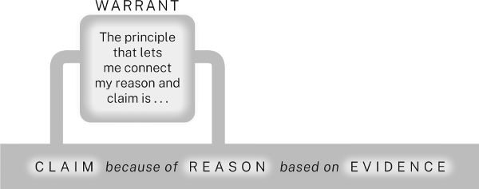

이 보장은 경험을 통해 배운 원칙을 나타낸다. 반전된 수익률 곡선은 어려운 경제 상황의 신호라는 것이다. 모든 보장과 마찬가지로, 그것은 (사실이라면) 어떤 일반적인 상황(반전된 수익률 곡선)으로부터 어떤 일반적인 결과(경기침체 가능성)를 추론할 수 있다는 것을 확립한다. 주장이 그 일반적인 결과의 좋은 예이고 이유가 그 일반적인 상황의 좋은 예라면, 논증은 따라온다.

8장에서 보게 되겠지만 보장이 필요한 시점을 결정하기는 쉽지 않다. 경험 많은 연구자들은 보통 두 가지 경우에만 그것을 진술한다: 분야의 청중이 이유가 주장과 어떻게 관련되는지 물어볼 수 있다고 생각할 때, 또는 일반 청중에게 분야의 추론 방식을 설명할 때.

## 예측된 질문과 이의에 대한 인정과 대응

주의 깊은 청중은 논증의 *모든* 부분에 질문할 것이므로, 가능한 많은 질문을 예상하고 가장 중요한 것들을 인정하고 대응해야 한다. 예를 들어, 청중이 언어 교육을 우선시해야 한다는 주장을 고려할 때, 그렇게 하면 다른 과목 교육이 저해될 수 있다고 생각할 수 있다. 그렇게 물어볼 것이라고 생각한다면, 인정하고 대응하는 것이 현명할 것이다:

초등학교는 여러 언어 교육을 우선으로 해야 한다[이유 1이 주장을 지지/주장 2]... 물론, 학교가 언어에 주의를 기울이면 다른 과목의 교수 질이 저하될 수 있다[인정] ...하지만 그런 우려를 뒷받침하는 증거는 거의 없고 많은 것을 반박한다...[대응].

인정과 대응 없이는 어떤 연구 논증도 완성되지 않으므로, 그것들을 다이어그램에 추가하여 논증의 다른 모든 부분과 어떻게 관련되는지 보여준다.

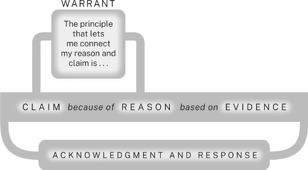

## 연구 논증 계획하기

연구 논증은 일상적인 논증과 동일한 다섯 가지 요소로 구성된다: 주장, 이유, 증거, 보장, 그리고 다른 견해에 대한 인정과 대응. 다만 더 복잡할 뿐이다. 주요 주장 외에도, 연구 논증에는 여러 종속 주장이 포함될 수 있다. 그리고 이런 주장들 각각은 추가적인 이유와 증거에 의해 지지될 것이며 하나 이상의 보장에 의해 정당화될 수도 있다. 거의 확실하게, 예측된 질문, 대안, 이의에 대한 인정과 대응이 있을 것이며 각각의 대응은 자체 논증을 요구할 것이다.

마지막으로, 대부분의 연구 논증은 배경, 정의, 청중이 이해하지 못할 수 있는 이슈에 대한 설명 등을 포함한다. 예를 들어, 경제 이론에 익숙하지 않은 청중에게 인플레이션과 화폐 공급의 관계에 대해 논증한다면, 경제학자들이 그 개념을 어떻게 이해하는지 설명해야 할 것이다. 진지한 논증은 복잡한 구조이지만 더 단순한 것으로 나누면 관리할 수 있다.

논증을 계획하기 위해 전통적인 개요를 만들거나 다른 방식으로 시각화할 수 있다. *스토리보드*로 알려진 차트 유형의 개요 또는 시각적 정리자를 사용할 것을 권장한다. 스토리보드는 개요를 조각으로 나누어 여러 페이지에 펼쳐 놓은 것과 같다. 진행하면서 데이터와 아이디어를 추가할 수 있는 많은 공간이 있다. 스토리보드는 개요보다 더 유연하다. 앱이나 온라인 도구를 사용하여 만들 수 있고 우리가 하듯이 색인 카드, 스티커 메모, 또는 종이로도 만들 수 있다. 스토리보드를 시작하려면, 주요 주장과 각 이유(하위 이유 포함)를 별도의 카드나 페이지 상단에 쓰라. 그런 다음 각 이유(또는 하위 이유) 아래에, 그것을 지지하는 증거를 나열하라. 아직 증거가 없다면, 필요할 *유형*의 증거를 메모하라. 이유가 주장을 어떻게 지지하는지 설명해야 할 것으로 예상된다면, 보장을 위해 페이지를 추가하라. 다른 견해에 대한 인정과 대응을 위한 페이지도 추가할 수 있다.

스토리보드 페이지는 채울 준비가 될 때까지 미완성으로 남겨둘 수 있으며 논증과 논문의 구성을 파악하면서 페이지를 옮길 수 있다. 벽에 페이지를 펼치고, 관련 페이지를 그룹화하고, 주요 섹션 아래에 부차적인 섹션을 놓아 전체 논증의 설계를 한눈에 볼 수 있다. 이런 방식으로 논증을 시각화하면, 더 완전하게 발전시켜야 할 곳을 식별하는 데 도움이 되며 어떤 방식으로 구성할지 시도해 볼 수 있어 최적의 것을 선택할 수 있다.

다음은 초등학교 언어 교육에 대한 연구 프로젝트의 스토리보드 일부이다. 그것은 현재 시점에서 연구자들의 사고의 스냅샷이며 연구자들의 프로젝트가 진행되고 아이디어가 발전함에 따라 바뀔 수 있다. 첫 번째 페이지는 연구자들의 질문과 작업 주장을 명시한다-즉, 프로젝트가 진행됨에 따라 바뀔 가능성이 높은 임시 주장-일부 대안과 함께, 연구자들이 기각한 것도 포함한다.

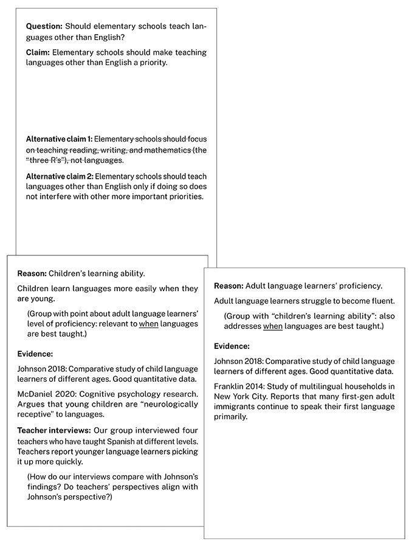

이유는 두 그룹으로 나뉜다. 하나는 언어가 가장 잘 배워지는 시기에 초점을 맞추고 다른 하나는 그 이점에 초점을 맞춘다. 계획에는 인정과 대응이 포함되어 있지만 문화적 인식에 대한 페이지는 거의 비어 있다. 왜냐하면 연구자들이 아직 그 이유를 지지할 올바른 증거를 발견하지 못했기 때문이다(추가 연구에서 그것을 제시하지 못하면, 그 이유를 포기하고 주장을 바꿔야 할 수도 있다).

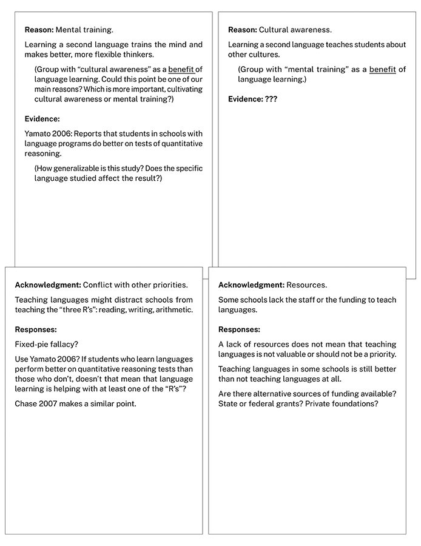

## 에토스 만들기

마지막 말: 이 장에서 우리는 주장, 이유, 증거, 보장, 인정과 대응-이 다섯 가지 요소를 소개했다. 하지만 논증에는 암묵적인 여섯 번째 요소도 있다: 전통적으로 *에토스(ethos)*라고 불리는 것. 청중은 논증을 지적 구조물로서뿐만 아니라, 논증을 만들 때 나타내는 인격에 대해서도 판단할 것이다. 필요한 배경 정보를 제공하여 청중을 이끌어가는 사람처럼 보이는가? 주장을 충분하게(϶지도 과하지도 않게) 지지하는가? 모든 측면에서 문제를 사려 깊게 고려하는가? 아니면 한 가지 견해만 보고 다른 사람들의 견해를 무시하거나 심지어 간과하는 사람처럼 보이는가? 마찬가지로, 글쓰기 스타일이나 발표 방식에서 청중의 필요에 민감하고 그들의 시간과 주의를 존중한다는 것을 보여주는가, 아니면 간결하거나 오만하거나 자기중심적으로 모호해 보이는가? (이런 문제들은 15장과 16장에서 다룬다.)

::: {.callout-note appearance="simple"}
### 인지 과부하: 안심시키는 말들

이쯤에서, 연구에 새로 입문한 많은 학생들이 압도당하기 시작한다. 그런 기분이 든다면, 불안이 지능이나 능력보다는 경험이 없음과 더 관련이 있다는 것을 알면 도움이 될 수 있다. 우리 중 한 명은 법률 글쓰기 교사들에게 초보자가 많은 1학년 법학 학생들을 무능한 작가로 느끼게 하는지 설명하고 있었다. 강의가 끝날 때, 한 여성이 자신이 인류학 교수가 되어 출판된 작업이 글쓰기의 명료함으로 칭찬받았다고 보고했다. 그녀는 그런 다음 전환하여 법학 교육을 받았다고 했다. 그녀는 처음 6개월 동안 그렇게 횡설수설하며 씀으로써 퇴행성 뇌 질환을 앓고 있다고 두려워했다고 말했다. 물론, 그렇지 않았다: 그녀는 우리가 완전히 이해하지 못하는 문제에 대해 우리가 더 적게 이해하는 청중을 위해 쓰려고 할 때 대부분의 사람이 겪는 고통스러운 전환을 겪고 있었다. 법을 더 잘 이해할수록 그것을 더 잘 쓴다는 것을 발견했을 때 안도했다.

압도당하는 느낌이 들면, 그 이야기에서 위안을 얻을 수 있다. 우리에게 이메일을 보낸 한 독자처럼:

*연구의 기술*에서 인류학에서 법으로 전환한 여성이 갑자기 명확하게 쓸 수 없게 된 것에 대해 쓰고 계십니다. 그래픽 디자인 조교수로 5년을 보낸 후, 최근 인류학으로 전환했는데 갑자기 인류학 논문을 쓰는 것이 이빨을 뽑는 것처럼 느껴졌습니다. 퇴행성 뇌 장애가 있다고 생각했습니다! 법으로 전환한 인류학자에 대해 읽었을 때 크게 웃었습니다. 좀 나아진 기분이었습니다.
:::

명확하고 존중하며 공손하게 소통하고 청중의 질문과 우려를 예상하고 다룰 때(이것은 인정과 대응이 왜 중요한지에 대한 또 다른 이유이다), 그들의 신뢰를 얻고 새로운 아이디어를 개발하고 시험하는 데 당신과 함께 *일할* 좋은 이유를 준다. 장기적으로, 개별 논증에서 나타내는 에토스는 평판으로 단단해진다-어떤 연구자도 관심을 가져야 하는 것-왜냐하면 평판은 당신이 하는 모든 논증에 있는 암묵적인 여섯 번째 요소이기 때문이다. 그것은 *신뢰할 수 있는가?*라는 비언어적 질문에 답한다. 그 답은 *예*여야 한다.

::: {.callout-tip}
### 일반적인 실수-아는 것에 기대기

경험이 없는 연구자라면, 익숙하다고 느끼는 것에 지나치게 의존하고 싶은 유혹을 받을 수 있다. 주장을 너무 일찍 받아들일 수 있다. 아마도 많은 연구를 하기 전에, 그것을 증명할 수 있다고 "알기" 때문이다. 하지만 그런 확신에 기대면 최고의 사고를 하지 못하게 될 것이다. 연구자라는 것은 발견과 통찰에 놀라도록 허용하는 것을 의미한다. 그래서 프로젝트를 시작할 때, 증명할 수 있다고 아는 주장이 아니라 탐구하고 해결하고 싶은 문제로 시작하라.

마찬가지로, 분야에 익숙하지 않을 때, 교육이나 경험에서 익숙한 논증 방식에 의존하고 싶은 유혹을 받을 수 있다. 문학 수업에서 인용문을 제시하고 분석하여 주장을 지지하는 법을 배웠다면, 생물학이나 실험 심리학 같은 "객관적 데이터"를 강조하는 분야에서 같은 방식을 할 수 있다고 가정하지 마라. 반대로, 생물학이나 심리학 전공으로서 확보한 데이터를 모으고 통계 분석을 수행하여 주장을 지지하는 법을 배웠다면, 미술사에서 같은 방식을 할 수 있다고 가정하지 마라. 이것은 한 수업에서 배운 것이 다른 수업에서 쓸모없다는 것을 의미하지 않는다. 모든 분야의 논증은 여기서 설명하는 요소에 의존한다. 하지만 그 요소를 다루는 방식에서 독특한 것을 배우고, 적응할 수 있을 만큼 유연해야 하며, 배운 기술을 신뢰해야 한다.

그리고 분야에 더 익숙해지면, 다른 방식으로 과소 단순화하고 싶은 유혹을 받을 수 있다. 일부 초보 연구자가 한 종류의 논증을 성공적으로 만드는 법을 배우면, 그것을 계속 반복한다. 한 종류의 복잡성을 숙달하는 것이 다른 것을 인식하는 것을 막는다: 분야가 활발하다면, 경쟁하는 방법론, 경쟁하는 해결책, 경쟁하는 목표와 목적로 특징짓는다는 것을 보지 못한다. 이 함정에 빠지지 마라. 한 유형의 논증을 만들 수 있다면, 다른 것도 시도하라: 대안적 방법을 찾고, 여러 해결책뿐만 아니라 여러 지지 방식도 만들고, 다른 사람들이 문제를 다르게 접근할지 물어보라.
:::

# 6 주장 만들기

이 장에서는 연구 질문에 답하는 종류의 주장을 어떻게 식별하는지, 그리고 주장이 논증의 주요 주장으로 기능하기에 충분히 구체적이고 중요한지 어떻게 알 수 있는지 논의한다.

연구 질문에 대한 임시 답-즉, 임시 주장-이 필요하다. 연구 논증에서 증거로 사용할 데이터나 정보를 검색하는 데 집중하기 위해서이다. 그 주장을 다듬으면서 논쟁 가능할 만큼 구체적이고 논쟁할 가치가 있을 만큼 중요한지 확인해야 한다. 세 가지 질문을 스스로에게 하라:

1. 어떤 종류의 주장을 해야 하는가?
2. 논증을 만들 수 있을 만큼 구체적인가?
3. 청중이 그것을 지지하는 논증이 필요할 만큼 중요한 것으로 생각하는가?

세 가지 질문에 답할 수 있다면, 논증을 조립할 준비가 된 것이다.

## 주장의 유형을 결정하다

제기하는 문제의 유형이 어떤 유형의 주장을 할지, 그리고 그것을 지지하는 데 필요한 논증의 유형을 결정한다. 2장에서 보았듯이, 학술 연구자들은 보통 *실용적* 문제가 아니라 *개념적* 문제를 제기한다. 즉, 누군가에게 *행동*이 아니라 *이해*를 요구하는 유형의 문제이다.

주장에서도 비슷한 구분을 할 수 있다. 주장이 다양한 질문에 답할 수 있기 때문이다: *어떤 사물이나 상황이 존재하는가? 그렇다면, 어떻게 특징지어야 하는가? 어떻게 그렇게 되었는가? 좋은가 나쁜가? 그것에 대해 무엇을 할 수 있거나 해야 하는가?* 이런 질문의 처음 네 가지에 대한 답은 개념적 주장이다. 다섯 번째에 대한 답은 실용적 주장이다. 당신이 할 수 있는 주장은 다음 범주 중 하나(또는 그 이상)에 속할 것이다:

개념적 주장

* 사실이나 존재에 대한 주장:
  1. 중국과 인도는 전 세계 땅콩의 절반 이상을 재배한다.
  2. 정의나 분류에 대한 주장:
  3. 땅콩 껍질 벗기는 기계는 땅콩을 볶은 후 껍질을 벗기는 데 사용되는 특수 기계이다.
  4. 땅콩은 콩과 식물이지 견과류가 아니다.
  5. 인과에 대한 주장:
  6. 땅콩을 만지는 것만으로도 땅콩에 심각한 알레르기가 있는 사람들에게 심각한 반응을 일으킬 수 있다.
  7. 평가나 가치 판단에 대한 주장:
  8. 땅콩은 정말 맛있다.

실용적 주장

* 행동이나 정책에 대한 주장:
  1. 연방 정부는 땅콩 수출을 늘리기 위해 무역 장벽을 낮추어야 한다.

사실이나 존재에 대한 주장에서는, 상황이 실제로 당신이 묘사하는 것과 같다는 증거를 제공해야 한다. 정의나 분류에 대한 주장은 어떤 개체를 더 넓은 범주에 배치하거나 다른 개체와 구별하는 유사점이나 차이점에 대한 추론에 의존한다. 인과에 대한 주장은 어떤 상황이 다른 것으로부터 따라오거나 다른 것으로 이어진다는 것을 보이기 위해 사실의 집합을 연결한다. 평가나 가치 판단에 대한 주장은 어떤 것이 좋거나 나쁜(또는 다른 것보다 좋거나 나쁜) 이유를 정당화하기 위해 판단 기준에 의존한다. 이것들은 모두 개념적 주장이다.

다섯 번째 유형인 행동이나 정책에 대한 주장은 실용적 주장이며 보통 선행하는 개념적 주장에 기반한다: 문제를 정의하거나 문제가 존재한다는 것을 보여주는 주장, 그 원인을 식별하는 주장, 그리고 당신이 제안하는 것을 실행하면 그것을 어떻게 해결할 수 있는지 설명하는 주장. 실용적 주장을 논의할 때, 다음을 설명해야 할 수도 있다:

* 당신의 해결책이 실행 가능한 이유; 합리적인 시간과 노력으로 어떻게 실행할 수 있는지.
* 그것을 실행하는 비용이 문제의 비용보다 적은 이유.
* 그것을 해결하는 문제보다 더 큰 문제를 만들지 않는 이유.
* 다른 해결책보다 나은 이유.

청중이 이런 하위 논증을 기대하는데 당신이 그것을 하지 않으면, 청중은 전체 논증을 기각할 수 있다. 마지막으로, 개념적 주장의 중요성을 과장하기 위해 실용적 행동을 덧붙이지 마라. 적어도 초기에는. 개념적 주장의 실용적 적용을 제안하고 싶다면, 논증의 끝에서, 논문이나 발표의 결론에서 하라. 거기에서는 그것을 발전시킬 필요 없이 고려할 가치가 있는 행동으로 제안할 수 있다(이 점은 14장에서 다시 논의한다).

## 주장을 평가하다

좋은 주장을 어떻게 찾는지 말해줄 수는 없지만 좋은 주장이 어떤지, 그리고 가지고 있는 주장을 어떻게 평가하는지 보여줄 수 있다. 무엇보다도, 주장은 구체적이고 중요해야 한다.

### 주장을 구체적으로 하다

모호한 주장은 모호한 논증으로 이어진다. 주장이 구체적일수록, 논증을 계획하는 데 더 도움이 된다. 다음 두 주장을 비교해 보자:

원격 근무는 사회에 해롭다.
>
원격 근무는 대중교통 이용률을 줄이고 도심 소매점과 식당의 자연스러운 고객 기반을 잠식함으로써 도시 중심부의 사회적 결속력을 위협한다.

첫 번째는 너무 모호해서 앞으로 무슨 일이 일어날지 거의 알 수 없다. 두 번째는 다음에 전개할 논증에서 발전시킬 아이디어나 주제를 제공하는 구체적인 개념 집합을 포함한다. 주장의 구체성은 논증이 어떻게 전개될지 신호한다.

### 주장을 중요하게 하다

주장의 구체성 다음으로, 청중은 그것의 *중요성*을 가장 주의 깊게 살펴본다. 그 품질은 청중이 자신이 믿는 것을 얼마나 바꾸어야 하는지로 측정한다. 중요성을 정량화할 수는 없지만 대략 추정할 수 있다: *청중이 주장을 받아들이면, 얼마나 많은 믿음을 바꾸어야 하는가? 그리고 그 믿들은 얼마나 근본적인가?* 가장 중요한 주장은 청중에게 가장 깊이 자리 잡은 믿음을 바꾸라고 요구한다(그래서 청중은 그에 맞게 저항할 것이다).

연구 공동체는 어떤 주장이 관심 있는 주제에 대한 새로운 정보를 제공할 때만으로도 중요하다고 생각하기도 한다:

여기서 13세기 라틴 웨일즈어 문법 6권을 기술한다. 최근에 발견된 이 문법들은 그 유형의 유일한 예이다. 우리는 중세에 쓰인 문법의 범위를 더 잘 이해하는 데 도움이 된다.

(소개에서 언급한 와플 애호가 협회 회원들을 기억하는가? 그들은 그냥 흥미로운 사실로 즐기고 싶었을 뿐이다.)

하지만 연구 공동체는 새로운 정보를 제공할 뿐만 아니라 그 정보를 활용하여 의아하거나, 불일치하거나, 기타 문제가 되는 것을 해결할 때 더 높이 평가한다:

소비자 신뢰도 변동이 주식시장에 어떻게 영향을 미치는지에 대해 오랜 논쟁이 있었지만 새로운 통계 도구는 ... 사이에 거의 관계가 없다는 것을 시사한다.

그리고 그것이 오래전에 해결된 것으로 보이는 것을 뒤엎을 때 가장 높이 평가한다:

물리학의 오랜 신조는 빛의 속도가 모든 곳에서, 모든 시간에, 모든 조건에서 일정하다는 것이었지만 새로운 데이터는 그렇지 않을 수 있다고 시사한다.

그런 주장은 물리학자들 수백 명에 의해 반박될 것이다. 사실이라면, 빛의 속도뿐만 아니라 많은 다른 것들에 대해서도 생각을 바꾸어야 한다는 뜻이기 때문이다.

주장의 중요성을 나타내는 간단한 방법은 현재의 이해에 도전한다는 것을 인정하는 것이다(9장 참조). 원격 근무에 대한 두 번째 주장은 구체적이지만 여전히 일방적으로 보일 수 있다. 그래서 *비록*, *반면에*, 또는 *에도 불구하고* 같은 단어나 구절로 시작하는 자격 절을 도입하여 "두텁게" 하라:

비록 원격 근무가 기업과 직원에게 많은 이점을 제공하지만 대중교통 이용률을 줄이고 도심 소매점과 식당의 자연스러운 고객 기반을 잠식함으로써 도시 중심부의 사회적 결속력을 위협하기도 한다.

*비록*이나 비슷한 단어로 시작하는 서문을 사용하여 세 가지 유형의 대안적 견해를 인정할 수 있다:

* 청중이 믿지만 주장이 도전하는 것:
  1. 비록 많은 사람들이 원격 근무가 부정적인 결과가 거의 없다고 가정하지만...
  2. 당신의 것과 충돌하는 관점:
  3. 비록 이전의 연구는 원격 근무가 도시의 소비 지출을 크게 줄이지 않는다고 시사하지만...
  4. 주장의 범위나 확신을 제한하는 조건:
  5. 비록 원격 근무가 너무 새로운 탓에 도시에 미치는 장기적 영향을 측정하기 어렵지만...

청중이 그런 자격을 생각할 수 있다면, 먼저 인정하라. 당신이 그들의 견해를 이해한다는 것을 암시할 뿐 아니라, 논증 과정에서 그것에 대응하겠다고 스스로를 결박하는 것이다.

고급 연구자라면, 주장이 연구 공동체의 생각과 연구 방식을 얼마나 바꾸는지로 중요성을 측정한다. DNA 이중나선 구조 모델은 과학적 성과 중 가장 중요한 것 중 하나이다(전통적으로 James Watson과 Francis Crick에게 돌아간다). 과학자들이 유전학을 다르게 생각하게 만들었을 뿐 아니라, 생물학에서 수학, 역사에 이르기까지 새로운 연구 질문과 기회를 만들었다. Watson과 Crick은 무엇을 찾고 있는지 알고 있었다. 그 모델에 도달하기 위해, 수십 년에 걸친 다른 과학자들의 연구 결과를 구축하고 통합했으며 Maurice Wilkins와 Rosalind Franklin의 중요한 경험적 데이터도 포함했다(이 상황의 윤리에 대해서는 17.2절 참조).

하지만 중요한 발견은 놀라움으로 오기도 한다. 우리 동료인 인류학자 Fallou Ngom은 돌아가신 아버지의 서류 중에서 아랍어 같은 문자로 된 글을 발견했는데, 그것은 서아프리카 언어 월로프어처럼 읽혔다. Ngom은 당황했다: 세네갈에서 자랐지만 그런 문자 체계가 존재한다는 것을 몰랐다; 사실, 아버지가 전혀 글을 쓸 수 없다고 생각했었다. 호기심이 생겨, 그런 글의 다른 예를 찾기 시작했고 어디에서나 찾았다. 그가 (서구 학문의 관점에서) 발견한 것은 '아자미'-아랍어에서 파생된 문자 체계로, 서아프리카 여러 언어를 기록하는 데 사용되었다. Ngom의 발견은 많은 서아프리카 사회가 문맹이라는 오랜 유럽중심적 믿음을 뒤엎었다. 사실 그들은 수세기 된 풍부한 필사 문화를 가지고 있었다. 그리고 그렇게 함으로써, 연구의 새로운 지평을 열었다.

이 이야기들은 발견과 전문성의 복잡한 관계를 보여준다: Watson과 Crick은 자신의 연구 공동체의 작업을 활용하여 가장 중요한 문제 중 하나를 해결했고; Ngom의 서구 학문 분야(역사와 인류학)에 대한 전문성은 아버지 서류의 그 메모가 그 학문에 얼마나 중요한지 보게 해주었다.

연구 공동체에 유용한 기여를 하려면 거대한 주장을 할 필요가 없다. 작은 발견이라도 현재의 지식에 도전하거나 새로운 질문을 제기하면 중요할 수 있다(1장 참조). 예를 들어, 마틴 루터 킹 주니어가 어떤 철학자에 대해 고등학교 논문을 쓴 것을 발견했다면, 역사학자들은 킹의 후속 글에서 그 영향의 흔적을 샅샅이 찾을 것이다.

물론, 학생이거나 분야의 새로운 연구자라면, 전문가에게 도전하는 주장을 할 수 없을 수도 있다(또는 그런 주장을 발견했을 때 인식하지 못할 수도 있다). 하지만 당신의 지식과 사고 그리고 수업이나 동료의 지식과 사고의 맥락에서 주장을 고려함으로써, 연구 공동체를 위한 논증이 무엇을 의미하는지 경험할 수 있다. 당신과 비슷한 사람들로 구성된 청중을 상상해 보라. 연구를 시작하기 전에는 *당신이* 무엇이라고 생각했는가? 당신의 주장이 *당신이* 지금 생각하는 것을 얼마나 바꾸었는가? 이전에는 이해하지 못했던 것을 *당신은* 지금 무엇을 이해하는가? 그것이 연구자가 직면하는 가장 중요한 질문-*왜 이것이 믿을 만한가?*가 아니라 *왜 이것이 중요한가?*-에 대답하는 가장 좋은 방법이다(I.4.3, 2.5, 9.1절 참조).

## 주장을 자격을 줌으로써 신뢰성을 높이다

어떤 새로운 연구자들은 주장을 가장 강하게 진술할 때 가장 신뢰할 수 있다고 생각한다. 하지만 오만한 확신보다 에토스를 훼손하는 것은 없다. 역설적으로 보이지만 주장을 겸손하게 한계를 인정함으로써 논증을 더 강하고 신뢰할 수 있게 만든다. 청중의 견해를 인정하고 대응함으로써, 그것들을 이해했을 뿐만 아니라 고려하고 있음을 보여줌으로써 청중의 신뢰를 얻는다(9장 참조). 하지만 그런 다음 범위를 벗어나는 주장을 하면 그 신뢰를 잃을 수 있다. 주장을 논증이 지지할 수 있는 범위와 확신으로 자격을 줌으로써 제한하라.

### 제한 조건을 인정하다

모든 주장에는 제한 조건이 있다:

체서피크 만의 청게 개체군은 계속 확장될 것으로 예상한다. 오늘날의 보존 조치가 유지된다는 전제 하에서.
>
활용 가능한 경제 데이터에 따르면, 글로벌 경기침체는 일어날 것 같지 않아 보인다.
>
현재 기후 모델에 따르면, 지구는 산업화 이전 수준에서 섭씨 2도까지 빠르면 2030년대 중반에 따뜻해질 수 있다.

그래서 청중이 합리적으로 생각할 수 있는 것만 언급하라. 과학자들은 주장이 측정 기구의 정확성에 의존한다는 것을 인정하는 경우가 거의 없다. 그 제한이 모든 과학적 측정에 적용되기 때문이다. 하지만 경제학자들은 예측이 변하는 조건에 종속되고 어떤 조건을 주시해야 하는지 신호하고 싶기 때문에 주장의 한계를 인정하는 경우가 많다. 다음 예에서, 필자의 제한 조건 언급은 주장을 더 충실하고 정확하게 진술할 수 있게 해준다:

오늘날 프랭클린 D. 루스벨트는 존경받고 있지만 두 번째 임기 말에는 상당히 인기가 없었다. 적어도 미국 사회의 특정 계층에서는.[주장] 예를 들어, 신문은 그가 사회주의를 선동한다고 비난했는데, 이는 현 행정부가 곤경에 처했다는 신호이다. 1938년, 중서부 신문의 70퍼센트는 그가 정부가 은행 시스템을 관리하기를 원한다고 비난했다.... Nicolson(1983, 1992)과 Wiggins(1973)를 포함한 일부는 그렇지 않다고 주장하며, 두 사람 모두 루스벨트가 항상 높은 평가를 받았다는 일화적 보고를 제시하지만, 이 보고들은 FDR을 신격화하는 데 이해관계가 있는 사람들의 기억에 의해서만 뒷받침된다. 루스벨트를 비판한 신문이 특수 이익에 의해 통제되었다는 것이 밝혀지지 않는 한, 제한 조건 그들의 공격은 루스벨트 대통령직에 대한 상당한 국민적 불만을 보여준다. 재진술

### 확신을 제한하기 위해 헤지를 사용하다

절대적인 확신으로 주장을 진술할 수 있는 경우는 거의 없다. 조심스러운 글쓰기 사람들은 *헤지*라 불리는 단어와 구절로 확신에 자격을 준다.

Watson과 Crick은 DNA 모델의 엄청난 중요성을 이해했지만 그것을 발표할 때 여전히 주장을 헤지했다(헤지는 굵은 글꼴; 서론은 요약됨):

우리는 제안하고 싶다 [참고: *진술한다*가 아니라] 디옥시리보스 핵산(D.N.A.)의 염에 대한 구조를.... 핵산에 대한 구조는 이미 Pauling과 Corey에 의해 제안되었다.... 우리의 의견으로는, 이 구조는 두 가지 이유로 만족스럽지 않다: (1) 우리는 X선 다이어그램을 만드는 물질이 염이지 유리 산이 아니라고 믿는다.... (2) 일부 반데르발스 거리가 너무 작아 보인다.(J. D. Watson과 F. H. C. Crick, "핵산의 분자 구조")

헤지가 없으면, 이 문장들은 더 간결하지만 더 공격적일 것이다. 그 조심스러운 문단을 다음 더 강한 버전과 비교해 보라(공격적 어조의 대부분은 자격의 *부재*에서 나온다):

우리는 여기서 발표한다 디옥시리보스 핵산(D.N.A.)의 염에 대한 구조를.... 핵산에 대한 구조는 이미 Pauling과 Corey에 의해 제안되었다.... 그들의 구조는 두 가지 이유로 만족스럽지 않다: (1) 그들의 X선 다이어그램을 만드는 물질이 염이지 유리 산이 아니다.... (2) 그들의 반데르발스 거리가 너무 작다.

대부분의 분야에서, 청중은 *모든*, *아무도*, *모두*, *항상*, *절대* 같은 단어로 표현된 속편한 확신을 불신한다. 하지만 너무 많이 헤지하면 비겁해 보일 것이다. 연구 공동체는 헤지를 각기 다른 정도로 사용하며 올바른 균형을 찾는 것은 경험의 문제이다. 그래서 해당 분야의 전문가들이 어떻게 헤지하는지 살펴보고 그렇게 하라.

::: {.callout-tip}
### 주장을 논쟁 가능하게 하라

누군가가 반박할지 여부를 물어봄으로써 주장의 잠재적 중요성을 측정할 수 있다. 그렇지 않다면, 주장은 논쟁할 가치가 없을 수 있다. 다음 세 가지 주장은 각각 다른 이유로 약하다:

이 보고서는 꿀벌 사라짐에 대한 최근 연구를 요약한다.
>
버락 오바마는 미국의 첫 흑인 대통령이었다.
>
hamlet은 셰익스피어의 『Hamlet』에서 중요한 인물이 아니다.

이 주장들이 반박할 가치가 있는지 판단하려면, 그 반대를 고려해 보라:

이 보고서는 꿀벌 사라짐에 대한 최근 연구를 요약하지 않는다.
>
버락 오바마는 미국의 첫 흑인 대통령이 아니었다.
>
hamlet은 셰익스피어의 『Hamlet』에서 중요한 인물이다.

첫 번째 주장은 단지 보고서의 주제를 진술한 것이다. 그 반대는 말도 안 된다. (정확히 말하면, 사실 주장이지만 그 사실은 보고서에 관한 것이지 꿀벌에 관한 것이 아니다.) 두 번째(또한 사실 주장)는 쉽게 검증할 수 있다. 그 반대는 입증 가능하게 거짓이다. 세 번째(평가 주장)는 강해 보일 수 있지만 그 반대는 너무 명백하여 말할 필요도 없다. 셰익스피어는 자신의 희곡을 『덴마크 왕자 햄릿의 비극』이라고 제목을 붙인 이유가 있을 것이다. 그래서 이 주장들 중 어느 것도 논쟁할 가치가 없다-아마도.

이 테스트는 만능이 아니며 일부 위대한 사상가는 명백히 자명한 주장에 성공적으로 반박하기도 했다. 코페르니쿠스가 어리석게-그때는 그렇게 보였지만-태양은 지구를 돌지 *않는다고* 주장했듯이.
:::

# 7장 근거와 증거를 구성하다

이 장에서는 주장을 지지하는 두 가지 유형-근거와 증거-에 대해 논의한다. 둘을 구별하는 방법, 근거를 활용하여 논증을 구성하는 방법, 그리고 증거의 질을 평가하는 방법을 보여준다.

청중은 먼저 논증의 핵심-주장과 그 지지-를 찾는다. 특히 근거 집합을 살펴보고 그 타당성을 판단하며 순서를 살펴보고 논리를 판단한다. 근거가 말이 된다고 생각하면, 그것들을 뒷받침하기 위해 제시하는 증거를 살펴볼 것이다. 증거를 믿지 않으면, 근거를 거부하고 그것을 통해 주장을 거부할 것이다.

그래서 논증을 구성할 때, 청중이 받아들일 증거를 기반으로 명확하고 논리적인 순서로 타당한 근거 집합을 제시해야 한다. 이 장은 그렇게 하는 방법을 보여준다.

## 근거를 활용하여 논증을 계획하다

근거를 정렬할 때, 논증을 위한 논리적 구조를 만든다. 앞서 *스토리보드*를 활용하여 논증을 계획할 것을 권장했다(5.5절 참조). 그렇게 한다면, 논증의 논리나 흐름을 테스트하는 데 활용할 수 있다. 스토리보드의 카드나 페이지를 보면서, 근거를 읽되 세부사항은 읽지 말고, 그 순서가 말이 되는지 살펴보라. 그렇지 않다면, 말이 될 때까지 다양한 배열을 시도하라. 이 시점에서, 논문이나 보고서나 발표가 아니라 논증 자체만을 계획하고 발전시키고 있는 것이다. 논증 자체에서 다른 사람들에게 어떻게 효과적으로 전달할지 파악하는 것으로 넘어갈 때, 추가 조정이 필요할 수 있다. 초안 작성과 논증 전달에 대해서는 Part IV에서 더 논의할 것이다.

## 증거와 근거를 구별하다

근거를 타당한 순서로 배치했다면, 각 근거를 지지할 충분한 증거가 있는지 확인하라. 증거는 근거를 뒷받침하기 위해 사용하는 정보이다. 문제는 증거가 충분한지 판단할 수 있는 것이 당신이 아니라 청중이라는 것이다. 증거로 인정되려면, 진술은 청중이 최소한 논증의 목적상 의문을 제기하지 않을 것으로 기대되는 것을 보고해야 한다. 하지만 그들이 의문을 제기하면, 당신이 확실한 증거라고 생각하는 것은 그들에게는 또 다른 근거에 불과하게 된다. 다음 논증을 생각해 보자:

미국 고등교육은 급등하는 등록금 비용을 억제해야 한다[주장] 대학 비용이 저소득층 학생들이 전문 중산층에 진입하는 데 장애물이 되고 있기 때문이다. [근거] 오늘날 많은 학생들이 빚더미를 안고 대학을 떠난다.증거

마지막 문장은 필자들이 확실한 "사실"로 증거를 제시한다. 하지만 우리는 여전히 의문을 제기할 수 있다: *그것은 단순한 일반화이다. "많은 학생"이나 "빚더미"를 뒷받침하는 확실한 수치가 있는가?* 우리가 그렇게 하면, 그 진술을 증거가 아니라 자체적인 증거에 기반해야 하는 2차 근거로 취급한다. 우리를 만족시키려면, 필자들은 이런 내용을 추가해야 할 것이다:

2020-21학년도에, 공립 4년제 대학 학생의 43퍼센트와 사립 4년제 기관 학생의 75퍼센트 이상이 연방 학생 대출을 보유하고 있었으며 졸업 시 평균 부채는 30,000달러 이상이었다. [증거]

우리가 *정말* 회의적이라면, 다시 물을 수 있다: *그 수치를 뒷받침하는 것은 무엇인가? 이 상황을 위기라고 주장하는 것은 무엇으로 정당화되는가?* 그렇다면, 필자들은 최신 졸업생에게 미치는 부채의 결과를 기록하기 위해 수치를 분석한 더 확실한 데이터를 제공해야 할 것이다. 가지고 있다면, 원본 데이터를 보여줄 수 있다. 2차 자료에서 그 사실을 가져왔다면, 자료를 인용할 수 있다. 하지만 그때조차도, 그 사실은 의문의 대상이 될 수 있다: *데이터를 어떻게 수집했는가? 왜 당신의 자료가 신뢰할 수 있다고 믿어야 하는가?* 그런 질문은 원칙적으로 영원히 할 수 있지만 어느 시점에서, 합리적인 청중은 멈추리라 기대한다-그렇지 않으면 우리 중 누구도 어떤 논증도 할 수 없을 것이다. 당신의 책임은 그 시점까지 증거를 제시하는 것이다.

증거의 기초적 은유

증거에 대해 이야기할 때, 우리는 보통 기초적 은유를 사용한다: 좋은 증거는 *단단하거나* *확실한* 것이다. 우리가 논증을 *구축하는* *튼튼한 기반*이다. 나쁜 증거는 *허술하거나*, *약하거나*, *빈약한* 것이다. 그런 언어는 독자들이 증거를 누구의 해석이나 판단과도 독립된 현실로 생각하도록 장려한다. 하지만 데이터는 항상 그것을 증거로 수집하고 사용하는 사람들이 구축하고 형태를 갖춘 것이다. 논증을 구축하면서 당신의 증거는 청중이 그것을 받아들일 때만, 적어도 지금은, 증거로 *인정*될 것이라는 점을 명심하라.

## 어떤 유형의 증거가 필요한지 결정하다

어떤 유형의 주장을 하느냐가 어떤 유형의 근거가 필요한지, 그리고 그 근거를 뒷받침하기 위해 어떤 유형의 증거를 제시해야 하는지를 결정한다. 서로 다른 분야의 연구자들은 특징적인 유형의 증거에 의존하는 경향이 있다-경제학자와 화학자는 경험적 데이터와 통계 모델을 선호할 수 있고; 인류학자와 사회학자는 인터뷰와 민속지에 의존할 수 있고; 문학 학자와 역사학자는 텍스트나 구술 출처에서의 인용문을 원할 수 있다-그리고 한 분야에서 연구하는 법을 배운다는 것은 그 문제와 질문을 이해하는 것뿐만 아니라, 그 논증이 요구하는 유형의 증거를 어떻게 찾거나 만드는지도 배우는 것을 의미한다. 하지만 어떤 분야도 특정 유형의 증거를 "독점"하거나 오직 한 종류에만 의존하지 않는다. 특히 오늘날, 학제적 연구가 그렇게 중요시되기 때문이다.

그래서 논증을 계획할 때, 청중이 가치 있게 생각할 증거 유형과 특정 근거를 지지하기 위해 필요한 증거 유형을 모두 고려하라. 비슷해 보이지만 서로 다른 유형의 근거와 증거가 필요한 두 가지 주장을 보자:

『Native Speaker』에서 이창래는 1세대 이민자 자녀들이 경험하는 이중 의식을 강력하게 대표한다.
>
『Native Speaker』에서 이창래는 20세기 후반 뉴욕시의 인종화된 정치를 정확하게 포착한다.

첫 번째를 위해서는 소설에서의 인용문이 필요하고; 두 번째를 위해서는 역사적 증거와 결합된 인용문이 필요할 것이다. 필요한 증거 유형이 어떤 연구를 하느냐에 영향을 미칠 것이다.

## 증거와 그 보고를 구별하다

이제 복잡한 문제가 있다: 연구자들은 어떤 논문이나 발표에도 *증거 자체*를 포함하는 경우가 거의 없다. 당신이 자기 자신의 데이터를 수집하더라도, 들판에서 토끼를 세거나 투표소를 빠져나오는 유권자를 인터뷰하더라도, 토끼와 유권자를 단어, 숫자, 표, 그래프, 사진 등으로만 *참조*하거나 *표현*할 수 있다. 예를 들어, 검사가 법정에서 *Jones는 위조 혐의가 있으며, 여기 그것을 증명할 증거가 있다*고 말할 때, 검사는 Jones의 차고에서 회수한 짝퉁 가방을 들어올리고, 배심원이 직접 손으로 만져볼 수도 있다. (물론, 검사와 배심원 모두 그곳에 그것을 발견했다고 증언하는 경찰관을 믿어야 한다.) 하지만 검사가 그 사건에 대해 *서면으로* 진술하면, 가방을 문서에 고정할 수는 없다; 그것에 참조하거나 묘사할 수밖에 없다.

마찬가지로, 연구자들은 청중과 "증거 자체"를 공유할 수 없다. 예를 들어:

감정은 많은 사람이 생각하는 것보다 합리성에서 더 큰 역할을 한다[주장] 사실, 뇌의 감정 중추가 없으면 우리는 합리적인 결정을 내릴 수 없다. [근거 1] 뇌의 감정 중추에 물리적 손상을 입은 일부 사람들은 가장 단순한 결정도 내릴 수 없다. [근거 2] 예를 들어, Y 씨의 사례를 생각해 보자.보고

그 논증은 실제로 손상된 뇌를 가진 사람을 증거로 제시하지 않는다; 그것의 관찰 결과, 뇌 스캔 사본, 반응 시간 표 등만 보고할 수 있다. (사실, 우리는 다른 사람의 보고를 읽는 것을 선호하며, 직접 뇌를 테스트하고 fMRI 스캔을 읽을 필요가 없다.)

증거와 증거 보고 사이의 이 구분은 사소한 것처럼 보일 수 있지만, 우리는 그것을 강조하기 위해 고집한다: 증거는 거의 항상 혼자 서거나 스스로 말하지 않는다; 거의 항상 어떤 근거를 지지하기 위해 사용되며, 그 사용에 의해 형태를 갖춘다. 출처에서 데이터나 정보를 가져올 때, 그것이 그 출처의 목적으로 만들어진 형태로 들어 있다는 것을 기억하라. 마찬가지로, 수집하거나 발견한 데이터나 정보를 증거로 제시할 때, 연구 방법과 보고 방식을 통해 필연적으로 당신의 목적으로 형태를 갖추고 있음을 기억하라. 사실, 수집하기 전에 이미 무엇을 셀지, 숫자를 어떻게 분류할지, 어떤 순서로 배열할지, 표, 막대 차트, 그래프 중 어떤 형태로 제시할지 결정해야 했다. 사진과 비디오 논화도 특정 관점을 반영한다. 요컨대, 사실은 수집하는 사람에 의해, 그리고 다시 사용하는 사람의 의도에 의해 형태를 갖춘다.

보고의 이런 가변적 특성은 많은 연구를 읽는 사람들이 증거의 신뢰성에 그렇게 까다로운 이유이다. 예를 들어, 양적 데이터를 직접 수집한다면, 그들은 그것을 어떻게 했는지 알고 싶어 할 것이다. 인용문에 의존한다면, 1차 자료에서 나오기를 기대할 것이며 가능한 한 1차 자료에 가깝기를 원할 것이다. 그리고 완전한 참고 문헌과 서지 목록을 원할 것이다. 그래야 선택한다면 출처를 직접 살펴볼 수 있기 때문이다. 다시 한번, 연구자로서의 에토스가 중요하다: 청중은 세계 "밖에서" 그들이 읽는 것 사이의 보고 체인 전체를 신뢰할 수 있다고 믿고 싶어 하며 그들이 가질 수 있는 최선의 보증은 당신의 능력과 성실함에 대한 평판이다.

300년 전과 지금의 증거 신뢰

실험 과학의 초기에, 연구자들은 "목격자"라 부르는 사람들 앞에서 실험을 수행했다. 그들은 평판이 좋은 과학자들로, 보고된 증거의 정확성을 증언하기 위해 실험을 관찰했다. 연구자들은 더 이상 목격자에게 의존하지 않는다. 대신, 각 연구 영역은 증거를 수집하고 보고하는 방법을 표준화하여 (연구자가 정직하다면) 신뢰할 수 있도록 했다. 해당 분야의 표준 절차를 지키면, 청중이 당신의 말을 믿고 직접 검증할 필요 없이 증거를 받아들이도록 장려한다. 그래서 2차 자료를 읽을 때, 그들이 어떤 유형의 증거를 인용하고 어떻게 인용하는지 메모하라. 그런 다음 그렇게 하라. 사회학에서는 사회학자들이 하듯이 하라.

정보에 의한 시대에 살고 있다. 그 정보 중 상당 부분은 신뢰성 의심스러우며 점점 더 많은 부분이 다른 사람들이 아닌 컴퓨터화된 "봇"에 의해 조작하거나 기만할 목적으로 만들어지고 있다. 그 신뢰 체인의 마지막 연결고리는 당신이다. 그래서 누구의 데이터를 사용하고 어떻게 사용하는지 신중하게 생각하라.

## 증거를 평가하다

연구 공동체가 기대하는 증거 유형을 알았다면, 다섯 가지 질문을 통해 증거를 테스트할 수 있다: *증거, 또는 그 보고가 정확한가? 적절하게 정밀한가? 충분하고 대표적인가? 권위 있는가? 명확하고 이해하기 쉬운가?* (관련성이라는 여섯 번째 기준은 8장에서 추가할 것이다.) 이런 질문은 학술 및 전문 연구뿐만 아니라 일상적 대화, 심지어 아이들과의 대화에서도 적용하는 기준에 관한 것이다:

아이: 학교에 새 가방이 필요해[주장] 저봐. 이건 너무 작아. [증거]

어니: 올해는 작년보다 더 많은 것을 가져다닐 필요가 없을 것 같고, 가방은 전에 완전히 괜찮았어 [즉, 증거가 관련 있을 수 있지만, 정확하지 않고, 정확하다 해도 "너무 작다"는 것이 충분히 정밀하지 않아 기각한다].

아이: 하지만 학교를 다니기에 너무 낡았어. [근거] 얼마나 더러운지 봐-그리고 찢어진 지퍼. [증거]

어니: 더러운 것은 빨리면 되고 지퍼는 그냥 걸려있는 것뿐이야. 새 가방을 사기에 충분하지 않아 [즉, 사실은 맞을 수 있지만 더러움과 걸린 지퍼만으로는 가방이 학교에 부적합하다는 증거로는 충분하지 않다].

아이: 내 등을 아프게 해. [근거] 내가 얼마나 뻣뻣한지 봐. [증거]

어니: 방금 전에는 괜찮았잖아 [즉, 증거가 대표적이지 않다].

아이: 모두가 새 걸 사야 한다고 생각해. [근거] Harry가 그렇게 말했어. [증거]

어니: Harry의 의견은 우리 집에서 중요하지 않아 [즉, Harry는 그렇게 말했을 수 있지만 그의 의견은 권위가 없다].

아이: 컴퓨터가 망가질 거야. [근거] 이 주머니가 어떻게 꿰매어져 있는지 봐봐!증거

어니: 그렇게 보이지 않는데 [즉, 꿰매어진 것이 컴퓨터를 망가뜨릴 것이라는 것이 명백하지 않다].

증거를 구성할 때, 스토리보드에 추가하기 전에 이런 기준으로 스크리닝하라.

### 증거가 정확한가?

사람들은 종종 정확성과 정밀성을 혼동한다. 정확성이란 증거 보고가 증거 자체와 얼마나 일치하는지를 말한다. (다른 사람이 당신의 측정을 다시 한다면, 당신과 같은 숫자를 얻을 것인가? 소설에서 인용문을 확인한다면, 여기저기 단어를 잘못 옮겨 적은 것을 발견할 것인가?) 정밀성이란 값의 반복 측정이 서로 얼마나 가까운지를 말한다. (실험을 세 번 실행했을 때, 측정값이 서로 얼마나 가까웠는가?) 둘 다 중요하다.

연구 논증의 청중은 회의적일 경향이 있다. 그래서 증거의 오류를 당신의 전반적 신뢰하지 못함의 징후로 본다. 연구 논증이 실험실, 현장, 기록보관소, 또는 도서관이나 온라인에서 찾은 출처에서 수집한 정보에 의존하든, 그 정보를 완전하고 명확하게 기록하고 논문이나 발표에서 사용할 때 이중으로 확인하라(4장 참조). 작은 것을 올바르게 하는 것은 신중함을 보여준다.

*그 품질이 의심스럽다는 것을 인정한다면* 의심스러운 증거도 사용할 수 있다. 사실, 주장을 지지하는 것처럼 보이지만 신뢰할 수 없어서 기각하는 증거를 지적하면, 당신이 조심스럽고 자기 비판적이며 따라서 신뢰할 수 있음을 보여주는 것이다.

### 증거가 적절하게 정밀한가?

청중은 또한 증거를 적절한 정밀성으로 진술하기를 원한다. 합법적인 불확실성을 인정하기보다 모호함을 핑계로 삼으려는 것처럼 보이는 방식으로 헤지하면 경계심을 갖게 된다:

산림청은 산불을 방지하기 위해 많은 돈을 썼지만 여전히 크고 비용이 많이 드는 산불의 높은 확률이 있다.

*많은* 돈은 얼마인가? *높은 확률*은 얼마나 높은가-30퍼센트? 80퍼센트? *크고 비용이 많이 드는* 것은 무엇인가? *일부*, *대부분*, *많은*, *거의*, *자주*, *대체로*, *빈번히*, *일반적으로* 같은 단어를 주의하라. 그런 단어는 주장의 폭을 적절하게 제한할 수 있지만 연구자가 정확한 숫자를 얻기 위해 충분히 노력하지 않았다면 숨길 수도 있다.

하지만 적절한 정밀성이란 분야에 따라 다르다. 물리학자는 쿼크의 수명을 나노초의 분수로 측정하므로, 허용 오차는 거의 사라질 정도로 작다. 소련이 피할 수 없는 붕괴에 도달한 시점을 판단하는 역사학자는 그것을 개월 단위로 추정할 것이다. 고생물학자는 newly 발견된 종을 수만 년의 오차 범위 내로 추정할 수 있을 것이다. 그 분야의 기준에 따르면, 세 모두 적절하게 정밀하다. (증거가 너무 정밀할 수도 있다. 어리석은 역사학자만이 소련이 1987년 8월 18일 오후 2시 13분에 피할 수 없는 붕괴에 도달했다고 주장할 것이다.)

### 증거가 충분하고 대표적인가?

초보자는 보통 증거를 너무 적게 제시한다. 그들은 하나의 인용문, 하나의 숫자, 하나의 개인적 경험으로 주장을 증명한다고 생각한다(때로는 하나의 증거로 *반증*하기에 충분할 때도 있지만). 예를 들어:

셰익스피어는 반드시 페미니스트였을 것이다. 왜냐하면 『십일야(12th Night)』와 『Much Ado about Nothing』의 여성들이 너무 자기 확신에 차 있기 때문이다.

청중은 그런 중요한 주장을 받아들이기 위해 더 많은 것이 필요하다.

많은 증거를 제시하더라도, 청중은 그것이 사용 가능한 전체 범위의 변이를 *대표*하기를 기대할 것이다. 한두 개의 셰익스피어 희곡의 여성들이 그의 모든 여성을 대표하지는 않는다. 마찬가지로 셰익스피어가 모든 엘리자베스 시대 드라마를 대표하지도 않는다. 특히 증거가 설문조사처럼 큰 데이터베이스의 작은 표본일 때 청중은 특히 경계한다. 표본 데이터를 사용할 때, 데이터가 *대표적이어야* 할 뿐 아니라, 그렇게 *보여야* 한다.

증거가 *일화적*이라고 의문의 대상이 되기도 한다. *일화*는 개인적 경험이나 에피소드에 대한 짧은 보고이다. 일화적 증거는 체계적으로 연구 방법을 적용하여 수집한 것이 아니라 개인적 경험을 통해 임의로 수집된 것이다. 대표적일 수도 있지만 아닐 수도 있다. 물론, 사람들은 이야기에 움직이는 경향이 있어, 일화적 증거는 통계가 할 수 없는 방식으로 때때로 설득력 있을 수 있다. 말도 안 되는 예, 완벽한 사례 연구, 또는 규칙을 입증하는 예외의 매우 설득력 있는 전달은 일화적 논증을 강력하게 만들지만 위험하게도 만든다.

관련 혐의는 * Cherry-picking*-근거와 주장을 지지하는 증거만 제시하고 그렇지 않은 사용 가능한 증거를 무시하는 것이다. 이 혐의는 연구자가 직면할 수 있는 가장 파괴적인 혐의 중 하나이다. 단순히 부주의함뿐만 아니라 부정직함을 암시하기 때문이다. 그것을 피하려면, 사용 가능한 모든 증거를 고려했음을 보여야 한다.

### 증거가 권위 있는가?

일반적으로, 연구자들은 엄격성과 객관성에 대한 평판을 기반으로 출처에 권위의 정도를 부여한다. 그래서 출처가 *무엇을* 말하는지뿐만 아니라 *어떤 종류의* 출처인지도 고려하는 것이 중요하다. 예를 들어, 대부분의 과학자들은 질병 통제 센터(CDC)에서 얻은 바이러스 전파 데이터를 오류 가능성을 감안하더라도 신뢰할 수 있다고 받아들일 것이다. (일부 회의론자가 CDC의 객관성을 의심하고 그 지침이 정치에 의해 오염되었다고 보더라도.) 하지만 같은 주제에 대한 데이터를 위키백과에서 가져온다면 신뢰하지 않을 것이며 연구 보고서에서 위키백과를 인용하지도 않을 것이다. 그들이 속한 연구 공동체에서 위키백과는 권위 있는 것으로 간주되지 않기 때문이다.

이 예는 중요한 점을 제기한다: 연구 논증에서 출처의 권위에 대한 판단은 일반적으로 개인이 아니라 연구 공동체에 의해 이루어진다. 그것들은 동료 심사 과정-연구 공동체의 구성원들이 연구 논증을 게시하기 전에 검증하는 과정-과 대학 및 대학 출판부, CDC 같은 정부 기관, 심지어 많은 학술 저널과 데이터베이스를 소유한 상업 기업 등 학술 및 과학 연구를 지원하고 그 결과를 전파하는 기관과 조직의 신뢰성에 의해 뒷받침된다.

### 증거가 명확하고 이해하기 쉬운가?

증거가 정확하고, 정밀하고, 충분하고 대표적이며, 권위 있을 수 있다. 하지만 청중이 그것을 이해하지 못하면, 논증을 어떻게 뒷받침하는지 *이해*하지 못하면, 증거를 제시하지 않은 것과 마찬가지이다. 인용문이든, 양적 데이터든, 시각적 증거든, 청중이 당신이 주목하기를 원하는 것을 주목할 수 있도록 하라.

예를 들어, 인용문은 스스로 "말하지" 않는다; 청중이 연결고리를 파악할 수 있도록 설명하고 해석해야 한다. 다음은 햄릿에 대한 주장이 뒤따르는 인용문의 증거에 기반한 것이다:

햄릿이 기도 중인 삼촌 클로디어스를 발견했을 때, 그는 냉철한 합리성을 보여준다[주장]:
>
이제 내가 그를 [죽일 수 있다] 정확히, 이제 그는 기도하고 있다,
>
그리고 이제 나는 그렇게 할 것이다. 그래서 그는 천국으로 가고,
>
그리고 나는 복수를 한다.... [햄릿은 잠시 생각한다]
>
[하지만 이] 악마는 내 아버지를 죽였고 그것을 위해,
>
나는 그의 유일한 아들이 이 악마를 천국으로 보낸다.
>
왜, 이것은 봉급이지 복수가 아니다. (3.3)증거 보고

하지만 그 인용문이 주장을 어떻게 뒷받침하는지 명확하지 않다. 인용문에 햄릿의 합리성을 명시적으로 나타내는 것이 없기 때문이다. 반면, 다음을 비교해 보라:

햄릿이 기도 중인 삼촌 클로디어스를 발견했을 때, 그는 냉철한 합리성을 보여준다[주장]. 그는 충동적으로 클로디어스를 죽이고 싶지만 멈추어 생각한다-만약 기도 중에 클로디어스를 죽이면, 그의 영혼을 천국으로 보내겠지만 클로디어스를 지옥에 보내고 싶기 때문에, 냉정하게 나중에 죽이기로 결정한다:근거
>
이제 그 연결고리가 보인다.

양적 데이터나 시각적 이미지를 제시할 때도 마찬가지 원칙이 적용된다. 컨설팅 회사가 클라이언트에게 한 발표의 예를 보자. 클라이언트는 대형 매장과 소형 매장 중 어느 것이 더 큰 성장 잠재력을 가지고 있는지 알고 싶었다. 컨설팅 회사의 연구는 대형 매장이 현재 더 많은 매출을 가지고 있지만 소형 매장이 더 나은 성장 기회를 제공한다는 것을 보여주었다. 보고서의 첫 번째 버전에는 다음 차트가 포함되었다:

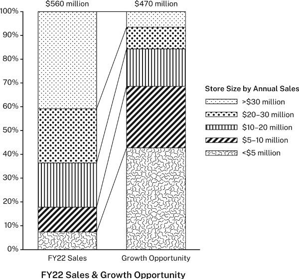

하지만 그 차트는 포인트를 흐리게 한다. 총 매출과 총 기회를 강조하기 때문에, 서로 다른 규모의 매장의 상대적 매출과 기회를 강조하지 않기 때문이다. 보고서의 최종 버전에서, 컨설팅 회사는 원본 차트를 둘로 나누어 비교를 더 잘 보여주었다:

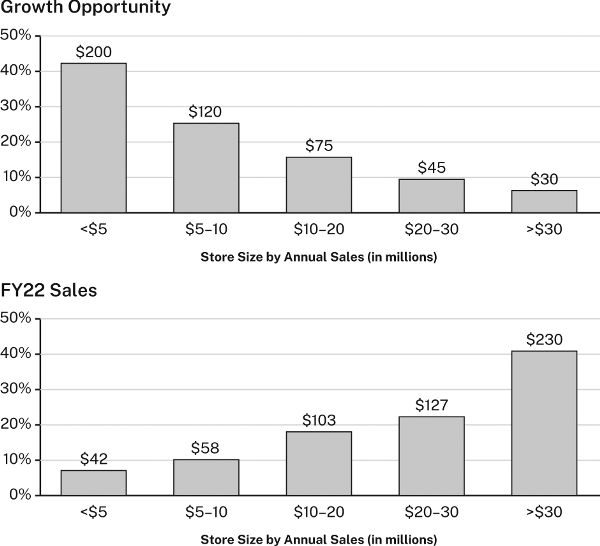

이제, 두 차트가 공통 수평축을 공유하기 때문에, 관계를 볼 수 있다: 매장 규모가 커질수록, 2022 회계연도 매출이 올라가더라도 예상 성장 기회는 떨어진다.

이미지도 마찬가지이다. 시청자가 연구자가 주목하기를 원하는 것을 이미지에서 주목하지 못하면, 그 이미지를 증거로 이해하지 못할 수 있다. 그래서 연구자들은 때때로 특정 특징을 강조하거나 부각하기 위해 이미지를 향상시킨다. 하지만 "향상"이 증거를 조작하는 것이 되지 않도록 하라. 미끄러운 경사가 될 수 있다.

::: {.callout-tip}
### 수집하면서 증거를 평가하라

4장에서 우리는 메모에서 자료에 적극적으로 참여할 것을 권장했다. 인용문이나 참고 문헌 정보뿐만 아니라 당신의 생각과 반응도 포함할 것을(4.3-4.5절 참조). 당신이 증거로 사용할 수 있는 데이터나 정보를 기록할 때는 특히 중요하다. 논증의 핵심을 구성하는 세 가지 요소-주장, 근거, 증거-중에서, 증거는 당신이 스스로 구성하지 않는 유일한 것이기 때문이다. 기억하라, 주장은 아이디어에 대한 *진술*이고 근거는 그것을 지지하는 진술이다. 하지만 증거는 진술이 아니다(보고하기 위한 진술을 만들 수는 있지만); 다른 진술이 기반하는 데이터나 정보이다(5.2절과 7.2절 참조). 그것이 정확하게 기록되었는지 알아야 할 뿐 아니라, 가치와 한계도 이해해야 한다. 그래서 수집하면서 평가하기 시작하라. 얼마나 신뢰할 수 있는지, 그것으로 무엇을 할 수 있는지 고려하라. 신뢰성에 대한 느낌, 우려 사항, 심지어 암시하는 논증의 방향까지 메모하라(*왜* 그 *숫자나* 그 *인용문을* 기록하기로 결정했는가?). 이 장의 질문이 당신을 안내하게 하라(7.5절 참조). 수집하면서 증거를 평가하면 적어도 세 가지 면에서 도움이 될 것이다: 점점 더 많은 데이터와 정보를 기계적으로 기록하는 함정-이것은 일종의 연기일 수 있다(계속 메모하면 초안 작성의 어려운 일을 미룰 수 있다)-로부터 보호해줄 것이다. 초기 반응이 있기 때문에 나중에 더 엄격하게 평가할 수 있게 해줄 것이다. 그리고 결국 만들 논증에 대해 일찍 생각하게 해줄 것이다.
:::

# 8장 보증

보증은 근거를 주장과 연결하는 일반적 원칙이다. 이 장에서는 그것들을 언제, 어떻게 사용하는지 설명한다. 모든 연구 논증에는 주장, 근거, 증거가 있듯이 보증도 있다. 하지만 핵심 요소와 달리, 보증은 종종 명시되지 않는다. 일반적으로, 청중이 그렇지 않으면 논증을 이해하지 못할 때, 또는 청중이 논증에 도전할 것 같을 때만 보증을 명시해야 한다.

다음 논증을 생각해 보자:

일본은 생활 수준이 하락하고 있다[주장] 왜냐하면 일본의 출산율이 1.3으로 떨어지고 있기 때문이다. [근거]
>
누군가가 대답한다:

음, 일본의 출산율에 대해서는 맞지만 왜 그것이 일본의 생활 수준이 하락한다는 뜻인지 모르겠다. 어떻게 그것이 따라 나온다는 것인가?

당신이 그 논증을 하고 있다면, 어떻게 대답할 것인가? 일본의 출산율에 대한 증거를 제시하는 것은 도움이 되지 않는다. 질문이 근거 자체의 진실성에 관한 것이 아니라 그것을 어떻게 주장과 연결하는지에 관한 것이기 때문이다. 그 질문은 논증의 네 번째이자 가장 추상적인 요소인 보증에 관한 것이다. 보증은 근거를 주장과 연결하는 일반적 원칙이다. 논증을 가능하게 하는 논증을 설명하거나 승인하기 때문에 필수적이다. 당신이 이해하기에 중요한 것은, 진실성뿐만 아니라 *관련성*에 대해서도 질문을 받을 수 있기 때문이다. 그런 경우, 근거와 증거가 *무엇*인지뿐만 아니라, 그것들이 주장을 *왜* 지지하는지도 설명할 수 있어야 한다(들리는 것보다 어려울 수 있다). 보증에 대한 모든 질문은 궁극적으로 당신의 믿음의 기반에 관한 질문이다: 당신이 특정 원칙(보증)을 받아들일 때만 논증이 말이 된다는 것을 인식하도록 도전하며 다른 원칙을 가진 다른 사람들이 근거와 증거를 고려할 때, 당신과 다른 결론에 도달할 수 있거나 결론에 도달하지 못할 수 있음을 인정하도록 요구한다.

다행히도, 대부분의 경우 그런 철학적 사고에서 벗어날 수 있다. 우리가 참여하는 공동체-연구 및 전문 공동체뿐만 아니라 사회적·가족적 집단, 정치적·종교적 소속, 심지어 문화-가 우리에게 보증을 주기 때문이다.

실용적인 문제로서, 기본 원칙은 이것이다: 청중이 다른 보증을 가지고 있고, 당신이 그것을 명시하지 않으면 논증을 이해할 수 없으며, 논증에 도전할 수 있을 때만 보증을 명시하라. 해당 분야의 전문가를 대상으로 논증을 할 때는, 대부분의 보증을 명시하지 않아도 된다. 그 전문가들이 그것을 당연히 받아들이기 때문이다.

## 일상적 논증에서의 보증

보증의 개념은 추상적이지만 우리는 항상 그것에 의존한다. 속담을 제시하여 논증을 정당화할 때 쉽게 이해한다. 속담은 우리가 모두 아는 문화적 보증이기 때문이다. 예를 들어, 누군가가 말한다:

나는 FBI가 시장의 보좌진을 심문하고 있다고 들었다. [근거] 시장은 무언가 불법적인 것에 관련되어 있을 것이다. [주장]
>
다른 사람이 반대할 수 있다, *맞다. FBI가 시장의 보좌진을 심문하고 있지만 왜 그것이 시장이 불법적이라는 뜻인가?* 그 결론에 이른 논증을 설명하기 위해, 첫 번째 사람은 속담, *음, 연기가 있는 곳에는 불이 있다*를 제시할 수 있다. 즉, 무언가 잘못된 징후를 보면, 실제로 무언가 잘못되었다고 추론할 수 있다.

논증은 이렇게 작동한다. 대부분의 속담은 뚜렷한 두 부분을 가지고 있다: 상황(*연기가 있는 곳에는...*)과 그 결과(*...불이 있다*). 상황이 일반적으로 결과를 암시한다면, 특정 사례에서 추론을 뒷받침하기 위해 그 연결에 의존할 수 있다. 연기와 불에 대한 속담과 FBI와 시장 상황에서의 논증은 이렇게 보인다:

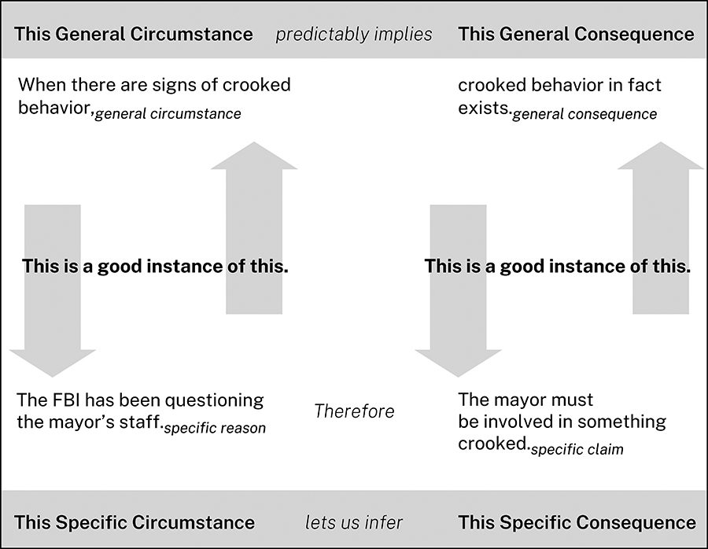

우리는 일상적 논증의 많은 유형을 정당화하기 위해 속담을 사용한다: 인과(*서두르면 낭비한다*); 행동 규칙(*뛰기 전에 보라*); 신뢰할 수 있는 추론(*제비 한 마리가 여름을 만들지 않는다*). 하지만 그런 속담만이 일상적 보증의 예는 아니다. 우리는 보증을 어디에서나 사용한다: 스포츠에서(*수비가 우승을 만든다*); 요리에서(*r이 담긴 달에만 굴을 제공하라*); 정의에서(*소수는 1과 자기 자신으로만 나눌 수 있다*); 심지어 연구에서(*청중이 증거의 한 부분에서 오류를 발견하면, 나머지를 불신한다*).

## 연구 논증에서의 보증

연구자와 다른 전문가의 전문적 논증에서, 보증은 정확히 같은 방식으로 작동하지만 특히 분야가 처음인 사람들에게는 관리하기 어렵게 만드는 몇 가지 측면에서 다르다.

첫째, 연구 논증의 보증은 항상 우리가 공유하는 상식이 아니다; 특정 연구 공동체에 속한 전문적 논증 원칙인 경우가 많다. 새로운 연구자들이 자신의 분야 보증을 파악하는 데는 시간이 걸린다. 사실 그것이 생물학자, 역사학자, 의사 등처럼 생각하는 법을 배우는 것의 대부분이다.

둘째, 전문가들은 동료 전문가에게 말할 때 보증을 명시적으로 명시하는 경우가 거의 없다. 동료 전문가들이 이미 그것을 알고 있다고 안전하게 가정하기 때문이다. (당연한 보증을 명시하는 것은 오만해 보이거나-더 나쁘게-소위 전문가가 전문가가 아님이 드러날 수 있다.)

이미 받아들여진 보증을 명시하지 않는 관행이 연구 공동체에 잘 작동하지만 논증을 평가하는 사람들과 분야를 배우는 초보자 모두에게 보증이 작동하는 것을 식별할 수 있는 것이 유용하다. 사용 가능한 증거가 근거를 뒷받침한다고 가정할 때, 생물학자들은 이 논증을 받아들일 것이다:

고래는 소보다 하마와 더 가까운 친척이다[주장] 왜냐하면 그것은 하마와 더 많은 DNA를 공유하기 때문이다. [근거]
>
어떤 생물학자도 *DNA가 유전적 관계를 측정하는 것과 어떻게 관련되는가?*라고 묻지 않을 것이다. 그래서 동료 생물학자를 대상으로 글을 쓰는 생물학자는 그 질문에 답하는 보증을 제시하지 않을 것이다. 하지만 비생물학자가 그 질문을 한다면, 생물학자는 다른 생물학자가 당연히 여기는 보증으로 대답할 것이다:

어떤 종이 하나의 종보다 다른 종과 더 많은 DNA를 공유할 때, 우리는 그것이 첫 번째 종과 더 가까운 친척이라는 것을 추론한다.

물론, 그 생물학자는 아마 그 보증도 설명해야 할 것이다. 요점은 이것이다: 보증이 명시적으로 명시될지는 논증뿐만 아니라 청중에도 달려 있다. 연구 공동체의 구성원은 그 공동체 외부의 사람들에게 소통할 때 또는 도전받을 때만 다른 구성원들에게 명백한 원칙을 명시한다.

셋째, 연구 공동체에 속한 전문적 보증은 그 상황과 결과를 압축하는 방식으로 명시되는 경우가 많다. 대부분의 속담에서 이 부분은 뚜렷하다: *연기가 있는 곳에는,*상황 *불이 있다.*결과. 하지만 우리는 이 두 부분을 다음과 같이 짧은 진술로 압축할 수도 있다: *연기는 불을 의미한다.* 이런 형태는 속담에서는 드물지만 전문가들은 흔히 이렇게 표현한다:

공유 DNA는 종 사이의 관계를 측정하는 기준이다.

이렇게 진술된 우리의 생물학자의 보증은 상황과 결과를 명시적으로 구별하지 않지만 우리는 할 수 있다. 명확성을 위해, 우리는 보증을 가장 명시적인 형태로 진술할 것이다: *X일 때, Y이다.*

다시 한번 일본의 경제 전망에 대한 논증이다:

일본은 생활 수준이 하락하고 있다[주장] 왜냐하면 일본의 출산율이 1.3으로 떨어지고 있기 때문이다. [근거]
>
누군가가 근거가 주장과 *불 관련*해 보인다고 반대하면, 그 논증을 하는 사람은 연결을 정당화하기 위해 보증을 제시해야 할 것이다:

어떤 국가의 노동력이 줄어들면, 일반적 상황 그 경제 전망은 어둡다.일반적 결과

상황과 결과는 특정 근거와 주장보다 더 일반적이어야 한다. 시각적으로, 그 논리는 이렇게 보인다:

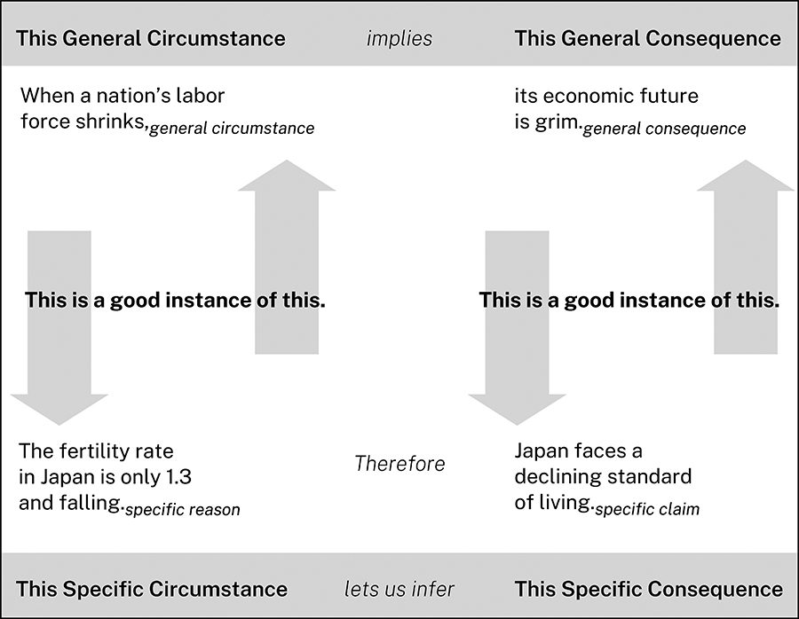

일상적 논증과 전문적 논증에서 패턴은 동일하다.

## 보증을 테스트하다

청중은 예측 가능한 방식으로 보증에 도전한다. 다음 논증을 생각해 보자:

18세기 초 뉴잉글랜드에서, 가장 부유한 농민 외에 많은 농민이 시계를 소유했을 가능성은 낮다[주장] 왜냐하면 농민들의 유언장에서 시계가 거의 언급되지 않기 때문이다. [근거] 1700년에서 1750년 사이 매사추세츠 4개 카운티에 제출된 그런 유언장 124개를 검토한 결과, 14퍼센트만 어떤 형태의 시계를 언급했다. [증거] 보고

그런 주장은 그것에 도전하는 사람들의 믿음에 의해 의문의 대상이 될 것이다. 근거가 사실-시계가 실제로 유언장에서 거의 언급되지 않았다-이라고 인정하더라도, 여전히 반대할 수 있다: *하지만 그것이 농민이 시계를 적게 소유했다고 믿는 근거가 되는지 모르겠다. 불 관련하다.* 이 논증을 하는 역사학자가 그 반대를 예상했다면, 보증으로 도입했을 것이다:

18세기 초 뉴잉글랜드에서, 유언장은 값비싼 가정용품을 나열했다. 그래서 유언장이 그런 물건을 언급하지 않으면, 유언자는 그것을 소유하지 않았다.보증 따라서 그럴 가능성은 희박하다[주장]

이 논증이 두 번째 보증에도 의존한다는 점에 유의하라: 매사추세츠 농민에게 사실인 것이 더 넓은 뉴잉글랜드 농민에게도 사실이라는 것이다. 하지만 역사학자가 그것이 의문의 대상이 되지 않을 것이라고 믿는다면, 명시하지 않아도 된다.

성공적인 보증은 다섯 가지 조건을 충족해야 한다. 즉, 청중이 다음 질문에 "예"라고 대답할 수 있어야 한다:

1. 그 보증이 합리적인가?
2. 충분히 제한적인가?
3. 경쟁하는 다른 보증보다 우월한가?
4. 이 분야에 적절한가?
5. 근거와 주장을 포괄할 수 있는가?

### 보증이 합리적인가?

청중이 보증의 결과가 상황에서 따라 나온다는 것을 받아들일 때, 보증은 합리적으로 보인다. 청중이 보증을 그대로 받아들이지 않는다면, 그것을 자체 논증의 주장으로 취급하여 자체 근거와 증거로 뒷받침함으로써 받아들이도록 설득해야 한다:

18세기 초 뉴잉글랜드에서, 유언장은 값비싼 가정용품을 나열했다. 그래서 유언장이 그런 물건을 언급하지 않으면, 유언자는 그것을 소유하지 않았다. [보증]/주장 Myles와 Winn(2018)은 그것이 사실임을 확인한다. [근거] 그들의 18세기와 19세기 미국의 상속 관행 연구는 ...을 보여준다. [증거]

### 보증이 충분히 제한적인가?

대부분의 보증은 특정 한계 내에서만 합리적이다. 예를 들어, 시계 소유에 대한 보증은 너무 엄격하다. 예외를 허용하지 않는 것처럼 보이기 때문이다:

18세기 초 뉴잉글랜드에서, 유언장은 값비싼 가정용품을 나열했다. 그래서 유언장이 그런 물건을 언급하지 않으면, 유언자는 그것을 소유하지 않았다.

자격을 주면 더 타당해 보일 것이다:

18세기 초 뉴잉글랜드에서, 유언장은 *보통* 소유자가 *특히* 값비 있다고 여기는 가정용품을 나열했다. 그래서 유언장이 그런 물건을 언급하지 않으면, 유언자는 *아마도* 그것을 소유하지 않았다.

하지만 *보통*, *아마도*, *특히* 같은 단어로 보증에 자격을 주기 시작하면, 그 예외가 근거와 주장을 제외하지 않는다는 것을 보여야 할 수도 있다: *보통*과 *아마도*는 얼마나 자주인가? 시계가 *특히* 값비싸게 여겨졌는가?

### 보증이 경쟁하는 다른 보증보다 우월한가?

보증이 합리적이고 충분히 제한적이라고 생각할 수 있지만 다른 보증이 경쟁하거나 대체할 수 있다. 다음은 두 가지 경쟁 보증으로, 둘 다 합리적이라고 할 수 있다:

사람들이 의료 시술이 자신을 해칠 수 있다고 믿을 때, 그것을 거부할 권리가 있다. Taylor는 COVID-19 백신이 심근염을 유발한다고 믿는다. 그래서 그것을 거부할 권리가 있다.
>
의료 결정이 공중보건에 관한 문제를 다룰 때, 국가가 그것을 규제할 권리가 있다. COVID-19에 대한 광범위한 예방접종은 모두를 더 안전하게 만든다. 그래서 국가는 정부 직원에게 그것을 강제할 수 있다.

어떤 보증이 우선해야 하는가? 그것은 논쟁의 문제이다.

경쟁하는 보증을 제한함으로써 조화시킬 수 있다:

사람들이 의료 시술이 자신을 해칠 수 있다고 믿을 때, 그것을 거부할 권리가 있다. 다른 사람의 건강을 위태롭히지 않는 한.
>
의료 결정이 공중보건에 관한 문제를 다룰 때, 국가가 그것을 규제할 권리가 있다. 국가가 개인의 신체에 일어나는 일을 통제할 권리를 최소한으로 침해하는 한.

올바른 균형, 또는 어떤 균형이든 찾는 것이 항상 쉬운 것은 아니다. 사실, 소위 "문화 전쟁" 논증(예: COVID-19 백신 요건에 대한 것)이 종종 뜨겁고 해결하기 어려운 이유는 근거나 증거보다 경쟁하는 가치와 원칙(즉, 보증)에 관한 것이기 때문이다.

### 보증이 이 분야에 적절한가?

보증이 합리적이고 충분히 제한적이고 다른 것보다 우월할 수 있지만 논증이 기여하는 분야에서 적절하다고 받아들여져야 한다. 법대생들은 많은 일상적 보증이 법적 논증에 자리를 잡지 못한다는 것을 배울 때 고통스러운 교훈을 얻는다. 대부분은 이런 상식적 믿음으로 법대에 진학한다:

누군가 잘못을 당하면, 법이 그것을 바로잡아야 한다.

하지만 법대생들은 법적 보증이 그런 상식적 아이디어를 대체할 수 있다는 것을 배워야 한다. 예를 들어:

누군가가 의도적으로든 아니든 법적 의무를 무시하면, 그 결과를 감수해야 한다.

따라서:

노인 주택 소유자가 부동산 세금을 내는 것을 잊으면, 다른 사람들이 그들의 집을 체납 세금으로 구매하고 퇴거시킬 수 있다.

법대생들은 엄격한 법적 의미에서 정의가 그들이 윤리적이라고 믿는 결과가 아니라 법과 법원이 지지하는 결과라는 것을 배워야 한다.

### 근거를 포괄할 수 있는 보증인가?

마지막으로, 근거와 주장이 보증의 일반적 상황과 일반적 결과에 적합한 사례인지 확인해야 한다. 예를 들어:

아흐메드: 어서 생산성 앱을 써 보자[주장] 왜냐하면 너는 항상 전체 직원 회의를 빠지잖아.[근거]

베스: 왜 생산성 앱이 회의 참석에 도움이 될 것이라고 생각해?

아흐메드: 만약 더 정리가 잘 되어 있다면(일반적 상황), 약속을 더 잘 기억할 수 있을 거야(일반적 결과).

베스: 그건데, 내가 회의를 빠지는 건 정리가 안 되어서가 아니야.

베스는 아흐메드의 근거가 사실이 아니어서가 아니라, 아흐메드의 보증의 일반적 *상황*에 해당하는 유효한 *사례*가 아니어서 반대한다. 그녀는 회의를 빠진다는 사실 자체는 부정하지 않는다; 다만 빠지는 *이유*가 정리가 안 되어서라는 데만 동의하지 않는다. (아마도 회의가 시간 낭비라고 생각하는 것일 수도 있다.) 베스에게는 아흐메드의 근거가 그의 보증에 의해 포괄되지 않으므로 *관련성*이 없다.

베스는 또한 생산성 앱을 쓰면 오히려 정리가 더 안 될 것이라고 대답할 수도 있다:

베스: 나는 항상 일일 플래너를 써 왔기 때문에, 앱이 도움이 될 것 같지 않아.

그렇다면 그녀는 아흐메드의 주장이 보증의 *결과*에 해당하는 좋은 사례가 아니며 따라서 근거에서 *따라 나온다*고 할 수 없다고 반대하는 것이다: 정리가 안 되어 있다 하더라도, 생산성 앱은 그녀에게 도움이 되지 않을 것이다.

대부분의 실제 논증은 이 예와 비슷하다. 보증의 일반적 상황에 해당하는 것이 "여겨지는지", 또는 특정 결과로 무엇이 따라 나온다는 것은 다툼과 협상의 대상이지, 논쟁의 여지가 없는 정의의 문제가 아니다. 아흐메드와 베스는 기하학적 도형을 삼각형으로 만드는 것에 대해서는 결코 논쟁하지 않겠지만 어떤 사람이 "정리가 안 된" 사람이라고 볼 수 있는지에 대해서는 합리적으로 의견이 다를 수 있다. 이것이 보증에 관한 논증이 추가 논증으로 이어지고 이상적으로는 더 나은 이해로 이어지는 또 다른 이유이다.

## 보증을 명시해야 할 때를 아는 것

어떤 분야의 논증이든 수많은 추론 원칙에 의존하지만 대부분의 원칙은 연구자의 암묵적 지식에 너무 깊이 박혀 있거나 너무 광범위하게 수용되어 기록되지도, 심지어 인식되지도 않는다. 하지만 보증을 명시적으로 밝혀야 하는 세 가지 경우가 있다:

1. 분야 밖의 청중에게 말할 때. 전문 지식을 공유하지 않는 청중에게 논증을 할 때, 그 분야 전문가들이 어떻게 결론을 도출하고 주장을 뒷받침하는지 설명해야 할 수도 있다. 특히 그런 추론 방식이 일반적이지 않을 때 그렇다.
2. 분야에서 새로거나 논쟁적인 추론 원칙을 사용할 때. 비관습적인 추론 원칙에 의존할 때는, 적어도 일부 사람들로부터 회의적으로 받아들여질 것이라고 예상할 수 있다. 그래서 보증을 명시하고 정당화하여 그 회의를 풀어라. 그 보증을 사용하는 분야의 존경받는 인물들을 언급하라. 그렇게 할 수 없다면, 당신의 추론을 방어하는 자체 논증을 제시하라.
3. 어떤 사람들이 단지 사실이기를 원하지 않기 때문에 저항할 주장의 경우. 이 경우, 그들이 저항할 것이라고 의심되는 근거와 주장을 제시하기 *전에*, 그들이 수용하기를 바라는 보증을 제시하는 것이 좋은 전략이다. 그 주장이 더 좋아지지는 않겠지만 적어도 합리적이지 않은 것은 아니라고 보게 될 것이다. 예를 들어:
   1. 우리는 인간의 행위가 기후 변화에 크게 책임이 있다고 인정해야 한다[주장] 왜냐하면 거의 모든 기후 과학자들이 그렇게 보기 때문이다. [근거]

청중은 그 주장이 자신들이 가진 다른 강한 확신을 위협하기 때문에 저항할 수 있다. 그런 청중에 직면한 연구자는 적어도 그 주장이 합리적이라는 것을 고려하도록 유도하기 위해, 그들이 수용할 수 있을 것으로 보이는 보증을 제공할 수 있다:

당신이 말하지 않는 것이 당신이 누구인지를 보여준다

청중이 인식하지 못할 수 있는 추론 원칙을 설명하기 위해 보증을 명시하고 지지할 때, 당신은 예의 바르게 대한다. 하지만 알아야 할 사람들에게 명시해야 할 보증에 대해 침묵할 때, 똑같이 강력하고( 덜 친절한) 조치를 취한다. 어떤 식이든 보증은 논증을 통해 발산하는 에토스(ethos)를 청중이 인식하는 방식에 상당한 영향을 미친다.

1. 대다수의 유능한 전문가가 동일한 결론에 도달할 때, 우리는 그것을 신뢰할 수 있다.보증 그래서 우리는 인간의 행위가 기후 변화에 크게 책임이 있다고 인정해야 한다[주장] 왜냐하면 거의 모든 기후 과학자들이 그렇게 보기 때문이다. [근거]

청중이 보증이 합리적이고, 근거가 사실이며, 근거와 주장이 보증의 일반적 상황과 결과에 해당하는 좋은 사례라는 것을 받아들일 때, 그들은 적어도 그 주장을 *고려*할 의무가 있다. 그렇지 않으면, 어떤 합리적 논증도 그들의 마음을 바꾸지 못할 것이다.

## 보증을 사용하여 논증을 테스트하기

보증을 상상함으로써 논증의 타당성을 테스트할 수 있다. 다음은 결함이 있는 논증이다:

현재 12-16세 어린이는 한 세대 전 동연령 아동보다 정신 건강 문제에 더 취약하다. [근거] 브라운(2021)은 2010년 이후 어린이의 불안과 우울 유병률이... [증거] 우리는 소셜 미디어가 어린이의 정신 건강에 해로운 영향을 미치고 있다고 결론내려야 한다[주장]

어디가 잘못되었는지 이해하기 위해, 근거-어린이의 정신 건강 문제가 증가하고 있다-를 소셜 미디어가 적어도 부분적으로 그 증가에 책임이 있다는 주장과 연결할 수 있는 보증을 상상해 보자. 그 주장은 상식적으로 보이거나 심지어 사실일 수도 있지만 그 *특정* 근거를 그 *특정* 주장과 연결할 수 있는 만족스러운 보증(즉, 8.3절에서 언급한 다섯 가지 기준을 충족하는 보증)은 없다. 보증은 이런 것이어야 한다:

어린이의 정신 건강이 악영향을 받을 때(일반적 상황), 소셜 미디어가 원인이다(일반적 결과).

그것은 합리적으로 보이지 않는다. 왜 하필 소셜 미디어를 특별히 지목하는가? 어린이에게 악영향을 미칠 수 있는 다른 모든 영향력은 어떤가?

그 논증을 고치려면, 근거를 청중이 수용할 보증의 일반적 상황에 해당하도록 수정해야 하며 그것은 또한 수정된 근거를 뒷받침하는 새로운 증거를 제시해야 할 수도 있다:

어린이가 통제할 수 없는 악영향에 더 많이 노출될수록, 정신 건강에 미치는 부정적 영향은 더 심각해진다.보증 12-16세 어린이의 불안과 우울의 알려진 위험 요소인 소셜 미디어 사용은 지난 10년 동안 크게 증가했다.새 근거 존스(2022)는...을 보여준다새 증거 이러한 사실들을 고려할 때, 소셜 미디어 사용 증가가 10년 전 어린이보다 오늘날 어린이를 정신 건강 문제에 더 취약하게 만들고 있는 것으로 보인다[주장]

이제 근거와 주장이 보증이 포괄하거나 포함하는 범위에 더 가까워 보인다. 이 논증의 논리를 아래 그림에 보인다.

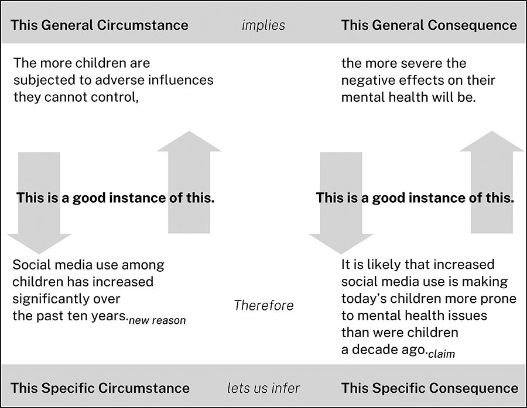

하지만 논증을 흔들어 보려는 회의론자는 여전히 반대할 수 있다:

잠깐. 소셜 미디어가 어린이가 "통제할 수 없는" "악영향"인 것은 아니다. 긍정적 영향도 있을 수 있지 않은가? 물론, 어린이의 소셜 미디어 사용은 불안과 우울의 위험과 관련이 있지만 그렇지 않으면 고립될 수 있는 친구들과 연결되도록 해주기도 한다...

대응하기 위해, 연구자는 그 도전에 대처해야 한다. 이제 왜 중요한 이슈가 끝없이 다투는지, 왜 심지어 자신의 주장이 완벽하다고 느낄 때도 다른 사람들이 *잠깐만, 그건 어쩌면...?*이라고 말할 수 있는지 이해하게 되었다.

## 다른 사람의 보증에 도전하기

가장 어려운 논증은 주장과 증거뿐만 아니라 연구 공동체가 포용하는 보증에 도전하는 논증이다. 어떤 논증 과제보다 어렵다. 그렇게 함으로써, 그 공동체가 그들이 믿는 *것*뿐만 아니라 *어떻게* 추론하는지도 바꾸라고 요구하기 때문이다. 보증에 성공적으로 도전하려면, 먼저 그것을 수용하는 사람들이 어떻게 방어할지 상상해야 한다. 보증은 서로 다른 종류의 지지 논증에 기반할 수 있으므로, 서로 다른 방식으로 도전해야 한다.

### 경험에 기반한 보증에 도전하기

일부 보증은 우리의 경험이나 다른 사람들의 보고에 기반한다:

누군가가 습관적으로 거짓말하면, 우리는 그를 신뢰해서는 안 된다.
>
연기가 있는 곳에는 불이 있다.
>
정부 채권의 수익률 곡선이 역전될 때, 불황이 올 가능성이 높다.

그런 보증에 도전하려면, 그 경험의 신뢰성에 도전해야 하며 그것은 거의 쉽지 않거나, 특별한 경우로 치부할 수 없는 반례를 찾아야 한다.

### 권위에 기반한 보증에 도전하기

우리는 어떤 사람들을 그들의 전문성, 직위, 또는 카리스마 때문에 신뢰한다:

권위 X가 Y라고 말할 때, Y는 반드시 그래야 한다.

권위에 도전하는 가장 쉽고-가장 친절한-방식은, 그 문제에 대해 그 권위가 모든 증거를 갖고 있지 않거나 전문 범위를 벗어나고 있다고 논증하는 것이다. 가장 공격적인 방식은 그 출처가 사실상 권위가 전혀 아니라고 논증하는 것이다.

### 지식 체계에 기반한 보증에 도전하기

이러한 보증은 정의, 원칙 또는 이론의 체계에 의해 뒷받침된다:

* 수학에서: 두 개의 홀수를 더하면 짝수가 된다.
* 생물학에서: 생물이 유성 생식할 때, 자손은 어느 부모와도 다르다.
* 법에서: 판례가 있을 때, 판사는 그것을 따라야 한다.

이런 보증에 도전할 때, "사실"은 거의 관련이 없다. 체계에 도전해야 하며(항상 어렵다), 또는 그 사건이 그 보증에 해당하지 않는다는 것을 보여야 한다.

### 문화적 보증에 도전하기

문화적 보증은 개인의 경험에 의해 뒷받침되는 것이 아니라 전체 문화의 공통 경험에 의해 뒷받침되므로, 공격하기 어려운 "상식"으로 보인다:

뿌린 대로 반드시 거두는 법이다.
>
모욕은 보복을 정당화한다.
>
죽이지 못하는 것은 강하게 만든다.

이런 보증은 시간이 지남에 따라 변할 수 있지만 천천히 변한다. 경쟁하는 보증을 제시하거나 문화적 특수성을 지적함으로써 도전할 수 있다.

### 방법론적 보증에 도전하기

이 보증은 특정 사례에 적용되기 전까지는 내용이 없는 일반적 사고 패턴이다. 우리는 이를 추상적 추론을 설명하는 데 사용한다(많은 속담의 원류이다):

* 일반화: 알려진 모든 X 사례에 Y 특성이 있을 때, 모든 X는 아마도 Y 특성을 가질 것이다. (*한 번 보면 모두 본 것이다.*)
* 유추: X가 대부분의 면에서 Y와 같을 때, X는 다른 면에서도 Y와 같을 것이다. (*도토리는 나무에서 멀리 떨어지지 않는다.*)
* 징후: Y가 X 전후 또는 도중에 정기적으로 발생할 때, Y는 X의 징후이다. (*찬 손은 뜨거운 마음.*)

철학자들은 이런 보증에 의문을 제기했지만, 실제 논증에서는 적용에만 도전하거나 제한 조건을 지적한다: *그래, X를 Y에 비유할 수 있지만, 만약...이라면.*

### 신앙 조항에 기반한 보증에 도전하기

일부 보증은 도전의 대상이 아니다: 토마스 제퍼슨은 독립선언서에 *우리는 다음과 같은 진리를 자명한 것으로 보유한다. 모든 인간은 평등하게 창조되었다....*라고 쓸 때 하나를 소환했다. 다른 예로는

주장이 자연법에 기반할 때, 반드시 사실이어야 한다.
>
주장이 신의 계시에 기반할 때, 반드시 사실이어야 한다.

이런 보증은 논증에 의해 뒷받침되는 것이 아니라 그것을 지지하는 사람들의 확신에 의해 뒷받침되므로, 경쟁하는 보증으로 직접 다투는 것이 거의 불가능하다. 보증이 특정 주장을 논쟁의 대상으로 만들어 논증의 주고받음을 단축시키는 데 사용될 때, 우리는 연구와 연구 논증의 영역을 벗어났다. *판단*이 아니라 *가정*된 주장- Supporting it의 이유와 증거 때문에 사실 또는 적어도 타당하다고 판단된 것이 아니라-은 연구의 산물로 간주될 수 없다.

::: {.callout-tip}
### 근거, 증거, 그리고 보증

근거를 정당화하는 두 가지 방법이 있다: 그것을 뒷받침하는 증거를 제시하거나, 보증에서 그것을 도출함으로써. 이 두 가지 방법은 각각 다른 종류의 논증으로 이어진다. 연구자들은 일반적으로 첫 번째 종류를 두 번째보다 더 신뢰한다. 그래서 가능할 때는 확실한 증거를 기반으로 근거를 세워라. 다음 두 논증을 비교해 보자:

우리는 십대들이 운전 중 문자 사용을 하지 않도록 해야 한다[주장] 왜냐하면 산만한 운전이 십대 사망의 주요 원인이기 때문이다. [근거] CDC에 따르면, 차량 사고는 12-19세 인구의 치명 사고의 3분의 1 이상을 차지하며 운전 중 문자 사용은 어떤 운전자든 사고에 연루될 가능성을 기하급수적으로 높인다. 더불어,... [증거]
>
우리는 십대들이 운전 중 문자 사용을 하지 않도록 해야 한다[주장] 왜냐하면 그렇게 하면 사고 위험이 높아지기 때문이다. [근거] 1 운전은 어렵고 문자 사용은 산만함을 유발하며(근거 2, 근거 1을 지지), 사람들은 복잡한 작업을 수행하면서 산만해질 때 성과가 떨어진다는 것을 우리는 알고 있다. [보증] 근거 2와 근거 1을 연결

만약 대부분의 사람들처럼 당신이라면, 아마도 첫 번째 논증을 선호할 것이다. 그것은 보증이 논쟁의 여지가 없기 때문이며(그래서 굳이 말할 필요 없이) 주장이 확실한 증거에 기반한 근거로 뒷받침되기 때문이다. 두 번째 논증은 그럴듯해 보이지만 근거 1과 근거 2가 그 보증의 일반적 결과와 조건에 해당하는 좋은 사례이기 때문이다. 하지만 대부분의 사람들은 여전히 증거를 원한다.

특히, 사실 주장(6.1절 참조)은 보증과 근거만으로는 뒷받침할 수 없다:

운전 중 문자 사용이 십대 사망의 주요 원인이다[사실 주장] 왜냐하면 운전 중 문자 사용은 매우 산만하게 하기 때문이다. [근거] 운전자가 산만해질 때, 심각하거나 심지어 치명적인 사고 위험이 높아진다보증

*그래, 사실일 수 있지만 증거가 있었으면 좋겠어?*라고 생각하는가? 이 상식적 반응은 말하고 있는 것이 있다. 우리는 *추론*만으로 운전 중 문자 사용이 십대 사망의 *주요* 원인이거나, 심지어 *아예* 십대 사망을 유발한다는 결론에 도달할 수 없다. 몇몇 분야-수학의 일부 분야, 철학, 신학-를 제외하고 사실 주장을 입증하는 방법은 당신이 주장하는 것이 *사실*임을 증거로 보여주는 것이다.

교훈은 이것이다: 가능할 때마다, 보증에 기반한 정교한 추론에 의존하지 말고 확실한 증거에 의존하라.
:::

# 9장 인정과 대응

논증이 다른 관점을 인정하지 못하면 완성되지 않는다. 이 장에서는 질문, 반대, 대안에 대해 인정하고 대응함으로써 논증을 더 설득력 있게 만드는 방법을 보여준다.

논증의 핵심은, 다시 말하지만 증거에 기반한 근거로 뒷받침되는 주장이다. 우리는 추가 하위 근거와 그 증거, 그리고 아마도 그 주장과 근거를 연결하는 보증으로 그것을 두텁게 한다. 하지만 주장, 근거, 증거, 보증만을 제시한다면-그것이 당신에게 아무리 설득력 있더라도-청중은 여전히 논증이 빈약하거나 그들의 관점을 무시한다고 느낄 수 있다. 논증은 단순한 논리적 구조일 뿐만 아니라 사회적 상호작용이기도 하다.

성공적인 논증을 만들려면, 주장, 근거, 증거의 견고한 구조를 만드는 것 이상을 해야 한다; 청중이 투자한 지속적인 대화에 기여하는 것으로서 그 주장을 위치시킴으로써 청중을 논증으로 끌어들여야 한다(서론과 5.1절 참조). 청중이 관심을 가지는 문제에 대한 해결책으로 주요 주장을 제시함으로써 그렇게 할 수 있다(14장에서 더 자세히 설명할 소개의 중요한 기능이다). 또한 청중이 제기할 것으로 예상되는 질문, 반대, 대안을 예상하고, 인정하고, 대응함으로써 그렇게 할 수 있다. 논문이나 발표를 계획하고 초안을 작성할 때, 그 사람들은 당신에게 질문하거나 자신의 관점을 제시하러 오지 않을 것이다. 그래서 당신은 그들의 질문과 관점을 *상상*하고 그것을 고려해야 한다. 이것이 청중과 협력적 관계를 구축하는 방법이다; 청중 구성원들과 대화하고 있다고 상상함으로써.

이 장에서는 청중이 논증에 대해 할 수 있는 세 가지 질문을 상상하고 다루는 방법을 보여준다:

* 연구 질문이나 그에 해당하는 문제에 도전할 수 있다; 논증이 왜 가치 있는지 의문을 가질 수 있다.
* 논증의 타당성이나 일관성을 질문할 수 있다; 주장의 명확성, 근거와 증거의 질, 또는 논리와 추론.
* 대안을 고려하라고 요청할 수 있다; 문제를 구-frame하는 다른 방법, 다른 가능한 주장이나 해결책, 간과한 증거, 또는 그 주제에 대해 다른 사람들이 쓴 것.

세 가지 질문 모두에 대해 예상하고, 인정하고, 대응할 때, 청중이 더 신뢰하고 수용할 논증을 만든다. 스스로를 너무 쉽게 하지 말라: 논증의 문제를 발견할 때가 그것을 고칠 때이다.

## 연구 문제에 관한 질문들

1부에서 우리는 좋은 연구란 흥미로운 문제로 이어지는 좋은 질문에서 시작된다고 언급했다. 즉, 연구 공동체가 중요하고 해결할 가치가 있다고 믿는 문제여야 한다. 연구 문제에 관한 질문은 논증 자체에 관한 질문이라기보다는 논증에 앞서는 질문이다. 그러나 이러한 질문에 답할 수 없다면, 청중이 당신의 논증에 전혀 주의를 기울이지 않게 될 위험이 있다. 연구자가 청중이 만족할 수 있도록 답할 수 있어야 하는 첫 번째 질문은 바로 *내가 왜 신경 써야 하는가?*이다. (1.4.3, 2.5, 6.2절 참조.)

청중은 연구 논증이 다루는 질문이나 문제의 중요성을 이해할 때, 그리고 당신의 연구 프로젝트를 신뢰할 때-즉 당신의 프로젝트가 신뢰할 만한 해결책이나 답변으로 이어질 수 있다고 믿을 때-비로소 그 논증에 관심을 갖게 된다. 다음은 그러한 신뢰를 형성하기 위해 다룰 수 있는 몇 가지 질문이다.

연구 문제부터 시작하라:

1. 1. *왜 문제가 존재한다고 생각하는가?* 그 상황의 비용이나 결과는 당신과 당신의 청중 모두에게 중요해야 한다.
2. 2. *문제를 적절하게 정의했는가?* 문제가 당신이 제기하는 쟁점과 관련이 있는지(다른 쟁점이 아닌지), 그리고 그 범위가 관리 가능한 수준인지(너무 크지도, 너무 작지도 않은지) 확인하라.
3. 3. *문제가 실천적인가, 개념적인가?* 즉, 해결책으로서 *행동*을 요구하는가, 아니면 *이해*를 요구하는가?
4. 4. *그 문제는 왜 중요한가?* 당신의 청중이 받아들일 만한 답변이 필요하다.
5. 5. *청중은 당신의 프로젝트가 문제를 해결할 수 있게 해줄 것이라고 믿을 것인가? 왜 그런가, 혹은 왜 그렇지 않은가?* 때로는 연구 질문에 답하기 전에, 먼저 당신이 그 질문에 답할 수 있다는 점을 청중에게 설득해야 한다(예를 들어, 필요한 역량이나 전문성을 갖추고 있음을 입증하거나 필요한 데이터를 얻을 수 있음을 보여줌으로써).

## 논증의 타당성에 관한 질문들

다음 질문들은 논증의 핵심-주장, 근거, 증거-과 보증에 관한 것이다. 이 질문들은 논증 자체의 질, 즉 논증의 여러 부분이 얼마나 잘 어우러지는지와 관련된다. 문제에 대한 해결책, 즉 주장부터 시작하라:

1. 1. *해결책이나 주장이 실천적인가, 개념적인가? 그리고 그것이 문제와 부합하는가?*
2. 2. *해결책이나 주장이 문제를 실제로 해결하는가?*
3. 3. *주장이 충분히 구체적인가, 아니면 너무 포괄적이거나 모호한가?*
4. 4. *주장에 이견의 여지(반론 가능성)가 있는가?*
5. 5. *주장이 적절히 한정(hedge)되어 있는가, 아니면 지나치게 강하게 진술되었는가?*

논증이 겉보기에는 취약해 보이지만 실제로는 그렇지 않은 부분을 주목하라. 예를 들어, 청중이 당신의 해결책에 실제로는 없는 비용이나 부작용이 수반된다고 생각할 것으로 예상된다면, 이를 인정하고 대응함으로써 그러한 우려를 해소할 수 있다:

특정 은행들의 행위에 초점을 맞춤으로써 우리가 금융 위기를 초래한 구조적 힘을 경시하는 것처럼 보일 수도 있지만 사실 우리의 사례 연구는 다음을 보여줄 것이다...

다음으로, 뒷받침 요소-근거와 증거-에 질문을 던져라. 먼저 근거부터 시작하라:

1. 1. *충분한 근거를 갖추었는가?*
2. 2. *근거들이 일관성이 있는가, 아니면 서로 모순되는가?*
3. 3. *근거들이 당신의 주장과 관련이 있는가?*

다음으로, 증거에 대한 도전을 상상해 보라. 청중은 증거의 종류나 최신성에 의문을 제기할 수 있다:

1. 1. “우리 분야에 적합하지 않은 종류의 증거입니다.”; “나는 다른 *유형*의 증거를 보고 싶습니다. 일화(또는 차가운 숫자가 아닌 실제 사람들에 관한 이야기)가 아니라 확실한 숫자 데이터 말입니다.”
2. 2. “이 증거는 구식입니다.”; “이것보다 더 최신의 연구가 있습니다.”

적절한 종류의 증거를 제시하고 증거가 최신이라 하더라도, 청중은 여전히 그 품질에 의문을 제기할 수 있다:

1. 1. “정확하지 않습니다. 수치가 맞아떨어지지 않아요.”
2. 2. “충분히 정밀하지 않습니다. '다수'라는 말이 정확히 무엇을 뜻합니까?”
3. 3. “충분하지 않거나 대표성이 없습니다. 모든 집단에 대한 데이터를 확보하지 못했군요.”
4. 4. “권위가 없습니다. 스미스는 이 분야의 전문가가 아닙니다.”
5. 5. “이해하기 어렵습니다. 당신의 데이터를 도무지 납득할 수 없네요.”
6. 6. “이해가 안 됩니다. 이것이 어떻게 관련이 있다는 건가요?”

청중이 당신과 다른 해결책에 이해관계를 갖고 있을 때 특히 회의적일 수 있다. 따라서 증거에 한계가 있다고 느낀다면, 청중이 이의를 제기하기 전에 솔직하게 그 한계를 인정하는 것이 좋을 수 있다. 요컨대, 논증을 구성할 때는 가장 회의적인 청중이 할 법한 방식으로 당신의 주장, 근거, 증거를 시험해 보라. 그러면 그들이 제기할 것으로 예상되는 가장 중요한 반론들에 최소한 대응할 수 있다. 청중이 당신의 논증을 검증하기 전에, 당신 자신이 먼저 논증을 ‘스트레스 테스트’에 통과시켰음을 청중에게 보여주어라. 그럼에도 불구하고 일부는 여전히 설득되지 않을 수 있다. 그들이 애초에 설득될 의지가 없었거나(따라서 처음부터 진정한 대화 상대가 아니었거나), 단순히 납득하지 못한 것이다. 그렇다면 어쩔 수 없는 일이다.

## 논증에 대한 대안 상상하기

논증의 한계를 인식할 때, 당신은 정직하게 주장을 펼치고 청중을 공정하게 대하고 있음을 보여줌으로써 신뢰성을 쌓게 된다. 논증의 장점과 한계를 이해하고 있을 뿐만 아니라, 그에 대한 대안까지 이해하고 깊이 생각해 보았음을 보여준다면 더욱 신뢰를 얻을 수 있을 것이다.

세상을 당신과 다르게 바라보는 사람들은 당신과 다른 견해를 가질 뿐만 아니라 용어를 다르게 정의하고, 다르게 추론하며, 심지어 다른 증거를 제시할 가능성이 높다. 이러한 차이를 단순히 무시하지 말고 그중 가장 중요한 것들을 인정하고 대응함으로써 당신의 논증 안으로 끌어들여라.

주제와 청중을 매우 잘 알고 있다면 스스로 그러한 대안들을 상상해 볼 수 있다. 그러나 대안적 관점을 파악하는 가장 좋은 방법은 보통 문헌 자료를 살펴보는 것이다. 4장에서 우리는 연구를 진행하는 동안 자료와 능동적으로 *대화*하고 자료를 단순한 정보의 원천으로만 쓸 것이 아니라 자신의 생각을 자극하는 데 활용하라고 권장했다. 문헌 자료는 당신이 대응할 수 있는 대안적 견해들을 풍부하게 제공해 준다.

2차 자료는 당신의 주제, 질문, 문제에 관한 대화의 기록물이라고 생각할 수 있다. 그 대화를 파악하면 당신도 거기에 기여할 수 있게 된다. 자료를 읽을 때, 그들이 당신과 다른 주장을 펼치거나, 다른 접근법을 취하거나, 문제의 다른 측면에 초점을 맞추는 부분을 메모하라. 특히 당신과 자료가 어디서, 왜 의견을 달리하는지 주목하라. 또한 한 자료가 다른 자료와 의견을 달리하는 부분도 주목하라. 이 모든 불일치는 당신의 논증에서 인정해야 할 대안을 찾는 데 도움이 된다. 특정 자료에 어떻게 대응할지 생각이 떠오른다면, 읽으면서 그 대응을 메모에 추가하라.

자료의 주장뿐만 아니라 그들의 근거와 증거, 그리고 추론 방식에도 대응할 수 있다. 청중이 진지하게 받아들일 수 있지만 당신은 설득력이 없다고 생각하는 자료를 발견했다면, 무시하지 마라. 대신 그 이유를 설명하라. 마지막으로, 문헌 자료는 청중의 모습을 상상하고 당신의 논증에 대한 청중의 반응을 예측하는 데도 도움이 된다. 종종 청중은 당신이 참고한 자료의 저자들과 유사한 사람들로 구성되며 때로는 그 저자 자신이 청중에 포함되기도 한다.

## 무엇을 인정할지 결정하기

논증에 대한 대안과 반론을 몇 가지만 떠올릴 수 있다 하더라도 ‘골디락스 딜레마’에 직면하게 된다. 너무 많은 것을 인정하면 논증의 핵심에서 벗어나 산만해지고 너무 적게 인정하면 청중의 견해를 무시하거나 심지어 무지한 것처럼 보일 수 있다. 당신은 얼마나 많은 인정이 ‘딱 알맞은지’를 판단해야 한다.

### 무엇에 대응할지 선택하기

대안과 반론의 목록을 좁히려면 다음과 같은 우선순위를 고려하라:

* 반박할 수 있는 그럴듯한 약점 지적
* 해당 분야에서 중요한 대안적 논증의 흐름
* 청중이 사실이기를 *바라는* 대안적 결론
* 청중이 이미 알고 있는 대안적 증거
* 반드시 다루어야 하는 중요한 반례

논증의 일부를 다시 강조할 수 있는 기회를 찾아라. 예를 들어, 청중이 당신 논증의 범위를 오해할 수 있다면, 그들의 우려를 인정하고 명확한 설명을 통해 당신의 요점을 상기시켜라:

일부 양식 어류의 중금속 오염에 대해 우려할 만한 이유가 있지만 본 연구는 자연산 어류의 영양학적 가치에 초점을 맞추고 있다...

또는 청중이 당신의 해결책과 유사한 대안적 해결책을 떠올릴 수 있다면, 그것을 활용하여 당신 해결책의 장점을 강조하라:

대부분의 연구자들은 글쓰기가 “규칙을 따르는 의식적 과정이 아니라 의미를 만들어내는 비의식적 행위”이기 때문에, 규칙이나 다른 형태의 형식적인 글쓰기 조언이 수행 능력을 향상시키기보다는 오히려 떨어뜨린다고 주장한다. 이는 과정의 일부 측면에서는 사실이다. 필자가 문장을 작성할 때 규칙을 일일이 참조해서는 안 된다. 그러나 글쓰기에는 초안 작성뿐만 아니라 많은 의식적 과정도 포함된다. 본 연구가 보여주고자 하는 것은 글쓰기의 *의식적* 측면에서 어떤 종류의 공식적인 조언이 효과가 있고 어떤 조언이 효과가 없는지이다....

마지막으로, 청중에게 특히 매력적으로 다가갈 수 있는 대안을 인정하되, 그것을 대수롭지 않게 일축해 버리는 것처럼 보이지 않고 실질적으로 대응할 수 있는 경우에만 그렇게 하라.

### 논증의 약점 인정하기

논증에서 해결할 수 없는 약점을 발견했다면, 문제를 재정의하거나 논증을 재구성하여 그 약점을 피하도록 노력하라. 하지만 그렇게 할 수 없다면 어려운 결정에 직면하게 된다. 그 약점을 그냥 무시하고 청중이 알아차리지 못하기를 바랄 수도 있다. 그러나 그것은 부정직한 태도이다. 청중이 그것을 알아차리면 당신의 역량을 의심할 것이고 당신이 그것을 숨기려 했다고 생각하면 정직성을 의심할 것이다. 우리의 조언이 순진해 보일지 모르지만 실제로 효과가 있다. 솔직하게 문제를 인정하고 다음과 같이 대응하라:

* 논증의 나머지 부분이 그 약점을 충분히 보완하고도 남는다.
* 그 약점이 심각하기는 하지만 추가 연구를 통해 이를 해결할 방안이 밝혀질 것이다.
* 그 약점으로 인해 당신의 주장을 온전히 수용하기는 어렵더라도, 당신의 논증이 해당 질문에 중요한 통찰을 제공하며 더 나은 답변이 갖추어야 할 특성이 무엇인지를 시사한다.

때때로 연구자들은 자신이 지지하고 싶었지만 입증할 수 없었던 주장을 다른 사람들이 합리적이라고 생각할 만한 가설로 다룸으로써 실패를 성공으로 전환하기도 한다. 그런 다음 그것이 왜 그렇지 않은지를 보여준다:

배심원들이 피해자의 고통에 초점을 맞춘 형태로 사건의 사실관계를 들을 때 피고인을 비난할 가능성이 더 높아질 것처럼 보일 수 있다. 결국 그것이 원고 측 변호사들의 통상적인 관행이며 우리 연구가 입증할 것으로 기대했던 바이다. 그러나 실제로 우리는 다음과 같은 상관관계를 전혀 발견하지 못했다...

### 답할 수 없는 질문 인정하기

초보 연구자들은 종종 어떤 주제에 대해 마지막 결론을 내리고 완전한 동의 외에는 어떠한 반론도 허용하지 않는 완벽한 논증을 만들고자 한다. 이는 잘못된 생각이다. 경험 많은 연구자들은 연구의 목표가 대개 연구 공동체의 집단적 이해를 발전시키고 그 대화를 지속시키는 데 있다는 점을 잘 알고 있다. 실제로 가장 자극적인 연구는 기존 질문에 대한 답을 제시하는 연구가 아니라, 우리가 미처 생각하지 못했던 새로운 질문을 던져주는 연구인 경우가 많다. 이는 개념적 문제를 다루는 연구에서 특히 그러하지만 응용 연구에서도 마찬가지이다.

식견 있는 청중이라면 모든 답을 다 알고 있는 척하는 사람보다, 여전히 남아 있는 질문들에 대해 솔직하게 밝히는 당신과 당신의 논증을 훨씬 더 높이 평가할 것이다.

## 대응을 하위 논증으로 구성하기

단순히 경쟁하는 주장을 내세우는 것만으로는 대안과 반론에 제대로 대응할 수 없다. 최소한의 대응이라 할지라도 설명이 요구된다:

미국 질병예방특별위원회(USPSTF)와 같은 일부 기관에서는 55세 이상 남성의 일상적인 PSA 선별검사를 권고하지 않지만,반대 인정 우리는 전립선암 가족력이 있는 남성과 같은 고위험군을 대상으로 한 검진의 가치에 특별히 관심을 두고 있다.반대가 적용되지 않는 이유 설명

이러한 초기 설명만으로 충분할 수도 있지만 더 필요하다고 느껴진다면 추가적인 뒷받침을 제공하라:

미국 질병예방특별위원회(USPSTF)와 같은 일부 기관에서는 55세 이상 남성의 일상적인 PSA 선별검사를 권고하지 않지만,반대 인정 우리는 전립선암 가족력이 있는 남성과 같은 위험군을 대상으로 한 검진의 가치에 특별히 관심을 두고 있다.반대가 적용되지 않는 이유 설명 우리는 일상적인 PSA 선별검사가 과잉 진단과 과잉 치료를 초래하여 많은 남성들에게 불필요한 부작용을 겪게 했다는 점을 인정하지만,반대에 대한 추가적 양보 차이 등(Tsai et al., 2021)의 연구에 따르면 효과적인 상담과 병행할 경우 위험군을 대상으로 한 검사는 ...의 발생률을 낮추는 것으로 나타났다.추가 증거 보고

그래도 여전히 부족하다고 느낀다면 완전한 하위 논증(sub-argument)을 제시해야 할 것이다. 다시 말하지만 대안에 대응할 때는 ‘골디락스 선택’에 직면하게 된다. 너무 과하지도 않고 너무 부족하지도 않아야 한다. 이러한 균형을 찾는 법은 오직 경험을 통해서만 배울 수 있다. 그러므로 전문가들이 어떻게 균형을 잡는지 관찰하고 그와 같이 실행하라.

## 인정과 대응의 어휘

반론이나 대안을 인정하고 대응하고자 할 때는 그것에 얼마만큼의 비중을 둘지 결정해야 한다. 선택지는 반론을 단순히 언급하고 일축하는 것부터 길고 상세하게 다루는 것까지 다양하다. 우리는 가장 간략하고 단호하게 일축하는 방식에서부터 가장 지속적이고 존중하는 방식에 이르기까지 대체로 그 순서에 따라 조언을 제시한다. (대괄호와 슬래시는 선택 가능한 대안들을 나타낸다.)

### 반대와 대안 인정하기

반론이나 대안에 얼마만큼의 무게를 두고 있는지 보여주는 언어로 그것을 인정하라. 몇 가지 선택지가 있다.

1. 1. *~에도 불구하고(despite)*, *~와 무관하게(regardless of)*, *~에도 불구하고(notwithstanding)*로 시작하여 반론이나 대안의 비중을 낮출 수 있다:
   1. 재산세를 인하하고 싶다는 시장의 주장[에도 불구하고/과 상관없이/에도 불구하고],반대 인정 최근 그녀의 예산안 제안은 ...을 시사한다.대응
   2. *~이지만(although)*, *~인 반면(while)*, *~일지라도(even though)*도 같은 방식으로 사용하라:
   3. [비록 ~이지만/비록 ~인 반면/비록 ~일지라도] 비록 일부 중소형 은행이 파산했을지라도,반대 인정 소매 금융 부문 전체는 여전히 견고하며...대응
   4. 2. *~인 것 같다(seem)*, *~로 나타나다(appear)*, *~일지도 모른다(may/could)*를 쓰거나, *그럴듯하게(plausibly)*, *정당하게(justifiably)*, *합리적으로(reasonably)*, *놀랍게도(surprisingly)*, 심지어 *분명히(certainly)*와 같은 부사를 사용하여 간접적으로 인정을 표시할 수 있다:
   5. 개인 일기에서 간디는 임상 우울증의 증상으로 [보이는/나타나는] 것을 표출한다.반대 인정 하지만 그를 관찰했던 사람들은...대응
   6. 이 제안은 어느 정도 타당성이 [있을 수도 있다/그럴듯하게 있어 보인다].반대 인정 하지만 우리는...대응
   7. 3. 익명의 출처에 반론이나 대안을 귀속시킬 수 있으며 이는 약간의 무게를 실어준다:
   8. 세금이 ...해야 한다고 [생각하기/상상하기/말하기/주장하기/논증하기] 쉽다.반대 인정 하지만 [또 다른/대안적인/가능한] [설명/논증의 방향/설명 방식/가능성]이 존재한다.대응
   9. 일부 증거는 우리가 ...해야 한다고 [시사하거나/가리키거나/지적하거나/일부로 하여금 생각하게 만들] [수도 있다/지도 모른다/수 있다].반대 인정 하지만...대응
   10. 4. 일반적인 대화 상대(generic interlocutor)에게 반론이나 대안을 귀속시켜 더 큰 무게를 실어줄 수 있다:
   11. 탄소 포집 기술이 ...가 아니라고 [말하거나/생각하거나/주장하거나/비판하거나/이의를 제기할] [일부/다수/소수]의 사람들이 [있을지도 모른다/있을 수 있다/있을 것이다].반대 인정 그러나 사실은...대응
   12. 비록 [일부 연구자/비평가/학자]들이 ...라고 주장해 왔지만,반대 인정 우리의 연구는 ...을 보여준다.
   13. 동의하지 않는 견해, 특히 그러한 견해를 가진 사람들을 섣부르거나 지나치게 폄하하면 자신의 에토스(신뢰성)와 주장을 약화시킬 수 있음을 유의하라.
   14. ...라는 터무니없는 주장
   15. 일부 순진한 연구자들은 ...라고 주장해 왔다.
   16. 종종 부주의한 그 역사학자는 심지어 ...라고까지 주장했다.
   17. 비판은 대응 부분으로 아껴두고 사람이 아니라 연구 저작물 자체를 겨냥하라.
   18. 5. *나*나 *우리*를 사용하거나, 수동태 동사를 쓰거나, *인정하건대(admittedly)*, *인정하자면(granted)*, *확실히(to be sure)* 등의 단어나 어구를 사용하여 자신의 목소리로 반론이나 대안을 인정할 수 있으며 이는 어느 정도의 타당성을 양보하는 것이다:
   19. 나는 진보주의자들이 ...라고 믿는다는 점을 [이해한다/알고 있다/인식하고 있다].반대 인정 하지만...대응
   20. 히트펌프가 천연가스 보일러보다 더 효율적이라는 점은 [사실이다/가능성이 있다/그럴듯하다].반대 인정 그러나...대응
   21. ...을 증명하는 훌륭한 증거가 없다는 점은 [인정되어야/언급되어야/양보되어야] [한다/할 수 있다].반대 인정 그럼에도 불구하고...
   22. [물론/분명히/인정하건대/사실상/확실히/당연히] 애덤스는 ...라고 주장해 왔다.반대 인정 그러나...대응
   23. 우리는 무료 정신 건강 검진과 같은 프로그램이 ...을 저해할 수 있다고 [말할/주장할/생각할] 수 [있다/있을 것이다].반대 인정 하지만 이러한 영향은 ...에 의해 상쇄된다.대응

### 반론 및 대안에 대응하기

반박이나 대안에 대한 응답은 *그러나(but)*, *하지만(however)*, *다른 한편으로는(on the other hand)* 과 같이 의견 불일치를 나타내는 단어나 어구로 시작하십시오. 아직 응답의 근거를 설명하지 않았다면, 그 응답 자체를 뒷받침하는 이유를 제시하거나 완전한 하위 논증(subordinate argument)을 덧붙여야 할 수도 있습니다.

대응하는 방식은 정중한 태도부터 직설적인 태도까지 다양합니다.

1. 출처의 내용이 불분명하다고 탓하기보다, *자신이* 온전히 이해하지 못하겠다고 유감을 표할 수 있습니다:
   - 하지만 [X가 어떤 근거로 그렇게 주장하는지 온전히 이해하기 어렵습니다 / 납득하기 쉽지 않습니다 / 제게는 명확하지 않습니다]. 때...[응답]
2. 또는 아직 해결되지 않은 문제가 남아 있음을 지적할 수 있습니다:
   - 하지만 여기에는 다른 쟁점들이 존재합니다... / 하지만 여전히 ~라는 문제가 남아 있습니다...[응답]
3. 인정한 상대방의 입장이 무관하거나 신뢰할 수 없다고 주장하며 더 강력하게 대응할 수도 있습니다:
   - 하지만 그것이 아무리 통찰력 있다 하더라도, [인정] 그것은 당면한 쟁점을 [무시하고 있습니다 / 상관이 없습니다 / 직접적인 관련이 없습니다].[응답]
   - 그러나 해당 [증거 / 추론]은 [신뢰하기 어렵습니다 / 불안정합니다 / 빈약합니다].[응답]
   - 그러나 해당 논증은 [성립하기 어렵습니다 / 취약합니다 / 혼란스럽습니다 / 지나치게 단순합니다].[응답]
   - 그러나 해당 논증은 핵심 요인을 [간과하고 / 무시하고 / 놓치고] 있습니다.[응답]
   얼마나 직설적으로 대응할지는 스스로 결정해야 합니다. 대안이 명백히 틀렸다고 생각되면 그렇게 말하되, 사람(인물)이 아니라 연구 작업 자체에 초점을 맞추십시오.
4. 다른 연구자가 어떤 문제를 면밀하게 검토하지 않은 것 같다고 여겨질 때는 대개 정중하게 표현해야 합니다. 몇 가지 예시는 다음과 같습니다:
   - 스미스(Smith)의 증거는 중요하지만, [인정] 우리는 확보 가능한 모든 증거를 함께 살펴보아야 합니다.[응답]
   - 그것이 문제의 일부를 설명해 주기는 하지만, [인정] 단 하나의 설명만으로 다루기에는 문제가 너무 복잡합니다.[응답]
   - 그 원칙은 많은 경우에 적용되지만, [인정] 모든 경우에 적용되는 것은 아닙니다.[응답]

::: {.callout-tip}
### 예측 가능한 세 가지 이견(Disagreements)

독자 중 적어도 일부가 떠올릴 가능성이 높은 대안은 크게 세 가지 유형이 있습니다.

1. 여러분이 주장하는 원인 외에 다른 원인이 존재한다. 논증이 인과관계에 관한 것이라면, 어떤 결과도 단 하나의 원인만 갖지 않으며 어떤 원인도 단 하나의 결과만 낳지 않는다는 점을 기억하십시오. X가 Y를 유발한다고 주장하면 모든 사람이 다른 원인들을 떠올릴 것입니다. 꿀벌 군집 붕괴 현상이 살충제 사용 때문일 수도 있지만 꿀벌에 정통한 사람이라면 서식지 상실, 질병, 유전자 변형 작물, 기생충 등 다른 가능한 요인들도 열거할 수 있습니다. 따라서 여러 원인 중 하나에만 초점을 맞춘다면 다른 원인들도 인정하십시오. 독자가 특정 원인을 여러분이 다룬 것보다 더 중요하게 다뤄야 한다고 생각할 것 같다면, 그 관점을 인정하고 왜 비중을 줄였는지 설명하십시오.
2. 이러한 반례들은 어떻게 설명할 것인가? 증거가 아무리 풍부하더라도, 회의적인 독자들은 여러분의 논증을 약화시킨다고 생각하는 예외와 반례를 떠올릴 가능성이 높습니다. 따라서 여러분이 먼저 반례들을 생각하고 그중 타당성이 높은 것(특히 생생한 반례)을 인정한 다음, 회의론자들이 생각하는 것만큼 그것이 치명적이지는 않은 이유를 설명해야 합니다. 기후처럼 변동 폭이 넓은 현상에 대해 주장할 때는 각별히 주의하십시오. 통계적 추론을 이해하지 못하는 사람들은 정상 분포 범위 안에 들어가는 극단적인 사례 하나에만 집착하곤 합니다. 마이애미의 7월 4일 독립기념일이 쌀쌀했다고 해서 기후변화 주장이 반증되지 않으며 몬트리올의 양력설이 따뜻했다고 해서 입증되는 것도 아닙니다.
3. 나는 당신처럼 X를 정의하지 않는다. 내게 X란... 독자가 여러분의 정의를 받아들이면 여러분의 주장을 받아들이는 데도 도움이 됩니다. 만약 소셜 미디어 '중독'을 연구하고 있다면, 독자는 여러분이 그 용어로 무엇을 뜻하는지 이해해야 합니다. 문자 그대로(즉, 담배나 특정 약물처럼 소셜 미디어가 신체적 갈망을 일으킨다는 의미)인가요, 아니면 단순히 은유적인 표현(사용을 중단하기가 어렵다는 뜻)인가요? 사전의 몇 줄짜리 정의부터 의학 참고서의 수 페이지에 달하는 정의까지 다양하게 찾을 수 있습니다. 그러나 이러한 출처의 설명과 무관하게, 사람들은 접하는 용어를 자신의 관점에 맞게 재정의하려는 경향이 있습니다. 거대 IT 기업 임원들은 사람들이 언제든 자유롭게 사용을 중단할 수 있으므로 소셜 미디어가 중독성이 없다고 주장하지만 비판자들은 많은 사람들이 끊지 못하므로 중독성이 있다고 주장합니다.

논증이 특정 용어의 의미에 크게 좌우된다면, 여러분의 해결책을 뒷받침하도록 정의를 내리고 그 정의에 대한 하위 논증을 제시하십시오. 사전적 정의를 절대적인 권위로 취급하지 마십시오("웹스터 사전에 따르면 '중독'이란..."으로 시작하지 마십시오). 인정해야 할 수도 있는 그럴듯한 대안적 정의들을 인지하십시오. 일상적인 의미도 함께 지닌 전문 용어(*사회 계층*이나 *이론* 등)를 사용할 때는 일상적 의미를 인정하고 왜 전문적 의미를 채택했는지 설명하십시오. 반대로, 전문가들이 기대하는 바와 다르게 전문 용어를 사용한다면 그 점을 인정하고 왜 다른 의미를 택했는지 밝히십시오.
:::

# 제4부

# 논증 전달하기 (Delivering Your Argument)

# 프롤로그

# 계획하기, 쓰기, 그리고 생각하기 (Planning, Writing, and Thinking)

모든 연구 프로젝트가 공식적인 논문이나 발표로 마무리되는 것은 아닙니다. 하지만 여러분의 프로젝트가 그렇다면 결국 계획이 필요할 것입니다. 많은 저자들은 계획 없이 시작했다가 내용이 명확해짐에 따라 훌륭하지만 본문과 무관한 수많은 페이지를 버리게 됩니다. 어떤 이들은 정교한 개요(outline), 요약본, 스토리보드가 없으면 작업을 시작조차 하지 못합니다. 또 어떤 이들은 글로 본격적인 초고를 쓰기 훨씬 전부터 머릿속으로 초안을 구성하기도 합니다. 첫 초고를 시작하는 방식은 자신만의 방법을 찾아야 하지만 요약·분석·비평 작업을 통해 시작부터 논문을 향해 꾸준히 글을 써나간다면 그 순간을 잘 준비할 수 있습니다.

초고를 계획할 준비가 되었는지는 다음 기준을 통해 알 수 있습니다:

* 독자가 누구인지, 그들이 무엇을 알고 있는지, 왜 여러분의 문제에 관심을 가져야 하는지 안다.
* 어떤 종류의 에토스(ethos)나 인격적 면모를 투영하고자 하는지 안다.
* 연구 질문과 그 답을 두세 문장으로 스케치할 수 있다.
* 주장을 뒷받침하는 이유와 증거를 개괄할 수 있다.
* 독자가 이유와 주장 사이의 관련성을 파악하지 못할 시점을 알고 둘을 연결하는 영장/보증(warrant)을 진술할 수 있다.
* 제기될 법한 질문, 대안, 반론을 알고 있으며 그에 대응할 수 있다.

하지만 계획이 서 있고 초고를 쓸 준비가 되었더라도, 숙련된 저자들은 완성품을 향해 곧장 나아갈 수 없다는 사실을 잘 압니다. 길을 잘못 들기도 하겠지만 새로운 발견을 하게 될 것이며 어쩌면 프로젝트 전체를 재고하게 될 수도 있음을 압니다. 또한 초기에 작성한 많은 내용이 최종본에는 들어가지 못할 것임을 알기에, 수정을 위한 충분한 시간을 남겨두도록 일찍 작업을 시작합니다.

제4부에서는 최종 논문이나 발표물을 만들어가는 과정을 안내합니다. 10장에서는 계획과 초고 작성을 살펴보고 11장에서는 논증의 구성 방식을 다룹니다. 12장에서는 출처를 통합하고 인용하는 까다로운 과업을 논의합니다. 13장에서는 정량적 데이터를 시각적 형태로 제시하는 방법을, 14장에서는 효과적인 서론과 결론 작성법을 다룹니다. 15장에서는 명확하고 직관적인 문체로 글을 쓰는 원칙을 제시합니다. 마지막으로 16장에서는 연구 내용을 발표(프레젠테이션)로 전달하는 방법을 논의합니다.

그에 앞서, 연구의 필수적인 활동인 '타인과의 공유'에 대해 생각해 봅시다. 이 책 전반에서 강조하듯, 연구 결과를 관심 있는 연구 공동체와 공유하는 것이야말로 연구의 궁극적인 목표입니다. 이것이 바로 우리가 좋은 질문을 찾고, 탄탄한 데이터를 탐색하며, 훌륭한 답을 공식화하고 뒷받침하는 이유입니다. 때로는 적어도 초기 단계에는 작업의 독자가 단 한 명의 지도교수나 교사일 수도 있습니다. 여러분은 이렇게 생각할 수도 있습니다. *'교수님은 내 주제에 대해 다 알고 계시는데, 내가 연구를 수행할 수 있음을 증명하는 것 외에 글을 작성해서 얻는 것이 무엇인가?'* 지도교수의 역할은 여러분이 연구하고 글을 쓸 수 있는지 확인하는 것뿐만 아니라, 이러한 기술을 발전시키도록 돕는 것입니다. 또 다른 답은, 우리가 연구 결과를 공유하기 위해서뿐만 아니라 공유하기 전에 이를 더욱 개선하기 위해 글을 쓴다는 점입니다.

연구를 공유하는 것을 넘어 연구를 진행하는 *과정에서* 글을 써야 하는 데는 적어도 세 가지 이유가 있습니다:

* 기억하기 위해 쓴다:
  1. 숙련된 연구자들은 우선 자신이 읽은 내용을 기억하기 위해 글을 씁니다. 소수의 뛰어난 사람들은 방대한 양의 정보를 머릿속에 담아둘 수 있지만 대부분은 읽은 내용에 대해 메모해야 합니다. 그렇지 않으면 잊어버리거나, 더 나쁘게는 잘못 기억하기 쉽습니다.
  2. 이해하기 위해 쓴다:
  3. 글을 쓰는 두 번째 이유는 읽은 내용과 수집한 데이터 속에서 더 큰 패턴을 파악하기 위함입니다. 연구 결과를 새로운 방식으로 배열하고 재배열할 때 새로운 시사점, 연결고리, 복잡성을 발견하게 됩니다. 모든 것을 머릿속에 담아둘 수 있다 하더라도 서로 다른 방향으로 당기는 논증들을 정렬하고, 복잡한 관계를 그려내며, 전문가들 사이의 이견을 정리하려면 도움이 필요합니다.

용어 정리: 답(Answer), 해결책(Solution), 주장(Claim), 요점(Point)

제1부와 제2부에서는 연구의 핵심 문제를 해결하는 명제를 가리키기 위해 *답(answer)* 과 *해결책(solution)* 이라는 용어를 사용했습니다. 제3부에서는 논증을 통해 입증하려는 답이나 해결책을 가리킬 때 *주장(claim)* 을, 논증의 나머지 부분이 뒷받침하는 핵심 주장을 가리킬 때 *주요 주장(main claim)* 을 사용했습니다. 여기 제4부에서는 논문에서 주장을 진술하는 문장을 가리켜 *요점(point)* 이라는 용어를 사용합니다(어떤 이들은 *주제문(thesis)* 이라는 용어를 쓰기도 합니다). *답*, *해결책*, *주장*, *요점*-이 모든 용어는 동일한 대상을 서로 다른 관점에서 바라본 것입니다.

  1. 그렇기 때문에 노련한 연구자들은 필요한 데이터를 모두 수집할 때까지 글쓰기를 미루지 않습니다. 그들은 프로젝트 시작부터 글을 쓰며 정보를 새로운 방식으로 조합해 나갑니다.
  2. 생각을 시험하기 위해 쓴다:
  3. 글을 쓰는 세 번째 이유는 머릿속의 생각을 종이 위로 꺼내어, 자신이 *실제로* 무엇을 생각하는지 확인하기 위함입니다. 학생이든 전문가이든 거의 모든 사람은 인쇄물의 냉정한 빛 아래 드러나기 전까지 자신의 아이디어가 실제보다 더 설득력 있다고 믿습니다. 빠르고 혼탁한 생각의 흐름에서 아이디어를 분리해 내어 자신과 독자가 검토할 수 있는 체계적인 형태로 고정하기 전까지는, 그 아이디어가 얼마나 훌륭한지 알 수 없습니다.

우리는 연구 내용을 글로 작성해야 하는 또 하나의 이유를 제시합니다. 바로 글쓰기가 곧 생각하기(*writing is thinking*)라는 점입니다. 연구를 글로 작성하는 것은 궁극적으로 독자와 *함께*, 독자를 *위해* 생각하는 일입니다. 타인을 위해 글을 쓸 때 아이디어를 명확히 풀어나갈 수 있으며 이를 통해 자신과 독자 모두 아이디어를 더 깊이 탐구하고 확장하며 결합하고 이해할 수 있게 됩니다. 타인을 위해 생각하는 것은 다른 어떤 종류의 사고보다 더 신중하고 지속적이며 통찰력 있는-한마디로 더 사려 깊은-사고방식입니다.

# 10 계획하기와 초고 작성하기

논증을 구성했다면 초고를 작성할 준비가 된 것일 수 있습니다. 그러나 숙련된 필자들은 계획을 세우는 것이 유익하다는 점을 잘 알고 있습니다. 계획은 일관성 있으면서도 설득력 있는 형태로 논증의 요소들을 체계화하는 데 도움을 줍니다.

어떤 학문 분야는 연구 전달을 위한 표준 형식을 갖추고 있어 계획 작업의 일부를 덜어주기도 합니다. 예를 들어 실험 과학 분야에서 독자들은 연구 보고서가 대체로 다음과 같은 형식을 따를 것으로 기대합니다:

서론(Introduction) - 연구 방법 및 재료(Methods and Materials) - 결과(Results) - 고찰(Discussion) - 결론(Conclusion)

여러분의 분야가 관례적인 계획 형식을 따르도록 요구한다면 지도교수에게 모범 사례를 요청하거나 2차 문헌에서 찾으십시오. 그러나 대부분의 분야에서는 독자적인 계획을 세워야 하며 그 계획은 독자가 찾고자 하는 바를 발견할 수 있도록 도와주어야 합니다.

## 왜 형식적인 논문(Formal Paper)인가?

글쓰기가 학습, 사고 이해의 중요한 부분이라는 점에 동의하는 이들조차 *'왜 내 방식대로 글을 쓰면 안 되는가? 내가 가입하지도 않았고(가입하고 싶지도 않을 수 있는) 공동체의 요구를 왜 만족시켜야 하는가?'* 라는 의문을 품을 수 있습니다. 이러한 우려는 타당하며 대부분의 교사들은 학생들이 이러한 질문을 더 자주 제기하기를 바랍니다. 그러나 당신을 전혀 변화시키지 못하는 교육은 피상적인 교육일 뿐이며 교육이 깊어질수록 현재의 당신 혹은 당신이 되고자 하는 '당신(you)'을 더 크게 변화시킬 것입니다.

독자가 기대하는 방식으로 글을 쓰는 법을 배워야 하는 가장 중요한 이유는, 타인을 위해 글을 쓸 때 혼자만을 위해 쓸 때보다 스스로에게 더 많은 것을 요구하게 되기 때문입니다. 생각을 글로 고정할 무렵이 되면 그 생각들은 자신에게 너무 익숙해져서, 그것을 자신이 원하는 모습이 아니라 실재하는 본래 모습으로 보기 위한 도움이 필요해집니다. *'증거를 어떻게 평가했는가? 왜 그것이 관련성이 있다고 생각하는가? 어떤 아이디어를 검토했다가 기각했는가?'* 와 같은 독자들의 불가피하고도 비판적인 질문을 예상하려 노력할 때, 여러분은 자신의 작업을 훨씬 더 잘 이해하게 될 것입니다.

우리는 아이디어를 발전시키면서 이를 명확히 정리하는 방법으로 연구 과정 중 수시로 글을 쓸 것을 권장해 왔습니다. 하지만 모든 연구자는 독자의 기대에 부응하기 위해 글을 쓰는 과정에서, 자신의 사고에 있는 결함을 발견하거나 혼자만을 위해 쓸 때는 놓쳤던 새로운 통찰을 얻었던 순간들을 기억합니다. 그러한 경험은 특히 지식과 안목을 갖춘 신중한 독자들의 필요와 기대를 상상하고 충족시키려 할 때에만 일어납니다.

그럼에도 불구하고 여러분은 *'좋다, 독자를 위해 쓰겠다. 하지만 왜 내 고유의 방식대로는 안 되는가?'* 라고 생각할 수 있습니다. 독자가 기대하는 관례적인 형식은 단순히 생각을 담아내는 빈 그릇에 불과한 것이 아닙니다. 이러한 형식은 필자가 그렇지 않았다면 불가능했을 방식으로 사고하고 소통할 수 있게 해주며 이를 사용하는 연구 공동체의 공유된 가치를 구현합니다. 여러분이 어떤 연구 공동체에 참여하든, 그 공동체가 무엇을(*what*) 알고 있는가뿐만 아니라 어떻게(*how*) 알고 있는가를 나타내기 위해 사용하는 인정된 형식, 즉 *장르(genres)* 로 연구를 제시함으로써 그 실천 양식을 이해하고 있음을 보여주어야 합니다.

연구 기반 글쓰기의 다양한 장르-소논문(연구 논문), 학술지 논문, 연구 보고서, 학술회의 발표문, 법률 준비서면 등-는 이를 사용하는 공동체의 요구에 부응하도록 진화해 왔습니다. 비교적 안정적인 이 장르들은 해당 공동체의 신참자와 오랜 구성원 모두가 공유된 관행과 기대를 통해 하나로 모일 수 있게 해줍니다. 특정 연구 공동체에 속한 장르를 알게 되면 공동체의 예측 가능한 질문에 더 잘 답할 수 있고 구성원들이 무엇을 왜 중요하게 여기는지 더 잘 이해할 수 있습니다.

하지만 다시금 여러분은 *'내 것이 아닌 언어와 형식을 왜 채택해야 하는가? 단지 나를 당신들과 같은 학자로 만들려는 것 아닌가? 당신들이 기대하는 대로 글을 쓰면 내 정체성을 잃어버릴 위험이 있다'* 고 생각할 수 있습니다. 우리는 정체성과 변화에 대한 그러한 염려의 정당성을 다시 한번 인정합니다. 그러나 특정 분야의 관례적 형식을 사용하는 법을 배우는 것이 개인의 정체성을 포기해야 함을 의미한다고 믿지 않습니다. 오히려 그 반대입니다. 그것은 여러분의 아이디어와 관점을 다른 사람들이 귀 기울여 들을 수 있는 방식으로 공유할 수 있게 해줍니다.

실제로 한 분야나 직업의 장르로 글 쓰는 법을 배우면서 여러분은 그 연구 공동체의 일원이 됩니다. 그런 의미에서 배움은 여러분을(*you*) 변화시킵니다. 하지만 여러분이 이러한 형식들을 사용함에 따라 아무리 미미할지라도 그 형식들 또한(*them*) 변화시킨다는 점을 알아두십시오. 오늘날 많은 형태의 연구 기반 글쓰기는 100년 전, 50년 전, 혹은 (일부 분야에서는) 10년 전과 매우 다르게 보이며, 연구 공동체가 새로운 문제에 도전하고, 새로운 방법을 채택하며, 새로운 통신 기술을 활용하고, 새로운 구성원과 새로운 인식 방식을 포용함에 따라 지속적으로 진화하고 있습니다.

## 논문 계획하기

### 작업용 서론 스케치하기

필자들은 종종 서론을 가장 마지막에 쓰라는 조언을 받지만 우리 대부분은 올바른 방향으로 나아가기 위해 작업용 서론(working introduction)이 필요합니다. 따라서 서론을 두 번 쓰게 될 것이라 예상하십시오. 지금은 자신을 위한 스케치로, 나중에는 독자를 위한 최종 서론으로 작성하는 것입니다. 그 최종 서론은 대개 세 부분으로 구성되므로(14장 참조), 이를 미리 염두에 두고 작업용 서론을 스케치하는 것이 좋습니다. 앞선 제안을 따랐다면 스토리보드의 첫 페이지 하단에 주요 주장(main claim)을 적어두었을 것입니다. 이제 그 주장에 도달하기까지의 맥락으로 그 위쪽 여백을 채우십시오.

### 맥락 (독자가 현재 생각하거나 행동하는 바)

서론의 핵심은 연구 질문이므로, 먼저 논증을 통해 문제제기(disrupt)할 만한 내용을 독자에게 제시해야 합니다.

논증을 통해 도전하고자 하는 신념이나 상황을 간략히 기술하십시오. 예를 들어, 아폴로 달 착륙 미션이 기술 선진국으로서의 미국 정체성을 상징한다는 지위를 독자들에게 상기시킴으로써 아폴로 미션에 대한 질문을 설정할 수 있습니다. 이러한 맥락은 다음과 같은 방식으로 진술할 수 있습니다:

* 연구를 시작하기 전에 자신이 믿었던 바 (*예전에는 ~라고 생각했다*).
  1. 나는 늘 아폴로 미션을 미국적 독창성의 상징으로 생각했다.
  2. 타인들이 믿는 바 (*대부분의 사람들은 ~라고 생각한다*).
  3. 아폴로 미션은 언제나 인류 역사의 기념비적 성취일 뿐만 아니라 기술 분야에서 미국의 우월성을 보여주는 상징으로 인식되어 왔다.
  4. 사건이나 상황 (*사건들이 보여주는 바에 따르면...*).
  5. 인류가 달에 처음 발을 디딘 지 반세기가 지난 지금도, 아폴로 미션은 여전히 미국 국가적 자부심의 상징으로 남아 있다.
  6. 다른 연구자들이 발견한 바 (*연구자들은 ~임을 보여주었다*).
  7. 연구자들은 대체로 아폴로 미션이 다양한 산업 전반에서 기술 혁신을 가속화했다는 점에 동의한다.

물론 한 논문에서 이 모든 접근법을 *전부* 사용할 수는 없으며 자신의 논증을 가장 잘 설정해 주는 한두 가지를 서론에 선택해야 합니다. 그리고 이 단계에서 출처를 요약한다면 연구 결과를 확장, 수정 또는 바로잡고자 하는 출처들만 사용하십시오.

### 문제 (독자가 알아야 하지만 아직 모르는 것, 그리고 그것이 왜 중요한가)

제1부에서 언급했듯이, 연구 문제는 연구 질문에 응답하며 두 부분으로 구성된다. 바로 상태(condition)와 그 중요성을 확립하는 대가(cost) 또는 결과(consequence)이다. 기억하겠지만 연구 문제는 개념적일 수도 있고 실천적일 수도 있다(2.1절 참조). 여기서는 개념적 문제를 예로 든다. 서론에서는 그 질문이나 상태를 연구 공동체 구성원들이 아직 모르거나 이해하지 못하는 바에 관한 *동기 부여 진술(motivating statement)*로 표현하라. *하지만(but)*, *그럼에도(yet)*, *그러나(however)* 또는 그와 유사한 표현으로 시작하라.

연구 질문:
>
아폴로 계획은 어떻게 미국 국가 정체성의 상징이 되었는가?
>
동기 부여 진술:
>
나는 항상 아폴로 계획을 미국 국가 정체성의 상징으로 여겨왔다. 인류 역사에서 독보적인 순간이었던 달 착륙은 미국 역사에서도 중대한 순간이었다. 우리는 아폴로 계획이 어떻게 달에 도달했는지에 대해 수없이 반복하여 거의 모든 것을 알고 있지만,맥락 오늘날에도 이 특정 미션이 왜 미국 국가 정체성에 그토록 핵심적인 것으로 여겨졌는지는 온전히 이해하지 못하고 있다.동기 부여 진술

필자들은 동기 부여 진술을 다양한 방식으로 도입한다. 자료를 읽으면서 출처들이 이를 어떻게 구성하는지 살펴보고 그것을 모델로 삼아라.

그다음, 가능하다면 *알아내지 못하면 무슨 상관인가?(So what if we don’t find out?)*라는 물음에 답함으로써 질문의 *중요성*을 설명하라. 제1부에서 언급했듯이, 이는 모든 연구 프로젝트에서 답해야 할 가장 중요한 질문이다. 당신의 프로젝트가 왜 자신에게 중요하며 왜 다른 이들에게도 중요해야 하는지의 핵심을 짚기 때문이다. 서론은 이 중요성을 독자에게 설명할 수 있는 최상의 기회이다:

아폴로 계획이 어떻게 미국 국가 정체성의 상징이 되었는지 설명할 수 있다면, 우리는 구체적인 역사적 사건이 보다 일반적으로 국가 정체성의 상징으로 기능하는 방식을 더 잘 이해할 수 있다.

초고를 작성할 때 *그게 어쨌다는 것인가?(So what?)*에 대한 답을 떠올리기 어려울 수 있다. 그렇더라도 너무 연연하지 마라. 퇴고하면서 그 질문으로 다시 돌아올 수 있다.

### 응답 (독자가 알아야 할 것)

맥락과 문제를 설명할 때 사용했던 용어와 일치하는 방식으로 질문에 답하도록 주장을 다듬어라:

인류를 달에 착륙시키기 위한 아폴로 계획이 국가 정체성의 상징으로 기능했던 이유는, 그것이 미국의 독창성과 기술적 역량을 기렸을 뿐만 아니라 우주 경쟁에서 미국의 경쟁자였던 소련을 상대로 이를 이루어냈기 때문이기도 하다. 미국인들에게 성공적인 임무는 자신들의 삶의 방식이 우월하다는 점을 상징했다.

그렇게 할 수 없다면, 최소한 논문이 질문에 *어떻게* 답할 것인지를 서술하여 논문에 "출발점(launching point)"이라도 마련하라:

본 논문은 아폴로 계획을 둘러싼 정치적 맥락을 요약하는 것으로 시작한다. 이어 당시 인쇄 매체에서 이 임무를 다룬 방식을 살펴보고...

비록 대략적이기는 하지만 이러한 서론만으로도 시작하기에는 충분하다. 최종본에서는 논증을 실제로 작성한 후 서론의 살을 붙이고 다듬게 될 것이다(14장 참조).

### 논문 전체를 관통할 핵심 용어를 식별하라

논문이 일관성 있게 보이려면, 독자가 논문의 각 부분을 관통하는 몇 가지 핵심 개념을 알아볼 수 있어야 한다. 그러나 당신이 그 개념들을 너무나 다양한 방식으로 표현한다면 독자는 이를 인식하지 못할 수 있다. 따라서 일정한 일관성을 유지하며 사용할 개념 용어를 선택하라. 이 선택은 신중해야 하는데, 당신이 사용하는 용어가 예상 독자층을 어떻게 상정하고 있는지를 보여주는 동시에 독자가 당신에게 어떻게 반응할지에도 영향을 미치기 때문이다. 예를 들어, 일반 대중을 대상으로 글을 쓴다면 *Drosophila melanogaster*(노랑초파리)보다는 *초파리(fruit fly)*를 선택할 수 있다. 어떤 필자들은 용어를 너무 자주 반복할까 봐 걱정한다. 타당한 우려이지만 당신은 자신이 무슨 말을 하려는지 이미 알고 있기 때문에 독자보다 반복을 훨씬 더 민감하게 알아챌 뿐이다. 사실 사려 깊은 반복은 독자가 논증을 따라오도록 돕는 효과적인 전략이 될 수 있다.

노트나 스토리보드에서 핵심 개념을 나타내는 용어들을 찾아보라. 특히 주장과 그 중요성을 기술한 부분을 살펴보라. 가장 중요해 보이는 너덧 개의 용어를 식별해 보라. 예를 들어, 일렉트로닉 댄스 뮤직의 믹싱에 대해 글을 쓴다고 가정해 보자. 논문에는 "공정 이용(fair use)"이라는 법적 개념이 하나의 조직적 주제로 포함될 수 있다. 그러나 논문에서 *저작권(copyright)*, *창의성(creativity)*, *공정 이용(fair use)*, *자유(freedom)*, *지식재산(intellectual property)*, *리믹스(remix)*, *로열티(royalty)*와 같이 관련된 용어를 너무 많이 사용하면 독자가 그 핵심을 놓칠 수 있다. 너무 많은 용어의 수 자체가 더 큰 주제를 가려버릴 수 있기 때문이다.

초고를 작성하면서 새로운 주제를 발견하고 이전 주제를 버릴 수도 있지만 가장 중요한 용어와 개념을 항상 염두에 둔다면 훨씬 더 일관된 글을 쓸 수 있을 것이다.

### 본문 구성 계획하기

1. 1. 배경을 스케치하고 용어를 정의하라. 스토리보드의 서론 페이지 뒤에 필요한 배경지식을 개괄하는 페이지를 추가하라. 용어를 정의하거나, 선행 연구를 더 자세히 검토하거나, 문제를 상세히 설명하거나, 프로젝트의 한계를 설정하거나, 문제를 더 큰 역사적·사회적 맥락에 배치해야 할 수도 있다. 간결하게 작성하라.
2. 2. 논문의 각 주요 절(section)마다 스토리보드 페이지를 작성하라. 각 페이지 상단에 해당 절의 나머지 부분이 뒷받침하고 발전시키며 설명할 요점을 적어라. 대개 이것은 주 주장을 뒷받침하는 근거가 된다.
3. 3. 적절한 순서를 찾아라. 논증을 전개할 때(7.1절 참조), 당신은 자신에게 납득이 되는 방식으로 그 구성 요소들을 배열했을 것이다. 이제 계획을 세우면서 독자에게 납득이 되는 순서를 파악해야 한다. 다음 선택지들을 고려하라. 처음 두 가지는 주제에 기반한 것이다:
   * 부분별(Part-by-part). 주제를 여러 부분으로 나눌 수 있다면 각 부분을 차례로 다룰 수 있지만 여전히 기능적 관계나 위계 등을 고려하여 독자의 이해를 돕는 순서로 배열해야 한다.
   * 시간순(Chronological). 가장 단순한 방식으로, 시간의 앞선 것에서 나중 것으로, 또는 원인에서 결과로 나아가는 방식이다.

다음 여섯 가지 선택지는 독자의 지식과 이해도에 기반한 것이다.
   * 짧은 것에서 긴 것으로, 단순한 것에서 복잡한 것으로. 대부분의 독자는 더 복잡한 문제를 다루기 전에 단순한 문제부터 처리하기를 선호한다.
   * 더 친숙한 것에서 덜 친숙한 것으로. 대부분의 독자는 새로운 문제를 읽기 전에 더 친숙한 문제에 대해 읽기를 선호한다.
   * 논란의 여지가 적은 것에서 많은 것으로. 대부분의 독자는 자신이 동의하는 내용에서 동의하지 않는 내용으로 더 쉽게 이동한다.
   * 더 중요한 것에서 덜 중요한 것으로(또는 그 반대). 대부분의 독자는 더 중요한 근거를 먼저 읽기를 선호한다(하지만 그 근거들이 마지막에 올 때 더 큰 영향을 미칠 수도 있다).
   * 후속 이해를 준비하기 위한 선행 이해. 독자는 다른 무언가를 이해하기 전에 특정한 사건, 원리, 정의 등을 먼저 이해해야 할 수 있다.
   * 일반적 분석에 이은 구체적 적용. 독자는 구체적인 텍스트, 사건, 상황 등에 어떻게 적용하는지 따라오기 전에 전반적인 입장의 개요를 먼저 파악해야 할 수 있다.

흔히 이러한 원칙들은 상호 보완적이다. 독자가 동의하고 쉽게 이해하는 내용은 짧고 친숙한 내용일 수도 있다. 그러나 이 원칙들이 상충할 수도 있다. 요점을 먼저 제시할지, 아니면 필요한 배경지식을 통해 요점으로 유도할지 결정해야 할 수도 있다. 어떤 순서를 선택하든, 그것이 단순히 당신의 머릿속에 아이디어가 떠오른 방식을 반영하는 것이 아니라 *독자의* 요구를 충족하도록 하라.

마지막으로, 초고 작성을 시작할 때 각 절이나 문단을 자신이 선택한 순서를 나타내는 단어나 구로 시작하라: *첫째..., 둘째...*; *나중에..., 마지막으로...*; *더 중요한 것은...*; *더 복잡한 문제는...*; *그 결과...* 이러한 신호 표현이 어색하게 느껴지더라도 걱정하지 마라. 나중에 수정하거나 삭제할 수도 있다.

### 각 절과 소절 계획하기

1. 1. 각 절과 소절의 핵심 용어를 강조 표시하라. 논문 전체에 서론이 필요하듯 각 절에도 서론이 필요하다. 앞서 우리는 각 절의 스토리보드 페이지 상단에 해당 절의 요점을 명시하라고 권했다. 이제 논문 전체를 관통하는 핵심 용어를 골라냈던 것처럼, 각 절을 다른 모든 절과 명확히 구별해 주는 용어들을 스토리보드에서 강조 표시하라. 그러한 용어를 찾을 수 없다면, 그 절이 전체에 어떻게 기여하는지 면밀히 살펴보라. 기여하는 바가 거의 없거나 전혀 없을 수도 있다.

초고를 작성할 때 이 핵심 용어들을 활용하여 각 절의 소제목을 만들어라. 당신의 학문 분야에서 소제목을 사용하지 않는다면 최종본에서 삭제하면 된다.
2. 2. 증거, 보증, 인정과 대응, 요약을 어디에 둘지 표시하라. 각 절의 스토리보드 페이지에 이러한 요소들을 추가하라. 이 요소들 역시 자체적인 논증으로 뒷받침되어야 할 수도 있다.
   * 증거. 대부분의 절은 주로 근거를 뒷받침하는 증거로 구성된다. 동일한 근거를 뒷받침하는 여러 증거가 있다면 독자가 이해하기 쉬운 방식으로 배열하라. 증거를 설명해야 할 부분(출처가 어디인지, 왜 신뢰할 수 있는지, 정확히 어떻게 근거를 뒷받침하는지)을 메모하라.
   * 인정과 대응. 독자가 어떤 점에 반대할지 상상해 보고 대응의 개요를 작성하라. 대응은 최소한 주장과 근거를 갖춘 하위 논증(*일부 연구자들은 ...라고 말해왔지만 ...라는 점에서 나는 ...라고 생각한다*)이 될 수 있다. 여기에는 증거가 포함될 수 있으며 심지어 첫 번째 대응에 대해 예상되는 반론에 대한 2차 대응까지 포함될 수도 있다.
   * 보증. 일반적으로 보증을 명시해야 한다면 주장과 이를 뒷받침하는 근거를 제시하기 *전에* 명시하라. 예를 들어 다음 논증은 엘리자베스 시대 사회사 비전문가를 대상으로 할 경우 보증이 필요하다:
   1580년 옥스퍼드 대학교 학생 대부분이 문서에 성과 이름만으로 서명했으므로,근거 그들 대부분은 평민이었음이 틀림없다. [주장]

이 논증은 보증을 먼저 도입할 때 모든 사람(심지어 전문가)에게도 더 명확해진다:

   16세기 후반 잉글랜드에서 젠틀맨(신사)이 아닌 평민은 서명에 "Mr."나 "Esq."를 붙이지 않았다. [보증] 1580년 옥스퍼드 대학교 학생 대부분이 문서에 성과 이름만으로 서명했으므로,근거 그들 대부분은 평민이었음이 틀림없다. [주장]

독자가 당신의 보증에 의문을 제기할 것 같다면, 그것을 뒷받침할 논증을 스케치하라. 독자가 당신의 근거나 주장이 보증의 유효한 사례가 아니라고 생각할 것 같다면, 유효한 사례임을 보여주는 논증을 스케치하라.

초고가 길고 날짜, 인명, 사건, 수치 등 "사실 위주(fact-heavy)"라면, 각 주요 절의 끝에서 논증의 진행 상황을 간략히 요약할 수 있다. 지금까지 무엇을 입증했는가? 지금까지 논증이 어떻게 구성되었는가? 최종본에서 그러한 요약이 어색해 보인다면 삭제하라.

### 잠정적 결론 스케치하기

스토리보드의 결론 페이지 상단에 요점을 다시 한번 기술하라. 그 뒤에 가능하다면 그 중요성(*그게 어쨌다는 것인가?*에 대한 또 다른 답변)을 스케치하라.

서론, 본문, 결론을 계획하고 초고 작성을 시작하면서 수집한 모든 메모를 다 사용할 수는 없다는 사실을 알게 될 수도 있다. 그렇다고 시간을 낭비했다는 뜻은 아니다. 어니스트 헤밍웨이가 말했듯이, 자신이 보기에 좋다고 생각되는 내용-하지만 남겨둔 것만큼 좋지는 않은 내용-을 과감히 버릴 수 있을 때 비로소 글을 잘 쓰고 있다는 것을 알게 된다.

## 흔하지만 결함이 있는 세 가지 구성 패턴 피하기

논문을 구성하는 모든 패턴이 똑같이 좋은 것은 아니다. 우리의 초기 시도는 종종 연구자이자 필자로서의 우리의 사고와 활동을 너무 밀접하게 따라가기 때문에 독자의 이익에 부합하지 못한다. 피해야 할 비효율적인 세 가지 구성 패턴은 다음과 같다:

1. 1. 논문을 사고 과정의 서사로 구성하지 마라. 이 패턴은 초기 초고에서는 괜찮고 심지어 자연스러운 현상이다. 자신이 무엇을 생각하고 무엇을 말하고 싶은지 여전히 파악하는 과정이기 때문이다. 그러나 독자에게는 덜 유용하다. 독자는 당신의 요점과 그것을 믿는 근거를 알고 싶어 하지, 그 과정에서 겪은 모든 단계, 헛다리짚기, 번복, 생각(혹은 마음)의 변화까지 다 알고 싶어 하지는 않는다. 특히 독자들은 맨 마지막에 숨겨둔 주요 요점에 도달하기 위해 당신의 프로젝트 역사를 힘겹게 헤쳐 나가야 할 때 큰 피로감을 느낀다.

초고에 이러한 문제가 있는지 점검하려면 연구 결과가 아니라 연구를 어떻게 수행했는지 또는 당시 무슨 생각을 하고 있었는지를 언급하는 문장이 있는지 찾아보라. *첫 번째 문제는...였다*; *그런 다음 나는 ...를 비교했다*; *마지막으로 나는 ...라고 결론짓는다*와 같은 표현에서 그 징후를 볼 수 있다. 그러한 문장이 여럿 발견된다면, 당신은 주장을 뒷받침하고 있는 것이 아니라 그 결론에 어떻게 도달했는지에 관한 이야기를 늘어놓고 있는 것일 수 있다. 그렇다면 논문의 핵심 요소, 즉 주장과 이를 뒷받침하는 근거 및 증거를 중심으로 논문을 재구성하라.
2. 2. 논문을 출처 자료들의 누더기(patchwork)로 짜깁기하지 마라. 이 패턴 역시 앞의 패턴과 마찬가지로 초기 초고 단계에서는 유용할 수 있다. 이는 글쓰기 스타일에 따라 다르다. 어떤 연구자는 증거를 먼저 "구획화(block out)"해 둔 다음 그 주변에 논증의 살을 붙이는 방식을 선호한다. 또 어떤 이들은 먼저 자신의 아이디어에 집중하고 나중에 증거를 "채워 넣는(fill in)" 방식을 선호한다. 그러나 궁극적으로 독자가 원하는 것은 출처에 대한 요약이 아니라 *당신 자신의* 분석이다. 초보 연구자들은 인용문, 요약, 느슨한 패러프레이즈를 한데 꿰매어 자신의 생각이 거의 반영되지 않은 짜깁기 글을 만들 때 잘못된 길로 빠진다. 이러한 "패치라이팅(patch writing)"은 *이것은 온통 요약뿐이고 분석은 없다*는 비판을 부른다. 특히 온라인에서 대부분의 조사를 진행할 경우 출처에서 복사해 붙여넣기가 너무 쉽기 때문에 이러한 위험이 더 커진다. 숙련된 독자는 패치라이팅을 금방 알아채며 표절 혐의를 받을 위험도 있다(12.9절 참조).
3. 3. 과제물의 표현을 논문에 그대로 옮겨 닮지 마라. 과제 지시문이 이미 완성된 구성 틀을 제공하는 것처럼 보일 수 있지만 초기 초고에서조차 이를 그대로 따르는 것은 위험하다. 첫 문단에서 과제 지시문의 표현을 그대로 흉내 낸다면 담당 교수는 당신이 독자적인 아이디어를 전혀 내놓지 못했다고 생각할 수 있다. 다음 예처럼 말이다:
   1. 과제: 지각에 관한 여러 이론은 감각 입력을 처리할 때 인지적 매개의 역할에 서로 다른 비중을 둔다. 어떤 이론은 입력이 매개 없이 뇌에 도달한다고 주장하며 다른 이론은 수용 기관이 인지적 영향의 지배를 받는다고 주장한다. 이 문제에 대해 서로 다른 입장을 취하는 시각, 청각 또는 촉각 지각의 두 가지 이론을 비교하라.
   2. 논문의 첫 문단: 시각 지각에 관한 여러 이론가는 감각 입력을 처리할 때 인지적 매개의 역할에 서로 다른 비중을 둔다. 본 논문에서 나는 시각 지각의 두 가지 이론을 비교할 것이며 그중 하나는...
   3. 과제물에 다루어야 할 일련의 쟁점이 나열되어 있다면, 과제물에 제시된 순서가 아니라 독자에게 당신의 구체적인 논증을 가장 잘 전달할 수 있는 순서로 그 쟁점들을 다루어라. 예를 들어 "상상력과 무의식에 관한 프로이트와 융의 견해를 비교 및 대조하라"는 과제를 받았다면, 논문을 첫째 부분은 프로이트, 둘째 부분은 융으로 구성된 두 부분으로 나눌 필요가 없다. 그러한 식의 구성은 서로 무관한 요약 두 개로 귀결되는 경우가 너무 많다. 그 대신 무의식과 상상력의 구성 요소, 그 정의 등 개념적 부분으로 주제를 나눈 다음 독자에게 유용한 방식으로 그 부분들을 배열하라.

## 계획을 초고로 발전시키기

어떤 필자들은 개요나 더 나아가 스토리보드가 마련되면 문장을 기계처럼 찍어내기만 하면 된다고 생각한다. 노련한 필자들은 그렇지 않다는 것을 잘 안다. 계획과 마찬가지로 초고 작성 역시 발견의 행위가 될 수 있음을 알기 때문이다. 우리가 연구에서 가장 흥미진진한 순간 중 하나를 경험하는 때가 바로 초고를 작성할 때이다. 우리는 표현하기 전까지는 미처 품지 못했던 아이디어를 글을 쓰면서 비로소 발견한다.

### 편안하게 느껴지는 방식으로 초고를 작성하라

많은 숙련된 필자들은 스토리보드를 채워 나가면서 글을 쓰기 시작한다. 그들은 초기 초고를 통해 자신의 생각을 탐색하고 발견한 내용에 따라 계획을 수정한다. 그 초기 글쓰기의 상당 부분이 살아남지 못할 것임을 그들은 잘 알고 있다. 탐색적 초고 작성은 상상치 못했던 아이디어를 발견하는 데 도움이 되지만 시간이 걸린다. 마감일이 촉박하다면 더 명확한 계획을 세운 후에 초고를 작성하라.

많은 필자가 초고를 빠르게 작성한다. 나중에 삽입할 수 있는 인용문이나 데이터는 생략하고 막히는 부분이 있으면 건너뛰며 글이 흘러가도록 내버려 둔다. 세부 사항이 기억나지 않으면 "[?]"를 넣고 힘이 다할 때까지 계속 쓰다가 나중에 돌아와 찾아본다. 하지만 빠르게 초고를 쓰는 사람은 퇴고할 시간이 필요하므로, 빠르게 초고를 쓰는 편이라면 일찍 시작하라.

::: {.callout-note appearance="simple"}
### 마감일과 초고 작성

마감일은 너무 빨리 찾아온다. 우리는 한 달, 일주일, 단 하루만 더 있기를 갈망한다(우리 역시 이 책의 모든 개정판을 작업할 때마다 마감일과 싸웠다). 그러니 가능한 한 빨리 초고 작성을 시작하라. 어떤 연구자들은 글을 쓰기 전에 논문을 한 편 더 읽어야 하고, 실험을 한 번 더 해야 하며, 계산이나 인용문을 한 번 더 확인해야 한다고 스스로에게 말한다. 하지만 시작하지 않으면 결코 끝낼 수 없다. 마찬가지로 어떤 연구자들은 완벽해질 때까지 글을 계속 다듬어야 한다고 생각한다. 하지만 그런 완벽한 논문, 학위논문, 또는 책은 지금까지 쓰인 적이 없으며 앞으로도 쓰이지 않을 것이다. 당신이 할 수 있는 것은 주어진 시간 안에서 글을 가능한 한 훌륭하게 만드는 것뿐이다. 그렇게 했을 때 당신은 이렇게 말할 수 있다: *독자여, 최선의 노력 끝에 내가 믿는 바를 최대한 잘 정리하여 여기에 제시합니다. 이 아이디어들은 나에게 중요하며 당신에게도 중요하기를 바랍니다. 시간과 역량이 허락하는 한 최선을 다해 이를 검증하고 뒷받침했으니, 부디 나의 논증이 검토할 만하거나 어쩌면 수용할 만할 정도로 탄탄하다고 느끼기를 바랍니다.*
:::

어떤 필자들은 느리고 신중하게만 작업할 수 있다. 다음 문장을 시작하기 전에 모든 문장을 완벽하게 다듬어야 한다. 그렇게 하려면 꼼꼼한 계획이 필요하다. 따라서 천천히 초고를 쓰는 편이라면 상세한 개요나 스토리보드를 작성하라.

대부분의 필자는 빠르게 초고를 쓰고, 꼼꼼하게 퇴고하며, 무관한 내용을 과감히 쳐낼 때 가장 좋은 결과를 낸다. 그러나 어떤 방식이든 자신에게 가장 잘 맞는 방식으로 초고를 작성하라.

### 핵심어와 소제목을 활용하여 방향 잃지 않기

초고를 작성할 때 겪는 문제 중 하나는 글의 방향을 잃지 않고 유지하는 것입니다. 스토리보드가 도움이 되지만 핵심 용어들을 눈앞에 두고 각 절(section)을 구별 짓는 주요 용어들을 얼마나 자주 사용하고 있는지 수시로 확인하는 것도 좋습니다. 하지만 스토리보드나 핵심 용어 때문에 신선한 생각이 가로막혀서는 안 됩니다. 글을 쓰다가 곁길로 새고 있다는 생각이 들더라도, 그 생각이 어디로 이어지는지 끝까지 따라가 보십시오. 흥미로운 아이디어의 실마리를 잡은 것일 수도 있습니다.

대부분의 분야에서 출간되는 논문과 글들은 독자의 이해를 돕기 위해 제목과 소제목을 사용하며 초고를 쓸 때도 이를 활용하기를 권합니다. 각 절이나 하위 절(subsection)에서 중요한 단어들을 사용하여 제목이나 소제목을 작성해 보십시오.

> 전자 댄스 음악의 리믹스: 지적 재산권과 공정 이용의 한계

이러한 소제목들은 글의 구조를 한눈에 보여주며 초고를 작성하는 동안 집중력을 유지하도록 도와줍니다. 퇴고할 때 어떤 소제목을 남기고 어떤 것을 삭제할지 결정하면 됩니다.

::: {.callout-tip}
### 글 쓰는 사람으로서의 불안 다스리기

글쓰기는 수많은 불안을 유발할 수 있으며 거기에는 그럴 만한 이유가 있습니다. 첫째, 글쓰기는 어렵습니다. 한 심리학자는 글쓰기의 인지적 난이도를 최고 수준의 체스를 두는 것에 비유하기도 했습니다. 둘째, 개인적입니다. 학술적이고 전문적인 주제에 대해 글을 쓸 때조차도 우리는 필연적으로 자신의 일면을 드러내게 됩니다. 삶의 구체적인 세부 사항은 아니더라도, 적어도 우리의 정신과 사고 습관이 드러나기 마련입니다. 셋째, 시간이 많이 걸립니다. 대부분의 사람들에게 훌륭한 글을 쓰는 것은 시간의 투자를 필요로 하며 촉박한 마감에 쫓기며 글을 쓰는 것은 큰 스트레스가 됩니다. 넷째, 종종 중대한 결과를 초래합니다. 학생과 연구자로서 우리가 쓰는 글의 질은 연구 공동체뿐만 아니라 우리 자신에게도 큰 영향을 미칩니다. 학점, 논문 게재, 승진, 심지어 취업까지도 글에 달려 있을 수 있기 때문입니다.

글쓰기 불안은 심각한 결과를 낳기도 합니다. 전반적인 정신 건강의 어려움과 압박을 가중할 수 있으므로, 만약 그런 상황이라면 이용 가능한 정신 건강 지원 자원을 적극적으로 찾고 활용하시기 바랍니다. 불안은 우리가 최고의 역량을 발휘하지 못하게 가로막을 수 있습니다. 심지어 무모하고 비윤리적인 선택으로 이어지기도 합니다. 예를 들어 학생이든 전문가든 표절을 저지르는 사람들의 상당수는 표절에 문제가 없다고 생각해서가 아니라, 압박감 속에서 자신의 선택을 합리화하기 때문입니다.

다음은 도움이 될 만한 몇 가지 팁입니다. 수천 명의 필자를 가르친 경험과 글쓰기 불안에 대한 저자들 자신의 개인적 경험(저희 역시 이 책을 쓰는 동안에도 불안과 씨름했습니다!)을 바탕으로 정리한 것입니다.

* 충분한 시간을 확보하십시오. 어떤 프로젝트를 계획하든 대부분의 사람은 필요한 시간을 과소평가합니다. 글쓰기도 마찬가지입니다. 최선의 예상 시간을 산정한 뒤, 거기에 두 배를 곱하십시오.
* 크고 추상적인 과제를 더 작고 구체적인 과제로 나누십시오. '논문 한 편 쓰기'라는 과제가 막막하게 느껴진다면, 이를 보다 다루기 쉬운 작업들로 쪼개보십시오. 스토리보드 만들기, 임시 서론 작성하기, 출처 요약 및 반응 작성하기, 문장의 명확성을 위한 다듬기 등으로 나눌 수 있습니다.
* 글의 약점이 아닌 강점에 집중하십시오. 이 조언은 언뜻 직관에 반하는 것처럼 보일 수 있습니다. *'모든 실수를 찾아내어 고치지 않는다면 어떻게 더 나은 글을 쓸 수 있단 말인가?'* 물론 글을 제출하기 전에 꼼꼼하게 다듬고 교정해야 합니다. 하지만 글의 부족한 부분에만 지나치게 집착하는 것은 의욕을 꺾을 뿐만 아니라, 아이디어를 충분히 발전시키고 최선의 결과물을 내는 것을 방해할 수 있습니다. 필자로서 기를 수 있는 가장 중요한 능력 중 하나는 초고 안에서 잠재력 있는 부분을 알아보고 그것을 바탕으로 발전시켜 나가는 능력입니다.
* 혼자서만 끙끙 앓지 마십시오. 가능할 때마다 다른 사람들과 글을 공유하십시오. 그들의 피드백을 통해 도움을 얻을 수 있으며 단지 글에 대해 대화를 나누는 것만으로도 사고가 자극됩니다.
* 합리적인 기준을 세우십시오. 우리는 누구나 자신의 글이 가능한 한 완벽하기를 바라지만 완벽한 글이란 존재하지 않습니다. *'완벽은 좋은 것의 적이다(Don’t let the perfect be the enemy of the good)'*라는 격언을 기억하십시오. 한 문장이나 문단을 완벽하게 완성해야만 다음으로 넘어갈 수 있다고 생각하면 글쓰기가 완전히 마비될 위험이 있습니다. 글을 쓰는 과정에서 부담 없이 자유롭게 메모하듯 써보는 것이 도움이 됩니다. 어쨌든 모든 연구자는 작업을 완수하기 위해 완벽함에서 어느 정도 타협한다는 사실을 알아두십시오.
* 막혔을 때는 이를 인정하고 다른 시도를 해보십시오. 아무리 애를 써도 종이나 화면 위에 한 글자도 적어 내려가지 못하는 상태를 가리키는 말이 있습니다. 바로 '글쓰기 정체(writer’s block)'입니다. 경험이 부족한 많은 필자는 그냥 억지로 밀어붙여 돌파하려 하지만 이는 거의 효과가 없습니다. 글쓰기 정체의 원인 중 하나는 '닻 내림(anchoring)'이라는 인지적 현상입니다. 이는 처음에 떠오른 생각이나 표현에 얽매여 다른 대안을 떠올리지 못하게 만드는 일종의 인지 편향입니다. 더 열심히 애쓴다고 해서 닻 내림을 극복할 수는 없으며 오히려 편향만 강화할 뿐입니다. 그 대신 한 걸음 물러서서 의도적으로 다른 대안들에 마음을 열어야 합니다. 프로젝트의 성격과 가용 시간에 따라 (20분, 하루나 이틀, 혹은 몇 달이나 몇 년 동안) 휴식을 취하며 무의식이 문제에 대해 작업하도록 둘 수 있습니다. 다른 사람들과 논문에 관해 이야기를 나누거나, 아예 무관한 주제로 대화할 수도 있습니다. 심지어 생성형 AI를 활용할 수도 있습니다. 막힌 단락을 입력하고 대안을 제시해 달라고 요청하는 것입니다. 단, 그렇게 할 경우 이러한 방식을 밝혔는지 확인하고 지도교수/교사의 승인을 받아야 합니다(3장 끝의 '유용한 팁' 참조).
* 자신과 글을 동일시하지 마십시오. 많은 이들에게 글쓰기는-이 책에서 다루는 학술적이고 전문적인 글쓰기조차도-지극히 개인적인 일입니다. 하지만 글의 질과 자신의 인간적 역량이나 가치를 혼동하는 것은 스스로를 무력하게 만들 수 있습니다. 어떤 글이든 자신 자신의 분신이 아니라 자신이 정성껏 만든 하나의 '결과물(product)'로 여기기를 권합니다. 가능한 한 훌륭하게 만들기 위해 최선을 다한 다음, 미련 없이 손에서 놓아주십시오.
* 마지막으로, 이용 가능한 글쓰기 센터(Writing Center)가 있다면 방문해 보십시오. 대부분의 대학, 많은 고등학교, 그리고 점점 더 많은 공공 도서관과 직장에서 글쓰기 센터를 운영하고 있습니다. 이곳에서 글에 대한 1:1 상담을 받을 수 있으며 생산적인 글쓰기 실천법과 기법에 대한 추가 정보를 얻을 수 있습니다.
:::

# 11  수정과 구성

이 장에서는 독자에게도 여러분 자신에게만큼 논증이 명확하게 전달되도록 초고를 수정하고 구성하는 방법을 설명합니다. 처음에는 이 방법이 다소 기계적으로 보일 수 있지만 바로 그것이 이 방법의 장점입니다. 단계별로 차근차근 따라 하다 보면 초고의 구성을 효율적이고 확실하게 분석하고 개선할 수 있습니다.

초보 연구자 중 일부는 일단 초고를 단숨에 써내려가고 나면 일이 끝났다고 생각합니다. 하지만 노련한 필자들은 그렇지 않다는 것을 잘 압니다. 그들은 독자에게 보여주기 위해서가 아니라, 자신이 주장하고자 하는 바에 대해 실제로 어떤 논거를 펼칠 수 있는지, 그리고 그 논거가 스스로의 엄밀한 검토를 견뎌낼 수 있는지를 확인하기 위해 첫 초고를 씁니다. 그런 다음 독자 역시 자신의 논증에 동의할 것이라고 확신할 수 있을 때까지 수정을 거듭합니다. 그러나 독자의 관점에서 수정하는 것은 어렵습니다. 우리 모두는 자신의 글을 너무 잘 알고 있어서 다른 사람의 눈으로 읽기 힘들기 때문입니다. 먼저 독자가 무엇을 찾는지 알아야 하고 여러분의 초고가 그것을 찾는 데 도움을 주는지 판단해야 합니다. 그러려면 자신의 초고를 객관적으로 분석해야 합니다. 그렇지 않으면 독자가 얻어가기를 바라는 바를 자기 멋대로 글에 덧씌워 읽게 될 뿐입니다.

어떤 필자들은 독자의 편의를 맞추다 보면 글의 진실성과 온전성(integrity)을 훼손하게 된다고 두려워하여 독자를 위한 *어떠한* 수정도 거부합니다. 그들은 자신이 발견한 진실 자체가 스스로를 증명해야 하며 독자가 그것을 이해하는 데 어려움을 겪는다면 독자가 더 노력해야 할 문제라고 생각합니다. 그러나 독자를 위해 수정한다고 해서 독자에게 영합(pandering)하라는 뜻은 아닙니다. 사실 독자가 여러분의 생각에 참여하고 여러분이 독자의 생각에 참여하는 친절한 대화 속으로 독자를 이끄는 모습을 상상할 때에만 아이디어를 진정으로 발전시킬 수 있습니다.

이 장에서는 여러분이 전달하고자 의도한 바를 독자가 그대로 받아들일 수 있도록 구성과 논증을 진단하고 수정하는 방법을 보여줍니다.

## 독자처럼 생각하기

독자는 마치 실에 꿰인 구슬을 하나씩 더해가듯 단어 하나하나, 문장 하나하나를 차례대로 읽지 않습니다. 독자는 전체적인 개요와 구조, 그리고 무엇보다 왜 자신이 이 글을 읽어야 하는지에 대한 이유를 먼저 파악하고 싶어 합니다. 그런 다음 그 전체적인 이해를 바탕으로 각 부분을 해석합니다. 따라서 퇴고할 때는 먼저 전체적인 구성을 살피고 그다음 각 절(section)을 검토하며, 이어 문단의 응집성과 문장의 명확성을 다듬고, 마지막으로 맞춤법과 문장부호를 확인하는 순서로 진행하는 것이 합리적입니다. 물론 현실에서는 아무도 그렇게 칼로 자르듯 깔끔하게 수정하지는 않습니다. 우리 모두는 논증을 재배열하면서 맞춤법을 고치고 문단을 수정하면서 근거를 명확히 하는 등 글을 쓰면서 동시에 수정을 진행합니다. 그러나 거시적인 전체 구조에서부터 미시적인 문장과 단어에 이르기까지 위에서 아래로 체계적으로 수정해 나가면, 단어와 문장 같은 밑바닥부터 시작해 위로 올라가는 방식보다 독자가 읽는 방식과 훨씬 더 유사하게 글을 읽을 수 있습니다. 또한, 나중에 재배열하거나 통째로 삭제하기로 결정할 수도 있는 전체 절을 다듬는 데 시간을 낭비하지 않으므로 훨씬 더 효율적으로 퇴고할 수 있습니다.

## 글의 틀(Frame) 수정하기

독자는 다음 세 가지를 즉각적이고 명확하게 알아볼 수 있어야 합니다.

* 서론이 끝나는 지점
* 결론이 시작되는 지점
* 서론 또는 결론에서 중심 주장(main point)을 진술하는 문장이 무엇인지

독자가 이를 확실히 알아볼 수 있도록 다음과 같이 조치하십시오.

1. 서론 뒤와 결론 앞에 빈 줄을 하나 추가하십시오. 학문 분야의 관례상 허용된다면, 독자가 놓치지 않도록 해당 구분 지점에 소제목을 붙이십시오.
2. 서론의 끝부분이나 그 근처에서 중심 주장을 진술하십시오. 그런 다음 그 주장을 결론에 제시된 주장과 비교해 보십시오. 두 주장은 최소한 서로 모순되지 않아야 합니다. 그렇다고 완전히 똑같아서도 안 됩니다. 결론의 주장을 더 구체적이고 확정적으로 만드십시오.
3. 서론의 핵심 문장(point sentence)에 논문 전체를 관통하는 개념과 주제를 나타내는 핵심 용어들을 포함하십시오. 핵심 문장이 중심 주장(claim)을 직접 밝힐 때뿐만 아니라 단순한 논의의 출발점(launching point)에 불과할 때도 이 작업을 수행하십시오(10.2.1, 14.4.2 참조).

예를 들어, 다음과 같이 (대폭 축약된) 서론 문단을 살펴보겠습니다. 이 문단은 논문의 요점에 대해 무엇을 암시하고 있습니까?

1. 11세기에 로마 가톨릭교회는 성지를 탈환하기 위해 여러 차례 십자군 전쟁을 시작했다. 1074년 하인리히 4세 국왕에게 보낸 서한에서 그레고리우스 7세는 십자군 원정을 촉구했으나 실행에 옮기지는 못했다. 1095년 그의 후임자인 교황 우르바누스 2세는 클레르몽 공의회에서 연설을 통해 십자군 원정을 촉구했고 이듬해인 1096년에 제1차 십자군 전쟁을 일으켰다. 본 논문에서는 십자군 전쟁의 원인에 대해 논의하고자 한다.
2. 중심 주장 문장에 가장 가까운 것은 모호하게 끝을 맺는 마지막 문장인 것 같습니다. 그러나 이는 단순히 십자군 전쟁이라는 주제를 알리는 것에 불과합니다.
3. 다음은 결론의 첫 문단에서 가져온 처음 몇 문장입니다(마찬가지로 대폭 축약됨). 어느 것이 중심 주장 문장입니까?
4. 이러한 문서들이 보여주듯, 교황 우르바누스 2세와 그레고리우스 7세는 성지를 기독교의 통치 아래 되돌려놓기 위해 십자군 원정을 촉구했던 것은 사실이다. 그러나 그들의 노력은 로마 교회와 그리스 정교회를 통합하고 제국을 분열시키겠다고 위협하는 내부 세력들로부터 제국의 해체를 막기 위한 기민한 정치적 책략이기도 했다. 그렇게 함으로써 그들은...
5. 결론에서 중심 주장을 담은 문장은 두 번째 문장("그러나 그들의 노력은... 책략이기도 했다")으로 보입니다. 이 주장은 구체적이고 실질적이며 충분히 논쟁의 여지가 있는(contestable) 주장입니다. 이 주장을 짧게 줄여 서론의 끝에 추가하거나, 전체 요점을 다 드러내지는 않더라도 논문의 핵심 개념들을 더 명확하게 소개하는 새로운 문장을 서론에 작성할 수 있습니다.
6. 일련의 문서들에서 교황들은 예루살렘을 기독교 세계로 되돌리기 위해 십자군 원정을 제안했으나, 그들의 발언은 기독교 세계를 분열시키고 있던 내부 세력에 맞서 유럽과 기독교의 통합을 도모하려는 정치적 고려와 관련된 또 다른 문제들을 시사하고 있다.

## 논증(Argument) 수정하기

글의 전체적인 틀이 독자에게 효과적이라고 판단되면, 각 절별로 논증을 분석하십시오. 이전 단계를 반복하는 것처럼 보일 수 있지만 일단 초고로 작성되고 나면 논증의 모습은 스토리보드나 개요에서 보았던 것과는 달라 보일 수 있습니다.

### 논증의 실질적 내용 확인하기

논문의 구조가 논증의 구조와 일치합니까?

1. 주요 주장(main claim)을 뒷받침하는 각각의 이유(reason)가 독립된 절의 중심 요점(point)을 이루고 있습니까? 그렇지 않다면 논문의 구성적 요점이 논증 구조와 충돌할 수 있습니다.
2. 이유(reasons)와 근거(evidence) 사이에 적절한 균형을 유지하고 있습니까? 각 절에서 근거에 해당하는 모든 요소, 즉 모든 요약, 환언(패러프레이징), 인용구, 사실, 수치, 그래프, 표 등을 확인하십시오. 근거를 제시하고 설명하는 데 할애한 공간이 너무 적다면 논증이 부실해질 수 있습니다. 반대로 근거는 넘쳐나는데 이유가 거의 없거나 전혀 없다면 단순한 데이터 나열(data dump)에 불과할 수 있습니다.

### 논증의 질 평가하기

독자가 여러분의 논증에 의문을 품게 만들 만한 요소는 무엇입니까?

1. 근거가 신뢰할 만합니까? 7장에서 우리는 근거가 정확하고(accurate), 정밀하며(precise), 충분하고 대표성이 있어야 하며(sufficient and representative), 권위 있고(authoritative), 명확하고 이해하기 쉬워야(clear and understandable) 한다고 설명했습니다(7.5 참조). 최종 완성본에 가까워졌다면 더 많거나 더 나은 근거를 찾는 것이 너무 늦었을 수도 있습니다. 하지만 다음과 같은 사항들을 점검할 수 있습니다.
   * 데이터와 인용구를 연구 노트와 대조하여 확인하십시오.
   * 인용구와 데이터가 여러분의 주장(claim)과 어떻게 연결되는지 독자가 분명히 이해할 수 있도록 하십시오.
   * 주요 이유와 이를 뒷받침하는 근거 사이에 필요한 중간 하위 이유(sub-reasons)를 건너뛰지 않았는지 확인하십시오.
2. 논증을 적절하게 한정(qualify)했습니까? *아마도(probably)*, *대부분(most)*, *종종(often)*, *~일 수 있다(may)* 등과 같은 적절한 완충어(hedges)를 몇 군데 배치할 수 있습니까?
3. 필요한 모든 전제(warrant)를 명시했습니까? 이 질문에 대한 손쉬운 검증법은 없습니다. 논증의 각 절과 하위 절을 파악한 후, 여백에 명시되지 않은 가장 중요한 전제를 적어보십시오. 그런 다음 독자가 이를 수용할지 자문해 보십시오. 만약 받아들이지 않을 것 같다면, 그 전제를 명시적으로 진술하고 뒷받침해야 합니다.
4. 논문이 까다롭지만 호의적인 질문을 던지는 동료나 학계 구성원과의 대화처럼 읽힙니까? 경쟁자 간의 대결처럼 읽히거나, 대안적 견해 또는 반론을 인정하고 대응하지 않았다면, 논증 전체를 다시 검토하면서 공감하면서도 회의적인 독자가 다음과 같이 질문하는 모습을 상상해 보십시오. *"왜 그렇게 생각하십니까? 과연 그렇게 강한 주장을 펼칠 수 있습니까? 이 근거가 당신의 주장과 어떻게 연결되는지 설명해 주시겠습니까? 하지만 ~라면 어떨까요?"* (9장을 복습하십시오.) 그런 다음 가장 중요해 보이는 반론들을 다루십시오.

## 구성 수정하기 (Revising Your Organization)

글의 외적 프레임과 주장의 내용(substance)에 확신이 섰다면, 독자가 글 전체를 일관성 있고 응집력(coherent) 있게 받아들일지 확인해야 한다. 다음 사항들을 점검하라.

1. 글 전체에 걸쳐 핵심 용어가 관통하고 있는가?
   * 서론과 결론의 핵심 주장(main point)에 등장하는 핵심 용어(key terms)를 강조 표시하라.
   * 본문에서도 동일한 핵심 용어들을 강조 표시하라.
   * 강조된 용어로 표현되는 개념과 관련된 다른 단어들에는 밑줄을 그어라.

다음은 핵심 용어를 강조 표시한 십자군 전쟁에 관한 결론 단락 예시이다.
   1. 이 문서들이 보여주듯이, 교황 우르바노 2세와 그레고리오 7세는 성지를 기독교의 통치 아래로 되돌리기 위해 십자군 원정을 촉구했다. 그러나 그들의 노력은 로마 교회와 그리스 교회를 통일하고 제국을 분열시키겠다고 위협하는 내부 세력으로부터 제국의 붕괴를 막기 위한 빈틈없는 정치적 책략이기도 했다.
   2. 독자가 대부분의 단락에서 이러한 핵심 용어를 적어도 하나 이상 발견하지 못한다면, 글이 갈피를 잡지 못하고 겉돈다고 생각할 수 있다.
   3. 핵심 용어가 부족한 구절을 발견했다면 억지로 몇 개 끼워 넣을 수도 있다. 하지만 그렇게 하기가 어렵다면 글이 본래 궤도에서 벗어났을 가능성이 크므로, 해당 구절을 다시 쓰거나 아예 삭제해야 할 수도 있다.
2. 각 절과 소절의 시작 부분이 명확히 표시되어 있는가? 주요 절이 어디서 시작하는지 표시하는 소제목(headings)을 빠르고 자신 있게 삽입할 수 있는가? 그렇지 못하다면, 독자 역시 글의 구성을 제대로 파악하지 못할 가능성이 높다. 소제목을 사용하지 않는다면 주요 절 사이에 빈 줄을 하나 더 추가하라.
3. 각 주요 절의 시작 부분에 이전 절과의 연결 관계를 알려주는 신호어가 있는가? 독자는 절이 어디서 시작하고 끝나는지 알아야 할 뿐만 아니라, 왜 그런 순서로 배열되었는지도 이해해야 한다. *“더 중요한 것은…”*, *“이 문제의 다른 측면은…”*, *“어떤 이들은 …라고 반론을 제기했다”*, *“한 가지 복잡한 점은…”*, 혹은 단순히 *“첫째, … 둘째, …”*와 같은 문구를 사용하여 순서의 논리를 나타냈는가?
4. 각 절이 글 전체와 어떻게 연결되는지 명확한가? 각 절에 대해 *“이 절은 어떤 질문에 답하고 있는가?”*라고 자문해보라. 주장을 구성하는 다섯 가지 질문(5.1절 참조) 중 하나에 대한 답이 아니라면, 맥락을 조성하거나 배경 개념/이슈를 설명하거나 다른 방식으로 독자에게 도움을 주고 있는가? 해당 절이 자신의 중심 주장(point)과 어떻게 연결되는지 설명할 수 없다면 삭제를 고려하라.
5. 각 절의 요점(point)이 짧은 도입부(선호됨)나 결론부에 명시되어 있는가? 선택할 수 있다면 각 절의 도입부 끝에 요점을 진술하라. 절대로 중간에 묻어두지 마라. 절이 몇 쪽 이상으로 길다면, 특히 주장 속에 인명, 날짜, 수치 등의 사실 정보가 많이 포함되어 있을 경우 요점을 재진술하고 주장을 요약하며 마무리할 수 있다.
6. 각 절마다 절 전체를 관통하는 고유의 핵심 용어가 있는가? 각 절은 다른 절과 구별되는 고유한 핵심 용어를 갖추어야 한다. 글 전체를 관통하는 용어 외에 다른 용어가 전혀 보이지 않는다면, 독자는 그 절이 어떤 새로운 생각을 기여하는지 파악하지 못할 수 있다. 반대로 어떤 절의 용어가 다른 절에서도 똑같이 계속 반복된다면, 두 절이 서로 내용을 되풀이하고 있을 뿐일 수 있다. 그렇다면 두 절을 합치는 것을 고려하라.

## 단락 점검하기 (Checking Your Paragraphs)

모든 단락은 주제문(topic sentence)으로 시작해야 하고 자신이 속한 절과 직접적으로 관련되어야 한다고 배웠을 것이다. 이는 훌륭한 경험칙(rule of thumb)이지만 너무 엄격하게 적용하면 글이 딱딱해질 수 있다. 중요한 것은 여러분이 조율하고 있는 '대화'로 독자를 이끌도록 단락을 구조화하고 배치하는 것이다. 각 단락은 핵심 개념을 알리는 한두 문장으로 시작하라. 이렇게 하면 독자가 이어지는 내용을 훨씬 더 잘 이해할 수 있다. 도입부에서 단락의 요점을 밝히지 않았다면 마지막 문장에서 밝혀야 한다. 요점을 단락 중간에 묻어두어서는 안 된다.

단락의 길이는 글의 유형에 따라 달라진다. 예를 들어 간략한 연구 보고서에서는 단락이 짧은 편이고 비평문이나 단행본의 장에서는 더 긴 경향이 있다. 단락은 요점을 전개할 수 있을 만큼 충분히 길어야 하지만 독자가 집중력을 잃을 정도로 길어서는 안 된다. 즉, '딱 적당해야'(또 하나의 골디락스 순간) 한다. 서너 줄에 불과한 짤막하고 뚝뚝 끊기는 단락들을 연이어 나열하고 있다면 요점이 제대로 발전되지 않았다는 뜻일 수 있다. 한 쪽을 훌쩍 넘는 매우 긴 단락을 줄줄이 이어가고 있다면 곁가지로 빠지고 있다는 신호일 수 있다. 효과를 위해 단락의 길이에 변화를 줄 수도 있다. 전환을 강조하거나 특히 부각하고 싶은 진술에는 짧은 단락을 활용하라.

어떤 필자들은 단락 자체보다는 '단락 나누기(paragraph breaks)'를 생각하는 편이 더 자연스럽다고 느낀다. 대화 중의 멈춤(휴지)처럼 단락 나누기를 활용하라. 예를 들어 강력한 주장을 제시한 후 한숨 돌리거나, 복잡한 내용을 독자가 소화할 시간을 주거나, 새로운 생각으로의 전환을 알릴 때 단락을 나누면 된다.

## 초고를 식힌 후 다시 살펴보기 (Letting Your Draft Cool, Then Revisiting It)

프로젝트를 일찍 시작하면 수정한 초고를 '식힐(cool)' 시간, 즉 원고를 잠시 치워두고 일정한 거리를 둔 뒤 신선한 시각으로 다시 접근할 수 있는 여유를 가질 수 있다. 어느 날 괜찮아 보였던 글도 다음 날이면 달라 보이는 경우가 많다. 초고로 다시 돌아왔을 때는 처음부터 끝까지 곧바로 읽지 말고 최상위 구성 요소들(서론, 각 주요 절의 첫 단락, 결론)을 훑어보라. 주장과 구성이 여전히 타당해 보이는가? 그렇지 않다면 수정하라. 더 좋은 방법은 신뢰할 수 있는 사람에게 글을 훑어보고 요약해 달라고 부탁하는 것이다. 그 사람이 무언가 잘못 이해했다면 최종 독자 역시 잘못 이해할 가능성이 높으므로 명확하게 고쳐야 한다. 마지막으로, 독자의 조언을 모든 제안대로 따르지는 않더라도 항상 진지하게 고려하라.

::: {.callout-tip}
### 초록 (Abstracts)

초록(abstract)은 논문, 기사, 또는 보고서에 어떤 내용이 담겨 있는지를 독자에게 알려주는 단락이다. 초록은 서론보다 짧아야 하지만 서론이 하는 세 가지 역할을 똑같이 수행해야 한다(10.2.1절 및 14장 참조).

* 연구 문제 제시
* 핵심 테마 발표
* 중심 주장(main point)을 진술하거나 중심 주장을 예고하는 출발점(launching point) 진술

초록은 학문 분야마다 다르며 어떤 분야에서는 초록을 전혀 사용하지 않기도 한다. 그러나 대부분의 초록은 세 가지 패턴 중 하나를 따른다. 자신의 분야에 가장 적합한 패턴을 파악하려면 지도교수에게 묻거나 해당 분야의 표준 학술지를 살펴보라. 다음은 정치학 학술지 논문의 초록을 변형한 세 가지 패턴의 예시이다(세 번째가 원본이다).

### 맥락 + 문제 + 중심 주장 (Context + Problem + Main Point)

이 유형의 초록은 축약된 서론이다. 이전 연구의 맥락을 확립하는 한두 문장으로 시작하여, 문제를 진술하는 한두 문장으로 이어지고, 중심 주장으로 결론을 맺는다.

> 학자들은 오랫동안 민주주의가 시민의 삶의 질을 향상시킨다고 가정해 왔다.<small>[맥락]</small> 그러나 최근 연구들은 이러한 통념에 의문을 제기하며 한 국가의 체제 유형과 인간 개발 수준 사이에는 거의 혹은 전혀 상관관계가 없음을 시사한다.<small>[문제]</small> 본 논문에서 우리는 민주주의가 인간 개발을 촉진한다는 점을 보여줄 수 있지만 이는 민주주의를 역사적 현상으로 고려할 때에만 가능하다고 주장한다.<small>[중심 주장]</small>

### 맥락 + 문제 + 출발점 (Context + Problem + Launching Point)

이 패턴은 구체적인 중심 주장을 진술하는 대신 논문이 어떻게 전개될 것인지를 개괄한다는 점을 제외하면 앞선 패턴과 동일하다.

> 학자들은 오랫동안 민주주의가 시민의 삶의 질을 향상시킨다고 가정해 왔으나,<small>[맥락]</small> 최근 연구들은 이러한 통념에 의문을 제기하며 한 국가의 체제 유형과 인간 개발 수준 사이에는 거의 혹은 전혀 상관관계가 없음을 시사한다.<small>[문제]</small> 본 논문에서 우리는 이러한 기존 연구들을 검토하고, 민주주의가 사회 복지를 향상시킬 수 있는 일련의 인과적 경로를 개발하며, 두 가지 가설을 검증한다. (a) 특정 연도의 한 국가의 민주주의 수준이 인간 개발 수준에 영향을 미친다는 가설, (b) 지난 1세기에 걸친 민주주의 축적량이 인간 개발 수준에 영향을 미친다는 가설이다.<small>[출발점]</small>

### 요약 (Summary)

요약형 초록 역시 맥락과 문제를 진술하지만, 결과를 보고하기 전에 주장의 나머지 부분을 요약하며, 결과를 뒷받침하는 증거나 결과를 도출하는 데 사용된 절차 및 방법에 초점을 맞춘다. 다음은 실제로 출간된 초록이다.

> 민주주의는 시민의 삶의 질을 향상시키는가? 학자들은 오랫동안 그러하다고 가정해 왔으나,<small>[맥락]</small> 최근 연구들은 이러한 통념에 의문을 제기했다.<small>[문제]</small> 본 논문은 이러한 기존 연구를 검토하고, 민주주의가 사회 복지를 향상시킬 수 있는 일련의 인과적 경로를 개발하며, 두 가지 가설을 검증한다. (a) 특정 연도의 한 국가의 민주주의 수준이 인간 개발 수준에 영향을 미친다는 가설, (b) 지난 1세기에 걸친 민주주의 축적량이 인간 개발 수준에 영향을 미친다는 가설이다. 영아 사망률을 인간 개발의 핵심 지표로 활용하여 우리는 이 두 가설에 대해 일련의 시계열-횡단면 국가 간(time-series-cross-national) 통계 검정을 수행한다. 첫 번째 명제에 대해서는 미미한 증거만을 발견했지만 두 번째 명제에 대해서는 상당한 지지를 확인했다.<small>[요약]</small> 따라서 우리는 민주주의와 발전 사이의 관계를 파악하는 가장 좋은 방법은 이를 시간에 의존하는 역사적 현상으로 바라보는 것이라고 주장한다.<small>[중심 주장]</small>

이 버전은 요약을 포함하고 있기 때문에 문제 진술이 다른 버전보다 짧다(초록의 길이는 한정되어 있기 때문이다). 첫 문장에도 주목하라. 일반적인 방식으로 맥락을 진술하는 대신, 이 버전은 "민주주의는 시민의 삶의 질을 향상시키는가?"라는 수사적 질문으로 시작하여 함축된 답변을 뒤집는다. 초록처럼 압축된 형식에서도 이처럼 가끔은 문체적 기교(stylistic flourish)를 부릴 수 있다.

마지막 조언: 여러분의 연구를 출간한다면, 훗날 어떤 연구자가 키워드를 검색하는 검색 엔진을 이용해 여러분의 글을 찾고자 할 것이다. 그러니 여러분 자신이 직접 논문을 검색한다고 상상해보라. 어떤 키워드로 검색하겠는가? 그 키워드들을 제목과 초록에 사용하라.
:::

# 12  출처 활용하기 (Incorporating Sources)

이 장에서는 출처의 텍스트를 글에 통합하는 세 가지 방법(요약, 환언/의역, 인용), 출처를 올바르게 인용하는 방법, 그리고 왜 반드시 그렇게 해야 하는지를 설명한다.

논문이나 발표의 대부분은 여러분 자신의 언어로 작성되어야 하며 여러분 자신의 생각을 반영해야 한다. 그러나 그러한 생각은 연구를 통해 얻은 증거로 뒷받침되어야 하며 다른 연구자들의 관련 주장에 대한 인정과 응답(acknowledgments and responses)을 통해 풍부해져야 한다. 이러한 다른 주장들을 발견할 수 있는 주된 장소는 2차 출처(secondary sources), 즉 학술 공동체의 구성원들이 생산한 저서, 논문, 보고서 등 그 분야의 *문헌(literature)*에 보존된 출판된 "대화들"이다. 우리는 독자의 신뢰를 얻는 자신의 에토스(ethos) 구축의 중요성에 대해 이야기한 바 있다. 독자가 여러분을 얼마나 신뢰할지는 여러분이 출처, 특히 2차 출처를 어떻게 사용하는지에 따라 크게 좌우된다. 따라서 여러분이 선택할 수 있는 방안들을 이해해야 한다.

## 요약, 환언(의역), 그리고 인용 (Summarizing, Paraphrasing, and Quoting)

*요약(summarize)*할 때는 더 긴 구절이나 출처의 요점을 추출하거나 압축하여 진술한다(요약문은 일반적으로 원문보다 훨씬 짧다). *환언(paraphrase, 의역)*할 때는 출처의 구절을 자신의 언어로 바꾸어 다시 진술한다. *인용(quote)*할 때는 출처의 어구를 그대로 옮겨 적는다. 분야마다 이러한 기법을 활용하는 정도가 다르다. 인문학 연구자들은 출처를 직접 인용하는 경우가 많은 반면, 사회과학자와 자연과학자는 대개 환언이나 요약을 주로 사용한다. 그러나 출처에서 찾은 정보나 아이디어를 어떻게 활용할지에 따라 각 경우마다 스스로 판단하여 결정해야 한다. 몇 가지 원칙은 다음과 같다.

* 출처의 전반적인 아이디어를 활용하고 구체적인 세부 사항은 중요하지 않을 때는 요약하라.
* 주장이 출처의 특정한 단어가 아니라 출처의 특정한 논점이나 정보에 의존할 때는 환언(의역)하라.
* 다음과 같은 목적일 때는 인용하라.
  * - 단어 그 자체가 증거여서 원문에 나타난 그대로 정확히 제시해야 할 때.
  * - 원문의 표현이 대단히 독창적이거나 우아해서 환언하기보다 그대로 인용하는 것이 유용할 때.
  * - 핵심 개념을 매우 명확하거나 인상 깊게 표현하고 있어 이를 인용하는 것이 심층적 논의의 틀을 잡는 데 도움이 될 때.
  * - 자신의 주장을 뒷받침해 주는 권위자의 말일 때.
  * - 자신이 동의하지 않는 견해를 표현하고 있어, 원문을 정확히 진술함으로써 공정함을 증명하고자 할 때.

모든 요약, 환언, 인용에 대해 적절한 양식에 맞춰 참고문헌 정보(서지 정보)를 기재하라(12.8절 및 이 장의 Quick Tip 참조). 여러분의 목표는 *자신의* 생각과 주장을 전달하는 것임을 명심하라. 따라서 자신이 쓴 글은 거의 없이 출처를 요약, 환언, 인용한 것들만 덕지덕지 꿰매어 놓아서는 안 된다(10.3절 참조). 학생이라면 지도교수가 그러한 과제물에 실망할 것이며 전문 학술 연구의 독자들은 이러한 누더기 글(patchwork)을 일고의 가치도 없이 거부한다.

## 공정한 요약 작성하기 (Creating a Fair Summary)

출처의 중심 논점만이 자신의 주장에 관련이 있을 때 출처의 정보를 보고하기 위해 요약을 사용하라. 훌륭한 요약은 세부 사항을 생략하므로 원문보다 짧다. 경우에 따라 요약이 출처의 모든 주요 논점을 다룰 수도 있지만 항상 그런 것은 아니다. 자신의 주장과 가장 관련성이 높은 논점과 정보에 초점을 맞추어도 무방하다. 그러나 출처를 왜곡하거나 전체적인 의미를 바꿀 정도로 요약을 편향되게 왜곡해서는 안 된다. 이 역시 여러분의 분별력과 판단력을 발휘해야 하는 또 다른 경우이다.

## 공정한 환언(의역) 작성하기 (Creating a Fair Paraphrase)

환언(의역)할 때는 출처의 구절을 자신의 말로 바꾸어 다시 진술한다. 이런 이유로 환언한 글은 보통 원문과 길이가 거의 비슷하다. 초보 연구자 중 일부는 직접 인용하는 것이 더 쉽고 안전한데(원문의 정확한 단어를 사용하면 출처의 의미를 왜곡할 위험이 적으므로) 왜 굳이 번거롭게 환언해야 하는지 의아해한다. 몇 가지 이유가 있다. 인용 대신 환언을 하면 단어보다는 출처의 '아이디어'에 주의를 집중시키게 된다. 또한 독자에게 출처를 이해하고 있다는 사실(*that*)뿐만 아니라, 그것을 '어떻게' 이해하고 있는지(*how*)를 보여줄 수 있다. 아울러 자신의 목소리를 유지할 수 있기 때문에, 출처의 말과 자신의 말이 끊임없이 뒤섞일 때보다 글이나 발표가 훨씬 더 통일성 있게 느껴진다.

하지만 출처의 표현이 머릿속에 박혀 맴돌 수 있기 때문에 환언하는 것은 어려울 수 있다. 팁을 하나 소개한다. 환언할 때는 내용을 완전히 이해했다고 생각될 때까지 해당 구절을 읽어라. 그런 다음 출처를 다시 보지 말고 청자에게 설명하듯이 이해한 바를 소리 내어 말해보라. 말로 표현한 버전에 만족한다면 그것을 글로 적어라. 예를 들어 말콤 글래드웰(Malcolm Gladwell)의 *아웃라이어: 성공의 기회를 발견한 사람들(Outliers: The Story of Success)*에 나오는 구절이다.

> 성취는 재능에 준비가 더해진 것이다. 이 견해의 문제는 심리학자들이 뛰어난 재능을 가진 이들의 경력을 자세히 들여다볼수록 타고난 재능이 하는 역할은 더 작아 보이고 준비가 하는 역할은 더 커 보인다는 점이다. (38)

다음 환언은 원문 구절과 충분히 구별된다.

> 글래드웰이 지적하듯, 커다란 성공을 거둔 이들에 대한 연구를 요약해 보면 우리는 재능의 역할은 과대평가하고 준비의 역할은 과소평가하는 경향이 있다 (38).

우리는 글래드웰의 아이디어를 가져와 우리 자신의 말로 표현했다. 또한 *재능(talent)*이나 *준비(preparation)*라는 단어에 따옴표를 붙이지 않았다는 점에도 주목하라. 우리는 그 단어들이 우리 자신의 표현으로 사용할 수 있을 만큼 일상적인 단어라고 판단했다.

다음 환언은 원문 구절과 지나치게 유사하다.

> 성공은 재능과 준비의 결합에 달려 있는 것으로 보인다. 그러나 심리학자들이 뛰어난 재능을 가진 사람들과 그들의 경력을 면밀히 조사해 보면, 타고난 재능은 준비보다 훨씬 더 작은 역할을 한다는 것을 발견한다 (Gladwell 38).

문장을 손가락으로 짚어가며 읽었을 때 출처에 나오는 것과 동일한 순서로 동일한 아이디어를 표현하는 유사한 단어들이 발견된다면, 그 환언은 원문과 지나치게 가까운 것이다. 다시 시도하라.

## 직접 인용 사용하기

직접 인용은 다음 두 가지 방법 중 하나로 표시합니다.

* 약 100단어 미만의 짧은 인용문은 본문 내 인용(run-in quotation)을 사용하여 인용 문구를 본문과 같은 줄에 두고 큰따옴표로 묶습니다.
* 더 긴 인용문은 큰따옴표 없이 별도의 들여쓴 단락으로 구분하는 블록 인용(block quotation)을 사용합니다.

본문 내 인용과 블록 인용은 다음 세 가지 방식으로 본문에 삽입할 수 있습니다.

* 출처를 밝히는 몇 단어(*누구의 말에 따르면*, *~가 설명하듯*, *~가 표현했듯이* 등)와 함께 인용구를 삽입합니다.
  역사가 티야 마일스(Tiya Miles)가 설명하듯이, "정신과 물질의 명확한 분리를 제안한 서구 철학의 데카르트적 이원론이 우세했음에도 불구하고 노예가 된 흑인들은 사람이 물건처럼 취급될 수 있고 물건이 사람보다 소중하게 여겨질 수 있음을 알고 있었다"(268).
>
  역사가 티야 마일스는 다음과 같이 설명한다.
>
  정신과 물질의 명확한 분리를 제안한 서구 철학의 데카르트적 이원론이 우세했음에도 불구하고 노예가 된 흑인들은 사람이 물건처럼 취급될 수 있고 물건이 사람보다 소중하게 여겨질 수 있음을 알고 있었다. 이러한 끔찍한 앎에 휩싸인 아프리카계 미국인들은 사물의 변화무쌍한 본질에 대한 초기 이론가였을지도 모른다. 이러한 이해 속에서 그들은, 많은 사물이 일종의 영혼을 지니고 있으며 관계를 맺을 수 있다는 믿음을 이야기 속에서 긍정하고 행동으로 살아낸 이 대륙 최초의 사물 제작자인 아메리카 원주민들과 뜻을 같이했을 것이다. (268)
* 인용문을 해석하거나 특징짓는 문장으로 도입합니다.
  역사가 티야 마일스는 노예제가 조성한 물질세계에 대한 개념이 지배적인 서구의 형이상학적 전제에 도전하며 아메리카 원주민들의 관점과 친연성을 지닌다고 주장한다. "비록 ... 우세했음에도 불구하고"(268).
* 인용구를 자신의 문장 문법 구조 속에 자연스럽게 엮어 넣습니다. 이 기법을 의역(paraphrase)과 결합하면 원문의 특히 의미 있거나 기억에 남는 어구를 강조할 수 있습니다. (참고로 "~였을지도 모른다(may have)"라는 동사나 "아프리카계 미국인(African Americans)"이라는 용어는 널리 쓰이는 일반적 표현이므로 굳이 인용 부호로 묶을 필요가 없습니다.)
  역사가 티야 마일스는 노예제의 경험으로 형성된, "사람이 물건처럼 취급될 수 있고 물건이 사람보다 소중하게 여겨질 수 있다"는 "끔찍한 앎"이 아프리카계 미국인들을 "사물의 변화무쌍한 본질에 대한 초기 이론가"로 만들었을 수 있다고 주장한다(268).

원문의 의미를 왜곡하지 않고 생략된 부분은 세 개의 점(말줄임표[ellipses])으로, 변경된 부분은 대괄호로 표시한다면 인용문을 수정할 수 있습니다. 다음 버전은 필자 문장의 문법에 맞게 인용문을 수정한 예입니다.

  역사가 티야 마일스는 "[그들이] 인간과 비인간 사이의 얇은 경계선을 매일 유령처럼 서늘하게 자각하며 살았기 때문에 ... 아프리카계 미국인들은 사물의 변화무쌍한 본질에 대한 초기 이론가였을 수 있다"고 주장한다(268).

## 요약, 의역, 인용 혼합하기

실제 글쓰기에서 노련한 필자들은 종종 요약, 의역, 인용을 함께 섞어 씁니다. 예를 들어, 인용구를 자신의 문장 구조에 엮어 넣을 때 그 문장에는 대개 약간의 의역이 포함됩니다(의역된 부분은 밑줄 처리):

종교에 관한 논의에서 포스너(Posner)는 미국 사회에 대해 "주목할 만한 특징은 ... [그 사회의] 종교적 다원주의"라고 말한다. <u>그는 사회적 규범이 우리의 행동을 얼마나 잘 통제하는지 이해하려면</u> "그러한 규범의 원천이자 집행자로서 종교가 갖는 역사적 중요성"<u>을 고려해야 한다고 주장한다</u>(299).

마찬가지로 요약 속에 인용구를 삽입할 수도 있습니다. 이 기법은 출처에서 나온 특별히 기억에 남는 어구를 활용하거나, 자신만의 문체나 목소리를 잃지 않으면서 핵심 용어와 개념을 차용하고자 할 때 유용합니다.

## 독자에게 증거의 관련성 보여주기

7장에서 언급했듯이, 증거 스스로가 의미를 말해주는 경우는 드물며 긴 인용문이나 이미지, 복잡한 차트나 표의 경우는 더욱 그러합니다(7.5.5 참조). 여러분은 독자가 그 증거에서 무엇을 얻기를 바라는지 설명함으로써 증거를 대신해 말해주어야 합니다. 1차 출처의 구절을 인용할 때는 그것이 자신의 주장을 어떻게 뒷받침하는지 자신의 언어로 진술하여 독자를 위해 분석하거나 해석해 주어야 합니다. 그렇게 하지 않으면 독자는 그 연결고리를 파악하지 못할 수도 있습니다. 설명의 길이는 인용문의 길이에 비례해야 합니다. 짧은 인용문은 한두 문장으로 설명할 수 있지만 긴 블록 인용은 한 단락 이상의 설명이 필요할 수 있습니다. 설명을 아끼지 마십시오. 독자는 단순한 증거 자체가 아니라 여러분의 생각에 관심이 있다는 점을 기억하십시오. 이는 차트와 표에도 똑같이 적용됩니다(13장 참조).

## 출처 인용의 사회적 중요성

출처를 올바르게 인용하여 타인의 공로를 인정하는 것은 단순한 형식적 절차 그 이상입니다. 이는 특히 연구자로서 성장해 갈수록 연구 공동체에 참여하는 주된 방식 중 하나가 됩니다. 인용을 통해 여러분은 타인이 자신에게 어떤 영향을 미쳤는지 보여주며 나아가 자신의 아이디어에 관심을 가져주기를 바라는 독자의 유형을 나타냅니다. 예를 들어, 특정 학술지에 논문을 게재하고자 한다면 해당 학술지의 출처들을 일부 인용함으로써 자신이 해당 분야의 일반적인 문헌뿐만 아니라 그 학술지가 대변하는 구체적인 논쟁과 관점에도 익숙함을 보여주어야 합니다. 실제로 많은 노련한 연구자들은 출처를 훑어볼 때 인용문헌부터 먼저 확인하는데, 인용을 보면 저자가 어느 연구 공동체를 대상으로 글을 쓰고 있는지 알 수 있기 때문입니다.

### 인용은 여러분 자신에게 유익하다

정확한 인용은 표절 혐의로부터 여러분을 보호해 주지만 그 이상으로 여러분의 신뢰성(ethos)을 높여줍니다. 첫째, 독자는 직접 찾아볼 수 없는 출처를 신뢰하지 않습니다. 출처를 제대로 기록하지 않아 독자가 출처를 찾을 수 없다면 그들은 여러분의 증거를 신뢰하지 않을 것이며 증거를 신뢰하지 못하면 여러분의 논증도, 여러분 자신도 신뢰하지 않을 것입니다. 둘째, 많은 독자는 사소한 부분조차 제대로 챙기지 못하는 필자라면 중대한 부분에서도 신뢰할 수 없다고 여깁니다. 그것이 온당하지 않게 느껴질 수도 있지만 부인할 수 없는 현실입니다.

### 인용은 독자에게 도움을 준다

독자는 논문을 읽기 전, 읽는 도중, 그리고 읽은 후에 인용을 활용합니다. 읽기 전에는 많은 노련한 독자들이 참고문헌 목록을 훑어보며 필자가 누구의 연구를 읽었고 누구의 연구를 읽지 않았는지 확인함으로써 논문을 미리 가늠해 봅니다. 읽는 동안에는 증거의 신뢰성, 최신성, 완전성을 평가하기 위해 인용을 활용합니다. 독자들은 출처가 너무 낡았거나 온통 최신 자료로만 채워진 논문에 회의적일 수 있습니다. 반면 인용을 통해 출처의 폭과 깊이를 보여주는 논문은 독자에게 신뢰감을 줍니다. 마지막으로 여러분이 서지 탐색을 시작할 때 다른 연구의 인용에 의존했듯이, 일부 독자 또한 자신만의 탐색을 시작하기 위해 여러분의 목록에 의존하게 될 것입니다.

### 인용은 출처를 예우하는 일이다

"1825~1850년 오하이오의 교육"과 같은 주제로 글을 써서 부자가 되는 학술 연구자는 거의 없습니다. 그들의 보상은 돈이 아니라, 훌륭한 연구를 수행하여 얻는 명성과 동료들이 자신의 연구를 존중하여 비록 반론을 제기할 때조차도 이를 인용해 준다는 사실에서 느끼는 보람입니다. 여러분이 인용한 출처의 저자들은 자신이 인용되었다는 사실을 평생 알지 못할 수도 있지만 그것은 중요하지 않습니다. 출처를 인용하는 것은 자신의 지적 빚을 인정함으로써 그들을 예우하는 행위입니다. 요컨대 출처를 완전하고 정확하게 인용할 때, 여러분은 문자 연구에 학문적·사회적 가치를 모두 부여하는 공동체 의식을 유지하고 풍요롭게 만듭니다.

## 네 가지 일반적인 인용 양식

모두가 동일한 양식으로 출처를 인용한다면 더 쉬워 보일 수도 있지만 그렇지 않은 데에는 타당한 이유가 있습니다. 인용 양식 간의 수많은 차이점은 까다롭고 무의미해 보일 수 있으나 독자에게는 중요합니다. 따라서 자신이 어떤 양식을 사용해야 하는지 반드시 확인하고 적절한 지침서를 참고하십시오(신뢰할 수 있는 온라인 지침서도 찾아볼 수 있습니다).

일부 교수자들은 학생들이 인용을 수작업으로 작성하는 법을 배워야 한다고 강조합니다. 특정 분야의 인용 관례를 배우면 그 분야가 어떤 종류의 출처와 증거를 가치 있게 여기는지 많은 것을 알 수 있기 때문입니다. 예를 들어 문학 연구처럼 인용에 크게 의존하는 분야는 특정 페이지, 구절, 심지어 행까지 정확히 찾을 수 있는 인용 형식을 선호합니다. 반면 컴퓨터 과학이나 데이터 과학의 일부 분야처럼 출처의 최신성을 중시하는 분야는 출판 연도를 강조하는 양식을 선호합니다.

하지만 오늘날에는 인용 작성 작업의 상당 부분을 자동화할 수 있습니다. 많은 연구자가 선택한 양식에 맞춰 자동으로 인용을 생성해 주는 인용 소프트웨어를 사용하며 수많은 학술 데이터베이스는 다양한 양식으로 인용을 내보내는 기능을 제공합니다. 학생이라면 담당 교수의 견해를 반드시 알아두어야 합니다. 어떤 교수자는 이러한 관행을 권장하지만 다른 교수자는 반대하기도 합니다. 또한 자동으로 생성된 인용이 완벽하지 않다는 점도 유의해야 합니다. 세부 규칙을 알고 있어야 흔히 발생하는 오류와 누락을 찾아내고 바로잡을 수 있습니다.

학술 연구에는 저자-제목(author-title)과 저자-연도(author-date)라는 두 가지 기본 패턴이 있으며 각각 두 가지 흔히 쓰이는 버전이 있습니다.

### 두 가지 기본 패턴: 저자-제목 및 저자-연도

모든 인용 형식은 저자, 편집자, 또는 해당 출처에 책임이 있는 사람의 이름으로 시작합니다. 우리는 저자 이름 뒤에 무엇이 오는지에 따라 양식을 구분합니다. 저자 뒤에 제목이 오면 그 양식을 저자-제목(author-title) 양식이라고 부릅니다.

Ghosh, Amitav. *The Nutmeg’s Curse: Parables for a Planet in Crisis.* University of Chicago Press, 2021.

이 패턴은 인문학에서 흔히 사용됩니다.

저자 뒤에 연도가 오면 그 양식을 저자-연도(author-date) 양식이라고 부릅니다.

Ghosh, Amitav. 2021. *The Nutmeg’s Curse: Parables for a Planet in Crisis.* University of Chicago Press.

이 패턴은 자연과학과 대부분의 사회과학에서 사용되는데, 빠르게 변화하는 이 분야들에서는 독자가 출처가 얼마나 오래되었는지를 신속하게 알고 싶어 하기 때문입니다. 연도가 인용의 앞부분에 위치하면 연도를 훨씬 더 쉽게 알아볼 수 있습니다.

### 두 가지 저자-제목 양식

저자-제목 양식에는 널리 알려진 스타일 매뉴얼을 바탕으로 한 두 가지 버전이 있습니다.

* 시카고 저자-제목 양식(Chicago Author-Title Style): *The Chicago Manual of Style*, 18th ed. (University of Chicago Press, 2024). 널리 쓰이는 축약형 매뉴얼인 케이트 L. 투라비안(Kate L. Turabian)의 *A Manual for Writers of Research Papers, Theses, and Dissertations*, 9th ed. (University of Chicago Press, 2018)에 기초하여 '투라비안 양식'이라고도 불립니다. 이 양식을 사용할 때는 출처를 참고문헌 목록(bibliography)에 정리하고 본문에서는 각주(footnotes)나 미주(endnotes)로 인용합니다.
* MLA 양식(MLA Style): *MLA Handbook*, 9th ed. (Modern Language Association, 2021). 주로 문학이나 작문 수업에서 MLA 양식을 배울 가능성이 높습니다. 이 양식에서는 인용 문헌 목록(works cited)을 제시하고 본문에서는 괄호 인용(parenthetical citation)을 사용합니다.

이 양식들은 사소한 세부 사항에서만 차이가 나지만 그 세부 사항이 중요하므로 반드시 적절한 스타일 지침서를 확인하십시오.

### 두 가지 저자-연도 양식

저자-연도 양식에도 널리 알려진 스타일 매뉴얼을 바탕으로 한 두 가지 버전이 있습니다.

* 시카고 저자-연도 양식(Chicago Author-Date Style): 이 양식 역시 *The Chicago Manual of Style*에 설명되어 있으며 때로 투라비안 양식으로 불리기도 합니다. 이 양식을 사용할 때는 출처를 참고문헌 목록에 기재하고 본문에는 괄호 인용을 사용합니다.
* APA 양식(APA Style): *Publication Manual of the American Psychological Association*, 7th ed. (American Psychological Association, 2020). 이 양식 또한 괄호 인용을 사용합니다.

저자-제목 양식과 마찬가지로 이 양식들도 사소한 세부 사항에서만 차이가 납니다. 하지만 다시 강조하건대 그러한 세부 사항이 중요하므로 쉼표 하나, 띄어쓰기 하나, 대문자 표기 하나에 이르기까지 사용하는 양식의 규정을 철저히 따라야 합니다.

## 부주의한 표절 방지하기

초고를 작성할 때 주의를 기울이지 않으면 독자로 하여금 다른 필자의 연구를 자신의 것인 양 속이려 한다고 생각하게 만들 수 있습니다. 학생들은 온라인에서 구매하거나 친구에게 "빌린" 과제물에 자신의 이름을 적어 내는 것이 부정행위임을 잘 알고 있습니다. 대부분은 출처에서 직접 복사한 긴 구절을 그대로 자신의 글인 것처럼 꾸미거나 생성형 AI를 통해 통째로 만들어내는 것 역시 부정행위임을 압니다.

의도했든 그렇지 않든 다음 중 어느 하나라도 행한다면 표절 혐의를 받을 위험이 있습니다.

* 출처를 인용, 의역 또는 요약하면서 출처를 밝히지 않은 경우.
* 출처의 표현을 그대로 사용하고 출처를 밝히기는 했으나, 그 어구들을 큰따옴표로 묶거나 블록 인용으로 처리하지 않은 경우.
* 출처를 의역하고 출처도 밝혔으나, 원문의 어구와 너무 유사하여 누구나 의역 과정에서 원문을 단어 대 단어로 따라 썼음을 알아챌 수 있는 경우.
* 출처의 아이디어나 연구 방법을 사용하면서 출처를 밝히지 않은 경우.

### 모든 인용, 의역, 요약의 출처를 밝혀라

출처의 언어를 사용할 때에는 단지 의역하거나 요약하는 경우라 할지라도 매번 출처를 밝혀야 합니다. 인용, 의역, 요약이 출처의 서로 다른 페이지에서 가져온 것이라면 각각 개별적으로 출처를 표기하십시오. 의역이나 요약이 여러 단락에 걸쳐 이어지는 경우에는 끝부분에 한 번만 출처를 밝히면 됩니다. (이 장 끝부분의 '핵심 팁[Quick Tip]'에서 본문 내 출처 인용에 관한 지침을 제공합니다.)

필자들은 무엇을 인용해야 하는지 몰라서가 아니라, 어떤 단어가 자신의 것이고 어떤 단어가 차용한 것인지 놓치기 때문에 부주의한 표절에 빠지는 경우가 많습니다. 4장에서 메모를 작성할 때 출처의 인용·의역·요약과 자신만의 분석·생각·논평을 구분하라고 강조한 이유가 바로 여기에 있습니다. 인용구를 추가하는 즉시 항상 출처 표기를 함께 적어두십시오. 나중에 표기하려고 하면 잊어버릴 수 있기 때문입니다. 특히 초고를 작성할 때 의역이나 요약의 출처를 밝히는 데 각별히 신경 쓰십시오. 그렇지 않으면 그것이 특정 출처에서 비롯되었다는 사실조차 기억하지 못할 수 있습니다.

### 출처를 밝히더라도 모든 인용을 표시하라

출처를 밝히더라도 독자는 어떤 단어가 여러분 자신의 것이 아닌지 정확히 알 수 있어야 합니다. 그러나 어구나 개별 단어를 인용할 때는 상황이 복잡해집니다. 역사가 재러드 다이아몬드(Jared Diamond)의 *총, 균, 쇠(Guns, Germs, and Steel)*에 나오는 다음 문장들을 살펴보십시오.

기술은 또 다른 기술을 낳기 때문에, 발명품의 확산이 갖는 중요성은 원래 발명품 자체의 중요성을 능가할 가능성이 있다. 기술의 역사는 소위 자가촉매적 과정(autocatalytic process)이라 불리는 것의 전형을 보여준다. 즉, 그 과정 자체가 스스로를 촉매하기 때문에 시간이 지남에 따라 가속도가 붙는 과정을 의미한다. (Diamond 1997, 258)

다이아몬드의 아이디어에 관해 글을 쓴다면 *발명품의 중요성(the importance of an invention)*과 같은 그의 표현을 일부 사용해야 할 것입니다. 그러나 이 표현에는 사상이나 표현의 독창성이 없으므로 큰따옴표를 붙이지 않아도 됩니다.

하지만 그의 표현 중 두 가지는 대단히 인상적이어서 반드시 큰따옴표를 붙여야 합니다. 바로 *기술은 또 다른 기술을 낳는다(technology begets more technology)*와 *자가촉매적 과정(autocatalytic process)*입니다. 예를 들면 다음과 같습니다.

기술의 힘은 개별 발명품을 넘어선다. 왜냐하면 "기술은 또 다른 기술을 낳기" 때문이다. 다이아몬드의 표현을 빌리자면 이는 "자가촉매적 과정"이다(258).

해당 단어들의 출처를 한 번 밝히고 나면, 이후에는 큰따옴표나 출처 표기 없이 다시 사용할 수 있습니다.

하나의 발명이 또 다른 발명을 낳고 그 발명이 다시 또 다른 발명을 낳으면서 그 과정은 국경을 넘어 확산되는 자생적 촉매작용이 된다.

이것은 회색 지대입니다. 어떤 사람에게는 인상적으로 보이는 단어가 다른 사람에게는 그렇지 않을 수 있습니다. 너무 많은 일상적인 어구에 큰따옴표를 붙이면 독자는 여러분을 미숙하다고 생각할 수 있지만 독자가 따옴표를 써야 한다고 생각하는 곳에 쓰지 않으면 표절을 의심할 수 있습니다. 특히 경력 초기에는 정직하지 못해 보이는 것보다는 다소 미숙해 보이는 편이 낫기 때문에 큰따옴표를 아끼지 말고 사용하십시오. (단, 여러분이 속한 분야의 표준 관행을 따라야 합니다. 예를 들어 법률가들은 법령이나 판결문의 정확한 문구를 인용부호 없이 그대로 사용하는 경우가 많습니다.)

### 너무 가깝게 의역하지 마라

원문보다 더 명확하거나 핵심을 찔러 자신의 말로 아이디어를 표현할 때 적절한 의역이 이루어집니다. 그러나 여러분의 어휘, 문구, 심지어 문장 구조까지 원문의 것과 일치한다면 독자는 여러분이 표절했다고 생각할 것입니다(12.3 참조).

### 자신의 것이 아닌 아이디어는 대체로 출처를 밝혀라

기본 원칙은 간단합니다. 독자가 차용한 아이디어를 여러분 고유의 독창적인 생각이라고 여길 가능성이 있다면 언제나 출처를 밝히십시오. 하지만 실제로 적용하려 할 때 이 규칙은 더 복잡해지는데, 우리의 아이디어 중 온전히 자신만의 것인 경우는 드물기 때문입니다. 모든 익숙한 아이디어마다 출처를 찾아 인용할 필요는 없습니다. 그러나 (1) 그 아이디어가 특정인과 연관되어 있고 동시에 (2) 해당 분야의 상식이 아닐 만큼 충분히 새로운 아이디어라면 반드시 출처를 밝혀야 합니다. 예를 들어 많은 사람이 자동차 사고나 물리적 공격과 같은 극심한 위험의 순간에는 시간이 느리게 흘러가는 것처럼 느껴진다는 사실을 경험합니다. 여러분이 그 경험을 자신의 독창적 발견이라고 주장한다고 생각할 사람은 아무도 없으므로, 그 관찰에 대해 출처를 인용하라고 요구할 사람은 없습니다. 반면에 일부 연구자들은 이러한 인식이 편도체(amygdala)가 이러한 경험의 기억을 포착하는 방식 때문에 일어난다고 주장합니다. 이 아이디어는 특정 연구자들과 매우 밀접하게 결합되어 있으므로 반드시 출처를 밝혀야 합니다. (출처 고유의 독특한 연구 방법을 차용할 때도 동일한 원칙이 적용됩니다.)

### 부주의로 인한 표절도 여전히 표절이다

출처를 언제 밝혀야 하는지 아는 것은 연구자이자 필자로서 당신의 책임이다. 학생들이 학술적·연구적 글쓰기의 관례를 막 배우기 시작할 때는 지도 교수나 교사가 의도치 않은 표절을 배움의 기회로 여겨주기도 하지만 언제나 그런 것은 아니다. 인용하는 법이 확실치 않다면 지도 교수나 이용 가능한 교내 글쓰기 센터(writing center)에 문의하라. 경험 있는 연구자와 필자에게는 어떤 변명도 통하지 않는다. 이 문제는 다음과 같이 생각해보라. 만약 당신이 아이디어를 빌려온 원저자가 당신의 글을 읽는다면, 바꾸어 쓴 표현(패러프레이즈), 요약, 혹은 일반적인 아이디어나 연구 방법까지 포함하여 당신의 글이나 생각 속에서 자신의 것을 알아볼 수 있겠는가? 만약 그렇다면, 반드시 그 출처를 밝혀야 하며 출처에서 그대로 가져온 정확한 어구는 큰따옴표로 묶거나 블록 인용(block quotation)으로 구분해 표기해야 한다.

사소하고 정직한 실수에 왜 이토록 야단법석일까? 첫째, 그런 실수는 당신의 신뢰성을 떨어뜨린다. 출처를 밝히지 않은 단 한 번의 실수가 독자로 하여금 당신의 정직성을 의심하게 만들 수 있으며 이는 상급 학생이나 전문 학자에게는 학문적 경력을 끝장낼 수도 있는 치명적인 판단이 된다. (실제로 이 때문에 채용 제안이 취소되거나 종신교수직(tenure) 심사에서 탈락하는 경우를 보아왔다.) 그러나 초보자에게도 이는 중요하다. 지도 교수는 당신이 그들만을 위해서가 아니라, 출처를 얼마나 꼼꼼하고 완벽하게 인용하는가로 당신을 평가할 다른 이들을 위해 글을 쓰도록 준비시키고 있기 때문이다. 둘째, 표절은 피해자가 없는 단순한 과실이 아니다. 부주의로 인한 것일지라도 다른 연구자가 마땅히 받아야 할 연구 성과의 공로를 빼앗는 행위이며 더 나아가 해당 연구로 이어질 수 있는 서지학적 추적 경로를 지워버림으로써 연구 공동체 전체에 해를 끼친다.

::: {.callout-tip}
### 논문에서 인용 표시하기

논문에서 출처를 활용한 모든 곳에는 이를 반드시 표시해야 한다. 가장 널리 쓰이는 네 가지 인용 양식 중 세 가지-시카고 저자-연도 양식(Chicago author-date style), MLA 양식, APA 양식(12.8절 참조)-는 독자가 출처 목록에서 해당 항목을 찾을 수 있을 만큼의 정보와 함께 출처의 특정 페이지를 안내하는 본문 괄호 인용(parenthetical citation)을 사용한다.

> 어떤 이들은 무슬림계 미국 청소년들이 미국 내 인종 정치 속에서 길을 찾아갈 때 흑인 대중문화를 어떻게 활용하는지에 주목해 왔다(Khabeer, 2016, 5-6).

시카고 저자-제목 양식(Chicago author-title style)을 사용하는 경우, 위 첨자 주석 번호를 사용하여 독자가 페이지 하단의 각주나 논문 끝의 미주에서 해당하는 번호의 주석을 찾도록 안내할 수 있다.

> 어떤 이들은 무슬림계 미국 청소년들이 미국 내 인종 정치 속에서 길을 찾아갈 때 흑인 대중문화를 어떻게 활용하는지에 주목해 왔다.⁵
>
> 5. Su’ad Abdul Khabeer, *Muslim Cool: Race, Religion, and Hip Hop in the United States* (NYU Press, 2016), 5-6.

### 괄호 인용

괄호 인용(또는 본문 내 인용)에는 독자가 논문 끝의 출처 목록에서 해당 출처를 찾는 데 필요한 정보만 포함된다. 연구 분야에 따라 이 목록은 참고문헌(bibliography), 참고자료(references), 또는 인용문헌(works cited) 등으로 불린다. 괄호 인용에 무엇을 넣을지는 저자-제목 양식을 쓰는지, 저자-연도 양식을 쓰는지에 따라 달라진다. 예를 들어, 본문 문장에서 저자명을 직접 언급하지 않았고 출처 목록에 해당 저자의 저작이 하나만 있는 경우, 단일 저자 저작을 인용하는 저자-제목 양식의 형태는 다음과 같다.

* 시카고 저자-제목 (저자, 페이지)
  + 오직 한 사람의 저자만이 이 문제에 관한 데이터를 제공한다(Kay, 220).
* MLA (저자 페이지)
  + 오직 한 사람의 저자만이 이 문제에 관한 데이터를 제공한다(Kay 220).

시카고 저자-제목 양식은 보통 주석과 함께 사용되지만(다음 절 참조), 동일한 출처를 반복해서 언급할 때는 괄호 인용이 유용할 수 있다. 출처 목록에 동일 저자의 출판물이 둘 이상 포함되어 있다면 독자가 어떤 저작을 인용하는지 알 수 있도록 축약된 제목을 추가해야 한다. 이 경우 두 양식의 형식은 동일하다.

* 시카고 저자-제목 및 MLA (저자, *축약 제목*, 페이지)
  + 오직 한 사람의 저자만이 이 문제에 관한 데이터를 제공한다(Kay, *A Life*, 220).

저자-연도 양식에서는 모든 인용에 연도를 추가해야 한다.

* 시카고 저자-연도 (저자 연도, 페이지)
  + 오직 한 사람의 저자만이 이 문제에 관한 데이터를 제공한다(Kay 2006, 220).
* APA (저자, 연도, p. xxx)
  + 오직 한 사람의 저자만이 이 문제에 관한 데이터를 제공한다(Kay, 2006, p. 220).

문장에서 이미 저자명을 언급했다면, 어떤 양식을 사용하든 인용 괄호 안에서 저자 이름은 생략한다.

* 시카고 저자-제목 및 MLA: 케이(Kay)만이 이 문제에 관한 데이터를 제공하는 유일한 저자이다(220).
* 시카고 저자-연도: 케이(Kay)만이 이 문제에 관한 데이터를 제공하는 유일한 저자이다(2006, 220).
* APA: 케이(Kay)만이 이 문제에 관한 데이터를 제공하는 유일한 저자이다(2006, p. 220).

저작의 저자가 여러 명인 경우, 같은 해에 출간된 동일 저자의 저작을 여러 편 인용하는 경우, 한 구절에서 여러 출처를 인용해야 하는 경우 등에 대한 추가적인 인용 규칙들이 있다. 이러한 경우에는 해당 인용 양식 지침서를 참고하라.

### 주석 및 참고문헌

시카고 저자-제목 양식에서는 독자를 참고문헌의 출처로 안내하기 위해 주석-페이지 하단의 각주 또는 논문 뒤에 이어지는 미주-을 사용한다. 주석에는 참고문헌 목록 항목과 동일한 정보가 포함되지만 세 가지 면에서 형태가 다르다. 즉, 첫 번째 저자의 이름을 '성, 이름'이 아니라 '이름 성' 순서로 표기하고, 주석의 개별 요소들을 마침표 대신 쉼표로 구분하며, 출판 정보를 괄호 안에 넣는다는 점이다.

* 주석 형태: 5. Su’ad Abdul Khabeer, *Muslim Cool: Race, Religion, and Hip Hop in the United States* (NYU Press, 2016), 5-6.
* 참고문헌 형태: Khabeer, Su’ad Abdul. *Muslim Cool: Race, Religion, and Hip Hop in the United States.* NYU Press, 2016.

자세한 내용은 투라비안 지침서(Turabian guide)나 《시카고 매뉴얼 오브 스타일(The Chicago Manual of Style)》을 참조하라.

주석이 참고문헌에 나열된 정보와 중복되기 때문에, 연구자들은 주석보다는 괄호 인용을 점점 더 많이 사용하는 추세이다. 확신이 서지 않는다면 지도 교수나 해당 분야의 숙련된 연구자에게 문의하라.
:::

# 13  시각적 증거 제시하기

대부분의 독자는 언어로 된 설명보다 표, 차트, 그래프로 된 양적 증거를 더 쉽게 이해한다. 하지만 특정 데이터와 메시지에는 그에 더 적합한 시각적 형식이 따로 있다. 이 장에서는 독자가 데이터를 쉽게 파악하고 그 데이터가 당신의 주장을 어떻게 뒷받침하는지 이해하도록 돕는 최적의 시각 자료 형태를 선택하는 방법을 알아본다.

"백문이 불여일견(그림 한 장이 천 마디 말의 가치가 있다)"이라는 격언은 연구에 기반한 논증에서 수치 데이터의 시각적 표현이 지니는 영향력 면에서 종종 들어맞는다. 이 장에서는 논증을 뒷받침할 수 있는 시각 자료의 주요 유형과 수사학적 활용법에 대한 간략한 개요를 제공한다. 시각 자료에 대한 더 포괄적인 내용은 데이터의 시각적 표현에 관한 추가 자료를 다루는 이 책의 부록을 참조하라.

먼저 용어에 대해 짚고 넘어가자. 우리는 데이터의 모든 시각적 표현을 가리키는 용어로 *시각 자료(graphics)*를 사용한다. 전통적으로 시각 자료는 *표(tables)*와 *그림(figures)*으로 나뉜다. 표는 행과 열로 이루어진 격자 형태이다. 그림은 그래프, 차트, 사진, 소묘, 도해(다이어그램)를 포함한 그 밖의 모든 시각적 형태를 말한다. 양적 데이터를 제시하는 그림은 다시 *차트(charts)*와 *그래프(graphs)*로 구분된다. 차트는 일반적으로 막대, 원, 점 또는 기타 도형으로 구성되며 그래프는 연속적인 선으로 구성된다.

## 시각적 표현과 언어적 표현의 선택

제시해야 할 데이터가 적고 단순할 때는 독자가 표(표 13.1 참조)에서만큼이나 한 문장 속에서도 데이터를 쉽게 파악할 수 있다.

2020년 남성은 연평균 64,217달러, 여성은 53,387달러를 벌어 10,830달러의 차이를 보였다. (백분율로 환산하면 남성이 1달러를 벌 때 여성은 0.83달러를 번 셈이다.)

표 13.1. 2020년 남성과 여성의 비농업 부문 중위 소득($)

남성 64,217 여성 53,387 차이 10,830

하지만 제시할 숫자가 몇 개 이상으로 늘어나면, 독자는 표(표 13.2 참조)나 다른 시각적 보조 자료 없이는 숫자들을 명확하게 파악하기 어렵다.

1980년에서 2020년 사이에 남성과 여성 간의 역사적 임금 격차는 상당히 좁혀졌다. 1980년 남성의 비농업 부문 중위 평균 임금은 58,428달러였던 반면 여성은 35,150달러였다. 평균적으로 남성이 1달러를 벌 때 여성은 0.60달러를 벌었다. 이러한 격차는 시간에 따라 변동이 있었지만 최근 몇 년 동안 최저 수준으로 줄어들었다. 2000년 여성(43,327달러)과 남성(58,772달러) 간의 임금 격차는 26%였으나, 2020년에는 남성의 평균 소득 64,217달러 대비 여성이 53,387달러로 그 격차가 17%까지 좁혀졌다.

## 가장 효과적인 시각 자료 선택하기

앞선 단락에 나온 데이터처럼 복잡한 데이터를 시각적으로 제시할 때 가장 흔히 쓰이는 선택지는 표, 막대 차트, 꺾은선 그래프이며 이들은 각각 고유한 효과를 지닌다.

표는 정밀하고 객관적으로 보인다. 표는 개별적인 수치를 강조하며 독자가 스스로 관계나 추세를 추론하도록 요구한다(도입 문장에서 이를 직접 밝혀주지 않는 한).

표 13.2. 남성과 여성의 임금 격차 변화, 1980-2020

성별 전일제 비농업 부문 근로자의 실질 달러($) 및 백분율($) 기준 중위 소득 성별 1980 1990 2000 2010 2020 남성 58,428 55,804 58,772 59,714 64,217 여성 35,150 39,965 43,327 45,937 53,387 차이($) 23,278 15,839 15,445 13,777 10,830 격차(%) 60% 72% 74% 77% 83%

차트와 꺾은선 그래프는 표의 정확한 숫자보다는 수치를 덜 정밀하게 전달하지만 더 강한 시각적 인상을 남긴다. 그러나 차트와 그래프 사이에도 차이가 있다. 막대 차트는 개별 항목 간의 대비를 강조한다.

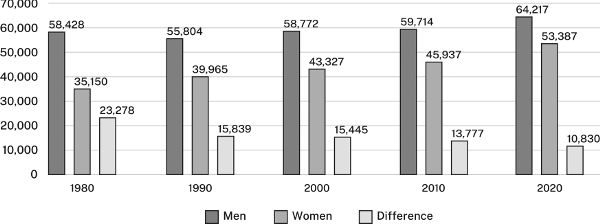

꺾은선 그래프는 시간에 따른 연속적인 변화를 보여준다.

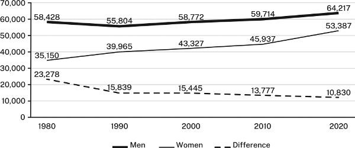

단지 머릿속에 맨 처음 떠오르는 형식이 아니라, 의도하는 효과를 거둘 수 있는 형식을 선택하라. 양적 연구가 처음이라면 기본 표, 막대 차트, 꺾은선 그래프로 선택의 폭을 좁혀라. 컴퓨터 소프트웨어가 더 많은 선택지를 제공하겠지만 익숙하지 않은 것들은 무시하라. 고급 연구를 수행 중이라면 독자들은 당신의 분야에서 선호되는 더 폭넓은 시각 자료들을 활용하기를 기대할 것이다. 그런 경우에는 다른 일반적인 형식들의 수사학적 용도를 설명한 표 13.6을 참조하라. 대규모 데이터 세트의 복잡한 관계를 일상적으로 다루는 분야에서 학위 논문이나 학술지 논문을 작성하고 있다면, 훨씬 더 창의적인 데이터 표현 방식을 고려해야 할 수도 있다. (추가 자료는 부록 참조.)

다음은 표, 차트, 그래프의 기본 지침이다.

## 표, 차트, 그래프 디자인하기

프레젠테이션 소프트웨어를 사용하면 매우 화려한 시각 자료를 만들 수 있어서 많은 필자가 디자인을 소프트웨어에 맡겨버리곤 한다. 하지만 그것은 실수다. 시각 자료가 핵심을 명확하게 전달하지 못한다면 독자는 그것이 얼마나 화려한지 따위에는 신경 쓰지 않는다. 효과적인 시각 자료를 디자인하기 위한 몇 가지 원칙은 다음과 같다.

### 독자의 이해를 돕도록 각 시각 자료에 틀을 제공하라

숫자들 사이의 복잡한 관계를 나타내는 시각 자료가 저절로 설명되는 경우는 거의 없다. 독자에게 시각 자료에서 무엇을 보아야 하는지, 그리고 그것이 당신의 논증과 어떤 관련이 있는지 이해할 수 있도록 틀(frame)을 짜주어야 한다.

1. 1. 데이터를 잘 설명할 수 있도록 모든 시각 자료에 라벨을 붙여라. 표의 경우 라벨을 *제목(title)*이라 부르며 표 상단 왼쪽에 배치한다. 그림의 경우 라벨을 *범례/캡션(legend)*이라 부르며 그림 하단 왼쪽에 배치한다. 제목과 범례는 짧게 유지하되, 모든 시각 자료를 다른 시각 자료와 명확히 구별할 수 있을 만큼 구체적으로 작성하라.
   * 제목이나 범례를 너무 일반적인 주제로 만들지 마라.
   잘못된 예: 가구주
>
   좋은 예: 2005-2020년 한부모 및 양부모 가구주의 변화

   * 배경 정보를 제공하거나 데이터가 암시하는 바를 미리 규정하지 마라.
   잘못된 예: 직원 전문화 이전 우울증 아동에 대한 상담 효과의 약화, 2012-2022
>
   좋은 예: 2012-2022년 우울증 아동에 대한 상담 효과

   * 유사한 데이터를 제시하는 시각 자료들을 명확히 구분할 수 있는 라벨을 사용하라.
   잘못된 예: 고혈압 위험 요인
>
   좋은 예: 일리노이주 카이로 지역 남성의 고혈압 위험 요인
2. 2. 데이터가 어떻게 당신의 요점을 뒷받침하는지 독자가 파악할 수 있도록 돕는 정보를 표나 그림에 삽입하라. 예를 들어, 표의 숫자가 추세를 보여주고 그 추세의 크기가 중요하다면 마지막 열에 변화량을 표시하라. 그래프의 선이 그래프에 언급되지 않은 어떤 영향 요인 때문에 변화한다면, 이미지에 설명을 덧붙여라.

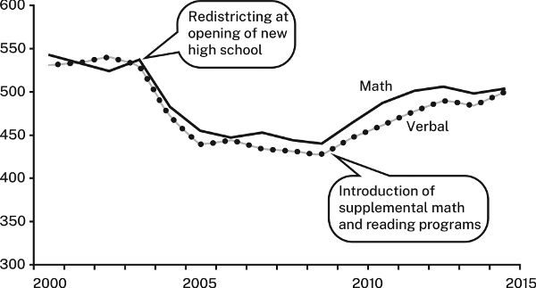

   1. 학군 재조정 이후 읽기 및 수학 점수가 거의 100점 가까이 하락했으나, 수학 및 읽기 보충 프로그램이 도입되면서 그 추세가 반전되었다.
   2. 3. 표나 그림을 어떻게 해석해야 하는지 설명하는 문장으로 표나 그림을 도입하라. 그런 다음 표나 그림에서 독자가 주목하기를 바라는 부분, 특히 그 도입 문장에서 언급한 수치나 관계를 강조하라. 예를 들어, 표 13.3을 보면 그 앞의 문장을 어떻게 뒷받침하는지 이해하기 위해 표를 면밀히 뜯어보아야 한다.
   3. 휘발유 소비 증가에 대한 대부분의 예측은 빗나간 것으로 드러났다.

표 13.3. 미국의 휘발유 국내 수요, 1990-2020 (단위: 10억 갤런)

1990 2000 2010 2020 연간 소비량 113.6 131.9 137.7 127.7

우리에게는 더 유익한 제목, 숫자가 주장을 어떻게 뒷받침하거나 설명하는지 보여주는 문장, 그리고 표에서 무엇을 보아야 하는지 안내해 주는 시각적 단서가 필요하다.

   1. 휘발유 소비량은 예측만큼 증가하지 않았다. 2000년대와 2010년대를 거치며 휘발유 소비는 정체되었고 2020년에는 코로나19 팬데믹 기간의 격리 조치 영향으로 오히려 감소했다.

### 모든 시각 자료는 내용이 허용하는 한 최대한 단순하게 유지하라

어떤 지침서들은 시각 자료 안에 가능한 한 많은 데이터를 빼곡히 담으라고 권하기도 한다. 하지만 독자는 주의를 분산시키는 군더더기 없이 오직 자신의 주장과 관련된 데이터만을 보고 싶어 한다. 모든 시각 자료에 대한 지침은 다음과 같다.

1. 1. 관련된 데이터만 포함하라. 단지 기록 보존용으로만 제공하는 데이터라면 그에 맞게 표시하고 부록으로 돌려라.
2. 2. 시각적 효과를 단순하게 유지하라.
   * 둘 이상의 그림을 하나로 묶을 때만 시각 자료에 테두리 상자를 둘러라.
   * 배경에 색상을 넣거나 음영을 주지 마라.

표를 위한 지침

* 열과 행을 구분하기 위해 가로선과 세로선 모두를 진하게 사용하지 마라. 표가 복잡하거나 독자의 시선을 특정 행이나 열에 집중시키고자 할 때만 옅은 회색 선을 사용하라.
* 행이 많은 표의 경우 다섯 번째 행마다 옅은 음영을 넣어라.

차트와 그래프를 위한 지침

* 배경 그리드 선(눈금선)은 시각 자료가 복잡하거나 독자가 정확한 수치를 확인해야 할 때만 사용하라. 색상은 옅은 회색으로 하라.
* 대비를 나타낼 때는 패턴이나 음영을 사용하라. 특정 시각 장애가 있는 사람들은 색상이나 색조의 차이를 구별하지 못할 수 있으므로, 색상이나 색조만으로 대비를 표시하지 마라. 대신 가능한 한 패턴이나 (더 바람직하게는) 라벨을 활용하라. 또한 나중에 시각 자료가 흑백으로 인쇄되거나 복사될 가능성이 있다면 색상 사용을 피하라.
* 단순히 시각적 효과만을 위해 상징적 막대(예: 자동차 생산량을 나타내기 위해 자동차 그림을 사용하는 것)나 3차원 입체 효과를 사용하지 마라. 둘 다 비전문적으로 보이며 독자가 수치를 판단하는 데 왜곡을 초래할 수 있다.
* 독자가 3차원 그래프에 익숙하고 데이터를 다른 방식으로 표현할 수 없는 경우에만 3차원으로 데이터를 표시하라.
* 3. 명확한 라벨을 사용하라.
  + 표의 모든 행과 열, 그리고 차트와 그래프의 양 축에 라벨을 붙여라.
  + 그래프의 세로축에는 눈금 표시와 라벨을 사용하여 구간 단위를 명시하라.
  + 가능하면 선이나 막대 분할 영역 등의 라벨은 옆이나 아래쪽에 범례로 따로 빼놓기보다는 이미지 위에 직접 표기하라. 범례는 라벨을 직접 표기했을 때 이미지가 너무 복잡해져 읽기 어려워지는 경우에만 사용하라.
  + 특정 수치가 중요하다면 차트의 막대나 영역, 또는 그래프 선 위의 점에 해당 수치를 직접 덧붙여라.

## 표, 막대 차트, 꺾은선 그래프에 대한 구체적 지침

### 표

많은 데이터가 담긴 표는 조밀하고 복잡해 보일 수 있으므로 독자를 돕도록 정리해야 한다.

* 독자가 보기를 원하는 바를 강조할 수 있는 원칙에 따라 행과 열을 정렬하라. 무조건 알파벳 순서(가나다순)를 선택하지 마라.
* 숫자는 의미 있는 유의미한 단위로 반올림하라. 1,000 미만의 차이가 중요하지 않다면, 2,123,499라는 숫자는 불필요하게 정밀한 것이다.
* 총합계는 맨 위나 왼쪽이 아니라 열의 맨 아래나 행의 맨 끝에 표시하라.

표 13.4와 표 13.5를 비교해 보라.

표 13.4. 주요 산업국의 실업률, 2000-2015

2000 2015 변화 호주 5.2 6.1 1.0 캐나다 8.0 6.9 (1.1) 프랑스 9.7 10.7 1.0 독일 7.1 5.2 (1.9) 이탈리아 8.4 11.9 3.5 일본 5.0 3.9 (1.1) 스웨덴 8.6 7.7 (0.9) 영국 7.9 6.6 (1.3) 미국 9.6 6.2 (3.4)

표 13.4는 어수선해 보이고 항목들이 효과적으로 정리되어 있지 않다. 반면에 표 13.5는 유익한 제목과 적은 시각적 혼잡함을 갖추고 있으며 비교 관점에서 변화의 패턴을 더 쉽게 파악할 수 있도록 항목들이 정렬되어 있어 훨씬 더 명확하다.

표 13.5. 주요 산업국의 실업률 변화 추이, 2000-2015

2000 2015 변화 미국 9.6 6.2 (3.4) 독일 7.1 5.2 (1.9) 영국 7.9 6.6 (1.3) 캐나다 8.0 6.9 (1.1) 일본 5.0 3.9 (1.1) 스웨덴 8.6 7.7 (0.9) 호주 5.2 6.2 1.0 프랑스 9.7 10.7 1.0 이탈리아 8.4 11.9 3.5

### 막대그래프

막대그래프는 구체적인 수치만큼이나 시각적 효과를 통해 메시지를 전달한다. 하지만 아무런 패턴 없이 배열된 막대는 아무런 요점도 암시하지 못한다. 가능하다면 막대를 그룹화하고 배열하여 전달하고자 하는 메시지와 일치하는 이미지를 만들어라. 예를 들어, 설명 문장의 맥락 속에서 그림 13.4를 살펴보라. 항목들이 알파벳순으로 나열되어 있는데, 이러한 순서는 독자가 요점을 파악하는 데 도움이 되지 않는다:

세계의 사막 대부분은 북아프리카와 중동에 집중되어 있다.

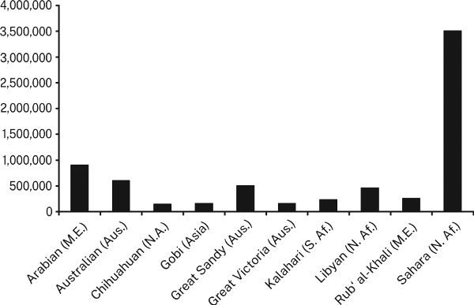

이와 대조적으로, 다음 페이지의 그림 13.5는 "세계의 사막 대부분은 북아프리카와 중동에 집중되어 있다"라는 주장을 그에 상응하는 이미지로 뒷받침한다.

*

· · ·

표준 막대그래프에서 각 막대는 전체의 100%를 나타낸다. 그러나 때로는 독자가 전체의 각 부분에 대한 구체적인 수치를 보아야 할 때가 있다. 이는 두 가지 방식으로 제공할 수 있다:

* 막대를 비례하는 부분들로 나누어 "누적(stacked)" 막대를 만든다.
* 전체의 각 부분에 개별 막대를 부여한 다음, 그 부분들을 클러스터(군집)로 묶는다.

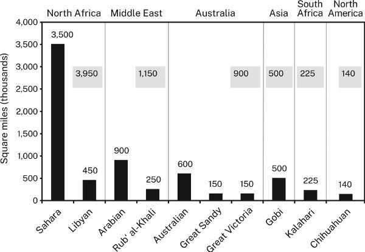

누적 막대는 독자가 분할된 각 세그먼트(구간)보다는 서로 다른 막대 간의 전체 값을 비교하기를 원할 때만 사용하라. 독자가 눈대중만으로는 세그먼트의 비율을 쉽게 비교할 수 없기 때문이다. 누적 막대를 사용하는 경우에는 다음과 같이 하라:

* 세그먼트를 논리적 순서로 배열하라. 가능하면 가장 큰 세그먼트를 가장 어두운 음영으로 맨 아래에 배치하라.
* 비교를 돕기 위해 세그먼트에 구체적인 숫자로 라벨을 붙이고 대응하는 세그먼트들을 회색 선으로 연결하라.

맞은편 페이지의 그림 13.6과 그림 13.7을 비교해 보라.

세그먼트가 전체만큼이나 중요하여 막대들을 그룹으로 묶는다면 다음과 같이 하라:

* 그룹들을 논리적 순서로 배열하라. 가능하면 비슷한 크기의 막대들을 서로 나란히 배치하라(모든 그룹에 걸쳐 동일한 방식으로 막대를 정렬하라).
* 각 그룹 위나 하단 라벨 아래에 전체 수치를 표기하여 그룹에 라벨을 붙여라.

막대그래프에 적합한 대부분의 데이터는 원그래프(파이 차트)로도 표시할 수 있다. 원그래프는 잡지, 타블로이드판 신문, 연례 보고서에서 인기가 높다. 화려하긴 하지만 막대그래프보다 읽기가 더 어렵다. 독자는 크기를 가늠하기 어려운 경우가 많은 세그먼트들의 비율을 비교해야만 한다. 그러나 원그래프도 나름의 쓸모가 있는데, 특히 데이터의 상대적 크기에 대한 정성적 인상을 전달할 때, 즉 한 세그먼트가 나머지보다 불균형적으로 크다거나 데이터가 수많은 작은 세그먼트로 나뉘어 있음을 보여줄 때 유용하다. 양적 데이터를 조금이라도 상세히 전달하고자 할 때는 원그래프의 사용을 피하라. 그런 목적에는 막대그래프를 사용하라.

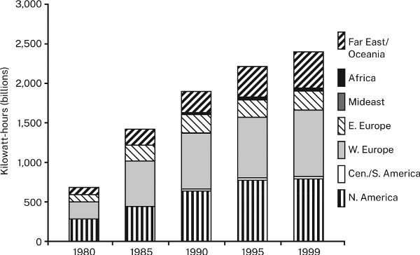

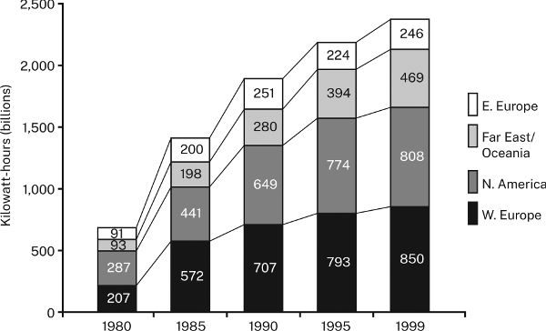

### 꺾은선그래프(선 그래프)

꺾은선그래프는 추세를 강조하므로, 독자가 올바르게 해석하려면 명확한 이미지를 보아야 한다. 다음 지침을 따르라:

* 선이 자신의 요점을 뒷받침하는 방향(상승 또는 하강)으로 움직이게 하는 변수를 선택하라. 좋은 소식이 고등학교 자퇴율의 감소(하강)라면, 동일한 데이터를 유지율(진학/재학 유지율)의 증가(상승)를 나타내는 상승 곡선으로 표현하는 것이 더 효과적일 수 있다. 나쁜 소식을 강조하고 싶다면 데이터를 하강하는 선으로 표현하는 방법을 찾아라.
* 다른 방법으로는 요점을 전달할 수 없는 경우가 아니라면, 한 그래프에 6개 이상의 선을 그리지 마라.
* 데이터 포인트가 10개 안팎으로 적다면 점으로 표시하라. 소수만이 의미가 있다면 정확한 값을 보여주는 숫자를 기입하라.
* 그림 13.8처럼 선을 구별하기 위해 회색의 음영 차이에만 의존하지 마라.

그림 13.8과 맞은편 페이지의 그림 13.9를 비교해 보라.

그림 13.8은 회색 음영이 배경과 대비되어 선을 잘 구분해 주지 못하고 눈을 이리저리 움직이며 선과 범례를 연결해야 하므로 읽기가 더 어렵다. 그림 13.9는 이러한 연결을 더 명확하게 해준다.

동일한 데이터를 보여주는 이러한 다양한 방식은 혼란을 줄 수 있으므로, 여러 대안을 테스트해 보라. 대안적인 그래픽들을 구성한 다음, 데이터에 익숙하지 않은 사람에게 그 대안들의 영향력과 명확성을 평가해 달라고 요청하라. 반드시 그래픽이 뒷받침하고자 하는 주장을 명시하는 문장으로 그림을 소개하라.

## 윤리적으로 데이터 표현하기

그래픽은 명확하고 정확할 뿐만 아니라 정직해야 한다. 자신의 요점을 내세우기 위해 데이터의 시각적 이미지를 왜곡하지 마라. 230페이지의 두 막대그래프는 동일한 데이터를 보여주지만 서로 다른 메시지를 암시한다.

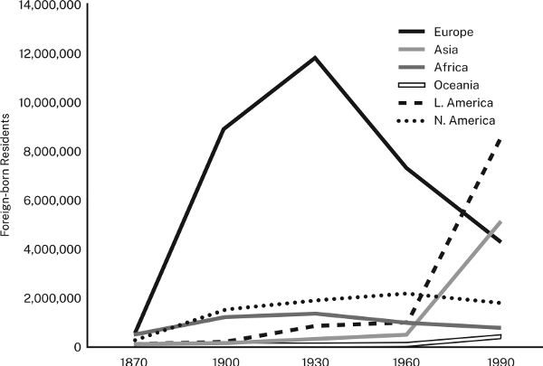

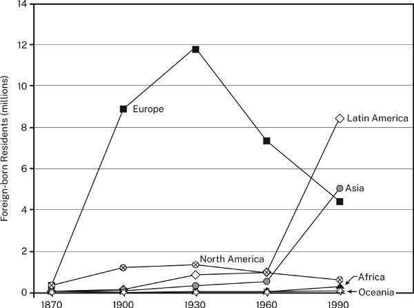

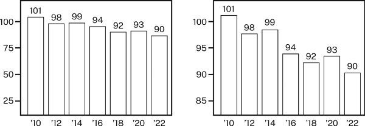

그림 13.10에서 왼쪽의 0-100 눈금은 비교적 완만한 기울기를 만들어 오염의 감소 폭을 작아 보이게 만든다. 그러나 오른쪽의 세로 눈금은 0이 아닌 80에서 시작한다. 눈금이 이렇게 축약되면 기울기가 더 가팔라져 작은 차이가 과장된다.

그래프는 또한 거짓된 상관관계를 암시함으로써 독자를 오도할 수 있다. 누군가는 노조 가입자 수가 줄어들수록 실업률이 낮아진다고 주장하며 그림 13.11을 증거로 제시할 수도 있다. 실제로 그 그래프에서 노조 가입률과 실업률은 매우 밀접하게 함께 움직이는 것처럼 보여, 독자는 한쪽이 다른 쪽의 원인이라고 추론할 수도 있다:

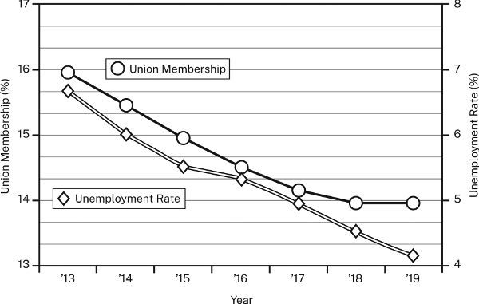

그러나 왼쪽 축(노조 가입률)의 눈금과 오른쪽 축(실업률)의 눈금이 달라 두 추세가 마치 인과관계로 연결된 것처럼 보이게 만든다. 실제로 그럴 수도 있지만 왜곡된 이미지가 그것을 입증해 주지는 못한다.

그래프는 또한 독자가 수치를 오판하도록 유도할 때 잘못된 인상을 줄 수 있다. 그림 13.12의 두 차트는 완전히 동일한 데이터를 나타내지만 서로 다른 메시지를 전달하는 것처럼 보인다:

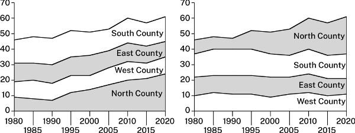

그림 13.12의 차트는 둘 다 누적 영역형 차트이다. 이러한 차트는 수치의 변화를 선의 *각도*가 아니라 선들 *사이*의 면적으로 표현한다. 두 차트 모두 남부(south), 동부(east), 서부(west)의 띠는 전체적으로 너비가 거의 동일하여 이들이 나타내는 수치에 변화가 거의 없음을 보여준다. 그러나 북부(north)의 띠는 급격히 넓어져 그것이 나타내는 수치의 급격한 증가를 보여준다. 왼쪽 차트에서 독자는 상위 3개 띠를 쉽게 오판할 수 있는데, 상승하는 북부 띠 위에 놓여 있어 그 띠들도 함께 상승하는 것처럼 보이기 때문이다. 반면 오른쪽 차트에서는 이 세 띠가 맨 아래에 있기 때문에 상승하지 않는다. 이제 북부 띠만이 상승한다.

시각적 왜곡을 피하기 위한 네 가지 지침은 다음과 같다:

* 대비를 확대하거나 축소하기 위해 눈금을 조작하지 마라.
* 수치를 왜곡하는 이미지를 가진 그림을 사용하지 마라.
* 표나 그림을 불필요하게 복잡하게 만들거나 오도할 정도로 단순하게 만들지 마라.
* 표나 그림이 어떤 요점을 뒷받침한다면, 그 요점을 명시하라.

표 13.6. 흔히 쓰이는 그래픽 형태와 용도

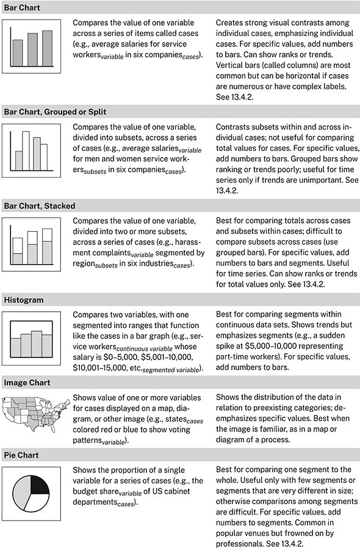

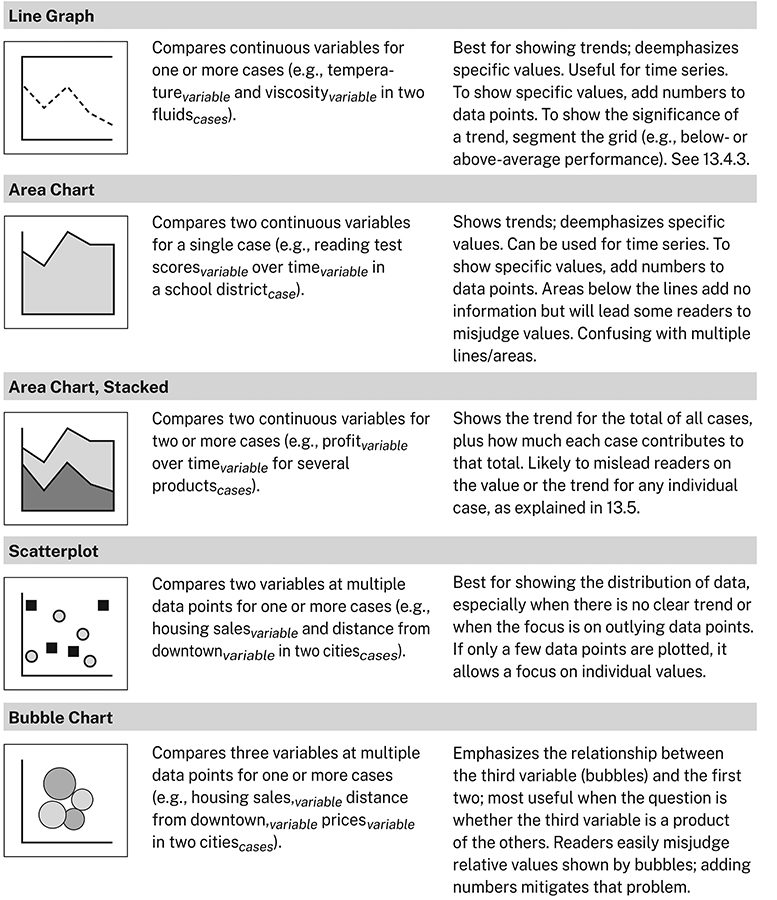

::: {.callout-tip}
### 시각적 증거를 포함할 기회를 찾아라

점점 더 모든 분야의 논문과 발표가 다중모달(multimodal)화되고 있다. 즉, 언어적 정보뿐만 아니라 시각적 정보도 포함하고 있다. 다중모달 논증은 자연과학과 많은 사회과학 분야에서 오랫동안 표준이었으며 전통적으로 이를 피해왔던 분야에서도 점차 수용되고 있다. 따라서 초보 연구자는 글만으로 전달하기보다 그래픽 형태로 데이터나 정보를 제시하는 방법과 시기를 그 어느 때보다 잘 배워야 한다. 논문이나 발표에 시각적 증거가 꼭 *필요하지* 않더라도 시각적 증거를 포함하면 유익할 수 있는데, 증거를 표현하는 여러 양식이 함께 작용할 때 청중이 논증을 이해하고 설득당할 가능성이 더 높아지기 때문이다. 그러므로 데이터를 시각적으로 표현할 기회를 항상 주시하라:

* 자신의 분야의 출처들이 시각적 증거를 어떻게 사용하는지 주목하라. 어떤 종류의 데이터나 정보가 표현되는지뿐만 아니라, 그러한 표현이 어떤 형태를 취하는지에도 주의를 기울여라.
* 경험 많은 연구자들에게 자신의 연구에서 시각적 증거를 어떻게 사용하는지 물어보라. 전문가들이 내리는 선택을 이해하면, 여러분 자신도 더 나은 선택을 내릴 수 있게 될 것이다.
* 논문에 적어도 하나의 그래픽을 사용하기로 결정하라. 그 결정 하나만으로도 논증에서 시각적 증거를 활용할 수 있는 방법에 주의를 집중하게 될 것이다.
* 교수자에게 시각적 증거의 사용을 장려하는 과제를 요청하라. 대부분의 교수자는 학생들이 출처에서 보고 감탄한 방식을 자신의 과제에 적용해 보고자 할 때 이를 긍정적으로 평가한다. 과제에서 그래픽 사용을 명시적으로 요구하지 않더라도, 교수자에게 그렇게 할 수 있는 선택권을 달라고 주저 없이 요청하라.
:::

# 14 서론과 결론

좋은 서론은 독자가 흥미를 가지고 글을 읽도록 유도하며 글을 더 잘 이해할 수 있도록 준비시킨다. 좋은 결론은 독자에게 요점에 대한 명확한 진술과 그 중요성에 대한 새로운 인식을 남겨준다. 이 장에서는 서론과 결론을 모두 작성하는 방법을 보여준다. 서론과 결론에 들이는 시간은 여러분에게 가장 중요한 시간이 될 것이다.

제대로 작동하는 초고를 작성했다고 생각되면, 이제 최종 서론과 결론을 작성할 준비가 된 것이다. 어떤 필자들은 이것이 *참신하거나 재치 있는 것으로 주의를 끌라*는 표준적인 조언을 따르는 것을 의미한다고 생각한다. 그 조언이 쓸모없는 것은 아니지만 청중은 재치 있고 참신한 것 이상의 것을 원한다. 1부에서 우리는 연구 문제를 중심으로 프로젝트를 발전시키는 방법을 보여주었다. 여기서는 그 문제를 사용하여 청중의 참여를 이끌어내는 방법을 보여준다. 눈길을 끄는 도입부는 독자의 주의를 환기할 수 있지만 주의를 계속 유지시키는 것은 해결이 필요하다고 생각되는 문제와 여러분이 해결책을 찾았다는 약속이다. 앞서 말했듯이, *동의하지 않는다*고 말하는 독자와는 언제든 소통하며 논의를 진전시킬 수 있다. 하지만 어깨를 으쓱하며 *관심 없다*고 말하는 독자에게는 할 수 있는 일이 별로 없다.

## 서론의 공통 구조

앞서 언급했듯이, 연구 공동체마다 작업을 수행하는 방식이 다르다. 이들의 서론은 겉보기에는 달라 보일 수 있지만 그 기저에 깔린 구조는 동일하다. 문화 비평, 컴퓨터 설계, 법제사 분야에서 가져온 다음 세 가지 축약된 사례를 살펴보라:

(1) 기계는 왜 인간과 더 비슷해질 수 없는가? *스타 트렉: 넥스트 제너레이션*의 거의 모든 에피소드에서 안드로이드 데이터(Data)는 무엇이 인간을 인간답게 만드는지 자문한다. 오리지널 *스타 트렉*에서도 기계 같은 논리와 감정 결여로 인해 인간으로서의 지위가 온전히 인정받지 못했던 반(半) 벌컨족인 스팍(Mr. Spock)에 의해 유사한 질문이 제기되었다. 사실 데이터와 스팍은 인간성의 본질을 탐구해 온 "준인간(quasi-persons)"의 두 가지 사례에 불과하다. 프랑켄슈타인의 괴물부터 터미네이터에 이르는 존재들에 의해, 그리고 이들에 관해 동일한 질문이 제기되어 왔다. 그러나 진짜 문제는 인간이 되고자 고군분투하는 이 캐릭터들이 왜 거의 항상 백인이자 남성인가 하는 점이다. 문화적 해석자로서 이들은 "정상"이라는 것이 무엇을 의미하는지에 대한 파괴적인 고정관념을 은연중에 강화하고 있는 것은 아닌가? 모범적인 인간은 사실상 전 세계 대부분의 사람들을 배제하는 서구적 기준에 의해 정의되고 있는 것으로 보인다.
>
(2) 전사적 품질경영(CQI) 프로그램의 일환으로, 모토다인 컴퓨터스(Motodyne Computers)는 유니다인(UniDyne)™ 온라인 도움말 시스템의 사용자 인터페이스를 재설계할 계획이다. 해당 인터페이스의 사양에는 사용자가 텍스트 라벨 없이도 기능을 식별할 수 있는 자명한(직관적인) 아이콘이 요구된다. 모토다인은 현재 아이콘 세트로 3년의 경험을 쌓았지만 어떤 아이콘이 직관적인지 보여주는 데이터가 없다. 그러한 데이터가 없으면 어떤 아이콘을 재설계해야 할지 결정할 수 없다. 본 보고서는 11개 아이콘에 대한 데이터를 제공하며 그중 5개가 직관적이지 않음을 보여준다.
>
(3) 오늘날 사회라면 1780년 미국 전선 후방에서 체포된 사복 차림의 영국 스파이 존 앙드레(John André) 소령이 교수형에 처해졌을까? 그는 고결한 애국자로 여겨졌음에도 군법이 규정한 처벌을 받았다. 시간이 흐르면서 우리의 전통은 바뀌었지만 간첩 행위에 대한 처벌은 바뀌지 않았다. 이는 사형을 의무적으로 규정한 유일한 범죄이다. 그러나 최근 대법원은 민간 사건에서 의무적 사형 선고를 기각하여 군사 사건 적용에 모호성을 초래했다. 대법원의 판결이 군에도 적용된다면 의회는 군사재판통일법전(UCMJ)을 개정해야 하는가? 본 논문은 개정해야 한다고 결론짓는다.

이 세 서론에서 제기된 주제와 문제는 대상 청중만큼이나 서로 다르지만 그 이면에는 학문 분야와 관계없이 독자들이 모든 서론에서 기대하는 공통된 패턴이 존재한다. 그 공통 구조는 세 가지 요소로 이루어진다:

* 맥락 진술 (statement of the context)
* 문제 진술 (statement of the problem)
* 해답/응답 진술 (statement of a response)

모든 서론이 세 가지 요소를 모두 갖추고 있는 것은 아니지만 대부분은 갖추고 있다.

다음은 이 세 서론 각각에서 나타나는 *맥락 + 문제 + 해답* 패턴이다:

(1) 맥락: 기계는 왜 인간과 더 비슷해질 수 없는가?... 프랑켄슈타인의 괴물부터 터미네이터에 이르는 존재들에 의해, 그리고 이들에 관해 동일한 질문이 제기되어 왔다.
>
문제: 그러나 진짜 문제는... 이들이 "정상"이라는 것이 무엇을 의미하는지에 대한 파괴적인 고정관념을 은연중에 강화하고 있는 것은 아닌가 하는 점이다.
>
해답: 모범적인 인간은 사실상 전 세계 대부분의 사람들을 배제하는 서구적 기준에 의해 정의되고 있는 것으로 보인다.

(2) 맥락: 전사적 품질경영(CQI) 프로그램의 일환으로, 모토다인 컴퓨터스는 사용자 인터페이스를 재설계할 계획이다.... 모토다인은 현재 아이콘 세트로 3년의 경험을 쌓았지만...
>
문제: ...어떤 아이콘이 직관적인지 보여주는 데이터가 없다. 그러한 데이터가 없으면 어떤 아이콘을 재설계해야 할지 결정할 수 없다.
>
해답: 본 보고서는 11개 아이콘에 대한 데이터를 제공하며 그중 5개가 직관적이지 않음을 보여준다.

(3) 맥락: 오늘날 사회라면 존 앙드레 소령이... [간첩 행위로] 교수형에 처해졌을까?... 이는 사형을 의무적으로 규정한 유일한 범죄이다.
>
문제: 그러나 최근 대법원은 민간 사건에서 의무적 사형 선고를 기각하여 군사 사건 적용에 모호성을 초래했다.... 의회는 군사재판통일법전(UCMJ)을 개정해야 하는가?
>
해답: 본 논문은 개정해야 한다고 결론짓는다.

이러한 요소 각각은 독자가 논문을 읽도록 동기를 부여하고 이를 이해하도록 돕는 데 저마다의 역할을 수행한다.

## 맥락 진술하기

동화의 도입부를 생각해보자.

> 어느 화창한 아침, 빨간 모자는 할머니 댁으로 향하며 숲속을 깡총깡총 뛰어갔습니다.안정된 맥락 [플루트와 바이올린 연주에 맞춰 머리 주위를 나비들이 춤추는 모습을 상상해보라]

대부분의 동화 도입부처럼, 이 문장 역시 문제로 깨뜨리기 위해 안정적이고 심지어 행복한 맥락을 먼저 조성한다.

> ...그런데 갑자기 배고픈 늑대가 나무 뒤에서 튀어나와방해 조건 [트롬본과 튜바 연주를 상상해보라] 아이를 깜짝 놀라게 했습니다 [그리고 이야기에 푹 빠진 어린아이들도 함께 놀라게 했습니다].손실/비용

이야기의 나머지 부분은 그 문제를 구체적으로 전개한 다음 해결한다.

대부분의 도입부도 동일한 전략을 따른다. 공통 기반(common ground)-연구자가 다룰 더 큰 문제에 대해 독자와 연구자 사이에 공유되는 이해-을 형성하기 위해, 저자들은 이미 알려져 있거나 수용된 바를 겉보기에 문제없는 설명으로 제시하는 안정된 맥락(stable context)을 진술한다. 그런 다음 연구자는 문제로 이를 깨뜨리며 사실상 다음과 같이 말한다. *“독자 여러분, 당신은 무언가를 알고 있다고 생각할지 모르지만,* 그러나 *여러분의 지식은 불완전하거나 결함이 있습니다.”*

> (3) 안정된 맥락: 오늘날의 사회에서 영국의 스파이였던 존 앙드레(John André) 소령은... 교수형에 처해질 것인가?... [스파이 행위]는 반드시 사형에 처하도록 규정된 유일한 범죄이다.
> 
> 방해하는 문제: 그러나 최근 대법원은 의무적 사형 판결을 기각했다....

연구자들은 독자들이 자신의 문제를 *문제로서* 이미 인식하고 있다고 확신할 때(대개 특정 연구 공동체 내에 잘 정립되어 있기 때문) 맥락을 생략하기도 한다. 다음 도입부는 문제로 곧장 시작한다.

> 가장 최근의 과학적 모델들은 해수면 상승이 이번 세기가 끝나기 훨씬 전에 전 세계 해안 도시들을 위협할 것이라고 예측한다.

그러나 대개 독자들은 문제의 중요성을 이해하기 위해 어느 정도의 맥락이 필요하므로, 연구자들은 인정받은 이해나 선행 연구라는 겉보기에 문제없는 맥락으로 도입부를 열며 *특히 이를 깨뜨리기 위해* 도입부를 제시한다.

> 스타틴(statins)은 콜레스테롤을 낮추는 효과와 겉보기에 경미한 부작용 덕분에 오랫동안 심혈관 질환 및 뇌졸중의 일상적인 예방 치료제로 처방되어 왔다.안정된 맥락 그러나 2010년대에 수행된 몇몇 연구에서는 스타틴이 인지 기능 장애 및 치매 위험을 증가시킬 수 있음을 시사하여,불안정화 조건 광범위한 사용에 대해 의료계 내에 일정한 불확실성을 낳았다.결과

이제 독자들에게는 문제에 관심을 가질 이유가 하나가 아니라 둘이 생긴다. 즉, 문제 자체뿐만 아니라 전체 사안에 대한 독자 자신의 불완전한 이해까지도 이유가 되는 것이다.

맥락에서는 흔한 오해를 기술할 수 있다.

> 십자군 전쟁은 성지를 기독교 세계로 되찾으려는 종교적 열망에 의해 촉발된 것으로 널리 알려져 있다.안정된 맥락 사실 그 동기는 전부는 아닐지라도 적어도 상당 부분 정치적인 것이었다.

시대에 뒤떨어진 이해나 연구를 개괄할 수도 있다.

> 종교적 신앙이 자살을 막아주는 보호 효과를 제공한다는 생각만큼 빠르게 힘을 잃은 사회학적 개념도 드물다. 한때 사회학의 기본적 믿음 중 하나였던 이 생각은 일련의 최근 연구들에 의해 의문이 제기되었다....안정된 맥락 그러나 특정 연구들은 여전히 종교의 효과를 발견하고 있다...

혹은 문제 자체에 대한 오해를 지적할 수도 있다.

> 미국 교육은 아이들에게 비판적으로 사고하고, 질문을 던지며, 답을 검증하도록 가르치는 데 초점을 맞추어 왔다.안정된 맥락 하지만 비판적 사고의 영역은 일시적 유행과 특수 이익 집단에 의해 잠식당해 왔다.

경험이 부족한 일부 연구자들은 마치 수업 시간에 나누던 대화를 중단된 지점에서 바로 이어가는 것처럼 논문을 시작하며 맥락을 지나치게 축약한다. 이들의 도입부는 너무 불완전하여 같은 수업을 듣는 사람만이 이해할 수 있을 정도다.

> 호프스태터(Hofstadter)가 수학, 음악, 예술 간의 차이를 존중하지 못한 점을 고려할 때, 『체화된 마음』(*The Embodied Mind*)에 대한 반응이 격렬했던 것은 놀라운 일이 아니다. 논란을 일으킨 원인이 무엇인지는 덜 분명하다. 나는 인간의 마음에 대한 어떤 설명이든 학제 간 연구여야 한다고 주장할 것이다....

도입부 초고를 쓸 때는, 자신과 동일한 출처 중 일부를 읽었고 전반적으로 같은 문제들에 관심을 갖고 있지만 수업 시간에 구체적으로 무슨 일이 있었는지는 알지 못하는 사람에게 글을 쓴다고 상상해보라.

반대로 자신의 주제에 조금이라도 닿아 있는 읽은 모든 문헌을 나열해야 한다고 생각하여 정반대의 실수를 범하는 이들도 있다. 자신이 *직접적으로* 수정하거나 반박할 연구 결과를 담은 문헌만 개괄하라. 문제를 더 넓은 맥락에 위치시켜야 할 때만 문헌을 추가하라.

## 문제 진술하기

안정된 맥락을 진술했다면, 문제로 그것을 깨뜨려라(2장 참조). 앞서 말했듯이, 연구 문제의 진술은 두 부분으로 구성된다.

* 불완전한 지식이나 이해의 조건(condition), 그리고
* 그 조건의 결과(consequences), 즉 이해에 있어서 더 중대한 공백

조건을 직접 진술할 수 있다.

> ...그러나 모토다인(Motodyne) 사에는 어떤 아이콘이 직관적인지(설명이 필요 없는지)를 보여주는 데이터가 없다.

또는 간접 질문을 통해 조건을 암시할 수도 있다.

> 진짜 질문은 왜 이 등장인물들이 거의 항상 백인이자 남성인가 하는 점이다.

이러한 무지나 결함 있는 이해의 조건은 누군가가 *“그래서 뭐?(So what?)”*라고 묻는 것을 상상하고 그 답으로서 해당 조건의 결과를 명확히 밝힐 때 비로소 온전한 연구 문제의 일부가 된다. 그 결과를 직접적인 손실이나 비용으로 진술할 수 있다.

> 이러한 데이터가 없으면 어떤 아이콘을 재설계해야 할지 결정할 수 없다.손실/비용

또는 비용을 이점으로 바꾸어 진술할 수도 있다.

> 그러한 데이터가 있다면 어떤 아이콘을 재설계해야 할지 결정할 수 있을 것이다.이점

비용을 진술할 것인가 이점을 진술할 것인가의 선택은 단순한 문체의 문제가 아니다. 독자는 일반적으로 잠재적 이점보다 실질적 손실에 더 큰 동기를 부여받는다. 우리의 제안은 다음과 같다. 문제를 제시할 때는 비용이나 결과를 진술하고 해결책을 강조할 때는 이점을 진술하라.

이것이 문제를 진술하는 표준적인 방법이지만 다른 선택지들도 있다.

### 문제의 조건을 명시적으로 진술해야 하는가?

때로는 그 분야의 사람들에게 명칭만으로도 조건과 결과가 모두 암시될 만큼 매우 익숙한 문제를 다룰 때도 있다. *‘성격 형성에서 DNA의 역할’*, *‘셰익스피어의 언어 지식’* 등이 그 예다. 마찬가지로 수학이나 자연과학 같은 일부 분야에서는 많은 연구 문제가 널리 알려져 있어 조건만 진술해도 그 결과를 떠올리기에 충분하다. 크릭(Crick)과 왓슨(Watson)이 DNA의 이중나선 구조를 밝힌 획기적인 논문의 (축약된) 도입부를 다시 살펴보자.

> 우리는 디옥시리보핵산(D.N.A.) 염의 구조를 제안하고자 한다. 이 구조는 상당한 생물학적 관심을 끄는 새로운 특징들을 지니고 있다. 핵산의 구조는 이미 폴링(Pauling)과 코리(Corey)에 의해 제안된 바 있다. 그들은 출판에 앞서 친절하게도 자신들의 원고를 우리에게 제공해 주었다. 그들의 모델은 세 가닥의 사슬이 서로 얽혀 있고, 인산기가 섬유 축 가까이에 있으며, 염기가 바깥쪽에 위치하는 구조로 이루어져 있다. 우리의 견해로는 이 구조는 만족스럽지 못하다....

그들이 DNA의 구조를 단지 “제안”한다고만 해도 충분했던 이유는, 모든 사람이 그것이 무엇인지 알고 싶어 한다는 사실을 알고 있었기 때문이다. (다만 그들도 폴링과 코리의 *부정확한* 모델을 언급함으로써 문제를 제기하고 있다는 점에 주목하라.)

자연과학과 대부분의 사회과학에서 연구자들은 대개 독자들에게 친숙한 질문을 다룬다. 이러한 분야에서는 굳이 문제를 상세히 밝힐 필요가 없다고 생각할 수도 있다. 그러나 연구자가 말해주지 않는다면, 독자는 자신의 지식에 있는 어떤 특정한 공백을 이 연구가 메워줄지 알지 못할 것이다.

인문학과 일부 사회과학에서는 연구자가 스스로 발견했거나 심지어 직접 만들어낸 질문, 즉 독자에게 새롭고 종종 놀라운 질문을 던지는 경우가 더 많다. 이러한 분야에서는 자신이 바로잡고자 하는 불완전하거나 결함 있는 이해를 명시적으로 설명해야 한다.

### 결과와 이점을 진술해야 하는가?

독자가 연구자의 문제를 진지하게 받아들이도록 하려면, 문제가 해결되지 않았을 때 *독자 자신이* 치러야 할 대가나 문제가 해결되었을 때 *독자 자신이* 얻게 될 이점을 인식해야 한다. 이러한 비용과 이점이 연구자뿐만 아니라 독자에게도 자명할 때는 생략할 수 있다. 하지만 그렇지 않다면 이를 명시적으로 밝혀야 한다. 의심스러울 때는 진술하라.

때로는 연구를 통해 독자가 피할 수 있도록 돕는 구체적인 손실이나 비용을 설명할 수 있다.

> 지난해 리버시티(River City) 감독위원회는 베이사이드(Bayside) 개발 지역을 시 세원에 편입하기로 합의했다. 그러나 그 계획은 경제적 분석을 거의 거치지 않은 것이었다. 시에 어떤 비용이 발생할지 이해하지 못한 채 위원회가 베이사이드 합병을 가결한다면, 위원회는 리버시티의 이미 불안정한 재정 상황을 더욱 악화시킬 위험을 초래하게 된다. 상하수도 서비스를 시 기준에 맞추는 데 드는 부담을 분석에 포함할 경우, 합병 비용은 위원회가 추정하는 것보다 더 많이 들 것이다.

이것이 바로 무지의 영역(경제적 분석의 부재)이 구체적인 결과(비용 증가)를 낳는 응용 연구 문제를 도입하는 방법이다. 순수 연구 문제를 도입할 때는 결과를 돈과 같은 가시적인 측면이 아니라 오해로 설명하거나, 대안으로서 더 나은 이해가 가져올 수 있는 이점으로 설명한다.

> 수십 년 동안 미국 도시들은 세원을 확충하기 위해 고급 주택가를 편입해 왔으나 종종 실망스러운 경제적 혜택만을 얻었다. 하지만 기본적인 경제 분석을 수행했더라면 그러한 결과는 충분히 예측할 수 있었을 것이다. 이 합병 운동은 지방 수준의 정치적 결정이 전문 정보를 활용하지 못하는 양상을 보여주는 사례 연구이다. 의아한 점은 도시들이 왜 그러한 전문성을 구하지 않는가 하는 것이다. 도시들이 기본적인 경제 분석에 의존하지 못하는 이유를 밝혀낼 수 있다면, 다른 영역에서도 그들의 의사결정이 왜 그토록 자주 실패하는지 더 잘 이해할 수 있을 것이다. 본 논문은 경제적 결과를 고려하지 않고 주변 지역을 편입한 세 도시의 의사결정 과정을 분석한다.

### 조건과 결과 검증하기

2장에서 우리는 문제를 해결하지 않았을 때의 결과를 얼마나 명확히 설명하고 있는지 검증하는 방법을 제안했다. 독자의 무지나 오해의 조건을 가장 잘 표현한 문장 뒤에 *“그래서 뭐?(So what?)”*라고 질문을 던져보는 것이다.

> 모토다인 사에는 어떤 아이콘이 직관적인지를 보여주는 데이터가 없다. [*그래서 뭐?*] 그러한 데이터가 없으면 어떤 아이콘을 재설계해야 할지 결정할 수 없다.
> 
> 1980년대 이후 제2차 세계대전 시기의 인물인 ‘리벳공 로지(Rosie the Riveter)’에 대한 관심이 되살아난 것은, 하나의 상징적인 이미지가 새로운 정치적·문화적 목적을 위해 어떻게 전용될 수 있는지, 그리고 돌이켜보았을 때 그 목적 역시 배타적이었음을 우리가 어떻게 인정하게 되는지를 보여준다.
> 
> [*그래서 뭐?*] 음...

*“그래서 뭐?”*라는 질문에 답하는 것은 몹시 까다로울 수 있다. 리벳공 로지의 이미지가 마음에 든다면 누구에게도 설명할 필요 없이 자유롭게 탐구할 수 있지만 다른 사람들이 이러한 관심을 연구로서 가치 있게 받아들이기를 바란다면 그들에게 그 중요성을 납득시켜야 한다.

청중이 관심을 갖도록 설득하려면 연구자의 문제가 바로 *그들의* 문제임을 보여주어야 한다-비록 그들이 아직 알지 못하더라도 말이다. 2차 대전 시기의 인물인 리벳공 로지가 1980년대에 어떻게 페미니즘의 아이콘으로 재해석되었고 이후 이번 세기에 들어 어떻게 특정하게 백인 여성의 역량 강화를 상징하는 표상으로 인식되었는지를 규명하는 일이 문화적 정체성이 어떻게 형성되고 변화하는지에 대해서뿐만 아니라 우리 자신의 이해가 지닌 편향성에 대해서도 더 중요한 무언가를 이해하는 데 도움이 된다는 사실을 청중에게 설득해야 한다.

물론 어떤 청중은 다시 *“그래서 뭐? 난 문화적 정체성에 관심 없는데”*라고 물을 것이다. 이에 대해 당신은 *“청중을 잘못 찾으셨군요”*라고 말할 수밖에 없다. 성공적인 연구자는 흥미로운 문제를 찾아서 해결할 줄 알 뿐만 아니라, 자신이 해결하는 문제에 관심을 가질 청중을 찾고(혹은 만들어내고) 유치할 줄도 안다.

청중이 문제의 결과를 이미 알고 있다고 확신한다면 결과를 명시적으로 진술하지 않기로 결정할 수도 있다. 크릭과 왓슨은 DNA 구조를 모르는 것의 손실을 구체적으로 밝히지 않았는데, 이는 DNA 구조를 이해하지 않고는 유전학(더 중요한 무언가)을 이해할 수 없다는 점을 청중이 이미 인식하고 있음을 알았기 때문이다. 만약 크릭과 왓슨이 그 결과를 시시콜콜 설명했다면 군더더기로 느껴졌거나 상대를 가르치려 드는 것처럼 보였을 수도 있다.

생애 첫 연구 프로젝트를 수행 중이라면 어떤 분별 있는 교수도 연구 문제의 결과를 해당 학문 분야의 차원에서 상세히 진술하길 기대하지는 않을 것이다. 하지만 문제의 결과가 연구자 자신에게 어떤 의미를 갖는지 진술할 수 있다면 그 방향으로 큰 걸음을 내딛는 셈이다. 나아가 비록 자신에게만 해당할지라도 한 가지를 더 잘 이해함으로써 훨씬 더 중요한 다른 무언가를 더 잘 이해하게 됨을 보여줄 수 있다면 훨씬 더 큰 걸음을 내딛는 것이다.

## 답변 진술하기

안정된 맥락을 문제로 깨뜨리고 나면, 독자들은 다음 두 가지 방식 중 하나로 문제가 해결되기를 기대한다. 즉, 핵심 주장을 진술하거나 나중에 밝히겠다고 약속하는 것이다. 독자들은 도입부의 끝부분에서 이러한 진술이나 약속을 찾는다.

### 해결책의 요지 진술하기

도입부 말미에 핵심 주장/해결책을 명시적으로 진술할 수 있다.

> 스타틴(statins)은 콜레스테롤을 낮추는 효과와 겉보기에 경미한 부작용 덕분에 오랫동안 심혈관 질환 및 뇌졸중의 일상적인 예방 치료제로 처방되어 왔다.안정된 맥락 그러나 2010년대에 수행된 몇몇 연구에서는 스타틴이 인지 기능 장애 및 치매 위험을 증가시킬 수 있음을 시사하여,불안정화 조건 광범위한 사용에 대해 의료계 내에 일정한 불확실성을 낳았다.결과 30여 편 이상의 최신 연구들에 대한 우리의 메타분석 결과는 이러한 우려가 근거 없을 뿐만 아니라 실제로 스타틴이 고령층의 인지 기능 저하에 일정한 억제 효과를 나타낼 수 있음을 시사한다.해결책의 요지/핵심 주장

그렇게 하지 말아야 할 타당한 이유가 없는 한, 이 패턴을 채택하는 것이 가장 좋은 접근법이다.

초보 연구자 중에는 핵심 주장을 너무 일찍 밝히거나 논증의 구성을 미리 개괄해 버리면 독자가 “지루해져서” 읽기를 멈출까 봐 두려워하는 이들이 있다. 또 어떤 이들은 말을 되풀이하게 될까 봐 걱정한다. 두 가지 두려움 모두 근거가 없다. 이러한 구조를 선택하면 독자에게 주도권을 넘겨주게 된다. 독자에게 다음과 같이 말하는 셈이다. *“이 논문을 어떻게 읽을지는 당신이 결정하십시오. 당신은 나의 문제와 그 해결책, 즉 나의 핵심 주장을 알고 있습니다. 당신은 계속 읽을지, 심지어 어떻게 읽을지 스스로 결정할 수 있습니다. 뜻밖의 반전 같은 것은 없습니다.”* 결론에 이를 때까지 핵심 주장의 진술을 미룬다면, 논문의 온갖 우여곡절을 끝까지 따라오는 것이 결국 그만한 가치가 있을 것이라고 독자가 믿어주기를 요구하는 셈이다. 많은 독자는 그렇게 믿어주지 않는다.

구두 발표 청중에게는 핵심 주장을 미리 알려주는 것이 훨씬 더 가치 있는데, 발표 청중은 눈앞에 글 텍스트를 두고 있지 않기 때문이다(16.3.2절 참조). 일반 독자와 달리 발표 청중은 길을 잃었을 때 앞부분을 다시 들여다볼 수 없다.

### 해결책 약속하기

하지만 핵심 주장을 미리 밝히지 않을 만한 이유가 있을 수도 있다. 예를 들어 일부 학문 분야나 직종에서는 주장이 각 절이나 문서 전체의 끝부분에 나오기를 기대하므로, 그러한 기대를 깨뜨리면 독자를 혼란스럽게 할 수 있다. 마찬가지로 핵심 주장이 너무 복잡하여 도입부에서 간결하게 요약하기 어려울 수도 있다(하지만 그렇게 생각하더라도 틀린 판단일 때가 많다). 이러한 경우에는 논문이 어떻게 진행되고 어디를 향해 가는지 설명하면서 결론부에서 핵심 주장/해결책을 제시하겠다는 점을 약속하거나 암시할 수 있다.

> 2010년대에 수행된 몇몇 연구에서는 스타틴이 인지 기능 장애 및 치매 위험을 증가시킬 수 있음을 시사했다. [*그래서 뭐?*] 따라서 의료계에서는 스타틴의 광범위한 사용에 대해 불확실성을 품게 되었다. [*그렇다면, 연구자는 무엇을* 발견했는가*?*] 본 보고서에서 우리는 스타틴의 효능과 부작용에 관한 30여 편 이상의 최신 연구들을 분석하며 인지 기능에 미치는 영향에 특히 중점을 둘 것이다. 그런 다음 우리는...앞으로 나올 주장에 대한 약속

일부 초록(11장의 실전 팁 참조)과 마찬가지로, 이러한 도입부는 독자를 논문 속으로 이끄는 ‘도약대’를 제공한다. 그 도약대 문장에는 독자의 주의를 환기하기 위해 논문 전체를 관통할 핵심 개념을 지칭하는 용어들이 포함되어야 한다. 가장 취약한 약속은 단순히 모호한 주제만을 알리는 문장이다.

> 본 연구는 스타틴의 부작용을 조사한다.

거듭 말하지만 주장을 논문 끝까지 아껴둘 때는 거기에 도달하는 과정이 들일 만한 가치가 있다고 독자가 믿어주기를 요구하는 것이다. 단순히 일반적인 주제뿐만 아니라 해결책이나 논증의 개요(또는 둘 다)를 제공한다면 독자는 연구자를 더 신뢰할 것이다.

> 수력 터빈 취수구 및 유도 스크린 설계안은 매우 다양하지만 잠재적 구성안을 현장에서 직접 평가하는 것은 비용 효율적이지 않다. 더 실현 가능한 대안은 컴퓨터 모델링이다. 본 연구는 취수구 및 스크린 구성을 평가하기 위한 세 가지 컴퓨터 모델(Quattro, AVOC, Turbo-plex)을 평가하여 이들의 상대적 신뢰성, 속도, 사용 편의성을 규명할 것이다.

이러한 종류의 개요 계획은 과학 및 사회과학 분야에서는 흔히 쓰이지만 다소 딱딱하다고 여기는 인문학 분야에서는 덜 사용된다.

## 적절한 호흡 설정하기

도입부를 작성할 때는 문제를 얼마나 빠르게 제기할지 결정해야 한다. 이는 독자가 얼마나 알고 있는지에 달려 있다. 도입부의 호흡(전개 속도)은 분야마다 다르다. 문제가 이미 연구 공동체에 친숙한 연구자들은 빠르게 시작할 수 있지만 문제가 널리 공유되지 않는 분야에서 일하는 이들은 더 서서히 시작해야 한다.

하지만 도입부의 전개 속도는 또 다른 무언가를 나타내기도 한다. 빠르게 시작할 때는 독자를 동료 연구자로 상정하는 것이고 느리게 시작할 때는 독자가 자신보다 덜 알고 있음을 상정하는 것이다. 다음 예에서 저자는 충분한 정보를 갖춘 엔지니어들 사이의 합의를 알리는 데 한 문장을 할애한 뒤 경쾌하게 이를 깨뜨린다.

> 스퀴즈 필름 댐퍼(SFD)의 유체 필름 힘은 대개 고전 윤활 이론의 레이놀즈 방정식으로부터 도출된다. 그러나 회전 기계의 대형화로 인해 SFD 설계 시 유체 관성 효과를 포함할 필요성이 대두되었다. 이러한 효과를 고려하지 않는다면...

(우리 역시 그것이 정확히 무엇을 뜻하는지는 전혀 알지 못하지만 *맥락 + 문제*라는 구조만은 명확하다.)

다음 저자 또한 기술적인 개념을 다루지만 전문 지식이 적은 독자를 위해 차근차근 참을성 있게 설명해 나간다.

> 수력 발전소에서 회유성 어류를 보호하는 한 방법은 터빈 취수구에 스크린을 설치하여 이동 경로를 바꾸는 것이다... [*스크린에 대해 설명하는 110단어 추가*]. 스크린의 효율은 어류의 행동과 수력학적 흐름 간의 상호작용에 의해 결정되므로, 스크린 설계는 수력학적 성능을 측정하여 평가할 수 있다... [*수력학에 대해 설명하는 40단어 추가*]. 본 연구는 이 기법의 수력학적 특성에 대한 더 나은 이해를 제공하며 이는 향후 설계의 지침이 될 수 있을 것이다.

도입부의 호흡을 적절하게 맞추는 것은 중요하다. 청중이 이미 잘 알고 있는데 느리게 시작하면 청중은 연구자가 아는 것이 너무 없다고 생각할 수 있다. 반대로 청중이 잘 알지 못하는데 너무 빠르게 시작하면 청중은 연구자가 배려심이 없다고 느낄 수 있다.

## 첫 몇 문장 쓰기

많은 필자들은 처음 한두 문장을 쓰는 데 특히 어려움을 겪으며 그로 인해 상투적인 표현(cliché)에 빠지곤 합니다.

* 과제 지시문의 표현을 그대로 반복하기. (글을 시작하는 데 어려움을 겪고 있다면, 지시문을 바꾸어 표현(paraphrase)함으로써 글쓰기에 시동을 걸 수 있습니다. 하지만 퇴고할 때는 그 문장들을 다시 쓰십시오.)
* 사전 정의 인용하기: "*웹스터 사전*에서는 *윤리(ethics)*를 ...라고 정의한다." 어떤 단어가 정의할 만큼 중요하다면, 사전적 정의로는 충분하지 않습니다.
* 역사나 사회에 대해 포괄적인 주장하기: "역사를 통틀어/오늘날 사회에서, 여성들은..."
* 거창하게 시작하기: "가장 심오한 철학자들은 수 세기 동안 ...라는 중요한 질문과 씨름해 왔다." 다루는 주제가 정말 거대하다면, 그 자체로 중요성이 드러날 것입니다.

이러한 실수는 좋은 의도에서 비롯됩니다. 즉, 연구 공동체와 공통 기반(common ground)을 마련하려는 시도입니다. 그러나 이 모든 경우의 문제는 대상 공동체가 잘못되었다는 점입니다. 첫 번째 예에서 공동체는 너무 좁습니다. 단지 학생의 교사 한 사람일 뿐입니다. 나머지 예들에서는 공동체가 너무 넓습니다. 필자들은 전 인류가 동의할 수 있는 맥락을 더듬어 찾고 있는 것입니다. 이러한 실수를 피하려면, 관심을 끌고자 하는 *특정 연구 공동체*의 흥미를 유발할 만한 방식으로 글을 시작하십시오.

글을 시작하는 세 가지 제안은 다음과 같습니다.

### 주목할 만한 사실로 시작하기

부자 감세가 경제를 활성화한다고 생각하는 사람들은 미국 상위 1%가 미국 전체 부의 3분의 1을 통제하고 있다는 사실을 숙고해 보아야 한다.

### 인상적인 인용구로 시작하기

인용구의 단어들이 서론의 나머지 부분에서 다룰 핵심 용어를 예고할 때만 이 방법을 사용하십시오.

"진정한 얀 반 에이크(Jan van Eyck) 작품의 순수한 감각적 아름다움에서는, 우리가 보석에 최면이 걸릴 때 경험하는 것과 크게 다르지 않은 기묘한 매혹(strange fascination)이 발산된다." 에르빈 파노프스키(Erwin Panofsky)는 여기서 얀 반 에이크의 작품에 깃든 무언가 기묘하게 마법 같은 것을 암시한다. 그의 그림들은 보석과도 같은 매력을 지니고 있다...

### 관련 일화로 시작하기

다음 논문은 한 정치적 시위에 관한 일화로 시작합니다.

1989년 10월, 독일민주공화국(GDR, 동독)의 수천 명의 시민들이 경제 및 정치 개혁을 요구하며 라이프치히(Leipzig) 시에서 시위를 벌였다. 권위주의 정치를 연구하는 학자들에게, 시민들이 시위를 벌이고 경제 개선을 요구하는 것은 익숙한 광경이다.... 그러나 라이프치히의 시위대는 권위주의 정치 관련 문헌에서 덜 두드러지게 다루어지는 메시지가 담긴 팻말들도 여럿 들고 있었다. 시위대는 "나무가 아니라 도둑정치인(kleptocrats)들을 베어 넘겨라"라고 외쳤고 "유황 냄새 없는 라이프치히의 공기"를 요구했다(Bölsche et al. 1989, 92에서 인용). 즉, 그들은 환경 오염에 대한 불만을 표출했던 것이다.

이 일화에서 경제적 우려와 환경적 우려가 뜻밖의 결합을 이루는 것은, 논문이 탐구하는 질문의 틀을 형성합니다. 즉, 권위주의 체제가 경제 성장(이를 통해 정치적 불만을 방지하고자 함)과 그에 수반되는 오염 증가(이는 정치적 불만을 촉발함) 사이의 상충 관계(trade-off)를 어떻게 헤쳐 나가는가 하는 질문입니다.

## 결론 쓰기

논증에 *결론(Conclusion)*이라는 제목이 붙은 별도의 절이 없더라도, 결론 역할을 하는 한두 개의 문단은 반드시 갖추게 됩니다. 결론은 자신의 논증을 요약하는 기회이기도 하지만 그 못지않게 중요한 것은 연구를 통해 새롭게 보게 된 질문들을 제시함으로써 대화를 확장하는 기회이기도 합니다. 결론을 작성하는 한 가지 방법은 서론에서 사용했던 요소들을 역순으로 사용하는 것입니다.

### 핵심 주장으로 시작하기

결론의 도입부 근처에서 핵심 주장(main point)을 진술하십시오. 서론에서 이미 진술했다면 여기서 다시 언급하되 보다 완전하게 진술하십시오. 단순히 단어 하나하나를 그대로 반복해서는 안 됩니다.

### 새로운 의의나 적용점 덧붙이기

핵심 주장을 제시한 후, 그것이 왜 중요한지 밝히십시오. 가급적 "*그래서 뭐?*(So what?)"라는 질문에 대한 새로운 답변을 제시하는 것이 좋습니다. 예를 들어, 다음 결론의 필자는 군사 재판에서의 사형 선고에 관한 대법원 판결의 추가적인 파급 효과를 소개합니다.

의무적 사형 선고를 기각한 최근 대법원 판결에 비추어 볼 때, 반역죄에 대한 의무적 사형 선고는 명백히 위헌이며 따라서 의회에 의해 개정되어야 한다. 하지만 더 중대한 점은, 군사재판법(Uniform Code of Military Justice)이 개정된다면, 궁극적인 배신에는 궁극적인 형벌이 따라야 한다는 군사 문화의 근본적 가치관에 도전하게 될 것이라는 사실이다. 의회는 그에 따라 군이 지닌 정의관을 다루어야 할 것이다.

이 관찰은 서론보다는 결론에 속하는 내용입니다. 논문에서 직접 다루지 않는 *추가적인 질문들*을 시사하기 때문입니다. "*군 문화의 가치관에 대한 그러한 도전에 군은 정확히 어떻게 반응할 것인가? 의회는 그에 맞서 어떻게 대응해야 하는가?*" 서론에서 문제의 파급 결과를 진술하여 문제의 중요성을 확립하듯이, 결론에서는 해결책의 추가적 함의를 언급함으로써 해결책의 의의를 확장할 수 있습니다.

### 추가 연구 제안하기

도입부의 맥락(context)이 이미 수행된 연구를 검토하듯이, 결론은 앞으로 더 수행해야 할 연구를 촉구할 수 있습니다.

초보 진단자와 전문가 진단자 간의 이러한 차이는 그들의 성숙과 발달 과정을 규정한다. 그러나 초보자와 전문가가 어떻게 다르게 생각하는지는 알고 있지만 초보자의 사회적 경험 중 어떤 요소가 그들로 하여금 전문가처럼 생각하도록 이끄는지는 아직 이해하지 못하고 있다. 멘토링과 코칭이 결과에 어떤 영향을 미치는지, 그리고 적극적인 설명과 비판이 초보자로 하여금 숙련된 진단자가 되는 속도를 높여주는지에 대한 종단 연구가 필요하다.

남은 과제가 무엇인지 밝힐 때, 대화는 계속 이어집니다. 따라서 마지막 문장을 쓰기 전에, 여러분의 연구에 매료되어 후속 연구를 진행하고 싶어 하는 사람을 상상해 보십시오. 그들은 무엇을 더 알고 싶어 할까요? 그들에게 어떤 연구를 수행하도록 제안하시겠습니까? 결국, 여러분 자신도 바로 그런 방식으로 연구 문제를 찾아냈을 것입니다.

::: {.callout-tip}
### 제목에 핵심 용어 사용하기

독자가 가장 먼저 읽는 것-그리고 필자가 가장 마지막에 써야 하는 것-은 바로 제목입니다. 초보 필자들은 단지 보고서의 주제를 암시하는 몇 단어만을 덧붙이곤 합니다. 이는 실수입니다. 제목은 앞으로 어떤 내용이 나올지 독자가 *구체적으로* 이해하도록 도울 때 유용합니다. 다음 세 제목을 비교해 보십시오.

마이크로파이낸스
>
마이크로파이낸스와 경제 개발
>
경제 개발 전략으로서의 마이크로파이낸스: 여성의 지위 향상을 위한 잠재력의 실현

글 전체를 관통하는 핵심 용어들을 제목에 넣으십시오(10.2.2 및 11.4 참조). 그러면 독자들은 그 용어들을 마주쳤을 때 글이 자신의 기대에 부응했다고 느낄 것입니다. (2부로 구성된 제목은 핵심 용어를 담을 공간을 더 많이 제공합니다. 본 제목 뒤에 콜론을 붙이고 더 구체적인 두 번째 부분, 즉 *부제(subtitle)*를 도입하십시오.) 이 조언은 각 절의 소제목(heading)에도 적용됩니다.
:::

# 15 문체 다듬기

# 명확하게 이야기 전달하기

지금까지 우리는 보고서의 논증과 구성에 초점을 맞추었습니다. 이번 장에서는 독자가 명확하고 직설적이라고 느낄 수 있도록 문장을 수정하고 다듬는 방법을 보여줍니다.

독자는 여러분의 논증을 이해해야만 주장을 받아들이지만 문장을 이해할 수 없다면 논증 또한 이해할 수 없습니다. 글을 수정할 때는 논증과 구성을 먼저 살핀 후, 아이디어의 복잡성이 허용하는 한 문장을 최대한 읽기 쉽게 다듬는 마지막 검토 시간을 확보하십시오. 하지만 여기에는 한 가지 함정이 있습니다. 단순히 문장을 읽어보는 것만으로는 어떤 문장을 고쳐야 할지 알아채기 어렵다는 점입니다. 여러분은 이미 그 문장이 무엇을 의미하는지 알고 있기 때문에, 독자가 얻기를 바라는 의미를 문장에 덧씌워 읽게 됩니다. 독자에게도 여러분만큼 문장이 명확하게 읽히도록 하려면, 스스로에게는 괜찮아 보이는 문장일지라도 난해한 문장을 식별해 낼 수 있는 방법이 필요합니다.

## 문체 평가하기

다음 예시들 중 하나의 문체로 쓰인 글을 읽어야 한다면, 어떤 것을 선택하시겠습니까?

1a. 전통적인 경영 관행은 상호작용과 협업이 직원의 창의성과 생산성을 향상시킴으로써 조직의 성과를 높인다고 가정한다. 그러나 협업이 고립(isolation)에 의해 단절되거나 끊기지 않고 업무 공간 구성이 고립의 기회를 제공하지 않는다면, 조직 유효성의 향상이 아니라 약화가 초래될 수 있다.
>
1b. 관리자들은 직원들이 상호작용하고 협업하기를 원한다. 그들은 사람들이 그렇게 할 때 더 창의적이고 생산적이 된다고 가정한다. 그러면 조직은 더 나은 성과를 낸다. 하지만 사람들에게는 혼자 일할 기회도 필요하며 일터는 이러한 기회를 제공해야 한다. 그렇지 않으면 조직은 덜 효과적이 될 수 있다.
>
1c. 관리자들은 전통적으로 직원들이 상호작용하고 협업할 때 더 창의적이고 생산적이 되며 그에 따라 조직 전체가 더 나은 성과를 낸다고 가정한다. 그러나 직원들에게 혼자 일할 기회가 주어지지 않고 업무 공간이 이를 제공하도록 구성되지 않는다면, 조직은 더 효과적이 되기보다는 덜 효과적이 될 수 있다.

(1a)를 선택하는 독자는 거의 없을 것입니다. 빽빽하고 추상적이며 불투명하게 느껴지기 때문입니다. 일부는 (1b)를 선택하겠지만 많은 이들에게 지나치게 단순하게 들립니다. 대부분은 한 동료가 다른 동료에게 이야기하는 것처럼 들리는 (1c)를 선택합니다. 학술적 글쓰기에서 가장 심각한 문제 중 하나는 너무 많은 연구자들이 (1a)처럼 글을 쓴다는 점입니다.

몇몇 연구자들은 (1a)를 선호하며 심오한 사고에는 묵직한 문체가 요구된다고 주장합니다. 복잡한 아이디어를 명확하게 표현하려 하면 너무 쉽게 이해시키느라 생각의 뉘앙스와 복잡성을 희생하게 된다는 것입니다. 독자가 이해하지 못한다면 안타까운 일이지만 독자가 더 노력해야 한다는 입장입니다.

그럴지도 모릅니다. 난해하고 빽빽한 글이 때로는 천재적인 저작의 불가피한 난해함을 나타낼 수도 있지만 대개의 경우 독자를 배려하지 않는 필자의 흐릿한 사고를 나타내는 징후입니다. 어떤 필자들은 빽빽한 문체를 피하려다 지나쳐서 위의 (1b)처럼 지나치게 단순한 문장을 쓰기도 합니다. 하지만 대부분의 독자 여러분은 그러한 문제를 겪지 않으리라 생각합니다. 여기서 우리가 다루는 문제는 지나치게 "학술적인" 문체, 즉 불필요하게 난해한 문체의 문제입니다. 복잡하게 꼬여 있고 우회적인 산문은 훌륭한 필자가 지향하는 바가 아닙니다.

이 문제는 이제 막 고급 연구를 시작하는 이들에게 특히 큰 영향을 미치는데, 이중고를 겪기 때문입니다. 우리의 이해력을 시험하는 새롭고 복잡한 아이디어에 대해 글을 쓸 때, 우리는 평소보다 덜 명확하게 글을 쓰게 됩니다. 그런데 초보 연구자들은 복잡한 문체가 지위와 전문성을 나타낸다고 믿고 자신이 읽은 꼬인 산문을 모방함으로써 그 문제를 더욱 악화시킵니다. 하지만 이러한 문제는 피할 수 있습니다.

## 명확한 글쓰기의 처음 두 가지 원칙

### 느낌과 그 원인 구별하기

앞서 (1a) 대신 (1c)를 선택한 이유를 설명해 달라고 요청한다면, 아마도 (1a)는 *불명확하고*, *장황하며*, *난해한(dense)* 반면 (1c)는 *명확하고*, *간결하며*, *직설적*이라고 답할 것입니다. 그러나 엄밀히 말해, 그러한 단어들은 문장 자체를 묘사하는 것이 아니라 문장을 읽을 때 여러분이 *느낀 감정*을 묘사하는 것입니다. (1a)가 *난해하다*고 말했다면, 실제로는 *자신이* 그것을 읽어내는 데 애를 먹었다는 뜻입니다. (1c)가 *명확하다*고 말했다면, *자신이* 그것을 쉽게 이해했다는 뜻입니다. 이러한 인상 비평적인 단어들은 (1a)와 같은 문장을 *고치는* 데 도움이 되지 않습니다. *지면이나 화면 위의 단어들의 어떤 점 때문에 그런 느낌을 받게 되었는지*를 설명해 주지 않기 때문입니다. 이를 위해서는 *혼란스럽다*는 느낌과 문장 안에서 당신을 혼란스럽게 만드는 *문장 내의 요소*를 연결하여 문장을 생각하는 방법이 필요합니다. 더 중요한 것은, 자신에게는 명확하지만 독자에게는 그렇지 않을 문장을 어떻게 수정해야 하는지 알아야 한다는 점입니다.

(1a)가 자아내는 난해함의 느낌과 (1c)가 자아내는 성숙하고 명확한 느낌을 구별해 주는 몇 가지 문체 원칙이 있습니다. 이 원칙들은 문장의 단 두 부분에만 집중합니다. 바로 문장의 시작 부분(처음 6~7단어)과 끝 부분(마지막 5~6단어)입니다. 이 부분들을 올바르게 잡으면 문장의 나머지 부분은 (보통) 저절로 해결됩니다. 다만 이 원칙들을 활용하려면 다섯 가지 문법 용어를 이해해야 합니다. *단순 주어(simple subject)*, *완전 주어(whole subject)*, *동사(verb)*, *명사(noun)*, *절(clause)*입니다. (한동안 이 용어들을 사용하지 않았다면, 더 읽기 전에 복습해 두십시오.)

이 점이 중요합니다. 새로운 문장을 쓸 때 이러한 원칙들을 적용하려고 애쓰지 마십시오. *초안을 작성할 때* 이 원칙들을 따르려 하면 생각이 꼬여 버릴 수 있습니다. 대신, 이미 작성한 문장을 수정할 때 길잡이로 삼으십시오.

### 제1원칙: 주어를 행위자로 만들기

이 첫 번째 원칙은 초등학교 시절 배운 내용을 떠올리게 할 수도 있습니다. 모든 문장에는 주어와 동사가 있습니다. 학교에서 여러분은 아마 주어가 행동의 "행위자(doer)" 또는 주체라고 배웠을 것입니다. 하지만 항상 그런 것은 아닙니다. 주어는 행위자 이외의 다른 사물, 심지어 행위 그 자체가 될 수도 있기 때문입니다. 다음 두 문장을 비교해 보십시오(각 절의 완전 주어 밑에 밑줄이 그어져 있습니다).

2a. <u>Locke</u> frequently repeated himself because <u>he</u> did not trust the power of words to name things accurately.
(로크는 사물의 이름을 정확히 붙이는 언어의 힘을 신뢰하지 않았기 때문에 자주 말을 반복했다.)
>
2b. <u>The reason for Locke’s frequent repetition</u> lies in his distrust of the accuracy of the naming power of words.
(로크의 잦은 반복의 이유는 언어의 명명 능력의 정확성에 대한 그의 불신에 있다.)

(2a)의 두 주어-*Locke*와 *he*-는 초등학교식 정의에 들어맞습니다. 즉, 행위자입니다. 그러나 (2b)의 주어-*The reason for Locke’s frequent repetition(로크의 잦은 반복의 이유)*-는 그렇지 않습니다. 여기서 *reason(이유)*은 실제로 아무것도 *행하지* 않기 때문입니다. 실제 행위자는 여전히 로크(Locke)입니다.

이러한 정의를 넘어서려면, 문장의 문법(주어와 동사)뿐만 아니라 문장이 전달하는 *이야기*-행위자와 그들의 행동-에 대해서도 생각해야 합니다. 열대우림과 생물권에 관한 다음 이야기를 살펴보십시오.

3a. If rain forests are stripped to serve short-term economic interests, the earth’s biosphere may be damaged.
(열대우림이 단기적인 경제적 이익을 위해 벌채된다면, 지구의 생물권이 훼손될 수 있다.)
>
3b. The stripping of rain forests in the service of short-term economic interests could result in damage to the earth’s biosphere.
(단기적인 경제적 이익을 위한 열대우림의 벌채는 지구 생물권의 훼손을 초래할 수 있다.)

더 명확한 버전인 (3a)에서 각 절의 완전 주어를 살펴보십시오.

3a. If [rain forests]주어 are stripped동사... [the earth’s biosphere]주어 may be damaged.동사

이러한 주어들은 그 이야기의 주인공들을 짧고 구체적인 몇 단어로 지칭합니다. 바로 *rain forests(열대우림)*와 *the earth’s biosphere(지구의 생물권)*입니다. (3b)와 비교해 보십시오.

3b. [The stripping of rain forests in the service of short-term economic interests]주어 could result동사 in damage to the earth’s biosphere.

(3b)에서 단순 주어(*stripping*)는 구체적인 인물이나 대상을 가리키지 않고 행위를 지칭합니다. 이는 완전 주어를 이루는 길고 추상적인 구의 일부일 뿐입니다: *the* stripping *of rain forests in the service of short-term economic interests.*

이제 우리는 문장의 주어에 대한 초등학교식 정의가 언어학적으로는 지나치게 단순할지라도, 왜 글쓰기에 관한 훌륭한 조언을 제공하는지 알 수 있습니다. 명확한 글쓰기의 제1원칙은 다음과 같습니다.

독자는 문장의 주어가 이야기 속 주요 대상을 지칭할수록 문장을 명확하고 읽기 쉽다고 판단할 것이다. 그렇게 할 때 주어는 짧고 구체적이며 명확해진다.

### 제2원칙: 행동을 동사로 표현하기

명확한 글과 불명확한 글 사이의 두 번째 차이점은 필자가 이야기 속 핵심 *행동*을 동사로 표현하는지, 아니면 명사로 표현하는지에 있습니다. 아래의 문장 쌍 (2)와 (3)을 다시 살펴보십시오. (행동을 나타내는 단어는 굵은 글씨로 표시하였고 동사인 행동에는 밑줄을, 명사인 행동에는 이중 밑줄을 그었습니다.)

2a. Locke frequently <u>repeated</u> himself because he did not <u>trust</u> the power of words to <u>name</u> things accurately.
>
2b. The reason for Locke’s frequent <u><ins>repetition</ins></u> lies in his <u><ins>distrust</ins></u> of the accuracy of the <u><ins>naming</ins></u> power of words.
>
3a. If rain forests <u>are stripped</u> to <u>serve</u> short-term economic interests, the earth’s biosphere <u>may be damaged</u>.
>
3b. The <u><ins>stripping</ins></u> of rain forests in the <u><ins>service</ins></u> of short-term economic interests could result in <u><ins>damage</ins></u> to the earth’s biosphere.

문장 (2a)와 (3a)가 (2b)와 (3b)보다 더 명확한 이유는 단지 주어가 행위자이기 때문만이 아니라, 행동이 명사가 아닌 동사로 표현되었기 때문이기도 합니다. (15.4절에서 *are stripped*나 *be damaged*와 같은 수동태 동사에 대해 논의할 것입니다.)

행동을 동사가 아닌 추상 명사로 표현하면, 문장이 관사와 전치사로 난잡해집니다. (4a)에는 필요 없는 (4b)의 모든 관사와 전치사(굵은 글씨)를 보십시오.

4a. Having standardized indices for measuring mood disorders, we can quantify how patients respond to different treatments.
(기분 장애 측정을 위한 지표를 표준화했으므로, 우리는 환자들이 다양한 치료에 어떻게 반응하는지 수치화할 수 있다.)
>
4b. The standardization of indices for the measurement of mood disorders has made possible our quantification of patient response as a function of treatment differences.
(기분 장애 측정 지표의 표준화는 치료 차이의 함수로서의 환자 반응에 대한 우리의 수치화를 가능하게 만들었다.)

문장 (4b)는 네 개의 동사가 명사로 바뀌었기 때문에 *a* 하나, *as* 하나, *for* 하나, *the* 두 개, *of* 네 개가 추가되었습니다: *standardize* → *standardization*, *measure* → *measurement*, *quantify* → *quantification*, *respond* → *response*. (이 문장에서는 형용사 또한 명사로 바뀌었습니다: *different* → *differences*.)

동사와 형용사를 명사로 바꾸면, 두 가지 방식으로 문장이 더 꼬이게 됩니다.

* 사용할 수 있었던 원래 동사보다 덜 구체적이고 이야기와의 관련성도 적은 동사를 추가해야 합니다. (4b)에서는 *standardize*, *measure*, *quantify*, *respond*라는 구체적인 동사 대신 모호한 동사 하나인 *made*만 남아 있습니다.
* 이야기 속 행위자를 명사의 수식어나 전치사의 목적어로 전락시키거나 문장에서 완전히 누락시키기 쉽습니다. (4b)에서는 행위자 *we*가 소유격 대명사 *our*로 변하고 *patients*는 명사 *response*의 수식어로 격하되었습니다.

명사화(Nominalizations)

동사(또는 형용사)를 명사로 바꾸는 데는 전문 용어가 있습니다. 이를 *명사화한다(nominalize)*고 합니다. (이 용어 자체도 스스로를 정의합니다. 동사 *nominalize*를 명사화하면 명사화 형태인 *nominalization*이 만들어집니다.) 대부분의 명사화 단어는 *-tion, -ness, -ment, -ence, -ity*와 같은 접미사로 끝납니다.

| 동사 → 명사화 | 형용사 → 명사화 |
| :--- | :--- |
| decide → decision | precise → precision |
| fail → failure | frequent → frequency |
| resist → resistance | intelligent → intelligence |

하지만 일부는 동사와 철자가 동일합니다: *change* → *change*; *delay* → *delay*; *report* → *report*.

따라서 명확한 문체를 위한 두 가지 원칙은 다음과 같습니다.

* 핵심 대상을 주어로 삼으십시오. 주어는 짧고 구체적이며 명확하게 유지하십시오.
* 핵심 행동은 동사로 표현하십시오.

### 진단과 수정

독자들이 문장을 어떻게 판단하는지 알았으니, 이제 여러분의 문장을 진단하고 수정하는 방법을 제시할 수 있다.

진단 방법:

1. 주절이든 종속절이든 모든 절의 첫 대여섯 단어를 강조 표시하고 다음 질문을 던져보라:
   * 강조 표시한 단어들 안에서 각 절의 전체 주어, 또는 적어도 단순 주어(simple subject)까지 도달하는가?
   * 그렇다면, 그 단순 주어는 추상적 개념이 아니라 구체적인 행위자(character)인가?
2. 동사를 살펴보라: 동사가 모호하거나 일반적인 동작(앞서 나온 [3b]의 *초래하다*나 [4b]의 *만들었다*처럼)이 아니라 구체적이고 특정한 행위(예: *벗겨내다*나 *손상시키다*)를 나타내는가?

문장이 이 두 가지 테스트 중 하나라도 통과하지 못한다면 수정하는 것이 좋다.

수정 방법:

1. 이야기를 전개하고 싶은 중심 행위자를 찾아라. 찾을 수 없다면 만들어내라.
2. 그 행위자들이 무엇을 하고 있는지 찾아라. 그들의 행동이 명사로 표현되어 있다면 그 명사를 동사로 바꿔라.
3. 주요 행위자를 주어로 삼고 그들의 행위를 동사로 삼아 절을 구성하라.

문장의 인과관계를 표현하기 위해 *만약 X라면 Y이다*, *Y이기 때문에 X이다*, *비록 X일지라도 Y이다*, *X할 때 Y이다* 등의 형식을 활용하여 문장을 재구성해야 할 수도 있다.

이것이 바로 복잡하고 빽빽한 산문을 더 명확하게 수정하는 기본 원리다. 이제 좀 더 섬세한 접근법을 살펴보자.

### 무엇이 행위자가 될 수 있는가?

우리가 대개 행위자(character)라고 하면 피와 살을 지닌 인간을 떠올리는데, 왜 앞서 *열대우림*과 *지구의 생물권*을 "행위자"라고 불렀는지 의아했을 수 있다. 여기서의 목적상 행위자란 *열대우림*과 같은 사물은 물론 *사고 장애*와 같은 추상적 개념까지 포함하여 여러분이 이야기를 전개할 수 있는 모든 대상을 가리킨다. 여러분의 전공 분야에 따라 *인구학적 변화*, *사회적 특권*, *등온선*, 또는 *유전자 풀*에 관한 이야기를 전개해야 할 수도 있다.

때로는 선택의 여지가 있다. 실제 또는 가상의 인물에 대한 이야기를 전개할 수도 있고 그들과 연관된 추상적 개념에 대해 전개할 수도 있다. 예를 들어 경제학 논문에서는 *소비자*와 *연방준비제도*에 관한 이야기를 쓸 수도 있고 *저축*과 *통화 정책*에 관한 이야기를 쓸 수도 있다. 이러한 추상적 개념들도 행위 동사(굵은 글씨)의 주어로 삼아 행위자처럼 다룰 수 있음에 유의하라:

5a. 소비자가 더 많이 저축할 때, 연방준비제도는 은행이 돈을 대출하는 방식에 영향을 미치기 위해 통화 정책을 변경한다.
>
5b. 소비자 저축이 증가할 때, 연방준비제도의 통화 정책은 은행 대출 관행에 영향을 미치도록 조정된다.

다른 모든 조건이 같다면 독자들은 행위자가 적어도 구체적인 사물이거나, 더 나아가 살아 숨 쉬는 인간이기를 선호한다.

하지만 전문가들은 추상적 개념에 관한 이야기를 전개하는 것을 좋아한다(굵은 글씨 표시; 주어는 밑줄에 해당).

6. 기분 장애를 측정하는 표준화된 지표는 환자가 다양한 치료에 어떻게 반응하는지 정량화하는 데 도움이 된다. 이러한 측정 결과는 장기 입원을 필요로 하는 치료가 대다수 환자에게 외래 진료보다 더 효과적이지는 않음을 시사한다.

두 번째 문장의 추상명사들-*측정 결과*, *치료*, *입원*, *진료*-은 의도된 독자들에게 *의사*와 *환자*만큼이나 익숙한 개념을 가리킨다. 이러한 독자들을 고려할 때 필자는 이를 굳이 수정할 필요가 없다.

어떤 면에서 이 예시는 동사로 만든 명사를 피하라는 우리의 조언을 다소 퇴색시키는 것처럼 보일 수 있다. 이제는 모든 추상명사를 동사로 고치는 대신, 어떤 것을 바꾸고 어떤 것을 명사로 남겨둘지 선택해야 하기 때문이다. 예를 들어 (6)의 두 번째 문장에 나오는 추상명사들은 (7a)의 앞 세 추상명사와 동일하다:

7a. 적절한 치료 없는 환자의 입원은 결과의 신뢰할 수 없는 측정을 초래한다.

하지만 이 문장의 추상명사들을 동사로 고치면 문장이 개선된다:

7b. 환자가 입원하더라도 적절하게 치료받지 못하면 우리는 결과를 신뢰성 있게 측정할 수 없다.

따라서 여기서 제시하는 지침은 절대적인 철칙이 아니라, 신중하게 적용해야 하는 진단과 수정의 원칙이다.

### 지나친 추상화 피하기

추상명사를 문장의 주요 행위자와 주어로 삼고 그 주위에 더 많은 추상적 표현을 흩뿌려 놓으면 독자에게 어려움을 안겨준다. 다음은 두 가지 추상적 행위자인 *민주주의 국가*와 *제도화*에 관한 구절이다. 그럼에도 이 구절은 주요 행위자가 주어로 쓰이고 불필요한 추가 추상명사가 배제되었기 때문에 목표 독자에게 충분히 명확하다(주요 행위자는 기울임꼴, 전체 주어는 문장 성분상 주어, 동사는 굵은 글씨):

8a. 우리는 오래된 민주주의 국가들이 정치 영역에서의 더 큰 *제도화*로부터 혜택을 얻을 것으로 기대한다. 비록 정치적 제도화를 정의하기는 어렵지만, 잘 제도화된 정치체제에서의 절차는 기능적으로 분화되고, 정례화되며(따라서 예측 가능하고), 전문직화되고(능력 중심의 채용 및 승진 방식 포함), 합리화되며(설명 가능하고 규칙에 기반하며 자의적이지 않음), 가치가 부여된다는 점에 대체로 합의가 이루어진 것으로 보인다. 오랜 역사를 지닌 대부분의 민주주의 국가는 이러한 설명에 부합한다.

주요 행위자가 주어 자리에서 밀려나고 핵심 추상 개념인 *제도화* 주변에 다른 추상명사들이 덧붙여졌을 때 글이 얼마나 덜 명확해지는지 주목하라(주요 행위자는 기울임꼴, 추가된 추상화 표현은 굵은 글씨):

8b. 우리의 기대는 정치 영역에서 더 큰 제도화가 이루어지는 것이 오래된 *민주주의 국가*에 이득이 되리라는 것이다. 비록 정치적 제도화의 정의는 어렵지만 기능적 분화, 정례화(따라서 예측 가능성), 전문직화(능력 중심의 채용 및 승진 방식 포함), 합리화(설명 가능성, 규칙 기반성, 비자의성), 그리고 가치의 부여가 잘 제도화된 정치체제 절차의 특징이라는 점에 일반적인 합의가 있는 것으로 보인다. 이러한 설명은 오랜 역사를 지닌 대부분의 *민주주의 국가*에 부합하는 것이다.

우리가 모든 추상명사를 동사로 바꾸라고 제안하는 것은 아니다. 민주주의와 제도화에 관한 이 이야기를 *시민*이나 *우리*와 같은 살아 숨 쉬는 인간 행위자에 관한 이야기로 바꾸려 한다면 본래의 의미를 훼손하지 않고 바꾸기 어려울 것이다. (믿기지 않는다면 직접 시도해 보라.) 하지만 주요 행위자가 추상적 개념*일 때*는 굳이 필요하지 않은 다른 추상명사의 사용을 피하라. 꼭 필요한 것과 그렇지 않은 것을 가려내는 안목은 독서와 연습, 그리고 비판을 통해 길러진다.

### 중심 행위자 설정하기

우리가 제시한 원칙에 한 가지 단서를 달았으니, 이제 한 단계 더 깊이 들어가 보자. 대부분의 이야기에는 여러 행위자가 등장하며 그중 어떤 것이든 주어로 반복해서 사용함으로써 중심 행위자로 만들 수 있다. 열대우림에 관한 문장을 살펴보자:

9. 단기적인 경제적 이익을 위해 열대우림이 파괴된다면, 지구의 생물권이 손상될 수 있다.

이 문장은 다른 행위자들의 존재를 암시하지만 구체적으로 명시하지는 않는다. 대체 누가 숲을 파괴하고 있는가?

9a. 벌목꾼들이 단기적인 경제적 이익을 위해 열대우림을 파괴한다면, 그들은 지구의 생물권을 손상시킬 수 있다.
>
9b. 개발업자들이 단기적인 경제적 이익을 위해 열대우림을 파괴한다면, 그들은 지구의 생물권을 손상시킬 수 있다.
>
9c. 브라질이 단기적인 경제적 이익을 위해 자국의 열대우림을 파괴한다면, 이는 지구의 생물권을 손상시킬 수 있다.

어느 문장이 가장 좋은가? 그것은 *독자가 어떤 행위자에 주목하기를 원하는가*에 달려 있다. 문장을 수정할 때는 가능하면 행위자를 주어 자리에, 행동을 동사 자리에 두어라. 그러나 올바른 이야기를 전달해야 하며 그것이 언제나 가장 구체적인 이야기여야 하는 것은 아니다.

## 세 번째 원칙: 구정보 먼저, 신정보는 나중에 (Old before New)

앞의 두 원칙보다 훨씬 더 중요한 읽기와 수정의 세 번째 원칙이 있다. 다행히도 이 세 원칙은 모두 서로 연결되어 있다. 다음의 (a)와 (b) 버전을 비교해 보라. 어느 쪽이 더 명확하게 느껴지는가? 그 이유는 무엇인가? (힌트: 문장의 시작 부분을 살펴보라. 이번에는 주어로서의 행위자뿐만 아니라, 문장 시작부가 익숙한 정보[구정보]를 표현하고 있는지, 아니면 새롭고 따라서 예상치 못한 정보[신정보]를 표현하고 있는지도 함께 살펴보라.)

10a. 단어의 명명력(naming power)에 대해 로크가 불신을 품었기 때문에, 그는 자주 같은 말을 반복했다. 무수한 의미를 나타내기 위한 무수한 기호의 창작을 포함하는 윌킨스의 보편 언어 구상을 비롯하여 17세기 언어 이론들은 바로 이 명명력에 집중되어 있었다. 의미와 지시체 사이의 모호한 관계에 초점을 맞춘 언어 연구의 새로운 시대는 로크의 이러한 불신과 함께 시작된다.
>
10b. 로크는 단어의 명명력을 불신했기 때문에 자주 같은 말을 반복했다. 이 명명력은 17세기 언어 이론들, 특히 무수한 의미를 나타내기 위해 수많은 기호를 창작하려 했던 윌킨스의 보편 언어 구상에서 핵심적인 위치를 차지하고 있었다. 로크의 불신은 언어 연구에서 의미와 지시체 사이의 모호한 관계에 초점을 맞춘 새로운 시대를 열었다.

대부분의 독자는 (10b)를 선호하며 (10a)는 단지 *너무 빽빽하다*거나 *과장되었다*고 할 뿐만 아니라 *단절되어 있다*, 즉 글이 *매끄럽게 이어지지 않는다(flow)*고 평가한다. 이러한 인상 비평적 단어들은 글 자체를 설명하는 것이 아니라 우리가 그 글에 대해 어떻게 *느끼는지*를 나타낸다.

'첫 대여섯 단어' 테스트를 적용하면 이러한 인상이 왜 생기는지 설명할 수 있다. 단절된 느낌을 주는 버전인 (10a)에서 첫 문장 이후의 두 문장은 독자가 예측할 수 없는 정보로 시작한다:

17세기 언어 이론들은
>
언어 연구의 새로운 시대는

그 때문에 독자는 전체 글의 "화제(topic)"를 쉽게 파악할 수 없다.

반면 (10b)에서는 첫 문장 이후의 각 문장이 독자가 이전 문장에서 떠올릴 수 있는 개념을 가리키는 말로 시작한다:

이 명명력은 [앞 문장에서 반복된 어구]
>
로크의 불신은 [첫 문장의 동사를 이어받은 유용한 추상명사]

따라서 독자는 이 모든 문장이 글의 중심 주제와 어떻게 연결되는지 쉽게 파악할 수 있다.

독자들은 문장이 이미 언급되었거나 문맥을 통해 이미 알고 있는 친숙한 행위자나 개념으로 시작할 때 이야기를 가장 쉽게 따라간다. 이러한 읽기의 원칙으로부터 진단과 수정의 절차를 도출할 수 있다.

진단 방법:

1. 모든 문장의 첫 대여섯 단어를 강조 표시하라.
2. 강조 표시한 단어들이 독자에게 친숙하고 이해하기 쉬운 단어(대개 이전에 사용된 단어)인가?
3. 그렇지 않다면 수정하라.

수정 방법:

1. 첫 대여섯 단어가 친숙한 정보, 대개 이전에 언급했던 내용(일반적으로 주요 행위자나 중심 개념)을 가리키도록 하라.
2. 독자가 예측하기 어렵고 따라서 이해하기 더 까다로운 정보는 문장 끝에 배치하라.

이 '구정보 우선(old-before-new)' 원칙은 행위자와 주어에 관한 원칙과 훌륭하게 조화를 이룬다. 하지만 문장을 행위자로 시작할 것인지 아니면 친숙한 정보로 시작할 것인지 선택해야 하는 상황이 생긴다면, *언제나 구정보 우선 원칙을 선택하라*.

안타깝게도 이 원칙을 적용하는 것은 까다로울 수 있다. 필자 자신에게는 자기 생각이 너무나 익숙하기 때문에 독자에게 무엇이 익숙하고 무엇이 새로운 정보인지 구분하기 어려울 수 있기 때문이다. 따라서 각 문장의 시작 부분에 있는 정보가 이전 내용에 의해 자연스럽게 예견되는지 꼼꼼히 확인하라. 그렇지 않다면 수정하라.

## 능동태와 수동태의 선택

우리가 제시한 예문들 중 더 명확한 문장 일부가 수동태 동사(*be* 동사 뒤에 과거분사가 오는 형태)를 사용하고 있음을 눈치챘을 것이다. 이는 수동태를 피하라는 영어 교사들의 흔한 조언과 모순되는 것처럼 보일 수 있다. 그러나 그 조언을 기계적으로 따르면 문장은 오히려 *덜* 명확해진다. 능동태냐 수동태냐를 고민하기보다 더 단순한 질문을 던져보라: *여러분의 문장이 친숙한 정보, 가급적이면 주요 행위자로 시작하고 있는가?* 주어 자리에 친숙한 정보를 배치한다면 능동태와 수동태를 적절하게 활용할 수 있게 된다.

예를 들어 다음 두 구절 중 어느 쪽이 더 매끄럽게 읽히는가?

11a. 우리 공기의 질과 전 지구적 기후는 아시아, 아프리카, 남아메리카의 건강한 열대우림에 달려 있다. 하지만 농업용 토지와 전 세계 건축용 목재 제품에 대한 수요 증가는 이제 이들 숲을 파괴의 위협으로 몰아넣고 있다.
>
11b. 우리 공기의 질과 전 지구적 기후는 아시아, 아프리카, 남아메리카의 건강한 열대우림에 달려 있다. 하지만 이들 열대우림은 이제 농업용 토지와 전 세계 건축용 목재 제품에 대한 수요 증가로 인해 파괴의 위협을 받고 있다.

대부분의 독자는 (11b)가 더 매끄럽게 이어진다고 생각한다. 그 이유는 무엇일까? (11b)의 두 번째 문장 시작부가 첫 번째 문장의 끝부분에서 소개된 행위자를 이어받고 있다는 점에 주목하라:

11b. ... 아시아, 아프리카, 남아메리카의 건강한 열대우림에 달려 있다. 하지만 이들 열대우림은...

반면 (11a)의 두 번째 문장은 첫 번째 문장과 겉보기에 별 연결고리가 없는 정보로 시작한다:

11a. ... 아시아, 아프리카, 남아메리카의 건강한 열대우림에 달려 있다. 하지만 농업용 토지에 대한 수요 증가는...

다시 말해, 수동태를 활용함으로써 더 오래되고 친숙한 정보를 문장 끝에서 그것이 마땅히 있어야 할 문장 앞부분으로 옮겨올 수 있었다. 수동태를 써야 할 때 쓰지 않으면 문장이 최대한 매끄럽게 이어지지 못한다.

영어 수업에서 학생들은 오직 능동태 동사만 써야 한다는 말을 듣기도 하지만 공학이나 자연과학, 일부 사회과학 분야에서는 정반대의 이야기를 듣는다. 그러한 분야의 교수자들은 수동태가 글을 더 객관적으로 만든다고 믿으며 수동태 사용을 요구하곤 한다. 그러나 이러한 조언 역시 대부분 오해의 소지가 있다. 수동태 문장 (12a)와 능동태 문장 (12b)를 비교해 보라:

12a. 안구 운동은 10분의 1초 간격으로 측정되었다.
>
12b. 우리는 안구 운동을 10분의 1초 간격으로 측정했다.

이 문장들은 똑같이 객관적인 정보를 제공하지만 그들이 전달하는 *이야기*가 다르다. 하나는 안구 운동에 관한 이야기이고 다른 하나는 공교롭게도 저자 자신이기도 한 측정자에 관한 이야기다. 전자는 인간을 배제하고 운동 자체에 초점을 맞추기 때문에 더 "객관적"인 것으로 여겨진다. 하지만 단지 *나(I)*나 *우리(we)*를 쓰지 않는다고 해서 글이 더 "객관적"이 되는 것은 아니다. 그것은 단지 이야기의 초점을 바꿀 뿐이다.

실제로 수동태의 문제는 이보다 더 복잡하다. 과학자들이 *과정(process)*을 설명하기 위해 수동태를 사용할 때, 그들은 그 과정을 누구라도 재현할 수 있음을 암시한다. 이 경우 수동태는 올바른 선택이다. 해당 연구를 재현하려는 사람이라면 누구나 안구 운동을 측정해야 하기 때문이다.

반면에 다음 문장 쌍을 살펴보자:

13a. 이러한 차이는 토마슨 효과(Thomason effect)에서 기인한다는 결론을 내릴 수 있다.
>
13b. 우리는 이러한 차이가 토마슨 효과에서 기인한다고 결론짓는다.

(13b)의 능동태 동사 *결론짓는다(conclude)*와 1인칭 주어 *우리(we)*는 과학 논문에서 흔히 쓰일 뿐만 아니라 매우 적절하다. 그 차이는 무엇인가? 이는 동사가 나타내는 행위의 종류와 관련이 있다. 1인칭 주어와 능동태 동사는 필자이자 연구자로서 오직 그들만이 수행할 수 있는 행위를 언급할 때 적절하다. 이는 *제안하다(suggest)*, *결론짓다(conclude)*, *주장하다(argue)*, *보여주다(show)*와 같은 수사적 행위뿐만 아니라, 실험을 *설계하다(design)*, 문제를 *해결하다(solve)*, 결과를 *증명하다(prove)*처럼 과학자로서 공로를 인정받는 행위에도 해당한다. 누구나 *측정*할 수는 있지만 자신의 연구가 무엇을 의미하는지 *주장*할 수 있는 자격은 오직 저자/연구자에게만 있다.

과학자들은 일반적으로 학술지 논문의 서론에서 *자신들이* 어떻게 문제를 발견했는지 설명할 때, 그리고 결론에서 *자신들이* 그것을 어떻게 해결했는지 설명할 때 1인칭과 능동태 동사를 사용한다. 그 사이에서 누구나 수행할 수 있는 절차를 설명할 때는 일관되게 수동태를 사용한다.

## 마지막 원칙: 복잡한 정보는 뒤로 (Complexity Last)

지금까지 절이 어떻게 시작하는지에 집중했다면, 이제는 절이 어떻게 끝나는지를 살펴본다. 독자가 새로운 정보보다 구정보가 먼저 나오는 것을 선호하듯이, 복잡한 정보보다 단순한 정보가 먼저 나오는 것을 선호한다. 이 원칙은 특히 다음 세 가지 맥락에서 중요하다:

* 새로운 전문 용어를 도입할 때
* 길고 복잡한 정보 단위를 제시할 때
* 뒤이어 발전시킬 개념을 소개할 때

일반적으로 새롭고 복잡한 정보를 전달할 때는 독자가 거기에 주목하기를 바란다. 다행히도 절의 끝부분은 자연스럽게 강조가 이루어지는 자리(position of stress)이므로, 새롭고 복잡한 정보를 그곳에 두면 효과적으로 강조할 수 있다.

### 전문 용어 소개하기

독자에게 낯선 새로운 전문 용어를 도입할 때는 문장의 마지막 몇 단어에 그 용어가 나타나도록 문장을 구성하라. 다음 두 예문을 비교해 보라:

14a. 모노아민 가설은 30년 넘게 우울증에 대한 대표적인 생물학적 설명이었다. 이 가설에 따르면 도파민, 에피네프린, 노르에피네프린, 세로토닌을 포함한 모노아민의 결핍이 우울증과 관련이 있다. 신경 시냅스 내의 모노아민 농도는 다양한 유형의 항우울제에 의해 서로 다른 방식으로 조절된다.
>
14b. 30년 넘게 우울증에 대한 대표적인 생물학적 설명으로 자리 잡아 온 것은 모노아민 가설이다. 이 가설에 따르면 우울증은 도파민, 에피네프린, 노르에피네프린, 세로토닌을 포함하는 모노아민이라 불리는 신경전달물질의 결핍과 관련이 있다. 다양한 유형의 항우울제는 서로 다른 방식으로 작용하여 신경 시냅스 내 모노아민의 농도를 조절한다.

(14a)에서는 전문 용어처럼 들리는 말들이 모두 문장 앞부분에 등장하지만 (14b)에서는 그러한 용어들이 문장 끝부분에 등장한다. 대부분의 독자는 (14b)를 훨씬 이해하기 쉽다고 느낀다.

### 복잡한 정보 제시하기

긴 구나 절을 필요로 하는 복잡한 개념 묶음은 결코 문장 시작부가 아니라 문장 끝에 배치하라. 앞서 보았던 (11a)와 (11b)를 다시 비교해 보자:

11a. 우리 공기의 질과 전 지구적 기후는 아시아, 아프리카, 남아메리카의 건강한 열대우림에 달려 있다. 하지만 농업용 토지와 전 세계 건축용 목재 제품에 대한 수요 증가는 이제 이들 숲을 파괴의 위협으로 몰아넣고 있다.
>
11b. 우리 공기의 질과 전 지구적 기후는 아시아, 아프리카, 남아메리카의 건강한 열대우림에 달려 있다. 하지만 이들 열대우림은 이제 농업용 토지와 전 세계 건축용 목재 제품에 대한 수요 증가로 인해 파괴의 위협을 받고 있다.

(11a)에서 두 번째 문장은 무려 16단어에 달하는 주어라는 길고 복잡한 정보 단위로 시작한다. 반면 (11b)의 두 번째 문장의 주어인 *이들 열대우림*은 짧고 단순하며 읽기 쉬운데, 이는 수동태 동사(*위협을 받고 있다*) 덕분에 짧고 친숙한 정보를 앞부분에 두고 길고 복잡한 부분을 뒷부분에 배치할 수 있었기 때문이다.

### 뒤따를 내용 소개하기

문단을 시작할 때는 첫 번째나 두 번째 문장의 끝부분에 해당 문단의 나머지 부분에서 다룰 핵심 용어를 배치하십시오. 뒤따르는 문단의 나머지 내용을 소개하기에 다음 두 문장 중 어느 것이 더 적절할까요?

15a. The polit­ical situ­ation changed be­cause after Peter the Great, dis­putes over suc­ces­sion to the throne plagued seven of the eight reigns of the Ro­manov line. (정치적 상황이 변한 이유는 표트르 대제 이후 왕위 계승을 둘러싼 분쟁이 로마노프 왕조의 8대 치세 중 7대를 괴롭혔기 때문이다.)
>
15b. The polit­ical situ­ation changed be­cause after Peter the Great, seven of the eight reigns of the Ro­manov line were plagued by tur­moil over dis­puted suc­ces­sion to the throne. (정치적 상황이 변한 이유는 표트르 대제 이후 왕위 계승 분쟁으로 인한 혼란이 로마노프 왕조의 8대 치세 중 7대를 괴롭혔기 때문이다.)
>
The prob­lems began in 1722, when a law of suc­ces­sion passed by Peter the Great ter­min­ated the prin­ciple of hered­ity and re­quired the sov­er­eign to ap­point a suc­cessor. But be­cause many tsars, in­clud­ing Peter, died be­fore they named suc­cessors, those who as­pired to rule had no au­thor­ity by ap­point­ment, and so their suc­ces­sion was of­ten dis­puted by lower-level ar­is­to­crats. There was tur­moil even when suc­cessors were ap­poin­ted. (문제는 1722년 표트르 대제가 통과시킨 왕위 계승법이 세습 원칙을 폐지하고 군주가 후계자를 지명하도록 의무화하면서 시작되었다. 그러나 표트르를 포함한 많은 차르가 후계자를 지명하기 전에 사망했기 때문에, 통치자가 되고자 한 이들은 지명에 따른 권위를 갖지 못했고 그 결과 하급 귀족들에 의해 그들의 계승이 종종 분쟁의 대상이 되었다. 후계자가 지명되었을 때조차 혼란이 있었다.)

대부분의 독자는 (15b)가 나머지 글과 더 긴밀하게 연결되어 있다고 느낍니다. 문장 끝부분에 있는 단어("계승[suc­ces­sion]")가 다음 문장의 앞부분 근처에서 반복되기 때문입니다. 반면에 (15a)의 마지막 몇 단어는 뒤따라오는 내용과의 관계에서 볼 때 중요하지 않아 보입니다(물론 다른 맥락에서는 중요할 수도 있습니다).

따라서 모든 문장의 첫 6~7단어를 확인했다면, 마지막 5~6단어도 확인하십시오. 그 단어들이 가장 중요하거나 복잡하거나 무게감 있는 단어가 아니라면, 그렇게 되도록 수정하십시오. 특히 문단이나 절(section)을 시작하는 문장의 끝부분을 주의 깊게 살펴보십시오.

## 편집을 통한 다듬기

지금까지 필자가 독자에게 복잡한 아이디어와 논증을 전달하는 데 가장 도움이 되는 네 가지 문체 원칙을 설명했습니다. 문장 길이, 어휘 선택, 간결성, 병렬 구조 등과 같은 다른 원칙들은 다루지 않았는데, 이는 중요하지 않아서가 아니라 앞선 네 가지 원칙보다 부차적이라고 생각하기 때문입니다. 더 자세히 알고 싶다면 이러한 내용을 다루는 책들이 많이 있으므로(몇 가지 제안은 부록 참조) 계속 읽어보시기를 권합니다. 하지만 문장을 잘 다듬었다 하더라도 여전히 해야 할 일이 남아 있습니다. 문법, 맞춤법, 구두점을 확인해야 합니다. 그런 다음 숫자, 고유명사, 영어가 아닌 외국어 단어 등의 표기에서 널리 인정되는 관례를 따랐는지 확인해야 합니다. 이러한 마무리 작업이 성가시게 느껴질 수도 있지만 여기에 쏟는 주의는 여러분의 주제와 독자에 대한 배려와 존중을 보여줍니다.

::: {.callout-tip}
### 가장 빠른 퇴고 전략

퇴고에 관한 우리의 조언이 지나치게 세부적으로 보일 수도 있지만 단계별로 퇴고를 진행한다면 따르기 쉽습니다. 하지만 가장 먼저 해야 할 일은 퇴고할 대상이 있도록 아이디어를 글로 표현하는 것입니다. 글을 쓰면서 이 원칙이나 저 원칙을 따르고 있는지 계속 스스로에게 묻는다면 결코 글을 완성하지 못할 것입니다. 초고가 나오면 독자를 위해 글을 다듬을 수 있습니다. 모든 문장을 살펴볼 시간이 없다면, 아이디어를 설명하기 어려웠던 구절부터 시작하십시오. 그곳이 바로 독자에게도 문장이 가장 어렵게 느껴질 가능성이 높은 부분입니다. 마지막으로, 글을 소리 내어 읽어보십시오. 여러분이 읽다가 버벅거린다면 독자 역시 그럴 것입니다.

### 명확성과 흐름을 위하여

진단 방법:

1. 모든 문장과 절(clause)에서 처음 6~7개 단어를 형광펜으로 표시하십시오. *처음에는(At first)*, *대체로(For the most part)* 등과 같은 짧은 도입 구는 무시하십시오.
2. 각 문장에서 표시된 단어들을 확인하십시오. 최소한 행위자(주인공)를 나타내는 주어가 포함되어 있어야 합니다. 그렇지 않다면 수정하십시오.
3. 동사를 살펴보십시오. 대부분 중요한 행동을 나타내고 있습니까? 그렇지 않다면 수정하십시오.
4. 마지막으로, 문장 시작 부분의 단어들이 독자가 명확히 연관되어 있다고 느낄 만한 인물이나 개념을 가리키는지 확인하십시오. 그렇지 않다면 수정하십시오.

수정 방법:

1. 핵심 인물(행위자)을 파악하고 그들을 동사의 주어로 만드십시오.
2. *-tion*, *-ment*, *-ence* 등으로 끝나는 명사(명사화)를 찾으십시오. 특히 그것들이 주어로 쓰였다면 동사로 바꾸는 것을 고려하십시오.
3. 각 문장이 친숙한 정보, 가급적 이전에 언급한 인물로 시작하도록 하십시오.

### 강조를 위하여

진단 방법:

1. 모든 문장의 마지막 5~6개 단어를 형광펜으로 표시하십시오.
2. 다음과 같은 항목들이 표시되어 있어야 합니다:
   * 처음 사용하는 전문적인 느낌의 단어
   * 새롭거나 복잡한 정보
   * 다음 몇 문장에서 전개할 개념
   * 강조하고 싶은 단어와 구
   
수정 방법:

1. 이러한 요소들이 발견되지 않는다면 문장의 다른 곳에서 찾아 끝부분으로 옮기십시오.
2. 표시한 단어가 친숙한 정보를 나타낸다면 문장 앞쪽으로 옮기십시오.
3. 표시한 단어가 맥락이나 프레임을 제공하는 정보(예: "그림 1에서 언급되었듯이,...")라면 문장 앞쪽으로 옮기십시오.
:::

# 16 연구 발표

이 장에서는 연구 발표를 기획하고, 초안을 작성하고, 발표하는 방법을 보여줍니다. 유인물이나 슬라이드 같은 발표 보조 자료보다는 현장의 청중을 대할 때 무엇을 해야 하는지에 더 초점을 맞춥니다.

커리어의 현 단계에서는 연구를 출판하는 것에 대해 생각하기에는 너무 이를 수 있지만 발표하기에는 결코 이르지 않습니다. 모든 단계의 연구자들은 대면이나 온라인으로 진행되는 실시간 발표를 통해 자신의 연구를 타인에게 전달하며 이때 슬라이드와 유인물을 활용하는 경우가 많습니다. 학부생은 물론 중·고등학생 연구자들도 지역 연구 박람회나 학술 대회를 포함하여 강의실 안팎의 청중과 이러한 방식으로 연구를 공유하는 일이 점점 늘어나고 있습니다. 여러분의 발표는 작성 중인 논문을 바탕으로 할 수도 있고 발표 자체가 연구 프로젝트의 독자적인 결실일 수도 있습니다. 어느 쪽이든 대중 앞에서 명확하고 자신감 있게 연구를 발표하는 능력은 모든 커리어에서 매우 중요한 기술입니다.

## 청중(청취자)에게 발표하기

논문이나 보고서로 연구 논증을 전달할 때는 *독자(readers)*를 대상으로 글을 씁니다. 반면 실시간 발표로 전달할 때는 *청취자(auditors)*-즉, 여러분이 실시간으로 논증을 공유할 때 여러분을 보고, 듣고, 따라오는 사람들로 구성된 청중-를 대상으로 합니다.

파트 IV에서 독자를 위한 글쓰기에 대해 말한 내용의 대부분은 청취자를 위한 발표 자료를 만드는 데에도 적용됩니다. 그러나 이 두 유형의 청중 간의 차이를 알고 존중하지 않는다면, 발표는 지루해지거나 따라가기 어려워질 것입니다. 글을 읽을 때는 잠시 멈춰서 어려운 구절을 곰곰이 생각하고 고민해 볼 수 있습니다. 길을 잃지 않기 위해 제목이나 문단 들여쓰기를 볼 수도 있습니다. 딴생각이 들면 언제든지 다시 읽을 수 있습니다. 그러나 청취자는 이러한 일들을 전혀 할 수 없습니다. 그들이 주의를 기울이도록 동기를 부여해야 하며 복잡한 사고의 흐름을 따라올 수 있도록 도와주어야 합니다.

그렇기 때문에 청중과의 눈맞춤이나 다른 교감 없이 논문을 그냥 읽기만 하거나, 슬라이드를 사용하는 경우 단순히 화면을 띄워놓고 내용을 반복하기만 해서는 안 됩니다. 청취자가 발표자를 따라오고 이해할 수 있도록 각별히 신경을 써야 합니다. 이를 돕기 위한 몇 가지 조언을 소개합니다.

### 실시간으로 따라올 수 있도록 발표 구성하기

청취자의 주의를 집중시키려면 그들에게 일방적으로 강의를 하는(*at*) 것이 아니라 그들과 대화를 나누는(*with*) 듯한 모습을 보여야 합니다. 이는 쉽게 얻어지는 기술이 아닙니다. 말하듯이 글을 쓸 수 있는 사람은 거의 없으며 대부분의 사람은 방향을 잃지 않기 위해 발표 노트가 필요합니다.

만약 논문 원고를 읽는 방식으로 발표한다면, 페이지당 2분(한 페이지당 300단어 기준)을 넘기지 않는 속도로 읽으십시오. 이는 평소 말하는 속도보다 빠르므로 시간을 측정해 보십시오. 미숙한 발표자는 청취자가 편안하게 듣고 소화할 수 있는 것보다 더 빨리 읽는 경향이 있습니다. 또한 청중이 발표자의 정수리만 보는 것이 아니라 얼굴을 보게 하는 것도 중요합니다. 따라서 특히 중요한 말을 할 때는 청중을 똑바로 쳐다보는 순간을 마련하십시오. 페이지당 최소 한두 번, 이상적으로는 각 문단의 끝에서 그렇게 하십시오.

마지막으로, 발표의 목적과 구성을 명확히 밝히십시오. 논문을 소리 내어 읽는다면, 읽히기 위한 논문에서 쓰는 것보다 더 단순한 문장을 사용하십시오. 일관된 주어를 가진 짧은 문장을 선호하십시오(15.2 참조). "나(I)", "우리(we)", "여러분(you)"을 많이 사용하십시오. 글을 읽는 독자에게는 반복적으로 보일 수 있는 표현도 눈앞에 텍스트가 없는 청중에게는 환영받을 것입니다.

### 접근성을 고려한 발표 구성

많은 청취자는 발표를 진행하는 여러분의 말을 듣고 볼 수 있을 것입니다. 하지만 일부는 그렇지 못할 수도 있습니다. 마찬가지로 사람마다 정보를 가장 잘 처리하는 방식이 다르므로, 발표할 때는 음성 언어, 시각 자료, 텍스트가 포함된 유인물 등 다중 커뮤니케이션 채널을 사용해야 합니다. 청중의 모든 사람이 발표에 접근할 수 있도록 보장하는 것은 발표자의 책임입니다. 이러한 책임을 다하기 위해 실천할 수 있는 몇 가지 방법은 다음과 같습니다:

* 정보 구분을 오로지 색상에만 의존하지 마십시오(13장 참조).
* 슬라이드 제목과 머리글에는 큰 글꼴을 사용하고 작은 텍스트 덩어리는 피하십시오.
* 비디오 클립에 자막을 포함하십시오.
* 차트, 표, 이미지, 비디오의 내용을 구두로 설명하십시오.

제공할 수 있는 몇 가지 자료는 다음과 같습니다:

* 시각적 또는 텍스트로 정보를 처리해야 하거나 이를 선호하는 사람들을 위한 전체 발표 대본(스크립트)
* 슬라이드 유인물
* 차트, 표, 이미지, 비디오에 대한 다운로드 가능한 음성 해설

이러한 리소스 중 일부는 종이로 제공할 수 있습니다. 청취자가 컴퓨터, 휴대전화 또는 기기로 필요한 자료를 다운로드할 수 있는 QR 코드 등을 통해 디지털 접근 방식을 제공할 수도 있습니다.

### 발표용 노트 작성하기

발표할 때 사용하는 노트는 연구를 수행할 때 작성하거나 글을 계획할 때 사용하는 메모와는 다릅니다(4.6 및 10.2 참조). 발표용 노트의 목적은 발표자가 경로를 이탈하지 않도록 유지하고 청취자와 교감하여 그들이 발표에 몰입할 수 있도록 돕는 것입니다. 노트가 발표자의 주의를 산만하게 하거나 너무 정교해서 메시지와 청중 대신 노트 자체에만 집중하게 되어서는 안 됩니다.

발표용 노트를 구성하는 데 정해진 단 하나의 정답은 없습니다. 실제로 숙련된 발표자가 되는 과정의 일부는 자신의 선호도와 신체적 요구 사항을 고려할 때 어떤 스타일의 노트가 자신에게 맞는지 알아내는 것입니다. 예를 들어 저시력 발표자는 서면 노트 대신 이어폰을 통해 듣는 음성 노트에 의존할 수 있습니다. 하지만 대부분의 사람에게 유용한 몇 가지 일반적인 팁을 제안할 수 있습니다:

* 노트를 완전한 문장(문단은 더더욱 안 됨)으로 작성하여 그대로 소리 내어 읽지 마십시오. 노트는 발표의 구조를 파악하고 결정적인 순간에 무엇을 말해야 할지 신호(큐)를 주는 역할을 해야 합니다.
* 발표의 가장 중요한 부분에 집중하십시오. 완전한 도입부와 결론의 개요를 잡으십시오. 이유(reasons)를 순서대로 나열하되 가급적 크고 굵은 글씨로 인쇄하십시오. 각 이유 아래에는 설명 없이 이름만 명시한 두세 개의 가장 확실한 증거(evidence)를 나열하십시오.
* 각 주요 요점마다 별도의 페이지를 사용하십시오. 각 페이지에 주요 요점을 단순한 주제가 아니라 주장(claim) 형태로 축약하거나 (필요하다면) 완전한 문장으로 적으십시오. 각 요점 위에는 소제목의 구두 표현에 해당하는 명시적인 전환 문구를 추가할 수 있습니다: "첫 번째 문제는..."
* 이러한 주요 요점을 눈에 띄게 표시하여 한눈에 알아볼 수 있도록 하십시오. 각 요점 아래에 그것을 뒷받침하는 증거를 나열하십시오. 증거가 숫자나 인용문으로 구성되어 있다면, 정확하게 전달할 수 있도록 적어두어야 할 것입니다.
* 가장 중요한 요점을 먼저 다루도록 구성하십시오. 발표 시간이 지체되면(대부분 그렇습니다), 논증에 결정적인 내용을 잃지 않으면서도 후반부 섹션을 건너뛰거나 심지어 결론으로 바로 넘어갈 수 있습니다. 도달하지 못할 수도 있는 클라이맥스를 향해 이야기를 점진적으로 쌓아가지 마십시오. 무언가를 건너뛰어야 했다면 질의응답(Q&A) 시간을 이용해 다시 그 내용으로 돌아가십시오.

마지막으로, 전체 원고(스크립트)를 그대로 쓰려는 유혹을 떨쳐내십시오. 우리 중 많은 이들이 발표에 대해 불안감을 느끼며 특히 질문을 받아야 할 때 더욱 그러합니다. 이는 자연스러운 현상입니다. 일부 초보 발표자는 이러한 불안을 해소하는 방법이 메모를 보고 즉흥적으로 말하기보다 그냥 읽기만 하면 되는 원고에 의존하는 것이라 생각합니다. 매우 유혹적이겠지만 이는 대체로 좋지 않은 생각입니다. 청취자는 발표자가 단지 글을 읽어주는 것(그건 스스로도 할 수 있습니다)이 아니라 자신들과 소통하기를 원합니다.

물론 일부 숙련된 발표자는 전체 원고를 작성하기도 *합니다*. 하지만 그들은 원고를 한 글자 한 글자 그대로 읽지 않습니다. 대신 원고를 *바탕으로* 말하면서 흐름을 유지하고 핵심 문장이나 구절을 상기하는 용도로 활용합니다. 그러한 접근 방식이 자신에게 잘 맞을 것 같다면 시도해 보십시오.

## 예비 발표하기

연구를 다 마쳤을 때뿐만 아니라 연구를 진행하는 과정에서도 연구 내용을 발표할 기회를 찾아보시기를 권합니다. 논문을 작성 중이거나 공식 발표를 준비하고 있다면, 학생인 경우 학급에서, 연구 단계가 더 높다면 연구 그룹에서, 혹은 기꺼이 경청해 줄 모든 청중을 대상으로 발표해 보십시오. 예비 발표는 최종 논문이나 발표보다 더 비공식적이겠지만 새로운 아이디어나 새로운 데이터를 검증할 때 매우 유용한 즉각적인 피드백을 얻을 수 있으므로 여전히 가치 있는 연습입니다. 그 순간 즉각적으로 반응할 수 있는 현장 청중만큼 여러분의 생각을 명확하게 정리하는 데 도움이 되는 것은 없습니다.

이 단계에서의 발표에는 두 가지 목표가 있어야 합니다: (1) 최종 논문이나 발표에서 전개할 논증을 미리 제시하여 머릿속으로 *생각할* 때만큼 말로 *표현할* 때도 타당한지 확인하는 것; (2) 다른 사람들의 반응을 통해 아이디어를 검증하는 것입니다. 구체적으로 이 단계의 발표는 다음 세 가지를 수행해야 합니다:

* 연구 질문 또는 문제와 주장(claim) 제시
* 그 주장을 뒷받침하는 이유(reasons)의 개요 제시
* 그러한 이유를 뒷받침하는 데 사용할 증거(evidence)의 종류 미리보기

### 완전한 도입부와 결론 작성하기

발표에서 반드시 제대로 해내야 하는 두 부분이 있습니다. 바로 청중에게 앞으로 나올 내용을 준비시키는 도입부와 무엇을 기억해야 할지 알려주는 결론입니다. 이 두 부분은 매우 중요하므로 사전에 완벽하게 준비해야 합니다. 달달 외울 필요는 없지만 노트를 아주 가끔씩만 참조하면서 발표할 수 있을 정도로 충분히 연습해야 합니다. 그렇게 하면 자신감 있게 시작하여 발표의 나머지 전반을 향상시킬 수 있고 자신감 있게 마무리하여 청중이 발표를 기억하는 방식에 긍정적인 영향을 줄 수 있습니다.

스토리보드를 만들었다면 이미 도입부의 스케치와 결론에 대한 메모를 가지고 있을 것입니다. 노트에는 *입으로 말하기 위한* 언어를 사용하십시오. 필요한 전문 용어를 제외하고는 자연스럽게 말하십시오. 입에 익지 않은 단어(익숙해질 때까지 연습하지 않은 한)나 교과서처럼 들리게 만드는 단어는 피하십시오. 연구 질문이나 문제를 명확하게 진술하고 반드시 주안점(main point)으로 마무리하십시오. 그 사이에서는 "*그래서 뭐 어쩌라는 건가?(So what?)*"라는 질문에 답하기 위해 최선을 다하십시오.

### 노트의 본문을 개요 형태로 작성하기

발표의 본문에서는 이유(reasons)에 집중하십시오. 굵은 글씨로 작성하여 노트를 구성하는 뼈대로 삼으십시오. 이것들은 반드시 청중에게 전달해야 하는 문장들입니다. 그 밖의 모든 것은 청중에게 맞추십시오. 청중의 흥미를 끄는 것 같으면 시간을 더 할애하고 그렇지 않으면 건너뛰십시오. 하지만 각 이유는 반드시 다루어야 합니다. 그리고 결론을 맺기 직전에 주요 이유들을 순서대로 한 번 훑어주십시오. 이것이 여러분의 논증을 가장 잘 요약하는 방법입니다.

시간이 있다면 가장 확실한 증거 중 일부를 제시하십시오. 특히 청중이 단번에 받아들이기 어려울 법한 이유에 대해서는 더욱 그러합니다. 그러나 이 단계에서 발표는 문제, 주장, 그리고 이를 뒷받침하는 이유에 집중되어야 합니다. 이것들을 명확하게 전달한다면 훌륭하게 해낸 것입니다.

### 토론을 위한 질문 목록 작성하기

예비 발표는 청중만큼이나 발표자 자신을 위한 자리이기도 합니다. 실제로 그 주된 목적은 아이디어를 전달하는 것보다 아이디어를 다듬고 검증하는 데 있는 경우가 많습니다. 발표 후의 활발한 토론(종종 "Q&A"라고 함)은 이를 수행하는 데 도움이 됩니다. 이 토론을 가능한 한 생산적으로 만들기 위해 스스로에게 질문해 보십시오: *내 논증에서 가장 확신이 없는 영역은 어디인가? 내가 생각하는 가장 좋은 아이디어는 무엇인가? 내가 놓치고 있는 것은 무엇일까? 내 추론이 나에게는 명확하지만 다른 사람에게는 명확하지 않을 수 있는 부분은 어디인가?* 그런 다음 가장 알아내고 싶은 것에 토론의 초점을 맞출 수 있는 몇 가지 질문을 미리 준비하십시오.

## 최종 발표하기

예비 발표와 최종 발표 사이에는 최소 두 가지 중요한 차이점이 있습니다: *이전*에는 논증이 무엇일지 추측하고 있었지만 *지금*은 알고 있다는 점입니다. 이는 발표에 더 큰 자신감을 불어넣어 주겠지만 구조 자체가 달라지는 것은 아닙니다. 또한 이제는 증거가 각 이유를 어떻게 뒷받침하는지 알고 있습니다. 따라서 최종 발표에서는 예비 발표보다 증거에 더 많은 주의를 기울여야 합니다. 그러나 수집한 모든 단편적인 증거를 아무리 관련이 있더라도 청중에게 일일이 다 제시하지는 마십시오. 그렇게 하면 시간이 부족해질 것입니다. 대신 각 이유마다 가장 확실한 핵심 증거 하나를 제시하십시오. 이렇게 하면 청중이 전체 논증을 다 소화하지 않고도 여러분이 주장을 입증할 수 있음을 확신하게 될 것입니다.

### 초점 좁히기

일반적으로 발표에서는 논문에서 다룰 수 있는 내용의 극히 일부만을 다룰 수밖에 없습니다. 구두 발표의 장점은 청중과 직접 상호작용할 수 있다는 점이고 글쓰기의 장점은 몇 시간 동안 이어지지 않는 한 실시간 발표에서는 불가능할 정도로 세부적인 수준까지 논증을 전개할 수 있다는 점입니다. 이는 당연한 이야기처럼 보일 수 있지만 노련한 연구자들조차 주어진 시간 안에 너무 많은 말을 쏟아부으려는 실수를 저지르기 때문에 항상 명심할 가치가 있습니다.

최종 발표는 예비 발표보다 더 격식을 차리는 경우가 많습니다. 실제로 일부 분야에서는 발표자가 상세한 발표 원고를 그대로 낭독하기를 기대하기도 합니다. 여러분의 분야가 그렇다면 그렇게 하십시오. 다만, 마치 자신이 쓴 글을 처음 읽는 것처럼 들리지 않도록 충분히 연습해야 합니다. 20분 발표라면, 원고를 소리 내어 읽든 메모를 보며 말하든 2줄 간격(double-spaced)으로 작성된 8~10페이지 분량의 텍스트를 전달한다고 계획하십시오. 이는 여러분의 생각을 전달하기에 그리 많은 단어가 아니므로, 연구 내용을 그 핵심으로 압축하거나 연구의 일부분만을 발표해야 합니다. 다음은 흔히 쓰이는 두 가지 선택지입니다:

* *논증의 개요를 곁들인 주장 제시.* 자신의 주장이 새로운 것이라면 그 독창성에 초점을 맞추십시오. 짧은 도입부로 시작한 다음, 각 이유에 대한 근거를 요약하면서 자신의 이유들을 설명하십시오.
* *핵심 하위 논증 요약.* 논증의 규모가 너무 커서 주어진 시간 내에 다 전달할 수 없다면 핵심 하위 논증(sub-argument)에 초점을 맞추십시오. 도입부와 결론에서 중심 주장을 언급하되, 자신이 전체 중 일부분만을 다루고 있음을 분명히 밝히십시오.

### 도입부 구성하기

짧은 발표에서는 청중이 주의를 딴 데로 돌리기 전에 동기를 부여할 수 있는 기회가 단 한 번뿐이므로, 다른 어떤 부분보다 도입부를 신중하게 준비해야 합니다. 14장에서 설명한 도입부의 세 가지 구성 요소를 바탕으로 도입부를 마련하십시오. 또한 발표가 나아갈 방향을 미리 보여주는 로드맵을 제시할 수도 있습니다. (아래에서는 20분 길이의 발표를 기준으로 권장 시간을 제시합니다.)

메모는 단어 하나하나를 적어둔 대본이 아니라, 이 세 가지 구성 요소를 *상기*시키는 용도로만 사용하십시오. 내용을 기억하지 못한다면 아직 발표할 준비가 되지 않은 것입니다. 다음 사항들을 상기할 수 있을 정도로만 메모에 간단히 적어두십시오:

1. 1. 어떤 연구를 확장, 수정 또는 바로잡는지 (1분 이내).
2. 2. 연구가 어떤 질문을 다루는지-즉, 지식이나 이해의 공백 (30초 이하).
3. 3. 왜 이 연구가 중요한지-*그래서 어쨌다는 것인가?(So what?)*에 대한 답 (30초).

이미 알고 있듯이, 이 세 단계는 청중에게 동기를 부여하는 데 결정적인 역할을 합니다. 질문이 새롭거나 논쟁의 여지가 있다면 더 많은 시간을 할애하십시오. 청중이 그 중요성을 이미 잘 알고 있다면 짧게 언급하고 넘어가십시오.

1. 4. 연구 질문에 대한 답, 즉 여러분의 주장(claim)이 무엇인지 (30초 이하).

청중은 독자보다 훨씬 더 결론/답을 미리 알고 싶어 합니다. 따라서 나중으로 미룰 설득력 있는 이유가 없다면 답을 처음부터 밝히십시오. 어쩔 수 없이 미뤄야 한다면 최소한 미리 힌트라도 제시하십시오.

1. 5. 발표를 어떻게 구성할 것인지 (10~20초).

가장 유용한 것은 구두로 제시하는 목차입니다: "먼저, 저는 …에 대해 논의하겠습니다." 글에서는 어색해 보일 수 있지만 발표를 듣는 청중에게는 논문을 읽는 독자보다 더 많은 길잡이가 필요합니다. 발표 본론을 진행하는 동안에도 이러한 구조를 반복해서 상기시켜 주십시오.

도입부는 내용을 정확하게 전달하기 위해서뿐만 아니라, 발표하면서 청중을 똑바로 쳐다보거나 청중의 참여를 유도할 수 있도록 철저히 연습하십시오. 메모는 나중에 확인해도 됩니다.

모두 합쳐서 도입부에는 대략 3분 이상을 쓰지 마십시오.

### 도입부를 모델로 결론 구성하기

결론은 인상 깊게 구성하여 청중이 *"존스가 무슨 말을 했지?"*라는 질문을 받았을 때 그대로 되뇔 수 있도록 만드십시오. 메모를 읽지 않고도 발표할 수 있을 만큼 결론을 숙지하십시오. 결론은 다음 세 부분으로 구성되어야 합니다:

* 도입부보다 더 구체적인 주장 (청중이 주로 이유나 데이터에 관심이 있다면 이 역시 요약하십시오);
* *그래서 어쨌다는 것인가?*에 대한 답 (도입부의 답을 다시 언급해도 되지만 비록 잠정적일지라도 새로운 답변을 덧붙이도록 노력하십시오);
* 추가 연구를 위한 제언, 즉 아직 남아 있는 과제.

결론에 정확히 얼마의 시간이 걸리는지(1~2분 이하) 알 수 있도록 연습하십시오. 그리고 남은 시간이 그 정도가 되면, 비록 마지막 (상대적으로 덜 중요한) 요점들을 다 끝내지 못했더라도 결론으로 넘어가십시오. 한두 가지 요점을 건너뛰어야 했다면 질의응답 시간에 답변하면서 이를 자연스럽게 끼워 넣으십시오. 발표 시간이 남는다고 해서 즉흥적으로 말을 늘리지 마십시오. 그냥 끝내면 됩니다.

### 예상 질문 대비하기

운이 좋다면 발표 후 질문을 받을 수 있으므로, 예상 가능한 질문에 대한 답변을 미리 준비하십시오. 특히 데이터나 출처를 많이 다루지 않았다면 이에 관한 질문이 나올 것을 예상해야 합니다. 또한 한 번도 들어본 적 없는 출처에 관한 질문에도 대비하십시오. 가장 좋은 방법은 들어본 적이 없음을 인정하고 꼭 확인해 보겠다고 말하는 것입니다. 호의적인 분위기의 질문이라면 해당 출처가 왜 관련이 있는지 질문자에게 되물어보십시오.

모든 질문에 세심하게 귀를 기울이십시오. 그런 다음 질문을 확실히 이해하기 위해 *답변하기 전에 잠시 멈추고 질문을 잠깐 생각해 보십시오*. 질문을 이해하지 못했다면 질문자에게 다시 설명해 달라고 요청하십시오. 질문이 비판이나 도전처럼 보일 때조차도 좋은 질문은 매우 귀중합니다. 그러한 질문을 통해 자신의 생각을 더 다듬으십시오.

### 유인물(Handout) 준비하기

근거 자료가 적합하다면 *유인물(handout)*을 준비하십시오. 이는 종이나 디지털 방식(예: QR 코드)으로 청중에게 배포하는 발표 보조 자료를 가리키는 말입니다. 유인물에는 핵심 슬라이드, 인용문 목록, 중요 그래픽이나 표, 도해, 토론용 질문 등 청중이 발표를 따라오고 이해하는 데 도움이 되는 모든 것을 포함할 수 있습니다. 접근성 지원을 위한 유인물이 아니라면(16.1.3 참조), 선택적으로 구성해야 합니다. 유인물은 가장 중요한 정보와 주장을 강조하고 보강해야 하지만 *모든 것*을 다 담으려고 하면 그런 역할을 하지 못합니다.

::: {.callout-tip}
### 발표를 하나의 공연으로 대하라

가장 기억에 남는 라이브 공연(연극, 콘서트, 심지어 코미디 쇼)을 떠올려 보십시오. 여러분도 우리와 같다면, 가장 기억에 남는 것은 공연자와 느꼈던 교감일 것입니다. 성공적인 연구 발표를 하기 위해 배우, 팝스타, 코미디언이 될 필요는 없지만(실제로 그렇게 시도한 학자들을 본 적은 있습니다만), 그들처럼 여러분도 청중과 교감해야 합니다. 논문과 발표를 구별 짓는 것은 청중에 대한 여러분의 *현존(presence)*이며 여러분에 대한 청중의 현존입니다. 논문은 대개 저자가 부재한 상태에서 읽히는 글이지만 발표는 비록 논문에 바탕을 둘지라도 직접 경험되는 이벤트입니다. 다시 말해, 그것은 하나의 공연입니다.

청중을 즐겁게 하기 위해 노래하고 춤출 필요가 있다는 뜻은 아닙니다. 하지만 청중의 흥미와 몰입을 유지할 수 있는 행동을 해야 합니다. 이를 돕기 위해 앞서 이 장에서 다루었던 몇 가지 팁을 소개합니다:

* 시선을 들어 올리십시오. 청중은 여러분이 자신들을 '향해' 읽기만 하는 것을 원치 않으며 자신들에게 '말을 걸어주기'를 원합니다. 따라서 메모나 원고에서 시선을 들어 청중과 눈을 맞추십시오. 더 좋은 방법은 메모를 가끔씩만 내려다보아도 될 정도로 잘 숙지하는 것입니다.
* 자연스럽게 말하십시오. 청중은 로봇이 말하는 듯한 느낌을 받고 싶어 하지 않습니다. 따라서 말할 때는 속도와 리듬, 억양과 음량에 주의를 기울이십시오. 논증의 전환이나 강조점을 나타내기 위해 말투에 변화를 주십시오. 하지만 발표할 때 "자연스럽게" 말하는 것이 오히려 매우 부자연스럽게 느껴질 수 있으므로 충분히 연습해야 합니다.
* 즉흥성을 살리십시오. 가끔은 준비한 메모나 원고에서 벗어나 곁가지 이야기를 덧붙이거나, 질문을 던지거나, 농담을 건네보십시오. 정확히 무슨 말을 할지 메모에 적어두지 않더라도 이러한 순간들을 미리 계획해 둘 수 있습니다. 여러분의 분야가 논문을 토씨 하나 틀리지 않고 그대로 읽는 관행을 따르더라도, 청중에게 즉흥적으로 말을 건네는 순간을 몇 번 섞어 발표에 생기를 불어넣을 수 있습니다.
* 개성을 드러내십시오. 거듭 말하지만 여러분은 로봇이 아니므로 개성을 드러내는 것을 두려워하지 마십시오(정말로요!). 어떤 발표자는 차분한 진지함을 보여주는 반면, 어떤 발표자는 더 역동적이고 심지어 연극적이기까지 합니다. 미소를 짓거나, 웃거나, 손짓을 하거나, 가끔 재치 있는 말을 건네거나, 강단에서 벗어나 움직이는 등 자신에게 가장 편안한 방식을 취하십시오(단, 산만하게 서성거리지는 마십시오).
* 마지막으로, 즐기십시오. 어떤 사람들은 타고난 공연자입니다. 여러분이 그런 사람이라면 훌륭합니다. 그렇지 않더라도 최소한 두 가지 이유에서 발표 전달 과정을 즐기려고 노력해 보십시오. 첫째, 자신의 스트레스에 정신이 팔리지 않고 자신의 생각과 청중의 반응에 집중할 수 있기 때문에 더 잘 생각하고 더 훌륭하게 발표할 수 있습니다. 둘째, 발표자가 단지 끝내기만을 바라며 불타는 숯불 위를 걷는 듯한 모습을 지켜보는 것은 청중에게도 몹시 곤혹스러운 일입니다. 기억하십시오. 청중은 비록 회의적인 태도를 보일지라도 여러분을 응원하고 있습니다. 청중은 훌륭한 발표가 선사하는 지적 주고받기를 즐기고 싶어 하며 여러분도 그것을 즐기기를 바랍니다.
:::

# 제5부

# 마지막으로 고려할 사항들

# 17  연구의 윤리

이 책에서 우리는 연구를 수행하고 연구 논증을 만들며 소통하는 방법에 대해 실질적인 조언을 많이 제공했습니다. 또한 이른바 '연구라는 활동(enterprise of research)'에 대한 우리의 생각도 공유했습니다. 구체적으로 말해, 우리는 연구를 깊이 있는 *사회적* 활동으로 봅니다. 즉, 연구자 공동체가 세상에 대한 더 나은 이해와 문제에 대한 더 나은 해결책을 함께 추구하면서, 서로 및 관심 있는 다른 청중들과 함께 광범위한 "대화"(때로는 직접 대면하여, 때로는 글이나 출판된 논증을 통해, 때로는 동시대 사람들과, 때로는 세대를 거쳐 가며)에 참여하는 활동입니다. 이제 우리는 모든 연구자가 직면해야 하는 몇 가지 윤리적 고려 사항을 공유하고자 하며 여러분이 연구자로 성장함에 따라 이에 대해 더 깊이 생각해 보기를 바랍니다.

*윤리적(ethical)*이라는 용어는 공동체의 공유된 *관습*이나 개인의 선악에 관한 *인품/성품*을 의미하는 그리스어 *에토스(ethos)*에서 유래했습니다. 가장 초보적인 학생부터 가장 노련한 교수에 이르기까지 모든 연구자는 세 가지 윤리적 의무를 마주합니다. 즉, 자기 자신에 대한 의무, 특정 청중 및 연구 공동체에 대한 의무, 그리고 자신의 연구에 의해 직간접적으로 영향을 받을 수 있는 타인들에 대한 의무입니다.

## 자신에 대한 윤리적 의무

여러분의 첫 번째 윤리적 의무는 개인적 진실성(integrity)을 지키며 행동하는 것입니다. 가장 기본적으로 이 의무는 우리가 이 책 전반에서 논의해 온 일련의 *해서는 안 될 일들(Thou shalt nots)*로 표현될 수 있습니다:

* 표절하지 말 것.
* 다른 사람의 연구 결과에 대해 자신의 공인 양 주장하지 말 것.
* 출처를 왜곡하거나 근거를 날조하거나 결과를 조작하지 말 것.
* 신뢰하지 못하는 정확성을 지닌 근거는 그 사실을 명시하지 않는 한 제시하지 말 것.
* 반박할 수 없는 반론을 은폐하지 말 것.
* 상대방의 견해를 희화화하거나 왜곡하지 말 것.
* 후속 연구자들에게 중요한 데이터나 근거를 인멸하거나 출처를 숨기지 말 것.

여러분도 다른 사항들을 얼마든지 떠올릴 수 있을 것입니다. 이러한 원칙들을 명백한 사례에 적용하기는 매우 쉽습니다. 초기 인류의 미지의 종 화석 유골을 위조한 고고학자, 원하는 결과를 보여주기 위해 조직 샘플 이미지를 조작한 의학 연구자들, 배출가스 검사를 회피하기 위해 일부 차량에 소프트웨어를 설치한 후 데이터를 파기하여 이를 은폐하려 한 자동차 제조업체, 그리고 당연히 온라인에서 논문을 구매하여 자신이 쓴 것처럼 제출하는 학생들의 사례가 그렇습니다.

더 복잡한 사례에 대해서는 합리적인 사람들 사이에서도 윤리적 판단이 다를 수 있습니다. 그러나 개인적 진실성의 의무는 그 자체로 중요할 뿐만 아니라, 연구 공동체가 작동할 수 있게 해주는 신뢰감을 유지하는 데 필수적이기 때문에 여전히 유효합니다. 생성형 AI와 같이 접근성이 점점 더 높아지는 기술과 나날이 확장되는 역량 덕분에 정보를 검색하고 처리하고 분석하고 생성하며 심지어 정보를 위조하고 거짓 논증까지 만들어내는 힘이 그 어느 때보다 강력해졌습니다. 이러한 이유로 연구자가 개인적 진실성을 지키는 것은 그 어느 때보다 중요해졌습니다.

## 청중과 동료 연구자들에 대한 윤리적 의무

그다음 윤리적 의무는 여러분의 연구 공동체(학생이라면 급우와 교수를 포함합니다), 모든 학자와 연구자로 이루어진 더 넓은 공동체, 그리고 청중-여러분이 연구 결과와 아이디어 및 논증을 공유할 때 말을 건네고 불러들이는 실제적이고 상상 속의 공동체-에 대한 의무입니다. 우리처럼 연구가 본질적으로 협력적이라고 받아들인다면, 여러분의 선택과 행동이 여러분 자신뿐만 아니라 연구를 가능하게 해주고 연구로부터 혜택을 얻고자 하는 공동체들에 어떤 영향을 미치는지 고려해야 합니다. 이러한 공동체에 대한 윤리적 의무를 다하기 위해서는 단순한 *해서는 안 될 일들*을 넘어 적극적으로 무엇을 *해야 하는가*를 고려해야 합니다.

* 다른 사람들에게 선의로 자신의 근거를 수용해 달라고 요청할 때, 여러분은 그들의 신뢰 또한 구하는 것이며 따라서 여러분의 연구가 오직 자신에게만 영향을 미칠 때보다 더 높은 수준의 기준을 자신의 연구에 설정하게 됩니다.
* 왜 자신의 연구가 상대방의 이해와 신념을 바꾸어야 *마땅한지* 설명할 때, 여러분은 자신의 이해와 관심사뿐만 아니라 그들이 생각을 바꾸도록 설득했을 때 그들에게 져야 할 책임까지 검토해야 합니다.
* 청중의 대안적 견해, 즉 그들의 가장 강력한 반론과 유보적 입장까지 인정할 때, 여러분은 더 신뢰할 수 있는 지식, 더 나은 이해, 더 건전한 신념에 다가갈 뿐만 아니라 그들의 존엄성과 인간적 요구를 존중하는 데까지 나아가게 됩니다.

연구자가 이러한 의무를 무시하면 자신의 평판을 해칠 뿐만 아니라 자신의 연구에 의존하는 사람들에게도 피해를 줍니다. 각주 하나나 데이터 일부를 슬쩍 속이는 것이 사소한 잘못이라고 생각할 수도 있지만 그러한 행위는 연구 공동체가 의존하는 신뢰를 언제나 갉아먹으며 때로는 상당한 실질적 비용을 초래합니다. 예를 들어, MMR(홍역, 유행성이하선염, 풍진) 백신과 자폐증을 연결 지은 1998년 연구는 조작된 데이터에 기반한 것이었지만 이 연구로 인해 생긴 백신에 대한 회의론은 지금까지도 지속되고 있습니다. 또한 몇몇 주요 제약 회사들은 사기적이거나 비윤리적인 임상 시험 때문에 의약품을 시장에서 철회해야 했고 때로는 막대한 재정적 합의금을 지불해야 했습니다.

모든 연구자가 청중과 동료 연구자에 대해 윤리적 의무를 지니고 있지만 타인의 연구 방향과 평판, 심지어 경력까지 좌우할 힘을 가진 기성 연구자들에게는 이러한 의무가 한층 더 무겁습니다. DNA의 이중나선 구조를 규명한 두 과학자 왓슨과 크릭(6.2.2 참조)은 다른 두 과학자인 모리스 윌킨스와 로절린드 프랭클린이 생산한 미출간 데이터에 의존했는데, 이 데이터는 명시적 허가 없이 크릭의 지도교수에 의해 그들에게 전달되었습니다. 왓슨과 크릭은 원본 논문에서도, 그 발견에 대해 쓴 후속 저술에서도 윌킨스와 프랭클린의 기여를 아주 미미하게만 인정했습니다. 비록 왓슨과 크릭이 프랭클린의 데이터를 실제로 훔친 것은 아닐지라도(일부 증거는 그녀가 데이터 사용에 묵시적으로 동의했을 수 있음을 시사합니다), 그녀를 대한 그들의 처사는 그녀가 마땅히 받아야 할 온전한 인정과 공로를 분명 박탈한 것이며 따라서 비윤리적인 것으로 간주될 수 있습니다.

연구자들이 표절을 그토록 강력하게 규탄하는 이유를 명확히 보여주는 것이 바로 공동체의 공통 작업에 대한 이러한 관심입니다. 표절은 도둑질이지만 단순한 글자 이상의 것을 훔치는 행위입니다. 출처를 왜곡하거나 자신의 것이 아닌 연구(다른 연구자가 수행했든, 온라인에서 구매했든, AI 기술로 생성되었든)에 대해 공로를 가로채는 것은 정직한 연구자가 마땅히 받아야 할 소박한 인정과, 누군가가 평생을 바쳐 얻고자 노력하는 존중을 훔치는 행위입니다. 그리고 그것은 개별 연구자에게 피해를 줄 뿐만 아니라 연구의 가치를 떨어뜨리고 연구가 의존하는 상호 신뢰를 잠식함으로써 결과적으로 연구 공동체를 약화시킵니다.

이는 학부 강의실을 포함한 모든 연구 공동체에 해당됩니다. 표절을 하는 학생들은 자신의 출처로부터 훔칠 뿐만 아니라, 비교를 통해 동료 학생들의 노력을 덜 가치 있게 만듦으로써 동료 학생들로부터도 훔치는 것입니다. 이러한 지적 절도가 만연해지면 공동체는 의심을 품게 되고, 불신하게 되며, 결국 냉소주의에 빠지게 됩니다: *"다들 그렇게 하잖아. 나만 안 하면 뒤처져."* 교사는 교육과 학습뿐만 아니라 속임수를 당하지 않을까 하는 걱정까지 해야 합니다. 궁극적으로 표절하는 학생들은 자신의 교육을 망칠 뿐만 아니라, 훗날 그들이 정직하고 신뢰할 수 있는 일(더 넓은 사회가 의존하게 될 일)을 할 수 있도록 양성하는 데 자원을 쏟아붓는 더 큰 사회로부터도 훔치는 셈입니다.

요컨대, 연구를 윤리적으로 수행하고 그 결과를 공유할 때-즉 출처를 존중하고, 자신의 결과에 반하는 근거를 보존하고 인정하며, 주장하는 바를 그에 걸맞은 강도로만 단언하고, 확실성의 한계를 인정하며, 연구 공동체와 청중에 대한 다른 모든 윤리적 의무를 다할 때-여러분은 사회의 집단적 지식과 이해에 기여할 뿐만 아니라, 사회가 가장 시급한 문제를 해결하기 위해 의존하는 연구를 가능하게 하는 신뢰의 토대를 구축하는 데에도 기여하게 됩니다.

## 연구와 사회적 책임

연구자로서 여러분이 져야 할 마지막 윤리적 의무는 자신의 연구 공동체 바깥에 있는 사람들을 향한 것입니다. 이러한 의무는 여러분의 연구 결과뿐만 아니라, 여러분이 던지는 질문과 그 질문에 답해 나가는 과정으로 인해 잠재적으로 영향을 받을 수 있는 사람들에게까지 확장됩니다.

* 여러분의 연구를 직접 또는 간접적으로 촉진하고 돕는 사람들(도움을 주는 사서, 실험실 조교, 번역사, 전사자[transcriptionist], 정보 기술자, 그리고 연구 자금을 지원하는 학술 기관, 재단, 납세자)
* 여러분의 연구 대상이 될 수 있는 사람들(구술사 프로젝트의 면담자, 민족지학적[ethnographic] 연구의 정보 제공자, 실험 참가자)
* 심지어 여러분의 연구에 직접 관여하지는 않지만 그럼에도 연구의 영향을 받을 수 있는 사람들

연구자의 윤리적 의무에는 연구 공동체 외부로부터 받는 지원을 인정하고 자신을 지원해 주는 사람들을 감사와 존중으로 대해야 하는 의무가 포함됩니다. 그러나 윤리적 의무는 이러한 기본적인 인간적 예의를 넘어섭니다.

어떤 연구자들은 목표를 추구하는 과정에서 혹은 단순한 오만함으로 인해 강압적이거나 기만적인 연구 관행을 고의로 채택하기도 합니다. 이러한 연구자들은 명백히 비윤리적입니다. 그러나 지극히 개인적으로 윤리적인 연구자라 할지라도 자신의 프로젝트와 우선순위, 그리고 자신이 속한 연구 공동체의 우선순위에만 지나치게 몰두한 나머지, 자신의 프로젝트가 타인에게 미칠 수 있는 착취적 측면과 부정적 영향을 과소평가할 수 있습니다. 특히 그 타인이 어떤 방식으로든 소수자화되거나 소외된 집단에 속해 있을 때 더욱 그러합니다.

이러한 이유로 대학과 연구를 수행하고 지원하는 여러 기관들은 제안된 연구 프로젝트가 윤리적으로 설계되었는지 확인하기 위해 이를 심의하는 위원회를 설치해 왔습니다. 이 위원회들은 임상시험심사위원회(IRB: Institutional Review Board), 인간 연구 대상자 보호위원회, 연구윤리위원회 등 다양한 명칭으로 불리지만 모두 의학에서와 마찬가지로 연구에서도 지켜져야 할 기본 원칙, 즉 *'해를 끼치지 말라(Do no harm)'*는 격언을 연구자가 준수하도록 보장하는 것을 목표로 합니다. 인터뷰, 설문조사, 혹은 단순한 관찰 등을 통해 사람으로부터 데이터를 수집하고자 한다면 반드시 이러한 위원회와 상의하십시오.

많은 학술 단체와 전문 학술지 역시 회원들과 기고 저자들이 준수해야 할 연구 윤리 원칙을 채택해 왔습니다. 예를 들어, 주요 의학 연구 학술지인 *JAMA*는 인종 및 민족 관련 데이터 보고에서 투명성과 형평성을 증진하는 가이드라인을 채택했습니다. 자연과학 분야 최고의 학술지 중 하나인 *Nature*는 *헬리콥터 연구(helicopter research)* (특권을 가진 연구자가 소외되거나 권한이 박탈된 공동체 구성원의 참여나 기여 없이 해당 공동체를 대상으로 연구를 수행하는 행위) 및 *윤리 덤핑(ethics dumping)* (특권을 가진 연구자가 윤리적 기준이나 감독이 느슨할 가능성이 높은 소외 지역이나 권한이 박탈된 공동체에서 연구나 실험을 진행하는 행위)과 같은 관행을 규탄했습니다. 핵심은 윤리적 연구가 단순한 개인적 차원의 문제를 넘어선다는 점입니다. 윤리적 연구는 연구 프로젝트와 연구 결과를 형성하고 영향을 미칠 수 있는 권력과 특권의 구조적 격차를 연구자가 인식하고, 고려하며, 나아가 이를 완화하기 위해 노력할 것까지 요구합니다.

아직 학생이라면 이러한 고민이 자신과는 무관하다고 생각할지도 모릅니다. 하지만 그것은 오해입니다. 학생이라 할지라도 여러분이 다루는 연구 문제, 던지는 연구 질문, 채택하는 연구 방법에는 모두 윤리적 차원이 내포되어 있습니다. 여러분의 연구 프로젝트가 윤리적인지 아닌지를 단번에 판별해 주는 간단한 공식은 없습니다. 오히려 연구 목표뿐만 아니라 윤리적 원칙에 비추어 자신의 프로젝트를 비판적으로 검토해야 하며 다시 말해 그것이 윤리적임을 *논증*할 수 있어야 합니다.

8장에서 우리는 다양한 분야에서 연구 논증의 논리나 추론을 정당화하는 일반적 원칙인 *워런트(warrants, 정당화 사유)*에 대해 논의했습니다. 우리는 대개 워런트가 *'X일 때, Y이다'*라는 형태로 표현될 수 있음을 살펴보았습니다. 여기서 *X*는 어떤 일반적인 상황이고 *Y*는 그에 따른 일반적인 결과입니다. 여러분의 구체적인 상황이 그 일반적인 상황의 타당한 사례라면, 여러분의 구체적인 결론 또한 그 일반적인 결과의 한 사례가 됩니다. 연구 문제, 질문, 프로젝트의 윤리성을 판단하고 검증하기 위해 적용할 수 있는 몇 가지 워런트는 다음과 같습니다.

* 연구가 기만에 의존할 때, 그 연구는 (어쩌면) 비윤리적이다.
* 연구가 연구자와 연구 대상 간의 권력 격차를 이용할 때, 그 연구는 (어쩌면) 비윤리적이다.
* 연구가 사회경제적 또는 지정학적 권력 격차를 이용할 때(예: 개발도상국에서 위험한 실험을 수행하는 경우), 그 연구는 (어쩌면) 비윤리적이다.
* 연구가 개인, 사회, 또는 환경에 해를 끼칠 잠재성을 가질 때, 그 연구는 (어쩌면) 비윤리적이다.

그 밖에도 수많은 워런트가 존재합니다. 거듭 강조하지만, 특히 사회적 책임의 관점에서 연구 윤리에 관한 결정은 복잡할 수 있으며, 합리적인 사람들 사이에서도 판단이 엇갈릴 수 있습니다. 여러분의 책임은 프로젝트의 윤리적 고려 사항들을 신중하게 저울질하여 올바른 결정을 내리는 것입니다.

## 맺음말

이 책을 끝까지 읽어 나가면서 여러분이 유용한 기술들을 습득했을 뿐만 아니라, 자신과 타인을 위한 진정성 있고 윤리적인 연구가 지닌 더 넓은 의미와 가치를 깨닫게 되었기를 바랍니다. 정보가 지금처럼 풍부하고 도처에 존재하며 접근하기 쉬웠던 시대는 없었다는 것은 주지의 사실입니다. 그러나 우리 사회는 그 모든 정보가 과연 우리를 그 이상의 무언가, 즉 지식, 이해, 공감, 지혜로 이끌어 줄 수 있을지에 대한 불안감 역시 겪고 있습니다. 이러한 맥락에서, 이 책이 여러분에게 길러주고자 했던 역량들-신중하고 철저하게 연구하는 능력, 타인의 생각과 관점에 민감하게 반응하면서 엄밀하고 설득력 있게 사고하고 논증하는 능력, 그리고 명확하고 이해하기 쉽게 소통하는 능력-은 학교나 직장에서 성공하기 위한 열쇠 그 이상의 의미를 지닙니다. 이 역량들은 오늘날 21세기를 살아가는 시민이 갖추어야 할 가장 중요한 자질에 속합니다.

# 교사를 위한 조언

이 마지막 장에서 우리는 독자 중 특별한 한 그룹, 즉 수업에서 학생들과 함께 이 책을 활용하는 교사들을 향해 이야기하고자 합니다. 앞선 17개의 장에서 우리는 연구를 수행하고, 논증을 발전시키며, 이를 논문과 발표를 통해 타인에게 전달하는 방법에 대해 수많은 조언을 제시했습니다. 여기서는 이 모든 조언의 바탕이 되는 우리의 확신을 다시 한번 되새기고 그것이 *가르침(teaching)*에 시사하는 몇 가지 의미를 살펴보고자 합니다. 우리의 관점과 제안은 우리 자신의 학문과 연구뿐만 아니라 교사로서 수년간 쌓아온 직접적인 경험에서 비롯된 것입니다. 만약 여러분이 교사가 아니라면, 이 장을 가볍게 훑어보며 '엿듣기'라도 해보시기를 권합니다. 다른 사람의 가르침으로부터 배움을 얻거나, 스스로 더 훌륭한 학습자가 되는 데 도움이 될 수 있기 때문입니다.

머리말에서 밝혔듯이, 우리는 연구, 논증, 그리고 (글이든 말이든) 소통을 본질적으로 공동체적 활동으로 봅니다. 나아가 우리는 이러한 활동을 가능케 하는 기술들을 명시적으로 가르칠 수 있으며 적절한 지도와 지원이 주어진다면 누구나 배울 수 있다고 굳게 믿습니다. 이러한 확신과 원칙은 연구를 수행하고 전달하는 것뿐만 아니라, 연구를 가르치는 일에도 중대한 시사점을 던져줍니다.

우리는 학생들이 풍부한 공동체적·수사학적 맥락에 자신의 작업을 뿌리내릴 수 있을 때 연구와 소통을 가장 잘 배운다고 믿습니다. 즉, 학생들의 프로젝트가 실제 청중이나 연구 공동체(비록 초심자에게는 그것이 당장 동료 학생들로 이루어진 공동체일지라도)의 이해를 증진하는 데 실질적으로 기여할 때, 그리고 구체적이고 식별 가능한 청중을 대상으로 글을 쓰거나 발표할 수 있을 때(이 역시 초심자에게는 동료 학생들이 청중이 될지라도) 가장 효과적으로 학습합니다. 나아가 연구를 수행하고 전달하는 법을 배울 때, 연구 수행에 필요한 방법, 절차, 기법뿐만 아니라 연구 논증의 형식적 특징과 해당 분야에서 그러한 논증이 소통되는 장르적 특성에 대해서도 명시적인 지도를 받을 때 엄청난 유익을 얻는다고 믿습니다.

## 형식적 규칙을 강요할 때 따르는 위험

그러나 형식적 특징을 지나치게 강조하는 것은 특히 초보 연구자들에게 위험을 수반합니다. 형식적 구조는 자칫 공허한 반복 훈련으로 전락하기 쉽습니다. 무용수에게 스텝을 밟는 법만 가르치거나 피아니스트에게 올바른 건반을 누르는 법만 가르치는 교사는 제자들에게서 춤이나 음악이 주는 깊은 즐거움을 앗아가는 것과 같습니다. 각주와 참고문헌의 올바른 양식을 익히는 것이 전부인 양 연구를 가르치는 사람은 학생들에게서 발견의 기쁨을 빼앗으며 어쩌면 훌륭한 연구로 세상에 기여했을지도 모를 인재들의 의욕을 꺾어버릴 수도 있습니다.

학생들에게 올바른 마음가짐으로 연구에 접근하는 법을 보여준다면, 논증의 형식적 특징은 깊이 있는 사고를 자극하고 보상해 주는 질문에 대한 답이 됩니다. 형식적 특징은 연구자가 자신의 자료 및 학문 분야 동료들과 맺는 관계에서 무엇이 중요한지 깨닫도록 돕습니다. 이러한 깨달음은 창의적이고 독창적인 연구를 위한 필수 전제 조건입니다.

의미가 결여된 형식은 공허한 모방을 낳기 마련이며 특히 교사가 교실 안에서 학생들이 연구자로서 지니는 사회적 역할을 (비록 처음에는 시뮬레이션이나 역할극 수준일지라도) 실감 나게 체감할 수 있는 수사학적 맥락을 만들어주지 못할 때 더욱 그러합니다. 어떤 교재도 그러한 맥락을 온전히 만들어낼 수는 없습니다. 오직 상상력 넘치는 교사만이 조율해 낼 수 있는 교실 경험이 필요하기 때문입니다.

교사가 자신의 학생들을 구체적으로 이해할 때 비로소 연구에 의미와 목적을 부여하는 사회적 역동을 지니고 학생들이 그 기대를 인식하고 이해할 수 있는 과제를 설계할 수 있습니다. 학생들의 경험이 적을수록, 학생들이 형식적 구조를 생산적인 방식으로 활용할 수 있도록 교사가 더 많은 지원을 제공해야 합니다.

## 과제 시나리오에 관하여: 호기심의 토대 마련하기

교사들은 학생들에게 이러한 필요한 지원을 제공하는 연구 과제를 구성하기 위해 다양한 방법을 찾아냈습니다. 가장 성공적인 과제들은 다음과 같은 특징을 지닙니다.

1. 좋은 과제는 단순히 평가받는 결과물 그 이상의 성과를 설정한다. 훌륭한 교사는 학생들에게 *자신*이 답하고 싶은 질문을 던지고 타당한 이유와 탄탄한 증거로 그 답을 뒷받침하도록 요구합니다. 나아가 좋은 연구 과제는 학생들이 개인적 관심을 공동체적 관심으로 전환하여 오직 자신만이 제공할 수 있는 이해를 필요로 하는 청중을 경험하거나 최소한 상상해 보도록 요구합니다.

가장 훌륭한 과제는 무언가를 진정으로 알고 싶어 하거나 더 잘 이해할 필요가 있는 실제 청중을 상대하도록 요구하는 과제입니다. 예를 들어, 졸업 설계 수업에서는 지역 기업이나 시민단체의 문제를 다룰 수 있고, 음악 수업에서는 프로그램 해설(곡목 해설)을 작성할 수 있으며, 역사 수업에서는 대학이나 지역 기관의 기원을 조사할 수 있습니다.

경험이 적은 학생들은 동료 학생들이나, 초보 연구자가 제공하는 정보를 활용할 수 있는 다른 학급의 학생들을 위해 글을 쓰거나 발표할 수 있습니다. 졸업 설계 수업을 듣는 선배들을 위해 기초 연구를 수행하거나 고등학생들을 대상으로 발표를 진행할 수도 있습니다.

그다음으로 좋은 방법은 그러한 상황을 시뮬레이션하는 과제입니다. 학생들이 학생 연구자 자신만이 해결할 수 있는 문제를 지닌 청중(예: 다른 학생들, 다른 연구자들, 지역사회 파트너 등)을 상상해 보게 하는 것입니다. 대규모 강의에서는 학생들이 소그룹으로 작업하여 조원들이 서로 초보 연구자가 합리적으로 다룰 만한 관심을 지닌 청중 역할을 해줄 수 있습니다.

2. 좋은 과제는 학생들이 자신의 청중이나 독자에 대해 배우도록 돕는다. 학생을 포함한 대부분의 사람들은 한 번도 만난 적이 없고 그 처지를 경험해 보지 못한 청중을 상상하는 데 어려움을 겪습니다. 정부 기관과 일해 본 지식이나 경험이 없는 생물학 전공 학생이 주 환경보호청(EPA) 담당자의 관심사를 충족하는 그럴듯한 보고서를 작성하기는 어렵습니다. 하지만 여전히 학생들에게 그러한 청중을 상상해 보라고 독려할 수 있습니다. 또는 어떤 문제를 해결해야 하는지, 어떤 질문에 답해야 하는지를 학생들이 스스로 결정하게 함으로써 학급 전체를 그 자체로 하나의 청중으로 만들 수도 있습니다. 학생들이 관심 있는 문제를 스스로 정의할 수 있다면, 서로의 연구에 대해 가장 훌륭한 청중이 되어 줄 것입니다.

3. 좋은 과제는 맥락 정보가 풍부한 시나리오를 만든다. 풍부한 사회적 맥락에 기반한 과제는 학생들에게 깊이와 의미를 지닌 결과물을 만들어낼 수 있는 최고의 기회를 제공합니다. 하지만 과제를 실제 맥락에 뿌리내리게 하기 어려운 상황이라 할지라도, 가능한 한 풍부한 상상된 맥락을 제공하는 시나리오를 만들어야 합니다. 그러한 시나리오에 대해 학생들이 알아야 할 모든 것을 미리 예측하기는 불가능하므로, 연구 과정에 시나리오에 대한 분석과 토론을 통합하는 것이 중요합니다. 그렇게 할 때 학생들은 수사학적으로 의미 있는 선택, 즉 청중의 반응을 예측하고 유도하려는 목적을 지닌 선택을 내리는 법을 배울 수 있습니다. 과제의 맥락이 빈약하거나 지나치게 정형화되어 학생들에게 실질적인 선택권이 주어지지 않는다면, 학생들은 기계적인 눈가림식 과제(make-work)만을 수행할 뿐입니다.

4. 좋은 과제는 중간 반응자(interim responders)를 제공한다. 자신이 신뢰하는 사람들에게 작업물에 대한 피드백을 구하기 전에 프로젝트가 끝났다고 생각하는 전문 연구자는 거의 없습니다. 학생들에게는 이러한 피드백이 더욱 절실합니다. 동료, 친구, 가족, 멘토, 심지어 교사 자신에게 조기에 피드백을 구하도록 학생들을 독려하십시오. 그리고 과제 자체에 피드백을 주고받을 수 있는 기회를 마련해 두십시오. 다른 학생들도 '반응자' 역할을 제법 잘 해낼 수 있지만 자신의 임무를 단순한 '교정(editing)'-학생들에게 이는 흔히 문장 순서를 바꾸거나 맞춤법을 고치는 정도를 의미합니다-으로 여겨서는 안 됩니다. 학생 반응자들에게 4부에서 다룬 단계 중 일부를 적용해 보도록 하십시오. 텍스트의 특정 요소를 전담하는 반응자 팀을 구성할 수도 있습니다.

5. 좋은 과제는 학생들에게 충분한 시간과 중간 마감 일정을 제공한다. 연구는 복잡하고 혼란스러운 과정이므로 학생들을 일률적인 단계로 몰아붙이는 것은 결코 도움이 되지 않습니다. (1) 주제 선정, (2) 주제문(논지) 진술, (3) 개요 작성, (4) 참고문헌 수집, (5) 자료 읽기 및 메모, (6) 논문 작성. 이는 진정한 연구를 희화화하는 것에 불과합니다. 그러나 학생들에게는 길잡이가 될 프레임워크, 즉 진척 상황을 스스로 점검할 수 있도록 돕는 과업 일정이 필요합니다. 학생들에게는 시행착오와 막다른 골목에 부딪히는 시간, 수정하고 재검토할 시간이 필요합니다. 또한 중간 마감일과 진척 상황 및 작업물을 공유하고 평가받을 수 있는 단계들이 필요합니다. 이러한 단계들은 이 책에 정리된 다양한 흐름을 반영하여 구성할 수 있습니다.

6. 좋은 과제는 윤리적인 연구 및 글쓰기 관행을 장려한다. 좋은 과제는 단순한 훈계가 아니라 설계 자체를 통해 이를 실현합니다. 학생들이 의미 있고 진정성 있는 작업을 하도록 이끎으로써, 좋은 과제는 부정행위의 유혹을 줄여줍니다. 학생들이 자신의 작업이 진정으로 의미 있다고 느낄 때, 스스로 작업에 몰입하게 됩니다. 사려 깊게 설계된 과제와 잘 조율된 수업은 부정행위를 비현실적인 것으로 만듭니다. 예를 들어 교실 안에서 풍부한 사회적·수사학적 맥락을 구축한 교사는 생성형 AI의 비윤리적 사용도 방지할 수 있습니다. 이러한 기술을 구동하는 거대 언어 모델(LLM)은 구체적인 지역적 맥락을 잘 포착하지 못하며 교실 내 토론은 전혀 반영하지 못하기 때문입니다.

## 학습에 필연적으로 따르는 혼란을 포용하기

학생들에게는 다른 종류의 지원, 특히 그들에게 기대할 수 있는 수준이 어느 정도인지에 대한 인정과 숙련된 연구자조차 저지르는 예측 가능한 실수를 너그럽게 포용해 주는 태도가 절실하게-때로는 필사적으로-필요합니다. 초보자들은 어설프게 행동하기 마련이며 제안과 원칙을 융통성 없는 규칙으로 받아들여 기계적으로 적용하곤 합니다. 그들은 주제에서 질문으로, 도서관 온라인 목록 검색으로, 몇몇 웹사이트 검색으로 이어가며 끝없이 나아가다가 결국 미흡한 결론에 도달합니다. 이는 상상력이나 창의성이 부족해서가 아니라, 자신에게 턱없이 낯설기 짝이 없는 기술을 습득하느라 고군분투하고 있기 때문입니다. 이러한 서투름은 어떤 기술을 배울 때나 반드시 거치게 되는 불가피한 단계입니다. 시간이 지나면 서투름은 사라지지만 너무나 자주 학생들은 이미 다른 수업으로 넘어간 뒤에야 이를 극복하곤 합니다.

우리 스스로도 학생들이 진정한 독창성에 도달할 때 찾아오는 '지연된 보상'을 기다리며 학생들에게 인내심을 갖는 법을 배워야 했습니다. 그 순간은 우리가 더 이상 그 자리에 없어서 직접 지켜보지 못할 때 찾아올 가능성이 높다는 것을 알면서도 말입니다. 우리는 학생들에게 설령 문제를 해결하지 못하더라도, 적어도 자신에게는 새롭고 논의의 여지 없이 해결책이 *필요한* 문제라는 점을 우리에게 납득시킬 수 있도록 문제를 제기한다면 그것만으로도 성공한 것이라고 안심시키고자 노력합니다. 우리는 연구 과제를 받았을 때 의미 있는 문제를 탐구하기보다 단순히 특정 주제에 대한 정보를 수집하는 데 그치는 학생들이 있다는 점을 잘 알고 있습니다. 교사는 학생들이 타고난 호기심을 따르고 자신이 발견한 것을 타인과 공유하도록 격려하는 환경을 조성함으로써, 이러한 학생들이 진정한 연구의 본질을 더 잘 이해하도록 도울 수 있습니다.

마지막으로, 우리는 여러분이 이 책에서 제시한 원칙과 절차를 자신이 가르치는 특정 학생들의 상황에 맞게 유연하게 적용할 것이라 믿고 권장합니다. 여러분이 학생들을 가장 잘 알고 있으며 모든 학생과 마찬가지로 여러분의 학생들 역시 자신들의 필요에 전문적이고 유능하며 따뜻한 배려로 응답해 주는 교사로부터 엄청난 혜택을 받게 될 것입니다.

# 부록

# 서지 및 기타 참고자료 안내

이 목록의 후반부에서 제공하는 자료는 일반적인 성격의 자료와 특정 학문 분야에 관련된 자료로 구분되며 예술 및 인문학(Arts and Humanities), 사회과학(Social Sciences), STEM(과학·기술·공학·수학, Science, Technology, Engineering, and Mathematics) 분야의 넓은 범주로 묶여 있다. 또한 주로 연구(연구 방법 포함)에 중점을 둔 자료와 글쓰기에 중점을 둔 자료를 구분하였다. 그러나 이러한 구분이 절대적으로 엄격한 것은 아니며 많은 자료가 연구와 글쓰기 양쪽을 모두 다룬다.

## 일반 도구, 데이터베이스 및 자료

### 주석, 인용 및 발표 도구

4장에서 우리는 전자적 방식으로 노트를 작성하고 인용을 준비하는 다양한 도구의 활용을 포함하여 출처를 능동적으로 다루는 기법을 논의했다. 대부분의 대학 도서관은 교수진, 학생 및 기타 이용자에게 이러한 연구용 도구에 대한 접근 권한을 제공한다. 본서 집필 시점을 기준으로 가장 널리 사용되는 도구 몇 가지는 다음과 같다.

* 주석(Annotation) 도구: Evernote, Hypothes.is, Perusall
* 인용 관리(Citation-management) 도구: EndNote, Mendeley, Zotero
* 프레젠테이션(Presentation) 도구: PowerPoint, Prezi

### 온라인 데이터베이스

이러한 데이터베이스의 대부분은 공공 도서관이나 대학 도서관의 구독을 통해 이용할 수 있다. 그러나 일부(예: 미국 의회도서관 온라인 목록, CQ Researcher)는 개별 연구자가 직접 접속할 수도 있다. 또한 가장 보편적인 온라인 이미지 데이터베이스 몇 곳도 함께 수록했다.

1. Academic Search Premier (EBSCO), [https://www.ebsco.com/products/research-databases/academic-search-premier](https://www.ebsco.com/products/research-databases/academic-search-premier)
2. CQ Researcher (Sage), [https://learningresources.sagepub.com/cq-press/researcher](https://learningresources.sagepub.com/cq-press/researcher)
3. ERIC (Education Resources Information Center), [https://eric.ed.gov/](https://eric.ed.gov/)
4. Gale Academic OneFile, [https://www.gale.com/intl/databases/gale-onefile](https://www.gale.com/intl/databases/gale-onefile)
5. H. W. Wilson, [https://www.hwwilsoninprint.com/](https://www.hwwilsoninprint.com/)
6. JSTOR, [https://www.jstor.org](https://www.jstor.org)
7. LexisNexis, [https://www.lexisnexis.com/en-us/gateway.page](https://www.lexisnexis.com/en-us/gateway.page)
8. Library of Congress Online Catalog, [https://catalog.loc.gov/](https://catalog.loc.gov/)
9. PubMed (National Library of Medicine), [https://pubmed.ncbi.nlm.nih.gov/](https://pubmed.ncbi.nlm.nih.gov/)
10. WorldCat, [https://www.oclc.org/en/worldcat.html](https://www.oclc.org/en/worldcat.html)

### 이미지 데이터베이스

1. AP Newsroom (보도 사진 및 영상), [https://newsroom.ap.org/editorial-photos-videos/home](https://newsroom.ap.org/editorial-photos-videos/home)
2. Artstor, [https://www.artstor.org/](https://www.artstor.org/)
3. Digital Public Library of America (DPLA), [https://dp.la/](https://dp.la/)
4. Getty Images, [https://www.gettyimages.com/](https://www.gettyimages.com/)
5. Google Images, [https://images.google.com/](https://images.google.com/)

### 데이터의 시각적 표현

1. Evergreen, Stephanie. *Effective Data Visualization: The Right Chart for the Right Data.* 2nd ed. Sage, 2019.
2. Knaflic, Cole Nussbaumer. *Storytelling with Data: A Data Visualization Guide for Business Professionals.* Wiley, 2015.
3. Krum, Randy. *Cool Infographics: Effective Communication with Data Visualization and Design.* Wiley and Sons, 2013.
4. Nicol, Adelheid A. M., and Penny M. Pexman. *Displaying Your Findings: A Practical Guide for Creating Figures, Posters, and Presentations.* 6th ed. American Psychological Association, 2010.

### 프레젠테이션 발표 및 포스터 디자인

1. Alley, Michael. *The Craft of Scientific Presentations: Critical Steps to Succeed and Critical Errors to Avoid.* 2nd ed. Springer, 2013.
2. Lacatus, Corina, and Alex Nogues. *Create Your Research Poster.* Sage, 2021.
3. Rowe, Nicholas. *Academic and Scientific Poster Presentation: A Modern Comprehensive Guide.* Springer International, 2017.

## 연구 안내서

### 일반

1. Huddley, Ann H. Charity, Cheryl L. Dickter, and Hannah A. Franz. *The Indispensable Guide to Undergraduate Research: Success in and Beyond College.* Teachers College Press, 2017.
2. Mann, Thomas. *The Oxford Guide to Library Research.* 4th ed. Oxford University Press, 2015.
3. Mullaney, Thomas S., and Christopher Rea. *Where Research Begins: Choosing a Research Project That Matters to You (and the World).* University of Chicago Press, 2022.
4. Turabian, Kate L. *A Manual for Writers of Research Papers, Theses, and Dissertations.* 9th ed. Revised by Wayne C. Booth, Gregory G. Colomb, Joseph M. Williams, Joseph Bizup, William T. FitzGerald, and the University of Chicago Press Editorial Staff. University of Chicago Press, 2018.

### 연구 방법

1. Cresswell, John W., and Cherry N. Poth. *Qualitative Inquiry and Research Design: Choosing among Five Approaches.* 4th ed. Sage, 2017.
2. Flick, Uwe. *Introducing Research Methodology: A Beginner’s Guide to Doing a Research Project.* Sage, 2020.
3. Gerard, Philip. *The Art of Creative Research: A Field Guide for Writers*. University of Chicago Press, 2017.
4. Lareau, Annette. *Listening to People: A Practical Guide to Interviewing, Participant Observation, Data Analysis, and Writing It All Up*. University of Chicago Press, 2021.
5. Merriam, Sharan B., and Elizabeth J. Tisdell. *Qualitative Research: A Guide to Design and Implementation.* 4th ed. John Wiley and Sons, 2017.
6. Roulston, Kathryn, and Kathleen deMarrais. *Exploring the Archives: A Beginner’s Guide for Qualitative Researchers.* Myers Education Press, 2021.
7. Yin, Robert K. *Case Study Research and Applications: Design and Methods.* Sage, 2018.

### 예술 및 인문학

1. Brookbank, Elizabeth, and H. Faye Christenberry. *MLA Guide to Undergraduate Research in Literature.* Modern Language Association, 2019.
2. Clary-Lemon, Jennifer, Derek N. Mueller, and Kate Pantelides. *Try This: Research Methods for Writers.* WAC Clearinghouse, 2022.
3. Geisler, Cheryl, and Jason Swarts. *Coding Streams of Language: Techniques for the Systematic Coding of Text, Talk, and Other Verbal Data.* The WAC Clearinghouse, 2020.
4. Griffin, Gabriele, ed. *Research Methods for English Studies.* 2nd ed. Edinburgh University Press, 2013.
5. Hayford, Michelle. *Undergraduate Research in Theatre: A Guide for Students.* Taylor and Francis, 2021.
6. Kinkead, Joyce. *Researching Writing: An Introduction to Research Methods.* Utah State University Press, 2016.
7. Overby, Lynnette Young, Jenny Olin Shanahan, and Gregory Young. *Undergraduate Research in Dance: A Guide for Students.* Routledge, 2019.
8. Ramsey, Alexis E., Wendy B. Sharer, Barbara L’Eplattenier, and Lisa Mastrangelo. *Working in the Archives: Practical Research Methods for Rhetoric and Composition.* Southern Illinois University Press, 2010.
9. Ricciardelli, Lucia, Jenny Olin Shanahan, and Gregory Young. *Undergraduate Research in Film: A Guide for Students.* Routledge, 2020.
10. Todd, Molly. *Undergraduate Research in History: A Guide for Students.* Routledge, 2022.
11. Young, Gregory, and Jenny Olin Shanahan. *Undergraduate Research in Music: A Guide for Students.* Routledge, 2017.

### 사회과학 (경영학 및 교육학 포함)

1. Howard, Christopher. *Thinking Like a Political Scientist: A Practical Guide to Research Methods.* University of Chicago Press, 2017.
2. Palmer, Ruth J., and Deborah L. Thompson. *Conducting Undergraduate Research in Education: A Guide for Students in Teacher Education Programs.* Taylor and Francis, 2022.
3. Saldaña, Johnny. *The Coding Manual for Qualitative Researchers.* 4th ed. Sage, 2021.
4. Sekaran, Uma, and Roger Bougie. *Research Methods for Business: A Skill-Building Approach.* 7th ed. Wiley, 2016.
5. Seligman, Ross A., and Lindsay A. Mitchell. *The Student Survival Guide for Research Methods in Psychology*. Taylor and Francis, 2021.

### STEM 분야

1. Harland, Darci J. *STEM Student Research Handbook.* National Science Teachers Association, 2011.
2. Harris, Pamela E., Erik Insko, and Aaron Wootton, eds. *A Project-Based Guide to Undergraduate Research in Mathematics: Starting and Sustaining Accessible Undergraduate Research.* Springer International, 2020.
3. Northey, Margot, Dianne Draper, and David B. Knight. *Making Sense in Geography and Environmental Sciences: A Student’s Guide to Research and Writing.* 6th ed. Oxford University Press, 2015.

## 글쓰기 안내서

### 일반

1. *The Chicago Manual of Style.* 18th ed. University of Chicago Press, 2024.
2. Germano, William. *On Revision: The Only Writing That Counts.* University of Chicago Press, 2021.
3. Lipson, Charles. *Cite Right: A Quick Guide to Citation Styles-MLA, APA, Chicago, the Sciences, Professions, and More.* 3rd ed. University of Chicago Press, 2018.
4. Lipson, Charles. *How to Write a BA Thesis: A Practical Guide from Your First Ideas to Your Finished Paper.* 2nd ed. University of Chicago Press, 2018.
5. Williams, Joseph M., and Joseph Bizup. *Style: Lessons in Clarity and Grace.* 12th ed. Pearson, 2016.

### 예술 및 인문학

1. Barnet, Sylvan. *A Short Guide to Writing about Art.* 11th ed. Pearson, 2015.
2. *MLA Handbook.* 9th ed. Modern Language Association, 2021.
3. Rogers, Lynne, Karen M. Bottge, and Sara Haefeli. *Writing in Music: A Brief Guide.* Oxford University Press, 2021.
4. Storey, William Kelleher. *Writing History: A Guide for Students.* 6th ed. Oxford University Press, 2020.

### 사회과학

1. Allen, Jennifer M., and Steven Hougland. *The SAGE Guide to Writing in Criminal Justice Research Methods.* Sage, 2020.
2. Becker, Howard S. *Writing for Social Scientists: How to Start and Finish Your Thesis, Book, or Article.* 3rd ed. University of Chicago Press, 2020.
3. Brown, Shan-Estelle. *Writing in Anthropology: A Brief Guide.* Oxford University Press, 2016.
4. Emerson, Robert M., Rachel I. Fretz, and Linda L. Shaw. *Writing Ethnographic Fieldnotes.* 2nd ed. University of Chicago Press, 2018.
5. Ghodsee, Kristen. *From Notes to Narrative: Writing Ethnographies That Everyone Can Read.* University of Chicago Press, 2016.
6. LaVaque-Manty, Mika, and Danielle LaVaque-Manty. *Writing in Political Science: A Brief Guide.* Oxford University Press, 2016.
7. McCloskey, Deirdre Nansen. *Economical Writing: Thirty-Five Rules for Clear and Persuasive Prose.* 3rd ed. University of Chicago Press, 2019.
8. Northey, Margot, Lorne Tepperman, and Patrizia Albanese. *Making Sense in the Social Sciences: A Student’s Guide to Research and Writing.* 8th ed. Oxford University Press, 2023.
9. *Publication Manual of the American Psychological Association.* 7th ed. American Psychological Association, 2019.
10. Smith-Lovin, Lynn, and Cary Moskovitz. *Writing in Sociology: A Brief Guide.* Oxford University Press, 2016.
11. Sternberg, Robert J., and Karin Sternberg. *The Psychologist’s Companion: A Guide to Professional Success for Students, Teachers, and Researchers.* 6th ed. Cambridge University Press, 2016.
12. Van Maanen, John. *Tales of the Field: On Writing Ethnography.* 2nd ed. University of Chicago Press, 2011.

### STEM 분야

1. Alley, Michael. *The Craft of Scientific Writing.* 4th ed. Springer, 2018.
2. *The CSE Manual: Scientific Style and Format for Authors, Editors, and Publishers.* 9th ed. University of Chicago Press, 2024.
3. Harmon, Joseph E., and Alan G. Gross. *The Craft of Scientific Communication.* University of Chicago Press, 2010.
4. Irish, Robert. *Writing in Engineering: A Brief Guide.* Oxford University Press, 2016.
5. Long, Thomas Lawrence, and Cheryl Tatiana Beck. *Writing in Nursing: A Brief Guide.* Oxford University Press, 2016.
6. Miller, Jane E. *The Chicago Guide to Writing about Multivariate Analysis.* 2nd ed. University of Chicago Press, 2013.
7. Miller, Jane E. *The Chicago Guide to Writing about Numbers.* 2nd ed. University of Chicago Press, 2015.
8. Montgomery, Scott L. *The Chicago Guide to Communicating Science.* 2nd ed. University of Chicago Press, 2017.
9. Roldan, Leslie Ann, and Mary-Lou Pardue. *Writing in Biology: A Brief Guide.* Oxford University Press, 2016.
10. Tyowua, Andrew Terhemen. *A Practical Guide to Scientific Writing in Chemistry: Scientific Papers, Research Grants and Book Proposals.* CRC Press, 2023.

