```{.r include="FALSE" eval="FALSE" #setup}
knitr::opts_chunk$set(
  eval = FALSE,
  warning = FALSE,
  message = FALSE,
  fig.width = 6,
  fig.height = 4,
  out.width = '90%',
  fig.align = 'center',
  echo = TRUE,
  cache = FALSE
)
options(knitr.duplicate.label = "allow")
```


<!-- ========================================= -->
<!-- Chapter: index.Rmd -->
<!-- ========================================= -->

{width="300" height="300"}

이 책은 복잡한 데이터 분석 과정을 명쾌하고 알기 쉽게 풀어내어 누구나 쉽게 접근할 수 있도록 돕고자 기획되었습니다. 비록 전문 통계학자나 계량경제학자, 데이터 과학자는 아니지만 직접 설명하고 실무에 적용하면서 배우는 과정의 가치를 굳게 믿고 있습니다. 이 책을 집필하는 과정은 저에게도 뜻깊은 배움의 여정이었으며 독자 여러분께도 같은 경험이 되기를 바랍니다.

이 책은 통계학, 계량경제학, 데이터 과학을 처음 접하는 입문자부터, 이 분야에 관심을 두고 더 깊은 지식을 쌓고자 하는 모든 분을 위해 쓰였습니다. 저의 주 연구 분야는 마케팅이지만 이 책에서 다루는 원리와 방법론은 과학적 연구 방법이나 데이터 분석을 활용하는 모든 학문과 실무 영역에 두루 적용할 수 있습니다.

데이터 분석과 인과추론이라는 매력적인 분야에 첫발을 내딛는 예비 통계학자, 계량경제학자, 데이터 과학자 여러분께가 책이 든든한 길잡이가 되기를 바랍니다.

## 인용 방법

### 제1권: 데이터 분석의 기초 (Foundations of Data Analysis)

1. APA (제7판)

Nguyen, M. (2025). *Foundations of data analysis* (Vol. 1). Springer Cham. [https://doi.org/10.1007/978-3-032-01858-8](https://tidd.ly/4oL3N2X)

2. MLA (제8판)

Nguyen, Mike. *Foundations of Data Analysis*. Vol. 1, Springer Cham, 2025. DOI: [10.1007/978-3-032-01858-8](https://tidd.ly/4oL3N2X).

3. Chicago (제17판)

Nguyen, Mike. 2025. *Foundations of Data Analysis*. Vol. 1. Cham: Springer. [https://doi.org/10.1007/978-3-032-01858-8](https://tidd.ly/4oL3N2X).

4. Harvard

Nguyen, M. (2025) *Foundations of Data Analysis*. Vol. 1. Springer Cham. Available at: [https://doi.org/10.1007/978-3-032-01858-8](https://tidd.ly/4oL3N2X)

```{.r eval="FALSE"}
@book{Nguyen2025Vol1,
  author    = {Nguyen, Mike},
  title     = {Foundations of Data Analysis},
  volume    = {1},
  year      = {2025},
  publisher = {Springer Cham},
  doi       = {10.1007/978-3-032-01858-8},
  url       = {https://doi.org/10.1007/978-3-032-01858-8}
}
```


### 제2권: 데이터 분석을 위한 회귀 기법 (Regression Techniques for Data Analysis)

1. APA (제7판)

Nguyen, M. (2025). *Regression techniques for data analysis* (Vol. 2). Springer Cham. [https://link.springer.com/book/9783032018342](https://tidd.ly/47PJ7kB)

2. MLA (제8판)

Nguyen, Mike. *Regression Techniques for Data Analysis*. Vol. 2, Springer Cham, 2025. [https://link.springer.com/book/9783032018342](https://tidd.ly/47PJ7kB).

3. Chicago (제17판)

Nguyen, Mike. 2025. *Regression Techniques for Data Analysis*. Vol. 2. Cham: Springer. [https://link.springer.com/book/9783032018342](https://tidd.ly/47PJ7kB).

4. Harvard

Nguyen, M. (2025) *Regression Techniques for Data Analysis*. Vol. 2. Springer Cham. Available at: [https://link.springer.com/book/9783032018342](https://tidd.ly/47PJ7kB)

```{.r eval="FALSE"}
@book{Nguyen2025Vol2,
  author    = {Nguyen, Mike},
  title     = {Regression Techniques for Data Analysis},
  volume    = {2},
  year      = {2025},
  publisher = {Springer Cham},
  isbn      = {978-3-032-01834-2},
  url       = {https://link.springer.com/book/9783032018342}
}
```


### 제3권: 고급 모델링과 데이터 당면 과제 (Advanced Modeling and Data Challenges)

1. APA (제7판)

Nguyen, M. (2025). *Advanced modeling and data challenges* (Vol. 3). Springer Cham. [https://link.springer.com/book/9783032017185](https://tidd.ly/3JrB3xm)

2. MLA (제8판)

Nguyen, Mike. *Advanced Modeling and Data Challenges*. Vol. 3, Springer Cham, 2025. [https://link.springer.com/book/9783032017185](https://tidd.ly/3JrB3xm).

3. Chicago (제17판)

Nguyen, Mike. 2025. *Advanced Modeling and Data Challenges*. Vol. 3. Cham: Springer. [https://link.springer.com/book/9783032017185](https://tidd.ly/3JrB3xm).

4. Harvard

Nguyen, M. (2025) *Advanced Modeling and Data Challenges*. Vol. 3. Springer Cham. Available at: [https://link.springer.com/book/9783032017185](https://tidd.ly/3JrB3xm)

```{.r eval="FALSE"}
@book{Nguyen2025Vol3,
  author    = {Nguyen, Mike},
  title     = {Advanced Modeling and Data Challenges},
  volume    = {3},
  year      = {2025},
  publisher = {Springer Cham},
  isbn      = {978-3-032-01718-5},
  url       = {https://link.springer.com/book/9783032017185}
}
```


### 제4권: 실험 설계 (Experimental Design)

1. APA (제7판)

Nguyen, M. (2025). *Experimental design* (Vol. 4). Springer Cham. [https://link.springer.com/book/9783032018380](https://tidd.ly/4oFridQ)

2. MLA (제8판)

Nguyen, Mike. *Experimental Design*. Vol. 4, Springer Cham, 2025. [https://link.springer.com/book/9783032018380](https://tidd.ly/4oFridQ).

3. Chicago (제17판)

Nguyen, Mike. 2025. *Experimental Design*. Vol. 4. Cham: Springer. [https://link.springer.com/book/9783032018380](https://tidd.ly/4oFridQ).

4. Harvard

Nguyen, M. (2025) *Experimental Design*. Vol. 4. Springer Cham. Available at: [https://link.springer.com/book/9783032018380](https://tidd.ly/4oFridQ)

```{.r eval="FALSE"}
@book{Nguyen2025Vol4,
  author    = {Nguyen, Mike},
  title     = {Experimental Design},
  volume    = {4},
  year      = {2025},
  publisher = {Springer Cham},
  isbn      = {978-3-032-01838-0},
  url       = {https://link.springer.com/book/9783032018380}
}
```


# 서론 (Introduction)

21세기에 접어든 이래, 통계학, 정보기술, 컴퓨터 과학, 그리고 급부상하는 데이터 과학 분야를 중심으로 눈부신 발전과 혁신이 이어지고 있습니다. 그러나 이러한 흐름 속에서 *빅데이터(big data)*, *머신러닝(machine learning)*, *딥러닝(deep learning)*과 같은 유행어(buzzwords)가 지나치게 남발되는 부작용도 나타났습니다. 이들 용어는 맥락에 맞게 쓰일 때는 강력하지만 때로는 그 기저에 깔린 근본적인 원리를 가리기도 합니다.

각 응용 분야마다 고유한 계량적 하위 분야가 존재합니다:

- 경제학의 계량경제학(Econometrics)\
- 심리학의 심리측정학(Psychometrics)\
- 화학의 화학통계학(Chemometrics)\
- 스포츠 분석의 세이버메트릭스(Sabermetrics)\
- 보건학 및 의학의 생물통계학(Biostatistics)

일반적으로 이러한 분야들은 다음과 같은 포괄적인 명칭으로 묶이곤 합니다:

- 데이터 과학 (Data Science)\
- 응용통계학 (Applied Statistics)\
- 계산사회과학 (Computational Social Science)

새로운 도구와 기술을 익히는 것은 매우 흥미로운 일이지만 방대한 개념을 온전히 머릿속에 담아두기란 결코 쉽지 않습니다. 저에게 있어 이러한 아이디어를 내재화하고 실전에 적용하는 가장 효과적인 방법은, 데이터 분석의 전 과정을 처음부터 끝까지 직접 기록하며 정리하는 것이었습니다.

이러한 취지를 바탕으로, 이제 매력적인 데이터 분석의 세계로 함께 떠나보겠습니다.

::: {style="text-align:center"}

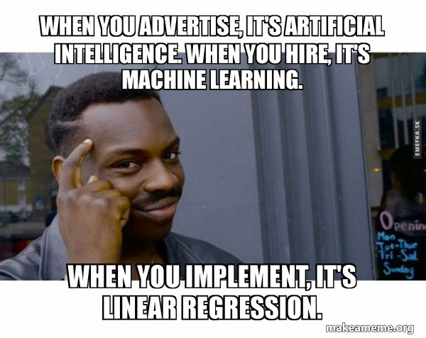{width="450" height="350"}

:::

```{.r fig.align="center" echo="FALSE" include="FALSE"}
library("jpeg")

```

## 일반적인 권장 사항 (General Recommendations)

- 데이터 분석 숙달의 핵심은 실습과 반복입니다. 코드를 직접 한 줄이라도 더 작성해보고 다양한 함수를 익히며 실험을 거듭할수록 데이터 분석은 더욱 흥미롭고 보람찬 과정이 될 것입니다.

- 본 도서는 독자의 관심사와 수준에 따라 다음과 같이 다양한 방식으로 활용할 수 있습니다:

    - 선택적 학습: 특정 분석 방법이나 도구에 관심이 있다면 목차를 통해 해당 절로 바로 이동하세요.
    - 순차적 학습: 전통적인 통계 및 데이터 분석 학습 경로를 따르고자 한다면 선형 회귀(Linear Regression) 섹션부터 시작하는 것을 권장합니다.
    - 실험적 접근: 실험 설계와 가설 검정에 집중하고 싶다면 분산 분석(ANOVA) 섹션을 살펴보세요.

- 이론적 배경보다 실무 적용에 주된 관심이 있는 독자라면 각 장의 요약(summary) 및 적용(application) 절을 중심으로 학습하시기 바랍니다.

- 개념이 명확히 이해되지 않을 때는 온라인 자료를 적극적으로 참고하세요. 이 책은 핵심 길잡이 역할을 하며 튜토리얼이나 기술 블로그 등의 외부 자료가 추가적인 통찰을 제공할 것입니다.

- 책에 수록된 예제 코드를 수정하거나 응용할 때는 R에 내장된 도움말 기능을 활용하세요:

    - 특정 함수의 상세 정보를 확인하려면 R 콘솔에 `help(함수명)` 또는 `?함수명`을 입력합니다.
    - 예를 들어 `hist` 함수의 세부 사항을 확인하려면 콘솔에 `?hist` 또는 `help(hist)`를 입력합니다.

- 아울러 온라인 검색(구글, ChatGPT 등) 또한 매우 강력한 도구입니다. R에서는 동일한 분석 결과를 얻기 위해 다양한 패키지를 활용할 수 있으므로, *"histogram in R"*과 같은 간단한 검색만으로도 다양한 접근법과 예시를 찾을 수 있습니다.

이러한 전략을 활용하면 자신의 목표에 맞추어 학습 효율을 극대화하고가 책의 가치를 온전히 누릴 수 있습니다.

통계학의 주요 도구

- 확률론 (Probability Theory)
- 수학적 해석학 (Mathematical Analysis)
- 컴퓨터 과학 (Computer Science)
- 수치해석학 (Numerical Analysis)
- 데이터베이스 관리 (Database Management)

```{.r warning="FALSE" eval="FALSE" include="FALSE"}
if (!require("pacman"))
    install.packages("pacman")
if (!require("devtools"))
    install.packages("devtools")
library("pacman")
library("devtools")
```

```{.r include="FALSE"}
# R 패키지용 bib 데이터베이스 자동 생성
knitr::write_bib(c(
  .packages(), 'bookdown', 'knitr', 'rmarkdown'
), 'packages.bib')
knitr::opts_chunk$set(warning = FALSE, message = FALSE)
```

코드 재현 환경 (Code Replication)

본 도서는 `r R.version.string` 및 다음 패키지 환경에서 작성되었습니다:

```{.r echo="FALSE" results="asis"}
# usethis::use_description_defaults()
# usethis::use_description(package = c("tidyverse","usethis"),check_name = F)
# 
# # .libPaths()
# deps <- desc::desc_get_deps("C:/Program Files/R/R-4.0.4/library") 
# deps <- desc::desc_get_deps("C:/Users/tn9k4/OneDrive - University of Missouri/Documents/R/win-library/4.0")

# if you want to make it beautiful for markdown
deps <- desc::desc_get_deps()
pkgs <- sort(deps$package[deps$type == "Imports"])
pkgs <- sessioninfo::package_info(pkgs, dependencies = FALSE)
df <- tibble::tibble(
  package = pkgs$package,
  version = pkgs$ondiskversion,
  source = gsub("@", "\\\\@", pkgs$source)
)
knitr::kable(df, format = "markdown",
             caption = "사용된 R 패키지 및 버전")
```

```{.r echo="FALSE"}
devtools::session_info()
# usethis::use_package("dplyr") # Default is "Imports"
# usethis::use_package("ggplot2", "Suggests")` # Suggests
```

<!-- ========================================= -->
<!-- Chapter: 02.1-prerequisites.Rmd -->
<!-- ========================================= -->


# 선수 지식 (Prerequisites)

이 장에서는 효과적인 통계 분석을 수행하는 데 필수적인 수학적 및 계산적 도구들을 복습합니다. 행렬론(Matrix Theory)과 선형대수학의 핵심 개념부터 시작하여 확률변수, 확률분포, 기댓값을 포함하는 기초 확률론(Probability Theory)을 살펴봅니다. 또한 함수, 도함수, 로그와 같은 중요한 수학적 기초를 되짚어본 후, R을 활용한 데이터 입출력 및 데이터 조작과 같은 실무적 요소로 나아갑니다. 이러한 주제들을 탄탄히 다져둠으로써 독자 여러분은 이후 장에서 제시될 고급 통계 방법론을 다룰 수 있는 충분한 역량을 갖추게 될 것입니다.

```{.r include="FALSE" #setup-2}
# knitr::opts_chunk$set(warning = FALSE, message = FALSE,cache = TRUE) 
knitr::opts_chunk$set(out.width = "100%")
```

이러한 주제들에 대해 이미 충분한 이해를 갖추고 있다면, 곧바로 기술통계학(Descriptive Statistics) 섹션으로 넘어가 응용 데이터 분석을 시작하셔도 좋습니다.

그림은 학문 분야에 따라 동일한 기초 통계 작업이 어떻게 다른 이름으로 포장되는지를 유쾌하게 보여줍니다.

```{.r fig.cap="AI와 머신러닝에 관한 밈(Meme)" out.width="70%" fig.alt="데이터 분석을 은유하는 벽의 균열 변화 과정을 묘사한 3컷 만화. 첫 번째 컷에서는 한 사람이 '통계학(Statistics)'이라는 라벨이 붙은 벽의 균열을 관찰합니다. 두 번째 컷에서는 '머신러닝(Machine Learning)'이라는 라벨과 함께 균열에 액자를 씌웁니다. 세 번째 컷에서는 'AI'라는 라벨과 함께 액자에 담긴 균열을 청중에게 전시하며 자신감 있게 미소 짓습니다. 아래쪽의 더 큰 이미지에서는 'AI'라는 굵은 텍스트 옆에서 만족스러운 표정으로 서 있는 사람을 보여줍니다. 이 만화는 데이터 과학에서 기본적인 관찰이 고급 프레젠테이션으로 발전하는 과정을 해학적으로 나타냅니다." #fig-include-image}
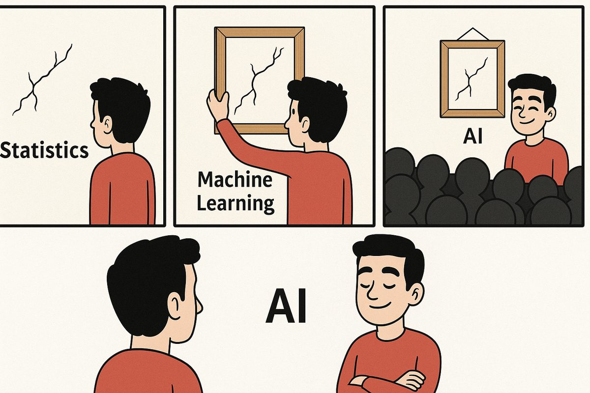
```

<!-- 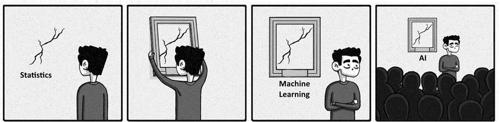{width="90%"} -->

## 행렬론 (Matrix Theory)

행렬 $\mathbf{A}$는 원래의 행렬(원시 행렬)을 나타냅니다. 이는 행 $i$와 열 $j$를 나타내는 원소 $a_{ij}$로 구성된 $2 \times 2$ 행렬입니다.

$$
\mathbf{A} =
\begin{bmatrix}
a_{11} & a_{12} \\
a_{21} & a_{22}
\end{bmatrix}
$$ 

$\mathbf{A}'$는 $\mathbf{A}$의 전치행렬(transpose)입니다. 행렬의 전치는 행과 열을 서로 바꿉니다.

$$
\mathbf{A}' =
\begin{bmatrix}
a_{11} & a_{21} \\
a_{12} & a_{22}
\end{bmatrix}
$$

선형대수학의 연산을 이해하는 데 필수적인 행렬의 기본 성질과 규칙은 다음과 같습니다:

$$
\begin{aligned}
\mathbf{(ABC)'} & = \mathbf{C'B'A'} \quad &\text{(곱의 전치는 순서가 역순이 됨)} \\
\mathbf{A(B+C)} & = \mathbf{AB + AC} \quad &\text{(분배법칙)} \\
\mathbf{AB} & \neq \mathbf{BA} \quad &\text{(행렬 곱셈은 교환법칙이 성립하지 않음)} \\
\mathbf{(A')'} & = \mathbf{A} \quad &\text{(이중 전치는 원래 행렬이 됨)} \\
\mathbf{(A+B)'} & = \mathbf{A' + B'} \quad &\text{(합의 전치는 전치의 합과 같음)} \\
\mathbf{(AB)'} & = \mathbf{B'A'} \quad &\text{(곱의 전치는 순서가 역순이 됨)} \\
\mathbf{(AB)^{-1}} & = \mathbf{B^{-1}A^{-1}} \quad &\text{(곱의 역행렬은 순서가 역순이 됨)} \\
\mathbf{A+B} & = \mathbf{B + A} \quad &\text{(행렬 덧셈은 교환법칙이 성립함)} \\
\mathbf{AA^{-1}} & = \mathbf{I} \quad &\text{(행렬과 역행렬의 곱은 단위행렬)} 
\end{aligned}
$$ 

이러한 성질들은 연립방정식의 풀이, 모형 최적화, 데이터 변환을 수행할 때 매우 중요합니다.

행렬 $\mathbf{A}$의 역행렬이 존재하면 이를 가역행렬(invertible)이라 부릅니다. $\mathbf{A}$의 역행렬이 존재하지 않으면 이를 특이행렬(singular)이라고 합니다.

두 행렬 $\mathbf{A}$와 $\mathbf{B}$의 곱은 다음과 같이 계산됩니다:

$$
\begin{aligned}
\mathbf{A} &= 
\begin{bmatrix}
a_{11} & a_{12} & a_{13} \\ 
a_{21} & a_{22} & a_{23} 
\end{bmatrix}
\begin{bmatrix}
b_{11} & b_{12} & b_{13} \\
b_{21} & b_{22} & b_{23} \\
b_{31} & b_{32} & b_{33}
\end{bmatrix} \\
&= 
\begin{bmatrix}
a_{11}b_{11}+a_{12}b_{21}+a_{13}b_{31} & \sum_{i=1}^{3}a_{1i}b_{i2} & \sum_{i=1}^{3}a_{1i}b_{i3} \\
\sum_{i=1}^{3}a_{2i}b_{i1} & \sum_{i=1}^{3}a_{2i}b_{i2} & \sum_{i=1}^{3}a_{2i}b_{i3}
\end{bmatrix} 
\end{aligned}
$$

이차형식 (Quadratic Form)

$\mathbf{a}$를 $3 \times 1$ 벡터라고 할 때, 행렬 $\mathbf{B}$를 포함하는 이차형식(quadratic form)은 다음과 같이 주어집니다:

$$
\mathbf{a'Ba} = \sum_{i=1}^{3}\sum_{j=1}^{3}a_i b_{ij} a_{j}
$$

벡터의 길이 (Length of a Vector)

벡터 $\mathbf{a}$의 길이(또는 2-노름, 2-norm)는 $||\mathbf{a}||$로 표기하며 벡터 자기 자신과의 내적(inner product)의 제곱근으로 정의됩니다:

$$

||\mathbf{a}|| = \sqrt{\mathbf{a'a}}
$$

### 행렬의 랭크(계수) (Rank of a Matrix)

행렬의 랭크(계수, rank)는 다음을 의미합니다:

- 열(또는 행)들이 생성하는 공간의 차원.
- 선형 독립(linearly independent)인 열 또는 행의 개수.

$n \times k$ 행렬 $\mathbf{A}$와 $k \times k$ 행렬 $\mathbf{B}$에 대해 다음과 같은 성질이 성립합니다:

- $\text{rank}(\mathbf{A}) \leq \min(n, k)$
- $\text{rank}(\mathbf{A}) = \text{rank}(\mathbf{A'}) = \text{rank}(\mathbf{A'A}) = \text{rank}(\mathbf{AA'})$
- $\text{rank}(\mathbf{AB}) = \min(\text{rank}(\mathbf{A}), \text{rank}(\mathbf{B}))$
- $\mathbf{B}$가 가역(비특이) 행렬일 필요충분조건은 $\text{rank}(\mathbf{B}) = k$이다.

### 행렬의 역행렬 (Inverse of a Matrix)

스칼라 대수에서는 $a = 0$이면 $1/a$이 존재하지 않습니다.

행렬 대수에서 행렬이 비특이(non-singular)이면 가역(invertible)입니다. 즉, 행렬식(determinant)이 0이 아니며 역행렬이 존재합니다. 정방행렬(square matrix) $\mathbf{A}$가 가역이라는 것은 다음을 만족하는 또 다른 정방행렬 $\mathbf{B}$가 존재함을 뜻합니다:

$$
\mathbf{AB} = \mathbf{I} \quad \text{(단위행렬, Identity Matrix)}.
$$

이 경우, $\mathbf{A}^{-1} = \mathbf{B}$입니다.

$2 \times 2$ 행렬의 경우:

$$
\mathbf{A} =
\begin{bmatrix}
a & b \\
c & d
\end{bmatrix}
$$

역행렬은 다음과 같습니다:

$$
\mathbf{A}^{-1} =
\frac{1}{ad-bc}
\begin{bmatrix}
d & -b \\
-c & a
\end{bmatrix}
$$

이 역행렬은 $ad - bc \neq 0$일 때만 존재하며 여기서 $ad - bc$는 $\mathbf{A}$의 행렬식입니다.

분할 블록 행렬(partitioned block matrix)의 경우:

$$
\begin{bmatrix}
A & B \\
C & D
\end{bmatrix}^{-1}
=
\begin{bmatrix}
\mathbf{(A-BD^{-1}C)^{-1}} & \mathbf{-(A-BD^{-1}C)^{-1}BD^{-1}} \\
\mathbf{-D^{-1}C(A-BD^{-1}C)^{-1}} & \mathbf{D^{-1}+D^{-1}C(A-BD^{-1}C)^{-1}BD^{-1}}
\end{bmatrix}
$$

이 공식은 $\mathbf{D}$와 $\mathbf{A - BD^{-1}C}$가 가역이라고 가정합니다.

비특이 행렬의 역행렬 성질

1. $\mathbf{(A^{-1})^{-1}} = \mathbf{A}$
2. 0이 아닌 스칼라 $b$에 대해, $\mathbf{(bA)^{-1} = b^{-1}A^{-1}}$
3. 행렬 $\mathbf{B}$에 대해, $\mathbf{(BA)^{-1} = B^{-1}A^{-1}}$ ($\mathbf{B}$가 비특이 행렬일 때만 성립).
4. $\mathbf{(A^{-1})' = (A')^{-1}}$ (역행렬의 전치는 전치행렬의 역행렬과 같음).
5. $\mathbf{1/A}$로 표기하지 말고 항상 $\mathbf{A^{-1}}$를 사용해야 합니다.

참고 사항:

- 행렬의 행렬식은 역행렬의 존재 여부를 결정합니다. 정방행렬의 경우 행렬식이 $0$이면 행렬이 특이(singular)하며 역행렬이 존재하지 않습니다.

- 특히 분할 행렬이나 블록 행렬을 다룰 때는 가역성 조건을 항상 확인해야 합니다.

### 행렬의 부호성 (Definiteness of a Matrix)

대칭 정방행렬 $k \times k$ 행렬 $\mathbf{A}$는 다음 조건에 따라 분류됩니다:

- 양의 준정부호(Positive Semi-Definite, PSD): 임의의 0이 아닌 $k \times 1$ 벡터 $\mathbf{x}$에 대해 다음을 만족하면 $\mathbf{A}$는 PSD입니다: $$
    \mathbf{x'Ax \geq 0}.
    $$

- 음의 준정부호(Negative Semi-Definite, NSD): 임의의 0이 아닌 $k \times 1$ 벡터 $\mathbf{x}$에 대해 다음을 만족하면 $\mathbf{A}$는 NSD입니다: $$
    \mathbf{x'Ax \leq 0}.
    $$

- 부정부호(Indefinite): $\mathbf{A}$가 PSD도 아니고 NSD도 아닌 경우 부정부호(indefinite)입니다.

단위행렬(identity matrix)은 항상 양의 정부호(Positive Definite, PD)입니다.

예제

$\mathbf{x} = (x_1, x_2)'$라 하고 $2 \times 2$ 단위행렬 $\mathbf{I}$를 고려해 보겠습니다:

$$
\begin{aligned}
\mathbf{x'Ix} 
&= (x_1, x_2) 
\begin{bmatrix}
1 & 0 \\
0 & 1
\end{bmatrix}
\begin{bmatrix}
x_1 \\
x_2
\end{bmatrix} \\
&=
(x_1, x_2)
\begin{bmatrix}
x_1 \\
x_2
\end{bmatrix} \\
&=
x_1^2 + x_2^2 \geq 0.
\end{aligned}
$$

따라서 모든 0이 아닌 $\mathbf{x}$에 대해 $\mathbf{x'Ix} > 0$이므로 $\mathbf{I}$는 양의 정부호(PD)입니다.

부호성의 성질

1. 모든 분산-공분산 행렬은 양의 준정부호(PSD)입니다.
2. 행렬 $\mathbf{A}$가 PSD일 필요충분조건은 다음을 만족하는 행렬 $\mathbf{B}$가 존재하는 것입니다: $$
    \mathbf{A = B'B}.
    $$
3. $\mathbf{A}$가 PSD이면 적합한(conformable) 크기의 임의의 행렬 $\mathbf{B}$에 대해 $\mathbf{B'AB}$ 또한 PSD입니다.
4. $\mathbf{A}$와 $\mathbf{C}$가 비특이 행렬이면, $\mathbf{A - C}$가 PSD일 필요충분조건은 $\mathbf{C^{-1} - A^{-1}}$가 PSD인 것입니다.
5. $\mathbf{A}$가 PD(또는 ND)이면, $\mathbf{A^{-1}}$ 또한 PD(또는 ND)입니다.

참고 사항

- 부정부호(indefinite) 행렬 $\mathbf{A}$는 PSD도 아니고 NSD도 아닙니다. 이 개념은 스칼라 대수에는 직접적으로 대응되는 개념이 없습니다.
- 정방행렬이 PSD이면서 가역(invertible)이면, 그 행렬은 PD입니다.

부호성의 예시

1. 가역 / 부정부호 (Invertible / Indefinite): $$
    \begin{bmatrix}
    -1 & 0 \\
    0 & 10
    \end{bmatrix}
    $$

2. 비가역 / 부정부호 (Non-Invertible / Indefinite): $$
    \begin{bmatrix}
    0 & 1 \\
    0 & 0
    \end{bmatrix}
    $$

3. 가역 / 양의 준정부호 (Invertible / PSD): $$
    \begin{bmatrix}
    1 & 0 \\
    0 & 1
    \end{bmatrix}
    $$

4. 비가역 / 양의 준정부호 (Non-Invertible / PSD): $$
    \begin{bmatrix}
    0 & 0 \\
    0 & 1
    \end{bmatrix}
    $$

### 행렬 미적분학 (Matrix Calculus)

$x$가 $1 \times k$ 행 벡터일 때, 스칼라 함수 $y = f(x_1, x_2, \dots, x_k) = f(x)$를 고려해 보겠습니다.

#### 그래디언트 (1계 도함수, First-Order Derivative)

벡터 $x$에 대한 $f(x)$의 1계 도함수인 그래디언트(gradient, 기울기 벡터)는 다음과 같이 주어집니다:

$$
\frac{\partial f(x)}{\partial x} =
\begin{bmatrix}
\frac{\partial f(x)}{\partial x_1} \\
\frac{\partial f(x)}{\partial x_2} \\
\vdots \\
\frac{\partial f(x)}{\partial x_k}
\end{bmatrix}
$$

#### 헤시안 (2계 도함수, Second-Order Derivative)

$x$에 대한 $f(x)$의 2계 도함수인 헤시안(Hessian)은 다음과 같이 정의되는 대칭행렬입니다:

$$
\frac{\partial^2 f(x)}{\partial x \partial x'} =
\begin{bmatrix}
\frac{\partial^2 f(x)}{\partial x_1^2} & \frac{\partial^2 f(x)}{\partial x_1 \partial x_2} & \cdots & \frac{\partial^2 f(x)}{\partial x_1 \partial x_k} \\
\frac{\partial^2 f(x)}{\partial x_2 \partial x_1} & \frac{\partial^2 f(x)}{\partial x_2^2} & \cdots & \frac{\partial^2 f(x)}{\partial x_2 \partial x_k} \\
\vdots & \vdots & \ddots & \vdots \\
\frac{\partial^2 f(x)}{\partial x_k \partial x_1} & \frac{\partial^2 f(x)}{\partial x_k \partial x_2} & \cdots & \frac{\partial^2 f(x)}{\partial x_k^2}
\end{bmatrix}
$$

#### 행렬에 대한 스칼라 함수의 도함수 (Derivative of a Scalar Function with Respect to a Matrix)

$f(\mathbf{X})$를 스칼라 함수라 하고 $\mathbf{X}$를 $n \times p$ 행렬이라 할 때, 도함수는 다음과 같습니다:

$$
\frac{\partial f(\mathbf{X})}{\partial \mathbf{X}} = 
\begin{bmatrix}
\frac{\partial f(\mathbf{X})}{\partial x_{11}} & \cdots & \frac{\partial f(\mathbf{X})}{\partial x_{1p}} \\
\vdots & \ddots & \vdots \\
\frac{\partial f(\mathbf{X})}{\partial x_{n1}} & \cdots & \frac{\partial f(\mathbf{X})}{\partial x_{np}}
\end{bmatrix}
$$

#### 주요 행렬 도함수 공식 (Common Matrix Derivatives)

1. $\mathbf{a}$가 벡터이고 $\mathbf{A}$가 $\mathbf{y}$와 무관한 행렬일 때:
    - $\frac{\partial \mathbf{a'y}}{\partial \mathbf{y}} = \mathbf{a}$
    - $\frac{\partial \mathbf{y'y}}{\partial \mathbf{y}} = 2\mathbf{y}$
    - $\frac{\partial \mathbf{y'Ay}}{\partial \mathbf{y}} = (\mathbf{A} + \mathbf{A'})\mathbf{y}$
2. $\mathbf{X}$가 대칭행렬일 때:
    - $\frac{\partial |\mathbf{X}|}{\partial x_{ij}} = \begin{cases} X_{ii}, & i = j \\ X_{ij}, & i \neq j \end{cases}$ (여기서 $X_{ij}$는 $\mathbf{X}$의 $(i,j)$번째 여인수(cofactor)).
3. $\mathbf{X}$가 대칭행렬이고 $\mathbf{A}$가 $\mathbf{X}$와 무관한 행렬일 때:
    - $\frac{\partial \text{tr}(\mathbf{XA})}{\partial \mathbf{X}} = \mathbf{A} + \mathbf{A'} - \text{diag}(\mathbf{A})$.
4. $\mathbf{X}$가 대칭행렬이고 $\mathbf{J}_{ij}$를 $(i,j)$ 위치만 1이고 나머지는 0인 행렬이라 할 때:
    - $\frac{\partial \mathbf{X}^{-1}}{\partial x_{ij}} = \begin{cases} -\mathbf{X}^{-1}\mathbf{J}_{ii}\mathbf{X}^{-1}, & i = j \\ -\mathbf{X}^{-1}(\mathbf{J}_{ij} + \mathbf{J}_{ji})\mathbf{X}^{-1}, & i \neq j \end{cases}.$

### 스칼라 및 벡터 공간에서의 최적화 (Optimization in Scalar and Vector Spaces)

최적화(Optimization)는 함수의 최솟값 또는 최댓값을 찾는 과정입니다. 최적화 조건은 함수가 스칼라를 다루는지 벡터를 다루는지에 따라 달라집니다. 아래는 스칼라 최적화와 벡터 최적화의 비교입니다:

+--------------------------------------------------------+------------------------------------------------+-----------------------------------------------------------------------------------------+
| 조건                                                   | 스칼라 최적화 (Scalar Optimization)        | 벡터 최적화 (Vector Optimization)                                                   |
+========================================================+================================================+=========================================================================================+
| 1계 조건 (First-Order Condition)                   | $$\frac{\partial f(x_0)}{\partial x} = 0$$     | $$\frac{\partial f(x_0)}{\partial x} = \begin{bmatrix} 0 \\ \vdots \\ 0 \end{bmatrix}$$ |
+--------------------------------------------------------+------------------------------------------------+-----------------------------------------------------------------------------------------+

| 2계 조건 (Second-Order Condition)                  | $$\frac{\partial^2 f(x_0)}{\partial x^2} > 0$$ | $$\frac{\partial^2 f(x_0)}{\partial x \partial x'} > 0$$                                |
|                                                        |                                                |                                                                                         |
| 볼록(convex) 함수의 경우 최솟값을 의미함.      |                                                |                                                                                         |
+--------------------------------------------------------+------------------------------------------------+-----------------------------------------------------------------------------------------+
| 오목(concave) 함수의 경우 최댓값을 의미함.     | $$\frac{\partial^2 f(x_0)}{\partial x^2} < 0$$ | $$\frac{\partial^2 f(x_0)}{\partial x \partial x'} < 0$$                                |
+--------------------------------------------------------+------------------------------------------------+-----------------------------------------------------------------------------------------+

: 스칼라 및 벡터 최적화 조건

주요 개념

1. 1계 조건 (First-Order Condition):
    - 임계점(critical point)에서 함수의 1계 도함수는 0이어야 합니다. 이는 스칼라 함수와 벡터 함수 모두에 적용됩니다:
        - 스칼라의 경우, $\frac{\partial f(x)}{\partial x} = 0$으로 임계점을 식별합니다.
        - 벡터의 경우, $\frac{\partial f(x)}{\partial x}$는 그래디언트 벡터(gradient vector)이며 그래디언트의 모든 원소가 0일 때 조건이 만족됩니다.
2. 2계 조건 (Second-Order Condition):
    - 2계 도함수는 임계점이 최솟값인지, 최댓값인지, 아니면 안장점(saddle point)인지를 결정합니다:
        - 스칼라 함수의 경우, $\frac{\partial^2 f(x)}{\partial x^2} > 0$이면 국소 최솟값(local minimum)을 의미하고 $\frac{\partial^2 f(x)}{\partial x^2} < 0$이면 국소 최댓값(local maximum)을 의미합니다.
        - 벡터 함수의 경우, 헤시안 행렬 $\frac{\partial^2 f(x)}{\partial x \partial x'}$이 다음과 같아야 합니다:
            - 양의 정부호(Positive Definite): 최솟값 (볼록 함수).
            - 음의 정부호(Negative Definite): 최댓값 (오목 함수).
            - 부정부호(Indefinite): 안장점 (최솟값도 최댓값도 아님).
3. 볼록 함수와 오목 함수 (Convex and Concave Functions):
    - 함수 $f(x)$는:
        - $\frac{\partial^2 f(x)}{\partial x^2} > 0$이거나 헤시안 $\frac{\partial^2 f(x)}{\partial x \partial x'}$이 양의 정부호이면 볼록(convex)합니다.
        - $\frac{\partial^2 f(x)}{\partial x^2} < 0$이거나 헤시안이 음의 정부호이면 오목(concave)합니다.
    - 볼록성은 최소화 문제에서 전역 최적화(global optimization)를 보장하며 오목성은 최대화 문제에서 전역 최적화를 보장합니다.
4. 헤시안 행렬 (Hessian Matrix):
    - 벡터 최적화에서 헤시안 $\frac{\partial^2 f(x)}{\partial x \partial x'}$은 임계점의 성격을 규명하는 데 결정적인 역할을 합니다:
        - 양의 정부호 헤시안: 모든 고윳값이 양수입니다.
        - 음의 정부호 헤시안: 모든 고윳값이 음수입니다.
        - 부정부호 헤시안: 고윳값들의 부호가 혼합되어 있습니다.

### 촐레스키 분해 (Cholesky Decomposition)

통계 분석과 수치 선형대수학에서 행렬을 다루기 쉬운 형태로 분해하는 것은 효율적인 계산을 위해 필수적입니다. 이러한 중요한 인수분해 방법 중 하나가 바로 촐레스키 분해(Cholesky Decomposition)입니다. 이는 (복소수 공간의) 에르미트(Hermitian) 행렬 또는 (실수 공간의) 대칭(symmetric)인 양의 정부호(positive-definite) 행렬에 적용됩니다.

$n \times n$ 양의 정부호 행렬 $A$가 주어졌을 때, 촐레스키 분해는 다음과 같이 정의됩니다:

$$
A = L L^{*},
$$

여기서:

- $L$은 대각 원소가 모두 엄격한 양수(strictly positive)인 하삼각행렬(lower-triangular matrix)입니다.
- $L^{*}$는 $L$의 *켤레 전치(conjugate transpose)*를 나타냅니다(실수 행렬의 경우 단순히 전치행렬 $L^{T}$가 됨).

촐레스키 분해는 계산 효율성이 높고 수치적으로 안정적이어서 다양한 응용 분야, 특히 공분산 행렬, 선형 시스템, 확률분포를 광범위하게 다루는 통계학에서 핵심적으로 활용되는 기법입니다.

촐레스키 분해를 계산하는 방법을 살펴보기 전에, 행렬이 *양의 정부호(positive-definite)*라는 것이 무엇을 의미하는지 명확히 할 필요가 있습니다. 실수 대칭행렬 $A$에 대해:

- 모든 0이 아닌 벡터 $x$에 대해 다음이 성립하면 $A$는 *양의 정부호*입니다: $$
    x^T A x > 0.
    $$
- 또는 $A$의 모든 고윳값이 엄격한 양수(strictly positive)라는 점으로 양의 정부호성을 특성화할 수도 있습니다.

통계학에서 다루는 많은 중요한 행렬, 특히 공분산 행렬이나 정밀도 행렬(precision matrix, 집중 행렬)은 대칭이면서 동시에 양의 정부호입니다.


#### 존재성 (Existence)

대칭이면서 양의 정부호인 실수 $n \times n$ 행렬 $A$는 항상 촐레스키 분해 $A = L L^T$가 가능합니다. 이 정리는 통계학에서 유효한(즉, 양의 정부호인) 모든 공분산 행렬을 촐레스키 분해를 통해 분해할 수 있음을 보장합니다.

#### 유일성 (Uniqueness)

$L$의 대각 원소가 *엄격한 양수*여야 한다는 조건을 추가하면, $L$은 *유일(unique)*합니다. 즉, 대각 원소가 엄격한 양수인 다른 하삼각행렬은 동일한 인수분해를 생성할 수 없습니다. 이러한 유일성은 소프트웨어 구현에서 일관된 수치 결과를 보장하는 데 매우 유용합니다.

#### 촐레스키 인자 $L$ 구성하기 (Constructing the Cholesky Factor $L$)

실수 대칭 양의 정부호 행렬 $A \in \mathbb{R}^{n \times n}$이 주어졌을 때, $A = LL^T$를 만족하는 하삼각행렬 $L$을 구하고자 합니다. 이를 구하는 한 가지 방법은 다음과 같은 단계별 절차(표준 선형대수 라이브러리에 주로 구현되어 있음)를 사용하는 것입니다:

1. $L$을 $n \times n$ 영행렬로 초기화합니다.
2. 행 $i = 1, 2, \dots, n$에 대해 반복합니다:
    1. 각 행 $i$에 대해 다음을 계산합니다: $$
        L_{ii} = \sqrt{A_{ii} - \sum_{k=1}^{i-1} L_{ik}^2}.
        $$
    2. 각 열 $j = i+1, i+2, \dots, n$에 대해 다음을 계산합니다: $$
        L_{ji} = \frac{1}{L_{ii}}
                  \left(A_{ji} - \sum_{k=1}^{i-1} L_{jk} L_{ik}\right).
        $$
    3. $L$의 나머지 원소들은 0으로 유지되거나 후속 단계에서 계산됩니다.
3. 결과: $L$은 하삼각행렬이고 $L^T$는 그 전치행렬입니다.

촐레스키 분해의 계산 비용은 일반적인 LU 분해의 약 절반 수준입니다. 구체적으로 약 $\frac{1}{3} n^3$회의 부동소수점 연산(flops)이 필요하므로, 양의 정부호 시스템에 대해 다른 분해법보다 실무에서 훨씬 더 효율적입니다.


#### 예제 (Illustrative Example)

간단한 $3 \times 3$ 양의 정부호 행렬을 고려해 보겠습니다:

$$
A = 
\begin{pmatrix}
4 & 2 & 4 \\
2 & 5 & 6 \\
4 & 6 & 20
\end{pmatrix}.
$$

$A$가 양의 정부호라고 가정합니다(주요 소행렬식을 계산하거나 모든 $x \neq 0$에 대해 $x^T A x > 0$임을 검증하여 확인할 수 있습니다). 단계별로 $L$을 구해 보겠습니다:

1. $L_{11}$ 계산:\
    $$
    L_{11} = \sqrt{A_{11}} = \sqrt{4} = 2.
    $$
2. $L_{21}$ 및 $L_{31}$ 계산:
    - $L_{21} = \frac{A_{21}}{L_{11}} = \frac{2}{2} = 1.$
    - $L_{31} = \frac{A_{31}}{L_{11}} = \frac{4}{2} = 2.$
3. $L_{22}$ 계산:\
    $$
    L_{22} = \sqrt{A_{22} - L_{21}^2} 
            = \sqrt{5 - 1^2}
            = \sqrt{4} = 2.
    $$
4. $L_{32}$ 계산:\
    $$
    L_{32} = \frac{A_{32} - L_{31} L_{21}}{L_{22}}
            = \frac{6 - (2)(1)}{2}
            = \frac{4}{2} = 2.
    $$
5. $L_{33}$ 계산:\
    $$
    L_{33} = \sqrt{A_{33} - (L_{31}^2 + L_{32}^2)}
            = \sqrt{20 - (2^2 + 2^2)}
            = \sqrt{20 - 8}
            = \sqrt{12}
            = 2\sqrt{3}.
    $$

따라서 다음과 같습니다:

$$
L = 
\begin{pmatrix}
2 & 0 & 0 \\
1 & 2 & 0 \\
2 & 2 & 2\sqrt{3}
\end{pmatrix}.
$$

$L L^T = A$임을 직접 검증할 수 있습니다.


#### 통계학에서의 응용 (Applications in Statistics)

##### 선형 연립방정식 풀이 (Solving Linear Systems)

흔히 마주치는 통계학 문제는 $x$에 대해 $A x = b$를 푸는 것입니다. 예를 들어 회귀분석이나 베이즈 사후 최빈값(Bayesian posterior modes)을 계산할 때, 공분산 행렬이나 정밀도 행렬이 포함된 선형 연립방정식을 풀어야 하는 경우가 많습니다. $A = LL^T$를 이용하면:

1. 전진 대입법(Forward Substitution): $L y = b$를 풉니다.
2. 후진 대입법(Backward Substitution): $L^T x = y$를 풉니다.

이 2단계 과정은 수치적 불안정성으로 인해 권장되지 않는 $A$의 역행렬을 직접 구하는 방식보다 훨씬 안정적이고 효율적입니다.

##### 상관된 확률벡터 생성 (Generating Correlated Random Vectors)

시뮬레이션 기반 통계학(예: 몬테카를로 방법)에서는 공분산 행렬이 $\Sigma$인 다변량 정규분포(multivariate normal distribution) $\mathcal{N}(\mu, \Sigma)$로부터 무작위 표본을 생성해야 하는 경우가 많습니다. 그 단계는 다음과 같습니다:

1. 독립 표준정규분포 변수들로 구성된 벡터 $z \sim \mathcal{N}(0, I)$를 생성합니다.
2. $\Sigma = LL^T$일 때, $x = \mu + Lz$를 계산합니다.

그러면 $x$는 목표로 하는 공분산 구조 $\Sigma$를 갖게 됩니다. 이 기법은 베이지안 통계(예: MCMC 샘플링) 및 금융 모델링(예: 포트폴리오 시뮬레이션)에서 널리 활용됩니다.

##### 가우시안 프로세스와 크리깅 (Gaussian Processes and Kriging)

가우시안 프로세스 모델링(공간통계학, 머신러닝, 지구통계학에서 흔히 사용됨)에서는 관측 데이터 지점 간의 상관관계를 설명하는 대규모 공분산 행렬을 빈번하게 다룹니다:

$$
\Sigma = 
\begin{pmatrix}
k(x_1, x_1) & k(x_1, x_2) & \cdots & k(x_1, x_n) \\
k(x_2, x_1) & k(x_2, x_2) & \cdots & k(x_2, x_n) \\
\vdots & \vdots & \ddots & \vdots \\
k(x_n, x_1) & k(x_n, x_2) & \cdots & k(x_n, x_n)
\end{pmatrix},
$$

여기서 $k(\cdot, \cdot)$는 공분산(커널) 함수입니다. 로그 가능도(log-likelihood)를 평가하기 위해 $\Sigma$를 반복해서 역행렬 계산하거나 분해해야 할 수 있습니다:

$$
\log \mathcal{L}(\theta) \sim 
- \tfrac{1}{2} \left( y - m(\theta) \right)^T \Sigma^{-1} \left( y - m(\theta) \right) 
- \tfrac{1}{2} \log \left| \Sigma \right|,
$$

여기서 $m(\theta)$는 평균 함수이고 $\theta$는 모수입니다. $\Sigma$의 촐레스키 인자 $L$을 사용하면 다음과 같은 이점이 있습니다:

- 역행렬을 명시적으로 계산하는 대신 $L$을 이용한 연립방정식 풀이를 통해 $\Sigma^{-1}$ 연산을 수행할 수 있습니다.
- $\log|\Sigma|$는 $2 \sum_{i=1}^n \log L_{ii}$로 간편하게 계산할 수 있습니다.

따라서 촐레스키 분해는 가우시안 프로세스 계산의 핵심 중추 역할을 합니다.

##### 공분산 행렬을 활용한 베이지안 추론 (Bayesian Inference with Covariance Matrices)

많은 베이지안 모델, 특히 위계적 모델(hierarchical models)에서는 모수에 대해 다변량 정규 사전분포(prior)를 가정합니다. 촐레스키 분해는 다음과 같은 목적으로 활용됩니다:

- 이러한 사전분포 또는 사후분포(posterior distributions)로부터 표본 추출.
- 대규모 공분산 행렬의 정규화(regularization).
- 공분산 구조를 분해하여 마르코프 연쇄 몬테카를로(MCMC) 계산 속도 향상.


#### 기타 참고 사항 (Other Notes)

1. 수치적 안정성 고려사항 (Numerical Stability Considerations)

촐레스키 분해는 양의 정부호 행렬에 적용할 때 일반적인 LU 분해보다 수치적으로 더 안정적인 것으로 평가받습니다. 행 또는 열 피벗팅(pivoting)이 필요하지 않으므로 반올림 오차가 더 작을 수 있습니다. 물론 실제 환경에서는 소프트웨어 구현에 따라 차이가 있을 수 있으며 조건수(condition number)가 극도로 나쁜 병태 행렬(ill-conditioned matrices)은 여전히 수치적 문제를 야기할 수 있습니다.

2. 우리가 통상적으로 $\mathbf{A}^{-1}$를 직접 계산하지 않는 이유 (Why We *Don't* Usually Compute $\mathbf{A}^{-1}$)

통계학(특히 오래된 교재)에서는 $\Sigma^{-1}$이 포함된 공식을 흔히 볼 수 있습니다. 그러나 역행렬을 명시적으로 계산하는 것은 다음과 같은 이유로 권장되지 않습니다:

- 수치적으로 덜 안정적입니다.
- 더 많은 연산량을 요구합니다.
- $\Sigma^{-1}$이 필요한 것처럼 보이는 많은 작업은 촐레스키 인자 $L$을 통해 연립방정식을 푸는 편이 훨씬 효율적입니다.

따라서 "역행렬을 구하지 말고 연립방정식을 풀어라 (solve, don't invert)"는 수치해석의 유명한 격언입니다. $\Sigma^{-1} b$와 같은 표현식을 마주치면, 직접 역행렬을 계산하는 대신 촐레스키 인자 $L$과 $L^T$를 활용하여 전진 및 후진 대입법으로 $\Sigma x = b$를 풀 수 있습니다.

3. 추가 변형 및 확장 (Further Variants and Extensions)

- 불완전 촐레스키 분해 (Incomplete Cholesky): 특히 대규모 희소(sparse) 시스템에서 완전한 촐레스키 분해가 너무 비용이 많이 들 때 반복 해법(iterative solvers)에서 사용됩니다.
- $LDL^T$ 분해: 제곱근 계산을 피하는 변형 기법으로, 양의 준정부호 또는 부정부호 시스템에 피벗팅 전략과 함께 주의 깊게 사용됩니다.


## 확률론 (Probability Theory)

<!-- 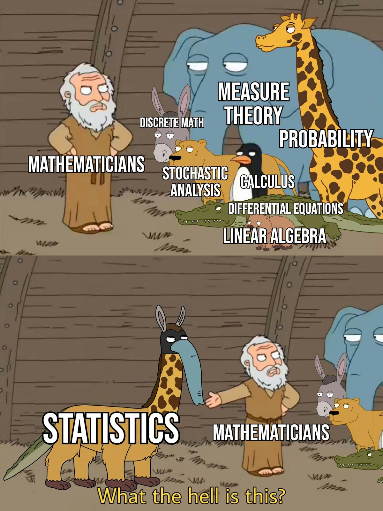{width="80%"} -->

### 확률의 공리와 정리 (Axioms and Theorems of Probability)

1. $S$를 실험의 표본공간(sample space)이라 할 때: $$
    P[S] = 1
    $$ (표본공간의 확률은 항상 1이다.)

2. 임의의 사건 $A$에 대해: $$
    P[A] \geq 0
    $$ (확률은 항상 음이 아닌 값을 가진다.)

3. $A_1, A_2, A_3, \dots$를 유한개 또는 가산 무한개의 상호 배반(mutually exclusive) 사건들의 모임이라 할 때: $$
    P[A_1 \cup A_2 \cup A_3 \dots] = P[A_1] + P[A_2] + P[A_3] + \dots
    $$ (상호 배반 사건들의 합사건 확률은 각 사건의 확률의 합과 같다.)

4. 공집합의 확률: $$
    P[\emptyset] = 0
    $$

5. 여사건 규칙(Complement Rule): $$
    P[A'] = 1 - P[A]
    $$

6. 두 사건의 합사건 확률: $$
    P[A_1 \cup A_2] = P[A_1] + P[A_2] - P[A_1 \cap A_2]
    $$

#### 조건부 확률 (Conditional Probability)

$B$가 주어졌을 때 $A$의 조건부 확률은 다음과 같이 정의됩니다:

$$
P[A|B] = \frac{P[A \cap B]}{P[B]}, \quad \text{단, } P[B] \neq 0.
$$

#### 독립 사건 (Independent Events)

두 사건 $A$와 $B$가 독립일 필요충분조건은 다음과 같습니다:

1. $P[A \cap B] = P[A]P[B]$
2. $P[A|B] = P[A]$
3. $P[B|A] = P[B]$

사건들의 모임 $A_1, A_2, \dots, A_n$이 상호 독립일 필요충분조건은 모든 부분 모임이 독립인 것입니다.

#### 곱셈 법칙 (Multiplication Rule)

두 사건의 교사건(결합) 확률은 다음과 같이 계산할 수 있습니다: $$
P[A \cap B] = P[A|B]P[B] = P[B|A]P[A].
$$

#### 베이즈 정리 (Bayes' Theorem)

$A_1, A_2, \dots, A_n$을 그 합집합이 $S$가 되는 상호 배반 사건들의 모임이라 하고 $B$를 $P[B] \neq 0$인 사건이라 할 때, 임의의 사건 $A_j$ ($j = 1, 2, \dots, n$)에 대해 다음이 성립합니다: $$
P[A_j|B] = \frac{P[B|A_j]P[A_j]}{\sum_{i=1}^n P[B|A_i]P[A_i]}.
$$

#### 젠센 부등식 (Jensen's Inequality)

- $g(x)$가 볼록 함수(convex function)이면: $$
    E[g(X)] \geq g(E[X])
    $$

- $g(x)$가 오목 함수(concave function)이면: $$
    E[g(X)] \leq g(E[X]).
    $$

젠센 부등식(Jensen's inequality)은 모표준편차($\sigma$)의 추정량으로 표본표준편차($s$)를 사용할 때, 왜 이것이 편향된 추정량(biased estimator)이 되는지를 명확히 보여주는 유용한 도구입니다.

- 모표준편차 $\sigma$는 다음과 같이 정의됩니다: $$
    \sigma = \sqrt{\mathbb{E}[(X - \mu)^2]},
    $$ 여기서 $\mu = \mathbb{E}[X]$는 모평균입니다.

- 표본표준편차 $s$는 다음과 같이 주어집니다: $$
    s = \sqrt{\frac{1}{n-1} \sum_{i=1}^n (X_i - \bar{X})^2},
    $$ 여기서 $\bar{X}$는 표본평균입니다.

- $s$를 $\sigma$의 추정량으로 사용할 때, 그 기댓값은 오목 함수인 제곱근 함수를 포함하게 됩니다.

젠센 부등식의 적용

표준오차 공식은 제곱근을 포함합니다: $$
\sqrt{\mathbb{E}[s^2]}.
$$

그러나 제곱근 함수는 오목(concave) 함수이므로, 젠센 부등식에 의해 다음이 성립합니다: $$
\sqrt{\mathbb{E}[s^2]} \leq \mathbb{E}[\sqrt{s^2}] = \mathbb{E}[s].
$$

이 부등식은 $s$(표본표준편차)의 기대값이 모표준편차 $\sigma$를 체계적으로 과소추정(underestimate)함을 보여줍니다.

편향의 정량화

편향(bias)은 다음으로 인해 발생합니다: $$
\mathbb{E}[s] \neq \sigma.
$$

이 편향을 보정하기 위해, 표본표준편차와 모표준편차 간의 다음과 같은 관계를 활용할 수 있습니다: $$
\mathbb{E}[s] = \sigma \cdot \sqrt{\frac{n-1}{n}},
$$ 여기서 $n$은 표본 크기입니다. 이 편향은 $n$이 커질수록 감소하며 추정량은 점근적으로 비편향(asymptotically unbiased) 추정량이 됩니다.

젠센 부등식을 통해 제곱근 함수의 오목성이 $s$를 $\sigma$의 편향 추정량으로 만들고 모표준편차를 체계적으로 과소추정하게 함을 확인할 수 있습니다.

#### 반복 기댓값의 법칙 (Law of Iterated Expectation)

반복 기댓값의 법칙(Law of Iterated Expectation, LIE)에 따르면 두 확률변수 $X$와 $Y$에 대해 다음이 성립합니다:

$$
E(X) = E(E(X|Y)).
$$

이는 $X$의 기댓값을 구할 때, 먼저 조건부 기댓값 $E(X|Y)$를 계산한 다음, $Y$의 분포에 대해가 값의 기댓값을 취함으로써 얻을 수 있음을 의미합니다.

#### 상관관계와 독립성 (Correlation and Independence)

확률변수 간의 관계의 강도는 가장 강한 관계부터 가장 약한 관계 순으로 다음과 같이 나열할 수 있습니다:

1. 독립성 (Independence): 
    - $f(x, y) = f_X(x)f_Y(y)$
    - $f_{Y|X}(y|x) = f_Y(y)$ 및 $f_{X|Y}(x|y) = f_X(x)$
    - $E[g_1(X)g_2(Y)] = E[g_1(X)]E[g_2(Y)]$
2. 평균 독립성 (Mean Independence) (독립성에 의해 함의됨):
    - 다음을 만족하면 $Y$는 $X$에 대해 평균 독립입니다: $$
        E[Y|X] = E[Y].
        $$
    - $E[Xg(Y)] = E[X]E[g(Y)]$
3. 비상관성 (Uncorrelatedness) (독립성 및 평균 독립성에 의해 함의됨):
    - $\text{Cov}(X, Y) = 0$
    - $\text{Var}(X + Y) = \text{Var}(X) + \text{Var}(Y)$
    - $E[XY] = E[X]E[Y]$

### 중심극한정리 (Central Limit Theorem)

중심극한정리(Central Limit Theorem, CLT)에 따르면, 모집단의 원래 분포와 관계없이 표본 크기가 충분히 크면($n \geq 25$), 표본평균 또는 표본비율의 표집분포(sampling distribution)가 정규분포에 수렴합니다.

$X_1, X_2, \dots, X_n$을 평균이 $\mu$이고 분산이 $\sigma^2$인 분포 $X$로부터 추출한 크기 $n$의 무작위 표본(random sample)이라 하겠습니다. 이때 $n$이 충분히 크면:

1. 표본평균 $\bar{X}$는 근사적으로 정규분포를 따릅니다: $$
    \mu_{\bar{X}} = \mu, \quad \sigma^2_{\bar{X}} = \frac{\sigma^2}{n}.
    $$

2. 표본비율 $\hat{p}$는 근사적으로 정규분포를 따릅니다: $$
    \mu_{\hat{p}} = p, \quad \sigma^2_{\hat{p}} = \frac{p(1-p)}{n}.
    $$

3. 표본비율의 차이 $\hat{p}_1 - \hat{p}_2$는 근사적으로 정규분포를 따릅니다: $$
    \mu_{\hat{p}_1 - \hat{p}_2} = p_1 - p_2, \quad \sigma^2_{\hat{p}_1 - \hat{p}_2} = \frac{p_1(1-p_1)}{n_1} + \frac{p_2(1-p_2)}{n_2}.
    $$

4. 표본평균의 차이 $\bar{X}_1 - \bar{X}_2$는 근사적으로 정규분포를 따릅니다: $$
    \mu_{\bar{X}_1 - \bar{X}_2} = \mu_1 - \mu_2, \quad \sigma^2_{\bar{X}_1 - \bar{X}_2} = \frac{\sigma_1^2}{n_1} + \frac{\sigma_2^2}{n_2}.
    $$

5. 다음 확률변수들은 근사적으로 표준정규분포를 따릅니다:

    - $\frac{\bar{X} - \mu}{\sigma / \sqrt{n}}$
    - $\frac{\hat{p} - p}{\sqrt{\frac{p(1-p)}{n}}}$
    - $\frac{(\hat{p}_1 - \hat{p}_2) - (p_1 - p_2)}{\sqrt{\frac{p_1(1-p_1)}{n_1} + \frac{p_2(1-p_2)}{n_2}}}$
    - $\frac{(\bar{X}_1 - \bar{X}_2) - (\mu_1 - \mu_2)}{\sqrt{\frac{\sigma_1^2}{n_1} + \frac{\sigma_2^2}{n_2}}}$

#### 표본평균의 극한분포 (Limiting Distribution of the Sample Mean)

$\{X_i\}_{i=1}^{n}$이 유한한 평균 $\mu$와 유한한 분산 $\sigma^2$를 갖는 분포로부터 추출된 iid(독립동일분포) 무작위 표본일 때, $\sqrt{n}$으로 척도화된 표본평균 $\bar{X}$는 다음과 같은 극한분포를 갖습니다:

$$
\sqrt{n}(\bar{X} - \mu) \xrightarrow{d} N(0, \sigma^2).
$$

표본평균을 표준화하면 다음과 같습니다: $$
\frac{\sqrt{n}(\bar{X} - \mu)}{\sigma} \xrightarrow{d} N(0, 1).
$$

참고 사항:

- 중심극한정리(CLT)는 임의의 분포(연속형, 이산형, 또는 미지의 분포)에서 추출된 대부분의 무작위 표본에 대해 성립합니다.
- 이는 다변량 경우로도 확장됩니다: 확률벡터의 무작위 표본은 다변량 정규분포로 수렴합니다.

#### 점근분산과 극한분산 (Asymptotic Variance and Limiting Variance)

점근분산(Asymptotic Variance, Avar): $$
Avar(\sqrt{n}(\bar{X} - \mu)) = \sigma^2.
$$

- 표본 크기($n$)가 무한대로 갈 때 추정량의 극한분포가 갖는 분산을 의미합니다.

- 점근분포(예: 정규분포)에서 척도화된 추정량 $\sqrt{n}(\bar{X} - \mu)$의 변동성을 특성화합니다.

극한분산 (Limiting Variance, $\lim_{n \to \infty} Var$)

$$
\lim_{n \to \infty} Var(\sqrt{n}(\bar{x}-\mu)) = \sigma^2
$$

- $n \to \infty$일 때 $\sqrt{n}(\bar{x} - \mu)$의 실제 분산이 수렴하는 극한값을 나타냅니다.

잘 정의된 양호한 추정량(well-behaved estimator)의 경우,

$$
Avar(\sqrt{n}(\bar{X} - \mu)) = \lim_{n \to \infty} Var(\sqrt{n}(\bar{x}-\mu)) = \sigma^2.
$$

그러나 점근분산이 반드시 분산의 극한값과 같을 필요는 없습니다. 점근분산은 극한분포로부터 유도되는 반면, 극한분산은 분산 수열의 수렴 결과이기 때문입니다.

$$
Avar(.) \neq \lim_{n \to \infty} Var(.)
$$

- 점근분산 $Avar$와 극한분산 $\lim_{n \to \infty} Var$는 수치적으로는 모두 $\sigma^2$와 같을 수 있지만 개념적 정의는 서로 다릅니다.

- $Avar(\cdot) \neq \lim_{n \to \infty} Var(\cdot)$는 수치적 결과가 일치할 수 있더라도 유도 방식과 본질적인 의미가 다름을 강조합니다:

    - $Avar$는 추정량의 점근(대표본) 분포에 의존합니다.

    - $\lim_{n \to \infty} Var(\cdot)$는 $n$이 증가함에 따른 분산 수열 자체의 수렴을 다룹니다.

두 값이 일치하지 않는 경우:

1. 표본 분위수 (Sample Quantiles): $0 < p < 1$인 $p$차 표본 분위수를 고려해 보겠습니다. 정칙성 조건(regularity conditions) 하에서 표본 분위수의 점근분포는 정규분포이며 분산은 $p$와 해당 분위수에서의 분포 밀도에 의존합니다. 그러나 표본 크기가 커짐에 따라 표본 분위수 자체의 분산이가 극한으로 반드시 수렴하지는 않을 수 있습니다.
2. 부트스트랩 방법 (Bootstrap Methods): 통계량의 분포를 추정하기 위해 부트스트래핑 기법을 사용할 때, 부트스트랩 분포는 원래 통계량과 다른 극한분포로 수렴할 수 있습니다. 이 경우 부트스트랩 분포의 분산(부트스트랩 분산)은 원래 통계량의 극한분산과 다를 수 있습니다.
3. 무작위로 변동하는 점근적 거동을 갖는 통계량 (Statistics with Randomly Varying Asymptotic Behavior): 일부 경우 통계량의 점근적 거동이 표본 경로에 따라 무작위로 달라질 수 있습니다. 이러한 통계량의 경우 점근분산이 극한분산의 일치추정량을 제공하지 못할 수 있습니다.
4. 점근적 거동이 변동하는 M-추정량 (M-estimators with Varying Asymptotic Behavior): M-추정량은 기저 분포의 꼬리 거동(tail behavior)에 따라 서로 다른 점근적 거동을 보일 수 있습니다. 꼬리가 두꺼운 중미 분포(heavy-tailed distributions)의 경우 표본 크기가 커지더라도 추정량의 분산이 안정화되지 않아, 점근분산이 극한분포의 분산과 달라질 수 있습니다.

### 확률변수 (Random Variable)

확률변수는 이산확률변수(discrete)와 연속확률변수(continuous)로 분류할 수 있으며 각 유형을 정의하는 고유한 성질과 함수를 갖습니다.

+--------------------------------------+---------------------------------------------------------------------------------------------------------+------------------------------------------------------------------------------------------------------------------------------+
|                                      | 이산확률변수 (Discrete Variable)                                                                    | 연속확률변수 (Continuous Variable)                                                                                       |
+======================================+=========================================================================================================+==============================================================================================================================+
| 정의                             | 유한개 또는 가산 무한개의 값만을 가질 수 있는 확률변수입니다.                                           | 특정 실수 구간(또는 구간들) 내의 모든 값을 가질 수 있는 확률변수로, $P(X=x) = 0$입니다.                                      |
+--------------------------------------+---------------------------------------------------------------------------------------------------------+------------------------------------------------------------------------------------------------------------------------------+
| 밀도함수                         | 다음을 만족하는 함수 $f$를 $X$의 밀도함수(질량함수)라고 합니다:                                         | 다음을 만족하는 함수 $f$를 $X$의 확률밀도함수라고 합니다:                                                                    |
+--------------------------------------+---------------------------------------------------------------------------------------------------------+------------------------------------------------------------------------------------------------------------------------------+
|                                      | 1\. $f(x) \geq 0$                                                                                       | 1\. 임의의 실수 $x$에 대해 $f(x) \geq 0$                                                                                     |
+--------------------------------------+---------------------------------------------------------------------------------------------------------+------------------------------------------------------------------------------------------------------------------------------+
|                                      | 2\. $\sum_{x} f(x) = 1$                                                                                 | 2\. $\int_{-\infty}^{\infty} f(x)  dx = 1$                                                                                 |
+--------------------------------------+---------------------------------------------------------------------------------------------------------+------------------------------------------------------------------------------------------------------------------------------+
|                                      | 3\. 실수 $x$에 대해 $f(x) = P(X = x)$                                                                   | 3\. 실수 $a, b$에 대해 $P[a \leq X \leq b] = \int_{a}^{b} f(x)  dx$                                                         |
+--------------------------------------+---------------------------------------------------------------------------------------------------------+------------------------------------------------------------------------------------------------------------------------------+
| 누적분포함수                     | $F(x) = P(X \leq x)$                                                                                    | $F(x) = P(X \leq x) = \int_{-\infty}^{x} f(t)  dt$                                                                         |
+--------------------------------------+---------------------------------------------------------------------------------------------------------+------------------------------------------------------------------------------------------------------------------------------+
| $E[H(X)]$                            | $\sum_{x} H(x) f(x)$                                                                                    | $\int_{-\infty}^{\infty} H(x) f(x)  dx$                                                                                    |
+--------------------------------------+---------------------------------------------------------------------------------------------------------+------------------------------------------------------------------------------------------------------------------------------+
| $\mu = E[X]$                         | $\sum_{x} x f(x)$                                                                                       | $\int_{-\infty}^{\infty} x f(x)  dx$                                                                                       |
+--------------------------------------+---------------------------------------------------------------------------------------------------------+------------------------------------------------------------------------------------------------------------------------------+
| 원적률 (Ordinary Moments)        | $\sum_{x} x^k f(x)$                                                                                     | $\int_{-\infty}^{\infty} x^k f(x)  dx$                                                                                     |
+--------------------------------------+---------------------------------------------------------------------------------------------------------+------------------------------------------------------------------------------------------------------------------------------+
| 적률생성함수 (MGF)               | $m_X(t) = E[e^{tX}] = \sum_{x} e^{tx} f(x)$                                                             | $m_X(t) = E[e^{tX}] = \int_{-\infty}^{\infty} e^{tx} f(x)  dx$                                                             |
+--------------------------------------+---------------------------------------------------------------------------------------------------------+------------------------------------------------------------------------------------------------------------------------------+

: 이산확률변수와 연속확률변수의 비교

기댓값의 성질

- 임의의 상수 $c$에 대해 $E[c] = c$.
- 임의의 상수 $c$에 대해 $E[cX] = cE[X]$.
- $E[X + Y] = E[X] + E[Y]$.
- $X$와 $Y$가 독립이면 $E[XY] = E[X]E[Y]$.

분산의 성질

- 임의의 상수 $c$에 대해 $\text{Var}(c) = 0$.
- 임의의 상수 $c$에 대해 $\text{Var}(cX) = c^2 \text{Var}(X)$.
- $\text{Var}(X) \geq 0$.
- $\text{Var}(X) = E[X^2] - (E[X])^2$.
- $\text{Var}(X + c) = \text{Var}(X)$.
- $X$와 $Y$가 독립이면 $\text{Var}(X + Y) = \text{Var}(X) + \text{Var}(Y)$.

표준편차 $\sigma$는 다음과 같이 주어집니다: $$
\sigma = \sqrt{\sigma^2} = \sqrt{\text{Var}(X)}.
$$

#### 다변량 확률변수 (Multivariate Random Variables)

$y_1, \dots, y_p$를 평균이 $\mu_1, \dots, \mu_p$인 확률변수들이라고 하겠습니다. 그러면:

$$
\mathbf{y} = \begin{bmatrix}
y_1 \\
\vdots \\
y_p
\end{bmatrix}, \quad E[\mathbf{y}] = \begin{bmatrix}
\mu_1 \\
\vdots \\
\mu_p
\end{bmatrix} = \boldsymbol{\mu}.
$$

$y_i$와 $y_j$ 사이의 공분산은 $\sigma_{ij} = \text{Cov}(y_i, y_j)$입니다. 분산-공분산(또는 산포) 행렬은 다음과 같습니다:

$$
\mathbf{\Sigma} = (\sigma_{ij})= \begin{bmatrix}
\sigma_{11} & \sigma_{12} & \dots & \sigma_{1p} \\
\sigma_{21} & \sigma_{22} & \dots & \sigma_{2p} \\
\vdots & \vdots & \ddots & \vdots \\
\sigma_{p1} & \sigma_{p2} & \dots & \sigma_{pp}
\end{bmatrix}.
$$

여기서 $\mathbf{\Sigma}$는 대칭행렬이며 $(p+1)p/2$개의 고유한(독립적인) 모수를 갖습니다.

대안적으로, $u_{p \times 1}$와 $v_{v \times 1}$를 평균이 $\mathbf{\mu_u}$와 $\mathbf{\mu_v}$인 확률벡터라고 하겠습니다. 그러면

$$ \mathbf{\Sigma_{uv}} = cov(\mathbf{u,v}) = E[\mathbf{(u-\mu_u)(v-\mu_v)'}] $$

$\Sigma_{uv} \neq \Sigma_{vu}$이지만 ($\Sigma_{uv} = \Sigma_{vu}'$가 성립합니다).

공분산 행렬의 성질

1. 대칭성: $\mathbf{\Sigma}' = \mathbf{\Sigma}$.
2. 고윳값 분해(Eigen-Decomposition) (스펙트럼 분해, 대칭 분해): $\mathbf{\Sigma = \Phi \Lambda \Phi}$ (여기서 $\mathbf{\Phi}$는 $\mathbf{\Phi \Phi' = I}$를 만족하는 정규직교 고유벡터 행렬이고 $\mathbf{\Lambda}$는 대각선에 고윳값 $(\lambda_1,...,\lambda_p)$을 갖는 대각행렬).
3. 비음정부호성(Non-Negative Definiteness): 임의의 $\mathbf{a} \in R^p$에 대해 $\mathbf{a \Sigma a} \ge 0$. 동치 조건으로 $\mathbf{\Sigma}$의 고윳값은 $\lambda_1 \ge ... \ge \lambda_p \ge 0$를 만족함.
4. 일반화 분산(Generalized Variance): $|\mathbf{\Sigma}| = \lambda_1 \dots \lambda_p \geq 0$.
5. 대각합(Trace): $\text{tr}(\mathbf{\Sigma}) = \lambda_1 + \dots + \lambda_p = \sigma_{11} + \dots+ \sigma_{pp} = \sum \sigma_{ii}$ = 분산의 합 (총분산, total variance).

참고: $\mathbf{\Sigma}$는 양의 정부호(positive definite)여야 합니다. 이는 모든 고윳값이 양수이며 $\mathbf{\Sigma}^{-1}\mathbf{\Sigma}= \mathbf{I}_{p \times p} = \mathbf{\Sigma}\mathbf{\Sigma}^{-1}$를 만족하는 역행렬 $\mathbf{\Sigma}^{-1}$가 존재함을 의미합니다.

#### 상관행렬 (Correlation Matrices)

상관계수 $\rho_{ij}$와 상관행렬 $\mathbf{R}$은 다음과 같이 정의됩니다:

$$
\rho_{ij} = \frac{\sigma_{ij}}{\sqrt{\sigma_{ii}\sigma_{jj}}}, \quad \mathbf{R} = \begin{bmatrix}
1 & \rho_{12} & \dots & \rho_{1p} \\
\rho_{21} & 1 & \dots & \rho_{2p} \\
\vdots & \vdots & \ddots & \vdots \\
\rho_{p1} & \rho_{p2} & \dots & 1
\end{bmatrix}.
$$

여기서 모든 $i$에 대해 $\rho_{ii} = 1$입니다.

#### 선형변환 (Linear Transformations)

$\mathbf{A}$와 $\mathbf{B}$를 상수 행렬이라 하고 $\mathbf{c}$와 $\mathbf{d}$를 상수 벡터라 할 때:

- $E[\mathbf{Ay + c}] = \mathbf{A \mu_y + c}$.
- $\text{Var}(\mathbf{Ay + c}) = \mathbf{A \Sigma_y A'}$.
- $\text{Cov}(\mathbf{Ay + c, By + d}) = \mathbf{A \Sigma_y B'}$.

### 적률생성함수 (Moment Generating Function)

#### 적률생성함수의 성질

1. $\frac{d^k(m_X(t))}{dt^k} \bigg|_{t=0} = E[X^k]$ ($t=0$에서의 $k$계 도함수는 $X$의 $k$차 적률을 제공합니다).
2. $\mu = E[X] = m_X'(0)$ ($t=0$에서의 1계 도함수는 평균을 제공합니다).
3. $E[X^2] = m_X''(0)$ ($t=0$에서의 2계 도함수는 2차 적률을 제공합니다).

#### 적률생성함수 관련 정리

$X_1, X_2, \dots, X_n, Y$를 각각 MGF $m_{X_1}(t), m_{X_2}(t), \dots, m_{X_n}(t), m_Y(t)$를 갖는 확률변수라 하겠습니다:

1. 0을 포함하는 어떤 열린 구간 내의 모든 $t$에 대해 $m_{X_1}(t) = m_{X_2}(t)$이면, $X_1$과 $X_2$는 동일한 분포를 따릅니다.
2. $Y = \alpha + \beta X_1$이면: $$
    m_Y(t) = e^{\alpha t}m_{X_1}(\beta t).
    $$
3. $X_1, X_2, \dots, X_n$이 독립이고 $Y = \alpha_0 + \alpha_1 X_1 + \alpha_2 X_2 + \dots + \alpha_n X_n$ ($\alpha_0, \alpha_1, \dots, \alpha_n$은 상수)이면: $$
    m_Y(t) = e^{\alpha_0 t} m_{X_1}(\alpha_1 t) m_{X_2}(\alpha_2 t) \dots m_{X_n}(\alpha_n t).
    $$
4. $X_1, X_2, \dots, X_n$이 각각 평균 $\mu_1, \mu_2, \dots, \mu_n$과 분산 $\sigma_1^2, \sigma_2^2, \dots, \sigma_n^2$를 갖는 독립 정규확률변수라고 하겠습니다. 만약 $Y = \alpha_0 + \alpha_1 X_1 + \alpha_2 X_2 + \dots + \alpha_n X_n$이면:
    - $Y$는 정규분포를 따릅니다.
    - 평균: $\mu_Y = \alpha_0 + \alpha_1 \mu_1 + \alpha_2 \mu_2 + \dots + \alpha_n \mu_n$.
    - 분산: $\sigma_Y^2 = \alpha_1^2 \sigma_1^2 + \alpha_2^2 \sigma_2^2 + \dots + \alpha_n^2 \sigma_n^2$.


### 적률 (Moments)

+--------------+-------------------------------+-------------------------------------------+
| 적률         | 원적률 (Uncentered)           | 중심적률 (Centered)                       |
+==============+===============================+===========================================+
| 1차          | $E[X] = \mu = \text{Mean}(X)$ |                                           |
+--------------+-------------------------------+-------------------------------------------+
| 2차          | $E[X^2]$                      | $E[(X-\mu)^2] = \text{Var}(X) = \sigma^2$ |
+--------------+-------------------------------+-------------------------------------------+
| 3차          | $E[X^3]$                      | $E[(X-\mu)^3]$                            |
+--------------+-------------------------------+-------------------------------------------+
| 4차          | $E[X^4]$                      | $E[(X-\mu)^4]$                            |
+--------------+-------------------------------+-------------------------------------------+

: 확률변수의 1~4차 중심적률 및 비중심(원)적률

- 왜도(Skewness): $\text{Skewness}(X) = \frac{E[(X-\mu)^3]}{\sigma^3}$

    - 정의: 왜도는 평균을 중심으로 한 확률분포의 비대칭성을 측정합니다.
    - 해석: 
        - 양의 왜도(Positive skewness): 오른쪽 꼬리(높은 값)가 왼쪽 꼬리보다 더 길거나 두껍습니다.

        - 음의 왜도(Negative skewness): 왼쪽 꼬리(낮은 값)가 오른쪽 꼬리보다 더 길거나 두껍습니다.

        - 왜도 = 0: 데이터가 대칭을 이룹니다.

- 첨도(Kurtosis): $\text{Kurtosis}(X) = \frac{E[(X-\mu)^4]}{\sigma^4}$

    - 정의: 첨도는 확률분포의 "꼬리의 두께(tailedness)" 또는 꼬리의 중량감을 측정합니다.

    - 초과 첨도(Excess kurtosis, 흔히 보고됨): 정규분포의 첨도인 3과 비교하기 위해 첨도에서 3을 뺀 값입니다.

    - 해석: 

        - 높은 첨도 (\>3): 두꺼운 꼬리(heavy tails), 극단적인 이상치(outliers)가 더 많이 발생함.

        - 낮은 첨도 (\<3): 얇은 꼬리(light tails), 이상치가 적게 발생함.

        - 정규분포 첨도 = 3: 비교 기준이 됨.

### 왜도 (Skewness)

왜도는 분포의 비대칭성을 측정합니다:

1. 양의 왜도 (오른쪽 꼬리 왜도, Positive skew): 오른쪽(높은 값)이 길게 늘어집니다.

    - 양의 왜도는 분포의 오른쪽 꼬리(높은 값)가 더 길거나 두꺼울 때 발생합니다.

    - 예시: 

        - 소득 분포: 대다수의 사람들은 중간 수준의 소득을 벌지만 소수의 초고소득자가 분포의 오른쪽 꼬리를 길게 늘어뜨립니다.

        - 주택 가격: 대부분의 주택은 적정 가격대에 머물지만 소수의 초호화 대저택이 매우 길고 비싼 상위 꼬리를 만듭니다.

그림은 시뮬레이션된 소득 및 주택 가격 분포를 통해 양의 왜도를 보여줍니다.

```{.r fig.cap="양의 왜도 시각화" fig.alt="양의 왜도를 갖는 두 분포를 나란히 보여주는 히스토그램. 왼쪽 그래프는 고가 주택으로 인해 오른쪽으로 꼬리가 길게 뻗은 주택 가격 분포를 나타냅니다. 오른쪽 그래프는 고소득자로 인해 오른쪽 꼬리가 길게 늘어진 소득 분포를 나타냅니다." #fig-viz-positive-skew}
# 필수 라이브러리 불러오기
library(ggplot2)

# 양의 왜도 데이터 시뮬레이션
set.seed(123)
positive_skew_income <-
    rbeta(1000, 5, 2) * 100  # 소득 분포 예시
positive_skew_housing <-
    rbeta(1000, 5, 2) * 1000  # 주택 가격 예시

# 데이터 결합
data_positive_skew <- data.frame(
    value = c(positive_skew_income, positive_skew_housing),
    example = c(rep("Income Distribution", 1000),
                rep("Housing Prices", 1000))
)

# 양의 왜도 시각화
ggplot(data_positive_skew, aes(x = value, fill = example)) +
    geom_histogram(bins = 30,
                   alpha = 0.7,
                   position = "identity") +
    facet_wrap( ~ example, scales = "free") +
    labs(title = "Visualization of Positive Skew",
         x = "Value",
         y = "Frequency") +
    theme_minimal()

```

- 소득 분포(Income Distribution) 예시에서는 대다수 사람들이 보통의 소득을 올리지만 소수의 고소득자가 오른쪽 꼬리를 늘립니다.
- 주택 가격(Housing Prices) 예시에서는 대부분의 주택 가격이 합리적인 범위에 있지만 소수의 대저택이 길고 비싼 오른쪽 꼬리를 형성합니다.

2. 음의 왜도 (왼쪽 꼬리 왜도, Negative Skew / Left Skew)

- 음의 왜도는 분포의 왼쪽 꼬리(낮은 값)가 더 길거나 두꺼울 때 발생합니다.

- 예시: 

    - 쉬운 시험 점수: 시험이 매우 쉬우면 대다수 학생이 높은 점수를 받고 소수의 학생만 낮은 점수를 받아 왼쪽 꼬리가 길어집니다.

    - 은퇴 연령: 대부분의 사람들은 공통적인 정년(예: 65세 이상) 즈음에 은퇴하며 매우 일찍 은퇴하는 사람의 수는 적어 왼쪽 꼬리를 늘립니다.

그림은 시뮬레이션된 쉬운 시험 점수와 은퇴 연령 분포를 통해 음의 왜도를 보여줍니다.

```{.r fig.cap="음의 왜도 시각화" fig.alt="음의 왜도를 갖는 두 분포를 나란히 보여주는 히스토그램. 왼쪽 그래프는 왼쪽으로 긴 꼬리를 가진 쉬운 시험 점수를 나타냅니다. 오른쪽 그래프는 왼쪽 꼬리가 길게 뻗은 은퇴 연령 분포를 나타냅니다." #fig-viz-negative-skew}
# 음의 왜도 데이터 시뮬레이션
set.seed(123)
negative_skew_test <-
    10 - rbeta(1000, 5, 2) * 10  # 쉬운 시험 점수 예시
negative_skew_retirement <-
    80 - rbeta(1000, 5, 2) * 20  # 은퇴 연령 예시

# 데이터 결합
data_negative_skew <- data.frame(
    value = c(negative_skew_test, negative_skew_retirement),
    example = c(rep("Easy Test Scores", 1000),
                rep("Retirement Age", 1000))
)

# 음의 왜도 시각화
ggplot(data_negative_skew, aes(x = value, fill = example)) +
    geom_histogram(bins = 30,
                   alpha = 0.7,
                   position = "identity") +
    facet_wrap( ~ example, scales = "free") +
    labs(title = "Visualization of Negative Skew",
         x = "Value",
         y = "Frequency") +
    theme_minimal()
```

- 쉬운 시험 점수(Easy Test Scores) 예시에서는 대다수 학생이 우수한 성적을 거두지만 소수의 낮은 점수가 왼쪽 꼬리를 형성합니다.

- 은퇴 연령(Retirement Age) 예시에서는 대부분의 사람들이 비슷한 나이에 은퇴하지만 소수의 조기 은퇴자가 왼쪽 꼬리를 늘립니다.

### 첨도 (Kurtosis)

첨도는 꼬리의 "뾰족한 정도(peakedness)" 또는 꼬리의 두께(중량감)를 측정합니다:

- 높은 첨도 (급첨, High kurtosis): 뾰족하고 높은 정점과 두꺼운 꼬리를 가집니다.

    - 예시: 위기 상황에서의 금융 시장 수익률 (극단적인 손실 또는 이익 발생).

- 낮은 첨도 (평첨, Low kurtosis): 완만한 정점과 얇은 꼬리를 가집니다.

    - 예시: 인간의 키 분포 (평균으로부터의 극단적 편차가 적음).

그림은 높은 첨도(시장 수익률)와 낮은 첨도(키 분포)를 대비하여 보여줍니다.

```{.r fig.cap="첨도 시각화" fig.alt="시장 수익률의 높은 첨도와 키 분포의 낮은 첨도를 비교하는 막대 그래프. y축은 빈도, x축은 값을 나타냅니다. 분홍색 막대는 뾰족한 정점을 가진 높은 첨도를 나타내며 파란색 막대는 완만한 분포를 가진 낮은 첨도를 나타냅니다. 오른쪽 범례는 각 첨도의 색상 구분을 나타냅니다." #fig-viz-kurtosis}
# 첨도 데이터 시뮬레이션
low_kurtosis <- runif(1000, 0, 10) 
high_kurtosis <- c(rnorm(900, 5, 1), rnorm(100, 5, 5))

# 데이터 결합
data_kurtosis <- data.frame(
  value = c(low_kurtosis, high_kurtosis),
  kurtosis_type = c(rep("Low Kurtosis (Height Distribution)", 1000), 
                    rep("High Kurtosis (Market Returns)", 1000))
)

# 첨도 시각화
ggplot(data_kurtosis, aes(x = value, fill = kurtosis_type)) +
  geom_histogram(bins = 30, alpha = 0.7, position = "identity") +
  facet_wrap(~kurtosis_type) +
  labs(
    title = "Visualization of Kurtosis",
    x = "Value",
    y = "Frequency"
  ) +
  theme_minimal()
```

- 왼쪽 패널은 인간의 키 분포와 유사한 낮은 첨도(low kurtosis)를 보여주며 정점이 완만하고 꼬리가 얇습니다.

- 오른쪽 패널은 금융 시장 수익률을 반영하는 높은 첨도(high kurtosis)를 보여주며 극단적인 수익이나 손실을 나타내는 이상치가 더 많이 존재합니다.


#### 조건부 적률 (Conditional Moments)

$X=x$가 주어졌을 때 확률변수 $Y$에 대해:

1. 기댓값 (Expected Value): $$
    E[Y|X=x] =
    \begin{cases}
    \sum_y y f_Y(y|x) & \text{(이산확률변수의 경우)}, \\
    \int_y y f_Y(y|x) dy & \text{(연속확률변수의 경우)}.
    \end{cases}
    $$

2. 분산 (Variance): $$
    \text{Var}(Y|X=x) =
    \begin{cases}
    \sum_y (y - E[Y|X=x])^2 f_Y(y|x) & \text{(이산확률변수의 경우)}, \\
    \int_y (y - E[Y|X=x])^2 f_Y(y|x) dy & \text{(연속확률변수의 경우)}.
    \end{cases}
    $$


#### 다변량 적률 (Multivariate Moments)

1. 기댓값: $$
    E
    \begin{bmatrix}
    X \\
    Y
    \end{bmatrix}
    =
    \begin{bmatrix}
    E[X] \\
    E[Y]
    \end{bmatrix}
    =
    \begin{bmatrix}
    \mu_X \\
    \mu_Y
    \end{bmatrix}
    $$

2. 분산-공분산 행렬: $$
    \begin{aligned}
    \text{Var}
    \begin{bmatrix}
    X \\
    Y
    \end{bmatrix}
    &=
    \begin{bmatrix}
    \text{Var}(X) & \text{Cov}(X, Y) \\
    \text{Cov}(X, Y) & \text{Var}(Y)
    \end{bmatrix}
    \\
    &=
    \begin{bmatrix}
    E[(X-\mu_X)^2] & E[(X-\mu_X)(Y-\mu_Y)] \\
    E[(X-\mu_X)(Y-\mu_Y)] & E[(Y-\mu_Y)^2]
    \end{bmatrix}
    \end{aligned}
    $$


#### 적률의 성질 (Properties of Moments)

1. $E[aX + bY + c] = aE[X] + bE[Y] + c$
2. $\text{Var}(aX + bY + c) = a^2 \text{Var}(X) + b^2 \text{Var}(Y) + 2ab \text{Cov}(X, Y)$
3. $\text{Cov}(aX + bY, cX + dY) = ac \text{Var}(X) + bd \text{Var}(Y) + (ad + bc) \text{Cov}(X, Y)$
4. 상관계수: $\rho_{XY} = \frac{\text{Cov}(X, Y)}{\sigma_X \sigma_Y}$

### 확률분포 (Distributions)

#### 조건부 분포 (Conditional Distributions)

$$
f_{X|Y}(x|y) = \frac{f(x, y)}{f_Y(y)}
$$

$X$와 $Y$가 독립이면:

$$
f_{X|Y}(x|y) = f_X(x).
$$


#### 이산확률분포 (Discrete Distributions)

##### 베르누이 분포 (Bernoulli Distribution) {#bernoulli-distribution}

단일 시행을 나타내는 확률변수 $X$가 다음과 같은 조건을 만족할 때 베르누이 분포를 따른다고 하며 $X \sim \text{Bernoulli}(p)$로 표기합니다:

- 성공 확률 $p$

- 실패 확률 $q = 1-p$.

밀도함수(확률질량함수)

$$
f(x) = p^x (1-p)^{1-x}, \quad x \in \{0, 1\}
$$

누적분포함수(CDF): 수치표 또는 직접 계산 활용.

확률밀도(질량)함수(PDF/PMF)

그림은 베르누이$(0.5)$ 표본의 경험적 PMF를 보여줍니다.

```{.r fig.cap="베르누이 분포 히스토그램" fig.alt="빈도 분포를 보여주는 히스토그램. x축은 0에서 1까지의 값을 나타내고 y축은 0에서 500까지의 빈도를 나타냅니다. 값 0과 1에 각각 약 500의 빈도를 가진 두 개의 막대가 표시됩니다." #fig-bernoulli-hist}
hist(
    mc2d::rbern(1000, prob = 0.5),
    main = "Histogram of Bernoulli Distribution",
    xlab = "Value",
    ylab = "Frequency"
)
```

평균

$$
\mu = E[X] = p
$$

분산

$$
\sigma^2 = \text{Var}(X) = p(1-p)
$$


##### 이항분포 (Binomial Distribution)

$X \sim B(n, p)$는 $n$회의 독립적인 베르누이 시행에서 나타나는 성공 횟수를 나타내며:

- $n$은 시행 횟수입니다.

- $p$는 성공 확률입니다.

- 각 시행은 동일하고 상호 독립적이며 성공 확률($p$)과 실패 확률($q = 1 - p$)은 모든 시행에서 일정하게 유지됩니다.

밀도함수

$$
f(x) = \binom{n}{x} p^x (1-p)^{n-x}, \quad x = 0, 1, \dots, n
$$

확률밀도(질량)함수(PDF/PMF)

그림은 이항$(100, 0.5)$ 표본의 경험적 PMF를 보여줍니다.

```{.r fig.cap="이항분포 히스토그램" fig.alt="y축에 빈도, x축에 값을 표시한 이항분포의 히스토그램. 차트는 값 50 부근에서 정점을 이루며 대칭적인 분포를 나타내어 가장 빈번하게 발생하는 값을 보여줍니다. 빈도는 0에서 350까지이며 값은 30에서 70까지 분포합니다." #fig-binomial-hist}
hist(
    rbinom(1000, size = 100, prob = 0.5),
    main = "Histogram of Binomial Distribution",
    xlab = "Value",
    ylab = "Frequency"
)
```

적률생성함수(MGF)

$$
m_X(t) = (1 - p + p e^t)^n
$$

평균

$$
\mu = np
$$

분산

$$
\sigma^2 = np(1-p)
$$


##### 포아송 분포 (Poisson Distribution)

$X \sim \text{Poisson}(\lambda)$는 평균 발생률이 $\lambda$일 때, 고정된 구간 내에서 어떤 사건이 발생하는 횟수를 모델링합니다.

- 시간, 길이, 공간의 연속적인 "구간"에서 이산 사건을 관측하는 포아송 과정(Poisson process)에서 도출됩니다.

- 확률변수 $X$는 $s$ 단위 구간 내에서 사건이 발생하는 횟수입니다.

- 모수 $\lambda$는 측정 단위당 해당 사건의 평균 발생 횟수입니다. 분포 표기에는 모수 $k = \lambda s$를 사용합니다.

밀도함수

$$
f(x) = \frac{e^{-k} k^x}{x!}, \quad x = 0, 1, 2, \dots
$$

누적분포함수(CDF)

확률밀도(질량)함수(PDF/PMF)

그림은 포아송$(\lambda = 5)$ 표본의 경험적 PMF를 보여줍니다.

```{.r fig.cap="포아송 분포 히스토그램" fig.alt="세로축에 빈도, 가로축에 값을 표시한 히스토그램. 차트는 5 부근에서 가장 높은 빈도를 보이며 15를 향해 점차 감소하는 오른쪽으로 꼬리가 긴 분포를 나타냅니다." #fig-poisson-hist}
hist(rpois(1000, lambda = 5),
     main = "Histogram of Poisson Distribution",
     xlab = "Value",
     ylab = "Frequency")
```

적률생성함수(MGF)

$$
m_X(t) = e^{k (e^t - 1)}
$$

평균

$$
\mu = E(X) = k
$$

분산

$$
\sigma^2 = Var(X) = k
$$


##### 기하분포 (Geometric Distribution)

$X \sim \text{G}(p)$는 첫 번째 성공을 얻기까지 필요한 시행 횟수를 모델링하며:

- $p$: 성공 확률

- $q = 1-p$: 실패 확률.

- 실험은 일련의 연속 시행으로 구성됩니다. 각 시행의 결과는 "성공(s)" 또는 "실패(f)"로 분류될 수 있습니다(즉, 베르누이 시행).

- 한 시행의 결과가 다른 시행의 결과에 아무런 영향을 미치지 않는다는 점에서 각 시행은 동일하고 독립적입니다(즉, 비기억성, memorylessness). 성공 확률($p$)과 실패 확률($q = 1- p$)은 시행마다 동일하게 유지됩니다.

밀도함수

$$
f(x) = p(1-p)^{x-1}, \quad x = 1, 2, \dots
$$

누적분포함수(CDF)

$$
F(x) = 1 - (1-p)^x
$$

확률밀도(질량)함수(PDF/PMF)

그림은 기하$(0.5)$ 표본의 경험적 PMF를 보여줍니다.

```{.r fig.cap="기하분포 히스토그램" fig.alt="y축에 빈도, x축에 값을 표시한 기하분포의 히스토그램. 막대의 높이가 왼쪽에서 오른쪽으로 갈수록 낮아져 낮은 값에서 높은 빈도를 나타내고 값이 증가할수록 빈도가 점차 감소합니다." #fig-geometric-hist}
hist(rgeom(1000, prob = 0.5),
     main = "Histogram of Geometric Distribution",
     xlab = "Value",
     ylab = "Frequency")
```

적률생성함수(MGF)

$$
m_X(t) = \frac{p e^t}{1 - (1-p)e^t}, \quad t < -\ln(1-p)
$$

평균

$$
\mu = \frac{1}{p}
$$

분산

$$
\sigma^2 = \frac{1-p}{p^2}
$$


##### 초기하분포 (Hypergeometric Distribution)

$X \sim \text{H}(N, r, n)$은 크기 $N$인 모집단에서 비복원 추출(without replacement)로 추출한 크기 $n$의 표본 중 성공 횟수를 모델링하며:

- $r$개는 관심 특성을 지니고 있음

- $N-r$개는 관심 특성을 지니고 있지 않음.

밀도함수

$$
f(x) = \frac{\binom{r}{x} \binom{N-r}{n-x}}{\binom{N}{n}}, \quad \max(0, n-(N-r)) \leq x \leq \min(n, r)
$$

확률밀도(질량)함수(PDF/PMF)

그림은 초기하분포의 전형적인 PDF 형태를 보여주기 위해 시뮬레이션된 표본을 나타냅니다.

```{.r fig.cap="초기하분포 히스토그램" fig.alt="y축에 빈도, x축에 16부터 28까지의 값을 표시한 초기하분포의 히스토그램. 막대는 20에서 22 사이의 값 부근에서 정점을 이루어 가장 빈번하게 발생함을 보여줍니다." #fig-hypergeometric-hist}
hist(
    rhyper(1000, m = 50, n = 20, k = 30),
    main = "Histogram of Hypergeometric Distribution",
    xlab = "Value",
    ylab = "Frequency"
)
```

평균

$$
\mu = E[X] = \frac{n r}{N}
$$

분산

$$
\sigma^2 = \text{Var}(X) = n \frac{r}{N} \frac{N-r}{N} \frac{N-n}{N-1}
$$

참고: $N$이 큰 경우($\frac{n}{N} \leq 0.05$일 때), 초기하분포는 $p = \frac{r}{N}$인 이항분포로 근사할 수 있습니다.

#### 연속확률분포 (Continuous Distributions)

##### 균등분포 (Uniform Distribution)

동일한 길이의 하위 구간에 대해 확률이 "동등하게 나타나는(equally likely)" 구간 $(a, b)$에 정의됩니다.

밀도함수: $$
f(x) = \frac{1}{b-a}, \quad a < x < b
$$

누적분포함수(CDF)

$$
F(x) =
\begin{cases}
0 & \text{if } x < a \\
\frac{x-a}{b-a} & a \le x \le b \\
1 & \text{if } x > b
\end{cases}
$$

확률밀도함수(PDF)

그림은 균등$(0, 1)$ 표본의 경험적 PDF를 보여줍니다.

```{.r fig.cap="균등분포 히스토그램" fig.alt="x축에 0.0에서 1.0까지의 값과 y축에 빈도를 나타내는 균등분포 히스토그램. 막대의 높이가 거의 동일하여 모든 값의 범위가 대략 같은 빈도로 발생함을 나타냅니다." #fig-uniform-hist}
hist(
    runif(1000, min = 0, max = 1),
    main = "Histogram of Uniform Distribution",
    xlab = "Value",
    ylab = "Frequency"
)
```

적률생성함수(MGF)

$$
m_X(t) =
\begin{cases}
\frac{e^{tb} - e^{ta}}{t(b-a)} & \text{if } t \neq 0 \\
1 & \text{if } t = 0
\end{cases}
$$

평균

$$
\mu = E[X] = \frac{a + b}{2}
$$

분산

$$
\sigma^2 = \text{Var}(X) = \frac{(b-a)^2}{12}
$$


##### 감마분포 (Gamma Distribution)

감마분포는 지수분포와 카이제곱($\chi^2$) 분포를 정의하는 데 사용됩니다.

감마 함수(gamma function)는 다음과 같이 정의됩니다: $$
\Gamma(\alpha) = \int_0^{\infty} z^{\alpha-1}e^{-z}dz, \quad \alpha > 0
$$

감마 함수의 성질:

- $\Gamma(1) = 1$

- $\alpha > 1$에 대해, $\Gamma(\alpha) = (\alpha-1)\Gamma(\alpha-1)$

- $n$이 정수이고 $n > 1$이면, $\Gamma(n) = (n-1)!$

밀도함수:

$$
f(x) = \frac{1}{\Gamma(\alpha)\beta^{\alpha}} x^{\alpha-1} e^{-x/\beta}, \quad x > 0
$$

누적분포함수(CDF) ($\alpha = n$이고 $x>0$이 양의 정수일 때):

$$
F(x, n, \beta) = 1 - \sum_{k=0}^{n-1} \frac{(\frac{x}{\beta})^k e^{-x/\beta}}{k!}
$$

확률밀도함수(PDF):

그림은 형상모수(shape) $5$, 척도/율(rate) $1$인 감마 표본의 경험적 PDF를 보여줍니다.

```{.r fig.cap="감마분포 히스토그램" fig.alt="감마분포의 히스토그램. x축은 0에서 15까지의 값을 나타내고 y축은 0에서 300까지의 빈도를 보여줍니다. 히스토그램은 값 5 부근에서 가장 높은 빈도를 보이며 오른쪽으로 꼬리가 긴 분포를 나타냅니다." #fig-gamma-hist}
hist(
    rgamma(n = 1000, shape = 5, rate = 1),
    main = "Histogram of Gamma Distribution",
    xlab = "Value",
    ylab = "Frequency"
)
```

적률생성함수(MGF)

$$
m_X(t) = (1 - \beta t)^{-\alpha}, \quad t < \frac{1}{\beta}
$$

평균

$$
\mu = E[X] = \alpha \beta
$$

분산

$$
\sigma^2 = \text{Var}(X) = \alpha \beta^2
$$


##### 정규분포 (Normal Distribution)

$N(\mu, \sigma^2)$로 표기되는 정규분포는 모수 $\mu$(평균)와 $\sigma^2$(분산)을 갖는 대칭적인 종 모양(bell-shaped)의 분포입니다. 가우스 분포(Gaussian distribution)라고도 알려져 있습니다.

밀도함수:

$$
f(x) = \frac{1}{\sigma \sqrt{2\pi}} e^{-\frac{1}{2} \left(\frac{x-\mu}{\sigma}\right)^2}, \quad -\infty < x < \infty, \sigma > 0
$$

누적분포함수(CDF): 수치표 또는 수치적 방법 활용.

확률밀도함수(PDF)

그림은 표준정규분포 표본의 경험적 PDF를 보여줍니다.

```{.r fig.cap="정규분포 히스토그램" fig.alt="y축에 빈도, x축에 -3부터 3까지의 값을 표시한 히스토그램. 차트는 0에서 정점을 이루는 대칭적인 분포를 보여주며 정규분포의 특징을 나타냅니다." #fig-normal-hist}
hist(
    rnorm(1000, mean = 0, sd = 1),
    main = "Histogram of Normal Distribution",
    xlab = "Value",
    ylab = "Frequency"
)
```

적률생성함수(MGF)

$$
m_X(t) = e^{\mu t + \frac{\sigma^2 t^2}{2}}
$$

평균

$$
\mu = E[X]
$$

분산

$$
\sigma^2 = \text{Var}(X)
$$

표준정규확률변수:

- 평균 $\mu = 0$이고 표준편차 $\sigma = 1$인 정규확률변수 $Z$를 표준정규확률변수라고 부릅니다.

- 평균 $\mu$와 표준편차 $\sigma$를 갖는 임의의 정규확률변수 $X$는 다음과 같이 표준정규확률변수 $Z$로 변환(표준화)할 수 있습니다: $$
    Z = \frac{X - \mu}{\sigma}
    $$

이항분포의 정규 근사:

$X$가 모수 $n$과 $p$를 갖는 이항분포를 따른다고 하겠습니다. $n$이 충분히 크고:

- $p \le 0.5$이고 $np > 5$이거나,

- $p > 0.5$이고 $n(1-p) > 5$이면,

$X$는 평균 $\mu = np$, 표준편차 $\sigma = \sqrt{np(1-p)}$인 정규분포를 근사적으로 따릅니다.

정규 근사를 사용할 때는 연속성 수정(continuity correction)을 위해 필요에 따라 0.5를 더하거나 뺍니다.

이산확률 근사 정규분포 (연속성 수정 적용):

| 이산확률 | 근사 정규확률 (수정 적용) |
|:------------:|:------------------------------:|
|  $P(X = c)$  |   $P(c -0.5 < Y < c + 0.5)$    |
|  $P(X < c)$  |        $P(Y < c - 0.5)$        |
| $P(X \le c)$ |        $P(Y < c + 0.5)$        |
|  $P(X > c)$  |        $P(Y > c + 0.5)$        |
| $P(X \ge c)$ |        $P(Y > c - 0.5)$        |

: 이산확률의 정규 근사를 위한 연속성 수정

정규확률 규칙 (경험적 규칙, Empirical Rule)

$X$가 모수 $\mu$와 $\sigma$를 갖는 정규분포를 따를 때,

- $P(-\sigma < X - \mu < \sigma) \approx .68$
- $P(-2\sigma < X - \mu < 2\sigma) \approx .95$
- $P(-3\sigma < X - \mu < 3\sigma) \approx .997$


##### 로지스틱 분포 (Logistic Distribution)

로지스틱 분포는 로지스틱 회귀 및 기타 다양한 통계 모델링에 흔히 사용되는 연속확률분포입니다. 정규분포와 유사하지만 꼬리가 더 두꺼워 극단값이 더 잘 발생할 수 있습니다. - 로지스틱 분포는 $\mu$를 중심으로 대칭입니다. - 두꺼운 꼬리 특성 덕분에 간헐적으로 극단값이 나타나는 결과를 모델링하는 데 유용합니다.

밀도함수

$$
f(x; \mu, s) = \frac{e^{-(x-\mu)/s}}{s \left(1 + e^{-(x-\mu)/s}\right)^2}, \quad -\infty < x < \infty
$$

여기서 $\mu$는 위치 모수(평균)이고 $s > 0$은 척도 모수입니다.

누적분포함수(CDF)

$$
F(x; \mu, s) = \frac{1}{1 + e^{-(x-\mu)/s}}, \quad -\infty < x < \infty
$$

확률밀도함수(PDF)

그림은 위치 $0$, 척도 $1$인 로지스틱 표본의 경험적 PDF를 보여줍니다.

```{.r fig.cap="로지스틱 분포 히스토그램" fig.alt="y축에 빈도, x축에 -6부터 8까지의 값을 표시한 로지스틱 분포 히스토그램. 분포는 0을 중심으로 형성되어 있으며 중앙 부근의 막대 빈도가 가장 높아 대칭적인 형태를 나타냅니다." #fig-logistic-hist}
hist(
    rlogis(1000, location = 0, scale = 1),
    main = "Histogram of Logistic Distribution",
    xlab = "Value",
    ylab = "Frequency"
)
```

적률생성함수(MGF)

로지스틱 분포의 적률생성함수(MGF)는 대부분의 $t$에 대해 기댓값이 발산하므로 존재하지 않습니다.

평균

$$
\mu = E[X] = \mu
$$

분산

$$
\sigma^2 = \text{Var}(X) = \frac{\pi^2 s^2}{3}
$$


##### 라플라스 분포 (Laplace Distribution)

이중 지수분포(double exponential distribution)라고도 알려진 라플라스 분포는 경제학, 금융학, 공학 분야에서 자주 사용되는 연속확률분포입니다. 평균에서의 뾰족한 정점과 정규분포 대비 두꺼운 꼬리가 특징입니다.

- 라플라스 분포는 $\mu$를 중심으로 대칭입니다.
- 정규분포보다 꼬리가 두꺼워 극단적인 이상치가 포함된 데이터를 모델링하는 데 적합합니다.

밀도함수

$$
f(x; \mu, b) = \frac{1}{2b} e^{-|x-\mu|/b}, \quad -\infty < x < \infty
$$

여기서 $\mu$는 위치 모수(평균)이고 $b > 0$은 척도 모수입니다.

누적분포함수(CDF)

$$
F(x; \mu, b) =
\begin{cases}
    \frac{1}{2} e^{(x-\mu)/b} & \text{if } x < \mu \\
    1 - \frac{1}{2} e^{-(x-\mu)/b} & \text{if } x \ge \mu
\end{cases}
$$

확률밀도함수(PDF)

그림은 위치 $0$, 척도 $1$인 라플라스 표본의 경험적 PDF를 보여줍니다.

```{.r fig.cap="라플라스 분포 히스토그램" fig.alt="값의 빈도 분포를 보여주는 히스토그램. x축은 -5에서 5까지, y축은 0에서 300까지의 범위를 가집니다. 차트는 0에서 정점을 이루는 대칭 분포를 나타내며 중앙 주변 값의 빈도가 더 높음을 보여줍니다." #fig-laplace-hist}
hist(
    VGAM::rlaplace(1000, location = 0, scale = 1),
    main = "Histogram of Laplace Distribution",
    xlab = "Value",
    ylab = "Frequency"
)
```

적률생성함수(MGF)

$$
m_X(t) = \frac{e^{\mu t}}{1 - b^2 t^2}, \quad |t| < \frac{1}{b}
$$

평균

$$
\mu = E[X] = \mu
$$

분산

$$
\sigma^2 = \text{Var}(X) = 2b^2
$$


##### 로그정규분포 (Lognormal Distribution)

로그정규분포는 로그 변환된 값이 정규분포를 따르는 확률변수의 연속확률분포입니다. 소득이나 생물학적 측정값과 같이 양의 왜도(오른쪽으로 긴 꼬리)를 갖는 변수를 모델링하는 데 자주 사용됩니다.

- 로그정규분포는 양의 왜도를 갖습니다.
- 음수 값을 가질 수 없는 데이터를 모델링하는 데 유용하며 금융 및 환경 연구에서 널리 활용됩니다.

밀도함수

$$
f(x; \mu, \sigma) = \frac{1}{x \sigma \sqrt{2\pi}} e^{-(\ln(x) - \mu)^2 / (2\sigma^2)}, \quad x > 0
$$

여기서 $\mu$는 기저 정규분포의 평균이고 $\sigma > 0$은 표준편차입니다.

누적분포함수(CDF)

로그정규분포의 누적분포함수는 다음과 같이 주어집니다:

$$
F(x; \mu, \sigma) = \frac{1}{2} \left[ 1 + \text{erf}\left( \frac{\ln(x) - \mu}{\sigma \sqrt{2}} \right) \right], \quad x > 0
$$

확률밀도함수(PDF)

그림은 $\mu = 0$, $\sigma = 1$인 로그정규 표본의 경험적 PDF를 보여줍니다.

```{.r fig.cap="로그정규분포 히스토그램" fig.alt="y축에 빈도, x축에 값을 표시한 로그정규분포 히스토그램. 대부분의 데이터가 낮은 값에 집중되어 있고 값이 커질수록 빈도가 감소하는 오른쪽으로 꼬리가 긴 분포를 나타냅니다. 가장 높은 빈도의 막대는 0 근처에 위치하며 5를 넘어가면 빈도가 크게 감소합니다." #fig-lognormal-hist}
hist(
    rlnorm(1000, meanlog = 0, sdlog = 1),
    main = "Histogram of Lognormal Distribution",
    xlab = "Value",
    ylab = "Frequency"
)
```

적률생성함수(MGF)

로그정규분포의 적률생성함수(MGF)는 단순한 닫힌 형태(closed form)로 존재하지 않습니다.

평균

$$
E[X] = e^{\mu + \sigma^2 / 2}
$$

분산

$$
\sigma^2 = \text{Var}(X) = \left( e^{\sigma^2} - 1 \right) e^{2\mu + \sigma^2}
$$


##### 지수분포 (Exponential Distribution)

$\text{Exp}(\lambda)$로 표기되는 지수분포는 $\alpha = 1$인 감마분포의 특수한 경우입니다.

- 일정한 비율(rate)로 발생하는 독립 사건들 사이의 대기 시간을 모델링하는 데 흔히 사용됩니다. 신뢰성 분석(reliability analysis)과 대기행렬 이론(queuing theory)에 널리 적용됩니다.

- 지수분포는 비기억성(memoryless)을 지니며 이는 미래에 사건이 발생할 확률이 과거의 경과 시간과 무관함을 의미합니다.

- 다음 고객이 도착할 때까지의 시간이나 방사성 입자가 붕괴할 때까지의 시간과 같은 대기 시간을 모델링하는 데 일반적으로 사용됩니다.

밀도함수

$$
f(x) = \frac{1}{\beta} e^{-x/\beta}, \quad x, \beta > 0
$$

누적분포함수(CDF)

$$
F(x) =
\begin{cases}
0 & \text{if } x \le 0 \\
1 - e^{-x/\beta} & \text{if } x > 0
\end{cases}
$$

확률밀도함수(PDF)

그림은 비율(rate) $1$인 지수분포 표본의 경험적 PDF를 보여줍니다.

```{.r fig.cap="지수분포 히스토그램" fig.alt="지수분포의 히스토그램. 막대 차트는 세로축에 빈도를, 가로축에 0에서 8까지의 값을 나타냅니다. 막대는 0 부근에서 가장 높은 빈도를 보이고 값이 증가할수록 감소하는 추세를 나타냅니다." #fig-exponential-hist}
hist(rexp(n = 1000, rate = 1),
     main = "Histogram of Exponential Distribution",
     xlab = "Value",
     ylab = "Frequency")
```

적률생성함수(MGF)

$$
m_X(t) = (1-\beta t)^{-1}, \quad t < 1/\beta
$$

평균

$$
\mu = E[X] = \beta
$$

분산

$$
\sigma^2 = \text{Var}(X) = \beta^2
$$


##### 카이제곱분포 (Chi-Squared Distribution)

카이제곱분포는 통계적 추론, 특히 가설 검정 및 분산에 대한 신뢰구간 구축에 흔히 사용되는 연속확률분포입니다. 적합도 검정(goodness-of-fit tests)에도 널리 활용됩니다.

- 카이제곱분포는 양수 값에 대해서만 정의됩니다.
- $k$개의 독립적인 표준정규확률변수의 제곱합의 분포를 모델링하는 데 자주 사용됩니다.

밀도함수

$$
f(x; k) = \frac{1}{2^{k/2} \Gamma(k/2)} x^{k/2 - 1} e^{-x/2}, \quad x \ge 0
$$

여기서 $k$는 자유도이고 $\Gamma$는 감마 함수입니다.

누적분포함수(CDF)

카이제곱분포의 누적분포함수는 다음과 같이 주어집니다:

$$
F(x; k) = \frac{\gamma(k/2, x/2)}{\Gamma(k/2)}, \quad x \ge 0
$$

여기서 $\gamma$는 하부 불완전 감마 함수(lower incomplete gamma function)입니다.

확률밀도함수(PDF)

그림은 자유도 $5$인 카이제곱 표본의 경험적 PDF를 보여줍니다.

```{.r fig.cap="카이제곱분포 히스토그램" fig.alt="카이제곱분포의 히스토그램. 막대 그래프는 0부터 20까지의 값에 대한 빈도를 표시합니다. y축은 빈도를 나타내며 50, 100, 200, 300 구간이 표시되어 있습니다. x축은 값을 나타내며 값이 증가함에 따라 빈도가 감소하는 추세를 보입니다." #fig-chi-squared-hist}
hist(
    rchisq(1000, df = 5),
    main = "Histogram of Chi-Squared Distribution",
    xlab = "Value",
    ylab = "Frequency"
)
```

적률생성함수(MGF)

$$
m_X(t) = (1 - 2t)^{-k/2}, \quad t < \frac{1}{2}
$$

평균

$$
E[X] = k
$$

분산

$$
\sigma^2 = \text{Var}(X) = 2k
$$


##### 스튜던트 t-분포 (Student's T Distribution)

스튜던트 t-분포(Student's t-distribution)는 20세기 초 기네스 양조장(Guinness Brewery)의 통계학자였던 윌리엄 실리 고셋(William Sealy Gosset)의 이름을 따서 명명되었습니다. 고셋은 품질 관리에서 소표본 문제를 해결하기 위해 t-분포를 개발했습니다. 기네스 사가 직원의 실명 논문 발표를 금지했기 때문에, 고셋은 1908년 논문을 발표할 때 "Student(학생)"라는 필명을 사용했습니다 [@student1908probable]. 통계학에 기여한 그의 공로를 기려가 이름이 오늘날까지 사용되고 있습니다.

$T(v)$로 표기되는 스튜던트 t-분포는 다음과 같이 정의됩니다: $$
T = \frac{Z}{\sqrt{\chi^2_v / v}},
$$ 여기서 $Z$는 표준정규확률변수이고 $\chi^2_v$는 자유도 $v$인 카이제곱분포를 따릅니다.

스튜던트 t-분포는 표본 크기가 작거나 모분산을 알 수 없을 때 모수를 추정하기 위한 통계적 추론에 널리 사용되는 연속확률분포입니다. 정규분포와 유사하지만 꼬리가 더 두꺼워 소표본 분석에서 더욱 강건(robust)합니다.

- 스튜던트 t-분포는 0을 중심으로 대칭입니다.
- 정규분포보다 꼬리가 두꺼워 이상치나 소표본을 다루는 데 유용합니다.

밀도함수

$$
f(x;v) = \frac{\Gamma((v + 1)/2)}{\sqrt{v \pi} \Gamma(v/2)} \left( 1 + \frac{x^2}{v} \right)^{-(v + 1)/2}
$$

여기서 $v$는 자유도이고 $\Gamma(x)$는 감마 함수입니다.

누적분포함수(CDF)

스튜던트 t-분포의 누적분포함수는 형태가 복잡하여 일반적으로 수치적 방법을 사용하여 계산합니다.

확률밀도함수(PDF)

그림은 자유도 $5$인 스튜던트 t 표본의 경험적 PDF를 보여줍니다.

```{.r fig.cap="스튜던트 t-분포 히스토그램" fig.alt="스튜던트 t-분포의 히스토그램. 막대 그래프는 세로축에 빈도를, 가로축에 -6부터 6까지의 값을 표시합니다. 분포는 0을 중심으로 집중되어 있으며 대부분의 값이 -2와 2 사이에 집중되어 종 모양 곡선을 형성합니다." #fig-student-t-hist}
hist(
    rt(1000, df = 5),
    main = "Histogram of Student's T Distribution",
    xlab = "Value",
    ylab = "Frequency"
)
```

적률생성함수(MGF)

스튜던트 t-분포의 적률생성함수(MGF)는 단순한 닫힌 형태로 존재하지 않습니다.

평균

$v > 1$일 때:

$$
E[X] = 0
$$

분산

$v > 2$일 때:

$$
\sigma^2 = \text{Var}(X) = \frac{v}{v - 2}
$$


##### 비중심 t-분포 (Non-central T Distribution)

$T(v, \lambda)$로 표기되는 비중심 t-분포는 스튜던트 t-분포의 일반화된 형태입니다. 다음과 같이 정의됩니다: $$
T = \frac{Z + \lambda}{\sqrt{\chi^2_v / v}},
$$ 여기서 $Z$는 표준정규확률변수, $\chi^2_v$는 자유도 $v$인 카이제곱분포를 따르며 $\lambda$는 비중심 모수(non-centrality parameter)입니다. 이 추가 모수는 분포에 비대칭성을 도입합니다.

비중심 t-분포는 가설 검정에서 대립가설 하의 상황과 같이 귀무가설이 성립하지 않는 경우에 발생합니다. 비중심 모수 $\lambda$는 평균이 0에서 벗어난 정도를 나타냅니다.

- $\lambda = 0$일 때 비중심 t-분포는 스튜던트 t-분포로 환원됩니다.
- $\lambda \neq 0$일 때 분포는 비대칭(왜곡)되며 $\lambda$가 커질수록 왜도가 증가합니다.

밀도함수

비중심 t-분포의 밀도함수는 더 복잡하며 $v$와 $\lambda$에 의존합니다. 이는 무한 급수의 형태로 표현될 수 있습니다:

$$
f(x; v, \lambda) = \sum_{k=0}^\infty \frac{e^{-\lambda^2/2}(\lambda^2/2)^k}{k!} \cdot \frac{\Gamma((v + k + 1)/2)}{\sqrt{v \pi} \Gamma((v + k)/2)} \left( 1 + \frac{x^2}{v} \right)^{-(v + k + 1)/2}.
$$

확률밀도함수(PDF)

그림은 자유도 $5$, 비중심 모수 $\lambda = 2$인 비중심 t 표본의 경험적 PDF를 보여줍니다.

```{.r fig.cap="비중심 t-분포 히스토그램" fig.alt="비중심 t-분포의 히스토그램. 막대 그래프는 y축에 빈도를, x축에 값을 표시합니다. 분포는 0에서 5 사이의 값 부근에서 더 높은 빈도를 보이며 5를 초과하면 빈도가 크게 감소합니다." #fig-noncentral-t-hist}
n <- 100  # 표본 크기
df <- 5    # 자유도
lambda <- 2  # 비중심 모수


hist(
  rt(n, df = df, ncp = lambda),
  main = "Histogram of Non-central T Distribution",
  xlab = "Value",
  ylab = "Frequency"
)
```

누적분포함수(CDF)

비중심 t-분포의 누적분포함수는 복잡성으로 인해 통상 수치적 방법을 사용하여 계산됩니다.

평균

$v > 1$일 때:

$$
E[T] = \lambda \sqrt{\frac{v}{2}} \cdot \frac{\Gamma((v - 1)/2)}{\Gamma(v/2)}.
$$

분산

$v > 2$일 때:

$$
\text{Var}(T) = \frac{v}{v - 2} + \lambda^2.
$$


+-------------------------+-------------------------------------+-----------------------------------------------+
| 특징                    | 스튜던트 t-분포                     | 비중심 t-분포                                 |
+=========================+=====================================+===============================================+
| 정의                    | $T = \frac{Z}{\sqrt{\chi^2_v / v}}$ | $T = \frac{Z + \lambda}{\sqrt{\chi^2_v / v}}$ |
+-------------------------+-------------------------------------+-----------------------------------------------+
| 중심 위치               | 0                                   | $\lambda$                                     |
+-------------------------+-------------------------------------+-----------------------------------------------+
| 대칭성                  | 대칭                                | $\lambda \neq 0$일 때 비대칭(왜곡)          |
+-------------------------+-------------------------------------+-----------------------------------------------+
| 모수                    | 자유도 ($v$)                        | $v$ 및 $\lambda$                             |
+-------------------------+-------------------------------------+-----------------------------------------------+

| $v \to \infty$ 형태     | Normal(0, 1)                        | Normal($\lambda$, 1)                          |
|                         |                                     |                                               |
| (df $\to \infty$)      |                                     |                                               |
+-------------------------+-------------------------------------+-----------------------------------------------+
| 주요 응용               | 귀무가설 하의 가설 검정             | 검정력 분석, 대립가설 검정                    |
+-------------------------+-------------------------------------+-----------------------------------------------+

: 스튜던트 t-분포와 비중심 t-분포의 비교

스튜던트 $t$-분포가 표준 가설 검정 및 신뢰구간에 사용되는 반면, 비중심 t-분포는 검정력(power) 및 표본 크기 계산과 같이 귀무가설이 성립하지 않는 시나리오에 응용됩니다.

##### F-분포 (F Distribution)

$F(d_1, d_2)$로 표기되는 F-분포는 엄격히 양수 값을 가지며 분산을 비교하는 데 사용됩니다.

정의: $$
F = \frac{\chi^2_{d_1} / d_1}{\chi^2_{d_2} / d_2},
$$ 여기서 $\chi^2_{d_1}$과 $\chi^2_{d_2}$는 각각 자유도가 $d_1$과 $d_2$인 독립 카이제곱 확률변수입니다.

분포는 비대칭이며 결코 음수 값을 갖지 않습니다.

F-분포는 분산분석(ANOVA)과 같이 분산을 비교하는 맥락에서 검정통계량의 귀무분포로 자주 나타납니다.

밀도함수

$$
f(x; d_1, d_2) = \frac{\sqrt{\frac{(d_1 x)^{d_1} d_2^{d_2}}{(d_1 x + d_2)^{d_1 + d_2}}}}{x B\left( \frac{d_1}{2}, \frac{d_2}{2} \right)}, \quad x > 0
$$

여기서 $d_1$과 $d_2$는 자유도이고 $B$는 베타 함수입니다.

누적분포함수(CDF)

F-분포의 누적분포함수는 일반적으로 수치적 방법을 사용하여 계산합니다.

확률밀도함수(PDF)

그림은 자유도가 $d_1 = 5$, $d_2 = 2$인 F 표본의 경험적 PDF를 보여줍니다.

```{.r fig.cap="F-분포 히스토그램" fig.alt="y축에 빈도, x축에 값을 표시한 히스토그램. 가장 낮은 값 범위에서 높은 빈도를 나타내는 단일 막대가 두드러지게 표시됩니다." #fig-f-distribution-hist}
hist(
    rf(1000, df1 = 5, df2 = 2),
    main = "Histogram of F Distribution",
    xlab = "Value",
    ylab = "Frequency"
)
```

적률생성함수(MGF)

F-분포의 적률생성함수(MGF)는 단순한 닫힌 형태로 존재하지 않습니다.

평균

$d_2 > 2$일 때:

$$
E[X] = \frac{d_2}{d_2 - 2}
$$

분산

$d_2 > 4$일 때:

$$
\sigma^2 = \text{Var}(X) = \frac{2 d_2^2 (d_1 + d_2 - 2)}{d_1 (d_2 - 2)^2 (d_2 - 4)}
$$


##### 코시 분포 (Cauchy Distribution)

코시 분포는 물리학에서 자주 사용되는 연속확률분포로, 정규분포보다 훨씬 두꺼운 꼬리를 가집니다. 유한한 평균이나 분산이 존재하지 않는다는 점이 큰 특징입니다.

- 코시 분포는 유한한 평균이나 분산을 갖지 않습니다.
- 중심극한정리와 약대수의 법칙이 코시 분포에는 적용되지 않습니다.

밀도함수

$$
f(x; x_0, \gamma) = \frac{1}{\pi \gamma \left[ 1 + \left( \frac{x - x_0}{\gamma} 
\right)^2 \right]}
$$

여기서 $x_0$은 위치 모수이고 $\gamma > 0$은 척도 모수입니다.

누적분포함수(CDF)

코시 분포의 누적분포함수는 다음과 같이 주어집니다:

$$
F(x; x_0, \gamma) = \frac{1}{\pi} \arctan \left( \frac{x - x_0}{\gamma} \right) + \frac{1}{2}
$$

확률밀도함수(PDF)

그림은 위치 $0$, 척도 $1$인 코시 표본의 경험적 PDF를 보여줍니다. 가로축을 지배하는 극단적인 꼬리에 주목하세요.

```{.r fig.cap="코시 분포 히스토그램" fig.alt="값의 빈도 분포를 보여주는 히스토그램. x축은 -2000에서 500까지, y축은 0에서 500까지의 범위를 가집니다. 차트는 0 부근에서 높은 빈도를 보이는 두드러진 막대를 나타냅니다." #fig-cauchy-hist}
hist(
    rcauchy(1000, location = 0, scale = 1),
    main = "Histogram of Cauchy Distribution",
    xlab = "Value",
    ylab = "Frequency"
)
```

적률생성함수(MGF)

코시 분포의 적률생성함수(MGF)는 존재하지 않습니다.

평균

코시 분포의 평균은 정의되지 않습니다(undefined).

분산

코시 분포의 분산은 정의되지 않습니다(undefined).


##### 다변량 정규분포 (Multivariate Normal Distribution)

$y$를 평균이 $\mu$이고 분산-공분산 행렬이 $\Sigma$인 $p$차원 다변량 정규(multivariate normal, MVN) 확률변수라 하겠습니다. $y$의 밀도함수는 다음과 같이 주어집니다:

$$ f(\mathbf{y}) = \frac{1}{(2\pi)^{p/2}|\mathbf{\Sigma}|^{1/2}} \exp\left(-\frac{1}{2} (\mathbf{y}-\mu)' \Sigma^{-1} (\mathbf{y}-\mu)\right) $$

여기서 $|\mathbf{\Sigma}|$는 분산-공분산 행렬 $\Sigma$의 행렬식을 나타내며 $\mathbf{y} \sim N_p(\mathbf{\mu}, \mathbf{\Sigma})$입니다.

성질:

- $\mathbf{A}_{r \times p}$를 고정된 행렬이라 할 때, $\mathbf{A y} \sim N_r(\mathbf{A \mu}, \mathbf{A \Sigma A'})$입니다. 단, $r \le p$이어야 하며 $\mathbf{A \Sigma A'}$의 비특이성을 보장하기 위해 $\mathbf{A}$의 모든 행은 선형 독립이어야 합니다.
- $\mathbf{G}$를 $\mathbf{\Sigma^{-1} = G G'}$를 만족하는 행렬이라 할 때, $\mathbf{G'y} \sim N_p(\mathbf{G'\mu}, \mathbf{I})$ 및 $\mathbf{G'(y - \mu)} \sim N_p(\mathbf{0}, \mathbf{I})$입니다.
- $y_1, \dots, y_p$의 임의의 고정된 선형 결합 $\mathbf{c'y}$는 $\mathbf{c'y} \sim N_1(\mathbf{c'\mu}, \mathbf{c'\Sigma c})$를 따릅니다.

대표본 성질 (Large Sample Properties)

$y_1, \dots, y_n$이 평균 $\mu$, 분산-공분산 행렬 $\Sigma$를 갖는 모집단으로부터의 무작위 표본이라고 하겠습니다:

$$ \mathbf{Y} \sim MVN(\mathbf{\mu}, \mathbf{\Sigma}) $$

그러면:

- $\bar{\mathbf{y}} = \frac{1}{n} \sum_{i=1}^n \mathbf{y}_i$는 $\mathbf{\mu}$의 일치추정량(consistent estimator)입니다.
- $\mathbf{S} = \frac{1}{n-1} \sum_{i=1}^n (\mathbf{y}_i - \bar{\mathbf{y}})(\mathbf{y}_i - \bar{\mathbf{y}})'$는 $\mathbf{\Sigma}$의 일치추정량입니다.
- 다변량 중심극한정리(Multivariate Central Limit Theorem): 일변량의 경우와 유사하게, $n$이 $p$에 비해 충분히 클 때(예: $n \ge 25p$), $\sqrt{n}(\bar{\mathbf{y}} - \mu) \sim N_p(\mathbf{0}, \mathbf{\Sigma})$가 성립하며 이는 $\bar{\mathbf{y}} \sim N_p(\mathbf{\mu}, \mathbf{\Sigma/n})$과 동치입니다.
- 왈드 정리(Wald's Theorem): $n$이 $p$에 비해 충분히 클 때, $n(\bar{\mathbf{y}} - \mu)' \mathbf{S^{-1}} (\bar{\mathbf{y}} - \mu) \sim \chi^2_{(p)}$입니다.

밀도함수

$$
f(\mathbf{x}; \boldsymbol{\mu}, \boldsymbol{\Sigma}) = \frac{1}{(2\pi)^{k/2} | \boldsymbol{\Sigma}|^{1/2}} \exp\left( -\frac{1}{2} (\mathbf{x} - \boldsymbol{\mu})^T \boldsymbol{\Sigma}^{-1} (\mathbf{x} - \boldsymbol{\mu}) 
\right)
$$

여기서 $\boldsymbol{\mu}$는 평균 벡터, $\boldsymbol{\Sigma}$는 공분산 행렬, $\mathbf{x} \in \mathbb{R}^k$이며 $k$는 변수의 개수입니다.

누적분포함수(CDF)

다변량 정규분포의 누적분포함수는 단순한 닫힌 형태로 존재하지 않으며 일반적으로 수치적 방법을 사용하여 계산합니다.

확률밀도함수(PDF)

그림은 이변량 정규분포 표본에서 첫 번째 변수의 경험적 주변(marginal) PDF를 보여줍니다.

```{.r fig.cap="다변량 정규분포(MVN) 히스토그램 (첫 번째 변수)" fig.alt="다변량 정규분포 히스토그램(첫 번째 변수). 히스토그램은 -3에서 3까지의 값에 대한 빈도 분포를 보여줍니다. 가장 높은 빈도는 값 0 부근에서 나타나며 정규분포 형태를 나타냅니다. y축은 빈도를 나타내고 x축은 값을 나타냅니다." #fig-mvn-hist}
k <- 2
n <- 1000
mu <- c(0, 0)
sigma <- matrix(c(1, 0.5, 0.5, 1), nrow = k)
library(MASS)
hist(
    mvrnorm(n, mu = mu, Sigma = sigma)[,1],
    main = "Histogram of MVN Distribution (1st Var)",
    xlab = "Value",
    ylab = "Frequency"
)
```

적률생성함수(MGF)

$$
m_{\mathbf{X}}(\mathbf{t}) = \exp\left(\boldsymbol{\mu}^T \mathbf{t} + \frac{1}{2} \mathbf{t}^T \boldsymbol{\Sigma} \mathbf{t} 
\right)
$$

평균

$$
E[\mathbf{X}] = \boldsymbol{\mu}
$$

분산

$$
\text{Var}(\mathbf{X}) = \boldsymbol{\Sigma}
$$

<!-- ========================================= -->
<!-- Chapter: 03-descriptive-stat.Rmd -->
<!-- ========================================= -->


# 기술통계학 (Descriptive Statistics)

기술통계학은 데이터 탐색의 초석 역할을 합니다. 이 장에서는 중심경향치, 산포도, 왜도 및 첨도와 같은 형태 측정치를 포함하여 데이터를 요약하고 시각화하는 핵심 도구를 다룹니다. 특히 데이터 내 패턴, 이상치, 변수 간 관계를 효과적으로 파악하기 위한 적절한 시각화 기법의 중요성을 강조합니다. 또한 정규성 검정 절차와 이변량 분석 기초를 소개하여 이후 장에서 다룰 추론통계 방법론의 토대를 마련합니다. 아울러 실제 비즈니스 사례를 통해 기술통계 기법이 어떻게 유의미한 통찰을 제공하고 후속 심층 분석의 방향을 제시하는지 살펴봅니다.

연구하고자 하는 관심 분야나 해결해야 할 문제, 규명하고자 하는 관계가 있을 때, 이론적·실증적 프로세스는 훌륭한 나침반이 됩니다.

> 피추정량(Estimand)은 "모집단에서 계산될 수 있으며 측정에 사용된 데이터 수집 설계에 따라 그 값이 달라지지 않는 과학적 관심 수량(즉, 표본 크기, 설문 설계, 무응답자 수, 후속 추적 노력 등에 영향을 받지 않는 고유값)"으로 정의됩니다 [@Rubin_1996].

피추정량의 대표적인 예는 다음과 같습니다:

- 모평균 (Population means)
- 모분산 (Population variances)
- 상관계수 (Correlations)
- 요인 부하량 (Factor loadings)
- 회귀계수 (Regression coefficients)

<!-- ========================================= -->
<!-- Chapter: 04-basic-inference.Rmd -->
<!-- ========================================= -->


# 기초 통계적 추론 (Basic Statistical Inference)

본 장에서는 표본 데이터를 활용하여 모집단에 대한 확률적 진술을 도출하는 방법에 초점을 맞추어 통계적 추론의 핵심 논리를 소개합니다. 먼저 귀무가설과 대립가설, 검정통계량, 그리고 $p$-값($p$-value)을 포함하는 가설검정 프레임워크부터 살펴봅니다. 신뢰구간과 제1종/제2종 오류와 같은 핵심 개념을 심도 있게 설명합니다. 단일 표본 및 두 표본 추론을 위한 구체적인 방법론과 함께 범주형 데이터에 대한 추론을 다룹니다. 또한 현대 데이터 과학 응용 분야에서 점차 중요해지고 있는 분포 간 비교의 대안적 방법인 발산 지표(divergence metrics)도 소개합니다.

통계적 추론(statistical inference)은 표본 데이터를 기반으로 모집단 모수(population parameters)에 대한 결론을 도출하는 과정을 의미합니다. 추론의 두 가지 주요 목표는 다음과 같습니다.

1. 추정량(estimator) 또는 추정치(estimate)를 바탕으로 모수 참값($\beta$)에 대한 추론 도출:
    - 이는 표본에서 도출된 추정치를 해석하여 모집단 모수를 이해하는 과정을 포함합니다.
    - 예를 들어 모집단 평균, 분산, 또는 비율을 추정하는 것이 여기에 해당합니다.
2. 기저 가정이 실제로 성립하는지 검정:
    - 모집단 모수 참값에 대한 가정 (예: $\mu$, $\sigma^2$).
    - 확률변수에 대한 가정 (예: 독립성, 정규성).
    - 모델 명시에 대한 가정 (예: 회귀분석에서의 선형성).

참고 (Note): 통계적 검정은 다음과 같은 것을 수행하지 않습니다.

- 가설이 참인지 거짓인지를 절대적 확실성으로 확정하지 않습니다.

- 추가적인 분석 없이 추정된 수치의 크기를 경제적, 실무적 또는 비즈니스 맥락에서 직접 해석하지 않습니다.

    - 통계적 유의성(Statistical significance): 관측된 효과가 단순한 우연에 의한 것이 아닐 가능성이 높은지를 나타냅니다.

    - 실무적 유의성(Practical significance): 해당 효과가 현실 세계에서 갖는 실질적인 중요성에 초점을 맞춥니다.

예시:

- 마케팅 캠페인이 매출을 $0.5\%$ 증가시켰고 이는 통계적으로 유의합니다($p < 0.05$). 그러나 시장 규모가 작은 경우, 이는 실무적 유의성이 부족할 수 있습니다.

대신 통계적 추론은 표본 데이터가 주어졌을 때 모집단 모수에 대한 확률적 진술을 도출할 수 있는 체계적인 프레임워크를 제공합니다.


## 가설검정 프레임워크 (Hypothesis Testing Framework)

가설검정(Hypothesis testing)은 통계학의 가장 기초적인 도구 중 하나입니다. 이는 표본 데이터를 사용하여 모집단 모수에 대한 주장이나 가정(가설)을 검정하는 공식적인 절차를 제공합니다. 이 과정은 "새로운 마케팅 전략이 매출을 증가시키는가?" 또는 "두 가지 교수법 간에 시험 점수의 유의미한 차이가 있는가?"와 같은 질문에 답하는 데 도움을 주므로 비즈니스, 의학, 사회과학 등 다양한 분야에서 필수적입니다.

가설검정의 목표는 표본 데이터를 기반으로 모집단에 대한 의사결정을 내리거나 결론을 도출하는 것입니다. 전체 모집단에 직접 접근할 수 있는 경우가 드물기 때문에 이러한 절차가 필요합니다. 예를 들어 한 기업이 새로운 광고 캠페인이 매출을 증가시키는지 확인하고자 할 때, 전 세계의 모든 매장이 아닌 일부 표본 매장의 데이터를 분석할 수 있습니다.

가설검정의 주요 단계 (Key Steps in Hypothesis Testing)

1. 가설 설정(Formulate Hypotheses): 귀무가설과 대립가설을 정의합니다.
2. 유의수준 선택 ($\alpha$, Choose a Significance Level): 제1종 오류를 범할 허용 확률을 결정합니다.
3. 검정통계량 선택(Select a Test Statistic): 데이터와 가설에 적합한 통계적 검정을 식별합니다.
4. 기각역 설정(Define the Rejection Region): 귀무가설을 기각할 값의 범위를 지정합니다.
5. 검정통계량 계산(Compute the Test Statistic): 표본 데이터를 사용하여 검정통계량을 계산합니다.
6. 의사결정(Make a Decision): 검정통계량을 임계값과 비교하거나 p-값을 사용하여 귀무가설을 기각할지 또는 기각하지 못할지를 결정합니다.


### 귀무가설과 대립가설 (Null and Alternative Hypotheses)

가설검정의 핵심에는 대립되는 두 가설의 설정이 있습니다.

1. 귀무가설 ($H_0$, Null Hypothesis):
    - 현재의 지식 상태, 현상 유지(status quo), 또는 효과가 없음을 나타냅니다.
    - 귀무가설에 반하는 강력한 증거가 없는 한 참으로 가정됩니다.
    - 예시:
        - $H_0: \mu_1 = \mu_2$ (두 집단 간 평균 차이가 없음).
        - $H_0: \beta = 0$ (회귀 모델에서 특정 예측변수가 아무런 효과를 갖지 않음).
    - $H_0$은 "기본 가정(default assumption)"으로 생각할 수 있습니다.
2. 대립가설 ($H_a$ 또는 $H_1$, Alternative Hypothesis):
    - 귀무가설과 상반되는 주장을 나타냅니다.
    - 연구자가 입증하고자 하거나 증거를 찾고자 하는 내용입니다.
    - 예시:
        - $H_a: \mu_1 \neq \mu_2$ (두 집단의 평균이 서로 다름).
        - $H_a: \beta \neq 0$ (예측변수가 유의미한 효과를 가짐).


### 가설검정에서의 오류 (Errors in Hypothesis Testing)

가설검정은 불확실성 하에서의 의사결정을 수반하므로 항상 오류를 범할 위험이 존재합니다. 이러한 오류는 두 가지 유형으로 분류됩니다.

1. 제1종 오류 ($\alpha$, Type I Error):
    - 귀무가설이 실제로 참임에도 불구하고 이를 기각할 때 발생합니다.
    - 예시: 실제로는 아무런 효과가 없는 약물을 효과가 있다고 결론짓는 경우.
    - 제1종 오류를 범할 확률은 $\alpha$로 표기하며 유의수준(significance level)이라고 합니다(통상 0.05 또는 5%로 설정).
2. 제2종 오류 ($\beta$, Type II Error):
    - 귀무가설이 거짓임에도 불구하고 이를 기각하지 못할 때 발생합니다.
    - 예시: 실제로는 약물이 효과가 있음에도 불구하고 그 효과를 탐지하지 못하는 경우.
    - $\beta$의 여사건($1 - \beta$)을 검정의 검정력(power)이라고 하며 귀무가설을 올바르게 기각할 확률을 나타냅니다.

비유: 법적 시스템 (The Legal System)

이 개념을 보다 직관적으로 이해하기 위해 법정에서의 재판 과정을 비유로 들 수 있습니다.

- 귀무가설 ($H_0$): 피고인은 무죄이다(무죄 추정의 원칙).
- 대립가설 ($H_a$): 피고인은 유죄이다.
- 제1종 오류: 무고한 사람에게 유죄 판결을 내리는 것 (위양성, False Positive).
- 제2종 오류: 유죄인 사람을 처벌하지 않고 풀어주는 것 (위음성, False Negative).

가설검정에서 $\alpha$와 $\beta$의 균형을 맞추는 것은 매우 중요합니다. 한쪽을 줄이면 대개 다른 쪽이 증가하기 때문입니다. 예를 들어 $H_0$을 기각하기 어렵게 만들면($\alpha$ 감소), 실제 존재하는 효과를 탐지하지 못할 가능성이 높아집니다($\beta$ 증가).


### 가설검정에서 분포의 역할 (The Role of Distributions in Hypothesis Testing)

분포는 가설검정에서 핵심적인 역할을 수행합니다. 귀무가설($H_0$) 하에서 검정통계량이 어떻게 행동하는지를 이해하기 위한 수학적 모델을 제공하기 때문입니다. 확률분포가 없다면 관측된 결과가 단순한 무작위 우연에 의한 것인지, 아니면 귀무가설을 기각할 만한 증거를 제공하는지를 판단하는 것이 불가능합니다.

#### 기대되는 결과 (Expected Outcomes)

분포가 중요한 핵심 이유 중 하나는 $H_0$이 참일 때 검정통계량이 가질 가능성이 높은 값의 범위를 설명해 준다는 점입니다. 이는 무작위 우연에 의한 데이터의 "정상적인" 변동으로 간주되는 범위를 파악하는 데 도움을 줍니다. 예를 들면 다음과 같습니다.

- 새로운 마케팅 전략이 월평균 매출을 증가시키는지 검정하기 위한 연구를 수행한다고 가정해 보겠습니다. 귀무가설 하에서는 새로운 전략이 아무런 효과가 없으며 평균 매출이 변하지 않는다고 가정합니다.
- 표본을 수집하여 검정통계량을 계산할 때, 이를 기대되는 분포(예: $z$-검정의 경우 정규분포)와 비교합니다. 이 분포는 $H_0$이 참이라는 가정 하에 순전히 데이터의 무작위 변동으로 인해 발생할 가능성이 높은 검정통계량 값의 범위를 보여줍니다.

이러한 "정상성"의 기준선을 제공함으로써, 분포는 귀무가설이 거짓일 수 있음을 시사하는 비정상적인 결과를 식별할 수 있게 해줍니다.

#### 임계값과 기각역 (Critical Values and Rejection Regions)

분포는 또한 가설검정에서 임계값(critical values)과 기각역(rejection regions)을 정의하는 데 도움을 줍니다. 임계값은 기각역의 경계를 표시하는 분포 상의 특정 기준점입니다. 기각역은 귀무가설 $H_0$을 기각하게 만드는 검정통계량 값들의 범위입니다.

이러한 임계값의 위치는 다음에 따라 달라집니다.

- 유의수준 ($\alpha$): $H_0$이 참일 때 이를 기각할 확률 (제1종 오류율).

- $H_0$ 하에서 검정통계량의 분포 형태.

예를 들면 다음과 같습니다.

- $\alpha = 0.05$인 단측 $z$-검정에서 표준정규분포의 임계값은 약 $1.645$입니다. 계산된 검정통계량이가 값을 초과하면, 그러한 결과는 $H_0$ 하에서 발생할 가능성이 매우 희박하므로 $H_0$을 기각합니다.

분포는 이러한 임계점을 시각적 및 수학적으로 결정할 수 있게 해줍니다. 분포를 검토함으로써 기각역이 어디에 위치하는지, 그리고 순전히 무작위 우연만으로 해당 영역의 값이 관측될 확률이 얼마인지를 파악할 수 있습니다.

#### 유의확률 (P-values)

가설검정의 핵심 개념인 p-값(p-value)은 $H_0$ 하에서의 검정통계량 분포로부터 직접 도출됩니다. p-값은 $H_0$이 참이라고 가정할 때, 계산된 검정통계량만큼 극단적이거나 그보다 더 극단적인 검정통계량을 관측할 확률을 나타냅니다.

p-값은 $H_0$에 반하는 증거의 강도를 정량화합니다.

- 작은 p-값 (< $\alpha$): $H_0$에 반하는 강력한 증거; $H_0$ 기각.
- 큰 p-값 (> $\alpha$): $H_0$에 반하는 약한 증거; $H_0$ 기각 실패.

예를 들면 다음과 같습니다.

- 단측 검정에서 $z$-검정통계량 $2.1$을 계산했다고 가정해 보겠습니다. 표준정규분포를 사용할 때 p-값은 $z = 2.1$의 오른쪽에 해당하는 곡선 아래 면적입니다. 이 면적은 $H_0$이 참일 때 $z = 2.1$만큼 극단적인 결과가 관측될 가능성을 나타냅니다.

- 이 경우 p-값은 약 $0.0179$입니다. 작은 p-값(통상 $\alpha = 0.05$ 미만)은 관측된 결과가 $H_0$ 하에서는 발생하기 어렵다는 것을 시사하며 귀무가설을 기각할 증거를 제공합니다.

#### 이것이 왜 중요한가? (Why Does All This Matter?)

요약하자면, 확률분포는 다음과 같은 작업을 가능하게 하므로 가설검정의 근간을 이룹니다.

- 검정통계량의 행동을 모델링하여 $H_0$ 하에서 기대되는 결과를 정의합니다.

- 무작위 우연에 의해 발생할 가능성이 낮은 결과를 식별하여 $H_0$의 기각으로 이어지게 합니다.

- $H_0$에 반하는 증거의 강도를 정량화하기 위해 p-값을 계산합니다.

분포는 통계 분석에서 우연의 역할을 이해하기 위한 틀을 제공합니다. 이는 기대되는 결과를 결정하고 의사결정을 위한 기준점(임계값 및 기각역)을 설정하며 p-값을 계산하는 데 필수적입니다. 분포에 대한 확실한 이해는 가설검정을 해석하고 수행하는 능력을 크게 향상시켜 데이터로부터 의미 있는 결론을 도출하기 쉽게 만들어 줍니다.


### 검정통계량 (The Test Statistic)

검정통계량(test statistic)은 관측된 데이터가 귀무가설($H_0$)이 참일 때 기대되는 값으로부터 얼마나 벗어났는지를 수치화하므로 가설검정에서 결정적인 요소입니다. 본질적으로 검정통계량은 관측된 결과를 $H_0$이 설정한 기댓값과 비교하는 표준화된 방법을 제공하여 관측 결과가 단순한 무작위 우연 때문인지 아니면 유의미한 효과를 나타내는지를 평가할 수 있게 합니다.

검정통계량의 일반적인 공식은 다음과 같습니다.

$$
	ext{검정통계량} = \frac{	ext{관측값} - H_0 	ext{ 하의 기댓값}}{	ext{표준오차}}
$$

이 공식의 각 구성요소는 중요한 역할을 합니다.

1. 분자 (Numerator):
    - 분자는 실제 데이터(관측값)와 $H_0$ 하에서 가정된 가설적 값(기댓값) 사이의 차이를 나타냅니다.
    - 이 차이는 편차의 크기를 수치화합니다. 편차가 클수록 $H_0$에 반하는 강력한 증거를 시사합니다.
2. 분모 (Denominator):
    - 분모는 데이터의 변동성 또는 퍼짐을 측정하는 표준오차(standard error)입니다. 이는 표본 크기와 데이터의 고유한 무작위성 등의 요인을 반영합니다.
    - 분자를 표준오차로 나눔으로써 검정통계량이 표준화(standardized)되어 서로 다른 연구, 표본 크기 및 분포 전반에 걸쳐 비교가 가능해집니다.

검정통계량은 $H_0$을 기각할지 여부를 결정하는 데 핵심적인 역할을 합니다. 일단 계산되면, 알려진 기준 분포(예: $z$-검정의 표준정규분포 또는 $t$-검정의 $t$-분포)와 비교됩니다. 이 비교를 통해 $H_0$ 하에서 그러한 검정통계량이 관측될 가능성을 평가할 수 있습니다.

- 검정통계량이 0에 가까운 경우: 관측 데이터가 $H_0$ 하에서 기대되는 값과 매우 가깝다는 것을 나타냅니다. $H_0$을 기각할 증거가 거의 없습니다.
- 검정통계량이 0에서 멀리 떨어진 경우 (분포의 꼬리 부분): 관측 데이터가 $H_0$ 하의 기댓값에서 크게 벗어남을 시사합니다. 이러한 편차는 $H_0$에 반하는 강력한 증거를 제공할 수 있습니다.

#### 표준화가 중요한 이유 (Why Standardizing Matters)

관측값과 기댓값의 차이를 표준화하면 측정 척도(scale)나 표본 크기 등의 요인에 의해 검정통계량이 왜곡되지 않도록 보장합니다. 예를 들면 다음과 같습니다.

- 5라는 단순 차이는 변동성(표준오차)에 따라 어떤 맥락에서는 매우 유의미할 수 있지만 다른 맥락에서는 무시할 만한 수준일 수 있습니다.

- 표준화를 통해 검정통계량의 크기가 차이의 크기와 표본 데이터의 신뢰성을 모두 적절히 반영하도록 만듭니다.

#### 검정통계량의 해석 (Interpreting the Test Statistic)

검정통계량을 계산한 후에는 다음 작업에 활용됩니다.

1. 임계값과의 비교: 예를 들어 $\alpha = 0.05$인 양측 $z$-검정에서 임계값은 $-1.96$과 $1.96$입니다. 검정통계량이가 범위를 벗어나면 $H_0$을 기각합니다.
2. p-값 계산: p-값은 분포로부터 도출되며 $H_0$이 참일 때 계산된 검정통계량만큼 극단적인 값을 관측할 확률을 반영합니다.


### 임계값과 기각역 (Critical Values and Rejection Regions)

임계값(critical value)은 분포 상에서 기각역과 비기각역을 구분하는 기준점입니다.

- 기각역(Rejection Region): 검정통계량이가 영역에 속하면 $H_0$을 기각합니다.
- 비기각역(Non-Rejection Region): 검정통계량이가 영역에 속하면 $H_0$을 기각하지 못합니다.

기각역은 유의수준($\alpha$)에 따라 결정됩니다. $\alpha = 0.05$인 양측 검정의 경우 임계값은 분포의 상위 2.5%와 하위 2.5%에 해당합니다.


### 가설검정의 시각화 (Visualizing Hypothesis Testing)

그림은 이러한 개념들을 종합적으로 보여줍니다. 중앙의 비기각역(파란색)은 선택된 $\alpha$에서 $H_0$과 일치하는 검정통계량 값들을 포함하고 양쪽 꼬리 영역(빨간색)은 기각으로 이어지는 값들을 모아 놓은 것입니다. 관측된 검정통계량(녹색 점)이 오른쪽 기각역 내에 위치하므로, $\alpha = 0.05$에서 $H_0$을 기각합니다.

```{.r fig.cap="분포를 이용한 가설검정의 시각화" fig.alt="t-분포를 나타내는 종 모양 곡선을 보여주는 '분포를 이용한 가설검정' 차트. x축은 '검정통계량 (t-값)', y축은 '밀도'로 표시됨. 곡선은 세 영역으로 나뉨: 양쪽 꼬리의 붉은색 '기각역'과 중앙의 파란색 '비기각역'. 임계값은 -2.05와 2.0으로 표시됨. 2.5에 위치한 관측 검정통계량은 녹색 점으로 강조됨. p-값은 0.018로 표시됨." #fig-hypothesis-testing-distribution}
# 모수 설정
alpha <- 0.05  # 유의수준
df <- 29       # 자유도 (t-분포용)
t_critical <-
    qt(1 - alpha / 2, df)  # 양측 검정 임계값

# t-분포 값 생성
t_values <- seq(-4, 4, length.out = 1000)
density <- dt(t_values, df)

# 관측 검정통계량
t_obs <- 2.5  # 예시 관측 검정통계량

# t-분포 플롯
plot(
    t_values,
    density,
    type = "l",
    lwd = 2,
    col = "blue",
    main = "분포를 이용한 가설검정 (Hypothesis Testing with Distribution)",
    xlab = "검정통계량 (t-값)",
    ylab = "확률밀도",
    ylim = c(0, 0.4)
)

# 기각역 음영 처리
polygon(c(t_values[t_values <= -t_critical], -t_critical),
        c(density[t_values <= -t_critical], 0),
        col = "red",
        border = NA)
polygon(c(t_values[t_values >= t_critical], t_critical),
        c(density[t_values >= t_critical], 0),
        col = "red",
        border = NA)

# 관측 검정통계량 추가
points(
    t_obs,
    dt(t_obs, df),
    col = "green",
    pch = 19,
    cex = 1.5
)
text(
    t_obs,
    dt(t_obs, df) + 0.02,
    paste("Observed t:", round(t_obs, 2)),
    col = "green",
    pos = 3
)

# 임계값 강조선
abline(
    v = c(-t_critical, t_critical),
    col = "black",
    lty = 2
)
text(
    -t_critical,
    0.05,
    paste("Critical Value:", round(-t_critical, 2)),
    pos = 4,
    col = "black"
)
text(
    t_critical,
    0.05,
    paste("Critical Value:", round(t_critical, 2)),
    pos = 4,
    col = "black"
)

# p-값 계산
p_value <- 2 * (1 - pt(abs(t_obs), df))  # 양측 p-값
text(0,
     0.35,
     paste("P-value:", round(p_value, 4)),
     col = "blue",
     pos = 3)

# 영역 주석
text(-3,
     0.15,
     "기각역 (Rejection Region)",
     col = "red",
     pos = 3)
text(3, 0.15, "기각역 (Rejection Region)", col = "red", pos = 3)
text(0,
     0.05,
     "비기각역 (Non-Rejection Region)",
     col = "blue",
     pos = 3)

# 범례 추가
legend(
    "topright",
    legend = c("기각역", "임계값", "관측 검정통계량"),
    col = c("red", "black", "green"),
    lty = c(NA, 2, NA),
    pch = c(15, NA, 19),
    bty = "n"
)
```


## 핵심 개념 및 정의 (Key Concepts and Definitions)

### 무작위 표본 (Random Sample)

크기 $n$의 무작위 표본(random sample)은 동일한 기저 모집단 분포로부터 독립적으로 추출된 $n$개의 관측치로 구성됩니다. 독립성(independence)은 어떤 관측치도 다른 관측치에 영향을 미치지 않음을 보장하며 동일 분포(identical distribution)는 모든 관측치가 동일한 확률 법칙의 지배를 받는다는 것을 보장합니다 (i.i.d.).

### 표본통계량 (Sample Statistics)

#### 표본평균 (Sample Mean)

표본평균은 중심경향성(central tendency)의 측도입니다.

$$
\bar{X} = \frac{\sum_{i=1}^{n} X_i}{n}
$$

- 예시: 5명의 신장(cm)을 측정했다고 가정해 보겠습니다: $170, 165, 180, 175, 172$. 표본평균은 다음과 같습니다.

$$
\bar{X} = \frac{170 + 165 + 180 + 175 + 172}{5} = 172.4  	ext{ cm}.
$$

#### 표본중앙값 (Sample Median)

표본중앙값(sample median)은 순서대로 정렬된 데이터의 중앙 위치에 있는 값입니다.

$$
	ilde{x} = \begin{cases}
	ext{중앙 관측값,} & n 	ext{이 홀수인 경우}, \
	ext{중앙 두 관측값의 평균,} & n 	ext{이 짝수인 경우}.
\end{cases}
$$

#### 표본분산 (Sample Variance)

표본분산은 데이터의 흩어짐(산포도)을 측정합니다.

$$
S^2 = \frac{\sum_{i=1}^{n}(X_i - \bar{X})^2}{n-1}
$$

#### 표본표준편차 (Sample Standard Deviation)

표본표준편차는 표본분산의 제곱근입니다.

$$
S = \sqrt{S^2}
$$

#### 표본비율 (Sample Proportions)

범주형 데이터에 사용됩니다.

$$
\hat{p} = \frac{X}{n} = \frac{	ext{성공 횟수}}{	ext{표본 크기}}
$$

#### 추정량 (Estimators)

- 점추정량(Point Estimator): 모집단 모수($	heta$)를 추정하는 데 사용되는 통계량($\hat{	heta}$).
- 점추정치(Point Estimate): 주어진 표본에 대해 $\hat{	heta}$를 계산했을 때 얻어지는 구체적인 수치.
- 불편추정량(Unbiased Estimator): $E(\hat{	heta}) = 	heta$를 만족하는 점추정량 $\hat{	heta}$.

불편추정량의 예시:

- 모집단 평균 $\mu$에 대한 $\bar{X}$.

- 모집단 분산 $\sigma^2$에 대한 $S^2$.

- 모집단 비율 $p$에 대한 $\hat{p}$.

- 모집단 비율 차이 $p_1 - p_2$에 대한 $\widehat{p_1 - p_2}$.

- 모집단 평균 차이 $\mu_1 - \mu_2$에 대한 $\bar{X_1} - \bar{X_2}$.

참고 (Note): $S^2$은 $\sigma^2$의 불편추정량이지만 $S$는 $\sigma$의 편향된(biased) 추정량입니다.


### 표본평균의 분포 (Distribution of the Sample Mean)

표본평균 $\bar{X}$의 표본분포(sampling distribution)는 다음에 따라 달라집니다.

1. 모집단 분포:
    - 만약 $X \sim N(\mu, \sigma^2)$이면, $\bar{X} \sim N\left(\mu, \frac{\sigma^2}{n}\right)$입니다.
2. 중심극한정리 (Central Limit Theorem):
    - $n$이 충분히 크면, 모집단 분포의 형태에 관계없이 $\bar{X}$는 근사적으로 정규분포를 따릅니다.

#### 평균의 표준오차 (Standard Error of the Mean)

표준오차는 $\bar{X}$의 변동성을 정량화합니다.

$$
\sigma_{\bar{X}} = \frac{\sigma}{\sqrt{n}}
$$

예시: $\sigma = 10$이고 $n = 25$라고 가정하면 다음과 같습니다. $$
  \sigma_{\bar{X}} = \frac{10}{\sqrt{25}} = 2.
  $$

표준오차가 작을수록 모집단 평균에 대한 추정이 더 정밀해집니다.


## 단일 표본 추론 (One-Sample Inference)

### 단일 평균에 대한 추론 (For Single Mean)

다음과 같은 상황을 고려해 보겠습니다.

$$
Y_i \sim \text{i.i.d. } N(\mu, \sigma^2),
$$

여기서 i.i.d.는 "독립 동일 분포(independent and identically distributed)"를 의미합니다. 이 모델은 다음과 같이 표현할 수 있습니다.

$$
Y_i = \mu + \epsilon_i,
$$

여기서 각 항의 성질은 다음과 같습니다.

- $\epsilon_i \sim^{\text{i.i.d.}} N(0, \sigma^2)$,
- $E(Y_i) = \mu$,
- $\text{Var}(Y_i) = \sigma^2$,
- $\bar{y} \sim N(\mu, \sigma^2 / n)$.

$\sigma^2$이 표본분산 $s^2$으로 추정될 때, 표준화된 검정통계량은 자유도 $n-1$의 $t$-분포를 따릅니다.

$$
\frac{\bar{y} - \mu}{s / \sqrt{n}} \sim t_{n-1}.
$$

$\mu$에 대한 $100(1-\alpha)\%$ 신뢰구간은 다음과 같이 도출됩니다.

$$
1 - \alpha = P\left(-t_{\alpha/2;n-1} \leq \frac{\bar{y} - \mu}{s / \sqrt{n}} \leq t_{\alpha/2;n-1}\right),
$$

또는 동등하게 다음과 같이 표현됩니다.

$$
P\left(\bar{y} - t_{\alpha/2;n-1}\frac{s}{\sqrt{n}} \leq \mu \leq \bar{y} + t_{\alpha/2;n-1}\frac{s}{\sqrt{n}}\right).
$$

따라서 신뢰구간은 다음과 같이 표현됩니다.

$$
\bar{y} \pm t_{\alpha/2;n-1}\frac{s}{\sqrt{n}},
$$

여기서 $s / \sqrt{n}$은 $\bar{y}$의 표준오차입니다.

동일한 실험을 무수히 많이 반복한다면, 구축된 구간의 $100(1-\alpha)\%$가 참 모수 $\mu$를 포함하게 됩니다.

+-------------------------------------------------+---------------------------------------------------+-------------------------------------------------+-------------------------------------------------+
| 경우 (Case)                                     | $100(1-\alpha)\%$ 신뢰구간                        | 표본 크기 (신뢰수준 $\alpha$, 오차한계 $d$)     | 가설검정 검정통계량                             |
+=================================================+===================================================+=================================================+=================================================+
| $\sigma^2$ 알려짐, $X$ 정규분포 (또는 $n \geq 25$) | $\bar{X} \pm z_{\alpha/2}\frac{\sigma}{\sqrt{n}}$ | $n \approx \frac{z_{\alpha/2}^2 \sigma^2}{d^2}$ | $z = \frac{\bar{X} - \mu_0}{\sigma / \sqrt{n}}$ |
+-------------------------------------------------+---------------------------------------------------+-------------------------------------------------+-------------------------------------------------+
| $\sigma^2$ 미지, $X$ 정규분포 (또는 $n \geq 25$)   | $\bar{X} \pm t_{\alpha/2}\frac{s}{\sqrt{n}}$      | $n \approx \frac{z_{\alpha/2}^2 s^2}{d^2}$      | $t = \frac{\bar{X} - \mu_0}{s / \sqrt{n}}$      |
+-------------------------------------------------+---------------------------------------------------+-------------------------------------------------+-------------------------------------------------+

: 정규 평균 추론을 위한 신뢰구간, 표본 크기 및 검정통계량 (Confidence intervals, sample size, and test statistics for normal mean inference)

#### 가설검정에서의 검정력 (Power in Hypothesis Testing)

가설검정의 검정력($\pi(\mu)$, Power)은 귀무가설($H_0$)이 거짓일 때(즉, 대립가설 $H_A$가 참일 때) $H_0$을 올바르게 기각할 확률을 나타냅니다. 수식으로는 다음과 같이 표현됩니다.

$$ \begin{aligned} \text{검정력(Power)} &= \pi(\mu) = 1 - \beta \\ &= P(\text{검정이 } H_0\text{을 기각} |\mu) \\ &= P(\text{검정이 } H_0\text{을 기각} | H_A \text{가 참}), \end{aligned} $$

여기서 $\beta$는 제2종 오류를 범할 확률($H_0$이 거짓인데 기각하지 못할 확률)입니다.

이 확률을 계산하기 위해:

1. $H_0$ 하에서: 검정통계량의 분포는 귀무 모수(예: $\mu_0$)를 중심으로 형성됩니다.

2. $H_A$ 하에서: 검정통계량은 다르게 분포하며 $H_A$ 하의 참값(예: $\mu_1$)에 따라 중심이 이동(shift)합니다.

따라서 검정력을 평가하려면 대립가설 $H_A$ 하에서 검정통계량의 분포를 결정하는 것이 필수적입니다.

아래에서는 단측 및 양측 z-검정 모두에 대해 검정력을 유도합니다.


##### 단측 z-검정 (One-Sided z-Test)

다음과 같은 가설을 고려해 보겠습니다.

$$ H_0: \mu \leq \mu_0 \quad \text{대} \quad H_A: \mu > \mu_0 $$

단측 z-검정의 검정력은 다음과 같이 유도됩니다.

1. 유의수준 $\alpha$에서 임계값을 $z_{\alpha}$라 할 때, $\bar{y} > \mu_0 + z_{\alpha} \frac{\sigma}{\sqrt{n}}$이면 $H_0$을 기각합니다.
2. 대립가설 하에서 $\bar{y}$의 분포는 평균이 $\mu$이고 표준편차가 $\frac{\sigma}{\sqrt{n}}$입니다.
3. 따라서 검정력은 다음과 같습니다.

$$
\begin{aligned} 
\pi(\mu) &= P\left(\bar{y} > \mu_0 + z_{\alpha} \frac{\sigma}{\sqrt{n}} \middle| \mu \right) \\ 
&= P\left(Z > z_{\alpha} + \frac{\mu_0 - \mu}{\sigma / \sqrt{n}} \middle| \mu \right), \quad \left(Z = \frac{\bar{y} - \mu}{\sigma / \sqrt{n}}\right) \\ 
&= 1 - \Phi\left(z_{\alpha} + \frac{(\mu_0 - \mu)\sqrt{n}}{\sigma}\right) \\ 
&= \Phi\left(-z_{\alpha} + \frac{(\mu - \mu_0)\sqrt{n}}{\sigma}\right).
\end{aligned}
$$

여기서 표준정규분포의 대칭성인 $1 - \Phi(x) = \Phi(-x)$를 이용했습니다.

처치를 받았을 때의 평균 반응 $\mu$가 처치를 받지 않았을 때의 평균 반응 $\mu_0$보다 높다는 점을 입증하고자 한다고 가정해 보겠습니다(즉, 처치 효과 $\delta = \mu - \mu_0$가 큼).

검정력은 $\mu - \mu_0$에 대한 증가함수이므로, $\mu = \mu_0 + \delta$에서 원하는 검정력 $1 - \beta$를 달성하는 표본 크기 $n$을 구하는 것으로 충분합니다. $\mu = \mu_0 + \delta$에서의 검정력은 다음과 같습니다.

$$
\pi(\mu_0 + \delta) = \Phi\left(-z_{\alpha} + \frac{\delta \sqrt{n}}{\sigma}\right) = 1 - \beta
$$

$\Phi(z_{\beta}) = 1 - \beta$가 주어졌을 때, 다음 관계가 성립합니다.

$$
-z_{\alpha} + \frac{\delta \sqrt{n}}{\sigma} = z_{\beta}
$$

이를 $n$에 대해 풀면 다음과 같은 표본 크기 공식을 얻습니다.

$$
n = \left(\frac{(z_{\alpha} + z_{\beta})\sigma}{\delta}\right)^2
$$

다음과 같은 경우에 더 큰 표본 크기가 필요합니다.

- 표본 변동성이 큰 경우 ($\sigma$가 큼).
- 유의수준 $\alpha$가 작은 경우 ($z_{\alpha}$가 큼).
- 원하는 검정력 $1 - \beta$가 큰 경우 ($z_{\beta}$가 큼).
- 효과의 크기가 작은 경우 ($\delta$가 작음).

실무에서는 $\delta$와 $\sigma$가 미지인 경우가 많습니다. $\sigma$를 추정하기 위해 다음과 같은 방법을 사용할 수 있습니다.

1. 선행 연구나 예비 연구(pilot study)를 활용합니다.
2. 이상치를 제외한 관측값의 예상 범위(range)를 기반으로 $\sigma$를 근사합니다. 정규분포 데이터의 경우 범위를 4로 나눈 값이 $\sigma$의 합리적인 추정치를 제공합니다.

이러한 고려사항을 통해 실무적인 표본 크기 제약과 균형을 맞추면서 의미 있는 효과를 탐지하기에 충분한 검정력을 확보할 수 있습니다.

##### 양측 z-검정 (Two-Sided z-Test)

양측 검정의 경우 가설은 다음과 같습니다.

$$
H_0: \mu = \mu_0 \quad \text{대} \quad H_A: \mu \neq \mu_0
$$

$\bar{y}$가 구간 $\mu_0 \pm z_{\alpha/2} \frac{\sigma}{\sqrt{n}}$의 바깥에 위치할 때 $H_0$을 기각합니다. 검정의 검정력은 다음과 같습니다.

$$
\begin{aligned} 
\pi(\mu) &= P\left(\bar{y} < \mu_0 - z_{\alpha/2} \frac{\sigma}{\sqrt{n}} \middle| \mu \right) + P\left(\bar{y} > \mu_0 + z_{\alpha/2} \frac{\sigma}{\sqrt{n}} \middle| \mu \right) \\ 
&= \Phi\left(-z_{\alpha/2} + \frac{(\mu - \mu_0)\sqrt{n}}{\sigma}\right) + \Phi\left(-z_{\alpha/2} - \frac{(\mu - \mu_0)\sqrt{n}}{\sigma}\right).
\end{aligned}
$$

처치 효과 $\delta = |\mu - \mu_0|$가 최소한 특정 값 이상일 때 $1-\beta$의 검정력을 보장하기 위해 $n$을 구합니다. 양측 검정의 검정력 함수는 $|\mu - \mu_0|$에 대해 증가하며 대칭이므로, $\mu = \mu_0 + \delta$일 때 검정력이 $1-\beta$가 되도록 $n$을 구하는 것으로 충분합니다. 결과는 다음과 같습니다.

$$
n = \left(\frac{(z_{\alpha/2} + z_{\beta}) \sigma}{\delta}\right)^2
$$

또는 신뢰구간 접근법을 사용하여 필요한 표본 크기를 결정할 수도 있습니다. 다음과 같은 형태의 $\alpha$-수준 양측 신뢰구간에 대해:

$$
\bar{y} \pm D
$$

여기서 $D = z_{\alpha/2} \frac{\sigma}{\sqrt{n}}$이며 이를 $n$에 대해 풀면 다음과 같습니다.

$$
n = \left(\frac{z_{\alpha/2} \sigma}{D}\right)^2
$$

필요한 정밀도를 보장하기 위해가 값은 가장 가까운 올림 정수로 반올림(올림)해야 합니다.

```{.r}
# 난수 데이터 생성 및 95% 신뢰구간 계산
data <- rnorm(100) # 100개의 정규 난수 생성
t.test(data, conf.level = 0.95) # 95% 신뢰구간으로 t-검정 수행
```

$H_0: \mu \geq 30$ 대 $H_a: \mu < 30$과 같은 단측 가설검정의 경우:

```{.r}
# 단측 t-검정 수행
t.test(data, mu = 30, alternative = "less")
```

$\sigma$가 미지인 경우 다음을 사용하여 추정할 수 있습니다.

1. 선행 연구 또는 예비 연구(pilot study).

2. 이상치를 제외한 관측값의 범위(range)를 4로 나눈 값(정규분포 데이터에 대한 합리적인 근사치 제공).

##### z-검정 요약 (z-Test Summary)

- 단측 검정의 경우:

$$ \pi(\mu) = \Phi\left(-z_{\alpha} + \frac{(\mu - \mu_0)\sqrt{n}}{\sigma}\right) $$

- 양측 검정의 경우:

$$ \pi(\mu) = \Phi\left(-z_{\alpha/2} + \frac{(\mu - \mu_0)\sqrt{n}}{\sigma}\right) + \Phi\left(-z_{\alpha/2} - \frac{(\mu - \mu_0)\sqrt{n}}{\sigma}\right) $$

검정력에 영향을 미치는 요인 (Factors Affecting Power)

- 효과 크기 ($\mu - \mu_0$): $\mu$와 $\mu_0$ 사이의 차이가 클수록 검정력이 증가합니다.
- 표본 크기 ($n$): $n$이 클수록 표준오차가 줄어들어 검정력이 증가합니다.
- 분산 ($\sigma^2$): 분산이 작을수록 검정력이 증가합니다.
- 유의수준 ($\alpha$): $\alpha$를 높이면(검정을 더 관대하게 만들면) $z_{\alpha}$를 통해 검정력이 증가합니다.

##### 단일 표본 t-검정 (One-Sample t-test)

가설검정에서 t-검정의 검정력을 계산하고 필요한 표본 크기를 결정하는 것은 z-검정보다 더 복잡합니다. 이러한 복잡성은 스튜던트 t-분포(Student's t-distribution)와 그 일반화된 형태인 비중심 t-분포(non-central t-distribution)가 관여하기 때문에 발생합니다.

단일 표본 t-검정의 검정력 함수는 다음과 같이 표현될 수 있습니다.

$$
\pi(\mu) = P\left(\frac{\bar{y} - \mu_0}{s / \sqrt{n}} > t_{n-1; \alpha} \mid \mu \right)
$$

여기서 각 기호의 정의는 다음과 같습니다.

- $\mu_0$: 귀무가설 하의 가설적 모집단 평균,

- $\bar{y}$: 표본평균,

- $s$: 표본표준편차,

- $n$: 표본 크기,

- $t_{n-1; \alpha}$: 유의수준 $\alpha$에서 자유도 $n-1$을 갖는 스튜던트 t-분포의 임계 t-값.

$\mu > \mu_0$일 때(즉, $\mu - \mu_0 = \delta$), 확률변수

$$
T = \frac{\bar{y} - \mu_0}{s / \sqrt{n}}
$$

는 스튜던트 t-분포를 따르지 않습니다. 대신 다음을 갖는 비중심 t-분포(non-central t-distribution)를 따릅니다.

- 비중심 모수(non-centrality parameter) $\lambda = \delta \sqrt{n} / \sigma$ (단, $\sigma$는 모집단 표준편차),

- 자유도 $n-1$.

검정력 함수의 주요 성질

- 검정력 $\pi(\mu)$는 비중심 모수 $\lambda$에 대한 증가함수입니다.
- $\delta = 0$일 때(즉, 귀무가설이 참일 때) 비중심 t-분포는 일반 스튜던트 t-분포로 단순화됩니다.

실무에서 검정력을 계산하려면 통상 수치적 절차(아래 참조)나 사전 계산된 차트가 필요합니다.

t-검정을 위한 근사 표본 크기 조정 (Approximate Sample Size Adjustment for t-tests)

연구를 계획할 때 연구자들은 종종 z-검정에 기반한 근사치로 시작하여 t-검정의 특성에 맞게 조정합니다. 절차는 다음과 같습니다.

1\. z-검정에 대한 표본 크기로 시작

양측 검정의 경우: $$
n_z = \frac{\left(z_{\alpha/2} + z_\beta\right)^2 \sigma^2}{\delta^2}
$$ 여기서:

- $z_{\alpha/2}$는 양측 검정에 대한 표준정규분포의 임계값,

- $z_\beta$는 원하는 검정력 $1 - \beta$에 대응하는 값,

- $\delta$는 효과 크기 $\mu - \mu_0$,

- $\sigma$는 모집단 표준편차입니다.

2\. t-분포에 맞게 조정

$v = n - 1$이라 할 때($n$은 z-검정에서 도출된 표본 크기), 양측 t-검정의 근사 표본 크기는 다음과 같습니다.

$$
n^* = \frac{\left(t_{v; \alpha/2} + t_{v; \beta}\right)^2 \sigma^2}{\delta^2}
$$

여기서:

- $t_{v; \alpha/2}$ 및 $t_{v; \beta}$는 각각 유의수준 $\alpha$ 및 원하는 검정력에 대한 스튜던트 t-분포의 임계값입니다.

- $v$가 $n^*$에 의존하므로, 이 과정은 반복적인 미세 조정(iterative refinement)이 필요할 수 있습니다.

참고사항:

1. 근사치: 위의 공식들은 직관적인 출발점을 제공하지만 정확한 수치적 해법을 기반으로 조정한 값이 필요할 수 있습니다.
2. 인사이트: 검정력은 다음에 대한 증가함수입니다:
    - 효과 크기 $\delta$,
    - 표본 크기 $n$,
    - 그리고 모집단 변동성 $\sigma$에 대해서는 감소함수입니다.

```{.r}
# 예제: 단일 표본 t-검정의 검정력 계산
library(pwr)

# 모수 설정
effect_size <- 0.5  # 코헨의 d (Cohen's d)
alpha <- 0.05       # 유의수준
power <- 0.8        # 목표 검정력

# 표본 크기 계산
sample_size <-
    pwr.t.test(
        d = effect_size,
        sig.level = alpha,
        power = power,
        type = "one.sample"
    )$n

# 결과 출력
cat("단일 표본 t-검정에 필요한 표본 크기:",
    ceiling(sample_size),
    "\n")

# 주어진 표본 크기에 대한 검정력 계산
calculated_power <-
    pwr.t.test(
        n = ceiling(sample_size),
        d = effect_size,
        sig.level = alpha,
        type = "one.sample"
    )$power
cat("계산된 표본 크기로 달성된 검정력:",
    calculated_power,
    "\n")
```

### 독립표본 평균 차이에 대한 추론 (For Difference of Means, Independent Samples)

+-------------------------------------------------------+----------------------------------------------------------------------------------------------+---------------------------------------------------------------------------------------------------------+--------------------------------------------------------------------------------------------------------------------------------------------------------+
| 구분                                                  | $100(1-\alpha)\%$ 신뢰구간                                                                   | 가설검정 검정통계량                                                                                     | 비고                                                                                                                                                   |
+=======================================================+==============================================================================================+=========================================================================================================+========================================================================================================================================================+
| $\sigma^2$ 알려진 경우                                | $\bar{X}_1 - \bar{X}_2 \pm z_{\alpha/2}\sqrt{\frac{\sigma^2_1}{n_1}+\frac{\sigma^2_2}{n_2}}$ | $z= \frac{(\bar{X}_1-\bar{X}_2)-(\mu_1-\mu_2)_0}{\sqrt{\frac{\sigma^2_1}{n_1}+\frac{\sigma^2_2}{n_2}}}$ |                                                                                                                                                        |
+-------------------------------------------------------+----------------------------------------------------------------------------------------------+---------------------------------------------------------------------------------------------------------+--------------------------------------------------------------------------------------------------------------------------------------------------------+
| $\sigma^2$ 미지, 등분산 가정 (Variances Assumed EQUAL)   | $\bar{X}_1 - \bar{X}_2 \pm t_{\alpha/2}\sqrt{s^2_p(\frac{1}{n_1}+\frac{1}{n_2})}$            | $t = \frac{(\bar{X}_1-\bar{X}_2)-(\mu_1-\mu_2)_0}{\sqrt{s^2_p(\frac{1}{n_1}+\frac{1}{n_2})}}$           | 통합분산: $s_p^2 = \frac{(n_1 -1)s^2_1 + (n_2-1)s^2_2}{n_1 + n_2 -2}$, 자유도: $\gamma = n_1 + n_2 -2$                                                  |
+-------------------------------------------------------+----------------------------------------------------------------------------------------------+---------------------------------------------------------------------------------------------------------+--------------------------------------------------------------------------------------------------------------------------------------------------------+
| $\sigma^2$ 미지, 이분산 가정 (Variances Assumed UNEQUAL) | $\bar{X}_1 - \bar{X}_2 \pm t_{\alpha/2}\sqrt{(\frac{s^2_1}{n_1}+\frac{s^2_2}{n_2})}$         | $t = \frac{(\bar{X}_1-\bar{X}_2)-(\mu_1-\mu_2)_0}{\sqrt{(\frac{s^2_1}{n_1}+\frac{s^2_2}{n_2})}}$        | 자유도: $\gamma = \frac{(\frac{s_1^2}{n_1}+\frac{s^2_2}{n_2})^2}{\frac{(\frac{s_1^2}{n_1})^2}{n_1-1}+\frac{(\frac{s_2^2}{n_2})^2}{n_2-1}}$           |
+-------------------------------------------------------+----------------------------------------------------------------------------------------------+---------------------------------------------------------------------------------------------------------+--------------------------------------------------------------------------------------------------------------------------------------------------------+

: 다양한 분산 가정 하에서의 두 평균 차이에 대한 추론 (Inference for the difference between two means under various variance assumptions)

### 대응표본 평균 차이에 대한 추론 (For Difference of Means, Paired Samples)

+---------------------------+------------------------------------------------+
| 지표 (Metric)             | 공식 (Formula)                                 |
+===========================+================================================+
| 신뢰구간                  | $\bar{D} \pm t_{\alpha/2}\frac{s_d}{\sqrt{n}}$ |
+---------------------------+------------------------------------------------+
| 가설검정 검정통계량       | $t = \frac{\bar{D} - D_0}{s_d / \sqrt{n}}$     |
+---------------------------+------------------------------------------------+

: 대응표본 평균 차이의 신뢰구간 및 검정통계량 (Confidence interval and test statistic for paired sample mean difference)

### 두 비율 차이에 대한 추론 (For Difference of Two Proportions)

두 표본비율 차이의 평균은 다음과 같이 주어집니다.

$$
\hat{p_1} - \hat{p_2}
$$

비율 차이의 분산은 다음과 같습니다.

$$
\frac{p_1(1-p_1)}{n_1} + \frac{p_2(1-p_2)}{n_2}
$$

비율 차이에 대한 $100(1-\alpha)\%$ 신뢰구간은 다음과 같이 계산됩니다.

$$
\hat{p_1} - \hat{p_2} \pm z_{\alpha/2} \sqrt{\frac{p_1(1-p_1)}{n_1} + \frac{p_2(1-p_2)}{n_2}}
$$

여기서 각 기호의 정의는 다음과 같습니다.

- $z_{\alpha/2}$: 표준정규분포의 임계값.

- $\hat{p_1}$, $\hat{p_2}$: 표본비율.

- $n_1$, $n_2$: 표본 크기.

목표 신뢰수준 및 오차한계를 위한 표본 크기

주어진 신뢰수준에서 오차한계 $d$를 달성하기 위해 필요한 표본 크기는 다음과 같이 추정할 수 있습니다.

1. $\hat{p_1}$과 $\hat{p_2}$의 사전 추정치가 있는 경우: $$
    n \approx \frac{z_{\alpha/2}^2 \left[p_1(1-p_1) + p_2(1-p_2)\right]}{d^2}
    $$

2. 사전 추정치가 없는 경우 (최대 변동성 가정, $\hat{p} = 0.5$): $$
    n \approx \frac{z_{\alpha/2}^2}{2d^2}
    $$

비율 차이에 대한 가설검정

가설검정을 위한 검정통계량은 귀무가설에 따라 달라집니다.

1. $(p_1 - p_2) \neq 0$인 경우: $$
    z = \frac{(\hat{p_1} - \hat{p_2}) - (p_1 - p_2)_0}{\sqrt{\frac{p_1(1-p_1)}{n_1} + \frac{p_2(1-p_2)}{n_2}}}
    $$

2. $(p_1 - p_2)_0 = 0$인 경우 (비율의 동일성 검정): $$
    z = \frac{\hat{p_1} - \hat{p_2}}{\sqrt{\hat{p}(1-\hat{p}) \left(\frac{1}{n_1} + \frac{1}{n_2}\right)}}
    $$

여기서 $\hat{p}$는 통합 표본비율(pooled sample proportion)입니다.

$$
\hat{p} = \frac{x_1 + x_2}{n_1 + n_2} = \frac{n_1\hat{p_1} + n_2\hat{p_2}}{n_1 + n_2}
$$


### 단일 비율에 대한 추론 (For Single Proportion)

모집단 비율 $p$에 대한 $100(1-\alpha)\%$ 신뢰구간은 다음과 같습니다.

$$
\hat{p} \pm z_{\alpha/2} \sqrt{\frac{\hat{p}(1-\hat{p})}{n}}
$$

#### 표본 크기 결정 (Sample Size Determination)

- 사전 추정치($\hat{p}$)가 있는 경우: $$
    n \approx \frac{z_{\alpha/2}^2 \hat{p}(1-\hat{p})}{d^2}
    $$

- 사전 추정치가 없는 경우: $$
    n \approx \frac{z_{\alpha/2}^2}{4d^2}
    $$

$H_0: p = p_0$ 검정을 위한 검정통계량은 다음과 같습니다.

$$
z = \frac{\hat{p} - p_0}{\sqrt{\frac{p_0(1-p_0)}{n}}}
$$


### 단일 분산에 대한 추론 (For Single Variance)

$n$개의 관측치로 계산된 표본분산 $s^2$에 대해, 모집단 분산 $\sigma^2$의 $100(1-\alpha)\%$ 신뢰구간은 다음과 같습니다.

$$
\begin{aligned}
1 - \alpha &= P( \chi_{1-\alpha/2;n-1}^2 \le (n-1)s^2/\sigma^2 \le \chi_{\alpha/2;n-1}^2)\\
&=P\left(\frac{(n-1)s^2}{\chi^2_{\alpha/2; n-1}} \leq \sigma^2 \leq \frac{(n-1)s^2}{\chi^2_{1-\alpha/2; n-1}}\right)
\end{aligned}
$$

동등하게 신뢰구간은 다음과 같이 쓸 수 있습니다.

$$
\left(\frac{(n-1)s^2}{\chi^2_{\alpha/2}}, \frac{(n-1)s^2}{\chi^2_{1-\alpha/2}}\right)
$$

$\sigma$에 대한 신뢰한계를 구하려면 구간 경계값의 제곱근을 계산합니다.

$$
\sigma\text{에 대한 신뢰구간}: \quad \left(\sqrt{\frac{(n-1)s^2}{\chi^2_{\alpha/2}}}, \sqrt{\frac{(n-1)s^2}{\chi^2_{1-\alpha/2}}}\right)
$$

분산에 대한 가설검정

모집단 분산의 귀무가설($\sigma^2_0$)을 검정하기 위한 검정통계량은 다음과 같습니다.

$$
\chi^2 = \frac{(n-1)s^2}{\sigma^2_0}
$$

이 검정통계량은 귀무가설 하에서 자유도 $n-1$의 카이제곱 분포를 따릅니다.

### 비모수 검정 (Non-parametric Tests)

+---------------------------------------------------------------+------------------------------+--------------------------------+
| 방법 (Method)                                             | 목적 (Purpose)           | 가정 (Assumptions)         |
+===============================================================+==============================+================================+
| 부호 검정 (Sign Test)                                       | 중앙값 검정                  | 없음 (순위 데이터로 충분)      |
+---------------------------------------------------------------+------------------------------+--------------------------------+
| 윌콕슨 부호 순위 검정 (Wilcoxon Signed Rank Test)            | 특정 값 중심의 대칭성 검정   | 분포의 대칭성                  |
+---------------------------------------------------------------+------------------------------+--------------------------------+
| 발트-볼포위츠 런 검정 (Wald-Wolfowitz Runs Test)             | 무작위성 검정                | 독립적 관측치                  |
+---------------------------------------------------------------+------------------------------+--------------------------------+
| [분위수 (또는 백분위수) 검정](#quantile-or-percentile-test)   | 특정 분위수 검정             | 없음 (순위 데이터로 충분)      |
+---------------------------------------------------------------+------------------------------+--------------------------------+

: 중앙값, 분위수 및 무작위성에 대한 비모수 검정과 가정 (Nonparametric tests for medians, quantiles, and randomness with assumptions)

#### 부호 검정 (Sign Test)

부호 검정(Sign Test)은 데이터의 특정 분포를 가정하지 않고 모집단의 중앙값 $\mu_{(0.5)}$에 대한 가설을 검정하는 데 사용됩니다. 이 검정은 표본 크기가 작거나 정규성 가정이 충족되지 않을 때 이상적입니다.

모집단 중앙값을 검정하기 위해 다음 가설을 고려합니다.

- 귀무가설: $H_0: \mu_{(0.5)} = 0$
- 대립가설: $H_a: \mu_{(0.5)} > 0$ (단측 검정)

수행 단계:

1. 양의 편차와 음의 편차 개수 계산:

    - 0보다 큰 관측치($y_i$)의 개수 계산: $s_+$ (양의 부호 개수).
    - 0보다 작은 관측치의 개수 계산: $s_-$ (음의 부호 개수).
    - $s_- = n - s_+$.

2. 의사결정 규칙 (Decision Rule):

    - $s_+$가 크면(동등하게 $s_-$가 작으면) $H_0$을 기각합니다.
    - $s_+$가 얼마나 커야 하는지 결정하기 위해 $H_0$ 하에서의 $S_+$ 분포를 사용하며 이는 $p = 0.5$인 이항분포(Binomial)를 따릅니다.

3. 귀무분포 (Null Distribution):\
    $H_0$ 하에서 $S_+$는 다음을 따릅니다. $$
    S_+ \sim \text{Binomial}(n, p = 0.5)
    $$

4. 임계값 (Critical Value):\
    다음의 경우 $H_0$을 기각합니다. $$
    s_+ \ge b_{n,\alpha}
    $$ 여기서 $b_{n,\alpha}$는 이항분포의 상위 $\alpha$ 임계값입니다.

5. p-값 계산 (p-value Calculation):\
    관측된 (단측) $s_+$에 대한 p-값을 다음과 같이 계산합니다. $$
    \text{p-value} = P(S \ge s_+) = \sum_{i=s_+}^{n} \binom{n}{i} \left(\frac{1}{2}\right)^n
    $$

    또는 다음과 같이 계산할 수 있습니다. $$
    P(S \le s_-) = \sum_{i=0}^{s_-} \binom{n}{i} \left(\frac{1}{2}\right)^n
    $$


대표본 정규 근사 (Large Sample Normal Approximation)

$n$이 큰 경우 이항 검정에 정규 근사를 사용합니다. 다음의 경우 $H_0$을 기각합니다. $$
s_+ \ge \frac{n}{2} + \frac{1}{2} + z_{\alpha} \sqrt{\frac{n}{4}}
$$ 여기서 $z_\alpha$는 단측 검정의 임계값입니다.

양측 검정의 경우 $s_+$와 $s_-$의 최댓값 또는 최솟값을 사용합니다.

- 검정통계량: $s_{\text{max}} = \max(s_+, s_-)$ 또는 $s_{\text{min}} = \min(s_+, s_-)$

- p-값이 $\alpha$보다 작으면 $H_0$을 기각하며 p-값은 다음과 같습니다. $$
    p\text{-value} = 2 \sum_{i=s_{\text{max}}}^{n} \binom{n}{i} \left(\frac{1}{2}\right)^n = 2 \sum_{i = 0}^{s_{min}} \binom{n}{i} \left( \frac{1}{2} \right)^n
    $$

이는 $s_{max} \ge b_{n,\alpha/2}$일 때 $H_0$을 기각하는 것과 동등합니다.

$n$이 큰 경우 정규 근사는 다음 통계량을 사용합니다. $$
z = \frac{s_{\text{max}} - \frac{n}{2} - \frac{1}{2}}{\sqrt{\frac{n}{4}}}
$$\
$z \ge z_{\alpha/2}$이면 유의수준 $\alpha$에서 $H_0$을 기각합니다.

데이터에서 0을 처리하는 것은 부호 검정에서 흔히 발생하는 문제입니다.

1. 무작위 배정 (Random Assignment): 0을 $s_+$ 또는 $s_-$에 무작위로 배정합니다(연구자에 따라 서로 다른 결과가 나올 수 있음).
2. 분수 배정 (Fractional Assignment): 각 0을 $s_+$와 $s_-$ 양쪽에 $0.5$로 계산합니다(하지만 이후 이항분포를 그대로 적용할 수 없음).
3. 0 제외 (Ignore Zeros): 0을 데이터에서 제외합니다. 단, 이는 표본 크기와 검정력을 감소시킵니다.

```{.r}
# 예제 데이터
data <- c(0.76, 0.82, 0.80, 0.79, 1.06, 0.83, -0.43, -0.34, 3.34, 2.33)

# 양의 부호 개수 계산
s_plus <- sum(data > 0)

# 0을 제외한 표본 크기
n <- length(data)

# 단측 이항 검정 수행
binom.test(s_plus, n, p = 0.5, alternative = "greater")
```

#### 윌콕슨 부호 순위 검정 (Wilcoxon Signed Rank Test)

윌콕슨 부호 순위 검정(Wilcoxon Signed Rank Test)은 귀무가설 값(예: 0)으로부터의 편차 방향뿐만 아니라 크기(magnitude)까지 고려하므로 부호 검정보다 개선된 방법입니다. 그러나 부호 검정과 달리 데이터가 중앙값을 중심으로 대칭적으로 분포한다는 가정이 필요합니다.

다음 가설을 검정합니다.

$$
\begin{aligned}
H_0: \mu_{(0.5)} &= 0\\
H_a: \mu_{(0.5)} &> 0
\end{aligned}
$$

본 예제는 데이터에 동순위(ties)나 중복 관측치가 없다고 가정합니다.

##### 부호 순위 검정 절차 (Procedure for the Signed Rank Test)

1. 절댓값에 순위 부여:
    - 관측치 $y_i$의 절댓값을 기준으로 순위를 부여합니다.
    - $r_i$를 $y_i$의 순위라고 합니다.
    - 동순위가 없으므로 순위 $r_i$는 고유하게 결정되며 $1, 2, \dots, n$의 순열을 이룹니다.
2. $w_+$와 $w_-$ 계산:
    - $w_+$는 $y_i$가 양수인 값들에 대응하는 순위들의 합입니다.
    - $w_-$는 $y_i$가 음수인 값들에 대응하는 순위들의 합입니다.
    - 정의에 따라 다음이 성립합니다. $$
        w_+ + w_- = \sum_{i=1}^n r_i = \frac{n(n+1)}{2}
        $$
3. 의사결정 규칙 (Decision Rule): 
    - $w_+$가 크면(동등하게 $w_-$가 작으면) $H_0$을 기각합니다.


$W_+$의 귀무분포 (Null Distribution of $W_+$)

귀무가설 하에서 $W_+$와 $W_-$의 분포는 동일하며 대칭적입니다. 단측 검정의 p-값은 다음과 같습니다.

$$
\text{p-value} = P(W \ge w_+) = P(W \le w_-)
$$

$\alpha$-수준 검정은 $w_+ \ge w_{n,\alpha}$일 때 $H_0$을 기각하며 여기서 $w_{n,\alpha}$는 $W_+$의 귀무분포 표에서 얻은 임계값입니다.

양측 검정의 경우 다음을 사용합니다.

$$
p\text{-value} = 2P(W \ge w_{max}) = 2P(W \le w_{min})
$$


대표본 정규 근사 (Normal Approximation for Large Samples)

$n$이 큰 경우 $W_+$의 귀무분포는 정규분포로 근사될 수 있습니다.

$$
z = \frac{w_+ - \frac{n(n+1)}{4} - \frac{1}{2}}{\sqrt{\frac{n(n+1)(2n+1)}{24}}}
$$

다음 조건일 때 $\alpha$ 수준에서 $H_0$을 기각합니다.

$$
w_+ \ge \frac{n(n+1)}{4} + \frac{1}{2} + z_{\alpha} \sqrt{\frac{n(n+1)(2n+1)}{24}} \approx w_{n,\alpha}
$$

양측 검정의 경우 의사결정 규칙은 $w_+$와 $w_-$의 최댓값 또는 최솟값을 사용합니다.

- $w_{max} = \max(w_+, w_-)$

- $w_{min} = \min(w_+, w_-)$

p-값은 다음과 같이 계산됩니다.

$$
p\text{-value} = 2P(W \ge w_{max}) = 2P(W \le w_{min})
$$


동순위 처리 (Handling Tied Ranks)

일부 관측치 $|y_i|$의 절댓값이 동일한 경우(동순위), 동순위를 갖는 모든 값에 평균 순위(또는 "midrank")를 부여합니다. 예를 들면 다음과 같습니다.

- $y_1 = -1$, $y_2 = 3$, $y_3 = -3$, $y_4 = 5$라고 가정해 보겠습니다.
- $|y_i|$에 대한 순위는 다음과 같습니다.
    - $|y_1| = 1$: $r_1 = 1$
    - $|y_2| = |y_3| = 3$: $r_2 = r_3 = \frac{2+3}{2} = 2.5$
    - $|y_4| = 5$: $r_4 = 4$

```{.r}
# 예제 데이터
data <- c(0.76, 0.82, 0.80, 0.79, 1.06, 0.83, -0.43, -0.34, 3.34, 2.33)

# 윌콕슨 부호 순위 검정 수행 (정확 검정)
wilcox_exact <- wilcox.test(data, exact = TRUE)

# 결과 출력
wilcox_exact
```

대표본의 경우 `exact = FALSE`로 설정하여 정규 근사를 사용할 수 있습니다.

```{.r}
# 윌콕슨 부호 순위 검정 수행 (정규 근사)
wilcox_normal <- wilcox.test(data, exact = FALSE)

# 결과 출력
wilcox_normal
```

#### 발트-볼포위츠 런 검정 (Wald-Wolfowitz Runs Test)

런 검정(Runs Test)은 수열의 무작위성(randomness)을 조사하기 위해 사용되는 비모수 검정입니다. 구체적으로 수열에서 관측치의 순서가 무작위인지를 검정합니다. 이 검정은 추세(trend), 군집화(clustering), 주기성(periodicity)과 같은 비무작위 패턴을 감지하는 데 유용합니다.

런 검정의 가설은 다음과 같습니다.

- 귀무가설: $H_0$: 수열이 무작위적이다.
- 대립가설: $H_a$: 수열이 무작위적이지 않다.

런(run)은 동일한 유형의 연속된 관측치 수열을 의미합니다. 예를 들어 이진 수열 `+ + - - + - + +`에는 `++`, `--`, `+`, `-`, `++`의 5개 런이 존재합니다.

런은 다음과 같은 분류 기준에 따라 구성될 수 있습니다.

- 양수 대 음수 값

- 중앙값 초과 대 미만

- 이진 결과에서의 성공 대 실패

검정통계량

1. 런의 개수 ($R$):\
    수열에서 실제로 관측된 런의 총 개수입니다.

2. 기대 런 개수 ($E[R]$):\
    무작위성의 귀무가설 하에서 기대되는 런의 개수는 다음과 같습니다. $$
    E[R] = \frac{2 n_1 n_2}{n_1 + n_2} + 1
    $$ 여기서:

    - $n_1$: 첫 번째 범주의 관측치 수 (예: 양수).
    - $n_2$: 두 번째 범주의 관측치 수 (예: 음수).
    - $n = n_1 + n_2$: 총 관측치 수.

3. 런의 분산 ($\text{Var}[R]$):\
    런 개수의 분산은 다음과 같이 주어집니다. $$
    \text{Var}[R] = \frac{2 n_1 n_2 (2 n_1 n_2 - n)}{n^2 (n - 1)}
    $$

4. 표준화된 검정통계량 ($z$):\
    대표본($n \geq 20$)의 경우 검정통계량은 근사적으로 정규분포를 따릅니다. $$
    z = \frac{R - E[R]}{\sqrt{\text{Var}[R]}}
    $$

의사결정 규칙 (Decision Rule)

- $z$-값을 계산하여 표준정규분포의 임계값과 비교합니다.
- 유의수준 $\alpha$에 대해:
    - $|z| \ge z_{\alpha/2}$이면 $H_0$을 기각합니다 (양측 검정).
    - 단측 검정의 경우 $z \ge z_\alpha$ 또는 $z \le -z_\alpha$이면 $H_0$을 기각합니다.

런 검정 수행 단계:

1. 데이터를 두 집단으로 분류합니다(예: 중앙값 초과/미만, 양수/음수).
2. 총 런의 개수($R$)를 셉니다.
3. $n_1$과 $n_2$를 기반으로 $E[R]$과 $\text{Var}[R]$을 계산합니다.
4. 관측된 런 개수에 대한 $z$-값을 계산합니다.
5. $z$-값을 임계값과 비교하여 $H_0$ 기각 여부를 결정합니다.

중앙값 초과 및 미만 값을 기준으로 검정을 수행하는 수치형 데이터셋의 예:

```{.r}
# 예제 데이터셋
data <- c(1.2, -0.5, 3.4, -1.1, 2.8, -0.8, 4.5, 0.7)

library(randtests)
# 런 검정 수행 (중앙값 기준)
runs.test(data)
```

`runs.test` 함수의 출력 결과는 다음을 포함합니다.

- Observed Runs: 수열에서 실제 관측된 런의 개수.

- Expected Runs: $H_0$ 하에서 기대되는 런의 개수.

- p-value: $H_0$ 하에서 관측된 런 개수만큼 극단적인 값을 관측할 확률.

- p-값이 $\alpha$보다 작으면 $H_0$을 기각하고 수열이 무작위가 아니라고 결론짓습니다.

##### 런 검정의 한계 (Limitations of the Runs Test)

- 관측치들이 서로 독립적이라는 가정이 필요합니다.

- 표본 크기가 작은 경우 검정력이 제한될 수 있습니다.

- 동순위 값은 사전 정의된 규칙(예: 한 그룹에 포함하거나 제외)에 따라 처리해야 합니다.

#### 분위수 (또는 백분위수) 검정 (Quantile (or Percentile) Test) {#quantile-or-percentile-test}

분위수 검정(Quantile Test, 백분위수 검정)은 특정 분위수 이하에 속하는 관측치의 비율이 귀무가설 하에서 기대되는 비율과 일치하는지를 평가하는 비모수 검정입니다. 이 검정은 특정 분위수(예: 중앙값 또는 백분위수)가 관심 대상일 때 데이터의 분포를 평가하는 데 유용합니다.

지정된 분위수 $q$ 미만에 위치하는 데이터의 실제 비율이 주어진 확률 $p$와 일치하는지 검정하고자 한다고 가정해 보겠습니다. 가설은 다음과 같습니다.

- 귀무가설: $H_0$: 실제 비율이 $p$와 같다.
- 대립가설: $H_a$: 실제 비율이 $p$와 같지 않다(양측), $p$보다 크다(우측 꼬리), 또는 $p$보다 작다(좌측 꼬리).

검정통계량

검정통계량은 지정된 분위수 이하의 데이터 포인트 관측 개수를 기반으로 합니다.

1. 관측 개수 ($k$):\
    $y_i \leq q$를 만족하는 데이터 포인트 $y_i$의 개수.

2. 기대 개수 ($E[k]$):\
    $H_0$ 하에서 분위수 $q$ 이하에 위치할 것으로 기대되는 관측치 수: $$
    E[k] = n \cdot p
    $$

3. 분산:\
    이항분포 하에서 분산은 다음과 같습니다. $$
    \text{Var}[k] = n \cdot p \cdot (1 - p)
    $$

4. 표준화된 검정통계량 ($z$):\
    대표본 $n$의 경우 검정통계량은 근사적으로 정규분포를 따릅니다. $$
    z = \frac{k - E[k]}{\sqrt{\text{Var}[k]}} = \frac{k - n \cdot p}{\sqrt{n \cdot p \cdot (1 - p)}}
    $$

의사결정 규칙 (Decision Rule)

1. 관측 개수에 대한 $z$-값을 계산합니다.
2. $z$-값을 표준정규분포의 임계값과 비교합니다.
    - 양측 검정의 경우 $|z| \geq z_{\alpha/2}$이면 $H_0$을 기각합니다.
    - 단측 검정의 경우 $z \geq z_\alpha$(우측 꼬리) 또는 $z \leq -z_\alpha$(좌측 꼬리)이면 $H_0$을 기각합니다.

또는 p-값을 계산하여 p-값 $\leq \alpha$이면 $H_0$을 기각합니다.

50번째 백분위수(중앙값) 이하에 속하는 관측치의 비율이 기대값 $p = 0.5$와 일치하는지 검정하는 예제:

```{.r}
# 예제 데이터
data <- c(12, 15, 14, 10, 13, 11, 14, 16, 15, 13)

# 검정할 분위수 정의
quantile_value <- quantile(data, 0.5) # 중앙값
p <- 0.5                             # H0 하의 비율

# 분위수 이하의 관측값 개수 카운트
k <- sum(data <= quantile_value)

# 표본 크기
n <- length(data)

# H0 하의 기대 개수
expected_count <- n * p

# 분산
variance <- n * p * (1 - p)

# 검정통계량 (z-값)
z <- (k - expected_count) / sqrt(variance)

# 양측 검정 p-값 계산
p_value <- 2 * (1 - pnorm(abs(z)))

# 결과 출력
list(
  quantile_value = quantile_value,
  observed_count = k,
  expected_count = expected_count,
  z_value = z,
  p_value = p_value
)
```

단측 검정의 경우(예: 비율이 $p$보다 큰지 검정):

```{.r}
# 단측 p-값 계산
p_value_one_sided <- 1 - pnorm(z)

# 단측 p-값 출력
p_value_one_sided
```

##### 결과 해석 (Interpretation of Results)

- p-값: p-값이 $\alpha$보다 작으면 $H_0$을 기각하고 분위수 이하 관측치의 비율이 $p$에서 유의미하게 벗어났다고 결론짓습니다.

- 분위수 검정통계량 ($z$): $z$-값은 관측된 개수가 귀무가설 하의 기대 개수로부터 몇 표준편차만큼 떨어져 있는지를 나타냅니다. 큰 양수 또는 음수의 $z$ 값은 비무작위적 편차를 시사합니다.

##### 검정의 가정 (Assumptions of the Test)

1. 관측치들이 서로 독립적입니다.

2. 이항분포에 대한 정규 근사가 유효할 만큼 표본 크기가 충분히 큽니다($n \cdot p \geq 5$ 및 $n \cdot (1 - p) \geq 5$).

##### 검정의 한계 (Limitations of the Test)

- 표본 크기가 작은 경우 정규 근사가 성립하지 않을 수 있습니다. 이러한 경우에는 정확 이항 검정(exact binomial test)이 더 적절합니다.

- 사용된 분위수(예: 중앙값)가 데이터로부터 명확하게 정의되고 올바르게 계산되었다고 가정합니다.


## 두 표본 추론 (Two-Sample Inference)

### 평균에 대한 추론 (For Means)

다음과 같은 두 개의 관측치 집합이 있다고 가정해 보겠습니다.

- $y_1, \dots, y_{n_y}$
- $x_1, \dots, x_{n_x}$

이는 각각 평균이 $\mu_y, \mu_x$이고 분산이 $\sigma_y^2, \sigma_x^2$인 서로 독립인 두 모집단으로부터 추출된 무작위 표본입니다. 우리의 목표는 $\mu_y$와 $\mu_x$를 비교하거나 $\sigma_y^2 = \sigma_x^2$인지 검정하는 것입니다.


#### 대표본 검정 (Large Sample Tests)

$n_y$와 $n_x$가 충분히 큰 경우($\geq 30$), 중심극한정리(Central Limit Theorem)에 의해 다음 가정을 설정할 수 있습니다.

- 기댓값: $$
    E(\bar{y} - \bar{x}) = \mu_y - \mu_x
    $$
- 분산: $$
    \text{Var}(\bar{y} - \bar{x}) = \frac{\sigma_y^2}{n_y} + \frac{\sigma_x^2}{n_x}
    $$

검정통계량은 다음과 같습니다.

$$
Z = \frac{\bar{y} - \bar{x} - (\mu_y - \mu_x)}{\sqrt{\frac{\sigma_y^2}{n_y} + \frac{\sigma_x^2}{n_x}}} \sim N(0,1)
$$

대표본의 경우 미지의 분산을 불편추정량인 $s_y^2$과 $s_x^2$으로 대체하더라도 동일한 점근적 정규분포를 따릅니다.

신뢰구간

$\mu_y - \mu_x$에 대한 근사적 $100(1-\alpha)\%$ 신뢰구간은 다음과 같습니다.

$$
\bar{y} - \bar{x} \pm z_{\alpha/2} \sqrt{\frac{s_y^2}{n_y} + \frac{s_x^2}{n_x}}
$$

가설검정

검정하고자 하는 가설:

$$
H_0: \mu_y - \mu_x = \delta_0 \quad \text{대} \quad H_a: \mu_y - \mu_x \neq \delta_0
$$

검정통계량:

$$
z = \frac{\bar{y} - \bar{x} - \delta_0}{\sqrt{\frac{s_y^2}{n_y} + \frac{s_x^2}{n_x}}}
$$

다음 조건일 때 $\alpha$-수준에서 $H_0$을 기각합니다.

$$

|z| > z_{\alpha/2}
$$

$\delta_0 = 0$인 경우, 이는 두 모집단 평균이 동일한지를 검정합니다.

```{.r}
# 대표본 검정
y <- c(10, 12, 14, 16, 18)
x <- c(9, 11, 13, 15, 17)

# 평균 및 분산
mean_y <- mean(y)
mean_x <- mean(x)
var_y <- var(y)
var_x <- var(x)
n_y <- length(y)
n_x <- length(x)

# 검정통계량 계산
z <- (mean_y - mean_x) / sqrt(var_y / n_y + var_x / n_x)
p_value <- 2 * (1 - pnorm(abs(z)))

list(z = z, p_value = p_value)
```


#### 소표본 검정 (Small Sample Tests)

표본 크기가 작은 경우, 데이터가 서로 독립인 정규분포로부터 추출되었다고 가정합니다.

- $y_i \sim N(\mu_y, \sigma_y^2)$
- $x_i \sim N(\mu_x, \sigma_x^2)$

스튜던트 t-분포에 기반하여 추론을 수행할 수 있으며 두 가지 경우가 있습니다.

- 등분산 가정 (Equal Variances)
- 이분산 가정 (Unequal Variances)

+----------------------------------------------------------------+---------------------------------------------------------------------------------------------+-----------------------------------+
| 가정 (Assumption)                                              | 검정 방법 (Tests)                                                                           | 시각화 방법 (Plots)               |
+================================================================+=============================================================================================+===================================+
| 독립 동일 분포 (i.i.d.) 관측치                                 | 계열 상관 검정 (Test for serial correlation)                                                |                                   |
+----------------------------------------------------------------+---------------------------------------------------------------------------------------------+-----------------------------------+
| 표본 간 독립성 (Independence Between Samples)                  | 상관계수 (Correlation Coefficient)                                                          | 산점도 (Scatterplot)              |
+----------------------------------------------------------------+---------------------------------------------------------------------------------------------+-----------------------------------+
| 정규성 (Normality)                                             | 정규성 검정 참조                                                                            | Q-Q 플롯 등                       |
+----------------------------------------------------------------+---------------------------------------------------------------------------------------------+-----------------------------------+
| 분산의 동일성 (Equality of Variances)                          | 1.  F-검정 (F-Test)                                                                       | 1.  평균이 표시된 상자그림(Boxplot) |
|                                                                | 2.  [레빈 검정 (Levene's Test)](#levenes-test)                                              | 2.  잔차 산포도 플롯              |
|                                                                | 3.  [수정 레빈 검정 (브라운-포사이스 검정)](#modified-levene-test-brown-forsythe-test)       |                                   |
|                                                                | 4.  [바틀렛 검정 (Bartlett's Test)](#bartletts-test)                                        |                                   |
+----------------------------------------------------------------+---------------------------------------------------------------------------------------------+-----------------------------------+

: 통계적 가정, 진단 검정 및 그래픽 방법 (Statistical assumptions, diagnostic tests, and graphical methods)

##### 등분산 가정 (Equal Variances)

통계적 가정

1. 독립 동일 분포 (i.i.d.) 관측치:

각 표본 내의 관측치가 i.i.d.라고 가정하며 이는 다음을 의미합니다.

$$
var(\bar{y}) = \frac{\sigma^2_y}{n_y}, \quad var(\bar{x}) = \frac{\sigma^2_x}{n_x}
$$

2. 표본 간 독립성:

두 표본은 서로 독립이라고 가정하며 이는 한 표본의 어떤 관측치도 다른 표본의 관측치에 영향을 주지 않음을 의미합니다. 이러한 독립성에 의해 다음이 성립합니다.

$$
\begin{aligned}
var(\bar{y} - \bar{x}) &= var(\bar{y}) + var(\bar{x}) - 2cov(\bar{y}, \bar{x}) \\
&= var(\bar{y}) + var(\bar{x}) \\
&= \frac{\sigma^2_y}{n_y} + \frac{\sigma^2_x}{n_x}
\end{aligned}
$$

표본 간 독립성에 의해 $cov(\bar{y}, \bar{x}) = 0$이 적용됩니다.

3. 정규성 가정:

기저 모집단이 정규분포를 따른다고 가정합니다. 이 가정은 가설검정과 신뢰구간 구축에 필수적인 스튜던트 t-분포의 사용을 정당화합니다.

4. 등분산성 (Equality of Variances):

모집단 분산이 동일하다면(즉, $\sigma^2_y = \sigma^2_x = \sigma^2$), $s^2_y$와 $s^2_x$는 모두 $\sigma^2$의 불편추정량입니다. 이를 통해 분산을 통합(pool)할 수 있습니다.

통합분산 추정량은 다음과 같이 계산됩니다.

$$
s^2 = \frac{(n_y - 1)s^2_y + (n_x - 1)s^2_x}{(n_y - 1) + (n_x - 1)}
$$

통합분산 추정치의 자유도는 다음과 같습니다.

$$
df = (n_y + n_x - 2)
$$

검정통계량

검정통계량은 다음과 같습니다. $$
T = \frac{\bar{y} - \bar{x} - (\mu_y - \mu_x)}{s \sqrt{\frac{1}{n_y} + \frac{1}{n_x}}} \sim t_{n_y + n_x - 2}
$$

신뢰구간

$\mu_y - \mu_x$에 대한 $100(1 - \alpha)\%$ 신뢰구간은 다음과 같습니다. $$
\bar{y} - \bar{x} \pm t_{n_y + n_x - 2, \alpha/2} \cdot s \sqrt{\frac{1}{n_y} + \frac{1}{n_x}}
$$

가설검정

검정 가설: $$
H_0: \mu_y - \mu_x = \delta_0 \quad \text{대} \quad H_a: \mu_y - \mu_x \neq \delta_0
$$

다음 조건일 때 $H_0$을 기각합니다. $$

|T| > t_{n_y + n_x - 2, \alpha/2}
$$

```{.r}
# 등분산 가정 하의 소표본 t-검정
t_test_equal <- t.test(y, x, var.equal = TRUE)
t_test_equal
```


##### 이분산 가정 (Unequal Variances)

통계적 가정

1. 독립 동일 분포 (i.i.d.) 관측치:

각 표본 내의 관측치가 i.i.d.이며 따라서 다음이 성립합니다.

$$ var(\bar{y}) = \frac{\sigma^2_y}{n_y}, \quad var(\bar{x}) = \frac{\sigma^2_x}{n_x} $$

2. 표본 간 독립성:

두 표본이 서로 독립이므로 $cov(\bar{y}, \bar{x}) = 0$이며 다음이 성립합니다.

$$ \begin{aligned} var(\bar{y} - \bar{x}) &= var(\bar{y}) + var(\bar{x}) - 2cov(\bar{y}, \bar{x}) \\ &= var(\bar{y}) + var(\bar{x}) \\ &= \frac{\sigma^2_y}{n_y} + \frac{\sigma^2_x}{n_x} \end{aligned} $$

3. 정규성 가정:

기저 모집단이 정규분포를 따릅니다.

4. 이분산 (Unequal Variances):

$\sigma_y^2 \neq \sigma_x^2$

검정통계량

검정통계량은 다음과 같습니다.

$$
T = \frac{\bar{y} - \bar{x} - (\mu_y - \mu_x)}{\sqrt{\frac{s_y^2}{n_y} + \frac{s_x^2}{n_x}}}
$$

자유도 (웰치-새터스웨이트 근사, Welch-Satterthwaite Approximation) [@Satterthwaite_1946]

자유도는 다음과 같이 근사됩니다.

$$
v = \frac{\left(\frac{s_y^2}{n_y} + \frac{s_x^2}{n_x}\right)^2}{\frac{\left(\frac{s_y^2}{n_y}\right)^2}{n_y - 1} + \frac{\left(\frac{s_x^2}{n_x}\right)^2}{n_x - 1}}
$$

$v$가 분수(실수)이므로 통상 가장 가까운 정수로 버림 또는 반올림합니다.

신뢰구간

$\mu_y - \mu_x$에 대한 $100(1 - \alpha)\%$ 신뢰구간은 다음과 같습니다.

$$
\bar{y} - \bar{x} \pm t_{v, \alpha/2} \sqrt{\frac{s_y^2}{n_y} + \frac{s_x^2}{n_x}}
$$

가설검정

검정 가설:

$$
H_0: \mu_y - \mu_x = \delta_0 \quad \text{대} \quad H_a: \mu_y - \mu_x \neq \delta_0
$$

다음 조건일 때 $H_0$을 기각합니다.

$$

|T| > t_{v, \alpha/2}
$$

여기서

$$
t = \frac{\bar{y} - \bar{x}-\delta_0}{\sqrt{s^2_y/n_y + s^2_x /n_x}}
$$

```{.r}
# 이분산 가정 하의 소표본 t-검정 (웰치의 t-검정)
t_test_unequal <- t.test(y, x, var.equal = FALSE)
t_test_unequal
```

### 분산에 대한 추론 (For Variances)

두 독립 표본의 분산을 비교하기 위해 F-검정(F-test)을 사용할 수 있습니다. 검정통계량은 다음과 같이 정의됩니다.

$$
F_{ndf,ddf} = \frac{s_1^2}{s_2^2}
$$

여기서 $s_1^2 > s_2^2$이며 $ndf = n_1 - 1$과 $ddf = n_2 - 1$은 각각 분자와 분모의 자유도입니다.


#### F-검정 (F-Test)

F-검정의 가설은 다음과 같습니다.

$$
\begin{aligned}
H_0&: \sigma_y^2 = \sigma_x^2 \quad \text{(등분산)} \\
H_a&: \sigma_y^2 \neq \sigma_x^2 \quad \text{(이분산)}
\end{aligned}
$$

검정통계량은 다음과 같습니다.

$$
F = \frac{s_y^2}{s_x^2}
$$

여기서 $s_y^2$과 $s_x^2$은 두 집단의 표본분산입니다.

의사결정 규칙 (Decision Rule)

다음의 경우 $H_0$을 기각합니다.

- $F > F_{n_y-1, n_x-1, \alpha/2}$ (상위 임계값), 또는

- $F < F_{n_y-1, n_x-1, 1-\alpha/2}$ (하위 임계값).

여기서:

- $F_{n_y-1, n_x-1, \alpha/2}$ 및 $F_{n_y-1, n_x-1, 1-\alpha/2}$는 자유도가 $n_y - 1$과 $n_x - 1$인 F-분포의 임계값입니다.

통계적 가정

- F-검정은 두 집단의 데이터가 모두 정규분포를 따를 것을 요구합니다.
- F-검정은 정규성 가정 위반(예: 두터운 꼬리를 갖는 분포)에 매우 민감합니다. 정규성 가정이 위배되면 제1종 오류율이 팽창(위양성 증가)될 수 있습니다.

한계점 및 대안

1. 비정규성에 대한 민감성:
    - 데이터가 긴 꼬리 분포(양의 첨도)를 가질 때 F-검정은 오해의 소지가 있는 결과를 도출할 수 있습니다.
2. 비모수적 대안:
    - 정규성 가정이 충족되지 않는 경우, 평균 대신 중앙값을 기반으로 집단 분산을 비교하는 [수정 레빈 검정 (브라운-포사이스 검정)](#modified-levene-test-brown-forsythe-test)과 같은 강건한 검정을 사용합니다.

```{.r}
# iris 데이터셋 로드
data(iris)

# 두 종(species)에 대한 데이터 추출
irisVe <- iris$Petal.Width[iris$Species == "versicolor"]
irisVi <- iris$Petal.Width[iris$Species == "virginica"]

# F-검정 수행
f_test <- var.test(irisVe, irisVi)

# 결과 출력
f_test
```

#### 레빈 검정 (Levene's Test) {#levenes-test}

레빈 검정(Levene's Test)은 여러 집단 간의 분산 동일성을 검정하기 위한 강건한(robust) 방법입니다. F-검정과 달리 정규성 이탈에 덜 민감하여 비정규 분포 및 이상치가 포함된 데이터셋을 처리하는 데 특히 유용합니다. 이 검정은 개별 관측치가 해당 집단의 평균 또는 중앙값으로부터 떨어진 편차를 분석하는 방식으로 작동합니다.

검정 절차

1. 각 관측치가 집단 평균 또는 중앙값으로부터 떨어진 절대 편차(absolute deviation)를 계산합니다.
    - 집단 $y$에 대해: $$
        d_{y,i} = |y_i - \text{중심값}_y|
        $$
    - 집단 $x$에 대해: $$
        d_{x,j} = |x_j - \text{중심값}_x|
        $$
    - "중심값"은 평균(고전적 레빈 검정) 또는 중앙값([수정 레빈 검정 (브라운-포사이스 검정)](#modified-levene-test-brown-forsythe-test) 변형, 비정규 데이터에 더 강건함)을 사용할 수 있습니다.
2. 집단 분산의 차이를 검정하기 위해 절대 편차에 대해 일원분산분석(one-way ANOVA)을 수행합니다.

가설

- 귀무가설 ($H_0$): 모든 집단의 분산이 동일하다.
- 대립가설 ($H_a$): 적어도 한 집단의 분산이 다른 집단과 다르다.

검정통계량

레빈 검정통계량은 절대 편차에 대한 ANOVA로 계산됩니다.

- $k$: 집단의 수,
- $n_i$: 집단 $i$의 관측치 수,
- $n$: 총 관측치 수.

검정통계량은 다음과 같습니다.

$$
W = \frac{(n - k) \sum_{i=1}^k n_i (\bar{d}_i - \bar{d})^2}{(k - 1) \sum_{i=1}^k \sum_{j=1}^{n_i} (d_{i,j} - \bar{d}_i)^2}
$$

여기서:

- $d_{i,j}$: 집단 $i$ 내의 절대 편차,
- $\bar{d}_i$: 집단 $i$의 절대 편차 평균,
- $\bar{d}$: 전체 절대 편차 평균.

귀무가설 하에서 $W \sim F_{k-1, n - k}$입니다.

의사결정 규칙 (Decision Rule)

- 검정통계량 $W$를 계산합니다.
- 다음 조건일 때 유의수준 $\alpha$에서 $H_0$을 기각합니다. $$
    W > F_{k-1, n-k, \alpha}
    $$

```{.r}
# 필요한 패키지 로드
library(car)

# 레빈 검정 수행 (평균 기준 절대 편차)
levene_test_mean <- leveneTest(Petal.Width ~ Species, data = iris)

# 레빈 검정 수행 (중앙값 기준 절대 편차)
levene_test_median <-
    leveneTest(Petal.Width ~ Species, data = iris, center = median)

# 결과 출력
levene_test_mean
levene_test_median
```

출력 결과는 다음을 포함합니다.

- Df: 분자와 분모의 자유도.
- F-value: 계산된 검정통계량 $W$의 값.
- p-value: 귀무가설 하에서 그러한 값을 관측할 확률.
- p-값이 $\alpha$보다 작으면 $H_0$을 기각하고 집단 분산이 유의미하게 다르다고 결론짓습니다.
- 그렇지 않으면 $H_0$을 기각하지 못하며 분산 차이에 대한 증거가 없다고 결론짓습니다.

레빈 검정의 장점

1. 강건성(Robustness): F-검정보다 비정규 데이터와 이상치를 훨씬 잘 처리합니다.
2. 유연성(Flexibility): 중심값(평균 또는 중앙값) 선택을 통해 다양한 데이터 특성에 적응할 수 있습니다:
    - 대칭 분포에는 평균을 사용합니다.
    - 비정규 또는 왜곡된 데이터에는 중앙값을 사용합니다.
3. 범용성(Versatility): 두 집단에 국한된 [수정 레빈 검정](#modified-levene-test-brown-forsythe-test)과 달리 3개 이상의 다집단 분산 비교에 직접 적용할 수 있습니다.

#### 수정 레빈 검정 (브라운-포사이스 검정) (Modified Levene Test (Brown-Forsythe Test)) {#modified-levene-test-brown-forsythe-test}

수정 레빈 검정(Modified Levene Test, 브라운-포사이스 검정)은 두 집단 간의 분산을 비교하기 위한 F-검정의 강력한 대안입니다. F-검정처럼 제곱 편차를 사용하는 대신 중앙값으로부터의 절대 편차를 고려하므로 비정규 데이터와 두터운 꼬리 분포에 덜 민감합니다. 물론 정규분포 데이터에도 여전히 적절합니다.

각 표본에 대해 중앙값으로부터의 절대 편차를 계산합니다.

$$
d_{y,i} = |y_i - y_{.5}| \quad \text{및} \quad d_{x,i} = |x_i - x_{.5}|
$$

여기서 $\bar{d}_y$와 $\bar{d}_x$를 각각 집단 $y$와 $x$의 절대 편차 평균이라고 합니다.

검정통계량은 다음과 같습니다.

$$
t_L^* = \frac{\bar{d}_y - \bar{d}_x}{s \sqrt{\frac{1}{n_y} + \frac{1}{n_x}}}
$$

여기서 통합분산 $s^2$은 다음과 같습니다.

$$
s^2 = \frac{\sum_{i=1}^{n_y} (d_{y,i} - \bar{d}_y)^2 + \sum_{j=1}^{n_x} (d_{x,j} - \bar{d}_x)^2}{n_y + n_x - 2}
$$

통계적 가정

1. 오차항의 등분산성: 귀무가설 하에서 각 집단의 오차 분산이 동일하다고 가정합니다.
2. 적절한 표본 크기: 근사 $t_L^* \sim t_{n_y + n_x - 2}$는 중간 크기 이상의 표본에서 잘 성립합니다.

의사결정 규칙 (Decision Rule)

- 위 공식을 사용하여 $t_L^*$을 계산합니다.
- 다음 조건일 때 등분산의 귀무가설을 기각합니다. $$
    |t_L^*| > t_{n_y + n_x - 2; \alpha/2}
    $$

이는 절대 편차에 대해 2표본 t-검정을 적용하는 것과 동등합니다.

```{.r}
# 중앙값 기준 절대 편차 계산
dVe <- abs(irisVe - median(irisVe))
dVi <- abs(irisVi - median(irisVi))

# 절대 편차에 대한 t-검정 수행
levene_test <- t.test(dVe, dVi, var.equal = TRUE)

# 결과 출력
levene_test
```

표본 크기가 작은 경우, 원래 데이터에 대해 이분산 t-검정을 직접 적용하는 것이 강건한 대안이 됩니다.

```{.r}
# 이분산 소표본 t-검정
small_sample_test <- t.test(irisVe, irisVi, var.equal = FALSE)

# 결과 출력
small_sample_test
```

#### 바틀렛 검정 (Bartlett's Test) {#bartletts-test}

바틀렛 검정(Bartlett's Test)은 여러 집단에 걸쳐 분산의 동일성을 검정하는 통계적 절차입니다. 각 집단의 데이터가 정규분포를 따른다고 가정하며 정규성 이탈에 민감합니다. 정규성 가정이 충족될 때 바틀렛 검정은 [레빈 검정](#levenes-test)보다 검정력이 더 뛰어납니다.

바틀렛 검정의 가설

- 귀무가설 ($H_0$): 모든 집단의 분산이 동일하다.
- 대립가설 ($H_a$): 적어도 한 집단의 분산이 다른 집단과 다르다.

바틀렛 검정의 검정통계량은 다음과 같습니다.

$$
B = \frac{(n - k) \log(S_p^2) - \sum_{i=1}^k (n_i - 1) \log(S_i^2)}{1 + \frac{1}{3(k - 1)} \left( \sum_{i=1}^k \frac{1}{n_i - 1} - \frac{1}{n - k} \right)}
$$

여기서:

- $k$: 집단 수,
- $n_i$: 집단 $i$의 관측치 수,
- $n = \sum_{i=1}^k n_i$: 총 관측치 수,
- $S_i^2$: 집단 $i$의 표본분산,
- $S_p^2$: 통합분산: $$
      S_p^2 = \frac{\sum_{i=1}^k (n_i - 1) S_i^2}{n - k}
      $$

귀무가설 하에서 검정통계량 $B \sim \chi^2_{k - 1}$입니다.

통계적 가정

1. 정규성: 각 집단의 데이터는 정규분포를 따라야 합니다.
2. 독립성: 집단 내 및 집단 간 관측치들이 서로 독립이어야 합니다.
3. 동일 표본 크기 (선택 사항): 표본 크기가 대략 동일할 때 바틀렛 검정이 더 강건합니다.

의사결정 규칙 (Decision Rule)

- 검정통계량 $B$를 계산합니다.
- 자유도 $k - 1$과 유의수준 $\alpha$에서 카이제곱 분포의 임계값과 $B$를 비교합니다.
- 다음 조건일 때 $H_0$을 기각합니다. $$
    B > \chi^2_{k-1, \alpha}
    $$

또는 p-값을 사용하여 p-값 $\leq \alpha$이면 $H_0$을 기각합니다.

```{.r}
# 바틀렛 검정 수행
bartlett_test <- bartlett.test(Petal.Width ~ Species, data = iris)

# 결과 출력
bartlett_test
```

출력 결과는 다음을 포함합니다.

- Bartlett's K-squared: 검정통계량 $B$의 값.
- df: 자유도 ($k - 1$).
- p-value: $H_0$ 하에서 그러한 $B$ 값을 관측할 확률.
- p-값이 $\alpha$보다 작으면 $H_0$을 기각하고 집단 간 분산이 유의미하게 다르다고 결론짓습니다.
- p-값이 $\alpha$보다 크면 $H_0$ 기각에 실패하고 분산 차이에 대한 유의미한 증거가 없다고 결론짓습니다.

바틀렛 검정의 한계점

1. 비정규성에 대한 민감성: 정규성 이탈에 매우 민감하여 약간의 편차만으로도 왜곡된 결과를 초래할 수 있습니다.
2. 이상치에 비강건: 이상치가 검정 결과에 지나치게 큰 영향을 미칠 수 있습니다.
3. 대안 검정: 정규성 가정이 위배되는 경우 [레빈 검정](#levenes-test)이나 [수정 레빈 검정 (브라운-포사이스 검정)](#modified-levene-test-brown-forsythe-test)과 같은 강건한 대안을 사용합니다.

바틀렛 검정의 장점

- 높은 검정력: 정규성 가정이 성립할 때 강건한 대안 검정들보다 검정력이 더 우수합니다.
- 간단한 구현: 수행 및 해석이 용이합니다.

### 검정력 (Power)

검정의 검정력을 평가하기 위해 집단 간 분산이 동일한 상황을 고려합니다.

$$
\sigma_y^2 = \sigma_x^2 = \sigma^2
$$

등분산 가정 하에서 두 집단으로부터 동일한 표본 크기($n_y = n_x = n$)를 추출합니다.

단측 검정의 가설

검정 가설:

$$
H_0: \mu_y - \mu_x \leq 0 \quad \text{대} \quad H_a: \mu_y - \mu_x > 0
$$

검정통계량

$\alpha$-수준 z-검정은 다음 검정통계량이 임계값을 초과할 때 $H_0$을 기각합니다.

$$
z = \frac{\bar{y} - \bar{x}}{\sigma \sqrt{\frac{2}{n}}} > z_\alpha
$$

여기서:

- $\bar{y}$와 $\bar{x}$는 표본평균,
- $\sigma$는 공통 표준편차,
- $z_\alpha$는 표준정규분포의 임계값입니다.

검정력 함수

검정의 검정력($\pi(\mu_y - \mu_x)$)은 $\mu_y - \mu_x$가 특정 값일 때 $H_0$을 올바르게 기각할 확률입니다. 대립가설 하에서 검정력 함수는 다음과 같습니다.

$$
\pi(\mu_y - \mu_x) = \Phi\left(-z_\alpha + \frac{\mu_y - \mu_x}{\sigma} \sqrt{\frac{n}{2}}\right)
$$

여기서:

- $\Phi$는 표준정규분포의 누적분포함수(CDF),
- $\frac{\mu_y - \mu_x}{\sigma} \sqrt{\frac{n}{2}}$는 표준화된 효과 크기를 나타냅니다.

필요 표본 크기 결정

실제 차이가 $\delta$(관심 있는 최소 차이)일 때 원하는 검정력 $1 - \beta$를 달성하기 위해 필요한 표본 크기 $n$을 구합니다. 검정력 방정식은 다음과 같습니다.

$$
\Phi\left(-z_\alpha + \frac{\delta}{\sigma} \sqrt{\frac{n}{2}}\right) = 1 - \beta
$$

$n$에 대해 정리하면 필요한 표본 크기는 다음과 같습니다.

$$
n = \frac{2 \sigma^2}{\delta^2} \left(z_\alpha + z_\beta\right)^2
$$

여기서:

- $\sigma$: 공통 표준편차,
- $z_{\alpha}$: 제1종 오류율 $\alpha$에 대한 임계값 (단측 검정),
- $z_{\beta}$: 제2종 오류율 $\beta$에 대한 임계값 (검정력 $1 - \beta$와 관련),
- $\delta$: 평균 간의 최소 탐지 가능 차이.

```{.r}
# 모수 설정
alpha <- 0.05   # 유의수준
beta <- 0.2     # 제2종 오류율 (1 - 검정력 = 0.2)
sigma <- 1      # 공통 표준편차
delta <- 0.5    # 최소 탐지 가능 차이

# 임계값 계산
z_alpha <- qnorm(1 - alpha)
z_beta <- qnorm(1 - beta)

# 표본 크기 계산
n <- (2 * sigma ^ 2 * (z_alpha + z_beta) ^ 2) / delta ^ 2

# 필요한 표본 크기 출력 (집단당)
ceiling(n)
```

양측 검정에 대한 표본 크기

양측 검정의 경우 양쪽 기각역을 반영하기 위해 $z_{\alpha}$를 $z_{\alpha/2}$로 대체합니다.

$$
n = 2 \left( \frac{\sigma (z_{\alpha/2} + z_{\beta})}{\delta} \right)^2
$$

이는 유의수준 $\alpha$에서 평균 간 차이 크기 $\delta$를 탐지하기 위해 필요한 검정력 $1 - \beta$를 확보해 줍니다.

정확한 t-검정을 위한 수정 (Adjustment for the Exact t-Test)

소표본에 대해 정확한 2표본 t-검정을 수행할 때 표본 크기 계산에는 비중심 t-분포가 관여합니다. z-분포 대신 t-분포의 임계값을 사용하여 근사적인 수정을 적용할 수 있습니다.

조정된 표본 크기는 다음과 같습니다.

$$
n^* = 2 \left( \frac{\sigma (t_{2n-2; \alpha/2} + t_{2n-2; \beta})}{\delta} \right)^2
$$

여기서:

- $t_{2n-2; \alpha/2}$: 유의수준 $\alpha/2$에서 자유도 $2n - 2$를 갖는 t-분포의 임계값,
- $t_{2n-2; \beta}$: 검정력 $1 - \beta$에서 자유도 $2n - 2$를 갖는 t-분포의 임계값.

이 보정은 t-분포의 증가된 변동성을 반영하며 특히 소표본 크기에서 중요합니다.

```{.r}
# 모수 설정
alpha <- 0.05    # 유의수준
power <- 0.8     # 목표 검정력
sigma <- 1       # 공통 표준편차
delta <- 0.5     # 최소 탐지 가능 차이

# 양측 검정에 대한 표본 크기 계산
sample_size <-
    power.t.test(
        delta = delta,
        sd = sigma,
        sig.level = alpha,
        power = power,
        type = "two.sample",
        alternative = "two.sided"
    )

# 결과 출력
sample_size
```

핵심 인사이트

1. Z-검정 대 T-검정: 대표본의 경우 정규 근사(z-검정)가 잘 작동합니다. 소표본의 경우 t-분포를 사용한 t-검정 보정이 필수적입니다.
2. 검정력 및 유의수준의 영향:
    - 검정력($1 - \beta$)을 높이거나 $\alpha$를 낮추면 더 큰 표본 크기가 필요합니다.
    - 최소 탐지 가능 차이($\delta$)가 작을수록 더 큰 표본 크기가 필요합니다.
3. 양측 검정: 양측 검정은 기각역이 분할되므로 단측 검정에 비해 더 큰 표본 크기를 필요로 합니다.

공식 요약

+--------------------+-----------------------------------------------------------------------------------------+
| 검정 유형          | 표본 크기 공식                                                                          |
+====================+=========================================================================================+
| 단측 검정          | $n = 2 \left( \frac{\sigma (z_{\alpha} + z_{\beta})}{\delta} \right)^2$                 |
+--------------------+-----------------------------------------------------------------------------------------+
| 양측 검정          | $n = 2 \left( \frac{\sigma (z_{\alpha/2} + z_{\beta})}{\delta} \right)^2$               |
+--------------------+-----------------------------------------------------------------------------------------+
| 근사 t-검정        | $n^* = 2 \left( \frac{\sigma (t_{2n-2; \alpha/2} + t_{2n-2; \beta})}{\delta} \right)^2$ |
+--------------------+-----------------------------------------------------------------------------------------+

### 대응쌍 설계 (Matched Pair Designs)

대응쌍 설계(Matched pair designs)에서는 동일한 피험자에게 두 가지 처치를 모두 적용하여 반응을 측정하고 비교합니다. 각 피험자가 스스로의 대조군 역할을 하므로 피험자 간 변동성(subject-to-subject variability)의 영향이 최소화됩니다.


두 가지 처치가 존재하며 데이터는 다음과 같이 구성됩니다.

| 피험자  | 처치 A (Treatment A) | 처치 B (Treatment B) | 차이 (Difference) |
|---------|----------------------|----------------------|-------------------|
| $1$     | $y_1$                | $x_1$                | $d_1 = y_1 - x_1$ |
| $2$     | $y_2$                | $x_2$                | $d_2 = y_2 - x_2$ |
| ...     | ...                  | ...                  | ...               |
| $n$     | $y_n$                | $x_n$                | $d_n = y_n - x_n$ |

: 처치 값과 차이를 나타내는 대응표본 구조 (Paired sample structure with treatment values and differences)

여기서:

- $y_i$: 처치 A 하에서의 관측값,
- $x_i$: 처치 B 하에서의 관측값,
- $d_i = y_i - x_i$: 피험자 $i$의 차이.

통계적 가정

1. 관측치 $y_i$와 $x_i$는 동일한 피험자에 대해 측정되므로 상관관계(correlation)가 유도됩니다.
2. 차이 $d_i$는 독립 동일 분포(i.i.d.)이며 정규분포를 따릅니다. $$
    d_i \sim N(\mu_D, \sigma_D^2)
    $$

차이의 평균과 분산

평균 차이 $\mu_D$와 분산 $\sigma_D^2$은 다음과 같습니다.

$$
\mu_D = E(y_i - x_i) = \mu_y - \mu_x
$$

$$
\sigma_D^2 = \text{Var}(y_i - x_i) = \text{Var}(y_i) + \text{Var}(x_i) - 2 \cdot \text{Cov}(y_i, x_i)
$$

- $y_i$와 $x_i$ 사이의 공분산이 양수(일반적인 경우)이면, 차이의 분산 $\sigma_D^2$은 독립 표본의 경우에 비해 감소합니다.
- 이것이 대응쌍 설계의 핵심 이점입니다. 감소된 변동성은 추정의 정밀도를 향상시킵니다.

표본통계량

차이 $d_i = y_i - x_i$에 대해:

- 차이의 표본평균: $$
    \bar{d} = \frac{1}{n} \sum_{i=1}^n d_i = \bar{y} - \bar{x}
    $$

- 차이의 표본분산: $$
    s_d^2 = \frac{1}{n-1} \sum_{i=1}^n (d_i - \bar{d})^2
    $$

데이터를 차이 $d_i$로 변환하고 나면 문제는 단일 표본 추론으로 단순화됩니다. 단일 표본 평균에 대한 검정과 신뢰구간(CI)을 그대로 적용할 수 있습니다.

가설검정

검정 가설:

$$
H_0: \mu_D = 0 \quad \text{대} \quad H_a: \mu_D \neq 0
$$

검정통계량은 다음과 같습니다.

$$
t = \frac{\bar{d}}{s_d / \sqrt{n}} \sim t_{n-1}
$$

여기서 $n$은 피험자의 수입니다.

- 다음 조건일 때 유의수준 $\alpha$에서 $H_0$을 기각합니다. $$
    |t| > t_{n-1, \alpha/2}
    $$

신뢰구간

$\mu_D$에 대한 $100(1 - \alpha)\%$ 신뢰구간은 다음과 같습니다.

$$
\bar{d} \pm t_{n-1, \alpha/2} \cdot \frac{s_d}{\sqrt{n}}
$$

```{.r}
# 표본 데이터
treatment_a <- c(85, 90, 78, 92, 88)
treatment_b <- c(80, 86, 75, 89, 85)

# 차이 계산
differences <- treatment_a - treatment_b

# 차이에 대한 단일 표본 t-검정 수행 (대응표본 t-검정)
t_test <- t.test(differences, mu = 0, alternative = "two.sided")

# 결과 출력
t_test
```

출력 결과는 다음을 포함합니다.

- t-statistic: 대응쌍에 대해 계산된 검정통계량.
- p-value: 귀무가설 하에서 그러한 차이를 관측할 확률.
- Confidence Interval: 평균 차이 $\mu_D$에 대한 타당한 값의 범위.
- p-값이 $\alpha$보다 작으면 $H_0$을 기각하고 두 처치 간에 유의미한 차이가 있다고 결론짓습니다.
- 신뢰구간이 0을 포함하지 않는 경우 유의미한 차이가 있다는 결론을 뒷받침합니다.

핵심 인사이트

1. 변동성 감소: 대응된 관측치 간의 양의 상관관계는 차이의 분산을 줄여 검정력을 높입니다.
2. 차이의 활용: 대응 설계는 데이터를 단일 표본 추론 문제로 변환합니다.
3. 강건성: 대응 t-검정은 차이 $d_i$의 정규성을 가정합니다. $n$이 큰 경우 중심극한정리가 비정규성에 대한 강건성을 보장합니다.

대응쌍 설계는 피험자 고유의 변동성을 제어하여 처치 간의 보다 정밀한 비교를 가능하게 하는 강력한 방법입니다.

### 두 표본에 대한 비모수 검정 (Nonparametric Tests for Two Samples)

대응쌍 설계나 정규성을 가정할 수 없는 독립 표본의 경우 비모수 검정(nonparametric tests)을 사용합니다. 이러한 검정은 데이터의 특정 분포를 가정하지 않으며 모수적 방법에 대한 강건한 대안입니다.

확률적 우위와 위치 이동 (Stochastic Order and Location Shift)

$Y$와 $X$가 각각 누적분포함수(CDF) $F_Y$와 $F_X$를 갖는 확률변수라고 하겠습니다. 모든 실수 $u$에 대해 다음이 성립할 때 $Y$는 $X$보다 확률적으로 더 크다(stochastically larger)고 합니다.

$$
P(Y > u) \geq P(X > u) \quad (\text{동등하게, } F_Y(u) \leq F_X(u)).
$$

두 분포가 오직 위치 모수(location parameters) $\theta_y$와 $\theta_x$에서만 차이가 난다면, 관계를 다음과 같이 설정할 수 있습니다.

$$
Y > X \quad \iff \quad \theta_y > \theta_x.
$$

검정 가설:

- 양측 가설: $$
    H_0: F_Y = F_X \quad \text{대} \quad H_a: F_Y \neq F_X
    $$
- 상측 단측 가설: $$
    H_0: F_Y = F_X \quad \text{대} \quad H_a: F_Y < F_X
    $$
- 하측 단측 가설: $$
    H_0: F_Y = F_X \quad \text{대} \quad H_a: F_Y > F_X
    $$

완전히 비방향적인 대립가설 $H_a: F_Y \neq F_X$는 한 분포가 다른 분포보다 확률적으로 더 클 것을 요구하지 않고 분포 간의 임의의 차이를 허용하므로 일반적으로 지양합니다.

비모수 검정

두 분포가 위치 모수에서만 차이가 나는지에 초점을 맞출 때 널리 사용되는 두 가지 동등한 비모수 검정이 있습니다.

1. 윌콕슨 부호 순위 검정
2. [맨-휘트니 U 검정](#mann-whitney-u-test-1)

두 검정은 수학적으로 동등하며 한 표본이 다른 표본보다 체계적으로 더 큰지를 검정합니다.


#### 윌콕슨 순위합 검정 (Wilcoxon Rank-Sum Test)

윌콕슨 순위합 검정(Wilcoxon Rank-Sum Test)은 두 독립 표본을 비교하여 분포의 위치가 다른지 평가하는 비모수 검정입니다. 이는 실제 수치 값 대신 결합된 관측치들의 순위에 기초합니다.

검정 절차

1. 관측치 통합 및 순위 부여: \
    두 집단의 모든 $n = n_y + n_x$개 관측치를 단일 데이터셋으로 통합하고 오름차순으로 순위를 부여합니다. 동순위가 존재하면 평균 순위를 부여합니다.

2. 순위합 계산: \
    각 집단의 순위합을 계산합니다.
    - $w_y$: 집단 $y$(표본 1)의 순위합,
    - $w_x$: 집단 $x$(표본 2)의 순위합.\
        정의에 따라 다음이 성립합니다. $$
        w_y + w_x = \frac{n(n+1)}{2}
        $$

3. 검정통계량:\
    순위합 $w_y$에 초점을 맞춥니다. $w_y$가 크면($y$가 체계적으로 더 큰 값을 가짐을 시사) 또는 동등하게 $w_x$가 작으면 $H_0$을 기각합니다.

4. 귀무분포:\
    $H_0$(집단 간 차이 없음) 하에서 $y$와 $x$ 사이의 가능한 모든 순위 배열은 동일한 확률을 갖습니다. 가능한 총 순위 배열 수는 다음과 같습니다.

    $$
    \frac{(n_y + n_x)!}{n_y!  n_x!}
    $$

5. 계산상의 고려사항:
    - 소표본의 경우 순위합의 정확 귀무분포를 계산할 수 있습니다.
    - 대표본의 경우 근사 정규분포를 사용할 수 있습니다.

가설

- 귀무가설 ($H_0$): 두 표본은 동일한 분포에서 추출되었다.
- 대립가설 ($H_a$): 두 표본은 서로 다른 분포에서 추출되었거나, 한 분포가 체계적으로 더 크다.
- 양측 검정: $$
    H_a: F_Y \neq F_X
    $$
- 단측 검정: $$
    H_a: F_Y > F_X \quad \text{또는} \quad H_a: F_Y < F_X
    $$

```{.r}
# 두 종에 대한 데이터 추출
irisVe <- iris$Petal.Width[iris$Species == "versicolor"]
irisVi <- iris$Petal.Width[iris$Species == "virginica"]

# 윌콕슨 순위합 검정 수행 (근사 검정, 대표본)
wilcox_result <- wilcox.test(
    irisVe,
    irisVi,
    alternative = "two.sided", # 양측 검정
    conf.level = 0.95,         # 신뢰수준
    exact = FALSE,             # 대표본 근사 검정
    correct = TRUE             # 연속성 수정 적용
)

# 결과 출력
wilcox_result
```

`wilcox.test`의 출력 결과는 다음을 포함합니다.

- W: 두 순위합 중 더 작은 검정통계량.
- p-value: $H_0$ 하에서 그러한 순위합 차이를 관측할 확률.
- Alternative Hypothesis: 검정이 단측인지 양측인지 명시.
- Confidence Interval (해당하는 경우): 중앙값 차이에 대한 구간 제공.

의사결정 규칙 (Decision Rule)

1. p-값 $\leq \alpha$이면 유의수준 $\alpha$에서 $H_0$을 기각합니다.
2. 대표본의 경우 검정통계량을 정규 근사의 임계값과 비교합니다.

주요 특징

1. 강건성: 정규성 가정을 요구하지 않으며 이상치에 강건합니다.
2. 분포 무관(Distribution-Free): 특정 분포를 가정하지 않고 두 표본의 위치 차이를 평가합니다.
3. 순위 기반: 관측치의 순위를 사용하므로 척도 불변성(데이터 변환에 대한 저항성)을 갖습니다.

계산상의 고려사항

- 소표본 크기의 경우 순위합의 정확 분포가 사용됩니다.
- 대표본 크기의 경우 계산 효율성을 위해 연속성 수정이 포함된 정규 근사가 적용됩니다.

#### 맨-휘트니 U 검정 (Mann-Whitney U Test) {#mann-whitney-u-test-1}

맨-휘트니 U 검정(Mann-Whitney U Test)은 두 독립 표본을 비교하는 비모수 검정입니다. 쌍별 비교(pairwise comparisons)에 기반하여 한 표본이 다른 표본보다 더 큰 관측치를 산출하는 경향이 있는지를 평가합니다. 정규성을 가정하지 않으며 이상치에 강건합니다.

검정 절차

1. 쌍별 비교 (Pairwise Comparisons):\
    표본 $Y$의 각 관측치 $y_i$를 표본 $X$의 각 관측치 $x_j$와 비교합니다.

    - $y_i > x_j$인 쌍의 개수를 $u_y$라 합니다.
    - $y_i < x_j$인 쌍의 개수를 $u_x$라 합니다.

    정의에 따라 다음이 성립합니다. $$
    u_y + u_x = n_y n_x
    $$ 여기서 $n_y$와 $n_x$는 각각 집단 $Y$와 $X$의 표본 크기입니다.

2. 검정통계량:\
    $u_y$가 크면(동등하게 $u_x$가 작으면) $H_0$을 기각합니다.

    맨-휘트니 U 검정과 윌콕슨 순위합 검정은 순위합을 통해 다음과 같이 연결됩니다.

    $$
    u_y = w_y - \frac{n_y (n_y + 1)}{2}, \quad u_x = w_x - \frac{n_x (n_x + 1)}{2}
    $$

    여기서 $w_y$와 $w_x$는 각각 집단 $Y$와 $X$의 순위합입니다.

가설

- 귀무가설 ($H_0$): 두 표본은 동일한 분포에서 추출되었다.
- 대립가설 ($H_a$):
    - 상측 단측: $F_Y < F_X$ (표본 $Y$가 확률적으로 더 큼).
    - 하측 단측: $F_Y > F_X$ (표본 $X$가 확률적으로 더 큼).
    - 양측: $F_Y \neq F_X$ (분포의 위치가 다름).

대표본 검정통계량

대표본 크기 $n_y, n_x$에 대해 $U$의 귀무분포는 다음 모수를 갖는 정규분포로 근사될 수 있습니다.

- 평균: $$
    E(U) = \frac{n_y n_x}{2}
    $$

- 분산: $$
    \text{Var}(U) = \frac{n_y n_x (n_y + n_x + 1)}{12}
    $$

표준화된 검정통계량 $z$는 다음과 같습니다.

$$
z = \frac{u_y - \frac{n_y n_x}{2} - \frac{1}{2}}{\sqrt{\frac{n_y n_x (n_y + n_x + 1)}{12}}}
$$

다음 조건일 때 $\alpha$ 수준에서 $H_0$을 기각합니다.

$$
z \ge z_{\alpha} \quad \text{(단측)} \quad \text{또는} \quad |z| \ge z_{\alpha/2} \quad \text{(양측)}.
$$

양측 검정의 경우 다음을 사용합니다.

- $u_{\text{max}} = \max(u_y, u_x)$,
- $u_{\text{min}} = \min(u_y, u_x)$.

p-값은 다음과 같습니다.

$$
p\text{-value} = 2P(U \ge u_{\text{max}}) = 2P(U \le u_{\text{min}}).
$$

$y_i = x_j$인 동순위가 발생할 경우 해당 쌍에 대해 $u_y$와 $u_x$에 각각 $1/2$씩 부여합니다. 동순위가 존재할 때 정확 표본분포는 약간 달라지지만 대표본 정규 근사는 여전히 타당합니다.

```{.r}
# 두 종에 대한 데이터 추출
irisVe <- iris$Petal.Width[iris$Species == "versicolor"]
irisVi <- iris$Petal.Width[iris$Species == "virginica"]

# 맨-휘트니 U 검정 수행
mann_whitney <- wilcox.test(
    irisVe, irisVi, 
    alternative = "two.sided", 
    conf.level = 0.95,
    exact = FALSE,   # 대표본 근사 검정
    correct = TRUE   # 연속성 수정 적용
)

# 결과 출력
mann_whitney
```

의사결정 규칙 (Decision Rule)

1. p-값이 $\alpha$보다 작으면 $H_0$을 기각합니다.
2. 대표본의 경우 $z \ge z_{\alpha}$(단측) 또는 $|z| \ge z_{\alpha/2}$(양측)인지 확인합니다.

핵심 인사이트

1. 강건성: 맨-휘트니 U 검정은 정규성을 가정하지 않으며 이상치에 강건합니다.
2. 윌콕슨 검정과의 관계: 이 검정은 윌콕슨 순위합 검정과 수학적으로 동등하지만 공식화 방식(쌍별 비교 기반)이 다릅니다.
3. 대표본 근사: 큰 $n_y, n_x$에 대해 검정통계량 $U$는 근사적으로 정규분포를 따라 계산을 단순화합니다.
4. 동순위 처리: 동순위는 $u_y$와 $u_x$에 분수 기여도를 배정하여 처리합니다.


## 범주형 데이터 분석 (Categorical Data Analysis)

범주형 데이터 분석(Categorical Data Analysis)은 결과변수가 범주형(categorical)일 때 사용됩니다.

- 명목형 변수 (Nominal Variables): 범주 간에 논리적인 순서가 없는 변수 (예: 성별: 남성, 여성).
- 순위형 변수 (Ordinal Variables): 범주 간에 논리적 순서가 존재하지만 값들 간의 상대적 거리(간격)는 명확히 정의되지 않는 변수 (예: 소, 중, 대).

범주형 데이터에서는 종종 한 변수의 분포가 다른 변수의 수준에 따라 어떻게 변화하는지를 분석합니다. 예를 들어 분할표에서 열에 따라 행 백분율이 다르게 나타날 수 있습니다.


### 연관성 검정 (Association Tests)

#### 소표본 (Small Samples)

##### 피셔의 정확 검정 (Fisher's Exact Test) {#fishers-exact-test}

표본 크기가 작은 경우, 비율 차이 $\hat{p}_1 - \hat{p}_2$의 점근적 정규성에 기반한 근사 검정이 성립하지 않습니다. 이러한 경우 피셔의 정확 검정(Fisher's Exact Test)을 사용하여 다음을 평가합니다.

- 귀무가설 ($H_0$): $p_1 = p_2$ (변수 간 연관성 없음).
- 대립가설 ($H_a$): $p_1 \neq p_2$ (연관성이 존재함).

통계적 가정

1. $X_1$과 $X_2$는 서로 독립인 이항 확률변수입니다.
    - $X_1 \sim \text{Binomial}(n_1, p_1)$,
    - $X_2 \sim \text{Binomial}(n_2, p_2)$.
2. $x_1$과 $x_2$는 관측값입니다(각 표본의 성공 횟수).
3. 총 표본 크기는 $n = n_1 + n_2$입니다.
4. 총 성공 횟수는 $m = x_1 + x_2$입니다.

총 성공 횟수 $m$을 조건화하면, 표본 1의 성공 횟수는 초기하분포(Hypergeometric distribution)를 따릅니다.


검정통계량

$H_0: p_1 = p_2$ 대 $H_a: p_1 \neq p_2$를 검정하기 위해 다음 검정통계량을 사용합니다.

$$
Z^2 = \left( \frac{\hat{p}_1 - \hat{p}_2}{\sqrt{\hat{p}(1 - \hat{p}) \left( \frac{1}{n_1} + \frac{1}{n_2} \right)}} \right)^2 \sim \chi^2_{1, \alpha}
$$

여기서:

- $\hat{p}_1$과 $\hat{p}_2$는 표본 1과 2에서 관측된 성공 비율,

- $\hat{p}$는 통합 비율: $$
      \hat{p} = \frac{x_1 + x_2}{n_1 + n_2},
      $$

- $\chi^2_{1, \alpha}$는 자유도 1인 카이제곱 분포의 상위 $\alpha$ 임계값입니다.

피셔의 정확 검정은 연관성이 없다는 귀무가설 하에서 관측 빈도가 기대 빈도와 유의미하게 다른지 검정하기 위해 분할표(contingency table) 환경으로 확장될 수 있습니다.

```{.r}
# 2x2 분할표 생성
data_table <- matrix(c(8, 2, 1, 5), nrow = 2, byrow = TRUE)
colnames(data_table) <- c("Success", "Failure")
rownames(data_table) <- c("Group 1", "Group 2")

# 분할표 출력
data_table

# 피셔의 정확 검정 수행
fisher_result <- fisher.test(data_table)

# 결과 출력
fisher_result
```

`fisher.test()`의 출력 결과는 다음을 포함합니다.

- p-value: 귀무가설 하에서 그러한 분할표를 관측할 확률.
- Alternative Hypothesis: 검정이 단측인지 양측인지 명시.
- p-값이 $\alpha$보다 작으면 $H_0$을 기각하고 두 변수 간에 유의미한 연관성이 존재한다고 결론짓습니다.

##### 정확 카이제곱 검정 (Exact Chi-Square Test) {#sec-exact-chi-square-test}

정규 근사가 적용되지 않는 소표본의 경우 피셔의 정확 검정 또는 몬테카를로 시뮬레이션 방법을 사용하여 정확 카이제곱 검정을 계산할 수 있습니다.

2x2 분할표에서의 카이제곱 검정통계량은 다음과 같습니다.

$$
\chi^2 = \sum_{i=1}^r \sum_{j=1}^c \frac{(O_{ij} - E_{ij})^2}{E_{ij}}
$$

여기서:

- $O_{ij}$: 셀 $(i, j)$의 관측 빈도,
- $E_{ij}$: 귀무가설 하의 기대 빈도,
- $r$: 행의 수,
- $c$: 열의 수.

#### 대표본 (Large Samples)

##### 피어슨 카이제곱 검정 (Pearson Chi-Square Test) {#sec-pearson-chi-square-test}

피어슨 카이제곱 검정(Pearson Chi-Square Test)은 두 범주형 변수 간에 연관성이 존재하는지 검정하는 데 널리 사용됩니다. 분할표의 관측 빈도를 귀무가설 하의 기대 빈도와 비교합니다.

검정통계량은 다음과 같습니다.

$$
\chi^2 = \sum_{\text{모든 셀}} \frac{(\text{관측값} - \text{기댓값})^2}{\text{기댓값}}
$$

이 검정은 독립적인 여러 조사나 실험 전반에서 다수의 비율 또는 빈도를 비교하는 상황에 적용됩니다.

- 귀무가설 ($H_0$): 관측 데이터가 기댓값과 일치한다 (연관성이 없거나 모델로부터의 이탈이 없음).
- 대립가설 ($H_a$): 관측 데이터가 기댓값과 유의미하게 다르다.


검정의 주요 특징

1. 모델 검증(Validation of Models): \
    일부 경우 $H_0$은 타당성을 검증하려는 모델 자체를 나타냅니다. 목표가 반드시 모델을 기각하는 것은 아니며 데이터가 모델과 일치하는지 확인하는 것입니다. 편차는 단순한 무작위 우연에 의한 것일 수 있습니다.

2. 연관성의 강도(Strength of Association): \
    카이제곱 검정은 연관성의 존재 여부를 감지하지만 연관성의 강도를 측정하지는 않습니다. 강도를 측정하려면 크래머의 V(Cramér's V)나 파이 계수(Phi coefficient)와 같은 지표를 사용해야 합니다.

3. 표본 크기의 영향(Effect of Sample Size): 

    - 카이제곱 통계량은 표본 크기를 직접 반영합니다. 연관성의 강도가 동일하더라도 표본 크기가 2배가 되면 $\chi^2$ 통계량도 2배가 됩니다.
    - 이러한 민감성은 때때로 실무적으로 의미가 없는 사소한 차이까지 유의미한 결과로 탐지하게 만들 수 있습니다.

4. 기대 셀 빈도(Expected Cell Frequencies): 

    - 분할표에서 셀의 20% 이상이 5 미만의 기대 빈도를 갖는 경우가 검정은 적절하지 않습니다.
    - 표본 크기가 작은 경우 [피셔의 정확 검정](#fishers-exact-test)이나 정확 p-값을 대신 사용해야 합니다.


1. 단일 비율 검정 (Test for a Single Proportion)\
    관측된 성공 비율이 0.5와 같은지 검정합니다.

$$
\begin{aligned}
H_0&: p_J = 0.5 \\
H_a&: p_J < 0.5
\end{aligned}
$$

```{.r}
# 관측 데이터
july.x <- 480
july.n <- 1000
# 단일 비율 검정 수행
prop.test(
  x = july.x,
  n = july.n,
  p = 0.5,
  alternative = "less",
  correct = FALSE
)
```

2. 두 집단 간 비율 동일성 검정: 7월과 9월의 성공 비율이 동일한지 검정합니다.

$$
\begin{aligned}
H_0&: p_J = p_S \\
H_a&: p_J \neq p_S
\end{aligned}
$$

```{.r}
# 두 집단의 관측 데이터
sept.x <- 704
sept.n <- 1600
# 비율 동일성 검정 수행
prop.test(
  x = c(july.x, sept.x),
  n = c(july.n, sept.n),
  correct = FALSE
)
```


+---------------------+--------------+--------------+------------+--------------+
| 구분                | 실험 1       | 실험 2       | ...        | 실험 k       |
+=====================+==============+==============+============+==============+
| 성공 횟수           | $x_1$        | $x_2$        | ...        | $x_k$        |
+---------------------+--------------+--------------+------------+--------------+
| 실패 횟수           | $n_1 - x_1$  | $n_2 - x_2$  | ...        | $n_k - x_k$  |
+---------------------+--------------+--------------+------------+--------------+
| 합계                | $n_1$        | $n_2$        | ...        | $n_k$        |
+---------------------+--------------+--------------+------------+--------------+

: 다집단 비율의 비교 (Comparison of Proportions for Multiple Groups)

다음 귀무가설을 검정합니다.

$$
H_0: p_1 = p_2 = \dots = p_k
$$

대립가설은 적어도 하나의 비율이 다르다는 것입니다.


통합 비율 (Pooled Proportion)

$H_0$이 참이라고 가정할 때, 성공 확률의 공통 값은 다음과 같이 추정됩니다.

$$
\hat{p} = \frac{x_1 + x_2 + \dots + x_k}{n_1 + n_2 + \dots + n_k}.
$$

$H_0$ 하에서의 기대 빈도는 다음과 같습니다.

+------------+------------------+------------------+------------+------------------+
| 성공       | $n_1 \hat{p}$    | $n_2 \hat{p}$    | ...        | $n_k \hat{p}$    |
+============+==================+==================+============+==================+
| 실패       | $n_1(1-\hat{p})$ | $n_2(1-\hat{p})$ | ...        | $n_k(1-\hat{p})$ |
+------------+------------------+------------------+------------+------------------+
| 합계       | $n_1$            | $n_2$            |            | $n_k$            |
+------------+------------------+------------------+------------+------------------+

: 추정된 비율을 사용한 적합도 검정의 기대 빈도 (Expected counts for a goodness-of-fit test with estimated proportion)

검정통계량은 다음과 같습니다.

$$
\chi^2 = \sum_{\text{모든 셀}} \frac{(\text{관측값} - \text{기댓값})^2}{\text{기댓값}}
$$

이는 $k - 1$의 자유도를 갖습니다.


이차원 분할표 (Two-Way Contingency Tables)

범주형 데이터가 교차 분류될 때 관측 빈도의 이차원 표를 작성합니다.

+--------------+----------+----------+-------+----------+-------+----------+-----------+
|              | 1        | 2        | ...   | j        | ...   | c        | 행 합계   |
+==============+==========+==========+=======+==========+=======+==========+===========+
| 1            | $n_{11}$ | $n_{12}$ | ...   | $n_{1j}$ | ...   | $n_{1c}$ | $n_{1.}$  |
+--------------+----------+----------+-------+----------+-------+----------+-----------+
| 2            | $n_{21}$ | $n_{22}$ | ...   | $n_{2j}$ | ...   | $n_{2c}$ | $n_{2.}$  |
+--------------+----------+----------+-------+----------+-------+----------+-----------+
| ...          | ...      | ...      | ...   | ...      | ...   | ...      | ...       |
+--------------+----------+----------+-------+----------+-------+----------+-----------+
| r            | $n_{r1}$ | $n_{r2}$ | ...   | $n_{rj}$ | ...   | $n_{rc}$ | $n_{r.}$  |
+--------------+----------+----------+-------+----------+-------+----------+-----------+
| 열 합계      | $n_{.1}$ | $n_{.2}$ | ...   | $n_{.j}$ | ...   | $n_{.c}$ | $n_{..}$  |
+--------------+----------+----------+-------+----------+-------+----------+-----------+

: 주변 합계를 포함한 일반적인 형태의 분할표 (General form contingency table with marginal totals)

표본추출 설계 (Sampling Designs)

1. 설계 1: 총 표본 크기 고정 (Total Sample Size Fixed)

    - 모집단으로부터 크기 $n$의 단일 무작위 표본을 추출합니다.
    - 개체들을 $r$개의 행과 $c$개의 열로 교차 분류합니다. 행 합계와 열 합계가 모두 확률변수입니다.
    - 셀 빈도 $n_{ij}$는 다음을 만족하는 확률 $p_{ij}$를 갖는 다항분포(multinomial distribution)를 따릅니다. $$ \sum_{i=1}^r \sum_{j=1}^c p_{ij} = 1. $$
    - $X$를 행 변수, $Y$를 열 변수라 할 때 결합 확률을 $p_{ij} = P(X = i, Y = j)$라고 합니다.
    - 독립성 귀무가설: $$ H_0: p_{ij} = p_{i.} p_{.j}, \quad \text{(단, } p_{i.} = P(X = i), \; p_{.j} = P(Y = j)\text{)}. $$
    - 대립가설: $$ H_a: p_{ij} \neq p_{i.} p_{.j}. $$

2. 설계 2: 행 합계 고정 (Row Totals Fixed)

    - $r$개의 행 모집단으로부터 각각 크기 $n_1, n_2, \dots, n_r$의 무작위 표본을 독립적으로 추출합니다.
    - 행 합계 $n_{i.}$는 고정되어 있으며 열 합계는 확률변수입니다.
    - 각 행의 빈도는 독립적인 다항분포를 따릅니다.
    - 귀무가설은 열 변수 $Y$의 조건부 확률이 모든 행에 걸쳐 동일하다고 가정합니다. $$ H_0: p_{ij} = P(Y = j | X = i) = p_j \quad (\text{모든 } i, j\text{에 대해}). $$
    - 동등하게 다음과 같이 표현됩니다. $$ H_0: (p_{i1}, p_{i2}, \dots, p_{ic}) = (p_1, p_2, \dots, p_c) \quad (\text{모든 } i\text{에 대해}). $$
    - 대립가설: $$ H_a: (p_{i1}, p_{i2}, \dots, p_{ic})\text{가 모든 } i\text{에 대해 동일하지 않다}. $$

+------------------------+-------------------------------------------------------------------------------------------------------------------------------------+------------------------------------------------------------------------------------------------------------------------------------+
| 설계 구분          | 총 표본 크기 고정 (Total Sample Size Fixed)                                                                                     | 행 합계 고정 (Row Totals Fixed)                                                                                                |
+========================+=====================================================================================================================================+====================================================================================================================================+
| 시나리오           | 모든 관측치가 하나의 표본으로 함께 수집되는 단일 데이터셋 또는 실험.                                                                 | 각 행 모집단별로 고정된 표본 크기를 설정하여 행마다 별도로 관측치를 수집함.                                                         |
+------------------------+-------------------------------------------------------------------------------------------------------------------------------------+------------------------------------------------------------------------------------------------------------------------------------+
| 예시               | 100명의 응답자를 무작위 추출하여 두 범주형 변수(예: 연령대, 성별)에 따라 응답을 기록한 설문조사.                                    | 사전 정의된 집단에서 정해진 인원을 표본 추출한 층화 설문조사(예: 남성 30명, 여성 40명, 기타 30명).                                 |
+------------------------+-------------------------------------------------------------------------------------------------------------------------------------+------------------------------------------------------------------------------------------------------------------------------------+
| 설계 목적          | 전체 관측치 수가 고정된 상황을 모델링함.\                                                                                           | 사전 정의된 층(strata) 또는 집단 내에서 독립적으로 표본 추출이 일어나는 시나리오를 모델링함.\                                       |
|                        | 행과 열 범주가 모두 확률적으로 발생함.\                                                                                             | 행 간의 총 관측치 수 차이를 무시하고 행 간 열 비율의 동질성(homogeneity)을 검정함.                                            |
|                        | 두 범주형 변수(행과 열) 간의 독립성(independence)을 검정함.                                                                     |                                                                                                                                    |
+------------------------+-------------------------------------------------------------------------------------------------------------------------------------+------------------------------------------------------------------------------------------------------------------------------------+
| 실무 적용 사례     | 시장 조사: 고객 인구통계(행)와 구매 행동(열) 사이에 종속성이 존재하는가?\                                                       | 공중보건: 흡연율(열)이 연령 집단(행) 전반에 걸쳐 일관된가?\                                                                    |
|                        | 생물학: 생물 종(행)과 서식지 유형(열) 사이에 연관성이 존재하는가?                                                               | 교육학: 각 학교의 학생 수를 통제했을 때, 합격률(열)이 학교(행)마다 다른가?                                                     |
+------------------------+-------------------------------------------------------------------------------------------------------------------------------------+------------------------------------------------------------------------------------------------------------------------------------+

: 범주형 데이터 분석에서 총 표본 크기 고정 설계와 행 합계 고정 설계의 비교

두 설계가 모두 필요한 이유

1. 현실의 표본추출 제약조건:
    - 때로는 연구자가 행 합계를 통제할 수 있습니다(예: 층화 추출에서 고정된 집단 크기).
    - 다른 경우에는 사전 정의된 집단 크기 없이 데이터를 수집하여 합계가 확률적으로 결정됩니다.
2. 서로 다른 귀무가설:
    - 설계 1은 두 변수가 독립적인지 검정합니다(예: 한 변수가 다른 변수를 예측하는가?).
    - 설계 2는 집단 간 열 비율이 동질적인지 검정합니다(예: 집단들이 유사한가?).

```{.r #sampling-design-fixed-total-n}
# 표본추출 설계 1: 총 표본 크기 고정
# 다항분포 모수 설정
r <- 3  # 행의 수
c <- 4  # 열의 수
n <- 100  # 총 표본 크기
p <- matrix(c(0.1, 0.2, 0.1, 0.1,
              0.05, 0.15, 0.05, 0.1,
              0.05, 0.05, 0.025, 0.075), nrow = r, byrow = TRUE)

# 단일 무작위 표본 생성
set.seed(123)  # 재현성을 위한 시드 설정
n_ij <- rmultinom(1, size = n, prob = as.vector(p))

# 분할표 형태로 재구성
contingency_table_fixed_total <-
    matrix(n_ij,
           nrow = r,
           ncol = c,
           byrow = TRUE)
rownames(contingency_table_fixed_total) <- paste0("Row", 1:r)
colnames(contingency_table_fixed_total) <- paste0("Col", 1:c)

# 가설검정 (독립성 카이제곱 검정)
chisq_test_fixed_total <- chisq.test(contingency_table_fixed_total)

# 결과 출력
print("분할표 (총 표본 크기 고정):")
print(contingency_table_fixed_total)
print("카이제곱 검정 결과:")
print(chisq_test_fixed_total)
```

- 분할표의 모든 빈도는 행과 열 합계가 모두 확률변수인 단일 다항 표본으로부터 생성됩니다.
- 결론: 귀무가설 기각. 데이터는 행 변수와 열 변수 사이에 유의미한 종속성이 존재함을 시사합니다.

```{.r #sampling-design-fixed-row-totals}
# 표본추출 설계 2: 행 합계 고정
# 고정된 행 합계 모수 설정
n_row <- c(30, 40, 30)  # 행별 합계
c <- 4  # 열의 수
p_col <- c(0.25, 0.25, 0.25, 0.25)  # H0 하의 공통 열 확률

# 각 행에 대해 독립적인 다항 표본 생성
set.seed(123)  # 재현성을 위한 시드 설정
row_samples <- lapply(n_row, function(size)
    t(rmultinom(1, size, prob = p_col)))

# 분할표로 결합
contingency_table_fixed_rows <- do.call(rbind, row_samples)
rownames(contingency_table_fixed_rows) <- paste0("Row", 1:length(n_row))
colnames(contingency_table_fixed_rows) <- paste0("Col", 1:c)

# 가설검정 (동질성 카이제곱 검정)
chisq_test_fixed_rows <- chisq.test(contingency_table_fixed_rows)

# 결과 출력
print("분할표 (행 합계 고정):")
print(contingency_table_fixed_rows)
print("카이제곱 검정 결과:")
print(chisq_test_fixed_rows)
```

- 행 합계가 고정되어 있으며 각 행 내의 열 빈도는 독립적인 다항분포를 따릅니다.
- 결론: 귀무가설 기각 실패. 데이터는 행 간 열 확률의 차이를 시사하는 유의미한 증거를 제공하지 않습니다.

결과가 다른 이유

1. 데이터 생성 메커니즘의 차이:
    - 설계 1에서는 전체 표본이 단일 다항 표본으로 취급됩니다. 이는 표 내 빈도 간의 상호 의존성을 유도합니다.
    - 설계 2에서는 행들이 독립적으로 생성되며 행 간 열 확률의 일관성만을 검정합니다.
2. 귀무가설의 차이:
    - 설계 1은 행과 열 변수 간의 독립성을 검정합니다(더 엄격한 제약).
    - 설계 2는 행 간 열 확률의 동질성을 검정합니다(상대적으로 덜 엄격한 제약).

해석

- 귀무가설 자체가 다르므로 두 결과는 직접적으로 비교할 수 없습니다.
    - 설계 1은 전체 표에 걸쳐 행과 열이 독립적인지에 초점을 맞춥니다.
    - 설계 2는 열 분포가 행 전반에 걸쳐 일관된지에 초점을 맞춥니다.
- 실무적 함의:
    - 독립성을 검정하고자 할 때는 설계 1을 사용합니다.
    - 집단 간 일관성(동질성)을 검정하고자 할 때는 설계 2를 사용합니다.

핵심 요약

- 두 검정 모두 동일한 통계적 메커니즘(카이제곱 검정)을 사용하지만 실험 설계와 귀무가설에 따라 그 해석이 달라집니다.
- 동일한 데이터셋이라도 설정된 가정에 따라 서로 다른 결론에 도달할 수 있습니다.


##### 독립성 카이제곱 검정 (Chi-Square Test for Independence) {#sec-chi-square-test-for-independence}

귀무가설 하에서의 기대 빈도 $\hat{e}_{ij}$는 다음과 같습니다.

$$
\hat{e}_{ij} = \frac{n_{i.} n_{.j}}{n_{..}},
$$

여기서 $n_{i.}$와 $n_{.j}$는 각각 행 및 열 합계이며 $n_{..}$는 전체 표본 크기입니다.

검정통계량은 다음과 같습니다.

$$
\chi^2 = \sum_{i=1}^r \sum_{j=1}^c \frac{(n_{ij} - \hat{e}_{ij})^2}{\hat{e}_{ij}} \sim \chi^2_{(r-1)(c-1)}.
$$

다음 조건일 때 유의수준 $\alpha$에서 $H_0$을 기각합니다.

$$
\chi^2 > \chi^2_{(r-1)(c-1), \alpha}.
$$

피어슨 카이제곱 검정에 대한 참고사항:

- 목적: 두 범주형 변수 간의 연관성 또는 독립성 검정.
- 표본 크기 민감성: $\chi^2$ 통계량은 표본 크기에 비례합니다. 연관성의 강도가 동일해도 표본 크기가 2배가 되면 $\chi^2$도 2배가 됩니다.
- 기대 빈도 가정: 기대 셀 빈도의 20% 이상이 5 미만인 경우 검정이 유효하지 않으며 이 경우 정확 검정이 선호됩니다.

```{.r}
# 분할표 생성
data_table <- matrix(c(30, 10, 20, 40), nrow = 2, byrow = TRUE)
colnames(data_table) <- c("Category 1", "Category 2")
rownames(data_table) <- c("Group 1", "Group 2")

# 분할표 출력
print(data_table)

# 카이제곱 검정 수행
chi_result <- chisq.test(data_table)

# 결과 출력
chi_result
```

출력 결과는 다음을 포함합니다.

- Chi-Square Statistic ($\chi^2$): 관측 빈도와 기대 빈도 사이의 편차를 측정하는 검정통계량.
- p-value: $H_0$ 하에서 그러한 편차를 관측할 확률.
- Degrees of Freedom: $r \times c$ 분할표에 대해 $(r-1)(c-1)$.
- Expected Frequencies: $H_0$ 하에서의 기대 빈도 표.
- p-값이 $\alpha$보다 작으면 $H_0$을 기각하고 행 변수와 열 변수 사이에 유의미한 연관성이 존재한다고 결론짓습니다.

#### 핵심 요약 (Key Takeaways)

+---------------------------------------------------------------------------+------------------------------------------------------------------------------+---------------------------------------------------+----------------------------------+------------------------------------------------------------------+
| 검정 방법                                                             | 목적                                                                     | 주요 특징                                     | 적합한 표본 크기             | 통계적 가정                                                  |
+===========================================================================+==============================================================================+===================================================+==================================+==================================================================+
| [피셔의 정확 검정](#fishers-exact-test)                                   | 2x2 분할표에서 두 범주형 변수 간의 연관성 검정.                          | 정확한 $p$-값을 계산함.\                          | 소표본                       | 관측치가 서로 독립임.\                                           |
|                                                                           |                                                                              | 점근적 가정에 의존하지 않음.\                     |                                  | 고정된 주변 합계.\                                               |
|                                                                           |                                                                              | 작은 표본 크기를 잘 처리함.                       |                                  | 정규성 가정 불필요.                                              |
+---------------------------------------------------------------------------+------------------------------------------------------------------------------+---------------------------------------------------+----------------------------------+------------------------------------------------------------------+
| [정확 카이제곱 검정](#sec-exact-chi-square-test)                          | 정확 방법을 사용하여 더 큰 분할표에서 연관성 검정.                           | 피셔 정확 검정의 일반화.\                         | 소표본 ~ 중표본              | 관측치가 서로 독립임.\                                           |
|                                                                           |                                                                              | 점근적 가정을 회피함.\                            |                                  | 주변 합계가 고정되지 않을 수 있음.\                              |
|                                                                           |                                                                              | 소규모 및 중규모 데이터셋에 적합.                 |                                  | 정규성 가정 불필요.                                              |
+---------------------------------------------------------------------------+------------------------------------------------------------------------------+---------------------------------------------------+----------------------------------+------------------------------------------------------------------+
| [피어슨 카이제곱 검정](#sec-pearson-chi-square-test)                      | 관측 빈도와 기대 빈도 사이의 불일치를 검정.                                  | 가장 일반적인 카이제곱 기반 검정.\                | 대표본                       | 관측치가 서로 독립임.\                                           |
|                                                                           |                                                                              | 독립성 및 적합도 검정을 포함함.\                  |                                  | 기대 셀 빈도 $\ge 5$.\                                           |
|                                                                           |                                                                              | 점근적 가정에 의존함.                             |                                  | 검정통계량이 점근적으로 카이제곱 분포를 따름.                    |
+---------------------------------------------------------------------------+------------------------------------------------------------------------------+---------------------------------------------------+----------------------------------+------------------------------------------------------------------+
| [독립성 카이제곱 검정](#sec-chi-square-test-for-independence)             | 분할표에서 두 범주형 변수 간의 독립성을 검정.                                | 피어슨 카이제곱 검정의 응용.\                     | 중표본 ~ 대표본              | 관측치가 서로 독립임.\                                           |
|                                                                           |                                                                              | 점근적 카이제곱 검정과 동일한 가정.\              |                                  | 기대 셀 빈도 $\ge 5$.\                                           |
|                                                                           |                                                                              | 대규모 분할표에 자주 사용됨.                      |                                  | 무작위 표본추출.                                                 |
+---------------------------------------------------------------------------+------------------------------------------------------------------------------+---------------------------------------------------+----------------------------------+------------------------------------------------------------------+

: 범주형 연관성 검정의 비교 (Comparison of tests for categorical association)

1. [피셔의 정확 검정](#fishers-exact-test)은 소표본 및 고정된 마진을 갖는 2x2 분할표에 특화되어 있습니다.
2. [정확 카이제곱 검정](#sec-exact-chi-square-test)은 더 큰 분할표를 위한 피셔 검정의 확장 버전으로 점근적 근사를 배제합니다.
3. [피어슨 카이제곱 검정](#sec-pearson-chi-square-test)은 일반적인 프레임워크이며 적합도 검정과 독립성 검정을 포함합니다.
4. [독립성 카이제곱 검정](#sec-chi-square-test-for-independence)은 피어슨 카이제곱 검정의 구체적인 응용입니다.

본질적으로:

- [피셔의 정확 검정](#fishers-exact-test)과 [정확 카이제곱 검정](#sec-exact-chi-square-test)은 소규모 데이터셋을 위한 정밀한 방법입니다.
- [피어슨 카이제곱 검정](#sec-pearson-chi-square-test)과 [독립성 카이제곱 검정](#sec-chi-square-test-for-independence)은 대규모 데이터셋에 초점을 맞추며 많은 맥락에서 혼용됩니다.


### 순위 연관성 (Ordinal Association)

순위 연관성(Ordinal association)은 한 변수의 수준이 다른 변수의 수준에 반응하여 일관된 증가 또는 감소 패턴을 나타내는 두 변수 간의 관계를 의미합니다. 이러한 연관성은 고객 평가("나쁨", "보통", "좋음", "매우 좋음")나 소득 분위("저소득", "중소득", "고소득")와 같이 자연스러운 순서가 있는 순위형 변수를 다룰 때 특히 중요합니다.

예를 들면 다음과 같습니다.

- 고객 만족도 평가가 "나쁨"에서 "매우 좋음"으로 증가할수록 제품을 추천할 가능성도 함께 증가할 수 있습니다 (양의 순위 연관성).
- 반대로 스트레스 수준이 "낮음"에서 "높음"으로 이동할수록 업무 성과는 감소하는 경향을 보일 수 있습니다 (음의 순위 연관성).

순위 연관성의 주요 특징

1. 수준의 논리적 순서화: 두 변수의 범주가 모두 논리적인 순서를 따라야 합니다. 예를 들어 "소", "중", "대"는 논리적으로 순서화되어 있지만 "파란색", "둥근 모양", "키가 큰"과 같은 범주는 고유한 순서가 없으므로 순위 연관성에 적합하지 않습니다.
2. 단조적 추세 (Monotonic Trends): 연관성은 일반적으로 단조적입니다. 즉, 한 변수가 특정 방향으로 움직일 때 다른 변수도 일관된 방향(증가 또는 감소)으로 움직이는 경향을 보입니다.
3. 순위 연관성 검정: 한 변수의 순위가 다른 변수의 순위와 어떻게 관련되는지에 초점을 맞추어 특화된 통계 검정을 통해 순위 연관성을 평가합니다. 이러한 검정은 데이터가 두 변수의 순위 구조를 반영할 것을 요구합니다.

실무적 고려사항

이러한 검정을 사용할 때 다음 사항을 유의해야 합니다.

- 순위 데이터 처리: 데이터가 순위 구조를 적절히 반영하는지 확인합니다(예: 범주가 올바르게 순위화되고 코딩되었는지).
- 표본 크기: 표본 크기가 클수록 더 신뢰할 수 있는 추정치와 강력한 검정력을 제공합니다.
- 맥락적 타당성: 데이터 및 연구 질문의 맥락 내에서 결과를 해석합니다. 예를 들어 유의미한 스피어만 상관관계는 인과관계를 의미하는 것이 아니라 일관된 추세를 의미합니다.

#### 맨텔-헨젤 카이제곱 검정 (Mantel-Haenszel Chi-square Test) {#sec-mantel-haenszel-chi-square-test}

맨텔-헨젤 카이제곱 검정(Mantel-Haenszel Chi-square Test)은 순위 연관성을 평가하기 위한 통계 도구로, 특히 데이터가 다양한 조건이나 층(strata) 하에서 동일한 연관성을 조사하는 여러 개의 $2 \times 2$ 분할표로 구성되어 있을 때 사용됩니다. 상관계수와 같은 연관성 측도와 달리가 검정은 연관성의 강도를 수치화하기보다는 층화(stratification)를 통제한 후에도 연관성이 여전히 존재하는지 여부를 평가합니다.

맨텔-헨젤 검정은 $K$개의 층으로 구성된 $2 \times 2 \times K$ 분할표에 적용됩니다. 각 층은 서로 다른 조건이나 하위 집단에 해당하는 $2 \times 2$ 표입니다.

각 층 $k$에 대해 분할표의 주변 합계를 다음과 같이 정의합니다.

- $n_{.1k}$: 열 1의 총 관측치 수
- $n_{.2k}$: 열 2의 총 관측치 수
- $n_{1.k}$: 행 1의 총 관측치 수
- $n_{2.k}$: 행 2의 총 관측치 수
- $n_{..k}$: 해당 층 전체의 총 관측치 수

행 1과 열 1의 관측 셀 빈도를 $n_{11k}$라고 합니다. 주변 합계가 주어졌을 때 $n_{11k}$의 표본분포는 초기하분포를 따릅니다.

조건부 독립(conditional independence) 가정 하에서:

$n_{11k}$의 기댓값은 다음과 같습니다. $$ 
  m_{11k} = E(n_{11k}) = \frac{n_{1.k} n_{.1k}}{n_{..k}} 
  $$ $n_{11k}$의 분산은 다음과 같습니다. $$
  var(n_{11k}) = \frac{n_{1.k} n_{2.k} n_{.1k} n_{.2k}}{n_{..k}^2 (n_{..k} - 1)}
  $$

맨텔과 헨젤이 제안한 검정통계량은 다음과 같습니다.

$$
M^2 = \frac{\left(|\sum_k n_{11k} - \sum_k m_{11k}| - 0.5\right)^2}{\sum_k var(n_{11k})} \sim \chi^2_{1}
$$

여기서:

- 0.5 조정값(연속성 수정, continuity correction)은 $\chi^2$ 분포로의 근사를 개선합니다.
- 검정통계량은 조건부 독립의 귀무가설 하에서 자유도 1인 $\chi^2$ 분포를 따릅니다.

이 방법은 행과 열의 수가 각각 $I$와 $J$이고 층의 수가 $K$인 일반적인 $I \times J \times K$ 분할표로 확장될 수 있습니다.


귀무가설 ($H_0$):

교란요인(confounder)을 통제한 후, 모든 층에 걸쳐 관심 있는 두 변수 사이에 연관성이 없다.\
수학적 표현:

$$
H_0: \text{오즈비(Odds Ratio, OR)} = 1 \quad \text{또는} \quad \text{위험비(Risk Ratio, RR)} = 1
$$

대립가설 ($H_a$):

교란요인을 통제한 후, 모든 층에 걸쳐 관심 있는 두 변수 사이에 연관성이 존재한다.\
수학적 표현:

$$
H_a: \text{오즈비(Odds Ratio, OR)} \neq 1 \quad \text{또는} \quad \text{위험비(Risk Ratio, RR)} \neq 1
$$


기업이 여러 지역(예: 북부, 남부, 서부)에 걸쳐 고객 만족도(만족 대 불만족)와 재구매 가능성(예 대 아니오) 사이의 관계를 평가하고자 하는 시나리오를 고려해 보겠습니다. 목표는이 관계가 지역 전반에 걸쳐 일관되게 유지되는지 확인하는 것입니다.

```{.r}
# 2 x 2 x 3 분할표 생성
CustomerData = array(
    c(40, 30, 200, 300, 35, 20, 180, 265, 50, 25, 250, 275),
    dim = c(2, 2, 3),
    dimnames = list(
        Satisfaction = c("Satisfied", "Not Satisfied"),
        RepeatPurchase = c("Yes", "No"),
        Region = c("North", "South", "West")
    )
)

# 주변표 확인 (지역별로 요약된 전체 표)
margin.table(CustomerData, c(1, 2))
```

1. 전체 오즈비 계산 (층화 무시):

```{.r}
library(samplesizeCMH)
marginal_table = margin.table(CustomerData, c(1, 2))
odds.ratio(marginal_table)
```

2. 각 지역별 조건부 오즈비 계산:

```{.r}
apply(CustomerData, 3, odds.ratio)
```

3. 맨텔-헨젤 검정을 수행하여 고객 만족과 재구매 사이의 관계가 지역 전반에 걸쳐 일관되게 유지되는지 평가:

```{.r}
mantelhaen.test(CustomerData, correct = TRUE)
```

결과 해석

1. 전체 오즈비(Overall Odds Ratio): 지역적 차이를 무시한 만족도와 재구매 간의 전반적인 연관성 추정치를 제공합니다.
2. 조건부 오즈비(Conditional Odds Ratios): 만족도에 따른 재구매 오즈가 지역별로 유사한지 여부를 보여줍니다.
3. 맨텔-헨젤 검정: 유의미한 결과(예: $p < 0.05$)는 만족도와 재구매 간의 관계가 지역 전반에 걸쳐 일관됨을 시사합니다. 반대로 유의미하지 않은 결과는 지역적 차이가 연관성에 영향을 줄 수 있음을 시사합니다. 맨텔-헨젤 검정을 적용함으로써 기업은 마케팅이나 고객 유지 전략을 일괄 적용할지, 아니면 지역적 차이를 반영하여 맞춤화할지 결정할 수 있습니다.
    1. 층화에 따른 잠재적 교란 효과를 통제한 후에도 관심 있는 두 변수가 층(북부, 남부, 서부) 전반에 걸쳐 연관되어 있다는 강력한 증거가 존재합니다.
    2. 약 $2.22$의 공통 오즈비(common odds ratio)는 상당한 연관성을 나타내며 이는 노출 집단(만족)에서 결과(재구매)가 발생할 가능성이 비노출 집단에 비해 더 높음을 의미합니다.
    3. 층별 오즈비의 변동성은 연관성의 강도가 지역에 따라 약간 다를 수 있음을 시사하지만 맨텔-헨젤 검정은 연관성이 일관(동질적)하다고 가정합니다.

#### 맥니머 검정 (McNemar's Test) {#mcnemars-test}

맥니머 검정(McNemar's Test)은 대응된(paired) 명목형 데이터를 위해 설계된 [맨텔-헨젤 카이제곱 검정](#sec-mantel-haenszel-chi-square-test)의 특수한 경우입니다. 이는 처치나 개입 전후의 범주형 반응 변화를 평가하거나, 대응 표본에서 짝지어진 반응을 비교하는 데 특히 유용합니다. 층화 데이터를 다루는 맨텔-헨젤 검정과 달리, 맥니머 검정은 대응 관측치로부터 도출된 단일 $2 \times 2$ 표를 다룹니다.

맥니머 검정은 비일치 쌍(discordant pairs, $2 \times 2$ 표의 비대각 원소)의 비율이 유의미하게 다른지를 평가합니다. 구체적으로 한 범주에서 다른 범주로 전환될 확률이 동일하다는 귀무가설을 검정합니다.

- 귀무가설 ($H_0$): $$
    P(\text{A에서 B로 전환}) = P(\text{B에서 A로 전환})
    $$ 이는 한 범주에서 다른 범주로 전환될 확률이 동일함을 의미하며 비대각 셀 빈도($n_{12}$와 $n_{21}$)가 대칭임을 의미합니다. $$
    H_0: n_{12} = n_{21}
    $$

- 대립가설 ($H_A$): $$
    P(\text{A에서 B로 전환}) \neq P(\text{B에서 A로 전환})
    $$ 이는 범주 간 전환 확률이 동일하지 않음을 의미하며 비대각 셀 빈도($n_{12}$와 $n_{21}$)가 비대칭임을 의미합니다. $$
    H_A: n_{12} \neq n_{21}
    $$

예를 들어 새로운 광고 캠페인이 두 제품(A와 B)에 대한 고객 선호도에 영향을 미치는지 분석하는 기업을 고려해 보겠습니다. 각 고객은 캠페인 전후에 설문조사를 받아 다음과 같은 $2 \times 2$ 분할표가 도출됩니다.

- 전(Before) 행: 캠페인 전 제품 A 또는 B 선호도.
- 후(After) 열: 캠페인 후 제품 A 또는 B 선호도.

표의 구조:

|              | 후(After) A | 후(After) B |
|--------------|-------------|-------------|
| 전(Before) A | $n_{11}$    | $n_{12}$    |
| 전(Before) B | $n_{21}$    | $n_{22}$    |

: 제품 A와 제품 B 간의 고객 전환 행동 (Customer switching behavior between Product A and Product B)

- $n_{12}$: 제품 A에서 B로 선호를 바꾼 고객 수.
- $n_{21}$: 제품 B에서 A로 선호를 바꾼 고객 수.

검정은 비일치 쌍을 나타내는 $n_{12}$와 $n_{21}$에 집중합니다.

맥니머 검정통계량은 다음과 같습니다. $$
M^2 = \frac{(|n_{12} - n_{21}| - 0.5)^2}{n_{12} + n_{21}}
$$ 여기서:

- 0.5는 표본 크기가 작을 때 적용되는 연속성 수정입니다.
- 선호도 변화가 없다는 귀무가설 하에서 $M^2$은 자유도 1인 $\chi^2$ 분포를 따릅니다.


참가자들을 캠페인 전후로 설문 조사한 투표 행동 연구를 분석해 보겠습니다.

- 행: 캠페인 전 투표 선호 (Yes, No).
- 열: 캠페인 후 투표 선호 (Yes, No).

```{.r}
# 캠페인 전후의 투표 선호도
vote = matrix(c(682, 22, 86, 810), nrow = 2, byrow = TRUE,
              dimnames = list(
                "Before" = c("Yes", "No"),
                "After" = c("Yes", "No")
              ))

# 연속성 수정을 적용한 맥니머 검정 수행
mcnemar_result <- mcnemar.test(vote, correct = TRUE)
mcnemar_result
```

검정 결과 제공 정보:

- 검정통계량 ($M^2$): 비일치 쌍의 비대칭성을 정량화합니다.
- p-value: 비일치 비율 간에 유의미한 차이가 있는지를 나타냅니다.

결과 해석

1. 검정통계량: 큰 $M^2$ 값은 비일치 쌍의 상당한 비대칭성을 시사합니다.
2. p-값:
    - 낮은 p-값(예: $p < 0.05$)은 귀무가설을 기각하며 선호를 바꾼 참가자의 비율(예: Yes에서 No로)이 반대 방향으로 바꾼 비율(예: No에서 Yes로)과 유의미하게 다름을 나타냅니다.
    - 높은 p-값은 귀무가설 기각에 실패하며 유의미한 선호도 변화가 없음을 시사합니다.

맥니머 검정의 실무적 활용:

1. 마케팅 캠페인: 캠페인이 소비자의 선호도나 구매 의향을 변화시키는지 평가.
2. 제품 테스트: 새로운 기능이나 리디자인이 고객 평가를 변화시키는지 확인.
3. 의학 연구: 대응 임상시험에서 처치 효과 분석.

#### 맥니머-바우커 검정 (McNemar-Bowker Test) {#sec-mcnemar-bowker-test}

맥니머-바우커 검정(McNemar-Bowker Test)은 3개 이상의 범주를 갖는 대응 명목형 데이터를 분석하기 위해 설계된 [맥니머 검정](#mcnemars-test)의 확장입니다. 모든 범주에 걸쳐 비대각 원소를 비교하여 전체 분할표의 대칭성을 평가합니다. 이 검정은 범주 간의 변화가 균등하게 분포되어 있는지 아니면 유의미한 비대칭성이 존재하는지 이해하는 데 특히 유용합니다.


데이터가 $r \times r$ 정사각 분할표로 구성되어 있고 $r$은 범주의 수이며 비대각 원소는 범주 간의 전환을 나타낸다고 가정합니다.

맥니머-바우커 검정의 가설:

- 귀무가설 ($H_0$): $$
    \begin{aligned}
    P(\text{범주 } i\text{에서 범주 } j\text{로 전환}) &= P(\text{범주 } j\text{에서 범주 } i\text{로 전환}) \\
    & \forall i \neq j
    \end{aligned}
    $$ 이는 비대각 원소가 대칭적이며 범주 전환에 방향성 선호가 없음을 의미합니다.

- 대립가설 ($H_A$): $$
    \begin{aligned}
    P(\text{범주 } i\text{에서 범주 } j\text{로 전환}) &\neq P(\text{범주 } j\text{에서 범주 } i\text{로 전환}) \\
    & \text{적어도 한 쌍 }(i, j)\text{에 대해}
    \end{aligned}
    $$ 이는 비대각 원소가 대칭적이지 않으며 적어도 한 쌍의 범주 간 전환에서 방향성 선호가 존재함을 의미합니다.


맥니머-바우커 검정통계량은 다음과 같습니다. $$
B^2 = \sum_{i < j} \frac{(n_{ij} - n_{ji})^2}{n_{ij} + n_{ji}}
$$

여기서:

- $n_{ij}$: 범주 $i$에서 범주 $j$로 전환된 관측 빈도.
- $n_{ji}$: 범주 $j$에서 범주 $i$로 전환된 관측 빈도.

귀무가설 하에서 검정통계량 $B^2$은 근사적으로 자유도 $\frac{r(r-1)}{2}$인 $\chi^2$ 분포를 따릅니다(고유한 범주 쌍의 수에 해당).


예를 들어 한 기업이 새로운 정책을 시행하기 전과 후에 고객 만족도를 조사합니다. 만족도는 1부터 3까지의 척도로 평가됩니다(1 = 낮음, 2 = 보통, 3 = 높음). 대응된 응답은 다음의 $3 \times 3$ 분할표로 요약됩니다.

```{.r}
# 개입 전후의 만족도 평가 데이터
satisfaction_table <- matrix(c(
    30, 10, 5,  # 전: 낮음
    8, 50, 12,  # 전: 보통
    6, 10, 40   # 전: 높음
), nrow = 3, byrow = TRUE,
dimnames = list(
    "Before" = c("Low", "Medium", "High"),
    "After" = c("Low", "Medium", "High")
))

# 맥니머-바우커 검정을 수행하는 함수 정의
mcnemar_bowker_test <- function(table) {
  if (!all(dim(table)[1] == dim(table)[2])) {
    stop("Input must be a square matrix.")
  }
  
  # 비대각 원소 추출
  n <- nrow(table)
  stat <- 0
  df <- 0
  
  for (i in 1:(n - 1)) {
    for (j in (i + 1):n) {
      nij <- table[i, j]
      nji <- table[j, i]
      stat <- stat + (nij - nji)^2 / (nij + nji)
      df <- df + 1
    }
  }
  
  p_value <- pchisq(stat, df = df, lower.tail = FALSE)
  return(list(statistic = stat, df = df, p_value = p_value))
}

# 검정 실행
result <- mcnemar_bowker_test(satisfaction_table)

# 결과 출력
cat("McNemar-Bowker Test Results:\n")
cat("Test Statistic (B^2):", result$statistic, "\n")
cat("Degrees of Freedom:", result$df, "\n")
cat("p-value:", result$p_value, "\n")
```

출력 결과는 다음을 포함합니다.

- Test Statistic ($B^2$): 비대각 원소의 비대칭성 측도.
- p-value: 대칭성의 귀무가설 하에서 데이터를 관측할 확률.

결과 해석

1. 검정통계량: 큰 $B^2$ 값은 범주 간 전환에서 상당한 비대칭성이 존재함을 시사합니다.
2. p-값:
    - p-값이 유의수준보다 작은 경우(예: $p < 0.05$), 귀무가설을 기각하며 적어도 한 쌍의 범주 간 전환에서 유의미한 비대칭성이 존재함을 나타냅니다.
    - p-값이 유의수준보다 큰 경우, 귀무가설 기각에 실패하며 범주 간 전환이 대칭적임을 시사합니다.

맥니머-바우커 검정의 폭넓은 응용:

1. 고객 피드백 분석: 개입 전후의 고객 만족도 수준 변화 평가.
2. 마케팅 캠페인: 광고에 따른 다중 브랜드 간의 브랜드 선호도 변화 평가.
3. 제품 테스트: 리디자인 후 서로 다른 제품 기능에 대한 사용자 선호도 변화 파악.

#### 스튜어트-맥스웰 검정 (Stuart-Maxwell Test) {#sec-stuart-maxwell-test}

스튜어트-맥스웰 검정(Stuart-Maxwell Test)은 3개 이상의 범주를 갖는 대응 범주형 데이터의 변화를 분석하는 데 사용됩니다. 이는 [맥니머 검정](#mcnemars-test)의 일반화로, 비대각 원소가 범주 간 전환을 나타내는 정사각 분할표에 적용됩니다. 모든 쌍에 걸친 대칭성을 검정하는 [맥니머-바우커 검정](#sec-mcnemar-bowker-test)과 달리, [스튜어트-맥스웰 검정](#sec-stuart-maxwell-test)은 전체적인 주변 동질성(marginal homogeneity)에 초점을 맞춥니다.

이 검정은 대응 데이터의 주변 분포(marginal distributions)가 범주 전반에 걸쳐 일관된지를 평가합니다. 이는 개입 전후와 같은 두 조건 사이에서 응답 분포가 이동했는지를 조사할 때 특히 유용합니다.


스튜어트-맥스웰 검정의 가설:

- 귀무가설 ($H_0$): $$
    \text{대응 데이터의 주변 분포가 동질적이다 (차이가 없음).}
    $$

- 대립가설 ($H_A$): $$
    \text{대응 데이터의 주변 분포가 동질적이지 않다 (차이가 존재함).}
    $$


스튜어트-맥스웰 검정통계량은 다음과 같이 계산됩니다. $$
M^2 = \mathbf{b}' \mathbf{V}^{-1} \mathbf{b}
$$ 여기서:

- $\mathbf{b}$: 대응 범주의 주변 합계 간의 차이 벡터.
- $\mathbf{V}$: 귀무가설 하에서 $\mathbf{b}$의 공분산 행렬.

검정통계량 $M^2$은 자유도 $(r - 1)$인 $\chi^2$ 분포를 따르며 여기서 $r$은 범주의 수입니다.


한 기업이 새로운 직장 정책을 시행하기 전과 후에 직원 만족도 수준(낮음, 보통, 높음)을 조사합니다. 결과는 다음의 $3 \times 3$ 분할표로 요약됩니다.

```{.r}
# 정책 변경 전후의 직원 만족도 데이터
satisfaction_table <- matrix(c(
    40, 10, 5,  # 전: 낮음
    8, 50, 12,  # 전: 보통
    6, 10, 40   # 전: 높음
), nrow = 3, byrow = TRUE,
dimnames = list(
    "Before" = c("Low", "Medium", "High"),
    "After" = c("Low", "Medium", "High")
))

# 스튜어트-맥스웰 검정을 수행하는 함수 정의
stuart_maxwell_test <- function(table) {
  if (!all(dim(table)[1] == dim(table)[2])) {
    stop("Input must be a square matrix.")
  }
  
  # 각 범주의 주변 합계
  row_totals <- rowSums(table)
  col_totals <- colSums(table)
  
  # 행과 열의 주변 합계 차이 벡터
  b <- row_totals - col_totals
  
  # 귀무가설 하의 공분산 행렬
  total <- sum(table)
  V <- diag(row_totals + col_totals) - 
       (outer(row_totals, col_totals, "+") / total)
  
  # 검정통계량 계산
  M2 <- t(b) %*% solve(V) %*% b
  df <- nrow(table) - 1
  p_value <- pchisq(M2, df = df, lower.tail = FALSE)
  
  return(list(statistic = M2, df = df, p_value = p_value))
}

# 스튜어트-맥스웰 검정 실행
result <- stuart_maxwell_test(satisfaction_table)

# 결과 출력
cat("Stuart-Maxwell Test Results:\n")
cat("Test Statistic (M^2):", result$statistic, "\n")
cat("Degrees of Freedom:", result$df, "\n")
cat("p-value:", result$p_value, "\n")
```

결과 해석

1. 검정통계량: 표에서 주변 분포 차이의 크기를 측정합니다.
2. p-값:
    - 낮은 p-값(예: $p < 0.05$)은 주변 분포 간에 유의미한 차이가 존재함을 나타내며 응답 분포의 실질적인 변화를 시사합니다.
    - 높은 p-값은 주변 분포 차이에 대한 증거가 없음을 나타내며 조건 전반에 걸쳐 분포가 일관됨을 의미합니다.

스튜어트-맥스웰 검정의 실무적 응용:

1. 직원 설문조사: 정책 변경 전후의 만족도 수준 이동 분석.
2. 소비자 연구: 마케팅 캠페인 전후의 제품 선호도 변화 평가.
3. 의료 연구: 범주 전반에 걸친 환자의 치료 반응 변화 평가.

#### 코크런-맨텔-헨젤 (CMH) 검정 (Cochran-Mantel-Haenszel (CMH) Test) {#sec-cochran-mantel-haenszel-cmh-test}

코크런-맨텔-헨젤(CMH) 검정은 [맨텔-헨젤 카이제곱 검정](#sec-mantel-haenszel-chi-square-test)의 일반화입니다. 제3의 층화 변수의 효과를 통제하면서 두 변수 간의 연관성을 평가합니다. 이 검정은 특히 순위형 데이터에 적합하여 연구자가 층 전반에 걸친 추세와 연관성을 감지할 수 있게 해줍니다.

CMH 검정은 다음과 같은 시나리오를 다룹니다.

1. 두 변수(예: 노출과 결과)가 순위형 또는 명목형입니다.
2. 제3의 변수(예: 인구통계학적 요인 또는 환경적 요인)가 데이터를 $K$개의 독립적인 집단으로 층화합니다.

이 검정은 다음 질문에 답합니다: 제3의 변수에 의해 정의된 층 전반에 걸쳐 두 변수 사이에 일관된 연관성이 존재하는가?


CMH 검정은 데이터의 특성에 따라 세 가지 주요 변형을 갖습니다.

1. 순위 데이터를 위한 상관 검정 (Correlation Test for Ordinal Data): 층 전반에 걸쳐 두 순위 변수 간에 선형 연관성이 존재하는지 평가합니다.
2. 일반 연관성 검정 (General Association Test): 제3의 변수로 층화하면서 두 변수 간의 일반적인 연관성(반드시 순위형일 필요는 없음)을 검정합니다.
3. 동질성 검정 (Homogeneity Test): 두 변수 간의 연관성 강도가 층 전반에 걸쳐 일관된지를 확인합니다.


가설

- 귀무가설 ($H_0$): 모든 층에 걸쳐 두 변수 사이에 연관성이 없거나, 연관성의 강도가 층 전반에 걸쳐 일관된다.
- 대립가설 ($H_A$): 적어도 하나의 층에서 두 변수 사이에 연관성이 존재하거나, 연관성의 강도가 층마다 다르다.


CMH 검정통계량은 다음과 같습니다. $$
CMH = \frac{\left( \sum_{k} \left(O_k - E_k \right)\right)^2}{\sum_{k} V_k}
$$ 여기서:

- $O_k$: 층 $k$의 관측 빈도.
- $E_k$: 귀무가설 하에서 계산된 층 $k$의 기대 빈도.
- $V_k$: 층 $k$의 관측 빈도 분산.

검정통계량은 귀무가설 하에서 자유도 1인 $\chi^2$ 분포를 따릅니다.


기업이 세 가지 경력 수준(주니어, 미드레벨, 시니어) 전반에 걸쳐 영업 성과(낮음, 보통, 높음)가 제품 만족도(낮음, 보통, 높음)와 연관되어 있는지 평가합니다. 데이터는 $3 \times 3 \times 3$ 분할표로 구성됩니다.

```{.r}
# 영업 성과 데이터
sales_data <- array(
    c(20, 15, 10, 12, 18, 15, 8, 12, 20,   # 주니어
      25, 20, 15, 20, 25, 30, 10, 15, 20,  # 미드레벨
      30, 25, 20, 28, 32, 35, 15, 20, 30), # 시니어
    dim = c(3, 3, 3),
    dimnames = list(
        SalesPerformance = c("Low", "Medium", "High"),
        Satisfaction = c("Low", "Medium", "High"),
        ExperienceLevel = c("Junior", "Mid-level", "Senior")
    )
)

# CMH 검정을 위한 vcd 패키지 로드
library(vcd)

# CMH 검정 수행
cmh_result <- mantelhaen.test(sales_data, correct = FALSE)
cmh_result
```

결과 해석

1. 검정통계량: 큰 CMH 통계량은 경력 수준을 통제한 후에도 영업 성과와 만족도 사이에 유의미한 연관성이 존재함을 시사합니다.
2. p-값:
    - 낮은 p-값(예: $p < 0.05$)은 층 전반에 걸쳐 두 변수 사이에 유의미한 연관성이 존재함을 나타냅니다.
    - 높은 p-값은 연관성의 증거가 없거나 모든 층에 걸쳐 관계가 일관됨을 시사합니다.

##### CMH 검정의 실무적 적용 (Practical Applications of the CMH Test)

1. 비즈니스 성과 분석: 서로 다른 인구통계 집단 전반에 걸쳐 고객 만족도와 영업 성과 간의 관계 조사.
2. 의료 연구: 환자 특성(예: 연령대)을 통제하면서 처치(예: 복용량)가 결과에 미치는 영향 평가.
3. 교육 연구: 교수법에 따라 층화하여 시험 점수와 학습 시간 간의 관계 분석.

#### 검정 요약표 (Summary Table of Tests)

다음 표는 각 검정을 언제 왜 사용해야 하는지에 대한 간결한 지침을 제공합니다.

+-----------------------------------------------------------------------------+--------------------------------------------------------------------------------------------+---------------------------------------------------------------------+----------------------------------------------------------+
| 검정 명칭                                                               | 사용 시점                                                                              | 해결하는 핵심 질문                                              | 데이터 요구조건                                      |
+=============================================================================+============================================================================================+=====================================================================+==========================================================+
| [맨텔-헨젤 카이제곱 검정](#sec-mantel-haenszel-chi-square-test)             | 여러 층 전반에 걸쳐 두 이진 변수 간의 연관성을 검정할 때.                                  | 층 전반에 걸쳐 일관된 연관성이 존재하는가?                         | $2 \times 2 \times K$ 표의 이진 변수.                    |
+-----------------------------------------------------------------------------+--------------------------------------------------------------------------------------------+---------------------------------------------------------------------+----------------------------------------------------------+
| [맥니머 검정](#mcnemars-test)                                               | 대응된 이진 데이터에서 주변 대칭성을 분석할 때.                                            | 비일치 쌍의 비율이 동일한가?                                        | 대응된 이진 반응 ($2 \times 2$ 표).                      |
+-----------------------------------------------------------------------------+--------------------------------------------------------------------------------------------+---------------------------------------------------------------------+----------------------------------------------------------+
| [맥니머-바우커 검정](#sec-mcnemar-bowker-test)                             | 3개 이상의 범주를 갖는 대응 명목형 데이터에서 대칭성을 검정할 때.                          | 모든 범주에 걸쳐 비대각 원소가 대칭적인가?                          | $r \times r$ 표의 대응 명목형 데이터.                    |
+-----------------------------------------------------------------------------+--------------------------------------------------------------------------------------------+---------------------------------------------------------------------+----------------------------------------------------------+
| [코크런-맨텔-헨젤 (CMH) 검정](#sec-cochran-mantel-haenszel-cmh-test)        | 층화 변수를 통제하면서 순위형 또는 일반적인 연관성을 검정할 때.                            | 층화 후에도 두 변수 사이에 연관성이 존재하는가?                     | $I \times J \times K$ 표의 순위형 또는 명목형 데이터.    |
+-----------------------------------------------------------------------------+--------------------------------------------------------------------------------------------+---------------------------------------------------------------------+----------------------------------------------------------+
| [스튜어트-맥스웰 검정](#sec-stuart-maxwell-test)                             | 3개 이상의 범주를 갖는 대응 명목형 데이터에서 주변 동질성을 분석할 때.                     | 대응 데이터의 주변 분포가 동질적인가?                               | $r \times r$ 표의 대응 명목형 데이터.                    |
+-----------------------------------------------------------------------------+--------------------------------------------------------------------------------------------+---------------------------------------------------------------------+----------------------------------------------------------+

: 범주형 연관성 검정 요약표 (Tests for categorical association)


올바른 검정 선택 방법

1. 대응 데이터 대 층화 데이터:
    - 대응 데이터에는 [맥니머 검정](#mcnemars-test) 또는 [맥니머-바우커 검정](#sec-mcnemar-bowker-test)을 사용합니다.
    - 층화 데이터에는 [맨텔-헨젤 카이제곱 검정](#sec-mantel-haenszel-chi-square-test) 또는 [코크런-맨텔-헨젤 (CMH) 검정](#sec-cochran-mantel-haenszel-cmh-test)을 사용합니다.
2. 이진 변수 대 다범주 변수:
    - 이진 데이터에는 [맥니머 검정](#mcnemars-test)을 사용합니다.
    - 다범주 데이터에는 [맥니머-바우커 검정](#sec-mcnemar-bowker-test) 또는 [스튜어트-맥스웰 검정](#sec-stuart-maxwell-test)을 사용합니다.
3. 순위 추세:
    - 층화 변수를 통제하면서 순위 연관성을 검정할 때는 [코크런-맨텔-헨젤 (CMH) 검정](#sec-cochran-mantel-haenszel-cmh-test)을 사용합니다.


### 순위 추세 (Ordinal Trend)

순위형 데이터를 분석할 때 변수들 사이에 일관된 추세(trend)가 존재하는지 확인하는 것이 중요한 경우가 많습니다. 추세 검정은 한 변수의 변화가 다른 변수의 변화와 체계적으로 연관되어 있는 단조적 관계(monotonic relationships)를 감지하도록 특별히 설계되었습니다. 이러한 검정은 고객 만족도 평가, 소득 분위, 교육 수준과 같은 순서화된 범주를 포함하는 시나리오에서 널리 사용됩니다.

추세 검정의 주요 목표:

1. 단조적 관계 감지: 한 변수의 높거나 낮은 범주가 다른 변수의 높거나 낮은 범주와 연관되어 있는지 확인합니다.
2. 순위 구조 반영: 데이터의 고유한 순서를 활용하여 명목형 데이터를 위해 설계된 검정에 비해 더 민감하고 해석하기 쉬운 결과를 제공합니다.


추세 검정의 주요 고려사항

1. 데이터 구조:
    - 변수들이 자연스러운 순서를 가지고 있으며 순위형으로 취급되는지 확인합니다.
    - 선택한 추세 검정이 데이터 구조(예: 이진 결과 대 다수준 순위 변수)와 일치하는지 확인합니다.
2. 가정:
    - 많은 검정들이 관계가 도중에 방향을 바꾸지 않는 단조적 추세를 가정합니다.
3. 해석:
    - 유의미한 결과는 추세의 존재를 나타내지만 인과관계를 의미하지는 않습니다.
    - 추세의 방향과 강도는 데이터의 맥락 내에서 신중하게 해석되어야 합니다.

#### 코크런-아미티지 검정 (Cochran-Armitage Test) {#sec-cochran-armitage-test}

코크런-아미티지 추세 검정(Cochran-Armitage Test for Trend)은 예측변수의 순서화된 범주 전반에 걸쳐 비율의 선형 추세를 감지하도록 설계된 통계적 방법입니다. 이는 이진 결과(예: 성공/실패)와 $J$개의 순서화된 수준을 갖는 순위형 예측변수가 있는 $2 \times J$ 분할표에서 특히 유용합니다.

코크런-아미티지 검정은 순위형 예측변수의 수준에 따라 이진 결과의 비율이 체계적으로 변화하는지를 평가합니다. 이 검정은 예측변수의 순위적 특성을 활용하여 일반적인 카이제곱 검정에 비해 민감도와 검정력을 향상시킵니다.


가설

- 귀무가설 ($H_0$): $$
    \text{이진 결과의 비율이 순위형 예측변수의 수준 전반에 걸쳐 일정하다.}
    $$

- 대립가설 ($H_A$): $$
    \text{이진 결과의 비율이 순위형 예측변수의 수준 전반에 걸쳐 선형 추세를 보인다.}
    $$


코크런-아미티지 검정통계량은 다음과 같이 계산됩니다.

$$
Z = \frac{\sum_{j=1}^{J} w_j (n_{1j} - N_j \hat{p})}{\sqrt{\hat{p} (1 - \hat{p}) \sum_{j=1}^{J} w_j^2 N_j}}
$$

여기서:

- $n_{1j}$: 범주 $j$에서의 이진 결과 빈도 (예: "성공").
- $N_j$: 범주 $j$의 총 관측치 수.
- $\hat{p}$: 전체 이진 결과 비율: $$
      \hat{p} = \frac{\sum_{j=1}^{J} n_{1j}}{\sum_{j=1}^{J} N_j}
      $$
- $w_j$: 순위형 예측변수의 $j$번째 범주에 부여된 점수(동일 간격 수준의 경우 대개 $j$로 설정).

검정통계량 $Z$는 귀무가설 하에서 표준정규분포를 따릅니다.

주요 가정

1. 순위형 예측변수: 예측변수의 범주가 자연스러운 순서를 가져야 합니다.
2. 이진 결과: 반응변수는 이분형이어야 합니다(예: 성공/실패).
3. 독립적 관측치: 범주 내 및 범주 간 관측치들이 서로 독립이어야 합니다.


마케팅 캠페인의 성공률이 세 가지 소득 수준(저소득, 중소득, 고소득)에 따라 달라지는지 조사하는 연구를 고려해 보겠습니다. 데이터는 $2 \times 3$ 분할표로 구성됩니다.

| 소득 수준 (Income Level) | 성공 (Success) | 실패 (Failure) | 합계 (Total) |
|--------------------------|----------------|----------------|--------------|
| 저소득 (Low)             | 20             | 30             | 50           |
| 중소득 (Medium)          | 35             | 15             | 50           |
| 고소득 (High)            | 45             | 5              | 50           |

: 분할표에서의 소득 수준별 마케팅 캠페인 성공률 (Marketing campaign success by income level in a contingency table)

```{.r}
# 데이터: 소득 수준별 성공 및 실패 빈도
income_levels <- c("Low", "Medium", "High")
success <- c(20, 35, 45)
failure <- c(30, 15, 5)
total <- success + failure

# 순위 수준에 대한 점수 부여 (사용자 정의 가중치 가능)
scores <- 1:length(income_levels)

# 코크런-아미티지 검정
# Z 통계량을 계산하는 함수 정의
cochran_armitage_test <- function(success, failure, scores) {
  N <- success + failure
  p_hat <- sum(success) / sum(N)
  weights <- scores
  
  # 분자 계산
  numerator <- sum(weights * (success - N * p_hat))
  
  # 분모 계산
  denominator <- sqrt(p_hat * (1 - p_hat) * sum(weights^2 * N))
  
  # Z 통계량
  Z <- numerator / denominator
  p_value <- 2 * (1 - pnorm(abs(Z)))
  
  return(list(Z_statistic = Z, p_value = p_value))
}

# 검정 수행
result <- cochran_armitage_test(success, failure, scores)

# 결과 출력
cat("Cochran-Armitage Test for Trend Results:\n")
cat("Z Statistic:", result$Z_statistic, "\n")
cat("p-value:", result$p_value, "\n")
```

결과 해석

1. 검정통계량 ($Z$):
    - $Z$ 값은 추세의 강도와 방향을 나타냅니다.
    - 양의 $Z$: 상위 범주로 갈수록 비율이 증가합니다.
    - 음의 $Z$: 상위 범주로 갈수록 비율이 감소합니다.
2. p-값:
    - 낮은 p-값(예: $p < 0.05$)은 귀무가설을 기각하며 유의미한 선형 추세가 존재함을 나타냅니다.
    - 높은 p-값은 귀무가설 기각에 실패하며 추세의 증거가 없음을 시사합니다.

##### 실무적 적용 (Practical Applications)

1. 마케팅: 고객 성공률이 소득 수준이나 인구통계 전반에 걸쳐 체계적으로 변화하는지 분석.
2. 의료: 약물 투여량 수준과 회복률 간의 용량-반응(dose-response) 관계 평가.
3. 교육: 교육 지원 수준이 높아짐에 따라 합격률이 향상되는지 연구.

#### 융크히레-테르프스트라 검정 (Jonckheere-Terpstra Test) {#sec-jonckheere-terpstra-test}

융크히레-테르프스트라 검정(Jonckheere-Terpstra Test)은 집단 간의 순서화된 차이를 감지하도록 설계된 비모수 검정입니다. 이는 예측변수와 반응변수가 모두 단조적 추세를 나타내는 순위형 데이터에 특히 적합합니다. 집단 간의 임의의 차이를 평가하는 크루스칼-월리스(Kruskal-Wallis) 검정과 같은 일반적인 비모수 검정과 달리, 융크히레-테르프스트라 검정은 데이터가 사전에 지정된 순서를 따르는지 구체적으로 평가합니다.

융크히레-테르프스트라 검정은 다음을 확인합니다.

1. 예측변수의 순서화된 집단 전반에 걸쳐 반응변수에 단조적 추세가 존재하는가.
2. 데이터가 사전 설정된 가설적 순서(예: 집단 1 < 집단 2 < 집단 3)와 일치하는가.


가설

- 귀무가설 ($H_0$): $$
    \text{순서화된 집단 전반에 걸쳐 반응변수에 추세가 없다.}
    $$

- 대립가설 ($H_A$): $$
    \text{순서화된 집단 전반에 걸쳐 반응변수가 단조적 추세를 나타낸다.}
    $$

추세는 증가, 감소, 또는 가설로 설정된 임의의 방향일 수 있습니다.


융크히레-테르프스트라 검정통계량은 가설된 추세와 일치하는 쌍별 비교($U$)의 개수를 기반으로 합니다. $k$개의 집단에 대해:

1. 집단 간 관측치들의 가능한 모든 쌍을 비교합니다.
2. 가설된 순서와 일치하는 쌍의 개수를 셉니다.

검정통계량 $T$는 모든 쌍별 비교의 합입니다. $$
T = \sum_{i < j} T_{ij}
$$ 여기서 $T_{ij}$는 집단 $i$와 $j$ 사이의 일치하는 쌍(concordant pairs)의 수입니다.

귀무가설 하에서 $T$는 다음 모수를 갖는 정규분포를 따릅니다.

- 평균: $$
      \mu_T = \frac{N (N - 1)}{4}
      $$

- 분산: $$
      \sigma_T^2 = \frac{N (N - 1) (2N + 1)}{24}
      $$ 여기서 $N$은 총 관측치 수입니다.

표준화된 검정통계량은 다음과 같습니다. $$
Z = \frac{T - \mu_T}{\sigma_T}
$$

주요 가정

1. 순위형 또는 연속형 데이터: 반응변수는 최소한 순위형이어야 하며 집단들은 논리적 순서를 가져야 합니다.
2. 독립 집단: 집단 내 및 집단 간 관측치들이 서로 독립이어야 합니다.
3. 사전 가설 설정: 추세의 방향(예: 증가 또는 감소)은 사전에 명시되어야 합니다.


서비스 등급(기본, 표준, 프리미엄)이 높아질수록 고객 만족도 평가(1~5점 척도)가 향상되는지 분석하는 연구를 고려해 보겠습니다.

```{.r}
# 예제 데이터: 서비스 등급별 고객 만족도 평가
satisfaction <- list(
  Basic = c(2, 3, 2, 4, 3),
  Standard = c(3, 4, 3, 5, 4),
  Premium = c(4, 5, 4, 5, 5)
)

# 데이터 준비
ratings <- unlist(satisfaction)
groups <- factor(rep(names(satisfaction), times = sapply(satisfaction, length)))

# 쌍별 비교를 계산하는 함수 정의
manual_jonckheere <- function(ratings, groups) {
  n_groups <- length(unique(groups))
  pairwise_comparisons <- 0
  total_pairs <- 0
  
  # 집단 쌍에 대해 반복
  for (i in 1:(n_groups - 1)) {
    for (j in (i + 1):n_groups) {
      group_i <- ratings[groups == levels(groups)[i]]
      group_j <- ratings[groups == levels(groups)[j]]
      
      # 일치 쌍 카운트
      for (x in group_i) {
        for (y in group_j) {
          if (x < y) pairwise_comparisons <- pairwise_comparisons + 1
          if (x == y) pairwise_comparisons <- pairwise_comparisons + 0.5
          total_pairs <- total_pairs + 1
        }
      }
    }
  }
  
  # 검정통계량 계산
  T <- pairwise_comparisons
  N <- length(ratings)
  mu_T <- total_pairs / 2
  sigma_T <- sqrt(total_pairs * (N + 1) / 12)
  
  Z <- (T - mu_T) / sigma_T
  p_value <- 2 * (1 - pnorm(abs(Z)))
  
  return(list(T_statistic = T, Z_statistic = Z, p_value = p_value))
}

# 검정 수행
result <- manual_jonckheere(ratings, groups)

# 결과 출력
cat("Jonckheere-Terpstra Test Results:\n")
cat("T Statistic (Sum of Concordant Pairs):", result$T_statistic, "\n")
cat("Z Statistic:", result$Z_statistic, "\n")
cat("p-value:", result$p_value, "\n")
```

결과 해석

1. 검정통계량 ($T$):
    - 가설된 순서와 일치하는 모든 쌍별 비교의 합을 나타냅니다.
    - 동순위 쌍에 대해 0.5를 포함합니다.
2. $Z$ 통계량:
    - 추세의 강도를 표준화하여 측정한 지표입니다.
    - $T$, 귀무가설 하의 $T$의 기댓값($\mu_T$), 그리고 $T$의 분산($\sigma_T^2$)을 사용하여 계산됩니다.
3. p-값:
    - 낮은 p-값(예: $p < 0.05$)은 귀무가설을 기각하며 순서화된 집단 전반에 걸쳐 반응변수에 유의미한 추세가 존재함을 나타냅니다.
    - 높은 p-값은 귀무가설 기각에 실패하며 추세의 증거가 없음을 시사합니다.

##### 실무적 적용 (Practical Applications)

1. 고객 경험 분석: 서비스 등급이나 제품 티어가 높아짐에 따라 고객 만족도가 증가하는지 평가.
2. 의료 연구: 치료 투여량이 증가함에 따라 회복률이 향상되는지 검정.
3. 교육 연구: 교육적 개입 수준이 높아짐에 따라 시험 점수가 향상되는지 분석.

#### 추세를 위한 맨텔 검정 (Mantel Test for Trend) {#sec-mantel-test-for-trend}

추세를 위한 맨텔 검정(Mantel Test for Trend)은 두 순위 변수 간의 선형 연관성을 감지하도록 설계된 통계적 방법입니다. 이는 [맨텔-헨젤 카이제곱 검정](#sec-mantel-haenszel-chi-square-test)의 확장이며 두 변수가 모두 순위형인 $I \times J$ 표와 같은 순위 분할표에서 추세를 분석하는 데 특히 적합합니다.

추세를 위한 맨텔 검정은 두 순위 변수 사이에 증가하거나 감소하는 추세가 존재하는지 평가합니다. 범주의 순서를 활용하여 선형 관계를 평가하므로 카이제곱과 같은 일반적인 연관성 검정에 비해 추세에 더 민감합니다.


가설

- 귀무가설 ($H_0$): $$
    \text{두 순위 변수 사이에 선형 연관성이 없다.}
    $$

- 대립가설 ($H_A$): $$
    \text{두 순위 변수 사이에 유의미한 선형 연관성이 존재한다.}
    $$


맨텔 검정은 순위 분할표에서 행과 열 점수 사이의 피어슨 상관계수를 기반으로 합니다. 검정통계량은 다음과 같습니다. $$
M = \frac{\sum_{i} \sum_{j} w_i w_j n_{ij}}{\sqrt{\sum_{i} w_i^2 n_{i\cdot} \sum_{j} w_j^2 n_{\cdot j}}}
$$

여기서:

- $n_{ij}$: 셀 $(i, j)$의 관측 빈도.
- $n_{i\cdot}$: 행 $i$의 행 주변 합계.
- $n_{\cdot j}$: 열 $j$의 열 주변 합계.
- $w_i$: $i$번째 행의 점수.
- $w_j$: $j$번째 열의 점수.

검정통계량 $M$은 귀무가설 하에서 점근적으로 정규분포를 따릅니다.

주요 가정

1. 순위형 변수: 두 변수가 모두 자연스러운 순서를 가져야 합니다.
2. 선형 추세: 행과 열에 부여된 점수 사이에 선형 관계를 가정합니다.
3. 독립성: 관측치들이 서로 독립이어야 합니다.


고객 만족도 수준(낮음, 보통, 높음)이 구매 빈도 증가(낮음, 보통, 높음)와 연관되어 있는지 평가하는 마케팅 연구를 고려해 보겠습니다.

```{.r}
# 고객 만족도 및 구매 빈도 데이터
data <- matrix(
  c(10, 5, 2, 15, 20, 8, 25, 30, 12), 
  nrow = 3, 
  byrow = TRUE,
  dimnames = list(
    Satisfaction = c("Low", "Medium", "High"),
    Frequency = c("Low", "Medium", "High")
  )
)

# 행과 열에 점수 부여
row_scores <- 1:nrow(data)
col_scores <- 1:ncol(data)

# 맨텔 통계량을 직접 계산하는 함수 정의
mantel_test_manual <- function(data, row_scores, col_scores) {
  numerator <- sum(outer(row_scores, col_scores, "*") * data)
  row_marginals <- rowSums(data)
  col_marginals <- colSums(data)
  row_variance <- sum(row_scores^2 * row_marginals)
  col_variance <- sum(col_scores^2 * col_marginals)
  
  M <- numerator / sqrt(row_variance * col_variance)
  z_value <- M
  p_value <- 2 * (1 - pnorm(abs(z_value))) # 양측 검정
  
  return(list(Mantel_statistic = M, p_value = p_value))
}

# 맨텔 검정 수행
result <- mantel_test_manual(data, row_scores, col_scores)

# 결과 출력
cat("Mantel Test for Trend Results:\n")
cat("Mantel Statistic (M):", result$Mantel_statistic, "\n")
cat("p-value:", result$p_value, "\n")
```

결과 해석

1. 검정통계량 ($M$):
    - 선형 연관성의 강도와 방향을 나타냅니다.
    - 양의 $M$: 증가 추세.
    - 음의 $M$: 감소 추세.
2. p-값:
    - 낮은 p-값(예: $p < 0.05$)은 유의미한 선형 연관성이 존재함을 나타냅니다.
    - 높은 p-값은 추세의 증거가 없음을 시사합니다.

##### 실무적 적용 (Practical Applications)

1. 마케팅 분석: 만족도 수준이 구매 행동이나 충성도와 연관되어 있는지 조사.
2. 의료 연구: 치료 수준과 결과 사이의 용량-반응 관계 검정.
3. 사회과학: 순서화된 범주 전반에 걸친 설문조사 응답 추세 분석.

#### 선형 추세를 위한 카이제곱 검정 (Chi-square Test for Linear Trend) {#sec-chi-square-test-for-linear-trend}

선형 추세를 위한 카이제곱 검정(Chi-square Test for Linear Trend)은 순위형 예측변수와 이진 결과변수 간의 선형 관계를 감지하기 위해 사용되는 통계적 방법입니다. 이는 순서화된 범주를 위해 특별히 설계된 카이제곱 검정의 확장으로, 일반적인 독립성 카이제곱 검정에 비해 비율의 선형 추세에 더 민감합니다.

선형 추세를 위한 카이제곱 검정은 예측변수의 순서화된 범주 전반에 걸쳐 이진 결과(예: 성공/실패)의 비율이 체계적으로 변화하는지를 평가합니다. 이는 용량-반응 관계를 분석하거나 설문조사 응답의 추세를 평가하는 것과 같은 상황에서 널리 사용됩니다.


가설

- 귀무가설 ($H_0$): 순서화된 범주 전반에 걸쳐 이진 결과의 비율에 선형 추세가 없다.
- 대립가설 ($H_A$): 순서화된 범주 전반에 걸쳐 이진 결과의 비율에 유의미한 선형 추세가 존재한다.


검정통계량은 다음과 같습니다.

$$
X^2_{\text{trend}} = \frac{\left( \sum_{j=1}^J w_j (p_j - \bar{p}) N_j \right)^2}{\sum_{j=1}^J w_j^2 \bar{p} (1 - \bar{p}) N_j}
$$

여기서:
- $J$: 순서화된 범주의 수.
- $w_j$: $j$번째 범주에 부여된 점수 (통상 $j = 1, 2, \dots, J$).
- $p_j$: $j$번째 범주에서의 성공 비율.
- $\bar{p}$: 모든 범주에 걸친 전체 성공 비율.
- $N_j$: $j$번째 범주의 총 관측치 수.

검정통계량은 귀무가설 하에서 자유도 1인 카이제곱 분포를 따릅니다.


주요 가정

1. 이진 결과: 반응변수는 이분형이어야 합니다(예: 성공/실패).
2. 순위형 예측변수: 예측변수는 자연스러운 순서를 가져야 합니다.
3. 독립적 관측치: 범주 전반의 데이터는 독립적이어야 합니다.


제품을 추천하는 고객의 비율이 고객 만족도 수준(낮음, 보통, 높음)에 따라 증가하는지 분석하는 연구를 고려해 보겠습니다.

```{.r}
# 예제 데이터: 고객 만족도 및 추천 여부
satisfaction_levels <- c("Low", "Medium", "High")
success <- c(20, 35, 50)  # 제품을 추천한 고객 수
failure <- c(30, 15, 10)  # 제품을 추천하지 않은 고객 수
total <- success + failure

# 순위 점수 부여
scores <- 1:length(satisfaction_levels)

# 전체 성공 비율 계산
p_hat <- sum(success) / sum(total)
```

결과 해석

1. 카이제곱 통계량 ($X^2_{\text{trend}}$): 비율의 선형 추세 강도를 나타냅니다.
2. p-값:
    - 낮은 p-값(예: $p < 0.05$)은 귀무가설을 기각하며 유의미한 선형 추세가 존재함을 나타냅니다.
    - 높은 p-값은 선형 추세의 증거가 없음을 시사합니다.

##### 실무적 적용 (Practical Applications)

1. 마케팅: 고객 만족도 수준이 제품 추천이나 재구매 의향을 예측하는지 분석.
2. 의료: 임상시험에서 용량-반응 관계 평가.
3. 교육: 더 높은 수준의 개입이 성공률을 향상시키는지 검정.

#### 핵심 요약 (Key Takeaways)

+---------------------------------------------------------------------------+---------------------------------------------------------------------------+------------------------------------------------------+---------------------------------------------------------------------------------------+
| 검정 방법                                                             | 목적                                                                  | 주요 가정                                        | 적용 사례                                                                         |
+===========================================================================+===========================================================================+======================================================+=======================================================================================+
| [코크런-아미티지 검정](#sec-cochran-armitage-test)                        | 순위 범주 전반에 걸친 비율의 선형 추세 검정.                              | 이진 반응변수.\                                      | 용량-반응 관계 평가, 순위 집단 간 비율 비교.                                          |
|                                                                           |                                                                           | 순위형 예측변수.                                     |                                                                                       |
+---------------------------------------------------------------------------+---------------------------------------------------------------------------+------------------------------------------------------+---------------------------------------------------------------------------------------+
| [융크히레-테르프스트라 검정](#sec-jonckheere-terpstra-test)                 | 순서화된 집단 전반에 걸쳐 반응변수의 단조적 추세 검정.                    | 연속형 또는 순위형 반응변수.\                        | 처치 수준과 같은 순위 집단 간 중앙값 또는 분포 비교.                                  |
|                                                                           |                                                                           | 순위형 예측변수.                                     |                                                                                       |
+---------------------------------------------------------------------------+---------------------------------------------------------------------------+------------------------------------------------------+---------------------------------------------------------------------------------------+
| [추세를 위한 맨텔 검정](#sec-mantel-test-for-trend)                       | 순위형 예측변수와 반응변수 간의 선형 연관성 평가.                         | 순위형 변수.\                                        | 층화되거나 집단화된 데이터에서 추세 파악.                                             |
|                                                                           |                                                                           | 선형 추세 예상.                                      |                                                                                       |
+---------------------------------------------------------------------------+---------------------------------------------------------------------------+------------------------------------------------------+---------------------------------------------------------------------------------------+
| [선형 추세를 위한 카이제곱 검정](#sec-chi-square-test-for-linear-trend)   | 분할표를 사용하여 범주형 데이터의 선형 추세 검정.                         | 순위형 예측변수를 갖는 분할표.\                      | 빈도 데이터의 추세 분석(예: 연령 집단별 질병 유병률 조사).                            |
|                                                                           |                                                                           | 충분한 표본 크기(기대 빈도 $> 5$).                   |                                                                                       |
+---------------------------------------------------------------------------+---------------------------------------------------------------------------+------------------------------------------------------+---------------------------------------------------------------------------------------+

: 추세 검정의 비교 (Tests for trend)


## 분포 비교를 위한 발산 지표 및 검정 (Divergence Metrics and Tests for Comparing Distributions)

발산 지표(Divergence metrics)는 확률분포 간의 유사도(similarity) 또는 비유사도(dissimilarity)를 측정하는 데 사용되는 강력한 도구입니다. 편차(deviation) 및 이탈도(deviance) 통계량과 달리, 발산 지표는 개별 데이터 포인트나 특정 모델 적합도 지표보다는 전체 확률분포 간의 거시적 관계에 초점을 맞춥니다. 이러한 차이점을 명확히 정리하면 다음과 같습니다.

- 편차 통계량 (Deviation Statistics): 확률변수의 실현값과 특정 기준값(예: 평균) 사이의 차이를 측정합니다. 편차로부터 도출되는 일반적인 통계량은 다음과 같습니다.
    - 표준편차 (Standard deviation)
    - 평균 절대 편차 (Average absolute deviation)
    - 중앙값 절대 편차 (Median absolute deviation)
    - 최대 절대 편차 (Maximum absolute deviation)
- 이탈도 통계량 (Deviance Statistics): 통계 모델의 적합도(goodness-of-fit)를 평가합니다. 이는 보통최소제곱법(OLS)의 잔차 제곱합과 유사하지만 최대우도추정법(MLE)을 사용하는 경우로 일반화된 개념입니다. 이탈도 통계량은 일반화 선형 모델(GLM)에서 자주 사용됩니다.

발산 통계량은 개별 데이터 포인트나 모델 오차보다는 전체 확률분포 간의 통계적 거리(statistical distances)에 초점을 맞춘다는 점에서 근본적으로 다릅니다.

1. 발산 지표 (Divergence Metrics)

- 정의: 발산 지표는 하나의 확률분포가 다른 확률분포와 얼마나 다른지를 측정합니다.

- 주요 특성: 

    - 비대칭성 (Asymmetry): 쿨백-라이블러(KL) 발산과 같은 많은 발산 지표는 대칭적이지 않습니다 (즉, $D(P \|\| Q) \neq D(Q \|\| P)$).

    - 비거리성 (Non-Metric): 거리(metric)의 공리(예: 대칭성, 삼각부등식)를 반드시 만족하지는 않습니다.

    - 무단위 (Unitless): 발산은 종종 정보량 단위(예: bits 또는 nats)로 표현됩니다.

- 사용 시점: 

    - 머신러닝, 통계적 추론 또는 모델 평가에서 두 확률분포 간의 불일치 정도를 평가할 때 발산 지표를 사용합니다.

2. 거리 지표 (Distance Metrics)

- 정의: 거리 지표는 확률분포, 데이터셋 또는 공간 상의 점을 포함한 두 대상 간의 "거리" 또는 비유사도를 측정합니다.

- 주요 특성: 

    - 대칭성 (Symmetry): $D(P, Q) = D(Q, P)$.

    - 삼각부등식 (Triangle Inequality): $D(P, R) \leq D(P, Q) + D(Q, R)$.

    - 비음수성 (Non-Negativity): $D(P, Q) \geq 0$ 이며 $P=Q$일 때만 $D(P, Q) = 0$.

- 사용 시점: 

    - 대칭성과 기하학적 특성이 중요한 데이터셋, 분포 또는 군집화 결과 간의 비교에 거리 지표를 사용합니다.

+-------------------------+----------------------------------------------+----------------------------------------------------------+
| 구분                | 발산 지표 (Divergence Metrics)           | 거리 지표 (Distance Metrics)                         |
+=========================+==============================================+==========================================================+
| 대칭성              | 종종 비대칭적임 (예: KL 발산).               | 항상 대칭적임 (예: 바서슈타인 거리).                     |
+-------------------------+----------------------------------------------+----------------------------------------------------------+
| 삼각부등식          | 만족하지 않음.                               | 만족함.                                                  |
+-------------------------+----------------------------------------------+----------------------------------------------------------+
| 주요 활용 사례      | 분포 간에 얼마나 차이가 나는지 정량화.       | 변환에 필요한 "비용" 또는 비유사도 측정.                 |
+-------------------------+----------------------------------------------+----------------------------------------------------------+

: 분포 분석에서 발산 지표와 거리 지표의 비교 (Comparison of divergence and distance metrics in distribution analysis)


발산 지표의 응용 분야

발산 지표는 다음과 같이 다양한 분야에서 광범위하게 활용됩니다.

- 머신러닝의 데이터 드리프트(Data Drift) 감지: 유입되는 데이터의 분포가 학습 데이터와 유의미하게 달라졌는지 모니터링하는 데 사용됩니다.
- 변수 선택 (Feature Selection): 서로 다른 클래스 간의 분포를 비교하여 판별력이 가장 높은 변수를 식별하는 데 사용됩니다.
- 변분 오토인코더 (VAE): 발산 지표(예: 쿨백-라이블러 발산)는 VAE 학습에 사용되는 손실 함수의 핵심 구성요소입니다.
- 강화학습 (Reinforcement Learning): 정책 분포 간의 유사도를 측정하여 의사결정 과정을 개선합니다.
- 일관성 평가: 개념(construct)을 나타내는 두 변수의 분포를 비교하여 이들의 관계나 일치도를 검정합니다.

발산 지표는 비즈니스 환경에서도 매우 유용하며 다양한 응용 분야에 대한 통찰력과 솔루션을 제공합니다.

- 고객 세분화 및 타겟팅: 시장 세그먼트 전반에서 고객 인구통계나 구매 행동의 분포를 비교하여 주요 차이점을 식별하고 전략을 보다 효과적으로 타겟팅합니다.

- 장바구니 분석 (Market Basket Analysis): 지역 또는 고객 집단 간의 제품 동시 구매 분포 간 발산을 측정하여 제품 번들링 및 교차 판매 전략을 최적화합니다.

- 마케팅 캠페인 효과성: 마케팅 캠페인 전후의 고객 반응(예: 클릭률 또는 전환율) 분포가 유의미하게 다른지 평가하여 캠페인의 성공 여부에 대한 통찰력을 얻습니다.

- 이상거래 탐지 (Fraud Detection): 시간 경과에 따른 거래 패턴의 발산을 모니터링하여 사기 행위를 나타낼 수 있는 이상치를 감지합니다.

- 공급망 최적화: 기간 또는 지역 간 수요 분포를 비교하여 재고 할당을 최적화하고 품절이나 과잉 재고를 줄입니다.

- 가격 책정 전략 평가: 제품 또는 고객 세그먼트 전반에서 가격 및 구매 분포 간의 발산을 분석하여 가격 책정 모델을 미세 조정하고 수익성을 향상시킵니다.

- 고객 이탈 예측 (Churn Prediction): 이탈 가능성이 높은 고객과 잔류 고객 간의 참여 지표(예: 거래 빈도 또는 사용 시간) 분포를 비교하여 고객 유지 전략을 설계합니다.

- 금융 포트폴리오 분석: 다양한 자산군에 대한 기대 수익률과 실제 성과 분포 간의 발산을 평가하여 투자 전략을 조정합니다.


### 콜모고로프-스미르노프 검정 (Kolmogorov-Smirnov Test) {#sec-kolmogorov-smirnov-test}

콜모고로프-스미르노프(Kolmogorov-Smirnov, KS) 검정은 두 분포가 유의미하게 다른지 또는 표본 분포가 기준 분포와 일치하는지를 확인하는 데 사용되는 비모수 검정입니다. 연속분포에 적용되며 가설검정 및 모델 평가에 널리 사용됩니다.


수학적 정의

KS 통계량은 다음과 같이 정의됩니다.

$$
D = \max |F_P(x) - F_Q(x)|
$$

여기서:

- $F_P(x)$는 첫 번째 분포(또는 표본)의 누적분포함수(CDF)입니다.
- $F_Q(x)$는 두 번째 분포(또는 이론적 기준 분포)의 CDF입니다.
- $D$는 두 CDF 간의 최대 수직 거리를 측정합니다.

가설

- 귀무가설 ($H_0$): 경험분포가 특정 분포를 따른다 (또는 두 표본이 동일한 분포에서 추출되었다).
- 대립가설 ($H_1$): 경험분포가 특정 분포를 따르지 않는다 (또는 두 표본이 서로 다른 분포에서 추출되었다).

KS 통계량의 성질

- 값의 범위: $$
    D \in [0, 1]
    $$
    - $D = 0$: 분포 간의 완벽한 일치.
    - $D = 1$: 분포 간의 최대 비유사도.
- 비모수적 성질: KS 검정은 데이터의 기저 분포에 대해 아무런 가정을 하지 않습니다.


KS 검정은 다음과 같은 다양한 시나리오에서 유용합니다.

1. 두 경험분포를 비교하여 유사도를 평가할 때.
2. 이론적 분포에 대한 표본의 적합도를 검정할 때.
3. 시간 경과에 따른 데이터 드리프트나 분포의 이동을 감지할 때.
4. 시뮬레이션 결과를 실제 데이터와 비교하여 검증할 때.


예제 1: 연속분포의 비교

```{.r}
# 필요한 라이브러리 로드
library(stats)

# 두 표본 분포 생성
set.seed(1)
sample_1 <- rnorm(100)        # 표준정규분포 표본
sample_2 <- rnorm(100, mean = 1)  # 평균이 1로 이동한 정규분포 표본

# 콜모고로프-스미르노프 검정 수행
ks_test_result <- ks.test(sample_1, sample_2)
print(ks_test_result)
```

이 코드는 두 표본의 CDF를 비교합니다. p-값은 두 표본이 동일한 분포에서 추출되었다는 귀무가설을 기각할 수 있는지 여부를 나타냅니다.

예제 2: 붓스트랩 KS 검정을 통한 이산형 데이터 분석

이산형 데이터의 경우 연속성 요구조건을 우회하기 위해 붓스트랩(bootstrapped) 버전의 KS 검정이 자주 사용됩니다.

```{.r}
library(Matching)

# 두 개의 이산형 표본 정의
discrete_sample_1 <- c(0:10)
discrete_sample_2 <- c(0:10)

# 붓스트랩 KS 검정 수행
ks_boot_result <- ks.boot(Tr = discrete_sample_1, Co = discrete_sample_2)
print(ks_boot_result)
```

이 방법은 이산형 데이터에 적합한 붓스트랩 버전의 KS 검정을 수행합니다.

예제 3: KL 발산을 활용한 다중 분포 비교 (선택적 확장)

KL 발산과 같은 발산 측도를 포함하도록 분석을 확장하고자 하는 경우 다음과 같이 수행할 수 있습니다.

```{.r}
library(entropy)
library(tidyverse)

# 다중 표본 정의
lst <- list(sample_1 = c(1:20), sample_2 = c(2:30), sample_3 = c(3:30))

# 모든 분포 쌍 간의 KL 발산 계산
result <- expand.grid(1:length(lst), 1:length(lst)) %>%
    rowwise() %>%
    mutate(KL = KL.empirical(lst[[Var1]], lst[[Var2]]))

print(result)
```

이 코드는 리스트에 있는 모든 분포 쌍에 대해 KL 발산을 계산하여 분포 간의 관계에 대한 추가적인 통찰력을 제공합니다.

### 앤더슨-달링 검정 (Anderson-Darling Test) {#sec-anderson-darling-test}

앤더슨-달링(Anderson-Darling, AD) 검정은 데이터 표본이 특정 분포에서 유래했는지를 평가하는 적합도 검정(goodness-of-fit test)입니다. 이는 [콜모고로프-스미르노프 검정](#sec-kolmogorov-smirnov-test)의 개선된 형태로, 분포의 꼬리(tails) 부분의 편차에 대해 더 높은 민감도를 갖습니다.


앤더슨-달링 검정통계량은 다음과 같이 정의됩니다.

$$
A^2 = -n - \frac{1}{n} \sum_{i=1}^n \left[ (2i - 1) \left( \log F(Y_i) + \log(1 - F(Y_{n+1-i})) \right) \right]
$$

여기서:

- $n$은 표본 크기입니다.
- $F$는 검정 대상인 이론적 분포의 누적분포함수(CDF)입니다.
- $Y_i$는 오름차순으로 정렬된 표본값입니다.

AD 검정은 분포의 꼬리 부분에 더 많은 가중치를 부여함으로써 KS 검정의 기본 틀을 수정하여 꼬리 불일치에 특히 민감하게 반응하도록 설계되었습니다.


가설

- 귀무가설 ($H_0$): 표본 데이터가 지정된 분포를 따른다.
- 대립가설 ($H_1$): 표본 데이터가 지정된 분포를 따르지 않는다.

주요 특성

1. 꼬리 민감도: 콜모고로프-스미르노프 검정과 달리 앤더슨-달링 검정은 분포 꼬리 부분의 불일치를 강조합니다.
2. 분포별 임계값: AD 검정은 검정되는 특정 분포(예: 정규분포, 지수분포)에 맞춰 조정된 임계값을 제공합니다.


앤더슨-달링 검정은 다음과 같은 경우에 흔히 사용됩니다.

1. 정규분포, 지수분포, 균일분포와 같은 이론적 분포에 대한 표본의 적합도 검정.
2. 가설검정에서 모수적 모델의 적절성 평가.
3. 품질 관리 및 신뢰성 분석에서의 분포 가정 검토.


예제: 앤더슨-달링 검정을 이용한 정규성 검정

```{.r}
library(nortest)

# 정규분포로부터 표본 생성
set.seed(1)
sample_data <- rnorm(100, mean = 0, sd = 1)

# 정규성에 대한 앤더슨-달링 검정 수행
ad_test_result <- ad.test(sample_data)
print(ad_test_result)
```

p-값이 선택한 유의수준(예: 0.05) 미만이면 데이터가 정규분포를 따른다는 귀무가설을 기각합니다.

예제: 두 경험분포의 비교

재표본추출(resampling) 기법을 사용하여 두 경험분포를 비교하는 데에도 AD 검정을 적용할 수 있습니다.

```{.r}
# 두 표본 정의
set.seed(1)
sample_1 <- rnorm(100, mean = 0, sd = 1)
sample_2 <- rnorm(100, mean = 1, sd = 1)

# 재표본추출 기반 앤더슨-달링 검정 수행
library(twosamples)
ad_test_result_empirical <- ad_test(sample_1, sample_2)
print(ad_test_result_empirical)
```

이 코드는 두 경험분포가 유의미하게 다른지 여부를 평가합니다.

### 카이제곱 적합도 검정 (Chi-Square Goodness-of-Fit Test) {#sec-chi-square-goodness-of-fit-test}

카이제곱 적합도 검정(Chi-Square Goodness-of-Fit Test)은 표본 데이터가 특정 분포를 갖는 모집단에서 유래했는지를 평가하는 비모수 통계 검정입니다. 가설화된 분포 하에서의 기대 빈도와 실제 관측 빈도를 비교합니다.

- 귀무가설 ($H_0$): 데이터가 지정된 분포를 따른다.
- 대립가설 ($H_a$): 데이터가 지정된 분포를 따르지 않는다.


카이제곱 검정통계량은 다음과 같이 계산됩니다.

$$
\chi^2 = \sum_{i=1}^k \frac{(O_i - E_i)^2}{E_i}
$$

여기서:

- $O_i$: 범주 $i$의 관측 빈도.
- $E_i$: 범주 $i$의 기대 빈도.
- $k$: 범주의 수.

검정통계량은 다음과 같은 자유도를 갖는 카이제곱 분포를 따릅니다.

$$
\nu = k - 1 - p
$$

여기서 $p$는 데이터로부터 추정된 모수의 개수입니다.


통계적 가정

1. 무작위 표본추출: 표본 데이터는 모집단으로부터 무작위로 추출되어야 합니다.
2. 최소 기대 빈도: 기대 빈도 $E_i$는 충분히 커야 합니다(통상 $E_i \geq 5$).
3. 독립성: 표본 내의 관측치들은 서로 독립이어야 합니다.


#### 의사결정 규칙 (Decision Rule)

1. 관측 빈도와 기대 빈도를 사용하여 검정통계량 $\chi^2$을 계산합니다.
2. 선택한 유의수준 $\alpha$와 자유도 $\nu$에 대한 임계값 $\chi^2_{\alpha, \nu}$를 결정합니다.
3. $\chi^2$과 $\chi^2_{\alpha, \nu}$를 비교합니다.
    - $\chi^2 > \chi^2_{\alpha, \nu}$이면 $H_0$을 기각합니다.
    - 또는 p-값 접근법을 사용합니다:
        - $p \leq \alpha$이면 $H_0$을 기각합니다.
        - $p > \alpha$이면 $H_0$ 기각에 실패합니다.


카이제곱 적합도 검정의 절차:

1. 가설화된 분포를 기반으로 기대 빈도를 정의합니다.
2. 데이터로부터 관측 빈도를 계산합니다.
3. 검정통계량 $\chi^2$을 계산합니다.
4. 자유도 $\nu$를 결정합니다.
5. $\chi^2$을 임계값과 비교하거나 p-값을 사용하여 의사결정을 내립니다.


예제: 공정한 주사위 검정 (Testing a Fair Die)

육면체 주사위가 공정한지 검정한다고 가정해 보겠습니다. 주사위를 60회 던져서 다음과 같은 결과를 얻었습니다.

- 관측 빈도: $[10, 12, 8, 11, 9, 10]$
- 기대 빈도: 공정한 주사위는 각 면이 나올 확률이 동일하므로 각 면에 대해 $E_i = 60 / 6 = 10$입니다.

```{.r}
# 관측 빈도
observed <- c(10, 12, 8, 11, 9, 10)

# 공정한 주사위 하의 기대 빈도
expected <- rep(10, 6)

# 카이제곱 적합도 검정 수행
chisq_test <- chisq.test(x = observed, p = expected / sum(expected))

# 결과 출력
chisq_test
```

예제: 왜곡된 주사위 검정 (Testing a Loaded Die)

각 면의 확률이 동일하지 않은 주사위(예: 조작된 주사위)의 경우 기대 확률을 명시적으로 정의합니다.

```{.r}
# 관측 빈도
observed <- c(10, 12, 8, 11, 9, 10)

# 기대 확률 (조작된 주사위 예시)
probabilities <- c(0.1, 0.2, 0.3, 0.1, 0.2, 0.1)

# 기대 빈도
expected <- probabilities * sum(observed)

# 카이제곱 적합도 검정 수행
chisq_test_loaded <- chisq.test(x = observed, p = probabilities)

# 결과 출력
chisq_test_loaded
```

카이제곱 검정의 한계점:

1. 최소 기대 빈도: 어떤 범주에서든 $E_i < 5$이면 검정력이 저하될 수 있습니다. 이 기준을 충족하기 위해 범주를 통합하는 것을 고려해야 합니다.
2. 독립성: 관측치가 독립적이라고 가정합니다. 이 가정이 위배되면 검정 결과가 무효화될 수 있습니다.
3. 표본 크기 민감도: 표본 크기가 매우 크면 기대 분포와의 사소한 편차에도 유의미한 $\chi^2$ 값이 도출될 수 있습니다.

카이제곱 적합도 검정은 품질 관리, 유전학, 시장 조사 등 다양한 분야에서 널리 활용되는 다재다능한 도구입니다.

### 크라메르-폰 미제스 검정 (Cramér-von Mises Test) {#sec-cramer-von-mises-test}

크라메르-폰 미제스(Cramér-von Mises, CvM) 검정은 표본 데이터가 지정된 분포에서 유래했는지를 평가하는 적합도 검정입니다. [콜모고로프-스미르노프 검정](#sec-kolmogorov-smirnov-test)(KS) 및 [앤더슨-달링 검정](#sec-anderson-darling-test)(AD)과 유사하게 경험적 누적분포함수와 이론적 누적분포함수 간의 불일치를 평가합니다. 그러나 최대 차이에 집중하는 KS 검정이나 꼬리를 강조하는 AD 검정과 달리, CvM 검정은 전체 분포에 걸쳐 균등한 민감도를 갖습니다.


크라메르-폰 미제스 검정통계량은 다음과 같이 정의됩니다.

$$
W^2 = n \int_{-\infty}^{\infty} \left( F_n(x) - F(x) \right)^2 dF(x)
$$

여기서:

- $n$은 표본 크기입니다.
- $F_n(x)$는 표본의 경험적 누적분포함수(ECDF)입니다.
- $F(x)$는 지정된 이론적 분포의 CDF입니다.

실제 계산을 위해 검정통계량은 종종 다음과 같이 계산됩니다.

$$
W^2 = \sum_{i=1}^n \left[ F(X_i) - \frac{2i - 1}{2n} \right]^2 + \frac{1}{12n}
$$

여기서 $X_i$는 오름차순으로 정렬된 표본값입니다.


가설

- 귀무가설 ($H_0$): 표본 데이터가 지정된 분포를 따른다.
- 대립가설 ($H_a$): 표본 데이터가 지정된 분포를 따르지 않는다.


주요 특성

1. 균등한 민감도: 꼬리를 강조하는 AD 검정과 달리 CvM 검정은 분포의 모든 부분의 불일치에 동일한 가중치를 부여합니다.
2. 비모수적 성질: 지정된 분포 외에는 데이터에 대해 강한 모수적 가정을 하지 않습니다.
3. KS 및 AD 검정과의 상호보완성: KS 검정이 최대 거리에 집중하고 AD 검정이 꼬리를 강조하는 반면, CvM 검정은 분포의 전체 범위에 걸쳐 균형 잡힌 민감도를 제공합니다.


크라메르-폰 미제스 검정의 주요 활용 분야:

1. 적합도 검정: 데이터가 지정된 이론적 분포(예: 정규분포, 지수분포)를 따르는지 평가.
2. 모델 검증: 통계 및 머신러닝 환경에서 확률 모델의 적합도 평가.
3. 상호보완적 검정: 분포 가정을 포괄적으로 분석하기 위해 KS 및 AD 검정과 함께 사용.


예제 1: 정규성 검정

```{.r}
library(nortest)

# 정규분포 표본 생성
set.seed(1)
sample_data <- rnorm(100, mean = 0, sd = 1)

# 정규성에 대한 크라메르-폰 미제스 검정 수행
cvm_test_result <- cvm.test(sample_data)
print(cvm_test_result)
```

이 검정은 표본 데이터가 정규분포를 따르는지 여부를 평가합니다.

예제 2: 사용자 정의 분포에 대한 적합도 검정

정규분포 이외의 분포에 대해서는 재표본추출 기법이나 사용자 정의 구현을 사용할 수 있습니다. 다음은 지수분포에 대한 계산 예시입니다.

```{.r}
# 사용자 정의 ECDF 및 이론적 CDF 비교
set.seed(1)
sample_data <-
    rexp(100, rate = 1)  # 지수분포 표본 추출
theoretical_cdf <-
    function(x) {
        pexp(x, rate = 1)
    }  # 지수분포 CDF

# 경험적 CDF 계산
empirical_cdf <- ecdf(sample_data)

# CvM 통계량 계산
cvm_statistic <-
    sum((empirical_cdf(sample_data) - theoretical_cdf(sample_data)) ^ 2) / 
    length(sample_data)
print(paste("Cramér-von Mises Statistic (Custom):",
            round(cvm_statistic, 4)))
```

1. 정규성 검정:
    - `cvm.test` 함수는 표본 데이터가 정규분포를 따르는지 평가합니다.
    - 작은 p-값은 정규성으로부터의 유의미한 이탈을 나타냅니다.
2. 사용자 정의 적합도 검정:
    - 사용자 정의 구현을 통해 정규분포 이외의 분포에 대해서도 검정할 수 있습니다.
    - 통계량은 경험적 CDF와 이론적 CDF 간의 제곱 차이를 측정합니다.

장점 및 한계점

1. 장점:
    - 전체 분포에 걸쳐 균형 잡힌 민감도를 제공합니다.
    - 적합도에 대한 다른 관점을 제공하여 KS 및 AD 검정을 보완합니다.
2. 한계점:
    - 임계값이 분포마다 다릅니다.
    - AD 검정에 비해 꼬리 부분의 편차에는 덜 민감할 수 있습니다.

크라메르-폰 미제스 검정은 전체 분포에 걸쳐 균형 잡힌 민감도를 제공하는 강력하고 다재다능한 적합도 검정입니다. KS 및 AD 검정과의 상호보완성은 이론적 및 응용 환경 모두에서 분포 가정을 검증하는 필수 도구로 만듭니다.

### 쿨백-라이블러 발산 (Kullback-Leibler Divergence) {#sec-kullback-leibler-divergence}

상대 엔트로피(relative entropy)로도 알려진 쿨백-라이블러(Kullback-Leibler, KL) 발산은 두 확률분포 간의 유사성을 정량화하는 척도입니다. 이는 통계적 추론, 머신러닝, 정보이론에서 중요한 역할을 합니다. 그러나 KL 발산은 삼각부등식을 만족하지 않으므로 진정한 의미의 거리(metric)는 아닙니다.

KL 발산의 주요 특성

- 비거리성 (Not a Metric): KL 발산은 삼각부등식을 만족하지 않으며 대칭적이지도 않습니다. 즉, 다음이 성립합니다. $$
    D_{KL}(P \| Q) \neq D_{KL}(Q \| P)
    $$

- 다변량 확장성: 다변량 분포로 쉽게 확장될 수 있어 복잡한 분석에 유연합니다.

- 정보 손실 정량화: 참 분포 $P$를 예측 분포 $Q$로 근사할 때 발생하는 "정보 손실(information loss)"을 측정합니다. 따라서 값이 작을수록 두 분포 간의 유사도가 높음을 의미합니다.


수학적 정의

KL 발산은 이산형 분포와 연속형 분포에 대해 각각 다르게 정의됩니다.

1. 이산형의 경우\
두 이산 확률분포 $P = \{P_i\}$와 $Q = \{Q_i\}$에 대해 KL 발산은 다음과 같습니다. $$
D_{KL}(P \| Q) = \sum_i P_i \log\left(\frac{P_i}{Q_i}\right)
$$

2. 연속형의 경우\
연속 확률밀도함수 $P(x)$와 $Q(x)$에 대해: $$
D_{KL}(P \| Q) = \int P(x) \log\left(\frac{P(x)}{Q(x)}\right) dx
$$


- 값의 범위: $$
    D_{KL}(P \| Q) \in [0, \infty)
    $$
    - $D_{KL} = 0$: 두 분포가 동일함 ($P = Q$).
    - 값이 클수록 $P$와 $Q$ 사이의 비유사도가 큼.
- 비대칭적 성질: $D_{KL}(P \| Q)$와 $D_{KL}(Q \| P)$는 동일하지 않으며 방향성이 있는 척도입니다.


```{.r}
library(philentropy)

# 예제 1: 연속형의 경우
# 명확한 패턴을 갖는 두 연속 확률분포 정의
X_continuous <- c(0.1, 0.2, 0.3, 0.4)  # 합이 1이 되도록 정규화됨
Y_continuous <- c(0.4, 0.3, 0.2, 0.1)  # 합이 1이 되도록 정규화됨

# KL 발산 계산 (밑 2인 로그 사용)
KL_continuous <- KL(rbind(X_continuous, Y_continuous), unit = "log2")
print(paste("KL 발산 (연속형):", round(KL_continuous, 2)))

# 예제 2: 이산형의 경우
# 두 이산 확률분포 정의 (사건 발생 빈도)
X_discrete <- c(5, 10, 15, 20)
Y_discrete <- c(20, 15, 10, 5)

# 빈도로부터 확률을 경험적으로 추정하여 KL 발산 계산
KL_discrete <- KL(rbind(X_discrete, Y_discrete), est.prob = "empirical")
print(paste("KL 발산 (이산형):", round(KL_discrete, 2)))
```

주요 인사이트:

1. 연속형의 경우 명시적으로 제공된 정규화된 확률값을 사용합니다.
2. 이산형의 경우 빈도로부터 확률을 경험적으로 추정합니다.
3. KL 발산이 두 분포 간의 "통계적 거리"를 어떻게 수치화하는지 확인할 수 있습니다.

### 젠센-섀넌 발산 (Jensen-Shannon Divergence) {#sec-jensen-shannon-divergence}

젠센-섀넌(Jensen-Shannon, JS) 발산은 두 확률분포 간의 유사도를 측정하는 대칭적이고 유계된(bounded) 척도입니다. [쿨백-라이블러 발산](#sec-kullback-leibler-divergence)(KL)으로부터 도출되었지만 혼합 분포를 도입하여 KL 발산의 비대칭성과 비유계성 문제를 해결합니다.

젠센-섀넌 발산은 다음과 같이 정의됩니다. $$
D_{JS}(P \| Q) = \frac{1}{2} \left( D_{KL}(P \| M) + D_{KL}(Q \| M) \right)
$$ 여기서:

- $M = \frac{1}{2}(P + Q)$는 $P$와 $Q$의 평균을 나타내는 혼합 분포(mixed distribution)입니다.
- $D_{KL}$은 쿨백-라이블러 발산입니다.

주요 특성

- 대칭성 (Symmetry): KL 발산과 달리 JS 발산은 대칭적입니다. $$
    D_{JS}(P \| Q) = D_{JS}(Q \| P)
    $$

- 유계성 (Boundedness): 
    - 밑이 2인 로그를 사용할 때: $$
        D_{JS} \in [0, 1]
        $$
    - 자연로그(밑이 $e$)를 사용할 때: $$
        D_{JS} \in [0, \ln(2)]
        $$

- 해석 용이성: JS 발산은 혼합 분포 $M$에서 $P$ 또는 $Q$로 이동할 때의 평균 정보 획득량을 측정합니다. 유계된 범위를 가지므로 데이터셋 간의 비교가 용이합니다.


```{.r}
# 필요한 라이브러리 로드
library(philentropy)

# 예제 1: 연속형의 경우
X_continuous <- 1:10
Y_continuous <- 1:20

# JS 발산 계산 (밑 2인 로그 사용)
JS_continuous <- JSD(rbind(X_continuous, Y_continuous), unit = "log2")
print(paste("JS 발산 (연속형):", round(JS_continuous, 2)))

# X_continuous와 Y_continuous는 연속분포를 나타냅니다.
# 혼합 분포(M)는 내부적으로 두 분포의 평균으로 계산됩니다.

# 예제 2: 이산형의 경우
X_discrete <- c(5, 10, 15, 20)  # 관측 빈도
Y_discrete <- c(20, 15, 10, 5)  # 관측 빈도

# 경험적 확률 추정을 통한 JS 발산 계산
JS_discrete <- JSD(rbind(X_discrete, Y_discrete), est.prob = "empirical")
print(paste("JS 발산 (이산형):", round(JS_discrete, 2)))
```

발산을 계산하기 전에 확률이 경험적으로 추정됩니다.

### 헬링거 거리 (Hellinger Distance) {#sec-hellinger-distance}

헬링거 거리(Hellinger distance)는 두 확률분포 간의 유사도를 측정하는 유계되고 대칭적인 거리 척도입니다. 통계학과 머신러닝에서 두 분포가 얼마나 "가까운지"를 수치화하는 데 널리 사용되며 0(동일한 분포)부터 1(완전히 분리된 분포) 사이의 값을 갖습니다.


수학적 정의

두 확률분포 $P$와 $Q$ 사이의 헬링거 거리는 다음과 같이 정의됩니다.

$$
H(P, Q) = \frac{1}{\sqrt{2}} \sqrt{\sum_x \left(\sqrt{P(x)} - \sqrt{Q(x)}\right)^2}
$$

여기서:

- $P(x)$와 $Q(x)$는 점 $x$에서 분포 $P$와 $Q$의 확률밀도 또는 확률입니다.
- $\sqrt{P(x)}$ 항은 확률의 제곱근을 취하여 분포 간의 기하학적 비교를 강조합니다.

연속분포의 경우 헬링거 거리는 다음과 같이 표현됩니다.

$$
H(P, Q) = \frac{1}{\sqrt{2}} \sqrt{\int \left(\sqrt{P(x)} - \sqrt{Q(x)}\right)^2 dx}
$$

주요 특성

1. 대칭성: $$
    H(P, Q) = H(Q, P)
    $$ 쿨백-라이블러 발산과 달리 대칭적입니다.

2. 유계성: $$
    H(P, Q) \in [0, 1]
    $$
    - $H = 0$: 두 분포가 동일함 ($P(x) = Q(x)$).
    - $H = 1$: 두 분포가 겹치지 않음 ($P(x) \neq Q(x)$).

3. 해석 용이성: 척도 불변 측도를 제공하므로 다양한 맥락에서 분포를 비교하기에 적합합니다.


헬링거 거리의 주요 활용:

- 가설검정: 경험분포를 이론적 모델과 비교.
- 머신러닝: 변수 선택, 분류 및 군집화 작업.
- 베이즈 분석: 사전분포와 사후분포 간의 차이 정량화.
- 경제학 및 생태학: 소득 분포, 종 풍부도, 지리적 데이터의 비유사도 측정.


```{.r}
library(philentropy)

# 예제 1: 이산분포에 대한 헬링거 거리 계산
P_discrete <- c(0.1, 0.2, 0.3, 0.4)  # 정규화된 확률
Q_discrete <- c(0.3, 0.3, 0.2, 0.2)  # 정규화된 확률

# 헬링거 거리 계산
hellinger_discrete <-
    distance(rbind(P_discrete, Q_discrete), method = "hellinger")
print(paste("헬링거 거리 (이산형):", round(hellinger_discrete, 4)))

# 예제 2: 경험분포에 대한 헬링거 거리 계산
P_empirical <- c(10, 20, 30, 40)  # 분포 P의 빈도
Q_empirical <- c(30, 30, 20, 20)  # 분포 Q의 빈도

# 빈도를 확률로 정규화
P_normalized <- P_empirical / sum(P_empirical)
Q_normalized <- Q_empirical / sum(Q_empirical)

# 헬링거 거리 계산
hellinger_empirical <-
    distance(rbind(P_normalized, Q_normalized), method = "hellinger")
print(paste("헬링거 거리 (경험적):", round(hellinger_empirical, 4)))
```

### 바타차리야 거리 (Bhattacharyya Distance) {#sec-bhattacharyya-distance}

바타차리야 거리(Bhattacharyya Distance)는 두 확률분포 간의 유사도 또는 중첩(overlap) 정도를 정량화하는 통계적 측도입니다. 패턴 인식, 신호 처리, 통계학에서 두 분포가 얼마나 밀접하게 관련되어 있는지 평가하는 데 흔히 사용됩니다. 이산분포와 연속분포를 모두 비교하는 데 특히 효과적입니다.


두 확률분포 $P$와 $Q$ 사이의 바타차리야 거리는 다음과 같이 정의됩니다.

$$
D_B(P, Q) = -\ln \left( \sum_x \sqrt{P(x) Q(x)} \right)
$$

연속분포의 경우 바타차리야 거리는 다음과 같이 표현됩니다.

$$
D_B(P, Q) = -\ln \left( \int \sqrt{P(x) Q(x)} dx \right)
$$

여기서:

- $P(x)$와 $Q(x)$는 분포 $P$와 $Q$의 확률밀도 또는 확률입니다.
- $\int \sqrt{P(x) Q(x)} dx$ 항을 바타차리야 계수(Bhattacharyya coefficient)라고 합니다.


주요 특성

1. 대칭성: $$
    D_B(P, Q) = D_B(Q, P)
    $$

2. 값의 범위: $$
    D_B(P, Q) \in [0, \infty)
    $$
    - $D_B = 0$: 두 분포가 동일함 ($P = Q$).
    - 값이 클수록 중첩이 적고 $P$와 $Q$ 사이의 비유사도가 큼.

3. 헬링거 거리와의 관계:
    - 바타차리야 계수는 헬링거 거리와 밀접하게 관련되어 있습니다. $$
        H(P, Q) = \sqrt{1 - \sum_x \sqrt{P(x) Q(x)}}
        $$


바타차리야 거리의 주요 응용:

1. 분류: 머신러닝에서 특징 분포 간의 유사도 측정.
2. 가설검정: 관측 데이터가 이론적 모델에 얼마나 가까운지 평가.
3. 영상 처리: 픽셀 강도 분포 또는 색상 히스토그램 비교.
4. 경제학 및 생태학: 소득 분포 또는 생물 종 풍부도의 유사도 평가.


예제 1: 이산분포

```{.r}
# 두 이산 확률분포 정의
P_discrete <- c(0.1, 0.2, 0.3, 0.4)  # 정규화된 확률
Q_discrete <- c(0.3, 0.3, 0.2, 0.2)  # 정규화된 확률

# 바타차리야 계수 계산
bhattacharyya_coefficient <- sum(sqrt(P_discrete * Q_discrete))

# 바타차리야 거리 계산
bhattacharyya_distance <- -log(bhattacharyya_coefficient)

# 결과 출력
print(paste(
    "Bhattacharyya Coefficient:",
    round(bhattacharyya_coefficient, 4)
))
print(paste(
    "Bhattacharyya Distance (Discrete):",
    round(bhattacharyya_distance, 4)
))
```

바타차리야 거리가 작을수록 두 분포 간의 유사도가 높음을 나타냅니다.

예제 2: 연속분포 (근사 계산)

연속분포의 경우, 아래 히스토그램 기반 예시처럼 수치 적분 또는 이산화를 통해 바타차리야 거리를 근사할 수 있습니다.

```{.r #bi-bhattacharyya-continuous}
# 두 연속분포 생성
set.seed(1)
P_continuous <-
    rnorm(1000, mean = 0, sd = 1)  # 표준정규분포
Q_continuous <-
    rnorm(1000, mean = 1, sd = 1)  # 평균이 1인 정규분포

# 확률 근사를 위한 히스토그램 생성
hist_P <- hist(P_continuous, breaks = 50, plot = FALSE)
hist_Q <- hist(Q_continuous, breaks = 50, plot = FALSE)

# 히스토그램 빈도를 확률로 정규화
prob_P <- hist_P$counts / sum(hist_P$counts)
prob_Q <- hist_Q$counts / sum(hist_Q$counts)

# 바타차리야 계수 계산
bhattacharyya_coefficient_continuous <- sum(sqrt(prob_P * prob_Q))

# 바타차리야 거리 계산
bhattacharyya_distance_continuous <-
    -log(bhattacharyya_coefficient_continuous)

# 결과 출력
print(paste(
    "Bhattacharyya Coefficient (Continuous):",
    round(bhattacharyya_coefficient_continuous, 4)
))
print(paste(
    "Bhattacharyya Distance (Continuous Approximation):",
    round(bhattacharyya_distance_continuous, 4)
))
```

연속분포를 히스토그램으로 이산화하여 바타차리야 계수와 거리를 계산합니다.

1. 이산형의 경우:
    1. 바타차리야 계수는 $P$와 $Q$ 사이의 중첩을 수치화합니다.
    2. 바타차리야 거리는이 중첩을 비유사도의 로그 척도로 변환합니다.
2. 연속형의 경우:
    1. 분포를 히스토그램으로 이산화하여 바타차리야 계수와 거리를 근사합니다.

### 바서슈타인 거리 (Wasserstein Distance) {#sec-wasserstein-distance}

어스 무버스 거리(Earth Mover's Distance, EMD)로도 알려진 바서슈타인 거리(Wasserstein distance)는 두 확률분포 간의 유사도를 측정하는 기하학적 척도입니다. 하나의 분포를 다른 분포로 변환하는 데 필요한 "최소 비용"을 수치화하므로 연속형 데이터와 기하학적 구조가 중요한 응용 분야에 특히 적합합니다.


수학적 정의

도메인 $\mathcal{X}$ 상의 두 확률분포 $P$와 $Q$ 사이의 바서슈타인 거리는 다음과 같이 정의됩니다.

$$
W_p(P, Q) = \left( \int_{\mathcal{X}} |F_P(x) - F_Q(x)|^p dx \right)^{\frac{1}{p}}
$$

여기서:

- $F_P(x)$와 $F_Q(x)$는 $P$와 $Q$의 누적분포함수(CDF)입니다.
- $p \geq 1$은 바서슈타인 거리의 차수(order)입니다 (통상 $p = 1$).
- $|\cdot|^p$는 절대 차이의 $p$제곱입니다.

$p = 1$인 1차 바서슈타인 거리의 경우 공식은 다음과 같이 단순화됩니다.

$$
W_1(P, Q) = \int_{\mathcal{X}} |F_P(x) - F_Q(x)| dx
$$

이는 "단위 질량"이 이동해야 하는 거리에 비례하여 비용이 발생할 때, 분포 $P$를 $Q$로 변환하는 최소 비용을 나타냅니다.


주요 특성

- 해석 용이성: 한 분포를 다른 분포로 변형하는 데 필요한 "노력(effort)"을 나타냅니다.
- 거리(Metric) 성질: 바서슈타인 거리는 대칭성, 비음수성, 삼각부등식을 포함한 엄격한 거리의 성질을 모두 만족합니다.
- 유연성: 경험분포와 연속분포를 모두 원활하게 처리할 수 있습니다.


바서슈타인 거리의 주요 활용:

1. 머신러닝: 
    - Wasserstein GAN과 같은 생성 모델 학습.
    - 온라인 시스템에서의 데이터 드리프트 모니터링.
2. 통계학: 
    - 관측 데이터로부터 도출된 경험분포 간의 비교.
    - 분포 이동 하에서의 강건성 검정.
3. 경제학: 
    - 소득 또는 부의 분포 불평등 정량화.
4. 영상 처리: 
    - 이미지 분포 간의 구조적 차이 측정.


```{.r}
library(transport)
library(twosamples)

# 예제 1: 1차원 바서슈타인 거리 계산
set.seed(1)
# 표준정규분포 표본 생성
dist_1 <- rnorm(100)
# 평균이 1로 이동한 표본 생성
dist_2 <- rnorm(100, mean = 1)     

# 바서슈타인 거리 계산
wass_distance <- wasserstein1d(dist_1, dist_2)
print(paste("1차원 바서슈타인 거리:", round(wass_distance, 4)))

# 예제 2: 통계량으로서의 바서슈타인 지표
set.seed(1)
wass_stat_value <- wass_stat(dist_1, dist_2)
print(paste("바서슈타인 통계량:", round(wass_stat_value, 4)))

# 예제 3: 바서슈타인 검정 (순열 기반 2표본 검정)
set.seed(1)
wass_test_result <- wass_test(dist_1, dist_2)
print(wass_test_result)
```

- 예제 1은 두 분포 간의 단순 바서슈타인 거리를 계산합니다.
- 예제 2는 통계적 지표로서의 바서슈타인 거리를 계산합니다.
- 예제 3은 바서슈타인 지표를 사용한 순열 기반(permutation-based) 2표본 검정을 수행합니다.

### 에너지 거리 (Energy Distance) {#sec-energy-distance}

에너지 거리(Energy Distance)는 두 확률분포 간의 유사도를 정량화하는 통계적 거리 지표입니다. 특히 다차원(고차원) 분포를 비교하는 데 매우 효과적입니다.


두 분포 $P$와 $Q$ 사이의 에너지 거리는 다음과 같이 정의됩니다.

$$
E(P, Q) = 2 \mathbb{E}[||X - Y||] - \mathbb{E}[||X - X'||] - \mathbb{E}[||Y - Y'||]
$$

여기서:

- $X$와 $X'$는 $P$로부터의 독립 동일 분포(i.i.d.) 확률변수입니다.
- $Y$와 $Y'$는 $Q$로부터의 i.i.d. 확률변수입니다.
- $||\cdot||$는 유클리드 거리를 나타냅니다.

경험분포의 경우 에너지 거리는 다음과 같이 근사될 수 있습니다.

$$
E(P, Q) = \frac{2}{mn} \sum_{i=1}^m \sum_{j=1}^n ||X_i - Y_j|| - \frac{1}{m^2} \sum_{i=1}^m \sum_{j=1}^m ||X_i - X_j|| - \frac{1}{n^2} \sum_{i=1}^n \sum_{j=1}^n ||Y_i - Y_j||
$$

여기서:

- $m$과 $n$은 각각 분포 $P$와 $Q$의 표본 크기입니다.
- $X_i$와 $Y_j$는 $P$와 $Q$의 표본 관측치입니다.


주요 특성

1. 거리(Metric) 성질: 대칭성, 비음수성, 삼각부등식을 모두 만족합니다.
2. 값의 범위: $$
    E(P, Q) \geq 0
    $$
    - $E(P, Q) = 0$: 두 분포가 동일함.
    - 값이 클수록 비유사도가 큼.
3. 다차원 데이터에 대한 효과성: 전통적인 지표들과 달리 고차원 공간에서도 매우 안정적으로 작동합니다.


에너지 거리의 주요 활용:

1. 가설검정: 두 다차원 분포가 동일한지 검정.
2. 분포의 동일성을 검정하는 에너지 검정(Energy Test).
3. 군집화: 다차원 데이터에서 군집 간의 비유사도 측정.
4. 변수 선택: 서로 다른 클래스 간의 변수 분포를 비교하여 판별력 평가.


예제 1: 두 분포의 비교

```{.r}
# 'energy' 패키지 로드
library(energy)

# 두 다차원 표본 분포 생성
set.seed(1)
X <- matrix(rnorm(1000, mean = 0, sd = 1), ncol = 2)  # 분포 P
Y <- matrix(rnorm(1000, mean = 1, sd = 1), ncol = 2)  # 분포 Q

# X와 Y를 결합하고 집단 식별자 생성
combined <- rbind(X, Y)
groups <- c(rep(1, nrow(X)), rep(2, nrow(Y)))

# 에너지 거리 계산
energy_dist <- edist(combined, sizes = table(groups))

# 에너지 거리 출력
print(paste("에너지 거리:", round(energy_dist, 4)))
```

예제 2: 분포 동일성을 위한 에너지 검정

```{.r}
# 에너지 검정 수행
energy_test <-
    eqdist.etest(rbind(X, Y), sizes = c(nrow(X), nrow(Y)), R = 999)
print(energy_test)
```

에너지 검정은 두 분포가 동일하다는 귀무가설을 평가합니다.

1. 에너지 거리: 데이터의 모든 차원을 종합적으로 고려하여 두 분포 간의 비유사도를 단일 지표로 정량화합니다.
2. 에너지 검정: 에너지 거리를 사용하여 분포의 동일성을 검정하며 p-값은 두 분포가 유의미하게 다른지를 나타냅니다.

#### 에너지 거리의 장점 (Advantages of Energy Distance)

1. 다차원 적용성: 차원의 저주(curse of dimensionality)를 겪을 수 있는 기존 발산 지표들과 달리 고차원 데이터에서도 원활하게 작동합니다.
2. 비모수적 성질: 분포의 특정 형태에 대해 가정을 하지 않습니다.
3. 강건성: 복잡한 데이터 구조에서도 효과적입니다.

### 전변동 거리 (Total Variation Distance) {#sec-total-variation-distance}

전변동 거리(Total Variation Distance, TV 거리)는 두 확률분포 간의 최대 확률 질량 차이를 측정하는 지표입니다. 확률론, 통계학, 머신러닝에서 두 분포가 얼마나 다른지 수치화하는 데 널리 사용됩니다.


두 확률분포 $P$와 $Q$ 사이의 전변동 거리는 다음과 같이 정의됩니다.

$$
D_{TV}(P, Q) = \frac{1}{2} \sum_x |P(x) - Q(x)|
$$

여기서:

- $P(x)$와 $Q(x)$는 분포 $P$와 $Q$가 결과 $x$에 부여한 확률입니다.
- $\frac{1}{2}$ 계수는 거리가 항상 $[0, 1]$ 범위에 속하도록 보장합니다.

연속분포의 경우 전변동 거리는 다음과 같이 표현됩니다.

$$
D_{TV}(P, Q) = \frac{1}{2} \int |P(x) - Q(x)| dx
$$

주요 특성

1. 값의 범위: $$
    D_{TV}(P, Q) \in [0, 1]
    $$
    - $D_{TV} = 0$: 두 분포가 동일함 ($P = Q$).
    - $D_{TV} = 1$: 두 분포가 완전히 분리됨 (겹치지 않음).

2. 대칭성: $$
    D_{TV}(P, Q) = D_{TV}(Q, P)
    $$

3. 해석 용이성: $D_{TV}(P, Q)$는 $P$를 $Q$로 변환하기 위해 이동시켜야 하는 최대 확률 질량을 나타냅니다.


전변동 거리의 주요 활용:

1. 가설검정: 관측 분포와 기대 분포 간의 차이 정량화.
2. 머신러닝: 예측 분포와 실제 분포 간의 유사도 평가.
3. 정보이론: 통신 및 암호학과 같은 환경에서 분포 비교.


예제 1: 이산분포

```{.r}
# 두 이산 확률분포 정의
P_discrete <- c(0.1, 0.2, 0.3, 0.4)  # 정규화된 확률
Q_discrete <- c(0.3, 0.3, 0.2, 0.2)  # 정규화된 확률

# 전변동 거리 계산
tv_distance <- sum(abs(P_discrete - Q_discrete)) / 2
print(paste("전변동 거리 (이산형):", round(tv_distance, 4)))
```

예제 2: 연속분포 (근사 계산)

연속분포의 경우 히스토그램 이산화나 수치 적분을 통해 전변동 거리를 근사할 수 있습니다.

```{.r #bi-tv-distance-continuous}
# 두 연속분포 생성
set.seed(1)
P_continuous <-
    rnorm(1000, mean = 0, sd = 1)  # 표준정규분포
Q_continuous <-
    rnorm(1000, mean = 1, sd = 1)  # 평균이 1인 정규분포

# 확률 근사를 위한 히스토그램 생성
hist_P <- hist(P_continuous, breaks = 50, plot = FALSE)
hist_Q <- hist(Q_continuous, breaks = 50, plot = FALSE)

# 히스토그램 빈도를 확률로 정규화
prob_P <- hist_P$counts / sum(hist_P$counts)
prob_Q <- hist_Q$counts / sum(hist_Q$counts)

# 전변동 거리 계산
tv_distance_continuous <- sum(abs(prob_P - prob_Q)) / 2
print(paste(
    "전변동 거리 (연속형 근사):",
    round(tv_distance_continuous, 4)
))
```

1. 이산형의 경우: TV 거리는 확률 질량 측면에서 $P$와 $Q$ 간의 최대 차이를 수치화합니다.
2. 연속형의 경우: 히스토그램의 이산화된 확률을 사용하여 TV 거리를 근사하며 대규모 표본에서 직관적인 유사도 측도를 제공합니다.

전변동 거리는 두 분포 간의 최대 차이에 대한 직관적이고 해석하기 쉬운 측도를 제공합니다. 대칭성과 유계성 덕분에 이산 및 연속분포를 모두 비교하는 데 유용한 도구입니다.

### 요약 (Summary)

+-------------------------------------------------------------------------+------------------------------------------------------------------------------------------+--------------------------------------+---------------------------------------------+------------------------------------------------------------------------------+
| 검정 명칭                                                           | 목적                                                                                 | 데이터 유형                      | 장점                                    | 한계점                                                                   |
+=========================================================================+==========================================================================================+======================================+=============================================+==============================================================================+
| [콜모고로프-스미르노프 검정](#sec-kolmogorov-smirnov-test)               | 두 분포가 동일한지 또는 표본이 기준 분포와 일치하는지 검정.                              | 경험분포 (연속형)                    | 비모수적, 전반적인 전역적 차이 감지.        | 꼬리 부분 차이에 덜 민감함, 1차원 데이터로 제한됨.                           |
+-------------------------------------------------------------------------+------------------------------------------------------------------------------------------+--------------------------------------+---------------------------------------------+------------------------------------------------------------------------------+
| [앤더슨-달링 검정](#sec-anderson-darling-test)                           | 꼬리 부분에 가중치를 부여한 적합도 검정.                                                 | 연속형 데이터                        | 꼬리 부분 행동에 대한 강력한 민감도.        | 기준 분포를 명시해야 함.                                                     |
+-------------------------------------------------------------------------+------------------------------------------------------------------------------------------+--------------------------------------+---------------------------------------------+------------------------------------------------------------------------------+
| [카이제곱 적합도 검정](#sec-chi-square-goodness-of-fit-test)             | 관측 빈도가 기대 빈도와 일치하는지 검정.                                                 | 범주형 데이터                        | 이산형 데이터에 대해 단순하고 직관적임.     | 큰 표본 크기와 충분히 큰 기대 빈도가 필요함.                                 |
+-------------------------------------------------------------------------+------------------------------------------------------------------------------------------+--------------------------------------+---------------------------------------------+------------------------------------------------------------------------------+
| [크라메르-폰 미제스 검정](#sec-cramer-von-mises-test)                   | 누적분포함수를 사용한 적합도 평가.                                                       | 경험분포 (연속형)                    | 전체 분포에 걸쳐 균등한 민감도.             | 1차원 데이터로 제한됨, 누적분포함수가 필요함.                                 |
+-------------------------------------------------------------------------+------------------------------------------------------------------------------------------+--------------------------------------+---------------------------------------------+------------------------------------------------------------------------------+

: 분포 비교 검정 요약표 (Tests for Comparing Distributions)

+-----------------------------------------------------------------+------------------------------------------------------------------------+--------------------------------------------------+--------------------------------------------------+-------------------------------------------------+
| 지표 명칭                                                   | 목적                                                               | 데이터 유형                                  | 장점                                         | 한계점                                      |
+=================================================================+========================================================================+==================================================+==================================================+=================================================+
| [쿨백-라이블러 발산](#sec-kullback-leibler-divergence)           | 한 확률분포가 다른 확률분포로부터 얼마나 벗어나는지 측정.              | 확률분포 (연속형/이산형)                         | 정보 손실에 대한 명확한 척도 제공.               | 비대칭적임, 0 확률에 민감함.                    |
+-----------------------------------------------------------------+------------------------------------------------------------------------+--------------------------------------------------+--------------------------------------------------+-------------------------------------------------+
| [젠센-섀넌 발산](#sec-jensen-shannon-divergence)                 | 두 확률분포 간의 대칭적 유사도 측정.                                   | 확률분포 (연속형/이산형)                         | 대칭적이고 유계됨, 직관적 비교 가능.             | 꼬리 부분 차이에 덜 민감함.                     |
+-----------------------------------------------------------------+------------------------------------------------------------------------+--------------------------------------------------+--------------------------------------------------+-------------------------------------------------+
| [헬링거 거리](#sec-hellinger-distance)                         | 두 확률분포 간의 기하학적 유사도 측정.                                 | 이산 또는 연속 확률분포                          | 해석이 용이함, 0과 1 사이로 유계됨.              | 대규모 데이터셋에서 계산 비용이 큼.             |
+-----------------------------------------------------------------+------------------------------------------------------------------------+--------------------------------------------------+--------------------------------------------------+-------------------------------------------------+
| [바타차리야 거리](#sec-bhattacharyya-distance)                 | 두 통계 분포 간의 중첩 정도 정량화.                                    | 확률분포 (연속형/이산형)                         | 분류 및 군집화 작업에 유용함.                    | 대규모 응용에서 직관적 해석이 다소 어려움.      |
+-----------------------------------------------------------------+------------------------------------------------------------------------+--------------------------------------------------+--------------------------------------------------+-------------------------------------------------+

: 발산 지표 요약표 (Divergence Metrics)

+-----------------------------------------------------------+--------------------------------------------------------------------------------------+-------------------------------------------------+-------------------------------------------------------+--------------------------------------------------------------+
| 지표 명칭                                             | 목적                                                                             | 데이터 유형                                 | 장점                                              | 한계점                                                   |
+===========================================================+======================================================================================+=================================================+=======================================================+==============================================================+
| [바서슈타인 거리](#sec-wasserstein-distance)              | 한 분포를 다른 분포로 변환하는 데 필요한 "노력" 또는 "비용" 측정.                    | 연속 또는 경험 분포                             | 기하학적 해석 제공, 다재다능함.                       | 대규모 데이터에 대해 계산 비용이 큼.                         |
+-----------------------------------------------------------+--------------------------------------------------------------------------------------+-------------------------------------------------+-------------------------------------------------------+--------------------------------------------------------------+
| [에너지 거리](#sec-energy-distance)                       | 다변량 분포 간의 통계적 비유사도 측정.                                               | 다변량 경험분포                                 | 비모수적, 고차원 데이터에 잘 작동함.                  | 쌍별 계산이 필요함, 이상치에 민감함.                         |
+-----------------------------------------------------------+--------------------------------------------------------------------------------------+-------------------------------------------------+-------------------------------------------------------+--------------------------------------------------------------+
| [전변동 거리](#sec-total-variation-distance)             | 두 분포의 확률 간 최대 절대 차이 측정.                                               | 확률분포 (이산형/연속형)                        | 직관적이고 엄격한 발산 척도.                          | 최대 편차 이외의 구조적 차이는 무시함.                       |
+-----------------------------------------------------------+--------------------------------------------------------------------------------------+-------------------------------------------------+-------------------------------------------------------+--------------------------------------------------------------+

: 거리 지표 요약표 (Distance Metrics)


<!-- ========================================= -->
<!-- Chapter: 04.05-likelihood-inference.Rmd -->
<!-- ========================================= -->


## 우도와 추론 이론 (Likelihood and Theories of Inference) {#sec-likelihood-inference}

본 장의 앞선 절들에서는 추론을 다소 실무적(operational) 방식으로 다루었습니다. 가설을 설정하고, 검정통계량을 계산하며 이를 기준 분포와 비교하고, 신뢰구간을 보고하는 방식이었습니다. 이러한 절차는 유용하지만 더 근본적인 질문을 남깁니다. 왜 특정 추정량이 데이터를 요약하는 올바른 방법이며 그 표준오차는 어디에서 비롯되는 것일까요? 본 절에서는 개념적 기초로 돌아가 이를 살펴봅니다. 먼저 데이터가 어떻게 생성되었는지를 명시적으로 설명하는 통계 모델(statistical model)을 도입하고 세 가지 고전적 추론 이론인 우도(likelihood), 베이즈(Bayesian), 네이만-피어슨(Neyman-Pearson) 접근법을 제시합니다. 그런 다음 우도 접근법을 상세히 전개하여 최대우도추정법(Maximum Likelihood Estimation, MLE), 그 표본추출 특성, 그리고 본서 전반에서 활용하는 곡률 기반 표준오차(curvature-based standard errors)를 도출합니다. 본 절의 전개는 @king1998unifying 의 통합적 관점과 @casella2002statistical 및 @wasserman2004all 의 교과서적 구성을 따릅니다.

### 통계 모델 (The Statistical Model)

모든 추론은 관측 데이터가 어떻게 생성되었을지에 대한 명시적 진술인 모델(model)에 기초합니다. 모델을 기술하는 매우 유용한 방법은 반응변수의 무작위성을 포착하는 확률적 요소(stochastic component)와, 공변량에 따라 그 무작위성이 어떻게 변화하는지를 나타내는 체계적 요소(systematic component)로 분리하는 것입니다. 정규분포를 따르는 결과변수의 경우 모델은 다음과 같이 작성할 수 있습니다.

$$
\begin{aligned}
Y_i &\sim N(\mu_i, \sigma^2) && \text{확률적 요소 (stochastic component)} \\
\mu_i &= x_i \beta && \text{체계적 요소 (systematic component)}.
\end{aligned}
$$

이 동일한 템플릿은 이진형(binary), 가산형(count) 또는 지속기간(duration) 값을 갖는 결과변수로 일반화됩니다.

$$
\begin{aligned}
Y_i &\sim f(\theta_i, \alpha) && \text{확률적 요소 (stochastic component)} \\
\theta_i &= g(x_i, \beta) && \text{체계적 요소 (systematic component)}.
\end{aligned}
$$

여기서 $f$는 확률밀도함수, $\theta_i$는 관측치마다 달라지는 해당 밀도함수의 특성치(feature), $\alpha$는 모든 관측치에 걸쳐 일정하게 유지되는 보조 모수(ancillary parameters, 예: 분산), $g$는 연결 함수(link) 또는 함수 형태(functional form), $x_i$는 공변량 벡터, $\beta$는 효과 모수(effect parameters)를 나타냅니다. 본서 전반에서 $Y_i$는 데이터가 관측되기 전의 확률변수를 나타내고 $y_i$는 관측된 후 실현된 수치(realized number)를 나타냅니다.

이러한 분해는 불확실성의 원천을 명확하게 드러냅니다. 추정 불확실성(estimation uncertainty)은 $\beta$와 $\alpha$에 대한 불완전한 지식을 반영하며 표본 크기 $n$이 커질수록 0으로 수렴합니다. 근본적 불확실성(fundamental uncertainty)은 확률적 요소의 줄일 수 없는(irreducible) 무작위성이며 데이터가 많아져도 사라지지 않습니다. 모델 의존성(model dependence)은 $f$와 $g$의 선택을 포함하여 모델 자체에 대한 불확실성을 의미합니다. 잘못 명시된(misspecified) 함수 형태는 추정치에 편향을 유발할 수 있지만 잘 선택된 근사는 진정한 관계에 대한 최선의 선형 또는 로지스틱 요약을 도출해내는 경우가 많습니다. 또한 확률적 요소와 체계적 요소는 지지집합(support)을 통해 연결되어 있습니다. 결과변수가 유계(bounded)인 경우, 선형 예측자는 결국 평균을 경계 밖으로 밀어낼 수 있으므로 체계적 요소가 전역적으로 선형(globally linear)일 수 없습니다.

### 순방향 사상으로서의 확률 (Probability as the Forward Map)

확률 모델은 주어진 모델 $M = (f, g, X, \beta, \alpha)$ 하에서 데이터의 확률인 $P(y \mid M)$을 부여하며 간결성을 위해 이를 $P(y)$로 표기합니다. 함수 $P(\cdot)$는 콜모고로프(Kolmogorov)의 세 가지 공리를 만족합니다. 즉, 확률은 음수가 아니며 전체 표본공간의 확률은 1이고 상호 배반 사건들의 합집합의 확률은 각 사건 확률의 합입니다.

$$
P(z_1 \cup \dots \cup z_k) = \sum_{j=1}^{k} P(z_j) \quad \text{(상호 배반인 } z_1, \dots, z_k \text{에 대해)}.
$$

이는 확률이 무엇인지에 대한 정의일 뿐 경험적 가정이 아니므로 결코 틀릴 수 없습니다. 이러한 의미에서의 무작위성(randomness)은 단순히 제멋대로임(haphazardness)과 다릅니다. 구조화된 프로세스도 분포상으로는 완벽하게 무작위일 수 있으며 의사 난수 생성기(pseudo-random number generator)는 결정론적이지만 모델링 목적상 무작위로 간주될 수 있습니다.

모델은 모수를 데이터로 매핑하는 순방향 사상(forward map), 즉 $P(\text{알려진 것} \mid \text{알려지지 않은 것})$을 나타냅니다. 반면 추론은이 사상을 역전시켜 알려진 데이터로부터 알려지지 않은 모수를 학습하고자 합니다. 순수한 역확률 $P(M \mid y)$는 아무런 가정 없이 모델을 알아야 하므로 도달할 수 없습니다. 달성 가능한 보다 현실적인 목표는 가정한 구조 $M^*$를 고정하고 모수 $\theta$만을 미지의 것으로 취급하는 것이며 따라서 추론 대상은 $P(\theta \mid y, M^*)$, 줄여서 $P(\theta \mid y)$가 됩니다. 가정 없는 추론은 불가능하며 문제는 어떤 가정에 조건화할 것인가와 그 가정을 어떻게 정당화할 것인가에 달려 있습니다.

### 세 가지 추론 이론 (Three Theories of Inference)

베이즈 정리(Bayes' theorem)는 순방향 사상을 추론의 목표와 연결하는 대수적 고리입니다.

$$
\begin{aligned}
P(\theta \mid y)
&= \frac{P(\theta, y)}{P(y)}
&& \text{조건부 확률의 정의} \\
&= \frac{P(\theta)\,P(y \mid \theta)}{P(y)}
&& P(\theta, y) = P(\theta)\,P(y \mid \theta) \text{ 이므로} \\
&= \frac{P(\theta)\,P(y \mid \theta)}{\int P(\theta)\,P(y \mid \theta)\, d\theta}.
\end{aligned}
$$

고전적인 세 가지 추론 이론은이 항등식을 해석하고 활용하는 방식에서 차이를 보입니다. 각 이론에서 $P(y \mid \theta)$는 일반적인 확률밀도이지만 그 외의 모든 것에 대해서는 견해가 갈립니다.

#### 우도 이론 (The Likelihood Theory)

R. A. 피셔(Fisher)의 우도 이론은 $\theta$를 미지의 참값으로 고정된 것으로 취급하고 $y$를 이미 실현된 확률적 대상으로 취급합니다. 베이즈 정리에서 $\theta$를 포함하지 않는 부분들을 데이터만의 단일 함수로 묶으면 다음과 같습니다.

$$
k(y) \equiv \frac{P(\theta)}{\int P(\theta)\,P(y \mid \theta)\, d\theta},
$$

따라서 $P(\theta \mid y) = k(y)\,P(y \mid \theta)$가 됩니다. 우도 이론은 세 가지 확률 공리에 한 가지 공리를 추가합니다. 즉, $y$가 주어졌을 때 $\theta$의 우도(likelihood)는 다음과 같이 정의됩니다.

$$
L(\theta \mid y) \equiv k(y)\,P(y \mid \theta) \propto P(y \mid \theta).
$$

데이터를 관측값으로 고정한 채 $\theta$의 함수로 읽을 때, $L(\theta \mid y)$는 $\theta$의 임의의 후보값이 관측된 결과를 얼마나 잘 설명하는지를 나타냅니다. 이는 상대적 지지도(relative measure of support)이며 $\theta$에 대한 확률이 아닙니다. 하나의 데이터셋 내에서 두 모수값의 $L$을 비교하는 것은 의미가 있지만 서로 다른 데이터셋 간에 우도값을 비교하는 것은 종속변수가 서로 다른 회귀모형 간에 $R^2$를 비교할 수 없는 것처럼 무의미합니다. 우도 원리(likelihood principle)는 데이터가 오직이 함수를 통해서만 추론에 영향을 미친다고 명시합니다. 모델이 올바르다면, 일단 $L(\theta \mid y)$를 알고 나면 원래의 원시 데이터는 $\theta$에 대해 추가적인 정보를 제공하지 않습니다.

실제로는 동일한 극대화 해를 가지면서도 수치적으로 더 안정적이고 곱을 합으로 변환해 주는 로그우도(log-likelihood) $\ln L(\theta \mid y)$를 사용합니다. 우도 곡선 자체가 요약 추정량이 됩니다. 우도 곡선의 유일한 최고점이 최대우도추정치(Maximum Likelihood Estimate, MLE)이며 그 정점 부근의 곡률(curvature)은 데이터가 MLE와 인근 값을 얼마나 뚜렷하게 구별하는지를 측정하는 척도로서 표준오차의 기초가 됩니다.

#### 베이즈 이론 (The Bayesian Theory)

토머스 베이즈(Thomas Bayes)의 미출판 논문에서 출발한 베이즈 이론은 전체 항등식을 그대로 유지하며 다음과 같이 해석합니다.

$$
P(\theta \mid y) = \frac{P(\theta)\,P(y \mid \theta)}{\int P(\theta)\,P(y \mid \theta)\, d\theta} \propto P(\theta)\,P(y \mid \theta).
$$

여기서 $P(\theta \mid y)$는 사후밀도(posterior density), $P(y \mid \theta)$는 일반 확률(우도에 비례함), 분모는 정규화 상수, $P(\theta)$는 사전밀도(prior density)입니다. 사전분포는 베이즈 추론이 우도와 갈라지는 핵심 지점입니다. 이는 현재 데이터셋 외부에서 얻은 $\theta$에 대한 증거를 공식화합니다. 이는 외부 정보를 추정량에 도입할 수 있다는 점에서 기회인 동시에, 항상 어떤 사전분포를 명시해야 한다는 점에서 요구사항이기도 합니다. 베이즈적 관점은 모든 미지의 대상을 결합분포를 갖는 확률변수로 취급하고 관측 데이터를 고정된 것으로 취급하며 조건화와 적분을 통해 추론을 도출합니다.

우도와 달리 사후분포는 진정한 확률밀도이므로, 적분을 통해 $\theta$에 대한 확률적 진술을 직접 도출할 수 있습니다. 관련 영역에서 사전분포가 평탄할 때($P(\theta) \propto 1$), 사후분포와 우도는 일치합니다. 두 이론 간의 철학적 간극은 크지만 희소한 데이터를 사용하는 예측 문제처럼 사전분포가 실질적인 비중을 갖지 않는 한 실무적 차이는 종종 작습니다. 무정보(diffuse) 사전분포는 수치적 안정성과 식별력을 향상시키는 경향이 있으므로, 실질적인 결론이 우도 기반 결과와 일치하더라도 베이즈 계산이 더 원활하게 수행될 수 있습니다. 실용적인 경험칙은 더 단순한 우도 접근법으로 시작하고 외부 정보나 계산 구조상 이점이 있을 때 베이즈 체계를 채택하는 것입니다.

#### 네이만-피어슨 이론 (The Neyman-Pearson Theory)

세 번째 이론인 네이만-피어슨 가설검정은 본 장의 앞부분에서 전개한 프레임워크이며 앞의 두 이론과는 다소 다른 위치를 차지합니다. 이 이론은 귀무가설 $H_0$과 대립가설 $H_1$을 엄격히 구분하고 모든 계산을 $H_0$ 하에서 수행합니다. $E(Y) = \beta_0 + \beta x$의 회귀계수에 대해 $H_0: \beta = 0$ 대 $H_1: \beta > 0$을 검정할 때, 제1종 오류율 $\alpha = 0.05$를 미리 설정하고 대표본에 대해 중심극한정리를 적용하여 다음을 이용합니다.

$$
\frac{b - \beta}{\hat{\sigma}_b} \;\Big|\; (\beta = 0) \;=\; \frac{b}{\hat{\sigma}_b} \sim N(0, 1).
$$

임계값은 $\int_{\text{CV}}^{\infty} N(b \mid 0, \sigma_b^2)\, db = \alpha$를 만족하는 값으로 결정되며 검정통계량이 이를 초과할 때 $H_0$을 기각합니다. 데이터를 보기 전에 연구 설계와 결정 규칙을 미리 확정하는 엄격함이가 이론의 강점이며 동일한 논리가 현대의 사전등록(preregistration) 운동의 기초가 되고 있습니다.

어떤 단일 이론도 절대적인 의미에서 옳다고 할 수 없으며 당면한 문제에 가장 다루기 쉬운(tractable) 이론을 선택하는 것이 합리적입니다. 특정 학파에 대한 맹신보다 중요한 점은 적합도 검정을 수반한 우도 분석, 무정보 사전분포를 이용한 베이즈 분석, 로버스트 및 준모수 추정량, 유연한 함수 형태 등 다양한 정밀한 방법론들이 점차 동일한 결론으로 수렴한다는 사실입니다. 통합적인 교훈은 어떤 가정도 완전히 신뢰할 수는 없으며 따라서 모든 추론 이론은 분석가가 반드시 이해하고 검증해야 하는 가정에 조건화되어 있다는 점입니다 [@king1998unifying].

### 우도 기반 추정 (Likelihood-Based Estimation)

우도 접근법을 구체화하기 위해 공변량이 없고 단일 평균 모수와 알려진 단위 분산을 갖는 가장 단순한 정규 모델을 고려해 보겠습니다. 모델은 다음과 같습니다.

$$
Y_i \sim N(\mu_i, 1), \qquad \mu_i = \beta, \qquad Y_i \perp Y_j \text{ (단, } i \neq j \text{)}.
$$

관측치들이 독립이므로 결합밀도는 곱으로 분해되어 데이터의 전체 확률이 도출됩니다.

$$
P(y \mid \beta) = \prod_{i=1}^{n} (2\pi)^{-1/2} \exp\!\left(-\frac{(y_i - \beta)^2}{2}\right).
$$

우도는 데이터만의 요인 $k(y)$를 곱한, $\beta$의 함수로 읽은이 밀도함수입니다.

$$
L(\beta \mid y) = k(y) \prod_{i=1}^{n} (2\pi)^{-1/2} \exp\!\left(-\frac{(y_i - \beta)^2}{2}\right).
$$

로그를 취하면 곱이 합으로 바뀌며 $\beta$를 포함하지 않는 모든 항은 최댓값의 위치를 변경할 수 없는 덧셈 상수(additive constant)가 됩니다.

$$
\ln L(\beta \mid y) = \ln k(y) - \frac{n}{2}\ln(2\pi) - \frac{1}{2}\sum_{i=1}^{n}(y_i - \beta)^2 \;\doteq\; -\frac{1}{2}\sum_{i=1}^{n}(y_i - \beta)^2,
$$

여기서 $\doteq$는 덧셈 상수를 제외하고 같음을 의미합니다. 로그우도를 극대화하는 것은 편차 제곱합을 최소화하는 것을 의미하므로, MLE는 표본평균 $\hat{\beta} = \bar{y}$가 됩니다.

극대화 해가 닫힌 형태(closed form)로 구해지지 않을 때는 가능한 경우 로그우도의 도함수를 0으로 놓고 풀어 해석적으로 구합니다.

$$
\left. \frac{\partial \ln L(\theta \mid y)}{\partial \theta} \right|_{\theta = \hat{\theta}} = 0,
$$

그런 다음 $\hat{\theta}$에서 2차 도함수가 음수라는 2계 조건을 확인합니다. 해석적으로 풀 수 없는 경우에는 수치적으로 극대화합니다. 아래의 시뮬레이션은 단순 정규 모델의 로그우도가 표본평균에서 정점을 이룸을 확인해 줍니다.

```{.r fig.cap="단순 정규 모델의 로그우도가 표본평균에서 최댓값을 가짐" fig.alt="모수 beta의 후보값에 대해 플롯된 로그우도 곡선. 곡선은 오목(concave)하며 수직 점선으로 표시된 표본평균에서 최댓값에 도달함." #likelihood-curve}
set.seed(123)
y <- rnorm(50, mean = 2, sd = 1)

# 상수항을 제외한 로그우도 (Log-likelihood up to an additive constant)
loglik <- function(beta, y) {
    -0.5 * sum((y - beta)^2)
}

beta_grid <- seq(1, 3, length.out = 200)
ll_values <- sapply(beta_grid, loglik, y = y)

plot(beta_grid, ll_values, type = "l", lwd = 2,
     xlab = expression(beta), ylab = "Log-likelihood")
abline(v = mean(y), lty = 2)

# 그리드 상의 최적화 값이 표본평균과 일치함
beta_grid[which.max(ll_values)]
mean(y)
```

### 최대우도추정량의 성질 (Properties of the Maximum Likelihood Estimator)

최대우도추정법은 유한 표본에서뿐만 아니라 표본 크기가 커짐에 따라 추정량이 보여주는 우수한 성질 때문에 널리 선호됩니다.

유한 표본(finite samples)에서 MLE는 세 가지 주목할 만한 성질을 갖습니다. 첫째, 최소분산 불편추정량(MVUE)이 존재하는 경우 최대우도법은 이를 찾아내며 존재하지 않는 경우에도 여전히 합리적인 추정량을 산출합니다. 단순 정규 모델의 경우 표본평균은 불편추정량 $E(\bar{Y}) = \frac{1}{n}\sum_{i=1}^{n} E(Y_i) = \mu$ 이며 그 분산 $V(\bar{Y}) = \sigma^2 / n$은 어떠한 불편추정량도 달성할 수 있는 최소 수준입니다. 둘째, MLE는 재모수화에 대한 불변성(invariance to reparameterization)을 갖습니다. 즉, $\sigma$의 MLE는 $\sigma^2$의 MLE의 제곱근입니다. 이는 일반적인 불편성의 경우 $E(1/\bar{y}) \neq 1/E(\bar{y})$인 것과 대조적입니다. 셋째, MLE는 표본추출 계획(sampling plan)에 대해 불변입니다. 즉, 데이터를 얼마나 수집할지 결정하는 과정에서 결과를 수시로 확인하는 것이 허용되며 이는 다른 통계적 틀에서는 항상 허용되지 않는 유연성입니다.

$n \to \infty$가 됨에 따라 MLE는 세 가지 점근적 보증(asymptotic guarantees)을 얻습니다. 대수의 법칙(law of large numbers)에 의해 일치성(consistency)을 갖습니다. 즉, 표본분포가 참 모수 위로 뾰족하게 수렴하므로 데이터가 많을수록 추정이 정확해집니다. 중심극한정리(central limit theorem)에 의해 점근적 정규성(asymptotic normality)을 갖습니다. 즉, 표준화된 추정량 $\hat{\theta}/\operatorname{se}(\hat{\theta})$가 정규분포로 수렴하므로 대표본에서는 정규 근사가 신뢰할 수 있습니다. 마지막으로 점근적 효율성(asymptotic efficiency)을 갖습니다. 즉, 극한에서 MLE는 어떠한 추정량보다도 많은 정보를 점추정치에 담아냅니다. 대수의 법칙과 중심극한정리는 상호 보완적인 역할을 수행하여 전자는 일치성을 이끌고 후자는 극한 분포의 형태를 결정합니다. 아래의 짧은 시뮬레이션은이 두 가지를 모두 보여줍니다. $n$이 증가함에 따라 MLE의 퍼짐(spread)이 줄어들며(일치성), 표준화된 분포는 정규분포에 가깝게 유지됩니다.

```{.r fig.cap="표본 크기가 증가함에 따라 집중되는 최대우도추정량의 표본분포" fig.alt="표본 크기 10, 50, 250에 대한 평균의 최대우도추정량의 세 가지 겹쳐진 밀도 곡선. 표본 크기가 클수록 참값인 2를 중심으로 더 높고 좁은 밀도를 형성함." #mle-asymptotics}
set.seed(1)
true_mu <- 2
sample_sizes <- c(10, 50, 250)
reps <- 2000

draws <- lapply(sample_sizes, function(n) {
    replicate(reps, mean(rnorm(n, mean = true_mu, sd = 1)))
})

plot(density(draws[[1]]), lwd = 2, xlim = c(1, 3),
     main = "", xlab = expression(hat(mu)))
lines(density(draws[[2]]), lwd = 2, lty = 2)
lines(density(draws[[3]]), lwd = 2, lty = 3)
abline(v = true_mu, col = "grey50")
legend("topright", legend = paste0("n = ", sample_sizes),
       lwd = 2, lty = 1:3, bty = "n")

# MLE의 분산은 대략 1/n에 비례하여 감소함
sapply(draws, var)
```

### 불확실성의 정량화 (Quantifying Uncertainty)

MLE를 구한 후에는 우도 곡면을 바라보는 세 가지 상호 보완적인 관점을 통해 그 주변의 불확실성을 설명할 수 있습니다. 서로 다른 모수값에서 곡면의 상대적 높이는 우도비(likelihood ratio)를 제공하고 최댓값에서의 곡률(curvature)은 표준오차(standard error)를 제공하며 특정 값에서의 기울기는 스코어(score)를 제공합니다. 여기서는 처음 두 가지를 다룹니다.

#### 우도비 (The Likelihood Ratio)

우도가 $L^*$인 더 풍부한 비제약 모델(unrestricted model)과 우도가 $L_R^*$인 중첩된 제약 모델(nested restricted model)을 비교하기 위해 우도비를 구성합니다. 비제약 모델이 최소한 제약 모델만큼은 잘 적합되므로 $L^* \ge L_R^*$이고 비율 $L_R^*/L^* \le 1$이 됩니다. 데이터만의 요인 $k(y)$는 상쇄되어 일반 확률의 비만 남게 됩니다.

$$
\frac{L(\theta_1 \mid y)}{L(\theta_2 \mid y)} = \frac{P(y \mid \theta_1)}{P(y \mid \theta_2)}.
$$

네이만-피어슨 귀무가설 하에서 척도화된 로그비(scaled log ratio)는 다음과 같이 알려진 대표본 분포를 따릅니다.

$$
R = -2 \ln\!\left(\frac{L_R^*}{L^*}\right) = 2\left(\ln L^* - \ln L_R^*\right) \;\xrightarrow{d}\; \chi^2_m,
$$

여기서 $m$은 제약조건의 수입니다. 제약조건이 타당하다면 $E(R) = m$이 되며 관측값이 $m$보다 현저히 크다면 제약된 모수들이 제약 조건값과 실질적으로 다름을 나타냅니다. 우도비 검정은 신뢰할 수 있지만 여러 관심 지점을 탐색하려면 다수의 검정이 필요할 수 있으므로 단일 수치로 불확실성을 요약하는 방법이 요구됩니다.

#### 곡률 기반 표준오차 (Standard Errors from Curvature)

전체 우도 곡면을 플롯하거나 수많은 우도비 검정을 수행하는 대신, MLE의 점근적 정규성이 정당화하는 국소 정규 근사를 사용하여 최댓값 근처의 곡률을 하나의 수치로 요약합니다. $\mu_i = \beta$이고 분산이 $\sigma^2$인 정규 모델의 경우 다음과 같습니다.

$$
\ln L(\beta \mid y) = -\frac{n}{2}\ln(2\pi\sigma^2) - \frac{1}{2\sigma^2}\sum_{i=1}^{n}(y_i - \beta)^2.
$$

제곱을 전개하면 $\beta$에 대한 의존성이 2차 다항식 $\ln L(\beta \mid y) = a + b\beta + c\beta^2$으로 정리되며 그 곡률 항은 다음과 같습니다.

$$
c = \frac{\partial^2 \ln L(\beta \mid y)}{\partial \beta^2} = -\frac{n}{\sigma^2}.
$$

표본 크기가 크거나 오차 분산이 작을 때 곡률이 더 뚜렷해지며 이는 더 뾰족한 정점과 더 유익한(정보가 많은) 추정치를 의미합니다. 로그우도가 정확히 정규 형태가 아닌 일반적인 모델의 경우 최적의 2차 근사를 사용하고 2차 도함수 행렬(헤시안 행렬)로부터 곡률을 도출합니다. MLE에서 평가된 해당 행렬의 음수값에 역행렬을 취하면 추정량의 추정 분산-공분산 행렬이 얻어집니다.

$$
\hat{V}(\hat{\theta}) = \left[ -\frac{\partial^2 \ln L(\theta \mid y)}{\partial \theta\, \partial \theta'} \right]^{-1}_{\theta = \hat{\theta}}.
$$

대각 원소는 제곱 표준오차(분산)이며 비대각 원소는 추정 공분산입니다. 이것이 관측 정보량(observed information) 공식입니다. 이는 임의의 차원의 모수 벡터에 적용되며 해석적으로 또는 수치적으로 계산할 수 있고 점근적으로 정확한 표본분산의 추정치가 됩니다 [@casella2002statistical]. 단순 정규 모델의 경우가 공식은 표본평균의 표준오차가 $\sigma/\sqrt{n}$이라는 익숙한 결과를 재현하며 다음 코드 청크는 곡률 기반 표준오차와 교과서 공식의 결과를 비교하여 이를 확인합니다.

```{.r #mle-standard-error}
set.seed(42)
y <- rnorm(80, mean = 5, sd = 2)
n <- length(y)
sigma2 <- var(y)

# 평균의 MLE에 대한 곡률 기반 분산:
# beta에 대한 로그우도의 2차 도함수는 -n / sigma2
V_hat <- 1 / (n / sigma2)
se_curvature <- sqrt(V_hat)

# 교과서의 표본평균 표준오차 공식과 비교
se_textbook <- sqrt(sigma2) / sqrt(n)

c(curvature = se_curvature, textbook = se_textbook)
```

### 추정치에서 관심 수량으로 (From Estimates to Quantities of Interest)

완전한 통계 보고서는 독자가 모델을 다시 유도할 필요 없이 직관적으로 이해할 수 있는 형태로, 실질적으로 의미 있는 관심 수량(quantities of interest)의 점추정치와 불확실성의 정직한 측도를 함께 제시해야 합니다 [@king2000making]. MLE $\hat{\theta} = (\hat{\beta}, \hat{\alpha})$와 추정 분산 $\hat{V}(\hat{\theta})$를 구하고 나면, 시뮬레이션을 통해 이를 관심 수량에 대한 진술로 변환할 수 있습니다. 그 절차는 먼저 추정 불확실성을 나타내기 위해 점근 분포로부터 모수를 추출하고($\tilde{\theta} \sim N(\hat{\theta}, \hat{V}(\hat{\theta}))$), 선택된 공변량 값 $x_c$에서 체계적 요소를 계산하며($\tilde{\theta}_c = g(x_c, \tilde{\beta})$), 선택적으로 근본적 불확실성을 더하기 위해 결과변수를 추출한 후($\tilde{y}_c \sim f(\tilde{\theta}_c, \tilde{\alpha})$), 시뮬레이션된 값들을 요약하는 것입니다. 기댓값 수량(expected-value quantities)은 근본적 요소를 평균화하므로 추정 불확실성만을 수반하며 그 분산은 $n \to \infty$일 때 사라집니다. 반면 예측값 수량(predicted-value quantities)은 근본적 요소를 유지하므로 표본이 아무리 커져도 0이 아닌 분산을 유지합니다. 아래 청크는 단순 정규 모델에 대한 모수 시뮬레이션 단계를 보여줍니다.

```{.r #qoi-simulation}
set.seed(7)
y <- rnorm(120, mean = 3, sd = 1.5)
n <- length(y)

beta_hat <- mean(y)
V_hat <- var(y) / n

# MLE의 점근적 표본분포로부터 난수 추출
sims <- rnorm(5000, mean = beta_hat, sd = sqrt(V_hat))

# 점추정치 및 시뮬레이션 기반 95% 신뢰구간
c(estimate = beta_hat,
  lower = quantile(sims, 0.025),
  upper = quantile(sims, 0.975))
```

모수가 유계이거나 제약이 있는 모델의 경우, 수치 최적화 알고리즘이 더 안정적으로 작동하고 중심극한정리가 더 빨리 적용되도록 최적화 전에 제약이 없는 척도로 재모수화하는 것이 일반적입니다. 예를 들어 분산 모수 $\sigma > 0$는 $\sigma = e^{\eta}$로 나타내어 제약이 없는 $\eta$를 직접 최적화할 수 있습니다. 다음 개요는 정규 선형 모델에 대한 사용자 정의 로그우도를 작성하고 범용 최적화 함수로 극대화하는 방법을 보여줍니다. 이는 설계 행렬과 결과변수의 입력에 의존하므로 실행되지 않음(`eval=FALSE`)으로 설정되어 있습니다.

```{.r eval="FALSE" #custom-loglik}
# 정규 선형 모델에 대한 음의 로그우도(Negative log-likelihood),
# 제약 없는 최적화를 위해 sigma를 exp(eta)로 재모수화함
neg_loglik <- function(par, X, y) {
    X <- cbind(1, X)
    k <- ncol(X)
    beta <- par[1:k]
    sigma <- exp(par[k + 1])
    resid <- y - X %*% beta
    0.5 * length(y) * log(2 * pi * sigma^2) +
        sum(resid^2) / (2 * sigma^2)
}

# 우도 극대화 (음의 로그우도 최소화)
fit <- optim(par = rep(0, ncol(X) + 2), fn = neg_loglik,
             X = X, y = y, hessian = TRUE)

# 곡률 기반 분산-공분산 행렬: 헤시안(Hessian) 행렬의 역행렬
V_hat <- solve(fit$hessian)
```

확률적 요소와 체계적 요소, 로그우도, MLE, 그리고 곡률 기반 분산으로 구성된이 동일한 우도 체계는 이후 장들에서 다룰 일반화 선형 모델(GLM), 가산 및 지속기간 모델, 기타 모수적 패밀리로 직접 확장됩니다 [@mccullagh2019generalized; @efron2021computer]. 모델의 분산 가정이 의심스러울 때 로버스트 표준오차(robust standard errors)는 더 완화된 조건 하에서 $V(\hat{\theta})$를 추정하며 진단 도구로 활용됩니다. 즉, 기존 표준오차와 로버스트 표준오차 사이의 큰 격차는 덮어두기보다는 수정해야 할 모델 오명시(misspecification)를 가리킵니다. 로버스트 표준오차와 모집단 및 표본 평균 처치 효과(PATE, SATE)와 같은 인과적 추정대상(causal estimands)에 대한 논의는 회귀분석 및 인과추론에 관한 이후 장들에서 다루어지며 여기서 구축된 우도 기반 기초는 그대로 유지됩니다.

<!-- ========================================= -->
<!-- Chapter: 04.1-part-Regression.Rmd -->
<!-- ========================================= -->


# (PART\*) II. 회귀 분석 (REGRESSION) {-}


<!-- ========================================= -->
<!-- Chapter: 05-linear-regression.Rmd -->
<!-- ========================================= -->


# 선형회귀 {#linear-regression}

본 장에서는 회귀 방법론의 초석이 되는 고전적 선형 모델(classical linear model)을 살펴봅니다. [최소자승법(Ordinary Least Squares, OLS)](#ordinary-least-squares)과 그 기하학적·확률론적 해석, 그리고 가우스-마르코프 정리(Gauss-Markov theorem)를 제시합니다. 다중공선성(multicollinearity), 이분산성(heteroskedasticity), 영향점(influential observation)에 대한 진단법과 함께 일반화최소자승법(GLS) 및 로버스트 분산 추정(robust variance estimation)과 같은 해결책을 다룹니다. 최대우도추정(Maximum Likelihood Estimation, MLE)으로의 확장을 통해 연속형 및 이산형 반응변수에 대한 처리를 통합하며 릿지(ridge), 라쏘(lasso), 엘라스틱넷(elastic-net)과 같은 벌점화(penalized) 접근법을 통해 고차원 특성 공간을 다룹니다. 마지막으로 차원 축소를 위한 부분최소자승법(Partial Least Squares, PLS)을 소개하고 마케팅 분석, 실험심리학, 경제 예측 분야에서의 응용 사례를 제시합니다.

그림은 모집단 관측치에서 식별 가정(identification assumptions)을 거쳐 표본 기반 추정량에 이르는 전체 파이프라인을 보여줍니다.

```{.r fig.cap="통계적 추론 및 인과적 해석을 위한 프레임워크" fig.alt="통계적 추정을 위한 프레임워크를 나타낸 순서도. 관측치의 모집단 분포에서 시작하여 두 가지 경로로 이어집니다. 하나는 식별 가정을 통한 모수 방향이고 다른 하나는 표본 기반 추정량 방향입니다. 이 프레임워크는 일치성, 가정 및 인과적 해석을 강조합니다." out.width="90%" fig.align="center" echo="FALSE" #fig-inference-framework}
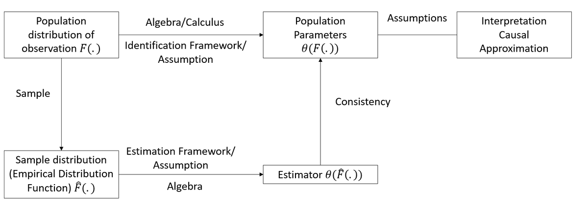
```

::: {style="text-align:center"}

{width="450" height="200"}

:::

선형회귀(Linear regression)는 통계학과 계량경제학에서 가장 기본적인 도구 중 하나로, 변수 간의 관계를 모델링하는 데 널리 사용됩니다. 선형회귀는 예측 분석의 초석을 이루며 하나 이상의 설명변수의 변화가 반응변수(종속변수)와 어떻게 연관되어 있는지를 이해하고 수량화할 수 있게 해줍니다. 단순성과 범용성 덕분에 경제학, 마케팅, 보건의료, 환경학 등 다양한 분야에서 필수적인 도구로 활용되고 있습니다.

선형회귀는 본질적으로 인과관계(causation)보다는 연관성(association)에 관한 질문을 다룹니다. 예를 들면 다음과 같습니다:

- 광고비 지출은 매출 실적과 어떤 연관이 있는가?
- 기업의 매출액과 주가 사이에는 어떤 관계가 있는가?
- 교육 수준은 소득과 어떻게 상관되어 있는가?

이러한 질문들은 데이터의 패턴에 관한 것이며 반드시 인과적 효과를 의미하지는 않습니다. 회귀분석이 잠재적인 인과관계에 대한 통찰을 제공할 수는 있지만 인과관계를 입증하려면 단순한 회귀분석 이상의 것이 필요합니다. 즉, 연구 설계, 가정(assumptions), 잠재적 교란 요인(confounding factors)에 대한 면밀한 검토가 필수적입니다.

그렇다면 왜 "선형(linear)"이라고 부를까요? 이 용어는 반응변수(결과변수)가 하나 이상의 독립변수(예측변수)의 선형 결합(linear combination)으로 모델링되는 모델의 구조를 의미합니다. 예를 들어 단순선형회귀(simple linear regression)에서 변수 간 관계는 다음과 같이 표현됩니다:

$$Y = \beta_0 + \beta_1 X + \epsilon,$$

여기서 $Y$는 반응변수(종속변수), $X$는 독립변수(설명변수), $\beta_0$과 $\beta_1$은 추정해야 할 모수(parameter)이며 $\epsilon$은 무작위성이나 관측되지 않은 요인을 포착하는 오차항(error term)입니다.

선형회귀는 광범위한 응용 가능성 때문에 응용 데이터 분석의 많은 부분에서 기초 역할을 합니다:

1. 데이터 패턴의 이해(Understanding Patterns in Data): 회귀분석은 변수 간의 관계를 요약하고 탐색할 수 있는 프레임워크를 제공합니다. 추세나 연관성과 같은 패턴을 식별할 수 있게 해주어 추가 분석이나 의사결정의 지침이 됩니다.

2. 예측(Prediction): 관계 탐색을 넘어 회귀분석은 예측을 수행하는 데 널리 사용됩니다. 예를 들어 과거 데이터가 주어지면 회귀 모델을 사용하여 매출, 가격, 수요와 같은 미래 결과를 예측할 수 있습니다.

3. 고급 기법의 기초 구성요소(Building Blocks for Advanced Techniques): 선형회귀는 로지스틱 회귀(logistic regression), 릿지 회귀(ridge regression), 신경망(neural networks) 등 많은 고급 통계 및 머신러닝 모델의 기반이 됩니다. 선형회귀를 완벽히 이해하면 더 복잡한 방법론을 다룰 수 있는 역량을 갖추게 됩니다.

회귀분석과 인과관계: 중요한 구분

회귀분석 자체만으로는 인과관계를 입증할 수 없다는 점을 반드시 기억해야 합니다. 예를 들어 회귀 모델이 광고와 매출 사이에 강한 연관성이 있음을 보여줄 수는 있지만 이것이 광고가 매출 증가를 직접적으로 유발(cause)한다는 것을 증명하지는 않습니다. 계절성, 시장 트렌드, 관측되지 않은 변수 등 다른 요인들도 결과에 영향을 미칠 수 있기 때문입니다.

인과관계를 확립하려면 통제된 실험(controlled experiments), 도구변수 기법(instrumental variables), 또는 면밀한 관찰 연구 설계(observational study designs)와 같은 추가적인 절차가 필요합니다. 선형회귀의 세부 내용을 다루면서가 구분을 다시 짚어보고 인과관계를 추론할 수 있는 상황과 그렇지 않은 상황을 강조할 것입니다.


추정량이란 무엇인가?

회귀분석의 핵심에는 데이터를 사용하여 모집단 또는 모델의 알려지지 않은 특성을 규명하는 과정인 추정(estimation)이 있습니다.

추정량(estimator)은 관측된 데이터를 기반으로 미지의 값에 대한 추정값(estimate)을 계산하는 데 사용되는 수학적 규칙이나 공식입니다. 예를 들어 모집단의 평균 키를 추정하기 위해 표본의 평균 키를 계산할 때, 표본평균(sample mean)이 바로 추정량입니다.

회귀분석의 맥락에서 우리가 일반적으로 추정하는 대상은 다음과 같습니다:

- 모수(Parameters): 변수 간의 관계를 설명하는 고정된 미지의 값(예: 회귀 방정식의 계수).
    - 모수 추정 → 모수적 모델(Parametric models: 유한한 수의 모수, 예: 회귀 계수).
- 함수(Functions): 고정된 함수 형태를 가정하지 않고 모델링되는 데이터 내의 미지의 관계나 패턴.
    - 함수 추정 → 비모수적 모델(Non-parametric models: 고정된 모수 개수가 아닌 형태나 추세에 초점).


추정량의 유형

추정 과정을 더 잘 이해하기 위해 다루게 될 추정량의 두 가지 주요 범주를 소개합니다:

1. 모수적 추정량(Parametric Estimators)\
    모수적 추정은 모델을 정의하는 유한한 모수 집합에 초점을 맞춥니다. 예를 들어 단순선형회귀에서:\
    $$Y = \beta_0 + \beta_1 X + \epsilon,$$\
    주어진 과제는 모수 $\beta_0$(절편)과 $\beta_1$(기울기)을 추정하는 것입니다. 모수적 추정량은 모델의 형태(예: 선형성)와 오차항의 분포(예: 정규성)에 대한 구체적인 가정에 의존합니다.

2. 비모수적 추정량(Non-Parametric Estimators)\
    비모수적 추정은 변수 간 관계에 대한 특정한 함수 형태를 가정하지 않습니다. 대신 데이터로부터 직접 패턴이나 추세를 추정하는 데 초점을 맞춥니다. 예를 들어 선형이나 2차 관계를 강제하지 않고 산점도 평활화(scatterplot smoothing) 기법을 사용하여 광고비 지출에 따라 매출이 어떻게 변하는지 시각화하는 경우가 이에 해당합니다.

이 두 범주는 통계 분석의 근본적인 절충(trade-off)을 반영합니다. 모수적 모델은 대체로 더 단순하고 해석하기 쉽지만 강한 가정이 필요한 반면, 비모수적 모델은 더 유연하지만 더 많은 데이터와 계산 자원이 필요할 수 있습니다.


추정량의 바람직한 성질

모수를 추정하든 함수를 추정하든, 우리는 추정량이 특정 바람직한 성질을 갖추기를 원합니다. 이러한 성질들은 추정량이 신뢰할 수 있는지를 판단하는 "황금 기준(golden standards)"으로 볼 수 있습니다:

1. 불편성(Unbiasedness)\
    반복 표본추출에서 추정량의 기댓값이 모수의 참값과 일치할 때 그 추정량을 불편추정량(unbiased estimator)이라고 합니다. 수학적으로는 다음과 같습니다:\
    $$E[\hat{\beta}] = \beta.$$\
    이는 여러 표본에 걸쳐 추정량이 참된 모수를 체계적으로 과대평가하거나 과소평가하지 않음을 의미합니다.

2. 일치성(Consistency)\
    일치성은 표본 크기가 증가함에 따라 추정량이 모수의 참값으로 수렴함을 보장합니다. 수식으로는 다음과 같습니다:\
    $$plim\ \hat{\beta_n} = \beta.$$\
    이 성질은 대수의 법칙(Law of Large Numbers)에 기초하며 표본이 커질수록 무작위 변동이 줄어들어 더 정밀한 추정이 가능해집니다.

3. 효율성(Efficiency)\
    모든 불편추정량 중에서 분산이 가장 작은 추정량을 효율적 추정량(efficient estimator)이라고 합니다.

    - [최소자승법(Ordinary Least Squares)](#ordinary-least-squares)은 가우스-마르코프 정리(Gauss-Markov Theorem)에 의해 최우선형불편추정량(Best Linear Unbiased Estimator, BLUE)이 되므로 효율적입니다.
    - 특정한 분포 가정(예: 정규성)을 만족하는 추정량의 경우, 최대우도추정량(Maximum Likelihood Estimator)은 점근적 효율성(asymptotically efficient)을 가집니다. 즉, 표본 크기가 커짐에 따라 가능한 가장 작은 분산을 달성합니다.


이러한 성질들이 중요한 이유

이러한 성질들을 이해하는 것은 우리가 추정에 사용하는 방법들이 신뢰할 수 있고 정밀하며 강건함을 보장하기 때문에 매우 중요합니다. 회귀 모델의 계수를 추정하든 데이터에서 복잡한 패턴을 발견하든, 이러한 성질들은 통계적 추론과 의사결정의 기초를 제공합니다.

추정량이 무엇인지, 마주하게 될 추정량의 유형, 그리고 이들의 바람직한 성질을 확립했으므로, 이제 이러한 개념들이 선형회귀의 중추인 [최소자승법(Ordinary Least Squares)](#ordinary-least-squares)에 구체적으로 어떻게 적용되는지 살펴보겠습니다.

| 추정 방법 | 주요 가정 | 장점 | 한계점 |
|---|---|---|---|
| [최소자승법(OLS)](#ordinary-least-squares) | 오차항의 평균이 0이고 분산이 일정하며 서로 상관되어 있지 않음(가우스-마르코프 조건); 모수에 대한 선형성 및 $X$의 완전공선성 부재. 독립성과 정규성은 불편성이 아닌 통계적 추론을 위한 더 강한 가정임. | 단순하고 널리 이해된 방법; 해석하기 쉬운 계수로 잔차제곱합을 최소화함. | 이상치 및 정규성 위반에 민감함; 다중공선성이 높을 때 성능이 저하됨. |
| 일반화최소자승법(GLS) | 오차항이 모델링 가능한 알려진 상관 구조나 이분산 구조를 가짐. | 상관되거나 분산이 일정하지 않은 오차항을 처리할 수 있음; 오차 구조가 알려진 경우 OLS보다 유연함. | 오차 공분산 구조를 지정(또는 추정)해야 함; 오지정(misspecification) 시 편향이 발생할 수 있음. |
| 최대우도추정법(MLE) | 기저의 확률분포(예: 정규분포)가 올바르게 지정되어야 함. | 잘 정의된 확률 모델 하에서 모수를 추정하기 위한 일반적 프레임워크 제공; 복잡한 우도 함수로 확장 가능. | 모델 오지정에 매우 민감함; OLS나 GLS보다 더 많은 계산이 필요할 수 있음. |
| 벌점화(정규화) 추정량 | 계수를 축소(shrinkage)할 수 있다고 가정; 계수에 벌점을 부여함. | 정규화를 통해 과적합을 제어함; 고차원 데이터 및 다수의 예측변수를 처리할 수 있음; 변수 선택 가능(예: 라쏘). | 조율 모수(tuning parameter, 예: $\lambda$)를 선택해야 함; 계수의 직접적인 해석이 덜 직관적임. |
| 로버스트 추정량 | 두터운 꼬리(heavy-tailed) 또는 이상치가 많은 분포에 덜 민감함(오차 구조에 대한 더 약한 가정). | 데이터의 큰 편차나 이상치에 강건함; 가벼운 모델 오지정 하에서도 우수한 성능을 유지함. | 오차항이 실제로 정규분포를 따를 경우 효율성이 떨어짐; 로버스트 방법 및 조율값 선택이 주관적일 수 있음. |
| 부분최소자승법(PLS) | 예측변수 간 상관관계가 높고 차원 축소가 필요한 경우. | 차원 축소와 회귀 적합을 동시에 수행함; 다중공선성이 있는 고차원 데이터에 적합함. | OLS보다 해석이 어려울 수 있음(원래 예측변수 대신 잠재 성분을 사용); 성분 개수를 결정해야 함. |

: 회귀분석에서의 추정 방법 비교


## 최소자승법(OLS) {#ordinary-least-squares}

최소자승법(Ordinary Least Squares, OLS)은 통계 모델링의 중추이자, 변수 간 관계를 이해하기 위한 출발점 역할을 하는 매우 기초적인 방법론입니다. 매출 예측, 경제 동향 추정, 과학 연구에서의 패턴 발견 등 어떤 분야에서든 OLS는 중요한 도구로 남아 있습니다. OLS의 매력은 단순성에 있습니다. OLS는 관측값과 예측값 사이의 제곱 차이를 최소화함으로써 반응변수와 하나 이상의 예측변수 간의 관계를 모델링합니다.


OLS가 작동하는 이유: 선형 및 비선형 관계

[OLS](#ordinary-least-squares)는 $X$가 주어졌을 때 $Y$의 기댓값을 나타내는 조건부 기댓값 함수(Conditional Expectation Function, CEF)인 $E[Y | X]$에 기반합니다. 회귀분석은 두 가지 주요 시나리오에서 탁월한 성능을 발휘합니다:

1. 완전 적합 (선형 CEF):\
    만약 $E[Y_i | X_{1i}, \dots, X_{Ki}] = a + \sum_{k=1}^K b_k X_{ki}$라면, $X_{1i}, \dots, X_{Ki}$에 대한 $Y_i$의 회귀는 CEF와 정확히 일치합니다. 즉, 회귀분석은 $Y$와 $X$ 사이의 참된 평균 관계를 그대로 제공합니다.\
    참된 관계가 선형이라면 회귀분석은 정확한 CEF를 도출합니다. 예를 들어 광고비 지출과 매출액 사이의 관계를 추정한다고 가정해 봅시다. 실제 영향력이 선형적이라면 [OLS](#ordinary-least-squares)는 이를 완벽하게 포착해 냅니다.

2. 근사 (비선형 CEF):\
    만약 $E[Y_i | X_{1i}, \dots, X_{Ki}]$가 비선형이라면, [OLS](#ordinary-least-squares)는이 관계에 대한 최적의 선형 근사(best linear approximation)를 제공합니다. 구체적으로, 선형 회귀직선과 비선형 CEF 사이의 기댓값 제곱 편차를 최소화합니다.\
    예를 들어 광고비 지출이 많아질수록 광고의 효과가 감소한다면 어떨까요? [OLS](#ordinary-least-squares)는 여전히 잘 작동하며 예측값과 참된(그러나 미지의) CEF 사이의 제곱 편차를 최소화하여가 비선형 관계에 대한 최적의 선형 근사를 제공합니다.

다시 말해 회귀분석은 단순한 "선형" 관계만을 위한 도구가 아니라, 복잡하고 불완전한 현실 세계의 데이터에 놀라울 정도로 잘 적응하는 핵심 도구입니다.

<!-- {width="80%"} -->


### 단순회귀(기본) 모델

회귀분석의 가장 단순한 형태는 직선입니다:

$$
Y_i = \beta_0 + \beta_1 X_i + \epsilon_i
$$

여기서 각 기호의 의미는 다음과 같습니다:

- $Y_i$: 예측하고자 하는 반응변수(종속변수) 또는 결과변수(예: 매출액, 온도).
- $X_i$: 독립변수 또는 예측변수(예: 광고비 지출, 시간).
- $\beta_0$: $X = 0$일 때 직선이 $Y$축과 만나는 절편(intercept).
- $\beta_1$: $X$가 1단위 증가할 때 $Y$의 변화량을 나타내는 기울기(slope).
- $\epsilon_i$: $X$로 설명할 수 없는 무작위 요인을 반영하는 오차항(error term).

오차항($\epsilon_i$)에 대한 가정:

$$
\begin{aligned}
E(\epsilon_i) &= 0 \\
\text{Var}(\epsilon_i) &= \sigma^2 \\
\text{Cov}(\epsilon_i, \epsilon_j) &= 0 \quad \text{모든 } i \neq j\text{에 대하여}
\end{aligned}
$$

$\epsilon_i$가 확률변수이므로 $Y_i$ 역시 확률변수입니다:

$$
\begin{aligned}
E(Y_i) &= E(\beta_0 + \beta_1 X_i + \epsilon_i) \\
&= \beta_0 + \beta_1 X_i
\end{aligned}
$$

$$
\begin{aligned}
\text{Var}(Y_i) &= \text{Var}(\beta_0 + \beta_1 X_i + \epsilon_i) \\
&= \text{Var}(\epsilon_i) \\
&= \sigma^2
\end{aligned}
$$

$\text{Cov}(\epsilon_i, \epsilon_j) = 0$이므로 관측치 간의 결과는 독립적입니다. 따라서 $X$가 조건부로 주어졌을 때 $Y_i$와 $Y_j$ 역시 서로 무상관(uncorrelated)입니다.


#### 최소자승법에서의 추정

[OLS](#ordinary-least-squares)의 목표는 반응변수 $Y$와 독립변수 $X$ 사이의 관계를 가장 잘 설명하는 회귀 모수($\beta_0, \beta_1$)를 추정하는 것입니다. 이를 달성하기 위해 관측값 $Y_i$와 모델에 의해 예측된 기댓값 사이의 편차 제곱합을 최소화합니다.

회귀 모델에 기초하여 관측값 $Y_i$가 기댓값으로부터 벗어난 편차는 다음과 같습니다:

$$
Y_i - E(Y_i) = Y_i - (\beta_0 + \beta_1 X_i).
$$

이 편차는 $i$번째 관측치에 대한 예측 오차를 나타냅니다.

오차들이 서로 상쇄되는 것을 방지하고 큰 편차에 더 큰 가중치를 부여하기 위해 편차 제곱을 고려합니다. $Q$로 표기되는 편차 제곱합은 다음과 같이 정의됩니다:

$$
Q = \sum_{i=1}^{n} (Y_i - \beta_0 - \beta_1 X_i)^2.
$$

[OLS](#ordinary-least-squares)의 목표는 $Q$를 최소화하는 $\beta_0$와 $\beta_1$의 값을 찾는 것입니다. 이 값들을 OLS 추정량(OLS estimators)이라고 부릅니다.

$Q$를 최소화하기 위해 $\beta_0$와 $\beta_1$에 대해 편미분을 수행하고 이를 0으로 둔 후 연립방정식을 풉니다. 이를 정리하면 기울기($b_1$)와 절편($b_0$)의 추정량을 다음과 같이 얻을 수 있습니다:

기울기 ($b_1$):

$$
b_1 = \frac{\sum_{i=1}^{n} (X_i - \bar{X})(Y_i - \bar{Y})}{\sum_{i=1}^{n} (X_i - \bar{X})^2}.
$$

여기서 $\bar{X}$와 $\bar{Y}$는 각각 $X$와 $Y$의 평균을 나타냅니다. 이 공식은 기울기가 $X$의 분산으로 스케일링된 $X$와 $Y$의 공분산에 비례함을 보여줍니다.

절편 ($b_0$):

$$
b_0 = \frac{1}{n} \left( \sum_{i=1}^{n} Y_i - b_1 \sum_{i=1}^{n} X_i \right) = \bar{Y} - b_1 \bar{X}.
$$

절편은 회귀직선이 데이터의 중심점을 지나도록 정렬함으로써 결정됩니다.


추정량에 담긴 직관

- $b_1$ (기울기): $X$가 1단위 증가할 때 $Y$의 평균 변화량을 측정합니다. 이 공식은 평균으로부터의 편차를 사용하여 $X$와 $Y$의 결합 변동성(joint variability)을 포착합니다.

- $b_0$ (절편): 회귀직선이 데이터 포인트들의 중심점인 $(\bar{X}, \bar{Y})$를 반드시 지나도록 보장하여 모델을 관측 데이터의 중심에 고정시킵니다.


동일하게가 모수들을 공분산 형태로 표현할 수도 있습니다.

두 변수 사이의 공분산은 다음과 같이 정의됩니다:

$$ \text{Cov}(X_i, Y_i) = E[(X_i - E[X_i])(Y_i - E[Y_i])] $$

공분산의 성질:

1. $\text{Cov}(X_i, X_i) = \sigma^2_X$
2. $E(X_i) = 0$ 또는 $E(Y_i) = 0$이면, $\text{Cov}(X_i, Y_i) = E[X_i Y_i]$
3. $W_i = a + b X_i$ 및 $Z_i = c + d Y_i$에 대하여,\
    $\text{Cov}(W_i, Z_i) = bd \cdot \text{Cov}(X_i, Y_i)$

이변량 회귀(bivariate regression)에서 기울기 $\beta$는 다음과 같이 주어집니다:

$$ \beta = \frac{\text{Cov}(Y_i, X_i)}{\text{Var}(X_i)} $$

다변량 회귀의 경우, $X_k$에 대한 기울기는 다음과 같습니다:

$$ \beta_k = \frac{\text{Cov}(Y_i, \tilde{X}_{ki})}{\text{Var}(\tilde{X}_{ki})} $$

여기서 $\tilde{X}_{ki}$는 모델 내의 다른 $K-1$개 공변량들에 대해 $X_{ki}$를 회귀시켜 얻은 잔차(residual)를 나타냅니다.

절편은 다음과 같습니다:

$$ \beta_0 = E[Y_i] - \beta_1 E(X_i) $$

참고:

- [OLS](#ordinary-least-squares)는 변수들에 대한 특정 분포 가정을 필요로 하지 않습니다. OLS의 강건성은 오차 제곱합의 최소화에 기반합니다(즉, 분포 가정이 불필요함).

#### 최소자승 추정량의 성질

최소자승 추정량($b_0, b_1$)의 성질은 이들의 통계적 거동에 기초하여 유도됩니다. 이러한 성질들은 추정값의 정확성, 변동성 및 신뢰성에 대한 통찰을 제공합니다.


##### OLS 추정량의 기댓값

[OLS](#ordinary-least-squares) 추정량 $b_0$(절편)과 $b_1$(기울기)은 불편추정량입니다. 즉, 이들의 기댓값은 참된 모집단 모수와 일치합니다:

$$
\begin{aligned}
E(b_1) &= \beta_1, \\
E(b_0) &= E(\bar{Y}) - \bar{X}\beta_1.
\end{aligned}
$$

$Y$의 표본평균에 대한 기댓값 $E(\bar{Y})$는 다음과 같으므로:

$$
E(\bar{Y}) = \beta_0 + \beta_1 \bar{X},
$$

$b_0$의 기댓값은 다음과 같이 단순화됩니다:

$$
E(b_0) = \beta_0.
$$

따라서 $b_0$와 $b_1$은 각각의 모집단 모수 $\beta_0$와 $\beta_1$에 대한 불편추정량입니다.


##### OLS 추정량의 분산

[OLS](#ordinary-least-squares) 추정량의 변동성은 예측변수 $X$의 산포도(spread)와 오차 분산 $\sigma^2$에 따라 결정됩니다. 분산은 다음과 같이 주어집니다:

$b_1$ (기울기)의 분산:

$$
\text{Var}(b_1) = \frac{\sigma^2}{\sum_{i=1}^{n} (X_i - \bar{X})^2}.
$$

$b_0$ (절편)의 분산:

$$
\text{Var}(b_0) = \sigma^2 \left( \frac{1}{n} + \frac{\bar{X}^2}{\sum_{i=1}^{n} (X_i - \bar{X})^2} \right).
$$

이 공식들은 다음 사실을 강조합니다:

- $X_i$ 값들이 평균 $\bar{X}$ 주변에 널리 퍼져 있다면, 관측치 수가 증가함에 따라 $\text{Var}(b_1) \to 0$이 됩니다.
- $X_i$ 값들이 적절히 선택된다면(즉, 모두 평균 근처에만 몰려 있지 않다면), $n$이 증가함에 따라 $\text{Var}(b_0) \to 0$이 됩니다.


#### 평균제곱오차 (MSE)

평균제곱오차(Mean Square Error, MSE)는 모델의 평균 잔차(오차) 제곱을 정량화합니다:

$$
MSE = \frac{SSE}{n-2} = \frac{\sum_{i=1}^{n} e_i^2}{n-2} = \frac{\sum_{i=1}^{n} (Y_i - \hat{Y}_i)^2}{n-2},
$$

여기서 $SSE$는 오차제곱합(Sum of Squared Errors)이며 $n-2$는 단순선형회귀 모델의 자유도(추정된 모수 2개: $\beta_0, \beta_1$)를 나타냅니다.

MSE의 기댓값은 오차 분산과 같습니다(즉, 오차 분산 $\sigma^2$의 불편추정량):

$$
E(MSE) = \sigma^2.
$$


#### OLS 계수의 분산 추정

$b_0$와 $b_1$의 분산에 대한 표본 기반 추정량은 다음과 같이 표현됩니다:

$b_1$ (기울기)의 분산 추정량:

$$
s^2(b_1) = \widehat{\text{Var}}(b_1) = \frac{MSE}{\sum_{i=1}^{n} (X_i - \bar{X})^2}.
$$

$b_0$ (절편)의 분산 추정량:

$$
s^2(b_0) = \widehat{\text{Var}}(b_0) = MSE \left( \frac{1}{n} + \frac{\bar{X}^2}{\sum_{i=1}^{n} (X_i - \bar{X})^2} \right).
$$

이 추정량들은 $\sigma^2$를 근사하기 위해 MSE를 사용합니다.

이 분산 추정량들은 불편성을 만족합니다:

$$
\begin{aligned}
E(s^2(b_1)) &= \text{Var}(b_1), \\
E(s^2(b_0)) &= \text{Var}(b_0).
\end{aligned}
$$


이러한 성질들이 갖는 의미

1. 불편성: $b_0$와 $b_1$의 불편성은 평균적으로 회귀 모델이 모집단의 실제 관계를 정확하게 반영함을 보장합니다.
2. 분산의 감소: 표본 크기 $n$이 증가하거나 $X_i$ 값들의 산포가 커질수록 $b_0$와 $b_1$의 분산이 감소하여 더욱 정밀한 추정이 가능해집니다.
3. MSE를 통한 오차 추정: MSE는 오차 분산 $\sigma^2$의 신뢰할 수 있는 추정치를 제공하며 이는 $b_0$와 $b_1$의 신뢰성을 평가하는 데 직접적으로 활용됩니다.

#### 최소자승법에서의 잔차

잔차(Residuals)는 관측값($Y_i$)과 예측값($\hat{Y}_i$) 간의 차이입니다. 잔차는 모델의 적합도를 평가하고 OLS 가정이 충족되는지 확인하는 데 핵심적인 역할을 합니다.

$i$번째 관측치에 대한 잔차는 다음과 같이 정의됩니다:

$$
e_i = Y_i - \hat{Y}_i = Y_i - (b_0 + b_1 X_i),
$$

여기서:

- $e_i$: $i$번째 관측치에 대한 잔차.
- $\hat{Y}_i$: 회귀 모델에 기반한 예측값(적합값).
- $Y_i$: 실제 관측값.

잔차는 관측할 수 없는 오차항 $\epsilon_i$를 추정합니다:

- $e_i$는 $\epsilon_i = Y_i - E(Y_i)$의 추정치입니다.
- $\beta_0$와 $\beta_1$의 참값을 알 수 없기 때문에 $\epsilon_i$는 항상 미지의 상태로 남습니다.


##### 잔차의 주요 성질

잔차는 OLS 추정 과정과 일치하는 몇 가지 수학적 성질을 갖습니다:

1. 잔차의 합: \
    잔차의 총합은 0입니다:

    $$
    \sum_{i=1}^{n} e_i = 0.
    $$

    이는 회귀직선이 데이터의 중심점인 $(\bar{X}, \bar{Y})$를 지나도록 보장합니다.

2. 잔차와 예측변수의 직교성: \
    잔차는 예측변수 $X$와 직교(무상관)합니다:

    $$
    \sum_{i=1}^{n} X_i e_i = 0.
    $$

    이는 [OLS](#ordinary-least-squares)가 $X$축이 아닌 $Y$축을 따라 잔차의 제곱 편차를 최소화한다는 사실을 반영합니다.


##### 잔차의 기댓값

잔차의 기댓값은 OLS의 불편성을 뒷받침합니다:

1. 잔차의 평균: \
    잔차의 기댓값은 0입니다:

    $$
    E[e_i] = 0.
    $$

2. 예측변수 및 적합값과의 직교성: \
    잔차는 예측변수 및 적합값(fitted values) 모두와 상관되어 있지 않습니다:

    $$
    \begin{aligned}
    E[X_i e_i] &= 0, \\
    E[\hat{Y}_i e_i] &= 0.
    \end{aligned}
    $$

이러한 성질들은 잔차가 예측변수나 적합값에 대한 체계적인 정보를 포함하지 않음을 보여주며 모델이 기저의 관계를 효과적으로 포착했음을 나타냅니다.


##### 잔차의 실무적 중요성

1. 모델 진단(Model Diagnostics):\
    선형성, 등분산성(일정한 분산), 오차의 독립성 등 OLS 가정을 검토하기 위해 잔차를 분석합니다. 잔차 도표의 패턴은 비선형성이나 이분산성과 같은 문제를 나타낼 수 있습니다.

2. 적합도(Goodness-of-Fit):\
    잔차제곱합 $\sum e_i^2$은 $Y$에서 설명되지 않는 총 변동을 측정합니다. 이 합이 작을수록 적합도가 우수함을 의미합니다.

3. 영향력 분석(Influence Analysis):\
    큰 잔차는 회귀직선에 과도한 영향을 미치는 이상치(outlier)나 영향점(influential point)을 나타낼 수 있습니다.

#### 최소자승법에서의 통계적 추론

통계적 추론(Inference)을 통해 우리는 회귀 모수($\beta_0, \beta_1$)와 예측값($Y_h$)에 대한 확률론적 서술을 할 수 있습니다. 유효한 추론을 수행하기 위해서는 오차의 분포에 대한 특정 가정이 필요합니다.


정규성 가정(Normality Assumption)

- OLS 추정 자체에는 정규성 가정이 필요하지 않습니다.
- 그러나 $\beta_0, \beta_1$ 및 예측값에 대한 가설검정을 수행하거나 신뢰구간을 구축하려면 분포 가정이 필요합니다.
- $\beta_0$와 $\beta_1$에 대한 추론은 중심극한정리(Central Limit Theorem) 덕분에 특히 대규모 표본에서 정규성 위반에 대해 강건(robust)합니다.
- 예측값 $Y_{pred}$에 대한 추론은 정규성 위반에 더 민감합니다.


정규 오차 모델(normal error model)을 가정할 때, 반응변수 $Y_i$는 다음과 같이 모델링됩니다:

$$
Y_i \sim N(\beta_0 + \beta_1 X_i, \sigma^2),
$$

여기서:

- $\beta_0 + \beta_1 X_i$: 평균 반응값
- $\sigma^2$: 오차의 분산

이 모델 하에서 OLS 추정량 $b_0$와 $b_1$의 표본분포(sampling distribution)를 유도할 수 있습니다.


##### $\beta_1$ (기울기)에 대한 추론

정규 오차 모델 하에서:

1. $b_1$의 표본분포:

    $$ 
    b_1 \sim N\left(\beta_1, \frac{\sigma^2}{\sum_{i=1}^{n} (X_i - \bar{X})^2}\right).
    $$

    이는 $b_1$이 $\sigma^2$에 비례하는 분산을 갖는 $\beta_1$의 불편추정량임을 나타냅니다.

2. 검정통계량:

    $$ 
    t = \frac{b_1 - \beta_1}{s(b_1)} \sim t_{n-2},
    $$

    여기서 $s(b_1)$은 $b_1$의 표준오차입니다: $$
    s(b_1) = \sqrt{\frac{MSE}{\sum_{i=1}^{n} (X_i - \bar{X})^2}}.
    $$

3. 신뢰구간:

    $\beta_1$에 대한 $(1-\alpha) 100\%$ 신뢰구간은 다음과 같습니다:

    $$ 
    b_1 \pm t_{1-\alpha/2; n-2} \cdot s(b_1).
    $$


##### $\beta_0$ (절편)에 대한 추론

1. $b_0$의 표본분포:

    정규 오차 모델 하에서 $b_0$의 표본분포는 다음과 같습니다:

    $$ 
    b_0 \sim N\left(\beta_0, \sigma^2 \left(\frac{1}{n} + \frac{\bar{X}^2}{\sum_{i=1}^{n} (X_i - \bar{X})^2}\right)\right).
    $$

2. 검정통계량:

    $$ 
    t = \frac{b_0 - \beta_0}{s(b_0)} \sim t_{n-2},
    $$

    여기서 $s(b_0)$는 $b_0$의 표준오차입니다: $$
    s(b_0) = \sqrt{MSE \left(\frac{1}{n} + \frac{\bar{X}^2}{\sum_{i=1}^{n} (X_i - \bar{X})^2}\right)}.
    $$

3. 신뢰구간:

    $\beta_0$에 대한 $(1-\alpha) 100\%$ 신뢰구간은 다음과 같습니다:

    $$ 
    b_0 \pm t_{1-\alpha/2; n-2} \cdot s(b_0).
    $$


##### 평균 반응값 (Mean Response)

회귀분석에서는 종종 $X_h$로 표기되는 예측변수 $X$의 특정 수준에서 반응변수 $Y$의 평균 반응값을 추정합니다. 이 추정은 적합된 회귀 모델을 기반으로 특정 $X$ 값에 대한 예측된 평균 결과를 제공합니다.

- $X_h$를 평균 반응값을 추정하고자 하는 $X$의 수준이라고 합시다.
- $X = X_h$일 때의 평균 반응값은 $E(Y_h)$로 표기합니다.
- $E(Y_h)$에 대한 점추정량은 회귀 모델로부터 얻은 예측값인 $\hat{Y}_h$입니다:

$$
\hat{Y}_h = b_0 + b_1 X_h.
$$

추정량 $\hat{Y}_h$의 기댓값은 참된 평균 반응값 $E(Y_h)$와 같으므로 불편추정량입니다:

$$
\begin{aligned}
E(\hat{Y}_h) &= E(b_0 + b_1 X_h) \\
&= \beta_0 + \beta_1 X_h \\
&= E(Y_h).
\end{aligned}
$$

따라서 $\hat{Y}_h$는 $X_h$에서의 평균 반응값에 대한 신뢰할 수 있는 추정치를 제공합니다.


$\hat{Y}_h$의 분산은 평균 반응값 추정의 불확실성을 반영합니다:

$$
\begin{aligned}
\text{Var}(\hat{Y}_h) &= \text{Var}(b_0 + b_1 X_h) \quad\text{($\hat{Y}_h$의 정의)}\\
&= \text{Var}\left((\bar{Y} - b_1 \bar{X}) + b_1 X_h\right)\quad\text{($b_0 = \bar{Y} - b_1 \bar{X}$ 적용)}\\
&= \text{Var}\left(\bar{Y} + b_1(X_h - \bar{X})\right)\quad\text{($b_1$으로 묶음)}\\
&= \text{Var}\left(\bar{Y} + b_1 (X_h - \bar{X}) \right) \\
&= \text{Var}(\bar{Y}) + (X_h - \bar{X})^2 \text{Var}(b_1) + 2(X_h - \bar{X}) \text{Cov}(\bar{Y}, b_1).
\end{aligned}
$$

오차항($\epsilon_i$)의 독립성에 의해 $\text{Cov}(\bar{Y}, b_1) = 0$이므로, 분산은 다음과 같이 단순화됩니다:

$$
\text{Var}(\hat{Y}_h) = \frac{\sigma^2}{n} + (X_h - \bar{X})^2 \frac{\sigma^2}{\sum_{i=1}^{n} (X_i - \bar{X})^2}.
$$

이는 다음과 같이 표현할 수도 있습니다:

$$
\text{Var}(\hat{Y}_h) = \sigma^2 \left( \frac{1}{n} + \frac{(X_h - \bar{X})^2}{\sum_{i=1}^{n} (X_i - \bar{X})^2} \right).
$$

$\hat{Y}_h$의 분산을 추정하기 위해 $\sigma^2$를 회귀분석의 평균제곱오차인 $MSE$로 대체합니다:

$$
s^2(\hat{Y}_h) = MSE \left( \frac{1}{n} + \frac{(X_h - \bar{X})^2}{\sum_{i=1}^{n} (X_i - \bar{X})^2} \right).
$$


정규 오차 모델 하에서 $\hat{Y}_h$의 표본분포는 다음과 같습니다:

$$
\begin{aligned}
\hat{Y}_h &\sim N\left(E(Y_h), \text{Var}(\hat{Y}_h)\right), \\
\frac{\hat{Y}_h - E(Y_h)}{s(\hat{Y}_h)} &\sim t_{n-2}.
\end{aligned}
$$

이 결과는 $\hat{Y}_h$가 정규분포를 따르는 확률변수들의 선형 결합이고 그 분산이 $s^2(\hat{Y}_h)$를 사용하여 추정되기 때문에 성립합니다.


평균 반응값 $E(Y_h)$에 대한 $100(1-\alpha)\%$ 신뢰구간은 다음과 같이 주어집니다:

$$
\hat{Y}_h \pm t_{1-\alpha/2; n-2} \cdot s(\hat{Y}_h),
$$

여기서:

- $\hat{Y}_h$: 평균 반응값의 점추정치,
- $s(\hat{Y}_h)$: 평균 반응값의 추정 표준오차,
- $t_{1-\alpha/2; n-2}$: 자유도 $n-2$인 $t$-분포의 임계값.


##### 새로운 관측값의 예측

회귀분석 결과를 분석할 때 다음 두 가지를 구분하는 것이 중요합니다:

1. 특정 $X$ 값에서의 평균 반응값 추정
2. 특정 $X$ 값에서의 개별 관측값(individual outcome) 예측


평균 반응값 vs. 개별 관측값

- 동일한 점추정치\
    $X = X_h$에서의 추정된 평균 반응값과 예측된 개별 관측값의 공식은 동일합니다:\
    $$
    \hat{Y}_{pred} = \hat{Y}_h = b_0 + b_1 X_h.
    $$

- 상이한 분산\
    점추정치는 동일하지만 불확실성의 수준은 다릅니다. 개별 결과를 예측할 때는 평균 반응값($\hat{Y}_h$) 추정의 불확실성뿐만 아니라 $Y$의 분포 자체에 존재하는 추가적인 무작위 변동까지 함께 고려해야 합니다.

따라서 (개별 결과에 대한) 예측구간(prediction interval)은 더 많은 불확실성을 반영하므로 (평균 반응값에 대한) 신뢰구간(confidence interval)보다 항상 넓습니다.


주어진 $X_h$에 대한 개별 결과를 예측하기 위해 평균 반응값과 무작위 오차를 결합합니다:

$$
Y_{pred} = \beta_0 + \beta_1 X_h + \epsilon.
$$

$E(\epsilon) = 0$이므로 최소자승 예측량은 다음과 같습니다:

$$
\hat{Y}_{pred} = b_0 + b_1 X_h.
$$


새로운 관측값 $Y_{pred}$에 대한 예측값의 분산은 다음 두 가지를 모두 포함합니다:

1. 추정된 평균 반응값의 분산: $$
    \sigma^2 \left( \frac{1}{n} + \frac{(X_h - \bar{X})^2}{\sum_{i=1}^{n} (X_i - \bar{X})^2} \right),
    $$
2. 오차항 $\epsilon$의 분산인 $\sigma^2$.

따라서 총 분산은 다음과 같습니다:

$$
\begin{aligned}
\text{Var}(Y_{pred}) &= \text{Var}(b_0 + b_1 X_h + \epsilon) \\
&= \text{Var}(b_0 + b_1 X_h) + \text{Var}(\epsilon) \\
&= \sigma^2 \left( \frac{1}{n} + \frac{(X_h - \bar{X})^2}{\sum_{i=1}^{n} (X_i - \bar{X})^2} \right) + \sigma^2 \\
&= \sigma^2 \left( 1 + \frac{1}{n} + \frac{(X_h - \bar{X})^2}{\sum_{i=1}^{n} (X_i - \bar{X})^2} \right).
\end{aligned}
$$

예측의 분산은 평균제곱오차인 $MSE$를 사용하여 추정합니다:

$$
s^2(pred) = MSE \left( 1 + \frac{1}{n} + \frac{(X_h - \bar{X})^2}{\sum_{i=1}^{n} (X_i - \bar{X})^2} \right).
$$

정규 오차 모델 하에서 표준화된 예측값은 자유도 $n-2$인 $t$-분포를 따릅니다:

$$
\frac{Y_{pred} - \hat{Y}_h}{s(pred)} \sim t_{n-2}.
$$

$Y_{pred}$에 대한 $100(1-\alpha)\%$ 예측구간은 다음과 같습니다:

$$
\hat{Y}_{pred} \pm t_{1-\alpha/2; n-2} \cdot s(pred).
$$


##### 신뢰대 (Confidence Band)

회귀분석에서는 예측변수 $X$의 단일 값뿐만 아니라 전체 회귀직선 주변의 불확실성을 평가해야 하는 경우가 많습니다. 이는 $X$ 값의 전체 범위에 걸쳐 평균 반응값 $E(Y) = \beta_0 + \beta_1 X$에 대한 신뢰구간을 제공하는 신뢰대(confidence band)를 사용하여 달성할 수 있습니다.

워킹-호텔링(Working-Hotelling) 신뢰대는 회귀직선에 대한 동시 신뢰구간(simultaneous confidence intervals)을 구축하는 방법입니다. 주어진 $X_h$에 대해 신뢰대는 다음과 같이 표현됩니다:

$$
\hat{Y}_h \pm W s(\hat{Y}_h),
$$

여기서:

- $W^2 = 2F_{1-\alpha; 2, n-2}$,

    - $F_{1-\alpha; 2, n-2}$는 자유도가 2 및 $n-2$인 $F$-분포의 임계값입니다.

- $s(\hat{Y}_h)$는 $X_h$에서 추정된 평균 반응값의 표준오차입니다:

    $$
    s^2(\hat{Y}_h) = MSE \left( \frac{1}{n} + \frac{(X_h - \bar{X})^2}{\sum_{i=1}^{n} (X_i - \bar{X})^2} \right).
    $$


신뢰대의 주요 성질

1. 구간의 폭:
    - $s(\hat{Y}_h)$가 $X_h$와 $X$의 평균($\bar{X}$) 사이의 거리에 따라 달라지므로 신뢰대의 폭은 $X_h$에 따라 변합니다.
    - 추정된 평균 반응값의 분산이 최소화되는 $X = \bar{X}$에서 구간의 폭이 가장 좁습니다.
2. 신뢰대의 형태:
    - 신뢰대의 경계는 회귀직선을 중심으로 쌍곡선(hyperbolic) 형태를 이룹니다.
    - 이는 $X_h$가 $\bar{X}$에서 멀어질수록 평균 반응값의 불확실성이 증가함을 반영합니다.
3. 동시 포함 확률(Simultaneous Coverage):
    - 워킹-호텔링 신뢰대는 지정된 신뢰수준(예: $95\%$)으로 모든 $X$ 값에 걸쳐 참된 회귀직선 $E(Y) = \beta_0 + \beta_1 X$가 신뢰대 내에 포함되도록 보장합니다.

#### 회귀분석에서의 분산분석 (ANOVA)

회귀분석에서의 분산분석(ANOVA)은 반응변수($Y$)의 총 변동성을 회귀 모델에 기인한 성분과 잔차 오차에 기인한 성분으로 분해합니다. 회귀분석의 맥락에서 ANOVA는 모델의 적합도를 평가하고 $X$와 $Y$ 사이의 관계에 대한 가설을 검정하는 메커니즘을 제공합니다.

수정 총제곱합(corrected Total Sum of Squares, SSTO)은 $Y$의 총 변동을 정량화합니다:

$$
SSTO = \sum_{i=1}^n (Y_i - \bar{Y})^2,
$$

여기서 $\bar{Y}$는 반응변수의 평균입니다. "수정(corrected)"이라는 용어는 제곱합이 평균을 기준으로 계산된다는 사실을 의미합니다(즉, 비수정 총제곱합은 $\sum Y_i^2$으로 주어짐).

적합된 회귀 모델 $\hat{Y}_i = b_0 + b_1 X_i$를 사용하여 $X_i$에서의 $Y$의 조건부 평균을 추정합니다. 총제곱합은 다음과 같이 분해될 수 있습니다:

$$
\begin{aligned}
\sum_{i=1}^n (Y_i - \bar{Y})^2 &= \sum_{i=1}^n (Y_i - \hat{Y}_i + \hat{Y}_i - \bar{Y})^2 \\
&= \sum_{i=1}^n (Y_i - \hat{Y}_i)^2 + \sum_{i=1}^n (\hat{Y}_i - \bar{Y})^2 + 2 \sum_{i=1}^n (Y_i - \hat{Y}_i)(\hat{Y}_i - \bar{Y}) \\
&= \sum_{i=1}^n (Y_i - \hat{Y}_i)^2 + \sum_{i=1}^n (\hat{Y}_i - \bar{Y})^2
\end{aligned}
$$

- 아래에서 보이는 바와 같이 교차곱 항(cross-product term)은 0이 됩니다.
- 이 분해는 다음과 같이 단순화됩니다:

$$
SSTO = SSE + SSR,
$$

여기서:

- $SSE = \sum_{i=1}^n (Y_i - \hat{Y}_i)^2$: 오차제곱합(Error Sum of Squares, 모델로 설명되지 않는 변동).

- $SSR = \sum_{i=1}^n (\hat{Y}_i - \bar{Y})^2$: 회귀제곱합(Regression Sum of Squares, 모델에 의해 설명되는 변동)으로, 조건부 평균이 중심값 주변에서 어떻게 변하는지를 측정합니다.

자유도는 다음과 같이 분할됩니다:

$$
\begin{aligned}
SSTO &= SSR + SSE \\
(n-1) &= (1) + (n-2) \\
\end{aligned}
$$


교차곱 항이 0임을 확인하는 과정은 다음과 같습니다:

$$
\begin{aligned}
\sum_{i=1}^n (Y_i - \hat{Y}_i)(\hat{Y}_i - \bar{Y}) 
&= \sum_{i=1}^{n}(Y_i - \bar{Y} -b_1 (X_i - \bar{X}))(\bar{Y} + b_1 (X_i - \bar{X})-\bar{Y}) \quad \text{($Y_i - \hat{Y}_i$ 및 $\hat{Y}_i - \bar{Y}$ 전개)} \\
&=\sum_{i=1}^{n}(Y_i - \bar{Y} -b_1 (X_i - \bar{X}))( b_1 (X_i - \bar{X})) \\
&= b_1 \sum_{i=1}^n (Y_i - \bar{Y})(X_i - \bar{X}) - b_1^2 \sum_{i=1}^n (X_i - \bar{X})^2 \quad \text{(곱의 항 분배)} \\
&= b_1 \frac{\sum_{i=1}^n (Y_i - \bar{Y})(X_i - \bar{X})}{\sum_{i=1}^n (X_i - \bar{X})^2} \sum_{i=1}^n (X_i - \bar{X})^2 - b_1^2 \sum_{i=1}^n (X_i - \bar{X})^2 \quad \text{($b_1$의 정의 대입)} \\
&= b_1^2 \sum_{i=1}^n (X_i - \bar{X})^2 - b_1^2 \sum_{i=1}^n (X_i - \bar{X})^2 \\
&= 0 
\end{aligned}
$$


분산분석표(ANOVA table)는 변동성의 분할을 다음과 같이 요약합니다:

+---------------------+----------------+------------+-------------------------+-----------------------+
| 변동 원천           | 제곱합         | 자유도(df) | 평균제곱                | $F$ 통계량            |
+=====================+================+============+=========================+=======================+
| 회귀 (모델)         | $SSR$          | $1$        | $MSR = \frac{SSR}{1}$   | $F = \frac{MSR}{MSE}$ |
+---------------------+----------------+------------+-------------------------+-----------------------+
| 오차                | $SSE$          | $n-2$      | $MSE = \frac{SSE}{n-2}$ |                       |
+---------------------+----------------+------------+-------------------------+-----------------------+
| 총합 (수정)         | $SSTO$         | $n-1$      |                         |                       |
+---------------------+----------------+------------+-------------------------+-----------------------+


평균제곱의 기댓값은 다음과 같습니다:

$$
\begin{aligned}
E(MSE) &= \sigma^2, \\
E(MSR) &= \sigma^2 + \beta_1^2 \sum_{i=1}^n (X_i - \bar{X})^2.
\end{aligned}
$$

- 만약 $\beta_1 = 0$이면:
    - 회귀 모델은 평균을 넘어서는 $Y$의 변동을 전혀 설명하지 못하며 $E(MSR) = E(MSE) = \sigma^2$가 됩니다.
    - 이 조건은 귀무가설 $H_0: \beta_1 = 0$에 해당합니다.
- 만약 $\beta_1 \neq 0$이면:
    - 회귀 모델이 $Y$의 변동 중 일부를 설명하며 $E(MSR) > E(MSE)$가 됩니다.
    - 추가 항 $\beta_1^2 \sum_{i=1}^{n} (X_i - \bar{X})^2$은 예측변수 $X$에 의해 설명되는 분산을 나타냅니다.

$E(MSR)$과 $E(MSE)$의 차이를 통해 그 비율을 비교함으로써 $\beta_1 \neq 0$인지 여부를 추론할 수 있습니다.


오차항 $\epsilon_i$가 서로 독립이고 동일하게 $N(0, \sigma^2)$를 따른다고 가정할 때, 귀무가설 $H_0: \beta_1 = 0$ 하에서:

1. 스케일링된 $MSE$는 자유도 $n-2$인 카이제곱 분포를 따릅니다:

    $$
    \frac{MSE}{\sigma^2} \sim \chi_{n-2}^2.
    $$

2. 스케일링된 $MSR$은 자유도 $1$인 카이제곱 분포를 따릅니다:

    $$
    \frac{MSR}{\sigma^2} \sim \chi_{1}^2.
    $$

3. 이 두 카이제곱 확률변수는 서로 독립입니다.

자유도로 스케일링된 두 독립적인 카이제곱 확률변수의 비는 $F$-분포를 따릅니다. 따라서 $H_0$ 하에서:

$$
F = \frac{MSR}{MSE} \sim F_{1, n-2}.
$$

$F$-통계량은 회귀 모델이 귀무 모델(상수 $E(Y)$)에 비해 유의미한 개선을 제공하는지 검정합니다.

$F$-검정의 가설은 다음과 같습니다:

- 귀무가설 ($H_0$): $\beta_1 = 0$ ($X$와 $Y$ 사이에 관계가 없음).
- 대립가설 ($H_a$): $\beta_1 \neq 0$ ($X$와 $Y$ 사이에 유의미한 관계가 존재함).

유의수준 $\alpha$에서 $H_0$에 대한 기각 규칙은 다음과 같습니다:

$$
F > F_{1-\alpha;1,n-2},
$$

여기서 $F_{1-\alpha;1,n-2}$는 자유도가 1 및 $n-2$인 $F$-분포의 임계값입니다.

1. 만약 $F \leq F_{1-\alpha;1,n-2}$이면:
    - $H_0$를 기각하지 못합니다. $X$가 $Y$의 변동을 유의미하게 설명한다고 결론지을 충분한 증거가 없습니다.
2. 만약 $F > F_{1-\alpha;1,n-2}$이면:
    - $H_0$를 기각합니다. $X$가 $Y$의 변동 중 일부를 설명한다는 유의미한 증거가 있습니다.

#### 결정계수 ($R^2$)

결정계수(Coefficient of Determination, $R^2$)는 선형회귀 모델이 반응변수 $Y$의 변동성을 얼마나 잘 설명하는지를 측정합니다. 다음과 같이 정의됩니다:

$$
R^2 = \frac{SSR}{SSTO} = 1 - \frac{SSE}{SSTO},
$$

여기서:

- $SSR$: 회귀제곱합(Regression Sum of Squares, 모델에 의해 설명되는 변동).
- $SSTO$: 총제곱합(Total Sum of Squares, 평균 주변 $Y$의 총 변동).
- $SSE$: 오차제곱합(Error Sum of Squares, 모델에 의해 설명되지 않는 변동).


$R^2$의 성질

1. 범위: $$
    0 \leq R^2 \leq 1.
    $$

    - $R^2 = 0$: 모델이 $Y$의 변동성을 전혀 설명하지 못함(예: $\beta_1 = 0$).
    - $R^2 = 1$: 모델이 $Y$의 모든 변동성을 설명함(완전 적합).

2. 분산의 비례적 감소: $R^2$는 모델 적합 후 $Y$의 총 변동이 비례적으로 얼마나 감소했는지를 나타냅니다. 단순히 $\bar{Y}$를 사용할 때와 비교하여 모델이 $Y$를 얼마나 더 잘 예측하는지 정량화합니다.

3. 잠재적 오해: $R^2$를 "$X$에 의해 설명된 $Y$의 변동"이라고 표현하는 것은 완전히 정확하지는 않습니다. "설명된 변동"이라는 표현은 인과적 또는 결정론적 설명을 내포하는데, 이는 항상 옳지는 않기 때문입니다. 예를 들면:

    - $R^2$는 회귀 모델에 의해 $Y$의 분산이 얼마나 설명되는지를 보여주지만 인과관계를 의미하지는 않습니다.

    - 교란변수(confounding variables)나 가짜 상관(spurious correlations)이 있는 경우에도 $X$와 $Y$ 사이에 직접적인 인과관계가 없음에도 불구하고 $R^2$가 높게 나타날 수 있습니다.


$X$에 대한 $Y$의 단순선형회귀에서:

1. 상관계수의 제곱은 $R^2$와 같습니다:

    $$
    R^2 = r^2,
    $$

    여기서 $r = \mathrm{corr}(X, Y)$는 피어슨 상관계수(Pearson correlation coefficient)입니다.

2. 상관계수로 표현한 기울기: 표준화되지 않은 기울기 $b_1$은 다음과 같이 표현될 수 있습니다:

    $$
    b_1 = r \cdot \frac{s_Y}{s_X},
    $$

    여기서 $s_Y$와 $s_X$는 각각 $Y$와 $X$의 표본표준편차입니다. 이 형태는 스케일링 효과를 명확하게 보여줍니다. $Y$의 산포가 $X$보다 크다면 동일한 $r$에 대해 기울기가 더 커집니다.

3. $r$의 다른 표현 형태:

    $$
    r = \frac{b_1 s_X}{s_Y}.
    $$

$X$와 $Y$를 모두 평균 0, 표준편차 1로 표준화(z-score)하면 회귀 기울기는 상관계수와 같아집니다:

$$
b_1^{\text{(standardized)}} = r.
$$

그 이유는 다음과 같습니다:

- 표준화는 단위를 제거하므로 스케일링 팩터 $\frac{s_Y}{s_X}$가 1이 됩니다.
- 이 형태에서 계수는 *단위가 없으며(unitless)* $X$와 $Y$의 위치를 바꾸어도 대칭적입니다.


상관관계의 대칭성 vs. 기울기의 비대칭성

- 상관관계: $r(X,Y) = r(Y,X)$. 상관관계는 대칭적이므로 $X$와 $Y$ 사이의 상관관계는 $Y$와 $X$ 사이의 상관관계와 동일합니다.

- 비표준화 기울기: 

    - $X$에 대한 $Y$의 기울기: $b_1^{Y|X} = r \cdot \frac{s_Y}{s_X}$
    - $Y$에 대한 $X$의 기울기: $b_1^{X|Y} = r \cdot \frac{s_X}{s_Y}$

    이 둘은 $s_X = s_Y$가 아닌 한 일반적으로 같지 않습니다.

직관

- 상관관계는 단위와 무관하게 -1에서 1 사이의 척도로 *연관성의 강도(strength of association)*를 측정합니다.
- 기울기는 원래 단위로 *변화율(rate of change)*을 측정합니다: "$X$가 1단위 변할 때 $Y$가 얼마나 변하는가."
- 표준화는 측정 단위와 척도의 영향을 제거하여 회귀 계수를 $r$과 동일하게 만듭니다.
- 변수들의 단위가 서로 다를 때(예: 달러 vs. 킬로그램), 어떤 변수를 예측변수로 두고 어떤 변수를 결과변수로 두는지에 따라 비표준화 기울기는 달라지지만 상관관계는 동일하게 유지됩니다.


#### 회귀에서의 적합결여

적합결여(lack of fit) 검정은 선택된 회귀 모델이 예측변수 $X$와 반응변수 $Y$ 사이의 관계를 적절하게 포착하고 있는지 평가합니다. $X$의 특정 값에서 반복 관측치(repeated observations)가 존재하는 경우, 오차제곱합($SSE$)을 두 가지 구성요소로 분할할 수 있습니다:

1. 순수오차(Pure Error)
2. 적합결여(Lack of Fit)

다음과 같은 관측치가 주어졌을 때:

- $Y_{ij}$: $X$의 $i$번째 고유값에 대한 $j$번째 반복 관측치,
    - $Y_{11}, Y_{21}, \dots, Y_{n_1, 1}$: $X_1$에 대한 $n_1$개의 반복 관측치
    - $Y_{1c}, Y_{2c}, \dots, Y_{n_c,c}$: $X_c$에 대한 $n_c$개의 반복 관측치
- $\bar{Y}_j$: $X_j$에서의 반복 관측치들의 평균 반응값,
- $\hat{Y}_{ij}$: $X_j$에 대한 회귀 모델의 예측값,

오차제곱합($SSE$)은 다음과 같이 분해될 수 있습니다:

$$
\begin{aligned}
\sum_{i} \sum_{j} (Y_{ij} - \hat{Y}_{ij})^2 &= \sum_{i} \sum_{j} (Y_{ij} - \bar{Y}_j + \bar{Y}_j - \hat{Y}_{ij})^2 \\
&= \sum_{i} \sum_{j} (Y_{ij} - \bar{Y}_j)^2 + \sum_{j} n_j (\bar{Y}_j - \hat{Y}_{ij})^2 + \text{교차곱 항} \\
&= \sum_{i} \sum_{j} (Y_{ij} - \bar{Y}_j)^2 + \sum_{j} n_j (\bar{Y}_j - \hat{Y}_{ij})^2
\end{aligned}
$$

- 반복 관측치 내의 편차와 반복 관측치 간의 편차가 직교하므로 교차곱 항(cross product term)은 0이 됩니다.
- 따라서 다음과 같이 단순화됩니다:

$$
SSE = SSPE + SSLF,
$$

여기서:

- $SSPE$ (순수오차제곱합, Pure Error Sum of Squares): 동일한 $X_j$에 대한 반복 관측치 내의 변동으로, 반응변수의 자연스러운 변동성을 반영합니다.
    - 자유도: $df_{pe} = n - c$, 여기서 $n$은 총 관측치 수이고 $c$는 고유한 $X$ 값의 개수입니다.
- $SSLF$ (적합결여제곱합, Lack of Fit Sum of Squares): 반복 평균 $\bar{Y}_j$와 모델 예측값 $\hat{Y}_{ij}$ 사이의 변동입니다. SSLF가 크다면 모델이 $X$와 $Y$ 사이의 관계를 적절하게 설명하지 못하고 있음을 시사합니다.
    - 자유도: $df_{lf} = c - 2$, 여기서 2는 선형회귀 모델의 모수 개수($\beta_0, \beta_1$)를 반영합니다.


- 순수오차 평균제곱 (MSPE):\
    $$
    MSPE = \frac{SSPE}{df_{pe}} = \frac{SSPE}{n-c}.
    $$

- 적합결여 평균제곱 (MSLF):\
    $$
    MSLF = \frac{SSLF}{df_{lf}} = \frac{SSLF}{c-2}.
    $$

##### 적합결여에 대한 F-검정

적합결여에 대한 F-검정은 선택된 회귀 모델이 예측변수 $X$와 반응변수 $Y$ 사이의 관계를 적절하게 포착하는지 평가합니다. 구체적으로 무작위 오차로 설명되지 않는 모델로부터의 체계적인 편차가 존재하는지 검정합니다.

- 귀무가설 ($H_0$):\
    회귀 모델이 적절함: $$
    H_0: Y_{ij} = \beta_0 + \beta_1 X_i + \epsilon_{ij}, \quad \epsilon_{ij} \sim \text{i.i.d. } N(0, \sigma^2).
    $$

- 대립가설 ($H_a$):\
    회귀 모델이 적절하지 않으며 적합결여를 설명하기 위해 추가적인 함수 $f(X_i, Z_1, \dots)$를 포함함: $$
    H_a: Y_{ij} = \alpha_0 + \alpha_1 X_i + f(X_i, Z_1, \dots) + \epsilon_{ij}^*, \quad \epsilon_{ij}^* \sim \text{i.i.d. } N(0, \sigma^2).
    $$


평균제곱의 기댓값

- 순수오차 평균제곱(MSPE)의 기댓값은 $H_0$와 $H_a$ 하에서 동일합니다:

    $$
    E(MSPE) = \sigma^2.
    $$

- 적합결여 평균제곱(MSLF)의 기댓값은 $H_0$가 참인지 여부에 따라 달라집니다:

    - $H_0$ 하에서 (모델이 적절함): $$
        E(MSLF) = \sigma^2.
        $$
    - $H_a$ 하에서 (모델이 적절하지 않음): $$
        E(MSLF) = \sigma^2 + \frac{\sum n_j f(X_i, Z_1, \dots)^2}{n-2}.
        $$


적합결여 검정의 검정통계량은 다음과 같습니다:

$$
F = \frac{MSLF}{MSPE},
$$

여기서:

- $MSLF = \frac{SSLF}{c-2}$이며 $SSLF$는 적합결여제곱합입니다.
- $MSPE = \frac{SSPE}{n-c}$이며 $SSPE$는 순수오차제곱합입니다.

$H_0$ 하에서 $F$-통계량은 $F$-분포를 따릅니다:

$$
F \sim F_{c-2, n-c}.
$$


의사결정 규칙

- 유의수준 $\alpha$에서 다음 조건일 때 $H_0$를 기각합니다: $$
    F > F_{1-\alpha; c-2, n-c}.
    $$

- $H_0$를 기각하지 못하는 경우:

    - 적합결여의 증거가 없음을 나타냅니다.
    - 모델이 "참"임을 의미하는 것은 아니지만 모델이 참된 관계에 대한 합리적인 근사를 제공함을 시사합니다.

요약하자면, $X$의 일부 수준에서 반복 관측치가 존재할 때 오차제곱합(SSE)은 적합결여(SSLF)와 순수오차(SSPE)로 추가 분할될 수 있습니다. 이는 확장된 ANOVA 표로 이어집니다:

+---------------------+----------------+------------+---------------------------+-------------------------+
| 변동 원천           | 제곱합         | 자유도(df) | 평균제곱                  | F 통계량                |
+=====================+================+============+===========================+=========================+
| 회귀                | SSR            | $1$        | $MSR = \frac{SSR}{1}$     | $F = \frac{MSR}{MSE}$   |
+---------------------+----------------+------------+---------------------------+-------------------------+
| 오차                | SSE            | $n-2$      | $MSE = \frac{SSE}{n-2}$   |                         |
+---------------------+----------------+------------+---------------------------+-------------------------+
| 적합결여            | SSLF           | $c-2$      | $MSLF = \frac{SSLF}{c-2}$ | $F = \frac{MSLF}{MSPE}$ |
+---------------------+----------------+------------+---------------------------+-------------------------+
| 순수오차            | SSPE           | $n-c$      | $MSPE = \frac{SSPE}{n-c}$ |                         |
+---------------------+----------------+------------+---------------------------+-------------------------+
| 총합 (수정)         | SSTO           | $n-1$      |                           |                         |
+---------------------+----------------+------------+---------------------------+-------------------------+

: 적합결여 검정을 포함한 선형회귀 ANOVA 표

반복 관측치는 결정계수($R^2$)에 중요한 영향을 미칩니다:

1. 반복 관측치가 있을 때 $R^2$는 1에 도달할 수 없음:
    - 반복 관측치가 존재하면 $SSPE > 0$(반복 내 변동)이므로 $SSE$(오차제곱합)를 0으로 줄일 수 없습니다.
2. 최대 $R^2$:
    - 반복 관측치가 있을 때 달성 가능한 최대 $R^2$는 다음과 같습니다:

        $$
        R^2_{\text{max}} = \frac{SSTO - SSPE}{SSTO}.
        $$
3. 반복 관측치의 중요성:
    - $X$의 모든 수준에서 반복 관측치가 필요한 것은 아니지만 반복 관측치가 존재함으로써 순수오차와 적합결여를 분리할 수 있게 되어 적합결여에 대한 $F$-검정이 가능해집니다.


반복 관측치가 있을 때 $\sigma^2$의 추정

1. MSE의 활용:
    - $H_0$가 적절할 때(모델이 잘 적합될 때)는 더 많은 자유도를 가져 더 신뢰할 수 있는 추정치를 제공하므로 $MSPE$ 대신 일반적으로 $MSE$를 $\sigma^2$의 추정치로 사용합니다.
2. 추정치 통합(Pooling):
    - 실무에서는 $H_0$가 성립할 경우 $MSE$와 $MSPE$를 통합하여 $\sigma^2$에 대한 더 정밀한 추정치를 얻을 수 있습니다.


#### 회귀 모수에 대한 결합 추론

결합 추론(Joint inference)은 $\beta_0$(절편)과 $\beta_1$(기울기)과 같은 여러 회귀 모수에 대한 신뢰구간의 동시 포함 확률(simultaneous coverage)을 고려합니다. 두 모수 모두에 대해 적절한 신뢰도를 동시에 확보하려면 원하는 패밀리별 신뢰수준(family-wise confidence level)을 유지하기 위한 조정이 필요합니다.

다음을 정의합니다:

- $\bar{A}_1$: $\beta_0$에 대한 신뢰구간이 참값을 포함하는 사건.
- $\bar{A}_2$: $\beta_1$에 대한 신뢰구간이 참값을 포함하는 사건.

개별 신뢰수준은 다음과 같습니다:

$$
\begin{aligned}
P(\bar{A}_1) &= 1 - \alpha, \\
P(\bar{A}_2) &= 1 - \alpha.
\end{aligned}
$$

결합 신뢰계수 $P(\bar{A}_1 \cap \bar{A}_2)$는 다음과 같습니다:

$$
\begin{aligned}
P(\bar{A}_1 \cap \bar{A}_2) &= 1 - P(\bar{A}_1 \cup \bar{A}_2), \\
&= 1 - P(A_1) - P(A_2) + P(A_1 \cap A_2), \\
&\geq 1 - P(A_1) - P(A_2), \\
&= 1 - 2\alpha.
\end{aligned}
$$

이는 각 모수의 유의수준이 $\alpha$일 때, 결합 신뢰계수가 최소 $1 - 2\alpha$ 이상임을 의미합니다. 이 부등식을 본페로니 부등식(Bonferroni Inequality)이라고 합니다.


본페로니 신뢰구간

$\beta_0$와 $\beta_1$ 모두에 대해 원하는 $(1-\alpha)$의 결합 신뢰수준을 확보하기 위해, 본페로니 방법은 $\alpha$를 모수의 개수로 나누어 각 모수의 신뢰수준을 조정합니다. 모수가 2개인 경우:

1. 각 모수의 신뢰수준은 $(1-\alpha/2)$가 됩니다.

2. 결과로 도출되는 본페로니 조정 신뢰구간은 다음과 같습니다:

    $$
    \begin{aligned}
    b_0 &\pm B \cdot s(b_0), \\
    b_1 &\pm B \cdot s(b_1),
    \end{aligned}
    $$

    여기서 $B = t_{1-\alpha/4; n-2}$는 자유도 $n-2$인 $t$-분포의 임계값입니다.


본페로니 신뢰구간의 해석

1. 포함 확률(Coverage Probability):
    - 반복 표본추출을 수행할 경우, 결합 구간의 $(1-\alpha)100\%$가 $(\beta_0, \beta_1)$의 참값을 포함합니다.
    - 이는 표본의 $\alpha \times 100\%$에서는 적어도 하나의 모수 참값을 놓치게 됨을 의미합니다.
2. 보수성(Conservatism):
    - 본페로니 방법은 패밀리별 신뢰수준을 엄격히 보장하지만 보수적(conservative)입니다. 실제 결합 신뢰수준은 종종 $(1-\alpha)100\%$보다 높습니다.
    - 이러한 보수성으로 인해 통계적 검정력(statistical power)이 다소 감소합니다.

```{.r}
# 필요한 라이브러리 로드
library(ggplot2)
library(MASS)

# 재현성을 위한 시드 설정
set.seed(123)

# 인공 데이터 생성
n <- 100  # 관측치 수
x <- rnorm(n, mean = 0, sd = 1)  # 예측변수
beta_0 <- 2  # 참된 절편
beta_1 <- 3  # 참된 기울기
sigma <- 1  # 오차의 표준편차
y <-
    beta_0 + beta_1 * x + rnorm(n, mean = 0, sd = sigma)  # 반응변수

# 선형 모델 적합
model <- lm(y ~ x)
summary(model)

# 계수 및 표준오차 추출
b0_hat <- coef(model)[1]
b1_hat <- coef(model)[2]
s_b0 <-
    summary(model)$coefficients[1, 2]  # 절편의 표준오차
s_b1 <- summary(model)$coefficients[2, 2]  # 기울기의 표준오차

# 목표 신뢰수준
alpha <- 0.05  # 전체 유의수준

# 본페로니 보정
adjusted_alpha <- alpha / 2  # 각 모수별 조정된 유의수준

# 본페로니 조정을 위한 임계 t-값
t_crit <-
    qt(1 - adjusted_alpha, df = n - 2)  # 자유도 n-2

# 본페로니 신뢰구간
ci_b0 <- c(b0_hat - t_crit * s_b0, b0_hat + t_crit * s_b0)
ci_b1 <- c(b1_hat - t_crit * s_b1, b1_hat + t_crit * s_b1)

# 결과 출력
cat("Bonferroni Confidence Intervals:\n")
cat("Intercept (beta_0): [",
    round(ci_b0[1], 2),
    ",",
    round(ci_b0[2], 2),
    "]\n")
cat("Slope (beta_1): [",
    round(ci_b1[1], 2),
    ",",
    round(ci_b1[2], 2),
    "]\n")

# 계수의 공분산 행렬 계산
cov_matrix <- vcov(model)

# 신뢰 타원 생성을 위한 난수 생성
ellipse_points <-
    MASS::mvrnorm(n = 1000,
                  mu = coef(model),
                  Sigma = cov_matrix)

# 시각화를 위한 데이터프레임 변환
ellipse_df <- as.data.frame(ellipse_points)
colnames(ellipse_df) <- c("beta_0", "beta_1")
```

그림은 절편과 기울기에 대한 결합 신뢰 타원 위에 한계 본페로니 구간을 중첩하여 보여줍니다.

```{.r fig.cap="본페로니 신뢰구간 및 결합 신뢰영역" fig.alt="'본페로니 신뢰구간 및 결합 신뢰영역'이라는 제목의 산점도. x축은 '절편 (beta_0)', y축은 '기울기 (beta_1)'로 레이블이 지정되어 있습니다. 중앙에 빨간 점이 찍혀 있고 신뢰구간을 나타내는 파란색 선으로 둘러싸여 있습니다. 배경에는 수많은 희미한 회색 점들이 나타나 있습니다. 이 도표는 절편과 기울기 모수에 대한 통계적 신뢰영역을 보여줍니다." out.width="100%" fig.align="center" #fig-bonferroni-region}

# 신뢰구간 및 신뢰 타원 시각화
p <- ggplot() +
    # 신뢰 타원
    geom_point(
        data = ellipse_df,
        aes(x = beta_0, y = beta_1),
        alpha = 0.1,
        color = "grey"
    ) +
    # 점추정치
    geom_point(aes(x = b0_hat, y = b1_hat),
               color = "red",
               size = 3) +
    # 본페로니 신뢰구간
    geom_errorbar(aes(x = b0_hat, ymin = ci_b1[1], ymax = ci_b1[2]),
                  width = 0.1,
                  color = "blue") +
    geom_errorbarh(aes(y = b1_hat, xmin = ci_b0[1], xmax = ci_b0[2]),
                   height = 0.1,
                   color = "blue") +
    labs(title = "Bonferroni Confidence Intervals and Joint Confidence Region",
         x = "Intercept (beta_0)",
         y = "Slope (beta_1)") +
    theme_minimal()

print(p)
```

1. 빨간색 점은 추정된 계수 (b0_hat, b1_hat)를 나타냅니다.
2. 파란색 선은 beta_0와 beta_1에 대한 본페로니 조정 신뢰구간을 나타냅니다.
3. 회색 점들은 계수의 공분산 행렬에 기반한 결합 신뢰영역을 나타냅니다.
4. 본페로니 구간은 패밀리별 신뢰수준을 보장하지만 보수적입니다.
5. 시뮬레이션 결과는 반복 표본을 추출했을 때 모수의 참값이 구간 내에 얼마나 자주 포함되는지 보여줍니다.

참고사항:

1. 본페로니 구간의 보수성
    - 본페로니 구간은 보수적입니다:
        - 결합 신뢰수준은 하한(lower bound) 역할을 하며 최소 $(1-\alpha)100\%$ 이상의 패밀리별 포함 확률을 보장합니다.
        - 이러한 보수성으로 인해 구간이 넓어지며 검정의 통계적 검정력이 감소합니다.
    - 보수성에 대한 조정:
        - 실무자들은 본페로니 결합 검정에서 구간의 폭을 줄이기 위해 더 큰 $\alpha$(예: $\alpha = 0.1$)를 선택하기도 합니다.
        - 더 높은 $\alpha$를 사용하면 특히 탐색적 분석에서 신뢰도와 정밀도 사이의 더 나은 균형을 맞출 수 있습니다.
2. 다중 모수로의 본페로니 확장: 본페로니 방법은 두 개의 모수에만 국한되지 않습니다. $\beta_0, \beta_1, \dots, \beta_{g-1}$과 같은 $g$개의 모수를 검정할 때:
    - 각 모수별 조정된 신뢰수준:
        - 각 개별 모수의 신뢰수준은 $(1-\alpha/g)$가 됩니다.
    - 임계 $t$-값:
        - 양측 구간의 경우 각 모수에 대한 임계값은 다음과 같습니다: $$
            t_{1-\frac{\alpha}{2g}; n-p},
            $$ 여기서 $p$는 회귀 모델의 총 모수 개수입니다.
    - 예시:
        - 만약 $\alpha = 0.05$이고 $g = 10$이면, 각 개별 신뢰구간은 다음과 같이 구축됩니다: $$
            (1 - \frac{0.05}{10}) = 99.5\% \text{ 신뢰수준}.
            $$
        - 이는 신뢰구간 공식에서 $t_{1-\frac{0.005}{2}; n-p}$를 사용하는 것에 해당합니다.
3. 큰 $g$에 대한 한계점
    - 과도하게 넓은 구간:
        - $g$가 증가함에 따라 신뢰구간이 지나치게 넓어져 실무적 유용성이 떨어지는 경우가 많습니다.
        - 이 문제는 패밀리별 오류율(family-wise error rate) 제어를 최우선시하는 본페로니 방법의 보수성에서 기인합니다.
    - 작은 $g$에 대한 적합성:
        - 본페로니 절차는 $g$가 비교적 작을 때(예: $g \leq 5$) 잘 작동합니다.
        - $g$가 큰 경우에는 아래에서 논의하는 대체 방법들이 더 효율적입니다.
4. 모수 간 상관관계: $b_0$와 $b_1$의 상관관계:
    - 추정된 회귀 계수 $b_0$와 $b_1$은 종종 서로 상관되어 있습니다:
        - $\bar{X} > 0$이면 음의 상관관계.
        - $\bar{X} < 0$이면 양의 상관관계.
    - 이 상관관계는 결합 추론을 복잡하게 만들 수 있지만 본페로니 조정 구간의 유효성에는 영향을 미치지 않습니다.
5. 본페로니 방법의 대안

특히 큰 $g$에 대해 더 정밀한 결합 추론을 제공하는 몇 가지 대안 절차가 있습니다:

1. 셰페 방법(Scheffé's Method):
    - 모수들의 가능한 모든 선형 결합에 대한 동시 신뢰영역을 구축합니다.
    - 탐색적 분석에 적합하지만 본페로니보다 훨씬 더 넓은 구간을 초래할 수 있습니다.
2. 투키의 HSD(Tukey's Honest Significant Difference):
    - ANOVA에서의 쌍별 비교를 위해 설계되었으나 회귀 모수에도 응용될 수 있습니다.
3. 홀름의 단계적 하향 절차(Holm's Step-Down Procedure):
    - 패밀리별 오류율을 제어하면서도 본페로니보다 덜 보수적인 순차적 검정 절차입니다.
4. 우도비 검정(Likelihood Ratio Tests):
    - 우도 함수에 기반하여 결합 신뢰영역을 구축하며 큰 $g$에 대해 더 높은 정밀도를 제공합니다.

#### 선형회귀의 가정

선형회귀에서 유효한 추론과 신뢰할 수 있는 예측을 보장하기 위해서는 다음 가정들이 성립해야 합니다. 다음 절에서 이들을 심도 있게 다룰 것입니다.

+---------------------------------+---------------------------------------------------------------------+
| 가정                        | 설명                                                            |
+=================================+=====================================================================+
| 선형성(Linearity)           | 예측변수와 반응변수 간의 선형 관계.                                 |
+---------------------------------+---------------------------------------------------------------------+
| 오차의 독립성               | 오차항들이 서로 독립임(시계열/클러스터링 데이터에서 중요).          |
+---------------------------------+---------------------------------------------------------------------+
| 등분산성(Homoscedasticity)  | 예측변수 전반에 걸쳐 잔차의 분산이 일정함.                          |
+---------------------------------+---------------------------------------------------------------------+
| 오차의 정규성               | 잔차가 정규분포를 따름.                                             |
+---------------------------------+---------------------------------------------------------------------+
| 다중공선성 부재             | 예측변수들 간에 높은 상관관계가 없음.                               |
+---------------------------------+---------------------------------------------------------------------+
| 이상치/지렛대점 부재        | 이상치나 높은 지렛대점(leverage points)에 의한 부당한 영향이 없음.  |
+---------------------------------+---------------------------------------------------------------------+
| 외생성(Exogeneity)          | 예측변수가 오차항과 상관되어 있지 않음(내생성 부재).                |
+---------------------------------+---------------------------------------------------------------------+
| 풀 랭크(Full Rank)          | 예측변수들이 선형 독립임(완전 다중공선성 부재).                     |
+---------------------------------+---------------------------------------------------------------------+

: 선형회귀 모델의 고전적 가정

#### 모델 가정에 대한 진단

오차 분산의 항상성(등분산성)

- 등분산성 확인:
    - 잔차 대 적합값 도표 또는 잔차 대 예측변수 도표를 작성합니다.
    - 이분산성을 나타내는 패턴이나 깔때기(funnel) 모양의 퍼짐이 있는지 확인합니다.

이상치(Outliers)

- 다음 도구를 사용하여 이상치를 탐지합니다:
    - 잔차 대 예측변수 도표.
    - 상자 도표(Box plots).
    - 줄기-잎 도표(Stem-and-leaf plots).
    - 산점도(Scatter plots).

표준화 잔차 (Standardized Residuals):

잔차를 단위 분산을 갖도록 표준화할 수 있으며 이를 스튜던트화 잔차(studentized residuals)라고 합니다: $$
  r_i = \frac{e_i}{s(e_i)}.
  $$

준스튜던트화 잔차 (Semi-Studentized Residuals):

평균제곱오차(MSE)를 사용한 단순화된 표준화 잔차입니다: $$
  e_i^* = \frac{e_i}{\sqrt{MSE}}.
  $$

오차항의 비독립성(Non-Independent Error Terms)

- 비독립성 탐지 방법:
    - 시계열 데이터의 경우 시간 순서에 따른 잔차 도표를 작성합니다.
    - 잔차 $e_i$는 동일한 회귀 함수로부터 도출된 $\hat{Y}_i$에 의존하므로 완전 독립은 아닙니다.
- $i$번째 반응값의 잔차 대 $(i-1)$번째 잔차를 도표로 그려 종속성을 탐지합니다.

오차항의 비정규성(Non-Normality of Error Terms)

- 정규성 평가 방법:
    - 잔차의 분포 도표를 작성합니다.
    - 상자 도표, 줄기-잎 도표, 또는 정규확률도(normal probability plot)를 생성합니다.
- 부적절한 회귀 함수나 일정하지 않은 오차 분산과 같은 문제는 잔차 분포를 왜곡할 수 있습니다.
- 정규성 검정은 편차를 탐지하기 위해 비교적 큰 표본 크기를 필요로 합니다.

잔차의 정규성(Normality of Residuals)

- 경험적 누적분포함수(ECDF) 기반 검정을 사용합니다(정규성 평가(Normality Assessment) 참고).

오차 분산의 일정성(등분산성 검정)

- 등분산성에 대한 통계적 검정:
    - 브라운-포사이스 검정(Brown-Forsythe Test, 수정 레빈 검정): 
        - 비정규성에 강건하며 예측변수의 수준별 잔차 분산을 검사합니다.
    - 브루쉬-패건 검정(Breusch-Pagan Test, 쿡-와이즈버그 검정): 
        - 잔차 제곱을 예측변수에 회귀시켜 이분산성을 검정합니다.

#### 가정 위반에 대한 구제 조치

단순선형회귀의 가정이 위반되었을 때 이러한 문제를 해결하기 위한 적절한 구제 조치를 적용할 수 있습니다. 아래는 특정 가정 위반에 대한 대책 목록입니다.

##### 일반적인 구제책

- 더 복잡한 모델(예: 비선형 모델, 일반화선형모델)을 사용합니다.
- 분산을 안정화하거나, 관계를 선형화하거나, 잔차를 정규화하기 위해 $X$ 및/또는 $Y$에 변수 변환(변수 변환(Variable Transformation) 참고)을 적용합니다. 변환이 항상 "최적"의 결과를 가져오는 것은 아닙니다.


##### 가정 위반에 대한 구체적 대책

+---------------------------------+----------------------------------------------------------------------------+------------------------------------------------------------------------------------------+
| 문제                        | 구제책                                                                 | 설명                                                                                 |
+=================================+============================================================================+==========================================================================================+
| 비선형성                    | 변수 변환(예: 로그, 제곱근)을 적용함.                                      | 변수 변환은 $X$와 $Y$ 사이의 관계를 선형화하는 데 도움이 될 수 있음.                     |
+---------------------------------+----------------------------------------------------------------------------+------------------------------------------------------------------------------------------+
|                                 | 더 복잡한 모델(예: 다항회귀, 스플라인)을 사용함.                           | 고차항이나 비선형 모델은 비선형 관계를 포착할 수 있음.                                   |
+---------------------------------+----------------------------------------------------------------------------+------------------------------------------------------------------------------------------+
| 비상수 오차 분산(이분산성)  | 가중최소자승법(Weighted Least Squares, WLS)을 적용함.                  | WLS는 관측치 분산의 역수에 비례하여 가중치를 부여함.                                     |
+---------------------------------+----------------------------------------------------------------------------+------------------------------------------------------------------------------------------+
|                                 | 변수 변환(예: 로그, 제곱근)을 사용함.                                      | 변환을 통해 오차 분산을 안정화할 수 있음.                                                |
+---------------------------------+----------------------------------------------------------------------------+------------------------------------------------------------------------------------------+
| 상관된 오차(자기상관)       | 계열상관 오차 모델(예: 시계열 데이터에 대한 ARIMA)을 사용함.               | 시계열 모델은 오차의 계열적 의존성을 명시적으로 고려함.                                  |
+---------------------------------+----------------------------------------------------------------------------+------------------------------------------------------------------------------------------+
| 오차의 비정규성             | $Y$를 변환하거나 비모수적 방법을 사용함.                                   | 변환은 잔차를 정규화할 수 있으며 비모수적 방법은 정규성을 가정하지 않음.                |
+---------------------------------+----------------------------------------------------------------------------+------------------------------------------------------------------------------------------+
| 누락 변수(Omitted Variables)| 다중회귀를 사용하여 추가적인 관련 예측변수를 포함함.                       | 관련 변수를 추가하면 누락변수 편향을 줄이고 모델 정확도를 향상시킴.                      |
+---------------------------------+----------------------------------------------------------------------------+------------------------------------------------------------------------------------------+
| 이상치(Outliers)            | 로버스트 추정 기법(예: 후버 회귀, M-추정)을 적용함.                        | 로버스트 방법은 모수 추정치에 대한 이상치의 영향을 줄여줌.                               |
+---------------------------------+----------------------------------------------------------------------------+------------------------------------------------------------------------------------------+

: 흔히 발생하는 회귀 문제와 구제 대책


##### 대책에 대한 상세 설명

1. 비선형성:
    - 변수 변환: 반응변수 $Y$ 또는 예측변수 $X$에 변환을 적용합니다. 일반적인 변환은 다음과 같습니다:
        - 로그 변환: $Y' = \log(Y)$ 또는 $X' = \log(X)$.
        - 다항식 항: 곡률을 포착하기 위해 $X^2, X^3$ 등을 포함.
    - 대체 모델:
        - 비선형 관계를 유연하게 모델링하기 위한 다항회귀(polynomial regression) 또는 스플라인(splines).
2. 비상수 오차 분산(이분산성):
    - 가중최소자승법:
        - 관측치의 분산에 반비례하도록 가중치를 할당합니다.
    - 변수 변환:
        - 분산을 안정화하기 위해 로그 또는 제곱근 변환을 사용합니다.
3. 상관된 오차:
    - 시계열 데이터의 경우:
        - AR(1)이나 ARIMA와 같은 계열상관 오차 모델을 사용합니다.
        - 이 모델들은 시간에 따른 잔차의 의존성을 명시적으로 고려합니다.
4. 비정규성:
    - 변수 변환:
        - 잔차가 근사적으로 정규성을 띠도록 $Y$에 변환(예: 로그 또는 제곱근)을 적용합니다.
    - 비모수 회귀:
        - LOESS나 타일-센(Theil-Sen) 회귀와 같은 방법은 정규성 가정을 필요로 하지 않습니다.
5. 누락 변수:
    - 추가 예측변수 도입:
        - 모든 관련 독립변수를 포함하기 위해 다중회귀를 사용합니다.
        - 새로운 변수를 추가할 때 다중공선성을 점검합니다.
6. 이상치:
    - 로버스트 회귀:
        - 모델 계수에 미치는 이상치의 영향을 줄이기 위해 후버(Huber) 회귀나 M-추정(M-estimation)과 같은 방법을 사용합니다.
    - 진단:
        - 쿡의 거리(Cook's Distance), 지렛대(leverage) 통계량, 또는 스튜던트화 잔차를 사용하여 이상치를 식별합니다.


#### 회귀분석에서의 변수 변환

변환은 비선형성, 이분산성, 비정규성과 같은 문제를 해결하기 위해 한 변수 또는 두 변수 모두를 수정하는 것을 포함합니다. 그러나 최소자승 추정량의 성질은 원래 변수가 아닌 변환된 모델에 적용된다는 점에 유의해야 합니다.

반응변수 $Y$를 변환할 때 모델은 다음과 같이 적합됩니다:

$$
g(Y_i) = b_0 + b_1 X_i,
$$

여기서 $g(Y_i)$는 변환된 반응변수입니다. 회귀 결과를 원래의 $Y$ 척도로 해석하려면 역변환(back-transformation)을 수행해야 합니다:

$$
\hat{Y}_i = g^{-1}(b_0 + b_1 X_i).
$$


예측값을 직접 역변환하면 편향(bias)이 발생할 수 있습니다. 예를 들어 로그 변환 모델에서:

$$
\log(Y_i) = b_0 + b_1 X_i,
$$

$Y_i$에 대한 불편 역변환 예측값은 다음과 같습니다:

$$
\hat{Y}_i = \exp(b_0 + b_1 X_i + \frac{\sigma^2}{2}),
$$

여기서 $\frac{\sigma^2}{2}$는 로그 변환에 따른 편향 보정(bias correction)을 반영합니다.


##### 박스-콕스 변환군

박스-콕스 변환(Box-Cox transformation)은 다음과 같이 정의되는 다목적 변환군입니다:

$$
Y' =
\begin{cases}
\frac{Y^\lambda - 1}{\lambda}, & \text{만약 } \lambda \neq 0, \\
\ln(Y), & \text{만약 } \lambda = 0.
\end{cases}
$$

이 변환은 데이터로부터 추정되는 모수 $\lambda$를 도입합니다. 대표적인 변환은 다음과 같습니다:

| $\lambda$ | 변환 $Y'$ |
|:---------:|:-------------------:|
|     2     |        $Y^2$        |
|    0.5    |     $\sqrt{Y}$      |
|     0     |      $\ln(Y)$       |
|   -0.5    |    $1/\sqrt{Y}$     |
|    -1     |        $1/Y$        |

: 람다 값에 따른 박스-콕스 변환


변환 모수 $\lambda$의 선택

$\lambda$ 값은 다음 방법 중 하나를 사용하여 선택할 수 있습니다:

1. 시행착오(Trial and Error): 
    - 서로 다른 변환을 적용하고 잔차 도표나 모델 적합 통계량(예: $R^2$ 또는 AIC)을 비교합니다.
2. 최대우도추정(Maximum Likelihood Estimation):
    - 오차가 정규분포를 따른다는 가정 하에 우도 함수를 최대화하는 $\lambda$를 선택합니다.
3. 수치적 탐색(Numerical Search): 
    - 잔차제곱합(RSS) 또는 다른 적합도 기준을 최소화하기 위해 계산적 최적화 기법을 사용합니다.

그림은 람다 후보값에 따른 프로파일 로그우도를 추적하고 95% 신뢰구간을 표시합니다.

```{.r fig.cap="람다에 대한 95% 신뢰구간을 포함한 로그우도 프로파일" fig.alt="x축에 -2부터 2까지의 람다에 대해 플롯된 로그우도 곡선을 보여주는 그래프. y축은 -40부터 0까지의 로그우도 값을 나타냅니다. 곡선은 람다 = 0.5 근처에서 정점에 도달하며 수평선은 95% 신뢰수준을 나타냅니다. 점선 수직선은 정점 주변의 신뢰구간을 표시합니다." out.width="80%" fig.align="center" #fig-loglikelihood-ci}
# 필요한 라이브러리 설치 및 로드
if (!require("MASS")) install.packages("MASS")
library(MASS)

# 선형 모델 적합
set.seed(123)
n <- 50
x <- rnorm(n, mean = 5, sd = 2)
y <- 3 + 2 * x + rnorm(n, mean = 0, sd = 2)
model <- lm(y ~ x)

# 박스-콕스 변환 적용
boxcox_result <- boxcox(model, lambda = seq(-2, 2, 0.1), plotit = TRUE)

# 최적 람다 탐색
optimal_lambda <- boxcox_result$x[which.max(boxcox_result$y)]
cat("Optimal lambda for Box-Cox transformation:", optimal_lambda, "\n")
```

참고사항

1. 변수 변환의 이점: 

    - 분산 안정화: 이분산성 문제를 해결하는 데 도움이 됨.

    - 관계 선형화: 비선형 데이터에 유용함.

    - 잔차 정규화: 비정규성 문제를 완화함.

2. 주의사항: 

    - 해석 가능성: 변환된 변수는 해석을 복잡하게 만들 수 있음.

    - 과도한 변환: 지나친 변환은 변수 간의 본래 관계를 왜곡할 수 있음.

3. 적용 가능성: 

    - 변환은 비선형성이나 비상수 분산 문제에 가장 효과적입니다. 독립성 위반이나 누락 변수 문제를 해결하는 데는 효과가 떨어집니다.

##### 분산안정화 변환

분산안정화 변환(Variance stabilizing transformations)은 반응변수의 표준편차가 그 평균에 의존할 때 사용됩니다. 테일러 급수 전개를 적용하는 델타 방법(delta method)은 이러한 변환을 찾는 체계적인 접근법을 제공합니다.

$Y$의 표준편차가 평균의 함수로 주어진 경우:

$$
\sigma = \sqrt{\text{var}(Y)} = f(\mu),
$$

여기서 $\mu = E(Y)$이고 $f(\mu)$는 평균의 매끄러운 함수입니다. 우리의 목표는 변환된 변수 $h(Y)$의 분산이 $\mu$의 모든 값에 대해 상수가 되도록 하는 변환 $h(Y)$를 찾는 것입니다.

$h(Y)$를 $\mu$ 주변에서 테일러 전개(Taylor Expansion) 급수로 전개하면:

$$
h(Y) = h(\mu) + h'(\mu)(Y - \mu) + \text{고차항}.
$$

고차항을 무시하면 $h(Y)$의 분산은 다음과 같이 근사될 수 있습니다:

$$
\text{var}(h(Y)) = \text{var}(h(\mu) + h'(\mu)(Y - \mu)).
$$

$h(\mu)$는 상수이므로:

$$
\text{var}(h(Y)) = \left(h'(\mu)\right)^2 \text{var}(Y).
$$

$\text{var}(Y) = \left(f(\mu)\right)^2$를 대입하면 다음을 얻습니다:

$$
\text{var}(h(Y)) = \left(h'(\mu)\right)^2 \left(f(\mu)\right)^2.
$$

분산을 안정화하기 위해(모든 $\mu$에 대해 상수가 되도록 하기 위해) 다음 조건이 필요합니다:

$$
\left(h'(\mu)\right)^2 \left(f(\mu)\right)^2 = \text{상수}.
$$

따라서 $h(\mu)$의 도함수는 $f(\mu)$의 역수에 비례해야 합니다:

$$
h'(\mu) \propto \frac{1}{f(\mu)}.
$$

양변을 적분하면 다음을 얻습니다:

$$
h(\mu) = \int \frac{1}{f(\mu)} d\mu.
$$

$h(\mu)$의 구체적인 형태는 표준편차와 평균 사이의 관계를 설명하는 함수 $f(\mu)$에 따라 달라집니다.


+--------------+----------------------------------------------+---------------------------------------------------------------+
| $f(\mu)$     | 변환 $h(Y)$                              | 목적                                                      |
+==============+==============================================+===============================================================+
| $\sqrt{\mu}$ | $\int \frac{1}{\sqrt{\mu}} d\mu = 2\sqrt{Y}$ | 포아송 데이터의 분산 안정화.                                  |
+--------------+----------------------------------------------+---------------------------------------------------------------+
| $\mu$        | $\int \frac{1}{\mu} d\mu = \ln(Y)$           | 지수형 또는 곱셈형 모델의 분산 안정화.                        |
+--------------+----------------------------------------------+---------------------------------------------------------------+
| $\mu^2$      | $\int \frac{1}{\mu^2} d\mu = -\frac{1}{Y}$   | 특정 멱법칙(power law) 데이터의 분산 안정화.                  |
+--------------+----------------------------------------------+---------------------------------------------------------------+

: 분산안정화 변환의 예시

분산안정화 변환은 다음과 같은 경우에 특히 유용합니다:

1. 포아송 분포 데이터: 분산 안정을 위해 $h(Y) = 2\sqrt{Y}$를 사용합니다.
2. 지수형 또는 곱셈형 모델: 안정을 위해 $h(Y) = \ln(Y)$를 사용합니다.
3. 멱법칙 관계: $h(Y) = Y^{-1}$ 또는 $f(\mu)$로부터 유도된 다른 형태의 변환을 사용합니다.

예시: 포아송 분포를 위한 분산안정화 변환

포아송 분포(Poisson distribution)의 경우 $Y$의 분산은 평균과 같습니다:

$$
\sigma^2 = \text{var}(Y) = E(Y) = \mu.
$$

따라서 표준편차는 다음과 같습니다:

$$
\sigma = f(\mu) = \sqrt{\mu}.
$$

분산안정화 변환 관계식을 사용하면:

$$
h'(\mu) \propto \frac{1}{f(\mu)} = \mu^{-0.5}.
$$

$h'(\mu)$를 적분하면 분산안정화 변환을 얻을 수 있습니다:

$$
h(\mu) = \int \mu^{-0.5} d\mu = 2\sqrt{\mu}.
$$

따라서 분산안정화 변환은 다음과 같습니다:

$$
h(Y) = \sqrt{Y}.
$$

이 변환은 반응변수의 분산을 안정화하기 위해 포아송 회귀에서 널리 사용됩니다.

그림은 원본 포아송 반응변수의 잔차를 보여주며 예상된 깔때기 모양을 드러냅니다.

```{.r fig.cap="원본 데이터 잔차" fig.alt="y축에 잔차, x축에 적합값을 보여주는 '원본 데이터 잔차'라는 제목의 산점도. 데이터 포인트는 0 위치의 빨간색 파선 주변에 흩어져 있어 잔차의 분포를 나타냅니다. x축 범위는 -10에서 40이고 y축 범위는 -10에서 20입니다." out.width="80%" fig.align="center" #fig-residual-transform}
# 포아송 데이터 시뮬레이션
set.seed(123)
n <- 500
x <- rnorm(n, mean = 5, sd = 2)
y <- rpois(n, lambda = exp(1 + 0.3 * x))  # 포아송 분포를 따르는 Y

# 변환 없이 선형 모델 적합
model_raw <- lm(y ~ x)

# 제곱근 변환 적용
y_trans <- sqrt(y)
model_trans <- lm(y_trans ~ x)

# 잔차 도표 비교
# par(mfrow = c(2, 1), mar = c(4, 4, 2, 1))

# 원본 데이터에 대한 잔차 도표
plot(
    fitted(model_raw),
    resid(model_raw),
    main = "Residuals Raw Data",
    xlab = "Fitted Values",
    ylab = "Residuals"
)
abline(h = 0, col = "red", lty = 2)
```

그림은 제곱근 변환을 적용한 후의 잔차를 보여주며 분산이 이제 0 주변에서 안정화되었음을 알 수 있습니다.

```{.r fig.cap="잔차: 변환된 데이터" fig.alt="적합값에 대해 변환된 데이터(sqrt(Y))의 잔차를 보여주는 산점도. x축은 1에서 7까지의 적합값을 나타내고 y축은 -1.5에서 1.5까지의 잔차를 나타냅니다. 데이터 포인트는 0 위치의 파란색 파선 주변에 흩어져 있어 잔차의 분포를 나타냅니다. 도표 제목은 'Residuals: Transformed Data (sqrt(Y))'입니다." out.width="80%" fig.align="center" #fig-residual-transform-data}
# 변환된 데이터에 대한 잔차 도표
plot(
    fitted(model_trans),
    resid(model_trans),
    main = "Residuals: Transformed Data (sqrt(Y))",
    xlab = "Fitted Values",
    ylab = "Residuals"
)
abline(h = 0, col = "blue", lty = 2)
```

##### $f(\mu)$를 알 수 없을 때의 일반적 전략

$\text{var}(Y)$와 $\mu$ 사이의 관계(즉, $f(\mu)$)를 알 수 없는 경우 다음 단계를 활용할 수 있습니다:

1. 시행착오: 
    - 일반적인 변환(예: $\log(Y)$, $\sqrt{Y}$)을 적용하고 잔차 도표를 살펴봅니다.
    - 분산이 안정화된(도표에서 잔차가 뚜렷한 패턴을 보이지 않는) 변환을 선택합니다.
2. 선행 연구 활용: 
    - 유사한 실험을 수행한 연구자나 문헌을 참조하여 일반적으로 사용되는 변환을 파악합니다.
3. 동일한 예측변수 값을 갖는 관측치 분석: 
    - 동일한 $X$ 값에서 여러 관측치 $Y_{ij}$가 존재하는 경우:
        - 각 그룹별 평균 $\bar{Y}_i$와 표준편차 $s_i$를 계산합니다.
        - $s_i \propto \bar{Y}_i^{\lambda}$ 관계가 성립하는지 확인합니다.
            - 예를 들어 다음과 같이 가정합니다: $$
                s_i = a \bar{Y}_i^{\lambda}.
                $$
            - 자연로그를 취하면: $$
                \ln(s_i) = \ln(a) + \lambda \ln(\bar{Y}_i).
                $$
        - $\ln(\bar{Y}_i)$에 대해 $\ln(s_i)$를 회귀분석하여 $\lambda$를 추정하고 $f(\mu)$의 형태를 제안합니다.
4. 관측치 그룹화: 
    - 개별 관측치가 희소한 경우, 유사한 $X$ 값을 갖는 관측치들을 그룹화하여 각 그룹의 $\bar{Y}_i$와 $s_i$를 계산해 봅니다.


##### 주요 변환 및 응용 분야

아래 표는 다양한 조건에서 분산을 안정화하기 위해 사용되는 일반적인 변환과 그 적절한 맥락 및 설명을 요약한 것입니다:

+-------------------------+-------------------------------------------+---------------------------------------------------------------+
| 변환                | 상황                                  | 설명                                                      |
+=========================+===========================================+===============================================================+
| $\sqrt{Y}$              | $var(\epsilon_i) = k  E(Y_i)$           | 포아송 분포를 따르는 카운트 데이터.                           |
+-------------------------+-------------------------------------------+---------------------------------------------------------------+
| $\sqrt{Y} + \sqrt{Y+1}$ | $var(\epsilon_i) = k  E(Y_i)$           | 작은 카운트 값이나 0이 포함된 데이터셋에 유용함.              |
+-------------------------+-------------------------------------------+---------------------------------------------------------------+
| $\log(Y)$               | $var(\epsilon_i) = k  (E(Y_i))^2$       | 넓은 범위를 갖는 양의 정수 데이터에 적합함.                   |
+-------------------------+-------------------------------------------+---------------------------------------------------------------+
| $\log(Y+1)$             | $var(\epsilon_i) = k  (E(Y_i))^2$       | 데이터에 0 값이 포함되어 있을 때 사용됨.                      |
+-------------------------+-------------------------------------------+---------------------------------------------------------------+
| $1/Y$                   | $var(\epsilon_i) = k  (E(Y_i))^4$       | 대부분 0에 가깝고 가끔 큰 값을 갖는 반응변수에 적합함.        |
+-------------------------+-------------------------------------------+---------------------------------------------------------------+
| $\arcsin(\sqrt{Y})$     | $var(\epsilon_i) = k  E(Y_i)(1-E(Y_i))$ | 이항 비율(binomial proportions)이나 백분율 데이터에 적합함.   |
+-------------------------+-------------------------------------------+---------------------------------------------------------------+

: 분산 구조 및 데이터 유형에 따른 권장 변환

1. 변환 선택: 
    - 잔차의 분산($var(\epsilon_i)$)과 반응변수의 평균($E(Y_i)$) 사이의 관계를 파악하는 것부터 시작합니다.
    - 파악된 분산 구조와 일치하는 변환을 선택합니다.
2. 0 값을 갖는 데이터에 대한 변환: 
    - 0이 포함된 데이터의 경우 정의되지 않는 값을 피하기 위해 $\sqrt{Y+1}$ 또는 $\log(Y+1)$과 같은 변환을 사용할 수 있습니다. 그러나 이는 모델 가정을 심각하게 위협할 수 있습니다 [@chen2024logs].
3. 회귀 모델에서의 활용: 
    - 회귀 모델의 반응변수 $Y$에 이러한 변환을 적용합니다.
    - 변환이 분산을 안정화하고 비선형성을 해결하는지 확인하기 위해 항상 잔차 도표를 점검해야 합니다.
4. 변환 후 해석: 
    - $Y$를 변환한 후에는 변환된 변수 척도에서 결과를 해석합니다.
    - 실무적 해석을 위해 예측값을 역변환하고 이와 관련된 편향을 고려합니다.


<!-- ========================================= -->
<!-- Chapter: 06-nonlinear-regession.Rmd -->
<!-- ========================================= -->


# 비선형 회귀 {#non-linear-regression}

선형성을 넘어 본 장에서는 결정론적(deterministic) 및 확률적(stochastic) 비선형 모델을 살펴봅니다. 비선형 최소자승법(Nonlinear Least Squares, NLS) 하에서의 통계적 추론을 정형화하고 내재적 곡률(intrinsic curvature)과 외재적 곡률(extrinsic curvature)의 차이를 강조하며 식별가능성(identifiability) 문제를 탐구합니다.

```{.r include="FALSE" #setup-3}
knitr::opts_chunk$set(echo = TRUE)

library(ggplot2)
library(kableExtra)
library(knitr)
library(nlstools)
library(investr)
library(MASS)
```

비선형 회귀(Non-linear regression) 모델은 모수에 대한 평균 함수의 도함수가 하나 이상의 모수에 의존한다는 점에서 선형 회귀 모델과 근본적으로 다릅니다. 이러한 의존성은 모델의 복잡성을 더하지만 복잡하고 정교한 관계를 모델링할 수 있는 훨씬 더 큰 유연성을 제공합니다.

선형 회귀(Linear Regression):

- 모델 형태 예시(Model Form Example): 대표적인 선형 회귀 모델은 $y = \beta_0 + \beta_1 x$와 같으며 여기서 $\beta_0$와 $\beta_1$은 모수(parameter)입니다.

- 모수 효과(Parameter Effect): 각 모수가 $y$에 미치는 영향은 일정합니다. 예를 들어 $\beta_1$이 1만큼 증가하면, 현재 $\beta_1$의 값과 상관없이 $y$의 변화량은 항상 $x$입니다.

- 도함수(Derivatives): 각 모수에 대한 $y$의 편도함수(예: $\frac{\partial y}{\partial \beta_1} = x$)는 모수 $\beta_0$나 $\beta_1$ 자체에 의존하지 않습니다. 이는 오직 데이터 $x$에만 의존합니다. 따라서 최적 적합선을 찾는 수학적 과정이 직관적이고 단순합니다.

- 보통 최소자승법(Ordinary Least Squares)과 같은 닫힌 형태의 해(closed-form solution)를 통해 직접 추정할 수 있습니다.

비선형 회귀(Non-linear Regression):

- 모델 형태 예시(Model Form Example): $y = \alpha \cdot e^{\beta x}$를 생각해 봅시다. 여기서 $\alpha$와 $\beta$는 모수이지만 둘 사이의 관계는 직선이 아닙니다.

- 모수 효과(Parameter Effect): $\alpha$ 또는 $\beta$를 변경할 때 $y$에 미치는 영향은 일정하지 않습니다. 예를 들어 $\beta$를 변경하면 $y$에 미치는 영향은 $x$뿐만 아니라 현재 $\beta$의 값에도 의존합니다. 이로 인해 예측 및 모수 조정이 더 복잡해집니다.

- 도함수(Derivatives): $\beta$에 대해 편미분하면 $\frac{\partial y}{\partial \beta} = \alpha x e^{\beta x}$가 됩니다. 이 도함수는 $\alpha$, $\beta$, $x$ 모두에 의존함을 알 수 있습니다. 선형 회귀와 달리, $\beta$의 변화에 대한 $y$의 민감도는 $\beta$ 자체의 값에 따라 달라집니다.

- 닫힌 형태의 해를 구하기 어려우므로 가우스-뉴턴 알고리즘(Gauss-Newton Algorithm)과 같은 반복적 알고리즘(iterative algorithm)을 통한 추정이 필요합니다.

| 특징 (Feature) | 선형 회귀 (Linear Regression) | 비선형 회귀 (Non-Linear Regression) |
|--------------------|-----------------------|--------------------------|
| 관계 (Relationship) | 모수에 대해 선형 (Linear in parameters) | 모수에 대해 비선형 (Non-linear in parameters) |
| 해석 용이성 (Interpretability) | 높음 (High) | 종종 어려움 (Often challenging) |
| 추정 방법 (Estimation) | 닫힌 형태의 해 (Closed-form solutions) | 반복 알고리즘 (Iterative algorithms) |
| 계산 비용 (Computational Cost) | 낮음 (Low) | 높음 (Higher) |

: 요약 표: 선형 회귀 vs. 비선형 회귀

비선형 회귀의 주요 특징(Key Features of Non-linear regression):

- 복잡한 함수 형태(Complex Functional Forms): 비선형 회귀는 직선이나 평면이 아닌 다양한 형태의 곡선 관계를 허용합니다.
- 해석상의 난점(Interpretability Challenges): 특히 함수 형태가 복잡한 경우 비선형 모델은 해석하기 어려울 수 있습니다.
- 실무적 활용 사례(Practical Use Cases): 
    - 성장 곡선(Growth curves)
    - 고차 다항식(High-order polynomials)
    - 선형 근사(Linear approximations, 예: 테일러 전개)
    - 국소 선형 모델 또는 기저 함수 집합(Collections of locally linear models or basis functions, 예: 스플라인)

이러한 접근법들은 데이터를 근사할 수 있지만 해석력 저하 문제를 겪거나 데이터가 희소할 때 일반화가 잘 되지 않을 수 있습니다. 따라서 본질적 비선형 모델(intrinsically non-linear models)이 선호되는 경우가 많습니다.


본질적 비선형 모델(Intrinsically Non-Linear Models)

본질적 비선형 회귀 모델의 일반적인 형태는 다음과 같습니다:

$$
Y_i = f(\mathbf{x}_i; \mathbf{\theta}) + \epsilon_i
$$

여기서:

- $f(\mathbf{x}_i; \mathbf{\theta})$: $E(Y_i)$를 독립변수 $\mathbf{x}_i$와 연결하는 비선형 함수(non-linear function).
- $\mathbf{x}_i$: 독립변수들의 $k \times 1$ 벡터 (고정값).
- $\mathbf{\theta}$: 모수들의 $p \times 1$ 벡터.
- $\epsilon_i$: 독립이고 동일하게 분포된(i.i.d.) 확률 오차로, 일반적으로 평균이 0이고 일정한 분산 $\sigma^2$을 갖는 것으로 가정합니다. 경우에 따라 $\epsilon_i \sim \mathcal{N}(0, \sigma^2)$로 가정합니다.

예시: 지수 성장 모델(Exponential Growth Model)

대표적인 비선형 모델은 지수 성장 함수입니다:

$$
y = \theta_1 e^{\theta_2 x} + \epsilon
$$

여기서:

- $\theta_1$: 초기값(Initial value).
- $\theta_2$: 성장률(Growth rate).
- $x$: 독립변수(예: 시간).
- $\epsilon$: 확률 오차(Random error).


## 추론 {#inference}

$\epsilon_i \sim \text{iid}(0, \sigma^2)$인 $Y_i = f(\mathbf{x}_i, \theta) + \epsilon_i$에서, 잔차제곱합(sum of squared errors)을 최소화하여 모수($\hat{\theta}$)를 추정할 수 있습니다:

$$
\sum_{i=1}^{n} \big(Y_i - f(\mathbf{x}_i, \theta)\big)^2
$$

$\hat{\theta}$를 최소화 추정량이라 할 때, 잔차의 분산은 다음과 같이 추정됩니다:

$$
s^2 = \hat{\sigma}^2_{\epsilon} = \frac{\sum_{i=1}^{n} \big(Y_i - f(\mathbf{x}_i, \hat{\theta})\big)^2}{n - p}
$$

여기서 $p$는 $\mathbf{\theta}$에 포함된 모수의 개수이고 $n$은 관측치 수입니다.


$\hat{\theta}$의 점근 분포(Asymptotic Distribution)

정칙성 조건(regularity conditions, 주로 $\epsilon_i \sim N(0, \sigma^2)$이거나 중심극한정리 논증을 적용할 수 있을 만큼 $n$이 충분히 크다는 조건) 하에서, 모수 추정량 $\hat{\theta}$는 다음과 같은 점근적 정규분포(asymptotic normal distribution)를 따릅니다:

$$
\hat{\theta} \sim AN(\mathbf{\theta}, \sigma^2[\mathbf{F}(\theta)'\mathbf{F}(\theta)]^{-1})
$$

여기서

- $AN$은 "점근적 정규성(asymptotic normality)"을 의미합니다.
- $\mathbf{F}(\theta)$는 $\hat{\theta}$에서 평가된, $\mathbf{\theta}$에 대한 $f(\mathbf{x}_i, \theta)$의 편도함수들로 구성된 $n \times p$ 야코비 행렬(Jacobian matrix)입니다. 구체적으로 다음과 같습니다:

$$
\mathbf{F}(\theta) = \begin{pmatrix}
\frac{\partial f(\mathbf{x}_1, \boldsymbol{\theta})}{\partial \theta_1} & \cdots & \frac{\partial f(\mathbf{x}_1, \boldsymbol{\theta})}{\partial \theta_p} \\
\vdots & \ddots & \vdots \\
\frac{\partial f(\mathbf{x}_n, \boldsymbol{\theta})}{\partial \theta_1} & \cdots & \frac{\partial f(\mathbf{x}_n, \boldsymbol{\theta})}{\partial \theta_p}
\end{pmatrix}
$$

점근적 정규성은 표본 크기 $n$이 커짐에 따라 $\hat{\theta}$의 표집 분포(sampling distribution)가 정규분포에 수렴함을 의미하며 이를 바탕으로 모수에 대한 통계적 추론이 가능해집니다.

### 모수의 선형 함수 {#linear-functions-of-the-parameters}

"모수의 선형 함수(Linear function of the parameters)"란 $\mathbf{a}$가 특정 (상수) 대비 벡터(contrast vector)일 때 $\mathbf{a}'\boldsymbol{\theta}$ 형태로 표현될 수 있는 수량을 의미합니다. 대표적인 예는 다음과 같습니다:

- 단일 모수 $\theta_j$ ($j$번째 위치에 1이 있고 나머지 위치에는 0이 있는 벡터 $\mathbf{a}$ 사용).

- 차이, 합 또는 기타 대비(contrasts, 예: $\theta_1 - \theta_2$).

$\theta_1 - \theta_2$와 같이 모수들의 선형 결합에 관심이 있다고 가정해 봅시다. 대비 벡터 $\mathbf{a}$를 다음과 같이 정의합니다:

$$
\mathbf{a} = (0, 1, -1)'
$$

이제 $\mathbf{a'\theta}$에 대한 추론을 고려합니다 ($\mathbf{a}$는 $p$차원 벡터일 수 있습니다). 확률 벡터 $\mathbf{Z}$의 선형 결합에 대한 기댓값 및 분산 성질을 적용하면:

$$
\begin{aligned}
E(\mathbf{a'Z}) &= \mathbf{a'}E(\mathbf{Z}) \\
\text{Var}(\mathbf{a'Z}) &= \mathbf{a'} \text{Var}(\mathbf{Z}) \mathbf{a}
\end{aligned}
$$

따라서 다음을 얻습니다:

$$
\begin{aligned}
E(\mathbf{a'\hat{\theta}}) &= \mathbf{a'}E(\hat{\theta}) \approx \mathbf{a}' \theta \\
\text{Var}(\mathbf{a'} \hat{\theta}) &= \mathbf{a'} \text{Var}(\hat{\theta}) \mathbf{a} \approx \sigma^2 \mathbf{a'[\mathbf{F}(\theta)'\mathbf{F}(\theta)]^{-1}a}
\end{aligned}
$$

그러므로,

$$
\mathbf{a'\hat{\theta}} \sim AN\big(\mathbf{a'\theta}, \sigma^2 \mathbf{a'[\mathbf{F}(\theta)'\mathbf{F}(\theta)]^{-1}a}\big)
$$


#### 선형 대비의 신뢰구간

$\mathbf{a'\hat{\theta}}$는 $s^2$과 점근적으로 독립이므로($O(1/n)$ 차수까지), $\mathbf{a'\theta}$에 대한 양측 $100(1-\alpha)\%$ 신뢰구간은 다음과 같이 주어집니다:

$$
\mathbf{a'\theta} \pm t_{(1-\alpha/2, n-p)} s \sqrt{\mathbf{a'[\mathbf{F}(\hat{\theta})'\mathbf{F}(\hat{\theta})]^{-1}a}}
$$

여기서

- $t_{(1-\alpha/2, n-p)}$는 자유도가 $n - p$인 $t$-분포의 임계값입니다.
- $s = \sqrt{\hat{\sigma^2}_\epsilon}$는 잔차의 추정 표준편차입니다.

특수한 경우: 단일 모수 $\theta_j$

단일 모수 $\theta_j$에 초점을 맞추는 경우, $\mathbf{a'} = (0, \dots, 1, \dots, 0)$($j$번째 위치에 1)으로 둡니다. 그러면 $\theta_j$에 대한 신뢰구간은 다음과 같습니다:

$$
\hat{\theta}_j \pm t_{(1-\alpha/2, n-p)} s \sqrt{\hat{c}^j}
$$

여기서 $\hat{c}^j$는 $[\mathbf{F}(\hat{\theta})'\mathbf{F}(\hat{\theta})]^{-1}$의 $j$번째 대각 원소입니다.


### 모수의 비선형 함수 {#nonlinear-functions-of-parameters}

많은 경우 우리는 $\boldsymbol{\theta}$의 비선형 함수에 관심을 가집니다. $h(\boldsymbol{\theta})$를 이러한 함수(예: 모수 간의 비율, 지수 함수의 차이 등)라고 합시다.

$h(\theta)$가 모수의 비선형 함수일 때, $\theta$ 주변에서 테일러 급수 전개(Taylor series expansion)를 사용하여 $h(\hat{\theta})$를 근사할 수 있습니다:

$$
h(\hat{\theta}) \approx h(\theta) + \mathbf{h}' [\hat{\theta} - \theta]
$$

여기서

- $\mathbf{h} = \left( \frac{\partial h}{\partial \theta_1}, \frac{\partial h}{\partial \theta_2}, \dots, \frac{\partial h}{\partial \theta_p} \right)'$는 편도함수들의 그래디언트 벡터(gradient vector)입니다.

주요 근사(Key Approximations):

1. $\hat{\theta}$의 기댓값과 분산 ($\hat{\theta}$의 점근적 정규성 활용): $$
    \begin{aligned}
    E(\hat{\theta}) &\approx \theta, \\
    \text{Var}(\hat{\theta}) &\approx \sigma^2 [\mathbf{F}(\theta)' \mathbf{F}(\theta)]^{-1}.
    \end{aligned}
    $$

2. $h(\hat{\theta})$의 기댓값과 분산 ((근사적) 선형 변환의 기댓값 및 분산 성질): $$
    \begin{aligned}
    E(h(\hat{\theta})) &\approx h(\theta), \\
    \text{Var}(h(\hat{\theta})) &\approx \sigma^2 \mathbf{h}'[\mathbf{F}(\theta)' \mathbf{F}(\theta)]^{-1} \mathbf{h}.
    \end{aligned}$$

이 결과들을 종합하면 다음을 얻습니다:

$$
h(\hat{\theta}) \sim AN(h(\theta), \sigma^2 \mathbf{h}' [\mathbf{F}(\theta)' \mathbf{F}(\theta)]^{-1} \mathbf{h}),
$$

여기서 $AN$은 점근적 정규성을 나타냅니다.

$h(\theta)$에 대한 신뢰구간:

$h(\theta)$에 대한 근사적 $100(1-\alpha)\%$ 신뢰구간은 다음과 같습니다:

$$
h(\hat{\theta}) \pm t_{(1-\alpha/2, n-p)} s \sqrt{\mathbf{h}'[\mathbf{F}(\theta)' \mathbf{F}(\theta)]^{-1} \mathbf{h}},
$$

여기서 $\mathbf{h}$와 $\mathbf{F}(\theta)$는 $\hat{\theta}$에서 평가됩니다.


$x = x_0$에서 새로운 관측치 $Y_0$에 대한 예측구간(prediction interval)을 계산하기 위해:

1. 모델 정의(Model Definition): $$
    Y_0 = f(x_0; \theta) + \epsilon_0, \quad \epsilon_0 \sim N(0, \sigma^2),
    $$ 예측값: $$
    \hat{Y}_0 = f(x_0, \hat{\theta}).
    $$

2. $\hat{Y}_0$에 대한 근사(Approximation for $\hat{Y}_0$): $n \to \infty$일 때 $\hat{\theta} \to \theta$이므로 다음이 성립합니다: $$
    f(x_0, \hat{\theta}) \approx f(x_0, \theta) + \mathbf{f}_0(\theta)' [\hat{\theta} - \theta],
    $$ 여기서: $$
    \mathbf{f}_0(\theta) = \left( \frac{\partial f(x_0, \theta)}{\partial \theta_1}, \dots, \frac{\partial f(x_0, \theta)}{\partial \theta_p} \right)'.
    $$

3. 오차 근사(Error Approximation): $$
    \begin{aligned}Y_0 - \hat{Y}_0 &\approx Y_0 - f(x_0,\theta) - f_0(\theta)'[\hat{\theta}-\theta] \\&= \epsilon_0 - f_0(\theta)'[\hat{\theta}-\theta]\end{aligned}
    $$

4. $Y_0 - \hat{Y}_0$의 분산(Variance of $Y_0 - \hat{Y}_0$): $$
    \begin{aligned}
    \text{Var}(Y_0 - \hat{Y}_0) &\approx \text{Var}(\epsilon_0 - \mathbf{f}_0(\theta)' [\hat{\theta} - \theta]) \\
    &= \sigma^2 + \sigma^2 \mathbf{f}_0(\theta)' [\mathbf{F}(\theta)' \mathbf{F}(\theta)]^{-1} \mathbf{f}_0(\theta) \\
    &= \sigma^2 \big(1 + \mathbf{f}_0(\theta)' [\mathbf{F}(\theta)' \mathbf{F}(\theta)]^{-1} \mathbf{f}_0(\theta)\big).
    \end{aligned}
    $$

따라서 예측 오차 $Y_0 - \hat{Y}_0$는 점근적 정규분포를 따릅니다:

$$
Y_0 - \hat{Y}_0 \sim AN\big(0, \sigma^2 \big(1 + \mathbf{f}_0(\theta)' [\mathbf{F}(\theta)' \mathbf{F}(\theta)]^{-1} \mathbf{f}_0(\theta)\big)\big).
$$

$Y_0$에 대한 $100(1-\alpha)\%$ 예측구간은 다음과 같습니다:

$$
\hat{Y}_0 \pm t_{(1-\alpha/2, n-p)} s \sqrt{1 + \mathbf{f}_0(\hat{\theta})' [\mathbf{F}(\hat{\theta})' \mathbf{F}(\hat{\theta})]^{-1} \mathbf{f}_0(\hat{\theta})}.
$$

여기서 $\mathbf{f}_0$와 $\mathbf{F}$에 $\hat{\theta}$를 대입합니다. $s$는 $\sigma$의 추정치임을 상기하십시오.


때로는 개별 미래 관측치에 대한 예측구간이 아니라 $E(Y_i)$(즉, $x_0$에서의 평균 반응(mean response))에 대한 신뢰구간을 구하고자 할 수 있습니다. 이 경우 확률 오차 $\epsilon_0$에 대한 분산 항은 포함되지 않습니다. 따라서 공식은 동일하지만 "+1"이 빠집니다:

$$
E(Y_0) \approx f(x_0; \theta),
$$

신뢰구간은 다음과 같습니다:

$$
f(x_0, \hat{\theta}) \pm t_{(1-\alpha/2, n-p)} s \sqrt{\mathbf{f}_0(\hat{\theta})' [\mathbf{F}(\hat{\theta})' \mathbf{F}(\hat{\theta})]^{-1} \mathbf{f}_0(\hat{\theta})}.
$$

요약(Summary)

- 모수의 선형 함수: 함수 $f(x, \theta)$가 $$f(x, \theta) = \theta_1 g_1(x) + \theta_2 g_2(x) + \dots + \theta_p g_p(x)$$ 형태로 작성될 수 있고 $g_j(x)$가 $\theta$에 의존하지 않는다면, 이는 $\theta$에 대해 선형입니다. 이 경우 야코비 행렬 $\mathbf{F}(\theta)$는 $\theta$ 자체에 의존하지 않고($x_i$에만 의존), 정확한 공식은 선형 회귀에서 친숙한 결과와 일치합니다.

- 모수의 비선형 함수: $f(x, \theta)$가 비선형적인 방식으로 $\theta$에 의존하는 경우(예: $\theta_1 e^{\theta_2 x}, \beta_1/\beta_2$ 또는 더 복잡한 수식), $\mathbf{F}(\theta)$는 $\theta$에 의존합니다. 추정에는 일반적으로 반복 수치 최적화 방법(예: 가우스-뉴턴, 레벤버그-마쿼트)이 필요하며 점근적 결과는 $\hat{\theta}$에서 평가된 편도함수에 의존합니다. 그럼에도 불구하고 점근적 정규성 논증 덕분에 최종 추론 공식(예: 신뢰구간, 예측구간)은 유사한 형태를 갖습니다.


## 비선형 최소자승 추정 {#non-linear-least-squares-estimation}

$\hat{\theta}$로 표기되는 $\theta$의 최소자승(least squares, LS) 추정량은 잔차제곱합(residual sum of squares)을 최소화합니다:

$$
S(\hat{\theta}) = SSE(\hat{\theta}) = \sum_{i=1}^{n} \{Y_i - f(\mathbf{x}_i; \hat{\theta})\}^2
$$

이를 풀기 위해 각 $\theta_j$에 대한 $S(\theta)$의 편도함수를 구하고 이를 0으로 설정하여 정규방정식(normal equations)을 도출합니다:

$$
\frac{\partial S(\theta)}{\partial \theta_j} = -2 \sum_{i=1}^{n} \{Y_i - f(\mathbf{x}_i; \theta)\} \frac{\partial f(\mathbf{x}_i; \theta)}{\partial \theta_j} = 0
$$

그러나 이러한 방정식은 본질적으로 비선형이며 대부분의 경우 해석적으로(analytically) 풀 수 없습니다. 결과적으로 해를 효율적으로 근사하기 위해 다양한 추정 기법이 사용됩니다. 이러한 접근법은 다음과 같습니다:

- [반복 최적화](#iterative-optimization-nonlinear-regression): 오차를 최소화하기 위해 연속적인 반복을 통해 추정치를 개선하는 방법.
- 무미분 방법(Derivative-free methods): 그래디언트 정보에 의존하지 않는 기법으로, 복잡하거나 매끄럽지 않은(non-smooth) 함수에 유용함.
- 확률적 휴리스틱(Stochastic heuristics): 해 공간을 탐색하기 위해 무작위성을 통합한 알고리즘(예: 유전 알고리즘 또는 시뮬레이티드 어닐링).
- 선형화(Linearization): 해석적 또는 수치적 해를 구하기 위해 비선형 모델을 선형 모델로 근사함.
- 하이브리드 접근법(Hybrid approaches): 향상된 추정을 위해 여러 방법의 장점을 결합함.

| 범주 (Category) | 방법 (Method) | 최적 활용처 (Best For) | 도함수 사용? (Derivative?) | 최적화 범위 (Optimization) | 계산 비용 (Comp. Cost) |
|:---|:---|:---|:---|:---|:---|
| [반복 최적화](#iterative-optimization-nonlinear-regression) | [경사하강법 (Steepest Descent / Gradient Descent)](#steepest-descent) | 단순한 문제, 느린 수렴 | 예 | 국소 (Local) | 낮음 (Low) |
| 반복 최적화 | [가우스-뉴턴 알고리즘 (Gauss-Newton Algorithm)](#gauss-newton-algorithm) | GD보다 빠름, 정확한 2계 도함수 정보 무시 | 예 | 국소 | 중간 (Medium) |
| 반복 최적화 | [레벤버그-마쿼트 알고리즘 (Levenberg-Marquardt Algorithm)](#levenberg-marquardt) | GN과 GD의 균형, 강건함 | 예 | 국소 | 중간 |
| 반복 최적화 | [뉴턴-라프슨 방법 (Newton-Raphson Method)](#newton-raphson) | 이차 수렴(Quadratic convergence), 헤시안 필요 | 예 | 국소 | 높음 (High) |
| 반복 최적화 | [준뉴턴 방법 (Quasi-Newton Method)](#quasi-newton-method) | 대규모 문제에 대한 헤시안 근사 | 예 | 국소 | 중간 |
| 반복 최적화 | [신뢰 영역 반사 알고리즘 (Trust-Region Reflective Algorithm)](#trust-region-reflective-algorithm) | 제약 조건 처리, 강건함 | 예 | 국소 | 높음 |
| 무미분 방법 | 할선법 (Secant Method) | 함수 평가값으로부터 도함수 근사 | 아니오 | 국소 | 중간 |
| 무미분 방법 | 넬더-미드 심플렉스 (Nelder-Mead Simplex) | 도함수 불필요, 휴리스틱 | 아니오 | 국소 | 중간 |
| 무미분 방법 | 파월 방법 (Powell's Method) | 직선 탐색(Line search), 명시적 그래디언트 없음 | 아니오 | 국소 | 중간 |
| 무미분 방법 | 그리드 탐색 (Grid Search) | 전수 탐색 (저차원에서 최적) | 아니오 | 전역 (Global) | 매우 높음 (Very High) |
| 무미분 방법 | 훅-지브스 패턴 탐색 (Hooke-Jeeves Pattern Search) | 패턴 기반, 블랙박스 최적화 | 아니오 | 국소 | 중간 |
| 무미분 방법 | 이분법 (Bisection Method) | 단순한 근/구간 기반 접근법 | 아니오 | 국소 | 낮음 |
| 확률적 휴리스틱 | 시뮬레이티드 어닐링 (Simulated Annealing) | 국소 최적해 탈출, 매끄럽지 않은 문제 | 아니오 | 전역 | 높음 |
| 확률적 휴리스틱 | 유전 알고리즘 (Genetic Algorithm) | 넓은 탐색 공간, 모수 진화 | 아니오 | 전역 | 높음 |
| 확률적 휴리스틱 | 입자 군집 최적화 (Particle Swarm Optimization) | 군집 기반, 종종 빠른 전역 수렴 | 아니오 | 전역 | 중간 |
| 확률적 휴리스틱 | 진화 전략 (Evolutionary Strategies) | 고차원, 적응형 보폭(step-size) | 아니오 | 전역 | 높음 |
| 확률적 휴리스틱 | 차분 진화 알고리즘 (Differential Evolution Algorithm) | 강건한 전역 최적화기, 개체군 기반 | 아니오 | 전역 | 높음 |
| 확률적 휴리스틱 | 개미 군집 최적화 (Ant Colony Optimization, ACO) | 이산 / 조합 최적화 문제 | 아니오 | 전역 | 높음 |
| 선형화 | 테일러 급수 근사 (Taylor Series Approximation) | 비선형성의 국소 근사 | 예 | 국소 | 낮음 |
| 선형화 | 로그 선형화 (Log-Linearization) | 비선형 방정식 변환 | 예 | 국소 | 낮음 |
| 하이브리드 | 적응형 레벤버그-마쿼트 (Adaptive Levenberg-Marquardt) | LM에서 감쇠 계수 동적 조정 | 예 | 국소 | 중간 |
| 하이브리드 | 하이브리드 유전 알고리즘 & LM (GA-LM) | GA로 대략 탐색, LM으로 정밀 조정 | 아니오 | 하이브리드 (Hybrid) | 높음 |
| 하이브리드 | 신경망 기반 NLLS (Neural Network-Based NLLS) | 복잡한 비선형 최소자승을 위한 딥러닝 | 아니오 | 하이브리드 | 매우 높음 |

: 비선형 추정을 위한 최적화 방법 비교


### 반복 최적화 {#iterative-optimization-nonlinear-regression}

#### 가우스-뉴턴 알고리즘 {#gauss-newton-algorithm}

가우스-뉴턴 알고리즘(Gauss-Newton Algorithm)은 비선형 최소자승 문제에서 모수를 추정하는 데 사용되는 반복 최적화 기법입니다. 이 알고리즘은 1차 도함수를 사용하여 헤시안 행렬(Hessian matrix)을 근사함으로써 모수 추정치를 갱신하므로, 많은 실무 응용(예: 금융 및 마케팅 분석의 회귀 모델)에서 계산 효율성이 뛰어납니다. 목표는 잔차제곱합(SSE):

$$
SSE(\theta) = \sum_{i=1}^{n} [Y_i - f_i(\theta)]^2,
$$

을 최소화하는 것이며 여기서 $\mathbf{Y} = [Y_1, \dots, Y_n]'$은 관측된 반응변수이고 $f_i(\theta)$는 모델의 예측값입니다.


테일러 전개를 통한 반복적 개선

가우스-뉴턴 알고리즘은 초기 추정치 $\hat{\theta}^{(0)}$ 주변에서 $f(\mathbf{x}_i; \theta)$의 테일러 급수 전개(Taylor series expansion)를 사용하여 초기 추정치 $\hat{\theta}^{(0)}$를 반복적으로 개선합니다. 관측 모델에서 시작합니다:

$$
Y_i = f(\mathbf{x}_i; \theta) + \epsilon_i.
$$

$\hat{\theta}^{(0)}$ 주변에서 $f(\mathbf{x}_i; \theta)$를 전개하고 고차항을 무시하면(나머지 항이 작다고 가정), 다음을 얻습니다:

$$
\begin{aligned}
Y_i &\approx f(\mathbf{x}_i; \hat{\theta}^{(0)}) 
+ \sum_{j=1}^{p} \frac{\partial f(\mathbf{x}_i; \theta)}{\partial \theta_j} \bigg|_{\theta = \hat{\theta}^{(0)}} 
\left(\theta_j - \hat{\theta}_j^{(0)}\right) 
+ \epsilon_i.
\end{aligned}
$$

행렬 형태로 나타내기 위해,

$$
\mathbf{Y} =
\begin{bmatrix}
Y_1 \\ \vdots \\ Y_n
\end{bmatrix}, 
\quad
\mathbf{f}(\hat{\theta}^{(0)}) =
\begin{bmatrix}
f(\mathbf{x}_1, \hat{\theta}^{(0)}) \\ \vdots \\ f(\mathbf{x}_n, \hat{\theta}^{(0)})
\end{bmatrix},
$$

로 두고 편도함수들의 야코비 행렬(Jacobian matrix)을 다음과 같이 정의합니다:

$$
\mathbf{F}(\hat{\theta}^{(0)}) =
\begin{bmatrix}
\frac{\partial f(\mathbf{x}_1, \theta)}{\partial \theta_1} & \cdots & \frac{\partial f(\mathbf{x}_1, \theta)}{\partial \theta_p} \\
\vdots & \ddots & \vdots \\
\frac{\partial f(\mathbf{x}_n, \theta)}{\partial \theta_1} & \cdots & \frac{\partial f(\mathbf{x}_n, \theta)}{\partial \theta_p}
\end{bmatrix}_{\theta = \hat{\theta}^{(0)}}.
$$

그러면,

$$
\mathbf{Y} \approx \mathbf{f}(\hat{\theta}^{(0)}) 
+ \mathbf{F}(\hat{\theta}^{(0)})(\theta - \hat{\theta}^{(0)}) + \epsilon,
$$

이며 여기서 $\epsilon = [\epsilon_1, \dots, \epsilon_n]'$은 평균이 $0$이고 분산이 $\sigma^2$인 i.i.d.로 가정합니다.

이 선형 근사로부터,

$$
\mathbf{Y} - \mathbf{f}(\hat{\theta}^{(0)}) 
\approx \mathbf{F}(\hat{\theta}^{(0)})(\theta - \hat{\theta}^{(0)}).
$$

최소자승(least squares) 관점에서 $\theta - \hat{\theta}^{(0)}$에 대해 풀면 가우스 증분(Gauss increment) $\hat{\delta}^{(1)}$을 얻을 수 있으므로 다음과 같이 갱신합니다:

$$
\hat{\theta}^{(1)} = \hat{\theta}^{(0)} + \hat{\delta}^{(1)}.
$$


단계별 절차(Step-by-Step Procedure)

1. 초기화(Initialize): 초기 추정치 $\hat{\theta}^{(0)}$로 시작하고 $j = 0$으로 설정합니다.
2. 테일러 전개 계산(Compute Taylor Expansion): $\mathbf{f}(\hat{\theta}^{(j)})$와 $\mathbf{F}(\hat{\theta}^{(j)})$를 계산합니다.
3. 증분 계산(Solve for Increment): $\mathbf{Y} - \mathbf{f}(\hat{\theta}^{(j)}) \approx \mathbf{F}(\hat{\theta}^{(j)}) (\theta - \hat{\theta}^{(j)})$를 선형 모델로 취급하여 보통 최소자승법(OLS)을 사용해 $\hat{\delta}^{(j+1)}$를 계산합니다.
4. 모수 갱신(Update Parameters): $\hat{\theta}^{(j+1)} = \hat{\theta}^{(j)} + \hat{\delta}^{(j+1)}$로 설정합니다.
5. 수렴 여부 확인(Check for Convergence): 수렴 기준(아래 참조)을 만족하면 중단하고 그렇지 않으면 2단계로 돌아갑니다.
6. 분산 추정(Estimate Variance): 수렴 후 $\epsilon \sim (\mathbf{0}, \sigma^2 \mathbf{I})$로 가정합니다. 분산 $\sigma^2$은 다음과 같이 추정할 수 있습니다:

$$
\hat{\sigma}^2 = \frac{1}{n-p} \left(\mathbf{Y} - \mathbf{f}(\mathbf{x}; \hat{\theta})\right)' \left(\mathbf{Y} - \mathbf{f}(\mathbf{x}; \hat{\theta})\right).
$$


수렴 기준(Convergence Criteria)

반복을 언제 중단할지 결정하는 일반적인 기준은 다음과 같습니다:

1. 목적함수 변화량(Objective Function Change): $$
    \frac{\left|SSE(\hat{\theta}^{(j+1)}) - SSE(\hat{\theta}^{(j)})\right|}{SSE(\hat{\theta}^{(j)})} < \gamma_1.
    $$
2. 모수 변화량(Parameter Change): $$
    \left|\hat{\theta}^{(j+1)} - \hat{\theta}^{(j)}\right| < \gamma_2.
    $$
3. 잔차 투영 기준(Residual Projection Criterion): 잔차가 [@bates1981relative]에 정의된 수렴 조건을 만족할 때.


갱신 단계를 바라보는 또 다른 관점은 최솟값의 필요조건(necessary condition for a minimum)을 살펴보는 것입니다: $\theta$에 대한 $SSE(\theta)$의 그래디언트는 0이어야 합니다.

$$
SSE(\theta) = \sum_{i=1}^{n} [Y_i - f_i(\theta)]^2,
$$

에 대해 그래디언트는 다음과 같습니다:

$$
\frac{\partial SSE(\theta)}{\partial \theta} 
= 2\mathbf{F}(\theta)' \left[\mathbf{Y} - \mathbf{f}(\theta)\right].
$$

반복 $j$에서 $j+1$로의 가우스-뉴턴 갱신 규칙을 사용하면:

$$
\begin{aligned}
\hat{\theta}^{(j+1)} 
&= \hat{\theta}^{(j)} + \hat{\delta}^{(j+1)} \\
&= \hat{\theta}^{(j)} + \left[\mathbf{F}(\hat{\theta}^{(j)})' \mathbf{F}(\hat{\theta}^{(j)})\right]^{-1} 
\mathbf{F}(\hat{\theta}^{(j)})' \left[\mathbf{Y} - \mathbf{f}(\hat{\theta}^{(j)})\right] \\
&= \hat{\theta}^{(j)} 
- \frac{1}{2} \left[\mathbf{F}(\hat{\theta}^{(j)})' \mathbf{F}(\hat{\theta}^{(j)})\right]^{-1} 
 \frac{\partial SSE(\hat{\theta}^{(j)})}{\partial \theta},
\end{aligned}
$$

여기서:

- $\frac{\partial SSE(\hat{\theta}^{(j)})}{\partial \theta}$는 SSE의 가장 가파른 상승 방향(steepest ascent)을 가리키는 그래디언트 벡터(gradient vector)입니다.
- $\left[\mathbf{F}(\hat{\theta}^{(j)})'\mathbf{F}(\hat{\theta}^{(j)})\right]^{-1}$는 개선 방향으로 얼마나 이동할지를 제어하는 보폭(step size)을 결정합니다.
- $-\tfrac{1}{2}$ 계수는 가장 가파른 하강 방향(direction of steepest descent)으로 이동하도록 하여 SSE를 최소화하는 데 기여합니다.

가우스-뉴턴 방법은 해 주변에서 비선형 모델이 1차 테일러 전개로 정확하게 근사될 수 있을 때 잘 작동합니다. 만약 잔차 함수 $\mathbf{r}(\theta) = \mathbf{Y} - \mathbf{f}(\theta)$의 근사적 선형성(near-linearity) 가정이 위배되면 수렴이 느려지거나 전혀 수렴하지 않을 수 있습니다. 이러한 경우 가우스-뉴턴에 감쇠 파라미터를 추가하여 수정한 [레벤버그-마쿼트 알고리즘](#levenberg-marquardt)과 같이 더욱 강건한 방법이 선호되는 경우가 많습니다.


```{.r}
# 필요한 패키지 로드
library(minpack.lm)  # 비선형 최소자승 함수 제공

# 비선형 함수 정의 (지수 모델)
nonlinear_model <- function(theta, x) {
    # theta는 모수 벡터: theta[1] = A, theta[2] = B
    # x는 독립변수
    # 모델 형태: A * exp(B * x)
    theta[1] * exp(theta[2] * x)
}

# 명확성을 위해 SSE 함수 정의
sse <- function(theta, x, y) {
    # SSE = 실제 y와 모델 예측값 사이의 잔차제곱합
    sum((y - nonlinear_model(theta, x)) ^ 2)
}

# 합성 데이터 생성
set.seed(123)                     # 재현성을 위한 시드 설정
x <- seq(0, 10, length.out = 100) # 0부터 10까지 100개 점
true_theta <- c(2, 0.3)           # 참 모수 값
y <- nonlinear_model(true_theta, x) + rnorm(length(x), sd = 0.5)

# 처음 몇 개 데이터 포인트 출력
head(data.frame(x, y))

# nls.lm을 사용한 가우스-뉴턴 최적화 (확장 형태로서의 레벤버그-마쿼트)
# theta의 초기 추측값: c(1, 0.1)
fit <- nls.lm(
    par = c(1, 0.1),
    fn = function(theta)
        y - nonlinear_model(theta, x)
)

# 추정된 모수 출력
cat("추정된 모수 (A, B):\n")
print(fit$par)
```

1. A*exp(B*x)를 반환하는 모델 `nonlinear_model(theta, x)`을 정의했습니다.
2. `true_theta` 값을 사용하여 합성 데이터를 생성하고 확률 오차(random noise)를 추가했습니다.
3. `minpack.lm` 패키지의 `nls.lm(...)`을 사용하여 데이터를 적합했습니다:
    - `par = c(1, 0.1)`은 초기 모수 추측값입니다.
    - `fn = function(theta) y - nonlinear_model(theta, x)`는 잔차 함수(관측값 - 예측값)입니다.
4. `fit$par`는 알고리즘이 수렴한 후 추정된 모수를 제공합니다.

그림은 시뮬레이션된 관측치와 가우스-뉴턴 / 레벤버그-마쿼트 솔버를 통해 복원된 적합 곡선을 비교하여 보여줍니다.

```{.r fig.cap="데이터 및 적합 곡선 (가우스-뉴턴/레벤버그-마쿼트)" fig.alt="‘데이터 및 적합 곡선 (가우스-뉴턴/레벤버그-마쿼트)’이라는 제목의 산점도와 적합 곡선. x축은 0부터 10까지의 'x'이고 y축은 0부터 40까지의 'y'로 레이블되어 있습니다. 검은 점은 데이터 포인트를 나타내고 빨간 선은 적합 곡선을 나타냅니다. 범례에는 검은 점이 '데이터', 빨간 선이 '적합 곡선'으로 표시되어 있습니다." out.width="100%" fig.align="center" #fig-gauss-newton-levenberg-marquardt}
# 데이터 및 적합 모델 시각화
plot(
  x,
  y,
  main = "Data and Fitted Curve (Gauss-Newton/Levenberg-Marquardt)",
  xlab = "x",
  ylab = "y",
  pch = 19,
  cex = 0.5
)
curve(
  nonlinear_model(fit$par, x),
  from = 0,
  to = 10,
  add = TRUE,
  col = "red",
  lwd = 2
)
legend(
  "topleft",
  legend = c("Data", "Fitted Curve"),
  pch = c(19, NA),
  lty = c(NA, 1),
  col = c("black", "red")
)
```

#### 수정된 가우스-뉴턴 알고리즘 {#modified-gauss-newton-algorithm}

수정된 가우스-뉴턴 알고리즘(Modified Gauss-Newton Algorithm)은 보폭을 조절하고 국소 최솟값을 지나치는(overshooting) 현상을 방지하기 위해 학습률(learning rate) $\alpha_j$를 도입합니다. 표준 [가우스-뉴턴 알고리즘](#gauss-newton-algorithm)은 전체 이동 방향 $\hat{\delta}^{(j+1)}$이 최적이라고 가정하지만 실제로는 특히 비선형성이 강한 문제에서 최솟값을 지나치거나 수치적 불안정성을 유발할 수 있습니다. 수정된 방식은 보폭 축소를 도입하여 알고리즘을 더욱 강건하게 만듭니다.

갱신 단계를 다음과 같이 재정의합니다:

$$
\hat{\theta}^{(j+1)} = \hat{\theta}^{(j)} + \alpha_j \hat{\delta}^{(j+1)}, \quad 0 < \alpha_j < 1,
$$

여기서:

- $\alpha_j$는 학습률(learning rate)로, 이동 단계 $\hat{\delta}^{(j+1)}$를 얼마나 취할지 제어합니다.
- $\alpha_j = 1$이면 표준 가우스-뉴턴 방법을 얻게 됩니다.
- $\alpha_j$가 너무 작으면 수렴이 느려지고 너무 크면 알고리즘이 발산할 수 있습니다.

이 학습률 $\alpha_j$는 적응형 보폭 조정(adaptive step size adjustments)을 가능하게 하여 과도한 모수 도약을 방지하고 각 반복마다 SSE가 감소하도록 보장합니다.


$\alpha_j$를 결정하는 일반적인 접근법은 보폭 반감법(step halving)으로, 각 반복이 SSE를 감소시키는 방향으로 진행되도록 보장합니다. 고정된 $\alpha_j$를 사용하는 대신 SSE가 감소할 때까지 반복적으로 보폭을 줄여나갑니다:

$$
\hat{\theta}^{(j+1)} = \hat{\theta}^{(j)} + \frac{1}{2^k}\hat{\delta}^{(j+1)},
$$

여기서:

- $k$는 다음을 만족하는 가장 작은 음이 아닌 정수입니다:

$$
SSE(\hat{\theta}^{(j)} + \frac{1}{2^k} \hat{\delta}^{(j+1)}) < SSE(\hat{\theta}^{(j)}).
$$

즉, 전체 보폭 $\hat{\delta}^{(j+1)}$로 시작한 후, $\hat{\delta}^{(j+1)}/2$, $\hat{\delta}^{(j+1)}/4$ 등을 시도하여 SSE가 감소할 때까지 진행합니다.

보폭 반감법 알고리즘(Algorithm for Step Halving):

1. 가우스-뉴턴 이동 단계 $\hat{\delta}^{(j+1)}$를 계산합니다.
2. 초기 $\alpha_j = 1$로 설정합니다.
3. 갱신된 모수 $\hat{\theta}^{(j)} + \alpha_j \hat{\delta}^{(j+1)}$가 SSE를 증가시키면 $\alpha_j$를 2로 나눕니다.
4. SSE가 감소할 때까지 반복합니다.

이는 SSE의 단조 감소를 보장하여 지나치게 공격적인 이동으로 인한 발산을 방지합니다.


수정된 알고리즘의 일반화된 형태(Generalized Form of the Modified Algorithm)

보폭 제어와 행렬 $\mathbf{A}_j$를 포함하는 갱신 규칙의 보다 일반적인 형태는 다음과 같습니다:

$$
\hat{\theta}^{(j+1)} = \hat{\theta}^{(j)} - \alpha_j \mathbf{A}_j \frac{\partial Q(\hat{\theta}^{(j)})}{\partial \theta},
$$

여기서:

- $\mathbf{A}_j$는 갱신 방향을 사전 조건화(precondition)하는 양의 정부호 행렬(positive definite matrix)입니다.
- $\alpha_j$는 학습률(learning rate)입니다.
- $\frac{\partial Q(\hat{\theta}^{(j)})}{\partial \theta}$는 목적함수 $Q(\theta)$의 그래디언트(gradient)이며 비선형 회귀에서는 일반적으로 SSE입니다.


수정된 가우스-뉴턴 알고리즘과의 연계(Connection to the Modified Gauss-Newton Algorithm)

수정된 가우스-뉴턴 알고리즘은이 프레임워크에 다음과 같이 부합합니다:

$$
\hat{\theta}^{(j+1)} = \hat{\theta}^{(j)} - \alpha_j [\mathbf{F}(\hat{\theta}^{(j)})' \mathbf{F}(\hat{\theta}^{(j)})]^{-1} \frac{\partial SSE(\hat{\theta}^{(j)})}{\partial \theta}.
$$

여기서 다음을 확인할 수 있습니다:

- 목적함수: $Q = SSE$.
- 사전조건자 행렬: $[\mathbf{F}(\hat{\theta}^{(j)})' \mathbf{F}(\hat{\theta}^{(j)})]^{-1} = \mathbf{A}$.

따라서 표준 가우스-뉴턴 방법은 사전 조건화된 경사하강법 접근법을 취하는 더 넓은 최적화 프레임워크의 특수한 경우로 해석될 수 있습니다.


```{.r}
# 필요한 패키지 로드
library(minpack.lm)

# 비선형 함수 정의 (지수 모델)
nonlinear_model <- function(theta, x) {
  theta[1] * exp(theta[2] * x)
}

# 잔차제곱합(SSE) 함수 정의
sse <- function(theta, x, y) {
  sum((y - nonlinear_model(theta, x)) ^ 2)
}

# 합성 데이터 생성
set.seed(123)
x <- seq(0, 10, length.out = 100)
true_theta <- c(2, 0.3)
y <- nonlinear_model(true_theta, x) + rnorm(length(x), sd = 0.5)

# 보폭 반감법을 적용한 가우스-뉴턴
gauss_newton_modified <-
  function(theta_init,
           x,
           y,
           tol = 1e-6,
           max_iter = 100) {
    theta <- theta_init
    for (j in 1:max_iter) {
      # 야코비 행렬을 수치적으로 계산
      epsilon <- 1e-6
      F_matrix <-
        matrix(0, nrow = length(y), ncol = length(theta))
      for (p in 1:length(theta)) {
        theta_perturb <- theta
        theta_perturb[p] <- theta[p] + epsilon
        F_matrix[, p] <-
          (nonlinear_model(theta_perturb, x)-nonlinear_model(theta, x))/epsilon
      }
      
      # 잔차 계산
      residuals <- y - nonlinear_model(theta, x)
      
      # 가우스-뉴턴 이동 단계 계산
      delta <-
        solve(t(F_matrix) %*% F_matrix) %*% t(F_matrix) %*% residuals
      
      # 보폭 반감법 구현
      alpha <- 1
      k <- 0
      while (sse(theta + alpha * delta, x, y) >= sse(theta, x, y) &&
             k < 10) {
        alpha <- alpha / 2
        k <- k + 1
      }
      
      # theta 갱신
      theta_new <- theta + alpha * delta
      
      # 수렴 여부 확인
      if (sum(abs(theta_new - theta)) < tol) {
        break
      }
      
      theta <- theta_new
    }
    return(theta)
  }

# 수정된 가우스-뉴턴 알고리즘 실행
theta_init <- c(1, 0.1)  # 초기 모수 추측값
estimated_theta <- gauss_newton_modified(theta_init, x, y)

# 추정된 모수 출력
cat("수정된 가우스-뉴턴을 사용한 추정 모수 (A, B):\n")
print(estimated_theta)
```

그림은 수정된 가우스-뉴턴 갱신 규칙을 적용하여 얻은 적합 결과를 시각화합니다.

```{.r fig.cap="수정된 가우스-뉴턴" fig.alt="데이터 포인트와 적합 곡선을 보여주는 '수정된 가우스-뉴턴' 산점도. x축은 0부터 10까지, y축은 0부터 40까지의 범위입니다. 검은 점은 데이터 포인트를 나타내고 빨간 선은 적합 곡선을 나타냅니다. 범례에는 '데이터'가 검은 점으로, '적합 곡선'이 빨간 선으로 표시되어 있습니다." out.width="100%" fig.align="center" #fig-modified-gauss-newton}
# 데이터 및 적합 곡선 시각화
plot(
  x,
  y,
  main = "Modified Gauss-Newton: Data & Fitted Curve",
  pch = 19,
  cex = 0.5,
  xlab = "x",
  ylab = "y"
)
curve(
  nonlinear_model(estimated_theta, x),
  from = 0,
  to = 10,
  add = TRUE,
  col = "red",
  lwd = 2
)
legend(
  "topleft",
  legend = c("Data", "Fitted Curve"),
  pch = c(19, NA),
  lty = c(NA, 1),
  col = c("black", "red")
)
```

#### 경사하강법 (최급강하법) {#steepest-descent}

경사하강법(Gradient Descent)으로 흔히 불리는 최급강하법(Steepest Descent Method)은 목적함수 $\mathbf{Q}(\theta)$를 최소화하는 모수 추정치를 찾기 위한 기본적인 반복 최적화 기법입니다. 이는 사전조건자 행렬 $\mathbf{A}_j$가 단위행렬로 대체된 [수정된 가우스-뉴턴 알고리즘](#modified-gauss-newton-algorithm)의 특수한 경우입니다.

갱신 규칙은 다음과 같습니다:

$$
\hat{\theta}^{(j+1)} = \hat{\theta}^{(j)} - \alpha_j \mathbf{I}_{p \times p}\frac{\partial \mathbf{Q}(\hat{\theta}^{(j)})}{\partial \theta},
$$

여기서:

- $\alpha_j$는 보폭을 결정하는 학습률(learning rate)입니다.
- $\mathbf{I}_{p \times p}$는 단위행렬(identity matrix)로, 갱신이 음의 그래디언트(negative gradient) 방향으로 이루어짐을 의미합니다.
- $\frac{\partial \mathbf{Q}(\hat{\theta}^{(j)})}{\partial \theta}$는 가장 가파른 상승 방향을 가리키는 그래디언트 벡터(gradient vector)이며 음부호를 통해 최솟값을 향한 이동을 보장합니다.

##### 경사하강법의 특징 (Characteristics of Steepest Descent)

- 느린 수렴(Slow to converge): 알고리즘이 그래디언트 방향으로 이동하지만 곡률(curvature)을 고려하지 않기 때문에, 특히 조건수가 나쁜 문제(ill-conditioned problems)에서 수렴이 매우 느릴 수 있습니다.
- 초기 빠른 이동(Moves rapidly initially): 초반에는 빠른 진전(fast initial progress)을 보일 수 있으나, 최솟값에 가까워질수록 보폭이 작아져 수렴이 느려집니다.
- 초기화에 유용(Useful for initialization): 구현이 간단하고 직관적이어서 뉴턴 방법(Newton's method)이나 [가우스-뉴턴 알고리즘](#gauss-newton-algorithm)과 같은 고급 기법의 초기값(starting values)을 얻는 데 자주 사용됩니다.


| 방법 (Method) | 갱신 규칙 (Update Rule) | 장점 (Advantages) | 단점 (Disadvantages) |
|:---|:---|:---|:---|
| 경사하강법 (Steepest Descent) | $\hat{\theta}^{(j+1)} = \hat{\theta}^{(j)} - \alpha_j \mathbf{I} \nabla Q(\theta)$ | 단순함, 1차 도함수만 필요 | 느린 수렴, $\alpha_j$에 민감함 |
| 가우스-뉴턴 (Gauss-Newton) | $\hat{\theta}^{(j+1)} = \hat{\theta}^{(j)} - \mathbf{H}^{-1} \nabla Q(\theta)$ | 곡률 활용, 해 근처에서 더 빠름 | 야코비 행렬 계산 필요, 발산 가능성 있음 |

: 경사하강법과 가우스-뉴턴 최적화 방법 비교

핵심 차이점은 경사하강법이 그래디언트 방향만 고려하는 반면, 가우스-뉴턴과 뉴턴 방법은 곡률 정보를 반영한다는 점입니다.


학습률 $\alpha_j$의 선택

적절한 학습률 선택은 경사하강법의 성공에 결정적입니다:

- 너무 큰 경우: 알고리즘이 최솟값을 지나쳐 발산할 수 있습니다.
- 너무 작은 경우: 수렴이 매우 느려집니다.
- 적응형 전략(Adaptive strategies):
    - 고정 보폭(Fixed step size): $\alpha_j$가 일정함.
    - 보폭 감소(Step size decay): 반복에 따라 $\alpha_j$가 감소함(예: $\alpha_j = \frac{1}{j}$).
    - 직선 탐색(Line search): 그래디언트 방향을 따라 $\mathbf{Q}(\theta^{(j+1)})$를 최소화하는 $\alpha_j$를 선택함.

일반적인 접근법은 $\mathbf{Q}(\theta)$의 감소가 관찰될 때까지 $\alpha_j$를 반복적으로 줄여나가는 백트래킹 직선 탐색(backtracking line search)입니다.


```{.r}
# 필요한 패키지 로드
library(ggplot2)


# 비선형 함수 정의 (지수 모델)
nonlinear_model <- function(theta, x) {
    theta[1] * exp(theta[2] * x)
}

# 잔차제곱합(SSE) 함수 정의
sse <- function(theta, x, y) {
    sum((y - nonlinear_model(theta, x)) ^ 2)
}

# theta에 대한 SSE의 그래디언트 정의 (수치적 계산)
gradient_sse <- function(theta, x, y) {
    n <- length(y)
    residuals <- y - nonlinear_model(theta, x)
    
    # theta_1에 대한 편도함수
    grad_1 <- -2 * sum(residuals * exp(theta[2] * x))
    
    # theta_2에 대한 편도함수
    grad_2 <- -2 * sum(residuals * theta[1] * x * exp(theta[2] * x))
    
    return(c(grad_1, grad_2))
}

# 합성 데이터 생성
set.seed(123)
x <- seq(0, 10, length.out = 100)
true_theta <- c(2, 0.3)
y <- nonlinear_model(true_theta, x) + rnorm(length(x), sd = 0.5)

# 안전한 경사하강법 구현
gradient_descent <-
    function(theta_init,
             x,
             y,
             alpha = 0.01,
             tol = 1e-6,
             max_iter = 500) {
        theta <- theta_init
        sse_values <- numeric(max_iter)
        
        for (j in 1:max_iter) {
            grad <- gradient_sse(theta, x, y)
            
            # 그래디언트의 NaN 또는 Inf 값 확인 (발산 방지)
            if (any(is.na(grad)) || any(is.infinite(grad))) {
                cat("반복",
                    j,
                    "에서 수치적 불안정성 감지됨\n")
                break
            }
            
            # 갱신 단계
            theta_new <- theta - alpha * grad
            sse_values[j] <- sse(theta_new, x, y)
            
            # 수렴 여부 확인
            if (!is.finite(sse_values[j])) {
                cat("반복", j, "에서 발산 감지됨\n")
                break
            }
            
            if (sum(abs(theta_new - theta)) < tol) {
                cat(j, "회 반복 후 수렴 완료.\n")
                return(list(theta = theta_new, sse_values = sse_values[1:j]))
            }
            
            theta <- theta_new
        }
        
        return(list(theta = theta, sse_values = sse_values))
    }

# 안전한 구현을 사용한 경사하강법 실행
theta_init <- c(1, 0.1)  # 초기 추측값
alpha <- 0.001           # 학습률
result <- gradient_descent(theta_init, x, y, alpha)

# 결과 추출
estimated_theta <- result$theta
sse_values <- result$sse_values

# 추정된 모수 출력
cat("경사하강법을 사용한 추정 모수 (A, B):\n")
print(estimated_theta)
```

그림은 경사하강법이 최솟값을 향해 반복 진행함에 따라 잔차제곱합이 어떻게 감소하는지를 보여줍니다.

```{.r fig.cap="경사하강법 수렴 과정" fig.alt="'경사하강법 수렴 과정'이라는 제목의 차트로, y축에는 잔차제곱합(SSE), x축에는 반복 횟수가 표시되어 있습니다. 파란 선은 SSE 0.05에서 시작하여 빠르게 0으로 떨어지며 500회 반복 동안 일정하게 유지되어 수렴을 나타냅니다." out.width="100%" fig.align="center" #fig-gradient-descent-convergence}
# 반복에 따른 SSE 수렴 과정 시각화
# sse_values에 유효한 데이터가 있는지 확인
sse_df <- data.frame(
  Iteration = seq_along(sse_values),
  SSE = sse_values
)

# ggplot()을 사용한 개선된 시각화
ggplot(sse_df, aes(x = Iteration, y = SSE)) +
  geom_line(color = "blue", linewidth = 1) +
  labs(
    title = "Gradient Descent Convergence",
    x = "Iteration",
    y = "SSE"
  ) +
  theme_minimal()
```

1. [경사하강법 (최급강하법)](#steepest-descent)은 가장 가파른 하강 방향으로 이동하므로 지그재그(zigzagging) 형태의 거동을 보일 수 있습니다.
2. 차원별로 함수의 곡률 차이가 크게 날 때 느린 수렴이 발생합니다.
3. 학습률 조정(tuning)이 중요합니다:
    - 너무 크면 알고리즘이 발산합니다.

    - 너무 작으면 진전이 매우 느립니다.
4. 초기화에 유용함: [가우스-뉴턴 알고리즘](#gauss-newton-algorithm)이나 뉴턴 방법과 같은 고급 방법으로 전환하기 전에 최적해 근처로 접근하는 데 자주 사용됩니다.

경사하강법의 성능을 개선하기 위해 몇 가지 고급 기법이 사용됩니다:

- 모멘텀 경사하강법(Momentum Gradient Descent): 갱신을 부드럽게 하고 진동을 줄이기 위해 모멘텀 항을 추가합니다.

- 적응형 학습률(Adaptive Learning Rates):

    - AdaGrad: 과거 그래디언트를 기반으로 모수별 $\alpha_j$를 개별 조정합니다.

    - RMSprop: 갱신 크기를 조절하기 위해 과거 그래디언트의 이동 평균을 사용합니다.

    - Adam (Adaptive Moment Estimation): 모멘텀과 적응형 학습률을 결합합니다.

실무에서 Adam은 머신러닝과 딥러닝에서 널리 사용되는 반면, 비선형 회귀에서는 가우스-뉴턴을 포함한 뉴턴 기반 방법이 선호됩니다.


#### 레벤버그-마쿼트 알고리즘 {#levenberg-marquardt}

레벤버그-마쿼트 알고리즘(Levenberg-Marquardt Algorithm)은 비선형 최소자승 문제를 해결하기 위해 널리 사용되는 최적화 기법입니다. 이는 [가우스-뉴턴 알고리즘](#gauss-newton-algorithm)과 [경사하강법 (최급강하법)](#steepest-descent)을 혼합하여 문제 조건에 따라 두 방법 사이를 동적으로 전환하는 적응형 기법입니다.

갱신 규칙은 다음과 같습니다:

$$
\hat{\theta}^{(j+1)} = \hat{\theta}^{(j)} - \alpha_j [\mathbf{F}(\hat{\theta}^{(j)})' \mathbf{F}(\hat{\theta}^{(j)}) + \tau \mathbf{I}_{p \times p}]\frac{\partial \mathbf{Q}(\hat{\theta}^{(j)})}{\partial \theta}
$$

여기서:

- $\tau$는 감쇠 파라미터(damping parameter)로, 갱신 단계가 [가우스-뉴턴 알고리즘](#gauss-newton-algorithm)처럼 동작할지 [경사하강법 (최급강하법)](#steepest-descent)처럼 동작할지를 제어합니다.
- $\mathbf{I}_{p \times p}$는 수치적 안정성을 보장하는 단위행렬(identity matrix)입니다.
- $\mathbf{F}(\hat{\theta}^{(j)})$는 편도함수들의 야코비 행렬(Jacobian matrix)입니다.
- $\frac{\partial \mathbf{Q}(\hat{\theta}^{(j)})}{\partial \theta}$는 그래디언트 벡터(gradient vector)입니다.
- $\alpha_j$는 보폭을 결정하는 학습률(learning rate)입니다.

레벤버그-마쿼트 알고리즘은 야코비 행렬 $\mathbf{F}(\hat{\theta}^{(j)})$가 거의 특이행렬(singular matrix)에 가까워 [가우스-뉴턴 알고리즘](#gauss-newton-algorithm) 단독으로는 실패할 수 있는 상황에서 특히 유용합니다.

- $\tau$가 클 때가 방법은 경사하강법처럼 동작하여 안정성을 확보합니다.
- $\tau$가 작을 때 가우스-뉴턴처럼 동작하여 수렴을 가속화합니다.
- $\tau$의 적응형 제어:
    - $SSE(\hat{\theta}^{(j+1)}) < SSE(\hat{\theta}^{(j)})$이면 $\tau$를 줄입니다: $$
        \tau \gets \tau / 10
        $$
    - 그렇지 않으면 안정화를 위해 $\tau$를 늘립니다: $$
        \tau \gets 10\tau
        $$

이러한 조정을 통해 알고리즘은 불안정성을 피하면서 효율적으로 이동할 수 있습니다.

```{.r}
# 필요한 패키지 로드
library(minpack.lm)
library(ggplot2)

# 비선형 함수 정의 (지수 모델)
nonlinear_model <- function(theta, x) {
    theta[1] * exp(theta[2] * x)
}

# SSE 함수 정의
sse <- function(theta, x, y) {
    sum((y - nonlinear_model(theta, x)) ^ 2)
}

# 합성 데이터 생성
set.seed(123)
x <- seq(0, 10, length.out = 100)
true_theta <- c(2, 0.3)
y <- nonlinear_model(true_theta, x) + rnorm(length(x), sd = 0.5)

# 강건한 레벤버그-마쿼트 최적화 구현
levenberg_marquardt <-
    function(theta_init,
             x,
             y,
             tol = 1e-6,
             max_iter = 500,
             tau_init = 1) {
        theta <- theta_init
        tau <- tau_init
        lambda <- 1e-8  # 작은 정규화 항
        sse_values <- numeric(max_iter)
        
        for (j in 1:max_iter) {
            # 야코비 행렬을 수치적으로 계산
            epsilon <- 1e-6
            F_matrix <-
                matrix(0, nrow = length(y), ncol = length(theta))
            for (p in 1:length(theta)) {
                theta_perturb <- theta
                theta_perturb[p] <- theta[p] + epsilon
                F_matrix[, p] <-
                    (nonlinear_model(theta_perturb, x) 
                     - nonlinear_model(theta, x)) / epsilon
            }
            
            # 잔차 계산
            residuals <- y - nonlinear_model(theta, x)
            
            # 레벤버그-마쿼트 갱신 계산
            A <-
                t(F_matrix) %*% F_matrix + tau * diag(length(theta)) 
            + lambda * diag(length(theta))  # 정규화된 A
            delta <- tryCatch(
                solve(A) %*% t(F_matrix) %*% residuals,
                error = function(e) {
                    cat("반복",
                        j,
                        "에서 특이행렬 감지됨 - tau 증가\n")
                    tau <<- tau * 10  # 안정화를 위해 tau 증가
                    # NaN 갱신을 방지하기 위해 0 벡터 반환
                    return(rep(0, length(theta)))  
                }
            )
            
            theta_new <- theta + delta
            
            # 새로운 SSE 계산
            sse_values[j] <- sse(theta_new, x, y)
            
            # tau를 동적으로 조정
            if (sse_values[j] < sse(theta, x, y)) {
                # tau를 줄이되 너무 작아지지 않도록 방지
                tau <-
                    max(tau / 10, 1e-8)  
            } else {
                tau <- tau * 10  # SSE가 증가하면 tau 증가
            }
            
            # 수렴 여부 확인
            if (sum(abs(delta)) < tol) {
                cat(j, "회 반복 후 수렴 완료.\n")
                return(list(theta = theta_new, sse_values = sse_values[1:j]))
            }
            
            theta <- theta_new
        }
        
        return(list(theta = theta, sse_values = sse_values))
    }

# 레벤버그-마쿼트 실행
theta_init <- c(1, 0.1)  # 초기 추측값
result <- levenberg_marquardt(theta_init, x, y)

# 결과 추출
estimated_theta <- result$theta
sse_values <- result$sse_values

# 추정된 모수 출력
cat("레벤버그-마쿼트를 사용한 추정 모수 (A, B):\n")
print(estimated_theta)
```

그림은 감쇠 파라미터가 조정되기 전의 일시적인 급증을 포함하여 레벤버그-마쿼트 알고리즘 하에서의 SSE 궤적을 보여줍니다.

```{.r fig.cap="레벤버그-마쿼트 수렴 과정" fig.alt="'레벤버그-마쿼트 수렴 과정'이라는 제목의 차트로, y축에는 잔차제곱합(SSE), x축에는 반복 횟수가 표시되어 있습니다. 9번째 반복에서 SSE가 크게 증가하는 뾰족한 피크가 나타난 후 기준선으로 돌아옵니다. x축은 0부터 12까지, y축은 0부터 20,000까지입니다." out.width="100%" fig.align="center" #fig-lv-convergence}
# 반복에 따른 SSE 수렴 과정 시각화
sse_df <-
    data.frame(Iteration = seq_along(sse_values), SSE = sse_values)

ggplot(sse_df, aes(x = Iteration, y = SSE)) +
    geom_line(color = "blue", linewidth = 1) +
    labs(title = "Levenberg-Marquardt Convergence",
         x = "Iteration",
         y = "SSE") +
    theme_minimal()
```

- 초기 안정성 (평탄한 SSE)

    - 처음 몇 번의 반복 동안 SSE가 0에 가깝게 유지되며 이는 알고리즘이 초기에 안정적으로 동작하고 있음을 시사합니다.

    - 이는 초기 모수 추측값이 적절했거나, 갱신 폭이 작아 SSE에 큰 영향을 미치지 못했음을 나타낼 수 있습니다.

- SSE의 급격한 폭발 (반복 \~8-9)

    - 반복 9에서의 급격한 SSE 스파이크는 최적화 과정에서의 수치적 불안정성 또는 발산을 나타냅니다.

    - 이는 다음 요인들에 기인할 수 있습니다:

        - 불량 조건(ill-conditioned) 야코비 행렬: 이동 방향이 잘못 추정되어 불안정한 도약이 발생함.

        - 갑작스러운 큰 갱신 폭(`delta`): 감쇠 파라미터(`tau`)가 너무 공격적으로 감소하여 제어되지 않은 이동 단계가 발생함.

        - 부동소수점 문제: `A`가 거의 특이행렬에 가까워지면 `solve(A)`를 계산하는 과정에서 지나치게 큰 값이 생성될 수 있음.

- 안정성 회복 (반복 9 이후)

    - 스파이크 이후 SSE가 즉시 낮은 값으로 회복되며 이는 불안정성을 감지한 후 감쇠 파라미터(`tau`)가 증가되었음을 시사합니다.

    - 이는 레벤버그-마쿼트의 적응적 특성과 일치합니다:

        - 특정 단계가 바람직하지 않은 SSE 증가로 이어지면, 알고리즘은 다음 단계를 더 보수적으로 만들기 위해 `tau`를 증가시킵니다.

        - 다음 단계에서 안정화되면 `tau`가 다시 감소할 수 있습니다.

#### 뉴턴-라프슨 알고리즘 {#newton-raphson}

뉴턴-라프슨 방법(Newton-Raphson method)은 비선형 최소자승 문제에 사용되는 2차 최적화(second-order optimization) 기법입니다. 1차 방법([경사하강법 (최급강하법)](#steepest-descent) 및 [가우스-뉴턴 알고리즘](#gauss-newton-algorithm))과 달리, 뉴턴-라프슨은 더 빠른 수렴을 위해 목적함수의 1차 및 2차 도함수를 모두 사용합니다.

갱신 규칙은 다음과 같습니다:

$$
\hat{\theta}^{(j+1)} = \hat{\theta}^{(j)} - \alpha_j \left[\frac{\partial^2 Q(\hat{\theta}^{(j)})}{\partial \theta \partial \theta'}\right]^{-1} \frac{\partial Q(\hat{\theta}^{(j)})}{\partial \theta}
$$

여기서:

- $\frac{\partial Q(\hat{\theta}^{(j)})}{\partial \theta}$는 그래디언트 벡터(목적함수의 1차 도함수)입니다.
- $\frac{\partial^2 Q(\hat{\theta}^{(j)})}{\partial \theta \partial \theta'}$는 헤시안 행렬(Hessian matrix)(목적함수의 2차 도함수)입니다.
- $\alpha_j$는 보폭을 제어하는 학습률(learning rate)입니다.

비선형 최소자승 문제에서 헤시안 행렬은 다음과 같습니다:

$$
\frac{\partial^2 Q(\hat{\theta}^{(j)})}{\partial \theta \partial \theta'} = 2 \mathbf{F}(\hat{\theta}^{(j)})' \mathbf{F}(\hat{\theta}^{(j)}) - 2\sum_{i=1}^{n} [Y_i - f(x_i;\theta)] \frac{\partial^2 f(x_i;\theta)}{\partial \theta \partial \theta'}
$$

여기서:

- 첫 번째 항 $2 \mathbf{F}(\hat{\theta}^{(j)})' \mathbf{F}(\hat{\theta}^{(j)})$는 [가우스-뉴턴 알고리즘](#gauss-newton-algorithm)에서와 동일합니다.
- 두 번째 항 $-2\sum_{i=1}^{n} [Y_i - f(x_i;\theta)] \frac{\partial^2 f(x_i;\theta)}{\partial \theta \partial \theta'}$는 2차 도함수를 포함합니다.

주요 관찰 사항(Key Observations)

- 가우스-뉴턴 vs. 뉴턴-라프슨:
    - 가우스-뉴턴은 두 번째 항을 무시하여 헤시안을 근사합니다.
    - 뉴턴-라프슨은 2차 도함수를 명시적으로 통합하므로 더 정밀하지만 계산 비용이 많이 듭니다.
- 과제 및 난점(Challenges):
    - 헤시안 행렬이 특이행렬(singular)이 되어 역행렬 계산이 불가능할 수 있습니다.
    - 복잡한 함수의 경우 2차 도함수를 계산하는 것이 종종 어렵습니다.

```{.r}
# 필요한 패키지 로드
library(ggplot2)

# 비선형 함수 정의 (지수 모델)
nonlinear_model <- function(theta, x) {
    theta[1] * exp(theta[2] * x)
}

# SSE 함수 정의
sse <- function(theta, x, y) {
    sum((y - nonlinear_model(theta, x)) ^ 2)
}

# SSE의 그래디언트 (1차 도함수) 계산
gradient_sse <- function(theta, x, y) {
    residuals <- y - nonlinear_model(theta, x)
    
    # theta_1에 대한 편도함수
    grad_1 <- -2 * sum(residuals * exp(theta[2] * x))
    
    # theta_2에 대한 편도함수
    grad_2 <- -2 * sum(residuals * theta[1] * x * exp(theta[2] * x))
    
    return(c(grad_1, grad_2))
}

# SSE의 헤시안 (2차 도함수) 계산
hessian_sse <- function(theta, x, y) {
    residuals <- y - nonlinear_model(theta, x)
    
    # 2차 도함수 계산
    H_11 <- 2 * sum(exp(2 * theta[2] * x))
    H_12 <- 2 * sum(x * exp(2 * theta[2] * x) * theta[1])
    H_21 <- H_12
    
    term1 <- 2 * sum((x ^ 2) * exp(2 * theta[2] * x) * theta[1] ^ 2)
    term2 <- 2 * sum(residuals * (x ^ 2) * exp(theta[2] * x))
    
    H_22 <- term1 - term2
    
    return(matrix(
        c(H_11, H_12, H_21, H_22),
        nrow = 2,
        byrow = TRUE
    ))
}

# 합성 데이터 생성
set.seed(123)
x <- seq(0, 10, length.out = 100)
true_theta <- c(2, 0.3)
y <- nonlinear_model(true_theta, x) + rnorm(length(x), sd = 0.5)

# 뉴턴-라프슨 최적화 구현
newton_raphson <-
    function(theta_init,
             x,
             y,
             tol = 1e-6,
             max_iter = 500) {
        theta <- theta_init
        sse_values <- numeric(max_iter)
        
        for (j in 1:max_iter) {
            grad <- gradient_sse(theta, x, y)
            hessian <- hessian_sse(theta, x, y)
            
            # 헤시안의 가역성 확인
            if (det(hessian) == 0) {
                cat("반복",
                    j,
                    "에서 헤시안이 특이행렬임 - 대신 단위행렬 사용.\n")
                # 특이행렬인 경우 단위행렬로 대체
                hessian <-
                    diag(length(theta))  
            }
            
            # 뉴턴 갱신 계산
            delta <- solve(hessian) %*% grad
            theta_new <- theta - delta
            sse_values[j] <- sse(theta_new, x, y)
            
            # 수렴 여부 확인
            if (sum(abs(delta)) < tol) {
                cat(j, "회 반복 후 수렴 완료.\n")
                return(list(theta = theta_new, sse_values = sse_values[1:j]))
            }
            
            theta <- theta_new
        }
        
        return(list(theta = theta, sse_values = sse_values))
    }

# 뉴턴-라프슨 실행
theta_init <- c(1, 0.1)  # 초기 추측값
result <- newton_raphson(theta_init, x, y)

# 결과 추출
estimated_theta <- result$theta
sse_values <- result$sse_values

# 추정된 모수 출력
cat("뉴턴-라프슨을 사용한 추정 모수 (A, B):\n")
print(estimated_theta)
```

그림은 초기 추측값이 최적점에 가까울 때 뉴턴-라프슨 방법의 특징인 빠른 이차 수렴(quadratic convergence)을 보여줍니다.

```{.r fig.cap="뉴턴-라프슨 수렴 과정" fig.alt="'뉴턴-라프슨 수렴 과정'이라는 제목의 차트로, y축에는 잔차제곱합(SSE), x축에는 반복 횟수가 표시되어 있습니다. 처음 몇 번의 반복 내에서 SSE가 0에 가깝게 급격히 감소하여 빠른 수렴을 보여줍니다. 선은 파란색이며 초기 하강 후 평평해집니다." out.width="100%" fig.align="center" #fig-nr-convergence}
# 반복에 따른 SSE 수렴 과정 시각화
sse_df <-
    data.frame(Iteration = seq_along(sse_values), SSE = sse_values)

ggplot(sse_df, aes(x = Iteration, y = SSE)) +
    geom_line(color = "blue", size = 1) +
    labs(title = "Newton-Raphson Convergence",
         x = "Iteration",
         y = "SSE") +
    theme_minimal()
```

#### 준뉴턴 방법 {#quasi-newton-method}

준뉴턴 방법(Quasi-Newton method)은 헤시안 행렬을 명시적으로 계산할 필요 없이 뉴턴 방법을 근사하는 최적화 기법입니다. 대신 1차 도함수 정보를 바탕으로 헤시안에 대한 근사 행렬 $\mathbf{H}_j$를 반복적으로 구축합니다.

갱신 규칙은 다음과 같습니다:

$$
\hat{\theta}^{(j+1)} = \hat{\theta}^{(j)} - \alpha_j \mathbf{H}_j^{-1}\frac{\partial \mathbf{Q}(\hat{\theta}^{(j)})}{\partial \theta}
$$

여기서:

- $\mathbf{H}_j$는 헤시안 행렬에 대한 대칭 양의 정부호 근사 행렬(symmetric positive definite approximation)입니다.
- $j \to \infty$에 따라 $\mathbf{H}_j$는 실제 헤시안에 가까워집니다.
- $\frac{\partial Q(\hat{\theta}^{(j)})}{\partial \theta}$는 그래디언트 벡터입니다.
- $\alpha_j$는 보폭을 조절하는 학습률입니다.

[뉴턴-라프슨 방법](#newton-raphson) 대신 준뉴턴을 사용하는 이유:

- 뉴턴-라프슨은 헤시안 행렬을 명시적으로 계산해야 하므로 계산 비용이 많이 들고 특이행렬이 될 위험이 있습니다.
- 준뉴턴은 반복적으로 근사함으로써 헤시안을 직접 계산하는 것을 회피합니다.
- 1차 방법(헤시안 없이 그래디언트만 필요한 방법) 중에서 준뉴턴 방법의 성능이 가장 뛰어납니다.


헤시안 근사(Hessian Approximation)

헤시안 $\mathbf{H}_j$를 직접 계산하는 대신, 준뉴턴 방법은 근사 행렬 $\mathbf{H}_j$를 반복적으로 갱신합니다.

가장 널리 사용되는 공식 중 하나는 BFGS(Broyden-Fletcher-Goldfarb-Shanno) 갱신식입니다:

$$
\mathbf{H}_{j+1} = \mathbf{H}_j + \frac{(\mathbf{s}_j \mathbf{s}_j')}{\mathbf{s}_j' \mathbf{y}_j} - \frac{\mathbf{H}_j \mathbf{y}_j \mathbf{y}_j' \mathbf{H}_j}{\mathbf{y}_j' \mathbf{H}_j \mathbf{y}_j}
$$

여기서:

- $\mathbf{s}_j = \hat{\theta}^{(j+1)} - \hat{\theta}^{(j)}$ (모수의 변화량).
- $\mathbf{y}_j = \nabla Q(\hat{\theta}^{(j+1)}) - \nabla Q(\hat{\theta}^{(j)})$ (그래디언트의 변화량).
- $\mathbf{H}_j$는 현재의 역헤시안 근사 행렬(inverse Hessian approximation)입니다.


```{.r}
# 필요한 패키지 로드
library(ggplot2)

# 비선형 함수 정의 (지수 모델)
nonlinear_model <- function(theta, x) {
    theta[1] * exp(theta[2] * x)
}

# SSE 함수 정의
sse <- function(theta, x, y) {
    sum((y - nonlinear_model(theta, x))^2)
}

# 합성 데이터 생성
set.seed(123)
x <- seq(0, 10, length.out = 100)
true_theta <- c(2, 0.3)
y <- nonlinear_model(true_theta, x) + rnorm(length(x), sd = 0.5)

# optim()을 사용한 BFGS 최적화 실행
theta_init <- c(1, 0.1)  # 초기 추측값
result <- optim(
    par = theta_init,
    fn = function(theta) sse(theta, x, y),  # SSE 최소화
    method = "BFGS",
    control = list(trace = 0)  # 최적화 진행 상황 출력 생략
    # control = list(trace = 1, REPORT = 1)  # 최적화 진행 상황 출력
)

# 결과 추출
estimated_theta <- result$par
sse_final <- result$value
convergence_status <- result$convergence  # 0은 성공적인 수렴을 의미함

# 추정된 모수 출력
cat("\n=== 최적화 결과 ===\n")
cat("준뉴턴 BFGS를 사용한 추정 모수 (A, B):\n")
print(estimated_theta)

# 최종 SSE 출력
cat("\n최종 SSE:", sse_final, "\n")
```

#### 신뢰 영역 반사 알고리즘 {#trust-region-reflective-algorithm}

신뢰 영역 반사(Trust-Region Reflective, TRR) 알고리즘은 비선형 최소자승 문제에 사용되는 최적화 기법입니다. 뉴턴 방법이나 그래디언트 기반 접근법과 달리, TRR은 갱신을 신뢰 영역(trust region) 내로 동적으로 제한하여 안정성을 확보하고 최솟값을 지나치는 오버슈팅을 방지합니다.

목표는 목적함수 $Q(\theta)$(예: 잔차제곱합, SSE)를 최소화하는 것입니다:

$$
\hat{\theta} = \arg\min_{\theta} Q(\theta)
$$

전체 뉴턴 이동 단계를 그대로 취하는 대신, TRR은 다음 이차 부문제(quadratic subproblem)를 해결합니다:

$$
\min_{\delta} m_j(\delta) = Q(\hat{\theta}^{(j)}) + \nabla Q(\hat{\theta}^{(j)})' \delta + \frac{1}{2} \delta' \mathbf{H}_j \delta
$$

제약 조건:

$$
\|\delta\| \leq \Delta_j
$$

여기서:

- $\mathbf{H}_j$는 헤시안 행렬의 근사치입니다.

- $\nabla Q(\hat{\theta}^{(j)})$는 그래디언트 벡터입니다.

- $\Delta_j$는 동적으로 조정되는 신뢰 영역 반경(trust-region radius)입니다.


신뢰 영역 조정(Trust-Region Adjustments)

알고리즘은 비율 $\rho_j$를 기반으로 보폭을 동적으로 수정합니다:

$$
\rho_j = \frac{Q(\hat{\theta}^{(j)}) - Q(\hat{\theta}^{(j)} + \delta)}{m_j(0) - m_j(\delta)}
$$

- 만약 $\rho_j > 0.75$이고 $\|\delta\| = \Delta_j$이면, 신뢰 영역을 확장합니다: $$
    \Delta_{j+1} = 2 \Delta_j
    $$

- 만약 $\rho_j < 0.25$이면, 신뢰 영역을 축소합니다: $$
    \Delta_{j+1} = \frac{1}{2} \Delta_j
    $$

- 만약 $\rho_j > 0$이면 단계를 수락하고 그렇지 않으면 거절합니다.

이동 단계가 제약 조건을 위반하는 경우, 가능 영역(feasible region) 내부로 반사(reflected back)됩니다:

$$
\hat{\theta}^{(j+1)} = \max(\hat{\theta}^{(j)} + \delta, \theta_{\min})
$$

이를 통해 최적화가 모수 경계(parameter bounds)를 준수하도록 보장합니다.


```{.r}
# 필요한 패키지 로드
library(ggplot2)


# 비선형 함수 정의 (지수 모델)
nonlinear_model <- function(theta, x) {
    theta[1] * exp(theta[2] * x)
}

# SSE 함수 정의
sse <- function(theta, x, y) {
    sum((y - nonlinear_model(theta, x)) ^ 2)
}

# SSE의 그래디언트 (1차 도함수) 계산
gradient_sse <- function(theta, x, y) {
    residuals <- y - nonlinear_model(theta, x)
    
    # theta_1에 대한 편도함수
    grad_1 <- -2 * sum(residuals * exp(theta[2] * x))
    
    # theta_2에 대한 편도함수
    grad_2 <- -2 * sum(residuals * theta[1] * x * exp(theta[2] * x))
    
    return(c(grad_1, grad_2))
}

# SSE의 헤시안 근사치 계산
hessian_sse <- function(theta, x, y) {
    residuals <- y - nonlinear_model(theta, x)
    
    # 2차 도함수 계산
    H_11 <- 2 * sum(exp(2 * theta[2] * x))
    H_12 <- 2 * sum(x * exp(2 * theta[2] * x) * theta[1])
    H_21 <- H_12
    
    term1 <- 2 * sum((x ^ 2) * exp(2 * theta[2] * x) * theta[1] ^ 2)
    term2 <- 2 * sum(residuals * (x ^ 2) * exp(theta[2] * x))
    
    H_22 <- term1 - term2
    
    return(matrix(
        c(H_11, H_12, H_21, H_22),
        nrow = 2,
        byrow = TRUE
    ))
}

# 합성 데이터 생성
set.seed(123)
x <- seq(0, 10, length.out = 100)
true_theta <- c(2, 0.3)
y <- nonlinear_model(true_theta, x) + rnorm(length(x), sd = 0.5)

# 수동 신뢰 영역 반사 최적화 구현
trust_region_reflective <-
    function(theta_init,
             x,
             y,
             tol = 1e-6,
             max_iter = 500,
             delta_max = 1.0) {
        theta <- theta_init
        delta_j <- 0.5  # 초기 신뢰 영역 크기
        n <- length(theta)
        sse_values <- numeric(max_iter)
        
        for (j in 1:max_iter) {
            grad <- gradient_sse(theta, x, y)
            hessian <- hessian_sse(theta, x, y)
            
            # 헤시안의 가역성 확인
            if (det(hessian) == 0) {
                cat("반복",
                    j,
                    "에서 헤시안이 특이행렬임 - 대신 단위행렬 사용.\n")
                hessian <-
                    diag(n)  # 특이행렬인 경우 단위행렬로 대체
            }
            
            # 뉴턴 이동 단계 계산
            delta_full <- -solve(hessian) %*% grad
            
            # 신뢰 영역 제약 조건 적용
            if (sqrt(sum(delta_full ^ 2)) > delta_j) {
                # 이동 크기 조정
                delta <-
                    (delta_j / sqrt(sum(delta_full ^ 2))) * delta_full  
            } else {
                delta <- delta_full
            }
            
            # 새로운 theta를 계산하고 제약 조건을 만족하는지 확인
            theta_new <-
                pmax(theta + delta, c(0,-Inf))  # 하한으로 반사
            sse_new <- sse(theta_new, x, y)
            
            # 일치 비율(rho_j) 계산
            predicted_reduction <-
                -t(grad) %*% delta - 0.5 * t(delta) %*% hessian %*% delta
            actual_reduction <- sse(theta, x, y) - sse_new
            rho_j <- actual_reduction / predicted_reduction
            
            # 신뢰 영역 크기 조정
            if (rho_j < 0.25) {
                delta_j <- max(delta_j / 2, 1e-4)  # 축소
            } else if (rho_j > 0.75 &&
                       sqrt(sum(delta ^ 2)) == delta_j) {
                delta_j <- min(2 * delta_j, delta_max)  # 확장
            }
            
            # 단계 수락 또는 거절
            if (rho_j > 0) {
                theta <- theta_new  # 단계 수락
            } else {
                cat("반복", j, "에서 단계 거절됨\n")
            }
            
            sse_values[j] <- sse(theta, x, y)
            
            # 수렴 여부 확인
            if (sum(abs(delta)) < tol) {
                cat(j, "회 반복 후 수렴 완료.\n")
                return(list(theta = theta, sse_values = sse_values[1:j]))
            }
        }
        
        return(list(theta = theta, sse_values = sse_values))
    }

# 수동 신뢰 영역 반사 알고리즘 실행
theta_init <- c(1, 0.1)  # 초기 추측값
result <- trust_region_reflective(theta_init, x, y)

# 결과 추출
estimated_theta <- result$theta
sse_values <- result$sse_values
```

그림은 진전이 정체될 때 보폭을 줄이는 신뢰 영역 반사 방법의 SSE 경로를 도식화한 것입니다.

```{.r fig.cap="신뢰 영역 반사 수렴 과정" fig.alt="'신뢰 영역 반사 수렴 과정'이라는 제목의 그래프로, 반복에 따른 SSE(잔차제곱합)의 수렴을 보여줍니다. X축은 0부터 500까지의 반복 횟수를 나타내고 Y축은 12,500부터 20,000까지의 SSE 값을 나타냅니다. 곡선은 초기에 SSE가 급격히 감소하다가 반복이 증가함에 따라 안정화되는 모습을 보입니다. 그래프는 파란색으로 표시되어 있습니다." out.width="100%" fig.align="center" #fig-trust-region-convergence}
# 반복에 따른 SSE 수렴 과정 시각화
sse_df <-
    data.frame(Iteration = seq_along(sse_values), SSE = sse_values)

ggplot(sse_df, aes(x = Iteration, y = SSE)) +
    geom_line(color = "blue", size = 1) +
    labs(title = "Trust-Region Reflective Convergence",
         x = "Iteration",
         y = "SSE") +
    theme_minimal()
```


<!-- ========================================= -->
<!-- Chapter: 07-generalized-linear-models.Rmd -->
<!-- ========================================= -->


# 일반화 선형 모형 (Generalized Linear Models) {#generalized-linear-models}


<!-- ========================================= -->
<!-- Chapter: 07.5-discrete-choice.Rmd -->
<!-- ========================================= -->


# 이산선택 및 제한종속변수 모형 (Discrete Choice and Limited Dependent Variables) {#sec-discrete-choice}

경제학 및 사회과학에서 다루는 대부분의 결과변수는 선형 회귀에서 가정하는 매끄럽고 한계가 없는 연속형(unbounded continua) 변수가 아닙니다. 사람들은 취업 여부를 결정하고 어떤 교통수단을 이용할지 선택하며 몇 명의 자녀를 가질지 고민하거나, 여러 브랜드 중 어떤 제품을 구매할지 선택합니다. 이러한 의사결정으로 인해 도출되는 결과변수는 이항(binary), 순서형(ordered), 범주가 많은 비순서형(unordered with many categories), 특정 경계에서 중도절단(censored), 또는 음이 아닌 정수(non-negative integers)로 제한된 형태를 띱니다. 이러한 결과변수에 선형 모형을 적합하면 0 미만이나 1을 초과하는 예측 확률이 발생할 수 있고 우연적이 아니라 구조적으로 내재된 이분산성(heteroskedasticity)이 생기며 경제 이론상 일정하지 않아야 할 편효과(partial effects)가 모형 설정상 상수로 고정되는 문제가 발생합니다.

본 장에서는 이러한 제한종속변수(limited dependent variables)를 다루기 위한 현대적 분석 도구를 체계적으로 정리합니다. @mcfadden1974conditional 에 의해 정립된 중심 개념은 확률효용 모형(Random Utility Model)입니다. 의사결정자는 잠재 효용(latent utility)이 가장 높은 대안을 선택하며 계량경제학자는 그 효용 자체가 아니라 오직 관측된 '선택'만을 보게 됩니다. 효용의 관측되지 않는 오차 성분에 대한 다양한 분포 가정을 통해 로짓(logit), 프로빗(probit), 순서형(ordered), 다항(multinomial), 중첩(nested), 혼합(mixed) 모형 등이 도출됩니다. 본 장은 이항 선택 사례에서 출발하여, 순서형 및 비순서형 다항 결과로 확장하고, 한계효과(marginal effects)와 탄력성(elasticities)을 통한 모형 해석을 다룬 후, 가산 데이터(count data), 희귀 사건(rare events), 로그 0 문제(log-of-zero problem), 그리고 총량 수요 추정(aggregate demand estimation)으로 나아갑니다. 총량 수요 추정 내용은 @sec-structural-io 절의 구조적 산업조직론(structural industrial organization) 논의와 직접 연결됩니다.

```{.r include="FALSE"}
knitr::opts_chunk$set(warning = FALSE, message = FALSE)
set.seed(1)
```

## 잠재변수 및 확률효용 프레임워크 (The Latent-Variable and Random-Utility Framework)

본 장에서 다루는 모든 모형을 통합적으로 설명하는 방법은, 관측된 이산적 결과를 유발하는 관측되지 않은 연속형 지수(index), 즉 잠재변수(latent variable)를 상정하는 것입니다.

### 이항 반응 (Binary Outcomes)

$y_i \in \{0,1\}$을 고용 여부와 같은 이항 결과변수라 하고 다음과 같은 잠재적 성향(latent propensity)이 존재한다고 가정해 봅시다.

$$
y_i^* = \mathbf{x}_i' \boldsymbol\beta + \varepsilon_i, \qquad
y_i = \mathbf{1}(y_i^* > 0).
$$

우리는 잠재 지수가 0으로 표준화된 임계값(threshold)을 넘을 때 정확히 $y_i = 1$을 관측합니다. 이때 성공(1)이 나타날 조건부 확률은 다음과 같습니다.

$$
P(y_i = 1 \mid \mathbf{x}_i)
= P(\varepsilon_i > -\mathbf{x}_i'\boldsymbol\beta)
= 1 - F(-\mathbf{x}_i'\boldsymbol\beta)
= F(\mathbf{x}_i'\boldsymbol\beta),
$$

여기서 마지막 등호는 오차 분포의 대칭성을 이용한 것이며 $F$는 $\varepsilon_i$의 누적분포함수(cdf)입니다. 실무에서는 $F$로 두 가지 분포가 주로 사용됩니다.

$\varepsilon_i$가 표준 로지스틱 분포(standard logistic distribution)를 따르면 $F(z) = \Lambda(z) = e^z / (1 + e^z)$가 되어 로짓 모형(logit model)을 얻습니다. $\varepsilon_i$가 표준정규분포를 따르면 $F(z) = \Phi(z)$가 되어 프로빗 모형(probit model)을 얻습니다. 잠재변수는 자연스러운 척도(scale)가 없기 때문에 $\varepsilon_i$의 분산은 정규화됩니다. 즉, 프로빗에서는 1로, 로짓에서는 $\pi^2/3$으로 정규화됩니다. 따라서 두 모형의 계수는 대략이 척도 인자의 비율인 $\pi/\sqrt 3 \approx 1.81$ 정도 차이가 나며 이것이 로짓 계수가 일반적으로 프로빗 계수보다 1.6~1.8배 정도 크게 추정되는 이유입니다.

동일한 확률을 효용 극대화(utility maximization) 관점에서도 도출할 수 있습니다. 두 상태의 효용이 각각 $U_{i1} = \mathbf{x}_i'\boldsymbol\beta_1 + \epsilon_{i1}$과 $U_{i0} = \mathbf{x}_i'\boldsymbol\beta_0 + \epsilon_{i0}$이라고 가정해 봅시다. 행위자는 $U_{i1} > U_{i0}$일 때 상태 1을 선택하게 되며 이는 $\boldsymbol\beta = \boldsymbol\beta_1 - \boldsymbol\beta_0$, $\varepsilon_i = \epsilon_{i0} - \epsilon_{i1}$로 둔 잠재지수 표현식과 정확히 일치합니다. 두 효용 충격(utility shocks)이 서로 독립인 제1종 극치분포(Type-I Extreme Value, Gumbel)를 따르면 그 차이는 로지스틱 분포가 되어 로짓 모형이 도출되고 두 오차가 결합정규분포(joint normal)를 따르면 프로빗 모형이 도출됩니다. 이와 같이 잠재지수 관점과 확률효용 관점 사이의 동치성은 이항 선택 모형이 이후 전개되는 모든 논의의 자연스러운 기초가 되도록 만듭니다.

### 순서형 반응 (Ordered Outcomes)

결과변수가 리커트 척도(Likert scale)의 설문 응답, 신용 등급(bond rating), 또는 교육 수준과 같이 순서가 있는 범주형인 경우, 단일 잠재변수는 추정 대상인 일련의 절단점(cut points) $-\infty = \kappa_0 < \kappa_1 < \cdots < \kappa_J = \infty$에 의해 구분됩니다.

$$
y_i = j \quad \text{if} \quad \kappa_{j-1} < y_i^* \le \kappa_j,
\qquad y_i^* = \mathbf{x}_i'\boldsymbol\beta + \varepsilon_i.
$$

이에 따른 각 범주별 확률은 누적분포함수의 차이로 주어집니다.

$$
P(y_i = j \mid \mathbf{x}_i) = F(\kappa_j - \mathbf{x}_i'\boldsymbol\beta) - F(\kappa_{j-1} - \mathbf{x}_i'\boldsymbol\beta),
$$

$F = \Lambda$이면 순서형 로짓(ordered logit), $F = \Phi$이면 순서형 프로빗(ordered probit)이 됩니다. 절편(intercept)은 절단점들에 흡수되므로 별도로 식별(identify)되지 않습니다. 여기서 핵심적인 행동적 제약은 비례승산(proportional-odds) 또는 평행회귀(parallel-regressions) 가정입니다. 즉, 단일 계수 벡터 $\boldsymbol\beta$가 모든 임계값에 대해 잠재 지수를 동시에 동일하게 이동시킨다고 가정합니다. 만약이 가정이 기각된다면, 일반화 순서형 모형(generalized ordered model)이나 순서를 무시한 다항 모형(multinomial model)을 사용하는 것이 바람직합니다.

### 비순서형 다항 반응 (Unordered Multinomial Outcomes)

$J$개의 대안 사이에 자연스러운 순서가 없을 때, 잠재지수의 논리는 $J$개의 독립적인 효용으로 일반화됩니다.

$$
U_{ij} = V_{ij} + \varepsilon_{ij}, \qquad j = 1, \dots, J,
$$

행위자는 모든 $k$에 대해 $U_{ij} \ge U_{ik}$일 때 대안 $j$를 선택합니다. 결정론적 부분(deterministic part) $V_{ij}$는 대안의 관측된 속성과 의사결정자의 특성을 포함하며 확률적 부분(stochastic part) $\varepsilon_{ij}$는 분석가가 관측할 수 없는 모든 요소를 담고 있습니다. 개인 $i$가 대안 $l$을 선택할 확률은 다음과 같습니다.

$$
P_{il} = P\bigl(V_{il} + \varepsilon_{il} \ge V_{ij} + \varepsilon_{ij} \ \forall j\bigr).
$$

벡터 $(\varepsilon_{i1},\dots,\varepsilon_{iJ})$에 대해 가정하는 분포에 따라 모형이 결정됩니다. 독립적이고 동일하게 분포하는(i.i.d.) 굼벨(Gumbel) 오차는 다항 로짓(multinomial logit) 및 조건부 로짓(conditional logit)을 산출하며 집단 내에서 상관된 굼벨 오차는 중첩 로짓(nested logit)을, 다변량 정규 오차는 다항 프로빗(multinomial probit)을, 계수에 대한 혼합 분포는 혼합 로짓(mixed logit)을 산출합니다. 이제 각각을 차례대로 살펴보겠습니다.

## 이항 선택의 실제 (Binary Choice in Practice)

### 로짓 모형 (The Logit Model)

로짓 모형은 성공 확률을 선형 지수의 역로짓(inverse-logit, 로지스틱) 변환으로 정의합니다.

$$
P(y_i = 1 \mid \mathbf{x}_i)
= \Lambda(\mathbf{x}_i'\boldsymbol\beta)
= \frac{e^{\mathbf{x}_i'\boldsymbol\beta}}{1 + e^{\mathbf{x}_i'\boldsymbol\beta}}.
$$

선형 지수에 대해 정리하면 모수에 대해 선형인 로그 승산(log-odds, 로짓)을 얻을 수 있습니다.

$$
\ln\!\left(\frac{P(y_i=1\mid\mathbf{x}_i)}{1 - P(y_i=1\mid\mathbf{x}_i)}\right)
= \mathbf{x}_i'\boldsymbol\beta .
$$

$x_{ik}$가 1단위 증가하면 로그 승산은 $\beta_k$만큼 증가하며 이는 동등하게 승산(odds)에 $e^{\beta_k}$ 즉 승산비(odds ratio)를 곱한 것과 같습니다. 이 모형은 최대우도추정법(Maximum Likelihood Estimation, MLE)으로 추정되며 로그우도함수가 전역적으로 오목(globally concave)하므로 수렴이 빠르고 안정적입니다.

다음 시뮬레이션 예제는 독립된 세션에서 실행 가능하며 추정, 승산비 및 예측 확률 계산을 보여줍니다.

```{.r}
n <- 2000
x1 <- rnorm(n)
x2 <- rnorm(n)
x3 <- rbinom(n, 1, 0.5)
eta <- -0.5 + 0.8 * x1 - 0.4 * x2 + 0.6 * x3
p <- 1 / (1 + exp(-eta))
y <- rbinom(n, 1, p)
dat <- data.frame(y, x1, x2, x3)

fit_logit <- glm(y ~ x1 + x2 + x3, family = binomial(link = "logit"),
                 data = dat)
summary(fit_logit)$coefficients
```

추정된 계수는 로그 승산 척도에 있습니다. 이를 지수변환($\exp$)하면 승산비가 되고 1을 빼면 승산의 백분율 변화로 나타낼 수 있습니다.

```{.r}
cbind(estimate = round(coef(fit_logit), 4),
      odds_ratio = round(exp(coef(fit_logit)), 4),
      pct_change = round((exp(coef(fit_logit)) - 1) * 100, 2))
```

이항 설명변수에 대한 승산비 $e^{\beta_k}$는 해당 변수가 1일 때 $y=1$일 승산이 0일 때에 비해 $e^{\beta_k}$배 높음을 의미합니다. 로지스틱 누적분포함수가 비선형이기 때문에, 확률 자체에 미치는 효과는 개별 관측치가 곡선상의 어느 위치에 있는지에 따라 달라집니다. 이 점은 한계효과 절에서 다시 다룹니다.

예측 확률을 구하려면 적합된 선형 지수에 역로짓 변환을 적용합니다. 설명변수의 표본 평균에서 평가한 확률은 다음과 같습니다.

```{.r}
inv_logit <- function(z) 1 / (1 + exp(-z))
xbar <- colMeans(dat[, c("x1", "x2", "x3")])
inv_logit(coef(fit_logit)[1] + sum(coef(fit_logit)[-1] * xbar))
```

`predict` 메서드는 동일한 값과 함께 표준오차를 제공하므로, 이를 통해 예측 확률에 대한 점별 신뢰구간(pointwise confidence intervals)을 구할 수 있습니다.

```{.r}
nd <- data.frame(x1 = mean(dat$x1), x2 = mean(dat$x2),
                 x3 = c(0, 1))
pr <- predict(fit_logit, newdata = nd, type = "response", se.fit = TRUE)
data.frame(nd,
           prob = pr$fit,
           lower = pr$fit - 1.96 * pr$se.fit,
           upper = pr$fit + 1.96 * pr$se.fit)
```

### 프로빗 모형 (The Probit Model)

프로빗 모형은 로지스틱 누적분포함수를 표준정규 누적분포함수로 대체합니다.

$$
P(y_i = 1 \mid \mathbf{x}_i) = \Phi(\mathbf{x}_i'\boldsymbol\beta),
$$

여기서 $\Phi$는 표준정규 cdf입니다. 오차가 분산이 1로 고정된 정규분포를 따른다는 점을 제외하면 잠재변수 유도 과정은 완전히 동일합니다. $\Phi$는 지수를 선형화하는 닫힌 형태(closed-form)의 역함수가 없기 때문에 승산비로 해석할 수 없으며 프로빗 계수는 부호와 한계효과를 통해 해석합니다.

로짓과 프로빗은 부호, 유의성 및 적합 확률 측면에서 거의 항상 일치하며 주로 오차 분포의 꼬리 두께(tail thickness)에서 차이가 납니다. 로짓은 꼬리 부분에 다소 더 많은 확률 질량을 부여하므로, 극단적인 지수 값에 대해 약간 더 높은 확률을 예측합니다. 둘 중 어느 모형을 선택할지는 대개 관례의 문제입니다. 역학(epidemiology)과 선택 모델링(choice modeling)에서는 승산비 해석 및 확률효용과의 명시적 연결 덕분에 로짓이 우세한 반면, 계량경제학에서는 특히 이항 방정식이 표본선택(sample-selection)이나 연립방정식(simultaneous-equations) 모형과 같은 더 큰 정규분포 시스템의 일부일 때 프로빗이 널리 사용됩니다.

```{.r}
fit_probit <- glm(y ~ x1 + x2 + x3, family = binomial(link = "probit"),
                  data = dat)
ratio <- coef(fit_logit) / coef(fit_probit)
round(ratio, 3)
```

로짓 계수와 프로빗 계수의 비율은 이론적 척도 인자인 $\pi/\sqrt{3} \approx 1.81$ 근처에 밀집되어 있으며 이는 두 모형의 차이가 경제학적 내용보다는 주로 잠재 분산의 재조정(rescaling)에서 비롯됨을 확인해 줍니다.

실무적 주의사항: 결과가 완벽하게 예측되는 완전분리(separation) 현상이 발생하면 최대우도 추정치가 무한대로 발산하고 표준오차가 폭발합니다. 벌점화 우도(penalized likelihood), 예를 들어 퍼스 바이어스 보정(Firth bias correction)을 적용하면 유한한 추정치를 얻을 수 있으며 이는 뒤에서 논의할 소표본 및 희귀 사건 편향을 완화하는 동일한 기법입니다.

## 순서형 반응의 실제 (Ordered Outcomes in Practice)

### 순서형 로짓과 순서형 프로빗 (Ordered Logit and Ordered Probit)

순서형 반응의 경우 각 범주 확률은 절단점에서 평가된 연결함수의 차이로 계산됩니다. 추정은 역시 최대우도법을 사용하며 $\boldsymbol\beta$와 임계값 집합 $\{\kappa_j\}$를 동시에 추정합니다. $\beta_k$의 부호는 설명변수가 잠재 지수를 어느 방향으로 이동시키는지, 따라서 상위 결과 범주가 나타날 확률이 높아지는지 낮아지는지를 알려주지만 그 크기가 구체적인 범주별 확률로 변환되는 것은 오직 절단점을 통해서만 결정됩니다.

아래 예제는 순서형 반응 데이터를 시뮬레이션하고 `MASS::polr`을 사용하여 두 연결함수를 모두 적합합니다.

```{.r}
ystar <- 0.9 * x1 - 0.5 * x2 + rlogis(n)
cuts <- quantile(ystar, c(1/3, 2/3))
yo <- cut(ystar, breaks = c(-Inf, cuts, Inf), labels = c("low", "mid", "high"))
od <- data.frame(yo, x1, x2)

library(MASS)
fit_ologit <- polr(yo ~ x1 + x2, data = od, method = "logistic", Hess = TRUE)
fit_oprobit <- polr(yo ~ x1 + x2, data = od, method = "probit", Hess = TRUE)
summary(fit_ologit)$coefficients
```

순서형 로짓에서 계수를 지수변환하면 비례승산비(proportional-odds ratio)를 얻을 수 있습니다. 이는 모든 하위 범주들을 합친 것 대비 상위 범주에 속할 승산에 미치는 승수적 효과(multiplicative effect)를 나타내며 이 비율은 모든 절단점에 걸쳐 일정하다고 가정됩니다. 예측 범주 확률은 `type = "probs"` 옵션을 통해 구할 수 있습니다.

```{.r}
nd_o <- data.frame(x1 = c(-1, 0, 1), x2 = 0)
round(predict(fit_ologit, newdata = nd_o, type = "probs"), 3)
```

$x_1$이 증가함에 따라 확률 질량이 낮은 범주에서 높은 범주로 이동하며 이는 양의 잠재지수 계수가 갖는 전형적인 특징입니다. 이러한 명쾌한 해석의 바탕이 되는 평행회귀(parallel-regressions) 가정은 반드시 검정되어야 합니다. 브랜트 검정(Brant test)이나 일반화 순서형 모형과의 우도비(likelihood-ratio) 비교가가 용도로 사용됩니다. 만약이 가정이 기각된다면, 순서를 버리고 다항 모형을 추정함으로써 효율성을 희생하는 대신 강건성을 확보할 수 있습니다.

## 다항 로짓과 조건부 로짓 (Multinomial and Conditional Logit)

### 설명변수가 투입되는 두 가지 방식 (Two Ways Regressors Enter)

순서가 없는 대안을 다룰 때는 두 종류의 설명변수를 구분하는 것이 필수적입니다. 소득이나 연령과 같은 의사결정자의 특성(characteristics of the decision maker)은 대안에 따라 변하지 않으므로 대안별 고유 계수(alternative-specific coefficients)와 함께 투입되어야 합니다. 이것이 다항 로짓(multinomial logit)입니다. 반면 가격이나 이동 시간과 같은 대안의 속성(attributes of the alternatives)은 대안에 따라 달라지며 단일한 일반 계수(generic coefficient)와 함께 투입됩니다. 이것이 @mcfadden1974conditional 의 조건부 로짓(conditional logit)입니다. 두 방식을 결합한 모형은 초기 문헌에서 종종 혼합(mixed) 모형으로 불렸으나, 현재가 용어는 주로 확률계수(random coefficients) 모형을 지칭합니다.

결정론적 효용을 다음과 같이 표기할 때,

$$
V_{ij} = \alpha_j + \mathbf{z}_i'\boldsymbol\gamma_j + \mathbf{x}_{ij}'\boldsymbol\beta,
$$

i.i.d. 굼벨 오차 하에서의 선택 확률은 다음과 같은 로짓 점유율(logit shares)이 됩니다.

$$
P_{ij} = \frac{\exp(V_{ij})}{\sum_{k=1}^J \exp(V_{ik})}.
$$

효용의 차이만이 중요하므로, 하나의 대안을 기준(reference) 대안으로 설정합니다. 기준 대안의 상수항과 $\boldsymbol\gamma$는 0으로 정규화되므로, 식별 가능한 대안별 상수항 및 계수 벡터는 최대 $J-1$개입니다.

### nnet과 mlogit을 활용한 추정 (Estimation with nnet and mlogit)

`nnet::multinom` 함수는 개체 특성 변수(case-specific regressors)를 포함하는 다항 로짓을 적합합니다. 다음 예제는 연속형 공변량에 의해 유도되는 3개 범주의 선택을 시뮬레이션합니다.

```{.r include="FALSE"}
# 아래 시뮬레이션 효용을 위한 굼벨 난수 생성 (추가 패키지 의존성 방지)
rgumbel <- function(k) -log(-log(runif(k)))
```

```{.r}
score <- rnorm(n)
female <- rbinom(n, 1, 0.5)
u_low <- -0.6 - 0.9 * score + 0.2 * female + rgumbel(n)
u_mid <- rep(0, n) + rgumbel(n)
u_hi  <- -0.3 + 0.7 * score - 0.1 * female + rgumbel(n)
choice <- max.col(cbind(u_low, u_mid, u_hi))
ses <- factor(c("low", "mid", "hi")[choice], levels = c("mid", "low", "hi"))
md <- data.frame(ses, score, female)

library(nnet)
fit_mnl <- multinom(ses ~ score + female, data = md, trace = FALSE)
summary(fit_mnl)$coefficients
```

각 계수 행은 기준 범주(여기서는 `mid`) 대비 해당 범주를 비교합니다. 계수를 지수변환하면 상대위험비(relative-risk ratio, RRR)를 얻을 수 있으며 이는 설명변수가 1단위 증가할 때 기준 범주 대비 해당 범주가 선택될 확률의 승수적 변화를 나타냅니다. 예측 확률은 마찬가지로 `type = "probs"`를 지정한 `predict` 메서드를 통해 계산할 수 있습니다.

`mlogit` 패키지는 대안당 1개 행으로 구성된 롱 포맷(long format) 데이터를 입력받고 대안에 따라 속성이 변하도록 지원하기 때문에, 조건부 로짓 및 더 복잡한 선택 모형을 위한 핵심 도구입니다. 전형적인 예제로 가구가 5가지 난방 시스템 중 하나를 선택하고 설치비용(installation cost)과 운영비용(operating cost)이 설명변수로 사용되는 `Heating` 데이터를 활용합니다. 이 코드 청크는 패키지와 내장 데이터에 의존하므로 실행(`eval = FALSE`)하지 않고 코드만 제시합니다.

```{.r eval="FALSE"}
library(mlogit)
data("Heating", package = "mlogit")
H <- dfidx(Heating, choice = "depvar", varying = c(3:12))

# 일반 비용 계수, 대안별 상수항 없음
m0 <- mlogit(depvar ~ ic + oc | 0, H)
summary(m0)

# 열펌프(heat-pump) 대안을 기준으로 정규화한 대안별 상수항 추가
mc <- mlogit(depvar ~ ic + oc, H, reflevel = "hp")
apply(fitted(mc, outcome = FALSE), 2, mean)  # 이제 관측된 점유율과 정확히 일치함
```

대안별 상수항 전체 세트를 포함하면 평균 예측 확률이 관측된 시장 점유율과 정확히 일치하게 됩니다. 이는 유용한 진단 지표이자 뒤에서 다룰 총량 수요 추정에서 사용되는 부동점(fixed point) 조건입니다.

### 지불용의액과 소비자 잉여 (Willingness to Pay and Consumer Surplus)

비용 속성을 포함하여 효용을 추정할 때 얻을 수 있는 핵심적인 이점은 계수 간의 비율이 화폐 단위로 표현된 한계대체율(Marginal Rate of Substitution, MRS)이 된다는 점입니다. 효용함수에 계수가 $\beta_{ic}$인 설치비용과 계수가 $\beta_{oc}$인 운영비용이 포함되어 있다면, $dV = \beta_{ic}\, d(ic) + \beta_{oc}\, d(oc) = 0$으로 둠으로써 연간 운영비용 1달러 절감에 대해 지불할 용의가 있는 설치비용 증가분, 즉 지불용의액(Willingness to Pay, WTP)을 다음과 같이 구할 수 있습니다.

$$
\left.-\frac{d(ic)}{d(oc)}\right|_{dV = 0} = \frac{\beta_{oc}}{\beta_{ic}} .
$$

```{.r eval="FALSE"}
wtp <- coef(mc)["oc"] / coef(mc)["ic"]   # 연간 1달러 절감당 지불 가능한 자본 비용(달러)
r <- 1 / wtp                              # 암묵적 할인율
c(wtp = wtp, discount_rate = r)
```

이러한 지불용의액의 역수는 가구가 영구적인 연간 1달러 절감 흐름에 적용하는 암묵적 할인율(implied discount rate)이 되며 연구자들은 추정된 상충관계(trade-off)가 경제학적으로 타당한지 평가하는 데가 값을 활용합니다.

후생 분석(welfare analysis)과 관련하여 @small1981applied 는 로짓 모형에서 기대 최대 효용이 다음과 같이 닫힌 형태의 로그합(log-sum, 포괄가치 inclusive value라고도 함)을 가짐을 보였습니다.

$$
E\Bigl(\max_j U_{ij}\Bigr) = \ln \sum_{j=1}^J e^{V_{ij}} + C,
$$

여기서 $C$는 차분을 취할 때 상쇄되는 상수입니다. 로그합의 변화량을 소득의 한계효용(가격 또는 비용 계수의 음수값)으로 나누면, 정책으로 인한 속성 변화를 소비자 잉여의 보상변화(Compensating Variation, CV) 측도로 환산할 수 있습니다. `mlogit`의 `logsum` 함수는이 항을 직접 계산하므로, 예를 들어 대중교통 이동 시간 단축으로 인한 후생 잉여는 정책 변화 전후의 포괄가치 차이를 적절히 스케일링하여 계산할 수 있습니다.

### 선택 모형에서의 한계효과 (Marginal Effects in Choice Models)

개체 특성 설명변수(case-specific regressor)에 대해 대안 $l$이 선택될 확률에 미치는 한계효과는 다음과 같습니다.

$$
\frac{\partial P_{il}}{\partial z_i}
= P_{il}\Bigl(\beta_l - \textstyle\sum_j P_{ij}\beta_j\Bigr),
$$

따라서 효과의 부호는 해당 대안의 고유 계수와 모든 계수의 확률 가중 평균을 비교한 결과에 따라 결정됩니다. 가장 큰 계수와 가장 작은 계수만이 부호가 보장되며 중간 위치의 대안들은 어느 방향으로든 움직일 수 있습니다. 대안별 속성(alternative-specific attribute)에 대해 자체(own) 및 교차(cross) 효과는 다음과 같습니다.

$$
\frac{\partial P_{il}}{\partial x_{il}} = \beta\, P_{il}(1 - P_{il}),
\qquad
\frac{\partial P_{il}}{\partial x_{ik}} = -\beta\, P_{il} P_{ik},
$$

따라서 특정 대안의 자체 속성이 개선되면 해당 대안의 선택 확률이 증가하고 모든 경쟁 대안의 확률은 비례적으로 감소합니다. 이러한 비례성이 바로 다음에 살펴볼 무관한 대안의 독립성(IIA) 속성입니다.

## 무관한 대안의 독립성 (The Independence of Irrelevant Alternatives)

### IIA 속성과 그에 대한 비판 (The Property and Its Critique)

모든 i.i.d. 로짓 모형에서 두 대안의 선택 확률 비율은 제3의 대안의 존재나 속성과 무관하게 오직 해당 두 대안에 의해서만 결정됩니다.

$$
\frac{P_{il}}{P_{im}} = \frac{e^{V_{il}}}{e^{V_{im}}} = e^{V_{il} - V_{im}}.
$$

이것이 바로 무관한 대안의 독립성(Independence of Irrelevant Alternatives, IIA)입니다. 이는 대안의 일부분(subset)만으로도 일치추정(consistent estimation)을 가능하게 하므로 대단히 편리하지만 실제로는 자주 위배되는 강력한 실질적 제약을 부과합니다.

고전적인 반례는 빨간 버스/파란 버스 문제(red-bus/blue-bus problem)입니다. 어떤 통근자가 자가용을 운전할 확률과 빨간 버스를 탈 확률이 각각 $1/2$로 동일하다고 가정해 봅시다. 이제 색상만 다르고 다른 모든 면에서 빨간 버스와 동일한 파란 버스를 도입합니다. 직관적으로 두 버스는 거의 완전한 대체재이므로 자가용의 점유율은 $1/2$ 근처를 유지하고 두 버스가 나머지 절반을 나누어 가져야 합니다. 그러나 IIA는 세 가지 대안의 점유율을 모두 $1/3$로 강제합니다. 왜냐하면 IIA는 파란 버스가 거의 쌍둥이나 다름없는 빨간 버스로부터 점유율을 대부분 가져오는 것이 아니라, 자가용과 빨간 버스로부터 비례적으로 점유율을 가져온다고 처리하기 때문입니다. 이러한 실패의 근본 원인은 대안 간 효용 충격이 서로 독립이라는 가정에 있습니다. 버스들은 관측되지 않은 속성을 공유하므로 오차항들이 서로 상관되어 있으며 이는 독립성 전제를 위배합니다. 중첩 로짓, 혼합 로짓, 다항 프로빗은 모두가 가정을 완화하는 모형들입니다.

### IIA 검정: 하우스만과 맥패든 (Testing IIA: Hausman and McFadden)

@hausman1984specification 은 IIA가 성립한다면 전체 선택 집합(full choice set)에서 추정한 모형과 제한된 부분 집합(restricted subset)에서 추정한 모형이 모두 일치성을 가져야 하지만 전체 집합 추정량만이 효율적이라는 논리에 기반하여 IIA에 대한 명세 검정(specification test)을 제안했습니다. 검정통계량은 다음과 같은 이차형식(quadratic form)입니다.

$$
H = (\hat{\boldsymbol\beta}_s - \hat{\boldsymbol\beta}_f)'
\bigl(\hat{\mathbf V}_s - \hat{\mathbf V}_f\bigr)^{-1}
(\hat{\boldsymbol\beta}_s - \hat{\boldsymbol\beta}_f),
$$

여기서 $\hat{\boldsymbol\beta}_f$와 $\hat{\mathbf V}_f$는 전체 선택 집합에서 얻은 추정치이고 $\hat{\boldsymbol\beta}_s$와 $\hat{\mathbf V}_s$는 공통 계수로 제한된 부분 집합에서 얻은 추정치입니다. IIA라는 귀무가설 하에서 $H$는 공통 계수의 개수와 같은 자유도를 갖는 점근적 카이제곱 분포를 따릅니다. 통계량이 크다는 것은 대안을 제외했을 때 추정치가 크게 변한다는 신호이며 이는 IIA가 기각되고 더 풍부한 상관 구조가 필요함을 의미합니다. 이 검정은 유한 표본에서 공분산 행렬의 차분이 양의 준정부호(positive definite)가 되지 않는 등 표본 성질이 불안정할 수 있으므로, 해당 응용 분야에서 IIA의 실질적인 타당성과 함께 종합적으로 해석하는 것이 좋습니다.

## IIA 가정의 완화 (Relaxing IIA)

### 중첩 로짓 (Nested Logit)

@mcfadden1978modelling 의 중첩 로짓(Nested Logit)은 대안들을 여러 개의 둥지(nests)로 묶어 둥지 내부의 오차항 간에는 상관관계를 허용하되, 둥지 간의 오차는 여전히 독립으로 유지합니다. 오차항들의 결합 cdf는 다음과 같은 일반화 극치(Generalized Extreme Value, GEV) 형태를 갖습니다.

$$
\exp\!\left(-\sum_{m=1}^{M}\Bigl(\sum_{j \in B_m} e^{-\varepsilon_j/\lambda_m}\Bigr)^{\lambda_m}\right),
$$

여기서 $B_m$은 둥지 $m$에 속한 대안들의 집합이고 $\lambda_m \in (0,1]$은 둥지 내 상관관계를 통제하는 모수입니다. 모든 둥지에 대해 $\lambda_m = 1$이면 오차는 i.i.d. 굼벨이 되어 일반 로짓 모형으로 축소됩니다. $\lambda_m$이 작을수록 더 강한 상관관계를 의미하므로, $1 - \lambda_m$은 둥지 내 의존성(within-nest dependence)의 측도가 됩니다. 선택 확률은 둥지의 한계 확률과 둥지 내 대안의 조건부 확률의 곱으로 깔끔하게 분해됩니다.

$$
P_j = \underbrace{\frac{e^{Z_j/\lambda_l}}{\sum_{k\in B_l} e^{Z_k/\lambda_l}}}_{\text{둥지 내(within-nest)}}
\times
\underbrace{\frac{e^{W_l + \lambda_l I_l}}{\sum_{m} e^{W_m + \lambda_m I_m}}}_{\text{둥지 간(across-nest)}},
\qquad
I_l = \ln \sum_{k\in B_l} e^{Z_k/\lambda_l},
$$

여기서 $I_l$은 둥지 $l$의 포괄가치(inclusive value)이며 $W_l + \lambda_l I_l$은 해당 둥지에서 최선의 대안을 선택할 때의 기대 효용입니다. IIA는 둥지 내부에서는 성립하지만 둥지 간에는 성립하지 않으므로, 두 버스를 동일한 둥지에 묶음으로써 빨간 버스/파란 버스 문제를 해결합니다. 이 모형은 완전정보 최대우도법(Full-Information Maximum Likelihood, FIML)으로 추정하거나, 하위(둥지 내) 모형을 먼저 추정한 후 그 포괄가치를 상위(둥지) 모형에 투입하는 2단계 순차 추정법(일치성은 있으나 효율성은 다소 떨어짐)으로 추정할 수 있습니다. 모든 둥지 모수가 1이라는 가설(중첩 없음)과 둥지 모수들이 서로 같다는 가설은 우도비 검정, 왈드 검정, 또는 스코어 검정을 통해 검정할 수 있습니다.

### 다항 프로빗 (Multinomial Probit)

다항 프로빗(Multinomial Probit)은 효용 오차항들이 제약 없는 공분산 행렬 $\boldsymbol\Omega$를 갖는 결합 정규분포를 따르도록 허용합니다.

$$
U_{ij} = V_{ij} + \varepsilon_{ij}, \qquad
(\varepsilon_{i1},\dots,\varepsilon_{iJ})' \sim N(\mathbf 0, \boldsymbol\Omega),
$$

따라서 어떠한 대체 패턴도 허용되며 IIA 가정은 완전히 배제됩니다. 그 대가로 선택 확률은 닫힌 형태가 존재하지 않는 $(J-1)$차원 정규 적분(normal integrals)이 됩니다. 효용의 차이만이 식별 가능하므로, 차분 행렬 $M^l$에 대해 오차 차분의 공분산이 $\boldsymbol\Omega^l = M^l \boldsymbol\Omega M^{l\prime}$인 오차 차분 모형으로 추정되며 전체 척도는 분산 하나를 정규화하여 고정합니다. $J$개의 대안이 있을 때 공분산 행렬은 $J(J+1)/2$개의 구조적 모수를 가지며 이 중 $J(J-1)/2 - 1$개만이 식별됩니다. 적분값은 시뮬레이션을 통해 계산되는데, GHK(Geweke-Hajivassiliou-Keane) 평활 순환 시뮬레이터(smooth recursive simulator)를 사용하여 결합 확률을 절단 정규분포(truncated normal)의 난수 추출로 계산되는 조건부 1변량 정규 확률들의 곱으로 분해합니다. 이후 시뮬레이션 최대우도법(Simulated Maximum Likelihood, SML)을 통해 시뮬레이션된 확률을 극대화합니다.

### 혼합(확률계수) 로짓 (Mixed (Random-Parameters) Logit)

@train2009discrete 에 의해 정리되고 대중화된 혼합 로짓(Mixed Logit)은 선호 계수(taste coefficients)가 혼합 분포(mixing distribution)에 따라 개인마다 다르게 변하도록 허용합니다. 개별 추출값 $\boldsymbol\beta_i$가 주어졌을 때 조건부 확률은 일반 로짓 형태를 띱니다.

$$
P_{il}\mid\boldsymbol\beta_i = \frac{e^{\boldsymbol\beta_i'\mathbf x_{il}}}{\sum_j e^{\boldsymbol\beta_i'\mathbf x_{ij}}},
$$

그리고 무조건부 확률은 선호 분포 전체에 대해 적분하여 구합니다.

$$
P_{il} = \int \frac{e^{\boldsymbol\beta'\mathbf x_{il}}}{\sum_j e^{\boldsymbol\beta'\mathbf x_{ij}}}\, f(\boldsymbol\beta;\boldsymbol\theta)\, d\boldsymbol\beta .
$$

@mcfadden2000mixed 는 적절한 혼합 분포 $f$를 선택함으로써 혼합 로짓이 모든 확률효용 선택 모형을 임의의 정밀도로 근사할 수 있음을 증명하였으며 확률계수가 대안 간 효용의 상관관계를 유도하기 때문에 IIA 가정을 깨뜨린다는 점을 보였습니다. 이 적분은 닫힌 형태가 없으므로 시뮬레이션 최대우도법을 사용하여 추정합니다. 즉, 주로 분산 감소 효과가 있는 할톤 수열(Halton sequences)을 이용해 $\boldsymbol\beta$의 값을 $R$번 추출한 뒤 조건부 확률들의 평균을 구하고 이를 극대화합니다. 분포는 경제학적 논리에 부합하도록 선택됩니다. 부호가 바뀔 수 있는 선호에 대해서는 정규분포나 변환 정규분포를, 음수를 유지해야 하는 가격 계수에 대해서는 로그정규분포나 부호 제약 분포를 사용하며 로그정규분포의 두꺼운 꼬리가 비현실적인 값을 유발할 때는 유계 삼각분포(bounded triangular)나 균등분포(uniform distribution)를 사용합니다. 패널 데이터의 경우 동일한 개인의 반복된 선택을 통해 개인별 계수를 더욱 정확하게 식별할 수 있으며 개인 사후 평균(individual posterior means) $\hat{\boldsymbol\beta}_i = \sum_r P_{ir}\boldsymbol\beta_r / \sum_r P_{ir}$을 통해 각 개인의 선호를 요약할 수 있습니다. 화폐 단위의 상충관계가 주요 관심 대상인 경우 선호 공간(preference space) 대신 지불용의액 공간(willingness-to-pay space)에서 모수를 직접 설정할 수도 있습니다.

### 잠재계층 로짓 (Latent Class Logit)

혼합 로짓의 연속형 혼합에 대한 이산적 대안은 잠재계층 모형(Latent Class Model)입니다. 이 모형에서는 모집단이 유한한 $C$개의 세분시장(segments)으로 구성되며 각 세분시장은 고유한 계수 벡터 $\boldsymbol\beta_c$와 개인 특성에 따라 달라질 수 있는 계층 소속 확률 $\pi_c$를 갖습니다. 선택 확률은 세분시장 가중 평균으로 주어집니다.

$$
P_{il} = \sum_{c=1}^{C} \pi_c \,
\frac{e^{\boldsymbol\beta_c'\mathbf x_{il}}}{\sum_j e^{\boldsymbol\beta_c'\mathbf x_{ij}}} .
$$

잠재계층 로짓은 이질성이 매끄러운 연속 분포보다는 충성 고객 대 가격 민감 고객과 같이 소수의 구별되는 소비자 유형으로 더 잘 설명되는 응용 분야에 적합하며 혼합 분포에 대한 모수적 형태를 가정할 필요가 없다는 장점이 있습니다. 빈 계층이 존재할 수 있을 때 통상적인 우도비 검정은 비표준적이므로, 계층 수는 BIC와 같은 정보 기준(information criteria)을 바탕으로 선택합니다. R에서는 `gmnl` 패키지를 통해 혼합 로짓과 잠재계층 로짓을 모두 추정할 수 있습니다.

## 해석, 한계효과 및 적합도 (Interpretation, Marginal Effects, and Fit)

### 평균에서의 편효과 대 평균 편효과 (Partial Effect at the Average versus Average Partial Effect)

본 장의 모든 모형은 비선형이므로 계수 자체가 편효과(partial effect)가 아니며 설명변수가 확률에 미치는 효과를 요약하는 데는 두 가지 뚜렷한 접근법이 존재합니다. 이 둘의 차이는 명확히 짚고 넘어갈 가치가 있습니다.

|             | PEA                                                                                          | APE                                                              |
|-------------|----------------------------------------------------------------------------------------------|-----------------------------------------------------------------|
| 용어        | 평균에서의 편효과 (Partial effect at the average)                                              | 평균 편효과 (Average partial effect)                              |
| 정의        | 모든 설명변수를 표본 평균에 고정한 가상의 사례에 대해 설명변수가 결과에 미치는 효과             | 모든 설명변수의 경험적 분포 전체에 걸쳐 평균화된 설명변수의 효과 |
| 계산 방식   | 모든 설명변수를 표본 평균값으로 설정한 후 확률의 기울기를 계산                                 | 각 관측치별로 편효과를 계산한 후 이를 평균함                     |

상호작용항이나 다항식이 없는 일반 선형 모형에서는 편효과가 관측치 간에 변하지 않으므로 두 값이 일치합니다. 그러나 상호작용항, 다항식, 또는 로짓이나 프로빗과 같은 연결함수로 인해 조건부 평균이 선형성을 벗어나는 순간, 평균에서의 편효과(PEA)와 평균 편효과(APE)는 일반적으로 서로 달라집니다. APE는 가상의 평균적 개인을 묘사하기보다는 실제 행위자들의 분포 전체에 걸쳐 평균을 취하기 때문에 일반적으로 모집단에 대해 더 의미 있는 요약치입니다. 반면 PEA는 예를 들어 이항 설명변수의 평균값이 정수가 아닌 경우처럼 데이터의 지지집합(support)을 벗어난 지점에서 계산될 위험이 있습니다. 프로빗 모형에서 $x_k$가 확률에 미치는 한계효과는 $\phi(\mathbf x_i'\boldsymbol\beta)\,\beta_k$이고 로짓 모형에서는 $\Lambda(\mathbf x_i'\boldsymbol\beta)(1-\Lambda(\mathbf x_i'\boldsymbol\beta))\,\beta_k$입니다. 첫 번째 형태를 표본 전체에서 평균하면 APE가 되고 $\bar{\mathbf x}$에서 평가하면 PEA가 됩니다.

```{.r}
# 개별 기울기를 평균하여 로짓 모형에서 x1의 평균 편효과(APE) 계산
lp <- predict(fit_logit, type = "link")
ape_x1 <- mean(dlogis(lp)) * coef(fit_logit)["x1"]
# 평균에서의 편효과(PEA) 계산
pea_x1 <- dlogis(sum(coef(fit_logit) * c(1, colMeans(dat[, c("x1","x2","x3")])))) *
  coef(fit_logit)["x1"]
c(APE = unname(ape_x1), PEA = unname(pea_x1))
```

이산형 설명변수의 경우 편효과는 예측 확률의 차이인 $P(y=1\mid x_k=1) - P(y=1\mid x_k=0)$로 정의되며 이는 공변량의 평균에서 평가하거나(PEA 방식의 이산 효과), 표본 전체에서 평균화하여(APE 방식의 이산 효과) 계산할 수 있습니다. 여기서도 APE 방식이 일반적으로 선호됩니다.

### 탄력성과 준탄력성 (Elasticities and Semi-Elasticities)

연구자들은 수준 효과(level effect)보다는 단위에 구애받지 않는 요약치나 백분율 해석을 원하는 경우가 많습니다. 탄력성(Elasticity)은 편효과에 설명변수 대비 조건부 평균의 비율을 곱하여 척도를 재조정합니다.

$$
\frac{\partial E(Y\mid\mathbf x)}{\partial x_j}\cdot \frac{x_j}{E(Y\mid\mathbf x)}
= \frac{\partial \ln E(Y\mid\mathbf x)}{\partial \ln x_j},
$$

이는 평균과 설명변수가 모두 양수일 때 유효합니다. 준탄력성(Semi-elasticity)은 둘 중 하나로만 척도를 재조정하여 설명변수 1단위 변화에 따른 결과변수의 백분율 변화 또는 설명변수의 비례적 변화에 따른 결과변수의 수준 변화를 나타냅니다. 결과변수의 로그가 선형인 모형 $\ln Y = \beta_0 + \beta_1 \ln x_1 + \beta_2 x_2 + u$에서 계수 $\beta_1$은 불변 탄력성(constant elasticity)이고 $100\,\beta_2$는 $x_2$ 1단위 변화에 따른 $Y$의 근사적 백분율 변화를 나타내는 준탄력성입니다.

미묘하지만 중요한 점은 진정한 조건부 평균의 탄력성과 로그-선형 회귀의 기울기 간의 차이입니다. 젠센 부등식(Jensen's inequality)에 의해 $E(\ln Y) \ne \ln E(Y)$이므로 둘은 동일한 대상이 아닙니다. 그러나 오차가 승수적(multiplicative)으로 유입되고 설명변수와 독립인 경우, 즉 $Y = \exp(\mathbf x'\boldsymbol\beta)\exp(u)$로 표기하여 $\delta = E(e^u)$일 때 $\ln E(Y\mid\mathbf x) = \ln\delta + \mathbf x'\boldsymbol\beta$가 성립하면 미분값은 서로 일치합니다.

$$
\frac{\partial \ln E(Y\mid\mathbf x)}{\partial \ln x_j}
= \frac{\partial E(\ln Y\mid\mathbf x)}{\partial \ln x_j} = \beta_j .
$$

따라서 로그-선형 계수는 원래 수준의 탄력성에 대한 좋은 근사치가 됩니다. 다만 수준값을 예측할 때는 가법 상수 $\ln\delta$를 신중하게 처리해야 하며 결과변수가 0이 될 수 있을 때는이 문제가 매우 심각해지는데 이에 대해서는 아래에서 다룹니다.

### 비선형 모형에서의 상호작용항 (Interaction Terms in Nonlinear Models)

비선형 모형에서 상호작용항을 다룰 때는 각별한 주의가 필요합니다. 선형 모형에서 상호작용 효과는 단순히 교차곱(product term) 변수의 계수입니다. 그러나 로짓이나 프로빗에서는 두 설명변수에 대한 확률의 교차 편미분(cross partial)이 상호작용항의 계수와 일치하지 않습니다. 이는 연결함수의 곡률(curvature)을 수반하며 상호작용항이 모형에 포함되지 않은 경우에도 0이 아닐 수 있고 관측치에 따라 부호가 뒤바뀔 수도 있습니다. @ai2003interaction 은 올바른 상호작용 효과가 전체 교차도함수이며 이를 각 관측치별로 계산한 후 요약해야 하고 그 부호와 유의성이 교차곱 계수를 단순 판독한 결과와 크게 다를 수 있음을 보였습니다. 실무적인 교훈은 상호작용 효과를 단일 계수와 그 $t$-통계량에서 읽어내지 말고 관련된 공변량 값들에 걸친 예측 확률의 이중차분(differences in differences)으로 계산해야 한다는 것입니다.

### 모형 적합도와 분류 성능 (Model Fit and Classification)

이러한 모형에서 우도 기반 $R^2$ 유사 측도는 맥패든의 의사 $R^2$(McFadden's pseudo-$R^2$)입니다.

$$
R^2_{\text{McF}} = 1 - \frac{\ln \hat L_{\text{full}}}{\ln \hat L_0},
$$

이는 절편만 포함된 모형 대비 최대화된 로그우도의 비례적 개선도를 나타냅니다. 0과 1 사이에 유계되지만 선형 $R^2$와 같은 분산 설명 비율의 의미를 갖지는 않습니다. 대략 0.2에서 0.4 사이의 값만으로도 이미 매우 우수한 적합도를 나타냅니다. 상호보완적인 의사결정 중심의 지표는 분류 정확도(classification accuracy, 적중률 hit rate)입니다. 이는 적합 확률이 특정 임계값(0.5보다는 표본 내 1의 비율을 사용하는 경우가 많음)을 초과할 때 $y = 1$로 예측하고 혼동 행렬(confusion matrix)에서 정분류와 오분류를 교차 집계하여 구합니다. 적중률은 임의의 분류 기준값에 의존하므로, 모든 임계값에 걸쳐 민감도(sensitivity) 대 1-특이도(1 - specificity)를 적분한 ROC 곡선 아래 면적(AUC)이 임계값에 독립적인 판별력 요약 지표로 활용됩니다.

```{.r}
ll_full <- as.numeric(logLik(fit_logit))
ll_null <- as.numeric(logLik(update(fit_logit, . ~ 1)))
mcfadden_r2 <- 1 - ll_full / ll_null

phat <- predict(fit_logit, type = "response")
pred_class <- as.integer(phat > mean(dat$y))
hit_rate <- mean(pred_class == dat$y)
c(mcfadden_pseudo_R2 = mcfadden_r2, hit_rate = hit_rate)
```

## 희귀 사건 (Rare Events)

로지스틱 회귀는 결과 중 하나가 매우 드물게 발생하는 희귀 사건 데이터(전쟁, 금융 위기, 희귀 질환에 관한 연구나 @arikan2019 와 같이 경영학에서 이례적인 기업 간 거래 형성 등을 연구할 때 나타나는 데이터)에서 유한 표본 편향을 갖습니다. @king2001logistic 은 최대우도 로짓이 희귀 사건의 발생 확률을 체계적으로 과소추정함을 보였습니다. 이는 스코어 함수(score function)의 편향 항이 관심 대상인 사건의 수가 적을 때 가장 두드러지기 때문입니다. 이 문제는 두 번째 비효율성과 결합됩니다. 즉, 사건이 드물 때 방대한 비사건(non-events) 데이터를 수집하는 것은 비용이 많이 들면서도 정보량은 거의 더해주지 못합니다.

해결책은 두 가지로 구성됩니다. 첫째는 편향 보정(bias correction)입니다. @king2001logistic 추정량은 계수에 해석적 유한 표본 보정(Firth 벌점화 우도 접근법과 밀접히 연관됨)을 적용하여 추정된 사건 확률을 진정한 값 쪽으로 유의미하게 상향 조정합니다. 둘째는 효율적인 표본설계(sampling design)입니다. 모든 희귀 사건과 비사건의 일부 표본만을 수집하는 내생적 표본추출(endogenous sampling) 또는 선택 기반 표본추출(choice-based sampling)은 사전확률 보정(prior-correction)이나 가중치 조정을 통해 알려진 모집단 사건 비율로 절편을 보정해 주기만 하면 데이터 수집 비용의 일부만으로도 대부분의 정보를 확보할 수 있습니다. R에서는 `Zelig`와 `logistf` 패키지가 이러한 보정 기법을 구현하고 있습니다. 요컨대 수많은 0 사이에 소수의 1만이 존재하는 표본에 적합된 기본 로짓 모형의 희귀 결과 예측 확률을 액면 그대로 신뢰해서는 안 됩니다.

## 가산 데이터 (Count Data)

기업이 출원한 특허 수, 환자의 병원 방문 횟수, 교차로에서의 사고 발생 건수처럼 결과변수가 가산치(count)인 경우 자연스러운 출발점은 포아송 회귀(Poisson regression)입니다. 포아송 회귀는 조건부 평균을 지수함수로 모형화하여 적합값이 음수가 되지 않도록 보장하며

$$
E(y_i \mid \mathbf x_i) = \exp(\mathbf x_i'\boldsymbol\beta),
$$

가산치가 포아송 분포를 따른다고 가정합니다. 이때 계수는 준탄력성으로 해석됩니다. 즉, $100\,\beta_k$는 $x_k$가 1단위 증가할 때 기대 가산치의 근사적 백분율 변화를 나타냅니다.

```{.r}
xc <- rnorm(n)
mu <- exp(0.4 + 0.5 * xc)
yc <- rpois(n, mu)
cd <- data.frame(yc, xc)
fit_pois <- glm(yc ~ xc, family = poisson(link = "log"), data = cd)
summary(fit_pois)$coefficients
```

### 과산포와 음이항 모형 (Overdispersion and the Negative Binomial)

포아송 모형은 조건부 분산이 조건부 평균과 같다는 등산포(equidispersion) 제약을 부과합니다. 그러나 실제 가산 데이터는 관측되지 않은 이질성이나 사건의 군집화로 인해 분산이 평균을 초과하는 과산포(overdispersion)를 보이는 경우가 대부분입니다. 과산포를 무시하더라도 계수 추정치는 여전히 일치성을 유지하지만 보고되는 표준오차가 과도하게 작아져 통계적 유의성이 과장됩니다. @cameron1986econometric 의 아이디어에 기반한 공식 검정법은 잔차 제곱에 대한 보조 표현식을 적합된 평균에 회귀시켜 분산이 평균보다 빠르게 증가하는지 확인합니다.

```{.r}
# 보조 과산포 검정: 분산 대 평균
muhat <- predict(fit_pois, type = "response")
z <- ((cd$yc - muhat)^2 - cd$yc) / muhat
od_test <- summary(lm(z ~ muhat - 1))$coefficients
od_test
```

과산포가 존재할 때의 표준적인 해결책은 포아송 평균에 감마 분포를 따르는 승수적 오차를 추가하여 분산이 평균의 이차함수가 되도록 허용하는 음이항 회귀(negative binomial regression)이며 `MASS::glm.nb`로 적합할 수 있습니다. 매우 매력적인 강건성 결과 중 하나는 평균 모형이 올바르게 명세되어 있기만 하다면 전체 분포가 오명세되어 있더라도 포아송 추정량이 조건부 평균 모수에 대해 여전히 일치성을 유지한다는 점입니다. 이것이 바로 @wooldridge1999quasi 의 준최대우도(Quasi-Maximum Likelihood, QML) 성질입니다. 따라서 포아송 점추정치와 이분산 강건(heteroskedasticity-robust) 또는 군집 강건(cluster-robust) 표준오차를 결합하는 방식은 데이터가 엄격하게 포아송 분포를 따를 것을 요구하지 않는 안전한 기본 전략입니다. 만약 음이항 모형으로도 감당하기 어려울 정도로 0이 많은 가산 데이터라면, 0 생성 과정과 양의 가산치 생성 과정을 분리하는 영과잉(zero-inflated) 모형과 허들(hurdle) 모형으로 프레임워크를 확장할 수 있습니다.

### 비선형 모형에서의 내생성 설명변수 (Endogenous Regressors in Nonlinear Models)

내생성 설명변수(관측되지 않은 요인과 상관된 처치)를 포함하는 이항 또는 가산 결과변수는 단순히 비선형 모형에 2단계 최소제곱법(2SLS)을 적용하는 방식으로는 해결할 수 없습니다. 1단계의 적합값을 2단계 로짓이나 포아송에 그대로 대입하는 것은 이른바 '금지된 회귀(forbidden regression)'로서 일치성을 갖지 못합니다. 이때 적절한 도구는 통제함수 접근법(control-function approach)입니다. 즉, 내생 설명변수에 대한 1단계 축약형(reduced form)을 추정한 후, 1단계 잔차를 2단계 비선형 모형에 추가 설명변수로 포함하여 오차의 내생적 부분을 흡수하도록 만듭니다. @petrin2010control 은 이산선택 수요 모형을 위한 통제함수 전략을 개발하였고 @wooldridge2015control 은 다양한 비선형 모형 전반에 걸친 적용을 체계화하였습니다. 또한 1단계 잔차의 계수는 외생성에 대한 직접적인 검정을 제공합니다. 이 계수가 통계적으로 유의하지 않다면 해당 설명변수를 외생적인 것으로 간주할 수 있습니다.

## 로그 0 문제 (The Log-of-Zero Problem)

무역 흐름(trade flows), 지출액(expenditures), 기업 매출(firm sales)처럼 0에 대량의 관측치가 몰려 있는 음이 아닌 결과변수를 다룰 때, 흔히 $\ln(y)$, $\ln(1+y)$, 또는 어떤 작은 상수 $c$에 대해 $\ln(y + c)$를 취해 모형화하려는 유혹에 빠지기 쉽습니다. @chen2024logs 는 이러한 관행이 겉보기보다 훨씬 위험함을 밝혔습니다. 결과변수가 0에 확률 질량을 가질 때, 로그 형태의 변환에서 도출되는 추정대상(estimand)은 0 근처의 척도에 민감하기 때문에 $y$를 측정한 임의의 단위에 의존하게 되며 변환된 척도에서의 평균처치효과(ATE)는 단위에 불변인(units-invariant) 백분율 효과로 해석될 수 없습니다. 더욱 심각한 점은 결과변수의 측정 단위를 단순히 재조정(rescaling)하는 것만으로도 추정된 효과의 부호가 바뀔 수 있다는 사실입니다. 저자들의 권고는 먼저 목표가 수준(level)에 미치는 효과인지(이 경우 0을 자연스럽게 처리하고 단위 불변인 비례적 해석을 제공하는 강건 표준오차 기반 포아송 회귀가 적절함), 아니면 외연적 마진(extensive margin)과 집약적 마진(intensive margin)에 미치는 효과를 분리하는 것인지 결정하고 추정대상이 단위의 인위적 산물에 불과한 $\ln(1+y)$ 유형의 변환을 피하라는 것입니다. 이는 앞서 다룬 가산 데이터 논의와 직접 연결됩니다. 포아송 준최대우도(Poisson QML)가 표준적인 작업 도구로 자리 잡은 이유는 0을 완벽히 수용하고 평균이 음수가 되지 않도록 유지하며 결과변수를 임의로 이동시키지 않고도 계수에 깔끔한 준탄력성 해석을 부여하기 때문입니다.

## 총량 수요 추정 (Aggregate Demand Estimation)

앞서 다룬 선택 모형들은 개별 단위의 데이터를 사용합니다. 산업조직론(industrial organization)의 방대한 문헌에서는 총량 시장 점유율, 가격 및 제품 특성 데이터로부터 수요를 추정하는데, 이는 개별 소비자의 선택은 관측되지 않지만 시장 차원의 결과는 기록되어 있는 경우 자연스러운 데이터 구조입니다. 이 내용은 @sec-structural-io 절의 구조적 모형 분석으로 이어지는 가교 역할을 합니다.

### 베리 역변환 (Berry Inversion)

@berry1994estimating 은 확률효용 모형을 총량 데이터에 적용하는 방법을 제시했습니다. 시장 $t$에서 소비자 $i$가 제품 $j$에 대해 갖는 효용은 다음과 같습니다.

$$
u_{ijt} = \mathbf x_{jt}'\boldsymbol\beta - \alpha p_{jt} + \xi_{jt} + \varepsilon_{ijt},
$$

여기서 $\xi_{jt}$는 소비자는 관측하지만 계량경제학자는 관측하지 못하는 제품-시장 특성(예: 수요에 영향을 미치는 품질)입니다. 로짓 선택 확률을 소비자 전체에 걸쳐 집계하면 평균 효용 $\delta_{jt} = \mathbf x_{jt}'\boldsymbol\beta - \alpha p_{jt} + \xi_{jt}$의 함수로서 예측 시장 점유율이 도출됩니다. 핵심 통찰은 점유율 방정식을 역변환할 수 있다는 점입니다. 즉, 관측된 시장 점유율이 주어지면 평균 효용 벡터를 유일하게 풀 수 있습니다. 기본 로짓 모형의 경우 역변환은 다음과 같이 닫힌 형태를 갖습니다.

$$
\ln(s_{jt}) - \ln(s_{0t}) = \delta_{jt} = \mathbf x_{jt}'\boldsymbol\beta - \alpha p_{jt} + \xi_{jt},
$$

여기서 $s_{0t}$는 외부 대안(구매하지 않는 옵션)의 점유율입니다. 이 역변환은 점유율에 대한 모형을 $\delta$에 대한 선형 회귀로 바꾸어 놓으며 관측되지 않는 $\xi_{jt}$가 구조적 오차항의 역할을 하게 됩니다.

### 가격 내생성과 도구변수 (Price Endogeneity and Instruments)

베리 역변환은 즉각적으로 한 가지 문제점을 드러냅니다. 가격 $p_{jt}$는 관측되지 않은 품질 $\xi_{jt}$와 상관되어 있다는 점입니다. 왜냐하면 기업은 소비자가 관측되지 않은 이유로 높게 평가하는 제품에 대해 더 높은 가격을 책정하기 때문입니다. 따라서 역변환된 방정식에 통상최소제곱법(OLS)을 적용하면 편향되고(일반적으로 0 쪽으로 감쇠됨) 과소추정된 수요 탄력성을 얻게 됩니다. 그러므로 가격은 도구변수화되어야 합니다. 표준적인 도구변수는 가격을 변동시키지만 수요에는 직접 영향을 미치지 않는 비용 이동 요인(cost shifters)과, 경쟁 환경을 통해 제품의 마크업(markup)을 변화시키면서도 해당 제품 자체의 수요 충격에는 포함되지 않는 경쟁 제품의 특성, 즉 BLP 도구변수(BLP instruments)입니다. 추정은 조건부 모멘트 $E(\xi_{jt}\mid \mathbf z_{jt}) = 0$에 기초한 일반화적률법(Generalized Method of Moments, GMM)을 통해 진행됩니다. 마이크로 데이터 선택 모형을 위한 대안으로는 효용 방정식에 1단계 가격 잔차를 추가하는 @petrin2010control 의 통제함수 접근법이 있습니다.

### 확률계수 수요 모형 (BLP) (Random-Coefficients Demand (BLP))

총량 데이터에 적용된 기본 로짓 모형은 IIA 속성을 그대로 이어받으므로, 교차 가격 탄력성이 제품 간 유사도가 아니라 오직 시장 점유율에만 의존하게 되어 빨간 버스/파란 버스 비판에서 제기된 비현실적인 대체 패턴을 만듭니다. BLP 모형으로 불리는 @berry1995automobile 은 선호 계수 $\boldsymbol\beta_i$와 가격 민감도 $\alpha_i$가 소비자 분포에 따라 변하도록 허용함으로써가 문제를 해결하며 이는 혼합 로짓 개념을 총량 데이터에 정확히 적용한 것입니다. 확률계수는 소비자가 유사한 특성을 가진 제품으로 대체하도록 유도하므로, 특정 미니밴의 가격 인하는 모든 자동차에서 균등하게 점유율을 흡수하는 것이 아니라 다른 미니밴들로부터 불균등하게 많은 점유율을 끌어오게 되어 현실적인 자체 및 교차 가격 탄력성을 생성합니다.

추정은 3개의 루프(loops)를 중첩하여 진행됩니다. 내부 루프(inner loop)는 수축 매핑(contraction mapping)을 통해 점유율 방정식 시스템을 풀어, 임의의 후보 모수 벡터에 대해 예측 점유율과 관측 점유율을 일치시키는 평균 효용 $\delta_{jt}$를 도출합니다. 중간 단계에서는 구조적 오차 $\xi_{jt} = \delta_{jt} - (\mathbf x_{jt}'\boldsymbol\beta - \alpha p_{jt})$를 구성하고 이를 도구변수와 결합하여 GMM 모멘트를 구축합니다. 외부 루프(outer loop)는 GMM 목적함수를 최소화하도록 비선형 확률계수 모수를 탐색합니다. 확률계수(대체) 모수의 식별은 경쟁 제품의 특성에 점유율이 어떻게 반응하는지로부터 도출되며 이것이 BLP 도구변수가 핵심적인 이유입니다. R에서는 `BLPestimatoR` 패키지가 완전한 추정량을 구현하고 있습니다. 이러한 수요 시스템의 비모수적 식별을 포함한 계량경제학적 기초는 @berry2014identification 에서 발전되었으며 수요 추정부터 반사실적 합병 및 후생 분석에 이르는 완전한 구조적 분석 과정은 @sec-structural-io 절에서 다룹니다.

## 요약 (Summary)

확률효용 모형(random utility model)은 본 장을 관통하는 핵심 줄기입니다. 임계값을 넘는 잠재 지수는 이항 로짓과 프로빗을 생성하고 순서화된 구간으로 분할된 단일 지수는 순서형 로짓과 프로빗을 도출하며 경쟁하는 대안별 효용은 다항 로짓과 조건부 로짓을 구성하는데, 이들의 i.i.d. 굼벨 오차는 무관한 대안의 독립성(IIA)을 부과합니다. 이 가정을 완화하려는 시도는 중첩 로짓, 다항 프로빗, 그리고 매우 유연한 혼합 로짓 및 잠재계층 로짓의 개발로 이어졌습니다. 이러한 모형들은 모두 비선형이므로, 평균에서의 편효과(PEA)와 평균 편효과(APE)의 구분이 중요한 한계효과, 탄력성 및 준탄력성, 그리고 상호작용항과 모형 적합도에 대한 신중한 처리를 통해 해석이 이루어집니다. 동일한 우도 기반 방법론은 포아송 및 음이항 회귀를 통해 가산 데이터로 확장되며 여기서 강건 표준오차를 결합한 포아송 준최대우도(Poisson QML)는 강건한 기본 접근법이자 로그 0 변환을 지양하라는 현대적 조언의 근거를 명확히 해줍니다. 마지막으로 베리 역변환과 BLP 확률계수 및 내생 가격에 대한 도구변수를 결합하여 소비자 전체에 걸쳐 확률효용 논리를 집계함으로써, @sec-structural-io 절의 구조적 산업조직론 분석을 뒷받침하는 수요 시스템을 도출할 수 있습니다.

<!-- ========================================= -->
<!-- Chapter: 07.6-tweedie-regression.Rmd -->
<!-- ========================================= -->


# 트위디 회귀 {#sec-tweedie-regression}

우리가 모형화하려는 많은 결과변수(outcome)는 정확한 0과 연속형 양수 금액의 혼합(mixture) 형태를 띱니다. 보험 가입자가 1년 동안 보험사에 청구하는 총 보험금은 대다수 고객에게 0원이며 청구가 발생한 나머지 고객에게는 오른쪽으로 치우친(right-skewed) 양수입니다. 특정 기상 관측소의 일일 강수량은 비가 오지 않는 한 0입니다. 트롤선(trawl)으로 어획한 특정 어종의 생물량(biomass)은 대부분의 예망(haul)에서 0이고 나머지는 양수입니다. 고객의 월간 총 지출액은 비활동 고객에게는 0이고 활동 고객에게는 양수입니다. 이들 각각은 0에 확률 질량의 스파이크(spike)가 집중되어 있는 연속형 변수이며 가우시안(Gaussian, 정규분포), 감마(Gamma), 포아송(Poisson) 분포 중 그 어느 것으로도 이를 적절히 설명할 수 없습니다. 가우시안 분포는 왜도(skewness)와 0에서의 하한을 무시하고 감마 분포는 엄격하게 양수만 취하므로 0에서 확률 질량을 가질 수 없으며 포아송 분포는 연속형 금액(amounts)이 아닌 가산치(counts, 횟수)를 위한 분포이기 때문입니다. 이러한 형태에 정확히 부합하는 분포이자 이를 기반으로 구축된 회귀모형이 바로 트위디(Tweedie) 분포입니다.

트위디 회귀(Tweedie regression)는 분산이 평균의 거듭제곱에 비례하는($\operatorname{Var}(Y) = \phi\,\mu^{p}$) 일반화 선형모형(Generalized Linear Model, GLM) 계열의 일원입니다. 거듭제곱 지수(power parameter) $p$가 1과 2 사이에 있을 때, 트위디 분포는 감마 증분(Gamma increments)들의 복합 포아송 합(compound Poisson sum)이 됩니다. 이는 정확히 "확률적인 횟수만큼 발생하는 양의 금액들의 합"이라는 확률변수를 묘사하며 양의 실수선 위에서는 연속형 분포를 유지하면서도 0에서 실질적인 점질량(point mass)을 갖습니다. 트위디 회귀는 보험계약당 기대 청구 비용인 순보험료(pure premium)를 산출하는 계리 가격 책정(actuarial pricing)의 핵심 도구이며 기상학, 생태학 및 연속형 반응변수가 유의미한 비율로 0이 되는 다양한 분야에서 널리 활용됩니다. 이 장에서는 지수분산족(Exponential Dispersion Family)으로부터 트위디 분포와 회귀모형을 전개하고 복합 포아송 표현을 유도하며 닫힌 형태가 없는 난해한 확률밀도함수를 계산하고 세 가지 모수를 추정하는 방법을 설명합니다. 이어서 실제 데이터를 활용한 전형적인 보험 응용 사례를 단계별로 살펴보고 기존에 발표된 분석 결과와 대조 검증한 뒤, 현대적인 확장 모형들을 다룹니다.

## 일반화 선형모형 내 트위디 족

일반화 선형모형(GLM)은 반응변수가 다음과 같은 형태의 밀도를 갖는 지수분산모형(exponential dispersion model)을 따른다고 가정합니다.
$$
f(y; \theta, \phi) = a(y, \phi)\,\exp\!\left\{\frac{y\theta - \kappa(\theta)}{\phi}\right\},
$$
여기서 $\theta$는 정준 모수(canonical parameter), $\phi > 0$는 분산 모수(dispersion parameter), $\kappa(\theta)$는 큐뮬런트 함수(cumulant function), $a(y,\phi)$는 $\theta$를 포함하지 않는 정규화 항(normalizing term)입니다. 평균과 분산은 큐뮬런트 함수로부터 도출되며 $\mu = \mathbb{E}[Y] = \kappa'(\theta)$ 및 $\operatorname{Var}(Y) = \phi\,\kappa''(\theta) = \phi\, V(\mu)$입니다. 여기서 $V(\mu) = \kappa''(\theta(\mu))$는 분산 함수(variance function)입니다. 분산 함수는 서로 다른 지수분산모형들을 구분 짓는 핵심 요소입니다. 가우시안 분포에서는 상수이고 포아송 분포에서는 $\mu$, 감마 분포에서는 $\mu^2$이 됩니다.

@tweedie1984index 는 분산 함수가 평균의 순수한 거듭제곱 형태를 만족하는 지수분산모형이 무엇인지 질문을 던졌습니다.
$$
V(\mu) = \mu^{p},
$$
그리고 @jorgensen1987exponential 및 @jorgensen1997theory 에 의해 완전하게 밝혀진 그 해답이 바로 현재 그의 이름을 딴 트위디 족입니다. 열린 구간 $(0,1)$을 제외한 모든 거듭제곱 모수(power parameter, 또는 지수) $p$의 값은 유효한 트위디 지수분산모형에 대응하며 우리가 익히 알고 있는 분포들은 그 특수한 경우(special case)에 해당합니다.

| 거듭제곱 $p$ | 분포 | 지지집합(Support) | 분산 |
|---|---|---|---|
| $p = 0$ | 가우시안(Gaussian) | 실수 전체 | 상수 |
| $0 < p < 1$ | 존재하지 않음 | | |
| $p = 1$ | 포아송(스케일 변환) | 가산치 | $\phi\mu$ |
| $1 < p < 2$ | 복합 포아송-감마(compound PoissonGamma) | $\{0\}\cup(0,\infty)$ | $\phi\mu^p$ |
| $p = 2$ | 감마(Gamma) | $(0,\infty)$ | $\phi\mu^2$ |
| $2 < p < 3$ | 양의 안정분포(positive stable) | $(0,\infty)$ | $\phi\mu^p$ |
| $p = 3$ | 역가우시안(inverse Gaussian) | $(0,\infty)$ | $\phi\mu^3$ |
| $p > 2$ | 양의 안정분포(positive stable) | $(0,\infty)$ | $\phi\mu^p$ |

트위디 분포를 대체 불가능하게 만들며 표준 GLM 분포 중 유사한 예를 찾을 수 없게 하는 핵심 구간은 $1 < p < 2$입니다. 오직이 구간에서만 분포가 양의 실수선 위에서 연속적이면서도 단일 점 0에 엄격한 양의 확률을 부여합니다. 이는 확률적 횟수로 발생하는 양의 금액들의 합이 따르는 법칙이며 본 장의 나머지 부분에서 주로 다룰 주제이기도 합니다. $0 < p < 1$ 구간에서 트위디 모형이 존재하지 않는 것은 유도 과정의 누락 때문이 아닙니다. @jorgensen1997theory 는 어떠한 지수분산모형도 이러한 분산 함수를 가질 수 없음을 증명하였으므로, 이 구간은 수학적으로 완전히 비어 있습니다.

$p \neq 1, 2$일 때 정준 모수와 큐뮬런트 함수는 다음과 같은 닫힌 형태(closed form)를 가집니다.
$$
\theta = \frac{\mu^{\,1-p}}{1-p}, \qquad \kappa(\theta) = \frac{\mu^{\,2-p}}{2-p},
$$
이 식을 미분하면 $\mu = \kappa'(\theta)$ 및 $V(\mu) = \mu^p$가 그대로 재현됨을 확인할 수 있습니다. 반응변수가 음수가 아니며 로그 연결(log link)이 공변량 효과를 승법적(multiplicative, 곱셈 형태)으로 만들어 주기 때문에 평균은 거의 항상 로그를 통해 공변량과 연결됩니다($\log \mu_i = x_i^\top \beta$). 이는 보험계리사와 분석가가 결과를 해석하고자 하는 방식과 정확히 일치합니다. 즉, 회귀계수는 기준 범주(baseline) 대비 특정 요율 등급(rating cell)이 곱해지는 승수 요율인 상대도(relativity)가 됩니다.

## 복합 포아송-감마 모형

$1 < p < 2$일 때 트위디 분포의 해석은 물리적으로 명확하고 정확합니다. 사건 발생 횟수(빈도)가 포아송 분포를 따르고 각 사건이 기여하는 금액(심도)이 감마 분포를 따른다고 가정해 봅시다.
$$
N \sim \operatorname{Poisson}(\lambda), \qquad X_1, X_2, \dots \stackrel{\text{iid}}{\sim} \operatorname{Gamma}(\alpha, \gamma), \qquad Y = \sum_{i=1}^{N} X_i,
$$
여기서 $N$과 $X_i$는 서로 독립이며 공합(empty sum, $N=0$인 경우의 합)은 0으로 정의합니다. 보험 관점에서 보면 $N$은 한 보험계약에서 발생하는 청구 건수(frequency), 각 $X_i$는 개별 청구 건의 크기(심도, severity), $Y$는 총 청구 금액입니다. 이때 총 청구액 $Y$는 정확히 트위디 확률변수가 되며 0에서의 점질량은 사건이 전혀 발생하지 않을 확률에 해당합니다.
$$
\Pr(Y = 0) = \Pr(N = 0) = e^{-\lambda},
$$
아래에서 살펴볼 보험 데이터의 경우가 값은 약 93%에 달합니다. $N$에 대해 조건부 기댓값과 분산을 구하고 감마 분포의 평균과 분산 공식을 적용하면 다음을 얻습니다.
$$
\mathbb{E}[Y] = \lambda\,\alpha\gamma = \mu, \qquad \operatorname{Var}(Y) = \lambda\,\alpha(\alpha+1)\gamma^2,
$$
그리고 복합 포아송 모수들을 다음과 같이 트위디 모수와 대응시키면, 간단한 계산을 통해가 분산이 정확히 $\phi\mu^p$가 됨을 보일 수 있습니다.
$$
\alpha = \frac{2-p}{p-1}, \qquad \lambda = \frac{\mu^{\,2-p}}{\phi\,(2-p)}, \qquad \gamma = \phi\,(p-1)\,\mu^{\,p-1}.
$$
이 항등식들은 거듭제곱 모수를 직관적으로 해석할 수 있게 해주므로 주의 깊게 살펴볼 가치가 있습니다. 감마 분포의 형상 모수(shape parameter) $\alpha = (2-p)/(p-1)$는 $p$의 감소함수입니다. $p \to 1^{+}$로 갈수록 형상 모수는 발산하여 청구 크기가 거의 일정해지고 모형은 고정된 금액으로 스케일 변환된 순수 포아송 가산 모형에 근접합니다. 반대로 $p \to 2^{-}$로 갈수록 형상 모수는 0으로 수렴하여 청구 크기가 극단적으로 치우치며 포아송 빈도 $\lambda$는 1로 수렴하여 단일 양수 금액에 대한 감마 모형에 가까워집니다. $p = 1.5$와 같은 값은 그 중간에 위치하여 적당한 청구 빈도와 적당한 왜도를 갖습니다. 따라서 거듭제곱 모수 $p$는 단순한 성가신 모수(nuisance parameter)가 아닙니다. 이는 총액의 분산에 대한 빈도(frequency)와 심도(severity)의 상대적 기여도를 인코딩하며 이를 추정하는 것은 모형 적합의 핵심적인 일부분입니다.

## 확률밀도함수와 근사가 필요한 이유

$1 < p < 2$일 때 트위디 모형을 강력하게 만들어 주는 특징은 역설적으로 계산상의 까다로움을 유발합니다. 바로 확률밀도함수의 닫힌 형태(closed form)가 존재하지 않는다는 점입니다. 관측되지 않은 사건 횟수에 대한 혼합(mixture)으로 밀도함수를 표현해 보면이 문제가 명확히 드러납니다.
$$
f(y; \mu, \phi, p) = \underbrace{e^{-\lambda}}_{\Pr(N=0)}\,\delta_{0}(y) \;+\; \sum_{n=1}^{\infty} \underbrace{\frac{e^{-\lambda}\lambda^{n}}{n!}}_{\Pr(N=n)}\, \underbrace{f_{\Gamma}(y; n\alpha, \gamma)}_{n\text{개 감마 분포의 합}},
$$
$y = 0$일 때 밀도는 단순한 점질량 $e^{-\lambda}$이므로 계산이 간단하지만 $y > 0$일 때는 포아송 확률로 가중된 감마 밀도의 무한급수가 되어 닫힌 형태로 정리되지 않습니다. 이를 실질적으로 계산하기 위해 두 가지 수치적 전략이 활용됩니다. @dunn2005series 는 무한급수를 직접 계산하되, 항의 크기가 무시할 수 있을 정도로 작아지는 지점에서 적응적으로 절단(truncation)하여 전체 모수 공간에서 정확도를 유지하는 방식을 제안했습니다. 반면 @dunn2008evaluation 은 특성함수(characteristic function)의 푸리에 역변환(Fourier inversion)을 통해 밀도를 계산하였는데, 이는 급수 수렴이 느린 두터운 꼬리(heavy tail) 영역에서 더 안정적입니다. 두 방법 모두 `tweedie` 패키지에 구현되어 있으며 분석가가 이를 직접 호출하는 일은 드뭅니다. 이 함수들은 모수 추정에 필요한 우도 계산의 내부에서 작동합니다. 그러나 반응변수 값이 매우 큰 경우 두 방법 모두 수치적 오류를 일으킬 수 있으므로 이러한 계산 원리를 알아둘 필요가 있습니다. 이 한계는 본 장의 후반부에서 두터운 꼬리를 가진 보험 데이터를 다룰 때 실제로 드러납니다.

0에서의 점질량과 양수 영역에서의 연속적인 부분은 밀도함수 그래프를 통해 직관적으로 확인할 수 있습니다. 아래 그림은 평균 2, 분산 모수 1, 거듭제곱 지수 $1.6$에서의 트위디 밀도를 계산하여 0에서의 확률 스파이크와 양수 값들에 걸친 매끄러운 연속 밀도를 분리해 보여줍니다.

```{.r fig.height="4" fig.cap="평균 2, 분산 모수 1, 거듭제곱 지수 1.6일 때의 트위디 밀도함수. 0에 점질량이 위치하며(여기서는 약 4%의 확률), 양수 값에 대해서는 오른쪽으로 치우친 연속 밀도가 나타납니다. 표준 GLM 분포 중에서는 이러한 형태를 가진 분포가 없습니다." #tweedie-density}
library(tweedie)

mu <- 2; phi <- 1; p <- 1.6
mass0 <- dtweedie(0, mu = mu, phi = phi, power = p)   # P(Y = 0)
ygrid <- seq(0.01, 12, length.out = 400)
dens  <- dtweedie(ygrid, mu = mu, phi = phi, power = p)

library(ggplot2)
ggplot(data.frame(y = ygrid, d = dens), aes(y, d)) +
  geom_line(linewidth = 0.8) +
  annotate("segment", x = 0, xend = 0, y = 0, yend = mass0,
           linewidth = 1.2, colour = "firebrick") +
  annotate("point", x = 0, y = mass0, colour = "firebrick", size = 2) +
  annotate("text", x = 0.5, y = mass0, hjust = 0,
           label = paste0("P(Y=0) = ", round(mass0, 3)), colour = "firebrick") +
  labs(x = "y", y = "밀도 / 확률질량",
       title = "트위디 밀도: 0에서의 점질량과 양수 연속 구간") +
  causalverse::ama_theme()
```

분산 함수 자체는 트위디 분포가 인접한 다른 분포들 사이에서 어디에 위치하는지 보여주는 가장 명확한 방법입니다. $\operatorname{Var}(Y) = \phi\,\mu^{p}$이므로, 거듭제곱 $p$는 평균 증가에 따라 분산이 얼마나 빠르게 증가하는지를 제어하며 가우시안의 상수 분산, 포아송의 선형 분산, 감마의 이차 분산 사이를 연속적으로 보간(interpolate)합니다.

```{.r fig.height="4" fig.cap="평균의 여러 거듭제곱에 대한 트위디 분산 함수. 거듭제곱 모수는 가우시안(상수 분산), 포아송(선형), 감마(이차), 역가우시안(삼차) 사이를 연속적으로 보간합니다." #tweedie-varfun}
mu_seq <- seq(0.2, 5, length.out = 200)
vf <- do.call(rbind, lapply(
  c(`p=0 (가우시안)` = 0, `p=1 (포아송)` = 1, `p=1.5 (트위디)` = 1.5,
    `p=2 (감마)` = 2, `p=3 (역가우시안)` = 3),
  function(p) data.frame(mu = mu_seq, V = mu_seq^p)
))
vf$power <- rep(c("p=0 (가우시안)", "p=1 (포아송)", "p=1.5 (트위디)",
                  "p=2 (감마)", "p=3 (역가우시안)"), each = length(mu_seq))

ggplot(vf, aes(mu, V, colour = power)) +
  geom_line(linewidth = 0.8) +
  labs(x = expression(mu), y = expression(V(mu) == mu^p),
       colour = NULL, title = "트위디 분산 함수") +
  causalverse::ama_theme()
```

## 모수 추정: 평균, 분산 모수, 거듭제곱 지수

트위디 회귀모형을 적합한다는 것은 세 가지를 추정함을 의미합니다. $\log\mu_i = x_i^\top\beta$에서의 회귀계수 $\beta$, 분산 모수 $\phi$, 그리고 거듭제곱 모수 $p$입니다. 이들은 매우 유용한 특성을 활용하여 중첩된(nested) 방식으로 추정됩니다. 즉, $p$가 고정되어 있다면 회귀계수는 일반적인 GLM 메커니즘을 통해 추정할 수 있으며 오직 거듭제곱 모수 $p$만이 특별한 추정 절차를 필요로 합니다.

### 거듭제곱 모수가 고정된 경우의 평균 모형

$p$가 고정되어 있다고 가정해 봅시다. 그러면 트위디 분포는 분산 함수가 $V(\mu) = \mu^p$인 평범한 지수분산모형이 되며 회귀계수는 모든 GLM을 적합할 때 쓰이는 피셔 스코어링(Fisher scoring) 알고리즘인 반복 재가중 최소제곱법(Iteratively Reweighted Least Squares, IRLS)을 통해 추정됩니다. $\beta$에 대한 스코어 방정식(score equations)은 다음과 같습니다.
$$
\sum_{i=1}^{n} \frac{y_i - \mu_i}{\phi\, V(\mu_i)}\,\frac{\partial \mu_i}{\partial \eta_i}\, x_i = 0, \qquad \eta_i = x_i^\top\beta,
$$
이 방정식은 닫힌 형태가 없는 복잡한 확률밀도함수가 아니라 오직 분산 함수 $V(\mu_i) = \mu_i^{p}$를 통해서만 분포에 의존합니다. 로그 연결 함수 하에서 각 IRLS 반복 단계는 다음과 같은 작업 가중치(working weights)를 사용하여 작동 반응변수(working response)를 공변량들에 회귀시키며
$$
w_i = \frac{1}{V(\mu_i)}\left(\frac{\partial \mu_i}{\partial \eta_i}\right)^{2} = \frac{\mu_i^{2}}{\mu_i^{p}} = \mu_i^{2-p}
$$
수렴할 때까지 이를 반복합니다. 이 스코어 방정식은 준우도 추정방정식(quasi-likelihood estimating equations)과 정확히 일치하므로, 설령 완전한 트위디 분포 가정이 문자 그대로 정확하지 않더라도 평균 모형과 분산 함수만 올바르다면 회귀계수 추정량은 일치성(consistency)을 갖습니다. 이는 트위디 모형이 실무에서 매우 강건(robust)한 이유 중 하나입니다. IRLS가 최소화하는 이탈도(deviance)는 개별 단위 이탈도들의 합입니다.
$$
d(y, \mu) = 2\left[\frac{y\,(y^{1-p} - \mu^{1-p})}{1-p} - \frac{y^{2-p} - \mu^{2-p}}{2-p}\right], \qquad p \neq 1, 2,
$$
양 끝점에서의 극한을 취하면 포아송 및 감마 분포의 이탈도가 자연스럽게 복원됩니다. R에서는 `statmod` 패키지의 `tweedie` 패밀리를 통해 분산 함수와 연결 함수를 지정할 수 있으며 이후 `glm` 함수가 포아송이나 감마 모형을 적합할 때와 동일한 방식으로 모형을 추정합니다.

### 분산 모수 추정

적합된 평균값들이 주어지면, 분산 모수 $\phi$는 평균 피어슨 통계량 $\hat\phi = \frac{1}{n-k}\sum_i (y_i - \hat\mu_i)^2 / \hat\mu_i^{p}$을 이용하거나 최대우도법(Maximum Likelihood Estimation, MLE)을 통해 추정됩니다. 최대우도법은 밀도함수 계산이 필요하여 연산량이 다소 늘어나지만 아래에서 살펴볼 우도 기반 비교의 기초가 됩니다. 피어슨 추정량은 GLM의 기본값이며 `summary.glm`이 분산 모수(dispersion)로 보고하는 값입니다.

### 프로파일 우도를 통한 거듭제곱 모수 추정

거듭제곱 모수 $p$는 고정된 분포 내부의 모수가 아니라 우리가 어떤 분포를 적합하고 있는지를 결정하는 지수이므로, GLM 알고리즘 자체만으로는 추정할 수 없는 유일한 모수입니다. 이는 프로파일 우도(profile likelihood)를 통해 추정됩니다. 격자(grid) 상의 각 후보 $p$에 대해 GLM을 적합하고, 분산 모수를 추정한 뒤, 밀도 계산 루틴을 활용하여 적합값에서의 전체 트위디 로그우도를 계산하고, 이를 극대화하는 $p$를 선택합니다. 이 단계가 바로 닫힌 형태가 없는 밀도함수를 진정으로 필요로 하는 유일한 과정이며 @dunn2005series 와 @dunn2008evaluation 의 연구가 존재하는 이유이기도 합니다. 프로파일 우도 계산 과정은 $p$에 대해 루프를 돌며 모형을 적합하고 로그 밀도를 합산하는 방식으로 매우 직관적이고 직접 구현하기 쉽습니다. 다음 절의 시뮬레이션에서는이 과정을 그대로 수행하여 참값인 거듭제곱 모수를 정확히 복원해 냅니다.

## 참값을 복원하는 시뮬레이션

추정 절차가 잘 작동하는지 확인하는 가장 확실한 방법은 참값을 알고 있는 트위디 모형으로부터 데이터를 생성한 후 모수를 복원해 보는 것입니다. 여기서는 참 거듭제곱 모수가 $1.6$이고 하나의 공변량에 의존하는 로그 선형 평균과 기지의 분산 모수를 갖는 복합 포아송-감마 반응변수를 생성합니다. 그런 다음 거듭제곱 모수를 수동으로 프로파일링하고 추정된 $p$에서 회귀계수를 적합합니다.

```{.r fig.height="4" fig.cap="참 거듭제곱 모수가 1.6(점선)인 시뮬레이션 데이터에 대한 트위디 거듭제곱 모수의 프로파일 로그우도. 프로파일 우도가 참값에서 정점을 이루어 거듭제곱 모수가 성공적으로 식별 및 복원됨을 확인할 수 있습니다." #tweedie-sim}
library(statmod)
library(tweedie)

set.seed(2026)
n <- 3000
x  <- runif(n, -1, 1)
mu <- exp(1.5 + 0.8 * x)                 # 참 로그 선형 평균
y  <- rtweedie(n, mu = mu, phi = 2, power = 1.6)   # 참 phi = 2, p = 1.6

# 거듭제곱 모수에 대한 프로파일 로그우도: 각 p에 대해 GLM을 적합하고
# 적합된 평균과 피어슨 분산 모수에서 트위디 로그 밀도를 합산합니다.
profile_power <- function(y, x, p_grid) {
  vapply(p_grid, function(p) {
    fit <- glm(y ~ x, family = tweedie(var.power = p, link.power = 0))
    sum(log(dtweedie(y, mu = fitted(fit),
                     phi = summary(fit)$dispersion, power = p)))
  }, numeric(1))
}

p_grid <- seq(1.3, 1.9, by = 0.05)
logL   <- profile_power(y, x, p_grid)
p_hat  <- p_grid[which.max(logL)]

ggplot(data.frame(p = p_grid, logL = logL), aes(p, logL)) +
  geom_line(linewidth = 0.8) +
  geom_vline(xintercept = 1.6, linetype = "dashed") +
  geom_point(data = data.frame(p = p_hat, logL = max(logL)),
             colour = "firebrick", size = 3) +
  labs(x = "거듭제곱 p", y = "프로파일 로그우도",
       title = paste0("프로파일링된 거듭제곱 = ", p_hat, " (참값 1.6)")) +
  causalverse::ama_theme()
```

```{.r #tweedie-sim-coef}
fit_sim <- glm(y ~ x, family = tweedie(var.power = p_hat, link.power = 0))
knitr::kable(
  data.frame(
    `모수 (Parameter)` = c("절편 (Intercept)", "기울기 (x)", "분산 모수 phi", "거듭제곱 p"),
    `참값 (Truth)` = c(1.5, 0.8, 2.0, 1.6),
    `추정치 (Estimate)` = round(c(coef(fit_sim), summary(fit_sim)$dispersion, p_hat), 3),
    check.names = FALSE
  ),
  caption = "트위디 회귀는 시뮬레이션된 복합 포아송-감마 데이터에서 데이터 생성 모수들을 정확히 복원합니다.",
  align = c("l", "r", "r")
)
```

프로파일 우도는 참 거듭제곱 모수에서 정점을 찍고 회귀계수와 분산 모수 역시 데이터 생성 참값에 정확히 안착하여 3단계 추정 체계가 의도한 대로 잘 작동함을 입증합니다.

## 실제 데이터 응용: 자동차 보험 순보험료

보험 청구 비용 모형화는 @jorgensen1994fitting 및 @smyth2002fitting 에 의한 트위디 GLM의 발전을 이끈 대표적인 응용 분야이며 오늘날에도가 모형의 교과서적인 활용 사례로 남아 있습니다. 이들 연구자는 자체 보유한 비공개 포트폴리오를 사용했으므로, 여기서는 그들의 수치를 그대로 재현하기보다 공개 벤치마크 데이터인 `insuranceData` 패키지의 `dataCar` 포트폴리오에 동일한 방법을 적용합니다. 이 데이터는 @dejong2008glm 의 보험 GLM 교과서에서 심도 있게 분석된 바 있습니다. 이는 67,856건의 1년 만기 호주 자동차 보험 계약으로 구성된 실제 데이터셋입니다. 반응변수 `claimcst0`는 각 증권별로 발생한 총 청구 비용이며 공변량은 차량 가액 및 차종, 차량 연식, 운전자 연령대 및 성별, 거주 지역 등 일반적인 요율 산정 요인(rating factors)입니다. 각 증권은 1년 중 일부 기간 동안 관측된 위험 노출도인 `exposure`를 가지며 이는 추정된 평균이 단위 노출당 비율인 순보험료(pure premium)가 되도록 가중치(weight)로 모형에 포함됩니다. @dejong2008glm 은 바로가 데이터를 사용하여 빈도 및 심도 GLM을 적합하고 해석했으므로, 이들의 결론은 우리의 분석 결과를 검증할 수 있는 훌륭한 외부 벤치마크를 제공합니다. 이는 재현 연구를 올바르게 수행하는 방식이기도 합니다. 즉, 단순히 코드가 실행되는지를 넘어 실질적인 분석 결과가 일치하는지를 확인하는 것입니다.

```{.r fig.height="4" fig.cap="dataCar 포트폴리오의 연간 청구 비용 분포. 약 93%의 계약이 0의 비용을 가지며(원점의 막대), 나머지 계약들이 오른쪽으로 긴 꼬리를 형성합니다. 이처럼 0이 과잉되고(zero-inflated) 연속적이며 오른쪽으로 치우친 형태가 바로 트위디 반응변수의 전형적인 특징입니다." #tweedie-data}
library(insuranceData)
data(dataCar)

prop_zero <- mean(dataCar$claimcst0 == 0)

ggplot(subset(dataCar, claimcst0 > 0), aes(claimcst0)) +
  geom_histogram(bins = 50) +
  scale_x_continuous(labels = scales::dollar) +
  labs(x = "연간 청구 비용 (청구 발생 계약)", y = "빈도수",
       title = paste0("청구 비용: 전체 계약의 ", round(100 * prop_zero, 1),
                      "%가 정확히 0원")) +
  causalverse::ama_theme()
```

모형화의 목표는 단위 노출당 기대 비용인 순보험료(pure premium)이므로, @ohlsson2010nonlife 의 표준적인 계리적 구성 방식에 따라 비용을 노출도로 나눈 값을 반응변수로 설정하고 각 관측치를 노출도로 가중 처리합니다. 먼저 표본의 일부(subsample)에서 거듭제곱 모수를 프로파일링한 후, 선택된 $p$에서 전체 포트폴리오에 대해 트위디 GLM을 적합합니다.

```{.r #tweedie-real-profile}
library(statmod)
library(tweedie)

d <- dataCar
d$agecat  <- factor(d$agecat)
d$veh_age <- factor(d$veh_age)
d$pp <- d$claimcst0 / d$exposure          # 순보험료 반응변수
form <- pp ~ veh_body + veh_age + agecat + gender + area

# 표본 일부에서 거듭제곱 모수 프로파일링 (밀도 계산에 연산 비용이 많이 듭니다).
set.seed(1)
sub <- d[sample(nrow(d), 12000), ]
p_grid <- seq(1.4, 1.7, by = 0.05)
logL <- vapply(p_grid, function(p) {
  f <- glm(form, data = sub, weights = exposure,
           family = tweedie(var.power = p, link.power = 0))
  sum(log(dtweedie(sub$pp, mu = fitted(f),
                   phi = summary(f)$dispersion, power = p)))
}, numeric(1))
p_hat <- p_grid[which.max(logL)]
p_hat
```

우도 기준 최적의 거듭제곱 모수는 $1.7$ 부근으로 나타납니다. 이는 자동차 청구 비용에서 통상적으로 보고되는 약 $1.5 \sim 1.8$ 범위 내에 있으며 대부분의 계약에서 청구가 발생하지 않고 양의 청구액이 심하게 치우쳐 있는 포트폴리오의 특성과 일치합니다. 이 값은 본 장의 후반부에서 매끄러운 `mgcv` 적합을 통해 얻을 추정치보다 약간 높은데, 이는 평균 모형의 명세와 추정 방법에 따라 거듭제곱 모수 추정치가 달라질 수 있음을 상기시켜 줍니다. 거듭제곱 모수가 고정되면 계수 추정은 일반적인 GLM 적합이 되며 로그 연결 함수를 사용했기 때문에 지수변환된 각 계수($e^\beta$)는 승법적 상대도(relativity), 즉 특정 요율 범주가 기준 순보험료를 몇 배로 조정하는지를 나타내는 요율 승수가 됩니다.

```{.r #tweedie-real-fit}
fit <- glm(form, data = d, weights = exposure,
           family = tweedie(var.power = p_hat, link.power = 0))

co <- summary(fit)$coefficients
keep <- grep("agecat|genderM", rownames(co))
knitr::kable(
  data.frame(
    Factor = rownames(co)[keep],
    Relativity = round(exp(co[keep, "Estimate"]), 3),
    `Std. Error (log)` = round(co[keep, "Std. Error"], 3),
    `p-value` = round(co[keep, "Pr(>|t|)"], 3),
    check.names = FALSE
  ),
  row.names = FALSE,
  caption = "dataCar 포트폴리오에 대한 트위디 GLM으로부터 도출된 운전자 연령대 및 성별 순보험료 상대도 (기준 범주: 최연소 연령대, 여성). 1 미만의 상대도는 기준 범주보다 저렴함을 의미합니다. 표준오차와 p-값은 로그(계수) 척도 기준입니다. 연령대 효과는 매우 유의하지만 성별 효과는 유의하지 않습니다.",
  align = c("l", "r", "r", "r")
)
```

상대도 분석 결과는 명확하며 중요하게도 외부 연구 결과와도 잘 부합합니다. 운전자 연령대는 1등급(가장 젊은 운전자)부터 6등급(가장 고령 운전자)까지 존재하며 가장 젊은 연령대가 가장 위험도가 높고 비용이 많이 듭니다. 그보다 높은 모든 연령대의 상대도는 1 미만으로, 젊은 기준 범주에 비해 5등급(두 번째로 고령인 그룹)에서는 비용이 약 43% 수준까지 떨어졌다가 가장 고령인 6등급에서 다시 소폭 상승합니다. 이는 미숙한 젊은 운전자와 고령 운전자 모두 중장년층 운전자에 비해 사고 위험이 높을 때 계리사들이 통상적으로 기대하는 완만한 U자형 패턴을 보여줍니다. 5개 연령대 계수 중 4개가 통상적인 유의수준에서 유의하므로 이러한 패턴은 통계적으로 실재합니다. 반면 성별 상대도는 다른 양상을 보이며 표를 정직하게 해석해야 하는 이유를 잘 보여줍니다. 점추정치는 남성 운전자의 보험 비용이 약 15% 더 높음을 시사하지만 p-값이 약 $0.27$에 달하므로 다른 요율 요인들을 통제하고 나면이 효과는 통계적으로 0과 구별되지 않습니다. 이는 @dejong2008glm 이 동일한 데이터에서 발견한 결과, 즉이 포트폴리오에서 성별은 유의미한 신호를 주지 못한다는 결론과 정확히 일치합니다. 이는 데이터의 뒷받침 여부를 확인하지 않고 단순한 점추정치만으로 요율 상대도를 해석해서는 안 된다는 유익한 경각심을 줍니다. 연령은 요율 산정표에 포함되어야 마땅하지만 이 실증적 증거에 비추어 볼 때 성별은 그렇지 않습니다.

순보험료 모형을 평가할 때 가장 먼저 확인해야 할 점은 포트폴리오의 총비용을 정확히 재현하는지 여부입니다. 보험료를 책정하는 모형이라면 최소한 전체 총액 수준의 정합성은 맞추어야 하기 때문입니다. 로그 연결을 사용하는 트위디 GLM은 스코어 방정식을 통해 이러한 보정(calibration) 특성을 본질적으로 내장하고 있습니다.

```{.r #tweedie-real-calib}
predicted_total <- sum(fitted(fit) * d$exposure)
actual_total    <- sum(d$claimcst0)
knitr::kable(
  data.frame(
    `항목 (Quantity)` = c("예측 총비용 (Predicted total cost)", "실제 총비용 (Actual total cost)", "비율 (Ratio)"),
    `값 (Value)` = c(scales::dollar(predicted_total), scales::dollar(actual_total),
              round(predicted_total / actual_total, 4)),
    check.names = FALSE
  ),
  caption = "트위디 순보험료 모형은 포트폴리오의 총 청구 비용을 거의 정확하게 재현하며 이는 요율 산정 모형의 기본 요건을 충족합니다.",
  align = c("l", "r")
)
```

### 2단계 빈도-심도 모형과의 비교

트위디 모형에 대한 전통적인 계리적 대안은 문제를 둘로 나누는 2단계(two-part) 접근법입니다. 즉, 청구 건수를 모형화하는 빈도 모형(frequency model)과 청구 1건당 평균 비용을 모형화하는 심도 모형(severity model)을 각각 구축한 뒤, 둘을 곱하여 순보험료를 산출하는 방식입니다. 빈도 모형은 노출도를 오프셋(offset)으로 사용하는 포아송(또는 음이항) GLM이며 심도 모형은 실제로 청구가 발생한 계약들을 대상으로 적합한 감마 GLM입니다. 트위디 모형은 엄밀한 의미에서가 두 단계를 하나로 결합한 단일 분포이며 그렇기 때문에 거듭제곱 모수가 빈도와 심도의 분할 비율을 인코딩하고 있는 것입니다. 두 접근법을 모두 적합하여 동일한 포트폴리오에서 비교해 보겠습니다.

```{.r #tweedie-twopart}
# 빈도: 로그 노출도 오프셋을 적용한 포아송 청구 건수 모형.
freq <- glm(numclaims ~ veh_body + veh_age + agecat + gender + area,
            offset = log(exposure), family = poisson, data = d)
# 심도: 최소 1건 이상 청구가 발생한 계약을 대상으로 한 감마 건당 평균 비용 모형.
pos  <- subset(d, claimcst0 > 0)
sev  <- glm(claimcst0 / numclaims ~ veh_body + veh_age + agecat + gender + area,
            weights = numclaims, family = Gamma(link = "log"), data = pos)

twopart_total <- sum(predict(freq, type = "response") *
                     predict(sev, newdata = d, type = "response"))
knitr::kable(
  data.frame(
    `모형 (Model)` = c("트위디 (단일 GLM)", "빈도 x 심도 (2단계 GLM)", "실제값 (Actual)"),
    `예측 총비용 (Predicted total cost)` = c(scales::dollar(predicted_total),
                               scales::dollar(twopart_total),
                               scales::dollar(actual_total)),
    check.names = FALSE
  ),
  row.names = FALSE,
  caption = "트위디 GLM과 고전적인 2단계 빈도-심도 모형은 매우 유사한 총액 예측치를 제공합니다. 트위디 모형은 두 개의 별도 모형 대신 단 하나의 모형과 단일 계수 집합만으로 이를 달성합니다.",
  align = c("l", "r")
)
```

두 접근법 모두 전체 총액 측면에서 거의 동일한 결과에 도달하여 안도감을 줍니다. 하지만 트위디 모형은 두 개가 아닌 단 하나의 모형, 해석해야 할 단 하나의 계수 집합만으로 이를 수행하며 청구가 전혀 발생하지 않은 93%의 계약에 대해 심도 모형이 정의되지 않는 어색함도 피할 수 있습니다. 반면 트위디 모형의 단점은 빈도 효과와 심도 효과가 하나의 계수로 혼합된다는 것입니다. 따라서 특정 요인이 사람들이 얼마나 자주 청구하는지(빈도)에 영향을 주는지, 아니면 청구할 때 금액이 얼마나 큰지(심도)에 영향을 주는지를 구체적으로 파악하고자 할 때는 2단계 모형이 여전히 더 많은 정보를 제공합니다. 두 모형 중 어떤 것을 선택할지는 어느 쪽이 맞고 틀리냐의 문제가 아니라, 우리가 던지는 분석적 질문이 무엇인가에 달려 있습니다.

## GLM을 넘어서: 평활, 정규화 및 부스팅 트위디 모형

트위디 반응변수는 반드시 GLM의 선형 예측자(linear predictor)에만 국한될 필요가 없습니다. 이는 모든 현대적인 회귀 엔진 위에 얹을 수 있는 우도 함수이며 트위디 분포를 탄생시킨 계리적·과학적 문제의식은 유연한 현대적 기계학습 모형과의 결합으로 이어졌습니다.

트위디 일반화 가법 모형(Tweedie Generalized Additive Model, GAM)은 선형 항을 평활 함수(smooth functions)로 대체합니다. 이는 차량 가액이나 운전자 연령과 같은 요율 산정 요인이 비용에 비선형적 영향을 미칠 때 매우 유용합니다. `mgcv` 패키지는 이러한 모형을 적합할 수 있으며 앞서 살펴본 GLM 워크플로와 달리 제한된 최대우도법(Restricted Maximum Likelihood, REML)을 통해 평활 함수와 거듭제곱 모수를 결합 추정(joint estimation)하므로 분석가가 $p$를 수동으로 프로파일링할 필요가 없습니다.

```{.r #tweedie-gam}
library(mgcv)
gam_fit <- gam(pp ~ s(veh_value) + veh_body + agecat + gender,
               weights = exposure, family = tw(), data = d, method = "REML")
cat("mgcv 추정 트위디 거듭제곱 p =",
    round(gam_fit$family$getTheta(TRUE), 3), "\n")
```

REML로 추정된 거듭제곱 모수는 약 $1.6$으로, GLM 프로파일 추정치보다 다소 낮습니다. 이는 거듭제곱 모수가 모형의 나머지 부분과 결합하여 추정되며 평균 모형의 명세에 따라 달라질 수 있음을 다시 한번 보여줍니다. 다수의 상관된 요인이 존재하는 고차원(high-dimensional) 요율 산정 문제의 경우, @qian2016tweedie 는 범주형 요인의 더미 변수 그룹 구조를 유지하면서 계수를 선택하고 축소하는 트위디 복합 포아송 모형용 그룹 엘라스틱넷(grouped elastic net)을 개발하였으며 이는 `HDtweedie` 패키지에 구현되어 있습니다. 오늘날 보험 실무를 지배하고 있는 유연하고 복잡한 상호작용 중심의 모형에서는 트위디 이탈도(Tweedie deviance)가 그래디언트 부스팅(gradient boosting) 라이브러리의 손실 함수(loss function)로 제공되므로, 부스팅 트리 기반 순보험료 모형은 GLM의 직접적인 비모수적 확장으로 사용됩니다. 이 두 방법은 추가 패키지와 하이퍼파라미터 튜닝이 필요하므로 실행하는 대신 참고용 코드로 제시합니다.

```{.r eval="FALSE" #tweedie-modern}
# 고차원 그룹 엘라스틱넷 (Qian, Yang & Zou 2016).
library(HDtweedie)
cv <- cv.HDtweedie(x = X, y = y, group = grp, p = 1.5)

# 트위디 이탈도 손실 함수를 적용한 그래디언트 부스팅 트리.
library(xgboost)
bst <- xgboost(data = X, label = y, nrounds = 200,
               objective = "reg:tweedie",
               tweedie_variance_power = 1.5)
```

완전한 베이지안 및 혼합 모형(mixed-effects model) 접근법 역시 가능합니다. @zhang2013likelihood 는 `cplm` 패키지에서 트위디 복합 포아송 선형 혼합 모형을 위한 우도 기반 및 베이지안 추정법을 개발하였습니다. 이는 위의 구조에 변량 효과(random effects)를 추가한 것으로, 보험계약이 지역, 대리점 또는 연도별로 군집화(클러스터링)되어 있을 때 자연스럽게 활용할 수 있는 도구입니다.

## 실무 지침 및 주의점

트위디 분석을 성공적으로 수행하기 위해 유의해야 할 몇 가지 핵심 사항은 다음과 같습니다.

거듭제곱 모수 $p$는 임의로 가정하기보다 추정해야 하지만 지나치게 정밀하게 추정할 필요는 없습니다. 타당한 범위 내에서 $p$의 미세한 변화에 대해 모형 적합도와 회귀계수는 비교적 둔감하게 반응하므로, 대략적인 격자 상에서의 프로파일링이나 `mgcv`의 REML 추정치만으로도 대체로 충분합니다. 초기 분석 단계에서 $p$를 $1.5$와 같은 대표값으로 고정해 보는 것은 합리적인 습관이지만 최종 모형에서는 프로파일링되거나 결합 추정된 거듭제곱 모수를 보고해야 합니다.

위험 노출도(exposure)는 공변량이 아니라 순보험료 반응변수에 대한 가중치(weight)로 모형에 포함되어야 합니다. 노출도를 회귀변수로 처리하면 위험에 노출된 기간과 요율 산정 요인이 교락(confounding)되어 해석할 수 없는 계수가 산출됩니다. 앞서 사용한 방식, 즉 반응변수를 '비용 / 노출도'로 정의하고 가중치를 '노출도'로 설정하는 구성이 표준적인 계리적 접근법이며 이를 통해 적합된 평균이 단위당 비율(rate)의 의미를 갖게 됩니다.

확률밀도함수의 수치적 계산은 두터운 꼬리(heavy tail) 영역에서 실패할 수 있습니다. 반응변수 값이 매우 큰 경우 급수 전개법과 푸리에 역변환법 모두 무한대(non-finite) 값을 반환할 수 있습니다. 앞서 수행한 거듭제곱 프로파일링이 우도 계산이 가능한 격자 범위로 제한되었고 최댓값이 깔끔한 내부 극점이 아닌 격자 경계에 위치했던 것도 바로가 때문입니다. 이러한 현상이 발생할 경우 표본의 일부(subsample)에서 프로파일링을 수행하거나, 거듭제곱 모수 추정 단계에 한해 극단적인 소수의 이상치를 절단(trimming) 또는 윈저화(capping)하거나, `mgcv`의 REML 추정치에 의존하는 것이 모두 합리적인 대안이 됩니다. 이들 방법 중 어느 것도 확률밀도함수를 직접 사용하지 않는 회귀계수 추정치에는 영향을 미치지 않습니다.

마지막으로, 트위디 회귀는 조건부 평균을 모형화하는 도구이며 다른 모든 GLM과 마찬가지로 표준적인 인과 식별 가정들이 충족될 때에만 그 연관성을 인과 효과로 해석할 수 있습니다. 트위디 모형의 진정한 가치는 0이 과잉된 연속형 반응변수의 분포 형태를 올바르게 포착하여 가우시안이나 로그-정규(log-normal) 모형으로는 신뢰할 수 없는 표준오차와 예측치를 신뢰성 있게 산출해 준다는 데 있습니다. 하지만 그 자체로 요율 요인에 대한 인과적 해석을 정당화해 주지는 않습니다. 가격 책정(pricing)에서는 반사실적 추론(counterfactual)보다는 정확한 조건부 평균을 구하는 것이 목표이므로 이러한 특성이 정확히 부합합니다. 반면 특정 요인을 처치(treatment)로 간주하는 응용 분야라면 본서의 다른 모든 곳에서와 마찬가지로 연구 설계(design)를 통해 인과적 식별이 뒷받침되어야 합니다.

<!-- ========================================= -->
<!-- Chapter: 08-linear-mixed-models.Rmd -->
<!-- ========================================= -->


# 선형 혼합 모형 (Linear Mixed Models) {#sec-linear-mixed-models}


<!-- ========================================= -->
<!-- Chapter: 09-nonlinear_generalized_linear_mixed.Rmd -->
<!-- ========================================= -->


# 비선형 및 일반화 선형 혼합 모형 (Nonlinear and Generalized Linear Mixed Models) {#sec-nonlinear-and-generalized-linear-mixed-models}

본 장에서는 비선형 모형 및 일반화 모형의 유연성을 변량효과(random-effects) 구조와 결합하여 비선형 혼합 모형(NLMM)과 일반화 선형 혼합 모형(GLMM)을 도출합니다. 주변부(marginal) 해석과 조건부(conditional) 해석을 명확히 구분하여 설명하고 근사 기법을 소개하며 고차원 변량계수에서의 식별성(identifiability) 문제를 다룹니다. 또한 NLMM과 GLMM을 체계적으로 비교하여 각각 어떤 상황에 적합한지 살펴보고 모형 구축, 수렴 여부 평가, 추론 결과 보고에 이르는 전체 추정 워크플로를 제공합니다.

비선형 혼합 모형(NLMM)과 일반화 선형 혼합 모형(GLMM)은 고정효과(fixed effects)와 변량효과(random effects)를 모두 포함함으로써 기존 모형을 확장하여 복잡한 데이터 구조를 모델링할 때 뛰어난 유연성을 제공합니다.

- NLMM: 비선형 모형을 확장하여 고정효과와 변량효과를 모두 포함함으로써 데이터의 비선형 관계를 반영합니다.
- GLMM: 일반화 선형 모형을 확장하여 변량효과를 포함함으로써 상관관계가 있는 데이터와 비일정한 분산 구조를 효과적으로 다룹니다.


<!-- ========================================= -->
<!-- Chapter: 10-nonparam-regression.Rmd -->
<!-- ========================================= -->


# 비모수 회귀분석 (Nonparametric Regression) {#sec-nonparametric-regression}

본 장에서는 함수 형태(functional form)에 대한 가정을 완화하는 회귀 분석 기법들을 살펴봅니다. 커널(kernel) 추정량 및 국소 다항(local-polynomial) 추정량에서 시작하여 편향-분산 트레이드오프(bias-variance trade-off)와 대역폭(bandwidth) 선택 기준을 도출합니다. 이어 스플라인(splines), 일반화 가법 모형(generalized additive models; GAM), 회귀 나무(regression trees), 랜덤 포레스트(random forests), 웨이블릿 회귀(wavelet regression)를 탐구하며 해석 가능성과 강건성(robustness)을 집중 조명합니다. 방사 기저 함수(radial-basis functions)를 통한 다변량 비모수 방법도 소개합니다. 점근론 및 부트스트랩(bootstrap) 방법을 통한 신뢰구간 구축을 상세히 다루고 비모수적 아이디어가 현대 머신러닝 알고리즘의 기초를 어떻게 형성하는지 논의하며 회귀 분석의 발전하는 지평을 조망합니다.

비모수 회귀(Nonparametric regression)는 예측변수 $x \in \mathbb{R}$ (또는 $\mathbf{x} \in \mathbb{R}^p$)와 반응변수 $y \in \mathbb{R}$ 간의 관계에 대해 특정한 함수 형태(예: 선형, 고정 차수의 다항식)를 가정하지 않는 회귀 기법의 한 분류를 가리킵니다. 대신 비모수 방법은 데이터가 스스로 말하도록 하여 데이터로부터 직접 이러한 관계를 추정하는 것을 목표로 합니다.

표준적인 회귀 분석 프레임워크에서는 반응변수 $Y$와 하나 이상의 예측변수 $\mathbf{X} = (X_1, X_2, \ldots, X_p)$가 존재합니다. 단순화를 위해 일변량(univariate) 설정부터 살펴보겠습니다. 다음과 같은 모형을 가정합니다:

$$
Y = m(x) + \varepsilon,
$$

여기서:

- $m(x) = \mathbb{E}[Y \mid X = x]$는 우리가 추정하고자 하는 회귀 함수(regression function)입니다.
- $\varepsilon$은 $\mathbb{E}[\varepsilon \mid X = x] = 0$ 및 일정한 분산 $\operatorname{Var}(\varepsilon) = \sigma^2$을 갖는 확률적 오차항(error term, 잡음)입니다.

모수 회귀(Parametric regression)(예: 선형회귀[Linear Regression])에서는 $m(x)$가 다음과 같은 특정 형태를 갖는다고 가정할 수 있습니다:

$$
m(x) = \beta_0 + \beta_1 x + \cdots + \beta_d x^d,
$$

여기서 $\beta_0, \beta_1, \ldots, \beta_d$는 추정해야 할 모수(parameter)입니다. 반면 비모수 회귀는 이러한 가정을 완화하고 $m(x)$의 구조를 미리 지정하지 않고도 잠재적으로 복잡한 형태에 적응할 수 있는 방법을 사용합니다.


<!-- ========================================= -->
<!-- Chapter: 10.05-quantile-distributional.Rmd -->
<!-- ========================================= -->


# 분위수 회귀 및 분포적 방법 (Quantile Regression and Distributional Methods) {#sec-quantile-distributional}

비모수 회귀를 다룬 이전 장(제 @sec-nonparametric-regression 장)에서는 조건부 평균 $E[Y \mid X]$의 함수 형태(functional form)에 대한 가정을 완화하여 데이터가 회귀 곡선의 형태를 결정하도록 했습니다. 본 장에서는 이와 다르면서도 더욱 근본적인 가정, 즉 공변량(covariate)이 반응변수(outcome)와 맺는 관계를 조건부 평균만으로 충분히 요약할 수 있다는 가정을 완화합니다. 많은 경제학적 질문은 분산(spread), 왜도(skewness), 꼬리 거동(tail behavior), 불평등(inequality) 등 평균만으로는 결코 드러낼 수 없는 반응변수 분포의 특성에 관심을 둡니다. 분위수 회귀(quantile regression)와 더 넓은 범주의 분포적 방법론(distributional methods)은 조건부 분위수 함수 $Q_\tau(Y \mid X)$, 나아가 조건부 분포 전체 $F_{Y \mid X}$를 목표로 삼습니다. 이 두 가지 가정 완화의 흐름은 비모수 분위수 회귀(nonparametric quantile regression)에서 만나 함수 형태와 분포 요약 모두를 한 번에 자유롭게 만듭니다.

본 장은 단계적으로 내용을 전개합니다. 먼저 모집단 및 표본 분위수의 정의, 분위수를 최적 예측자(optimal predictor)로 규정하는 체크 함수(check function), 그리고 이것이 일반화하는 최소 절대 편차(least absolute deviations; LAD) 개념으로 시작합니다. 이어서 조건부 분위수 함수와 @koenker1978regression 의 선형 분위수 회귀 추정량, 점근적 추론(asymptotic inference), 강건성(robustness) 특성을 다룹니다. 다음으로 @powell1986censored 에 따른 중도절단 분위수 회귀(censored quantile regression)를 살펴보고 분위수 처치 효과(quantile treatment effects; QTE)와 평균 처치 효과(average treatment effects; ATE) 간의 뚜렷한 차이를 논의합니다. 분포 회귀(distribution regression)는 동일한 분포적 대상을 다루는 상호보완적인 경로를 제공하며 마지막으로 단일 요약 통계량이 아닌 전체 분포의 우열을 매기는 확률 지배(stochastic dominance)를 다루며 장을 마무리합니다.

## 방법론 간의 관계 {#sec-qd-how-relate}

본격적으로 들어가기에 앞서, 본 장과 비모수 회귀 내용 간의 관계를 정리해 두는 것이 유용합니다. 표준적인 최소제곱법(least squares)은 $E[Y \mid X]$에 대한 모수적 함수 형태(통상적으로 모수에 대해 선형)와, 이 조건부 평균이 추정할 가치가 있는 유일한 대상이라는 가정을 둘 다 취합니다. 비모수 회귀는 조건부 평균에 계속 초점을 맞추되 함수 형태를 버리고 커널(kernel), 국소 다항식(local polynomial), 스플라인(spline) 등을 통해 $E[Y \mid X = x]$를 유연하게 추정합니다. 반면 분위수 및 분포적 방법론은 기본적으로 정반대의 접근법을 취합니다. 선형 분위수 회귀는 각 분위수 수준에서 공변량에 대해 선형인 모수적 함수 형태를 유지하지만 단 하나의 중심 위치 요약치(central summary)가 관심 관계를 모두 포착할 수 있다는 전제를 버립니다. 대신 다양한 분위수 수준 $\tau$에 걸쳐 $Q_\tau(Y \mid X)$를 추적함으로써 공변량이 조건부 분포의 위치(location), 척도(scale), 형상(shape)을 어떻게 변화시키는지 복원합니다.

이 두 가지 아이디어는 서로 직교(orthogonal)하므로 결합(composable)이 가능합니다. 함수 형태를 완화하면 비모수 평균 회귀가 됩니다. 평균 요약 가정을 완화하면 분위수 회귀가 됩니다. 둘 다 완화하면 비모수 분위수 회귀가 되며 여기서는 각 $\tau$에 대해 $x$에 따라 국소적이고 유연하게 $Q_\tau(Y \mid X = x)$를 추정합니다. 분포적 관점은 여기서 한 걸음 더 나아갑니다. 한 번에 하나의 분위수만 추정하는 대신, 분포 회귀는 조건부 분포 함수 전체를 추정한 뒤 이를 역함수화(inverting)하여 분위수, 익스펙타일(expectile), 불평등 지표, 꼬리 확률 등을 모두 단 하나의 추정 대상으로부터 도출 가능한 범함수(functional)로 만듭니다.

## 분위수와 분위수 함수 (Quantiles and the Quantile Function) {#sec-qd-quantile-function}

분포를 평균 하나로 요약하면 많은 정보가 손실됩니다. $Y \sim N(\mu, \sigma^2)$인 경우 평균만으로는 산포(spread)를 알 수 없으며 비대칭이거나 꼬리가 두꺼운(heavy-tailed) 분포의 경우 정책적으로 가장 중요할 때가 많은 왜도나 꼬리 확률 질량(tail mass)을 숨기게 됩니다. 분위수는 형태, 산포도, 꼬리 부분을 직접 설명함으로써 평균을 보완합니다.

$\tau \in (0,1)$를 분위수 지수(quantile index) 또는 분위수 수준(quantile level)이라 부르며 때로는 분위수 순위(quantile rank)라고도 합니다. 누적분포함수(cumulative distribution function; CDF) $F_Y$를 갖는 확률변수 $Y$에 대해, $\tau$-분위수 $Q_\tau(Y)$는 확률 질량의 $\tau$ 비율이 그 이하에 놓이게 되는 값입니다. 따라서 $F_Y$가 연속이고 엄격히 증가(strictly increasing)할 때 $F_Y(Q_\tau(Y)) = \tau$가 성립합니다. 평탄한 구간(flat spot)이나 도약(jump)이 있는 경우를 포괄하기 위해 일반적인 정의에서는 좌연속 일반화 역함수(left-continuous generalized inverse)를 사용합니다.

$$
Q_\tau(Y) \equiv \inf\{ y : F_Y(y) \ge \tau \}.
$$

분위수를 $\tau$의 함수로 바라보면 $0 < \tau < 1$에 대한 분위수 함수(quantile function) $Q_Y(\tau) \equiv \inf\{ y : F_Y(y) \ge \tau \}$를 얻습니다. 몇 가지 구조적 특성이 성립합니다. $F_Y$가 역함수를 가지면 $Q_Y = F_Y^{-1}$입니다. $F_Y$에 평탄한 구간(확률밀도가 0인 영역)이 있으면 $Q_Y$에는 도약이 발생합니다. $Y$가 이산형일 때처럼 $F_Y$에 도약이 있으면 $Q_Y$에는 그에 상응하는 평탄한 구간이 생깁니다. 누적분포함수는 우연속이고 좌극한을 갖는(right-continuous with left limits; RCLL) 반면, 분위수 함수는 좌연속이고 우극한을 갖습니다(left-continuous with right limits; LCRL). $\tau$-분위수와 $100\tau$ 백분위수(percentile)는 동일한 대상이므로, $Q_{0.5}(Y)$는 중앙값(median)이고 $Q_{0.9}(Y) - Q_{0.1}(Y)$는 산포의 강건한 측정치인 십분위수 범위(interdecile range)입니다.

```{.r fig.width="6" fig.height="4" #qd-quantile-function-demo}
# 우측 꼬리가 긴(오른쪽 왜곡) 표본의 경험적 CDF 및 분위수 함수
set.seed(1)
y <- rlnorm(500, meanlog = 0, sdlog = 0.6)

tau <- seq(0.01, 0.99, by = 0.01)
qf <- quantile(y, probs = tau, type = 7)

ggplot(data.frame(tau = tau, q = qf), aes(tau, q)) +
    geom_line(color = "steelblue", linewidth = 1) +
    labs(
        x = expression(tau),
        y = expression(Q[tau](Y)),
        title = "로그정규분포 표본의 경험적 분위수 함수"
    )
```

## 최적 예측자로서의 분위수: 체크 함수 (The Check Function) {#sec-qd-check-function}

평균과 마찬가지로 분위수 또한 손실 함수(loss function) 하에서의 최적 예측자(optimal predictor)로 도출됩니다. 손실 함수 $L(y, g)$는 실제 실현값이 $y$일 때 $g$로 예측하는 데 따르는 비용을 측정합니다. 기대 손실 $E[L(Y, g)]$은 위험(risk)이라고도 부르며 $Y$의 분포에 대해 평균을 취한 값이고 최적 예측자는이 위험을 최소화합니다.

$$
g_L^* \equiv \arg\min_g E[L(Y, g)].
$$

이차 손실(quadratic loss) $L_2(y, g) = (y - g)^2$ 하에서 최적 예측자는 평균입니다. 일계 조건(first-order condition)은 $0 = \tfrac{d}{dg} E[(Y - g)^2] = -2\,E[Y - g^*]$이므로 $g_2^* = E(Y)$가 되며 이는 평균 제곱 예측 오차(mean squared prediction error; MSPE)를 최소화하는 값입니다. 이차 손실 대신 절대 손실(absolute loss) $L_1(y, g) = |y - g|$을 사용하면 중앙값 $Q_{0.5}(Y) = \arg\min_g E[|Y - g|]$을 얻습니다. 그 이유는 직관적입니다. 절대 손실은 과대 예측과 과소 예측에 대해 대칭적이고 선형적으로 페널티를 부과하며 중앙값은 양쪽의 확률 질량을 균등하게 맞추기 때문입니다.

모수 하나로 정의되는 비대칭 손실 함수족(one-parameter family of asymmetric loss functions)은 이를 중앙값에서 임의의 모든 분위수로 확장합니다. 주어진 $\tau \in (0,1)$에 대해, 틱(tick) 또는 핀볼 함수(pinball function)라고도 불리는 체크 함수(check function)는 다음과 같이 정의됩니다.

$$
\rho_\tau(u) \equiv u\,(\tau - \mathbb{1}\{u < 0\}) = \begin{cases} \tau\, u & u \ge 0, \\ (\tau - 1)\, u & u < 0. \end{cases}
$$

이 함수는 양의 잔차(과소 예측, $g < y$)에는 $\tau$의 가중치를 부여하고 음의 잔차(과대 예측, $g > y$)에는 $1 - \tau$의 가중치를 부여합니다. $\tau = 0.5$일 때는 두 가중치가 동일하여 $\rho_{0.5}(u) = |u|/2$가 되며 이는 절대 손실과 상수 배(1/2) 차이만 있을 뿐 본질적으로 같습니다. 보다 일반적으로 $\tau$-분위수는 체크 함수 손실 하에서의 최적 예측자입니다.

$$
Q_\tau(Y) = \arg\min_g E[\rho_\tau(Y - g)].
$$

$\tau = 0.95$일 때 손실 함수는 과대 예측보다 과소 예측에 훨씬 더 큰 페널티를 부여하며 이는 최적 예측자를 오른쪽 꼬리 쪽으로 밀어 올려 정확히 $Q_{0.95}(Y)$가 위치한 곳에 도달하게 만듭니다. 이처럼 체크 함수는 높은 분위수를 합리적인 예측값(rational forecast)으로 만드는 비대칭 비용 구조를 부호화합니다.

```{.r fig.width="6" fig.height="4" #qd-check-function}
check_loss <- function(u, tau) u * (tau - (u < 0))

grid <- expand.grid(
    u = seq(-3, 3, length.out = 401),
    tau = c(0.1, 0.5, 0.9)
)
grid$loss <- check_loss(grid$u, grid$tau)
grid$tau <- factor(grid$tau, labels = c("tau=0.1", "tau=0.5", "tau=0.9"))

ggplot(grid, aes(u, loss, color = tau)) +
    geom_line(linewidth = 1) +
    labs(
        x = "잔차 u = y - g",
        y = expression(rho[tau](u)),
        color = NULL,
        title = "세 가지 분위수 수준에 대한 체크(핀볼) 손실"
    )
```

## 무조건부 분위수 추정 (Estimating Unconditional Quantiles) {#sec-qd-estimating}

표본 평균으로 이어지는 두 가지 경로와 마찬가지로, 모집단 분위수에서 표본 추정량으로 도달하는 두 가지 동등한 경로가 존재합니다. 첫 번째는 플러그인(plug-in) 또는 유추 원리(analogy principle)입니다. 독립동일분포(i.i.d.) 데이터에서 경험적 분포 함수(empirical distribution function; ECDF)는 다음과 같습니다.

$$
\hat F_Y(y) = \frac{1}{n} \sum_{i=1}^n \mathbb{1}\{Y_i \le y\},
$$

이는 $y$ 이하인 관측값의 표본 비율입니다. 모집단 정의에 $\hat F_Y$를 대입(플러그인)하면 평균의 경우 $\hat E(Y) = \int y \, d\hat F_Y(y) = \bar Y_n$이 되고 분위수의 경우 표본 $\tau$-분위수

$$
\hat Q_\tau(Y) = \inf\{ y : \hat F_Y(y) \ge \tau \}
$$

를 얻습니다. 두 번째 경로는 모집단 최소화 문제를 그에 상응하는 표본 문제로 대체하는 것입니다. 평균의 경우 $\hat E(Y) = \arg\min_g \tfrac{1}{n}\sum_i (Y_i - g)^2$을 통해 최소제곱법을 복원합니다. 분위수의 경우 이에 대응하는 최적화 문제는 다음과 같습니다.

$$
\hat Q_\tau(Y) = \arg\min_g \frac{1}{n} \sum_{i=1}^n \rho_\tau(Y_i - g),
$$

이는 가중 최소 절대 편차(weighted least absolute deviations) 문제입니다. 이 두 경로는 동일한 추정량을 산출합니다. 그중 최소화 경로는 조건부 설정으로 깔끔하게 일반화되며 분위수 회귀의 기초를 이룹니다.

```{.r fig.width="6" fig.height="4" #qd-estimating}
# 체크 함수 위험의 최소화는 표본 분위수를 복원함
set.seed(7)
y <- rgamma(400, shape = 2, rate = 1)
tau <- 0.75

risk <- function(g) mean((y - g) * (tau - ((y - g) < 0)))
g_grid <- seq(min(y), max(y), length.out = 2000)
g_hat <- g_grid[which.min(vapply(g_grid, risk, numeric(1)))]

c(minimizer = g_hat, sample_quantile = unname(quantile(y, tau, type = 1)))
```

경험적 체크 함수 위험의 최소값(minimizer)과 순서 통계량(order statistic) 기반의 표본 분위수는 그리드의 이산성(discreteness)과 분위수 정의 방식(quantile convention)의 차이를 제외하면 일치합니다.

## 조건부 분위수 함수와 분위수 회귀 (Conditional Quantile Functions and Quantile Regression) {#sec-qd-conditional}

조건부 기댓값 함수 $E[Y \mid X]$는 오직 제곱 손실(squared loss) 하에서만 $X$가 주어졌을 때 $Y$의 최적 예측자입니다. 다른 손실 함수를 사용하면 최적 예측자도 바뀌며 체크 함수 손실 하에서는 조건부 분위수 함수가 최적 예측자가 됩니다. 모집단 조건부 $\tau$-분위수는 다음과 같습니다.

$$
Q_\tau(Y \mid X = x) = \arg\min_g E[\rho_\tau(Y - g) \mid X = x].
$$

@koenker1978regression 은 조건부 분위수가 공변량에 대해 선형이라는 가정, 즉 $Q_\tau(Y \mid X = x) = x'\beta(\tau)$을 설정하고 경험적 체크 함수 위험을 최소화하여 계수 벡터를 추정하는 선형 분위수 회귀(linear quantile regression)를 제안했습니다.

$$
\hat\beta(\tau) = \arg\min_{b} \frac{1}{n} \sum_{i=1}^n \rho_\tau(Y_i - X_i' b).
$$

계수 벡터 $\beta(\tau)$는 $\tau$에 따라 달라질 수 있으며 이는 바로 본 방법론이 단순한 중심 경향 이상의 것을 설명할 수 있게 해주는 핵심입니다. 특정 공변량은 반응변수의 하위 분위수를 한 방향으로 이동시키고 상위 분위수를 다른 방향으로 이동시켜, 평균 회귀가 상쇄해 버리는 산포와 형태에 대한 효과를 포착할 수 있습니다. $\tau = 0.5$로 설정하면 조건부 중앙값 회귀, 즉 최소 절대 편차(LAD) 추정량이 되며 이는 보통 최소제곱법(OLS)보다 $Y$의 이상치(outlier)에 훨씬 더 강건합니다. 이 추정량은 선형 계획법(linear program)의 해이며 @koenker2005quantile 의 포괄적 저작에서 상술된 바와 같이 대규모 표본에서도 효율적으로 계산됩니다. @koenker2001quantile 의 설명은 실제 응용 사례와 함께 이해하기 쉬운 입문을 제공합니다.

```{.r eval="FALSE" #qd-quantreg}
# quantreg 패키지를 이용한 선형 분위수 회귀 (Koenker & Bassett)
library(quantreg)

set.seed(11)
n <- 600
x <- runif(n, 0, 5)
# 위치-척도(location-scale) 설계: x가 증가함에 따라 y의 산포가 커지므로 분위수 기울기가 달라짐
y <- 1 + 0.8 * x + (0.5 + 0.4 * x) * rnorm(n)
dat <- data.frame(x = x, y = y)

taus <- c(0.1, 0.25, 0.5, 0.75, 0.9)
fit_qr <- rq(y ~ x, tau = taus, data = dat)
summary(fit_qr)

fit_ols <- lm(y ~ x, data = dat)
coef(fit_ols)
```

$X$가 커짐에 따라 $Y$의 조건부 산포가 넓어지는 위치-척도(location-scale) 설계에서는 추정된 기울기 $\hat\beta_1(\tau)$가 $\tau$에 따라 증가합니다. 상위 분위수는 하위 분위수보다 더 빠르게 부채꼴 모양으로 퍼지며 보통 최소제곱법(OLS)은 단 하나의 평균 기울기만을 보고하므로 이러한 이분산성(heteroskedastic) 구조를 완전히 놓칩니다. 아래 코드는 외부 패키지 없이 직접 최적화를 수행하는 방식으로가 현상을 재현합니다.

```{.r fig.width="6" fig.height="4" #qd-quantreg-base}
# 직접 최적화를 통한 자체 구현 선형 분위수 회귀
set.seed(11)
n <- 600
x <- runif(n, 0, 5)
y <- 1 + 0.8 * x + (0.5 + 0.4 * x) * rnorm(n)

rq_fit <- function(y, x, tau) {
    risk <- function(b) {
        r <- y - (b[1] + b[2] * x)
        mean(r * (tau - (r < 0)))
    }
    optim(c(0, 0), risk, method = "Nelder-Mead")$par
}

taus <- c(0.1, 0.5, 0.9)
coefs <- t(vapply(taus, function(t) rq_fit(y, x, t), numeric(2)))
rownames(coefs) <- paste0("tau=", taus)
colnames(coefs) <- c("intercept", "slope")
coefs
```

기울기 추정치가 $\tau$ 전반에 걸쳐 증가하는 것은, 상위 조건부 분위수가 하위 분위수보다 $X$에 더 강하게 반응한다는 것을 보여주며 이는 조건부 산포가 증가하고 있음을 나타내는 특징적인 징후입니다.

## 분위수 추정량의 통계적 추론 (Inference for Quantile Estimators) {#sec-qd-inference}

독립동일분포(i.i.d.) 표본추출 하에서 무조건부 표본 분위수의 점근 분포(asymptotic distribution)는 다음과 같습니다.

$$
\sqrt{n}\,\big(\hat Q_\tau(Y) - Q_\tau(Y)\big) \xrightarrow{d} N\!\left(0,\; \frac{\tau(1 - \tau)}{[f_Y(Q_\tau(Y))]^2}\right),
$$

여기서 $f_Y$는 해당 분위수에서 평가된 $Y$의 확률밀도입니다. 분모에 위치한 밀도는 희소성 항(sparsity term; 분위수 밀도 함수의 역수)이며 확률밀도가 낮은 영역(즉, 꼬리 부분)의 분위수일수록 덜 정밀하게 추정된다는 점을 분명하게 보여줍니다. 점근 표준편차의 일치 추정량(consistent estimate) $\hat\sigma$를 구하면 점근적으로 정확한 포함 확률을 갖는 왈드 신뢰구간(Wald interval) $\hat Q_\tau(Y) \pm 1.96\,\hat\sigma/\sqrt{n}$을 구성할 수 있습니다.

동일한 구조가 분위수 회귀 계수에도 적용되며 이들의 점근 분산은 희소성 가중치가 부여된 샌드위치 형태(sparsity-weighted sandwich form)를 갖습니다. 유한 표본에서 희소성을 비모수적으로 추정하는 것은 매우 까다로우며 밀도 추정 오차로 인해 플러그인 표준오차가 왜곡될 수 있습니다. 따라서 실무에서는 리샘플링(resampling) 기법을 선호하는 경우가 많습니다. 베이지안 부트스트랩을 포함한 부트스트랩(bootstrap) 및 그 변형 기법들은 직접적인 밀도 추정을 우회하며 순위 점수 검정의 역변환(inversion of rank-score tests)은 이분산성에 강건한 비모수적(distribution-free) 신뢰구간을 제공합니다. @koenker2005quantile 은 이러한 대안들과 각 방법의 장단점을 상세히 정리하고 있습니다.

```{.r fig.width="6" fig.height="4" #qd-inference}
# 희소성이 정밀도를 지배함: 꼬리 분위수는 중앙 분위수보다 잡음(노이즈)이 큼
set.seed(3)
sim_se <- function(tau, n = 400, reps = 400) {
    est <- replicate(reps, quantile(rnorm(n), tau, type = 7))
    sd(est)
}
taus <- c(0.05, 0.25, 0.5, 0.75, 0.95)
se <- vapply(taus, sim_se, numeric(1))
data.frame(tau = taus, monte_carlo_se = round(se, 4))
```

시뮬레이션된 표준오차는 중앙값에서 가장 작고 꼬리 쪽으로 갈수록 커지는데, 이는 희소성 항이 예측하는 바와 정확히 일치합니다.

## 강건성과 효율성 (Robustness and Efficiency) {#sec-qd-robustness}

중앙값은 평균이 존재하지 않는 분포를 포함하여 모든 분포에서 잘 정의됩니다. 코시 분포(Cauchy distribution)는 중앙값이 0이지만 유한한 평균을 갖지 않으며 분위수 기반 요약은 이러한 분포에서도 여전히 유의미합니다. 또한 중앙값은 오염(contamination)에 강합니다. 만약 $i = 1, \dots, 98$에 대해 $Y_i = i$이고 $Y_{99} = J$라면, $J \to \infty$일 때 표본 평균은 발산하지만 표본 중앙값은 50으로 고정됩니다. 이러한 붕괴 강건성(breakdown robustness)은 조건부 중앙값 회귀로도 확장되어 최소제곱법보다 반응변수의 이상치에 훨씬 더 잘 견딥니다.

그러나 이러한 강건성은 일면적(one-sided)입니다. 분위수 회귀는 $Y$의 이상치로부터는 보호되지만 극단적인 공변량 값이 적합 결과를 지배할 수 있으므로 $X$ 공간의 고레버리지 이상치(high-leverage outliers)에는 취약합니다. 최소 중앙값 제곱(least median of squares; LMS)이나 최소 절사 제곱(least trimmed squares; LTS)과 같이 설계 공간의 오염을 다루도록 고안된 추정량들이 이러한 별도의 문제를 해결합니다. 효율성 측면도 존재합니다. 데이터의 꼬리가 두꺼울 때 중앙값은 더 작은 표본 분산을 가져 평균보다 효율적일 수 있는 반면, 가우스(정규) 데이터 하에서는 평균이 더 효율적인 요약 통계량입니다. 따라서 평균과 분위수 목표 사이의 선택은 분포의 어떤 특성에 관심이 있는지에 대한 질문이자, 데이터 생성 환경에 대한 강건성 문제이기도 합니다.

## 중도절단 분위수 회귀 (Censored Quantile Regression) {#sec-qd-censoring}

분위수는 반응변수가 중도절단(censored)되었을 때 특히 유용합니다. 여기서 중도절단이란 관측값이 참값의 알려진 비가역적(noninvertible) 함수여서 참값을 항상 온전히 복원할 수 없는 상태를 의미합니다. 소득 데이터의 상단 코딩(top-coding, 상한 제한)이 대표적인 예입니다. 실제 소득을 $Y^*$라 하고 상단 코딩 임계값을 $c$라 하면, 관측된 반응변수는 다음과 같습니다.

$$
Y = \begin{cases} Y^* & \text{if } Y^* \le c, \\ c & \text{if } Y^* > c. \end{cases}
$$

$P(Y = c) = P(Y^* \ge c)$이므로, $Y^*$가 연속형이라 할지라도 관측된 분포는 $c$에서 확률 질량이 뭉치는 질량점(mass point)을 가지며 관측된 분포 함수는 $c$에서 1로 도약합니다.

$$
F_Y(y) = \begin{cases} F_{Y^*}(y) & y < c, \\ 1 & y \ge c. \end{cases}
$$

관측되지 않는 상위 꼬리에 의존하기 때문에 중도절단된 데이터로부터 $Y^*$의 평균은 식별(identify)되지 않으며 대체(imputation)를 하려면 해당 꼬리에 대한 강한 가정이 필요합니다. 반면 중도절단점 아래에 위치한 분위수는이 문제를 완전히 우회합니다. $Q_\tau(Y^*) < c$를 만족할 만큼 충분히 작은 $\tau$에 대한 모든 분위수 $Q_\tau(Y^*)$는 식별됩니다. 중도절단이 분포의 하위 부분에는 전혀 영향을 주지 않기 때문입니다. 이러한 분위수로 구축된 불평등 지표(예: 90-10 십분위수 범위)는이 식별성을 그대로 물려받아 중도절단된 상단부에 대한 지식 없이도 계산할 수 있습니다.

@powell1986censored 은 이러한 통찰을 추정량으로 발전시켰습니다. 핵심 관찰은 중도절단 연산이 단조 변환과 가환(commute)한다는 점이며 따라서 중도절단된 반응변수의 조건부 분위수는 잠재 반응변수의 조건부 분위수를 중도절단한 것과 같습니다.

$$
Q_\tau(Y \mid X = x) = \min\{\, c,\; x'\beta(\tau) \,\},
$$

여기서 중도절단점은 알려진 상수 $c$입니다. 파월(Powell)의 중도절단 최소 절대 편차(Censored Least Absolute Deviations; CLAD) 추정량은 이렇게 중도절단된 적합값에 체크 함수 위험을 적용하여 최소화합니다.

$$
\hat\beta(\tau) = \arg\min_b \frac{1}{n} \sum_{i=1}^n \rho_\tau\big(Y_i - \min\{c, X_i' b\}\big).
$$

이 방법은 토빗(Tobit) 모형과 달리 오차항에 대한 특정 분포 가정을 필요로 하지 않으며 이분산성 하에서도 일치성을 유지합니다. 목적함수가 비볼록(nonconvex)이어서 계산 시 반복 선형 계획법(iterative linear programming)이나 관련 알고리즘을 사용해야 하지만 완전하게 명시된 우도(likelihood) 대신 분위수에 기반하여 중도절단 데이터를 준모수적(semiparametric)으로 처리할 수 있다는 강력한 이점을 제공합니다.

```{.r fig.width="6" fig.height="4" #qd-censoring}
# 상단 코딩(top-coding)은 상위 꼬리를 왜곡하지만 하위 분위수는 그대로 보존함
set.seed(5)
ystar <- rlnorm(2000, meanlog = 1, sdlog = 0.7)
c_top <- quantile(ystar, 0.85)
y_obs <- pmin(ystar, c_top)

taus <- c(0.25, 0.5, 0.75, 0.9, 0.95)
comparison <- data.frame(
    tau = taus,
    latent = round(quantile(ystar, taus), 2),
    observed = round(quantile(y_obs, taus), 2)
)
comparison
```

잠재 분위수와 관측 분위수는 85번째 백분위수 이하에서는 정확히 일치하고 그 이상에서는 갈라지는데, 이는 왜 하위 및 중앙 분위수로 기술된 질문은 상단 코딩 하에서도 온전히 유지되는 반면 평균 기반 질문은 그렇지 못한지를 잘 보여줍니다.

## 분위수 처치 효과 대 평균 처치 효과 (Quantile Treatment Effects versus Average Treatment Effects) {#sec-qd-qte}

평균 목표와 분위수 목표 간의 차이는 인과 추론(causal analysis)에서 가장 두드러집니다. 개별 경제주체의 처치 및 미처치 잠재적 결과(potential outcomes)를 각각 $Y_1$과 $Y_0$이라 하고 개별 처치 효과를 $Y_1 - Y_0$이라 하겠습니다. 기댓값 연산은 선형적이므로 평균 처치 효과(average treatment effect; ATE)는 $E(Y_1 - Y_0) = E(Y_1) - E(Y_0)$로 분해되어 평균 처치 효과는 잠재적 결과들의 평균 차이와 같습니다. 그러나 분위수는 이러한 선형성을 갖지 않습니다. 일반적으로 다음이 성립합니다.

$$
Q_\tau(Y_1 - Y_0) \neq Q_\tau(Y_1) - Q_\tau(Y_0).
$$

이 두 대상은 서로 다른 질문에 답합니다. 주변 결과 분포(marginal outcome distribution)들 사이의 수평적 거리로 정의되는 분위수 처치 효과(Quantile Treatment Effect; QTE)는 다음과 같습니다.

$$
\text{QTE}(\tau) \equiv Q_\tau(Y_1) - Q_\tau(Y_0).
$$

이는 처치 집단 분포의 $\tau$-분위수와 통제 집단 분포의 $\tau$-분위수를 비교합니다. 처치를 받았을 때 $\tau$-분위수에 위치하는 개인이 통제 상태에서 $\tau$-분위수에 위치했을 사람과 동일인일 필요는 없으므로, 이는 특정 개인에게 미치는 효과를 설명하는 것이 아닙니다. 반면 $Y_1 - Y_0$의 분포를 구하려면 잠재적 결과들의 결합 분포(joint distribution)가 필요하며 이는 순위 보존(rank invariance)이나 유사한 가정 없이는 데이터로부터 식별될 수 없습니다.

간단한 수치 예시를 통해가 차이를 구체적으로 확인할 수 있습니다. 동일한 확률을 갖는 네 가지 유형의 잠재적 결과가 다음과 같다고 가정해 보겠습니다.

| $Y_0$ | $Y_1$ | $Y_1 - Y_0$ | 확률 (Probability) |
|:-----:|:-----:|:-----------:|:------------------:|
|   0   |   1   |      1      |        0.25        |
|   1   |   2   |      1      |        0.25        |
|   2   |   4   |      2      |        0.25        |
|   3   |   0   |     -3      |        0.25        |

여기서 $E(Y_0) = 6/4$, $E(Y_1) = 7/4$이며 평균 처치 효과는 $E(Y_1 - Y_0) = (1 + 1 + 2 - 3)/4 = 1/4$로서 $E(Y_1) - E(Y_0)$와 같습니다. 분위수 수준 $\tau = 0.4$에서 분위수 처치 효과는 주변 분위수의 차이인 $Q_{0.4}(Y_1) - Q_{0.4}(Y_0) = 1 - 1 = 0$인 반면, 처치 효과 분포 자체의 분위수는 $Q_{0.4}(Y_1 - Y_0) = 1$입니다. 처치로부터 가장 혜택을 받지 못하고 오히려 손해를 본 네 번째 유형이 순위를 뒤흔들어(scramble), 처치 분포에서의 위치가 통제 분포에서의 위치와 일치하지 않기 때문에 두 값이 갈라지게 됩니다.

```{.r #qd-qte}
y0 <- c(0, 1, 2, 3)
y1 <- c(1, 2, 4, 0)
prob <- rep(0.25, 4)

ate <- sum((y1 - y0) * prob)
# tau = 0.4에서의 주변 분포 분위수 (type-1 / 좌연속 정의 방식)
q <- function(values, p) sort(values)[ceiling(p * length(values))]
qte_04 <- q(y1, 0.4) - q(y0, 0.4)
q_te_04 <- q(y1 - y0, 0.4)

c(ATE = ate, QTE_marginal_diff = qte_04, Q_of_TE = q_te_04)
```

동일한 점을 구조적 관점에서 살펴보면 결과를 $Y = \beta_0(U) + \beta_1(U) X$로 쓸 수 있으며 여기서 잠재 순위 변수(latent rank variable) $U$는 관측되지 않는 이질성(unobserved heterogeneity)을 나타냅니다. 단조성, $U$와 $X$의 독립성, 그리고 $U \sim \text{Unif}(0,1)$이라는 정규화 하에서 조건부 분위수는 선형 $Q_\tau(Y \mid X = x) = \beta_0(\tau) + \beta_1(\tau) x$이 되며 분위수 회귀 계수 $\beta_1(\tau)$는 $\tau$ 순위에 위치한 개인에 대한 효과라는 구조적 의미를 갖습니다. 그러나 처치가 자의적으로 선택되는 환경에서는 독립성 가정 $U \perp\!\!\!\perp X$이 너무 강하고 비현실적일 때가 많습니다. @chernozhukov2005iv 는 분위수 처치 효과의 도구변수(instrumental variables) 모형을 통해가 가정을 완화하였으며 처치의 내생성을 허용하면서 순위 변수와 독립인 도구변수를 통해 구조적 분위수 효과를 식별합니다. 이들의 프레임워크는 선형 분위수 회귀 개념을 내생성이 존재하는 환경으로 확장한 것으로, 2단계 최소제곱법(2SLS)의 분위수 버전에 해당합니다.

## 분포 회귀와 무조건부 분위수 효과 (Distribution Regression and Unconditional Quantile Effects) {#sec-qd-distribution-regression}

분위수 회귀는 한 번에 하나의 조건부 분위수를 추정합니다. 반면 분포 회귀(distribution regression)는 조건부 분포 함수 전체를 추정한 뒤 원하는 범함수를 추출하는 상호보완적 접근법을 취합니다. 기본 아이디어는 임계값 $y$의 그리드에 대해 $F_{Y \mid X}(y \mid x) = \Lambda(x'\beta(y))$를 모형화하는 것이며 여기서 $\Lambda$는 로지스틱이나 프로빗과 같이 잘 알려진 연결 함수(link function)입니다. 각 임계값은 공변량에 대해 회귀되는 이항 반응변수 $\mathbb{1}\{Y \le y\}$를 정의하며 $y$에 걸쳐 적합된 조건부 분포 함수들을 쌓아 올림(stacking)으로써 조건부 분포 전체에 대한 추정치를 생성합니다. 이를 역함수화하면 조건부 분위수를 복원할 수 있으므로, 분포 회귀와 분위수 회귀는 서로 반대 방향(하나는 임계값을 기준으로 인덱싱하고 다른 하나는 순위를 기준으로 인덱싱)에서 동일한 기저 대상을 목표로 삼습니다. 분포 회귀 접근법은 이산형 및 혼합형(mixed) 반응변수를 매끄럽게 처리하며 정책 분석을 위한 반사실적 분포(counterfactual distributions)를 제공하는데, 이는 @chernozhukov2013counterfactual 에서 체계화되었습니다.

이와 구별되면서도 밀접한 관련이 있는 질문은 조건부 분위수가 아니라 반응변수의 무조건부(또는 주변) 분위수에 미치는 공변량의 효과에 관한 것입니다. @firpo2009unconditional 의 재중심화 영향 함수(Recentered Influence Function; RIF) 회귀가 이에 대한 답을 제공합니다. 이 방법은 반응변수를 무조건부 분위수 통계량의 재중심화 영향 함수로 대체하고가 변환된 변수를 공변량에 대해 회귀시킴으로써, 공변량 분포의 한계적 이동(marginal shift)이 무조건부 분위수에 미치는 효과를 도출합니다. 집단 내(within-group) 조건부 분위수가 아니라 전체 인구 집단에서 노조 가입이 임금 분포의 90번째 백분위수에 미치는 효과와 같이 정책적 질문이 결과 변수의 전반적 분포를 대상으로 할 때, 이 무조건부 분위수 편효과(unconditional quantile partial effect)는 자연스러운 분석 목표가 됩니다.

```{.r fig.width="6" fig.height="4" #qd-distribution-regression}
# 분포 회귀: 이항 회귀 그리드를 통해 F(y | x)를 추정한 뒤,
# 이를 역함수화하여 조건부 분위수를 도출
set.seed(21)
n <- 1500
x <- runif(n, 0, 4)
y <- 0.5 + 0.6 * x + (0.6 + 0.3 * x) * rnorm(n)

y_grid <- quantile(y, probs = seq(0.05, 0.95, by = 0.05))
x_eval <- 3

# 각 임계값에서 1{Y <= y_k}의 로짓 모형을 x에 적합하고 x_eval에서 예측
F_hat <- vapply(y_grid, function(yk) {
    fit <- glm((y <= yk) ~ x, family = binomial())
    predict(fit, newdata = data.frame(x = x_eval), type = "response")
}, numeric(1))

# 몇 가지 목표 분위수에 대해 추정된 조건부 CDF를 역함수화
invert <- function(tau) min(y_grid[F_hat >= tau])
data.frame(tau = c(0.25, 0.5, 0.75),
           cond_quantile_at_x3 = sapply(c(0.25, 0.5, 0.75), invert))
```

역함수화된 분포 회귀는 평가 지점에서의 조건부 분위수를 제공하며 분위수 회귀가 직접 추정하는 것과 동일한 분포 정보를 복원합니다.

## 확률 지배 (Stochastic Dominance) {#sec-qd-dominance}

분위수 및 분포적 방법론은 평균으로는 제기할 수 없는 질문, 즉 한 분포 전체가 다른 분포보다 언제 더 선호되는가라는 질문을 던집니다. 1차 확률 지배(First-Order Stochastic Dominance; FSD)가 이에 대한 답을 제시합니다. 모든 약증가(weakly increasing) 효용 함수에 대해 $Y_1$ 하에서의 기대 효용이 $Y_2$ 하에서의 기대 효용보다 크거나 같을 때, $Y_1$이 $Y_2$를 1차 확률 지배한다고 하며 이를 $Y_1 \succeq_{\text{FSD}} Y_2$로 표기합니다.

$$
E[u(Y_1)] \ge E[u(Y_2)] \quad \text{모든 약증가 함수 } u\text{에 대하여}.
$$

이 추상적인 조건은 두 가지 구체적이고 동등한 특성화를 갖습니다. 분포 함수 관점에서 $Y_1$이 $Y_2$를 지배하는 것은 모든 $y$에 대해 $F_1(y) \le F_2(y)$인 것과 동치이며 따라서 지배하는 분포는 항상 다른 분포보다 아래쪽(또는 같음)에 위치합니다. 분위수 함수 관점에서는이 관계가 뒤집혀 모든 $\tau$에 대해 $Q_1(\tau) \ge Q_2(\tau)$가 되므로, 지배하는 분포는 모든 순위에서 더 큰(또는 같은) 분위수를 갖습니다. 분위수 함수가 분포 함수의 역함수이기 때문에가 두 진술은 동일한 의미를 갖습니다. 모든 점에서 분포 함수가 더 낮다는 것은 더 큰 값들에 확률 질량이 더 많이 실려 있음을 의미하고 이는 더 큰 분위수를 의미하며 따라서 단조 증가 효용 함수를 갖는 모든 의사결정자가 $Y_1$을 선호함을 뜻합니다.

1차 확률 지배는 매우 강한 순서 관계(ordering)여서 분포 함수들이 교차할 경우 성립하지 않는 경우가 많습니다. 누적분포함수의 적분값을 비교하여 정의되는 2차 확률 지배(Second-Order Stochastic Dominance; SSD)는 오목한(concave) 효용 함수를 갖는 위험 회피적(risk-averse) 의사결정자들을 위해 분포의 순위를 매기며 1차 지배보다 더 빈번하게 충족됩니다. 실증적으로는 추정된 분포 함수나 분위수 함수를 비교하여 확률 지배를 검정하며 정규 검정 절차는 곡선들의 표본 변동성을 고려합니다. 본 장과의 연관성은 직접적입니다. 분포 회귀와 분위수 회귀는 확률 지배가 비교하는 바로 그 곡선들을 추정하므로, 분포 방법론 툴킷은 분포를 요약하는 것뿐만 아니라 광범위한 선호 체계를 존중하는 방식으로 대립하는 분포 간의 우열을 가릴 수 있는 역량을 제공합니다.

```{.r fig.width="6" fig.height="4" #qd-dominance}
# 경험적 CDF를 통한 1차 확률 지배의 시각화
set.seed(9)
a <- rnorm(2000, mean = 1, sd = 1)
b <- rnorm(2000, mean = 0, sd = 1) # a가 b를 지배: 동일한 산포, 더 높은 위치

df <- rbind(
    data.frame(y = a, dist = "Y1 (mean 1)"),
    data.frame(y = b, dist = "Y2 (mean 0)")
)

ggplot(df, aes(y, color = dist)) +
    stat_ecdf(linewidth = 1) +
    labs(
        x = "y", y = expression(F(y)), color = NULL,
        title = "1차 확률 지배: F1이 F2 아래에 위치함"
    )
```

$Y_1$의 경험적 분포 함수는 $Y_2$의 경험적 분포 함수보다 모든 곳에서 아래에 위치하며 이는 1차 확률 지배의 전형적인 시각적 특징입니다. 따라서 단조 증가 효용을 갖는 모든 의사결정자는 $Y_1$을 선호합니다.

## 최근 발전 동향: 분포 머신러닝과 인과추론의 최전선 {#sec-qd-frontier}

앞서 설명한 고전적 방법론 체계는 선형 조건부 분위수와 분포 함수를 추정합니다. 최근 연구의 세 가지 흐름은 이를 유연한 함수군(flexible function classes), 유효한 유한 표본 추론(valid finite-sample inference), 현대적 인과 설계(modern causal designs)로 확장하며 연구의 최전선을 형성하고 있습니다.

첫 번째 흐름은 선형 지수(linear index)를 머신러닝으로 대체하는 것입니다. 분위수 회귀 포레스트(Quantile Regression Forests)는 랜덤 포레스트를 구축하고 적응적 이웃(adaptive neighborhoods)을 재사용하여 조건부 평균뿐만 아니라 조건부 분포 전체를 추정함으로써, 모수적 형태 없이도 모든 수준의 조건부 분위수를 도출합니다 [@meinshausen2006quantile]. @athey2019generalized 의 일반화 랜덤 포레스트(Generalized Random Forests; GRF)는이 아이디어를 국소 적률(local moment) 프레임워크에 배치하여 이질적 처치 효과(heterogeneous treatment effects)와 도구변수 분위수 효과도 도출할 수 있게 하였으며 체크 손실 하에서의 그래디언트 부스팅(gradient boosting)은 이에 상응하는 부스팅 기법을 제공합니다. 이러한 방법들은 조건부 분포가 수많은 공변량에 미지의 상호작용 방식으로 의존할 때, 즉 선형 분위수 기울기가 너무 경직적인 환경에서 큰 강점을 발휘합니다. 이에 더해 매우 중요한 또 다른 발전은 이러한 임의의 추정량에 비모수적(distribution-free) 보장을 부여하는 것입니다. 컨포멀 분위수 회귀(Conformalized Quantile Regression; CQR)는 적합된 분위수 모형이 산출한 구간을 별도의 홀드아웃(held-out) 표본에 대해 보정(calibrate)함으로써, 분위수 모형의 정규 명시 여부와 무관하게 결과 예측 띠(prediction band)가 정확한 유한 표본 포함 확률을 달성하도록 하며 [@romano2019conformalized], 분위수 머신러닝의 적응성과 컨포멀 추론(conformal inference)의 정직성(honesty)을 결합합니다.

두 번째 흐름은 분포적 목표를 고차원 및 이중 강건(doubly robust) 인과추론 툴킷에 접목하는 것입니다. 고차원 통제변수를 활용한 프로그램 평가는 정규화(regularization)를 통해 통제변수를 선택한 후 국소 분위수 처치 효과에 대한 정직한 추론을 제공하며 [@belloni2017program], @chernozhukov2018double 의 이중 머신러닝(Double Machine Learning; DML) 프레임워크는 유연하게 추정된 성가신 모수(nuisance parameters)의 1계 오차에 대해 분위수 및 분포 인과 모수를 강건하게 만드는 네이만 직교 점수(Neyman-orthogonal scores)를 제공합니다. 정렬 효과(sorted effects) 방법은 균등 추론(uniform inference)과 함께 편효과 분포의 백분위수를 보고하여 단 하나의 평균 효과를 누가 얼마만큼 영향을 받는지에 대한 완전한 그림으로 바꾸어 놓으며 [@chernozhukov2018sorted], 이는 앞선 절의 분위수 및 분포 회귀를 보완하는 이질성에 대한 분포적 해석을 제공합니다.

세 번째 흐름은 분포를 현대적 인과 설계에 내재화하는 것입니다. 변화 속의 변화(Changes-in-Changes; CiC) 모형은 비선형 이중차분(DiD) 가정 하에서 일반적인 평행 추세 설계가 평균만 식별할 수 있는 상황에서도 반사실적 결과 분포 전체와 분위수 처치 효과를 식별합니다 [@athey2006identification]. 패널 확장 모형은 분포 안정성 조건 하에서 처치집단에 대한 분위수 처치 효과(QTT)를 추정합니다 [@callaway2019quantile]. 분포 합성 통제(Distributional Synthetic Controls)는 처치 단위의 전체 반사실적 분위수 함수를 통제 단위 분위수 함수들의 가중 무게중심(weighted barycenter / Wasserstein barycenter)으로 재구성하여 합성 통제 아이디어를 단일 시계열에서 분포 전체로 확장합니다 [@gunsilius2023distributional]. 고차원 패널의 경우, 분위수 요인 모형(Quantile Factor Models)은 잠재 요인이 각 시계열의 평균뿐만 아니라 분위수를 이동시키도록 하여 평균 요인 모형이 놓치는 꼬리와 산포의 공통 변동을 포착합니다 [@chen2021quantile]. 이 세 흐름 전체를 관통하는 핵심 주제는 일관됩니다. 즉, 관심 대상은 조건부 분포이며 방법론적 진보는 이를 유연하고 방어 가능하며 인과적으로 추정하는 데 있습니다.

## 비즈니스 및 경영 연구에서의 분위수 및 분포 방법론 {#sec-qd-business}

이러한 방법론들은 결과 분포의 꼬리, 산포, 형태 자체가 경제학적 의미를 갖는 실증 경영학 연구 전반에서 핵심적인 위치를 차지하고 있으며 특히 최고 수준 학술지 응용 사례가 가장 집중된 분야는 금융(finance)입니다. 아래에서 재현할 @adrian2019vulnerable 의 성장-위험(Growth-at-Risk; GaR) 프로그램은 여러 분위수에 걸쳐 미래 GDP 성장률을 금융 여건에 대해 회귀 분석하여 금융 여건이 긴축될 때 하위 분위수는 급격히 악화되는 반면 상위 분위수는 거의 변하지 않는다는 점을 밝혔습니다. 즉, 금융 불안이 위협하는 것은 거시경제 전망의 중심부가 아니라 하방 위험(downside risk)이라는 점을 보여줍니다. 동일한 회귀 분위수 논리가 금융시장 위험의 주요 측정 지표들의 기초를 이룹니다. 조건부 자기회귀 위험가치(Conditional Autoregressive Value-at-Risk; CAViaR) 모형은 개별 기업의 위험가치(Value-at-Risk; VaR)를 수익률의 동적 조건부 분위수로 직접 추정합니다 [@engle2004caviar]. 시스템적 위험 측정 지표인 CoVaR(Conditional VaR)는 특정 금융기관이 부실에 빠졌을 때 금융 시스템 전체의 위험가치를 분위수 회귀로부터 도출하여 꼬리 위험의 동조 현상(tail co-movement)을 금융 감독 지표로 변환합니다 [@adrian2016covar]. 또한 SRISK와 같은 자본부족액(capital shortfall) 측정 지표는 시스템적 꼬리 사건 발생 시 기업에 필요한 자본확충 규모를 정량화합니다 [@brownlees2017srisk]. VaR와 기대 숏폴(Expected Shortfall; ES)이 시장 위험에 대한 규제 언어인 만큼, 이 둘의 동시 유도 가능성(joint elicitability)을 활용하여 두 지표를 동시에 추정하는 결합 회귀 모형은 현재 매우 활발한 방법론적 프론티어입니다 [@patton2019dynamic].

금융을 넘어 분포적 방법론은 정책이나 개입이 결과 분포를 균일하게 이동시키는 것이 아니라 분포의 형태를 재편할 것으로 예상되는 모든 곳에서 자연스러운 도구가 됩니다. 공공 및 노동경제학에서 분위수 처치 효과는 평균 효과가 숨기는 이질성을 드러냅니다. 복지 개혁 실험에 대한 분포 분석은 평균적 영향으로는 완전히 놓치는 소득 분포 특정 구간에 효과가 집중되어 있음을 보여주며 [@bitler2006mean], 도구변수 분위수 방법은 순응자(compliers)에 대해 직업 훈련이 훈련생 소득 분위수에 미치는 효과를 복원하고 [@abadie2002instrumental], 군집 및 분포 설계(bunching-and-distributional designs)는 최저임금이 임금 분포의 하위 꼬리를 어떻게 재편하는지 추적합니다 [@cengiz2019effect]. 무조건부 분위수 회귀 및 그 분해 기법은 임금 불평등의 변화를 공변량 효과와 가격(수익률) 효과로 귀속시키는 표준적인 핵심 도구로 남아 있습니다 [@firpo2009unconditional]. 마케팅과 운영관리(OM) 분야에서는 이러한 도구들의 활용이 비교적 최근에 시작되었으나 빠르게 증가하고 있습니다. 분포 인과추론을 뒷받침하는 편향 제거 머신러닝(debiased machine learning)은 마케팅에서 타깃 프로모션 효과를 분해하는 데 적용되었으며 [@ellickson2023estimating], 특성 기반 신문판매원 문제(feature-based newsvendor)에서는 이윤 극대화 주문량이 수요의 조건부 분위수 자체임을 인식하여 평균 예측이 아닌 분위수 목적함수가 재고 결정을 위한 올바른 학습 목표임을 규명했습니다 [@ban2019big]. 이 모든 것을 관통하는 공통점은 재고 부족, 하방 위험, 최악의 서비스 수준, 또는 고객 가치 분포의 최하단에 관심을 갖는 관리자는 곧 분위수에 대한 질문을 던지고 있는 것이며 이러한 방법론들이 그에 대한 직접적인 해답을 제공한다는 점입니다.

## 실증 재현: 성장-위험 (Growth-at-Risk) {#sec-qd-gar}

최신 데이터를 바탕으로 @adrian2019vulnerable 의 핵심 결과를 재현해 봅니다. 이 실증 분석은 FRED의 1973년부터 2025년까지의 분기별 시계열 데이터를 사용하여 1분기 후의 연율화 실질 GDP 성장률을 현재 성장률 및 시카고 연방준비은행의 국가금융여건지수(National Financial Conditions Index; NFCI)에 대해 5개 분위수별로 나누어 회귀 분석합니다. 분위수 전반에 걸친 금융 여건 계수의 변화가가 분석의 핵심입니다.

```{.r message="FALSE" warning="FALSE" #qd-gar-fit}
library(quantreg)
gar <- read.csv("data/gar/vulnerable_growth.csv")
gar$date <- as.Date(gar$date)
gar$y_next <- c(gar$gdp_growth[-1], NA)      # 다음 분기 연율화 실질 GDP 성장률
gar <- gar[complete.cases(gar), ]

taus  <- c(0.05, 0.25, 0.50, 0.75, 0.95)
qfits <- lapply(taus, function(t) rq(y_next ~ gdp_growth + nfci, tau = t, data = gar))
nfci_coef <- vapply(qfits, function(f) coef(f)[["nfci"]], numeric(1))
knitr::kable(
  data.frame(Quantile = taus, `NFCI 계수` = round(nfci_coef, 2), check.names = FALSE),
  caption = "1973-2025년 국가금융여건지수(NFCI) 및 현재 성장률에 대한 1분기 후 연율화 실질 GDP 성장률의 분위수 회귀 분석. 금융 여건이 1단위 긴축될 때 미래 성장률의 5번째 백분위수는 중앙값보다 훨씬 더 큰 폭으로 하락하는 반면, 95번째 백분위수는 사실상 영향을 받지 않습니다."
)
```

핵심은 비대칭성(asymmetry)에 있습니다. 금융 여건 지수가 1단위 긴축되면 다음 분기 성장률의 5번째 백분위수는 연율 기준 약 2%포인트 하락하지만 95번째 백분위수는 거의 변하지 않습니다. 즉, 금융 불안은 거의 전적으로 성장률 분포의 하방에만 작용합니다. 시간에 따른 적합된 5번째 백분위수 예측치를 추적하면 금융 당국이 모니터링하는 조건부 최악의 시나리오인 성장-위험(Growth-at-Risk; GaR) 시계열을 얻을 수 있습니다.

```{.r fig.width="7" fig.height="4" message="FALSE" warning="FALSE" fig.cap="실현된 1분기 후 성장률(회색)과 조건부 5번째 백분위수 예측치인 성장-위험(Growth-at-Risk, 빨간색). 국가금융여건지수가 급등했던 2008년 및 2020년 금융 위기 당시에 하방 위험 예측치가 급격히 붕괴하는 것을 확인할 수 있습니다." #qd-gar-series}
library(ggplot2)
gar$gar5 <- predict(qfits[[1]], gar)         # 적합된 5번째 백분위수 = 성장-위험(GaR)
ggplot(gar, aes(date)) +
  geom_hline(yintercept = 0, color = "grey80") +
  geom_line(aes(y = y_next), color = "grey65") +
  geom_line(aes(y = gar5), color = "firebrick", linewidth = 0.9) +
  labs(x = NULL, y = "다음 분기 연율화 실질 GDP 성장률 (%)")
```

다섯 개의 적합된 분위수로부터 완전한 예측 밀도(predictive density)를 도출하기 위해, @adrian2019vulnerable 은이 분위수들에 일치하는 왜도-$t$ 분포(skewed-$t$ distribution)를 적합하였습니다. 이는 분위수 추정치들을 금융 여건에 따라 왜도가 달라지는 밀도 함수로 평활화(smoothing)해 줍니다. 평온한 분기와 위기 분기를 비교해 보면 평균 예측이 무엇을 숨기고 있는지 명확히 드러납니다.

```{.r fig.width="7" fig.height="4" message="FALSE" warning="FALSE" fig.cap="평온한 분기(2005년 4분기)와 위기 분기(2008년 4분기)에 분위수 회귀 예측치를 왜도-t 분포로 적합한 다음 분기 성장률의 조건부 예측 밀도. 금융 스트레스는 분포 전체를 왼쪽으로 이동시킬 뿐만 아니라 하위 꼬리를 길게 늘려 성장-위험(파선)을 큰 폭의 음수로 끌어내립니다." #qd-gar-density}
library(sn)
fit_skewt <- function(qv) {
  obj <- function(p) {
    v <- tryCatch(qst(taus, xi = p[1], omega = exp(p[2]), alpha = p[3], nu = 2 + exp(p[4])),
                  error = function(e) NA)
    if (any(!is.finite(v))) return(1e8)
    sum((v - qv)^2)
  }
  optim(c(median(qv), log(sd(qv)), -1, log(3)), obj,
        method = "Nelder-Mead", control = list(maxit = 3000))$par
}
grid <- seq(-16, 12, length.out = 400)
dens <- do.call(rbind, lapply(as.Date(c("2005-10-01", "2008-10-01")), function(dt) {
  i  <- which(gar$date == dt)
  qv <- vapply(qfits, function(f) predict(f, gar[i, ]), numeric(1))
  p  <- fit_skewt(qv)
  pars <- list(xi = p[1], omega = exp(p[2]), alpha = p[3], nu = 2 + exp(p[4]))
  data.frame(
    period = paste0(format(dt, "%Y"), " Q4"),
    y = grid,
    density = do.call(dst, c(list(x = grid), pars)),
    gar5 = do.call(qst, c(list(p = 0.05), pars))
  )
}))
ggplot(dens, aes(y, density, color = period)) +
  geom_line(linewidth = 0.9) +
  geom_vline(aes(xintercept = gar5, color = period), linetype = "dashed") +
  labs(x = "다음 분기 연율화 실질 GDP 성장률 (%)", y = "예측 밀도", color = NULL)
```

위기 분기의 밀도는 평온한 분기의 밀도가 단순히 통째로 왼쪽으로 평행 이동한 것이 아닙니다. 상위 꼬리는 거의 변하지 않은 반면, 하위 꼬리가 길게 늘어지고 왜곡되어 성장-위험(GaR)을 중앙값보다 훨씬 아래로 끌어내렸습니다. 이것이 바로 평균 예측이나 평균 중심의 대칭적 구간 예측으로는 지워질 수밖에 없는 분포적 정보이며 분위수 회귀가 거시 금융 위험 모니터링의 표준적인 도구로 자리잡게 된 이유입니다.

## 요약 (Summary) {#sec-qd-summary}

분위수 및 분포적 방법론은 계량경제학의 관심을 조건부 평균에서 조건부 분포로 이동시킵니다. 체크 함수는 분위수를 비대칭 손실 하에서의 최적 예측자로 규정하며 이에 상응하는 표본 손실을 최소화함으로써 @koenker1978regression 의 분위수 회귀 추정량을 얻습니다. 분위수 수준에 따라 계수가 달라지도록 허용함으로써, 본 방법론은 평균 회귀가 상쇄해 버리는 산포, 왜도, 꼬리에 대한 효과를 온전히 설명할 수 있습니다. @powell1986censored 에 따른 중도절단 분위수 회귀는 상위 꼬리가 상단 코딩(top-coding)되어 있더라도 하위 분위수는 식별된다는 사실을 활용합니다. 분위수 처치 효과는 전체 결과 분포들을 비교하는 것이며 개별 처치 효과의 분포와 혼동해서는 안 되고 도구변수 분위수 방법은 내생적 처치가 존재하는 상황으로 분석을 확장합니다. 분포 회귀와 재중심화 영향 함수(RIF) 회귀는 각각 전체 조건부 분포와 무조건부 분위수 효과를 추정하며 확률 지배는 이러한 곡선들을 활용하여 광범위한 선호 체계에 걸쳐 분포들의 순위를 매깁니다. 제 @sec-nonparametric-regression 장의 비모수 평균 회귀와 결합되고 비모수 분위수 회귀에서 만나게 됨으로써, 이러한 도구들은 공변량이 평균적인 결과뿐만 아니라 결과의 전체 분포를 어떻게 형성하는지에 대한 유연하고 포괄적인 설명을 완성합니다.

<!--
NEW BIB ENTRIES

@article{koenker1978regression,
  title = {Regression Quantiles},
  author = {Koenker, Roger and Bassett, Gilbert},
  year = {1978},
  journal = {Econometrica},
  volume = {46},
  number = {1},
  pages = {33--50},
  publisher = {The Econometric Society}
}

@article{koenker2001quantile,
  title = {Quantile Regression},
  author = {Koenker, Roger and Hallock, Kevin F.},
  year = {2001},
  journal = {Journal of Economic Perspectives},
  volume = {15},
  number = {4},
  pages = {143--156},
  publisher = {American Economic Association}
}

@book{koenker2005quantile,
  title = {Quantile Regression},
  author = {Koenker, Roger},
  year = {2005},
  publisher = {Cambridge University Press},
  address = {Cambridge},
  series = {Econometric Society Monographs}
}

@article{powell1986censored,
  title = {Censored Regression Quantiles},
  author = {Powell, James L.},
  year = {1986},
  journal = {Journal of Econometrics},
  volume = {32},
  number = {1},
  pages = {143--155},
  publisher = {Elsevier}
}

@article{firpo2009unconditional,
  title = {Unconditional Quantile Regressions},
  author = {Firpo, Sergio and Fortin, Nicole M. and Lemieux, Thomas},
  year = {2009},
  journal = {Econometrica},
  volume = {77},
  number = {3},
  pages = {953--973},
  publisher = {The Econometric Society}
}

@article{chernozhukov2013counterfactual,
  title = {Inference on Counterfactual Distributions},
  author = {Chernozhukov, Victor and Fern{\'a}ndez-Val, Iv{\'a}n and Melly, Blaise},
  year = {2013},
  journal = {Econometrica},
  volume = {81},
  number = {6},
  pages = {2205--2268},
  publisher = {The Econometric Society}
}
-->

<!-- ========================================= -->
<!-- Chapter: 10.1-part-rami.Rmd -->
<!-- ========================================= -->


# (PART\*) 제3부. 확장 및 심화 (RAMIFICATIONS) {-}


<!-- ========================================= -->
<!-- Chapter: 11-data.Rmd -->
<!-- ========================================= -->


# 데이터

이 장에서는 통계 분석에 필수적인 데이터 구조의 개념을 살펴본다. 데이터 유형을 개괄한 뒤 변수의 특성이 분석 전략에 어떤 영향을 미치는지 설명한다. 마케팅과 금융의 실제 사례를 통해 횡단면, 시계열, 반복 횡단면, 패널 데이터의 차이와 함의를 이해하는 데 중점을 둔다. 또한 특정 연구 질문에 가장 적합한 데이터 구조를 선택하는 방법을 제시한다. 이는 응용 연구에서 자주 간과되지만 중요한 단계다. 마지막으로 데이터 수집과 사용에서 고려해야 할 윤리적 문제를 다룬다. 이 장을 마치면 독자는 다양한 데이터셋의 구조와 강점, 한계를 비판적으로 평가하여 이후 모델링 작업의 탄탄한 분석 기반을 마련할 수 있다.

데이터는 참고 분석, 추론에 사용할 수 있는 값·사실·통계의 집합으로 넓게 정의할 수 있다. 연구에서 데이터는 현상을 이해하고 가설을 검정하며 근거에 기반한 결론을 도출하는 과정을 이끈다. 올바른 데이터 유형을 선택하고 그 강점과 한계를 이해하는 것은 연구 결과의 타당성과 신뢰성에 결정적이다.


## 데이터 유형

### 질적 데이터와 양적 데이터

데이터를 분류하는 기본적인 방법은 데이터가 질적(qualitative)(비수치형)인지 양적(quantitative)(수치형)인지에 따른 것이다. 이러한 구분은 연구 설계, 데이터 수집 방법, 분석 기법을 결정하는 데 도움이 된다.

| 질적 데이터(Qualitative) | 양적 데이터(Quantitative) |
|------------------------------------|------------------------------------|
| 예시: 심층 면접, 포커스 그룹, 사례 연구, 민족지, 개방형 질문, 현장 기록 | 예시: 폐쇄형 질문 설문, 실험, 수치 관측, 구조화된 면접 |
| 특성: 텍스트 기반이며 대체로 서술적이고 주관적인 해석 | 특성: 수치형이며 표준화 수준이 높고 객관적인 측정값 |
| 분석: 주제 코딩, 내용 분석, 담화 분석 | 분석: 통계 검정, 회귀, 가설 검정, 기술통계 |
| 결과: 풍부한 맥락과 현상에 대한 상세한 이해 | 결과: 측정 가능한 사실과 일반화 가능한 결과(적절한 표본 추출과 연구 설계를 전제로 함) |

: 질적 연구 접근법과 양적 연구 접근법의 비교

#### 질적 데이터의 활용과 장점

- 심층적 이해: 맥락, 동기, 인식을 깊이 포착한다.

- 유연성: 개방형 탐구를 통해 새로운 통찰을 이끌어낸다.

- 귀납적 접근: 새로운 이론이나 개념적 프레임워크를 구축하는 데 자주 사용된다.

#### 양적 데이터의 활용과 장점

- 측정과 비교: 변수를 측정하고 집단 간 또는 시간에 따른 비교를 가능하게 한다.

- 일반화 가능성: 적절한 표본 추출을 사용하면 결과를 더 넓은 모집단에 일반화할 수 있다.

- 가설 검정: 통계적 방법으로 특정 예측이나 관계를 검정할 수 있다.

#### 질적 데이터와 양적 데이터의 한계

- 질적 데이터:

    - 표본이 작거나 대표성이 없으면 결과를 일반화하기 어렵다.

    - 텍스트를 코딩하고 해석해야 하므로 분석에 시간이 많이 걸릴 수 있다.

    - 해석 과정에서 연구자 편향이 개입할 가능성이 있다.

- 양적 데이터:

    - 복잡한 인간 행동이나 맥락적 요인을 수치로 환원하면서 지나치게 단순화할 수 있다.

    - 타당성은 구성개념을 얼마나 잘 조작화했는지에 크게 좌우된다.

    - 수치 측정에 포착되지 않는 underlying meaning이나 뉘앙스를 놓칠 수 있다.

#### 측정 수준

양적 데이터 안에서도 *측정 수준(level of measurement)*에 따라 추가로 구분할 수 있다. 이 분류는 어떤 통계 기법이 적절한지 결정하는 데 중요하다.

1. 명목척도(Nominal): 고유한 순서가 없는 범주형 데이터(예: 성별, 혈액형, 눈 색깔).

2. 서열척도(Ordinal): 특정 순서나 순위는 있지만 순위 사이의 간격이 일정하지 않은 범주형 데이터(예: 리커트 척도 응답: "전혀 동의하지 않음", "동의하지 않음", "중립", "동의함", "매우 동의함").

3. 등간척도(Interval): 간격은 동일하지만 진정한 0이 없는 수치형 데이터(예: 섭씨 또는 화씨 온도).

4. 비율척도(Ratio): 간격이 동일하고 의미 있는 0을 갖는 수치형 데이터(예: 키, 몸무게, 소득).

측정 수준은 어떤 통계 검정(t-test, ANOVA, 상관, 회귀 등)이 타당한지와 데이터의 차이 또는 비율을 어떻게 해석할 수 있는지에 영향을 미친다.


### 데이터를 분류하는 다른 방법

Beyond observational structure, there are multiple other dimensions used to classify data:

#### 1차 데이터와 2차 데이터

- 1차 데이터: 연구자가 특정 목적을 위해 직접 수집한 데이터(예: 직접 수행한 설문, 실험, 직접 측정).

- 2차 데이터: 다른 사람이 다른 목적으로 처음 수집한 데이터(예: 정부 인구총조사 자료, 행정 기록, 기존에 공개된 데이터셋).

#### 구조화 데이터, 반구조화 데이터, 비구조화 데이터

- 구조화 데이터: 미리 정해진 방식, 일반적으로 행과 열로 구성된 데이터(예: 스프레드시트, 관계형 데이터베이스).

- 반구조화 데이터: 구조를 나타내는 표식은 있지만 엄격한 표 형식은 아닌 데이터(예: JSON, XML 로그, HTML).

- 비구조화 데이터: 명확하고 일관된 형식이 없는 데이터(예: 원시 텍스트, 이미지, 동영상, 오디오 파일).

    - 자연어 처리(NLP), 이미지 인식 또는 기타 고급 기법을 사용해 분석하는 경우가 많다.

#### 빅데이터

- "3 Vs"로 특징지어진다: Volume(대규모), Variety(다양한 형태), Velocity(고속 생성).

- 전문 계산 도구(예: Hadoop, Spark)와 저장·처리를 위한 클라우드 기반 인프라가 필요한 경우가 많다.

- 구조화 데이터일 수도 있고 비구조화 데이터일 수도 있다(예: 소셜 미디어 피드, 센서 데이터, 클릭스트림 데이터).

#### 내부 데이터와 외부 데이터(조직 맥락)

- 내부 데이터: 조직 내부에서 생성된 데이터(예: 판매 기록, HR 데이터, 생산 지표).

- 외부 데이터: 외부에서 얻은 데이터(예: 거시경제 지표, 시장조사 보고서, 소셜 미디어 분석 자료).

#### 독점 데이터와 공개 데이터

- 독점 데이터: 조직이나 기관이 소유하며 대중이 자유롭게 사용할 수 없는 데이터.

- 공개/오픈 데이터: 정부, NGO 또는 기타 기관이 제공하여 자유롭게 접근할 수 있는 데이터(예: data.gov, World Bank Open Data).

### 시간에 따른 관측 구조별 데이터

데이터를 분류하는 또 다른 주요 방법은 시간에 따라 관측값을 *어떻게* 수집하는지에 따른 것이다. 이 분류는 연구 설계, 분석 방법, 가능한 추론의 유형을 결정한다. 주요 유형은 다음 네 가지다.

1. [횡단면 데이터](#sec-cross-sectional-data)
2. [시계열 데이터](#sec-time-series-data)
3. [반복 횡단면 데이터](#sec-repeated-cross-sectional-data)
4. [패널(종단) 데이터](#sec-panel-data)

| 유형 | 장점 | 한계 |
|--------------------|----------------------------|------------------------|
| [횡단면 데이터](#sec-cross-sectional-data) | 단순하고 비용 효율적이며 한 시점의 분포나 상관관계를 연구하는 데 적합하다. | 시간 정보가 없어 인과관계가 아니라 연관성만 추론할 수 있다. |
| [시계열 데이터](#sec-time-series-data) | 추세 분석, 계절성 탐지, 예측을 가능하게 한다. | 자기상관, 정상성 문제, 구조적 단절을 처리해야 한다. |
| [반복 횡단면 데이터](#sec-repeated-cross-sectional-data) | 시간에 따른 모집단 수준 모수의 변화를 추적하며 패널 데이터보다 단순하다. | 개인의 변화를 추적할 수 없고 비교 가능성은 일관된 방법론에 달려 있다. |
| [패널(종단) 데이터](#sec-panel-data) | 인과 추론을 가능하게 하고 관측되지 않은 이질성을 통제하며 개인별 경로를 추적한다. | 비용이 많이 들고 탈락이 발생하기 쉬우며 복잡한 통계 방법이 필요하다. |

: 실증 연구에서 데이터 구조의 비교


## 횡단면 데이터 {#sec-cross-sectional-data}

횡단면 데이터는 여러 개체(예: 개인, 기업, 지역 또는 국가)를 한 시점 또는 매우 짧은 기간에 관측한 자료다. 이때 시간은 변동의 주요 차원이 아니다.

- 각 관측값은 시간에 따라 추적한 동일 개체가 아니라 서로 다른 개체를 나타낸다.
- 시계열 데이터와 달리 관측값의 순서에는 시간적 의미가 없다.

예시

- 노동경제학: 2024년 노동자 1,000명의 임금 및 인구통계 데이터.
- 마케팅 분석: 어느 해 1분기에 조사한 온라인 쇼핑객 500명의 고객 만족도와 구매 행동.
- 기업 재무: 2023 회계연도 기업 1,000곳의 재무제표.

주요 특성

- 관측값은 독립적이다(이상적인 경우): 각 단위는 다른 단위와 본질적인 의존성이 없는 모집단에서 추출된다.
- 자연스러운 순서가 없다: 시계열 데이터와 달리 관측값의 순서는 분석에 영향을 주지 않는다.
- 변동은 시간이 아니라 개체 간에 발생한다: 관측된 결과의 차이는 개인, 기업 또는 지역 간 차이에서 비롯된다.

장점

- 해석이 간단하다: 시간 효과가 없으므로 한 시점의 변수 간 관계에 집중할 수 있다.
- 수집과 분석이 쉽다: 시계열이나 패널 데이터보다 수집과 모델링이 단순한 경우가 많다.
- 인과 추론에 적합하다(외생성 조건이 성립하는 경우).

과제

- 누락변수 편향: 관측되지 않은 교란변수가 종속변수와 독립변수 모두에 영향을 줄 수 있다.
- 내생성: 역인과관계나 측정오차가 편향을 유발할 수 있다.
- 이분산성: 개체마다 오차의 분산이 다를 수 있으므로 강건 표준오차가 필요하다.


A typical cross-sectional regression model:

$$
y_i = \beta_0 + x_{i1}\beta_1 + x_{i2}\beta_2 + \dots + x_{i(k-1)}\beta_{k-1} + \epsilon_i
$$

where:

- $y_i$ is the outcome variable for entity $i$,
- $x_{ij}$ are explanatory variables,
- $\epsilon_i$ is an error term capturing unobserved factors.


## 시계열 데이터 {#sec-time-series-data}

Time series data consists of observations on the *same variable(s)* recorded over multiple time periods for a single entity (or aggregated entity). These data points are typically collected at consistent intervals (hourly, daily, monthly, quarterly, or annually), allowing for the analysis of trends, patterns, and forecasting.

Examples

- Stock Market: Daily closing prices of a company's stock over five years.
- Economics: Monthly unemployment rates in a country over a decade.
- Macroeconomics: Annual GDP of a country from 1960 to 2020.

Key Characteristics

- The primary goal is to analyze trends, seasonality, cyclic patterns, and forecast future values.
- Time series data requires specialized statistical methods, such as:
    - Autoregressive Integrated Moving Average (ARIMA)
    - Seasonal ARIMA (SARIMA)
    - Exponential Smoothing
    - Vector Autoregression (VAR)

Advantages

- Captures temporal patterns such as trends, seasonal fluctuations, and economic cycles.
- Essential for forecasting and policy-making, such as setting interest rates based on economic indicators.

Challenges

- Autocorrelation: Observations close in time are often correlated.
- Structural Breaks: Sudden changes due to policy shifts or economic crises can distort analysis.
- Seasonality: Must be accounted for to avoid misleading conclusions.


A time series typically consists of four key components:

1. Trend: Long-term directional movement in the data over time.
2. Seasonality: Regular, periodic fluctuations (e.g., increased retail sales in December).
3. Cyclical Patterns: Long-term economic cycles that are irregular but recurrent.
4. Irregular (Random) Component: Unpredictable variations not explained by trend, seasonality, or cycles.


A general linear time series model can be expressed as:

$$
y_t = \beta_0 + x_{t1}\beta_1 + x_{t2}\beta_2 + \dots + x_{t(k-1)}\beta_{k-1} + \epsilon_t
$$

Some Common Model Types

1. Static Model

A simple time series regression:

$$
y_t = \beta_0 + x_1\beta_1 + x_2\beta_2 + x_3\beta_3 + \epsilon_t
$$

2. Finite Distributed Lag Model

Captures the effect of past values of an explanatory variable:

$$
y_t = \beta_0 + pe_t\delta_0 + pe_{t-1}\delta_1 + pe_{t-2}\delta_2 + \epsilon_t
$$

- Long-Run Propensity: Measures the cumulative effect of explanatory variables over time:

    $$
    LRP = \delta_0 + \delta_1 + \delta_2
    $$

3. Dynamic Model

A model incorporating lagged dependent variables:

$$
GDP_t = \beta_0 + \beta_1 GDP_{t-1} + \epsilon_t
$$


### 시계열 모델의 통계적 특성

For time series regression, standard OLS assumptions must be carefully examined. The following conditions affect estimation:

Finite Sample Properties

- A1-A3: OLS remains unbiased.
- A1-A4: Standard errors are consistent, and the [Gauss-Markov Theorem] holds (OLS is BLUE).
- A1-A6: Finite sample Wald tests (e.g., t-tests and F-tests) remain valid.

However, in time series settings, A3 often fails due to:

- Spurious Time Trends (fixable by including a time trend)
- Strict vs. Contemporaneous Exogeneity (sometimes unavoidable)


### 일반적인 시계열 과정

Several key models describe different time series behaviors:

- Autoregressive Model (AR(p)): A process where current values depend on past values.

- Moving Average Model (MA(q)): A process where past error terms influence current values.

- Autoregressive Moving Average (ARMA(p, q)): A combination of AR and MA processes.

- Autoregressive Conditional Heteroskedasticity (ARCH(p)): Models time-varying volatility.

- Generalized ARCH (GARCH(p, q)): Extends ARCH by including past conditional variances.


### 결정론적 시간 추세

When both the dependent and independent variables exhibit trending behavior, a regression may produce spurious results.

Spurious Regression Example

A simple regression with trending variables:

$$
y_t = \alpha_0 + t\alpha_1 + v_t
$$

$$
x_t = \lambda_0 + t\lambda_1 + u_t
$$

where

- $\alpha_1 \neq 0$ and $\lambda_1 \neq 1$

- $v_t$ and $u_t$ are independent.

Despite no true relationship between $x_t$ and $y_t$, estimating:

$$
y_t = \beta_0 + x_t\beta_1 + \epsilon_t
$$

results in:

- Inconsistency: $plim(\hat{\beta}_1) = \frac{\alpha_1}{\lambda_1}$
- Invalid Inference: $|t| \to^d \infty$ for $H_0: \beta_1=0$, leading to rejection of the null hypothesis as $n \to \infty$.
- Misleading $R^2$: $plim(R^2) = 1$, falsely implying perfect predictive power.

We can also rewrite the equation as:

$$
\begin{aligned}
y_t &=\beta_0 + \beta_1 x_t + \epsilon_t \\
\epsilon_t &= \alpha_1 t + v_t
\end{aligned}
$$

where $\beta_0 = \alpha_0$ and $\beta_1 = 0$. Since $x_t$ is a deterministic function of time, $\epsilon_t$ is correlated with $x_t$, leading to the usual omitted variable bias.

Solutions to Spurious Trends

1. Include a Time Trend ($t$) as a Control Variable
    - Provides consistent parameter estimates and valid inference.
2. Detrend Variables
    - Regress both $y_t$ and $x_t$ on time, then use residuals in a second regression.
    - Equivalent to applying the Frisch-Waugh-Lovell Theorem.

### 시계열 모델에서 외생성의 위반

The exogeneity assumption (A3) plays a crucial role in ensuring unbiased and consistent estimation in time series models. However, in many cases, the assumption is violated due to the inherent nature of time-dependent processes.

In a standard regression framework, we assume:

$$
E(\epsilon_t | x_1, x_2, ..., x_T) = 0
$$

which requires that the error term is uncorrelated with all past, present, and future values of the independent variables.

Common Violations of Exogeneity

1. [Feedback Effect](#sec-feedback-effect)

- The error term $\epsilon_t$ influences future values of the independent variables.
- A classic example occurs in economic models where past shocks affect future decisions.

2. [Dynamic Specification](#sec-dynamic-specification)

- The dependent variable includes a lagged version of itself as an explanatory variable, introducing correlation between $\epsilon_t$ and past $y_{t-1}$.

3. [Dynamic Completeness](#sec-dynamic-completeness-and-omitted-lags)

- In finite distributed lag (FDL) models, failing to include the correct number of lags leads to omitted variable bias and correlation between regressors and errors.


#### 피드백 효과 {#sec-feedback-effect}

In a simple regression model:

$$
y_t = \beta_0 + x_t \beta_1 + \epsilon_t
$$

the standard exogeneity assumption (A3) requires:

$$
E(\epsilon_t | x_1, x_2, ..., x_t, x_{t+1}, ..., x_T) = 0
$$

However, in the presence of feedback, past errors affect future values of $x_t$, leading to:

$$
E(\epsilon_t | x_{t+1}, ..., x_T) \neq 0
$$

- This occurs when current shocks (e.g., economic downturns) influence future decisions (e.g., government spending, firm investments).
- Strict exogeneity is violated, as we now have dependence across time.

Implication:

- Standard OLS estimators become biased and inconsistent.
- One common solution is using [Instrumental Variables] to isolate exogenous variation in $x_t$.


#### 동적 설정 {#sec-dynamic-specification}

A dynamically specified model includes lagged dependent variables:

$$
y_t = \beta_0 + y_{t-1} \beta_1 + \epsilon_t
$$

Exogeneity (A3) would require:

$$
E(\epsilon_t | y_1, y_2, ..., y_t, y_{t+1}, ..., y_T) = 0
$$

However, since $y_{t-1}$ depends on $\epsilon_{t-1}$ from the previous period, we obtain:

$$
Cov(y_{t-1}, \epsilon_t) \neq 0
$$

Implication:

- Strict exogeneity (A3) fails, as $y_{t-1}$ and $\epsilon_t$ are correlated.
- OLS estimates are biased and inconsistent.
- Standard autoregressive models (AR) require alternative estimation techniques like Generalized Method of Moments or [Maximum Likelihood] Estimation.


#### 동적 완전성과 누락된 시차 {#sec-dynamic-completeness-and-omitted-lags}

A finite distributed lag (FDL) model:

$$
y_t = \beta_0 + x_t \delta_0 + x_{t-1} \delta_1 + \epsilon_t
$$

assumes that the included lags fully capture the relationship between $y_t$ and past values of $x_t$. However, if we omit relevant lags, the exogeneity assumption (A3):

$$
E(\epsilon_t | x_1, x_2, ..., x_t, x_{t+1}, ..., x_T) = 0
$$

fails, as unmodeled lag effects create correlation between $x_{t-2}$ and $\epsilon_t$.

Implication:

- The regression suffers from omitted variable bias, making OLS estimates unreliable.
- Solution: 
    - Include additional lags of $x_t$.
    - Use lag selection criteria (e.g., AIC, BIC) to determine the appropriate lag structure.


### 외생성 위반의 결과

If strict exogeneity (A3) fails, standard OLS assumptions no longer hold:

- OLS is biased.
- [Gauss-Markov Theorem] no longer applies.
- [Finite Sample Properties] (such as unbiasedness) are invalid.

To address these issues, we can:

1. Rely on [Large Sample Properties]: Under certain conditions, consistency may still hold.
2. Use Weaker Forms of Exogeneity: Shift from strict exogeneity (A3) to contemporaneous exogeneity (A3a).


If strict exogeneity does not hold, we can instead assume A3a (Contemporaneous Exogeneity):

$$
E(\mathbf{x}_t' \epsilon_t) = 0
$$

This weaker assumption only requires that $x_t$ is uncorrelated with the error in the same time period.

| Exogeneity Type            | Requirement                              | Allows Dynamic Models? |
|----------------------|-------------------------------|-------------------|
| Strict Exogeneity          | $E(\epsilon_t \mid x_1, x_2, \ldots, x_T) = 0$ | No                 |
| Contemporaneous Exogeneity | $E(\mathbf{x}_t' \epsilon_t) = 0$        | Yes                |

: Key Differences from Strict Exogeneity

- With contemporaneous exogeneity, $\epsilon_t$ can be correlated with past and future values of $x_t$.

- This allows for dynamic specifications such as:

    $$
    y_t = \beta_0 + y_{t-1} \beta_1 + \epsilon_t
    $$

    while still maintaining consistency under certain assumptions.


Deriving [Large Sample Properties] for [Time Series](#sec-time-series-data)

To establish consistency and asymptotic normality, we rely on the following assumptions:

- A1: Linearity
- A2: Full Rank (No Perfect Multicollinearity)
- A3a: Contemporaneous Exogeneity

However, the standard [Weak Law of Large Numbers] and [Central Limit Theorem] in OLS depend on A5 (Random Sampling), which does not hold in time series settings.

Since time series data exhibits dependence over time, we replace A5 (Random Sampling) with a weaker assumption:

- A5a: Weak Dependence (Stationarity)

Asymptotic Variance and Serial Correlation

- The derivation of asymptotic variance depends on A4 (Homoskedasticity).

- However, in time series settings, we often encounter serial correlation:

    $$
    Cov(\epsilon_t, \epsilon_s) \neq 0 \quad \text{for} \quad |t - s| > 0
    $$

- To ensure valid inference, standard errors must be corrected using methods such as [Newey-West HAC](#sec-newey-west-standard-errors) estimators.


### 높은 지속성을 가진 데이터

In time series analysis, a key assumption for OLS consistency is that the data-generating process exhibits A5a weak dependence (i.e., observations are not too strongly correlated over time). However, when $y_t$ and $x_t$ are highly persistent, standard OLS assumptions break down.

If a time series is not weakly dependent, it means:

- $y_t$ and $y_{t-h}$ remain strongly correlated even for large lags ($h \to \infty$).
- A5a (Weak Dependence Assumption) fails, leading to:
    - OLS inconsistency. 
    - No valid limiting distribution (asymptotic normality does not hold).

Example: A classic example of a highly persistent process is a random walk:

$$
y_t = y_{t-1} + u_t
$$

or with drift:

$$
y_t = \alpha + y_{t-1} + u_t
$$

where $u_t$ is a white noise error term.

- $y_t$ does not revert to a mean: it has an infinite variance as $t \to \infty$.
- Shocks accumulate, making standard regression analysis unreliable.


#### 해결책: 1차 차분

A common way to transform non-stationary series into stationary ones is through first differencing:

$$
\Delta y_t = y_t - y_{t-1} = u_t
$$

- If $u_t$ is a weakly dependent process (i.e., $I(0)$, stationary), then $y_t$ is said to be difference-stationary or integrated of order 1, $I(1)$.
- If both $y_t$ and $x_t$ follow a random walk ($I(1)$), we estimate:

$$
\begin{aligned}
\Delta y_t &= (\Delta \mathbf{x}_t \beta) + (\epsilon_t - \epsilon_{t-1}) \\
\Delta y_t &= \Delta \mathbf{x}_t \beta + \Delta u_t
\end{aligned}
$$

This ensures OLS estimation remains valid.


### 단위근 검정 {#sec-unit-root-testing}

To formally determine whether a time series contains a unit root (i.e., is non-stationary), we test:

$$
y_t = \alpha + \rho y_{t-1} + u_t
$$

Hypothesis Testing

- $H_0: \rho = 1$ (unit root, non-stationary)
    - OLS is not consistent or asymptotically normal.
- $H_a: \rho < 1$ (stationary process)
    - OLS is consistent and asymptotically normal.

Key Issues

- The usual t-test is not valid because OLS under $H_0$ does not have a standard distribution.
- Instead, specialized tests such as [Dickey-Fuller](#sec-dickey-fuller-test-for-unit-roots) and [Augmented Dickey-Fuller](#sec-augmented-dickey-fuller-test) tests are required.


#### 단위근에 대한 Dickey-Fuller 검정 {#sec-dickey-fuller-test-for-unit-roots}

The Dickey-Fuller test transforms the original equation by subtracting $y_{t-1}$ from both sides:

$$
\Delta y_t = \alpha + \theta y_{t-1} + v_t
$$

where:

$$
\theta = \rho - 1
$$

- Null Hypothesis ($H_0: \theta = 0$) → Implies $\rho = 1$ (unit root, non-stationary).
- Alternative ($H_a: \theta < 0$) → Implies $\rho < 1$ (stationary).

Since $y_t$ follows a non-standard asymptotic distribution under $H_0$, Dickey and Fuller derived specialized critical values.

Decision Rule

- If the test statistic is more negative than the critical value, reject $H_0$ → $y_t$ is stationary.
- Otherwise, fail to reject $H_0$ → $y_t$ has a unit root (non-stationary).


The standard [DF](#sec-dickey-fuller-test-for-unit-roots) test may fail due to two key limitations:

1. Simplistic Dynamic Relationship

- The DF test assumes only one lag in the autoregressive structure.
- However, in reality, higher-order lags of $\Delta y_t$ may be needed.

Solution:\
Use the [Augmented Dickey-Fuller](#sec-augmented-dickey-fuller-test) test, which includes extra lags:

$$
\Delta y_t = \alpha + \theta y_{t-1} + \gamma_1 \Delta y_{t-1} + \dots + \gamma_p \Delta y_{t-p} + v_t
$$

- Under $H_0$, $\Delta y_t$ follows an AR(1) process.
- Under $H_a$, $y_t$ follows an AR(2) or higher process.

Including lags of $\Delta y_t$ ensures a better-specified model.

2. Ignoring Deterministic Time Trends

If a series exhibits a deterministic trend, failing to include it biases the unit root test.

Example: If $y_t$ grows over time, a test without a trend component will falsely detect a unit root.

Solution: Include a deterministic time trend ($t$) in the regression:

$$
\Delta y_t = \alpha + \theta y_{t-1} + \delta t + v_t
$$

- Allows for quadratic relationships with time.
- Changes the critical values, requiring an adjusted statistical test.


#### Augmented Dickey-Fuller 검정 {#sec-augmented-dickey-fuller-test}

The ADF test generalizes the DF test by allowing for:

1. Lags of $\Delta y_t$ (to correct for serial correlation).
2. Time trends (to handle deterministic trends).

Regression Equation

$$
\Delta y_t = \alpha + \theta y_{t-1} + \delta t + \gamma_1 \Delta y_{t-1} + \dots + \gamma_p \Delta y_{t-p} + v_t
$$

where $\theta = 1 - \rho$.

Hypotheses

- $H_0: \theta = 0$ (Unit root: non-stationary)
- $H_a: \theta < 0$ (Stationary)


### Newey-West 표준오차 {#sec-newey-west-standard-errors}

Newey-West standard errors, also known as Heteroskedasticity and Autocorrelation Consistent (HAC) estimators, provide valid inference when errors exhibit both heteroskedasticity (i.e., A4 Homoskedasticity assumption is violated) and serial correlation. These standard errors adjust for dependence in the error structure, ensuring that hypothesis tests remain valid.

Key Features

- Accounts for autocorrelation: Handles time dependence in error terms.
- Accounts for heteroskedasticity: Allows for non-constant variance across observations.
- Ensures positive semi-definiteness: Downweights longer-lagged covariances to maintain mathematical validity.

The estimator is computed as:

$$
\hat{B} = T^{-1} \sum_{t=1}^{T} e_t^2 \mathbf{x'_t x_t} + \sum_{h=1}^{g} \left(1 - \frac{h}{g+1} \right) T^{-1} \sum_{t=h+1}^{T} e_t e_{t-h} (\mathbf{x_t' x_{t-h}} + \mathbf{x_{t-h}' x_t})
$$

where:

- $T$ is the sample size,
- $g$ is the chosen lag truncation parameter (bandwidth),
- $e_t$ are the residuals from the OLS regression,
- $\mathbf{x}_t$ are the explanatory variables.


Choosing the Lag Length ($g$)

Selecting an appropriate lag truncation parameter ($g$) is crucial for balancing efficiency and bias. Common guidelines include:

- Yearly data: $g = 1$ or $2$ usually suffices.
- Quarterly data: $g = 4$ or $8$ accounts for seasonal dependencies.
- Monthly data: $g = 12$ or $14$ captures typical cyclical effects.

Alternatively, data-driven methods can be used:

- Newey-West Rule: $g = \lfloor 4(T/100)^{2/9} \rfloor$

- Alternative Heuristic: $g = \lfloor T^{1/4} \rfloor$

```{.r}
# Load necessary libraries
library(sandwich)
library(lmtest)

# Simulate data
set.seed(42)
T <- 100  # Sample size
time <- 1:T
x <- rnorm(T)
epsilon <- arima.sim(n = T, list(ar = 0.5))  # Autocorrelated errors
y <- 2 + 3 * x + epsilon  # True model

# Estimate OLS model
model <- lm(y ~ x)

# Compute Newey-West standard errors
lag_length <- floor(4 * (T / 100) ^ (2 / 9))  # Newey-West rule
nw_se <- NeweyWest(model, lag = lag_length, prewhite = FALSE)

# Display robust standard errors
coeftest(model, vcov = nw_se)
```


#### 계열 상관 검정

Serial correlation (also known as autocorrelation) occurs when error terms are correlated across time:

$$
E(\epsilon_t \epsilon_{t-h}) \neq 0 \quad \text{for some } h \neq 0
$$

Steps for Detecting Serial Correlation

1. Estimate an OLS regression: 
    - Run the regression of $y_t$ on $\mathbf{x}_t$ and obtain residuals $e_t$.
2. Test for autocorrelation in residuals: 
    - Regress $e_t$ on $\mathbf{x}_t$ and its lagged residual $e_{t-1}$:

        $$
        e_t = \gamma_0 + \mathbf{x}_t' \gamma + \rho e_{t-1} + v_t
        $$

    - Test whether $\rho$ is significantly different from zero.
3. Decision Rule: 
    - If $\rho$ is statistically significant at the 5% level, reject the null hypothesis of no serial correlation.

Higher-Order Serial Correlation

To test for higher-order autocorrelation, extend the previous regression:

$$
e_t = \gamma_0 + \mathbf{x}_t' \gamma + \rho_1 e_{t-1} + \rho_2 e_{t-2} + \dots + \rho_p e_{t-p} + v_t
$$

- Jointly test $\rho_1 = \rho_2 = \dots = \rho_p = 0$ using an F-test.
- If the null is rejected, autocorrelation of order $p$ is present.

##### 1단계: OLS 회귀를 추정하고 잔차 얻기

```{.r}
# Load necessary libraries
library(lmtest)
library(sandwich)

# Generate some example data
set.seed(123)
n <- 100
x <- rnorm(n)
y <- 1 + 0.5 * x + rnorm(n)  # True model: y = 1 + 0.5*x + e

# Estimate the OLS regression
model <- lm(y ~ x)

# Obtain residuals
residuals <- resid(model)
```

##### 2단계: 잔차의 자기상관 검정

```{.r}
# Create lagged residuals
lagged_residuals <- c(NA, residuals[-length(residuals)])

# Regress residuals on x and lagged residuals
autocorr_test_model <- lm(residuals ~ x + lagged_residuals)

# Summary of the regression
summary(autocorr_test_model)

# Test if the coefficient of lagged_residuals is significant
rho <- coef(autocorr_test_model)["lagged_residuals"]
rho_p_value <-
    summary(autocorr_test_model)$coefficients["lagged_residuals", "Pr(>|t|)"]

# Decision Rule
if (rho_p_value < 0.05) {
    cat("Reject the null hypothesis: There is evidence of serial correlation.\n")
} else {
    cat("Fail to reject the null hypothesis: No evidence of serial correlation.\n")
}
```

##### 3단계: 고차 계열 상관 검정

```{.r}
# Number of lags to test
p <- 2  # Example: testing for 2nd order autocorrelation

# Create a matrix of lagged residuals
lagged_residuals_matrix <- sapply(1:p, function(i) c(rep(NA, i), residuals[1:(n - i)]))

# Regress residuals on x and lagged residuals
higher_order_autocorr_test_model <- lm(residuals ~ x + lagged_residuals_matrix)

# Summary of the regression
summary(higher_order_autocorr_test_model)

# Joint F-test for the significance of lagged residuals
f_test <- car::linearHypothesis(higher_order_autocorr_test_model, 
                           paste0("lagged_residuals_matrix", 1:p, " = 0"))

# Print the F-test results
print(f_test)

# Decision Rule
if (f_test$`Pr(>F)`[2] < 0.05) {
  cat("Reject the null hypothesis: There is evidence of higher-order serial correlation.\n")
} else {
  cat("Fail to reject the null hypothesis: No evidence of higher-order serial correlation.\n")
}
```


Corrections for Serial Correlation

If serial correlation is detected, the following adjustments should be made:

| Problem                            | Solution                                                                                                       |
|----------------------|--------------------------------------------------|
| Mild serial correlation            | Use [Newey-West standard errors](#sec-newey-west-standard-errors)                                                  |
| Severe serial correlation          | Use [Generalized Least Squares] or Prais-Winsten transformation                                                    |
| Autoregressive structure in errors | Model as an ARMA process                                                                                       |
| Higher-order serial correlation    | Include lags of dependent variable or use [HAC](#sec-newey-west-standard-errors) estimators with higher lag orders |

: Strategies for Addressing Serial Correlation in Regression Models


## 반복 횡단면 데이터 {#sec-repeated-cross-sectional-data}

Repeated cross-sectional data consists of multiple independent cross-sections collected at different points in time. Unlike panel data, where the same individuals are tracked over time, repeated cross-sections draw a fresh sample in each wave.

This approach allows researchers to analyze aggregate trends over time, but it does not track individual-level changes.

Examples

- General Social Survey (GSS) (U.S.): Conducted every two years with a new sample of respondents.
- Political Opinion Polls: Monthly voter surveys to track shifts in public sentiment.
- National Health Surveys: Annual studies with fresh samples to monitor population-wide health trends.
- Educational Surveys: Sampling different groups of students each year to assess learning outcomes.


### 주요 특성

1. Fresh Sample in Each Wave
    - Each survey represents an independent cross-section.
    - No respondent is tracked across waves.
2. Population-Level Trends Over Time
    - Researchers can study how the distribution of characteristics (e.g., income, attitudes, behaviors) changes over time.
    - However, individual trajectories cannot be observed.
3. Sample Design Consistency
    - To ensure comparability across waves, researchers must maintain consistent:
        - Sampling methods
        - Questionnaire design
        - Definitions of key variables


### 반복 횡단면의 통계적 모델링

Since repeated cross-sections do not track the same individuals, specific regression methods are used to analyze changes over time.

1. Pooled Cross-Sectional Regression (Time Fixed Effects)

Combines multiple survey waves into a single dataset while controlling for time effects:

$$
y_i = \mathbf{x}_i \beta + \delta_1 y_1 + ... + \delta_T y_T + \epsilon_i
$$

where:

- $y_i$ is the outcome for individual $i$,

- $\mathbf{x}_i$ are explanatory variables,

- $y_t$ are time period dummies,

- $\delta_t$ captures the average change in outcomes across time periods.

Key Features:

- Allows for different intercepts across time periods, capturing shifts in baseline outcomes.

- Tracks overall population trends without assuming a constant effect of $\mathbf{x}_i$ over time.


2. Allowing for Structural Change in Pooled Cross-Sections (Time-Dependent Effects)

To test whether relationships between variables change over time (structural breaks), interactions between time dummies and explanatory variables can be introduced:

$$
y_i = \mathbf{x}_i \beta + \mathbf{x}_i y_1 \gamma_1 + ... + \mathbf{x}_i y_T \gamma_T + \delta_1 y_1 + ...+ \delta_T y_T + \epsilon_i
$$

- Interacting $x_i$ with time period dummies allows for:
    - Different slopes for each time period.
    - Time-dependent effects of explanatory variables.

Practical Application:

- If $\mathbf{x}_i$ represents education level and $y_t$ represents survey year, an interaction term can test whether the effect of education on income has changed over time.

- Structural break tests help determine whether such time-varying effects are statistically significant.

- Useful for policy analysis, where a policy might impact certain subgroups differently across time.


3. Difference-in-Means Over Time

A simple approach to comparing aggregate trends:

$$ \bar{y}_t - \bar{y}_{t-1} $$

- Measures whether the average outcome has changed over time.
- Common in policy evaluations (e.g., assessing the effect of minimum wage increases on average income).


4. Synthetic Cohort Analysis

Since repeated cross-sections do not track individuals, a synthetic cohort can be created by grouping observations based on shared characteristics:

- Example: If education levels are collected over multiple waves, we can track average income changes within education groups to approximate trends.


### 반복 횡단면 데이터의 장점

| Advantage                  | Explanation                                                                                                    |
|---------------------|---------------------------------------------------|
| Tracks population trends   | Useful for studying shifts in demographics, attitudes, and economic conditions over time.                          |
| Lower cost than panel data | Tracking individuals across multiple waves (as in panel studies) is expensive and prone to attrition.              |
| No attrition bias          | Unlike panel surveys, where respondents drop out over time, each wave draws a new representative sample.           |
| Easier implementation      | Organizations can design a single survey protocol and repeat it at set intervals without managing panel retention. |

: Advantages of Repeated Cross-Sectional Data


### 반복 횡단면 데이터의 단점

| Disadvantage                    | Explanation                                                                                                              |
|---------------------|---------------------------------------------------|
| No individual-level transitions | Cannot track how specific individuals change over time (e.g., income mobility, changes in attitudes).                    |
| Limited causal inference        | Since we observe different people in each wave, we cannot directly infer individual cause-and-effect relationships.      |
| Comparability issues            | Small differences in survey design (e.g., question wording or sampling frame) can make it difficult to compare across waves. |

: Disadvantages of Repeated Cross-Sectional Data


To ensure valid comparisons across time:

- Consistent Sampling: Each wave should use the same sampling frame and methodology.
- Standardized Questions: Small variations in question wording can introduce inconsistencies.
- Weighting Adjustments: If sampling strategies change, apply survey weights to maintain representativeness.
- Accounting for Structural Changes: Economic, demographic, or social changes may impact comparability.


## 패널 데이터 {#sec-panel-data}

Panel data (also called longitudinal data) consists of observations of the same entities over multiple time periods. Unlike repeated cross-sections, where new samples are drawn in each wave, panel data tracks the same individuals, households, firms, or regions over time, enabling richer statistical analysis.

Panel data combines cross-sectional variation (differences across entities) and time-series variation (changes within entities over time).

Examples

- Panel Study of Income Dynamics: Follows households annually, collecting data on income, employment, and expenditures.
- Medical Longitudinal Studies: Tracks the same patients over months or years to study disease progression.
- Firm-Level Financial Data: Follows a set of companies over multiple years through financial statements.
- Student Achievement Studies: Follows the same students across different grade levels to assess academic progress.


Structure

- $N$ entities (individuals, firms, etc.) observed over $T$ time periods.
- The dataset can be:
    - Balanced Panel: All entities are observed in every time period.
    - Unbalanced Panel: Some entities have missing observations for certain periods.

Types of Panels

- Short Panel: Many individuals ($N$) but few time periods ($T$).
- Long Panel: Many time periods ($T$) but few individuals ($N$).
- Both Large: Large $N$ and $T$ (e.g., firm-level data over decades).


### 패널 데이터의 장점

| Advantage                             | Explanation                                                        |
|---------------------------|---------------------------------------------|
| Captures individual trajectories      | Allows for studying how individuals or firms evolve over time.         |
| Controls for unobserved heterogeneity | Fixed effects models remove time-invariant individual characteristics. |
| Stronger causal inference             | Difference-in-differences and FE models improve causal interpretation. |
| More efficient estimates              | Exploits both cross-sectional and time-series variation.               |

: Advantages of Panel Data


### 패널 데이터의 단점

| Disadvantage               | Explanation                                                        |
|-------------------------|-----------------------------------------------|
| Higher cost and complexity | Tracking individuals over time is resource-intensive.                  |
| Attrition bias             | If certain individuals drop out systematically, results may be biased. |
| Measurement errors         | Errors accumulate over time, leading to potential biases.              |

: Disadvantages of Panel Data


### 패널 데이터의 변동 원천

Since we observe both individuals and time periods, we distinguish three types of variation:

- Overall variation: Differences across both time and individuals.
- Between variation: Differences between individuals (cross-sectional variation).
- Within variation: Differences within individuals (time variation).

| Estimate     | Formula                                                   |
|---------------------|---------------------------------------------------|
| Individual mean  | $\bar{x}_i = \frac{1}{T} \sum_t x_{it}$                       |
| Overall mean     | $\bar{x} = \frac{1}{NT} \sum_i \sum_t x_{it}$                 |
| Overall variance | $s_O^2 = \frac{1}{NT-1} \sum_i \sum_t (x_{it} - \bar{x})^2$   |
| Between variance | $s_B^2 = \frac{1}{N-1} \sum_i (\bar{x}_i - \bar{x})^2$        |
| Within variance  | $s_W^2 = \frac{1}{NT-1} \sum_i \sum_t (x_{it} - \bar{x}_i)^2$ |

: Decomposition of Variance in Panel Data

Note: $s_O^2 \approx s_B^2 + s_W^2$


### 합동 OLS 추정량 {#sec-pooled-ols-estimator}

The Pooled Ordinary Least Squares estimator is the simplest way to estimate relationships in [panel data](#sec-panel-data). It treats panel data as a large cross-sectional dataset, ignoring individual-specific effects and time dependence.

The pooled OLS model is specified as:

$$
y_{it} = \mathbf{x}_{it} \beta + \epsilon_{it}
$$

where:

- $y_{it}$ is the dependent variable for individual $i$ at time $t$,

- $\mathbf{x}_{it}$ is a vector of explanatory variables,

- $\beta$ is the vector of coefficients to be estimated,

- $\epsilon_{it} = c_i + u_{it}$ is the composite error term.

    - $c_i$ is the unobserved individual heterogeneity.

    - $u_{it}$ is the idiosyncratic shock.

By treating all observations as independent, pooled OLS assumes no systematic differences across individuals beyond what is captured by $\mathbf{x}_{it}$.


For pooled OLS to be consistent and unbiased, the following conditions must hold:

1. Linearity in Parameters (A1)
    - The relationship between $y_{it}$ and $\mathbf{x}_{it}$ is correctly specified as linear.
2. Full Rank Condition (A2)
    - The regressors are not perfectly collinear across individuals and time.
3. Strict Exogeneity (A3)
    - No correlation between regressors and error terms: $$
        E(\epsilon_{it} | \mathbf{x}_{it}) = 0
        $$
    - This ensures that OLS remains unbiased.
4. Homoskedasticity (A4)
    - Constant variance of errors: $$
        Var(\epsilon_{it} | \mathbf{x}_{it}) = \sigma^2
        $$
    - If violated (heteroskedasticity exists), standard errors must be adjusted using clustered robust approach, but OLS is still consistent.
5. No Autocorrelation Across Time (A5)
    - The error term should not be correlated over time for a given individual: $$
        E(\epsilon_{it}, \epsilon_{is}) = 0, \quad \forall t \neq s
        $$
    - If this assumption fails, clustered standard errors are needed.
6. Random Sampling (A6)
    - Observations are independent across individuals: $$
        (y_{i1},..., y_{iT}, x_{i1},..., x_{iT}) \perp (y_{j1},..., y_{jT}, x_{j1},..., x_{jT}) \quad \forall i \neq j
        $$
    - This assumption is often reasonable but not always valid (e.g., in firm-level or country-level panel data).


For pooled OLS to be consistent, we require A3a:

$$
E(\mathbf{x}_{it}'(c_i + u_{it})) = 0
$$

which holds if and only if:

1. Exogeneity of $u_{it}$ (Time-varying error):\
    $$
    E(\mathbf{x}_{it}' u_{it}) = 0
    $$
    - Ensures that regressors are not correlated with the random error component.
2. Random Effects Assumption (Time-invariant error):\
    $$
    E(\mathbf{x}_{it}' c_i) = 0
    $$
    - Ensures that unobserved heterogeneity ($c_i$) is uncorrelated with regressors. If this assumption fails, pooled OLS suffers from omitted variable bias.

Implication:

- If $c_i$ is correlated with $\mathbf{x}_{it}$, pooled OLS is biased and inconsistent.

- If $c_i$ is uncorrelated with $\mathbf{x}_{it}$, pooled OLS is consistent but inefficient.


Variance Decomposition in Panel Data

Since panel data contains both between-entity and within-entity variation, the total variance can be decomposed into:

$$
s_O^2 = s_B^2 + s_W^2
$$

where:

- $s_O^2$ = Overall variance (variation over time and across individuals),

- $s_B^2$ = Between variance (variation between individuals),

- $s_W^2$ = Within variance (variation within individuals over time).

Key Insight:

- [Pooled OLS](#sec-pooled-ols-estimator) does not separate within-individual and between-individual variation.

- Fixed Effects models eliminate $c_i$ and use only within-individual variation.

- Random Effects models use both within and between variation.


Robust Inference in Pooled OLS

If the standard assumptions fail, adjustments are necessary:

1. Heteroskedasticity: If A4 (Homoskedasticity) is violated, standard errors must be adjusted using:
    1. White's Robust Standard Errors (for cross-sectional heteroskedasticity).
    2. Cluster-Robust Standard Errors (for panel-specific heteroskedasticity).
2. Serial Correlation (Autocorrelation): If errors are correlated across time:
    1. Use [Newey-West Standard Errors](#sec-newey-west-standard-errors) for time dependence.
    2. Use Clustered Standard Errors at the Individual Level.
3. Multicollinearity: If regressors are highly correlated:
    1. Remove redundant variables.
    2. Use [Variance Inflation Factor] diagnostics.


Comparing Pooled OLS with Alternative Panel Models

| Model          | Assumption about $c_i$                  | Uses Within Variation? | Uses Between Variation? | Best When                       |
|---------------|---------------|---------------|---------------|---------------|
| Pooled OLS     | Assumes $c_i$ is uncorrelated with $x_{it}$ | Yes                        | Yes                         | No individual heterogeneity         |
| Fixed Effects  | Removes $c_i$ via demeaning                 | Yes                        | No                          | $c_i$ is correlated with $x_{it}$   |
| Random Effects | Assumes $c_i$ is uncorrelated with $x_{it}$ | Yes                        | Yes                         | $c_i$ is uncorrelated with $x_{it}$ |

: Comparing Pooled OLS with Alternative Panel Models


When to Use Pooled OLS?

- If individual heterogeneity is negligible

- If panel is short ($T$ is small) and cross-section is large ($N$ is big)

- If random effects assumption holds ($E(\mathbf{x}_{it}' c_i) = 0$)

If these conditions fail, [Fixed Effects](#sec-fixed-effects-estimator) or [Random Effects](#sec-random-effects-estimator) models should be used instead.


### 개체별 효과 모형

In panel data, unobserved heterogeneity can arise when individual-specific factors ($c_i$) influence the dependent variable. These effects can be:

- Correlated with regressors ($E(\mathbf{x}_{it}' c_i) \neq 0$): Use the [Fixed Effects](#sec-fixed-effects-estimator) estimator.
- Uncorrelated with regressors ($E(\mathbf{x}_{it}' c_i) = 0$): Use the [Random Effects](#sec-random-effects-estimator) estimator.

The general model is:

$$
y_{it} = \mathbf{x}_{it} \beta + c_i + u_{it}
$$

where:

- $c_i$ is the individual-specific effect (time-invariant),

- $u_{it}$ is the idiosyncratic error (time-variant).

| Model          | Assumption on $c_i$             | Uses Within Variation? | Uses Between Variation? | Best When                         |
|---------------|---------------|---------------|---------------|---------------|
| Fixed Effects  | $c_i$ is correlated with $x_{it}$   | Yes                        | No                          | Unobserved heterogeneity bias present |
| Random Effects | $c_i$ is uncorrelated with $x_{it}$ | Yes                        | Yes                         | No correlation with regressors        |


### 확률효과 추정량 {#sec-random-effects-estimator}

The Random Effects (RE) estimator is a [Feasible Generalized Least Squares] method used in panel data analysis. It assumes that individual-specific effects ($c_i$) are uncorrelated with the explanatory variables ($\mathbf{x}_{it}$), allowing for estimation using both within-group (time variation) and between-group (cross-sectional variation).

The standard Random Effects model is:

$$
y_{it} = \mathbf{x}_{it} \beta + c_i + u_{it}
$$

where:

- $y_{it}$ is the dependent variable for entity $i$ at time $t$,

- $\mathbf{x}_{it}$ is a vector of explanatory variables,

- $\beta$ represents the coefficients of interest,

- $c_i$ is the unobserved individual-specific effect (time-invariant),

- $u_{it}$ is the idiosyncratic error (time-varying).

In contrast to the [Fixed Effects](#sec-fixed-effects-estimator) model, which eliminates $c_i$ by demeaning the data, the Random Effects model treats $c_i$ as a random variable and incorporates it into the error structure.


#### 확률효과의 주요 가정

For the Random Effects estimator to be consistent, the following assumptions must hold:

1. Exogeneity of the Time-Varying Error ($u_{it}$) (A3a)

The idiosyncratic error term ($u_{it}$) must be uncorrelated with regressors:

$$
E(\mathbf{x}_{it}' u_{it}) = 0
$$

This assumption ensures that within-period variation in the regressors does not systematically affect the error term.

2. Exogeneity of Individual-Specific Effects ($c_i$) (A3a)

A crucial assumption of the RE model is that the individual effect ($c_i$) is uncorrelated with the explanatory variables:

$$
E(\mathbf{x}_{it}' c_i) = 0
$$

This means that the individual-specific unobserved characteristics do not systematically affect the choice of explanatory variables.

- If this assumption fails, the RE model produces biased and inconsistent estimates due to omitted variable bias.
- If this assumption holds, RE is more efficient than FE because it retains both within-group and between-group variation.

3. No Serial Correlation in $u_{it}$

The error term ($u_{it}$) must be uncorrelated across time:

$$
E(u_{it} u_{is}) = 0, \quad \forall t \neq s
$$

If this assumption fails:

- Standard errors will be incorrect.

- [Generalized Least Squares] adjustments or cluster-robust standard errors are required.


#### 확률효과의 효율성

The RE estimator is a GLS estimator, meaning it is BLUE (Best Linear Unbiased Estimator) under homoskedasticity.

| Scenario                                                                | Efficiency of RE                                                |
|--------------------------------------|----------------------------------|
| A4 (Homoskedasticity) holds                         | RE is the most efficient estimator.                                 |
| A4 fails (Heteroskedasticity or Serial Correlation) | RE remains more efficient than Pooled OLS but is no longer optimal. |

: Efficiency of Random Effects Estimator Under Assumption A4

- When the variance of errors differs across individuals, RE can still be used but must be adjusted with robust standard errors.
- If errors are correlated over time, standard [Newey-West](#sec-newey-west-standard-errors) or cluster-robust standard errors should be applied.


To efficiently estimate $\beta$, we transform the RE model using [Generalized Least Squares].

Define the quasi-demeaned transformation:

$$
\tilde{y}_{it} = y_{it} - \theta \bar{y}_i
$$

$$
\tilde{\mathbf{x}}_{it} = \mathbf{x}_{it} - \theta \bar{\mathbf{x}}_i
$$

where:

$$
\theta = 1 - \sqrt{\frac{\sigma^2_u}{T\sigma^2_c + \sigma^2_u}}
$$

- If $\theta = 1$, RE becomes the [FE estimator](#sec-fixed-effects-estimator).
- If $\theta = 0$, RE becomes [Pooled OLS](#sec-pooled-ols-estimator).

The final RE regression equation is:

$$
\tilde{y}_{it} = \tilde{\mathbf{x}}_{it} \beta + \tilde{u}_{it}
$$

which is estimated using GLS.


### 고정효과 추정량 {#sec-fixed-effects-estimator}

Also known as the Within Estimator, the FE model controls for individual-specific effects by removing them through transformation.

Key Assumption

If the [RE](#sec-random-effects-estimator) assumption fails ($E(\mathbf{x}_{it}' c_i) \neq 0$), then:

- Pooled OLS and RE become biased and inconsistent (due to omitted variable bias).
- FE is still consistent because it eliminates $c_i$.

However, FE only corrects bias from time-invariant factors and does not handle time-variant omitted variables.

Challenges with FE

- Bias with Lagged Dependent Variables: FE is biased in dynamic models [@nickell1981biases; @narayanan2013estimating].
- Exacerbates Measurement Error: FE can worsen errors-in-variables bias.


#### 평균 제거(Within) 변환 {#sec-demean-within-transformation}

To remove $c_i$, we take the individual mean of the regression equation:

$$
y_{it} = \mathbf{x}_{it} \beta + c_i + u_{it}
$$

Averaging over time ($T$):

$$
\bar{y}_i = \bar{\mathbf{x}}_i \beta + c_i + \bar{u}_i
$$

Subtracting the second equation from the first (i.e., within transformation):

$$
(y_{it} - \bar{y}_i) = (\mathbf{x}_{it} - \bar{\mathbf{x}}_i) \beta + (u_{it} - \bar{u}_i)
$$

This transformation:

- Eliminates $c_i$, solving omitted variable bias.

- Only uses within-individual variation.

The transformed regression is estimated via OLS:

$$
y_{it} - \bar{y}_i = (\mathbf{x}_{it} - \bar{\mathbf{x}}_i) \beta + d_1 \delta_1 + \dots + d_{T-2} \delta_{T-2} + (u_{it} - \bar{u}_i)
$$

where

- $d_t$ is a time dummy variable, which equals 1 if the observation in the time periods $t$, and 0 otherwise. This variable is for period $t = 1, \dots, T - 1$ (one period omitted to avoid perfect multicollinearity).

- $\delta_t$ is the coefficient on the time dummy, capturing aggregate shocks that affect all individuals in period $t$.

Key Conditions for Consistency:

- Strict Exogeneity (A3):\
    $$
      E[(\mathbf{x}_{it} - \bar{\mathbf{x}}_i)' (u_{it} - \bar{u}_i)] = 0
      $$

- Time-invariant variables are dropped (e.g., gender, ethnicity). If you're interested in the effect of these time-invariant variables, consider using either OLS or the between estimator.

- Cluster-Robust Standard Errors should be used.


#### 더미변수 접근법 {#sec-dummy-variable-approach}

The Dummy Variable Approach is an alternative way to estimate [Fixed Effects](#sec-fixed-effects-estimator) in panel data. Instead of transforming the data by demeaning ([Within Transformation](#sec-demean-within-transformation)), this method explicitly includes individual dummy variables to control for entity-specific heterogeneity.

The general FE model is:

$$
y_{it} = \mathbf{x}_{it} \beta + c_i + u_{it}
$$

where:

- $c_i$ is the unobserved, time-invariant individual effect (e.g., ability, cultural preferences, managerial style).

- $u_{it}$ is the idiosyncratic error term (fluctuates over time and across individuals).

To estimate this model using the Dummy Variable Approach, we include a separate dummy variable for each individual:

$$
y_{it} = \mathbf{x}_{it} \beta + d_1 \delta_1 + ... + d_{T-2} \delta_{T-2} + c_1 \gamma_1 + ... + c_{n-1} \gamma_{n-1} + u_{it}
$$

where:

- $c_i$ is now modeled explicitly as a dummy variable ($c_i \gamma_i$) for each individual.

- $d_t$ are time dummies, capturing time-specific shocks.

- $\delta_t$ are coefficients on time dummies, controlling for common time effects.

Interpretation of the Dummy Variables

- The dummy variable $c_i$ takes a value of 1 for individual $i$ and 0 otherwise:

    $$
    c_i =
    \begin{cases}
    1 &\text{if observation is for individual } i \\
    0 &\text{otherwise}
    \end{cases}
    $$

- These $N$ dummy variables absorb all individual-specific variation, ensuring that only within-individual (over-time) variation remains.


Advantages of the Dummy Variable Approach

1. Easy to Interpret: Explicitly includes entity-specific effects, making it easier to understand how individual heterogeneity is modeled.
2. Equivalent to the [Within (Demean) Transformation](#sec-demean-within-transformation): Mathematically, this approach produces the same coefficient estimates as the Within Transformation.
3. Allows for Inclusion of Time Dummies: The model can easily incorporate time dummies ($d_t$) to control for period-specific shocks.


Limitations of the Dummy Variable Approach

1. Computational Complexity with Large $N$
    - Adding $N$ dummy variables significantly increases the number of parameters estimated.
    - If $N$ is very large (e.g., 10,000 individuals), this approach can be computationally expensive.
2. Standard Errors Are Incorrectly Estimated
    - The standard errors for $c_i$ dummy variables are often incorrectly calculated, as they absorb all within-individual variation.
    - This is why the Within Transformation (Demeaning Approach) is generally preferred.
3. Consumes Degrees of Freedom
    - Introducing $N$ additional parameters reduces degrees of freedom, which can lead to overfitting.


#### 1차 차분 접근법 {#sec-first-difference-approach}

An alternative way to eliminate individual-specific effects ($c_i$) is to take first differences across time, rather than subtracting the individual mean.

The FE model:

$$
y_{it} = \mathbf{x}_{it} \beta + c_i + u_{it}
$$

Since $c_i$ is constant over time, taking the first difference:

$$
y_{it} - y_{i(t-1)} = (\mathbf{x}_{it} - \mathbf{x}_{i(t-1)}) \beta + (u_{it} - u_{i(t-1)})
$$

This transformation removes $c_i$ completely, leaving a model that can be estimated using [Pooled OLS](#sec-pooled-ols-estimator).


Advantages of the First-Difference Approach

1. Eliminates Individual Effects ($c_i$)
    - Since $c_i$ is time-invariant, differencing removes it from the equation.
2. Works Well with Few Time Periods ($T$ is Small)
    - If $T$ is small, first-differencing is often preferred over the [Within Transformation](#sec-demean-within-transformation), as it does not require averaging over many periods.
3. Less Computationally Intensive
    - Unlike the [Dummy Variable Approach](#sec-dummy-variable-approach), which requires estimating $N$ additional parameters, the First-Difference Approach reduces the dimensionality of the problem.


Limitations of the First-Difference Approach

1. Cannot Handle Missing Observations Well
    - If data is missing in period $t-1$ for an individual, then the corresponding first-difference observation is lost.
    - This can significantly reduce sample size in unbalanced panels.
2. Reduces Number of Observations by One
    - Since first differences require $y_{i(t-1)}$ to exist, the model loses one time period ($T-1$ observations per individual instead of $T$).
3. Can Introduce Serial Correlation
    - Since we are differencing $u_{it} - u_{i(t-1)}$, the error term now exhibits autocorrelation.
    - This means standard OLS assumptions (independent errors) no longer hold, requiring the use of robust standard errors.


#### FE 접근법 비교

| Approach                                                           | How it Works                                  | Pros                                           | Cons                                                                  |
|------------------|------------------|------------------|-------------------|
| [Dummy Variable](#sec-dummy-variable-approach)                         | Includes individual dummies ($c_i$) in regression | Intuitive, easy to interpret                       | Computationally expensive for large $N$, standard errors may be incorrect |
| [Within Transformation (Demeaning)](#sec-demean-within-transformation) | Subtracts individual mean from each variable      | Computationally efficient, correct standard errors | Cannot estimate time-invariant variables                                  |
| [First-Difference Approach](#sec-first-difference-approach)            | Takes time differences to remove $c_i$            | Simple, works well for small $T$                   | Reduces sample size, introduces autocorrelation                           |

: Comparison of FE Approaches


Key Insights

1. The Dummy Variable Approach explicitly models $c_i$ but is computationally expensive for large $N$.
2. The Within (Demean) Transformation is the most commonly used FE method because it is computationally efficient and produces correct standard errors.
3. The First-Difference Approach is useful when $T$ is small, but it reduces sample size and introduces autocorrelation.
4. If data has many missing values, First-Difference is not recommended due to its sensitivity to gaps in observations.
5. Time dummies ($d_t$) can be included in any FE model to control for time shocks that affect all individuals.
6. FE only exploits within variation, meaning only status changes contribute to $\beta$ estimates.
7. With limited status changes, standard errors explode (small number of switchers leads to high variance).
8. Treatment effect is non-directional but can be parameterized.
9. Switchers vs. Non-Switchers:
    - If switchers differ fundamentally, the FE estimator may still be biased.
    - Descriptive statistics on switchers/non-switchers help verify robustness.


#### FE에서 오차의 분산

FE reduces variation by removing $c_i$, which affects error variance:

$$ \hat{\sigma}^2_{\epsilon} = \frac{SSR_{OLS}}{NT - K} $$

$$ \hat{\sigma}^2_u = \frac{SSR_{FE}}{NT - (N+K)} = \frac{SSR_{FE}}{N(T-1)-K} $$

Implication:

- The variance of the error may increase or decrease because:

    - $SSR$ can increase (since FE eliminates between variation).

    - Degrees of freedom decrease (as more parameters are estimated).

#### 고정효과 예시

##### 세대 간 이동성 [@blau1999]

Research Questions

- Does transferring resources to low-income families improve upward mobility for children?
- What are the mechanisms of intergenerational mobility?

Mechanisms for Intergenerational Mobility

There are multiple pathways through which parental income influences child outcomes:

1. Genetics (Ability Endowment)
    - If mobility is purely genetic, policy cannot affect outcomes.
2. Environmental Indirect Effects
    - Family background, peer influences, school quality.
3. Environmental Direct Effects
    - Parental investments in education, health, social capital.
4. Financial Transfers
    - Direct monetary support, inheritance, wealth accumulation.

One way to measure the impact of income on human capital accumulation is:

$$
\frac{\% \Delta \text{Human Capital}}{\% \Delta \text{Parental Income}}
$$

where human capital includes education, skills, and job market outcomes.

Income is measured in different ways to capture its long-term effects:

1. Total household income
2. Wage income
3. Non-wage income
4. Annual vs. Permanent Income (important distinction for long-term analysis)

Key control variables must be exogenous to avoid bias. [Bad Controls] are those that are jointly determined with the dependent variable (e.g., mother's labor force participation).

Exogenous controls:

- Mother's race

- Birth location

- Parental education

- Household structure at age 14

The estimated model is:

$$
Y_{ijt} = X_{jt} \beta_i + I_{jt} \alpha_i + \epsilon_{ijt}
$$

where:

- $i$ = test (e.g., academic test score).

- $j$ = individual (child).

- $t$ = time.

- $X_{jt}$ = observable child characteristics.

- $I_{jt}$ = parental income.

- $\epsilon_{ijt}$ = error term.


Grandmother's Fixed-Effects Model

Since a child ($j$) is nested within a mother ($m$), and a mother is nested within a grandmother ($g$), we estimate:

$$
Y_{ijgmt} = X_{it} \beta_{i} + I_{jt} \alpha_i + \gamma_g + u_{ijgmt}
$$

where:

- $g$ = Grandmother, $m$ = Mother, $j$ = Child, $t$ = Time.

- $\gamma_g$ captures both grandmother and mother fixed effects.

- The nested structure controls for genetic and fixed family environment effects.

- Cluster standard errors at the family level to account for correlation in errors across generations.

Pros of Grandmother FE Model

- Controls for genetics + fixed family background

- Allows estimation of income effects independent of family background

Cons

- Might not fully control for unobserved heterogeneity

- Measurement errors in income can exaggerate attenuation bias


##### 교사 질 연구의 고정효과 [@babcock2010]

The study investigates:

- How teacher quality influences student performance.

- Whether students adjust course selection behavior based on past grading experiences.

- How to properly estimate teacher fixed effects while addressing selection bias and measurement error.


The initial model estimates student performance ($T_{ijct}$) based on class expectations and student characteristics:

$$
T_{ijct} = \alpha_0 + S_{jct} \alpha_1 + X_{ijct} \alpha_2 + u_{ijct}
$$

where:

- $T_{ijct}$ = Student test score.

- $S_{jct}$ = Class-level grading expectation (e.g., expected GPA in the course).

- $X_{ijct}$ = Individual student characteristics.

- $i$ = Student, $j$ = Instructor, $c$ = Course, $t$ = Time.

- $u_{ijct}$ = Idiosyncratic error term.

A key issue in this model is that grading expectations may not be randomly assigned. If students select into courses based on grading expectations, simultaneity bias can arise.


To control for instructor and course heterogeneity, the model introduces teacher-course fixed effects ($\mu_{jc}$):

$$
T_{ijct} = \beta_0+ S_{jct} \beta_1+ X_{ijct} \beta_2 +\mu_{jc} + \epsilon_{ijct}
$$

where:

- $\mu_{jc}$ is a unique fixed effect for each instructor-course combination.

- This controls for instructor-specific grading policies and course difficulty.

- It differs from a simple instructor effect ($\theta_j$) and course effect ($\delta_c$) because it captures interaction effects.

Implications of Instructor-Course Fixed Effects

1. Reduces Bias from Course Shopping
    - Students may select courses based on grading expectations.
    - Including $\mu_{jc}$ controls for the fact that some instructors systematically assign easier grades.
2. Shifts in Student Expectations
    - Even if course content remains constant, students adjust their expectations based on past grading experiences.
    - This influences their future course selection behavior.


Identification Strategy

A key challenge in estimating teacher effects is endogeneity from:

1. Simultaneity Bias
    1. Grading expectations ($S_{jct}$) and student performance may be jointly determined.
    2. If grading expectations are based on past student performance, OLS will be biased.

<!-- -->

2. Unobserved Teacher Characteristics
    - Some teachers may have innate ability to motivate students, leading to higher student performance independent of observable teacher traits.

To address these concerns, the model first controls for observable teacher characteristics:

$$
\begin{aligned}
Y_{ijt} &= X_{it} \beta_1 + \text{Teacher Experience}_{jt} \beta_2 + \text{Teacher Education}_{jt} \beta_3 \\
&+ \text{Teacher Score}_{it}\beta_4 + \dots + \epsilon_{ijt}
\end{aligned}
$$

However, if teacher characteristics are correlated with unobserved ability, we replace them with teacher fixed effects:

$$
Y_{ijt} = X_{it} \alpha + \Gamma_{it} \theta_j + u_{ijt}
$$

where:

- $\theta_j$ = Teacher Fixed Effect, capturing all time-invariant teacher characteristics.

- $\Gamma_{it}$ represents within-teacher variation.


To further analyze teacher impact, we express student test scores as:

$$
Y_{ijt} = X_{it} \gamma + \epsilon_{ijt}
$$

where:

- $\gamma$ represents the between and within variation.

- $e_{ijt}$ is the prediction error.

Decomposing the error term:

$$
e_{ijt} = T_{it} \delta_j + \tilde{e}_{ijt}
$$

where:

- $\delta_j$ = Group-level teacher effect.

- $\tilde{e}_{ijt}$ = Residual error.


To control for prior student performance, we introduce lagged test scores:

$$
Y_{ijkt} = Y_{ijkt-1} + X_{it} \beta + T_{it} \tau_j + (W_i + P_k + \epsilon_{ijkt})
$$

where:

- $Y_{ijkt-1}$ = Lagged student test score.

- $\tau_j$ = Teacher Fixed Effect.

- $W_i$ = Student Fixed Effect.

- $P_k$ = School Fixed Effect.

- $u_{ijkt} = W_i + P_k + \epsilon_{ijkt}$.

A major issue is selection bias:

- If students sort into better teachers, the teacher effect ($\tau$) may be overestimated.

- Bias in $\tau$ for teacher $j$ is:

$$
\frac{1}{N_j} \sum_{i = 1}^{N_j} (W_i + P_k + \epsilon_{ijkt})
$$

- where $N_j$ is the number of students in class with teacher $j$.
- Smaller class sizes → Higher bias in teacher effect estimates because $\frac{1}{N_j} \sum_{i = 1}^{N_j} \epsilon_{ijkt} \neq 0$ will inflate the teacher fixed effect. If we use the random teacher effects instead, $\tau$ will still contain bias and we do not know the direction of the bias.


If teachers switch schools, we can separately estimate:

- Teacher Fixed Effects ($\tau_j$)

- School Fixed Effects ($P_k$)

The mobility web refers to the network of teacher transitions across schools, which helps in identifying both teacher and school fixed effects.

- Thin mobility web: Few teachers switch schools, making it harder to separate teacher effects from school effects.

- Thick mobility web: Many teachers switch schools, improving identification of teacher quality independent of school characteristics.

The panel data model capturing student performance over time is:

$$
Y_{ijkt} = Y_{ijk(t-1)} \alpha + X_{it} \beta + T_{it} \tau + P_k + \epsilon_{ijkt}
$$

where:

- $Y_{ijkt}$ = Student performance at time $t$.

- $Y_{ijk(t-1)}$ = Lagged student test score.

- $X_{it}$ = Student characteristics.

- $T_{it}$ = Teacher effect ($\tau$).

- $P_k$ = School fixed effect.

- $\epsilon_{ijkt}$ = Idiosyncratic error term.

If we apply fixed effects ([demeaning transformation](#sec-demean-within-transformation)):

$$
Y_{ijkt} - \bar{Y}_{ijk} = (X_{it} - \bar{X}_i) \beta + (T_{it} - \bar{T}_i) \tau + (P_k - \bar{P}) + (\epsilon_{ijkt} - \bar{\epsilon}_{ijk})
$$

- This transformation removes teacher fixed effects ($\tau$).
- If we want to explicitly estimate $\tau$, we must include teacher fixed effects before demeaning.

The paper argues that controlling for school fixed effects ($P_k$) ensures no selection bias, meaning students are randomly assigned within schools.


A key claim in the paper is that teacher quality ($\tau$) does not depend on the number of students per teacher ($N_j$).

To test this, we examine the variance of estimated teacher effects:

$$
var(\tau)
$$

If:

$$
var(\tau) = 0
$$

this implies teacher quality does not impact student performance.

To empirically test this, the study analyzes:

$$
\frac{1}{N_j} \sum_{i = 1}^{N_j} \epsilon_{ijkt}
$$

which represents teacher-level average residuals.

Key Finding:

- The variance of teacher effects remains stable across different class sizes ($N_j$).

- This suggests that random assignment of students across teachers is not biasing $\tau$.


Since teacher effects ($\tau_j$) are estimated with error (Spin-off of [Measurement Error]), we decompose them as:

$$
\hat{\tau}_j = \tau_j + \lambda_j
$$

where:

- $\tau_j$ = True teacher effect.

- $\lambda_j$ = Measurement error (e.g., sampling error, estimation noise).

Assuming $\tau_j$ and $\lambda_j$ are uncorrelated:

$$
cov(\tau_j, \lambda_j) = 0
$$

this means that the randomness in student assignments does not systematically bias teacher quality estimates.

The total observed variance in estimated teacher effects is:

$$
var(\hat{\tau}) = var(\tau) + var(\lambda)
$$

Rearranging:

$$
var(\tau) = var(\hat{\tau}) - var(\lambda)
$$

Since we observe $var(\hat{\tau})$, we need to estimate $var(\lambda)$.

Measurement error variance ($var(\lambda)$) can be approximated using the average squared standard error of teacher effects:

$$
var(\lambda) = \frac{1}{J} \sum_{j=1}^J \hat{\sigma}^2_j
$$

where $\hat{\sigma}^2_j$ is the squared standard error of teacher $j$ (which depends on sample size $N_j$).


The signal-to-noise ratio (or reliability) of teacher effect estimates is:

$$
\frac{var(\tau)}{var(\hat{\tau})} = \text{Reliability}
$$

where:

- Higher reliability indicates that most of the variation comes from true teacher effects ($\tau$) rather than noise.

- Lower reliability suggests that a large portion of variation is due to measurement error.

The proportion of error variance in estimated teacher effects is:

$$
1 - \frac{var(\tau)}{var(\hat{\tau})} = \text{Noise}
$$

Even if true teacher quality depends on class size ($N_j$), our method for estimating $\lambda$ remains unaffected.


To check whether teacher effects are biased by sampling error, we regress estimated teacher effects ($\hat{\tau}_j$) on teacher characteristics ($X_j$):

$$
\hat{\tau}_j = \beta_0 + X_j \beta_1 + \epsilon_j
$$

If teacher characteristics do not predict sampling error, then:

$$
R^2 \approx 0
$$

This would confirm that teacher characteristics are uncorrelated with measurement error, validating the identification strategy.


### Bridging Fixed and Random Effects: Mundlak's Device and the Hausman Test {#sec-mundlak-hausman}

The [pooled OLS](#sec-pooled-ols-estimator), [random effects](#sec-random-effects-estimator), and [fixed effects](#sec-fixed-effects-estimator) estimators developed above can all be written as generalized least squares applied to the same underlying model. What truly separates them is not the arithmetic of demeaning or quasi-demeaning but a modeling decision about the unit-specific effect $c_i$. Historically, the fixed effects estimator entered economics with @mundlak1961empirical, while the random effects estimator was introduced by @balestra1966pooling in their study of the demand for natural gas. For decades the applied question was simply which of the two to adopt.

#### Fixed or Random: A Modeling Choice, Not a Computational One

The distinction turns on how we regard $c_i$. In the fixed effects view, $c_i$ is an unknown parameter attached to each unit, a fixed quantity we either estimate directly through individual dummies or sweep away through the within transformation. In the random effects view, $c_i$ is a random draw from a population distribution, an unobserved component of the error that we model rather than estimate unit by unit.

This difference matters because of one assumption. Random effects requires that $c_i$ be uncorrelated with the regressors, $E(\mathbf{x}_{it}' c_i) = 0$. When that holds, random effects uses both within-individual and between-individual variation and is therefore more efficient. Fixed effects makes no such requirement. By differencing out $c_i$, it stays consistent even when the unit effect is correlated with the covariates, at the cost of discarding between-individual variation and any time-invariant regressor. The estimators are thus not competing computational recipes but two ends of a single specification, distinguished by what we are willing to assume about the correlation between $c_i$ and $\mathbf{x}_{it}$.

#### Mundlak's Device

@mundlak1978pooling dissolved the dichotomy by making that correlation an object of estimation rather than an untestable assumption. Rather than assuming $c_i$ is orthogonal to the regressors, he modeled the unit effect as a linear projection on the within-unit means of the covariates:

$$
c_i = \bar{\mathbf{x}}_i' \gamma + \nu_i
$$

where $\bar{\mathbf{x}}_i = \frac{1}{T} \sum_{t} \mathbf{x}_{it}$ collects the time averages for unit $i$ and $\nu_i$ is orthogonal to those means by construction. Substituting this into the individual-effects model gives the Mundlak regression:

$$
y_{it} = \alpha + \mathbf{x}_{it}' \beta + \bar{\mathbf{x}}_i' \gamma + \nu_i + u_{it}
$$

which is estimated by random effects with the group means $\bar{\mathbf{x}}_i$ added as regressors. The augmented specification has two instructive limiting cases.

- If $\gamma = 0$, the unit effect is uncorrelated with the regressors and we recover the standard random effects model.
- If $\gamma \neq 0$, the group means absorb exactly the part of $c_i$ that is correlated with $\mathbf{x}_{it}$, and the coefficient $\beta$ on the time-varying regressors equals the fixed effects (within) estimate.

The second case is the key result. Random effects augmented with the group means reproduces the fixed effects estimator, so the two are endpoints of one specification rather than rival procedures. The coefficient $\gamma$ on the group means measures the discrepancy between the within and between sources of variation, which is precisely the quantity that a correlation between $c_i$ and the regressors would induce.

#### The Hausman Test

@hausman1978specification turned Mundlak's insight into a formal specification test by comparing the two estimators directly. Under the null that random effects is consistent and efficient (that is, $c_i$ is uncorrelated with the regressors), the random effects and fixed effects estimates of $\beta$ should differ only by sampling noise. Under the alternative, random effects is inconsistent while fixed effects remains consistent, so the two diverge systematically. The test statistic is

$$
H = (\hat{\beta}_{RE} - \hat{\beta}_{FE})' \left[ \operatorname{Var}(\hat{\beta}_{RE}) - \operatorname{Var}(\hat{\beta}_{FE}) \right]^{-1} (\hat{\beta}_{RE} - \hat{\beta}_{FE}) \sim \chi^2_k
$$

where $k$ is the number of time-varying regressors being compared. A large statistic, and correspondingly small p-value, leads us to reject random effects in favor of fixed effects. Because the null requires random effects to be efficient, the variance of the difference simplifies to the difference of the variances, which is what appears inside the inverse. Testing $\gamma = 0$ in the Mundlak regression is an algebraically equivalent route to the same conclusion, and it has the practical advantage of remaining well defined when the variance difference is not positive definite.

A modern caveat is in order. The strict exogeneity that makes random effects efficient is hard to defend in most observational settings, since unit-specific traits such as ability, managerial quality, or institutional context are routinely correlated with the regressors. For that reason many applied researchers no longer treat the Hausman test as a gatekeeper. They default to fixed effects paired with [cluster-robust standard errors](#sec-demean-within-transformation), accepting the loss of efficiency in exchange for robustness, and reserve random effects for cases where between-individual variation is genuinely informative or where the effect of a time-invariant regressor is of interest. The enduring lesson of Mundlak's device is that the substantive issue is whether unobserved heterogeneity is correlated with the covariates, not the choice of label.

The following table summarizes the contrast.

| Feature | Fixed Effects | Random Effects |
|------------------------|---------------------------|---------------------|
| Treatment of $c_i$ | Fixed parameter per unit | Random draw from a distribution |
| Allows $c_i$ correlated with $\mathbf{x}_{it}$ | Yes | No, unless augmented via Mundlak |
| Efficient under exogeneity | No | Yes |
| Estimation | Within (demeaning) | GLS |
| Time-invariant regressors | Dropped | Identified |

: Fixed effects and random effects as two ends of one specification

#### A Short Demonstration

The simulation below builds a small panel in which the unit effect $c_i$ is deliberately correlated with the regressor, so that random effects is inconsistent and fixed effects is not. We fit both estimators with `plm`, run the Hausman test with `plm::phtest`, and then fit the Mundlak regression by adding the group mean of the regressor to a random effects model. The Mundlak coefficient on the time-varying regressor recovers the within estimate, and the coefficient on the group mean is the discrepancy the Hausman test detects.

```{.r #mundlak-simulate-panel}
library(plm)

set.seed(123)
n_id <- 100 # number of units
n_t  <- 6   # time periods per unit

# unit effect correlated with the unit's average regressor level
c_i   <- rnorm(n_id)
x_bar <- 0.8 * c_i + rnorm(n_id) # between-unit regressor mean tied to c_i

panel <- data.frame(
  id   = rep(seq_len(n_id), each = n_t),
  time = rep(seq_len(n_t), times = n_id)
)
panel$x <- x_bar[panel$id] + rnorm(n_id * n_t)        # within + between variation
panel$y <- 1 + 2 * panel$x + c_i[panel$id] + rnorm(n_id * n_t)

pdata <- pdata.frame(panel, index = c("id", "time"))
```

```{.r #mundlak-fit-fe-re}
fe <- plm(y ~ x, data = pdata, model = "within")
re <- plm(y ~ x, data = pdata, model = "random")

coef(fe)["x"]            # within (fixed effects) slope
coef(re)["x"]            # random effects slope (biased here)
```

```{.r #mundlak-hausman}
plm::phtest(fe, re)      # rejects RE because c_i is correlated with x
```

```{.r #mundlak-regression}
# add the within-unit mean of x, then estimate by random effects
pdata$x_bar <- ave(pdata$x, pdata$id)
mundlak <- plm(y ~ x + x_bar, data = pdata, model = "random")

coef(mundlak)["x"]       # matches the fixed effects slope above
coef(mundlak)["x_bar"]   # the FE-RE discrepancy Hausman detects
```

The slope on `x` in the Mundlak regression coincides with the fixed effects estimate, confirming that random effects augmented with the group means reproduces the within estimator. The slope on `x_bar` is nonzero precisely because $c_i$ was constructed to be correlated with the regressor, which is the same misspecification the Hausman test flags.


### Tests for Assumptions in Panel Data Analysis

We typically don't test heteroskedasticity explicitly because robust covariance matrix estimation is used. However, other key assumptions should be tested before choosing the appropriate panel model.

```{.r}
library("plm")
data("EmplUK", package="plm")
data("Produc", package="plm")
data("Grunfeld", package="plm")
data("Wages", package="plm")
```

#### Poolability Test

Tests whether coefficients are the same across individuals (also known as an $F$-test of stability or Chow test).

- $H_0$: All individuals have the same coefficients (i.e., equal coefficients for all individuals).

- $H_a$: Different individuals have different coefficients.

Notes:

- A fixed effects model assumes different intercepts per individual.

- A random effects model assumes a common intercept.

```{.r}
library(plm)
plm::pooltest(inv ~ value + capital, 
              data = Grunfeld, 
              model = "within")
```

If the null is rejected, we should not use a pooled OLS model.

#### Testing for Individual and Time Effects

Checks for the presence of individual or time effects, or both.

- Types of tests:

    - `honda`: Default test for individual effects [@honda1985testing]

    - `bp`: Breusch-Pagan test for unbalanced panels [@Breusch_1980]

    - `kw`: King-Wu test for unbalanced panels with two-way effects [@King_1997]

    - `ghm`: Gourieroux, Holly, and Monfort test for two-way effects [@gourieroux1982likelihood]

```{.r}
pFtest(inv ~ value + capital, 
       data = Grunfeld, 
       effect = "twoways")
pFtest(inv ~ value + capital, 
       data = Grunfeld, 
       effect = "individual")
pFtest(inv ~ value + capital, 
       data = Grunfeld, 
       effect = "time")
```

If the null hypothesis is rejected, a fixed effects model is more appropriate.

#### Cross-Sectional Dependence (Contemporaneous Correlation)

Tests whether residuals across entities are correlated.

##### Global Cross-Sectional Dependence

```{.r}
pcdtest(inv ~ value + capital, 
        data = Grunfeld, model = "within")
```

##### Local Cross-Sectional Dependence

Uses a spatial weight matrix w.

```{.r eval="FALSE"}
pcdtest(inv ~ value + capital, 
        data = Grunfeld, 
        model = "within", 
        w = weight_matrix)
```

If the null is rejected, cross-sectional correlation exists and should be addressed.

#### Serial Correlation in Panel Data

- Null hypothesis: There is no serial correlation.
- Serial correlation is typically observed in macro panels with long time series (large $N$ and $T$). It is less relevant in micro panels with short time series (small $T$ and large $N$).
- Sources of Serial Correlation:
    - Unobserved individual effects: Time-invariant error components.
    - Idiosyncratic error terms: Often modeled as an autoregressive process (e.g., AR(1)).
    - Typically, "serial correlation" refers to the second type (idiosyncratic errors).

Types of Serial Correlation Tests

- Marginal tests: Test for one type of dependence at a time but may be biased towards rejection.
- Joint tests: Detect both sources of dependence but do not distinguish the source of the problem.
- Conditional tests: Assume one dependence structure is correctly specified and test for additional departures.

##### Unobserved Effects Test

- A semi-parametric test for unobserved effects, with the test statistic $W \sim N$ regardless of the error distribution.
- Null hypothesis ($H_0$): No unobserved effects ($\sigma^2_\mu = 0$), which supports using pooled OLS.
- Under $H_0$: The covariance matrix of residuals is diagonal (no off-diagonal correlations).
- Robustness: The test is robust to both unobserved individual effects and serial correlation.

```{.r}
library(plm)
data("Produc", package = "plm")

# Wooldridge test for unobserved individual effects
pwtest(log(gsp) ~ log(pcap) + log(pc) + log(emp) + unemp, 
       data = Produc)
```

Interpretation: If we reject $H_0$, pooled OLS is inappropriate due to the presence of unobserved effects.

##### Locally Robust Tests for Serial Correlation and Random Effects

- Joint LM Test for Random Effects and Serial Correlation

- A Lagrange Multiplier test to jointly detect:

    - Random effects (panel-level variance components).
    - Serial correlation (time-series dependence).

- Null Hypothesis: Normality and homoskedasticity of idiosyncratic errors [@baltagi1991joint; @baltagi1995testing].

    - This is equivalent to assuming there is no presence of serial correlation, and random effects.

```{.r}
# Baltagi and Li's joint test for serial correlation and random effects
pbsytest(log(gsp) ~ log(pcap) + log(pc) + log(emp) + unemp, 
         data = Produc, 
         test = "j")
```

Interpretation: If we reject $H_0$, either serial correlation, random effects, or both are present. But we don't know the source of dependence.

To distinguish the source of dependence, we use either (both tests assume normality and homoskedasticity) [@bera2001tests]:

BSY Test for Serial Correlation

```{.r}
pbsytest(log(gsp) ~ log(pcap) + log(pc) + log(emp) + unemp, 
         data = Produc)

```

BSY Test for Random Effects

```{.r}
pbsytest(log(gsp) ~ log(pcap) + log(pc) + log(emp) + unemp, 
         data = Produc, 
         test = "re")
```

If serial correlation is "known" to be absent (based on the BSY test), the LM test for random effects is superior.

```{.r}
plmtest(inv ~ value + capital, 
        data = Grunfeld, 
        type = "honda")

```

If random effects are absent (based on the BSY test), we use Breusch-Godfrey's serial correlation test [@breusch1978testing; @godfrey1978testing].

```{.r eval="FALSE"}
lmtest::bgtest()
```

If Random Effects are Present: Use Baltagi and Li's Test

Baltagi and Li's test detects serial correlation in AR(1) and MA(1) processes under random effects.

- Null hypothesis ($H_0$): Uncorrelated errors.

- Note:

    - The test has power only against positive serial correlation (one-sided).

    - It is applicable only to balanced panels

```{.r}
pbltest(log(gsp) ~ log(pcap) + log(pc) + log(emp) + unemp, 
        data = Produc, 
        alternative = "onesided")

```

##### General Serial Correlation Tests

- Applicable to random effects, pooled OLS, and fixed effects models.

- Can test for higher-order serial correlation.

```{.r}
# Baltagi-Griffin test for higher-order serial correlation
plm::pbgtest(plm::plm(inv ~ value + capital, 
                      data = Grunfeld, 
                      model = "within"), 
             order = 2)
```

For short panels (Small $T$, Large $N$), use Wooldridge's test:

```{.r}
pwartest(log(emp) ~ log(wage) + log(capital), 
         data = EmplUK)

```

#### Unit Roots and Stationarity in Panel Data

##### Dickey-Fuller Test for Stochastic Trends

- Purpose: Tests for the presence of a unit root (non-stationarity) in a time series.
- Null hypothesis ($H_0$): The series is non-stationary (i.e., it has a unit root).
- Alternative hypothesis ($H_A$): The series is stationary (no unit root).
- Decision Rule:
    - If the test statistic is less than the critical value (or $p < 0.05$), reject $H_0$, indicating stationarity.
    - If the test statistic is greater than the critical value (or $p \geq 0.05$), fail to reject $H_0$, suggesting the presence of a unit root.

```{.r}
library(tseries)

# Example: Test for unit root in GDP data
adf.test(Produc$gsp, alternative = "stationary")
```

If we reject $H_0$, the series is stationary and does not exhibit a stochastic trend.

##### Levin-Lin-Chu Unit Root Test

- Purpose: Tests for the presence of a unit root in a panel dataset.
- Null hypothesis ($H_0$): The series has a unit root (non-stationary).
- Alternative hypothesis ($H_A$): The series is stationary.
- Assumptions: Requires large $N$ (cross-sections) and moderate $T$ (time periods).
- Decision Rule: If the test statistic is less than the critical value or $p < 0.05$, reject $H_0$ (evidence of stationarity).

```{.r}
library(tseries)
library(plm)

# Levin-Lin-Chu (LLC) Unit Root Test
purtest(Grunfeld, test = "levinlin")
```

If we reject $H_0$, the series is stationary.

#### Heteroskedasticity in Panel Data

##### Breusch-Pagan Test

- Purpose: Detects heteroskedasticity in regression residuals.

- Null hypothesis ($H_0$): The data is homoskedastic (constant variance).

- Alternative hypothesis ($H_A$): The data exhibits heteroskedasticity (non-constant variance).

- Decision Rule:

    - If the p-value is small (e.g., $p < 0.05$), reject $H_0$, suggesting heteroskedasticity.

    - If the p-value is large ($p \geq 0.05$), fail to reject $H_0$, implying homoskedasticity.

```{.r}
library(lmtest)

# Fit a panel model (pooled OLS)
model <- lm(log(gsp) ~ log(pcap) + log(pc) + log(emp) + unemp, 
            data = Produc)

# Breusch-Pagan Test for Heteroskedasticity
bptest(model)

```

If heteroskedasticity is detected, we need to adjust for it using robust standard errors.

##### Robust Covariance Matrix Estimation (Sandwich Estimator)

If heteroskedasticity is present, robust covariance matrix estimation is recommended. Different estimators apply depending on whether serial correlation is also an issue.

| Estimator    | Corrects for Heteroskedasticity?    | Corrects for Serial Correlation? | Recommended For |
|------------------|-------------------|------------------|------------------|
| `"white1"`   | Yes                                 | No                               | Random Effects  |
| `"white2"`   | Yes (common variance within groups) | No                               | Random Effects  |
| `"arellano"` | Yes                                 | Yes                              | Fixed Effects   |

: Choosing the Correct Robust Covariance Matrix Estimator

```{.r}
library(plm)

# Fit a fixed effects model
fe_model <- plm(log(gsp) ~ log(pcap) + log(pc) + log(emp) + unemp, 
                data = Produc, 
                model = "within")

# Compute robust standard errors using Arellano's method
coeftest(fe_model, vcov = vcovHC(fe_model, method = "arellano"))

```

Using a robust covariance matrix corrects for heteroskedasticity and/or serial correlation, ensuring valid inference.


### Model Selection in Panel Data

Panel data models must be chosen based on the structure of the data and underlying assumptions. This section provides guidance on selecting between [Pooled OLS](#sec-pooled-ols-estimator), [Random Effects](#sec-random-effects-estimator), and [Fixed Effects](#sec-fixed-effects-estimator) models.


#### Pooled OLS vs. Random Effects

The choice between POLS and RE depends on whether there are unobserved individual effects.

Breusch-Pagan Lagrange Multiplier Test

- Purpose: Tests whether a random effects model is preferable to a pooled OLS model.
- Null hypothesis ($H_0$): Variance across entities is zero (i.e., no panel effect → POLS is preferred).
- Alternative hypothesis ($H_A$): There is significant panel-level variation → RE is preferable to POLS.
- Decision Rule: If $p < 0.05$, reject $H_0$, indicating that RE is preferred.

```{.r}
library(plm)

# Breusch-Pagan LM Test
plmtest(plm(inv ~ value + capital, data = Grunfeld, 
            model = "pooling"), type = "bp")
```

If the test is significant, RE is more appropriate than POLS.

#### Fixed Effects vs. Random Effects

The choice between FE and RE depends on whether the individual-specific effects are correlated with the regressors.

Key Assumptions and Properties

| Hypothesis                                     | If True                                                                                          |
|--------------------------|----------------------------------------------|
| $H_0: \text{Cov}(c_i, \mathbf{x_{it}}) = 0$    | $\hat{\beta}_{RE}$ *is consistent and efficient, while* $\hat{\beta}_{FE}$ is consistent |
| $H_0: \text{Cov}(c_i, \mathbf{x_{it}}) \neq 0$ | $\hat{\beta}_{RE}$ *is inconsistent, while* $\hat{\beta}_{FE}$ remains consistent        |

: Implications of the Exogeneity Assumption for [Fixed](#sec-fixed-effects-estimator) and [Random Effects](#sec-random-effects-estimator) Estimators

Hausman Test

- Purpose: Determines whether FE or RE is appropriate.

For the Hausman test to work, you need to assume that

- Strict exogeneity to hold
- A4 to hold for $u_{it}$

Then,

- Hausman test statistic: $H=(\hat{\beta}_{RE}-\hat{\beta}_{FE})'(V(\hat{\beta}_{RE})- V(\hat{\beta}_{FE}))(\hat{\beta}_{RE}-\hat{\beta}_{FE}) \sim \chi_{n(X)}^2$ where $n(X)$ is the number of parameters for the time-varying regressors.
- Null hypothesis ($H_0$): RE estimator is consistent and efficient.
- Alternative hypothesis ($H_A$): RE estimator is inconsistent, meaning FE should be used.
- Decision Rule:
    - If $p < 0.05$: Reject $H_0$, meaning FE is preferred.

    - If $p \geq 0.05$: Fail to reject $H_0$, meaning RE can be used.

```{.r}
library(plm)

# Fit FE and RE models
fe_model <- plm(inv ~ value + capital, data = Grunfeld, model = "within")
re_model <- plm(inv ~ value + capital, data = Grunfeld, model = "random")

# Hausman test
phtest(fe_model, re_model)
```

If the null hypothesis is rejected, use FE. If not, RE is appropriate.

#### Summary of Model Assumptions and Consistency

All three estimators (POLS, RE, FE) require:

- A1 Linearity

- A2 Full rank

- A5 Data generation (random sampling) for individuals

However, additional assumptions determine whether the estimator is consistent and efficient.

POLS

- Consistent if:

    - A3a Exogeneity holds: $E(\mathbf{x}_{it}' u_{it}) = 0$

    - RE assumption holds: $E(\mathbf{x}_{it}' c_{i}) = 0$

- If A4 Homoskedasticity does not hold: Use cluster-robust standard errors, but POLS is not efficient.

RE

- Consistent if:

    - A3a Exogeneity holds: $E(\mathbf{x}_{it}' u_{it}) = 0$

    - RE assumption holds: $E(\mathbf{x}_{it}' c_{i}) = 0$

- If A4 Homoskedasticity holds: RE is most efficient.

- If A4 Homoskedasticity does not hold: Use cluster-robust standard errors. RE remains more efficient than POLS but is not the most efficient.

FE

- Consistent if:

    - A3a Exogeneity holds: $E((\mathbf{x}_{it} - \bar{\mathbf{x}}_{it})'(u_{it} - \bar{u}_{it})) = 0$

- Limitations:

    - Cannot estimate the effects of time-constant variables.

    - A4 Homoskedasticity generally does not hold, so cluster-robust SEs are required.

| Estimator / True Model | POLS       | RE         | FE           |
|------------------------|------------|------------|--------------|
| POLS                   | Consistent | Consistent | Inconsistent |
| FE                     | Consistent | Consistent | Consistent   |
| RE                     | Consistent | Consistent | Inconsistent |

: Estimator Selection Guide

### Alternative Estimators

Other estimators are available depending on model violations and additional considerations:

- Basic Estimators: Standard POLS, RE, FE.

- Instrumental Variable Estimator: Used for endogeneity.

- Variable Coefficient Estimator: Allows varying coefficients.

- Generalized Method of Moments Estimator: For dynamic panel models.

- General Feasible GLS Estimator: Accounts for heteroskedasticity and serial correlation.

- Means Groups Estimator: Averages individual-specific estimates.

- Common Correlated Effects Mean Group Estimator: Accounts for cross-sectional dependence.

- Limited Dependent Variable Estimators: Used for binary or censored data.

### Application

#### `plm` Package

The `plm` package in R is designed for panel data analysis, allowing users to estimate various models, including pooled OLS, fixed effects, random effects, and other specifications commonly used in econometrics.

For a detailed guide, refer to:

- The [official vignette](https://cran.r-project.org/web/packages/plm/vignettes/B_plmFunction.html) on `plm` functions.

- The [model components reference](https://cran.r-project.org/web/packages/plm/vignettes/C_plmModelComponents.html).

```{.r}
# Load the package
library("plm")

data("Produc", package = "plm")

# Display first few rows
head(Produc)
```

To specify panel data, we define the individual (cross-sectional) and time identifiers:

```{.r}
# Convert data to panel format
pdata <- pdata.frame(Produc, index = c("state", "year"))

# Check structure
summary(pdata)
```

The `plm` package allows for the estimation of several different panel data models.

1. Pooled OLS Estimator

A simple pooled OLS model assumes a common intercept and ignores individual-specific effects.

```{.r}
pooling <- plm(log(gsp) ~ log(pcap) + log(emp) + unemp, 
               data = pdata, 
               model = "pooling")
summary(pooling)
```

2. Between Estimator

This estimator takes the average over time for each entity, reducing within-group variation.

```{.r}
between <- plm(log(gsp) ~ log(pcap) + log(emp) + unemp, 
               data = pdata, model = "between")
summary(between)
```

3. First-Differences Estimator

The first-differences model eliminates time-invariant effects by differencing adjacent periods.

```{.r}
firstdiff <- plm(log(gsp) ~ log(pcap) + log(emp) + unemp, 
                 data = pdata, model = "fd")
summary(firstdiff)

```

4. Fixed Effects (Within) Estimator

Controls for time-invariant heterogeneity by demeaning data within individuals.

```{.r}
fixed <- plm(log(gsp) ~ log(pcap) + log(emp) + unemp, 
             data = pdata, model = "within")
summary(fixed)

```

5. Random Effects Estimator

Accounts for unobserved heterogeneity by modeling it as a random component.

```{.r}
random <- plm(log(gsp) ~ log(pcap) + log(emp) + unemp, 
              data = pdata, model = "random")
summary(random)
```

Model Selection and Diagnostic Tests

1. Lagrange Multiplier Test for Random Effects

The Breusch-Pagan LM test compares random effects with pooled OLS.

- Null Hypothesis: OLS is preferred.

- Alternative Hypothesis: Random effects model is appropriate.

```{.r}
plmtest(pooling, effect = "individual", type = "bp") 

```

Other test types: `"honda"`, `"kw"`, `"ghm"`. Other effects: `"time"`, `"twoways"`.

2. Cross-Sectional Dependence Tests

Breusch-Pagan LM test for cross-sectional dependence

```{.r}
pcdtest(fixed, test = "lm")
```

Pesaran's CD statistic

```{.r}
pcdtest(fixed, test = "cd")
```

3. Serial Correlation Test (Panel Version of the Breusch-Godfrey Test)

Used to check for autocorrelation in panel data.

```{.r}
pbgtest(fixed)
```

4. Stationarity Test (Augmented Dickey-Fuller Test)

Checks whether a time series variable is stationary.

```{.r}
library(tseries)
adf.test(pdata$gsp, k = 2)
```

5. F-Test for Fixed Effects vs. Pooled OLS

- Null Hypothesis: Pooled OLS is appropriate.

- Alternative Hypothesis: Fixed effects model is preferred.

```{.r}
pFtest(fixed, pooling)
```

6. Hausman Test for Fixed vs. Random Effects

- Null Hypothesis: Random effects are appropriate.

- Alternative Hypothesis: Fixed effects are preferred (RE assumptions are violated).

```{.r}
phtest(random, fixed)
```

Heteroskedasticity and Robust Standard Errors

1. Breusch-Pagan Test for Heteroskedasticity

Tests whether heteroskedasticity is present in the panel dataset.

```{.r}
library(lmtest)
bptest(log(gsp) ~ log(pcap) + log(emp) + unemp,  data = pdata)
```

2. Correcting for Heteroskedasticity

If heteroskedasticity is detected, use robust standard errors:

For Random Effects Model

```{.r}
# Original coefficients
coeftest(random)

# Heteroskedasticity-consistent standard errors
coeftest(random, vcovHC)

# Different HC types
t(sapply(c("HC0", "HC1", "HC2", "HC3", "HC4"), function(x)
    sqrt(diag(vcovHC(random, type = x)))
)) 

```

- HC0: Default heteroskedasticity-consistent (White's estimator).

- HC1, HC2, HC3: Recommended for small samples.

- HC4: Useful for small samples with influential observations.

For Fixed Effects Model

```{.r}
# Original coefficients
coeftest(fixed)

# Heteroskedasticity-consistent standard errors
coeftest(fixed, vcovHC)

# Arellano method for robust errors
coeftest(fixed, vcovHC(fixed, method = "arellano"))

# Different HC types
t(sapply(c("HC0", "HC1", "HC2", "HC3", "HC4"), function(x)
    sqrt(diag(vcovHC(fixed, type = x)))
)) 

```

| Test              | Null Hypothesis          | Decision Rule                  |
|-------------------|--------------------------|---------------------------|
| LM Test       | OLS is appropriate       | Reject $H_0 \to$ Use RE        |
| Hausman Test  | Random effects preferred | Reject $H_0 \to$ Use FE        |
| pFtest        | OLS is appropriate       | Reject $H_0 \to$ Use FE        |
| Breusch-Pagan | No heteroskedasticity    | Reject $H_0 \to$ Use robust SE |

: Summary of Model Selection


Variance Components Structure

Beyond the standard random effects model, the `plm` package provides additional methods for estimating variance components models and instrumental variable techniques for dealing with endogeneity in panel data.

Different estimators for the variance components structure exist in the literature, and `plm` allows users to specify them through the `random.method` argument.

Random Effects Estimators:

- `"swar"` (*default*): Swamy and Arora estimator [@swamy1972exact].

- `"walhus"`: Wallace and Hussain estimator [@wallace1969use].

- `"amemiya"`: Amemiya estimator [@amemiya1971estimation].

- `"nerlove"`: Nerlove estimator [@nerlove1971further] (Note: Not available for two-way random effects).

Effects in Panel Models:

- Individual effects (*default*).

- Time effects (`effect = "time"`).

- Two-way effects (`effect = "twoways"`).

```{.r}
amemiya <- plm(
    log(gsp) ~ log(pcap) + log(emp) + unemp, 
    data = pdata,
    model = "random",
    random.method = "amemiya",
    effect = "twoways"
)

summary(amemiya)
```

The `ercomp()` function retrieves estimates of the variance components in a random effects model. Below, we extract the variance decomposition using Amemiya's method:

```{.r}
ercomp(log(gsp) ~ log(pcap) + log(emp) + unemp, 
       data = pdata,
       method = "amemiya",
       effect = "twoways")

```

This output includes:

- Variance of the individual effect.

- Variance of the time effect (if applicable).

- Variance of the idiosyncratic error.


Checking Panel Data Balance

Panel datasets may be balanced (each individual has observations for all time periods) or unbalanced (some individuals are missing observations). The `punbalancedness()` function measures the degree of balance in the data, with values closer to 1 indicating a balanced panel [@ahrens1981two].

```{.r}
punbalancedness(random)
```


Instrumental Variables in Panel Data

Instrumental variables (IV) are used to address endogeneity, which arises when regressors are correlated with the error term. `plm` provides various IV estimation methods through the `inst.method` argument.

Instrumental Variable Estimators

- `"bvk"`: Balestra-Varadharajan-Krishnakumar estimator (*default*) [@balestra1987full].

- `"baltagi"`: Baltagi estimator [@baltagi1981simultaneous].

- `"am"`: Amemiya-MaCurdy estimator [@amemiya1986instrumental].

- `"bms"`: Breusch-Mizon-Schmidt estimator [@breusch1989efficient].


Other Estimators in Panel Data Models

Beyond standard fixed effects and random effects models, the `plm` package provides additional estimation techniques tailored for heterogeneous coefficients, dynamic panel models, and feasible generalized least squares (FGLS) methods.

Variable Coefficients Model (`pvcm`)

The variable coefficients model (VCM) allows coefficients to vary across cross-sectional units, accounting for unobserved heterogeneity more flexibly.

Two Estimation Approaches:

- Fixed effects (`within`): Assumes coefficients are constant over time but vary across individuals.

- Random effects (`random`): Assumes coefficients are drawn from a random distribution.

```{.r}
fixed_pvcm  <-
    pvcm(log(gsp) ~ log(pcap) + log(emp) + unemp,
         data = pdata,
         model = "within")
random_pvcm <-
    pvcm(log(gsp) ~ log(pcap) + log(emp) + unemp,
         data = pdata,
         model = "random")

summary(fixed_pvcm)
summary(random_pvcm)

```

Generalized Method of Moments Estimator (`pgmm`)

The Generalized Method of Moments estimator is commonly used for dynamic panel models, especially when:

- There is concern over endogeneity in lagged dependent variables.

- Instrumental variables are used for estimation.

```{.r}
library(plm)

# estimates a dynamic labor demand function using one-step GMM, 
# applying lagged variables as instruments
z2 <- pgmm(
    log(emp) ~ lag(log(emp), 1) + lag(log(wage), 0:1) +
        lag(log(capital), 0:1) | 
        lag(log(emp), 2:99) +
        lag(log(wage), 2:99) + lag(log(capital), 2:99),
    data = EmplUK,
    effect = "twoways",
    model = "onestep",
    transformation = "ld"
)

summary(z2, robust = TRUE)
```

Explanation of Arguments:

- `log(emp) ~ lag(log(emp), 1) + lag(log(wage), 0:1) + lag(log(capital), 0:1)`\
    → Specifies the dynamic model, where `log(emp)` depends on its first lag and contemporaneous plus lagged values of `log(wage)` and `log(capital)`.

- `| lag(log(emp), 2:99) + lag(log(wage), 2:99) + lag(log(capital), 2:99)`\
    → Instruments for endogenous regressors, using further lags.

- `effect = "twoways"`\
    → Includes both individual and time effects.

- `model = "onestep"`\
    → Uses one-step GMM (alternative: `"twostep"` for efficiency gain).

- `transformation = "ld"`\
    → Uses lagged differences as transformation.

Generalized Feasible Generalized Least Squares Models (`pggls`)

The FGLS estimator (`pggls`) is robust against:

- Intragroup heteroskedasticity. 

- Serial correlation (within groups).

However, it assumes no cross-sectional correlation and is most suitable when NNN (cross-sectional units) is much larger than TTT (time periods), i.e., long panels.

Random Effects FGLS Model:

```{.r}
zz <- pggls(
    log(emp) ~ log(wage) + log(capital),
    data = EmplUK,
    model = "pooling"
)

summary(zz)
```

Fixed Effects FGLS Model:

```{.r}
zz <- pggls(
    log(emp) ~ log(wage) + log(capital),
    data = EmplUK,
    model = "within"
)

summary(zz)
```

Key Considerations:

- Efficient under the assumption of homoskedasticity.

- Inefficient if there is group-wise heteroskedasticity.

- Ideal for large-N, small-T panels.

| Estimator                          | Method                               | Application                                                                                   |
|------------------|------------------|-----------------------------------|
| Variable Coefficients (`pvcm`) | Fixed (`within`), Random (`random`)  | Allows coefficients to vary across individuals.                                               |
| GMM (`pgmm`)                   | One-step, Two-step                   | Used in dynamic models with endogeneity.                                                      |
| Feasible GLS (`pggls`)         | Fixed (`within`), Random (`pooling`) | Handles heteroskedasticity and serial correlation but assumes no cross-sectional correlation. |

: Summary of Alternative Panel Data Estimators


#### `fixest` Package

The `fixest` package provides efficient and flexible methods for estimating fixed effects and [generalized linear models](#generalized-linear-models) in panel data. It is optimized for handling large datasets with high-dimensional fixed effects and allows for multiple model estimation, robust standard errors, and split-sample estimation.

For further details, refer to the official [fixest vignette](https://cran.r-project.org/web/packages/fixest/vignettes/exporting_tables.html).

| Function   | Model Type                                       |
|------------|--------------------------------------------------|
| `feols`    | Fixed effects OLS (linear regression)            |
| `feglm`    | Generalized linear models (GLMs)                 |
| `femlm`    | Maximum likelihood estimation (MLE)              |
| `feNmlm`   | Non-linear models (non-linear in RHS parameters) |
| `fepois`   | Poisson fixed-effects regression                 |
| `fenegbin` | Negative binomial fixed-effects regression       |

: Available Estimation Functions in `fixest`

> Note: These functions work only for `fixest` objects.

```{.r}
library(fixest)
data(airquality)

# Setting a variable dictionary for output labeling
setFixest_dict(
    c(
        Ozone   = "Ozone (ppb)",
        Solar.R = "Solar Radiation (Langleys)",
        Wind    = "Wind Speed (mph)",
        Temp    = "Temperature"
    )
)

# Fixed effects OLS with stepwise estimation and clustering
est <- feols(
    Ozone ~ Solar.R + sw0(Wind + Temp) | csw(Month, Day),
    data = airquality,
    cluster = ~ Day
)

# Display results
etable(est)

# Output in LaTeX format
# etable(est, tex = TRUE)

# Extract fixed-effects coefficients
fixedEffects <- fixef(est[[1]])
summary(fixedEffects)

# View fixed effects for one dimension
fixedEffects$Month
```

Figure visualises the centred fixed-effect estimates extracted from the fitted model.

```{.r fig.cap="Centered FE Plot" fig.alt="Scatter plot showing centered fixed effects on the x-axis and values from -10 to 20 on the y-axis. Points labeled 5 to 9 are distributed across the chart" out.width="100%" fig.align="center" #fig-centered-fe-plot}
# Plot fixed effects
plot(fixedEffects)
```

This example demonstrates:

- Fixed effects estimation (`| csw(Month, Day)`).

- Stepwise selection (`sw0(Wind + Temp)`).

- Clustering of standard errors (`cluster = ~ Day`).

- Extracting and plotting fixed effects.


Multiple Model Estimation

1. Estimating Multiple Dependent Variables (LHS)

Use `feols()` to estimate models with multiple dependent variables simultaneously:

```{.r}
etable(feols(c(Sepal.Length, Sepal.Width) ~
                 Petal.Length + Petal.Width,
             data = iris))
```

Alternatively, define a list of dependent variables and loop over them:

```{.r}
depvars <- c("Sepal.Length", "Sepal.Width")

res <- lapply(depvars, function(var) {
    feols(xpd(..lhs ~ Petal.Length + Petal.Width, ..lhs = var), data = iris)
})

etable(res)
```

2. Estimating Multiple Specifications (RHS)

Use stepwise functions to estimate different model specifications efficiently.

Options to write the functions

- `sw` (stepwise): sequentially analyze each element

    - `y ~ sw(x1, x2)` will be estimated as `y ~ x1` and `y ~ x2`

- `sw0` (stepwise 0): similar to `sw` but also estimate a model without the elements in the set first

    - `y ~ sw(x1, x2)` will be estimated as `y ~ 1` and `y ~ x1` and `y ~ x2`

- `csw` (cumulative stepwise): sequentially add each element of the set to the formula

    - `y ~ csw(x1, x2)` will be estimated as `y ~ x1` and `y ~ x1 + x2`

- `csw0` (cumulative stepwise 0): similar to `csw` but also estimate a model without the elements in the set first

    - `y ~ csw(x1, x2)` will be estimated as `y~ 1` `y ~ x1` and `y ~ x1 + x2`

- `mvsw` (multiverse stepwise): all possible combination of the elements in the set (it will get large very quick).

    - `mvsw(x1, x2, x3)` will be `sw0(x1, x2, x3, x1 + x2, x1 + x3, x2 + x3, x1 + x2 + x3)`

| Stepwise Function  | Description                                                               |
|--------------------|----------------------------------------------------|
| `sw(x1, x2)`       | Sequentially estimates models with each element separately.               |
| `sw0(x1, x2)`      | Same as `sw()`, but also estimates a baseline model without the elements. |
| `csw(x1, x2)`      | Sequentially adds each element to the formula.                            |
| `csw0(x1, x2)`     | Same as `csw()`, but also includes a baseline model.                      |
| `mvsw(x1, x2, x3)` | Estimates all possible combinations of the variables.                     |

: Overview of Stepwise Model Selection Functions and Their Behaviors

```{.r}
# Example: Cumulative Stepwise Estimation
etable(feols(Ozone ~ csw(Solar.R, Wind, Temp), data = airquality))
```


Split-Sample Estimation

Estimate separate regressions for different subgroups in the dataset using `fsplit`.

```{.r}
etable(feols(Ozone ~ Solar.R + Wind, 
             fsplit = ~ Month, 
             data = airquality))
```

This estimates models separately for each Month in the dataset.


Robust Standard Errors in `fixest`

`fixest` supports a variety of robust standard error estimators, including:

- `iid`: errors are homoskedastic and independent and identically distributed

- `hetero`: errors are heteroskedastic using White correction

- `cluster`: errors are correlated within the cluster groups

- `newey_west`: [@newey1986simple] use for time series or panel data. Errors are heteroskedastic and serially correlated.

    - `vcov = newey_west ~ id + period` where `id` is the subject id and `period` is time period of the panel.

    - to specify lag period to consider `vcov = newey_west(2) ~ id + period` where we're considering 2 lag periods.

- `driscoll_kraay` [@driscoll1998consistent] use for panel data. Errors are cross-sectionally and serially correlated.

    - `vcov = discoll_kraay ~ period`

- `conley`: [@conley1999gmm] for cross-section data. Errors are spatially correlated

    - `vcov = conley ~ latitude + longitude`

    - to specify the distance cutoff, `vcov = vcov_conley(lat = "lat", lon = "long", cutoff = 100, distance = "spherical")`, which will use the `conley()` helper function.

- `hc`: from the `sandwich` package

    - `vcov = function(x) sandwich::vcovHC(x, type = "HC1"))`

To let R know which SE estimation you want to use, insert `vcov = vcov_type ~ variables`

Example: Newey-West Standard Errors

```{.r}
etable(feols(
    Ozone ~ Solar.R + Wind,
    data = airquality,
    vcov = newey_west ~ Month + Day
))

```

Specify the number of lag periods to consider:

```{.r}
etable(feols(
    Ozone ~ Solar.R + Wind,
    data = airquality,
    vcov = newey_west(2) ~ Month + Day
))

```

Conley Spatial Correlation: `vcov = conley ~ latitude + longitude`

To specify a distance cutoff: `vcov = vcov_conley(lat = "lat", lon = "long", cutoff = 100, distance = "spherical")`

Using Standard Errors from the `sandwich` Package

```{.r}
etable(feols(
    Ozone ~ Solar.R + Wind,
    data = airquality,
    vcov = function(x)
        sandwich::vcovHC(x, type = "HC1")
))

```

Small Sample Correction

Apply small sample adjustments using `ssc()`:

```{.r}
etable(feols(
    Ozone ~ Solar.R + Wind,
    data = airquality,
    ssc = ssc(adj = TRUE, cluster.adj = TRUE)
))

```

This corrects for bias when working with small samples.


## Choosing the Right Type of Data

Selecting the appropriate data type depends on:

1. Research Questions: Do you need to understand changes over time at the individual level (panel) or just a snapshot comparison at one point (cross-sectional)?

2. Resources: Longitudinal or panel studies can be resource-intensive.

3. Time Constraints: If you need fast results, cross-sectional or repeated cross-sectional might be more practical.

4. Analytical Goals: Time-series forecasting, causal inference, or descriptive comparison each has different data requirements.

5. Availability: Sometimes only secondary or repeated cross-sectional data is available, which constrains the design.


## Data Quality and Ethical Considerations

Regardless of data type, data quality is crucial. Poor data, whether incomplete, biased, or improperly measured, can lead to incorrect conclusions. Researchers should:

- Ensure Validity and Reliability: Use well-designed instruments and consistent measurement techniques.

- Address Missing Data: Apply appropriate imputation methods if feasible.

- Manage Attrition (in Panel Data): Consider weighting or sensitivity analyses to deal with dropouts.

- Check Representativeness: Especially in cross-sectional and repeated cross-sectional surveys, ensure sampling frames match the target population.

- Protect Confidentiality and Privacy: Particularly in panel studies with repeated contact, store data securely and follow ethical guidelines.

- Obtain Proper Consent: Inform participants about study details, usage of data, and rights to withdraw.

## Documenting Sample Construction {#sec-documenting-sample-construction}

Every empirical paper contains a sentence of the form "starting from 1.2 million records, we drop observations with missing prices, merge in firm characteristics, and arrive at an analysis sample of 214,000." That sentence compresses a long chain of joins and filters, and each link in the chain is a place where the sample can silently change in ways that matter. A many-to-many merge can duplicate rows and inflate the sample; an inner join can drop the very units whose absence biases the estimate; a filter written for one wave of the data can behave differently on the next. Reviewers, replicators, and, in litigation support work, opposing experts will ask exactly how the analysis sample was built, and "rerun the script and see" is not an acceptable answer.

The discipline that solves this is an audit trail: a table that records, for every join and filter, how many rows entered, how many left, and why. Producing it by hand invites transcription errors, but a small wrapper around the usual `dplyr` verbs can generate it automatically. The utility below wraps a data frame in a `TrackedData` object whose join and filter methods log every step.

```{.r warning="FALSE" message="FALSE" #sample-construction-tracker}
library(dplyr)
library(tibble)
library(ggplot2)

track_data <- function(df, label = deparse(substitute(df))) {
    structure(
        list(
            data = df,
            log = tibble::tibble(
                step        = "Start",
                description = paste("Initial dataset:", label),
                rows_before = NA_integer_,
                rows_after  = nrow(df),
                row_change  = NA_integer_
            )
        ),
        class = "TrackedData"
    )
}

log_step <- function(x, step, description, new_data) {
    n_before <- nrow(x$data)
    x$data   <- new_data
    x$log    <- dplyr::bind_rows(x$log, tibble::tibble(
        step        = step,
        description = description,
        rows_before = n_before,
        rows_after  = nrow(new_data),
        row_change  = nrow(new_data) - n_before
    ))
    x
}

left_join.TrackedData <- function(x, y, by = NULL,
                                  name = deparse(substitute(y)), ...) {
    log_step(x, "Left join", paste("Left join with", name),
             dplyr::left_join(x$data, y, by = by, ...))
}
inner_join.TrackedData <- function(x, y, by = NULL,
                                   name = deparse(substitute(y)), ...) {
    log_step(x, "Inner join", paste("Inner join with", name),
             dplyr::inner_join(x$data, y, by = by, ...))
}
filter.TrackedData <- function(.data, ..., .preserve = FALSE) {
    log_step(.data, "Filter",
             paste(deparse(substitute(...)), collapse = ""),
             dplyr::filter(.data$data, ..., .preserve = .preserve))
}

get_data <- function(tracked) tracked$data
get_log  <- function(tracked) tracked$log
```

Because `dplyr`'s verbs are S3 generics, the wrapped object slots into an ordinary pipeline. The example below merges a survey with purchase records and demographics, then applies the analysis filters.

```{.r #sample-construction-demo}
set.seed(1)
survey    <- tibble(id = 1:1000, x = rnorm(1000))
purchases <- tibble(id = sample(1:1200, 700), spend = rexp(700, 0.01))
demogr    <- tibble(id = sample(1:1000, 950), age = sample(18:80, 950, TRUE))

sample_log <- track_data(survey, label = "survey responses") |>
    inner_join(purchases, by = "id", name = "purchase records") |>
    left_join(demogr, by = "id", name = "demographics") |>
    filter(!is.na(age), spend > 0)

get_log(sample_log)
```

The log is already a publishable supplementary table. A waterfall chart makes the same information legible at a glance, which is useful in presentations and in reports for non-technical audiences.

```{.r fig.cap="Waterfall chart of the analysis sample construction. Each bar shows the row count entering and leaving a merge or filter step." fig.alt="Waterfall chart showing the number of rows in the analysis sample after each join and filter step, with losses shown as descending bars." #sample-construction-waterfall}
plot_waterfall <- function(log_df) {
    log_df <- log_df |>
        dplyr::mutate(
            step_num = dplyr::row_number(),
            label    = paste0(step_num, ". ", step),
            ymin     = dplyr::lag(rows_after, default = dplyr::first(rows_after)),
            ymax     = rows_after
        )
    ggplot(log_df) +
        geom_rect(aes(
            xmin = step_num - 0.4, xmax = step_num + 0.4,
            ymin = pmin(ymin, ymax), ymax = pmax(ymin, ymax),
            fill = rows_after >= ymin
        ), color = "black", show.legend = FALSE) +
        geom_text(aes(
            x = step_num, y = pmax(ymin, ymax),
            label = ifelse(is.na(row_change), rows_after,
                           sprintf("%+d", row_change))
        ), vjust = -0.5, size = 3.5) +
        scale_x_continuous(breaks = log_df$step_num, labels = log_df$label) +
        scale_fill_manual(values = c("TRUE" = "grey70", "FALSE" = "grey35")) +
        labs(x = NULL, y = "Rows in analysis sample") +
        theme_minimal(base_size = 12) +
        theme(axis.text.x = element_text(angle = 20, hjust = 1))
}

plot_waterfall(get_log(sample_log))
```

Three habits make the audit trail most useful. First, log the reason for each filter in words at the moment the code is written, not after the fact; the description column is the difference between an audit trail and a row count. Second, treat any step with an unexpected sign as a bug until proven otherwise: a left join should never change the row count, so a positive change there is the signature of a duplicated key on the right-hand table. Third, archive the log alongside the analysis output, so that when the raw data are refreshed the two logs can be diffed line by line. The same table doubles as the attrition documentation that journals increasingly require and that expert reports in litigation must provide as a matter of course.

<!-- ========================================= -->
<!-- Chapter: 11.5-time-series.Rmd -->
<!-- ========================================= -->


# 시계열 분석(Time Series Analysis) {#sec-time-series}

시계열(Time series)은 시간에 따라 인덱스된 관측치의 순차적 나열 $\{y_t\}_{t=1}^{T}$로, 그 관측 순서 자체가 유의미한 정보를 담고 있습니다. 횡단면 데이터(cross-sectional data)와 달리, 연속적인 관측치들은 일반적으로 서로 종속되어(dependent) 있으며 우리는 바로 이러한 종속성을 기술(description), 추론(inference), 예측(forecasting)에 활용합니다. 본 장에서는 응용 시계열 계량경제학의 표준적인 도구들을 논리적 흐름에 따라 단계별로 살펴봅니다. 먼저 통상적인 점근 이론(asymptotics)의 적용 여부를 결정하는 정상성(stationarity)과 계열 종속성(serial dependence)이라는 기초 개념부터 시작합니다. 그런 다음 조건부 평균을 위한 단변량 모형(자기회귀, 이동평균 및 이들의 차분 결합 모형)을 구축하고 조건부 분산 모형(ARCH 및 GARCH 패밀리)을 살펴본 후, 시차분포(distributed lag) 및 자기회귀 시차분포(autoregressive distributed lag, ARDL) 모형을 통해 설명변수를 포함하도록 조건부 평균 모형을 확장합니다. 이어서 벡터 자기회귀(VAR), 그랜저 인과성(Granger causality), 충격반응 분석(impulse response analysis), 예측오차 분산분해(forecast error variance decomposition)를 다루는 진정한 다변량 동태 분석으로 나아갑니다. 이러한 다양한 모형들을 통일된 상태공간(state space) 프레임워크로 정식화하고 이를 포괄하는 광범위한 동태 모형의 분류 체계를 스케치한 뒤, 계열상관 진단, 강건한 표준오차(robust standard errors), 그리고 연령-기간-코호트(age, period, cohort) 모형에 대한 간략한 논의로 마무리합니다.

전체적으로 각 개념을 설명하기 위해 작은 시뮬레이션 예제를 활용하여 깨끗한 R 세션에서 본 장이 렌더링되도록 구성하였습니다. 인터넷을 통한 데이터 다운로드가 필요하거나 특화된 패키지에 의존하는 예제는 실행하지 않고 코드만 표시(eval=FALSE)합니다.

```{.r message="FALSE" warning="FALSE" #ts-setup}
set.seed(1)
```

## 정상성과 계열 종속성(Stationarity and Serial Dependence)

### 정상성(Stationarity)

시계열 추정의 기반이 되는 대부분의 이론은 시간에 따른 일정한 형태의 안정성(stability)을 전제합니다. 임의의 시점 집합과 임의의 시차(shift) $h$에 대해 $(y_{t_1}, \dots, y_{t_k})$의 결합분포가 $(y_{t_1+h}, \dots, y_{t_k+h})$의 결합분포와 동일할 때 시계열 $\{y_t\}$를 엄격한 정상성(strictly stationary)을 만족한다고 합니다. 이는 매우 강한 조건입니다. 실무에서는 보통 처음 두 개의 적률(moment)만이 안정적이어야 한다는 보다 완화된 개념인 공분산 정상성(covariance stationarity, 약정상성 또는 2차 정상성이라고도 함)을 사용합니다:

$$
E(y_t) = \mu, \qquad \operatorname{Var}(y_t) = \gamma_0 < \infty, \qquad \operatorname{Cov}(y_t, y_{t-h}) = \gamma_h,
$$

즉, 평균과 분산이 일정하고 두 관측치 사이의 자기공분산(autocovariance)이 달력 시간 $t$가 아니라 두 시점 간의 거리(시차) $h$에만 의존합니다. 공분산 정상성은 시간에 걸친 평균화가 모집단에 대한 유의미한 정보를 제공하도록 만들어 주며 추론에 사용되는 중심극한정리(central limit theorem)의 기초가 됩니다.

많은 경제 시계열은 추세(trend)가 존재하기 때문에 정상성을 위반합니다. 흔히 두 가지 경우로 구분됩니다. 추세 정상(trend stationary) 시계열은 시간에 대한 결정론적 함수를 중심으로 정상성을 가지며 해당 추세에 대해 회귀분석을 수행하고 잔차를 취함으로써 정상 시계열로 변환할 수 있습니다. 반면 차분 정상(difference stationary) 시계열은 단근(단위근, unit root)을 포함하며 대표적인 예로 분산이 한계 없이 증가하는 확률보행(random walk) $y_t = y_{t-1} + \varepsilon_t$이 있습니다. 이는 추세 제거가 아닌 차분(differencing)을 통해 정상 시계열로 변환됩니다. 이 둘을 혼동하면 모형 오명체화(misspecification)가 발생하는데, 단근 과정을 추세 제거하거나 추세 정상 과정을 차분하는 것은 모두 동태적 구조를 왜곡하기 때문입니다.

### 자기상관함수와 편자기상관함수(The Autocorrelation and Partial Autocorrelation Functions)

자기공분산함수 $\gamma_h$는 각 시차에서의 선형 종속성을 요약합니다. 이를 분산으로 정규화하면 자기상관함수(ACF, Autocorrelation Function)를 얻을 수 있습니다:

$$
\rho_h = \frac{\gamma_h}{\gamma_0}, \qquad h = 0, 1, 2, \dots,
$$

ACF는 단위가 없으며 $-1$과 $1$ 사이의 값을 가집니다. 시차 $h$에서의 편자기상관함수(PACF, Partial Autocorrelation Function)는 중간 관측치들 $y_{t-1}, \dots, y_{t-h+1}$의 선형 효과를 제거한 후 $y_t$와 $y_{t-h}$ 사이의 상관관계를 측정합니다. ACF와 PACF는 @box1976science 의 전통에 따라 모형의 차수를 식별하기 위한 대표적인 기술 통계 도구입니다. 대략적인 지침으로서, $q$차 이동평균 과정(MA($q$))은 시차 $q$ 이후 ACF가 절단(cut off)되며 $p$차 자기회귀 과정(AR($p$))은 시차 $p$ 이후 PACF가 절단되는 형태를 보입니다.

아래 예제는 정상 자기회귀 과정을 시뮬레이션하고 표본 ACF 및 PACF를 시각화합니다.

```{.r fig.height="4" #ts-acf-pacf}
y <- arima.sim(model = list(ar = 0.7), n = 400)

par(mfrow = c(1, 2))
acf(y, main = "Sample ACF")
pacf(y, main = "Sample PACF")
par(mfrow = c(1, 1))
```

ACF는 기하급수적으로 감소하는 반면 PACF는 시차 1에서 단 하나의 지배적인 스파이크를 보여주는데, 이는 1차 자기회귀 과정의 전형적인 특징입니다.

### 단근 검정(Testing for a Unit Root)

ACF를 시각적으로 확인하는 것은 유용한 힌트를 주지만 결정적이지 않으므로 공식적인 검정이 사용됩니다. 확장된 디키-풀러(ADF, Augmented Dickey-Fuller) 검정은 비정상성(단근 존재)을 귀무가설로 설정합니다. 다음과 같은 회귀식을 추정합니다:

$$
\Delta y_t = \alpha + \delta t + \phi\, y_{t-1} + \sum_{i=1}^{p} \zeta_i \Delta y_{t-i} + \varepsilon_t,
$$

그리고 $H_0: \phi = 0$ (단근 존재) 대 $H_1: \phi < 0$ (정상성)을 검정합니다. 포함된 시차 차분항들은 잔차의 자기상관을 흡수합니다. 반대로 Kwiatkowski, Phillips, Schmidt, Shin (KPSS) 검정은 역할을 바꾸어 정상성을 귀무가설로, 단근 존재를 대립가설로 설정합니다. 두 검정이 질문을 상반된 방식으로 구성하므로 두 검정을 함께 적용하는 것이 좋은 관행입니다. ADF 검정이 귀무가설을 기각하고 KPSS 검정이 귀무가설을 기각하지 못할 때 정상성에 대한 증거가 강력합니다. 반면 두 검정의 결론이 상충될 경우 시계열이 경계선상에 위치한 것이므로 결과를 신중하게 해석해야 합니다.

아래 코드는 시뮬레이션된 정상 시계열에 두 검정을 모두 적용하는 방법을 보여줍니다. 사전 로드되지 않은 `tseries` 패키지를 사용하므로 여기서는 실행하지 않습니다.

```{.r eval="FALSE" #ts-unit-root}
library(tseries)
y <- arima.sim(model = list(ar = 0.5), n = 300)
adf.test(y)   # 작은 p-값은 단근 귀무가설을 기각함
kpss.test(y)  # 큰 p-값은 정상성 귀무가설을 기각하지 못함
```

## 조건부 평균을 위한 단변량 모형(Univariate Models for the Conditional Mean)

### 자기회귀 모형(Autoregressive Models)

$p$차 자기회귀 모형(AR($p$))은 현재 값을 자신의 과거 값들의 선형 함수와 백색잡음 혁신(white noise innovation)의 합으로 표현합니다:

$$
y_t = c + \sum_{i=1}^{p} \phi_i\, y_{t-i} + \varepsilon_t, \qquad \varepsilon_t \sim \text{WN}(0, \sigma^2).
$$

특성 다항식(characteristic polynomial) $1 - \phi_1 z - \cdots - \phi_p z^p = 0$의 근(root)들이 단위원(unit circle) 밖에 존재할 때가 과정은 공분산 정상성을 만족합니다. AR(1)의 경우 이는 익숙한 조건 $|\phi_1| < 1$로 단순화되며 이 조건 하에서 무조건부 평균은 $c / (1 - \phi_1)$이고 충격은 기하급수적으로 감소합니다. 시차 설명변수들이 기결정(predetermined)되어 있으므로 자기회귀 모형은 보통최소제곱법(OLS)으로 일치성 있게(consistently) 추정될 수 있으며 결과 추정치는 점근적으로 정규분포를 따릅니다.

```{.r #ts-ar-fit}
y <- arima.sim(model = list(ar = c(0.5, 0.2)), n = 500)
ar_fit <- arima(y, order = c(2, 0, 0))
ar_fit
```

추정된 계수는이 표본 크기에서 예상되는 바와 같이 데이터 생성 과정의 모수 값을 근사하게 복원합니다.

### 이동평균 모형(Moving Average Models)

$q$차 이동평균 모형(MA($q$))은 시계열을 현재 및 과거 백색잡음 혁신들의 가중합으로 표현합니다:

$$
y_t = \mu + \varepsilon_t + \sum_{j=1}^{q} \theta_j\, \varepsilon_{t-j}, \qquad \varepsilon_t \sim \text{WN}(0, \sigma^2).
$$

유한 차수의 이동평균 과정은 백색잡음 항들의 유한 선형 결합이므로 항상 정상성을 만족합니다. 이동평균 모형의 결정적인 특징은 단기 기억(short memory)입니다. 자기공분산 $\gamma_h$는 $h > q$일 때 정확히 0이 되므로 ACF가 급격히 절단됩니다. MA(1) 과정 $y_t = \mu + \varepsilon_t + \theta_1 \varepsilon_{t-1}$의 경우 평균은 $\mu$, 분산은 $(1 + \theta_1^2)\sigma^2$, 1차 자기상관은 $\theta_1 / (1 + \theta_1^2)$입니다. 혁신항들이 직접 관측되지 않기 때문에 이동평균 모형은 OLS로 추정할 수 없으며 대신 최대우도추정법(MLE)으로 적합합니다.

```{.r #ts-ma-fit}
y <- arima.sim(model = list(ma = c(0.4, 0.3)), n = 500)
ma_fit <- arima(y, order = c(0, 0, 2))
ma_fit
```

### 자기회귀 이동평균 모형(Autoregressive Moving Average Models)

두 요소를 결합하면 자기회귀 이동평균 모형 ARMA($p,q$)가 도출됩니다:

$$
y_t = c + \sum_{i=1}^{p} \phi_i\, y_{t-i} + \varepsilon_t + \sum_{j=1}^{q} \theta_j\, \varepsilon_{t-j}.
$$

ARMA 모형은 정상 동태를 간결하게(parsimoniously) 표현할 수 있는 장점이 있습니다. 순수 자기회귀항이나 이동평균항만으로는 수많은 시차가 필요할 수 있는 과정을 낮은 차수의 ARMA 명체화로 포착할 수 있습니다. 이동평균 부분에 관측되지 않는 혁신항이 포함되어 있으므로 추정은 역시 최대우도추정법(MLE)으로 수행됩니다. ARMA 모형은 단변량 정상 시계열을 기술하며 여러 상호의존적인 시계열에 대해서는 Section @vector-autoregressions 의 벡터 자기회귀가 자연스러운 확장이 되고 비정상 시계열에 대해서는 아래의 차분 결합 확장이 적용됩니다.

```{.r #ts-arma-fit}
y <- arima.sim(model = list(ar = 0.6, ma = -0.3), n = 600)
arma_fit <- arima(y, order = c(1, 0, 1))
arma_fit
```

### 자기회귀 누적 이동평균 모형(Autoregressive Integrated Moving Average Models)

시계열에 단근이 존재하는 경우, 이를 $d$번 차분하면 ARMA 과정으로 모형화할 수 있는 정상 시계열이 생성됩니다. 그 결과가 바로 자기회귀 누적 이동평균 모형 ARIMA($p,d,q$)이며 여기서 적분(누적) 차수 $d$는 정상성을 달성하는 데 필요한 차분 횟수를 나타냅니다. $L y_t = y_{t-1}$로 정의되는 시차 연산자(lag operator) $L$을 사용하면 전체 모형을 다음과 같이 간결하게 표현할 수 있습니다:

$$
\phi(L)\,(1 - L)^d\, y_t = c + \theta(L)\, \varepsilon_t,
$$

여기서 $\phi(L)$과 $\theta(L)$은 각각 자기회귀 및 이동평균 시차 다항식입니다. 과도한 차분(overdifferencing)은 가역 불가능한(noninvertible) 이동평균 성분을 도입하고 분산을 부풀릴 수 있으므로, $d$의 선택은 자동화된 기준에만 의존하기보다는 단근 검정을 통해 결정해야 합니다.

차수 선택은 흔히 자동화됩니다. `forecast` 패키지는 Hyndman-Khandakar의 단계적 탐색 알고리즘을 구현하고 있으며 사전 로드되어 있지 않으므로 여기서는 실행 없이 표시합니다.

```{.r eval="FALSE" #ts-arima-auto}
library(forecast)
y <- arima.sim(model = list(order = c(1, 1, 1), ar = 0.5, ma = 0.3), n = 400)
auto_fit <- auto.arima(y)   # AICc를 최소화하여 (p, d, q) 선택
summary(auto_fit)
```

우리는 구조적으로 직접 차분한 시계열에 대해 기본 R로 ARIMA 모형을 직접 적합할 수 있습니다.

```{.r #ts-arima-fit}
y <- cumsum(arima.sim(model = list(ar = 0.4), n = 400))  # 누적(적분) 시계열
arima(y, order = c(1, 1, 0))
```

### 계절성 ARIMA 모형(Seasonal ARIMA Models)

많은 경제 및 비즈니스 시계열은 ARIMA($p,d,q$)가 포착하는 추세와 단기 동태 외에도 반복적인 계절 패턴(분기별 GDP, 월별 소매 판매, 주별 웹 트래픽 등)을 나타냅니다. @hyndman2018forecasting 에 따라 ARIMA($p,d,q$)($P,D,Q$)$_m$으로 표기되는 계절성 ARIMA(SARIMA) 모형은 앞서 소개한 비계절성 연산자 외에 시차 $m$(계절 주기, 예: 분기별 데이터의 경우 $m=4$, 월별 데이터의 경우 $m=12$)에서의 두 번째 계절성 자기회귀, 차분, 이동평균 연산자를 추가합니다:

$$
\phi(L)\,\Phi(L^m)\,(1-L)^d(1-L^m)^D\, y_t = c + \theta(L)\,\Theta(L^m)\,\varepsilon_t,
$$

여기서 소문자 $\phi(L)$, $\theta(L)$은 이전 절의 통상적인 AR 및 MA 다항식이며 대문자 $\Phi(L^m)$, $\Theta(L^m)$은 $m$의 배수인 시차에서 작동하는 계절성 AR 및 MA 다항식입니다. 계절 차분 $(1-L^m)^D$는 $(1-L)^d$가 비계절성 단근을 제거하는 것과 동일한 방식으로 계절 단근을 제거합니다. 두 차분 차수는 별도로 선택됩니다. $d$는 계절 조정된 시계열에 대한 통상적인 단근 검정에서, $D$는 계절 단근 검정(또는 실무에서는 계절 차분이 시차 $m, 2m, 3m,\dots$에서의 계절 ACF 스파이크를 눈에 띄게 안정화하는지 여부)에서 결정됩니다.

```{.r message="FALSE" warning="FALSE" #ts-sarima}
library(forecast)

# 추세와 계절성을 갖는 월별 시계열
y_seasonal <- ts(
    cumsum(rnorm(120)) + 3 * sin(2 * pi * (1:120) / 12),
    frequency = 12
)

# 계절 차분 필요성 점검
nsdiffs(y_seasonal)   # 제안된 계절 차분 차수 D
ndiffs(y_seasonal)    # 제안된 비계절 차분 차수 d

fit_sarima <- Arima(y_seasonal, order = c(1, 1, 1), seasonal = c(0, 1, 1))
summary(fit_sarima)

# 계절 및 비계절 차수에 대한 자동 탐색
auto_sarima <- auto.arima(y_seasonal, seasonal = TRUE)
summary(auto_sarima)
```

모형 적합 전 유용한 진단 방법은 비계절 차분 후, 그리고 비계절 및 계절 차분을 모두 적용한 후의 시계열을 플롯하고 계절 시차 $m, 2m, \dots$에서의 잔차 ACF/PACF를 확인하여 $P$와 $Q$를 제안하는 것입니다. 이는 시차 $1,2,\dots$에서의 통상적인 ACF/PACF가 비계절 부분의 $p$와 $q$를 제안하는 방식과 동일합니다.

## 조건부 분산 모형(Models for the Conditional Variance)

### 자기회귀 조건부 이분산성(Autoregressive Conditional Heteroskedasticity)

많은 금융 및 거시경제 시계열은 변동성 군집(volatility clustering) 현상을 보입니다. 즉, 큰 변화 뒤에는 큰 변화가 따르고 안정적인 기간 뒤에는 안정적인 기간이 따르는 경향이 있습니다. 위의 평균 모형들은 혁신 분산이 일정하다고 가정하므로 이러한 현상을 포착할 수 없습니다. @engle1982autoregressive 의 자기회귀 조건부 이분산성(ARCH) 모형은 조건부 분산이 최근의 제곱된 혁신항들에 의존하도록 허용합니다. ARCH($q$) 명체화에서 혁신은 독립적인 표준 백색잡음 $z_t$에 대해 $\varepsilon_t = \sigma_t z_t$로 주어지며 다음 식을 따릅니다:

$$
\sigma_t^2 = \alpha_0 + \sum_{i=1}^{q} \alpha_i\, \varepsilon_{t-i}^2,
$$

여기서 분산을 양수로 유지하기 위해 $\alpha_0 > 0$ 및 $\alpha_i \ge 0$이어야 합니다. 과거의 큰 충격은 현재의 조건부 분산을 증가시켜 수익률 데이터에서 관찰되는 군집 현상을 만들어냅니다.

### 일반화 ARCH(Generalized ARCH)

실무에서 ARCH 모형은 지속적인 변동성을 적합하기 위해 종종 많은 수의 시차를 필요로 합니다. @bollerslev1986generalized 의 일반화 ARCH(GARCH) 모형은 시차 조건부 분산항을 추가하여 훨씬 더 간결한 설명을 제공합니다. GARCH($p,q$)의 분산 방정식은 다음과 같습니다:

$$
\sigma_t^2 = \alpha_0 + \sum_{i=1}^{q} \alpha_i\, \varepsilon_{t-i}^2 + \sum_{j=1}^{p} \beta_j\, \sigma_{t-j}^2.
$$

GARCH(1,1) 특수 형태는 자산 수익률 변동성 모형화의 핵심 기본 모형(workhorse)입니다. 이 과정은 $\sum_i \alpha_i + \sum_j \beta_j < 1$일 때 공분산 정상성을 가지며 이 합은 변동성 충격의 지속성(persistence)을 측정합니다. 추정은 최대우도추정법(MLE)으로 이루어집니다. 아래 예제는 사전 로드되지 않은 `fGarch` 패키지를 사용하므로 실행 없이 표시합니다.

```{.r eval="FALSE" #ts-garch}
library(fGarch)
# GARCH(1,1) 수익률 시계열 시뮬레이션 및 재추정
spec <- garchSpec(model = list(omega = 1e-6, alpha = 0.08, beta = 0.9))
r <- garchSim(spec, n = 1000)
fit <- garchFit(~ garch(1, 1), data = r, trace = FALSE)
summary(fit)
```

## 시차분포 및 자기회귀 시차분포 모형(Distributed Lag and Autoregressive Distributed Lag Models)

### 시차분포 모형(Distributed Lag Models)

설명변수가 여러 기간에 걸쳐 결과변수에 영향을 미칠 때, 그 효과는 여러 시차에 걸쳐 분산(distributed)됩니다. 일반적인 시차분포(distributed lag) 모형은 다음과 같습니다:

$$
y_t = \alpha + \sum_{s=0}^{\infty} \beta_s\, x_{t-s} + \varepsilon_t,
$$

여기서 가중치 $\beta_s$는 동태적 반응(dynamic response)을 나타냅니다. 동시점(contemporaneous) 계수 $\beta_0$는 충격(단기) 효과(impact / short-run effect)이고 부분합 $\beta_0 + \beta_1$은 1기간 후의 누적 효과이며 유한하다고 가정한 총합 $\beta = \sum_{s=0}^{\infty} \beta_s$는 장기 누적 효과(long-run cumulative effect)입니다. $w_s = \beta_s / \beta$로 정의하면 합이 1이 되는 정규화된 가중치를 얻을 수 있으며 이는 조정의 시점별 구조(timing of adjustment)를 정의합니다. 중앙 시차(median lag)는 $\sum_{s=0}^{m-1} w_s = 0.5$를 만족하는 가장 작은 $m$이며 평균 시차(mean lag)는 가중평균 $\sum_{s=0}^{\infty} s\, w_s$입니다. 시차 인덱스 $s$가 음이 아니라는 가정(즉, $y_t$가 미래의 $x$에 의존하지 않는다는 가정)은 일반적으로 합리적이지만 경제주체들이 발표된 미래 변화를 예상하고 오늘 행동할 때는 위배될 수 있습니다.

무한한 수의 가중치를 추정할 수는 없으므로 시차는 유한한 길이 $q$에서 절단됩니다:

$$
y_t = \alpha + \sum_{s=0}^{q} \beta_s\, x_{t-s} + \varepsilon_t,
$$

이때 $s$ 기간 전에 발생한 $x$의 1단위 변화에 대한 한계효과는 단순히 $\partial y_t / \partial x_{t-s} = \beta_s$가 됩니다. 어려운 점은 $q$를 선택하는 것과 $x$가 강한 자기상관을 가질 때 많은 시차 계수를 정밀하게 추정하는 것입니다.

### 제약 시차분포(Restricted Distributed Lags)

각 $\beta_s$를 자유롭게 추정하는 것은 비제약적(unrestricted) 접근법입니다. 이는 시차 가중치가 빠르게 소멸하고 설명변수의 자기상관이 강하지 않으며 시차 길이에 비해 표본이 충분히 길 때 매력적이지만 그렇지 않은 경우 자유도를 낭비하고 추정치의 정밀도를 떨어뜨립니다. 시차 분포의 형태에 제약을 가하는 것은 $s$의 함수로서 $\beta_s$에 평활성(smoothness)을 부과함으로써가 문제를 해결합니다. 한 가지 옵션은 선형 감소 가중치 $\beta_s = \frac{q + 1 - s}{q + 1}\beta_0$입니다. 다른 옵션은 시차 $m$에서 정점에 도달한 뒤 다시 0으로 떨어지는 대칭 텐트 형태입니다. 가장 널리 사용되는 제약은 @almon1965 의 다항 시차분포(polynomial distributed lag)로, 계수들이 시차 인덱스에 대한 낮은 차수의 다항식 위에 놓이도록 제한합니다:

$$
\beta_s = \gamma_0 + \gamma_1 s + \gamma_2 s^2 + \cdots,
$$

이를 통해 긴 시차 프로파일을 소수의 다항식 모수로 요약할 수 있습니다. 고차 다항식은 더 유연하지만 모수 개수를 다시 늘리고 평활성을 감소시키므로 보통 저차 다항식이 선호됩니다.

### 시차 종속변수와 코익 변환(Lagged Dependent Variables and the Koyck Transformation)

기하학적(또는 코익, Koyck) 시차 구조는 가중치가 일정한 비율로 감소한다고 가정합니다: $|\phi| < 1$에 대해 $\beta_s = \theta_0 \phi^s$. 이 무한 시차분포를 대입하고 코익 변환을 적용하면 단 하나의 시차 종속변수를 갖는 모형으로 축약됩니다:

$$
y_t = \delta + \phi\, y_{t-1} + \theta_0\, x_t + u_t,
$$

이는 추정하기가 훨씬 수월합니다. 동태적 한계효과는 $\partial y_{t+s} / \partial x_t = \theta_0 \phi^s$이며 장기 누적 효과는 $\theta_0 / (1 - \phi)$입니다. 그러나 이러한 편리함에는 대가가 따릅니다. 단일 기하 감쇠율 $\phi$가 모든 설명변수의 감쇠를 지배해야 하며 우변의 시차 종속변수와 계열상관을 갖는 오차항이 결합하면 엄격한 외생성(strict exogeneity)이 위배되므로 보통최소제곱법(OLS)은 일치성을 잃고 도구변수법(IV)이나 일반화최소제곱법(GLS)이 필요합니다.

### 자기회귀 시차분포 모형(Autoregressive Distributed Lag Models)

자기회귀 시차분포 모형 ADL($p,q$)(또는 ARDL)은 종속변수와 설명변수 모두의 여러 시차를 허용함으로써 코익 명체화를 일반화합니다:

$$
y_t = \beta_0 + \sum_{i=1}^{p} \phi_i\, y_{t-i} + \sum_{j=0}^{q} \delta_j\, x_{t-j} + u_t,
$$

이때 사전결정성 조건 $E(u_t \mid y_{t-1}, x_{t-1}, \dots) = 0$을 전제합니다. 시차 연산자 형태로 나타내면 이는 두 유한 시차 다항식의 비율인 $\phi(L) y_t = \delta + \theta(L) x_t + u_t$가 되며 이 때문에 ADL은 종종 유리 시차분포(rational distributed lag)라고도 불립니다. ARMA 모형과의 차이점은 여기서 시차 다항식이 관측되지 않는 오차가 아니라 관측된 설명변수 $x$에 작용한다는 점입니다. ADL은 정적 회귀, 유한 시차분포, 코익 모형을 특수 형태로 포함하며 단일 방정식으로부터 단기 동태와 장기 승수(long-run multipliers)를 모두 추정하기 위한 표준적인 수단입니다.

아래 시뮬레이션은 시차 $x$가 $y$를 견인하는 ADL 관계로부터 데이터를 생성하고 두 시계열을 시각화합니다.

```{.r fig.height="4" #ts-adl-sim}
n <- 200
x <- as.numeric(arima.sim(model = list(ar = 0.4), n = n))
y <- numeric(n)
e <- rnorm(n)
for (t in 2:n) {
  y[t] <- 0.5 + 0.5 * y[t - 1] + 1.2 * x[t - 1] + e[t]
}
adl_data <- data.frame(time = 1:n, x = x, y = y)[-1, ]

ggplot(tidyr::pivot_longer(adl_data, c(x, y), names_to = "series"),
       aes(time, value, color = series)) +
  geom_line() +
  labs(title = "Simulated ADL process", x = "Time", y = "Value")
```

생성된 시차 변수를 사용하여 보통최소제곱법(OLS)으로 ADL 모형을 적합할 수 있습니다.

```{.r #ts-adl-fit}
adl_data <- within(adl_data, {
  y_lag1 <- c(NA, head(y, -1))
  x_lag1 <- c(NA, head(x, -1))
})
summary(lm(y ~ y_lag1 + x_lag1, data = adl_data))
```

### 시차 길이의 선택(Choosing the Lag Length)

포함할 시차의 수를 선택하는 것은 편향(bias)과 분산(variance) 사이의 균형을 맞추는 일입니다. 시차가 너무 적으면 잔차 자기상관이 남아 추론을 왜곡하고 시차가 너무 많으면 자유도를 소모하고 허위 동태(spurious dynamics)를 적합할 위험이 있습니다. 세 가지 상호보완적인 전략이 흔히 사용됩니다. 첫 번째는 가장 긴 시차의 통계적 유의성을 바탕으로 시차를 순차적으로 추가하거나 제거하는 것입니다. 두 번째는 후보 시차 길이에 걸쳐 아카이케(AIC) 또는 슈바르츠 베이지안(BIC/SBC) 정보 기준을 비교하여 이를 최소화하는 차수를 선택하는 것입니다. 세 번째는 Section @diagnostics-and-robust-inference 에서 다루는 브로이쉬-갓프리(Breusch-Godfrey) 또는 융-박스(Ljung-Box) 검정을 통해 잔차가 백색잡음과 유사해질 때까지 시차를 추가하는 것입니다. 실무에서는 이러한 기준들을 종합적으로 활용하며 보다 간결한 모형을 선호하는 슈바르츠 기준이 예측 목적에서 종종 선호됩니다.

### ARIMA 오차를 포함한 회귀 및 사전백색화(Regression with ARIMA Errors and Prewhitening)

위의 ADL 모형은 $y$와 $x$의 시차가 충분히 포함되면 회귀 오차 $\varepsilon_t$가 백색잡음이 된다고 가정합니다. 대안적인 방법으로, ADL 대신 단순한 동시점 회귀 $y_t = \beta_0 + \beta_1 x_t + \eta_t$를 유지하고자 할 때 유용한 접근법은 $\eta_t$ 자체가 ARIMA 과정을 따르도록 두고 두 부분을 결합하여 추정하는 전달함수 모형(transfer function model, Box-Jenkins 전통)입니다. 작업 흐름은 다음과 같습니다: OLS로 회귀 모형을 적합하고 잔차 ACF/PACF를 검토하여 남아있는 구조가 있는지 확인한 다음, 구조가 남아있다면 OLS 대신 최대우도법으로 회귀계수와 잔차 ARIMA 모형을 결합 추정합니다.

```{.r message="FALSE" warning="FALSE" #ts-arima-errors}
library(forecast)

n <- 200
x_reg <- rnorm(n)
eta   <- arima.sim(model = list(ar = 0.6), n = n)  # AR(1) 회귀 오차
y_reg <- 2 + 1.5 * x_reg + eta

ols_fit <- lm(y_reg ~ x_reg)
acf(residuals(ols_fit), main = "OLS 잔차 ACF: AR(1) 구조가 남아있음")

# 결합 재적합: ML을 통한 회귀계수 + AR(1) 오차 구조 추정
arima_err_fit <- Arima(y_reg, order = c(1, 0, 0), xreg = x_reg)
summary(arima_err_fit)
```

Cochrane과 Orcutt (1949)의 2단계 절차는 위의 최대우도법 버전보다 앞선 방법으로, 보정 메커니즘을 명시적으로 보여주기 때문에 알아둘 가치가 있습니다: OLS 잔차로부터 AR(1) 계수 $\hat\rho$를 추정하고 $y_t$와 $x_t$를 $y_t^{*}=y_t-\hat\rho y_{t-1}$ 및 $x_t^{*}=x_t-\hat\rho x_{t-1}$로 준차분(quasi-difference)한 뒤, 준차분된 시계열에 대해 수렴할 때까지 OLS를 반복 실행합니다 [@cochrane1949application]. 위의 최대우도 결합 적합은 동일한 아이디어의 현대적이고 보다 효율적인 버전으로 실무에서 선호되지만 `Arima()`의 `xreg` 인수가 내부적으로 수행하는 기본 원리는이 2단계 논리와 동일합니다.

관심 대상이 회귀계수가 아니라 시차 관계를 감지하거나 다음 절의 그랜저 인과성 분석을 위한 입력으로 사용되는 두 시계열 간의 교차상관함수(CCF, Cross-Correlation Function)일 때도 밀접하게 관련된 문제가 발생합니다. 두 시계열 중 하나라도 자체적으로 자기상관되어 있다면, 원시 표본 CCF는 진정한 시계열 간 종속성이 아니라 각 시계열 자체의 동태에 의해 유발된 허위 피크(spurious peaks)를 나타낼 수 있습니다. 사전백색화(Prewhitening)는 이러한 인위적 왜곡을 제거합니다: 한 시계열(관례상 입력 시계열로 간주되는 $x$)에 단변량 ARIMA 모형을 적합하고 동일한 필터를 $x$와 $y$ 모두에 적용한 다음, 필터링된 시계열의 CCF를 계산합니다. 이렇게 산출된 CCF는 실제 관계의 시차와 부호에 대한 유효한 지침이 됩니다.

```{.r message="FALSE" warning="FALSE" #ts-prewhiten}
library(TSA)

x_input  <- arima.sim(model = list(ar = 0.7), n = 300)
y_output <- stats::filter(x_input, filter = 0.5, method = "recursive") + rnorm(300, sd = 0.5)

# 원시 CCF: 각 시계열 자체의 자기상관에 의해 오염됨
ccf(as.numeric(x_input), as.numeric(y_output), main = "Raw CCF")

# 사전백색화: x에 AR 모형을 적합하고 동일한 필터를 x와 y에 적용한 후 CCF 계산
prewhiten(as.numeric(x_input), as.numeric(y_output), main = "Prewhitened CCF")
```

사전백색화된 CCF는 $x$가 $y$를 진정으로 선행(lead)하는 시차를 격리해 주며 이는 원시 교차상관을 선행-후행 관계의 증거로 해석하기 전, 그리고 단일 시계열 쌍이 아니라 전체 시스템에 동일한 백색잡음 잔차 논리를 적용하는 다음 절의 다변량 VAR 및 그랜저 인과성 분석으로 넘어가기 전에 수행해야 할 적절한 진단 절차입니다.

## 벡터 자기회귀(Vector Autoregressions) {#vector-autoregressions}

### VAR 모형(The VAR Model)

여러 시계열이 상호 영향을 미칠 때 어느 하나만을 외생변수로 취급하는 것은 부적절합니다. @sims1980macroeconomics 의 벡터 자기회귀(VAR) 모형은 $K$개 시계열의 벡터 $\mathbf{y}_t = (y_{1t}, \dots, y_{Kt})'$를 자신의 시차들의 선형 함수로 모형화합니다:

$$
\mathbf{y}_t = \mathbf{c} + \sum_{i=1}^{p} \mathbf{A}_i\, \mathbf{y}_{t-i} + \mathbf{u}_t, \qquad E(\mathbf{u}_t \mathbf{u}_t') = \boldsymbol{\Sigma},
$$

여기서 각 $\mathbf{A}_i$는 $K \times $ 계수 행렬이고 $\mathbf{u}_t$는 동시점 공분산 $\boldsymbol{\Sigma}$를 갖는 벡터 백색잡음입니다. 모든 방정식이 동일한 설명변수를 포함하고 있으므로 효율성의 손실 없이 각 방정식을 OLS로 개별 추정할 수 있습니다. 시차 길이 $p$는 정보 기준을 통해 선택되며 계수 행렬에서만 $K^2 p$개에 달하는 급격한 모수 증가와 적합도 사이의 균형을 맞춥니다. VAR은 AR 모형의 다변량 확장이며 이어지는 동태 분석의 기초가 됩니다. 이는 예를 들어 마케팅 환경에서 기업 성과 지표들의 동태적 상호작용을 연구하는 데 널리 적용되어 왔습니다 [@luo2009].

아래 예제는 2변량 VAR(1)을 시뮬레이션하고 계수를 추정합니다. 사전 로드되지 않은 `vars` 패키지를 사용하므로 실행 없이 표시합니다.

```{.r eval="FALSE" #ts-var}
library(vars)
# 안정한 2변량 VAR(1) 시뮬레이션
A <- matrix(c(0.5, 0.1, 0.2, 0.4), 2, 2)
n <- 500
Y <- matrix(0, n, 2)
for (t in 2:n) Y[t, ] <- A %*% Y[t - 1, ] + rnorm(2)
colnames(Y) <- c("y1", "y2")

VARselect(Y, lag.max = 6)$selection  # p에 대한 정보 기준
var_fit <- VAR(Y, p = 1)
summary(var_fit)
```

### 그랜저 인과성(Granger Causality)

벡터 자기회귀는 @granger1969investigating 에 기원을 둔 예측 기반의 인과성 개념을 명확하게 정의합니다. $x$의 과거 값이 $y$의 과거 값만으로 얻을 수 있는 것 이상으로 $y$의 예측력을 향상시킬 때, 변수 $x$가 $y$를 그랜저 인과(Granger cause)한다고 말합니다. 실무적으로 회귀식

$$
y_t = \alpha + \sum_{j=1}^{p} \beta_j\, y_{t-j} + \sum_{j=1}^{r} \theta_j\, x_{t-j} + \varepsilon_t,
$$

에서 결합 귀무가설 $H_0: \theta_1 = \cdots = \theta_r = 0$을 $F$ 검정으로 검정합니다. 귀무가설의 기각은 $x$의 적어도 하나의 시차가 $y$에 대한 예측 정보를 담고 있음을 의미하며 이 경우 $x$가 $y$를 그랜저 인과한다고 합니다. 비제약 모형은 $x$의 시차들을 포함하며 제약 모형은 이를 제외합니다. 이는 구조적 인과(structural causation)가 아니라 예측상의 선행성(predictive precedence)입니다. 즉, 기각은 $x$가 $y$의 예측에 도움을 준다는 것을 의미할 뿐, $x$에 개입(intervention)한다고 해서 $y$가 변한다는 것을 뜻하지는 않습니다. 검정이 선택된 정보 집합에 조건부로 이루어지므로 누락 변수(omitted variables)는 심각한 문제가 될 수 있으며 관련된 제3의 시계열이 추가되면 결과가 뒤집힐 수 있습니다. 이러한 이유로 검정은 개별 변수 쌍보다는 다변량 VAR 내에서 수행하는 것이 가장 바람직합니다.

표준 검정이 유효하려면 시계열이 정상성을 만족해야 하므로, 단근 과정은 먼저 차분해야 합니다. 아래 예제는 `lmtest` 패키지를 사용하며 실행 없이 표시합니다.

```{.r eval="FALSE" #ts-granger}
library(lmtest)
grangertest(y ~ x, order = 2, data = adl_data)  # x가 y를 그랜저 인과하는가?
grangertest(x ~ y, order = 2, data = adl_data)  # 역방향 검정
```

시차 수의 선택은 다른 곳과 마찬가지로 편향과 검정력 사이의 상충관계를 수반합니다. 시차가 너무 적으면 잔차 자기상관이 남아 검정을 왜곡하고 시차가 너무 많으면 허위 기각을 초래하므로 후보 시차 길이를 정보 기준으로 비교합니다. 실무적 주의점은 $x$와 $y$에 동일한 시차 차수를 사용하는 일반적인 편의가 이론적 근거를 갖지 않으므로 다양한 조합을 검토해야 한다는 점입니다.

#### 그랜저 인과성과 매개효과(Granger Causality and Mediation)

그랜저 프레임워크는 여러 시계열 간의 매개효과 질문으로 자연스럽게 확장됩니다. 벡터 자기회귀 내에서 방정식 간 계수들은 방향성 있는 예측 연결고리를 인코딩하므로, $x$에서 중간 시계열 $m$을 거쳐 $y$로 이어지는 매개 경로는 그랜저 인과 관계의 패턴으로 표현될 수 있습니다: $x$가 $m$을 그랜저 인과하고 $x$를 조건부로 할 때 $m$이 $y$를 그랜저 인과합니다. 2변량 시스템

$$
\begin{aligned}
x_t &= \sum_{j=1}^{p} \psi_{1j}\, x_{t-j} + \sum_{j=1}^{p} \phi_{1j}\, y_{t-j} + \varepsilon_{1t}, \\
y_t &= \sum_{j=1}^{p} \psi_{2j}\, y_{t-j} + \sum_{j=1}^{p} \phi_{2j}\, x_{t-j} + \varepsilon_{2t},
\end{aligned}
$$

에서 비대각 시차 계수들은 시간적 영향의 방향을 식별하며 $\phi_{1j}$들이 결합적으로 0이 아닐 때 $y$가 $x$를 그랜저 인과합니다. 이러한 시간적 논리를 통해 분석가는 정상 시계열의 사슬을 따라 간접 효과(indirect effects)를 추적할 수 있지만 일반적인 그랜저 분석과 동일한 한계를 가집니다. 즉, 구조적 인과가 아닌 예측 순서를 나타내고 정상성을 필요로 하며 조건부 정보 집합에 민감합니다. 이 아이디어를 바탕으로 매개변수와 결과변수 방정식 자체의 오차를 VAR에 통합하고 측정되지 않은 매개변수-결과변수 교란(confounding)에 대해 단일 상관 모수를 검정하는 공식 추정량은 [Mediation with Time Series Data](#sec-granger-mediation) 에서 자세히 다룹니다.

#### 비선형 및 비모수적 확장(Nonlinear and Nonparametric Extensions)

표준 검정은 선형 예측력만을 감지하므로 고차 적률이나 비선형 경로를 통해 작동하는 종속성을 놓칠 수 있습니다. 비모수 검정은 선형성 가정을 완화하고 $y$의 조건부 분포가 $x$의 과거에 의존하는지 여부를 평가하며 이는 관계가 비선형일 것으로 의심될 때 유용합니다 [@diks2006new]. 관련된 접근법들은 유연한 머신러닝 예측기로부터 예측 비교를 구축합니다. 이러한 확장 방법들은 비선형 대립가설에 대해 더 강력하지만 더 큰 표본과 신중한 튜닝을 요구하며 일반적으로 선형 검정이 이론상 존재해야 할 종속성을 감지하지 못하는 상황을 위해 사용됩니다.

### 충격반응 분석(Impulse Response Analysis)

적합된 VAR 모형은 충격반응함수(IRF, Impulse Response Functions)를 통해 가장 풍부한 정보를 제공합니다. 충격반응함수는 한 변수에 가해진 1회성 충격이 이후 기간 동안 전체 시스템에 미치는 동태적 효과를 추적합니다. 안정한 VAR 모형은 벡터 이동평균 표현 $\mathbf{y}_t = \boldsymbol{\mu} + \sum_{i=0}^{\infty} \boldsymbol{\Psi}_i\, \mathbf{u}_{t-i}$을 가지므로, 행렬 $\boldsymbol{\Psi}_i$가 정확히 이러한 반응을 나타냅니다. 어려운 점은 축약형 혁신 $\mathbf{u}_t$가 동시점 상관관계를 갖기 때문에 하나의 충격만을 분리하여 고려할 수 없다는 것입니다. 식별을 위해서는 혁신을 직교화(orthogonalization)해야 하며 가장 일반적으로 $\boldsymbol{\Sigma}$의 촐레스키 분해(Cholesky decomposition)를 사용합니다. 이는 재귀적 순서(recursive ordering)를 부과합니다. 즉, 첫 번째 변수는 충격 발생 시점에 자신의 충격에만 반응하고 두 번째 변수는 처음 두 변수에 반응하는 식입니다. 이러한 순서는 경제학적 가정을 인코딩하며 결과가 순서에 민감할 수 있으므로 대안적인 순서에 대한 강건성을 함께 보고해야 합니다. 충격반응에 대한 신뢰구간은 일반적으로 붓스트랩(bootstrap)으로 도출합니다.

### 예측오차 분산분해(Forecast Error Variance Decomposition)

상호보완적인 요약 방법은 예측오차 분산분해(FEVD, Forecast Error Variance Decomposition)로, 각 변수의 $h$ 시점 앞선 예측오차 분산을 시스템 내 모든 변수의 직교화된 충격들로 배분합니다. 이는 주어진 예측 시계(horizon)에서 한 시계열의 예측 불가능한 변동 중 얼마만큼의 비율이 다른 각 시계열에서 발생한 충격에 기인하는지를 답해 줍니다. 단기 시계에서는 변수 자신의 충격이 지배적인 경우가 많지만 장기 시계로 갈수록 다른 변수들의 기여도가 커지며 시스템이 충격을 전파하는 경로를 드러냅니다. 충격반응과 마찬가지로 분산분해 결과도 혁신의 식별 순서에 의존합니다.

## 상태공간 모형과 미관측 성분(State Space Models and Unobserved Components)

### 상태공간 형태(The State Space Form)

선형 시계열을 위한 통합적인 표현 방식은 상태공간 형태(state space form)로, 관측되지 않는 상태 벡터 $\boldsymbol{\alpha}_t$의 진화와 해당 상태가 관측 데이터로 사상(mapping)되는 방식을 기술합니다. 일반적인 선형 상태공간 모형은 전이(상태) 방정식(transition equation)과 측정(관측) 방정식(measurement equation)을 결합합니다:

$$
\begin{aligned}
\boldsymbol{\alpha}_t &= \mathbf{T}_t\, \boldsymbol{\alpha}_{t-1} + \mathbf{d}_t + \boldsymbol{\nu}_t, \\
\mathbf{y}_t &= \mathbf{Z}_t\, \boldsymbol{\alpha}_t + \mathbf{c}_t + \boldsymbol{\varepsilon}_t,
\end{aligned}
$$

여기서 $\boldsymbol{\nu}_t$와 $\boldsymbol{\varepsilon}_t$는 상호 독립적인 백색잡음 교란항입니다. @durbin2012time 에 의해 철저히 규명된 주목할 만한 사실은 본 장의 AR, MA, ARMA, ARIMA, 시차분포 계열을 포함한 거의 모든 선형 동태 모형이가 형태로 표현될 수 있다는 점입니다. 모형이 상태공간 형태로 표현되면 칼만 필터(Kalman filter)를 통해 추정을 위한 우도(likelihood)를 도출할 수 있으며 최적의 1단계 앞선 예측, 현재 상태의 필터링 추정치(filtered estimates), 그리고 전체 표본을 활용하는 스무딩 추정치(smoothed estimates)를 얻을 수 있습니다.

### 미관측 성분 모형(Unobserved Component Models)

상태공간 형태의 특히 해석하기 쉬운 활용 사례는 @harvey1989forecasting 에 의해 대중화된 미관측 성분 모형(UCM, Unobserved Components Model)으로, 시계열을 각각 직접적인 의미를 갖는 잠재 성분들로 분해합니다:

$$
y_t = \mu_t + \gamma_t + \psi_t + \sum_{i=1}^{m} \beta_i\, x_{it} + \varepsilon_t,
$$

여기서 $\mu_t$는 서서히 변하는 수준(level) 또는 추세(trend), $\gamma_t$는 계절 성분(seasonal component), $\psi_t$는 고정된 주기를 갖지 않는 순환 성분(cyclical component)이며 마지막 합은 고정적이거나 시간에 따라 변할 수 있는 계수를 갖는 설명변수들의 영향을 포착합니다. 추세는 국소 선형 추세를 허용하기 위해 확률적 기울기를 갖는 확률보행으로 모형화되는 경우가 많으며 계절 및 순환 성분은 고유한 확률적 재귀식을 갖습니다. 이러한 성분들이 칼만 필터에 의해 결합 추정되므로 모형은 관측 시계열을 추세, 계절, 순환, 회귀 효과로 명확하게 분해하여 제공하며 이는 데이터의 이해와 예측 모두에 매우 가치가 있습니다. `rucm` 패키지 등의 구현체를 통해 이러한 모형을 적합할 수 있으며 사전 로드되어 있지 않으므로 실행 없이 표시합니다.

```{.r eval="FALSE" #ts-ucm}
library(rucm)
model_nile <- ucm(formula = Nile ~ 0, data = Nile, level = TRUE)
model_nile
predict(model_nile$model, n.ahead = 12)
```

## 동태 모형의 분류 체계(A Taxonomy of Dynamic Models)

위의 모형들은 하나의 연속선상에 존재하는 점들이며 이를 단일한 렌즈를 통해 바라보면 모형들 간의 유기적 관계가 명확해집니다. 동태적 구조가 없는 정적 회귀 $y_t = \beta x_t + \varepsilon_t$에서 출발하여 여러 차원을 따라 명체화를 확장할 수 있으며 모든 선형 동태 모형이 상태 전이와 측정 방정식의 결합으로 표현될 수 있기 때문에 상태공간 형태는 공통의 언어를 제공합니다.

첫 번째 확장은 $y_t = \lambda y_{t-1} + \beta x_t + \varepsilon_t$와 같이 평균에 동태성을 추가하는 것으로, 자기회귀항 $\lambda$는 이월 효과(carryover) 또는 지속성을, $\beta$는 설명변수의 즉각적인 효과를 포착합니다. 두 번째는 오차항에 계열상관을 추가하여 백색잡음 대신 $\varepsilon_t = \rho \varepsilon_{t-1} + \nu_t$로 대체하는 것으로, 이는 Section @diagnostics-and-robust-inference 에서 다루는 자기상관 교란항을 갖는 동태 회귀입니다. 세 번째 차원은 효과 자체가 시간에 따라 표류(drift)하도록 허용하여 회귀계수를 잠재 상태로 만드는 것으로, 예를 들어 확률보행 $\beta_t = \beta_{t-1} + \nu_t$은 칼만 필터로 처리되는 시변 모수(time-varying parameter) 모형이며 $\beta_t$의 2차 차분을 작게 제한하면 매끄럽게 진화하는 효과를 얻을 수 있습니다.

여러 시계열로 확장할 때 동태 회귀의 벡터 일반화는 외생 설명변수가 추가된 벡터 자기회귀인 VARX 모형으로, $N$개의 각 방정식은 고유한 시차 종속변수들과 $k$개의 외생변수 집합을 포함합니다. 오차 벡터에도 동태성을 추가하면 이동평균 오차를 포함하는 것의 다변량 상응물인 ARMAX 패밀리가 됩니다. 잠재 동태의 차원이 관측 데이터의 차원과 다를 때도 상태공간 형태는 여전히 적용되지만 시스템은 부분적으로만 관측됩니다: 예를 들어 자체적인 운동 법칙에 따라 진화하며 노이즈를 수반하여 관측되는 잠재적 영업권(goodwill) 또는 인지도 스톡, 또는 반대로 인지, 감정, 경험과 같은 소수의 잠재 구성개념이 수많은 관측 지표를 견인하는 효과 위계(hierarchy of effects) 모형이 이에 해당합니다.

또 다른 두 방향은 선형성을 벗어나는 것입니다. 비선형 동태 모형은 선형 재귀식을 비선형 운동 법칙으로 대체합니다. 확산(diffusion) 및 광고 문헌의 고전적 예제들은 상태의 변화율을 현재 수준의 비선형 함수로 명체화합니다. 체제 전환(regime switching) 모형은 마르코프 연쇄로 진화하는 비관측 상태 $s_t$에 모수가 의존하는 은닉 마르코프 모형(HMM)과 같이 동태성 자체가 이산적으로 변화하도록 허용합니다:

$$
y_t = \lambda_{s_t}\, y_{t-1} + \beta_{s_t}\, x_t + \varepsilon_t, \qquad \varepsilon_t \sim N(0, \sigma_{s_t}^2),
$$

이를 통해 확장기와 침체기 같은 체제에 따라 지속성, 민감도, 변동성이 달라지도록 합니다. 상태 수의 선택 자체도 마르코프 전환 환경에 맞게 조정된 정보 기준을 통해 해결하는 모형 선택 문제입니다.

### 응용 사례: 광고 이월 효과(Advertising Carryover)

평균의 동태성을 보여주는 구체적인 사례는 마케팅에서 널리 활용되는 광고 스톡(또는 이월, carryover) 모형입니다. 광고가 기하급수적으로 감가상각되는 영업권(goodwill) 스톡을 형성한다는 기본 아이디어에 따라, 현재 매출은 현재 광고뿐만 아니라 과거 광고의 누적 스톡 $G_t = \lambda G_{t-1} + x_t$에 반응합니다. 이 스톡을 매출 방정식에 대입하면 앞서 유도한 코익 형태가 정확히 도출되며 이는 마케팅의 이월 효과 개념을 기하 시차분포와 연결합니다. 이러한 연결은 마케팅 활동의 장기적 효과와 브랜드 자산의 지속성을 측정하는 수많은 연구의 기초가 되었습니다 [@aaker1994; @mizik2008].

## 진단과 강건한 추론(Diagnostics and Robust Inference) {#diagnostics-and-robust-inference}

### 계열상관의 결과(The Consequences of Serial Correlation)

조건부 평균이 올바르게 명체화되었더라도 시계열 모형의 회귀 오차는 계열상관될 수 있습니다. 무작위 표본추출 가정이 위배되어 설명변수를 조건부로 할 때 $i \neq j$에 대해 $\operatorname{Cov}(\varepsilon_i, \varepsilon_j) = \gamma_{|i-j|} \neq 0$이라고 가정해 보겠습니다. 그러면 오차 분산-공분산 행렬은 더 이상 스칼라 행렬이 아니며 다음과 같은 푑리츠(Toeplitz) 형태를 갖습니다:

$$
\operatorname{Var}(\boldsymbol{\varepsilon} \mid \mathbf{X}) = \sigma^2 \boldsymbol{\Omega} =
\gamma_0
\begin{pmatrix}
1 & \rho_1 & \cdots & \rho_{n-1} \\
\rho_1 & 1 & \cdots & \rho_{n-2} \\
\vdots & \vdots & \ddots & \vdots \\
\rho_{n-1} & \rho_{n-2} & \cdots & 1
\end{pmatrix},
$$

여기서 자기상관은 $\rho_h = \gamma_h / \gamma_0$입니다. 이러한 상황에서 보통최소제곱법(OLS) 추정량은 여전히 불편성(unbiased)과 일치성(consistent)을 유지하지만 더 이상 효율적이지 않으며(not efficient), 통상적인 표준오차가 일반적으로 하향 편향되어 $t$-통계량이 과대평가되고 추론이 왜곡됩니다.

### 계열상관 검정(Tests for Serial Correlation)

두 가지 검정이 표준적으로 사용됩니다. 브로이쉬-갓프리 라그랑주 승수(Breusch-Godfrey LM) 검정 [@breusch1978testing; @godfrey1978testing]은 잔차를 원래 설명변수들과 여러 시차 잔차들에 대해 회귀분석하고 시차 잔차 계수들이 결합적으로 0인지 검정합니다. 이 검정은 지정된 차수의 자기회귀 또는 이동평균 오차를 허용하며 시차 종속변수가 존재하는 경우에도 유효성을 유지한다는 점이 동태 모형에서의 핵심 장점입니다. 융-박스(Ljung-Box) 포트맨토 검정 [@ljung1978measure]은 처음 여러 시차 잔차 자기상관들의 결합 유의성을 검토하며 적합된 ARMA 모형의 잔차가 백색잡음과 유사한지 확인하는 데 널리 사용됩니다. 두 검정 모두에서 작은 $p$-값은 계열상관이 남아있음을 나타내며 동태적 명체화를 확장하거나 표준오차를 조정해야 할 필요성을 시사합니다.

아래 예제는 구조적으로 오차가 자기상관되도록 생성된 모형을 적합하고 잔차에 대해 융-박스 검정을 수행합니다. 기본 R을 사용하므로 코드가 직접 실행됩니다.

```{.r #ts-lb-test}
n <- 300
x <- rnorm(n)
e <- as.numeric(arima.sim(model = list(ar = 0.6), n = n))  # 자기상관된 오차
y <- 1 + 0.5 * x + e
fit <- lm(y ~ x)
Box.test(residuals(fit), lag = 10, type = "Ljung-Box")
```

작은 $p$-값은 잔차에 계열상관이 존재함을 올바르게 지목합니다.

### 해결책: 강건한 표준오차와 GLS(Remedies: Robust Standard Errors and GLS)

오차가 계열상관될 때 취할 수 있는 대응책은 크게 두 가지입니다. 첫 번째는 여전히 일치성을 유지하는 OLS 점추정치를 그대로 유지하고 표준오차만을 보정하는 것입니다. 흔히 뉴이-웨스트(Newey-West)라 불리는 @newey1986simple 의 이분산 및 자기상관 일치(HAC, Heteroskedasticity and Autocorrelation Consistent) 추정량은 더 긴 시차에 가중치를 줄여가며 스코어의 자기공분산 가중합을 구성함으로써 종속성의 구체적인 형태를 지정하지 않고도 유효한 추론을 가능하게 합니다. 이는 오차 과정의 형태를 알 수 없고 표본이 충분히 클 때 기본 선택이 됩니다. 두 번째 대응책은 종속성을 명시적으로 모형화하고 일반화최소제곱법(GLS)을 적용하여 데이터를 $\boldsymbol{\Omega}^{-1/2}$로 변환함으로써 효율성을 회복하는 것입니다. $\boldsymbol{\Omega}$가 미지의 모수에 의존할 때는 이를 추정하여 실행 가능한 일반화최소제곱법(FGLS)을 사용하며 1차 자기회귀 오차에 대한 코크란-오컷(Cochrane-Orcutt) 또는 힐드레스-루(Hildreth-Lu) 절차가 대표적입니다. 일반화최소제곱법은 오차 모형이 정확할 때 더 효율적이지만 모형 오명체화에 민감한 반면, 뉴이-웨스트는 덜 효율적이지만 강건합니다.

아래 코드는 사전 로드되지 않은 `sandwich` 및 `lmtest` 패키지를 사용하여 위 회귀 모형에 대한 뉴이-웨스트 표준오차를 계산하므로 실행 없이 표시합니다.

```{.r eval="FALSE" #ts-newey-west}
library(sandwich)
library(lmtest)
coeftest(fit, vcov = NeweyWest(fit, lag = 4, prewhite = FALSE))
```

## 연령, 기간 및 코호트 모형(Age, Period, and Cohort Models)

마지막 동태 구조는 관측치가 단일 시간 차원이 아니라 세 가지 차원, 즉 개체의 연령(age), 관측의 달력 기간(period), 개체가 속한 코호트(cohort)로 인덱스될 때 발생합니다. 인구학, 역학, 사회과학 분야의 결과변수는 종종 개체의 나이에 따라 달라지는 효과, 특정 시점에 모든 사람에게 공통적으로 나타나는 효과, 동일한 시기에 출생하거나 형성된 개체들이 공유하는 효과라는 세 가지 영향력을 동시에 반영합니다. 근본적인 장애물은 코호트가 기간에서 연령을 뺀 값과 같다는($\text{코호트} = \text{기간} - \text{연령}$) 정확한 선형 종속성이 존재한다는 점이며 이로 인해 추가적인 가정 없이는 세 가지 효과를 식별(identify)할 수 없습니다. 제약 없는 연령, 기간, 코호트 항을 포함하는 모형은 이들의 선형 성분을 분리해낼 수 없으므로, 모든 분해는 데이터로부터 읽어내는 것이 아니라 분석가가 정당화해야 하는 제약조건에 의존하게 됩니다.

현대 연구들은 이러한 식별 문제를 정면으로 다룹니다. @fosse2019analyzing 은 임의의 제약 없이 연령, 기간, 코호트 효과의 어떤 특징들을 추정할 수 있는지 분석하고 데이터와 일치하는 해의 집합을 특성화하여 데이터가 무엇을 밝혀낼 수 있고 무엇을 밝혀낼 수 없는지 보고할 수 있는 원칙적인 방법을 제공합니다. 다양한 응용 분야에서 이러한 아이디어를 지속적으로 확장하고 있으며 시간에 따른 고객 및 제품 동태 연구 [@oblander2023frontiers]와 행동 과학 환경 [@blanchard2024game]이 이에 포함됩니다. 실무적 교훈은 모든 연령, 기간, 코호트 분해에서 식별 가정을 명시적으로 밝히고 결론이 해당 가정한 제약에 얼마나 민감한지를 평가해야 한다는 점입니다.

<!-- ========================================= -->
<!-- Chapter: 12-variable_transformation.Rmd -->
<!-- ========================================= -->


# 변수 변환(Variable Transformation)

본 장에서는 모형 적합도(model fit)를 개선하고 통계적 가정을 충족하며 해석 가능성(interpretability)을 높이기 위한 변수 변환 기법의 이론적 근거와 실무적 적용을 소개합니다. 먼저 표준화(standardization), 로그 변환(log transformation), 거듭제곱 변환(Box-Cox 등), 윈저화(winsorization)를 포함한 연속형 변수의 변환부터 다룹니다. 이러한 방법들은 왜도(skewness) 완화, 분산 안정화(variance stabilization), 회귀계수 해석에 미치는 영향의 관점에서 설명됩니다. 또한 더미 코딩(dummy coding), 효과 코딩(effects coding), 처리 대비(treatment contrasts) 등 범주형 변수의 변환 전략도 다룹니다. 독자들은 언제 변수 변환이 적절한지, 어떤 경우에 해석을 모호하게 만들 수 있는지, 그리고 변환이 모형 명체(model specification)와 어떻게 상호작용하는지 학습하게 됩니다. 본 장 전반에 걸쳐 실무적 구현과 변환 결정에 대한 분석적 논리에 중점을 둡니다.


<!-- ========================================= -->
<!-- Chapter: 13-imputation.Rmd -->
<!-- ========================================= -->


# 결측치 대체 (Missing Data)

결측 데이터(Missing data)는 응용 통계에서 피할 수 없는 문제이며 이 장에서는 결측치의 진단 및 해결 방법에 대한 포괄적인 접근을 제공합니다. 개념적 소개를 시작으로, 결측이 발생하는 메커니즘(MCAR, MAR, MNAR)과 이들이 비편향 추정(unbiased estimation)에 미치는 결과를 논의합니다. 이후, 그래픽 및 통계적 진단을 포함하여 결측 패턴을 식별하기 위한 실용적인 도구를 제공합니다. 그런 다음 단순한 기법(평균 대체, 회귀 대체)부터 고급 알고리즘(MICE(Multivariate Imputation by Chained Equations)를 이용한 다중 대체(Multiple Imputation) 및 랜덤 포레스트 대체)에 이르는 다양한 결측치 대체(Imputation) 방법을 검토합니다. 각 방법은 편향, 효율성 및 강건성 측면에서 평가되며 자세한 비교가 제공됩니다. 적절한 결측치 대체(Imputation) 전략을 선택하기 위한 실용적인 기준도 제공되며 보고 시 윤리적 문제와 투명성에 대한 심층적인 논의가 이어집니다. 고차원 데이터와 비무작위 결측(MNAR) 데이터를 다루는 최근 동향도 다룹니다. 마지막으로, 독자들이 이러한 개념을 즉시 적용할 수 있도록 완전한 결측치 대체(Imputation) 예제를 안내합니다.

## 결측 데이터 소개

결측 데이터는 통계 분석 및 데이터 과학에서 흔한 문제로, 데이터셋에서 도출된 인사이트의 품질과 신뢰성에 영향을 미칩니다. 이 문제를 해결하기 위해 널리 사용되는 접근 방식 중 하나는 결측치 대체(Imputation)로, 결측 데이터를 *합리적인 추정치*로 바꾸는 것입니다.

### 결측치 대체의 유형

결측치 대체(Imputation)는 다음과 같이 분류할 수 있습니다:

1. 단위 대체(Unit Imputation): 누락된 관측치 전체를 대체하는 것(즉, 단일 데이터 포인트의 모든 특성이 누락된 경우).
2. 항목 대체(Item Imputation): 데이터셋 내의 특정 변수(특성)에 대한 결측값을 대체하는 것.

결측치 대체(Imputation)는 불완전한 데이터셋을 활용할 수 있는 수단을 제공하지만 역사적으로 회의적인 시각도 존재했습니다. 이러한 회의론은 다음에서 비롯됩니다:

1. 결측치 대체(Imputation) 기법의 빈번한 오용(misapplication)으로 인해 추정치에 상당한 편향(bias)이 발생할 수 있음.
2. 제한된 적용성(applicability). 결측치 대체(Imputation)는 결측 데이터 메커니즘과 연구 목적에 대한 특정 가정 하에서만 잘 작동함.

결측치 대체에서의 편향은 다음을 포함한 다양한 요인에서 발생할 수 있습니다:

- 대체 방법: 선택한 방법이 결과에 영향을 미치고 편향을 유발할 수 있습니다.

- 결측 데이터 메커니즘: 결측 데이터의 특성이 [완전 무작위 결측(MCAR)](#missing-completely-at-random-mcar)인지 [무작위 결측(MAR)](#missing-at-random-mar)인지에 따라 대체의 정확도가 달라집니다.

- 결측 데이터의 비율: 결측 데이터의 양은 대체 결과의 신뢰성에 큰 영향을 미칩니다.

- 데이터셋의 가용 정보: 정보가 제한적이면 대체된 값의 강건성이 떨어집니다.

### 결측치 대체를 언제 왜 사용해야 하는가

결측치 대체(Imputation)의 적절성은 결측 데이터의 성격과 연구 목적에 따라 달라집니다:

- 결과 변수($y$)의 결측 데이터: 이러한 경우의 결측치 대체(Imputation)는 통계 모델을 왜곡하고 잘못된 결론을 초래할 수 있으므로 일반적으로 문제가 됩니다. 예를 들어, 회귀 또는 분류 문제에서 결과를 대체하면 종속 변수와 독립 변수 간의 근본적인 관계가 변경될 수 있습니다.

- 예측 변수($x$)의 결측 데이터: 특히 비무작위 결측 데이터의 경우 결측치 대체(Imputation)가 더 일반적으로 적용됩니다. 적절히 처리된다면, 결측치 대체(Imputation)는 편향을 최소화하면서 불완전한 데이터셋을 사용할 수 있게 해줍니다.

#### 결측치 대체의 목적

결측치 대체(Imputation) 방법의 유용성은 분석의 목표가 *추론/설명(inference/explanation)*인지 *예측(prediction)*인지에 따라 크게 다릅니다. 각 목표는 결측 데이터 메커니즘에 대한 편향, 분산 및 가정에 대한 허용 오차와 우선순위가 다릅니다:

##### 추론/설명

인과 추론이나 설명적 분석에서 주된 목표는 유효한 통계적 추론을 보장하는 것이며 매개변수의 비편향 추정과 불확실성의 정확한 표현을 강조합니다. 결측 데이터의 처리는 결측 데이터 이면의 메커니즘에 대한 가정, 즉 완전 무작위 결측(MCAR), 무작위 결측(MAR) 또는 비무작위 결측(MNAR)과 밀접하게 일치해야 합니다:

- 편향 민감도(Bias Sensitivity): 추론 분석은 대체된 데이터가 변수 간 관계의 무결성을 보존하도록 요구합니다. 잘못 실행된 결측치 대체(Imputation)는 결측값을 표면적으로 해결하더라도 편향을 유발할 수 있습니다.

- 분산 및 신뢰 구간: 추론의 경우 표준 오차, 신뢰 구간 및 검정 통계량의 품질이 매우 중요합니다. 순진한 대체 방법(예: 평균 대체)은 종종 결측으로 인한 불확실성을 적절히 반영하지 못하여 매개변수 추정치에 대한 과신을 초래합니다.

- 메커니즘 고려사항: 다중 대체(Multiple Imputation, MI)와 같은 결측치 대체(Imputation) 방법은 결측 데이터의 불확실성을 설명하면서 관측된 데이터 분포와 일치하는 값을 생성하려고 시도합니다. 그러나 다중 대체의 성능은 MAR 가정의 타당성에 크게 좌우됩니다. 결측 메커니즘이 비무작위 결측(MNAR)이고 적절히 다루어지지 않으면 대체된 데이터가 편향된 매개변수 추정치를 산출하여 추론의 목적을 훼손할 수 있습니다.

##### 예측

예측 모델링에서 주된 목표는 모델의 정확도를 극대화하는 것입니다(예: 연속형 결과에 대한 평균 제곱 오차 최소화 또는 분류 정확도 최대화). 여기서 초점은 편향 없는 매개변수 추정치를 보장하는 것보다 예측 성능을 최적화하는 데 맞춰집니다:

- 정보 손실: 결측 데이터는 데이터셋에서 사용 가능한 정보의 양을 줄입니다. 결측치 대체(Imputation)는 샘플 크기와 모델 성능을 크게 줄일 수 있는 완전 제거법(Complete Case Analysis, Listwise Deletion)을 통해 불완전한 케이스를 제외하는 대신 모델이 사용 가능한 모든 데이터를 활용할 수 있도록 합니다.

- 모델 적합도에 미치는 영향: 예측 맥락에서 결측치 대체(Imputation)는 결측값에 대한 타당한 추정치를 통합하여 예측의 표준 오차를 줄이고 모델 계수를 안정화할 수 있습니다.

- 메커니즘의 유연성: 예측 모델은 대체된 값이 변동성을 줄이고 관측된 데이터의 패턴과 일치하는 데 도움이 되는 한, 추론 모델보다 결측 데이터 메커니즘에 덜 민감합니다. K-최근접 이웃(KNN), 반복적 대체(iterative imputation) 또는 심지어 머신러닝 모델(예: 결측치 대체를 위한 랜덤 포레스트)과 같은 방법은 MAR 또는 MCAR 가정을 엄격히 준수하지 않더라도 유용할 수 있습니다.

- 트레이드오프(Trade-offs): 대체 과정에서 너무 많은 노이즈나 복잡성이 도입되는 과대체(Overimputation)는 모델의 일반화 성능을 저하시키는 아티팩트를 유발하여 예측에 악영향을 미칠 수 있습니다.

##### 핵심 요약

결측치 대체(Imputation)의 유용성은 분석 목표가 추론인지 예측인지에 따라 달라집니다:

- 추론/설명: 주된 관심사는 유효한 통계적 추론이며 편향된 추정치는 허용되지 않습니다. 결측치 대체(Imputation)는 기저에 있는 결측 데이터 메커니즘을 적절하게 다루지 못할 수 있기 때문에가 목적에 대해서는 종종 유용성이 제한됩니다 [@Rubin_1996].

- 예측: 결측치 대체(Imputation)는 불완전한 케이스로 인한 정보 손실을 줄여주므로 예측 모델링에서 더 유용할 수 있습니다. 관측된 데이터를 활용함으로써 결측치 대체(Imputation)는 표준 오차를 낮추고 모델의 정확도를 향상시킬 수 있습니다.


### 통계 모델링에서 결측 데이터 처리의 중요성

결측 데이터의 적절한 처리는 다음을 보장합니다:

- 비편향 추정치: 매개변수 추정치의 왜곡을 방지합니다.
- 정확한 표준 오차: 유효한 가설 검정 및 신뢰 구간을 보장합니다.
- 적절한 통계적 검정력: 사용 가능한 데이터의 활용을 극대화합니다.

결측 데이터를 무시하거나 잘못 처리하면 다음을 초래할 수 있습니다:

1. 편향(Bias): 특히 MAR 또는 MNAR 메커니즘에서 매개변수 추정치의 체계적인 오류.
2. 검정력 손실: 샘플 크기가 줄어들면 표준 오차가 커지고 통계적 유의성이 약해집니다.
3. 잘못된 결론: 지나치게 단순한 결측치 대체 방법(예: 평균 대체)은 변수 간의 관계를 왜곡할 수 있습니다.


### 다양한 분야에 걸친 결측 데이터의 만연함

결측 데이터는 사실상 모든 분야에 영향을 미칩니다:

- 비즈니스: 고객 설문조사의 무응답, 불완전한 판매 기록 및 거래 오류.
- 의료: 불완전한 환자 병력 또는 일관되지 않은 데이터 입력으로 인한 전자 건강 기록(EHR)의 결측 데이터.
- 사회과학: 대규모 설문조사에서의 무응답 또는 부분적 응답으로 인해 편향된 결론 유발.


### 결측치 대체를 위한 실용적 고려사항

- 진단 확인: 결측치 대체(Imputation)를 적용하기 전에 항상 결측 데이터의 패턴과 메커니즘을 조사하십시오 (결측 데이터 메커니즘 진단).
- 모델 선택: 결측치 대체 방법을 결측 데이터 메커니즘 및 연구 목표에 맞추십시오.
- 검증: 민감도 분석 또는 교차 검증을 통해 결측치 대체가 결과에 미치는 영향을 평가하십시오.


## 결측 데이터의 이론적 기초

### 결측 데이터의 정의 및 분류 {#definition-and-classification-of-missing-data}

결측 데이터는 데이터셋의 일부 변수에 대한 값이 없음을 의미합니다. 결측을 유발하는 메커니즘은 통계 분석의 타당성과 처리 방법 선택에 큰 영향을 미칩니다. 이러한 메커니즘은 세 가지 범주로 분류됩니다:

- [완전 무작위 결측(MCAR)](#missing-completely-at-random-mcar): 결측될 확률이 관측된 데이터와 관측되지 않은 데이터 모두와 독립적입니다. 즉, 결측 데이터는 완전히 무작위로 발생하며 데이터셋의 어떤 값과도 관련이 없습니다.

- [무작위 결측(MAR)](#missing-at-random-mar): 결측될 확률이 관측된 데이터와는 관련이 있지만 결측된 데이터 자체와는 관련이 없습니다. 이는 관측된 변수를 통제한 후에는 결측이 무작위임을 의미합니다.

- [비무작위 결측(MNAR)](#missing-not-at-random-mnar): 결측될 확률이 관측되지 않은 데이터나 결측값 자체에 따라 달라집니다. 이 경우 결측은 누락된 바로 그 정보와 관련이 있으며 이는 분석에서 다루기 가장 어려운 유형입니다.


#### 완전 무작위 결측(MCAR) {#missing-completely-at-random-mcar}

MCAR은 결측 확률이 완전히 무작위이며 관측된 변수나 관측되지 않은 변수 어느 것과도 관련이 없을 때 발생합니다. 이 메커니즘 하에서는 결측 데이터를 무시하더라도 샘플 크기가 줄어들어 통계적 효율성이 감소할 뿐 매개변수 추정치에 편향이 유발되지는 않습니다.

수학적 정의: 결측은 관측된 데이터와 관측되지 않은 데이터 모두와 독립적입니다:

$$
P(Y_{\text{missing}} | Y, X) = P(Y_{\text{missing}})
$$

MCAR의 특징:

- 결측은 관측된 데이터 및 관측되지 않은 데이터 모두와 전혀 관련이 없습니다.
- 결측 데이터를 무시하더라도 분석은 편향되지 않은 상태로 유지되지만 샘플 크기 감소로 인해 효율성이 부족할 수 있습니다.
- 결측 데이터 포인트는 전체 데이터의 무작위 부분집합을 나타냅니다.

예시:

- 환경적 또는 운영상 조건과 무관하게 센서가 특정 시점에 무작위로 고장납니다.
- 설문조사 참여자가 체계적인 패턴 없이 특정 질문에 대한 응답을 무작위로 누락합니다.

MCAR 테스트 방법:

1. Little's MCAR 검정: 데이터가 MCAR인지 평가하기 위한 공식적인 통계적 검정입니다. 유의미한 결과는 MCAR에서 벗어났음을 시사합니다.

2. 평균 비교 검정:

    - t-검정 또는 유사한 접근법을 사용하여 다른 변수들에서 관측된 데이터 그룹과 결측된 데이터 그룹을 비교합니다. 유의미한 차이는 잠재적인 편향을 나타냅니다.
    - 차이가 없다는 귀무가설을 기각하지 못한다고 해서 MCAR이 확인되는 것은 아니지만 MCAR 가정과의 일관성을 시사합니다.

MCAR 처리 방법:

MCAR 데이터는 편향을 유발하지 않으므로 다음 기법을 사용하여 처리할 수 있습니다:

1. 완전 제거법(Complete Case Analysis, Listwise Deletion):
    - 완전한 데이터가 있는 케이스에 대해서만 분석이 수행됩니다. MCAR 하에서 편향되지 않지만 이 방법은 샘플 크기와 효율성을 감소시킵니다.
2. Universal Singular Value Thresholding (USVT):
    - 이 기법은 MCAR 데이터 복구에 효과적이지만 전체 실제 분포가 아닌 평균 구조만 복구할 수 있습니다 [@chatterjee2015matrix].
3. SoftImpute:
    - 일부 결측 데이터 문제에 유용한 행렬 완성 방법이지만 결측이 MCAR이 아닌 경우에는 덜 효과적입니다 [@hastie2015matrix].
4. Synthetic Nearest Neighbor Imputation:
    - 결측 데이터 대체를 위한 강건한 방법입니다. 주로 MCAR용으로 설계되었지만 특정 비무작위 결측(MNAR) 케이스도 처리할 수 있습니다 [@agarwal2023causal]. GitHub에서 사용 가능합니다: [syntheticNN](https://github.com/deshen24/syntheticNN).

참고:

- 한 변수의 "결측성(missingness)"이 다른 변수의 "결측성"과 상관관계가 있더라도 MCAR 가정을 위반하지 않을 수 있습니다.
- 편향에 대한 증거 부재(예: t-검정 기각 실패)가 데이터가 MCAR임을 확인해 주는 것은 아닙니다.


#### 무작위 결측(MAR) {#missing-at-random-mar}

무작위 결측(MAR)은 결측이 관측된 변수에는 의존하지만 결측값 자체에는 의존하지 않을 때 발생합니다. 이 메커니즘은 관측된 데이터가 결측을 설명하기에 충분한 정보를 제공한다고 가정합니다. 즉, 결측값의 성향과 관측된 데이터 사이에는 체계적인 관계가 있지만 결측 데이터 자체와는 관계가 없습니다.

수학적 정의:

결측될 확률은 오직 관측된 데이터에만 조건부입니다:

$$
P(Y_{\text{missing}} | Y, X) = P(Y_{\text{missing}} | X)
$$

이는 관측치가 누락되었는지 여부가 결측값 자체와는 관련이 없고 다른 변수의 관측값과 관련이 있음을 의미합니다.

MAR의 특징:

- 결측은 관측된 변수와 체계적으로 관련되어 있습니다.
- 데이터 포인트가 누락될 성향은 결측 데이터와는 관련이 없지만 관측된 데이터 중 일부와 관련이 있습니다.
- 분석 시 편향을 완화하려면 관측된 데이터를 설명해야 합니다.

예시:

- 여성은 자신의 체중을 공개할 가능성이 낮지만 성별은 기록되어 있습니다. 이 경우 체중은 MAR입니다.
- 결측된 소득 데이터는 관측된 교육 수준과 상관관계가 있습니다. 예를 들어, 교육 수준이 높은 사람은 자신의 소득을 밝힐 가능성이 낮을 수 있습니다.

MAR의 과제:

- MAR은 완전 무작위 결측(MCAR)보다 약한 가정입니다.
- MAR을 직접적으로 테스트하는 것은 불가능합니다. MAR에 대한 증거는 직접적인 테스트보다는 도메인 전문 지식과 간접적인 통계적 확인에 의존합니다.

MAR 처리 방법:

MAR을 처리하는 일반적인 방법은 다음과 같습니다:

- MICE(Multivariate Imputation by Chained Equations)를 이용한 다중 대체(Multiple Imputation): 관측된 데이터를 기반으로 결측값을 반복적으로 대체합니다.

- 최대우도추정(Maximum Likelihood Estimation): MAR 가정을 설명하면서 모델 매개변수를 직접 추정합니다.

- 회귀 기반 대체: 관측된 공변량을 사용하여 결측값을 예측합니다.

이러한 방법들은 관측된 변수가 결측을 완전히 설명한다고 가정합니다. MAR을 효과적으로 처리하려면 세심한 모델링이 필요하며 분석의 기초가 되는 가정을 검증하기 위한 도메인별 지식이 자주 요구됩니다.


#### 비무작위 결측(MNAR) {#missing-not-at-random-mnar}

비무작위 결측(MNAR)은 가장 복잡한 결측 데이터 메커니즘입니다. 여기서 결측은 관측되지 않은 변수나 결측 데이터의 값 자체에 따라 달라집니다. 이 종속성을 무시하면 분석에 심각한 편향이 발생하기 때문에 MNAR은 다루기가 특히 어렵습니다.

수학적 정의:

결측 확률은 결측값에 따라 달라집니다:

$$
P(Y_{\text{missing}} | Y, X) \neq P(Y_{\text{missing}} | X)
$$

MNAR의 특징:

- 결측을 관측된 데이터로 완전히 설명할 수 없습니다.
- 결측의 원인이 관측되지 않은 값과 직접적으로 관련되어 있습니다.
- MNAR을 무시하면 매개변수 추정치에 심각한 편향이 생겨 잘못된 결론으로 이어지는 경우가 많습니다.

예시:

- 고소득자는 자신의 소득을 공개할 가능성이 낮으며 소득 자체는 관측되지 않습니다.
- 증상이 심각한 환자가 임상 연구에서 탈락하여 그들의 건강 결과가 기록되지 않은 채로 남습니다.

MNAR의 과제:

- MNAR은 결측 데이터 메커니즘을 명시적으로 모델링해야 하기 때문에 해결하기 가장 어려운 결측 메커니즘입니다.
- MNAR을 식별하려면 관측된 데이터셋을 넘어선 도메인 지식과 보조 정보가 필요한 경우가 많습니다.

MNAR 처리 방법:

MNAR은 결측 메커니즘을 명시적으로 모델링해야 합니다. 일반적인 접근 방식은 다음과 같습니다:

- Heckman 선택 모델(Heckman Selection Models): 이 모델들은 결측 데이터로 이어지는 선택 프로세스를 명시적으로 설명하여 잠재적 편향을 조정합니다 [@Heckman_1976].

- 도구 변수(Instrumental Variables): 결측을 예측하지만 결과와는 무관한 변수를 사용하여 편향을 완화할 수 있습니다 [@sun2018semiparametric; @tchetgen2017general].

- 패턴 혼합 모델(Pattern-Mixture Models): 이 모델은 결측성에 따라 데이터를 그룹(패턴)으로 나누고 각 그룹을 개별적으로 모델링합니다. 결측성과 결측값 간의 관계가 복잡할 때 특히 유용합니다.

- 민감도 분석(Sensitivity Analysis): 결측 데이터 메커니즘에 대한 다양한 가정 하에서 결론이 어떻게 변하는지 검사합니다.

- 보조 데이터 사용

    보조 데이터는 결측 메커니즘을 설명하는 데 도움이 될 수 있는 외부 데이터 소스 또는 변수를 의미합니다.

    - 대리 변수(Surrogate Variables): 결측 데이터와 상관관계가 있는 변수를 추가하면 결측치 대체(Imputation)의 정확도를 개선하고 MNAR 문제를 완화할 수 있습니다.

    - 외부 데이터셋 연결: 서로 다른 출처의 데이터셋을 병합하면 결측에 대한 추가 맥락이나 예측 변수를 제공할 수 있습니다.

    - 비즈니스 적용: 마케팅에서는 고객 인구통계나 거래 내역이 종종 설문조사의 누락된 응답을 예측하는 보조 데이터 역할을 합니다.

추가적으로 후속 설문조사나 타겟 샘플링과 같은 데이터 수집 전략은 결측 메커니즘을 직접 다루는 정보를 수집함으로써 MNAR의 영향을 완화하는 데 도움이 될 수 있습니다. 하지만 이러한 접근 방식은 리소스 집약적이며 신중한 계획이 필요합니다.

### 결측 데이터 메커니즘 {#missing-data-mechanisms}

| 메커니즘 | 결측의 원인                  | 의미                                                                        | 예시                                   |
|------------------|------------------|-------------------|------------------|
| MCAR      | 관측된 데이터나 결측 데이터 어느 것에도 의존하지 않음           | 편향 없음; 다루기 가장 쉬움; 데이터 손실로 인한 효율성 감소.                     | 무작위 센서 고장.                         |
| MAR       | 관측된 데이터에만 의존                          | 결측을 설명하기 위해 관측된 데이터 필요; 결측치 대체 방법의 일반적인 가정. | 성별에 따른 체중 정보 누락.            |
| MNAR      | 결측 데이터 자체나 관측되지 않은 변수 | 결측 메커니즘의 명시적 모델링 필요; 무시할 경우 심각한 편향.   | 고소득자가 소득을 밝히지 않음. |

: 결측 데이터 메커니즘의 유형과 그 의미

### 메커니즘과 무시가능성 간의 관계 {#relationship-between-mechanisms-and-ignorability}

무시가능성(ignorability) 개념은 결측 프로세스를 명시적으로 모델링해야 하는지 여부를 결정하는 데 핵심적입니다. 무시가능성은 결측 데이터를 처리하는 방법 선택과 결측 데이터 메커니즘을 안전하게 무시할 수 있는지 아니면 명시적으로 고려해야 하는지에 영향을 미칩니다.

#### 무시할 수 있는 결측 데이터

결측 데이터는 다음 조건 하에서 무시할 수 있습니다(ignorable):

1. 결측 데이터 메커니즘이 [MAR](#missing-at-random-mar) 또는 [MCAR](#missing-completely-at-random-mcar)인 경우.
2. 결측 데이터 프로세스를 지배하는 매개변수가 분석의 관심 매개변수와 무관한 경우.

무시할 수 있는 결측 데이터의 경우 매개변수 추정치의 효율성이나 정밀도를 향상시키려는 목적이 아니라면 결측 메커니즘을 명시적으로 모델링할 필요가 없습니다. 다중 대체(Multiple Imputation) 또는 최대우도추정(Maximum Likelihood Estimation)과 같은 일반적인 대체 기법은 비편향 매개변수 추정치를 생성하기 위해 무시가능성 가정에 의존합니다.

무시할 수 있는 결측에 대한 실용적 고려사항

무시할 수 있는 메커니즘이 분석을 단순화하더라도 연구자는 결측 메커니즘이 MAR 또는 MCAR 기준을 충족하는지 엄격히 평가해야 합니다. 위반할 경우 무심코 간과하더라도 편향된 결과를 초래할 수 있습니다.

예를 들어: 소득에 관한 설문조사에서 결측이 응답자의 연령(관측된 변수)과 연관이 있지만 소득 자체(관측되지 않은 변수)와는 무관하다면 MAR을 가정할 수 있습니다. 하지만 소득이 무응답에 직접적으로 영향을 미친다면 MAR 가정은 위반됩니다.


#### 무시할 수 없는 결측 데이터 {#non-ignorable}

결측 데이터는 다음의 경우 무시할 수 없습니다(non-ignorable):

1. 결측 메커니즘이 결측 데이터 자체의 값이나 관측되지 않은 변수에 의존하는 경우.
2. 결측 데이터 메커니즘이 관심 매개변수와 관련되어 있어 메커니즘을 명시적으로 모델링하지 않으면 편향이 발생하는 경우.

이러한 유형의 결측(즉, [비무작위 결측(MNAR)](#missing-not-at-random-mnar))은 편향되지 않은 추정치를 생성하기 위해 결측 데이터 메커니즘을 직접 모델링해야 합니다.

무시할 수 없는 결측의 특징

- 결측값에 대한 의존성: 결측 가능성이 결측값 자체와 관련이 있습니다.
    - 예시: 건강에 관한 연구에서 상태가 더 심각한 사람이 연구를 중단할 가능성이 높아 데이터에서 가장 아픈 사람의 비율이 적게 나타납니다.
- 완전 제거법(Complete Case Analysis)에서의 편향: 완전한 케이스에만 기반한 분석은 상당한 편향을 유발할 수 있습니다.
    - 예시: 소득 설문조사에서 부유한 사람이 소득을 보고할 가능성이 낮다면, 추정된 평균 소득은 실제 모집단 평균보다 체계적으로 낮을 것입니다.
- 명시적 모델링의 필요성: MNAR을 해결하기 위해 분석가는 결측 데이터 메커니즘을 모델링해야 합니다. 이는 종종 관측된 데이터, 결측 데이터, 결측 프로세스 자체 사이의 관계를 명시하는 것을 포함합니다.

#### 무시할 수 없는 결측의 의미

무시할 수 없는 메커니즘은 민감하거나 개인적인 데이터와 종종 연관됩니다:

- 예시: 

    - 교육 수준이 낮은 사람은 자신의 교육 정보를 누락할 수 있습니다.

    - 논란이 되거나 낙인이 찍힌 건강 상태를 가진 참가자는 설문조사 자체에서 완전히 빠질 수 있습니다.

- 정책 및 의사결정에 미치는 영향: 

    - MNAR로 인한 편향은 빈곤 유병률을 과소평가하거나 모집단의 건강 요구사항을 잘못 특성화하는 등 정책 수립에 심각한 결과를 초래할 수 있습니다.

무시할 수 없는 결측을 명시적으로 다룸으로써 연구자는 편향을 완화하고 연구 결과가 모집단의 근본적인 특성을 정확하게 반영하도록 보장할 수 있습니다.


## 결측 데이터 메커니즘 진단

결측 데이터 이면의 메커니즘을 이해하는 것은 데이터를 처리하는 적절한 방법을 선택하는 데 매우 중요합니다. 결측 데이터에 대한 세 가지 주요 메커니즘은 MCAR (완전 무작위 결측), MAR (무작위 결측), MNAR (비무작위 결측)입니다. 이 섹션에서는 기술적 및 추론적 접근 방식을 포함하여 이러한 메커니즘을 진단하는 방법에 대해 논의합니다.


### 기술적 방법

#### 결측 데이터 패턴 시각화

시각화 도구는 결측 데이터의 패턴을 탐지하는 데 필수적입니다. 히트맵과 상관관계 플롯은 체계적인 결측성을 식별하고 근본적인 메커니즘에 대한 인사이트를 제공하는 데 도움이 될 수 있습니다.

그림은 `Amelia::missmap`을 사용하여 airquality 변수 전반에 걸쳐 결측된 셀의 위치를 강조 표시합니다.

```{.r fig.cap="Missing Data Heatmap" fig.alt="Heatmap showing missing and observed data for variables Ozone, Solar.R, Day, Month, Temp, and Wind. Yellow bars indicate missing values and black bars indicate observed data. The y-axis ranges from 3 to 153, with a legend showing the color key" out.width="100%" fig.align="center" #fig-missing-data-heatmap1}
# Example: Visualizing missing data
library(Amelia)
missmap(
    airquality,
    main = "Missing Data Heatmap",
    col = c("yellow", "black"),
    legend = TRUE
)
```

- 히트맵(Heatmaps): 데이터셋에서 결측이 발생하는 위치를 강조 표시합니다.

- 상관관계 플롯(Correlation Plots): 서로 다른 변수의 결측 지표 간의 관계를 보여줍니다.

단변량 및 다변량 결측성 탐색

- 단변량 분석: 각 변수의 결측 데이터 비율을 계산합니다.

```{.r}
# Example: Proportion of missing values
missing_proportions <- colSums(is.na(airquality)) / nrow(airquality)
print(missing_proportions)
```

- 다변량 분석: 한 변수의 결측이 다른 변수와 관련이 있는지 검사합니다. 이는 관측된 값과 결측값의 산점도를 사용하여 시각화할 수 있습니다.

```{.r}
# Example: Missingness correlation
library(naniar)
```
Figure 은 naniar 패키지를 사용하여 변수별 결측 셀의 비율을 보고합니다.

```{.r fig.cap="Missing Data Heatmap" fig.alt="Heatmap showing missing data across different variables. The x-axis lists variables: Ozone (24% missing), Solar.R (5% missing), Wind, Temp, Month, and Day, with the percentage of missing data indicated. The y-axis represents observations. A legend indicates missing data in black (4.8%) and present data in gray (95.2%)." #fig-missing-data-heatmap2}
vis_miss(airquality)
```

Figure 는 업셋 플롯(upset plot)을 사용하여 Ozone과 Solar 간의 결측치 중복을 요약합니다.

```{.r fig.cap="Missing Data Barchart" fig.alt="Bar chart showing intersection sizes for missing data in Solar and Ozone. The y-axis shows intersection sizes with values 35, 5, and 2. The x-axis shows set sizes, with Ozone larger than Solar. The chart highlights distribution and overlap of missing data between the two variables" out.width="100%" fig.align="center" #fig-missing-data-barchart}
gg_miss_upset(airquality) # Displays a missingness upset plot
```

### 결측치 메커니즘을 위한 통계적 검정 (Statistical Tests for Missing Data Mechanisms)

#### 완전 무작위 결측(MCAR) 진단: 리틀의 검정 (Little's Test)

리틀의 검정(Little's test)은 결측치 메커니즘이 완전 무작위 결측(MCAR)인지 확인하기 위한 가설 검정입니다. 이 검정은 관측된 데이터와 결측 데이터의 평균이 유의미하게 다른지 검정합니다. 귀무가설은 데이터가 MCAR이라는 것입니다.

$$
\chi^2 = \sum_{i=1}^n \frac{(O_i - E_i)^2}{E_i}
$$

여기서:

- $O_i$= 관측 빈도 (Observed frequency)

- $E_i$= MCAR 하에서의 기대 빈도 (Expected frequency under MCAR)

```{.r}
# Example: Little's test
naniar::mcar_test(airquality)
misty::na.test(airquality)
```

#### 더미 변수를 통한 완전 무작위 결측(MCAR) 진단

결측 여부에 대한 이진 지시 변수(binary indicator)를 생성하면 결측 데이터의 존재가 관측된 데이터와 관련이 있는지 검정할 수 있습니다. 예를 들어:

1. 더미 변수 생성:

    - 1 = 결측 (Missing)

    - 0 = 관측됨 (Observed)

2. 카이제곱 검정(Chi-square test) 또는 T-검정(T-test) 수행:

    - 카이제곱 검정: 그룹 간 결측 비율을 비교합니다.

    - T-검정: 결측 지시 변수에 따른 (다른) 관측 변수의 평균을 비교합니다.

```{.r}
# Example: Chi-square test
airquality$missing_var <- as.factor(ifelse(is.na(airquality$Ozone), 1, 0))
# Across groups of months
table(airquality$missing_var, airquality$Month)
chisq.test(table(airquality$missing_var, airquality$Month))

# Example: T-test (of other variable)
t.test(Wind ~ missing_var, data = airquality)
```

### 무작위 결측(MAR)과 비무작위 결측(MNAR) 평가

#### 민감도 분석 (Sensitivity Analysis)

민감도 분석은 결측 데이터의 다양한 시나리오를 시뮬레이션하고 결과가 어떻게 변하는지 평가하는 과정입니다. 예를 들어, 다른 가정 하에서 결측치를 대체(Imputation)해 보면 데이터가 무작위 결측(MAR)인지 비무작위 결측(MNAR)인지에 대한 통찰을 얻을 수 있습니다.

#### 대리 변수와 외부 데이터 (Proxy Variables and External Data)

대리 변수(proxy variables)나 외부 데이터 소스를 사용하면 결측 여부가 관측되지 않은 변수에 의존하는지(MNAR) 평가하는 데 도움이 될 수 있습니다. 예를 들어, 설문조사에서 무응답자에 대한 후속 조사는 체계적인 차이를 드러낼 수 있습니다.

#### 무작위 결측(MAR)과 비무작위 결측(MNAR) 구분의 현실적인 어려움

무작위 결측(MAR)과 비무작위 결측(MNAR)을 구별하는 것은 데이터 분석에서 매우 중요하면서도 어려운 과제입니다. 결측 데이터의 특성을 올바르게 식별하는 것은 결측치 대체(Imputation) 전략의 선택, 모델의 강건성, 결론의 타당성에 중대한 영향을 미칩니다. 통계적 검정이 이러한 결정을 내리는 데 어느 정도 도움을 줄 수는 있지만 이 과정은 대개 도메인 지식, 직관 및 탐색적 분석에 크게 의존합니다. 다음은 이러한 어려움을 강조하는 주요 고려 사항과 예시입니다:

- 민감한 주제: 소득, 약물 사용 또는 건강 상태와 같이 민감하거나 낙인찍힐 수 있는 주제와 관련된 결측 데이터는 대체로 MNAR입니다. 예를 들어, 소득이 높은 개인은 개인정보 보호에 대한 우려로 인해 소득을 보고하지 않기로 의도적으로 선택할 수 있습니다. 마찬가지로 건강 설문조사 참여자는 흡연에 대한 질문이 사회적 비난을 받을 것이라 생각하면 답변을 회피할 수 있습니다. 이러한 경우 결측 확률은 관측되지 않은 값 자체와 직접적으로 관련이 있으므로 MNAR일 가능성이 높습니다.

- 분야별 규범: 특정 분야의 규범과 일반적인 데이터 수집 관행을 이해하면 결측 패턴에 대한 통찰을 얻을 수 있습니다. 예를 들어, 마케팅 설문조사에서 응답자는 지출 습관에 대한 질문을 사적인 것으로 간주하여 건너뛸 수 있습니다. 동일한 도메인의 이전 연구나 과거 데이터를 사용하면 결측이 MAR(예: 설문조사 피로도로 인한 무작위 생략)에 더 가까운지 또는 MNAR(예: 지출이 많은 사람의 의도적인 누락)에 더 가까운지 추론하는 데 도움이 될 수 있습니다.

- 보조 변수 분석: 보조 변수(결측 변수와 상관관계가 있는 변수)를 활용하면 결측 메커니즘을 추론하는 데 도움이 될 수 있습니다. 예를 들어, 결측된 소득 데이터가 고용 상태와 강한 상관관계가 있는 경우 결측 여부가 관측된 변수에 의존하므로 이는 MAR 메커니즘을 시사합니다. 그러나 관측 가능한 예측 변수를 고려한 후에도 결측성이 지속된다면 MNAR이 작용하고 있을 수 있습니다.

- 실험 설계 및 후속 조치: 종단 연구(longitudinal studies)에서 중도 탈락률은 MAR 또는 MNAR 패턴을 나타낼 수 있습니다. 예를 들어, 초기 설문조사에서 낮은 만족도를 보고한 참가자들 사이에서 탈락이 불균형하게 발생하는 경우, 이는 MNAR 메커니즘을 나타냅니다. 탈락 이유를 구체적으로 조사하기 위한 후속 설문조사를 설계하면 결측 패턴을 명확히 할 수 있습니다.

- 민감도 분석: 결측 메커니즘의 불확실성을 고려하기 위해 연구자는 여러 가정(예: MAR 및 MNAR 접근 방식을 모두 사용하여 데이터 대체) 하의 결과를 비교하여 민감도 분석을 수행할 수 있습니다. 이 과정은 결측 메커니즘을 잘못 분류했을 때 연구 결론에 미칠 수 있는 잠재적 영향을 정량화하는 데 도움이 됩니다.

- 실제 사례: 

    - 고객 피드백 설문조사에서는 무응답 편향(non-response bias)으로 인해 더 높은 평점이 과대 대표될 수 있습니다. 부정적인 경험을 한 고객은 설문조사를 완료할 가능성이 낮아 MNAR 시나리오로 이어질 수 있습니다.
    - 재무 보고에서 결측된 감사 데이터는 재정적 어려움을 겪는 기업과 상관관계가 있을 수 있으며 이는 결측 여부가 관측되지 않은 재무 건전성 지표에 의존하는 전형적인 MNAR 사례입니다.

요약

- 완전 무작위 결측(MCAR): 결측에 패턴이 없음; 리틀의 검정 또는 더미 변수 분석을 사용합니다.

- 무작위 결측(MAR): 결측이 관측된 데이터와 관련이 있음; 모델링 가정 또는 대리 변수 분석이 필요합니다.

- 비무작위 결측(MNAR): 결측이 관측되지 않은 데이터에 의존함; 외부 검증 또는 민감도 분석이 필요합니다.


## 결측치 처리 방법 (Methods for Handling Missing Data)

### 기본 방법 (Basic Methods)

#### 완전 제거법 (Complete Case Analysis, Listwise Deletion)

완전 제거법(Listwise deletion)은 모든 특성에 대해 완전한 데이터를 가진 케이스만 유지하고 하나라도 결측치가 있는 행은 버리는 방법입니다.

장점 (Advantages):

- 다양한 통계적 검정(예: SEM, 다층 회귀 분석)에 보편적으로 적용 가능합니다.
- 데이터가 완전 무작위 결측(MCAR)일 때 모수 추정치와 표준 오차는 편향되지 않습니다.
- 결측 확률이 독립 변수에만 의존하는 경우와 같은 특정 무작위 결측(MAR) 조건 하에서도 완전 제거법은 여전히 편향되지 않은 추정치를 산출할 수 있습니다. 예를 들어, 모델 $y = \beta_{0} + \beta_1X_1 + \beta_2X_2 + \epsilon$에서 $X_1$의 결측 여부가 $y$와는 독립적이지만 $X_1$과 $X_2$에 의존하는 경우, 추정치는 편향되지 않은 상태로 유지됩니다 [@Little_1992].
    - 이는 추정치를 편향시키지 않는 층화 표본 추출(stratified sampling)의 원칙과 일치합니다.
    - 로지스틱 회귀에서 결측 데이터가 독립 변수가 아닌 종속 변수에만 의존하는 경우, 완전 제거법은 일관된 기울기 추정치를 생성하지만 절편은 편향될 수 있습니다 [@Vach_1994].
- 회귀 분석의 경우 MAR 가정이 위반될 때 완전 제거법은 최대 우도법(FIML, Full Information Maximum Likelihood)이나 다중 대체(Multiple Imputation)보다 더 강건(robust)합니다.

단점 (Disadvantages):

- 더 진보된 방법에 비해 표준 오차가 커지는 결과를 초래합니다.
- 데이터가 MAR이지만 MCAR이 아닌 경우 편향된 추정치가 발생할 수 있습니다.
- 비회귀 분석(non-regression contexts)의 경우 더 정교한 방법이 종종 완전 제거법보다 더 나은 성능을 보입니다.


#### 가용 케이스 분석 (Available Case Analysis, Pairwise Deletion)

쌍별 제거법(Pairwise deletion)은 완전한 케이스를 요구하지 않고 각 변수 쌍에 대해 가용한 모든 데이터를 사용하여 추정치를 계산합니다. 상관행렬이나 공분산 행렬에 의존하는 선형 회귀, 요인 분석(factor analysis), SEM과 같은 방법에 특히 적합합니다.

장점 (Advantages):

- MCAR 하에서 쌍별 제거법은 대규모 표본에서 일관되고 편향되지 않은 추정치를 산출합니다.
- 완전 제거법과 비교할 때 [@Glasser_1964]:
    - 변수 간 상관관계가 낮을 때 쌍별 제거법은 더 효율적인 추정치를 제공합니다.
    - 상관관계가 높을 때 완전 제거법이 더 효율적이게 됩니다.

단점 (Disadvantages):

- MAR 조건 하에서 편향된 추정치를 산출합니다.
- 작은 표본에서는 공분산 행렬이 양의 정부호(positive definite)가 아닐 수 있어 계수 추정이 불가능해질 수 있습니다.
- 소프트웨어 구현 방식에 따라 표본 크기를 처리하는 방식이 다르며 이는 표준 오차에 영향을 미칠 수 있습니다.

참고 (Note): 표본 크기가 어떻게 처리되는지 이해하기 위해 소프트웨어 문서를 신중하게 검토하십시오. 이는 표준 오차 계산에 영향을 미치기 때문입니다.


#### 지시 변수 방법 (Indicator Method, Dummy Variable Adjustment)

결측 지시 변수 방법(Missing Indicator Method)으로도 알려진이 접근 방식은 데이터셋에서 결측을 나타내는 추가 변수를 도입합니다.

구현 (Implementation):

1. 지시 변수 생성:

$$
D =
\begin{cases}
1 & \text{if data on } X \text{ are missing} \\
0 & \text{otherwise}
\end{cases}
$$

2. 결측을 수용하도록 원래 변수 수정:

$$
X^* =
\begin{cases}
X & \text{if data are available} \\
c & \text{if data are missing}
\end{cases}
$$

참고 (Note): $c$의 일반적인 선택은 $X$의 평균입니다.

해석 (Interpretation):

- $D$의 계수는 결측 데이터가 있는 케이스와 없는 케이스 간의 $Y$ 기대값의 차이를 나타냅니다.
- $X^*$의 계수는 관측된 데이터가 있는 케이스에 대한 $X$가 $Y$에 미치는 효과를 반영합니다.

단점 (Disadvantages):

- MCAR 조건 하에서도 계수의 편향된 추정치를 산출합니다 [@jones1996indicator].
- "결측 효과(missingness effect)"의 과도한 해석을 초래하여 모델 해석을 복잡하게 만들 수 있습니다.


#### 기본 방법의 장단점 (Advantages and Limitations of Basic Methods)

| 방법 (Method)            | 장점 (Advantages)                                                                                        | 단점 (Disadvantages)                                                                                       |
|------------------|---------------------------|---------------------------|
| 완전 제거법 (Listwise Deletion) | 단순하고 보편적으로 적용 가능; MCAR 하에서 편향되지 않음; 특정 MAR 시나리오에서 강건함.              | 비효율적임 (더 큰 표준 오차); 많은 경우 MAR 하에서 편향됨; 유용할 수 있는 데이터를 버림. |
| 쌍별 제거법 (Pairwise Deletion) | 가용한 모든 데이터를 활용함; 상관관계가 낮을 때 MCAR 하에서 효율적임; 모든 케이스를 버리는 것을 방지함. | MAR 하에서 편향됨; 작은 표본에서 양의 정부호가 아닌 공분산 행렬이 되기 쉬움.                  |
| 지시 변수 방법 (Indicator Method)  | 간단한 구현; 결측 효과를 명시적으로 모델링함.                                          | MCAR 하에서도 편향됨; 해석을 복잡하게 만듦; 진정한 기저 관계를 반영하지 못할 수 있음.      |

: 기본 결측치 처리 방법 비교 (Comparison of Basic Missing Data Handling Methods)

### 단일 대체 기법 (Single Imputation Techniques)

단일 대체 방법(Single imputation methods)은 결측 데이터를 단일 값으로 대체하여 표준 기법을 사용해 분석할 수 있는 완전한 데이터셋을 생성합니다. 편리하지만 단일 대체는 일반적으로 변동성을 과소평가하고 결과에 편향을 일으킬 위험이 있습니다.


#### 결정론적 방법 (Deterministic Methods)

##### 평균, 중앙값, 최빈값 대체 (Mean, Median, Mode Imputation)

이 방법은 결측값을 관측된 데이터의 평균, 중앙값 또는 최빈값으로 대체합니다.

장점 (Advantages):

- 단순성과 구현의 용이성.
- 빠른 탐색적 데이터 분석에 유용함.

단점 (Disadvantages):

- 분산 및 관계의 편향: 평균 대체는 분산을 줄이고 변수 간의 관계를 교란시켜 분산과 공분산의 편향된 추정치를 초래합니다 [@haitovsky1968missing].
- 표준 오차 과소평가: 지나치게 낙관적인 결론과 제1종 오류의 위험 증가를 초래합니다.
- 무시되는 종속 구조: 특징 간의 종속성을 포착하지 못하므로 고차원 데이터에서 특히 문제가 됩니다.

##### 전방 및 후방 채우기 (시계열 환경) (Forward and Backward Filling in Time Series Contexts)

시계열 분석에서 사용되는이 방법은 이전 값(전방 채우기, forward filling) 또는 다음 값(후방 채우기, backward filling)을 사용하여 결측값을 대체합니다.

장점 (Advantages):

- 단순하고 시간적 순서를 보존합니다.
- 인접한 값이 강하게 상관되어 있는 데이터셋에 적합합니다.

단점 (Disadvantages):

- 결측이 긴 간격에 걸쳐 있거나 체계적으로 발생하는 경우 편향됩니다.
- 기저 프로세스의 추세나 변화를 포착할 수 없습니다.


#### 통계적 예측 모델 (Statistical Prediction Models)

##### 선형 회귀 대체 (Linear Regression Imputation)

변수의 결측값은 다른 변수의 관측된 값을 사용한 선형 회귀 모델을 기반으로 대체됩니다.

장점 (Advantages):

- 변수 간의 관계를 보존합니다.
- 평균이나 중앙값 대체보다 더 정교합니다.

단점 (Disadvantages):

- 모든 데이터셋에서 성립하지 않을 수 있는 선형 관계를 가정합니다.
- 변동성을 포착하지 못해 표준 오차가 하향 편향되는 결과를 초래합니다.

##### 범주형 변수를 위한 로지스틱 회귀 (Logistic Regression for Categorical Variables)

선형 회귀 대체와 유사하지만 범주형 변수에 사용됩니다. 결측 범주는 로지스틱 회귀 모델을 사용하여 예측됩니다.

장점 (Advantages):

- 이진 또는 다항 범주형 데이터에 유용합니다.
- 다른 변수와의 관계를 보존합니다.

단점 (Disadvantages):

- 기저 로지스틱 모델이 적절하다고 가정합니다.
- 대체된 값의 불확실성을 설명하지 않습니다.


#### 비모수적 방법 (Non-Parametric Methods)

##### 핫덱 대체 (Hot Deck Imputation)

핫덱 대체(Hot Deck Imputation)는 결측값을 다른 특성에서 유사한 "기증자(donor)" 케이스의 관측된 값으로 대체하는 결측 데이터 처리 방법입니다. 이 기법은 관측된 데이터 분포를 유지할 수 있는 유연성과 능력 덕분에 미국 인구조사국(U.S. Census Bureau)과 같은 기관을 포함하여 설문조사 데이터에서 널리 사용되었습니다.

핫덱 대체의 장점 (Advantages of Hot Deck Imputation)

- 관측된 데이터 분포 유지: 결측값이 실제 관측된 데이터를 사용하여 대체되므로 전체 분포가 현실적으로 유지됩니다.
- 유연성: 이 방법은 범주형 및 연속형 변수 모두에 적용할 수 있습니다.
- 제약된 대체: 대체된 값은 항상 관측된 케이스에서 나오므로 항상 실현 가능합니다.
- 변동성 추가: 기증자를 무작위로 선택함으로써가 방법은 변동성을 도입하여 강건한 표준 오차 추정에 도움을 줄 수 있습니다.

핫덱 대체의 단점 (Disadvantages of Hot Deck Imputation)

- 유사성 정의에 대한 민감성: 대체된 값의 품질은 케이스 간의 유사성을 정의하는 데 사용되는 기준에 따라 달라집니다.
- 계산 집약도: 특히 대규모 데이터셋의 경우, 유사한 케이스를 식별하고 무작위로 기증자를 선택하는 데 계산 비용이 많이 들 수 있습니다.
- 주관성: "유사함"을 어떻게 정의할지 결정하는 과정에서 주관성이나 편향이 개입될 수 있습니다.

핫덱 대체 알고리즘 (Algorithm for Hot Deck Imputation)

$Y$ 변수에 대한 완전한 데이터를 가진 케이스의 수를 $n_1$이라 하고 $Y$에 결측 데이터가 있는 케이스의 수를 $n_0$이라고 합시다. 단계는 다음과 같습니다:

1. 완전한 데이터를 가진 $n_1$개의 케이스에서 $n_1$ 크기의 무작위 표본을 복원 추출합니다.
2. 이 표본 풀에서 다시 $n_0$ 크기의 무작위 표본을 복원 추출합니다.
3. 표본으로 추출된 $n_0$개의 케이스의 값을 $Y$의 결측 데이터가 있는 케이스에 할당합니다.
4. 데이터셋의 모든 변수에 대해가 과정을 반복합니다.
5. 다중 대체(Multiple Imputation)의 경우, 위의 네 단계를 여러 번 반복하여 여러 개의 대체된 데이터셋을 생성합니다.

변형 및 고려 사항 (Variations and Considerations)

- 1단계 생략: 1단계를 건너뛰면 대체된 값의 변동성이 감소합니다. 이 접근 방식은 결측 데이터의 불확실성을 완전히 설명하지 못할 수 있으며 이로 인해 표준 오차를 과소평가할 수 있습니다.
- 유사성 정의: 이 방법의 주요 과제는 케이스 간 "유사성"을 어떻게 구성할 것인지 결정하는 것입니다. 일반적인 접근 방식에는 거리 지표(예: 유클리드 거리)를 기반으로 매칭하거나 케이스를 층(strata) 또는 군집(clusters)별로 그룹화하는 것이 포함됩니다.

실제 사례 (Practical Example)

미국 인구조사국(U.S. Census Bureau)은 근사 베이지안 부트스트랩(approximate Bayesian bootstrap) 변형 핫덱 대체를 사용합니다. 이 접근 방식에서는:

- 공유 특성이나 그룹화 변수를 기반으로 유사한 케이스를 식별합니다.

- 표본에서 무작위로 선택된 유사한 개인의 값을 사용하여 결측값을 대체합니다.

이 방법은 대체된 값이 타당성을 갖도록 보장하는 동시에 변동성을 통합합니다.

주요 참고 사항 (Key Notes)

- 좋은 측면: 
    - 대체된 값은 관측된 가능성 내로 제약됩니다.
    - 무작위 선택은 다중 대체 시나리오에 유용한 변동성을 도입합니다.
- 과제: 
    - "유사성"을 정의하고 조작화하는 것은 이 방법을 효과적으로 적용하는 데 있어 여전히 중요한 단계입니다.

아래는 R에서 핫덱 대체를 설명하는 예제 코드 스니펫입니다:

```{.r}
library(Hmisc)

# Example dataset with missing values
data <- data.frame(
  ID = 1:10,
  Age = c(25, 30, NA, 40, NA, 50, 60, NA, 70, 80),
  Gender = c("M", "F", "F", "M", "M", "F", "M", "F", "M", "F")
)

# Perform Hot Deck Imputation using Hmisc::impute
data$Age_imputed <- impute(data$Age, "random")

# Display the imputed dataset
print(data)
```

이 코드는 `Hmisc` 패키지의 `impute` 함수를 사용하여 관측된 데이터를 기반으로 `Age` 열의 결측값을 무작위로 대체합니다.
##### 콜드덱 대체 (Cold Deck Imputation)

콜드덱 대체는 기증자 풀이 미리 정의된 핫덱 대체(Hot Deck Imputation)의 체계적인 변형입니다. 동일한 데이터셋 내에서 동적으로 기증자를 선택하는 대신, 콜드덱 대체는 과거 데이터나 기타 고품질의 외부 출처와 같은 외부 참조 데이터셋에 의존합니다.

콜드덱 대체의 장점

- 고품질의 외부 데이터 활용: 이 방법은 신뢰할 수 있는 외부 참조 데이터셋을 사용할 수 있을 때 특히 유용하며 정확하고 일관된 결측치 대체를 가능하게 합니다.
- 일관성: 여러 데이터셋에 걸쳐 동일한 기증자 풀을 사용할 경우 결측치 대체(Imputation)가 일관되게 유지되며 이는 종단 연구나 표준화된 프로세스에서 유리할 수 있습니다.

콜드덱 대체의 단점

- 적응성 부족: 외부 데이터가 현재 데이터셋의 고유한 특성이나 변동성을 적절하게 반영하지 못할 수 있습니다.
- 체계적 편향의 가능성: 기증자 풀이 대상 데이터셋과 크게 다를 경우, 결측치 대체로 인해 편향이 발생할 수 있습니다.
- 변동성 감소: 핫덱 대체와 달리 콜드덱 대체는 체계적으로 값을 선택하므로 무작위 변동이 제거됩니다. 이는 표준오차 및 기타 추론 통계의 추정에 영향을 미칠 수 있습니다.

주요 특징

- 체계적 선택: 콜드덱 대체는 무작위 샘플링을 사용하는 대신, 미리 정의된 규칙이나 매칭 기준에 따라 기증자 값을 체계적으로 선택합니다.
- 외부 기증자 풀: 기증자는 일반적으로 별도의 데이터셋이나 과거 기록에서 추출됩니다.

콜드덱 대체의 알고리즘

1. 외부 참조 데이터셋 또는 미리 정의된 기증자 풀을 식별합니다.
2. 기증자 풀과 현재 데이터셋 사이에서 "유사한" 케이스를 찾기 위한 매칭 기준을 정의합니다(예: 공변량 또는 층화에 기반).
3. 매칭 기준에 따라 기증자 풀의 값을 현재 데이터셋의 결측치에 체계적으로 할당합니다.
4. 결측 데이터가 있는 각 변수에 대해가 과정을 반복합니다.

실무적 고려사항

- 콜드덱 대체는 외부 데이터가 대상 데이터셋과 매우 유사할 때 잘 작동합니다. 그러나 분포나 변수 간의 관계에 큰 차이가 있을 경우, 결측치 대체가 편향되거나 비현실적일 수 있습니다.\
- 이 방법은 신뢰할 수 있는 외부 참조 데이터에 접근할 수 없는 데이터셋에는 유용하지 않습니다.

결측치가 있는 현재 데이터셋과 유사한 변수를 가진 과거 데이터셋이 있다고 가정해 보겠습니다. 다음 예제는 콜드덱 대체를 어떻게 구현할 수 있는지 보여줍니다:

```{.r}
# 결측치가 있는 현재 데이터셋
current_data <- data.frame(
  ID = 1:5,
  Age = c(25, 30, NA, 45, NA),
  Gender = c("M", "F", "F", "M", "M")
)

# 외부 참조 데이터셋 (기증자 풀)
reference_data <- data.frame(
  Age = c(28, 35, 42, 50),
  Gender = c("M", "F", "F", "M")
)

# 콜드덱 대체 수행
library(dplyr)

# 가장 가까운 기증자를 찾는 매칭 함수 정의
impute_cold_deck <- function(missing_row, reference_data) {
  # 성별이 동일한 기증자 필터링
  possible_donors <- reference_data %>%
    filter(Gender == missing_row$Gender)
  
  # 체계적 대체의 예로 매칭된 기증자의 평균 나이 반환
  return(mean(possible_donors$Age, na.rm = TRUE))
}

# 결측치가 있는 행에 콜드덱 대체 적용
current_data <- current_data %>%
  rowwise() %>%
  mutate(
    Age_imputed = ifelse(
      is.na(Age),
      impute_cold_deck(cur_data(), reference_data),
      Age
    )
  )

# 대체된 데이터셋 출력
print(current_data)
```

핫덱 대체와의 비교

| 특징 | 핫덱 대체 | 콜드덱 대체 |
|------------------|---------------------------|---------------------------|
| 기증자 풀 | 내부 (데이터셋 내) | 외부 (미리 정의된 데이터셋) |
| 선택 방식 | 무작위 | 체계적 |
| 변동성 | 유지됨 | 감소함 |
| 편향 가능성 | 낮음 | 높음 (기증자 풀이 다를 경우) |

: 핫덱 대체와 콜드덱 대체 기법의 비교

이 방법은 외부 참조 데이터셋을 신뢰할 수 있고 대표성이 있는 상황에 적합합니다. 그러나 체계적인 편향을 피하기 위해 기증자 풀과 대상 데이터셋 간의 정렬을 보장하는 신중한 고려가 필요합니다.

##### 관측된 분포에서의 무작위 추출 (Random Draw from Observed Distribution)

이 결측치 대체(Imputation) 방법은 결측 데이터가 있는 변수의 관측된 분포에서 무작위로 샘플링하여 결측치를 대체합니다. 이는 원본 데이터의 변동성을 유지하는 간단한 비모수적 접근법입니다.

장점

- 변동성 보존: 
    - 관측된 데이터에서 무작위로 값을 추출함으로써, 이 방법은 대체된 값이 해당 변수의 내재적 변동성을 반영하도록 보장합니다.
- 계산적 단순성: 
    - 과정이 직관적이며 모델 적합이나 복잡한 계산이 필요하지 않습니다.

단점

- 변수 간의 관계 무시: 
    - 결측치 대체가 해당 변수의 관측된 분포에만 기반하기 때문에 다른 변수와의 관계나 종속성을 고려하지 않습니다.
- 추세와 불일치할 가능성: 
    - 대체된 값이 무작위이므로 시계열 구조나 상호작용과 같이 데이터에 존재하는 패턴이나 추세와 일치하지 않을 수 있습니다.

무작위 추출 대체의 단계

1. 변수의 관측된(결측되지 않은) 값을 식별합니다.
2. 각 결측치에 대해, 복원 또는 비복원 추출로 관측된 분포에서 한 값을 무작위로 샘플링합니다.
3. 결측치를 무작위로 샘플링된 값으로 바꿉니다.

다음 예제는 결측치를 채우기 위해 무작위 추출 대체를 어떻게 사용하는지 보여줍니다:

```{.r}
# 결측치가 있는 예제 데이터셋
set.seed(123)
data <- data.frame(
  ID = 1:10,
  Value = c(10, 20, NA, 30, 40, NA, 50, 60, NA, 70)
)

# 무작위 추출 대체 수행
random_draw_impute <- function(data, variable) {
  observed_values <- data[[variable]][!is.na(data[[variable]])] # 관측된 값
  data[[variable]][is.na(data[[variable]])] <- sample(observed_values, 
                                                      sum(is.na(data[[variable]])), 
                                                      replace = TRUE)
  return(data)
}

# 대체 적용
imputed_data <- random_draw_impute(data, variable = "Value")

# 대체된 데이터셋 출력
print(imputed_data)
```

고려사항

- 사용 시기: 

    - 이 방법은 탐색적 분석이나 단변량 맥락에서 결측 데이터를 처리하는 빠른 방법으로 적합합니다.

- 한계점: 

    - 무작위 추출은 데이터셋의 광범위한 맥락, 특히 변수가 다른 변수들과 강한 관계를 갖는 경우 잘 들어맞지 않는 결과를 초래할 수 있습니다.

| 특징 | 관측된 분포에서의 무작위 추출 | 회귀 기반 대체 |
|----------------------|----------------------------|----------------------|
| 복잡성 | 단순함 | 보통에서 높음 |
| 변동성 보존 | 예 | 결정론적 형태에서는 제한적 |
| 관계 고려 | 아니요 | 예 |
| 비현실적 값의 위험 | 낮음 (관측된 값이 현실적인 경우) | 보통에서 높음 |

: 무작위 추출과 회귀 기반 대체 방법의 비교

이 방법은 결측 데이터를 해결하는 빠르고 계산적으로 효율적인 방법이지만 변수 간의 관계가 중요한 경우에는 보다 정교한 방법으로 보완되는 것이 가장 좋습니다.

#### 반모수적 방법 (Semi-Parametric Methods)

##### 예측 평균 매칭 (Predictive Mean Matching, PMM)

예측 평균 매칭(PMM)은 (회귀 모델에 기반한) 예측값이 결측 데이터와 가장 가까운 관측값을 찾아 결측치를 대체(Imputation)합니다. 그런 다음 기증자의 값이 공백을 채우는 데 사용됩니다.

장점:

- 데이터에서 관측된 변동성을 유지합니다.

- 관측된 데이터에서 추출되므로 대체된 값이 현실적임을 보장합니다.

단점:

- 적절한 예측 모델이 필요합니다.

- 대규모 데이터셋의 경우 계산 집약적입니다.

PMM의 단계:

1. $n_1$(결측되지 않은 케이스)에 대해 $Y$를 $X$(공변량 행렬)에 회귀하여 계수 $\hat{b}$와 잔차 분산 $s^2$을 추정합니다.
2. 잔차 분산의 사후 예측 분포에서 추출합니다: $$s^2_{[1]} = \frac{(n_1-k)s^2}{\chi^2},$$ 여기서 $\chi^2$는 $\chi^2_{n_1-k}$에서의 무작위 추출값입니다.
3. $\hat{b}$의 사후 분포에서 무작위로 샘플링합니다: $$b_{[1]} \sim MVN(\hat{b}, s^2_{[1]}(X'X)^{-1}).$$
4. $n_1$ 케이스에 대해 잔차를 표준화합니다: $$e_i = \frac{y_i - \hat{b}x_i}{\sqrt{s^2(1-k/n_1)}}.$$
5. 4단계에서 $n_0$개의 잔차 샘플을 (복원 추출로) 무작위로 추출합니다.
6. $n_0$개의 결측 케이스에 대한 대체값을 계산합니다: $$y_i = b_{[1]}x_i + s_{[1]}e_i.$$
7. 2-6단계(4단계 제외)를 반복하여 다중 대체(Multiple Imputation)를 생성합니다.

참고사항:

- PMM은 이분산성을 처리할 수 있습니다.

- 여러 변수에 대해 작동하며 다른 모든 변수를 예측 변수로 사용하여 각각을 대체합니다.

예제:

[Statistics Globe](https://statisticsglobe.com/predictive-mean-matching-imputation-method/)의 예제

```{.r}
set.seed(1) # 시드
N  <- 100                                    # 표본 크기
y  <- round(runif(N,-10, 10))                 # 목표 변수 Y
x1 <- y + round(runif(N, 0, 50))              # 보조 변수 1
x2 <- round(y + 0.25 * x1 + rnorm(N,-3, 15))  # 보조 변수 2
x3 <- round(0.1 * x1 + rpois(N, 2))           # 보조 변수 3
# (범주형 변수)
x4 <- as.factor(round(0.02 * y + runif(N)))   # 보조 변수 4 

# Y에 20%의 결측 데이터 삽입
y[rbinom(N, 1, 0.2) == 1] <- NA               

data <- data.frame(y, x1, x2, x3, x4)         # 데이터셋에 데이터 저장
head(data) # 데이터의 처음 6행

library("mice") # mice 패키지 로드

##### 예측 평균 매칭을 통한 데이터 대체 (단일 대체) #####

imp_single <- mice::mice(data, m = 1, method = "pmm") # 결측치 대체
data_imp_single <- mice::complete(imp_single)         # 대체된 데이터 저장
# head(data_imp_single)

# 단일 대체는 표준오차를 과소추정하므로,
# 다중 대체를 사용합니다

##### 예측 평균 매칭 (다중 대체) #####

# 결측치를 여러 번 대체
imp_multi <- mice(data, m = 5, method = "pmm")  
data_imp_multi_all <-
    # 다중 대체된 데이터 저장
    mice::complete(imp_multi,       
             "repeated",
             include = TRUE)

data_imp_multi <-
    # 대체된 Y와 X1-X4 결합 (편의를 위해)
    data.frame(data_imp_multi_all[, 1:6], data[, 2:5])

head(data_imp_multi)
```

[UCLA Statistical Consulting](https://stats.idre.ucla.edu/r/faq/how-do-i-perform-multiple-imputation-using-predictive-mean-matching-in-r/)의 예제

```{.r}
library(mice)
library(VIM)
library(lattice)
library(ggplot2)
## 관측치를 NA로 설정
anscombe <- within(anscombe, {
    y1[1:3] <- NA
    y4[3:5] <- NA
})
## 보기
head(anscombe)
```

그림은 수정된 Anscombe 데이터셋에 존재하는 결측 패턴을 표로 나타냅니다.

```{.r fig.cap="Missing Data Pattern" fig.alt="Heatmap displaying a grid with labeled columns x1 to x4 and y1 to y4. Rows are numbered 1 to 6 on the left, and columns are numbered 0 to 6 at the bottom. Most cells are blue, indicating lower values, while a vertical strip of cells in the y3 and y4 columns are red, indicating higher values." #fig-missing-data-pattern}
## 결측 데이터 패턴 확인
md.pattern(anscombe)
```

아래의 `md.pairs()` 요약은 수정된 Anscombe 데이터셋의 모든 변수 쌍에 대해 네 가지 관측/결측 조합을 표로 나타냅니다.

```{.r #imp-md-pairs-anscombe}
## 모든 변수 쌍에 대한 패턴별 관측치 수
p <- md.pairs(anscombe)
p
```

- `rr` = 두 값 쌍이 모두 관측된 관측치 수
- `rm` = 두 변수가 모두 결측치인 관측치 수
- `mr` = 첫 번째 변수(예: 행 변수)의 값이 관측되고 두 번째(또는 열) 변수가 결측된 관측치 수
- `mm` = 두 번째 변수(예: 열 변수)의 값이 관측되고 첫 번째(또는 행) 변수가 결측된 관측치 수

그림은 y1에 대한 y4의 이변량 산점도와 하나의 변수에서만 사용할 수 있는 관측치를 나타내는 한계 상자 수염 그림(marginal boxplots)을 결합합니다.

```{.r fig.cap="Scatterplot of y4 versus y1 with Marginal Boxplots" fig.alt="A scatterplot displaying the relationship between variables y1 (x-axis) and y4 (y-axis). Marginal boxplots are shown on the top and right axes. The boxplots summarize the distribution of y1 and y4 individually. Some outliers are marked in red, and colored points show potential groupings or categories in the data." out.width="80%" fig.align="center" #fig-marginal-scatter}
## y1과 y4의 주변부 플롯
marginplot(anscombe[c(5, 8)], col = c("blue", "red", "orange"))
```

```{.r}
## 모든 결측치에 대한 5번의 대체
imp1 <- mice(anscombe, m = 5)

## 각 대체된 데이터셋에 대한 선형 회귀 - 5개의 회귀가 실행됨
fitm <- with(imp1, lm(y1 ~ y4 + x1))
summary(fitm)

## 5개의 회귀 모델 전체에서 계수와 표준오차 풀링
mice::pool(fitm)

## 파라미터 추정치 출력
summary(mice::pool(fitm))
```

##### 확률적 대체 (Stochastic Imputation)

확률적 대체는 회귀 대체의 향상된 방법으로, 회귀 모델의 예측값에 무작위 잔차를 추가하여 대체 과정에 무작위성을 도입합니다. 이 접근법은 결정론적 회귀 대체로 인해 도입되는 편향을 줄이면서 원본 데이터의 변동성을 유지하는 것을 목표로 합니다.

확률적 대체는 다음과 같이 설명할 수 있습니다:

$$
\text{Imputed Value} = \text{Predicted Value (from regression)} + \text{Random Residual}
$$

이 방법은 일반적으로 다중 대체(Multiple Imputation) 기법의 기초로 사용됩니다.

확률적 대체의 장점

- 회귀 대체의 모든 이점 유지: 
    - 데이터셋 내 변수 간의 관계를 보존합니다.
    - 관측된 데이터의 정보를 활용하여 결측치 대체에 반영합니다.
- 무작위성 도입: 
    - 무작위 잔차 항을 포함시켜 변동성을 추가함으로써, 대체된 값을 더 현실적으로 만들고 결측 데이터의 불확실성을 더 잘 나타냅니다.
- 다중 대체(Multiple Imputation) 지원: 
    - 각 반복마다 다른 무작위 잔차를 생성하여 강력한 통계 분석을 위한 여러 개의 그럴듯한 데이터셋 생성을 촉진합니다.

확률적 대체의 단점

- 비현실적 값: 
    - 무작위 잔차에 따라, 대체된 값이 현실적인 범위(예: 나이나 소득과 같은 변수의 음수 값)를 벗어날 수 있습니다.
- 이분산성 처리 불가: 
    - 데이터가 이분산성(즉, 잔차의 비일정한 분산)을 보일 경우, 확률적 대체에 의해 추가된 무작위성이 기저의 변동성을 정확하게 반영하지 못할 수 있습니다.

확률적 대체의 단계

1. 결측치가 있는 변수에 대해 완전한 데이터를 가진 케이스를 사용하여 회귀 모델을 적합시킵니다.
2. 적합된 모델을 사용하여 결측치를 예측합니다.
3. 회귀 모델의 잔차 분포를 기반으로 무작위 잔차를 생성합니다.
4. 예측값에 무작위 잔차를 더하여 결측치를 대체(Imputation)합니다.

```{.r}
# 결측치가 있는 예제 데이터셋
set.seed(123)
data <- data.frame(
  X = rnorm(10, mean = 50, sd = 10),
  Y = c(100, 105, 110, NA, 120, NA, 130, 135, 140, NA)
)

# 확률적 대체 수행
stochastic_impute <- function(data, predictor, target) {
  # 완전한 케이스를 가진 데이터 부분집합 추출
  complete_data <- data[!is.na(data[[target]]), ]
  
  # 회귀 모델 적합
  model <- lm(as.formula(paste(target, "~", predictor)), data = complete_data)
  
  # 결측치 예측
  missing_data <- data[is.na(data[[target]]), ]
  predictions <- predict(model, newdata = missing_data)
  
  # 무작위 잔차 추가
  residual_sd <- sd(model$residuals, na.rm = TRUE)
  stochastic_values <- predictions + rnorm(length(predictions), mean = 0, sd = residual_sd)
  
  # 결측치 대체
  data[is.na(data[[target]]), target] <- stochastic_values
  return(data)
}

# 확률적 대체 적용
imputed_data <- stochastic_impute(data, predictor = "X", target = "Y")

# 대체된 데이터셋 출력
print(imputed_data)
```

참고사항

- 다중 대체(Multiple Imputation): 대부분의 다중 대체 방법은 확률적 회귀 대체의 확장입니다. 다른 무작위 시드로 대체 과정을 반복함으로써, 대체된 값의 불확실성을 설명하기 위한 여러 데이터셋을 생성할 수 있습니다.

- 비현실적 값 처리: 비현실적 값의 문제를 해결하기 위해 추가적인 제약이나 변환(예: 대체된 값을 현실적인 범위로 자르기)이 필요할 수 있습니다.
결정론적 회귀 대체와의 비교

| 특징 (Feature) | 결정론적 회귀 대체 (Deterministic Regression Imputation) | 확률론적 대체 (Stochastic Imputation) |
|-------------------------|-----------------------------|------------------|
| 무작위성 (Randomness) | 없음 (None) | 무작위 잔차 추가 (Adds random residuals) |
| 변동성 보존 (Preserves Variability) | 아니오 (No) | 예 (Yes) |
| 다중 대체(Multiple Imputation)에서의 사용 | 제한적 (Limited) | 매우 적합 (Well-suited) |
| 편향 가능성 (Bias Potential) | 높음 (Higher) | 낮음 (Lower) |

: 무작위 추출 및 회귀 기반 대체(Imputation) 방법의 비교

```{.r}
# Income data
set.seed(1)                              # Set seed
N <- 1000                                    # Sample size

income <-
  round(rnorm(N, 0, 500))            # Create some synthetic income data
income[income < 0] <- income[income < 0] * (-1)

x1 <- income + rnorm(N, 1000, 1500)          # Auxiliary variables
x2 <- income + rnorm(N,-5000, 2000)


# Create 10% missingness in income
income[rbinom(N, 1, 0.1) == 1] <- NA

data_inc_miss <- data.frame(income, x1, x2)
```

##### 단일 확률론적 회귀 대체

```{.r}
imp_inc_sri  <- mice(data_inc_miss, method = "norm.nob", m = 1)
data_inc_sri <- mice::complete(imp_inc_sri)
```

##### 단일 예측 평균 일치(Single predictive mean matching)

```{.r}
imp_inc_pmm  <- mice(data_inc_miss, method = "pmm", m = 1)
data_inc_pmm <- mice::complete(imp_inc_pmm)
```

##### 확률론적 회귀 대체에 포함된 음수 값

```{.r}
data_inc_sri$income[data_inc_sri$income < 0]
# No values below 0
data_inc_pmm$income[data_inc_pmm$income < 0]
```

##### 이분산성 데이터(Heteroscedastic data)에 대한 증거

```{.r}
# Heteroscedastic data
 
set.seed(1) # Set seed
N <- 1:1000 # Sample size
 
a <- 0
b <- 1
sigma2 <- N^2
eps <- rnorm(N, mean = 0, sd = sqrt(sigma2))
 
y <- a + b * N + eps                         # Heteroscedastic variable
x <- 30 * N + rnorm(N[length(N)], 1000, 200) # Correlated variable
 
y[rbinom(N[length(N)], 1, 0.3) == 1] <- NA   # 30% missing
 
data_het_miss <- data.frame(y, x)
```

##### 단일 확률론적 회귀 대체

```{.r}
imp_het_sri  <- mice(data_het_miss, method = "norm.nob", m = 1)
data_het_sri <- mice::complete(imp_het_sri)
```

##### 단일 예측 평균 일치

```{.r}
imp_het_pmm  <- mice(data_het_miss, method = "pmm", m = 1)
data_het_pmm <- mice::complete(imp_het_pmm)
```

예측 평균 일치와 확률론적 회귀 대체의 비교

그림은 이분산성 예제에서 확률론적 회귀 대체와 예측 평균 일치 대체를 나란히 비교합니다.

```{.r fig.cap="Imputation of Heteroskedastic Data" fig.alt="Scatter plots comparing two imputation methods for heteroskedastic data. The left plot shows stochastic regression imputation with observed values in black circles, imputed values in red, and a blue regression line. The right plot shows predictive mean matching with the same visual elements. Both plots have x-axis from 0 to 30000 and y-axis from -1000 to 3000" out.width="100%" fig.align="center" #fig-heteroskedastic-imputation-comparison}
# Both plots in one graphic
par(mfrow = c(1, 2))

# Plot of observed values
plot(x[!is.na(data_het_sri$y)],
     data_het_sri$y[!is.na(data_het_sri$y)],
     main = "",
     xlab = "X",
     ylab = "Y")
# Plot of missing values
points(x[is.na(y)], data_het_sri$y[is.na(y)],
       col = "red")

# Title of plot
title("Stochastic Regression Imputation",        
      line = 0.5)

# Regression line
abline(lm(y ~ x, data_het_sri),                   
       col = "#1b98e0", lwd = 2.5)

# Legend
legend(
  "topleft",
  c("Observed Values", "Imputed Values", "Regression Y ~ X"),
  pch = c(1, 1, NA),
  lty = c(NA, NA, 1),
  col = c("black", "red", "#1b98e0")
)

# Plot of observed values
plot(x[!is.na(data_het_pmm$y)],
     data_het_pmm$y[!is.na(data_het_pmm$y)],
     main = "",
     xlab = "X",
     ylab = "Y")


# Plot of missing values
points(x[is.na(y)], data_het_pmm$y[is.na(y)],
       col = "red")

# Title of plot
title("Predictive Mean Matching",
      line = 0.5)
abline(lm(y ~ x, data_het_pmm),
       col = "#1b98e0", lwd = 2.5)

# Legend
legend(
  "topleft",
  c("Observed Values", "Imputed Values", "Regression Y ~ X"),
  pch = c(1, 1, NA),
  lty = c(NA, NA, 1),
  col = c("black", "red", "#1b98e0")
)

mtext(
  "Imputation of Heteroskedastic Data",
  # Main title of plot
  side = 3,
  line = -1.5,
  outer = TRUE,
  cex = 2
)
```

#### 행렬 완성(Matrix Completion)

행렬 완성은 특성(feature) 간의 종속성을 고려하면서 특성 행렬의 결측 데이터를 대체(impute)하는 데 사용되는 방법입니다. 이 접근법은 주성분을 활용하여 데이터 행렬을 근사화하며 이 과정을 행렬 완성(matrix completion)이라고 합니다 [@james2013, Sec 12.3].

문제 설정 (Problem Setup)

$n \times p$ 특성 행렬 $\mathbf{X}$를 고려해 봅시다. 여기서 원소 $x_{ij}$는 $i$번째 관측치의 $j$번째 특성 값을 나타냅니다. $\mathbf{X}$의 일부 원소는 결측치이며 우리는 이러한 결측치를 대체(Imputation)하고자 합니다.

행렬 $\mathbf{X}$는 주요 주성분(leading principal components)을 사용하여 근사화할 수 있습니다. 구체적으로, 다음 목적 함수를 최소화하는 $M$개의 주성분을 고려합니다:

$$
\underset{\mathbf{A} \in \mathbb{R}^{n \times M}, \mathbf{B} \in \mathbb{R}^{p \times M}}{\operatorname{min}} \left\{ \sum_{(i,j) \in \mathcal{O}} (x_{ij} - \sum_{m=1}^M a_{im}b_{jm})^2 \right\}
$$

여기서 $\mathcal{O}$는 관측된 인덱스 $(i,j)$의 집합으로, 전체 $n \times p$ 쌍의 부분집합입니다. 여기서: - $\mathbf{A}$는 $n \times M$ 크기의 주성분 점수 행렬입니다. - $\mathbf{B}$는 $p \times M$ 크기의 주성분 적재량(loadings) 행렬입니다.

결측치 대체 (Imputation of Missing Values)

최소화 문제를 푼 후:

1. 결측된 관측치 $x_{ij}$는 다음 공식을 사용하여 대체(impute)할 수 있습니다: $$
       \hat{x}_{ij} = \sum_{m=1}^M \hat{a}_{im}\hat{b}_{jm}
       $$ 여기서 $\hat{a}_{im}$과 $\hat{b}_{jm}$은 각각 $\mathbf{A}$와 $\mathbf{B}$의 추정된 원소입니다.
2. 완전한 데이터 시나리오에서 수행되는 것처럼, 상위 $M$개의 주성분 점수와 적재량을 대략적으로 복원할 수 있습니다.

반복 알고리즘 (Iterative Algorithm)

표준 주성분 분석에서 사용되는 고유 분해(eigen-decomposition)는 결측치 때문에 여기에 적용할 수 없습니다. 대신 [@james2013, Alg 12.1]에 설명된 반복 알고리즘을 사용합니다:

1. 완전 행렬 초기화: 차원이 $n \times p$인 초기 완전 행렬 $\tilde{\mathbf{X}}$를 구성합니다: $$
    \tilde{x}_{ij} =
    \begin{cases}
    x_{ij} & \text{if } (i,j) \in \mathcal{O} \\
    \bar{x}_j & \text{if } (i,j) \notin \mathcal{O}
    \end{cases}
    $$ 여기서 $\bar{x}_j$는 불완전한 데이터 행렬 $\mathbf{X}$의 $j$번째 변수에 대해 관측된 값들의 평균입니다. $\mathcal{O}$는 $\mathbf{X}$의 관측된 원소의 인덱스를 나타냅니다.

2. 반복 단계: 수렴할 때까지 다음 단계를 반복합니다:

    - 목적 함수 최소화: 현재 $\tilde{\mathbf{X}}$의 주성분을 계산하여 다음 문제를 풉니다: $$
        \underset{\mathbf{A} \in R^{n \times M}, \mathbf{B} \in R^{p \times M}}{\operatorname{min}} \left\{ \sum_{(i,j) \in \mathcal{O}} (x_{ij} - \sum_{m=1}^M a_{im}b_{jm})^2 \right\}
        $$

    - 결측치 업데이트: 각각의 결측 원소 $(i,j) \notin \mathcal{O}$에 대해 다음을 설정합니다: $$
        \tilde{x}_{ij} \leftarrow \sum_{m=1}^M \hat{a}_{im}\hat{b}_{jm}
        $$

    - 목적 함수 재계산 (Recalculate the Objective): 목적 함수를 계산합니다: $$
        \sum_{(i,j) \in \mathcal{O}} (x_{ij} - \sum_{m=1}^M \hat{a}_{im} \hat{b}_{jm})^2
        $$

3. 대체된 값 반환: 알고리즘이 수렴하면, $(i,j) \notin \mathcal{O}$에 대해 추정된 결측 항목 $\tilde{x}_{ij}$를 반환합니다.

주요 고려 사항 (Key Considerations)

- 이 접근법은 결측 데이터가 무작위 결측(MAR, Missing at Random)이라고 가정합니다.
- 반복 알고리즘의 수렴 기준은 보통 목적 함수의 변화량이 임계값에 도달하거나 반복 횟수를 제한하는 것을 포함합니다.
- 주성분의 수인 $M$의 선택은 교차 검증이나 다른 모델 선택 기법을 통해 결정될 수 있습니다.

#### 단일 대체(Single Imputation) 기법의 비교

| 방법 (Method) | 장점 (Advantages) | 단점 (Disadvantages) |
|------------------|----------------------|--------------------------------|
| 평균, 중앙값, 최빈값 대체 (Mean, Median, Mode Imputation) | 구현이 단순하고 빠름. | 분산 및 공분산의 편향 발생; 변수 간의 관계 무시. |
| 전방/후방 채우기 (Forward/Backward Filling) | 시간적 순서(temporal ordering) 유지. | 체계적인 공백이나 긴 결측 시퀀스의 경우 편향 발생. |
| 선형 회귀 대체 (Linear Regression Imputation) | 변수 간의 관계 보존. | 변동성(variability) 포착 실패; 선형성 가정. |
| 로지스틱 회귀 대체 (Logistic Regression Imputation) | 범주형 변수를 잘 처리함. | 적절한 모델 가정이 필요; 변동성 무시. |
| PMM (예측 평균 일치) | 변동성 유지; 현실적인 값을 대체(impute)함. | 계산 집약적; 좋은 예측 모델이 필요. |
| 핫덱 대체 (Hot Deck Imputation) | 유연함; 데이터 분포 유지. | 공여자(donor) 선택에 민감함; 계산 요구량이 많음. |
| 콜드덱 대체 (Cold Deck Imputation) | 사전 정의된 공여자 풀을 사용하는 데이터셋 간에 일관성 유지. | 공여자 데이터가 대표성을 띠지 않을 경우 편향 위험 존재. |
| 관측치에서의 무작위 추출 (Random Draw from Observed) | 단순함; 데이터의 변동성 유지. | 변수 간의 관계를 보존하지 않음; 무작위 대체가 추세를 왜곡할 수 있음. |
| 행렬 완성 (Matrix Completion) | 종속성을 포착함; 구조적으로 일관된 값을 대체함. | 계산 집약적; 주성분이 데이터 관계를 잘 포착한다고 가정함. |

: 단일 대체(Single Imputation) 기법의 비교

단일 대체 기법은 직관적이고 접근하기 쉽지만 종종 불확실성을 과소평가하고 변수 간의 관계를 온전히 활용하지 못합니다. 이러한 한계점 때문에, 다중 대체(Multiple Imputation)나 모델 기반 접근법과 비교했을 때 엄밀한 분석에는 덜 이상적입니다.


### 머신 러닝과 최신 접근법 (Machine Learning and Modern Approaches)

#### 트리 기반 방법 (Tree-Based Methods)

##### 랜덤 포레스트 대체 (Random Forest Imputation, missForest)

랜덤 포레스트 대체(Random Forest Imputation)는 반복적인 프로세스를 사용하여 한 번에 한 변수의 결측치를 예측하며 다른 변수들을 예측 변수(predictors)로 취급합니다. 이 과정은 수렴할 때까지 계속됩니다.

- 수학적 프레임워크 (Mathematical Framework): 
    1. 결측치를 가진 변수 $X_j$에 대해, $X_j$를 반응 변수로 취급합니다.
    2. 다른 변수들 $X_{-j}$를 예측 변수로 사용하여 랜덤 포레스트 모델 $f(X_{-j})$를 적합합니다.
    3. 결측치를 $\hat{X}_j = f(X_{-j})$로 예측합니다.
    4. 결측 데이터가 있는 모든 변수에 대해 대체된 값들이 안정될 때까지 반복합니다.
- 장점 (Advantages): 
    - 복잡한 상호작용과 비선형성을 포착합니다.
    - 혼합된 데이터 타입(mixed data types)을 원활하게 처리합니다.
- 한계 (Limitations): 
    - 대규모 데이터셋에서는 계산 집약적입니다.
    - 데이터 관계의 품질에 민감합니다.


##### 그래디언트 부스팅 머신 (Gradient Boosting Machines, GBM)

그래디언트 부스팅 머신은 손실 함수(loss functions)를 최소화하기 위해 모델을 반복적으로 구축합니다. 대체(Imputation)를 위해, 결측치를 예측해야 할 타겟 변수로 취급합니다.

- 수학적 프레임워크: GBM 알고리즘은 다음 손실 함수를 최소화합니다: $$
      L = \sum_{i=1}^n \ell(y_i, f(x_i)),
      $$ 여기서 $\ell$은 손실 함수(예: 평균 제곱 오차)이고 $y_i$는 관측된 값, $f(x_i)$는 예측값입니다.

- 결측치는 $y_i$로 취급되어 반복적으로 예측됩니다.

- 장점: 

    - 높은 예측 정확도.
    - 변수 중요도(variable importance) 포착.

- 한계: 

    - 과적합(Overfitting) 위험.
    - 신중한 하이퍼파라미터 튜닝 필요.


#### 신경망 기반 대체 (Neural Network-Based Imputation)

##### 오토인코더 (Autoencoders)

오토인코더는 데이터를 압축하고 재구성(reconstruct)하는 비지도(unsupervised) 신경망입니다. 결측치는 재구성 과정에서 추정됩니다.

- 수학적 프레임워크: 오토인코더는 다음으로 구성됩니다:

    1. 인코더 함수(encoder function): $h = g(Wx + b)$, 입력 $x$를 압축합니다.
    2. 디코더 함수(decoder function): $\hat{x} = g'(W'h + b')$, 데이터를 재구성합니다.

- 네트워크는 재구성 손실(reconstruction loss)을 최소화합니다: $$
      L = \sum_{i=1}^n (x_i - \hat{x}_i)^2.
      $$

- 장점:

    - 고차원 및 비선형 데이터를 처리합니다.
    - 비지도 학습(Unsupervised learning).

- 한계:

    - 계산 요구량이 많음.
    - 효과적인 훈련을 위해 대규모 데이터셋이 필요함.


##### 데이터 대체(Imputation)를 위한 생성적 적대 신경망 (Generative Adversarial Networks, GANs)

GAN은 생성자(generator)와 판별자(discriminator)로 구성됩니다. 대체(Imputation)를 위해, 생성자는 결측치를 채우고 판별자는 대체된 값들의 품질을 평가합니다.

- 수학적 프레임워크: GAN의 훈련은 다음을 최적화하는 것을 포함합니다: $$
      \min_G \max_D \mathbb{E}[\log D(x)] + \mathbb{E}[\log(1 - D(G(z)))].
      $$
    - $D(x)$: $x$가 실제일 판별자의 확률.
    - $G(z)$: 잠재 입력(latent input) $z$에 대한 생성자의 출력.
- 장점: 
    - 기본 분포(underlying distributions)를 반영하는 현실적인 대체.
    - 복잡한 데이터 타입 처리.
- 한계: 
    - 훈련 및 튜닝이 어려움.
    - 계산 집약적.


#### 행렬 분해 및 행렬 완성 (Matrix Factorization and Matrix Completion)

##### 특이값 분해 (Singular Value Decomposition, SVD)

SVD는 행렬 $A$를 세 개의 행렬로 분해합니다: $$
A = U\Sigma V^T,
$$ 여기서 $U$와 $V$는 직교 행렬(orthogonal matrices)이고 $\Sigma$는 특이값(singular values)을 포함합니다. 결측치는 저랭크 근사(low-rank approximation)를 사용하여 $A$를 재구성함으로써 추정됩니다: $$
\hat{A} = U_k \Sigma_k V_k^T.
$$

- 장점:
    - 전역 패턴(global patterns) 포착.
    - 구조화된 데이터에 대해 효율적.
- 한계:
    - 선형 관계를 가정함.
    - 희소성(sparsity)에 민감함.


##### 협업 필터링 접근법 (Collaborative Filtering Approaches)

협업 필터링은 행(사용자) 또는 열(항목) 간의 유사성을 사용하여 결측 데이터를 대체(impute)합니다. 예를 들어, $X_{ij}$의 값은 다음과 같이 예측됩니다: $$
\hat{X}_{ij} = \frac{\sum_{k \in N(i)} w_{ik} X_{kj}}{\sum_{k \in N(i)} w_{ik}},
$$ 여기서 $w_{ik}$는 유사성 가중치(similarity weights)를 나타내고 $N(i)$는 이웃의 집합입니다.


#### K-최근접 이웃 대체 (K-Nearest Neighbor (KNN) Imputation)

KNN은 거리 행렬을 기반으로 $k$개의 가장 가까운 관측치를 식별하고 가중 평균(연속형 변수의 경우)이나 최빈값(범주형 변수의 경우)을 사용하여 결측치를 대체합니다.

- 수학적 프레임워크: 결측치 $x$에 대해 대체된 값은 다음과 같습니다: $$
      \hat{x} = \frac{\sum_{i=1}^k w_i x_i}{\sum_{i=1}^k w_i},
      $$ 여기서 $w_i = \frac{1}{d(x, x_i)}$이고 $d(x, x_i)$는 거리 측정 기준(예: 유클리디안 또는 맨해튼)입니다.

- 장점:

    - 단순하고 해석 가능.
    - 비모수적(Non-parametric).

- 한계:

    - 대규모 데이터셋에 대해 계산 비용이 높음.


#### 하이브리드 방법 (Hybrid Methods)

하이브리드 방법은 통계적 접근법과 머신 러닝 접근법을 결합합니다. 예를 들어, 평균 대체를 수행한 후 머신 러닝 모델로 미세 조정(fine-tuning)하는 방식입니다. 이러한 방법들은 여러 기법의 장점을 활용하는 것을 목표로 합니다.


#### 요약 표 (Summary Table)

| 방법 (Method)                     | 장점 (Advantages)                                      | 한계 (Limitations)                               | 적용 분야 (Applications)           |
|------------------|-------------------|------------------|------------------|
| 랜덤 포레스트 (missForest) | 혼합 데이터 타입 처리, 상호작용 포착 | 계산 집약적                 | 혼합 데이터 타입 (Mixed data types) |
| 그래디언트 부스팅 머신 (GBM) | 높은 정확도, 특성 중요도(feature importance) | 파라미터에 민감함                 | 예측 작업 (Predictive tasks)       |
| 오토인코더 (Autoencoders)    | 고차원 및 비선형 데이터 처리       | 계산 비용이 높음                 | 복잡한 데이터셋 (Complex datasets)       |
| GANs                       | 현실적인 대체, 복잡한 분포 처리    | 훈련이 어려움, 리소스 집약적    | 헬스케어, 금융 (Healthcare, finance)    |
| SVD                        | 전역 패턴 포착, 효율적             | 선형 관계를 가정함              | 추천 시스템 (Recommendation systems) |
| 협업 필터링 (Collaborative Filtering)    | 사용자-항목 데이터에 직관적                    | 희소 데이터나 새로운 데이터에 취약함         | 추천 시스템 (Recommender systems)    |
| KNN 대체 (KNN Imputation)  | 단순함, 해석 가능                           | 계산 집약적, k값에 민감함 | 범용적 목적 (General-purpose)        |
| 하이브리드 방법 (Hybrid Methods) | 여러 장점의 결합                     | 설계의 복잡성                      | 유연함 (Flexible)               |

: 결측 데이터 대체를 위한 고급 머신 러닝 방법 (Advanced Machine Learning Methods for Missing Data Imputation)

### 다중 대체(Multiple Imputation)

다중 대체(MI)는 대체를 통해 여러 개의 그럴듯한 데이터셋을 생성하고 각 데이터셋을 개별적으로 분석한 후, 대체 과정에서의 불확실성을 고려하여 결과를 결합함으로써 결측 데이터를 처리하는 통계 기법입니다. MI는 결측 데이터가 [완전 무작위 결측(MCAR)](#missing-completely-at-random-mcar)이거나 [무작위 결측(MAR)](#missing-at-random-mar)이라는 가정 하에 작동합니다.

단일 대체 기법(Single Imputation Techniques)과 달리, MI는 대체된 값에 변동성을 도입하여 결측 데이터에 내재된 불확실성을 반영합니다. 임시 방편적인 방법들로 인해 발생하는 편향을 방지하고 더 신뢰할 수 있는 통계적 추론을 생성합니다.

MI의 세 가지 기본 단계는 다음과 같습니다:

1. 대체(Imputation): 결측치를 그럴듯한 값들의 세트로 교체하여 여러 개의 "완성된(completed)" 데이터셋을 생성합니다.
2. 분석(Analysis): 각 대체된 데이터셋에 대해 원하는 통계 분석을 수행합니다.
3. 결합(Combination): 대체 간 및 대체 내 변동성을 설명하기 위한 규칙을 사용하여 결과를 결합합니다.

#### 다중 대체(Multiple Imputation)가 중요한 이유

대체된 값은 추정치이며 본질적으로 무작위 오차를 포함합니다. 그러나 후속 분석에서 이러한 추정치를 정확한 값으로 취급하면, 소프트웨어는이 추가적인 오차를 간과할 수 있습니다. 이러한 간과는 표준 오차의 과소 추정과 지나치게 작은 p-값을 초래하여 잘못된 결론으로 이어집니다.

다중 대체(Multiple Imputation)는 각 결측치에 대해 여러 추정치를 생성하여가 문제를 해결합니다. 이러한 추정치들은 무작위성으로 인해 약간씩 다르며 이는 변동성을 다시 도입합니다. 이 변동성은 소프트웨어가 대체된 값의 불확실성을 통합하는 데 도움을 주어 다음과 같은 결과를 낳습니다:

- 편향 없는 파라미터 추정치

- 정확한 표준 오차

- 개선된 p-값

다중 대체는 약 20년 전에 통계학에서 중요한 돌파구였습니다. 이는 다수의 (전부는 아니지만) 결측 데이터 문제에 대한 해결책을 제공하며 올바르게 적용될 경우 신뢰할 수 있는 파라미터 추정치를 도출합니다.

결측 데이터의 비율이 매우 작은 경우(예: 2-3%), 대체 방법의 선택은 덜 중요합니다.

#### 다중 대체의 목표

다중 대체를 포함한 모든 결측 데이터 처리 기법의 주요 목표는 다음과 같습니다:

1. 편향 없는 파라미터 추정치: 정확한 회귀 계수, 그룹 평균, 오즈비 등을 보장합니다.

2. 정확한 표준 오차: 이는 신뢰할 수 있는 p-값과 적절한 통계적 추론으로 이어집니다.

3. 적절한 검정력(Adequate power): 의미 있고 유의미한 파라미터 값을 탐지하기 위함입니다.

#### 루빈의 프레임워크(Rubin's Framework) 개요

루빈의 프레임워크는 MI의 이론적 기초를 제공합니다. 대체를 생성하기 위해 베이지안 모델 기반 접근 방식을 사용하고 결과를 평가하기 위해 빈도주의적 접근 방식을 사용합니다. 루빈의 프레임워크의 주요 목표는 대체가 다음을 보장하도록 하는 것입니다:

- 데이터에 존재하는 통계적 관계를 유지합니다.
- 결측 데이터의 실제 값에 대한 불확실성을 반영합니다.

루빈의 프레임워크 하에서, MI는 다음과 같은 장점을 제공합니다:

- 일반화 가능성(Generalizability): 최대 우도 추정(MLE)과 달리, MI는 광범위한 모델에 적용될 수 있습니다.
- 통계적 특성(Statistical Properties): 데이터가 무작위 결측(MAR) 또는 완전 무작위 결측(MCAR)일 때, MI 추정치는 일치하고(consistent), 점근적으로 정규분포를 따르며(asymptotically normal), 효율적입니다(efficient).

루빈은 또한 다중 대체의 사용 중요성을 강조했습니다. 단일 대체는 대체된 값의 변동성을 설명하지 못해 표준 오차를 과소 추정하고 지나치게 낙관적인 검정 통계량을 초래하기 때문입니다.

#### MICE(Multivariate Imputation by Chained Equations)

MICE(Multivariate Imputation by Chained Equations)는 혼합 변수 유형을 가진 데이터셋에서 MI를 구현하는 데 널리 사용되는 알고리즘입니다. MICE의 단계는 다음과 같습니다:

1. 초기화(Initialization): 결측치를 관측된 데이터의 평균이나 중앙값과 같은 초기 추측 값으로 교체합니다.
2. 반복적 대체(Iterative Imputation):
    - 결측치가 있는 각 변수에 대해, 다른 모든 변수(또는 관련 예측 변수의 부분 집합)에 대해 회귀 분석을 수행합니다.
    - 회귀 모델을 사용하여 결측치를 예측하고 잔차 분포에서 추출한 무작위 오차 항을 추가합니다.
3. 수렴(Convergence): 파라미터 추정치가 안정될 때까지 대체 과정을 반복합니다.

MICE는 연속형, 범주형 및 이진형 데이터를 수용하여 각 변수에 대한 회귀 모델을 유연하게 지정할 수 있게 해줍니다.

#### 대체를 위한 베이지안 릿지 회귀(Bayesian Ridge Regression for Imputation)

베이지안 릿지 회귀는 회귀 계수에 사전 분포를 통합하는 고급 대체 방법으로, 다음과 같은 경우에 특히 유용합니다:

- 예측 변수들의 상관관계가 높은 경우.
- 표본 크기가 작은 경우.
- 결측 비율이 상당한 경우.

이 방법은 회귀 계수를 확률 변수로 취급하고 사후 분포에서 샘플링하여 대체 과정에 변동성을 도입합니다. 베이지안 릿지 회귀는 MICE와 같은 더 단순한 방법보다 계산적으로 집중적이지만 더 큰 견고성을 제공합니다.

#### MI의 결과 결합 (루빈의 규칙, Rubin's Rules)

여러 데이터셋이 대체되고 분석되면, 결과를 결합하기 위해 루빈의 규칙이 사용됩니다. 목표는 결측 데이터로 인해 발생하는 불확실성을 적절히 고려하는 것입니다. 관심 파라미터 $\theta$에 대해:

1. 추정치 결합: $$
    \bar{\theta} = \frac{1}{M} \sum_{m=1}^M \theta_m
    $$ 여기서 $\theta_m$은 $m$번째 대체된 데이터셋의 추정치이고 $M$은 대체의 수입니다.

2. 분산 결합: $$
    T = \bar{W} + \left(1 + \frac{1}{M}\right) B
    $$ 여기서:

    - $\bar{W}$는 대체 내 분산(average within-imputation variance)의 평균입니다.
    - $B$는 대체 간 분산(between-imputation variance)입니다: $$
        B = \frac{1}{M-1} \sum_{m=1}^M (\theta_m - \bar{\theta})^2
        $$

이러한 공식은 최종 분산을 조정하여 대체 내 및 대체 간의 불확실성을 모두 반영합니다.

##### 당면 과제(Challenges)

1. 확률적 변동성(Stochastic Variability): MI 결과는 무작위 추출에 의존하기 때문에 실행할 때마다 약간씩 다릅니다. 재현성을 보장하려면 항상 무작위 시드(random seed)를 설정하십시오.
2. 수렴(Convergence): MICE와 같은 반복 알고리즘은 높은 결측 데이터 비율에서 수렴하는 데 어려움을 겪을 수 있습니다.
3. 무작위 결측(MAR) 가정: MI는 결측 데이터가 무작위 결측(MAR)이라고 가정합니다. 데이터가 비무작위 결측(MNAR)인 경우, MI는 편향된 결과를 생성할 수 있습니다.

##### 모범 사례(Best Practices)

1. 알고리즘 선택: 
    - 혼합된 데이터 유형을 가진 데이터셋이나 변수 간의 관계가 복잡한 경우 MICE(Multivariate Imputation by Chained Equations)를 사용하십시오.
    - 작은 데이터셋이나 예측 변수들의 상관관계가 높은 경우 베이지안 릿지 회귀(Bayesian Ridge Regression)를 적용하십시오.
2. 진단 확인: 
    - 신뢰할 수 있는 결과를 보장하기 위해 트레이스 플롯(trace plots)이나 진단 통계량을 사용하여 대체의 품질을 평가하고 수렴을 확인하십시오.
3. 데이터 변환: 
    - 치우친(skewed) 데이터나 비율 데이터의 경우, 대체 전에 로그 또는 로짓 변환을 적용하고 데이터의 원래 척도를 유지하기 위해 이후에 역변환을 수행하는 것을 고려하십시오.
4. 비선형 관계 처리: 
    - 비선형 관계나 상호작용의 경우, 정확한 추정치를 보장하기 위해 관련된 범주형 변수의 수준별로 대체를 층화(stratify)하십시오.
5. 대체의 수: 
    - 작은 데이터셋이나 결측성이 높은 데이터셋의 경우 최소 20번의 대체를 사용하십시오. 이는 후속 분석에서 견고하고 신뢰할 수 있는 결과를 보장합니다.
6. 더미 변수에 대한 대체값을 반올림하지 마십시오: 
    - 많은 대체 방법(예: 마르코프 연쇄 몬테카를로 [MCMC])은 더미 변수에 대해서도 정규성을 가정합니다. 역사적으로 이진 변수에 대해 대체된 값을 0이나 1로 반올림하는 것이 권장되었지만 연구에 따르면 이는 파라미터 추정치에 편향을 도입합니다. 대신, 직관에 어긋나 보일지라도 대체된 값을 소수 형태 그대로 남겨두십시오.
7. 대체 전 치우친 변수를 변환하지 마십시오: 
    - 대체 전에 정규성 가정을 충족하기 위해 변수를 변환하면 다른 변수들과의 관계가 왜곡되어 편향된 대체를 초래하고 잠재적으로 이상치를 도입할 수 있습니다. 치우친 변수를 직접 대체하는 것이 더 좋습니다.
8. 더 많은 대체를 사용하십시오: 
    - 전통적인 조언은 편향 없는 추정치를 위해 5~10번의 대체면 충분하다고 제안하지만 반복된 분석에서 불일치가 발생할 수 있습니다. [@Bodner_2008]은 결측 데이터의 비율과 동일한 수의 대체를 사용할 것을 제안합니다. 추가적인 대체가 일반적으로 계산 작업량을 크게 증가시키지 않으므로, 더 많은 대체를 사용하는 것이 현명한 선택입니다.
9. 대체 전에 곱셈 항(Multiplicative Terms)을 생성하십시오: 
    - 모델에 상호작용 또는 이차 항이 포함된 경우, 결측치를 대체하기 전에 이러한 항을 먼저 생성하십시오. 대체한 후 이러한 항을 생성하면, [@von_Hippel_2009]이 강조한 바와 같이 회귀 파라미터에 편향이 발생할 수 있습니다.


## 대체 방법의 평가(Evaluation of Imputation Methods)

### 대체 품질 평가를 위한 통계적 지표

대체된 데이터의 품질을 평가하기 위해 여러 통계적 지표가 널리 사용됩니다. 이러한 지표들은 대체된 값을 관측된 값과 비교하거나(결측이 시뮬레이션되거나 인위적으로 도입된 경우) 대체의 사용이 후속 분석의 품질에 미치는 전반적인 영향을 평가합니다. 주요 지표는 다음과 같습니다:

- 평균 제곱근 오차(RMSE): RMSE는 다음과 같이 계산됩니다: $$ 
    \text{RMSE} = \sqrt{\frac{1}{n} \sum_{i=1}^{n} (y_i - \hat{y}_i)^2}
    $$ 이는 실제 값과 대체된 값 사이의 오차의 평균적인 크기를 측정합니다. RMSE가 낮을수록 대체의 정확도가 높음을 나타냅니다.

- 평균 절대 오차(MAE): MAE는 관측된 값과 대체된 값 사이의 절대적 차이의 평균을 측정합니다: $$ 
    \text{MAE} = \frac{1}{n} \sum_{i=1}^{n} |y_i - \hat{y}_i|
    $$ MAE는 대체 성능에 대한 직관적인 평가를 제공하며 RMSE보다 이상치에 덜 민감합니다.

- 로그 우도(Log-Likelihood) 및 이탈도(Deviance) 측도: 로그 우도는 대체 모델이 데이터에 얼마나 잘 맞는지를 평가하는 데 사용할 수 있습니다. 우도 비교에 기반한 이탈도 측도는 대체 모델의 상대적 적합도를 평가합니다. 이는 최대 우도 추정과 같은 방법을 평가할 때 특히 유용합니다.

실무에서 이러한 지표들은 밀도 플롯(density plots) 및 잔차 분석과 같은 그래픽 방법과 결합되어 대체 성능을 보다 철저히 이해하는 데 사용될 수 있습니다.


### 대체에서의 편향-분산 트레이드오프(Bias-Variance Tradeoff in Imputation)

대체 방법은 신뢰할 수 있는 결과를 얻기 위해 편향과 분산 사이의 균형을 맞춰야 합니다. 평균 또는 최빈값 대체와 같은 더 단순한 방법은 특히 결측 메커니즘이 무작위가 아닐 경우 편향된 파라미터 추정치로 이어지는 경우가 많습니다. 이러한 방법들은 변동성을 과소평가하여 표준 오차를 축소시키고 잠재적으로 통계적 추론에 대한 과도한 확신으로 이어질 수 있습니다.

반대로, 다중 대체(Multiple Imputation)나 FIML(Full Information Maximum Likelihood)과 같은 고급 방법은 일반적으로 적절히 조정된 분산을 가지며 편향 없는 추정치를 산출합니다. 그러나 이러한 방법들은 계산 복잡도를 증가시킬 수 있으며 가정과 파라미터에 대한 세심한 튜닝을 요구합니다.

이 트레이드오프는 다음과 같이 요약됩니다:

- 고편향, 저분산(High Bias, Low Variance): 단순한 방법들(예: 단일 대체, 평균 대체).

- 저편향, 중등도 분산(Low Bias, Moderate Variance): 고급 방법들(예: 다중 대체, FIML, 베이지안 방법).


### 민감도 분석(Sensitivity Analysis)

민감도 분석은 다양한 가정 하에서 대체 방법의 견고성을 평가하는 데 중요합니다. 두 가지 주요 초점 영역은 다음과 같습니다:

- 가정에 대한 견고성 평가: 대체 모델은 결측 메커니즘에 대한 가정에 의존하는 경우가 많습니다 ([결측 데이터의 정의 및 분류(Definition and Classification of Missing Data)](#definition-and-classification-of-missing-data) 참조). 민감도 분석은 이러한 가정을 약간 완화하거나 수정했을 때 결과가 어떻게 달라지는지를 검증하는 과정을 포함합니다.

- 다운스트림 분석에 미치는 영향: 대체의 품질은 다운스트림 분석(대체의 목표(Objectives of Imputation))에 미치는 영향에 기반하여 평가되어야 합니다. 예를 들어:

    - 대체가 회귀 모델의 인과 추론에 영향을 미치는가?
    - 가설 검정이나 예측 모델링의 결론이 대체 기법에 대해 견고한가?


### 시뮬레이션 데이터와 실제 사례 연구를 이용한 검증

대체 방법의 검증은 시뮬레이션된 데이터와 실제 사례의 조합을 통해 수행하는 것이 가장 좋습니다:

1. 시뮬레이션 데이터: - 알려진 결측 패턴과 실제 값을 가진 데이터셋을 생성합니다. - 다양한 대체 방법을 적용하고 RMSE, MAE 및 기타 지표를 사용하여 그 성능을 평가합니다.
2. 실제 사례 연구:
    - 마케팅의 고객 거래 데이터나 포트폴리오 분석의 재무 데이터 등 실제 연구의 데이터셋을 사용합니다.
    - 대체가 실행 가능한 결과(예: 시장 세분화, 위험 평가)에 미치는 영향을 평가합니다.

이러한 접근법을 결합하면 방법들이 다양한 맥락과 데이터 구조에 걸쳐 잘 일반화됨을 보장할 수 있습니다.


## 효과적인 접근법 선택 기준(Criteria for Choosing an Effective Approach)

적절한 대체 방법을 선택하는 것은 다음 기준에 따라 달라집니다:

1. 편향 없는 파라미터 추정치: 기법은 평균, 분산, 회귀 계수와 같은 핵심 추정치가 특히 무작위 결측(MAR)이나 비무작위 결측(MNAR) 데이터가 있는 상황에서 편향되지 않도록 보장해야 합니다.

2. 적절한 검정력(Adequate Power): 방법은 통계적 검정력을 보존하여 견고한 가설 검정과 모델 추정을 가능하게 해야 합니다. 이는 팽창된 제2종 오류로 인해 중요한 효과를 놓치지 않도록 보장합니다.

3. 정확한 표준 오차: 정확한 표준 오차의 추정은 신뢰할 수 있는 p-값과 신뢰 구간을 위해 필수적입니다. 단일 대체와 같은 방법은 종종 표준 오차를 과소평가하여 과도하게 확신하는 결론으로 이끕니다.

선호되는 방법: 다중 대체 및 FIML(Full Information Maximum Likelihood)

다중 대체(Multiple Imputation, MI):

- MI는 결측치를 예측 분포에서 추출한 여러 개의 그럴듯한 값으로 교체합니다. 여러 개의 완성된 데이터셋을 생성하고 각 데이터셋을 분석한 뒤 그 결과를 결합합니다.

- 장점: 불확실성을 잘 처리하고 타당한 표준 오차를 제공하며 무작위 결측(MAR) 하에서 견고합니다.

- 단점: 계산적으로 집약적이며 모델의 잘못된 명세에 민감합니다.

FIML(Full Information Maximum Likelihood):

- FIML은 결측치를 명시적으로 대체할 필요 없이 가능한 모든 데이터를 사용하여 파라미터를 직접 추정합니다.

- 장점: 효율적이고 무작위 결측(MAR) 하에서 편향되지 않으며 계산적으로 우아합니다.

- 단점: 올바르게 명세된 모델을 요구하며 비무작위 결측(MNAR) 데이터에 민감할 수 있습니다.

피해야 할 방법

- 단일 대체 (예: 평균, 최빈값):
    - 편향된 추정치로 이어지고 변동성을 과소평가합니다.
- 완전 제거법(Complete Case Analysis, Listwise Deletion):
    - 결측 데이터가 있는 행을 버림으로써, 표본 크기를 줄이고 데이터가 완전 무작위 결측(MCAR)이 아닌 경우 편향을 도입할 가능성이 있습니다.

실용적 고려사항(Practical Considerations)

- 계산 효율성 및 구현의 용이성.
- 다운스트림 분석 방법과의 호환성.
- 데이터의 결측 메커니즘과의 정렬(Alignment).


## 도전 과제 및 윤리적 고려사항(Challenges and Ethical Considerations)

### 고차원 데이터에서의 과제

변수의 수가 관측치의 수보다 많은 고차원 데이터는 결측 데이터 분석에서 고유한 도전 과제를 제기합니다.

- 차원의 저주(Curse of Dimensionality): 평균이나 회귀 대체와 같은 표준 대체 방법들은 희소한 데이터 분포로 인해 고차원 공간에서 어려움을 겪습니다.

- 정규화 방법(Regularized Methods): LASSO, 릿지 회귀(Ridge Regression) 및 엘라스틱 넷(Elastic Net)과 같은 기법들은 고차원 결측 데이터를 처리하는 데 사용될 수 있습니다. 이러한 방법들은 모델 계수를 축소시켜 과적합(overfitting)을 방지합니다.

- 행렬 분해(Matrix Factorization): 주성분 분석(PCA) 또는 특이값 분해(SVD)와 같은 방법들은 종종 고차원 데이터셋에서 차원을 먼저 축소함으로써 결측치를 대체하는 데 적응되어 사용됩니다.


### 빅데이터 환경에서의 결측 데이터

빅데이터의 도래는 계산의 확장성과 저장 제약을 포함하여 결측 데이터 처리에 대한 추가적인 복잡성을 초래합니다.

#### 분산 대체 기법(Distributed Imputation Techniques)

- 맵리듀스 프레임워크(MapReduce Frameworks): k-최근접 이웃(KNN) 대체나 다중 대체(MI)와 같은 알고리즘들은 MapReduce 또는 유사한 프레임워크를 사용하여 분산 환경에 맞게 조정될 수 있습니다.

- 연합 학습(Federated Learning): 의료나 금융과 같이 데이터가 여러 위치에 분산되어 있는 시나리오에서, 연합 학습은 데이터를 중앙 집중화하지 않고 대체를 가능하게 하여 프라이버시를 보장합니다.

#### 클라우드 기반 구현(Cloud-Based Implementations)

- 클라우드 네이티브 알고리즘: AWS, Google Cloud, Azure와 같은 클라우드 플랫폼은 대규모 데이터셋에 대한 고급 대체 알고리즘을 구현하기 위한 확장 가능한 솔루션을 제공합니다.

- AutoML 통합: 자동화된 기계 학습(AutoML) 파이프라인은 종종 클라우드 기반의 컴퓨팅 능력을 활용하여 데이터 전처리 단계로서 결측 데이터 처리를 포함합니다.

- 실시간 대체(Real-Time Imputation): 전자 상거래에서 클라우드 기반 솔루션은 추천 시스템이나 사기 탐지를 위한 실시간 대체를 가능하게 하여 원활한 사용자 경험을 보장합니다.


### 윤리적 우려(Ethical Concerns)

#### 편향 증폭(Bias Amplification)

- 체계적 편향의 도입: 대체 방법은 본의 아니게 기존의 편향을 강화할 수 있습니다. 예를 들어, 인구 통계학적 변수를 바탕으로 급여 데이터를 대체하는 것은 사회적 불평등을 확산시킬 수 있습니다.

- 비즈니스적 영향: 신용 평가에서, 결측된 재무 데이터의 편향된 대체는 불공정한 신용 결정으로 이어져 소외 계층에 불균형적으로 영향을 미칠 수 있습니다.

- 완화 전략: 공정성 인식 기계 학습(fairness-aware machine learning)과 편향 감사(bias auditing)와 같은 기법은 대체 중에 도입된 편향을 식별하고 줄이는 데 도움이 될 수 있습니다.

#### 대체 결정 보고의 투명성(Transparency in Reporting Imputation Decisions)

- 재현성 및 문서화: 대체 방법과 가정에 대한 투명한 보고는 재현성을 위해 필수적입니다. 분석가는 대체 파이프라인에 대한 명확한 문서를 제공해야 합니다.

- 이해관계자 소통: 비즈니스 환경에서 대체 결정 사항을 이해관계자에게 전달하는 것은 정보에 입각한 의사결정과 결과에 대한 신뢰를 보장합니다.

- 윤리적 프레임워크: 유럽 연합의 GDPR이나 산업별 규약에서 제공하는 것과 같은 윤리적 가이드라인은 데이터 처리의 투명성 중요성을 강조합니다.


## 결측 데이터 처리의 최신 동향(Emerging Trends in Missing Data Handling)

### 신경망 접근법의 발전(Advances in Neural Network Approaches)

신경망은 결측 데이터 대체의 환경을 변화시켜 전통적인 방법을 넘어서는 유연하고 확장 가능하며 강력한 솔루션을 제공합니다.

#### 변분 오토인코더(Variational Autoencoders, VAEs)

- 개요: 변분 오토인코더(VAEs)는 데이터를 잠재 공간(latent space)으로 인코딩하고 이를 재구성하여 재구성 중 결측치를 채우는 생성 모델(generative models)입니다.

- 장점: 

    - 변수 간의 복잡하고 비선형적인 관계를 처리합니다.
    - 고차원 데이터셋으로 확장 가능합니다.
    - 불확실성을 반영하여 확률적 대체를 생성합니다.

- 응용: 

    - 마케팅에서 VAEs는 계절적 및 인구 통계학적 변동을 고려하면서 결측된 고객 행동 데이터를 대체할 수 있습니다.
    - 금융에서 VAEs는 자산 간의 의존성을 모델링하여 결측된 주가 데이터를 대체하는 데 도움을 줍니다.

#### 결측 데이터를 위한 GANs(GANs for Missing Data)

- 생성적 적대 신경망(Generative Adversarial Networks, GANs): GANs는 생성자(generator)와 판별자(discriminator)로 구성되며 생성자는 결측 데이터를 대체하고 판별자는 그 품질을 평가합니다.

- 장점: 

    - 데이터 분포를 보존하고 과도한 평활화(over-smoothing)를 방지합니다.
    - 복잡한 패턴이나 다봉(multi-modal) 분포를 가진 데이터셋의 대체에 적합합니다.

- 응용: 

    - 의료 분야에서 GANs는 환자 프라이버시와 데이터 무결성을 보존하면서 결측된 환자 기록을 대체하는 데 사용되었습니다.
    - 소매업에서 GANs는 결측된 판매 데이터를 모델링하여 트렌드를 예측하고 재고를 최적화할 수 있습니다.


### 강화 학습과의 통합(Integration with Reinforcement Learning)

강화 학습(RL)은 동적 또는 순차적 데이터 환경에서 결측 데이터 전략에 점차 통합되고 있습니다.

- 마르코프 결정 과정(Markov Decision Processes, MDPs): RL은 결측 데이터 처리를 MDP로 모델링하며 여기서 행동(대체)은 보상(예측 또는 결정의 정확성)을 기반으로 최적화됩니다.

- 능동적 대체(Active Imputation): 

    - RL은 다운스트림 작업에 가장 큰 영향을 미치는 결측 데이터 포인트를 우선 순위화하여 능동적으로 질의하는 데 사용할 수 있습니다.
    - 예시: 고객 이탈 예측에서 RL은 가치가 높은 고객 기록의 대체를 최적화할 수 있습니다.

- 응용: 

    - 재무 예측: RL 모델을 사용하여 결측된 거래 데이터를 동적으로 대체하고 포트폴리오 결정을 최적화합니다.
    - 스마트 시티: RL 기반 모델은 트래픽 관리의 실시간 의사결정을 향상시키기 위해 결측된 센서 데이터를 처리합니다.


### 결측 데이터를 위한 합성 데이터 생성(Synthetic Data Generation for Missing Data)

합성 데이터 생성은 결측 데이터를 해결하기 위한 견고한 솔루션으로 부상하여 유연성과 개인정보 보호를 제공합니다.

- 데이터 증강(Data Augmentation): 결측치가 있는 데이터셋을 증강하기 위해 합성 데이터를 생성하여 대체로 인해 도입되는 편향을 줄입니다.

- 기법: 

    - 시뮬레이션: 몬테카를로 시뮬레이션은 관측된 분포에 기반하여 그럴듯한 데이터 포인트를 생성합니다.
    - 생성 모델: GANs 및 VAEs는 기존 패턴과 일치하는 사실적인 합성 데이터를 생성합니다.

- 응용: 

    - 사기 탐지에서, 합성 데이터셋은 결측치가 이상 탐지에 미치는 영향 사이의 균형을 맞춥니다.
    - 보험에서, 합성 데이터는 불완전한 계약자 기록의 공백을 채워 가격 책정 모델을 지원합니다.


### 연합 학습과 프라이버시 보존 대체(Federated Learning and Privacy-Preserving Imputation)

연합 학습은 데이터 프라이버시를 보존하면서 협업 분석을 위한 방법으로 견인력을 얻었습니다.

- 연합 대체(Federated Imputation): 
    - 분산형 대체 알고리즘은 탈중앙화된 데이터에서 작동하여 민감한 정보가 로컬에 남아 있도록 보장합니다.
    - 예시: 병원들은 개별 기록을 공유하지 않고도 결측된 환자 데이터를 협력하여 대체합니다.
- 프라이버시 메커니즘: 
    - 차등 프라이버시(Differential privacy)는 대체된 값에 노이즈를 추가하여 개인 수준의 데이터를 보호합니다.
    - 동형 암호화(Homomorphic encryption)는 암호화된 데이터에 대한 연산을 허용하여 대체 과정 전반에 걸쳐 프라이버시를 보장합니다.
- 응용: 
    - 의료: 연합 학습을 통해 여러 클리닉에서 결측된 진단 데이터를 대체합니다.
    - 은행: 금융 거래 데이터의 협업적 대체는 규정을 준수하면서 위험 모델링을 지원합니다.


### 스트리밍 및 온라인 데이터 환경에서의 대체(Imputation in Streaming and Online Data Environments)

비즈니스와 기술에서 스트리밍 데이터의 사용이 증가함에 따라, 중단 없는 분석을 보장하기 위해 실시간 대체 방법이 요구됩니다.

- 도전 과제: 
    - 데이터가 스트리밍으로 유입될 때 동적으로 대체가 이루어져야 합니다.
    - 실시간 의사결정을 유지하기 위해 낮은 지연(low latency)과 높은 정확성이 필수적입니다.
- 기법: 
    - 온라인 학습 알고리즘(Online Learning Algorithms): 새로운 데이터가 도착함에 따라 대체 모델을 점진적으로 업데이트합니다.
    - 슬라이딩 윈도우 방식(Sliding Window Methods): 최근 데이터를 사용하여 실시간으로 결측치를 추정하고 대체합니다.
- 응용: 
    - IoT 장치: 스마트 홈이나 산업용 모니터링을 위한 센서 네트워크에서의 대체는 데이터 전송 문제에도 불구하고 지속적인 작동을 보장합니다.
    - 금융 시장: 스트리밍 대체 모델은 실시간 주가 피드(feeds)의 공백을 예측하고 채워 거래 알고리즘에 정보를 제공합니다.

## 결측치 대체(Imputation)의 적용

이 섹션에서는 결측 데이터를 시각화하고 다양한 결측치 대체(Imputation) 기법을 사용하여 이를 처리하는 방법을 보여줍니다.

| 패키지 | 알고리즘 | 연속형 변수 | 범주형 변수 | 진단 | 복잡성 처리 | 최적의 사용 사례 | 한계점 |
|---------|---------|---------|---------|---------|---------|---------|---------|
| missForest | 랜덤 포레스트(Random Forest) | 예 | 예 | OOB 에러 (NRMSE, PFC) | 복잡한 상호작용 처리 | 복잡한 상호작용이 있는 혼합 데이터 타입 | 작은 데이터셋에서는 과적합 발생 가능 |
| Hmisc | 가법 회귀(Additive Regression), 부트스트랩(Bootstrap), 예측 평균 매칭(Predictive Mean Matching) | 예 | 예 | 대체된 값에 대한 $R^2$ | 기본에서 중간 수준의 복잡성 | 복잡성이 낮은 단순 데이터셋 | 단순한 대체 방법에 국한됨 |
| mi | 베이지안 회귀(Bayesian Regression) | 예 | 예 | 그래픽 진단, 수렴성 | 다중공선성(collinearity)과 같은 문제 감지 | 불규칙성이 있는 데이터셋 | 대용량 데이터의 경우 계산 집약적임 |
| MICE | 연쇄 방정식을 통한 다변량 대체(Multivariate Imputation via Chained Equations) | 예 | 예 | 밀도 플롯, 결과 풀링 | 변수 상호작용 처리 | 무작위 결측(MAR, Missing at Random) 데이터를 위한 범용 대체 | 변수 유형에 맞는 적절한 방법 선택 필요 |
| Amelia | 부트스트랩 기반 기댓값 최대화(Bootstrap-based Expectation Maximization, EMB) | 예 | 제한적 (정규성 요구) | 진단 지원 | 대규모/시계열 데이터에서 잘 작동 | 시계열 또는 다변량 정규 분포(MVN)에 근사하는 데이터셋 | MVN을 가정하며 비-MVN의 경우 변환 필요 |

: 결측 데이터의 다중 대체(Multiple Imputation)를 위한 R 패키지 비교

### 결측 데이터 시각화

결측 데이터를 시각화하는 것은 데이터셋 내 결측의 패턴과 정도를 이해하는 데 필수적인 첫 단계입니다.

```{.r}
library(visdat)
library(naniar)
library(ggplot2)
```

그림은 `airquality` 데이터에서 결측된 항목과 관측된 항목의 비율을 간략하게 보여줍니다.

```{.r fig.cap="히트맵" fig.alt="다양한 변수에 걸쳐 결측 데이터를 보여주는 히트맵. x축은 변수를 나타냅니다. y축은 관측치를 나타냅니다. 어두운 막대는 결측 데이터를 나타내며 범례는 결측치 4.1%와 관측치 95.9%를 보여줍니다." #fig-missing-data-heatmap3}
# 결측 데이터 시각화
vis_miss(airquality)
```

그림은 업셋 플롯(upset plot)을 사용하여 `Solar`와 `Ozone` 간에 동시 발생하는 결측을 분류합니다.

```{.r fig.cap="결측 패턴" fig.alt="Solar와 Ozone의 결측 데이터에 대한 교집합 크기를 보여주는 막대 차트. y축은 40까지의 교집합 크기를 보여주며 막대에는 35, 5, 2라는 라벨이 있습니다. x축은 집합 크기를 보여주며 Ozone이 Solar보다 큽니다." out.width="100%" fig.align="center" #fig-missingness-pattern-barchart}
# 업셋 플롯을 사용한 결측 패턴
gg_miss_upset(airquality)
```

아래 스켈레톤 코드는 그룹화 구조가 있을 때 실무자들이 일반적으로 추가하는 세 가지 추가적인 `naniar` 디스플레이(패싯 산점도, 변수별 결측, 요인별 결측)를 대략적으로 보여줍니다.

```{.r eval="FALSE" #imp-naniar-extra-plots}
# 패싯이 있는 결측 데이터의 산점도
ggplot(airquality, aes(x, y)) +
  geom_miss_point() +
  facet_wrap(~ group)

# 변수별 결측값
gg_miss_var(data, facet = group)

# 요인과 관련된 결측
gg_miss_fct(x = variable1, fct = variable2)
```

<!-- For more details, read [The Missing Book by Nicholas Tierney & Allison Horst](https://tmb.njtierney.com/). -->

### 대체 횟수는 몇 번이 적당할까?

일반적으로 5번의 대체면 충분하지만 결측 데이터의 비율이 극도로 높은 경우에는 예외입니다. 비율이 높을 경우 데이터 수집 과정을 다시 검토해야 합니다.

상대적 효율성(Relative Efficiency)에 대한 루빈의 규칙(Rubin's Rule)

루빈(Rubin)에 따르면, 무한한 횟수의 대체와 비교했을 때 $m$번의 대체에 기반한 추정치의 상대적 효율성은 다음과 같이 주어집니다:

$$
\text{상대적 효율성(Relative Efficiency)} = ( 1 + \frac{\lambda}{m})^{-1}
$$

여기서 $\lambda$는 결측 데이터의 비율입니다.

예를 들어, 50%의 결측 데이터($\lambda = 0.5$)가 있을 때 5번의 대체를 기반으로 한 추정치의 표준 편차는 무한한 횟수의 대체로 얻은 것보다 약 5%만 더 넓어집니다:

$$
\sqrt{1 + \frac{0.5}{5}} = 1.049
$$

### 시연을 위한 결측 데이터 생성

```{.r}
library(missForest)

# 데이터 불러오기
data <- iris

# 무작위로 10%의 결측값 생성
set.seed(1)
iris.mis <- prodNA(iris, noNA = 0.1)

# 수치형 대체를 위해 범주형 변수 제거
iris.mis.cat <- iris.mis
iris.mis <- subset(iris.mis, select = -c(Species))
```

### 평균, 중앙값, 최빈값을 이용한 결측치 대체(Imputation)

평균, 중앙값 또는 최빈값 대체는 단순하지만 흔히 사용되는 기법입니다.

```{.r eval="FALSE"}
# 전체 데이터셋에 대한 대체
e1071::impute(iris.mis, what = "mean")        # 평균으로 대체
e1071::impute(iris.mis, what = "median")      # 중앙값으로 대체

# 변수별 대체
Hmisc::impute(iris.mis$Sepal.Length, mean)    # 평균으로 대체
Hmisc::impute(iris.mis$Sepal.Length, median)  # 중앙값으로 대체
Hmisc::impute(iris.mis$Sepal.Length, 0)       # 특정 값으로 대체
```

#### 정확도 확인

예측값과 실제값을 비교하여 정확도를 확인할 수 있습니다.

```{.r}
# 예제 데이터
actuals <- iris$Sepal.Width[is.na(iris.mis$Sepal.Width)]
predicteds <- rep(mean(iris$Sepal.Width, na.rm = TRUE), length(actuals))

# MLmetrics 패키지 사용
library(MLmetrics)

MAE(predicteds, actuals)
MSE(predicteds, actuals)
RMSE(predicteds, actuals)
```

### K-최근접 이웃(KNN) 결측치 대체(Imputation)

KNN은 유사한 관측치를 활용하여 결측값을 채우는 좀 더 정교한 방법입니다.

```{.r}
library(DMwR2)
knnOutput <-
  DMwR2::knnImputation(data = iris.mis.cat,
                       meth = "median")
anyNA(knnOutput)  # 남은 결측값이 있는지 확인
```

```{.r}
actuals <- iris$Sepal.Width[is.na(iris.mis$Sepal.Width)]
predicteds <- knnOutput[is.na(iris.mis$Sepal.Width), "Sepal.Width"]
# MLmetrics 패키지 사용
library(MLmetrics)

MAE(predicteds, actuals)
MSE(predicteds, actuals)
RMSE(predicteds, actuals)
```

KNN은 예측 정확도 측면에서 평균이나 중앙값 대체를 일반적으로 개선합니다.

### 의사결정 나무(rpart)를 이용한 결측치 대체(Imputation)

`rpart`에 구현된 것과 같은 의사결정 나무는 수치형 및 범주형 변수 모두에 효과적입니다.

```{.r}
library(rpart)

# 범주형 변수에 대한 대체
class_mod <- rpart(
  Species ~ . - Sepal.Length,
  data = iris.mis.cat[!is.na(iris.mis.cat$Species), ],
  method = "class",
  na.action = na.omit
)

# 수치형 변수에 대한 대체
anova_mod <- rpart(
  Sepal.Width ~ . - Sepal.Length,
  data = iris.mis[!is.na(iris.mis$Sepal.Width), ],
  method = "anova",
  na.action = na.omit
)

# 예측
species_pred <- predict(class_mod, iris.mis.cat[is.na(iris.mis.cat$Species), ])
width_pred <- predict(anova_mod, iris.mis[is.na(iris.mis$Sepal.Width), ])
```

### MICE(Multivariate Imputation by Chained Equations) {#mice-multivariate-imputation-via-chained-equations}

MICE는 데이터가 [무작위 결측(MAR, Missing at Random)](#missing-at-random-mar)이라고 가정합니다. 변수 유형에 맞춘 대체 모델을 지정하여 각 변수에 대한 데이터를 대체합니다.

#### MICE의 작동 원리

변수 $X_1, X_2, \dots, X_k$를 가진 데이터셋에 대해:

- $X_1$에 결측 데이터가 있으면, 다른 변수들에 대해 회귀 분석을 수행합니다.

- 이 과정은 결측 데이터가 있는 모든 변수에 대해 반복되며 필요에 따라 이전에 예측된 값을 사용합니다.

기본적으로:

- 연속형 변수는 선형 회귀를 사용합니다.

- 범주형 변수는 로지스틱 회귀를 사용합니다.

#### MICE에서 사용 가능한 방법론

- `pmm` (예측 평균 매칭): 수치형 변수용.
- `logreg` (로지스틱 회귀): 이진 변수용 (수준이 2개).
- `polyreg` (베이지안 다항 회귀): 요인(factor) 변수용 (수준이 2개 이상).
- 비례 오즈 모형(Proportional Odds Model): 순서형 요인 변수용 (수준이 2개 이상).

```{.r}
# 패키지 로드
library(mice)
library(VIM)
```

그림은 결측값(NA)을 주입한 후 iris sepal 변수의 결측 데이터 패턴을 보여줍니다.

```{.r fig.cap="히트맵" fig.alt="파란색과 빨간색 셀이 번갈아 나타나는 격자를 보여주는 히트맵. x축에는 Sepal Width라는 라벨이 있으며 11, 15, 15, 19, 60의 값이 있습니다. y축에는 Sepal Length라는 라벨이 있으며 100, 15, 8, 2, 11, 1, 1, 1, 7, 3의 값이 있습니다. 색상 패턴은 다양한 데이터 값을 나타냅니다." out.width="100%" fig.align="center" #fig-sepal-heatmap}
# 결측값 패턴 확인
md.pattern(iris.mis, rotate.names = T)
```

그림은 변수별 결측도를 보여주는 막대 차트와 관측치 수준 패턴의 행렬 플롯을 함께 보여줍니다.

```{.r fig.cap="막대 차트 및 행렬 플롯" fig.alt="네 가지 변수(Petal Width, Sepal Length, Petal Length, Sepal Width)에 대한 결측 데이터 백분율을 보여주는 막대 차트. Petal Width의 결측 데이터가 0.12로 가장 높으며 Sepal Length와 Petal Length가 0.10 부근, Sepal Width가 0.08로 뒤를 잇습니다. 막대 차트 옆에는 노란색과 파란색 사각형으로 이루어진 패턴 행렬이 있으며 데이터의 유무 패턴과 함께 0.0067에서 0.6667까지의 해당하는 백분율을 나타냅니다." #fig-barplot-and-matrix-missingness}
# 결측값 플롯
aggr(
  iris.mis,
  col = c('navyblue', 'yellow'),
  numbers = TRUE,
  sortVars = TRUE,
  labels = names(iris.mis),
  cex.axis = 0.7,
  gap = 3,
  ylab = c("결측 데이터", "패턴")
)
```

#### 데이터 대체

```{.r message="FALSE" warning="FALSE" results="hide"}
# MICE를 이용한 다중 대체(Multiple Imputation) 수행
imputed_Data <- mice(
  iris.mis,
  m = 5,             # 대체된 데이터셋 수
  maxit = 10,        # 반복 횟수
  method = 'pmm',    # 대체 방법
  seed = 500         # 재현성을 위한 난수 시드
)

```

#### 대체된 데이터 평가

```{.r}
# 대체된 데이터의 요약
summary(imputed_Data)
```

그림은 대체 품질을 진단하기 위해 각 대체된 데이터셋의 밀도를 관측된 분포와 겹쳐서 보여줍니다.

```{.r fig.cap="밀도 플롯" fig.alt="데이터셋에서 꽃받침(sepal)과 꽃잎(petal) 치수의 분포를 보여주는 밀도 플롯. 왼쪽 위는 Sepal Length를 표시하고, 오른쪽 위는 Sepal Width를 보여주며 왼쪽 아래는 Petal Length를 나타내고, 오른쪽 아래는 Petal Width를 묘사합니다. 각 플롯에는 겹쳐진 빨간색과 파란색 곡선들이 여러 개 있습니다. 각 빨간색 곡선은 하나의 대체된 데이터셋을 나타냅니다. 파란색 곡선은 관측된 데이터셋을 나타냅니다. x축은 플롯마다 다르며 y축은 밀도를 나타냅니다." #fig-density-plot-imputation}
# 밀도 플롯: 대체된 값(빨간색)과 관측된 값(파란색) 비교
densityplot(imputed_Data)
```

#### 대체된 데이터 접근 및 사용

```{.r}
# 완전한 데이터셋에 접근
completeData1 <- mice::complete(imputed_Data, 1)  # 첫 번째로 대체된 데이터셋
completeData2 <- mice::complete(imputed_Data, 2)  # 두 번째로 대체된 데이터셋
```

#### 대체된 데이터셋을 이용한 회귀 모델

```{.r}
# 대체된 데이터셋을 사용하여 회귀 모델 적합
fit <-
  with(data = imputed_Data,
       exp = lm(Sepal.Width ~ Sepal.Length + Petal.Width))

# 5개 모델의 결과 결합
combine <- mice::pool(fit)
summary(combine)
```

### Amelia

Amelia는 대체를 위해 부트스트랩 기반 기댓값 최대화(Bootstrap-based Expectation Maximization, EMB) 알고리즘을 사용하므로, 더 빠르며 횡단면 및 시계열 데이터에 적합합니다.

#### 가정

- 모든 변수는 다변량 정규 분포(MVN)를 따라야 합니다. 정규 분포를 따르지 않는 데이터의 경우 변환이 필요할 수 있습니다.

- 데이터는 반드시 [무작위 결측(MAR, Missing at Random)](#missing-at-random-mar)이어야 합니다.

#### 비교: Amelia vs. MICE

- MICE는 개별 모델을 사용하여 변수별로 대체를 수행합니다.

- Amelia는 다변량 정규 분포(MVN)에 기반한 결합 모델링(joint modeling) 접근 방식을 사용합니다.

- MICE는 여러 데이터 타입을 처리하지만 Amelia는 변수들이 정규성에 근사해야 합니다.

#### Amelia를 이용한 결측치 대체(Imputation)

```{.r}
library(Amelia)
data("iris")

# 10%의 결측값 주입
set.seed(123)
iris.mis <- prodNA(iris, noNA = 0.1)

# 컬럼 지정 및 Amelia 실행
amelia_fit <- amelia(
  iris.mis,
  m = 5,                      # 대체 횟수
  parallel = "multicore",     # 멀티코어 프로세싱 사용
  noms = "Species"            # 명목 변수
)

# 대체된 출력 결과에 접근
# amelia_fit$imputations[[1]]

```

Amelia의 워크플로우에는 평균과 분산에 대한 강건한 추정치를 생성하기 위해 여러 대체물을 부트스트래핑하는 과정이 포함됩니다. 이 과정은 대규모 데이터셋에 대해 유연성과 속도를 보장합니다.

### missForest

`missForest` 패키지는 랜덤 포레스트(Random Forest) 알고리즘을 사용하여 강력한 비모수적 대체 방법을 제공합니다. 이 방법은 기본 함수 형태에 대한 가정이 필요 없으며 연속형 변수와 범주형 변수를 모두 처리할 수 있어 다용도로 쓰입니다.

missForest의 주요 특징

1. 비모수적(Non-Parametric): 함수 형태에 대한 가정이 없습니다.
2. 변수별 모델(Variable-Specific Models): 결측값을 대체하기 위해 각 변수에 대한 랜덤 포레스트 모델을 구축합니다.
3. 오류 추정치(Error Estimates): OOB(Out-of-Bag) 대체 오류 추정치를 제공합니다.
    - 연속형 변수에 대한 NRMSE (정규화된 평균 제곱근 오차).
    - 범주형 변수에 대한 PFC (오분류 비율).
4. 높은 제어력(High Control): `mtry`와 `ntree`와 같은 사용자 정의 가능한 파라미터를 제공합니다.

```{.r}
library(missForest)

# 기본 파라미터를 사용하여 결측값 대체
iris.imp <- missForest(iris.mis)

# 대체된 값 확인
# 대체된 데이터셋 보기
# iris.imp$ximp
```

```{.r}
# OOB 오류 추정치
iris.imp$OOBerror

# 오류 계산을 위해 대체된 데이터를 원본 데이터와 비교
iris.err <- mixError(iris.imp$ximp, iris.mis, iris)
iris.err
```

### Hmisc

`Hmisc` 패키지는 결측 데이터 대체를 위한 다양한 도구 모음을 제공하며 단순한 방법(예: 평균 또는 중앙값 대체)과 `aregImpute`와 같은 더 고급화된 접근 방식을 모두 제공합니다.

Hmisc의 특징

1. `impute()`: 평균, 중앙값 또는 임의의 값과 같이 사용자 정의 방법을 사용한 단순한 대체.

2. `aregImpute()`: 

    - 가법 회귀(additive regression), 부트스트랩, 예측 평균 매칭을 결합합니다.

    - 연속형 변수와 범주형 변수를 처리합니다.

    - 변수 유형을 자동으로 인식하고 적절한 방법을 적용합니다.

가정

- 예측되는 변수들 내의 선형성.

- 범주형 변수 예측에는 피셔(Fisher)의 최적 채점법(optimum scoring)이 사용됩니다.

```{.r}
library(Hmisc)

# 평균을 사용한 대체
iris.mis$imputed_SepalLength <- with(iris.mis, impute(Sepal.Length, mean))

# 임의의 값을 사용한 대체
iris.mis$imputed_SepalLength2 <- with(iris.mis, impute(Sepal.Length, 'random'))

# aregImpute를 사용한 고급 대체
impute_arg <- aregImpute(
  ~ Sepal.Length + Sepal.Width + Petal.Length + Petal.Width + Species,
  data = iris.mis,
  n.impute = 5
)

# 예측된 결측값에 대한 R-제곱(R-squared) 값 확인
impute_arg

# Sepal.Length에 대한 대체된 값에 접근
impute_arg$imputed$Sepal.Length

```

참고: `missForest`가 종종 정확도 면에서 `Hmisc`보다 뛰어난 성능을 보이지만 후자는 더 단순한 요구사항을 가진 데이터셋에 유용합니다.

### mi

`mi` 패키지는 베이지안 방법을 사용하고 모델 평가 및 수렴에 대한 풍부한 진단을 제공하는 강력한 대체 도구입니다.

mi의 특징

1. 그래픽 진단(Graphical Diagnostics): 대체 모델과 수렴 과정을 시각화합니다.

2. 베이지안 회귀(Bayesian Regression): 데이터의 분리 현상(separation) 및 기타 문제들을 처리합니다.

3. 불규칙성 감지(Irregularity Detection): 높은 다중공선성(collinearity)과 같은 문제를 자동으로 감지합니다.

4. 노이즈 추가(Noise Addition): 가법 제약(additive constraints) 문제를 해결하기 위해 노이즈 추가합니다.

```{.r}
library(mi)

# mi를 이용한 대체 수행
mi_data <- mi(iris.mis, seed = 1)

# 대체 과정 요약
summary(mi_data)
```

<!-- ========================================= -->
<!-- Chapter: 14-model_specification.Rmd -->
<!-- ========================================= -->


# 모형 명체 검정(Model Specification Tests)

모형 명체 검정(Model specification tests)은 모형의 기반이 되는 가정이 실제로 성립하는지 검증하기 위한 계량경제학 분석의 필수적인 절차입니다. 이러한 검정은 모형이 올바르게 설정되었는지 확인하여 추정량(estimators)이 신뢰할 수 있고 효율적인지 보장하는 데 도움을 줍니다. 잘못 명체화된(mis-specified) 모형은 편향되거나(biased), 일치하지 않거나(inconsistent), 비효율적인(inefficient) 추정치를 유발하여 분석으로부터 도출된 추론의 타당성을 훼손할 수 있습니다.

본 장에서는 다음을 포함한 다양한 모형 명체 검정을 다룹니다:

- 중첩 모형 검정(Nested Model Tests)
- 비중첩 모형 검정(Non-Nested Model Tests)
- 이분산성 검정(Heteroskedasticity Tests)
- 함수 형태 검정(Functional Form Tests)
- 자기상관 검정(Autocorrelation Tests)
- 다중공선성 진단(Multicollinearity Diagnostics)

이러한 검정을 이해함으로써 연구자는 모형의 강건성(robustness)을 평가하고 모형 성능을 개선하기 위해 필요한 조정을 수행할 수 있습니다.

<!-- ========================================= -->
<!-- Chapter: 15-variable-selection.Rmd -->
<!-- ========================================= -->


# 변수 선택(Variable Selection)

단서들로 가득 찬 핀보드 앞에 서 있는 탐정을 상상해 보십시오. 어떤 단서는 너무나 명백하지만 어떤 단서는 주의를 딴 데로 돌리는 함정(red herring)일 수 있습니다. 여러분의 임무는 무엇일까요? 바로 사건을 해결할 핵심 증거를 골라내는 것입니다. 이것이 통계학에서 변수 선택(variable selection)의 본질입니다. 즉, 데이터 이면의 본질적인 이야기를 가장 잘 밝혀낼 변수가 무엇인지 결정하는 작업입니다. 이는 단순한 기계적 작업이 결코 아니며 분석 목표, 도메인 통찰, 데이터의 현실적 특성, 계산 가능성을 조화롭게 융합해야 하는 매우 중요한 균형 잡기 과정입니다.

변수 선택이 중요한 이유는 무엇일까요?

- 집중도와 명확성(Focus and Clarity): 불필요한 변수로 복잡해진 모형은 데이터 속의 실제 관계나 패턴을 가릴 수 있습니다. 결과를 진정으로 견인하는 핵심 변수를 식별함으로써 모형의 집중도와 해석 가능성을 높일 수 있습니다.

- 효율성과 성능(Efficiency and Performance): 변수가 너무 많으면 과적합(overfitting)이 발생하여 데이터의 본질적인 추세 대신 개별 데이터셋의 특이한 노이즈까지 학습하게 됩니다. 간결하게 정돈된 모형일수록 연산 속도가 빠르고 일반화(generalization) 성능이 뛰어납니다.

- 현실적 제약(Practical Constraints): 많은 실무 환경에서 데이터 수집과 처리에는 비용, 시간, 노력이 듭니다. 가장 의미 있는 변수의 우선순위를 정하는 것은 단순한 통계적 고려를 넘어 전략적 의사결정의 문제입니다.

<!-- ========================================= -->
<!-- Chapter: 16-hypothesis.Rmd -->
<!-- ========================================= -->


# 가설 검정(Hypothesis Testing)

가설 검정(Hypothesis testing)은 경제학, 금융학, 심리학 등 다양한 학문 분야에서 널리 활용되는 통계적 추론의 핵심 기둥 중 하나입니다. 연구자들은 표본 데이터를 바탕으로 모집단 모수에 대한 결론을 도출하기 위해 가설 검정을 적용합니다. 이 과정의 중심에는 *p-값(p-value)*이라는 개념이 있으며 이는 귀무가설이 참일 때 관측된 데이터(또는 이보다 더 극단적인 데이터)가 나타날 가능성이 얼마나 희박한지를 정량화하는 데 도움을 줍니다.

그러나 특히 빅데이터 시대에 접어들며 데이터 수집이 더욱 쉬워지고 저렴해짐에 따라, *대규모 표본 크기*(큰 $n$)가 통계적으로 유의하지만 실질적으로는 무시할 수 있을 정도로 작은 효과를 유의한 것으로 발견할 가능성을 부풀릴 수 있다는 인식이 커지고 있습니다. 게다가 이는 연구자가 통상적인 유의수준(흔히 $p < .05$)에 도달하는 (때로는 매우 미미한) 효과를 찾을 때까지 수많은 검정을 실행하거나 유연한 분석 방식을 채택하는 "p-값 해킹(p-hacking)"으로 이어질 수 있습니다.

## 다중 비교와 위발견율(Multiple Comparisons and the False Discovery Rate) {#sec-multiple-comparisons}

단일 가설 검정은 귀무가설이 참일 때 거짓 기각(false rejection, 1종 오류)이 발생할 확률이 사전에 설정한 유의수준 $\alpha$와 같도록 보정됩니다. 문제는 현대 실증 연구의 표준 관행처럼 한 번에 수많은 가설을 동시에 검정할 때 시작됩니다. 수십 개의 회귀계수를 포함하는 회귀분석, 수천 개의 유전자를 스캐닝하는 유전체학 연구, 수백 개의 지표를 평가하는 A/B 테스트 플랫폼, 또는 수많은 하위 집단으로 데이터를 나누어 분석하는 이질적 처치효과(heterogeneous treatment effect) 분석 등이 그 예입니다. 각 검정은 고유한 위양성(false positive) 확률을 수반하며 이러한 확률들은 검정 횟수가 늘어남에 따라 누적됩니다.

이 계산은 냉혹합니다. 만약 유의수준 $\alpha = 0.05$에서 $m$개의 독립적인 검정을 수행하고 모든 귀무가설이 실제로 참이라면, 적어도 하나의 검정이 우연히 귀무가설을 기각할 확률은 $1 - (1 - 0.05)^m$이 됩니다. $m = 10$인 경우가 확률은 이미 약 $0.40$에 달하며 $m = 100$인 경우 $0.99$를 초과합니다. 즉, 충분히 많은 검정을 실행하면 실제로는 존재하지 않는 효과를 "발견"하는 것이 사실상 보장됩니다. 시도된 전체 검정 횟수를 밝히지 않고 $p < 0.05$를 통과한 비교 결과만을 보고하는 것은 정직한 분석조차 오해를 불러일으키는 가장 흔한 원인 중 하나입니다. 이에 대한 해결책은 개별 비교 단위가 아니라 전체 검정 집합(family of tests)에 걸쳐 특정 오류율이 제어되도록 판정 규칙을 조정하는 것입니다.

오류 제어를 위한 두 가지 주요 목표가 발전해 왔으며 올바른 선택은 해당 응용 분야에서 위양성(false positive)이 초래하는 비용에 따라 달라집니다.

### 패밀리별 오류율 제어(Family-Wise Error Rate Control)

패밀리별 오류율(FWER, Family-Wise Error Rate)은 검정군(family) 전체에서 단 하나의 거짓 기각이라도 발생할 확률입니다. FWER을 $\alpha$ 수준에서 제어하면 어떠한 위발견(false discovery)이라도 발생할 확률이 최대 $\alpha$로 보장됩니다. 이는 신약 승인을 결정해야 하는 규제 당국이나, 단 하나의 허위 발견이 확인적 연구(confirmatory study)의 신뢰성을 무너뜨릴 수 있는 상황처럼 단 한 번의 위양성이 매우 큰 비용이나 치명적인 결과를 초래할 때 적절한 기준입니다.

가장 단순한 절차는 본페로니(Bonferroni) 보정입니다. $m$개의 검정이 있을 때 각 p-값을 $\alpha$ 대신 $\alpha / m$과 비교합니다. 이는 각 p-값에 $m$을 곱한 뒤 $\alpha$와 비교하는 것과 동등합니다. 합집합 한계(union bound)를 통해가 방법이 검정 간의 임의의 의존성 구조 하에서도 FWER을 $\alpha$ 수준으로 제어함을 보일 수 있습니다. 그러나가 단순함이 곧 약점이기도 합니다. 본페로니 보정은 지나치게 보수적(conservative)이어서 $m$이 클 때 개별 검정의 임계값이 지나치게 작아져 실제 존재하는 효과를 일상적으로 놓치게 되며 검정력(power)이 희생됩니다.

@holm1979simple 의 홀름 단계적 하향(Holm's step-down) 절차는 본페로니 보정을 지배(dominate)합니다. 즉, 동일한 무가정 조건 하에서 FWER을 제어하면서도 본페로니보다 최소한 같거나 더 많은 가설을 기각하며 대부분의 경우 더 많은 가설을 기각합니다. 이 절차는 p-값을 가장 작은 것부터 큰 순서로 정렬합니다: $p_{(1)} \le p_{(2)} \le \dots \le p_{(m)}$. 그리고 $p_{(1)}$을 $\alpha / m$과 비교하고 $p_{(2)}$를 $\alpha / (m-1)$과 비교하며 일반적으로 $p_{(i)}$를 $\alpha / (m - i + 1)$과 비교합니다. 비교 조건을 만족하지 못하는 첫 번째 인덱스에서 검정을 중단하고 나머지 모든 귀무가설을 채택(기각 실패)합니다. 가장 작은 p-값은 본페로니와 동일하게 엄격한 임계값을 적용받지만 이후의 p-값들은 점진적으로 완화된 임계값을 적용받기 때문에, 홀름 방법은 오류 제어력을 전혀 희생하지 않으면서도 균일하게 더 높은 검정력을 가집니다. 따라서 단순 본페로니보다 홀름 절차를 선호하지 않을 이유는 거의 없습니다.

### 위발견율 제어(False Discovery Rate Control)

*어떠한* 위양성이라도 발생할 확률을 낮게 유지하도록 요구하는 것은 과학 연구의 실제 요구에 비해 지나치게 엄격한 경우가 많습니다. 수천 개의 검정을 수행하는 스크리닝 연구에서 분석가는 실제로 보고된 발견 중 위발견이 차지하는 비율이 작기만 하다면 소수의 위발견은 기꺼이 용인할 수 있습니다. 이것이 바로 @benjamini1995controlling 이 도입한 위발견율(FDR, False Discovery Rate)의 동기이며 이는 전체 기각 중 거짓 기각이 차지하는 비율의 기댓값으로 정의됩니다(아무것도 기각되지 않은 경우 0으로 정의). FDR을 $q$ 수준에서 제어하면 발표하는 발견 중 평균적으로 최대 $q$의 비율만이 거짓임을 보장합니다. 이는 FWER 제어보다 약한 조건이기 때문에 FDR 절차는 더 많은 가설을 기각하고 훨씬 더 많은 실제 효과를 포착할 수 있으며 이것이 바로 FDR이 유전체학, 뇌영상학 및 대규모 실험 분야에서 표준으로 자리 잡은 이유입니다.

기초가 되는 방법은 벤자미니-호흐베르크(BH, Benjamini-Hochberg) 절차입니다 [@benjamini1995controlling]. p-값을 $p_{(1)} \le \dots \le p_{(m)}$으로 정렬하고 $p_{(k)} \le \frac{k}{m} q$를 만족하는 가장 큰 인덱스 $k$를 찾은 다음, $p_{(k)}$ 이하의 p-값을 갖는 모든 가설을 기각합니다. 단계적 상향(step-up) 임계값 $\frac{k}{m} q$는 본페로니나 홀름의 임계값보다 훨씬 관대하며 이것이 바로 BH의 더 높은 검정력의 원천입니다. BH 절차는 검정통계량이 독립일 때뿐만 아니라, 양의 상관관계를 갖는 정규 통계량의 단측 검정 등에서 성립하는 '참인 귀무가설 부분집합에 대한 양의 회귀 의존성(PRDS, Positive Regression Dependence on a Subset)'이라는 보다 넓은 조건 하에서도 FDR을 증명 가능하게 제어합니다.

가정이 BH에 비해 너무 약하고 검정 간의 의존성을 알 수 없거나 음의 상관관계가 존재할 가능성이 있는 경우에는 벤자미니-예쿠티엘리(BY, Benjamini-Yekutieli) 절차 [@benjamini2001control]를 적용합니다. 이 방법은 동일한 단계적 상향 논리를 사용하지만 임계값을 $m$번째 조화수(harmonic number)인 $c(m) = \sum_{i=1}^{m} 1/i$ 인수로 축소하여 $p_{(k)}$를 $\frac{k}{m \, c(m)} q$와 비교합니다. 이는 *임의의* 의존성 구조 하에서도 FDR 제어를 보장하지만 $c(m)$이 $\ln m$에 비례하여 증가하므로 눈에 띄게 더 보수적이라는 대가를 치릅니다. 상관관계 구조에 대해 아무것도 가정할 수 없고 명목 FDR을 초과했을 때의 결과가 심각한 상황에서는 BY가 안전한 선택입니다.

상당수의 귀무가설이 실제로 거짓인 일반적인 상황에서, BH는 임계값을 설정할 때 모든 $m$개의 귀무가설이 참이라고 암묵적으로 가정하기 때문에 검정력을 온전히 활용하지 못합니다. 적응형(Adaptive) 절차는 먼저 참인 귀무가설의 수 $m_0$를 추정한 다음, $m$ 대신 $\widehat{m}_0$를 사용하여 BH 규칙을 적용함으로써 임계값을 완화합니다. 벤자미니-크리거-예쿠티엘리(BKY, Benjamini-Krieger-Yekutieli) 2단계 선형 단계적 상향 절차 [@benjamini2006adaptive]가 정확히가 방식을 따릅니다. 첫 번째 BH 패스에서 기각 수를 기반으로 참인 귀무가설의 비율을 추정하고 두 번째 패스에서 해당 추정치를 활용하여 검정력을 높입니다. BKY는 BH와 동일한 독립성 또는 PRDS 가정을 필요로 하지만 균일하게 더 강력하므로, 이러한 가정이 타당하고 실제 효과가 존재하는 비율이 상당할 것으로 예상될 때 매력적인 기본 선택지입니다.

이 세 가지 FDR 방법은 가정 사다리(assumption ladder)를 형성합니다. BKY는 독립성 또는 PRDS를 가정하고 참인 귀무가설의 비율을 적응적으로 추정하여 가장 높은 검정력을 제공하므로, 이러한 가정이 성립하고 실제 효과가 많을 것으로 예상될 때 사용합니다. BH는 적응 단계 없이 동일한 독립성 또는 PRDS 조건을 가정하며 대부분의 독자와 심사자가 기대하는 널리 확립된 표준입니다. BY는 의존성에 대해 아무런 가정도 하지 않으므로 가장 보수적이며 검정 간 상관관계를 알 수 없거나 음의 상관관계가 있을 수 있는 상황을 위해 남겨두어야 합니다. 사다리 아래로 내려갈수록 강건성(robustness)을 얻는 대신 검정력(power)을 대가로 지불하게 됩니다.

### q-값(q-Values)

q-값(q-value)은 p-값이 검정별 오류율을 부여하는 것과 동일한 방식으로 각 개별 검정에 FDR 해석을 부여합니다. 특정 발견의 q-값은 대략적으로 해당 발견이 유의한 발견으로 선언될 수 있는 최소 FDR 수준을 의미하므로, p-값에 대응하는 FDR 상응물입니다 [@storey2003positive]. q-값을 보고하면 독자가 단일 임계값에 얽매이지 않고 사후에 자신의 위발견 허용 수준을 직접 선택할 수 있으며 이는 유전체학 소프트웨어에서 FDR 분석의 표준 출력 형식입니다. 다른 모든 추정치와 마찬가지로 q-값 자체도 표본 변동성의 영향을 받으며 유한 표본에서 실제 FDR을 과소평가할 수 있으므로, 절대적인 보장이라기보다는 하나의 추정치로 이해해야 합니다.

### FWER과 FDR 간의 선택(Choosing Between FWER and FDR)

두 프레임워크는 서로 다른 질문에 답합니다. FWER 제어는 단 하나의 위발견이라도 발생할 확률을 제한하며 확인적 연구나 규제 환경처럼 단 하나의 위양성도 용납할 수 없을 때 적합한 기준입니다. 반면 FDR 제어는 보고된 발견 중 위발견이 차지하는 기대 비율을 제한하며 수많은 실제 효과를 탐지하기 위해 소수의 잘못된 단서를 감수할 수 있는 탐색적이고 대용량(high-throughput)의 작업에 적합한 기준입니다. 요약하자면, 위양성이 거의 발생하지 않도록 절대적으로 보장해야 한다면 홀름(Holm)으로 FWER을 제어하고 실질적으로 훨씬 더 많은 발견을 확보하는 대가로 통제된 비율의 위양성을 허용할 수 있다면 가정한 조건에 따라 BH, BKY, 또는 BY로 FDR을 제어하십시오.

이와 관련되어 있으면서도 구별되는 문제는 출판 문헌 전반에 걸친 선택적 보고(selective reporting) 문제입니다. 여기서는 단일 연구 내의 검정 횟수가 문제가 아니라 유의한 결과만이 출판으로 이어질 때 발생하는 편향이 핵심입니다. 선택 모형(selection models) 및 메타분석 보정을 포함하여 이러한 형태의 왜곡을 보정하는 방법은 Section @sec-publication-bias-phacking 에서 별도로 다룹니다.

### R 실습 예제(Demonstration in R)

기본 R(base R)의 `p.adjust()` 함수는 BKY를 제외한 이러한 모든 보정 방법을 구현하고 있어, 원하는 수준과 직접 비교할 수 있는 조정된 p-값(adjusted p-values)을 반환합니다. 아래 시뮬레이션은 $m = 1000$개의 검정을 생성하며 이 중 첫 100개는 실제 효과(non-null)에 해당하고 나머지 900개는 참인 귀무가설(true null)입니다. 그런 다음 Bonferroni, Holm, BH, BY 보정을 적용하고 각 방법이 산출한 발견 수와 그중 거짓 발견이 몇 개인지를 표로 정리합니다.

```{.r #fdr-simulation}
set.seed(2026)

m       <- 1000   # 전체 검정 수
m_true  <- 100    # 실제 효과(non-null)의 수
alpha   <- 0.05   # 목표 수준 (Bonferroni/Holm의 경우 FWER, BH/BY의 경우 FDR)

# 검정당 하나의 z-통계량을 시뮬레이션합니다. 참인 귀무가설은 평균이 0이며
# 실제 효과는 작은 p-값을 생성하도록 mu만큼 이동(shift)됩니다.
mu      <- 3
is_null <- c(rep(FALSE, m_true), rep(TRUE, m - m_true))
z       <- rnorm(m, mean = ifelse(is_null, 0, mu))

# 표준정규분포로부터 양측 p-값을 계산합니다.
p <- 2 * pnorm(-abs(z))

methods <- c("bonferroni", "holm", "BH", "BY")

results <- lapply(methods, function(meth) {
  p_adj      <- p.adjust(p, method = meth)
  discovered <- p_adj <= alpha
  data.frame(
    method      = meth,
    discoveries = sum(discovered),
    true_pos    = sum(discovered & !is_null),
    false_pos   = sum(discovered &  is_null),
    realized_fdr = ifelse(sum(discovered) > 0,
                          sum(discovered & is_null) / sum(discovered),
                          0)
  )
})

summary_table <- do.call(rbind, results)
summary_table
```

이 패턴은 이론이 예측하는 바와 정확히 일치합니다. 본페로니와 홀름은 *어떠한* 거짓 기각이라도 발생할 확률을 제한하기 때문에 가장 적은 수의 발견을 산출하고 위양성을 거의 허용하지 않습니다. 또한 홀름은 본페로니보다 최소한 같거나 더 많은 실제 효과를 찾아냅니다. BH 절차는 통제된 비율의 위발견을 허용함으로써 훨씬 더 많은 발견을 산출하며 실현된 위발견 비율(realized FDR)은 목표 수준인 $0.05$ 근처를 유지합니다. BY는 FDR 방법 중 가장 보수적이어서 임의의 의존성 하에서의 타당성을 확보하는 대가로 더 적은 수의 실제 효과만을 회복합니다. 구체적인 수치는 시드 번호와 효과 크기 `mu`에 따라 달라질 수 있지만 각 방법 간의 상대적 순서와 검정력 및 오류 보장 강도 간의 상충관계(trade-off)는 안정적으로 유지됩니다.

<!-- ========================================= -->
<!-- Chapter: 17-marginal-effect.Rmd -->
<!-- ========================================= -->


# 한계효과(Marginal Effects) {#sec-marginal-effects}

한계효과(Marginal effects)는 특히 설명변수가 결과변수에 미치는 영향을 분석할 때 회귀 모형을 해석하는 데 핵심적인 역할을 합니다. 한계효과는 독립변수의 미세한 변화가 종속변수에 어떤 영향을 미치는지에 대한 정확한 척도를 제공합니다.

[한계효과](#sec-marginal-effects)의 개념은 미적분학의 도함수(derivatives)와 밀접하게 연결되어 있습니다. 단순 선형 모형에서 한계효과는 추정된 회귀계수와 직접 일치합니다. 그러나 비선형 모형(nonlinear models)에서는 한계효과를 계산할 때 세심한 주의가 필요하며 종종 해석적 미분(analytical differentiation)이나 수치적 근사(numerical approximation)를 활용해야 합니다.

<!-- ========================================= -->
<!-- Chapter: 18-moderation.Rmd -->
<!-- ========================================= -->


# 조절효과 분석(Moderation)

조절효과 분석(Moderation analysis)은 두 변수 간의 관계가 제3의 변수 값에 따라 달라지는 상호작용 효과(interaction effects)를 이해하는 데 필수적입니다. 본 장에서는 실제 사례를 통해가 개념을 소개합니다. 일반적인 조절의 유형(이진형, 연속형, 위계형)을 개괄한 후, 조절변수(moderators), 초점 예측변수(focal predictors), 조건부 효과(conditional effects)를 포함한 핵심 용어를 살펴봅니다. 또한 고전적인 조절 모형을 다루고 회귀분석에서의 상호작용항을 소개합니다. 이후 절에서는 이원 상호작용(two-way interactions) 및 삼원 상호작용(three-way interactions)을 심도 있게 다루며 명체화(specification), 추정(estimation), 해석(interpretation)에 대한 상세한 가이드를 제공합니다. 상호작용 도표(interaction plots)와 한계효과 시각화를 활용하여 상호작용 효과를 탐색하는 시각적 방법을 강조합니다. 본 장을 통해 독자는 상호작용 효과를 올바르게 모형화할 뿐만 아니라 비전문가 이해관계자에게도 이를 명확하게 전달할 수 있는 역량을 갖추게 됩니다.

<!-- ========================================= -->
<!-- Chapter: 19-mediation.Rmd -->
<!-- ========================================= -->


# 매개효과 분석 (Mediation)

매개효과 분석(Mediation Analysis)은 예측변수(독립변수)가 하나 이상의 매개변수(중간변수)를 거쳐 결과변수에 영향을 미치는 메커니즘과 과정을 밝혀내는 방법론입니다. 본 장에서는 경로 분석(Path Analysis), Baron & Kenny 프레임워크, 소벨 검정(Sobel Test)에 초점을 맞춘 전통적인 매개분석 접근법을 소개합니다. 특히 교란요인(Confounding)이 존재하는 상황에서 이러한 전통적 접근법이 갖는 실무적 한계점을 살펴봅니다. 이어서 직접효과(Direct Effect)와 간접효과(Indirect Effect)에 대한 반사실적(Counterfactual) 정의를 포함하여 매개효과 분석을 위한 현대적 인과추론(Causal Inference) 프레임워크를 제시합니다. 비즈니스 예제와 함께 붓스트랩(Bootstrapping) 활용법을 시연하며 순차적 무시가능성(Sequential Ignorability)과 같은 주요 가정을 상세히 탐구합니다. 해석을 돕기 위해 경로도(Path Diagram) 및 인과 그래프(Causal Graph)와 같은 시각적 표현을 활용합니다. 본 장을 통해 매개효과를 단순히 추정하는 것을 넘어 추정치의 강건성(Robustness)을 평가하고 비즈니스 관점의 시사점을 도출하며 결과를 투명하게 보고하는 기법을 습득할 수 있습니다.

## 전통적 접근법 (Traditional Approach)

고전적인 매개분석은 @baron1986moderator 에 의해 제안된 접근법을 따릅니다. 다만이 방식은 첫 번째 단계($X \to Y$)가 통계적으로 유의해야 한다는 조건을 요구하는 등 몇 가지 한계가 있습니다. 이러한 단점에도 불구하고가 프레임워크는 매개분석을 이해하는 유용한 기초를 제공합니다.

### 전통적 매개 모델의 단계

매개효과는 일반적으로 다음 세 가지 회귀 모델을 통해 평가됩니다:

1. 총효과(Total Effect): $X \to Y$
2. 경로 $a$: $X \to M$
3. 경로 $b$ 및 직접효과($c'$): $X + M \to Y$

여기서 각 변수는 다음과 같습니다:

- $X$ = 독립(인과)변수 (Independent/Causal Variable)
- $Y$ = 종속(결과)변수 (Dependent/Outcome Variable)
- $M$ = 매개변수 (Mediating Variable)

원래 @baron1986moderator 프레임워크에서는 직접 경로 $X \to Y$가 유의해야 한다고 보았습니다. 그러나가 직접효과가 유의하지 않더라도 매개효과는 여전히 발생할 수 있습니다. 예를 들어:

- $X$가 $Y$에 미치는 효과가 $M$에 의해 완전히 흡수될 수 있습니다.

- 서로 상반된 효과(Opposing Effects)를 갖는 여러 매개변수($M_1, M_2$)가 존재하여 서로의 효과를 상쇄함으로써 직접효과가 비유의하게 나타날 수 있습니다.

### 매개효과의 그래픽 표현

#### 비매개 모델 (Unmediated Model)

```{.r echo="FALSE" fig.cap="비매개 모델 (Unmediated Model)" fig.alt="c로 표시된 화살표와 함께 X에서 Y로의 직접적 관계를 보여주는 순서도" out.width="90%" fig.align="center" #fig-unmediated-model-flow}
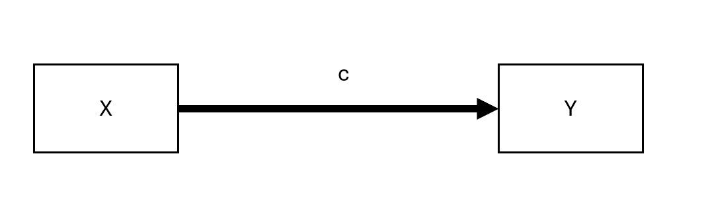
```

여기서 $c$는 $X$가 $Y$에 미치는 총효과(Total Effect)를 나타냅니다.

#### 매개 모델 (Mediated Model)

```{.r echo="FALSE" fig.cap="매개 모델 (Mediated Model)" fig.alt="X에서 M(경로 a), M에서 Y(경로 b), X에서 Y(경로 c prime)를 보여주는 매개 모델 순서도" out.width="90%" fig.align="center" #fig-mediated-model-flow}
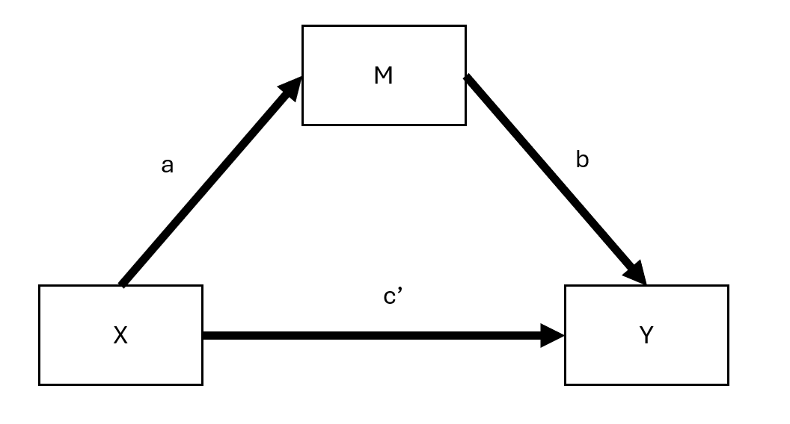
```

여기서:

- $c'$ = 직접효과(Direct Effect) (매개변수를 고려한 후 $X$가 $Y$에 미치는 효과)
- $ab$ = 간접효과(Indirect Effect) (매개 경로)

따라서 다음과 같이 표현할 수 있습니다:

$$
\text{총효과 (Total Effect)} = \text{직접효과 (Direct Effect)} + \text{간접효과 (Indirect Effect)}
$$

또는,

$$
c = c' + ab
$$

이 등식은 표준 선형 모델에서 성립하지만 다음과 같은 경우에는 반드시 성립하지는 않습니다:

1. 잠재변수 모델 (Latent Variable Models)
2. 로지스틱 회귀 (근사치만 성립)
3. 다층 모델 (Multilevel Models) [@bauer2006conceptualizing]


### 매개효과 측정 방법

간접효과($ab$)를 정량화하는 몇 가지 접근법이 존재합니다:

1. 비례 감소 접근법 (Proportional Reduction Approach):\
    $$1 - \frac{c'}{c}$$\
    특히 $c$가 작을 때 변동성이 매우 크므로 *권장되지 않습니다* [@mackinnon1995simulation].

2. 곱셈법 (Product Method):\
    $$a \times b$$\
    가장 널리 사용되는 접근법입니다.

3. 차이법 (Difference Method):\
    $$c - c'$$\
    개념상 곱셈법과 유사하지만 소표본에서는 정밀도가 떨어집니다.


### 선형 매개 모델의 가정

유효한 매개분석을 위해서는 다음 가정들이 성립해야 합니다:

1. $X-Y$, $X-M$, $M-Y$ 사이에 측정되지 않은 교란요인(Unmeasured Confounders)이 없어야 함.
2. 역인과관계(Reverse Causality) 부재: $X$는 $M-Y$ 관계에도 영향을 미치는 교란요인($C$)의 영향을 받지 않아야 함.
3. 측정 신뢰도(Measurement Reliability): $M$은 측정 오차 없이 측정되어야 함 (오차가 있는 경우 변수오차 모델(Errors-in-variables Models) 고려).


매개 단계별 회귀 방정식

1단계: $X$가 $Y$에 미치는 총효과

$$
Y = \beta_0 + cX + \epsilon
$$

- 매개효과가 성립하기 위해 $c$의 유의성이 반드시 요구되는 것은 아닙니다.

2단계: $X$가 $M$에 미치는 효과

$$
M = \alpha_0 + aX + \epsilon
$$

- 매개분석을 계속 진행하려면 계수 $a$가 유의해야 합니다.

3단계: $M$이 $Y$에 미치는 효과 ($X$ 포함)

$$
Y = \gamma_0 + c'X + bM + \epsilon
$$

- $M$을 포함한 후 $c'$가 비유의해지면 완전 매개(Full Mediation)가 나타납니다.
- $c'$의 크기가 감소하지만 여전히 유의하다면 부분 매개(Partial Mediation)가 존재합니다.

| $X$가 $Y$에 미치는 효과 | 매개 유형 |
|-------------------------------------------------|-------------------|
| 3단계의 $b_4$ (즉 $c'$)가 비유의함 | 완전 매개 (Full Mediation) |
| $b_4 < b_1$ (1단계의 $c$)이지만 여전히 유의함 | 부분 매개 (Partial Mediation) |

: 매개분석 결과의 해석


### 매개효과 검정 방법

간접효과($ab$)가 유의한지 평가하기 위한 여러 통계적 검정 방법이 존재합니다:

1. 소벨 검정 (Sobel Test) [@sobel1982asymptotic]
    - $ab$의 표준오차에 기반함.
    - 한계점: $ab$의 정규성을 가정하지만 소표본에서는이 가정이 성립하지 않을 수 있음.
2. 동시 유의성 검정 (Joint Significance Test)
    - $a$와 $b$가 모두 유의하면 매개효과가 존재할 가능성이 높음.
3. 붓스트랩 (Bootstrapping, 권장 방법) [@preacher2004spss; @shrout2002mediation]
    - $ab$에 대한 신뢰구간을 추정함.
    - 정규성을 가정하지 않음.
    - 중소 규모 표본에 적극 권장됨.


### 추가 고려사항

- 근위 매개(Proximal Mediation, 경로 $a$가 경로 $b$보다 큰 경우)는 다중공선성을 유발하고 통계적 검정력을 낮출 수 있습니다. 반면 원위 매개(Distal Mediation, 경로 $b$가 경로 $a$보다 큰 경우)는 검정력을 극대화하는 경향이 있습니다. 실제로 $b$가 $a$보다 약간 더 큰 약간의 원위 매개는 매개분석에서 검정력의 이상적인 균형을 이루는 경우가 많습니다 [@hoyle1999statistical].
- 직접효과($c$ 및 $c'$)에 대한 검정은 일반적으로 간접효과($ab$)에 대한 검정보다 검정력이 낮습니다. 그 결과 직접효과($c$)가 유의하지 않더라도 간접효과($ab$)는 통계적으로 유의할 수 있습니다. 이러한 상황은 "완전 매개"를 나타내는 것처럼 보일 수 있지만 $X$와 $Y$ 사이의 통계적으로 유의한 직접효과(즉 $c'$)의 부재가 다른 가능성을 결정적으로 배제하는 것은 아닙니다 [@kenny2014power].
- $ab$를 검정하는 것은 본질적으로 두 검정을 결합하는 것이므로, $c'$만을 단독으로 검정하는 것보다 검정력 면에서 이점이 있습니다. 그러나 적절한 표본 크기와 검정력의 중요성을 고려할 때, 비유의한 $c'$만을 유일한 기준으로 삼아 완전 매개를 주장하는 것은 신중해야 합니다. 실제로 @hayes2013relative 는 특히 부분 매개가 여전히 존재할 수 있는 상황에서 비유의한 $c'$에만 기반하여 완전 매개를 주장하는 것을 피할 것을 권장합니다.


### 매개분석의 기본 가정

유효한 매개분석을 위해서는 몇 가지 핵심 가정이 충족되어야 하며 이는 인과 방향(Causal Direction), 상호작용 효과(Interaction Effects), 측정 신뢰도(Measurement Reliability), 교란 통제(Confounding Control)로 분류할 수 있습니다.


#### 인과 방향 (Direction)

- 변수 간의 인과적 순서 (Causal Order of Variables)

- 간단하지만 다소 취약한 해결책은 역인과관계(즉, $M$이나 $Y$가 $X$를 유발하는 현상)를 방지하기 위해 $M$과 $Y$보다 $X$를 먼저 측정하는 것입니다. 마찬가지로 $Y$보다 $M$을 먼저 측정하면 $Y$가 $M$에 미치는 피드백 효과를 피할 수 있습니다.

- 그러나 $M$과 $Y$ 사이의 인과적 피드백 루프(Feedback Loops)는 여전히 존재할 수 있습니다.

    - 완전 매개($c' = 0$)를 가정하면, $M$과 $Y$ 간의 상호 인과 효과가 있는 모델을 도구변수(IV)를 사용하여 추정할 수 있습니다.

    - @smith1982beliefs 는 $M$과 $Y$를 서로에 대한 잠재적 매개변수로 취급할 것을 제안하며 인과 효과의 교차 오염을 방지하기 위해 각각에 대해 구별되는 별도의 도구변수가 필요하다고 설명합니다.


#### 매개분석에서의 상호작용 효과 (Interaction Effects)

- $Y$를 예측할 때 $M$이 $X$와 상호작용한다면, $M$은 매개변수인 동시에 조절변수(Moderator)가 됩니다 [@baron1986moderator].

- 가능한 조절효과를 반영하기 위해 모델에 상호작용 항 $X \times M$을 항상 포함해야 합니다.

- 매개 모델에서 이러한 상호작용을 해석하는 방법은 조절된 매개(Moderated Mediation) 분석을 위한 프레임워크를 제공하는 [@vanderweele2015explanation]를 참조하시기 바랍니다.


#### 신뢰도 (Reliability)

세 가지 주요 변수($X, M, Y$) 중 어느 하나에서라도 측정 오차가 발생하면 매개효과 추정치에 편향이 생길 수 있습니다.

1. 매개변수($M$)의 측정 오차:
    - $b$와 $c'$ 모두에 편향을 유발합니다.
    - 잠재적 해결책: $M$을 잠재변수(Latent Variable)로 모형화 (편향은 줄어들지만 통계적 검정력이 감소할 수 있음) [@ledgerwood2011trade].
    - 구체적인 영향:
        - $b$는 감쇠(Attenuation, 0으로 편향)됩니다.
        - $c'$는 다음과 같이 편향됩니다:
            - $ab > 0$이면 과대추정됩니다.
            - $ab < 0$이면 과소추정됩니다.
2. 처치변수($X$)의 측정 오차:
    - $a$와 $b$ 모두에 편향을 유발합니다.
    - 구체적인 영향:
        - $a$는 감쇠됩니다.
        - $b$는 다음과 같이 편향됩니다:
            - $ac' > 0$이면 과대추정됩니다.
            - $ac' < 0$이면 과소추정됩니다.
3. 결과변수($Y$)의 측정 오차:
    - 비표준화 변수의 경우 편향이 발생하지 않습니다.
    - 표준화 변수의 경우 감쇠 편향(오차 분산으로 인해 효과 크기 축소)이 발생합니다.


#### 매개분석에서의 교란요인 (Confounding)

누락 변수 편향(Omitted Variable Bias)은 세 가지 핵심 관계($X \to Y$, $X \to M$, $M \to Y$) 중 어느 것이든 왜곡할 수 있습니다. 교란을 해결하려면 설계 기반 전략이나 통계적 전략이 필요합니다.

설계 기반 전략 (실행 가능하다면 권장됨)

- 독립변수($X$)의 무작위 배정(Randomization)은 교란 편향을 줄입니다.
- 가능한 경우 매개변수($M$)의 무작위 배정은 인과적 주장을 더욱 강화합니다.
- 측정된 교란요인을 통제하지만 이는 관측 가능한 교란만 해결할 수 있습니다.

통계적 전략 (무작위 배정이 불가능한 경우)

1. 도구변수 접근법 (Instrumental Variables Approach):
    - 교란요인이 $M$과 $Y$ 모두에 영향을 미칠 때 사용됩니다.
    - 교란요인과 독립적이면서 $M$이 $Y$에 미치는 효과를 완전히 매개하는 제3의 변수가 존재한다면 전면 조정(Front-door Adjustment)을 적용할 수 있습니다.
2. 가중치 부여 방법 (예: 역확률 가중치 - IPW, Inverse Probability Weighting):
    - 처치 집단 간 교란요인의 균형을 맞추기 위해 관측치에 가중치를 재부여함으로써 교란을 보정합니다.
    - 강한 무시가능성(Strong Ignorability) 가정이 필요합니다: 모든 교란요인이 측정되고 올바르게 명시되어야 합니다 [@westfall2016statistically].
    - 이 가정은 통계적으로 공식 검정할 수 없지만 민감도 분석(Sensitivity Analysis)을 통해 강건성을 평가할 수 있습니다.
    - 매개 모델에서 IPW를 구현하는 R 코드는 [Heiss](https://www.andrewheiss.com/blog/2020/12/01/ipw-binary-continuous/)를 참조하십시오.


### 간접효과 검정 (Indirect Effect Tests)

간접효과($ab$)를 검정하는 것은 매개분석에서 매우 중요합니다. 여러 방법이 존재하며 각 방법마다 장단점이 있습니다.


#### 소벨 검정 (델타 방법, Delta Method)

- @sobel1982asymptotic 에 의해 개발되었습니다.
- 델타 방법(Delta Method)으로도 알려져 있습니다.
- $ab$의 표본 분포가 정규분포를 따른다고 가정하지만 실제로는 그렇지 않은 경우가 많아 권장되지 않습니다 [@mackinnon1995simulation].

간접효과의 표준오차(SE)는 다음과 같습니다:

$$
SE_{ab} = \sqrt{\hat{b}^2 s_{\hat{a}}^2 + \hat{a}^2 s_{\hat{b}}^2}
$$

$ab$가 0과 유의하게 다른지 검정하기 위한 Z-통계량은 다음과 같습니다:

$$
z = \frac{\hat{ab}}{\sqrt{\hat{b}^2 s_{\hat{a}}^2 + \hat{a}^2 s_{\hat{b}}^2}}
$$

단점

- $a$와 $b$가 독립이라고 가정합니다.
- $ab$가 정규분포를 따른다고 가정합니다.
- 소표본에서 성능이 떨어집니다.
- 붓스트랩에 비해 검정력이 낮고 지나치게 보수적입니다.

특수한 경우: 비일관적 매개 (Inconsistent Mediation)

- 직접효과와 간접효과가 반대 부호를 가질 때도 매개효과가 발생할 수 있으며 이를 비일관적 매개(Inconsistent Mediation)라고 합니다 [@mackinnon2007mediation].
- 이는 매개변수가 억제변수(Suppressor Variable)로 작용하여 상쇄되는 경로를 만들어낼 때 발생합니다.

```{.r}
library(bda)
library(mediation)
data("boundsdata")

# 매개효과에 대한 소벨 검정 (Sobel Test for Mediation)
bda::mediation.test(boundsdata$med, boundsdata$ttt, boundsdata$out) |>
    tibble::rownames_to_column() |>
    causalverse::nice_tab(2)
```


#### 동시 유의성 검정 (Joint Significance Test)

- $a$와 $b$가 모두 통계적으로 유의한지 확인함으로써 간접효과가 0이 아닌지 검정합니다.
- $a \perp b$ (경로의 독립성)를 가정합니다.
- 붓스트랩과 유사한 성능을 보입니다 [@hayes2013relative].
- 비정규성에는 더 강건하지만 이분산성(Heteroscedasticity)에 민감할 수 있습니다 [@fossum2023use].
- 신뢰구간을 제공하지 않아 효과 크기 해석이 어렵습니다.


#### 붓스트랩 (Bootstrapping, 권장 방법)

- @bollen1990direct 에 의해 매개분석에 처음 적용되었습니다.
- 재표본추출(Resampling)을 사용하여 간접효과의 표본 분포를 경험적으로 추정합니다.
- 정규성 가정이나 $a \perp b$ 독립성 가정을 필요로 하지 않습니다.
- 소표본에서도 잘 작동합니다.
- 복잡한 모델도 처리할 수 있습니다.

어떤 붓스트랩 방법을 사용할 것인가?

- 백분위수 붓스트랩(Percentile Bootstrap)은 1종 오류율(Type I Error Rate) 제어가 더 우수하여 권장됩니다 [@tibbe2022correcting].
- 편향 보정 붓스트랩(Bias-corrected Bootstrapping)은 지나치게 자유적(Liberal)이어서 1종 오류를 팽창시킬 수 있습니다 [@fritz2012explanation].

특수한 경우: 메타분석적 붓스트랩 (Meta-Analytic Bootstrapping)

- 원시 데이터 없이도 여러 연구에서 얻은 $a, b, var(a), var(b), cov(a,b)$만을 사용하여 붓스트랩을 적용할 수 있습니다.

```{.r}
# 매개효과를 위한 메타분석적 붓스트랩 (Meta-Analytic Bootstrapping for Mediation)
library(causalverse)

result <- causalverse::med_ind(
    a = 0.5, 
    b = 0.7, 
    var_a = 0.04, 
    var_b = 0.05, 
    cov_ab = 0.01
)
```

```{.r fig.cap="시뮬레이션된 간접효과의 분포" fig.alt="0.5 부근에서 정점을 이루고 빨간색 점선 신뢰구간 선이 있는 간접효과의 오른쪽 꼬리가 긴 히스토그램" out.width="100%" fig.align="center" #fig-indirect-effect-distribution}
result$plot
```

도구변수(IV)를 활용할 수 있는 경우 인과 효과를 보다 신뢰성 있게 추정할 수 있습니다. 아래는 이에 대한 시각적 표현입니다.

```{.r eval="FALSE"}
library(DiagrammeR)

# 단순 처치-결과 모델
grViz("
digraph {
  graph []
  node [shape = plaintext]
    X [label = 'Treatment']
    Y [label = 'Outcome']
  edge [minlen = 2]
    X->Y
  { rank = same; X; Y }
}")

# 도구변수를 포함한 매개 모델
grViz("
digraph {
  graph []
  node [shape = plaintext]
    X [label ='Treatment', shape = box]
    Y [label ='Outcome', shape = box]
    M [label ='Mediator', shape = box]
    IV [label ='Instrument', shape = box]
  edge [minlen = 2]
    IV->X
    X->M  
    M->Y 
    X->Y 
  { rank = same; X; Y; M }
}")

```

고정효과 모델을 이용한 매개분석:

```{.r}
library(mediation)
library(fixest)

data("boundsdata")

# 1단계: 총효과 (c)
out1 <- feols(out ~ ttt, data = boundsdata)

# 2단계: 간접효과 (a)
out2 <- feols(med ~ ttt, data = boundsdata)

# 3단계: 직접효과 및 간접효과 (c' 및 b)
out3 <- feols(out ~ med + ttt, data = boundsdata)

# 매개 비율 (Proportion of Mediation)
coef(out2)['ttt'] * coef(out3)['med'] / coef(out1)['ttt'] * 100
```

붓스트랩 매개분석:

```{.r}
library(boot)
set.seed(1)

# 붓스트랩 함수 정의
mediation_fn <- function(data, i) {
    df <- data[i,]
    
    a_path <- feols(med ~ ttt, data = df)
    a <- coef(a_path)['ttt']
    
    b_path <- feols(out ~ med + ttt, data = df)
    b <- coef(b_path)['med']
    
    cp <- coef(b_path)['ttt']
    
    # 간접효과 (a * b)
    ind_ef <- a * b
    total_ef <- a * b + cp
    return(c(ind_ef, total_ef))
}

# 붓스트랩 수행
boot_med <- boot(boundsdata, mediation_fn, R = 100, parallel = "multicore", ncpus = 2)
boot_med 

# 요약 및 신뢰구간
summary(boot_med) |> causalverse::nice_tab()

# 신뢰구간 (백분위수 붓스트랩 권장)
boot.ci(boot_med, type = c("norm", "perc"))

# 점추정치 (간접효과 및 총효과)
colMeans(boot_med$t)

```

대안으로 강건한(Robust) 매개분석을 위해 `robmed` 패키지를 사용할 수 있습니다:

```{.r}
library(robmed)

```

### 매개분석을 위한 검정력 분석 (Power Analysis)

연구가 매개효과를 탐지하기에 충분한 검정력(Power)을 갖추었는지 평가하려면 다음을 사용합니다:

```{.r}
library(pwr2ppl)

# 간접효과(ab 경로)에 대한 검정력 분석
medjs(
    rx1m1 = .3,  # 상관관계: X → M (경로 a)
    rx1y  = .1,  # 상관관계: X → Y (경로 c')
    rym1  = .3,  # 상관관계: M → Y (경로 b)
    n     = 100, # 표본 크기
    alpha = 0.05,
    mvars = 1,   # 매개변수 개수
    rep   = 1000 # 반복 횟수 (정확도를 위해 10,000 권장)
)
```

대화형(Interactive) 검정력 분석은 [Kenny의 매개효과 검정력 앱](https://davidakenny.shinyapps.io/MedPower/)을 참조하십시오.

간접효과 검정 방법 요약

| 검정 방법 | 장점 | 단점 |
|---------------------|------------------------------|----------------------|
| 소벨 검정 (Sobel Test) | 단순하고 빠름 | 정규성 가정 필요, 낮은 검정력 |
| 동시 유의성 검정 (Joint Significance Test) | 비정규성에 강건함 | 신뢰구간을 제공하지 않음 |
| 붓스트랩 (Bootstrapping, 권장) | 정규성 가정이 불필요하며 소표본 처리 가능 | 편향 보정 시 1종 오류에 관대할 수 있음 |

: 매개효과 검정 방법 비교

### 다중 매개분석 (Multiple Mediation Analysis)

어떤 경우에는 단일 매개변수($M$)가 $X$가 $Y$에 미치는 간접효과를 완전히 포착하지 못할 수 있습니다. 다중 매개 모델은 둘 이상의 매개변수를 포함하여 전통적 매개분석을 확장함으로써, 여러 경로가 결과에 어떻게 기여하는지 분석할 수 있도록 합니다.


다중 매개 모델을 처리하는 여러 R 패키지가 있습니다:

- manymome: 다중 매개 모형화를 위한 유연한 패키지.
    - [Vignette](https://cran.r-project.org/web/packages/manymome/vignettes/med_lm.html)

```{.r}
library(manymome)
```

- mma: 다중 매개변수 모델에 사용됨.

    - [패키지 PDF](https://cran.r-project.org/web/packages/mma/mma.pdf)

    - [Vignette](https://cran.r-project.org/web/packages/mma/vignettes/MMAvignette.html)

```{.r}
library(mma)
```

#### 다중 매개변수: 구조방정식 모델링(SEM) 접근법

다중 매개 모델을 추정하는 널리 사용되는 방법은 lavaan을 이용한 구조방정식 모델링(Structural Equation Modeling, SEM)입니다.

다중 매개를 검정하기 위해 먼저 두 매개변수($M_1$ 및 $M_2$)가 결과($Y$)에 기여하는 데이터를 시뮬레이션합니다.

```{.r}
# 필수 패키지 로드
library(MASS)  # mvrnorm (상관된 오차 생성용)
library(lavaan)

# 가상 데이터 생성 함수
generate_data <- function(n = 10000, a1 = 0.5, a2 = -0.35, 
                          b1 = 0.7, b2 = 0.48, 
                          corr = TRUE, correlation_value = 0.7) {
    set.seed(12345)
    X <- rnorm(n)  # 독립변수
    
    # 매개변수를 위한 상관된 오차 생성
    if (corr) {
        Sigma <- matrix(c(1, correlation_value, correlation_value, 1), nrow = 2)
        errors <- mvrnorm(n, mu = c(0, 0), Sigma = Sigma) 
    } else {
        errors <- mvrnorm(n, mu = c(0, 0), Sigma = diag(2)) 
    }
    
    M1 <- a1 * X + errors[, 1]
    M2 <- a2 * X + errors[, 2]
    Y  <- b1 * M1 + b2 * M2 + rnorm(n)  # 결과변수

    return(data.frame(X = X, M1 = M1, M2 = M2, Y = Y))
}
```

두 매개변수($M_1$ 및 $M_2$)를 통한 간접효과를 분석합니다.

1. 상관된 매개변수를 올바르게 모형화하기

```{.r}
# 상관된 매개변수를 포함하는 데이터 생성
Data_corr <- generate_data(n = 10000, corr = TRUE, correlation_value = 0.7)

# 다중 매개를 위한 SEM 모델 정의
model_corr <- '
  Y ~ b1 * M1 + b2 * M2 + c * X
  M1 ~ a1 * X
  M2 ~ a2 * X
  M1 ~~ M2  # 상관된 매개변수 (상관관계를 올바르게 모형화)
'

# SEM 모델 적합
fit_corr <- sem(model_corr, data = Data_corr)

# 모수 추정치 추출
parameterEstimates(fit_corr)[, c("lhs", "rhs", "est", "se", "pvalue")]
```

2. 매개변수 간 상관관계를 무시하고 잘못 모형화하기

```{.r}
# 매개변수 간 상관관계를 모형화하지 않은 SEM 모델 정의
model_uncorr <- '
  Y ~ b1 * M1 + b2 * M2 + c * X
  M1 ~ a1 * X
  M2 ~ a2 * X
'

# 잘못된 모델 적합
fit_uncorr <- sem(model_uncorr, data = Data_corr)

# 모수 추정치 비교
parameterEstimates(fit_uncorr)[, c("lhs", "rhs", "est", "se", "pvalue")]

```

모델 적합도 비교

상관관계를 모형화하는 것이 중요한지 확인하기 위해 AIC와 RMSEA를 비교합니다.

```{.r}
# 모델 적합도 통계량 추출
fit_measures <- function(fit) {
  fitMeasures(fit, c("aic", "bic", "rmsea", "chisq"))
}

# 모델 적합도 비교
fit_measures(fit_corr)  # 올바른 모델 (상관된 매개변수)
fit_measures(fit_uncorr)  # 잘못된 모델 (상관관계 무시)
```

- 상관 모델에서 AIC와 RMSEA가 더 낮다면, 상관된 오차를 반영하는 것이 적합도를 향상시킨다는 것을 시사합니다.

모델 적합 후 다음을 평가합니다:

1. 직접효과(Direct Effect): 두 매개변수를 모두 고려한 후 $X$가 $Y$에 미치는 효과 ($c'$).

2. 간접효과(Indirect Effects):

    - $a_1 \times b_1$: $X \to M_1 \to Y$ 경로의 효과.

    - $a_2 \times b_2$: $X \to M_2 \to Y$ 경로의 효과.

3. 총효과(Total Effect): 직접효과와 간접효과의 합.

```{.r}
# 간접효과 및 직접효과 추출
parameterEstimates(fit_corr, standardized = TRUE)
```

$c'$가 감소하지만 여전히 유의하다면 부분 매개가 존재합니다. $c' \approx 0$이면 완전 매개를 나타냅니다.

```{.r #mediation-full-code}
# 필수 패키지 로드
library(MASS)  # mvrnorm용
library(lavaan)

# 매개변수에 대해 올바르게 상관된 오차를 갖는 가상 데이터 생성 함수
generate_data <-
  function(n = 10000,
           a1 = 0.5,
           a2 = -0.35,
           b1 = 0.7,
           b2 = 0.48,
           corr = TRUE,
           correlation_value = 0.7) {
    set.seed(12345)
    X <- rnorm(n)
    
    # 다변량 정규분포를 사용한 상관된 오차 생성
    if (corr) {
        Sigma <- matrix(c(1, correlation_value, correlation_value, 1), nrow = 2)  # 오차에 대한 더 높은 공분산 행렬
        errors <- mvrnorm(n, mu = c(0, 0), Sigma = Sigma)  # 상관된 오차 생성
    } else {
        errors <- mvrnorm(n, mu = c(0, 0), Sigma = diag(2))  # 독립적인 오차
    }
    
    M1 <- a1 * X + errors[, 1]
    M2 <- a2 * X + errors[, 2]
    Y <- b1 * M1 + b2 * M2 + rnorm(n)  # Y는 M1과 M2에 의존
    
    data.frame(X = X, M1 = M1, M2 = M2, Y = Y)
}

# 비교를 위한 참값 (Ground truth)
ground_truth <- data.frame(Parameter = c("b1", "b2"), GroundTruth = c(0.7, 0.48))

# 주요 추정치, 표준오차 및 모델 적합도를 추출하는 함수
extract_estimates_b1_b2 <- function(fit) {
    estimates <- parameterEstimates(fit)
    estimates <- estimates[estimates$lhs == "Y" & estimates$rhs %in% c("M1", "M2"), c("rhs", "est", "se")]
    estimates$Parameter <- ifelse(estimates$rhs == "M1", "b1", "b2")
    estimates <- estimates[, c("Parameter", "est", "se")]
    fit_stats <- fitMeasures(fit, c("aic", "bic", "rmsea", "chisq"))
    return(list(estimates = estimates, fit_stats = fit_stats))
}

# 사례 1: 매개변수의 오차가 상관됨 (올바르게 모형화됨)
Data_corr <- generate_data(n = 10000, corr = TRUE, correlation_value = 0.7)
model_corr <- '
  Y ~ b1 * M1 + b2 * M2 + c * X
  M1 ~ a1 * X
  M2 ~ a2 * X
  M1 ~~ M2  # 상관된 매개변수 (오차)
'
fit_corr <- sem(model = model_corr, data = Data_corr)
results_corr <- extract_estimates_b1_b2(fit_corr)

# 사례 2: 매개변수의 오차가 상관되지 않음 (올바르게 모형화됨)
Data_uncorr <- generate_data(n = 10000, corr = FALSE)
model_uncorr <- '
  Y ~ b1 * M1 + b2 * M2 + c * X
  M1 ~ a1 * X
  M2 ~ a2 * X
'
fit_uncorr <- sem(model = model_uncorr, data = Data_uncorr)
results_uncorr <- extract_estimates_b1_b2(fit_uncorr)

# 사례 3: 오차가 상관되어 있으나 상관관계를 모형화하지 않음
fit_corr_incorrect <- sem(model = model_uncorr, data = Data_corr)
results_corr_incorrect <- extract_estimates_b1_b2(fit_corr_incorrect)

# 사례 4: 오차가 상관되어 있지 않으나 상관관계를 모형화함
fit_uncorr_incorrect <- sem(model = model_corr, data = Data_uncorr)
results_uncorr_incorrect <- extract_estimates_b1_b2(fit_uncorr_incorrect)

# 비교를 위해 모든 추정치 결합
estimates_combined <- list(
    "Correlated (Correct)" = results_corr$estimates,
    "Uncorrelated (Correct)" = results_uncorr$estimates,
    "Correlated (Incorrect)" = results_corr_incorrect$estimates,
    "Uncorrelated (Incorrect)" = results_uncorr_incorrect$estimates
)

# 모두 단일 테이블로 결합
comparison_table <- do.call(rbind, lapply(names(estimates_combined), function(case) {
    df <- estimates_combined[[case]]
    df$Case <- case
    df
}))

# 최종 비교를 위해 참값과 병합
comparison_table <- merge(comparison_table, ground_truth, by = "Parameter")

# 비교 테이블 출력
comparison_table

# 각 사례별 모델 적합도 통계량 출력
fit_stats_combined <- list(
    "Correlated (Correct)" = results_corr$fit_stats,
    "Uncorrelated (Correct)" = results_uncorr$fit_stats,
    "Correlated (Incorrect)" = results_corr_incorrect$fit_stats,
    "Uncorrelated (Incorrect)" = results_uncorr_incorrect$fit_stats
)

fit_stats_combined
```

### 매개분석에서의 다중 처치 (Multiple Treatments)

어떤 경우에는 여러 독립변수($X_1, X_2$)가 동일한 매개변수에 영향을 미칩니다. 이를 다중 처치 매개분석(Multiple Treatments Mediation)이라고 합니다 [@hayes2014statistical].

PROCESS (SPSS/R) 예제는 다음을 참조하십시오:\
[Process Mediation with Multiple Treatments](https://core.ecu.edu/wuenschk/MV/multReg/Mediation_Multicategorical.pdf).


## 인과추론 관점의 매개효과 분석 (Causal Inference Approach)

전통적인 매개 모델은 회귀 기반 추정치가 유효한 인과추론을 제공한다고 가정합니다. 그러나 인과 매개분석(Causal Mediation Analysis, CMA)은 잠재적 결과(Potential Outcomes)와 반사실(Counterfactuals)의 관점에서 매개효과를 명시적으로 정의함으로써 전통적 모델을 확장합니다.


### 예제: 전통적 매개분석 {#sec-example-traditional-mediation-analysis}

먼저 고전적인 3단계 매개 접근법으로 시작합니다.

```{.r message="FALSE"}
# 데이터 로드
myData <- read.csv("data/mediationData.csv")

# 1단계 (총효과: X → Y) [더 이상 필수가 아님]
model.0 <- lm(Y ~ X, data = myData)
summary(model.0)

# 2단계 (X가 M에 미치는 효과)
model.M <- lm(M ~ X, data = myData)
summary(model.M)

# 3단계 (X를 통제한 상태에서 M이 Y에 미치는 효과)
model.Y <- lm(Y ~ X + M, data = myData)
summary(model.Y)

# 4단계: ACME를 위한 붓스트랩
library(mediation)
results <-
    mediate(
        model.M,
        model.Y,
        treat = 'X',
        mediator = 'M',
        boot = TRUE,
        sims = 500
    )
summary(results)
```

- 총효과(Total Effect): $\hat{c} = 0.3961$ → $M$을 통제하지 않은 상태에서 $X$가 $Y$에 미치는 효과.
- 직접효과(Average Direct Effect, ADE): $\hat{c'} = 0.0396$ → $M$을 고려한 후 $X$가 $Y$에 미치는 효과.
- ACME (평균 인과 매개효과, Average Causal Mediation Effect):
    - ACME = $\hat{c} - \hat{c'} = 0.3961 - 0.0396 = 0.3565$

    - 이는 경로의 곱과 동일합니다: $\hat{a} \times \hat{b} = 0.56102 \times 0.6355 = 0.3565$.

이러한 계산은 강한 인과적 가정에 의존하지 않습니다. 진정한 인과적 해석을 위해서는 보다 엄밀한 프레임워크가 필요합니다.

### 인과 매개분석의 두 가지 접근법

`mediation` 패키지 [@imai2010general; @imai2010identification]는 인과 매개분석을 지원합니다. 이 패키지는 두 가지 유형의 추론을 지원합니다:

1. 모델 기반 추론 (Model-Based Inference)

    - 가정:

        - 처치가 무작위 배정됨 (또는 매칭을 통해 근사됨).

        - 순차적 무시가능성(Sequential Ignorability): 다음에 관측되지 않은 교란이 없음:

            1. 처치 → 매개변수

            2. 처치 → 결과변수

            3. 매개변수 → 결과변수

        - 이 가정은 관찰 연구(Observational Studies)에서 정당화하기 어렵습니다.

2. 설계 기반 추론 (Design-Based Inference)

    - 인과적 메커니즘을 분리하기 위해 실험 설계에 의존합니다.

표기법 (Notation)

표준 잠재적 결과(Potential Outcomes) 프레임워크를 따릅니다:

- $M_i(t)$ = 처치 조건 $t$ 하에서의 매개변수 값

- $T_i \in \{0,1\}$ = 처치 배정 여부

- $Y_i(t, m)$ = 처치 $t$ 및 매개변수 값 $m$ 하에서의 결과변수 값

- $X_i$ = 관측된 처치 전 공변량(Pre-treatment Covariates)

개체 $i$에 대한 처치 효과(Treatment Effect):
$$
\tau_i = Y_i(1,M_i(1)) - Y_i (0,M_i(0))
$$
이는 다음과 같이 분해됩니다:

1. 인과 매개효과 (ACME):

$$
\delta_i (t) = Y_i (t,M_i(1)) - Y_i(t,M_i(0))
$$

2. 직접효과 (ADE):

$$
\zeta_i (t) = Y_i (1, M_i(1)) - Y_i(0, M_i(0))
$$

이를 합산하면:

$$
\tau_i = \delta_i (t) + \zeta_i (1-t)
$$

순차적 무시가능성 가정 (Sequential Ignorability Assumption)

CMA가 유효하려면 다음을 가정합니다:

$$
\begin{aligned}
\{ Y_i (t', m), M_i (t) \} &\perp T_i |X_i = x\\
Y_i(t',m) &\perp M_i(t) | T_i = t, X_i = x
\end{aligned}
$$

- 첫 번째 조건은 처치 전 공변량을 조건부로 처치 배정이 무작위라는 표준적인 강한 무시가능성 조건입니다.

- 두 번째 조건은 관측된 처치 및 처치 전 공변량이 주어졌을 때 매개변수 역시 무작위라는 더 강한 조건입니다. 이 조건은 관측되지 않은 처치 전 교란요인, 처치 후 교란요인, 그리고 상관된 다중 매개변수가 존재하지 않을 때에만 충족됩니다.

> 주요 과제
>
> 순차적 무시가능성은 검정할 수 없습니다(Untestable). 따라서 연구자는 반드시 민감도 분석(Sensitivity Analysis)을 수행해야 합니다.

이제 `mediation` 패키지를 사용하여 인과 매개 모델을 적합해 봅니다.

```{.r}
library(mediation)
set.seed(2014)
data("framing", package = "mediation")

# 1단계: 매개변수 모델 적합 (M ~ T, X)
med.fit <-
    lm(emo ~ treat + age + educ + gender + income, data = framing)

# 2단계: 결과변수 모델 적합 (Y ~ M, T, X)
out.fit <-
    glm(
        cong_mesg ~ emo + treat + age + educ + gender + income,
        data = framing,
        family = binomial("probit")
    )

# 3단계: 인과 매개분석 (준베이지안 방식)
med.out <-
    mediate(
        med.fit,
        out.fit,
        treat = "treat",
        mediator = "emo",
        robustSE = TRUE,
        sims = 100
    )  # 실무에서는 sims = 10000 권장
summary(med.out)
```

대안: 비모수적 붓스트랩 (Nonparametric Bootstrap)

```{.r}
med.out <-
    mediate(
        med.fit,
        out.fit,
        boot = TRUE,
        treat = "treat",
        mediator = "emo",
        sims = 100,
        boot.ci.type = "bca"
    )
summary(med.out)
```

조절효과(Moderation)가 의심되는 경우 상호작용 항을 포함합니다.

```{.r}
med.fit <-
    lm(emo ~ treat + age + educ + gender + income, data = framing)

out.fit <-
    glm(
        cong_mesg ~ emo * treat + age + educ + gender + income,
        data = framing,
        family = binomial("probit")
    )

med.out <-
    mediate(
        med.fit,
        out.fit,
        treat = "treat",
        mediator = "emo",
        robustSE = TRUE,
        sims = 100
    )

summary(med.out)
test.TMint(med.out, conf.level = .95)  # 상호작용 효과 검정
```

순차적 무시가능성은 검정할 수 없으므로, 측정되지 않은 교란요인이 ACME 추정치에 어떤 영향을 미치는지 살펴봅니다.

```{.r}
# 필수 패키지 로드
library(mediation)

# 예제 데이터 시뮬레이션
set.seed(123)
n <- 100
data <- data.frame(
  treat = rbinom(n, 1, 0.5),       # 이진 처치
  med = rnorm(n),                   # 연속형 매개변수
  outcome = rnorm(n)                 # 연속형 결과변수
)

# 매개변수 모델 적합 (med ~ treat)
med_model <- lm(med ~ treat, data = data)

# 결과변수 모델 적합 (outcome ~ treat + med)
outcome_model <- lm(outcome ~ treat + med, data = data)

# 매개분석 수행
med_out <- mediate(med_model, 
                   outcome_model, 
                   treat = "treat", 
                   mediator = "med", 
                   sims = 100)

# 민감도 분석 수행
sens_out <- medsens(med_out, sims = 100)

summary(sens_out)
```

```{.r fig.cap="ACME 민감도 분석" fig.alt="신뢰구간 음영 및 0 기준선과 함께 민감도 모수 rho 대비 평균 매개효과를 보여주는 선 그래프" out.width="100%" fig.align="center" #fig-acme-vs-rho}
plot(sens_out)
```

- ACME 신뢰구간에 0이 포함되면, 해당 효과는 교란에 강건하지 않은 것입니다.

또는 $R^2$ 해석을 사용하여 `plot`에서 `sign.prod = "positive"`(같은 방향) 또는 `sign.prod = "negative"`(반대 방향)를 통해 매개변수와 결과변수에 영향을 미치는 교란요인의 방향을 지정해야 합니다.

```{.r message="FALSE" eval="FALSE"}
plot(sens.out, sens.par = "R2", r.type = "total", sign.prod = "positive")
```

| 측면 | 전통적 매개분석 | 인과 매개분석 |
|-----------------------|-----------------------|--------------------------|
| 모델 가정 | 선형 회귀 | 잠재적 결과 프레임워크 |
| 필요한 가정 | 누락된 교란요인 부재 | 순차적 무시가능성 |
| 추론 방법 | 계수의 곱 | 반사실적 추론 |
| 붓스트랩 활용 여부 | 흔히 사용됨 | 필수적임 |
| 민감도 분석 여부 | 거의 사용되지 않음 | 강력히 권장됨 |

: 전통적 매개분석과 인과 매개분석의 비교


## 시계열 데이터를 활용한 매개분석 {#sec-granger-mediation}

위의 전통적 매개 프레임워크와 인과 매개 프레임워크는 모두 $X, M, Y$를 개체당 단일 횡단면 추출로 취급합니다. 반면 처치, 매개변수, 결과변수가 시간에 따른 시퀀스로 관측될 때(예: 주간 단위로 측정된 광고 충격과 이에 따른 인지도 및 매출 효과, 또는 월간 단위로 측정된 정책 개입과 중간 시장 결과에 미치는 영향), 위의 횡단면 도구로는 해결할 수 없는 두 가지 문제가 발생합니다. 첫째, 시점 $t$에서의 매개변수와 결과변수는 일반적으로 자신의 과거 값과 상관되어 있으므로, 매개변수 및 결과변수 방정식의 잔차 오차 자체가 시간에 따라 자기상관(Autocorrelated) 및 교차상관(Cross-correlated)되어 계수 곱 추정량 및 ACME 추정량이 의존하는 독립성 가정을 위반합니다. 둘째, 매개변수와 결과변수가 공통의 시간에 따라 변하는 동인(Time-varying Driver)을 공유하는 경우 순차적 무시가능성에 내포된 "측정되지 않은 매개변수-결과변수 교란 부재" 조건을 정당화하기가 더욱 어려워집니다. 이러한 교란은 두 방정식 간의 상관된 오차로 정확히 나타나기 때문입니다.

시계열 장의 [그랜저 인과성과 매개분석](#sec-time-series) 절에서는 이변량 VAR(Bivariate VAR)이 방정식 간 시차 계수를 통해 매개 경로 $x \to m \to y$를 추적하는 방법을 이미 보여주었습니다. 다중 피험자 기능 영상 데이터를 위해 Zhao and Luo (2019)가 개발하였으나 개체당 반복된 매개변수/결과변수 관측치가 있는 모든 환경에 적용 가능한 그랜저 매개분석(Granger Mediation Analysis)은 동일한 아이디어를 더욱 발전시킵니다. 즉, VAR의 시차 구조에서만 매개효과를 읽어내는 대신, 매개변수 및 결과변수 방정식 자체의 오차를 벡터 자기회귀(VAR)로 통합하고 측정되지 않은 매개변수-결과변수 교란을 직접적이고 검정 가능한 방식으로 확인해 주는 단일 상관 파라미터를 추정합니다 [@zhao2019granger].

##### 모형

각 시점 $t$에서 매개변수와 결과변수 방정식은 친숙한 경로 분석 형태를 유지합니다:
$$
M_t = Z_t a + E_{1t}, \qquad R_t = Z_t c + M_t b + E_{2t},
$$
여기서 $Z_t$는 처치 또는 자극 시계열, $M_t$는 매개변수 시계열, $R_t$는 결과변수 시계열이며 $a, b, c$는 위의 Baron & Kenny 설정과 동일한 경로 계수입니다. 새로운 점은 방정식의 오차 $E_{1t}$와 $E_{2t}$가 상관계수 $\delta$를 통해 동시적으로(Contemporaneously) 상관될 수 있도록 허용되며 나아가 $p$차 벡터 자기회귀 과정으로 모형화된다는 것입니다:
$$
E_{1t} = \sum_{j=1}^{p}\left(\omega_{11j}E_{1,t-j} + \omega_{21j}E_{2,t-j}\right) + \varepsilon_{1t}, \qquad
E_{2t} = \sum_{j=1}^{p}\left(\omega_{12j}E_{1,t-j} + \omega_{22j}E_{2,t-j}\right) + \varepsilon_{2t}.
$$
간접(매개)효과는 횡단면의 경우와 정확히 동일하게 여전히 곱 $a \times b$이고 직접효과는 여전히 $c$입니다. VAR 구조는 오차가 모형화되는 방식, 즉 $a, b, c$의 표준오차만 변화시킵니다. 상관 파라미터 $\delta$는 횡단면 인과 매개 프레임워크에서 순차적 무시가능성이 하는 역할을 수행합니다. 즉, $\delta = 0$일 때 매개변수와 결과변수의 오차는 각자의 시차를 고려한 후 상관되지 않으며 이는 시계열에서 측정되지 않은 매개변수-결과변수 교란이 없다는 것과 동등합니다. 순차적 무시가능성과 달리 $\delta$는 단순히 가정하는 것이 아니라 추정되고 직접 검정될 수 있으며 Zhao와 Luo는 표준 정칙 조건 하에서 $T$개 시점에 걸쳐 관측된 $N$개 개체 패널에 대해 추정량 $\hat\delta$가 $\sqrt{NT}$-일치성을 가짐을 보였습니다.

##### 실무적 시사점

VAR 오차 구조로부터 세 가지 결과가 직접 도출되며 그랜저 매개분석 결과를 보고하기 전에 확인할 가치가 있습니다:

1. 시차 차수(Lag Order)가 중요합니다. 모든 VAR과 마찬가지로 $p$는 사전에 고정하기보다 정보 기준(잔차 VAR에 대한 AIC 또는 BIC)에 의해 선택되어야 합니다. 시차가 너무 짧으면 $\varepsilon_{1t}, \varepsilon_{2t}$에 자기상관이 남아 모델이 흡수하려 했던 바로 그 의존성을 다시 유발하게 됩니다.
2. $\delta$는 단순한 성가신 모수(Nuisance Parameter)가 아니라 진단 지표입니다. 유의한 $\hat\delta$는 관측된 처치 시계열과 자체 시차가 설명하는 것 이상으로 매개변수와 결과변수 시계열이 모형화되지 않은 공통 변동을 공유하고 있음을 나타내며 이는 [제어 함수 접근법](#sec-control-function-approach)에서 제어 함수 잔차의 유의한 계수와 정확히 유사합니다. 이는 기술적 보정으로 폐기할 것이 아니라 $a, b, c$와 함께 보고되어야 합니다.
3. $N=1$로 집계하면 추정량이 붕괴됩니다. $\sqrt{NT}$ 일치성 결과는 시간에 따라 관측되는 여러 독립적인 단위(피험자, 시장, 매장)를 갖는 것에 의존합니다. 단일 장기 시계열에 적용할 경우 모델은 일반적인 VAR 매개 명세로 축소되며 패널 버전의 점근적 보장이 더 이상 적용되지 않습니다.

> 핵심 요약: 처치, 매개변수, 결과변수가 단일 횡단면 스냅샷이 아니라 모두 시계열인 경우, 매개분석에는 단순한 시간 인덱스가 아니라 시간적 오차 구조가 필요합니다. 그랜저 매개분석은 표준 경로 분석 매개변수 및 결과변수 방정식을 오차에 대한 벡터 자기회귀로 통합하여 직렬 상관에 대한 표준오차를 보정하는 동시에 상관 파라미터 $\delta$를 통해 측정되지 않은 매개변수-결과변수 교란을 가정이 아닌 검정 가능한 방식으로 확인해 줍니다.

<!-- ========================================= -->
<!-- Chapter: 20-prediction_estimation.Rmd -->
<!-- ========================================= -->


# 예측과 추정 (Prediction and Estimation)

현대 통계학, 계량경제학, 그리고 머신러닝에서 데이터 분석의 주된 동기는 종종 다음의 두 가지 목표로 나뉩니다:

1. 예측(Prediction): 관측된 특성(예측변수) $X$로부터 결과 $Y$를 정확하게 예측하는 함수 $\hat{f}$를 구축하는 것.

2. 추정(Estimation) 또는 인과추론(Causal Inference): 일반적으로 $Y = g(X; \beta)$ 모델에서 $\beta$와 같은 모수를 추정함으로써, $X$와 $Y$ 사이의 관계(종종 인과적 관계)를 밝혀내고 정량화하는 것.

이 두 가지 목표는 겉보기에는 유사해 보이지만 서로 구별되는 철학적·수학적 토대 위에 놓여 있습니다. 아래에서는 공식적인 정의, 정리, 증명(해당되는 경우), 그리고 주요 연구 문헌을 참조하여 핵심 개념을 바탕으로 이러한 차이점을 자세히 살펴봅니다.


<!-- ========================================= -->
<!-- Chapter: 20.1-part-causal.Rmd -->
<!-- ========================================= -->


# (PART\*) IV. 인과추론 (CAUSAL INFERENCE) {-}


<!-- ========================================= -->
<!-- Chapter: 21-causality.Rmd -->
<!-- ========================================= -->


# 인과추론 (Causal Inference) {#sec-causal-inference}

통계학의 여러 개념을 탐구하면서 우리는 데이터 속의 패턴, 상관관계, 추세를 발견해 왔습니다. 그러나 이제 우리는 모든 연구와 의사결정에서 가장 심오한 질문에 도달하게 됩니다: 무엇이 진정으로 무엇을 유발하는가?

우리는 모두 다음과 같은 격언을 들어본 적이 있습니다.

> *상관관계는 인과관계가 아니다 (Correlation is not causation).*

두 변수가 함께 움직인다고 해서 한 변수가 다른 변수를 조종하고 있다는 뜻은 아닙니다. 여름철에는 아이스크림 판매량과 익사 사고 발생 건수가 모두 증가하지만 익사 사고의 원인이 아이스크림인 것은 아닙니다.

그렇다면 인과관계란 정확히 *무엇*일까요? 이에 대해 자세히 살펴보겠습니다.

이 주제에 관한 가장 통찰력 있는 도서 중 하나는 Judea Pearl의 *The Book of Why* [@Pearl_2018]로, 인과적 추론의 미묘한 차이를 훌륭하게 설명합니다. 여기서는 계량경제학과 통계학의 통찰을 덧붙여 Pearl의 연구에 담긴 핵심 아이디어를 간략히 살펴봅니다.

인과관계를 이해하는 것은 연구, 특히 경제학, 금융, 마케팅, 의학 등의 분야에서 필수적입니다. 전통적인 통계 방법론이 연관성(Association) 중심의 추론에 초점을 맞추어 온 반면, 인과추론은 "만약 ~했다면 어땠을까?"(What-if)라는 반사실적 질문에 답하고 개입(Intervention)에 기반한 의사결정을 내릴 수 있게 해줍니다.

그러나 통계적 방법론의 한계도 명확히 인식해야 합니다. 본서 전반에 걸쳐 논의했듯이, 도메인 전문 지식을 결합하지 않고 순수하게 데이터에만 의존하는 것은 오해의 소지가 있는 결론으로 이어질 수 있습니다. 인과관계를 확립하기 위해서는 전문가의 판단, 선행 연구, 그리고 엄밀한 실험 설계가 반드시 필요합니다.


유명한 [Tyler Vigen의 가짜 상관 모음집](http://www.tylervigen.com/spurious-correlations)과 같이 터무니없는 관계(예: "니콜라스 케이지의 영화 출연 편수와 수영장 익사 사고 건수의 상관관계")를 보여주는 흥미로운 사례를 접해본 적이 있을 것입니다. 이러한 사례들은 상관관계를 인과관계로 착각할 때 발생하는 위험을 잘 보여줍니다.

역사적으로 회귀분석을 사용하여 인과관계를 추론하려 했던 최초의 시도 중 하나는 구호 정책이 빈곤에 미치는 영향을 조사한 @yule1899 의 연구였습니다. 안타깝게도 그의 분석은 구호 정책이 빈곤을 증가시킨다는 결론을 시사했는데, 이는 고려되지 않은 교란요인(Confounders)으로 인한 잘못된 결론이었습니다.


오랫동안 통계학은 본질적으로 인과관계가 배제된 학문(Causality-free discipline)이었습니다. 통계학이 인과관계를 다루기 시작한 것은 1920년대 Sewall Wright가 인과관계를 그래픽으로 표현하는 접근법인 경로 분석(Path Analysis)을 도입하면서부터였습니다 [@wright1920relative]. 그러나 인과관계를 다루는 정형화된 수학적 체계(Calculus)를 갖추게 된 것은 1990년대 Judea Pearl의 인과 혁명(Causal Revolution)에 이르러서였습니다.

Pearl의 프레임워크는 두 가지 핵심 혁신을 도입했습니다:

1. 인과 다이어그램(Causal Diagrams, 유향 비순환 그래프 DAGs): 원인과 결과 관계를 시각적으로 표현하는 그래프.
2. 기호 언어인 Do-연산자($do(X)$): 개입(Intervention)을 나타내는 수학적 표기법.


전통적인 통계학은 조건부 확률(Conditional Probabilities)을 다룹니다:

$$
P(Y | X)
$$

이 식은 사건 $X$가 발생했다는 조건 하에서 사건 $Y$가 발생할 확률을 나타냅니다. 관측된 데이터의 맥락에서 $P(Y \mid X)$는 $X$와 $Y$ 사이의 연관성을 반영하며 $X$가 발생할 때 $Y$가 얼마나 자주 나타나는지를 보여줍니다.

반면, 인과추론은 다른 개념을 필요로 합니다:

$$
P(Y | do(X))
$$

이는 우리가 능동적으로 개입(Intervene)하여 $X$를 특정한 값으로 설정했을 때 어떤 일이 일어나는지를 설명합니다. 핵심적인 차이점은 다음과 같습니다:

$$
P(Y | X) \neq P(Y | do(X))
$$

일반적으로 $X$를 수동적으로 관찰하는 것은 $X$를 능동적으로 조작(개입)하는 것과 결코 같지 않기 때문입니다.

인과적 주장을 펼치기 위해서는 반사실적(Counterfactual) 질문에 답할 수 있어야 합니다:

> *우리가* $X$*를 하지 않았더라면 어떤 일이 일어났을까?*

이 개념은 정책 평가, 의학, 비즈니스 의사결정 등의 분야에서 필수적입니다.


@Pearl_2018 은 인과적 학습에 필요한 세 가지 인지 능력 수준을 제시합니다:

1. 보기(Seeing): 데이터에서 연관성(Association)을 관찰하기.
2. 행하기(Doing): 개입(Intervention)을 이해하고 그 결과를 예측하기.
3. 상상하기(Imagining): 반사실(Counterfactuals)에 대해 추론하기.

이는 인과적 추론의 세 가지 계층적 수준을 설명하는 Pearl의 *인과의 사다리(Ladder of Causation)*로 알려져 있습니다.

각 단계는 더 높은 인지 능력과 더 많은 데이터를 요구합니다. 고전 통계학은 1단계(연관성)에서 작동하는 반면, 인과추론은 2단계(개입)와 3단계(반사실)에 도달할 수 있게 해줍니다.


## 인과성의 정형적 표기법 (The Formal Notation of Causality)

일반적인 오류 중 하나는 일반 조건부 확률을 사용하여 인과관계를 정의하려는 것입니다:

$$
P(Y \mid X) \ne P(Y) \text{이면 } X\text{가 } Y\text{의 원인이다.}
$$

이 명제는 단지 $X$와 $Y$가 *연관되어 있음*(1단계)만을 나타냅니다. 이러한 연관성은 여러 가지 이유로 발생할 수 있습니다:

1. $X$가 $Y$의 원인인 경우,
2. $Y$가 $X$의 원인인 경우(역인과관계, Reverse Causality),
3. 공통 원인 $Z$가 $X$와 $Y$ 모두에 영향을 미치는 경우(교란, Confounding), 또는
4. $X$와 $Y$의 공통 결과(충돌변수, Collider)를 조건부로 통제한 경우(선택 편향 / 충돌 편향).

관측된 변수 집합 $Z$를 통제(즉, $X$의 여러 값에 대해 $P(Y \mid X, Z = z)$를 비교)하는 것은 (3)번 문제만을 해결할 수 있으며 이마저도 (a) 어떤 $Z$를 선택해야 하는지 알고 있고 (b) 모든 관련 교란요인이 관측되었으며 (c) $X$의 후손(Non-descendants)이 아닌 변수만을 조건부로 통제할 때에만 성립합니다. 실무에서는 이러한 조건이 보장되는 경우가 매우 드뭅니다.

올바른 인과적 진술은 *보기(Seeing)*와 *행하기(Doing)*를 엄격히 구분합니다. Pearl의 $do$-연산자는 $X$를 특정 값으로 고정하고 $X$로 들어오는 모든 화살표를 제거하는 가상의 개입을 나타냅니다. 따라서 다음 조건이 성립할 때 $X$가 $Y$에 인과적 효과를 갖는다고 말합니다:

$$
\text{어떤 } x \neq x'\text{에 대해 } P(Y \mid do(X = x)) \ne P(Y \mid do(X = x')),
$$

이는 일반적으로 $P(Y \mid X = x) \neq P(Y \mid X = x')$와 *같지 않습니다*.

인과 다이어그램(Causal Diagrams)과 do-연산 체계(Do-calculus)를 사용하면 개입을 정형적으로 표현하고 2단계(개입) 수준의 질문에 답할 수 있습니다.


@pearl2019seven 은 인과추론을 위한 Pearl의 *구조적 인과 모델(Structural Causal Model, SCM)* 프레임워크를 소개합니다. 이 프레임워크는 다음 일곱 가지 활동을 포함합니다:

1. 인과적 가정의 부호화: 투명성과 검정 가능성을 위해 인과 그래프 활용.
2. Do-연산 체계(Do-Calculus): 백도어 기준(Backdoor Criterion)을 사용하여 교란요인 통제.
3. 반사실의 알고리즘화: "만약 ~했다면?" 시나리오 모형화.
4. 매개효과 분석: 직접효과 대 간접효과의 이해.
5. 외적 타당성과 적응성: 선택 편향 및 도메인 적응 문제 해결.
6. 결측 데이터 처리: 인과적 기법을 활용하여 결측 정보 추론.
7. 인과적 발견(Causal Discovery): 다음 기법들을 사용하여 데이터로부터 인과관계 학습:
    - d-분리(d-separation)
    - 함수적 분해(Functional decomposition) [@hoyer2008nonlinear]
    - 자발적 국소 변화(Spontaneous local changes) [@pearl2014graphical]

R에서 인과추론을 탐색하려면 [CRAN Task View: Causal Inference](https://cran.r-project.org/web/views/CausalInference.html)를 확인하시기 바랍니다.

추천 도서:

- *The Book of Why*, Judea Pearl [@Pearl_2018]
- *Causal Inference in Statistics: A Primer*, Pearl, Glymour, and Jewell
- *Causality: Models, Reasoning, and Inference*, Judea Pearl


## 심슨의 역설 (Simpson's Paradox)

심슨의 역설(Simpson's Paradox)은 인과관계가 왜 중요한지, 그리고 단순한 통계적 연관성이 왜 오해를 불러일으킬 수 있는지를 보여주는 가장 극명한 사례 중 하나입니다.

본질적으로 심슨의 역설은 다음 상황에서 발생합니다:

> 전체 모집단에서 관찰된 추세가 모집단을 하위 집단으로 나누었을 때 반대로 뒤집히는(Reverses) 현상.

이는 중요한 교란변수를 무시할 경우 원시 데이터의 통계적 연관성이 심각한 오해를 초래할 수 있음을 의미합니다.

심슨의 역설을 이해하는 것은 인과추론에서 매우 중요한데, 그 이유는 다음과 같습니다:

1. 단순한 데이터 분석의 위험성을 부각합니다: 전체 추세만 보는 것은 잘못된 결론으로 이어질 수 있습니다.
2. 교란변수의 중요성을 강조합니다: 인과적 주장을 펼치기 전에 교란변수가 반드시 통제되어야 합니다.
3. 인과적 추론의 필요성을 입증합니다: 구조적 관계를 고려하지 않고 통계적 연관성($P(Y \mid X)$)에만 의존하면 역설적인 결과가 발생할 수 있습니다.

### 심슨의 역설과 누락 변수 편향의 비교

심슨의 역설은 전체 데이터셋의 추세가 하위 집단으로 세분화될 때 뒤집히는 현상입니다. 이는 하위 집단 간 크기 차이로 인해 전체 추세가 왜곡되는 데이터 집계 문제(Data Aggregation Issue)로 인해 발생합니다.

이는 누락된 교란변수가 잘못된 결론을 초래하는 누락 변수 편향(Omitted Variable Bias, OVB)과 유사해 보이지만 심슨의 역설은 단순한 인과추론의 문제에만 국한되지 않습니다. 이는 기술통계에서도 데이터의 부적절한 가중치 부여로 인해 순수하게 발생할 수 있는 수학적 현상입니다.

#### 심슨의 역설과 누락 변수 편향의 유사점

1. 둘 다 누락된 변수와 관련이 있습니다:

- 심슨의 역설에서는 핵심 교란변수(예: 고객 세그먼트)가 집계된 데이터 속에 숨겨져 있어 잘못된 결론을 초래합니다.
- 누락 변수 편향에서는 관련 변수(예: 계절성)가 회귀 모델에서 누락되어 편향을 유발합니다.

2. 둘 다 인과적 결론을 왜곡합니다:

- OVB는 교란을 통제하지 못하여 효과 추정치를 편향되게 만듭니다.
- 심슨의 역설은 교란요인을 통제할 때 통계적 관계의 방향을 뒤집어 놓습니다.

#### 심슨의 역설과 누락 변수 편향의 차이점

1. 모든 OVB 사례가 심슨의 역설을 나타내는 것은 아닙니다:

- OVB는 일반적으로 편향을 일으키지만 항상 추세의 역전을 만들어내는 것은 아닙니다.
- 예: 계절성이 광고비와 매출을 모두 증가시키는 경우, 이를 누락하면 광고비 $\to$ 매출 관계가 과대평가되지만 관계가 역전되지는 않습니다.

2. 심슨의 역설은 인과추론 없이도 발생할 수 있습니다:

- 심슨의 역설은 인과추론뿐만 아니라 순수하게 관찰된 데이터에서도 발생할 수 있는 수학적/통계적 현상입니다.
- 인과관계를 고려하지 않더라도 데이터 가중치 문제로 인해 발생합니다.

3. OVB는 모델 명세(Model Specification) 문제인 반면, 심슨의 역설은 데이터 집계(Data Aggregation) 문제입다:

- OVB는 관련 예측변수를 포함하지 못할 때 회귀 모델에서 발생합니다.
- 심슨의 역설은 그룹별로 적절히 분리하여 분석하지 않고 부적절하게 데이터를 집계할 때 발생합니다.

#### 올바른 이해 방식

- 심슨의 역설은 종종 누락 변수 편향에 의해 *유발*되지만 두 개념이 완전히 같은 것은 아닙니다.
- OVB는 인과추론 모델의 문제이며 심슨의 역설은 원시 데이터 해석의 문제입니다.

#### 이러한 문제를 해결하는 방법

- OVB 해결: 인과 다이어그램을 활용하고 통제변수를 추가하며 회귀 조정을 사용합니다.
- 심슨의 역설 해결: 집계 데이터에 기반하여 결론을 내리기 전에 항상 하위 집단 수준의 추세를 분석합니다.
- 결론: 심슨의 역설은 종종 누락 변수 편향에 의해 발생하지만 단순한 OVB를 넘어 오해를 부르는 데이터 집계의 근본적인 문제입니다.


### 심슨의 역설 예시: 마케팅 캠페인 전환율

실제 비즈니스 예제를 통해가 역설을 살펴보겠습니다.

#### 시나리오: 마케팅 캠페인 성과

어떤 기업이 신규 고객을 유치하기 위해 캠페인 A와 캠페인 B라는 두 가지 마케팅 캠페인을 운영하고 있다고 가정해 보겠습니다. 어느 캠페인의 전환율이 더 높은지 분석합니다.

##### 1단계: 데이터 생성

두 개의 서로 다른 고객 세그먼트에 대한 전환율을 시뮬레이션합니다:

1. 고가치(High-Value) 고객 (일반적으로 전환율이 높음)
2. 저가치(Low-Value) 고객 (전환율이 낮음)

```{.r}
# 필수 라이브러리 로드
library(dplyr)

# 다음 조건의 데이터셋 생성:
#  - 개별 세그먼트 각각에서는 B가 A보다 우수함.
#  - 전체(집계) 데이터를 보면 A가 더 우수한 것으로 나타남.

marketing_data <- data.frame(
  Campaign = c("A", "A", "B", "B"),
  Segment  = c("High-Value", "Low-Value", "High-Value", "Low-Value"),
  Visitors = c(500, 2000, 300, 3000),    # 각 세그먼트의 총 방문자 수
  Conversions = c(290, 170, 180, 270)   # 전환 성공 수
)

# 세그먼트별 전환율 계산
marketing_data <- marketing_data %>%
  mutate(Conversion_Rate = Conversions / Visitors)

# 데이터 출력
print(marketing_data)

```

###### 데이터 해석

- 고가치 세그먼트에서의 캠페인 B: $\frac{180}{300} = 60\%$

- 고가치 세그먼트에서의 캠페인 A: $\frac{290}{500} = 58\%$

    =\> 고가치 세그먼트에서는 B가 더 우수합니다 (60% vs 58%).

- 저가치 세그먼트에서의 캠페인 B: $\frac{270}{3000} = 9\%$

- 저가치 세그먼트에서의 캠페인 A: $\frac{170}{2000} = 8.5\%$

    =\> 저가치 세그먼트에서도 B가 더 우수합니다 (9% vs 8.5%).

따라서 각 개별 세그먼트에서는 B가 A보다 뛰어난 성과를 보입니다.

##### 2단계: 데이터 집계 (고객 세그먼트 무시)

이제 고객 세그먼트를 고려하지 않고 각 캠페인의 전체 전환율을 계산해 봅니다.

```{.r}
# 각 캠페인별 전체 전환율 계산
overall_rates <- marketing_data %>%
  group_by(Campaign) %>%
  summarise(
    Total_Visitors     = sum(Visitors),
    Total_Conversions  = sum(Conversions),
    Overall_Conversion_Rate = Total_Conversions / Total_Visitors
  )

# 전체 전환율 출력
print(overall_rates)
```

##### 3단계: 심슨의 역설 확인

어느 캠페인의 전환율이 더 높아 보이는지 확인해 보겠습니다.

```{.r}
# 전체 전환율이 더 높은 캠페인 확인
best_campaign_overall <- overall_rates %>%
    filter(Overall_Conversion_Rate == max(Overall_Conversion_Rate)) %>%
    select(Campaign, Overall_Conversion_Rate)

print(best_campaign_overall)

```

각 세그먼트에서는 캠페인 B가 더 우수함에도 불구하고 집계된(전체) 전환율은 캠페인 A가 더 높게 나타나는 것을 확인할 수 있습니다!

##### 4단계: 고객 세그먼트 내 전환율

이제 고가치 및 저가치 고객에 대해 전환율을 별도로 분석합니다.

```{.r}
# 고객 세그먼트별 전환율 계산
by_segment <- marketing_data %>%
  select(Campaign, Segment, Conversion_Rate) %>%
  arrange(Segment)

print(by_segment)
```

- 고가치 고객: B \> A
- 저가치 고객: B \> A

하지만 전체적으로는 A \> B 입니다.

이러한 역전 현상이 바로 심슨의 역설의 대표적인 특징입니다.

##### 5단계: 역설의 시각화

그림은 결과를 시각화하여 이를 보다 명확하게 보여줍니다.

```{.r fig.cap="마케팅에서의 심슨의 역설: 캠페인 수준의 전환율이 세그먼트 수준의 전환율과 일치하지 않는 것처럼 보입니다." fig.alt="고가치 및 저가치 고객 세그먼트에 걸쳐 캠페인 A와 B의 전환율을 비교하는 막대 그래프." #fig-simpson-paradox}
library(ggplot2)

# 캠페인 및 세그먼트별 전환율 시각화
ggplot(marketing_data,
       aes(x = Segment,
           y = Conversion_Rate,
           fill = Campaign)) +
  geom_bar(stat = "identity", position = "dodge") +
  labs(
    title = "마케팅에서의 심슨의 역설 (Simpson’s Paradox in Marketing)",
    x     = "고객 세그먼트 (Customer Segment)",
    y     = "전환율 (Conversion Rate)"
  ) +
  theme_minimal()
```

이 막대 그래프를 보면 두 세그먼트 모두에서 B의 막대가 더 높습니다(즉, B의 전환율이 더 높음). 세그먼트 수준의 데이터만 본다면 B가 더 우수한 캠페인이라고 결론을 내릴 것입니다.

그러나 데이터를 집계(세그먼트 무시)하면 전체적으로 A가 더 낫다는 정반대의 결론을 얻게 됩니다.

### 왜 이런 현상이 발생하는가?

이 역설은 교란변수, 즉 세그먼트별 방문자 수의 분포 차이 때문에 발생합니다.

- 캠페인 A는 트래픽의 더 많은 부분이 고가치 세그먼트(전환율이 원래 높은 집단)에 집중되어 있습니다.
- 캠페인 B는 방문자의 대다수가 저가치 세그먼트에 속해 있습니다.

B에서 저가치 방문자의 절대적인 규모가 매우 크기 때문에(A의 2000명 대비 3000명), B의 전체 평균을 크게 끌어내려 결과적으로 A의 전체 전환율이 B보다 높아지게 됩니다.

### 인과추론은 이를 어떻게 해결하는가?

심슨의 역설을 피하려면 단순 연관성을 넘어 인과 분석을 활용해야 합니다:

1. 관계를 모형화하기 위해 인과 다이어그램(DAG) 활용
    - 마케팅 캠페인 선택은 고객 세그먼트에 의해 교란됩니다.
    - 반드시 교란변수를 통제해야 합니다.

2. 층화(Stratification) 또는 회귀 조정(Regression Adjustment) 활용
    - 단순 전환율을 비교하는 대신, 각 고객 세그먼트 내에서 전환율을 비교해야 합니다.
    - 이를 통해 교란요인이 결과를 왜곡하지 않도록 보장합니다.

3. 개입을 시뮬레이션하기 위해 do-연산자 활용
    - $P(\text{전환} \mid \text{캠페인})$을 묻는 대신, $P(\text{전환} \mid do(\text{캠페인}))$을 묻습니다.
    - 이는 캠페인을 무작위로 배정했을 때(교란 편향 제거) 어떤 일이 일어날지를 추정합니다.

### 회귀 조정을 통한 심슨의 역설 보정

로지스틱 회귀분석을 사용하여 교란변수를 조정해 보겠습니다.

```{.r}
# 세그먼트를 조정한 로지스틱 회귀분석
model <- glm(
  cbind(Conversions, Visitors - Conversions) ~ Campaign + Segment,
  family = binomial(),
  data   = marketing_data
)

summary(model)
```

이 모델은 캠페인과 세그먼트를 모두 예측변수로 포함함으로써, 세그먼트 구성의 차이를 통제한 후 각 캠페인이 전환에 미치는 *진정한 효과*를 명확하게 보여줍니다.

### 핵심 요약

1. 심슨의 역설은 인과추론이 왜 필수적인지를 잘 보여줍니다.
    - 숨겨진 교란요인으로 인해 집계된 통계량은 오해를 부를 수 있습니다.
    - 데이터를 하위 그룹으로 나누면 결론이 뒤집힐 수 있습니다.

2. 인과적 추론은 역설을 식별하고 바로잡는 데 도움을 줍니다.
    - 인과 그래프, do-연산 체계, 조정 기법을 활용하여 진정한 인과 효과를 찾을 수 있습니다.

3. 단순한 데이터 분석은 잘못된 비즈니스 의사결정으로 이어질 수 있습니다.
    - 전체 전환율에만 기반하여 캠페인 A 대신 B에 예산을 더 적게 배정하거나 반대로 배정한다면, 잘못된 전략에 투자하게 될 수 있습니다!


## 인과관계가 변동을 의미하지는 않는다 (Causation Does Not Imply Variation) {#sec-causation-does-not-imply-variation}

> "인과관계가 변동을 의미하지는 않는다 (Causation does not imply variation)."
>
> John H. Cochrane, [The Grumpy Economist](https://www.grumpy-economist.com/p/causation-does-not-imply-variation), Tyler Muir의 캐치프레이즈를 인용하며.

심슨의 역설은 적절한 변수를 조건부로 통제할 때 연관성이 뒤집힐 수 있음을 보여줍니다. 이와 관련하여 응용 계량경제학 전반에서 흔히 나타나는 또 다른 혼동이 있습니다. 바로 *한계적으로 변화를 유발하는 원인(What causes changes at the margin)*과 *관측된 변동의 대부분을 설명하는 요인(What explains most observed variation)*을 동일한 것으로 취급하는 오류입니다. 이 실수는 여러 형태로 나타납니다:

1. 설명변수가 결과변수의 분산을 거의 설명하지 못한다는 이유로 큰 인과 효과를 "중요하지 않다"고 일축하는 경우.
2. 분산의 큰 부분을 설명한다는 이유로 예측력이 높은 회귀분석을 인과관계의 증거로 받아들이는 경우.
3. 식별(Identification)을 분산 분해(Variance Decomposition)와 혼동하고 "변동을 주도한다(drives variation)"라는 표현을 마치 인과적 언어인 것처럼 사용하는 경우.

> 어떤 모수는 설명하는 변동이 거의 없더라도 인과적이며 경제적으로 매우 중요할 수 있고 어떤 공변량은 인과적이지 않더라도 매우 많은 변동을 설명할 수 있습니다.

핵심은 *인과 추정대상(Causal Estimands)은 반사실적 대상(Counterfactual Objects)*인 반면, *분산 점유율(Variance Shares)은 실현된 결합분포(Realized Joint Distributions)의 속성*이라는 점입니다. 이들은 서로 다른 질문이며 서로 다른 입력값을 사용하고 설계나 환경이 바뀔 때 서로 다르게 움직입니다. 아래 논의는 네 가지 층위로 진행됩니다:

1. 핵심 확률 항등식: 인과 효과가 분산과 어떻게 연결되는지, 그리고 강한 구조적 가정 없이는 왜 그 연결이 약한지.
2. 회귀 대수학: 잔차화(Residualization)에 의한 식별이 분산 기여에 의한 중요성과 왜 다른지.
3. 설계 기반 계량경제학: ATE, ATT, LATE와 국소적 식별이 작은 분산 점유율과 공존할 수 있는 이유.
4. 균형과 간섭: 분산에 대한 진술이 특정 정책 체제에 묶여 있으며 파급효과 하에서 완전히 무너질 수 있는 이유.

```{.r message="FALSE" warning="FALSE" #cdiv-packages}
library(broom)   # 깔끔한 모델 요약
library(AER)     # ivreg
library(fixest)  # feols
```

### 비슷하게 들리지만 전혀 다른 두 가지 질문

#### 질문 A: 인과 효과란 무엇인가?

인과 추정대상은 반사실적 결과를 비교합니다. 잠재적 결과 프레임워크에서 각 단위는 이진 처치 $D_i \in \{0,1\}$에 대해 두 개의 잠재적 결과 $(Y_i(1), Y_i(0))$를 갖습니다. 관측된 결과는 다음과 같습니다:

$$Y_i = D_i Y_i(1) + (1 - D_i) Y_i(0).$$

대표적인 인과 추정대상은 다음과 같습니다:

- [평균 처치 효과](#sec-average-treatment-effect) (ATE):

    $$\tau_{\text{ATE}} = \mathbb{E}[Y(1) - Y(0)].$$

- 처치집단에 대한 평균 처치 효과 (ATT):

    $$\tau_{\text{ATT}} = \mathbb{E}[Y(1) - Y(0)\mid D=1].$$

- 단조성(Monotonicity)을 갖는 도구변수 환경에서의 [국소 평균 처치 효과](#sec-local-average-treatment-effects) (LATE):

    $$\tau_{\text{LATE}} = \mathbb{E}[Y(1)-Y(0)\mid \text{순응자(Complier)}],$$

    이는 @imbens1994identification 및 @angrist1996identification 에서 정형화된 가정 하에서 식별됩니다.

이러한 대상들은 *반사실적 차이(Counterfactual Differences)*에 관한 것입니다. 이들은 처치가 거의 변하지 않거나 아주 조금만 변하더라도 매우 큰 값을 가질 수 있습니다.

#### 질문 B: 관측된 변동 중 얼마만큼이 설명변수와 연관되어 있는가?

분산 점유율은 특정 환경에서 실현된 결합분포 $(Y, D, X, \ldots)$에 대한 기술적(Descriptive) 진술입니다. 예를 들어 선형 모델

$$Y = \beta D + \varepsilon$$

에서 $\beta D$ 항이 $Y$의 분산에 기여하는 비율은 다음과 같습니다:

$$\frac{\mathrm{Var}(\beta D)}{\mathrm{Var}(Y)} = \frac{\beta^2 \mathrm{Var}(D)}{\beta^2 \mathrm{Var}(D) + \mathrm{Var}(\varepsilon) + 2\beta \, \mathrm{Cov}(D,\varepsilon)}.$$

$\beta$가 진정으로 인과적이고 크더라도, $\mathrm{Var}(D)$가 작거나 다른 변동 원천이 $\mathrm{Var}(Y)$를 지배하는 경우가 비율은 매우 작을 수 있습니다.

반대로, $\beta$가 인과적이기 때문이 아니라 $D$가 누락된 요인의 대리변수여서, 즉 $\mathrm{Cov}(D,\varepsilon)$가 크기 때문에 비율이 크게 나타날 수도 있습니다.

#### 결정적인 비대칭성

- 인과 효과는 직접 관측되지 않는 반사실적 사상(Mapping) $d \mapsto Y(d)$에 관한 것입니다.
- 분산 점유율은 제도적 규칙, 제약조건, 균형, 측정 오차, 선택, 정책 체제에 의존하는 실현된 $(Y, D)$의 분포에 관한 것입니다.

따라서 "원인이 된다(Causes)"는 반사실적 함수 관계에 대한 진술인 반면, "변동을 설명한다(Explains variation)"는 실현된 분포에 대한 진술입니다. 이 둘은 강력한 구조적 가정 하에서 일치할 수 있지만 반드시 일치해야 하는 것은 아닙니다.

이러한 구분은 @angrist2010credibility 및 @athey2017state 에서 강조하듯이, 순수 예측 회귀보다 식별과 신뢰할 수 있는 연구 설계를 우선시하는 실증 경제학의 설계 기반 전환(Design-based turn)과 일맥상통합니다.

### 인과관계가 변동을 의미하지 않는 이유: 확률 항등식

이 격언은 전체 분산의 법칙(Law of Total Variance)을 통해 명확해집니다.

$D$를 처치라고 하고 조건부 평균 함수를 다음과 같이 정의합니다:

$$m(d) = \mathbb{E}[Y \mid D=d].$$

그러면:

$$\mathrm{Var}(Y) = \mathrm{Var}(\mathbb{E}[Y\mid D]) + \mathbb{E}[\mathrm{Var}(Y\mid D)].$$

$\mathrm{Var}(\mathbb{E}[Y\mid D])$ 항은 실현된 $D$의 분포 하에서 *조건부 평균*이 $D$에 따라 얼마나 변하는지를 측정합니다. $D$가 외생적이지 않은 한 $m(d)$는 교란되므로 이것이 자동으로 인과 효과를 측정하는 것은 아니며 이상적인 외생적 경우라 하더라도 $D$의 지지집합(Support)과 분산에 크게 의존합니다.

#### 가법적 인과 효과를 갖는 이진 처치

상수 효과와 일치하는 구조적 모델을 가정합니다:

$$Y = Y(0) + \tau D,\quad \mathbb{E}[Y(0)\mid D] = \mathbb{E}[Y(0)].$$

그러면

$$\mathbb{E}[Y\mid D] = \mathbb{E}[Y(0)] + \tau D,$$

따라서

$$\mathrm{Var}(\mathbb{E}[Y\mid D]) = \tau^2 \mathrm{Var}(D).$$

만약 $D$가 드물게 발생한다면 $\mathrm{Var}(D) = p(1-p)$는 작아집니다. 따라서 $\tau$가 매우 크더라도 집단 간 분산은 작을 수 있고 $\mathbb{E}[\mathrm{Var}(Y\mid D)]$가 지배적일 수 있습니다.

이것이 큰 인과 효과가 작은 변동만을 의미할 수 있는 가장 단순한 수학적 이유입니다.

#### 국소적 식별을 갖는 연속형 처치

$D$가 연속형이고 구조적 모델이 다음과 같다면:

$$Y = g(D) + \varepsilon,\quad \mathbb{E}[\varepsilon \mid D]=0,$$

$\mathrm{Var}(\mathbb{E}[Y\mid D]) = \mathrm{Var}(g(D))$가 됩니다.

국소적 인과 미분 계수 $g'(d_0)$가 크더라도, $D$의 실현된 분포가 $d_0$ 근처에서 좁은 지지집합을 갖거나 대부분의 데이터가 $g$가 평평한 구간에 위치한다면 $\mathrm{Var}(g(D))$는 여전히 작을 수 있습니다. 인과적 미분 계수는 함수의 속성인 반면, 분산 점유율은 데이터가 어디에 분포하는지에 따라 달라집니다.

#### 실무적 시사점

"요인 $D$는 $Y$의 변동을 거의 설명하지 못하므로 중요하지 않다"와 같은 진술은 다음 사항을 명시하지 않는 한 불완전합니다:

1. 관련 정책 반사실, 즉 고려 중인 $D$의 변화 크기와 방향.
2. $D$의 분포와 기타 충격의 존재를 포함하여 분산 점유율이 계산된 환경.

이는 [외적 타당성](#sec-external-validity) 및 정책적 관련성에 대한 우려와 밀접하게 관련되어 있으며 특히 처치 변동의 분포와 효과의 이질성이 설정 및 정책 전반에 걸쳐 다르다는 점과 연관됩니다 [@deaton2010instruments; @heckman2001policy].

### 회귀 대수학: 식별은 중요성이 아니다

회귀분석은 실증 연구의 주요 언어이므로, 이러한 혼동은 종종 회귀 결과표를 통해 나타납니다.

다음 선형 모델을 고려합니다:

$$Y = \alpha + \beta D + W'\gamma + u,$$

여기서 $W$는 통제변수 벡터입니다.

Frisch-Waugh-Lovell(FWL) 정리에 따르면:

- $Y$를 $W$에 회귀하여 잔차 $Y^\perp$를 구합니다.
- $D$를 $W$에 회귀하여 잔차 $D^\perp$를 구합니다.
- 그러면 전체 회귀의 $\hat\beta$는 $Y^\perp$를 $D^\perp$에 회귀한 기울기와 같습니다.

따라서 계수는 $D$의 총변동이 아니라 $D$의 *잔차화된 변동(Residualized Variation)*에서 식별됩니다. 효과가 크더라도 $D^\perp$의 변동량은 극히 작을 수 있습니다.

이것이 흔히 나타나는 응용 현상의 핵심입니다: 신뢰할 수 있는 연구 설계는 준무작위(Quasi-random) 변동을 분리하기 위해 의도적으로 대부분의 변동을 제거합니다.

설계 기반 연구에서는 흔히 다음을 사용합니다:

- 고정효과 (Fixed effects),
- 불연속점 주변의 좁은 구간 (Narrow windows around discontinuities),
- 사건 연구 (Event studies),
- 일부 하위 집단에 대해서만 처치를 변화시키는 도구변수.

이러한 설계는 식별에는 탁월하지만 관련 변동을 필연적으로 제한합니다.

#### 증분 분산과 편결정계수 (Partial R-Squared)

선형 모델에서 표준적인 중요도 지표는 $W$를 조건부로 한 $D$의 편결정계수(Partial $R^2$)입니다.

이는 $Y^\perp$와 $D^\perp$ 사이의 상관계수 제곱입니다:

$$R^2_{Y,D\mid W} = \mathrm{Corr}(Y^\perp, D^\perp)^2.$$

이는 다음과 같이 여러 동등한 방식으로 표현할 수 있습니다:

$$R^2_{Y,D\mid W} = \frac{R^2_{\text{full}} - R^2_{\text{restricted}}}{1 - R^2_{\text{restricted}}}.$$

$\beta$가 크더라도 다음과 같은 경우 $R^2_{Y,D\mid W}$는 작을 수 있습니다:

- $D^\perp$의 분산이 작은 경우,
- $u$의 분산이 큰 경우,
- 인과 효과가 이질적이어서 평균화되는 경우,
- 측정 오차로 인해 노이즈가 증폭되는 경우.

이는 기계적인 수치적 결과일 뿐 정책적 중요성에 대한 주장이 아닙니다.

인과적 크기와 분산 설명력 간의 구분은 신뢰성 및 민감도 분석 논의에서 명시적으로 다루어집니다 [@leamer1983let; @oster2019unobservable; @cinelli2020making].

#### 예측력은 비인과적일 수 있다

높은 편결정계수($R^2$)는 $D^\perp$가 관측되지 않은 변수와 여전히 상관되어 있기 때문에 나타날 수 있습니다.

이는 전형적인 누락 변수 편향의 논리입니다: 실제 모델이

$$Y = \beta D + \delta U + \varepsilon$$

이지만 $U$가 누락되고 $D$와 상관되어 있다면, $Y$를 $D$에 회귀한 모델은 예측력이 높고 높은 $R^2$를 가질 수 있지만 $D$에 개입하는 인과 효과 $\beta$는 0일 수 있습니다.

따라서:

- "분산을 설명한다"는 교란, 선택 편향, 역인과관계를 반영할 수 있습니다.
- "식별된 인과 효과"는 크면서도 "설명하는 분산은 거의 없을" 수 있습니다.

### 국소적 식별과 작은 변동: IV, LATE, 그리고 한계적 정책

[도구변수](#sec-instrumental-variables)는 이러한 차이를 명확히 볼 수 있는 좋은 예시입니다.

#### LATE는 인과적이지만 국소적이다

처치 참여를 변화시키는 도구변수 $Z$가 있을 때, LATE는 @imbens1994identification 및 @angrist1996identification 의 조건 하에서 순응자(Compliers)에 대한 인과 효과입니다. 핵심적인 특징은 도구변수가 모집단의 극히 일부분에 대해서만 처치 상태를 변화시킬 수 있다는 점입니다.

이러한 경우:

- 순응자에 대한 인과 효과는 클 수 있습니다.
- 도구변수에 의해 유도된 실현된 처치의 분산은 작을 수 있습니다.
- 도구변수에 의해 유도된 처치 변화로 설명되는 전체 결과 분산의 비중은 매우 미미할 수 있습니다.

그럼에도 불구하고 정책 변화가 도구변수와 유사하거나, 규모 확장이 가능하거나, 후생 가중치가 순응자 집단을 우선시하는 경우 정책적 관련성은 매우 높을 수 있습니다. 추정대상에서 정책 반사실로의 사상은 정책 관련 처치 효과(Policy-relevant treatment effects) 논의의 핵심적인 별도 단계입니다 [@heckman2001policy; @heckman2005structural].

#### 약한 도구변수와 변동

약한 도구변수(Weak Instruments)는 종종 "충분한 변동이 없다"고 설명되기도 합니다. 보다 본질적인 점은 1단계(First stage)가 약하여 연구 설계가 인과 효과에 대해 거의 정보를 제공하지 못한다는 것입니다. 그러나 여기서도 관심 대상은 분산 점유율이 아니라 모수입니다.

강한 1단계는 정밀도를 높이는 것이지 반드시 중요성을 높이는 것은 아닙니다. 실현된 처치 변동이 작더라도 정책은 인과적으로 강력할 수 있습니다.

### 균형, 간섭, 그리고 분산 진술의 한계

이 격언이 중요한 또 다른 이유는 $D$에서 $Y$로의 사상이 일반균형(General Equilibrium)과 간섭(Interference)에 의존할 수 있기 때문입니다.

#### 정책 변화는 전체 시스템을 변화시킬 수 있다

거시경제학과 많은 시장 환경에서 정책 개입의 효과는 기대, 제약, 균형 조정에 따라 달라집니다. 루카스 비판(Lucas Critique)은 경제 주체들이 새로운 정책 규칙 하에서 행동을 바꿀 때 과거 상관관계에 기반한 정책 평가가 실패할 수 있는 이유를 공식화합니다 [@lucas1976econometric].

과거 데이터로부터 계산된 공분산 또는 분산 분해는 하나의 정책 체제에 대한 속성입니다. 인과 메커니즘이 실재하더라도 새로운 체제에서는 무의미해질 수 있습니다.

#### 간섭은 단위 수준의 분산 논리를 무너뜨린다

잠재적 결과 프레임워크는 종종 간섭이 없다는 가정을 포함하는 SUTVA와 함께 소개됩니다. 간섭이 존재하는 경우 한 단위의 결과는 다른 단위의 처치에 의존하게 되며 단위 수준의 분산 분해는 잘못된 결론을 낳게 됩니다. 제 @sec-interference-spillover 장에서는 이 문제를 심도 있게 다룹니다.

실험에서의 간섭에 대한 공식적인 프레임워크는 @hudgens2008toward 에서 개발되었으며 응용 관점은 @sobel2006randomized 에 제시되어 있습니다. 처치 외부효과가 중요한 대표적인 개발경제학 사례는 @miguel2004worms 의 구충제 연구입니다.

> $D$가 네트워크 효과나 파급효과를 통해 작용할 때 "$D$의 분산 기여도"를 정의하는 것 자체가 부적절하게 정의된(Ill-posed) 문제가 될 수 있습니다.

### 보고 표준: 효과 크기, 식별, 분산의 분리

실증 연구 작성의 표준적인 기준은 세 가지 뚜렷한 대상을 보고하고 선택적으로 기술적인 네 번째 대상을 추가하는 것입니다:

1. 추정대상(Estimand): 인과 모수 (예: ATE, ATT, LATE 또는 명확히 정의된 인과 미분 계수).
2. 식별(Identification): 관측된 데이터를 해당 추정대상과 연결하는 연구 설계 및 가정.
3. 크기(Magnitude): 해석 가능한 단위의 효과 크기, 강건성 및 불확실성.
4. 변동(Variation, 선택 사항이며 명확히 표기): 실현된 분포 하에서 계산된 기술적 분해 (예: 편결정계수 $R^2$ 또는 분산 점유율).

혼동은 4번 항목을 마치 3번 항목인 것처럼 사용하거나, 4번 항목을 마치 1번 항목인 것처럼 사용할 때 발생합니다.

명시적 식별과 설계 기반 신뢰성을 향한 학계 전반의 흐름을 명확히 제시한 대표적인 논문으로 @angrist2010credibility 및 @athey2017state 가 있습니다. 특히 개발 환경에서 식별, 외적 타당성, 정책 관련성 사이의 관계에 대한 문제는 @deaton2010instruments 의 핵심 주제입니다.

### 실습 데모

#### 예제 1: 큰 인과 효과, 적은 분산 설명력

희귀한 처치는 큰 효과를 가질 수 있지만 결과변수의 분산은 거의 설명하지 못할 수 있습니다.

```{.r #cdiv-rare-treatment}
set.seed(123)

n <- 200000
p <- 0.01
tau <- 10

D <- rbinom(n, 1, p)
eps <- rnorm(n, mean = 0, sd = 10)

Y <- tau * D + eps

var_share <- var(tau * D) / var(Y)

tibble(
  treatment_rate = mean(D),
  tau = tau,
  var_Y = var(Y),
  var_tauD = var(tau * D),
  variance_share_tauD = var_share
)
```

회귀분석은 인과 효과를 정확히 회복하지만 분산 점유율은 작을 수 있습니다.

```{.r #cdiv-rare-treatment-ols}
m <- lm(Y ~ D)
tidy(m)
```

유용한 보고 조합은 다음과 같습니다:

- 효과 크기: $\hat\tau$
- 기술적 점유율: $\mathrm{Var}(\hat\tau D) / \mathrm{Var}(Y)$

이 둘은 서로 다른 질문에 답합니다.

#### 예제 2: 큰 분산 설명력, 인과 효과 없음

이제 $D$가 예측력은 높지만 인과적이지는 않은 교란된 시스템을 구축해 봅니다.

```{.r #cdiv-confounded}
set.seed(456)

n <- 200000
U <- rnorm(n)

# 결과와 처치 모두 U에 의존함
Y <- 2 * U + rnorm(n, sd = 1)
D <- 2 * U + rnorm(n, sd = 1)

m_bad <- lm(Y ~ D)
summary(m_bad)$coef
summary(m_bad)$r.squared
```

회귀분석은 예측력이 매우 높을 수 있지만 $D$가 결과 방정식에 들어가지 않으므로 $D$에 개입하는 인과 효과는 구조적으로 0입니다. 이는 분산 설명이 왜 인과관계가 아닌지를 보여주는 전형적인 사례입니다.

교란요인을 차단하는 통제변수를 추가하면 편향이 해결됩니다:

```{.r #cdiv-confounded-control}
m_good <- lm(Y ~ D + U)
summary(m_good)$coef
```

교란요인이 통제되면 $D$의 계수는 0으로 수렴합니다.

이는 핵심적인 비대칭성을 보여줍니다:

- 예측 변동은 인과 경로가 아니라 공통 동인에서 비롯될 수 있습니다.
- 예측 변동이 작더라도 인과 효과는 클 수 있습니다.

#### 예제 3: 실무에서의 편결정계수 (Partial R-Squared)

$U$를 통제한 상태에서 $D$의 편결정계수(Partial $R^2$)를 계산합니다.

```{.r #cdiv-partial-r2}
partial_r2 <- function(full, restricted) {
  r2_full <- summary(full)$r.squared
  r2_rest <- summary(restricted)$r.squared
  (r2_full - r2_rest) / (1 - r2_rest)
}

full <- lm(Y ~ D + U)
rest <- lm(Y ~ U)

partial_r2(full, rest)
```

실무 연구에서 편결정계수는 기술적 지표로 유용하며 민감도 분석 프레임워크에서도 중심적인 역할을 합니다 [@cinelli2020making; @oster2019unobservable]. 그러나 이는 인과 추정대상을 대체할 수 없습니다.

#### 예제 4: 도구변수와 국소적 변동

도구변수가 소규모 집단에 대해서만 처치를 변화시키는 단순 IV 설계를 구축합니다.

```{.r #cdiv-iv-late}
set.seed(789)

n <- 200000

Z <- rbinom(n, 1, 0.5)

# 순응자가 드묾: Z가 변할 때 소수만이 D를 변경함
complier <- rbinom(n, 1, 0.05)
D <- ifelse(complier == 1, Z, 0)

tau <- 8
Y <- tau * D + rnorm(n, sd = 10)

ols <- lm(Y ~ D)
iv <- ivreg(Y ~ D | Z)

tibble(
  estimand = c("OLS", "2SLS"),
  estimate = c(coef(ols)[["D"]], coef(iv)[["D"]])
)
```

이 실현된 분포 하에서 기계적으로 처치 항에 기인하는 결과 분산의 크기를 계산합니다.

```{.r #cdiv-iv-var-share}
var_share_iv <- var(tau * D) / var(Y)
tibble(
  mean_D = mean(D),
  var_D = var(D),
  var_share_tauD = var_share_iv
)
```

인과 효과가 크고 설계상 식별되었음에도 불구하고 유도된 처치 변동은 작을 수 있으며 분산 점유율은 미미할 수 있습니다. 이는 LATE 환경에서 매우 자연스러운 현상입니다.

보다 넓은 교훈은 식별 전략이 종종 인과관계에 대해 유익한 정보를 주는 좁은 변동에 집중한다는 것입니다. 이는 인과적 중요성을 줄이지 않으면서도 분산 기여도를 낮출 수 있습니다.

#### 예제 5: 고정효과, 잔차화된 변동 및 작은 개체 내 분산

고정효과 회귀분석은 개체 내(Within-unit) 변동으로부터 효과를 식별합니다. 개체 내 변동이 제한적인 경우, 개체 내 구성요소가 총분산의 극히 일부만을 설명하더라도 효과는 식별될 수 있습니다.

```{.r #cdiv-fe}
set.seed(1011)

n_id <- 2000
t_per <- 10
n <- n_id * t_per

id <- rep(seq_len(n_id), each = t_per)

alpha_i <- rnorm(n_id, sd = 5)
alpha <- alpha_i[id]

# id 내에서 처치가 드물게 변함
D <- rbinom(n, 1, 0.05) * rbinom(n, 1, 0.2) # 희소하고 산발적임

tau <- 3
Y <- alpha + tau * D + rnorm(n, sd = 10)

fe <- feols(Y ~ D | id, data = data.frame(Y, D, id))

coef(fe)
```

두 가지 방식으로 분산 점유율을 계산합니다:

1. $Y$에서 $\hat\tau D$의 총분산 점유율.
2. 잔차화된 변수를 사용한 개체 내(Within) 분산 점유율.

```{.r #cdiv-fe-shares}
dat <- data.frame(Y, D, id)

# 총점유율
tau_hat <- coef(fe)[["D"]]
share_total <- var(tau_hat * dat$D) / var(dat$Y)

# 개체 내 점유율: id 고정효과에 대해 Y와 D를 잔차화
Y_within <- resid(feols(Y ~ 1 | id, data = dat))
D_within <- resid(feols(D ~ 1 | id, data = dat))

share_within <- var(tau_hat * D_within) / var(Y_within)

tibble(
  tau_hat = tau_hat,
  share_total = share_total,
  share_within = share_within,
  var_D_total = var(dat$D),
  var_D_within = var(D_within)
)
```

인과 효과를 추정할 수 있더라도 개체 내 변동은 미미할 수 있습니다.

### 응용 연구에서의 해석: 권장 표현과 지양 표현

권장되는 표현:

- "추정된 인과 효과는 수준(Level) 관점에서 크지만 이 표본에서 정책 변수의 변동이 드물게 발생하므로 관측된 결과 분산의 극히 일부만을 설명합니다."
- "도구변수는 순응자에 대한 LATE를 식별합니다. 순응자가 전체 모집단에서 차지하는 비중이 작기 때문에, 인과 효과가 경제적으로 유의미함에도 불구하고 유도된 처치 변동에 의해 설명되는 분산은 제한적입니다."
- "이 공변량은 예측력이 매우 높지만 본 연구 설계는 인과적 해석을 정당화하지 않습니다."

이러한 표현들은 인과적 의미와 분포에 대한 기술적 설명을 명확히 분리합니다.

연구 논문에 등장하지 말아야 할 부적절한 표현:

- "변수 $D$는 변동을 거의 설명하지 못하므로 중요하지 않다."
- "$R^2$가 높기 때문에가 관계는 인과적이다."
- "변동의 대부분이 $D$에 의해 주도되므로, $D$가 주요 원인이다."

이러한 표현들은 반사실적 인과성과 실현된 분산을 혼동하는 것입니다.

### 정책 평가 및 외적 타당성과의 연결

식별된 모수로부터 정책 제언으로 나아갈 때 이러한 혼동은 종종 심각해집니다.

- 인과적 식별은 일반적으로 특정한 환경과 특정한 유형의 한계 변동에 대한 모수를 제공합니다.
- 정책 분석은 종종 서로 다른 균형 반응을 수반하는 예상 개입에 해당 모수를 사상(Mapping)할 것을 요구합니다.

이것이 바로 계량경제학적 정책 평가가 정책 불변성(Policy invariance) 문제를 강조하는 이유이며 [@lucas1976econometric], 개발경제학 논쟁에서 메커니즘과 전이 가능성(Transportability)을 강조하는 이유입니다 [@deaton2010instruments].

동일한 모수가 다음과 같은 특성을 가질 수 있습니다:

- 과거 데이터에서는 실현된 분산 점유율이 거의 없지만 실현 가능한 반사실 하에서는 막대한 후생 영향을 미칠 수 있음.
- 과거 데이터에서는 실현된 분산 점유율이 크지만 관계가 불변적이지 않다면 정책적 관련성은 거의 없을 수 있음.

### 연구 작성을 위한 체크리스트

견고한 논문 작성을 위해 다음 체크리스트를 활용할 수 있습니다:

1. 추정대상(Estimand) 정의: ATE, ATT, LATE 또는 명확히 정의된 인과 미분 계수.
2. 식별 가정(Identification assumptions) 명시: 무작위 배정, 조건부 무시가능성, 배제 제약 및 단조성, 평행 추세 또는 기타 설계별 조건.
3. 식별 변동(Identifying variation) 명시: 개체 내 시점 차이, 불연속성, 도구변수에 의해 유도된 참여, 정책 충격 또는 실험적 배정.
4. 자연스러운 단위로 효과 크기 보고: 수준, 백분율 변화, 탄력성 또는 후생 지표.
5. 불확실성 보고: 표준오차, 신뢰구간, 해당되는 경우 민감도 분석 [@oster2019unobservable; @cinelli2020making].
6. 분산 점유율을 보고하는 경우, 이를 기술적(Descriptive) 지표로 명확히 표기:
    - 설계 관련 잔차화 변수에 대해 $\mathrm{Var}(\hat\beta D^\perp) / \mathrm{Var}(Y^\perp)$ 보고,
    - $D^\perp$의 기저 분산 보고,
    - 분산 점유율을 인과적 중요성으로 해석하지 말 것.


## 실험설계 대 준실험설계 (Experimental vs. Quasi-Experimental Designs)

특정 개입이나 처치가 관측된 결과를 유발하는지 확인하기 위해서는 단순한 연관성 관찰 이상의 것이 필요합니다. 이는 엄밀한 인과추론 프레임워크를 요구합니다.

이를 해결하기 위해 연구자들은 크게 두 가지 연구 설계에 의존합니다: 실험적 설계(Experimental Design)와 준실험적 설계(Quasi-Experimental Design). 두 방식 모두 인과 효과를 추정하는 것을 목표로 하지만 배정 메커니즘에 대한 통제 수준과 유효한 추론에 필요한 가정에서 상당한 차이가 있습니다.

- [실험설계](#sec-experimental-design), 특히 [무작위 대조 시험(RCT)](#sec-the-gold-standard-randomized-controlled-trials)은 인과추론의 표준(Gold standard)으로 간주됩니다. 단위(예: 고객, 사용자, 지역)를 처치 집단이나 통제 집단에 무작위로 배정함으로써 교란요인을 제거하고 처치 효과를 명확하게 해석할 수 있습니다. 그러나 많은 비즈니스 환경에서 진정한 무작위 배정은 비용이 많이 들거나 비실용적이거나 윤리적 제약이 따릅니다.

- [준실험설계](#sec-quasi-experimental)는 무작위 배정이 불가능할 때 대안을 제공합니다. 이러한 설계는 관찰 데이터와 통계적 기법에 의존하여 실험의 조건을 근사합니다. 적용 면에서는 더 유연하지만 신뢰할 수 있는 인과적 통찰을 얻기 위해 일반적으로 더 강력한 가정과 세심한 방법론적 구현이 필요합니다.

표 @tbl-exp-vs-quasi-exp 는이 두 가지 접근법의 주요 차이점을 요약하여 실증 연구에서의 강점, 한계, 활용 사례를 보여줍니다.

: 실험설계와 준실험설계의 주요 차이점 {#tbl-exp-vs-quasi-exp}

+------------------------------+-----------------------------------------------+------------------------------------------------+
| 특징                         | 실험설계 (Experimental Design)                | 준실험설계 (Quasi-Experimental Design)         |
+==============================+===============================================+================================================+
| 처치 배정 방식               | 무작위 배정 (Randomized)                      | 비무작위 배정 (관찰 데이터)                    |
+------------------------------+-----------------------------------------------+------------------------------------------------+
| 교란요인 통제 수준           | 높음                                          | 제한적 (통계적 통제 필요)                      |
+------------------------------+-----------------------------------------------+------------------------------------------------+
| 인과추론 타당성              | 강력함 (올바르게 구현된 경우)                 | 상대적으로 약함 (가정에 의존)                  |
+------------------------------+-----------------------------------------------+------------------------------------------------+
| 현장 연구에서의 실행 가능성  | 종종 어렵거나 비용이 많이 듦                  | 더 유연하고 실용적임                           |
+------------------------------+-----------------------------------------------+------------------------------------------------+
| 적용 사례                    | A/B 테스팅, 임상시험                          | 이중차분법(DiD), 매칭 기법                     |
+------------------------------+-----------------------------------------------+------------------------------------------------+
| 연구 책임자                  | 실험 연구자 (Experimentalist)                 | 관찰 연구자 (Observationalist)                 |
+------------------------------+-----------------------------------------------+------------------------------------------------+
| 데이터 유형                  | 실험 데이터 사용                              | 관찰 데이터 사용                              |
+------------------------------+-----------------------------------------------+------------------------------------------------+
| 무작위성의 역할              | 무작위 배정이 처치 불균형 감소                | 무작위 표본추출이 표본 선택 오차 감소          |
+------------------------------+-----------------------------------------------+------------------------------------------------+

: 실험설계 대 준실험설계 비교

### 준실험설계에 대한 비판

[준실험 방법론](#sec-quasi-experimental)이 항상 실험 결과를 정확하게 근사하는 것은 아닙니다. 예를 들어 @lalonde1986evaluating 은 다음과 같이 널리 사용되는 방법들이:

- 매칭 방법 (Matching Methods)
- 이중차분법 (Difference-in-differences)
- 토빗-2 (Tobit-2) (Heckman 유형의 모형)

실험적 추정치를 신뢰성 있게 재현하지 못하는 경우가 많음을 입증했습니다. 이 연구 결과는 인과 효과를 추정하기 위한 관찰 연구의 신뢰성에 심각한 의문을 제기하며 비실험적 평가의 신뢰성에 대한 계량경제학 및 통계학계의 지속적인 논쟁을 촉발시켰습니다.

LaLonde의 비판적 평가는 인과추론 분야에서 중대한 방법론적·실무적 발전의 기폭제 역할을 했습니다. 이 논문이 발표된 이후 수십 년 동안 학계는 드러난 한계점을 해결하기 위해 이론적 혁신과 실증적 관행을 도입하며 상당한 발전을 이루었습니다 [@imbens2024lalonde]. 주요 발전 사항은 다음과 같습니다:

- 비교란성(선택 편향의 관측 가능성)에 기반한 추정량의 강조: 현대 인과추론 프레임워크는 *비교란성(Unconfoundedness)* 또는 *조건부 독립(Conditional Independence)* 가정을 자주 채택합니다. 이 전제 하에서는 관측된 공변량을 조건부로 처치 배정이 잠재적 결과와 독립이라고 가정합니다. 이 이론적 토대는 매칭 기법, 역확률 가중치(IPW), 회귀 조정과 같은 널리 사용되는 많은 추정 기법의 기반이 됩니다.

- 공변량 중첩(공통 지지영역)에 대한 집중: 연구자들은 이제 처치 집단과 통제 집단 간의 공변량 분포에서 *중첩(Overlap)*, 즉 *공통 지지영역(Common Support)*의 결정적인 중요성을 인식하고 있습니다. 충분한 중첩이 없으면 처치 단위와 비처치 단위 간의 비교는 모형의 외삽(Extrapolation)에 의존하게 되어 인과적 주장을 약화시킵니다. 현대적 방법론은 추정을 진행하기 전에 중첩 여부를 명시적으로 평가하고 제한 조건을 적용합니다.

- 성향점수 기반 방법 및 이중 강건(Doubly Robust) 추정량의 도입: *성향점수(Propensity Score)* 기법의 도입 [@rosenbaum1983central]은 집단 간 관측된 특성의 균형을 맞추면서 공변량 공간의 차원을 축소하는 획기적인 돌파구였습니다. 최근에는 성향점수 가중치와 결과 회귀를 결합한 *이중 강건(Doubly Robust)* 추정량이 등장했습니다. 이 추정량은 성향점수 모델이나 결과 모델 중 하나만 올바르게 명시되어도 일치하는 처치 효과 추정치를 제공하므로 실무에서 더 큰 강건성을 제공합니다.

- 신뢰성 확보를 위한 검증 절차(Validation Exercises)의 강조: 현대 연구는 연구 결과의 신뢰성을 평가하기 위해 검증 기법을 점점 더 많이 도입하고 있습니다. 추정된 효과가 관측되지 않은 교란이나 모델 오명세에 의한 것인지 평가하기 위해 *위약 검정(Placebo tests)*, *반증 검정(Falsification exercises)*, *민감도 분석(Sensitivity analyses)*이 널리 활용됩니다. 이러한 관행은 전통적인 적합도 통계량을 넘어 인과추론의 기저에 있는 가정을 직접적으로 검증합니다.

- 처치 효과의 이질성 추정 및 활용 방법론: 평균 처치 효과를 추정하는 것을 넘어 현대 연구는 *이질적 처치 효과(Heterogeneous Treatment Effects)*를 활발히 탐구합니다. 이러한 방법은 서로 다른 인과적 영향을 받을 수 있는 하위 집단을 식별하며 이는 맞춤형 마케팅, 타깃팅 개입, 정책 설계와 같은 분야에서 특히 중요합니다.

이러한 방법론적 발전이 가져온 실무적 교훈을 설명하기 위해 @imbens2024lalonde 는 두 가지 대표적인 데이터셋을 재검토합니다:

1. LaLonde의 National Supported Work Demonstration 데이터
2. Imbens-Rubin-Sacerdote의 징병 복권(Draft Lottery) 데이터

이 데이터셋에 현대적 인과추론 기법을 적용한 결과, 충분한 공변량 중첩이 존재할 때 처치 집단과 통제 집단 간의 조정된 차이에 대해 강건한 추정치를 얻을 수 있음을 보여주었습니다. 그러나 추정의 강건성이 곧 타당성(Validity)을 의미하는 것은 아님을 강조해야 합니다. 위약 검정과 같은 직접적인 검증 절차가 없다면 잘 도출된 추정치라 하더라도 오해를 불러일으킬 수 있습니다.

@imbens2024lalonde 는 비실험 데이터를 사용하여 인과 효과를 추정하는 실무자를 위한 몇 가지 핵심 교훈을 제시합니다:

- 배정 과정에 대한 면밀한 검토가 필수적입니다.\
    단위가 처치 또는 통제 조건에 배정되는 메커니즘을 이해하는 것은 비교란성 가정의 타당성을 판단하는 근거가 됩니다.

- 공변량 중첩 검토는 타협할 수 없는 필수 단계입니다.\
    충분한 중첩이 없으면 인과 효과 추정은 모델 외삽에 크게 의존하게 되어 신뢰성을 훼손합니다.

- 검증 절차는 필수 불가결합니다.\
    위약 검정과 반증 전략은 추정된 처치 효과가 모델링 선택이나 관측되지 않은 교란의 인위적 결과물이 아님을 확인하는 데 도움이 됩니다.

방법론적 발전으로 관찰 데이터를 통한 인과추론 도구가 크게 개선되었지만 이를 효과적으로 적용하려면 기저 가정에 대한 철저한 주의와 신뢰할 수 있는 인과적 주장을 뒷받침하기 위한 성실한 검증이 요구됩니다.


## 인과추론 방법론의 계층 구조 (Hierarchical Ordering of Causal Tools)

인과추론 도구는 방법론적 엄밀성에 따라 분류할 수 있으며 [무작위 대조 시험](#sec-the-gold-standard-randomized-controlled-trials)(RCT)이 표준(Gold standard)으로 간주됩니다.

1. [실험설계](#sec-experimental-design): [무작위 대조 시험(RCT, 표준)](#sec-the-gold-standard-randomized-controlled-trials)

2. [준실험설계](#sec-quasi-experimental)

    1. 회귀 단절 설계 (Regression Discontinuity)

    2. 합성 이중차분법 (Synthetic Difference-in-Differences)

    3. 이중차분법 (Difference-In-Differences)

    4. 합성 통제법 (Synthetic Control)

    5. 사건 연구 (Event Studies)

    6. [고정효과 추정량](#sec-fixed-effects-estimator)

    7. 내생적 처치 (Endogenous Treatment): 주로 도구변수 (Instrumental Variables)

    8. 매칭 방법 (Matching Methods)

    9. 단절 시계열 (Interrupted Time Series)

    10. 내생적 표본 선택 (Endogenous Sample Selection)


## 연구에서의 타당성 유형 (Types of Validity in Research)

연구에서의 타당성(Validity)은 다음을 포함합니다:

1. [측정 타당성](#sec-measurement-validity) (예: 안면 타당도, 내용 타당도, 기준 타당도, 구성 타당도)
2. [내적 타당성](#sec-internal-validity)
3. [외적 타당성](#sec-external-validity)
4. [생태학적 타당성](#sec-ecological-validity)
5. [통계적 결론 타당성](#sec-statistical-conclusion-validity)

이러한 타당성을 검토함으로써 연구의 측정이 정확하고 발견된 관계가 신뢰할 수 있는 인과관계이며 결론이 더 넓은 맥락으로 일반화될 수 있는지를 확인할 수 있습니다.


### 측정 타당성 (Measurement Validity) {#sec-measurement-validity}

측정 타당성은 사용하는 도구나 방법이 측정하고자 하는 대상을 진정으로 측정하고 있는지와 관련이 있습니다. 여기에는 몇 가지 하위 유형이 있습니다:

#### 안면 타당도 (Face Validity)

- 정의: 측정 도구나 검사가 표면상으로 측정하려는 대상을 측정하는 것처럼 *보이는* 정도 (즉, 전문가나 사용자에게 타당해 보이는가?).
- 중요성: 덜 엄밀한 형태의 타당도로 간주되기도 하지만 이해관계자, 참가자 또는 해당 분야 전문가가 직관적으로 검사를 수용하도록 하는 데 유용합니다.
- 예시: 불안(Anxiety)을 측정하는 설문지가 긴장감, 걱정, 스트레스에 관한 질문을 포함하고 있다면, 명백히 불안을 다루는 것으로 보이므로 우수한 안면 타당도를 갖습니다.

#### 내용 타당도 (Content Validity)

- 정의: 검사나 측정이 측정하고자 하는 구성개념(Construct)의 *모든* 관련 측면을 포괄하는 정도.
- 중요성: 주제/구성개념의 전체 영역이 적절하게 표집되어야 하는 교육이나 심리 검사 분야에서 특히 중요합니다.
- 예시: 대수학, 기하학, 미적분학 문제를 고루 포함하는 수학 시험은 포괄적인 수학 능력 평가를 위한 내용 타당도가 높습니다. 만약 대수학만 출제된다면 내용 타당도는 낮아집니다.

### 구성 타당도 (Construct Validity) {#sec-construct-validity}

- 정의: 검사나 측정 도구가 측정하고자 하는 이론적 구성개념(예: 지능, 동기부여, 자존감)을 정확하게 반영하는 정도.
- 증거 유형:
    - 수렴 타당도(Convergent Validity): 이론적으로 관련이 있어야 하는 측정값들이 실제로 상관관계를 보일 때 입증됨.
    - 판별(이차) 타당도(Discriminant/Divergent Validity): 이론적으로 관련이 없어야 하는 측정값들이 상관관계를 보이지 않을 때 입증됨.
- 예시: "직무 만족도"에 대한 새로운 설문지는 기존에 확립된 다른 직무 만족도 설문지와 높은 상관관계를 보여야 하지만(수렴 타당도), "신체 건강"과 같은 관련 없는 구성개념과는 강한 상관관계를 보이지 않아야 합니다(판별 타당도).

### 기준 타당도 (Criterion Validity) {#sec-criterion-validity}

- 정의: 측정이 결과 기준(Outcome criterion)을 얼마나 잘 예측하거나 상관관계를 갖는지를 나타내는 정도. 즉, 측정 점수가 외부 기준에 부합하는가?
- 유형:
    - 예측 타당도(Predictive Validity): 측정이 미래의 결과를 예측함 (예: 대학 진학 후 성취도를 예측하는 입학 시험).
    - 동시 타당도(Concurrent Validity): 측정이 동일한 시점에 측정된 공인된 기존 측정 도구와 상관관계를 보임 (예: 표준 임상 면담과 비교한 새로운 우울증 척도).
- 예시: 새로운 운전 능력 시험에서 높은 점수를 받은 사람이 실제 도로 주행 시험에서도 더 우수한 성과를 낸다면 높은 기준 타당도(예측 타당도)를 갖습니다.

### 내적 타당성 (Internal Validity) {#sec-internal-validity}

내적 타당성은 연구가 *인과관계(Cause-and-effect)*를 얼마나 확실하게 규명할 수 있는지를 의미합니다. 높은 내적 타당성은 관측된 효과가 교란요인이나 대안적 설명이 아닌 처치 또는 개입 자체에 기인한다는 확신을 줍니다. 이는 경제학자와 응용 과학자들이 가장 중요하게 여기는 타당성입니다.

#### 내적 타당성을 위협하는 주요 요인

1. 선택 편향 (Selection Bias): 처치가 적용되기 전에 집단 간에 존재하는 체계적인 차이.
2. 역사 효과 (History Effects): 연구 진행 중에 발생하는 외부 사건이 결과에 영향을 미치는 현상 (예: 직무 훈련 연구 중 경기 침체 발생).
3. 성숙 효과 (Maturation): 처치와 무관하게 연령 증가, 학습, 피로 등으로 인해 참가자가 시간이 지남에 따라 자연스럽게 변화하는 현상.
4. 검사 효과 (Testing Effects): 동일한 검사를 반복해서 치르는 것이 참가자의 반응에 영향을 미치는 현상 (연습 효과).
5. 도구 효과 (Instrumentation): 측정 도구나 관찰자의 변화로 인해 데이터 수집의 일관성이 저해되는 현상.
6. 평균으로의 회귀 (Regression to the Mean): 사전 검사에서 극단적인 점수를 받은 대상이 후속 검사에서 평균에 가까워지는 경향.
7. 탈락 (Attrition/Mortality): 참가자가 처치나 결과와 체계적으로 관련된 방식으로 연구에서 중도 이탈하는 현상.

#### 내적 타당성 개선 전략

- 무작위 배정 (Random Assignment): 알려진 변수와 알려지지 않은 변수 모두에서 집단 간 평균적 동등성을 보장합니다.
- 통제 집단 (Control Groups): 개입 효과를 분리하기 위한 비교 기준선을 제공합니다.
- 맹검법 (단일, 이중, 삼중 맹검): 참가자, 연구자, 분석가로부터 발생하는 편향을 줄입니다.
- 표준화된 절차 및 프로토콜: 개입이나 측정이 이루어지는 방식의 변동성을 최소화합니다.
- 매칭 또는 층화: 무작위 배정이 불가능할 때 핵심 특성에 대해 참가자를 매칭하여 선택 편향을 줄입니다.
- 사전-사후 검사 설계: 개입 전후의 성과를 비교합니다 (단, 검사 효과에 유의해야 함).

### 외적 타당성 (External Validity) {#sec-external-validity}

외적 타당성은 연구 결과를 연구의 구체적인 맥락을 넘어 일반화할 수 있는지를 다룹니다. 높은 외적 타당성을 가진 연구는 다른 모집단, 환경 또는 시점에도 적용될 수 있습니다. 반면 국소성(Localness)은 외적 타당성에 영향을 미칠 수 있습니다.

#### 외적 타당성의 하위 유형 및 관련 개념

1. 모집단 타당성 (Population Validity): 연구 결과가 표본이 추출된 더 큰 모집단으로 일반화될 수 있는 정도.
2. 생태학적 타당성 (Ecological Validity, 종종 별도로 다룸): 통제된 조건에서 얻은 결과를 실제 현실 환경에 적용할 수 있는지 여부.
3. 시간적 타당성 (Temporal Validity): 연구 결과가 시간이 지나도 유효한지 여부. 사회적 규범, 기술, 경제적 조건의 변화로 인해 결과가 진부화될 수 있습니다.

#### 외적 타당성을 위협하는 주요 요인

- 비대표 표본: 표본이 인구통계학적, 문화적 측면에서 더 넓은 모집단을 반영하지 못하는 경우 일반화가 제한됩니다.
- 인위적인 연구 환경: 고도로 통제된 실험실 환경은 현실 세계의 복잡성을 포착하지 못할 수 있습니다.
- 처치-환경 상호작용: 처치 효과가 특정 환경(예: 특정 학교, 병원, 지역)의 고유한 조건에 의존할 수 있습니다.
- 처치-선택 상호작용: 선정된 참가자의 특정 특성이 처치와 상호작용할 수 있습니다 (예: 특수 집단에서 얻은 결과가 일반 대중에게는 적용되지 않음).

#### 외적 타당성 개선 전략

- 다양하고 대표성 있는 표본 활용: 더 넓은 모집단을 반영하는 참가자를 모집합니다.
- 현장 연구 및 자연스러운 환경: 인위적인 실험실 대신 실제 현실 환경에서 실험을 수행합니다.
- 다양한 맥락에서의 반복 검증: 서로 다른 환경, 지리적 위치, 모집단에 걸쳐 연구를 반복합니다.
- 종단 연구: 장기간에 걸쳐 관계가 유지되는지 평가합니다.

### 생태학적 타당성 (Ecological Validity) {#sec-ecological-validity}

생태학적 타당성은 종종 외적 타당성의 하위 범주로 논의됩니다. 이는 연구 환경과 과업의 *현실성(Realism)*에 특히 초점을 맞춥니다:

- 정의: 연구 결과가 사람들이 실제로 생활하고 일하며 상호작용하는 실생활 환경으로 일반화될 수 있는 정도.
- 핵심 아이디어: 실험실 연구에서 특정 행동이 나타나더라도, 일상적인 방해요소, 사회적 압력, 맥락적 요인이 존재하는 일상생활에서도 사람들이 동일하게 행동할 것인가?

#### 생태학적 타당성 향상 방안

- 자연주의적 관찰: 참가자의 일상적인 환경에서 관찰이나 실험을 수행합니다.
- 현실적인 과업: 실제 세계의 과제나 행동을 밀접하게 모방하는 과업을 사용합니다.
- 최소한의 개입: 연구자는 환경의 인위성을 줄여 참가자가 가능한 한 자연스럽게 행동하도록 유도합니다.

### 통계적 결론 타당성 (Statistical Conclusion Validity) {#sec-statistical-conclusion-validity}

내적 타당성과 함께 자주 논의되지만 통계적 결론 타당성은 연구에 사용된 통계 검정 방법이 적절하고 충분한 검정력을 가지며 올바르게 적용되었는지에 초점을 맞춥니다.

#### 통계적 결론 타당성을 위협하는 요인

1. 낮은 통계적 검정력: 표본 크기가 너무 작으면 실제 존재하는 효과를 감지하지 못할 수 있습니다 (2종 오류).
2. 통계적 가정 위반: 통계 검정을 잘못 적용하면 잘못된 결론으로 이어질 수 있습니다 (예: 적절한 보정 없이 비정규 데이터에 모수 검정 사용).
3. 피싱 및 오류율 문제: 다중 비교 보정 없이 수많은 통계 검정을 실행하면 1종 오류(위양성 발견) 가능성이 증가합니다.
4. 측정 도구의 신뢰도 저하: 측정 도구가 신뢰할 수 없다면 통계적 상관관계나 차이가 과소평가되거나 과대평가될 수 있습니다.

#### 통계적 결론 타당성 개선 방안

- 적절한 표본 크기: 의미 있는 효과를 감지하는 데 필요한 크기를 결정하기 위해 검정력 분석을 수행합니다.
- 적절한 통계 기법: 선택한 분석 방법이 데이터의 성격 및 연구 질문과 일치하는지 확인합니다.
- 다중 검정 보정: 다중 비교를 수행할 때 본페로니(Bonferroni) 보정이나 위발견율(FDR) 보정과 같은 방법을 사용합니다.
- 고품질 측정: 측정 오차를 줄이기 위해 신뢰할 수 있고 타당한 측정 척도를 사용합니다.

### 종합 정리

1. 안면 타당도: 보기에 측정하려는 대상을 측정하는 것처럼 보이는가?
2. 내용 타당도: 구성개념의 모든 측면을 포괄하는가?
3. 구성 타당도: 이론적 개념을 진정으로 반영하는가?
4. 기준 타당도: 다른 관련 결과와 상관되거나 이를 예측하는가?
5. 내적 타당성: 처치와 결과 사이의 관계가 진정으로 인과적인가?
6. 외적 타당성: 결과를 다른 모집단, 환경, 시점으로 일반화할 수 있는가?
7. 생태학적 타당성: 결과가 실제 현실 시나리오에 적용 가능한가?
8. 통계적 결론 타당성: 통계적 추론이 정확하고 강건한가?

연구자는 일반적으로 이러한 다양한 타당성 사이에서 균형을 찾아야 합니다:

- 고도로 통제된 실험실 연구는 내적 타당성은 뛰어나지만 외적 타당성과 생태학적 타당성이 제한될 수 있습니다.
- 광범위하고 자연스러운 현장 연구는 외적 타당성이나 생태학적 타당성은 높지만 교란변수에 대한 통제력이 낮아 내적 타당성이 상대적으로 약할 수 있습니다.

단 하나의 연구로 모든 타당성 유형을 동시에 극대화할 수는 없으므로, 연구의 전반적인 신뢰성을 높이기 위해서는 반복 연구, 삼각측량법(Triangulation, 다양한 방법론 혼용), 투명한 보고가 필수적인 전략입니다.


## 처치 환경에서의 피험자 유형 (Types of Subjects in a Treatment Setting)

무작위 실험이나 준실험 환경에서 인과추론을 수행할 때, 연구 대상 개체는 처치 배정에 대한 반응에 따라 네 가지 고유한 그룹으로 분류될 수 있습니다. 이 그룹들은 처치를 받도록 배정되거나 배정되지 않았을 때 어떻게 반응하는지에 따라 달라집니다.

### 비전환자 (Non-Switchers)

비전환자는 처치 집단에 배정되든 통제 집단에 배정되든 처치 상태가 변하지 않는 개체입니다. 이들은 행동이 변하지 않으므로 유용한 인과 정보를 제공하지 않습니다. 이들은 다시 다음과 같이 나뉩니다:

- 항상 참여자(Always-Takers): 통제 집단에 배정되더라도 항상 처치를 받는 개체.
- 절대 미참여자(Never-Takers): 처치 집단에 배정되더라도 결코 처치를 받지 않는 개체.

이들의 행동은 배정과 독립적이므로, 항상 참여자와 절대 미참여자는 표준 무작위 실험에서 인과 효과를 식별하는 데 기여하지 않습니다. 오히려 이들의 존재는 특히 의도 기반 분석(Intention-to-Treat Analysis)에서 처치 효과 추정에 편향을 유발할 수 있습니다.

### 전환자 (Switchers)

전환자는 처치 상태가 배정에 의존하는 개체입니다. 이들은 처치 효과에 대한 의미 있는 정보를 제공하므로 인과추론의 핵심 초점이 됩니다. 이들은 다음과 같이 분류됩니다:

- 순응자(Compliers): 배정된 처치 프로토콜을 따르는 개체.
    - 처치 집단에 배정되면 처치를 수락하고 받습니다.
    - 통제 집단에 배정되면 처치를 받지 않습니다.
    - 순응자가 왜 중요한가?
        - 처치 배정이 실제 처치 수혜로 이어지는 유일한 집단입니다.
        - 인과 효과 추정치(예: 국소 평균 처치 효과, LATE)는 일반적으로 순응자를 사용하여 식별됩니다.
        - 데이터셋에 순응자만 존재한다면 의도 기반 처치 효과(ITT)는 실제 처치 효과와 동일합니다.
- 거부자(반항자, Defiers): 배정된 것과 반대로 행동하는 개체.
    - 처치 집단에 배정되면 처치를 거부합니다.
    - 통제 집단에 배정되면 어떻게든 처치를 찾아서 받습니다.
    - 거부자가 일반적으로 무시되는 이유는 무엇인가?
        - 대부분의 연구에서 거부자는 무시할 수 있을 정도로 적은 집단으로 가정됩니다.
        - 표준 인과추론 프레임워크는 거부자로 행동하는 사람이 없다는 단조성(Monotonicity)을 가정합니다.
        - 거부자가 다수 존재한다면 인과 효과 추정은 훨씬 더 복잡해집니다.

### 처치 배정에 따른 개체 분류

다음 표는 처치 및 통제 배정에 따라 여러 유형의 개체가 어떻게 반응하는지 요약합니다:

| | 처치 배정 (Treatment Assignment) | 통제 배정 (Control Assignment) |
|-------------------|----------------------|--------------------|
| 순응자 (Compliers) | 처치 받음 | 처치 안 받음 |
| 항상 참여자 (Always-Takers) | 처치 받음 | 처치 받음 |
| 절대 미참여자 (Never-Takers) | 처치 안 받음 | 처치 안 받음 |
| 거부자 (Defiers) | 처치 안 받음 | 처치 받음 |

: 처치 배정에 따른 개체 분류

#### 핵심 요약

1. 순응자(Compliers)는 무작위 또는 준실험 설계를 사용하여 인과 효과를 추정할 수 있게 해주는 유일한 집단입니다.
2. 항상 참여자와 절대 미참여자는 처치 상태에 의미 있는 변동을 제공하지 않으므로 인과추론에 유용성이 떨어집니다.
3. 거부자(Defiers)는 일반적으로 단조성 가정을 위반하며 이들의 존재는 인과 추정을 복잡하게 만듭니다.
4. 데이터셋이 오직 순응자로만 구성되어 있다면, 의도 기반 처치 효과(ITT)는 실제 처치 효과와 같습니다.

이러한 다양한 피험자 유형을 올바르게 식별하고 고려함으로써 연구자는 보다 정확한 인과추론을 보장하고 처치 효과 추정의 편향을 최소화할 수 있습니다.


## 처치 효과의 유형 (Types of Treatment Effects)

개입의 인과적 영향을 평가할 때 연구 설계 및 순응도에 대한 가정에 따라 처치 효과를 측정하기 위해 다양한 추정대상(Estimands, 관심 대상 모수)을 사용할 수 있습니다.

### 용어 정의

- 추정대상(Estimands): 우리가 측정하고자 하는 인과 효과 모수.
- 추정량(Estimators): 해당 모수를 추정하기 위해 사용되는 통계적 절차.
- 편향의 원천 (Sources of Bias) [@keele2025so]:

$$
\begin{aligned}
&\text{추정량} - \text{진정한 인과 효과} \\
&= \underbrace{\textbf{은닉 편향 (Hidden bias)}}_{\text{설계로 인한 편향}} 
+ \underbrace{\textbf{오명세 편향 (Misspecification bias)}}_{\text{모델링으로 인한 편향}} 
+\underbrace{\textbf{통계적 노이즈 (Statistical noise)}}_{\text{유한 표본으로 인한 변동}}
\end{aligned}
$$

1. 은닉 편향 (설계로 인한 편향)
- 관측된 공변량을 통제한 후에도 여전히 남아 있는 관측되지 않은 교란요인과 측정 오차에서 발생합니다.
- 실제 크기나 방향을 직접 관측할 수 없기 때문에 "은닉(Hidden)"이라고 부릅니다.
- 조건부 교환가능성(Conditional Exchangeability, 관측되지 않은 교란 부재)의 위반은 은닉 편향의 존재를 의미합니다.

2. 오명세 편향 (모델링으로 인한 편향)
- 결과변수나 처치 배정에 대해 가정한 모델이 실제 데이터 생성 과정을 반영하지 못할 때 발생합니다.
- 완벽한 교환가능성(즉, 은닉 편향이 없음)을 갖춘 경우에도 발생할 수 있습니다.
- 과소 명세(필수 항이나 함수 형태 누락) 또는 과대 명세(불필요한 파라미터 포함)로 볼 수 있습니다.

3. 통계적 노이즈 (유한 표본으로 인한 변동)
- 완벽한 설계와 올바른 모델 명세를 갖추었더라도 유한한 표본으로 인해 추정치에 무작위성이 발생합니다.
- 표준오차, 신뢰구간, p-값은 이러한 불확실성을 반영합니다.

실무에서는이 세 가지 편향과 불확실성의 원천이 다양한 정도로 공존합니다.


### 평균 처치 효과 (Average Treatment Effect) {#sec-average-treatment-effect}

[평균 처치 효과](#sec-average-treatment-effect)(ATE)는 처치를 받은 개체와 받지 않은 개체 간의 결과변수 기댓값의 차이입니다.

#### 정의

다음을 정의합니다:

- $Y_i(1)$: 처치를 받았을 때 개체 $i$의 잠재적 결과.
- $Y_i(0)$: 통제 상태(처치를 받지 않음)일 때 개체 $i$의 잠재적 결과.

개별 처치 효과(Individual Treatment Effect)는 다음과 같습니다:

$$
\tau_i = Y_i(1) - Y_i(0)
$$

동일한 개체에 대해 $Y_i(1)$과 $Y_i(0)$를 동시에 관측할 수 없으므로(인과추론의 근본 문제), 우리는 모집단 전체에 대한 ATE를 추정합니다:

$$
ATE = E[Y(1)] - E[Y(0)]
$$

#### 무작위 배정 하에서의 식별

처치 배정이 무작위로 이루어지면(실험설계 하에서), 처치 집단과 통제 집단 간의 관측된 평균 차이는 ATE의 불편추정량(Unbiased estimator)을 제공합니다:

$$
ATE = \frac{1}{N} \sum_{i=1}^{N} \tau_i = \frac{\sum_1^N Y_i(1)}{N} - \frac{\sum_i^N Y_i(0)}{N}
$$

무작위 배정 하에서는 다음이 성립한다고 가정합니다:

$$
E[Y(1) | D = 1] = E[Y(1) | D = 0] = E[Y(1)]
$$

$$
E[Y(0) | D = 1] = E[Y(0) | D = 0] = E[Y(0)]
$$

따라서 처치 집단과 통제 집단 사이의 관측된 평균 차이는 ATE의 불편 추정치를 제공합니다:

$$
ATE = E[Y(1)] - E[Y(0)]
$$


잠재적 결과 프레임워크를 회귀분석 형태로 표현할 수도 있으며 이를 통해 인과추론 개념을 표준 회귀분석과 연결할 수 있습니다.

처치 효과를 잠재적 결과로 표기하는 대신, 관측된 결과 $Y_i$를 회귀 방정식으로 정의할 수 있습니다:

$$
Y_i = Y_i(0) + [Y_i (1) - Y_i(0)] D_i
$$

여기서:

- $Y_i(0)$는 개체 $i$가 처치를 받지 않았을 때의 결과입니다.
- $Y_i(1)$는 개체 $i$가 처치를 받았을 때의 결과입니다.
- $D_i$는 처치 배정을 나타내는 이진 지시변수입니다:
    - $D_i = 1$: 개체 $i$가 처치를 받음.
    - $D_i = 0$: 개체 $i$가 통제 집단에 속함.

회귀 표기법을 사용하여가 식을 다시 정의할 수 있습니다:

$$
Y_i = \beta_{0i} + \beta_{1i} D_i
$$

여기서:

- $\beta_{0i} = Y_i(0)$는 기준(통제 집단) 결과를 나타냅니다.
- $\beta_{1i} = Y_i(1) - Y_i(0)$는 개별 처치 효과를 나타냅니다.

따라서 이상적인 환경에서 회귀식의 $D_i$에 대한 계수는 처치 효과를 나타냅니다.


관찰 연구에서 처치 배정 $D_i$는 종종 무작위가 아니며 이로 인해 내생성(Endogeneity)이 발생합니다. 이는 회귀 방정식의 오차항이 $D_i$와 상관될 수 있음을 의미하며 최소제곱법(OLS) 추정량의 핵심 가정을 위반하게 됩니다.

이 문제를 정형화하기 위해 결과 방정식을 다음과 같이 표현할 수 있습니다:

$$
\begin{aligned}
Y_i &= \beta_{0i} + \beta_{1i} D_i \\
&= ( \bar{\beta}_{0} + \epsilon_{0i} ) + (\bar{\beta}_{1} + \epsilon_{1i} )D_i \\
&= \bar{\beta}_{0} + \epsilon_{0i} + \bar{\beta}_{1} D_i + \epsilon_{1i} D_i
\end{aligned}
$$

여기서:

- $\bar{\beta}_{0}$는 평균 기준 결과입니다.
- $\bar{\beta}_{1}$는 평균 처치 효과입니다.
- $\epsilon_{0i}$는 통제 집단 결과에서 개체별 편차를 나타냅니다.
- $\epsilon_{1i}$는 이질적 처치 효과를 나타냅니다.

처치 배정이 진정으로 무작위라면:

$$
E[\epsilon_{0i}] = E[\epsilon_{1i}] = 0
$$

이 성립하며 다음이 보장됩니다:

- 선택 편향 부재: $D_i \perp \epsilon_{0i}$ (즉, 처치 배정이 기준 오차와 독립임).
- 처치 효과가 배정과 독립: $D_i \perp \epsilon_{1i}$.

그러나 관찰 연구에서는 이러한 가정들이 자주 위반됩니다. 이는 다음으로 이어집니다:

- 선택 편향: 개체가 관측되지 않은 특성에 따라 처치를 스스로 선택한다면 $D_i$는 $\epsilon_{0i}$와 상관됩니다.
- 이질적 처치 효과: 처치 효과 자체가 개체마다 다르다면 $D_i$는 $\epsilon_{1i}$와 상관됩니다.

이러한 문제들은 OLS 회귀분석에서 외생성 가정을 위반하여 $\beta_1$의 편향된 추정치로 이어집니다.


OLS 회귀를 사용하여 처치 효과를 추정할 때 잠재적인 추정 문제를 인지해야 합니다.

1. OLS 추정량과 평균 차이

무작위 배정 하에서 $\beta_1$에 대한 OLS 추정량은 집단 간 평균 차이 추정량으로 단순화됩니다:

$$
\hat{\beta}_1^{OLS} = \bar{Y}_{\text{처치}} - \bar{Y}_{\text{통제}}
$$

이는 [평균 처치 효과](#sec-average-treatment-effect)의 불편추정량입니다.

그러나 처치 배정이 무작위가 아닐 경우, OLS 추정치는 관측되지 않은 교란요인으로 인해 편향될 수 있습니다.

2. 이분산성과 강건한 표준오차 (Robust Standard Errors)

처치 효과가 개체마다 다른 경우(즉, 처치 효과의 이질성), 오차항은 상호작용을 포함하게 됩니다:

$$
\epsilon_i = \epsilon_{0i} + D_i \epsilon_{1i}
$$

이는 이분산성(Heteroskedasticity, 오차의 분산이 $D_i$ 및 공변량 $X_i$에 의존함)을 유발합니다.

이를 해결하기 위해 이분산성에 강건한 표준오차(Heteroskedasticity-robust standard errors)를 사용하여 관측치 간 분산이 일정하지 않은 경우에도 유효한 추론을 보장합니다.


### 조건부 평균 처치 효과 (Conditional Average Treatment Effect) {#sec-conditional-average-treatment-effect-}

처치 효과는 모집단 내의 다양한 하위 집단에 따라 다를 수 있습니다. 조건부 평균 처치 효과(CATE)는 하위 모집단 전반에 걸친 처치 효과의 이질성을 포착합니다.

공변량 $X_i$로 특성화되는 하위 집단에 대해:

$$
CATE = E[Y(1) - Y(0) | X_i]
$$

#### CATE가 유용한 이유

- 이질적 처치 효과: 특정 집단이 다른 집단보다 처치로부터 더 많은 혜택을 받을 수 있습니다.
- 정책 타깃팅: 누가 가장 많은 혜택을 받는지 이해하면 자원을 더 효율적으로 배분할 수 있습니다.

#### 예시

- 정책 개입: 직무 훈련 프로그램은 청년층과 고령층 노동자에게 서로 다른 효과를 미칠 수 있습니다.
- 의학적 처치: 약물의 효능은 성별, 연령 또는 유전적 요인에 따라 달라질 수 있습니다.

CATE를 추정하면 정책 입안자와 연구자가 개입으로부터 누가 가장 큰 혜택을 받는지 식별할 수 있습니다.


### 의도 기반 처치 효과 (Intention-to-Treat Effect) {#sec-intention-to-treat-effect}

실증 연구의 핵심 문제 중 하나는 개체가 배정된 처치를 항상 따르지는 않는 비순응(Non-compliance)입니다 (예: 처치를 받기로 되어 있던 사람이 받지 않거나, 통제 집단에 있어야 할 사람이 처치를 받는 경우). 의도 기반 처치 효과(ITT 효과)는 개체가 실제로 처치를 받았는지 여부와 관계없이 처치를 제공받은(배정받은) 것 자체의 영향을 측정합니다.

#### 정의

ITT 효과는 처치 집단과 통제 집단으로 배정된 그룹 간의 관측된 평균 차이입니다:

$$
ITT = E[Y | D = 1] - E[Y | D = 0]
$$

#### ITT를 사용하는 이유

- 정책 평가: ITT는 불완전한 참여율을 반영하여 개입의 실제 현실적 효과를 보여줍니다.
- 무작위 시험: ITT는 순응도가 불완전할 때에도 무작위 배정의 이점을 그대로 유지합니다.

#### 예시: 백신 접종

- 정부가 백신을 제공하지만(ITT), 모든 사람이 실제로 백신을 접종받는 것은 아닙니다.
- 진정한 처치 효과는 실제로 백신을 접종받은 사람들에 따라 달라지며 이는 ITT로 측정된 효과와 다릅니다.

현실에서는 비순응이 흔하기 때문에 ITT 효과는 진정한 처치 효과보다 작은 경우가 많습니다. 이 경우 처치 집단과 통제 집단 간의 관측된 평균 차이는 평균 처치 효과(ATE)가 아니라 [의도 기반 처치 효과(ITT)](#sec-intention-to-treat-effect)가 됩니다.


### 국소 평균 처치 효과 (Local Average Treatment Effects) {#sec-local-average-treatment-effects}

많은 실증 환경에서 처치에 배정된 모든 개체가 실제로 처치를 받는 것은 아닙니다(비순응). 처치에 배정된 모든 사람에 대한 처치 효과(즉, [의도 기반 처치 효과](#sec-intention-to-treat-effect))를 추정하는 대신, 배정 프로토콜에 실제로 순응한(Comply) 사람들에 대한 처치 효과를 추정하고자 할 때가 많습니다.

이를 [국소 평균 처치 효과](#sec-local-average-treatment-effects)(LATE)라고 하며 순응자 평균 인과 효과(Complier Average Causal Effect, CACE)라고도 부릅니다.

- LATE는 순응자(처치에 배정되었을 때에만 처치를 받는 하위 집단)에 대한 처치 효과입니다.
- 관측 가능한 하위 집단 간의 이질성을 설명하는 [조건부 평균 처치 효과](#sec-conditional-average-treatment-effect-)와 달리, LATE는 순응 행동에 초점을 맞춥니다.
- 우리는 일반적으로 무작위 처치 배정을 도구변수로 활용하여 도구변수를 통해 LATE를 도출합니다.


#### 도구변수를 활용한 LATE 추정

도구변수 추정은 실제 처치 수혜에 대한 도구변수로 무작위 처치 배정을 사용하여 순응자에 대한 처치 효과를 분리할 수 있게 해줍니다. 그림은 이러한 관계와 IV 가정을 요약합니다.

```{.r fig.cap="실제 처치 수혜에 대한 도구변수로 처치 배정을 사용하는 국소 평균 처치 효과의 도구변수 설정." fig.alt="주요 IV 가정이 표시된 처치 배정 도구변수, 측정되지 않은 교란요인, 처치 상태 및 결과 간의 관계를 보여주는 순서도." echo="FALSE" #fig-iv-late}
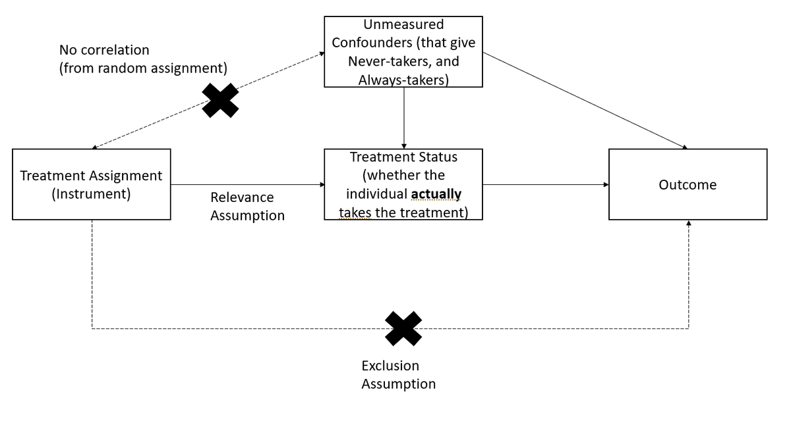
```

도구변수 관점에서 LATE는 다음과 같이 추정됩니다:

$$
LATE = \frac{ITT}{\text{순응자 비율 (Share of Compliers)}}
$$

여기서:

- ITT (의도 기반 처치 효과)는 처치에 배정되는 것 자체의 효과입니다.
- 순응자 비율은 처치에 배정되었을 때 실제로 처치를 받는 개체의 비율입니다.

#### LATE의 주요 성질

- 순응자의 비율이 증가할수록 [LATE](#sec-local-average-treatment-effects)는 [ITT](#sec-intention-to-treat-effect)로 수렴합니다.
- [LATE](#sec-local-average-treatment-effects)는 항상 [ITT](#sec-intention-to-treat-effect)보다 큽니다. ITT는 순응자와 비순응자 모두를 평균화하기 때문입니다.
- 표준오차 경험 법칙:
    - [LATE](#sec-local-average-treatment-effects)의 표준오차는 다음과 같습니다:

        $$
        SE(LATE) = \frac{SE(ITT)}{\text{순응자 비율}}
        $$
- LATE는 순수 위약 집단(Pure Placebo Group)을 사용하여 추정할 수도 있습니다 [@gerber2010].
- 부분적 순응(Partial Compliance)은 분석하기가 까다롭습니다.
- IV/2SLS 추정량은 소표본에서 편향될 수 있으므로 베이지안 보정 방법이 필요할 수 있습니다 [@long2010; @jin2009; @jin2008].


#### 단측 비순응 (One-Sided Noncompliance)

단측 비순응은 표본에서 순응자와 절대 미참여자만 관측되는 경우(즉, 항상 참여자가 없음)에 발생합니다.

##### 핵심 가정

- 배제 제약(Exclusion Restriction / Excludability): 절대 미참여자는 배정과 관계없이 동일한 결과를 갖습니다 (즉, 처치를 전혀 받지 않으므로 배정 자체가 이들에게 아무런 효과를 미치지 않음).
- 무작위 배정이 균형을 보장함: 절대 미참여자의 수는 처치 집단과 통제 집단에서 동일할 것으로 기대됩니다.

단측 비순응 하에서의 LATE 추정:

$$
LATE = \frac{ITT}{\text{순응자 비율}}
$$

절대 미참여자는 처치를 받지 않으므로 추정이 단순화됩니다.


#### 양측 비순응 (Two-Sided Noncompliance)

양측 비순응은 표본에서 순응자, 절대 미참여자, 항상 참여자가 모두 관측되는 경우에 발생합니다.

##### 핵심 가정

- 배제 제약(Excludability): 절대 미참여제와 항상 참여자는 처치 배정과 관계없이 동일한 결과를 갖습니다.
- 단조성 가정(Monotonicity Assumption, 거부자 부재):
    - 거부자가 존재하지 않습니다. 즉, 처치에 배정되었을 때 체계적으로 처치를 기피하는 개체가 없습니다.
    - 이 가정은 실증 연구에서 표준적으로 적용됩니다.

양측 비순응 하에서의 LATE 추정:

$$
LATE = \frac{ITT}{\text{순응자 비율}}
$$

- 항상 참여자는 배정과 관계없이 처치를 받으므로, 단조성이 성립하는 한 이들의 존재는 LATE를 편향시키지 않습니다.
- 실무에서 거부자는 매우 드물기 때문에 단조성 가정은 일반적으로 타당합니다.

+------------------------------------------------------+---------------------------------------+-------------------------------------------------------------------+------------------------------------------+
| 시나리오                                         | 측정 대상                         | 언제 사용하는가?                                              | 핵심 가정                            |
+======================================================+=======================================+===================================================================+==========================================+
| [의도 기반 처치 (ITT)](#sec-intention-to-treat-effect) | 처치에 배정되는 것의 효과             | 비순응이 존재하는 정책적 영향 평가                                | 없음 (무작위 배정 보존)                  |
+------------------------------------------------------+---------------------------------------+-------------------------------------------------------------------+------------------------------------------+
| [LATE](#sec-local-average-treatment-effects)         | 순응자에게만 미치는 효과              | 배정 자체가 아닌 실제 처치 효과에 관심이 있을 때                  | 배제 제약, 단조성 (거부자 부재)          |
+------------------------------------------------------+---------------------------------------+-------------------------------------------------------------------+------------------------------------------+

: 처치 비순응 하에서의 추정대상 비교


### 모집단 대 표본 평균 처치 효과 (Population vs. Sample ATE)

실험 및 관찰 연구에서 우리는 종종 유한한 표본을 사용하여 표본 평균 처치 효과(Sample Average Treatment Effect, SATE)를 추정합니다. 그러나 보다 폭넓은 일반화를 수행할 때 관심의 대상이 되는 모수는 모집단 평균 처치 효과(Population Average Treatment Effect, PATE)입니다.

핵심 문제:\
표본 선택 편향과 처치 불균형으로 인해 SATE는 PATE와 반드시 같지 않습니다.

SATE가 PATE와 달라지는 조건에 대한 심층적인 논의는 [@imai2008]을 참조하십시오.


크기가 $N$인 유한 모집단에서 크기가 $n$인 표본을 관측한다고 가정합니다 ($N \gg n$). 표본의 절반은 처치를 받고 절반은 통제 집단에 배정됩니다.

다음 지시변수들을 정의합니다:

- 표집 지시변수 (Sampling Indicator): \
    $$
      I_i =
      \begin{cases}
      1, & \text{개체 } i \text{가 표본에 포함된 경우} \\
      0, & \text{그렇지 않은 경우}
      \end{cases}
      $$

- 처치 배정 지시변수 (Treatment Assignment Indicator): \
    $$
    T_i =
    \begin{cases}
    1, & \text{개체 } i \text{가 처치 집단에 속한 경우} \\
    0, & \text{개체 } i \text{가 통제 집단에 속한 경우}
    \end{cases}
    $$

- 잠재적 결과 프레임워크: \
    $$
    Y_i =
    \begin{cases}
    Y_i(1), & T_i = 1 \text{ (처치)} \\
    Y_i(0), & T_i = 0 \text{ (통제)}
    \end{cases}
    $$

- 관측된 결과: \
    동일한 개체에 대해 두 잠재적 결과를 동시에 관측할 수 없으므로, 관측된 결과는 다음과 같습니다:

    $$
    Y_i | I_i = 1 = T_i Y_i(1) + (1 - T_i) Y_i(0)
    $$

- 진정한 개별 처치 효과: \
    개체 수준의 처치 효과는 다음과 같습니다:

    $$
    TE_i = Y_i(1) - Y_i(0)
    $$

그러나 $Y_i(1)$ 또는 $Y_i(0)$ 중 하나만 관측되므로 $TE_i$는 결코 직접 관측되지 않습니다.

#### SATE와 PATE의 정의

- 표본 평균 처치 효과 (SATE): $$
    SATE = \frac{1}{n} \sum_{i \in \{I_i = 1\}} TE_i
    $$ SATE는 표본 내에서의 평균 처치 효과입니다.

- 모집단 평균 처치 효과 (PATE): $$
    PATE = \frac{1}{N} \sum_{i=1}^N TE_i
    $$ PATE는 전체 모집단에 걸친 진정한 처치 효과를 나타냅니다.

모집단의 일부만을 관측하므로 SATE는 PATE와 일치하지 않을 수 있습니다.


#### 추정 오차의 분해

SATE와 PATE의 기본 추정량은 관측된 평균의 차이입니다:

$$
\begin{aligned}
D &= \frac{1}{n/2} \sum_{i \in (I_i = 1, T_i = 1)} Y_i - \frac{1}{n/2} \sum_{i \in (I_i = 1 , T_i = 0)} Y_i \\
&= \text{(처치 집단의 평균)} - \text{(통제 집단의 평균)}
\end{aligned}
$$

가법적 모델 하에서 추정 오차(진리로부터의 편차)를 $\Delta$로 정의합니다:

$$
Y_i(t) = g_t(X_i) + h_t(U_i)
$$

추정 오차는 다음과 같이 분해됩니다:

$$
\begin{aligned}
PATE - D = \Delta &= \Delta_S + \Delta_T \\
&= (PATE - SATE) + (SATE - D)\\
&= \text{표본 선택 편향} + \text{처치 불균형} \\
&= (\Delta_{S_X} + \Delta_{S_U}) + (\Delta_{T_X} + \Delta_{T_U}) \\
&= (\text{관측 가능성에 기인한 선택} + \text{관측 불가능성에 기인한 선택}) \\
&+ (\text{관측된 특성의 처치 불균형} + \text{관측되지 않은 특성의 처치 불균형})
\end{aligned}
$$

이를 더 자세히 설명하기 위해 총 불일치 $PATE - D$가 서로 다른 구성요소로 어떻게 분리되는지 명시적으로 정의합니다.

1단계: $PATE - D$에서 $\Delta_S + \Delta_T$로의 분해

$$
\underbrace{PATE - D}_{\Delta}
=
\underbrace{(PATE - SATE)}_{\Delta_S}
 +
\underbrace{(SATE - D)}_{\Delta_T}.
$$

- $PATE - D$: 진정한 모집단 처치 효과와 추정치 $D$ 사이의 총 불일치.
- $\Delta_S = PATE - SATE$: 표본 선택 편향 (표본 ATE가 모집단 ATE와 얼마나 다른지).
- $\Delta_T = SATE - D$: 처치 불균형 (추정된 처치 효과가 표본 ATE로부터 얼마나 벗어나는지).

2단계: 관측 가능 요인과 관측 불가능 요인으로 편향 세분화

각 편향 항은 관측된 요인($X$)과 관측되지 않은 요인($U$)으로 분해될 수 있습니다:

$$
\Delta_S
= \underbrace{\Delta_{S_X}}_{\text{관측된 요인에 의한 선택}}
+ \underbrace{\Delta_{S_U}}_{\text{관측되지 않은 요인에 의한 선택}}
$$

$$
\Delta_T
= \underbrace{\Delta_{T_X}}_{\text{관측된 요인의 처치 불균형}}
+ \underbrace{\Delta_{T_U}}_{\text{관측되지 않은 요인의 처치 불균형}}
$$

따라서 최종 식은 다음과 같습니다:

$$
\begin{aligned}
PATE - D &= \underbrace{(PATE - SATE)}_{\Delta_S:\text{표본 선택 편향}} 
+ 
\underbrace{(SATE - D)}_{\Delta_T:\text{처치 불균형}} \\
&= \underbrace{(\Delta_{S_X} + \Delta_{S_U})}_{X\text{에 의한 선택} + U\text{에 의한 선택}}
+
\underbrace{(\Delta_{T_X} + \Delta_{T_U})}_{X\text{의 불균형} + U\text{의 불균형}}.
\end{aligned}
$$

이러한 분해는 진정한 효과를 추정할 때 발생하는 오차의 원천을 명확히 밝혀주며 표본의 대표성(선택 편향)과 처치 배정의 차이(처치 불균형)를 구분하고 이를 다시 관측 가능한 부분과 관측되지 않는 부분으로 분리하여 파악할 수 있게 해줍니다.

##### 표본 선택 편향 ( $\Delta_S$ )

표본 선택 오차라고도 불리며 표본이 모집단을 대표하지 못할 때 발생합니다.

$$
\Delta_S = PATE - SATE = \frac{N - n}{N}(NATE - SATE)
$$

여기서:

- NATE(비표본 평균 처치 효과, Non-Sample Average Treatment Effect)는 표본에 포함되지 않은 모집단 부분의 평균 처치 효과입니다:

$$
NATE = \sum_{i\in (I_i = 0)} \frac{TE_i}{N-n}
$$

표본 선택 편향을 제거하려면 ($\Delta_S = 0$):

1. 표본을 모집단 전체로 재정의합니다 ($N = n$).
2. $NATE = SATE$가 되도록 보장합니다 (예: 표본에 포함된 단위와 포함되지 않은 단위 간에 처치 효과가 동질적이어야 함).

그러나 개체마다 처치 효과가 다를 때, 무작위 표집은 표본 선택 편향을 줄여주지만 표본 오차 자체를 완전히 제거하지는 못합니다.

##### 처치 불균형 오차 ( $\Delta_T$ )

처치 불균형 편향이라고도 불리며 처치 단위와 통제 단위의 경험적 분포가 다를 때 발생합니다.

$$
\Delta_T = SATE - D
$$

핵심 통찰:\
처치 집단과 통제 집단이 관측 가능한 특성($X$)과 관측되지 않은 특성($U$) 모두에서 균형을 이룰 때 $\Delta_T \to 0$이 됩니다.

관측되지 않은 특성을 직접 조정할 수는 없으므로 불균형 보정 방법은 관측 가능한 특성에 집중합니다.


#### (관측 가능한) 처치 불균형의 보정

그러나 실제 연구에서는:

- 우리는 관측 가능한 $X$만 조정할 수 있을 뿐, 관측되지 않는 $U$는 조정할 수 없습니다.
- 조정 후에도 관측되지 않는 요인의 잔여 불균형으로 인해 여전히 편향이 발생할 수 있습니다.

처치 불균형을 해결하기 위해 연구자들은 흔히 다음을 사용합니다:

1. 블록화 (구획화)[Randomized Block Designs]
2. 매칭 방법 (Matching Methods)


+----------------------------------------+-------------------------------------------------------------------------------------------------+---------------------------------------------------------------------------------------------------------------------------------------------------------------+
| 방법                               | 블록화[Randomized Block Designs]                                                          | 매칭 방법[Matching Methods]                                                                                                                             |
+========================================+=================================================================================================+===============================================================================================================================================================+
| 정의                               | 처치 전 공변량을 기반으로 미리 정의된 층(Strata) 내에서 무작위 배정 수행.                      | 처치 집단과 통제 집단 간의 공변량 균형을 맞추기 위해 관측치를 제외, 복제 또는 그룹화 [@rubin1973use].                                                       |
+----------------------------------------+-------------------------------------------------------------------------------------------------+---------------------------------------------------------------------------------------------------------------------------------------------------------------+
| 적용 시점                          | 처치 배정 전 (실험설계 단계).                                                                   | 처치 배정 후 (관찰 연구 단계).                                                                                                                                |
+----------------------------------------+-------------------------------------------------------------------------------------------------+---------------------------------------------------------------------------------------------------------------------------------------------------------------+
| 효과성                             | 층 내에서 정확한 균형을 보장하지만 세밀한 층화를 위해 대규모 표본이 필요할 수 있음.           | 균형을 개선할 수 있지만 공변량이 부적절하게 선택되면 오히려 편향을 증가시킬 위험이 있음.                                                                    |
+----------------------------------------+-------------------------------------------------------------------------------------------------+---------------------------------------------------------------------------------------------------------------------------------------------------------------+
| 공변량이 무관한 경우               | 처치 추정치에 영향 없음.                                                                        | 최악의 시나리오: 처치와는 무관하지만 결과와 상관된 공변량으로 매칭할 경우 편향이 감소하는 대신 오히려 증가할 수 있음.                                         |
+----------------------------------------+-------------------------------------------------------------------------------------------------+---------------------------------------------------------------------------------------------------------------------------------------------------------------+

| 이점                               | 관측 가능한 특성의 불균형을 제거함 ($\Delta_{T_X} = 0$).                                        | 모델 의존성, 편향, 분산 및 평균제곱오차(MSE)를 감소시킴.                                                                                                     |
|                                        |                                                                                                 |                                                                                                                                                               |
|                                        | 관측되지 않은 특성에 미치는 영향은 불확실함 (관측 불가능한 요인이 $X$와 상관된 경우 도움될 수 있음). | 매칭은 관측 가능한 특성만 균형을 맞추며 관측되지 않은 요인에 미치는 영향은 알 수 없음.                                                                       |
+----------------------------------------+-------------------------------------------------------------------------------------------------+---------------------------------------------------------------------------------------------------------------------------------------------------------------+

: 공변량 균형을 위한 블록화와 매칭 방법의 비교


### 처치집단 및 통제집단에 대한 평균 처치 효과 (ATT and ATC)

많은 실증 연구에서 연구자들은 전체 모집단이 아닌 특정 하위 모집단에 처치가 미치는 영향에 관심을 갖습니다. 흔히 사용되는 두 가지 처치 효과 지표는 다음과 같습니다:

1. 처치집단에 대한 평균 처치 효과 (ATT): 실제로 처치를 받은 개체들에게 나타난 처치 효과.
2. 통제집단에 대한 평균 처치 효과 (ATC): 처치를 받지 않은 개체들이 처치를 받았더라면 나타났을 처치 효과.

ATT, ATC, ATE 간의 차이를 이해하는 것은 [외적 타당성](#sec-external-validity)을 판단하고 맞춤형 정책을 설계하는 데 매우 중요합니다.


#### 처치집단에 대한 평균 처치 효과 (ATT) {#sec-average-treatment-effect-on-the-treated}

ATT는 실제로 처치를 받은 사람들만을 대상으로 기대되는 처치 효과를 측정합니다:

$$
\begin{aligned}
ATT &= E[Y_i(1) - Y_i(0) | D_i = 1] \\
&= E[Y_i(1) | D_i = 1] - E[Y_i(0) | D_i = 1]
\end{aligned}
$$

##### 주요 해석

- ATT는 처치를 받은 개체들이 가상의 반사실적 결과(처치를 받지 않았을 경우)와 비교하여 얼마나 더 나아졌는지(또는 나빠졌는지)를 알려줍니다.
- 처치에 스스로 참여(자발적 참여)한 사람들을 대상으로 개입의 효과성을 평가할 때 유용합니다.

#### 통제집단에 대한 평균 처치 효과 (ATC) {#sec-average-treatment-effect-on-the-control}

ATC는 처치를 받지 않은 사람들만을 대상으로 기대되는 처치 효과를 측정합니다:

$$
\begin{aligned}
ATC &= E[Y_i(1) - Y_i(0) | D_i = 0] \\
&= E[Y_i(1) | D_i = 0] - E[Y_i(0) | D_i = 0]
\end{aligned}
$$

##### 주요 해석

- ATC는 "처치를 받지 않은 사람들에게 처치가 주어졌다면 어떤 효과가 있었을까?"라는 질문에 답합니다.
- 개입을 미처치 모집단으로 확대 적용할 때 어떻게 일반화될 수 있는지를 이해하는 데 중요합니다.

#### ATT, ATC, ATE 간의 관계

무작위 배정 및 완전 순응 하에서는 다음이 성립합니다:

$$
ATE = ATT = ATC
$$

이유:

- 무작위 배정은 처치 전 처치 집단과 통제 집단이 통계적으로 동일하도록 보장합니다.
- 따라서 집단 간 처치 효과가 동일하므로 ATT = ATC = ATE가 됩니다.

그러나 관찰 연구 환경에서는 선택 편향과 처치 이질성으로 인해 ATT와 ATC가 ATE와 달라질 수 있습니다.


#### 표본 처치집단 평균 처치 효과 (SATT) {#sec-sample-average-treatment-effect-on-the-treated}

표본 ATT (SATT)는 유한 표본에서 ATT를 경험적으로 추정한 값입니다:

$$
SATT = \frac{1}{n} \sum_{i \in D_i = 1} TE_i
$$

여기서:

- $TE_i = Y_i(1) - Y_i(0)$는 개체 $i$의 처치 효과입니다.
- $n$은 표본 내 처치 단위의 수입니다.
- 합산은 표본 내 처치 단위에 대해서만 이루어집니다.

#### 모집단 처치집단 평균 처치 효과 (PATT) {#sec-population-average-treatment-effect-on-the-treated}

모집단 ATT (PATT)는 ATT를 전체 처치 모집단으로 일반화합니다:

$$
PATT = \frac{1}{N} \sum_{i \in D_i = 1} TE_i
$$

여기서:

- $TE_i = Y_i(1) - Y_i(0)$는 개체 $i$의 처치 효과입니다.
- $N$은 모집단 내 총 처치 단위의 수입니다.
- 합산은 모집단 내의 모든 처치 개체에 대해 이루어집니다.

표본이 무작위로 추출된 경우 $SATT \approx PATT$이지만 표본이 대표성을 갖지 못하면 $SATT$는 $PATT$를 과대평가하거나 과소평가할 수 있습니다.


#### ATT와 ATC가 ATE와 달라지는 경우

실제 연구에서 ATT와 ATC는 처치 효과의 이질성과 선택 편향으로 인해 종종 ATE와 다릅니다.

##### ATT에서의 선택 편향

개체가 처치를 스스로 선택하는 경우, 처치 집단은 통제 집단과 체계적으로 다를 수 있습니다.

- 예시:
    - 직무 훈련 프로그램이 자발적 참여로 운영된다고 가정합니다.
    - 참여하는 사람들은 참여하지 않는 사람들보다 동기부여가 더 잘 되어 있거나 더 나은 역량을 가지고 있을 수 있습니다.
    - 결과적으로 처치 효과(ATT)는 미참여 집단(ATC)으로 일반화되지 않을 수 있습니다.

이는 처치 배정이 무작위가 아닌 한 다음을 의미합니다:

$$
ATT \neq ATC
$$

##### 처치 효과의 이질성 (Treatment Effect Heterogeneity)

처치 효과가 개체마다 다른 경우:

- 하위 집단 간 처치 효과의 차이에 따라 ATT는 ATE보다 크거나 작을 수 있습니다.
- 미처치 집단이 처치에 다르게 반응했을 경우 ATC는 ATT보다 크거나 작을 수 있습니다.

예시:

- 장학금 프로그램은 고소득층 학생보다 저소득층 학생에게 더 큰 혜택을 줄 수 있습니다.
- 저소득층 학생이 장학금을 신청할 가능성이 더 높다면 ATT \> ATE가 됩니다.
- 반면 (장학금을 받지 않은) 고소득층 학생이 장학금을 받았을 때 얻는 혜택이 더 적다면 ATC \< ATE가 됩니다.

따라서 다음과 같은 결과를 관찰할 수 있습니다:

$$
ATE \neq ATT \neq ATC
$$

+----------------------------------------+---------------------------------------------------------+---------------------------------------------------------------+------------------------------------------+
| 처치 효과                          | 정의                                                | 사용 사례                                                 | 잠재적 문제                          |
+========================================+=========================================================+===============================================================+==========================================+
| ATE (평균 처치 효과)               | 무작위로 선택된 개체에 대한 효과                        | 전체 모집단에 적용 가능한 정책 결정                           | 완전한 무작위 배정 필요                  |
+----------------------------------------+---------------------------------------------------------+---------------------------------------------------------------+------------------------------------------+
| ATT (처치집단 평균 처치 효과)      | 실제로 처치를 받은 대상에 대한 효과                     | 타깃 집단을 위한 개입의 효과성 평가                           | 자발적 참여 시 선택 편향 발생            |
+----------------------------------------+---------------------------------------------------------+---------------------------------------------------------------+------------------------------------------+
| ATC (통제집단 평균 처치 효과)      | 비처치 개체에게 처치가 주어졌을 때의 효과               | 신규 모집단에 대한 처치 효과 예측                             | 일반화되지 않을 수 있음                  |
+----------------------------------------+---------------------------------------------------------+---------------------------------------------------------------+------------------------------------------+

: 처치 효과 추정대상 비교: ATE, ATT, ATC


### 분위수 평균 처치 효과 (Quantile Average Treatment Effects) {#sec-quantile-average-treatment-effects}

평균 효과([ATE](#sec-average-treatment-effect))에만 집중하는 대신, 분위수 처치 효과(Quantile Treatment Effects, QTE)는 처치가 결과변수의 전체 분포를 어떻게 변화시키는지 이해할 수 있도록 도와줍니다.

분위수 $\tau$에서의 분위수 처치 효과는 다음과 같이 정의됩니다:

$$
QTE_{\tau} = Q_{\tau} (Y_1) - Q_{\tau} (Y_0)
$$

여기서:

- $Q_{\tau} (Y_1)$은 처치 하에서의 결과 분포의 $\tau$번째 분위수입니다.
- $Q_{\tau} (Y_0)$은 통제 하에서의 결과 분포의 $\tau$번째 분위수입니다.

#### QTE를 사용하는 경우

- 이질적 처치 효과: 개체마다 처치 효과가 다르다면 ATE는 오해를 부를 수 있습니다.
- 정책 타깃팅: 정책 입안자는 평균 효과보다 저소득층(예: 하위 25%)에 더 많은 관심을 가질 수 있습니다.
- 분포의 변화: QTE를 통해 처치가 불평등을 심화시키는지(예: 가난한 사람보다 부유한 사람에게 더 큰 혜택을 주는지) 평가할 수 있습니다.

#### QTE의 추정

QTE는 다음을 통해 추정할 수 있습니다:

- 분위수 회귀분석 (Quantile Regression): 선형 회귀를 확장하여 서로 다른 분위수에서의 효과를 추정합니다.
- QTE를 위한 도구변수: 내생성이 존재하는 상황에서 인과 효과를 추정하기 위해 추가적인 가정이 필요합니다 [@abadie2002instrumental; @chernozhukov2005iv].

#### 예시: 임금 정책의 영향

- 최저임금 인상이 도입되었다고 가정합니다.
- ATE는 소득에 미치는 작지만 긍정적인 효과를 보여줄 수 있습니다.
- 그러나 QTE는 다음을 밝혀낼 수 있습니다:
    - 하위 분위수에서는 효과 없음 (일자리를 잃은 노동자의 경우).
    - 중앙값에서는 긍정적인 효과.
    - 상위 분위수에서는 매우 강한 긍정적 효과 (가장 큰 혜택을 받는 숙련 노동자의 경우).

따라서 QTE는 전체 소득 분포에 걸친 처치 효과에 대해 훨씬 더 상세한 시각을 제공합니다.


### 이진 결과에 대한 로그 오즈 처치 효과 (Log-Odds Treatment Effects for Binary Outcomes) {#sec-log-odds-treatment-effects-for-binary-outcomes}

결과변수가 이진형(Binary)인 경우(예: 성공/실패, 취업/실업, 생존/사망), 처치 효과를 로그 오즈(Log-odds) 형태로 측정하는 것이 유용할 때가 많습니다.

이진 결과 $Y$에 대해 성공 확률을 다음과 같이 정의합니다:

$$
P(Y = 1 | D = d)
$$

처치 집단과 통제 집단 하에서의 성공의 로그 오즈는 다음과 같습니다:

$$
\text{Log-odds}(Y | D = 1) = \log \left( \frac{P(Y = 1 | D = 1)}{1 - P(Y = 1 | D = 1)} \right)
$$

$$
\text{Log-odds}(Y | D = 0) = \log \left( \frac{P(Y = 1 | D = 0)}{1 - P(Y = 1 | D = 0)} \right)
$$

로그 오즈 처치 효과(Log-Odds Treatment Effect, LOTE)는 다음과 같습니다:

$$
LOTE = \text{Log-odds}(Y | D = 1) - \text{Log-odds}(Y | D = 0)
$$

이는 처치가 성공의 상대적 가능성에 비선형적으로 어떤 영향을 미치는지를 포착합니다.

#### 로그 오즈 처치 효과를 사용하는 경우

- 이진 결과: 처치 결과가 0 또는 1인 경우 (예: 취업/실업).
- 비선형 처치 효과: 효과가 가법적(Additive)이라기보다 승법적(Multiplicative)으로 작용하는 상황을 다룰 때 유용합니다.
- 희귀 사건 (Rare Events): 결과 발생 확률이 매우 작거나 매우 큰 경우에 적합합니다.

#### 로그 오즈 처치 효과의 추정

- 처치 지시변수를 포함한 로지스틱 회귀: $$
    \log \left( \frac{P(Y = 1 | D = 1)}{1 - P(Y = 1 | D = 1)} \right) = \beta_0 + \beta_1 D
    $$ 여기서 $\beta_1$은 로그 오즈 처치 효과를 나타냅니다.

- 무작위 배정 기반 추정: @freedman2008randomization 은 일치하는 추정을 보장하는 무작위 시험 프레임워크를 제공합니다.

- 귀속 효과 (Attributable Effects): [@rosenbaum2002attributing]의 방법과 같은 대안적 접근법은 처치에 기인하는 사례의 비율을 추정합니다.


### 처치 효과 추정대상 요약표

+------------------------------------------------------------------------------------------------+---------------------------------------------------------------------------------------------------------+-------------------------------------------------------------------------------------+------------------------------------------------------------------------------------------------+--------------------------------------------------------------------------------+
| 처치 효과                                                                                  | 정의                                                                                                | 사용 사례                                                                       | 핵심 가정                                                                                  | ATE와 달라지는 경우                                                        |
+================================================================================================+=========================================================================================================+=====================================================================================+================================================================================================+================================================================================+
| [평균 처치 효과 (ATE)](#sec-average-treatment-effect)                                          | 모집단에서 무작위로 선택된 개체에 대한 기대 처치 효과.                                                  | 전반적인 정책 평가; 총체적 영향 측정.                                               | 무작위 배정 또는 강한 무시가능성 (처치 배정이 잠재적 결과와 독립임).                           | \-                                                                             |
+------------------------------------------------------------------------------------------------+---------------------------------------------------------------------------------------------------------+-------------------------------------------------------------------------------------+------------------------------------------------------------------------------------------------+--------------------------------------------------------------------------------+
| [조건부 평균 처치 효과 (CATE)](#sec-conditional-average-treatment-effect-)                     | 공변량 $X$를 조건부로 한 특정 하위 모집단에 대한 처치 효과.                                             | 이질적 효과 식별; 타깃 개입에 유용함.                                               | 처치 효과의 이질성이 존재해야 함.                                                              | 하위 집단 간에 처치 효과가 다를 때 발생.                                       |
+------------------------------------------------------------------------------------------------+---------------------------------------------------------------------------------------------------------+-------------------------------------------------------------------------------------+------------------------------------------------------------------------------------------------+--------------------------------------------------------------------------------+
| [의도 기반 처치 효과 (ITT)](#sec-intention-to-treat-effect)                                    | 실제 순응 여부와 관계없이 처치에 배정된 것 자체의 효과.                                                 | 비순응이 존재하는 정책 평가.                                                        | 무작위 처치 배정이 불편 추정을 보장함.                                                         | 배정된 모든 개체가 순응하지 않을 때 ATE보다 작아짐.                            |
+------------------------------------------------------------------------------------------------+---------------------------------------------------------------------------------------------------------+-------------------------------------------------------------------------------------+------------------------------------------------------------------------------------------------+--------------------------------------------------------------------------------+
| [국소 평균 처치 효과 (LATE)](#sec-local-average-treatment-effects)                             | 순응자(배정받았을 때에만 처치를 받는 개체)에게만 미치는 처치 효과.                                      | 순응도가 불완전할 때 순응자에 대한 효과 분리.                                       | 단조성 (거부자 부재); 도구변수는 오직 처치를 통해서만 결과에 영향을 미침.                     | 순응이 선택적으로 이루어질 때 ATE와 달라짐.                                    |
+------------------------------------------------------------------------------------------------+---------------------------------------------------------------------------------------------------------+-------------------------------------------------------------------------------------+------------------------------------------------------------------------------------------------+--------------------------------------------------------------------------------+
| [처치집단 평균 처치 효과 (ATT)](#sec-average-treatment-effect-on-the-treated)                  | 실제로 처치를 받은 대상에게 나타난 처치 효과.                                                           | 처치에 스스로 참여한 사람들을 대상으로 효과성을 평가할 때 사용.                     | 처치 집단 내에 측정되지 않은 교란요인이 없어야 함.                                             | 처치 선택이 무작위가 아닐 때 발생.                                             |
+------------------------------------------------------------------------------------------------+---------------------------------------------------------------------------------------------------------+-------------------------------------------------------------------------------------+------------------------------------------------------------------------------------------------+--------------------------------------------------------------------------------+
| [통제집단 평균 처치 효과 (ATC)](#sec-average-treatment-effect-on-the-control)                  | 처치를 받지 않은 개체들이 처치를 받았더라면 나타났을 처치 효과.                                         | 미처치 모집단으로 프로그램을 확대할 때의 효과 예측.                                 | 통제 집단 내에 측정되지 않은 교란요인이 없어야 함.                                             | 처치 효과가 이질적일 때 발생.                                                  |
+------------------------------------------------------------------------------------------------+---------------------------------------------------------------------------------------------------------+-------------------------------------------------------------------------------------+------------------------------------------------------------------------------------------------+--------------------------------------------------------------------------------+
| [표본 평균 처치 효과 (SATE)](#sec-sample-average-treatment-effect-on-the-treated)              | 표본 내에서 추정된 처치 효과.                                                                           | 특정 표본 내에서 처치를 평가할 때 사용.                                             | 외적 타당성을 위해 표본이 모집단을 대표해야 함.                                                | 표본이 모집단을 대표하지 못할 때 발생.                                         |
+------------------------------------------------------------------------------------------------+---------------------------------------------------------------------------------------------------------+-------------------------------------------------------------------------------------+------------------------------------------------------------------------------------------------+--------------------------------------------------------------------------------+
| [모집단 평균 처치 효과 (PATE)](#sec-population-average-treatment-effect-on-the-treated)         | 전체 모집단에 대한 기대 처치 효과.                                                                      | 정책 설계 및 대규모 의사결정.                                                       | 표본 선택이 무작위여야 함.                                                                     | 표본 선택 편향이 존재할 때 발생.                                               |
+------------------------------------------------------------------------------------------------+---------------------------------------------------------------------------------------------------------+-------------------------------------------------------------------------------------+------------------------------------------------------------------------------------------------+--------------------------------------------------------------------------------+
| [분위수 처치 효과 (QTE)](#sec-quantile-average-treatment-effects)                               | 결과 분포의 특정 백분위수에서의 처치 효과.                                                              | 평균 효과 대신 분포적 영향을 이해하고자 할 때 사용.                                 | 순위 보존(Rank preservation) 또는 단조성 가정이 필요할 수 있음.                                | 결과 분위수에 따라 처치 효과가 다를 때 발생.                                   |
+------------------------------------------------------------------------------------------------+---------------------------------------------------------------------------------------------------------+-------------------------------------------------------------------------------------+------------------------------------------------------------------------------------------------+--------------------------------------------------------------------------------+
| [로그 오즈 처치 효과 (LOTE)](#sec-log-odds-treatment-effects-for-binary-outcomes)             | 이진 결과에 미치는 처치 효과를 로그 오즈 형태로 표현.                                                   | 결과가 이분형(예: 취업/실업, 생존/사망)일 때 사용.                                  | 로지스틱 모델 가정이 성립해야 함.                                                              | 처치 효과가 비선형적이거나 결과 발생 확률이 낮을 때 발생.                      |
+------------------------------------------------------------------------------------------------+---------------------------------------------------------------------------------------------------------+-------------------------------------------------------------------------------------+------------------------------------------------------------------------------------------------+--------------------------------------------------------------------------------+

: 처치 효과 추정대상 비교

<!-- ========================================= -->
<!-- Chapter: 21.1-part-ex-design.Rmd -->
<!-- ========================================= -->


# (PART\*) A. 실험설계 (EXPERIMENTAL DESIGN) {-}


<!-- ========================================= -->
<!-- Chapter: 22-experiment.Rmd -->
<!-- ========================================= -->


# 실험설계 (Experimental Design) {#sec-experimental-design}

본 장에서는 A/B 테스팅, 소비자 행동 연구, 시장 조사와 같은 비즈니스 실험에서의 응용에 초점을 맞추어 실험설계(Experimental Design)의 기본 원리를 다룹니다. 먼저 핵심 용어를 정의하고 인과관계를 규명하는 데 있어 무작위 배정(Randomization)이 왜 표준(Gold standard)으로 간주되는지 설명합니다. 본 장에서는 완전 무작위 배정 설계(Completely Randomized Designs), 요인 설계(Factorial Designs), 교차 시험(Crossover Trials)을 포함한 고전적 및 고급 설계를 폭넓게 다룹니다. 또한 선택 문제(Selection Problem)와 편향이 초래하는 결과에 대해 심도 있게 논의합니다. 블록화(Blocking), 층화(Stratification), 요인 조작(Factorial Manipulation)과 같은 주제를 실무적 구현 관점에서 탐구합니다. 처치 배정 메커니즘을 설명하기 위해 통계적 표기법을 도입하고 복잡한 개념을 명확히 전달하기 위해 시각적 다이어그램을 활용합니다. 나아가 독자들이 실제 비즈니스 환경의 복잡성에 대비할 수 있도록 최근 연구 동향과 전통적 설계의 한계점도 함께 살펴봅니다.

신규 광고 캠페인이 매출을 증대시킬지 결정하려는 마케팅 관리자나, 세제 혜택이 소비자 지출에 미치는 영향을 조사하는 경제학자를 상상해 보십시오. 두 경우 모두 단순한 상관관계가 아닌 인과 효과를 규명할 수 있는 방법이 필요합니다. 바로가 지점에서 실험설계가 필수적인 도구가 됩니다.

실험설계의 핵심은 연구가 효율적으로 수행되고 타당한 결론을 도출할 수 있도록 보장하는 것입니다. 비즈니스 응용에서 실험은 가격 책정 전략, 마케팅 전술, 금융 개입의 효과를 정량화하는 데 도움을 줍니다. 잘 설계된 실험은 편향을 줄이고 변동성을 통제하며 인과추론의 정확성을 극대화합니다.


## 실험설계의 기본 원칙 (Principles of Experimental Design)

잘 설계된 실험은 다음 세 가지 핵심 원칙을 따릅니다:

1. 무작위 배정 (Randomization): 피험자 또는 실험 단위를 여러 그룹에 무작위로 배정하여 선택 편향(Selection Bias)을 제거합니다.
2. 반복 (Replication): 다수의 대상을 대상으로 실험을 반복하여 추정치의 정밀도(Precision)를 높입니다.
3. 통제 (Control): 통제 집단(Control Group)이나 기준 조건을 사용하여 교란요인을 최소화하고 처치 효과만을 분리해냅니다.

이러한 원칙 외에도 블록화(Blocking)와 요인 설계(Factorial Designs)를 통해 실험의 정확도를 더욱 향상시킬 수 있습니다.


## 인과추론의 표준: 무작위 대조 시험 (Randomized Controlled Trials) {#sec-the-gold-standard-randomized-controlled-trials}

무작위 대조 시험(Randomized Controlled Trials, RCT)은 인과추론의 가장 확실한 표준(Gold standard)입니다. RCT의 강력한 힘은 무작위 배정(Random Assignment)에서 비롯되며 이는 처치 집단과 통제 집단 간의 차이가 오직 개입(처치)에 의해서만 발생하도록 보장합니다.

RCT는 다음을 제공합니다:

- 처치 효과에 대한 불편추정치(Unbiased estimates)
- 평균적으로 교란요인의 제거 (비록 무작위 추출에 의해 공변량 불균형이 발생할 수 있어, @tukey1993tightening 이 제시한 "플래티넘 표준"을 달성하기 위해 [재무작위화(Re-randomization)](#sec-re-randomization)와 같은 기법이 필요할 수 있습니다.)

RCT는 두 개의 그룹으로 구성됩니다:

1. 처치 집단(Treatment group): 개입을 받는 집단 (예: 신규 마케팅 캠페인, 신약, 금융 인센티브).
2. 통제 집단(Control group): 개입을 받지 않고 기준선 역할을 하는 집단.

동일한 모집단에서 추출된 대상들이 두 그룹 중 하나에 무작위로 배정됩니다. 이러한 무작위성은 결과에서 관찰되는 차이가 외부 요인이 아닌 오직 처치 자체에 기인하도록 보장합니다.

그러나 RCT는 처치와 환경을 엄격하게 통제할 수 있는 자연과학/의학 분야에서 수행하기가 더 수월합니다. 사회과학 분야에서는 다음과 같은 이유로 여러 과제에 직면합니다:

- 인간의 행동은 예측하기 어렵습니다.
- 일부 처치는 적용이 불가능하거나 비윤리적입니다 (예: 특정 개인을 빈곤 상태에 무작위 배정).
- 현실 세계의 환경을 통제하기 어렵습니다.

이러한 문제를 해결하기 위해 사회과학자들은 실험 환경을 근사하는 [준실험 방법론(Quasi-Experimental Methods)](#sec-quasi-experimental)을 사용합니다.

RCT는 [내적 타당성(Internal Validity)](#sec-internal-validity)을 확립하여 관찰된 처치 효과를 인과적으로 해석 가능하게 만듭니다. 비록 무작위 배정이 *다른 모든 조건이 동일하다(ceteris paribus)*는 것과 완전히 같은 의미는 아니지만 유사한 효과를 달성합니다. 즉, 평균적으로 처치 집단과 통제 집단은 비교 가능해집니다.


## 선택 문제 (Selection Problem)

인과추론의 근본적인 어려움은 동일한 개인에 대해 두 가지 잠재적 결과를 동시에 관찰할 수 없고 둘 중 하나만 관찰할 수 있다는 점입니다. 이로 인해 선택 문제(Selection Problem)가 발생하며 이를 아래에서 정형화합니다.

다음을 가정합니다:

- 이진 처치 변수:\
    $D_i \in \{0,1\}$:
    - $D_i = 1$: 개체 $i$가 처치를 받음.
    - $D_i = 0$: 개체 $i$가 처치를 받지 않음.
- 관심 결과변수:\
    $Y_i$ (개체가 처치를 받았는지 여부에 따라 달라짐):
    - $Y_{0i}$: 처치를 받지 않았을 때의 결과.
    - $Y_{1i}$: 처치를 받았을 때의 결과.

따라서 잠재적 결과 프레임워크(Potential Outcomes Framework)는 다음과 같이 정의됩니다:

$$
\text{잠재적 결과} =
\begin{cases}
Y_{1i}, & D_i = 1 \quad (\text{처치}) \\
Y_{0i}, & D_i = 0 \quad (\text{미처치/통제})
\end{cases}
$$

그러나 우리는 개체당 단 하나의 결과만을 관측할 수 있습니다:

$$
Y_i = Y_{0i} + (Y_{1i} - Y_{0i})D_i
$$

이는 특정 개인에 대해 $Y_{1i}$ 또는 $Y_{0i}$ 중 하나만을 관측할 뿐, 둘 다를 동시에 관측할 수는 없음을 의미합니다. 타임머신을 발명하지 않는 한 반사실(Counterfactual)을 직접 관측할 수 없으므로, 처치 효과를 추정하기 위해 통계적 추론에 의존해야 합니다.

### 결과의 관측된 차이

우리의 목표는 처치 집단과 미처치 집단 간의 기대 결과 차이를 추정하는 것입니다:

$$
E[Y_i | D_i = 1] - E[Y_i | D_i = 0]
$$

이 식을 전개하면:

$$
\begin{aligned}
E[Y_i | D_i = 1] - E[Y_i | D_i = 0] &= (E[Y_{1i} | D_i = 1] - E[Y_{0i}|D_i = 1] ) \\
&+ (E[Y_{0i} |D_i = 1] - E[Y_{0i} |D_i = 0]) \\
&= (E[Y_{1i}-Y_{0i}|D_i = 1] ) \\
&+ (E[Y_{0i} |D_i = 1] - E[Y_{0i} |D_i = 0])
\end{aligned}
$$

이 방정식은 관측된 차이를 두 가지 구성요소로 분해합니다:

- 처치집단에 대한 처치 효과(ATT): $E[Y_{1i} - Y_{0i} |D_i = 1]$, 실제로 처치를 받은 사람들에게 미친 처치의 인과적 영향.
- 선택 편향(Selection Bias): $E[Y_{0i} |D_i = 1] - E[Y_{0i} |D_i = 0]$, 처치가 전혀 없었더라도 처치 집단과 통제 집단 사이에 존재했을 체계적인 차이.

따라서 결과의 관측된 차이는 다음과 같습니다:

$$
\text{관측된 차이} = \text{ATT} + \text{선택 편향}
$$

### 무작위 배정을 통한 선택 편향의 제거

처치의 무작위 배정이 이루어지면 $D_i$는 잠재적 결과와 독립이 됩니다:

$$
E[Y_i | D_i = 1] - E[Y_i|D_i = 0] = E[Y_{1i} - Y_{0i}]
$$

이것이 성립하는 이유는 진정한 무작위 배정 하에서 다음이 만족되기 때문입니다:

$$
E[Y_{0i} | D_i = 1] = E[Y_{0i} | D_i = 0]
$$

이로 인해 선택 편향이 완전히 사라집니다. 결과적으로 관측된 차이는 진정한 인과 효과를 직접 추정하게 됩니다:

$$
E[Y_i | D_i = 1] - E[Y_i | D_i = 0] = E[Y_{1i} - Y_{0i}]
$$

따라서 [무작위 대조 시험](#sec-the-gold-standard-randomized-controlled-trials)은 [평균 처치 효과(ATE)](#sec-average-treatment-effect)의 불편추정치를 제공합니다.


### 회귀분석을 통한 또 다른 표현

지금까지는 기댓값과 잠재적 결과를 사용하여 선택 문제를 다루었습니다. 처치 효과를 나타내는 또 다른 유용한 방법은 실무적인 추정 프레임워크를 제공하는 회귀 모델을 통하는 것입니다.

처치 효과가 모든 개인에 대해 일정(상수 효과)하다고 가정해 보겠습니다:

$$
Y_{1i} - Y_{0i} = \rho
$$

이는 기준선 결과($Y_{0i}$)는 개인마다 다를 수 있지만 처치를 받은 모든 개인이 동일한 처치 효과($\rho$)를 경험한다는 것을 의미합니다.

우리는 잠재적 결과 중 하나만을 관찰하므로 관찰된 결과는 다음과 같이 표현될 수 있습니다:

$$
\begin{aligned}
Y_i &= E(Y_{0i}) + (Y_{1i} - Y_{0i}) D_i + [Y_{0i} - E(Y_{0i})] \\
&= \alpha + \rho D_i + \eta_i
\end{aligned}
$$

여기서:

- $\alpha = E(Y_{0i})$: 미처치 개체들의 기대 결과.
- $\rho$: 인과적 처치 효과.
- $\eta_i = Y_{0i} - E(Y_{0i})$: 미처치 결과의 평균으로부터의 개별 편차.

따라서 회귀 모델은 처치 효과를 표현하는 직관적인 방법을 제공합니다.

#### 조건부 기댓값과 선택 편향

처치 상태를 조건부로 기댓값을 취하면:

$$
\begin{aligned}
E[Y_i |D_i = 1] &= \alpha + \rho + E[\eta_i |D_i = 1] \\
E[Y_i |D_i = 0] &= \alpha + E[\eta_i |D_i = 0]
\end{aligned}
$$

처치 집단과 미처치 집단 간의 관측된 평균 차이는 다음과 같습니다:

$$
E[Y_i |D_i = 1] - E[Y_i |D_i = 0] = \rho + E[\eta_i |D_i = 1] - E[\eta_i |D_i = 0]
$$

여기서 $E[\eta_i |D_i = 1] -E[\eta_i |D_i = 0]$ 항은 회귀 오차항($\eta_i$)과 처치 변수($D_i$) 사이의 상관관계, 즉 선택 편향을 나타냅니다.

무작위 배정 하에서는 잠재적 결과가 처치($D_i$)와 독립이라고 가정합니다:

$$
E[\eta_i |D_i = 1] -E[\eta_i |D_i = 0] = E[Y_{0i} |D_i = 1] -E[Y_{0i}|D_i = 0] = 0
$$

따라서 진정한 무작위 배정 하에서는 선택 편향이 사라지고 관측된 차이가 인과 효과 $\rho$를 직접 추정합니다.


#### 추가 변수 통제

실제 현실에서는 무작위 배정이 불완전하여 선택 편향이 여전히 존재할 수 있습니다. 이를 완화하기 위해 인구통계학적 특성, 기업 규모, 이전 구매 행동과 같은 통제변수 ($X_i$)를 도입합니다.

$X_i$가 처치($D_i$)와 상관되지 않는 경우, 회귀 모델에 이를 포함해도 $\rho$ 추정치에 편향이 생기지 않으며 다음과 같은 두 가지 이점을 얻습니다:

1. 잔차 분산($\eta_i$)을 줄여 $\rho$의 정밀도를 향상시킵니다.
2. 추가적인 변동성 원천을 설명하여 모델을 더욱 강건하게 만듭니다.

따라서 확장된 회귀 모델은 다음과 같습니다:

$$
Y_i = \alpha + \rho D_i + X_i'\gamma + \eta_i
$$

여기서:

- $X_i$는 통제변수 벡터를 나타냅니다.
- $\gamma$는 $X_i$가 결과에 미치는 효과를 포착합니다.

#### 예시: 채용에서의 인종 차별

@bertrand2004emily 의 유명한 연구는 동일한 입사 지원서에 흑인식 이름과 백인식 이름을 무작위로 배정하여 채용 과정에서의 인종 차별을 조사했습니다. 저자들은 이름을 무작위로 배정함으로써 교육 및 경력과 같은 교란요인을 제거하여 인종이 면접 연락률에 미치는 인과 효과를 추정할 수 있었습니다.


## 실험설계에서의 분산 감소 기법 (Variance Reduction) {#sec-variance-reduction}

무작위 배정은 평균의 차이가 평균 처치 효과의 불편추정치임을 보장하지만 정밀도(Precision)에 대해서는 아무것도 보장하지 않습니다. 지출액, 매출, 체류 시간, 트레이딩 손익과 같이 결과변수에 노이즈가 많은 경우 작은 효과라도 감지하려면 대규모 표본이 필요합니다. 분산 감소 기법(Variance Reduction Methods)은이 문제를 직접적으로 해결합니다. 이 방법들은 무작위 배정 전에 확정된 정보를 활용하여 결과변수를 조정함으로써 추정량의 기댓값을 왜곡하지 않고 표준오차를 줄입니다. 현대 온라인 실험에서 이러한 보정 기법은 가장 적은 비용으로 가장 높은 효과를 얻을 수 있는 개선책 중 하나입니다 [@deng2013improving].

본 절에서는 실무에서 널리 활용되는 두 가지 대표적인 보정 기법을 다룹니다. CUPED는 실험 전 공변량(주로 동일 지표의 실험 전 기간 데이터)을 사용합니다. CUPAC은 과거 데이터로 학습된 머신러닝 모델의 예측값으로 해당 공변량을 대체하여가 아이디어를 일반화합니다. 두 기법 모두 회귀 조정(Regression Adjustment)으로 환원되며 본서의 다른 장에서 다루는 이중차분법(Difference-in-Differences)의 논리와도 밀접하게 연결됩니다.


### CUPED

CUPED(Controlled-experiment Using Pre-Experiment Data)는 결과변수와 상관되어 있지만 구조적으로 무작위 처치 배정과는 독립인 처치 전 공변량을 사용하여 각 단위의 결과변수를 보정하는 방법입니다 [@deng2013improving]. 공변량이 처치 전에 측정되었기 때문에 공변량의 배수를 빼도 편향이 발생하지 않으며 적절하게 선택된 배수는 예측 가능한 노이즈를 효과적으로 제거합니다.

#### 설정 및 표기법

$i = 1, \dots, n$을 사용자, 고객, 계정 등의 실험 단위를 나타내는 인덱스라고 합니다. 처치 배정은 무작위로 이루어지는 $T_i \in \{0,1\}$입니다. 잠재적 결과는 $Y_i(1)$과 $Y_i(0)$이며 관측된 결과는 $Y_i = T_i Y_i(1) + (1 - T_i) Y_i(0)$입니다. 실험 전 공변량 $X_i$는 무작위 배정 전에 측정됩니다. 가장 대표적인 선택은 지난주 지출액과 같은 동일 결과변수의 실험 전 기간 값이며 기기 종류나 지역과 같이 안정적인 배정 차원도 사용될 수 있습니다.

CUPED가 요구하는 유일한 가정은 처치 배정이 공변량과 독립이라는 것입니다:

$$
T_i \perp X_i
$$

이는 $X_i$가 측정된 후에 무작위 배정이 이루어지고 실험으로부터 공변량으로의 역유출(Leakage)이 없을 때 항상 성립합니다.

#### CUPED 추정량

CUPED는 다음과 같이 보정된 결과변수를 정의합니다:

$$
Y_i^{\text{cuped}} = Y_i - \theta\left(X_i - \mathbb{E}[X]\right)
$$

그리고 보정된 결과변수의 평균 차이로 처치 효과를 추정합니다:

$$
\hat{\tau}_{\text{cuped}} = \bar{Y}^{\text{cuped}}_1 - \bar{Y}^{\text{cuped}}_0
= \left(\bar{Y}_1 - \bar{Y}_0\right) - \theta\left(\bar{X}_1 - \bar{X}_0\right)
$$

즉, CUPED는 일반적인 평균 차이에서 두 군 간 공변량의 우연한 불균형에 $\theta$를 곱한 값을 뺀 것입니다. 보정이 배정과 상호작용하여 전체적인 수준을 이동시키지 않도록 $X_i$를 $\mathbb{E}[X]$(실무에서는 표본 평균 $\bar{X}$)을 중심으로 중심화(Centering)합니다. 중심화는 아래 회귀 형태에서 절편에 명확한 해석을 제공합니다.

#### 추정된 $\theta$ 하에서의 불편성

확률 변수를 뺀다는 점 때문에 추정치에 편향이 생기지 않을까 우려할 수 있지만 그렇지 않습니다.

$$
\hat{\tau}_{\text{cuped}} = \hat{\tau}_{\text{diff}} - \theta(\bar{X}_1 - \bar{X}_0)
$$

로 표현했을 때, 먼저 $\theta$가 고정된 상수(심지어 잘못 선택된 값이라도)라고 가정해 봅니다. 무작위 배정 하에서는 기대되는 공변량 불균형이 0이므로 다음이 성립합니다:

$$
\mathbb{E}[\bar{X}_1 - \bar{X}_0] = 0
\quad \Rightarrow \quad
\mathbb{E}[\hat{\tau}_{\text{cuped}}] = \mathbb{E}[\hat{\tau}_{\text{diff}}] = \tau
$$

따라서 CUPED는 임의의 고정된 $\theta$에 대해 항상 불편추정량입니다.

실무에서 $\theta$는 동일한 데이터에서 최소제곱법(OLS)을 통해 추정됩니다. 이 추정량은 무작위 실험에서 점근적으로 불편성을 유지하며 A/B 테스트의 대규모 표본에서는 유한 표본 편향이 무시할 수 있을 정도로 작습니다 [@deng2013improving; @freedman2008regression]. 더욱 강력한 보장을 원한다면 데이터를 분할하여 한 폴드에서 $\theta$를 추정하고 다른 폴드에 적용하는 교차 적합(Cross-fitting)을 수행할 수 있습니다. 이는 현대 디바이아스(Debiased) 기계학습 추론의 기반이 되는 직교화(Orthogonalization) 논리입니다 [@chernozhukov2018double].

#### $\theta$의 선택: 분산 최소화

계수 $\theta$는 보정된 결과변수의 분산을 최소화하도록 선택됩니다. $X_c = X - \mathbb{E}[X]$를 중심화된 공변량이라고 할 때:

$$
\mathrm{Var}(Y - \theta X_c)
= \mathrm{Var}(Y) + \theta^2 \mathrm{Var}(X_c) - 2\theta\,\mathrm{Cov}(Y, X_c)
$$

이를 $\theta$에 대해 미분하고 0으로 놓으면:

$$
2\theta\, \mathrm{Var}(X_c) - 2\,\mathrm{Cov}(Y, X_c) = 0
$$

따라서 분산을 최소화하는 최적 계수는 다음과 같습니다:

$$
\theta^\star = \frac{\mathrm{Cov}(Y, X_c)}{\mathrm{Var}(X_c)} = \frac{\mathrm{Cov}(Y, X)}{\mathrm{Var}(X)}
$$

여기서 두 번째 등호는 중심화가 분산이나 공분산을 변화시키지 않기 때문에 성립합니다. 이는 $Y$를 $X$에 단순 선형 회귀했을 때의 기울기와 정확히 일치합니다 [@deng2013improving].

달성 가능한 분산 감소 효과는 즉시 도출됩니다. 단일 공변량을 사용할 때 $Y$를 $X$에 투영하면 잔차 분산은 $(1 - \rho^2)$ 배로 줄어듭니다(여기서 $\rho = \mathrm{Cor}(Y, X)$):

$$
\mathrm{Var}(Y^{\text{cuped}}) = \mathrm{Var}(Y)\,(1 - \rho^2)
$$

이에 따라 표준오차는 $\sqrt{1 - \rho^2}$ 배로 줄어들고 동일한 검정력을 유지하는 데 필요한 표본 크기는 대략 $(1 - \rho^2)$ 배로 줄어듭니다. 이는 실무적으로 매우 큰 효과입니다. 상관계수가 $\rho = 0.6$인 경우 $1 - \rho^2 = 0.64$가 되어 분산은 36% 감소하고 표준오차는 $\sqrt{0.64} = 0.8$이 되어 20% 감소합니다.

#### CUPED를 구현하는 세 가지 방법

CUPED 추정치를 구하는 세 가지 동등한 경로가 있습니다. 첫째는 결과변수를 변환한 후 평균 차이를 구하는 방식입니다. 둘째는 처치 변수와 중심화된 공변량에 대해 결과변수를 회귀분석(ANCOVA)하는 방식이며 강건한 표준오차, 다중 공변량, 상호작용, 군집화(Clustering)를 손쉽게 적용할 수 있어 권장되는 기본 방법입니다. 무작위 배정 하에서 공변량 조정을 포함한 OLS는 불편성을 가지며 특히 공변량이 결과를 잘 예측할 때 단순 평균 차이보다 더 정밀합니다 [@freedman2008regression]. 셋째는 유한 표본에서 발생할 수 있는 의존성을 방어하기 위해 계수를 교차 적합(Cross-fitting)하는 방식입니다.

필요한 패키지를 로드합니다.

```{.r message="FALSE" warning="FALSE" #cuped-setup}
library(dplyr)
library(ggplot2)
library(estimatr)  # 강건한 표준오차를 위한 lm_robust()
library(broom)     # 깔끔한 모델 요약
```

치우친 실험 전 공변량이 결과변수를 예측하는 실험 데이터를 시뮬레이션합니다.

```{.r #cuped-simulate}
set.seed(123)

n  <- 1000
X  <- rlnorm(n, meanlog = 3.5, sdlog = 0.6)  # 치우친 실험 전 지출액
T  <- rbinom(n, 1, 0.5)

tau_true <- 2.0

# X와 상관된 결과변수 + 노이즈 + 처치 효과
Y <- 0.7 * X + rlnorm(n, meanlog = 2.2, sdlog = 0.7) + tau_true * T

dat <- tibble(id = 1:n, T = T, X = X, Y = Y)
head(dat)
```

공변량과 결과변수 간의 상관관계는 CUPED가 얼마나 분산을 줄여줄 수 있는지를 나타내는 가장 좋은 지표입니다.

```{.r #cuped-correlation}
cor(dat$X, dat$Y)
```

방법 1: 변환된 결과변수 방식. $\theta^\star$를 회귀 기울기로 추정하고 보정된 결과변수를 생성한 후 평균 차이를 계산합니다.

```{.r #cuped-transform}
theta_hat <- with(dat, cov(X, Y) / var(X))
xbar      <- mean(dat$X)

dat <- dat %>%
  mutate(
    Xc      = X - xbar,
    Y_cuped = Y - theta_hat * Xc
  )

ate_naive <- with(dat, mean(Y[T == 1]) - mean(Y[T == 0]))
ate_cuped <- with(dat, mean(Y_cuped[T == 1]) - mean(Y_cuped[T == 0]))

c(ATE_naive = ate_naive, ATE_cuped = ate_cuped, theta_hat = theta_hat)
```

단순 평균 차이의 표준오차를 통해 정밀도 향상을 확인할 수 있습니다.

```{.r #cuped-se}
se_diff_means <- function(y, t) {
  n1 <- sum(t == 1); n0 <- sum(t == 0)
  v1 <- var(y[t == 1]); v0 <- var(y[t == 0])
  sqrt(v1 / n1 + v0 / n0)
}

se_naive <- se_diff_means(dat$Y, dat$T)
se_cuped <- se_diff_means(dat$Y_cuped, dat$T)

tibble(
  method  = c("naive diff-in-means", "CUPED transformed outcome"),
  ate     = c(ate_naive, ate_cuped),
  se      = c(se_naive, se_cuped),
  ci_low  = c(ate_naive, ate_cuped) - 1.96 * c(se_naive, se_cuped),
  ci_high = c(ate_naive, ate_cuped) + 1.96 * c(se_naive, se_cuped)
)
```

방법 2: 강건한 표준오차를 사용하는 회귀분석(ANCOVA). 처치와 중심화된 공변량에 대해 결과변수를 회귀하고 $T$의 계수를 확인하면 동일한 보정 효과를 더 유연하게 얻을 수 있습니다. 비즈니스 지표는 등분산성을 만족하는 경우가 드물기 때문에 실험에서는 강건한 표준오차를 사용하는 것이 합리적입니다 [@imbens2015causal].

```{.r #cuped-ancova}
fit_ancova <- lm_robust(Y ~ T + I(X - mean(X)), data = dat)  # HC2 강건한 표준오차
tidy(fit_ancova) %>% filter(term == "T")
```

세 가지 추정치는 모두 매우 근접한 값을 갖습니다. 유한 표본에서 대수학적으로 완벽히 동일하지는 않으므로 약간의 차이가 존재합니다.

```{.r #cuped-compare}
tibble(
  method   = c("naive diff-in-means", "CUPED transform", "ANCOVA robust"),
  estimate = c(ate_naive, ate_cuped, coef(fit_ancova)["T"])
)
```

방법 3: 교차 적합 CUPED (Cross-fitted CUPED). 데이터를 여러 폴드로 나누고 각 폴드를 제외한 나머지에서 $\theta$를 추정하면 보정 계수와 해당 폴드의 처치 불균형 간의 유한 표본 의존성을 완전히 제거할 수 있습니다. 대규모 A/B 테스트에서는 전체 데이터 추정과 교차 적합 추정이 거의 일치하지만 안전한 보장책이 됩니다.

```{.r #cuped-crossfit}
set.seed(456)
K <- 5
dat <- dat %>%
  mutate(fold = sample(rep(1:K, length.out = n())))

dat <- dat %>%
  group_by(fold) %>%
  group_modify(~ {
    current_fold <- .y$fold
    train <- dat %>% filter(fold != current_fold)
    test  <- .x

    theta_k <- with(train, cov(X, Y) / var(X))
    xbar_k  <- mean(train$X)

    test %>%
      mutate(Y_cuped_cf = Y - theta_k * (X - xbar_k))
  }) %>%
  ungroup()

ate_cuped_cf <- with(dat, mean(Y_cuped_cf[T == 1]) - mean(Y_cuped_cf[T == 0]))
se_cuped_cf  <- se_diff_means(dat$Y_cuped_cf, dat$T)

tibble(
  method = c("CUPED (pooled theta)", "CUPED (cross-fitted theta)"),
  ate    = c(ate_cuped, ate_cuped_cf),
  se     = c(se_cuped, se_cuped_cf)
)
```

#### 다중 공변량과 회귀 잔차화

여러 처치 전 공변량 $X_{i1}, \dots, X_{ip}$가 있는 경우 자연스러운 확장은 모든 공변량에 대해 결과변수를 한 번에 잔차화하는 것입니다:

$$
Y_i^{\text{adj}} = Y_i - (X_i - \bar{X})^\top \hat{\beta}
$$

여기서 $\hat{\beta}$는 $Y$를 공변량들에 회귀하여 얻은 계수 벡터입니다. 실무에서는 처치 변수와 모든 공변량을 포함하여 강건한 표준오차로 회귀분석을 실행하면 되며 이는 실험에 대한 표준적인 회귀 조정 권장사항입니다 [@freedman2008regression; @imbens2015causal].

```{.r #cuped-multicovariate}
set.seed(789)
dat2 <- dat %>%
  mutate(
    X2 = log1p(X) + rnorm(n(), sd = 0.2),
    X3 = rbinom(n(), 1, plogis(scale(log1p(X))))
  )

fit_multi <- lm_robust(
  Y ~ T + I(X - mean(X)) + I(X2 - mean(X2)) + X3,
  data = dat2
)
tidy(fit_multi) %>% filter(term == "T")
```

#### 상관계수와 표본 크기의 관계

분산 감소 효과는 매우 직관적입니다. 단일 공변량 상관계수 $\rho$에 대해 분산은 $(1 - \rho^2)$배, 표준오차는 $\sqrt{1 - \rho^2}$배, 필요한 표본 크기는 대략 $(1 - \rho^2)$배가 됩니다.

```{.r #cuped-power}
rho      <- cor(dat$X, dat$Y)
gain_var <- 1 - rho^2
gain_se  <- sqrt(gain_var)

tibble(
  rho                           = rho,
  variance_multiplier           = gain_var,
  se_multiplier                 = gain_se,
  approx_sample_size_multiplier = gain_var
)
```


### CUPED 대 이중차분법 (CUPED versus Difference-in-Differences)

CUPED는 특히 공변량이 결과변수의 실험 전 기간 값일 때 이중차분법(DiD)과 매우 유사해 보입니다. 그러나 두 기법은 근본적으로 서로 다른 문제를 해결합니다. CUPED는 무작위 실험을 위한 정밀도 향상(분산 감소) 도구인 반면, 이중차분법은 비무작위 환경에서 시간을 활용하여 편향을 제거하는 식별(Identification) 도구입니다. 두 방법은 특수한 대수학적 조건에서만 일치합니다.

#### 대수학적 연결

$Y_{i1}$을 실험 기간 동안의 결과, $Y_{i0}$을 실험 전 기간의 결과라고 합니다. $X_i = Y_{i0}$을 CUPED 공변량으로 사용하면 다음과 같습니다:

$$
\hat{\tau}_{\text{cuped}}
= (\bar{Y}_{1,1} - \bar{Y}_{0,1}) - \theta(\bar{Y}_{1,0} - \bar{Y}_{0,0})
$$

여기서 $\bar{Y}_{t,p}$는 기간 $p \in \{0,1\}$에서 군 $t \in \{0,1\}$의 평균 결과입니다. 고전적인 2기간 2집단 이중차분 추정량은 다음과 같습니다:

$$
\hat{\tau}_{\text{did}}
= (\bar{Y}_{1,1} - \bar{Y}_{0,1}) - (\bar{Y}_{1,0} - \bar{Y}_{0,0})
$$

둘을 비교하면, 이중차분법은 정확히 $\theta = 1$로 고정된 CUPED입니다.

#### 목표가 다른 이유

무작위 실험에서는 사후 기간의 차이 $\bar{Y}_{1,1} - \bar{Y}_{0,1}$가 이미 $\tau$에 대한 불편추정치입니다. CUPED는 무작위 배정 하에서 기댓값이 0인 사전 기간의 불균형을 기반으로 보정 항을 빼주므로 추정량은 여전히 불편성을 유지하며 이 조정은 식별이 아니라 정밀도를 높여줍니다. CUPED는 다음 최적 계수를 선택합니다:

$$
\theta^\star = \frac{\mathrm{Cov}(Y_{1}, Y_{0})}{\mathrm{Var}(Y_{0})}
$$

이 값은 거의 1이 되지 않습니다.

이중차분법은 처치가 무작위가 아니어서 두 집단이 체계적으로 다를 때 사용됩니다. 사전 기간을 활용하여 시간에 불변인 집단 간 차이를 차분하여 제거하며 처치가 없었더라면 두 집단이 동일하게 움직였을 것이라는 평행 추세 가정(Parallel Trends Assumption)에 의존합니다. 이 방법은 가법적 개체 및 시간 고정효과로 결과를 모형화하기 때문에 사전 결과에 대한 계수가 1로 고정됩니다:

$$
Y_{it} = \alpha_i + \lambda_t + \tau\,(T_i \cdot \mathbb{1}\{t=1\}) + \varepsilon_{it}
$$

사후에서 사전을 차분하면 개체 효과 $\alpha_i$가 상쇄되며 이 상쇄가 바로 계수를 1로 강제합니다. CUPED는 식별을 위해 고정효과를 상쇄하는 것이 아니라 예측 가능한 변동을 투영하여 제거하는 것이므로 계수가 고정되지 않고 최적화되어 선택됩니다.

#### 두 방법이 일치하는 경우

공변량이 사전 결과이고 처치가 무작위 배정되어 둘 다 불편성을 가지며 최적 투영 계수가 우연히 1에 가까울 때 두 추정치는 유사해집니다. 이는 사후 결과가 사전 결과에 노이즈를 더한 것과 같고 척도가 유사하며 지속성이 높을 때 발생합니다. 비즈니스 지표에서는 계절성이 척도를 바꾸고 성장이 평균과 분산을 이동시키며 두터운 꼬리를 갖는 구매 패턴이 기간마다 다르게 작용하고 사전 기간과 사후 기간의 길이가 일치하지 않는 경우가 많아 $\theta^\star$가 1에서 벗어납니다. 이러한 경우 이중차분법은 유효하지만 최적은 아닌 형태의 분산 감소가 됩니다.

다음 시뮬레이션은 이러한 대수학적 항등성을 수치적으로 확인해 줍니다. $\theta = 1$일 때 CUPED 보정은 이중차분 추정치를 재현합니다.

```{.r #cuped-did-identity}
set.seed(1)
n  <- 2000
T  <- rbinom(n, 1, 0.5)

Y0  <- rnorm(n, mean = 10, sd = 3)
tau <- 1.2
Y1  <- 0.8 * Y0 + rnorm(n, sd = 2) + tau * T

dat_did <- data.frame(T, Y0, Y1)

# 변화 점수(Change score) 평균 차이로서의 이중차분법
did <- with(dat_did, mean((Y1 - Y0)[T == 1]) - mean((Y1 - Y0)[T == 0]))

# theta = 1로 고정한 CUPED
cuped_theta1 <- with(
  dat_did,
  mean((Y1 - 1 * (Y0 - mean(Y0)))[T == 1]) -
    mean((Y1 - 1 * (Y0 - mean(Y0)))[T == 0])
)

c(DiD = did, CUPED_theta1 = cuped_theta1)
```

최적 CUPED 계수는 일반적으로 1이 아니며 최적 계수를 사용할 때 분산을 더욱 줄일 수 있습니다.

```{.r #cuped-did-optimal}
theta_star <- with(dat_did, cov(Y0, Y1) / var(Y0))
cuped_opt  <- with(
  dat_did,
  mean((Y1 - theta_star * (Y0 - mean(Y0)))[T == 1]) -
    mean((Y1 - theta_star * (Y0 - mean(Y0)))[T == 0])
)

c(theta_star = theta_star, CUPED_opt = cuped_opt)
```

실무 적용 규칙은 명확합니다. 사전 데이터가 있는 무작위 실험에서는 계수를 추정하는 CUPED나 ANCOVA를 사용하십시오. 이것이 정밀도 관점에서 최적의 선택입니다. 무작위 배정이 없는 환경에서는 이중차분법을 사용하되 그래프, 위약 검정, 사건 연구 증거를 통해 평행 추세를 입증해야 합니다. 이중차분법은 본질적으로 $\theta = 1$인 CUPED와 유사하지만 가정을 통한 식별을 위한 도구이며 CUPED는 무작위 배정 하에서 분산 감소를 위한 도구입니다.


### CUPAC

항상 훌륭한 실험 전 지표를 사용할 수 있는 것은 아닙니다. 신규 유저나 신제품은 일관된 사전 기간이 없고, 희소한 지표는 대다수 유저가 0의 값을 가지며 완전히 새로운 지표는 과거 이력이 없고, 계절성이나 런칭 효과가 사전 기간을 왜곡할 수 있습니다. CUPAC(Controlled-experiment Using Pre-experiment data with Adaptive Covariates)은 원시 사전 지표 대신 과거 행동, 계정 속성, 맥락 정보와 같은 풍부한 처치 전 특성으로 구축된 예측값 $\hat{m}$으로 이를 대체하여가 문제를 해결합니다. 깔끔한 사전 지표가 없더라도 기준선 결과는 처치 전 데이터로부터 종종 예측 가능하다는 직관에 기반합니다.

#### 설정 및 추정량

$(Y_i, T_i, W_i)$를 관측하며 여기서 $W_i$는 처치 전 특성들이고 $T_i$는 $T_i \perp (Y_i(0), Y_i(1), W_i)$가 성립하도록 무작위 배정됩니다. 과거 데이터로 학습된 모델은 기준선 결과에 대한 예측값을 생성합니다:

$$
\hat{m}_i \approx \mathbb{E}[Y_i(0) \mid W_i]
$$

이 예측값은 CUPED가 공변량을 사용하는 방식과 정확히 동일하게 사용됩니다:

$$
Y_i^{\text{cupac}} = Y_i - \theta\,(\hat{m}_i - \overline{\hat{m}}),
\qquad
\hat{\tau}_{\text{cupac}} = \overline{Y^{\text{cupac}}}_1 - \overline{Y^{\text{cupac}}}_0
$$

가장 중요한 규칙은 $\hat{m}_i$가 오직 처치 전 정보에만 의존해야 한다는 것입니다. 배정이 무작위이고 $\hat{m}$이 $W$에만 의존하므로 불균형 $\overline{\hat{m}}_1 - \overline{\hat{m}}_0$의 기댓값은 0이며 추정량은 불편성을 유지합니다. 분산 최소화 계수와 결과적 이득은 CUPED와 동일합니다:

$$
\theta^\star = \frac{\mathrm{Cov}(Y, \hat{m})}{\mathrm{Var}(\hat{m})},
\qquad
\frac{\mathrm{Var}(\hat{\tau}_{\text{cupac}})}{\mathrm{Var}(\hat{\tau}_{\text{DIM}})}
\approx 1 - \rho_{Y, \hat{m}}^2
$$

따라서 CUPAC의 성능은 예측 모델이 기준선 결과의 변동을 얼마나 잘 설명하는지에 달려 있습니다. CUPED와 마찬가지로 결과변수를 처치와 중심화된 예측값에 대해 회귀분석하는 것이 권장되는 형태이며 강건한 추론 및 군집 추론을 손쉽게 수행할 수 있습니다.

#### 예측 모델 구축 및 교차 적합

예측 모델은 배정 전에 제공되는 정보(이전 세션, 구매 이력, 인게이지먼트, 가입 기간 및 요금제와 같은 안정적인 고객 속성, 지역 및 유입 채널 등)만을 사용합니다. 학습 라벨은 과거 코호트나 롤링 윈도우에서 생성됩니다. 목표는 $m(W) = \mathbb{E}[Y(0) \mid W]$를 근사하는 것이므로 해석 가능성보다 예측 상관관계가 더 중요하며 그래디언트 부스팅(GBDT)이나 랜덤 포레스트가 실무에서 흔히 사용됩니다.

가장 경계해야 할 오류는 데이터 유출(Leakage)과 과적합(Overfitting)입니다. 처치 후 특성, 실험 결과 기간과 겹치는 학습 라벨, 처치 노출을 인코딩하는 특성은 모두 결과에 편향을 유발합니다. 가장 안전한 기본 방식은 별도의 과거 데이터로 학습하고 무작위 배정 시점에 각 단위를 한 번만 스코어링하는 것입니다. 현재 실험 데이터를 학습에 사용해야 하는 경우 표본 분할(Sample-splitting)이나 교차 적합(Cross-fitting)을 통해 각 단위의 예측값이 해당 단위의 결과변수 없이 생성되도록 보장해야 하며 이는 이중 기계학습(Double Machine Learning)의 기반이 되는 직교화 원리와 동일합니다 [@chernozhukov2018double].

#### 구현

풍부한 처치 전 특성과 노이즈가 많고 희소한 사전 매출 지표를 가진 7일 매출 지표에 대한 A/B 테스트를 시뮬레이션합니다. CUPED는 노이즈가 많은 사전 지표를 사용하고 CUPAC은 별도의 과거 표본에서 학습된 예측 모델을 사용합니다.

```{.r message="FALSE" warning="FALSE" #cupac-simulate}
library(dplyr)
library(ggplot2)

se_diff_means <- function(y, t) {
  y1 <- y[t == 1]; y0 <- y[t == 0]
  sqrt(var(y1) / length(y1) + var(y0) / length(y0))
}

set.seed(123)
n <- 20000
W <- tibble(
  x1 = rnorm(n),
  x2 = rbinom(n, 1, 0.4),
  x3 = runif(n, -1, 1)
)

# 기준선 매출 신호 + 노이즈, 두터운 꼬리를 갖는 승수
baseline_signal  <- 2 + 1.5 * W$x1 + 0.8 * W$x2 - 1.0 * W$x3
noise            <- rnorm(n, 0, 3)
heavy_multiplier <- rlnorm(n, meanlog = 0, sdlog = 0.35)
Y0               <- (baseline_signal + noise) * heavy_multiplier

tau_i <- 0.3 + 0.2 * W$x1   # 작은 이질적 효과
T     <- rbinom(n, 1, 0.5)
Y     <- Y0 + T * tau_i

# 노이즈가 많고 희소한 사전 기간 매출 프록시
X_pre <- pmax(0, 0.6 * Y0 + rnorm(n, 0, 6))
X_pre <- ifelse(runif(n) < 0.35, 0, X_pre)   # 35%는 사전 활동이 없음

dat <- bind_cols(W, tibble(T = T, Y = Y, Y0 = Y0, tau = tau_i, X_pre = X_pre))
head(dat)
```

독립적인 과거 표본에서 CUPAC 예측기를 학습하고 실험 단위들에 대해 예측을 수행합니다.

```{.r #cupac-train}
set.seed(123)
n_hist <- 60000
W_hist <- tibble(
  x1 = rnorm(n_hist),
  x2 = rbinom(n_hist, 1, 0.4),
  x3 = runif(n_hist, -1, 1)
)

baseline_signal_hist  <- 2 + 1.5 * W_hist$x1 + 0.8 * W_hist$x2 - 1.0 * W_hist$x3
noise_hist            <- rnorm(n_hist, 0, 3)
heavy_multiplier_hist <- rlnorm(n_hist, meanlog = 0, sdlog = 0.35)
Y0_hist               <- (baseline_signal_hist + noise_hist) * heavy_multiplier_hist

hist_dat <- bind_cols(W_hist, tibble(Y0 = Y0_hist))

# 처치 전 특성으로부터 기준선 결과 예측
m_fit <- lm(Y0 ~ x1 + x2 + x3, data = hist_dat)
mhat  <- predict(m_fit, newdata = dat)

dat <- dat %>% mutate(mhat = mhat)
summary(dat$mhat)
```

단순 평균 차이, 노이즈가 많은 사전 프록시를 사용한 CUPED, 예측값을 사용한 CUPAC을 비교합니다.

```{.r #cupac-estimators}
ate_dim <- with(dat, mean(Y[T == 1]) - mean(Y[T == 0]))
se_dim  <- se_diff_means(dat$Y, dat$T)

theta_cuped <- with(dat, cov(Y, X_pre) / var(X_pre))
Y_cuped     <- with(dat, Y - theta_cuped * (X_pre - mean(X_pre)))
ate_cuped   <- mean(Y_cuped[dat$T == 1]) - mean(Y_cuped[dat$T == 0])
se_cuped    <- se_diff_means(Y_cuped, dat$T)

theta_cupac <- with(dat, cov(Y, mhat) / var(mhat))
Y_cupac     <- with(dat, Y - theta_cupac * (mhat - mean(mhat)))
ate_cupac   <- mean(Y_cupac[dat$T == 1]) - mean(Y_cupac[dat$T == 0])
se_cupac    <- se_diff_means(Y_cupac, dat$T)

res <- tibble(
  method  = c("Diff-in-means", "CUPED (X_pre)", "CUPAC (mhat)"),
  ate     = c(ate_dim, ate_cuped, ate_cupac),
  se      = c(se_dim, se_cuped, se_cupac),
  ci_low  = ate - 1.96 * se,
  ci_high = ate + 1.96 * se
)
res
```

표준오차를 단순 평균 차이 대비 분산 비율 및 유효 표본 배수로 환산하여 비교합니다.

```{.r #cupac-effective-n}
res2 <- res %>%
  mutate(
    var_ratio        = (se / se_dim)^2,
    eff_n_multiplier = 1 / var_ratio
  )
res2
```

분산 감소 잠재력은 공변량-결과 관계가 처치에 의해 오염되지 않은 통제 집단에서 가장 잘 측정됩니다.

```{.r #cupac-diagnostics}
ctrl <- dat %>% filter(T == 0)

cor_pre  <- cor(ctrl$Y, ctrl$X_pre)
cor_mhat <- cor(ctrl$Y, ctrl$mhat)

tibble(
  covariate            = c("X_pre (CUPED)", "mhat (CUPAC)"),
  cor_with_Y_control   = c(cor_pre, cor_mhat),
  approx_var_reduction = c(cor_pre^2, cor_mhat^2)
)
```

예측값이 노이즈가 많은 사전 지표보다 결과변수와 더 강하게 상관될 때, CUPED가 실제 사전 측정값을 사용함에도 불구하고 CUPAC이 CUPED보다 우수한 성능을 보입니다. 회귀 형태를 사용하면 동일한 보정 효과와 함께 편리한 추론을 얻을 수 있습니다.

```{.r #cupac-regression}
fit_ra <- lm(Y ~ T + I(mhat - mean(mhat)), data = dat)
summary(fit_ra)$coef["T", ]
```

무작위 배정 단위가 매장 내 사용자들과 같은 클러스터인 경우 표준오차는 해당 단위에 클러스터링되어야 합니다. 추정량은 동일하며 추론만 적응합니다.

#### 주요 주의사항 및 함정 (Pitfalls)

실무에서 자주 발생하는 몇 가지 실패 유형과 징후가 있습니다.

데이터 유출 및 실험 중 데이터 사용. 공변량 또는 예측기의 특성은 엄격하게 처치 전 정보여야 합니다. 실험 첫날의 데이터를 공변량으로 사용하거나, 배정 후 이벤트가 포함된 로그에서 특성을 생성하거나, 처치 노출을 인코딩하면 추정치에 편향이 발생합니다. 대표적인 징후는 점추정치가 흔들리면서 분산 감소가 비정상적으로 크게 나타나는 것입니다. 가장 단순한 안전장치는 보정 변수에 대한 균형 검정입니다. 올바른 무작위 배정과 특성 생성 하에서 $\overline{\hat{m}}_1 - \overline{\hat{m}}_0$은 표본 노이즈 수준 내에서 0에 가까워야 합니다.

```{.r #cupac-balance-check}
T_vec <- dat$T
mhat  <- dat$mhat

d  <- mean(mhat[T_vec == 1]) - mean(mhat[T_vec == 0])
n1 <- sum(T_vec == 1); n0 <- sum(T_vec == 0)
s1 <- sd(mhat[T_vec == 1]); s0 <- sd(mhat[T_vec == 0])

se     <- sqrt(s1^2 / n1 + s0^2 / n0)
t_stat <- d / se
p_val  <- 2 * stats::pt(abs(t_stat), df = n1 + n0 - 2, lower.tail = FALSE)
smd    <- d / sqrt((s1^2 + s0^2) / 2)

# 설계에 맞춘 무작위 순열 기반 p-값
set.seed(1)
B <- 100
d_perm <- replicate(B, {
  Tperm <- sample(T_vec)
  mean(mhat[Tperm == 1]) - mean(mhat[Tperm == 0])
})
p_perm <- mean(abs(d_perm) >= abs(d))

data.frame(
  diff = d, se = se, t = t_stat, p = p_val,
  smd = smd, p_perm = p_perm, n_treat = n1, n_ctrl = n0
)
```

사전 기간 데이터 결측. 많은 단위가 사전 지표를 가지고 있지 않을 수 있습니다. 합리적인 해결책은 결측 지시변수와 함께 0 또는 그룹 평균과 같은 값을 대체(Imputation)하고 둘 다 회귀에 포함하는 것입니다. 사전 데이터가 있는 단위로만 분석을 제한하는 것은 선택 편향을 유발하므로 피해야 합니다.

```{.r #cupac-missing}
set.seed(2024)
dat_miss <- dat %>%
  mutate(
    X_obs    = ifelse(runif(n()) < 0.15, NA, X_pre),  # 15% 결측
    new_user = as.integer(is.na(X_obs)),
    X_imp    = ifelse(is.na(X_obs), 0, X_obs)
  )

fit_miss <- lm(Y ~ T + I(X_imp - mean(X_imp)) + new_user, data = dat_miss)
summary(fit_miss)$coef["T", ]
```

두터운 꼬리 (Heavy Tails). 매출과 같은 지표는 두터운 꼬리를 가지며 소수의 큰 단위가 분산을 지배할 수 있습니다. OLS는 여전히 유효하지만 상위 백분위수에서의 윈저화(Winsorizing), 보조 지표로서 $\log(1 + Y)$ 분석, 또는 민감도 분석을 위한 카운트 모델 사용이 일반적인 완화책이며 신중히 선택되고 문서화되어야 합니다. 특히 0에 많은 데이터가 몰려 있는 경우 주의가 필요하며 로그 변환 관련 문헌을 참고할 수 있습니다 [@chen2024logs].

비율 지표 (Ratio Metrics). 전환율이나 평균 주문 금액은 비율이며 비율을 직접 보정하는 것은 일반적으로 최적이 아닙니다. 업계 실무에서는 분자와 분모를 별도로 보정하여 재결합하거나, 공변량 조정을 포함한 일반화 선형 모델(GLM)을 사용하거나, 델타 방법 분산 추정을 적용합니다. 주요 지표가 비율인 경우 비율 자체를 변환하기보다 회귀 또는 GLM 조정을 선호합니다.

과적합 및 분포 드리프트 (Drift). 표본 분할 없이 실험 내부에서 학습된 예측기는 과적합과 데이터 유출을 유발합니다. 교차 적합을 사용한 과거 데이터 학습으로 이를 방지할 수 있습니다. 한편 계절성, 가격 변화, 거시적 충격으로 인해 특성과 기준선 결과 간의 관계가 드리프트되면 예측값과 결과 간의 상관관계가 감소합니다. 이는 예측값이 엄격하게 처치 전에 머무는 한 불편성이 아니라 정밀도의 손실만을 초래합니다.

#### 검정력 및 표본 크기

검정력에 대한 시사점은 두 방법 모두 동일합니다. 보정이 분산을 $r = \mathrm{Var}(\hat{\tau}_{\text{adj}}) / \mathrm{Var}(\hat{\tau}_{\text{DIM}})$ 비율로 줄인다면 일정한 검정력을 유지하는 데 필요한 표본 크기는 대략 $r$배로 줄어듭니다. $r = 0.64$라는 것은 동일한 탐지 가능한 효과 크기에 대해 약 36% 적은 표본(또는 그만큼 적은 실험 소요 기간)이 필요함을 의미합니다.

```{.r #cupac-power}
r_cuped <- (se_cuped / se_dim)^2
r_cupac <- (se_cupac / se_dim)^2

tibble(
  method               = c("CUPED", "CUPAC"),
  var_ratio_vs_dim     = c(r_cuped, r_cupac),
  sample_reduction_pct = c(1 - r_cuped, 1 - r_cupac)
)
```

고차원 처치 전 특성의 경우 CUPAC은 넓은 회귀식에서 자유도를 낭비하는 대신 많은 공변량을 단일한 강력한 예측값으로 압축하여 보정하므로 특히 매력적입니다. 동일한 예측값은 이질적 효과를 탐색할 때 기준선 통제변수로 사용될 수 있으며 예측 후 보정(Predict-then-adjust) 논리는 무작위 배정이 사라졌을 때 더욱 중요해지는 이중 강건 추정량의 결과 회귀 구성요소와 직접적으로 연결됩니다.


## 고전적 실험설계 (Classical Experimental Designs)

실험설계는 실험 결과가 통계적으로 유효하고 실무적으로 적용 가능하도록 구조화된 프레임워크를 제공합니다. 설계의 선택은 연구 질문, 처치의 성격, 잠재적인 변동성 원천에 따라 달라집니다. 이러한 설계들에 대한 보다 심도 있는 통계적 이해는 [분산분석(ANOVA)](#sec-analysis-of-variance-anova) 장에서 다시 다룰 것입니다.


### 완전 무작위 배정 설계 (Completely Randomized Design)

완전 무작위 배정 설계(CRD)에서는 각 실험 단위가 처치 그룹에 무작위로 배정됩니다. 이는 가장 단순한 형태의 실험설계이며 교란요인이 없을 때 효과적입니다.

예시: 이메일 마케팅 실험

어떤 기업이 고객 참여도(클릭률)에 미치는 영향을 측정하기 위해 세 가지 다른 이메일 마케팅 전략(A, B, C)을 테스트합니다. 고객들은 세 가지 이메일 중 하나를 받도록 무작위로 배정됩니다.

수학적 모델

$$
Y_{ij} = \mu + \tau_i + \epsilon_{ij}
$$

여기서:

- $Y_{ij}$는 반응 변수 (예: 클릭률).
- $\mu$는 전체 평균 반응.
- $\tau_i$는 처치 $i$의 효과.
- $\epsilon_{ij}$는 정규분포를 따르는 것으로 가정되는 확률 오차항: $\epsilon_{ij} \sim N(0, \sigma^2)$.

```{.r}
set.seed(123)

# 이메일 마케팅 실험을 위한 시뮬레이션 데이터셋
data <- data.frame(
  group = rep(c("A", "B", "C"), each = 10),
  response = c(rnorm(10, mean=50, sd=5),
               rnorm(10, mean=55, sd=5),
               rnorm(10, mean=60, sd=5))
)

# 그룹 간 차이를 검정하기 위한 ANOVA
anova_result <- aov(response ~ group, data = data)
summary(anova_result)
```

ANOVA 요약표에서 p-값이 0.05 미만이면 귀무가설을 기각하고 적어도 하나의 이메일 전략이 참여도에 유의미한 영향을 미친다고 결론을 내립니다.

### 무작위 블록 설계 (Randomized Block Design)

무작위 블록 설계(RBD)는 알려진 교란요인을 기반으로 실험 단위를 동질적인 블록으로 그룹화할 수 있을 때 사용됩니다. 블록화는 불필요한 변동성을 줄여 처치 효과 추정치의 정밀도를 높여줍니다.

예시: 매장 레이아웃 실험

한 소매업체가 세 가지 매장 레이아웃(A, B, C)이 매출 성과에 미치는 영향을 테스트합니다. 매장 위치(도시, 교외, 농촌)가 매출에 영향을 미칠 수 있으므로 블록화를 사용하여가 효과를 통제합니다.

수학적 모델

$$
Y_{ij} = \mu + \tau_i + \beta_j + \epsilon_{ij}
$$

여기서:

- $Y_{ij}$는 위치 $j$에 있는 매장 $i$의 매출 결과입니다.
- $\mu$는 전체 평균 매출입니다.
- $\tau_i$는 레이아웃 $i$의 효과입니다.
- $\beta_j$는 블록 효과(위치)를 나타냅니다.
- $\epsilon_{ij}$는 확률 오차입니다.

```{.r}
set.seed(123)

# 매장 레이아웃 실험을 위한 시뮬레이션 데이터셋
data <- data.frame(
  block = rep(c("Urban", "Suburban", "Rural"), each = 6),
  layout = rep(c("A", "B", "C"), times = 6),
  sales = c(rnorm(6, mean=200, sd=20),
            rnorm(6, mean=220, sd=20),
            rnorm(6, mean=210, sd=20))
)

# 블록 요인을 포함한 ANOVA
anova_block <- aov(sales ~ layout + block, data = data)
summary(anova_block)

```

모델에 `block`을 포함함으로써 위치 효과를 통제하여 보다 정확한 처치 비교를 수행할 수 있습니다.

### 요인 설계 (Factorial Design)

요인 설계(Factorial Design)는 둘 이상의 요인의 효과를 동시에 평가하여 변수 간의 상호작용 효과(Interaction Effects)를 연구할 수 있게 해줍니다.

예시: 가격 책정 및 광고 실험

한 기업이 두 가지 가격 책정 전략(고가, 저가)과 두 가지 광고 방식(TV, 소셜 미디어)이 매출에 미치는 영향을 테스트합니다.

수학적 모델

$$
Y_{ijk} = \mu + \tau_i + \gamma_j + (\tau\gamma)_{ij} + \epsilon_{ijk}
$$

여기서:

- $\tau_i$는 가격 수준 $i$의 효과입니다.
- $\gamma_j$는 광고 방식 $j$의 효과입니다.
- $(\tau\gamma)_{ij}$는 가격과 광고 간의 상호작용 효과입니다.
- $\epsilon_{ijk}$는 확률 오차항입니다.

```{.r}
set.seed(123)

# 시뮬레이션 데이터셋
data <- expand.grid(
  Price = c("High", "Low"),
  Advertising = c("TV", "Social Media"),
  Replicate = 1:10
)

# 반응 변수 (매출) 생성
data$Sales <- with(data, 
                   100 + 
                   ifelse(Price == "Low", 10, 0) + 
                   ifelse(Advertising == "Social Media", 15, 0) + 
                   ifelse(Price == "Low" & Advertising == "Social Media", 5, 0) +
                   rnorm(nrow(data), sd=5))

# 이원 분산분석 (Two-way ANOVA)
anova_factorial <- aov(Sales ~ Price * Advertising, data = data)
summary(anova_factorial)
```

### 교차 설계 (Crossover Design)

교차 설계(Crossover Design)는 각 피험자가 순차적으로 여러 처치를 받을 때 사용됩니다. 이 설계는 각 피험자를 자신의 통제군으로 활용하여 개인차를 통제합니다.

예시: 임상시험

환자들은 첫 번째 기간에 약물 A를 투여받고 두 번째 기간에 약물 B를 투여받거나, 그 반대의 순서로 투여받습니다.

수학적 모델

$$
Y_{ijk} = \mu + \tau_i + \pi_j + \beta_k + \epsilon_{ijk}
$$

여기서:

- $\tau_i$는 처치 효과입니다.
- $\pi_j$는 기간 효과 (예: 학습 효과)입니다.
- $\beta_k$는 피험자 효과 (개인별 기준선 차이)입니다.

```{.r}
set.seed(123)

# 시뮬레이션 데이터셋
data <- data.frame(
  Subject = rep(1:10, each = 2),
  Period = rep(c("Period 1", "Period 2"), times = 10),
  Treatment = rep(c("A", "B"), each = 10),
  Response = c(rnorm(10, mean=50, sd=5), rnorm(10, mean=55, sd=5))
)

# 교차 ANOVA
anova_crossover <-
  aov(Response ~ Treatment + Period + Error(Subject / Period),
      data = data)
summary(anova_crossover)

```

### 분할구 설계 (Split-Plot Design)

분할구 설계(Split-Plot Design)는 한 요인은 집단(주구, Whole-plot) 수준에서 적용되고 다른 요인은 개별(세구, Sub-plot) 수준에서 적용될 때 사용됩니다. 이 설계는 일부 요인을 무작위화하는 것이 다른 요인보다 어렵거나 비용이 많이 들 때 특히 유용합니다.

예시: 농업 실험

한 농장에서 두 가지 관개 방식(점적 관개 vs. 스프링클러)과 두 가지 토양 유형(점토 vs. 모래)이 작물 수확량에 미치는 영향을 테스트합니다. 관개 시스템은 농장 단위로 설치되어 변경하기 어려우므로 주구 요인으로 처리됩니다. 반면 서로 다른 토양 유형은 각 농장 내에 존재하여 보다 쉽게 테스트할 수 있으므로 세구 요인이 됩니다.


수학적 모델

분할구 설계의 통계 모델은 다음과 같습니다:

$$
Y_{ijk} = \mu + \alpha_i + B_k + \beta_j + (\alpha\beta)_{ij} + \epsilon_{ijk}
$$

여기서:

- $Y_{ijk}$는 반응 변수 (예: 작물 수확량)입니다.
- $\mu$는 전체 평균입니다.
- $\alpha_i$는 주구 요인 (관개 방식)입니다.
- $B_k$는 확률 블록 효과 (농장 수준 변동)입니다.
- $\beta_j$는 세구 요인 (토양 유형)입니다.
- $(\alpha\beta)_{ij}$는 관개 방식과 토양 유형 간의 상호작용 효과입니다.
- $\epsilon_{ijk} \sim N(0, \sigma^2)$는 확률 오차항을 나타냅니다.

분할구 설계의 핵심적인 특징은 주구 요인($\alpha_i$)은 농장 수준 분산($B_k$)에 대해 검정되는 반면, 세구 요인($\beta_j$)은 개별 분산($\epsilon_{ijk}$)에 대해 검정된다는 점입니다.


주구 수준의 변동성을 고려하기 위해 농장을 확률 효과(Random Effect)로 처리하는 혼합 효과 모델(Mixed Effects Model)을 사용하여 분할구 설계를 모형화합니다.

```{.r}
set.seed(123)

# 분할구 실험을 위한 시뮬레이션 데이터셋
data <- data.frame(
  Farm = rep(1:6, each = 4), # 6개 농장 (주구)
  
  # 주구 요인
  Irrigation = rep(c("Drip", "Sprinkler"), each = 12), 
  Soil = rep(c("Clay", "Sand"), times = 12), # 세구 요인
  
  # 반응 변수
  Yield = c(rnorm(12, mean=30, sd=5), rnorm(12, mean=35, sd=5)) 
)

# 혼합 효과 모델 라이브러리 로드
library(lme4)

# 혼합 효과 모델: 농장 변동을 고려한 주구 요인(관개) 모델링
model_split <- lmer(Yield ~ Irrigation * Soil + (1 | Farm), data = data)

# 모델 요약
summary(model_split)
```

이 모델에서:

- 관개 방식(주구 요인)은 농장 수준 분산에 대해 검정됩니다.
- 토양 유형(세구 요인)은 잔차 분산에 대해 검정됩니다.
- 관개 $\times$ 토양 간의 상호작용도 함께 평가됩니다.

이러한 위계적 구조는 농장들이 독립적이지 않다는 사실을 반영하여 추정치의 정밀도를 향상시킵니다.

### 라틴 방격 설계 (Latin Square Design)

두 가지 잠재적 교란요인이 존재할 때 라틴 방격 설계(Latin Square Design)는 이러한 변수들을 통제하는 구조화된 방법을 제공합니다. 이 설계는 일정 관리, 제조, 공급망 실험에서 흔히 사용됩니다.

예시: 조립 라인 실험

한 제조업체가 근무 교대조(Shift)와 작업대(Workstation)를 통제하면서 세 가지 조립 방법(A, B, C)을 테스트하고자 합니다. 교대조와 작업대 모두 생산 시간에 영향을 미칠 수 있으므로 라틴 방격 설계를 통해 각 조립 방법이 교대조당 한 번, 작업대당 한 번씩 균형 있게 테스트되도록 보장합니다.

수학적 모델

라틴 방격 설계는 각 처치가 각 행과 열에 정확히 한 번씩 나타나도록 보장합니다:

$$
Y_{ijk} = \mu + \alpha_i + \beta_j + \gamma_k + \epsilon_{ijk}
$$

여기서:

- $Y_{ijk}$는 결과 (예: 조립 시간)입니다.
- $\mu$는 전체 평균입니다.
- $\alpha_i$는 처치 효과 (조립 방법)입니다.
- $\beta_j$는 행 효과 (근무 교대조)입니다.
- $\gamma_k$는 열 효과 (작업대)입니다.
- $\epsilon_{ijk}$는 확률 오차항입니다.

이를 통해 각 처치가 두 교란요인 전체에 걸쳐 균등하게 균형을 이루도록 합니다.


조립 방법을 주요 요인으로 취급하고 교대조와 작업대를 통제하여 라틴 방격 설계를 구현합니다.

```{.r}
set.seed(123)

# 라틴 방격 배치 정의
latin_square <- data.frame(
  Shift = rep(1:3, each = 3), # 행
  Workstation = rep(1:3, times = 3), # 열
  
  # 균형 있게 배정된 처치
  Method = c("A", "B", "C", "C", "A", "B", "B", "C", "A"), 
  Time = c(rnorm(3, mean = 30, sd = 3),
           rnorm(3, mean = 28, sd = 3),
           rnorm(3, mean = 32, sd = 3)) # 조립 시간
)

# 라틴 방격 설계를 위한 ANOVA
anova_latin <-
  aov(Time ~ factor(Shift) + factor(Workstation) + factor(Method),
      data = latin_square)
summary(anova_latin)

```

- "Method"의 p-값이 유의하면 조립 방법에 따라 생산 시간에 차이가 있다고 결론을 내립니다.
- "Shift"나 "Workstation"이 유의하다면 해당 변수들에 걸쳐 체계적인 차이가 존재함을 나타냅니다.


## 고급 실험설계 (Advanced Experimental Designs)

### 준무작위 실험 (Semi-Random Experiments)

준무작위 실험(Semi-Random Experiments)에서는 참가자가 처치 집단과 통제 집단에 완전히 무작위로 배정되지 않습니다. 대신 구조화된 무작위화 프로세스를 통해 공정성을 유지하면서 일정한 수준의 인과추론을 가능하게 합니다.

#### 예시: 대출 심사 공정성

한 은행이 특정 인구통계 집단을 불공정하게 배제하지 않으면서 새로운 대출 승인 정책을 평가하고자 합니다.

공정성을 유지하기 위해:

1. 신청자들을 먼저 소득과 신용 이력을 기반으로 층화합니다.
2. 각 층 내에서 무작위 하위 집합에 신규 정책을 적용하고 나머지는 기존 정책을 유지합니다.

```{.r}
set.seed(123)

# 층화 집단 생성
data <- data.frame(
  income_group = rep(c("Low", "Medium", "High"), each = 10),
  
  # 층화 무작위 배정
  treatment = sample(rep(c("New Policy", "Old Policy"), each = 15)) 
)

# 층화 결과 확인
table(data$income_group, data$treatment)
```

이러한 접근법은 각 소득 그룹이 처치 조건과 통제 조건 모두에 공정하게 대표되도록 보장합니다.

#### 사례 연구: 시카고 오픈 등록 프로그램

준무작위 배정의 잘 알려진 예시는 학생들이 희망 학교에 지원할 수 있었던 시카고 오픈 등록 프로그램(Chicago Open Enrollment Program)입니다 [@cullen2005impact].

그러나 많은 학교가 정원 초과(수요가 공급을 초과) 상태였기 때문에 자리를 배정하기 위해 무작위 복권 추첨(Lottery) 시스템을 사용했습니다.

따라서 학교 등록 자체는 완전히 무작위가 아니었지만 복권 추첨 결과는 무작위였으므로, 연구자들은 복권에 당첨된 모든 학생이 실제로 등록하지는 않았다는 점을 고려하면서 [의도 기반 처치 효과(ITT)](#sec-intention-to-treat-effect)를 추정할 수 있었습니다.

이 상황은 다음과 같은 고전적인 사례를 보여줍니다:

- 학교 선택은 무작위가 아님: 가족들은 특정 학교에 지원하는 것을 스스로 선택함 (Self-selection).
- 복권 결과는 무작위임: 지원자들 사이에서 복권 당첨 여부는 무작위 배정과 동일함.

다음을 정의합니다:

- $Enroll_{ij} = 1$: 학생 $i$가 학교 $j$에 등록한 경우 (그렇지 않으면 0).
- $Win_{ij} = 1$: 학생 $i$가 복권에 당첨된 경우 (그렇지 않으면 0).
- $Apply_{ij} = 1$: 학생 $i$가 학교 $j$에 지원한 경우.

다음을 정의합니다:

$$
\delta_j = E[Y_i | Enroll_{ij} = 1, Apply_{ij} = 1] - E[Y_i | Enroll_{ij} = 0, Apply_{ij} = 1]
$$

$$
\theta_j = E[Y_i | Win_{ij} = 1, Apply_{ij} = 1] - E[Y_i | Win_{ij} = 0, Apply_{ij} = 1]
$$

여기서:

- $\delta_j$는 처치 효과 (실제 학교 등록의 효과)입니다.
- $\theta_j$는 [의도 기반 처치 효과](#sec-intention-to-treat-effect) (복권 당첨의 효과)입니다.

모든 당첨자가 등록하는 것은 아니므로 다음이 성립합니다:

$$
\delta_j \neq \theta_j
$$

따라서 우리는 $\theta_j$를 직접 추정할 수 있을 뿐이며 $\delta_j$를 복원하기 위해 추가적인 방법이 필요합니다.

이러한 구분은 복권 당첨자와 탈락자를 단순히 비교하는 것이 실제 등록 효과가 아니라 등록할 기회를 부여받은 효과만을 측정한다는 점에서 결정적입니다.

처치 효과($\delta_j$)를 추정하기 위해 도구변수(IV) 접근법을 사용합니다:

$$
\delta_j = \frac{E[Y_i | W_{ij} = 1, A_{ij} = 1] - E[Y_i | W_{ij} = 0, A_{ij} = 1]}{P(Enroll_{ij} = 1 | W_{ij} = 1, A_{ij} = 1) - P(Enroll_{ij} = 1 | W_{ij} = 0, A_{ij} = 1)}
$$

여기서:

- $P(Enroll_{ij} = 1 | W_{ij} = 1, A_{ij} = 1)$: 복권에 당첨되었을 때 등록할 확률.
- $P(Enroll_{ij} = 1 | W_{ij} = 0, A_{ij} = 1)$: 복권에서 탈락했을 때 등록할 확률.

이 조정은 일부 복권 당첨자가 등록하지 않아 관측된 효과($\theta_j$)가 실제 처치 효과($\delta_j$)를 과소평가한다는 사실을 보정합니다.

이 도구변수 접근법은 무작위 복권 배정을 활용하여 선택 편향을 교정합니다.


수치 예제

10명의 학생이 당첨되고 10명의 학생이 탈락했다고 가정합니다.

당첨자의 경우:

| 유형 | 인원수 | 선택 효과 | 처치 효과 | 총 효과 |
|---------------|-------|------------------|------------------|--------------|
| 항상 참여자 (Always Takers) | 1 | +0.2 | +1 | +1.2 |
| 순응자 (Compliers) | 2 | 0 | +1 | +1 |
| 절대 미참여자 (Never Takers) | 7 | -0.1 | 0 | -0.1 |

: 순응 유형별 선택 및 처치 효과 (당첨자)

탈락자의 경우:

| 유형 | 인원수 | 선택 효과 | 처치 효과 | 총 효과 |
|---------------|-------|------------------|------------------|--------------|
| 항상 참여자 (Always Takers) | 1 | +0.2 | +1 | +1.2 |
| 순응자 (Compliers) | 2 | 0 | 0 | 0 |
| 절대 미참여자 (Never Takers) | 7 | -0.1 | 0 | -0.1 |

: 순응 유형별 선택 및 처치 효과 (탈락자)


[의도 기반 처치 효과](#sec-intention-to-treat-effect) 계산:

복권에 당첨된 학생과 탈락한 학생의 기대 결과를 계산합니다.

$$
\begin{aligned}
E[Y_i | W_{ij} = 1, A_{ij} = 1] &= \frac{1(1.2) + 2(1) + 7(-0.1)}{10} = 0.25 \\
E[Y_i | W_{ij} = 0, A_{ij} = 1] &= \frac{1(1.2) + 2(0) + 7(-0.1)}{10} = 0.05
\end{aligned}
$$

따라서 [의도 기반 처치 효과](#sec-intention-to-treat-effect)는 다음과 같습니다:

$$
\text{의도 기반 처치 효과 (ITT)} = 0.25 - 0.05 = 0.2
$$


이제 당첨자와 탈락자의 등록 확률을 계산합니다:

$$
\begin{aligned}
P(Enroll_{ij} = 1 | W_{ij} = 1, A_{ij} = 1) &= \frac{1+2}{10} = 0.3 \\
P(Enroll_{ij} = 1 | W_{ij} = 0, A_{ij} = 1) &= \frac{1}{10} = 0.1
\end{aligned}
$$

처치 효과($\delta$) 공식을 적용하면:

$$
\text{처치 효과} = \frac{0.2}{0.3 - 0.1} = 1
$$

이를 통해 진정한 처치 효과가 1단위임을 확인합니다.


추가적인 요인($X_i$)을 반영하기 위해 모델을 다음과 같이 확장합니다:

$$
Y_{ia} = \delta W_{ia} + \lambda L_{ia} + X_i \theta + u_{ia}
$$

여기서:

- $\delta$: [의도 기반 처치 효과](#sec-intention-to-treat-effect)
- $\lambda$: 진정한 처치 효과
- $W$: 학생의 복권 당첨 여부
- $L$: 학생의 실제 학교 등록 여부
- $X_i \theta$: 통제변수 (처치 효과 $E(\delta)$에는 영향을 미치지 않음)

복권에 지원하기로 선택하는 것은 무작위가 아니므로 다음을 고려해야 합니다:

$$
E(\lambda) \neq E(\lambda_1)
$$

이는 복권 기반 배정이 [인과추론](#sec-causal-inference)에 유용하지만 불완전한 도구인 이유를 보여줍니다: 복권 당첨은 무작위이지만 지원자는 무작위가 아니기 때문입니다.


### 재무작위화 (Re-Randomization) {#sec-re-randomization}

표준 무작위 배정에서 기준선 공변량은 평균적으로만 균형을 이룰 뿐이며 무작위 우연에 의해 불균형이 여전히 발생할 수 있습니다. 재무작위화(Re-randomization)는 실험이 시작되기 전에 공변량 균형을 점검하여 바람직하지 않은 무작위 배정을 사전에 걸러냅니다 [@morgan2012rerandomization].

재무작위화의 주요 동기

- 무작위 배정이 항상 균형을 보장하지는 않음:
    - 예시: 10개의 공변량이 있을 때 $\alpha = 0.05$ 수준에서 적어도 하나의 불균형이 발생할 확률은 다음과 같습니다:
        $$  
        1 - (1 - 0.05)^{10} = 0.40 = 40\%  
        $$
    - 이는 처치 집단 간에 일부 불균형이 발생할 가능성이 상당히 높음을 의미합니다.
- 재무작위화는 정밀도를 높임: 공변량이 결과와 상관되는 경우, 공변량 균형을 개선하면 처치 효과 추정의 정밀도가 향상됩니다.
- 추론 시 재무작위화 반영 필요: 재무작위화는 나쁜 배정을 걸러내므로 표본 크기를 늘리는 것과 유사한 효과를 내며 표준오차를 계산할 때 이를 반드시 고려해야 합니다.
- 대안적 균형 기법:
    - 층화 무작위 배정 [@johansson2022rerandomization].
    - 매칭 기반 무작위 배정 [@greevy2004optimal; @kapelner2014matching].
    - 최소화법 (Minimization) [@pocock1975sequential].

그림은 재무작위화의 전체 절차를 요약합니다.

```{.r fig.cap="재무작위화 워크플로우: 공변량 데이터를 수집하고 허용 가능한 균형 기준을 명시하며 실험을 진행하기 전에 기준이 충족될 때까지 단위를 반복적으로 무작위 배정합니다." fig.alt="실험 수행 프로세스를 보여주는 순서도. “공변량 데이터 수집” 및 “허용 가능한 균형 기준 명시”로 시작하여 “(재)무작위 배정”, “균형 점검”을 거쳐 불합격 시 루프백, 합격 시 “실험 수행” 및 “결과 분석”으로 진행됨." echo="FALSE" #fig-rerandomization-flow}
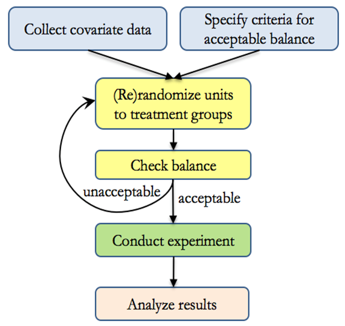
```


예시: 실험 그룹 균형 맞추기

온라인 소매업체가 두 가지 웹사이트 디자인(A와 B)을 테스트하면서 주요 고객 인구통계 특성(예: 연령)이 처치 집단 간에 균형을 이루도록 하고자 합니다.

실험을 진행하기 전에 그룹 간 평균 연령 차이가 허용 범위 내에 있는지 확인하는 균형 기준을 정의합니다.

```{.r}
set.seed(123)

# 균형 기준 정의: 평균 연령 차이가 1세 미만인지 확인
balance_criterion <- function(data) {
  abs(mean(data$age[data$group == "A"]) - mean(data$age[data$group == "B"])) < 1
}

# 균형 기준이 충족될 때까지 무작위 배정 반복
repeat {
  data <- data.frame(
    age = rnorm(100, mean = 35, sd = 10),
    group = sample(c("A", "B"), 100, replace = TRUE)
  )
  if (balance_criterion(data)) break
}

# 최종 그룹별 평균 확인
tapply(data$age, data$group, mean)
```

#### 재무작위화 기준

재무작위화는 공변량 행렬($\mathbf{X}$)과 처치 배정($\mathbf{W}$)의 함수에 기반합니다.

$$
W_i = 
\begin{cases}
1, & \text{처치} \\
0, & \text{통제}
\end{cases}
$$

일반적인 접근법은 마할라노비스 거리(Mahalanobis Distance)를 사용하여 처치 집단과 통제 집단 간의 공변량 균형을 측정하는 것입니다:

$$
\begin{aligned}
M &= (\bar{\mathbf{X}}_T - \bar{\mathbf{X}}_C)' \text{cov}(\bar{\mathbf{X}}_T - \bar{\mathbf{X}}_C)^{-1} (\bar{\mathbf{X}}_T - \bar{\mathbf{X}}_C) \\
&= (\frac{1}{n_T} + \frac{1}{n_C})^{-1} (\bar{\mathbf{X}}_T - \bar{\mathbf{X}}_C)' \text{cov}(\mathbf{X})^{-1} (\bar{\mathbf{X}}_T - \bar{\mathbf{X}}_C)
\end{aligned}
$$

여기서:

- $\bar{\mathbf{X}}_T$와 $\bar{\mathbf{X}}_C$는 처치 집단과 통제 집단의 평균 공변량 벡터입니다.
- $\text{cov}(\mathbf{X})$는 공변량의 공분산 행렬입니다.
- $n_T$와 $n_C$는 처치 집단과 통제 집단의 표본 크기입니다.

표본 크기가 크고 순수 무작위 배정이 이루어지면 $M$은 카이제곱 분포를 따릅니다:

$$
M \sim \chi^2_k
$$

여기서 $k$는 균형을 맞추고자 하는 공변량의 수입니다.


재무작위화 임계값 선택 ($M > a$)

$p_a$를 무작위 배정을 수락할 확률로 정의합니다:

- 더 작은 $p_a$ $\to$ 더 강력한 균형, 하지만 더 긴 계산 시간 소요.
- 더 큰 $p_a$ $\to$ 더 빠른 무작위 배정, 하지만 상대적으로 약한 균형.

경험 법칙은 다음 조건일 때 재무작위화를 수행하는 것입니다:

$$
M > a
$$

여기서 $a$는 허용 가능한 균형 임계값을 기반으로 선택됩니다.


실험을 진행하기 전에 처치 집단과 통제 집단이 잘 일치하도록 마할라노비스 거리를 균형 기준으로 적용합니다.

```{.r}
set.seed(123)
library(MASS)

# 2개의 공변량을 갖는 데이터셋 생성
n <- 100
X <- mvrnorm(n, mu = c(0, 0), Sigma = matrix(c(1, 0.5, 0.5, 1), 2, 2))
colnames(X) <- c("Covariate1", "Covariate2")

# 마할라노비스 거리를 이용한 균형 함수
balance_criterion <- function(X, group) {
  X_treat <- X[group == 1, ]
  X_control <- X[group == 0, ]
  
  mean_diff <- colMeans(X_treat) - colMeans(X_control)
  cov_inv <- solve(cov(X))
  M <- t(mean_diff) %*% cov_inv %*% mean_diff
  
  # 허용 임계값 (k = 2, alpha = 0.05에 대한 카이제곱 임계값)
  return(M < 3.84)  
}

# 균형이 맞을 때까지 무작위 배정 반복
repeat {
  group <- sample(c(0, 1), n, replace = TRUE)
  if (balance_criterion(X, group)) break
}

# 최종 균형 점검 결과 출력
table(group)
colMeans(X[group == 1, ])  # 처치 집단 평균
colMeans(X[group == 0, ])  # 통제 집단 평균
```


### 2단계 무작위 실험 (Two-Stage Randomized Experiments)

2단계 무작위 실험(Two-Stage Randomized Experiment)은 이전 반응에 따라 처치 배정이 달라지는 순차적 개입을 포함합니다. 이 설계는 다음 분야에서 널리 활용됩니다:

- 적응형 학습(Adaptive Learning): 학생의 학업 성취도에 따라 교육 콘텐츠를 조정.
- 맞춤형 광고(Personalized Advertising): 사용자의 참여도에 따라 후속 광고를 타깃팅.
- 임상시험(Medical Trials): 환자의 반응에 따라 처방을 조정.

두 번째 무작위 단계를 도입함으로써 연구자는 다음을 평가할 수 있습니다:

1. 초기 처치의 효과.
2. 후속 처치의 효과.
3. 두 단계 간의 잠재적 상호작용 효과.


#### 예시: 맞춤형 광고 실험

한 기업이 두 가지 초기 광고 캠페인(광고 A vs. 광고 B)을 테스트합니다. 고객의 참여를 관찰한 후, 2단계 개입(예: 할인 쿠폰 제공 vs. 미제공)을 적용합니다.

2단계 실험은 다음과 같이 모형화할 수 있습니다:

$$
Y_{ijk} = \mu + \alpha_i + \beta_{j(i)} + \epsilon_{ijk}
$$

여기서:

- $\mu$: 전체 평균 결과 (예: 전환율).
- $\alpha_i$: 1단계 개입의 효과 ($i$ = 광고 A 또는 광고 B).
- $\beta_{j(i)}$: 1단계 그룹 내에 내재된(Nested) 2단계 개입의 효과.
- $\epsilon_{ijk}$: 확률 오차항.

내포(Nested) 구조는 2단계 처치($\beta_{j(i)}$)가 각 1단계 처치 집단 내에서 배정되도록 보장합니다.


```{.r}
set.seed(123)

# 1단계 무작위 배정 생성 (초기 광고)
data <- data.frame(
  stage1 = sample(c("Ad A", "Ad B"), 100, replace = TRUE),
  stage2 = rep(NA, 100)  # 2단계 무작위 배정을 위한 플레이스홀더
)

# 1단계 반응에 기반한 2단계 배정
data$stage2[data$stage1 == "Ad A"] <-
    sample(c("Discount", "No Discount"),
           sum(data$stage1 == "Ad A"),
           replace = TRUE)
data$stage2[data$stage1 == "Ad B"] <-
    sample(c("Discount", "No Discount"),
           sum(data$stage1 == "Ad B"),
           replace = TRUE)

# 최종 무작위 배정 결과 출력
table(data$stage1, data$stage2)
```

이 구조는 다음을 보장합니다:

1. 초기 광고의 공정한 배정.
2. 사용자 참여도에 기반한 2단계 적응형 타깃팅.


### 간섭과 비순응이 존재하는 2단계 무작위 실험

실제 현실의 실험에서는 간섭(Interference)과 비순응(Noncompliance)으로 인해 분석이 복잡해집니다 [@imai2021causal]:

- 간섭(Interference): 처치 효과가 한 그룹에서 다른 그룹으로 "파급(Spillover)"될 때 발생합니다 (예: 마케팅에서의 사회적 영향력).
- 비순응(Noncompliance): 참가자가 배정된 처치를 따르지 않을 때 발생합니다 (예: 고객이 광고를 무시함).

비순응을 처리하기 위해 다음을 정의합니다:

- $Z_{ik}$: 배정된 처치 (예: 광고 A 또는 광고 B).
- $D_{ik}$: 실제 수혜받은 처치 (예: 사용자가 실제로 광고를 보았는지 여부).
- $Y_{ik}$: 결과변수 (예: 구매 여부).

2단계 도구변수 모델은 비순응을 보정합니다:

$$
\begin{aligned}
D_{ik} &= \gamma_0 + \gamma_1 Z_{ik} + v_{ik} \\
Y_{ik} &= \beta_0 + \beta_1 D_{ik} + \epsilon_{ik}
\end{aligned}
$$

여기서:

- $\gamma_1$은 배정이 실제 처치 수혜에 미치는 영향을 측정합니다.
- $\beta_1$은 비순응을 보정한 실제 처치 효과를 추정합니다.

개체들이 서로의 결과에 영향을 미친다면 전통적인 무작위 배정은 편향을 갖게 됩니다. 해결 방안은 다음과 같습니다:

1. 클러스터 무작위 배정 (Cluster Randomization): 집단 수준에서 처치를 배정합니다 (예: 전체 소셜 서클이 동일한 광고를 수신).
2. 부분 간섭 모델 (Partial Interference Models): 간섭이 미리 정의된 그룹 내에서만 발생한다고 가정합니다.

```{.r}
set.seed(123)
library(ivreg)  # 도구변수 회귀 패키지 로드

# 1단계 처치 배정 데이터 생성
n <- 500
data <- data.frame(
  Z = sample(c(0, 1), n, replace = TRUE),  # 초기 무작위 배정
  D = NA,  # 실제 수혜 처치 (순응도에 의해 영향받음)
  Y = NA   # 결과변수 (예: 구매액)
)

# 비순응 도입: 80% 순응률
data$D <- ifelse(runif(n) < 0.8, data$Z, 1 - data$Z)

# 진정한 처치 효과를 반영한 결과변수(Y) 생성
# D가 Y에 미치는 실제 효과는 3
data$Y <- 5 + 3 * data$D + rnorm(n, mean = 0, sd = 2)  

# 2단계 최소제곱법 (2SLS) 추정
iv_model <- ivreg(Y ~ D | Z, data = data)
summary(iv_model)

```

- 1단계 회귀는 $Z$가 $D$에 얼마나 강하게 영향을 미치는지(순응도)를 추정합니다.
- 2단계 회귀는 $D$가 $Y$에 미치는 진정한 인과 효과를 추정합니다.

간섭이 존재하는 경우 표준 도구변수 방법도 편향될 수 있으므로, 연구자들은 네트워크 기반 무작위 배정이나 공간 모델을 탐색해야 합니다.

### 간섭 편향을 완화하기 위한 클러스터 무작위 배정 {#sec-cluster-randomization}

표준 무작위 대조 시험은 안정적 단위 처치 값 가정(SUTVA)에 의존하며 이는 두 부분으로 구성됩니다. 간섭 부재(No interference) 조건은 한 단위의 잠재적 결과가 다른 단위의 처치 배정에 영향을 받지 않는다는 것을 의미합니다. 즉, $Y_i(Z)$는 $Z_i$에만 의존하며 $j \ne i$인 $Z_j$에는 의존하지 않습니다. 숨겨진 처치 버전 부재(No hidden versions of treatment) 조건은 각 처치 조건이 명확하게 정의되고 단위 간에 일관되게 적용됨을 의미합니다.

SUTVA 위반, 특히 간섭(Interference)은 참여자들이 전략적으로 상호작용하고 고객의 관심이나 플랫폼 노출과 같은 공통 자원을 공유하는 Airbnb, eBay, Uber, Etsy와 같은 온라인 양면 시장(Marketplaces)에서 매우 흔하게 발생합니다. 간섭은 $Y_i(Z)$가 다른 단위들의 처치 상태에 의존할 때, 즉 $Y_i(Z_1, \ldots, Z_n)$일 때 발생합니다. 이러한 환경에서 간섭 편향은 인과 추정치를 왜곡하여 의사결정권자에게 심각한 오판을 초래합니다.

상호 연결된 디지털 환경에서 판매자, 숙소 리스팅, 사용자와 같은 주체들은 알고리즘 순위, 가격 경쟁, 구매자의 대체 행동을 통해 서로에게 영향을 미칩니다. 한 가지 예로, Airbnb가 특정 호스트에게 가격 인상을 추천하는 처치를 적용하면, 인근의 미처치 호스트들이 이에 대응하여 자신의 가격을 조정할 수 있고 구매자들은 사용 가능한 모든 숙소를 비교하여 반응하므로 관측된 결과는 고립된 처치 효과가 아니라 시스템적 반응을 반영하게 됩니다.

이는 간섭 부재 조건을 위반하여 추정된 총 평균 처치 효과(Total Average Treatment Effect, TATE)에 편향을 초래합니다:

$$\text{TATE} = \mathbb{E}[Y_i(1) - Y_i(0)]$$

@blake2014marketplace (eBay)는 이러한 역학을 실험-통제군 간섭(Test-control interference)으로 공식화했습니다. 즉, 처치를 받은 판매자가 통제군 판매자로부터 구매자를 빼앗아와 추정된 성과를 과대평가하게 만듭니다. 이후의 양면 플랫폼 시뮬레이션 연구들은 현실적인 조건 하에서 처치 효과의 과대표기가 100%를 초과할 수 있음을 보여주었습니다.

@eckles2021bias 를 따라 판매자 $i$의 잠재적 결과를 고려합니다:

$$Y_i(Z) = \alpha_i + \beta Z_i + \gamma \rho_i + \varepsilon_i$$

여기서 $\beta$는 직접 처치 효과(Direct treatment effect), $\gamma$는 파급(간접) 효과(Spillover/indirect effect), $\rho_i = \frac{1}{|N_i|} \sum_{j \in N_i} Z_j$는 처치된 이웃의 비율입니다. $\gamma \neq 0$일 때 간섭이 존재하며 $\beta$와 $\gamma$의 부호가 다르면 간섭으로 인해 TATE 추정치가 과대 또는 과소평가될 수 있습니다. 행렬 형태로 $\mathbb{E}[Y_i(Z)] = \alpha_i + \sum_j B_{ij} Z_j$를 만족하는 간섭 행렬 $B$를 정의할 수 있으며 대각 원소는 직접 효과를, 비대각 원소는 간섭을 나타냅니다.

클러스터 무작위 배정(Cluster Randomization)은 개별 단위 대신 단위들의 전체 클러스터(그룹)를 처치 또는 통제군에 배정합니다. 클러스터 내의 단위들은 서로 간섭할 가능성이 높으므로, 클러스터 전체에 동일한 처치를 적용하면 간섭을 그룹 내부로 국한시킬 수 있습니다. @holtz2025reducing 은 @eckles2021bias 를 확장하여 일관된 부호의 $B_{ii}$와 $B_{ij}$를 갖는 선형 간섭 모델에서 클러스터 무작위 배정이 개별 수준 무작위 배정에 비해 항상 간섭 편향을 줄인다는 것을 보였습니다:

$$|\mathbb{E}[\hat{\tau}_{\text{cr}} - \tau]| \le |\mathbb{E}[\hat{\tau}_{\text{ind}} - \tau]|$$

이는 파급효과가 양수이든 음수이든 관계없이 성립합니다. $C(i)$를 단위 $i$의 클러스터라고 할 때 클러스터의 품질은 다음과 같이 정의됩니다:

$$Q_C(B) = \sum_{i,j} B_{ij} \cdot \mathbf{1}\{C(i) \ne C(j)\}$$

$Q_C(B)$가 낮을수록 클러스터 간 간섭이 적고 더 우수한 클러스터링임을 의미합니다. 실무에서 $B$는 관측할 수 없으므로 동시 검색이나 동시 조회 행동과 같은 프록시 행렬 $P$를 사용합니다.

그래프-클러스터 무작위 배정(Graph-Cluster Randomization, GCR)은 사회적 또는 경제적 네트워크를 클러스터로 분할하고 클러스터 수준에서 처치를 무작위 배정하여 혼합 처치 이웃을 줄입니다. @ugander2013graph 는 특정 노출 모델 하에서 GCR이 처치 효과에 대해 불편 호비츠-톰슨(Horvitz-Thompson) 추정량을 제공함을 보였습니다:

$$\hat{\tau}_{HT} = \sum_{i \in T} \frac{Y_i}{\pi_i} - \sum_{i \in C} \frac{Y_i}{1 - \pi_i}$$

여기서 $\pi_i$는 무작위 설계를 반영한 단위 $i$의 처치 확률입니다. 이러한 편향 감소에 대한 대가는 분산의 증가입니다: @eckles2021bias 는 $\mathrm{Var}(\hat{\tau}_{CR}) \propto \rho \cdot \sigma^2 / n_c$임을 보였으며 여기서 $\rho$는 클러스터 내 상관계수이고 $n_c$는 클러스터의 수입니다. 사전 층화, 회귀 조정 또는 클러스터 수 증가는 이러한 분산 증가를 부분적으로 완화할 수 있습니다.

#### 사례 연구: Airbnb 메타 실험

@holtz2025reducing 은 간섭 편향을 실증적으로 측정하고 클러스터 무작위 배정을 평가하기 위해 Airbnb에서 대규모 메타 실험을 수행했습니다. Airbnb 엔지니어들은 게스트의 동시 클릭 데이터를 사용하여 각 숙소를 16차원 벡터 공간에 임베딩한 후, 노드 내 리스팅의 90% 이상이 공통 이웃을 공유하도록 재귀적 분할 트리를 적용하여 클러스터를 구축했습니다. 그 결과 도출된 약 15,000개의 클러스터는 중간값 150개의 숙소를 포함했으며 클러스터 내 대체율은 95%를 초과했습니다. 홀드아웃 데이터를 통해 클러스터 간 대체가 극히 적음을 확인했습니다.

전 세계 200만 개 이상의 숙소를 대상으로 한 두 건의 플랫폼 전사 실험에서, 클러스터의 75%는 클러스터 수준에서 무작위 배정되었고 25%는 표준 베르누이(개별 수준) 무작위 배정을 유지했습니다. 게스트 수수료 개입의 경우, 개별 수준 무작위 배정 하에서 숙소당 추정된 TATE는 $-0.207$건의 예약이었으나 클러스터 무작위 배정 하에서는 $-0.139$건에 불과하여 간섭으로 인해 단순 추정치가 32.6% 과대표기되었음을 확인했습니다. 간섭 편향 비율 $\hat{\nu} / (\hat{\beta} + \hat{\nu})$은 약 19.8%였습니다. 편향은 시장 조건에 따라 달라져, 수요 제약 지역(성수기 뉴욕)에서는 28.6%에 달했고 공급 제약 지역에서는 12.1%로 낮았으며 높은 클러스터 품질(임베딩 공간에서의 더 우수한 분리)은 더 큰 편향 감소와 연관되었습니다. 가격 추천 개입의 경우 베르누이 무작위 배정 하에서는 $-0.106$이었던 반면 클러스터 수준 추정치($-0.051$)는 통계적으로 유의하지 않았으며 사후 검정력 분석에 따르면 동일한 편향을 80% 검정력으로 감지하려면 3.5배 더 많은 클러스터가 필요했을 것으로 나타났습니다.

이 사례 연구는 온라인 양면 시장에서 간섭 편향의 보편성과 함께, 클러스터가 지능적으로 구성되고 맥락에 기반할 때 클러스터 무작위 배정이 편향을 효과적으로 완화할 수 있음을 입증합니다.

#### 실무 적용 청사진

1. 간섭 진단: 먼저 순위 알고리즘, 가격 비교 등 가능한 파급 경로를 이론화한 후, 이중 무작위 배정을 활용한 메타 실험을 수행하여 TATE를 비교하고 네트워크 또는 아이템 유사도 행렬을 사용하여 노출 확률을 정량화합니다.
2. 클러스터 구축: 클릭이나 예약 기반의 대체 행렬 $S$가 주어지면 $W = (S + S^\top)/2$로 대칭화하고, 정규화된 그래프 라플라시안 $L$을 계산한 후, $L$의 상위 $k$개 고유벡터를 통해 노드를 임베딩하고, $k$-평균 군집화를 적용(Gap 통계량으로 $k$ 결정)하며 필요한 경우 극소 클러스터를 병합합니다. 이웃 순도(동일 클러스터 내 가장 가까운 이웃의 비율)를 통해 평가하며 Airbnb는 최소 0.9의 기준을 사용했습니다.
3. 분석 계획: 클러스터 강건 표준오차 또는 호비츠-톰슨 가중치를 사용하고 클러스터 내 상관관계를 보정하며 검정력을 향상시키기 위해 사전 층화를 포함한 OLS를 고려합니다.

짧은 시뮬레이션을 통해 편향 감소 효과를 확인할 수 있습니다:

```{.r}
set.seed(123)
n <- 1000
clusters <- rep(1:100, each = 10)
Z <- rbinom(n, 1, 0.5)
B <- matrix(runif(n^2, 0, 0.1), n, n)
diag(B) <- runif(n, 0.5, 1)

Y <- sapply(1:n, function(i) sum(B[i, ] * Z)) + rnorm(n)

t_ind <- mean(Y[Z == 1]) - mean(Y[Z == 0])

cluster_Z <- tapply(Z, clusters, mean)
cluster_Y <- tapply(Y, clusters, mean)
t_cr <- mean(cluster_Y[cluster_Z > 0.5]) - mean(cluster_Y[cluster_Z <= 0.5])

c(t_ind = t_ind, t_cr = t_cr)
```

개별 무작위 배정 추정치 $t_\text{ind}$는 $B$의 비대각 원소가 배정 분할에 걸쳐 $j$에서 $i$로 처치를 누출시키기 때문에 클러스터 무작위 배정 추정치 $t_\text{cr}$에 비해 과대평가됩니다.

트레이드오프: 클러스터 무작위 배정은 구현 복잡성 증가와 검정력 감소를 대가로 간섭 편향을 실질적으로 낮춥니다. 적절한 선택은 파급효과 크기 $\gamma$, 간섭 구조의 세분성, 클러스터 내 사전 층화의 실행 가능성에 따라 달라집니다.


## 최근 연구 동향 (Emerging Research)

최근 연구는 온라인 광고 실험에서 광고 콘텐츠의 인과 효과를 측정하는 데 따르는 중대한 과제들을 강조하고 있습니다. 디지털 광고 플랫폼은 알고리즘 기반 타깃팅 및 동적 광고 전달 메커니즘을 사용하므로 A/B 테스트에 체계적인 편향이 발생할 수 있습니다 [@braun2025where]. 주요 우려 사항은 다음과 같습니다:

- 비무작위 노출 (Nonrandom Exposure): 온라인 광고 플랫폼은 광고 전달을 동적으로 최적화하므로 사용자가 서로 다른 광고 변형에 무작위로 배정되지 않습니다. 대신 플랫폼 고유의 알고리즘을 사용하여 매우 이질적인 사용자 그룹에 광고를 차등 노출합니다.
- 발산 전달 (Divergent Delivery): 최적화 과정은 "발산 전달"로 이어져, 사용자 참여 패턴과 플랫폼 목표의 차이로 인해 비교 불가능한 처치 집단이 형성될 수 있습니다. 이는 광고 콘텐츠의 진정한 효과와 노출 알고리즘의 편향을 혼동시킵니다.
- 측정된 효과의 편향: 알고리즘 타깃팅, 사용자 이질성, 데이터 집계는 추정된 광고 효과의 크기와 방향을 모두 왜곡할 수 있습니다. 이는 전통적인 A/B 테스트 결과가 광고 소재의 진정한 영향을 정확하게 반영하지 못할 수 있음을 의미합니다.
- 제한된 투명성: 플랫폼은 광고주나 연구자가 독점 타깃팅 메커니즘으로부터 광고 콘텐츠 효과를 분리하도록 지원할 유인이 거의 없습니다. 따라서 실험 설계자는 이러한 편향을 완화하기 위해 세심한 식별 전략을 설계해야 합니다.


### 온라인 A/B 테스팅에서의 공변량 균형: 비둘기집 설계 (The Pigeonhole Design)

@zhao2024pigeonhole 은 실험 대상이 순차적으로 유입될 때 온라인 A/B 테스팅에서 공변량 균형을 유지하는 과제를 다룹니다. 전통적인 실험설계는 처치 배정이 즉각적으로 이루어져야 하는 실시간 환경에서 균형을 유지하기 어렵습니다. 이 연구는 이질적인 공변량을 가진 피험자를 동적으로 처치 또는 통제군에 배정하여 두 집단 간 최소 가중치 완전 매칭으로 정량화되는 총 불일치를 최소화하는 것을 목표로 하는 온라인 블록화 문제(Online Blocking Problem)를 소개합니다.

공변량 균형을 개선하기 위해 저자들은 다음과 같이 작동하는 무작위 실험설계인 비둘기집 설계(Pigeonhole Design)를 제안합니다:

- 공변량 공간을 "비둘기집(Pigeonholes)"이라는 더 작은 하위 공간으로 분할합니다.
- 각 비둘기집 내에서 처치 대상과 통제 대상의 수를 동적으로 균형 맞춰 체계적인 불균형을 줄입니다.

이론적 분석을 통해가 설계가 기존 접근 방식에 비해 불일치를 줄이는 데 효과적임을 입증합니다. 구체적으로 비둘기집 설계는 다음 방법들과 벤치마크 비교됩니다:

- 쌍 매칭 설계 (Matched-pair design)
- 완전 무작위 배정 설계 (Completely Randomized Design)

결과는 공변량 균형을 유지하는 데 있어 비둘기집 설계가 이러한 대안들을 능가하는 시나리오를 보여줍니다.

Yahoo! 데이터를 사용하여 저자들은 실무에서 비둘기집 설계를 검증했으며 평균 처치 효과(ATE)를 추정할 때 분산이 10.2% 감소함을 입증했습니다. 이러한 개선은 노이즈를 줄이고 실험 결과의 정밀도를 높이는 설계의 실무적 유용성을 강조합니다.

@zhao2024pigeonhole 의 연구 결과는 온라인 A/B 테스트를 수행하는 실무자에게 유용한 통찰을 제공합니다:

- 실시간 공변량 균형을 보장하면 인과 추정치의 신뢰성이 향상됩니다.
- 비둘기집 설계는 공변량을 동적으로 균형 맞추는 구조화되면서도 유연한 접근 방식을 제공합니다.
- 처치 효과 추정의 분산을 줄임으로써 대규모 온라인 실험의 통계적 효율성을 높입니다.

이 연구는 동적 환경에서의 [무작위 실험설계](#sec-the-gold-standard-randomized-controlled-trials)에 관한 광범위한 논의에 기여하며 전통적인 접근 방식에 대한 강력한 대안을 제시합니다.


### 값이 0인 결과변수의 처리 {#sec-handling-zero-valued-outcomes}

처치 효과를 분석할 때 흔히 발생하는 문제 중 하나는 결과변수에 0 값이 다수 포함되어 있는 경우입니다.

예를 들어 비즈니스 응용에서 마케팅 개입은 일부 고객에게 아무런 영향을 미치지 않을 수 있습니다(매출 0 발생). 만약 결과변수에 로그 변환을 적용한다면 다음과 같은 이유로 문제가 발생합니다:

- $\log(0)$은 정의되지 않습니다.
- 로그 변환은 결과변수의 단위에 민감하여 해석을 어렵게 만듭니다 [@chen2024logs].

로그 변환을 적용하는 대신 0 값에 강건한 방법들을 사용해야 합니다:

1. 평균의 백분율 변화 (Percentage changes in the Average)
    - 포아송 준최대우도추정(Poisson QMLE)을 사용하면 계수를 통제 집단 대비 처치 집단의 평균 결과의 백분율 변화로 해석할 수 있습니다.
2. 외연적 마진 대 집약적 마진 (Extensive vs. Intensive Margins)
    - 이 접근법은 다음을 구분합니다:
        - 외연적 마진 (Extensive margin): 0에서 양수의 결과로 전환될 가능성 (예: 구매 발생 확률의 증가).
        - 집약적 마진 (Intensive margin): 결과가 이미 양수인 상태에서의 증가량 (예: 구매 고객의 구매액 증가).
    - 처치가 결과에 단조적 효과(Monotonic effect)를 미친다고 가정할 때 집약적 마진의 한계(Bounds)를 추정하기 위해 @lee2009training 의 리 한계(Lee Bounds)를 사용할 수 있습니다.


결과변수(예: 매출, 웹사이트 클릭 수)에 0이 많고 처치가 외연적 마진과 집약적 마진 모두에 영향을 미치는 시나리오를 시뮬레이션하는 데이터셋을 생성합니다.

```{.r}
set.seed(123) # 재현성을 위한 시드 설정
library(tidyverse)

n <- 1000 # 관측치 수
p_treatment <- 0.5 # 처치 확률

# 1단계: 처치 변수 D 생성
D <- rbinom(n, 1, p_treatment)

# 2단계: 잠재적 결과 생성
# 미처치 잠재적 결과 (대부분 0)
Y0 <- rnorm(n, mean = 0, sd = 1) * (runif(n) < 0.3)

# 처치 잠재적 결과 (외연적 및 집약적 마진 모두에 영향)
Y1 <- Y0 + rnorm(n, mean = 2, sd = 1) * (runif(n) < 0.7)

# 3단계: 처치 배정에 기반한 관측 결과 합성
Y_observed <- (1 - D) * Y0 + D * Y1

# 음수 결과 방지 (현실적인 상황 모형화)
Y_observed[Y_observed < 0] <- 0

# 추가 통제변수를 포함한 데이터셋 생성
data <- data.frame(
    ID = 1:n,
    Treatment = D,
    Outcome = Y_observed,
    X = rnorm(n) # 통제변수
) |>
    dplyr::mutate(positive = Outcome > 0) # 외연적 마진 지시변수

# 처음 몇 행 확인
head(data)
```

그림은 예제에서 사용된 시뮬레이션 결과변수의 분포를 보여줍니다.

```{.r fig.cap="시뮬레이션된 데이터셋의 결과변수 분포: 0에 데이터가 집중되어 있으며 값이 커질수록 빈도가 감소합니다." fig.alt="0에서 높은 빈도를 보이고 1부터 6까지는 점차 빈도가 감소하는 결과변수 히스토그램." #fig-outcome-distribution}
# 결과변수 분포 시각화
hist(
    data$Outcome,
    breaks = 30,
    main = "결과변수의 분포 (Distribution of Outcomes)",
    col = "lightblue"
)
```

#### 평균의 백분율 변화 추정

로그 변환을 사용할 수 없으므로, 0 값을 갖는 결과변수에 강건한 포아송 QMLE를 사용하여 백분율 변화를 추정합니다.

```{.r}
library(fixest)

# 포아송 준최대우도추정 (Poisson QMLE)
res_pois <- fepois(
    fml = Outcome ~ Treatment + X, 
    data = data, 
    vcov = "hetero"
)

# 결과 출력
etable(res_pois)

```

결과 해석:

- `Treatment`의 계수는 통제 집단 대비 처치 집단 평균 결과의 로그-백분율 변화를 나타냅니다.
- 비례적 효과(Proportional effect)를 계산하기 위해 계수에 지수 함수를 취합니다:

```{.r}
# 처치의 비례적 효과 계산
treatment_effect <- exp(coefficients(res_pois)["Treatment"]) - 1
treatment_effect
```

표준오차 계산:

```{.r}
# 표준오차 계산
se_treatment <- exp(coefficients(res_pois)["Treatment"]) *
    sqrt(res_pois$cov.scaled["Treatment", "Treatment"])
se_treatment
```

이 시뮬레이션 데이터셋에서 비례적 효과 $\exp(\hat\beta_{\text{Treatment}}) - 1$는 데이터 생성 과정에 강한 처치 신호가 내재되어 있어 매우 크게 나타나며 이는 계산 메커니즘을 설명하기 위한 예시일 뿐 벤치마크 수치가 아닙니다. 실무 연구에서 지수화된 포아송 계수는 항상 델타 방법 표준오차 및 신뢰구간과 함께 제시되어야 하며 백분율 해석은 평균 효과가 평가되는 $X$의 지지집합 영역에서만 유의미합니다.

#### 외연적 마진 대 집약적 마진의 추정

이제 외연적 마진(0이 아닌 결과를 가질 확률)과 집약적 마진(0이 아닌 결과를 가진 집단 내에서의 효과 크기)에 대해 처치 효과를 별도로 추정합니다.

먼저 항상 0이 아닌 결과를 갖는 개체들에 대한 집약적 마진 효과를 추정하기 위해 리 한계(Lee Bounds)를 사용합니다.

```{.r}
library(causalverse)

res <- causalverse::lee_bounds(
    df = data,
    d = "Treatment",
    m = "positive",
    y = "Outcome",
    numdraws = 10
) |> 
    causalverse::nice_tab(2)

print(res)
```

신뢰구간에 0이 포함되어 있으므로 처치가 유의미한 집약적 마진 효과를 갖는다고 결론지을 수 없습니다.

#### 민감도 분석: 순응자 효과의 변화

집약적 마진 효과를 추가로 조사하기 위해 순응자에 대한 다양한 가정에 따라 결과가 얼마나 민감하게 변하는지 살펴봅니다.

순응자의 기대 결과가 항상 참여자(Always-takers)보다 $100 \times c\%$ 낮거나 높다고 가정합니다:
$$
E(Y(1) \mid \text{순응자}) = (1 - c) E(Y(1) \mid \text{항상 참여자})
$$
다양한 $c$ 값에 대해 리 한계를 계산합니다:

```{.r}
set.seed(1)
c_values = c(0.1, 0.5, 0.7)

combined_res <- bind_rows(lapply(c_values, function(c) {
    res <- causalverse::lee_bounds(
        df = data,
        d = "Treatment",
        m = "positive",
        y = "Outcome",
        numdraws = 10,
        c_at_ratio = c
    )
    
    res$c_value <- as.character(c)
    return(res)
}))

combined_res |> 
    dplyr::select(c_value, everything()) |> 
    causalverse::nice_tab()

```

- $c = 0.1$로 가정할 때(순응자의 결과가 항상 참여자의 10% 수준), 항상 참여자의 집약적 마진 효과는 6.6단위 더 높습니다.
- $c = 0.5$로 가정할 때(순응자의 결과가 항상 참여자의 50% 수준), 집약적 마진 효과는 2.54단위 더 높습니다.

이러한 결과는 순응자에 대한 가정이 집약적 마진에 대한 결론에 어떤 영향을 미치는지 잘 보여줍니다.

[0 값을 갖는 결과변수](#sec-handling-zero-valued-outcomes)를 다룰 때 로그 변환은 적절하지 않습니다. 대신:

- 포아송 QMLE는 결과의 백분율 변화를 추정하는 강건한 방법을 제공합니다.
- 외연적 마진 대 집약적 마진 분석을 통해 다음을 구분할 수 있습니다:
    - 0이 아닌 결과가 발생할 확률 (외연적 마진).
    - 0이 아닌 결과를 가진 집단 내에서의 변화 크기 (집약적 마진).
- 리 한계(Lee Bounds)는 집약적 마진 효과를 추정하는 방법을 제공하지만 항상 참여자와 순응자에 대한 가정에 민감할 수 있습니다.

<!-- ========================================= -->
<!-- Chapter: 22.5-interference-spillover.Rmd -->
<!-- ========================================= -->


# 간섭과 파급효과 (Interference and Spillover Effects) {#sec-interference-spillover}

본서에서 다루는 인과추론 기법의 대부분은 한 단위의 처치가 다른 단위의 결과에 영향을 미치지 않는다는 가정에 암묵적으로 의존하고 있습니다. 그러나가 가정은 편리할 뿐 실제로는 위반되는 경우가 매우 흔합니다. 백신 접종을 받은 사람이 백신을 맞지 않은 이웃의 감염 위험을 낮추는 경우, 한 고객에 대한 가격 할인 프로모션이 친구의 구매를 잠식(Cannibalization)하는 경우, 한 학교의 구충제 보급 프로그램이 인근 학교의 감염 전파를 줄이는 경우, 또는 한 은행에 대한 규제 충격이 은행 간 상호 익스포저를 통해 전파되는 경우처럼, 한 단위의 결과는 다른 단위들의 처치 상태에 의존하게 됩니다. 이러한 현상은 통계학과 계량경제학에서 밀접하게 관련된 두 가지 용어로 불립니다. 통계학자들은 이를 간섭(Interference), 즉 안정적 단위 처치 값 가정(SUTVA)의 '간섭 부재' 조건 위반이라고 부릅니다. 경제학자와 실증 연구자들은 흔히 파급효과(Spillover Effect), 동료 효과(Peer Effect), 외부효과(Externality), 또는 전염(Contagion)이라고 부릅니다. 사용하는 어휘는 다르지만 구조적 문제는 동일합니다. 본 장의 목적은이 문제를 엄밀하게 정형화하고 간섭을 인정했을 때 무엇이 식별되고 무엇이 식별되지 않는지 밝히며 실험 이론을 본서의 다른 곳에서 다루는 준실험 및 관찰 연구 설계와 연결하는 것입니다.

본 장은 분석가가 직접 제어하는 실험 설계에서 출발하여 관찰 데이터로 나아갑니다. 먼저 간섭과 이것이 위반하는 SUTVA 가정을 정의하고 노출 매핑(Exposure Mappings)을 중심으로 잠재적 결과 프레임워크를 재구축하며 알려진 무작위 배정을 활용하는 설계 기반 호비츠-톰슨(Horvitz-Thompson) 추정량 [@aronow2017estimating]과 노출 매핑이 미지이거나 잘못 명시되었을 때 무엇을 추정할 수 있는지에 대한 현대 이론 [@savje2021average; @leung2022causal], 그리고 간섭 하에서도 정확성을 유지하는 무작위화 검정(Randomization Tests) [@athey2018exact; @basse2019randomization]을 다룹니다. 이어서 파급효과 추정을 정형화한 부분 간섭(Partial Interference) 설계를 다룹니다: 직접, 간접, 총, 전체 효과를 정의한 @hudgens2008toward 의 2단계 무작위 설계, `inferference` 패키지 [@saul2017recipe]를 활용한 역확률 가중(IPW) 추정, @nickerson2008voting 의 가구 내 투표 동원 실험 재현, 경제학자들이 구축 효과(Displacement)와 일반균형 파급효과를 측정하기 위해 사용하는 무작위 포화 실험(Randomized Saturation Experiments) [@crepon2013labor; @egger2022general]을 살펴봅니다. 관찰 연구 영역에서는 @manski1993identification 의 동료 효과 회귀분석에서의 반사 문제(Reflection Problem), 관측된 네트워크에서의 인과추론, 이분형(Bipartite) 및 군집형 간섭, 플랫폼 및 시간적 간섭, 실증 금융에서 사용되는 연계성(Connectedness) 지표를 다룹니다. 마지막으로 파급효과가 이중차분법(DiD)의 통제군을 오염시키고 도구변수(IV) 설계의 배제 제약을 위협하며 매칭(Matching)의 비교 논리를 훼손하는 준실험 설계에서의 간섭 위협을 다룹니다. 본 장은 이중차분법의 현대적 이슈(제 @sec-modern-concerns-in-did 절) 및 준실험 기초(제 @sec-quasi-experimental 절)와 상호 참조되며 그곳에서 전제된 간섭 부재 가정을 정면으로 검토하는 장입니다.

## SUTVA와 간섭 부재의 의미 {#sec-sutva-no-interference}

@rubin1980randomization 에서 공식화되고 @imbens2015causal 에서 심도 있게 다루어진 안정적 단위 처치 값 가정(SUTVA)은 두 가지 요구사항을 포함합니다. 첫째는 간섭 부재(No interference)로, 한 단위의 잠재적 결과는 오직 자신의 처치 배정에만 의존하며 다른 단위들의 배정에는 영향을 받지 않는다는 것입니다. 둘째는 처치의 숨겨진 변형 부재(No hidden variation in treatment)로, 각 처치 수준의 정의가 명확하고 일관되어 "처치됨"이 모든 단위에 대해 동일한 의미를 갖는다는 것입니다. 두 조건 모두 실질적이며 사회과학에서 일상적으로 위반되지만 본 장에서는 첫 번째 조건에 집중합니다.

간섭 부재가 보장하는 이점을 정확히 이해하기 위해, $N$개 단위로 구성된 모집단의 처치 배정 벡터를 $\mathbf{D} = (D_1, \dots, D_N)$ ($D_i \in \{0,1\}$)으로 표기합니다. 일반적인 환경에서 단위 $i$의 결과는 전체 벡터의 함수입니다:
$$
Y_i = Y_i(\mathbf{D}) = Y_i(D_1, D_2, \dots, D_N).
$$
$N$개의 이진 처치가 있을 때 $2^N$개의 가능한 배정 벡터가 존재하므로 단위당 최대 $2^N$개의 잠재적 결과가 발생합니다. 이것이 바로 간섭을 어렵게 만드는 조합적 폭발(Combinatorial Explosion)입니다. 적당한 크기의 표본에서도 잠재적 결과의 수가 관측치 수를 압도적으로 초과하므로 추가적인 구조적 가정 없이는 아무것도 식별할 수 없습니다.

간섭 부재 가정은 이러한 의존성을 해당 단위 자신의 처치로 축소시킵니다:
$$
Y_i(\mathbf{D}) = Y_i(D_i).
$$
이를 통해 친숙한 쌍 $Y_i(1), Y_i(0)$과 단위 수준 효과 $Y_i(1) - Y_i(0)$가 회복됩니다. 관측된 결과는 $Y_i = Y_i(D_i)$를 만족하며 평균 처치 효과 $E[Y_i(1) - Y_i(0)]$는 완전 무작위 배정이 단순 평균 차이를 통해 식별하는 추정대상이 됩니다. 실험 및 준실험 장의 모든 논의는 이러한 축소를 상속받습니다. 이 가정이 위반되면 축소 역시 무너지며 우리는 다른 단위들의 배정에 반응하는 잠재적 결과를 다루어야 합니다.

문헌에서 다루는 세 가지 체제를 구분하는 것이 유용합니다. 간섭 부재(No interference) 하에서는 자신의 처치로의 축소가 정확히 성립합니다. 임의의(일반적) 간섭(Arbitrary/General interference) 하에서는 $Y_i$가 아무런 제약 없이 전체 벡터 $\mathbf{D}$에 의존할 수 있으며 이는 가장 솔직한 가정이지만 반복(Replication)을 제공하는 설계 없이는 식별이 가장 어렵습니다. 이 둘 사이에 @sobel2006randomized 및 @hudgens2008toward 가 도입한 부분 간섭(Partial interference)이 위치합니다. 부분 간섭 하에서는 모집단이 여러 그룹(가구, 학급, 마을, 시장)으로 분할되어 그룹 내에서는 간섭이 자유롭게 작용하지만 그룹 간에는 간섭이 발생하지 않는다고 가정합니다. 부분 간섭은 각 그룹 내에서 파급효과를 추정하는 데 필요한 독립적인 반복을 제공하므로가 분야의 핵심 작업 가정이 되며 아래의 설계 이론 대부분은 이를 전제합니다.

## 간섭 하에서의 잠재적 결과와 노출 매핑 {#sec-exposure-mappings}

$Y_i$가 다른 단위들의 배정에 의존한다는 점을 인정하고 나면, 의미 있는 효과 유형들을 정의하기 위한 언어가 필요합니다. @hudgens2008toward 의 형식적 전개를 따라 단위 $i$를 제외한 모든 단위의 배정을 $\mathbf{D}_{-i}$로 표기하면 $Y_i = Y_i(D_i, \mathbf{D}_{-i})$가 됩니다. 여기서 개념적으로 구별되는 두 가지 대비가 도출됩니다.

직접효과(Direct effect)는 다른 단위들의 처치 상태를 특정 구성 $\mathbf{d}$로 고정한 상태에서 단위 $i$ 자신의 처치만을 전환합니다:
$$
\tau^{\text{direct}}_i(\mathbf{d}) = Y_i(D_i = 1, \mathbf{D}_{-i} = \mathbf{d}) - Y_i(D_i = 0, \mathbf{D}_{-i} = \mathbf{d}).
$$
이는 고전적 처치 효과와 가장 유사한 개념으로, 다른 단위들의 특정 처치 패턴이 주어졌을 때 $i$ 자신의 처치로 인해 발생하는 결과의 변화입니다.

파급(간접)효과(Spillover/Indirect effect)는 $i$ 자신의 처치는 고정하고 주변 다른 단위들의 구성을 변경합니다:
$$
\tau^{\text{spill}}_i(d; \mathbf{d}, \mathbf{d}') = Y_i(D_i = d, \mathbf{D}_{-i} = \mathbf{d}) - Y_i(D_i = d, \mathbf{D}_{-i} = \mathbf{d}').
$$
이는 $i$ 자신의 상태는 유지한 채 주변 패턴이 $\mathbf{d}$에서 $\mathbf{d}'$로 이동할 때 $i$의 결과가 얼마나 변하는지를 포착합니다. 총효과(Total effect)는이 둘을 결합하여 처치된 환경에서 자신이 처치받는 것과 처치되지 않은 환경에서 자신이 처치받지 않는 것을 비교합니다.

실무적 난점은 $\mathbf{d}$와 $\mathbf{d}'$가 천문학적으로 거대한 공간에 걸쳐 있어 이러한 대비를 직접 사용할 수 없다는 점입니다. 이를 해결하는 핵심 단순화 도구는 @aronow2017estimating 이 엄밀하게 개발한 노출 매핑(Exposure Mapping)입니다. 노출 매핑은 고차원 배정 벡터와 네트워크 내 위치와 같은 단위별 속성 $\theta_i$를 저차원 노출 값으로 축소하는 함수 $f(\mathbf{D}, \theta_i)$입니다. 실질적인 가정은 잠재적 결과가 오직이 노출 값을 통해서만 $\mathbf{D}$에 의존한다는 것입니다. 즉, 두 배정 벡터가 단위 $i$에 대해 동일한 노출을 유도한다면 동일한 잠재적 결과를 유도합니다. 흔히 사용되는 선택으로는 네트워크 이웃 중 하나라도 처치되었는지 여부를 나타내는 지시변수, 처치된 이웃의 수나 비율, 또는 고전적 설정을 복원하는 단순 "처치 대 비처치" 노출이 있습니다. @aronow2017estimating 은 올바르게 명시된 노출 매핑과 알려진 무작위 배정이 주어졌을 때 각 노출 수준에서의 평균 잠재적 결과에 대한 호비츠-톰슨(Horvitz-Thompson) 및 하예크(Hajek) 추정량을 구성할 수 있음을 보였습니다. 이 접근법의 솔직함은 노출 매핑이 숨겨진 가정이 아니라 명시적이고 반증 가능한 모델링 가정이라는 점에 있으며 이를 잘못 명시하면(예: 2차 이웃 효과가 존재함에도 1차 이웃 효과만 가정) 편향이 재발생하게 됩니다.

@ugander2013graph 의 그래프-클러스터 무작위 배정(Graph-Cluster Randomization)은 동일한 문제에 대한 보완적 엔지니어링 대응입니다. 개인이 아닌 거친 네트워크 클러스터에 처치를 배정함으로써 한 단위와 그 모든 이웃이 동일한 처치 상태를 공유할 확률을 높여 "완전 처치된 이웃" 노출이 추정 가능할 만큼 충분히 자주 발생하도록 만듭니다. @eckles2017design 은이 설계 논리를 더욱 발전시켜 클러스터 무작위 배정과 노출 기반 분석의 결합이 표준 추정량에서 간섭으로 인한 편향을 실질적으로 줄인다는 것을 이론과 실제 소셜 네트워크 실험을 통해 입증했습니다. 일반적인 교훈은 간섭 하에서는 설계와 추정대상을 함께 선택해야 한다는 것입니다. 무작위 배정 체계가 어떤 노출 대비를 추정할 수 있는지를 근본적으로 결정하기 때문입니다.

### 알려진 노출 확률을 이용한 설계 기반 추정 {#sec-design-based-interference}

노출 매핑이 채택되면 추정은 설계 기반 표본추출과 정확히 동일하게 진행되며 무작위 배정 자체가 확률을 제공합니다. 매핑이 각 단위에 유한한 노출 수준 집합 $k$ 중 하나를 부여한다고 가정하고 일반화된 노출 확률을 다음과 같이 정의합니다:
$$
\pi_i(k) = \Pr[f(\mathbf{D}, \theta_i) = k].
$$
배정 메커니즘을 알고 있으므로가 확률은 최소한 시뮬레이션을 통해 계산 가능합니다. 구체적인 예로 처치가 확률 $p$인 베르누이 독립 시행으로 배정되고 노출이 자신의 처치 여부 및 적어도 하나의 네트워크 이웃이 처치되었는지 여부의 조합으로 정의된다고 가정합니다. 차수(Degree)가 $d_i$인 단위는 다음 확률을 갖습니다:
$$
\begin{aligned}
\pi_i(11) &= p\,\{1 - (1-p)^{d_i}\}, &\qquad \pi_i(10) &= p\,(1-p)^{d_i},\\
\pi_i(01) &= (1-p)\,\{1 - (1-p)^{d_i}\}, &\qquad \pi_i(00) &= (1-p)^{\,d_i + 1},
\end{aligned}
$$
여기서 첫 번째 숫자는 자신의 처치 여부, 두 번째 숫자는 이웃 처치 지시변수입니다. 노출 $k$ 하에서의 평균 잠재적 결과를 $\mu(k) = N^{-1} \sum_i Y_i(k)$로 표기할 때, @aronow2017estimating 의 호비츠-톰슨 추정량은 다음과 같습니다:
$$
\hat{\mu}_{HT}(k) = \frac{1}{N} \sum_{i=1}^{N} \frac{\mathbf{1}\{f(\mathbf{D}, \theta_i) = k\}\, Y_i}{\pi_i(k)}.
$$
이는 모든 단위가 $\pi_i(k) > 0$을 만족하고(양수성 조건, Positivity) 노출 매핑이 올바르게 명시되었을 때 항상 불편성을 가집니다. 하예크(Hajek) 변형은 $N$ 대신 역확률 가중치의 합으로 정규화하며 점근적으로만 불편성을 갖지만 가중치의 편차가 클 때 일반적으로 분산이 훨씬 작습니다. 인과적 대비는 차이 $\tau(k, k') = \mu(k) - \mu(k')$이며 단위 쌍의 결합 노출 확률로부터 보수적인 분산 추정량을 도출할 수 있습니다. 정밀도는 설계에 의해 지배됩니다: 베르누이 배정 하에서 "처치되었으나 처치된 이웃이 없음"과 같은 노출은 고차수 단위에게 극히 드물게 발생하여 가중치가 폭발하므로, 클러스터 무작위 배정은 추정대상이 필요로 하는 극단적 노출의 확률을 높이기 위한 장치로 이해할 수 있습니다.

### 단순 대비가 추정하는 것과 놓치는 것

랜덤 네트워크에서의 간단한 시뮬레이션을 통해 설계 기반 메커니즘을 구체화하고 단순 평균 차이의 미묘한 문제를 살펴봅니다. 결과변수는 자신의 처치로 인해 1만큼 증가하고 적어도 하나의 이웃이 처치되었을 때 1.5만큼 추가로 증가하므로, 전원 처치 대 전원 미처치의 글로벌 정책 대비는 2.5입니다.

```{.r message="FALSE" warning="FALSE" #interference-ht-network}
set.seed(2026)
library(igraph)

n <- 4000
g <- sample_gnp(n, p = 6 / (n - 1))
# 추정대상에 포함된 모든 단위가 모든 노출 수준에서 양의 확률을 갖도록
# 적어도 하나의 이웃을 가진 단위만 유지 (양수성 조건 만족)
g <- induced_subgraph(g, which(degree(g) > 0))
n <- vcount(g)
A <- as_adjacency_matrix(g, sparse = TRUE)
deg <- degree(g)

p_treat <- 0.5

# iid 베르누이(p) 배정 하에서의 닫힌 형태 노출 확률
pi_c11 <- p_treat * (1 - (1 - p_treat)^deg)
pi_c10 <- p_treat * (1 - p_treat)^deg
pi_c01 <- (1 - p_treat) * (1 - (1 - p_treat)^deg)
pi_c00 <- (1 - p_treat)^(deg + 1)

one_draw <- function() {
  D <- rbinom(n, 1, p_treat)
  S <- as.numeric(as.numeric(A %*% D) > 0)   # 처치된 이웃 존재 여부
  Y <- 0.5 + 1.0 * D + 1.5 * S + rnorm(n)

  exposure <- ifelse(D == 1 & S == 1, "c11",
              ifelse(D == 1 & S == 0, "c10",
              ifelse(D == 0 & S == 1, "c01", "c00")))
  pi_i <- cbind(c11 = pi_c11, c10 = pi_c10, c01 = pi_c01, c00 = pi_c00)

  ht <- sapply(c("c11", "c10", "c01", "c00"), function(k) {
    ind <- as.numeric(exposure == k)
    sum(ind * Y / pi_i[, k]) / n
  })
  hajek <- sapply(c("c11", "c10", "c01", "c00"), function(k) {
    ind <- as.numeric(exposure == k)
    sum(ind * Y / pi_i[, k]) / sum(ind / pi_i[, k])
  })
  c(naive        = mean(Y[D == 1]) - mean(Y[D == 0]),
    ht_global    = unname(ht["c11"] - ht["c00"]),
    hajek_global = unname(hajek["c11"] - hajek["c00"]),
    hajek_direct = unname(hajek["c10"] - hajek["c00"]),
    hajek_spill  = unname(hajek["c01"] - hajek["c00"]))
}

reps <- replicate(300, one_draw())
round(cbind(mean = rowMeans(reps), sd = apply(reps, 1, sd)), 3)
```

이 표에서 세 가지 교훈을 얻을 수 있습니다. 첫째, 단순 평균 차이는 정책 대비인 2.5가 아니라 직접효과인 1 근처에 위치합니다. 베르누이 배정 하에서 자신의 처치는 이웃 노출과 독립이므로 파급효과 항이 비교 과정에서 완전히 상쇄되며 평균 차이를 "전체 롤아웃의 효과"로 해석하는 분석가는 효과를 60%나 과소평가하게 됩니다. 이는 추정량의 편향이라기보다는 추정량과 정책 질문 간의 불일치입니다. 둘째, 노출 매핑에 기반한 호비츠-톰슨 및 하예크 추정량은 글로벌 대비, 직접효과, 파급효과를 개별적으로 정확하게 복원합니다. 셋째, 글로벌 대비에 대한 하예크 추정량의 표준편차는 호비츠-톰슨 추정량의 절반 수준으로, 정규화되지 않은 역확률 가중치의 실무적 대가를 보여줍니다.

## 미지의 또는 오명세된 노출 매핑 하에서의 추정 {#sec-unknown-exposure-mappings}

위의 설계 기반 결과는 노출 매핑을 올바르게 알고 있다는 조건에 의존하지만 실제로는 2차 이웃이 영향을 미치거나, 측정된 네트워크에서 일부 엣지가 누락되거나, 인접 행렬에 기록되지 않은 채널을 통해 파급효과가 전파되는 등 완벽한 매핑을 알기 어렵습니다. 최근 연구들은 간섭 구조를 알 수 없거나 잘못 명시되었거나 근사적으로만 국소적일 때 표준 추정량이 무엇을 추정하는지 규명하고 있습니다.

@savje2021average 는 기대 평균 처치 효과(Expected Average Treatment Effect)를 연구합니다:
$$
\tau_{EATE} = \frac{1}{N} \sum_{i=1}^{N} \Big( E[\,Y_i \mid D_i = 1\,] - E[\,Y_i \mid D_i = 0\,] \Big),
$$
여기서 기댓값은 단위 $i$ 자신의 배정을 고정한 채 설계 하에서 다른 모든 단위의 실현된 배정에 대해 취해집니다. 이는 간섭 환경으로 확장된 자연스러운 평균 처치 효과로, 실험이 실제로 생성하는 처치 환경에서 단위 자신의 처치가 미치는 평균 효과입니다. 이들의 핵심 결과는 특정 단위의 결과에 실질적으로 영향을 미치는 평균 단위 수가 $N$에 비해 작은 한, 일반적인 평균 차이와 하예크 추정량이 본질적으로 알 수 없는 간섭 하에서도 $\tau_{EATE}$에 대해 일치성을 갖는다는 것입니다. 간섭 구조에 대한 지식이 전혀 필요하지 않지만 추정대상이 설계에 의존하게 되고 수렴 속도가 저하되는 대가를 치릅니다. @savje2024misspecified 는 노출 매핑의 정의적 역할과 모델링 가정을 분리하여 오명세된 매핑으로 정의된 추정대상 역시 일관된 설계 평균으로 해석될 수 있음을 보였습니다. @hu2022average 는 베르누이 및 완전 무작위 설계 하에서 평균 차이 추정량이 수렴하는 대상을 단위 수준 직접효과와 설계 가중 파급효과 항의 합으로 분해하여 제시합니다.

간섭이 근사적으로 국소적인 환경을 위해 @leung2022causal 은 근사 이웃 간섭(Approximate Neighborhood Interference)을 도입합니다. 이는 네트워크에서 먼 단위의 배정이 미치는 영향이 특정 반경에서 갑자기 사라지는 것이 아니라 그래프 거리에 따라 감쇠한다는 가정입니다. 이 조건 하에서 1차 이웃 노출로 구축된 추정량은 일치성과 점근 정규성을 유지하며 시계열의 HAC 분산 추정량에 대응하는 네트워크 HAC 분산 추정량을 통해 유효한 표준오차를 얻을 수 있습니다 [@leung2020treatment; @li2022random]. 이러한 결과들은 실무에서 1차 이웃 노출 매핑을 사용하는 관행을 정당화하면서도, 더 강한 노출 가정 없이는 글로벌 반사실을 복원할 수 없음을 명확히 합니다.

## 간섭 하에서의 무작위화 검정 {#sec-interference-randomization-tests}

추정과 함께 또 다른 강력한 경로는 검정(Testing)입니다. 피셔의 무작위화 검정(Fisherian Randomization Tests)은 점근 이론이나 분산 공식 없이 알려진 배정 메커니즘만을 필요로 하므로 간섭 환경에서 매우 유용합니다. 그러나 "파급효과가 없다"는 귀무가설은 자신의 처치 효과를 제한하지 않으므로, 단위를 재무작위 배정하면 결과가 알 수 없게 변하여 단순 순열 검정이 무효화되는 문제가 발생합니다.

@athey2018exact 는 초점 단위(Focal units)를 중심으로 인위적 실험(Artificial experiments)을 구축하여 이를 해결합니다. 배정과 독립적으로 초점 단위 부분집합을 선택하고 초점 단위 자신의 배정은 고정한 채 비초점 단위의 배정만을 설계에 따라 재무작위화합니다. 비초점 단위의 배정이 초점 단위의 결과에 영향을 미치지 않는다는 귀무가설 하에서 초점 단위의 결과는 변하지 않으므로 검정통계량의 정확한 분포를 얻을 수 있습니다. @basse2019randomization 은 이를 조건부 무작위화 검정 이론으로 일반화하여 비-예리한(Non-sharp) 귀무가설을 조건부 집합 내에서 예리하게 만드는 방법을 제시했습니다 [@liu2014large].

다음 시뮬레이션은 동일한 랜덤 네트워크에서 파급효과 부재 귀무가설에 대한 초점 단위 검정을 구현합니다. 배정 전에 절반의 단위를 초점 단위로 지정하고 미처치 초점 단위들 사이에서 결과변수와 처치된 이웃 비율 간의 절대 상관계수를 통계량으로 사용하며 비초점 단위의 배정만을 재무작위화합니다.

```{.r message="FALSE" warning="FALSE" #interference-focal-test}
set.seed(2027)
n2 <- 800
g2 <- sample_gnp(n2, p = 8 / (n2 - 1))
A2 <- as_adjacency_matrix(g2, sparse = TRUE)
deg2 <- degree(g2)

focal <- sample(c(TRUE, FALSE), n2, replace = TRUE)  # 배정 전에 고정

focal_test <- function(tau_spill, n_perm = 500) {
  D <- rbinom(n2, 1, 0.5)
  frac_trt <- as.numeric(A2 %*% D) / pmax(deg2, 1)
  Y <- 0.5 + 1.0 * D + tau_spill * frac_trt + rnorm(n2)

  keep <- focal & D == 0 & deg2 > 0        # 미처치 초점 단위
  t_obs <- abs(cor(Y[keep], frac_trt[keep]))

  t_perm <- replicate(n_perm, {
    D_new <- D
    D_new[!focal] <- rbinom(sum(!focal), 1, 0.5)  # 비초점 단위만 재무작위화
    frac_new <- as.numeric(A2 %*% D_new) / pmax(deg2, 1)
    abs(cor(Y[keep], frac_new[keep]))      # 귀무가설 하에서 초점 결과는 고정
  })
  mean(t_perm >= t_obs)
}

c(p_with_spillover = focal_test(tau_spill = 1.5),
  p_without       = focal_test(tau_spill = 0))
```

실제 파급효과가 있을 때는 검정이 결정적으로 기각되고 파급효과가 없을 때는 유의하지 않은 p-값을 생성합니다. 이 검정은 파급효과의 추정치나 분산 공식, 점근적 근사 없이 순수하게 설계만을 활용합니다.

## 부분 간섭과 2단계 무작위 설계 {#sec-two-stage-designs}

가장 정교하게 발전된 식별 결과는 부분 간섭과 위계적 2단계 무작위 배정을 가정합니다. 표준 프레임워크는 @hudgens2008toward 로, 표준이 된 4가지 인과 추정대상을 정의하였으며 @tchetgen2012causal 및 @vanderweele2012components 에 의해 확장되었습니다.

이 설계는 2단계로 구성됩니다. 1단계에서는 그룹(클러스터)을 여러 배정 전략 중 하나에 배정하며 각 전략은 그룹 내 개인이 처치받을 확률을 명시합니다. 2단계에서는 각 그룹 내의 개인에게 해당 그룹의 전략에 따라 처치를 배정합니다. 예를 들어 대다수가 처치받는 고포화(High-coverage) 전략과 소수만 처치받는 저포화(Low-coverage) 전략을 비교할 수 있습니다. 이 중첩된 무작위화는 단위 자신의 상태를 무작위화하면서도 환경의 처치 강도를 변화시키므로 직접효과와 이웃 효과를 분리하는 데 필요한 변동을 제공합니다.

이 설계 내에서 특정 배정 전략 하의 평균 잠재적 결과를 정의하고 4가지 효과를 다음과 같이 도출합니다:

- 직접효과(Direct effect): 그룹의 배정 전략을 고정한 상태에서 처치된 개인과 미처치된 개인을 비교합니다.
- 간접(파급)효과(Indirect/Spillover effect): 고포화 전략 하의 미처치 개인과 저포화 전략 하의 미처치 개인을 비교합니다.
- 총효과(Total effect): 고포화 전략 하의 처치된 개인과 저포화 전략 하의 미처치 개인을 비교합니다.
- 전체 효과(Overall effect): 고포화 전략 하의 그룹 전체 평균 결과와 저포화 전략 하의 그룹 전체 평균 결과를 비교합니다.

이 4가지 추정대상은 실무적 선택 기준을 제시합니다. 직접효과에만 관심이 있다면 개인 수준 완전 무작위 배정으로 충분합니다. 총효과가 목표라면 클러스터 전체를 배정하는 클러스터 무작위 설계가 이를 식별합니다. 오직 자신의 처치를 고정한 상태에서의 파급효과(간접효과) 자체가 연구 대상일 때 2단계 설계가 필수적입니다 [@baird2018optimal; @sobel2006randomized].

시뮬레이션을 통해 파급효과 무시로 인한 편향을 살펴봅니다.

```{.r eval="TRUE" #interference-sim}
set.seed(2026)

n_clusters <- 200
cluster_size <- 10
n <- n_clusters * cluster_size

cluster <- rep(seq_len(n_clusters), each = cluster_size)

# 참 구조 모수
tau_direct <- 1.0   # 직접효과
tau_spill  <- 2.0   # 클러스터 내 처치 비율의 파급효과

# 각 클러스터 내 무작위 배정 (클러스터별 포화도 무작위 결정)
saturation <- rep(runif(n_clusters, 0.1, 0.9), each = cluster_size)
D <- rbinom(n, size = 1, prob = saturation)

# 클러스터 내 다른 구성원들의 처치 비율 (Leave-one-out)
treated_in_cluster <- ave(D, cluster, FUN = sum)
peer_frac <- (treated_in_cluster - D) / (cluster_size - 1)

# 직접효과와 파급효과를 포함하는 결과변수
Y <- 0.5 + tau_direct * D + tau_spill * peer_frac + rnorm(n, sd = 1)

# 단순 추정량: 자신의 처치만 포함
naive <- coef(lm(Y ~ D))["D"]

# 간섭 고려 추정량: 자신의 처치 및 동료 노출 포함
aware <- coef(lm(Y ~ D + peer_frac))[c("D", "peer_frac")]

round(c(naive_direct = unname(naive),
        aware_direct = unname(aware["D"]),
        aware_spill  = unname(aware["peer_frac"])), 3)
```

단순 회귀 계수는 편향을 보이는 반면, 동료 노출을 조건부로 포함한 모델은 직접효과(1)와 파급효과(2)를 모두 정확히 복원합니다.

### 설계에서 추정으로: 역확률 가중치 (IPW) {#sec-ipw-two-stage}

@hudgens2008toward 의 추정대상은 반사실적 배정 프로그램에 대해 정의됩니다. @tchetgen2012causal 은 관측 데이터를 임의의 관심 배정으로 재가중하는 일반적인 역확률 가중(IPW) 추정량을 제공합니다:
$$
\hat{\bar{Y}}_g(d; \alpha)
= \frac{1}{n_g} \sum_{j=1}^{n_g}
\frac{\mathbf{1}\{A_{gj} = d\}\; \pi(\mathbf{A}_{g,-j};\, \alpha)}
     {\hat{f}(\mathbf{A}_g \mid \mathbf{X}_g)}\; Y_{gj},
\qquad
\pi(\mathbf{a}; \alpha) = \prod_{j} \alpha^{a_j} (1 - \alpha)^{1 - a_j}.
$$
대표본 이론은 성향 점수 파라미터와 가중 평균을 적층 M-추정 문제로 처리하여 샌드위치 분산 추정량을 제공합니다 [@perez2014assessing; @liu2014large].

### 소프트웨어 및 백신 응용: inferference 패키지 {#sec-inferference-package}

이 추정량은 `inferference` 패키지 [@saul2017recipe]에 구현되어 있습니다. 방글라데시 마틀랍의 콜레라 백신 시험 데이터를 모방한 `vaccinesim` 데이터를 활용하여 20%부터 80% 포화도에 걸친 전체 효과 표면을 추정합니다.

```{.r message="FALSE" warning="FALSE" #interference-ipw-vaccine}
library(inferference)

vaccine_ipw <- interference(
  formula = Y | A | B ~ X1 + X2 + (1 | group) | group,
  allocations = c(0.2, 0.3, 0.4, 0.5, 0.6, 0.7, 0.8),
  data = vaccinesim,
  randomization = 2 / 3,
  method = "simple"
)

rbind(
  direct   = direct_effect(vaccine_ipw, 0.3)[, c("estimate", "conf.low", "conf.high")],
  indirect = ie(vaccine_ipw, 0.3, 0.6)[, c("estimate", "conf.low", "conf.high")],
  total    = te(vaccine_ipw, 0.3, 0.6)[, c("estimate", "conf.low", "conf.high")],
  overall  = oe(vaccine_ipw, 0.3, 0.6)[, c("estimate", "conf.low", "conf.high")]
)
```

추정 결과는 집단 면역(Herd immunity)의 의미를 명확히 보여줍니다. 30% 포화도에서의 직접효과는 약 0.16이며 30%에서 60%로 포화도가 증가할 때 비접종자의 위험이 감소하는 간접효과 역시 약 0.16입니다. 포화도 전체에 걸친 직접효과를 시각화하면 포화도가 높아질수록 직접효과가 감소하는 집단 면역의 특징이 나타납니다.

```{.r fig.cap="각 반사실적 배정 수준에서의 백신 접종 직접효과 추정치(95% 점별 신뢰대 포함). 포화도가 증가함에 따라 비접종자가 주변 접종자들에 의해 보호받으므로 직접효과가 감소합니다." fig.width="6" fig.height="4.5" #interference-vaccine-deff}
deff <- direct_effect(vaccine_ipw)
x <- deff$alpha1
y <- as.numeric(deff$estimate)
u <- as.numeric(deff$conf.high)
l <- as.numeric(deff$conf.low)
plot(range(x), c(0, 0.25), type = "n", bty = "l",
     xlab = "배정 포화도 (Coverage)", ylab = "직접효과 (Direct Effect)")
polygon(c(x, rev(x)), c(u, rev(l)), col = "skyblue", border = NA)
lines(x, y, lwd = 2)
```

### 재현 연구: 가구 내 투표 전염 효과 {#sec-voting-contagion-replication}

@nickerson2008voting 은 2002년 예비선거 전 2인 유권자 가구를 대상으로 방문 투표 독려 실험을 수행했습니다. 가구원 중 한 명만 대화에 참여하도록 설계하여 직접 접촉 효과와 접촉하지 않은 동거인에 대한 전염 효과를 분리했습니다. `inferference` 패키지의 `voters` 데이터를 활용하여 이를 재현합니다.

```{.r message="FALSE" warning="FALSE" #interference-nickerson}
data(voters)

voters <- within(voters, {
  treated <- (treatment == 1 & reached == 1) * 1
  c_age   <- (age - mean(age)) / 10
})
# 정확히 한 명의 구성원만 문을 연 가구만 유지
reach_cnt <- tapply(voters$reached, voters$family, sum)
voters <- voters[!(voters$family %in% names(reach_cnt[reach_cnt > 1])), ]
voters <- voters[voters$hsecontact == 1, ]

# 응답 구성원의 접촉 성향 점수
voters1 <- do.call(rbind, by(voters, voters[, "family"], function(x) x[1, ]))
coef.voters <- coef(glm(reached ~ c_age, data = voters1,
                         family = binomial(link = "logit")))

# 오라클 성향 함수 정의
household_propensity <- function(b, X, A, parameters,
                                 group.randomization = .5) {
  if (!is.matrix(X)) X <- as.matrix(X)
  if (sum(A) == 0) {
    pr <- group.randomization
  } else {
    X.1 <- X[1, ]; A.1 <- A[1]
    h  <- plogis(X.1 %*% parameters)
    pr <- group.randomization * dbinom(A.1, 1, h)
  }
  pr * dnorm(b)
}

contagion <- interference(
  formula = voted02p | treated | reached ~ c_age | family,
  propensity_integrand = "household_propensity",
  data = voters,
  model_method = "oracle",
  model_options = list(fixed.effects = coef.voters, random.effects = NULL),
  allocations = c(0, .5),
  integrate_allocation = FALSE,
  causal_estimation_options = list(variance_estimation = "robust"),
  conf.level = .9
)

ie(contagion, .5, 0)[, c("estimate", "std.error", "conf.low", "conf.high")]
```

추정된 간접효과는 약 3.2%포인트(90% 신뢰구간: 0.2%p ~ 6.1%p)로, 직접 접촉하지 않은 동거인의 투표율이 유의하게 상승함을 보여줍니다. 투표 행동은 가구 내에서 강하게 전염됩니다.

비순응이 존재하는 현실의 2단계 설계는 @basse2018analyzing 및 @imai2021causal 을 통해 보완될 수 있습니다.

## 경제학에서의 무작위 포화 설계 (Randomized Saturation Designs) {#sec-randomized-saturation}

경제학에서는 동일한 2단계 논리가 무작위 포화(Randomized Saturation)라는 이름으로 발전하였으며 구축 효과(Displacement), 시장 수준 효과, 일반균형 파급효과를 측정하는 주요 도구로 자리잡았습니다.

- 보건 외부효과: @miguel2004worms 는 케냐 초등학교 구충제 보급 사업에서 학교 간 외부효과를 발견하여 SUTVA를 가정한 평가가 사업의 편익을 심각하게 과소평가함을 입증했습니다.
- 정보 확산: @duflo2003role 은 소수 직원에게 제공된 인센티브가 부서 내 동료들의 퇴직연금 가입으로 확산됨을 보였습니다.
- 노동시장 구축 효과: @crepon2013labor 는 프랑스 청년 구직 지원 프로그램에서 포화도가 높은 시장일수록 미지원 구직자의 취업이 지연되는 구축 효과를 확인했습니다.
- 일반균형 재정 승수: @egger2022general 은 케냐 농촌의 현금 지급 실험에서 비수혜 가구의 소비와 자산도 증가하여 약 2.5의 지역 재정 승수가 발생함을 보였습니다. @muralidharan2023general 역시 인도 고용보장제도에서 시장 임금 상승이라는 일반균형 효과를 규명했습니다.

## 동료 효과와 반사 문제 (The Reflection Problem) {#sec-reflection-problem}

관찰 데이터에서 파급효과를 인과적 동료 효과로 식별하는 것은 @manski1993identification 이 명명한 반사 문제(Reflection Problem)로 인해 훨씬 어렵습니다. Manski는 참조 집단의 평균 결과와 개인 결과가 함께 움직이는 세 가지 이유를 구분합니다:

1. 내생적 효과 (Endogenous effects): 개인의 행동이 집단의 행동에 반응하는 진정한 동료 효과.
2. 맥락적(외생적) 효과 (Contextual/Exogenous effects): 개인의 행동이 집단의 고정된 배경 특성에 반응하는 효과.
3. 상관된 효과 (Correlated effects): 공통 환경이나 집단으로의 자기선택(Sorting)으로 인해 유사하게 행동하는 현상.

선형 평균 모델(Linear-in-means model)에서는 거울 속의 상처럼 평균 결과와 평균 특성이 공선적으로 움직이므로 내생적 효과와 맥락적 효과를 분리할 수 없습니다.

이를 해결하기 위해 @moffitt2001policy 는 부분 포화 개입을 제안하였으며 @bramoulle2009identification 은 소셜 네트워크의 비이행성(Intransitivity, 친구의 친구이지만 나의 친구는 아닌 관계)을 도구변수로 활용하는 방안을 제시했습니다 [@lee2007identification; @goldsmith2013social]. 그러나 내생적 소팅과 네트워크 측정 오차는 여전히 주의해야 할 주요 한계입니다.

## 네트워크 관찰 연구에서의 간섭 {#sec-observational-network-interference}

네트워크가 관측된 관찰 연구에서는 자신과 이웃의 처치 쌍 $(D_i, G_i)$에 대해 조건부 비교란성(Unconfoundedness)을 가정합니다:
$$
Y_i(d, g) \perp (D_i, G_i) \mid X_i, X_i^{\mathcal{N}}.
$$
@forastiere2021identification 은 결합 성향 점수(Joint Propensity Score)를 정의하고 이를 통한 가중 추정 및 편향 공식을 도출했습니다. @tchetgen2021auto 는 단일 연결 네트워크를 위한 auto-g-computation을 개발하였고 @ogburn2024causal 은 네트워크 TMLE 준모수 추정을 제안했습니다. 기저의 인과 다이어그램은 @ogburn2014causal 에 의해 체계화되었습니다.

## 이분형 및 군집형 간섭 (Bipartite and Clustered Interference) {#sec-bipartite-interference}

이분형 간섭(Bipartite Interference)은 발전소 배출 규제와 지역사회 오염 노출, 병원 수준 개입과 환자 결과, 플랫폼 알고리즘 변경과 유저 결과처럼 처치 단위와 결과 단위가 구조적으로 다를 때 발생합니다 [@zigler2021bipartite; @papadogeorgou2019causal].

## 플랫폼 및 시간적 간섭 {#sec-platform-temporal-interference}

디지털 플랫폼에서는 공유 재고와 가격 경쟁으로 인해 A/B 테스트의 간섭이 심각합니다. @johari2022experimental 은 공급측과 수요측 양면 무작위 설계를 제안하였고 @wager2021experimenting 은 국소 정책 섭동을 통한 한계 균형 효과 추정을 제시했습니다.

시간에 따른 간섭에 대해서는 시스템 전체가 시간 블록별로 처치와 통제를 교대하는 스위치백(Switchback) 설계가 사용됩니다 [@bojinov2019time; @bojinov2023design].

## 네트워크 및 연계성 지표 {#sec-connectedness}

실증 금융에서는 Diebold & Yilmaz의 연계성(Connectedness) 프레임워크 [@diebold2009measuring; @diebold2012better; @diebold2014network]를 통해 VAR의 예측오차 분산분해(Forecast-Error Variance Decomposition)로부터 파급효과와 총·방향성·순 연계성을 측정합니다.

## 준실험 및 관찰 연구 환경에서의 간섭 {#sec-interference-quasi-observational}

### 이중차분법 통제군 오염 {#sec-spillover-did}

처치가 인근 통제군으로 파급될 때 평행 추세 가정이 무너집니다. 지리적 거리별 동심원(Ring) 지시변수를 회귀에 포함하여 파급효과의 감쇠를 모형화하고 오염되지 않은 원거리 단위를 기준 비교군으로 삼아야 합니다 [@berg2021spillover; @huber2021framework].

### 도구변수 배제 제약 위협 {#sec-spillover-iv}

한 단위의 도구변수가 다른 단위의 처치나 결과에 영향을 미치면 배제 제약이 위반됩니다.

### 매칭 방법론 위협 {#sec-spillover-matching}

매칭된 통제군이 처치군 인근에 위치하여 파급을 받는 경우 비교가 왜곡됩니다. 개인 공변량뿐만 아니라 이웃의 노출 특성이나 이웃 성향 점수를 함께 매칭해야 합니다 [@forastiere2021identification].

### 일반적 원칙 {#sec-interference-general-stance}

간섭 부재는 평행 추세나 외생성과 대등한 식별 가정입니다. 오염되지 않은 통제군을 선택하거나, 파급효과를 명시적으로 모형화하거나, 간섭을 고려한 추정대상으로 재정의하는 적극적인 대응이 필요합니다 [@miguel2004worms; @elenev2024staggered; @roche2024proximate].

## 요약 {#sec-interference-summary}

간섭은 사회과학과 비즈니스 환경에서 예외가 아닌 일반적인 규칙입니다. SUTVA의 간섭 부재 가정을 완화하면 잠재적 결과는 전체 배정 벡터에 의존하며 노출 매핑과 설계 기반 추정량(HT, Hajek)을 통해 글로벌 정책 대비를 올바르게 복원할 수 있습니다. 2단계 무작위 설계와 역확률 가중치는 직접, 간접, 총, 전체 효과를 명확히 분리하여 백신 집단 면역, 투표 전염, 노동시장 구축 효과, 일반균형 승수와 같은 중대한 정책적 통찰을 제공합니다. 관찰 연구와 준실험 환경에서도 간섭을 단순 무시하기보다 명시적으로 모형화하고 대처하는 것이 타당한 인과추론의 필수 요건입니다.

<!-- ========================================= -->
<!-- Chapter: 23-sampling.Rmd -->
<!-- ========================================= -->


# 표본추출 (Sampling)

표본추출(Sampling)은 데이터로부터 타당한 일반화를 도출하는 데 필수적이며 본 장에서는 표본추출 이론과 실무에 대한 철저한 이해를 구축합니다. 본 장에서는 모집단의 정의, 다양한 표본추출 기법, 그리고 이들이 추론에 미치는 영향을 다룹니다. 단순 무작위 표본추출, 층화 표본추출, 군집 표본추출을 포함한 확률 표본추출 방법과 편의 표본추출, 눈덩이 표본추출과 같은 비확률 표본추출 접근법을 비교합니다. 특히 의사결정이 고객이나 시장 표본에 의존하는 경우가 많은 비즈니스 연구에서 대표성과 편향의 중요성을 강조합니다. 표본 분포 및 표준오차와 같은 개념이 수학적으로 정의됩니다. 부등확률 표본추출과 가중치를 통한 보정에 특별한 주의를 기울입니다. 본 장은 균형 표본추출 전략과 주어진 검정력 및 신뢰수준에 적합한 표본 크기를 결정하는 기법으로 마무리됩니다.

<!-- ========================================= -->
<!-- Chapter: 23.5-survey-quality.Rmd -->
<!-- ========================================= -->


# 설문조사 및 응답 품질 (Survey and Response Quality) {#sec-survey-reliability}

설문 연구(Survey research)는 사회과학, 마케팅, 보건학 분야에서 실증적 기록의 상당 부분을 생성합니다. 이러한 기록의 신뢰성은 설문 응답의 본질에 관한 일련의 연쇄적 가정에 의존합니다. 즉, 측정 도구가 측정하고자 하는 바를 제대로 측정하고 있는가(타당도, validity), 반복 측정이 동일한 결과를 도출하는가(신뢰도, reliability), 응답자가 연구자가 의도한 방식으로 문항을 읽고 이해하여 응답하는가(인지적 충실도, cognitive fidelity), 실현된 표본이 목표 모집단에 대한 정보를 제공하는가(대표성, representativeness), 그리고 응답 과정이 사회적 바람직성 편향, 조사 방식(mode), 면접원, 피로도 또는 기타 체계적 왜곡에 의해 오염되지 않았는가 하는 점입니다. 이 연쇄 고리의 각 연결고리는 저마다 취약성을 지니고 있으며 설문 방법론(survey methodology)이라는 학문 분야는 지난 60년 동안 이러한 취약성을 분류하고 부분적으로 완화하는 데 전념해 왔습니다.

본 장은 이러한 연구 흐름을 집대성하며 두 가지 핵심적인 통합 주제를 제시합니다. 첫 번째는 설문 및 응답 품질을 위협하는 요인들을 인지적·기계적 처리 파이프라인의 어느 단계에서 유입되는지에 따라 정리한 분류 체계(taxonomy)입니다. 두 번째는 고전적 신뢰도 프레임워크를 한 단계 뛰어넘는 응답자 측면의 분산 분해(response-side variance decomposition)입니다. 흔히 "측정 오차(measurement error)"로 치부되는 분산의 상당 부분은 통상적인 의미의 오차가 아닙니다. 이는 응답 과정 자체에 존재하는 내재적 확률성(intrinsic stochasticity)이며 생물학, 뇌영상학, 물리학의 측정 모델에서 오래전부터 인정해 온 환원 불가능한 노이즈(irreducible noise)와 동일한 성격을 띱니다. 이를 인식하면 신뢰도를 측정하는 방식, 응답자를 필터링하는 방식, 의사결정을 모델링하는 방식, 그리고 결과를 보고하는 방식이 근본적으로 달라집니다.

우리는 이 두 주제를 모두 심도 있게 다룹니다. 본 장은 내재적 확률성만을 배타적으로 다루지도 않으며 일반적인 설문 방법론 교과서에 머무르지도 않습니다. 본 장은 신뢰성을 위협하는 요인이 어디에 존재하는지 완전히 파악하고 현대적 도구 모음을 통해 각 문제를 해결해야 하는 분석가를 위한 실무 지침서입니다.

여기서의 논의는 여섯 가지 문헌 체계를 바탕으로 구성됩니다. (1) @cronbach1955construct의 구성 타당도(construct validity) 프레임워크와 @campbell1959convergent의 다특질-다방법 행렬(multitrait-multimethod matrix)로 시작된 *타당도 이론(Validity theory)*은 도구가 측정하고자 주장하는 대상을 측정한다는 것이 무엇을 의미하는지 정의합니다. (2) 응답 과정을 일련의 인지적 연산으로 분해하고 각 단계에서의 오차 원인을 규명하는 *설문 응답의 인지심리학(Cognitive psychology of survey response)* [@tourangeau2000psychology; @schwarz1999self; @krosnick1991; @krosnick1999survey; @schaeffer2020advances]. (3) 반세기 동안 학계에서 활용되어 온 검사-재검사, 내적 일관성 및 준마르코프 심플렉스 도구를 제공하는 *고전 심리측정 신뢰도 이론(Classical psychometric reliability theory)* [@lord1968; @cronbach1951coefficient; @heise1969separating; @wiley1970estimation; @alwin2007margins]. (4) 체계적인 비실질적 응답 패턴(긍정 편향, 극단 응답, 중간점 선택, 일렬 표기, 불성실 신속 응답, 무의견 게임)과 이를 완화하는 설계 선택지를 분류한 *응답 양식 및 만족화 문헌(Response-style and satisficing literature)* [@krosnick1991; @greenleaf1992measuring; @baumgartner2001response; @vanvaerenbergh2013response; @zhang2014speeding; @krosnick2002impact]. (5) 총설문오차(Total Survey Error) 프레임워크 및 실무 참고 문헌에 집약된 *현대 설문 방법론의 통합 이론* [@groves2009survey; @saris2014design; @beatty2007research; @willis2005cognitive; @schaeffer2010interviewers; @heerwegh2009mode; @holbrook2003telephone; @stantcheva2023how]. (6) 고전적 심리측정 프레임워크에서 오차로 귀인했던 잔차 불안정성에 대해 기제적 설명을 제공하는 *확률 일치에 관한 의사결정론 및 행동경제학 문헌(Decision-theoretic and behavioural-economic literature on probability matching)* [@vulkan2000; @erev1998predicting; @lo2021; @kahneman1979prospect]. 최근의 설문 방법론 연구들은 이러한 흐름들을 연결하여 엄밀한 식별 가정 하에서 응답 불안정성을 수량화하고 있으며 [@clayton2025; @jenke2026working], 부주의한 응답(careless responding) 관련 문헌 [@meade2012identifying; @curran2016methods; @oppenheimer2009; @berinsky2014; @hauser2016; @aronow2019note; @chandler2014nonnaivete]은 이러한 프레임워크를 실용적인 필터 설계로 전환하고 있습니다.

> 로드맵 (Roadmap). 제 @sec-cognitive-process 절에서는 응답자가 설문 문항에 답변하는 4단계 인지 모형을 소개하고 각 단계에서 오차와 노이즈가 유입되는 지점을 규명합니다. 제 @sec-tse 절에서는 총설문오차(Total Survey Error) 프레임워크를 검토하고 본 장의 기여를 그 안에서 위치매김합니다. 제 @sec-validity 절에서는 타당도를 신뢰도와 구분되는 핵심 과제로 다룹니다(구성 타당도, 수렴 타당도, 판별 타당도, 예측 타당도 및 핵심적인 조작화 도구인 @campbell1959convergent 다특질-다방법 행렬). 제 @sec-response-styles 절에서는 @krosnick1991, @greenleaf1992measuring, @baumgartner2001response, @vanvaerenbergh2013response, @zhang2014speeding, @krosnick2002impact를 바탕으로 응답 양식(긍정 편향, 극단 응답, 중간점 선택, 일렬 표기, 불성실 신속 응답, 무의견 게임, 무작위 응답)의 현대적 분류 체계를 제시합니다. 제 @sec-mode-effects 절에서는 조사 방식 효과, 면접원 효과, 그리고 표준 사전 검사로서의 인지적 면접법을 다룹니다 [@holbrook2003telephone; @heerwegh2009mode; @schaeffer2010interviewers; @schaeffer2020advances; @beatty2007research; @willis2005cognitive]. 제 @sec-defining-instability 절에서는 응답 불안정성을 공식적으로 정의하고 추정량을 제시합니다. 제 @sec-classical-reliability 절에서는 고전 신뢰도 이론(크론바흐 $\alpha$, 급내상관계수(ICC), 하이즈-와일리 심플렉스)을 검토하고 이것이 내재적 확률성에 대해 왜 침묵하는지 보여줍니다. 제 @sec-three-way-decomp 절에서는 3원 분산 분해를 발전시킵니다. 제 @sec-decision-theory 절에서는 의사결정론적 기초를 제공합니다. 제 @sec-modulators 절과 제 @sec-tot 절에서는 확률성을 조절하는 요인과 이를 필터링하는 방법을 논의합니다. 제 @sec-design-implications 절에서는 설문 설계를 위한 권장사항을 제시하고 제 @sec-analysis-implications 절에서는 닫힌 형태의 감쇄 보정, SIMEX 절차, 최신 컨조인트 감사(pAMCE, AMIE, 만족화, $\bar D$ 보정; @hainmueller2014causal, @egami2019causal, @delacuesta2022improving, @bansak2018number, @clayton2025)를 포함한 분석적 권장사항을 제공합니다. 제 @sec-survey-reliability-applied 절에서는 일렬 표기, 불성실 신속 응답, 최장 연속 동일 응답 및 마할라노비스 기반 부주의 응답 탐지를 포함한 실무용 완전 R 워크플로를 제공합니다. 제 @sec-anchoring-vignettes 절부터 제 @sec-mrp 절에서는 동일 세션 내 반복 측정 프레임워크를 보완하는 세 가지 고급 설계 및 분석 주제를 다룹니다(비교가능성을 위한 앵커링 비네트 [@king2004enhancing; @king2007comparing], 무작위 응답, 목록 실험 및 @rosenfeld2016empirical 실증 검증 벤치마크를 포함한 민감한 질문 방법론 [@warner1965randomized; @blair2012statistical; @bullock2011statistical; @glynn2013statistical], 심층 상호작용 및 동적 IRT 확장을 결합한 다수준 회귀 및 사후계층화(MRP) [@park2004bayesian; @wang2015forecasting; @ghitza2013deep; @caughey2015dynamic; @lax2009estimate]). 제 @sec-online-panels 절에서는 온라인 패널 품질, 비순수성, 직업적 응답자, 중복 계정 및 봇 탐지를 다룹니다 [@chandler2014nonnaivete; @berinsky2012evaluating]. 제 @sec-llm 절에서는 합성 응답자와 거대언어모델(LLM)을 다룹니다 [@argyle2023out; @bisbee2024synthetic]. 제 @sec-robustness 절에서는 현대적 강건성, 재현성 및 부정행위 탐지 도구 모음을 다룹니다 [@simmons2011false; @simonsohn2014pcurve; @simonsohn2013just; @simonsohn2020specification; @ioannidis2005why; @osc2015estimating; @camerer2018evaluating]. 본 장은 인과추론에 관한 짧은 제언, 요약, 추가 참고 문헌 목록 및 연습문제로 마무리됩니다. 독자적인 설문 설계에 관한 가장 포괄적인 현대적 지침서로는 @stantcheva2023how 가 가장 훌륭한 출발점입니다.


## 설문 문항 응답의 인지 과정 {#sec-cognitive-process}

응답자가 설문 문항에 대한 답변을 어떻게 구성하는지에 대해 가장 큰 영향력을 미친 통합 모형은 @tourangeau2000psychology 의 4단계 모형입니다. 이 모형은 응답 과정을 다음과 같이 분해합니다.

1. 문항의 이해(Comprehension).
2. 기억으로부터 관련된 정보의 인출(Retrieval).
3. 인출된 정보를 종합하여 잠정적 답변을 도출하는 판단(Judgment).
4. 도출된 판단을 제시된 응답 범주에 대응시키는 응답 선택(Response selection).

각 단계마다 고유한 오차 유입 원인이 존재합니다. 그림은 4단계 파이프라인을 각 단계에서 발생하는 지배적인 오차 기제가 분기되는 흐름도로 나타낸 것이며 표는 참고를 위해 동일한 내용을 표 형태로 정리한 것입니다.

```{.r fig.cap="설문 응답의 4단계 인지 모형 (Tourangeau, Rips and Rasinski 2000) 흐름도. 응답자의 답변은 순차적인 네 가지 인지 단계를 거쳐 진행되며 각 단계별 지배적인 오차 기제가 분기선으로 표시되어 있습니다." fig.width="8" fig.height="4.5" echo="FALSE" screenshot.opts="list(vwidth=992" selector=".html-widget'" dev="png" #fig-cognitive-flow}
suppressPackageStartupMessages(library(DiagrammeR))

DiagrammeR::grViz("
digraph cognitive {
  graph [rankdir = LR, splines = ortho, nodesep = 0.5, ranksep = 0.6]
  node  [shape = box, style = 'filled,rounded', fillcolor = '#dbe7f5',
         fontname = 'Helvetica', fontsize = 11, width = 1.6, height = 0.55]
  edge  [fontname = 'Helvetica', fontsize = 9, color = '#444444']

  Q   [label = '제시된 문항\\n(Question)', fillcolor = '#cfead0']
  S1  [label = '1. 문항 이해\\n(Comprehension)']
  S2  [label = '2. 정보 인출\\n(Retrieval)']
  S3  [label = '3. 판단 형성\\n(Judgment)']
  S4  [label = '4. 응답 선택\\n(Response selection)']
  A   [label = '기록된 응답\\n(Answer)', fillcolor = '#f2d9b1']

  E1  [label = '문항 표현\\n모호한 용어\\n이중 질문', shape = note, fillcolor = '#fdecec', height = 0.7, width = 1.7]
  E2  [label = '회상 실패\\n가용성 편향\\n증거 누락', shape = note, fillcolor = '#fdecec', height = 0.7, width = 1.7]
  E3  [label = '닻내림 효과\\n프레이밍\\n만족화\\n기분-정보 효과', shape = note, fillcolor = '#fdecec', height = 0.8, width = 1.7]
  E4  [label = '긍정 편향\\n극단/중간점\\n척도 해석 오류', shape = note, fillcolor = '#fdecec', height = 0.7, width = 1.7]

  Q -> S1 -> S2 -> S3 -> S4 -> A
  S1 -> E1 [style = dashed]
  S2 -> E2 [style = dashed]
  S3 -> E3 [style = dashed]
  S4 -> E4 [style = dashed]

  { rank = same; S1; E1 }
  { rank = same; S2; E2 }
  { rank = same; S3; E3 }
  { rank = same; S4; E4 }
}
", height = 360)
```


```{.r echo="FALSE" #cognitive-stages}
stages <- tibble::tibble(
  `단계 (Stage)`             = c("1. 문항 이해 (Comprehension)",
                        "2. 정보 인출 (Retrieval)",
                        "3. 판단 형성 (Judgment)",
                        "4. 응답 선택 (Response selection)"),
  `인지적 연산 (Cognitive operation)` = c("구문 파악, 지시 대상 지정, 화용론적 의미 추론",
                            "관련 신념, 경험 에피소드, 태도를 기억에서 탐색",
                            "인출된 증거를 종합하여 잠정적 답변 구성",
                            "형성된 답변을 제시된 응답 선택지에 매핑"),
  `지배적 오차 기제 (Dominant error mechanism)` = c("문항 표현의 모호함, 모호한 용어, 이중 질문(Double-barrelled)",
                                 "회상 실패, 가용성 편향, 관련 증거 누락",
                                 "닻내림(Anchoring), 프레이밍, 만족화(Satisficing), 기분-정보 효과",
                                 "긍정 편향(Acquiescence), 중심화 경향, 극단 응답, 척도 해석 오류")
)

knitr::kable(
  stages,
  caption = "설문 응답의 4단계 인지 모형과 각 단계별 지배적 오차 기제. Tourangeau, Rips, and Rasinski (2000) 수정.",
  booktabs = TRUE
)
```

표 로부터 본 장 전체에 걸쳐 반복되는 몇 가지 중요한 시사점을 도출할 수 있습니다.

첫째, 대부분의 도구 측면(instrument-side) 측정 오차 개선 연구는 1단계와 4단계를 목표로 합니다. 즉, 명확한 문항 작성은 이해 오차를 줄이고 잘 보정된 응답 척도는 매핑 오차를 줄입니다. 반면 내부 단계인 2단계와 3단계는 설문 도구의 통제 범위를 크게 벗어납니다.

둘째, 최적화-만족화 간 절충(optimizing--satisficing tradeoff) [@krosnick1991; @krosnick1999survey]은 3단계에 위치합니다. 응답자는 유한한 인지적 자원을 지니고 있으며 증거를 온전히 인출하고 통합하는 데 드는 비용이 인지된 이점을 초과하면 응답자는 만족화(satisficing)를 선택하여 최적이 아닌 그럴듯한 답변을 생성합니다. 만족화는 문항 복잡성과 응답자 피로도가 응답 노이즈를 팽창시키는 인지적 기제이며 이는 내재적 확률성이 실증적 특징을 나타내는 이유를 설명할 때 반복적으로 지목될 기제입니다.

셋째, 4단계에서의 확률 일치(Probability matching, 제 @sec-decision-theory 절)는 혼동하기 쉽지만 3단계에서의 만족화와 개념적으로 구별됩니다. 만족화가 인지적 노력의 배분을 반영한다면, 확률 일치는 내부적인 확률적 판단이 선택으로 전환되는 방식을 반영합니다. 둘 다 $\bar D$를 팽창시키지만 서로 다른 설계상의 대응을 요구합니다.

4단계 모형은 고전적인 문항 표현(question-wording) 문헌을 위치시키기에도 적합한 틀입니다. @schwarz1999self 는 자극의 미묘한 특징(척도의 언어적 라벨, 숫자 범위, 선택지 순서, 이전 질문들)이 획득된 응답을 체계적으로 변화시킨다는 30년간의 실험 증거를 종합했습니다. 두 가지 대표적 발견이 이를 잘 보여줍니다. 응답자들에게 "정말로 짜증이 나는(really irritated)" 빈도를 물을 때 응답 선택지가 "1년에 1회 미만"에서 "한 달에 1회 이상"으로 주어지면 드물게 짜증이 난다고 보고하지만 선택지가 "하루에 1회 미만"에서 "한 달에 수 회"로 주어지면 훨씬 더 자주 짜증이 난다고 보고합니다. 일일 텔레비전 시청 시간에 대한 응답 선택지가 중간값 2시간을 중심으로 구성되면 응답자들은 낮게 닻을 내리고 4시간을 중심으로 구성되면 높게 닻을 내립니다. 이는 단순한 특이 사례가 아니며 응답 선택지 구성이 1단계와 4단계에 작용하여 나타나는 체계적 효과입니다. 설문 방법론에서 이러한 효과를 가장 광범위하게 분류한 문헌은 여전히 @schuman1981questions 입니다.


## 총설문오차(Total Survey Error) 프레임워크 {#sec-tse}

설문 추정치에서 오차가 발생하는 경로를 종합한 표준 대학원 수준의 이론적 틀은 @groves2009survey 의 총설문오차(Total Survey Error, TSE) 프레임워크입니다. TSE는 추정 오차를 표 에 제시된 구성 요소들로 구분합니다. 이 프레임워크는 설문 방법론 감사의 공용어로 통용되며 본 장의 기여를이 프레임워크 내에서 위치매김함으로써 주장하는 바를 명확히 할 수 있습니다.

```{.r echo="FALSE" #tse-components}
tse <- tibble::tibble(
  `구성 요소 (Component)` = c("커버리지 오차 (Coverage error)", "표본추출 오차 (Sampling error)", "무응답 오차 (Nonresponse error)",
                "측정 오차: 조사 도구 (Measurement error - instrument)", "측정 오차: 응답자 (Measurement error - respondent)",
                "처리 오차 (Processing error)"),
  `오차 원인 (Source)` = c("목표 모집단과 표본추출틀 사이의 불일치",
             "동일한 추출틀에서 추출된 동일 크기 표본 간의 변동",
             "실현된 표본 내에서 응답자와 무응답자 간의 체계적 차이",
             "문항 표현, 조사 방식, 면접원, 레이아웃",
             "이해, 인출, 판단, 응답 선택 과정",
             "코딩, 데이터 편집, 가중치 부여, 대체(Imputation)"),
  `감소 방안 (Reducible by)` = c("추출틀 개선, 다중 추출틀 설계",
                     "표본 크기 $n$ 확대, 설계 기반 분산 축소 (표본추출 장 참조)",
                     "타겟팅된 추적 조사, 가중치 조정",
                     "인지적 사전 검사, 조사 방식 일치화, 문항 재설계",
                     "1단계 및 4단계 설계 개선, *그러나 2·3단계의 노이즈는 제거 불가*",
                     "프로세스 감사, 이중 코딩(Double coding)")
)

knitr::kable(
  tse,
  caption = "총설문오차(Total Survey Error) 프레임워크. Groves et al. (2009) 수정. 본 장의 기여는 응답자 측면의 측정 오차 항목에 집중되어 있습니다.",
  booktabs = TRUE
) |>
  kableExtra::kable_styling(latex_options = "scale_down",
                            bootstrap_options = "striped")
```

그림은이 프레임워크를 분류 체계 트리 형태로 렌더링하여 본 장의 기여가 집중된 응답자 측면 측정 오차 분기를 강조하여 보여줍니다.

```{.r fig.cap="분류 체계 트리로 나타낸 총설문오차(Total Survey Error) 프레임워크. 본 장은 강조 표시된 응답자 측면 측정 오차 분기에 초점을 맞추며 나머지 분기들은 표본추출, 대체(Imputation), 편향 등의 다른 장에서 다룹니다." fig.width="8" fig.height="5" echo="FALSE" screenshot.opts="list(vwidth=992" selector=".html-widget'" dev="png" #fig-tse-tree}
suppressPackageStartupMessages(library(DiagrammeR))

DiagrammeR::grViz("
digraph tse {
  graph [rankdir = TB, nodesep = 0.4, ranksep = 0.5]
  node  [shape = box, style = 'filled,rounded',
         fontname = 'Helvetica', fontsize = 10]
  edge  [color = '#444444']

  TSE [label = '총설문오차 (Total Survey Error)', fillcolor = '#cfead0', fontsize = 12, height = 0.45, width = 2]

  REP [label = '대표성 (Representation)\\n(표본에 포함된 대상)', fillcolor = '#dbe7f5', height = 0.6, width = 2]
  MEA [label = '측정 (Measurement)\\n(응답자가 보고한 내용)', fillcolor = '#dbe7f5', height = 0.6, width = 2]

  C   [label = '커버리지 오차', fillcolor = '#eef2f7']
  Sm  [label = '표본추출 오차', fillcolor = '#eef2f7']
  N   [label = '무응답 오차', fillcolor = '#eef2f7']
  Mi  [label = '측정 오차 (도구 측면)', fillcolor = '#eef2f7']
  Mr  [label = '측정 오차 (응답자 측면)', fillcolor = '#fcd7d2', penwidth = 2]
  Pe  [label = '처리 오차', fillcolor = '#eef2f7']

  IS  [label = '내재적\\n확률성', fillcolor = '#fcd7d2', shape = note, penwidth = 1]
  SD  [label = '사회적 바람직성\\n편향', fillcolor = '#fcd7d2', shape = note]
  RS  [label = '응답\\n양식', fillcolor = '#fcd7d2', shape = note]
  CB  [label = '회상 /\\n인지적 실패', fillcolor = '#fcd7d2', shape = note]

  TSE -> REP
  TSE -> MEA
  REP -> C; REP -> Sm; REP -> N
  MEA -> Mi; MEA -> Mr; MEA -> Pe
  Mr -> IS [style = dashed]
  Mr -> SD [style = dashed]
  Mr -> RS [style = dashed]
  Mr -> CB [style = dashed]
}
", height = 420)
```

본 장의 기여는 그림과 표 의 응답자 측면 분기, 즉 응답자 자신의 응답 생성 과정에 기인하는 측정 오차 부분에 위치합니다. 기존 연구에서는이 항목을 설문 도구 설계를 개선하면 언젠가는 줄일 수 있는 잔차로 취급해 왔으나, 실제로는 그 상당 부분이 내재적 확률성이라는 구조적 특성을 지니고 있어 설문 설계만으로는 제거할 수 없다는 것이 본 장의 핵심 주장입니다.


## 타당도: 우리가 측정하고자 하는 것을 제대로 측정하고 있는가? {#sec-validity}

신뢰도(Reliability)와 타당도(Validity)는 개념적으로 구별됩니다. 완벽하게 신뢰할 수 있는 도구라도 엉뚱한 대상을 측정할 수 있으며 타당한 도구라도 노이즈가 클 수 있습니다. 본 장의 대부분은 신뢰도와 노이즈를 다루지만 본 절에서는 나머지 논의의 전제가 되는 타당도 프레임워크를 간략히 정립합니다.

@cronbach1955construct 는 측정의 핵심 질문으로서 구성 타당도(Construct validity)라는 현대적 개념을 도입했습니다. 즉, 측정 도구가 측정하고자 주장하는 잠재 구성개념(latent construct)을 실제로 측정하고 있는가 하는 문제입니다. 그들은 네 가지 유형의 타당도를 구분하였으며 이 중 세 가지는 현대적 도구 모음의 핵심으로 남아 있습니다(표).

```{.r echo="FALSE" #validity-types}
val_tab <- tibble::tibble(
  `타당도 유형 (Type)` = c("내용 타당도 (Content validity)",
           "기준 타당도: 동시 (Criterion - concurrent)",
           "기준 타당도: 예측 (Criterion - predictive)",
           "구성 타당도: 수렴 (Construct - convergent)",
           "구성 타당도: 판별 (Construct - discriminant)",
           "안면 타당도 (Face validity)",
           "기지집단 타당도 (Known-groups validity)"),
  `핵심 질문 (Question)` = c("문항들이 구성개념의 개념적 영역 전체를 포괄하는가?",
               "측정 도구가 동시점의 기준(Gold standard) 측정치와 상관관계를 갖는가?",
               "측정 도구가 이론적으로 관심 있는 미래의 결과를 잘 예측하는가?",
               "동일한 구성개념을 측정한 도구들 간에 강한 상관관계가 존재하는가?",
               "서로 다른 구성개념을 측정한 도구들 간에 약한 상관관계가 나타나는가?",
               "측정 도구가 응답자와 검토자에게 상식적으로 타당해 보이는가?",
               "해당 구성개념에서 차이가 있는 것으로 알려진 집단 간에 도구 측정치가 유의하게 다른가?"),
  `표준 검정법 (Standard test)` = c("개념 도메인 맵에 기반한 전문가 검토",
                       "기준 측정치와의 피어슨/폴리코릭 상관계수",
                       "표본 외(Out-of-sample) 예측 성능 검증",
                       "MTMM 행렬의 이종방법-단일특질 상관계수",
                       "이종특질 상관계수가 단일특질 상관계수보다 작음을 확인",
                       "인지적 면접 및 사전 검사 검토",
                       "독립표본 t-검정 또는 기지집단 구조방정식 모형(SEM)")
)

knitr::kable(
  val_tab,
  caption = "설문 측정의 주요 타당도 유형, 각 유형이 다루는 질문 및 표준 검정법. Cronbach and Meehl (1955), Campbell and Fiske (1959) 수정.",
  booktabs = TRUE
) |>
  kableExtra::kable_styling(latex_options = "scale_down",
                            bootstrap_options = "striped")
```

마케팅 연구 전통에서 구성 타당도를 구조방정식으로 조작화한 표준 문헌은 @bagozzi1988evaluation 입니다. 이들은 SEM 기반 측정 모델 평가를 위한 표준 체크리스트(합성 신뢰도, 평균분산추출값(AVE), $\chi^2$ 및 증분 적합도 지수, $\sqrt{\mathrm{AVE}}$ 대 구성개념 간 상관관계를 통한 판별 타당도 검정)를 확립했습니다. 마케팅 연구 분야 독자에게는 Bagozzi and Yi가 출발점이며 보다 광범위한 SEM 메커니즘은 구조방정식 모형 장에서 다룹니다.

구성 타당도를 조작화한 가장 영향력 있는 도구는 @campbell1959convergent 의 다특질-다방법(multitrait-multimethod, MTMM) 행렬입니다. MTMM 행렬은 $T \times M$ 측정치($T$개의 특질 각각을 $M$개의 방법으로 측정한 것)의 상관계수 행렬입니다. 수렴 타당도는 *단일특질-이종방법(monotrait-heteromethod)* 대각선에서 확인됩니다. 즉, *서로 다른* 방법으로 측정한 *동일한* 특질의 측정치들은 강한 상관관계를 보여야 합니다. 판별 타당도는 *이종특질-이종방법(heterotrait-heteromethod)* 비대각선에서 확인됩니다. 즉, *서로 다른* 방법으로 측정한 *서로 다른* 특질의 측정치들은 약한 상관관계를 보여야 합니다. 수렴 타당도를 충족하지 못하는 특질은 도구에 의해 측정되지 않은 것이며 판별 타당도를 충족하지 못하는 특질은 인접 구성개념과 구별되지 않는 것입니다. @saris2014design 은 특질 분산, 방법 분산, 고유 분산을 동시에 추정하는 MTMM-MTSM 확장을 포함하여 MTMM의 현대적 구조방정식 조작화를 제시했습니다.

새로운 설문 도구를 설계하는 분석가를 위한 실무적 위계는 다음과 같습니다.

1. 구성개념의 영역을 정의합니다. 해당 구성개념이 무엇이고 무엇이 아닌지 명시합니다. 전문가 패널을 통해 도메인 맵을 검증합니다(내용 타당도).
2. 목표 모집단의 구성원을 대상으로 문항에 대한 인지적 사전 검사를 실시합니다(안면 타당도, 이해도).
3. 활용 가능한 기준 척도가 있다면 이를 함께 투입하여 파일럿 조사를 수행합니다(기준 타당도).
4. 다중 구성개념 도구의 경우 예산이 허용된다면 MTMM 설계를 적용합니다(수렴 및 판별 타당도).
5. 도구를 현장에 적용하고 신뢰도를 측정합니다(본 장의 나머지 부분).

> 순서가 중요합니다. 타당도는 신뢰도에 선행합니다. 잘못된 구성개념을 신뢰성 있게 측정하는 것은 분석가에게 거짓 확신을 심어주기 때문에 아무것도 측정하지 않는 것보다 더 해롭습니다. 본 장의 나머지 부분은 타당도 검증 작업이 이미 완료되었다고 가정합니다.

### 측정 불변성 (Measurement invariance)

집단 간, 시점 간, 또는 조사 방식 간 비교를 수행할 때 타당도를 확보하려면 집단 내 구성 타당도 이상의 조건이 필요합니다. 즉, 잠재 요인 구조가 비교 단위 전반에서 *동등하게* 유지되어야 합니다. @vandenberg2000review 는 측정 불변성 위계를 다음과 같은 중첩된 확인적 요인 분석(CFA) 제약 조건으로 체계화했습니다: (a) 형태 불변성(configural invariance, 동일한 요인 구조), (b) 동일성/측정단위 불변성(metric invariance, 동일한 요인 적재량), (c) 절편/스칼라 불변성(scalar invariance, 동일한 문항 절편), (d) 엄격 불변성(strict invariance, 동일한 문항 잔차 분산). 잠재 평균의 집단 간 비교에는 최소한 측정단위 및 스칼라 불변성이 요구되며 잠재 요인에 대한 회귀계수 비교에는 최소한 측정단위 불변성이 필요합니다. R의 `lavaan` 및 `semTools` 패키지에서 표준 검정을 제공합니다.

문화 간 또는 조사 방식 간 비교를 수행하는 설문 연구에서 측정 불변성은 제 @sec-anchoring-vignettes 절의 앵커링 비네트 체계에 대응하는 구조방정식 모형 측면의 대응물입니다. 둘 다 차등 문항 기능(differential item functioning)을 진단하지만 불변성 검정은 모수적 구조방정식 가정에 의존하는 반면 앵커링 비네트는 비모수적 캘리브레이션 설계를 활용합니다.

### 타당도 체계와 본 장의 다른 내용과의 연계

제 @sec-classical-reliability 절에서 다루는 심리측정 신뢰도 체계는 반복 측정 시 도구가 얼마나 *일관되게* 작동하는지를 측정합니다. 제 @sec-response-styles 절부터 제 @sec-mode-effects 절까지의 응답 품질 체계는 응답자가 자신의 역할을 진지하게 수행하고 있는지를 평가하며 제 @sec-defining-instability 절부터 제 @sec-decision-theory 절까지 발전시키는 내재적 확률성 프레임워크는 앞선 두 진단을 통과하고도 남아 있는 응답자 내부 노이즈의 환원 불가능한 요소를 다룹니다.


## 응답 양식, 만족화 및 비실질적 응답 {#sec-response-styles}

타당한 도구와 주의 깊은 응답자가 존재하더라도, 기록된 분산의 상당 부분은 실질적 내용보다는 응답 과정 자체에 의해 유도되는 패턴인 체계적 비실질적 응답(systematic non-substantive responding)을 반영합니다. 고전적 분류 체계 [@krosnick1991; @baumgartner2001response; @vanvaerenbergh2013response]는 표 의 패턴들을 구분합니다.

```{.r echo="FALSE" #response-styles}
rs_tab <- tibble::tibble(
  `응답 양식 (Style)` = c("긍정 편향 / 순응 (ARS)",
            "부정 편향 (DARS)",
            "극단 응답 양식 (ERS)",
            "중간점 / 중심화 경향 (MRS)",
            "순 긍정 편향 (NARS)",
            "비조건부 / 무작위 응답",
            "일렬 표기 (Straightlining)",
            "불성실 신속 응답 (Speeding)"),
  `정의 (Definition)` = c("문항 내용과 무관하게 동의하려는 경향",
                 "문항 내용과 무관하게 반대하려는 경향",
                 "척도의 양 끝점을 선택하려는 경향",
                 "척도의 중간점을 선택하려는 경향",
                 "ARS에서 DARS를 뺀 비율적 수치",
                 "문항 내용과 무관한 무작위 응답",
                 "행렬형 문항 전체에 걸쳐 동일한 응답 선택",
                 "문항 이해에 필요한 최소 기준 미만의 과업 시간"),
  `단일 문항 탐지법 (Detection)` = c("문항 쌍(긍정형 vs. 부정형) 일치도",
                                 "문항 쌍(긍정형 vs. 부정형) 불일치도",
                                 "Greenleaf (1992) ERS 척도",
                                 "중간점 응답의 빈도",
                                 "ARS와 DARS의 복합 지표",
                                 "마할라노비스 거리, 일관성 지표",
                                 "행렬형 문항 내 행별 분산",
                                 "응답자 내 과업 소요 시간(TOT) 백분위수"),
  `완화 설계 (Mitigating design)` = c("역코딩 문항, 균형 척도",
                          "역코딩 문항, 균형 척도",
                          "7점 이상의 비앵커링 척도 지양",
                          "짝수 선택지를 사용하여 중간점 배제",
                          "역코딩이 포함된 균형 척도",
                          "인지적 사전 검사, 해석 불가능한 문항 제거",
                          "문항 순서 무작위화, 긴 행렬형 질문 지양",
                          "사전 연습(Burn-in) TOT 기준선 적용 (제\@sec-tot 절)")
)

knitr::kable(
  rs_tab,
  caption = "응답 양식의 분류 체계, 탐지 진단법 및 완화 설계 방안. Baumgartner and Steenkamp (2001), Greenleaf (1992), Krosnick (1991), Van Vaerenbergh and Thomas (2013), Zhang and Conrad (2014) 수정.",
  booktabs = TRUE
) |>
  kableExtra::kable_styling(latex_options = "scale_down",
                            bootstrap_options = "striped")
```

### 최적화-만족화 간 절충 (The optimizing--satisficing tradeoff)

표 의 대부분을 관통하는 핵심 기제는 @krosnick1991 의 *만족화(satisficing)* 모형입니다. 응답자는 인지된 한계 편익이 인지된 한계 비용과 같아질 때까지 4단계 인지 모형(제 @sec-cognitive-process 절)의 단계들에 인지적 노력을 투입한 뒤, 나머지 단계를 건너뜁니다. *강한 만족화(Strong satisficing)*는 이해 단계에서 응답 과정을 중단하고 휴리스틱 답변(긍정 편향, 중간점 선택, 일렬 표기)으로 대체하는 것을 말하며 *약한 만족화(Weak satisficing)*는 인출 및 판단 단계를 단축하고 부분적인 증거에 기초한 답변으로 대체하는 것을 말합니다.

주요 실증적 규칙성은 만족화가 문항 복잡성에 따라 증가하고 응답자의 능력과 동기에 따라 감소하며 설문 길이가 길어질수록 팽창한다는 점입니다. 이는 동일한 문항이라 하더라도 긴 설문의 *첫 3분의 1* 지점이 *마지막 3분의 1* 지점보다 일반적으로 더 깔끔한 측정치를 제공한다는 것을 의미합니다.

### 긍정 편향, 극단성 및 중간점 편향 (Acquiescence, extremity, and midpoint)

@baumgartner2001response 는 마케팅 연구 분야에서 응답 양식 분류 체계를 현대적으로 조작화했습니다. 유럽연합(EU) 11개국의 소비자 설문조사를 활용하여 다음과 같은 사실을 밝혔습니다.

- ARS, DARS, ERS, MRS는 *체계적*(응답자 내에서 안정적임)이며 *상관되어*(ARS가 높은 응답자는 전형적으로 ERS도 높음) 있으며 이는 독립적인 특이 행동이라기보다는 저차원 잠재 구조를 반영함을 시사합니다.
- 응답 양식은 (i) 역코딩 문항의 비율과 (ii) 척도 평균의 척도 중간점 대비 편차에 비례하는 크기로 척도 점수에 편향을 유발합니다.
- 기저의 실질적 구성개념이 동일하더라도 문화권 간에 응답 양식의 유병률이 다르면 실질 척도 점수의 국가 간 비교가 크게 왜곡될 수 있습니다.

해결책은 자연스럽게 도출됩니다. 긍정 편향에 의한 왜곡을 상쇄하기 위해 역코딩 문항을 포함하고 중간점 선택을 억제하기 위해 짝수 개의 선택지를 가진 척도를 사용하며 (a) 보조 문항 세트를 통해 응답 양식을 측정 [@greenleaf1992measuring]하여 그 분산을 부분 제거(partial-out)하거나, (b) 실질 특질과 함께 잠재 ERS를 제2의 요인으로 복원하는 문항반응이론(IRT) 기반 극단 응답 양식 추정을 사용합니다.

### 일렬 표기(Straightlining)와 불성실 신속 응답(Speeding)

행렬형 그리드 문항이나 유사 문항의 긴 배터리에서 가장 심각한 두 가지 패턴은 *일렬 표기*(그리드의 모든 행에 걸쳐 동일한 응답을 선택함)와 *불성실 신속 응답*(합리적인 이해가 불가능할 정도로 지나치게 빠르게 응답함)입니다. @zhang2014speeding 은이 둘이 밀접하게 결합되어 있음을 입증했습니다. 초기 문항에서 빠르게 응답한 응답자는 이후의 그리드 문항에서 일렬 표기를 보일 확률이 극적으로 높으며 속도-일렬 표기 결합은 교육 수준이 낮거나 젊은 응답자일수록 가장 강하게 나타납니다.

탐지는 두 가지 간단한 조작화를 통해 이루어집니다. 첫째, 최장 연속 동일 응답(long-string) $L_i = \max_j \mathbb{1}\{X_{i,j} = X_{i,j-1}\}$ 은 응답자 $i$ 내에서 가장 길게 연속된 동일 응답의 수를 계산합니다. 표본 특화 기준치(일반적으로 95번째 백분위수, 또는 $K$행 그리드에서 $0.7 \times K$를 초과하는 값)를 넘어서면 일렬 표기로 분류합니다. 둘째, 페이지 수준 불성실 신속 응답 $\mathrm{Speed}_i^{(p)} = \mathrm{TOT}_i^{(p)} / \overline{\mathrm{TOT}^{(p)}}$ 은 페이지 수준 중앙값 시간의 0.5 미만인 응답자를 플래그합니다. 제 @sec-survey-reliability-applied 절에서 실무 코드를 제공합니다.

### "모름" 응답 및 문항 무응답 (Don't-know responses and item nonresponse)

비실질적 응답의 또 다른 요소는 "잘 모름(Don't Know, DK)" 또는 "의견 없음(No Opinion)" 선택지가 제공될 때 이를 선택하는 행위입니다. @krosnick2002impact 는 정통 설문 연구자의 직관(즉, DK를 제공하면 진정한 의견이 없는 응답자의 무작위 추측을 줄일 수 있다는 생각)과 달리, 실제 데이터에서는 인지 능력이 *낮은* 응답자, 구두가 아닌 *비밀* 방식으로 응답하는 응답자, 긴 설문의 *후반부*에 도달한 응답자에 의해 DK가 주로 선택된다는 만족화의 전형적 특징을 보여줍니다. 따라서 DK 옵션을 포함하는 것은 쉬운 이탈을 유도함으로써 설문 도구의 전체 정보량을 오히려 *감소*시킬 수 있습니다.

이에 따른 권장사항은 설계 맥락에 따라 달라집니다. 인구의 상당 부분이 실제로 의견을 가지고 있지 않다고 판단되는 경우(관심도가 낮은 정책 문항, 새로운 구성개념), DK를 제공하고 이를 실질적인 응답으로 처리해야 합니다. 반면 모집단의 대부분이 어떤 형태로든 의견을 가지고 있다고 판단되는 경우(잘 알려진 이슈, 확고한 태도), DK를 제외하고 만족화된 응답을 줄이는 대가로 강제 선택에 따른 약간의 노이즈를 수용하는 것이 바람직합니다.

### 순수 비조건부/무작위 응답 (Pure non-contingent responding)

위의 구조화된 패턴 외에도 일부 응답자는 단순히 무작위로 응답합니다. 응답 벡터에 대한 마할라노비스 거리(Mahalanobis distance) $D_i^2 = (\mathbf{x}_i - \bar{\mathbf{x}})^\top \mathbf{S}^{-1} (\mathbf{x}_i - \bar{\mathbf{x}})$ 는 다변량 이상치를 탐지합니다. 개인-전체 상관(person-total correlation) $r_i = \mathrm{cor}(\mathbf{x}_i, \bar{\mathbf{x}}_{-i})$ 는 응답 패턴이 표본 평균 응답 패턴과 상관을 보이지 않는 응답자를 식별합니다. @meade2012identifying 는 단일 지표에 의존하기보다 최장 연속 동일 응답 및 과업 시간(TOT) 진단법과 함께가 두 가지를 모두 계산하고 *결합 분포*를 활용할 것을 권장합니다. 제 @sec-careless-detection 절에서 이러한 결합 탐지 도구 세트를 구현합니다.


## 조사 방식, 면접원 및 사전조사 효과 {#sec-mode-effects}

설문 조사 방식(Mode)과 면접원의 특성은 사소한 설계 요소가 아닙니다. 조사 방식의 변경은 동일한 설문 도구 내의 실질적인 처치 효과에 필적하는 수준으로 응답 분포를 변화시킬 수 있으며 민감한 단일 문항에서 면접원에 의해 유발된 효과는 모집단 추정치의 표준오차를 압도할 수 있습니다.

### 조사 방식 효과 (Mode effects)

방대한 실증 문헌들이 조사 방식 효과를 입증하고 있습니다. @holbrook2003telephone 은 긴 설문지를 사용한 전국 확률 표본에서 전화 면접과 대면 면접을 비교했습니다. 동일한 설문 설계 하에서 전화 응답자는 대면 응답자에 비해 더 많이 만족화(중간점 선택, 무의견, 일렬 표기 증가)를 보였고 민감한 문항에서 더 큰 사회적 바람직성 편향을 나타냈습니다. @heerwegh2009mode 는 단일 표본 내에서 무작위 배정을 통해 동일한 도구의 대면 조사와 웹 조사를 비교했습니다. 웹 환경은 문항 무응답률이 높고 주관식 응답 길이가 짧아지는 대가로 민감한 문항에 대한 사회적 바람직성 편향을 줄였습니다. @schaeffer2020advances 의 종합 연구는 응답 분포의 형태, 중도 이탈률, 인지 부하에 대한 추가적인 조사 방식 효과를 체계화했습니다.

분석을 위한 시사점은 명확합니다. 필터 기준선(filter floor)을 조사 방식별로 보정해야 하며 결코 하나로 합쳐서는 안 됩니다. 대면 컨조인트 문항에 적합한 6초의 TOT 기준선은 온라인 자기기입식 동일 문항에는 너무 느슨하며 면접원이 지문을 소리 내어 읽어주는 전화 조사 동일 문항에는 너무 엄격합니다.

### 면접원 효과 (Interviewer effects)

면접원이 개입하는 경우 추가적인 설계 효과가 발생합니다. 면접원마다 질문을 읽고 응답을 캐묻고(probe), 답변을 코딩하는 방식에 차이가 있습니다. @schaeffer2010interviewers 와 @schaeffer2020advances 는 표준화 면접 문헌을 종합하여 다음과 같은 두 가지 실무적 시사점을 제시했습니다.

1. 설문 응답에 대한 모든 다수준 모형에서 면접원 ID는 하나의 계층(level)으로 포함되어야 합니다. 면접원에 기인하는 분산은 결코 작지 않으며 이를 0으로 취급하면 표준오차가 과소추정되어 1종 오류가 증가합니다.
2. 면접원 분산은 품질 진단 도구입니다. 단일한 객관적 답변이 나와야 마땅한 질문(예: 사실 회상 문항)에서 큰 면접원 분산이 나타난다면 면접원에 의해 도입된 측정 오차를 시사하며 재교육이나 문항 재설계의 필요성을 나타냅니다.

### 표준 사전 검사로서의 인지적 면접법 (Cognitive interviewing as the standard pretest)

@beatty2007research 는 설문 문항 사전 검사를 위한 표준 인지적 면접 프로토콜을 종합했습니다. 응답자에게 초안 문항을 제시하고 구어 프로토콜(생각 말하기(think-aloud), 정형화된 탐색 질문, 사후 디브리핑)을 병행하여 이해, 인출, 판단 상의 문제를 드러냅니다. @willis2005cognitive 는 실무자를 위한 매뉴얼을 제시했습니다.

새로운 설문 도구를 위한 실행 가능한 인지적 면접 프로토콜은 다음과 같습니다.

1. 문항 초안을 작성합니다.
2. 목표 모집단을 대표하는 8~15명의 응답자를 모집합니다.
3. 생각 말하기 또는 동시 탐색 구어 프로토콜을 적용하여 각 초안 문항을 실시합니다.
4. 관찰된 문제를 4단계 모형(이해, 인출, 판단, 응답 선택)의 단계별로 코딩합니다.
5. 3회 이상의 인터뷰에서 동일한 문제가 반복되는 문항을 수정합니다.
6. 이 과정을 반복합니다.

인지적 면접은 대규모 현장 사전 검사를 보완하는 것이지 대체하는 것이 아닙니다. 현장 사전 검사에서의 행동 코딩(면접원의 추가 질문 빈도, 응답자의 설명 요청, 중도 이탈 기록)은 인지적 면접이 놓칠 수 있는 설계상의 문제, 특히 면접원 조사 방식에서의 문제를 포착합니다 [@schaeffer2010interviewers].


## 설문 응답 불안정성의 정의 {#sec-defining-instability}

### 설정 및 표기법

$N$명의 응답자로 구성된 유한 모집단과 이진(binary) 설문 문항을 고려해 봅시다. $C_{it} \in \{0, 1\}$ 를 시행 $t \in \{1, 2\}$ 에서 응답자 $i$의 관측된 선택이라 합시다. 여기서 두 시행은 일정 시간 간격과 중간 개입 문항들로 분리되어 있습니다. 개인 수준 설문 불안정성(individual-level survey instability)을 다음의 지시변수로 정의합니다.

$$
\begin{equation}
D_i \;=\; \mathbb{1}\!\left( C_{i1} \neq C_{i2} \right), 
\end{equation}
$$ {#eq-individual-d}

그리고 모집단 평균 불안정성(population mean instability)은 모집단 전체에 대한 식 @eq-individual-d 의 $D_i$의 평균입니다.

$$
\Delta \;=\; \frac{1}{N} \sum_{i=1}^{N} D_i. 
$$ {#eq-population-d}

식 @eq-population-d 에서 그 여집합인 $1 - \Delta$ 는 이진 문항에 대한 *응답자 내 신뢰도(intra-respondent reliability)*라고도 불립니다. 이는 평가자 간 신뢰도(동일 대상에 대한 *평가자 간* 일치도), 내적 일관성(크론바흐 $\alpha$, 척도 내 *문항 간* 일치도; 제 @sec-classical-reliability 절), 단일차원성(문항들이 단일 잠재 요인에 적재되는지 여부)과 개념적으로 명확히 다릅니다. 응답자 내 신뢰도는 응답자 내·문항 내 차원의 신뢰도 개념입니다.

포함 지시변수 $S_i \in \{0,1\}$ 및 포함 확률 $\pi_i^{\mathrm{(samp)}}$ 을 갖는 표본설계 하에서 추출된 $n < N$명의 표본에 대해, $\Delta$의 설계 기반 비편향 호비츠-톰슨(Horvitz--Thompson) 추정량은 다음과 같습니다.

$$
\widehat{\Delta} \;=\; \frac{1}{N}\sum_{i=1}^{N} \frac{S_i\, D_i}{\pi_i^{\mathrm{(samp)}}}. 
$$ {#eq-ht-d}

비복원 단순 무작위 추출 및 무시 가능한 무응답 하에서, 식 @eq-ht-d 는 표본평균 $\bar D = n^{-1} \sum_{i:S_i=1} D_i$ 로 단순화됩니다. 본 장의 나머지 부분에서는 $\bar D$를 사용합니다. 표본설계가 단순 무작위에서 벗어날 때 필요한 설계 기반 보정은 표본추출 장에서 다룹니다.

### 식별 가정 (Identifying assumptions)

$\bar D$가 단순한 차이 비율이 아닌 진정한 의미의 *불안정성(instability)*을 추정하기 위해서는 세 가지 가정이 성립해야 합니다.

가정 1 (실질적 변화 없음, No material change). 두 시행 사이에 질문의 의미나 응답 선택지의 가치를 바꿀 만한 어떠한 정보도 응답자 $i$에게 도달하지 않았습니다. 즉, 해당 문항과 관련된 응답자의 정보 집합 $\mathcal{F}_i$는 두 시행 모두에서 동일합니다.

가정 2 (기억 효과 없음, No memory). 시행 $t = 2$에서 응답자 $i$는 $t = 1$에서 해당 질문을 받았다는 사실을 기억하지 못합니다. 기억이 존재한다면 $C_{i2}$는 응답 과정의 독립적인 추출이 아니라 $C_{i1}$의 함수가 됩니다.

가정 3 (무작위 이탈, Attrition at random). 응답자 $i$가 두 시행 모두에서 관측되는지 여부는 관측된 공변량을 조건으로 할 때 $D_i$와 독립입니다.

이 세 가지 가정은 전통적인 패널 설문조사에서는 동시에 만족하기 어려운 상충 관계를 갖습니다(표).

```{.r echo="FALSE" #assumption-tradeoff}
tradeoff <- tibble::tibble(
  `설계 (Design)` = c("긴 간격의 패널 웨이브",
             "짧은 간격의 패널 웨이브",
             "동일 세션 내 반복 측정"),
  `A1 (변화 없음)` = c("어려움; 웨이브 사이에 세상이 변함",
                       "수월함; 짧은 시간 간격",
                       "자명하게 성립 (단일 세션)"),
  `A2 (기억 없음)` = c("수월함; 긴 시간 간격",
                       "어려움; 최근 질문을 기억함",
                       "충분한 방해 문항으로 성립 [@clayton2025]"),
  `A3 (무작위 이탈)` = c("어려움; 선택적 이탈 발생",
                                 "수월함; 짧은 시간 간격",
                                 "자명하게 성립 (세션 내 이탈 거의 없음)")
)

knitr::kable(
  tradeoff,
  caption = "세 가지 반복 측정 설계에 대한 $\\bar D$의 식별 가정. 동일 세션 내 반복 측정은 세 가정을 동시에 만족할 수 있는 유일한 설계입니다.",
  booktabs = TRUE
)
```

따라서 $\Delta$를 깔끔하게 추정하기 위한 방법론적 접근은 단일 설문 세션 내에서 방해 문항(distractor items)을 사이에 두고 동일한 문항을 두 번 질문하는 것입니다. 동일 세션 내 반복 측정은 구조상 가정 1을 만족하고 세션 내 이탈이 거의 없으므로 가정 3을 만족하며 방해 문항 블록이 충분하다면 가정 2를 만족합니다. @clayton2025 설계에서는 적절히 선택된 3개 이상의 방해 문항이 있을 때 응답자들이 반복 질문을 알아차렸다고 보고하는 경우가 사실상 전무하여 가정 2가 실증적으로 성립합니다. 세 가정이 모두 성립할 때 $\Delta \in [0, 1]$이지만 독립적인 베르누이 추출에서 도출되는 실질적 최댓값은 $0.5$입니다.

### 검사-재검사 상관계수보다 $\bar D$를 선호하는 이유

이진 문항의 경우, 분석적 목적에서 $\bar D$는 검사-재검사 상관계수보다 세 가지 이유로 엄밀하게 더 많은 정보를 담고 있습니다.

첫째, $\bar D$는 결과변수와 동일한 척도(불일치 확률) 상에 있는 반면, 상관계수는 무차원이며 실질적 의미로 해석하기가 더 어렵습니다.

둘째, $\bar D$는 직접적인 의사결정론적 해석을 갖습니다. 임의로 선택된 응답자의 기록된 답변이 잠시 후 데이터를 다시 수집했을 때 달라질 확률을 직접 알려줍니다. 어떠한 상관계수도가 수치를 직접 제공하지 못합니다.

셋째, $\bar D$는 결과변수의 한계 분포(marginal distribution)에 의존하지 않지만 상관계수는 의존합니다. 고전적인 관계식은 다음과 같습니다.

$$
r_{tt} \;=\; 1 - \frac{\bar D}{2 p (1-p)}, 
$$ {#eq-rtt-vs-d}

여기서 $p = \Pr(C = 1)$ 입니다. 식 @eq-rtt-vs-d 는 한계 의존성을 명시적으로 보여줍니다. $\bar D$를 고정할 때, $p$가 $\tfrac{1}{2}$에 가까워질수록 $r_{tt}$는 0을 향해 줄어듭니다. 이는 이분화된 데이터에 대한 폴리코릭 상관계수 및 피어슨 상관계수가 한계 분포에 의존한다는 고전적 사실의 이진 문항 버전입니다. @achen1975 가 정치행동론에서의 표준적 논의를 제시했으며 광범위한 심리측정 문헌 [@alwin2007margins]도 순서형 문항에 대해 동일한 패턴을 확인하고 있습니다.

표는 이러한 의존성을 구체적으로 보여줍니다. 동일한 $\bar D = 0.20$에 대해, 내포된 $r_{tt}$는 $p = 0.5$일 때 0.60에서 $p = 0.2$일 때 0.38까지 변합니다. $r_{tt}$만 보는 독자는 한계 분포에 따라 동일한 기저 응답 과정에 대해 전혀 다른 결론을 내리게 됩니다.

```{.r echo="FALSE" #rtt-d-comparison}
rtt_table <- tibble::tibble(
  `D-bar`   = c(0.10, 0.10, 0.10, 0.20, 0.20, 0.20, 0.30, 0.30, 0.30),
  `p = Pr(C=1)` = rep(c(0.50, 0.30, 0.20), times = 3),
  `r_tt`     = c(0.80, 0.762, 0.688,
                 0.60, 0.524, 0.375,
                 0.40, 0.286, 0.062)
)

knitr::kable(
  rtt_table, digits = 3,
  caption = "검사-재검사 상관계수의 응답 한계 분포 의존성. 세 가지 $\\bar D$ 값과 세 가지 $p$ 값의 조합. 동일한 불안정성에서도 $r_{tt}$는 크게 달라집니다.",
  booktabs = TRUE
)
```

따라서 우리는 이진 설문 문항의 기본 신뢰도 통계량으로 $\bar D$를 보고하고 기존 문헌과의 비교가 필요한 경우에*만* 검사-재검사 상관계수를 병기할 것을 권장합니다.

### $\bar D$의 표본 분포

$D_i \in \{0,1\}$ 이며 단순 무작위 추출 하에서 응답자 간에 독립적으로 추출되므로, $\bar D$는 모집단 분산 $\Delta(1-\Delta)$를 갖는 독립적인 베르누이$(\Delta)$ 확률변수들의 표본평균입니다. 표준오차는 다음과 같습니다.

$$
\mathrm{SE}(\bar D) \;=\; \sqrt{\frac{\Delta(1-\Delta)}{n}} \;\approx\; \sqrt{\frac{\bar D(1-\bar D)}{n}}. 
$$ {#eq-se-d}

식 @eq-se-d 에 기초한 양측 $1 - \alpha$ 왈드(Wald) 신뢰구간은 $\bar D \pm z_{1-\alpha/2}\mathrm{SE}(\bar D)$ 입니다. 소표본이거나 $\bar D$가 0 또는 0.5에 가까운 경우 왈드 구간 대신 클로퍼-피어슨(Clopper--Pearson) 정확 신뢰구간이나 윌슨 스코어(Wilson score) 구간을 사용하는 것이 바람직합니다. 제 @sec-survey-reliability-applied 절에서 두 방법을 모두 예시합니다.

비이진 문항의 경우 $\bar D$의 자연스러운 일반화는 응답자 내 평균 절대 불일치(mean absolute discrepancy)이며 순서형 문항의 경우 반복 측정 간의 응답자 내 스피어만 순위 상관계수입니다. 수학적 형식은 바뀌지만 *내재적 확률성을 식별하기 위해 동일 세션 내 반복 측정 종속변수를 사용한다*는 핵심 개념은 동일합니다.


## 고전 신뢰도 이론과 그 한계 {#sec-classical-reliability}

3원 분산 분해를 발전시키기 전에 고전 심리측정학이 이미 제공하는 바를 명확히 할 필요가 있습니다. 본 장의 주장은 고전 신뢰도 이론이 틀렸다는 것이 아니라, 노이즈의 특정 구성 요소에 대해 침묵하고 있다는 것입니다. 고전 이론이 무엇을 식별하는지 정확히 아는 것은 고전 이론이 식별하지 못하는 것이 무엇인지를 파악하기 위한 전제 조건입니다.

### 고전적 분해

기초적인 참고 문헌은 @lord1968 입니다. 관측 점수 $X$는 진점수 $T$와 오차항 $E$로 분해됩니다.

$$
X \;=\; T + E,\qquad \mathrm{Var}(X) \;=\; \mathrm{Var}(T) + \mathrm{Var}(E), 
$$ {#eq-classical-decomp}

여기서 정의상 $\mathrm{Cov}(T, E) = 0$ 입니다. 측정의 신뢰도는 다음과 같습니다.

$$
\rho \;=\; \frac{\mathrm{Var}(T)}{\mathrm{Var}(T) + \mathrm{Var}(E)} \;=\; 1 - \frac{\mathrm{Var}(E)}{\mathrm{Var}(X)}, 
$$ {#eq-reliability}

이는 $[0, 1]$ 사이의 값입니다. 식 @eq-reliability 의 $\rho$에 대한 표준 추정량은 데이터의 성격에 따라 달라집니다.

### 다문항 척도를 위한 크론바흐 알파(Cronbach's $\alpha$)

측정이 $k$개 문항 척도로 구성될 때, 표준적인 내적 일관성 추정량은 @cronbach1951coefficient 의 $\alpha$입니다.

$$
\alpha \;=\; \frac{k}{k - 1} \left( 1 - \frac{\sum_{j=1}^{k} \mathrm{Var}(X_j)}{\mathrm{Var}\!\left(\sum_{j=1}^{k} X_j\right)} \right), 
$$ {#eq-alpha}

식 @eq-alpha 는 문항들이 $\tau$-동등(tau-equivalent)하다는 가정 하에서 $\rho$의 하한값입니다. 크론바흐 $\alpha$는 응답자 내·문항 내 노이즈에 대해 침묵하며 *문항 간* 일관성만을 요약합니다. $\alpha = 0.95$인 척도라도 개별 문항 각각에서는 여전히 $\bar D = 0.25$를 나타낼 수 있습니다.

### $\alpha$의 우수한 대안인 오메가 계수($\omega$)

크론바흐 $\alpha$가 학계의 기본 신뢰도 통계량으로 널리 쓰이고 있지만 심리측정학자들은 $\tau$-동등성 가정이 무너질 때 $\alpha$가 형편없는 하한값이자 진정한 신뢰도의 왜곡된 점추정치라고 수십 년간 지적해 왔습니다. 현대적인 대안은 척도의 요인분석적 표현에서 도출되는 @mcdonald1999test 의 오메가 계수($\omega$)입니다. 요인 적재량 $\lambda_j$와 문항 잔차 분산 $\psi_j^2$를 갖는 단일 요인 척도에 대해, 총점수 신뢰도는 다음과 같습니다.

$$
\omega_t \;=\; \frac{(\sum_{j} \lambda_j)^2}{(\sum_{j} \lambda_j)^2 + \sum_{j} \psi_j^2}. 
$$ {#eq-omega}

동류 척도(congeneric scales)의 경우 식 @eq-omega 에서 $\omega_t \ge \alpha$ 가 성립하며 등호는 $\tau$-동등성(동일한 적재량) 하에서만 성립합니다. @revelle2009coefficients 는 총점수 신뢰도로서 $\omega_t$를, 일반 요인에 기인하는 분산 비율로서 $\omega_h$를 사용하고 $\alpha$는 폐기해야 한다고 주장합니다. R의 `psych` 패키지는 세 가지를 모두 보고합니다. 실무자에게는 학계의 보고 관행이 따라잡을 때까지 $\alpha$와 함께 $\omega_t$를 병기할 것을 권장합니다.

### 일반화가능도 이론 (Generalizability theory)

고전 검사 이론은 분산을 단일 진점수 성분과 단일 오차 성분으로만 분할합니다(식 @eq-classical-decomp). 일반화가능도 이론(G-이론) [@cronbach1972dependability]은 이를 문항, 평가자, 측정 시점 및 분석가가 개별적으로 식별하고자 하는 기타 모든 분산 원인 등 다중의 식별된 국면(facets)으로 일반화합니다. 이 프레임워크는 특정 의사결정 맥락(절대적 해석 대 상대적 해석)에 맞춘 *일반화가능도 계수* $E\rho^2$를 산출하며 대안적 측정 설계(더 많은 문항, 평가자, 시점) 하에서 신뢰도가 어떻게 변할지 분석가가 예측할 수 있게 해줍니다.

G-이론은 식 @eq-three-way-decomp 의 3원 분해를 수용하기에 가장 자연스러운 이론적 기반입니다. 내재적 확률성은 G-이론이 일급 객체로 다루는 응답자-측정시점 간 상호작용 분산 성분입니다. R의 `gtheory` 패키지가 표준 분산 성분 추정을 구현합니다. 본 장에서 다루는 것 이상으로 분산 분해를 심화하고자 하는 분석가에게 적합한 틀로서 G-이론을 언급해 둡니다.

### 검사-재검사 상관계수 및 하이즈-와일리 심플렉스 (Heise--Wiley simplex)

종단적 설계에서 자연스러운 신뢰도 추정량은 식 @eq-rtt-vs-d 에 정의된 검사-재검사 상관계수 $r_{tt}$입니다. 고전적인 반론 [@heise1969separating; @wiley1970estimation]은 측정 시점 간의 간격이 0이 아닌 한, $r_{tt}$가 *비신뢰성*(응답자 내부 측정 노이즈)과 *진정한 변화*(응답자 내부 태도 변화)를 혼동한다는 점입니다.

@heise1969separating 은 동일 문항을 세 번 측정하면 자기회귀 측정 모델의 적률 조건을 사용하여 신뢰도와 안정성을 분리할 수 있음을 보여주었습니다. 시점 $t$에서의 관측 점수를 $X_t$, 잠재 진점수를 $T_t$라 하고 다음을 가정합니다.

$$
\begin{align}
X_t &= T_t + E_t, & E_t &\sim \mathcal{N}(0, \sigma_E^2),\ \mathrm{시점}\ t\text{ 간 독립}, \\
T_t &= \beta_t T_{t-1} + U_t, & U_t &\sim \mathcal{N}(0, \sigma_U^2).
\end{align}
$$

아래 제시된 하이즈 추정량의 식별을 위해서는 $\mathrm{Var}(T_t)$가 시간에 따라 불변하여 신뢰도 $\rho = \mathrm{Var}(T_t)/\mathrm{Var}(X_t)$가 웨이브 간에 일정하다는 정상성 가정(stationarity assumption)이 필요합니다. @wiley1970estimation 은 추가 웨이브를 활용하여가 가정을 완화하고 시간에 따라 변하는 오차 분산을 허용하는 심플렉스의 최대우도 버전을 개발했습니다. 정상성 가정 하에서 3개 웨이브가 주어지면 세 가지 쌍별 상관계수 $r_{12}, r_{23}, r_{13}$이 $(\rho, \beta_1, \beta_2)$를 과대식별하여 다음과 같은 하이즈 추정량을 도출합니다.

$$
\hat\rho_2 \;=\; \frac{r_{12} \cdot r_{23}}{r_{13}},\qquad \hat\beta_1 \;=\; \frac{r_{13}}{r_{23}},\qquad \hat\beta_2 \;=\; \frac{r_{13}}{r_{12}}. 
$$ {#eq-heise}

하이즈-와일리 심플렉스는 사회학 및 정치학에서 종단적 신뢰도 추정을 위한 고전적 도구로 남아 있습니다.

> 심플렉스가 내재적 확률성에 대해 침묵하는 이유. 심플렉스는 *웨이브 간 독립적인 측정 오차를 가정*하는 웨이브 간 공분산으로부터 $\rho$와 $\beta_t$를 식별합니다. 만약 잔차 노이즈의 일부가 각 측정 시점에서 응답자 수준의 분포로부터 새롭게 추출되는 내재적 확률성이라면, 심플렉스는 이를 $\sigma_E^2$로 흡수하여 "측정 오차"로 명명합니다. 이 분해는 수학적으로는 일관되지만 "더 나은 측정 도구를 통해 원칙적으로 제거할 수 있는 노이즈"라는 실질적 해석은 틀린 것입니다.

### 다특질-다방법(MTMM) 신뢰도

@saris2014design 은 현대적인 와일리 스타일의 통합을 제시합니다. MTMM(다특질-다방법) 설계는 $T$개의 특질 각각을 $M$개의 방법으로 측정하여 응답자당 $TM$개의 측정치를 얻고 구조방정식 모형으로부터 특질 분산, 방법 분산, 고유 분산을 식별합니다. MTMM은 설문 방법론에서 최고의 신뢰도 평가 기법이지만 심플렉스와 동일한 한계를 공유합니다. 즉, 각 측정 시점에서 응답자 수준 확률 과정에서 추출되는 모든 노이즈는 고유 분산 항으로 흡수되어 별도로 식별되지 않습니다.

동일 설문 내 반복 종속변수 프로토콜(제 @sec-tot 절)은 이러한 관점에서 볼 때 단일 세션 내 반복 측정을 결합한 단일 특질-단일 방법 설계입니다. 특질/방법의 포괄성을 희생하는 대신, 도구 노이즈로부터 내재적 확률성을 분리해내는 능력을 얻습니다.


## 3원 분산 분해 {#sec-three-way-decomp}

식 @eq-classical-decomp 의 고전적 분해는 신호(signal)가 아닌 모든 것을 단일 잔차로 뭉뚱그립니다. 우리는 이를 다음과 같이 대체해야 한다고 주장합니다.

$$
\mathrm{Var}(X) \;=\; \underbrace{\mathrm{Var}(T)}_{\text{신호}} \;+\; \underbrace{\mathrm{Var}(M)}_{\text{측정 오차 (도구 측면)}} \;+\; \underbrace{\mathrm{Var}(S)}_{\text{내재적 확률성 (응답자 측면)}}, 
$$ {#eq-three-way-decomp}

식 @eq-three-way-decomp 에서 $T, M, S$는 쌍별로 무상관입니다. 세 번째 항은 측정 도구의 결함이 아니라 *응답자*의 응답 생성 과정에 속하는 노이즈를 포착합니다. 새로운 신뢰도 비율은 다음과 같습니다.

$$
\rho^{\ast} \;=\; \frac{\mathrm{Var}(T)}{\mathrm{Var}(T) + \mathrm{Var}(M) + \mathrm{Var}(S)}. 
$$ {#eq-rho-star}

식 @eq-rho-star 에 정의된 $\rho^{\ast}$는 일반적으로 $\rho^{\ast} \le \rho$를 만족합니다. 고전적인 $\rho$는 $\mathrm{Var}(M) + \mathrm{Var}(S)$를 단일 잔차로 혼동하지만 $\rho^{\ast}$는 둘을 분리합니다.

이는 단순한 용어상의 구분이 아니며 직접적인 실증적 결과를 수반합니다(표).

```{.r echo="FALSE" #two-vs-three}
two_vs_three <- tibble::tibble(
  `질문 (Question)` = c("도구 개선이 잔차를 줄여주는가?",
               "동일 세션 내 반복 측정으로 잔차가 식별되는가?",
               "고전적 검사-재검사로 잔차가 식별되는가?",
               "잔차가 회귀계수를 감쇄(attenuate)시키는가?",
               "차분(DiD, RDD)에서 잔차가 상쇄되는가?"),
  `2원 분해 (Lord-Novick)` = c("항상 그렇다 (정의상)",
                              "그렇다",
                              "그렇다 (단, Heise 심플렉스 주의점 참조)",
                              "그렇다, 감쇄 인자에 의해",
                              "그렇다, 평균적으로"),
  `3원 분해 (본 장)` = c("$\\mathrm{Var}(M)$만 감소; $\\mathrm{Var}(S)$는 환원 불가",
                                 "$\\mathrm{Var}(M) + \\mathrm{Var}(S)$가 결합 식별됨",
                                 "$\\mathrm{Var}(S)$가 오차항으로 흡수됨",
                                 "$\\mathrm{Var}(M)$은 그러함; $\\mathrm{Var}(S)$ 부분은 제\@sec-attenuation-correction 절의 보정 필요",
                                 "둘 다 그렇다, 평균적으로")
)

knitr::kable(
  two_vs_three,
  caption = "3원 분산 분해의 실증적 시사점. 고전적 2원 분해와의 대부분의 차이는 분석가가 잔차에 대해 무엇을 할 수 있고 무엇을 할 수 없는지에 달려 있습니다.",
  booktabs = TRUE
) |>
  kableExtra::kable_styling(latex_options = "scale_down",
                            bootstrap_options = "striped")
```

3원 분해는 설문 연구에만 국한되지 않습니다. 표는 인접 학문 분야에서의 유사한 분해를 보여줍니다.

```{.r echo="FALSE" #decomp-analogs}
analogs <- tibble::tibble(
  `학문 분야 (Field)`                      = c("설문 연구 (본 장)",
                                 "유전자 발현 노이즈 [@elowitz2002]",
                                 "fMRI / 뇌영상학",
                                 "연성 물질 / 콜로이드 물리학",
                                 "고전 검사 이론 [@lord1968]"),
  `측정 도구 측면 분산` = c("측정 오차 (M)",
                                 "외인성 노이즈 (Extrinsic noise)",
                                 "열 노이즈 / 스캐너 노이즈",
                                 "회절 / 광학적 한계",
                                 "측정 오차 (Error of measurement)"),
  `측정 대상 측면 분산`    = c("내재적 확률성 (S)",
                                 "내재적 유전자 발현 노이즈",
                                 "생리학적 / 자발적 뇌활동",
                                 "브라운 운동 (Brownian motion)",
                                 "진점수 변동 (True-score variation)")
)

knitr::kable(
  analogs,
  caption = "학문 분야별 3원 분산 분해. 동일 설문 내 반복 종속변수는 Elowitz et al. (2002) 설계의 이중 형광 리포터와 동일한 역할을 수행합니다. 즉, 개체 간 분산으로부터 개체 내 분산을 분리합니다.",
  booktabs = TRUE
)
```

유전자 발현 노이즈와의 유비는 특히 긴밀합니다. @elowitz2002 는 동일 세포 내에서 두 개의 동일한 형광 리포터를 동시에 측정함으로써 단백질 발현 노이즈에 대한 *내재적* 기여와 *외인성* 기여를 분리했습니다. 세포 내 불일치는 내재적이며 내재적 노이즈를 뺀 후의 세포 간 불일치는 외인성입니다. 설문 내 반복 종속변수는 정확히 이와 동일한 역할을 수행합니다. 즉, 도구 측면의 개선으로는 제거할 수 없는 응답자 내부 노이즈 성분을 분리해 냅니다.

응용 분석가에게 시사하는 바는 명확합니다. 이진 결과변수에서 예컨대 $\bar D = 0.20$을 관측하고 이미 도구의 편향을 제거하는 세심한 작업을 완료했다면, 연구에 실패했다고 결론내리지 마십시오. 해당 모집단과 문항에 대한 환원 불가능한 기준선에 도달하고 있다고 결론짓고 그에 따라 추론과 보고를 조정해야 합니다.


## 의사결정론적 기초 {#sec-decision-theory}

내재적 확률성의 존재는 고전 신뢰도 이론이 답하지 못하는 질문을 던집니다. 즉, 노이즈는 어떤 기제를 통해 응답으로 유입되는가 하는 점입니다. 완전한 답을 얻으려면 응답자가 자신의 (잠재적으로 불확실한) 선호를 어떻게 관측된 선택으로 변환하는지에 대한 모형이 필요합니다. 현실성이 높아지는 순서대로 세 가지 후보 모형을 검토합니다.

### 기대효용 (결정론적 모형)

$\theta_i \in \{0, 1\}$ 를 응답자 $i$의 진정한 선호라 하고(제 @sec-classical-reliability 절의 고전 신뢰도 비율 $\rho$와의 혼동을 피하기 위해 $\rho$ 대신 $\theta$를 사용함), $\pi_i \in [0,1]$ 를 $\theta_i = 1$일 것이라는 그들의 신념이라 합시다. (특이적 충격이 없는) 기대효용 하에서 응답자는 항상 옳을 확률이 더 높은 선택지를 선택합니다.

$$
C_{it} \;=\; \mathbb{1}\!\left( \pi_i > 0.5 \right). 
$$ {#eq-eu}

식 @eq-eu 하에서는 $\pi_{i1} = \pi_{i2}$가 모든 응답자에 대해 $C_{i1} = C_{i2}$를 함의하므로, 자신의 선호를 알고 있는 모든 응답자에 대해 $D_i = 0$이 됩니다. 이 모형은 불안정성이 전혀 관측되지 않을 것으로 예측하지만 이는 합리적인 크기의 표본에서는 실증적으로 명백히 거짓입니다.

### 확률효용 (확률적 입력, 결정론적 의사결정 규칙)

이산선택 모델링의 기초가 되는 경제학적 해결책은 결정 직전에 평균이 0인 충격을 추가하는 것입니다.

$$
C_{it} \;=\; \mathbb{1}\!\left( \pi_i + \eta_{it} > 0.5 \right),\qquad \eta_{it} \perp \!\!\! \perp \eta_{is}\ \text{for}\ t \neq s, 
$$ {#eq-rum}

여기서 $\eta_{it}$는 각 시행마다 새롭게 추출됩니다. 이것이 @hainmueller2014causal AMCE 추정량을 포함한 모든 로짓(logit) 및 프로빗(probit) 이산선택 모형의 기초입니다. 식 @eq-rum 하에서 불안정성은 양수이지만 $|\pi_i - 0.5|$가 커지거나 $\mathrm{Var}(\eta_{it})$가 0으로 줄어들면 사라집니다. 응답자당 불안정성은 다음과 같습니다.

$$
\Delta_i^{\mathrm{RUM}} \;=\; 2\, p_i (1 - p_i),\qquad p_i \;=\; \Pr(\pi_i + \eta_{it} > 0.5), 
$$ {#eq-rum-instab}

식 @eq-rum-instab 는 임의의 단봉 대칭 충격에 대해 $|\pi_i - 0.5|$의 엄격한 감소함수입니다. RUM은 일탈이 평균이 0인 충격으로 유입되는 한 @kahneman1979prospect 의 전망이론적 기대효용 일탈과 일관성을 갖지만 본질적으로 확률적인 선택과는 일치하지 않습니다.

### 확률 일치 (환원 불가능한 확률성)

심리학적 대안은 신념이 완벽하게 알려져 있을 때조차 선택 자체를 확률적인 것으로 취급합니다.

$$
C_{it} \;\sim\; \mathrm{Bernoulli}(\pi_i),\qquad C_{i1} \perp \!\!\! \perp C_{i2}\mid \pi_i. 
$$ {#eq-pm}

식 @eq-pm 하에서는 $\pi_i$에 대해 완벽한 정보를 가진 응답자라 하더라도 반드시 더 높은 확률의 선택지를 선택하는 것은 *아닙니다*. 기대되는 응답자당 불안정성은 다음과 같습니다.

$$
\Delta_i^{\mathrm{PM}} \;=\; 2\, \pi_i (1 - \pi_i), 
$$ {#eq-pm-instability}

식 @eq-pm-instability 는 $\pi_i \in (0, 1)$일 때 항상 엄격한 양수이며 $\pi_i = 0.5$에서 최댓값 $0.5$에 도달합니다. 확률 일치(Probability matching)는 인간, 영장류, 어류, 비둘기, 꿀벌에서 모두 관찰되었으며 이를 없애기 위한 반세기의 설계 노력에도 불구하고 실험 의사결정 과학에서 가장 일관되게 재현되는 발견 중 하나로 남아 있습니다 [@vulkan2000; @lo2021]. 이 현상은 단순한 기이함이 아닙니다. 인센티브가 부여된 금융 의사결정 실험에서도 통계 교육을 받은 피험자들조차 극대화하기보다는 체계적으로 무작위화를 선택하며 [@lo2021], 확률 일치를 *예측*하는 강화학습 모형은 실험적 게임 플레이 데이터에 자연스럽게 적합합니다 [@erev1998predicting].

### 응용 분석가에게 이것이 중요한 이유

설문 결과변수에 이진 로짓 모형을 적합한다고 가정해 봅시다. 표준적 해석은 선형 예측기를 체계적 부분으로 취급하고 로짓 충격을 측정 오차와 유사한 노이즈로 취급합니다. 그러나 응답자가 실제로 확률 일치를 따르고 있다면 로짓 충격은 고전적 의미의 오차가 아니며 응답자의 의사결정 과정이 갖는 고유한 특성입니다. 두 가지 결과가 뒤따릅니다.

첫째, 응답자가 확률 일치를 수행할 때 로짓 모형에서 복원된 조건부 선택 확률 $\widehat{\Pr}(C = 1 \mid X)$은 $0.5$를 향해 편향될 수 있습니다. 모형은 충격을 조건으로 한 결정론적 선택을 가정하지만 실제 선택은 환원 불가능한 베르누이$(\pi)$이기 때문입니다. @clayton2025 는 @hainmueller2014causal AMCE 프레임워크 하에서 강제선택 컨조인트 실험에 대한 해당 보정법을 도출했습니다.

둘째, 내재적 확률성을 *응답변수*에서의 고전적 측정오차(errors-in-variables)로 취급하는 것은 도움이 되지 않습니다. 고전적 측정오차 체계는 노이즈가 설명변수에 있다고 가정하기 때문입니다. 확률 일치 하에서는 노이즈가 응답변수 자체에 존재하므로 다른 감쇄 패턴을 생성합니다(제 @sec-attenuation-correction 절).

간단한 시뮬레이션을 통해 이러한 질적 차이를 시각화할 수 있습니다. 그림은 세 가지 모형 하에서 $\pi_i$의 함수로서 $\Delta_i$를 도식화한 것입니다.

```{.r fig.cap="세 가지 응답 모형 하에서 기저 신념 $\\pi_i$의 함수로서의 응답자별 불안정성 $\\Delta_i$. 확률 일치는 $\\pi_i = 0.5$에서 $\\Delta_i = 0.5$로 정점을 찍는 매끄러운 2차 곡선을 예측합니다. 작은 충격을 가진 확률효용은 $\\pi_i = 0.5$ 근처에서 날카로운 피크를 예측합니다. 기대효용은 동일하게 0을 예측합니다. 실증적으로 관측되는 불안정성 프로파일은 확률 일치 곡선과 가장 잘 일치합니다." fig.width="7" fig.height="4.5" #fig-prob-match-sim}
library(ggplot2)
library(dplyr)
library(tidyr)

pi_grid <- tibble(pi = seq(0, 1, length.out = 401))

eu_instab  <- function(pi) rep(0, length(pi))
pm_instab  <- function(pi) 2 * pi * (1 - pi)
rum_instab <- function(pi, sd) {
  p <- 1 - pnorm(0.5 - pi, sd = sd)
  2 * p * (1 - p)
}

sim_df <- pi_grid |>
  mutate(
    `기대효용 (Expected utility)`         = eu_instab(pi),
    `확률 일치 (Probability matching)`     = pm_instab(pi),
    `확률효용 (sd=0.1)`  = rum_instab(pi, sd = 0.1),
    `확률효용 (sd=0.3)`  = rum_instab(pi, sd = 0.3)
  ) |>
  pivot_longer(-pi, names_to = "model", values_to = "instability")

ggplot(sim_df, aes(pi, instability, colour = model, linetype = model)) +
  geom_line(linewidth = 1) +
  geom_hline(yintercept = 0.23, linetype = "dotted", colour = "grey40") +
  annotate("text", x = 0.05, y = 0.245,
           label = "실증적 기준선 (Empirical floor) ~ 0.23",
           hjust = 0, size = 3.5, colour = "grey25") +
  scale_y_continuous(limits = c(0, 0.55), breaks = seq(0, 0.5, 0.1)) +
  labs(x = expression(paste("신념 (Belief) ", pi[i])),
       y = expression(paste("응답자별 불안정성 ", Delta[i])),
       colour = NULL, linetype = NULL,
       title = "세 가지 응답 모형과 세 가지 불안정성 프로파일") +
  theme(legend.position = "bottom")
```

그림은 세 가지 사실을 명확히 보여줍니다. 첫째, 기대효용은 $\pi_i$와 관계없이 모든 응답자에 대해 0의 불안정성을 예측합니다. 둘째, 확률 일치는 $\pi_i = 0.5$에서 $\Delta_i = 0.5$로 정점을 찍고 신념이 확실해질수록 감소하지만 양 끝점을 제외하고는 결코 0에 도달하지 않습니다. 셋째, 작은 노이즈를 가진 확률효용은 $\pi_i = 0.5$ 근처에 집중되며 노이즈가 커질수록 넓게 퍼져 기저 과정은 다름에도 불구하고 확률 일치 곡선의 형태에 근접합니다.


## 의사결정 모형을 넘어서: 확률성을 조절하는 요인들 {#sec-modulators}

의사결정이 확률적이라는 점을 받아들이면, 그 확률성의 크기를 무엇이 조절하는지 질문할 수 있습니다. 설문 방법론과 인지심리학의 실증 문헌은 이에 대한 답을 응답과의 근접성에 따라 중첩된 4단계 수준으로 체계화합니다.

### 인지 과정 수준

세 가지 조절 요인이 직접적인 설문 설계 시사점을 갖습니다.

1. 인지적 복잡성(Cognitive complexity). 더 많은 인지 자원을 요구하는 문항(긴 질문, 많은 선택지, 낯선 어휘)일수록 더 큰 불안정성을 생성합니다. 응답자 전체에 걸친 평균 과업 소요 시간(TOT)은 복잡성의 유용한 대리변수이지만 응답자 내에서는 주의 집중도와 교란됩니다. 응답자가 노력이 드는 인출과 통합을 단축하는 방식에 대한 고전적 분석, 즉 @krosnick1991 과 @krosnick1999survey 의 *만족화(satisficing)*는 복잡성이 내재적 확률성을 팽창시키는 인지적 기제를 설명합니다. 인출 비용이 높을 때 응답자는 부분적인 증거만을 표집하여 노이즈가 낀 방식으로 통합합니다.

2. 응답자 내부의 과업 소요 시간. 문항별 임계값 미만에서는 불안정성이 $0.5$를 향해 급격히 치솟습니다. 임계값을 넘어서면 불안정성은 모집단 기준선 근처에서 안정화됩니다. 플랫폼이 허용하는 경우 Page Visibility API를 활용하여 숨김 페이지 시간을 제외함으로써 *실제 집중된(attended)* 과업 소요 시간을 복원할 수 있습니다. 이를 사용할 수 없는 경우 원시 페이지 체류 시간은 집중 시간의 상한선이 됩니다. 제 @sec-survey-reliability-applied 절에서 캘리브레이션 절차를 제시합니다.

3. 시행 간 처리 과정의 차이(Divergent processing). 충분한 시간이 주어지더라도 두 번째 시행에서 문항에 다르게 주의를 기울이는 응답자는 더 큰 불안정성을 생성합니다. 이는 안구 추적을 통해 실험적으로 측정되어 왔습니다. 대부분의 응용 연구에서는 이를 직접 측정할 수 없지만 두 시행 간의 점화(priming) 차이에 세심한 주의를 기울여야 할 필요성을 제기합니다.

### 심리적 상태 수준

불량 데이터 품질을 걸러내기 위한 후보 필터로서 네 가지 심리적 상태가 연구되어 왔습니다. 이들은 (a) 의식적으로 통제 가능한지, (b) 다른 설문 문항의 영향을 받는지, (c) 단일 세션 내에서 스스로 안정적인지에 따라 구분됩니다. 표 에 요약되어 있습니다.

```{.r echo="FALSE" #psych-states}
states <- tibble::tibble(
  `심리 상태 (State)`           = c("선행 몰두/잡념 (Preoccupation)", "딴생각 (Mind-wandering)",
                      "페르소나/기분 자기보고", "주의력 확인 문항 (IMC)"),
  `다른 문항의 영향 여부` = c("아니오", "예", "아니오", "예"),
  `의식적 통제 가능 여부`   = c("아니오", "아니오", "예", "예"),
  `세션 내 안정성 여부`     = c("예", "아니오", "아니오", "아니오")
)

knitr::kable(
  states,
  caption = "후보 필터로 평가된 네 가지 심리적 상태. 선행 몰두 상태(Preoccupation)만이 세 가지 특성을 모두 만족합니다.",
  booktabs = TRUE
)
```

표 에 제시된 세 가지 특성을 모두 만족하는 것은 선행 몰두/잡념 상태(preoccupation)뿐입니다. 다른 상태들은 연구 변수로는 유용하지만 1차 필터로는 문제가 있습니다. 5가지 기준 평가가 제 @sec-filters 절에 나타납니다.

### 개인 특성 수준

인구통계학적 요인, 사회경제적 위치, 사전 지식이 불안정성을 예측합니다. 고령 응답자는 인지 속도가 느림에도 불구하고 젊은 응답자보다 종종 *더 낮은* 불안정성을 보이는데, 이는 선행 몰두 상태가 덜하고 딴생각을 덜 하기 때문인 것으로 보입니다. 이것이 연령에 따라 응답자를 필터링해도 된다는 면죄부는 아니지만(그렇게 하면 추정 대상 모수가 달라짐), 유용한 진단 정보가 되며 주요 인구통계 변수별로 층화된 $\bar D$를 항상 보고해야 하는 근거가 됩니다.

응답 양식 문헌 [@krosnick1999survey; @schwarz1999self]은 여기서 관련된 몇 가지 개인 수준 패턴을 식별합니다. 긍정 편향(내용과 무관하게 동의함), 극단 응답(척도 끝점 선호), 중심화 경향(척도 중간점 선호)이 그것입니다. 이 세 가지는 문항이 시행 간에 의미적 극성을 바꿀 때 $\bar D$를 팽창시키며 이것이 동일 세션 내 반복 측정에서 문항 표현을 동일하게 유지해야 하는 이유 중 하나입니다. 사회적 바람직성 응답 편향 [@crowne1960new; @tourangeau1996asking]은 구별되지만 관련된 문제입니다. 응답자들은 인지된 규범에 부합하는 방향으로 민감한 문항에 대해 체계적으로 허위 보고를 합니다. 이는 추정된 $\Pr(C = 1)$에 편향을 유발하지만 인지된 규범이 시행 간에 바뀌지 않는 한 반드시 $\bar D$를 팽창시키는 것은 아닙니다.

### 문항 특성 수준

문항들은 위의 모든 요인에 대한 민감도에서 차이를 보입니다. 문항의 $\bar D$를 예측하는 단일한 최고의 예측 변수는 전문가 평가나 사전 검사 평균 TOT로 보정된 복잡성 척도 상의 위치입니다. @krosnick1999survey 의 질문 설계 효과 검토와 @schuman1981questions 의 광범위한 문항 표현 실험 목록은 $\bar D$를 팽창시키는 문항 특성에 대한 실무 메뉴를 제공합니다.

- 이중 질문(Double-barrelled questions, 하나의 문항에 두 개의 명제를 결합함).
- 부정형 문구 문항, 특히 긍정형 문항들 사이에 끼워 넣은 부정 문항.
- 앵커가 없는 척도에서 7개 이상의 응답 선택지를 가진 문항.
- 구체적인 수치 추정을 요구하는 문항 ("지난달에 몇 번이나...").
- 3개월 이상 지난 과거의 사건을 묻는 문항.

이러한 문항들이야말로 사전 검사가 가장 가치 있고 동일 세션 내 반복 측정이 가장 많은 정보를 제공하는 문항입니다. 단순한 문항들(예: 잘 앵커링된 5개 이하의 선택지를 가진 양극 태도 문항을 한 번 질문하는 경우)은 긴 설문 도구에서도 전체 $\bar D$에 상대적으로 적게 기여합니다.


## 필터 설계: 5가지 기준 {#sec-filters}

데이터 품질을 개선하기 위해 응답자를 필터링하는 것은 필요하지만 위험합니다. 훌륭한 필터는 다음 5가지 기준을 모두 충족해야 합니다.

1. 다른 설문 문항에 대한 외생성. 필터가 설문의 나머지 내용에 의해 영향을 받지 않아야 합니다.
2. 의식적 선택에 대한 외생성. 응답자가 필터를 회피하기 위해 "정답"을 쉽게 만들어낼 수 없어야 합니다.
3. 예측 타당도. 필터가 실제로 불안정성이나 불량 데이터 품질의 다른 지표들을 예측해야 합니다.
4. 다른 문항에 대한 처치 효과 부재. 필터 문항을 포함하는 것이 후속 문항들에 대한 응답을 변화시키지 않아야 합니다.
5. 설문 내 안정성. 필터 문항 자체가 설문 진행 기간 동안 안정적으로 유지되어야 합니다.

실증적 증거는 이러한 기준에 따라 네 가지 후보 필터를 평가합니다. 표 에 요약되어 있습니다.

```{.r echo="FALSE" #filter-eval}
filters <- tibble::tibble(
  `필터 후보 (Filter)` = c("선행 몰두/잡념 (Preoccupation)",
             "딴생각 탐색 (Mind-wandering probe)",
             "페르소나/기분 자기보고",
             "주의력 확인 문항 (IMC)"),
  `(1) 문항에 외생적?`   = c("예", "아니오",  "예", "아니오"),
  `(2) 의식적 선택 아님?` = c("예", "예", "아니오",  "아니오"),
  `(3) 불안정성 예측?` = c("예", "예", "예", "혼재됨"),
  `(4) 처치 효과 없음?`      = c("예", "예", "예", "아니오"),
  `(5) 설문 내 안정적?`     = c("예", "아니오",  "아니오",  "아니오"),
  `최종 판정 (Verdict)` = c("1차 필터로 권장",
              "연구용으로만 사용",
              "연구용으로만 사용",
              "1차 필터 지양")
)

knitr::kable(
  filters,
  caption = "5가지 기준에 따라 평가된 필터 후보들. 선행 몰두(Preoccupation)만이 5가지를 모두 만족하며 권장되는 1차 필터입니다.",
  booktabs = TRUE
) |>
  kableExtra::kable_styling(latex_options = "scale_down",
                            bootstrap_options = "striped")
```

### 주의력 확인 문항을 주 필터로 사용하는 것에 대한 비판

@oppenheimer2009 의 지시사항 조작 점검(IMC, Instructional Manipulation Check)은 온라인 설문 연구에서 여전히 가장 널리 쓰이는 품질 필터입니다. 그러나 IMC를 *1차(primary)* 필터로 사용하는 것에 대한 실증적 비판은 세 가지로 요약됩니다.

첫째, IMC를 포함하면 응답자가 후속 문항들을 읽는 방식이 달라집니다. 진지한 질문이 아닌 잠재적인 함정으로 취급하게 되며 이는 @oppenheimer2009 에 문서화된 그라이스(Grice) 협력 규범의 위반을 낳습니다. 이는 표 의 기준 (4) 위반입니다.

둘째, 일반적으로 사용되는 IMC의 통과율은 모집단, 문구 표현, 플랫폼에 따라 약 3분의 1에서 표본 전체에 이르기까지 극심하게 달라집니다 [@berinsky2014; @hauser2016; @berinsky2012evaluating]. 즉, 필터가 안정적인 구성개념을 측정하지 못하며 이는 기준 (5) 위반입니다.

셋째, IMC를 통과하지 못한 응답자를 제외하면 결과변수와 상관된 관측 변수에 대한 선택 편향이 발생합니다. @aronow2019note 는 공식적인 편향을 도출하여 설문 종속변수를 갖는 표준 무작위 실험 환경에서가 편향이 무시할 수 없음을 보였습니다. @berinsky2014 는 스크리너 통과율이 정치적·인구통계학적으로 유의미한 응답자 특성과 상관되어 있어 탈락자를 제외하면 분석 대상 모집단 자체가 재정의된다고 보고합니다.

종합적인 결론은 IMC가 쓸모없다는 것이 아니라(연구 진단용이나 심사자들의 기대에 부응하는 용도로는 여전히 가치가 있음), *1차적인* 탈락 필터로는 부적절하다는 것입니다.

### 부주의한 응답의 다변량 탐지 {#sec-careless-detection}

부주의한 응답 문헌 [@meade2012identifying; @curran2016methods; @ward2023dealing]은 단일 IMC를 넘어서는 일련의 탐지 지표를 개발했습니다. 문헌에서 반복적으로 등장하는 다섯 가지 계열은 다음과 같습니다.

1. 최장 연속 동일 응답(Long-string) 지표. 연속된 동일 응답의 최댓값. 긴 연속 응답은 노력을 들이지 않은 일렬 표기(straightlining)를 시사합니다.
2. 문항 간 표준편차. 역코딩 문항 쌍에 걸친 응답자 내부 SD. 이질적인 척도에서 0에 가까운 SD는 긍정 편향을 시사합니다.
3. 개인-전체 상관(Person-total correlation). 응답자의 답변 벡터와 표본 평균 답변 벡터 간의 상관관계. 매우 낮거나 음수인 값은 변칙적입니다.
4. 마할라노비스 거리(Mahalanobis distance). 응답 벡터에 대한 다변량 이상치 탐지.
5. 응답 시간 이상치. 문항별 최소 기준선 미만의 과업 시간(TOT) (제 @sec-tot 절).

@meade2012identifying 는 단일 지표로 대상을 탈락시키기보다는 여러 지표를 병렬로 계산하고 결합 분포를 사용하여 응답자를 플래그할 것을 권장합니다. @ward2023dealing 의 *Annual Review of Psychology* 종합 연구는 예방(도구 설계, 지시 응답 문항), 식별(위의 지표들 및 일관성 기반 계열), 보고 권장사항을 통합하여 현재 가장 훌륭한 출발점을 제공합니다. 유병률 기준선은 @necka2016measuring 에서 제시하는데, MTurk, 대학생, 지역사회 표본의 문제 응답자 비율을 나란히 보고하며 부주의한 응답의 비율 자체보다는 *구성(composition)*이 모집단 출처에 따라 다르다는 점을 밝힙니다. 본 장의 권장사항은 이들과 일치합니다. 즉, 지표들을 보고하고 탈락보다는 플래그를 적용하며 실질적 분석과 함께 결합 분포를 공개하는 것입니다.

### 권장되는 1차 필터: 선행 몰두/잡념 상태 (Preoccupation)

검증된 4점 척도 선행 몰두 문항은 동의 직후, 그리고 어떠한 핵심 문항도 제시되기 전에 투입됩니다. 실행 가능한 문구는 다음과 같습니다.

> *누구나 새로운 과업(예: 이 설문조사)을 시작할 때 머릿속에 여러 가지 생각을 가지고 참여하게 됩니다. 설문조사를 시작하기 직전, 배우자/연인, 직장, 건강, 자녀, 친구, 금전 문제 또는 기타 걱정거리로 인해 얼마나 생각이 복잡하거나 몰두해 계셨습니까?*\
> (1) 매우 복잡했음(Very preoccupied); (2) 꽤 복잡했음(Fairly preoccupied); (3) 약간 복잡했음(Slightly preoccupied); (4) 전혀 복잡하지 않았음(Not at all preoccupied).

이 응답을 4수준 순서형 변수로 처리합니다. 선행 몰두 상태만을 근거로 응답자를 탈락시키지 마십시오. 그렇게 하면 추정 대상 모수가 변경됩니다. 결과적으로 얻어지는 표본이 결과변수와 상관된 변수에서 모집단을 더 이상 대표하지 못하기 때문입니다. 대신 몰두 상태가 심한 응답자에게 *플래그*를 부여하고 플래그된 하위 집합을 포함한 추정치와 제외한 추정치를 나란히 보고하십시오. 이렇게 하면 모집단 수준의 추정 대상을 보존하면서도 가장 몰두된 응답자들에게 결론이 얼마나 의존하는지 독자에게 알릴 수 있습니다.


## 외생적 품질 측정치로서의 과업 소요 시간(TOT) {#sec-tot}

두 번째로 권장되는 품질 신호는 핵심 문항이 아닌 *사전 연습(burn-in)* 문항에서 측정된 과업 소요 시간(Time on Task, TOT)입니다. 이 구분은 중요합니다. 핵심 문항에서의 TOT는 내생적입니다(응답자가 문항이 어려워서, 잡념이 많아서 또는 매우 주의 깊어서 느릴 수 있으며 사후적으로 이를 분리할 수 없음). 반면 사전 연습 문항에서의 TOT는 외생적인 측정치를 제공합니다.

실무 워크플로는 다음과 같습니다.

1. 선행 몰두 문항과 첫 번째 핵심 문항 사이에 2~3개의 사전 연습 문항을 삽입합니다. 문항 형식을 핵심 문항(컨조인트, 리커트, 객관식 등)과 일치시킵니다.
2. 각 사전 연습 문항에 대해 초 단위 TOT를 기록합니다.
3. 응답자별로 사전 연습 문항들의 평균 TOT를 계산합니다.
4. 인지적 복잡성에 적합한 기준선(floor)을 적용합니다. 이 기준선은 문항별로 상이하며 실증적으로 보정되어야 합니다. 보정 절차는 제 @sec-survey-reliability-applied 절의 2단계를 참조하십시오.

그림은 TOT와 불안정성 간의 관계를 시뮬레이션으로 보여줍니다.

```{.r fig.cap="시뮬레이션된 과업 소요 시간(TOT) 대 불안정성 관계. 문항별 특정 임계값(여기서 사용된 컨조인트 스타일 문항의 경우 약 6초) 미만에서는 불안정성이 동전 던지기 수준인 0.5를 향해 급격히 치솟습니다. 임계값을 초과하면 불안정성은 기준선 비율 근처에서 안정화됩니다. 임계값은 문항 복잡성에 따라 달라지며 각 설문 도구마다 보정되어야 합니다." fig.width="7" fig.height="4.5" #fig-tot-sim}
library(dplyr)
library(ggplot2)

set.seed(123)
n <- 2000
tot_seconds <- rgamma(n, shape = 2, scale = 4) + 0.5

true_instability <- pmin(0.5, 0.5 - 0.28 * (1 - exp(-0.4 * (tot_seconds - 1))))
true_instability <- pmax(true_instability, 0.22)

D_obs <- rbinom(n, 1, true_instability)

df_tot <- tibble(
  tot = tot_seconds,
  D   = D_obs
)

ggplot(df_tot, aes(tot, D)) +
  geom_point(alpha = 0.15, position = position_jitter(height = 0.03)) +
  geom_smooth(method = "gam", formula = y ~ s(x, bs = "cs"), colour = "firebrick", linewidth = 1.2) +
  geom_vline(xintercept = 6, linetype = "dashed", colour = "grey30") +
  annotate("text", x = 6.3, y = 0.85,
           label = "보정된 기준선 (Calibrated floor) = 6초",
           hjust = 0, size = 3.5) +
  scale_x_continuous(limits = c(0, 30)) +
  labs(x = "사전 연습 문항 평균 과업 소요 시간 (초)",
       y = "관측된 불안정성 D (0 = 일치, 1 = 불일치)",
       title = "과업 소요 시간과 응답 불안정성: 임계값 효과")
```


## 설문 설계를 위한 실무적 시사점 {#sec-design-implications}

위의 이론과 증거는 설문 조사표를 작성하는 실무자에게 직접적인 지침을 제공합니다.

1. 반복 측정 포함. 핵심 종속변수에 대해 3개 이상의 방해 문항을 사이에 두고 단일 세션 내 반복 측정을 설계하십시오. $\bar D$를 추정하기 위해 표본 전체가 필요하지는 않으며 무작위 20~30% 하위 표본으로도 충분합니다.
2. 선행 몰두 문항 배치. 동의 직후, 첫 문항 이전에 4점 척도 몰두 문항을 배치하십시오.
3. 사전 연습 문항 삽입. 핵심 문항과 동일한 형식의 사전 연습 문항을 2~3개 배치하여 외생적 TOT 기준선을 측정하십시오.
4. 역코딩 및 균형 척도. 긍정 편향을 진단하고 상쇄하기 위해 척도 배터리에 역코딩 문항을 포함하십시오.
5. 긴 행렬형 질문 피하기. 긴 그리드는 일렬 표기와 불성실 신속 응답을 유발합니다. 문항들을 개별 화면으로 분할하거나 순서를 무작위화하십시오.
6. 사전 검사. 복잡한 문항에 대해 인지적 면접과 현장 사전 검사를 실시하여 이해 및 매핑 오류를 사전에 차단하십시오.


## 분석을 위한 시사점 {#sec-analysis-implications}

### 표준오차 및 유효 표본 크기

내재적 확률성은 추정치의 분산을 팽창시키며 유효 표본 크기를 감소시킵니다. 이진 결과변수의 경우, 노이즈가 없는 완벽한 응답 하에서의 유효 표본 크기 $n_{\text{eff}}$는 다음과 같이 근사할 수 있습니다.

$$
n_{\text{eff}} \;\approx\; n \,(1 - 2\bar D)^2. 
$$ {#eq-neff}

예를 들어 $\bar D = 0.20$인 경우, $n = 1000$명의 표본은 통계적 정밀도 측면에서 노이즈가 없는 데이터의 약 $1000 \times (1 - 0.40)^2 = 360$명에 불과한 정보를 제공합니다. 표본 크기 계획 시 이를 반드시 고려해야 합니다.

### 컨조인트 및 이산선택 분석

컨조인트 분석에서 내재적 확률성은 네 가지 주요 과제를 야기합니다.

1. 모집단 AMCE(pAMCE). @delacuesta2022improving 은 속성 수준의 표본 분포가 목표 모집단과 다를 때 발생하는 문제를 해결하기 위해 pAMCE를 개발했습니다.
2. 한계를 넘어서는 인과적 상호작용. @egami2019causal 은 요인 설계에서 다중 속성 상호작용으로 AMCE를 적절히 일반화한 평균 한계 상호작용 효과(AMIE)를 개발했습니다. 기존 상호작용 효과와 달리 AMIE는 기준 조건의 선택에 의존하지 않으므로 고차 상호작용에 대해서도 부호와 크기를 명확히 해석할 수 있습니다.
3. 선택 과업 만족화. @bansak2018number 는 응답자당 최대 30개의 쌍별 프로파일 과업을 부여하여 컨조인트 도구를 테스트한 결과 만족화로 인한 AMCE 저하를 발견했으나, 그 크기는 "상당히 제한적"이었습니다. 이는 설계의 유효성을 훼손하지 않고도 많은 과업을 부여할 수 있음을 시사하지만 계획된 과업 수의 상한선에서 과업 피로도를 사전에 검사해야 합니다.
4. 응답자 내부 측정 오차. @clayton2025 의 오분류형 측정 오차 보정은 반복 종속변수로부터 얻은 $\bar D$를 사용하여 감쇄되지 않은 효과를 복원하기 위해 AMCE/pAMCE/AMIE와 함께 적용되어야 합니다. 이를 적용하지 않으면 AMCE는 0을 향해 편향되며 그 편향은 결코 작지 않습니다. @clayton2025 는 8개의 저명한 출판 컨조인트 분석에서 편향이 상당했음을 정량화했습니다. @hainmueller2015validating 의 컨조인트 실험에 대한 행동 검증 연구는 실세계 선택 확률이 컨조인트로 복원된 AMCE와 긴밀하게 일치함을 보여주어 컨조인트 설계가 실제 선호에 대해 유익함을 확립했습니다. @clayton2025 는 응답자 내부 측정 오차 보정이 이러한 일치성을 더욱 강화함을 보여줍니다.

이 4가지 감사 요소(pAMCE, AMIE, 만족화, $\bar D$ 보정)는 현대 컨조인트 분석의 최소 수용 기준을 정의합니다.

본 장에서 깊이 다루지는 않지만 마케팅 응용에서 리커트 척도의 대안으로 언급할 가치가 있는 진술 선호 방법은 최선-최악 척도법(Best-Worst Scaling, MaxDiff)입니다. 응답자는 항목 목록을 보고 각 부분집합에서 가장 좋은 것과 가장 나쁜 것을 선택합니다. 결과적으로 얻어지는 강제 선택 데이터는 동일 항목에 대한 리커트 평정보다 응답 양식 오염이 훨씬 적은 완전 순서형 순위를 식별합니다 [@louviere2015best]. MaxDiff는 이제 마케팅 연구에서 속성 중요도 추정을 위한 표준으로 자리 잡았으며 리커트 대비 극단 응답 및 긍정 편향을 줄이는 것으로 입증되었습니다. 민감하거나 응답 양식에 취약한 구성개념에 대해 리커트 배터리를 고려하는 분석가에게 MaxDiff는 선호되는 대안입니다.

### 이진 회귀분석을 위한 닫힌 형태의 감쇄 보정 {#sec-attenuation-correction}

이진 설문 결과변수를 공변량에 회귀시키는 광범위한 분석의 경우, 가장 단순하면서도 방어 가능한 보정은 응답자 내부 노이즈를 대칭적 오분류(symmetric misclassification)로 처리하는 것입니다. 회귀분석의 관측된 이진 결과변수를 $Y_i$라 합시다(제 @sec-defining-instability 절의 세션 내 반복 측정 표기법에서 첫 번째 시행인 $Y_i = C_{i1}$과 동일함). *진정한* 이진 결과변수가 $Y^\ast$이고 관측된 $Y$가 확률 $1 - q$로 $Y^\ast$와 같고 확률 $q$로 $1 - Y^\ast$와 같으며 $q$는 시행당 반전 확률이고 노이즈는 공변량과 독립이라고 가정해 봅시다. $Y$를 $X$에 회귀시키는 *선형 확률 모형(LPM)*의 경우, 고전적인 Aigner (1973) 및 @bound2001measurement 결과는 감쇄 인자 $1 - 2q$를 제공합니다(따라서 식 @eq-beta-corr 의 보정은 선형 회귀에 대해 정확합니다). $Y$를 $X$에 회귀시키는 *로지스틱 회귀*의 경우 감쇄는 $1 - 2q$로 단순 곱셈되지 않으며 해당 보정은 @clayton2025 의 구조적 컨조인트 추정량이나 다음에 설명할 SIMEX 절차를 필요로 합니다. 제 @sec-survey-reliability-applied 절의 6단계에서는 선형 확률 적합에는 정확하고 로지스틱 적합에는 근사적인 1차 조정으로 닫힌 형태의 보정을 적용하며 7단계에서는 보다 강건한 대안으로 SIMEX를 적용합니다.

$$
\widehat\beta_{\text{naive}}^{\,\text{LPM}} \;=\; (1 - 2q)\,\beta_{\text{true}}
\quad\Longleftrightarrow\quad
\widehat\beta_{\text{corrected}}^{\,\text{LPM}} \;=\; \frac{\widehat\beta_{\text{naive}}^{\,\text{LPM}}}{1 - 2q}. 
$$ {#eq-attn-corr}

설문 내 반복 측정은 $q$를 식별합니다. 독립적인 노이즈 하에서 $\bar D = 2q(1-q)$ 이므로 다음이 성립합니다.

$$
\widehat q \;=\; \frac{1 - \sqrt{1 - 2 \bar D}}{2}, \qquad 1 - 2\widehat q \;=\; \sqrt{1 - 2\bar D}. 
$$ {#eq-q-from-d}

식 @eq-attn-corr 와 @eq-q-from-d 를 결합하면 실용적인 추정량이 도출됩니다.

$$
\widehat\beta_{\text{corrected}} \;=\; \frac{\widehat\beta_{\text{naive}}}{\sqrt{1 - 2\bar D}}. 
$$ {#eq-beta-corr}

표준오차 보정은 델타 방법(delta method)에 의해 따르거나, 보다 간단하게는 회귀분석과 $\bar D$ 추정에 대해 결합 쌍별 부트스트랩(paired-bootstrap) 재표집을 수행하여 도출할 수 있습니다(제 @sec-survey-reliability-applied 절, 6단계). 식 @eq-beta-corr 는 기저 노이즈가 대칭적 오분류가 아닌 확률 일치일 때 근사적입니다. 우리는 이를 유용한 1차 조정으로 취급하며 구조적 컨조인트 보정에 대해서는 @clayton2025 를 참조합니다.

### SIMEX 대안

비대칭 노이즈를 수용하는 보다 유연한 보정을 원하는 분석가를 위해 SIMEX (시뮬레이션-외삽법, Simulation-Extrapolation) 절차가 비모수적 대안이 됩니다. SIMEX 절차는 다음과 같습니다.

1. 기준선 이상의 다중 노이즈 수준 $\lambda \in \{0.5, 1.0, 1.5, 2.0\}$에서 관측된 $Y$에 추가 노이즈를 더하여 여러 개의 더 노이즈가 심한 데이터셋을 생성합니다.
2. 각 노이즈 데이터셋에 대해 회귀모형을 적합하고 추정된 계수를 기록합니다.
3. 노이즈-계수 관계를 노이즈가 없는 극한인 $\lambda = -1$로 역외삽(extrapolate back)합니다.

제 @sec-survey-reliability-applied 절의 7단계에서 작동하는 SIMEX 구현을 제시합니다.

### 메타분석

설문 기반 연구의 메타분석에서 효과 크기의 이질성은 출판 편향이나 조절변수뿐만 아니라 기저 설문의 내재적 확률성을 부분적으로 반영합니다. 이것이 표준 메타분석 절차를 바꾸지는 않지만 잔차 이질성이 이러한 관점에서 논의되어야 함을 시사합니다. PET--PEESE 및 Vevea--Hedges는 여전히 유효하며 이를 적용한 후의 잔차에 대한 *해석*이 달라집니다.

### 보고해야 할 통계량

대부분의 설문 분석은 조건부 평균만을 보고합니다. 우리는 이에 더하여 다음 항목들을 보고할 것을 권장합니다.

- 부트스트랩 또는 해석적 신뢰구간을 포함한 핵심 종속변수의 $\bar D$.
- 선행 몰두(Preoccupation) 응답의 분포.
- 사전 연습 TOT의 분포(중앙값, IQR, 보정된 기준선 미만 백분율).
- 플래그된 하위 집합과 플래그되지 않은 하위 집합에 대해 별도로 계산된 조건부 평균 및 유의미한 차이 여부에 대한 간략한 기술.
- 이진 결과변수에 대한 회귀분석 보고 시 나이브 계수와 함께 식 @eq-beta-corr 의 보정된 계수 병기.

이러한 항목들을 추가하는 데는 공간이 거의 들지 않지만 보고된 추정치가 실제로 무엇을 나타내는지 독자가 평가하는 능력을 크게 향상시킵니다.


## R을 활용한 실무 워크플로 {#sec-survey-reliability-applied}

원시 설문 데이터부터 품질을 고려한 분석 표에 이르는 전체 파이프라인을 보여주는 실습 예제로 본 장을 마무리합니다. 이 예제는 현실적인 모수 설정을 가진 시뮬레이션 데이터를 사용하며 코드는 최소한의 수정만으로 실제 데이터에 직접 이식하여 사용할 수 있도록 설계되었습니다.

### 0단계: 현실적인 설문 데이터 시뮬레이션

```{.r #sim-data}
library(dplyr)
library(tidyr)

set.seed(20260506)
n <- 1500

respondents <- tibble(respondent_id = 1:n) |>
  mutate(
    age_group = sample(
      c("18-25", "26-40", "41-60", "61+"), n,
      replace = TRUE, prob = c(0.25, 0.35, 0.25, 0.15)
    ),
    preoccupation = sample(
      1:4, n, replace = TRUE,
      prob = c(0.10, 0.24, 0.36, 0.30)
    ),
    bi_tot_mean    = pmax(
      1.5,
      rgamma(n, shape = 4, scale = 3) -
        0.5 * (5 - preoccupation) +
        ifelse(age_group == "61+", 4, 0)
    ),
    bi_below_floor = bi_tot_mean < 6,
    pi_i           = plogis(rnorm(n, mean = 0.30, sd = 1.20)),
    Q1a            = rbinom(n, 1, pi_i),
    pi_eff         = pmin(0.95, pmax(0.05,
      pi_i + rnorm(n, 0,
                   0.05 + 0.05 * (5 - preoccupation) +
                   0.10  * bi_below_floor)
    )),
    Q1b            = rbinom(n, 1, pi_eff),
    D              = as.integer(Q1a != Q1b),
    x_covariate    = rnorm(n)
  )

dplyr::glimpse(respondents)
```

### 1단계: 부트스트랩 신뢰구간과 함께 $\bar D$ 계산

표는 왈드 기반 표준오차와 함께 표본평균 불안정성을 보고합니다.

```{.r #baseline-d}
baseline_d <- respondents |>
  summarise(
    n      = dplyr::n(),
    D_mean = mean(D),
    D_se   = sqrt(D_mean * (1 - D_mean) / n)
  )

knitr::kable(
  baseline_d, digits = 4,
  caption = "왈드 표준오차를 적용한 표본평균 불안정성."
)
```

```{.r #boot-d}
# B = 2000 부트스트랩 재표집을 통해 백분위수 신뢰구간 산출
set.seed(42)
B <- 2000
boot_d <- replicate(B, {
  idx <- sample.int(nrow(respondents), replace = TRUE)
  mean(respondents$D[idx])
})

d_ci <- quantile(boot_d, probs = c(0.025, 0.975))
cat(sprintf("D-bar: %.4f (95%% 부트스트랩 CI: [%.4f, %.4f])\n",
            mean(respondents$D), d_ci[1], d_ci[2]))
```

### 2단계: TOT 기준선 보정

그림은 실증적 과업 소요 시간-불안정성 곡선을 적합하여 급격한 증가가 발생하는 굴절점(elbow)을 시각적으로 식별합니다.

```{.r fig.cap="실증적 TOT-불안정성 관계. 약 6초 미만에서 불안정성이 급격히 증가하므로 이 문항 배터리의 품질 필터 기준선으로 6초를 설정합니다." fig.width="7" fig.height="4.5" #fig-tot-floor-calib}
library(ggplot2)

ggplot(respondents, aes(bi_tot_mean, D)) +
  geom_point(alpha = 0.15, position = position_jitter(height = 0.03)) +
  geom_smooth(method = "gam", formula = y ~ s(x, bs = "cs"), colour = "navy", linewidth = 1.2) +
  geom_vline(xintercept = 6, linetype = "dashed", colour = "firebrick") +
  scale_x_continuous(limits = c(0, 30)) +
  labs(x = "사전 연습 평균 TOT (초)",
       y = "불안정성 D (0/1)",
       title = "TOT 품질 기준선 식별")
```

### 3단계: 품질 필터 적용

```{.r #quality-filter}
respondents_q <- respondents |>
  mutate(
    # (1) TOT 기준선 미달 탈락 플래그
    flag_speeding = bi_below_floor,
    # (2) 높은 몰두 상태 플래그
    flag_preoccupied = preoccupation == 1L,
    # 복합 품질 상태 정의
    filter_outcome = case_when(
      flag_speeding ~ "drop_floor",
      flag_preoccupied ~ "flag_preoccupied",
      TRUE ~ "keep"
    )
  )

table(respondents_q$filter_outcome)
```

### 4단계: 나란히 비교하는 추정치 산출

```{.r #side-by-side}
summary_table <- respondents_q |>
  group_by(filter_outcome) |>
  summarise(
    n      = dplyr::n(),
    pct    = round(100 * n / nrow(respondents_q), 1),
    D_bar  = round(mean(D), 4),
    D_se   = round(sqrt(D_bar * (1 - D_bar) / n), 4),
    Q1_mean = round(mean(Q1a), 4)
  )

knitr::kable(
  summary_table,
  caption = "품질 필터 범주별 표본 크기, 불안정성 및 결과변수 평균의 비교."
)
```

### 5단계: 혼합효과 모형을 통한 잠재 신념 $\pi_i$ 추정

```{.r #mixed-pi}
library(lme4)

# 장시간 및 단시간 시행 데이터를 long 포맷으로 재구성
long_resp <- respondents_q |>
  select(respondent_id, age_group, preoccupation, bi_tot_mean, Q1a, Q1b, x_covariate) |>
  pivot_longer(cols = c(Q1a, Q1b), names_to = "wave", values_to = "Y")

# 응답자 랜덤 절편을 포함한 일반화 선형 혼합 모형(GLMM) 적합
glmm_fit <- glmer(Y ~ x_covariate + (1 | respondent_id),
                  data = long_resp, family = binomial)
summary(glmm_fit)
```

### 6단계: 닫힌 형태의 감쇄 보정

```{.r #attn-correction}
# 1. 단순 로짓 회귀 적합 (시행 1 focal DV 기준)
naive_logit <- glm(Q1a ~ x_covariate, data = respondents, family = binomial)
beta_naive <- coef(naive_logit)["x_covariate"]
se_naive <- summary(naive_logit)$coefficients["x_covariate", "Std. Error"]

# 2. 닫힌 형태 보정 공식 적용
D_est <- mean(respondents$D)
correction_factor <- sqrt(max(0.01, 1 - 2 * D_est))
beta_corrected <- beta_naive / correction_factor

# 3. 쌍별 부트스트랩을 통한 보정 표준오차 산출
set.seed(123)
boot_betas <- replicate(1000, {
  idx <- sample.int(nrow(respondents), replace = TRUE)
  df_b <- respondents[idx, ]
  m_b <- glm(Q1a ~ x_covariate, data = df_b, family = binomial)
  b_n <- coef(m_b)["x_covariate"]
  d_b <- mean(df_b$D)
  cf  <- sqrt(max(0.01, 1 - 2 * d_b))
  b_n / cf
})

se_corrected <- sd(boot_betas)

res_df <- tibble(
  `추정치 유형` = c("나이브 (Naive)", "보정됨 (Corrected)"),
  `Beta (계수)` = c(round(beta_naive, 4), round(beta_corrected, 4)),
  `표준오차 (SE)` = c(round(se_naive, 4), round(se_corrected, 4)),
  `95% CI 하한` = c(round(beta_naive - 1.96 * se_naive, 4), round(beta_corrected - 1.96 * se_corrected, 4)),
  `95% CI 상한` = c(round(beta_naive + 1.96 * se_naive, 4), round(beta_corrected + 1.96 * se_corrected, 4))
)

knitr::kable(
  res_df,
  caption = "이진 결과변수 로짓 회귀에 대한 닫힌 형태 감쇄 보정 결과."
)
```

### 7단계: SIMEX 보정

```{.r fig.cap="SIMEX 외삽. 계수 추정치를 노이즈가 없는 극한인 $\\lambda = -1$로 역외삽합니다." fig.width="7" fig.height="4.5" #fig-simex}
# SIMEX 절차 구현
lambdas <- c(0.5, 1.0, 1.5, 2.0)
simex_coefs <- numeric(length(lambdas))

set.seed(999)
for (k in seq_along(lambdas)) {
  lam <- lambdas[k]
  # 추가 반전 확률
  q_add <- (1 - sqrt(max(0.01, 1 - 2 * D_est * lam))) / 2
  flip <- rbinom(nrow(respondents), 1, q_add)
  Y_noisy <- ifelse(flip == 1, 1 - respondents$Q1a, respondents$Q1a)
  m_sim <- glm(Y_noisy ~ x_covariate, data = respondents, family = binomial)
  simex_coefs[k] <- coef(m_sim)["x_covariate"]
}

# 2차 다항식 외삽 적합
fit_simex <- lm(c(beta_naive, simex_coefs) ~ poly(c(0, lambdas), 2, raw = TRUE))
beta_simex <- predict(fit_simex, newdata = data.frame(c = -1))[1]

simex_plot_df <- tibble(
  lambda = c(0, lambdas),
  beta   = c(beta_naive, simex_coefs)
)

grid_lam <- tibble(lambda = seq(-1.2, 2.2, length.out = 100))
grid_lam$beta_pred <- predict(fit_simex, newdata = data.frame(lambda = grid_lam$lambda))

ggplot(simex_plot_df, aes(lambda, beta)) +
  geom_point(size = 3, colour = "navy") +
  geom_line(data = grid_lam, aes(lambda, beta_pred), colour = "navy", linetype = "solid") +
  geom_vline(xintercept = -1, linetype = "dashed", colour = "red") +
  geom_hline(yintercept = beta_simex, linetype = "dotted", colour = "red") +
  annotate("text", x = -1, y = beta_simex,
           label = sprintf(" SIMEX = %.3f", beta_simex),
           hjust = 0, vjust = -0.5, colour = "red") +
  scale_x_continuous(limits = c(-1.2, 2.2),
                     breaks = c(-1, 0, 0.5, 1, 1.5, 2)) +
  labs(x = expression(lambda),
       y = expression(widehat(beta)[x]),
       title = "노이즈 없는 극한으로의 SIMEX 외삽")
```

SIMEX 추정치(그림 의 빨간색 점선)는 표 의 닫힌 형태 보정과 일치합니다. SIMEX 부트스트랩의 표준오차는 오분류 모델의 모수적 구조를 온전히 활용하지 않기 때문에 다소 큽니다.

### 8단계: 하위 집합 진단

그림은 선행 몰두 수준별로 $\bar D$가 어떻게 달라지는지 보여줍니다. 이는 데이터에서 몰두 문항이 실제로 작동하고 있음을 검증하는 용량-반응(dose--response) 검증입니다.

```{.r fig.cap="선행 몰두 수준별 평균 불안정성. 용량-반응 기울기는 표본에서 선행 몰두 문항이 예측된 대로 기능하고 있다는 진단 증거입니다." fig.width="7" fig.height="4.5" #fig-d-by-preocc}
library(ggplot2)

preocc_summary <- respondents |>
  dplyr::group_by(preoccupation) |>
  dplyr::summarise(
    D_mean = mean(D),
    D_se   = sd(D) / sqrt(dplyr::n()),
    n      = dplyr::n(),
    .groups = "drop"
  ) |>
  dplyr::mutate(preocc_label = factor(
    preoccupation,
    levels = 4:1,
    labels = c("전혀 없음", "약간 있음", "꽤 있음", "매우 심함")
  ))

ggplot(preocc_summary, aes(preocc_label, D_mean)) +
  geom_col(fill = "steelblue", alpha = 0.85) +
  geom_errorbar(aes(ymin = D_mean - 1.96 * D_se,
                    ymax = D_mean + 1.96 * D_se),
                width = 0.2) +
  geom_text(aes(label = sprintf("%.2f", D_mean)),
            vjust = -0.5, size = 3.8) +
  labs(x = "선행 몰두 수준 (역코딩됨)",
       y = expression(paste("평균 불안정성 ", bar(D))),
       title = "용량-반응: 선행 몰두가 높을수록 불안정성 증가",
       subtitle = "기울기 자체가 품질 진단 기준입니다.")
```

그림 의 패턴은 표 의 기준 (3) 검정입니다. 만약 용량-반응 기울기가 평평하다면 몰두 문항이 해당 표본에서 불안정성을 예측하지 못하는 것이므로 필터를 신뢰하기 전에 재검증해야 합니다.

### 9단계: 부주의한 응답 진단

@meade2012identifying 와 @curran2016methods 를 따라, 표는 시뮬레이션 데이터에 대해 소규모 부주의 응답 지표 세트를 계산합니다. 다수의 리커트 문항이 포함된 실제 설문 도구에서는 전체 응답 벡터에 대해 이러한 지표들이 계산됩니다.

```{.r #careless}
set.seed(31)

# 부주의 응답 진단에 현실적인 입력을 제공하기 위해 기존 데이터와 함께
# 10문항 태도 그리드를 시뮬레이션합니다. 실제로는 실제 도구에서 생성됩니다.
n <- nrow(respondents)
K_grid <- 10
grid_items <- matrix(
  rbinom(n * K_grid, size = 4, prob = plogis(rnorm(n))) + 1L,
  nrow = n, ncol = K_grid,
  dimnames = list(NULL, paste0("g", seq_len(K_grid)))
)
# 일부 하위 집합에 일렬 표기(Straightlining) 주입
straight_idx <- sample(seq_len(n), size = round(0.05 * n))
grid_items[straight_idx, ] <- 3L

# 최장 연속 동일 응답(Long-string): 각 행 내에서 가장 긴 동일 응답의 길이
long_string_run <- function(x) {
  r <- rle(as.integer(x))$lengths
  max(r)
}
LS <- apply(grid_items, 1, long_string_run)

# 그리드 전반의 응답자 내 표준편차: 0에 가까우면 일렬 표기를 시사함
grid_sd <- apply(grid_items, 1, sd)

# 개인-전체 상관: 응답자의 응답 벡터 대 문항 전반의 표본 평균 응답 벡터
item_means <- colMeans(grid_items)
person_total <- apply(grid_items, 1, function(r) {
  if (sd(r) == 0) NA_real_ else suppressWarnings(cor(r, item_means))
})

# 그리드 상의 마할라노비스 거리
m_dist <- mahalanobis(
  grid_items,
  center = colMeans(grid_items),
  cov    = cov(grid_items)
)

careless_df <- tibble::tibble(
  `지표 (Metric)` = c("최장 연속 동일 응답 평균",
             "최장 연속 동일 응답 중앙값",
             "최장 연속 동일 응답 >= 7 응답자 비율 (%)",
             "그리드 내 응답자 표준편차 중앙값",
             "그리드 표준편차 == 0 응답자 비율 (%)",
             "개인-전체 상관 중앙값",
             "개인-전체 상관 < 0 응답자 비율 (%)",
             "마할라노비스: 카이제곱(10) 95번째 백분위수 초과 비율 (%)",
             "사전 연습 TOT 기준선 미달 비율 (%)"),
  `수치 (Value)`  = c(round(mean(LS), 2),
             round(median(LS), 2),
             round(100 * mean(LS >= 7), 1),
             round(median(grid_sd), 2),
             round(100 * mean(grid_sd == 0), 1),
             round(median(person_total, na.rm = TRUE), 3),
             round(100 * mean(person_total < 0, na.rm = TRUE), 1),
             round(100 * mean(m_dist > qchisq(0.95, df = K_grid)), 1),
             round(100 * mean(respondents$bi_below_floor), 1))
)

knitr::kable(
  careless_df,
  caption = "사전 연습 TOT 기준선과 함께 시뮬레이션된 10문항 태도 그리드에서 계산된 부주의 응답 진단 지표. 최장 연속 동일 응답, 응답자 내 표준편차, 개인-전체 상관, 마할라노비스 거리는 Meade and Craig (2012) 및 Curran (2016)을 따릅니다. 결합 적용: 두 개 이상의 지표에서 실패한 응답자는 단 하나만 실패한 응답자보다 플래그 대상 후보로 훨씬 더 강력합니다."
)
```

### 10단계: 데이터 품질 블록

표는 독자가 추정치의 신뢰성을 평가하는 데 필요한 모든 것을 제공하는 간결한 "데이터 품질 블록"입니다. 실제 논문에서는 표본 설명 단락 바로 뒤에 작은 표로 나타나며 클라이언트 대상 보고서에서는 방법론 부록에 포함됩니다.

```{.r #quality-block}
quality_block <- tibble::tibble(
  `지표 (Metric)` = c("모집된 총 표본 (N)",
             "기준선 미달 제외 후 N",
             "미플래그 N (가장 엄격한 기준)",
             "D-bar (전체 표본)",
             "D-bar (미플래그 표본)",
             "매우 몰두된 응답자 비율 (%)",
             "TOT 기준선 미달 비율 (%)",
             "사전 연습 TOT 중앙값 (초)",
             "나이브 beta_x",
             "보정된 beta_x"),
  `수치 (Value)`  = c(nrow(respondents),
             sum(respondents_q$filter_outcome != "drop_floor"),
             sum(respondents_q$filter_outcome == "keep"),
             round(mean(respondents$D), 3),
             round(mean(respondents_q$D[
               respondents_q$filter_outcome == "keep"
             ]), 3),
             round(100 * mean(respondents$preoccupation == 1L), 1),
             round(100 * mean(respondents$bi_below_floor), 1),
             round(median(respondents$bi_tot_mean), 1),
             round(beta_naive, 3),
             round(beta_corrected, 3))
)

knitr::kable(
  quality_block,
  caption = "방법론 섹션을 위한 데이터 품질 블록. 기술적 품질 지표와 보정된 실질 추정치를 모두 포함합니다."
)
```


## 문화 간 및 개인 간 비교가능성: 앵커링 비네트 {#sec-anchoring-vignettes}

응답자들이 *동일한 응답 척도*를 *서로 다른 방식*으로 사용할 때 또 다른 식별 문제가 발생합니다. 두 응답자가 "이동의 자유"나 "정부에 대한 신뢰"에 대해 동일한 수준을 보고하더라도 각 응답자가 자신의 삶의 경험에 암묵적으로 척도의 닻을 내리고 있기 때문에 완전히 다른 의미를 가질 수 있습니다. 고전적인 예시는 주관적 건강 평가의 국가 간 비교입니다. 모든 객관적 지표에서 건강 상태가 더 나쁜 국가의 응답자들이 일상적으로 자신의 건강을 더 양호하다고 평가합니다. 데이터가 틀린 것이 아니라 *비교 불가능한(incomparable)* 것입니다.

@king2004enhancing 은 표준 해결책으로서 앵커링 비네트(anchoring vignettes)를 도입했습니다. 비네트는 제3자에 대한 짧은 가상 시나리오 설명이며 응답자는 핵심 자기평가 문항과 동일한 척도로 이를 평가합니다. 각 응답자의 비네트 평정값을 자기평가값과 비교함으로써 분석가는 응답자 고유의 척도 닻내림(scale anchoring)을 식별하고 자기평가를 공통 척도로 보정할 수 있습니다. @king2007comparing 은 어떤 비네트를 사용할지 평가하고 선택하는 방법론을 발전시켰습니다.

### 차등 문항 기능(DIF) 문제

잠재 특질을 $Y_i^\ast$라 합시다. 범주 $k \in \{1, \dots, K\}$를 가진 순서형 척도에서 관측된 자기평가 $y_i$는 다음과 같이 생성됩니다.

$$
y_i \;=\; k \quad \Longleftrightarrow \quad \tau_i^{(k-1)} \;\le\; Y_i^\ast \;<\; \tau_i^{(k)}, 
$$ {#eq-cutpoints}

여기서 $\tau_i^{(0)} = -\infty$, $\tau_i^{(K)} = +\infty$ 이며 절단점 $\boldsymbol{\tau}_i = (\tau_i^{(1)}, \dots, \tau_i^{(K-1)})$ 은 응답자마다 다릅니다. 이를 차등 문항 기능(differential item functioning, DIF)이라 부릅니다. $\boldsymbol{\tau}_i$가 응답자 특성(예: 국가, 교육 수준)에 따라 변하면 관측된 순서형 점수 $y_i$의 단순 비교는 편향됩니다.

### 비네트를 통한 식별

$J$개의 비네트가 제공된다고 합시다. 각 비네트 $j$는 고정된 객관적 특질 수준 $\theta_j$를 가진 가상 인물을 묘사합니다. 응답자 $i$의 비네트 $j$에 대한 관측된 평정 $z_{ij}$는 자기평가와 동일한 절단점 $\boldsymbol{\tau}_i$를 따릅니다.

$$
z_{ij} \;=\; k \quad \Longleftrightarrow \quad \tau_i^{(k-1)} \;\le\; \theta_j + \epsilon_{ij} \;<\; \tau_i^{(k)}. 
$$ {#eq-vignette-rating}

두 가지 핵심 가정이 식별을 가능하게 합니다.

1. 응답 일관성(Response consistency). 응답자 $i$는 가상 인물(비네트)을 평가할 때와 자신을 평가할 때 동일한 절단점 $\boldsymbol{\tau}_i$를 사용합니다.
2. 비네트 등가성(Vignette equivalence). 비네트에 묘사된 진정한 특질 수준 $\theta_j$는 모든 응답자에게 동일하게 인식됩니다.

이 두 가정 하에서 @king2004enhancing 의 비모수적 결합 척도는 관측된 자기평가 $y_i$를 비네트 평정 $z_{i1}, \dots, z_{iJ}$에 대한 위치로 변환합니다. 예를 들어 정렬된 2개의 비네트($z_{i1} < z_{i2}$)에 대해 보정된 척도 $C_i$는 $y_i < z_{i1}$일 때 1, $y_i = z_{i1}$일 때 2, $z_{i1} < y_i < z_{i2}$일 때 3, $y_i = z_{i2}$일 때 4, $y_i > z_{i2}$일 때 5를 취합니다. 모수적 분석의 경우 비네트-보정 순서형 프로빗 모형(CHOPIT)이 R의 `anchoring` 패키지를 통해 구현됩니다.


## 민감한 질문 방법론 {#sec-sensitive}

직접 질문 시 사회적 바람직성 편향이나 사법적 처벌 우려로 인해 허위 보고나 무응답이 발생하는 민감한 질문(약물 복용, 투표 불참, 탈세, 부정행위 등)에 대해 설문 방법론은 세 가지 주요 도구를 제공합니다.

### 무작위 응답 기법 (Randomised response)

@warner1965randomized 의 고전적 기법은 동전 던지기와 같은 무작위화 장치를 사용하여 응답자의 답변을 보호합니다. 예를 들어 응답자는 동전을 던져 앞면이 나오면 진실을 답하고 뒷면이 나오면 "예"라고 답합니다. 조사자는 개별 응답자가 진실을 말했는지 알 수 없지만 전체 표본에서 민감한 행동의 참 비율 $\pi$를 비편향적으로 복원할 수 있습니다.

$$
\widehat\pi \;=\; \frac{\widehat P - (1 - p_{\text{truth}})}{p_{\text{truth}}}, 
$$ {#eq-rrt}

여기서 $\widehat P$는 관측된 "예" 비율이며 $p_{\text{truth}}$는 진실을 응답하도록 배정된 확률입니다.

### 목록 실험 (문항 계수 기법, Item count technique)

@blair2012statistical 과 @glynn2013statistical 은 비침습적인 대안으로 목록 실험을 공식화했습니다. 표본을 무작위로 두 집단으로 나눕니다.

- 통제 집단: $J$개의 비민감 항목 목록을 받고 동의하는 총 개수(0~$J$)를 보고합니다.
- 처치 집단: $J$개의 비민감 항목에 1개의 민감 문항이 추가된 총 $J+1$개 목록을 받고 동의하는 총 개수(0~$J+1$)를 보고합니다.

처치 집단과 통제 집단의 평균 응답 개수 차이가 민감 문항에 동의하는 비율 $\pi_{\text{sensitive}}$의 비편향 추정량이 됩니다. 천장 효과(ceiling effects, 모든 비민감 항목에 동의하여 민감 문항 동의가 드러나는 현상)와 바닥 효과(floor effects)를 피하기 위해 음의 상관관계를 가진 비민감 항목들을 신중히 설계해야 합니다. R의 `list` 패키지가 결합 분석을 제공합니다.

### 지지 실험 (Endorsement experiments)

@bullock2011statistical 의 지지 실험은 민감한 행위자나 정책에 대한 지지를 측정하기 위해 무작위로 정책에 해당 행위자의 지지 문구를 추가하고 정책 지지도 변화를 측정합니다.

### 어떤 기법을 언제 사용해야 하는가

```{.r echo="FALSE" #sensitive-method-comparison}
sens_tab <- tibble::tibble(
  `방법 (Method)` = c("직접 질문 (Direct)", "무작위 응답 (RRT)", "목록 실험 (List)", "지지 실험 (Endorsement)"),
  `인지적 부하` = c("낮음", "높음 (무작위화 이해 필요)", "보통 (개수 세기)", "낮음 (일반 문항과 동일)"),
  `분산 손실 (표본 효율)` = c("없음 (기준)", "큼 (RRT 페널티)", "매우 큼 ($O(1/n)$ 분산 팽창)", "보통"),
  `주요 위험 요인` = c("사회적 바람직성 편향", "지시 불이행, 의심", "설계 효과 (비민감 항목 간섭)", "미약한 처치 강도"),
  `권장 사용 환경` = c("비민감 문항", "대면 조사, 강력한 신뢰", "온라인 설문, 이진 태도", "민감 집단/지도자 지지도")
)

knitr::kable(
  sens_tab,
  caption = "민감한 질문 방법론 간의 비교.",
  booktabs = TRUE
)
```

그림은 연구 맥락에 따른 의사결정 트리를 보여줍니다.

```{.r fig.cap="민감한 문항 설계 선택을 위한 의사결정 트리." fig.width="7" fig.height="4" echo="FALSE" dev="png" #fig-sensitive-tree}
DiagrammeR::grViz("
digraph sens_tree {
  graph [rankdir = TB, nodesep = 0.4, ranksep = 0.4]
  node  [shape = box, style = 'filled,rounded', fillcolor = '#dbe7f5', fontname = 'Helvetica', fontsize = 10]
  edge  [fontname = 'Helvetica', fontsize = 9]

  Q1 [label = '문항이 사회적으로 민감하거나 낙인이 찍혀 있는가?', fillcolor = '#cfead0']
  D1 [label = '직접 질문 사용\\n(Direct Questioning)', fillcolor = '#eef2f7']
  Q2 [label = '관심 대상이 집단/행위자 지지도인가,']
  D2 [label = '지지 실험 사용\\n(Endorsement Experiment)', fillcolor = '#f2d9b1']
  Q3 [label = '온라인 자기기입식 조사인가?']
  D3 [label = '목록 실험 사용\\n(List Experiment)', fillcolor = '#fcd7d2']
  D4 [label = '무작위 응답 기법 사용\\n(Randomised Response)', fillcolor = '#fcd7d2']

  Q1 -> D1 [label = '아니오']
  Q1 -> Q2 [label = '예']
  Q2 -> D2 [label = '행위자 지지']
  Q2 -> Q3 [label = '특정 행동/태도']
  Q3 -> D3 [label = '예 (온라인)']
  Q3 -> D4 [label = '아니오 (대면/전화)']
}
", height = 300)
```


## 다수준 회귀 및 사후계층화 (MRP) {#sec-mrp}

비대표적 표본(예: 대규모 온라인 패널)으로부터 하위 지리적 영역(예: 주별, 선거구별)의 대중 의견을 추정하는 가장 강력한 현대적 도구는 다수준 회귀 및 사후계층화(Multilevel Regression and Poststratification, MRP)입니다 [@park2004bayesian; @lax2009estimate].

### 2단계 MRP 절차

MRP는 두 단계로 진행됩니다.

1단계: 다수준 모형 적합. 인구통계학적 범주 $j$와 지리적 단위 $s$의 교차 셀 $c = (j, s)$에 속한 개인 $i$의 응답 $Y_i$에 대해 다수준 로짓 모형을 적합합니다.

$$
\Pr(Y_i = 1) \;=\; \text{logit}^{-1}\left( \alpha + \mathbf{X}_j \boldsymbol{\beta} + \alpha_{s[i]}^{\text{state}} + \alpha_{j[i]}^{\text{demo}} \right), 
$$ {#eq-mrp-stage1}

여기서 주 수준 효과 $\alpha_s^{\text{state}} \sim \mathcal{N}(0, \sigma_{\text{state}}^2)$ 및 인구통계 효과들은 부분 풀링(partial pooling)을 통해 정규화되어 데이터가 희소한 셀에서도 과적합 없이 안정적인 추정치를 도출합니다.

2단계: 인구총조사 기반 사후계층화. 센서스(Census) 데이터로부터 각 셀 $c$의 실제 모집단 수 $N_c$를 가져와 각 지리적 단위 $s$에 대한 모집단 지지도를 가중 평균으로 계산합니다.

$$
\widehat\theta_s \;=\; \frac{\sum_{c \in s} N_c \, \widehat\pi_c}{\sum_{c \in s} N_c}. 
$$ {#eq-mrp-stage2}

그림은 2단계 MRP 파이프라인을 보여줍니다.

```{.r fig.cap="2단계 다수준 회귀 및 사후계층화(MRP) 파이프라인. 표본 데이터의 다수준 모델링과 센서스 사후계층화를 결합합니다." fig.width="7" fig.height="3.5" echo="FALSE" dev="png" #fig-mrp-pipeline}
DiagrammeR::grViz("
digraph mrp {
  graph [rankdir = LR, splines = ortho, nodesep = 0.5, ranksep = 0.5]
  node  [shape = box, style = 'filled,rounded', fillcolor = '#dbe7f5', fontname = 'Helvetica', fontsize = 10]
  edge  [fontname = 'Helvetica', fontsize = 9]

  S  [label = '비대표 표본 데이터\\n(Survey Data)', fillcolor = '#cfead0']
  M1 [label = '1단계: 다수준 모형\\n셀별 지지도 추정 (pi_c)', fillcolor = '#f2d9b1']
  C  [label = '인구총조사 데이터\\n셀별 인구수 (N_c)', fillcolor = '#cfead0']
  M2 [label = '2단계: 사후계층화\\n가중 평균 도출 (theta_s)', fillcolor = '#fcd7d2']
  O  [label = '주별/선거구별\\n고정밀 여론 추정치', fillcolor = '#eef2f7']

  S -> M1
  M1 -> M2
  C -> M2
  M2 -> O
}
", height = 240)
```

### 가중치 대안: 레이킹(Raking) 및 캘리브레이션

전통적인 서베이 가중치 기법인 반복비례적합법(Raking)은 변수별 주변 분포만을 일치시키는 반면, MRP는 다수준 모형을 통해 심층 교차 셀(deep cross-cells) 간의 상호작용을 모델링하므로 소지역 추정에서 훨씬 우수한 성능을 발휘합니다 [@wang2015forecasting].

### 비대표 표본에서 MRP가 작동하는 이유

표본선택이 셀 정의 공변량(연령, 인종, 교육, 성별, 지역)에만 조건부로 의존한다면(무시 가능성 가정), 모델 적합치는 각 셀 내에서 비편향적이며 센서스 가중치를 통해 모집단 대표성이 복원됩니다.

### 발전된 확장: 심층 상호작용, 동적 IRT, 주별 여론 벤치마킹

최신 MRP 연구는 기계학습(BART, 딥러닝)을 결합한 심층 상호작용 모형 [@ghitza2013deep] 및 시간에 따른 시계열 변동을 추적하는 동적 IRT-MRP 모형 [@caughey2015dynamic]으로 확장되고 있습니다.


## 강건성, 재현성 및 데이터 조작 탐지 {#sec-robustness}

### 연구자의 자유도와 위양성 (False positives)

@simmons2011false 는 데이터 수집 및 분석 단계에서 연구자가 행사하는 유연성(연구자의 자유도, researcher degrees of freedom; 공변량 선택, 이상치 제거, 종속변수 변환 등)이 실제 효과가 없음에도 통계적으로 유의한 결과를 보고할 확률(위양성률)을 60% 이상으로 팽창시킬 수 있음을 입증했습니다.

### p-곡선 (p-curve)

@simonsohn2014pcurve 는 통계적으로 유의한 $p$-값들의 분포를 분석하는 $p$-곡선 기법을 제시했습니다. 진정한 효과가 존재할 때 $p$-곡선은 오른쪽으로 갈수록 급격히 하강하는 형태($p < 0.01$에 집중)를 띠며 $p$-해킹(p-hacking)이 존재할 때는 0.05 직전에 비정상적으로 집중됩니다.

### 명세 곡선 분석 (Specification curve analysis)

@simonsohn2020specification 은 연구자의 자의적 선택에 따른 결과를 모두 나열하는 명세 곡선 분석(Specification Curve Analysis)을 개발했습니다. 타당한 모든 모형 명세(공변량 조합, 하위 표본, 추정 기법)에 걸쳐 추정치를 계산하고 비모수적 순열 검정을 통해 효과의 전반적 유의성을 평가합니다.

### 조작된 데이터의 탐지

@simonsohn2013just 는 복사-붙여넣기 패턴, 지나치게 완벽한 통계적 관계, 벤포드의 법칙(Benford's law) 위반, 비정상적으로 작은 분산 등을 통해 조작된 설문 데이터를 적발하는 포렌식 도구를 제시했습니다.

### 신뢰할 수 있는 설문 기반 논문을 위한 체크리스트

```{.r echo="FALSE" #robustness-checklist}
chk <- tibble::tibble(
  `단계 (Stage)` = c("1. 사전 등록", "2. 도구 사전 검사", "3. 품질 신호 측정", "4. 강건성 분석", "5. 데이터 공개"),
  `필수 이행 사항 (Action item)` = c("가설, 표본 수집 계획, 핵심 모형 명세 사전 등록 (OSF, AsPredicted)",
                          "인지적 면접 및 현장 파일럿을 통한 이해도/DIF 사전 검증",
                          "선행 몰두(Preoccupation), 사전 연습 TOT, 반복 종속변수(D-bar) 측정",
                          "플래그 포함/제외 결과 병기, 명세 곡선 분석 수행",
                          "익명화된 원시 데이터, 설문지 전문, 분석 재현 코드 완전 공개")
)

knitr::kable(
  chk,
  caption = "신뢰할 수 있는 설문 기반 연구를 위한 5단계 강건성 체크리스트.",
  booktabs = TRUE
)
```


## 온라인 패널 및 플랫폼 응답자 {#sec-online-panels}

### 비순수성 / 숙련 응답자 문제 (Non-naïveté)

MTurk, Prolific, Lucid 등의 온라인 패널 응답자들은 수백~수천 개의 설문에 참여한 '전문 응답자'인 경우가 많습니다. @chandler2014nonnaivete 는 이러한 비순수성이 표준 실험 처치 효과의 크기를 체계적으로 감소시킴을 입증했습니다.

### 직업적 응답자 및 중복 계정

동일한 개인이 여러 계정을 생성하거나 가상사설망(VPN)을 통해 지리적 제한을 우회하여 중복 참여하는 현상이 만연합니다. IP 주소 로깅, 지오로케이션 검증 및 고유 브라우저 핑거프린팅이 필수적입니다.

### MTurk 데이터 품질 저하 {#sec-mturk-decline}

2018년 이후 Amazon Mechanical Turk의 데이터 품질은 봇 농장과 저품질 응답자의 유입으로 인해 급격히 저하되었습니다 [@chmielewski2020mturk; @kay2025why]. 반면 Prolific과 같은 플랫폼은 엄격한 신원 검증과 참여자 관리를 통해 상대적으로 높은 품질을 유지하고 있습니다.

### 플랫폼별 비교

- Prolific: 높은 데이터 품질, 엄격한 참가자 보상 및 신원 인증, 학술 연구에 최적.
- MTurk: 과거의 대표 플랫폼이었으나 심각한 봇 문제 존재, 고급 자격 조건(CloudResearch Approved) 적용 필수.
- Lucid / Dynata: 대규모 시장 조사 및 대표성 있는 할당 표본 추출에 유리하나 만족화 비율 주의 필요.

### 봇 및 자동화된 응답자

LLM 기반 봇이나 스크립트가 설문을 자동으로 완료하는 위협이 급증하고 있습니다. reCAPTCHA v3, 보이지 않는 허니팟(honeypot) 문항, 문맥 이해를 요구하는 개방형 주관식 문항 검증을 병행해야 합니다.

### 보고 지침

온라인 패널을 사용할 때는 플랫폼 명칭, 모집 기간, 참여자 보상(시간당 환산액), 스크리닝 기준, 탈락률 및 봇 탐지 절차를 논문에 상세히 명시해야 합니다.


## 합성 응답자와 거대언어모델(LLM) {#sec-llm}

GPT-4, Claude와 같은 거대언어모델(LLM)을 활용하여 설문 응답을 시뮬레이션하는 '합성 응답자(Synthetic Respondents)' 연구가 급부상하고 있습니다 [@argyle2023out; @bisbee2024synthetic]. LLM은 페르소나 프롬프팅을 통해 특정 인구통계학적 집단의 응답 분포를 놀라울 정도로 정밀하게 모사할 수 있습니다.

그러나 다음과 같은 명확한 한계가 존재합니다. (1) 인간 내재적 확률성과의 괴리: LLM은 결정론적 디코딩이나 인위적 온도(temperature) 노이즈에 의존하여 인간 특유의 인지적 피로도 및 확률 일치 패턴을 온전히 재현하지 못합니다. (2) 사회적 바람직성 및 정렬 편향: RLHF(인간 피드백 기반 강화학습) 과정에서 주입된 안전성 편향으로 인해 민감한 문항에서 극단적 태도를 회피하는 경향이 있습니다. 합성 응답자는 설문 도구의 사전 파일럿 테스트 및 가설 생성 도구로는 유용하지만 인간 모집단에 대한 실증적 증거를 대체할 수는 없습니다.


## 설문 측정 결과변수를 활용한 인과추론

설문조사로 측정된 종속변수를 사용하는 인과추론 연구(RCT, 이중차분법(DiD), 회귀단절(RDD) 등)에서 내재적 확률성은 중요한 시사점을 갖습니다.

- 점추정치의 비편향성: 내재적 확률성 노이즈가 처치 배정과 독립적인 경우(가장 일반적인 상황), 처치 효과의 점추정치는 평균적으로 여전히 비편향적입니다.
- 통계적 검정력 감소: 추가적인 오차 분산 $\mathrm{Var}(S)$로 인해 표준오차가 커지고 검정력이 저하됩니다.
- 차분 설계에서의 특성: 이중차분법(DiD) 및 회귀단절(RDD)에서 응답자 내부의 확률적 변동은 평균적으로 상쇄되지만 표준오차는 고전 이론이 예측하는 것보다 크게 유지됩니다. 따라서 표본 크기 계산 시 $\bar D$를 고려한 검정력 보정이 필수적입니다.


## 요약

1. 설문 측정 오차의 상당 부분은 도구의 결함이 아니라 응답자 의사결정 과정의 내재적 확률성(Intrinsic Stochasticity)에 기인합니다.
2. 고전적 2원 분산 분해를 $\mathrm{Var}(X) = \mathrm{Var}(T) + \mathrm{Var}(M) + \mathrm{Var}(S)$의 3원 분산 분해로 대체해야 합니다.
3. 단일 세션 내 반복 측정 종속변수를 통해 계산되는 불안정성 $\bar D$는 내재적 확률성을 식별하는 핵심 지표입니다.
4. 부주의한 응답자를 거르기 위한 1차 필터로는 주의력 확인 문항(IMC)보다 선행 몰두(Preoccupation)와 사전 연습 과업 소요 시간(TOT)이 우수합니다.
5. 이진 회귀분석 및 컨조인트 분석에서는 $\bar D$를 활용한 감쇄 보정을 적용하여 진정한 효과 크기를 복원해야 합니다.


## 더 읽을거리

- 설문 방법론 및 인지 과정: Tourangeau, Rips, and Rasinski (2000), *The Psychology of Survey Response*; Groves et al. (2009), *Total Survey Error in Practice*; Stantcheva (2023), "How to Run Surveys: A Guide for Practitioners".
- 신뢰도 및 내재적 확률성: Lord and Novick (1968), *Statistical Theories of Mental Test Scores*; Clayton et al. (2025), "Measuring and Correcting for Response Instability in Surveys"; McDonald (1999), *Test Theory: A Unified Treatment*.
- 부주의 응답 및 데이터 품질: Meade and Craig (2012), "Identifying Careless Responses in Survey Data"; Ward and Meade (2023), "Dealing with Careless Responding in Survey Data: Prevention, Identification, and Solutions"; Oppenheimer et al. (2009), "Instructional Manipulation Checks".
- 고급 설문 설계 (MRP, 비네트, 민감 문항): Gelman and Little (1997), King et al. (2004), Blair and Imai (2012), Rosenfeld et al. (2016).


## 연습문제

1. *개념적 이해.* 설문 도구 측면의 측정 오차 감소(더 명확한 문구 표현, 정밀한 응답 척도)가 일반적으로 $\bar D$를 감소시키지 못하는 이유를 본인의 언어로 설명하시오. 어떠한 상황에서 문구 수정이 $\bar D$를 감소시킬 수 있는가?

2. *수학적 유도.* 신념 $\pi_i$를 가진 확률 일치(probability matching) 하에서 $\Delta_i = 2\pi_i(1 - \pi_i)$임을 증명하시오. 어떤 $\pi_i$ 값에서 $\Delta_i$가 극대화되는가? 내포된 최댓값은 얼마인가?

3. *수학적 유도.* 식 @eq-rtt-vs-d 를 증명하시오. 그런 다음 표 의 수치들을 다시 도출하고 검사-재검사 상관계수만을 보고하는 연구들에 대해 이것이 시사하는 바를 논하시오.

4. *하이즈 심플렉스.* 식 @eq-heise 를 사용하여 $r_{12} = 0.7$, $r_{23} = 0.7$, $r_{13} = 0.5$일 때 $\hat\rho_2$를 계산하시오. 결과를 해석하고 이것이 $\rho^{\ast}$와 $\rho$ 간의 비교에 대해 무엇을 시사하는지 설명하시오.

5. *시뮬레이션.* 제 @sec-survey-reliability-applied 절의 시뮬레이션을 수정하여 $\pi_i$가 공변량 $x_i$에 의존하도록 설정하시오. $x_i$의 수준별로 $\bar D$를 별도로 추정하고 그 변동이 모집단에 대해 무엇을 말해주는지 논하시오.

6. *실무 설계.* 귀하의 연구 분야 주제에 대해 동일 설문 내 반복 종속변수 프로토콜을 설계하시오. 핵심 문항, 방해 문항의 개수 및 유형, 사전 연습 문항, 선행 몰두 문항을 구체화하시오. 제 @sec-filters 절의 기준을 사용하여 각 선택을 정당화하시오.

7. *비판적 검토.* 조작 점검 문항에 실패한 피험자를 제외할 때 발생하는 편향에 관한 @aronow2019note 를 읽으시오. 그 발견과 제 @sec-filters 절에서 주의력 확인 문항을 *1차* 필터로 사용하지 말라는 권장사항을 조화시키시오. 두 권장사항이 일치하는 지점은 어디이며 본 장이 더 나아간 지점은 어디인가?

8. *재현 연구.* 이진 핵심 종속변수를 사용하는 출판된 설문 기반 논문을 하나 선택하시오. 잔차 분산의 10%가 내재적 확률성이라는 가정 하에 내포된 $\bar D$ 기준선을 계산(또는 보고된 수치로부터 추정)하시오. 식 @eq-beta-corr 의 닫힌 형태 보정을 적용하시오. 해당 논문의 핵심 주장이 여전히 유지되는가?

9. *SIMEX.* 제 @sec-survey-reliability-applied 절의 7단계 SIMEX 절차를 $\lambda \in \{0.5, 1.0, 1.5, 2.0, 2.5, 3.0\}$으로 재실행하고 외삽된 추정치를 닫힌 형태 추정치와 비교하시오. 두 추정치는 언제 갈라지는가?

10. *컨조인트 분석.* 10개 속성과 2개 프로파일 강제 선택 설계를 갖는 컨조인트 실험에서 (i) $\bar D$를 측정하고 (ii) @clayton2025 보정을 적용하는 방안을 개략적으로 서술하시오. 추가 측정에 드는 응답자 시간 비용은 얼마인가?

11. *타당도 (MTMM).* 3가지 방법(리커트 자기보고 목록 실험, 행동적 지불의사 과업)으로 3가지 특질(정부 신뢰, 기업 신뢰, 과학자 신뢰)을 측정한 데이터가 있습니다. $9 \times 9$ MTMM 상관계수 행렬을 스케치하시오. 단일특질-이종방법 항목, 이종특질-단일방법 항목, 이종특질-이종방법 항목을 식별하시오. 어떤 패턴이 수렴 타당도를 만족하는가? 어떤 패턴이 판별 타당도를 만족하는가? 답변에 @campbell1959convergent 를 인용하시오.

12. *조사 방식 효과.* 단일 민감 문항에 대한 사회적 바람직성 편향을 추정하기 위한 개체 내(within-subject) 조사 방식 비교를 설계하시오. 어떤 방식들을 비교해야 하는가? 식별 가정은 무엇인가? @heerwegh2009mode 설계가 조사 방식과 표본의 교란을 피하는 데 어떻게 도움이 되는가?

13. *MRP.* $n = 800$명의 미국 성인 비확률 온라인 표본을 보유하고 있으며 특정 정책에 대한 주 수준 지지도를 추정하고자 합니다. (i) 식 @eq-mrp-stage1 의 다수준 모형, (ii) 셀 정의 공변량, (iii) 모집단 참조 추출틀, (iv) 필요한 셀별 모집단 비율을 명시하시오. @lax2009estimate 를 따라 단순 분할 집계와 MRP 추정치의 정밀도를 비교하시오.

14. *앵커링 비네트.* 4점 척도에서 "의료계에 대한 신뢰" 자기보고를 보정하기 위한 3개의 비네트를 설계하시오. 각 비네트는 객관적 신뢰도가 응답자 간에 일정하게 고정된 가상의 의사를 묘사해야 합니다. 각 비네트의 객관적 수준 선택을 정당화하시오. 식 @eq-vignette-rating 를 사용하여 응답자별 절단점을 어떻게 복원할지 설명하시오.

15. *민감한 질문.* 낙인찍힌 정치적 입장에 대한 지지도를 연구하고 있습니다. 목록 실험, 무작위 응답 기법, 지지 실험 중 하나를 실행할 수 있습니다. 각 설계에 대해 (i) 식별 가정, (ii) 추정량, (iii) 직접 질문 대비 분산 손실(페널티)을 기술하시오. 어떤 기법을 사용하겠으며 그 이유는 무엇인가? @rosenfeld2016empirical 의 실증적 증거를 인용하시오.

16. *부주의 응답 탐지.* 접근 가능한 다문항 리커트 그리드가 포함된 설문 도구를 활용하시오. 제 @sec-survey-reliability-applied 절의 9단계 코드를 따라 (i) 최장 연속 동일 응답 지표, (ii) 응답자 내 SD, (iii) 개인-전체 상관, (iv) 마할라노비스 거리를 구현하시오. 결합 분포를 보고하고 플래그 임계값을 결정한 후 그 근거를 제시하시오.

17. *응답 양식.* 16번 연습문제의 동일한 도구를 사용하여 @greenleaf1992measuring 에 따라 극단 응답 양식(ERS)을 추정하시오. ERS와 실질 척도 점수 간의 상관계수를 계산하시오. 그 상관관계가 척도의 타당도에 대해 무엇을 시사하는가?

18. *$\omega$ 대 $\alpha$ 계수.* 16번 연습문제의 다문항 척도에 대해 `psych` 패키지를 사용하여 크론바흐 $\alpha$와 맥도널드 $\omega_t$(식 @eq-omega)를 모두 계산하시오. 둘을 비교하시오. 어떤 조건에서 일치하고 어떤 조건에서 불일치하는가?

19. *MTurk 품질 감사.* @kay2025why 와 @shimoni2025assessing 을 읽으시오. 두 논문 모두 MTurk 데이터 품질에 대해 강한 결론에 도달하지만 해당 플랫폼을 구제할 수 있는지에 대해 의견이 엇갈립니다. (i) 각 연구가 내린 표본추출 결정(자격 수준, 스크리닝 도구, 보상), (ii) 각 연구가 사용한 진단법, (iii) 두 연구의 결론을 조화시킬 수 있는 가장 작은 설계 차이를 규명하시오. 그런 다음 귀하의 다음 온라인 연구에서 어떤 결론을 채택하겠는지 기술하고 그 선택을 방어하시오.

20. *의미론적 반의어 진단.* 귀하의 연구 분야 구성개념에 대해 6문항 의미론적 반의어 쌍 세트(3개 쌍, 주의 깊은 응답자라면 두 문항 간에 완벽에 가까운 음의 상관관계를 보여야 하도록 작성된 쌍)를 설계하시오. 선택한 두 플랫폼에 이를 적용하고 쌍 내 문항 간 상관계수를 보고하시오. @kay2025why 를 따라가 패턴을 플랫폼 품질 진단으로 해석하시오.

<!-- ========================================= -->
<!-- Chapter: 24-ANOVA.Rmd -->
<!-- ========================================= -->


# Analysis of Variance {#sec-analysis-of-variance-anova}

Analysis of Variance (ANOVA) forms a critical link between experimental design and statistical inference, and this chapter offers an in-depth look at its theoretical foundations and practical applications. Beginning with the [Completely Randomized Design](#sec-completely-randomized-design), the chapter introduces the partitioning of variance and the F-test, using intuitive visualizations and algebraic expressions. Advanced designs such as [randomized blocks](#sec-randomized-block-designs) and [nested designs](#sec-nested-designs) are then developed, followed by nonparametric approaches that relax assumptions about normality and homogeneity. The mathematics behind ANOVA is derived in detail, including the expected mean squares and orthogonal decomposition of variance. Emphasis is placed on correct interpretation of $p$-values and effect sizes. The chapter concludes with guidance on sample size planning and the introduction of covariance models.

ANOVA shares its underlying mechanism with linear regression. However, ANOVA approaches the analysis from a different perspective, making it particularly useful for studying qualitative variables and designed experiments.

Key Terminology

- Factor: An explanatory or predictor variable studied in an experiment.
- Treatment (Factor Level): A specific value or category of a factor applied to an experimental unit.
- Experimental Unit: The entity (e.g., person, animal, material) subjected to treatments and providing a response.
- Single-Factor Experiment: An experiment with only one explanatory variable.
- Multifactor Experiment: An experiment involving multiple explanatory variables.
- Classification Factor: A factor that is not controlled by the experimenter (common in observational studies).
- Experimental Factor: A factor that is directly assigned by the experimenter.

A well-designed experiment requires careful planning in the following areas:

- Choice of treatments: Selecting factor levels to be tested.
- Selection of experimental units: Ensuring an appropriate sample.
- Treatment assignment: Avoiding selection bias through proper randomization.
- Measurement: Minimizing measurement bias and considering blinding when necessary.

Advancements in Experimental Design

1. Factorial Experiments: 
    - Investigate multiple factors simultaneously.
    - Allow for the study of interactions between factors.
2. Replication: 
    - Repeating experiments increases statistical power.
    - Helps estimate mean squared error.
3. Randomization: 
    - Introduced formally by R.A. Fisher in the early 1900s.
    - Ensures that treatment assignment is not systematically biased.
    - Helps eliminate confounding effects due to time, space, or other lurking variables.
4. Local Control (Blocking/Stratification): 
    - Reduces experimental error by controlling for known sources of variability.
    - Increases power by grouping similar experimental units together before randomizing treatments.

Randomization also helps eliminate correlations due to time and space.


## Completely Randomized Design {#sec-completely-randomized-design}

A Completely Randomized Design (CRD) is the simplest type of experimental design, where experimental units are randomly assigned to treatments.

Consider a treatment factor $A$ with $a \geq 2$ treatment levels. Each experimental unit is randomly assigned to one of these levels. The number of units in each group can be:

- Balanced: All groups have equal sample sizes $n$.
- Unbalanced: Groups have different sample sizes $n_i$ (for $i = 1, ..., a$).

The total sample size is given by:
$$
N = \sum_{i=1}^{a} n_i
$$

The number of possible assignments of units to treatments is:

$$
k = \frac{N!}{n_1! n_2! \dots n_a!}
$$

Each assignment has an equal probability of being selected: $1/k$. The response of each experimental unit is denoted as $Y_{ij}$, where:

- $i$ indexes the treatment group.
- $j$ indexes the individual unit within treatment $i$.

| Treatment   | 1              | 2              | ... | a              |
|-------------|----------------|----------------|-----|----------------|
|             | $Y_{11}$       | $Y_{21}$       | ... | $Y_{a1}$       |
|             | $Y_{12}$       | ...            | ... | ...            |
|             | ...            | ...            | ... | ...            |
| Sample Mean | $\bar{Y_{1.}}$ | $\bar{Y_{2.}}$ | ... | $\bar{Y_{a.}}$ |
| Sample SD   | $s_1$          | $s_2$          | ... | $s_a$          |

: Treatment Response Table

Where:

$$
\bar{Y_{i.}} = \frac{1}{n_i} \sum_{j=1}^{n_i} Y_{ij}
$$

$$
s_i^2 = \frac{1}{n_i - 1} \sum_{j=1}^{n_i} (Y_{ij} - \bar{Y_{i.}})^2
$$

The grand mean is:

$$
\bar{Y_{..}} = \frac{1}{N} \sum_{i} \sum_{j} Y_{ij}
$$


### Single-Factor Fixed Effects ANOVA {#sec-single-factor-fixed-effects-model}

Also known as One-Way ANOVA or ANOVA Type I Model.

The total variability in the response variable $Y_{ij}$ can be decomposed as follows:

$$
\begin{aligned}
Y_{ij} - \bar{Y_{..}} &= Y_{ij} - \bar{Y}_{..} + \bar{Y}_{i.} - \bar{Y}_{i.} \\
& = (\bar{Y_{i.}} - \bar{Y_{..}}) + (Y_{ij} - \bar{Y_{i.}})
\end{aligned}
$$

where:

- The first term represents between-treatment variability (deviation of treatment means from the grand mean).
- The second term represents within-treatment variability (deviation of observations from their treatment mean).

Thus, we partition the total sum of squares (SSTO) as:

$$
\sum_{i} \sum_{j} (Y_{ij} - \bar{Y_{..}})^2 = \sum_{i} n_i (\bar{Y_{i.}} - \bar{Y_{..}})^2 + \sum_{i} \sum_{j} (Y_{ij} - \bar{Y_{i.}})^2
$$

Or equivalently:

$$
SSTO = SSTR + SSE
$$

Where:

- SSTO (Total SS): Total variability in the data.
- SSTR (Treatment SS): Variability due to differences between treatment means.
- SSE (Error SS): Variability within treatments (unexplained variance).

Degrees of freedom (d.f.):

$$
(N-1) = (a-1) + (N-a)
$$

where we lose a degree of freedom for the total corrected SSTO because of the estimation of the mean ($\sum_i \sum_j (Y_{ij} - \bar{Y}_{..} )= 0$) and for the SSTR ($\sum_i n_i (\bar{Y}_{i.} - \bar{Y}_{..}) = 0$)

Mean squares:

$$
MSTR = \frac{SSTR}{a-1}, \quad MSR = \frac{SSE}{N-a}
$$

| Source of Variation       | SS                                          | df    | MS           |
|---------------------------|---------------------------------------------|-------|--------------|
| Between Treatments        | $\sum_{i}n_i (\bar{Y_{i.}}-\bar{Y_{..}})^2$ | $a-1$ | $SSTR/(a-1)$ |
| Error (within treatments) | $\sum_{i}\sum_{j}(Y_{ij}-\bar{Y_{i.}})^2$   | $N-a$ | $SSE/(N-a)$  |
| Total (corrected)         | $\sum_{i}n_i (\bar{Y_{i.}}-\bar{Y_{..}})^2$ | $N-1$ |              |

: ANOVA Table

For a linear model interpretation of ANOVA, we have either

1. Cell Means Model
2. Treatment Effect (Factor Effects Model)


#### Cell Means Model {#sec-cell-means-model}

The cell means model describes the response as:

$$
Y_{ij} = \mu_i + \epsilon_{ij}
$$

where:

- $Y_{ij}$: Response for unit $j$ in treatment $i$.
- $\mu_i$: Fixed population mean for treatment $i$.
- $\epsilon_{ij} \sim N(0, \sigma^2)$: Independent errors.
- $E(Y_{ij}) = \mu_i$, $\text{Var}(Y_{ij}) = \sigma^2$.

All observations are assumed to have equal variance across treatments.


Example: ANOVA with $a = 3$ Treatments

Consider a case with three treatments ($a = 3$), where each treatment has two replicates ($n_1 = n_2 = n_3 = 2$). The response vector can be expressed in matrix form as:

$$
\begin{aligned}
\left(\begin{array}{c} 
Y_{11}\\
Y_{12}\\
Y_{21}\\
Y_{22}\\
Y_{31}\\
Y_{32}\\
\end{array}\right) &= 
\left(\begin{array}{ccc} 
1 & 0 & 0 \\ 
1 & 0 & 0 \\ 
0 & 1 & 0 \\ 
0 & 1 & 0 \\ 
0 & 0 & 1 \\ 
0 & 0 & 1 \\ 
\end{array}\right)
\left(\begin{array}{c}
\mu_1 \\
\mu_2 \\
\mu_3 \\
\end{array}\right) + \left(\begin{array}{c}
\epsilon_{11} \\
\epsilon_{12} \\
\epsilon_{21} \\
\epsilon_{22} \\
\epsilon_{31} \\
\epsilon_{32} \\
\end{array}\right)\\
\mathbf{y} &= \mathbf{X\beta} +\mathbf{\epsilon}
\end{aligned}
$$

where:

- $X_{k,ij} = 1$ if the $k$-th treatment is applied to unit $(i,j)$.
- $X_{k,ij} = 0$ otherwise.

Note: There is no intercept term in this model.

The least squares estimator for $\beta$ is given by:

$$
\begin{aligned}
\mathbf{b}= \left[\begin{array}{c}
\mu_1 \\
\mu_2 \\
\mu_3 \\
\end{array}\right] &= 
(\mathbf{X}'\mathbf{X})^{-1}\mathbf{X}'\mathbf{y} \\
& = 
\left[\begin{array}{ccc}
n_1 & 0 & 0\\
0 & n_2 & 0\\
0 & 0 & n_3 \\
\end{array}\right]^{-1}
\left[\begin{array}{c}
Y_1\\
Y_2\\
Y_3\\
\end{array}\right] \\
& = 
\left[\begin{array}{c}
\bar{Y_1}\\
\bar{Y_2}\\
\bar{Y_3}\\
\end{array}\right] 
\end{aligned} 
$$ {#eq-betaorigin}
Thus, the estimated treatment means are:

$$
\hat{\mu}_i = \bar{Y_i}, \quad i = 1,2,3
$$

This estimator $\mathbf{b} = [\bar{Y_1}, \bar{Y_2}, \bar{Y_3}]'$ is the best linear unbiased estimator (BLUE) for $\beta$ (i.e., $E(\mathbf{b}) = \beta$)

Since $\mathbf{b} \sim N(\beta, \sigma^2 (\mathbf{X'X})^{-1})$, the variance of the estimated treatment means is:

$$
var(\mathbf{b}) = \sigma^2(\mathbf{X'X})^{-1} = \sigma^2
\left[\begin{array}{ccc}
1/n_1 & 0 & 0\\
0 & 1/n_2 & 0\\
0 & 0 & 1/n_3\\
\end{array}\right]
$$

Thus, the variance of each estimated treatment mean is:

$$
var(b_i) = var(\hat{\mu}_i) = \frac{\sigma^2}{n_i}, \quad i = 1,2,3
$$

The mean squared error (MSE) is given by:

$$
\begin{aligned}
MSE
&= \frac{1}{N - a} \sum_{i=1}^a \sum_{j=1}^{n_i} (Y_{ij} - \overline{Y}_{i\cdot})^2 \\
&= \frac{1}{N - a} \sum_{i=1}^a (n_i - 1)\, s_i^2,
\end{aligned}
$$

where $s_i^2 = \dfrac{1}{n_i - 1} \sum_{j=1}^{n_i} (Y_{ij} - \overline{Y}_{i\cdot})^2$ is the sample variance within treatment $i$.

<!-- $$ -->

<!-- \begin{aligned} -->

<!-- MSE -->

<!-- &= \frac{1}{N - a} \sum_{i=1}^a \sum_{j=1}^{n_i} \bigl(Y_{ij} - \overline{Y}_{i\cdot}\bigr)^2 -->

<!-- \\ -->

<!-- &= \frac{1}{N - a} \sum_{i=1}^a \Bigl[(n_i - 1) \underbrace{\frac{1}{n_i - 1}\sum_{j=1}^{n_i} \bigl(Y_{ij} - \overline{Y}_{i\cdot}\bigr)^2}_{=s_i^2}\Bigr] -->

<!-- \\ -->

<!-- &= \frac{1}{N - a} \sum_{i=1}^a (n_i - 1) s_i^2. -->

<!-- \end{aligned} -->

<!-- $$ -->

where $s_i^2$ is the sample variance within the $i$-th treatment group.

Since $E(s_i^2) = \sigma^2$, we get:

$$
E(MSE) = \frac{1}{N-a} \sum_{i} (n_i-1) \sigma^2 = \sigma^2
$$

Thus, MSE is an unbiased estimator of $\sigma^2$, regardless of whether the treatment means are equal.


The expected mean square for treatments (MSTR) is:

$$
E(MSTR) = \sigma^2 + \frac{\sum_{i} n_i (\mu_i - \mu_.)^2}{a-1}
$$

where:

$$
\mu_. = \frac{\sum_{i=1}^{a} n_i \mu_i}{\sum_{i=1}^{a} n_i}
$$

If all treatment means are equal ($\mu_1 = \mu_2 = \dots = \mu_a = \mu_.$), then:

$$
E(MSTR) = \sigma^2
$$


$F$-Test for Equality of Treatment Means

We test the null hypothesis:

$$
H_0: \mu_1 = \mu_2 = \dots = \mu_a
$$

against the alternative:

$$
H_a: \text{at least one } \mu_i \text{ differs}
$$

The test statistic is:

$$
F = \frac{MSTR}{MSE}
$$

- Large values of $F$ suggest rejecting $H_0$ (since MSTR will be larger than MSE when $H_a$ is true).
- Values of $F$ near 1 suggest that we fail to reject $H_0$.

Since $MSTR$ and $MSE$ are independent chi-square random variables scaled by their degrees of freedom, under $H_0$:

$$
F \sim F_{(a-1, N-a)}
$$

Decision Rule:

- If $F \leq F_{(a-1, N-a;1-\alpha)}$, fail to reject $H_0$.
- If $F \geq F_{(a-1, N-a;1-\alpha)}$, reject $H_0$.


If there are only two treatments ($a = 2$), the ANOVA $F$-test reduces to the two-sample $t$-test:

$$
F = t^2
$$

where:

$$
t = \frac{\bar{Y_1} - \bar{Y_2}}{\sqrt{MSE \left(\frac{1}{n_1} + \frac{1}{n_2} \right)}}
$$


#### Treatment Effects (Factor Effects)

Besides [cell means model](#sec-cell-means-model), we have another way to formalize one-way ANOVA:

$$Y_{ij} = \mu + \tau_i + \epsilon_{ij}$$

where:

- $Y_{ij}$ is the $j$-th response for the $i$-th treatment.
- $\tau_i$ is the $i$-th treatment effect.
- $\mu$ is the constant component common to all observations.
- $\epsilon_{ij}$ are independent random errors, assumed to be normally distributed: $\epsilon_{ij} \sim N(0, \sigma^2)$.

For example, if we have $a = 3$ treatments and $n_1 = n_2 = n_3 = 2$ observations per treatment, the model representation is:

$$
\begin{aligned}
\left(\begin{array}{c} 
Y_{11}\\
Y_{12}\\
Y_{21}\\
Y_{22}\\
Y_{31}\\
Y_{32}\\
\end{array}\right) &= 
\left(\begin{array}{cccc} 
1 & 1 & 0 & 0 \\ 
1 & 1 & 0 & 0 \\ 
1 & 0 & 1 & 0 \\ 
1 & 0 & 1 & 0 \\ 
1 & 0 & 0 & 1 \\ 
1 & 0 & 0 & 1 \\ 
\end{array}\right)
\left(\begin{array}{c}
\mu \\
\tau_1 \\
\tau_2 \\
\tau_3\\
\end{array}\right) + \left(\begin{array}{c}
\epsilon_{11} \\
\epsilon_{12} \\
\epsilon_{21} \\
\epsilon_{22} \\
\epsilon_{31} \\
\epsilon_{32} \\
\end{array}\right)\\
\mathbf{y} &= \mathbf{X\beta} +\mathbf{\epsilon} 
\end{aligned} 
$$ {#eq-unsolvable}
However, the matrix:

$$
\mathbf{X'X} = 
\left(
\begin{array}
{cccc}
\sum_{i}n_i & n_1 & n_2 & n_3 \\
n_1 & n_1 & 0 & 0 \\
n_2 & 0 & n_2 & 0 \\
n_3 & 0 & 0 & n_3 \\
\end{array}
\right)
$$

is singular, meaning $\mathbf{X'X}$ is not invertible. This results in an infinite number of possible solutions for $\mathbf{b}$.

To resolve this, we impose restrictions on the parameters to ensure that $\mathbf{X}$ has full rank. Regardless of the restriction used, the expected value remains:

$$
E(Y_{ij}) = \mu + \tau_i = \mu_i = \text{mean response for the $i$-th treatment}
$$


##### Restriction on Sum of Treatment Effects {#restriction-on-sum-of-tau}

One common restriction is:

$$
\sum_{i=1}^{a} \tau_i = 0
$$

which implies that:

$$
\mu = \frac{1}{a} \sum_{i=1}^{a} (\mu + \tau_i)
$$

meaning that $\mu$ represents the grand mean (the overall mean response across treatments).

Each treatment effect can then be expressed as:

$$
\begin{aligned}
\tau_i &= \mu_i - \mu \\
&= \text{treatment mean} - \text{grand mean}
\end{aligned}
$$

Since $\sum_{i} \tau_i = 0$, we can solve for $\tau_a$ as:

$$
\tau_a = -(\tau_1 + \tau_2 + \dots + \tau_{a-1})
$$

Thus, the mean for the $a$-th treatment is:

$$
\mu_a = \mu + \tau_a = \mu - (\tau_1 + \tau_2 + \dots + \tau_{a-1})
$$

This reduces the number of parameters from $a + 1$ to just $a$, meaning we estimate:

$$
\mu, \tau_1, \tau_2, ..., \tau_{a-1}
$$

Rewriting Equation @eq-unsolvable:

$$
\begin{equation}
\begin{aligned}
\left(\begin{array}{c} 
Y_{11}\\
Y_{12}\\
Y_{21}\\
Y_{22}\\
Y_{31}\\
Y_{32}\\
\end{array}\right) &= 
\left(\begin{array}{ccc} 
1 & 1 & 0 \\ 
1 & 1 & 0 \\ 
1 & 0 & 1 \\ 
1 & 0 & 1 \\ 
1 & -1 & -1 \\ 
1 & -1 & -1 \\ 
\end{array}\right)
\left(\begin{array}{c}
\mu \\
\tau_1 \\
\tau_2 \\
\end{array}\right) + \left(\begin{array}{c}
\epsilon_{11} \\
\epsilon_{12} \\
\epsilon_{21} \\
\epsilon_{22} \\
\epsilon_{31} \\
\epsilon_{32} \\
\end{array}\right)\\
\mathbf{y} &= \mathbf{X\beta} +\mathbf{\epsilon}
\end{aligned}
\end{equation}
$$
where $\beta = [\mu, \tau_1, \tau_2]'$.


##### Restriction on the First $\tau$ {#restriction-on-first-tau}

In R, the default parameterization in `lm()` for a one-way ANOVA model sets $\tau_1 = 0$. This effectively chooses the first treatment (or group) as a baseline or reference, making its treatment effect $\tau_1$ equal to zero.

Consider the last example with three treatments, each having two observations, $n_1 = n_2 = n_3 = 2$. Under the restriction $\tau_1 = 0$, the treatment means can be expressed as:

$$
\begin{aligned}
\mu_1 &= \mu + \tau_1 = \mu + 0 = \mu, \\
\mu_2 &= \mu + \tau_2, \\
\mu_3 &= \mu + \tau_3.
\end{aligned}
$$

Hence, $\mu$ becomes the mean response for the first treatment.

We write the observations in vector form:

$$
\begin{aligned}
\mathbf{y} 
&= \begin{pmatrix} 
Y_{11}\\
Y_{12}\\
Y_{21}\\
Y_{22}\\
Y_{31}\\
Y_{32}\\
\end{pmatrix}
= 
\underbrace{
\begin{pmatrix} 
1 & 0 & 0 \\ 
1 & 0 & 0 \\ 
1 & 1 & 0 \\ 
1 & 1 & 0 \\ 
1 & 0 & 1 \\ 
1 & 0 & 1 \\ 
\end{pmatrix}
}_{\mathbf{X}}
\begin{pmatrix}
\mu \\
\tau_2 \\
\tau_3 \\
\end{pmatrix}
+
\begin{pmatrix}
\epsilon_{11} \\
\epsilon_{12} \\
\epsilon_{21} \\
\epsilon_{22} \\
\epsilon_{31} \\
\epsilon_{32} \\
\end{pmatrix} \\
&= \mathbf{X\beta} + \mathbf{\epsilon},
\end{aligned}
$$

where

$$
\beta = 
\begin{pmatrix}
\mu \\ 
\tau_2 \\ 
\tau_3
\end{pmatrix}.
$$

The OLS estimator is:

$$
\mathbf{b}
= 
\begin{pmatrix}
\hat{\mu} \\
\hat{\tau_2} \\
\hat{\tau_3}
\end{pmatrix}
= (\mathbf{X}'\mathbf{X})^{-1}\mathbf{X}'\mathbf{y}.
$$

In our specific case with equal sample sizes ($n_1=n_2=n_3=2$), the $(\mathbf{X}'\mathbf{X})^{-1}\mathbf{X}'\mathbf{y}$ calculation yields:

$$
\begin{aligned}
\mathbf{b}
 & = \left[\begin{array}{ccc} \sum_{i}n_i & n_2 & n_3\\ n_2 & n_2 & 0\\ n_3 & 0 & n_3 \\ \end{array}\right]^{-1}\left[\begin{array}{c} Y_{..}\\ Y_{2.}\\ Y_{3.}\\ \end{array}\right] \\
&= 
\begin{pmatrix}
\bar{Y}_{1\cdot} \\
\bar{Y}_{2\cdot} - \bar{Y}_{1\cdot} \\
\bar{Y}_{3\cdot} - \bar{Y}_{1\cdot}
\end{pmatrix}
\end{aligned}
$$ where $\bar{Y}_{1\cdot}$, $\bar{Y}_{2\cdot}$, and $\bar{Y}_{3\cdot}$ are the sample means for treatments 1, 2, and 3, respectively.

Taking the expectation of $\mathbf{b}$ confirms:

$$
E(\mathbf{b}) 
= 
\beta
= 
\begin{pmatrix}
\mu \\
\tau_2 \\
\tau_3
\end{pmatrix}
=
\begin{pmatrix}
\mu_1 \\
\mu_2 - \mu_1 \\
\mu_3 - \mu_1
\end{pmatrix}.
$$

Recall that:

$$
\text{Var}(\mathbf{b}) 
= 
\sigma^2(\mathbf{X}'\mathbf{X})^{-1}.
$$

Hence,

$$
\begin{aligned}
\text{Var}(\hat{\mu}) 
&= \text{Var}(\bar{Y}_{1\cdot})
= \frac{\sigma^2}{n_1}, \\
\text{Var}(\hat{\tau_2})
&= \text{Var}\bigl(\bar{Y}_{2\cdot}-\bar{Y}_{1\cdot}\bigr)
= \frac{\sigma^2}{n_2} + \frac{\sigma^2}{n_1}, \\
\text{Var}(\hat{\tau_3})
&= \text{Var}\bigl(\bar{Y}_{3\cdot}-\bar{Y}_{1\cdot}\bigr)
= \frac{\sigma^2}{n_3} + \frac{\sigma^2}{n_1}.
\end{aligned}
$$


#### Equivalence of Parameterizations

Despite having different ways of writing the model, all three parameterizations yield the same ANOVA table:

1. [Model 1](#sec-cell-means-model): $Y_{ij} = \mu_i + \epsilon_{ij}$.
2. [Model 2](#restriction-on-sum-of-tau): $Y_{ij} = \mu + \tau_i + \epsilon_{ij}$ where $\sum_i \tau_i = 0$.
3. [Model 3](#restriction-on-first-tau): $Y_{ij} = \mu + \tau_i + \epsilon_{ij}$ where $\tau_1 = 0$.

All three lead to the same fitted values, because

$$
\mathbf{\hat{Y}} = \mathbf{X}\bigl(\mathbf{X}'\mathbf{X}\bigr)^{-1}\mathbf{X}'\mathbf{Y}
= \mathbf{PY} 
= \mathbf{Xb}.
$$


#### ANOVA Table

In Table@tbl-anova-one-way-summary, the generic form of the ANOVA table is:

+-------------------------+-------------------------------------------------------------------------------------------------------------------------+-------+--------------------+--------------------+
| Source of Variation     | SS                                                                                                                      | df    | MS                 | F                  |
+=========================+=========================================================================================================================+=======+====================+====================+
| Between Treatments  | $\sum_{i} n_i (\overline{Y}_{i\cdot} - \overline{Y}_{\cdot\cdot})^2 = \mathbf{Y}'(\mathbf{P} - \mathbf{P}_1)\mathbf{Y}$ | $a-1$ | $\frac{SSTR}{a-1}$ | $\frac{MSTR}{MSE}$ |
+-------------------------+-------------------------------------------------------------------------------------------------------------------------+-------+--------------------+--------------------+

| Error               | $\sum_{i}\sum_{j}\bigl(Y_{ij} - \overline{Y}_{i\cdot}\bigr)^2 = \mathbf{e}'\mathbf{e}$                                  | $N-a$ | $\frac{SSE}{N-a}$  |                    |
|                         |                                                                                                                         |       |                    |                    |
| (within treatments) |                                                                                                                         |       |                    |                    |
+-------------------------+-------------------------------------------------------------------------------------------------------------------------+-------+--------------------+--------------------+
| Total (corrected)   | $\sum_{i}\sum_{j}(Y_{ij} - \overline{Y}_{\cdot\cdot})^2 = \mathbf{Y}'\mathbf{Y} - \mathbf{Y}'\mathbf{P}_1\mathbf{Y}$    | $N-1$ |                    |                    |
+-------------------------+-------------------------------------------------------------------------------------------------------------------------+-------+--------------------+--------------------+
: One-way ANOVA summary. {#tbl-anova-one-way-summary}

where $\mathbf{P}_1 = \frac{1}{n}\mathbf{J}$, $n = \sum_i n_i$, and $\mathbf{J}$ is the all-ones matrix.

The $F$-statistic has $(a-1, N-a)$ degrees of freedom and the numeric value is unchanged under any of the three parameterizations. The slight difference lies in how we state the null hypothesis:

$$
\begin{aligned}
H_0 &: \mu_1 = \mu_2 = \dots = \mu_a, \\ 
H_0 &: \mu + \tau_1 = \mu + \tau_2 = \dots = \mu + \tau_a, \\ 
H_0 &: \tau_1 = \tau_2 = \dots = \tau_a.
\end{aligned}
$$

The $F$-test here serves as a preliminary analysis, to see if there is any difference at different factors. For more in-depth analysis, we consider different testing of treatment effects.

#### Testing of Treatment Effects

- [Single Treatment Mean](#sec-single-treatment-mean-anova) $\mu_i$
- [Differences Between Treatment Means](#sec-differences-between-treatment-means-anova)
- [Contrast Among Treatment Means](#sec-contrast-among-treatment-means-anova)
- [Linear Combination of Treatment Means](#sec-linear-combination-of-treatment-means-anova)

##### Single Treatment Mean {#sec-single-treatment-mean-anova}

For a single treatment group, the sample mean serves as an estimate of the population mean:

$$
\hat{\mu_i} = \bar{Y}_{i.} 
$$

where:

- $E(\bar{Y}_{i.}) = \mu_i$, indicating unbiasedness.
- $var(\bar{Y}_{i.}) = \frac{\sigma^2}{n_i}$, estimated by $s^2(\bar{Y}_{i.}) = \frac{MSE}{n_i}$.

Since the standardized test statistic

$$
T = \frac{\bar{Y}_{i.} - \mu_i}{s(\bar{Y}_{i.})}
$$

follows a $t$-distribution with $N-a$ degrees of freedom ($t_{N-a}$), a $(1-\alpha)100\%$ confidence interval for $\mu_i$ is:

$$
\bar{Y}_{i.} \pm t_{1-\alpha/2;N-a} s(\bar{Y}_{i.})
$$

To test whether $\mu_i$ is equal to some constant $c$, we set up the hypothesis:

$$
\begin{aligned}
&H_0: \mu_i = c \\
&H_1: \mu_i \neq c
\end{aligned}
$$

The test statistic:

$$
T = \frac{\bar{Y}_{i.} - c}{s(\bar{Y}_{i.})} \sim t_{N-a}
$$

Under $H_0$, we reject $H_0$ at the $\alpha$ level if:

$$

|T| > t_{1-\alpha/2;N-a}
$$

##### Differences Between Treatment Means {#sec-differences-between-treatment-means-anova}

The difference between two treatment means, also called a pairwise comparison, is given by:

$$
D = \mu_i - \mu_{i'}
$$

which is estimated by:

$$
\hat{D} = \bar{Y}_{i.} - \bar{Y}_{i'.}
$$

This estimate is unbiased since:

$$
E(\hat{D}) = \mu_i - \mu_{i'}
$$

Since $\bar{Y}_{i.}$ and $\bar{Y}_{i'.}$ are independent, the variance of $\hat{D}$ is:

$$
var(\hat{D}) = var(\bar{Y}_{i.}) + var(\bar{Y}_{i'.}) = \sigma^2 \left(\frac{1}{n_i} + \frac{1}{n_{i'}}\right)
$$

which is estimated by:

$$
s^2(\hat{D}) = MSE \left(\frac{1}{n_i} + \frac{1}{n_{i'}}\right)
$$

Using the same inference structure as the [single treatment mean](#sec-single-treatment-mean-anova):

$$
\frac{\hat{D} - D}{s(\hat{D})} \sim t_{N-a}
$$

A $(1-\alpha)100\%$ confidence interval for $D$ is:

$$
\hat{D} \pm t_{1-\alpha/2;N-a} s(\hat{D})
$$

For hypothesis testing:

$$
\begin{aligned}
&H_0: \mu_i = \mu_{i'} \\
&H_a: \mu_i \neq \mu_{i'}
\end{aligned}
$$

we use the test statistic:

$$
T = \frac{\hat{D}}{s(\hat{D})} \sim t_{N-a}
$$

We reject $H_0$ at the $\alpha$ level if:

$$

|T| > t_{1-\alpha/2;N-a}
$$

##### Contrast Among Treatment Means {#sec-contrast-among-treatment-means-anova}

To generalize the comparison of two means, we introduce contrasts.

A contrast is a linear combination of treatment means:

$$
L = \sum_{i=1}^{a} c_i \mu_i
$$

where the coefficients $c_i$ are non-random constants that satisfy the constraint:

$$
\sum_{i=1}^{a} c_i = 0
$$

This ensures that contrasts focus on relative comparisons rather than absolute magnitudes.

An unbiased estimator of $L$ is given by:

$$
\hat{L} = \sum_{i=1}^{a} c_i \bar{Y}_{i.}
$$

Since expectation is a linear operator:

$$
E(\hat{L}) = \sum_{i=1}^{a} c_i E(\bar{Y}_{i.}) = \sum_{i=1}^{a} c_i \mu_i = L
$$

Thus, $\hat{L}$ is an unbiased estimator of $L$.

Since the sample means $\bar{Y}_{i.}$ are independent, the variance of $\hat{L}$ is:

$$
\begin{aligned}
var(\hat{L}) &= var\left(\sum_{i=1}^a c_i \bar{Y}_{i.} \right) \\
&= \sum_{i=1}^a c_i^2 var(\bar{Y}_{i.}) \\
&= \sum_{i=1}^a c_i^2 \frac{\sigma^2}{n_i} \\
&= \sigma^2 \sum_{i=1}^{a} \frac{c_i^2}{n_i}
\end{aligned}
$$

Since $\sigma^2$ is unknown, we estimate it using the mean squared error:

$$
s^2(\hat{L}) = MSE \sum_{i=1}^{a} \frac{c_i^2}{n_i}
$$

Since $\hat{L}$ is a linear combination of independent normal random variables, it follows a normal distribution:

$$
\hat{L} \sim N\left(L, \sigma^2 \sum_{i=1}^{a} \frac{c_i^2}{n_i} \right)
$$

Since $SSE/\sigma^2 \sim \chi^2_{N-a}$ and $MSE = SSE/(N-a)$, we use the $t$-distribution:

$$
\frac{\hat{L} - L}{s(\hat{L})} \sim t_{N-a}
$$

Thus, a $(1-\alpha)100\%$ confidence interval for $L$ is:

$$
\hat{L} \pm t_{1-\alpha/2; N-a} s(\hat{L})
$$

To test whether a specific contrast equals zero:

$$
\begin{aligned}
&H_0: L = 0 \quad \text{(no difference in the contrast)} \\
&H_a: L \neq 0 \quad \text{(significant contrast)}
\end{aligned}
$$

We use the test statistic:

$$
T = \frac{\hat{L}}{s(\hat{L})} \sim t_{N-a}
$$

We reject $H_0$ at the $\alpha$ level if:

$$

|T| > t_{1-\alpha/2;N-a}
$$

##### Linear Combination of Treatment Means {#sec-linear-combination-of-treatment-means-anova}

A linear combination of treatment means extends the idea of a contrast:

$$
L = \sum_{i=1}^{a} c_i \mu_i
$$

Unlike contrasts, there are no restrictions on the coefficients $c_i$ (i.e., they do not need to sum to zero).

Since tests on a [single treatment mean](#sec-single-treatment-mean-anova), [pairwise differences](#sec-differences-between-treatment-means-anova), and [contrasts](#sec-contrast-among-treatment-means-anova) are all special cases of this general form, we can express the hypothesis test as:

$$
\begin{aligned}
&H_0: \sum_{i=1}^{a} c_i \mu_i = c \\
&H_a: \sum_{i=1}^{a} c_i \mu_i \neq c
\end{aligned}
$$

The test statistic follows a $t$-distribution:

$$
T = \frac{\hat{L} - c}{s(\hat{L})} \sim t_{N-a}
$$

Since squaring a $t$-distributed variable results in an $F$-distributed variable,

$$
F = T^2 \sim F_{1,N-a}
$$

This means that all such tests can be viewed as single-degree-of-freedom $F$-tests, since the numerator degrees of freedom is always 1.


Multiple Contrasts

When testing $k \geq 2$ contrasts simultaneously, the test statistics $T_1, T_2, ..., T_k$ follow a multivariate $t$-distribution, since they are dependent (as they are based on the same data).

Limitations of Multiple Comparisons

1. Inflation of Type I Error:\
    The confidence coefficient $(1-\alpha)$ applies to a single estimate, not a series of estimates. Similarly, the Type I error rate $\alpha$ applies to an individual test, not a collection of tests.

    Example: If three $t$-tests are performed at $\alpha = 0.05$, and if they were independent (which they are not), then:

    $$
    (1 - 0.05)^3 = 0.857
    $$

    meaning the overall Type I error rate would be approximately $0.143$, not $0.05$.

2. Data Snooping Concern:\
    The significance level $\alpha$ is valid only if the test was planned before examining the data.

    - Often, an experiment suggests relationships to investigate.
    - Exploring effects based on observed data is known as data snooping.

To address these issues, we use Multiple Comparison Procedures, such as:

- Tukey, for all pairwise comparisons of treatment means.
- Scheffé, for all possible contrasts.
- Bonferroni, for a fixed number of planned comparisons.


###### Tukey {#sec-tukeys-anova}

Used for all pairwise comparisons of treatment means:

$$
D = \mu_i - \mu_{i'}
$$

Hypothesis test:

$$
\begin{aligned}
&H_0: \mu_i - \mu_{i'} = 0 \\
&H_a: \mu_i - \mu_{i'} \neq 0
\end{aligned}
$$

Properties:

- When sample sizes are equal ($n_1 = n_2 = ... = n_a$), the family confidence coefficient is exactly $(1-\alpha)$.
- When sample sizes are unequal, the method is conservative (i.e., the actual significance level is less than $\alpha$).

The Tukey test is based on the studentized range:

$$
w = \max(Y_i) - \min(Y_i)
$$

If $Y_1, ..., Y_r$ are observations from a normal distribution with mean $\mu$ and variance $\sigma^2$, then the statistic:

$$
q(r, v) = \frac{w}{s}
$$

follows the studentized range distribution, which requires a special table.

Notes:

- When testing only a subset of pairwise comparisons, the confidence coefficient exceeds $(1-\alpha)$, making the test more conservative.

- Tukey's method can be used for data snooping, as long as the investigated effects are pairwise comparisons.


###### Scheffé {#sec-scheffe-anova}

Scheffé's method is used for testing all possible contrasts:

$$
L = \sum_{i=1}^{a} c_i \mu_i, \quad \text{where} \quad \sum_{i=1}^{a} c_i = 0
$$

Hypothesis test:

$$
\begin{aligned}
&H_0: L = 0 \\
&H_a: L \neq 0
\end{aligned}
$$

Properties:

- Valid for any set of contrasts, making it the most general multiple comparison procedure.
- The family confidence level is exactly $(1-\alpha)$, regardless of sample sizes.

Simultaneous Confidence Intervals:

$$
\hat{L} \pm S s(\hat{L})
$$

where:

- $\hat{L} = \sum c_i \bar{Y}_{i.}$
- $s^2(\hat{L}) = MSE \sum \frac{c_i^2}{n_i}$
- $S^2 = (a-1) f_{1-\alpha; a-1, N-a}$

Test Statistic:

$$
F = \frac{\hat{L}^2}{(a-1) s^2(\hat{L})}
$$

We reject $H_0$ if:

$$
F > f_{1-\alpha; a-1, N-a}
$$

Notes:

- Finite Family Correction: Since we never test all possible contrasts in practice, the actual confidence coefficient is greater than $(1-\alpha)$. Thus, some researchers use a higher $\alpha$ (e.g., a 90% confidence level instead of 95%).
- Scheffé is useful for data snooping, since it applies to any contrast.
- If only pairwise comparisons are needed, Tukey's method gives narrower confidence intervals than Scheffé.


###### Bonferroni {#sec-bonferroni-anova}

The Bonferroni correction is applicable regardless of whether sample sizes are equal or unequal. It is particularly useful when a small number of planned comparisons are of interest.

A $(1-\alpha)100\%$ simultaneous confidence interval for a set of $g$ comparisons is:

$$
\hat{L} \pm B s(\hat{L})
$$

where:

$$
B = t_{1-\alpha/(2g), N-a}
$$

and $g$ is the number of comparisons in the family.

To test:

$$
\begin{aligned}
&H_0: L = 0 \\
&H_a: L \neq 0
\end{aligned}
$$

we use the test statistic:

$$
T = \frac{\hat{L}}{s(\hat{L})}
$$

Reject $H_0$ if:

$$

|T| > t_{1-\alpha/(2g),N-a}
$$

Notes:

- If all pairwise comparisons are needed, Tukey's method is superior, as it provides narrower confidence intervals.
- Bonferroni is better than Scheffé when the number of contrasts is similar to or smaller than the number of treatment levels.
- Practical recommendation: Compute Tukey, Scheffé, and Bonferroni and use the method with the smallest confidence intervals.
- Bonferroni cannot be used for data snooping, as it assumes the comparisons were planned before examining the data.


###### Fisher's Least Significant Difference

The Fisher LSD method does not control the family-wise error rate, meaning it does not correct for multiple comparisons. However, it can be useful for exploratory analysis when a preliminary ANOVA is significant.

The hypothesis test for comparing two treatment means:

$$
H_0: \mu_i = \mu_j
$$

uses the $t$-statistic:

$$
t = \frac{\bar{Y}_i - \bar{Y}_j}{\sqrt{MSE \left(\frac{1}{n_i} + \frac{1}{n_j}\right)}}
$$

where:

- $\bar{Y}_i$ and $\bar{Y}_j$ are the sample means for treatments $i$ and $j$.

- $MSE$ is the mean squared error from ANOVA.

- $n_i, n_j$ are the sample sizes for groups $i$ and $j$.

Notes:

- The LSD method does not adjust for multiple comparisons, which increases the Type I error rate.
- It is only valid if the overall ANOVA is significant (i.e., the global null hypothesis of no treatment effect is rejected).
- Tukey and Bonferroni methods are preferred when many comparisons are made.


###### Newman-Keuls

The Newman-Keuls procedure is a stepwise multiple comparison test similar to Tukey's method but less rigorous.

Key Issues:

- Unlike Tukey, Newman-Keuls does not control the family-wise error rate.
- It has less power than ANOVA.
- It is rarely recommended in modern statistical practice.
- Do not recommend using the Newman-Keuls test.

###### Summary of Multiple Comparison Procedures

| Method       | Type of Comparisons                 | Controls Family-Wise Error Rate? | Best Used For                                                    | Strengths                                                                                         | Weaknesses                                                                         |
|--------------|-------------------------------------|----------------------------------|------------------------------------------------------------------|---------------------------------------------------------------------------------------------------|------------------------------------------------------------------------------------|
| Tukey        | All pairwise comparisons            | Yes                              | Comparing all treatment means                                    | Exact confidence level when sample sizes are equal; more powerful than Scheffé for pairwise tests | Conservative if sample sizes are unequal                                           |
| Scheffé      | All possible contrasts              | Yes                              | Exploratory analysis, especially when interested in any contrast | Valid for any contrast; can be used for data snooping                                             | Confidence intervals wider than Tukey for pairwise comparisons                     |
| Bonferroni   | Fixed number of planned comparisons | Yes                              | A small number of pre-specified tests                            | Simple and flexible; better than Scheffé for few comparisons                                      | Less powerful than Tukey for many pairwise tests; cannot be used for data snooping |
| Fisher's LSD | Pairwise comparisons                | No                               | Exploratory comparisons after significant ANOVA                  | Most powerful for pairwise comparisons when ANOVA is significant                                  | Inflates Type I error rate; not valid without a significant ANOVA                  |
| Newman-Keuls | Pairwise comparisons                | No                               | \-                                                               | \-                                                                                                | Less power than ANOVA; generally not recommended                                   |

###### Dunnett's Test

In some experiments, instead of comparing all treatment groups against each other, we are specifically interested in comparing each treatment to a control. This is common in clinical trials or A/B testing, where one group serves as a baseline.

Dunnett's test is designed for experiments with $a$ groups, where:

- One group is the control (e.g., placebo or standard treatment).

- The remaining $a-1$ groups are treatment groups.

Thus, we perform $a-1$ pairwise comparisons:

$$
D_i = \mu_i - \mu_c, \quad i = 1, \dots, a-1
$$

where $\mu_c$ is the mean of the control group.

Dunnett's Test vs. Other Methods

- Unlike Tukey's method (which compares all pairs), Dunnett's method only compares treatments to the control.
- Dunnett's test controls the family-wise error rate, making it more powerful than Bonferroni for this scenario.
- If the goal is to compare treatments against each other as well, Tukey's method is preferable.


### Single Factor Random Effects ANOVA {#sec-single-factor-random-effects-model}

Also known as an ANOVA Type II model, the single factor random effects model assumes that treatments are randomly selected from a larger population. Thus, inference extends beyond the observed treatments to the entire population of treatments.


#### Random Cell Means Model

The model is given by:

$$
Y_{ij} = \mu_i + \epsilon_{ij}
$$

where:

- $\mu_i \sim N(\mu, \sigma^2_{\mu})$, independent across treatments.
- $\epsilon_{ij} \sim N(0, \sigma^2)$, independent across observations.
- $\mu_i$ and $\epsilon_{ij}$ are mutually independent for $i = 1, \dots, a$ and $j = 1, \dots, n$.

When all treatment sample sizes are equal:

$$
\begin{aligned}
E(Y_{ij}) &= E(\mu_i) = \mu \\
var(Y_{ij}) &= var(\mu_i) + var(\epsilon_{ij}) = \sigma^2_{\mu} + \sigma^2
\end{aligned}
$$


##### Covariance Structure

Since $Y_{ij}$ are not independent, we calculate their covariances:

1. Same treatment group ($i$ fixed, $j \neq j'$):

$$
\begin{aligned}
cov(Y_{ij}, Y_{ij'}) &= E(Y_{ij} Y_{ij'}) - E(Y_{ij}) E(Y_{ij'}) \\
&= E(\mu_i^2 + \mu_i \epsilon_{ij'} + \mu_i \epsilon_{ij} + \epsilon_{ij} \epsilon_{ij'}) - \mu^2 \\
&= \sigma^2_{\mu} + \mu^2 - \mu^2 \\
&= \sigma^2_{\mu}
\end{aligned}
$$

2. Different treatment groups ($i \neq i'$):

$$
\begin{aligned}
cov(Y_{ij}, Y_{i'j'}) &= E(\mu_i \mu_{i'} + \mu_i \epsilon_{i'j'} + \mu_{i'} \epsilon_{ij} + \epsilon_{ij} \epsilon_{i'j'}) - \mu^2 \\
&= \mu^2 - \mu^2 = 0
\end{aligned}
$$

Thus:

- All observations have the same variance: $var(Y_{ij}) = \sigma^2_{\mu} + \sigma^2$.
- Observations from the same treatment have covariance: $\sigma^2_{\mu}$.
- Observations from different treatments are uncorrelated.

The intraclass correlation between two responses from the same treatment:

$$
\rho(Y_{ij}, Y_{ij'}) = \frac{\sigma^2_{\mu}}{\sigma^2_{\mu} + \sigma^2}, \quad j \neq j'
$$


##### Inference for Random Effects Model

The Intraclass Correlation Coefficient:

$$
\frac{\sigma^2_{\mu}}{\sigma^2 + \sigma^2_{\mu}}
$$

measures the proportion of total variability in $Y_{ij}$ that is accounted for by treatment differences.

To test whether treatments contribute significantly to variance:

$$
\begin{aligned}
&H_0: \sigma_{\mu}^2 = 0 \quad \text{(No treatment effect, all $\mu_i = \mu$)} \\
&H_a: \sigma_{\mu}^2 \neq 0
\end{aligned}
$$

Under $H_0$, an ANOVA F-test is used:

$$
F = \frac{MSTR}{MSE}
$$

where:

- $MSTR$ (Mean Square for Treatments) captures variation between treatments.
- $MSE$ (Mean Square Error) captures variation within treatments.

If $H_0$ is true, then:

$$
F \sim F_{(a-1, a(n-1))}
$$

Reject $H_0$ if:

$$
F > f_{(1-\alpha; a-1, a(n-1))}
$$


##### Comparison: Fixed Effects vs. Random Effects Models

Although ANOVA calculations are the same for [fixed](#sec-single-factor-fixed-effects-model) and [random effects](#sec-single-factor-random-effects-model) models, the interpretation of results differs.

| Random Effects Model                | Fixed Effects Model                                        |
|-----------------------------------------|----------------------------------------------------------------|
| $E(MSE) = \sigma^2$                     | $E(MSE) = \sigma^2$                                            |
| $E(MSTR) = \sigma^2 + n \sigma^2_{\mu}$ | $E(MSTR) = \sigma^2 + \frac{ \sum_i n_i (\mu_i - \mu)^2}{a-1}$ |

: Expected Mean Squares under Fixed and Random Effects Models

- If $\sigma^2_{\mu} = 0$, then $E(MSTR) = E(MSE)$, implying no treatment effect.
- Otherwise, $E(MSTR) > E(MSE)$, suggesting significant treatment variation.

When sample sizes are not equal, the $F$-test remains valid, but the degrees of freedom change to:

$$
F \sim F_{(a-1, N-a)}
$$


##### Estimation of $\mu$

An unbiased estimator of $E(Y_{ij}) = \mu$ is the grand mean:

$$
\hat{\mu} = \bar{Y}_{..} = \frac{1}{a n} \sum_{i=1}^{a} \sum_{j=1}^{n} Y_{ij}
$$

The variance of this estimator is:

$$
\begin{aligned}
var(\bar{Y}_{..}) &= var\left(\frac{1}{a} \sum_{i=1}^{a} \bar{Y}_{i.} \right) \\
&= \frac{1}{a^2} \sum_{i=1}^{a} var(\bar{Y}_{i.}) \\
&= \frac{1}{a^2} \sum_{i=1}^{a} \left(\sigma^2_\mu + \frac{\sigma^2}{n} \right) \\
&= \frac{n \sigma^2_{\mu} + \sigma^2}{a n}
\end{aligned}
$$

An unbiased estimator of this variance is:

$$
s^2(\bar{Y}_{..}) = \frac{MSTR}{a n}
$$

Since:

$$
\frac{\bar{Y}_{..} - \mu}{s(\bar{Y}_{..})} \sim t_{a-1}
$$

A $(1-\alpha)100\%$ confidence interval for $\mu$ is:

$$
\bar{Y}_{..} \pm t_{1-\alpha/2; a-1} s(\bar{Y}_{..})
$$


##### Estimation of Intraclass Correlation Coefficient $\frac{\sigma^2_\mu}{\sigma^2_{\mu}+\sigma^2}$

In both [random](#sec-single-factor-random-effects-model) and [fixed](#sec-single-factor-fixed-effects-model) effects models, $MSTR$ and $MSE$ are independent.

When sample sizes are equal ($n_i = n$ for all $i$), the test statistic:

$$
\frac{\frac{MSTR}{n\sigma^2_\mu + \sigma^2}}{\frac{MSE}{\sigma^2}} \sim F_{a-1, a(n-1)}
$$

A $(1-\alpha)100\%$ confidence interval for $\frac{\sigma^2_\mu}{\sigma^2_\mu + \sigma^2}$ follows from:

$$
P\left(f_{\alpha/2; a-1, a(n-1)} \leq \frac{\frac{MSTR}{n\sigma^2_\mu + \sigma^2}}{\frac{MSE}{\sigma^2}} \leq f_{1-\alpha/2; a-1, a(n-1)} \right) = 1 - \alpha
$$

Defining:

$$
\begin{aligned}
L &= \frac{1}{n} \left( \frac{MSTR}{MSE} \times \frac{1}{f_{1-\alpha/2; a-1, a(n-1)}} - 1 \right) \\
U &= \frac{1}{n} \left( \frac{MSTR}{MSE} \times \frac{1}{f_{\alpha/2; a-1, a(n-1)}} - 1 \right)
\end{aligned}
$$

The lower and upper confidence limits for $\frac{\sigma^2_\mu}{\sigma^2_\mu + \sigma^2}$ are:

$$
\begin{aligned}
L^* &= \frac{L}{1+L} \\
U^* &= \frac{U}{1+U}
\end{aligned}
$$

If $L^*$ is negative, we customarily set it to 0.


##### Estimation of $\sigma^2$

Since:

$$
\frac{a(n-1) MSE}{\sigma^2} \sim \chi^2_{a(n-1)}
$$

A $(1-\alpha)100\%$ confidence interval for $\sigma^2$ is:

$$
\frac{a(n-1) MSE}{\chi^2_{1-\alpha/2; a(n-1)}} \leq \sigma^2 \leq \frac{a(n-1) MSE}{\chi^2_{\alpha/2; a(n-1)}}
$$

If sample sizes are unequal, the same formula applies, but the degrees of freedom change to:

$$
df = N - a
$$


##### Estimation of $\sigma^2_\mu$

From the expectations:

$$
E(MSE) = \sigma^2, \quad E(MSTR) = \sigma^2 + n\sigma^2_\mu
$$

we solve for $\sigma^2_{\mu}$:

$$
\sigma^2_{\mu} = \frac{E(MSTR) - E(MSE)}{n}
$$

An unbiased estimator of $\sigma^2_\mu$ is:

$$
s^2_\mu = \frac{MSTR - MSE}{n}
$$

If $s^2_\mu < 0$, we set $s^2_\mu = 0$ (since variances cannot be negative).

If sample sizes are unequal, we replace $n$ with an effective sample size $n'$:

$$
s^2_\mu = \frac{MSTR - MSE}{n'}
$$

where:

$$
n' = \frac{1}{a-1} \left(\sum_i n_i - \frac{\sum_i n_i^2}{\sum_i n_i} \right)
$$


There are no exact confidence intervals for $\sigma^2_\mu$, but we can approximate them using the Satterthwaite procedure.

###### Satterthwaite Approximation {#sec-satterthwaite-approximation}

A linear combination of expected mean squares:

$$
\sigma^2_\mu = \frac{1}{n} E(MSTR) + \left(-\frac{1}{n}\right) E(MSE)
$$

For a general linear combination:

$$
S = d_1 E(MS_1) + \dots + d_h E(MS_h)
$$

where $d_i$ are coefficients, an unbiased estimator of $S$ is:

$$
\hat{S} = d_1 MS_1 + \dots + d_h MS_h
$$

Let $df_i$ be the degrees of freedom associated with each mean square $MS_i$. The Satterthwaite approximation states:

$$
\frac{(df) \hat{S}}{S} \sim \chi^2_{df}
$$

where the degrees of freedom are approximated as:

$$
df = \frac{(d_1 MS_1 + \dots + d_h MS_h)^2}{\sum_{i=1}^{h} \frac{(d_i MS_i)^2}{df_i}}
$$


Applying the Satterthwaite method to the [single factor random effects model](#sec-single-factor-random-effects-model):

$$
\frac{(df) s^2_\mu}{\chi^2_{1-\alpha/2; df}} \leq \sigma^2_\mu \leq \frac{(df) s^2_\mu}{\chi^2_{\alpha/2; df}}
$$

where the approximate degrees of freedom are:

$$
df = \frac{(s^2_\mu)^2}{\frac{(MSTR)^2}{a-1} + \frac{(MSE)^2}{a(n-1)}}
$$


#### Random Treatment Effects Model

In a random effects model, treatment levels are considered random samples from a larger population of possible treatments. The model accounts for variability across all potential treatments, not just those observed in the study.

We define the random treatment effect as:

$$
\tau_i = \mu_i - E(\mu_i) = \mu_i - \mu
$$

where $\tau_i$ represents the deviation of treatment mean $\mu_i$ from the overall mean $\mu$.

Thus, we rewrite treatment means as:

$$
\mu_i = \mu + \tau_i
$$

Substituting this into the response model:

$$
Y_{ij} = \mu + \tau_i + \epsilon_{ij}
$$

where:

- $\mu$ = common mean across all observations.
- $\tau_i \sim N(0, \sigma^2_\tau)$, random treatment effects, assumed independent.
- $\epsilon_{ij} \sim N(0, \sigma^2)$, random error terms, also independent.
- $\tau_{i}$ and $\epsilon_{ij}$ are mutually independent for $i = 1, \dots, a$ and $j = 1, \dots, n$.
- We consider only balanced single-factor ANOVA (equal sample sizes across treatments).


#### Diagnostic Measures for Model Assumptions

Checking assumptions is crucial for valid inference. Common issues include:

| Issue                                            | Diagnostic Tools                                                            |
|------------------------------------------------------|---------------------------------------------------------------------------------|
| Non-constant error variance (heteroscedasticity) | Residual plots, Levene's test, Hartley's test                                   |
| Non-independence of errors                       | Residual plots, Durbin-Watson test (for autocorrelation)                        |
| Outliers                                         | Boxplots, residual plots, regression influence measures (e.g., Cook's distance) |
| Non-normality of errors                          | Histogram, Q-Q plot, Shapiro-Wilk test, Anderson-Darling test                   |
| Omitted variable bias                            | Residual plots, checking for unaccounted sources of variation                   |

: Common Regression Issues and Diagnostic Tools


#### Remedial Measures

If diagnostic checks indicate violations of assumptions, possible solutions include:

- [Weighted Least Squares], which adjusts for heteroscedasticity.
- [Variable Transformation]: log or Box-Cox transformations may improve normality or stabilize variance.
- [Non-Parametric Procedures](#sec-nonparametric-anova): the Kruskal-Wallis test or bootstrapping, when normality assumptions fail.


#### Key Notes on Robustness

- Fixed effects ANOVA is relatively robust to:
    - Non-normality, particularly when sample sizes are moderate to large.
    - Unequal variances when sample sizes are roughly equal.
    - F-test and multiple comparisons remain valid under mild violations.
- Random effects ANOVA is sensitive to:
    - Lack of independence, which severely affects both fixed and random effects models.
    - Unequal variances, particularly when estimating variance components.


### Two-Factor Fixed Effects ANOVA {#sec-two-factor-fixed-effects-anova}

A multi-factor experiment offers several advantages:

- Higher efficiency: more precise estimates with fewer observations.
- Increased information: the ability to test interactions between factors.
- Greater validity: reduced confounding by controlling additional sources of variation.

Balanced Two-Factor ANOVA: Assumptions

- Equal sample sizes for all treatment combinations.
- All treatment means are of equal importance (no weighting).
- Factors are categorical and chosen purposefully.

We assume:

- Factor A has $a$ levels and Factor B has $b$ levels.
- All $a \times b$ factor level combinations are included.
- Each treatment combination has $n$ replications.
- The total number of observations:\
    $$ N = abn $$


#### Cell Means Model {#sec-cell-means-model-two-factor-anova}

The response is modeled as:

$$
Y_{ijk} = \mu_{ij} + \epsilon_{ijk}
$$

where:

- $\mu_{ij}$ are fixed parameters (cell means).
- $i = 1, \dots, a$ represents levels of Factor A.
- $j = 1, \dots, b$ represents levels of Factor B.
- $\epsilon_{ijk} \sim \text{independent } N(0, \sigma^2)$ for all $i, j, k$.

Expected values and variance:

$$
\begin{aligned}
E(Y_{ijk}) &= \mu_{ij} \\
var(Y_{ijk}) &= var(\epsilon_{ijk}) = \sigma^2
\end{aligned}
$$

Thus:

$$
Y_{ijk} \sim \text{independent } N(\mu_{ij}, \sigma^2)
$$

This can be expressed in matrix notation:

$$
\mathbf{Y} = \mathbf{X} \beta + \epsilon
$$

where:

$$
\begin{aligned}
E(\mathbf{Y}) &= \mathbf{X} \beta \\
var(\mathbf{Y}) &= \sigma^2 \mathbf{I}
\end{aligned}
$$


##### Interaction Effects

Interaction measures whether the effect of one factor depends on the level of the other factor. It is defined as:

$$
(\alpha \beta)_{ij} = \mu_{ij} - (\mu_{..} + \alpha_i + \beta_j)
$$

where:

- Grand mean:\
    $$ \mu_{..} = \frac{1}{ab} \sum_i \sum_j \mu_{ij} $$
- Main effect for Factor A (average effect of level $i$):\
    $$ \alpha_i = \mu_{i.} - \mu_{..} $$
- Main effect for Factor B (average effect of level $j$):\
    $$ \beta_j = \mu_{.j} - \mu_{..} $$
- Interaction effect:\
    $$ (\alpha \beta)_{ij} = \mu_{ij} - \mu_{i.} - \mu_{.j} + \mu_{..} $$


To determine whether interactions exist:

1. Check if all $\mu_{ij}$ can be written as sums $\mu_{..} + \alpha_i + \beta_j$\
    (i.e., check if interaction terms are zero).
2. Compare mean differences across levels of Factor B at each level of Factor A.
3. Compare mean differences across levels of Factor A at each level of Factor B.
4. Graphical method:
    - Plot treatment means for each level of Factor B.
    - If lines are not parallel, an interaction exists.


The interaction terms satisfy:

For each level of Factor B:

$$
\sum_i (\alpha \beta)_{ij} = \sum_i \left(\mu_{ij} - \mu_{..} - \alpha_i - \beta_j \right)
$$

Expanding:

$$
\begin{aligned}
\sum_i (\alpha \beta)_{ij} &= \sum_i \mu_{ij} - a \mu_{..} - \sum_i \alpha_i - a \beta_j \\
&= a \mu_{.j} - a \mu_{..} - \sum_i (\mu_{i.} - \mu_{..}) - a (\mu_{.j} - \mu_{..}) \\
&= a \mu_{.j} - a \mu_{..} - a \mu_{..}+ a \mu_{..} - a (\mu_{.j} - \mu_{..}) \\
&= 0
\end{aligned}
$$

Similarly:

$$
\sum_j (\alpha \beta)_{ij} = 0, \quad i = 1, \dots, a
$$

and:

$$
\sum_i \sum_j (\alpha \beta)_{ij} = 0, \quad \sum_i \alpha_i = 0, \quad \sum_j \beta_j = 0
$$


#### Factor Effects Model {#sec-factor-effects-model-two-factor-anova}

In the Factor Effects Model, we express the response as:

$$
\begin{aligned}
\mu_{ij} &= \mu_{..} + \alpha_i + \beta_j + (\alpha \beta)_{ij} \\
Y_{ijk} &= \mu_{..} + \alpha_i + \beta_j + (\alpha \beta)_{ij} + \epsilon_{ijk}
\end{aligned}
$$

where:

- $\mu_{..}$ is the grand mean.
- $\alpha_i$ are main effects for Factor A, subject to:\
    $$ \sum_i \alpha_i = 0 $$
- $\beta_j$ are main effects for Factor B, subject to:\
    $$ \sum_j \beta_j = 0 $$
- $(\alpha \beta)_{ij}$ are interaction effects, subject to:\
    $$ \sum_i (\alpha \beta)_{ij} = 0, \quad j = 1, \dots, b $$\
    $$ \sum_j (\alpha \beta)_{ij} = 0, \quad i = 1, \dots, a $$
- $\epsilon_{ijk} \sim \text{independent } N(0, \sigma^2)$ for $k = 1, \dots, n$.

Thus, we have:

$$
\begin{aligned}
E(Y_{ijk}) &= \mu_{..} + \alpha_i + \beta_j + (\alpha \beta)_{ij} \\
var(Y_{ijk}) &= \sigma^2 \\
Y_{ijk} &\sim N (\mu_{..} + \alpha_i + \beta_j + (\alpha \beta)_{ij}, \sigma^2)
\end{aligned}
$$


#### Parameter Counting and Restrictions

The [Cell Means Model](#sec-cell-means-model-two-factor-anova) has $ab$ parameters corresponding to each combination of factor levels.\
In the [Factor Effects Model](#sec-factor-effects-model-two-factor-anova), the imposed constraints reduce the number of estimable parameters:

| Parameter                                   | Count                                           |
|---------------------------------------------|-------------------------------------------------|
| $\mu_{..}$                                  | $1$                                             |
| $\alpha_i$ (Main effects for A)             | $a-1$ (due to constraint $\sum_i \alpha_i = 0$) |
| $\beta_j$ (Main effects for B)              | $b-1$ (due to constraint $\sum_j \beta_j = 0$)  |
| $(\alpha \beta)_{ij}$ (Interaction effects) | $(a-1)(b-1)$ (due to two constraints)           |

: Parameter Count in Two-Way ANOVA with Interaction

Thus, the total number of parameters:

$$
1 + (a-1) + (b-1) + (a-1)(b-1) = ab
$$

which matches the number of parameters in the [Cell Means Model](#sec-cell-means-model-two-factor-anova).


To uniquely estimate parameters, we apply constraints:

$$
\begin{aligned}
\alpha_a &= -(\alpha_1 + \alpha_2 + \dots + \alpha_{a-1}) \\
\beta_b &= -(\beta_1 + \beta_2 + \dots + \beta_{b-1}) \\
(\alpha \beta)_{ib} &= -(\alpha \beta)_{i1} - (\alpha \beta)_{i2} - \dots - (\alpha \beta)_{i,b-1}, \quad i = 1, \dots, a \\
(\alpha \beta)_{aj} &= -(\alpha \beta)_{1j} - (\alpha \beta)_{2j} - \dots - (\alpha \beta)_{a-1,j}, \quad j = 1, \dots, b
\end{aligned}
$$

The model can be fitted using least squares or maximum likelihood estimation.


##### Cell Means Model Estimation

Minimizing:

$$
Q = \sum_i \sum_j \sum_k (Y_{ijk} - \mu_{ij})^2
$$

yields estimators:

$$
\begin{aligned}
\hat{\mu}_{ij} &= \bar{Y}_{ij} \\
\hat{Y}_{ijk} &= \bar{Y}_{ij} \\
e_{ijk} &= Y_{ijk} - \hat{Y}_{ijk} = Y_{ijk} - \bar{Y}_{ij}
\end{aligned}
$$

where $e_{ijk} \sim \text{independent } N(0, \sigma^2)$.


##### Factor Effects Model Estimation

Minimizing:

$$
Q = \sum_i \sum_j \sum_k (Y_{ijk} - \mu_{..} - \alpha_i - \beta_j - (\alpha \beta)_{ij})^2
$$

subject to the constraints:

$$
\begin{aligned}
\sum_i \alpha_i &= 0 \\
\sum_j \beta_j &= 0 \\
\sum_i (\alpha \beta)_{ij} &= 0, \quad j = 1, \dots, b \\
\sum_j (\alpha \beta)_{ij} &= 0, \quad i = 1, \dots, a
\end{aligned}
$$

yields estimators:

$$
\begin{aligned}
\hat{\mu}_{..} &= \bar{Y}_{...} \\
\hat{\alpha}_i &= \bar{Y}_{i..} - \bar{Y}_{...} \\
\hat{\beta}_j &= \bar{Y}_{.j.} - \bar{Y}_{...} \\
(\hat{\alpha \beta})_{ij} &= \bar{Y}_{ij.} - \bar{Y}_{i..} - \bar{Y}_{.j.} + \bar{Y}_{...}
\end{aligned}
$$


The fitted values are:

$$
\hat{Y}_{ijk} = \bar{Y}_{...} + (\bar{Y}_{i..} - \bar{Y}_{...}) + (\bar{Y}_{.j.} - \bar{Y}_{...}) + (\bar{Y}_{ij.} - \bar{Y}_{i..} - \bar{Y}_{.j.} + \bar{Y}_{...})
$$

which simplifies to:

$$
\hat{Y}_{ijk} = \bar{Y}_{ij.}
$$

The residuals are:

$$
e_{ijk} = Y_{ijk} - \bar{Y}_{ij.}
$$

and follow:

$$
e_{ijk} \sim \text{independent } N(0, \sigma^2)
$$


The variances of the estimated effects are:

$$
\begin{aligned}
s^2_{\hat{\mu}_{..}} &= \frac{MSE}{nab} \\
s^2_{\hat{\alpha}_i} &= MSE \left(\frac{1}{nb} - \frac{1}{nab} \right) \\
s^2_{\hat{\beta}_j} &= MSE \left(\frac{1}{na} - \frac{1}{nab} \right) \\
s^2_{(\hat{\alpha\beta})_{ij}} &= MSE \left(\frac{1}{n} - \frac{1}{na} - \frac{1}{nb} + \frac{1}{nab} \right)
\end{aligned}
$$


##### Partitioning the Total Sum of Squares

The total deviation of an observation from the overall mean can be decomposed as:

$$
Y_{ijk} - \bar{Y}_{...} = (\bar{Y}_{ij.} - \bar{Y}_{...}) + (Y_{ijk} - \bar{Y}_{ij.})
$$

where:

- $Y_{ijk} - \bar{Y}_{...}$: Total deviation of an observation.
- $\bar{Y}_{ij.} - \bar{Y}_{...}$: Deviation of treatment mean from the overall mean.
- $Y_{ijk} - \bar{Y}_{ij.}$: Residual deviation of an observation from the treatment mean.

Summing over all observations:

$$
\sum_i \sum_j \sum_k (Y_{ijk} - \bar{Y}_{...})^2 = n \sum_i \sum_j (\bar{Y}_{ij.} - \bar{Y}_{...})^2 + \sum_i \sum_j \sum_k (Y_{ijk} - \bar{Y}_{ij.})^2
$$

Thus:

$$
SSTO = SSTR + SSE
$$

where:

- $SSTO$ = Total Sum of Squares (Total variation).
- $SSTR$ = Treatment Sum of Squares (Variation due to factor effects).
- $SSE$ = Error Sum of Squares (Residual variation).

Since the cross-product terms are 0, the model naturally partitions the variance.

From the [factor effects model](#sec-factor-effects-model-two-factor-anova):

$$
\bar{Y}_{ij.} - \bar{Y}_{...} = (\bar{Y}_{i..} - \bar{Y}_{...}) + (\bar{Y}_{.j.} - \bar{Y}_{...}) + (\bar{Y}_{ij.} - \bar{Y}_{i..} - \bar{Y}_{.j.} + \bar{Y}_{...})
$$

Squaring and summing:

$$
\begin{aligned}
n\sum_i \sum_j (\bar{Y}_{ij.} - \bar{Y}_{...})^2 &= nb\sum_i (\bar{Y}_{i..} - \bar{Y}_{...})^2 + na\sum_j (\bar{Y}_{.j.} - \bar{Y}_{...})^2 \\
&+ n\sum_i \sum_j (\bar{Y}_{ij.} - \bar{Y}_{i..} - \bar{Y}_{.j.} + \bar{Y}_{...})^2
\end{aligned}
$$

Thus, treatment sum of squares can be further partitioned as:

$$
SSTR = SSA + SSB + SSAB
$$

where:

- $SSA$: Sum of Squares for Factor A.
- $SSB$: Sum of Squares for Factor B.
- $SSAB$: Sum of Squares for Interaction.

The interaction term can also be expressed as:

$$
SSAB = SSTO - SSE - SSA - SSB
$$

or equivalently:

$$
SSAB = SSTR - SSA - SSB
$$

where:

- $SSA$ measures the variability of the estimated factor A level means ($\bar{Y}_{i..}$). The more variable these means, the larger $SSA$.
- $SSB$ measures the variability of the estimated factor B level means ($\bar{Y}_{.j.}$).
- $SSAB$ measures the variability in interaction effects.


For [Two-Factor ANOVA](#sec-two-factor-fixed-effects-anova), the degrees of freedom partitioning follows:

| Sum of Squares   | Degrees of Freedom (df) |
|----------------------|-----------------------------|
| $SSTO$ (Total)       | $N - 1 = abn - 1$           |
| $SSTR$ (Treatments)  | $ab - 1$                    |
| $SSE$ (Error)        | $N - ab = ab(n - 1)$        |
| $SSA$ (Factor A)     | $a - 1$                     |
| $SSB$ (Factor B)     | $b - 1$                     |
| $SSAB$ (Interaction) | $(a-1)(b-1)$                |

: Sum of Squares and Associated Degrees of Freedom

Since:

$$
SSTR = SSA + SSB + SSAB
$$

the treatment degrees of freedom also partition as:

$$
ab - 1 = (a - 1) + (b - 1) + (a - 1)(b - 1)
$$

- $df_{SSA} = a - 1$\
    (One degree of freedom lost due to the constraint $\sum (\bar{Y}_{i..} - \bar{Y}_{...}) = 0$).
- $df_{SSB} = b - 1$\
    (One degree of freedom lost due to the constraint $\sum (\bar{Y}_{.j.} - \bar{Y}_{...}) = 0$).
- $df_{SSAB} = (a - 1)(b - 1)$\
    (Due to interaction constraints).


The Mean Squares are obtained by dividing Sum of Squares by the corresponding degrees of freedom:

$$
\begin{aligned}
MSA &= \frac{SSA}{a - 1} \\
MSB &= \frac{SSB}{b - 1} \\
MSAB &= \frac{SSAB}{(a - 1)(b - 1)}
\end{aligned}
$$

The expectations of the mean squares are:

$$
\begin{aligned}
E(MSE) &= \sigma^2 \\
E(MSA) &= \sigma^2 + nb \frac{\sum \alpha_i^2}{a - 1} = \sigma^2 + nb \frac{\sum (\mu_{i..} - \mu_{..})^2}{a - 1} \\
E(MSB) &= \sigma^2 + na \frac{\sum \beta_j^2}{b - 1} = \sigma^2 + na \frac{\sum (\mu_{.j.} - \mu_{..})^2}{b - 1} \\
E(MSAB) &= \sigma^2 + n \frac{\sum \sum (\alpha \beta)^2_{ij}}{(a-1)(b-1)} = \sigma^2 + n \frac{\sum (\mu_{ij} - \mu_{i..} - \mu_{.j.} + \mu_{..})^2}{(a - 1)(b - 1)}
\end{aligned}
$$

If Factor A has no effect ($\mu_{i..} = \mu_{..}$), then $MSA$ and $MSE$ have the same expectation.\
Similarly, if Factor B has no effect, then $MSB = MSE$.

Thus, MSA \> MSE and MSB \> MSE suggest the presence of factor effects.


#### Testing for Interaction

Hypotheses:

$$
\begin{aligned}
H_0: \mu_{ij} - \mu_{i..} - \mu_{.j.} + \mu_{..} = 0 &\quad \text{(No interaction)} \\
H_a: \mu_{ij} - \mu_{i..} - \mu_{.j.} + \mu_{..} \neq 0 &\quad \text{(Interaction present)}
\end{aligned}
$$

or equivalently:

$$
\begin{aligned}
&H_0: \text{All } (\alpha \beta)_{ij} = 0 \\
&H_a: \text{Not all } (\alpha \beta)_{ij} = 0
\end{aligned}
$$

The F-statistic is:

$$
F = \frac{MSAB}{MSE}
$$

Under $H_0$, $F \sim F_{(a-1)(b-1), ab(n-1)}$. Reject $H_0$ if:

$$
F > F_{1-\alpha; (a-1)(b-1), ab(n-1)}
$$


#### Two-Way ANOVA Summary Table

The Two-Way ANOVA table partitions the total variation into its components:

| Source of Variation | Sum of Squares (SS) | Degrees of Freedom (df) | Mean Square (MS)             | F-Statistic             |
|-------------------------|-------------------------|-----------------------------|----------------------------------|-----------------------------|
| Factor A            | $SSA$                   | $a-1$                       | $MSA = \frac{SSA}{a-1}$          | $F_A = \frac{MSA}{MSE}$     |
| Factor B            | $SSB$                   | $b-1$                       | $MSB = \frac{SSB}{b-1}$          | $F_B = \frac{MSB}{MSE}$     |
| Interaction (A × B) | $SSAB$                  | $(a-1)(b-1)$                | $MSAB = \frac{SSAB}{(a-1)(b-1)}$ | $F_{AB} = \frac{MSAB}{MSE}$ |
| Error               | $SSE$                   | $ab(n-1)$                   | $MSE = \frac{SSE}{ab(n-1)}$      | \-                          |
| Total (corrected)   | $SSTO$                  | $abn - 1$                   | \-                               | \-                          |

: Source of Variation, Sums of Squares, and F-Statistics


Interpreting Two-Way ANOVA Results

When conducting a Two-Way ANOVA, always check interaction effects first:

1. If the interaction ($A \times B$) is significant:
    - The effect of one factor depends on the level of the other factor.
    - Main effects are not interpretable alone because their impact varies across levels of the second factor.
2. If the interaction is NOT significant:
    - The factors have independent (additive) effects.
    - Main effects can be tested individually.

Post-Hoc Comparisons

- If interaction is not significant, proceed with main effect comparisons using:
    - [Tukey](#sec-tukeys-anova)
    - [Scheffé](#sec-scheffe-anova)
    - [Bonferroni](#sec-bonferroni-anova)
- If interaction is significant, post-hoc tests should examine simple effects (comparisons within each level of a factor).


##### Contrasts in Two-Way ANOVA

In Two-Way ANOVA, we can define contrasts to test specific hypotheses:

$$
L = \sum c_i \mu_i, \quad \text{where } \sum c_i = 0
$$

An unbiased estimator of $L$:

$$
\hat{L} = \sum c_i \bar{Y}_{i..}
$$

with variance:

$$
\sigma^2(\hat{L}) = \frac{\sigma^2}{bn} \sum c_i^2
$$

and variance estimate:

$$
\frac{MSE}{bn} \sum c_i^2
$$


###### Orthogonal Contrasts in Two-Way ANOVA

For two contrasts:

$$
\begin{aligned}
L_1 &= \sum c_i \mu_i, \quad \sum c_i = 0 \\
L_2 &= \sum d_i \mu_i, \quad \sum d_i = 0
\end{aligned}
$$

They are orthogonal if:

$$
\sum \frac{c_i d_i}{n_i} = 0
$$

For balanced designs ($n_i = n$):

$$
\sum c_i d_i = 0
$$

This ensures that orthogonal contrasts are uncorrelated:

$$
\begin{aligned}
cov(\hat{L}_1, \hat{L}_2) &= cov\left(\sum_i c_i \bar{Y}_{i..}, \sum_l d_l \bar{Y}_{l..}\right) \\
&= \sum_i \sum_l c_i d_l cov(\bar{Y}_{i..},\bar{Y}_{l..}) \\
&= \sum_i c_i d_i \frac{\sigma^2}{bn} = 0
\end{aligned}
$$

Thus, orthogonal contrasts allow us to partition the sum of squares further.


###### Orthogonal Polynomial Contrasts

- Used when factor levels are equally spaced (e.g., dose levels: 0, 15, 30, 45, 60).
- Requires equal sample sizes across factor levels.

The Sum of Squares (SS) for a given contrast:

$$
SS_L = \frac{\hat{L}^2}{\sum_{i=1}^a \frac{c^2_i}{bn_i}}
$$

The $t$-statistic for testing contrasts:

$$
T = \frac{\hat{L}}{\sqrt{MSE \sum_{i=1}^a \frac{c_i^2}{bn_i}}} \sim t
$$

Since:

$$
t^2_{(1-\alpha/2; df)} = F_{(1-\alpha; 1, df)}
$$

we can equivalently test:

$$
\frac{SS_L}{MSE} \sim F_{(1-\alpha;1,df_{MSE})}
$$

All contrasts have $df = 1$.


#### Unbalanced Two-Way ANOVA

In many practical situations, sample sizes may be unequal across factor combinations, such as in:

- Observational studies (e.g., real-world data with missing values).
- Dropouts in designed studies (e.g., clinical trials with subject attrition).
- Larger sample sizes for inexpensive treatments.
- Sample sizes chosen to match population proportions.

We assume the standard Two-Way ANOVA model:

$$
Y_{ijk} = \mu_{..} + \alpha_i + \beta_j + (\alpha \beta)_{ij} + \epsilon_{ijk}
$$

where sample sizes vary:

$$
\begin{aligned}
n_{i.} &= \sum_j n_{ij} \quad \text{(Total for factor level } i) \\
n_{.j} &= \sum_i n_{ij} \quad \text{(Total for factor level } j) \\
n_T &= \sum_i \sum_j n_{ij} \quad \text{(Total sample size)}
\end{aligned}
$$

However, for unbalanced designs, a major issue arises:

$$
SSTO \neq SSA + SSB + SSAB + SSE
$$

Unlike the balanced case, the design is non-orthogonal, meaning sum-of-squares partitions do not add up cleanly.


##### Indicator Variables for Factor Levels

To handle unbalanced data, we use indicator (dummy) variables as predictors.

For Factor A ($i = 1, \dots, a-1$):

$$
u_i =
\begin{cases} 
+1 & \text{if observation is from level } i \text{ of Factor A} \\ 
-1 & \text{if observation is from the reference level (level } a \text{)} \\ 
0 & \text{otherwise} 
\end{cases}
$$

For Factor B ($j = 1, \dots, b-1$):

$$
v_j =
\begin{cases} 
+1 & \text{if observation is from level } j \text{ of Factor B} \\ 
-1 & \text{if observation is from the reference level (level } b \text{)} \\ 
0 & \text{otherwise} 
\end{cases}
$$

Rewriting the ANOVA model using indicator variables:

$$
Y = \mu_{..} + \sum_{i=1}^{a-1} \alpha_i u_i + \sum_{j=1}^{b-1} \beta_j v_j + \sum_{i=1}^{a-1} \sum_{j=1}^{b-1}(\alpha \beta)_{ij} u_i v_j + \epsilon
$$

Here, the unknown parameters are:

- $\mu_{..}$ (grand mean),

- $\alpha_i$ (main effects for Factor A),

- $\beta_j$ (main effects for Factor B),

- $(\alpha \beta)_{ij}$ (interaction effects).


##### Hypothesis Testing Using Extra Sum of Squares

For unbalanced designs, we use sequential (type I) or adjusted (type III) sum of squares to test hypotheses.

To test for interaction effects, we test:

$$
\begin{aligned}
&H_0: \text{All } (\alpha \beta)_{ij} = 0 \quad \text{(No interaction)} \\
&H_a: \text{Not all } (\alpha \beta)_{ij} = 0 \quad \text{(Interaction present)}
\end{aligned}
$$

To test whether Factor B has an effect:

$$
\begin{aligned}
&H_0: \beta_1 = \beta_2 = \dots = \beta_b = 0 \\
&H_a: \text{At least one } \beta_j \neq 0
\end{aligned}
$$


##### Factor Mean Analysis and Contrasts

Factor means and contrasts (e.g., pairwise comparisons) work similarly to the balanced case but require adjustments due to unequal sample sizes.

The variance estimate for a contrast:

$$
\sigma^2(\hat{L}) = \frac{\sigma^2}{\sum n_{ij}} \sum c_i^2
$$

is modified to:

$$
\frac{MSE}{\sum n_{ij}} \sum c_i^2
$$

Orthogonal contrasts are harder to define because unequal sample sizes break orthogonality.


##### Regression Approach to Unbalanced ANOVA

An alternative is to fit the cell means model as a regression model:

$$
Y_{ij} = \mu_{ij} + \epsilon_{ij}
$$

which allows us to analyze each treatment mean separately.

However, if there are empty cells (some factor combinations have no observations), the regression approach fails, and only partial analyses can be conducted.


### Two-Way Random Effects ANOVA {#sec-two-way-random-effects-anova}

The Two-Way Random Effects ANOVA assumes that both Factor A and Factor B levels are randomly sampled from larger populations.

The model is:

$$
Y_{ijk} = \mu_{..} + \alpha_i + \beta_j + (\alpha \beta)_{ij} + \epsilon_{ijk}
$$

where:

- $\mu_{..}$: Overall mean (constant).
- $\alpha_i \sim N(0, \sigma^2_{\alpha})$ for $i = 1, \dots, a$ (random effects for Factor A, independently distributed).
- $\beta_j \sim N(0, \sigma^2_{\beta})$ for $j = 1, \dots, b$ (random effects for Factor B, independently distributed).
- $(\alpha \beta)_{ij} \sim N(0, \sigma^2_{\alpha \beta})$ for $i = 1, \dots, a$, $j = 1, \dots, b$ (random interaction effects, independently distributed).
- $\epsilon_{ijk} \sim N(0, \sigma^2)$ (random error, independently distributed).

Additionally, all random effects ($\alpha_i, \beta_j, (\alpha \beta)_{ij}$) and error terms ($\epsilon_{ijk}$) are mutually independent.


#### Expectation

Taking expectations on both sides:

$$
E(Y_{ijk}) = E(\mu_{..} + \alpha_i + \beta_j + (\alpha \beta)_{ij} + \epsilon_{ijk})
$$

Since all random effects have mean zero:

$$
E(Y_{ijk}) = \mu_{..}
$$

Thus, the mean response across all factor levels is $\mu_{..}$.


#### Variance

The total variance of observations is the sum of all variance components:

$$
\begin{aligned}
var(Y_{ijk}) &= var(\alpha_i) + var(\beta_j) + var((\alpha \beta)_{ij}) + var(\epsilon_{ijk}) \\
&= \sigma^2_{\alpha} + \sigma^2_{\beta} + \sigma^2_{\alpha \beta} + \sigma^2
\end{aligned}
$$

Thus:

$$
Y_{ijk} \sim N(\mu_{..}, \sigma^2_{\alpha} + \sigma^2_{\beta} + \sigma^2_{\alpha \beta} + \sigma^2)
$$


#### Covariance Structure

In random effects models, observations are correlated if they share the same factor levels.

Case 1: Same factor A, different factor B

If $i$ is the same but $j \neq j'$, then:

$$
cov(Y_{ijk}, Y_{ij'k'}) = var(\alpha_i) = \sigma^2_{\alpha}
$$

Case 2: Same factor B, different factor A

If $j$ is the same but $i \neq i'$, then:

$$
cov(Y_{ijk}, Y_{i'jk'}) = var(\beta_j) = \sigma^2_{\beta}
$$

Case 3: Same factor A and B, different replication

If both factor levels are the same ($i, j$ fixed), but different replication ($k \neq k'$):

$$
cov(Y_{ijk}, Y_{ijk'}) = var(\alpha_i) + var(\beta_j) + var((\alpha \beta)_{ij}) = \sigma^2_{\alpha} + \sigma^2_{\beta} + \sigma^2_{\alpha \beta}
$$

Case 4: Completely different factor levels

If neither factor A nor B is the same ($i \neq i'$, $j \neq j'$), then:

$$
cov(Y_{ijk}, Y_{i'j'k'}) = 0
$$

since all random effects are independent across different factor levels.


Summary of Variance-Covariance Structure

| Case                                       | Condition                   | Covariance                                                   |
|------------------------------------------------|---------------------------------|------------------------------------------------------------------|
| Same factor A, different factor B          | $i$ same, $j \neq j'$           | $\sigma^2_{\alpha}$                                              |
| Same factor B, different factor A          | $j$ same, $i \neq i'$           | $\sigma^2_{\beta}$                                               |
| Same factor levels, different replications | $i$ same, $j$ same, $k \neq k'$ | $\sigma^2_{\alpha} + \sigma^2_{\beta} + \sigma^2_{\alpha \beta}$ |
| Different factor levels                    | $i \neq i'$, $j \neq j'$        | $0$                                                              |

: Summary of Variance-Covariance Structure


### Two-Way Mixed Effects ANOVA {#sec-two-way-mixed-effects-anova}

In a Two-Way Mixed Effects Model, one factor is fixed, while the other is random.\
This is often referred to as a mixed effects model or simply a mixed model.

#### Balanced

For a balanced design, the restricted mixed model is:

$$
Y_{ijk} = \mu_{..} + \alpha_i + \beta_j + (\alpha \beta)_{ij} + \epsilon_{ijk}
$$

where:

- $\mu_{..}$: Overall mean (constant).
- $\alpha_i$: Fixed effects for Factor A, subject to the constraint $\sum \alpha_i = 0$.
- $\beta_j \sim N(0, \sigma^2_\beta)$ (random effects for Factor B).
- $(\alpha \beta)_{ij} \sim N(0, \frac{a-1}{a} \sigma^2_{\alpha \beta})$\
    (interaction effects, constrained so that $\sum_i (\alpha \beta)_{ij} = 0$ for all $j$). The variance is written as the proportion for convenience, it makes the expected mean squares simpler.
- $\epsilon_{ijk} \sim N(0, \sigma^2)$ (random error).
- $\beta_j, (\alpha \beta)_{ij}, \epsilon_{ijk}$ are pairwise independent.

The restriction on interaction variance ($\frac{a-1}{a} \sigma^2_{\alpha \beta}$) simplifies the expected mean squares, though some sources assume $var((\alpha \beta)_{ij}) = \sigma^2_{\alpha \beta}$.


An unrestricted version of the model removes constraints on interaction terms.

Define:

$$
\begin{aligned}
\beta_j &= \beta_j^* + (\bar{\alpha \beta})_{ij}^* \\
(\alpha \beta)_{ij} &= (\alpha \beta)_{ij}^* - (\bar{\alpha \beta})_{ij}^*
\end{aligned}
$$

where $\beta^*$ and $(\alpha \beta)^*_{ij}$ are unrestricted random effects.

Some consider the restricted model more general, but we use the restricted form for simplicity.


Taking expectations:

$$
E(Y_{ijk}) = \mu_{..} + \alpha_i
$$

The total variance of responses:

$$
var(Y_{ijk}) = \sigma^2_\beta + \frac{a-1}{a} \sigma^2_{\alpha \beta} + \sigma^2
$$


Covariance Structure

Observations sharing the same random factor (B) level are correlated.

| Condition                                     | Covariance                                                                     |
|---------------------------------------------------|------------------------------------------------------------------------------------|
| Same $i, j$, different replications ($k \neq k'$) | $cov (Y_{ijk}, Y_{ijk'}) = \sigma^2_\beta + \frac{a-1}{a} \sigma^2_{\alpha \beta}$ |
| Same $j$, different $i$ ($i \neq i'$)             | $cov(Y_{ijk}, Y_{i'jk'}) = \sigma^2_\beta - \frac{1}{a} \sigma^2_{\alpha \beta}$   |
| Different $i$ and $j$ ($i \neq i'$, $j \neq j'$)  | $cov(Y_{ijk}, Y_{i'j'k'}) = 0$                                                     |

: Covariances for Different Cases

Thus, observations only become independent when they do not share the same random effect.

An advantage of the restricted mixed model is that 2 observations from the same random factor (B) level can be positively or negatively correlated. In the unrestricted model, they can only be positively correlated.


| Mean Square | Fixed ANOVA (A, B fixed)                                 | Random ANOVA (A, B random)         | Mixed ANOVA (A fixed, B random)                                                |
|-----------------|--------------------------------------------------------------|----------------------------------------|------------------------------------------------------------------------------------|
| MSA         | $\sigma^2 + n b \frac{\sum \alpha_i^2}{a-1}$                 | $\sigma^2 + n b \sigma^2_{\alpha}$     | $\sigma^2 + n b \frac{\sum_{i = 1}^a \alpha_i^2}{a-1} + n \sigma^2_{\alpha \beta}$ |
| MSB         | $\sigma^2 + n a \frac{\sum \beta_j^2}{b-1}$                  | $\sigma^2 + n a \sigma^2_{\beta}$      | $\sigma^2 + n a \sigma^2_{\beta} + n \sigma^2_{\alpha \beta}$                      |
| MSAB        | $\sigma^2 + n \frac{\sum (\alpha \beta)_{ij}^2}{(a-1)(b-1)}$ | $\sigma^2 + n \sigma^2_{\alpha \beta}$ | $\sigma^2 + n \sigma^2_{\alpha \beta}$                                             |
| MSE         | $\sigma^2$                                                   | $\sigma^2$                             | $\sigma^2$                                                                         |

: Comparison of Fixed, Random, and Mixed Effects Models

While SS and df are identical across models, the expected mean squares differ, affecting test statistics.


##### Hypothesis Testing in Mixed ANOVA

In [random ANOVA](#sec-two-way-random-effects-anova), we test:

$$
\begin{aligned}
H_0: \sigma^2 = 0 \quad vs. \quad H_a: \sigma^2 > 0
\end{aligned}
$$

using:

$$
F = \frac{MSA}{MSAB} \sim F_{a-1, (a-1)(b-1)}
$$

For [mixed models](#sec-two-way-mixed-effects-anova), the same test statistic is used for:

$$
H_0: \alpha_i = 0, \quad \forall i
$$

However, for [fixed effects models](#sec-two-factor-fixed-effects-anova), the test statistic differs.

| Test for Effect of  | Fixed ANOVA (A, B fixed) | Random ANOVA (A, B random) | Mixed ANOVA (A fixed, B random) |
|-------------------------|------------------------------|--------------------------------|-------------------------------------|
| Factor A            | $\frac{MSA}{MSE}$            | $\frac{MSA}{MSAB}$             | $\frac{MSA}{MSAB}$                  |
| Factor B            | $\frac{MSB}{MSE}$            | $\frac{MSB}{MSAB}$             | $\frac{MSB}{MSE}$                   |
| Interaction (A × B) | $\frac{MSAB}{MSE}$           | $\frac{MSAB}{MSE}$             | $\frac{MSAB}{MSE}$                  |

: F-Test Denominators for Factorial ANOVA Under Different Model Assumptions


##### Variance Component Estimation

In random and mixed effects models, we are interested in estimating variance components.

To estimate $\sigma^2_\beta$:

$$
E(\sigma^2_\beta) = \frac{E(MSB) - E(MSE)}{na} = \frac{\sigma^2 + na \sigma^2_\beta - \sigma^2}{na} = \sigma^2_\beta
$$

which is estimated by:

$$
\hat{\sigma}^2_\beta = \frac{MSB - MSE}{na}
$$

Confidence intervals for variance components can be approximated using:

- [Satterthwaite procedure](#sec-satterthwaite-approximation).
- Modified large-sample (MLS) method


##### Estimating Fixed Effects in Mixed Models

Fixed effects $\alpha_i$ are estimated by:

$$
\begin{aligned}
\hat{\alpha}_i &= \bar{Y}_{i..} - \bar{Y}_{...} \\
\hat{\mu}_{i.} &= \bar{Y}_{...} + (\bar{Y}_{i..} - \bar{Y}_{...}) = \bar{Y}_{i..}
\end{aligned}
$$

Their variances:

$$
\begin{aligned}
\sigma^2(\hat{\alpha}_i) &= \frac{\sigma^2 + n \sigma^2_{\alpha \beta}}{bn} = \frac{E(MSAB)}{bn} \\
s^2(\hat{\alpha}_i) &= \frac{MSAB}{bn}
\end{aligned}
$$


##### Contrasts on Fixed Effects

For a contrast:

$$
L = \sum c_i \alpha_i, \quad \text{where } \sum c_i = 0
$$

Estimate:

$$
\hat{L} = \sum c_i \hat{\alpha}_i
$$

Variance:

$$
\sigma^2(\hat{L}) = \sum c^2_i \sigma^2(\hat{\alpha}_i), \quad s^2(\hat{L}) = \frac{MSAB}{bn} \sum c^2_i
$$


#### Unbalanced Two-Way Mixed Effects ANOVA

In an unbalanced two-way mixed model (e.g., $a = 2, b = 4$), the model remains:

$$
Y_{ijk} = \mu_{..} + \alpha_i + \beta_j + (\alpha \beta)_{ij} + \epsilon_{ijk}
$$

where:

- $\alpha_i$: Fixed effects for Factor A.
- $\beta_j \sim N(0, \sigma^2_\beta)$: Random effects for Factor B.
- $(\alpha \beta)_{ij} \sim N(0, \frac{\sigma^2_{\alpha \beta}}{2})$: Interaction effects.
- $\epsilon_{ijk} \sim N(0, \sigma^2)$: Residual error.


##### Variance Components

The variance components are:

$$
\begin{aligned}
var(\beta_j) &= \sigma^2_\beta \\
var((\alpha \beta)_{ij}) &= \frac{2-1}{2} \sigma^2_{\alpha \beta} = \frac{\sigma^2_{\alpha \beta}}{2} \\
var(\epsilon_{ijk}) &= \sigma^2
\end{aligned}
$$

##### Expectation and Variance

Taking expectations:

$$
E(Y_{ijk}) = \mu_{..} + \alpha_i
$$

Total variance:

$$
var(Y_{ijk}) = \sigma^2_{\beta} + \frac{\sigma^2_{\alpha \beta}}{2} + \sigma^2
$$


##### Covariance Structure

Observations sharing Factor B (random effect) are correlated.

| Condition                                         | Covariance                                                                    |
|-------------------------------------------------------|-----------------------------------------------------------------------------------|
| Same $i, j$, different replications ($k \neq k'$) | $cov(Y_{ijk}, Y_{ijk'}) = \sigma^2 + \frac{\sigma^2_{\alpha \beta}}{2}$           |
| Same $j$, different $i$ ($i \neq i'$)             | $cov (Y_{ijk}, Y_{i'jk'}) = \sigma^2_{\beta} - \frac{\sigma^2_{\alpha \beta}}{2}$ |
| Different $i$ and $j$ ($i \neq i'$, $j \neq j'$)  | $cov(Y_{ijk}, Y_{i'j'k'}) = 0$                                                    |

: Covariances for Different Cases

Thus, only observations within the same random factor level share dependence.


##### Matrix Representation

Assume:

$$
\mathbf{Y} \sim N(\mathbf{X} \beta, M)
$$

where:

- $\mathbf{X}$: Fixed effects design matrix.
- $\beta$: Fixed effect coefficients.
- $M$: Block diagonal covariance matrix containing variance components.

The density function of $\mathbf{Y}$ is:

$$
f(\mathbf{Y}) = \frac{1}{(2\pi)^{N/2} |M|^{1/2}} \exp \left( -\frac{1}{2} (\mathbf{Y} - \mathbf{X} \beta)' M^{-1} (\mathbf{Y} - \mathbf{X} \beta) \right)
$$

If variance components were known, we could use Generalized Least Squares:

$$
\hat{\beta}_{GLS} = (\mathbf{X}' M^{-1} \mathbf{X})^{-1} \mathbf{X}' M^{-1} \mathbf{Y}
$$

However, since variance components ($\sigma^2, \sigma^2_\beta, \sigma^2_{\alpha \beta}$) are unknown, we estimate them using:

- [Maximum Likelihood]
- [Restricted Maximum Likelihood]

Maximizing the likelihood:

$$
\ln L = - \frac{N}{2} \ln (2\pi) - \frac{1}{2} \ln |M| - \frac{1}{2} (\mathbf{Y} - \mathbf{X} \beta)' M^{-1} (\mathbf{Y} - \mathbf{X} \beta)
$$

where:

- $|M|$: Determinant of the variance-covariance matrix.
- $(\mathbf{Y} - \mathbf{X} \beta)' M^{-1} (\mathbf{Y} - \mathbf{X} \beta)$: Quadratic form in the likelihood.


## Nonparametric ANOVA {#sec-nonparametric-anova}

When assumptions of normality and equal variance are not satisfied, we use nonparametric ANOVA tests, which rank the data instead of using raw values.


### Kruskal-Wallis Test (One-Way Nonparametric ANOVA)

The Kruskal-Wallis test is a generalization of the Wilcoxon rank-sum test to more than two independent samples. It is an alternative to one-way ANOVA when normality is not assumed.

Setup

- $a \geq 2$ independent treatments.
- $n_i$ is the sample size for the $i$-th treatment.
- $Y_{ij}$ is the $j$-th observation from the $i$-th treatment.
- No assumption of normality.
- Assume observations are independent random samples from continuous CDFs $F_1, F_2, \dots, F_a$.

Hypotheses

$$
\begin{aligned}
&H_0: F_1 = F_2 = \dots = F_a \quad \text{(All distributions are identical)} \\
&H_a: F_i < F_j \text{ for some } i \neq j
\end{aligned}
$$ If the data come from a location-scale family, the hypothesis simplifies to:

$$
H_0: \theta_1 = \theta_2 = \dots = \theta_a
$$


Procedure

1. Rank all $N = \sum_{i=1}^a n_i$ observations in ascending order.\
    Let $r_{ij} = rank(Y_{ij})$\
    The sum of ranks must satisfy:

    $$
    \sum_i \sum_j r_{ij} = \frac{N(N+1)}{2}
    $$

2. Compute rank sums and averages: $$
    r_{i.} = \sum_{j=1}^{n_i} r_{ij}, \quad \bar{r}_{i.} = \frac{r_{i.}}{n_i}
    $$

3. Calculate the test statistic:

    $$
    \chi_{KW}^2 = \frac{SSTR}{\frac{SSTO}{N-1}}
    $$

    where:

    - Treatment Sum of Squares: $$
        SSTR = \sum n_i (\bar{r}_{i.} - \bar{r}_{..})^2
        $$
    - Total Sum of Squares: $$
        SSTO = \sum_i \sum_j (r_{ij} - \bar{r}_{..})^2
        $$
    - Overall Mean Rank: $$
        \bar{r}_{..} = \frac{N+1}{2}
        $$

4. Compare to a chi-square distribution:

    - For large $n_i$ ($\geq 5$), $\chi^2_{KW} \sim \chi^2_{a-1}$.
    - Reject $H_0$ if: $$
        \chi^2_{KW} > \chi^2_{(1-\alpha; a-1)}
        $$

5. Exact Test for Small Samples:

    - Compute all possible rank assignments:\
        $$
        \frac{N!}{n_1! n_2! \dots n_a!}
        $$
    - Evaluate each Kruskal-Wallis statistic and determine the empirical p-value.


### Friedman Test (Nonparametric Two-Way ANOVA)

The Friedman test is a distribution-free alternative to two-way ANOVA when data are measured in a randomized complete block design and normality cannot be assumed.

Setup

- $Y_{ij}$ represents responses from $n$ blocks and $r$ treatments.
- Assume no normality or homogeneity of variance.
- Let $F_{ij}$ be the CDF of $Y_{ij}$, corresponding to observed values.

Hypotheses

$$
\begin{aligned}
&H_0: F_{i1} = F_{i2} = \dots = F_{ir} \quad \forall i \quad \text{(Identical distributions within each block)} \\
&H_a: F_{ij} < F_{ij'} \text{ for some } j \neq j' \quad \forall i
\end{aligned}
$$

For location-scale families, the hypothesis simplifies to:

$$
\begin{aligned}
&H_0: \tau_1 = \tau_2 = \dots = \tau_r \\
&H_a: \tau_j > \tau_{j'} \text{ for some } j \neq j'
\end{aligned}
$$


Procedure

1. Rank observations within each block separately (ascending order).

    - If there are ties, assign average ranks.

2. Compute test statistic:

    $$
    \chi^2_F = \frac{SSTR}{\frac{SSTR + SSE}{n(r-1)}}
    $$

    where:

    - Treatment Sum of Squares: $$
        SSTR = n \sum (\bar{r}_{.j} - \bar{r}_{..})^2
        $$
    - Error Sum of Squares: $$
        SSE = \sum_i \sum_j (r_{ij} - \bar{r}_{.j})^2
        $$
    - Mean Ranks: $$
        \bar{r}_{.j} = \frac{\sum_i r_{ij}}{n}, \quad \bar{r}_{..} = \frac{r+1}{2}
        $$

3. Alternative Formula for Large Samples (No Ties):

    If no ties, Friedman's statistic simplifies to:

    $$
    \chi^2_F = \left[\frac{12}{nr(n+1)} \sum_j r_{.j}^2\right] - 3n(r+1)
    $$

4. Compare to a chi-square distribution:

    - For large $n$, $\chi^2_F \sim \chi^2_{r-1}$.
    - Reject $H_0$ if: $$
        \chi^2_F > \chi^2_{(1-\alpha; r-1)}
        $$

5. Exact Test for Small Samples:

    - Compute all possible ranking permutations: $$
        (r!)^n
        $$
    - Evaluate each Friedman statistic and determine the empirical p-value.


## Randomized Block Designs {#sec-randomized-block-designs}

To improve the precision of treatment comparisons, we can reduce variability among experimental units by grouping them into blocks.\
Each block contains homogeneous units, reducing the impact of nuisance variation.

Key Principles of Blocking

- Within each block, treatments are randomly assigned to units.
- The number of units per block is a multiple of the number of factor combinations.
- Commonly, each treatment appears once per block.


Benefits of Blocking

- Reduction in variability of treatment effect estimates

    - Improved power for t-tests and F-tests.

    - Narrower confidence intervals.

    - Smaller mean square error (MSE).

- Allows comparison of treatments across different conditions (captured by blocks).

Potential Downsides of Blocking

- If blocks are not chosen well, degrees of freedom are wasted on negligible block effects.

- This reduces df for t-tests and F-tests without reducing MSE, causing a small loss of power.


#### Random Block Effects with Additive Effects {#sec-random-block-effects-with-additive-effects}

The statistical model for a randomized block design:

$$
Y_{ij} = \mu_{..} + \rho_i + \tau_j + \epsilon_{ij}
$$

where:

- $i = 1, 2, \dots, n$ (Blocks)

- $j = 1, 2, \dots, r$ (Treatments)

- $\mu_{..}$: Overall mean response (averaged across all blocks and treatments).

- $\rho_i$: Block effect (average difference for the $i$-th block), constrained such that:

    $$
    \sum_i \rho_i = 0
    $$

- $\tau_j$: Treatment effect (average across blocks), constrained such that:

    $$
    \sum_j \tau_j = 0
    $$

- $\epsilon_{ij} \sim iid N(0, \sigma^2)$: Random experimental error.

Interpretation of the Model

- Block and treatment effects are additive.

- The difference in average response between any two treatments is the same within each block:

    $$
    (\mu_{..} + \rho_i + \tau_j) - (\mu_{..} + \rho_i + \tau_j') = \tau_j - \tau_j'
    $$

- This ensures that blocking only affects variability, not treatment comparisons.


Estimators of Model Parameters

- Overall Mean: 

    $$
    \hat{\mu} = \bar{Y}_{..}
    $$

- Block Effects: 

    $$
    \hat{\rho}_i = \bar{Y}_{i.} - \bar{Y}_{..}
    $$

- Treatment Effects: 

    $$
    \hat{\tau}_j = \bar{Y}_{.j} - \bar{Y}_{..}
    $$


- Fitted Response: $$
    \hat{Y}_{ij} = \bar{Y}_{..} + (\bar{Y}_{i.} - \bar{Y}_{..}) + (\bar{Y}_{.j} - \bar{Y}_{..})
    $$

    Simplifies to:

    $$
    \hat{Y}_{ij} = \bar{Y}_{i.} + \bar{Y}_{.j} - \bar{Y}_{..}
    $$

- Residuals:

    $$
    e_{ij} = Y_{ij} - \hat{Y}_{ij} = Y_{ij} - \bar{Y}_{i.} - \bar{Y}_{.j} + \bar{Y}_{..}
    $$


The ANOVA decomposition partitions total variability into contributions from blocks, treatments, and residual error.

| Source of Variation | Sum of Squares (SS)                                                 | Degrees of Freedom (df) | Fixed Treatments (E(MS))             | Random Treatments (E(MS))            |
|-------------------------|-------------------------------------------------------------------------|-----------------------------|------------------------------------------|------------------------------------------|
| Blocks              | $r \sum_i (\bar{Y}_{i.} - \bar{Y}_{..})^2$                              | $n-1$                       | $\sigma^2 + r \frac{\sum \rho_i^2}{n-1}$ | $\sigma^2 + r \frac{\sum \rho_i^2}{n-1}$ |
| Treatments          | $n \sum_j (\bar{Y}_{.j} - \bar{Y}_{..})^2$                              | $r-1$                       | $\sigma^2 + n \frac{\sum \tau_j^2}{r-1}$ | $\sigma^2 + n \sigma^2_{\tau}$           |
| Error               | $\sum_i \sum_j (Y_{ij} - \bar{Y}_{i.} - \bar{Y}_{.j} + \bar{Y}_{..})^2$ | $(n-1)(r-1)$                | $\sigma^2$                               | $\sigma^2$                               |
| Total               | $SSTO$                                                                  | $nr-1$                      | \-                                       | \-                                       |

: ANOVA Table for Randomized Block Design

#### F-tests in Randomized Block Designs

To test for treatment effects, we use an F-test:

For fixed treatment effects:

$$
\begin{aligned}
H_0: \tau_1 = \tau_2 = \dots = \tau_r = 0 \quad \text{(No treatment effect)} \\
H_a: \text{Not all } \tau_j = 0
\end{aligned}
$$

For random treatment effects:

$$
\begin{aligned}
H_0: \sigma^2_{\tau} = 0 \quad \text{(No variance in treatment effects)} \\
H_a: \sigma^2_{\tau} \neq 0
\end{aligned}
$$

In both cases, the test statistic is:

$$
F = \frac{MSTR}{MSE}
$$

Reject $H_0$ if:

$$
F > f_{(1-\alpha; r-1, (n-1)(r-1))}
$$


Why Not Use an F-Test for Blocks?

We do not test for block effects because:

1. Blocks are assumed to be different a priori.
2. Randomization occurs within each block, ensuring treatments are comparable.


Efficiency Gain from Blocking

To measure the improvement in precision, compare the mean square error (MSE) in a [completely randomized design](#sec-completely-randomized-design) vs. a [randomized block design](#sec-randomized-block-designs).

Estimated variance in a [CRD](#sec-completely-randomized-design):

$$
\hat{\sigma}^2_{CR} = \frac{(n-1)MSBL + n(r-1)MSE}{nr-1}
$$

Estimated variance in an [RBD](#sec-randomized-block-designs):

$$
\hat{\sigma}^2_{RB} = MSE
$$

Relative efficiency:

$$
\frac{\hat{\sigma}^2_{CR}}{\hat{\sigma}^2_{RB}}
$$

- If greater than 1, blocking reduces experimental error.

- The percentage reduction in required sample size for an RBD:

$$
\left( \frac{\hat{\sigma}^2_{CR}}{\hat{\sigma}^2_{RB}} - 1 \right) \times 100\%
$$


Random Blocks and Mixed Models

If blocks are randomly selected, they are treated as random effects.\
That is, if the experiment were repeated, a new set of blocks would be selected, with:

$$
\rho_1, \rho_2, \dots, \rho_i \sim N(0, \sigma^2_\rho)
$$

The model remains:

$$
Y_{ij} = \mu_{..} + \rho_i + \tau_j + \epsilon_{ij}
$$

where:

- $\mu_{..}$ is fixed.
- $\rho_i \sim iid N(0, \sigma^2_\rho)$ (random block effects).
- $\tau_j$ is fixed (or random, with $\sum \tau_j = 0$).
- $\epsilon_{ij} \sim iid N(0, \sigma^2)$.


#### Variance and Covariance Structure

For fixed treatment effects:

$$
\begin{aligned}
E(Y_{ij}) &= \mu_{..} + \tau_j \\
var(Y_{ij}) &= \sigma^2_{\rho} + \sigma^2
\end{aligned}
$$

Observations within the same block are correlated:

$$
cov(Y_{ij}, Y_{ij'}) = \sigma^2_{\rho}, \quad j \neq j'
$$

Observations from different blocks are independent:

$$
cov(Y_{ij}, Y_{i'j'}) = 0, \quad i \neq i', j \neq j'
$$

The intra-block correlation:

$$
\frac{\sigma^2_{\rho}}{\sigma^2 + \sigma^2_{\rho}}
$$


| Source         | SS   | E(MS)                                    |
|----------------|------|------------------------------------------|
| Blocks     | SSBL | $\sigma^2 + r \sigma^2_\rho$             |
| Treatments | SSTR | $\sigma^2 + n \frac{\sum \tau^2_j}{r-1}$ |
| Error      | SSE  | $\sigma^2$                               |

: Expected Mean Squares for Fixed Treatments


#### Random Block Effects with Interaction {#sec-random-block-effects-with-interaction}

When block-treatment interaction exists, we modify the model:

$$
Y_{ij} = \mu_{..} + \rho_i + \tau_j + (\rho \tau)_{ij} + \epsilon_{ij}
$$

where:

- $\rho_i \sim iid N(0, \sigma^2_{\rho})$ (random).

- $\tau_j$ is fixed ($\sum \tau_j = 0$).

- $(\rho \tau)_{ij} \sim N(0, \frac{r-1}{r} \sigma^2_{\rho \tau})$, constrained such that:

    $$
    \sum_j (\rho \tau)_{ij} = 0, \quad \forall i
    $$

- Covariance between interaction terms:

    $$
    cov((\rho \tau)_{ij}, (\rho \tau)_{ij'}) = -\frac{1}{r} \sigma^2_{\rho \tau}, \quad j \neq j'
    $$

- $\epsilon_{ij} \sim iid N(0, \sigma^2)$.


Variance and Covariance with Interaction

- Expectation:

    $$
    E(Y_{ij}) = \mu_{..} + \tau_j
    $$

- Total variance:

    $$
    var(Y_{ij}) = \sigma^2_\rho + \frac{r-1}{r} \sigma^2_{\rho \tau} + \sigma^2
    $$

- Within-block covariance:

    $$
    cov(Y_{ij}, Y_{ij'}) = \sigma^2_\rho - \frac{1}{r} \sigma^2_{\rho \tau}, \quad j \neq j'
    $$

- Between-block covariance:

    $$
    cov(Y_{ij}, Y_{i'j'}) = 0, \quad i \neq i', j \neq j'
    $$

The sum of squares and degrees of freedom for [interaction model](#sec-random-block-effects-with-interaction) are the same as those for the [additive model](#sec-random-block-effects-with-additive-effects). The difference exists only in the expected mean squares.


| Source         | SS     | df           | E(MS)                                                           |
|----------------|--------|--------------|-----------------------------------------------------------------|
| Blocks     | $SSBL$ | $n-1$        | $\sigma^2 + r \sigma^2_\rho$                                    |
| Treatments | $SSTR$ | $r-1$        | $\sigma^2 + \sigma^2_{\rho \tau} + n \frac{\sum \tau_j^2}{r-1}$ |
| Error      | $SSE$  | $(n-1)(r-1)$ | $\sigma^2 + \sigma^2_{\rho \tau}$                               |

: ANOVA Table with Interaction Effects


- No exact test is possible for block effects when interaction is present (Not important if blocks are used primarily to reduce experimental error variability)
- $E(MSE) = \sigma^2 + \sigma^2_{\rho \tau}$ the error term variance and interaction variance $\sigma^2_{\rho \tau}$. We can't estimate these components separately with this model. The two are confounded.
- If more than one observation per treatment block combination, one can consider interaction with fixed block effects, which is called generalized randomized block designs (multifactor analysis).


#### Tukey Test of Additivity

Tukey's 1-degree-of-freedom test for additivity provides a formal test for interaction effects between blocks and treatments in a randomized block design.

This test can also be used in two-way ANOVA when there is only one observation per cell.


In a [randomized block design](#sec-randomized-block-designs), an additive model assumes:

$$
Y_{ij} = \mu_{..} + \rho_i + \tau_j + \epsilon_{ij}
$$

where:

- $\mu_{..}$ = overall mean

- $\rho_i$ = block effect

- $\tau_j$ = treatment effect

- $\epsilon_{ij}$ = random error, $iid N(0, \sigma^2)$

To test for interaction, we introduce a less restricted interaction term:

$$
(\rho \tau)_{ij} = D \rho_i \tau_j
$$

where $D$ is a constant measuring interaction strength.

Thus, the interaction model becomes:

$$
Y_{ij} = \mu_{..} + \rho_i + \tau_j + D\rho_i \tau_j + \epsilon_{ij}
$$

The least squares estimate (or MLE) of $D$ is:

$$
\hat{D} = \frac{\sum_i \sum_j \rho_i \tau_j Y_{ij}}{\sum_i \rho_i^2 \sum_j \tau_j^2}
$$

Replacing $\rho_i$ and $\tau_j$ with their estimates:

$$
\hat{D} = \frac{\sum_i \sum_j (\bar{Y}_{i.} - \bar{Y}_{..})(\bar{Y}_{.j} - \bar{Y}_{..}) Y_{ij}}{\sum_i (\bar{Y}_{i.} - \bar{Y}_{..})^2 \sum_j (\bar{Y}_{.j} - \bar{Y}_{..})^2}
$$

The sum of squares for interaction is:

$$
SS_{int} = \sum_i \sum_j \hat{D}^2 (\bar{Y}_{i.} - \bar{Y}_{..})^2 (\bar{Y}_{.j} - \bar{Y}_{..})^2
$$


ANOVA Decomposition

The total sum of squares (SSTO) is decomposed as:

$$
SSTO = SSBL + SSTR + SS_{int} + SS_{Rem}
$$

where:

- $SSBL$ = Sum of squares due to blocks

- $SSTR$ = Sum of squares due to treatments

- $SS_{int}$ = Interaction sum of squares

- $SS_{Rem}$ = Remainder sum of squares, computed as:

$$
SS_{Rem} = SSTO - SSBL - SSTR - SS_{int}
$$


We test:

$$
\begin{aligned}
&H_0: D = 0 \quad \text{(No interaction present)} \\
&H_a: D \neq 0 \quad \text{(Interaction of form $D \rho_i \tau_j$ present)}
\end{aligned}
$$

If $D = 0$, then $SS_{int}$ and $SS_{Rem}$ are independent and follow:

$$
SS_{int} \sim \chi^2_1, \quad SS_{Rem} \sim \chi^2_{(rn-r-n)}
$$

Thus, the F-statistic for testing interaction is:

$$
F = \frac{SS_{int} / 1}{SS_{Rem} / (rn - r - n)}
$$

which follows an $F$-distribution:

$$
F \sim F_{(1, nr - r - n)}
$$

We reject $H_0$ if:

$$
F > f_{(1-\alpha; 1, nr - r - n)}
$$


## Nested Designs {#sec-nested-designs}

A nested design occurs when one factor is entirely contained within another. This differs from a crossed design, where all levels of one factor are present across all levels of another factor.

- Crossed Design: If Factor B is crossed with Factor A, then each level of Factor B appears at every level of Factor A.
- Nested Design: If Factor B is nested within Factor A, then each level of Factor B is unique to a particular level of Factor A.

Thus, if Factor B is nested within Factor A:

- Level 1 of B within A = 1 has nothing in common with

- Level 1 of B within A = 2.

Types of Factors

- Classification Factors: Factors that cannot be manipulated (e.g., geographical regions, subjects).
- Experimental Factors: Factors that are randomly assigned in an experiment.


### Two-Factor Nested Design

We consider a nested two-factor model where:

- Factor A has $a$ levels.

- Factor B is nested within Factor A, with $b$ levels per level of A.

- Both factors are fixed.

- All treatment means are equally important.


The mean response at level $i$ of Factor A:

$$
\mu_{i.} = \frac{1}{b} \sum_j \mu_{ij}
$$

The main effect of Factor A:

$$
\alpha_i = \mu_{i.} - \mu_{..}
$$

where:

$$
\mu_{..} = \frac{1}{ab} \sum_i \sum_j \mu_{ij} = \frac{1}{a} \sum_i \mu_{i.}
$$

with the constraint:

$$
\sum_i \alpha_i = 0
$$

The nested effect of Factor B within A is denoted as $\beta_{j(i)}$, where:

$$
\begin{aligned}
\beta_{j(i)} &= \mu_{ij} - \mu_{i.} \\
&= \mu_{ij} - \alpha_i - \mu_{..}
\end{aligned}
$$

with the restriction:

$$
\sum_j \beta_{j(i)} = 0, \quad \forall i = 1, \dots, a
$$

Since $\beta_{j(i)}$ is the specific effect of the $j$-th level of factor $B$ nested within the $i$-th level of factor $A$, the full model can be written as:

$$
\mu_{ij} = \mu_{..} + \alpha_i + \beta_{j(i)}
$$

or equivalently:

$$
\mu_{ij} = \mu_{..} + (\mu_{i.} - \mu_{..}) + (\mu_{ij} - \mu_{i.})
$$


The statistical model for a two-factor nested design is:

$$
Y_{ijk} = \mu_{..} + \alpha_i + \beta_{j(i)} + \epsilon_{ijk}
$$

where:

- $Y_{ijk}$ = response for the $k$-th observation when:

    - Factor A is at level $i$.

    - Factor B (nested within A) is at level $j$.

- $\mu_{..}$ = overall mean.

- $\alpha_i$ = main effect of Factor A (subject to: $\sum_i \alpha_i = 0$).

- $\beta_{j(i)}$ = nested effect of Factor B within A (subject to: $\sum_j \beta_{j(i)} = 0$ for all $i$).

- $\epsilon_{ijk} \sim iid N(0, \sigma^2)$ = random error.

Thus, the expected value and variance are:

$$
\begin{aligned}
E(Y_{ijk}) &= \mu_{..} + \alpha_i + \beta_{j(i)} \\
var(Y_{ijk}) &= \sigma^2
\end{aligned}
$$

Note: There is no interaction term in a nested model, because Factor B levels are unique within each level of A.


The least squares and maximum likelihood estimates:

| Parameter   | Estimator                   |
|-----------------|---------------------------------|
| $\mu_{..}$      | $\bar{Y}_{...}$                 |
| $\alpha_i$      | $\bar{Y}_{i..} - \bar{Y}_{...}$ |
| $\beta_{j(i)}$  | $\bar{Y}_{ij.} - \bar{Y}_{i..}$ |
| $\hat{Y}_{ijk}$ | $\bar{Y}_{ij.}$                 |

: Estimators for Parameters in Nested Designs

The residual error:

$$
e_{ijk} = Y_{ijk} - \bar{Y}_{ij.}
$$


The total sum of squares (SSTO) is partitioned as:

$$
SSTO = SSA + SSB(A) + SSE
$$

where:

$$
\begin{aligned}
\sum_i \sum_j \sum_k (Y_{ijk} - \bar{Y}_{...})^2
&= bn \sum_i (\bar{Y}_{i..} - \bar{Y}_{...})^2
+ n \sum_i \sum_j (\bar{Y}_{ij.} - \bar{Y}_{i..})^2 \\
&+ \sum_i \sum_j \sum_k (Y_{ijk} - \bar{Y}_{ij.})^2
\end{aligned}
$$


| Source of Variation | SS   | df    | MS   | E(MS)                                         |
|-------------------------|----------|-----------|----------|---------------------------------------------------|
| Factor A            | $SSA$    | $a-1$     | $MSA$    | $\sigma^2 + bn \frac{\sum \alpha_i^2}{a-1}$       |
| Factor B (A)        | $SSB(A)$ | $a(b-1)$  | $MSB(A)$ | $\sigma^2 + n \frac{\sum \beta_{j(i)}^2}{a(b-1)}$ |
| Error               | $SSE$    | $ab(n-1)$ | $MSE$    | $\sigma^2$                                        |
| Total               | $SSTO$   | $abn -1$  |          |                                                   |

: ANOVA Table for Nested Designs


#### Tests For Factor Effects

- Factor A:

    $$
    F = \frac{MSA}{MSB(A)} \sim F_{(a-1, a(b-1))}
    $$

    Reject $H_0$ if $F > f_{(1-\alpha; a-1, a(b-1))}$.

- Factor B within A:

    $$
    F = \frac{MSB(A)}{MSE} \sim F_{(a(b-1), ab(n-1))}
    $$

    Reject $H_0$ if $F > f_{(1-\alpha; a(b-1), ab(n-1))}$.


#### Testing Factor Effect Contrasts

A contrast is a linear combination of factor level means:

$$
L = \sum c_i \mu_i, \quad \text{where} \quad \sum c_i = 0
$$

The estimated contrast:

$$
\hat{L} = \sum c_i \bar{Y}_{i..}
$$

The confidence interval for $L$:

$$
\hat{L} \pm t_{(1-\alpha/2; df)} s(\hat{L})
$$

where:

$$
s^2(\hat{L}) = \sum c_i^2 s^2(\bar{Y}_{i..}), \quad \text{where} \quad s^2(\bar{Y}_{i..}) = \frac{MSE}{bn}, \quad df = ab(n-1)
$$


#### Testing Treatment Means

For treatment means, a similar approach applies:

$$
L = \sum c_i \mu_{.j}, \quad \hat{L} = \sum c_i \bar{Y}_{ij}
$$

The confidence limits for $L$:

$$
\hat{L} \pm t_{(1-\alpha/2; (n-1)ab)} s(\hat{L})
$$

where:

$$
s^2(\hat{L}) = \frac{MSE}{n} \sum c_i^2
$$


### Unbalanced Nested Two-Factor Designs

When Factor B has different levels for different levels of Factor A, the design is unbalanced.

$$
\begin{aligned}
Y_{ijk} &= \mu_{..} + \alpha_i + \beta_{j(i)} + \epsilon_{ijk} \\
\sum_{i=1}^2 \alpha_i &= 0, \quad
\sum_{j=1}^3 \beta_{j(1)} = 0, \quad
\sum_{j=1}^2 \beta_{j(2)} = 0
\end{aligned}
$$

where:

- Factor A: $i = 1, 2$.

- Factor B (nested in A): $j = 1, \dots, b_i$.

- Observations: $k = 1, \dots, n_{ij}$.

Example case:

- $b_1 = 3, b_2 = 2$ (Factor B has different levels for A).

- $n_{11} = n_{13} = 2, n_{12} = 1, n_{21} = n_{22} = 2$.

- Parameters: $\alpha_1, \beta_{1(1)}, \beta_{2(1)}, \beta_{1(2)}$.

Constraints:

$$
\alpha_2 = -\alpha_1, \quad
\beta_{3(1)} = -\beta_{1(1)} - \beta_{2(1)}, \quad
\beta_{2(2)} = -\beta_{1(2)}
$$


The unbalanced design can be modeled using indicator variables:

1. Factor A (School Level): $$
    X_1 =
    \begin{cases}
    1 & \text{if observation from school 1} \\
    -1 & \text{if observation from school 2}
    \end{cases}
    $$

2. Factor B (Instructor within School 1): $$
    X_2 =
    \begin{cases}
    1 & \text{if observation from instructor 1 in school 1} \\
    -1 & \text{if observation from instructor 3 in school 1} \\
    0 & \text{otherwise}
    \end{cases}
    $$

3. Factor B (Instructor within School 1): $$
    X_3 =
    \begin{cases}
    1 & \text{if observation from instructor 2 in school 1} \\
    -1 & \text{if observation from instructor 3 in school 1} \\
    0 & \text{otherwise}
    \end{cases}
    $$

4. Factor B (Instructor within School 1): $$
    X_4 =
    \begin{cases}
    1 & \text{if observation from instructor 1 in school 1} \\
    -1 & \text{if observation from instructor 2 in school 1} \\
    0 & \text{otherwise}
    \end{cases}
    $$

Using these indicator variables, the full regression model is:

$$
Y_{ijk} = \mu_{..} + \alpha_1 X_{ijk1} + \beta_{1(1)} X_{ijk2} + \beta_{2(1)} X_{ijk3} + \beta_{1(2)} X_{ijk4} + \epsilon_{ijk}
$$

where $X_1, X_2, X_3, X_4$ represent different factor effects.


### Random Factor Effects

If factors are random:

$$
\begin{aligned}
\alpha_1 &\sim iid N(0, \sigma^2_\alpha) \\
\beta_{j(i)} &\sim iid N(0, \sigma^2_\beta)
\end{aligned}
$$


| Mean Square | Expected Mean Squares (A Fixed, B Random)                  | Expected Mean Squares (A Random, B Random)       |
|-----------------|----------------------------------------------------------------|------------------------------------------------------|
| MSA         | $\sigma^2 + n \sigma^2_\beta + bn \frac{\sum \alpha_i^2}{a-1}$ | $\sigma^2 + bn \sigma^2_{\alpha} + n \sigma^2_\beta$ |
| MSB(A)      | $\sigma^2 + n \sigma^2_\beta$                                  | $\sigma^2 + n \sigma^2_\beta$                        |
| MSE         | $\sigma^2$                                                     | $\sigma^2$                                           |

: Expected Mean Squares for Random Effects


| Factor      | F-Test (A Fixed, B Random) | F-Test (A Random, B Random) |
|-----------------|--------------------------------|---------------------------------|
| Factor A    | $\frac{MSA}{MSB(A)}$           | $\frac{MSA}{MSB(A)}$            |
| Factor B(A) | $\frac{MSB(A)}{MSE}$           | $\frac{MSB(A)}{MSE}$            |

: F-Tests for Factor Effects


Another way to increase precision in treatment comparisons is by adjusting for covariates using regression models. This is called Analysis of Covariance (ANCOVA).

Why use ANCOVA?

- Reduces variability by accounting for covariate effects.

- Increases statistical power by removing nuisance variation.

- Combines ANOVA and regression for more precise comparisons.


## Sample Size Planning for ANOVA {#sec-sample-size-planning-for-anova}

### Balanced Designs

Choosing an appropriate sample size for an ANOVA study requires ensuring sufficient power while balancing practical constraints.

### Single Factor Studies

#### Fixed Cell Means Model

The probability of rejecting $H_0$ when it is false (power) is given by:

$$
P(F > f_{(1-\alpha; a-1, N-a)} | \phi) = 1 - \beta
$$

where:

- $\phi$ is the non-centrality parameter (measuring the inequality among treatment means $\mu_i$):

    $$
    \phi = \frac{1}{\sigma} \sqrt{\frac{n}{a} \sum_{i} (\mu_i - \mu_.)^2}, \quad (n_i \equiv n)
    $$

- $\mu_.$ is the overall mean:

    $$
    \mu_. = \frac{\sum \mu_i}{a}
    $$

To determine power, we use the non-central F distribution.


Using Power Tables

Power tables can be used directly when:

1. The effects are fixed.

2. The design is balanced.

3. The minimum range of factor level means $\Delta$ is known:

    $$
    \Delta = \max(\mu_i) - \min(\mu_i)
    $$

Thus, the required inputs are:

- Significance level ($\alpha$)
- Minimum range of means ($\Delta$)
- Error standard deviation ($\sigma$)
- Power ($1 - \beta$)

##### Notes on Sample Size Sensitivity

- When $\Delta/\sigma$ is small, sample size requirements increase dramatically.
- Lowering $\alpha$ or $\beta$ increases required sample sizes.
- Errors in estimating $\sigma$ can significantly impact sample size calculations.


### Multi-Factor Studies

The same noncentral $F$ tables apply for multi-factor models.

#### Two-Factor Fixed Effects Model

##### Test for Interaction Effects

The non-centrality parameter:

$$
\phi = \frac{1}{\sigma} \sqrt{\frac{n \sum_i \sum_j (\alpha \beta)_{ij}^2}{(a-1)(b-1)+1}}
$$

or equivalently:

$$
\phi = \frac{1}{\sigma} \sqrt{\frac{n \sum_i \sum_j (\mu_{ij} - \mu_{i.} - \mu_{.j} + \mu_{..})^2}{(a-1)(b-1)+1}}
$$

where degrees of freedom are:

$$
\begin{aligned}
\upsilon_1 &= (a-1)(b-1) \\
\upsilon_2 &= ab(n-1)
\end{aligned}
$$


##### Test for Factor $A$ Main Effects

The non-centrality parameter:

$$
\phi = \frac{1}{\sigma} \sqrt{\frac{nb \sum \alpha_i^2}{a}}
$$

or equivalently:

$$
\phi = \frac{1}{\sigma} \sqrt{\frac{nb \sum (\mu_{i.} - \mu_{..})^2}{a}}
$$

where degrees of freedom are:

$$
\begin{aligned}
\upsilon_1 &= a-1 \\
\upsilon_2 &= ab(n-1)
\end{aligned}
$$


##### Test for Factor $B$ Main Effects

The non-centrality parameter:

$$
\phi = \frac{1}{\sigma} \sqrt{\frac{na \sum \beta_j^2}{b}}
$$

or equivalently:

$$
\phi = \frac{1}{\sigma} \sqrt{\frac{na \sum (\mu_{.j} - \mu_{..})^2}{b}}
$$

where degrees of freedom are:

$$
\begin{aligned}
\upsilon_1 &= b-1 \\
\upsilon_2 &= ab(n-1)
\end{aligned}
$$


### Procedure for Sample Size Selection

1. Specify the minimum range of Factor $A$ means.
2. Obtain sample size from power tables using $r = a$.
    - The resulting sample size is $bn$, from which $n$ can be derived.
3. Repeat steps 1-2 for Factor $B$.
4. Choose the larger sample size from the calculations for Factors $A$ and $B$.


### Randomized Block Experiments

Analogous to completely randomized designs. The power of the F-test for treatment effects for randomized block design uses the same non-centrality parameter as completely randomized design:

$$
\phi = \frac{1}{\sigma} \sqrt{\frac{n}{r} \sum (\mu_i - \mu_.)^2}
$$

However, the power level is different from the randomized block design because

- error variance $\sigma^2$ is different
- df(MSE) is different.


## Single Factor Covariance Model {#sec-single-factor-covariance-model}

The single-factor covariance model (Analysis of Covariance, ANCOVA) accounts for both treatment effects and a continuous covariate:

$$
Y_{ij} = \mu_{.} + \tau_i + \gamma(X_{ij} - \bar{X}_{..}) + \epsilon_{ij} 
$$

for $i = 1, \dots, r$ (treatments) and $j = 1, \dots, n_i$ (observations per treatment).

- $\mu_{.}$: Overall mean response.
- $\tau_i$: Fixed treatment effects ($\sum \tau_i = 0$).
- $\gamma$: Fixed regression coefficient (relationship between covariate $X$ and response $Y$).
- $X_{ij}$: Observed covariate (fixed, not random).
- $\epsilon_{ij} \sim iid N(0, \sigma^2)$: Independent random errors.

If we use $\gamma X_{ij}$ directly (without centering), then $\mu_{.}$ is no longer the overall mean. Thus, centering the covariate is necessary to maintain interpretability.

Expectation and Variance

$$
\begin{aligned}
E(Y_{ij}) &= \mu_. + \tau_i + \gamma(X_{ij}-\bar{X}_{..}) \\
var(Y_{ij}) &= \sigma^2
\end{aligned}
$$

Since $Y_{ij} \sim N(\mu_{ij},\sigma^2)$, we express:

$$
\mu_{ij} = \mu_. + \tau_i + \gamma(X_{ij} - \bar{X}_{..})
$$

where $\sum \tau_i = 0$. The mean response $\mu_{ij}$ is a regression line with intercept $\mu_. + \tau_i$ and slope $\gamma$ for each treatment $i$.


Key Assumptions

1. All treatments share the same slope ($\gamma$).
2. No interaction between treatment and covariate (parallel regression lines).
3. If slopes differ, ANCOVA is not appropriate → use separate regressions per treatment.

A more general model allows multiple covariates:

$$
Y_{ij} = \mu_. + \tau_i + \gamma_1(X_{ij1}-\bar{X}_{..1}) + \gamma_2(X_{ij2}-\bar{X}_{..2}) + \epsilon_{ij}
$$


Using indicator variables for treatments:

For treatment $i = 1$: $$
l_1 =
\begin{cases}
1 & \text{if case belongs to treatment 1} \\
-1 & \text{if case belongs to treatment $r$} \\
0 & \text{otherwise}
\end{cases}
$$

For treatment $i = r-1$: $$
l_{r-1} =
\begin{cases}
1 & \text{if case belongs to treatment $r-1$} \\
-1 & \text{if case belongs to treatment $r$} \\
0 & \text{otherwise}
\end{cases}
$$

Defining $x_{ij} = X_{ij}- \bar{X}_{..}$, the regression model is:

$$
Y_{ij} = \mu_. + \tau_1 l_{ij,1} + \dots + \tau_{r-1} l_{ij,r-1} + \gamma x_{ij} + \epsilon_{ij}
$$

where $I_{ij,1}$ is the indicator variable $l_1$ for the $j$-th case in treatment $i$.

The treatment effects ($\tau_i$) are simply regression coefficients for the indicator variables.


### Statistical Inference for Treatment Effects

To test treatment effects:

$$
\begin{aligned}
&H_0: \tau_1 = \tau_2 = \dots = 0 \\
&H_a: \text{Not all } \tau_i = 0
\end{aligned}
$$

1. Full Model (with treatment effects): $$
    Y_{ij} = \mu_. + \tau_i + \gamma X_{ij} + \epsilon_{ij}
    $$

2. Reduced Model (without treatment effects): $$
    Y_{ij} = \mu_. + \gamma X_{ij} + \epsilon_{ij}
    $$

F-Test for Treatment Effects

The test statistic is:

$$
F = \frac{SSE(R) - SSE(F)}{(N-2)-(N-(r+1))} \Big/ \frac{SSE(F)}{N-(r+1)}
$$

where:

- $SSE(R)$: Sum of squared errors for the reduced model.

- $SSE(F)$: Sum of squared errors for the full model.

- $N$: Total number of observations.

- $r$: Number of treatment groups.

Under $H_0$, the statistic follows an $F$-distribution:

$$
F \sim F_{(r-1, N-(r+1))}
$$


Comparisons of Treatment Effects

For $r = 3$, we estimate:

| Comparison    | Estimate                    | Variance of Estimator                                                   |
|-------------------|---------------------------------|-----------------------------------------------------------------------------|
| $\tau_1 - \tau_2$ | $\hat{\tau}_1 - \hat{\tau}_2$   | $var(\hat{\tau}_1) + var(\hat{\tau}_2) - 2cov(\hat{\tau}_1, \hat{\tau}_2)$  |
| $\tau_1 - \tau_3$ | $2 \hat{\tau}_1 + \hat{\tau}_2$ | $4var(\hat{\tau}_1) + var(\hat{\tau}_2) - 4cov(\hat{\tau}_1, \hat{\tau}_2)$ |
| $\tau_2 - \tau_3$ | $\hat{\tau}_1 + 2 \hat{\tau}_2$ | $var(\hat{\tau}_1) + 4var(\hat{\tau}_2) - 4cov(\hat{\tau}_1, \hat{\tau}_2)$ |

: Estimates and Variances for Treatment Comparisons


### Testing for Parallel Slopes

To check if slopes differ across treatments, we use the model:

$$
Y_{ij} = \mu_{.} + \tau_1 I_{ij,1} + \tau_2 I_{ij,2} + \gamma X_{ij} + \beta_1 I_{ij,1}X_{ij} + \beta_2 I_{ij,2}X_{ij} + \epsilon_{ij}
$$

where:

- $\beta_1, \beta_2$: Interaction coefficients (slope differences across treatments).

Hypothesis Test

$$
\begin{aligned}
&H_0: \beta_1 = \beta_2 = 0 \quad (\text{Slopes are equal}) \\
&H_a: \text{At least one } \beta \neq 0 \quad (\text{Slopes differ})
\end{aligned}
$$

If the $F$-test fails to reject $H_0$, then we assume parallel slopes.


### Adjusted Means

The adjusted treatment means account for covariate effects:

$$
Y_{i.}(\text{adj}) = \bar{Y}_{i.} - \hat{\gamma}(\bar{X}_{i.} - \bar{X}_{..})
$$

where:

- $\bar{Y}_{i.}$: Observed mean response for treatment $i$.

- $\hat{\gamma}$: Estimated regression coefficient.

- $\bar{X}_{i.}$: Mean covariate value for treatment $i$.

- $\bar{X}_{..}$: Overall mean covariate value.

This provides estimated treatment means after controlling for covariate effects.


This chapter has provided an exploration of ANOVA, a foundational technique for comparing group means across multiple experimental conditions. Beginning with the [Completely Randomized Design](#sec-completely-randomized-design), we established the basic framework for understanding how ANOVA partitions variability. We then extended the discussion to [Nonparametric ANOVA](#sec-nonparametric-anova), accommodating situations where the assumptions of traditional ANOVA are violated.

Subsequent sections introduced advanced designs such as [Randomized Block](#sec-randomized-block-designs) and [Nested Designs](#sec-nested-designs), which offer increased precision and control over variability by accounting for structured sources of heterogeneity. We also addressed [Sample Size Planning](#sec-sample-size-planning-for-anova), emphasizing the importance of statistical power and design efficiency. Finally, we examined the [Single Factor Covariance Model](#sec-single-factor-covariance-model), integrating covariates into the ANOVA framework to adjust for confounding variables and improve estimation accuracy.

Together, these topics equip the reader with the methodological rigor needed to design, implement, and interpret experiments involving multiple group comparisons in complex real-world settings.


<!-- ========================================= -->
<!-- Chapter: 25-multivariate.Rmd -->
<!-- ========================================= -->


# 다변량 분석 방법론 (Multivariate Methods) {#sec-multivariate-methods}

이전의 [분산분석(ANOVA)](#sec-analysis-of-variance-anova) 장에서는 단일 반응 변수(Single response variable) 가정하에 여러 집단의 평균을 비교하는 데 집중했습니다. 이 프레임워크는 매우 강력하고 널리 사용되지만 결과 변수들이 거의 독립적으로 발생하지 않는 실제 비즈니스 데이터의 복잡성을 다룰 때는 한계에 부딪히기 쉽습니다.

많은 실무 환경에서 분석가는 의미 있는 결론을 도출하기 위해 서로 연관된 여러 반응 변수를 함께 고려해야 합니다. 다음과 같은 시나리오를 고려해 볼 수 있습니다:

- 마케팅 분석(Marketing Analytics): 고객 세그먼트를 평가할 때 구매 빈도만을 단독으로 살펴보는 것은 불충분합니다. 구매 빈도, 장바구니 크기(Basket size), 브랜드 인지도, 충성도 지표 등 다각적인 측면을 함께 고려해야 합니다. 이러한 변수들은 대개 서로 상관되어 있으며 이를 결합하여 분석하면 고객 행동과 전략적 포지셔닝에 대한 더 깊은 통찰을 얻을 수 있습니다.

- 금융 포트폴리오 분석(Financial Portfolio Analysis): 포트폴리오 관리에서 개별 자산의 기대 수익률을 평가하는 것은 절반에 불과합니다. 효과적인 위험 관리를 위해서는 다각화된 포트폴리오를 구성할 때 여러 자산 간 수익률의 공변량(Covariation)을 이해해야 합니다. 여기서 자산 수익률 간의 상호작용은 전체 포트폴리오 위험을 추정하는 데 핵심적인 역할을 합니다.

- 운영 전략(Operational Strategy): 공급망 최적화에서 배송 시간, 비용 효율성, 서비스 품질과 같은 요인들은 상호 연결되어 있습니다. 이들을 동시에 모델링하면 관리자는 트레이드오프의 균형을 맞추고 시스템 전반의 성과를 최적화할 수 있습니다.

[다변량 분석 방법론(Multivariate methods)](#sec-multivariate-methods)은 고전적 통계 기법을 확장하여 여러 종속 변수(Multiple dependent variables)를 동시에 수용함으로써 복잡한 현상을 보다 종합적으로 이해할 수 있게 해줍니다. 이러한 방법들은 각 변수의 개별적인 거동뿐만 아니라 변수들 간의 관계도 함께 고려합니다. 이러한 기법들의 수학적 핵심에는 변수 간의 쌍별 선형 연관성을 포착하는 분산의 일반화인 [공분산 행렬(Covariance matrix)](#sec-covariance-matrix-multivariate)이 자리 잡고 있습니다.

다변량 분석은 단순히 단변량 분석의 기술적 확장이 아니라 개념적 전환입니다. 이는 변수들이 현실에서 거의 단독으로 작동하지 않으며 결합된 거동을 분석함으로써 더욱 풍부하고 정확한 결론을 도출할 수 있다는 현실을 반영합니다.


## 기본 개념 (Basic Understanding)

### 다변량 확률 벡터 (Multivariate Random Vectors)

$y_1, \dots, y_p$를 평균이 각각 $\mu_1, \dots, \mu_p$이고 서로 상관될 수 있는 확률 변수라고 합시다. 확률 벡터(Random vector)를 다음과 같이 정의합니다:

$$
\mathbf{y} =
\begin{bmatrix}
y_1 \\
\vdots \\
y_p
\end{bmatrix}
$$

기댓값(평균 벡터, Mean vector)은 다음과 같습니다:

$$
E(\mathbf{y}) =
\begin{bmatrix}
\mu_1 \\
\vdots \\
\mu_p
\end{bmatrix}
$$

### 공분산 행렬 (Covariance Matrix) {#sec-covariance-matrix-multivariate}

임의의 두 변수 $y_i$와 $y_j$ 사이의 공분산(Covariance)은 다음과 같습니다:

$$
\sigma_{ij} = \text{cov}(y_i, y_j) = E[(y_i - \mu_i)(y_j - \mu_j)]
$$

이는 분산-공분산 행렬(Variance-covariance matrix) 또는 산포 행렬(Dispersion matrix)로 이어집니다:

$$
\mathbf{\Sigma} = (\sigma_{ij}) =
\begin{bmatrix}
\sigma_{11} & \sigma_{12} & \dots & \sigma_{1p} \\
\sigma_{21} & \sigma_{22} & \dots & \sigma_{2p} \\
\vdots & \vdots & \ddots & \vdots \\
\sigma_{p1} & \sigma_{p2} & \dots & \sigma_{pp}
\end{bmatrix}
$$

여기서 $\sigma_{ii} = \text{Var}(y_i)$는 $y_i$의 분산을 나타냅니다. 공분산은 대칭적이므로 다음이 성립합니다:

$$
\sigma_{ij} = \sigma_{ji}, \quad \forall i, j.
$$

평균이 각각 $\mu_u$와 $\mu_v$인 두 확률 벡터 $\mathbf{u}_{p \times 1}$와 $\mathbf{v}_{q \times 1}$를 고려할 때, 이들의 교차 공분산 행렬(Cross-covariance matrix)은 다음과 같습니다:

$$
\mathbf{\Sigma}_{uv} = \text{cov}(\mathbf{u}, \mathbf{v}) = E[(\mathbf{u} - \mu_u)(\mathbf{v} - \mu_v)']
$$

여기서 $\mathbf{\Sigma}_{uv} \neq \mathbf{\Sigma}_{vu}$이지만 다음 관계를 만족합니다:

$$
\mathbf{\Sigma}_{uv} = \mathbf{\Sigma}_{vu}'.
$$

#### 공분산 행렬의 성질 (Properties of Covariance Matrices)

유효한 공분산 행렬 $\mathbf{\Sigma}$는 다음 성질들을 만족합니다:

1. 대칭성(Symmetry): \
    $$\mathbf{\Sigma}' = \mathbf{\Sigma}.$$

2. 비음정부호성(Non-negative definiteness): \
    $$\mathbf{a}'\mathbf{\Sigma} \mathbf{a} \geq 0, \quad \forall \mathbf{a} \in \mathbb{R}^p,$$ 이는 고윳값(Eigenvalues) $\lambda_1, \dots, \lambda_p$가 다음을 만족함을 의미합니다: $$\lambda_1 \geq \lambda_2 \geq \dots \geq \lambda_p \geq 0.$$

3. 일반화 분산(Generalized variance) ($\mathbf{\Sigma}$의 행렬식, Determinant):\
    $$|\mathbf{\Sigma}| = \lambda_1 \lambda_2 \dots \lambda_p \geq 0.$$

4. 총분산(Total variance) ($\mathbf{\Sigma}$의 대각합, Trace):\
    $$\text{tr}(\mathbf{\Sigma}) = \sum_{i=1}^{p} \lambda_i = \sum_{i=1}^{p} \sigma_{ii}.$$

5. 양의 정부호성(Positive definiteness) (다변량 분석에서 흔히 사용하는 가정):

    - $\mathbf{\Sigma}$의 모든 고윳값은 엄격히 양수입니다.
    - $\mathbf{\Sigma}$는 역행렬 $\mathbf{\Sigma}^{-1}$를 가지며 다음을 만족합니다: $$\mathbf{\Sigma}^{-1} \mathbf{\Sigma} = \mathbf{I}_{p \times p} = \mathbf{\Sigma} \mathbf{\Sigma}^{-1}.$$

#### 상관 행렬 (Correlation Matrices)

상관 행렬(Correlation matrix)은 변수들 간 선형 관계의 표준화된 척도를 제공합니다. 두 변수 $y_i$와 $y_j$ 사이의 상관계수는 다음과 같이 정의됩니다:

$$
\rho_{ij} = \frac{\sigma_{ij}}{\sqrt{\sigma_{ii} \sigma_{jj}}}
$$

여기서 $\sigma_{ij}$는 공분산이고 $\sigma_{ii}$와 $\sigma_{jj}$는 각 변수의 분산입니다.

따라서 상관 행렬 $\mathbf{R}$은 다음과 같습니다:

$$
\mathbf{R} = 
\begin{bmatrix}
\rho_{11} & \rho_{12} & \dots & \rho_{1p} \\
\rho_{21} & \rho_{22} & \dots & \rho_{2p} \\
\vdots & \vdots & \ddots & \vdots \\
\rho_{p1} & \rho_{p2} & \dots & \rho_{pp}
\end{bmatrix}
$$

여기서 모든 $i$에 대해 $\rho_{ii} = 1$입니다.

또는 상관 행렬을 다음과 같이 표현할 수도 있습니다:

$$
\mathbf{R} = [\text{diag}(\mathbf{\Sigma})]^{-1/2} \mathbf{\Sigma} [\text{diag}(\mathbf{\Sigma})]^{-1/2}
$$

여기서:

- $\text{diag}(\mathbf{\Sigma})$는 대각원소로 $\sigma_{ii}$를 갖고 나머지 원소는 0인 대각행렬입니다.
- $\mathbf{A}^{1/2}$ (대칭행렬의 제곱근)는 $\mathbf{A} = \mathbf{A}^{1/2} \mathbf{A}^{1/2}$를 만족하는 대칭행렬입니다.


### 기댓값과 분산의 성질 (Equalities in Expectation and Variance)

다음을 정의합니다:

- $\mathbf{x}$와 $\mathbf{y}$는 평균이 각각 $\mu_x$, $\mu_y$이고 공분산 행렬이 $\mathbf{\Sigma}_x$, $\mathbf{\Sigma}_y$인 확률 벡터입니다.
- $\mathbf{A}$와 $\mathbf{B}$는 상수 행렬이며 $\mathbf{c}$와 $\mathbf{d}$는 상수 벡터입니다.

그러면 다음 성질들이 성립합니다:

1. 기댓값의 선형 변환: $$
    E(\mathbf{Ay + c}) = \mathbf{A} \mu_y + \mathbf{c}
    $$

2. 분산의 선형 변환: $$
    \text{Var}(\mathbf{Ay + c}) = \mathbf{A} \text{Var}(\mathbf{y}) \mathbf{A}' = \mathbf{A \Sigma_y A'}
    $$

3. 선형 변환의 공분산: $$
    \text{Cov}(\mathbf{Ay + c}, \mathbf{By + d}) = \mathbf{A \Sigma_y B'}
    $$

4. 결합 변수의 기댓값: $$
    E(\mathbf{Ay + Bx + c}) = \mathbf{A} \mu_y + \mathbf{B} \mu_x + \mathbf{c}
    $$

5. 결합 변수의 분산: $$
    \text{Var}(\mathbf{Ay + Bx + c}) =
    \mathbf{A \Sigma_y A' + B \Sigma_x B' + A \Sigma_{yx} B' + B\Sigma'_{yx}A'}
    $$


### 다변량 정규분포 (Multivariate Normal Distribution)

다변량 정규분포(Multivariate Normal Distribution, MVN)는 다변량 분석의 핵심 기초입니다. $\mathbf{y}$가 평균 벡터 $\mu$와 공분산 행렬 $\mathbf{\Sigma}$를 갖는 다변량 정규 확률 변수라고 합시다. 그러면 그 확률밀도함수(Probability Density Function, PDF)는 다음과 같습니다:

$$
f(\mathbf{y}) = \frac{1}{(2\pi)^{p/2} |\mathbf{\Sigma}|^{1/2}}
\exp \left(-\frac{1}{2} (\mathbf{y} - \mu)' \mathbf{\Sigma}^{-1} (\mathbf{y} - \mu) \right).
$$

이 분포를 다음과 같이 표기합니다:

$$
\mathbf{y} \sim N_p(\mu, \mathbf{\Sigma}).
$$


#### 다변량 정규분포의 성질 (Properties of the Multivariate Normal Distribution)

다변량 정규분포는 다변량 통계 방법론의 기초가 되는 몇 가지 중요한 성질을 가지고 있습니다.

- 선형 변환(Linear Transformations):\
    $\mathbf{A}_{r \times p}$를 고정된 행렬이라 할 때, 다음이 성립합니다:

    $$
    \mathbf{Ay} \sim N_r (\mathbf{A \mu}, \mathbf{A \Sigma A'})
    $$

    여기서 $r \leq p$입니다. 또한 $\mathbf{A \Sigma A'}$가 비특이(Non-singular) 행렬이 되기 위해서는 $\mathbf{A}$의 행들이 선형 독립이어야 합니다.

- 정밀도 행렬(Precision Matrix)을 이용한 표준화:\
    $\mathbf{G}$가 다음을 만족하는 행렬이라고 합시다:

    $$
    \mathbf{\Sigma}^{-1} = \mathbf{GG}'
    $$

    그러면:

    $$
    \mathbf{G'y} \sim N_p(\mathbf{G' \mu}, \mathbf{I})
    $$

    이며

    $$
    \mathbf{G'(y-\mu)} \sim N_p (0,\mathbf{I}).
    $$

    이 변환은 데이터를 백색화(Whitening)하여 항등 공분산 구조로 변환합니다.

- 선형 결합(Linear Combinations):\
    $y_1, \dots, y_p$의 임의의 고정된 선형 결합 $\mathbf{c'y}$는 다음을 따릅니다:

    $$
    \mathbf{c'y} \sim N_1 (\mathbf{c' \mu}, \mathbf{c' \Sigma c}).
    $$


#### 다변량 정규분포의 분할 (Partitioning the MVN Distribution)

분할된 확률 벡터를 고려해 봅시다:

$$
\mathbf{y} =
\begin{bmatrix}
\mathbf{y}_1 \\
\mathbf{y}_2
\end{bmatrix}
\sim
N_p
\left(
\begin{bmatrix}
\mu_1 \\
\mu_2
\end{bmatrix},
\begin{bmatrix}
\mathbf{\Sigma}_{11} & \mathbf{\Sigma}_{12} \\
\mathbf{\Sigma}_{21} & \mathbf{\Sigma}_{22}
\end{bmatrix}
\right).
$$

여기서:

- $\mathbf{y}_1$은 $p_1 \times 1$,
- $\mathbf{y}_2$는 $p_2 \times 1$,
- $p_1 + p_2 = p$,
- $p_1, p_2 \geq 1$입니다.

$\mathbf{y}_1$과 $\mathbf{y}_2$의 주변 분포(Marginal distributions)는 다음과 같습니다:

$$
\mathbf{y}_1 \sim N_{p_1}(\mathbf{\mu_1}, \mathbf{\Sigma_{11}})
\quad \text{및} \quad
\mathbf{y}_2 \sim N_{p_2}(\mathbf{\mu_2}, \mathbf{\Sigma_{22}}).
$$

각 성분 $y_i$는 다음을 따릅니다:

$$
y_i \sim N_1(\mu_i, \sigma_{ii}).
$$

$\mathbf{y}_2$가 주어졌을 때 $\mathbf{y}_1$의 조건부 분포(Conditional distribution) 역시 정규분포를 따릅니다:

$$
\mathbf{y}_1 | \mathbf{y}_2 \sim N_{p_1} \Big(
\mathbf{\mu_1 + \Sigma_{12} \Sigma_{22}^{-1}(y_2 - \mu_2)},
\mathbf{\Sigma_{11} - \Sigma_{12} \Sigma_{22}^{-1} \Sigma_{21}}
\Big).
$$

이 식은 $\mathbf{y}_2$를 알게 되면 $\mathbf{y}_1$의 평균이 조정되고 분산이 감소함을 보여줍니다.\
마찬가지로 $\mathbf{y}_1$이 주어졌을 때 $\mathbf{y}_2$의 조건부 분포도 동일한 구조를 따릅니다.

- $\mathbf{y}_1$과 $\mathbf{y}_2$가 독립일 필요충분조건은 다음과 같습니다:

    $$
    \mathbf{\Sigma}_{12} = 0.
    $$

$\mathbf{y} \sim N(\mathbf{\mu}, \mathbf{\Sigma})$이고 $\mathbf{\Sigma}$가 양의 정부호 행렬이면 다음이 성립합니다:

$$
(\mathbf{y} - \mu)' \mathbf{\Sigma}^{-1} (\mathbf{y} - \mu) \sim \chi^2_p.
$$

이 성질은 가설 검정과 마할라노비스 거리(Mahalanobis distance) 계산에서 필수적입니다.


#### 독립인 다변량 정규 확률 변수의 합 (Summation of Independent MVN Variables)

$\mathbf{y}_i$가 다음을 따르는 독립적인 확률 벡터라고 합시다:

$$
\mathbf{y}_i \sim N_p (\mathbf{\mu}_i , \mathbf{\Sigma}_i),
$$

고정된 행렬 $\mathbf{A}_{i(m \times p)}$에 대해, 그 합은:

$$
\sum_{i=1}^k \mathbf{A}_i \mathbf{y}_i
$$

다음을 따릅니다:

$$
\sum_{i=1}^k \mathbf{A}_i \mathbf{y}_i \sim N_m \Big(
\sum_{i=1}^{k} \mathbf{A}_i \mathbf{\mu}_i, \sum_{i=1}^k \mathbf{A}_i \mathbf{\Sigma}_i \mathbf{A}_i'
\Big).
$$

이 성질은 다변량 회귀분석 및 선형 판별 분석(LDA)의 이론적 기초가 됩니다.


#### 다중회귀분석 (Multiple Regression)

다변량 분석에서 다중회귀분석은 여러 예측 변수가 하나의 반응 변수에 영향을 미치는 경우로 단순 회귀를 확장합니다. 다음과 같은 분포를 가정합니다:

$$
\left(
\begin{array}
{c}
Y \\
\mathbf{x}
\end{array}
\right)
\sim 
N_{p+1}
\left(
\left[
\begin{array}
{c}
\mu_y \\
\mathbf{\mu}_x
\end{array}
\right]
,
\left[
\begin{array}
{cc}
\sigma^2_Y & \mathbf{\Sigma}_{yx} \\
\mathbf{\Sigma}_{yx} & \mathbf{\Sigma}_{xx}
\end{array}
\right]
\right)
$$

여기서:

- $Y$는 스칼라 반응 변수입니다.
- $\mathbf{x}$는 $p \times 1$ 예측 변수 벡터입니다.
- $\mu_y$와 $\mathbf{\mu}_x$는 각각의 평균입니다.
- $\sigma_Y^2$는 $Y$의 분산입니다.
- $\mathbf{\Sigma}_{xx}$는 $\mathbf{x}$의 공분산 행렬입니다.
- $\mathbf{\Sigma}_{yx}$는 $Y$와 $\mathbf{x}$ 사이의 공분산 벡터입니다.

다변량 정규분포의 성질로부터, $\mathbf{x}$가 주어졌을 때 $Y$의 조건부 기댓값은 다음과 같습니다:

$$
\begin{aligned}
E(Y| \mathbf{x}) &= \mu_y + \mathbf{\Sigma}_{yx} \mathbf{\Sigma}_{xx}^{-1} (\mathbf{x}- \mathbf{\mu}_x) \\
&= \mu_y - \mathbf{\Sigma}_{yx} \mathbf{\Sigma}_{xx}^{-1} \mathbf{\mu}_x + \mathbf{\Sigma}_{yx} \mathbf{\Sigma}_{xx}^{-1} \mathbf{x} \\
&= \beta_0 + \mathbf{\beta' x},
\end{aligned}
$$

여기서:

- $\beta_0 = \mu_y - \mathbf{\Sigma}_{yx} \mathbf{\Sigma}_{xx}^{-1} \mathbf{\mu}_x$ (절편).
- $\mathbf{\beta} = (\beta_1, \dots, \beta_p)' = \mathbf{\Sigma}_{xx}^{-1} \mathbf{\Sigma}_{yx}'$ (회귀계수).

이는 최소제곱 추정량과 형태가 유사합니다:

$$
\mathbf{\beta} = (\mathbf{x'x})^{-1} \mathbf{x'y},
$$

그러나 경험적 표본 추정치가 아닌 이론적 공분산 관계를 고려한다는 점에서 차이가 있습니다.

$\mathbf{x}$가 주어졌을 때 $Y$의 조건부 분산은 다음과 같습니다:

$$
\text{Var}(Y | \mathbf{x}) = \sigma^2_Y - \mathbf{\Sigma}_{yx} \mathbf{\Sigma}_{xx}^{-1} \mathbf{\Sigma'}_{yx}.
$$

이는 $\mathbf{x}$를 알게 됨으로써 $Y$ 예측의 불확실성이 감소함을 보여줍니다.


#### 다변량 정규 모집단으로부터의 표본 (Samples from Multivariate Normal Populations)

크기가 $n$인 확률 표본이 다음과 같이 주어졌다고 합시다:

$$
\mathbf{y}_1, \dots, \mathbf{y}_n \sim N_p (\mathbf{\mu}, \mathbf{\Sigma}).
$$

그러면:

1. 표본 평균(Sample Mean): 표본 평균은 다음과 같이 주어집니다:

    $$
    \bar{\mathbf{y}} = \frac{1}{n} \sum_{i=1}^n \mathbf{y}_i.
    $$

    $\mathbf{y}_i$들이 독립항등분포(iid)를 따르므로, 다음이 성립합니다:

    $$
    \bar{\mathbf{y}} \sim N_p (\mathbf{\mu}, \mathbf{\Sigma} / n).
    $$

    이는 $\bar{\mathbf{y}}$가 $\mathbf{\mu}$의 불편추정량(Unbiased estimator)임을 의미합니다.

2. 표본 공분산 행렬(Sample Covariance Matrix): $p \times p$ 표본 분산-공분산 행렬은 다음과 같습니다:

    $$
    \mathbf{S} = \frac{1}{n-1} \sum_{i=1}^n (\mathbf{y}_i - \bar{\mathbf{y}})(\mathbf{y}_i - \bar{\mathbf{y}})'.
    $$

    이를 전개하면:

    $$
    \mathbf{S} = \frac{1}{n-1} \left( \sum_{i=1}^n \mathbf{y}_i \mathbf{y}_i' - n \bar{\mathbf{y}} \bar{\mathbf{y}}' \right).
    $$

    - $\mathbf{S}$는 대칭 행렬입니다.
    - $\mathbf{S}$는 $\mathbf{\Sigma}$의 불편추정량입니다.
    - $\mathbf{S}$는 $p(p+1)/2$개의 고유한 확률 변수를 포함합니다.

3. 위샤트 분포(Wishart Distribution): 척도화된 표본 공분산 행렬은 위샤트 분포를 따릅니다:

    $$
    (n-1) \mathbf{S} \sim W_p(n-1, \mathbf{\Sigma}).
    $$

    여기서:

    - $W_p(n-1, \mathbf{\Sigma})$는 자유도가 $n-1$인 위샤트 분포입니다.
    - $E[(n-1) \mathbf{S}] = (n-1) \mathbf{\Sigma}$.

    위샤트 분포는 카이제곱 분포의 다변량 일반화입니다.

4. $\bar{\mathbf{y}}$와 $\mathbf{S}$의 독립성: 표본 평균 $\bar{\mathbf{y}}$와 표본 공분산 행렬 $\mathbf{S}$는 서로 독립입니다:

    $$
    \bar{\mathbf{y}} \perp \mathbf{S}.
    $$

    이 결과는 다변량 가설 검정의 추론에서 매우 중요합니다.

5. $\bar{\mathbf{y}}$와 $\mathbf{S}$의 충족성(Sufficiency): 순서쌍 $(\bar{\mathbf{y}}, \mathbf{S})$는 $(\mathbf{\mu}, \mathbf{\Sigma})$에 대한 충분통계량(Sufficient statistics)입니다.\
    즉, 표본 크기에 상관없이 표본에 포함된 $\mathbf{\mu}$와 $\mathbf{\Sigma}$에 대한 모든 정보가 $\bar{\mathbf{y}}$와 $\mathbf{S}$에 들어 있습니다.


#### 대표본 성질 (Large Sample Properties)

평균이 $\mathbf{\mu}$이고 분산-공분산 행렬이 $\mathbf{\Sigma}$인 모집단에서 추출한 확률 표본 $\mathbf{y}_1, \dots, \mathbf{y}_n$을 고려합니다.

주요 성질

- 추정량의 일치성(Consistency of Estimators):

    - 표본 평균 $\bar{\mathbf{y}}$는 $\mathbf{\mu}$의 일치추정량입니다.
    - 표본 공분산 행렬 $\mathbf{S}$는 $\mathbf{\Sigma}$의 일치추정량입니다.

- 다변량 중심극한정리(Central Limit Theorem):

    - 단변량의 경우와 유사하게, 표본 평균은 근사적으로 다음을 따릅니다:

        $$
        \sqrt{n}(\bar{\mathbf{y}} - \mu) \dot{\sim} N_p (\mathbf{0}, \mathbf{\Sigma})
        $$

        이 근사는 변수의 수에 비해 표본 크기가 충분히 클 때 ($n \geq 25p$) 성립합니다.

    - 동등하게, 표본 평균은 다음을 따릅니다:

        $$
        \bar{\mathbf{y}} \dot{\sim} N_p (\mathbf{\mu}, \mathbf{\Sigma} / n).
        $$

- 왈드 정리(Wald's Theorem):

    - $p$에 비해 $n$이 충분히 클 때:

        $$
        n(\bar{\mathbf{y}} - \mathbf{\mu})' \mathbf{S}^{-1} (\bar{\mathbf{y}} - \mathbf{\mu}) \sim \chi^2_p.
        $$

    이는 $\mathbf{\mu}$에 대한 가설 검정에 유용합니다.


#### 다변량 정규분포의 최대우도추정 (Maximum Likelihood Estimation for MVN)

$\mathbf{y}_1, \dots, \mathbf{y}_n$이 다음 분포로부터의 iid 확률 벡터라고 합시다:

$$
\mathbf{y}_i \sim N_p (\mathbf{\mu}, \mathbf{\Sigma}).
$$

표본의 우도 함수(Likelihood function)는 다음과 같습니다:

$$
\begin{aligned}
L(\mathbf{\mu}, \mathbf{\Sigma}) &= \prod_{j=1}^n \left[ \frac{1}{(2\pi)^{p/2}|\mathbf{\Sigma}|^{1/2}} 
\exp \left(-\frac{1}{2} (\mathbf{y}_j - \mathbf{\mu})' \mathbf{\Sigma}^{-1} (\mathbf{y}_j - \mathbf{\mu}) \right) \right] \\
&= \frac{1}{(2\pi)^{np/2}|\mathbf{\Sigma}|^{n/2}} 
\exp \left(-\frac{1}{2} \sum_{j=1}^n (\mathbf{y}_j - \mathbf{\mu})' \mathbf{\Sigma}^{-1} (\mathbf{y}_j - \mathbf{\mu}) \right).
\end{aligned}
$$

로그 우도 함수를 취하고 $\mathbf{\mu}$와 $\mathbf{\Sigma}$에 대해 미분하면 최대우도추정량(MLE)을 얻을 수 있습니다:

평균의 MLE는 표본 평균과 같습니다:

$$
\hat{\mathbf{\mu}} = \bar{\mathbf{y}}.
$$

공분산 행렬의 MLE는 다음과 같습니다:

$$
\hat{\mathbf{\Sigma}} = \frac{n-1}{n} \mathbf{S}.
$$

여기서:

$$
\mathbf{S} = \frac{1}{n-1} \sum_{j=1}^n (\mathbf{y}_j - \bar{\mathbf{y}})(\mathbf{y}_j - \bar{\mathbf{y}})'.
$$

이는 $\mathbf{S}$와 $\frac{n-1}{n}$ 비율만큼 차이가 나며 따라서 $\hat{\mathbf{\Sigma}}$는 $\mathbf{\Sigma}$의 편향 추정량(Biased estimator)이 됩니다.


##### 최대우도추정량의 성질 (Properties of Maximum Likelihood Estimators)

MLE는 몇 가지 중요한 이론적 성질을 갖습니다:

1. 불변성(Invariance):
    - $\hat{\theta}$가 $\theta$의 MLE라면, 임의의 함수 $h(\theta)$의 MLE는 다음과 같습니다:

        $$
        h(\hat{\theta}).
        $$
2. 일치성(Consistency):
    - MLE는 일치추정량으로, $n \to \infty$일 때 참 모수 값으로 수렴합니다.
    - 하지만 유한 표본에서는 편향될 수 있습니다.
3. 효율성(Efficiency):
    - MLE는 점근적으로 효율적(Asymptotically efficient)이며 대표본에서 분산의 크라메르-라오 하한(Cramér-Rao lower bound)을 달성합니다.
    - 점근적으로 이보다 더 작은 분산을 갖는 추정량은 존재하지 않습니다.
4. 점근적 정규성(Asymptotic Normality):
    - $\hat{\theta}_n$이 $n$개의 독립 관측값에 기반한 $\theta$의 MLE라고 합시다.

    - 그러면 큰 $n$에 대해 다음이 성립합니다:

        $$
        \hat{\theta}_n \dot{\sim} N(\theta, \mathbf{H}^{-1}),
        $$

        여기서 $\mathbf{H}$는 피셔 정보 행렬(Fisher Information Matrix)로, 다음과 같이 정의됩니다:

        $$
        \mathbf{H}_{ij} = -E\left(\frac{\partial^2 l(\mathbf{\theta})}{\partial \theta_i \partial \theta_j}\right).
        $$

        - 피셔 정보 행렬은 데이터가 $\theta$에 대해 담고 있는 정보의 양을 측정합니다.
        - 이는 $\hat{\theta}_n$에서 로그 우도 함수의 2계 도함수를 평가하여 추정할 수 있습니다.


##### 우도비 검정 (Likelihood Ratio Testing)

MLE를 통해 가설 검정을 위한 우도비 검정(Likelihood Ratio Test)을 구성할 수 있습니다.

- 귀무가설 $H_0$를 검정한다고 합시다:

    $$
    H_0: \mathbf{\theta} \in \Theta_0 \quad \text{vs.} \quad H_A: \mathbf{\theta} \in \Theta.
    $$

- 우도비 검정통계량은 다음과 같습니다:

    $$
    \Lambda = \frac{\max_{\theta \in \Theta_0} L(\mathbf{\mu}, \mathbf{\Sigma} | \mathbf{Y})}
    {\max_{\theta \in \Theta} L(\mathbf{\mu}, \mathbf{\Sigma} | \mathbf{Y})}.
    $$

- 대표본 조건하에서 윌크스 정리(Wilks' theorem)를 적용하면 다음이 성립합니다:

    $$
    -2 \log \Lambda \sim \chi^2_v,
    $$

    여기서:

    - $v$는 비제약 모델과 제약 모델 간의 모수 개수 차이입니다.
    - 이를 통해 카이제곱 분포를 사용하여 $-2 \log \Lambda$의 분포를 근사할 수 있습니다.


### 다변량 정규성 검정 (Test of Multivariate Normality)

다변량 정규성을 평가하는 것은 다변량 회귀, 주성분 분석(PCA), MANOVA를 포함한 많은 통계 기법에서 필수적입니다. 아래는 다변량 정규성을 검정하는 주요 방법들입니다.

#### 단변량 정규성 확인 (Univariate Normality Checks)

다변량 정규성을 검정하기 전에 각 변수의 단변량 정규성을 개별적으로 확인하는 것이 유용합니다:

- 정규성 평가: 시각적 도구 및 통계적 검정을 사용하여 정규성을 점검할 수 있습니다.
- 핵심 성질: 단변량 분포 중 어느 하나라도 정규분포가 아니면 결합 다변량 분포 역시 정규분포가 될 수 없습니다.
- 중요한 주의점: 모든 단변량 분포가 정규분포를 따르더라도 다변량 정규성이 보장되는 것은 아닙니다.

따라서 단변량 정규성은 다변량 정규분포(MVN)를 위한 필요조건이지만 충분조건은 아닙니다.


#### 마디아의 다변량 정규성 검정 (Mardia's Test for Multivariate Normality) {#sec-mardias-test-for-multivariate-normality}

@mardia1970measures 는 MVN을 평가하기 위한 두 가지 측도를 제안했습니다:

1. 다변량 왜도 (Multivariate Skewness)

다음과 같이 정의됩니다:

$$
\beta_{1,p} = E[(\mathbf{y} - \mathbf{\mu})' \mathbf{\Sigma}^{-1} (\mathbf{x} - \mathbf{\mu})]^3,
$$

여기서 $\mathbf{x}$와 $\mathbf{y}$는 독립이지만 동일한 분포를 따릅니다.

2. 다변량 첨도 (Multivariate Kurtosis)

다음과 같이 정의됩니다:

$$
\beta_{2,p} = E[(\mathbf{y} - \mathbf{\mu})' \mathbf{\Sigma}^{-1} (\mathbf{x} - \mathbf{\mu})]^2.
$$

진정한 다변량 정규분포의 경우:

$$
\beta_{1,p} = 0, \quad \beta_{2,p} = p(p+2).
$$

표본 추정량

크기가 $n$인 확률 표본에 대해 다음과 같이 추정합니다:

$$
\hat{\beta}_{1,p} = \frac{1}{n^2} \sum_{i=1}^{n} \sum_{j=1}^{n} g^2_{ij},
$$

$$
\hat{\beta}_{2,p} = \frac{1}{n} \sum_{i=1}^{n} g^2_{ii},
$$

여기서:

- $g_{ij} = (\mathbf{y}_i - \bar{\mathbf{y}})' \mathbf{S}^{-1} (\mathbf{y}_j - \bar{\mathbf{y}})$,
- $g_{ii} = d_i^2$이며 이는 마할라노비스 거리(Mahalanobis distance)입니다.

@mardia1970measures 는 다음과 같은 대표본 근사를 유도했습니다:

$$
\kappa_1 = \frac{n \hat{\beta}_{1,p}}{6} \dot{\sim} \chi^2_{p(p+1)(p+2)/6},
$$

$$
\kappa_2 = \frac{\hat{\beta}_{2,p} - p(p+2)}{\sqrt{8p(p+2)/n}} \sim N(0,1).
$$

해석

- $\kappa_1$과 $\kappa_2$는 다변량 정규분포 귀무가설에 대한 검정통계량입니다.
- 평균의 비정규성은 왜도($\beta_{1,p}$)와 연관됩니다.
- 공분산의 비정규성은 첨도($\beta_{2,p}$)와 연관됩니다.


#### 도르닉-한센 검정 (Doornik-Hansen Test)

- 이 검정은 왜도와 첨도 보정을 사용하여 변수들을 정규성에 가깝도록 변환합니다 [@doornik2008omnibus].
- 표본 크기가 작을 때 권장됩니다.

#### 카이제곱 Q-Q 그림 (Chi-Square Q-Q Plot)

카이제곱 Q-Q 그림은 MVN을 평가하기 위한 시각적 방법입니다:

1. 마할라노비스 거리를 계산합니다:

    $$
    d_i^2 = (\mathbf{y}_i - \bar{\mathbf{y}})' \mathbf{S}^{-1} (\mathbf{y}_i - \bar{\mathbf{y}}).
    $$

2. 변환된 변수:

    $$
    \mathbf{z}_i = \mathbf{\Sigma}^{-1/2}(\mathbf{y}_i - \mathbf{\mu})
    $$

    는 $N_p(\mathbf{0}, \mathbf{I})$로부터의 iid이며 따라서:

    $$
    d_i^2 \sim \chi^2_p.
    $$

3. 정렬된 $d_i^2$ 값을 $\chi^2_p$ 분포의 이론적 분위수에 대해 플롯합니다.

해석

- 데이터가 다변량 정규분포를 따르면 플롯은 45도 직선에 가까워야 합니다.
- 직선에서 벗어나는 것은 비정규성을 시사하며 특히 꼬리 부분에서 두드러집니다.

한계점

- 큰 표본 크기가 필요합니다.
- 데이터가 실제로 다변량 정규분포를 따르더라도 꼬리 부분에서는 벗어날 수 있습니다.


#### 비정규성 처리 (Handling Non-Normality)

데이터가 다변량 정규성 검정을 통과하지 못한 경우, 다음과 같은 접근 방식을 취할 수 있습니다:

1. 비정규성 무시 (중심극한정리 덕분에 대표본에서는 허용 가능).
2. 비모수적 방법 사용 (예: 순열 검정, Permutation tests).
3. 근사 모델 적용 (예: 일반화 선형 혼합 모델(GLMM)).
4. 데이터 변환 (예: 로그, Box-Cox, 또는 순위 변환).


아래 설정 코드 청크는 `trees` 데이터셋을 불러오고 요약 진단 통계를 출력하며 이후 그림 에 렌더링될 패싯 Q-Q `ggplot` 객체(`gg`)를 준비합니다.

```{.r message="FALSE" #mv-trees-setup-qq}
# 필수 패키지 로드
library(heplots)      # 다변량 가설 검정
library(ICSNP)        # 다변량 검정
library(MVN)          # 다변량 정규성 검정
library(tidyverse)    # 데이터 가공 및 시각화


# 데이터셋 로드
trees <- read.table("images/trees.dat")
names(trees) <-
    c("Nitrogen", "Phosphorous", "Potassium", "Ash", "Height")

# 데이터셋 구조 확인
str(trees)

# 요약 통계량
summary(trees)

# 피어슨 상관 행렬
cor(trees, method = "pearson")

# 각 변수별 Q-Q 플롯 생성
gg <- trees %>%
    pivot_longer(everything(), names_to = "Var", values_to = "Value") %>%
    ggplot(aes(sample = Value)) +
    geom_qq() +
    geom_qq_line() +
    facet_wrap( ~ Var, scales = "free")
```

그림은 다변량 검정에 앞서 주변 정규성(Marginal normality)을 진단하기 위해 각 변수의 단변량 Q-Q 그림을 제공합니다.

```{.r fig.cap="다변량 검정 전 주변 정규성을 평가하기 위해 사용된 trees 데이터셋의 변수별 단변량 Q-Q 플롯." fig.alt="Ash, Height, Nitrogen, Phosphorous, Potassium 5개 변수에 대한 선형 회귀선이 포함된 산점도를 보여주는 5분할 패널 차트. x축은 -2에서 2까지이며 y축은 패널마다 다름. 각 차트에서 양의 상관 추세를 보이는 데이터 포인트가 표시됨." #fig-qq-univariate-trees}
print(gg)
```

```{.r}
# 단변량 정규성에 대한 샤피로-윌크(Shapiro-Wilk) 검정
sw_tests <- apply(trees, MARGIN = 2, FUN = shapiro.test)
sw_tests

# 정규성에 대한 콜모고로프-스미르노프(Kolmogorov-Smirnov) 검정
ks_tests <- map(trees, ~ ks.test(scale(.x), "pnorm"))
ks_tests
```

그림은 마디아 검정(Mardia's test)으로 생성된 카이제곱 Q-Q 그림을 보여줍니다.

```{.r fig.cap="마디아의 다변량 정규성 검정에 대한 카이제곱 Q-Q 플롯." fig.alt="y축의 카이제곱 분위수와 x축의 마할라노비스 거리 제곱(Mardia) 간의 비교를 보여주는 카이제곱 Q-Q 플롯. 대각선 기준선 주위로 데이터 포인트들이 흩어져 있어 이론적 카이제곱 분포와 데이터의 분포 관계를 나타냄." #fig-qq-mardia}
# 마디아의 다변량 정규성 검정
mardia_test <-
    MVN::mvn(
        trees,
        mvn_test  = "mardia"
    )

plot(mardia_test)
```

```{.r}
mardia_test$multivariate_normality
```

그림은 도르닉-한센 검정(Doornik-Hansen test)에 대응하는 플롯을 보여줍니다.

```{.r fig.cap="도르닉-한센 다변량 정규성 검정에 대한 카이제곱 Q-Q 플롯." fig.alt="y축의 카이제곱 분위수와 x축의 마할라노비스 거리 제곱(Doornik-Hansen) 간의 비교를 보여주는 카이제곱 Q-Q 플롯. 대각선 기준선 주위로 흩어진 데이터 포인트들을 표시함." #fig-qq-doornik-hansen}
# 도르닉-한센 검정
dh_test <-
    mvn(
        trees,
        mvn_test = "doornik_hansen"
    )
plot(dh_test)
```

```{.r}
dh_test$multivariate_normality
```

그림은 헨체-치르클러 검정(Henze-Zirkler test)에 대응하는 플롯을 보여줍니다.

```{.r fig.cap="헨체-치르클러 다변량 정규성 검정에 대한 카이제곱 Q-Q 플롯." fig.alt="y축의 카이제곱 분위수와 x축의 마할라노비스 거리 제곱(Henze-Zirkler) 간의 비교를 보여주는 카이제곱 Q-Q 플롯. 대각선 기준선 주위로 흩어진 데이터 포인트들을 표시함." #fig-qq-henze-zirkler}
# 헨체-치르클러 검정
hz_test <-
    mvn(
        trees,
        mvn = "hz"
    )
plot(hz_test)
```

```{.r}
hz_test$multivariate_normality
```

그림은 로이스턴 검정(Royston's test)에 대응하는 플롯을 보여줍니다.

```{.r fig.cap="로이스턴 다변량 정규성 검정에 대한 카이제곱 Q-Q 플롯." fig.alt="y축의 카이제곱 분위수와 x축의 마할라노비스 거리 제곱(Royston) 간의 비교를 보여주는 카이제곱 Q-Q 플롯. 대각선 기준선 주위로 흩어진 데이터 포인트들을 표시함." #fig-qq-royston}
# 로이스턴 검정 (3 < 관측수 < 5000 일 때만 가능)
royston_test <-
    mvn(
        trees,
        mvn = "royston"
    )
plot(royston_test)
```

```{.r}
royston_test$multivariate_normality
```

그림은 에너지 검정(Energy test)에 대응하는 플롯을 보여줍니다.

```{.r fig.cap="에너지 다변량 정규성 검정에 대한 카이제곱 Q-Q 플롯." fig.alt="y축의 카이제곱 분위수와 x축의 마할라노비스 거리 제곱(Energy Test) 간의 비교를 보여주는 카이제곱 Q-Q 플롯. 대각선 기준선 주위로 흩어진 데이터 포인트들을 표시함." #fig-qq-energy}
# 에너지 검정
estat_test <-
    mvn(
        trees,
        mvn = "energy"
    )
plot(estat_test)
```

```{.r}
estat_test$multivariate_normality
```

### 평균 벡터에 대한 추론 (Mean Vector Inference)

#### 단변량의 경우 (Univariate Case)

단변량 정규분포에서는 다음 가설을 검정합니다:

$$
H_0: \mu = \mu_0
$$

t-검정통계량은 다음과 같습니다:

$$
T = \frac{\bar{y} - \mu_0}{s/\sqrt{n}} \sim t_{n-1}.
$$

의사결정 규칙 (Decision Rule)

- $H_0$가 참이면 $T$는 자유도가 $n-1$인 t-분포를 따릅니다.

- 다음 조건일 때 $H_0$를 기각합니다:

    $$
    |T| > t_{(1-\alpha/2, n-1)}
    $$

    극단적인 값은 $H_0$ 하에서 $\bar{y}$가 관측될 가능성이 낮음을 나타내기 때문입니다.

대안적 공식화

$T$를 제곱하면 다음을 얻습니다:

$$
T^2 = \frac{(\bar{y} - \mu_0)^2}{s^2/n} = n(\bar{y} - \mu_0) (s^2)^{-1} (\bar{y} - \mu_0).
$$

$H_0$ 하에서:

$$
T^2 \sim f_{(1,n-1)}.
$$

이러한 형태는 다변량의 경우로 자연스럽게 확장될 수 있습니다.


#### 다변량으로의 일반화: 호텔링 $T^2$ 검정 (Hotelling's $T^2$ Test)

$p$차원 평균 벡터에 대해 다음 가설을 검정합니다:

$$
\begin{aligned}
&H_0: \mathbf{\mu} = \mathbf{\mu}_0, \\
&H_a: \mathbf{\mu} \neq \mathbf{\mu}_0.
\end{aligned}
$$

호텔링 $T^2$ 검정통계량을 다음과 같이 정의합니다:

$$
T^2 = n(\bar{\mathbf{y}} - \mathbf{\mu}_0)' \mathbf{S}^{-1} (\bar{\mathbf{y}} - \mathbf{\mu}_0).
$$

여기서:

- $\bar{\mathbf{y}}$는 표본 평균 벡터입니다.

- $\mathbf{S}$는 표본 공분산 행렬입니다.

- $T^2$는 $\bar{\mathbf{y}}$와 $\mathbf{\mu}_0$ 사이의 일반화된 제곱 거리로 해석될 수 있습니다.

다변량 정규성 가정하에, 이 검정통계량은 F-분포를 따릅니다:

$$
F = \frac{n-p}{(n-1)p} T^2 \sim f_{(p, n-p)}.
$$

다음 조건일 때 $H_0$를 기각합니다:

$$
F > f_{(1-\alpha, p, n-p)}.
$$


호텔링 $T^2$ 검정의 주요 성질

1. 측정 단위에 대한 불변성(Invariance to Measurement Scale):
    - 데이터에 다음과 같은 선형 변환을 적용할 때:

        $$
        \mathbf{z} = \mathbf{C} \mathbf{y} + \mathbf{d},
        $$

        여기서 $\mathbf{C}$와 $\mathbf{d}$는 $\mathbf{y}$에 의존하지 않는 상수라면:

        $$
        T^2(\mathbf{z}) = T^2(\mathbf{y}).
        $$

        이는 단위 변경(예: 인치에서 센티미터로 변경)이 검정 결과에 영향을 주지 않음을 보장합니다.
2. 우도비 검정(Likelihood Ratio Test):
    - $T^2$ 검정은 $H_0: \mathbf{\mu} = \mathbf{\mu}_0$에 대한 우도비 검정으로 유도될 수 있습니다.


```{.r message="FALSE"}
# 필수 패키지 로드
library(MASS)    # 다변량 분석용
library(ICSNP)   # 호텔링 T^2 검정용

# 시뮬레이션 데이터셋 (5개 변수, 30개 관측치)
set.seed(123)
n <- 30  # 표본 크기
p <- 5   # 변수 개수
mu <- rep(0, p)  # 모집단 평균 벡터
Sigma <- diag(p) # 항등 공분산 행렬

# 다변량 정규 데이터 생성
data <- mvrnorm(n, mu, Sigma)
colnames(data) <- paste0("V", 1:p)

# 표본 평균 및 공분산 계산
sample_mean <- colMeans(data)
sample_cov  <- cov(data)

# 호텔링 T^2 검정 수행 (mu_0 = rep(0, p) 에 대한 검정)
hotelling_test <- HotellingsT2(data, mu = rep(0, p))

# 결과 출력
print(hotelling_test)
```

#### 신뢰구간 (Confidence Intervals)

##### 평균 벡터에 대한 신뢰영역 (Confidence Region for the Mean Vector)

모집단 평균 벡터 $\mathbf{\mu}$에 대한 정확한 $100(1-\alpha)\%$ 신뢰영역(Confidence region)은 관측된 표본 평균 벡터 $\bar{\mathbf{y}}$와 "충분히 가까워" 다음을 만족하는 모든 벡터 $\mathbf{v}$의 집합입니다:

$$
n(\bar{\mathbf{y}} - \mathbf{\mu}_0)' \mathbf{S}^{-1} (\bar{\mathbf{y}} - \mathbf{\mu}_0) \leq \frac{(n-1)p}{n-p} f_{(1-\alpha, p, n-p)}.
$$

해석

- 신뢰영역은 호텔링 $T^2$ 검정에서 $H_0$를 기각하지 못하는 모든 평균 벡터 $\mathbf{\mu}_0$로 구성됩니다.
- $p = 2$인 경우, 이 신뢰영역은 초타원체(Hyper-ellipsoid)를 형성합니다.

신뢰영역을 사용하는 이유

- $\mathbf{\mu}$에 대해 타당한 값들의 결합적 평가를 제공합니다.
- 그러나 실무에서는 종종 각 평균 성분에 대한 개별 신뢰구간을 선호합니다.


##### 동시 신뢰구간 (Simultaneous Confidence Intervals)

우리는 모든 개별 신뢰구간이 높은 확률로 동시에 성립하도록 보장하는 동시 신뢰구간(Simultaneous confidence intervals)을 원합니다.

동시 신뢰구간 (일반형)

신뢰영역을 각 좌표축에 투영함으로써 다음과 같은 동시 신뢰구간을 얻을 수 있습니다:

$$
\bar{y}_{i} \pm \sqrt{\frac{(n-1)p}{n-p} f_{(1-\alpha, p, n-p)} \frac{s_{ii}}{n}}, \quad \text{for } i = 1, \dots, p.
$$

- 이 구간들은 보수적(Conservative)이며 실제 신뢰수준은 최소 $100(1 - \alpha)\%$ 이상입니다.

임의의 선형 결합에 대한 동시 신뢰구간

임의의 선형 결합 $\mathbf{a'\mu}$에 대해:

$$
\mathbf{a'\bar{y}} \pm \sqrt{\frac{(n-1)p}{n-p} f_{(1-\alpha, p, n-p)} \frac{\mathbf{a'Sa}}{n}}.
$$

여기서:

- $\mathbf{a'\mu} = a_1 \mu_1 + \dots + a_p \mu_p$는 $\mathbf{a}$ 방향 축으로의 투영입니다.

- 적어도 하나의 구간이 대응하는 $\mathbf{a'\mu}$를 포함하지 못할 확률은 최대 $\alpha$입니다.

- 이 구간들은 "데이터 탐색(Data snooping)"에 유용합니다([ANOVA](#sec-analysis-of-variance-anova)의 셰페(Scheffé) 방법과 유사).


##### 개별 신뢰구간 (One-at-a-Time Confidence Intervals)

더 단순한 대안은 각 평균 성분에 대해 개별적으로 신뢰구간을 구축하는 것입니다:

$$
\bar{y}_i \pm t_{(1 - \alpha/2, n-1)} \sqrt{\frac{s_{ii}}{n}}.
$$

한계점

- 각 구간은 대응하는 $\mu_i$를 포함할 확률이 각각 $1-\alpha$입니다.
- $p$개 변수 간의 공분산 구조를 무시합니다.

다중 비교를 위한 본페로니 보정 (Bonferroni Correction)

특정 $k$개의 구간에만 관심이 있는 경우, 본페로니 보정을 사용하여 다중 비교를 조정할 수 있습니다:

$$
\bar{y}_i \pm t_{(1 - \alpha/(2k), n-1)} \sqrt{\frac{s_{ii}}{n}}.
$$

- 이는 전체 신뢰수준이 $100(1 - \alpha)\%$로 유지되도록 보장합니다.
- 비교 횟수 $k$가 증가할수록 방법이 더 보수적이 됩니다.


```{.r message="FALSE"}
# 필수 패키지 로드
library(MASS)       # 다변량 분석용
library(ICSNP)      # 호텔링 T2 검정용
library(tidyverse)  # 데이터 가공 및 플로팅용

# 시뮬레이션 데이터셋 (5개 변수, 30개 관측치)
set.seed(123)
n <- 30  # 표본 크기
p <- 5   # 변수 개수
alpha <- 0.05  # 유의수준

# 모집단 평균 및 공분산
mu <- rep(0, p)  
Sigma <- diag(p)  

# 다변량 정규 데이터 생성
data <- mvrnorm(n, mu, Sigma)
colnames(data) <- paste0("V", 1:p)

# 표본 평균 및 공분산 계산
sample_mean <- colMeans(data)
sample_cov  <- cov(data)

# 호텔링 T^2 통계량 계산
T2 <-
    n * t(sample_mean - mu) %*% solve(sample_cov) %*% (sample_mean - mu)

# 호텔링 T^2 검정의 임계값
F_crit <- ((n - 1) * p / (n - p)) * qf(1 - alpha, p, n - p)

# 신뢰영역 포함 여부 확인
T2 <= F_crit  # TRUE이면 평균 벡터가 신뢰영역 내에 위치함

# 동시 신뢰구간 한계 계산
CI_limits <-
    sqrt(((n - 1) * p) / (n - p) * qf(1 - alpha, p, n - p) * diag(sample_cov) / n)

# 동시 신뢰구간 데이터프레임 구성
simultaneous_CI <- data.frame(
  Variable = colnames(data),
  Lower = sample_mean - CI_limits,
  Upper = sample_mean + CI_limits
)

print(simultaneous_CI)

# 본페로니 보정 개별 신뢰구간 계산
t_crit <- qt(1 - alpha / (2 * p), n - 1)

bonferroni_CI <- data.frame(
  Variable = colnames(data),
  Lower = sample_mean - t_crit * sqrt(diag(sample_cov) / n),
  Upper = sample_mean + t_crit * sqrt(diag(sample_cov) / n)
)

print(bonferroni_CI)
```

### 일반적인 가설 검정 (General Hypothesis Testing)

#### 일표본 다변량 검정 (One-Sample Multivariate Tests) {#sec-one-sample-multivariate-tests}

다음 가설에 대한 검정을 고려합니다:

$$
H_0: \mathbf{C \mu} = 0
$$

여기서:

- $\mathbf{C}$는 계수가 $c$인 $c \times p$ 대비 행렬(Contrast matrix)이며 $c \leq p$입니다.

- $\mathbf{\mu}$는 $p \times 1$ 모집단 평균 벡터입니다.

이 가설에 대한 검정통계량은 다음과 같습니다:

$$
F = \frac{n - c}{(n-1)c} T^2
$$

여기서:

$$
T^2 = n(\mathbf{C\bar{y}})' (\mathbf{CSC'})^{-1} (\mathbf{C\bar{y}}).
$$

이는 F-분포를 따릅니다:

$$
F \sim f_{(c, n-c)}.
$$


예제: 변수 간 평균 동일성 검정

모든 평균 성분이 동일한지 검정합니다:

$$
H_0: \mu_1 = \mu_2 = \dots = \mu_p.
$$

이는 다음과 같이 다시 쓸 수 있습니다:

$$
\begin{aligned}
\mu_1 - \mu_2 &= 0, \\
\mu_2 - \mu_3 &= 0, \\
&\vdots \\
\mu_{p-1} - \mu_p &= 0.
\end{aligned}
$$

$p-1$개의 제약조건을 검정하므로, 대비 행렬 $\mathbf{C}$는 $(p-1) \times p$ 행렬입니다:

$$
\mathbf{C} = 
\begin{bmatrix}
1 & -1 & 0 & \dots & 0 \\
0 & 1 & -1 & \dots & 0 \\
\vdots & \vdots & \vdots & \ddots & \vdots \\
0 & 0 & \dots & 1 & -1
\end{bmatrix}.
$$

또는 모든 다른 평균을 첫 번째 평균과 비교할 수도 있습니다:

$$
H_0: \mu_1 - \mu_2 = 0, \quad \mu_1 - \mu_3 = 0, \quad \dots, \quad \mu_1 - \mu_p = 0.
$$

이때 대비 행렬 $\mathbf{C}$는 다음과 같이 됩니다:

$$
\mathbf{C} = 
\begin{bmatrix}
-1 & 1 & 0 & \dots & 0 \\
-1 & 0 & 1 & \dots & 0 \\
\vdots & \vdots & \vdots & \ddots & \vdots \\
-1 & 0 & \dots & 0 & 1
\end{bmatrix}.
$$

주요 성질

- $T^2$의 값은 $\mathbf{C}$의 이러한 서로 다른 선택에 대해 불변(Invariant)입니다.


응용: 반복측정 설계 (Repeated Measures Design)

반복측정 설계는 서로 다른 조건이나 시점에서 각 피험자를 여러 번 측정하는 것을 포함합니다.

다음을 정의합니다:

- $y_{ij}$는 시점 $j$에서의 피험자 $i$의 반응값이며 여기서 $i = 1, \dots, n$, $j = 1, \dots, T$입니다.

- $\mathbf{y}_i = (y_{i1}, ..., y_{iT})'$는 다음 분포로부터의 확률 표본입니다:

$$
N_T (\mathbf{\mu}, \mathbf{\Sigma}).
$$


예제: 시간에 따른 평균 동일성 검정

다음과 같이 주어졌다고 가정합니다:

- $n = 8$명의 피험자,

- $T = 6$개의 시점.

다음 가설을 검정합니다:

$$
H_0: \mu_1 = \mu_2 = \dots = \mu_6.
$$

이는 다음과 동등합니다:

$$
\begin{aligned}
\mu_1 - \mu_2 &= 0, \\
\mu_2 - \mu_3 &= 0, \\
&\dots, \\
\mu_5 - \mu_6 &= 0.
\end{aligned}
$$

대응하는 대비 행렬은 다음과 같습니다:

$$
\mathbf{C} = 
\begin{bmatrix}
1 & -1 & 0 & 0 & 0 & 0 \\
0 & 1 & -1 & 0 & 0 & 0 \\
0 & 0 & 1 & -1 & 0 & 0 \\
0 & 0 & 0 & 1 & -1 & 0 \\
0 & 0 & 0 & 0 & 1 & -1
\end{bmatrix}.
$$

측정이 등간격 시점에서 이루어진 경우, 직교 다항식(Orthogonal polynomials)을 사용하여 추세 효과를 검정할 수 있습니다.

예를 들어 2차 및 3차 추세가 결합적으로 0인지 검정하기 위해 다음을 사용합니다:

$$
\mathbf{C} = 
\begin{bmatrix}
1 & -1 & -1 & 1 \\
-1 & 3 & -3 & 1
\end{bmatrix}.
$$


```{.r message="FALSE"}
# 필수 패키지 로드
library(MASS)    # 다변량 정규 데이터용
library(ICSNP)   # 호텔링 T^2 검정용

# 시뮬레이션 데이터셋 (6개 변수, 8명 피험자)
set.seed(123)
n <- 8   # 피험자 수
p <- 6   # 시점 수

# 표본 데이터 생성
mu <- rep(5, p)  # 모집단 평균
Sigma <- diag(p)  # 항등 공분산 행렬

data <- mvrnorm(n, mu, Sigma)
colnames(data) <- paste0("Time", 1:p)

# 표본 평균 및 공분산 계산
sample_mean <- colMeans(data)
sample_cov  <- cov(data)

# 동일 평균 가설을 위한 대비 행렬 정의
C <- matrix(0, nrow = p - 1, ncol = p)
for (i in 1:(p - 1)) {
  C[i, i] <- 1
  C[i, i + 1] <- -1
}

# 호텔링 T^2 통계량 계산
T2 <-
    n * t(C %*% sample_mean) %*% solve(C %*% sample_cov %*% t(C)) %*% (C %*% sample_mean)

# F 통계량 계산
c <- nrow(C)
F_stat <- ((n - c) / ((n - 1) * c)) * T2

# 임계값 계산
F_crit <- qf(0.95, c, n - c)

# 의사결정 규칙
decision <- F_stat > F_crit

# 결과 출력
list(
  T2_statistic = T2,
  F_statistic = F_stat,
  F_critical_value = F_crit,
  Reject_H0 = decision
)
```


#### 이표본 다변량 검정 (Two-Sample Multivariate Tests) {#sec-two-sample-multivariate-tests}

두 다변량 모집단 평균의 동일성 검정을 고려합니다. 두 개의 독립적인 확률 표본이 있다고 가정합니다:

$$
\begin{aligned}
\mathbf{y}_{1i} &\sim N_p (\mathbf{\mu}_1, \mathbf{\Sigma}), \quad i = 1, \dots, n_1, \\
\mathbf{y}_{2j} &\sim N_p (\mathbf{\mu}_2, \mathbf{\Sigma}), \quad j = 1, \dots, n_2.
\end{aligned}
$$

우리는 다음을 가정합니다:

- 두 모집단의 다변량 정규성.

- 동일한 분산-공분산 행렬: $\mathbf{\Sigma}_1 = \mathbf{\Sigma}_2 = \mathbf{\Sigma}$.

- 표본 간의 독립성.


충분통계량을 사용하여 데이터를 요약합니다:

- 표본 평균: $\mathbf{\bar{y}}_1$, $\mathbf{\bar{y}}_2$.

- 표본 공분산 행렬: $\mathbf{S}_1$, $\mathbf{S}_2$.

- 표본 크기: $n_1, n_2$.

동일한 분산-공분산 행렬을 가정하므로 합동 추정량(Pooled estimator)을 계산합니다:

$$
\mathbf{S} = \frac{(n_1 - 1)\mathbf{S}_1 + (n_2 - 1)\mathbf{S}_2}{(n_1 -1) + (n_2 - 1)}
$$

이는 자유도가 $n_1 + n_2 - 2$입니다.

다음 가설을 검정합니다:

$$
\begin{aligned}
&H_0: \mathbf{\mu}_1 = \mathbf{\mu}_2, \\
&H_a: \mathbf{\mu}_1 \neq \mathbf{\mu}_2.
\end{aligned}
$$

즉, $\mathbf{\mu}_1 - \mathbf{\mu}_2$의 적어도 하나의 원소가 다른지 확인합니다.

다음을 사용합니다:

- $\mathbf{\mu}_1 - \mathbf{\mu}_2$를 추정하기 위해 $\mathbf{\bar{y}}_1 - \mathbf{\bar{y}}_2$ 사용.

- $\mathbf{\Sigma}$를 추정하기 위해 $\mathbf{S}$ 사용.

두 모집단이 독립이므로 공분산은 다음과 같습니다:

$$
\text{Cov}(\mathbf{\bar{y}}_1 - \mathbf{\bar{y}}_2) = \text{Var}(\mathbf{\bar{y}}_1) + \text{Var}(\mathbf{\bar{y}}_2) = \mathbf{\Sigma} \left(\frac{1}{n_1} + \frac{1}{n_2} \right).
$$

호텔링 $T^2$ 통계량은 다음과 같습니다:

$$
T^2 = (\mathbf{\bar{y}}_1 - \mathbf{\bar{y}}_2)' \left\{ \mathbf{S} \left(\frac{1}{n_1} + \frac{1}{n_2} \right) \right\}^{-1} (\mathbf{\bar{y}}_1 - \mathbf{\bar{y}}_2).
$$

이는 다음과 같이 단순화됩니다:

$$
T^2 = \frac{n_1 n_2}{n_1 + n_2} (\mathbf{\bar{y}}_1 - \mathbf{\bar{y}}_2)' \mathbf{S}^{-1} (\mathbf{\bar{y}}_1 - \mathbf{\bar{y}}_2).
$$

다음 조건일 때 $H_0$를 기각합니다:

$$
T^2 \geq \frac{(n_1 + n_2 - 2)p}{n_1 + n_2 - p - 1} f_{(1- \alpha, p, n_1 + n_2 - p - 1)}
$$

또는 동등하게 F-통계량을 사용하여:

$$
F = \frac{n_1 + n_2 - p -1}{(n_1 + n_2 -2)p} T^2.
$$

다음 조건일 때 $H_0$를 기각합니다:

$$
F \geq f_{(1- \alpha, p , n_1 + n_2 - p -1)}.
$$


$\mathbf{\mu}_1 - \mathbf{\mu}_2$에 대한 $100(1-\alpha)\%$ 신뢰영역은 다음을 만족하는 모든 벡터 $\mathbf{\delta}$로 구성됩니다:

$$
\frac{n_1 n_2}{n_1 + n_2} (\mathbf{\bar{y}}_1 - \mathbf{\bar{y}}_2 - \mathbf{\delta})' \mathbf{S}^{-1} (\mathbf{\bar{y}}_1 - \mathbf{\bar{y}}_2 - \mathbf{\delta}) \leq \frac{(n_1 + n_2 - 2)p}{n_1 + n_2 - p - 1} f_{(1-\alpha, p, n_1 + n_2 - p -1)}.
$$

$\mathbf{\mu}_1 - \mathbf{\mu}_2$의 모든 선형 결합에 대한 동시 신뢰구간은 다음과 같습니다:

$$
\mathbf{a'}(\mathbf{\bar{y}}_1 - \mathbf{\bar{y}}_2) \pm \sqrt{\frac{(n_1 + n_2 -2)p}{n_1 + n_2 - p -1} f_{(1-\alpha, p, n_1 + n_2 - p -1)} \times \mathbf{a'Sa} \left(\frac{1}{n_1} + \frac{1}{n_2}\right)}.
$$

$k$개의 쌍별 비교(Pairwise comparisons)에 대한 본페로니 구간은 다음과 같습니다:

$$
(\bar{y}_{1i} - \bar{y}_{2i}) \pm t_{(1-\alpha/2k, n_1 + n_2 - 2)} \sqrt{\left(\frac{1}{n_1} + \frac{1}{n_2}\right) s_{ii}}.
$$


```{.r message="FALSE"}
# 필수 패키지 로드
library(MASS)    # 다변량 분석용
library(ICSNP)   # 호텔링 T^2 검정용

# 시뮬레이션 데이터셋 (p = 4개 변수, 2개 그룹)
set.seed(123)
n1 <- 20  # 그룹 1 표본 크기
n2 <- 25  # 그룹 2 표본 크기
p <- 4    # 변수 개수

# 두 그룹의 데이터 생성
mu1 <- rep(0, p)  # 그룹 1 평균 벡터
mu2 <- rep(1, p)  # 그룹 2 평균 벡터
Sigma <- diag(p)  # 항등 공분산 행렬

data1 <- mvrnorm(n1, mu1, Sigma)
data2 <- mvrnorm(n2, mu2, Sigma)

# 표본 평균 및 공분산 행렬 계산
y1_bar <- colMeans(data1)
y2_bar <- colMeans(data2)
S1 <- cov(data1)
S2 <- cov(data2)

# 합동 공분산 행렬 계산
S_pooled <- ((n1 - 1) * S1 + (n2 - 1) * S2) / (n1 + n2 - 2)

# 호텔링 T^2 통계량 계산
T2 <- (y1_bar - y2_bar) %*% solve(S_pooled * (1/n1 + 1/n2)) %*% (y1_bar - y2_bar)

# F-통계량으로 변환
F_stat <- ((n1 + n2 - p - 1) / ((n1 + n2 - 2) * p)) * T2
F_crit <- qf(0.95, p, n1 + n2 - p - 1)

# 의사결정 규칙
decision <- F_stat > F_crit

# 결과 출력
list(
  T2_statistic = T2,
  F_statistic = F_stat,
  F_critical_value = F_crit,
  Reject_H0 = decision
)
```

#### 다변량 검정에서의 모델 가정 (Model Assumptions in Multivariate Tests)

##### 공분산 행렬이 같지 않을 때의 영향 (Effects of Unequal Covariance Matrices)

두 모집단 공분산 행렬이 동일하다는 가정($\mathbf{\Sigma}_1 = \mathbf{\Sigma}_2$)을 하지만 실제로는이 가정이 성립하지 않을 수 있습니다.

제1종 오류율과 검정력에 미치는 영향

- $n_1 = n_2$인 경우 (대규모 표본), 제1종 오류율과 검정력에 미치는 영향은 미미합니다.
- $n_1 > n_2$이고 $\mathbf{\Sigma}_1 \mathbf{\Sigma}_2^{-1}$의 고윳값들이 1보다 작으면 제1종 오류율이 팽창합니다.
- $n_1 > n_2$이고 $\mathbf{\Sigma}_1 \mathbf{\Sigma}_2^{-1}$의 일부 고윳값들이 1보다 크면 제1종 오류율이 너무 작아져 검정력이 감소합니다.


##### 비정규성의 영향 (Effects of Non-Normality)

다변량 검정은 종종 정규성을 가정하지만 실제 데이터는 정규분포를 따르지 않을 수 있습니다.

검정 성능에 미치는 영향

- [이표본](#sec-two-sample-multivariate-tests) 호텔링 $T^2$ 검정은 두 모집단이 유사한 분포를 갖는 경우 정규성으로부터의 적건한 이탈에 로버스트합니다.
- [일표본](#sec-one-sample-multivariate-tests) 호텔링 $T^2$ 검정은 특히 분포가 왜곡된 경우 정규성 위반에 더 민감합니다.

직관

- [일표본](#sec-one-sample-multivariate-tests) 검정은 개별 변수의 분포에 의존하므로 정규성 위반에 더 민감합니다.
- [이표본](#sec-two-sample-multivariate-tests) 검정은 차이의 분포에 의존하므로, 두 그룹이 유사한 분포를 갖는 경우 비정규성에 덜 민감할 수 있습니다.

해결책

1. 정규성을 향상시키기 위해 데이터를 변환합니다 (예: 로그 또는 Box-Cox 변환).

2. 대규모 표본을 사용하고 중심극한정리에 의존합니다.

3. 정규성을 가정하지 않는 대안 검정을 사용합니다:

    - 왈드 검정(Wald's Test) (카이제곱 기반 검정), 다음을 요구하지 않음:

        - 정규성,
        - 동일한 표본 크기,
        - 동일한 공분산 행렬.

    - 검정:

        $$
        H_0: \mathbf{\mu}_1 - \mathbf{\mu}_2 = 0
        $$

        다음 통계량을 사용:

        $$
        (\mathbf{\bar{y}}_1 - \mathbf{\bar{y}}_2)' \left( \frac{1}{n_1} \mathbf{S}_1 + \frac{1}{n_2} \mathbf{S}_2 \right)^{-1} (\mathbf{\bar{y}}_1 - \mathbf{\bar{y}}_2) \dot{\sim} \chi^2_p.
        $$


##### 공분산 행렬의 동일성 검정 (Testing Equality of Covariance Matrices)

각각 $p$차원 벡터를 갖는 $k$개의 독립 그룹에 대해 다음을 검정합니다:

$$
\begin{aligned}
&H_0: \mathbf{\Sigma}_1 = \mathbf{\Sigma}_2 = \dots = \mathbf{\Sigma}_k = \mathbf{\Sigma}, \\
&H_a: \text{적어도 두 개가 다름}.
\end{aligned}
$$

$H_0$가 성립하면 합동 공분산 추정량을 사용합니다:

$$
\mathbf{S} = \frac{\sum_{i=1}^k (n_i -1)\mathbf{S}_i}{\sum_{i=1}^k (n_i - 1)}
$$

자유도는 $\sum_{i=1}^k (n_i -1)$입니다.


##### 공분산 동일성에 대한 바틀렛 검정 (Bartlett's Test for Equal Covariances)

바틀렛 검정은 공분산 행렬 동일성에 대한 우도비 검정입니다.

다음을 정의합니다:

$$
N = \sum_{i=1}^k n_i.
$$

다음을 계산합니다:

$$
M = (N - k) \log|\mathbf{S}| - \sum_{i=1}^k (n_i - 1) \log|\mathbf{S}_i|.
$$

보정 계수:

$$
C^{-1} = 1 - \frac{2p^2 + 3p - 1}{6(p+1)(k-1)} \left\{ \sum_{i=1}^k \left(\frac{1}{n_i - 1}\right) - \frac{1}{N-k} \right\}.
$$

다음 조건일 때 $H_0$를 기각합니다:

$$
MC^{-1} > \chi^2_{1- \alpha, (k-1)p(p+1)/2}.
$$

한계점

- 비정규성에 민감함: 데이터가 정규분포를 따르지 않으면 $MC^{-1}$가 우측으로 치우친 분포를 띠게 되어(즉, 명목 $\chi^2$ 분포보다 우측으로 이동) 위양성(False positive)이 증가합니다.
- 모범 사례: 바틀렛 검정을 사용하기 전에 먼저 단변량 및 다변량 정규성을 확인하십시오.


```{.r message="FALSE"}
# 필수 패키지 로드
library(MASS)    # 다변량 정규 데이터용
library(ICSNP)   # 다변량 검정용
library(car)     # 등분산성 검정용

# 시뮬레이션 데이터셋 (3개 그룹, p = 4개 변수)
set.seed(123)
n1 <- 20  # 그룹 1 표본 크기
n2 <- 25  # 그룹 2 표본 크기
n3 <- 30  # 그룹 3 표본 크기
p <- 4    # 변수 개수

# 서로 다른 공분산 구조로부터 데이터 생성
mu1 <- rep(0, p)  
mu2 <- rep(1, p)  
mu3 <- rep(2, p)  

Sigma1 <- diag(p)         # 그룹 1의 항등 공분산
Sigma2 <- 2 * diag(p)     # 그룹 2의 스케일된 항등 공분산
Sigma3 <- matrix(0.5, p, p) + diag(0.5, p)  # 그룹 3의 구조화된 공분산

data1 <- mvrnorm(n1, mu1, Sigma1)
data2 <- mvrnorm(n2, mu2, Sigma2)
data3 <- mvrnorm(n3, mu3, Sigma3)

# 결합 데이터셋 생성
group_labels <- c(rep("Group1", n1), rep("Group2", n2), rep("Group3", n3))
data <- data.frame(Group = group_labels, rbind(data1, data2, data3))

# 공분산 행렬 계산
S1 <- cov(data1)
S2 <- cov(data2)
S3 <- cov(data3)

# 공분산 동일성에 대한 바틀렛 검정
bartlett_test <- bartlett.test(data[,-1], g = data$Group)
print(bartlett_test)

# Box's M 검정 (다변량 동질성을 위한 대안)
box_test <- boxM(data[,-1], data$Group)
print(box_test)
```


#### 이표본 반복측정 분석 (Two-Sample Repeated Measures Analysis)

$\mathbf{y}_{hi}$를 그룹 $h$의 피험자 $i$에 대한 $t$차원 반응 벡터로 정의합니다:

$$
\mathbf{y}_{hi} = (y_{hi1}, y_{hi2}, ..., y_{hit})'
$$

다음을 가정합니다:

- 그룹 1: $\mathbf{y}_{11}, ..., \mathbf{y}_{1n_1} \sim N_t(\mathbf{\mu}_1, \mathbf{\Sigma})$ (즉, 공통 분포로부터의 iid).

- 그룹 2: $\mathbf{y}_{21}, ..., \mathbf{y}_{2n_2} \sim N_t(\mathbf{\mu}_2, \mathbf{\Sigma})$.

평균 반응 벡터가 그룹 간에 동일한지 검정합니다:

$$
H_0: \mathbf{C}(\mathbf{\mu}_1 - \mathbf{\mu}_2) = \mathbf{0}_c.
$$

여기서:

- $\mathbf{C}$는 $c \times t$ 차원의 대비 행렬입니다 (계수 $c$, 여기서 $c \leq t$).

- $H_0$가 참이면 두 그룹은 동일한 평균 구조를 갖습니다.


반복측정에 대한 호텔링 $T^2$ 통계량은 다음과 같습니다:

$$
T^2 = \frac{n_1 n_2}{n_1 + n_2} (\mathbf{\bar{y}}_1 - \mathbf{\bar{y}}_2)' \mathbf{C}' (\mathbf{CSC'})^{-1} \mathbf{C} (\mathbf{\bar{y}}_1 - \mathbf{\bar{y}}_2).
$$

여기서 $\mathbf{S}$는 합동 공분산 행렬입니다. 대응하는 F-통계량은 귀무가설 하에서 다음을 따릅니다:

$$
F = \frac{n_1 + n_2 - c - 1}{(n_1 + n_2 - 2)c} T^2 \sim f_{(c, n_1 + n_2 - c - 1)}.
$$


$H_0: \mathbf{\mu}_1 = \mathbf{\mu}_2$를 기각하는 경우, 프로파일이 평행한지 검정할 수 있습니다:

$$
\begin{aligned}
\mu_{11} - \mu_{21} &= \mu_{12} - \mu_{22}, \\
&\vdots \\
\mu_{1t-1} - \mu_{2t-1} &= \mu_{1t} - \mu_{2t}.
\end{aligned}
$$

이는 다음과 같이 표현됩니다:

$$
H_0: \mathbf{C}(\mu_1 - \mu_2) = \mathbf{0}_c,
$$

여기서:

- $c = t - 1$ (시점 수보다 하나 적음).
- 대비 행렬 $\mathbf{C}$는 다음과 같습니다:

$$
\mathbf{C} = 
\begin{bmatrix}
1 & -1 & 0 & \dots & 0 \\
0 & 1 & -1 & \dots & 0 \\
\vdots & \vdots & \vdots & \ddots & \vdots \\
0 & 0 & 0 & \dots & -1
\end{bmatrix}_{(t-1) \times t}.
$$


1. 일표본 호텔링 $T^2$ 검정

```{.r}
# 필수 패키지 로드
library(ICSNP)
library(dplyr)

# 데이터: 3개 변수에 대한 측정치
plants <- data.frame(
    y1 = c(2.11, 2.36, 2.13, 2.78, 2.17),
    y2 = c(10.1, 35.0, 2.0, 6.0, 2.0),
    y3 = c(3.4, 4.1, 1.9, 3.8, 1.7)
)

# 가설 평균으로 데이터 중심화
plants_ctr <- plants %>%
    transmute(y1_ctr = y1 - 2.85,
              y2_ctr = y2 - 15.0,
              y3_ctr = y3 - 6.0) %>%
    as.matrix()

# 일표본 호텔링 T^2에 대한 윌크스 람다 검정 수행
onesamp_fit <- anova(lm(plants_ctr ~ 1), test = "Wilks")
print(onesamp_fit)
```

- p-값이 크면 $H_0$를 기각하지 못하고 가설화된 평균 벡터가 타당하다고 결론을 내립니다.

- p-값이 작으면 $H_0$를 기각하고 표본 평균이 가설 값들과 유의하게 다르다고 추론합니다.

2. 대응표본 호텔링 $T^2$ 검정 (Paired-Sample Hotelling's $T^2$ Test)

각 피험자가 두 세트의 쌍을 이룬 측정치를 가질 때 사용됩니다.

```{.r}
# 데이터: 상업 연구소 vs 주립 연구소 폐기물 분석
waste <- data.frame(
    case = 1:11,
    com_y1 = c(6, 6, 18, 8, 11, 34, 28, 71, 43, 33, 20),
    com_y2 = c(27, 23, 64, 44, 30, 75, 26, 124, 54, 30, 14),
    state_y1 = c(25, 28, 36, 35, 15, 44, 42, 54, 34, 29, 39),
    state_y2 = c(15, 13, 22, 29, 31, 64, 30, 64, 56, 20, 21)
)

# 상업 및 주립 연구소 간 차이 계산
waste_diff <- waste %>%
    transmute(y1_diff = com_y1 - state_y1,
              y2_diff = com_y2 - state_y2)

# 대응표본 호텔링 T^2 검정 수행
paired_fit <- HotellingsT2(waste_diff)
print(paired_fit)
```

- $H_0$ 기각: 두 연구소의 측정치가 유의하게 다릅니다.

- $H_0$ 채택: 두 연구소 간에 유의한 차이가 없습니다.

3. 바틀렛 검정을 포함한 독립표본 호텔링 $T^2$ 검정

두 독립 그룹을 비교할 때 사용됩니다.

```{.r}
# 철강 강도 데이터 읽기
steel <- read.table("images/steel.dat")
names(steel) <- c("Temp", "Yield", "Strength")

# 항복 강도 vs 인장 강도 산점도
library(ggplot2)
```

그림은 적합된 추세선과 함께 온도 그룹별로 라벨이 붙은 항복 강도(Yield) 대비 인장 강도(Strength)를 나타냅니다.

```{.r fig.cap="온도 그룹별로 라벨이 표시되고 추세선이 포함된 steel 데이터셋의 항복 강도(Yield) 대비 인장 강도(Strength)." fig.alt="항복 강도와 인장 강도 사이의 양의 상관관계를 보여주는 빨간색 추세선이 포함된 산점도. 데이터 포인트는 1과 2로 표시됨." #fig-steel-yield-strength}
ggplot(steel, aes(x = Yield, y = Strength)) +
    geom_text(aes(label = Temp), size = 5) +
    geom_segment(aes(x = 33, y = 57.5, xend = 42, yend = 65), col = "red")
```

```{.r}
# 공분산 동일성에 대한 바틀렛 검정
bart_test <- boxM(steel[, -1], steel$Temp)
print(bart_test)  # p > 0.05 이면 공분산 동일성 기각 실패

# 윌크스 람다를 사용한 다변량 분산분석(MANOVA)
twosamp_fit <-
    anova(lm(cbind(Yield, Strength) ~ factor(Temp), data = steel), 
          test = "Wilks")
print(twosamp_fit)

# 독립표본 호텔링 T^2 검정
twosamp_fit2 <-
    HotellingsT2(cbind(steel$Yield, steel$Strength) ~ factor(steel$Temp))
print(twosamp_fit2)
```

- $H_0$ 기각: 두 온도 그룹의 평균 벡터가 유의하게 다릅니다.

- $H_0$ 채택: 그룹 간 유의한 차이가 없습니다.

| 검정 방법 | 가설 | 적용 분야 |
|------------------------------------------|-----------------------------------------------------------------|--------------------------------|
| 일표본 호텔링 $T^2$ | $H_0: \mathbf{\mu} = \mathbf{\mu}_0$ | 단일 집단 평균 벡터 검정 |
| 대응표본 호텔링 $T^2$ | $H_0: \mathbf{\mu}_d = 0$ | 쌍을 이룬 측정치 비교 |
| 독립표본 호텔링 $T^2$ | $H_0: \mathbf{\mu}_1 = \mathbf{\mu}_2$ | 두 집단 평균 벡터 검정 |
| 평행 프로파일 검정 | $H_0: \mathbf{C}(\mathbf{\mu}_1 - \mathbf{\mu}_2) = \mathbf{0}$ | 평행한 시간 추세 검정 |

: 반복측정 가설 검정 요약


## 다변량 분산분석 (Multivariate Analysis of Variance, MANOVA) {#sec-multivariate-analysis-of-variance}

다변량 분산분석(MANOVA)은 단변량 분산분석([ANOVA](#sec-analysis-of-variance-anova))을 확장하여 연구자가 여러 종속 변수를 동시에 검토할 수 있도록 해줍니다. 그룹 간 단일 종속 변수의 평균 차이를 평가하는 [ANOVA](#sec-analysis-of-variance-anova)와 달리, MANOVA는 둘 이상의 상관된 종속 변수에 걸쳐 집단 간 통계적으로 유의한 차이가 있는지를 평가합니다.

여러 종속 변수를 한 번에 고려함으로써 MANOVA는 변수 간의 상호의존성을 반영하며 개별 [ANOVA](#sec-analysis-of-variance-anova) 검정을 여러 번 수행할 때 발생할 수 있는 제1종 오류의 위험을 줄여줍니다. 이는 여러 결과 지표가 종종 상호 연관되어 있는 심리학, 마케팅, 사회과학 등의 분야에서 특히 유용합니다.

이 기법은 범주형 독립 변수가 여러 연속형 종속 변수에 미치는 영향을 확인하고자 하는 실험 및 관찰 연구에서 일반적으로 적용됩니다.

### 일원 다변량 분산분석 (One-Way MANOVA)

일원 MANOVA는 단변량 일원 [ANOVA](#sec-analysis-of-variance-anova)를 여러 종속 변수로 확장합니다. 반응이 여러 상관된 변수로 구성될 때 $h$개의 서로 다른 모집단 간 처치 평균을 비교하는 데 사용됩니다.

모집단을 $i = 1, 2, \dots, h$로 인덱싱하고 각 모집단 내 관측치를 $j = 1, 2, \dots, n_i$로 인덱싱합니다. 다음을 가정합니다:

모집단 1: $\mathbf{y}_{11}, \mathbf{y}_{12}, \dots, \mathbf{y}_{1n_1} \sim \text{i.i.d. } N_p (\boldsymbol{\mu}_1, \boldsymbol{\Sigma})$

$\vdots$

모집단 $h$: $\mathbf{y}_{h1}, \mathbf{y}_{h2}, \dots, \mathbf{y}_{hn_h} \sim \text{i.i.d. } N_p (\boldsymbol{\mu}_h, \boldsymbol{\Sigma})$

여기서:

- $\mathbf{y}_{ij}$는 $i$번째 그룹의 $j$번째 관측치에 대한 $p$차원 반응 벡터입니다.

- $\boldsymbol{\mu}_i$는 $i$번째 그룹의 모집단 평균 벡터입니다.

- $\boldsymbol{\Sigma}$는 모든 그룹에 걸쳐 공통인 공분산 행렬입니다.

기본 가정

1. 독립성(Independence): 그룹 내 및 그룹 간 관측치는 독립적입니다.
2. 다변량 정규성(Multivariate Normality): 각 모집단은 $p$변량 정규분포를 따릅니다.
3. 공분산 행렬의 동일성(Homogeneity of Covariance Matrices): 공분산 행렬 $\boldsymbol{\Sigma}$는 모든 그룹에서 동일합니다.

각 그룹 $i$에 대해 다음을 계산할 수 있습니다:

- 표본 평균 벡터: $\mathbf{\bar{y}}_i = \frac{1}{n_i} \sum_{j=1}^{n_i} \mathbf{y}_{ij}$

- 표본 공분산 행렬: $\mathbf{S}_i = \frac{1}{n_i - 1} \sum_{j=1}^{n_i} (\mathbf{y}_{ij} - \mathbf{\bar{y}}_i)(\mathbf{y}_{ij} - \mathbf{\bar{y}}_i)'$

- 합동 공분산 행렬: $$
      \mathbf{S} = \frac{1}{\sum_{i=1}^{h} (n_i - 1)} \sum_{i=1}^{h} (n_i - 1) \mathbf{S}_i
      $$

#### 효과 모델 공식화 (Effects Model Formulation)

단변량 일원 [ANOVA](#sec-analysis-of-variance-anova)와 유사하게 효과 모델은 다음과 같이 작성될 수 있습니다:

$$
\boldsymbol{\mu}_i = \boldsymbol{\mu} + \boldsymbol{\tau}_i
$$

여기서:

- $\boldsymbol{\mu}_i$는 그룹 $i$의 평균 벡터입니다.

- $\boldsymbol{\mu}$는 전체 평균 효과입니다.

- $\boldsymbol{\tau}_i$는 그룹 $i$의 처치 효과입니다.

관측 모델은 다음과 같습니다:

$$
\mathbf{y}_{ij} = \boldsymbol{\mu} + \boldsymbol{\tau}_i + \boldsymbol{\epsilon}_{ij}
$$

여기서 $\boldsymbol{\epsilon}_{ij} \sim N_p(\mathbf{0}, \boldsymbol{\Sigma})$는 잔차 변동을 나타냅니다.

모델이 과다 모수화(Overparameterized)되어 있으므로 다음 제약 조건을 부과합니다:

$$
\sum_{i=1}^h n_i \boldsymbol{\tau}_i = \mathbf{0}
$$

또는 동등하게 $\boldsymbol{\tau}_h = \mathbf{0}$으로 설정할 수 있습니다.


단변량 [ANOVA](#sec-analysis-of-variance-anova)와 마찬가지로 총변동은 다음과 같이 분할됩니다:

$$
\sum_{i = 1}^h \sum_{j = 1}^{n_i} (\mathbf{y}_{ij} - \mathbf{\bar{y}})(\mathbf{y}_{ij} - \mathbf{\bar{y}})' =
\sum_{i = 1}^h n_i (\mathbf{\bar{y}}_i - \mathbf{\bar{y}})(\mathbf{\bar{y}}_i - \mathbf{\bar{y}})' +
\sum_{i=1}^h \sum_{j = 1}^{n_i} (\mathbf{y}_{ij} - \mathbf{\bar{y}}_i)(\mathbf{y}_{ij} - \mathbf{\bar{y}}_i)'
$$

여기서:

- 좌변(LHS): 총 보정 제곱합 및 교차곱(SSCP) 행렬.

- 우변(RHS): 

    - 첫 번째 항: 그룹 간(Between-groups) SSCP 행렬 ($\mathbf{H}$로 표기).

    - 두 번째 항: 그룹 내(Within-groups, 잔차) SSCP 행렬 ($\mathbf{E}$로 표기).

총 그룹 내 변동은 다음과 같습니다:

$$
\mathbf{E} = (n_1 - 1)\mathbf{S}_1 + \dots + (n_h -1) \mathbf{S}_h = (\sum_{i=1}^h n_i - h) \mathbf{S}
$$

| 변동 원천 | SSCP | 자유도 (df) |
|------------------|------------------|-------------------------|
| 처치 (Treatment) | $\mathbf{H}$ | $h -1$ |
| 잔차 (오차, Error) | $\mathbf{E}$ | $\sum_{i= 1}^h n_i - h$ |
| 총 보정 (Total Corrected) | $\mathbf{H + E}$ | $\sum_{i=1}^h n_i -1$ |

: SSCP 및 자유도의 MANOVA 분할

##### 가설 검정 (Hypothesis Testing)

귀무가설은 다음과 같습니다:

$$
H_0: \boldsymbol{\tau}_1 = \boldsymbol{\tau}_2 = \dots = \boldsymbol{\tau}_h = \mathbf{0}
$$

이는 모든 그룹의 평균 벡터가 동일함을 의미합니다.

$H_0$를 검정하기 위해 윌크스 람다(Wilks' Lambda)를 사용하여 $\mathbf{E}$와 $\mathbf{H + E}$의 상대적 크기를 평가합니다:

윌크스 람다는 다음과 같이 정의됩니다:

$$
\Lambda^* = \frac{|\mathbf{E}|}{|\mathbf{H + E}|}
$$

성질:

1. 단변량의 경우, 윌크스 람다는 F-통계량으로 축소됩니다.
2. 특수한 경우 $\Lambda^*$의 정확한 분포가 알려져 있습니다.
3. 대표본의 경우, 다음 조건일 때 $H_0$를 기각합니다:

$$
-\left( \sum_{i=1}^h n_i - 1 - \frac{p+h}{2} \right) \log(\Lambda^*) > \chi^2_{(1-\alpha, p(h-1))}
$$

```{.r}
# 데이터셋 로드
data(iris)

# MANOVA 모델 적합
manova_fit <-
    manova(cbind(Sepal.Length, Sepal.Width, Petal.Length, Petal.Width) ~ Species,
           data = iris)

# MANOVA 검정 결과 요약
summary(manova_fit, test = "Wilks")
```

#### MANOVA에서의 일반 가설 검정 (Testing General Hypotheses in MANOVA)

$h$개의 서로 다른 처치를 고려하며 $i$번째 처치는 $n_i$명의 피험자에게 적용되고 각 피험자는 $p$개의 반복측정을 관측받습니다. 이는 $h$개의 서로 다른 처치 모집단 각각으로부터 추출된 확률 표본의 각 피험자에 대해 $p$차원 관측 벡터를 형성합니다.

일반 MANOVA 모델은 다음과 같이 작성될 수 있습니다:

$$
\mathbf{y}_{ij} = \boldsymbol{\mu} + \boldsymbol{\tau}_i + \boldsymbol{\epsilon}_{ij}, \quad i = 1, \dots, h; \quad j = 1, \dots, n_i
$$

행렬 표기법으로는 다음과 같습니다:

$$
\mathbf{Y} = \mathbf{XB} + \boldsymbol{\epsilon}
$$

여기서:

- $\mathbf{Y}_{(n \times p)}$는 반응 변수 행렬입니다.

- $\mathbf{X}_{(n \times h)}$는 계획 행렬(Design matrix)입니다.

- $\mathbf{B}_{(h \times p)}$는 처치 효과를 포함합니다.

- $\boldsymbol{\epsilon}_{(n \times p)}$는 오차 행렬입니다.

반응 행렬:

$$
\mathbf{Y}_{(n \times p)} = 
\begin{bmatrix}
\mathbf{y}_{11}' \\
\vdots \\
\mathbf{y}_{1n_1}' \\
\vdots \\
\mathbf{y}_{hn_h}'
\end{bmatrix}
$$

계수 행렬:

$$
\mathbf{B}_{(h \times p)} = 
\begin{bmatrix}
\boldsymbol{\mu}' \\
\boldsymbol{\tau}_1' \\
\vdots \\
\boldsymbol{\tau}_{h-1}'
\end{bmatrix}
$$

오차 행렬:

$$
\boldsymbol{\epsilon}_{(n \times p)} = 
\begin{bmatrix}
\boldsymbol{\epsilon}_{11}' \\
\vdots \\
\boldsymbol{\epsilon}_{1n_1}' \\
\vdots \\
\boldsymbol{\epsilon}_{hn_h}'
\end{bmatrix}
$$

계획 행렬 $\mathbf{X}$는 처치 배정을 인코딩합니다:

$$
\mathbf{X}_{(n \times h)} = 
\begin{bmatrix}
1 & 1 & 0 & \dots & 0 \\
\vdots & \vdots & \vdots & & \vdots \\
1 & 1 & 0 & \dots & 0 \\
\vdots & \vdots & \vdots & \dots & \vdots \\
1 & 0 & 0 & \dots & 0 \\
\vdots & \vdots & \vdots & & \vdots \\
1 & 0 & 0 & \dots & 0 
\end{bmatrix}
$$

##### 추정 (Estimation)

$\mathbf{B}$의 최소제곱 추정량은 다음과 같이 주어집니다:

$$
\hat{\mathbf{B}} = (\mathbf{X'X})^{-1} \mathbf{X'Y}
$$

$\mathbf{Y}$의 행들이 독립이므로 다음을 가정합니다:

$$
\operatorname{Var}(\mathbf{Y}) = \mathbf{I}_n \otimes \boldsymbol{\Sigma}
$$

여기서 $\otimes$는 크로네커 곱(Kronecker product)을 나타내며 $np \times np$ 공분산 행렬을 생성합니다.

##### 가설 검정 (Hypothesis Testing)

MANOVA에서의 일반 가설은 다음과 같이 쓸 수 있습니다:

$$
\begin{aligned}
&H_0: \mathbf{LBM} = 0 \\
&H_a: \mathbf{LBM} \neq 0
\end{aligned}
$$

여기서:

- $\mathbf{L}$은 집단 간 비교를 지정하는 행 전계수 $(g \times h)$ 행렬입니다 ($g \le h$).

- $\mathbf{M}$은 변수 간 비교를 지정하는 열 전계수 $(p \times u)$ 행렬입니다 ($u \le p$).

MANOVA 프레임워크에서 처치 효과를 평가하기 위해 처치 보정 제곱합 및 교차곱(SSCP) 행렬을 계산합니다:

$$
\mathbf{H} = \mathbf{M'Y'X(X'X)^{-1}L'[L(X'X)^{-1}L']^{-1}L(X'X)^{-1}X'YM}
$$

귀무가설을 검정하는 경우:

$$
H_0: \mathbf{LBM} = \mathbf{D}
$$

대응하는 SSCP 행렬은 다음과 같습니다:

$$
\mathbf{H} = (\mathbf{\hat{LBM}} - \mathbf{D})'[\mathbf{X(X'X)^{-1}L}]^{-1}(\mathbf{\hat{LBM}} - \mathbf{D})
$$

유사하게, 잔차(오차) SSCP 행렬은 다음과 같이 주어집니다:

$$
\mathbf{E} = \mathbf{M'Y'[I - X(X'X)^{-1}X']Y M}
$$

이는 다음과 같이 표현할 수도 있습니다:

$$
\mathbf{E} = \mathbf{M'[Y'Y - \hat{B}'(X'X)^{-1} \hat{B}]M}
$$

이들 행렬 $\mathbf{H}$와 $\mathbf{E}$는 다변량 환경에서 상대적 처치 효과를 평가하는 기초로 작용합니다.


##### MANOVA의 검정통계량 (Test Statistics in MANOVA)

처치 효과가 다변량 반응에 유의한 영향을 미치는지 검정하기 위해 $\mathbf{HE}^{-1}$의 고윳값을 조사하며 이는 몇 가지 공통 검정통계량으로 이어집니다:

1. 윌크스 람다 (Wilks' Lambda): $$
    \Lambda^* = \frac{|\mathbf{E}|}{|\mathbf{H} + \mathbf{E}|}
    $$ $\Lambda^*$가 작을수록 그룹 평균 벡터 간의 차이가 더 큼을 나타냅니다. 자유도는 $\mathbf{L}, \mathbf{M}, \mathbf{X}$의 계수에 따라 결정됩니다.

2. 로울리-호텔링 트레이스 (Lawley-Hotelling Trace): $$
    U = \operatorname{tr}(\mathbf{HE}^{-1})
    $$ 이 통계량은 $\mathbf{HE}^{-1}$의 고윳값들을 합산하여 전체적인 처치 효과를 포착합니다.

3. 필라이 트레이스 (Pillai's Trace): $$
    V = \operatorname{tr}(\mathbf{H}(\mathbf{H} + \mathbf{E})^{-1})
    $$ 이 검정은 MANOVA 가정 위반에 대한 로버스트성으로 잘 알려져 있습니다.

4. 로이의 최대근 (Roy's Maximum Root): $\mathbf{HE}^{-1}$의 최대 고윳값입니다. 데이터에 존재하는 가장 강력한 처치 효과에 초점을 맞춥니다.

큰 $n$에 대해, $H_0$ 하에서:

$$
-\left(n - 1 - \frac{p + h}{2} \right) \ln \Lambda^* \sim \chi^2_{p(h-1)}
$$

특정한 $p$와 $h$ 값에 대해서는 $H_0$ 하에서 정확한 $F$-분포가 성립합니다.

아래 청크는 GPA/GMAT 입학 데이터를 로드하고 입학 결정별 두 결과의 라벨이 지정된 산점도를 작성하며 대응하는 일원 MANOVA를 적합합니다.

```{.r #mv-gpa-gmat-oneway-manova}
## 일원 MANOVA

library(car)
library(emmeans)
library(profileR)
library(tidyverse)

# 데이터 로드
gpagmat <- read.table("images/gpagmat.dat")

# 변수명 변경
names(gpagmat) <- c("y1", "y2", "admit")

# 데이터셋 구조 확인
str(gpagmat)

# 데이터 시각화
gg <- ggplot(gpagmat, aes(x = y1, y = y2)) +
    geom_text(aes(label = admit, col = as.character(admit))) +
    scale_color_discrete(name = "입학 여부",
                         labels = c("합격", "불합격", "보류")) +
    scale_x_continuous(name = "GPA") +
    scale_y_continuous(name = "GMAT")

# 일원 MANOVA 모델 적합
oneway_fit <- manova(cbind(y1, y2) ~ admit, data = gpagmat)

# 윌크스 람다를 사용한 MANOVA 검정
summary(oneway_fit, test = "Wilks")
```

윌크스 람다 검정 결과 $p$-값이 매우 작으므로, 세 입학 그룹 간의 다변량 평균 벡터가 동일하다는 귀무가설을 기각합니다.

반복측정 MANOVA

```{.r}
# 반복측정 예제를 위한 데이터셋 생성
stress <- data.frame(
    subject = 1:8,
    begin = c(3, 2, 5, 6, 1, 5, 1, 5),
    middle = c(3, 4, 3, 7, 4, 7, 1, 2),
    final = c(6, 7, 4, 7, 6, 7, 3, 5)
)
```

올바른 모델 선택하기

- 시간(3개 수준)을 독립 변수로 취급하는 경우 단변량 ANOVA를 사용합니다(이 경우 모든 차이의 분산이 같아야 한다는 구형성(Sphericity) 가정이 필요합니다).

- 각 시점을 별도의 변수로 취급하는 경우 MANOVA를 사용합니다(구형성 가정이 필요하지 않습니다).

```{.r}
# 반복측정을 위한 MANOVA 모델 적합
stress_mod <- lm(cbind(begin, middle, final) ~ 1, data = stress)

# 개체 내 요인(Within-subject factor) 정의
idata <- data.frame(time = factor(
    c("begin", "middle", "final"),
    levels = c("begin", "middle", "final")
))

# 반복측정 MANOVA 수행
repeat_fit <- Anova(
    stress_mod,
    idata = idata,
    idesign = ~ time,
    icontrasts = "contr.poly"
)

# 결과 요약
summary(repeat_fit) 
```

결과는 구형성 귀무가설을 기각할 수 없음을 나타내며 이는 단변량 ANOVA 역시 적절함을 의미합니다. 선형 시간 효과는 유의하지만 2차 시간 효과는 유의하지 않습니다.

시간 효과에 대한 다항 대비 (Polynomial Contrasts)

시간의 영향을 더 자세히 탐색하기 위해 다항 대비를 살펴봅니다.

```{.r}
# 주변 평균에 대한 참조 그리드 확인
ref_grid(stress_mod, mult.name = "time")

# 시간 수준별 주변 평균 계산
contr_means <- emmeans(stress_mod, ~ time, mult.name = "time")

# 다항 추세 검정
contrast(contr_means, method = "poly")
```

결과는 시간에 따른 유의한 선형 추세가 존재하지만 2차 추세는 존재하지 않음을 확인해 줍니다.

약물 처치에 대한 MANOVA

이제 서로 다른 약물 처치에 대한 다변량 반응을 분석합니다. 아래 설정 청크는 심박수 패널 데이터를 읽고 각 시점별 약물 반응 평균을 도출하며 그림 에 렌더링될 `gg_profile` 객체를 구성합니다.

```{.r #mv-heart-profile-setup}
# 데이터셋 읽기
heart <- read.table("images/heart.dat")

# 변수명 지정
names(heart) <- c("drug", "y1", "y2", "y3", "y4")

# 약물 그룹 내에 중첩된 피험자 ID 생성
heart <- heart %>%
    group_by(drug) %>%
    mutate(subject = row_number()) %>%
    ungroup()

# 데이터셋 구조 확인
str(heart)

# 프로파일 플롯을 위한 평균 요약 생성
heart_means <- heart %>%
    group_by(drug) %>%
    summarize_at(vars(starts_with("y")), mean) %>%
    ungroup() %>%
    pivot_longer(-drug, names_to = "time", values_to = "mean") %>%
    mutate(time = as.numeric(as.factor(time)))

# 프로파일 플롯 생성
gg_profile <- ggplot(heart_means, aes(x = time, y = mean)) +
    geom_line(aes(col = drug)) +
    geom_point(aes(col = drug)) +
    ggtitle("Profile Plot") +
    scale_y_continuous(name = "반응값 (Response)") +
    scale_x_discrete(name = "시점 (Time)")
```

그림은 약물별 시간에 따른 평균 반응의 결과 프로파일 플롯을 제시합니다.

```{.r fig.cap="심박수 연구에서 세 가지 약물의 시간에 따른 평균 반응 프로파일 플롯." fig.alt="세 가지 약물의 시간에 따른 반응을 보여주는 선 그래프: ax23은 정점에 도달한 후 감소, bww9는 변동, ctrl은 안정적으로 유지됨." #fig-heart-profile-plot}
gg_profile
```

```{.r}
# MANOVA 모델 적합
heart_mod <- lm(cbind(y1, y2, y3, y4) ~ drug, data = heart)

# MANOVA 검정 수행
man_fit <- car::Anova(heart_mod)

# 결과 요약
summary(man_fit)
```

작은 $p$-값을 얻었으므로, 처치 간 평균의 차이가 없다는 귀무가설을 기각합니다.

처치 그룹 간 대비 (Contrasts Between Treatment Groups)

그룹 간 차이를 더 깊이 조사하기 위해 대비 행렬(Contrast matrices)을 정의합니다.

```{.r}
# 약물 변수를 팩터형으로 변환
heart$drug <- factor(heart$drug)

# 대비 행렬 L 정의
L <- matrix(c(0, 2,
              1, -1,-1, -1), nrow = 3, byrow = TRUE)

colnames(L) <- c("bww9:ctrl", "ax23:rest")
rownames(L) <- unique(heart$drug)

# 대비 할당
contrasts(heart$drug) <- L
contrasts(heart$drug)
```

대비 행렬을 이용한 가설 검정

`heart$drug`에 대비를 설정하는 대신 대비 행렬 $\mathbf{M}$을 사용합니다:

```{.r}
# 추가 검정을 위한 대비 행렬 M 정의
M <- matrix(c(1, -1, 0, 0,
              0, 1, -1, 0,
              0, 0, 1, -1), nrow = 4)

# 대비 검정을 위한 모델 업데이트
heart_mod2 <- update(heart_mod)

# 모델 계수 표시
coef(heart_mod2)
```

약물 `bww9` 대 대조군(Control) 비교:

```{.r}
bww9vctrl <-
    car::linearHypothesis(heart_mod2,
                          hypothesis.matrix = c(0, 1, 0),
                          P = M)
bww9vctrl

bww9vctrl <-
    car::linearHypothesis(heart_mod,
                          hypothesis.matrix = c(0, 1,-1),
                          P = M)
bww9vctrl
```

$p$-값이 유의하지 않으므로, 대조군과 `bww9` 약물 처치 간에는 유의한 차이가 없다고 결론을 내립니다.

약물 `ax23` 대 나머지 처치 비교

```{.r}
axx23vrest <-
    car::linearHypothesis(heart_mod2,
                          hypothesis.matrix = c(0, 0, 1),
                          P = M)
axx23vrest

axx23vrest <-
    car::linearHypothesis(heart_mod,
                          hypothesis.matrix = c(2,-1, 1),
                          P = M)
axx23vrest
```

유의한 $p$-값을 얻었으므로, `ax23` 약물 처치가 나머지 처치들과 유의하게 다르다고 결론을 내립니다.


### 프로파일 분석 (Profile Analysis) {#sec-profile-analysis}

프로파일 분석은 종단적 데이터에서 처치 효과 간의 유사성을 검토하기 위해 사용되는 반복측정 [ANOVA](#sec-analysis-of-variance-anova)의 다변량 확장입니다. 귀무가설은 모든 처치가 동일한 평균 효과를 갖는다는 것입니다:

$$
H_0: \mu_1 = \mu_2 = \dots = \mu_h
$$

이는 다음과 동등합니다:

$$
H_0: \tau_1 = \tau_2 = \dots = \tau_h
$$

이 분석은 다음과 같은 가설을 순차적으로 검정하여 처치 간 유사성과 차이점의 정확한 성격을 규명하는 데 도움을 줍니다:

1. [프로파일이 평행한가? (Are the profiles parallel?)](#sec-parallel-profile-hypothesis) 처치와 시간 간의 상호작용이 없음.
2. [프로파일이 일치하는가? (Are the profiles coincidental?)](#sec-coincidental-profiles) 처치 간 동일한 프로파일.
3. [프로파일이 수평인가? (Are the profiles horizontal?)](#sec-horizontal-profiles) 어느 시점 간에도 차이가 없음.

평행성 가정이 기각된 경우, 다음을 추가로 조사할 수 있습니다:

- 특정 시점에서의 집단 간 차이.

- 특정 집단 내에서 시점 간의 차이.

- 집단 간 시점의 부분집합 내에서의 차이.


예제: 프로파일 분석 설정

다음과 같은 예제를 고려합니다:

- 4개 시점 ($p = 4$)

- 3개 처치 ($h = 3$)

각 처치 그룹의 프로파일이 평균 이동(Mean shift)을 제외하고 동일한지(즉, 평행한지)를 분석합니다.


#### 평행 프로파일 가설 (Parallel Profile Hypothesis) {#sec-parallel-profile-hypothesis}

처치 평균의 차이가 시간에 걸쳐 일정하게 유지되는지 검정합니다:

$$
\begin{aligned}
H_0: \mu_{11} - \mu_{21} &= \mu_{12} - \mu_{22} = \dots = \mu_{1t} - \mu_{2t} \\
\mu_{11} - \mu_{31} &= \mu_{12} - \mu_{32} = \dots = \mu_{1t} - \mu_{3t} \\
&\vdots
\end{aligned}
$$

이는 $h-1$개의 방정식으로 표현됩니다. 행렬 형태로는 다음과 같습니다:

$$
H_0: \mathbf{LBM} = 0
$$

여기서 $\mathbf{B}$의 셀 평균 모수화는 다음과 같습니다:

$$
\mathbf{LBM} =
\left[
\begin{array}
{ccc}
1 & -1 & 0 \\
1 & 0 & -1
\end{array}
\right]
\left[
\begin{array}
{ccc}
\mu_{11} & \dots & \mu_{14} \\
\mu_{21} & \dots & \mu_{24} \\
\mu_{31} & \dots & \mu_{34} 
\end{array}
\right]
\left[
\begin{array}
{ccc}
1 & 1 & 1 \\
-1 & 0 & 0 \\
0 & -1 & 0 \\
0 & 0 & -1
\end{array}
\right]
= \mathbf{0}
$$

여기서:

- 첫 번째 행렬은 각 시점에서 처치들을 비교합니다.

- 두 번째 행렬은 시간에 따른 각 처치의 평균 반응을 포함합니다.

- 세 번째 행렬은 각 처치 내에서 시점들을 비교합니다.


첫 번째 행렬 곱 $\mathbf{LB}$는 다음과 같은 결과를 냅니다:

$$
\left[
\begin{array}
{cccc}
\mu_{11} - \mu_{21} & \mu_{12} - \mu_{22} & \mu_{13} - \mu_{23} & \mu_{14} - \mu_{24}\\
\mu_{11} - \mu_{31} & \mu_{12} - \mu_{32} & \mu_{13} - \mu_{33} & \mu_{14} - \mu_{34} 
\end{array}
\right]
$$

이는 각 시점에서의 처치 평균 차이를 나타냅니다.

$\mathbf{M}$을 곱하면 이러한 차이들을 시간에 걸쳐 비교하게 됩니다:

$$
\left[
\begin{array}
{ccc}
(\mu_{11} - \mu_{21}) - (\mu_{12} - \mu_{22}) & (\mu_{11} - \mu_{21}) - (\mu_{13} - \mu_{23}) & (\mu_{11} - \mu_{21}) - (\mu_{14} - \mu_{24}) \\
(\mu_{11} - \mu_{31}) - (\mu_{12} - \mu_{32}) & (\mu_{11} - \mu_{31}) - (\mu_{13} - \mu_{33}) & (\mu_{11} - \mu_{31}) - (\mu_{14} - \mu_{34}) 
\end{array}
\right]
$$

이 행렬은 시간에 따른 처치 차이의 변화를 포착합니다.


셀 평균 모수화 대신 효과(Effects)의 관점에서 모델을 표현할 수도 있습니다:

$$
\mathbf{LBM} =
\left[
\begin{array}
{cccc}
0 & 1 & -1 & 0 \\
0 & 1 & 0 & -1 
\end{array}
\right]
\left[
\begin{array}
{c}
\mu' \\
\tau'_1 \\
\tau_2' \\
\tau_3'
\end{array}
\right]
\left[
\begin{array}
{ccc}
1 & 1 & 1 \\
-1 & 0 & 0 \\
0 & -1 & 0 \\
0 & 0 & -1
\end{array}
\right]
= \mathbf{0}
$$

여기서:

- 첫 번째 행렬은 처치 효과를 비교합니다.

- 두 번째 행렬은 전체 평균 및 처치 효과를 포함합니다.

- 세 번째 행렬은 각 처치 내에서 시점을 비교합니다.

두 모수화 모두에서:

- $\operatorname{rank}(\mathbf{L}) = h-1$

- $\operatorname{rank}(\mathbf{M}) = p-1$

이며 이는 처치 간($\mathbf{L}$) 및 시점 간($\mathbf{M}$)의 차이를 검정하고 있음을 나타냅니다.


$\mathbf{L}$과 $\mathbf{M}$의 다른 선택도 동일한 가설로 이어집니다:

$$
\mathbf{L} =
\left[
\begin{array}
{cccc}
0 & 1 & 0 & -1 \\
0 & 0 & 1 & -1 
\end{array}
\right]
$$

$$
\mathbf{M} =
\left[
\begin{array}
{ccc}
1 & 0 & 0 \\
-1 & 1 & 0 \\
0 & -1 & 1 \\
0 & 0 & -1
\end{array}
\right]
$$

이러한 선택 또한 동일한 프로파일 비교 구조를 산출합니다.


#### 일치 프로파일 가설 (Coincidental Profiles) {#sec-coincidental-profiles}

프로파일이 평행하다는 것을 확인한 후(즉, 평행 프로파일 검정에서 기각에 실패한 후), 다음 질문을 던집니다:

프로파일이 완전히 일치(동일)하는가?

모든 처치에 걸쳐 $\boldsymbol{\mu}_i$의 성분 합이 동일하다면, 프로파일은 일치(Coincidental)합니다(즉, 집단 간에 동일함).

일치 프로파일에 대한 가설

$$
H_0: \mathbf{1'}_p \boldsymbol{\mu}_1 = \mathbf{1'}_p \boldsymbol{\mu}_2 = \dots = \mathbf{1'}_p \boldsymbol{\mu}_h 
$$

행렬 표기법으로는 다음과 같습니다:

$$
H_0: \mathbf{LBM} = \mathbf{0}
$$

여기서 셀 평균 모수화 하에서:

$$
\mathbf{L} = 
\begin{bmatrix}
1 & 0 & -1 \\
0 & 1 & -1
\end{bmatrix}
$$

이고

$$
\mathbf{M} = 
\begin{bmatrix}
1 & 1 & 1 & 1
\end{bmatrix}'
$$

입니다.

$\mathbf{LBM}$을 곱하면 다음을 얻습니다:

$$
\begin{bmatrix}
(\mu_{11} + \mu_{12} + \mu_{13} + \mu_{14}) - (\mu_{31} + \mu_{32} + \mu_{33} + \mu_{34}) \\
(\mu_{21} + \mu_{22} + \mu_{23} + \mu_{24}) - (\mu_{31} + \mu_{32} + \mu_{33} + \mu_{34})
\end{bmatrix}
=
\begin{bmatrix}
0 \\
0 
\end{bmatrix}
$$

따라서가 가설을 기각하는 것은 처치들이 시간에 걸쳐 동일한 효과를 갖지 않음을 시사합니다.

이전의 경우와 마찬가지로 $\mathbf{L}$과 $\mathbf{M}$을 다르게 선택해도 동일한 결과를 얻을 수 있습니다.


#### 수평 프로파일 가설 (Horizontal Profiles) {#sec-horizontal-profiles}

$h$개의 프로파일이 모두 동일하다는 귀무가설을 기각하지 못한 경우(즉, 평행하고 일치하는 프로파일을 확인한 경우), 다음 질문을 던집니다:

공통 프로파일의 모든 원소가 시간에 걸쳐 동일한가?

이 질문은 프로파일이 수평인지, 즉 어떠한 시점 간에도 차이가 없는지를 검정합니다.

수평 프로파일에 대한 가설

$$
H_0: \mathbf{LBM} = \mathbf{0}
$$

여기서

$$
\mathbf{L} = 
\begin{bmatrix}
1 & 0 & 0 
\end{bmatrix}
$$

이고

$$
\mathbf{M} =
\begin{bmatrix}
1 & 0 & 0 \\
-1 & 1 & 0 \\
0 & -1 & 1 \\
0 & 0 & -1
\end{bmatrix}
$$

입니다.

행렬 곱은 다음을 산출합니다:

$$
\begin{bmatrix}
(\mu_{11} - \mu_{12}) & (\mu_{12} - \mu_{13}) & (\mu_{13} - \mu_{14}) 
\end{bmatrix}
=
\begin{bmatrix}
0 & 0 & 0
\end{bmatrix}
$$

따라서가 가설을 기각하는 것은 공통 프로파일에서 적어도 하나의 시점이 다른 시점들과 유의하게 다름을 시사합니다.


#### 프로파일 검정 요약 (Summary of Profile Tests)

세 가설을 모두 기각하지 못하면 다음과 같이 결론을 내립니다:

- 처치 간에 유의한 차이가 없습니다.

- 시점 간에 유의한 차이가 없습니다.

세 가지 프로파일 검정은 잘 알려진 단변량 ANOVA 성분과 대응됩니다:

| 검정 방법 | 대응하는 ANOVA 검정 성분 |
|---------------------------|----------------------------------------------------|
| 평행 프로파일 (Parallel profiles) | 상호작용 효과 (처치 × 시간, Treatment × Time) |
| 일치 프로파일 (Coincidental profiles) | 처치의 주효과 (피험자 간 요인, Between-subjects factor) |
| 수평 프로파일 (Horizontal profiles) | 시간의 주효과 (반복측정 요인, Repeated measures factor) |

: 반복측정 설계에서의 프로파일 검정과 해당 ANOVA 대응표

```{.r}
# heart 데이터셋에 대한 프로파일 분석
profile_fit <- pbg(
    data = as.matrix(heart[, 2:5]),   # 반응 변수
    group = as.matrix(heart[, 1]),    # 처치 그룹
    original.names = TRUE,            # 원래 변수명 유지
    profile.plot = FALSE              # 자동 플롯 비활성화
)

# 프로파일 분석 결과 요약
summary(profile_fit)
```

## 평균 비교를 위한 통계 검정 선택 (Statistical Test Selection for Comparing Means)

그림은 종속 변수와 독립 변수의 개수에 따라 적절한 검정을 선택하는 방법을 요약합니다.

```{.r fig.cap="종속 변수 및 독립 변수의 수에 기반하여 평균 비교를 위한 적절한 통계 검정을 선택하는 의사결정 나무." fig.alt="종속 변수 및 독립 변수의 개수를 기반으로 한 통계 검정 선택 의사결정 나무를 나타내는 순서도. 종속 변수의 개수(1개 또는 2개 이상)에서 시작하여 1개인 경우 독립 변수 개수에 따라 일표본 t-검정, 대응표본 t-검정, ANOVA 등으로 세분화됨. 2개 이상인 경우 반복측정 여부에 따라 MANOVA 또는 반복측정 MANOVA로 분기됨." echo="FALSE" #fig-manova-decision-tree}
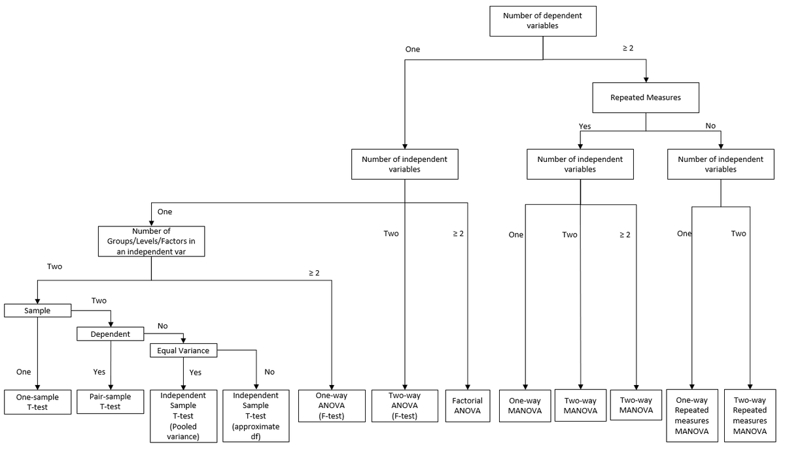
```

<!--# Throughout this chapter, we will explore a range of multivariate techniques such as Principal Component Analysis (PCA), Canonical Correlation Analysis (CCA), Factor Analysis, and Multivariate Analysis of Variance (MANOVA), each designed to answer specific types of questions about multivariate data. These tools are essential for any analyst or researcher aiming to unlock the structure and meaning hidden within high-dimensional datasets. -->

<!--# Principal Component Analysis -->

<!--# Canonical Correlation Analysis -->

<!--# Factor Analysis -->

<!-- ========================================= -->
<!-- Chapter: 25.1-part-quasi-ex.Rmd -->
<!-- ========================================= -->


# (PART\*) B. 준실험 설계 (QUASI-EXPERIMENTAL DESIGN) {-}

준실험 방법론(Quasi-experimental methods)은 파트 A에서 다룬 완전 무작위 배정 실험(Fully randomized experiments)과 순수 관찰 연구(Observational analysis) 사이의 간극을 메워줍니다. 진정한 무작위 배정(Randomization)이 불가능하거나 비윤리적이거나 비용이 과도하게 많이 드는 경우, 연구자는 처치 배정(Treatment assignment)에서 자연적으로 발생하는 외생적 변이(Plausibly exogenous variation)를 활용하여 실험과 유사한 수준의 인과적 신뢰성을 확보합니다.

## 무엇이 연구를 "준실험"으로 만드는가?

무작위 대조 시험(RCT)에서는 무작위 배정을 통해 처치 집단(Treated group)과 통제 집단(Control group)이 관찰 가능한 특성과 관찰되지 않은 특성 모두에서 (기댓값 기준으로) 비교 가능함을 보장합니다. 반면 준실험에서는 무작위 배정 대신 연구 설계(Design)를 대체제로 사용합니다. 배정 기준점(Cutoff) 바로 위와 아래에 위치한 개체들에 주목하거나, 시간에 따른 집단 간의 공통 추세를 추적하거나, 미처치 개체들로부터 가중치를 부여한 반사실(Counterfactual)을 구성하거나, 결과(Outcome)에 직접적인 영향을 주지 않으면서 처치만을 변화시키는 외부 변이 원천을 활용합니다.

무작위 배정을 포기하는 대가로 일련의 식별 가정(Identifying assumptions), 즉 연속성(Continuity), 평행 추세(Parallel trends), 독립성(Independence), 단조성(Monotonicity), 조건부 무시가능성(Conditional ignorability)을 도입해야 합니다. 본 파트의 각 방법론은 서로 다른 가정을 바탕으로 하며 각 장에서는 해당 가정이 무엇을 의미하는지, 언제 타당한지, 그리고 이를 어떻게 검증하고 점검할 수 있는지를 자세히 설명합니다.

## 본 파트의 로드맵 및 구성 순서

본 파트의 장들은 가장 신뢰할 수 있는 식별 전략(무작위 배정을 가장 가깝게 모방하는 전략)부터 시작하여 더 강하고 검증하기 어려운 가정에 의존하는 전략으로 나아가는 설계 신뢰성(Design credibility) 순서로 배치되어 있습니다. 순서대로 읽어나가는 독자는 점차 더 까다로운 가정을 마주하게 될 것입니다.

- [준실험 방법론(Quasi-Experimental Methods)](#sec-quasi-experimental)은 기초를 정립합니다: SUTVA, 조건부 무시가능성, 공통 지지(Overlap), 그리고 자연 실험(Natural experiments)의 논리를 다룹니다.
- [회귀 단절(Regression Discontinuity)](#sec-regression-discontinuity)은 알려진 기준점(Cutoff)에서의 국소적 무작위 배정(Local randomization)을 다룹니다. 이는 명확한 배정 규칙(Sharp assignment rule)이 존재할 때 일반적으로 가장 신뢰할 수 있는 설계입니다.
- [시간적 단절 설계(Temporal Discontinuity Designs)](#sec-temporal-discontinuity-designs)는 시간 기준 회귀 단절(RDiT)과 단절적 시계열(Interrupted Time Series)을 다룹니다. 이는 구동 변수(Running variable)가 시간인 명확형(Sharp) 및 분할형(Segmented) 변형 설계입니다.
- [합성 이중차분법(Synthetic Difference-in-Differences, SDID)](#sec-synthetic-difference-in-differences)은 표준 DiD보다 먼저 소개됩니다. SDID는 일반적으로 가장 로버스트한 패널 데이터 추정량이기 때문입니다. 이는 합성 통제(Synthetic Control)의 재가중치 논리와 DiD의 차분 논리를 결합하여 두 방법 중 어느 하나의 가정만 성립해도 우수한 성능을 발휘합니다. DiD나 SC에 익숙하지 않은 독자는 해당 장들을 먼저 훑어본 후 돌아오는 것을 권장합니다.
- [이중차분법(Difference-in-Differences, DiD)](#sec-difference-in-differences)은 [시차 도입(Staggered adoption)](#sec-modern-estimators-for-staggered-adoption), [패널 매칭 변형(Panel-match variants)](#sec-panel-match-did-estimator-with-in-and-out-treatment-conditions), [비선형 DiD(Non-linear DiD)](#sec-nonlinear-did), [최신 쟁점(Modern concerns)](#sec-modern-concerns-in-did)에 대한 확장과 함께 패널 데이터 분석의 핵심적인 워크호스(Workhorse) 추정량입니다. 평행 추세(Parallel trends)는 핵심 가정이며 신중하게 방어되어야 합니다.
- [변화 속의 변화(Changes-in-Changes, CiC)](#sec-changes-in-changes)는 DiD의 분위수 수준 확장입니다. 정책 효과가 결과 분포 전반에 걸쳐 이질적일 가능성이 높을 때 사용합니다.
- [합성 통제(Synthetic Control, SC)](#sec-synthetic-control)는 하나(또는 소수)의 처치 단위와 도너 풀(Donor pool)이 있는 설정을 다룹니다. 이는 처치 단위가 도너들의 사전 처치 특성의 볼록 껍질(Convex hull) 내에 위치한다는 점에 의존합니다.
- [사건 연구(Event Studies)](#sec-event-studies)는 DiD, RD 또는 IV 위에 적용되는 시각화 및 추정 프레임워크입니다. 사건 연구 결과물은 주변 설계가 인과적 경로를 확립하지 않는 한 기술적(Descriptive) 성격에 머뭅니다.
- [도구 변수(Instrumental Variables, IV)](#sec-instrumental-variables)는 [의사결정자 IV / 심사관 설계(Examiner design)](#sec-examiner-design) 및 대리 변수와 함께 다룹니다. 처치가 내생적일 때 IV는 해결책을 제공하지만 특정 하위 모집단(순응자, Compliers)에 대해서만 유효하며 배제 제약(Exclusion restriction)이 성립해야 합니다.
- [매칭 방법론(Matching Methods)](#sec-matching-methods)은 관찰 가능한 변수에 기반한 선택(Selection on observables)에 의존합니다. 조건부 독립성(Unconfoundedness)은 검증 불가능하므로 본 파트 중 가장 약한 식별 가정에 기초하며 따라서 매칭은 위의 방법론들을 적용하기 전 사전 처리(Preprocessing) 단계로 가장 유용하게 사용됩니다.

## 공통 주제

이 장들 전반에 걸쳐 동일한 개념적 접근 방식이 반복되는 것을 확인할 수 있습니다.

첫째, 전반에 걸쳐 잠재적 결과(Potential outcomes) 프레임워크에 의존합니다. 처치 상태 $d \in \{0, 1\}$ 하에서 개체 $i$의 결과를 $Y_i(d)$로 표기합니다. 패널 변형에서는 시간 첨자를 추가하여 $Y_{it}(d)$로 표기합니다. 처치는 $D_i$ 또는 $D_{it}$로 나타냅니다. 도구 변수와 구동 변수는 맥락상 명확한 경우 각각 $Z_i$ 및 $X_i$로 표기합니다.

둘째, 각 방법론은 핵심적인 역할을 수행하는 단 하나의 검증 불가능한 가정, 즉 연속성(Continuity), 평행 추세(Parallel trends), 배제성(Exclusion), 또는 조건부 독립성(Unconfoundedness)에 기반합니다. 사전 추세 검정(Pre-trend tests), 위약 검정(Placebo tests), 민감도 분석(Sensitivity analyses)은 해당 가정을 지지(Support)할 뿐이며 결코 이를 증명하지는 못합니다.

셋째, 추정 대상(Estimand)이 구체적입니다. RD는 기준점에서의 LATE를 추정합니다. DiD는 처치 집단에 대한 ATT를 추정합니다. 단조성 하의 IV는 순응자에 대한 LATE를 추정합니다. 매칭은 매칭 설정 방식에 따라 ATT 또는 ATE를 추정할 수 있습니다. 자신이 식별하고자 하는 대상이 무엇인지 명확히 이해해야 합니다.

넷째, 타당성에 대한 위협은 형태만 다를 뿐 동일한 범주에 속합니다. 선택 편향(Selection), 사전 기대 효과(Anticipation), 조작(Manipulation), 이질성(Heterogeneity), 약한 1단계(Weak first stages), 공통 지지 부족(Poor overlap) 등이 그것입니다. 이러한 문제들은 서로 다른 명칭으로 각 장에서 반복해서 나타나며 그 해결책(로버스트성 검정, 정직한 경계 추정, 민감도 분석) 또한 마찬가지입니다.

## 본 파트의 활용법

인과추론을 처음 접하는 독자는 [기초 장(Foundations chapter)](#sec-quasi-experimental)을 먼저 읽은 후 순서대로 진행해야 합니다. DiD나 SC에 대한 배경지식 없이 SDID를 접하게 되었다면, [단순 DiD](#sec-simple-difference-in-differences) 절과 [합성 통제](#sec-synthetic-control)를 먼저 훑어본 후 돌아오시기 바랍니다.

특정 질문을 가진 실무자는 관련 장으로 바로 건너뛸 수 있습니다. 각 장은 가정과 추정 전략이 서두에 명시되어 있어 독립적으로 읽을 수 있도록 설계되었습니다.

준실험 연구를 검토하는 심사자나 편집자는 [DiD의 최신 쟁점](#sec-modern-concerns-in-did) 절과 각 장의 타당성 위협 소절에 주목해야 합니다. 여기에는 각 설계에 대한 표준적인 반론들이 정리되어 있습니다.

본 파트에서 소개하는 방법론 중 주어진 연구 환경에 적합한 것을 매칭할 수 있도록 [기초 장](#sec-quasi-experimental)의 말미에 간결한 의사결정 표가 제공됩니다.

<!-- ========================================= -->
<!-- Chapter: 26-quasi-experimental.Rmd -->
<!-- ========================================= -->


# 준실험 방법론 (Quasi-Experimental Methods) {#sec-quasi-experimental}

무작위 배정 실험(Randomized experiments)은 인과추론의 표준(Gold standard)입니다. 그러나 응용 연구자들에게 중요한 대부분의 환경(국가 정책, 마케팅 캠페인, 규제 판결, 대대적인 조직 개편 평가 등)에서 실험을 실행하는 것은 비현실적이거나 비윤리적이거나 정치적으로 불가능합니다. 가계별로 세율을 무작위로 할당하거나, 국가별로 봉쇄 조치를 무작위로 시행하거나, 공장별로 해고를 무작위로 배정할 수는 없습니다. 본 파트에서 다루는 방법론들은 세상이 우리가 선호하는 연구 설계에 온전히 협조하기를 거부할 때 이를 해결하기 위해 존재합니다.

준실험 방법론(Quasi-experimental methods)은 이러한 제약을 인정하고 보다 현실적인 질문을 던집니다: 자연, 역사, 또는 제도가 무작위 배정과 *유사한* 변이를 제공할 때, 우리는 인과 효과에 가까운 값을 복원할 수 있는가? 이에 대한 답은 조건부 '그렇다'입니다. 이전 파트의 실험 설계 기초를 바탕으로, 관찰 데이터(주로 처치 전후 측정치 포함)를 활용하고 무작위 배정을 모방하는 자연 발생적이며 외생적인 변이(Exogenous variation)를 활용하는 전략들을 살펴볼 것입니다. 이를 통해 얻는 이점은 현실적인 환경에서 대규모 개입의 실제 효과를 연구할 수 있다는 점입니다. 반면 그 대가는 설계상 보장되는 것이 아니라 논증을 통해 설득해야 하는 일련의 식별 가정(Identifying assumptions)을 감수해야 하며 추정치가 일반화될 수 있는 범위에 대해 보다 신중한 태도를 취해야 한다는 점입니다.

이어지는 모든 장을 읽을 때 염두에 두어야 할 몇 가지 고려사항이 있습니다:

첫 번째는 대표성(Representativeness)입니다. 준실험은 특정 주(State)의 정책, 특정 기업의 조직 개편, 특정 코호트의 자격 요건 구간 등 고유한 특정 환경을 활용합니다. 따라서 추정치는 일차적으로 해당 환경에 대한 답입니다. 이것이 다른 맥락으로 외삽(Extrapolate)될 수 있는지, 그리고 어떻게 외삽될 수 있는지는 별개의 문제이며 연구자들이 종종 간과하는 부분입니다.

두 번째는 [연구 설계의 한계(Limitations of the design)](#sec-limitations-of-quasi-experiments)입니다. 각 방법론은 평행 추세(Parallel trends), 연속성(Continuity), 배제 제약(Exclusion), 조건부 독립성(Unconfoundedness) 등 직접적으로 검증할 수 없는 식별 가정에 기초합니다. 사전 추세 검정, 위약 검정, 민감도 분석은 이러한 가정을 *더 그럴듯하게* 만들 수는 있지만 증명할 수는 없습니다. 준실험 연구를 읽을 때 갖추어야 할 유용한 습관은 다음과 같이 자문하는 것입니다: *만약이 추정치가 편향되어 있다면, 어떤 조건이 참이어야 하는가?*

세 번째는 구조 모델과의 통합(Integration with structural models)입니다. 축약형(Reduced-form) 준실험 추정치는 특정 환경에서 개입이 평균적으로 어떠한 영향을 미쳤는지를 알려줍니다. 하지만 그 자체로는 왜 그런 효과가 나타났는지, 어떤 기전을 통해서인지, 혹은 실제로 시행되지 않은 반사실적 정책하에서는 어떤 일이 일어날지를 알려주지 않습니다. 준실험 추정치를 구조 모델 또는 이론 모델과 결합하는 것(예: 신뢰할 수 있는 축약형 모멘트에 맞추어 모델을 캘리브레이션하는 것)은 현대 실증 연구에서 가장 생산적인 방향 중 하나입니다; @anderson2015growth, @einav2010beyond, @chung2014bonuses 는 본 장과 함께 읽기에 매우 유용한 예시들입니다.

이러한 도구들은 현재 경제학, 마케팅, 정치학, 공중보건학 전반의 응용 연구뿐만 아니라 대기업 내부 데이터 과학 팀에서도 핵심적인 역할을 담당하고 있습니다. 개념적 메커니즘은 모든 영역에서 동일합니다. 핵심 기술은 이를 올바른 환경에 적절히 적용하는 데 있습니다.

<!-- Great resources for causal inference include: -->

<!-- - [Causal Inference Mixtape](https://mixtape.scunning.com/introduction.html) -->

<!-- - [Recent Advances in Micro](https://christinecai.github.io/PublicGoods/applied_micro_methods.pdf) -->

<!-- The following R packages are useful for implementing quasi-experimental methods: -->

<!-- - [Econometrics](https://cran.r-project.org/web/views/Econometrics.html): Covers a broad range of econometric techniques. -->

<!-- - [Causal Inference](https://cran.r-project.org/web/views/CausalInference.html): Provides tools for estimating causal effects under different identification assumptions. -->


## 준실험에서의 식별 전략 (Identification Strategy in Quasi-Experiments)

준실험에는 무작위 배정이 제공하는 인과성에 대한 형식적 통계적 증명이 결여되어 있습니다. 무작위 배정은 처치 집단과 미처치 집단의 비교 가능성을 설계 자체의 고유한 속성으로 만듭니다. 그러나 무작위 배정을 포기하는 순간, 비교 가능성은 당연시되는 것이 아니라 논증되어야 합니다. 연구의 궁극적인 신뢰성은 가정한 통제 변수들이 주어졌을 때 활용되는 변이가 진정으로 무작위 배정에 준하는가(As good as random)에 대해 독자를 설득할 수 있는지에 달려 있습니다. 독자는 합리적인 회의론을 가질 권리가 있으며 훌륭한 연구는 그러한 회의론을 미리 예상합니다.

방어 가능한 식별 전략은 거의 항상 세 가지 기둥에 기초합니다. 첫째는 외생적 변이가 *어디서* 비롯되었는지, 즉 단위 스스로가 조작하지 않은 세상의 어떤 특징 때문에 일부 단위는 처치를 받고 다른 단위는 받지 않았는지에 대한 설명입니다. 둘째는 그 변이가 오직 제안된 경로를 통해서만 결과에 영향을 미친다는 논증이며 이를 통해 동일한 충격의 다른 파생적 결과가 혼입되지 않았음을 보장합니다. 셋째는 단위 수준의 인과추론이 단위 간 처치 파급 시 무너지기 때문에, 한 단위의 처치가 다른 단위의 결과에 영향을 미치지 않는지 확인하는 것입니다.

1. 외생적 변이의 원천(Sources of Exogenous Variation): 변이는 어디서 오며 왜 결과의 관찰되지 않은 결정요인과 무관하다고 볼 수 있는가? 이 기둥은 제도적 지식(Institutional knowledge)에 크게 의존합니다: 결과와 무관한 이유로 통과된 정책, 추첨(Lottery), 불연속적 자격 기준, 예상치 못한 기상 이변 충격, 행정적 특이성 등이 이에 해당합니다. 저자는 설득력 있는 논리를 펼칠 수 있을 만큼 해당 환경을 잘 알고 있어야 하며 그 논리는 합리적인 반론을 견뎌내야 합니다.
2. 배제 제약(Exclusion Restriction): 변이가 외생적이라 하더라도 여러 경로를 통해 결과에 영향을 미칠 수 있습니다. 배제 제약은 변이가 *오직* 관심 있는 처치 경로를 통해서만 결과에 도달한다는 주장입니다. 다른 대안적 경로를 배제하기 위해서는 대개 이론적 근거, 위약 결과(Placebo outcomes)에 대한 반증 검정(Falsification tests), 그리고 신중한 제도적 논증이 결합되어야 합니다.
3. [안정적 단위 처치 가치 가정(SUTVA)](#sec-sutva): 단위 $i$의 결과는 단위 $i$ 자신의 처치에만 의존하며 다른 단위의 처치에는 영향을 받지 않습니다. 파급 효과(Spillovers), 동료 효과(Peer effects), 균형 반응(Equilibrium responses)은 모두가 가정을 위배합니다. SUTVA는 [다음 절](#sec-sutva)에서 명시적으로 다루어지지만 모든 설계의 기저에 내재되어 있습니다.

모든 준실험 방법론은 *통계적 검정력(Statistical power)*과 *외생성 가정에 대한 지지(Support for exogeneity)* 사이의 트레이드오프를 수반합니다. 변이의 원천이 깔끔할수록 이를 활용하는 데이터의 범위는 좁아집니다: [회귀 단절(RD)](#sec-regression-discontinuity) 설계는 기준점에서 먼 관측치를 버리고 [도구 변수(IV)](#sec-instrumental-variables) 설계는 도구 변수에 의해 유도되지 않은 처치 변이를 제거하며 [이중차분법(DiD)](#sec-difference-in-differences) 설계는 수준(Level) 차이를 무시하고 오직 차분(Difference)만을 사용합니다. 즉, 정보를 희생하여 신뢰성을 확보하는 것입니다. 전체 표본을 모두 사용하면서 깔끔한 인과 효과를 주장하는 연구는 대부분 명시하지 않은 강한 가정에 의존하고 있을 가능성이 큽니다.

### 추론에 관한 실무적 고려사항 (Practical Notes on Inference)

이어지는 거의 모든 장에서 반복해서 등장하는 몇 가지 실무적 핵심 사항들이 있습니다. 각각은 사소해 보이지만 다운스트림에 큰 영향을 미치며 심사자가 뒤늦게 지적하기 쉬운 유형의 문제들입니다. 아래 목록이 모든 것을 포괄하지는 않으며 각 방법론을 진행하면서 특정 설계에 고유한 추가 고려사항들이 계속해서 제시될 것입니다.

- $R^2$는 인과적 신뢰성의 척도가 아닙니다. $R^2$가 0.9인 회귀 모델도 심각하게 편향될 수 있으며 $R^2$가 0.05인 회귀 모델도 깔끔한 인과 효과를 식별할 수 있습니다. 중요한 것은 설명변수의 변이가 외생적인가이지, 모델이 결과 변수의 분산을 얼마나 많이 설명하는가가 아닙니다. @ebbes2011sense 는 이에 대한 대표적인 경고입니다. 심사자가 더 높은 $R^2$를 요구하는 경우가 종종 있으나, 이는 잘못된 요구입니다.

- 표준오차의 군집화(Clustering)는 설계의 문제이지, 결과를 입맛대로 고르기 위한 낚시(Fishing expedition)가 아닙니다. 군집화 단위는 처치가 배정된 수준이나 설계상 관측치들이 상관관계를 가질 수 있는 수준을 반영해야 합니다. 더 유리한 $p$-값을 얻기 위해 임의로 선택되어서는 안 됩니다. @abadie2023should 는 설계 기반의 군집화 논리를 엄밀하게 정립하였으므로 군집화를 적용하기 전 반드시 숙지해야 합니다.

- 소표본에서는 군집-로버스트 분산 추정량(Cluster-robust variance estimator)이 하향 편향되며 와일드 부트스트랩(Wild bootstrap)이 표준적인 보정 방법입니다 [@cameron2008bootstrap; @cai2022implementation]. 여기서 "소표본"은 군집 수가 대략 30개 미만인 경우를 의미할 수 있으며 이는 주(State) 수준의 정책 연구에서 매우 흔하게 발생합니다. 이러한 환경에서는 요청받을 때까지 기다리지 말고 와일드 부트스트랩을 기본적으로 적용해야 합니다.

- 가능한 한 결과 변수, 통제 변수, 하위 그룹을 사전에 명시(Pre-specify)하십시오. 준실험 설계는 재무작위화할 수는 없지만 수많은 사양에 걸쳐 여러 번 재분석될 수 있으며 분석가의 선택은 결과 $p$-값에 그대로 반영됩니다. 비공식적인 형태라도 결과를 확인하기 전에 작성된 사전 분석 계획(Pre-analysis plan)은 의도치 않은 사양 탐색(Specification searching)을 방어하는 가장 경제적인 수단이며 신뢰할 수 있는 탐색적 분석과 유의성을 위해 은밀히 조정된 분석을 구분 짓는 기준이 됩니다.

- $p$-값뿐만 아니라 효과 크기(Effect sizes)를 함께 보고하십시오. 통계적 유의성과 경제적 유의성은 동일하지 않으며 매우 정밀하게 추정된 미세한 효과는 실질적인 의미가 없더라도 통계적으로 유의할 수 있습니다. 독자가 방향성뿐만 아니라 크기를 판단할 수 있도록 점추정치와 신뢰구간을 결과 변수의 단위(또는 기준선 평균 대비 백분율)로 항상 제시해야 합니다.

- [나쁜 통제 변수(Bad controls)](#sec-controls)를 주의하십시오. 통제 변수를 무조건 많이 추가하는 것이 항상 안전한 방어책은 아닙니다. 처치 자체에 의해 영향을 받는 변수, 충돌 변수(Collider), 또는 매개 변수(Mediator)를 조건부로 통제하면 편향을 제거하기는커녕 오히려 편향을 유발할 수 있습니다. DAG 기반의 엄격한 원칙은 후보 인과 구조로부터 조정 집합(Adjustment set)을 도출하고 그 외의 공변량을 추가하려는 유혹을 억제하는 것입니다.


## 인과 기전의 확립 (Establishing Mechanisms)

인과 효과를 식별하는 것은 실증 연구 프로젝트의 끝이 아니라 시작입니다. 직업 훈련 프로그램이 평균적으로 소득을 증가시킨다는 사실을 아는 것은 유용하지만 여전히 더 본질적인 질문들이 남아 있습니다: 소득이 증가한 이유가 참가자들이 시장성 있는 기술을 습득했기 때문인가, 프로그램이 고용주에게 성실성을 알리는 신호 역할을 했기 때문인가, 사람들을 더 밀집된 노동 시장으로 이동시켰기 때문인가, 아니면이 세 가지의 결합 때문인가? 그 효과는 프로그램이 없었다면 가장 어려움을 겪었을 근로자들에게 집중되었는가, 아니면 프로그램이 가장 덜 필요했던 이들에게 나타났는가? 기전(Mechanism)이 뒷받침되지 않은 추정치는 외삽하기 어렵고 개선하기 어려우며 이후 이어지는 정책 논의에서 방어하기 어렵습니다.

기전과 관련된 가장 흔한 두 가지 질문은 처치가 *어떻게(How)* 작용하는가와 *누구를 위해(For whom)* 작용하는가입니다. 전자는 총효과를 중간 변수를 거쳐 전달되는 부분과 그렇지 않은 부분으로 분해하는 [매개 분석(Mediation analysis)](#sec-mediation-analysis-explaining-the-causal-pathway)의 영역입니다. 후자는 처치 효과가 하위 그룹 전반에 걸쳐 균일한지 아니면 특정 식별 가능한 그룹에 집중되는지를 묻는 [조절 분석(Moderation analysis)](#sec-moderation-analysis-for-whom-or-under-what-conditions)의 영역입니다. 둘 다 유용하지만 둘 다 잘못 해석되기 쉽습니다. 본 절의 나머지 부분에서는 각각이 제공할 수 있는 것과 어디서 주로 한계에 부딪히는지를 살펴봅니다.


### 매개 분석: 인과 경로의 설명 (Mediation Analysis: Explaining the Causal Pathway) {#sec-mediation-analysis-explaining-the-causal-pathway}

매개 분석은 처치와 결과 사이의 블랙박스를 열고자 합니다. 구체적으로는 처치 $T$가 결과 $Y$에 미치는 영향이 *매개 변수(Mediator)*라 불리는 중간 변수 $M$을 거쳐 전달되는지를 묻습니다. 이때 총효과는 $M$을 거치지 않고 $T$에서 $Y$로 직접 전달되는 직접 효과(Direct effect)와 $T \to M \to Y$ 경로로 전달되는 간접 효과(Indirect effect)로 분해됩니다:

- $T$ = 처치 (Treatment),
- $M$ = 매개 변수 (Mediator),
- $Y$ = 결과 (Outcome),

개념적 분해는 다음과 같습니다:

$$
\underbrace{\text{Total effect of } T \text{ on } Y}_{T \to Y} \;=\; \underbrace{\text{Direct effect}}_{T \to Y \text{ not through } M} \;+\; \underbrace{\text{Indirect effect}}_{T \to M \to Y}.
$$

이 분해는 단순해 보이지만 식별 문제는 결코 단순하지 않습니다. 각 부분을 인과적으로 해석하려면 두 단계의 무작위 배정에 준하는 변이가 필요합니다: 하나는 $T$의 외생적 변이를 제공하고 다른 하나는 $T$가 주어졌을 때 $M$의 외생적 변이를 제공해야 합니다. 이에 대한 표준적인 형식적 버전이 바로 순차적 무시가능성(Sequential ignorability)입니다: 처치는 무조건적으로(또는 기준선 공변량 조건부로) 무작위 배정에 준해야 하며 *동시에* 매개 변수는 처치와 공변량이 주어졌을 때 무작위 배정에 준해야 합니다 [@imai2010general]. 두 번째 조건이 매우 까다롭습니다. 대부분의 관찰 연구에서 $M$을 유발하는 요인은 $Y$도 함께 유발하므로, 추정된 간접 효과는 매개체-결과 교란(Mediator-outcome confounding)에 의해 오염되기 쉽습니다.

일반적으로 몇 가지 추정 전략이 사용되며 방어해야 하는 가정의 강도가 높아지는 순서대로 아래에 나열합니다.

첫 번째는 @imai2010general 의 인과적 매개 프레임워크로, 순차적 무시가능성하에서 평균 직접 효과와 간접 효과의 비모수적 추정량을 제공합니다. 주된 이점은 특정 함수 형태를 가정할 필요가 없다는 점입니다. 반면 주된 대가는 가정을 직접 검증할 수 없다는 점이며 따라서 결론을 뒤집기 위해 관찰되지 않은 매개체-결과 교란이 얼마나 강해야 하는지를 보여주는 민감도 분석과 결합할 때 가장 유용합니다.

두 번째는 매개 방정식과 결과 방정식을 순차적으로 적합하는 2단계 회귀 접근법(Two-stage regression approach)입니다:

$$
\begin{aligned}
M_i &= \alpha + \tau\, T_i + \varepsilon_i, \\
Y_i &= \beta + \gamma\, T_i + \delta\, M_i + \eta_i.
\end{aligned}
$$

곱 $\tau \cdot \delta$를 간접 효과로, $\gamma$를 직접 효과로 해석합니다. 이는 전통적인 "바론-케니(Baron-Kenny)" 방식입니다. 빠르고 직관적이지만 $M_i$가 $\eta_i$와 상관될 때, 즉 관찰되지 않은 매개체-결과 교란이 존재할 때마다 편향됩니다. 2단계 회귀는 인과적 분해가 아닌 1차적인 기술적 설명으로 취급해야 합니다.

세 번째는 도구 변수 매개 분석(Instrumental-variable mediation)으로, ($T$를 통제한 후) 오직 $M$을 통해서만 $Y$에 영향을 미치는 도구 변수를 찾는 방법입니다. 제대로 수행된다면 매개 경로에 대한 신뢰할 수 있는 LATE를 제공합니다. 그러나 잘못 수행되면 인위적인 허상(Artifact)을 정밀하게 추정하는 결과를 낳기 쉽습니다. 주된 난점은 다른 경로를 통해 $T$의 도구 변수가 되지 않으면서 $M$에만 작용하는 도구 변수를 찾는 것입니다.

매개 질문은 모든 분야에서 나타납니다. 마케팅: 광고가 매출을 올린 이유가 브랜드 인지도를 높였기 때문인가, 아니면 다른 이유인가? 교육: 튜터링 프로그램이 시험 점수를 올린 이유가 출석률을 개선해서인가, 동기를 부여해서인가, 부모의 관심을 유도해서인가? 노동경제학: 직업 훈련이 임금을 올린 이유가 기술을 축적해서인가, 근로자를 더 적합한 일자리로 매칭해서인가, 대조군에 대한 낙인 효과 때문인가?

> 주의. 매개 분석은 실증 연구에서 가장 남용되는 도구 중 하나입니다. 수학적 전개는 성립하지만 식별은 거의 성립하지 않습니다. 연구에서 매개 변수를 무작위화하지 않았다면, 도출된 모든 분해를 기술적인 것으로 취급하고 민감도 분석을 보고하며 이론적 논증을 결합하십시오. 과도한 가정에 의존한 정밀한 분해보다 정직한 기전 설명이 뒷받침된 깔끔한 총효과가 훨씬 더 큰 설득력을 갖습니다.


### 조절 분석: 누구를 위해, 어떤 조건에서 작용하는가? (Moderation Analysis: For Whom or Under What Conditions?) {#sec-moderation-analysis-for-whom-or-under-what-conditions}

매개가 처치가 *어떻게* 작용하는지를 묻는다면, 조절은 처치가 *언제*, *누구를 위해* 작용하는지를 묻습니다. 동일한 개입이라도 한 하위 그룹에서는 결과를 크게 개선하지만 다른 그룹에서는 거의 효과가 없을 수 있으며 하위 그룹들을 통합한 평균 효과는 이러한 이질성을 완전히 가려버릴 수 있습니다. 조절 분석은 이를 표면화하기 위한 툴킷입니다.

조절을 이끄는 질문은 구체적입니다: 성별, 소득, 지역, 또는 초기 결과 상태에 따라 효과가 다른가? 프로그램이 고위험 참가자에게 더 효과적인가, 아니면 어차피 잘했을 조기 수용자에게 더 효과적인가? 처치가 밀집된 도시 노동 시장에서는 작동하지만 희소한 농촌 시장에서는 작동하지 않는가? 정직한 조절 분석은 "프로그램이 소득을 4% 증가시켰다"는 결과와 "프로그램이 이전 실업 기간이 있던 근로자의 소득을 12% 증가시켰고 다른 근로자에게는 유의한 효과가 없었다"는 결과를 구분 짓는 요소이며 동일한 데이터셋으로부터 도출되는 완전히 다른 정책적 함의를 보여줍니다.

실무에서는 몇 가지 추정 전략이 주로 사용됩니다. 하위 그룹 분석(Subgroup analysis)은 각 하위 그룹 내에서 효과를 개별적으로 재추정하고 그 결과를 비교하는 단순한 방식입니다. 투명하고 설명하기 쉽지만 두 가지 실수의 위험이 있습니다: 노이즈가 낀 추정치를 정밀한 것처럼 비교하는 것과, 데이터를 너무 많은 하위 그룹으로 쪼개어 우연히 "유의한" 차이가 나타나게 만드는 것입니다. 하위 그룹을 사전에 명시하고 다중 검정 보정을 적용하는 것이 표준적인 원칙입니다(아래 자연 실험 절 참조).

상호작용 모델(Interaction models)은 처치-조절 변수 간 상호작용 항을 포함하여 단일 회귀 모델 내에 조절 변수를 포함합니다:

$$
Y_{it} = \alpha + \beta_1 T_{it} + \beta_2 Z_i + \beta_3 (T_{it} \times Z_i) + \varepsilon_{it},
$$

여기서 $Z_i$는 조절 변수(예: 고소득 지표)입니다. 계수 $\beta_3$은 두 그룹 간 처치 효과의 차이이며 $\beta_1$은 기준 그룹(Reference group)에 대한 처치 효과입니다. 여기서 가장 흔한 오류는 $\beta_1$을 "처치 효과"로 읽는 것입니다. 이는 오직 $Z_i = 0$일 때만 처치 효과입니다. 항상 주효과와 상호작용 효과를 결합하여 해석하고 $Z_i$의 관련 범위 전반에 걸친 한계 효과(Marginal effects)를 플롯해야 합니다.

조절 효과를 포함한 이중차분법(DiD with moderation)은 3원 상호작용(Three-way interaction)을 사용하여 이를 패널 데이터 환경으로 확장합니다:

$$
Y_{it} = \alpha + \beta_1 \text{Post}_t + \beta_2 \text{Treat}_i + \beta_3 Z_i + \beta_4 (\text{Post}_t \times \text{Treat}_i) + \beta_5 (\text{Post}_t \times \text{Treat}_i \times Z_i) + \varepsilon_{it}.
$$

이제 $\beta_4$는 기준 조절 그룹에 대한 DiD 효과이고 $\beta_5$는 그룹 간 *DiD 효과의 차이(Difference in DiDs)*입니다. 이전과 마찬가지로 평행 추세 가정은 $Z_i$의 각 값 내에서 개별적으로 적용되며 처치가 도입되기 전부터 하위 그룹 간 사전 추세가 달랐다면 조절 분석은 무너질 수 있습니다.

세 가지 전략 모두에서 시각화는 선택이 아닌 필수입니다. 신뢰대(Confidence bands)와 함께 $Z_i$ 값에 따른 처치 효과를 보여주는 한계 효과 플롯은 어떠한 회귀 계수 표보다 조절 효과를 정직하게 전달합니다. 그룹별 개별 회귀선을 보여주는 상호작용 플롯은 하위 그룹 이질성을 한눈에 파악할 수 있게 합니다. $\beta_5$와 그 $p$-값만을 표로 제시하는 것은 동일한 분석을 직접 수행해보지 않은 독자를 오도할 수 있습니다.

표 @tbl-quasi-exp-mech-approach 는 위에서 논의한 세 가지 기전 분석 접근법(매개 분석, 하위 그룹 분석, 상호작용 항)의 목표, 핵심 가정, 일반적인 위험 요소를 요약하여 질문에 적합한 도구를 매칭할 수 있도록 돕습니다.

| 접근법 | 목표 | 핵심 가정 | 일반적인 위험 요소 |
|-------------------|---------------------------------|-------------------------------------------------|--------------------------------------------|
| 매개 분석 (Mediation) | 중간 변수 식별 | 순차적 무시가능성, 누락된 교란요인 없음 | 매개 변수가 내생적일 수 있음 |
| 하위 그룹 분석 (Subgroup Analysis) | 그룹별 효과 추정 | 충분한 표본 크기, 균형 잡힌 공변량 | 불균형으로 인한 허위 차이 발생 |
| 상호작용 항 (Interaction Terms) | 조건부 효과 추정 | 올바른 모델 사양 | 비유의한 항의 잘못된 해석 |
: 기전 분석 접근법. {#tbl-quasi-exp-mech-approach}


매개와 조절은 실증 추정치와 이론을 연결하는 상호보완적인 다리 역할을 합니다. 매개는 추정치를 처치가 어떻게 변화를 이끌어내는가에 대한 설명인 *과정 이론(Process theories)*과 연결하며 조절은 처치가 언제 누구에게 작동하는가에 대한 설명인 *조건 이론(Contingency theories)*과 연결합니다. 완전한 실증 논문에서 두 가지를 모두 다루기는 어렵지만 자신의 연구가 둘 중 어느 쪽에 집중하고 있는지를 명확히 인식하는 것이 정직한 연구 프레이밍을 유지하는 길입니다. 응용 비즈니스 연구에서 실무적 가치는 직접적입니다: 매개는 제품 및 개입 설계를 안내(효과를 얻기 위해 어떤 채널에 투자해야 하는가?)하는 반면, 조절은 타겟팅과 개인화를 안내(어떤 고객에게 집중해야 하는가?)합니다. 예를 들어 고객 유지 실험에서 매개 분석을 통해 고객 만족도가 충성도 프로그램을 통해 갱신율을 높이는 경로임을 보여주고 조절 분석을 통해 이러한 상승 효과가 장기 고객보다는 신규 고객에게 집중됨을 보여줄 수 있습니다. 이 두 가지 발견이 결합되면 어느 하나만으로는 얻을 수 없는 실행 가능한 전략을 도출할 수 있습니다.


## 로버스트성 검정 (Robustness Checks) {#sec-robustness-checks-quasi-exp}

로버스트성 검정은 결과를 합리적으로 뒤집을(Overturn) 수 있을 때 진정한 가치를 갖습니다. 출판된 대부분의 로버스트성 절은이 기준을 통과하지 못합니다. 주요 추정치에 전혀 영향을 주지 않을 방식으로 통제 변수 집합이나 표본 구간을 살짝 수정한 후 변하지 않은 수치를 보고 "로버스트하다"고 부르곤 합니다. 유용한 로버스트성 프로그램은 그 반대로 작동합니다: 식별 가정이 틀렸다면 추정치가 어떻게 반응해야 하는지 묻고 데이터에서 그러한 양상을 찾아내려고 시도합니다.

@goldfarb2022conducting 은 마케팅 및 경영학 분야의 관행에 대한 체계적인 검토를 제공하며 아래는 가장 일반적인 검정들을 모아 정리한 것입니다. 이를 체크리스트가 아닌 메뉴로 취급하십시오. 모든 연구에 모든 검정을 적용하는 것은 과도하지만 어떤 연구에도 아무 검정을 적용하지 않는 것은 연구 윤리에 반합니다.

첫 번째 군은 대안적 통제 변수 집합(Alternative control sets)입니다. 통제 변수가 없는 모델, 기본 통제 변수 모델, 가능한 모든 통제 변수를 포함한 모델(Kitchen-sink set)을 각각 실행합니다. 특정 공변량을 추가했을 때 추정치가 크게 변한다면, 해당 공변량이 중요한 역할을 하고 있는 것이며 저자는 그것이 왜 올바른 사양에 포함되거나 제외되어야 하는지 독자에게 설명할 책임이 있습니다. 여기서의 원칙은 [계수 안정성 경계(Coefficient-stability bounds)](#sec-coefficient-stability-bounds) 및 [로젠바움 경계(Rosenbaum bounds)](#sec-rosenbaum-bounds) [@altonji2005selection]와 밀접하게 연결됩니다: 두 방법 모두 결론을 뒤집기 위해 관찰되지 않은 교란이 관찰된 교란요인 대비 얼마나 강해야 하는지를 정량화합니다. "내가 관찰한 모든 것을 합친 것보다 두 배 강한 교란"만으로 결과가 사라진다면 그 결과는 취약한 것입니다. 마케팅 응용 사례로는 @manchanda2015social 및 @shin2012fire 가 있습니다. [나쁜 통제 변수](#sec-controls) 장에서 다루는 상호보완적 원칙은 충돌 변수나 처치 후 변수를 통제하여 과도 통제 편향([Overcontrol bias](#sec-overcontrol-bias))을 유발하고 추정치의 부호를 바꿀 위험이 없는지 확인하는 것입니다.

두 번째는 서로 다른 함수 형태(Different functional forms)입니다. 결론이 특정 선형 또는 로그 사양에 의존한다면, 비선형 패턴이 처치 계수에 잘못 흡수되었을 우려가 있습니다. 비선형, 준모수(Semi-parametric), 또는 완전 유연한(Fully flexible) 사양으로 재추정하고 부호와 크기가 유지되는지 확인하십시오. 유지된다면 단순한 사양이 지지받는 것입니다. 유지되지 않는다면 민감도 자체가 유용한 정보를 제공합니다. 특히 [RD](#sec-regression-discontinuity) 설계에서는 구동 변수 통제의 다항식 차수를 변경하는 것이가 검정의 표준적인 형태입니다.

세 번째는 종단적 환경에서의 시간 구간 변경(Varying time windows)입니다. 특정 특이한 한 해 때문에 효과가 나타난 것인가? 경기 침체, 선거, 공급망 혼란을 포함하거나 제외하는 것에 결과가 좌우되는가? 패널의 양 끝을 잘라내고 재추정해 보십시오. 단 하나의 "흥미로운" 해에 의존하는 설계는 재현되지 않는 경향이 있습니다. [이중차분법(DiD)](#sec-difference-in-differences)에서가 검정의 자연스러운 확장은 처치 전후 구간 길이를 다양화하는 것이며 [단절적 시계열(ITS)](#sec-interrupted-time-series)에서는 개입 시점 주변 구간의 대역폭(Bandwidth)을 변경하는 것입니다.

네 번째는 대안적 종속 변수(Alternative dependent variables)입니다. 대부분의 이론적 기전은 둘 이상의 결과 변수에 대한 예측을 제공합니다. 가설이 맞다면 관련 결과들은 예측 가능한 방향으로 움직여야 하며 기전이 영향을 미치지 않아야 할 결과들은 전혀 움직이지 않아야 합니다. 후자인 *위약 결과(Placebo outcomes)* (또는 *반증 결과, Falsification outcomes*)는 더욱 강력한 검정입니다. 위약 결과에 대해 "작동"하는 처치는 기전이 잘못 지정되었거나 식별 가정이 위배된 처치입니다.

다섯 번째는 특히 미처치 비교 그룹을 선택하는 매칭이나 준실험 설계에서 통제 집단 구성의 변경(Varying control group composition)입니다. 원본 표본, 매칭된 표본, 트리밍된 표본 간의 결과, [서로 다른 매칭 알고리즘](#sec-matching-methods)(성향점수 매칭, [마할라노비스](#sec-mahalanobis), [조정 완전 매칭(CEM)](#sec-cem), [유전자 매칭](#sec-genetic-matching)) 간의 결과, 그리고 [합성 통제](#sec-synthetic-control) 환경에서 타당한 도너 풀 간의 결과를 비교하십시오. 비교 그룹의 합리적인 변화에 따라 크게 요동치는 추정치는 안정적인 모수를 추정하고 있지 못한 것이며 그로 인한 이질성은 종종 대표 수치 자체보다 설계에 대해 더 많은 정보를 제공합니다.

여섯 번째는 설계 자체에 대한 위약 검정(Placebo tests)입니다. 적절한 위약 검정은 방법론에 따라 다릅니다: [DiD](#sec-placebo-test-did)에서의 가짜 처치 시점, [RD](#sec-regression-discontinuity)에서의 가짜 기준점, [IV](#sec-instrumental-variables)에서의 가짜 도구 변수, [사건 연구](#sec-event-studies)에서 이벤트가 없었던 해의 이벤트 윈도우 등이 있습니다. 이후의 각 장에서는 해당 방법론의 표준적인 위약 검정을 상세히 설명합니다. 위약 검정이 없는 연구는 설계가 효과가 없는 상황을 제대로 감지할 수 있는지 스스로에게 묻지 않은 연구입니다.

설계를 넘나드는 두 가지 추가 검정도 주목할 가치가 있습니다. 사전 추세 시각화(Pre-trend visualizations)(DiD의 [평행 추세 시각화](#sec-visualization-did), RD 기준점에서의 [McCrary 밀도 검정](#sec-mccrary-sorting-test), 사건 연구의 선행 계수)는 처치 전에 이미 식별 가정이 실패하고 있었는지를 드러냅니다. 그리고 시차 도입이 있는 패널 설계에서는 [시차 DiD를 위한 최신 추정량](#sec-modern-estimators-for-staggered-adoption)과 [Goodman-Bacon 분해](#sec-goodman-bacon-decomposition), [HonestDiD](#sec-relative-magnitude-restriction-honestdid)와 같은 부분 식별 접근법을 포함한 [DiD의 최신 쟁점](#sec-modern-concerns-in-did)의 진단 도구들이 표준 [이원 고정효과(TWFE)](#sec-two-way-fixed-effects) 추정량의 음수 가중치 병리 현상에 대한 내장된 로버스트성 검정 역할을 합니다.

실무적 기본 원칙: 가능한 한 로버스트성을 시각적으로 제시하고 똑똑한 회의론자를 가장 불편하게 만들 가장 위협적인 검정을 부록에 묻어두지 말고 표의 맨 앞에 배치하십시오. 취약점에 대한 투명성은 역설적으로 신뢰할 수 있는 설계를 위한 가장 강력한 방어책입니다.


## 준실험의 한계 (Limitations of Quasi-Experiments) {#sec-limitations-of-quasi-experiments}

준실험 방법론은 강력하지만 그 강력함에는 조건이 따릅니다. 식별이 연구자가 통제하는 배정 메커니즘이 아니라 관찰된 변이에 기초하기 때문에, 핵심적인 역할을 하는 가정들은 무작위 시험의 대응하는 가정들보다 더 엄격하고 검증하기 어려우며 위배되기 쉽습니다. 진지한 준실험 논문은 단순히 식별 가정을 서술하는 데 그치지 않고 가정을 스트레스 테스트하고 불편한 결과가 나오더라도 그 결과를 솔직하게 보고합니다.

본 절의 나머지 부분에서는 연구자와 비판적 독자 모두가 항상 염두에 두어야 할 네 가지 질문을 중심으로 표준적인 한계점들을 정리합니다: 무엇이 가정되고 있는가, 어떤 위협이 결과를 훼손할 수 있는가, 그 위협들을 어떻게 점검할 수 있는가, 그리고 도출된 추정치가 어디까지 일반화될 수 있는가. 이 질문들은 순차적으로 쌓입니다: 첫 번째 질문에 답할 수 없는 연구는 다른 질문들을 시도할 자격이 없습니다.


### 식별 가정 (Identifying Assumptions)

모든 준실험 방법론은 무작위 배정을 대신하여 특정한 식별 가정을 도입합니다. 그 가정의 형태는 방법론마다 다르지만 그 기능은 항상 동일합니다: 데이터만으로는 제공할 수 없는 반사실적 비교를 가능하게 하는 것입니다.

[이중차분법(DiD)](#sec-difference-in-differences)은 평행 추세(Parallel trends)에 기초합니다: 처치가 없었더라면 처치 집단과 통제 집단이 동일한 결과 궤적을 따랐을 것이라는 가정입니다. 이 가정은 정의상 검증 불가능하지만(처치 후 처치 집단의 미처치 결과를 관찰할 수 없음), 처치 전 데이터를 통해 그 타당성을 어느 정도 뒷받침할 수 있습니다.

[회귀 단절(RD)](#sec-regression-discontinuity)은 기준점에서의 연속성(Continuity at the cutoff)에 기초합니다: 기준점 바로 위와 바로 아래의 단위들은 관찰되지 않은 특성이 아니라 오직 처치 상태에서만 차이가 난다는 가정입니다. 이 가정의 신뢰성은 개체들이 기준점에 대한 자신의 위치를 정밀하게 조작할 수 있었는지 여부에 달려 있습니다.

[도구 변수(IV)](#sec-instrumental-variables)는 외생성(Exogeneity)과 배제성(Exclusion)을 요구합니다: 도구 변수는 결과의 관찰되지 않은 결정요인과 무관해야 하며 오직 관심 처치 경로를 통해서만 결과에 영향을 미쳐야 합니다. 본 파트의 모든 가정 중에서 배제 제약은 충격이 전달될 수 있는 경로가 대개 여러 개 존재하기 때문에 은밀하게 위배될 가능성이 가장 높은 가정입니다.

세 방법 모두에 대한 모범 사례는 동일합니다: 시각적 진단, 역사적 증거, 사전 추세 분석은 가정을 *더 그럴듯하게* 만들 수는 있지만 결코 *확실하게* 만들지는 못합니다.


### 타당성에 대한 위협 (Threats to Validity)

식별 가정이 명확히 진술되어 있더라도, 설계는 소수의 표준적인 위협들로 인해 실패할 수 있습니다. 각각을 한눈에 알아볼 수 있어야 합니다.

관찰되지 않은 교란(Unobserved confounding)은 가장 포괄적인 우려 사항입니다: 처치와 결과를 모두 유발하는 변수들이 모델에 포함되지 않아 추정된 효과가 이들의 기여분을 흡수하는 문제입니다. 이는 대표적인 [누락 변수 편향(Omitted variable bias)](#sec-omitted-variable-bias) 문제이며 관찰되지 않은 요인이 처치 선택을 유발할 때는 [비관찰 요인에 의한 선택(Selection on unobservables)](#sec-selection-on-unobservables)이라고도 불립니다. 순수 횡단면 설계와 배정 메커니즘이 제대로 이해되지 않은 환경에서 가장 심각하게 나타납니다.

[파급 효과](#sec-no-interference), 단위 간 간섭, 또는 [숨겨진 처치 이질성](#sec-no-hidden-variations-in-treatment)으로 인한 [SUTVA 위반](#sec-sutva)은 잠재적 결과의 정의 자체를 모호하게 만듭니다. 예를 들어 백신 접종 프로그램은 비접종자의 감염 위험을 낮추고 광고 캠페인은 입소문을 통해 타겟팅되지 않은 소비자에게 도달하며 직업 훈련 프로그램은 훈련받지 않은 근로자의 노동 시장 환경을 변화시킵니다. 각각의 경우 "통제" 집단은 실제로 온전히 방치되지 않았습니다.

사전 기대 효과(Anticipation effects)와 사전 처치 추세는 반사실을 왜곡합니다: 처치 단위가 처치 시행을 예상하고 사전에 행동을 조정하거나, 처치 집단과 통제 집단 계열이 무관한 이유로 이미 분기하고 있었다면, 처치 후 비교는 처치 효과와 사전 분기를 유발한 요인을 혼동하게 됩니다. [DiD](#sec-difference-in-differences) 프레임워크에서 이는 정확히 [평행 추세](#sec-visualization-did)의 실패에 해당하며 [사건 연구](#sec-event-studies)에서는 0이 아닌 사전 이벤트 계수로 나타납니다.

특히 배정 변수에서의 측정 오차(Measurement error)는 [회귀 단절 설계](#sec-regression-discontinuity)에서 효과를 감쇠(Attenuate)시키고 단절 추정치에 편향을 유발합니다. [고전적 측정 오차](#sec-classical-measurement-error)와 [비고전적 측정 오차](#sec-non-classical-measurement-error)의 일반 이론은 [측정 오차 장](#sec-measurement-error)에서 다룹니다. [IV](#sec-instrumental-variables) 환경에서는 도구 변수의 측정 오차가 [약한 도구 변수 문제](#sec-weak-instruments-problem)를 악화시킵니다.

기준점 주변에서의 조작 또는 쏠림(Manipulation or sorting)은 RD 설계가 의존하는 준무작위성을 훼손합니다; 이에 대한 상세한 논의는 [정렬, 군집화 및 조작](#sec-sorting-bunching-and-manipulation)에서 다루며 표준적인 공식 진단법은 [McCrary 밀도 검정](#sec-mccrary-sorting-test)입니다. 지원자가 점수를 79점에서 81점으로 올릴 수 있다면, 80점 기준선 양쪽의 지원자를 비교하는 연구는 더 이상 무작위 배정에 준하는 단위들을 비교하는 것이 아니며 이에 대한 일반적인 대응 중 하나는 엄격한 기준 순응을 가정하지 않는 [퍼지 RD(Fuzzy RD)](#sec-fuzzy-regression-discontinuity-design)로 전환하는 것입니다.

제한된 [공통 지지(Overlap)](#sec-overlap-positivity-assumption)는 설계가 식별할 수 있는 범위를 은밀하게 축소합니다. 일부 IV 연구는 순응자(Compliers)에 대해서만 효과를 추정하고 일부 [매칭](#sec-matching-methods) 연구는 처치 단위와 통제 단위가 공변량 값을 공유하는 작은 하위 모집단에 대해서만 추정하며 일부 RD 연구는 기준점 부근의 좁은 대역에서만 추정합니다. 추정치는 설계가 뒷받침하는 대상일 뿐, 정책 논의가 선호하는 대상이 아닐 수 있습니다.

올바른 원칙은 독자에게 각 위협을 설명하고 그것이 왜 연구 환경에서 문제가 되거나 되지 않는지 설명하며 가능한 경우 그 설명을 뒷받침하는 검정이나 진단 결과를 보고하는 것입니다.


### 타당성 위협에 대한 대응 (Addressing Threats to Validity)

로버스트성 및 민감도 검정([이전 절](#sec-robustness-checks-quasi-exp)에서 다룸)은 위협을 수사적 주장이 아닌 구체적인 검증 대상으로 만드는 방법입니다. 가장 일반적으로 유용한 방법은 처치가 발생하지 않은 기간이나 그룹에 대한 [위약 검정](#sec-placebo-test-did), 처치가 영향을 미치지 않아야 할 반증 결과, [DiD에 대한 사전 추세 진단](#sec-visualization-did), [RD](#sec-regression-discontinuity)에 대한 대역폭 및 다항식 민감도 분석, 독자가 의문을 품을 수 있는 모델링 선택 전반에 걸친 대안적 사양 검정, 그리고 식별 가정이 가장 취약한 지점을 드러내는 이질성 분석입니다.

예를 들어 약 20개의 타당한 사양에 걸친 계수 추정치를 보여주는 그래픽 로버스트성 플롯은 한 문단의 글보다 훨씬 더 많은 것을 전달합니다. 주요 결과에 유리하지 않은 검정을 포함하여 어떤 검정을 시도했는지에 대한 투명성은 신뢰할 수 있는 연구와 겉포장만 깔끔한 연구를 구분 짓는 기준입니다.


### 외적 타당성 및 향후 연구 방향 (External Validity and Future Research)

깔끔한 추정치라 할지라도 일차적으로는 특정 표본, 특정 환경, 그리고 설계가 우연히 식별해 낸 모집단의 특정 단면에 대한 답입니다. 외적 타당성에 대한 몇 가지 우려가 이어지는 장들 전반에서 반복됩니다. 표 @tbl-quasi-exp-examples-limitation 은 설계 군별로 가장 흔한 위협들을 대표적인 진단 도구 및 표준적인 해결책/점검법과 함께 정리하여 이러한 방법론을 접하는 독자가 무엇을 확인해야 하는지 빠르게 파악할 수 있도록 돕습니다.

첫 번째는 식별 범위(Scope of identification)입니다: 많은 설계가 모집단 ATE가 아닌 국소적 평균 처치 효과(LATE)를 제공합니다(공식 정의는 [추정 대상 표기법](#sec-notation-quasi-experimental) 참조). [판사 IV / 심사관 설계](#sec-examiner-design) 연구는 한계 피고인에 대해서만 효과를 식별하고 [RD](#sec-regression-discontinuity)는 기준점에서만 효과를 식별하며 [DiD](#sec-difference-in-differences)는 처치 집단에 대한 ATT를 식별합니다. 이들은 오류(Bug)가 아니라 신뢰성의 대가이지만 "전체" 효과로 포장하지 말고 해당 추정 대상(Estimand) 그대로 보고해야 합니다.

두 번째는 표본 및 환경 특이성(Sample and setting specificity)입니다. 한 주에서 평가된 정책은 노동 시장, 인구 통계, 또는 초기 결과가 다른 주에는 일반화되지 않을 수 있습니다. 한 제품 카테고리에서의 플랫폼 실험은 다른 카테고리에 일반화되지 않을 수 있습니다. 일반화는 당연시되는 것이 아니라 실질적인 논증을 필요로 하는 실질적인 주장입니다.

세 번째는 정책적 관련성(Policy relevance)입니다. 추정치가 내적으로 타당하고 외적으로 이전 가능하더라도 개입의 규모(Scale)가 논의 중인 정책과 다를 수 있습니다: 소규모 파일럿은 균형 효과, 혼잡, 또는 정치적 피드백 때문에 전국적 시행으로 일반화되지 않을 수 있습니다. 해당되는 경우 이를 솔직하게 명시하십시오.

정직한 한계점 서술은 향후 연구 방향을 제시하기도 합니다. 외생적 변이의 새로운 원천, 식별된 추정 대상을 넘어 신중하게 외삽하는 구조적 확장, 가정 검정을 위한 더 정밀한 진단법, 인접 환경에서의 재현 연구 등은 모두 자연스러운 다음 단계입니다. 훌륭한 논문은 결론 직전 한 문단에 한계를 묻어두기보다는 자신의 한계를 연구 아젠다로 전환합니다.


| 위협 요인 | 대표 설계 | 진단 도구 | 해결책 또는 점검법 |
|-------------------------------------|--------------------|-----------------------------------|----------------------------------------------|
| 관찰되지 않은 교란 | 매칭, DiD | 사전 추세 검정, 공변량 균형 | 민감도 분석, 반증 결과 |
| 평행 추세 위반 | DiD | 사전 처치 추세 플롯 | 집단별 고유 추세, 삼중차분법(DDD) |
| 배정 변수의 조작 | RD | 밀도 검정 (McCrary) | 조작 구간 제외, 퍼지 RD 사용 |
| 파급 효과 / 간섭 | 전체 | 공간 또는 네트워크 데이터 분석 | 군집화 설계, SUTVA 논의 |
| 좁은 순응자 모집단 | IV | 순응자에 대한 공변량 균형 | 경계 추정법(Bounding), LATE 명확히 보고 |
: 한계점과 대응 방안 예시. {#tbl-quasi-exp-examples-limitation}

준실험 방법론은 강력하지만 그 강점은 완벽함이 아니라 투명성에 있습니다. 명확한 한계와 가정에 대한 열린 논의를 갖춘 잘 기록된 준실험은 불완전하게 보고된 실험보다 과학적 지식에 더 크게 기여하는 경우가 많습니다. 각 장을 진행하면서 불완전한 데이터로부터 신뢰할 수 있는 인과적 주장을 도출하는 데 필요한 엄격성에 초점을 맞추어 모범적인 적용 사례와 문제가 있는 적용 사례를 모두 살펴보게 될 것입니다.


## 처치 효과 식별을 위한 기본 가정 (Assumptions for Identifying Treatment Effects)

세 가지 가정이 준실험 인과추론을 지탱하는 거의 모든 역할을 수행합니다: 안정적 단위 처치 가치 가정(SUTVA), 조건부 무시가능성(Conditional ignorability)(또는 조건부 독립성), 그리고 공통 지지(Overlap)(또는 양수성) 가정입니다. 각각은 뚜렷한 역할을 합니다. SUTVA는 우리가 비교하고자 하는 대상이 명확히 정의되도록 잠재적 결과의 의미를 규정합니다. 조건부 무시가능성은 적절한 공변량이 주어졌을 때 처치가 무작위 배정에 준하여 비교가 선택 편향에 의해 오염되지 않도록 보장합니다. 공통 지지는 관련 공변량 범위 전반에서 두 처치군 모두에 비교 대상 단위가 존재하여 비교가 실행 가능함을 보장합니다.

표준적인 평균 처치 효과 추정량이 불편성을 가지려면 세 가지 가정이 모두 성립해야 하므로 이들은 대개 함께 제시됩니다. SUTVA가 위배되면 잠재적 결과가 모호해지고 무시가능성이 위배되면 비교가 교란되며 공통 지지가 위배되면 서포트의 일부에서 비교 자체가 불가능해집니다.

1. [안정적 단위 처치 가치 가정(SUTVA)](#sec-sutva)
2. [조건부 무시가능성(조건부 독립성) 가정](#sec-conditional-ignorability-assumption)
3. [공통 지지(양수성) 가정](#sec-overlap-positivity-assumption)

본 절의 나머지 부분에서는 각 가정이 무엇을 의미하는지, 언제 주로 위배되는지, 그리고 위배되었을 때 어떻게 대처해야 하는지를 자세히 살펴봅니다.


### 안정적 단위 처치 가치 가정 (SUTVA) {#sec-sutva}

SUTVA는 위배되기 전까지는 자신이 그 가정을 하고 있다는 사실조차 깨닫기 어려운 가정입니다. 두 가지 구성 요소가 이를 뒷받침합니다. 첫째인 일관성(Consistency)은 처치 지표 $Z \in \{0,1\}$이 단일하고 명확하게 정의된 개입을 지칭할 것을 요구합니다. 하나의 라벨 아래 묶인 숨겨진 버전의 "처치"가 존재하지 않아야 하는데, 만약 존재한다면 우리가 계산하고자 하는 잠재적 결과가 유일하지 않기 때문입니다. 둘째인 상호 간섭 없음(No interference)은 한 단위의 결과가 다른 단위의 처치 배정에 의존하지 않을 것을 요구합니다. 이 두 구성 요소가 결합되어 단위 $i$의 자체 처치 $Z_i$하에서의 잠재적 결과인 $Y_i(Z_i)$라는 기호가 의미를 갖게 됩니다. 이들은 루빈 인과 모델(Rubin's Causal Model)의 기초입니다. SUTVA가 위배되면 ATE 추정량은 편향될 수 있을 뿐만 아니라 표준오차가 예측 불가능한 방향으로 왜곡될 수 있습니다.


SUTVA가 실제로 보장하는 바를 확인하기 위해, 각각 이진 처치를 받는 $N$개의 단위가 있고 $\mathbf{Z} = (Z_1, \dots, Z_N)$이 전체 처치 배정 벡터를 나타낼 때 단위 $i$의 비제약 잠재적 결과를 작성해 봅시다. 완전한 일반성 하에서 단위 $i$의 잠재적 결과는 전체 벡터의 함수입니다:

$$
Y_i(\mathbf{Z}) = Y_i(Z_i, \mathbf{Z}_{-i}),
$$

여기서 $\mathbf{Z}_{-i}$는 $i$를 제외한 모든 단위의 처치 배정을 모은 것입니다. SUTVA 하에서는 잠재적 결과가 오직 단위 $i$ 자신의 처치에만 의존하도록 축소됩니다:

$$
Y_i(\mathbf{Z}) = Y_i(Z_i) \qquad \text{모든 } \mathbf{Z}_{-i}\text{에 대해}.
$$

$N$개 인자의 함수에서 단일 인자의 함수로의 이러한 축소는 이어지는 장들에서 보게 될 ATE의 모든 표준 공식을 정당화하는 근거가 됩니다. 이것이 없다면 $Y_i(1)$이라는 기호는 다른 모든 단위가 무엇을 배정받았는지에 따라 여러 다른 잠재적 결과를 의미할 수 있으므로 모호해집니다.


#### SUTVA의 함의 (Implications of SUTVA)

SUTVA가 성립할 때 평균 처치 효과(ATE)는 명확한 정의를 갖습니다:

$$
\text{ATE} = \mathbb{E}[Y_i(1)] - \mathbb{E}[Y_i(0)],
$$

그리고 이후 장들의 추정량들은 명확한 목표 대상을 갖게 됩니다. 반면 SUTVA가 실패하면 목표 대상 자체가 모호해지며 표준 추정량들은 정밀도를 과대평가하는 신뢰구간과 함께 그 모호한 대상을 향해 기계적으로 수렴하게 됩니다.

두 가지 실패 유형이 반복됩니다. 첫 번째는 [간섭(Interference)](#sec-no-interference)으로, 한 단위의 처치가 다른 단위의 결과를 변화시키는 경우입니다. 일부 고객에게 적용된 충성도 프로그램은 입소문을 통해 미적용 고객에게 영향을 미칠 수 있고 백신은 비접종자의 감염 위험을 줄이며 특정 산업에 대한 세제 혜택은 다른 산업의 노동과 자본을 끌어옵니다. 이에 대한 해결책은 간섭의 존재를 부정하는 것이 아니라 모델링하는 것입니다: 지리적 파급을 위한 공간 계량경제학, 사회적 파급을 위한 네트워크 기반 인과추론, 설계된 파급을 위한 무작위 포화 설계(Randomized saturation designs) 등이 있습니다.

두 번째는 [처치 내 숨겨진 변이(Hidden treatment heterogeneity)](#sec-no-hidden-variations-in-treatment)로, 우리가 "처치"라고 부르는 것이 실제로는 구별 가능한 개입들의 혼합물인 경우입니다. 판매 프로모션이 어떤 고객에게는 10% 할인이고 다른 고객에게는 25% 할인일 수 있으며 직업 훈련 프로그램이 한 곳에서는 6주, 다른 곳에서는 12주 동안 운영될 수 있습니다. 이들을 하나로 묶으면 정의되지 않은 혼합물에 대한 평균을 추정하게 됩니다. 해결책은 각 단위가 받은 처치 버전을 정의하거나 반응이 다른 하위 모집단을 특성화하는 주 층화(Principal stratification)를 사용하여 이질성을 명시적으로 모델링하는 것입니다.

두 가지 실패 유형은 표 @tbl-quasi-exp-violating-sutva 에 요약되어 있습니다.

| 문제 | 결과 |
|--------------------------------|------------------------------------------------------------------------------------------------------------------------------------|
| 추정량의 편향 | 간섭을 무시할 경우 처치 효과가 과대 또는 과소 추정될 수 있음. |
| 부정확한 표준오차 | 파급 효과를 무시하면 표준오차가 과소평가될 수 있고 숨겨진 처치 변이가 존재하면 과대평가될 수 있음. |
| 모호하게 정의된 인과 효과 | 여러 처치 버전이 존재하는 경우 어떤 인과 효과가 추정되고 있는지 불명확해짐. |
: SUTVA 위반의 결과. {#tbl-quasi-exp-violating-sutva}

대부분의 경제, 마케팅 및 플랫폼 환경처럼 SUTVA가 성립하기 어려운 경우 연구자는 선택에 직면합니다. 위반이 무시할 수 있을 만큼 작다고 주장하거나(때로는 옳지만 종종 희망사항에 불과함), 간섭이나 처치 이질성을 명시적으로 모델링하는 방법론을 채택하거나, 한 군집의 "처치"가 다른 군집의 "통제"로 누출되지 않는 더 높은 집계 수준에서 연구를 재설계할 수 있습니다. 각 선택은 추정 대상이 무엇인지에 영향을 미치며 각 방법론에 대한 다음 장들에서가 질문이 반복해서 다루어질 것입니다.


#### 상호 간섭 없음 (No Interference) {#sec-no-interference}

SUTVA의 상호 간섭 없음 구성 요소는 한 단위의 처치가 다른 단위의 결과에 영향을 미치지 않는다는 것을 의미합니다. 이 문구는 추상적으로는 무해하게 들리지만 실무에서는이 툴킷 전체에서 가장 자주 위배되는 가정입니다. 백신은 지역사회 전파를 줄여 비접종자가 타인의 접종으로부터 혜택을 받습니다. 온라인 광고는 대화, 추천, 공유를 통해 타겟팅된 사용자로부터 친구들에게 파급됩니다. 마을에서의 현금 지급은 현지 물가와 노동 공급을 변화시켜 비수급자에게 영향을 미칩니다. 역학자에게 이는 파급 효과(Spillovers)이고 경제학자에게는 외부효과(Externalities)이며 사회학자에게는 동료 효과(Peer effects)입니다. $Y_i(0)$을 정의하려는 통계학자에게 이들은 모두 동일한 문제로 귀결됩니다: "통제" 결과가 처치받은 이들에게 가해진 조치에 의존하므로, 우리가 원하는 반사실이 더 이상 아니라는 점입니다.

형식적으로 전체 처치 배정 벡터를 $\mathbf{Z} = (Z_1, \dots, Z_N)$이라 할 때 간섭이 없다는 것은 다음을 의미합니다:

$$
Y_i(\mathbf{Z}) = Y_i(Z_i),
$$

즉 단위 $i$의 잠재적 결과는 오직 자신의 처치만의 함수입니다. 이것이 실패할 때 유용한 완화책은 파급을 전달할 가능성이 있는 사회적 접촉, 지리적 이웃, 또는 거래 파트너들의 집합인 $i$의 이웃(Neighborhood) 내에서의 간섭을 허용하는 것입니다:

$$
Y_i(\mathbf{Z}) = Y_i(Z_i,\, \mathbf{Z}_{\mathcal{N}(i)}),
$$

여기서 $\mathcal{N}(i)$는 단위 $i$에 대한 이웃 함수입니다. $\mathcal{N}(i) \neq \emptyset$이면 가장 엄격한 형태의 SUTVA는 위배되지만 $\mathcal{N}(i)$의 구조는 유용한 정보를 제공합니다. 즉 파급이 국소적(Local)이므로 설계를 포기하기보다는 공간 계량경제학, 네트워크 기반 인과추론, 또는 그래프 기반 처치 효과 추정량을 사용하여 이를 모델링할 수 있습니다.


##### 간섭의 특수한 유형 (Special Cases of Interference)

몇 가지 간섭 패턴은 이름을 붙일 만큼 자주 나타납니다. 완전 간섭(Complete interference)은 소규모의 완전 연결된 소셜 네트워크나 가격이 전역적으로 청산되는 단일 시장처럼 모든 단위의 결과가 다른 모든 단위의 처치에 의존하도록 합니다. 여기서 $\mathcal{N}(i)$가 전체 모집단이기 때문에 추정 문제가 특히 어렵습니다. 부분 간섭(Partial interference)은 파급을 식별 가능한 그룹 내로 제한하고 그룹 간에는 허용하지 않습니다. 예를 들어 한 교실 내의 학생들은 서로 영향을 미치지만 다른 학교의 학생들에게는 영향을 미치지 않으며 한 상권 내의 고객들은 서로 영향을 미치지만 먼 도시의 고객들에게는 영향을 미치지 않습니다. 부분 간섭은 그룹 내 개체들이 독립적이지 않더라도 그룹 자체를 독립적인 단위로 취급할 수 있게 해주므로 실증적으로 가장 다루기 쉬운 경우입니다. 네트워크 간섭(Network interference)은 그 중간에 위치합니다: 파급이 알려진 그래프(트위터 팔로우, 공급망 관계, 주거 도로망)를 따라 전달되며 목표는 이를 무시하는 것이 아니라 그래프 구조를 활용하여 처치 효과의 전달을 모델링하는 것입니다. 각 패턴은 서로 다른 식별 논리를 요구하며 현재 각각 독립된 연구 분야를 형성하고 있습니다.


통계학자와 경제학자는 대략 동일한 의미를 갖는 두 가지 다른 어휘를 사용하여 상호 간섭 없음에 대해 이야기하는 경향이 있습니다. 경제학자들은이 문구를 들으면 즉시 익숙한 표현들로 번역합니다: "외부효과 없음(No externalities)", "동료 효과 없음(No peer effects)", "부분 균형(Partial equilibrium)", "대규모 시장에서의 미세한 충격(Small shock in a big market)", "전략적 상호작용 없음(No strategic interaction)". 이들 각각은 어떤 경로를 배제하고 있는지에 중점을 둘 뿐, *한 경제 주체의 행동이 다른 주체의 결과에 영향을 미치지 않는다*는 점을 말하는 방식입니다. 표 @tbl-quasi-exp-no-interference 는 통계적 표현과 경제학적 표현, 그리고 기본 직관을 나란히 정리하여 통계학적 훈련을 받은 독자가 시차 없이 경제학자의 논증을 따라갈 수 있도록 돕습니다.

| 통계학적 용어 | 경제학적 번역 | 경제학적 직관 |
|-----------------------------------------|---------------------------------|------------------------------------------------------------------|
| 단위 간 간섭 없음 (No interference between units) | 외부효과 없음 (No externalities) | 나의 처치가 당신의 효용이나 생산 함수에 영향을 주지 않음 |
| 결과는 오직 자신의 처치에만 의존함 | 동료 효과 없음 (No peer effects) | 내 성적은 급우들의 처치 여부에 영향을 받지 않음 |
| 단위의 처치가 가격에 영향을 주지 않음 | 부분 균형 (Partial equilibrium) | 누가 처치를 받든 시장 가격은 고정된 상태로 유지됨 |
| 처치 단위가 극미함 (Infinitesimal) | 일반 균형 피드백 없음 (No GE feedback) | 처치된 비율이 너무 작아 총공급/수요를 변화시키지 못함 |
| 네트워크 의존성 없음 | 파급 효과 없음 (No spillovers) | 타인으로의 이주, 전염, 공급망 효과가 없음 |
: 경제학자의 관점에서의 상호 간섭 없음. {#tbl-quasi-exp-no-interference}


대부분의 경제 환경에서 간섭 없음은 매우 강한 가정이며 정확하게 성립하기 어렵습니다. 시장은 서로 연결되어 있으므로 한 시장의 가격 변화는 대체재와 보완재로 전파될 수 있습니다. 경제 주체들은 전략적이므로 경쟁자, 소비자, 근로자는 타인의 처치에 반응하여 자신의 행동을 조정합니다. 자원은 희소하므로 노동, 자본, 신용을 한 용도로 끌어당기는 처치는 다른 용도로부터 이를 빼앗아 옵니다. 정보, 이주, 전염의 네트워크는 분석가가 별개로 생각하고 싶어 하는 결과들을 서로 연결합니다.

경제학자들은 통상적으로 *부분 균형(Partial equilibrium)* 관점을 채택하여가 어려움을 관리합니다: 일반 균형 피드백을 무시할 수 있을 만큼 충분히 작은 시장의 단면을 분석하고 나머지는 그대로 둡니다. 때로는 이것이 정직한 접근입니다. 대규모 경쟁 시장에서의 미세한 충격은 실제로 무시할 수 있는 파급 효과만을 갖습니다. 하지만 때로는 희망사항에 불과할 수 있으며 올바른 대응은 파급 효과를 명시적으로 모델링하거나 설계가 정책 논의에서 실제로 중요하게 여기지 않을 수 있는 부분 균형 수량을 식별하고 있음을 인정하는 것입니다. 표 @tbl-quasi-exp-violations-econ 은 대표적인 위반 사례와 각각이 작동하는 경로를 정리합니다.

| 시나리오 | 간섭이 발생하는 이유 | 파급 효과 유형 |
|----------------------------|---------------------------------------------------------------|----------------------------|
| 주거 바우처 실험 | 처치 가구가 동일 지역의 임대료를 상승시킴 | 가격 매개 파급 |
| 특정 산업에 대한 세제 혜택 | 노동과 자본이 해당 산업으로 이동하여 타 산업에 영향 | 요소 시장 재배분 |
| 백신 접종 프로그램 | 전체 집단의 질병 유병률을 낮춤 | 역학적 파급 |
| 신규 수출 보조금 | 환율을 변화시켜 다른 수출 기업에 영향 | 거시경제적 파급 |
: 경제학에서의 주요 위반 사례. {#tbl-quasi-exp-violations-econ}

간섭 없음이 단순한 희망사항이 아니라 진정으로 방어 가능한 환경들도 존재합니다. 전체 인구 중 극히 일부만 처치를 받는 개인 수준 무작위 배정 처치는 지역사회 효과를 유발할 만큼 처치 단위의 밀도가 높지 않기 때문에 무시할 수 있는 수준의 파급만을 생성하는 경향이 있습니다. 먼 거리로 분리된 소도시, 서로 다른 주에 위치한 교실과 같이 지리적, 사회적, 경제적으로 고립된 단위들은 서로 간섭할 수 있는 경로가 거의 없습니다. 어떠한 상호작용도 발생하기 전에 실현되는 결과(개입 당일에 치러진 시험)는 서서히 진행되는 파급 효과에 의해 오염될 수 없습니다. 밀폐된 실험실 실험은 물리적 설계를 통해 간섭 없음을 강제합니다.

> 핵심 요약. 통계학자는 간섭 없음을 좁게 정의합니다: 나의 잠재적 결과는 오직 나의 처치에만 의존합니다. 경제학자는 동일한 아이디어를 대개 부분 균형 프레임하에서 일련의 시장 격리 가정으로 번역합니다. 대부분의 실제 경제 환경에서 과제는 간섭 없음을 가정할 것인가가 아니라, 군집 무작위 설계, 네트워크 인식 추정량, 균형 조정, 또는 실제로 누가 "통제" 그룹에 해당하는지에 대한 정직한 식별 범위 진술을 통해 가정이 실패하는 방식을 어떻게 모델링하고 추정할 것인가입니다.


#### 처치 내 숨겨진 변이 없음 (No Hidden Variations in Treatment) {#sec-no-hidden-variations-in-treatment}

SUTVA의 두 번째 기둥은 처치 지표 $Z$가 단일하고 명확한 개입을 지칭해야 한다고 요구합니다. 처치가 전달된 방식(How)에서의 숨겨진 변이(서로 다른 복용량, 서로 다른 기간, 서로 다른 실행 품질)는 은밀하게 "그" 처치를 여러 구별되는 처치들의 혼합물로 바꾸어 버리며 우리가 결국 추정하게 되는 인과 효과는 우리가 명시하지 않은 혼합물에 대한 일종의 가중 평균이 됩니다. 추정치는 실재하지만 그것이 무엇에 대한 추정치인지는 불분명해집니다.

형식적으로 처치의 서로 다른 버전 $v$가 존재한다면 잠재적 결과는 버전에 따라 인덱싱되어야 합니다:

$$
Y_i(Z, v),
$$

그리고 임의의 두 버전 $v_1, v_2$에 대해 다음이 성립할 때마다 SUTVA가 위배됩니다:

$$
Y_i(Z, v_1) \neq Y_i(Z, v_2).
$$

실무에서는 두 가지 진단 질문이 도움이 됩니다: *처치가 단위 간에 측정 가능한 방식으로 다양했는가?* 그리고 *그러한 변이가 결과에 영향을 미쳤을 가능성이 있는가?* 두 질문에 대한 답이 모두 '예'라면 숨겨진 버전 문제를 겪고 있는 것입니다.

해결책은 원인에 따라 다릅니다. 처치의 변이 자체가 외생적 요인에 의해 유도된 경우, [도구 변수(IV)](#sec-instrumental-variables)를 통해 단일 용량 또는 버전에 대한 반응을 분리해 낼 수 있습니다. 변이가 관찰되지 않은 순응도에 의해 유도된 경우, 잠재 변수 모델이나 주 층화(Principal stratification)를 통해 반응이 다른 하위 모집단을 특성화할 수 있습니다. 가장 방어하기 어려운 대응은 이질성을 무시하고 처치가 균일했던 것처럼 가장하는 단일 수치를 보고하는 것입니다.


#### SUTVA 위반에 대한 대응 전략 (Strategies to Address SUTVA Violations)

SUTVA가 위배될 때 적절한 대응은 안심시키는 말이 아니라 재설계입니다. 서로 다른 실패 유형에 맞추어 몇 가지 접근법이 자주 사용됩니다.

무작위 포화 설계(Randomized saturation design)는 파급 효과를 가정으로 배제하는 대신 직접 측정하는 가장 직접적인 방법입니다. 처치는 개별 단위뿐만 아니라 다양한 강도로 군집에 배정됩니다. 예를 들어 일부 군집은 단위의 10%가 처치를 받고 다른 군집은 30%, 또 다른 군집은 60%가 처치를 받아 포화도의 변이로부터 파급 함수를 추정할 수 있습니다. 이 설계는 직접 효과와 간접 효과를 모두 복원하지만 포화도를 직접 설계할 수 있는 능력이 필요하며 이는 대개 프로그램 실행 기관과의 파트너십을 의미합니다.

네트워크 기반 인과 모델(Network-based causal models)은 단위들이 관찰 가능한 그래프(소셜 네트워크, 공급망, 도로망) 상에 위치할 때 적용됩니다. 인접 행렬과 그래프 기반 추정량은 파급이 엣지(Edge)를 따라 이동하도록 하여 모델이 "결과는 오직 자신의 처치에만 의존한다" 대신 "결과는 자신의 처치와 이웃들의 처치 함수의 합에 의존한다"고 명시합니다. 대가는 신뢰할 수 있는 네트워크 데이터를 확보해야 한다는 점인데, 이는 생각보다 어렵습니다. 관찰된 네트워크는 대개 진정한 사회적 구조에 대한 노이즈 낀 대리 변수이기 때문입니다.

[도구 변수(IV)](#sec-instrumental-variables)는 SUTVA가 간섭이 아니라 숨겨진 처치 버전에 의해 위배될 때 적합한 도구입니다: 처치의 특정 한 차원만을 변화시키는 IV는 해당 차원을 따른 반응만을 분리하고 다른 차원들은 무시할 수 있습니다.

층화 분석(Stratified analysis)은 숨겨진 버전 문제에 대한 가장 단순한 옵션입니다. 처치의 변이가 관찰 가능하다면(서로 다른 복용량, 서로 다른 기간), 각 버전을 별도로 분석하고 단일 평균 대신 효과의 프로파일을 보고하십시오. 독자는 이질성을 확인할 수 있으며 분석은 이질성이 존재하지 않는 척하는 것을 멈추게 됩니다.

용량-반응 방법론(Dose-response methods)은 동일한 문제에 대한 더 발전된 옵션입니다. 처치의 변이 자체가 관심 대상일 때, 즉 단순히 용량 간 평균을 피하는 것을 넘어 효과가 용량에 따라 어떻게 변화하는지 알고 싶을 때 모든 주요 설계 계열에서 연속형 처치 추정량을 사용할 수 있습니다. [연속형 처치 이중차분법(Continuous DiD)](#sec-continuous-did) 프레임워크는 각 용량에서의 평행 추세 가정하에 패널 데이터에서 용량-반응 곡선을 복원합니다. [연속형 처치를 위한 일반화 성향점수(GPS)](#sec-gps-continuous)는 조건부 무시가능성 확장을 통해 횡단면 데이터를 처리합니다. [용량-반응 RD](#sec-dose-response-rd)는 용량이 구동 변수의 결정론적 함수인 임계값 사례를 다룹니다. [연속형 처치를 위한 비모수 IV](#sec-nonparametric-iv-continuous)는 연속형 내생 처치를 변화시키는 연속형 도구 변수가 존재하는 경우를 처리합니다. 이들 중 적절한 선택은 이진 처치 설계 간의 선택을 지배하는 동일한 구조적 질문(패널인가 횡단면인가, 기준점이 있는가 없는가, 도구 변수가 있는가 없는가)에 의해 결정되며 연속형 처치 버전은 일반적으로 스칼라 값을 복원하는 이진 버전보다 곡선을 복원하기 위해 더 많은 데이터를 필요로 한다는 점이 추가됩니다.

[공간 통제를 포함한 이중차분법(Spatial DiD)](#sec-difference-in-differences)은 표준 DiD 사양에 공간 시차(Spatial-lag) 항을 추가하여 지리적 파급을 처리합니다. 처치 효과는 처치 단위와 충분히 가까워 관련성이 있으면서도 영향을 받지 않을 만큼 충분히 먼 변이로부터 식별됩니다.

실무적 조언: SUTVA 위반에 대한 최선의 대응이 단일 기법인 경우는 드뭅니다. 설계 개선(군집 수준 처치, 포화)과 모델 개선(네트워크 또는 공간 구조)을 결합하고 파급 보정 추정치와 단순 추정치를 모두 보고하여 SUTVA가 실제로 어떤 역할을 하고 있었는지 독자가 확인할 수 있도록 하십시오.


### 조건부 무시가능성 가정 (Conditional Ignorability Assumption) {#sec-conditional-ignorability-assumption}

[SUTVA](#sec-sutva)가 명확히 정의된 잠재적 결과를 제공한 후, 다음 질문은 처치 집단과 미처치 집단을 비교하는 것이 실제로 인과 효과를 식별하는가입니다. 처치받은 사람들이 관찰된 특성을 통제한 후에도 받지 않은 사람들과 *평균적으로* 유사하지 않다면 인과 효과는 식별되지 않습니다. 이것이 조건부 무시가능성 가정이며 외생적 변이의 구조적 원천을 활용하지 않는 모든 관찰 연구 설계의 핵심 식별 가정입니다.

이 가정은 동일한 의미를 갖는 여러 명칭으로 불립니다: 조건부 무시가능성(Conditional ignorability), 조건부 교환가능성(Conditional exchangeability), 비관찰 교란 없음(No unobserved confounding), 누락 변수 편향 없음(No omitted variable bias). 인과 다이어그램의 언어로는 처치에서 결과로 이어지는 모든 후문 경로(Backdoor paths)가 관찰된 공변량 $X$에 의해 차단되었다는 가정입니다. 형식적으로 잠재적 결과가 $X$가 주어졌을 때 처치 배정과 독립이어야 함을 요구합니다:

$$
Y(1), Y(0) \;\perp\!\!\!\perp\; Z \mid X.
$$

이 가정이 보장하는 것은 $X$의 층(Strata) 내에서 처치 단위와 미처치 단위를 비교하고 그 결과를 인과적으로 해석할 수 있는 권한입니다. 반면이 가정이 제공하지 못하는 것은 확실성입니다. 이 가정은 근본적으로 검증 불가능하기 때문입니다. 가정이 성립함을 아는 유일한 방법은 모든 관련 비관찰 교란요인을 아는 것이며 만약 그것을 안다면 애초에 관찰되지 않은 요인이 아닐 것입니다.


이 가정을 표현하는 두 가지 동등한 방식이 있으며 각각 유용한 직관을 제공합니다. 첫 번째는 공변량이 주어졌을 때 잠재적 결과와 처치 간의 조건부 독립성으로 작성하는 것입니다:

$$
P(Y(1), Y(0) \mid Z, X) \;=\; P(Y(1), Y(0) \mid X),
$$

이는 $X$의 층 내에서 잠재적 결과의 분포가 해당 단위의 처치 여부에 의존하지 않음을 말해줍니다. 두 번째는 처치 배정 메커니즘을 설명하기 위해 조건부 확률을 뒤집는 것입니다:

$$
P(Z = 1 \mid Y(1), Y(0), X) \;=\; P(Z = 1 \mid X),
$$

이는 $X$의 층 내에서 처치를 받을 확률이 잠재적 결과에 의존하지 않음을 말해줍니다. 두 공식화 모두 동일한 아이디어를 표현합니다: $X$를 알고 나면 처치는 무작위 배정에 준한다(As-if random)는 것입니다. 두 번째 공식화는 배정 과정을 생각할 때(동일한 $X$를 가진 두 단위가 처치받을 확률이 같았을까?) 종종 더 직관적이며 이후 [매칭 장](#sec-matching-methods)에서 다루는 성향점수 방법론의 동기가 됩니다.

무시가능성이 제공하는 실질적 결과는 ATE의 식별 공식입니다:

$$
\mathbb{E}[Y(1) - Y(0)] \;=\; \mathbb{E}\bigl[\,\mathbb{E}[Y \mid Z=1, X] \;-\; \mathbb{E}[Y \mid Z=0, X]\,\bigr],
$$

이는 처치와 $X$가 주어졌을 때 결과의 조건부 기댓값(회귀 문제)을 추정할 수 있다면, $X$의 분포 전반에 걸쳐 그 차이를 평균함으로써 평균 처치 효과를 복원할 수 있음을 말해줍니다. 표준 회귀분석, $X$에 대한 매칭, 성향점수 가중치 부여, 현대의 이중 로버스트(Doubly-robust) 추정량은 모두가 공식을 구현하는 서로 다른 방식들입니다. 이들은 유한 표본에서 서로 다른 결과를 내고 사양 오류에 대한 민감도도 다르지만 동일한 식별 가정을 공유합니다.


#### 인과 다이어그램과 후문 경로의 역할 (The Role of Causal Diagrams and Backdoor Paths)

방향성 비순환 그래프(DAG)를 그리는 것은 자신과 독자에게 식별 가정을 시각화하는 가장 경제적인 방법입니다. DAG는 어떤 변수가 다른 어떤 변수에 영향을 미치는지 명시하도록 강제하며 처치 단위와 미처치 단위 간의 비교를 오염시킬 수 있는 후문 경로(Backdoor paths)를 드러냅니다. 후문 경로는 공통 원인을 거쳐 $Z$에서 $Y$로 이어지는 모든 비인과적 경로를 의미합니다. 교란(Confounding)은 정확히 열린 후문 경로의 존재를 의미하며 올바른 공변량을 조건부로 통제하면 이러한 경로가 차단되어 무시가능성이 요구하는 무작위 배정에 준하는 비교가 복원됩니다.

그림 의 단순한 DAG는이 문제의 기본 구조를 보여줍니다.

```{.r echo="FALSE" fig.cap="후문 경로를 설명하는 방향성 비순환 그래프(DAG). 처치 $Z$와 결과 $Y$는 공통 원인 $X$를 공유하여 후문 경로 $Z \\leftarrow X \\rightarrow Y$를 생성하며 조건부 무시가능성을 달성하기 위해 $X$를 조건부로 통제하여 이를 차단해야 합니다." fig.alt="X, Y, Z 세 노드를 보여주는 방향성 비순환 그래프. 화살표는 X에서 Z로, X에서 Y로, Z에서 Y로 향함. Z는 처치, Y는 결과이며 X는 둘의 공통 원인으로서 통제되지 않으면 Z-to-Y 효과를 교란하는 후문 경로를 생성함." #fig-simple-dag}
# 필수 패키지 로드
library(dagitty)
library(ggdag)
library(ggplot2)

# 수동 좌표를 사용한 DAG 정의
dag <- dagitty('dag {
  X [pos="0,1"]
  Z [pos="1,0"]
  Y [pos="2,1"]
  
  X -> Z -> Y
  X -> Y
}')

# DAG 플롯
ggdag(dag) +
    theme_void() +  # 배경 제거
    theme(legend.position = "none") +  # 범례 제거
    theme(plot.title = element_text(hjust = 0.5, size = 14))  # 제목 중앙 정렬
```

이 그래프에서 $X$는 처치 $Z$와 결과 $Y$의 공통 원인입니다. 경로 $Z \leftarrow X \rightarrow Y$는 후문 경로입니다: $Z$가 $Y$에 아무런 인과 효과를 미치지 않더라도 $X$를 통해 정보가 $Z$에서 $Y$로 흐를 수 있게 합니다. $X$를 조건부로 통제하지 않으면이 가짜 상관관계를 처치 효과로 착각하게 됩니다. 반면 $X$를 통제하면 후문 경로가 차단되고 순수한 인과적 흐름 $Z \to Y$만이 남게 됩니다.

이 그림이 시사하는 실증적 과제는 충분 조정 집합(Sufficient adjustment set)을 식별하는 것입니다. 이는 조건부로 통제했을 때 새로운 가짜 경로를 열지 않으면서(예: 충돌 변수를 통제하여 발생하는 경로) $Z$와 $Y$ 사이의 모든 후문 경로를 차단하는 관찰된 공변량들의 집합입니다. 이는 이론이 어떤 변수가 처치와 결과를 유발하는지 알려주는 도메인 지식의 문제이자, Pearl의 후문 기준(Back-door criterion) 및 이를 구현하는 소프트웨어(`dagitty`, `ggdag` 등)를 통해 후보 DAG로부터 유효한 조정 집합을 직접 계산하는 형식적 인과 구조의 문제입니다.

두 가지 실무적 전략이 따릅니다. 첫 번째는 최소 충분 조정 집합(Minimal sufficient adjustment set)을 찾는 것입니다. 무관한 변수를 조건부로 통제하면 자유도를 낭비하고 약한 도구 변수의 편향을 증폭시킬 수 있기 때문입니다. 두 번째는 성향점수 방법(Propensity-score methods)을 사용하는 것입니다: 종종 고차원인 공변량 벡터 $X$를 직접 통제하는 대신 성향점수 $e(X) = P(Z=1 \mid X)$를 추정하고 [매칭](#sec-matching-methods), 역확률 가중치(IPW), 또는 층화를 통해가 스칼라 값을 통제합니다. 성향점수 축소는 고차원 균형 문제를 1차원 문제로 변환하기 때문에 관찰 인과추론에서 가장 유용한 기법 중 하나입니다.


#### 무시가능성 가정의 위반 (Violations of the Ignorability Assumption)

무시가능성은 처치와 결과 모두에 영향을 미치면서 우리가 측정하지 못한(또는 대리 변수를 통제해도 후문 경로를 닫지 못할 정도로 잘못 측정한) 변수 $U$가 존재할 때 실패합니다. 형식적으로:

$$
Y(1), Y(0) \;\not\perp\!\!\!\perp\; Z \mid X,
$$

따라서 관찰된 공변량을 통제한 후에도 처치 및 미처치 잠재적 결과는 여전히 처치 여부에 의존합니다. 추정된 효과는 인과 효과에 관찰되지 않은 $U$의 기여분이 더해진 값을 포착하게 되며 결정적으로 데이터만으로는 둘을 직접 구분할 방법이 없습니다.

그에 따른 결과는 잘 알려져 있습니다. 추정치는 문자 그대로 교란(Confounded)됩니다: 처치 효과와 관찰되지 않은 교란요인의 기여분이 혼합됩니다. 처치 배정이 결과 및 표본 구성 자체를 유발하는 요인과 상관되는 경우 선택 편향(Selection bias)이 발생할 수 있습니다. 그리고 편향은 양방향으로 발생할 수 있습니다: 처치 단위를 실제보다 더 좋아 보이게 만드는 교란요인은 추정 효과를 과대평가하고 반대 방향의 교란요인은 과소평가합니다. 핵심은 보조적인 증거가 없다면 회귀분석 결과가 자신의 가설에 얼마나 부합하든 간에 회귀 출력만으로는 편향의 부호를 추론할 수 없다는 점입니다.

교란의 고전적인 예시는 흡연과 폐암에 관한 문헌에 나타나 있습니다; 그림을 참조하십시오.

```{.r echo="FALSE" fig.cap="인과 다이어그램에서의 교란 예시." fig.alt="유전자가 흡연과 암 모두에 영향을 미쳐 잠재적으로 흡연→암 효과를 편향시키는 교란을 보여주는 DAG." #fig-example-confounding-dag}
# 필수 패키지 로드
library(dagitty)
library(ggdag)
library(ggplot2)

dag <- dagitty('dag {
  Smoking [pos="0,1"]
  Cancer [pos="2,1"]
  Gene [pos="1,0"]
  
  Smoking -> Cancer
  Gene -> Smoking
  Gene -> Cancer
}')

# 가독성을 높인 DAG 플롯
ggdag(dag, text = TRUE) + 
  theme_void() +  # 배경 제거
  ggtitle("교란의 예시 (Example of Confounding)") +
  theme(legend.position = "none") +  # 범례 제거
  theme(plot.title = element_text(hjust = 0.5, size = 14))  # 제목 중앙 정렬
```

유전적 소인은 흡연 성향과 폐암 발생 성향 모두에 영향을 미칩니다. 유전자가 측정되지 않았다면 유전적 후문 경로가 열려 있기 때문에 관찰된 다른 모든 변수를 통제한 후에도 흡연이 폐암에 미치는 추정 효과는 편향됩니다. 이 논쟁의 역사적 해결은 동일한 관찰 데이터에 대한 더 정교한 통계 기법에서 나온 것이 아니라, 생물학, 쌍둥이 연구, 그리고 궁극적으로 원래의 횡단면 회귀분석이 접근할 수 없었던 증거를 통해 후문 경로를 차단한 동물 실험에서 비롯되었습니다.


#### 위반에 대한 대응 전략 (Strategies to Address Violations)

무시가능성이 타당하지 않을 때 올바른 조치는 무작정 통제 변수를 계속 추가하며 요행을 바라는 것이 아니라 식별의 원천을 변경하는 것입니다. 아래의 각 방법론은 무시가능성을 적절한 환경에서 더 방어 가능한 다른 가정으로 대체합니다.

[도구 변수(IV)](#sec-instrumental-variables)는 "모든 관련 교란요인이 관찰되었다"를 "처치를 변화시키지만 결과와는 직접 관련이 없는 변수 $W$가 존재한다"로 대체합니다. 대표적인 예는 처치 참여를 유도하는 무작위 인센티브입니다: 추첨은 외생적이며 추첨에 대한 반응은 순응자들에 대한 효과를 식별하고 기저의 처치-결과 관계에 존재하는 비관찰 교란요인은 더 이상 식별을 깨뜨리지 않습니다. 대가는 IV가 ATE가 아닌 순응자에 대한 LATE를 식별한다는 점과 배제 제약 자체가 검증 불가능한 가정이라는 점입니다.

[이중차분법(DiD)](#sec-difference-in-differences)은 무시가능성을 평행 추세로 대체합니다: 처치가 없었더라면 처치 집단과 통제 집단이 평행하게 움직였을 것이라는 가정입니다. 시간에 불변인 비관찰 교란요인은 차분을 통해 제거되지만 시간에 따라 변하는 교란요인(및 처치 시점과 상관된 교란요인)은 제거되지 않습니다. 사전 추세는 비공식적으로 검증 가능하지만 평행 추세 가정 자체는 검증할 수 없습니다.

[회귀 단절(RD)](#sec-regression-discontinuity)은 무시가능성을 알려진 기준점에서의 연속성으로 대체합니다: 기준점 바로 위와 아래의 단위는 처치 상태를 제외하고는 비교 가능합니다. 국소적 무작위 배정 논리는 강력하지만 오직 기준점에서만 효과를 식별하며 개체들이 구동 변수 상의 위치를 정밀하게 조작할 수 없었을 때만 유효합니다.

[성향점수 방법](#sec-propensity-scores)은 무시가능성을 대체하기보다는 무시가능성 프레임워크 내에서 작동합니다. 고차원 균형 문제를 추정된 성향점수 $e(X) = P(Z = 1 \mid X)$ 상의 1차원 문제로 변환한 후 매칭, 역확률 가중치, 또는 층화를 사용하여 비교 가능한 그룹을 구성합니다. 비관찰 교란으로부터 구원해주지는 못하지만 회귀 사양에 숨겨져 있던 공통 지지 문제를 드러내는 경우가 많습니다.

민감도 분석(특히 [로젠바움 민감도 경계](#sec-rosenbaum-bounds))은 관찰 연구에서 던질 수 있는 가장 유용한 질문을 던집니다: *이 결론을 뒤집으려면 관찰되지 않은 교란이 얼마나 강해야 하는가?* 그 답은 관찰된 공변량과 동일한 단위로 보고되므로, 독자는 "내가 통제해야 했던 가장 강력한 변수만큼 강한 교란"이가 환경에서 타당한지 질문할 수 있습니다. 타당한 수준의 비관찰 교란을 견뎌내는 결론을 가진 연구는 질문 자체를 무시하는 연구보다 의미 있게 더 강력합니다.


#### 실무적 고려사항 (Practical Considerations)

무시가능성 기반 분석에서 가장 중대한 결정은 $X$에 어떤 공변량을 포함할 것인가입니다. 세 가지 지침이 함께 작용합니다.

첫 번째이자 가장 중요한 것은 도메인 지식입니다. 제도를 잘 아는 사람들과 대화하고, 정책 문서를 읽고, 타이밍을 이해하십시오. 대부분의 누락 변수 문제는 통계적 미스터리가 아니라 외부인이라면 질문할 생각조차 못 했을 해당 환경의 사실들입니다.

두 번째는 공식 인과 발견 방법(Formal causal-discovery methods)입니다: 구조 학습 알고리즘, DAG 기반 식별(`dagitty` 등 활용), 그리고 후보 인과 구조가 주어졌을 때 조정 집합을 제안하는 베이지안 네트워크 방법들입니다. 이들은 손으로 그린 DAG에 대한 건전성 검사로 유용하지만 제도적 지식을 대체할 수는 없으며 사용자가 이미 믿고 있는 바를 인코딩할 뿐입니다.

세 번째는 균형 진단(Balance diagnostics)입니다: 조정 후 공변량이 처치군 전반에 걸쳐 유사하게 분포하는지에 대한 통계적 검정입니다. 조정 후의 불균형은 모델이 잘못 지정되었거나 공통 지지가 부족하다는 신호입니다. 공변량 균형은 식별을 위한 필요조건이지만 충분조건은 아닙니다.

변수 선택 자체는 트레이드오프입니다. 너무 적은 공변량을 포함하면 후문 경로가 열려 편향된 추정치가 생성됩니다. 반면 너무 많은 공변량, 특히 처치에 영향을 받는 변수, 처치 후 결과, 또는 순수 충돌 변수를 포함하면 *새로운* 후문 경로가 열리거나 분산이 증폭될 수 있습니다. 가장 깔끔한 원칙은 먼저 DAG를 작성하고 그로부터 조정 집합을 도출하며 DAG가 요구하지 않는 "딱 하나의 변수만 더" 추가하려는 유혹을 억제하는 것입니다.


### 공통 지지 (양수성) 가정 (Overlap / Positivity Assumption) {#sec-overlap-positivity-assumption}

[무시가능성](#sec-conditional-ignorability-assumption)은 적절한 공변량이 주어졌을 때 처치 집단과 미처치 집단의 비교가 교란되지 않는다고 말합니다. 반면 공통 지지는 비교가 가능하다는 것, 즉 모집단 내 $X_i$의 모든 값에 대해 처치를 받은 단위와 받지 않은 단위가 모두 존재함을 말합니다. 공통 지지가 없다면 회귀 모델은 여전히 적합되고 성향점수도 추정되며 표준오차도 출력되겠지만 서포트의 특정 부분에 대한 추정 효과는 데이터가 아닌 외삽(Extrapolation)에 의해 주도됩니다. 모델은 채워 넣을 근거가 없는 반사실을 채워 넣고 있으며 공식의 우아함은 데이터가 침묵하고 있다는 사실을 은폐합니다.

형식적으로 공통 지지는 다음을 요구합니다:

$$
0 < P(Z_i = 1 \mid X_i) < 1 \qquad \text{모든 } X_i\text{에 대해},
$$

따라서 모든 공변량 값에 대해 처치와 통제를 모두 받을 확률이 엄격하게 양수여야 합니다. 처치 단위와 미처치 단위의 공변량 분포는 관련 서포트 상에서 겹쳐야 합니다.

공통 지지가 실패할 때 그 결과는 실패가 발생하는 위치에 따라 달라집니다. 꼬리 부분에서 실패하는 경우(모두가 처치를 받거나 아무도 받지 않는 작은 $X$ 영역), ATE는 전체적으로 식별되지 않지만 ATT는 여전히 식별될 수 있습니다. 처치를 절대 받을 수 없었던 사람들에게 효과가 어떠했을지 물을 수는 없더라도, 실제로 처치를 받은 사람들에게 효과가 어떠했는지는 여전히 물을 수 있기 때문입니다. 반면 분포의 중간 부분에서 공통 지지가 심각하게 실패하면 ATT조차 식별하기 어려워지며 연구자들은 다른 추정 대상인 중첩 모집단에 대한 평균 처치 효과(ATO)로 눈을 돌립니다. 이는 처치가 진정으로 경쟁적이었던 하위 모집단, 즉 성향점수가 0과 1로부터 떨어져 있던 집단에 추론을 집중합니다 [@li2018balancing].

ATO는 통계적으로 로버스트하지만 해석상 다소 까다롭습니다. "중첩 모집단"은 정책 입안자가 쉽게 알아볼 수 있는 모집단이 아니라 가중치 부여의 인위적 결과물이기 때문입니다. 해석 가능성이나 정책적 관련성 때문에 ATT를 원하지만 공통 지지 부족으로 역확률 가중치가 폭주할 때 균형 가중치(Balancing weights)가 유용한 대안이 됩니다. 이는 적합된 성향점수 모델로부터 가중치를 구성하는 대신 추정 중에 공변량 균형을 직접 목표로 삼아 가중치를 유계로 유지하고 추정 대상을 친숙하게 유지합니다. @ben2023using 은 공통 지지 부족으로 인해 IPW가 실패하는 환경에서도 균형 가중치가 ATT를 복원할 수 있음을 보여주며 통계적 안정성과 해석 가능성 사이의 유용한 타협점을 제공합니다.


이 가정을 평이한 용어로 다시 설명할 가치가 있습니다. 공통 지지는 결정론적 처치 배정(Deterministic treatment assignment)을 배제합니다: 처치가 반드시 발생하거나 발생하지 않도록 보장되는 $X_i$ 값은 존재하지 않습니다. 두 가지 결과가 따릅니다.

1. 양수성(Positivity): 모든 단위는 각 처치 수준을 받을 엄격히 양수의 확률을 가지며 누구도 구조적으로 어느 한쪽 팔에서 배제되지 않습니다.
2. 결정론적 배정 없음: 어떤 $X_i$ 값에 대해 $P(Z_i = 1 \mid X_i) = 0$ 또는 $1$이라면, 데이터에 반사실적 관측치가 존재하지 않기 때문에 해당 $X_i$ 값에서 인과 효과는 식별되지 않습니다.

어떤 하위 모집단이 항상 처치를 받고(규칙, 자격 요건, 또는 거의 확실성을 낳는 강한 자기 선택으로 인해) 다른 하위 모집단은 절대 처치를 받지 않는다면, 그 설계는 암묵적으로 "모집단"의 정의를 재규정한 것입니다. 추론은 두 군 모두가 지지(Support)를 갖는 영역으로 제한되며 그 이상의 외삽은 데이터가 아닌 모델링 가정에 불과합니다.


#### 공통 지지 가정 위반의 함의 (Implications of Violating the Overlap Assumption)

공통 지지 위반의 실무적 결과는 미묘합니다. 회귀 적합의 실패로 나타나는 것이 아니라, 회귀 모델이 경고 없이 수행하는 은밀한 외삽으로 나타나기 때문입니다. 표 @tbl-quasi-exp-consequences-overlap 은 가장 흔한 네 가지 패턴을 요약합니다.

| 문제 | 결과 |
|--------------------------------------------------|-----------------------------------------------------------------------------------------|
| ATE의 제한된 일반화 가능성 | 공변량 분포의 중첩이 부족하면 ATE를 추정할 수 없음. |
| ATT는 여전히 식별 가능할 수 있음 | 일부 중첩이 존재하면 ATT를 추정할 수 있으나 처치 집단으로 한정됨. |
| 심각한 위반 시 ATT 추정 불가 | 중첩이 전혀 없으면 ATT조차 식별할 수 없음. |
| 외삽 편향 (Extrapolation Bias) | 약한 중첩은 모델의 외삽을 강제하여 불안정하고 편향된 추정치를 초래함. |
: 공통 지지 가정 위반의 결과. {#tbl-quasi-exp-consequences-overlap}

##### 예시: 교육 개입과 사회경제적 지위

구체적인 사례가 직관을 명확하게 해줍니다. 재정이 풍부한 학교에만 도입된 교육 개입을 연구한다고 가정해 봅시다. 이 경우 모든 고소득 학생은 처치를 받고($P(Z = 1 \mid X = \text{고소득}) = 1$), 저소득 학생은 아무도 처치를 받지 않습니다($P(Z = 1 \mid X = \text{저소득}) = 0$). 미처치 대조군이 없으므로 고소득 학생에 대한 처치 효과는 정의되지 않으며 처치 대조군이 없으므로 저소득 학생에 대한 처치 효과 역시 정의되지 않습니다. 결과를 처치와 소득에 회귀시키면 모델이 실행되고 계수가 출력되며 신뢰구간도 생성되겠지만 그 추정치는 광고된 것과는 다른 작업을 수행하고 있습니다: 소득 집단 자체를 비교하고 있으며 처치 상태는 소득 대비에 흡수되어 버립니다. 어떠한 정교한 공변량 조정으로도 이를 바로잡을 수 없습니다. 데이터 자체가 해당 추론을 뒷받침하지 못하기 때문입니다.


#### 공통 지지 가정 위반의 진단 (Diagnosing Overlap Violations)

다행히도 공통 지지는 본 파트의 가정 중 모델을 적합하기 전에 데이터로부터 직접 확인할 수 있는 몇 안 되는 가정 중 하나입니다. 세 가지 진단법이 표준적인 관행이어야 합니다.

첫 번째는 성향점수 분포입니다. 유연한 모델(로지스틱 회귀, 랜덤 포레스트, 그래디언트 부스팅 트리)을 통해 $e(X) = P(Z=1 \mid X)$를 추정하고 처치 단위와 미처치 단위에 대해 추정된 성향점수의 분포를 별도로 플롯합니다. 우수한 공통 지지는 동일한 성향점수 영역에서 두 집단 모두 상당한 질량을 갖는 것으로 나타납니다. 불량한 공통 지지는 한쪽은 0 근처에, 다른 쪽은 1 근처에 쌓여 거의 분리된 두 분포의 쌍으로 나타나며 이는 앞으로 실행할 회귀분석이 외삽에 크게 의존할 것임을 알리는 명확한 신호입니다.

두 번째는 개별 공변량에 대한 표준화 평균 차이(Standardized Mean Differences, SMD)로, 조정 전후의 처치 집단과 미처치 집단을 비교합니다. 특정 공변량에서의 큰 불균형은 해당 차원에서 크게 다른 단위들을 비교하도록 모델에 요구하고 있음을 시사하며 그 비교는 데이터에 의해 뒷받침되지 않을 수 있습니다.

세 번째는 처치 상태별 성향점수의 커널 밀도 플롯(Kernel density plots)으로, 표준 히스토그램보다 더 세밀한 뷰를 제공합니다. 한 집단의 밀도가 다른 집단보다 훨씬 큰 영역은 모델의 추정치가 비교 가능한 단위가 아니라 외삽에 의해 주도될 영역과 정확히 일치합니다.

대부분의 실무 환경에서 가장 유익한 단일 진단 도구는 성향점수 밀도 플롯입니다. 이를 부록이 아닌 본문에 제시하십시오.


#### 공통 지지 가정 위반에 대한 대응 전략 (Strategies to Address Overlap Violations)

진단 도구가 문제를 알릴 때, 약간 더 좁은 추정 대상을 감수하면서 신뢰할 수 있는 비교에 가까운 결과를 복원할 수 있는 몇 가지 해결책이 있습니다.

가장 흔한 것은 비중첩 단위의 트리밍(Trimming non-overlapping units)입니다: 반대쪽 군에 비교 가능한 개체가 존재하지 않는다는 근거로 성향점수가 0 또는 1에 너무 가까운 관측치를 제외합니다. 트리밍은 내적 타당성을 높이고 추정치의 노이즈를 낮추지만 추정치가 지칭하는 모집단을 재정의합니다: 5% 트리밍된 표본은 더 이상 원래 표본이 아니며 결과 보고 시 이를 명확히 해야 합니다.

두 번째는 트리밍 대신 재가중(Reweighting)을 적용하는 것입니다. 중첩 가중치($W_i = e(X_i)(1 - e(X_i))$)는 극단적인 성향점수를 버리는 대신 가중치를 낮춥니다. 결과적인 추정 대상은 앞서 논의한 ATO로, 성향점수가 중간 수준인 모집단, 대략적으로 처치 배정이 실질적으로 의미 있는 질문이었던 모집단에 대한 평균 처치 효과입니다.

세 번째는 성향점수 매칭(Propensity-score matching)으로, 본질적으로 일대일 구조를 가진 트리밍입니다: 반대쪽 군에서 비교 가능한 매칭이 없는 단위는 버려집니다. 이는 설계상 관찰된 공변량에 대해 잘 균형 잡힌 표본을 생성하지만 데이터의 상당 부분을 버릴 수 있으며 매칭 형성 방식에 민감한 추론을 낳습니다.

네 번째는 엔트로피 균형화(Entropy balancing)나 공변량 균형 성향점수(CBPS)와 같은 공변량 균형 기법(Covariate-balancing techniques)으로, 군 간 공변량 분포를 균형화하는 가중치를 직접 최적화합니다. 이들은 성향점수를 정확하게 모델링할 필요가 없기 때문에 불량한 중첩하에서 종종 IPW보다 더 우수한 성능을 보입니다.

다섯 번째는 민감도 분석을 보고하는 것입니다: 중첩 패턴이 암시하는 비관찰 교란이 다양한 수준에서 결과와 상관된다면 결론이 어떻게 변할 것인가? [로젠바움 민감도 경계](#sec-rosenbaum-bounds)는 바로가 목적으로 설계되었으며 위의 전략들과 결합하면 궁극적인 주장을 더욱 방어 가능하게 만듭니다.

실무적 원칙: 여러 해결책을 시도하고 여러 추정치를 보고하며 결론이 선택에 얼마나 의존하는지 독자가 확인할 수 있도록 하십시오. 합리적인 조정 전반에 걸쳐 안정적인 추론은 강력하며 크게 요동치는 추론은 원래 사양이 무엇을 숨기고 있었는지에 대한 정보를 제공합니다.


#### 중첩 모집단에 대한 평균 처치 효과 (ATO)

공통 지지가 약할 때 ATE는 전체적으로 식별되지 않을 수 있고 ATT는 추정하기 까다로울 수 있으며 이때 ATO가 유용한 제3의 길을 제공합니다: 처치가 진정으로 경쟁적이었던 하위 모집단에 대해 정의된 추정 대상입니다. 그 해석은 "어느 쪽으로든 갈 수 있었던 단위들에 대한 평균 처치 효과"이며 때로는 데이터셋에서 정책적으로 가장 관련성 높은 수량이고 때로는 다소 난해한 수량일 수 있습니다. 어느 쪽이든 경쟁 추정량들이 불안정할 때 안정적으로 추정됩니다. 표 @tbl-quasi-exp-causal-estimands 는 세 추정 대상을 나란히 비교하여 각각이 지칭하는 대상 모집단과 각각이 부과하는 공통 지지 요구사항의 강도를 나열합니다.

ATO는 중첩 가중치(Overlap weights)를 통해 구현됩니다:

$$
W_i \;=\; P(Z_i = 1 \mid X_i)(1 - P(Z_i = 1 \mid X_i)).
$$

가중치는 성향점수가 정확히 0.5일 때("가장 경쟁적인" 단위) $W_i = 0.25$로 정점을 찍고 극단(처치 또는 미처치가 거의 보장되었던 단위)에서는 0으로 떨어집니다. 이 단 하나의 특징이 불량한 중첩하에서 추정량을 로버스트하게 만듭니다: 극단적인 성향점수는 역확률 가중치에서처럼 분산을 폭주시추는 대신 0을 향해 하향 가중됩니다. 추정치는 설계상 변이가 사실상 존재하지 않았던 하위 모집단이 아니라 처치 배정이 실질적인 선택이었던 하위 모집단에 대한 질문이 됩니다.

| 추정 대상 | 대상 모집단 | 공통 지지 요구 강도 |
|--------------|-----------------------|-------------------------|
| ATE | 전체 모집단 | 강함 |
| ATT | 처치받은 모집단 | 중간 |
| ATO | 중첩 모집단 | 약함 |
: 인과 추정 대상의 비교. {#tbl-quasi-exp-causal-estimands}

##### ATO의 실무적 적용

ATO는 두 가지 환경에서 자연스럽게 활용됩니다. 첫 번째는 자격 요건 규칙, 지리적 예외 조항, 행정적 재량 등으로 인해 처치 배정이 고도로 구조화되어 있어 모집단의 상당 부분에 대해 ATE가 본질적으로 정의되지 않는 정책 평가 환경입니다. ATO를 보고하면 추정 대상이 적어도 반사실적 정책을 상상할 수 있는 모집단에 대응하도록 보장할 수 있습니다. 두 번째는 외삽이 우려되는 관찰 연구 환경입니다: 회귀 모델은 처치 표본과 미처치 표본이 거의 겹치지 않을 때도 ATE와 유사한 수치를 출력할 수 있지만 그 수치는 데이터가 아니라 모델의 함수 형태에 의존하고 있습니다. ATO를 보고하면 공통 지지에 대한 의존성을 명시적으로 드러내어 독자가 해석할 수 있는 추정 대상으로 전환할 수 있습니다.

많은 응용 환경에서 합리적인 타협안은 선호하는 사양하의 ATT(또는 ATE)와 중첩 가중치하의 ATO를 모두 보고하고 둘 간의 차이를 논의하는 것입니다. 큰 격차는 주요 추정치가 외삽에 의해 주도되고 있다는 신호이며 작은 격차는 결론이 공통 지지 우려에 로버스트하다는 신호입니다.


## 자연 실험 (Natural Experiments) {#sec-natural-experiments}

자연 실험은 세상이 우리를 대신하여 실험을 실행해 줄 때 발생합니다. 정책 변화, 법원 판결, 기술적 오류, 기상 이변 충격, 자의적인 행정 마감일과 같은 외부 이벤트가 단위 스스로 조작하지 않은 방식으로 일부 단위에는 처치를 배정하고 다른 단위에는 배정하지 않습니다. 연구자의 역할은 그 순간을 포착하고 무작위 배정에 준하는 변이를 문서화하며 이를 사용하여 [무작위 대조 시험(RCT)](#sec-experimental-design)이 현실적으로 제공할 수 없었던 인과 효과를 식별하는 것입니다. 이 용어는 공식적인 잠재적 결과 프레임워크보다 다소 이전의 전통에서 유래했지만 기본 아이디어는 동일합니다: 무작위 배정이 주어지지 않을 때 차선책은 동일한 비교가 성립할 수 있을 만큼 무작위 배정과 충분히 닮은 변이를 활용하는 것입니다.

자연 실험은 연구 대상이 되는 세상이 RCT를 위해 가만히 있어 주기를 거부하는 빈도에 비례하여 중요성을 갖습니다. 거시경제 정책, 규제 체제, 기술 플랫폼 변경, 환경적 충격, 사법적 배정, 인구학적 단절 등은 모두 연구자가 무작위화할 권한을 결코 얻을 수 없는 질문들을 낳습니다. 경제학, 마케팅, 정치학, 역학 분야의 관련 문헌은 방대하며 계속 성장하고 있으며 이어지는 장들에서 다루는 대부분의 방법론은 정확히 이러한 환경에서 인과 추정치를 도출하기 위해 개발되었습니다.

### 자연 실험의 핵심 특성 (Key Characteristics of Natural Experiments)

진정한 자연 실험은 세 가지 특징을 갖습니다. 첫째는 외생적 충격(Exogenous shock)입니다: 처치 배정이 단위 자체의 특성이 아니라 외부 이벤트, 정책, 또는 규칙에 의해 주도됩니다. 둘째는 무작위 배정에 준함(As-if randomization)입니다: 충격에 의해 생성된 변이는 결과의 관찰되지 않은 결정요인과 무관하다고 볼 수 있습니다(통계학자가 무시가능성이라 부르고 경제학자가 외생성이라 부르는 것). 셋째는 비교 가능성(Comparability)입니다: 처치 단위와 미처치 단위는 설계 자체 덕분에 또는 적절한 조정 후에 충격에 대한 노출 여부를 제외한 모든 면에서 유사합니다.

세 조건은 순차적으로 쌓입니다. 충격이 외생적(외부 요인에 의해 주도됨)이더라도 단위 간 기존의 차이와 상관된다면 무작위 배정에 준하는 변이를 생성하지 못할 수 있으며 어떤 의미에서 무작위 배정에 준하는 변이를 생성하더라도 노출된 단위와 노출되지 않은 단위가 매우 다르다면 비교 가능한 집단을 제공하지 못할 수 있습니다. 자연 실험 논문을 읽을 때가 세 가지 질문을 순서대로 던지십시오.


### 경제학 및 마케팅에서의 자연 실험 사례 (Examples of Natural Experiments in Economics and Marketing)

네 가지 예시는 자연 실험이 발생하는 다양한 환경과 각각이 진정으로 무작위 배정에 준한다는 것을 논증하기 위해 얼마나 많은 노력이 들어가는지를 잘 보여줍니다.

현대 실증 경제학에서 가장 유명한 사례는 최저임금과 고용에 관한 @card1993minimum 의 연구입니다. 뉴저지주는 1992년에 최저임금을 인상한 반면 인접한 펜실베이니아주는 인상하지 않았습니다. 두 주의 패스트푸드 노동 시장은 그 시점까지 평행하게 움직이고 있었으므로, 이 정책 변화는 유용한 비교를 제공했습니다: 정책 발효 후 뉴저지의 고용은 펜실베이니아에 비해 어떻게 변화했는가? 이 논문의 핵심적인 방법론적 기여는 비교 가능성 질문을 진지하게 다루어, 펜실베이니아가 인상이 없었을 경우 뉴저지가 겪었을 상황에 대한 신뢰할 수 있는 반사실 역할을 했음을 데이터로 논증한 점이었습니다. 동일한 DiD 논리가 이후 수백 편의 정책 평가 연구의 기초가 되었습니다.

두 번째 범주는 광고 또는 제품 금지 조치를 포함합니다. 한 국가(또는 주, 도시)가 담배, 주류, 가공식품 광고를 금지하고 비교 가능한 이웃 지역은 금지하지 않을 때, 법적 노출의 급격한 분기를 활용하여 규제가 매출, 유병률, 또는 소비에 미치는 인과 효과를 추정할 수 있습니다. 설계의 신뢰성은 금지 조치가 기저의 소비 추세와 무관한 이유로 통과되었는지에 달려 있습니다: 특정 제품의 소비가 이미 감소하고 있던 관할 구역이 금지 조치를 통과시킬 가능성도 더 높다면, 설계는 정책 효과와 정책을 촉발한 추세를 혼동하게 됩니다.

세 번째이자 자연 실험이 반드시 정부로부터 나올 필요는 없다는 점을 상기시켜 주는 사례는 2021년 10월 페이스북 먹통 사태입니다. 당시 플랫폼의 광고 인프라가 전 세계적으로 수 시간 동안 중단되었습니다. 페이스북 광고에 의존하던 기업들은 예고 없는 비자발적 디지털 마케팅 중단을 경험한 반면, 페이스북에 의존하지 않던 기업들은 영향을 받지 않았습니다. 중단 기간 전후로 두 그룹의 매출과 트래픽을 비교하는 것은 무작위 배정 개입과 유사합니다. 단, "처치"(광고 중단)가 대부분의 기업이 실제로 고려할 조치가 아니라는 차이점이 있습니다. 이 추정치는 광고의 평균적 가치가 아니라 광고를 집행할 수 있는 능력의 한계 가치를 식별하며 특이한 이벤트가 때로는 가장 깔끔한 변이를 제공한다는 점을 보여줍니다.

네 번째 범주는 정원 초과 학교나 프로그램에 대한 추첨 기반 입학 배정(Lottery-based admissions)입니다. 지원자가 무작위 추첨으로 선발되기 때문에 추첨 자체가 연구자가 설계할 필요가 없었던 무작위화를 구성합니다. 차터 스쿨, 마그넷 프로그램, 영재 트랙에 대한 연구들은 이러한 추첨을 활용하여 이후의 시험 점수, 대학 진학, 소득에 미치는 인과 효과를 추정해 왔습니다. 설계의 깔끔함은 추첨이 진정으로 무작위였는지, 당첨자의 실제 참여율이 추론을 뒷받침할 만큼 높은지, 그리고 낙첨자가 다른 경로를 통해 유사한 프로그램에 체계적으로 접근할 수 없었는지에 달려 있습니다.

이 모든 예시는 동일한 구조적 접근을 보여줍니다: 세상이 제공한 변이를 찾고 그것이 무작위 배정에 준함을 논증하며 연구자가 달리 실행할 수 없었을 비교의 설계 뼈대로 활용하는 것입니다.


### 자연 실험이 중요한 이유 (Why Are Natural Experiments Important?)

자연 실험의 매력은 명확합니다: 대부분의 관찰 연구를 괴롭히는 선택 편향을 크게 줄여줍니다. 처치가 자기 선택이 아니라 외부 충격에 의해 배정될 때, 처치받은 단위들은 적어도 추정 효과를 편향시킬 만한 이유로 인해 받지 않은 단위들과 체계적으로 다르지 않게 됩니다. 이것이 관찰 데이터가 제공할 수 있는 무작위 배정에 가장 가까운 형태이며 자연 실험이 현대 응용 실증 문헌을 지배하는 이유입니다.

그러나 이러한 매력에 조건이 없는 것은 아닙니다. 자연 실험에서의 처치 배정은 *증명 가능하게* 무작위라기보다는 *그럴듯하게* 무작위인 것이며 무작위 배정에 준한다는 것은 세상에 대한 해석적 주장이지 연구자가 통제한 설계의 속성이 아닙니다. 충격이 결과를 유발하는 비관찰 요인과 상관될 가능성, 충격에 대한 사전 기대가 충격 발생 전 행동을 변화시킬 가능성, 또는 충격에 노출된 단위가 노출되지 않은 단위와 연구자가 측정하지 못한 방식으로 다를 가능성은 항상 존재합니다. 자연 실험은 무시가능성을 정당화해야 하는 부담을 덜어주지만 이를 완전히 없애지는 못합니다.

별개로 점점 더 널리 인식되고 있는 우려는 동일한 자연 실험의 다수 연구 간 재사용(Reuse of the same natural experiment)입니다. 동일한 법원 판결, 동일한 추첨, 동일한 규제 변화가 서로 다른 결과를 조사하는 수십, 수백 편의 논문을 뒷받침할 수 있습니다. 그러면 전체 연구 생태계는 엄청나게 많은 가설이 검정된 단일 데이터셋과 유사해지며 표준 $p$-값은 문헌이 이를 깨닫기 훨씬 전에 명목적 의미를 상실합니다. 최근의 시뮬레이션 연구는 이를 수치로 증명하였으며 그 수치는 응용 실증 연구자에게 경종을 울릴 만합니다.

선택 편향, 잔여 교란, 다중 검정 팽창은 현대 자연 실험 연구를 형성하는 세 가지 도전 과제입니다. 앞의 두 가지는 신중한 설계와 이어지는 장들의 방법론을 통해 해결됩니다. 세 번째는 다음 소절의 초점입니다.


### 동일한 자연 실험의 재사용 문제 (The Problem of Reusing Natural Experiments)

재사용 문제는 설명하기는 단순하지만 그 영향의 크기는 충격적입니다. 단일 자연 실험이 수많은 결과 변수에 대해 탐색되고 조사된 결과의 수가 충격이 실제로 효과를 미친 결과의 수를 크게 초과할 때, 개별 연구가 올바르게 수행되었더라도 통계적으로 유의한 발견 중 위양성(False positives)의 비율이 50%를 초과할 수 있습니다. 대표적인 실증적 입증은 @heath2023reusing (p. 2331)으로, 정확히 이러한 상황을 시뮬레이션하여 전통적인 추론이 위양성률을 심각하게 과소평가함을 보여주었습니다.

세 가지 요인이 팽창을 유발합니다. 첫 번째는 데이터 스누핑(Data snooping)입니다: 동일한 데이터셋에 대해 더 많은 가설을 검정할수록 우연에 의해서만 적어도 하나가 유의성에 도달할 확률이 높아지며 표준 $p$-값은 탐색 범위의 넓이에 대해 페널티를 부여하지 않습니다. 두 번째는 연구자 자유도(Researcher degrees of freedom)입니다: 결과 변수를 정의하고 모델 사양을 선택하며 로버스트성 검정을 선택하는 재량권은 분석가가 종종 무의식적으로 "작동하는" 버전의 분석으로 표류하게 만듭니다. 이는 통계적으로 수많은 검정을 실행하고 유리한 것만 보고하는 것과 동일합니다. 세 번째는 검정 간의 의존성입니다: 동일한 데이터셋에서 검정된 결과들은 대개 서로 상관되어 있으므로 독립성을 가정한 표준 다중 검정 보정은 진정한 제1종 오류율을 과소평가합니다.

문제를 악화시키는 조건들은 바로 주목받는 응용 연구의 조건들입니다: 수많은 논문에서, 수많은 저자에 의해, 수년에 걸쳐, 수많은 결과와 수많은 하위 그룹에 대해 연구되는 두드러진 정책 변화이며 이때 $p$-값은 마치 가설군에 단 하나의 구성원만 있는 것처럼 보고됩니다.

### 자연 실험 재사용 시의 통계적 과제 (Statistical Challenges in Reusing Natural Experiments)

다중 검정의 수학은 이러한 오류 팽창을 구체적으로 보여줍니다. 자연 실험을 활용하여 결과를 도출할 때마다 세 가지 과제를 염두에 두어야 합니다.

첫 번째는 가족별 오류율(Family-wise Error Rate, FWER)의 팽창입니다. 명목 유의수준 $\alpha$에서 $m$개의 독립적인 검정을 수행할 때, 전체 귀무가설하에서 적어도 하나의 위양성이 발생할 확률은 다음과 같습니다:

$$
P(\text{적어도 하나의 위양성}) \;=\; 1 - (1 - \alpha)^m.
$$

$\alpha = 0.05$이고 $m = 20$일 때, 이는 $1 - (0.95)^{20} \approx 0.64$가 됩니다. 동일한 데이터셋에서 실제로 효과가 없는 20개의 귀무가설을 검정하고 가장 작은 $p$-값을 보고한다면, "무언가를 발견할" 확률이 거의 3분의 2에 달하며 우리를 보호해주어야 할 원칙인 0.05 기준선은 사실상 아무런 역할도 하지 못하게 됩니다.

두 번째는 검정들이 종속적일 때의 허위 발견율(False Discovery Rate, FDR)입니다. 본페로니와 같은 FWER 제어 절차는 어떠한 위양성도 발생하지 않을 확률을 통제하지만 보수적이며 특히 검정들이 상관되어 있을 때 지나치게 보수적이 됩니다. 반면 FDR 제어는 주장된 발견들 중에서 잘못된 기각이 차지하는 기대 비율을 제한합니다. 이는 덜 엄격한 목표이지만 실무에서는 종종 더 유용합니다. 긴 발견 목록에서 소수의 위양성을 용인할 수 있는지(FDR), 아니면 단 하나의 위양성도 용납할 수 없는지(FWER)에 따라 올바른 선택이 달라집니다.

세 번째는 동일한 자연 실험이 시간에 걸쳐 결과를 생성할 때 발생하는 순차적 검정(Sequential testing)입니다. 각 새로운 분석은 사실상 동일한 가설 모집단에 대한 중간 점검(Interim look)에 해당하며 표준 $p$-값은 연구자가 결과를 계속 훔쳐보았다는 사실을 조정하지 않습니다. 임상 시험 모니터링을 위해 개발된 보정법이 여기에도 적용될 수 있지만 관찰 연구에서는 거의 적용되지 않고 있습니다.

세 경우 모두에 대한 해결책은 사전에 적절한 다중 검정 보정을 적용하고 결과를 확인하기 전에 이를 선택하며 원시 $p$-값과 함께 보정된 $p$-값을 보고하는 것입니다. 사전에 명시되지 않은 보정은 무용지물에 가깝지만 사전에 명시된 보정은 가장 경제적인 신뢰성 확보 방안 중 하나입니다.


### 해결책: 다중 검정 보정 (Solutions: Multiple Testing Corrections)

다중 검정 보정에 관한 문헌은 대부분의 자연 실험 연구자가 생각하는 것보다 더 오래되고 풍부하며 올바른 선택은 무엇을 통제하고자 하는가에 달려 있습니다. 이 문헌에는 몇 가지 보정 군이 정기적으로 등장합니다.

#### 가족별 오류율 (FWER) 제어

FWER 절차는 어떠한 위양성도 발생할 확률을 제한하며 단 하나의 위양성도 큰 비용을 초래할 때 적합한 목표입니다. 가장 단순한 것은 본페로니 보정(Bonferroni correction)으로, 각 $p$-값에 총 검정 수를 곱하여 조정합니다:

$$
p_i^{*} \;=\; m \cdot p_i.
$$

보수적이고 직관적이며 검정 간의 어떠한 의존 구조하에서도 정확합니다. 하지만 투박하며 특히 검정들이 상관되어 있을 때 상당한 검정력을 낭비할 수 있습니다.

홀름-본페로니 방법(Holm-Bonferroni method) [@holm1979simple]은 본페로니보다 균일하게 더 강력합니다: $p$-값을 가장 작은 것부터 가장 큰 것 순으로 정렬한 다음 단계별 임계값과 비교합니다. 임의의 의존성하에서 FWER을 제어하며 본페로니에 대한 무비용 개선책입니다.

시다크 보정(Šidák correction) [@vsidak1967rectangular]은 검정들이 정확히 독립일 때 본페로니를 개선하지만 관찰 연구에서는 거의 충족되지 않는 조건입니다.

로마노-울프 단계별 보정(Romano-Wolf stepwise correction) [@romano2005stepwise; @romano2016efficient]은 동일한 데이터셋이 반복적으로 조사될 때 발생하는 검정 간 의존성을 명시적으로 수용하므로 자연 실험 연구에 가장 적합한 기본값입니다. 이 절차는 모수적 형태를 가정하는 대신 재표본 추출(Resampling)을 통해 검정통계량의 결합 귀무분포를 학습하며 조정된 $p$-값과 조정된 임계값을 모두 생성합니다.

호흐베르크의 샤프 FWER 절차(Hochberg's sharper procedure) [@hochberg1988sharper]는 홀름의 하향식(Step-down) 논리에 대한 상향식(Step-up) 대안입니다; 많은 회귀 환경에서 충족되는 양의 의존성을 가질 때 홀름 절차보다 더 강력합니다.

#### 허위 발견율 (FDR) 제어

FDR 절차는 기각된 가설 중 허위 발견의 기대 비율을 제한하여 약간의 추가적인 위양성을 허용하는 대신 검정력을 크게 향상시킵니다. 놓친 발견의 비용이 잘못된 발견의 비용과 유사할 때 적합한 목표이며 대규모 탐색적 연구에 이상적입니다.

벤자미니-호흐베르크(BH) 절차 [@benjamini1995controlling]는 핵심적인 워크호스입니다: $p$-값을 순위화하고 $p_{(k)} \le k\alpha/m$을 만족하는 가장 큰 $k$를 찾아 $k$번째 순위까지의 모든 가설을 기각합니다. 독립성 및 양의 의존성하에서 FDR을 제어합니다. 적응형 BH(Adaptive BH) [@benjamini2000adaptive]는 참인 귀무가설의 비율을 추정하여 많은 검정이 비귀무가설일 때 절차를 개선합니다. BY 절차 [@benjamini2001control]는 검정력 손실을 감수하고 임의의 의존성을 조정합니다. 2단계 BH(Two-stage BH) [@benjamini2006adaptive]는 적응형 버전을 더욱 개선하여 수많은 가설이 있는 대규모 연구에 적합합니다.

#### 순차적 접근법 (Sequential Approaches)

동일한 자연 실험이 시간에 걸쳐 탐색될 때(서로 다른 연구팀이 서로 다른 연도에 서로 다른 결과를 추가하는 경우), 보정 방법은 가설군 자체가 성장하고 있다는 사실을 존중해야 합니다. 두 가지 전략이 흔히 사용됩니다.

시간순 순차화(Chronological sequencing)는 결과들이 처음 보고된 날짜별로 순서를 매기고 순차적으로 보정을 적용하여 나중에 추가된 결과에 점진적으로 더 엄격한 임계값을 적용합니다. 초기 문헌이 가장 유망한 가설을 먼저 탐색했으며 한계적으로 추가되는 새로운 결과는 평균적으로 진정한 효과일 가능성이 낮으므로 기준을 높여야 한다는 직관입니다.

최우선 전략(Best-foot-forward policy)은 이론이나 파일럿 데이터에 기초하여 기각될 가능성이 가장 높은 결과부터 가장 낮은 결과 순으로 순위를 매기고 그 순서대로 보정을 적용합니다. 이 논리는 1차 결과가 사전에 명시되어 2차 결과보다 우선순위를 부여받고 새로운 결과는 1차 처치 효과와 연결된 경우에만 가설군에 진입할 수 있는 임상 시험 설계에서 차용되었습니다. 이러한 원칙을 관찰 연구로 전환하는 것은 더 어렵지만 시도할 가치가 있습니다: 설계가 식별하기로 되어 있는 결과를 사전에 명시하고 이후의 결과를 탐색적인 것으로 취급하면 주요 $p$-값의 합리적인 해석을 회복할 수 있습니다.

긴 방법론적 논의 대신 방어 가능한 기본값을 원하는 실무 연구자를 위해 @heath2023reusing (p. 2356)은 표 AI에서 경험적 임계값을 제공합니다; 이러한 임계값을 Romano-Wolf 또는 BH 절차와 결합하는 것은 대부분의 자연 실험 환경에서 현명한 출발점입니다.


#### 구현 (Implementation)

본 파트에서 가장 유용한 두 가지 보정법인 `wildrwolf`를 통한 Romano-Wolf 보정과 `multtest`를 통한 광범위한 보정 절차들의 동작 방식을 작은 예제로 살펴봅니다.

```{.r warning="FALSE"}
# 필수 패키지 설치
# install.packages("fixest")
# install.packages("wildrwolf")

library(fixest)
library(wildrwolf)

# 예제 데이터 로드
data(iris)

# 다중 회귀 모델 적합
fit1 <- feols(Sepal.Width ~ Sepal.Length, data = iris)
fit2 <- feols(Petal.Length ~ Sepal.Length, data = iris)
fit3 <- feols(Petal.Width ~ Sepal.Length, data = iris)

# Romano-Wolf 단계별 보정 적용
res <- rwolf(
  models = list(fit1, fit2, fit3),
  param = "Sepal.Length",
  B = 500
)

res
```

`B = 500` 인자는 결합 귀무분포를 학습하기 위해 사용되는 부트스트랩 반복 횟수를 제어합니다; 값이 클수록 계산 시간을 대가로 조정된 $p$-값의 정밀도를 높입니다. 실행 시간은 $B$와 검정된 모델 수에 대략 선형으로 비례합니다.

더 넓은 다중 검정 메뉴(Bonferroni, Holm, Hochberg, Šidák, BH, BY, adaptive BH, two-stage BH)의 경우 Bioconductor `multtest` 패키지를 통해 한 번의 호출로 구현할 수 있습니다.

```{.r}
# 필요한 경우 패키지 설치
# BiocManager::install("multtest")

library(multtest)

# 다양한 다중 보정 절차 정의
procs <-
    c("Bonferroni",
      "Holm",
      "Hochberg",
      "SidakSS",
      "SidakSD",
      "BH",
      "BY",
      "ABH",
      "TSBH")

# 시연을 위한 무작위 p-값 생성
p_values <- runif(10)

# 다중 검정 보정 적용
adj_pvals <- mt.rawp2adjp(p_values, procs)

# 읽기 쉬운 형태로 결과 출력
adj_pvals |> causalverse::nice_tab()

# adj_pvals$adjp
```


## 설계 기반 vs. 모델 기반 접근법 (Design vs. Model-Based Approaches)

본 파트의 방법론들은 "설계 기반"과 "모델 기반"이라는 두 개의 범주로 깔끔하게 나뉘지 않습니다. 이들은 연속선상에 존재하며 대부분 두 요소의 결합을 포함합니다. 한쪽 끝에 위치한 설계 기반(Design-based) 접근법은 정책 임계값, 예상치 못한 이벤트, 준무작위 추첨 등 연구 자체의 구조에 의존하며 모델이 가능한 한 적은 작업을 수행하도록 요구합니다. 다른 쪽 끝에 위치한 모델 기반(Model-based) 접근법은 외생적 변이 원천의 부재를 보완하기 위해 데이터 생성 과정, 함수 형태, 무시가능성 조건, 처치 배정 모델에 대한 명시적인 통계적 가정에 의존합니다. 이어지는 장들의 거의 모든 방법은 식별의 얼마만큼이 각 극단에서 비롯되는지로 설명될 수 있습니다.

이러한 구분이 중요한 이유는 추정치의 신뢰성이 어디서 오는지를 알려주기 때문입니다. 설계 기반 추정치는 실제 기준점, 진정으로 놀라운 충격, 정직한 추첨 등 설계 자체가 타당한 정도에 비례하여 신뢰성을 갖습니다. 모델 기반 추정치는 모든 교란요인이 관찰되었는지, 함수 형태가 올바른지, 성향점수가 잘 지정되었는지 등 모델링 가정이 타당한 정도에 비례하여 신뢰성을 갖습니다. 전자는 설계가 잘못되었을 때 명확하게 실패하는 경향이 있는 반면, 후자는 무엇이 작업을 수행하고 있는지 숨기는 깔끔한 회귀 출력을 내놓으며 은밀하게 실패하는 경향이 있습니다.

그림은이 연속선상에 가장 일반적인 준실험 방법론들을 배치합니다.

```{.r echo="FALSE" fig.cap="인과추론 방법론의 연속선." fig.alt="RCT 및 RDD와 같은 설계 기반 방법부터 구조 모델과 같은 모델 기반 방법까지의 가로 연속선을 보여주며 그 사이에 DiD, 합성 통제, IV 등이 위치함." #fig-continuum-causal-inference-methods}
# 필수 패키지 로드
library(ggplot2)

# 방법론 및 스펙트럼 상의 위치 데이터프레임 생성
methods <- data.frame(
    Method = c(
        "RCT (기준 벤치마크)",
        "회귀 단절 (RD)",
        "합성 이중차분법 (SDID)",
        "이중차분법 (DiD)",
        "변화 속의 변화 (CiC)",
        "합성 통제 (SC)",
        "사건 연구 (Event Studies)",
        "도구 변수 (IV)",
        "매칭 방법론 (Matching)",
        "단절적 시계열 (ITS)",
        "패널 회귀 (Panel Reg)",
        "구조 모델 (Structural)"
    ),
    Position = c(0.0, 0.1, 0.2, 0.3, 0.35, 0.4, 0.45, 0.5, 0.6, 0.65, 0.75, 0.9)
)

# 플롯 생성
ggplot(methods, aes(x = Position, y = 1)) +
  geom_hline(yintercept = 1, color = "black", size = 1) +  # 스펙트럼 선
  geom_point(color = "blue", size = 4) +  # 점으로 방법론 표시
    geom_text(
        aes(label = Method),
        vjust = -1,
        size = 4,
        angle = 30,
        hjust = 0
    ) +  # 비스듬한 텍스트 라벨 추가
  scale_x_continuous(limits = c(-0.05, 1.05), breaks = NULL) +  # x축 한계 조정
  scale_y_continuous(limits = c(0.5, 1.5), breaks = NULL) +  # y축 눈금 제거
  labs(title = "방법론의 연속선 (Continuum of Methods)", 
       x = "설계 기반 (Design-Based) <-------------> 모델 기반 (Model-Based)",
       y = "") +
  theme_minimal() +
  theme(axis.text.y = element_blank(), 
        axis.ticks.y = element_blank(), 
        panel.grid = element_blank(),
        plot.title = element_text(hjust = 0.5, size = 14))
```

설계 기반 인과추론은 연구의 구조에 식별의 닻을 내립니다. [무작위 대조 시험(RCT)](#sec-experimental-design)의 무작위화가 가장 극단적인 버전이지만 기준점을 활용하는 준실험 설계([RD](#sec-regression-discontinuity)), 패널 비교([DiD](#sec-difference-in-differences)), 또는 외부 변이([IV](#sec-instrumental-variables)) 역시 주로 설계 기반입니다. 이 접근법의 강점은 작업을 수행하는 가정이 독자에게 가시적이며 연구 대상이 되는 제도의 특징과 밀접하게 연결되어 있다는 점입니다: 실제로 명확한 기준점이 있었는가, 사전 추세가 평행해 보였는가, 도구 변수가 타당하게 외생적이었는가? 설계 기반 식별의 실패는 회귀분석을 실행하기 전에도 설계 자체로부터 진단 가능한 경향이 있습니다.

모델 기반 인과추론은 외부 변이가 아니라 통계적 모델링을 통해 무거운 작업을 수행합니다. 데이터 생성 과정에 대한 구조(일반적으로 무시가능성의 변형, 때로는 완전하게 명시된 구조 모델)를 가정하고 그 구조를 사용하여 관찰 데이터로부터 반사실을 계산합니다. 성향점수 방법, 구조적 인과 모델, 회귀 기반 공변량 조정, 머신러닝 기반 인과 추정량이 모두 여기에 속합니다. 이 접근법은 외생적 변이 원천을 활용할 수 없을 때 불가피하며 모델링 가정이 합리적일 때는 놀라울 정도로 정확합니다. 중심적인 약점은 가정을 직접 검증할 수 없으며 잘못 지정된 모델은 자신 있게 추정된 인위적 허상을 만들어낼 수 있다는 점입니다.

| 측면 | 설계 기반 (Design-Based) | 모델 기반 (Model-Based) |
|-----------------|--------------------------------------------|------------------------------------|
| 접근 방식 | 연구 설계에 의존 | 통계 모델에 의존 |
| 가정 | 더 적고 종종 직관적임 (예: 기준점) | 더 강하고 종종 덜 검증 가능함 |
| 대표 예시 | RCT, 자연 실험, RD, DiD | 구조 모델, 성향점수 매칭(PSM) |
| 장점 | 투명함, 사양 오류에 로버스트함 | 설계가 불가능할 때 유용함 |
| 단점 | 제한된 일반화 가능성, 맥락 특이적임 | 가정에 민감함 |
: 두 관점의 비교. {#tbl-quasi-exp-comparison-perspectives}

두 흐름은 상호보완적이며 많은 실증 프로젝트가 두 요소의 결합을 포함합니다. 예를 들어 정책 질문이 설계가 식별하는 모집단을 넘어설 때 설계 기반 추정치를 모델 기반 외삽으로 보완할 수 있으며 무시가능성 가정을 완화하기 위해 모델 기반 프레임워크에 부분적인 설계 특징(준무작위 시프터, 패널 차분)을 보완할 수 있습니다. 표 @tbl-quasi-exp-comparison-perspectives 는 해석에 가장 큰 영향을 미치는 차원들(의존하는 가정의 유형, 강점과 약점, 대표적인 연구 유형)을 따라 두 관점의 대조를 보여줍니다.


### 설계 기반 관점 (Design-Based Perspective) {#sec-design-based}

설계 기반 관점은 세상에 대한 질문(*여기서 진정으로 무작위 배정에 준하는 처치 변이는 무엇인가?*)으로 시작하여 종종 제도적 세부사항에 대한 긴 탐색을 거쳐 주로 그 변이에 식별의 기초를 둔 모델로 끝을 맺습니다. 설계가 보다 정교한 모델이 시도해야 했을 작업을 이미 수행했기 때문에 모델 자체는 종종 매우 단순합니다. 표 @tbl-quasi-exp-design-based-causal 는 본 파트에서 설계에 가장 크게 의존하는 방법론들을 요약합니다.

설계 기반 접근법은 표준적인 관찰 추론이 가장 방어하기 어려운 환경(무작위 시험이 불가능할 때, 처치 선택 편향이 심각할 때, 무시가능성을 위해 비관찰 교란요인에 대한 강한 주장이 필요할 때)에서 그 가치를 입증합니다. 이를 사용하는 대가는 변이를 직접 찾아내야 한다는 점입니다. 연구가 불연속 기준점을 마음대로 만들어낼 수 없고 정책 충격을 인위적으로 제조할 수 없으며 오래된 데이터셋을 소급하여 무작위화할 수는 없습니다. 본 파트를 활용하는 대부분의 실증 프로젝트는 문헌 검토와 자연 실험 탐색으로 시작되며 방법론의 선택은 발견된 변이에 따라 결정됩니다.

| 방법론 | 핵심 개념 | 주요 가정 | 적용 예시 (마케팅 & 경제학) |
|------------------------------|----------------------------------------------------|------------------------------------------------------------------------|-------------------------------------------------------------------------|
| 회귀 단절 (RD) | 임계값 근처의 단위는 무작위 배정에 준함. | 기준점에 대한 정밀한 제어 불가, 결과의 연속성. | 충성도 프로그램 등급, 최저임금 효과. |
| 합성 통제 (SC) | 가중치를 부여한 합성 반사실을 구축함. | 사전 처치 추세가 일치해야 함, 처치 후 교란 충격 없음. | 전국 광고 캠페인 효과, 감세 효과. |
| 사건 연구 (Event Studies) | 이벤트가 시간에 따라 결과를 어떻게 변화시키는지 측정함. | 평행 사전 추세, 사전 기대 효과 없음. | 블랙 프라이데이 매출, 주가 반응. |
| 매칭 방법론 (Matching) | 유사한 처치 단위와 미처치 단위를 매칭함. | 관찰 변수에 기반한 선택, 공통 지지. | 광고 노출 vs 비노출, 교육과 소득. |
| 도구 변수 (IV) | 무작위화를 모방하기 위해 외생 변수를 사용함. | 도구 변수의 관련성, 결과에 직접 영향 불가(배제성). | 광고 노출의 IV로서의 광고 규제, 추첨 기반 대학 입학. |
: 설계 기반 인과추론 방법론 요약. {#tbl-quasi-exp-design-based-causal}


### 모델 기반 관점 (Model-Based Perspective) {#sec-model-based-perspective}

[모델 기반 관점](#sec-model-based-perspective)은 어떠한 설계도 도움을 주지 못할 때 선택하는 방법입니다. 기준점도 없고 정책 충격도 없으며 도구 변수도 없습니다; 보유한 것은 풍부한 공변량을 가진 관찰 데이터와 답이 필요한 질문뿐입니다. 전략은 변수 간의 관계를 명시적으로 지정하고 모델을 사용하여 교란을 통제하며 그에 따른 반사실로부터 처치 효과를 읽어내는 것입니다. 표 @tbl-quasi-exp-model-based 는 실무에서 자주 사용되는 네 가지 모델 기반 방법론 군과 각각이 기초하는 핵심 가정, 그리고 마케팅이나 경제학의 대표적인 예시를 요약합니다.

이는 툴킷에서 가장 화려하지 않은 부분이지만 어쩌면 가장 중대한 부분일 수 있습니다. 학술 저널 외부의 비즈니스 및 정책 보고서에 등장하는 대부분의 인과적 주장은 모델 기반입니다. 기업과 정부가 관심을 갖는 대부분의 의사결정에 필요한 설계 기반 식별 데이터가 존재하지 않기 때문입니다. 트레이드오프는 직접적입니다: 설계 기반 방법론은 신뢰성을 위해 일반성을 포기하는 반면, 모델 기반 방법론은 설계 기반 방법론이 도달할 수 없는 질문을 다루기 위해 신뢰성의 일부를 포기합니다. 어느 쪽도 절대적으로 우월하지 않으며 적절한 도구는 활용 가능한 변이와 모델링 가정에 얼마나 확신을 가질 수 있는지에 따라 달라집니다.

#### 모델 기반 접근법의 핵심 특성

모델 기반 방법론 전반에서 네 가지 특성이 반복해서 나타나며 이를 인식하는 것은 어떤 방법을 신뢰할지 결정하는 데 도움이 됩니다.

첫 번째는 올바른 모델 사양에 대한 의존성입니다. 추정된 효과는 회귀, 성향점수, 또는 구조 모델이 어떻게 모수화되었는가의 함수입니다. 함수 형태가 잘못되거나, 핵심 상호작용이 누락되거나, 교란요인이 잘못 코딩되면 무한한 데이터가 있더라도 추정치는 편향됩니다. 이는 모델 기반 방법에만 국한된 문제는 아니지만 설계가 수행해야 할 식별 작업을 모델이 수행하고 있기 때문에 여기서 가장 핵심적입니다.

두 번째는 외생적 변이의 필요성이 없다는 점입니다. 설계 기반 방법과 달리가 접근법은 정책 충격이나 깔끔한 기준점을 찾을 필요가 없으며 합리적으로 풍부한 모든 관찰 데이터셋에 적용될 수 있습니다. 정제된 패널 데이터는 풍부하지만 외생적 충격은 드문 산업계에서가 접근법이 기본값이 되는 이유입니다.

세 번째는 무시가능성 가정입니다. 추정량의 타당성은 모든 관련 교란요인이 관찰되었고 모델에 올바르게 포함되었다는 주장에 의존합니다. 이 가정은 검증 불가능하며 이는 추정치의 신뢰성이 중요한 교란요인이 누락되지 않았다는 논증의 신뢰성에 의해 상한이 결정됨을 의미합니다.

네 번째는 유연성과 일반화 가능성입니다. 모델 기반 방법은 정책 주도 변이가 존재하지 않는 환경을 포함하여 매우 다양한 환경에 적용될 수 있습니다. 이들이 목표로 하는 추정 대상은 대개 순응자에 대한 LATE나 기준점에서의 처치 효과가 아니라 모집단 ATE이며 이는 기본 가정이 성립한다는 전제하에 광범위한 모집단에 대한 정책 결정에 바람직할 수 있습니다.

| 방법론 | 핵심 개념 | 주요 가정 | 적용 예시 (마케팅 & 경제학) |
|--------------------------------------------------------|--------------------------------------------------------------------------------|-----------------------------------------------------------------------|------------------------------------------------------------------------------------------|
| 성향점수 매칭 (PSM) / 가중치 | 처치 확률 추정치를 사용하여 비교 가능한 그룹을 생성함. | 처치 배정이 올바르게 모델링됨, 비측정 교란 없음. | 직업 훈련 프로그램 (참가자와 비참가자 매칭), 광고 캠페인 노출. |
| 구조적 인과 모델 (SCMs) / DAGs | 방향성 비순환 그래프(DAG)를 사용하여 인과 관계를 명시함. | 올바른 인과 구조, 누락된 경로 없음. | 고객 이탈 예측, 가격 책정이 매출에 미치는 영향. |
| 공변량 조정 (회귀 기반 접근법) | 교란 변수를 통제하기 위해 회귀분석을 사용함. | 선형 또는 비선형 함수 형태가 올바르게 지정됨. | 온라인 광고가 매출에 미치는 영향 추정. |
| 인과추론을 위한 머신러닝 | 처치 효과를 추정하기 위해 ML 알고리즘(Causal Forest, BART 등)을 사용함. | 데이터 주도 방식이 복잡한 관계를 포착할 수 있다고 가정. | 개인화된 마케팅 캠페인, 대출 연체율 예측. |
: 모델 기반 인과추론 방법론 요약. {#tbl-quasi-exp-model-based}

#### 성향점수 매칭 및 가중치 부여 (Propensity Score Matching and Weighting)

성향점수 방법은 처치 단위와 미처치 단위 간의 공변량을 균형화하는 고차원 문제를 1차원 문제로 축소합니다. 성향점수 $e(X) = P(Z = 1 \mid X)$를 추정하고(주로 로지스틱 회귀를 사용하지만 그래디언트 부스팅 트리와 랜덤 포레스트의 사용도 증가하고 있음), 해당 점수를 기준으로 단위를 매칭, 가중치 부여, 또는 층화하여 결과적인 비교가 무작위 시험과 유사해지도록 만듭니다. 동일한 처치 확률을 가진 두 단위는 기댓값 기준으로 교환 가능해야 하므로, 성향점수 층 내에서의 비교는 관찰된 공변량으로 인한 교란을 제거한다는 직관입니다.

이 방법의 식별은 두 가지 가정에 기초합니다. 성향점수 모델의 올바른 지정: 모델이 관련 공변량을 누락하거나 잘못된 함수 형태를 부과하면 성향점수가 배정 과정을 올바르게 포착하지 못하여 결과적인 균형은 착각에 불과하게 됩니다. 무시가능성: 모든 관련 교란요인이 관찰되고 포함되어야 합니다. 두 가정 모두 앞선 조건부 무시가능성 논의에서 익숙한 것이며 성향점수 방법이 모델 기반인 이유입니다. 전체 식별이 모델링 선택과 무관한 설계 특징이 아니라 모델이 올바르다는 점에 의존하기 때문입니다.

실무에서 성향점수 방법은 두 가지 응용에서 두각을 나타냅니다. 마케팅에서는 유사한 탐색 이력, 인구 통계, 이전 구매 패턴을 가진 비노출 고객과 노출 고객을 매칭하여 타겟팅 광고가 구매 행동에 미치는 영향을 평가하는 데 사용됩니다. 경제학에서는 인구 통계 및 고용 이력 공변량에 대해 참가자와 비참가자를 매칭하여 직업 훈련 프로그램을 평가합니다. 두 경우 모두 추정치의 신뢰성은 매칭된 비교가 진정으로 유익한지, 즉 매칭된 단위들이 처치가 없었더라도 실제로 유사하게 행동했을지에 달려 있습니다.

#### 구조적 인과 모델 및 방향성 비순환 그래프 (Structural Causal Models and DAGs)

구조적 인과 모델(SCM)은 모델 기반 식별에 다른 경로로 접근합니다: 성향점수를 추정하는 대신 방향성 비순환 그래프와 구조 방정식 시스템을 사용하여 변수 간의 인과 관계를 명시적으로 지정합니다. 그래프는 어떤 변수가 다른 어떤 변수에 영향을 미치는지 인코딩하고 구조 방정식은 그 관계를 모수화합니다. SCM이 지정되면 do-연산(do-calculus)은 어떤 조정 집합이 어떤 인과 추정 대상을 식별하는지 정확히 알려주며 많은 추정 대상을 추가적인 실증 작업 없이 그래프로부터 직접 읽어낼 수 있습니다.

이 접근법은 성향점수 가정보다 더 강력하면서도 더 투명한 두 가지 가정에 기초합니다. 올바른 DAG 지정은 그래프가 진정한 인과 구조를 포착함을 의미합니다: 모든 관련 화살표가 포함되어야 하고 잘못된 화살표가 삽입되지 않아야 하며 관련 변수가 누락되지 않아야 합니다. 배제 제약은 일부 변수가 직접 또는 간접적인 대안 경로 없이 오직 지정된 인과 경로만을 통해 결과에 영향을 미친다는 것을 의미합니다. SCM은 가장 강력한 의미에서의 모델 기반입니다. 외부 변이의 역할 없이 전체 식별이 가정한 그래프와 가정한 방정식으로부터 흘러나오기 때문입니다.

장점은 식별 논리가 완전히 명시적이라는 점입니다. 단점은 그래프가 논쟁의 여지 없이 받아들여지기 어렵다는 점입니다: 전문가들은 종종 화살표가 포함되어야 하는지, 제거되어야 하는지, 역전되어야 하는지에 대해 이견을 보이며 합리적인 그래프들 사이에서도 식별 결과가 질적으로 변할 수 있습니다. SCM은 변수 간의 관계가 잘 연구되어 있는 풍부한 이론적 구조를 가진 환경에서 가장 유용합니다. 마케팅에서 SCM은 가격 책정, 광고 경쟁사 행동, 계절성이 매출에 미치는 결합 인과 영향을 모델링하여 각각의 기여를 분리할 수 있습니다. 경제학에서는 가족 배경, 학교 품질, 노동 시장 환경을 고려하면서 교육이 임금에 미치는 영향을 모델링하는 데 사용됩니다. 추정치는 기저 그래프만큼만 신뢰성을 갖지만 명시적인 그래프는 이견을 생산적으로 만듭니다. 비판자는 모호하게 식별을 불평하는 대신 자신이 거부하는 화살표를 정확히 지목할 수 있기 때문입니다.

#### 공변량 조정: 회귀 기반 접근법 (Covariate Adjustment: Regression-Based Approaches)

단순한 회귀 기반 공변량 조정은 가장 오래되고 가장 널리 사용되는 모델 기반 접근법입니다. 결과 변수를 처치 지표와 일련의 통제 변수에 회귀시키면, 회귀 방정식이 올바르게 지정되었고 통제 변수들이 모든 관련 교란요인을 포착한다는 가정하에 처치 효과 추정치를 얻을 수 있습니다. 선형 회귀, 이진 결과를 위한 로지스틱 회귀, 일반화 가법 모델(GAM)과 같은 더 유연한 대안들이 모두가 범주에 속합니다.

두 가지 가정이 작업을 수행합니다. 함수 형태의 정확성: 통제 변수와 결과 간의 관계가 적절한 상호작용 및 비선형성을 포함하여 모델에 의해 올바르게 포착되어야 합니다. 누락 변수 편향 없음: 모든 관련 교란요인이 회귀 모델에 포함되어야 합니다. 두 가정 모두 자신도 모르게 위배되기 쉬우며 특히 타당한 통제 변수의 수가 많고 분석가가 그중에서 변수를 선택하는 고차원 환경에서 더욱 그렇습니다.

다른 모델 기반 방법과 마찬가지로 회귀 기반 조정은 인과적 해석을 전적으로 이러한 가정에 의존하며 기댈 수 있는 외생적 변이가 없습니다. 마케팅에서는 과거 구매 행동과 고객 인구 통계를 통제하면서 소셜 미디어 광고가 전환에 미치는 영향을 추정하는 데 널리 사용되며 경제학에서는 이전 학업 기록을 조정한 후 재정 지원이 학생 성과에 미치는 영향을 평가하는 데 사용됩니다. 이 접근법의 강점은 단순성과 보편성에 있습니다; 약점은 단순 회귀분석이 암묵적인 식별 가정이 무시가능성이라는 점을 인정하지 않은 채 일상적으로 인과적으로 해석된다는 점이며 무시가능성은 달성하기 매우 어렵습니다.

#### 인과추론을 위한 머신러닝 (Machine Learning for Causal Inference)

Causal Forest, 베이지안 가법 회귀 트리(BART), Double Machine Learning과 같은 인과추론을 위한 머신러닝 방법은 표준 회귀 및 성향점수 방법을 제약하는 함수 형태 가정을 완화합니다. 이 추정량들은 유연한 학습기를 사용하여 조건부 결과 함수와 처치 배정 함수를 적합한 다음, 기저 학습기가 약간 잘못 지정되더라도 유효한 통계적 성질을 유지하는 영향 함수(Influence-function) 기반 공식으로 결합합니다. 그 결과 이전 방법들보다 더 유연하면서도 더 많은 것을 요구하는 접근법이 탄생했습니다.

ML 기반 인과추론이 적절한지 여부를 결정하는 두 가지 실무적 고려사항이 있습니다. 데이터 규모: 유연한 학습기가 처치 이질성을 신뢰성 있게 복원하려면 상당한 양의 데이터가 필요하며 소표본에서는 대부분 노이즈에 불과한 자신 있어 보이는 추정치를 낼 수 있습니다. 해석 가능성: 많은 ML 추정량의 블랙박스 특성은 추정치가 왜 그렇게 나왔는지 설명하기 어렵게 만들며 이는 의사결정자가 수치를 생성한 모델을 이해해야 하는 규제 또는 정책 환경에서 문제가 될 수 있습니다.

ML 기반 인과 추정량이 모델 기반인 이유는 이전 방법들과 동일합니다: 식별이 외부 변이 원천이 아니라 가정과 모델에 의존하기 때문입니다. "신중하게 선택된 통제 변수를 사용한 선형 회귀"에서 "랜덤 포레스트가 성가신 모수 함수(Nuisance functions)를 학습하는 이중 로버스트 추정량"으로의 전환은 유연성의 전환이지 식별의 전환이 아닙니다. 마케팅 응용에는 광고 타겟팅의 개인 수준 처치 효과를 예측하여 개인화된 개입 추천을 가능하게 하는 Causal Forest의 사용이 포함됩니다. 경제학 응용에는 기업 규모, 부문, 이전 기간 투자 수준 전반에 걸쳐 세제 혜택이 기업 투자에 미치는 이질적 효과를 추정하는 것이 포함됩니다. 약속된 바는 유연한 학습기가 표준 회귀가 놓치는 이질성을 드러낸다는 점입니다; 주의할 점은 조건부 기댓값을 적합하는 모델이 더 정교해졌다고 해서 기저의 무시가능성 가정을 방어하기가 더 쉬워지는 것은 아니라는 점입니다.

### 연속선상에서의 방법론 위치 지정 (Placing Methods Along a Spectrum)

대부분의 방법론은 어느 한 진영으로 깔끔하게 분류될 수 없습니다. 이들은 고유한 방식으로 설계와 모델링을 혼합하며 방법론을 올바르게 이해하는 방법은 식별의 어떤 특징이 어디서 오는지 묻는 것입니다. 강력한 설계 기반 방법에는 RCT, 추첨과 같은 명확한 자연 실험, 임계값 근처의 RD가 포함됩니다: 식별을 수행하는 변이는 논증상 무작위 배정에 매우 가깝습니다. 하이브리드 또는 준설계 접근법에는 DiD, 합성 통제, 많은 매칭 접근법이 포함됩니다: 이들은 부분적으로 실증적이고 부분적으로 모델링된 신뢰할 수 있는 식별 가정(평행 추세, 도너 볼록 껍질 매칭, 조건부 무시가능성)에 의존합니다. 강력한 모델 기반 방법에는 SCM, 완전 베이지안 인과추론, 그리고 배정 모델을 올바르게 지정하는 것에 전적으로 의존하는 성향점수 방법이 포함됩니다.

추정치를 신뢰하기 전에 모든 방법론에 대해 던져야 할 명확한 질문은 다음과 같습니다:

> *식별이 "무작위 배정에 준하는" 설계에 얼마나 의존하고 있으며 구조적 또는 통계적 모델링 가정에 얼마나 의존하고 있는가?*

답이 주로 "설계"라면 실패는 문헌이 진단 도구를 가지고 있는 설계상의 식별 가능한 문제(사전 추세, 기준점 주변 조작, 약한 도구 변수)로 나타날 것입니다. 답이 주로 "모델"이라면 실패는 단일 회귀 출력에서는 보이지 않을 수 있는 사양 선택에 대한 은밀한 민감도로 나타날 것입니다.

대부분의 실제 연구는 그 중간 어딘가에 위치하며 정직한 답은 "대략 다음과 같은 비율로 둘 다"입니다. 표 @tbl-quasi-exp-model-vs-design 은 두 관점을 나란히 요약합니다.

| 특징 | 설계 기반 관점 (Design-Based) | 모델 기반 관점 (Model-Based) |
|----------------------------------------|-------------------------------------------------------------------|---------------------------------------------------------|
| 인과적 식별 | 외부 설계(정책, 기준점, 외생적 이벤트 등)에 기초함. | 처치 배정의 통계적 모델링에 기초함. |
| 외생성에 대한 의존 | 처치 배정의 자연적 변이로 인해 의존함. | 의존하지 않으며 관찰 데이터 조정에 의존함. |
| 교란요인 통제 | 부분적으로 설계를 통해 통제함 (예: RD의 기준점 활용). | 전적으로 공변량 통제를 통해 수행함. |
| 비관찰 교란요인 처리 | 종종 설계 가정을 통해 처리됨. | 무시가능성(비관찰 교란 없음)을 가정함. |
| 대표 예시 | RD, DiD, IV, 합성 통제(SC). | PSM, DAGs, 회귀 기반, ML 기반 인과추론. |
: 모델 기반 vs. 설계 기반 인과추론의 주요 차이점. {#tbl-quasi-exp-model-vs-design}


## 본 파트에서 사용되는 표기법 (Notation Used in This Part) {#sec-notation-quasi-experimental}

본 파트의 장들 전반에 걸쳐 다음 표기법이 일관되게 사용됩니다(표 @tbl-quasi-exp-notation). 개별 장에서는 필요한 경우 첨자(예: 시간 $t$, 그룹 $g$)를 추가할 수 있습니다.

| 기호 | 의미 |
|------------------------|----------------------------------------------------------------------|
| $i$ | 분석 단위 인덱스 (개인, 기업, 주, 국가 등) |
| $t$ | 시간 인덱스 (기간, 연도, 달력 월) |
| $D_i$, $D_{it}$ | 처치 지표: 단위 $i$가 (시점 $t$에서) 처치받으면 $1$, 그렇지 않으면 $0$ |
| $Y_i$, $Y_{it}$ | 단위 $i$의 (시점 $t$에서의) 관측된 결과 |
| $Y_i(d)$, $Y_{it}(d)$ | 처치 상태 $d \in \{0, 1\}$하에서 단위 $i$의 (시점 $t$에서의) 잠재적 결과 |
| $X_i$ | 공변량 (또는 [RD](#sec-regression-discontinuity)에서의 구동 변수) |
| $Z_i$ | 도구 변수 ([IV](#sec-instrumental-variables)에서); 때로는 RDiT의 구동 변수 |
| $G_i$ | 그룹/코호트 배정: 단위 $i$가 처음 처치받은 기간 (시차 DiD) |
| $C_i$ | 절대 처치받지 않은 단위 지표 (Never-treated indicator) |
| $\alpha_i$, $\lambda_t$ | 단위 및 시간 고정효과 (Fixed effects) |
| $c$ | RD 설계에서의 기준점 값 (Cutoff value) |
| $\beta$, $\tau$ | 관심 있는 추정 대상 (처치 효과) |
: 준실험 파트 전반의 표기 규약. {#tbl-quasi-exp-notation}

### 본 파트에서 사용되는 주요 추정 대상 (Estimand) 약어

- ATE, 평균 처치 효과 (Average Treatment Effect): $E[Y_i(1) - Y_i(0)]$
- ATT, 처치 집단에 대한 평균 처치 효과 (Average Treatment Effect on the Treated): $E[Y_i(1) - Y_i(0) \mid D_i = 1]$
- ATU, 미처치 집단에 대한 평균 처치 효과 (Average Treatment Effect on the Untreated): $E[Y_i(1) - Y_i(0) \mid D_i = 0]$
- LATE, 국소적 평균 처치 효과 (순응자에 대해, 단조성하에서): $E[Y_i(1) - Y_i(0) \mid D_i(1) > D_i(0)]$
- CATE, 조건부 평균 처치 효과 (Conditional ATE): $E[Y_i(1) - Y_i(0) \mid X_i = x]$
- QTT / QTE, 분위수 처치 효과 (처치 집단에 대해): 주어진 $\theta$에서 $Y(1)$과 $Y(0)$ 분위수의 차이


## 방법론 선택: 의사결정 프레임워크 (Choosing a Method: A Decision Framework) {#sec-choosing-a-quasi-experimental-method}

단 하나의 준실험 방법론이 다른 모든 방법론을 압도하지는 않습니다. 올바른 선택은 데이터의 구조, 처치의 특성, 그리고 연구자가 방어하고자 하는 식별 가정에 달려 있습니다. 표 @tbl-quasi-exp-method-selection 은 본 파트에서 소개된 방법론들을 대략적인 식별 신뢰성 순서로 일반적인 연구 환경과 매칭합니다.

| 연구 환경 | 권장되는 1차 선택 | 핵심 식별 가정 | 참조 |
|-------------------------------------------------|------------------------|-----------------------|----------|
| 연속 점수 상의 명확한 정책 기준점; 기준점 바로 위/아래 단위가 비교 가능함 | [명확한 회귀 단절 (Sharp RD)](#sec-sharp-regression-discontinuity-design) | 기준점에서 잠재적 결과의 연속성 | 제 @sec-regression-discontinuity 장 |
| 불완전한 순응을 수반하는 정책 기준점 (점수 → 자격 → 실제 참여) | [퍼지 회귀 단절 (Fuzzy RD)](#sec-fuzzy-regression-discontinuity-design) | 연속성 + 처치 참여의 단조성 | 제 @sec-regression-discontinuity 장 |
| 단일한 알려진 개입 시점; 횡단면 대조군이 없음 | [단절적 시계열 (ITS)](#sec-interrupted-time-series) | 동시적인 다른 교란 이벤트 없음 | 제 @sec-temporal-discontinuity-designs 장 |
| 구동 변수가 시간임; 명확한 날짜 기반 처치 | [시간 기준 회귀 단절 (RDiT)](#sec-regression-discontinuity-in-time) | 시간 인덱스 잠재적 결과의 연속성 | 제 @sec-temporal-discontinuity-designs 장 |
| 패널 데이터; 처치 및 미처치 그룹; 단순 2기간 설계 | [이중차분법 (DiD)](#sec-difference-in-differences) | 미처치 잠재적 결과의 평행 추세 | 제 @sec-difference-in-differences 장 |
| *시차 도입(Staggered adoption)*이 있는 패널 데이터 | [Callaway-Sant'Anna / Sun-Abraham](#sec-modern-estimators-for-staggered-adoption) | 평행 추세 + 사전 기대 효과 없음 | @sec-modern-estimators-for-staggered-adoption |
| 패널 데이터이나 평행 추세가 불확실하거나 도너 볼록 껍질 적합이 우수함 | [합성 이중차분법 (SDID)](#sec-synthetic-difference-in-differences) | 평행 추세 또는 사전 처치 볼록 껍질 적합 중 하나가 성립 | 제 @sec-synthetic-difference-in-differences 장 |
| 패널 데이터; (평균뿐만 아니라) 분포적 효과에 관심이 있음 | [변화 속의 변화 (CiC)](#sec-changes-in-changes) | 그룹/시간 전반에 걸친 순위 불변성 | 제 @sec-changes-in-changes 장 |
| 단일 처치 단위; 다수의 미처치 "도너(Donors)" 풀 | [합성 통제 (SC)](#sec-synthetic-control) | 처치 단위가 도너 볼록 껍질 내에 위치함 | 제 @sec-synthetic-control 장 |
| 주식/금융 결과 변수; 정확한 이벤트 날짜 | [사건 연구 (Event Study)](#sec-event-studies) | 효율적 시장 가설(EMH) + 교란 이벤트 없음 + 이벤트 날짜 미예측 | 제 @sec-event-studies 장 |
| 내생적 처치; 외생적 시프터(Shifter) 활용 가능 | [도구 변수 (IV)](#sec-instrumental-variables) | 관련성 + 배제성 + 독립성 (LATE를 위한 단조성) | 제 @sec-instrumental-variables 장 |
| 내생적 처치; 의사결정자(판사, 심사관, 담당자)의 준무작위 배정 | [심사관 설계 (Examiner Design)](#sec-examiner-design) | 무작위에 준하는 심사관 + 배제성 + 관대함의 단조성 | @sec-examiner-design |
| 관찰 데이터; 풍부한 공변량; 관찰 변수에 기반한 선택이 타당함 | [매칭 (Matching)](#sec-matching-methods) (주로 사전 처리 단계) | 조건부 독립성 + 공통 지지 | 제 @sec-matching-methods 장 |
: 연구 환경과 방법론을 매칭하는 의사결정 프레임워크. {#tbl-quasi-exp-method-selection}

표를 관통하는 몇 가지 설계 원칙이 있으며 방법론 선택이 문제될 때마다 염두에 둘 가치가 있습니다.

- 둘 다 타당한 경우 덜 엄격한 설계보다 더 명확한 설계를 선호하십시오. 실제 기준점이 있는 [RD](#sec-regression-discontinuity)는 거의 항상 [DiD](#sec-difference-in-differences)보다 더 신뢰할 수 있으며 진정한 외생적 타이밍을 가진 DiD는 거의 항상 단순 [매칭](#sec-matching-methods)보다 더 신뢰할 수 있습니다. 신뢰성의 사다리 기울기는 대략 본 파트에서 방법론이 등장하는 순서를 따릅니다.

- 방법론들은 경쟁하기보다 결합되는 경우가 많습니다. 매칭은 DiD나 [IV](#sec-instrumental-variables)를 적용하기 전 데이터를 사전 처리하는 데 자주 사용됩니다; [사건 연구 플롯](#sec-event-studies)은 DiD나 RD의 동적 효과를 시각화합니다; 민감도 분석([로젠바움 경계](#sec-rosenbaum-bounds) 또는 [HonestDiD](#sec-relative-magnitude-restriction-honestdid) 등)은 검증 불가능한 가정에 의존하는 모든 설계에 수반되어야 합니다. 깔끔한 논문은 단 하나의 도구만을 사용하는 경우가 드뭅니다. 올바른 조합을 사용하고 어떤 도구가 어떤 역할을 수행하는지 정직하게 밝힙니다.

- 데이터 구조가 선택을 통제하도록 하십시오. 시차 처치 도입은 정적인 [이원 고정효과(TWFE)](#sec-two-way-fixed-effects) 대신 [시차 도입을 위한 최신 추정량](#sec-modern-estimators-for-staggered-adoption)을 요구하고, 단일 처치 단위는 DiD를 배제하고 [합성 통제](#sec-synthetic-control)를 가리키며 분포적 질문은 [변화 속의 변화(CiC)](#sec-changes-in-changes)를 가리키고, 표준 임계값 미만의 [1단계 F 통계량](#sec-first-stage-f-statistic)은 표준 2SLS 대신 [약한 도구 변수 로버스트 추론](#sec-weak-instruments-problem)을 요구합니다.

- 추정 대상(Estimand)을 정책 질문에 맞추십시오. 순응자에 대한 [LATE](#sec-instrumental-variables), 처치 집단에 대한 [ATT](#sec-difference-in-differences), [기준점](#sec-regression-discontinuity)에서의 ATE, 또는 중첩 모집단에 대한 [ATO](#sec-overlap-positivity-assumption)는 모두 서로 다른 질문에 답합니다. 의사결정자가 실제로 필요로 하는 추정 대상을 제공하는 설계를 선택하고 이를 "전체" 효과로 포장하지 말고 명시적으로 보고하십시오.

- 식별에 대한 위협을 식별 자체만큼 진지하게 다루십시오. 한 방법론의 성공은 원칙적으로 가정이 타당한가뿐만 아니라 실무에서 이를 검증하는 [진단 및 로버스트성 검정](#sec-robustness-checks-quasi-exp)에 달려 있습니다. 가장 위협적인 검정을 사전에 명시하고 이를 눈에 띄게 보고하십시오.

이후 장들에서 방법론별 고유한 문제들을 소개하면서 추가적인 원칙들이 제시될 것입니다.

<!-- ========================================= -->
<!-- Chapter: 27-regression-discontinuity.Rmd -->
<!-- ========================================= -->


# 회귀 불연속 {#sec-regression-discontinuity}

무작위 실험을 시행하기 어렵거나 비윤리적이거나 비용이 지나치게 많이 드는 경우, 인과 추론에는 창의적인 접근이 필요하다. 이런 상황에서 연구자들은 특정 가정하에 무작위 실험의 구조를 모방하는 준실험 설계를 활용한다. 그중 가장 설득력 있고 엄밀한 방법의 하나가 회귀 불연속(Regression Discontinuity, RD) 설계다. 이는 겉보기에는 임의적인 정책 규칙을 인과효과를 추정할 기회로 바꾸는 방법이다.

가구소득이 특정 기준값보다 낮은 학생에게만 재정 지원을 제공하거나, 신용점수가 일정 값보다 높은 고객만을 대상으로 마케팅 캠페인을 진행하는 정책을 생각해 보자. 이러한 기준값은 하나의 연속형 변수(예: 소득 또는 신용점수)가 고정된 경계를 넘는지에 따라 처치 배정이 결정되는 상황을 만든다. 이 경계, 즉 기준값(cutoff)은 매끄럽게 변하는 기저 점수에 따라 처치 확률이 불연속적으로 변하게 한다. 이것이 RD의 핵심 통찰이다. 기준값 바로 위와 바로 아래의 개인들이 다른 측면에서는 유사하다면, 이들의 결과를 비교하여 [국소 평균 처치효과](#sec-local-average-treatment-effects)를 파악할 수 있다.

RD 설계는 처치 배정이 급격히 변하는 "경계"(기준값 주변 영역)에 초점을 맞춰가 구조를 활용한다. 기준값에서 멀리 떨어진 단위들은 체계적으로 다를 수 있지만 기준값에 가까운 단위들은 처치군 또는 통제군에 무작위로 배정된 것처럼 비교 가능하다고 가정한다. 따라서 RD는 중요한 장점을 갖는다. 비교적 온건한 가정만으로도, 특히 [무작위 대조시험](#sec-experimental-design)(RCT)을 시행하기 어려운 상황에서 신뢰할 수 있는 인과효과 추정치를 제공할 수 있다.

RD는 @thistlethwaite1960이 성적 기반 장학금과 그 학업 성과에 대한 영향을 평가하면서 처음 소개했으며 이후 교육, 보건의료, 마케팅, 정치학, 금융 등 다양한 분야에서 널리 사용되는 계량경제학 도구로 발전했다. @imbens2008regression과 @lee2010regression은 현대 연구에서 RD의 가정과 추정 전략을 형식화하여 이론적 토대를 크게 정교화하고 확장했다.

RD 설계에는 두 가지 기본 유형이 있다.

- [Sharp RD](#sec-sharp-regression-discontinuity-design): 실행변수가 기준값을 초과하는지에 따라 처치 배정이 완벽하게 결정되는 경우.

- [Fuzzy RD](#sec-fuzzy-regression-discontinuity-design): 기준값에서 처치 확률은 불연속적으로 변하지만 처치가 결정론적으로 배정되지는 않는 경우.

어느 경우든 핵심 특징은 연속형 점수에 기반한 처치 배정 규칙의 불연속이다. 이 점수는 흔히 실행변수(running variable), 강제변수(forcing variable) 또는 배정변수(assignment variable)라고 부른다.

회귀 불연속은 특히 처치 배정 규칙이 엄격하고 알려져 있을 때, 강력하면서도 직관적인 인과 추론 방법을 제공한다. 다음 절에서는 RD 설계의 형식적 틀을 전개하고 타당성을 뒷받침하는 핵심 가정을 살펴보며 이 방법을 실제 비즈니스 및 정책 문제에 적용한다.


## 개념적 틀

RD 설계의 논리를 제대로 이해하려면 관측자료를 사용하되 실험 연구자처럼 사고해야 한다. RD는 결정론적 규칙(예: 정책 기준값)을 준무작위 배정의 기회로 바꾼다. 본질적으로 이는 연속형 실행변수의 기준값에서 수행하는 국소 실험이다.

RD 틀의 핵심에는 겉보기에는 단순하지만 중요한 아이디어가 있다. 기준값 바로 위와 바로 아래의 개인들은 기준값에 대한 위치로 인해 달라지는 처치 상태를 제외하면 모든 측면에서 사실상 동일하다는 것이다. 이 직관 덕분에 RD 설계는 무작위 배정이 없어도 높은 내적 타당성으로 인과효과를 추정할 수 있다.

RD의 강점은 기준값 주변의 좁은 구간에 초점을 맞추는 데 있다. 이 구간을 흔히 대역폭(bandwidth)이라고 하며 여기서 [교환가능성 가정](#sec-conditional-ignorability-assumption)이 가장 그럴듯하다. 이 좁은 범위에서는 배정 메커니즘이 무작위 실험에 가까워진다.

- [내적 타당성](#sec-internal-validity): 기준값 근처에서 매우 강하다. 관측치가 기준값에 가까울수록 다른 측면에서 비교 가능하다는 가정이 더 신뢰할 만해진다.
- [외적 타당성](#sec-external-validity): 더 제한적이다. 추정치는 기준값에 국소적이며 기준값에서 멀리 떨어진 단위에는 일반화되지 않을 수 있다. 정밀성과 일반화 가능성 사이의 이러한 상충관계는 RD의 특징이다.

RD를 검증하는 가장 설득력 있는 근거 중 하나는 무작위 대조시험(RCT)과의 실증적 비교에서 나온다. @chaplin2018internal과 @gleason2018rd 같은 연구의 증거는 RD와 RCT가 종종 놀라울 정도로 유사한 처치효과 추정치를 산출한다는 것을 보여 주며 RD의 가정이 충족될 때 그 신뢰성을 뒷받침한다. RD가 무작위화의 대체물은 아니지만 실제로는 무작위화에 놀라울 만큼 가까운 결과를 낼 수 있다.

RD는 고립된 방법이 아니다. 다른 여러 인과 추론 틀과 개념적·방법론적 연관성을 공유한다. 이러한 연결을 이해하면 RD가 언제 적절한지, 그리고 대안적 접근법을 어떻게 보완하는지 명확해진다.

- [무작위 실험](#sec-the-gold-standard-randomized-controlled-trials): RD는 국소 무작위화 설계로 볼 수 있다(기준값 근처에서 처치가 "무작위로 배정된 것처럼" 이루어진다).
- [도구변수](#sec-instrumental-variables): RD는 구조적 IV 모형 [@angrist1999using]의 특수한 경우로 구성할 수 있다. 이때 실행변수는 기준값에서 처치에 외생적 변이를 유발한다.
- [매칭 방법](#sec-matching-methods): RD는 매우 표적화된 매칭 형태(단일 기준값의 바로 위·아래 단위들을 매칭)와 유사하다 [@heckman1999economics].
- [중단 시계열](#sec-interrupted-time-series)(ITS): 실행변수가 정밀하게 측정된 연속형 변수라면 RD가 ITS보다 우수하다. 그러나 자료가 매우 이산적이거나 시간적으로 집계된 경우(예: 분기별 매출 또는 연간 범죄율)에는 ITS가 더 적합할 수 있다. 반면 자료가 조밀하거나 사실상 연속적이라면 RD가 더 정밀하고 방어 가능한 설계를 제공한다.


## 회귀 불연속 설계의 유형

RD는 모든 상황에 그대로 적용할 수 있는 만능 방법이 아니다. 전형적인 설정은 기준값을 넘는 규칙으로 결정되는 이진 처치를 포함하지만 연구 맥락에 맞춘 다양한 확장과 변형이 존재한다. 적절한 설계를 선택하고 결과를 올바르게 해석하려면 이러한 변형을 이해해야 한다.

이러한 변형을 정리하는 출발점은 배정 규칙 자체다. Sharp 설계는 기준값을 결정론적으로 다루고 Fuzzy 설계는 불완전한 순응을 허용하며 Kink 설계는 처치 수준의 점프에서 처치 함수 기울기의 변화로 관심을 옮긴다. 시간 기반 설계는 실행변수를 달력 날짜로 재해석한다. 아래의 네 가지 대표 유형은 가장 단순한 Sharp 규칙에서 기준값이 스칼라가 아니라 시간인 설정까지의 발전을 보여 준다. 규칙이 약해질수록 가정의 부담은 커진다. Sharp RD에는 잠재적 결과의 연속성만 필요하지만 Fuzzy 및 시간 기반 변형에는 도구변수의 관련성, 단조성, 그리고 (RDiT에서는) 신중한 추세 모형화가 추가로 필요하다.

1. [Sharp RD](#sec-sharp-regression-discontinuity-design): RD의 가장 단순하고 직관적인 형태:
    - 정의: 기준값에서 처치 배정이 0에서 1로 결정론적으로 뛰어오른다.
    - 함의: 기준값 미만의 개인은 절대 처치받지 않고 기준값 이상의 개인은 항상 처치받는다.
    - 식별: 처치효과는 기준값에서 결과의 점프로 식별된다.
    - 예: 시험 점수가 85점 이상인 학생에게만 엄격히 지급되는 장학금.
2. [Fuzzy RD](#sec-fuzzy-regression-discontinuity-design): Sharp 설계의 일반화:
    - 정의: 기준값에서 처치 확률이 불연속적으로 증가하지만 0에서 1로 뛰지는 않는다.
    - 함의: 기준값 미만의 일부 개인은 처치받을 수 있고 기준값 이상의 일부 개인은 처치받지 않을 수 있다.
    - 식별: 순응자에 대한 [국소 평균 처치효과](#sec-local-average-treatment-effects)(LATE)를 추정하려면 도구변수 방법이 필요하다.
    - 예: 특정 소득 수준 이상의 환자가 받을 가능성은 높지만 수급이 보장되지는 않는 의료 보조금.
3. [Kink RD](#sec-regression-kink-design): 기울기 변화에 기반한 보다 미묘한 변형:
    - 정의: 결과의 수준이 아니라 결과의 1차 도함수(기울기)가 기준값에서 변한다.
    - 식별: 처치효과는 실행변수의 한계효과 불연속에서 식별된다.
    - 예: 특정 소득 기준에서 한계 편익이 변하는 세금 인센티브.
    - 참고문헌: 이론적 토대는 [@card2015inference], 실증 적용은 [@bockerman2018kink; @nielsen2010estimating]을 참조하라.
4. [시간의 회귀 불연속(Regression Discontinuity in Time, RDiT)](#sec-regression-discontinuity-in-time): [중단 시계열](#sec-interrupted-time-series)의 특수한 경우:
    - 정의: 실행변수는 시간이며 기준값은 정책 시행일 또는 사건에 해당한다.
    - 적용: 알려진 시점에 시작되는 개입의 즉각적인 영향을 평가한다.
    - 주의: 시간 추세는 다른 사건과 교란되는 경우가 많으므로 개입 전후 추세를 신중하게 모형화해야 한다.

> 주의: RDiT는 연속성 가정이 위반될 가능성 때문에, 특히 시간이 분기별·연도별처럼 성긴 간격으로 측정될 때 전통적인 RD보다 신뢰성이 낮은 경우가 많다.


이 대표 유형을 넘어 응용 연구에서는 원래의 틀이 예상하지 못한 설정에도 RD를 적용해 왔다. 하위집단별 기준값을 갖는 정책, 여러 점수로 공동 결정되는 처치, 지리적 경계, 시간이 지나며 효과가 나타나는 처치, 그리고 실행변수에 따라 지시변수 상태가 아니라 강도가 달라지는 용량-반응 설정이 그 예다. 다음 목록은 이러한 확장을 자주 접하는 순서로 살펴본다. 각 확장은 불연속 근처 단위들을 비교한다는 RD의 핵심 논리를 유지하지만 기준값 통합, 2차원 점수 공간에서의 경계 정의, 지연효과 모형화 같은 설계 선택을 도입하므로 분석가가 이를 명시적으로 정당화해야 한다. 기본적인 Sharp-Fuzzy 선택을 마친 뒤 아래 항목을 선택지 목록으로 활용하라.

- [다중 기준값](#sec-multi-cutoff-regression-discontinuity-design):
    - 적용 사례: 하위집단(예: 연령대, 지역)마다 서로 다른 처치 기준값이 적용된다.
    - 과제: 비교 가능성을 유지하려면 신중한 통합과 층화가 필요하다.
- [다중 점수](#sec-multi-score-regression-discontinuity-design)(다중 실행변수):
    - 적용 사례: 처치가 둘 이상의 점수(예: 소득과 연령)에 의존한다.
    - 접근법: 다변량 기준값 규칙 또는 상호작용 효과를 사용한다.
- 지리적 RD(공간 RD):
    - 정의: 행정 경계나 정책 경계처럼 기준값이 공간상에서 정의된다.
    - 예: 특정 관할구역 안의 사업체에만 적용되는 세금 정책.
- 동적 처치:
    - 정의: 최초 개입 이후 처치효과가 시간에 따라 변화할 수 있다.
    - 고려사항: 종단자료와 지연효과를 적절히 모형화하는 방법이 필요하다.
- [연속적 처치 강도(용량-반응 RD)](#sec-dose-response-rd):
    - 정의: 이진 처치 대신 단위가 실행변수에 따라 서로 다른 처치 강도를 받고 관심 대상은 기준값에서의 단일 대비가 아니라 용량-반응 곡선이다.
    - 예: 고객 참여도 점수에 따라 점진적으로 증가하는 광고 노출, 가구의 소득이 자격 기준보다 얼마나 낮은지에 따라 금액이 조정되는 소득심사형 이전급여.


### RD 타당성 가정 {#sec-assumptions-for-rd-validity}

분석가가 어떤 변형을 선택하든 RD 식별은 국소 무작위화 해석을 정당화하는 몇 가지 조건에 의존한다. 다음 네 가정은 하나의 일관된 이야기로 읽는 것이 좋다. 배정은 실행변수에만 의존해야 하고, 잠재적 결과의 조건부 기댓값은 처치와 무관한 이유로 기준값에서 점프해서는 안 되며 기준값 자체는 단위에 대해 외생적이어야 하고, 결과의 다른 결정요인들은 경계를 가로질러 매끄러워야 한다. 이 조건 중 하나라도 실패하면 기준값의 불연속은 처치효과와 그곳에서 변하는 다른 요인을 뒤섞게 되고 신뢰할 수 있는 추론은 무너진다.

1. 독립적 배정: 처치는 오로지 실행변수에 근거하여 배정된다.

2. 조건부 기댓값의 연속성: 처치가 없을 때의 기대 결과는 기준값에서 연속이다.

    $$
     E[Y(0)|X=x] \text{ 및 } E[Y(1)|X=x] \text{는 } x = c \text{에서 연속이다.}
     $$

3. 기준값의 외생성: 기준값을 조작할 수 없어야 한다. 기준값에서 교란을 일으키는 개입도 없어야 한다.

4. 교란변수의 불연속 부재: 다른 공변량은 기준값에서 매끄러워야 한다. 흔히 처치와 무관한 공변량에 점프가 있는지 확인한다.

가능한 위반의 예는 표 @tbl-rd-threat-validity 를 참조하라.

| 문제                             | 설명                                                                                                 | 해결책                                                                                |
|----------------|-------------------------------|-------------------------|
| 공변량 연속성 위반 | 처치 이외의 다른 변수가 기준값에서 불연속을 보이면 추정효과가 편향될 수 있다. | 처치 전 공변량에 대해 균형 검정을 실시한다. |
| 다중 불연속 | 여러 기준값 효과가 존재하면 식별이 더 어려워진다. | 대안적 모형 설정으로 강건성 검토를 수행한다. |
| 실행변수 조작 | 연구 대상자가 처치를 받기 위해 $X_i$를 조작할 수 있다(예: 시험 점수에서의 전략적 행동). | $X_i$ 분포의 불연속을 확인하기 위해 McCrary 밀도 검정을 실시한다. |
: RD 타당성에 대한 위협. {#tbl-rd-threat-validity}


## 모형 추정 전략

회귀 불연속 틀에서 연구자는 모수 모형과 [비모수](#sec-nonparametric-regression) 모형 중 선택할 수 있다. 선택은 함수형에 대한 가정, 자료 가용성, 유연성과 해석 가능성 사이의 상충관계에 달려 있다.

### 모수 모형: 다항 회귀

선형 회귀 같은 모수 모형은 종속변수와 예측변수의 관계에 특정 함수형을 가정한다. 엄격한 선형성 가정을 완화하는 한 가지 방법은 강제변수의 다항 함수를 포함하는 것이다 [@lee2010regression]. 다항식 차수는 자료의 특성에 따라 결정해야 한다.

그러나 고차 다항식을 사용하면 여러 문제가 생긴다. @gelman2019high는 전역 고차 다항식과 관련된 세 가지 핵심 문제를 지적한다.

1. 잡음으로 인한 부정확한 추정치: 고차 다항식은 과적합되어 의미 있는 패턴이 아니라 잡음을 포착할 수 있다.
2. 다항식 차수에 대한 민감성: 선택한 차수에 따라 추정치가 크게 달라질 수 있어 모형의 안정성이 떨어진다.
3. 부적절한 신뢰구간 포함: 고차 다항식을 사용하면 신뢰구간이 오해를 일으키기 쉬워 잘못된 추론으로 이어진다.

이러한 이유로 연구자들은 전역 고차 다항식을 피하고 대안적 접근법(즉, [비모수](#sec-nonparametric-regression) 버전)을 사용하도록 권고받는다.

#### 모수 모형 설정

이러한 개념을 구체화하기 위해 가장 단순한 Sharp RD 모형을 생각해 보자.

$$
Y = \alpha + \rho D_x + \gamma X + \epsilon
$$

여기서 $Y$는 결과, $X$는 실행변수, $D_x$는 처치 더미, $\rho$는 기준값에서의 처치효과다.

(비선형 추세만) 이차항은 실행변수의 매끄러운 곡률을 흡수한다.

$$
Y = \alpha + \rho D_x + \gamma_1 X + \gamma_2 X^2 + \epsilon
$$

더 높은 차수의 다항식 항을 추가할 수 있지만 결과가 함수형에 의해 좌우되지 않는지 확인하려면 다항식 차수별 민감도 분석이 필요하다.

(기준값에서의 기울기 변화만) 기준값 양쪽에서 실행변수의 기울기가 달라질 수 있도록 $D_x$와 기준값 $X_0$를 중심으로 변환한 실행변수를 상호작용시킨다.

$$
Y = \alpha + \rho D_x + \gamma (X - X_0) + \delta (X - X_0) D_x + \epsilon
$$

$X_0$를 중심화하면 $\rho$가 기준값에서의 평균 처치효과라는 해석을 유지한다. 기준값에서 멀어지면 처치효과는 $\rho + \delta(X - X_0)$이지만 그 영역의 외적 타당성은 의문스럽다.

(비선형 추세와 기울기 변화) 가장 유연한 모수적 설정은 곡률과 기울기 변화를 모두 허용한다.

$$
\begin{aligned}
Y &= \alpha + \rho D_x + \gamma_1 (X - X_0) + \gamma_2 (X - X_0)^2 \\
  &+ \delta_1 (X - X_0) D_x + \delta_2 (X - X_0)^2 D_x + \epsilon
\end{aligned}
$$

기준값에서 떨어진 곳의 처치효과는 $\rho + \delta_1(X - X_0) + \delta_2(X - X_0)^2$다. 다시 말해 기준값에서 멀리 떨어진 영역의 외적 타당성은 취약하며 모형화할 비선형성의 정도는 항상 민감도 분석이 필요한 판단의 문제다.

### 비모수 모형: 국소 회귀

[비모수 모형](#sec-nonparametric-regression)(예: 국소 다항 회귀)은 함수형에 대한 강한 가정을 피하여 더 큰 유연성을 제공한다. 전체 자료에 하나의 방정식을 적합하는 대신, 이러한 방법은 각 자료점 주변에서 선형 또는 이차 다항식을 사용해 관계를 국소적으로 추정한다.

- 기준값 근처의 관측치에 가중치를 부여한다.
- 전역 다항 회귀보다 유연하다.

국소 선형 회귀와 같은 국소 회귀 방법은 다음과 같은 방식으로 전역 고차 다항식의 단점을 보완한다.

- 과도한 복잡성 없이 국소 패턴에 적응하여 과적합을 줄인다.
- 다항식 차수의 임의적 선택에 덜 민감하므로 안정적인 추정치를 제공한다.
- 더 신뢰할 수 있는 신뢰구간을 보장하여 추론을 개선한다.

유연성과 강건성의 균형을 이루기 때문에 응용 연구에서는 국소 회귀 기법을 전역 다항 모형보다 선호하는 경우가 많다.

국소 회귀 추정량은 커널 함수를 사용하여 기준값으로부터의 거리에 따라 관측치에 가중치를 부여한다. 커널 선택은 거리가 멀어질 때 관측치의 영향력이 얼마나 빠르게 감소하는지에 영향을 준다. RD 분석에서 흔히 사용하는 커널은 다음과 같다.

1. 균등 커널: 대역폭 안의 모든 관측치에 동일한 가중치를 부여한다. 단순하지만 기준값에서 먼 단위의 가중치를 낮추지 않는다.
2. 삼각 커널: 기준값과의 거리에 따라 가중치가 선형으로 감소한다. 기준값에 가장 가까운 관측치에 최대 가중치를 부여하므로 RD에서 자주 선호된다.
3. Epanechnikov 커널: 커널 추정량 중 평균 적분 제곱오차를 최소화하는 포물선형(이차) 가중 함수로, 이론적으로 최적이다.
4. 4차(Biweight) 커널: Epanechnikov보다 더 부드럽게 감소하는 고차 포물선형 커널이다.
5. Triweight 커널: 경계 민감성이 약간 커지는 대신 더욱 부드러운 추정치를 제공하는 3차 가중 함수다.
6. 가우시안 커널: 가중치에 정규분포를 사용하므로 모든 관측치가 양의 가중치(빠르게 감소하기는 함)를 받는다. 매끄러운 추정치를 제공하지만 지지집합이 유계가 아니다.

실무에서 삼각 커널은 국소 선형 회귀에 대해 경계에서 최적이므로 현대 RD 소프트웨어(예: `rdrobust`)의 기본 선택이다. 다른 커널 중 무엇을 선택해도 결과가 크게 바뀌는 경우는 드물지만 커널별 민감도는 여전히 표준적인 강건성 검토다.

모범 사례: 여러 모형 설정을 사용하여 결과의 일관성을 확인하라.

### 비선형성과 불연속의 구분 {#sec-rd-nonlinearity-vs-discontinuity}

RD 설계에서 가장 중요한 추론 위험은 매끄러운 비선형 추세를 인과적 점프로 착각하는 것이다. 기준값 양쪽에 선형 적합을 강제한 회귀는 기준값에서 실제로 아무 일도 일어나지 않더라도 참된 관계가 휘어 있으면 불연속을 보고한다. 그림은 세 경우를 대비한다. 처음 두 경우는 진정한 불연속을 보이며 하나는 선형 추세이고 다른 하나는 비선형 추세로 양쪽을 실제 점프가 나눈다. 세 번째는 점프가 전혀 없는 하나의 매끄러운 3차 관계를 보이지만 양쪽에 순진한 선형 적합을 적용하면(점선 구간) 곡률만으로 겉보기 간격이 만들어진다.

```{.r fig.cap="실행변수의 세 가지 상황. 사례 1과 2는 기준값에서 실제로 불연속이 나타나는 경우이고 사례 3은 점프가 없는 매끄러운 3차 추세이지만 구간별 선형 적합(점선)이 잘못된 불연속을 암시하는 경우다." #fig-rd-nonlinearity-vs-discontinuity}
library(ggplot2)
library(dplyr)

set.seed(123)

make_rd_case <- function(case_number) {
    n <- 1000
    x <- runif(n, -1, 1)
    if (case_number == 1) {
        y <- ifelse(x < 0, 2 * x + 3, 2 * x + 5) + rnorm(n, sd = 0.5)
        label <- "Case 1: Linear trend, true jump"
        fit <- "lm"
    } else if (case_number == 2) {
        y <- ifelse(x < 0, 2 * x^2 + 3, 2 * x^2 + 5) + rnorm(n, sd = 0.5)
        label <- "Case 2: Nonlinear trend, true jump"
        fit <- "loess"
    } else {
        y <- 2 * x^3 + rnorm(n, sd = 0.5)
        label <- "Case 3: Smooth cubic, no jump"
        fit <- "spurious"
    }
    tibble(x = x, y = y, case = label, fit = fit)
}

rd_cases <- bind_rows(lapply(1:3, make_rd_case))

ggplot(rd_cases, aes(x, y)) +
    geom_point(alpha = 0.3, size = 0.6) +
    # honest fit on each side for the two true-jump cases
    geom_smooth(
        data = filter(rd_cases, fit != "spurious"),
        aes(group = interaction(case, x >= 0), method = NULL),
        method = "loess", se = FALSE, color = "#1b9e77", formula = y ~ x
    ) +
    # spurious piecewise-linear fit that fakes a jump from curvature
    geom_smooth(
        data = filter(rd_cases, fit == "spurious"),
        aes(group = x >= 0),
        method = "lm", se = FALSE, linetype = "dashed",
        color = "#d95f02", formula = y ~ x
    ) +
    geom_vline(xintercept = 0, linetype = "dashed", color = "grey40") +
    facet_wrap(~case, scales = "free_y") +
    labs(x = "Running variable", y = "Outcome") +
    causalverse::ama_theme()
```

이 실수를 막는 방법은 두 가지다. 첫째, 곡률을 흡수할 만큼 유연한 다항 회귀나 국소 회귀를 적합하여 비선형성을 직접 모형화하되, 선택한 차수는 판단의 문제이므로 민감도 분석을 수행해야 한다 [@gelman2019high]. 둘째, 어떤 매끄러운 함수든 근사적으로 선형이 되는 기준값 근처의 관측치로 구간을 좁혀, 국소 선형 적합이 곡률을 점프와 혼동할 가능성을 낮추는 것이다. 두 전략은 서로를 보강한다. 유연한 전역 적합과 좁은 국소 적합 모두에서 살아남는 결과가 특정 함수형에 의존하는 결과보다 훨씬 신뢰할 만하다.


## 형식적 정의

직관을 살펴보았으므로, 이제가 장 전체에서 사용할 표기법을 명확히 하자. 기억해야 할 대상은 간단하다. 처치를 결정하는 연속형 점수, 고정된 기준값, 그리고 단위가 처치를 받았는지를 나타내는 지시변수다.

$X_i$를 실행변수, $c$를 기준값, $D_i$를 처치 지시변수라고 하자.

$$ D_i = 1_{X_i > c} $$

또는 다음과 같이 동치로 쓸 수 있다.

$$ D_i = \begin{cases} 1, & X_i > c \\ 0, & X_i < c \end{cases} $$

여기서:

- $D_i$: 처치 배정

- $X_i$: 실행변수(연속형)

- $c$: 기준값

### 식별 가정

#### 연속성 기반 식별

RD는 기준값에서의 국소 평균 처치효과를 추정한다.

$$ \begin{aligned} \alpha_{SRDD} &= E[Y_{1i} - Y_{0i} | X_i = c] \\ &= E[Y_{1i}|X_i = c] - E[Y_{0i}|X_i = c] \\ &= \lim_{x \to c^+} E[Y_{1i}|X_i = x] - \lim_{x \to c^-} E[Y_{0i}|X_i = x] \end{aligned} $$

이는 처치가 없을 때 잠재적 결과의 조건부 기댓값이 기준값 $c$에서 연속적이라는 가정에 의존한다.

#### 국소 무작위화 기반 식별

또는 작은 대역폭 $W$(즉, 기준값 주변의 이웃 구간) 안에서 국소 무작위화를 이용해 식별할 수 있다. 이 경우 국소 평균 처치효과는 다음과 같다.

$$ \begin{aligned} \alpha_{LR} &= E[Y_{1i} - Y_{0i}|X_i \in W] \\ &= \frac{1}{N_1} \sum_{X_i \in W, D_i = 1} Y_i - \frac{1}{N_0} \sum_{X_i \in W, D_i = 0} Y_i \end{aligned} $$

RD 추정치는 국소적이므로 전체 모집단에 일반화되지 않을 수 있다. 그러나 많은 응용에서는 [외적 타당성](#sec-external-validity)보다 [내적 타당성](#sec-internal-validity)이 주된 관심사다.


## 추정과 추론

### 국소 무작위화 기반 접근법

국소 무작위화 접근법은 선택한 구간 $W = [c - w, c + w]$ 안에서 처치 배정이 무작위 배정만큼 양호하다고 추가로 가정한다. 이를 위해서는 다음이 필요하다.

1. $W$ 안의 실행변수 값에 대한 결합확률분포를 알고 있어야 한다.
2. $W$ 안에서 잠재적 결과가 실행변수와 독립이어야 한다.

이는 [연속성 기반 식별](#sec-continuity-based-approach)보다 강한 가정이다. 회귀 함수가 $c$에서 매끄럽고 $W$ 안에서 $X_i$의 영향을 받지 않아야 하기 때문이다.

연구자가 무작위 배정이 그럴듯하게 성립하는 구간 $W$를 선택할 수 있으므로 표본 크기가 작을 때가 많다.

구간 $W$의 선택은 다음에 근거할 수 있다.

1. 처치 전 공변량 균형: 기준값 양쪽의 공변량이 유사한지 확인한다.
2. 독립성 검정: 결과와 실행변수의 독립성을 확인한다.
3. 영역 지식: 구간 선택을 이론적 또는 실증적으로 정당화한다.

추론에는 다음 방법을 사용할 수 있다.

- (Fisher) 무작위화 추론
- (Neyman) 설계 기반 방법


### 연속성 기반 접근법 {#sec-continuity-based-approach}

국소 다항 회귀 방법이라고도 하는이 접근법은 기준값 주변에 다항 모형을 국소적으로 적합하여 처치효과를 추정한다. 전역 다항 회귀는 다음과 같은 문제 때문에 권장되지 않는다.

- 낮은 강건성
- 과적합
- Runge 현상(경계에서의 진동 행태)

#### 국소 다항 추정 절차

1. 다항식 차수와 가중 방식 선택
2. 최적 대역폭 선택(MSE 또는 포함 오차 최소화)
3. 관심 모수 추정
4. 강건한 편향 보정 추론 수행

이 방법은 추정을 국소적으로 유지하여 기준값에서의 처치효과를 정확히 포착한다.


## 모형 설정 검토

RD 설계의 성패는 자료에서 가정이 실제로 성립하는지에 달려 있으므로, 신뢰할 수 있는 적용에서는 여러 설정 검토를 수행해야 한다. 가장 중요한 것은 조작·정렬 검토다. 단위가 스스로 기준값을 넘나들 수 있다면 설계는 무너지고 대역폭을 아무리 조정해도 이를 구할 수 없다. 다음은 균형 검토다. 기초 공변량의 불연속은 정책 이외의 무언가가 기준값에서 변한다는 뜻이기 때문이다. 그 밖의 검토인 가짜 기준값에서의 위약 검정, 대역폭 선택에 대한 강건성, 조작을 배제할 수 없을 때의 부분식별 구간은 관문이라기보다 확인적 증거로 해석하는 것이 적절하다.

1. [균형 검토](#sec-balance-checks)
2. [정렬, 뭉침 및 조작](#sec-sorting-bunching-and-manipulation)
3. 위약 검정
4. 대역폭 선택에 대한 민감도
5. 조작에 강건한 회귀 불연속 구간


### 균형 검토 {#sec-balance-checks}

평균 공변량의 불연속 검토라고도 하는이 검정은 처치의 영향을 받지 않아야 하는 공변량이 기준값에서 불연속을 보이는지 살펴본다.

- 귀무가설($H_0$): 의사 결과(즉, 처치의 영향을 받지 않아야 하는 결과)에 대한 공변량의 평균 효과가 0이다.
- 기각되면 RD 설계에 심각한 의문이 제기되므로 강력한 정당화가 필요하다.


### 정렬, 뭉침 및 조작 {#sec-sorting-bunching-and-manipulation}

강제변수 분포의 불연속 검토라고도 하는이 검정은 연구 대상자가 처치에 들어가거나 빠지기 위해 실행변수를 조작하는지 탐지한다.

개인이 실행변수를 조작할 수 있고 특히 기준값을 미리 알고 있다면, 이는 뭉침 행태(즉, 기준값 바로 위나 아래에 군집하는 행태)로 이어질 수 있다.

- 처치가 바람직하다면 개인은 처치에 들어가려 하므로 기준값 바로 아래에 공백이 생긴다.
- 처치가 바람직하지 않다면 개인은 처치를 피하려 하므로 기준값 바로 위에 공백이 생긴다.

RD에서는 실행변수에 조작이 없다고 가정한다. 그러나 기업이나 개인이 자신의 위치를 전략적으로 조작하는 뭉침 행태는이 가정을 위반한다.

- 이 문제를 다루기 위해 뭉침 접근법은 반사실적 분포, 즉 조작이 없었다면 개인의 밀도가 어떻게 되었을지를 추정한다.

- 그런 다음 관측 분포를이 반사실적 분포와 비교하여 조작에 참여한 개인의 비율을 계산한다.

- 표준 RD 틀에서는 관측 분포와 반사실적(조작이 없는) 분포가 같다고 가정하여 조작이 없음을 전제하므로가 단계가 불필요하다.

#### McCrary 정렬 검정 {#sec-mccrary-sorting-test}

널리 사용되는 형식적 검정은 McCrary 밀도 검정[@mccrary2008manipulation]이며 이후 @cattaneo2019practical이 이를 개선했다.

- 귀무가설($H_0$): 실행변수의 밀도는 기준값에서 연속이다.
- 대립가설($H_a$): 기준값에서 밀도 함수에 불연속(점프)이 있으며 이는 조작을 시사한다.
- 해석:
    - 유의한 불연속은 조작을 시사하며 RD 가정을 위반한다.
    - $H_0$를 기각하지 못했다고 해서 타당성이 반드시 확인되는 것은 아니다. 일부 조작 형태는 탐지되지 않을 수 있기 때문이다.
    - 양방향 조작이 있으면이 검정은 이를 탐지하지 못한다.

#### 조작 평가 지침

- @zhang2003estimation, @lee2009training, @aronow2019note는 조작 위험을 평가하는 기준을 제시한다.
- 가능한 조작 시도를 예측하려면 연구 설계를 속속들이 이해하는 것이 중요하다.
- 조작은 흔히 단방향으로 일어난다. 즉 연구 대상자가 기준값을 기준으로 한 방향으로만 이동한다. 드물게 양방향 조작이 발생할 수 있지만 대개 서로 상쇄된다.
- 현실에서는 부분적 조작도 관찰할 수 있다(예: 연구 대상자가 불완전하게만 조작할 수 있는 경우). 그러나 이를 보통 Fuzzy RD처럼 다루므로 식별 문제는 발생하지 않는다. 반대로 완전한 조작은 심각한 식별 문제를 일으킨다.

#### 뭉침 방법론

- 뭉침은 개인이 실행변수의 특정 값(예: 정책 기준값)을 스스로 선택할 때 발생한다. 검토는 @kleven2016bunching을 참조하라.
- 이 방법은 반사실적 분포(조작이 없었다면 나타났을 밀도)를 추정하는 데 도움을 준다.
- 관측 밀도와 반사실적 밀도를 비교하면 조작한 개인의 비율을 추정할 수 있다.

실행변수와 결과가 동시에 결정된다면, 일관된 추정을 위해 수정된 RD 추정량을 사용할 수 있다 [@bajari2011regression].

1. 단방향 조작: 개인이 기준값을 기준으로 한 방향으로만 이동한다(도구변수의 단조성 가정과 유사하다).
2. 유계 조작(규칙성 가정): 기준값에서 먼 개인의 밀도는 영향을 받지 않는다 [@blomquist2021bunching; @bertanha2021better].

#### 뭉침 분석 절차

1. 뭉침이 발생하는 구간을 식별한다(@bosch2020data에 근거). 조작 구간을 바꾸어 강건성 검토를 수행한다.
2. 조작이 없는 반사실적 분포를 추정한다.
3. 추론을 위한 표준오차를 계산할 수 있다(@chetty2016effects를 따름). 이때 잔차의 부트스트랩 재표본추출을 사용하여 구간별 개인 수를 추정한다. 다만 자료가 큰 경우가 단계는 불필요할 수 있다.

뭉침 검정에서 조작이 탐지되지 않으면 위약 검정으로 진행한다.


#### McCrary 밀도 검정(강제변수의 불연속)

```{.r}
library(rdd)

set.seed(1)
```

그림은 불연속이 없는 시뮬레이션 자료를 보여 준다.

```{.r fig.cap="Local polynomial regression without discontinuity at cutoff." fig.alt="Scatter plot with data points and two smooth fitted curves, one on each side of the vertical cutoff at zero. Solid lines indicate the fitted regression curves, while dashed lines show confidence bands." #fig-rd-local-polynomial-reg-wo-dis}
# Simulated data without discontinuity
x <- runif(100, -1, 1)
DCdensity(x, 0)  # No discontinuity
```

그림은 불연속이 있는 시뮬레이션 자료를 보여 준다.

```{.r fig.cap="Local polynomial regression with discontinuity at cutoff." fig.alt="Scatter plot with data points and two smooth fitted curves, one on each side of the vertical cutoff at zero. Solid lines indicate the fitted regression curves, while dashed lines show confidence bands." #fig-rd-local-polynomial-reg-w-dis}
# Simulated data with discontinuity
x <- runif(1000, -1, 1)
x <- x + 2 * (runif(1000, -1, 1) > 0 & x < 0)
DCdensity(x, 0)  # Discontinuity detected
```

#### Cattaneo 밀도 검정(개선 버전)

```{.r}
library(rddensity)

# Simulated continuous density
set.seed(1)
x   <- rnorm(100, mean = -0.5)
rdd <- rddensity(X = x, vce = "jackknife")
summary(rdd)

# Plot requires customization (refer to package documentation)
# rdplotdensity(rdd, x, 
#               xlabel = "Running Variable",
#               ylabel = "Density")
```

### 위약 검정

위조 검토라고도 하는 위약 검정은 처치 기준값 이외의 지점에서 불연속이 나타나는지 평가한다. 이를 통해 관측된 효과가 방법이나 자료의 산물이 아니라 인과적인 것인지 확인할 수 있다.

- 기준값 이외의 값($X_i < c$ 또는 $X_i \geq c$)에서 결과의 점프가 없어야 한다.
- 동일한 대역폭을 사용하면서 실행변수상의 기준값을 이동하여 결과 조건부 평균의 불연속을 검토한다.
- 이 접근법은 실험 설계의 [균형 검토](#sec-balance-checks)와 유사하며 사전 차이가 없음을 확인한다. 관측 가능한 변수만 검정할 수 있고 관측 불가능한 변수는 검정할 수 없다는 점을 기억하라.

타당한 RD 설계에서는 [매칭 방법](#sec-matching-methods)이 불필요하다. [무작위 실험](#sec-the-gold-standard-randomized-controlled-trials)과 마찬가지로 기준값 양쪽에서 자연스럽게 균형이 이루어져야 한다. 조정이 필요하다면 RD 가정이 타당하지 않을 수 있음을 뜻한다.

#### 위약 검정의 적용

1. 사전 결정 공변량의 불연속 부재 검정: 처치의 영향을 받지 않아야 하는 공변량은 기준값에서 점프를 보여서는 안 된다.
2. 다른 불연속 검정: 실행변수상의 다른 임의의 지점에서 불연속이 있는지 확인한다.
3. 위약 결과 사용: 처치의 영향을 받지 않아야 하는 결과변수에서 유의한 불연속이 나타나면 RD의 타당성에 우려가 제기된다.
4. 공변량에 대한 민감도 평가: 공변량을 포함하거나 제외해도 RD 추정치가 크게 달라져서는 안 된다.

#### 수학적 설정

기준값 양쪽에서 관측 가능한 특성의 균형은 다음 식으로 검정할 수 있다.

$$
Z_i = \alpha_0 + \alpha_1 f(X_i) + I(X_i \geq c) \alpha_2 + [f(X_i) \times I(X_i \geq c)]\alpha_3 + u_i
$$

여기서:

- $X_i$ = 실행변수

- $Z_i$ = 사전 결정 특성(예: 연령, 교육 수준 등)

- $Z_i$가 처치의 영향을 받지 않는다면 $\alpha_2$는 0이어야 한다.

여러 공변량 $Z_i$를 동시에 검정할 때는 결합분포를 시뮬레이션하여 다중 비교로 인한 위양성을 피할 수 있다. 공변량이 독립적이라면이 단계가 불필요하지만 실제로 그런 독립성은 드물다.


### 대역폭 선택에 대한 민감도

대역폭 선택은 RD 추정에서 매우 중요하다. 대역폭을 선택하는 방법에는 다음과 같은 것들이 있다.

1. 임의적 또는 실질적 판단 기반: 이론적 또는 실증적 추론에 근거한다.
2. 자료 기반 선택(교차검증): 예측 오차를 최소화하도록 대역폭을 최적화한다.
3. 보수적 접근법: 강건한 최적 대역폭 선택 방법을 사용한다(예: [@calonico2020optimal]).

목표는 추정된 처치효과와 실제 처치효과 사이의 평균제곱오차(MSE)를 최소화하는 것이다.

### 민감도 평가

- 합리적인 대역폭을 선택했을 때 결과가 일관적이어야 한다.
- 처치효과 추정에 최적인 대역폭은 공변량 검정에 최적인 대역폭과 다를 수 있지만 두 값은 상당히 가까워야 한다.

```{.r}
# Load required package
library(rdd)

# Simulate some data
set.seed(123)
n <- 100  # Sample size

# Running variable centered around 0
running_var <- runif(n, -1, 1)  

# Treatment assigned at cutpoint 0
treatment   <- ifelse(running_var >= 0, 1, 0)  

# Outcome variable
outcome_var <- 2 * running_var + treatment * 1.5 + rnorm(n)  

# Compute the optimal Imbens-Kalyanaraman bandwidth
bandwidth <-
    IKbandwidth(running_var,
                outcome_var,
                cutpoint = 0,
                kernel = "triangular")

# Print the bandwidth
print(bandwidth)
```


#### `rdrobust`를 이용한 현대적 대역폭 선택과 강건한 추론

`rdd` 패키지는 2016년 이후 CRAN에서 사실상 유지보수되지 않고 있다. Sharp 및 Fuzzy RD 설계에서 대역폭 선택과 점추정 모두에 대한 사실상의 현대적 표준은 `rdrobust` 패키지 [@calonico2014robust; @calonico2020optimal]이며 다음을 구현한다.

- Sharp, Fuzzy 및 Kink RD 설계를 위한 MSE·CER 최적 대역폭 선택기(`rdbwselect()`).
- 최적 대역폭으로 인해 발생하는 편향을 명시적으로 반영하는 강건한 신뢰구간과 편향 보정 점추정치(`rdrobust()`).

위의 `rdd` 예제는 이전 방식에 대한 참고와 교육적 연속성을 위해 남겨 두었다. 새로운 응용 연구에서는 아래의 절차를 권장한다.

```{.r eval="FALSE"}
# install.packages("rdrobust")
library(rdrobust)

# Use the same simulated data: outcome_var, running_var, cutpoint = 0
# Step 1: CCT (Calonico-Cattaneo-Titiunik) optimal bandwidth selection
bw_cct <- rdbwselect(
    y         = outcome_var,
    x         = running_var,
    c         = 0,
    bwselect  = "mserd",   # MSE-optimal common bandwidth
    kernel    = "triangular"
)
summary(bw_cct)

# Step 2: Bias-corrected point estimate with robust CIs
rd_fit <- rdrobust(
    y      = outcome_var,
    x      = running_var,
    c      = 0,
    kernel = "triangular"
)
summary(rd_fit)
```

`summary(rd_fit)` 출력에는 세 행이 보고된다. 통상적 추정치(편향 보정 없음), 편향 보정 추정치, 그리고 추론에 권장되는 신뢰구간을 제공하는 강건 추정치다. 양측 MSE 최적 대역폭 또는 포함오차율(CER) 최적 선택기를 사용하는 다른 설계에서는 `bwselect`를 `"msetwo"` 또는 `"cerrd"`로 바꾼다. Fuzzy 설계에서는 `fuzzy` 인자로 처치 지시변수를 제공한다.

> 실무 참고: `rdrobust`가 사실상의 현대적 표준이다. `rdd` 패키지는 이전 방식에 대한 참고로 남겨 두었지만 새로운 연구에서는 대역폭 선택과 추론 모두에 `rdrobust`를 사용해야 한다.


### 조작에 강건한 회귀 불연속 구간

회귀 불연속 설계는 연구 대상 행위자가 실행변수 $X_i$를 조작할 수 없다는 가정에 의존한다. 그러나 @mccrary2008manipulation은 기준값에서 $X_i$ 밀도의 불연속이 조작을 나타낼 수 있으며 이 경우 RD 추정치가 타당하지 않을 수 있음을 보였다. 조작이 탐지되었을 때의 일반적인 대응은 다음과 같다.

- 조작이 탐지되지 않으면 RD 분석을 진행한다.
- 조작이 탐지되면 "도넛홀" 방법(즉, 기준값 근처 관측치 제외)을 사용하지만 이는 RD 원칙과 모순된다(표 @tbl-rd-doughnut-hole).

그러나가 규칙을 엄격히 따를 경우 두 가지 문제가 생길 수 있다.

1. 위음성: 표본 크기가 작으면 조작을 탐지하지 못할 수 있으며 조작이 여전히 실행변수에 영향을 준다면 편향된 추정치가 나온다.
2. 정보성 자료의 손실: 조작이 탐지되더라도 자료에는 인과 추론에 유용한 정보가 남아 있을 수 있다.

이러한 문제를 해결하기 위해 @gerard2020bounds는 조작된 관측치를 버리지 않고 반영하는 틀을 제시했다. 이 접근법은 다음을 수행한다.

- 조작의 정도를 식별한다.
- 처치효과의 최악의 경우 구간을 계산한다.
- RD 분석의 신뢰성을 유지하면서 조작된 관측치를 체계적으로 반영하는 방법을 제공한다.

조작이 일어날 가능성이 낮다고 판단된다면 다음과 같은 민감도 분석을 대안으로 수행할 수 있다.

- 서로 다른 가상의 $\tau$ 값이 구간에 미치는 영향을 검정한다.

- 다양한 $\tau$ 가정에서 결과를 비교하여 강건성을 평가한다.


독립 관측치 $(X_i, Y_i, D_i)$를 생각하자.

- $X_i$: 실행변수.
- $Y_i$: 결과변수.
- $D_i$: 처치 지시변수($X_i \geq c$이면 $D_i = 1$, 그 외에는 $D_i = 0$).

Sharp RD 설계에서는 $D_i = I(X_i \geq c)$가 성립하는 반면, Fuzzy RD 설계에서는 처치가 확률적으로 배정된다.

모집단은 두 유형의 단위로 구성된다.

1. 잠재적 배정 단위($M_i = 0$): 표준 RD 틀을 따른다. 잠재적 결과 $Y_i(d)$와 잠재적 처치 상태 $D_i(x)$를 갖는다.
2. 항상 배정 단위($M_i = 1$): 항상 기준값의 한쪽에 나타나며 잠재적 결과가 필요하지 않다.

항상 배정 단위가 존재하지 않으면(어떤 단위에도 $M_i = 1$이 아니면) 표준 RD 모형이 성립한다.


#### 핵심 가정

조작에 강건한 틀은 정렬이 없다는 표준 RD 가정을 단방향 조작을 명시적으로 허용하는 더 약한 조건으로 대체한다. 실행변수의 밀도가 기준값에서 연속이어야 한다고 요구하는 대신 불연속을 허용하되 그 원천을 제한한다. 즉, "항상 배정된" 단위만 기준값 한쪽에 뭉칠 수 있고 매끄러운 하위 모집단은 통상적인 연속성 요건을 계속 만족한다. 아래 조건은 이러한 구분을 형식화한다. 구간 식별이 매끄러운 단위의 국소 독립성, 주변 밀도의 매끄러움, 조작된 단위가 도달할 수 있는 위치에 대한 단방향 제약에 동시에 의존하므로, 이 조건은 처음 보이는 것보다 강하다.

1. 국소 독립성과 연속성:
    - 잠재적 배정 단위 사이에서 처치 확률은 $c$에서 점프한다: $$
        P(D = 1|X = c^+, M = 0) > P(D = 1|X = c^-, M = 0).
        $$
    - 반항자는 없다: $P(D^+ \geq D^- | X = c, M = 0) = 1$.
    - 잠재적 결과와 처치 상태는 $c$에서 연속이다.
    - 잠재적 배정 단위의 실행변수 밀도 $F_{X|M=0}(x)$는 $c$에서 미분 가능하다.
2. 잠재적 배정 단위에서 실행변수의 매끄러움:
    - $F_{X|M=0}(x)$의 도함수는 $c$에서 연속이다.
3. 항상 배정된 단위에 대한 제약:
    - 항상 배정된 단위는 $P(X \geq c|M = 1) = 1$을 만족한다.
    - 항상 배정된 단위의 실행변수 밀도 $F_{X|M=1}(x)$는 $c$에서 우미분 가능하다.
    - 이 단방향 조작 가정으로 항상 배정된 단위의 비율을 식별할 수 있다.

항상 배정된 단위가 존재하면 RD 설계는 사실상 Fuzzy가 된다. 잠재적 배정 단위 중 일부는 처치받고 일부는 처치받지 않으며 항상 배정된 단위는 항상 처치받거나 항상 처치받지 않기 때문이다.

#### 처치효과 추정

잠재적 배정 단위에서 관심 있는 인과효과는 다음과 같다.

$$
\Gamma = E[Y(1) - Y(0) | X = c, D^+ > D^-, M = 0].
$$

이 모수는 잠재적 배정 순응자, 즉 실행변수가 기준값을 넘음에 따라 처치 상태가 영향을 받는 단위의 [국소 평균 처치효과](#sec-local-average-treatment-effects)를 나타낸다.

#### 처치효과 구간화

점식별이 실패하면 조작에 강건한 전략은 구간 식별로 물러선다. 하나의 인과 추정치를 복원하는 대신, 분석가는 자료와 완화된 가정에 부합하는 가장 좁은 구간을 구성한다. 첫 단계는 밀도 불연속에서 조작의 규모를 정량화하고 두 번째 단계는 관측되지 않은 항상 배정 단위와 잠재적 배정 단위의 혼합에 대해 최악의 경우를 가정하여 방어 가능한 처치효과 범위를 제시한다.

1. 항상 배정 단위의 비율 추정:
    - $c$에서 $X$의 밀도 불연속을 측정한다.
    - 불연속이 클수록 항상 배정 단위의 비율이 높다.
2. 처치효과의 최악의 경우 구간 계산:
    - 조작이 존재하면 극단적 상황을 가정하여 처치효과를 추론해야 한다.
    - [Sharp RD 설계](#sec-sharp-regression-discontinuity-design)에서는 기준값 근처의 극단적 결과를 절사하여 구간을 추정한다.
    - [Fuzzy RD 설계](#sec-fuzzy-regression-discontinuity-design)에서는 항상 배정 단위의 존재를 고려하기 위한 추가 조정이 필요하다.

이 접근법의 확장에서는 공변량과 경제적 행동 가정을 사용하여 구간을 더 정교하게 만든다.

| 조작에 강건한 RD                        | 도넛홀 RD                         |
|--------------------------------------|----------------------------------|
| 기준값의 실제 관측자료를 사용한다.          | 기준값 근처의 관측치를 제외한다.       |
| 인과효과를 직접 추정한다.     | 다른 영역에서 외삽한다.  |
| 조작을 명시적으로 고려한다.             | 가상의 반사실적 세계를 가정한다. |
| 조작에 대한 가정에 덜 민감하다. | 편향에 대한 강한 가정이 필요하다.      |
: 조작에 강건한 RD 설계와 도넛홀 RD 설계의 비교. {#tbl-rd-doughnut-hole}

#### 식별 과제

조작에 강건한 RD 설계의 핵심 과제는 항상 배정된 단위와 잠재적 배정 단위를 직접 구분할 수 없다는 점이다. 따라서 [LATE](#sec-local-average-treatment-effects) $\Gamma$는 점식별되지 않는다. 대신 $\Gamma$의 날카로운 구간을 설정한다.

이 구간은 관측 분포에 대한 잠재적 결과 누적분포함수의 확률적 우위를 활용한다. 따라서 강한 모수적 가정 없이 처치효과를 추론할 수 있다.

모집단 구조를 형식화하기 위해 단위를 다섯 유형으로 정의한다.

- 잠재적 배정 단위:
    - $C_0$(순응자): $X \geq c$일 때 그리고 그때에만 처치받는다.
    - $A_0$(항상 수급자): $X$와 관계없이 항상 처치받는다.
    - $N_0$(절대 수급자): $X$와 관계없이 절대 처치받지 않는다.
- 항상 배정된 단위:
    - $T_1$(처치받은 항상 배정 단위): 항상 기준값 이상에 나타나며 처치받는다.
    - $U_1$(처치받지 않은 항상 배정 단위): 항상 기준값 미만에 나타나며 처치받지 않는다.

기준값 근처의 항상 배정 단위 비율을 나타내는 측도 $\tau$는 $c$에서 실행변수 밀도 $f_X$의 불연속을 사용하여 점식별된다.

##### Sharp RD의 식별

Sharp RD 설계에서는 다음과 같다.

- 기준값 왼쪽의 단위는 잠재적 배정 단위다.
- 이 단위들의 관측된 비처치 결과 분포 $Y(0)$는 기준값에서 잠재적 배정 순응자($C_0$)의 결과에 해당한다.
- $\Gamma$의 날카로운 구간을 추정하려면 순응자의 처치 결과($Y(1)$) 분포를 평가해야 한다.

그러나 기준값에서 처치 결과($Y(1)$)에 관한 정보는 다음을 포함하는 처치 하위 모집단에서만 얻을 수 있다.

- 잠재적 배정 순응자($C_0$)

- 처치받은 항상 배정 단위($T_1$)

그러므로 $\tau$가 점식별되면 $T_1$의 존재를 조정하여 $\Gamma$의 날카로운 구간을 구성할 수 있다.

##### Fuzzy RD의 식별

Fuzzy RD에서는 처치 배정이 결정론적이지 않다.

<!-- The subpopulations observed in each treatment-status group at the cutoff are: -->

<!-- | Subpopulation | Unit Types Present | -->

<!-- |-------------------|------------------------| -->

<!-- | $X = c^+, D = 1$ | $C_0, A_0, T_1$ | -->

<!-- | $X = c^-, D = 1$ | $A_0$ | -->

<!-- | $X= c^+, D = 0$ | $N_0, U_1$ | -->

<!-- | $X = c^-, D = 0$ | $C_0, N_0$ | -->

<!-- *Source: Table on page 848 of @gerard2020bounds* -->

<!-- Key Takeaways: -->

- 단위 유형과 조합: 분석과 관련된 단위 유형은 다섯 가지이고 처치 배정 및 의사결정 조합은 네 가지다. 이러한 구분은 잠재적 결과를 분석하고 구간화하는 방식에 영향을 주므로 중요하다.
- 결과 분포: 기준값에서 잠재적 배정 순응자의 잠재적 결과(처치 및 비처치 모두) 분포를 추정한다.
- 목표는 기준값에서 잠재적 배정 순응자의 잠재적 결과 분포를 추정하는 것이다.

#### 처치효과 구간화의 3단계 절차

$\Gamma$의 날카로운 구간을 얻는 방법은 세 단계로 이루어진다.

1. 처치 상태의 잠재적 결과 구간화:
    - 관측된 처치 결과를 사용하여 $F_{Y(1)}(y | X = c, M = 0)$의 상한과 하한을 추정한다.
2. 비처치 상태의 잠재적 결과 구간화:
    - 관측된 비처치 결과를 사용하여 $F_{Y(0)}(y | X = c, M = 0)$의 상한과 하한을 추정한다.
3. $\Gamma$의 구간 도출:
    - 1단계와 2단계의 구간을 사용하여 [국소 평균 처치효과](#sec-local-average-treatment-effects)의 날카로운 상한과 하한을 계산한다.

##### 극단값 고려

- 이 구간은 잠재적 결과 분포에 대한 극단적 가정을 고려하여 최악의 경우를 반영한다.
- 이 구간은 날카롭지만(즉, 추가 가정 없이는 더 좁힐 수 없지만) 경험적으로 의미가 있다.

#### 확장

1. 분위수 처치효과(QTE)

평균 처치효과의 대안인 분위수 처치효과(QTE)는 결과 분포의 서로 다른 백분위수에 초점을 둔다. QTE 구간의 장점은 다음과 같다.

- 극단값에 대한 민감성이 낮다: ATE 구간과 달리 결과 분포의 이상치에 덜 영향을 받는다.
- 정책 분석에 더 유용하다: 효과가 모집단의 특정 부분에 집중되는지 확인하는 데 도움을 준다.

조작이 있을 때의 QTE와 ATE:

- ATE 추론은 조작에 매우 민감하여 조작을 크게 가정할수록 신뢰구간이 크게 넓어진다.
- QTE 추론은 상당한 조작이 있어도 의미를 유지한다.

2. 이산 결과로의 확장: 이 틀은 연속형 결과뿐 아니라 이산형 결과변수에도 적용된다.
3. 행동 가정의 역할

- 항상 배정 단위의 높은 처치 가능성에 대한 행동 가정은 구간을 정교화할 수 있다.
- 예를 들어 대부분의 항상 배정 단위가 처치받는다고 가정하면 처치효과 구간을 더 좁힐 수 있다.

4. 공변량의 포함

- 처치 전 공변량을 포함하면 처치효과 구간을 정교화할 수 있다.
- 공변량은 다음에 도움을 준다.
    - 잠재적 배정 단위와 항상 배정 단위를 구분한다.
    - 처치효과 이질성에 대한 추론을 개선한다.
    - 관측 특성에 근거하여 단위 유형을 식별함으로써 정책 대상을 정하는 데 도움을 준다.

```{.r eval="FALSE"}
devtools::install_github("francoisgerard/rdbounds/R")
```

```{.r warning="FALSE" message="FALSE"}
library(formattable)
library(data.table)
library(rdbounds)
set.seed(123)
df <- rdbounds_sampledata(1000, covs = FALSE)
head(df)

rdbounds_est <-
    rdbounds(
        y = df$y,
        x = df$x,
        # covs = as.factor(df$cov),
        treatment = df$treatment,
        c = 0,
        discrete_x = FALSE,
        discrete_y = FALSE,
        bwsx = c(.2, .5),
        bwy = 1,
        
        # for median effect use 
        # type = "qte", 
        # percentiles = .5, 
        
        kernel = "epanechnikov",
        orders = 1,
        evaluation_ys = seq(from = 0, to = 15, by = 1),
        refinement_A = TRUE,
        refinement_B = TRUE,
        right_effects = TRUE,
        yextremes = c(0, 15),
        num_bootstraps = 5
    )

```

```{.r}
rdbounds_summary(rdbounds_est, title_prefix = "Sample Data Results")
```

```{.r message="FALSE" warning="FALSE"}
rdbounds_est_tau <-
    rdbounds(
        y = df$y,
        x = df$x,
        # covs = as.factor(df$cov),
        treatment = df$treatment,
        c = 0,
        discrete_x = FALSE,
        discrete_y = FALSE,
        bwsx = c(.2, .5),
        bwy = 1,
        kernel = "epanechnikov",
        orders = 1,
        evaluation_ys = seq(from = 0, to = 15, by = 1),
        refinement_A = TRUE,
        refinement_B = TRUE,
        right_effects = TRUE,
        potential_taus = c(.025, .05, .1, .2),
        yextremes = c(0, 15),
        num_bootstraps = 5
    )
```

그림은 항상 배정 단위의 비율별 평균 처치효과를 보여 준다.

```{.r fig.cap="Robustness of average treatment effect to share of always-assigned units." fig.alt="Line chart showing ATE estimates plotted against the share of always-assigned units. Two solid lines with dots indicate upper and lower bounds of the estimated ATE as the share increases from 0 to 0.2. Dotted lines represent confidence intervals, and a red horizontal line marks zero." #fig-rd-ate-share-always-assigned}
causalverse::plot_rd_aa_share(rdbounds_est_tau) # For SRD (default)
# causalverse::plot_rd_aa_share(rdbounds_est_tau, rd_type = "FRD")  # For FRD
```

## Fuzzy 회귀 불연속 설계 {#sec-fuzzy-regression-discontinuity-design}

Fuzzy 회귀 불연속 설계는 기준값의 배정 규칙이 처치 상태를 완벽히 결정하지 않고 처치 확률에 불연속을 일으킬 때 사용한다. 기준값을 넘는 것이 처치를 완전히 결정하는 Sharp RD 설계와 달리, Fuzzy RD에서는 기준값 양쪽의 일부 개인이 처치받을 수도 있고 받지 않을 수도 있다.

처치가 기준값에서 엄격히 배정되지 않으면 결정론적 배정을 가정하는 통상적인 RD 추정량은 타당하지 않다. 대신 기준값을 도구변수로 사용하여 순응자(즉 기준값을 넘는지에 따라 처치 상태가 달라지는 개인)의 처치효과를 추정한다.

개인이 기준값 이상인지 미만인지를 나타내는 지시변수 $Z_i$(즉 처치 배정의 도구변수)를 정의하자.

$$
Z_i =
\begin{cases}
1 & \text{if } X_i \geq c \\
0 & \text{if } X_i < c
\end{cases}
$$

이 변수 $Z_i$가 처치변수 $D_i$의 도구변수로 기능하는 이유는 다음과 같다.

- 처치($D_i$)와 강하게 상관된다.

- 외생적이다. 즉 처치에 미치는 효과를 통해서만 결과에 영향을 준다.

### 순응 유형

처치 배정이 기준값 규칙에서 벗어날 수 있게 하면 모집단은 기준값을 넘을 때 각 단위의 처치 상태가 어떻게 변하는지에 따라 행동적으로 구분되는 집단으로 나뉜다. [도구변수](#sec-instrumental-variables) 문헌에서 가져온이 분류 때문에 Fuzzy RD는 순수 회귀 기반 추정량이 아니라 IV 추정량이 된다. 아래 네 유형은 기준값에 대한 반사실적 반응으로 모집단을 나누며 이 중 불연속으로 실제 식별되는 유형은 순응자뿐이다. 항상 수급자와 절대 수급자에 대해서는 도구변수에 따라 처치 상태가 변하지 않으므로 추정량이 아무것도 말해 주지 않으며 단조성 가정으로 반항자는 배제된다.

1. 순응자($C_0$): $X_i \geq c$일 때 그리고 그때에만 처치받는 개인.
2. 항상 수급자($A_0$): $X_i \geq c$인지와 관계없이 항상 처치받는 개인.
3. 절대 수급자($N_0$): $X_i \geq c$여도 절대 처치받지 않는 개인.
4. 반항자(단조성 위반으로 0이라고 가정): $X_i < c$일 때 처치받지만 $X_i \geq c$일 때는 처치받지 않는 개인.

Fuzzy RD 추정량은 처치 상태가 $Z_i$에 의존하므로 순응자에 대해서만 처치효과를 식별한다.

### 국소 평균 처치효과 추정

우리는 불연속의 비율을 사용하여 [LATE](#sec-local-average-treatment-effects)를 추정한다.

$$
\text{LATE} = \frac{\lim\limits_{x \downarrow c}E[Y|X = x] - \lim\limits_{x \uparrow c}E[Y|X = x]}{\lim\limits_{x \downarrow c } E[D |X = x] - \lim\limits_{x \uparrow c}E[D |X=x]}
$$

직관적으로가 식은 다음을 나타낸다.

$$
\text{LATE} = \frac{\text{Discontinuity in } E[Y|X]}{\text{Discontinuity in } E[D|X]}
$$

여기서:

- 분자는 기준값에서 기대 결과의 점프를 포착한다.

- 분모는 기준값에서 처치 확률의 점프를 포착한다.

이 비율은 몇 가지 핵심 가정하에서 타당하다. 각 가정은 IV 식별에서 익숙한 조건을 반영하지만 여기서는 기준값에 국소적으로 부과된다. 연속성은 기준값에서 결과를 점프시키는 다른 결정요인을 배제하고 단조성은 반항자를 배제하여 LATE가 일관된 해석을 갖도록 하며 1단계 관련성은 비율의 분모가 0에서 충분히 떨어져 있도록 하여 추정량을 잘 정의한다. 이 조건들이 함께 분자와 분모의 기술적 점프를 순응자 하위 모집단의 인과적 양으로 바꾼다.

1. 잠재적 결과의 연속성: $d \in \{0,1\}$ 모두에 대해 $E[Y(d)|X]$가 $X = c$에서 연속이다.
2. 단조성: 반항자가 없다($P(D^+ \geq D^- | X = c) = 1$).
3. 1단계 관련성: $X = c$에서 $P(D = 1 | X)$에 불연속이 있다.

이 조건들이 성립하면 Fuzzy RD 추정량은 순응자에 대한 처치의 인과효과를 타당하게 추정한다.

### 기댓값을 이용한 동등한 표현

We can also define [LATE](#sec-local-average-treatment-effects) in terms of conditional expectations of treatment and outcome:

$$
\lim_{\epsilon \to 0} \frac{E[Y |Z = 1] - E[Y |Z=0]}{E[D|Z = 1] - E[D|Z = 0]}
$$

where $Z$ is the instrument (indicator for being above the cutoff). This approach highlights the IV nature of fuzzy RD.

### 추정 전략

There are two equivalent ways to estimate the [LATE](#sec-local-average-treatment-effects) in practice:

#### 접근법 1: 2단계 추정

1. Estimate Sharp RD for the Outcome $Y$:
    - Regress $Y$ on $X$ using a local linear regression on either side of $c$.
    - Estimate the discontinuity in $E[Y|X]$ at $c$.
2. Estimate Sharp RD for the Treatment $D$:
    - Regress $D$ on $X$ using a local linear regression on either side of $c$.
    - Estimate the discontinuity in $E[D|X]$ at $c$.
3. Compute the Ratio:
    - Divide the estimated discontinuity in $E[Y|X]$ by the estimated discontinuity in $E[D|X]$.

Mathematically:

$$
\widehat{\text{LATE}} = \frac{\widehat{E[Y \mid X = c^+]} - \widehat{E[Y \mid X = c^-]}}{\widehat{E[D \mid X = c^+]} - \widehat{E[D \mid X = c^-]}}
$$
#### 접근법 2: 도구변수 회귀

- Subset the data to observations close to $c$.

- Use $Z_i$ (above/below cutoff indicator) as an instrument for $D_i$ in a two-stage least squares regression:

    1. First-stage regression (predicting treatment using the cutoff indicator):

        $$
        D_i = \alpha + \beta Z_i + \gamma X_i + \epsilon_i
        $$

        - This captures the effect of the cutoff on treatment assignment.

    2. Second-stage regression (estimating treatment effect using predicted $D_i$):

        $$
        Y_i = \delta + \tau \widehat{D}_i + \lambda X_i + \nu_i
        $$

        - The coefficient $\tau$ gives the [LATE estimate](#sec-local-average-treatment-effects).

### 실무적 고려사항

- Bandwidth Selection: Only observations near the cutoff should be used. Methods like cross-validation or @calonico2020optimal optimal bandwidth selection can help.
- Polynomial Order: A local linear model is typically preferred, but higher-order polynomials may be used cautiously.
- Robust Inference: Standard errors should be computed using heteroskedasticity-robust and clustered standard errors if necessary.
- Strong first-stage (e.g., $F$-stat $\ge$ 16); no exclusion restriction violations; same model for both outcome and treatment take-up.

### Fuzzy RD 절차

A complete fuzzy RD analysis proceeds through three connected stages: visual diagnosis, two-stage estimation, and a battery of robustness checks. Treating these as a sequence rather than a checklist matters, because each stage informs the next. The visual stage builds intuition about whether a discontinuity exists in the outcome and whether the cutoff actually shifts the probability of treatment, the estimation stage formalizes that intuition through two-stage least squares, and the robustness stage stress-tests the resulting estimate against the most common threats to RD validity. Skipping the visualization stage in particular tends to mask cases where the first stage is too weak for IV inference to be credible.

#### 시각화

1. Graph the Outcome Variable:
    - Compute the average outcome within bins of the running variable $X_i$.
    - Choose bins large enough to display smooth trends but small enough to reveal discontinuities at the cutoff.
    - Overlay a smoothed regression line on either side of the cutoff to visualize any jumps.
2. Graph the Probability of Treatment:
    - Compute the average treatment probability within the same bins.
    - Plot $E[D|X]$ to check for a discontinuity at $X = c$, confirming the first-stage relevance of the instrument.

#### 처치효과 추정

Use Two-Stage Least Squares to estimate the [Local Average Treatment Effect](#sec-local-average-treatment-effects):

1. First Stage (Predict Treatment Using Cutoff Indicator $Z_i$): $$
    D_i = \alpha + \beta Z_i + \gamma X_i + \epsilon_i
    $$
    - This regression captures how treatment probability changes at the cutoff.
    - The coefficient $\beta$ measures the jump in treatment probability at $X = c$.
2. Second Stage (Estimate Outcome Using Predicted Treatment): $$
    Y_i = \delta + \tau \widehat{D}_i + \lambda X_i + \nu_i
    $$
    - The coefficient $\tau$ gives the [LATE](#sec-local-average-treatment-effects), which estimates the treatment effect for compliers.

#### 강건성 검토

The robustness battery serves a different purpose from the point estimation above: it probes whether the assumptions underlying that estimate are credible in the data at hand. Each check below targets a specific failure mode. Covariate jumps speak to the no-confounding-discontinuity assumption, the McCrary density test addresses manipulation of the running variable (see @sec-mccrary-sorting-test), placebo cutoffs guard against spurious patterns that look like discontinuities, and bandwidth sensitivity exposes overreliance on a particular window. A fuzzy RD estimate that survives all of these checks is far more defensible than one that simply emerges from a single specification.

1. Assess Possible Jumps in Other Covariates:
    - Check whether other pre-determined covariates (e.g., age, income) exhibit discontinuities at the cutoff.
    - If covariates jump, this may indicate endogenous sorting or omitted variable bias.
2. Hypothesis Testing for Bunching (McCrary Test):
    - Test for manipulation of the running variable by examining whether the density of $X_i$ changes discontinuously at $c$.
    - A significant density jump suggests sorting behavior, which could invalidate RD assumptions.
3. Placebo Tests:
    - Repeat the analysis at fake cutoffs (values of $X$ where no intervention occurs).
    - If a treatment effect appears at a placebo cutoff, this suggests a spurious RD effect.
4. Varying Bandwidth Sensitivity:
    - Re-run the analysis using different bandwidths around the cutoff.
    - Check whether estimates remain stable as the window narrows or expands.


## Sharp 회귀 불연속 설계 {#sec-sharp-regression-discontinuity-design}

A Sharp Regression Discontinuity Design occurs when treatment assignment follows a strict rule at a known cutoff. That is, units receive treatment if and only if their running variable $X_i$ crosses a threshold $c$:

$$
D_i =
\begin{cases}
1 & \text{if } X_i \geq c \\
0 & \text{if } X_i < c
\end{cases}
$$

Unlike [Fuzzy RD](#sec-fuzzy-regression-discontinuity-design), where treatment probability changes discontinuously but is not deterministic, [Sharp RD](#sec-sharp-regression-discontinuity-design) ensures perfect compliance with the cutoff rule.

The key idea is that units just below and just above the cutoff are nearly identical in expectation, except for their treatment status. This mimics [randomized experiments](#sec-the-gold-standard-randomized-controlled-trials) in a local neighborhood around $X = c$.

### 식별 가정

For a valid Sharp RD design, we assume:

1. Continuity of the Conditional Expectation of Potential Outcomes
    - The expected outcome given $X$ is smooth at $c$ in the absence of treatment: $$
        \lim_{x \uparrow c} E[Y(0) | X = x] = \lim_{x \downarrow c} E[Y(0) | X = x].
        $$
    - This ensures that any observed discontinuity in $E[Y | X]$ at $X = c$ is due to treatment, not pre-existing differences.
2. No Manipulation of the Running Variable
    - Agents cannot perfectly sort themselves around the cutoff (e.g., students manipulating test scores to qualify for a scholarship).
    - This is typically checked using the McCrary density test to detect discontinuities in the density of $X$ at $c$.
3. Local Randomization
    - Near the cutoff, individuals are as good as randomly assigned to treatment or control.

If these conditions hold, the Sharp RD estimator provides an unbiased estimate of the causal effect of treatment.

### Estimating the Local Average Treatment Effect

The treatment effect at the cutoff is given by:

$$
\tau = \lim_{x \downarrow c}E[Y | X = x] - \lim_{x \uparrow c} E[Y | X = x].
$$

This represents the jump in the expected outcome at the cutoff.

### 추정 방법

1. Local Linear Regression

A common approach is to estimate separate linear regressions on each side of the cutoff:

For observations below the cutoff $(X < c)$:

$$
Y_i = \alpha + \beta (X_i - c) + \epsilon_i.
$$

For observations above the cutoff $(X \geq c)$:

$$
Y_i = \gamma + \delta (X_i - c) + \tau D_i + \nu_i.
$$

Here, the coefficient $\tau$ captures the treatment effect at $X = c$.

In practice, we estimate:

$$
\hat{\tau} = \hat{E}[Y | X = c^+] - \hat{E}[Y | X = c^-].
$$

This can be implemented using [Weighted Least Squares] with observations near the cutoff receiving higher weights.

2. Global Polynomial Regression

An alternative approach is to use a polynomial regression:

$$
Y_i = \alpha + \sum_{k=1}^{K} \beta_k (X_i - c)^k + \tau D_i + \epsilon_i.
$$

where:

- Higher-order terms $(X_i - c)^k$ capture nonlinear relationships.

- Typical choices for $K$ are 2 or 3, but higher orders may lead to overfitting.

3. Nonparametric Local Regression

Instead of assuming a linear or polynomial relationship, a local regression (kernel-based) method estimates:

$$
E[Y | X = x] = \sum_{i=1}^{n} K_h (X_i - x) Y_i.
$$

where $K_h$ is a kernel function (e.g., Epanechnikov), and $h$ is the bandwidth.

- A smaller $h$ captures local variation but increases variance.
- A larger $h$ smooths noise but risks bias.

### Sharp RD 절차

#### Visualization

- Graph the outcome variable: 
    - Compute binned averages of $Y_i$ over intervals of $X$.
    - Choose bin sizes that balance smoothness and clarity.
    - Overlay a smoothed regression line on each side of $c$.
- Graph the running variable's density: 
    - Use histograms to check for manipulation.
    - Conduct a McCrary density test to detect discontinuities.

#### 처치효과 추정

- Run local linear regression separately on both sides of the cutoff.
- Use [nonparametric methods](#sec-nonparametric-regression) (e.g., kernel regression) for robustness.
- Estimate treatment effect using: $$
    \hat{\tau} = \hat{E}[Y | X = c^+] - \hat{E}[Y | X = c^-].
    $$

#### Robustness Checks

1. Check for Jumps in Other Covariates

- If any pre-determined covariate jumps at the cutoff, it suggests sorting or omitted variable bias.

- Run RD regressions for each covariate:

    $$
    W_i = \alpha + \beta (X_i - c) + \gamma D_i + \epsilon_i.
    $$

- A significant $\gamma$ suggests a violation of continuity assumptions.

2. McCrary Density Test (Checking for Manipulation)

- Run the McCrary test to examine whether the density of $X_i$ exhibits a discontinuity at $c$.
- A significant jump indicates sorting behavior, which can invalidate the RD design.

3. Placebo Tests

- Perform fake cutoff tests by estimating RD effects at arbitrary points $c^*$.
- If significant effects appear at non-cutoff points, the RD design may be picking up spurious trends.

4. Varying Bandwidth

- Re-run RD analysis using different bandwidths $h$.
- If results change dramatically, treatment effects may be highly sensitive to bandwidth choice.
- Use data-driven bandwidth selection methods (e.g., @imbens2012optimal).


## 회귀 킨크 설계 {#sec-regression-kink-design}

The Regression Kink Design (RKD) extends the logic of RD by exploiting changes in the slope of the treatment intensity function at a known threshold rather than a discontinuous jump in treatment assignment.

Instead of an RD jump in treatment probability at $X = c$, the treatment function $b(X)$ exhibits a kink at the cutoff:

- In [Sharp RKD](#sec-identification-in-sharp-regression-kink-design), the kink is deterministic, meaning the treatment function $b(X)$ changes its slope exactly at $X = c$.
- In [Fuzzy RKD](#sec-identification-in-fuzzy-regression-kink-design), treatment assignment remains probabilistic, requiring an instrumental variable approach similar to Fuzzy RD.

Example: Unemployment Benefits

Consider an unemployment insurance program where benefits increase at a diminishing rate as prior earnings increase. The function governing benefits, $b(X)$, exhibits a kink at a threshold $X = c$. The RKD framework allows us to estimate the marginal causal effect of additional benefits on employment duration.

### Identification in Sharp Regression Kink Design {#sec-identification-in-sharp-regression-kink-design}

In a Sharp RKD, the treatment intensity function $b(X)$ exhibits a known change in slope at $X = c$, formally:

$$
D_i = b(X_i), \quad \text{where } b(X) \text{ has a kink at } X = c.
$$

The key identification assumption is that the potential outcome function $E[Y(d) | X]$ is smooth in $X$. Thus, any observed change in the slope of $E[Y | X]$ at $X = c$ can be attributed to the change in $b(X)$.

The causal effect of interest is:

$$
\alpha_{KRD} = \frac{\lim\limits_{x \downarrow c} \frac{d}{dx}E[Y |X = x]- \lim\limits_{x \uparrow c} \frac{d}{dx}E[Y |X = x]}{\lim\limits_{x \downarrow c} \frac{d}{dx}b(x) - \lim\limits_{x \uparrow c} \frac{d}{dx}b(x)}.
$$

where:

- $b(X)$ is a known function determining treatment intensity.

- The numerator captures the discontinuous change in the slope of the expected outcome at $X = c$.

- The denominator captures the change in the slope of the treatment function at $X = c$.

If $b(X)$ is known and deterministic, the denominator is non-random, allowing for precise estimation of $\alpha_{KRD}$.

#### Assumptions for Identification

1. Continuity of Potential Outcomes
    - The expected potential outcomes $E[Y(d)|X]$ are smooth in $X$ (no jumps).
2. No Manipulation of the Running Variable
    - The density of $X$ is continuous at $X = c$, implying that agents cannot sort themselves based on the kink.
3. First-Stage Validity
    - The slope of $b(X)$ must change at $X = c$ (i.e., the kink must exist).

If these assumptions hold, $\alpha_{KRD}$ represents the marginal causal effect of treatment intensity on the outcome.

### Identification in Fuzzy Regression Kink Design {#sec-identification-in-fuzzy-regression-kink-design}

In Fuzzy RKD, the treatment function $D_i$ does not directly follow a deterministic function $b(X)$ but instead exhibits a kink in its probability distribution:

$$
E[D | X] \text{ has a kink at } X = c.
$$

The treatment intensity function is unknown, requiring an instrumental variable (IV) strategy, analogous to Fuzzy RD.

The causal effect is given by:

$$
\alpha_{KRD} = \frac{\lim\limits_{x \downarrow c} \frac{d}{dx}E[Y |X = x]- \lim\limits_{x \uparrow c} \frac{d}{dx}E[Y |X = x]}{\lim\limits_{x \downarrow c} \frac{d}{dx}E[D |X = x]- \lim\limits_{x \uparrow c} \frac{d}{dx}E[D |X = x]}.
$$

where:

- The numerator measures the kink in the expected outcome.

- The denominator measures the kink in the probability of treatment.

- The ratio provides a local instrumental variable estimate of the causal effect for compliers.

#### Identification Assumptions

In addition to the Sharp RKD assumptions, Fuzzy RKD requires:

1. Monotonicity
    - No individuals decrease their treatment intensity while others increase at the kink (analogous to Fuzzy RD monotonicity).
2. Relevance of the Kink
    - There must be a statistically significant slope change in $E[D | X]$ at $X = c$.

If these assumptions hold, the Fuzzy RKD estimator identifies a local treatment effect.

### Estimation of RKD Effects

RKD estimation involves three main steps:

#### Step 1: Estimating the Kink in the Outcome Function

Estimate the left- and right-hand derivatives of $E[Y | X]$:

$$
\frac{d}{dx}E[Y | X] = \lim_{h \to 0} \frac{E[Y | X = c + h] - E[Y | X = c - h]}{h}.
$$

This can be done using:

- Local linear regression on either side of the kink.

- Higher-order polynomial regression for improved flexibility.

#### Step 2: Estimating the Kink in the Treatment Function

For [Sharp RKD](#sec-identification-in-sharp-regression-kink-design), the kink in $b(X)$ is known.

For [Fuzzy RKD](#sec-identification-in-fuzzy-regression-kink-design), estimate the kink in $E[D | X]$:

$$
\frac{d}{dx}E[D | X] = \lim_{h \to 0} \frac{E[D | X = c + h] - E[D | X = c - h]}{h}.
$$

Use local regression or piecewise polynomials to estimate this slope.

#### Step 3: Compute RKD Estimator

For [Sharp RKD](#sec-identification-in-sharp-regression-kink-design):

$$
\hat{\alpha}_{KRD} = \frac{\hat{\tau}_Y}{\tau_b},
$$

where:

- $\hat{\tau}_Y$ is the estimated kink in $E[Y | X]$.

- $\tau_b$ is the known slope change in $b(X)$.

For [Fuzzy RKD](#sec-identification-in-fuzzy-regression-kink-design):

$$
\hat{\alpha}_{KRD} = \frac{\hat{\tau}_Y}{\hat{\tau}_D}.
$$

where:

- $\hat{\tau}_D$ is the estimated kink in $E[D | X]$.

### Robustness Checks

1. Assess Covariate Smoothness
    - Verify that pre-determined covariates (e.g., age, education) do not exhibit kinks at $X = c$.
2. Check for Manipulation of the Running Variable
    - Perform a McCrary test to ensure the density of $X$ is continuous at $X = c$.
3. Placebo Kinks
    - Test for spurious kinks at other arbitrary values of $X$.
4. Bandwidth Sensitivity
    - Estimate RKD effects with varying bandwidths to check for consistency.


## Multi-Cutoff Regression Discontinuity Design {#sec-multi-cutoff-regression-discontinuity-design}

The Multi-Cutoff Regression Discontinuity Design extends the standard RD framework by allowing for multiple cutoff points across different groups or geographic regions. Instead of a single threshold $c$, different subgroups are assigned different cutoffs $C_i$. This framework allows for a heterogeneous treatment effect function:

$$
\tau (x,c)= E[Y_{1i} - Y_{0i}|X_i = x, C_i = c].
$$

### Motivation for Multi-Cutoff RD

- Policy Variation: Policies often implement different cutoffs across regions or institutions (e.g., different states setting different minimum test scores for scholarship eligibility).
- Generalizability: Allows estimation of treatment effects across multiple populations instead of relying on a single threshold.
- Improved Precision: Leveraging multiple thresholds can enhance statistical power compared to a single-cutoff RD.

The multi-cutoff RD framework provides several advantages:

1. Estimation of Local Heterogeneous Effects
    - Unlike standard RD, which estimates a single treatment effect, multi-cutoff RD allows heterogeneity in effects across groups.
2. Improved Precision
    - More observations across different thresholds can increase statistical power.
3. Policy Implications
    - Useful in settings where policy thresholds vary (e.g., different states setting different income eligibility limits for welfare programs).

### Identification

Under the potential outcomes framework, each unit $i$ has:

- A running variable $X_i$.

- A cutoff specific to their group $C_i$.

- A binary treatment indicator:

$$
D_i = I(X_i \geq C_i).
$$

The observed outcome is:

$$
Y_i = D_i Y_{1i} + (1 - D_i) Y_{0i}.
$$

The treatment effect is the expected difference in potential outcomes:

$$
\tau(x, c) = E[Y_{1i} - Y_{0i} | X_i = x, C_i = c].
$$

### Key Assumptions

To ensure causal identification, we extend the standard RD assumptions:

1. Continuity of Potential Outcomes
    - The expected potential outcomes $E[Y(0)|X]$ and $E[Y(1)|X]$ are smooth functions of $X$ at each cutoff $C_i$.
    - Formally: $$
        \lim_{x \uparrow C_i} E[Y(0)|X=x, C_i=c] = \lim_{x \downarrow C_i} E[Y(0)|X=x, C_i=c].
        $$
2. No Manipulation of the Running Variable
    - The density of $X_i$ must be continuous at each $C_i$, ensuring that individuals cannot selectively sort above or below their assigned cutoff.
3. Local Randomization
    - Near each cutoff, units are as-good-as-randomly assigned to treatment or control.
4. Independence Across Cutoffs
    - The cutoff assignment rule should be exogenous and not correlated with unobserved determinants of $Y$.

If these assumptions hold, each cutoff provides a valid local treatment effect estimate.

### Estimation Approaches

#### Pooling Cutoffs with Fixed Effects

A straightforward way to estimate multi-cutoff RD is to include cutoff fixed effects:

$$
Y_i = \alpha + \beta (X_i - C_i) + \tau D_i + \gamma C_i + \epsilon_i.
$$

where:

- $\tau$ captures the average treatment effect across all cutoffs.

- $C_i$ is included as a fixed effect to account for different intercepts across groups.

#### Separate RD Estimation for Each Cutoff

Instead of pooling, we can estimate separate RD effects for each $C_i$:

$$
\tau_c = \lim_{x \downarrow C_i}E[Y|X = x, C_i = c] - \lim_{x \uparrow C_i} E[Y|X = x, C_i = c].
$$

This approach allows for heterogeneous treatment effects.

#### Interaction Model for Heterogeneous Effects

To estimate how treatment effects vary with $C_i$, we interact $D_i$ with $C_i$:

$$
Y_i = \alpha + \beta (X_i - C_i) + \tau D_i + \lambda D_i C_i + \epsilon_i.
$$

where:

- $\lambda$ captures how the treatment effect varies with the cutoff.

- A significant $\lambda$ implies that $\tau(x, c)$ is not constant across cutoffs.

#### Nonparametric Local Estimation

A fully flexible approach estimates $\tau(x, c)$ separately at each cutoff using kernel-based methods:

$$
\hat{\tau}(c) = \frac{\sum_{i=1}^{n} K_h (X_i - C_i) D_i Y_i}{\sum_{i=1}^{n} K_h (X_i - C_i) D_i} - \frac{\sum_{i=1}^{n} K_h (X_i - C_i) (1 - D_i) Y_i}{\sum_{i=1}^{n} K_h (X_i - C_i) (1 - D_i)}.
$$

where:

- $K_h(\cdot)$ is a kernel function (e.g., Epanechnikov).

- $h$ is the bandwidth, chosen via cross-validation.

### Robustness Checks

1. Covariate Balance at Each Cutoff

- Test whether pre-treatment covariates show jumps at each $C_i$.

- Run placebo RD regressions on covariates:

    $$
    W_i = \alpha + \beta (X_i - C_i) + \gamma D_i + \epsilon_i.
    $$

- A significant $\gamma$ suggests that RD assumptions are violated.

2. McCrary Density Test

- Perform a McCrary test separately at each cutoff to check for manipulation:

    $$
    f(X) \text{ should be continuous at } X = C_i.
    $$

- If discontinuities exist, individuals may be sorting around cutoffs.

3. Placebo Cutoffs

- Implement fake cutoffs and re-estimate $\tau(x, c)$.
- If significant effects appear, the RD estimates may be biased.

4. Varying Bandwidths

- Re-estimate treatment effects using different bandwidths.
- If $\hat{\tau}(x,c)$ changes drastically, it suggests sensitivity to bandwidth choice.


## Multi-Score Regression Discontinuity Design {#sec-multi-score-regression-discontinuity-design}

The Multi-Score Regression Discontinuity Design extends the standard single-score RD and [the multi-cutoff RD](#sec-multi-cutoff-regression-discontinuity-design) by introducing multiple running variables that simultaneously determine treatment eligibility. Instead of relying on a single threshold for assignment, treatment now depends on a combination of multiple continuous scores crossing predetermined cutoffs.

Multi-score RD is relevant when policy eligibility is based on multiple criteria, such as:

- Education: Honors program admission based on both math and English scores.

- Healthcare: Medical trial eligibility based on both BMI and blood pressure levels.

- Taxation: Tax incentives based on income level and household size.

### General Framework

Each individual $i$ has:

- Two running variables, $X_{1i}$ and $X_{2i}$.

- Two predetermined cutoffs, $C_1$ and $C_2$.

- A binary treatment indicator $D_i$, assigned based on whether the individual's scores exceed both thresholds.

The treatment effect is defined as:

$$
\tau (x_1, x_2) = E[Y_{1i} - Y_{0i} | X_{1i} = x_1, X_{2i} = x_2].
$$

This represents the [local average treatment effect](#sec-local-average-treatment-effects) in a two-dimensional RD setting.

### Identification

Under the potential outcomes framework, for each individual $i$, we define:

- $Y_{1i}$: Potential outcome under treatment.

- $Y_{0i}$: Potential outcome under control.

- $D_i$: Treatment assignment rule.

The observed outcome is:

$$
Y_i = D_i Y_{1i} + (1 - D_i) Y_{0i}.
$$

The treatment assignment mechanism follows:

$$
D_i =
\begin{cases}
1 & \text{if } X_{1i} \geq C_1 \text{ and } X_{2i} \geq C_2, \\
0 & \text{otherwise}.
\end{cases}
$$

### Key Assumptions

To ensure valid causal inference, the multi-score RD framework extends the standard RD assumptions:

1. Continuity of Potential Outcomes in Both Running Variables
    - The expected potential outcomes $E[Y(0) | X_1, X_2]$ and $E[Y(1) | X_1, X_2]$ are smooth in both $X_1$ and $X_2$.
    - Formally: $$
        \begin{aligned}
\lim_{(x_1, x_2) \to (C_1, C_2)^-} E[Y(0) | X_1 = x_1, X_2 = x_2] = \\
\lim_{(x_1, x_2) \to (C_1, C_2)^+} E[Y(0) | X_1 = x_1, X_2 = x_2].
\end{aligned}
        $$
    - Ensures that any observed discontinuity in $E[Y | X_1, X_2]$ is attributable to treatment.
2. No Manipulation of Running Variables
    - The density of $(X_1, X_2)$ must be continuous at $(C_1, C_2)$.
    - No agents should be able to precisely manipulate both scores to cross the threshold.
3. Local Randomization
    - Near $(C_1, C_2)$, units are as good as randomly assigned to treatment or control.
4. No Interaction Effects in Running Variables (optional)
    - In some models, we assume that the effect of crossing $C_1$ does not depend on $C_2$ and vice versa.

If these assumptions hold, the treatment effect is identified as the discontinuity in $E[Y | X_1, X_2]$ at $(C_1, C_2)$.


### Estimation Approaches

#### Local Linear Regression in Two Dimensions

The simplest approach is to estimate separate regressions on each side of the cutoff in both dimensions:

For observations below the threshold $(C_1, C_2)$:

$$
Y_i = \alpha + \beta_1 (X_{1i} - C_1) + \beta_2 (X_{2i} - C_2) + \epsilon_i.
$$

For observations above the threshold $(C_1, C_2)$:

$$
Y_i = \gamma + \delta_1 (X_{1i} - C_1) + \delta_2 (X_{2i} - C_2) + \tau D_i + \nu_i.
$$

The treatment effect $\tau$ is estimated as:

$$
\hat{\tau} = \hat{E}[Y | X_1 = C_1^+, X_2 = C_2^+] - \hat{E}[Y | X_1 = C_1^-, X_2 = C_2^-].
$$

This approach assumes local linearity, but higher-order polynomials can be used:

$$
Y_i = \alpha + \sum_{k=1}^{K} \beta_k (X_{1i} - C_1)^k + \sum_{k=1}^{K} \gamma_k (X_{2i} - C_2)^k + \tau D_i + \epsilon_i.
$$

#### Kernel-Weighted Estimation

A more flexible approach estimates $\tau(x_1, x_2)$ using nonparametric local regression:

$$
\hat{\tau}(x_1, x_2) = \frac{\sum_{i=1}^{n} K_h (X_{1i} - x_1) K_h (X_{2i} - x_2) D_i Y_i}{\sum_{i=1}^{n} K_h (X_{1i} - x_1) K_h (X_{2i} - x_2) D_i}
- \frac{\sum_{i=1}^{n} K_h (X_{1i} - x_1) K_h (X_{2i} - x_2) (1 - D_i) Y_i}{\sum_{i=1}^{n} K_h (X_{1i} - x_1) K_h (X_{2i} - x_2) (1 - D_i)}.
$$

where:

- $K_h(\cdot)$ is a kernel function (e.g., Epanechnikov).

- $h$ is the bandwidth, selected via cross-validation.

#### Interaction Model for Heterogeneous Effects

To assess interaction effects between running variables, estimate:

$$
Y_i = \alpha + \beta_1 (X_{1i} - C_1) + \beta_2 (X_{2i} - C_2) + \tau D_i + \lambda D_i (X_{1i} - C_1)(X_{2i} - C_2) + \epsilon_i.
$$

- $\lambda$ captures whether the treatment effect depends on both $X_1$ and $X_2$.

### Robustness Checks

1. Covariate Balance in Both Dimensions
    - Test whether pre-treatment covariates jump at $(C_1, C_2)$.
2. McCrary Density Test in Two Dimensions
    - Verify that density of $(X_1, X_2)$ is smooth at $(C_1, C_2)$.
3. Placebo Cutoffs
    - Implement fake cutoffs and re-estimate $\tau(x_1, x_2)$.
4. Varying Bandwidths
    - Re-estimate using different bandwidths for robustness.

## Free Discontinuity Regression {#sec-free-discontinuity-regression}

Classical regression discontinuity, including [Multi-Cutoff RD](#sec-multi-cutoff-regression-discontinuity-design) and [Multi-Score RD](#sec-multi-score-regression-discontinuity-design), requires the analyst to specify the discontinuity locations in advance. The cutoff $c$ in [Sharp RD](#sec-sharp-regression-discontinuity-design), the cutoff vector $\{C_1, C_2, \ldots\}$ in Multi-Cutoff RD, and the boundary $\{x : X_1 = C_1 \text{ or } X_2 = C_2\}$ in Multi-Score RD are all treated as known. The identification step exploits a discontinuity at a predetermined location.

In some applications the analyst does not know where the jumps in the conditional expectation surface occur, or how many there are. The treatment may be triggered by a rule that is not transparent, the policy region may have an irregular boundary in covariate space, or the data may be a spatial map on which abrupt changes are visible but not pre-specified. For these settings, @gunsilius2023free develop Free Discontinuity Regression (FDR), a nonparametric estimator that simultaneously smooths the regression surface, segments it into disjoint pieces, and recovers the locations and sizes of jumps without prior knowledge of the discontinuity set.

### Setup and Estimand

Let $Y_i$ be a scalar outcome observed at a vector of covariates $X_i \in \mathbb{R}^d$ for $i = 1, \ldots, n$. The conditional expectation $m(x) = \mathbb{E}[Y_i \mid X_i = x]$ is assumed to be piecewise smooth: $m$ is smooth on each of an unknown number of disjoint regions $\Omega_1, \ldots, \Omega_K \subset \mathbb{R}^d$ and jumps across the unknown $(d-1)$-dimensional boundaries that separate them, collected into a jump set $S = \bigcup_k \partial \Omega_k$. The estimand consists of three objects, all unknown: the regions $\{\Omega_k\}$ with their boundaries, the smooth pieces $\{m_k\}$ that describe the regression surface inside each region, and the jump sizes $\jmath(x) = m(x^+) - m(x^-)$ across each point of the boundary, where $x^+$ and $x^-$ denote limits from the two sides.

FDR estimates these jointly by minimizing a Mumford-Shah-type functional adapted to regression:

$$
(\hat m, \hat S) \;=\; \arg\min_{m, S} \;\; \sum_{i=1}^n (Y_i - m(X_i))^2 \;+\; \alpha \int_{\mathbb{R}^d \setminus S} \|\nabla m(x)\|^2 \, dx \;+\; \beta \, \mathcal{H}^{d-1}(S),
$$ {#eq-fdr-mumford-shah}

where $\mathcal{H}^{d-1}(S)$ is the $(d-1)$-dimensional Hausdorff measure of $S$ (arc length when $d=2$, surface area when $d=3$), $\alpha > 0$ penalizes wiggliness within each region, and $\beta > 0$ penalizes the total size of the jump set. The three terms balance data fidelity, within-region smoothness, and parsimony of the segmentation.

### Identification Assumptions

Consistent recovery of $(m, S)$ under (@eq-fdr-mumford-shah) requires the data-generating process and the penalty schedule to satisfy a set of regularity conditions [@gunsilius2023free].

1. *Compactness*. The support of $X_i$ is compact, $X_i \in \mathcal{X} \subset \mathbb{R}^d$.
2. *Piecewise smoothness*. There exists a finite partition $\{\Omega_1, \ldots, \Omega_K\}$ of $\mathcal{X}$ such that the restriction of $m$ to each $\Omega_k$ extends to a function in a Sobolev space $W^{1,2}$. The number of regions $K$ is finite but unknown.
3. *Rectifiable boundary*. The jump set $S$ is closed and $(d-1)$-rectifiable: it is locally the image of a Lipschitz map from $\mathbb{R}^{d-1}$, with finite $\mathcal{H}^{d-1}$-measure. This rules out fractal boundaries.
4. *Jump separation*. $\inf_{x \in S} |\jmath(x)| \ge \jmath_{\min} > 0$. Boundaries are detectable only above a noise-dependent threshold; arbitrarily small jumps cannot be separated from regression error in finite samples.
5. *Bounded noise*. The conditional noise $\varepsilon_i = Y_i - m(X_i)$ has $\mathbb{E}[\varepsilon_i \mid X_i] = 0$ and $\mathbb{E}[\varepsilon_i^2 \mid X_i] \le \sigma^2 < \infty$, with sub-Gaussian tails sufficing for the rate results.
6. *Penalty schedule*. The penalties scale as $\alpha_n = c_\alpha n^{-2/(2+d)}$ and $\beta_n = c_\beta n^{-1/(2+d)}$ as $n \to \infty$. These rates trade variance and bias optimally for $W^{1,2}$ regression with $(d-1)$-rectifiable jump sets; in finite samples both are chosen by cross-validation.

Under conditions 1 through 6, @gunsilius2023free establish that $\hat S \to S$ in the Hausdorff distance and $\hat m \to m$ uniformly on compact subsets of $\mathcal{X} \setminus S$. The pointwise jump estimator $\hat\jmath(x_0) = \hat m(x_0^+) - \hat m(x_0^-)$ at an interior point $x_0 \in S$ is consistent and asymptotically normal after centering and scaling by an estimator-specific rate.

### Estimation in Practice

Direct minimization of (@eq-fdr-mumford-shah) is intractable because $S$ is a free geometric object. Two standard relaxations make the problem solvable.

*Ambrosio-Tortorelli relaxation*. Replace the jump set $S$ with a continuous edge field $v : \mathcal{X} \to [0, 1]$ that approaches $0$ near jumps and $1$ in smooth regions. The relaxed functional is

$$
\sum_{i=1}^n (Y_i - m(X_i))^2 \;+\; \alpha \int_{\mathcal{X}} v(x)^2 \, \|\nabla m(x)\|^2 \, dx \;+\; \beta \int_{\mathcal{X}} \left( \epsilon \|\nabla v(x)\|^2 + \tfrac{1}{4\epsilon} (1 - v(x))^2 \right) dx.
$$

@ambrosio1992approximation prove $\Gamma$-convergence to (@eq-fdr-mumford-shah) as $\epsilon \to 0$. In code one fixes a small $\epsilon$ and alternates two convex sub-problems: solve for $m$ with $v$ fixed (a weighted ridge regression), then solve for $v$ with $m$ fixed (a quadratic problem in $v$).

*Graph-cut discretization*. Discretize $\mathcal{X}$ on a regular grid of nodes connected by edges. Replace $\int \|\nabla m\|^2$ with $\sum_{(i,j) \in E} w_{ij} (m_i - m_j)^2$ and $\mathcal{H}^{d-1}(S)$ with the total weight of cut edges where $m$ jumps. The resulting problem is a graph-cut problem that admits convex relaxation and is solved with ADMM or alternating-direction proximal splitting. Computational cost scales as $O(n \cdot |\text{grid}| \cdot \text{iterations})$; in $d = 2$ on a $200 \times 200$ grid this is a matter of minutes.

A 1D analog of the FDR objective is the *fused lasso* (also called 1D total-variation denoising), which replaces $\mathcal{H}^{d-1}(S)$ with the $\ell_1$ norm of consecutive differences. The fused lasso is fully convex, has well-developed solvers in the `genlasso` package, and produces the same qualitative output that FDR produces in higher dimensions: a piecewise-constant fit whose jump locations are recovered from the data. The following demonstration uses the 1D problem to make the FDR pipeline concrete.

```{.r message="FALSE" warning="FALSE" #fdr-1d-demo}
suppressPackageStartupMessages({
  library(genlasso)   # CRAN: fused lasso / trend filtering
  library(ggplot2)
})

set.seed(20240515)

# Stylized 1D data with three unknown jumps and a noisy signal in between.
# True jump locations: x = -1.0, 0.3, 1.4. Jump sizes: +2, -3, +1.5.
n <- 500
x <- sort(runif(n, -2, 2))
true_m <- function(x) {
  m <- 0.0 + 0.4 * x
  m <- m + 2.0 * (x > -1.0)
  m <- m - 3.0 * (x >  0.3)
  m <- m + 1.5 * (x >  1.4)
  m
}
m_x <- true_m(x)
y   <- m_x + rnorm(n, sd = 0.4)

# Fused lasso (the 1D analog of the FDR objective):
#   min_m  sum (y - m)^2 + beta * sum |m_{i+1} - m_i|.
# genlasso::fusedlasso1d returns the full solution path over beta.
fit  <- fusedlasso1d(y)
# Pick beta by 5-fold cross-validation.
cv   <- cv.trendfilter(fit, k = 5)
m_hat <- coef(fit, lambda = cv$lambda.1se)$beta[, 1]

# Recover the jump set: locations where consecutive m_hat differ
# by more than a noise-driven threshold. The threshold is calibrated
# at twice the residual SD divided by sqrt of the local window size.
resid_sd  <- sd(y - m_hat)
threshold <- 2 * resid_sd / sqrt(5)
diffs     <- diff(m_hat)
raw_idx   <- which(abs(diffs) > threshold)

# Merge runs of adjacent indices into a single jump.
# This avoids splitting one true jump across consecutive grid points.
if (length(raw_idx) > 0) {
  group_id  <- cumsum(c(1, diff(raw_idx) > 1))
  merged <- tapply(raw_idx, group_id, function(idx) {
    i_lo <- min(idx); i_hi <- max(idx)
    list(loc  = mean(x[i_lo:(i_hi + 1)]),
         size = sum(diffs[idx]))
  })
  jump_locs  <- sapply(merged, `[[`, "loc")
  jump_sizes <- sapply(merged, `[[`, "size")
} else {
  jump_locs <- numeric(0); jump_sizes <- numeric(0)
}

data.frame(jump_location = round(jump_locs, 3),
           jump_size     = round(jump_sizes, 2))
```

The recovered jump locations cluster near the three true locations ($-1.0, 0.3, 1.4$), and the recovered jump sizes approximate the true sizes ($+2, -3, +1.5$). A graphical check confirms the segmentation:

```{.r message="FALSE" warning="FALSE" #fdr-1d-plot}
plot_df <- data.frame(x = x, y = y, m_true = m_x, m_hat = m_hat)

ggplot(plot_df, aes(x = x)) +
  geom_point(aes(y = y), alpha = 0.3, size = 0.7) +
  geom_line(aes(y = m_true), linetype = 2, color = "red") +
  geom_line(aes(y = m_hat), linewidth = 0.9) +
  geom_vline(xintercept = jump_locs, linetype = 3, color = "blue") +
  labs(x = "X", y = "Y",
       title = "Free Discontinuity Regression (1D analog via fused lasso)",
       subtitle = "Dashed red: true m(x). Solid black: estimated m(x). Dotted blue: recovered jumps.") +
  theme_minimal()
```

In two dimensions the same pipeline applies with a 2D grid and a graph-cut solver. The estimated jump set $\hat S$ is then a curve (in $d=2$) or a surface (in $d=3$) rather than a finite list of points. The 2D pipeline is the one used by @gunsilius2023free to recover the geographic boundary of internet shutdowns in Africa from nighttime-light data, where the running covariates are latitude and longitude, the outcome is light intensity, and the estimated boundary $\hat S$ traces the spatial extent of the shutdown without being given as an input.

### Inference

Two inferential objects are typically reported. The first is a confidence set for the jump set $\hat S$, expressed as a tube of radius $r$ in the Hausdorff distance such that $\mathbb{P}(d_H(\hat S, S) \le r) \ge 1 - \alpha_\text{level}$. The second is a confidence interval for the jump size $\jmath(x_0)$ at a fixed point $x_0$ on the recovered boundary.

@gunsilius2023free develop randomization-based inference for both. The procedure resamples residuals around the recovered surface, refits FDR on each resample to obtain $\hat S^{(b)}, \hat m^{(b)}$, and constructs percentile-type intervals from the bootstrap distribution of $\hat\jmath^{(b)}(x_0)$. The randomization step accounts for the data-driven choice of $S$, so the intervals are valid after selection. A practical caution: the randomization-based CIs are computationally expensive (each bootstrap replicate requires a full FDR refit) and conservative when the jump-separation condition is close to binding.

For the 1D fused-lasso analog used above, post-selection inference can be done with the methods in @tibshirani2016exact (R: `selectiveInference`), which give exact conditional CIs for the jump sizes after the lasso path selects the breakpoints.

### Robustness Checks {#sec-fdr-robustness-checks}

A credible FDR analysis reports four diagnostics.

1. *Sensitivity to $\alpha$ and $\beta$*. Refit on a grid of penalties and tabulate $\hat S$, the number of recovered regions, and the jump sizes at a few salient locations. Stable conclusions across a one-decade window in each penalty indicate that the segmentation is data-driven rather than penalty-driven.
2. *Subsample stability*. Refit on bootstrap subsamples of size $0.8n$ and overlay the recovered jump sets. Boundary segments that appear in most subsamples are reliable; segments that appear in only a few are spurious low-amplitude features.
3. *Comparison with known boundaries*. If institutional knowledge suggests candidate boundaries (administrative borders, eligibility thresholds, policy regions), overlay $\hat S$ on those. Partial alignment is a credibility marker; complete misalignment is a warning that FDR is fitting noise.
4. *Classical RD where applicable*. On any boundary segment that aligns with a known cutoff, also run a [sharp](#sec-sharp-regression-discontinuity-design) or [fuzzy RD](#sec-fuzzy-regression-discontinuity-design) and compare the local jump estimate. Order-of-magnitude agreement supports both analyses; large divergence flags that the FDR surface is over- or under-smoothed locally.

### When FDR Is the Right Tool

FDR is most useful when the location of the discontinuity is itself the object of interest, or when the assignment mechanism is opaque enough that no specific cutoff can be defended a priori. Typical applications include:

- Spatial regression where abrupt changes in an outcome (nighttime light, prices, internet penetration) trace the boundary of an administrative region, policy zone, or shock that the analyst cannot fully observe.
- Multidimensional eligibility rules where the analyst sees the running covariates but not the underlying rule.
- Image-segmentation-style problems applied to economic data, including remote-sensing outcomes and digital trace data.

When a credible cutoff is known, classical [Sharp](#sec-sharp-regression-discontinuity-design) or [Fuzzy RD](#sec-fuzzy-regression-discontinuity-design) is preferred: it imposes fewer assumptions on the global shape of $m$ and yields sharper inference at the known boundary. When the cutoff is ambiguous or has to be discovered, FDR offers a principled alternative that respects the discontinuity structure while letting the data locate it. In practice the two are complements: the recovered $\hat S$ from FDR can suggest candidate boundaries that are then re-examined with classical RD on the appropriate subsample.

### Implementation Notes

A reference implementation of FDR accompanies @gunsilius2023free as a research codebase rather than a CRAN or PyPI package. For routine 1D work, the fused-lasso analog via `genlasso` is fully convex, fast, and well-supported. For 2D applications, the image-processing literature provides Mumford-Shah solvers (e.g. the Chambolle-Pock primal-dual algorithm) that translate directly to FDR with minor modifications.

Practical pointers for a credible FDR analysis:

1. Center and scale all coordinates of $X$ before fitting. The penalty $\beta \mathcal{H}^{d-1}(S)$ is scale-dependent and unscaled coordinates produce unstable boundaries.
2. Choose $\alpha$ and $\beta$ by cross-validation. Use separate folds within each recovered region rather than uniform-random folds, which mix regions and degrade the smoothness penalty.
3. Report both the segmentation and the jump-size estimates. The segmentation alone is descriptive; the jump-size estimates with valid confidence intervals are the inferentially interpretable output.
4. Visualize $\hat S$ alongside institutional knowledge. A credible FDR analysis usually shows partial alignment with known boundaries plus additional features that the data identify but the analyst did not pre-specify.
5. Pair FDR with [Robustness Checks](#sec-fdr-robustness-checks) above before any substantive claim about jump locations.

## Evaluation of a Regression Discontinuity Design

After estimating an RD model, it is crucial to evaluate whether the assumptions hold and whether the results are robust to different specifications. The key aspects of RD evaluation include:

1. Graphical and formal evidence for a discontinuity in treatment and outcome variables.
2. Validation of RD assumptions, including:
    - The absence of discontinuities in pre-treatment covariates.
    - No manipulation of the assignment variable.
3. Robustness checks for functional form and bandwidth choice.
4. External validity: assessing whether results generalize beyond the cutoff.

A well-implemented RD should demonstrate a clear treatment effect at the cutoff while ensuring that no other discontinuous changes confound the effect.

### Graphical and Formal Evidence

#### Visual Inspection of the RD Effect

A fundamental step in RD analysis is to plot the outcome variable against the running variable:

- Compute binned averages of $Y_i$ for small intervals of $X_i$.
- Overlay a smoothed polynomial regression separately for $X < c$ and $X \geq c$.
- A visible jump at $X = c$ provides initial evidence of a treatment effect.

Additionally, plotting treatment probability $P(D = 1 | X)$ ensures that assignment follows the expected RD rule.

#### No Discontinuity in Pre-Treatment Covariates

To rule out omitted variable bias, we check whether other covariates (age, education, prior test scores, etc.) exhibit jumps at the cutoff.

For each covariate $W_i$, estimate:

$$
W_i = \alpha + f(X_i) \beta + \tau D_i + \epsilon_i.
$$

- If $\tau$ is statistically significant, it suggests a violation of RD assumptions.
- Covariate jumps imply that factors other than treatment may be driving the observed outcome change.

#### Manipulation Test (McCrary Density Test)

A critical assumption in RD is that units cannot precisely manipulate their values of $X_i$. If individuals can selectively sort around $c$ (e.g., students altering test scores to qualify for a scholarship), RD estimates become invalid.

To test for manipulation, we estimate the density function of $X$ and test for a discontinuity at $c$:

$$
\hat{f}(X) = \lim_{x \uparrow c} f(X) - \lim_{x \downarrow c} f(X).
$$

A significant difference suggests sorting behavior, which violates RD assumptions.

### Functional Form of the Running Variable

#### General RD Model

The most flexible RD specification includes:

- A functional form $f(X_i)$ to account for trends.

- An indicator for treatment $D_i$. - An interaction term $D_i f(X_i)$ allowing for different slopes on each side.

$$
Y_i = \alpha_0 + f(X_i) \alpha_1 + I(X_i \geq c) \alpha_2 + f(X_i) I(X_i \geq c) \alpha_3 + u_i.
$$

where:

- $\alpha_2$ captures the treatment effect at $X = c$.

- $\alpha_3$ tests for differences in slopes across the threshold.

#### Simple Case: Linear RD

If $f(X_i)$ is a linear function, we estimate:

$$
Y_i = \beta_0 + \beta_1 X_i + I(X_i \geq c) \beta_2 + \epsilon_i.
$$

The figure below shows how to visualize the coefficients.

```{.r fig.cap="Regression discontinuity design with constant slope." fig.alt="Line graph illustrating a sharp regression discontinuity" echo="FALSE" #fig-rd-simple-constant-slope}
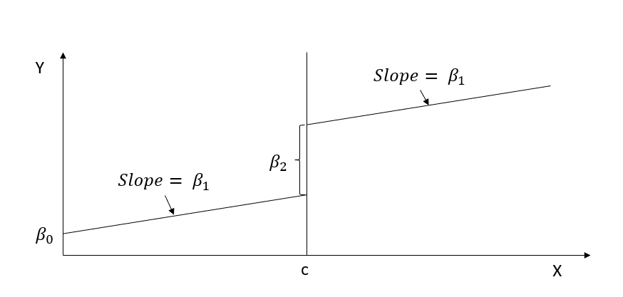
```

RD gives you $\beta_2$ (causal effect) of $X$ on $Y$ at the cutoff point

In practice, everyone does

$$ Y_i = \alpha_0 + f(x) \alpha _1 + [I(x_i \ge c)]\alpha_2 + [f(x_i)\times [I(x_i \ge c)]\alpha_3 + u_i $$

The figure below shows how to visualize the coefficients when one uses dynamic slope.

```{.r fig.cap="Regression discontinuity design with dynamic slope." fig.alt="Line graph illustrating a sharp regression discontinuity" echo="FALSE" #fig-rd-simple-dynamic-slope}
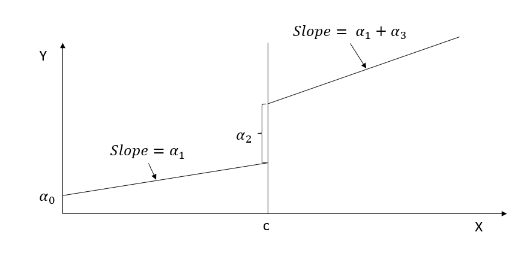
```

where we estimate different slope on different sides of the line. And if you estimate $\alpha_3$ to be no different from 0 then we return to the simple case.

#### Higher-Order Polynomials

A more flexible specification allows for nonlinear relationships:

$$
Y_i = \beta_0 + \beta_1 X_i + \beta_2 X_i^2 + \beta_3 X_i^3 + \tau D_i + \epsilon_i.
$$

- Higher-order polynomials reduce bias but increase variance.
- Overfitting is a risk, especially with limited data near $c$.

#### Nonparametric Estimation

When polynomial models are too restrictive, we use nonparametric local linear regression:

$$
\hat{E}[Y | X] = \sum_{i=1}^{n} K_h(X_i - c) Y_i.
$$

where:

- $K_h(X)$ is a kernel function (e.g., Epanechnikov).

- $h$ is the bandwidth, chosen to optimize bias-variance tradeoff.

### Bandwidth Selection

#### Tradeoff Between Bias and Efficiency

Choosing an appropriate bandwidth $h$ is crucial:

- Narrow $h$ (close to $c$): Lower bias, but high variance.

- Wider $h$: More efficient estimates but potential bias.

#### Optimal Bandwidth Selection

Several methods exist for selecting $h$:

1. Cross-validation: Minimizing mean squared error (MSE).
2. @imbens2012optimal bandwidth selection:
    - Balances bias-variance tradeoff.
    - Often reported in RD studies.
3. @cattaneo2019practical robust bandwidth selection:
    - Focuses on valid inference, not just point estimation.

#### Bandwidth Sensitivity Analysis

A standard robustness check is estimating $\tau$ for different $h$ values:

- If results change drastically, estimates may be sensitive to bandwidth choice.
- If estimates remain stable, findings are more credible.

### Addressing Potential Confounders

#### Multiple Running Variables

If multiple forcing variables influence treatment (e.g., both math and English scores for honors eligibility), failing to account for them may introduce confounding.

A solution is to extend RD to a [multi-score framework](#sec-multi-score-regression-discontinuity-design):

$$
Y_i = \alpha_0 + f(X_{1i}, X_{2i}) \alpha_1 + I(X_{1i} \geq c_1, X_{2i} \geq c_2) \alpha_2 + \epsilon_i.
$$

- Controls for both scores simultaneously.
- Allows for interactions between assignment variables.

#### Bundling of Institutions

In cases where policies change at institutional levels (e.g., different states implementing varying minimum wages), treatment effects may reflect institutional bundling rather than individual cutoff effects.

One solution is to include institution fixed effects:

$$
Y_i = \alpha + f(X_i) \beta + \tau D_i + \gamma C_j + \epsilon_i.
$$

where $C_j$ is a categorical variable for institution $j$.

### External Validity in RD

While RD provides strong internal validity, its generalizability is often limited:

1. Local Nature of RD Estimates
    - RD estimates apply only at the cutoff.
    - Effects may not extrapolate to other values of $X$.
2. Heterogeneous Treatment Effects
    - If $\tau$ varies across subgroups, RD estimates may not generalize.
3. Spillover Effects
    - If treatment effects extend beyond the threshold (e.g., peer effects), RD assumptions may be violated.


## Applications of RD Designs

Regression Discontinuity (RD) designs have widespread applications in empirical research across economics, political science, marketing, and public policy. These applications leverage threshold-based decision rules to identify causal effects in real-world settings where randomized experiments are infeasible.

Key applications include:

- Marketing: Estimating the causal effects of promotions and advertising intensity.

- Education: Evaluating the impact of financial aid or merit scholarships.

- Healthcare: Assessing the effect of medical interventions assigned based on eligibility thresholds.

- Labor Economics: Studying unemployment benefits and wage policies.

### Applications in Marketing

RD has been widely applied in marketing research to estimate causal effects of pricing, advertising, and product positioning.

1. Position Effects in Advertising

[@narayanan2015position] uses an RD approach to estimate the causal impact of advertisement placement in search engines. Since ad placement follows an auction-based system, a discontinuity occurs where the top-ranked ad receives disproportionately more clicks than lower-ranked ads.

Key insights:

- Higher-ranked ads generate more click-throughs, but this does not always translate into higher conversion rates.

- The RD framework helps distinguish correlation from causation by leveraging the rank cutoff.

2. Identifying Causal Marketing Mix Effects

[@hartmann2011identifying] presents a nonparametric RD estimation approach to identify causal effects of marketing mix variables, such as:

- Advertising budgets

- Price changes

- Promotional campaigns

By comparing firms just above and below an expenditure threshold, the RD framework isolates the true causal impact of marketing spending on consumer behavior.

<!--# Application in Finance: "Balancing External vs. Internal Validity: An Application of Causal Forest in Finance" -->

### R Packages for RD Estimation

Table@tbl-rd-packages-in-r shows key RD [Packages](https://rdpackages.github.io/) in R

| Feature             | rdd                 | rdrobust                                                     | rddtools                                  |
|---------------|---------------|-------------------------|------------------|
| Estimator           | Local linear regression | Local polynomial regression                                      | Local polynomial regression                   |
| Bandwidth Selection | [@imbens2012optimal]    | [@calonico2014robust; @imbens2012optimal ; @calonico2020optimal] | [@imbens2012optimal]                          |
| Kernel Functions    | Epanechnikov, Gaussian  | Epanechnikov                                                     | Gaussian                                      |
| Bias Correction     | No                      | Yes                                                              | No                                            |
| Covariate Inclusion | Yes                     | Yes                                                              | Yes                                           |
| Assumption Testing  | McCrary Sorting Test    | No                                                               | McCrary Sorting, Covariate Distribution Tests |
: Packages in R for RD estimation. {#tbl-rd-packages-in-r}

For a detailed comparison, see @thoemmes2017analysis (Table 1, p. 347).

#### Specialized RD Packages

- `rddensity`: Tests for discontinuities in the density of the running variable (useful for manipulation/bunching detection).
- `rdlocrand`: Implements randomization-based inference for RD.
- `rdmulti`: Extends RD to multiple cutoffs and multiple scores.
- `rdpower`: Conducts power calculations and sample selection for RD designs.

#### Strengths of `rdrobust`

- Implements local polynomial regression, providing bias correction and robust standard errors.
- Uses state-of-the-art bandwidth selection methods.
- Produces automatic RD plots for visualization.

### Example of Regression Discontinuity in Education

We illustrate a Sharp RD using a simulated example of college GPA and future career success.

Setup:

- Students qualify for a prestigious internship if their GPA ≥ 3.5.

- The outcome variable is future career success (e.g., salary).

- RD estimates the causal impact of the internship program on earnings.

$$
Y_i = \beta_0 + \beta_1 X_i + \beta_2 W_i + u_i
$$

$$
X_i = 
\begin{cases}
1, W_i \ge c \\
0, W_i < c
\end{cases}
$$

We simulate 100 observations, where GPA is the forcing variable and career success depends on GPA and the treatment effect.

```{.r message="FALSE"}
# Set seed for reproducibility
set.seed(42)

n = 100

# Simulate GPA scores (0-4 scale)
GPA <- runif(n, 0, 4)

# Generate future success with treatment effect at GPA >= 3.5
future_success <- 10 + 2 * GPA + 10 * (GPA >= 3.5) + rnorm(n)

# Load RD package
library(rddtools)

# Format data for RD analysis
data <- rdd_data(future_success, GPA, cutpoint = 3.5)
```

The figure below shows the scatter plot of GPA and Future Success.

```{.r fig.cap="Binned scatter plot of GPA and future success with threshold at 3.5." fig.alt="Scatter plot with GPA on the x-axis and future success on the y-axis. Red dots show average outcomes in GPA bins. A vertical dashed line at GPA = 3.5 marks a potential threshold. The data trend appears to rise steadily, with a sharp increase in future success for GPAs just above the cutoff." #fig-rd-plot-gpa-future-success}
# Plot RD scatterplot
plot(data, col = "red", cex = 0.5, xlab = "GPA", ylab = "Future Success")
```

We estimate the Sharp RD treatment effect using local linear regression:

```{.r}
# Estimate the sharp RDD model
rdd_mod <- rdd_reg_lm(rdd_object = data, slope = "same")

# Display results
summary(rdd_mod)
```

Figure plots the RD regression line with binned observations:

```{.r fig.cap="Coarse binned regression discontinuity plot of GPA and future success." fig.alt="Line plot of GPA versus future success with four coarse bins. A dashed vertical line at GPA = 3.5 marks the cutoff. A sharp jump in the fitted line is visible at the cutoff, indicating a possible treatment effect. The x-axis spans 0 to 4 GPA, and the y-axis ranges from 14 to 28 in future success." #fig-rd-binned-rd-plot-gpa-future-success}
# Plot RD regression
plot(rdd_mod, cex = 0.5, col = "red", xlab = "GPA", ylab = "Future Success")
```

We verify whether results hold under different bandwidths and functional forms:

##### Varying the Bandwidth

```{.r}
# Using rdrobust for robust estimation
library(rdrobust)

# Estimate RD with optimal bandwidth
rd_out <- rdrobust(y = future_success, x = GPA, c = 3.5)
summary(rd_out)

```

##### McCrary Test for Manipulation

```{.r}
library(rddensity)

# Check for discontinuities in GPA distribution
rddensity(GPA, c = 3.5)
```

##### Polynomial Functional Forms

We compare linear and quadratic specifications:

```{.r}
# Estimate RD with a quadratic polynomial
rdd_mod_quad <- rdd_reg_lm(rdd_object = data, slope = "separate", order = 2)
summary(rdd_mod_quad)
```

### Example of Occupational Licensing and Market Efficiency

Occupational licensing is a form of labor market regulation that requires workers to obtain licenses or certifications before being allowed to work in specific professions. The debate around occupational licensing revolves around two competing effects:

1. Efficiency-enhancing effect:
    - Licensing ensures that workers meet minimum quality standards, reducing information asymmetries between firms and consumers.
    - Higher-quality service providers are selected into the labor market.
2. Barrier-to-entry effect:
    - Licensing requirements impose costs on potential entrants, reducing labor supply.
    - This creates frictions in the market, potentially leading to inefficiencies.

@bowblis2021occupational investigates this tradeoff using a [Fuzzy RD](#sec-fuzzy-regression-discontinuity-design) based on a threshold rule:

- Nursing homes with 120 or more beds are required to hire a certain fraction of licensed/certified workers.

- The study examines whether this policy improves quality of care or merely restricts labor market competition.


#### OLS Estimation: Naïve Approach and Its Bias

A simple ordinary least squares regression can be used to estimate the effect of licensed workers on quality of service:

$$
Y_i = \alpha_0 + X_i \alpha_1 + LW_i \alpha_2 + \epsilon_i
$$

where:

- $Y_i$ = Quality of service at facility $i$.

- $LW_i$ = Proportion of licensed workers at facility $i$.

- $X_i$ = Facility characteristics (e.g., size, staffing levels).

#### Potential Bias in $\alpha_2$

1. Mitigation-Based Bias:
    - Facilities with poor quality outcomes may hire more licensed workers in response to bad performance.
    - This induces a negative correlation between $LW_i$ and $Y_i$, biasing $\alpha_2$ downward.
2. Preference-Based Bias:
    - Higher-quality facilities may have greater incentives to hire certified workers.
    - This induces a positive correlation between $LW_i$ and $Y_i$, biasing $\alpha_2$ upward.

#### Fuzzy RD Framework

The OLS model is endogenous, so we implement a [Fuzzy RD Design](#sec-fuzzy-regression-discontinuity-design) that exploits a discontinuity in licensing requirements at 120 beds.

$$
\begin{aligned}Y_{ist} = \beta_0 &+ \beta_1 \mathbb{1}(\text{Bed}_{ist} \geq 121) + \beta_2 f(\text{Size}_{ist}) \\&+ \beta_3 f(\text{Size}_{ist}) \times \mathbb{1}(\text{Bed}_{ist} \geq 121) \\&+ X_{it}'\delta + \gamma_s + \theta_t + \epsilon_{ist}\end{aligned}
$$

where:

- $I(Bed \geq 121)$ = Indicator for treatment eligibility (having at least 120 beds).

- $f(Size_{ist})$ = Flexible functional form of facility size.

- $X_{it}$ = Other control variables.

- $\gamma_s$ = State fixed effects (accounts for state-level regulations).

- $\theta_t$ = Time fixed effects (accounts for temporal shocks).

- $\beta_1$ = Intent-to-treat (ITT) effect.

This model estimates discontinuities in quality outcomes at the 120-bed threshold.


#### Why This RD is Fuzzy

Unlike a [Sharp RD](#sec-sharp-regression-discontinuity-design), treatment is not fully determined at the cutoff:

- Some facilities with fewer than 120 beds voluntarily hire licensed workers.

- Some facilities with more than 120 beds may not comply fully.

Thus, the RD framework must be modified:

1. Fixed-Effect Considerations:
    - If states sort differently near the threshold, state fixed effects ($\gamma_s$) may be needed.
    - However, if sorting is non-random, the RD assumption fails.

<!-- -->

2. Panel Data Implications:
    - Fixed-effects models are not preferred in RD, as they are lower in the causal inference hierarchy.
    - RD typically excludes pre-treatment periods, whereas fixed-effects require before-and-after comparisons.
3. Variation in Facility Size:
    - Hospitals rarely change bed capacity, so including hospital-specific fixed effects removes variation necessary for RD estimation.


#### Instrumental Variable Approach

To correct for endogeneity, we use a two-stage least squares IV approach, where the running variable serves as an instrument for treatment intensity.

##### Stage 1: First-Stage Regression

Estimate the probability of hiring licensed workers based on the 120-bed threshold:

$$
\begin{aligned}\text{QSW}_{ist} = \alpha_0 &+ \alpha_1 \mathbb{1}(\text{Bed}_{ist} \geq 121) + \alpha_2 f(\text{Size}_{ist}) \\&+ \alpha_3 f(\text{Size}_{ist}) \times \mathbb{1}(\text{Bed}_{ist} \geq 121) \\&+ X_{it}'\delta + \gamma_s + \theta_t + \epsilon_{ist}\end{aligned}
$$

where:

- $QSW_{ist}$ = Predicted proportion of licensed workers at facility $i$ in state $s$ at time $t$.

##### Stage 2: Second-Stage Regression

Estimate the causal effect of hiring licensed workers on quality of service:

$$
\begin{aligned}Y_{ist} = \gamma_0 &+ \gamma_1 \widehat{\text{QSW}}_{ist} + \delta_2 f(\text{Size}_{ist}) \\&+ \delta_3 f(\text{Size}_{ist}) \times \mathbb{1}(\text{Bed}_{ist} \geq 121) \\&+ X_{it}'\lambda + \eta_s + \tau_t + u_{ist}\end{aligned}
$$

where:

- $\hat{QWS}_{ist}$ = Instrumented proportion of licensed workers.

- $\gamma_1$ = Causal effect of certified staffing on quality outcomes.

##### Key Observations

- The larger the discontinuity at 120 beds, the closer $\gamma_1 \approx \beta_1$.
- The ITT effect ($\beta_1$) will always be weaker than the [local average treatment effect](#sec-local-average-treatment-effects) ($\gamma_1$).


#### Empirical Challenges

1. Bunching at Round Numbers:
    - Density plots typically show facilities clustering at every 5-bed increment.
    - If manipulation occurs, we expect underrepresentation at 130 beds.
2. Clustering Standard Errors:
    - Due to limited unique mass points (facilities at specific sizes), errors should be clustered by mass point instead of individual facilities.
3. Noncompliance and Selection Bias:
    - Fuzzy RD requires that we do not drop non-compliers (as it would introduce selection bias).
    - However, we can drop manipulators if there is clear evidence of behavioral bias (e.g., preference for round numbers).

<!-- ### Replicating [@carpenter2009effect] -->

<!-- A well-known RD study by [@carpenter2009effect] investigates the causal effect of legal drinking age on mortality rates. -->

<!-- Replication available at: [Philipp Leppert](https://rpubs.com/phle/r_tutorial_regression_discontinuity_design). -->

<!-- Data available at: [OpenICPSR](https://www.openicpsr.org/openicpsr/project/113550/version/V1/view?flag=follow&pageSize=100&sortOrder=(?title)&sortAsc=true). -->


<!-- ### Additional RD Applications -->

<!-- For a comprehensive empirical RD application, see @thoemmes2017analysis, where: -->

<!-- - Multiple RD packages (`rdd`, `rdrobust`, `rddtools`) are tested. -->

<!-- - Robustness checks are performed across bandwidth selection and polynomial orders. -->


## Dose-Response and Multivalued-Treatment RD {#sec-dose-response-rd}

The canonical [sharp RD design](#sec-sharp-regression-discontinuity-design) compares treated and untreated units at the cutoff. In many policy settings the cutoff does not switch treatment from off to on but rather changes the *intensity* of an ongoing treatment. A means-tested transfer whose amount scales with how far below the eligibility threshold a household lies, a graduated tax credit whose rate steps up at successive income brackets, a graduate-fellowship offer whose stipend depends on a continuous score above a qualifying mark: all are settings in which the substantive question is the shape of a dose-response, not the average effect of treated vs. untreated. This section develops the RD machinery for those settings.

The framework subsumes two related but distinct designs. In the dose-response RD, the treatment intensity $D$ is a deterministic continuous function of the running variable $X$ on one or both sides of the cutoff, and the estimand of interest is the marginal effect of intensity at the cutoff. In the multivalued-treatment RD, the running variable determines which of several discrete treatment levels a unit receives, and the estimand is the set of dose-specific level effects. Both are instances of the same broader idea: when the cutoff is not a binary switch, the RD estimand becomes a function rather than a scalar, and the analyst's job is to recover that function rather than collapse it.

### Identifying Strategies

The two leading identification frameworks in this space come from @dong2015identifying and @caetano2023regression, and they make different but complementary assumptions.

@dong2015identifying study the case in which the policy threshold itself changes (for instance, an eligibility cutoff moves from one income level to another) and the parameter of interest is the marginal effect of moving the threshold. The identifying argument is that, even though the new cutoff is not a discontinuity in any single dataset, the *change* in the cutoff acts like a continuous-treatment intervention whose effect can be recovered by comparing the level effects estimated at the old and new thresholds. The estimand is informative for policy questions in which the analyst wants to know "how much would the program effect change if we relaxed the eligibility rule," a counterfactual that the classical sharp-RD estimand cannot answer.

@caetano2023regression develop a more general framework that handles multivalued treatments determined by the running variable, including the dose-response special case. The identifying assumption replaces continuity of the conditional expectation of the potential outcomes at the cutoff with continuity of an entire family of conditional expectations indexed by the treatment level. Under this assumption the estimand is a dose-specific local average treatment effect, and the estimator is a local-polynomial regression that interacts the running variable with the treatment level. The framework recovers the classical sharp-RD estimand as a special case (when the treatment is binary) and the fuzzy-RD estimand as another (when the treatment is binary and partially compliant), while also accommodating the multivalued case directly.

The @cattaneo2016interpreting and @cattaneo2021extrapolating multi-cutoff machinery, developed in Section @sec-multi-cutoff-regression-discontinuity-design, is the third leg of the design space. When the dose is discrete and the policy rule is implemented through several cutoffs (one per dose level), the multi-cutoff estimator pools across cutoffs to recover the dose-response curve. The pooling assumption is non-trivial: it requires that the local treatment effect at each cutoff identifies the same underlying causal parameter, which fails if the marginal compliers at different cutoffs are systematically different units.

### Estimands

In the dose-response setting with continuous treatment intensity, the natural estimand is the marginal dose-response at the cutoff:

$$
\theta(c) = \lim_{x \downarrow c} \frac{\partial}{\partial d} \mathbb{E}[Y \mid X = x, D = d(x)],
$$

where $d(x)$ is the deterministic dose function of the running variable. The estimand captures how the average outcome would change if every unit at the cutoff received a marginally higher dose. The classical sharp-RD estimand is the special case where $d(x)$ jumps from zero to one at the cutoff.

In the multivalued-treatment setting, the natural estimand is the set of dose-specific level effects:

$$
\tau(d) = \mathbb{E}[Y(d) - Y(0) \mid X = c, D = d],
$$

evaluated for each dose level $d$ in the support of the treatment. Reported together, these form a dose-response curve analogous to the one delivered by the [continuous-treatment matching analysis](#sec-gps-continuous) or the [continuous-treatment DiD](#sec-continuous-did), with the substantive difference that the RD version conditions on the running variable being at the cutoff and therefore has a strictly local interpretation.

### Estimation in Practice

We work through the estimation in two passes. The first pass implements the multi-cutoff dose-response by hand using only base R, so that the per-cutoff local-linear logic is visible. The second pass calls the published `rdmulti` and `rdrobust` packages on the same data.

##### Demonstration: dose-specific local-linear RD from scratch

```{.r message="FALSE" #rd-multi-sim}
suppressPackageStartupMessages({
  library(dplyr)
  library(ggplot2)
})

set.seed(20240515)

# Two cutoffs (0 and 10) define three dose levels.
# Dose 0 for X < 0, dose 1 for X in [0, 10), dose 2 for X >= 10.
# True dose-response is concave: tau(1) = 0.6, tau(2) = 0.9.
n <- 5000
X <- runif(n, -20, 30)
D <- as.integer(X >= 0) + as.integer(X >= 10)
Y <- 0.05 * X + 0.6 * (D == 1) + 0.9 * (D == 2) + rnorm(n, sd = 0.5)
dat <- data.frame(X, Y, D)

# Estimate the level jump at each cutoff by a local-linear regression
# inside a fixed bandwidth. We use a 5-unit bandwidth on each side and
# a triangular kernel weight, matching the rdrobust default kernel.
local_linear_jump <- function(data, cutoff, h = 5) {
  d <- data %>%
    filter(X >= cutoff - h, X <= cutoff + h) %>%
    mutate(
      side   = as.integer(X >= cutoff),
      Xc     = X - cutoff,
      kweight = pmax(1 - abs(Xc) / h, 0)   # triangular kernel
    )
  fit <- lm(Y ~ side + Xc + side:Xc, data = d, weights = kweight)
  est <- coef(fit)["side"]
  se  <- sqrt(diag(vcov(fit)))["side"]
  c(est = unname(est), se = unname(se),
    ci_lo = unname(est) - 1.96 * unname(se),
    ci_hi = unname(est) + 1.96 * unname(se))
}

jump_at_0  <- local_linear_jump(dat, cutoff = 0)
jump_at_10 <- local_linear_jump(dat, cutoff = 10)

rd_table <- data.frame(
  cutoff   = c(0, 10),
  est      = c(jump_at_0["est"], jump_at_10["est"]),
  se       = c(jump_at_0["se"],  jump_at_10["se"]),
  ci_lo    = c(jump_at_0["ci_lo"], jump_at_10["ci_lo"]),
  ci_hi    = c(jump_at_0["ci_hi"], jump_at_10["ci_hi"]),
  true_jump = c(0.6, 0.3)   # tau(1) - tau(0) = 0.6, tau(2) - tau(1) = 0.3
)
rd_table
```

The table reports the estimated jump at each cutoff. The jump at $X = 0$ identifies the marginal effect of moving from dose 0 to dose 1; the jump at $X = 10$ identifies the marginal effect of moving from dose 1 to dose 2. Comparing the `est` column to `true_jump` checks the estimator against the simulated truth; the recovered dose-response is concave (the marginal effect at the higher cutoff is smaller), which mirrors the diminishing-returns pattern built into the simulation.

The dose-specific level effects can be plotted directly:

```{.r fig.cap="Multi-cutoff RD: estimated jumps at each cutoff. The first cutoff identifies the marginal effect of dose 1 over dose 0; the second cutoff identifies the marginal effect of dose 2 over dose 1. The dose-response is concave (diminishing marginal returns), which the per-cutoff estimates recover." fig.width="6" fig.height="4" #fig-rd-multi-plot}
ggplot(rd_table, aes(x = factor(cutoff), y = est)) +
  geom_pointrange(aes(ymin = ci_lo, ymax = ci_hi)) +
  geom_hline(yintercept = 0, linetype = "dotted") +
  labs(x = "Cutoff (and dose transition)",
       y = "Local marginal effect at the cutoff",
       title = "Dose-response by cutoff, from-scratch local-linear RD",
       subtitle = "Cutoff 0 = dose 1 vs 0; cutoff 10 = dose 2 vs 1") +
  theme_minimal()
```

The figure below shows two point estimates with their 95% confidence intervals. A reviewer reads off (a) whether each per-cutoff effect is statistically distinguishable from zero, (b) whether the dose-response is monotone, and (c) whether the spacing of the estimates is consistent with linearity (it is not, in this simulation, because the effects are concave). The same plot scaled up to many cutoffs is the discrete-dose analogue of the continuous-DiD dose-response figure in Section @sec-continuous-did.

##### Production: `rdmulti` and `rdrobust`

For production work the published `rdmulti` package by Cattaneo, Titiunik, and Vazquez-Bare implements both cutoff-specific and pooled estimators, with proper bias-corrected robust standard errors via the underlying `rdrobust` engine [@calonico2014robust]. The user passes the data, the running variable, the cutoffs, and the cutoff assignment, and the package handles bandwidth selection (using the @cattaneo2016interpreting multi-cutoff conventions), kernel weighting, and inference.

```{.r eval="FALSE" #rdmulti-pipeline}
# install.packages(c("rdmulti", "rdrobust"))
# CRAN, Cattaneo-Titiunik-Vazquez-Bare
library(rdmulti)
library(rdrobust)

# Cutoff-specific RD: estimate the level jump at each cutoff separately.
res_each <- rdmc(
  Y       = Y,
  X       = X,
  C       = ifelse(X < 10, 0, 10),  # which cutoff each unit faces
  cvar    = c(0, 10)
)
summary(res_each)

# Pooled estimate of the dose-response across cutoffs.
res_pool <- rdms(
  Y       = Y,
  X       = X,
  C       = ifelse(X < 10, 0, 10),
  cvar    = c(0, 10),
  pooled_opt = "uniform"
)
summary(res_pool)
```

The `summary(res_each)` output is a table with one row per cutoff, reporting the cutoff-specific RD coefficient, robust standard error, bias-corrected 95% confidence interval, and the optimal bandwidth chosen by the @calonico2014robust MSE-minimizing rule. The right way to read it is the same as for the from-scratch table above: scan for cutoffs where the effect is statistically distinguishable from zero, look for the dose-response shape, and compare the bandwidth used at each cutoff (large differences in bandwidth signal that the running-variable density is uneven across the dose range).

The `summary(res_pool)` output is a single pooled estimate that aggregates the cutoff-specific effects under a uniform-pooling assumption (each cutoff carries the same weight). The pooled object is the right summary when the analyst believes the per-cutoff local effects identify the same underlying parameter; the disaggregated `res_each` object is the right summary when they do not. The placebo diagnostic recommended by @cattaneo2021extrapolating is to drop one cutoff at a time and re-pool: instability in the pooled estimate is evidence that the per-cutoff effects are heterogeneous and should be reported separately.

For the continuous-dose case in which the policy threshold itself shifts, the @dong2015identifying estimator can be implemented directly by running two `rdrobust` estimations (one at the old cutoff, one at the new cutoff in a separate dataset or sub-period) and reporting their difference as the marginal-threshold effect.

For the multivalued-treatment case under the @caetano2023regression framework, no canonical CRAN package implements the estimator at the time of writing; the authors' replication code and supplementary materials provide reference implementations.

### Diagnostics

The diagnostics from the [Assumptions for RD Validity](#sec-assumptions-for-rd-validity) section all carry over and gain an additional requirement: continuity must hold for the conditional expectation of the potential outcome at *each dose level*, not only on average across doses. The natural diagnostic is to plot the running variable against the outcome separately for each dose level and inspect the smoothness of each curve at the cutoff. A jump in one dose-specific curve but not in another is a red flag that the multivalued-treatment identifying assumption is being violated.

The @mccrary2008manipulation density test should be re-run with attention to the dose distribution: a continuous-dose function $d(x)$ in which units near the cutoff systematically misreport their running variable to qualify for a more generous dose breaks the design in the same way that manipulation breaks classical sharp RD, only the symptom is asymmetric piling at specific dose-eligibility thresholds rather than at a single binary cutoff.

A pooling-validity placebo, recommended by @cattaneo2021extrapolating, is to estimate the dose-response curve on the full sample and again on subsamples that exclude one cutoff at a time. A pooled estimate that is unstable to dropping individual cutoffs is evidence that the local treatment effects at different cutoffs are not identifying the same underlying parameter, in which case the dose-specific estimates should be reported instead of the pooled curve.


## RD가 작동하는 경우와 실패하는 경우

이 책에서 다룬 준실험 설계 가운데 RD는 분석가에게 요구하는 것이 적다는 점에서 두드러진다. 연속형 실행변수에 대해 기관이 강제하는 명확한 기준값이 주어지면 국소 무작위화가 사실상 자연스럽게 성립하며 검토자는 해당 맥락을 잘 알지 못해도 설계를 평가할 수 있다. 이러한 투명성이 RD의 매력 중 하나다.

반대로 RD는 분석이 작성된 뒤에는 발견하기 어려운 방식으로 잘못 적용하기 쉽다. 특히 실행변수, 기준값, 그리고 그 주변 구간을 세심하게 살펴야 한다.

실행변수는 실제로 연속적이어야 하며 기준값 양쪽에서 유사한 밀도로 측정되어야 한다. $c$ 바로 아래나 바로 위에 관측치가 몰리는 것은 대상자가 한쪽에 들어가도록 점수를 조작하고 있다는 전형적인 신호다. 예를 들어 장학금 기준을 넘기 위한 성적 부풀리기, 혜택을 받기 위한 소득 조정, 프로그램 시작일을 둘러싼 전략적 시점 선택이 이에 해당한다. 조작이 있으면 연속성 가정이 성립하지 않고 모든 RD 추정치가 선택의 영향을 받는다. 첫 번째 진단은 밀도 검정(McCrary 또는 Cattaneo-Jansson-Ma)이고 두 번째는 사전 결정 공변량에 대한 위약 분석이다.

기준값은 분석가가 선택한 것이 아니라 제도적으로 정해진 것이어야 한다. 결과를 살펴본 뒤 기준값을 선택했다면 설계는 설정 탐색으로 전락한다.

대부분의 논쟁은 이웃 구간, 즉 대역폭 $h$에서 발생한다. 매우 좁은 구간은 정밀한 국소 식별을 제공하지만 추정치가 잡음에 민감하다. 넓은 구간은 기준값에서 먼 단위의 이질성을 끌어들인다. 여러 대역폭(자료 기반 최적값과 더 좁거나 넓은 구간), 여러 다항식 차수, 그리고 @calonico2014robust의 편향 보정 표준오차를 보고하라. 이러한 선택 전반에서 안정적인 계수가 구간을 넓힐 때 부호가 바뀌는 계수보다 훨씬 신뢰할 만하다.

두 가지 경고를 덧붙인다. 첫째, RD의 추정 대상은 기준값 *에서의* LATE다. $c$에서 먼 단위로 외삽하려면 추가 가정(일정한 처치효과)이나, RD가 피하고자 했던 모형 의존성을 다시 도입하는 모수 설정이 필요하다. 둘째, Fuzzy RD는 [도구변수 장](#sec-instrumental-variables)의 모든 약한 도구변수 문제를 물려받는다. 기준값에서 처치 확률의 점프가 작으면 축약형이 아무리 정밀해 보여도 비율 추정량은 불안정해진다.

RD가 응용 맥락에 잘 맞는다면 이용 가능한 설계 중 가장 신뢰할 만한 경우가 많다. 기준값이 모호하거나 조작 가능하거나 처치를 약하게만 예측한다면, 가정을 더 엄격하게 요구하는 설계를 선택하라. 패널 구조가 있다면 [DiD](#sec-difference-in-differences)를, 풍부한 공변량이 핵심 자산이라면 [매칭](#sec-matching-methods)을 고려할 수 있다.

<!-- ========================================= -->
<!-- Chapter: 28-interrupted-time-series.Rmd -->
<!-- ========================================= -->


# 시간 단절 설계 {#sec-temporal-discontinuity-designs}

특정 시점에 시작되는 정책, 개입 또는 처치의 영향을 평가할 때, 시간은 구동 변수(running variable, 배정 변수)가 됩니다. 이러한 환경에서 인과 추론을 위한 두 가지 널리 사용되는 준실험(quasi-experimental) 방법론은 강력한 도구를 제공합니다:

- [시간 회귀 단절(Regression Discontinuity in Time, RDiT)](#sec-regression-discontinuity-in-time)
- [단절적 시계열(Interrupted Time Series, ITS)](#sec-interrupted-time-series)

두 접근법 모두 시간적 절단점(temporal cutoff, 즉 개입이 시작되는 시점)을 활용하여 처치로 인한 결과변수의 변화를 식별합니다. 그러나 해당 시점 전후의 데이터를 개념화하고 모델링하는 방식뿐만 아니라 타당한 추론에 필요한 가정의 강도 면에서 차이가 있습니다.

이러한 차이점에도 불구하고 RDiT와 ITS는 다음과 같은 몇 가지 핵심적인 공통 특징을 공유합니다:

- 시간적 구동 변수: 처치 여부를 결정하는 변수로서 전통적인 횡단면 점수 대신 시간이 사용됩니다.
- 명확한 개입 시작 시점: 두 방법 모두 정책이나 처치가 시작된 정확한 시점이 명확히 정의되어야 합니다.
- 동시 발생 교란 사건 부재: 두 방법 모두 개입과 동시에 발생하여 결과에 영향을 미칠 수 있는 다른 주요 변화가 없었다고 가정합니다.
- 횡단면 통제 집단 불필요: 이러한 설계는 적절한 미처치 집단이 없어 [이중차분법(difference-in-differences)](#sec-difference-in-differences)과 같은 방법을 적용할 수 없을 때 특히 유용합니다.

RDiT는 정책 시행일을 절단점으로 사용하여 표준 RD의 논리를 시간 차원에 맞게 변형한 것입니다.

- 개념화: 개입일 직전과 직후의 개인 또는 관측치는 시간에 따른 국소 무작위 배정(local randomization in time)처럼 비교 가능하다고 가정합니다.
- 추정: 일반적으로 절단일 전후의 국소 다항 회귀(local polynomial regression)를 사용하여 모델링합니다.
- 장점: 개입일 근처에서 국소적 인과 추론을 제공하며 함수 형태에 대해 유연합니다.
- 한계: 시간 추세 및 자기상관(autocorrelation)에 민감합니다. 절단점 주변의 연속성 가정을 뒷받침하기 위해 고빈도 시간 데이터(예: 일별 또는 주별)가 필요합니다.

> 예시: 7월 1일에 전국적으로 시작된 새로운 디지털 광고 캠페인의 효과를 6월 30일과 7월 1일의 사용자 참여도를 비교하여 분석하는 경우.

ITS는 보다 광범위한 시계열 접근법을 채택하여 개입 전후의 추세를 명시적으로 모델링합니다.

- 개념화: 개입을 진행 중인 시계열 프로세스의 중단(interruption)으로 간주합니다.
- 추정: 정책 전후로 서로 다른 절편과 기울기를 갖는 분할 회귀(segmented regression)를 적합합니다.
- 장점: 장기적 추세와 지속적인 처치 효과에 관심이 있을 때 유용합니다.
- 한계: 시간 추세의 함수 형태 및 시간에 따라 변하는 교란 요인의 부재에 대한 강한 가정이 필요합니다. 데이터가 희소하거나 고도로 집계된 경우(예: 연간 데이터) 신뢰성이 떨어집니다.

> 예시: 5년 동안 월별 고용률에 미친 최저임금 인상의 영향을 평가하는 경우.


표 @tbl-its-differences-rdit-its 는 RDiT와 ITS의 사용 시점을 보여줍니다.

| 특징                   | RDiT                                          | ITS                                                   |
|:------------------|:------------------------|-----------------------------|
| 초점               | $T^*$ 주변의 국소 이웃 영역                       | 전체 시계열 (충분히 긴 개입 전후 데이터)                  |
| 효과 모형          | 급격하고 즉각적인 점프 가정                       | 급격하거나 점진적인 변화 포착 가능 (수준 및 기울기)       |
| 방법               | 절단점 주변의 국소 다항 회귀                      | 전체 시계열을 사용하는 분할 회귀                          |
| 핵심 가정          | 절단점 직전과 직후의 관측 단위는 비교 가능함      | 개입이 없었다면 추세가 변함없이 지속되었을 것임           |
| 대역폭 / 윈도우    | $T^*$ 주변의 대역폭 $h$ 사용                      | 일반적으로 전체 개입 전/후 기간 사용                      |
| 데이터 요구조건    | $T^*$ 주변의 고해상도(고빈도) 데이터              | 추세를 확립할 수 있는 충분한 개입 전/후 관측치            |
: RDiT와 ITS의 차이점. {#tbl-its-differences-rdit-its}


이 방법들은 다음과 같은 경우에 특히 유용합니다:

- 모든 단위에 대해 고정된 날짜에 정책이 시행되는 경우 (예: 전국 단위 세제 개편).
- 단위별로 서로 다른 시점에 정책이 순차적으로 도입되는 경우 (예: 주별 의료 정책 도입).
- 유효한 횡단면 비교 집단이 존재하지 않아 [이중차분법](#sec-difference-in-differences)이나 매칭을 적용할 수 없는 경우.


> 요약: 시간이 배정 메커니즘으로 작동할 때, RDiT와 ITS를 사용하면 개입 전후 타이밍만을 이용하여 인과적 추정치를 도출할 수 있습니다. RDiT는 강력한 데이터 밀도와 국소적 가정 하에 보다 실험에 가까운 설계를 제공하는 반면, ITS는 정확한 모형 명세에 대한 의존도가 더 크지만 보다 넓고 장기적인 관점을 제공합니다.

이어지는 절에서는 두 접근법에 대한 추정 전략, 가정 및 진단 방법을 살펴봅니다.


## 시간 회귀 단절 (RDiT) {#sec-regression-discontinuity-in-time}

시간 회귀 단절(Regression Discontinuity in Time, RDiT)은 "구동 변수(forcing variable)"가 시간 자체가 되는 [회귀 단절(Regression Discontinuity)](#sec-regression-discontinuity) 설계의 특수한 형태입니다. 정확한 절단 시점 $T^*$에서 정책이나 개입이 시행됩니다. 우리는 인과 효과를 추정하기 위해 $T^*$ 직전과 직후의 관측치를 비교합니다.

RDiT의 핵심 가정:

- 명확한 배정(Sharp assignment): 개입이 시점 $T^*$에서 정확하게 시작됩니다.
- 국소 연속성(Local continuity): $T^*$ 직전과 직후의 단위는 처치 상태를 제외하고는 비교 가능합니다.
- 시간에 따라 변하는 교란 요인의 연속성(Continuity of Time-Varying Confounders)
    - RDiT의 근본적인 가정은 결과변수에 영향을 미치는 관측되지 않은 요인들이 시간에 따라 매끄럽게(smoothly) 진화한다는 점입니다.
    - 만약 관측되지 않은 교란 요인이 절단일 시점에 불연속적으로 변화한다면, RDiT는 그 효과를 개입의 영향으로 잘못 귀인하게 됩니다.
- $T^*$에서 정확히 동시에 시작되는 다른 교란 개입의 부재.
- 구동 변수(시간)에 대한 조작 부재(No Manipulation of the Running Variable)
    - 피험자가 자신의 배정 변수(예: 시험 점수)를 조작할 수 있는 표준 RD와 달리, 시간 자체는 직접 조작할 수 없습니다.
    - 그러나 정책에 대한 전략적 사전 기대(anticipation, 예: 세금 인상 전에 행동을 조정하는 기업들)는 편향을 유발할 수 있습니다.

$T^*$ 근처에서 국소 다항식 접근법을 사용하면:

$$
Y_t = \alpha_0 + \alpha_1 (T_t - T^*) + \tau D_t + \alpha_2 (T_t - T^*) D_t + \epsilon_t,
$$

구간 $|T_t - T^*| < h$에 대해 성립하며 여기서:

- $Y_t$는 시점 $t$에서의 결과변수입니다.
- $T_t$는 시간 인덱스(구동 변수)입니다.
- $T^*$는 절단(개입) 시점입니다.
- $D_t = 1$ ($t \ge T^*$)이며 그렇지 않으면 $0$입니다.
- $h$는 $T^*$에 가까운 관측치만을 사용하도록 선택된 대역폭(bandwidth)입니다.
- $\tau$는 처치 효과($T^*$에서의 불연속성/점프)를 나타냅니다.

RDiT는 $T^*$ 주변의 국소적 윈도우에 초점을 맞추기 때문에, 절단점에서 즉각적인 점프가 예상되고 절단점 근처의 관측치들이 처치 여부를 제외하고는 서로 유사할 가능성이 높을 때 가장 적합합니다(표 @tbl-its-instead-of-rd).

| 기준             | 표준 RD                           | RDiT                                     |
|------------------|-------------------------|-----------------------------|
| 구동 변수            | 횡단면 변수 (예: 시험 점수)           | 시간 (예: 정책 시행일)                       |
| 처치 배정            | $X$의 임계값에 기반                   | $T^*$의 임계값에 기반                        |
| 가정                 | 순위 조작 부재, 매끄러운 잠재적 결과  | 사전 기대 행동 부재, 매끄러운 교란 요인      |
| 주요 과제            | $X$의 조작 (소팅/군집화)              | 계열상관, 사전 기대 효과                     |
: 전통적 RD 대신 RDiT가 사용되는 경우. {#tbl-its-instead-of-rd}

### 추정 및 모델 선택

[시간 회귀 단절](#sec-regression-discontinuity-in-time)에서는 절단점 $T^*$에서의 인과 효과를 정확히 추정하기 위해 모델 선택이 매우 중요합니다. 개입 전후의 장기적인 추세를 모델링하는 [단절적 시계열](#sec-interrupted-time-series)과 달리, RDiT는 절단점 주변의 국소적 비교에 의존합니다. 따라서 분석가의 역할은 비교가 진정으로 국소적이 되도록 충분히 좁으면서도 점프를 식별할 수 있는 충분한 관측치가 양쪽에 확보될 수 있을 만큼 넓은 윈도우를 선택하는 것입니다. 이 트레이드오프는 두 가지 요소에 의해 조절되며 서로 상호작용합니다. 즉, 대역폭을 좁히면 함수 형태에 대한 가정의 부담은 줄어들지만 안정적으로 추정할 수 있는 다항식 차수가 제한되는 반면, 대역폭을 넓히면 더 유연한 곡선을 적합할 수 있지만 RDiT가 피하고자 했던 장기 추세가 다시 개입하게 됩니다. 기본 출발점은 좁은 윈도우에 저차 다항식을 적용하는 것이며 시각적 검토나 민감도 검정이 요구할 때만 확장해야 합니다.

- $T^*$ 직전과 직후의 관측치에 집중하기 위해 좁은 대역폭($h$)을 선택해야 합니다.
- 과적합(overfitting)을 방지하기 위해 베이즈 정보 기준(BIC)을 참고하여 다항식 차수를 선택해야 합니다.
- 고차 다항식은 허위 곡률(spurious curvature)을 유발할 수 있으므로 국소 선형 또는 이차 모형이 선호됩니다.

RDiT는 시계열 데이터를 사용하므로 두 번째 우려사항은 잔차의 계열상관(serial correlation)입니다. 한 시점의 충격이 다음 시점으로 전이될 때 표준 OLS 오차는 표본 변동성을 과소평가하게 되며 이는 환경, 금융 및 행동 시계열에서 예외가 아닌 일반적인 규칙입니다. 일반적으로 두 가지 보정 방법이 사용되며 적절한 선택은 의심되는 의존성 구조에 따라 달라집니다:

1. 군집 표준오차(Clustered Standard Errors): 시점 내 상관관계를 조정하여 타당한 추론을 보장합니다.
2. Newey-West HAC 표준오차: 시간에 따른 이분산성과 계열상관을 동시에 보정합니다.

더 어려운 문제는 계열상관이 두 개의 서로 다른 위치에서 발생할 수 있으며 그에 따라 진단법이 달라진다는 점입니다:

- 오차항 $\epsilon_{it}$에 계열 의존성이 존재하는 경우 명확한 해결책이 없습니다(시차 종속변수를 도입하면 모형이 오지정될 수 있음).
- 결과변수 $y_{it}$에 계열 의존성이 존재하는 경우:
    - 윈도우가 길어질수록 정확한 처치 효과를 식별하기가 어려워집니다.
    - 시차 종속변수를 포함하는 것이 도움이 될 수 있으나, 시간에 따라 변하는 처치 효과나 과적합으로 인해 여전히 편향이 발생할 수 있습니다.

실무적으로가 두 경우의 경계가 명확한 경우는 드물기 때문에, 보고 시에는 HAC 추론(단절적 시계열 절의 '자기상관 다루기'에 자세히 설명됨)이 더 안전한 기본값으로 사용되며 모수적 오차 모형은 의존성 구조가 강하고 잘 이해되어 있는 경우를 위해 남겨둡니다.

아래의 세 가지 모형 변형은 가장 단순하고 신뢰할 수 있는 명세에서 시작하여 추가적인 가정을 대가로 유연성을 확보하는 더 풍부한 형태로 발전합니다. 이는 메뉴판이라기보다는 사다리로 이해하는 것이 좋습니다. 대부분의 실증 연구는 가장 아래 단계에서 시작하여 데이터가 뒷받침할 때만 사다리를 올라갑니다.


1. 기본 국소 선형 모형 (RDiT에서 선호됨)

$$
\begin{aligned}Y_t = \alpha_0 &+ \alpha_1 (T_t - T^*) + \tau D_t \\&+ \alpha_2 (T_t - T^*) D_t + \epsilon_t, \quad \text{구간: } |T_t - T^*| < h\end{aligned}
$$

여기서:

- $Y_t$는 시점 $t$에서의 관심 결과변수입니다.
- $T_t$는 시간 구동 변수입니다.
- $T^*$는 정책/개입이 발생한 절단 시점입니다.
- $D_t$는 처치 지시변수입니다:
    - $t \geq T^*$일 때 $D_t = 1$ (개입 후).
    - $t < T^*$일 때 $D_t = 0$ (개입 전).
- $h$는 대역폭으로, $T^*$에 가까운 관측치로 분석을 제한합니다.
- $\tau$는 처치 효과로, $T^*$에서의 불연속성을 측정합니다.
- $\alpha_1 (T_t - T^*)$는 절단점 양쪽에서의 매끄러운 시간 추세를 허용합니다.
- $\alpha_2 (T_t - T^*) D_t$는 처치 후의 차별적 시간 추세를 포착합니다.

이 모형은 처치 효과가 장기 추세가 아니라 $T^*$에서의 불연속성으로부터 식별되도록 보장합니다. 이는 대부분의 RDiT 응용 연구에서 기본 작업 모형(workhorse specification)으로 사용됩니다. 투명하고 추정하기 쉬우며 계수 $\tau$가 절단점에서의 수준 변화(level shift)로 직접 해석됩니다. 이러한 투명성의 대가는 기저 추세의 잔여 곡률이 $\tau$에 흡수된다는 점이며 따라서 국소 선형 형태는 양쪽에서 직선 근사가 타당할 만큼 대역폭이 충분히 좁을 때 가장 신뢰할 수 있습니다.


2. 이차 국소 모형 (비선형 추세 허용)

결과변수가 시간에 따라 곡률을 보이는 경우 이차항을 추가할 수 있습니다:

$$
\begin{aligned}Y_t = \alpha_0 &+ \alpha_1 (T_t - T^*) + \alpha_2 (T_t - T^*)^2 + \tau D_t \\&+ \alpha_3 (T_t - T^*) D_t + \alpha_4 (T_t - T^*)^2 D_t + \epsilon_t, \\&\quad \text{구간: } |T_t - T^*| < h\end{aligned}
$$

- $\alpha_2 (T_t - T^*)^2$는 비선형 처치 전 추세를 설명합니다.
- $\alpha_4 (T_t - T^*)^2 D_t$는 비선형 처치 후 효과를 허용합니다.

이 모형은 시각적 검토를 통해 절단점 근처에서 곡선 관계가 나타날 때 유용합니다. 이차 모형은 일종의 헤지(hedge)로 이해하는 것이 가장 좋습니다. 즉, 양쪽에 2개의 추가 모수를 도입하는 대가로 기본 모형의 선형성 가정을 완화합니다. 이러한 헤지는 대역폭을 넓혀야 할 때($T^*$ 근처의 데이터가 희소할 때) 또는 기존 궤적이 눈에 띄게 굽어 있을 때 매력적입니다. 그러나 대역폭이 좁을 때는 너무 적은 관측점에 이차 적합을 적용하면 노이즈에 과도하게 반응하여 정책과 무관한 불연속성을 만들어내거나 지워버릴 수 있어 위험합니다. 경험 법칙상 기본 모형의 잔차 플롯이 체계적인 곡률을 보이지 않는 한 선형 명세를 넘어가지 않는 것이 좋으며 이차항을 넘어서는 고차항은 완전히 피해야 합니다. RDiT에서 고차 다항식은 가짜 효과를 생성하는 것으로 악명 높으며 이는 [회귀 단절](#sec-regression-discontinuity) 문헌에서도 강조되는 우려사항입니다.


3. 확장 국소 선형 모형 (교란 요인에 대한 로버스트 통제)

앞선 두 명세는 추세를 흡수하기 위해 시간에만 의존합니다. 신뢰할 수 있는 공변량이 존재하는 경우(예: 오염 연구에서의 기상 변수, 마케팅 연구에서의 거시경제 통제변수), 먼저 이들의 영향을 분리해냄으로써(partialing out) 더 나은 성능을 얻을 수 있습니다. @hausman2018 에 따라 확장된 접근법은 누락 변수를 통제하는 데 도움을 줍니다:

1. 1단계 회귀: 모든 관련 통제변수를 포함하여 결과변수를 추정하고 잔차를 계산합니다.

    $$
    Y_t = \delta_0 + \sum_{j} \delta_j X_{jt} + \nu_t
    $$

    여기서 $X_{jt}$는 $Y_t$에 영향을 미칠 수 있는 관측된 공변량입니다.

2. 2단계 RDiT 모형: 1단계의 잔차를 표준 국소 선형 RDiT 모형에 사용합니다:

    $$
    \begin{aligned}\hat{\nu}_t = \beta_0 &+ \beta_1 (T_t - T^*) + \tau D_t \\&+ \beta_2 (T_t - T^*) D_t + \epsilon_t, \quad \text{구간: } |T_t - T^*| < h\end{aligned}
    $$

- 이 접근법은 처치 효과를 추정하기 전에 공변량에 의해 설명되는 변동을 제거합니다.
- 1단계 추정 분산을 보정하기 위해 붓스트랩 방법을 사용해야 합니다.

확장 설계는 $Y_t$의 잔여 변동이 주로 절단점을 관통하여 매끄럽게 추세를 형성하는 관측 가능한 요인들에 의해 유발된다고 의심될 때 자연스러운 선택입니다. 이러한 환경에서 전체 표본에 대해 공변량을 분리해내면 분석가가 고차 다항식을 적합할 필요 없이 국소 비교를 더욱 정밀하게 만들 수 있습니다. 확장 모형은 또한 [관측 변수에 기반한 선택](#sec-selection-on-observables)의 보다 넓은 논리와 자연스럽게 연결됩니다. 즉, $X$에 대한 잔차화는 $X$가 처치 효과로 오인될 수 있는 시변 교란을 포착하는 범위 내에서만 실익을 제공합니다. 관련 교란 요인이 관측되지 않는 경우 1단계 잔차화는 식별을 구제할 수 없으며 이러한 경우에는 [도구변수](#sec-instrumental-variables)나 [합성 통제](#sec-synthetic-control) 비교와 같은 다른 설계가 필요합니다.


### RDiT의 장점

시간 회귀 단절의 주요 장점 중 하나는 표준 [이중차분법](#sec-difference-in-differences) 접근법을 적용할 수 없는 사례를 다룰 수 있다는 점입니다. 이는 일반적으로 처치 시행에 횡단면적 변동이 없을 때 발생합니다. 즉, 모든 단위가 동시에 처치를 받아 비교할 미처치 통제 집단이 남아있지 않은 경우입니다. 이러한 경우 RDiT는 처치 배정의 시간적 불연속성을 활용하여 실행 가능한 대안을 제공합니다.

실무적으로 가장 신뢰할 수 있는 연구들은 RDiT와 DiD 중 하나를 선택하기보다 두 방법을 결합하는 경우가 많습니다(표 @tbl-its-comparison-other-methods). @auffhammer2011clearing 은 처치 효과가 개인 및 지리적 공간에 따라 어떻게 달라지는지 살펴보기 위해 두 설계를 겹쳐 사용하며 각 방법의 식별 변동을 사용하여 다른 방법을 검증합니다. @gallego2013effect 는 DiD 통제 집단의 타당성이 의심될 때 RDiT와 DiD 추정치를 의도적으로 대조하여 한 단계 더 나아갑니다. 두 추정량 간의 불일치 자체가 숨겨진 편향에 대한 진단 도구가 됩니다.

DiD의 대안이 되는 것 외에도 RDiT는 단순한 사전/사후 비교보다 더 뛰어난 장점을 제공합니다. 순진한 전후 분석과 달리 RDiT는 시간 추세에 대한 유연한 통제를 통합할 수 있어 시간적 교란 요인으로 인한 가짜 결과의 위험을 줄여줍니다.

사건 연구(Event study) 방법, 특히 현대적 구현 방식은 크게 발전하여 연구자들이 장기간에 걸친 처치 효과를 연구할 수 있게 되었습니다. 그럼에도 불구하고 RDiT는 여전히 다음과 같은 몇 가지 장점을 갖습니다:

1. 더 긴 시간 지평: 전통적인 사건 연구와 달리 RDiT는 단기 동학에 국한되지 않으며 장기간에 걸쳐 점진적으로 나타나는 효과를 포착할 수 있습니다.
2. 고차 시간 통제: RDiT는 고차 다항식의 사용을 포함하여 시간 추세에 대한 보다 유연한 모델링을 허용하므로 기저 시간 동학을 더 잘 근사할 수 있습니다.

| 방법                                                                    | 핵심 특징                     | 장점                                | 단점                                                            |
|------------------|------------------|------------------|-------------------|
| [이중차분법](#sec-difference-in-differences)                            | 통제 집단 사용                    | 시간에 불변인 교란 요인 통제            | 평행 추세 가정 필요                                                 |
| [사건 연구](#sec-event-studies)                                         | 여러 시점 모델링                  | 동태적 처치 효과 추정                   | 순차적(시차적) 개입 필요                                            |
| 단순 사전/사후 비교                                                     | 단순 전후 설계                    | 통제 집단 불필요                        | 처치 효과와 시간 추세를 분리할 수 없음                              |
| [시간 회귀 단절](#sec-regression-discontinuity-in-time)                 | 시간을 구동 변수로 사용           | 유연한 다항 시간 추세                   | 다항식 선택에 민감, 시간에 따라 변하는 처치 모델링 불가            |
: 다른 방법론과의 비교. {#tbl-its-comparison-other-methods}

### RDiT의 한계와 과제

강점에도 불구하고 RDiT에는 연구자가 신중하게 다루어야 할 몇 가지 방법론적 과제가 수반됩니다. 아래의 과제들은 독립적이지 않고 상호 강화되며 단일 연구에서 여러 과제에 동시에 노출되는 경우가 일반적입니다. 이를 체크리스트가 아닌 하나의 묶음으로 파악하면 다음 소절에서 소개할 강건성 검정이 왜 신뢰할 수 있는 RDiT 실무의 핵심인지 명확해집니다.

#### 시간 임계점에서의 선택 편향

RDiT의 주요 우려사항은 임계점에 너무 가까운 관측치를 선택함으로써 발생하는 편향입니다. 절단점 양쪽의 관측치가 비교 가능하다고 가정되는 횡단면 RD 설계와 달리, 시간 기반 설계는 복잡성을 유발합니다. 시간은 무작위로 배정된 점수와 달리 고유한 구조를 지니며 이러한 구조는 미묘한 방식으로 비교 가능성 가정을 무너뜨리는 경향이 있습니다:

- 데이터 생성 과정이 시간에 의존적인 구조를 보일 수 있습니다.
- 임계점 근처에서 발생하는 관측되지 않은 충격이 추정치를 교란할 수 있습니다.
- 처치 자체가 아니라 계절적 또는 순환적 추세가 불연속점에서의 변화를 주도할 수 있습니다.

이것이 고밀도 고빈도 데이터가 사치가 아니라 필수 조건인 이유입니다. 관측치가 희소할 때 분석가는 본질적으로 데이터에 대해 노이즈가 많은 프로세스의 한 실현값과 정책 점프를 구분하도록 요구하는 셈이며 이는 데이터가 답할 수 있는 질문이 아닙니다.

#### McCrary 검정 적용 불가

표준 RD 설계의 핵심 진단 도구는 조작 여부를 감지하기 위해 구동 변수의 밀도에서 불연속성을 확인하는 [McCrary 검정](#sec-mccrary-sorting-test) [@mccrary2008manipulation]입니다. 안타깝게도 시간 자체가 균일하게 분포하기 때문에 RDiT에서는이 검정을 적용할 수 없습니다. 이 진단 도구의 상실은 생각보다 큰 영향을 미치는데, 횡단면 RD에서는 McCrary 플롯이 누구나 한눈에 알아볼 수 있는 가시적인 위약 검증 역할을 하기 때문입니다. 이것이 없으면 분석가는 절단점 근처의 행동에 관한 간접적인 논거에 더 크게 의존해야 합니다. 이러한 한계로 인해 임계점 주변의 소팅, 사전 기대 또는 기타 형태의 조작(절 @sec-sorting-bunching-and-manipulation)을 배제하기가 더 어려워집니다.

#### 관측 불가능 요인의 잠재적 불연속성

처치가 특정 시점에 외생적으로 배정된다 하더라도, 시간에 따라 변하는 관측되지 않은 요인이 여전히 종속변수에 불연속성을 유발할 수 있습니다. 이러한 관측 불가능한 요인이 임계점과 일치하면 처치 효과로 잘못 귀인되어 편향된 결론으로 이어질 수 있습니다. 정책 입안자들은 진공 상태에서 법을 만들지 않습니다. 규제는 흔히 회계연도 시작 시점에 맞춰 다른 행정적 변화와 함께 시행되거나, 그 자체로 행동을 변화시키는 두드러진 사건에 대응하여 제정됩니다. 이러한 요인들은 RDiT가 관심 대상 정책과 구별할 수 없는 동시 발생 충격을 생성하며 이는 관찰 연구에서의 [누락 변수 편향](#sec-omitted-variable-bias) 및 [내생성](#sec-endogeneity)에 대한 광범위한 우려와 밀접하게 연관되어 있습니다.

#### 시간에 따라 변하는 처치 효과 모델링의 어려움

RDiT는 시간에 따라 변하는 처치 효과를 자연스럽게 수용하지 못하여 명세 오류를 유발할 수 있습니다. 이 설계는 $T^*$에서의 점프라는 단일 수치를 추정하도록 구축되었으므로, 해당 기간 동안 효과가 증가, 감쇠 또는 진동하는 처치에 대해서는 매우 취약합니다. 시간 윈도우를 선택할 때:

- 좁은 윈도우는 국소 근사를 개선하지만 통계적 검정력을 낮출 수 있습니다.
- 넓은 윈도우는 더 많은 데이터를 제공하지만 추가적인 교란 요인으로 인한 편향 위험을 높입니다.

이러한 문제를 해결하기 위해 연구자는 다음을 가정해야 합니다:

1. 모형이 올바르게 명세되어 있음: 모든 관련 교란 요인이 포함되었거나 다항식 근사가 시간 추세를 정확히 포착함을 의미합니다.
2. 처치 효과가 올바르게 명세되어 있음: 매끄럽거나, 일정하거나, 시간에 따라 변한다고 가정한 형태가 정확함을 의미합니다.

또한이 두 가정은 서로 상호작용하지 않아야 합니다. 즉, 다항식 통제항이 처치 효과의 관측되지 않은 변동과 상관관계를 갖지 않아야 합니다. 이 조건이 실패하면 모형 오지정으로 인한 편향과 처치 이질성이 결합되어 증폭될 수 있습니다 [@hausman2018, p. 544]. 이러한 비상호작용 요건은 진술하기는 쉽지만 검증하기는 놀라울 정도로 어렵습니다. 간단한 징후는 다항식 차수나 대역폭이 변경됨에 따라 추정된 $\tau$가 요동치는 것입니다. 이런 현상이 발생하면 분석가는 일반적으로 더 유연한 명세(및 이에 수반되는 분산 증가)를 수용할 것인지, 아니면 [사건 연구](#sec-event-studies)나 아래에 소개될 [단절적 시계열](#sec-interrupted-time-series) 프레임워크처럼 동학을 더 자연스럽게 다루는 설계로 전환할 것인지 선택해야 합니다.

#### 소팅 및 사전 기대 효과

개인이 처치 배정을 조작할 수 없는 전통적인 RD 설계와 달리, 시간 기반 절단점은 잠재적인 소팅(sorting), 사전 기대(anticipation) 또는 회피(avoidance) 행동을 유발합니다. 메커니즘은 단순합니다. 미래의 정책 시행일은 대개 사전에 공표되므로 경제 주체들에게 조정할 시간을 제공합니다. 기업은 세금 인상 전에 구매를 앞당기고 운전자는 혼잡통행료 부과 전에 이동 경로를 변경하며 소비자는 규제 발효 전에 사재기를 합니다. 이러한 각 조정은 $T^*$ 근처에 처치 효과처럼 보이지만 실제로는 전략적 타이밍의 잔재인 흔적을 남깁니다. 횡단면 RD에서 이에 해당하는 개념은 [소팅과 군집화(sorting and bunching)](#sec-sorting-bunching-and-manipulation) 문헌이지만 시간 차원에서의 메커니즘은 다릅니다. 즉, 경제 주체들이 임계점을 넘어 자신을 이동시킬 수는 없지만 자신의 행동 시점을 이동시킬 수는 있습니다.

조작을 감지하기 위해 McCrary 검정을 적용할 수는 없지만 연구자는 다음과 같은 강건성 검정을 수행할 수 있습니다:

- 다른 공변량의 불연속성 점검: 이상적으로 공변량은 임계점 주변에서 매끄러워야 합니다.
- 위약(플라시보) 불연속성 검정: 무작위로 선택된 다른 임계점에서 유의미한 점프가 나타난다면 추정된 처치 효과의 타당성에 의문이 제기됩니다.

RDiT의 어려움은 처치 효과가 감지되더라도 그것이 단순한 개입의 인과적 효과 이상을 반영할 수 있다는 점입니다. 사전 기대 행동, 적응 및 전략적 회피가 모두 관측된 불연속성에 기여할 수 있으므로 진정한 인과 효과를 분리해내기가 더 어렵습니다.

따라서 RDiT에 의존하는 연구자는 이러한 행동이 결과를 주도하지 않는다는 강력한 논거를 제시해야 합니다. 이를 위해 종종 추가적인 강건성 검정, 대안적 모형 명세, 또는 대안적 설명을 배제하기 위한 다른 방법과의 비교가 필요합니다.


### 강건성 검정을 위한 권장사항

RDiT 추정치의 타당성을 확보하기 위해 연구자는 과적합, 시변 처치 효과 및 모형 오지정으로 인한 잠재적 편향을 감지할 수 있는 일련의 강건성 검정을 수행해야 합니다. @hausman2018 [p. 549]에 기반한 다음 전략들은 결과의 신뢰성을 평가하기 위한 포괄적인 프레임워크를 제공합니다.

1. 시각적 검토: 원시 데이터 및 잔차

복잡한 통계적 조정을 적용하기 전에, 원시 데이터와 잔차(교란 요인 및 시간 추세를 제거한 후)에 대한 단순한 시각화부터 시작하십시오. 결과가 다항식 차수나 국소 선형 통제의 선택에 민감하다면 시변 처치 효과가 존재한다는 신호일 수 있습니다.

잘 작동하는 RDiT는 사용된 명세와 관계없이 임계점에서 명확하고 일관된 불연속성을 보여야 합니다. 서로 다른 모형 선택 하에서 불연속성이 이동하거나 사라진다면 이는 다항식 근사에 대한 민감성을 시사하며 편향 가능성을 나타냅니다.

2. 다항식 차수 및 대역폭 선택에 대한 민감도

RDiT에서 흔한 우려사항은 고차 전역 다항식으로 인한 과적합입니다. 이 문제를 진단하기 위해:

- 서로 다른 다항식 차수로 모형을 추정하고 결과가 일관되게 유지되는지 확인합니다.
- 전역 다항식 추정치와 서로 다른 대역폭을 사용하는 국소 선형 명세를 비교합니다.
- 여러 명세에 걸쳐 결과가 안정적으로 유지된다면 추정치가 로버스트할 가능성이 높습니다. 그러나 결과가 크게 요동친다면 과적합이나 대역폭 선택에 대한 민감성을 시사합니다.

3. 위약 검정 (Placebo Tests)

인과적 주장을 강화하기 위해 처치 효과가 존재해서는 안 되는 조건에서 RDiT 모형을 추정하는 위약 검정을 수행합니다. 두 가지 주요 접근법이 있습니다:

1. 처치를 받지 않은 다른 지역이나 모집단에 대해 RD를 추정합니다. 불연속성이 감지된다면 추정된 효과가 개입 이외의 요인에 의해 유발되었을 수 있음을 시사합니다.
2. 개입이 발생하지 않은 대안적 시간 임계점을 사용합니다. 모형이 여전히 유의미한 효과를 감지한다면 불연속성이 처치가 아닌 방법론 자체의 인위적 산물일 수 있음을 의미합니다.

위약 검정에서 유의미한 불연속성이 나타나지 않는다면 주요 RDiT 추정치의 신뢰성이 강화됩니다.

4. 연속형 통제변수의 불연속성 검정

또 다른 유용한 진단법은 처치의 영향을 받지 않아야 하는 연속형 통제변수에 대해 RD 불연속성을 플롯팅하는 것입니다.

- 이러한 공변량이 임계점에서 유의미한 점프를 보인다면 시간에 따라 변하는 다른 교란 요인이 관측된 효과를 주도하고 있을 수 있다는 우려가 제기됩니다.
- 이상적으로 공변량은 임계점을 가로질러 매끄럽게 유지되어야 하며 이는 결과변수의 불연속성이 관측되지 않은 요인 때문이 아님을 확인해 줍니다.

5. 도넛 RD: 절단점 근처의 관측치 제외

전략적 행동이나 사전 기대 효과가 추정치에 영향을 미치는지 평가하기 위해 연구자는 도넛 RD(donut RD) 접근법을 사용할 수 있습니다 [@barreca2011saving].

- 이는 결과가 일관되게 유지되는지 확인하기 위해 임계점 바로 주변의 관측치를 제거하는 방식입니다.
- 절단점 근처의 표본 선택을 배제했을 때 결과가 크게 달라진다면, 소팅, 사전 기대 또는 측정 오차가 추정치에 영향을 미치고 있을 수 있음을 시사합니다.
- 이러한 관측치를 제외한 후에도 결과가 안정적이라면 식별 전략에 대한 신뢰가 강화됩니다.

6. 자기회귀(Autoregression) 검정

RDiT는 시계열 프레임워크에서 작동하므로 잔차의 계열 의존성은 표준오차를 왜곡하고 추론을 편향시킬 수 있습니다. 이를 진단하기 위해:

- 처치 전 데이터를 사용하여 종속변수의 자기회귀 여부를 검정합니다.
- 자기회귀가 감지되면 계열상관을 고려하기 위해 시차 종속변수를 포함하는 것을 고려합니다.
- 그러나 처치 효과 자체가 시차에 영향을 미치는 경우 시차 결과변수를 도입하면 동태적 편향(dynamic bias)이 발생할 수 있으므로 주의해야 합니다.

7. 확장 국소 선형 접근법

과적합 위험이 있는 전역 다항식에 의존하는 대신, 보다 신뢰할 수 있는 대안은 고차 시간 다항식에 과도하게 의존하지 않는 확장 국소 선형 접근법입니다. 이 절차는 두 가지 핵심 단계로 구성됩니다:

1. 전체 표본을 사용하여 주요 예측변수를 통제함으로써, 처치 효과를 교란할 수 있는 중요한 공변량을 모형이 고려하도록 합니다.
2. 더 좁은 대역폭에서 조건화된 2단계 모형을 추정하여 과적합에 대한 강건성을 유지하면서 국소 근사를 정교화합니다.


### 성공적인 실제 적용 분야

RDiT가 어디에서 활용되어 왔는지 살펴보는 것은 매우 유익합니다. 이들 문헌에 나타나는 반복적인 패턴은이 설계가 *언제* 가장 신뢰할 수 있는지를 알려주기 때문입니다. 즉, 정책 시행일이 명확하고 결과변수가 고빈도로 측정되며 기저 추세를 합리적으로 모형화하여 제거할 수 있을 때입니다.

가장 깔끔한 응용 사례는 환경경제학에서 나옵니다. 배출가스 규제는 일반적으로 알려진 날짜에 제정되고 대기질 측정기는 고빈도로 결과를 기록합니다. @davis2008effect, @auffhammer2011clearing, @chen2018effect 는 각각 이러한 구조를 활용하여 규제가 오염에 미치는 즉각적인 영향을 추정합니다. @gallego2013effect 는 한 걸음 더 나아가 동일한 정책 변화를 바탕으로 구축된 [이중차분법](#sec-difference-in-differences) 추정치와 RDiT 추정치를 맞비교하여 비교 가능성이 명확하지 않은 통제 집단을 허용했을 때 겉보기 효과 중 얼마만큼이 살아남는지 질문합니다. 이 작업은 RDiT와 DiD가 미묘하게 서로 다른 질문에 답하고 있으며 둘 중 하나를 선택하는 것은 주로 어떤 가정을 더 방어하기 쉽다고 보는지의 문제임을 보여줍니다.

두 번째 응용 분야는 교통 정책입니다. 지하철 개통, 혼잡통행료 부과 및 교통안전 법안은 모두 특정 시점에 "작동(switch on)"한다는 특징을 공유하며 그 시점의 양쪽 행동은 그럴듯하게 비교 가능합니다. @bento2014effects 와 @anderson2014subways 는이 논리를 사용하여 새로운 대중교통 인프라가 혼잡도를 어떻게 변화시키는지 추정하며 @de2013deterrent 와 @burger2014did 는 교통안전 규제와 사고율에 대해 동일한 분석을 수행합니다. COVID-19 봉쇄 조치는 최근 기억 중 가장 극적인 시간 기반 단절의 예시를 제공했습니다. @brodeur2021covid 는 이를 활용하여 봉쇄가 심리적 웰빙과 경제 활동에 미치는 후생 효과를 연구했습니다.

마케팅 분야는 명확한 날짜, 고밀도 결과 데이터, 즉각적인 반응에 관한 질문이라는 정책 문헌과 동일한 이유로 최근 RDiT를 적극 도입하고 있습니다. 자동차 시장은 특히 비옥한 시험대였습니다. @busse20061, @busse2010best, @busse2013estimating 은 판촉 캠페인과 정책 변화가 차량 가격에 어떻게 파급되는지 연구했으며 @davis2010international 은 국제 통상 정책의 변화에 대해 동일한 작업을 수행했습니다. @chen2009learning 은 기업이 서비스에 급격한 변화를 준 후 고객 만족도가 어떻게 진화하는지라는 다른 질문에가 설계를 적용하여 단기적 충격과 장기적인 소비자 적응 과정을 분리하기 위해 불연속성을 사용했습니다.

이러한 응용 사례들을 하나로 묶는 것은 실질적인 질문 자체보다는 실증적 환경입니다. 즉, 명확한 날짜, 자주 측정되는 결과변수, 분석가가 기꺼이 특정 함수 형태를 부여할 수 있는 추세입니다. 이 세 가지 요소가 존재할 때 RDiT는 신뢰할 수 있는 인과 추정치를 제공할 수 있습니다. 이 중 하나라도 누락되면 설계는 데이터가 검증할 수 없는 가정에 크게 의존하기 시작합니다.

### 실증 예제

1) 알려진 절단점 T_star를 갖는 합성 시계열 데이터 생성
2) T_star에서의 점프를 포함한 전체 데이터셋 시각화
3) 국소 선형 RDiT 모형 적합 (기본)
4) 비선형 추세를 허용하기 위한 국소 다항식(이차) 추가
5) 계열상관을 고려한 로버스트(샌드위치) 표준오차 제시
6) T_star 주변 관측치를 제외하는 "도넛" RDiT 수행
7) 가짜 절단점에서 위약(플라시보) 검정 수행
8) 교란 요인을 포함한 확장 접근법 제시
9) 국소 데이터 및 적합된 RDiT 회귀선 플롯팅

```{.r echo="TRUE" message="FALSE" warning="FALSE" #rdit-comprehensive}
# -------------------------------------------------------------------
# 0. 라이브러리
# -------------------------------------------------------------------
if(!require("sandwich")) install.packages("sandwich", quiet=TRUE)
if(!require("lmtest"))   install.packages("lmtest",   quiet=TRUE)
library(sandwich)
library(lmtest)

# -------------------------------------------------------------------
# 1. 합성 데이터 생성
# -------------------------------------------------------------------
set.seed(123)
n      <- 200                # 총 시점 수
T_star <- 100                # 절단(정책/개입) 시점
t_vals <- seq_len(n)         # 시간 인덱스: 1, 2, ..., n

# 결과변수 Y는 선형 사전 추세, 약간의 이차 성분, 
# T_star에서의 +5 점프,
# 약간의 사인파 계절성 및 무작위 노이즈를 가짐.
Y <- 0.4 * t_vals +          # 기본 기울기
     0.002 * (t_vals^2) +    # 약간의 곡률
     ifelse(t_vals >= T_star, 5, 0) +  # T_star에서의 점프
     2*sin(t_vals / 8) +              # 약한 계절성 패턴
     rnorm(n, sd = 2)                 # 무작위 노이즈

# 시간에 따라 함께 증가하는 선택적 교란요인 X
X <- 1.5 * t_vals + rnorm(n, sd=5)

# 모든 변수를 단일 데이터 프레임에 저장
df_full <- data.frame(t = t_vals, Y = Y, X = X)
```

그림은 $T^*$에서의 구조적 단절을 포함하는 전체 시계열을 보여줍니다.

```{.r fig.cap="$T^*$에서의 구조적 단절을 포함한 전체 시계열." fig.alt="시간 t에 따른 결과변수 Y의 산점도로, 데이터 포인트들이 상승 궤적을 형성합니다. t = 100에 위치한 검은색 수직선은 결과변수의 실제 점프 위치를 표시합니다. 단절 전후로 추세는 양의 기울기를 유지하지만 절단점에서 뚜렷한 수준 증가가 나타납니다." #fig-its-full-time-series}
# -------------------------------------------------------------------
# 2. 전체 데이터셋 플롯 및 절단점 강조
# -------------------------------------------------------------------
# par(mfrow=c(1,2))  # 두 개의 플롯을 나란히 생성

# 플롯 1: 전체 데이터
plot(df_full$t, df_full$Y, pch=16,
     xlab="시간 (t)", ylab="결과변수 (Y)",
     main="T_star에서의 실제 점프를 포함한 전체 시계열")
abline(v=T_star, lwd=2)  # 절단점 수직선
```

```{.r}
# -------------------------------------------------------------------
# 3. T_star 주변의 국소 대역폭(h)으로 제한
# -------------------------------------------------------------------
h <- 10
df_local <- subset(df_full, abs(t - T_star) < h)

# 국소 회귀를 위한 변수 생성
df_local$D           <- ifelse(df_local$t >= T_star, 1, 0)
df_local$t_centered  <- df_local$t - T_star

# -------------------------------------------------------------------
# 4. 기본 국소 선형 RDiT 모형
# -------------------------------------------------------------------
# 모형:
#   Y = alpha_0 + alpha_1*(t - T_star) + tau*D + alpha_2*(t - T_star)*D + error
mod_rdit_linear <- lm(Y ~ t_centered + D + t_centered:D, data = df_local)
# 잠재적 계열상관을 조정한 로버스트(HC) 표준오차
res_rdit_linear <- coeftest(mod_rdit_linear, vcov = vcovHC(mod_rdit_linear, type="HC1"))

# -------------------------------------------------------------------
# 5. 국소 다항식 (이차) RDiT 모형
# -------------------------------------------------------------------
df_local$t_centered2 <- df_local$t_centered^2
mod_rdit_quad <- lm(Y ~ t_centered + t_centered2 + D + t_centered:D + t_centered2:D,
                    data = df_local)
res_rdit_quad <- coeftest(mod_rdit_quad, vcov = vcovHC(mod_rdit_quad, type="HC1"))

# -------------------------------------------------------------------
# 6. 도넛 접근법: 절단점 근처 관측치 제외
# -------------------------------------------------------------------
df_donut <- subset(df_local, abs(t - T_star) > 1)  # t_star +/- 1 단위 제거
mod_rdit_donut <- lm(Y ~ t_centered + D + t_centered:D, data = df_donut)
res_rdit_donut <- coeftest(mod_rdit_donut, vcov = vcovHC(mod_rdit_donut, type="HC1"))

# -------------------------------------------------------------------
# 7. 위약 검정: 가짜 절단점
# -------------------------------------------------------------------
T_fake <- 120
df_placebo <- subset(df_full, abs(t - T_fake) < h)
df_placebo$D_placebo          <-
    ifelse(df_placebo$t >= T_fake, 1, 0)
df_placebo$t_centered_placebo <- df_placebo$t - T_fake

mod_rdit_placebo <-
    lm(Y ~ t_centered_placebo + D_placebo + t_centered_placebo:D_placebo,
       data = df_placebo)
res_rdit_placebo <-
 coeftest(mod_rdit_placebo, vcov = vcovHC(mod_rdit_placebo, type = "HC1"))

# -------------------------------------------------------------------
# 8. 확장 RDiT 모형 (X 통제)
# -------------------------------------------------------------------
mod_rdit_aug <- lm(Y ~ X + t_centered + D + t_centered:D, data = df_local)
res_rdit_aug <- coeftest(mod_rdit_aug, vcov = vcovHC(mod_rdit_aug, type="HC1"))
```

그림은 국소 데이터와 적합된 RDiT 선을 보여줍니다.

```{.r fig.cap="절단점 $T^*$ 주변의 국소 선형 회귀." fig.alt="t = 100 주변에 초점을 맞춘 시간 t에 대한 결과변수 Y의 산점도. 데이터 포인트는 절단점 T*의 수직선 전후로 두 개의 별도 선형 추세선에 적합됩니다. 결과변수는 양쪽 모두에서 시간에 따라 증가하며 절단점에서 가시적인 점프가 나타납니다." #fig-its-local-linear-reg}
# -------------------------------------------------------------------
# 9. 국소 데이터 및 적합된 RDiT 선 플롯팅
# -------------------------------------------------------------------
plot(
    df_local$t,
    df_local$Y,
    pch = 16,
    xlab = "시간 (t)",
    ylab = "결과변수 (Y)",
    main = "T_star 주변의 국소 윈도우"
)

# 매끄러운 선을 그리기 위해 중심화된 시간 기준으로 데이터 정렬
df_local_sorted <- df_local[order(df_local$t_centered),]
pred_linear     <- predict(mod_rdit_linear, newdata = df_local_sorted)
lines(df_local_sorted$t, pred_linear, lwd = 2)

# 기준선으로 T_star 수직선 추가
abline(v=T_star, lwd=2)
```

```{.r}
# -------------------------------------------------------------------
# 요약 출력 및 간략한 해석
# -------------------------------------------------------------------

cat(" 국소 선형 RDiT (기본):\n")
print(res_rdit_linear)

cat("\n 국소 이차 RDiT:\n")
print(res_rdit_quad)

cat("\n 도넛 RDiT (T_star 근처 관측치 제외):\n")
print(res_rdit_donut)

cat("\n 위약 검정 (가짜 절단점 T_fake=120):\n")
print(res_rdit_placebo)

cat("\n 확장 RDiT (X 통제):\n")
print(res_rdit_aug)
```

- 'D'는 T_star에서의 국소적 점프(즉, 처치 효과 $\tau$)입니다.
- 't_centered:D'는 절단점 이후 기울기가 어떻게 달라지는지를 나타냅니다.
- 위약 검정에서 D_placebo는 이상적으로 유의하지 않아야 합니다.
- 도넛 모형에서 기본 모형과의 큰 차이는 T_star 근처의 국소적 이상치나 사전 기대 행동을 시사할 수 있습니다.
- 확장 모형에서 $X$를 통제하면 $X$가 $Y$ 및 시간 모두와 상관되어 있을 경우 $\tau$가 변할 수 있습니다.


## 단절적 시계열 (ITS) {#sec-interrupted-time-series}

단절적 시계열(Interrupted Time Series, ITS)은 개입이 시간에 따라 결과변수의 수준(level) 및/또는 추세(trend)에 미치는 영향을 평가하는 데 사용되는 강력한 준실험 방법론입니다. 장기적인 개입 전후 데이터를 분석함으로써, ITS는 기존 추세가 변함없이 지속되었을 것이라는 가정 하에 개입이 없었을 경우 일어났을 반사실적 상황을 추정합니다.

ITS는 정책, 처치 또는 개입이 명확한 시점에 시행되어 전체 인구 집단이나 그룹에 동시에 영향을 미칠 때 특히 유용합니다. 날카로운 불연속성을 활용하기보다는 시간에 따른 급격한 변화와 점진적인 변화를 모두 모델링한다는 점에서 RDiT와 구별됩니다.

잘 지정된 ITS 모형은 다음을 고려해야 합니다:

- 계절적 추세: 일부 결과변수는 순환적 패턴(예: 매출, 질병 유병률)을 보이며 이를 조정해야 합니다.
- 동시 발생 사건: 개입과 거의 같은 시점에 발생하는 다른 변화들이 추정치를 교란할 수 있어, 관측된 변화를 오직 개입 탓으로만 돌리기 어렵게 만듭니다.

ITS는 다음과 같은 경우에 적합합니다:

1. 종단면 데이터 가용성: 개입 전후로 여러 시점의 관측치를 포함하여 결과변수가 시간에 따라 관측되어야 합니다.
2. 특정 시점의 모집단 전체 개입: 개입이 모든 단위에 동시에 영향을 미치거나 개입 시점에 따라 정렬(stacking)할 수 있는 구조여야 합니다.

### 참고 사항

- 하위집단 효과(처치 영향의 이질성) 분석에 대해서는 @harper2017did 를 참조하십시오.
- 통제변수를 포함한 ITS 결과 해석에 대해서는 @bottomley2019analysing 을 참조하십시오.

아래에 나열된 위협 요인들은 개별적으로 발생하기보다는 함께 작용하는 경향이 있으며 세심한 ITS 분석은 이들을 하나의 시스템으로 다룹니다. 각 위협 요인은 개입 전 데이터만으로는 개입 부재 반사실(정책이 없었을 경우 시계열이 따랐을 궤적)을 식별하지 못하게 되는 서로 다른 경로에 해당합니다. 이들 중 몇 가지는 본서의 다른 장에서 다루는 광범위한 주제와 연결됩니다. 즉, 사전 기대 및 회피는 [소팅과 조작](#sec-sorting-bunching-and-manipulation)에, 교란 사건은 [누락 변수 편향](#sec-omitted-variable-bias)에, 평균으로의 회귀 문제는 절 @sec-regression-to-the-mean 의 전용 논의에 연결됩니다.

### ITS 분석의 타당성에 대한 잠재적 위협 [@baicker2019testing]

- 지연된 효과 (Delayed effects) [@rodgers2005did]\
    개입의 영향이 도입 후 일정 시간이 지난 뒤에 나타날 수 있습니다. 개입 직후의 기간만 평가할 경우 주요 효과를 놓칠 수 있습니다.

- 기타 동시 발생 교란 사건 (Other confounding events) [@linden2016using; @linden2017comprehensive]\
    개입 기간과 겹치는 동시적 정책 변화나 외부 충격은 겉보기 개입 효과를 모호하게 만들거나 부풀릴 수 있습니다.

- 개입의 도입 후 조기 철회 (Intervention is introduced but later withdrawn) [@linden2015conducting]\
    개입이 지속되지 않을 경우 시계열에 추세나 수준의 다중 변화가 반영되어 단일 "단절" 기간에 대한 해석이 복잡해집니다.

- 자기상관 (Autocorrelation)\
    시계열 데이터는 흔히 자기상관을 나타내며 이를 적절히 통제하지 않으면 표준오차가 과소추정되어 개입 효과의 통계적 유의성이 과장될 수 있습니다.

- 평균으로의 회귀 (Regression to the mean)\
    단기 충격 이후 결과변수는 이전 수준이나 평균 수준으로 되돌아갈 수 있습니다. 이러한 자연스러운 회귀를 개입 효과로 해석하면 오해를 낳을 수 있습니다.

- 선택 편향 (Selection bias)\
    특정 개인이나 환경에만 개입이 적용되는 경우 기존의 차이가 결과를 교란할 수 있습니다. 다중 집단 또는 비교 시계열을 포함하는 설계가 이러한 편향을 완화하는 데 도움이 될 수 있습니다.

표 @tbl-its-scenarios 의 4가지 시나리오는 개입 후 결과변수가 취할 수 있는 정성적 패턴을 설명하며 모형의 선택은 분석가가 어떤 패턴을 예상하는지에 따라 결정되어야 합니다. 즉각적인 수준 변화만을 허용하는 명세($D_t$에 대한 단일 더미)는 지속적이거나 점진적인 반응을 기계적으로 놓치게 되는 반면, 더 풍부한 분할 명세는 4가지 시나리오를 모두 유연하게 포착할 수 있습니다. 유연성의 대가는 더 많은 모수를 위해 더 많은 데이터가 필요하다는 점입니다. 즉, 개입 전후 기간이 희소할 경우 분할 모형은 노이즈를 기울기 변화 및 지속 효과 계수로 흡수해 버릴 수 있습니다.

| 시나리오                           | 설명                                                             |
|---------------------------|---------------------------------------------|
| 효과 없음 (No effect)              | 개입이 결과변수의 수준이나 추세를 변화시키지 않음.                   |
| 즉각적 효과 (Immediate effect)     | 개입 직후 결과변수에 급격하고 즉각적인 변화가 발생함.                |
| 지속적 효과 (Sustained effect)     | 시간에 따라 매끄러워지는 결과변수의 점진적이고 장기적인 추세 변화.  |
| 즉각적 및 지속적 효과 모두 존재    | 돌발적인 수준 변화와 장기적인 추세 변화의 결합.                      |
: ITS의 시나리오. {#tbl-its-scenarios}

첫 번째 행은이 설계가 감지할 수 있어야 하는 귀무 결과입니다. 두 번째는 "정책이 시작되어 결과가 점프하는" 정형화된 이야기입니다. 세 번째는 점진적인 확산, 학습 또는 순응도 증가에 해당합니다. 네 번째는 많은 실제 개입에서 가장 현실적이지만 데이터 측면에서 가장 까다로운 시나리오입니다. 즉각적인 점프와 기울기 변화를 모두 식별하려면 미래로 투사할 수 있을 만큼 개입 전 추세가 깨끗하게 추정되어야 하기 때문입니다.

ITS의 핵심 가정:

- 개입이 발생하지 않았다면 개입 전 추세가 안정적으로 유지되었을 것임 (즉, 개입과 동시에 발생하는 주요 시변 교란 요인이 없음).
- 추세를 추정하기 위해 개입 전후로 다수의 시점 데이터가 가용함.

첫 번째 가정은 가장 중요한 핵심 가정이며 [이중차분법](#sec-difference-in-differences)의 평행 추세 가정과 매우 유사합니다. 즉, 개입 전 궤적이 개입 부재 시 일어났을 일에 대한 신뢰할 수 있는 대리물이 되어야 합니다. 이 가정은 시계열 자체의 최근 변화에 대응하여 개입이 제정되거나(간혹 아셴펠터의 침체(Ashenfelter's dip) 또는 보다 일반적으로 [평균으로의 회귀](#sec-regression-to-the-mean)로 불리는 현상), 결과에 영향을 미치는 다른 요인들이 모형이 포착하지 못하는 방식으로 스스로 추세를 형성할 때 위배되기 쉽습니다. 두 번째 가정은 식별보다는 데이터 품질에 관한 것이지만 실무에서 큰 영향을 미칩니다. 즉, 개입 전 관측치가 소수에 불과하면 반사실 궤적의 기울기가 부정확하게 추정되고 작은 기울기 차이가 장기적인 개입 후 지평에서 예측된 반사실 간의 큰 차이로 이어지기 때문입니다.

다음 모형은 즉각적인 개입 효과와 지속적인 개입 효과를 모두 통합합니다 (즉, 분할 회귀):

$$
Y_t = \beta_0 + \beta_1 T_t + \beta_2 D_t + \beta_3 (T_t \times D_t) + \beta_4 P_t + \epsilon_t
$$

여기서:

- $Y_t$: 시점 $t$에서의 결과변수.
- $T_t$: 연속형 시간 인덱스.
    - $\beta_1$: 기준 기울기 (개입 전 추세).
- $D_t$: 개입 더미 ($t \geq T^*$일 때 $D_t = 1$, 그렇지 않으면 0).
    - $\beta_2$: 즉각적 효과 (개입 시점에서의 수준 변화).
- $(T_t \times D_t)$: 개입 후 기울기 변화를 포착하는 상호작용항.
    - $\beta_3$: 개입 전과 비교한 개입 후 기울기의 차이.
- $P_t$: 개입 이후 경과된 시간 (개입 전에는 0, 개입 후 매 시점마다 1씩 증가).
    - $\beta_4$: 시간에 따른 지속적 효과.
- $\epsilon_t$: 오차항 (정규분포를 따른다고 가정).

이 모형을 통해 우리는 다음을 수행할 수 있습니다:

1. 개입 전 추세 측정 ($\beta_1$).
2. 개입의 즉각적 효과 포착 ($\beta_2$).
3. 개입 후 기울기 변화 여부 식별 ($\beta_3$).
4. $P_t$를 사용한 장기적 효과 검토 ($\beta_4$).

모수화(parameterization)에 관한 실무적 참고사항: 유한 표본에서 $\beta_2$와 $\beta_4$가 항상 개별적으로 식별되는 것은 아닙니다. 둘 다 개입 후의 수준 차이를 포착하므로, 개입 후 기간이 짧거나 노이즈가 심할 경우 두 모수가 상충(trade-off)하게 됩니다. 일부 연구자는 $P_t$를 제외하고 상호작용항 $T_t \times D_t$에만 의존하며 다른 연구자들은 지연되거나 지체된 반응을 모형에 깔끔하게 반영하기 위해 $P_t$를 유지합니다. 올바른 선택은 정책이 실질적으로 어떤 작용을 하는지에 따라 달라집니다. 반응이 즉각적이고 지속적일 것으로 예상된다면 $\beta_2$만으로도 충분합니다. 노출에 따라 효과가 누적되는 경우(누적 학습, 점진적 보급, 용량-반응 등)라면 $P_t$가 유효한 역할을 합니다.

ITS는 순수하게 즉각적이거나 불연속적인 효과만을 요구하지 않습니다. 효과는 점진적이거나 지연될 수 있으며 추가적인 항(예: 시차항 또는 비선형 구조)을 통해 포착할 수 있습니다.

### ITS의 장점

ITS는 특히 공공 정책, 보건의료 연구 및 경제학에서 여러 가지 이점을 제공합니다. @penfold2013use 에 따르면 주요 장점은 다음과 같습니다:

- 장기 추세 통제: 단순 사전/사후 비교와 달리 ITS는 기존 궤적을 명시적으로 모델링하여 기저 추세로 인한 편향을 줄여줍니다.
- 인구 집단 전체 개입에 적용 가능: 전체 집단이나 지역이 동시에 영향을 받을 때, ITS는 전통적인 실험 방법에 대한 강력한 대안을 제공합니다.

### ITS의 한계

유용한 도구이지만 ITS에는 몇 가지 주요 한계가 있습니다:

- 충분한 관측치 수 요구: 신뢰할 수 있는 추정을 위해 일반적으로 개입 전 최소 8개 시점, 개입 후 최소 8개 시점의 데이터 포인트가 권장됩니다.
- 다중 중복 사건 시의 어려움: 여러 개입이 시간상 가깝게 발생할 경우 각 개입의 개별적 효과를 분리해내기 어려울 수 있습니다.

### 실증 예제

1) 알려진 개입 시점 T_star를 갖는 합성 시계열 데이터 생성
2) 즉각적 효과와 지속적 효과를 모두 포함하는 단절적 시계열(ITS) 모델링
3) 개입 전 추세, 즉각적 점프, 기울기 변화 및 개입 후 시간 경과 반영
4) 잠재적 자기상관을 처리하기 위한 로버스트(샌드위치) 표준오차 제시
5) 데이터 및 적합된 ITS 선 시각화
6) 계수에 대한 간략한 해석

```{.r echo="TRUE" message="FALSE" warning="FALSE" #its-comprehensive}
# -------------------------------------------------------------------
# 0. 라이브러리
# -------------------------------------------------------------------
if(!require("sandwich")) install.packages("sandwich", quiet=TRUE)
if(!require("lmtest"))   install.packages("lmtest",   quiet=TRUE)
library(sandwich)
library(lmtest)

# -------------------------------------------------------------------
# 1. 합성 데이터 생성
# -------------------------------------------------------------------
set.seed(456)
n       <- 50               # 총 시점 수
T_star  <- 25               # 개입 시점
t_vals  <- seq_len(n)       # 시간 인덱스: 1, 2, ..., n
```

다음을 포함하는 시계열을 시뮬레이션합니다:

- 개입 전 기준 기울기
- $T^*$에서의 즉각적 점프
- $T^*$ 이후의 기울기 변화
- 약한 계절성 패턴
- 무작위 노이즈

```{.r}
Y <- 1.0 * t_vals +                      # 기준 기울기
  ifelse(t_vals >= T_star, 10, 0) +   # T_star에서의 +10 즉각적 점프
  
  # 개입 후 추가 기울기
  ifelse(t_vals >= T_star, 0.5 * (t_vals - T_star), 0) +
  5 * sin(t_vals / 6) +                # 약한 계절성 패턴
  rnorm(n, sd = 3)                   # 무작위 노이즈

# 데이터 프레임으로 결합
df_its <- data.frame(time = t_vals, Y = Y)

# -------------------------------------------------------------------
# 2. 주요 ITS 변수 정의
# -------------------------------------------------------------------
```

- $T_t$: 시간 인덱스 (여기서는 'time' 변수 사용)
- $D_t$: 개입 후 지시변수 ($t >= T^*$이면 1, 그렇지 않으면 0)
- $P_t$: 개입 이후 경과 시간 ($T^*$ 전에는 0, 이후 점증)

그림은 데이터셋과 개입 시점을 보여줍니다.

```{.r fig.cap="$T^*$에서의 개입을 포함한 시계열." fig.alt="시간 T에 대한 결과변수 Y의 산점도로, T = 25에서의 수직선 전후로 상승 추세를 보여줍니다. 개입 후 Y의 증가세가 가속화되어 개입으로 인한 수준 및 기울기의 구조적 변화를 시사합니다." #fig-its-full-time-series-its}
df_its$D  <- ifelse(df_its$time >= T_star, 1, 0)
df_its$T  <- df_its$time
df_its$P  <- ifelse(df_its$time >= T_star, df_its$time - T_star, 0)

# -------------------------------------------------------------------
# 3. 전체 데이터셋 플롯 및 개입 시점 강조
# -------------------------------------------------------------------
plot(
    df_its$T,
    df_its$Y,
    pch = 16,
    xlab = "시간 (T)",
    ylab = "결과변수 (Y)",
    main = "T_star에서의 개입을 포함한 전체 시계열"
)
abline(v = T_star, lwd = 2)  # 개입 시점 수직선
```

모형: $$Y_t = \beta_0 + \beta_1*T + \beta_2*D + \beta_3*(T*D) + \beta_4*P + \epsilon_t$$ 여기서:

- $\beta_0$: 기준 수준 ($T=0$에서)
- $\beta_1$: 개입 전 기울기
- $\beta_2$: T_star에서의 즉각적 점프
- $\beta_3$: 개입 후 기울기 변화
- $\beta_4$: 개입 이후 시간에 따른 지속적 효과
- $\epsilon_t$: 오차항

```{.r}
# -------------------------------------------------------------------
# 4. 포괄적 ITS 모형 적합 (분할 회귀)
# -------------------------------------------------------------------
mod_its <- lm(Y ~ T + D + I(T*D) + P, data = df_its)

# 잠재적 자기상관을 고려한 로버스트 표준오차 사용
res_its <- coeftest(mod_its, vcov = vcovHC(mod_its, type="HC1"))

# -------------------------------------------------------------------
# 5. 플롯팅을 위한 적합값 생성
# -------------------------------------------------------------------
df_its$pred_its <- predict(mod_its)

# 반사실: 개입이 발생하지 않았을 경우 일어났을 상황
# (즉, D = 0 및 P = 0으로 설정하여 기준 추세만 유지)
df_its$pred_counterfactual <- predict(
    mod_its,
    newdata = transform(df_its, D = 0, P = 0)
)
```

그림은 관측 데이터와 적합된 ITS를 보여줍니다.

```{.r fig.cap="단절적 시계열: 관측치 vs 적합치 비교." fig.alt="검은색 점은 관측된 결과를 나타내고 검은색 실선은 적합된 선형 추세를 나타내는 시계열 플롯. 대략 T = 25에서 적합선의 기울기와 수준이 변경되어 개입 시점을 표시합니다. 개입 전후 추세가 크게 다릅니다." #fig-its-observed-fitted}
# -------------------------------------------------------------------
# 6. 관측 데이터 및 적합된 ITS 선 플롯팅
# -------------------------------------------------------------------
plot(df_its$T, df_its$Y, pch=16,
     xlab="시간 (T)", ylab="결과변수 (Y)",
     main="ITS: 관측치 vs. 적합치")
abline(v=T_star, lwd=2)
lines(df_its$T, df_its$pred_its, lwd=2)
```

```{.r}
# -------------------------------------------------------------------
# 7. 요약 출력 및 간략한 해석
# -------------------------------------------------------------------

print(res_its)
```

- (Intercept) = $\beta_0$: $T=0$에서의 기준 수준.
- T = $\beta_1$: 기준 기울기 (개입 전 추세).
- D = $\beta_2$: T_star에서의 즉각적 점프 (수준 변화).
- T:D = $\beta_3$: 개입 후 기울기 변화.
- P = $\beta_4$: $T^*$ 이후 시간에 따른 지속적(추가적) 효과.

그림 에서는 관측 데이터와 반사실(처치가 없었다고 가정한 상태)을 비교합니다 [@lee2014graphical].

```{.r fig.cap="단절적 시계열: 관측치 vs 적합치 vs 반사실 비교." fig.alt="x축은 시간 T, y축은 결과변수 Y인 선 그래프. 회색 점은 관측 데이터를 나타냅니다. 파란색 실선은 검은색 수직선으로 표시된 T = 25에서의 개입 전후 적합 추세를 보여줍니다. 빨간색 점선은 개입 전 추세가 계속되었을 경우 예상되는 결과를 투사하여 처치 효과를 강조합니다." #fig-its-counterfactual}
plot(
    df_its$T,
    df_its$Y,
    pch = 16,
    col = "gray",
    xlab = "시간 (T)",
    ylab = "결과변수 (Y)",
    main = "ITS: 관측치 vs. 적합치 vs. 반사실"
)

# 개입 시점을 나타내는 수직선 추가
abline(v = T_star, lwd = 2, col = "black")

# 적합된 ITS 모형 추세선 추가
lines(df_its$T,
      df_its$pred_its,
      lwd = 2,
      col = "blue")

# 반사실 추세선 추가 (개입이 없었을 경우 일어났을 상황)
lines(
    df_its$T,
    df_its$pred_counterfactual,
    lwd = 2,
    col = "red",
    lty = 2
)

# 범례 추가
legend(
    "topleft",
    legend = c("관측 데이터", "적합된 ITS", "반사실"),
    col = c("gray", "blue", "red"),
    lty = c(NA, 1, 2),
    pch = c(16, NA, NA),
    lwd = c(NA, 2, 2)
)

```

#### 실무 활용 시 주의사항:

- 계절성을 보다 명시적으로 검토(예: 푸리에(Fourier) 항 활용)하거나 결과변수를 교란할 수 있는 다른 공변량을 확인하십시오.
- 자기상관을 추가로 평가하십시오 (예: 더빈-왓슨(Durbin-Watson) 검정, 박스-젠킨스(Box-Jenkins) 접근법).
- 실무에서는 중복되는 개입 제거 또는 지연된 효과 조사와 같은 진단 및 강건성 검정도 수행하십시오.

### 자기상관 다루기: HAC 및 ARIMA 모형

ITS 장들에서는 대개 자기상관을 추론에 대한 핵심 위협으로 지목합니다. 수준과 기울기 변화를 통제한 후에도 잔차는 계열상관을 띠는 경향이 있으므로, 앞선 시뮬레이션 예제에서 사용된 HC1 스타일의 샌드위치 오차는 여전히 진정한 불확실성을 과소평가할 수 있습니다. 응용 ITS 실무에서는 널리 사용되는 두 가지 상호보완적 해결책이 있습니다:

1. Newey-West 추정량을 통한 이분산 및 자기상관 일치(HAC) 표준오차 [@newey1986simple]: 사용자가 지정한 시차까지 임의의 계열상관에 대해 OLS 분산을 조정합니다.
2. 명시적 시계열 오차 모형: 자기회귀(또는 ARMA) 오차 프로세스와 함께 회귀를 결합 추정합니다(예: `corAR1()`을 사용한 `nlme::gls()` 또는 회귀항을 포함한 `forecast::Arima()`).

두 접근법 모두 잔차 자기상관함수(ACF)가 천천히 감쇠할 때 일반 HC1에 비해 추론을 안정화합니다. HAC 경로는 더 단순하며 OLS 점추정치 프레임워크 내에 머무릅니다. 반면 GLS/ARIMA 경로는 자기상관을 직접 모델링하므로 AR(1) (또는 고차) 가정이 대략적으로 맞을 때 더 효율적일 수 있습니다.

```{.r eval="FALSE"}
# Newey-West HAC 표준오차
library(sandwich)
library(lmtest)

fit <- lm(outcome ~ time + intervention + time_after, data = its_data)

# 시계열 빈도에 따라 시차 선택: 분기 데이터의 경우 lag = 4가 합리적인 기본값이며
# 잔차 기억 기간이 긴 월별/주별 데이터는 더 큰 값을 사용합니다.
coeftest(fit, vcov = NeweyWest(fit, lag = 4, prewhite = FALSE))
```

흔히 권장되는 자동 시차 선택 기준(Newey-West, 1994)은 `floor(4 * (T/100)^(2/9))`이며 기본 인자를 사용한 `NeweyWest(fit)`을 통해 사용할 수 있습니다. 선택된 시차가 의존성 범위를 적절히 포괄하는지 확인하기 위해 항상 잔차 ACF/PACF(`acf(residuals(fit))`)를 점검하십시오.

```{.r eval="FALSE"}
# AR(1) 오차를 포함한 분할 회귀 (Cochrane-Orcutt 스타일 GLS)
library(nlme)

gls_fit <- gls(
    outcome ~ time + intervention + time_after,
    data        = its_data,
    correlation = corAR1(form = ~ time)
)
summary(gls_fit)

# 추정된 AR(1) 계수(Phi) 및 표준화 잔차 검토
intervals(gls_fit, which = "var-cov")
```

진단 결과 월별 데이터에서 시차 12의 계절성 등 AR(1)을 넘어서는 잔차 자기상관이 나타난다면 두 가지 확장이 자연스럽습니다:

```{.r eval="FALSE"}
# 외생 회귀변수(xreg)를 포함한 Arima()를 통한 고차 ARMA 오차 모형
library(forecast)

X <- model.matrix(~ time + intervention + time_after, data = its_data)[, -1]

arima_fit <- Arima(
    y     = its_data$outcome,
    xreg  = X,
    order = c(1, 0, 1)   # ARMA(1,1) 오차; auto.arima(...)로 튜닝
)
summary(arima_fit)
```

탐색적 모형 선택을 위해 `forecast::auto.arima(y, xreg = X)`는 AICc를 통해 `(p, d, q)` 차수 및 계절성 항을 탐색합니다.

> 상호 참조: 본 소절은 본 장 앞부분에서 HC1 기반 예제를 이끌어낸 자기상관 논의(절 단절적 시계열 부근의 "자기상관" 검색)를 확장한 것입니다. 잔차 ACF가 지속적인 의존성을 보일 때는 HC1보다 Newey-West 또는 `gls()`/`Arima()`를 선호하며 지면이 허락하는 경우 투명성을 위해 두 결과를 모두 보고하십시오.


## RDiT와 ITS의 결합

단일 회귀 프레임워크에서 [시간 회귀 단절](#sec-regression-discontinuity-in-time)과 [단절적 시계열](#sec-interrupted-time-series)을 결합하는 것은 표준적인 방식은 아니지만 하이브리드 또는 확장 접근법을 통해 다음 두 가지를 모두 포착할 수 있습니다:

1. 절단점($T^*$)에서의 급격한 국소 불연속성.
2. 개입 전후의 장기적인 추세 변화.

두 설계는 서로 인접하지만 다른 질문에 답합니다. RDiT는 "절단점에서 무슨 일이 일어났는가?"를 묻는 반면, ITS는 "궤적에서 무엇이 바뀌었는가?"를 묻습니다. 정책이 두 가지 효과를 모두 일으킬 가능성이 있을 때(더 느린 구조적 변화 위에 즉각적인 반응이 얹혀 있는 경우), 어느 한 설계만으로는 완전히 만족스럽지 못합니다. 즉, ITS는 국소 점프를 더 완만한 기울기 변화로 평균화해 버리고 RDiT는 장기적인 표류를 잔차의 일부로 취급합니다. 아래 전략들은 두 대상을 한 번에 식별하려고 얼마나 적극적으로 시도하는지에 따라 차이가 있습니다. 다음은 가장 단순한 것부터 가장 야심찬 것까지 대략적으로 정렬된 RDiT와 ITS 아이디어 결합을 위한 개념적 전략들입니다.


### 국소 불연속성 항을 추가하여 ITS 모형 확장

보다 포괄적인 ITS는 다음 형태로 작성할 수 있습니다:

$$
Y_t = \beta_0 + \beta_1 T_t + \beta_2 D_t + \beta_3 (T_t \times D_t) + \beta_4 P_t + \epsilon_t,
$$

여기서:

- $T_t$는 연속형 시간 인덱스입니다.
    - $\beta_1$은 기준 기울기(개입 전)입니다.
- $D_t = 1$ ($t \geq T^*$일 때, 그렇지 않으면 0)입니다.
    - $\beta_2$는 $T^*$에서의 즉각적 점프(수준 변화)입니다.
- $(T_t \times D_t)$는 $T^*$ 이후 기울기가 달라질 수 있도록 하는 상호작용항입니다.
    - $\beta_3$은 $T^*$ 이후 기울기의 차이입니다.
- $P_t$는 $T^*$ 이후 경과된 시간($T^*$ 이전에는 0)입니다.
    - $\beta_4$는 개입의 지속적 효과를 포착합니다.
- $\epsilon_t$는 오차항입니다.

RDiT 스타일의 국소 불연속성을 포함하기 위해, $T^*$ 주변에 대역폭 $h$를 정의하고 해당 윈도우 내에 국소 다항식 항(예: 선형)을 추가합니다:

$$
\begin{aligned}
Y_t =& \beta_0 
       + \beta_1 T_t 
       + \beta_2 D_t 
       + \beta_3 (T_t \times D_t)
       + \beta_4 P_t \\
     &\quad + \alpha_1 (T_t - T^*)\mathbf{1}(\lvert T_t - T^* \rvert < h)
       + \alpha_2 (T_t - T^*) D_t \mathbf{1}(\lvert T_t - T^* \rvert < h) 
       + \epsilon_t.
\end{aligned}
$$

- $\mathbf{1}(\cdot)$은 시간 인덱스가 $T^*$의 $h$ 범위 내에 있으면 1(그렇지 않으면 0)인 지시함수입니다.
- $\beta$ 항들은 전역적(global) 개입 전후 추세, 수준 변화 및 지속적 효과를 포착합니다.
- $\alpha$ 항들은 $T^*$의 $\pm h$ 영역 내에서의 국소적 곡률 또는 더 급격한 점프를 포착합니다.

이 접근법은 추세 추정(ITS)을 위해 전체 시계열을 활용하면서 $T^*$ 주변의 즉각적인 불연속성에 대한 국소적(RDiT 유사) 추정도 포함합니다. 이는 한 모형이 두 역할을 모두 수행하도록 하는 가장 직접적인 방법이며 정책이 즉각적인 급증과 더 완만한 구조적 변화를 모두 일으킨다는 명확한 사전 믿음이 있을 때 잘 맞습니다. 그러나 해석은 더 까다로워집니다. $\beta_2$와 $\alpha$가 모두 절단점에서 일어나는 현상을 측정하므로 "전역적 수준 이동"과 "국소적 점프"를 구분하는 것은 대역폭 $h$가 둘을 얼마나 깔끔하게 분리하는지에 달려 있습니다.

#### 주의사항

- 전역적으로(ITS용) 그리고 $T^*$ 근처에서 국소적으로(RDiT 항용) 충분한 데이터가 필요합니다.
- 추가 모수는 복잡성을 야기하고 잠재적인 과적합을 유발할 수 있습니다.

위험은 개입 후 기간에 비해 $h$가 작을 때 가장 심각합니다. 이 경우 국소 항들이 전역 항들과 거의 다중공선성을 갖게 되어 점추정치가 합리적으로 보이더라도 표준오차가 급증합니다. 건전성 점검으로서 국소 항을 포함하거나 제외한 상태로 모형을 적합하여 전역 $\beta$ 계수가 미미하게만 변하는지 확인하십시오. 큰 변동이 있다면 두 세트의 모수가 동일한 변동을 놓고 경쟁하고 있음을 나타내며 이는 데이터가 두 효과를 모두 감당하기 어렵다는 경고 신호입니다.


### 2단계 (또는 다단계) 모델링

단일 통합 모형을 적합하는 것이 너무 벅차거나(또는 국소 항과 전역 항 사이의 공선성으로 인해 결합 추정이 불안정할 때), 순차적 접근법을 사용하면 질문을 시간적으로 분리하여 어려움의 일부를 우회할 수 있습니다. 임의적이지만 때로는 실용적인 워크플로는 다음과 같습니다:

1단계: 국소 RDiT

- $T^*$ 주변의 선택된 대역폭에 집중합니다.
- $T^*$에서의 즉각적인 점프를 포착하기 위해 국소 다항식을 적합합니다.
- 점프로서 $\hat{\tau}$를 추정합니다.

2단계: 전체 시계열에 대한 ITS

- 분할(단절) 회귀 프레임워크에서 전체 시계열을 사용합니다.
- $\hat{\tau}$를 알려진 오프셋(offset)으로 명시적으로 통합하거나 점프에 대한 사전 추정치로 취급합니다.

실무에서는 추정된 점프만큼 결과변수를 조정할 수 있습니다:

$$
Y_t^* = Y_t - \hat{\tau}D_t,
$$

그런 다음 확장 모형을 적합합니다:

$$
Y_t^* = \beta_0 + \beta_1 T_t + \beta_2 D_t + \beta_3 (T_t \times D_t) + \beta_4 P_t + \nu_t.
$$

여기서 $Y_t^*$는 1단계에서 국소적으로 추정된 점프를 제거한 후의 결과변수입니다. 이는 단일 통합 회귀가 아니라 국소(RDiT) 및 전역(ITS) 분석을 결합한 2단계 접근법입니다. 주요 매력은 개념적 명확성입니다. 각 단계는 그에 가장 적합한 도구를 사용하여 명확한 질문에 답하며 분석가는 두 추정치를 단일 방정식에 억지로 집어넣지 않고도 모두 보고할 수 있습니다. 주요 약점은 2단계의 표준오차가 1단계 $\hat{\tau}$의 불확실성을 무시한다는 점이므로, 솔직한 추론을 위해서는 붓스트랩(또는 해석적 보정)이 필요합니다. 2단계 워크플로는 분석가가 국소 점프에 대해 단일 수치를 방어하는 데 편안함을 느끼고 주로 그 점프를 제외한 순 장기 궤적을 규명하고자 ITS를 사용하려 할 때 가장 유용합니다.


### 계층적 또는 다수준 모델링

데이터에 자연스러운 그룹 구조(동일한 정책을 동시에 도입하는 여러 지역, 또는 개체 내 반복 측정)가 있는 경우, 앞선 전략들을 계층적 프레임워크로 끌어올려 국소 및 전역 모수가 변하도록 허용하면서도 그룹 간 정보를 풀링(pooling)할 수 있습니다. 보다 통합된 베이지안 계층적 접근법 역시 RDiT와 ITS를 결합할 수 있습니다:

$$
\begin{aligned}
Y_{t} &= \underbrace{\beta_0 
           + \beta_1 T_t 
           + \beta_2 D_t 
           + \beta_3 (T_t \times D_t)
           + \beta_4 P_t}_{\text{전역 ITS 구성요소}}
           \\
       &\quad+
       \underbrace{\alpha_1 (T_t - T^*)\mathbf{1}(\lvert T_t - T^* \rvert < h) 
           + \alpha_2 (T_t - T^*) D_t\mathbf{1}(\lvert T_t - T^* \rvert < h)}_{\text{국소 RDiT 구성요소}}
           + \epsilon_t.
\end{aligned}
$$

- 전역 ITS 구성요소는 전반적인 수준 이동, 기울기 변화 및 지속적 효과를 포착합니다.
- 국소 RDiT 구성요소는 $T^*$ 주변의 급격한 점프나 국소 다항식 형태를 포착합니다.
- 추가적인 계층적 레이어(예: 그룹 수준 효과)는 다중 그룹이나 다중 절단점을 처리할 수 있습니다.

계층적 정형화는 분석가가 그룹 간 처치 효과의 이질성을 추정하고자 할 때, 점프나 추세 변화의 크기에 대한 사전 정보가 존재할 때, 또는 개입 후 관측치 수가 적어서 부분 풀링(partial pooling)이 정밀도를 실질적으로 향상시킬 때 가장 매력적입니다. 비용은 계층적 모형에서 흔히 나타나는 비용입니다. 즉, 더 많은 모델링 결정(사전분포, 분산 구성요소), 더 많은 진단 절차, 비전문가 독자에게 결과를 보고할 때의 더 큰 설명 부담 등이 있습니다.

이러한 전략 중 하나를 사용하면 전역적 개입 전후 추세(ITS)와 $T^*$ 근처의 국소적 불연속성(RDiT)을 모두 확실하게 포착할 수 있습니다. 준실험 설계 전반에서 선택하는 방법에 대한 더 넓은 논의는 절 @sec-choosing-a-quasi-experimental-method 를 참조하십시오.

### 실증 예제

1) 전역적 ITS 패턴(즉각적 점프, 기울기 변화 및 지속적 효과)에 $T^* \pm h$ 주변의 국소적 "추가" 점프(RDiT 스타일)가 더해진 합성 데이터 생성.
2) 다음을 포함하는 단일 통합 모형 적합:
    - 전역 ITS 항 ($\beta$ 계수)
    - 대역폭 $h$ 내의 국소 RDiT 항 ($\alpha$ 계수)
3) 국소 점프를 먼저 추정한 다음 결과변수를 조정하는 2단계 접근법 제시.
4) 결과 시각화.

```{.r echo="TRUE" message="FALSE" warning="FALSE" #rdit-its-hybrid}
# -------------------------------------------------------------------
# 0. 라이브러리
# -------------------------------------------------------------------
if(!require("sandwich")) install.packages("sandwich", quiet=TRUE)
if(!require("lmtest"))   install.packages("lmtest",   quiet=TRUE)
library(sandwich)
library(lmtest)

# -------------------------------------------------------------------
# 1. 합성 데이터 생성
# -------------------------------------------------------------------
set.seed(111)
n       <- 150             # 총 시점 수
T_star  <- 80              # 절단/개입 시점
t_vals  <- seq_len(n)      # 시간 인덱스: 1, 2, ..., n
```

다음을 포함하는 데이터셋을 생성합니다:

- 기준 기울기 (개입 전)
- $T^*$에서의 즉각적 점프
- 개입 후 기울기 변화 (ITS 스타일)
- 지속적 효과
- 추가로 $T^* \pm h=5$ 주변에서의 국소 다항 "추가 점프" (RDiT 스타일)

```{.r}
h <- 5  # 국소 불연속성을 위한 대역폭
within_h <- abs(t_vals - T_star) < h  # 국소 영역 지시자
```

다음 요소를 포함하여 결과변수 $Y$를 생성합니다:

- 기준 기울기: $0.3 * t$
- $T^*$에서의 즉각적 점프: +5
- $T^*$ 이후의 기울기 변화: 단위 시간당 +0.2 (기준선 초과분)
- 지속적 효과: $0.1*( T^* \text{ 이후 경과 시간} )$
- $[T^* \pm h]$ 영역에서의 국소 다항 "추가 점프": $T^*$의 $\pm h$ 내에서만 활성화되는 $(t - T^*) * 2$
- 무작위 노이즈

```{.r}

Y <- 0.3 * t_vals +                                        # 기준 기울기
     ifelse(t_vals >= T_star, 5, 0) +                      # 즉각적 점프
     ifelse(t_vals >= T_star, 0.2*(t_vals - T_star), 0) +  # 기울기 변화
     ifelse(t_vals >= T_star, 0.1*(t_vals - T_star), 0) +  # 지속적 효과
     ifelse(within_h, 2*(t_vals - T_star), 0) +            # 국소 다항 점프
     rnorm(n, sd=2)                                        # 노이즈

# 데이터 프레임에 저장
df <- data.frame(t = t_vals, Y = Y)

# -------------------------------------------------------------------
# 2. 단일 통합 모형을 위한 변수 정의
# -------------------------------------------------------------------
df$D   <- ifelse(df$t >= T_star, 1, 0)          # 개입 더미
df$T_c <- df$t                                 # 명확성을 위해 time을 T_c로 명명
df$P   <- ifelse(df$t >= T_star, df$t - T_star, 0)  # 개입 이후 시간

# 국소 영역 지시자 (T_star 주변 ± h)
df$local_indicator <- ifelse(abs(df$t - T_star) < h, 1, 0)

# 국소 다항식을 위해 T_star를 중심으로 시간 중심화
df$t_centered <- df$t - T_star

# -------------------------------------------------------------------
# 3. 통합 "확장 ITS + RDiT" 모형 적합
# -------------------------------------------------------------------
```

$$
\begin{aligned}Y_t = \beta_0 &+ \beta_1 T_c + \beta_2 D + \beta_3 (T_c \times D) + \beta_4 P \\&+ \alpha_1 (t_{\text{centered}} \times \mathbb{1}_{\text{local}}) \\&+ \alpha_2 (t_{\text{centered}} \times D \times \mathbb{1}_{\text{local}}) + \epsilon_t\end{aligned}
$$

```{.r}
mod_hybrid <- lm(
  Y ~ T_c + D + I(T_c*D) + P +
       I(t_centered * local_indicator) +
       I(t_centered * D * local_indicator),
  data = df
)

# 로버스트 표준오차
res_hybrid <- coeftest(mod_hybrid, vcov = vcovHC(mod_hybrid, type = "HC1"))

# -------------------------------------------------------------------
# 4. 예시를 위한 2단계 접근법
# -------------------------------------------------------------------
# 1단계: T_star ± h 주변의 추가 국소 점프를 추정하기 위한 국소 RDiT
df_local <- subset(df, abs(t - T_star) < h)
mod_local <- lm(Y ~ t_centered*D, data = df_local)

# 국소 모형으로부터 T_star에서의 점프 추정치 도출
tau_hat <- coef(mod_local)["D"]  

# 국소 점프 * D를 차감하여 결과변수 조정
df$Y_star <- df$Y - tau_hat * df$D

# 2단계: 조정된 결과변수 Y_star에 표준 ITS 적합
mod_its_adjusted <- lm(Y_star ~ T_c + D + I(T_c*D) + P, data = df)
res_its_adjusted <-
    coeftest(mod_its_adjusted, vcov = vcovHC(mod_its_adjusted, type = "HC1"))
```

그림은 하이브리드 접근법과 2단계 접근법의 비교를 보여줍니다.

```{.r fig.cap="불연속성 추정을 위한 하이브리드 RDiT+ITS 접근법과 2단계 접근법의 비교." fig.alt="2개 패널 플롯. 왼쪽 패널은 t = 75에 점선 수직선이 있고 하이브리드 RDiT+ITS 모형을 나타내는 조각별 선형 파란색 적합선이 겹쳐진 시간 t에 대한 결과변수 Y의 산점도를 보여줍니다. 오른쪽 패널은 동일한 데이터와 절단점을 표시하지만 2단계 조정된 ITS 적합선을 나타내는 빨간색 선이 있습니다. 두 모형 모두 절단점에서 결과변수의 불연속성을 포착합니다." #fig-its-compare-rdit-its}
# -------------------------------------------------------------------
# 5. 데이터 및 적합선 플롯팅
# -------------------------------------------------------------------
par(mfrow=c(1,2))

# 플롯 1: 관측 데이터 vs 적합된 "하이브리드 모형"
plot(
  df$t,
  df$Y,
  pch = 16,
  xlab = "시간 (t)",
  ylab = "결과변수 (Y)",
  main = "하이브리드 RDiT+ITS 모형"
)
abline(v = T_star, lwd = 2, lty = 2)  # 절단점
lines(df$t,
      predict(mod_hybrid),
      col = "blue",
      lwd = 2)

# 플롯 2: 조정된 데이터 (2단계) vs 적합된 ITS
plot(
  df$t,
  df$Y_star,
  pch = 16,
  xlab = "시간 (t)",
  ylab = "결과변수 (Y*)",
  main = "2단계 접근법: 조정된 Y*"
)
abline(v = T_star, lwd = 2, lty = 2)
lines(df$t,
      predict(mod_its_adjusted),
      col = "red",
      lwd = 2)
```

```{.r}
print(res_hybrid)

cat("\n 2단계 접근법:\n")
cat("   (1) 국소 RDiT => 추정된 국소 점프 = ", round(tau_hat,2), "\n")
cat("   (2) 조정된 결과변수에 대한 표준 ITS:\n")
print(res_its_adjusted)
```

- 베타 항 ($T_c, D, T_c:D, P$)은 전역 ITS 구성요소를 포착합니다:
    - 기준 기울기 ($\beta_1$)
    - 즉각적 점프 ($\beta_2$)
    - 개입 후 기울기 변화 ($\beta_3$)
    - 지속적 효과 ($\beta_4$)
- 알파 항 (t_centered \* local_indicator 등)은 국소 RDiT 효과를 포착합니다.
- 2단계 접근법에서 $\hat{\tau}$는 국소 점프입니다. 이를 빼주면(1단계) '정제된' $Y^*$가 생성되며 여기에 더 단순한 ITS를 적합합니다(2단계).


### 실무적 지침

몇 가지 고려사항이 세 가지 결합 전략 모두에 걸쳐 적용되며 특정 하이브리드 형태를 확정하기 전에 이를 염두에 둘 가치가 있습니다:

- 데이터 요구조건: RDiT를 위해 $T^*$ 주변의 국소 윈도우에 충분한 데이터가 있어야 하고 ITS를 위해 충분한 개입 전후 관측치가 있어야 합니다.
- 과도한 모수화 방지: 상호작용항과 다항식 항을 많이 추가하면 복잡성이 급격히 증가할 수 있습니다.
- 해석의 용이성: 국소적 점프와 전역적 추세를 결합한 단일 통합 모형은 해석하기 어려울 수 있습니다. 급격한 불연속성을 포착하는 모수와 장기 추세를 포착하는 모수를 명확하게 구분하십시오.

실무적으로 표준 ITS만으로는 완전히 포착하기 어려운 국소적인 즉각적 점프와 장기적인 추세 변화가 모두 존재한다고 진정으로 믿는다면 하이브리드 접근법이 잘 작동할 수 있습니다. 그러나 추가되는 복잡성과 데이터의 품질 및 풍부성을 비교 형량하십시오. 합리적인 기본 접근법은 먼저 더 단순한 RDiT 및 ITS 명세를 개별적으로 추정하여 각각이 발견한 바를 비교하고 두 요소를 모두 기대할 만한 실질적인 이유(및 충분한 데이터)가 있을 때만 결합 모형으로 전환하는 것입니다. 분석가가 시간 단절 분석의 여러 변형 사이가 아니라 일반적인 준실험 설계들 사이에서 선택하고자 하는 경우, 절 @sec-choosing-a-quasi-experimental-method 및 절 @sec-limitations-of-quasi-experiments 가 더 넓은 시각을 제공합니다.


## 환자-교차 연구 설계 {#sec-case-crossover-study-design}

환자-교차(Case-crossover) 연구는 주로 급성 노출이 급발성(sudden-onset) 결과의 발생 위험에 미치는 일시적 영향(transient effects)을 평가하기 위해 고안된 관찰 역학 방법론입니다. @maclure1991case 에 의해 도입된이 설계는 개체 자신을 대조군으로 활용하므로, 개체 내에서 시간에 따라 변하지 않는 안정적인 교란 요인을 본질적으로 통제합니다.

예를 들어 격렬한 운동이 심근경색(MI) 위험을 증가시키는지 평가하는 경우를 고려해 보십시오 [@mittleman1993triggering]:

- 위험 기간(Hazard Period): 심근경색 발병 직전 1시간.
- 통제 기간(Control Periods): 다른 날의 동일한 1시간 윈도우.

조건부 로지스틱 회귀(conditional logistic regression)를 적용하여 급성 운동이 심근경색 위험에 미치는 영향을 나타내는 오즈비(Odds Ratio, OR)를 추정합니다.

R에서의 구현: @zhang2016case 및 `season` 패키지

### 장점

- 자기 매칭(Self-Matching): 유전적 요인, 인구통계학적 특성, 만성 건강 상태를 포함한 개인 수준의 교란 요인을 통제합니다 [@maclure1991case].
- 효율성(Efficiency): 개인 내 매칭 덕분에 더 적은 수의 피험자로도 충분합니다 [@mittleman1995control].
- 적용성(Applicability): 급성 유발 요인(예: 대기 오염, 육체적 과로, 약물 복용) 연구에 매우 적합합니다 [@lumley2000bias].

### 한계

- 이월 효과(Carryover Effects): 노출의 영향이 오래 지속될 경우 분석에 어려움이 발생합니다 [@maclure2000should].
- 시간에 따라 변하는 교란 요인: 명시적으로 모델링하지 않는 한 짧은 기간 내에 변하는 교란 요인을 본질적으로 통제할 수는 없습니다 [@navidi1998bidirectional].
- 선택 편향: 통제 기간을 잘못 선택하면 결과가 편향될 수 있습니다 [@lumley2000bias].

### 수학적 기초

환자-교차 설계는 사건 직전의 "위험(hazard)" 또는 "환자(case)" 기간 동안의 노출 상태를 사건이 발생하지 않은 "통제(control)" 기간 동안의 노출 상태와 비교합니다 [@maclure2000should].

형식적으로 다음과 같이 정의합니다:

- $X_{i,t}$: 시점 $t$에서 개인 $i$의 노출 상태 (이진형 또는 연속형).
- $Y_{i,t}$: 시점 $t$에서 급성 사건의 발생(1) 또는 미발생(0).

노출이 주어졌을 때 시점 $t$에서 사건이 발생할 확률은 조건부 로지스틱 회귀로 모델링됩니다:

$$ \text{logit}(P(Y_{i,t}=1|X_{i,t})) = \alpha_i + \beta X_{i,t} $$

여기서:

- $\alpha_i$는 개인 내에서 시간에 불변인 모든 교란 요인을 통제하는 대상자 고유의 고정효과입니다.
- $\beta$는 노출 효과를 정량화하는 로그 오즈비(log-odds ratio)입니다.

조건부 로지스틱 회귀는 매칭된 층(개별 환자)을 명시적으로 고려하고 각 개인 내에서 환자 기간과 통제 기간 동안의 노출 분포를 비교합니다:

$$ L(\beta) = \prod_{i=1}^{n} \frac{\exp(\beta X_{i,case})}{\exp(\beta X_{i,case}) + \sum_{j \in C_i} \exp(\beta X_{i,j})} $$

- $X_{i,case}$는 환자 $i$의 위험 기간 동안의 노출을 나타냅니다.
- $X_{i,j}$는 환자 $i$의 통제 기간 $C_i$ 동안의 노출을 나타냅니다.

### 통제 기간의 선택

#### 양방향 선택 (Bidirectional)

양방향(대칭적) 선택은 사건 전후의 통제 기간을 동등하게 선택하는 방식입니다 [@navidi1998bidirectional]:

$$ \text{통제 기간} = \{t - k, t + k\}, k \in \mathbb{N} $$

이 방법은 노출의 시간적 추세와 관련된 편향을 완화합니다.

#### 단방향 선택 (Unidirectional)

단방향 선택(사건 이전 또는 이후 중 하나만 배타적으로 선택)은 노출 추세가 강할 경우 편향을 유발할 수 있습니다 [@lumley2000bias]:

$$ \text{통제 기간} = \{t - k\}, k \in \mathbb{N} $$

### 주요 가정

1. 일시적 효과 가정 (Transient Effect Assumption): 노출 효과는 급성이고 단기적입니다 [@maclure1991case].
2. 위험 기간과 통제 기간의 교환가능성 (Exchangeability of Hazard and Control Periods): 개인 고정효과가 주어졌을 때, 통제 기간은 위험 기간 동안의 노출 확률을 정확히 대표합니다 [@mittleman1995control].
3. 이월 효과 부재 (No Carryover Effects): 한 기간의 노출이 후속 기간에 영향을 미치지 않습니다 [@maclure2000should].


<!-- ========================================= -->
<!-- Chapter: 29-synthdid.Rmd -->
<!-- ========================================= -->


# 합성 이중차분법 {#sec-synthetic-difference-in-differences}

::: {.callout-note}
본 도서에서 패널 데이터 장들의 순서를 개발 연대가 아닌 설계의 신뢰도(design credibility) 순으로 구성하였기 때문에, 이중차분법(DiD) 및 합성 통제법(Synthetic Control)보다 합성 이중차분법(SDID)이 먼저 등장합니다. SDID는 [이중차분법(Difference-in-Differences)](#sec-difference-in-differences)과 [합성 통제법(Synthetic Control)](#sec-synthetic-control)을 결합(hybridize)한 방법론으로, 개체(단위)와 시점 모두에 가중치를 재부여하여 평행 추세 가정(DiD에 필요) 또는 처치 전 볼록 결합(convex-hull) 매칭(SC에 필요) 중 하나만 성립해도 추정량이 양호하게 작동하도록 합니다. 실무적으로 이는 SDID가 두 모체 방법론 중 어느 하나보다 더 넓은 신뢰 영역을 갖게 함을 의미합니다. DiD나 SC가 생소한 독자라면 먼저 [이중차분법](#sec-difference-in-differences) 및 [합성 통제법](#sec-synthetic-control) 장을 훑어보며 각각의 직관을 파악한 후 본 장으로 돌아오는 것을 권장합니다.

:::

정책 개입의 영향을 파악하는 것은 실증 연구에서 근본적인 과제입니다. 연구자들은 정책 시행 전후로 결과변수가 어떻게 변화하는지 평가하기 위해 여러 개체를 시간에 따라 추적하는 패널 데이터에 자주 의존합니다. 그러나 이러한 환경에서 인과 효과를 추정하는 것은 정책이 비무작위적으로 도입되는 경우가 많아 복잡합니다. 즉, 특정 개체가 자신의 특성, 과거 추세 또는 외생적 요인에 따라 처치를 받을 가능성이 더 높을 수 있습니다. 처치 할당이 개체 고유 요인이나 시점별 요인과 상관관계를 가지면, 관측된 공변량을 통제하더라도 선택 편향(selection bias)으로 인해 인과적 결론이 무효화될 수 있습니다 [@imbens2015causal].

이러한 문제를 다루는 확립된 접근법 중 하나는 처치 집단과 미처치 집단 간의 결과변수 변화를 비교하는 [이중차분법](#sec-difference-in-differences)(DID)입니다. 그러나 [DID](#sec-difference-in-differences)는 처치가 없었을 경우 처치 집단과 미처치 집단이 유사한 궤적을 따랐을 것이라는 핵심적인 평행 추세 가정(parallel trends assumption)에 의존합니다. 이 가정이 위배되면 [DID](#sec-difference-in-differences)는 편향된 추정치를 산출할 수 있습니다.

또 다른 접근법인 [합성 통제법](#sec-synthetic-control)(SC)은 소수의 개체만이 처치를 받는 경우에 특히 유용합니다. [SC](#sec-synthetic-control)는 평행 추세를 가정하는 대신, 처치 집단의 처치 전 행태를 가장 잘 근사하는 미처치 개체들의 가중 결합(weighted combination)을 구성합니다. 이 방법은 비교 가능성을 개선하지만 외삽(extrapolation)에 대한 민감성과 통제 개체가 많을 때의 불안정성 등의 한계를 지닙니다.

[DID](#sec-difference-in-differences)와 [SC](#sec-synthetic-control)의 단점을 모두 보완하기 위해 @arkhangelsky2021synthetic 은 합성 이중차분법(Synthetic Difference-in-Differences, SDID)을 도입했습니다. SDID는 다음과 같은 특징을 가진 가중 이중차분(weighted double-differencing) 추정량입니다:

- 인과 추론을 개선하기 위해 [DID](#sec-difference-in-differences)와 [SC](#sec-synthetic-control)의 특징을 결합합니다.
- [SC](#sec-synthetic-control)처럼 가중치 재부여(reweighting)를 통해 처치 전 추세의 차이를 조정합니다.
- [DID](#sec-difference-in-differences)처럼 가법적(additive) 개체 수준의 평행이동에 불변(invariant)이며 대규모 패널 데이터에도 유효합니다.

SDID의 핵심 장점은 "이중적(double)" 의미에서 로버스트(robust)하다는 점입니다(이는 결과 모형이나 성향점수 모형 중 하나만 정확히 지정되면 되는 확장 역확률 가중 추정량의 형식적 *이중 로버스트(doubly robust)* 특성과 혼동하지 말아야 합니다). SDID는 [DID](#sec-difference-in-differences)의 식별 가정(평행 추세) 또는 [합성 통제법](#sec-synthetic-control)의 식별 가정(도너 볼록 껍질 내 처치 전 적합) 중 어느 하나만 성립해도 일치성(consistency)을 유지한다는 실무적 의미에서 "이중으로 로버스트"하며 합성 가중치를 사용하여 평행 추세로부터의 이탈을 보정합니다(표 @tbl-synthdid-key-diff-did-sc). 이로 인해 SDID는 처치 할당이 시간에 따라 결과에 영향을 미치는 잠재 요인과 상관되어 있는 상황에서 특히 유용합니다.

- SDID는 처치 할당에 영향을 미치는 체계적인 개체 수준 효과를 명시적으로 고려합니다.
- 이는 처치가 지속적인 개체 특성에 기초하여 비무작위로 할당될 때 특히 유용합니다.
- 순수한 무작위 처치 할당 하에서도 세 가지 방법([DID](#sec-difference-in-differences), [SC](#sec-synthetic-control), SDID) 모두 비편향이지만 SDID가 가장 작은 표준오차를 달성합니다.

최근 연구에서는 마케팅 개입 및 정책 변화 평가에 SDID를 적용하고 있습니다:

- TV 광고와 온라인 매출 [@lambrecht2024tv]: 시간에 따라 변하는 교란 요인을 통제하면서 TV 광고 캠페인이 소비자 행동에 미치는 영향을 추정하기 위해 SDID를 사용했습니다.
- 탄산음료세와 마케팅 효과성 [@keller2024soda]: 탄산음료 과세 정책이 마케팅 전략 및 소비자 수요에 미친 영향을 측정하는 데 SDID가 활용되었습니다.

+---------------------------------------+-------------------------------------------+--------------------+--------------------------------------------------------+----------------------------------------------------------------------+
| 방법                                  | 가정                                      | 주요 활용 상황     | 장점                                                   | 단점                                                                 |
+=======================================+===========================================+====================+========================================================+======================================================================+
| [DID](#sec-difference-in-differences) | 평행 추세 가정                            | 많은 처치 개체     | 구현이 단순하며 대규모 패널에 유효함                  | 평행 추세 가정이 위배될 경우 실패함                                 |
+---------------------------------------+-------------------------------------------+--------------------+--------------------------------------------------------+----------------------------------------------------------------------+
| [SC](#sec-synthetic-control)          | 처치 전 추세를 일치시키기 위한 가중치 재부여 | 소수의 처치 개체   | 유연하며 평행 추세 부재를 보완함                       | 이상치에 민감하며 처치 집단이 클 때 확장이 어려움                  |
+---------------------------------------+-------------------------------------------+--------------------+--------------------------------------------------------+----------------------------------------------------------------------+
: [DID](#sec-difference-in-differences)와 [SC](#sec-synthetic-control)의 주요 차이점. {#tbl-synthdid-key-diff-did-sc}

SDID의 매력적인 특징

1. 통계적 성질
    - 일치성(consistency)과 점근적 정규성(asymptotic normality)을 만족하는 추정치를 제공합니다.
    - 확장 역확률 가중(augmented inverse probability weighting) 추정량과 유사하게 이중 로버스트성을 달성합니다 [@ben2021augmented; @scharfstein1999adjusting].
2. 성능 비교
    - [DID](#sec-difference-in-differences)가 유효한 환경에서 SDID는 최소한 동등하거나 더 우수한 성능을 보입니다.
    - [DID](#sec-difference-in-differences)와 달리 처치 할당이 잠재적인 개체 수준 요인이나 시변 요인과 상관관계를 가질 때도 유효성을 유지합니다.
    - [SC](#sec-synthetic-control)가 사용되는 환경에서 SDID는 동등하거나 더 우수한 성능을 나타냅니다.
    - 처치가 무작위로 할당될 때 모든 방법이 비편향이지만 SDID가 더 높은 정밀도(precision)를 갖는 경향이 있습니다.
3. 편향 감소
    - 처치 할당이 완전히 무작위가 아닐 때 특히 효과적입니다.
    - 표준적인 [DID](#sec-difference-in-differences) 또는 [SC](#sec-synthetic-control) 가정의 위배에 대해 강건성을 제공합니다.
4. 확장 SC와의 관련성
    - 확장 [SC](#sec-synthetic-control) 추정량과 방법론적 유사성을 공유합니다 [@ben2021augmented; @arkhangelsky2021synthetic, p. 4112].
5. 권장 활용 상황\
    SDID는 다음과 같은 경우에 특히 효과적입니다:
    - 통제 개체 수($N_{ctr}$)가 처치 전 기간 수($T_{pre}$)와 유사할 때.
    - 처치 후 기간 수($T_{post}$)가 적을 때.
    - 처치 개체 수($N_{tr}$)가 다음 조건을 만족할 때:\
        $$ N_{tr} < \sqrt{N_{ctr}} $$


## 기본 개념의 이해 {#sec-understanding-sdid}

SDID가 DiD와 합성 통제법을 결합하는 *이유*를 살펴보았으므로, 이제 *어떻게* 결합하는지 알아봅니다. 핵심 원리는 표준 이원 고정효과(two-way fixed effects) 회귀분석 위에 개체에 대한 가중치와 시점에 대한 가중치라는 두 세트의 가중치를 얹어, 비교 집단이 처치 전 처치 집단의 궤적을 따르고 추론이 가장 유익한 처치 후 기간에 기반하도록 하는 것입니다.

SDID 추정량을 정형화하기 위해, $T$개 시점 동안 관측된 $N$개 개체로 구성된 균형 패널 데이터셋(balanced panel dataset)을 고려합니다. 우리의 목표는 개체 고유의 교란 요인과 시점 고유의 교란 요인을 모두 통제하면서 처치 개입의 인과 효과를 추정하는 것입니다.

다음을 정의합니다:

- $Y_{it}$: 시점 $t$에서 개체 $i$의 결과변수.
- $W_{it} \in \{0,1\}$: 처치 여부를 나타내는 이진 지시변수 ($t$ 시점에 개체 $i$가 처치를 받으면 $W_{it} = 1$, 그렇지 않으면 $0$).
- 패널의 구성:
    - $N_c$개의 통제 개체 (처치를 전혀 받지 않음).
    - $N_t$개의 처치 개체 (기간 $T_{pre}$ 이후 처치에 노출됨).

### SDID 추정 절차

SDID는 개체 가중치와 시점 가중치를 도입하여 [SC](#sec-synthetic-control)와 [DID](#sec-difference-in-differences)의 아이디어를 결합합니다. 아래 단계를 읽을 때 한 가지 개념적 그림을 염두에 두면 좋습니다. 표준 [이원 고정효과](#sec-two-way-fixed-effects)는 회귀식에서 모든 개체와 모든 시점에 동일한 표(vote)를 부여하지만 SDID는 비교 집단이 처치 전의 처치 집단과 유사해 보이도록, 그리고 비교 기간이 처치 후 기간과 유사해 보이도록 조용히 그 표를 재분배합니다. 그 외의 모든 것은 계산상의 정리일 뿐입니다.

1. 가중치가 적용된 통제 집단의 처치 전 결과가 처치 집단의 처치 전 결과와 일치하도록 개체 가중치 $\hat{w}_i^{sdid}$를 구합니다:\
    $$
    \sum_{i = 1}^{N_c} \hat{w}_i^{sdid} Y_{it} \approx \frac{1}{N_t} \sum_{i = N_c + 1}^{N} Y_{it}, \quad \forall t = 1, \dots, T_{pre}
    $$\
    이는 [SC](#sec-synthetic-control)에서와 마찬가지로 처치 집단과 통제 집단의 처치 전 추세가 유사해지도록 보장합니다. 직관적으로 가중치는 가중평균으로 계산했을 때 처치 집단의 궤적과 동일한 형태를 그리는 도너(donor) 부분집합을 골라냅니다. 처치 집단과 이미 보조를 맞춰 움직이던 도너는 큰 가중치를 받고 다른 방향으로 표류하던 도너는 작거나 0인 가중치를 받습니다. 이 절차는 가중 결합된 도너가 처치 집단 시계열의 수준(level)에 정확히 겹칠 것을 요구하지 않으며(최종 회귀식의 개체 고정효과가 상수 차이를 흡수함), 두 시계열이 평행하게 움직이기만을 요구합니다.

2. 처치 후 결과의 처치 전 결과 대비 이탈을 균형화하여 추론을 안정화하는 시점 가중치 $\hat{\lambda}_t^{sdid}$를 구합니다. 개체 가중치와의 비대칭성은 의도된 것입니다. 개체 가중치는 어떤 도너가 처치 개체와 닮았는지를 묻는 반면, 시점 가중치는 어떤 처치 전 기간이 처치 후 기간과 닮았는지를 묻습니다. 계절성 패턴, 경기 순환 상의 위치, 또는 도너들이 공유하는 지속적 요인 측면에서 처치 후 기간과 닮은 처치 전 기간은 누락된 반사실(counterfactual)을 예측하는 데 더 유익하므로 더 큰 가중치를 받습니다. 극단적으로 이례적인 기간(이례적인 불황의 해, 일회성 충격 등)은 처치 후 기간의 실제 모습과 다른 방향으로 암묵적 반사실을 끌어당길 수 있으므로 가중치가 낮아집니다.

3. 다음 최소화 문제를 풀어 처치 효과 $\hat{\tau}^{sdid}$를 추정합니다:\
    $$
    (\hat{\tau}^{sdid}, \hat{\mu}, \hat{\alpha}, \hat{\beta}) = \arg \min_{\tau, \mu, \alpha, \beta} \sum_{i=1}^{N} \sum_{t=1}^{T} (Y_{it} - \mu - \alpha_i - \beta_t - W_{it} \tau)^2 \hat{w}_i^{sdid} \hat{\lambda}_t^{sdid}
    $$\
    여기서:

    - $\mu$는 전체 절편(global intercept)입니다.
    - $\alpha_i$는 개체 고유 고정효과를 포착합니다.
    - $\beta_t$는 시점 고유 고정효과를 포착합니다.
    - $\tau$는 처치 효과를 나타냅니다.

    목적함수는 패널의 각 셀이 곱 $\hat{w}_i^{sdid} \hat{\lambda}_t^{sdid}$에 의해 가중화된 가중 [이원 고정효과](#sec-two-way-fixed-effects) 회귀입니다. 이 가중치 곱은 두 세트의 가중치가 모두 균일할 때 일반 [DID](#sec-difference-in-differences)로 축소되며 개체 가중치만 비균일하고 개체 고정효과가 제거될 때 [SC](#sec-synthetic-control)로 축소됩니다. SDID는이 두 극단 사이에 위치합니다.

표준 [DID](#sec-difference-in-differences) 및 [SC](#sec-synthetic-control) 추정량과 달리 SDID는 개체 가중치와 시점 가중치를 모두 포함하므로 평행 추세 가정이 위배되는 상황에 덜 민감합니다. 개념적 이점은 [평행 추세 가정](#sec-difference-in-differences)이 흔히 실패하는 원시 패널 데이터 전체에 대해 성립할 것을 요구하는 것이 아니라, 가정이 훨씬 더 그럴듯해지는 형태로 데이터가 재가중된 이후에만 성립하면 된다는 점입니다. 이는 횡단면 설계에서 [매칭 방법론](#sec-matching-methods)이 취하는 논리와 동일합니다. 즉, 전체 표본에 걸쳐 [조건부 무시가능성](#sec-conditional-ignorability-assumption)이 성립한다고 고집하기보다, 비교가 신뢰할 수 있는 부분집합으로 주의를 좁히는 것입니다.

세 가지 추정량을 단일 목적함수의 변형으로 표현하고 각각이 무엇을 수행하는지 살펴보는 것은 매우 유익합니다.

[DID](#sec-difference-in-differences)의 최소화 식:\
$$
(\hat{\tau}^{did}, \hat{\mu}, \hat{\alpha}, \hat{\beta}) = \arg \min_{\tau, \mu, \alpha, \beta} \sum_{i=1}^{N} \sum_{t=1}^{T} (Y_{it} - \mu - \alpha_i - \beta_t - W_{it} \tau)^2
$$\
그러나 [DID](#sec-difference-in-differences)는 개체 또는 시점 가중치를 사용하지 않으므로 처치 할당이 관측되지 않은 요인과 상관관계를 가질 때 신뢰하기 어렵습니다. 모든 관측치가 회귀식에 동일한 가중치로 들어가는데, 이는 패널이 대체로 동질적이고 추세가 평탄할 때는 괜찮지만 한두 개의 도너가 처치 개체가 밟아본 적 없는 방향으로 비교 집단의 궤적을 끌고 갈 때는 완전히 잘못된 결과를 낳습니다.

[SC](#sec-synthetic-control)의 최소화 식:\
$$
(\hat{\tau}^{sc}, \hat{\mu}, \hat{\beta}) = \arg \min_{\tau, \mu, \beta} \sum_{i=1}^{N} \sum_{t=1}^{T} (Y_{it} - \mu - \beta_t - W_{it} \tau)^2 \hat{w}_i^{sdid}
$$\
[SC](#sec-synthetic-control)는 개체 고정효과($\alpha_i$)나 시점 가중치($\hat{\lambda}_t$)를 포함하지 않으므로 측정되지 않은 교란 요인이 시간에 따라 변할 때 편향이 발생할 수 있습니다. 개체 고정효과가 제외된다는 점은 고전적 SC가 잔여 격차를 흡수해 줄 $\alpha_i$가 없기 때문에 단순한 추세뿐만 아니라 *수준(levels)*까지 처치 개체와 일치시켜야 하는 이유이기도 합니다. SDID는 개체 고정효과와 시점 가중치를 모두 복원하여 동일한 목적함수 내에서 [DID](#sec-difference-in-differences)의 편향 통제 능력과 [SC](#sec-synthetic-control)의 비교 가능성을 모두 확보합니다.

### 방법론 간 비교

표 @tbl-synthdid-comparison-methods 는 [DID](#sec-difference-in-differences), [SC](#sec-synthetic-control), SDID 간의 주요 차이점을 요약합니다:

+-------------------------------+--------------------------------------------------------------------+---------------------------------------------------------------------------------+----------------------------------------------------------------------------------------------------+
|                               | DID                                                            | SC                                                                          | SDID                                                                                           |
+===============================+====================================================================+=================================================================================+====================================================================================================+
| 주요 가정                 | 개입이 없을 경우 지역(개체) 간 평행하게 변화함.                    | 처치 지역의 개입 전 결과에 맞추어 미노출 지역에 가중치를 재부여함.              | 처치 집단의 개입 전 추세와 평행한 시간 추세를 보장하도록 통제 개체에 가중치를 재부여함.            |
+-------------------------------+--------------------------------------------------------------------+---------------------------------------------------------------------------------+----------------------------------------------------------------------------------------------------+
| 신뢰도 관련 우려사항      | 개입 전 추세가 평행하지 않을 경우 신뢰하기 어려움.                 | 가중치 재부여를 통해 비평행 처치 전 추세를 고려함.                              | 가중치 재부여를 사용하여 비평행 처치 전 추세를 조정함.                                             |
+-------------------------------+--------------------------------------------------------------------+---------------------------------------------------------------------------------+----------------------------------------------------------------------------------------------------+
| 시점의 처리 방식          | 모든 처치 전 기간에 동일한 가중치가 부여됨.                        | 처치 전 기간에 동일한 가중치를 특별히 강조하지 않음.                           | 과거 결과에 기반하여 선택된 처치 전 시점의 일부 부분집합에만 집중함.                               |
+-------------------------------+--------------------------------------------------------------------+---------------------------------------------------------------------------------+----------------------------------------------------------------------------------------------------+
| 가중치 재부여의 목표      | 해당 없음 (가중치 재부여를 사용하지 않음).                         | 개입 전 처치 지역과 최대한 가깝게 일치시키는 것.                                | 통제 개체의 추세를 처치 집단의 개입 전 추세와 평행하게 만드는 것 (반드시 동일할 필요는 없음).      |
+-------------------------------+--------------------------------------------------------------------+---------------------------------------------------------------------------------+----------------------------------------------------------------------------------------------------+
: 방법론 간 비교. {#tbl-synthdid-comparison-methods}

SDID 처치 효과의 두 번째이자 보다 명확한 공식은 일반 [DID](#sec-difference-in-differences)와의 연결 고리를 거의 기계적으로 보여줍니다:\
$$
\hat{\tau} = \hat{\delta}_t - \sum_{i = 1}^{N_c} \hat{w}_i^{sdid} \hat{\delta}_i
$$\
여기서:

- $\hat{\delta}_t = \frac{1}{N_t} \sum_{i = N_c + 1}^{N} \hat{\delta}_i$는 처치 후 처치 개체들의 평균 편차를 나타냅니다(표 @tbl-synthdid-sc-did-sdid-estimators).
- $\sum_{i = 1}^{N_c} \hat{w}_i^{sdid} \hat{\delta}_i$는 가중 통제 개체 편차를 사용하여 차이를 조정합니다.

이를 "통제 집단의 변화"가 합성 도너 가중치를 사용하여 계산되고 "변화" 자체는 (단순한 처치 전 기간 평균이 아니라) 합성 시점 가중치를 사용하여 계산되는 이중차분으로 이해할 수 있습니다. 표 @tbl-synthdid-sc-did-sdid-estimators 는 이러한 계통적 유사성을 명확히 보여줍니다. SC, DID, SDID 계열의 모든 추정량은 동일한 일반적 형태(처치 집단의 변화에서 가중 통제 집단의 변화를 뺀 것)를 취하며 단지 *어떤* 가중치를 사용하는지와 시간에 따른 변화를 *어떻게* 요약하는지에서만 차이가 납니다.

+---------------------------------------+-------------------------------------------------------+-------------------------------------------------------------------------------------------------------------+----------------------------------------------------------------------------------+
| 방법                                  | 표본 가중치                                           | 조정된 결과 ($\hat{\delta}_i$)                                                                             | 해석                                                                             |
+=======================================+=======================================================+=============================================================================================================+==================================================================================+
| [SC](#sec-synthetic-control)          | $\hat{w}^{sc} = \min_{w \in R}l_{unit}(w)$            | $\frac{1}{T_{post}} \sum_{t = T_{pre} + 1}^T Y_{it}$                                                        | 가중되지 않은 처치 기간 평균                                                     |
+---------------------------------------+-------------------------------------------------------+-------------------------------------------------------------------------------------------------------------+----------------------------------------------------------------------------------+
| [DID](#sec-difference-in-differences) | $\hat{w}_i^{did} = N_c^{-1}$                          | $\frac{1}{T_{post}} \sum_{t = T_{pre}+ 1}^T Y_{it} - \frac{1}{T_{pre}} \sum_{t = 1}^{T_{pre}}Y_{it}$        | 평균 처치 기간과 처치 전 결과 간의 비가중 차이                                   |
+---------------------------------------+-------------------------------------------------------+-------------------------------------------------------------------------------------------------------------+----------------------------------------------------------------------------------+
| SDID                                  | $(\hat{w}_0, \hat{w}^{sdid}) = \min l_{unit}(w_0, w)$ | $\frac{1}{T_{post}} \sum_{t = T_{pre} + 1}^T Y_{it} - \sum_{t = 1}^{T_{pre}} \hat{\lambda}_t^{sdid} Y_{it}$ | 평균 처치 기간과 처치 전 결과 간의 가중 차이                                     |
+---------------------------------------+-------------------------------------------------------+-------------------------------------------------------------------------------------------------------------+----------------------------------------------------------------------------------+
: SC, DID, SDID 추정량 요약. {#tbl-synthdid-sc-did-sdid-estimators}

합성 이중차분법의 핵심적인 혁신은 인과 추정치를 정교화하기 위해 개체 가중치와 시점 가중치를 사용한다는 점입니다. 가중치를 적용함으로써 SDID는 본질적으로 표준 [이원 고정효과](#sec-two-way-fixed-effects) 회귀를 국소화(localize)하여 더욱 로버스트하고 정밀하게 만듭니다. 여기서 "국소화"라는 단어는 실질적인 역할을 합니다. 전체 패널에 대해 하나의 전역 회귀를 실행하고 모든 도너와 모든 시점에서 [평행 추세 가정](#sec-difference-in-differences)이 성립하기를 기대하는 대신, SDID는 평행 추세가 가장 잘 방어될 수 있는 패널의 단면에 초점을 맞춥니다.

### 가중치를 사용하는 이유

가중치 부여 전략은 회귀분석을 개체 차원과 시간 차원에서 상호보완적으로 국소화하는 것으로 이해하는 것이 가장 좋습니다.

- 개체 가중치($\hat{w}_i^{sdid}$)는 처치 전 추세를 바탕으로 처치 개체와 가장 유사한 통제 개체를 강조합니다. 이는 "처치 개체가 처치를 받지 않았다면 어떤 도너들이 그 궤적을 가장 잘 예측했을까?"라는 질문에 답하고 해당 도너들에게 더 많은 표를 부여합니다.
- 시점 가중치($\hat{\lambda}_t^{sdid}$)는 처치 후 기간과 가장 비교 가능한 시점들에 우선순위를 둡니다. 이는 "처치 후 기간을 측정하기에 적절한 기준선이 되는 처치 전 기간은 언제인가?"라는 밀접한 질문에 답하며 완전히 다른 체제(regime)처럼 보이는 처치 전 기간의 가중치를 낮춥니다.
- 이러한 접근법은 원시 데이터에서의 완전한 일치를 요구하지 않으면서도 평행 추세의 타당성을 높여줍니다. 이는 [매칭 방법론](#sec-matching-methods)에서의 공변량 균형화와 같은 취지이지만 횡단면 공변량이 아닌 패널 구조 자체에 대해 작동합니다.

### SDID에서 국소화의 이점

1. 로버스트성(Robustness)
    - 비교 가능한 개체 및 시점에 집중함으로써 SDID는 이질적인 관측치로 인한 편향을 줄입니다.
2. 정밀도(Precision) 향상
    - SDID는 결과변수의 예측 가능한 변동을 제거하여 [DID](#sec-difference-in-differences) 및 [SC](#sec-synthetic-control)에 비해 표준오차(SE)를 줄입니다.
    - SDID의 표준오차는 [DID](#sec-difference-in-differences) 및 [SC](#sec-synthetic-control)의 표준오차보다 작습니다.
    - 주의점: 결과변수의 이질성이 매우 작다면 불균등한 가중치 부여로 인해 표준 [DID](#sec-difference-in-differences)에 비해 정밀도가 다소 낮아질 수 있습니다.


### SDID 가중치 설계

두 세트의 가중치는 연관되어 있지만 서로 다른 문제를 해결하도록 설계되었으며 이것이 가중치들이 서로 다른 페널티를 적용받아 개별적으로 추정되는 이유입니다. 개체 가중치는 *누구*와 비교할 것인가에 관한 것이고 시점 가중치는 비교의 기준점이 *언제*인가에 관한 것입니다.

#### 개체 가중치: 처치 전 추세의 균형화

개체 가중치 $\hat{w}_i^{sdid}$는 [SC](#sec-synthetic-control)와 유사하지만 더 큰 유연성을 가지고 가중 통제 집단이 처치 집단의 처치 전 추세를 모방하도록 보장합니다:\
$$
\sum_{i = 1}^{N_c} \hat{w}_i^{sdid} Y_{it} \approx \frac{1}{N_t} \sum_{i = N_c + 1}^{N} Y_{it}, \quad \forall t = 1, \dots, T_{pre}
$$\
이는 수준에서의 정확한 일치를 요구하지 않고 처치 전 추세의 평행성을 달성하는 데 도움을 줍니다. 수준 매칭에서 추세 매칭으로의 완화는 고전적 [SC](#sec-synthetic-control)가 어려움을 겪는 패널에서 SDID를 실행 가능하게 만드는 핵심 요소입니다. 왜냐하면 처치 개체의 *수준*과 일치하는 가중 도너를 찾는 것보다 *변화*를 추적하는 가중 도너를 찾는 것이 훨씬 쉽기 때문입니다. 최종 회귀식의 개체 고정효과가 잔여 수준 차이를 자연스럽게 흡수합니다.

#### 시점 가중치: 처치 후 추론의 안정화

시점 가중치 $\hat{\lambda}_t^{sdid}$는 처치 후 편차가 처치 전 추세에 대해 균형을 이루도록 보장합니다. 이는 처치 후 기간과 크게 다른 시점의 가중치를 낮춤으로써 편향을 최소화합니다. 그 동기는 명확합니다. 처치가 없었을 경우 처치 개체의 처치 후 기간이 어떠했을지 알고 싶다면, 모든 처치 전 기간의 일반적인 평균이 아니라 도너들의 결과를 지배하는 잠재 요인 측면에서 처치 후 기간과 닮은 처치 전 기간에 반사실의 기준점을 두어야 합니다.

- 개체 가중치와 달리, 시점 가중치는 동일 시점 내 개체 간 결과가 강하게 상관되어 있기 때문에 정규화(regularization)가 필요하지 않습니다. 횡단면 상관 구조가 이미 해를 고정해주므로, 정규화 항은 존재하지도 않는 문제를 해결하려 드는 셈이 됩니다.
- 시점 가중치는 특정 기간이 추정 과정을 지배하지 않도록 방지함으로써 SDID 추정치의 정밀도를 향상시킵니다. 이것이 일반 [DID](#sec-difference-in-differences) 대비 분산 감소의 원천입니다. 잔여 분산을 부풀릴 수 있는 노이즈가 심한 처치 전 기간의 비중이 낮아지고 추정량은 처치 후 변화를 측정할 수 있는 더 깨끗한 기준선을 갖게 됩니다.


### SDID가 DID의 타당성을 높이는 방법

DID는 평행 추세를 가정하지만 원시 데이터는 종종이 가정을 위배합니다. SDID는 개체와 시점 모두에 가중치를 부여하여 비평행 추세를 보정합니다. 처치 전 추세 검정이 실패할 때 응용 연구자들이 항상 던져온 실질적인 질문은 "어떤 도너와 어떤 기간을 제외해야 하며 어떤 원칙에 입각해야 하는가?"였습니다. 전통적인 답변은 육안 검사부터 대안적 비교 집단에 대한 강건성 검정까지 다양했으며 이는 분석가의 재량이 크게 개입됨을 의미했습니다.

- 이전에도 공변량을 통제하거나 특정 기간을 선택하는 등 [DID](#sec-difference-in-differences) 가정을 조정하기 위해 유사한 기법들이 사용되었습니다 [@callaway2021difference].
- SDID는이 과정을 자동화하여 개체와 시점 모두에 대해 체계적인 가중치 부여 접근법을 적용합니다.

체계화는 매우 중요합니다. 가중치가 분석가의 주관적 판단이 아니라 명시적인 최적화 문제에서 도출되기 때문에 결과 추정량은 재현 가능하며 임의적인(ad hoc) 조정 없이도 추론 체계를 유도할 수 있습니다. 이로 인해 SDID는 원시 패널을 맹신하기보다 비교 집단을 체계적으로 통제하려는 다른 [현대적 DiD 추정량](#sec-modern-estimators-for-staggered-adoption)들과 동일한 계열에 속하게 됩니다.


SDID에 개체 고정효과($\alpha_i$)를 포함하는 것은 두 가지 주요 장점이 있습니다:

1. 유연성: 가중치 재부여 후 평행 추세를 보존하면서 개체 간의 체계적 차이를 허용합니다.
2. 정밀도 향상: 결과변수 변동의 상당 부분을 설명하여 노이즈를 줄이고 추정 정확도를 향상시킵니다.

개체 고정효과와 SC 가중치 부여

- 이상적인 조건 하에서는 통제 개체 결과의 가중평균이 처치 개체의 처치 전 궤적과 완벽히 일치한다면 [SC](#sec-synthetic-control) 가중치 재부여만으로도 개체 고정효과를 설명할 수 있습니다.
- 그러나 현실에서는 이런 일이 거의 발생하지 않으므로 강건한 추론을 위해 개체 고정효과가 필수적입니다.
- 합성 통제 회귀에서 고정효과의 사용(절편이 있는 SC)은 @doudchenko2016balancing 과 @ferman2021synthetic 에서 처음 제안되었으며 DIFP(Difference-in-Fixed-Effects Prediction)로 불렸습니다.


### SDID 가중치의 선택

1. 개체 가중치 선택

정규화 모수(Regularization Parameter):

- 페널티 항은 처치 전 기간 동안 통제 개체 결과의 전형적인 1기간 변화량을 기반으로 보정(calibration)됩니다.
- 이 값에 스케일링 팩터(scaling factor)를 곱합니다 [@arkhangelsky2021synthetic, p. 4092].

합성 통제 가중치와의 관계:

SDID 가중치는 @abadie2010synthetic 에서 사용된 가중치와 유사하지만 두 가지 주요 수정사항이 있습니다:

1. 절편항의 포함
    - [SC](#sec-synthetic-control)와 달리 SDID는 통제 집단의 처치 전 추세가 처치 집단의 처치 전 추세와 정확히 일치하도록 강제하지 않으며 단지 평행할 것만을 보장합니다.
    - 이러한 유연성은 체계적인 수준 차이를 흡수하는 개체 고정효과 덕분에 발생합니다.
2. 정규화 페널티(Regularization Penalty)
    - @doudchenko2016balancing 에서 차용되었습니다.
    - 가중치의 분산을 보장하여 소수의 통제 개체에 과도하게 의존하는 것을 방지합니다.
    - 이는 개체 가중치에 대한 유일해(unique solution)를 보장합니다.

SDID와 DID 가중치의 비교:

- DID 가중치는 절편이나 정규화 페널티가 없는 [SC](#sec-synthetic-control) 가중치의 특수한 경우입니다.
- DID는 [SC](#sec-synthetic-control)와 마찬가지로 개체 가중치를 적용하지만 처치 개체가 하나만 있을 때에 한합니다.

2. 시점 가중치 선택

- 개체 가중치와 마찬가지로 시점 가중치도 전반적인 시간 효과를 고려하기 위해 절편항을 포함합니다.
- 동일 시점 내 개체 간 상관관계가 예상되므로 시점 가중치에는 정규화가 적용되지 않습니다.
- 이러한 설계를 통해 SDID는 추론을 안정화하면서 편향을 최소화할 수 있습니다.


### 가중치 추정 시 시변 공변량의 고려

추정 과정을 더욱 정교화하기 위해 SDID는 결과변수를 조정함으로써 시간에 따라 변하는 공변량(time-varying covariates)을 통합할 수 있습니다:

$$
Y_{it}^{res} = Y_{it} - X_{it} \hat{\beta}
$$

여기서 $\hat{\beta}$는 다음 회귀식에서 도출됩니다:

$$
Y_{it} = X_{it} \beta + \varepsilon_{it}
$$

이 잔차화된 결과변수($Y_{it}^{res}$)는 가중치 부여 과정에서 시간에 따라 변하는 교란 요인을 고려하도록 보장하여 인과 추정치의 타당성을 높여줍니다.


## 실증 적용 {#sec-sdid-application}

SDID 알고리즘

SDID 알고리즘은 신중하게 계획된 순서에 따라 여러 단계로 실행됩니다. 먼저 정규화 스케일을 설정하고, 개체 가중치를 구한 다음, 시점 가중치를 구하고, 마지막으로가 둘을 가중 회귀식에 대입합니다. 정규화 파라미터를 가장 먼저 계산하는 이유는 이것이 처치 개체가 아닌 도너 자체의 처치 전 변동성에만 의존하므로 데이터의 고유한 특성으로서 한 번 추정하여 재사용할 수 있기 때문입니다.

1. 정규화 모수 $\zeta$ 계산

$$
\zeta = (N_{t}T_{post})^{1/4} \hat{\sigma}
$$

여기서

$$
\hat{\sigma}^2 = \frac{1}{N_c(T_{pre}- 1)} \sum_{i = 1}^{N_c} \sum_{t = 1}^{T_{pre}-1}(\Delta_{it} - \hat{\Delta})^2
$$

- $\Delta_{it} = Y_{i(t + 1)} - Y_{it}$

- $\hat{\Delta} = \frac{1}{N_c(T_{pre} - 1)}\sum_{i = 1}^{N_c}\sum_{t = 1}^{T_{pre}-1} \Delta_{it}$

값 $\hat{\sigma}$는 통제 패널에서 1기간 변화량의 표준편차에 불과하므로, $\zeta$는 도너 고유의 동태적 노이즈 수준에 비례하여 조정됩니다. 이 스케일로 가중치에 페널티를 부여하면 최적화 알고리즘이 우연히 처치 개체를 완벽히 추적한 단일 도너에 가중치를 집중시키는 과적합(overfitting) 현상(횡단면적 과적합)을 방지할 수 있습니다.

2. 개체 가중치 $\hat{w}^{sdid}$ 계산

$$
(\hat{w}_0, \hat{w}^{sdid}) = \arg \min_{w_0 \in R, w \in \Omega}l_{unit}(w_0, w)
$$

여기서

- $l_{unit} (w_0, w) = \sum_{t = 1}^{T_{pre}}(w_0 + \sum_{i = 1}^{N_c}w_i Y_{it} - \frac{1}{N_t}\sum_{i = N_c + 1}^NY_{it})^2 + \zeta^2 T_{pre}||w||_2^2$

- $\Omega = \{w \in R_+^N: \sum_{i = 1}^{N_c} w_i = 1, w_i = N_t^{-1} \forall i = N_c + 1, \dots, N \}$

$l_{unit}$의 첫 번째 항은 최소자승법 기반의 처치 전 추세 매칭입니다. 즉, 처치 전 기간 동안 가중 도너 결과(자유 절편 $w_0$ 포함)를 처치 집단 평균에 가깝게 맞춥니다. 절편은 SDID를 [SC](#sec-synthetic-control)의 수준 매칭 제약에서 해방시키는 역할을 합니다. 두 번째 항은 릿지 형태의 페널티 $\zeta^2 T_{pre} \|w\|_2^2$로, 가중치가 극단적인 코너 해(corner solution)를 피하고 보다 분산된 도너 집합으로 향하도록 유도합니다. $\Omega$의 심플렉스(simplex) 제약은 가중치가 비음수(non-negative)이고 합이 1이 되도록 유지하여 [SC](#sec-synthetic-control)의 볼록 결합(convex combination) 해석을 보존합니다.

3. 시점 가중치 $\hat{\lambda}^{sdid}$ 계산

$$
(\hat{\lambda}_0 , \hat{\lambda}^{sdid}) = \arg \min_{\lambda_0 \in R, \lambda \in \Lambda} l_{time}(\lambda_0, \lambda)
$$

여기서

- $l_{time} (\lambda_0, \lambda) = \sum_{i = 1}^{N_c}(\lambda_0 + \sum_{t = 1}^{T_{pre}} \lambda_t Y_{it} - \frac{1}{T_{post}} \sum_{t = T_{pre} + 1}^T Y_{it})^2$

- $\Lambda = \{ \lambda \in R_+^T: \sum_{t = 1}^{T_{pre}} \lambda_t = 1, \lambda_t = T_{post}^{-1} \forall t = T_{pre} + 1, \dots, T\}$

이 구조는 개체 가중치 문제와 대칭을 이루지만 개체와 시점의 역할이 바뀝니다. 각 도너의 가중 처치 전 결과는 해당 도너의 처치 후 평균을 향하도록 유도되며 수준 차이를 흡수하기 위해 자유 절편 $\lambda_0$이 포함됩니다. 페널티 항이 없다는 점이 앞서 언급한 비대칭성입니다. 한 시점 내 도너 간의 횡단면 상관관계가 시간 문제에 충분한 구조를 제공하므로 안정적인 해를 얻기 위해 정규화가 필요하지 않습니다.

4. SDID 추정량 계산

$$
(\hat{\tau}^{sdid}, \hat{\mu}, \hat{\alpha}, \hat{\beta}) = \arg \min_{\tau, \mu, \alpha, \beta}\{ \sum_{i = 1}^N \sum_{t = 1}^T (Y_{it} - \mu - \alpha_i - \beta_t - W_{it} \tau)^2 \hat{w}_i^{sdid}\hat{\lambda}_t^{sdid}
$$

두 세트의 가중치를 확보하면 최종 단계는 가중 [이원 고정효과](#sec-two-way-fixed-effects) 회귀에 불과합니다. 처치 지시변수 $W_{it}$는 선형으로 진입하며 그 계수 $\hat{\tau}^{sdid}$가 처치 집단에 대한 평균 처치 효과(ATT)가 됩니다. 가중치가 $\tau$와 함께 결합 최적화되는 것이 아니라 *대입(plugged in)*되기 때문에, 주 차수 점근론(leading-order asymptotics)에서 추론 시 가중치 추정 과정을 별도로 고려할 필요가 없으며 이것이 아래의 닫힌 형태 분산 및 붓스트랩 절차가 유효한 이유입니다. 해석은 [DiD](#sec-difference-in-differences) 계수에서 기대하는 바와 정확히 일치합니다. 즉, (이제 재가중된) 비교 집단을 반사실로 두었을 때 처치로 인해 발생한 처치 집단 결과의 추정 변화량입니다.


표준오차(SE) 추정

SDID의 추론은 표면적으로 익숙해 보이지만(점근적 정규성, 플러그인 신뢰구간), 분산 추정량은 OLS 샌드위치 형태가 아닙니다. 그 이유는 [SC](#sec-synthetic-control) 및 기타 [반사실 추정량](#sec-counterfactual-estimators)의 추론을 복잡하게 만드는 이유와 같습니다. 추정량이 데이터 의존적 가중치에 의존하고 패널이 최소한 한 차원에서 작으며 잔차 구조가 유의미한 횡단면 상관관계를 가지기 때문입니다. @arkhangelsky2021synthetic 의 점근 이론은 깔끔한 극한 분포를 제공하지만 유한 표본에서 분산을 추정하려면 재표본추출(resampling)이 필요합니다.

- @arkhangelsky2021synthetic [p. 4107]에 자세히 기술된 특정 가정(오차항, 표본, 시간 및 개체 고정효과 간의 상호작용 속성) 하에서 SDID는 점근적으로 정규분포를 따르며 중심이 0입니다.

- 점근 분산을 사용하여 통상적인 신뢰구간을 SDID에 적용할 수 있습니다.

$$
\tau \in \hat{\tau}^{sdid} \pm z_{\alpha/2}\sqrt{\hat{V}_\tau}
$$

- 신뢰구간 산출을 위한 분산 추정에는 패널 크기와 표본추출 구조에 맞춰 조정된 여러 접근법이 존재합니다:

    1. 군집 붓스트랩(Clustered Bootstrap) [@efron1992bootstrap]:

        - 개체들을 독립적으로 재표본추출합니다.

        - 장점: 사용이 간단함. 동일 개체의 관측치가 상관될 수 있는 패널 데이터 추론에 대한 자연스러운 접근법 덕분에 대규모 패널에서 강건한 성능을 보임.

        - 단점: 계산 비용이 많이 듦.

    2. 잭나이프(Jackknife) [@miller1974jackknife]:

        - 고정된 가중치를 사용하는 가중 SDID 회귀에 적용됩니다.

        - 처치 개체와 통제 개체가 충분히 유사할 때 일반적으로 보수적이며 정밀합니다.

        - 잠재적 편향 때문에 [SC](#sec-synthetic-control) 추정량과 같은 일부 방법에는 권장되지 않습니다.

        - 무작위 가중치가 없는 DID 잭나이프에 적합합니다.

    3. 플라시보 분산 추정(Placebo Variance Estimation):

        - 처치 개체가 하나뿐이거나 대규모 패널인 경우에 사용할 수 있습니다.

        - 플라시보 평가는 노이즈를 추정하기 위해 처치 개체를 미처치 개체로 교체합니다.

        - 개체 간 동분산성(homoskedasticity) 가정에 의존합니다. 이는 통제 개체에 대한 플라시보 추정량의 잔차 경험 분포에 기반합니다.

        - 플라시보 방법의 타당성은 개체 간 일관된 노이즈 분포에 달려 있습니다. 처치 개체가 하나인 경우 비모수적 분산 추정이 어려우므로 실현 가능한 추론을 위해 동분산성이 필요합니다. 자세한 분석은 @conley2011inference 를 참조하십시오.

모든 알고리즘은 @arkhangelsky2021synthetic [p. 4109]에서 가져온 것입니다:

> 붓스트랩 분산 추정
>
> 1. $b = 1 \to B$ 각각에 대해:
>
> - $(\mathbf{Y}, \mathbf{W})$에서 $N$개의 행을 복원추출하여 ($\mathbf{Y}^{(b)}, \mathbf{W}^{(b)}$)를 얻습니다.
>
> - 표본에 처치 개체 또는 통제 개체가 부족하면 다시 추출합니다.
>
> - ($\mathbf{Y}^{(b)}, \mathbf{W}^{(b)}$)를 사용하여 $\tau^{(b)}$를 계산합니다.
>
> 2. 분산 계산: $\hat{V}_\tau = \frac{1}{B} \sum_{b = 1}^B (\hat{\tau}^{b} - \frac{1}{B} \sum_{b = 1}^B \hat{\tau}^b)^2$

> 잭나이프 분산 추정
>
> 1. $i = 1 \to N$ 각각에 대해:
> 1. $\hat{\tau}^{(-i)}$ 계산: $\arg\min_{\tau, \{\alpha_j, \beta_t\}} \sum_{j \neq i, t}(\mathbf{Y}_{jt} - \alpha_j - \beta_t - \tau \mathbf{W}_{it})^2 \hat{w}_j \hat{\lambda}_t$
> 2. 계산: $\hat{V}_{\tau} = (N - 1) N^{-1} \sum_{i = 1}^N (\hat{\tau}^{(-i)} - \hat{\tau})^2$

> 플라시보 분산 추정
>
> 1. $b = 1 \to B$ 각각에 대해:
> 1. $N_c$개 중 $N_t$개를 비복원추출하여 "플라시보" 처치를 생성합니다.
> 2. 통제 집단에 대한 플라시보 처치 행렬 $\mathbf{W}_c^b$를 구성합니다.
> 3. $(\mathbf{Y}_c, \mathbf{W}_c^b)$에 기반하여 $\hat{\tau}$를 계산합니다.
> 2. 계산: $\hat{V}_\tau = \frac{1}{B}\sum_{b = 1}^B (\hat{\tau}^b - \frac{1}{B} \sum_{b = 1}^B \hat{\tau}^b)^2$

### 블록 처치 (Block Treatment)

블록 처치 환경(단일 처치 개체 또는 동시에 처치를 채택하는 여러 처치 개체)은 SDID에 가장 깔끔한 환경이며 @arkhangelsky2021synthetic 에서 분석된 환경입니다. 대표적인 예시는 [합성 통제법](#sec-synthetic-control)을 소개하는 데 사용되었던 것과 동일한 패널인 캘리포니아 법안 99호(Proposition 99)입니다. 여기서 이를 다시 사용함으로써 독자는 고전적 SC 위에 SDID가 무엇을 더 추가하는지 직접 비교할 수 있습니다. 코드는 원저자들의 공식 구현 패키지인 `synthdid`를 통해 제공되며 [github.com/synth-inference/synthdid](https://github.com/synth-inference/synthdid)에서 관리되고 아래에 사용된 `california_prop99` 패널 데이터를 포함하고 있습니다.

```{.r}
library(synthdid)
library(tidyverse)

# 캘리포니아 법안 99호가 담배 소비량에 미친 효과 추정
data('california_prop99')

setup = synthdid::panel.matrices(synthdid::california_prop99)

tau.hat = synthdid::synthdid_estimate(setup$Y, setup$N0, setup$T0)

# se = sqrt(vcov(tau.hat, method = 'placebo'))
```

그림은 처치 개체와 합성 통제 반사실 개체 간의 궤적을 보여줍니다. 수직선은 개입 시점을 나타냅니다. 개입 전 시점에서 합성 시계열은 처치 시계열을 밀접하게 추적해야 하며(이것이 개체 가중치가 제공하는 이점입니다), 개입 후 두 시계열 간의 격차가 $\hat{\tau}^{sdid}$의 시각적 표현이 됩니다. 가로축을 따라 표시된 음영 밴드는 시점 가중치를 인코딩하며 그 자체로 유용한 진단 도구입니다. 즉, 가중치가 좁게 집중된 밴드는 소수의 처치 전 기간만이 추론 작업을 수행하고 있음을 나타내며 이는 점추정치를 인용하기 전에 확인해 둘 가치가 있습니다.

```{.r fig.cap="합성 통제법: 시간에 따른 처치 집단 vs 합성 반사실 집단 비교." fig.alt="1970년부터 2000년까지 두 궤적을 비교한 선 그래프: 합성 통제 집단은 빨간색 실선, 처치 개체는 파란색 실선으로 표시됩니다. 1989년 부근의 수직선이 개입 시점을 나타냅니다. 이 시점 이후 처치 개체는 합성 통제 집단에 비해 급격히 하락합니다. 음영 영역과 점선은 추정된 처치 효과를 나타내는 두 시계열 간의 격차를 강조합니다. 범례는 처치 집단과 합성 통제 집단 선을 구분합니다." #fig-synthdid-treat-synthetic-counterfactual}
plot(tau.hat) + causalverse::ama_theme()
```

```{.r collapse="TRUE" #synthdid-compare-estimators}
setup = synthdid::panel.matrices(synthdid::california_prop99)

# 특정 추정량에 대해 실행
results_selected = causalverse::panel_estimate(setup,
                                               selected_estimators = c("synthdid", "did", "sc"))

results_selected

# 추정치 객체의 세부 정보 확인
summary(results_selected$did$estimate)

causalverse::process_panel_estimate(results_selected)
```

### 시차 도입 (Staggered Adoption)

시차 도입은 서로 다른 개체가 서로 다른 시점에 처치를 받기 때문에 표준 SDID의 깔끔한 블록 구조를 깨뜨립니다. 이는 [시차 이중차분법(Staggered DiD)](#sec-staggered-difference-in-differences) 문헌과 더 넓은 [현대적 DiD 추정량](#sec-modern-estimators-for-staggered-adoption) 카탈로그를 촉발한 문제와 동일합니다. 해결책은 개념적으로 간단합니다. SDID를 직접 적용할 수 있는 블록 처치 하위 문제들로 패널을 분할한 다음 집계하는 것입니다. 시차 도입 환경에서 SDID를 적용하려면(@ben2022synthetic 과 유사하게 @arkhangelsky2021synthetic, p. 4115의 예시 참조), 다음과 같은 몇 가지 경로가 가능합니다:

1. 각각의 도입 시점마다 한 번씩 SDID 추정량을 반복 적용합니다.

2. @ben2022synthetic 의 방법을 사용하여 각 도입 시점별로 행렬을 구성합니다. SDID를 적용하고 처치 개체/시점 비율에 따라 평균을 구합니다.

3. 데이터를 기간별로 분할하여 여러 표본을 생성합니다. 각 표본은 일관된 도입 시점을 가져야 합니다.

이러한 특수 사례에 대한 공식적인 논의는 @porreca2022synthetic 을 참조하십시오. 이 연구는 시차 처치 도입 맥락에서 SynthDiD의 결과를 다른 추정량들과 비교합니다:

- 이원 고정효과(TWFE),

- @callaway2021difference 의 집단-시점 평균 처치 효과 추정량,

- @ben2021augmented 의 부분 풀링 합성 통제법(partially pooled synthetic control method) 추정량.

- 연구 결과에 따르면 SynthDiD는 다른 방법들에 비해 평균 처치 효과에 대해 서로 다른 추정치를 산출합니다.

    - 시뮬레이션 결과는 이러한 차이가 SynthDiD의 데이터 생성 과정 가정(잠재 요인 모델)이 전통적인 DiD 방법이 가정하는 가법적 고정효과 모델보다 실제 데이터와 더 밀접하게 일치하기 때문일 수 있음을 시사합니다.

처치 효과의 이질성을 탐색하기 위해 하위집단 분석(subgroup analysis)을 수행할 수 있습니다 [@berman2022value, p. 1092]. 표 @tbl-synthdid-subgroup-analysis 는 유효한 하위집단 분석을 수행하는 방법들을 보여줍니다.

+--------------------------------------------------------------------+-------------------------------------------------------------------+------------------------------------------------------------------------------------------------------------------------------------------------------+------------------------------------------------------------------------------------------------+
| 방법                                                           | 장점                                                          | 단점                                                                                                                                             | 절차                                                                                       |
+====================================================================+===================================================================+======================================================================================================================================================+================================================================================================+
| 데이터를 하위집단으로 분할                                         | 동일 하위집단 내에서 처치 개체와 통제 개체를 비교함.              | 각 하위집단마다 서로 다른 합성 통제 집단을 사용하므로, 하위집단 간 효과를 비교하기 어려움.                                                          | 1. 각 하위집단별로 데이터를 별도 부분집합으로 분할합니다.                                      |
|                                                                    |                                                                   |                                                                                                                                                      | 2. 각 부분집합에 대해 합성 DID 효과를 계산합니다.                                              |
+--------------------------------------------------------------------+-------------------------------------------------------------------+------------------------------------------------------------------------------------------------------------------------------------------------------+------------------------------------------------------------------------------------------------+
| 모든 비도입 개체로 구성된 통제 집단 사용                           | 각 처치 하위집단에 대해 통제 가중치가 처치 전 추세를 잘 맞춤.     | 각 처치 하위집단마다 통제 개체에 서로 다른 가중치가 부여되므로, 다양한 합성 통제 집단으로 인해 결과를 비교하기 어려움.                             | 1. 각 균형 패널 코호트 분석에서 모든 비도입 개체로 구성된 통제 집단을 사용합니다.            |
|                                                                    |                                                                   |                                                                                                                                                      | 2. 처치 개체를 분석 대상 하위집단으로 전환합니다.                                              |
|                                                                    |                                                                   |                                                                                                                                                      | 3. `synthdid` 분석을 수행합니다.                                                               |
+--------------------------------------------------------------------+-------------------------------------------------------------------+------------------------------------------------------------------------------------------------------------------------------------------------------+------------------------------------------------------------------------------------------------+
| 모든 데이터를 사용하여 합성 통제 가중치 추정 (권장)            | 모든 개체가 동일한 합성 통제 집단을 가짐.                         | 특정 하위집단만이 아닌 모든 처치 개체의 평균 결과를 맞추는 것을 목표로 하므로 처치 전 추세 매칭이 덜 정확할 수 있음.                                | 1. 모든 데이터를 사용하여 합성 DID 통제 가중치를 추정합니다.                                   |
|                                                                    |                                                                   |                                                                                                                                                      | 2. 처치 하위집단 개체만을 처치 단위로 사용하여 처치 효과를 계산합니다.                         |
+--------------------------------------------------------------------+-------------------------------------------------------------------+------------------------------------------------------------------------------------------------------------------------------------------------------+------------------------------------------------------------------------------------------------+
: 처치 효과 이질성 탐색을 위한 하위집단 분석 전략. {#tbl-synthdid-subgroup-analysis}

```{.r}
library(tidyverse)
df <- fixest::base_stagg |>
   dplyr::mutate(treatvar = if_else(time_to_treatment >= 0, 1, 0)) |>
   dplyr::mutate(treatvar = as.integer(if_else(year_treated > (5 + 2), 0, treatvar)))


est <- causalverse::synthdid_est_ate(
  data               = df,
  adoption_cohorts   = 5:7,
  lags               = 2,
  leads              = 2,
  time_var           = "year",
  unit_id_var        = "id",
  treated_period_var = "year_treated",
  treat_stat_var     = "treatvar",
  outcome_var        = "y"
)

data.frame(
    Period = names(est$TE_mean_w),
    ATE    = est$TE_mean_w,
    SE     = est$SE_mean_w
) |>
    causalverse::nice_tab()
```

그림은 시간에 따른 평균 처치 효과를 보여줍니다.

```{.r fig.cap="시간에 따른 평균 처치 효과의 사건 연구 그래프." fig.alt="-2부터 +2까지의 상대적 시점에 대한 ATE 선 그래프. ATE는 사건 전에는 0 근처를 유지하다가 시점 0에서 급격히 떨어져 강한 음의 처치 효과를 나타냅니다. 처치 후 기간에는 점진적인 증가가 이어집니다. 음영 처리된 회색 밴드는 신뢰구간을 나타내며 0에 위치한 빨간색 수평선은 유의성에 대한 시각적 기준을 제공합니다." #fig-synthdid-ate-event-study}
causalverse::synthdid_plot_ate(est)
```

```{.r #synthdid-subgroup-analysis-chunk}

est_sub <- causalverse::synthdid_est_ate(
  data               = df,
  adoption_cohorts   = 5:7,
  lags               = 2,
  leads              = 2,
  time_var           = "year",
  unit_id_var        = "id",
  treated_period_var = "year_treated",
  treat_stat_var     = "treatvar",
  outcome_var        = "y",
  # 하위집단 ID 벡터 (unit id에서 추출)
  subgroup           =  c(
    # 일부는 처치 집단
    "11", "30", "49" ,
    # 일부는 해당 기간 내 통제 집단
    "20", "25", "21")
)

data.frame(
    Period = names(est_sub$TE_mean_w),
    ATE = est_sub$TE_mean_w,
    SE = est_sub$SE_mean_w
) |>
    causalverse::nice_tab()
```

그림은 하위집단에 대한 평균 처치 효과를 보여줍니다.

```{.r fig.cap="시간에 따른 평균 처치 효과의 사건 연구 그래프 (하위집단)." fig.alt="-2부터 +2까지의 상대적 시점에 대한 ATE 선 그래프. ATE는 사건 전에는 0 근처를 유지하다가 시점 0에서 급격히 떨어져 강한 음의 처치 효과를 나타냅니다. 처치 후 기간에는 점진적인 증가가 이어집니다. 음영 처리된 회색 밴드는 신뢰구간을 나타내며 0에 위치한 빨간색 수평선은 유의성에 대한 시각적 기준을 제공합니다." #fig-synthdid-ate-event-study-subgroup}
causalverse::synthdid_plot_ate(est_sub)
```

##### 다양한 추정량의 시각화

아래 스니펫은 `causalverse::synthdid_plot_ate`와 `gridExtra::grid.arrange`를 사용하여 여러 추정량(SDID, DiD, SC, SC-ridge, difp, difp-ridge)을 나란히 적합하고 시각화하는 방법을 보여줍니다(이 청크는 빌드 시 실행되지 않습니다).

```{.r eval="FALSE" #sdid-estimator-comparison-grid}
library(causalverse)
methods <- c("synthdid", "did", "sc", "sc_ridge", "difp", "difp_ridge")

estimates <- lapply(methods, function(method) {
  synthdid_est_ate(
    data               = df,
    adoption_cohorts   = 5:7,
    lags               = 2,
    leads              = 2,
    time_var           = "year",
    unit_id_var        = "id",
    treated_period_var = "year_treated",
    treat_stat_var     = "treatvar",
    outcome_var        = "y",
    method = method
  )
})

plots <- lapply(seq_along(estimates), function(i) {
  causalverse::synthdid_plot_ate(estimates[[i]],
                                 title = methods[i],
                                 theme = causalverse::ama_theme(base_size = 6))
})

gridExtra::grid.arrange(grobs = plots, ncol = 2)
```


## SDID에 대한 실무적 지침 {#sec-practical-guidance-sdid}

SDID는 패널 데이터 도구 모음에서 독특한 위치를 차지합니다. [합성 통제법](#sec-synthetic-control)에서 개체 및 시점 가중치 재부여 논리를 차용하고 [DiD](#sec-difference-in-differences)에서 가법적 이중차분 구조를 가져와 대부분의 현실적인 응용 분야에서 두 모체의 최상의 특성을 계승한 추정량을 만들어냅니다.

@arkhangelsky2021synthetic 논문은 사용 가능한 통제 집단 풀에 비해 처치 개체 수가 적당한 수준인 $N_{tr} < \sqrt{N_{ctr}}$ 환경에서 SDID를 사용할 것을 권장합니다. 실무적으로 이는 많은 응용 연구 설계(소수의 처치 주와 수십 개의 미처치 주가 있는 주 단위 정책 시행, 소수의 처치 기업과 대조군 내 다수 기업이 있는 기업 수준 진입 사건, 1~2개의 처치 지역과 수십 개의 통제 지역이 있는 지역 단위 개입)를 포괄합니다. 정확한 개수보다 더 중요한 것은 시점 가중치를 안정화할 수 있을 만큼 처치 전 시계열이 충분히 길어야 한다는 점이며 일반적으로 5개 이상의 처치 전 기간이 권장되지만 결과변수가 양호하게 작동한다면 더 짧은 패널에서도 작동할 수 있습니다.

실익은 처치 전 추세가 눈에 띄게 평행하지 않을 때 가장 명확합니다. 표준 DiD는 바로 이러한 시나리오에서 실패하며 SC 단독으로는 도너의 볼록 껍질이 처치 개체에 잘 맞지 않을 때 불안정할 수 있습니다. SDID는 개체에 가중치를 재부여하여 추세 격차를 복원하고 시점에 가중치를 재부여하여 추론을 안정화하므로 시뮬레이션 데이터를 통한 비교 평가에서 우위를 점하는 경향이 있습니다.

실전에 적용하기 전에 몇 가지 주의사항을 숙지할 필요가 있습니다.

본 장에서 언급된 "이중 로버스트성(double robustness)"이라는 표현은 형식적인 것이 아니라 실무적인 것입니다. SDID는 평행 추세 가정(DiD에 필요) 또는 볼록 껍질 적합 가정(SC에 필요) 중 하나만 만족되어도 일치성을 갖지만 결과 모형이나 처치 모형 중 하나가 틀려도 되는 확장 역확률 가중 추정량의 고전적 이중 로버스트 속성을 만족하는 것은 아닙니다. 심사자가가 구분을 지적한다면 인정하십시오. 실무적 로버스트성이 핵심 요점입니다.

추론은 OLS 스타일이 아닙니다. SDID의 표준오차는 샌드위치 공식이 아니라 블록 붓스트랩이나 잭나이프에서 도출됩니다. `synthdid` 패키지는 기본값으로 붓스트랩을 사용하므로, 코드가 어떤 추론 옵션을 사용하고 있는지 항상 확인해야 합니다. 잘못된 보고가 무심코 발생할 수 있기 때문입니다.

도너 가중치는 비교 집단을 식별하는 것이지 메커니즘을 식별하는 것이 아닙니다. 합성 통제 집단에서 큰 비중을 차지하는 도너는 단지 처치 전 특성에서 통계적으로 유사할 뿐이며 이러한 가중치에 대한 실질적 해석은 제한적이어야 합니다.

또한 SDID가 실패한 모든 DiD를 구제할 수 있는 것은 아닙니다. 처치가 모든 도너에게 유사하게 영향을 미치는 시간에 따라 변하는 충격에 대해 내생적이라면, SDID 역시 그 충격을 처치 효과로 잘못 귀인할 것입니다. 그러한 경우 설계 수준의 실패는 추정량 선택의 상위에 있는 문제이며 [도구변수(IV)](#sec-instrumental-variables)나 [회귀 단절(RD)](#sec-regression-discontinuity)이 적절한 대안입니다.

보고 시 깔끔한 SDID 작성 요령에는 처치 전 적합 그래프(처치 시계열 vs 합성 처치 시계열), 블록 붓스트랩 또는 잭나이프 표준오차를 포함한 ATT 추정치, 동일 패널에 대한 DiD 및 SC와의 나란한 비교, 도너 구성에 대한 Leave-one-out 강건성 분석, 그리고 데이터가 뒷받침하는 플라시보 검정(시간상, 공간상)을 포함하는 것이 좋습니다.

<!-- ========================================= -->
<!-- Chapter: 30-dif-in-dif.Rmd -->
<!-- ========================================= -->


# Difference-in-Differences {#sec-difference-in-differences}

[Difference-in-Differences](#sec-difference-in-differences) (DID) is a widely used causal inference method for estimating the effect of policy interventions or exogenous shocks when randomized experiments are not feasible. The key idea behind DID is to compare changes in outcomes over time between treated and control groups, under the assumption that, absent treatment, both groups would have followed parallel trends.

The method is well suited to business analytics because transaction logs, panel dashboards, and quarterly filings already furnish the required data. Its identifying assumptions are easy to communicate, and it controls for economy-wide shocks without heavy modeling.

Practical Advantages of DID

- Intuitive visuals: A two-line plot can immediately signal whether pre-treatment trends look parallel.
- Light data demands: Only two time points and a clear treatment onset are needed.
- Extendable: Regression frameworks accommodate staggered treatments, multiple periods, or continuous exposures.
- Transparent: Assumptions and identifying variation are easy to communicate to executives, regulators, or reviewers.

<!-- [List of packages](https://github.com/lnsongxf/DiD-1) -->

DID analysis can go beyond simple treatment effects by exploring causal mechanisms using mediation and moderation analyses:

- [Mediation Under DiD]: Examines how intermediate variables (e.g., consumer sentiment, brand perception) mediate the treatment effect [@habel2021variable].
- [Moderation] Analysis: Studies how treatment effects vary across different groups (e.g., high vs. low brand loyalty) [@goldfarb2011online].

The remainder of this chapter develops DID estimation, diagnoses its assumptions, and shows how to defend findings against the standard concerns raised by reviewers and other audiences. The exposition leads with intuition and applied cases before introducing the corresponding formalism.

## Where DID has been put to work

The published record of DID studies is enormous, but it is worth pausing on a handful of representative applications because the *kinds* of questions DID has answered tell you a great deal about the kinds of question it can answer well, namely, questions in which a sharp policy or competitive event hits one group while leaving a comparable group untouched, with the outcomes of both observable before and after.

In marketing and business, the canonical questions concern how consumers and firms respond to interventions that arrive as discrete events. Several studies trace the impact of advertising and content on consumer behaviour: @liaukonyte2015television show how TV ads ripple into online shopping, @wang2018border use geographic discontinuities at state borders to disentangle the effect of political ad source and tone on turnout, and @datta2018changing track how adopting a music-streaming service reshapes total consumption. A second cluster studies how firms react to digital and regulatory shocks. @janakiraman2018effect trace how customer spending shifts after a publicly announced data breach; @israeli2018online ask whether digital monitoring tightens enforcement of minimum-advertised-price policies; @ramani2019effects examine how Indian firms responded to the 1991 FDI liberalization; @pattabhiramaiah2019paywalls quantify the readership cost of newspaper paywalls; @akca2020value study how online aggregators reshape airline-ticket sales; @lim2020competitive ask whether nutritional labels nudge competing brands toward healthier formulations; @guo2020let examine how payment-disclosure laws reach into physician prescribing; @he2022market exploit an Amazon policy change to measure the effect of fake reviews on sales and ratings; and @peukert2022regulatory assess how GDPR rewired website usage and online business models. The common ingredient across all of these is a clean event date and a credible comparison group, without both, the design loses its bite.

DID has been at least as central in economics, where it underpins much of modern policy evaluation. @rosenzweig2000natural's review of natural experiments in development economics maps the design's reach in that subfield; @angrist2001instrumental connect DID to instrumental-variable thinking by showing how natural experiments can serve both purposes; and @fuchs2016natural extend the logic to macroeconomic policy analysis, where unit heterogeneity is severe and the parallel-trends assumption demands particular care.


## Visualization {#sec-visualization-did}

Before diving into estimation, it is always wise to (i) confirm the treatment pattern and (ii) eyeball the outcomes.

The `panelView` package offers quick heatmaps and outcome traces that make these checks straightforward.

### Data check

```{.r}
library(panelView)
library(fixest)
library(tidyverse)
base_stagg <- fixest::base_stagg |>
    # treatment status
    dplyr::mutate(treat_stat = dplyr::if_else(time_to_treatment < 0, 0, 1)) |> 
    select(id, year, treat_stat, y)

head(base_stagg)
```

### Treatment Assignment Heatmap

The figure below shows the heatmap of treatment status for each unit over 10 years.

```{.r fig.cap="Treatment assignment over time by unit." fig.alt="Heatmap showing treatment status by unit over 10 years. The y-axis lists individual units, and the x-axis marks years. Units transition from light blue (under control) to dark blue (under treatment) at different years, illustrating staggered treatment adoption. A legend at the bottom labels the two status colors." #fig-did-treatment-assignment-heatmap}
panelView::panelview(
    y ~ treat_stat,
    data = base_stagg,
    index = c("id", "year"),
    xlab = "Year",
    ylab = "Unit",
    display.all = F,
    gridOff = T,
    by.timing = T
)
```

The diagonal "step" confirms that not all units adopt at once. This would be perfect for a staggered-DiD design. Horizontal segments without a color change indicate units that never adopt.

Alternatively, specifying the outcome and treatment status will also return the exact figure (Figure)

```{.r fig.cap="Staggered treatment timing across units." fig.alt="Heatmap of treatment status over 10 years. The x-axis shows years, and the y-axis lists individual units. Each unit transitions from light blue (under control) to dark blue (under treatment) at different points in time, forming a downward diagonal boundary that reflects staggered adoption. A legend identifies the two treatment states." #fig-did-treatment-assignment-heatmap-alt}
# alternatively specification
panelView::panelview(
    Y = "y",
    D = "treat_stat",
    data = base_stagg,
    index = c("id", "year"),
    xlab = "Year",
    ylab = "Unit",
    display.all = F,
    gridOff = T,
    by.timing = T
)
```

### Raw Outcome Trajectories

The figure below shows the trajectories of different cohorts over time.

```{.r fig.cap="Raw panel data by treatment status over time." fig.alt="Line plot showing individual outcome trajectories over time. Gray lines represent control units, orange lines show treated units before treatment, and red lines represent treated units after treatment. The y-axis measures outcome y, and the x-axis spans 10 years. Red lines tend to diverge upward or downward after year 5, indicating possible treatment effects." #fig-did-treatment-status-overtime}
# Average outcomes for each cohort
panelView::panelview(
    data = base_stagg, 
    Y = "y",
    D = "treat_stat",
    index = c("id", "year"),
    by.timing = T,
    display.all = F,
    type = "outcome", 
    by.cohort = T
)
```

If the red segments diverge immediately after treatment while the orange segments blend with gray beforehand, the visual evidence is supportive of a treatment effect and parallel pre-trends.

### Event-time Averages

A more focused diagnostic is to plot the average outcome in event time (years relative to first treatment) (Figure).

```{.r fig.cap="Event-time averages of the outcome relative to treatment onset." fig.alt="Event-study line plot showing mean outcome over event time. The horizontal axis runs from several years before to after treatment, with a dashed vertical line at zero marking treatment onset. A solid blue line traces the average outcome, and a light-blue ribbon around it depicts SE confidence bands. The viewer can compare flat pre-treatment values to any jump or slope change after zero to gauge treatment effects." #fig-did-event-time-averages}
base_stagg |>
    group_by(event_time = year - min(year[treat_stat == 1])) |>
    summarise(y_mean = mean(y),
              se     = sd(y) / sqrt(n())) |>
    ggplot(aes(event_time, y_mean)) +
    geom_line(color = "#377eb8", linewidth = 1) +
    geom_ribbon(aes(ymin = y_mean - se, ymax = y_mean + se),
                fill = "#377eb8",
                alpha = .2) +
    geom_vline(xintercept = 0, linetype = "dashed") +
    labs(x = "Years relative to treatment",
         y = "Mean outcome (y)",
         title = "Event-time plot: do outcomes change at treatment onset?") +
    theme_minimal()

```

A flat pre-trend (negative event times) and a noticeable jump at event-time 0 support the identifying assumptions for staggered DiD.

## Simple Difference-in-Differences {#sec-simple-difference-in-differences}

DID first emerged as a tool for [natural experiments](#sec-natural-experiments), settings where policy shocks or geographic quirks mimic random assignment. Its scope has since broadened: marketing A/B roll-outs, corporate ESG mandates, and the staggered release of a mobile-app feature now routinely call on DID for credible impact estimates.

At its computational heart lies the [Fixed Effects Estimator], which sweeps out any time-invariant heterogeneity across units and any shocks common to all periods, leaving the residual variation that identifies the treatment effect.

DID exploits *inter-temporal variation* between groups in two complementary ways to address omitted variable bias:

- Cross-sectional comparison: Compares treated and control units *at the same point in time*, canceling bias from shocks that hit both groups equally (e.g., nationwide inflation). This helps avoid omitted variable bias due to common trends.
- Time-series comparison: Tracks the same unit over time, purging bias from any fixed, unit-specific traits (e.g., a chain's brand equity, a region's climate). This helps mitigate omitted variable bias due to cross-sectional heterogeneity.

By taking the *difference of differences*, we simultaneously:

1. Remove common trends that could confound a simple cross-sectional comparison.
2. Eliminate unit-specific constants that would spoil a pure time-series analysis.


### Basic Setup of DID

Consider a simple setting in Table@tbl-did-potential-outcomes-simple with:

- Treatment Group ($D_i = 1$)
- Control Group ($D_i = 0$)
- Pre-Treatment Period ($T = 0$)
- Post-Treatment Period ($T = 1$)

|                     | After Treatment ($T = 1$) | Before Treatment ($T = 0$) |
|---------------------|-----------------------------------|------------------------------------|
| Treated ($D_i = 1$) | $E[Y_{1i}(1) \mid D_i = 1]$            | $E[Y_{0i}(0) \mid D_i = 1]$             |
| Control ($D_i = 0$) | $E[Y_{0i}(1) \mid D_i = 0]$            | $E[Y_{0i}(0) \mid D_i = 0]$             |
: Potential outcomes by treatment status and time. {#tbl-did-potential-outcomes-simple}

The fundamental challenge: We cannot observe $E[Y_{0i}(1)|D_i = 1]$ (i.e., the counterfactual outcome for the treated group had they not received treatment).


DID estimates the [Average Treatment Effect on the Treated] using the following formula:

$$
\begin{aligned}
E[Y_1(1) - Y_0(1) | D = 1] &= \{E[Y(1)|D = 1] - E[Y(1)|D = 0] \} \\
&- \{E[Y(0)|D = 1] - E[Y(0)|D = 0] \}
\end{aligned}
$$

::: {.callout-note}
What parallel trends really says. The identifying assumption is a statement about the *untreated potential outcome* of the treated group, an object we never observe post-treatment:

$$
E[Y(0)_{t=1} - Y(0)_{t=0} \mid D = 1] = E[Y(0)_{t=1} - Y(0)_{t=0} \mid D = 0].
$$

That is, had the treated group not been treated, its average outcome would have evolved in parallel with the control group's. This is intrinsically counterfactual and therefore untestable in the post-treatment period.

What pre-trend plots and placebo tests check is whether the *observed* pre-treatment trends were parallel. A clean pre-trend is supportive evidence for, but not proof of, the identifying assumption. @roth2022pretest shows that conventional pre-trend tests often have low power, so "failing to reject" is weak evidence at best. Modern practice couples pre-trend diagnostics with formal sensitivity analysis (e.g., @rambachan2023more; see Section @sec-modern-concerns-in-did).

:::

This formulation differences out time-invariant unobserved factors, assuming the [parallel trends assumption](#prior-parallel-trends-test) holds.

- For the treated group, we isolate the difference between being treated and not being treated.
- If the control group would have experienced a different trajectory, the DID estimate may be biased.
- Since we cannot observe treatment variation in the control group, we cannot infer the treatment effect for this group.

```{.r}
# Load required libraries
library(dplyr)
library(ggplot2)
set.seed(1)

# Simulated dataset for illustration
data <- data.frame(
  time = rep(c(0, 1), each = 50),  # Pre (0) and Post (1)
  treated = rep(c(0, 1), times = 50), # Control (0) and Treated (1)
  error = rnorm(100)
)

# Generate outcome variable
data$outcome <-
    5 + 3 * data$treated + 2 * data$time + 
    4 * data$treated * data$time + data$error

# Compute averages for 2x2 table
table_means <- data %>%
  group_by(treated, time) %>%
  summarize(mean_outcome = mean(outcome), .groups = "drop") %>%
  mutate(
    group = paste0(ifelse(treated == 1, "Treated", "Control"), ", ", 
                   ifelse(time == 1, "Post", "Pre"))
  )

# Display the 2x2 table
table_2x2 <- table_means %>%
  select(group, mean_outcome) %>%
  tidyr::spread(key = group, value = mean_outcome)

print("2x2 Table of Mean Outcomes:")
print(table_2x2)

# Calculate Diff-in-Diff manually

# Treated, Post
Y11 <- table_means$mean_outcome[table_means$group == "Treated, Post"]  

# Treated, Pre
Y10 <- table_means$mean_outcome[table_means$group == "Treated, Pre"]   

# Control, Post
Y01 <- table_means$mean_outcome[table_means$group == "Control, Post"]  

# Control, Pre
Y00 <- table_means$mean_outcome[table_means$group == "Control, Pre"]   

diff_in_diff_formula <- (Y11 - Y10) - (Y01 - Y00)

# Estimate DID using OLS
model <- lm(outcome ~ treated * time, data = data)
ols_estimate <- coef(model)["treated:time"]

# Print results
results <- data.frame(
  Method = c("Diff-in-Diff Formula", "OLS Estimate"),
  Estimate = c(diff_in_diff_formula, ols_estimate)
)

print("Comparison of DID Estimates:")
print(results)
```

The figure below shows a simple visualization of the DID in practice.

```{.r fig.cap="DiD visualization of treated and control group changes pre- and post-intervention." fig.alt="Scatter plot with two time points labeled 0 (pre) and 1 (post) on the x-axis and outcome values on the y-axis. The control group is shown in blue and the treated group in red. Both groups increase over time, but the treated group shows a larger rise. Dotted lines connect pre- and post-intervention points for each group, visually illustrating the DiD estimate. A legend distinguishes control and treated groups." #fig-did-simple-viz}
# Visualization
ggplot(data,
       aes(
           x = as.factor(time),
           y = outcome,
           color = as.factor(treated),
           group = treated
       )) +
    stat_summary(fun = mean, geom = "point", size = 3) +
    stat_summary(fun = mean,
                 geom = "line",
                 linetype = "dashed") +
    labs(
        title = "Difference-in-Differences Visualization",
        x = "Time (0 = Pre, 1 = Post)",
        y = "Outcome",
        color = "Group"
    ) +
    scale_color_manual(labels = c("Control", "Treated"),
                       values = c("blue", "red")) +
    causalverse::ama_theme()
```

|              | Control (0)        | Treated (1)         |
|--------------|--------------------|---------------------|
| Pre (0)  | $\bar{Y}_{00} = 5$ | $\bar{Y}_{10} = 8$  |
| Post (1) | $\bar{Y}_{01} = 7$ | $\bar{Y}_{11} = 14$ |
: DiD table of group-time average outcomes. {#tbl-did-group-time-average-outcomes}

Table@tbl-did-group-time-average-outcomes organizes the mean outcomes into four cells:

1. Control Group, Pre-period ($\bar{Y}_{00}$): Mean outcome for the control group before the intervention.

2. Control Group, Post-period ($\bar{Y}_{01}$): Mean outcome for the control group after the intervention.

3. Treated Group, Pre-period ($\bar{Y}_{10}$): Mean outcome for the treated group before the intervention.

4. Treated Group, Post-period ($\bar{Y}_{11}$): Mean outcome for the treated group after the intervention.

The DID treatment effect calculated from the simple formula of averages is identical to the estimate from an OLS regression with an interaction term.

The treatment effect is calculated as:

$\text{DID} = (\bar{Y}_{11} - \bar{Y}_{10}) - (\bar{Y}_{01} - \bar{Y}_{00})$

Compute manually:

$(\bar{Y}_{11} - \bar{Y}_{10}) - (\bar{Y}_{01} - \bar{Y}_{00})$

Use OLS regression:

$Y_{it} = \beta_0 + \beta_1 \text{treated}_i + \beta_2 \text{time}_t + \beta_3 (\text{treated}_i \cdot \text{time}_t) + \epsilon_{it}$

Using the simulated table:

$\text{DID} = (14 - 8) - (7 - 5) = 6 - 2 = 4$

This matches the interaction term coefficient ($\beta_3 = 4$) from the OLS regression.

Both methods give the same result!


### Extensions of DID

#### DID with More Than Two Groups or Time Periods

DID can be extended to multiple treatments, multiple controls, and more than two periods:

$$
Y_{igt} = \alpha_g + \gamma_t + \beta I_{gt} + \delta X_{igt} + \epsilon_{igt}
$$

where:

- $\alpha_g$ = Group-Specific Fixed Effects (e.g., firm, region).

- $\gamma_t$ = Time-Specific Fixed Effects (e.g., year, quarter).

- $\beta$ = DID Effect.

- $I_{gt}$ = Interaction Terms (Treatment × Post-Treatment).

- $\delta X_{igt}$ = Additional Covariates.

This is known as the [Two-Way Fixed Effects DID](#sec-two-way-fixed-effects) model. However, TWFE performs poorly under staggered treatment adoption, where different groups receive treatment at different times.


#### Examining Long-Term Effects (Dynamic DID)

To examine the dynamic treatment effects (that are not under rollout/staggered design), we can create a centered time variable (Table@tbl-did-event-time-coding).

+------------------------+---------------------------------------------------------+
| Centered Time Variable | Interpretation                                          |
+========================+=========================================================+
| $t = -2$               | Two periods before treatment                            |
+------------------------+---------------------------------------------------------+
| $t = -1$               | One period before treatment                             |
+------------------------+---------------------------------------------------------+

| $t = 0$                | Last pre-treatment period right before treatment period |
|                        |                                                         |
|                        | (Baseline/Reference Group)                              |
+------------------------+---------------------------------------------------------+
| $t = 1$                | Treatment period                                        |
+------------------------+---------------------------------------------------------+
| $t = 2$                | One period after treatment                              |
+------------------------+---------------------------------------------------------+
: Event-time coding around treatment. {#tbl-did-event-time-coding}

##### Dynamic Treatment Model Specification

By interacting this factor variable, we can examine the dynamic effect of treatment (i.e., whether it's fading or intensifying). We index event time by $k = t - g_i$, where $g_i$ is the period when unit $i$ is first treated, so $k = 0$ is the treatment period and $k = -1$ is the period immediately before. Following the modern convention [@sun2021estimating; @callaway2021difference] we drop $k = -1$ as the reference period:

$$
\begin{aligned}
Y &= \alpha_0 + \alpha_1 Group + \alpha_2 Time \\
&+ \sum_{k = -T_1}^{-2} \beta_k\, Treatment_k \\
&+ \sum_{k = 0}^{T_2} \beta_k\, Treatment_k + \varepsilon
\end{aligned}
$$

where:

- $\beta_{-1}$ (the last pre-treatment period) is the reference group and is dropped from the model.

- $T_1$ = number of pre-treatment periods retained (so leads run from $-T_1$ to $-2$).

- $T_2$ = number of post-treatment periods retained (so lags run from $0$ to $T_2$).

- Treatment coefficients ($\beta_k$) measure the effect at event time $k$ relative to $k = -1$.

##### Key Observations

- Pre-treatment coefficients should be close to zero ($\beta_{-T_1}, \dots, \beta_{-1} \approx 0$), ensuring no pre-trend bias.

- Post-treatment coefficients should be significantly different from zero ($\beta_1, \dots, \beta_{T_2} \neq 0$), measuring the treatment effect over time.

- Higher standard errors with more interactions: Including too many lags can reduce precision.


#### DID on Relationships, Not Just Levels

While DID is most commonly applied to examine treatment effects on outcome levels, it can also be used to estimate how treatment affects the relationship between variables. This approach treats estimated coefficients from first-stage regressions as outcomes in a second-stage DID analysis.

Standard DID examines whether treatment changes the level of an outcome $Y_{it}$. However, researchers may be interested in whether treatment changes how $Y$ responds to some predictor $X$, that is, whether treatment affects the coefficient $\beta$ in the relationship:

$$ Y_{it} = \alpha + \beta X_{it} + \epsilon_{it} $$

This requires a two-stage approach where regression coefficients themselves become the unit of analysis.

##### Two-Stage Estimation Procedure

Stage 1: Estimate Group-Period-Specific Relationships

For each combination of group $g$ and time period $t$, estimate:

$$ Y_{igt} = \alpha_{gt} + \beta_{gt} X_{igt} + \epsilon_{igt} $$

This yields a set of estimated coefficients $\{\hat{\beta}_{gt}\}$, where each $\hat{\beta}_{gt}$ captures the relationship between $X$ and $Y$ for group $g$ in period $t$.

Stage 2: Apply DID to the Estimated Coefficients

Treat the estimated coefficients $\hat{\beta}_{gt}$ as the outcome variable in a standard DID framework:

$$ \hat{\beta}_{gt} = \alpha_0 + \alpha_1 Treated_g + \alpha_2 Post_t + \delta (Treated_g \times Post_t) + u_{gt} $$

where:

- $\hat{\beta}_{gt}$ = Estimated coefficient from Stage 1 (the "outcome").
- $Treated_g$ = Indicator for treatment group.
- $Post_t$ = Indicator for post-treatment period.
- $\delta$ = DID estimate of treatment effect on the relationship.

The coefficient $\delta$ measures whether the relationship between $X$ and $Y$ changed differentially for the treated group after treatment.

The DID estimator can be expressed as:

$$ \begin{aligned}
\hat{\delta} &= (\hat{\beta}_{Treated}^{Post} - \hat{\beta}_{Treated}^{Pre}) - (\hat{\beta}_{Control}^{Post} - \hat{\beta}_{Control}^{Pre}) \\
&= \text{Change in relationship for treated} - \text{Change in relationship for control}
\end{aligned} $$

This captures the causal effect of treatment on the structural parameter $\beta$, controlling for secular trends that affect both groups.

##### Example: Price Sensitivity Before and After a Policy Change

Suppose we want to test whether a consumer protection law changes how price affects demand.

Stage 1: For each state $s$ and year $t$, estimate:

$$ \log(Quantity_{ist}) = \alpha_{st} + \beta_{st} \log(Price_{ist}) + \epsilon_{ist} $$

where $i$ indexes individual transactions. This gives us state-year specific price elasticities $\{\hat{\beta}_{st}\}$.

Stage 2: Use these elasticities as outcomes in a DID model:

$$ \hat{\beta}_{st} = \alpha_0 + \alpha_1 Treated_s + \alpha_2 Post_t + \delta (Treated_s \times Post_t) + u_{st} $$

If $\delta < 0$, the policy made consumers more price-sensitive (more elastic demand) in treated states. If $\delta > 0$, consumers became less price-sensitive.

##### Standard Error Correction

A critical issue is that Stage 2 uses estimated coefficients $\hat{\beta}_{gt}$ as the dependent variable, which introduces generated regressor problems. The standard errors from Stage 2 are incorrect because they don't account for estimation uncertainty in $\hat{\beta}_{gt}$.

Solutions:

1. Bootstrapping: Resample at the individual level, re-estimate both stages, and calculate standard errors from the bootstrap distribution.

2. Weighted Least Squares: Weight Stage 2 observations by the inverse of the variance of $\hat{\beta}_{gt}$:

$$ w_{gt} = \frac{1}{\text{Var}(\hat{\beta}_{gt})} = \frac{1}{SE(\hat{\beta}_{gt})^2} $$

This gives more weight to precisely estimated relationships.

3. Stacked Regression: Pool all individual observations and include group-period fixed effects interacted with $X$:

$$ Y_{igt} = \sum_{g,t} \beta_{gt} (I_{gt} \times X_{igt}) + \text{controls} + \epsilon_{igt} $$

Then test whether $\{\beta_{gt}\}$ follow a DID pattern using an F-test or linear combinations.

##### Dynamic Effects on Relationships

The two-stage approach can be extended to examine how relationships evolve over time:

Stage 1: Estimate period-specific coefficients:

$$ Y_{igt} = \alpha_{gt} + \beta_{gt} X_{igt} + \epsilon_{igt} $$

Stage 2: Event study specification:

$$ \hat{\beta}_{gt} = \alpha_g + \gamma_t + \sum_{k \neq -1} \delta_k (Treated_g \times Period_{t=k}) + u_{gt} $$

where $Period_{t=k}$ are indicators for time relative to treatment (with $k=-1$ as the reference period).

Key Observations:

- Pre-treatment coefficients ($\delta_k$ for $k < -1$) should be near zero, indicating parallel trends in the relationship.
- Post-treatment coefficients ($\delta_k$ for $k \geq 0$) show how the relationship evolves after treatment.
- This reveals whether effects on relationships are immediate, delayed, or fade over time.

##### Applications

1. Advertising Effectiveness:

Does a competitor's market entry change advertising elasticity?

- Stage 1: Estimate $\frac{\partial \log(Sales)}{\partial \log(Advertising)}$ for each market-period.
- Stage 2: DID on these elasticities comparing markets with/without competitor entry.

2. Labor Supply Elasticity:

Does a tax reform change labor supply responsiveness to wages?

- Stage 1: Estimate $\frac{\partial Hours}{\partial Wage}$ for each region-year.
- Stage 2: DID comparing regions with different tax policy changes.

3. Educational Returns:

Does a curriculum reform change the returns to study time?

- Stage 1: Estimate $\frac{\partial GPA}{\partial StudyHours}$ for each school-year.
- Stage 2: DID comparing schools that adopted vs. didn't adopt the reform.

4. Platform Network Effects:

Does a platform algorithm change affect network externalities?

- Stage 1: Estimate $\frac{\partial UserValue}{\partial NetworkSize}$ for each market-quarter.
- Stage 2: DID around the algorithm change.

##### Advantages and Limitations

Advantages:

1. Causal inference on mechanisms: Identifies how treatment changes behavioral responses, not just outcomes.
2. Flexibility: Can be applied to any estimable relationship (elasticities, marginal effects, coefficients).
3. Policy-relevant: Directly tests whether policies alter structural parameters of interest.

Limitations:

1. Two-stage uncertainty: Standard errors require careful correction for generated regressors.
2. Data requirements: Needs sufficient observations within each group-period to estimate first-stage relationships precisely.
3. Parallel trends in relationships: Requires that relationships (not just levels) would have trended similarly absent treatment, a stronger assumption.
4. Aggregation: Loses individual-level variation when collapsing to group-period coefficients.

##### Relationship to Heterogeneous Treatment Effects

DID on relationships is conceptually related to, but distinct from, heterogeneous treatment effects. A three-way interaction $(X \times Treated \times Post)$ estimates whether treatment effects vary across levels of $X$. In contrast, DID on relationships estimates whether the effect of $X$ on $Y$ changes due to treatment, a fundamentally different question about structural parameters rather than treatment heterogeneity.

This two-stage approach transforms DID into a tool for testing structural change hypotheses, enabling researchers to make causal claims about how treatments alter the fundamental relationships governing economic, social, or behavioral systems.


### Goals of DID

1. Pre-Treatment Coefficients Should Be Insignificant
    - Ensure that $\beta_{-T_1}, \dots, \beta_{-1} = 0$ (similar to a [Placebo Test](#sec-placebo-test-did)).
2. Post-Treatment Coefficients Should Be Significant
    - Verify that $\beta_1, \dots, \beta_{T_2} \neq 0$.
    - Examine whether the trend in post-treatment coefficients is increasing or decreasing over time.


```{.r}
library(tidyverse)
library(fixest)

od <- causaldata::organ_donations %>%
    
    # Treatment variable
    dplyr::mutate(California = State == 'California') %>%
    # centered time variable
    dplyr::mutate(center_time = as.factor(Quarter_Num - 3))  
# where 3 is the reference period precedes the treatment period

class(od$California)
class(od$State)

cali <- feols(Rate ~ i(center_time, California, ref = 0) |
                  State + center_time,
              data = od)

etable(cali)
```

The figure below shows the fixed effects estimates over time.

```{.r fig.cap="Estimated effect on rate over time." fig.alt="Line plot of treatment effect estimates over time centered at the intervention point (time 0). The y-axis represents the effect on rate with confidence intervals, and the x-axis shows relative time periods from −2 to +3." #fig-did-estimated-effect-on-rate-overtime}
iplot(cali, pt.join = T)
```

The figure below shows the same plot with a different plotting function.

```{.r fig.cap="Interaction effect on rate." fig.alt="Line plot of estimated interaction effects between California and relative time periods from −2 to 3, excluding time 0. The y-axis shows effect estimates with vertical 95% confidence intervals. Pre-intervention estimates hover around zero; post-intervention estimates are negative, indicating a decline in the rate attributable to California-specific policy changes." #fig-did-interaction-effect-on-rate}
coefplot(cali)
```

## Empirical Research Walkthrough

### Example: The Unintended Consequences of "Ban the Box" Policies

@doleac2020unintended examine the unintended effects of "Ban the Box" (BTB) policies, which prevent employers from asking about criminal records during the hiring process. The intended goal of BTB was to increase job access for individuals with criminal records. However, the study found that employers, unable to observe criminal history, resorted to statistical discrimination based on race, leading to unintended negative consequences.

Three Types of "Ban the Box" Policies:

1. Public employers only
2. Private employers with government contracts
3. All employers

Identification Strategy

- If any county within a Metropolitan Statistical Area (MSA) adopts BTB, the entire MSA is considered treated.
- If a state passes a law banning BTB, then all counties in that state are treated.


The [basic DiD model](#sec-simple-difference-in-differences) is:

$$
Y_{it} = \beta_0 + \beta_1 \text{Post}_t + \beta_2 \text{Treat}_i + \beta_3 (\text{Post}_t \times \text{Treat}_i) + \epsilon_{it}
$$

where:

- $Y_{it}$ = employment outcome for individual $i$ at time $t$
- $\text{Post}_t$ = indicator for post-treatment period
- $\text{Treat}_i$ = indicator for treated MSAs
- $\beta_3$ = the DiD coefficient, capturing the effect of BTB on employment
- $\epsilon_{it}$ = error term

Limitations: If different locations adopt BTB at different times, this model is not valid due to staggered treatment timing.


For settings where different MSAs adopt BTB at different times, we use a staggered DiD approach:

$$
\begin{aligned} 
E_{imrt} &= \alpha + \beta_1 BTB_{imt} W_{imt} + \beta_2 BTB_{mt} + \beta_3 BTB_{mt} H_{imt} \\
&+ \delta_m + D_{imt} \beta_5 + \lambda_{rt} + \delta_m \times f(t) \beta_7 + e_{imrt} 
\end{aligned}
$$

where:

- $i$ = individual, $m$ = MSA, $r$ = region (e.g., Midwest, South), $t$ = year
- $W$ = White; $B$ = Black; $H$ = Hispanic
- $BTB_{imt}$ = Ban the Box policy indicator
- $\delta_m$ = MSA fixed effect
- $D_{imt}$ = individual-level controls
- $\lambda_{rt}$ = region-by-time fixed effect
- $\delta_m \times f(t)$ = linear time trend within MSA

#### Fixed Effects Considerations

- Including $\lambda_r$ and $\lambda_t$ separately gives broader fixed effects.

- Using $\lambda_{rt}$ provides more granular controls for regional time trends.


To estimate the effects for Black men specifically, the model simplifies to:

$$
E_{imrt} = \alpha + BTB_{mt} \beta_1 + \delta_m + D_{imt} \beta_5 + \lambda_{rt} + (\delta_m \times f(t)) \beta_7 + e_{imrt}
$$


To check for pre-trends and dynamic effects, we estimate:

$$
\begin{aligned} 
E_{imrt} &= \alpha + BTB_{m (t - 3)} \theta_1 + BTB_{m (t - 2)} \theta_2 + BTB_{m (t - 1)} \theta_3 \\
&+ BTB_{mt} \theta_4 + BTB_{m (t + 1)} \theta_5 + BTB_{m (t + 2)} \theta_6 + BTB_{m (t + 3)} \theta_7 \\
&+ \delta_m + D_{imt} \beta_5 + \lambda_{r} + (\delta_m \times f(t)) \beta_7 + e_{imrt}
\end{aligned}
$$

Key points:

- Leave out $BTB_{m (t - 1)} \theta_3$ as the reference category (to avoid perfect collinearity).
- If $\theta_2$ is significantly different from $\theta_3$, it suggests pre-trend issues, which could indicate anticipatory effects before BTB implementation.

> Substantively, @shoag2021ban show that Ban-the-box policies increased employment in high-crime neighborhoods by up to 4%, especially in the public sector and low-wage jobs. This is the first nationwide evidence that such laws improve job access for areas with many ex-offenders.


### Example: Minimum Wage and Employment

@card1993minimum famously studied the effect of an increase in the minimum wage on employment, challenging the traditional economic view that higher wages reduce employment.

- [Philipp Leppert](https://rpubs.com/phle/r_tutorial_difference_in_differences) provides an R-based replication.
- Original datasets are available at [David Card's website](https://davidcard.berkeley.edu/data_sets.html).

Setting

- Treatment group: New Jersey (NJ), which increased its minimum wage.
- Control group: Pennsylvania (PA), which did not change its minimum wage.
- Outcome variable: Employment levels in fast-food restaurants.

The study used a Difference-in-Differences approach to estimate the impact (Table@tbl-did-estimator-illustration-state-level).

|           | State | After (Post) | Before (Pre) | Difference        |
|-----------|-------|--------------|--------------|-------------------|
| Treatment | NJ    | A            | B            | A - B             |
| Control   | PA    | C            | D            | C - D             |
|           |       | A - C        | B - D        | (A - B) - (C - D) |
: DiD estimator illustration using a state-level example. {#tbl-did-estimator-illustration-state-level}

where:

- $A - B$ captures the treatment effect plus general time trends.
- $C - D$ captures only the general time trends.
- $(A - B) - (C - D)$ isolates the causal effect of the minimum wage increase.

For the DiD estimator to be valid, the following conditions must hold:

1. [Parallel Trends Assumption](#prior-parallel-trends-test)
    - The employment trends in NJ and PA would have been the same in the absence of the policy change.
    - Pre-treatment employment trends should be similar between the two states.
2. No "Switchers"
    - The policy must not induce restaurants to switch locations between NJ and PA (e.g., a restaurant relocating across the border).
3. PA as a Valid Counterfactual
    - PA represents what NJ would have looked like had it not changed the minimum wage.
    - The study focuses on bordering counties to increase comparability.


The main regression specification is:

$$
Y_{jt} = \beta_0 + NJ_j \beta_1 + POST_t \beta_2 + (NJ_j \times POST_t)\beta_3+ X_{jt}\beta_4 + \epsilon_{jt}
$$

where:

- $Y_{jt}$ = Employment in restaurant $j$ at time $t$
- $NJ_j$ = 1 if restaurant is in NJ, 0 if in PA
- $POST_t$ = 1 if post-policy period, 0 if pre-policy
- $(NJ_j \times POST_t)$ = DiD interaction term, capturing the causal effect of NJ's minimum wage increase
- $X_{jt}$ = Additional controls (optional)
- $\epsilon_{jt}$ = Error term

Notes on Model Specification

- $\beta_3$ (DiD coefficient) is the key parameter of interest, representing the causal impact of the policy.

- $\beta_4$ (controls $X_{jt}$) is not necessary for unbiasedness but improves efficiency.

- If we difference out the pre-period ($\Delta Y_{jt} = Y_{j,Post} - Y_{j,Pre}$), we can simplify the model:

    $$
    \Delta Y_{jt} = \alpha + NJ_j \beta_1 + \epsilon_{jt}
    $$

    Here, we no longer need $\beta_2$ for the post-treatment period.


An alternative specification uses high-wage NJ restaurants as a control group, arguing that they were not affected by the minimum wage increase. However:

- This approach eliminates cross-state differences, but
- It may be harder to interpret causality, as the control group is not entirely untreated.


A common misconception in DiD is that treatment and control groups must have the same baseline levels of the dependent variable (e.g., employment levels). However:

- DiD only requires parallel trends, meaning the slopes of employment changes should be the same pre-treatment.
- If pre-treatment trends diverge, this threatens validity.
- If post-treatment trends converge, it may suggest policy effects rather than pre-trend violations.

Is Parallel Trends a Necessary or Sufficient Condition?

- Not sufficient: Even if pre-trends are parallel, other confounders could affect results.
- Not necessary: Parallel trends may emerge only after treatment, depending on behavioral responses.

Thus, we cannot prove DiD is valid. We can only present evidence that supports the assumptions.


### Example: The Effects of Grade Policies on Major Choice

@butcher2014effects investigate how grading policies influence students' major choices. The central theory is that grading standards vary by discipline, which affects students' decisions.

The pattern that the highest-achieving students often concentrate in the hard sciences can be rationalized by two mechanisms.

1. Grading Practices Differ Across Majors
    - In STEM fields, grading is often stricter, meaning professors are less likely to give students the benefit of the doubt.
    - In contrast, softer disciplines (e.g., humanities) may have more lenient grading, raising perceived utility from the major.
2. Labor Market Incentives
    - Degrees with lower market value (e.g., humanities) may compensate by offering a less demanding academic experience.
    - STEM degrees tend to be more rigorous but provide higher job market returns.


To examine how grades influence major selection, the study first estimates an OLS model:

$$
E_{ij} = \beta_0 + X_i \beta_1 + G_j \beta_2 + \epsilon_{ij}
$$

where:

- $E_{ij}$ = Indicator for whether student $i$ chooses major $j$.
- $X_i$ = Student-level attributes (e.g., SAT scores, demographics).
- $G_j$ = Average grade in major $j$.
- $\beta_2$ = Key coefficient, capturing how grading standards influence major choice.

Potential Biases in $\hat{\beta}_2$:

- Negative Bias: 
    - Departments with lower enrollment rates may offer higher grades to attract students.
    - This endogenous response leads to a downward bias in the OLS estimate.
- Positive Bias: 
    - STEM majors attract the best students, so their grades would naturally be higher if ability were controlled.
    - If ability is not fully accounted for, $\hat{\beta}_2$ may be upward biased.


To address potential endogeneity in OLS, the study uses a difference-in-differences approach:

$$
Y_{idt} = \beta_0 + POST_t \beta_1 + Treat_d \beta_2 + (POST_t \times Treat_d)\beta_3 + X_{idt} + \epsilon_{idt}
$$

where:

- $Y_{idt}$ = Average grade in department $d$ at time $t$ for student $i$.
- $POST_t$ = 1 if post-policy period, 0 otherwise.
- $Treat_d$ = 1 if department is treated (i.e., grade policy change), 0 otherwise.
- $(POST_t \times Treat_d)$ = DiD interaction term, capturing the causal effect of grade policy changes on major choice.
- $X_{idt}$ = Additional student controls.


| Group             | Intercept ($\beta_0$) | Treatment ($\beta_2$) | Post ($\beta_1$) | Interaction ($\beta_3$) |
|-------------------|-----------------------|-----------------------|------------------|-------------------------|
| Treated, Pre  | 1                     | 1                     | 0                | 0                       |
| Treated, Post | 1                     | 1                     | 1                | 1                       |
| Control, Pre  | 1                     | 0                     | 0                | 0                       |
| Control, Post | 1                     | 0                     | 1                | 0                       |
: Group-level design matrix for difference-in-differences. {#tbl-did-group-level-design-matrix}

Table@tbl-did-group-level-design-matrix shows how we can think about the design matrix for DID.

- The average pre-period outcome for the control group is given by $\beta_0$.
- The key coefficient of interest is $\beta_3$, which captures the difference in the post-treatment effect between treated and control groups.


A more flexible specification includes fixed effects:

$$
Y_{idt} = \alpha_0 + (POST_t \times Treat_d) \alpha_1 + \theta_d + \delta_t + X_{idt} + u_{idt}
$$

where:

- $\theta_d$ = Department fixed effects (absorbing $Treat_d$).
- $\delta_t$ = Time fixed effects (absorbing $POST_t$).
- $\alpha_1$ = Effect of policy change (equivalent to $\beta_3$ in the simpler model).

Why Use Fixed Effects?

- More flexible specification: 
    - Instead of assuming a uniform treatment effect across groups, this model allows for department-specific differences ($\theta_d$) and time-specific shocks ($\delta_t$).
- Higher degrees of freedom: 
    - Fixed effects absorb variation that would otherwise be attributed to $POST_t$ and $Treat_d$, making the estimation more efficient.

Interpretation of Results

- If $\alpha_1 > 0$, then the policy increased grades in treated departments.
- If $\alpha_1 < 0$, then the policy decreased grades in treated departments.


## One Difference

The regression formula is as follows @liaukonyte2023frontiers:

$$
y_{ut} = \beta \text{Post}_t + \gamma_u + \gamma_w(t) + \gamma_l + \gamma_g(u)p(t) + \epsilon_{ut}
$$

where

- $y_{ut}$: Outcome of interest for unit u in time t.
- $\text{Post}_t$: Dummy variable representing a specific post-event period.
- $\beta$: Coefficient measuring the average change in the outcome after the event relative to the pre-period.
- $\gamma_u$: Fixed effects for each unit.
- $\gamma_w(t)$: Time-specific fixed effects to account for periodic variations.
- $\gamma_l$: Dummy variable for a specific significant period (e.g., a major event change).
- $\gamma_g(u)p(t)$: Group x period fixed effects for flexible trends that may vary across different categories (e.g., geographical regions) and periods.
- $\epsilon_{ut}$: Error term.

This model can be used to analyze the impact of an event on the outcome of interest while controlling for various fixed effects and time-specific variations, but using units themselves pre-treatment as controls.


## Two-Way Fixed Effects {#sec-two-way-fixed-effects}

A generalization of the [Difference-in-Differences](#sec-difference-in-differences) model is the two-way fixed effects (TWFE) model, which accounts for multiple groups and multiple time periods by including both unit and time fixed effects. In practice, TWFE is frequently used to estimate causal effects in panel data settings. However, it is not a design-based, non-parametric causal estimator [@imai2021use], and it can suffer from severe biases if the treatment effect is heterogeneous across units or time.

When applying TWFE to datasets with multiple treatment groups and staggered treatment timing, the estimated causal coefficient is a weighted average of all possible two-group, two-period DiD comparisons. Crucially, some of these weights can be negative [@goodman2021difference], which leads to potential biases. The weighting scheme depends on:

- Group sizes
- Variation in treatment timing
- Placement in the middle of the panel (units in the middle tend to get the highest weight)


### Canonical TWFE Model

The canonical TWFE model is typically written as:

$$
Y_{it} = \alpha_i + \lambda_t + \tau W_{it} + \beta X_{it} + \epsilon_{it},
$$

where:

- $Y_{it}$ = Outcome for unit $i$ at time $t$

- $\alpha_i$ = Unit fixed effect

- $\lambda_t$ = Time fixed effect

- $\tau$ = Causal effect of treatment

- $W_{it}$ = Treatment indicator ($1$ if treated, $0$ otherwise)

- $X_{it}$ = Covariates

- $\epsilon_{it}$ = Error term

An illustrative TWFE event-study model [@stevenson2006bargaining]:

$$ \begin{aligned} Y_{it} &= \sum_{k} \beta_{k} \cdot Treatment_{it}^{k} + \eta_{i} + \lambda_{t} + Controls_{it} + \epsilon_{it}, \end{aligned} $$

where:

- $Treatment_{it}^k$: Indicator for whether unit $i$ is in its $k$-th year relative to treatment at time $t$.

- $\eta_i$: Unit fixed effects, controlling for time-invariant unobserved heterogeneity.

- $\lambda_t$: Time fixed effects, capturing overall macro shocks.

- Standard Errors: Typically clustered at the group or cohort level.

Usually, researchers drop the period immediately before treatment ($k=-1$) to avoid collinearity. However, dropping this or another period inappropriately can shift or bias the estimates.

When there are only two time periods $(T=2)$, TWFE simplifies to the [traditional DiD model](#sec-simple-difference-in-differences). Under homogeneous treatment effects and if the [parallel trends assumption](#prior-parallel-trends-test) holds, $\hat{\tau}_{OLS}$ is unbiased. Specifically, the model assumes [@imai2021use]:

1. Homogeneous treatment effects across units and time periods, meaning:
    - No dynamic treatment effects (i.e., treatment effects do not evolve over time).
    - The treatment effect is constant across units [@goodman2021difference; @de2020two; @sun2021estimating; @borusyak2024revisiting].
2. [Parallel trends assumption](#prior-parallel-trends-test)
3. Linear additive effects are valid [@imai2021use].

However, in practice, treatment effects are often heterogeneous. If effects vary by cohort or over time, then standard TWFE estimates can be biased, particularly when there is staggered adoption or dynamic treatment effects [@goodman2021difference; @de2020two; @sun2021estimating; @borusyak2024revisiting]. Hence, to use the TWFE, we actually have to argue why the effects are homogeneous to justify TWFE use:

- Assess treatment heterogeneity: If heterogeneity exists, TWFE may produce biased estimates. Researchers should:
    - Plot treatment timing across units.
    - Decompose the treatment effect using the [Goodman-Bacon decomposition](#sec-goodman-bacon-decomposition) to identify negative weights.
    - Check the proportion of never-treated observations: When 80% or more of the sample is never treated, TWFE bias is negligible.
    - Beware of bias worsening with long-run effects.
- Dropping relative time periods: 
    - If all units eventually receive treatment, two relative time periods must be dropped to avoid multicollinearity.
    - Some software packages drop periods randomly; if a post-treatment period is dropped, bias may result.
    - The standard approach is to drop periods -1 and -2.
- Sources of treatment heterogeneity: 
    - Delayed treatment effects: The impact of treatment may take time to manifest.
    - Evolving effects: Treatment effects can increase or change over time (e.g., phase-in effects).


TWFE compares different types of treatment/control groups:

- Valid comparisons: 
    - Newly treated units vs. control units
    - Newly treated units vs. not-yet treated units
- Problematic comparisons: 
    - Newly treated units vs. already treated units (since already treated units do not represent the correct counterfactual).
    - Strict exogeneity violations: 
        - Presence of time-varying confounders
        - Feedback from past outcomes to treatment [@imai2019should]
    - Functional form restrictions: 
        - Assumes treatment effect homogeneity.
        - No carryover effects or anticipation effects [@imai2019should].


### Limitations of TWFE

TWFE inherits its appeal from a deceptively simple promise: absorb unit and time effects, and the residual variation that survives identifies the causal coefficient. That promise holds when treatment effects are constant. Once effects vary across units or evolve over time, the residual variation no longer maps cleanly onto a single causal quantity. The price of using a one-coefficient model on a many-coefficient world shows up as bias, not as obvious model failure, which is why these limitations were under-appreciated for years.

The strong assumptions that TWFE rides on can be enumerated as follows:

- No dynamic treatment effects: The model requires that the treatment effect not evolve over time.
- No unit-level differences: The treatment effect must be constant across all units.
- Linear additive effects: TWFE assumes that the underlying data-generating process is captured by additive fixed effects plus a constant treatment effect [@imai2021use].

If any of these assumptions are violated, TWFE can produce biased estimates. The mechanics of the bias are worth pausing on, because they motivate every modern remedy discussed below. When treatment is staggered, the regression coefficient is an implicit average of many smaller two-by-two comparisons, and the weights attached to those comparisons are determined by panel structure rather than by what the researcher cares about. Symptoms include:

- Negative weights and biased estimates: With multiple groups and staggered timing, the TWFE estimate becomes a complicated average of "two-group, two-period" DiD comparisons, some of which can receive negative weights [@goodman2021difference].
- Bias from dropped relative-time periods: If all units eventually get treated, software often drops a reference period (or periods) to avoid multicollinearity. If the dropped period is post-treatment, the bias can worsen. Researchers often drop relative time $-1$ or $-2$.
- Delayed or evolving treatment effects: If the effect of treatment takes time to manifest or changes over time, TWFE's single coefficient $\tau$ can be misleading.

When two time periods only exist, TWFE collapses back to the [traditional DiD model](#sec-simple-difference-in-differences), making these problems far less severe. But as soon as one moves beyond a single treatment period or has variation in treatment timing, these issues become critical. The same logic surfaces in [Multiple Periods and Variation in Treatment Timing](#sec-multiple-periods-and-variation-in-treatment-timing), where staggered adoption is the rule rather than the exception, and these failure modes have spawned a whole generation of estimators (see [Modern Estimators for Staggered Adoption](#sec-modern-estimators-for-staggered-adoption) and [Modern Concerns in DiD](#sec-modern-concerns-in-did)).

Several authors [@sun2021estimating; @callaway2021difference; @goodman2021difference] have catalogued concrete pathologies of TWFE DiD regressions under staggered adoption:

- Cohort mixing: The regression unintentionally compares newly treated units to already treated units, conflating post-treatment behavior of early adopters with the pre-treatment trends of later adopters.
- Negative weights: Some group comparisons receive negative weights, which can reverse the sign of the overall estimate.
- Spurious pre-treatment leads: Leads may appear non-zero if earlier-treated groups remain in the sample as implicit "controls" while later adopters are still untreated.
- Compounding long-run bias: Heterogeneity in lagged (long-run) effects accumulates as the panel lengthens, so longer windows do not necessarily produce cleaner estimates.

The empirical stakes are substantial. In fields such as finance and accounting, [newer estimators](#sec-modern-estimators-for-staggered-adoption) often reveal null or much smaller effects than standard TWFE once bias is properly accounted for [@baker2022much]. Substantial portions of these literatures have had to revisit headline results, which underscores the importance of the diagnostics in the next subsection.


### Diagnosing and Addressing Bias in TWFE

Before reaching for a sophisticated alternative estimator, it pays to ask how badly TWFE is actually misbehaving in the design at hand. The diagnostics below answer that question with progressively heavier machinery, beginning with a picture of the data and ending with a formal decomposition of the regression coefficient itself. Researchers should treat these as a sequence: a quick visual check tells you whether to worry, the share of never-treated units tells you how much room there is for negative weights, and the [Goodman-Bacon Decomposition](#sec-goodman-bacon-decomposition) tells you which two-by-two comparisons are doing the damage.

1. [Goodman-Bacon Decomposition](#sec-goodman-bacon-decomposition)

- Purpose: Decomposes the TWFE DiD estimate into the sum of all two-group, two-period comparisons.
- Insight: Reveals which comparisons have negative weights and how much each comparison contributes to the overall estimate [@goodman2021difference].
- Implementation: Identify subgroups by treatment timing, then examine each group-time pair to see how it contributes to the aggregate TWFE coefficient.
- When it is decisive: If the decomposition shows that "already-treated as control" comparisons receive substantial weight, TWFE is structurally compromised and a remedy from the next subsection is warranted.

2. [Plotting Treatment Timing](#sec-visualization-did)

- Visual inspection: Always plot the distribution of treatment timing across units.
- High risk of bias: If treatment is staggered and many units differ in their adoption times, standard TWFE will often be biased.
- Cheap and informative: This step takes minutes, costs nothing, and frequently changes which estimator a careful researcher reaches for next.

3. Assessing Treatment Heterogeneity Directly

- Check for variation in effects: If there is a theoretical or empirical reason to believe that treatment effects differ by subgroup or over time, TWFE might not be appropriate.
- Size of never-treated sample: When 80% or more of the sample is never treated, the potential for bias in TWFE is smaller because the regression leans heavily on clean treated-versus-never-treated comparisons. Large shares of treated units with varied adoption times raise red flags.
- Long-run effects: Bias can worsen if the treatment effect accumulates or changes over time, since the coefficient on the treatment indicator averages early and late dynamics with weights chosen by the panel rather than by the researcher.

If the diagnostics suggest that TWFE is mildly biased, an event-study specification with carefully chosen reference periods may suffice. If they suggest a structural problem, the remedies in the next subsection become necessary rather than optional.


#### Goodman-Bacon Decomposition {#sec-goodman-bacon-decomposition}

The Goodman-Bacon decomposition [@goodman2021difference] is a powerful diagnostic tool for understanding the [TWFE](#sec-two-way-fixed-effects) estimator in settings with [staggered treatment adoption](#sec-staggered-difference-in-differences). This approach clarifies how the TWFE DiD estimate is a weighted average of many 2×2 difference-in-differences comparisons between groups treated at different times (or never treated).

<!-- For an excellent set of explanatory slides by the author, [see here](https://www.stata.com/meeting/chicago19/slides/chicago19_Goodman-Bacon.pdf). -->

Key Takeaways

- A pairwise DiD estimate ($\tau$) receives more weight when:
    - The treatment happens closer to the midpoint of the observation window.
    - The comparison involves more observations (e.g., more units or more years).
- Comparisons between early-treated and later-treated groups can produce negative weights, potentially biasing the aggregate TWFE estimate.

We illustrate the decomposition using the `castle` dataset from the `bacondecomp` package:

```{.r}
library(bacondecomp)
library(tidyverse)

# Load and inspect the castle dataset
castle <- bacondecomp::castle %>% 
  dplyr::select(l_homicide, post, state, year)
head(castle)
```

Running the Goodman-Bacon Decomposition

```{.r}
# Apply Goodman-Bacon decomposition
df_bacon <- bacon(
  formula = l_homicide ~ post,
  data = castle,
  id_var = "state",
  time_var = "year"
)

# Display weighted average of the decomposition
weighted_avg <- sum(df_bacon$estimate * df_bacon$weight)
weighted_avg
```

Comparing with the TWFE Estimate

```{.r}
library(broom)

# Fit a TWFE model
fit_tw <- lm(l_homicide ~ post + factor(state) + factor(year), data = castle)
tidy(fit_tw)
```

> Interpretation: The TWFE estimate (approx. 0.08) equals the weighted average of the Bacon decomposition estimates, confirming the decomposition's validity.


Visualizing the Decomposition (Figure)

```{.r fig.cap="Decomposition of treatment effects by comparison type and weight." fig.alt="Scatter plot of treatment effect estimates versus their weights. Points are colored by comparison type: red (earlier vs later treated), green (later vs earlier treated), and blue (treated vs untreated). Most comparisons cluster near zero weight, but a few blue points have large weights and high positive estimates, indicating that untreated comparisons drive much of the overall effect. A legend in the top right explains the color coding." #fig-did-decomposition-treatment-effects-type-weight}
library(ggplot2)

ggplot(df_bacon) +
  aes(
    x = weight,
    y = estimate,
    color = type
  ) +
  geom_point() +
  labs(
    x = "Weight",
    y = "Estimate",
    color = "Comparison Type"
  ) +
  causalverse::ama_theme()
```

> Insight: This plot shows the contribution of each 2×2 DiD comparison, highlighting how estimates with large weights dominate the overall TWFE coefficient.


Interpretation and Practical Implications

- Purpose: Decomposes the TWFE DiD estimate into the sum of all two-group, two-period comparisons.
- Insight: Reveals how much each comparison contributes to the overall estimate and whether any have negative or misleading effects.
- Implementation: 
    - Identify subgroups by treatment timing.
    - Compute DiD for each 2×2 comparison (early vs. late, late vs. never, etc.).
    - Evaluate how these contribute to the final TWFE estimate.

When time-varying covariates are included that allow for identification within treatment timing groups, certain problematic comparisons (like "early vs. late") may no longer influence the TWFE estimator directly. These scenarios may collapse into simpler within-group estimates, improving identification (Table@tbl-did-goodman-bacon-comparison).

| Comparison Type     | Description                                    | Common Issue          |
|---------------------|------------------------------------------------|-----------------------|
| Treated vs. Never   | Clean comparisons if never-treated units exist | Often reliable        |
| Early vs. Late      | Later group is control in earlier period       | May introduce bias    |
| Late vs. Early      | Early group is control in later period         | May reverse causality |
| Treated vs. Treated | Within-treatment variation by timing           | Sensitive to dynamics |
: Goodman-Bacon comparison types. {#tbl-did-goodman-bacon-comparison}


### Remedies for TWFE's Shortcomings

The estimators surveyed here all share a single ambition: recover an interpretable average treatment effect when treatment is staggered, treatment effects are heterogeneous, and dynamics matter. They differ in what data they need, what they assume, and what they deliver. Rather than treat the list as a menu of independent tools, it helps to keep three questions in mind while reading. First, does the design have a meaningful pool of never-treated (or not-yet-treated) units? Second, do treatment effects evolve with exposure length, and is that dynamic itself the object of interest? Third, can units toggle treatment on and off, or is treatment an absorbing state? The answers narrow the field quickly and motivate the cross-references at the end of the subsection (see also [Modern Estimators for Staggered Adoption](#sec-modern-estimators-for-staggered-adoption) and [Modern Concerns in DiD](#sec-modern-concerns-in-did)).

The core idea uniting the estimators below is to disaggregate the single TWFE coefficient into well-defined building blocks (typically group-time or cohort-time effects), estimate each block from comparisons that are guaranteed to be clean, and only then aggregate using transparent weights. Stated this way, modern DiD looks less like a zoo of competing methods and more like one strategy with several flavors.

1. [Group-Time Average Treatment Effects](#sec-group-time-average-treatment-effects-callaway2021difference)

@callaway2021difference propose a two-step approach:

1. Group-time treatment effects: In each time period, estimate the effect for the cohort that first received treatment in that period (compared to a never-treated group).
2. Aggregate: Use a bootstrap procedure to account for autocorrelation and clustering, then aggregate across groups.

- Advantages: Allows for heterogeneous treatment effects across groups and over time; compares treated groups only with never-treated units (or well-chosen controls).
- When it dominates: This is often the default first move when the panel contains a credible never-treated (or not-yet-treated) comparison group and the researcher wants to summarize effects flexibly across cohorts and exposure lengths.
- What its assumptions cost: It needs parallel trends to hold conditional on the chosen comparison group and is most informative when each cohort has enough mass to estimate cohort-specific effects with reasonable precision.
- Implementation: `did` package in R.

2. [Event-Study Design with Cohort-Specific Estimates](#sec-cohort-average-treatment-effects-sun2021estimating)

@sun2021estimating build on @callaway2021difference to handle event-study settings:

- Lags and leads: Capture dynamic treatment effects by including time lags and leads relative to the event (treatment).
- Cohort-specific estimates: Estimate separate paths of outcomes for each cohort, controlling for other cohorts carefully.
- Interaction-weighted estimator: Adjusts for differences in when treatment began.
- When it dominates: Choose this when the dynamic path of the effect (the shape of the [event study](#sec-event-studies)) is the substantive question and standard event-study coefficients in TWFE are contaminated by other cohorts' treatment effects bleeding into the leads and lags.
- Implementation: `fixest` package in R.

3. [Panel Match DiD Estimator with In-and-Out Treatment Conditions](#sec-panel-match-did-estimator-with-in-and-out-treatment-conditions)

@imai2021use develop methods allowing units to switch in and out of treatment:

- Matching to create a weighted version of TWFE, addressing some of the bias from heterogeneous effects.
- When it dominates: This is the natural choice when treatment is reversible (units enter and exit) so absorbing-state estimators do not apply, and when the researcher is comfortable arguing for [conditional ignorability](#sec-conditional-ignorability-assumption) given an observed history. It connects DiD to the broader logic of [matching](#sec-matching-methods) on pre-treatment trajectories.
- Implementation: `wfe` and `PanelMatch` R packages.

4. Two-Stage Difference-in-Differences (DiD2S)

@gardner2022two propose two-stage DiD:

- Idea: Partial out fixed effects first, then perform a second-stage regression that focuses on within-group/time variation.
- Strength: Handles heterogeneous treatment effects well, especially when never-treated units are present.
- When it dominates: It offers a computationally light path to consistent staggered-DiD estimates with familiar regression output, useful when researchers want to incorporate covariates flexibly without committing to the full machinery of cohort-time aggregation.
- Implementation: `did2s` R package.

5. [Switching DiD Estimator](#sec-switching-difference-in-differences-estimator-de2020two)

- If a study has never-treated units, @de2020two suggest an [switching DiD estimator](#sec-switching-difference-in-differences-estimator-de2020two) to recover the [average treatment effect](#sec-average-treatment-effect).
- When it dominates: Particularly useful when researchers care about a single, period-specific average effect among switchers rather than a full event-time profile.
- Caveat: This approach still fails to detect heterogeneity if treatment effects vary with exposure length [@sun2022linear], so pair it with a dynamic specification when long-run effects are plausible.

6. [Matrix Completion Estimator](#sec-matrix-completion-estimator)

This estimator imputes missing potential outcomes for treated cells by fitting a low-rank structure to the panel, much like the [synthetic control](#sec-synthetic-control) and [synthetic difference-in-differences](#sec-synthetic-difference-in-differences) approaches it is conceptually related to. It comes into its own when the panel is wide (many units, many periods), parallel trends across simple cohort groupings looks implausible, and a flexible counterfactual model is preferable to a strict comparison-group design (see also [counterfactual estimators](#sec-counterfactual-estimators)).

7. [Reshaped Inverse Probability Weighting-TWFE Estimator](#sec-reshaped-inverse-probability-weighting-twfe-estimator)

- Design-based approaches: @arkhangelsky2024design offer further refinements that incorporate inverse probability weighting.
- Goal: Improve balance and reduce bias from non-random treatment timing.
- When it dominates: Useful when researchers want to keep the convenience of a TWFE-style regression but fear that the weights TWFE implicitly applies are misaligned with the target estimand. The reweighting recasts the estimand as a [design-based](#sec-design-based) object, trading some efficiency for a more credible interpretation.

8. [Stacked DiD](#sec-stacked-difference-in-differences) (simpler but biased)

- Build stacked datasets for each treatment cohort, running separate regressions for each "event window."
- This approach is simpler but can still carry biases if the underlying assumptions are violated [@gormley2011growing; @cengiz2019effect; @deshpande2019screened].
- When it dominates: It is often the right pragmatic first pass in industry settings or when communicating to audiences uncomfortable with cohort-time aggregation, since each stacked panel reduces to a familiar two-by-two comparison. Treat it as a cousin of the formal staggered-DiD estimators above rather than a substitute, and always cross-check against one of them.

9. [Doubly Robust Difference-in-Differences Estimators](#sec-counterfactual-estimators) (DR-DID) [@sant2020doubly]

- DR-DID estimators combine outcome regression and propensity score weighting to identify treatment effects, remaining consistent if either model is correctly specified.
- They achieve local efficiency under joint correctness and can be applied to both panel and repeated cross-section data.
- When it dominates: Ideal when covariate adjustment is essential (the [conditional ignorability](#sec-conditional-ignorability-assumption) and [overlap](#sec-overlap-positivity-assumption) assumptions are doing real work) and the researcher wants insurance against misspecification of either the outcome or the treatment model.

10. [Nonlinear Difference-in-Differences](#sec-nonlinear-did)

- When the outcome is binary, count, or otherwise bounded, additive parallel trends can be implausible because shifts at one part of the distribution mechanically constrain shifts elsewhere. Nonlinear DiD addresses this by working on a transformed scale or by directly modeling the distribution. See also [Changes-in-Changes](#sec-changes-in-changes) and the comparison in [CIC vs Quantile DiD](#sec-cic-vs-qdid).

A practical decision logic ties these threads together. If the panel has a reliable never-treated group and the question is "what is the average effect across cohorts and exposure lengths," start with @callaway2021difference and use @sun2021estimating when the dynamic path is the focus. If treatment toggles on and off, switch to the panel-matching family of @imai2021use. If covariates carry most of the identifying weight, prefer a doubly robust estimator. If the panel is wide and parallel trends is hard to defend on raw data, lean on counterfactual estimators such as matrix completion or [synthetic difference-in-differences](#sec-synthetic-difference-in-differences). Stacked DiD and TWFE remain useful as exposition tools and pragmatic baselines, but should not stand alone as the headline estimator under staggered adoption.


### Best Practices and Recommendations

The recommendations below collapse the preceding diagnostic and remedy discussions into a workflow. The order matters: confirm whether TWFE is even defensible for the design, diagnose bias before reaching for alternatives, tune the event-study specification to avoid self-inflicted artifacts, and only then graduate to a modern estimator if the diagnostics warrant it. The same logic underlies the more detailed treatment in [Modern Estimators for Staggered Adoption](#sec-modern-estimators-for-staggered-adoption).

1. When is TWFE Appropriate?
    - Single treatment period: TWFE DiD works well if there is only one treatment period for all treated units (no variation in timing). In that special case it reduces to the [simple DiD](#sec-simple-difference-in-differences) and the staggered-adoption pathologies vanish.
    - Homogeneous effects: If strong theoretical or empirical reasons suggest constant treatment effects across cohorts and over time, TWFE remains a reasonable choice. The argument for homogeneity should be made explicitly and defended, not assumed by default.
2. Diagnosing and Addressing Bias with Staggered Adoption
    - Plot treatment timing: Examine the distribution of treatment timing across units (see [Visualization](#sec-visualization-did)). If treatment adoption is highly staggered, TWFE is likely to produce biased estimates.
    - Decomposition methods: Use the [Goodman-Bacon Decomposition](#sec-goodman-bacon-decomposition) [@goodman2021difference] to see how TWFE pools comparisons (and whether negative weights emerge). If decomposition is infeasible (e.g., unbalanced panels), the share of never-treated units can indicate potential bias severity.
        - Decomposes the TWFE DiD estimate into two-group, two-period comparisons.
        - Identifies which comparisons receive negative weights, which can lead to biased estimates.
        - Helps determine the influence of specific groups on the overall estimate.
    - Discuss heterogeneity: Explicitly state the likelihood of treatment effect heterogeneity and incorporate it into the research design rather than treating it as a footnote.
3. Event-Study Specifications within TWFE
    - Avoid arbitrary binning: Do not collapse multiple time periods into a single bin unless you can justify homogeneous effects within that bin.
    - Full relative-time indicators: Include flexible event-time indicators, carefully choosing a reference period (commonly $-1$, the year before treatment). Specifically, include fully flexible relative time indicators and justify the reference period (usually $l = -1$ or the period just prior to treatment).
    - Beware of multicollinearity: Including leads and lags can cause multicollinearity and artificially produce significant "pre-trends."
    - Drop the right periods: If all units eventually get treated, dropping post-treatment periods accidentally can bias results.
4. [Consider Alternative Estimators](#sec-modern-estimators-for-staggered-adoption): If the diagnostics flag staggered adoption with non-trivial heterogeneity, move to one of the modern estimators discussed above. Robustness checks across several modern estimators (see also [Robustness Checks](#sec-robustness-checks-quasi-exp) and [Modern Concerns in DiD](#sec-modern-concerns-in-did)) are now the norm in careful applied work, since agreement across methods that lean on different assumptions is the strongest evidence the result is not an artifact of any one specification.


## Multiple Periods and Variation in Treatment Timing {#sec-multiple-periods-and-variation-in-treatment-timing}

TWFE has been extended beyond the simple DiD setup to multiple periods and staggered adoption (where treatment occurs at different times for different units). Such designs are common in applied economics, public policy, and longitudinal research. However, standard TWFE regressions can be biased in these contexts when treatment effects are heterogeneous across groups or over time.

### Staggered Difference-in-Differences {#sec-staggered-difference-in-differences}

In staggered treatment adoption (also called event-study DiD or dynamic DiD):

- Different units adopt the treatment at different time periods.
- Standard TWFE often produces biased estimates because it "pools" all treated units (regardless of when they started treatment) together, implicitly comparing newly treated units to already treated ones.
- Treatments that occurred earlier may contaminate the counterfactual for later adopters if the model does not properly handle dynamic or heterogeneous effects [@wing2024designing; @baker2022much].
- For applied guidance, see [@wing2024designing] and recommendations in [@baker2022much].

Researchers should be aware that standard TWFE can mix treatment effects of early adopters (long-exposed) with later adopters (newly exposed), potentially assigning negative weights to particular group comparisons [@goodman2021difference].

When using staggered adoption, the following assumptions are critical:

1. Rollout Exogeneity\
    Treatment assignment and timing should be uncorrelated with potential outcomes.

    - Evidence: Regress adoption on pre-treatment variables. And if you find evidence of correlation, include linear trends interacted with pre-treatment variables [@hoynes2009consumption]
    - Evidence [@deshpande2019screened, p. 223]:
        - Treatment is random: Regress treatment status at the unit level to all pre-treatment observables. If you have some that are predictive of treatment status, you might have to argue why it's not a worry. At best, you want this.
        - Treatment timing is random: Conditional on treatment, regress timing of the treatment on pre-treatment observables. At least, you want this.

2. No Confounding Events\
    Ensure no other policies or shocks coincide with the staggered treatment rollout.

3. Exclusion Restrictions

    - No Anticipation: Treatment timing should not affect outcomes prior to treatment.
    - Invariance to History: Treatment duration shouldn't matter; only the treated status matters (often violated).

4. Standard DID Assumptions

    - Parallel Trends (Conditional or Unconditional)
    - Random Sampling
    - Overlap (Common Support)
    - Effect Additivity


<!-- ========================================= -->
<!-- Chapter: 30.05-bayesian-did.Rmd -->
<!-- ========================================= -->


## 베이지안 이중차분법(Bayesian Difference-in-Differences) {#sec-bayesian-did}

본 절의 표기법은 기초 장의 표 @tbl-quasi-exp-notation 규칙을 따릅니다.

표준 [이중차분법(Difference-in-Differences, DiD)](#sec-difference-in-differences) 추정량은 빈도주의(frequentist) 방식에 기반합니다. 이는 처치효과의 점추정치(point estimate), 추정된 표준오차(standard error), 그리고 반복 표본추출(repeated sampling)에 기반하여 정당화되는 신뢰구간(confidence interval)을 산출합니다. 이러한 체계는 패널 데이터가 크고 처치 시점이 동일하며 연구자가 신뢰구간을 포함한 단일 수치만을 보고하는 것으로 충분할 때 잘 작동합니다. 베이지안 DiD 공식화는 식별 논리(동일한 평행 추세 가정이 설계를 뒷받침함)를 그대로 유지하면서도, 추론 체계를 관심 대상 모수에 대한 사후분포(posterior distribution)로 대체합니다. 연구자는 점추정치와 표준오차 대신, 처치집단에 대한 평균 처치효과(Average Treatment Effect on the Treated, ATT), 특정 코호트별 또는 시점별 효과, 그리고 의사결정자가 관심을 가질 만한 이러한 값들의 모든 함수에 대해 완전한 분포를 얻게 됩니다.

이러한 재구성은 실증 연구에서 자주 마주치는 세 가지 상황에서 큰 이점을 발휘합니다. 첫째, 패널의 크기가 작아 점근적 정규 근사(asymptotic normal approximation)를 신뢰하기 어려울 때, 사후분포는 점근성에 의존하는 샌드위치 추정량 대신 유한 표본의 불확실성을 정직하게 반영합니다. 둘째, 여러 코호트나 개체에 걸쳐 처치효과가 이질적(heterogeneous)일 때, 부분 풀링(partial pooling)은 코호트 수준의 잡음이 많은 추정치들을 공통 값으로 억지로 강제하지 않으면서도 정보를 공유하여 안정화합니다. 셋째, 분석가가 처치효과를 재고 결정, 가격 책정 규칙, 규제 비용-편익 분석과 같은 후속 의사결정에 반영해야 할 때, 사후분포는 손실 함수(loss function)에 적분될 수 있는 미지의 효과에 대한 확률분포라는, 의사결정 이론이 정확히 요구하는 대상을 제공합니다.

### 이원고정효과 회귀에서 확률 모델로의 전환

단일 처치 시작 시점을 갖는 DiD의 표준적인 회귀 형태를 상기해 보겠습니다. 시점 $t$에서 관측된 개체 $i$에 대해 다음 식이 성립합니다.

$$
Y_{it} \;=\; \alpha_i \;+\; \gamma_t \;+\; \tau\, W_{it} \;+\; \varepsilon_{it},
$$

여기서 $\alpha_i$는 개체 고정효과, $\gamma_t$는 시점 고정효과, $W_{it}$는 처치 적용 여부를 나타내는 지시자, $\tau$는 처치효과입니다. 빈도주의 DiD는 이를 최소제곱법(OLS)으로 추정하며 $\tau$를 고정된 미지의 상수로 취급합니다.

베이지안 버전은 동일한 평균 구조를 작성하지만 결과 변수에 대한 표본추출 분포와 모든 모수에 대한 사전분포(prior distribution)를 지정하여 이를 완전한 생성 확률 모델(generative probability model)로 완성합니다. 전형적인 모형 설정은 다음과 같습니다.

$$
\begin{aligned}
Y_{it} \mid \alpha_i, \gamma_t, \tau &\;\sim\; \mathcal{N}\!\bigl(\alpha_i + \gamma_t + \tau\, W_{it},\; \sigma^2\bigr), \\
\alpha_i &\;\sim\; \mathcal{N}\!\bigl(\mu_\alpha,\; \sigma_\alpha^2\bigr), \\
\gamma_t &\;\sim\; \mathcal{N}\!\bigl(\mu_\gamma,\; \sigma_\gamma^2\bigr), \\
\tau &\;\sim\; \mathcal{N}\!\bigl(0,\; \sigma_\tau^2\bigr),
\end{aligned}
$$

이때 분산 성분 $\sigma$, $\sigma_\alpha$, $\sigma_\gamma$에 대해서는 반정규분포(half-normal) 또는 반스튜던트-t(half-Student-t) 분포와 같은 약정보 초사전분포(weakly informative hyperpriors)를 부여합니다 [@gelman2006prior]. 빈도주의 회귀와 구별되는 두 가지 특징이 있습니다. 첫째, 개체 및 시점 효과가 자유 모수가 아니라 공통 분포에서 추출된 것으로 간주됩니다. 이는 베이지안 프레임워크가 자연스럽게 다루는 변량효과(random effects) 또는 부분 풀링 구조입니다. 둘째, 처치효과 $\tau$는 자체적인 사전분포를 가지며 분석가는 타당한 효과 크기에 대한 실질적 도메인 지식을 반영하여 이를 선택합니다.

추론은 다음의 사후분포를 목표로 합니다.

$$
p\bigl(\tau, \boldsymbol{\alpha}, \boldsymbol{\gamma}, \sigma, \ldots \mid \mathbf{Y}\bigr)
\;\propto\;
p\bigl(\mathbf{Y} \mid \tau, \boldsymbol{\alpha}, \boldsymbol{\gamma}, \sigma\bigr)\,
p(\tau)\, p(\boldsymbol{\alpha})\, p(\boldsymbol{\gamma})\, p(\sigma)\, \cdots,
$$

이는 해밀토니안 몬테카를로(Hamiltonian Monte Carlo, HMC) 표본추출을 통해 요약됩니다 [@gelman2013bayesian]. 이러한 표본 추출물로부터 성가신 모수(nuisance parameters)들을 주변화(marginalizing)하여 $\tau$만의 사후분포를 얻을 수 있으며 몬테카를로 방식에서는 각 추출물의 다른 좌표를 무시하는 것만으로 이를 간단히 수행할 수 있습니다.

### 처치효과에 대한 사전분포

$\tau$에 대한 사전분포는 가장 눈에 띄는 모델링 선택이며 기계적으로 모호하게 설정하기보다는 신중한 주의를 기울여야 합니다. 평평하거나(flat) 극도로 확산된(diffuse) 사전분포는 대표본에서 빈도주의 점추정치를 재현하지만 데이터가 희소할 때 정규화(regularization) 효과를 제공하지 못하며 비상식적인 효과 크기에 상당한 사전 확률을 부여할 수 있습니다. 반면, 약정보 사전분포(weakly informative prior)는 특정 값에 얽매이지 않으면서도 결과 변수의 척도가 허용하는 크기 수준(예: 매출을 두 배로 늘리는 처치는 그럴듯하지만 천 배로 늘리는 처치는 불가능함)을 규정합니다.

표준화된 척도로 측정된 연속형 결과 변수의 경우, 그럴듯한 효과 범위를 포괄하도록 표준편차를 선택하고 0을 중심으로 하는 정규 사전분포가 일반적인 기본값입니다. 0을 중심으로 설정하는 것이 효과가 0이라는 주장은 아닙니다. 이는 큰 효과보다 작은 효과가 더 발생하기 쉽다는 사전 판단을 표현하며 증거가 뒷받침될 때 데이터가 사후분포를 0에서 멀어지도록 유도합니다. 이전 연구나 메타분석에서 신뢰할 수 있는 효과 범위를 제공하는 경우, 해당 정보를 사전분포에 직접 인코딩할 수 있으며 이는 이러한 증거를 버리는 분석에 비해 베이지안 접근법이 갖는 가장 분명한 장점 중 하나입니다. 사전분포에 대한 결론의 민감도는 항상 보고되어야 하며 이상적으로는 소수의 타당한 사전분포 하에서 모형을 재실행하여 실질적 결론이 안정적임을 보여주거나, 그렇지 않은 부분을 명확히 밝혀야 합니다.

### 이질적 및 시차 처치효과를 위한 부분 풀링

베이지안 프레임워크가 진가를 발휘하는 환경은 개체들이 서로 다른 시점에 처치를 채택하고 채택 코호트 및 채택 후 경과 시간에 따라 효과가 달라질 수 있는 현대적 시차 적용(staggered adoption) 설계입니다. 빈도주의 문헌에서는 순진한 이원고정효과(TWFE) 회귀가 코호트별-기간별 효과의 가중평균으로 처치효과 추정치를 산출하며 이때 가중치가 음수일 수 있어 기저 효과들의 볼록 결합(convex hull) 범위에 속하지 않는 추정치가 생성될 수 있음을 밝혔습니다 [@goodman2021difference; @sun2021estimating; @callaway2021difference]. 권장되는 빈도주의적 해결책은 각 코호트별-기간별 효과를 개별적으로 추정한 다음 타당한 비음수(non-negative) 가중치로 집계하는 것입니다.

베이지안 대응 방식은 세분화된 효과를 추정하되 이들을 풀링하는 계층적 층위(hierarchical layer)를 추가합니다. $\tau_{g,e}$를 사건 시간 $e$(채택 이후 경과 기간)에서 코호트 $g$(기간 $g$에 채택한 집단)의 효과라고 하겠습니다. 계층 모형은 다음과 같이 표현됩니다.

$$
\begin{aligned}
\tau_{g,e} &\;\sim\; \mathcal{N}\!\bigl(\theta_e,\; \omega^2\bigr), \\
\theta_e &\;\sim\; \mathcal{N}\!\bigl(\mu_\theta,\; \kappa^2\bigr),
\end{aligned}
$$

따라서 사건 시간 $e$에서의 각 코호트 효과는 공통의 사건 시간 프로파일 $\theta_e$로 축소(shrinkage)되며 프로파일 자체도 정규화됩니다. 축소 정도는 분석가가 임의로 선택하는 것이 아니라 $\omega$의 사후분포를 통해 데이터로부터 학습됩니다. 즉, 코호트 효과들이 유사할 때 $\omega$는 작게 추정되어 모형이 강하게 풀링되고 진정으로 다를 때 $\omega$는 커져 모형이 각 코호트의 고유성을 드러내도록 합니다. 이러한 적응적 풀링(adaptive pooling)은 실무적인 핵심 장점입니다. 처치 단위가 적어 단독 추정 시 잡음이 매우 심할 코호트는 더 잘 식별된 코호트로부터 정보를 빌려올 수 있으며 데이터가 풍부한 코호트는 거의 축소되지 않습니다. 동일한 논리가 패널 및 소지역(small-area) 환경에서의 계층적 베이지안 모형에 관한 광범위한 문헌의 기반이 됩니다 [@gelman2006data].

전체 $\tau_{g,e}$ 집합에 대한 사후분포가 확보되면, 관심 있는 모든 집계치는 추출값들의 결정론적 함수(deterministic function)가 되어 자동으로 사후분포를 갖게 됩니다. 처치집단에 대한 전체 평균 처치효과(ATT)는 관련 $\tau_{g,e}$들의 코호트 크기 가중평균이며 그 사후분포는 각 몬테카를로 추출 내에서 해당 가중평균을 계산함으로써 얻어집니다. 사건 연구(event-study) 계수, 특정 기간 동안의 평균 효과, 조기 채택자와 후기 채택자 간의 차이 등도 델타 방법(delta method)이나 붓스트랩(bootstrap) 단계를 따로 거칠 필요 없이 모두 동일한 방식으로 처리됩니다.

### 사후 추론 및 신용구간

분석의 결과물은 모든 모수와 유도된 수량에 대한 일련의 사후 표본 추출값입니다. 보고는 이러한 추출값들을 요약하는 방식으로 진행됩니다. $\tau$의 사후 평균이나 중앙값은 점 요약치 역할을 하며 사후 2.5 백분위수에서 97.5 백분위수에 이르는 중심 구간과 같은 신용구간(credible interval)은 불확실성을 전달합니다. 95% 신용구간은 실무자들이 종종 신뢰구간(confidence interval)에 잘못 부여하곤 하는 해석, 즉 모형과 사전분포 하에서 효과가 해당 구간 내에 존재할 사후 확률이 95%라는 해석을 갖습니다. 이 구간은 사후분포에서 직접 읽어내기 때문에 점근적 정규성에 기댈 필요가 없으며 정규 근사 신뢰구간이 오해를 불러일으킬 수 있는 소표본에서도 타당성을 유지합니다.

사후분포는 신뢰구간이 답할 수 없는 질문에도 답을 제공합니다. 효과가 실무적으로 의미 있는 임계값을 초과할 사후 확률, 조기 채택자가 후기 채택자보다 더 큰 혜택을 보았을 확률, 또는 적어도 한 코호트에서 효과가 양수일 확률 등은 해당 조건을 만족하는 표본 추출물의 비율로 각각 계산됩니다. 이러한 확률 진술은 대부분의 응용 DiD 연구를 유발하는 의사결정 문제와 깔끔하게 일치합니다.

모형 적합도는 적합된 모형으로부터 복제 데이터셋을 시뮬레이션하고 이를 관측 데이터와 비교하는 사후 예측 점검(posterior predictive checks), 그리고 잠재적 척도 축소 요인(Gelman-Rubin $\hat{R}$) 및 유효 표본 크기(effective sample size)와 같은 표본추출기 수렴 진단을 통해 평가됩니다 [@gelman2013bayesian]. 특히 DiD의 경우 처치 전 적합도를 면밀히 살펴야 합니다. 모형이 처치 전 기간을 잘못 적합하면 처치 후 기간의 반사실(counterfactual)을 신뢰할 이유가 없으므로, 모형이 함의하는 처치 전 궤적이 처치집단과 통제집단 모두에서 실제 데이터를 잘 따라가야 합니다. 이것이 모든 DiD 분석을 규율하는 사전 추세 점검(pre-trends check)의 베이지안 대응물입니다.

### 장점과 비용

장점은 세 가지 주제로 요약됩니다. 첫째, 불확실성이 일관되고 완전하게 표현됩니다. 모수의 아무리 복잡한 함수라 할지라도 모든 수량이 사후분포를 가지며 점근적 근사 없이 유한 표본 불확실성이 전파됩니다. 둘째, 계층적 구조는 시차 적용 및 이질적 설계에 자연스럽게 부합하며 잡음이 많은 코호트 수준의 추정치를 안정화하면서도 진정한 이질성을 드러내는 적응적 부분 풀링을 제공합니다. 셋째, 이전 연구, 메타분석 또는 도메인 전문 지식으로부터의 사전 정보를 버리지 않고 투명하게 통합할 수 있으며 이는 패널 기간이 짧을 때 특히 유용합니다.

이러한 이점은 공짜가 아닙니다. 분석가는 사전분포를 지정하고 정당화해야 하며 MCMC(Markov Chain Monte Carlo)를 통한 계산은 단일 회귀보다 무겁고 수렴 점검이 필요하며 추론이 모형에 조건부로 이루어지므로 세심한 모형 점검의 부담이 따릅니다. 베이지안 분석과 빈도주의 분석은 데이터가 풍부하고 사전분포가 약할 때는 일반적으로 일치합니다. 그러나 점근적 빈도주의 논리가 가장 취약한 소표본 및 다중 코호트 환경에서는 서로 갈라지며 이때 베이지안 접근법이 훨씬 더 정직한 결과를 제공하는 경향이 있습니다.

### 구현

`brms` 패키지는 이러한 모형을 간결하게 표현하는 Stan 공식 인터페이스를 제공하며 [@burkner2017brms], `rstanarm`은 일반적인 사례에 대해 사전 컴파일된 모형을 제공합니다 [@goodrich2020rstanarm]. 아래 코드는 계층적 시차 DiD 모형 설정을 보여줍니다. 컴파일된 Stan 도구 모음과 적합된 패널 데이터가 필요하므로 여기서는 실행되지 않습니다.

```{.r eval="FALSE"}
library(brms)

# panel: 결과 변수 y, 개체 id, 시점 t, 코호트 g, 사건 시간 e (처치 전은 NA),
# 처치 지시자 w (처치 적용 시 1)

# 단일 처치효과와 약정보 사전분포를 적용한 이원고정효과 모델
fit_simple <- brm(
    y ~ w + (1 | id) + (1 | t),
    data   = panel,
    prior  = c(
        prior(normal(0, 1),       class = "b",  coef = "w"),
        prior(student_t(3, 0, 2), class = "sd"),
        prior(student_t(3, 0, 2), class = "sigma")
    ),
    chains = 4, cores = 4, iter = 2000, seed = 1
)

# 계층적 시차 적용 설계: 코호트 내 사건 시간에 대한 가변 기울기 항을 통해
# 코호트별 사건 시간 효과를 공통 사건 시간 프로파일로 풀링
fit_staggered <- brm(
    y ~ 1 + (1 | id) + (1 | t) + (1 + factor(e) | g),
    data   = subset(panel, !is.na(e)),
    prior  = c(
        prior(student_t(3, 0, 2), class = "sd"),
        prior(student_t(3, 0, 2), class = "sigma")
    ),
    chains = 4, cores = 4, iter = 2000, seed = 1
)

# 사후 요약값 및 처치효과에 대한 신용구간
summary(fit_simple)
posterior_interval(fit_simple, pars = "b_w", prob = 0.95)

# 효과가 의사결정 임계값을 초과할 사후 확률
draws <- as_draws_df(fit_simple)
mean(draws$b_w > 0.10)
```

첫 번째 모형은 개체 및 기간 절편에 대한 부분 풀링을 통해 단일 처치효과를 회수합니다. 두 번째 모형은 각 코호트가 고유한 사건 시간 프로파일을 갖도록 허용하면서가 프로파일들을 공통 형태로 축소합니다. 이는 시차 DiD 문헌이 권장하는 '세분화 후 풀링(disaggregate-then-pool)' 전략을 단일한 일관된 확률 모델 내에서 구현한 것입니다.

<!-- ========================================= -->
<!-- Chapter: 30.06-nonparametric-did.Rmd -->
<!-- ========================================= -->


## 비모수 이중차분법 및 잠재 요인 모형(Nonparametric Difference-in-Differences and Latent Factor Models) {#sec-nonparametric-did}

본 절의 표기법은 기초 장의 표 @tbl-quasi-exp-notation 규칙을 따릅니다.

본 절에서는 강한 함수 형태 가정(functional-form assumptions)에 의존하지 않고 패널 데이터 환경에서 평균 처치효과를 식별하고 추정하는 방법을 다룹니다. 표준적인 이원고정효과(Two-Way Fixed Effects, TWFE) 모형과 선형 요인 모형(linear factor model)은 미관측 개체 고유 성분 및 시간 고유 성분에 선형성(linearity) 또는 가법성(additivity)을 부여하므로 구현이 용이하지만 제약적입니다. 여기서 소개하는 프레임워크는 잠재적 결과(potential outcomes), 잠재 개체 요인(latent unit factors), 잠재 시간 요인(latent time factors), 그리고 특이 오차(idiosyncratic shocks) 간의 완전한 비모수적(nonparametric) 관계를 허용합니다. 목표는 횡단면 및 시계열 차원 모두에서 미관측 이질성을 허용하는 패널 내에서, TWFE 회귀가 요구하는 것보다 훨씬 약한 함수 형태 가정 하에 처치집단에 대한 평균 처치효과(Average Treatment Effect on the Treated, ATT)를 추정하는 것입니다.

이러한 접근법의 학문적 계보는 @athey2006identification 의 비선형 이중차분법 모형과 @lee2015panel 의 비모수 고정효과 패널 회귀로 이어지며 두 연구 모두 교과서적 DiD가 부과하는 가법적 선형 구조를 완화합니다. 우리는 개체 및 시간 효과를 미지의 함수를 통해 결과 변수에 영향을 미치는 잠재 요인으로 취급함으로써가 기초 위에서 논의를 전개합니다.

### 설정 및 잠재적 결과

전형적인 이원고정효과 모형은 기간 $t$에서 개체 $i$의 미처치 결과에 대해 다음과 같이 가정합니다.

$$
Y_{it}(0) \;=\; \alpha_i + \beta_t + \varepsilon_{it},
$$

여기서 $\alpha_i$는 개체 효과, $\beta_t$는 시간 효과, $\varepsilon_{it}$는 특이 오차입니다. 이러한 가법적 구조는 응용 연구에서 널리 쓰이지만 잠재 성분들과 결과 간의 관계가 진정으로 비선형적이거나 비가법적일 때는 실패할 수 있습니다. 비모수 패널 모형은 요인 구조를 유지하면서 가법성을 완화하여 완만한 평활성(smoothness) 및 분리성(separability) 조건만을 만족하는 유연한 미지의 함수를 통해 잠재 성분들이 유입되도록 합니다.

$T$개 기간($t \in \{1, \ldots, T\}$) 동안 관측된 $N$개 개체(개인, 기업 또는 지역)의 패널을 고려해 보겠습니다. $W_{it} \in \{0,1\}$을 처치 상태라 합니다. 두 가지 잠재적 결과는 미처치 시의 결과인 $Y_{it}(0)$과 처치 시의 결과인 $Y_{it}(1)$이며 실현된 관측 결과는 다음과 같습니다.

$$
Y_{it} =
\begin{cases}
Y_{it}(0), & W_{it} = 0, \\
Y_{it}(1), & W_{it} = 1.
\end{cases}
$$

목표 대상 모수는 처치집단에 대한 평균 처치효과(ATT)입니다.

$$
\tau \;=\; \mathrm{ATT} \;=\;
\frac{\sum_{i,t} W_{it}\,\bigl[Y_{it}(1) - Y_{it}(0)\bigr]}{\sum_{i,t} W_{it}},
$$

이는 처치된 셀 쌍 $(i,t)$에 대한 평균 효과입니다. 처치된 셀에 대해 $Y_{it}(0)$은 관측되지 않으므로, $\tau$를 식별하는 것은 결측 데이터(missing-data) 문제입니다.

고전적인 DiD 설계는 2기간 2집단을 상정하고 미처치 잠재적 결과에 대해 평행 추세를 적용하며 이는 선형 TWFE 모형의 다기간 대응물입니다. 결과 변수가 잠재 요인에 비선형적으로 의존하거나 개체별로 비가법적으로 달라지는 시간 효과로 인해 평행 추세가 성립하지 않는 순간, 표준 DiD와 TWFE는 편향을 갖게 됩니다. 비모수 요인 프레임워크는 선형성이나 평행 추세 가정에 의존하지 않는 자연스러운 일반화입니다.

### 비모수 요인 모형

미처치 잠재적 결과가 세 가지 인수를 갖는 미지의 함수 $g(\cdot)$로부터 생성된다고 가정합니다.

$$
Y_{it}(0) \;=\; g\bigl(\alpha_i,\; \beta_t,\; \varepsilon_{it}\bigr),
$$

여기서 $\alpha_i \in \mathcal{A} \subseteq \mathbb{R}^{d_\alpha}$는 개체 $i$에 고유한 확률 벡터이고 $\beta_t \in \mathcal{B} \subseteq \mathbb{R}^{d_\beta}$는 기간 $t$에 고유한 확률 벡터이며 $\varepsilon_{it}$는 개체 내에서는 시간 경과에 따라 상관될 수 있지만 개체 간에는 독립인 특이 오차입니다. 우리는 $g$에 선형성, 가법성, 모수적 형태를 일체 부과하지 않습니다. 대신 다음 세 가지 조건을 요구합니다.

첫째, 평활성(smoothness): $g(\alpha, \beta, \varepsilon)$는 연속 미분 가능하거나 적어도 균일하게 유계인 1차 도함수를 갖는 Holder 연속(Hölder continuous)입니다. 둘째, 잠재적 독립성(latent independence): 집합 $\{\alpha_i\}$, $\{\beta_t\}$, $\{\varepsilon_{it}\}$는 상호 독립이며 $\alpha_i$는 개체 간에 독립동일분포(i.i.d.)를 따릅니다. 시간 요인 $\beta_t$는 주변분포가 정상(stationary)인 한 자기상관될 수 있으며 오차항도 마찬가지입니다. 셋째, 점근적 체계에서 $N$과 $T$가 모두 무한히 커지며 이는 시계열 및 공간 계량경제학에서 익숙한 인필 점근성(infill asymptotics)의 취지에 따라 추가 관측치가 행렬을 확장하기보다 조밀하게 채우도록 합니다 [@zhang2005towards].

요인-분리 가능(factor-separable) 구조의 한 가지 이론적 배경은 무작위 행렬 이론의 행-열 교환가능성(row-and-column exchangeability)으로, 이는 $g(\alpha_i, \beta_t, \varepsilon_{it})$ 형태의 표현을 보장합니다. 우리는 단순히 그러한 표현이 존재한다고 가정하고 식별을 위해 그 요인 구조를 활용합니다. 두 가지 익숙한 모형이 특수한 경우로 포함됩니다. 이원고정효과는 $g(\alpha_i, \beta_t, \varepsilon_{it}) = \alpha_i + \beta_t + \varepsilon_{it}$에 해당하고 선형 요인 모형은 $g(\alpha_i, \beta_t, \varepsilon_{it}) = \alpha_i^\top \beta_t + \varepsilon_{it}$에 해당하며 후자는 일반화 합성 통제(generalized synthetic control) 방법 [@xu2017generalized]과 동적 상호작용 효과 추정량 [@moon2017dynamic]의 기반이 되는 상호작용 고정효과(interactive fixed effects) 구조입니다. 비모수 모형은 $g$가 선형이거나 가법적이거나 심지어 저계수(low rank)일 것을 요구하지 않으며 단지 개체 고유 요인, 시간 고유 요인, 그리고 특이 오차에 의존하기만을 요구합니다.

개체가 $(i,t)$에서 처치를 받을 때 잠재적 결과는 다음과 같습니다.

$$
Y_{it}(1) \;=\; g\bigl(\alpha_i, \beta_t, \varepsilon_{it}\bigr) + \delta(\alpha_i, \beta_t),
$$

여기서 $\delta(\alpha, \beta)$는 구조적 처치 증가분(treatment increment)이며 이 자체도 잠재 요인들에 의존할 수 있습니다. 개별 효과는 $Y_{it}(1) - Y_{it}(0) = \delta(\alpha_i, \beta_t)$가 되며 다음이 성립합니다.

$$
\tau \;=\; \frac{\sum_{i,t} W_{it}\, \delta(\alpha_i, \beta_t)}{\sum_{i,t} W_{it}}.
$$

$\alpha_i$와 $\beta_t$는 관측되지 않으므로 이에 직접 조건화할 수 없으며 이것이 핵심 식별 과제입니다.

### 식별 가정

처치된 셀에 대한 반사실 $Y_{it}(0)$을 대체(impute)하기 위해서는 처치 할당 방식에 대한 설계상의 제약이 필요합니다. 횡단면 관측 연구에서 조건부 독립성(unconfoundedness)은 관측된 공변량 $X_i$에 조건부로 $W_i \perp Y_i(0)$을 요구합니다. 여기서는 관련 교란요인이 잠재 요인이므로 잠재 요인 무시가능성(latent-factor ignorability)을 부과합니다.

첫 번째 구성 요소는 잠재 요인 조건부 독립성입니다.

$$
\{W_{it}\} \;\perp\; Y_{it}(0) \;\bigm|\; (\alpha_i, \beta_t),
$$

이는 잠재 개체 요인과 잠재 시간 요인에 조건부로 해당 셀에 대한 처치 할당이 무작위 할당만큼 양호하다는 것을 의미합니다. 두 번째 구성 요소는 중첩(overlap) 가정입니다. 모든 잠재 요인 값에 대해 다음을 만족하는 상수 $c > 0$가 존재합니다.

$$
0 < c \;\le\; \Pr\bigl(W_{it} = 1 \mid \alpha_i, \beta_t\bigr) \;\le\; 1 - c < 1
$$

따라서 주어진 요인 하에서 모든 셀은 처치를 받거나 받지 않을 유의미한 확률을 가집니다. 세 번째는 상호간섭이나 숨겨진 형태의 처치를 배제하는 안정적 개체 처치값 가정(SUTVA)입니다.

$\alpha_i$와 $\beta_t$가 관측된다면이 조건들은 일반적인 조건부 독립성으로 단순화될 것입니다. 핵심은 이들이 관측되지 않으며 오직 $(Y_{it}, W_{it})$만을 본다는 점입니다. 요인 구조는 동일하거나 유사한 $\alpha$ 값을 공유하는 두 개체의 미처치 결과가 모든 시점에 걸쳐 유사하게 행동하도록 보장하며 시간 요인에 대해서도 대칭적으로 성립합니다. 잠재 요인은 결코 관측되지 않으므로 이러한 가정들을 직접 검정할 수는 없으며 연구 설계나 도메인 지식에 근거하여 옹호해야 합니다.

이러한 조건 하에서 식별은 미처치 결과의 조건부 기댓값을 학습하는 문제로 축소됩니다.

$$
\mu(\alpha, \beta) \;=\; E\bigl[g(\alpha, \beta, \varepsilon) \mid \alpha, \beta\bigr].
$$

각 처치된 셀에 대해 $\mu(\alpha_i, \beta_t)$를 복원할 수 있다면 $Y_{it}(0)$을 대체할 수 있으며 처치된 셀 전체에 걸쳐 $Y_{it}(1) - \mu(\alpha_i, \beta_t)$를 평균하여 ATT를 구할 수 있습니다. $\alpha_i$와 $\beta_t$ 자체를 식별하거나 전체 함수 $g$를 복원할 필요는 없으며 단지 관련 요인 값에서의 기대 미처치 결과만 필요합니다.

### 공분산 기반 매칭을 통한 식별

걸림돌은 $\alpha_i$와 $\beta_t$가 잠재되어 있어 이에 조건화할 수 없다는 점입니다. 핵심 통찰은 $\beta$ 전체에 걸쳐 유사한 함수 $\mu(\alpha_i, \cdot)$를 갖는 개체들이 서로의 매칭 대상(match) 역할을 할 수 있으며 이러한 유사성은 시간에 따른 동조화(co-movement)를 통해 데이터로부터 탐지할 수 있다는 점입니다. 두 개체 $i$와 $j$가 유사한 전체 함수 $\mu(\alpha_i, \cdot)$ 및 $\mu(\alpha_j, \cdot)$를 갖는다면, 제3의 개체 $k$에 대해 $t$에 걸친 $(Y_{it}, Y_{kt})$와 $(Y_{jt}, Y_{kt})$의 공분산 패턴은 서로 매우 가까울 것입니다.

이를 모집단 수준에서 엄밀히 정의하기 위해, 임의의 개체 유형 쌍 $\alpha, \alpha'$에 대해 불일치도(discrepancy)를 다음과 같이 정의합니다.

$$
\Gamma(\alpha, \alpha') \;=\; E_\beta\Bigl[\bigl(\mu(\alpha, \beta) - \mu(\alpha', \beta)\bigr)^2\Bigr].
$$

$\Gamma(\alpha, \alpha') = 0$일 때 함수 $\mu(\alpha, \cdot)$와 $\mu(\alpha', \cdot)$는 거의 모든 $\beta$에서 일치하므로, $\alpha$와 $\alpha'$는 미처치 잠재적 결과에 대해 동등한 개체 유형이 됩니다. $\alpha_i$는 관측되지 않지만 불일치도는 교차 공분산 항으로 전개할 수 있습니다.

$$
\Gamma(\alpha, \alpha') \;=\;
E_\beta\Bigl[\bigl(\mu(\alpha, \beta) - \mu(\alpha', \beta)\bigr)\,\mu(\alpha, \beta)\Bigr]
-
E_\beta\Bigl[\bigl(\mu(\alpha, \beta) - \mu(\alpha', \beta)\bigr)\,\mu(\alpha', \beta)\Bigr],
$$

따라서 $\Gamma(\alpha, \alpha') = 0$임을 검증하는 것은 모든 유형 $\alpha''$에 대해 차이 $\mu(\alpha, \beta) - \mu(\alpha', \beta)$가 $\mu(\alpha'', \beta)$와 비상관(uncorrelated)임을 확인하는 것과 같습니다. $N$이 크면 관측된 개체들이 조밀한 탐침 유형(probe types) $\alpha''$의 집합을 제공하며 $T$가 크면 표본 공분산이 모집단 공분산으로 수렴합니다.

이는 실행 가능한 경험적 매칭 집합을 동기부여합니다. 각 개체 $i$와 허용오차 $\nu > 0$에 대해 다음을 정의합니다.

$$
\mathcal{J}_\nu(i) \;=\;
\Bigl\{ j \ne i :
\max_{k \ne i,j}
\bigl|\,\widehat{\mathrm{Cov}}_t\bigl(Y_{it} - Y_{jt},\, Y_{kt}\bigr)\,\bigr|
\;\le\; \nu \Bigr\},
$$

여기서 $\widehat{\mathrm{Cov}}_t(X_t, Z_t) = \tfrac{1}{T}\sum_{t}(X_t - \bar{X})(Z_t - \bar{Z})$입니다. 이 집합은 $i$에 대한 차분된 시간 프로파일이 다른 모든 개체의 프로파일과 거의 상관되지 않는 개체 $j$들을 모은 것으로, 이는 $\beta$ 전체에 걸쳐 $\mu(\alpha_i, \beta) \approx \mu(\alpha_j, \beta)$임을 강하게 시사합니다. $\nu \to 0$에 따라 집합은 진정으로 유사한 개체들로 축소되며 $N, T \to \infty$일 때 $g$에 대한 립시츠(Lipschitz) 조건과 표본 공분산의 균일 수렴 하에서 각 개체는 최소 하나의 매칭을 획득하면서 상한 노름(sup norm)에서 $\mu(\alpha_i, \cdot) \approx \mu(\alpha_j, \cdot)$가 성립합니다. 표본 크기에 따라 $\nu$가 천천히 줄어들도록 선택하면 이러한 힘의 균형을 맞출 수 있습니다. TWFE 환경에서 충분했던 일반적인 매칭은이 더 일반적인 모형에서는 실패하며 이것이 바로 공분산 기반 구성이 필요한 이유입니다.

### ATT 추정

$\mathcal{J}_\nu(i)$가 주어지면, 시점 $t$에서 통제 상태에 있는 매칭 대상들로 제한하여 $\mathcal{J}_\nu(i,t) = \{ j \in \mathcal{J}_\nu(i) : W_{jt} = 0 \}$를 구성하고 이들의 평균을 통해 미처치 결과를 대체합니다.

$$
\hat{Y}_{it}(0) \;=\;
\frac{1}{|\mathcal{J}_\nu(i,t)|} \sum_{j \in \mathcal{J}_\nu(i,t)} Y_{jt}.
$$

중첩 가정에 의해 확률 1로 수렴하면서 일부 매칭 대상은 시점 $t$에서 미처치 상태로 남아 있으므로, 집합은 공집합이 아니며 $\hat{Y}_{it}(0)$은 $\mu(\alpha_i, \beta_t)$를 근사합니다. 각 처치된 셀에 대해 개별 효과는 $\hat{\delta}_{it} = Y_{it} - \hat{Y}_{it}(0)$으로 추정되며 처치된 셀 전체를 집계하면 다음을 얻습니다.

$$
\hat{\tau} \;=\;
\frac{\sum_{(i,t):\,W_{it}=1}\bigl[Y_{it} - \hat{Y}_{it}(0)\bigr]}{\sum_{i,t} W_{it}}.
$$

위의 정칙성 조건 하에서 $\hat{\tau}$는 ATT로 확률수렴합니다. 이 추정량은 $\mu(\alpha_i, \beta_t)$에 대한 모수적 형태나 평행 추세 제약을 결코 부과하지 않으며 대신 매칭을 통해 복원된 잠재 요인 하에서의 조건부 무시가능성에 의존합니다.

### 다른 모형과의 관계

$g(\alpha_i, \beta_t, \varepsilon_{it}) = \alpha_i + \beta_t + \varepsilon_{it}$일 때 조건부 평균은 가법적($\mu(\alpha_i, \beta_t) = \alpha_i + \beta_t$)이 됩니다. 공분산 기반 매칭은 동일한 $\alpha$ 값을 가진 개체를 선택하게 되는데, 가법적 환경에서는 개체 유형의 차이가 시간 요인의 움직임과 무관하게 수준 차이로만 나타나기 때문입니다. $\alpha_i$나 $\beta_t$를 차분하여 소거하는 것이 가능하며 절차는 일반적인 DiD나 TWFE 회귀로 귀결됩니다. 그러나 $\mu$가 비가법적인 순간 차분 논리는 무너지며 매칭 접근법이 올바른 일반화가 됩니다.

선형 요인 모형 $g(\alpha_i, \beta_t, \varepsilon_{it}) = \alpha_i^\top \beta_t + \varepsilon_{it}$은 또 다른 대표적인 특수 사례입니다. @moon2017dynamic 의 상호작용 고정효과 접근법, @xu2017generalized 의 일반화 합성 통제법, @li2023statistical 의 요인 모형 인과 추정량과 같은 전통의 추정량들은 오차 과정에 대한 가정 하에 $\alpha_i$와 $\beta_t$를 복원합니다. 비모수 모형은 요인들을 직접 추정하지 않고 이들을 잠재 확률 변수로 취급하며 매칭을 통해 우회합니다.

### 실무적 고려사항 및 확장

대규모 패널에서 모든 쌍에 대해 $\max_{k \ne i,j} |\widehat{\mathrm{Cov}}(\cdots)|$를 탐색하는 것은 $N^3 T$ 수준의 연산 비용이 듭니다. 흔히 쓰이는 해결책은 특이값 분해(SVD)를 통해 복원된 근사 요인 구조나 $\alpha_i$가 유한한 수의 값을 갖는다고 가정하는 집단 이질성(grouped-heterogeneity) 장치를 통해 개체들을 먼저 클러스터링한 다음, 클러스터 내에서 미세 매칭을 수행하는 것입니다. 대역폭을 부과하거나 충분한 수의 매칭을 찾으면 탐색을 중단하는 정규화 방식도 정확한 공분산 매칭 탐색 비용을 덜어줍니다.

시차 적용 시에는 주의가 필요합니다. 각 처치된 셀에 대해 해당 시점에 미처치 상태로 남아 있는 매칭 대상이 충분히 존재해야 하므로 중첩성이 시점별로 성립해야 합니다. 특정 시점까지 거의 모든 개체가 처치된다면, 해당 기간에서는이 접근법이 기반을 잃게 됩니다.

추론의 경우 $\hat{\tau}$는 매칭 추정량처럼 행동하며 요인 의존성으로 인해 통상적인 분산 공식이 복잡해집니다. 개체 시계열 전체 또는 시점 전체를 재표본추출하는 블록 붓스트랩(block bootstrap)은 횡단면 및 시계열 의존성을 보존합니다. 각 표본 추출물 내에서 매칭 집합과 추정량을 재계산하고 $\hat{\tau}$의 표본분포를 읽어냅니다. 큰 $N$, 큰 $T$ 정칙성 조건 하에서 붓스트랩은 올바른 극한 분포를 복원합니다.

동일한 요인 매칭 체계는 인과추론을 넘어 분해(decomposition) 분석으로도 확장됩니다. 집단 간 격차에 대한 오악사-블라인더 분해(Oaxaca-Blinder decomposition) [@oaxaca1973male; @blinder1973wage]에서 $W_{it} = 1$을 한 집단의 소속 지시자로, $W_{it} = 0$을 다른 집단으로 설정해 보겠습니다. 평균 결과 격차는 집단 간 잠재 요인 분포의 차이로 설명되는 구성 요소(설명된 부분)와 조건부 평균 함수 $\mu$ 자체의 차이로 설명되는 구성 요소(설명되지 않은 부분)로 분해됩니다.

$$
\underbrace{E\bigl[\mu_1(\alpha^1, \beta^1)\bigr] - E\bigl[\mu_0(\alpha^0, \beta^0)\bigr]}_{\text{격차}}
=
\underbrace{E\bigl[\mu_1(\alpha^1, \beta^1)\bigr] - E\bigl[\mu_0(\alpha^1, \beta^1)\bigr]}_{\text{설명되지 않은 부분}}
+
\underbrace{E\bigl[\mu_0(\alpha^1, \beta^1)\bigr] - E\bigl[\mu_0(\alpha^0, \beta^0)\bigr]}_{\text{설명된 부분}}.
$$

요인들이 관측되지 않더라도, 각 집단의 요인 구조가 집단 내에서 안정적이라면 동일한 매칭 논리를 통해 "한 집단이 다른 집단의 잠재 요인 분포를 가졌다면 어떠했을까"라는 반사실을 대체할 수 있습니다. 처치효과를 식별하는 논리가 집단 소속 분해 또한 식별하는 것입니다.

<!-- ========================================= -->
<!-- Chapter: 30.07-temporal-causal-inference.Rmd -->
<!-- ========================================= -->


## 시차를 둔 코호트를 활용한 시간적 인과추론 {#sec-temporal-causal-inference}

이 절의 표기법은 기초 편의 표 @tbl-quasi-exp-notation 관례를 따른다.

지금까지 개발된 이중차분법(DiD) 설계는 모두 최소한 일정 기간 동안 처치를 받지 않는 통제집단이 존재한다는 점에 의존한다. 특정 정책이 일부 주에만 적용되고 다른 주에는 적용되지 않거나, 가격 변동이 특정 시장에만 적용되고 인접 시장에는 적용되지 않거나, 제품 기능이 처치군에만 배포되고 홀드아웃(holdout) 집단에는 배포되지 않는 식이다. 문제는 모든 대상에 사건이 동시에 발생하는 경우다. 공개적으로 발표된 데이터 유출, 리콜, 규제 당국의 판결, 바이럴 뉴스 등은 전체 모집단에 거의 동시에 알려지므로, 통제집단으로 기능할 사건을 인지하지 못한 동시점의 비교 단위가 존재하지 않는다. A/B 테스트, 무작위 통제 시험, 시험 시장(test markets), 기존 DiD와 같은 전통적인 실험 및 준실험 도구는 모두 명확한 비교집단을 전제하는데, 널리 알려진 충격이 발생한 후에는 그러한 집단이 아예 존재하지 않는다. 설령 사건을 인지하지 못한 단위를 찾아낸다 하더라도, 사건을 놓쳤다는 바로 그 이유 때문에 이들은 모집단을 대표하지 못한다.

@turjeman2023data가 제안한 시간적 인과추론(Temporal causal inference)은 동일한 역년(calendar time) 시점의 다른 모집단 대신, 동일한 모집단의 과거 이력 시점에서 통제집단을 구축하여가 문제를 해결한다. 이 아이디어는 사건이 발생할 때 서로 다른 단위들이 각자의 수명 주기나 가입 기간(tenure)의 서로 다른 단계에 있다는 사실을 활용한다. 유출 발생 3주 전에 서비스에 가입한 사용자는 참여 초기 단계에서 충격을 경험하는 반면, 3년 전에 가입한 사용자는 성숙한 관계의 깊은 단계에서 충격을 겪는다. 사용자 행동이 역년 시간보다는 주로 가입 기간에 따른 궤적을 따른다면, 사건이 발생하기 전에 관측된 오랜 코호트의 초기 가입 기간 경험을 통해 충격을 겪은 신규 코호트가 사건이 없었을 경우 어떻게 행동했을지 예측할 수 있다.

### 시차를 둔 가입 기간에서 처치 및 통제 코호트로

이 설계는 패널 자료를 역년 시간이 아니라 단위가 처음 도입하거나 가입한 이후 경과한 시간인 가입 기간(tenure) 축으로 재구성한다. 사건 발생 정확히 $T$ 기간 전에 가입한 참가자 코호트를 $H_T$라고 하자. 이 처치 코호트의 경우 가입 후 $T$ 시점에 사건이 발생하며 분석가는 사건 이후 일정 기간까지 확장된 관측 구간 동안 이들의 행동을 관측하여 사건 이후의 반응을 포착한다.

$H_T$에 대한 통제집단은 더 일찍 가입하여 사건이 발생하기 전에 이미 가입 기간 $T$에 도달했던 코호트 $H_1, \ldots, H_{T-1}$로부터 구성된다. 이러한 각 초기 코호트에 대해 분석가는 최초 가입 시점부터 사건이 도달하거나 관측 구간이 종료되는 시점 중 먼저 도래하는 시점까지의 활동을 추적한다. 핵심적인 특성은이 초기 코호트들이 처치 코호트가 사건을 맞이한 가입 기간인 $T$를 지나가는 동안, 이들에게는 아직 사건이 발생하지 않았다는 점이다. 따라서 해당 가입 기간에서의 이들의 행동은 반사실(counterfactual)을 제공한다. 즉, 사건이 발생하지 않았더라면 처치 코호트가 가입 기간 $T$에서 취했을 행동이다.

미묘한 점은 충격이 전체 모집단에 미치기 때문에 모든 코호트가 결국에는 사건에 노출된다는 사실이다. 통제 코호트가 사건에 노출되지 않는 것이 아니라, 각자의 가입 기간 상에서 더 늦은 시점에 노출되는 것이다. 이 설계는 각 통제 코호트의 궤적 중 자체 노출 이전의 구간만을 사용하므로, 비교 구간 내에서 통제 관측치는 온전히 사건의 영향이 없는 상태(event-free)를 유지한다. 분석 전반에 걸쳐 대부분의 코호트는 두 가지 역할을 모두 수행하는데, 늦게 가입한 코호트에 대해서는 통제집단으로 기능하고 더 일찍 가입한 코호트에 대해서는 처치 단위로 기능한다. 관측 구간 내에서 가장 이른 코호트와 가장 늦은 코호트만이 단일 역할에 국한된다.

아래 그림은 몇 가지 시뮬레이션된 코호트를 통해 이러한 구성을 보여준다. 상단 패널은 역년 시간 대비 행동을 나타내며 코호트들이 서로 다른 날짜에 가입했기 때문에 수평으로 이동되어 있다. 하단 패널은 각 코호트의 고유 가입 시점 이후 경과 시간인 가입 기간(tenure)을 기준으로 코호트들을 재정렬한 것으로, 이 축 위에서 코호트들은 비교 가능해진다. 가입 기간에 맞춰 정렬하면 코호트들은 유사한 궤적을 그리며 처치 코호트는 이전 코호트들이 아직 노출되지 않았던 가입 기간 시점에 사건을 마주하게 된다.

```{.r collapse="TRUE" message="FALSE" warning="FALSE"}
library(ggplot2)
library(patchwork)

# Base tenure grid shared by every cohort
tenure <- seq(0, 99, length.out = 100)

# Each cohort joins at a different calendar time but follows a tenure-driven path
generate_cohort <- function(name, start_time, mean, sd) {
    data.frame(
        tenure = tenure,
        cohort = name,
        time   = seq(start_time, start_time + 99, by = 1),
        value  = dnorm(tenure, mean = mean, sd = sd)
    )
}

cohorts <- list(
    generate_cohort("Cohort 1", 1,  47, 15),
    generate_cohort("Cohort 2", 10, 48, 17),
    generate_cohort("Cohort 3", 20, 52, 20),
    generate_cohort("Cohort 4", 30, 53, 18),
    generate_cohort("Treated",  40, 50, 16)
)
final_dataset <- do.call(rbind, cohorts)

# Calendar-time view: cohorts are offset because they joined on different dates
plot_time <-
    ggplot(final_dataset, aes(x = time, y = value, color = cohort)) +
    geom_line(linewidth = 0.7) +
    geom_vline(xintercept = 40, linetype = "dashed") +
    geom_vline(xintercept = 90, linetype = "dashed") +
    labs(title = "Behavior vs. calendar time", x = "Time", y = "Value") +
    theme_minimal()

# Tenure view: aligned on time since adoption, the cohorts become comparable
plot_tenure <-
    ggplot(final_dataset, aes(x = tenure, y = value, color = cohort)) +
    geom_line(linewidth = 0.7) +
    geom_vline(xintercept = 0,  linetype = "dashed") +
    geom_vline(xintercept = 50, linetype = "dashed") +
    labs(title = "Behavior vs. tenure", x = "Tenure", y = "Value") +
    theme_minimal()

plot_time / plot_tenure
```

상단 패널은 하나의 처치 코호트와 여러 초기 코호트의 역년 시간에 따른 행동을 보여준다. 하단 패널은 동일한 시계열을 가입 기간을 기준으로 재정렬한 것으로, 가입 기간을 고정하면 코호트들이 공통된 형태를 공유함을 보여준다. 즉 처치 코호트가 사건을 마주하는 가입 기간 시점에서 통제 코호트들은 아직 사건을 겪지 않은 상태다.

모형을 적용하기 전에 사건 전후의 처치군과 통제군에 대한 결과변수의 단순 평균인 비모수적(model-free) 증거를 살펴보는 것이 유용하다. 아래 코드 청크는 @turjeman2023data가 논문과 함께 제공한 샘플 데이터로부터 이러한 기술적 비교를 재현한다. 이 데이터는 사건 전후 처치군과 통제군의 세 가지 활동 지표(삭제된 사진 수, 검색 수, 전송된 메시지 수)를 다룬다. 서로 다른 기준치와 척도를 가진 시계열을 단일 선 유형 쌍으로 합치면 혼란을 초래할 수 있으므로 각 활동은 고유한 패널에 나누어 시각화한다.

```{.r message="FALSE" warning="FALSE"}
percent_active_per_group <- rio::import(file.path(
    getwd(), "data", "mksc.2019.0208", "percent_active_per_group.csv"
))

ggplot(percent_active_per_group,
       aes(x = time_from, y = avg_avg, linetype = as.factor(group_type))) +
    geom_line(linewidth = 0.75) +
    geom_vline(xintercept = 0) +
    facet_wrap(~ activity_name, scales = "free_y") +
    scale_y_continuous(labels = scales::percent_format(accuracy = 1)) +
    scale_linetype_manual(values = c("dotted", "solid")) +
    labs(x = "Weeks from treatment",
         y = "Average percent of active users",
         linetype = "Group") +
    theme_minimal()
```

### 잠재적 결과와 다중 통제 코호트의 역할

이 프레임워크는 표준적인 잠재적 결과(potential-outcomes) 접근법을 따른다. 각 단위에 대해 사건이 없을 때의 결과인 $Y_i(0)$와 사건이 있을 때의 결과인 $Y_i(1)$이 존재하며 이 중 하나만 관측된다. 관측되지 않은 반사실은 $\hat{Y}_i(0)$ 또는 $\hat{Y}_i(1)$로 대체(impute)되고 노출 확률은 $\hat{w}_i \in (0,1)$로 추정된다. 시간적 인과추론을 차별화하는 요소는 반사실의 출처다. 즉, 단일한 동시점의 통제집단 대신 서로 다른 시점에 가입한 여러 통제 코호트를 활용한다는 점이다.

이러한 다중성은 큰 장점이다. 각 통제 코호트는 서로 다른 역년 기간 동안 비교 대상 가입 기간 구간을 거쳤으므로, 계절적 변동, 경쟁사의 프로모션, 거시경제적 충격 등 특정 코호트에 국한된 역년 교란 요인은 해당 기간 동안 활동한 코호트에만 영향을 미친다. 서로 다른 역년 구간에 걸친 여러 코호트에 대해 반사실을 평균화하면 이러한 특이적(idiosyncratic) 교란 요인이 상쇄되어 이 설계가 규명하고자 하는 가입 기간 기반 구성요소만 남게 된다. 단일 통제집단으로는 이러한 평균화 효과를 얻을 수 없다.

### 식별 가정

시간적 인과추론은 가입 기간 정렬 코호트 구조에 맞게 재해석된 다른 관측 변수 기반 선택(selection-on-observables) 설계와 동일한 가정들에 기초한다.

안정적 단위 처치 가치 가정(SUTVA)은 두 부분으로 구성된다. 첫 번째는 단위 간 간섭이 없어야 한다는 점(no interference)이다. 처치 코호트와 통제 코호트는 가입 기간으로 정의되고 비교 구간 내에서 서로 겹치지 않는 역년 시간 구간 동안 관측되므로, 특정 단위의 처치 배정이 일반적인 동시점 경로를 통해 다른 단위의 결과에 영향을 미치지 않는다. 즉, 서로 다른 코호트에 속한 쌍 $\{i, j\}$에 대해 구간 내에서 $Y_i(1) \perp Y_j(0)$가 성립한다. 모집단 전체에 충격이 발생한 후에는 처치된 단위들이 서로 영향을 미칠 수 있으므로, 모든 처치 단위 쌍에 걸쳐 $Y_i(1)$과 $Y_j(1)$이 독립일 필요는 없다. 이 설계는 이러한 문제가 가장 적은 비교에 분석을 국한한다. 두 번째 부분은 숨겨진 처치 변형이 없어야 한다는 점(no hidden versions of treatment)으로, 관측된 결과가 $Y_i = W_i Y_i(1) + (1 - W_i) Y_i(0)$이며 관심 사건만이 결과를 변화시킨다는 것이다. 이는 통제된 무작위 시험 밖에서는 보장하기 어렵지만 서로 다른 날짜에 가입한 여러 통제 코호트를 사용하면 무관한 교란 요인이 코호트 전체에 걸쳐 평균화되므로 대체된 $Y_i(0)$에 미치는 특정 외부 사건의 영향력이 희석된다.

조건부 독립(Conditional independence) 또는 무시가능성(ignorability)은 공변량이 주어졌을 때 처치 또는 통제 역할 배정이 잠재적 결과와 독립이어야 함을 요구한다: $P(W_i \mid X_i, Y_i(0), Y_i(1)) = P(W_i \mid X_i)$. 여기서 배정은 가입 시점, 즉 단위가 사건을 마주한 가입 기간에 의해 결정되므로, 핵심 관심사는 단위의 가입 날짜가 공변량이 포착하지 못하는 방식으로 결과 궤적과 관련되어 있는지 여부다. 이 설계는 내포된 평행 추세 조건을 실증적으로 검증한다. 양방향 그레인저(Granger) 인과성 검정은 사건 전 구간에서 통제 시계열이 처치 시계열을 예측하는 데 도움이 되는지(그리고 그 반대도 마찬가지인지) 확인하여 사건 전에는 두 시계열이 통계적으로 구별되지 않음을 입증하는 것을 목표로 한다. 콜모고로프-스미르노프(Kolmogorov-Smirnov) 검정은 두 집단의 사건 전 시계열 궤적을 비교하여 동일한 분포에서 도출되었는지 확인한다. 두 검정을 모두 통과하면 사건 발생 전에 처치 코호트와 통제 코호트가 동일한 경로에 있었다는 주장이 뒷받침된다.

중첩(Overlap) 가정은 공변량이 주어졌을 때 모든 단위의 처치 성향 점수가 0과 1 사이에 엄격히 존재해야 함을 요구한다: $0 < \Pr(W_i = 1 \mid X_i = x) < 1$. 이 설계에서는 모든 단위가 결국 처치되며 임의의 특정 가입 기간에서 각 단위는 사건의 전후 어느 한쪽에 속할 양의 확률을 가지므로 중첩 가정은 타당하다. 이는 추정된 성향 점수 $\hat{w}(x)$를 통해 직접 검토할 수 있다.

마지막으로, 공변량의 외생성(exogeneity of covariates)은 공변량이 사건에 의해 영향을 받지 않아야 함을 요구한다. 이는 충격이 진정으로 예측 불가능했을 때 성립한다. 일부 단위가 사건을 예상했더라도 이러한 예상은 처치 코호트와 통제 코호트 전반에 걸쳐 공유될 가능성이 높으므로, 설계 상 이를 통제할 수 있어 처치 효과의 식별이 유지된다.

### 시차적 이중차분법과의 관계

시간적 인과추론은 앞선 절에서 다룬 시차적 DiD(staggered DiD) 설계와 밀접하게 관련되어 있지만 뚜렷한 차이가 있다. 시차적 DiD는 개입이 서로 다른 역년 시간에 서로 다른 단위에 도달하고 각 기간 내에 최소한 일부 단위가 통제집단으로서 미처치 상태로 남아 있을 때 처치 효과를 추정한다. 분석가는 역년 시간에 맞춰 정렬하고 도입 시점의 시차를 활용한다. 반면 시간적 인과추론은 이러한 기하학적 구조를 반전시킨다. 사건이 거의 동일한 역년 시점에 모든 대상에 도달하므로 동시점의 홀드아웃 집단이 존재하지 않으며 이 설계가 활용하는 시차는 처치 도입 시점이 아니라 가입 기간(tenure)의 차이다. 코호트를 가입 기간에 맞춰 재정렬하고 이전 코호트의 사건 전 가입 기간 구간을 반사실로 사용함으로써, 모집단 자체의 과거 이력으로부터 통제집단을 인위적으로 구성해 낸다. 명확한 동시점 통제집단이 존재하는 경우에는 시차적 DiD가 자연스러운 도구이지만 충격이 모집단 전체에 미치고 그러한 비교집단이 존재하지 않을 때는 시간적 인과추론이 DiD가 제공할 수 없는 비교를 가능하게 해 준다.

다른 매칭이나 비모수적 설계와 마찬가지로가 방법은 많은 데이터를 필요로 한다. 코호트 간의 안정적인 궤적 매칭, 신뢰할 수 있는 그레인저 및 콜모고로프-스미르노프 진단, 잘 추정된 성향 점수를 얻으려면 코호트당 많은 수의 단위와 충분히 긴 가입 기간 관측 구간이 필요하다. 코호트 규모가 작으면 대체된 반사실에 노이즈가 많아지고 사건 전 진단 검정의 검정력이 떨어지므로, 이 접근법은 개별 단위가 추적되는 대규모 패널 자료 환경에 가장 적합하다.


<!-- ========================================= -->
<!-- Chapter: 30.08-instrumented-did.Rmd -->
<!-- ========================================= -->


## 도구변수 이중차분법 {#sec-instrumented-did}

이 절의 표기법은 기초 편의 표 @tbl-quasi-exp-notation 관례를 따른다.

일반적인 이중차분법(DiD)을 정당화하는 평행 추세 가정은 미처치 잠재적 결과에 대한 가정이다. 즉 처치가 없었더라면 처치군과 통제군이 평행한 경로로 움직였을 것이라는 가정이다. 이 가정이 위배되는 흔한 이유는 두 집단이 처치 여부뿐만 아니라 노출 자체의 궤적에서도 차이를 보이고 이러한 노출 추세의 분기가 시간에 따라 영향력이 변하는 관측되지 않은 요인에 의해 유발되기 때문이다. 노출 추세가 분기되어 결과의 추세가 갈라질 때, 일반적인 DiD는 그 격차를 처치 효과로 귀인하여 편향을 초래한다. @ye2022instrumented가 개발한 도구변수 이중차분법(Instrumented Difference-in-Differences)은 결과 추세에 직접 작용하지 않으면서 노출 추세를 교란하는 도구변수를 도입하여 정확히 이러한 상황을 해결한다.

동기가 되는 연구 설계는 기준 시점(baseline) 이후 단위들이 처치를 규칙적으로 받도록 유도하는 권장(encouragement) 또는 인센티브가 제공되는 종단 연구(반복 횡단면 자료 포함 가능)다. 이 권장은 노출 추세에 대한 도구변수 역할을 수행한다. 권장이 결과 추세에 직접적인 영향을 미치지 않는다면, 노출의 비평행 추세를 따르는 결과의 비평행 추세는 모두 처치 효과로 귀인될 수 있다. 따라서가 방법은 차별적 노출로 인해 발생한 평행 추세 위배를 식별의 기회로 전환한다.

### 도구변수가 제공하는 이점

도구변수 DiD는 일반 DiD 및 표준 도구변수(IV) 방법과 비교할 때 두 가지 뚜렷한 특징을 갖는다. 첫째, 노출-결과 관계에서 시간에 따라 변하는 미측정 교란(time-varying unmeasured confounding)에 강건하다. 도구변수인 권장은 설계상 시간에 따라 변하는 미측정 교란요인과 독립이므로, 시간 불변이지만 시간에 따라 영향이 변하는 교란이나 그 자체가 시간에 따라 변하는 교란이 추정치에 편향을 주지 않는다. 일반 DiD는 이러한 교란을 감당할 수 없는데, 바로 이러한 교란이 평행 추세를 깨뜨리는 근본 원인이기 때문이다.

둘째, 배제 제약(exclusion restriction)이 기존 도구변수 분석보다 약화된다. 표준 IV는 결과변수에 대해 어떠한 직접적인 효과도 가져서는 안 된다. 반면 도구변수 DiD에서의 권장은 결과 추세에 영향을 미치지 않고 처치 효과를 변화시키지 않는 한, 결과의 수준(level)에 직접적인 영향을 미치는 것이 허용된다. 이는 유의미한 완화다. 예를 들어 기업이 매출에 미치는 새로운 가격 책정 전략을 테스트하면서 일부 고객에게 로열티 프로그램 할인을 함께 제공하는 경우를 생각해 보자. 표준 도구변수 관점에서는 할인이 매출을 직접적으로 증가시키므로 도구변수로서 부적격이다. 그러나 각 집단에 제공되는 할인이 시간에 따라 일정하게 유지되는 동안 가격 책정 전략의 효과가 로열티 고객과 비로열티 고객 간에 시간에 따라 다르게 나타난다면, 이 할인은 여전히 DiD를 위한 도구변수로 기능할 수 있다. 따라서 수준을 이동시키지만 추세를 바꾸지 않는 변수는 표준 도구변수로서는 유효하지 않더라도 DiD를 위한 후보 도구변수가 될 수 있다. 퍼지 DiD(fuzzy DiD) 대비 추가적인 실무적 장점은 단위가 단방향 전환에 국한되지 않고 양방향으로 처치 상태를 전환할 수 있다는 점이다.

목표 추정 대상은 평균 처치 효과(ATE)이며 효과 수정 요인(effect modifiers)이 포함된 경우에는 조건부 평균 처치 효과(CATE)다.

### 가정

이 분석은 표준적인 인과적 가정과 도구변수 DiD 설계 고유의 가정을 결합한다 [@ye2022instrumented].

표준 가정은 세 가지다. 일치성(Consistency, SUTVA의 한 형태)은 특정 단위의 결과가 다른 단위의 노출이나 다른 시점에서의 해당 단위 자체 노출에 의존하지 않아야 함을 요구한다. 양수성(Positivity)은 모든 단위가 처치를 받을 양의 확률을 가져야 함을 요구한다. 무작위 표집(Random sampling)은 각 시점의 데이터가 모집단으로부터의 무작위 표본이어야 함을 요구한다.

설계 고유의 가정은 네 가지다. 추세 관련성(Trend relevance)은 도구변수가 특정 하위 집단의 노출 추세에 영향을 미쳐야 함을 요구한다. 이는 도구변수 관련성의 유사 개념이며 식별의 핵심 동력이다. 독립성 및 배제(Independence and exclusion)는 권장이 교란되지 않고 결과 추세에 직접적인 영향을 미치지 않으며 처치 효과를 변화시키지 않아야 함을 요구한다. 이는 앞서 설명한 완화된 배제 제약으로, 결과 수준에 대한 직접적인 효과를 허용한다. 미측정 공통 효과 수정 요인 부재(No unmeasured common effect modifier) 가정은 노출 추세와 결과 추세 모두에 영향을 미치는 미측정 교란요인이 없어야 함을 요구한다. 마지막으로 시간에 따른 안정적 처치 효과(Stable treatment effect over time)는 조건부 평균 처치 효과가 연구 기간 동안 변하지 않아야 함을 요구한다. 이는 단기 관측 구간에서 가장 타당하며 민감도 분석을 통해 검증할 수 있다.

### 추정

가장 단순한 추정량은 왈드(Wald) 형태의 비율이다. 도구변수 왈드 추정량의 정신에 따라, 도구변수 DiD는 도구변수로 인해 유도된 결과 추세의 차이를 도구변수로 인해 유도된 노출 추세의 차이로 스케일링한다. 기준 시점과 추적 시점 간의 변화를 $\Delta$로 쓰고 도구변수를 $Z \in \{0,1\}$로 표기하면, 추정량은 다음 형태를 취한다.

$$
\hat{\tau}_{\text{Wald}} \;=\;
\frac{E[\Delta Y \mid Z = 1] - E[\Delta Y \mid Z = 0]}
     {E[\Delta D \mid Z = 1] - E[\Delta D \mid Z = 0]},
$$

여기서 $Y$는 결과변수이고 $D$는 노출이다. 분자는 권장으로 인해 유도된 결과 추세의 차이이며 분모는 권장으로 인해 유도된 노출 추세의 차이다. 위의 가정 아래에서 이들의 비율이 처치 효과를 식별한다. 분모가 0이 아닌 이유는 정확히 추세 관련성 가정 때문이며 이 가정이 필수적인 이유이기도 하다.

왈드 형태는 직관적이지만 특정한 모형화 선택을 전제한다. @ye2022instrumented는 결과변수에 대한 회귀모형, 도구변수에 대한 역확률 가중(IPW) 모형, g-추정(g-estimation) 구성요소를 결합한 다중 강건(multiply robust) 추정량을 개발했다. 다중 강건 특성은 이러한 작업 모형(working models) 중 어느 하나만이라도 올바르게 지정되면, 다른 모형들이 잘못 지정되더라도 유효한 추론이 보장된다는 점이다. 이는 분석가가 모든 방해 모수(nuisance component) 모형을 완벽히 맞출 필요 없이 그중 하나만 맞추면 되므로 모형 오지정에 대한 실질적인 보호를 제공한다.

패널 전체에 걸쳐 동일한 개인을 지속적으로 추적할 수 없는 경우에는 2-표본 도구변수 DiD(two-sample instrumented DiD)를 활용할 수 있다. 이 경우 분석가는 서로 다른 단위가 포함될 수 있는 노출 데이터셋과 결과 데이터셋을 바탕으로 두 표본의 요약 통계량으로부터 평균 처치 효과를 도출한다. 이는 두 표본의 비교 가능성에 의존한다는 대가를 치르는 대신, 동일 단위에 대한 연계된 종단 자료를 사용할 수 없는 환경으로 설계를 확장해 준다.

### 구현

`idid` 패키지는 이러한 추정량을 구현한다. 아래 코드 청크는 설치 방법을 간략히 보여주며 외부 소스에서 가져오고 적합된 연구 설계가 필요하므로 여기서는 실행(evaluate)하지 않는다.

```{.r eval="FALSE"}
library(devtools)
install_github("tye27/idid")
```

도구변수 DiD는 일반 DiD와 도구변수 방법 사이의 유용한 틈새를 메운다. 시간에 따라 변하는 관측되지 않은 요인으로 인해 노출 추세가 분기되어 평행 추세 가정을 유지할 수 없지만 결과 추세를 바꾸지 않으면서 노출 추세를 변화시키는 신뢰할 만한 도구변수가 존재하는 경우에 적용된다. 이러한 도구변수가 확보된다면, 이 방법은 일반 DiD나 전통적인 IV 분석으로는 도출할 수 없는 처치 효과를 회복해 주며 다중 강건 추정량은 방해 모수 모형의 오지정 위험에 대해서도 추론의 복원력을 높여준다.


<!-- ========================================= -->
<!-- Chapter: 30.1-stagger.Rmd -->
<!-- ========================================= -->


## 시차적 도입을 위한 현대적 추정량 {#sec-modern-estimators-for-staggered-adoption}

이 절의 표기법은 기초 편의 표 @tbl-quasi-exp-notation 관례를 따른다.

::: {.callout-caution}
현대적 추정량이 필요한 이유: 처치가 서로 다른 단위에 서로 다른 시점에 도입될 때(시차적 도입, staggered adoption), 전통적인 이원 고정효과(TWFE) 모형

$$
Y_{it} = \alpha_i + \lambda_t + \beta D_{it} + \varepsilon_{it}
$$

은 일반적으로 처치 효과의 단순 평균을 회복하지 못한다. @goodman2021difference는 TWFE 계수 $\hat\beta$가 처치 시점 코호트 전반에 걸친 가능한 모든 2×2 DiD 비교의 가중 평균이며 코호트 간에 또는 코호트 내 시간에 따라 처치 효과가 이질적일 때마다 *이러한 가중치 중 일부가 음수(negative)가 될 수 있음*을 보여준다. 조기 처치된 단위들이 이미 처치를 받았음에도 불구하고 나중에 처치된 단위들의 "통제집단" 역할을 하게 되는 것이다(이른바 *금지된 비교, forbidden comparison*). 그 결과 평행 추세가 성립하더라도 $\hat\beta$는 모든 기저 ATT보다 작아지거나, 잘못된 부호를 갖거나, 해석이 불가능해질 수 있다.

아래에서 소개하는 추정량들은이 문제를 직접적으로 해결한다: Callaway와 Sant'Anna [@callaway2021difference], Sun과 Abraham [@sun2021estimating], de Chaisemartin과 d'Haultfœuille [@de2020two], Borusyak, Jaravel 및 Spiess [@borusyak2024revisiting]. 이들은 각각 음수가 아닌 해석 가능한 가중치를 사용하여 그룹-시간 ATT를 명시적으로 추정한다. 처치 시점이 시차를 두고 발생하며 효과의 이질성이 존재할 가능성이 있는 경우(실무에서는 거의 항상 해당됨) TWFE 대신 이들 추정량을 사용하는 것이 바람직하다.

:::

### 그룹-시간 평균 처치 효과 [@callaway2021difference] {#sec-group-time-average-treatment-effects-callaway2021difference}

표기법 요약

- $Y_{it}(0)$: 처치가 없을 때 단위 $i$의 시간 $t$에서의 잠재적 결과.

- $Y_{it}(g)$: $g$ 시점에 처음 처치되었을 때 단위 $i$의 시간 $t$에서의 잠재적 결과.

- $Y_{it}$: 단위 $i$의 시간 $t$에서의 관측된 결과.

    $$
    Y_{it} =
    \begin{cases}
    Y_{it}(0), & \text{단위 } i\text{가 전혀 처치받지 않은 경우 ( } C_i = 1 \text{)} \\
    1\{G_i > t\} Y_{it}(0) + 1\{G_i \le t\} Y_{it}(G_i), & \text{그 외의 경우}
    \end{cases}
    $$

- $G_i$: 그룹 배정, 즉 단위 $i$가 처음 처치를 받는 시간 기간.

- $C_i = 1$: 단위 $i$가 전혀 처치받지 않음을 나타내는 지시자(미처치 집단, never-treated group).

- $D_{it} = 1\{G_i \le t\}$: 단위 $i$가 시간 $t$까지 처치를 받았음을 나타내는 지시자.


가정

시차적 설계에서 $ATT(g, t)$를 식별하려면 자료생성과정(data-generating process)에 몇 가지 제약이 필요하다. 각 가정은 고유한 역할을 수행한다. 일부는 반사실을 확정하고 일부는 배정 메커니즘을 제한하며 일부는 유한 표본에서 관련 비교집단이 존재함을 보장한다. 이 가정들을 단순한 체크리스트가 아니라 하나의 유기적 패키지로 검토하면 어떤 실증 환경에서 이를 가장 잘 만족하는지, 어떤 진단이 가장 중요한지 명확해진다.

1. 시차적 처치 도입 (Staggered Treatment Adoption).\
    단위가 한 번 처치를 받으면 이후 모든 기간 동안 처치 상태를 유지하므로 $D_{it}$는 $t$에 대해 비감소(non-decreasing) 함수다. 이것이 바로가 설계를 "전환형(switching)"이 아니라 "시차적(staggered)"으로 만드는 요소다. 흡수적(absorbing) 처치 덕분에 각 코호트는 단일 도입 시점 $G_i$로 요약될 수 있다. 실증적으로가 가정은 단위가 처치에서 이탈하거나, 자격을 상실하거나, 정책 체제에 들어왔다 나가는 주기적 전환을 겪을 때 위배된다(일몰 규정 법률, 만료되는 보조금, 도입 후 폐기하는 기업 관행 등). 이러한 일이 발생하면 코호트 인덱싱이 무너지므로, Section @sec-switching-difference-in-differences-estimator-de2020two 에서 논의하는 전환 DiD 프레임워크나 Section @sec-panel-match-did-estimator-with-in-and-out-treatment-conditions 의 패널 매칭 접근법과 같이 양방향 전환을 명시적으로 수용하는 추정량으로 전환해야 한다.

2. 평행 추세 가정 (공변량 조건부 또는 무조건부).

    평행 추세는 모든 DiD 설계 전반에서 가장 핵심적인 식별 제약이다(Section @sec-difference-in-differences). 시차적 환경에서는 사용되는 비교집단에 관계없이 *각* 코호트 $g$에 대해가 가정이 성립해야 한다. 표준적으로 두 가지 변형이 사용되며 어떤 단위를 통제집단으로 사용하는지에 따라 달라진다:

    - 미처치 단위에 기반한 평행 추세: $$
        \mathbb{E}[Y_t(0) - Y_{t-1}(0) | G_i = g] = \mathbb{E}[Y_t(0) - Y_{t-1}(0) | C_i = 1]
        $$ $g$ 시점에 처음 처치된 코호트는 처치가 없었더라면 전혀 처치받지 않은 단위들과 동일한 경로로 변화했을 것이다. 통제집단이 설계상 처치의 영향을 전혀 받지 않으므로 가장 깔끔한 비교이지만 유의미한 규모의 미처치 모집단이 존재하고 이들이 최종 도입자들과 비교 가능하다고 전제한다. 결국 전면적 도입이 이루어지는 정책 환경에서는 미처치 집단이 비어 있거나 대표성을 잃게 된다.

    - 아직 처치받지 않은 단위에 기반한 평행 추세: $$
        \mathbb{E}[Y_t(0) - Y_{t-1}(0) | G_i = g] = \mathbb{E}[Y_t(0) - Y_{t-1}(0) | D_{is} = 0, G_i \ne g]
        $$ 시간 $s$까지 아직 처치를 받지 않은 단위들이 코호트 $g$의 통제집단 역할을 한다. 미처치 단위가 부족하거나 체계적으로 다르다고 의심될 때 주로 사용되는 주력 변형이다. 다만 통제집단 단위들도 결국 처치를 받게 되므로 후반 관측 기간으로 갈수록 유효 비교 표본이 줄어들고 미래 코호트의 모형화되지 않은 기대 효과(anticipation)가 추세를 오염시킬 수 있다는 단점이 있다.

    두 변형 모두 공변량 $X$를 조건부로 부과할 수 있으며 Section @sec-conditional-ignorability-assumption 에서 논의한 조건부 무시가능성 논리를 활용한다:

    $$
    \mathbb{E}[Y_t(0) - Y_{t-1}(0) | X_i, G_i = g] = \mathbb{E}[Y_t(0) - Y_{t-1}(0) | X_i, C_i = 1]
    $$

    조건부 버전은 도입 시점이 결과 자체를 변화시키는 관측 가능한 특성(기업 규모, 기준 소득, 업종 등)과 상관되어 있을 때 적합하다. 실증적으로 평행 추세는 코호트들이 충격에 차별적으로 노출될 때(충격에 대한 선택), 결과 변화 예상에 의해 도입이 결정될 때(Ashenfelter dips), 또는 기저 추세가 코호트 간에 진정으로 다를 때 위배된다. 사전 추세 검정, Section @sec-placebo-test-did 의 위약(placebo) 전략, Section @sec-partial-identification-did, @sec-relative-magnitude-restriction-honestdid, @sec-smoothness-restriction-honestdid 의 부분 식별 도구는 위배의 결과를 진단하고 그 한계를 설정하는 데 도움을 준다.

3. 사전 기대 효과 부재 (No Anticipatory Effects).\
    $g$ 이전의 결과변수는 임박한 처치에 반응하지 않아야 하며 이를 통해 처치 전 기간들이 유효한 기준 시점이 된다. 이것이 표준적인 $g - 1$ 기준 기간을 유의미하게 만드는 근거다. 기대 효과는 도입 전에 발표, 신청 절차, 처치 단위의 전략적 포지셔닝이 선행될 때 나타나는 경향이 있으며 사건 연구 그래프에서 눈에 띄는 사전 추세가 전형적인 신호다. 기대 효과를 피할 수 없을 때 연구자들은 기준 기간을 더 이전으로 이동시키거나 기대 구간을 명시적으로 모형화한다.

4. 무작위 표집 (Random Sampling).\
    단위들은 목표 모집단으로부터 독립적이고 동일하게(i.i.d.) 추출된다. 이 표집 가정은 @callaway2021difference 프레임워크에서 사용되는 승수 붓스트랩(multiplier-bootstrap) 절차를 포함한 표준 추론 체계의 기반이 된다. 군집화되거나 네트워크로 상관된 표집은 이를 위배하며 일반적으로 군집 강건 추론이나가 절 뒷부분에서 다루는 피셔(Fisher) 무작위화 검정과 같은 설계 기반 대안을 필요로 한다.

5. 처치의 비가역성 (Irreversibility of Treatment).\
    단위는 한 번 처치되면 미처치 상태로 되돌아가지 않는다. 이는 위에서 언급한 시차적 도입 가정의 모집단 수준 유사체로, $t \ge g$일 때 $Y_{it}(g)$가 무엇을 의미하는지 확정한다. 또한 전환 추정량(Section @sec-switching-difference-in-differences-estimator-de2020two)을 필요로 하는 처치 순환을 배제한다.

6. 중첩 (양수성, Overlap / Positivity).\
    각 그룹 $g$ 및 각 공변량 셀에 대해 해당 코호트에 속할 확률은 단위 구간 내에 엄격히 존재한다: $$
    0 < \mathbb{P}(G_i = g | X_i) < 1
    $$ 중첩 가정(Section @sec-overlap-positivity-assumption)은 조건부 비교가 외삽(extrapolation)에 기반하지 않도록 보장한다. 소표본이거나 공변량이 풍부할 때가 가정은 의도치 않게 쉽게 위배될 수 있다. 미처치 단위가 없는 단 하나의 공변량 셀만 있어도 추정량은 외삽을 강제당하며 역확률 가중치는 경계 근처에서 급증하게 된다. 트리밍(trimming), 공변량 조대화(coarsening), 또는 결과 회귀 전용 조정으로의 전환이 일반적인 해결책이다.


그룹-시간 [ATT](#sec-average-treatment-effect-on-the-treated), $ATT(g, t)$는 $g$ 시점에 처음 처치된 단위들에 대해 시간 $t$에서 평가된 평균 처치 효과를 측정한다.

$$
ATT(g, t) = \mathbb{E}[Y_t(g) - Y_t(0) | G_i = g]
$$

해석:

- $g$는 해당 그룹이 처음 처치를 받은 시점을 나타낸다.

- $t$는 효과가 평가되는 시간 기간이다.

- $ATT(g, t)$는 시간 $g$에서 도입된 이후 시간에 따라 처치 효과가 어떻게 전개되는지를 포착한다.


$ATT(g, t)$의 식별

각 평행 추세 변형은 표본 유사체(sample analogue)와 직접 연결된다. 선택은 무엇을 신뢰할 수 있는 통제집단으로 볼 것인가에 달려 있다. 미처치 집단이 존재한다면 이를 활용하고 그렇지 않다면 아직 처치받지 않은 집단을 사용하며 관측치가 도입 시점을 예측할 때마다 공변량 조정을 추가한다.

1. 미처치 단위를 통제집단으로 사용: $$
    ATT(g, t) = \mathbb{E}[Y_t - Y_{g-1} | G_i = g] - \mathbb{E}[Y_t - Y_{g-1} | C_i = 1], \quad \forall t \ge g
    $$ 미처치 모집단이 크고 비교 가능할 때 선호된다. 미래 처치 효과로 인한 오염을 방지하지만 두 집단의 비교 가능성에 의존한다.

2. 아직 처치받지 않은 단위를 통제집단으로 사용: $$
    ATT(g, t) = \mathbb{E}[Y_t - Y_{g-1} | G_i = g] - \mathbb{E}[Y_t - Y_{g-1} | D_{it} = 0, G_i \ne g], \quad \forall t \ge g
    $$ 미처치 집단이 적거나 없거나 도입 단위와 뚜렷하게 다를 때 유용하다. 유효 통제 표본을 확장하지만 미래 코호트가 처치를 예상하여 사전 기간 결과를 왜곡하지 않아야 한다.

3. 조건부 평행 추세 (공변량 포함):\
    처치 배정이 공변량 $X_i$에 의존할 때 식별을 위해서는 조건부 평행 추세와 이에 대응하는 조정(주로 결과 회귀, 역확률 가중, 또는 둘을 결합한 이중 강건 방법)이 필요하다:

    - 미처치 통제집단: $$
        ATT(g, t) = \mathbb{E}[Y_t - Y_{g-1} | X_i, G_i = g] - \mathbb{E}[Y_t - Y_{g-1} | X_i, C_i = 1], \quad \forall t \ge g
        $$
    - 아직 처치받지 않은 통제집단: $$
        ATT(g, t) = \mathbb{E}[Y_t - Y_{g-1} | X_i, G_i = g] - \mathbb{E}[Y_t - Y_{g-1} | X_i, D_{it} = 0, G_i \ne g], \quad \forall t \ge g
        $$

    공변량 조정은 도입이 결과 추세를 주도하는 특성에 내생적일 때 가장 중요하다. 여기서 재가중 체계는 Section @sec-reshaped-inverse-probability-weighting-twfe-estimator 의 역확률 아이디어와 유사하며 중첩(Section @sec-overlap-positivity-assumption)은 조건화를 얼마나 적극적으로 수행할 수 있는지를 제한하는 제약 조건이 된다.


$ATT(g, t)$의 집계: 주요 관심 모수

전체 격자 $\{ATT(g, t)\}$는 응용 연구자가 보고하는 최종 결과물인 경우가 드물다. 셀 수가 너무 많고 각각의 추정 정밀도가 제한적인 경우가 많으며 정책적 질문은 일반적으로 단일 요약치나 소수의 요약치를 요구하기 때문이다. 따라서 집계 단계는 실질적인 선택이다. 즉 독자가 *어떤* 처치 단위, *어떤* 노출 기간, *어떤* 역년 구간에 관심을 가져야 하는지에 대한 구체적인 질문을 반영한다. 다음 모수들은 표준적인 선택지이며 적절한 선택은 목표가 코호트 수준 효과인지, 전반적 효과인지, 노출 프로필인지, 시계열적 서사인지에 따라 달라진다.

1. 그룹별 평균 처치 효과 ($\theta_S(g)$):\
    코호트 $g$에 대한 모든 처치 후 기간의 평균 효과: $$
    \theta_S(g) = \frac{1}{\tau - g + 1} \sum_{t = g}^{\tau} ATT(g, t)
    $$

    - $\tau$: 패널의 마지막 시간 기간.

    실질적인 관심이 *어떤 코호트*가 가장 강하게 반응했는지에 있을 때 $\theta_S(g)$를 사용한다. 이는 @goodman2021difference 분해(Section @sec-goodman-bacon-decomposition)에서 밝혀진 편향의 원천인 도입 시점에 따른 이질성을 진단하는 자연스러운 도구이기도 하다. 단점은 초기 코호트는 많은 처치 후 기간에 걸쳐 평균화되는 반면 후기 코호트는 적은 기간에 걸쳐 평균화되므로, 서로 다른 $g$에 걸쳐 $\theta_S(g)$ 값을 직접 비교하기 어렵다는 점이다.

2. 전체 처치군에 대한 평균 처치 효과 (ATT) ($\theta_S^O$):\
    코호트 크기에 비례하는 가중치를 적용한 코호트별 $\theta_S(g)$의 가중 평균: $$
    \theta_S^O = \sum_{g=2}^{\tau} \theta_S(g) \cdot \mathbb{P}(G_i = g)
    $$

    이는 TWFE가 도출하고자 했던 스칼라 $\beta$와 가장 가까운 유사체이지만 음수가 아닌 가중치로 구성되어 무작위로 추출된 처치 단위에 대한 평균 효과로 명확히 해석 가능하다. 단일 대표 수치가 필요할 때 보고하며 이질성을 은폐하지 않기 위해 $\theta_S(g)$나 아래의 동적 프로필과 함께 제시하는 것이 좋다.

3. 동적 처치 효과 ($\theta_D(e)$):\
    도입 후 $e$ 기간이 지난 시점의 평균 효과로, 처치 후 최소 $e$ 기간 이상 관측된 코호트들에 대해 평균화된다: $$
    \theta_D(e) = \sum_{g=2}^{\tau} \mathbb{1}\{g + e \le \tau\} \cdot ATT(g, g + e) \cdot \mathbb{P}(G_i = g | g + e \le \tau)
    $$

    동적 프로필은 처치 효과가 시간에 따라 누적되거나 감쇠하거나 정점에 달할 때 자연스러운 목표 모수다. 사건 연구(Section @sec-event-studies)의 기초이며 Section @sec-visualization-did 에서 논의된 시각화 관례를 지원한다. $\theta_D(e)$에 포함되는 코호트의 구성은 $e$에 따라 달라진다는 점에 유의해야 한다. 긴 시계(long horizons)에서는 조기 도입 코호트만 남게 되므로, 나타나는 동학이 처치 후 경과 시간뿐만 아니라 코호트 구성의 변화를 반영할 수도 있다.

4. 역년 시간 처치 효과 ($\theta_C(t)$):\
    역년 시간 $t$ 시점에서 이미 처치된 모든 코호트에 걸친 평균 처치 효과: $$
    \theta_C(t) = \sum_{g=2}^{\tau} \mathbb{1}\{g \le t\} \cdot ATT(g, t) \cdot \mathbb{P}(G_i = g | g \le t)
    $$

    질문이 *시간이 지남에 따라 정책이 어떻게 작동하고 있는지*(예: 경기 침체기에 처치 효과가 약화되는지, 보완 정책 시행 후 강화되는지 등)일 때 $\theta_C(t)$를 선택한다. 거시적 충격이 모든 처치 단위에 동시에 영향을 미칠 가능성이 있을 때도 적합한 대상이다.

5. 평균 역년 시간 처치 효과 ($\theta_C$):\
    처치 후 기간 전반에 걸친 $\theta_C(t)$의 평균: $$
    \theta_C = \frac{1}{\tau - 1} \sum_{t=2}^{\tau} \theta_C(t)
    $$

    $\theta_S^O$의 유용한 대응물이다. $\theta_S^O$가 처치 단위에 가중치를 부여하는 반면, $\theta_C$는 역년 기간에 가중치를 부여한다. 효과가 동질적일 때 두 수치는 일치하지만 코호트 크기가 불균형하거나 역년 구간에 따라 처치 동학이 다르면 서로 달라진다.

`staggered()` 함수는 소수의 추정 대상(estimand) 이름을 통해 동일한 논리를 제공한다. 이들은 단일한 양에 대한 서로 다른 식별자가 아니라 서로 다른 질문에 답하는 서로 다른 요약치이므로, 둘 이상을 보고하는 것이 유익한 경우가 많다:

- Simple: 처치 후 영역의 모든 $(g, t)$ 셀에 동일한 가중치를 부여한다. 특정 코호트가 지배하지 않도록 하므로 유용한 기준선이 되지만 단위 수가 적은 코호트와 많은 코호트에 동일한 가중치를 부여한다는 특성이 있다.

- Cohort: 처치 코호트 크기로 가중치를 부여하므로, $(g, t)$ 셀이 실제로 대표하는 처치 단위 수에 따라 집계된다. 처치 단위에 대한 평균 효과를 구하고자 할 때 자연스러운 추정 대상이며 위의 $\theta_S^O$와 일치한다.

- Calendar: 각 역년 기간의 관측치 수로 가중치를 부여한다. 정책적 질문이 코호트 기준이 아니라 역년 기준(회계연도 효과, 충격 후 구간 등)으로 설정될 때 적합하다.

실무적 기본 원칙: 대표 ATT로는 Simple 또는 Cohort 추정 대상을 제시하고 시점별 효과를 전달하기 위해 동적 사건 연구 프로필을 사용하며 해석에 시간적 맥락(경기 변동, 보완 정책)이 중요할 때 Calendar 변형을 추가한다.

```{.r}
library(staggered) 
library(fixest)
data("base_stagg")

# Simple weighted average ATT
staggered(
    df = base_stagg,
    i = "id",
    t = "year",
    g = "year_treated",
    y = "y",
    estimand = "simple"
)

# Cohort weighted ATT (i.e., by treatment cohort size)
staggered(
    df = base_stagg,
    i = "id",
    t = "year",
    g = "year_treated",
    y = "y",
    estimand = "cohort"
)

# Calendar weighted ATT (i.e., by year)
staggered(
    df = base_stagg,
    i = "id",
    t = "year",
    g = "year_treated",
    y = "y",
    estimand = "calendar"
)
```

도입 시점 전후의 처치 동학을 시각화하기 위해, 사건 연구 모형은 처치 시점에 상대적인 동적 처치 효과를 추정한다(그림).

```{.r}
res <- staggered(
    df = base_stagg,
    i = "id",
    t = "year",
    g = "year_treated",
    y = "y",
    estimand = "eventstudy", 
    eventTime = -9:8
)
```

```{.r fig.cap="사건 연구 동적 처치 효과." fig.alt="사건 시간에 따른 ATT 추정치를 보여주는 점-수염(dot-and-whisker) 그림. 처치 전 시점의 추정치는 0 부근에 머물며 처치 후 추정치는 꾸준히 증가하고 시간이 지남에 따라 신뢰구간이 넓어진다." #fig-event-study-dynamic-effects}
# Plotting the event study with pointwise confidence intervals
library(ggplot2)
library(dplyr)

ggplot(
    res |> mutate(
        ymin_ptwise = estimate - 1.96 * se,
        ymax_ptwise = estimate + 1.96 * se
    ),
    aes(x = eventTime, y = estimate)
) +
    geom_pointrange(aes(ymin = ymin_ptwise, ymax = ymax_ptwise)) +
    geom_hline(yintercept = 0, linetype = "dashed") +
    xlab("Event Time") +
    ylab("ATT Estimate") +
    ggtitle("Event Study: Dynamic Treatment Effects") +
    causalverse::ama_theme()
```

`staggered` 패키지에는 대체 추정량의 직접 구현도 포함되어 있다:

- `staggered_cs()`: @callaway2021difference 추정량을 구현한다.

- `staggered_sa()`: 이미 처치된 단위를 포함하는 비교에서 발생하는 편향을 조정한 @sun2021estimating 추정량을 구현한다.

```{.r}
# Callaway and Sant’Anna estimator
staggered_cs(
    df = base_stagg,
    i = "id",
    t = "year",
    g = "year_treated",
    y = "y",
    estimand = "simple"
)

# Sun and Abraham estimator
staggered_sa(
    df = base_stagg,
    i = "id",
    t = "year",
    g = "year_treated",
    y = "y",
    estimand = "simple"
)
```

엄격한 귀무가설 $H_0: \text{TE} = 0$ 아래에서 통계적 유의성을 평가하기 위해, `staggered` 패키지는 피셔 무작위화(순열) 검정 옵션을 제공한다. 이 접근법은 관측된 추정치가 처치 시점의 무작위 재배정 아래에서 그럴듯하게 나타날 수 있는지 여부를 검정한다.

```{.r}
# Fisher Randomization Test
staggered(
    df = base_stagg,
    i = "id",
    t = "year",
    g = "year_treated",
    y = "y",
    estimand = "simple",
    compute_fisher = TRUE,
    num_fisher_permutations = 100
)
```

이 검정은 비모수적 추론 방법을 제공하며 그룹 수가 적거나 군집화 또는 이분산성으로 인해 표준오차가 신뢰할 수 없을 때 특히 유용하다.


### 코호트 평균 처치 효과 [@sun2021estimating] {#sec-cohort-average-treatment-effects-sun2021estimating}

@sun2021estimating은 동적 처치 효과를 위한 상호작용 가중 추정량(interaction-weighted estimator)을 도입하여 시차적 도입 환경에서의 TWFE 문제에 대한 해결책을 제안한다. 이 추정량은 처치 시점의 변이와 동적 처치 반응을 고려하는 처치군에 대한 코호트 평균 처치 효과(Cohort Average Treatment Effects on the Treated, CATT) 개념에 기반한다.

전통적인 TWFE 추정량은 암묵적으로 동질적인 처치 효과를 가정하며 종종 기처치 단위가 후기 처치 단위의 통제집단 역할을 하도록 의존한다. 처치 효과가 시간에 따라 또는 집단 간에 변할 때, 이는 특히 사건 연구 모형에서 오염된 비교를 낳는다.

@sun2021estimating은 다음을 통해가 문제를 해결한다:

- 처치 후 경과 시간에 상대적인 코호트별 처치 효과 추정.

- 미처치 단위(never-treated)를 통제집단으로 사용하거나, 미처치 단위가 없는 경우 마지막으로 처치된 코호트(last-treated)를 사용.

#### 관심 모수 정의: CATT

$G_i = g$를 단위 $i$가 처음 처치를 받는 기간이라고 하자. 처치군에 대한 코호트별 평균 처치 효과(CATT)는 다음과 같이 정의된다: $$
CATT_{g, l} = \mathbb{E}[Y_{i, g + l} - Y_{i, g + l}(0) \mid G_i = g]
$$ 여기서:

- $l$은 상대적 기간이다(예: $l = -1$은 처치 1년 전, $l = 0$은 처치 연도).

- $Y_{i, g + l}(0)$은 처치가 없을 때의 잠재적 결과다.

- $Y_{i, g + l}$은 관측된 결과다.

이 정식화를 통해 각 코호트에 대해 처치 시작 시점에 상대적인 처치의 동적 효과를 추적할 수 있다.

@sun2021estimating은 원래 횡단면 맥락에서 @gibbons2018broken이 도입했던 상호작용 가중치 아이디어를 패널 환경으로 확장한다.

이들은 결과변수를 다음 변수들에 회귀할 것을 제안한다:

- 처치 코호트($G_i$)와 시간($t$)의 상호작용으로 구성된 상대적 시간 지시자.

- 단위 및 시간 고정효과.

이 방법은 $CATT_{g, l}$ 항들을 명시적으로 추정하여 TWFE 모형이 자주 겪는 이미 처치된 단위의 오염적 영향을 방지한다.

상대적 기간 빈 지시자(Relative Period Bin Indicator)

$$ D_{it}^l = \mathbb{1}(t - G_i = l) $$

- $G_i$: 단위 $i$가 처음 처치를 받는 시간 기간.
- $l$: 상대적 시간 기간(처치 시작 후 몇 기간이 경과했는지).

1. 정적 모형 (Static Specification)

$$ Y_{it} = \alpha_i + \lambda_t + \mu_g \sum_{l \ge 0} D_{it}^l + \epsilon_{it} $$

- $\alpha_i$: 단위 고정효과.
- $\lambda_t$: 시간 고정효과.
- $\mu_g$: 그룹 $g$에 대한 효과.
- 처치 전 기간은 제외된다.

2. 동적 모형 (Dynamic Specification)

$$ Y_{it} = \alpha_i + \lambda_t + \sum_{\substack{l = -K \\ l \neq -1}}^{L} \mu_l D_{it}^l + \epsilon_{it} $$

- 처치 지시자 $D_{it}^l$의 선행 시차(leads) 및 후행 시차(lags)를 포함한다.
- 완전 공선성을 피하기 위해 한 기간(일반적으로 $l = -1$)을 제외한다.
- 처치 전 평행 추세 검정은 선행 시차($l < 0$)에 의존한다.


#### 식별 가정

1. 평행 추세 (Parallel Trends)

식별을 위해 처치가 없을 경우 미처치 잠재적 결과가 코호트 전반에 걸쳐 평행 추세를 따른다고 가정한다: $$
\mathbb{E}[Y_{it}(0) - Y_{i, t-1}(0) \mid G_i = g] = g\text{에 관계없이 일정}
$$ 이를 통해 미처치 또는 아직 처치받지 않은 단위를 유효한 반사실로 사용할 수 있다.

2. 사전 기대 효과 부재 (No Anticipatory Effects)

처치는 시행되기 전에 결과에 영향을 미치지 않아야 한다. 즉: $$
CATT_{g, l} = 0 \quad \text{모든 } l < 0\text{에 대해}
$$ 이는 모든 사전 추세가 처치 예상에 따른 행동 변화로 인해 발생한 것이 아님을 보장한다.

3. 처치 효과 동질성 (선택 사항, Treatment Effect Homogeneity)

처치 효과는 각 상대적 기간에 대해 코호트 간에 일관된다. 각 도입 코호트는 처치 효과에 대해 동일한 경로를 가져야 한다. 즉, 각 처치 코호트의 궤적이 유사해야 한다.

@sun2021estimating은 처치 효과의 이질성을 허용하지만 일부 환경에서는 코호트 및 기간 내 동질적 효과를 가정할 수 있다:

- 각 코호트는 시간에 따라 동일한 반응 패턴을 갖는다.

- 이 가정은 이들의 설계에서는 완화되지만 더 단순한 TWFE 환경에서는 가정된다.

#### 타 설계와의 비교

서로 다른 DiD 설계는 처치 효과가 어떻게 변하는지에 대해 서로 다른 가정을 둔다 (표).

+-------------------------+----------------+---------------------+------------------------------------------------------------------------------------------------------+
| 연구                    | 시간에 따른 변화| 코호트 간 변화      | 참고                                                                                                 |
+=========================+================+=====================+======================================================================================================+
| @sun2021estimating      | ✓              | ✓                   | 완전한 이질성 허용                                                                                   |
+-------------------------+----------------+---------------------+------------------------------------------------------------------------------------------------------+
| @callaway2021difference | ✓              | ✓                   | 그룹 × 시간 ATT 추정                                                                                 |
+-------------------------+----------------+---------------------+------------------------------------------------------------------------------------------------------+

| @borusyak2024revisiting | ✓              | ✗                   | 코호트 간 동질성                                                                                     |
|                         |                |                     |                                                                                                      |
|                         |                |                     | 시간에 따른 이질성                                                                                   |
+-------------------------+----------------+---------------------+------------------------------------------------------------------------------------------------------+
| @athey2022design        | ✗              | ✓                   | 도입 코호트 간에만 이질성 허용                                                                       |
+-------------------------+----------------+---------------------+------------------------------------------------------------------------------------------------------+
| @de2023two              | ✓              | ✓                   | 완전한 이질성 허용                                                                                   |
+-------------------------+----------------+---------------------+------------------------------------------------------------------------------------------------------+

| @goodman2021difference  | ✓ 또는 ✗       | ✗ 또는 ✓            | 한 차원을 제한                                                                                       |
|                         |                |                     |                                                                                                      |
|                         |                |                     | 이질성이 "단위 간에 변하지만 시간에 따라 변하지 않음" 또는 "시간에 따라 변하지만 단위 간에 변하지 않음" 중 하나임. |
+-------------------------+----------------+---------------------+------------------------------------------------------------------------------------------------------+
설계별 가정 비교.

#### 처치 효과 이질성의 원천

여러 요인이 이질적인 처치 효과를 발생시킬 수 있다:

- 역년 시간 효과: 거시적 사건(예: 경기 침체, 정책 변화)이 코호트마다 다르게 영향을 미침.

- 도입 시점에 대한 선택: 예상되는 효과에 따라 단위들이 조기/후기 처치를 스스로 선택함.

- 구성상의 차이: 도입 코호트들이 관측 가능하거나 관측되지 않은 측면에서 서로 다를 수 있음.

이러한 이질성은 비교할 수 없는 집단들에 걸쳐 효과를 평균화하는 TWFE 추정치에 편향을 유발할 수 있다.


#### 기술적 문제

시차적 도입 환경에서 동적 처치 효과를 추정하기 위해 사건 연구 TWFE 회귀를 사용할 때는 완전 다중공선성을 피하기 위해 특정 상대적 시간 지시자를 제외해야 한다. 이는 단위 및 시간 고정효과의 존재로 인해 상대적 기간 지시자들이 선형 종속되기 때문에 발생한다.

구체적으로 다음 두 항을 처리해야 한다:

- 처치 직전 기간($l = -1$): 이 기간은 일반적으로 생략되며 비교를 위한 기준선 역할을 한다. 이러한 정규화는 @sun2021estimating 이전의 사건 연구 회귀에서 표준적인 관행이었다.

- 먼 처치 후 기간(예: $l = +5$ 또는 $l = +10$): @sun2021estimating은 기준 기간 외에도 상대적 시간 더미들 간의 다중공선성을 피하기 위해 처치 후 분포의 맨 끝에서 최소 하나 이상의 다른 상대적 시간 지시자를 제외하거나 구간화(binning)하거나 트리밍해야 함을 명확히 했다. 이 문제는 고정효과가 단위 내 및 시간 내 변량의 상당 부분을 흡수하여 설계 행렬(design matrix)의 유효 랭크를 감소시키기 때문에 발생한다.

특정 상대적 기간(특히 처치 전 기간)을 제외하는 것은 암묵적인 정규화를 도입한다. 즉, 포함된 기간에 대한 추정치는 이제 생략된 기간에 상대적으로 해석된다. 이러한 생략된 기간에 처치 효과가 존재하는 경우(예: 사전 기대 효과 또는 조기 효과로 인해), 이는 포함된 상대적 기간의 추정치를 오염시키게 된다.

이러한 오염을 피하기 위해 연구자들은 종종 모든 처치 전 기간의 처치 효과가 0이라고 가정한다:

$$
CATT_{g, l} = 0 \quad \text{모든 } l < 0\text{에 대해}
$$

이 가정은 제외된 처치 전 기간이 유효한 반사실을 형성하고 $l \geq 0$에 대한 추정치가 정규화로 인해 편향되지 않도록 보장한다.


@sun2021estimating은 제외된 기간으로 인한 오염을 방지하는 깔끔한 가중 체계를 사용하여 가중치 부여 및 집계 문제를 해결한다. 이들의 방법은 코호트 및 시간별 처치 효과($CATT_{g, l}$)의 가중 평균을 생성하며 여기서 가중치는 다음과 같다:

- 음수가 아님 (Non-negative)
- 합이 1이 됨 (Sum to one)
- 처치 후 $l$ 기간 뒤에 관측된 처치 단위의 비율로 해석 가능(사용 가능한 기간 수 $g$에 대해 정규화됨)

이 상호작용 가중 추정량은 추정된 평균 처치 효과가 서로 다른 코호트와 시간으로부터 도출된 동적 처치 효과들의 볼록 결합(convex combination)을 반영하도록 보장한다.

이러한 방식으로 이들의 집계 논리는 표집 구조와 일치하는 해석 가능한 가중치를 사용하여 그룹-시간 ATT로부터 평균 처치 효과를 구성하는 @callaway2021difference의 논리와 밀접하게 맞닿아 있다.


```{.r}
library(fixest)
data("base_stagg")

# Estimate Sun & Abraham interaction-weighted model
res_sa20 <- feols(
  y ~ x1 + sunab(year_treated, year) | id + year,
  data = base_stagg
)

```

`iplot()`을 사용하여 상대적 시간에 따른 추정된 동적 처치 효과를 시각화할 수 있다(그림).

```{.r fig.cap="상대적 시간에 따른 $y$에 대한 동적 처치 효과 추정치." fig.alt="95% 신뢰구간과 함께 시간에 따른 처치 효과를 나타낸 점도표. 처치 전 추정치는 0 부근에 머무는 반면, 처치 후 효과는 상승 추세를 보여 영향력이 증가함을 나타낸다." #fig-event-study-effect-on-y}
iplot(res_sa20)
```

다양한 집계 옵션을 사용하여 결과를 요약할 수 있다:

```{.r}
# Overall average ATT
summary(res_sa20, agg = "att")

# Aggregation across post-treatment periods (excluding leads)
summary(res_sa20, agg = c("att" = "year::[^-]"))

# Aggregate post-treatment effects from l = 0 to 8
summary(res_sa20, agg = c("att" = "year::[012345678]")) |> 
  etable(digits = 2)

```

`fwlplot` 패키지는 고정효과나 공변량에 의해 설명되는 변량의 크기에 대한 진단을 제공한다(그림,,).

```{.r}
library(fwlplot)
```

```{.r fig.cap="$x_1$에 대한 $y$의 산점도." fig.alt="x1과 y 사이의 양의 선형 관계를 나타내는 우상향하는 하늘색 회귀선과 음영 처리된 신뢰대 및 조밀한 검은색 점들로 구성된 산점도." #fig-scatter-regression-x1-y}
# Simple FWL plot
fwl_plot(y ~ x1, data = base_stagg)
```

```{.r fig.cap="잔차화된 $x_1$에 대한 잔차화된 $y$의 산점도." fig.alt="적합된 선형 회귀선 및 음영 처리된 신뢰대와 함께 잔차화된 y 대 잔차화된 x1을 나타낸 산점도. 변수 간의 양의 편관계를 보여준다." #fig-residualized-scatter-x1-y}
# With fixed effects
fwl_plot(y ~ x1 | id + year,
         data = base_stagg,
         n_sample = 100)
```

```{.r fig.cap="처치 상태별 잔차화된 $x_1$에 대한 잔차화된 $y$의 산점도." fig.alt="잔차화된 y 대 잔차화된 x1을 보여주는 3개의 산점도 패널. 왼쪽 패널은 전체 표본, 가운데 패널은 미처치 단위, 오른쪽 패널은 처치 단위를 나타낸다. 각 패널에는 신뢰구간이 포함된 양의 기울기를 가진 회귀선이 포함되어 있다." #fig-residualized-scatter-by-treatment}
# Splitting by treatment status
fwl_plot(
    y ~ x1 |
        id + year,
    data = base_stagg,
    n_sample = 100,
    fsplit = ~ treated
)
```


### 적층 이중차분법 {#sec-stacked-difference-in-differences}

적층 DiD(Stacked DiD) 접근법은 시차적 도입 설계에서 표준 TWFE 모형의 주요 한계, 특히 처치 효과의 이질성과 시점 변이 문제를 해결한다. 각 처치 사건을 중심으로 하위 실험(sub-experiments)을 구성함으로써, 연구자는 더 깔끔한 비교를 분리해 내고 부적절하게 지정된 통제집단으로 인한 오염을 줄일 수 있다.

기본 TWFE 모형

$$
Y_{it} = \beta_{FE} D_{it} + A_i + B_t + \epsilon_{it}
$$

- $Y_{it}$: 시간 $t$에서 단위 $i$의 결과변수.
- $D_{it}$: 처치 지시자 (처치되었으면 1, 그렇지 않으면 0).
- $A_i$: 단위(그룹) 고정효과.
- $B_t$: 시간 기간 고정효과.
- $\epsilon_{it}$: 특이적 오차항.


적층 DiD 절차 단계

#### 사건 구간(Event Window) 선택

정의:

- $\kappa_a$: 사건 구간에 포함할 처치 전 기간 수 (선행 기간, lead periods).
- $\kappa_b$: 사건 구간에 포함할 처치 후 기간 수 (후행 기간, lag periods).

의미:\
충분한 처치 전 및 처치 후 기간이 존재하는 사건만이 분석에 포함된다(즉, 이 기준을 충족하지 못하는 사건은 제외됨).


#### 하위 실험 열거

정의:

- $T_1$: 패널의 첫 번째 기간.
- $T_T$: 패널의 마지막 기간.
- $\Omega_A$: 사건 구간 내에 부합하는 처치 도입 기간들의 집합:

$$
\Omega_A = \left\{ A_i \middle| T_1 + \kappa_a \le A_i \le T_T - \kappa_b \right\}
$$

- 각 $A_i$는 사건 전후로 충분한 시간을 확보한 단위 $i$의 도입 기간을 나타낸다.

$d = 1, \dots, D$를 $\Omega_A$ 내의 하위 실험 인덱스라고 하자.

- $\omega_d$: $d$번째 하위 실험의 사건(도입) 일자.


#### 포함 기준 정의

유효 처치 단위

- 하위 실험 $d$에서 처치 단위는 도입 일자가 정확히 $\omega_d$와 같다.
- 중복을 방지하기 위해 특정 단위는 오직 하나의 하위 실험에서만 처치군으로 포함될 수 있다.

청정 통제 단위 (Clean Control Units)

- 통제 단위는 $A_i > \omega_d + \kappa_b$인 단위다. 즉:
    - 전혀 처치받지 않은 단위이거나,
    - 먼 미래(사후 사건 구간 이후)에 처치받는 단위다.
- 통제 단위는 여러 하위 실험에 중복 등장할 수 있지만 이는 표준오차 보정을 필요로 한다(아래 참조).

유효 시간 기간

- 다음 조건을 만족하는 관측치만 포함된다:\
    $$
    \omega_d - \kappa_a \le t \le \omega_d + \kappa_b
    $$\
- 이를 통해 분석이 사건 구간을 중심으로 정렬되도록 보장한다.

#### 추정 방정식 지정

적층 데이터셋에서의 기본 DiD 모형

$$
Y_{itd} = \beta_0 + \beta_1 T_{id} + \beta_2 P_{td} + \beta_3 (T_{id} \times P_{td}) + \epsilon_{itd}
$$

여기서:

- $i$: 단위 인덱스

- $t$: 시간 인덱스

- $d$: 하위 실험 인덱스

- $T_{id}$: 하위 실험 $d$에서의 처치 단위 지시자

- $P_{td}$: 하위 실험 $d$에서의 처치 후 기간 지시자

- $\beta_3$: 처치 효과의 DiD 추정치를 포착함.

고정효과를 포함한 동등한 형태

$$
Y_{itd} = \beta_3 (T_{id} \times P_{td}) + \theta_{id} + \gamma_{td} + \epsilon_{itd}
$$

여기서

- $\theta_{id}$: 단위 × 하위실험 고정효과.

- $\gamma_{td}$: 시간 × 하위실험 고정효과.

참고:

- $\beta_3$는 모든 하위 실험에 걸친 평균 처치 효과를 요약하지만 처치 후 경과 시간에 따른 동적 효과는 허용하지 않는다.

#### 적층 사건 연구 모형

사건 후 경과 시간 ($YSE_{td}$) 정의:

$$
YSE_{td} = t- \omega_d
$$

여기서

- 하위 실험 $d$에서 사건 후 경과 시간(상대적 시간)을 측정한다.

- 모든 하위 실험에서 $YSE_{td} \in [-\kappa_a, \dots, 0, \dots, \kappa_b]$이다.

사건 연구 회귀 (하위 실험 수준)

$$
Y_{it}^d = \sum_{j = -\kappa_a}^{\kappa_b} \beta_j^d . 1 (YSE_{td} = j) + \sum_{j = -\kappa_a}^{\kappa_b} \delta_j^d (T_{id} . 1 (YSE_{td} = j)) + \theta_i^d + \epsilon_{it}^d
$$

여기서

- 각 하위 실험 $d$에 대해 별도의 계수가 추정된다.

- $\delta_j^d$: 하위 실험 $d$ 내에서 상대적 시간 $j$에서의 처치 효과를 포착한다.

통합 적층 사건 연구 회귀 (Pooled Stacked Event-Study Regression)

$$
Y_{itd} = \sum_{j = -\kappa_a}^{\kappa_b} \beta_j \cdot \mathbb{1}(YSE_{td} = j) + \sum_{j = -\kappa_a}^{\kappa_b} \delta_j \left( T_{id} \cdot \mathbb{1}(YSE_{td} = j) \right) + \theta_{id} + \epsilon_{itd}
$$

- 통합 계수 $\delta_j$는 여러 하위 실험에 걸쳐 사건 시간 $j$별 평균 처치 효과를 반영한다.

#### 적층 DID에서의 군집화 (Clustering)

- 단위 × 하위실험 수준 군집화 [@cengiz2019effect]: 여러 하위 실험에 걸쳐 동일 단위가 반복 등장하는 점을 보정한다.

- 단위 수준 군집화 [@deshpande2019screened]: 단위가 고유하게 식별되고 여러 하위 실험에 중복 등장하지 않을 때 적합하다.


```{.r}
library(did)
library(tidyverse)
library(fixest)

# Load example data
data(base_stagg)

# Get treated cohorts (exclude never-treated units coded as 10000)
cohorts <- base_stagg %>%
    filter(year_treated != 10000) %>%
    distinct(year_treated) %>%
    pull()

# Function to generate data for each sub-experiment
getdata <- function(j, window) {
    base_stagg %>%
        filter(
            year_treated == j |               # treated units in cohort j
            year_treated > j + window         # controls not treated soon after
        ) %>%
        filter(
            year >= j - window &
            year <= j + window                # event window bounds
        ) %>%
        mutate(df = j)                        # sub-experiment indicator
}

# Generate the stacked dataset
stacked_data <- map_df(cohorts, ~ getdata(., window = 5)) %>%
    mutate(
        rel_year = if_else(df == year_treated, time_to_treatment, NA_real_)
    ) %>%
    fastDummies::dummy_cols("rel_year", ignore_na = TRUE) %>%
    mutate(across(starts_with("rel_year_"), ~ replace_na(., 0)))

# Estimate fixed effects regression on the stacked data
stacked_result <- feols(
    y ~ `rel_year_-5` + `rel_year_-4` + `rel_year_-3` + `rel_year_-2` +
        rel_year_0 + rel_year_1 + rel_year_2 + rel_year_3 +
        rel_year_4 + rel_year_5 |
        id ^ df + year ^ df,
    data = stacked_data
)

# Extract coefficients and standard errors
stacked_coeffs <- stacked_result$coefficients
stacked_se <- stacked_result$se

# Insert zero for the omitted period (usually -1)
stacked_coeffs <- c(stacked_coeffs[1:4], 0, stacked_coeffs[5:10])
stacked_se <- c(stacked_se[1:4], 0, stacked_se[5:10])
```

```{.r}
# Plotting estimates from three methods: Callaway & Sant'Anna, Sun & Abraham, and Stacked DiD

cs_out <- att_gt(
    yname = "y",
    data = base_stagg,
    gname = "year_treated",
    idname = "id",
    # xformla = "~x1",
    tname = "year"
)
cs <-
    aggte(
        cs_out,
        type = "dynamic",
        min_e = -5,
        max_e = 5,
        bstrap = FALSE,
        cband = FALSE
    )


res_sa20 = feols(y ~ sunab(year_treated, year) |
                     id + year, base_stagg)
sa = tidy(res_sa20)[5:14, ] %>% pull(estimate)
sa = c(sa[1:4], 0, sa[5:10])

sa_se = tidy(res_sa20)[6:15, ] %>% pull(std.error)
sa_se = c(sa_se[1:4], 0, sa_se[5:10])

compare_df_est = data.frame(
    period = -5:5,
    cs = cs$att.egt,
    sa = sa,
    stacked = stacked_coeffs
)

compare_df_se = data.frame(
    period = -5:5,
    cs = cs$se.egt,
    sa = sa_se,
    stacked = stacked_se
)

compare_df_longer <- compare_df_est %>%
    pivot_longer(!period, names_to = "estimator", values_to = "est") %>%
    full_join(compare_df_se %>%
                  pivot_longer(!period, names_to = "estimator", values_to = "se")) %>%
    mutate(upper = est +  1.96 * se,
           lower = est - 1.96 * se)
```

그림은 세 가지 추정량(즉, [CS](#sec-group-time-average-treatment-effects-callaway2021difference), [SA](#sec-cohort-average-treatment-effects-sun2021estimating), [적층](#sec-stacked-difference-in-differences)) 간의 비교를 보여준다.

```{.r fig.cap="CS, SA 및 적층 추정량 간의 동적 평균 처치 효과 비교." fig.alt="세 가지 추정량(cs: 빨간색, sa: 초록색, stacked: 파란색)에 대해 사건 시간에 따른 추정 ATT를 보여주는 선 그래프. 모든 추정량은 사건 시간 0 부근에서 감소한 후 효과가 증가하는 추세를 보인다. 신뢰대는 음영 영역으로 표시된다." #fig-dynamic-treatment-comparison-att}
ggplot(compare_df_longer) +
    geom_ribbon(aes(
        x = period,
        ymin = lower,
        ymax = upper,
        group = estimator
    ), alpha = 0.2) +
    geom_line(aes(
        x = period,
        y = est,
        group = estimator,
        color = estimator
    ),
    linewidth = 1.2) +
    
    labs(
        title = "Comparison of Dynamic Treatment Effects",
        x = "Event Time (Periods since Treatment)",
        y = "Estimated ATT",
        color = "Estimator"
    ) + 
    causalverse::ama_theme()
```


<!-- ========================================= -->
<!-- Chapter: 30.2-did-other.Rmd -->
<!-- ========================================= -->


### 처치가 들어오고 나가는 조건에서의 Panel Match DiD 추정량 {#sec-panel-match-did-estimator-with-in-and-out-treatment-conditions}

처치가 흡수적 사건이 아니라 실제로 전환되는 경우에는 Panel Match 추정량이 자연스러운 선택이다. 국가가 민주화되었다가 다시 권위주의로 돌아가거나, 기업이 마케팅 채널을 도입했다가 나중에 폐기하거나, 규제기관이 정책을 시행했다가 중단하는 경우가 이에 해당한다. Section @sec-cohort-average-treatment-effects-sun2021estimating 의 코호트 접근법과 Section @sec-group-time-average-treatment-effects-callaway2021difference 의 그룹-시간 프레임워크처럼 [시차적 도입](#sec-staggered-difference-in-differences)을 위해 설계된 추정량은 처치가 단조적이라고 가정한다(한번 켜지면 항상 켜져 있음). 그러나 이러한 가정은 정치경제 및 경영 패널에서 조용히 위배되는 경우가 많다. Panel Match는 단조성 가정을 완화하고 처치의 잔류 효과(carryover)를 허용하며 함수형식에 대한 제약 대신 처치 이력에 대한 명시적 매칭을 사용한다. 그 대가는 뒤에서 보듯 통계적 효율성과 분석가의 노력이다. 시차 구간이 길어질수록 매칭 집합은 빠르게 줄어들므로, 완화한 각 가정의 대가는 분산 증가로 치러야 한다.

@imai2021use가 지적했듯이 [TWFE](#sec-two-way-fixed-effects) 회귀모형은 널리 사용되지만 근본적으로 특히 선형성과 가법성이라는 강한 모형 가정에 의존한다. 이는 완전한 비모수 추정 방법이 아니며 모형이 잘못 지정되면 편향된 결과를 낳을 수 있다. Section @sec-modern-concerns-in-did 는 [설계 기반](#sec-design-based) 대안을 모색하게 만든 여러 실패 양상을 정리한다.

연구자들이 [TWFE](#sec-two-way-fixed-effects)를 선호하는 이유는 단위별 및 시간별 비관측 교란요인을 모두 통제할 수 있기 때문이다.

- $\alpha_i = h(\mathbf{U}_i)$ accounts for unit-level confounders.
- $\gamma_t = f(\mathbf{V}_t)$ adjusts for time-level confounders.

함수형식 $h(\cdot)$와 $f(\cdot)$는 특정하지 않지만 가법성과 분리 가능성은 가정한다. [TWFE](#sec-two-way-fixed-effects)는 다음 모형에 기반한다.

$$
Y_{it} = \alpha_i + \gamma_t + \beta X_{it} + \epsilon_{it}
$$

$i = 1, \dots, N$ 및 $t = 1, \dots, T$에 대해 성립한다. 그러나가 정식화는 처치 효과 $\beta$를 선형으로 지정해야 한다. 널리 퍼진 통념과 달리, 이 모형이 타당하려면 함수형식 가정이 필요하다 [@imai2021use, p. 406; @imai2019should].


#### 매칭과 Panel Match DiD 추정량

모형 의존성을 줄이고 인과추론의 타당성을 높이기 위해 @imai2021use는 패널 자료를 위한 매칭 기반 프레임워크를 제안했다. 이 방법은 `wfe` 및 `PanelMatch` R 패키지로 구현되며 완화된 가정 아래 설계 기반 식별(Section @sec-design-based)을 제공한다. 개념적으로 Panel Match는 횡단면 [매칭](#sec-matching-methods)의 논리를 시간축으로 확장하여 처치된 각 단위-기간을 고유한 통제집단을 가진 작은 사례연구로 취급한다.

이 설정은 단위가 처치에 들어갔다가 나올 수 있도록 [시차적 도입](#sec-staggered-difference-in-differences)을 일반화한다. 핵심은 처치된 단위와 동일한 처치 이력을 공유하는 매칭 통제집단을 구성한 뒤 [이중차분](#sec-simple-difference-in-differences) 논리를 적용하는 것이다. 이는 좋은 성능을 내는 데 필요한 자료가 더 적고 단위가 여러 번 처치 상태를 전환하는 상황에도 적응할 수 있으므로 [합성 통제](#sec-synthetic-control)(예: @xu2017generalized)보다 유리하다. [합성 DiD](#sec-synthetic-difference-in-differences) 및 [행렬 완성](#sec-matrix-completion-estimator) 접근법과 비교하면 Panel Match는 결과변수의 전역 저랭크 모형 대신 국소적 매칭 비교를 사용한다. 이는 분석가가 처치 이력 매칭은 신뢰하지만 요인 구조를 지정하는 데는 부담을 느낄 때 매력적인 절충이다.

PM-DiD의 주요 특성 [@imai2021matching]

- 시간에 따른 다중 처치 전환을 위해 설계되었다.
- 잔류 효과, 반전, 감쇠 편향 문제를 다룬다.
- 시간 동학을 고려하면서 단기 및 장기 인과효과를 추정할 수 있다.

주요 발견 [@imai2021matching]

- OLS에 유리한 조건에서도 PM-DiD는 모형 오지정과 누락된 시차에 더 강건하다.

- 이러한 강건성에는 효율성 저하(더 큰 분산)라는 대가가 따른다.

- 유연한 추정량과 모수적 추정량 사이의 고전적인 편향-분산 절충을 보여준다.

자료 및 소프트웨어 요구사항

- 처치 변수: 이항 변수(0 = 통제, 1 = 처치).

- 단위 및 시간 변수: 정수/수치형이며 순서가 지정되어야 한다.

- 입력 자료는 `data.frame` 형식이어야 한다.

이 방법은 단위가 처치 체제에 반복적으로 들어가고 나오는 장기 정치경제 패널에 적합하다. @scheve2012democracy의 민주화와 최상위 소득층 과세 효과 연구, 그리고 @acemoglu2019democracy의 민주주의와 경제성장에 대한 패널 분석은 이러한 구조를 정확히 보여주는 영향력 있는 사례다. 즉, 장기간에 걸쳐 국가별로 이항 처치가 켜졌다 꺼지며 처치된 각 국가와 각 처치 시점에 대해 신뢰할 만한 반사실이 필요한 연구 질문이다.

Section @sec-modern-estimators-for-staggered-adoption 에서 살펴본 현대적 추정량 중 무엇을 선택할 때 실질적인 질문은 대개 “어느 방법이 옳은가?”가 아니라 “이 자료에서 어떤 가정을 감수할 수 있는가?”이다. 다음 조건이 함께 나타날 때 Panel Match가 대안보다 우수하다. 처치가 켜졌다 꺼지고 분석가가 비선형 또는 비가법적 교란을 의심하며 $L$개 시차에 걸쳐 동일한 이력을 요구해도 사용할 수 있는 매칭 집합이 남을 만큼 패널이 긴 경우다. 처치가 단조적이고 코호트가 충분히 크다면 [Callaway와 Sant'Anna의 그룹-시간 추정량](#sec-group-time-average-treatment-effects-callaway2021difference)이나 [Sun과 Abraham의 코호트 추정량](#sec-cohort-average-treatment-effects-sun2021estimating)이 일반적으로 더 정밀한 추론을 제공한다. 단위-시간 쌍 간 매칭이 너무 희소해 신뢰할 만한 매칭 집합을 만들기 어렵다면 Section @sec-matrix-completion-estimator 의 행렬 완성 접근법과 같은 [반사실 추정량](#sec-counterfactual-estimators)이 전체 통제 패널의 정보를 활용하므로 더 나을 수 있다. 요컨대 Panel Match는 다른 추정량이 수용하도록 설계되지 않은 처치 패턴에 적합한 도구지만 그 대가는 효율성 저하와 더 큰 진단 부담이다.


#### TWFE의 양방향 매칭 해석

Panel Match의 매칭 집합을 소개하기에 앞서 TWFE가 내부적으로 실제로 무엇을 하는지 살펴보는 것이 도움이 된다. TWFE를 암묵적 매칭 추정량으로 재해석하면 교과서적인 2기간 설정에서 작동하는 이유와, Panel Match를 필요하게 만든 시차적·전환형 설계에서 문제가 발생하는 이유가 모두 분명해진다. Goodman-Bacon 분해(Section @sec-goodman-bacon-decomposition)도 가중 DiD 비교라는 언어로 같은 이야기를 들려준다.

TWFE 모형에서 $\beta$의 최소제곱 추정치는 각 처치 단위를 다음 범위의 관측치와 비교하는 매칭 추정량으로 다시 표현할 수 있다.

- 동일한 단위(단위 내 매칭),
- 동일한 시간 기간(시간 내 매칭),
- 어느 집단에도 속하지 않는 제3 관측치 집합으로 조정한다.

이는 매칭 불일치를 낳는다. 즉 처치 관측치를 동일한 처치 상태의 단위와 비교하게 되어 감쇠 편향이 발생한다.

조정 계수 $K$는 매칭에 적절한 가중치를 부여해 이를 보정한다. 그러나 가중 TWFE 추정량에도 일부 매칭 불일치가 남으며 핵심 특성이 다른 단위 간 비교에 의존한다.

단순한 2기간·2집단 DiD 설정에서는 [TWFE](#sec-two-way-fixed-effects)와 DiD 추정량이 일치한다. 그러나 처치 반전이 있는 [다기간 DiD](#sec-multiple-periods-and-variation-in-treatment-timing)에서는이 등가성이 깨진다 [@imai2021use].

- 비가중 TWFE는 다기간 DiD와 동등하지 않다.
- [다기간 DiD](#sec-multiple-periods-and-variation-in-treatment-timing)는 가중 TWFE와 동등하지만 일부 가중치가 음수라는 점이 설계 기반 관점에서 문제가 된다.

따라서 선형성 가정이 충족되지 않는 한 DiD 논리로 TWFE를 정당화하는 것은 잘못이다. 음의 가중치에 관한 광범위한 문헌에서도 같은 경고가 제기된다. 아래의 [전환 DiD](#sec-switching-difference-in-differences-estimator-de2020two) 논의와 [재구성 IPW](#sec-reshaped-inverse-probability-weighting-twfe-estimator) 구성을 참조하라.


#### Panel Match DiD를 이용한 추정

추정 절차는 네 가지 개념적 단계의 연속으로 이해할 수 있다. 첫째, 최근 과거가 처치 단위와 유사한 단위에만 주목하여 남은 결과 차이가 이전 처치 때문이라고 보기 어렵게 한다. 둘째, 표준 횡단면 매칭 도구를 사용해 이력으로 매칭된 집단 안에서 관측 가능한 공변량도 균형을 이루도록 정제한다. 셋째, 이렇게 얻은 쌍에 가능한 한 단순한 DiD를 적용해 처치 후 효과를 읽어낸다. 넷째, 정제 후 공변량이 실제로 균형을 이루는지 확인하여 구성을 점검한다. 각 단계는 매칭 문헌의 익숙한 절차를 반영하지만 처치 이력까지 매칭하는 원칙이 시차적 처치 시작과 처치 반전을 견뎌내는 설계를 가능하게 한다.

핵심 추정 단계 [@imai2021matching]:

1. 처치 관측치를 동일한 시간 기간의 통제 관측치 중 과거 $L$기간의 처치 이력이 동일한 관측치와 매칭한다.
2. 표준 매칭 또는 가중 방법(예: Mahalanobis 거리, 성향점수)을 사용해 통제집합을 정제한다.
3. DiD 추정량을 적용하여 $t + F$ 시점의 처치 효과를 계산한다.
4. 공변량 균형 진단을 사용해 매칭의 질을 평가한다 [@ho2007matching].

인과 추정대상량

$F$를 선행기간(미래 기간)의 수, $L$을 시차(과거 처치 기간)의 수라고 하자. 평균 처치 효과를 다음과 같이 정의한다.

$$
\delta(F, L) = \mathbb{E}\left[Y_{i, t+F}(1) - Y_{i, t+F}(0) \mid \text{treatment history from } t-L \text{ to } t\right]
$$

- $F = 0$: 동시점 효과(단기 ATT)
- $F > 0$: 미래 결과(장기 ATT)
- $L$: 잠재적인 잔류 효과를 조정

이 추정량은 처치 상태가 1에서 0으로 전환될 때의 평균 처치 반전 효과(ART)도 추정할 수 있다.


#### 모형 가정

가정 목록은 TWFE보다 단순해 보이지만 각 항목에는 실질적인 비용이 따른다.

- 단위 간 파급 효과가 없음(즉, [SUTVA](#sec-sutva)가 성립). 분석 단위가 국가나 대규모 시장이면이 가정은 대체로 무해하지 않으므로 실질적인 근거를 제시해야 한다.

- $L$기간까지 잔류 효과를 허용한다. 분석가는 처치의 과거가 얼마 동안 영향을 미칠 수 있는지 지정해야 하며 이는 모형 선택을 구간 선택으로 옮긴다.

- $L$개 시차 이후에는 이전 처치가 $Y_{i,t+F}$에 영향을 주지 않는다고 가정한다. 선택한 구간을 넘어 지속되는 처치 동학은 잔차 안에 포함될 수밖에 없다.

- $t + F$에서의 잠재적 결과는 $t - L$ 이후의 처치 배정과 독립이라고 가정한다. 이것이 분석가가 $L$에서 멈출 수 있게 하는 형식적 제약이다.

- 핵심 식별 가정은 조건부 [평행 추세](#sec-difference-in-differences) 가정이다. 다음 조건부에서 처치 단위와 매칭된 통제 단위의 결과 추세가 평행하다고 가정한다.

    - 과거 처치,

    - 공변량 이력,

    - 시차 결과(가장 최근 결과는 제외).

    표준 [TWFE](#sec-simple-difference-in-differences)와 달리 강한 비무시성(Section @sec-conditional-ignorability-assumption 은 필요하지 않다. 또한 매칭이 존재하면 [중첩](#sec-overlap-positivity-assumption) 요건은 매칭 집합 구성에 의해 자동으로 충족된다.

모수적 구조를 매칭으로 대체하는 대가는 명확하지만 쉽게 과소평가된다. $L$에 시차가 하나 추가될 때마다 정확히 일치해야 하는 고유한 처치 이력의 수가 급증하므로, 매칭 집합은 시차 구간에 따라 기하급수적으로 줄어든다. 아래 실증 사례에서는 4년의 이력 요건만으로도 이미 상당한 비율의 처치 관측치가 분석에서 제외된다. 선택한 $L$을 넘어선 잔류 효과와 평행 추세 위배는 추정량에 묵시적으로 흡수된다. 그 대신 연구자는 이질적 효과 하에서 [TWFE](#sec-two-way-fixed-effects) 편향을 유발하는 선형성 및 가산성 가정에서 벗어날 수 있다.


#### 공변량 균형 평가

여기서 균형 진단은 횡단면 매칭에서보다 훨씬 중요한 역할을 한다. 조건부 평행 추세 가정이 타당하다는 것을 보여주는 주요 근거이기 때문이다. 회귀 기반 DiD가 독자에게 모수 모형을 신뢰하도록 요구한다면 Panel Match는 비교 자체를 직접 드러낸다. 따라서 진단은 마지막의 형식적인 점검이 아니라 핵심적인 식별 논거다.

ATT를 추정하기 전에 균형을 평가하는 것이 중요하다.

- 처치 단위와 매칭된 통제 단위 간 평균 표준화 차이를 계산한다.
- 모든 $L$개 처치 전 기간에 대해 공변량과 시차 결과의 균형을 확인한다.
- 불균형한 공변량은 평행 추세 가정의 위배를 나타낼 수 있다. 동일한 진단 논리가 [준실험](#sec-quasi-experimental) 연구에서 사용하는 [위약 검정](#sec-placebo-test-did)과 광범위한 [강건성 점검](#sec-robustness-checks-quasi-exp)의 기반이 된다.


#### Panel Match DiD 추정량의 구현

```{.r}
library(PanelMatch)
```

처치 변이 플롯

공간과 시간에 따른 처치의 변이를 시각화하는 것은 신뢰할 만한 인과 식별을 뒷받침할 만큼 처치에 충분한 이질성이 있는지 평가하는 데 필수적이다(그림).

```{.r fig.cap="Treatment distribution across units and time." fig.alt="A heatmap showing treatment status over time for different countries. The x-axis represents years from 1960 to 2010, and the y-axis lists country codes. Blue indicates control periods, and red indicates treated periods." #fig-treatment-distribution-heatmap}
DisplayTreatment(
  panel.data = PanelData(
    panel.data = dem,
    unit.id = "wbcode2",
    time.id = "year",
    treatment = "dem",
    outcome = "y"
  ),
  legend.position = "none",
  xlab = "year",
  ylab = "Country Code"
)
```

- 이 플롯은 처치가 널리 분포하는지, 아니면 소수의 단위나 기간에 집중되어 있는지 파악하는 데 도움이 된다.

- 처치 변이가 충분하지 않으면 식별이 약해지거나 추정 효과의 정밀도가 낮아질 수 있다.

##### 매개변수 $F$와 $L$ 설정

두 조정 매개변수 $F$와 $L$은 실질적인 연구 질문을 반영한다. $F$는 처치 후 얼마나 먼 시점까지 살펴볼지를 묻는 값으로, 처치 후 동학에 관한 질문이다. $L$은 비교가 해석 불가능해지기 전에 처치 단위와 통제 단위의 과거가 어느 정도까지 달라도 되는지를 묻는 값으로, 처치 전 교란에 관한 질문이다. 실무에서는 여러 쌍을 시도하고 각 경우의 결과를 보고하는데, 이는 [강건성 점검](#sec-robustness-checks-quasi-exp) 문헌에서 사용하는 민감도 분석의 원칙과 같다.

1. $F$ 선택: 효과를 측정할 선행기간, 즉 처치 후 기간의 수.

- $F = 0$: 동시점(단기) 처치 효과.

- $F > 0$: 장기 또는 누적 효과.

2. $L$ 선택: 잔류 효과를 조정하기 위해 매칭에 사용할 시차(이전 처치 기간)의 수.

- $L$을 늘리면 신뢰성은 높아지지만 매칭의 질과 표본 크기는 줄어든다.

- 이러한 선택은 편향-분산 절충을 반영한다.


##### 관심 있는 인과적 수량

[ATT](#sec-average-treatment-effect-on-the-treated)는 다음과 같이 정의한다.

$$
\delta(F, L) = \mathbb{E} \left[ Y_{i,t+F}(1) - Y_{i,t+F}(0) \mid X_{i,t} = 1, \text{History}_{i,t-L:t-1} \right]
$$

- 이 추정량은 ($L$을 통해) 잔류 이력을 통제하고 ($F$를 통해) 처치 후 동학을 설명한다.

- 처치 반전(즉, 처치 상태에서 다시 통제 상태로 전환)에도 강건하다.

관련된 또 다른 추정대상량인 평균 반전 처치 효과(ART)는 처치 상태에서 통제 상태로 전환할 때의 인과적 효과를 측정한다. 단조 도입 프레임워크에는 ART에 대응하는 깔끔한 유사 개념이 없으므로, 정책 반전 자체가 주된 관심사일 때 [코호트](#sec-cohort-average-treatment-effects-sun2021estimating) 추정량이나 [집단-시점](#sec-group-time-average-treatment-effects-callaway2021difference) 추정량 대신 Panel Match를 선택하는 실질적인 이유가 된다.

##### $F$와 $L$의 선택

$F$와 $L$의 선택은 편향-분산 절충을 가장 구체적으로 보여주는 사례다. $L$이 커지면 과거 처치로 인한 교란을 더 많이 배제하여 식별력을 확보하지만 매칭되는 통제 집단이 줄어들어 표준오차가 커진다. $F$가 커지면 처치가 더 유의미할 수 있는 장기 효과 쪽으로 분석을 확장하지만 결과를 측정하는 시점 이전에 매칭된 통제 집단의 상태가 전환되었을 위험이 있다. 두 선택에 대한 민감도를 모두 보고해야 한다.

- 큰 $L$:

    - 장기적 처치 교란 요인을 통제하여 인과 효과의 식별을 개선한다.

    - 더 엄격한 매칭 요건으로 인해 표본 크기가 줄어든다.

- 큰 $F$:

    - 지연된 효과를 분석할 수 있다.

    - 단위가 $t + F$ 이전에 다시 처치 상태를 바꾼다면 해석이 복잡해진다.

연구자는 실질적인 맥락, 이론적 고려사항 및 민감도 분석을 바탕으로 $F$와 $L$을 선택해야 한다.


##### 매칭 집합의 구성과 정제

매칭 집합 구성은 두 단계로 진행되며 이 구분은 개념적으로 중요하다. 첫 번째 단계는 패널 구조에서 요구하는 핵심 작업을 수행한다. 모든 통제 단위가 처치 단위의 최근 처치 이력을 공유하도록 강제하여 잔류 편향을 상쇄한다. 두 번째 단계는 해당 풀 내에서 횡단면 [매칭](#sec-matching-methods) 툴킷을 적용하여 정제한다. 이 두 단계 중 하나만 수행하면 추정량은 디자인 기반 식별력이나 효율성을 잃고 Panel Match의 비교 우위가 사라진다.

1. 초기 매칭

- 각 처치 관측치는 동일한 시점의 다른 단위에서 가져온 통제 단위와 매칭한다.

- 매칭은 $t - L$부터 $t - 1$까지의 정확한 처치 이력을 기반으로 한다.

목적

- 잔류 효과(carryover effects)를 통제한다.

- 매칭된 단위들이 처치에 대해 유사한 잠재적 성향을 갖도록 보장한다.

2. 정제 과정

- 정제된 매칭 집합은 처치 전 공변량 및 시차 결과를 추가로 조정한다.

- 매칭 전략:

    - 마할라노비스 거리(Mahalanobis distance).

    - 성향점수(Propensity score).

- 처치 단위당 최대 $J$개의 최적 매칭을 사용할 수 있다.

3. 가중치 부여

- 유사성을 강조하기 위해 매칭된 통제 단위에 가중치를 부여한다.

- 가중치 부여는 흔히 역성향점수 또는 다른 균형 개선 지표를 통해 수행한다.

- 전통적 매칭의 일반화로 볼 수 있다.


##### 이중차분 추정

매칭 집합을 구성하고 나면, 추정량의 나머지 부분은 각 처치 단위-시점에 개별적으로 적용한 뒤 평균을 내는 단순 2기간 [DiD](#sec-simple-difference-in-differences)다. 이 집계 단계는 [Callaway & Sant'Anna 집단-시점 프레임워크](#sec-group-time-average-treatment-effects-callaway2021difference)의 논리를 반영하지만 여기서는 각 '집단'이 처치 코호트가 아니라 단일 매칭 집합이라는 점에서 차이가 있다.

- 각 처치 단위의 반사실은 매칭된 통제 집단 결과의 가중 평균이다.

- ATT의 DiD 추정치는 다음과 같다.

$$
\widehat{\delta}_{\text{ATT}} = \frac{1}{|T_1|} \sum_{(i,t) \in T_1} \left[ Y_{i,t+F} - \sum_{j \in \mathcal{C}_{it}} w_{ijt} Y_{j,t+F} \right]
$$

여기서 $T_1$은 처치 관측치 집합이고 $\mathcal{C}_{it}$는 매칭된 통제 집단이며 $w_{ijt}$는 정규화된 가중치다.

$F > 0$일 때 고려사항:

- 매칭된 통제 단위가 $t + F$ 이전에 스스로 처치 상태로 전환할 수 있다.

- 일부 처치 단위가 다시 통제 상태로 복귀할 수 있다.


##### 공변량 균형 확인

매칭 기반 추정량의 주요 장점 중 하나는 균형을 진단할 수 있다는 점이다.

- 각 공변량 및 각 시차에 대해 다음을 계산한다.

$$
\text{Standardized Difference} = \frac{\bar{X}_{\text{treated}} - \bar{X}_{\text{control}}}{\text{SD}_{\text{treated}}}
$$

- 이를 모든 처치 관측치 및 시점에 걸쳐 집계한다.

- 다음에 대해 균형을 검토한다.

    - 시간 가변 공변량,

    - 시차 결과 변수,

    - 기준 시점 공변량.

균형 점검은 [평행 추세 가정](#prior-parallel-trends-test)에 대한 간접적인 검증을 제공한다.


##### 표준오차 추정

`PanelMatch`가 제시하는 표준오차는 주의 깊게 해석해야 한다. 이는 회귀 모형의 조건부 분산과 같은 맥락에서 매칭 디자인을 조건으로 한 표본추출 불확실성을 수량화한다. 어떤 통제 단위가 선택되었는지에 대한 불확실성은 전파하지 않으므로, 보고된 신뢰구간은 매칭 풀이 희소할 때 실제 불확실성의 하한으로 취급하는 것이 가장 적절하다.

- 회귀 모형에서 볼 수 있는 조건부 분산과 유사하다.

- 표준오차는 매칭 가중치를 조건으로 계산한다 [@imbens2015causal].

- 여기서의 SE는 매칭 디자인이 주어진 상태에서의 표본추출 불확실성 척도다.

참고: 매칭 절차 자체에서 발생하는 불확실성은 반영하지 않는다 [@ho2007matching].


##### 처치 이력에 대한 매칭

- 목표는 처치 상태로 전환하는 처치 단위를 비교 가능한 처치 이력을 가진 통제 단위와 비교하는 것이다.

- `qoi =` 설정:

    - `"att"`: 처치 집단에 대한 평균 처치 효과(Average Treatment on the Treated),

    - `"atc"`: 통제 집단에 대한 평균 처치 효과(Average Treatment on the Controls),

    - `"art"`: 평균 반전 처치 효과(Average Reversal Treatment Effect),

    - `"ate"`: 평균 처치 효과(Average Treatment Effect).

```{.r}
library(PanelMatch)
# 모든 예제는 패키지의 비네트를 따른다
# 매칭 집합 생성
PM.results.none <-
    PanelMatch(
        lag = 4,
        refinement.method = "none",
        panel.data = PanelData(panel.data = dem, 
              unit.id = "wbcode2", 
              time.id = "year", 
              treatment = "dem", 
              outcome = "y"),
        match.missing = TRUE,
        size.match = 5,
        qoi = "att",
        lead = 0:4,
        forbid.treatment.reversal = FALSE,
        use.diagonal.variance.matrix = TRUE
    )
```

```{.r fig.cap="Treatment by country and year." fig.alt="A heatmap visualizing treatment assignment across countries and years. Each row represents a country identified by a numeric code, and each column corresponds to a year from 1980 to 2019. Blue cells indicate treated periods, red marks the initial year of treatment, and pink or light gray cells represent untreated years. This visualization highlights variation in treatment timing and duration across units." #fig-treatment-distribution-plot}

# 처치 단위와 매칭된 통제 단위 시각화
DisplayTreatment(
    legend.position = "none",
    xlab = "year",
    ylab = "Country Code",
    panel.data = PanelData(panel.data = dem, 
              unit.id = "wbcode2", 
              time.id = "year", 
              treatment = "dem", 
              outcome = "y"),
    matched.set = PM.results.none$att[1],
    # 특정 집합 강조
    show.set.only = TRUE
)
```

통제 단위와 처치 단위는 시차 구간(1988-1991년) 동안 동일한 처치 이력을 갖는다(그림).

```{.r fig.cap="Focused treatment visualization." fig.alt="Zoomed-in heatmap of treatment distribution for a small subset of countries across years. Each row corresponds to a country code, and each column represents a year. The plot highlights a narrow band of treatment events in red, indicating the treatment start year, followed by blue for continued treatment, with surrounding periods shown in light gray or pink as untreated. This allows inspection of temporal alignment and treatment patterns across countries with synchronized or clustered interventions." #fig-treatment-distribution-zoomed}

DisplayTreatment(
    legend.position = "none",
    xlab = "year",
    ylab = "Country Code",
    panel.data = PanelData(panel.data = dem, 
              unit.id = "wbcode2", 
              time.id = "year", 
              treatment = "dem", 
              outcome = "y"),
    matched.set = PM.results.none$att[2],
    # 특정 집합 강조
    show.set.only = TRUE
)
```

이 집합은 첫 번째 집합보다 더 제한적이지만 과거 이력이 정확히 일치함을 확인할 수 있다(그림).

- 매칭 집합 정제

    - 정제는 통제 단위에 가중치를 할당하는 과정을 포함한다.

    - 사용자는 다음을 지정해야 한다.

        1. 단위 유사도/거리를 계산하는 방법.

        2. 유사도/거리 계산에 사용할 변수.

- 정제 방법 선택

    - 사용자는 `refinement.method` 인수를 통해 정제 방법을 결정한다.

    - 옵션은 다음을 포함한다.

        - `mahalanobis`
        - `ps.match`
        - `CBPS.match`
        - `ps.weight`
        - `CBPS.weight`
        - `ps.msm.weight`
        - `CBPS.msm.weight`
        - `none`

    - 이름에 "match"가 포함된 방법과 마할라노비스 거리는 유사한 통제 단위에 동일한 가중치를 부여한다.

    - "Weighting" 방법은 처치 단위와 더 유사한 통제 단위에 더 높은 가중치를 부여한다.

- 변수 선택

    - 사용자는 일변량 포뮬러 객체인 `covs.formula` 인수를 통해 사용할 공변량을 정의해야 한다.

    - 포뮬러 우측의 변수가 계산에 사용된다.

    - 변수의 시차 버전은 `I(lag(name.of.var, 0:n))` 형식으로 포함할 수 있다.

- `PanelMatch` 및 `matched.set` 객체 이해

    - `PanelMatch` 함수는 `PanelMatch` 객체를 반환한다.

    - `PanelMatch` 객체 내에서 가장 중요한 요소는 matched.set 객체다.

    - `PanelMatch` 객체 내에서 matched.set 객체는 att, art, atc와 같은 이름을 갖는다.

    - `qoi = ate`인 경우 att와 atc라는 두 개의 matched.set 객체가 생성된다.

- Matched.set 객체 세부 정보

    - matched.set은 속성이 추가된 명명된 리스트다.

    - 속성은 다음을 포함한다.

        - Lag (시차)

        - 처치 변수 이름

        - 단위 및 시간 변수

    - 각 리스트 항목은 처치 단위와 통제 단위의 매칭 집합을 나타낸다.

    - 이름은 `[id variable].[time variable]` 구조를 따른다.

    - 각 리스트 원소는 해당 항목 이름에 명시된 처치 단위와 매칭된 통제 단위 ID의 벡터다.

    - 매칭 방법이므로 거리 계산에 따라 가장 유사한 `size.match`개의 통제 단위에만 가중치를 부여한다.

```{.r}
# 정제 없는 PanelMatch
PM.results.none <-
    PanelMatch(
        lag = 4,
        refinement.method = "none",
        panel.data = PanelData(panel.data = dem, 
              unit.id = "wbcode2", 
              time.id = "year", 
              treatment = "dem", 
              outcome = "y"),
        match.missing = TRUE,
        size.match = 5,
        qoi = "att",
        lead = 0:4,
        forbid.treatment.reversal = FALSE,
        use.diagonal.variance.matrix = TRUE
    )

# matched.set 객체 추출
msets.none <- PM.results.none$att

# 정제를 적용한 PanelMatch
PM.results.maha <-
    PanelMatch(
        lag = 4,
        refinement.method = "mahalanobis", # 마할라노비스 거리 사용
        panel.data = PanelData(panel.data = dem, 
              unit.id = "wbcode2", 
              time.id = "year", 
              treatment = "dem", 
              outcome = "y"),
        match.missing = TRUE,
        covs.formula = ~ tradewb,
        size.match = 5,
        qoi = "att" ,
        lead = 0:4,
        forbid.treatment.reversal = FALSE,
        use.diagonal.variance.matrix = TRUE
    )
msets.maha <- PM.results.maha$att
```

```{.r}
# 가중치가 표시되지 않으므로 이 두 결과는 동일하게 나타난다
msets.none |> head()
msets.maha |> head()
# summary(msets.none)
# summary(msets.maha)
```

plot 메소드를 이용한 매칭 집합 시각화

- 사용자는 매칭 집합 크기의 분포를 시각화할 수 있다(그림).

- 기본적으로 빨간색 선은 처치 단위에 매칭되는 통제 단위가 없는(즉, 빈 매칭 집합) 매칭 집합의 수를 나타낸다.

- `graphics::plot`을 사용하여 플롯을 조정할 수 있다.

```{.r fig.cap="Weight distribution across donor units used to construct synthetic control matches." fig.alt="A matrix heatmap displaying the weights assigned to control units used for estimating treatment effects. Each row corresponds to a treated observation, and each column to a donor unit. Color intensity indicates the weight magnitude, ranging from blue for low weight to red for high weight. Most weights are concentrated in blue shades, suggesting relatively low contribution from most control units, with a few sparse red cells representing key contributors. This visualization helps assess the distribution and sparsity of synthetic control weights across units." #fig-weight-distribution-plot}

plot(
  msets.none,
  panel.data = PanelData(
    panel.data = dem,
    unit.id = "wbcode2",
    time.id = "year",
    treatment = "dem",
    outcome = "y"
  )
)
```

정제 방법 비교

- 연구자에게 다음을 권장한다.

    - 실질적인 도메인 지식을 활용하여 실험하고 평가한다.

    - `PanelMatch`를 설정할 때 다음 사항을 고려한다.

        1. 매칭 집합의 수.

        2. 각 처치 단위에 매칭된 통제 단위의 수.

        3. 공변량 균형 달성 여부.

    - 참고: 크기가 작은 매칭 집합이 많으면 추정 단계에서 표준오차가 커질 수 있다.

    - 공변량 균형이 제대로 맞지 않으면 처치 단위와 통제 단위 간에 바람직하지 않은 비교가 발생할 수 있다.

    - 고려해야 할 측면:

        - 정제 방법.

        - 가중치 계산을 위한 변수.

        - 시차 구간의 크기.

        - 결측치 처리 절차(`match.missing` 및 `listwise.delete` 인수 참조).

        - 매칭 집합의 최대 크기(매칭 방법의 경우).

- 지원 기능:

    - `print`, `plot`, `summary` 메소드는 매칭 집합과 그 크기를 파악하는 데 도움을 준다.

    - `get_covariate_balance`는 공변량 균형을 평가하는 데 도움을 준다.

        - 공변량 균형 계산에서 더 낮은 값이 바람직하다.

```{.r}
PM.results.none <-
    PanelMatch(
        lag = 4,
        refinement.method = "none",
        panel.data = PanelData(panel.data = dem, 
              unit.id = "wbcode2", 
              time.id = "year", 
              treatment = "dem", 
              outcome = "y"),
        match.missing = TRUE,
        size.match = 5,
        qoi = "att",
        lead = 0:4,
        forbid.treatment.reversal = FALSE,
        use.diagonal.variance.matrix = TRUE
    )
PM.results.maha <-
    PanelMatch(
        lag = 4,
        refinement.method = "mahalanobis",
        panel.data = PanelData(panel.data = dem, 
              unit.id = "wbcode2", 
              time.id = "year", 
              treatment = "dem", 
              outcome = "y"),
        match.missing = TRUE,
        covs.formula = ~ I(lag(tradewb, 1:4)) + I(lag(y, 1:4)),
        size.match = 5,
        qoi = "att",
        lead = 0:4,
        forbid.treatment.reversal = FALSE,
        use.diagonal.variance.matrix = TRUE
    )

# 결측치에 대해 listwise deletion 사용
PM.results.listwise <-
    PanelMatch(
        lag = 4,
        refinement.method = "mahalanobis",
        panel.data = PanelData(panel.data = dem, 
              unit.id = "wbcode2", 
              time.id = "year", 
              treatment = "dem", 
              outcome = "y"),
        match.missing = FALSE,
        listwise.delete = TRUE,
        covs.formula = ~ I(lag(tradewb, 1:4)) + I(lag(y, 1:4)),
        size.match = 5,
        qoi = "att",
        lead = 0:4,
        forbid.treatment.reversal = FALSE,
        use.diagonal.variance.matrix = TRUE
    )

# 성향점수 기반 가중치 부여 방법
PM.results.ps.weight <-
    PanelMatch(
        lag = 4,
        refinement.method = "ps.weight",
        panel.data = PanelData(panel.data = dem, 
              unit.id = "wbcode2", 
              time.id = "year", 
              treatment = "dem", 
              outcome = "y"),
        match.missing = FALSE,
        listwise.delete = TRUE,
        covs.formula = ~ I(lag(tradewb, 1:4)) + I(lag(y, 1:4)),
        size.match = 5,
        qoi = "att",
        lead = 0:4,
        forbid.treatment.reversal = FALSE
    )

get_covariate_balance(
    PM.results.none,
    panel.data = PanelData(panel.data = dem, 
              unit.id = "wbcode2", 
              time.id = "year", 
              treatment = "dem", 
              outcome = "y"),
    covariates = c("tradewb", "y")
)
```

```{.r}
# 정제된 집합과 공변량 균형 비교
# 균형이 크게 개선됨을 확인
get_covariate_balance(
    PM.results.ps.weight,
     panel.data = PanelData(panel.data = dem, 
              unit.id = "wbcode2", 
              time.id = "year", 
              treatment = "dem", 
              outcome = "y"),
    covariates = c("tradewb", "y")
)
```

`PanelEstimate`

- 표준오차 계산 방법

    - 다양한 방법을 사용할 수 있다.

        - 붓스트랩(Bootstrap) (기본값, 1000회 반복).

        - 조건부(Conditional): 단위 간 독립성을 가정하지만 시간 간 독립성은 가정하지 않음.

        - 비조건부(Unconditional): 단위 간이나 시간 간 독립성을 가정하지 않음.

    - `qoi` 값이 `att`, `art`, `atc`로 설정된 경우 [@imai2021matching]:

        - "조건부" 및 "비조건부" 방법을 모두 포함하여 표준오차 계산을 위한 해석적 방법을 사용할 수 있다.

```{.r}
PE.results <- PanelEstimate(
    sets              = PM.results.ps.weight,
    panel.data = PanelData(panel.data = dem, 
              unit.id = "wbcode2", 
              time.id = "year", 
              treatment = "dem", 
              outcome = "y"),
    se.method         = "bootstrap",
    number.iterations = 1000,
    confidence.level  = .95
)

# 점 추정치
PE.results[["estimates"]]

# 표준오차
PE.results[["standard.error"]]


# 조건부 방법 사용
PE.results <- PanelEstimate(
    sets             = PM.results.ps.weight,
    panel.data = PanelData(panel.data = dem, 
              unit.id = "wbcode2", 
              time.id = "year", 
              treatment = "dem", 
              outcome = "y"),
    se.method        = "conditional",
    confidence.level = .95
)

# 점 추정치
PE.results[["estimates"]]

# 표준오차
PE.results[["standard.error"]]

summary(PE.results)
```

그림은 시간에 따른 추정된 처치 효과를 보여준다.

```{.r fig.cap="Post-treatment effects over time." fig.alt="A line plot showing estimated treatment effects over five time periods after treatment, labeled t+0 through t+4. Each point represents the estimated effect of treatment at a given time, with vertical lines indicating confidence intervals. The effects appear positive and relatively stable over time, with growing uncertainty further from the treatment period. The horizontal dashed line at zero marks the baseline for comparison, emphasizing the statistical range and potential significance of the estimates." #fig-treatment-effects-over-time}
plot(PE.results)
```

조절 변수

```{.r}
# 조절 변수 설정
dem$moderator <- 0
dem$moderator <- ifelse(dem$wbcode2 > 100, 1, 2)

PM.results <-
    PanelMatch(
        lag                          = 4,
        # time.id                      = "year",
        # unit.id                      = "wbcode2",
        # treatment                    = "dem",
        refinement.method            = "mahalanobis",
        panel.data = PanelData(panel.data = dem, 
              unit.id = "wbcode2", 
              time.id = "year", 
              treatment = "dem", 
              outcome = "y"),
        match.missing                = TRUE,
        covs.formula                 = ~ I(lag(tradewb, 1:4)) + I(lag(y, 1:4)),
        size.match                   = 5,
        qoi                          = "att",
        # outcome.var                  = "y",
        lead                         = 0:4,
        forbid.treatment.reversal    = FALSE,
        use.diagonal.variance.matrix = TRUE
    )
PE.results <-
    PanelEstimate(
        sets      = PM.results,
        panel.data = PanelData(
            panel.data = dem,
            unit.id = "wbcode2",
            time.id = "year",
            treatment = "dem",
            outcome = "y"
        ),
        moderator = "moderator"
    )
```

그림은 조절 변수별 시간에 따른 추정 처치 효과를 보여준다.

```{.r fig.cap="Estimated effects of treatment over time." fig.alt="Error bar plot of treatment effects from t+0 to t+4 with increasing uncertainty." out.width="100%" fig.align="center" #fig-treatment-effect-time}
# 리스트의 각 원소는 조절 변수의 각 수준에 해당한다
plot(PE.results[[1]])

# plot(PE.results[[2]])
```

<!--#To write up for journal submission, you can follow the following report: -->

이 연구에서는 @acemoglu2019democracy 의 연구와 일치하게 민주주의가 경제 성장에 미치는 두 가지 핵심 효과인 민주화의 영향과 권위주의 반전의 영향을 추정한다. 처치 변수 $X_{it}$는 국가 $i$가 연도 $t$에 민주주의 국가이면 1, 그렇지 않으면 0으로 정의한다.

민주화 하에서의 처치 집단에 대한 평균 처치 효과(ATT)는 다음과 같이 정식화된다.

$$
\begin{aligned}
\delta(F, L) &= \mathbb{E} \left\{ Y_{i, t + F} (X_{it} = 1, X_{i, t - 1} = 0, \{X_{i,t-l}\}_{l=2}^L) \right. \\
&\left. - Y_{i, t + F} (X_{it} = 0, X_{i, t - 1} = 0, \{X_{i,t-l}\}_{l=2}^L) | X_{it} = 1, X_{i, t - 1} = 0 \right\}
\end{aligned}
$$

이 프레임워크에서 처치 관측치는 권위주의 체제 $X_{it-1} = 0$에서 민주주의 체제 $X_{it} = 1$로 전환한 국가들이다. 변수 $F$는 처치 이후의 기간 수를 나타내는 선행 기간을 나타내며 $L$은 처치 이전의 기간 수를 나타내는 시차 기간을 의미한다.

권위주의 반전 하에서의 ATT는 다음과 같이 주어진다.

$$
\begin{aligned}
&\mathbb{E} \left[ Y_{i, t + F} (X_{it} = 0, X_{i, t - 1} = 1, \{ X_{i, t - l}\}_{l=2}^L ) \right. \\
&\left. - Y_{i, t + F} (X_{it} = 1, X_{it-1} = 1, \{X_{i, t - l} \}_{l=2}^L ) | X_{it} = 0, X_{i, t - 1} = 1 \right]
\end{aligned}
$$

ATT는 4년의 시차($L = 4$)와 정책 변화 이후 최대 4년($F = 1, 2, 3, 4$)을 조건으로 계산한다. 각 처치 관측치에 대한 매칭 집합은 처치 이력을 기반으로 구성하며 1년 처치 이력에 비해 4년 처치 이력을 고려할 때 매칭되는 통제 단위의 수는 일반적으로 감소한다.

매칭 집합의 품질을 높이기 위해 마할라노비스 거리 매칭, 성향점수 매칭, 성향점수 가중치 부여와 같은 방법을 활용한다. 이러한 접근법을 통해 각 정제 방법의 효과성을 평가할 수 있다. 매칭 과정에서 최대 5개 매칭과 최대 10개 매칭을 모두 적용하여 허용되는 최대 매칭 수에 실증 결과가 얼마나 민감한지 조사한다. 정제 과정에 대한 자세한 내용은 웹 부록을 참조하라.

> 마할라노비스 거리는 특정 공식을 통해 표현한다. 복원 추출을 허용하여 각 처치 단위를 최대 $J$개의 통제 단위와 짝짓는 것을 목표로 하며 이는 $| \mathcal{M}_{it} \le J|$로 표기한다. 시간에 따른 처치 단위와 각 통제 단위 간의 평균 마할라노비스 거리는 다음과 같이 계산한다.
>
> $$ S_{it} (i') = \frac{1}{L} \sum_{l = 1}^L \sqrt{(\mathbf{V}_{i, t - l} - \mathbf{V}_{i', t -l})^T \mathbf{\Sigma}_{i, t - l}^{-1} (\mathbf{V}_{i, t - l} - \mathbf{V}_{i', t -l})} $$
>
> 매칭된 통제 단위 $i' \in \mathcal{M}_{it}$에 대해 $\mathbf{V}_{it'}$는 조정할 시간 가변 공변량을 나타내며 $\mathbf{\Sigma}_{it'}$는 $\mathbf{V}_{it'}$의 표본 공분산 행렬이다. 본질적으로 시간 가변 공변량을 사용하여 표준화된 거리를 계산하고 이를 여러 시간 간격에 걸쳐 평균을 낸다.
>
> 성향점수 매칭의 경우, 균형 잡힌 공변량을 포함하는 로지스틱 회귀 모형을 사용하여 성향점수를 도출한다. 처치 전 공변량이 주어졌을 때 처치를 받을 조건부 확률로 정의되는 성향점수는 [@rosenbaum1983central], 동일한 연도의 모든 처치 단위와 그에 매칭된 통제 단위로 구성된 데이터 하위 집합을 먼저 생성하여 추정한다. 이 로지스틱 회귀 모형은 다음과 같이 적합된다.
>
> $$ \begin{aligned} & e_{it} (\{\mathbf{U}_{i, t - l} \}^L_{l = 1}) \\ &= Pr(X_{it} = 1| \mathbf{U}_{i, t -1}, \ldots, \mathbf{U}_{i, t - L}) \\ &= \frac{1}{1 + \exp(- \sum_{l = 1}^L \beta_l^T \mathbf{U}_{i, t - l})} \end{aligned} $$
>
> 여기서 $\mathbf{U}_{it'} = (X_{it'}, \mathbf{V}_{it'}^T)^T$이다. 이 모형이 주어지면 모든 처치 단위 및 매칭된 통제 단위에 대한 추정 성향점수를 계산한다. 이를 통해 계산된 성향점수에 대한 매칭을 거쳐 시차 공변량을 조정할 수 있으며 그 결과 다음과 같은 거리 측도가 도출된다.
>
> $$ S_{it} (i') = | \text{logit} \{ \hat{e}_{it} (\{ \mathbf{U}_{i, t - l}\}^L_{l = 1})\} - \text{logit} \{ \hat{e}_{i't}( \{ \mathbf{U}_{i', t - l} \}^L_{l = 1})\} | $$
>
> 여기서 $\hat{e}_{i't} (\{ \mathbf{U}_{i, t - l}\}^L_{l = 1})$는 매칭된 각 통제 단위 $i' \in \mathcal{M}_{it}$에 대한 추정 성향점수를 나타낸다.
>
> 원래 매칭 집합의 모든 통제 단위에 대해 거리 측도 $S_{it} (i')$가 결정되면, 연구자가 정의한 캘리퍼(caliper) 제약 조건 $C$를 충족하는 가장 가까운 통제 단위를 최대 $J$개 선택하여가 집합을 미세 조정한다. 다른 모든 통제 단위는 가중치 0을 받는다. 그 결과 각 처치 단위 $(i, t)$에 대해 정제된 매칭 집합이 생성된다.
>
> $$ \mathcal{M}_{it}^* = \{i' : i' \in \mathcal{M}_{it}, S_{it} (i') < C, S_{it} \le S_{it}^{(J)}\} $$
>
> $S_{it}^{(J)}$는 원래 집합 $\mathcal{M}_{it}$의 통제 단위들 중 $J$번째로 작은 거리다.
>
> 가중치를 이용한 추가 정제를 위해, 처치 단위 $(i, t)$에 해당하는 매칭 집합의 각 통제 단위 $i'$에 가중치를 할당하며 더 유사한 단위에 더 큰 가중치를 부여한다. 앞서 언급한 성향점수 모형을 바탕으로 역성향점수 가중치를 활용한다.
>
> $$ w_{it}^{i'} \propto \frac{\hat{e}_{i't} (\{ \mathbf{U}_{i, t-l} \}^L_{l = 1} )}{1 - \hat{e}_{i't} (\{ \mathbf{U}_{i, t-l} \}^L_{l = 1} )} $$
>
> 이 모형에서 $\sum_{i' \in \mathcal{M}_{it}} w_{it}^{i'} = 1$이고 $i' \notin \mathcal{M}_{it}$에 대해서는 $w_{it}^{i'} = 0$이다. 이 모형은 처치 단위와 매칭된 통제 단위의 전체 표본에 적합된다.

> 공변량 균형 확인: 제안된 방법론이 회귀 방법에 비해 갖는 뚜렷한 장점은 연구자가 처치 관측치와 매칭된 통제 관측치 간의 공변량 균형을 직접 검사할 수 있다는 점이다. 이를 통해 관측된 교란 요인과 관련하여 처치 관측치와 매칭된 통제 관측치가 비교 가능한지 평가할 수 있다. 처치 전 각 시점(즉, $t' < t$)에서 처치 관측치와 매칭된 통제 관측치 간 각 공변량(예: $\mathbf{V}_{it'}$의 $j$번째 변수를 나타내는 $V_{it'j}$)의 평균 차이를 조사하기 위해가 차이를 표준화한다. 주어진 처치 전 시점에 대해 데이터셋 내 모든 처치 관측치에 걸친 각 공변량의 표준편차로 조정한다. 따라서 평균 차이는 표준편차 단위로 정량화된다. 공식적으로 $D_{it} = 1$인 각 처치 관측치 $(i,t)$에 대해 처치 전 시점 $t - l$에서의 변수 $j$에 대한 공변량 균형을 다음과 같이 정의한다. \begin{equation}
> B_{it}(j, l) = \frac{V_{i, t- l,j}- \sum_{i' \in \mathcal{M}_{it}}w_{it}^{i'}V_{i', t-l,j}}{\sqrt{\frac{1}{N_1 - 1} \sum_{i'=1}^N \sum_{t' = L+1}^{T-F}D_{i't'}(V_{i', t'-l, j} - \bar{V}_{t' - l, j})^2}}
> \label{eq:covbalance}
> \end{equation} 여기서 $N_1 = \sum_{i'= 1}^N \sum_{t' = L+1}^{T-F} D_{i't'}$는 처치 관측치의 총수를 나타내며 $\bar{V}_{t-l,j} = \sum_{i=1}^N D_{i,t-l,j}/N$이다. 그런 다음 각 공변량 및 처치 전 시점에 대해 모든 처치 관측치에 걸쳐가 공변량 균형 측도를 집계한다.

$$
\begin{equation}
\bar{B}(j, l) = \frac{1}{N_1} \sum_{i=1}^N \sum_{t = L+ 1}^{T-F}D_{it} B_{it}(j,l)
\label{eq:aggbalance}
\end{equation}
$$
> 마지막으로 여러 처치 전 기간에 걸친 시차 결과 변수의 균형과 시간 가변 공변량의 균형을 평가한다. 이러한 검토는 DiD 추정량 정당화에 필수적인 평행 추세 가정의 타당성을 평가하는 데 도움이 된다.

균형 산점도에서 매칭 집합의 정제를 통해 공변량 균형이 어떻게 개선되는지 보여준다. 각 산점도는이 정제 전(가로축)과 정제 후(세로축)의 절대 표준화 평균 차이를 대비한다. 45도 선 아래에 위치한 점들은 정제 후 특정 시간 가변 공변량의 표준화 평균 균형이 개선되었음을 나타낸다. 대다수 변수가가 정제 과정의 혜택을 받는다. 특히 성향점수 가중치 부여(하단 패널)가 가장 유의미한 개선을 보이며 마할라노비스 매칭(상단 패널)은 보다 완만한 개선을 나타낸다.

```{.r collapse="TRUE"}
library(PanelMatch)
library(causalverse)

runPanelMatch <- function(method, lag, size.match=NULL, qoi="att") {
    
    # PanelMatch 기본 매개변수
    common.args <- list(
        lag = lag,
        panel.data = PanelData(panel.data = dem, 
              unit.id = "wbcode2", 
              time.id = "year", 
              treatment = "dem", 
              outcome = "y"),
        covs.formula = ~ I(lag(tradewb, 1:4)) + I(lag(y, 1:4)),
        qoi = qoi,
        lead = 0:4,
        forbid.treatment.reversal = FALSE,
        size.match = size.match  # 모든 방법에 대해 size.match 설정
    )
    
    if(method == "mahalanobis") {
        common.args$refinement.method <- "mahalanobis"
        common.args$match.missing <- TRUE
        common.args$use.diagonal.variance.matrix <- TRUE
    } else if(method == "ps.match") {
        common.args$refinement.method <- "ps.match"
        common.args$match.missing <- FALSE
        common.args$listwise.delete <- TRUE
    } else if(method == "ps.weight") {
        common.args$refinement.method <- "ps.weight"
        common.args$match.missing <- FALSE
        common.args$listwise.delete <- TRUE
    }
    
    return(do.call(PanelMatch, common.args))
}

methods <- c("mahalanobis", "ps.match", "ps.weight")
lags <- c(1, 4)
sizes <- c(5, 10)
```

순차적으로 실행하거나

```{.r eval="FALSE" collapse="TRUE"}
res_pm <- list()

for(method in methods) {
    for(lag in lags) {
        for(size in sizes) {
            name <- paste0(method, ".", lag, "lag.", size, "m")
            res_pm[[name]] <- runPanelMatch(method, lag, size)
        }
    }
}

# 이제 res_pm[["mahalanobis.1lag.5m"]] 등으로 res_pm에 접근할 수 있다.

# 처치 반전의 경우
res_pm_rev <- list()

for(method in methods) {
    for(lag in lags) {
        for(size in sizes) {
            name <- paste0(method, ".", lag, "lag.", size, "m")
            res_pm_rev[[name]] <- runPanelMatch(method, lag, size, qoi = "art")
        }
    }
}
```

병렬로 실행할 수 있다.

```{.r eval="FALSE"}
library(foreach)
library(doParallel)
registerDoParallel(cores = 4)
# 결과를 저장할 빈 리스트 초기화
res_pm <- list()

# 중첩 for 루프를 foreach로 대체
results <-
  foreach(
    method = methods,
    .combine = 'c',
    .multicombine = TRUE,
    .packages = c("PanelMatch", "causalverse")
  ) %dopar% {
    tmp <- list()
    for (lag in lags) {
      for (size in sizes) {
        name <- paste0(method, ".", lag, "lag.", size, "m")
        tmp[[name]] <- runPanelMatch(method, lag, size)
      }
    }
    tmp
  }

# 결과 취합
for (name in names(results)) {
  res_pm[[name]] <- results[[name]]
}

# 처치 반전
# 결과를 저장할 빈 리스트 초기화
res_pm_rev <- list()

# 중첩 for 루프를 foreach로 대체
results_rev <-
  foreach(
    method = methods,
    .combine = 'c',
    .multicombine = TRUE,
    .packages = c("PanelMatch", "causalverse")
  ) %dopar% {
    tmp <- list()
    for (lag in lags) {
      for (size in sizes) {
        name <- paste0(method, ".", lag, "lag.", size, "m")
        tmp[[name]] <-
          runPanelMatch(method, lag, size, qoi = "art")
      }
    }
    tmp
  }

# 결과 취합
for (name in names(results_rev)) {
  res_pm_rev[[name]] <- results_rev[[name]]
}


stopImplicitCluster()
```

아래 내보내기 스크립트는 방법별 균형 산점도(마할라노비스, 성향점수 매칭, 성향점수 가중치 부여의 1년 및 4년 시차)를 위에서 렌더링된 단일 PNG 파일로 조합한다.

```{.r collapse="TRUE" eval="FALSE" #did2-balance-scatter-export}
library(gridExtra)

# 업데이트된 플롯 함수
create_balance_plot <- function(method, lag, sizes, res_pm, dem) {
    matched_set_lists <- lapply(sizes, function(size) {
        res_pm[[paste0(method, ".", lag, "lag.", size, "m")]]$att
    })
    
    return(
        balance_scatter_custom(
            matched_set_list = matched_set_lists,
            legend.title = "Possible Matches",
            set.names = as.character(sizes),
            legend.position = c(0.2, 0.8),
            
            # 컴파일된 플롯의 경우 x, y, main 라벨이 필요하지 않음
            x.axis.label = "",
            y.axis.label = "",
            main = "",
            data = dem,
            dot.size = 5,
            # show.legend = F,
            them_use = causalverse::ama_theme(base_size = 32),
            covariates = c("y", "tradewb")
        )
    )
}

plots <- list()

for (method in methods) {
    for (lag in lags) {
        plots[[paste0(method, ".", lag, "lag")]] <-
            create_balance_plot(method, lag, sizes, res_pm, dem)
    }
}

# # Arranging plots in a 3x2 grid
# grid.arrange(plots[["mahalanobis.1lag"]],
#              plots[["mahalanobis.4lag"]],
#              plots[["ps.match.1lag"]],
#              plots[["ps.match.4lag"]],
#              plots[["ps.weight.1lag"]],
#              plots[["ps.weight.4lag"]],
#              ncol=2, nrow=3)


# 공변량의 표준화 평균 차이
library(gridExtra)
library(grid)

# textGrob을 사용한 열 및 행 라벨 생성
col_labels <- c("1-year Lag", "4-year Lag")
row_labels <- c("Maha Matching", "PS Matching", "PS Weigthing")

major.axes.fontsize = 40
minor.axes.fontsize = 30

png(
    file.path(getwd(), "images", "did_balance_scatter.png"),
    width = 1200,
    height = 1000
)

# 각 내부 리스트가 행을 나타내는 리스트의 리스트 생성
grid_list <- list(
    list(
        nullGrob(),
        textGrob(col_labels[1], gp = gpar(fontsize = minor.axes.fontsize)),
        textGrob(col_labels[2], gp = gpar(fontsize = minor.axes.fontsize))
    ),
    
    list(textGrob(
        row_labels[1],
        gp = gpar(fontsize = minor.axes.fontsize),
        rot = 90
    ), plots[["mahalanobis.1lag"]], plots[["mahalanobis.4lag"]]),
    
    list(textGrob(
        row_labels[2],
        gp = gpar(fontsize = minor.axes.fontsize),
        rot = 90
    ), plots[["ps.match.1lag"]], plots[["ps.match.4lag"]]),
    
    list(textGrob(
        row_labels[3],
        gp = gpar(fontsize = minor.axes.fontsize),
        rot = 90
    ), plots[["ps.weight.1lag"]], plots[["ps.weight.4lag"]])
)

# 리스트의 리스트를 단일 grob 리스트로 평탄화
grobs <- do.call(c, grid_list)

grid.arrange(
    grobs = grobs,
    ncol = 3,
    nrow = 4,
    widths = c(0.15, 0.42, 0.42),
    heights = c(0.15, 0.28, 0.28, 0.28)
)

grid.text(
    "Before Refinement",
    x = 0.5,
    y = 0.03,
    gp = gpar(fontsize = major.axes.fontsize)
)
grid.text(
    "After Refinement",
    x = 0.03,
    y = 0.5,
    rot = 90,
    gp = gpar(fontsize = major.axes.fontsize)
)
dev.off()
```

그림은 정제 방법 및 시차 길이에 따른 공변량 균형을 비교한다.

```{.r fig.cap="Variable balance after matched-set refinement." fig.alt="Six panel plot comparing covariate balance using different matching methods and time lags" out.width="100%" fig.align="center" #fig-matching-comparison}
knitr::include_graphics(file.path(getwd(), "images", "did_balance_scatter.png"))
```

참고: 산점도는 매칭 집합 정제 전(x축)과 정제 후(y축)의 각 공변량 $j$ 및 시차 연도 $l$에 대한 표준화 평균 차이를 표시한다. 각 플롯에는 매칭 방법별로 다양한 수의 가능한 매칭이 포함된다. 행은 서로 다른 매칭/가중치 부여 방법을 나타내며 열은 다양한 시차 길이에 대한 조정을 나타낸다. 아래의 그림은 더 다양한 정제 구성 하에서 처치 전 기간에 대해가 작업을 반복한다.

```{.r collapse="TRUE" eval="FALSE" #balancepretreat-code}
# 단계 1: 구성 정의
configurations <- list(
    list(refinement.method = "none", qoi = "att"),
    list(refinement.method = "none", qoi = "art"),
    list(refinement.method = "mahalanobis", qoi = "att"),
    list(refinement.method = "mahalanobis", qoi = "art"),
    list(refinement.method = "ps.match", qoi = "att"),
    list(refinement.method = "ps.match", qoi = "art"),
    list(refinement.method = "ps.weight", qoi = "att"),
    list(refinement.method = "ps.weight", qoi = "art")
)

# 단계 2: lapply 또는 루프를 사용하여 결과 생성
results <- lapply(configurations, function(config) {
    PanelMatch(
        lag                       = 4,
        panel.data = PanelData(panel.data = dem, 
              unit.id = "wbcode2", 
              time.id = "year", 
              treatment = "dem", 
              outcome = "y"),
        match.missing             = FALSE,
        listwise.delete           = TRUE,
        size.match                = 5,
        lead                      = 0:4,
        forbid.treatment.reversal = FALSE,
        refinement.method         = config$refinement.method,
        covs.formula              = ~ I(lag(tradewb, 1:4)) + I(lag(y, 1:4)),
        qoi                       = config$qoi
    )
})

# 단계 3: 공변량 균형 추출 및 플롯 생성
plots <- mapply(function(result, config) {
    df <- get_covariate_balance(
        if (config$qoi == "att")
            result$att
        else
            result$art,
        panel.data = PanelData(panel.data = dem, 
              unit.id = "wbcode2", 
              time.id = "year", 
              treatment = "dem", 
              outcome = "y"),
        covariates = c("tradewb", "y"),
        plot = F
    )
    causalverse::plot_covariate_balance_pretrend(df, main = "", show_legend = F)
}, results, configurations, SIMPLIFY = FALSE)

# 플롯 이름 설정
names(plots) <- sapply(configurations, function(config) {
    paste(config$qoi, config$refinement.method, sep = ".")
})
```

아래 스크립트는 방법별, 추정대상량별 처치 전 균형 플롯을 위에서 렌더링된 그림에 사용되는 단일 복합 PNG로 조합한다.

```{.r eval="FALSE" #did2-balance-by-method-export}
library(gridExtra)
library(grid)

# 열 및 행 라벨
col_labels <-
    c("None",
      "Mahalanobis",
      "Propensity Score Matching",
      "Propensity Score Weighting")
row_labels <- c("ATT", "ART")

# 라벨 폰트 크기 지정
minor.axes.fontsize <- 16
major.axes.fontsize <- 20

png(file.path(getwd(), "images", "p_covariate_balance.png"), width=1200, height=1000)

# 각 내부 리스트가 행을 나타내는 리스트의 리스트 생성
grid_list <- list(
    list(
        nullGrob(),
        textGrob(col_labels[1], gp = gpar(fontsize = minor.axes.fontsize)),
        textGrob(col_labels[2], gp = gpar(fontsize = minor.axes.fontsize)),
        textGrob(col_labels[3], gp = gpar(fontsize = minor.axes.fontsize)),
        textGrob(col_labels[4], gp = gpar(fontsize = minor.axes.fontsize))
    ),
    
    list(
        textGrob(
            row_labels[1],
            gp = gpar(fontsize = minor.axes.fontsize),
            rot = 90
        ),
        plots$att.none,
        plots$att.mahalanobis,
        plots$att.ps.match,
        plots$att.ps.weight
    ),
    
    list(
        textGrob(
            row_labels[2],
            gp = gpar(fontsize = minor.axes.fontsize),
            rot = 90
        ),
        plots$art.none,
        plots$art.mahalanobis,
        plots$art.ps.match,
        plots$art.ps.weight
    )
)

# 리스트의 리스트를 단일 grob 리스트로 평탄화
grobs <- do.call(c, grid_list)

# 텍스트 라벨과 함께 플롯 배치
grid.arrange(
    grobs   = grobs,
    ncol    = 5,
    nrow    = 3,
    widths  = c(0.1, 0.225, 0.225, 0.225, 0.225),
    heights = c(0.1, 0.45, 0.45)
)

# 메인 x축 및 y축 제목 추가
grid.text(
    "Refinement Methods",
    x  = 0.5,
    y  = 0.01,
    gp = gpar(fontsize = major.axes.fontsize)
)
grid.text(
    "Quantities of Interest",
    x   = 0.02,
    y   = 0.5,
    rot = 90,
    gp  = gpar(fontsize = major.axes.fontsize)
)

dev.off()
```

```{.r fig.cap="Covariate balance over time by refinement method and estimand." fig.alt="Line plots showing covariate balance from time minus 4 to minus 1 for different methods and estimands" out.width="100%" fig.align="center" #fig-balance-by-method}
knitr::include_graphics(file.path(getwd(), "images", "p_covariate_balance.png"))
```

참고: 각 그래프는 가로축에 표시된 4년의 처치 전 기간 동안 세로축에 표시된 표준화 평균 차이를 나타낸다. 맨 왼쪽 열은 정제 전의 균형을 나타내며 이후 세 열은 서로 다른 정제 기법을 적용한 후의 공변량 균형을 나타낸다. 각 개별 선은 처치 전 단계에서 특정 변수의 균형을 의미한다. 빨간색 선은 tradewb이고 파란색 선은 시차 결과 변수다.

그림 에서 처치 전 기간 동안 적용된 매칭 절차로 인해 공변량 균형이 뚜렷하게 개선됨을 관찰할 수 있다. 본 분석에서는 처치 시작 전 4년에 걸쳐 시간 가변 공변량을 조정하는 방법을 우선시한다. 두 행은 두 처치 양식에 대한 표준화 평균 균형을 설명하며 개별 선은 각 공변량의 균형을 나타낸다.

모든 시나리오에서 매칭 집합에 따른 정제는 균형을 크게 향상시킨다. 특히 성향점수 가중치 부여를 사용하면 교란 요인의 불균형이 상당히 완화된다. 마할라노비스 거리 및 성향점수 매칭 기법에서는 어느 정도의 불균형이 여전히 관찰되지만 시차 결과의 표준화 평균 차이는 처치 전 단계 내내 안정적으로 유지된다. 이러한 일관성은 제안된 DiD 추정량의 타당성에 신뢰를 더해준다.

추정 결과

이제 매칭 기법에서 도출된 추정 ATT를 자세히 살펴본다. 아래 그림은 전환 후 5년 동안(구체적으로 $F = 0, 1, \dots, 4$) 처치 시작(상단 패널)과 처치 반전(하단 패널)이 결과 변수에 미치는 영향을 시각적으로 제공한다. 5개 방법(열) 전반에 걸쳐, 처치 시작과 관련된 효과의 점 추정치는 5년 구간 동안 일관되게 0에 가깝게 나타난다. 반면 처치 반전의 추정 결과는 뚜렷하게 음(-)의 값을 보이며 처치 반전이 허용되는 한 모든 정제 기법에서 전환 첫해 및 이후 1~4년 동안 통계적 유의성을 유지한다. 이러한 효과는 특히 두드러지며 결과 변수에서 대략 X%의 감소를 가리킨다.

종합하면, 이러한 결과는 처치가 없는 상태에서 처치 상태로의 전환이 반드시 결과 변수의 증가로 이어지는 것은 아님을 시사한다. 대신 처치 상태에서 다시 처치가 없는 상태로 복귀하는 전환이 단기 및 중기 모두에서 결과 변수에 상당한 부정적 영향을 미친다. 따라서 전통적인 DiD를 사용할 때 나타나는 처치의 양(+)의 효과는 실제로는 처치 반전의 음(-)의 효과에 의해 주도되는 것이다.

```{.r eval="FALSE" collapse="TRUE"}
# 순차 실행
# 단계 1: PanelEstimate 함수 적용

# 결과를 저장할 빈 리스트 초기화
res_est <- vector("list", length(res_pm))

# res_pm의 각 원소 순회
for (i in 1:length(res_pm)) {
  res_est[[i]] <- PanelEstimate(
    res_pm[[i]],
    data = dem,
    se.method = "bootstrap",
    number.iterations = 1000,
    confidence.level = .95
  )
  # 현재 원소의 이름을 res_est 리스트로 전달
  names(res_est)[i] <- names(res_pm)[i]
}

# 단계 2: plot_PanelEstimate 함수 적용

# 플롯 결과를 저장할 빈 리스트 초기화
res_est_plot <- vector("list", length(res_est))

# res_est의 각 원소 순회
for (i in 1:length(res_est)) {
    res_est_plot[[i]] <-
        plot_PanelEstimate(res_est[[i]],
                           main = "",
                           theme_use = causalverse::ama_theme(base_size = 14))
    # 현재 원소의 이름을 res_est_plot 리스트로 전달
    names(res_est_plot)[i] <- names(res_est)[i]
}

# 결과 확인
# res_est_plot$mahalanobis.1lag.5m


# 단계 1: res_pm_rev에 대해 PanelEstimate 함수 적용

# 결과를 저장할 빈 리스트 초기화
res_est_rev <- vector("list", length(res_pm_rev))

# res_pm_rev의 각 원소 순회
for (i in 1:length(res_pm_rev)) {
  res_est_rev[[i]] <- PanelEstimate(
    res_pm_rev[[i]],
    data = dem,
    se.method = "bootstrap",
    number.iterations = 1000,
    confidence.level = .95
  )
  # 현재 원소의 이름을 res_est_rev 리스트로 전달
  names(res_est_rev)[i] <- names(res_pm_rev)[i]
}

# 단계 2: res_est_rev에 대해 plot_PanelEstimate 함수 적용

# 플롯 결과를 저장할 빈 리스트 초기화
res_est_plot_rev <- vector("list", length(res_est_rev))

# res_est_rev의 각 원소 순회
for (i in 1:length(res_est_rev)) {
    res_est_plot_rev[[i]] <-
        plot_PanelEstimate(res_est_rev[[i]],
                           main = "",
                           theme_use = causalverse::ama_theme(base_size = 14))
  # 현재 원소의 이름을 res_est_plot_rev 리스트로 전달
  names(res_est_plot_rev)[i] <- names(res_est_rev)[i]
}
```

```{.r eval="FALSE"}
# 병렬 실행
library(doParallel)
library(foreach)

# 병렬 처리에 사용할 코어 수 감지
num_cores <- 4

# 병렬 백엔드 등록
cl <- makeCluster(num_cores)
registerDoParallel(cl)

# 단계 1: PanelEstimate 함수를 병렬로 적용
res_est <-
    foreach(i = 1:length(res_pm), .packages = "PanelMatch") %dopar% {
        PanelEstimate(
            res_pm[[i]],
            data = dem,
            se.method = "bootstrap",
            number.iterations = 1000,
            confidence.level = .95
        )
    }

# res_pm의 이름을 res_est로 전달
names(res_est) <- names(res_pm)

# 단계 2: plot_PanelEstimate 함수를 병렬로 적용
res_est_plot <-
    foreach(
        i = 1:length(res_est),
        .packages = c("PanelMatch", "causalverse", "ggplot2")
    ) %dopar% {
        plot_PanelEstimate(res_est[[i]],
                           main = "",
                           theme_use = causalverse::ama_theme(base_size = 10))
    }

# res_est의 이름을 res_est_plot으로 전달
names(res_est_plot) <- names(res_est)


# 단계 1: res_pm_rev에 대해 PanelEstimate 함수를 병렬로 적용
res_est_rev <-
    foreach(i = 1:length(res_pm_rev), .packages = "PanelMatch") %dopar% {
        PanelEstimate(
            res_pm_rev[[i]],
            data = dem,
            se.method = "bootstrap",
            number.iterations = 1000,
            confidence.level = .95
        )
    }

# res_pm_rev의 이름을 res_est_rev로 전달
names(res_est_rev) <- names(res_pm_rev)

# 단계 2: res_est_rev에 대해 plot_PanelEstimate 함수를 병렬로 적용
res_est_plot_rev <-
    foreach(
        i = 1:length(res_est_rev),
        .packages = c("PanelMatch", "causalverse", "ggplot2")
    ) %dopar% {
        plot_PanelEstimate(res_est_rev[[i]],
                           main = "",
                           theme_use = causalverse::ama_theme(base_size = 10))
    }

# res_est_rev의 이름을 res_est_plot_rev로 전달
names(res_est_plot_rev) <- names(res_est_rev)

# 클러스터 중지
stopCluster(cl)
```

아래 내보내기 스크립트는 5가지 정제-매칭 크기 조합 하에서 PanelMatch의 ATT 및 ART 사건 연구 추정치를 복합 PNG로 조합한다.

```{.r collapse="TRUE" eval="FALSE" #did2-panel-estimate-export}
library(gridExtra)
library(grid)

# 열 및 행 라벨
col_labels <- c("Mahalanobis 5m",
                "Mahalanobis 10m",
                "PS Matching 5m",
                "PS Matching 10m",
                "PS Weighting 5m")

row_labels <- c("ATT", "ART")

# 라벨 폰트 크기 지정
minor.axes.fontsize <- 16
major.axes.fontsize <- 20

png(file.path(getwd(), "images", "p_did_est_in_n_out.png"), width=1200, height=1000)

# 각 내부 리스트가 행을 나타내는 리스트의 리스트 생성
grid_list <- list(
  list(
    nullGrob(),
    textGrob(col_labels[1], gp = gpar(fontsize = minor.axes.fontsize)),
    textGrob(col_labels[2], gp = gpar(fontsize = minor.axes.fontsize)),
    textGrob(col_labels[3], gp = gpar(fontsize = minor.axes.fontsize)),
    textGrob(col_labels[4], gp = gpar(fontsize = minor.axes.fontsize)),
    textGrob(col_labels[5], gp = gpar(fontsize = minor.axes.fontsize))
  ),
  
  list(
    textGrob(row_labels[1], gp = gpar(fontsize = minor.axes.fontsize), rot = 90),
    res_est_plot$mahalanobis.1lag.5m,
    res_est_plot$mahalanobis.1lag.10m,
    res_est_plot$ps.match.1lag.5m,
    res_est_plot$ps.match.1lag.10m,
    res_est_plot$ps.weight.1lag.5m
  ),
  
  list(
    textGrob(row_labels[2], gp = gpar(fontsize = minor.axes.fontsize), rot = 90),
    res_est_plot_rev$mahalanobis.1lag.5m,
    res_est_plot_rev$mahalanobis.1lag.10m,
    res_est_plot_rev$ps.match.1lag.5m,
    res_est_plot_rev$ps.match.1lag.10m,
    res_est_plot_rev$ps.weight.1lag.5m
  )
)

# 리스트의 리스트를 단일 grob 리스트로 평탄화
grobs <- do.call(c, grid_list)

# 텍스트 라벨과 함께 플롯 배치
grid.arrange(
  grobs   = grobs,
  ncol    = 6,
  nrow    = 3,
  widths  = c(0.1, 0.18, 0.18, 0.18, 0.18, 0.18),
  heights = c(0.1, 0.45, 0.45)
)

# 메인 x축 및 y축 제목 추가
grid.text(
  "Methods",
  x  = 0.5,
  y  = 0.02,
  gp = gpar(fontsize = major.axes.fontsize)
)
grid.text(
  "",
  x   = 0.02,
  y   = 0.5,
  rot = 90,
  gp  = gpar(fontsize = major.axes.fontsize)
)

dev.off()
```

```{.r eval="FALSE" include="FALSE" #did2-panel-estimate-include}
knitr::include_graphics(file.path(getwd(), "images", "p_did_est_in_n_out.png"))
```


### 반사실 추정량 {#sec-counterfactual-estimators}

Panel Match(절 @sec-panel-match-did-estimator-with-in-and-out-treatment-conditions)가 회귀 모형을 국소 매칭 비교로 대체하여 모형 의존성을 공략한다면, 반사실 추정량은 반대의 철학적 경로를 취한다. 즉, 명시적인 결과 모형을 유지하되 이를 통제 관측치에만 적합한 뒤, 누락된 처치 집단의 반사실을 대치(impute)하는 데 사용한다. 이 두 전략은 대체재라기보다 상호 보완재다. 연구자가 $Y(0)$를 모형화할 의향은 있지만 처치 단위로부터의 외삽은 꺼릴 때는 반사실 추정량이 우세하고 $Y(0)$ 모형 자체도 미심쩍고 정확한 처치 이력 매칭이 가능할 때는 Panel Match가 우세하다.

반사실(또는 대치) 추정량은 *처치* 결과를 결측으로 취급하고 통제 단위의 정보를 사용하여 이를 대치한다 [@liu2024practical]. 공식적으로 시점 $t$에서 단위 $i$의 처치 시 및 미처치 시 잠재적 결과를 각각

$$Y_{it}(1) \text{ 및 } Y_{it}(0)$$

이라 하자. 처치 단위에 대해서는 $Y_{it}(1)$만 관측되므로, 목표는 관측되지 않은 $Y_{it}(0)$(즉, *반사실*)을 대치하는 것이다.

왜 반사실 추정량을 사용하는가?

- 음(-)의 가중치 방지: 바람직하지 않은 외삽 가중치를 생성하는 일부 TWFE 명세와 달리, 대치법은 예측 모형을 구축할 때 오직 통제 데이터만을 사용하며 (일반적으로) 처치 후 기간에 동일한 가중치를 적용한다.

- 모형의 유연성: [TWFE](#sec-two-way-fixed-effects)를 괴롭히는 *엄격한 외생성(strict exogeneity)* 가정을 완화하면서 풍부한 시계열 구조, 비선형 회귀, 또는 머신러닝 학습기를 결합할 수 있다.

- 투명한 진단: 처치 전 예측 오차(예: $\text{RMSE}_{\text{pre}}$)는 일반 DiD에는 없는 모형 적합도에 대한 구체적인 점검을 제공한다.

주요 반사실 추정량군은 표 @tbl-did-counterfactual-estimators 에 요약되어 있다.

+----------------------------------------------------------------+-----------------------------------------------------------------------------------------------------------------------------------------+-------------------------------------------------------------------------------------+-------------------------------------------------------+
| 방법                                                           | 핵심 아이디어                                                                                                                           | 대표적 가정                                                                         | R 구현                                                |
+================================================================+=========================================================================================================================================+=====================================================================================+=======================================================+
| 고정효과 반사실 추정량 (FEct)                              | 이원 가산 고정효과로 $Y_{it}(0)$을 예측하고 각 처치 관측치의 $\hat{Y}_{it}(0)$을 $Y_{it}(1)$과 비교                                  | 선형성; 단위 및 시간 가산 미관측 요인; 시간 가변 교란 요인 부재                     | `fect::fect()` 또는 `gsynth::gsynth(type = "fe")`     |
+----------------------------------------------------------------+-----------------------------------------------------------------------------------------------------------------------------------------+-------------------------------------------------------------------------------------+-------------------------------------------------------+

| 상호작용 고정효과 반사실 추정량 (IFEct)                    | 저랭크 잠재 요인으로 FEct를 확장: $Y_{it}(0)=\alpha_i+\gamma_t+\lambda_i^\top f_t+\varepsilon_{it}$                            | 저랭크 요인 구조; 요인이 모든 시간 가변 교란 요인을 포착                             | `gsynth` (기본값), `sunab()`을 사용한 `fixest::feols()`|
|                                                                |                                                                                                                                         |                                                                                     |                                                       |
| [@gobillon2016regional, @xu2017generalized]                    |                                                                                                                                         |                                                                                     |                                                       |
+----------------------------------------------------------------+-----------------------------------------------------------------------------------------------------------------------------------------+-------------------------------------------------------------------------------------+-------------------------------------------------------+
| [행렬 완성](#sec-matrix-completion-estimator) (MC)         | *soft-impute* 핵 규범 정규화 문제 풀이 $$\min_{\widehat Y(0)} \|M\odot(Y-\widehat Y(0))\|_F^2 + \lambda\|\widehat Y(0)\|_*$$ | IFE와 동일하지만 밀집된 약한 요인 허용; 교차 검증을 통한 튜닝                        | `softImpute`, `synthdid::mc()`, `gsynth(type = "mc")` |
+----------------------------------------------------------------+-----------------------------------------------------------------------------------------------------------------------------------------+-------------------------------------------------------------------------------------+-------------------------------------------------------+
| 합성 통제 (SC)                                             | *가중* 통제 경로가 처치 전 처치 경로를 모방하도록 비음(-) 가중치 선택                                                                    | 간섭 없음; 볼록 껍질이 반사실 포착; 처치 전 상태로의 복귀 없음                       | `Synth`, `synthdid`, `tidysynth`, `augsynth`          |
+----------------------------------------------------------------+-----------------------------------------------------------------------------------------------------------------------------------------+-------------------------------------------------------------------------------------+-------------------------------------------------------+
: DiD를 위한 주요 반사실(대치) 추정량군: 핵심 아이디어, 대표적 가정 및 R 구현. {#tbl-did-counterfactual-estimators}


1. 고정효과 반사실 추정량 (FEct)

DiD는 각 처치 관측치를 *평균* 통제 결과와 비교하는 특수한 경우다. 이 추정량은 단위 및 시간 고정효과에 기반한 미관측 요인의 가산적 함수 형태를 가정한다. FEct는 $(\hat{\alpha}_i,\hat{\gamma}_t)$를 적합할 때 오직 통제 단위만을 사용하여

$$
\widehat{Y}_{it}(0)
  = \hat{\alpha}_i + \hat{\gamma}_t
$$

를 예측한다. 그런 다음 ATT는

$$
\widehat{\tau}_{FEct}
  = \frac{1}{| \mathcal{T} |}\sum_{(i,t)\in\mathcal T}
    \{Y_{it}(1)-\widehat{Y}_{it}(0)\}
$$

가 되며 여기서 $\mathcal T$는 처치 단위-시간 쌍을 인덱싱한다. FEct는 각 매칭된 쌍 내에서 비교함으로써(각 쌍은 처치 관측치와 모든 미처치 관측치의 가중 합인 예측 반사실로 구성됨) [TWFE](#sec-two-way-fixed-effects)의 부적절한 가중치 문제를 교정한다.


2. 상호작용 고정효과 (IFEct)

IFEct는 $R$개의 잠재 요인을 도입하여 FEct를 일반화한다.

$$
Y_{it}(0)
  = \alpha_i + \gamma_t + \sum_{r=1}^R \lambda_{ir} f_{tr} + \varepsilon_{it}
$$

이는 반복 주성분 분석(iterative principal components)을 통해 추정한다 [@gobillon2016regional, @xu2017generalized]. 관측되지 않은 시간 가변 교란 요인이 의심될 때 FEct는 실패한다. 대신 IFEct는 요인 증강 모형(factor-augmented models)을 사용하여 미관측 요인의 효과를 단위 FE + 시간 FE + 단위 x 시간 FE로 분해할 수 있는 엄격한 외생성 가정을 완화한다.

$R=0$으로 설정하면 FEct로 환원된다. 일반화 합성 통제(Generalized Synthetic Control; GSC) [@xu2017generalized]는 $R>0$일 때 릿지 페널티를 적용하는 IFEct의 한 구현이다(이 추정량은 처치가 반전되지 않는다고 가정한다).


3. [행렬 완성](#sec-matrix-completion-estimator)

이는 요인 증강 모형의 일반화다. $R$을 고정하는 대신, MC는 핵 규범(nuclear-norm) 페널티 $\|\widehat Y(0)\|_*$가 *모든* 특잇값을 축소하는 볼록 최적화 문제를 푼다. 잔차 행렬을 분해할 때 하드 임퓨트(hard impute)를 사용하는 IFEct와 달리, MC는 소프트 임퓨트(soft impute)를 사용하여 특잇값을 정규화한다.

미관측 요인의 잠재 요인이 실제로 저랭크/희소(sparse)하고 강할 때는 IFEct가 MC보다 우수할 수 있으며 미관측 요인이 *밀집되고 약할(dense and weak)* 때는 MC가 우세하다.


4. 합성 통제

SC는 시차를 두거나 다수의 처치 설계를 자연스럽게 처리하는 FEct/IFEct/MC와 달리, *사례 연구(case-study)* 도구(단일 또는 소수의 처치 단위, 단일 처치 시작 시점)로 보는 것이 가장 적절하다.

> 핵심 요약: FEct로 시작하여 적합도를 점검하라. 시간 가변 편향이 남아 있다면 IFEct나 MC로 넘어간다. SC는 명확한 개입이 있는 소표본($N$) 사례 연구를 위해 남겨둔다.


식별 가정:

1. 함수 형태: 관측 변수, 미관측 변수 및 특이적 오차항의 가산 분리성.
    - 따라서가 모형들은 척도에 의존한다 [@athey2006identification] (예: 결과 변수의 로그 변환은이 가정을 무효화할 수 있음).
2. 엄격한 외생성: 관측 변수와 미관측 변수를 조건으로, 잠재적 결과는 처치 할당과 독립적이다(즉, 기준 시점의 준무작위 배정).
    - 미관측 요인 = 단위 + 시간 FE인 DiD에서가 가정은 평행 추세 가정에 해당한다.
3. 저차원 분해(실현 가능성 가정): 미관측 효과는 저차원으로 분해될 수 있다.
    - $U_{it} = f_t \times \lambda_i$인 경우($f_t$ = 공통 시간 추세(시간 FE), $\lambda_i$ = 단위 이질성(단위 FE)). $U_{it} = f_t \times \lambda_i$라면 DiD가가 가정을 만족할 수 있다. 그러나가 가정은 DiD의 가정보다 약하며 데이터를 기반으로 미관측 요인을 통제할 수 있게 해준다.

추정 절차:

1. 모든 통제 관측치를 사용하여 관측 변수와 미관측 변수의 함수를 추정한다(가정 1과 3에 의존).
2. 도출된 함수를 사용하여 각 처치 단위의 반사실 결과를 예측한다.
3. 각 처치 개체에 대한 처치 효과의 차이를 계산한다.
4. 모든 처치 개체에 대해 평균을 내어 처치 집단에 대한 평균 처치 효과(ATT)를 구한다.

참고:

- 처치 단위 수가 적을 때는 잭나이프(jackknife)를 사용한다 [@liu2024practical, p.166].

##### 대치 방법

@liu2024practical 은 처치 반전과 이질적 처치 효과도 설명할 수 있다.

기타 대치 추정량은 다음을 포함한다.

- 2단계 DiD 추정량 [@gardner2022two; @borusyak2024revisiting]

- [@brown2023simple]

아래 코드는 이원 고정효과 명세 하에서 민주주의와 무역 패널에 대해 FECT 모형을 적합하고 처치 전 F-검정 진단을 보고한다.

```{.r eval="FALSE" #did2-fect-fit}
library(fect)

PanelMatch::dem

model.fect <-
    fect(
        Y = "y",
        D = "dem",
        X = "tradewb",
        data = na.omit(PanelMatch::dem),
        method = "fe",
        index = c("wbcode2", "year"),
        se = TRUE,
        parallel = TRUE,
        seed = 1,
        # twfe
        force = "two-way"
    )
print(model.fect$est.avg)

plot(model.fect)

plot(model.fect, stats = "F.p")
```

F-검정 $H_0$: 처치 전 기간의 잔차 평균 = 0

아래 코드는 처치 반전 효과와 사건 시간에 따른 해당 F-검정 p-값을 보여주는 FECT 이탈 사건 진단을 생성한다.

```{.r eval="FALSE" #did2-fect-exit}
plot(model.fect, stats = "F.p", type = 'exit')
```

##### 위약 검정

데이터의 일부를 선택하고 지정된 범위 내의 관측치를 제외하여 모형 적합도를 높인 후, 이 범위 내에서 추정된 평균 처치 효과(ATT)가 0과 유의하게 다른지 평가한다. 이 접근법은 처치 전 기간을 분석하는 데 도움이 된다.

이 검정이 실패하면 함수 형태나 엄격한 외생성 가정에 문제가 있는 것이다. 아래 코드는 처치 전 기간인 -2기부터 0기까지를 마스킹하고 영가설인 0에 대해 마스킹된 기간의 평균 효과에 대한 p-값을 보고하는 FECT 위약 검정을 실행한다.

```{.r eval="FALSE" #did2-fect-placebo}
out.fect.p <-
    fect(
        Y = "y",
        D = "dem",
        X = "tradewb",
        data = na.omit(PanelMatch::dem),
        method = "fe",
        index = c("wbcode2", "year"),
        se = TRUE,
        placeboTest = TRUE,
        # 3개 기간 사용
        placebo.period = c(-2, 0)
    )
plot(out.fect.p, proportion = 0.1, stats = "placebo.p")
```

##### 잔류 효과 검정 (없음)

처치 전 기간 대신 여러 처치 후 기간을 마스킹하여 잔류 효과를 평가하도록 위약 검정을 수정할 수 있다. 잔류 효과가 없다면 평균 예측 오차는 대략 0이어야 한다. 잔류 효과 검정을 위해 `carryoverTest = TRUE`로 설정한다. carryover.period에 모형 적합에서 제외할 처치 후 기간 범위를 지정한 다음, 추정된 ATT가 0에서 유의하게 벗어나는지 평가한다.

잔류 효과가 있더라도 시차 도입 설정의 대부분의 경우 연구자들은 누적 효과 또는 집계된 처치 효과에 관심이 있으므로 문제되지 않는다. 아래 코드는 처음 세 개의 처치 후 기간을 마스킹하고 마스킹된 기간의 평균 예측 오차가 0과 유의하게 다른지 보고하는 FECT 잔류 효과 검정을 실행한다.

```{.r eval="FALSE" #did2-fect-carryover}
out.fect.c <-
    fect(
        Y = "y",
        D = "dem",
        X = "tradewb",
        data = na.omit(PanelMatch::dem),
        method = "fe",
        index = c("wbcode2", "year"),
        se = TRUE,
        carryoverTest = TRUE,
        # 잔류 효과 기간 수
        carryover.period = c(1, 3)
    )
plot(out.fect.c,  stats = "carryover.p")
```

잔류 효과의 증거가 확인된다.


### 행렬 완성 추정량 {#sec-matrix-completion-estimator}

행렬 완성 방법은 패널 데이터의 인과추론, 특히 마케팅 실험, 고객 행동 모델링, 가격 책정 개입과 같은 비즈니스 환경에서 [평균 처치 효과](#sec-average-treatment-effect)를 추정할 때 점점 더 영향력을 키워가고 있다. 이러한 환경은 종종 단위와 시간에 걸친 처치의 [시차 도입](#sec-staggered-difference-in-differences)을 특징으로 하며 이는 구조화된 결측 데이터로 이어진다. @athey2021matrix 는 잠재적 결과 행렬의 저랭크 구조를 활용하여 무혼란성(unconfoundedness)과 [합성 통제](#sec-synthetic-control) 기반 방법을 포괄하는 행렬 완성 프레임워크를 개발했다.

중요한 실증적 맥락 중 하나는 마케팅에서의 소비자 선택 데이터다. 여기서 결측 결과는 서로 다른 매장이나 소비자 세그먼트에 걸쳐 다양한 시점에 제공되는 프로모션 캠페인과 같은 간헐적 처치로 인해 발생할 수 있다. 한 가지 실례로 @bronnenberg2020consumer 는 처치 단위에 대한 결측 반사실 결과가 자연스럽게 포함된 패널 데이터를 사용하여 타깃 마케팅 캠페인에 대한 소비자 반응을 조사했다.

역사적으로 결측된 잠재적 결과를 대치하는 문제를 다루어 온 두 가지 주요 문헌이 있다.

- 무혼란성 프레임워크 [@imbens2015causal]:
    - [관측 변수에 의한 선택](#sec-selection-on-observables)을 가정한다.
    - 유사한 특성이나 이력을 가진 미처치 단위를 사용한 매칭이나 회귀를 통해 결측된 통제 결과를 대치한다.
    - 단위 간 시간 패턴이 안정적이라고 가정한다.
- [합성 통제](#sec-synthetic-control) [@abadie2010synthetic]:
    - 반사실 결과를 통제 단위의 가중 평균으로 구성한다.
    - 시간에 따른 단위 패턴이 안정적이라고 가정한다.
    - 단일 처치 단위 설정에 특히 적합하다.

이러한 방법들은 결과 패널을 저랭크 행렬에 잡음이 더해진 것으로 해석하여 강한 모수적 가정 없이 유연한 대치를 가능하게 하는 행렬 완성 프레임워크 아래에서 통합될 수 있다.

@athey2021matrix 의 기여

1. 시차 도입을 포함하여 구조화된 결측성을 수용한다.
2. 저랭크 추정 전에 단위 고정효과($\mu_i$)와 시간 고정효과($\lambda_t$)를 조정한다.
3. 차원이 다양한 불균형 패널 전반에서 우수한 성능을 보인다.
    - $T \gg N$: 무혼란성 기반 방법이 어려움을 겪는 영역.
    - $N \gg T$: 합성 통제 방법의 성능이 저하되는 영역.

행렬 완성의 장점

- 잠재 요인을 학습하기 위해 처치된 단위를 포함한 모든 단위와 기간을 활용한다.
- 복잡한 결측 패턴과 자기상관 오차를 처리한다.
- 공변량과 이질적 처치 효과를 수용한다.
- 비무작위 배정이나 결측성을 고려하기 위해 가중 손실 함수를 적용할 수 있다.


#### 행렬 완성의 핵심 가정

행렬 완성 접근법은 완전한 결과 행렬 $\mathbf{Y}$가 다음을 만족한다는 가정을 바탕으로 구축된다.

1. 저랭크 구조: $$
    \mathbf{Y} = \mathbf{U} \mathbf{V}^T + \mathbf{E}
    $$ 여기서 $\mathbf{U} \in \mathbb{R}^{N \times R}$, $\mathbf{V} \in \mathbb{R}^{T \times R}$이며 $\mathbf{E}$는 잡음 행렬이다.
2. [완전 무작위 결측 (MCAR)](#missing-completely-at-random-mcar): 관측 변수를 조건으로 할 때, 결측 데이터의 패턴은 미관측 결과와 독립적이다.

기존 접근법과 달리 행렬 완성은 특정 인수분해를 강제하지 않고 핵 규범 최소화 등을 통해 추정량을 정규화한다.

인과 추정대상량을 식별하기 위해 행렬 완성은 다음에 의존한다.

- [SUTVA](#sec-sutva) (안정적 단위 처치 가치 가정): $Y_{it}(w)$는 다른 단위의 처치가 아닌 오직 $W_{it}$에만 의존한다.

- 동적 처치 효과 부재: 시점 $t$에서의 처치는 다른 기간의 결과에 영향을 미치지 않는다.


#### 인과 추정대상량

통제 및 처치 하에서의 잠재적 결과를 각각 $Y_{it}(0)$과 $Y_{it}(1)$로 표기하자. 처치 결과를 관측하며 관측되지 않은 통제 결과를 대치하는 것이 목표다.

$$
\tau = \frac{\sum_{(i,t): W_{it} = 1} \left[ Y_{it}(1) - Y_{it}(0) \right]}{\sum_{i,t} W_{it}}
$$

$\mathcal{M}$을 $W_{it} = 1$인 인덱스 $(i, t)$ 집합(처치됨, 따라서 $Y_{it}(0)$ 결측), $\mathcal{O}$를 $W_{it} = 0$인 집합(통제됨, 따라서 $Y_{it}(0)$ 관측됨)이라 하자.

데이터를 2개의 $N \times T$ 행렬로 개념화한다.

$$
\mathbf{Y} =
\begin{pmatrix}
Y_{11} & Y_{12} & ? & \cdots & Y_{1T} \\
? & ? & Y_{23} & \cdots & ? \\
Y_{31} & ? & Y_{33} & \cdots & ? \\
\vdots & \vdots & \vdots & \ddots & \vdots \\
Y_{N1} & ? & Y_{N3} & \cdots & ?
\end{pmatrix},
\quad
\mathbf{W} =
\begin{pmatrix}
0 & 0 & 1 & \cdots & 0 \\
1 & 1 & 0 & \cdots & 1 \\
0 & 1 & 0 & \cdots & 1 \\
\vdots & \vdots & \vdots & \ddots & \vdots \\
0 & 1 & 0 & \cdots & 1
\end{pmatrix}
$$

행렬 형태

표 @tbl-did-matrix-shape 는 패널 행렬 형태를 결측 패턴 및 해당하는 방법론 문헌에 매핑한다.

|                        |                       |                                          |
|------------------------|-----------------------|------------------------------------------|
| 행렬 형태              | 패턴                  | 문헌 / 방법                              |
| 얇은 행렬 ($N \gg T$) | 단일 처치 기간        | 수평 회귀 (무혼란성)                     |
| 뚱뚱한 행렬 ($T \gg N$)| 단일 처치 단위        | 수직 회귀 (합성 통제)                    |
| 정사각형 ($N \approx T$)| 다양한 패턴           | TWFE / 행렬 완성                         |
: 패널 행렬 형태, 처치 패턴 및 각 영역에 적용되는 회귀 또는 행렬 완성 문헌. {#tbl-did-matrix-shape}

결측의 특수 패턴

- 블록 구조: 
    - 단일 기간 처치 (수평 회귀) [@imbens2015causal]
    - 단일 단위 처치 (수직 회귀) [@abadie2010synthetic]
- 시차 도입: 많은 비즈니스 개입에서와 같이 단위에 따라 서로 다른 시점에 처치가 발생한다.


#### 통합 저랭크 모형

행렬 완성은 저랭크에 잡음이 더해진 모형을 사용하여 이러한 접근법들을 일반화한다.

$$
\mathbf{Y} = \mathbf{U} \mathbf{V}^T + \mathbf{E}
$$

여기서 $R = \text{rank}(\mathbf{Y})$는 일반적으로 $N$과 $T$에 비해 작다.

- TWFE는 가산성을 가정한다: $\mathbf{Y}_{it} = \mu_i + \lambda_t + \epsilon_{it}$.
- 상호작용 고정효과는 $R$개의 요인을 사용한다: $\mathbf{Y}_{it} = \sum_{r=1}^R \alpha_{ir} \gamma_{rt} + \epsilon_{it}$. 요인 수 $R$의 추정에 대해서는 @bai2002determining 및 @moon2015linear 를 참조하라.
- 행렬 완성은 정규화를 통해 $\mathbf{Y}$를 추정하므로 $R$을 명시적으로 선택할 필요가 없다.

<!-- [Specifically](https://bookdown.org/stanfordgsbsilab/ml-ci-tutorial/matrix-completion-methods.html) -->

실제 환경(예: 마케팅 캠페인)에서는 단위 수준 및 시간 가변 공변량을 포함하는 것이 유익하다.

$$
Y_{it} = L_{it} + \sum_{p=1}^{P} \sum_{q=1}^{Q} X_{ip} H_{pq} Z_{qt} + \mu_i + \lambda_t + V_{it} \beta + \epsilon_{it}
$$

- $X_{ip}$: 단위 공변량(단위 $i$에 대한 $p$개 변수의 행렬)
- $Z_{qt}$: 시간 공변량(시점 $t$에 대한 $q$개 변수의 행렬)
- $V_{it}$: 시간 가변 공변량
- $H$: 상호작용 효과. 라쏘(Lasso) 유형의 $l_1$ 노름($||H|| = \sum_{p = 1}^p \sum_{q = 1}^Q |H_{pq}|$)을 사용하여 $H \to 0$으로 축소한다.

$L$을 정규화하기 위한 몇 가지 옵션이 표 @tbl-did-matrix-completion-regularizers 에 요약되어 있다.

+-----------------+------------------------------------+-------------------------------+-----------------------------------------------+
| 정규화 기법 | 페널티                         | 성질                      | 실행 가능성                               |
+-----------------+------------------------------------+-------------------------------+-----------------------------------------------+

| 프로베니우스 노름| $\|\mathbf{L}\|_F^2$               | 릿지 유형; 0을 향해 축소       | 정보성 부족                                   |
|                 |                                    |                               |                                               |
| (즉, 릿지)      |                                    |                               |                                               |
+-----------------+------------------------------------+-------------------------------+-----------------------------------------------+

| 핵 규범 (Nuclear)| $\|\mathbf{L}\|_* = \sum \sigma_r$ | 랭크의 볼록 완화              | 가능 (SOFT-IMPUTE를 통해 [@mazumder2010spectral])|
|                 |                                    |                               |                                               |
| (즉, 라쏘)      |                                    |                               |                                               |
+-----------------+------------------------------------+-------------------------------+-----------------------------------------------+
| 랭크 제약 조건  | $\text{rank}(\mathbf{L}) \le R$    | 직접적인 저랭크 제어          | 불가능 (NP-hard)                              |
+-----------------+------------------------------------+-------------------------------+-----------------------------------------------+
: 행렬 완성에서 저랭크 행렬 $L$에 대한 정규화 옵션(페널티 형태, 성질 및 실행 가능성 포함). {#tbl-did-matrix-completion-regularizers}


### 2단계 DiD 추정량

- 시간 고정효과와 단위 고정효과를 별도로 추정한다.

- 대치법(imputation method) [@borusyak2024revisiting] 또는 2단계 DiD [@gardner2022two]로 알려져 있다.

```{.r warning="FALSE" message="FALSE"}
# remotes::install_github("kylebutts/did2s")
library(did2s)
library(ggplot2)
library(fixest)
library(tidyverse)
data(base_stagg)


est <- did2s(
    data = base_stagg |> mutate(treat = if_else(time_to_treatment >= 0, 1, 0)),
    yname = "y",
    first_stage = ~ x1 | id + year,
    second_stage = ~ i(time_to_treatment, ref = c(-1,-1000)),
    treatment = "treat" ,
    cluster_var = "id"
)

fixest::esttable(est)

fixest::iplot(
    est,
    main = "Event study",
    xlab = "Time to treatment",
    ref.line = -1
)

coefplot(est)

```

```{.r #did2s-event-study-multi}
mult_est <- did2s::event_study(
    data = fixest::base_stagg |>
        dplyr::mutate(year_treated = dplyr::if_else(year_treated == 10000, 0, year_treated)),
    gname = "year_treated",
    idname = "id",
    tname = "year",
    yname = "y",
    estimator = "all"
)
did2s::plot_event_study(mult_est)
```

@borusyak2024revisiting 의 대치 추정량은 대치 접근법 하에서 전체 ATT를 반환하는 `didimputation` 패키지에서도 직접 사용할 수 있다.

```{.r #did-imputation-borusyak}
library(didimputation)
library(fixest)
data("base_stagg")

did_imputation(
    data = base_stagg,
    yname = "y",
    gname = "year_treated",
    tname = "year",
    idname = "id"
)
```


### 재구성된 역확률 가중 - TWFE 추정량 {#sec-reshaped-inverse-probability-weighting-twfe-estimator}

재구성된 역확률 가중(Reshaped Inverse Probability Weighting; RIPW) 추정량은 시간과 단위에 따라 임의로 변하는 처치 할당 메커니즘을 설명하도록 고전적인 TWFE 회귀 프레임워크를 확장한다. 이 접근법은 처치 할당에 대한 명시적 모형을 활용하여 디자인 강건성(design robustness)을 달성하므로, 전통적인 고정효과 결과 모형이 잘못 명세된 경우에도 일치성을 유지한다.

RIPW-TWFE 프레임워크는 일반적인 처치 패턴을 갖는 패널 데이터 환경에서 특히 유용하다.

- 시차 도입

- 일시적(transient) 처치.


설정 및 표기법

- $T$개 시점에 걸쳐 관측된 $n$개 단위의 패널 데이터.

- 잠재적 결과: 각 단위 $i \in \{1, \dots, n\}$ 및 시점 $t \in \{1, \dots, T\}$에 대해:

    $$
    Y_{it}(1), \quad Y_{it}(0)
    $$

- 관측된 결과:

    $$
    Y_{it} = W_{it} Y_{it}(1) + (1 - W_{it}) Y_{it}(0)
    $$

- 단위 $i$에 대한 처치 할당 경로:

    $$
    \mathbf{W}_i = (W_{i1}, \dots, W_{iT}) \in {0,1}^T
    $$

- 일반화 성향점수(GPS): 단위 $i$에 대해 처치 경로에 대한 확률 분포:

    $$
    \mathbf{W}_i \sim \pi_i(\cdot)
    $$

    여기서 $\pi_i(w)$는 알려져 있거나 추정된다.


가정

1. 이항 처치: 모든 $i$와 $t$에 대해 $W_{it} \in {0,1}$.

2. 동적 효과 부재: 현재 결과는 과거 처치가 아닌 오직 현재 처치에만 의존한다.

3. 중첩 조건(Overlap Condition) (@arkhangelsky2024design 의 가정 2.2):

    $|S^*| \ge 2$이고 $S^* \not\subseteq \{0_T, 1_T\}$인 부분집합 $S^* \subseteq \{0,1\}^T$가 존재하여 다음을 만족한다.

    $$
    \pi_i(w) > c > 0, \quad \forall w \in S^*, \forall i \in \{1, \dots, n\}
    $$

4. 최대 상관관계 감쇠(Maximal Correlation Decay) (가정 2.1): 단위 간의 의존성은 어떤 $q \in (0,1]$에 대해 $n^{-q}$의 속도로 감쇠한다.

5. 유계 2차 적률(Bounded Second Moments) (가정 2.3): $\sup_{i,t,w} \mathbb{E}[Y_{it}^2(w)] < M < \infty$.


주요 관심 대상량

- 단위-시점별 처치 효과:

    $$
    \tau_{it} = Y_{it}(1) - Y_{it}(0)
    $$

- 시점별 평균 처치 효과:

    $$
    \tau_t = \frac{1}{n} \sum_{i=1}^n \tau_{it}
    $$

- 이중 평균 처치 효과 (DATE):

    $$
    \tau(\xi) = \sum_{t=1}^T \xi_t \tau_t = \sum_{t=1}^T \xi_t \left( \frac{1}{n} \sum_{i=1}^n \tau_{it} \right)
    $$

    여기서 $\xi = (\xi_1, \dots, \xi_T)$는 $\sum_{t=1}^T \xi_t = 1$을 만족하는 비음(-) 가중치 벡터다.

- 특수 사례: 동일 가중 DATE:

    $$
    \tau_{\text{eq}} = \frac{1}{nT} \sum_{t=1}^T \sum_{i=1}^n \tau_{it}
    $$


역확률 가중(IPW) 방법은 주어진 처치를 받을 확률에 따라 관측치에 다시 가중치를 부여함으로써 처치 할당의 선택 편향을 교정하는 데 널리 사용된다. TWFE 회귀가 사용되는 패널 데이터 환경에서 IPW 접근법을 통합하여 시간에 걸쳐 그리고 단위 간에 발생하는 비무작위 처치 할당을 처리할 수 있다.

고전적 TWFE 회귀 목적함수에서 시작하여 IPW가 이를 어떻게 수정하는지 살펴보고 최종적으로 재구성된 IPW (RIPW) 추정량으로 일반화한다.


비가중 TWFE 추정량은 다음 목적함수를 최소화한다.

$$
\min_{\tau, \mu, \{\alpha_i\}, \{\lambda_t\}} \sum_{i=1}^{n} \sum_{t=1}^{T} \left( Y_{it} - \mu - \alpha_i - \lambda_t - W_{it} \tau \right)^2
$$

여기서

- $n$: 단위의 총수(예: 개인, 기업, 지역).
- $T$: 시점의 총수.
- $Y_{it}$: 시점 $t$에서 단위 $i$의 관측된 결과.
- $W_{it}$: 시점 $t$에서 단위 $i$의 이항 처치 지시자.
    - 시점 $t$에서 단위 $i$가 처치를 받으면 $W_{it} = 1$, 그렇지 않으면 $0$.
- $\tau$: 관심 매개변수로, TWFE 모형 하에서의 평균 처치 효과를 나타낸다.
- $\mu$: 공통 절편으로, 모든 단위와 시간에 걸친 전반적인 평균 결과 수준을 포착한다.
- $\alpha_i$: 단위별 고정효과로, 시간에 따라 변하지 않는 단위 간 이질성을 통제한다.
- $\lambda_t$: 시간별 고정효과로, 시점 $t$에서 모든 단위에 영향을 미치는 충격이나 공통 추세를 통제한다.

이 표준 TWFE 회귀는 처치가 없을 때 단위 간 [평행 추세](#prior-parallel-trends-test)를 가정하며 처치 할당 메커니즘을 무시한다.


IPW-TWFE 추정량은 단위 $i$의 전체 처치 경로의 역확률에 따라 각 관측치의 기여도에 다시 가중치를 부여하여 고전적 TWFE 회귀를 수정한다.

가중 목적함수는 다음과 같다.

$$
\min_{\tau, \mu, \{\alpha_i\}, \{\lambda_t\}} \sum_{i=1}^{n} \sum_{t=1}^{T} \left( Y_{it} - \mu - \alpha_i - \lambda_t - W_{it} \tau \right)^2 \cdot \frac{1}{\pi_i(\mathbf{W}_i)}
$$

여기서

- $\pi_i(\mathbf{W}_i)$: 단위 $i$의 일반화 성향점수 (GPS).
    - 단위 $i$가 전체 처치 할당 경로 $\mathbf{W}_i = (W_{i1}, W_{i2}, \dots, W_{iT})$를 따를 결합 확률이다.
    - 실험 설계에서는 알려져 있고 관측 연구에서는 추정될 수 있는 할당 메커니즘을 나타낸다.

각 단위-시점 관측치의 잔차 제곱에 $\frac{1}{\pi_i(\mathbf{W}_i)}$로 가중치를 부여함으로써, IPW-TWFE 추정량은 횡단면 데이터에서의 IPW 역할과 유사하게 비무작위 처치 할당을 조정한다.


재구성된 IPW (RIPW) 추정량은 처치 할당 경로 공간에 대해 $\Pi$로 표기되는 사용자 지정 재구성 디자인 분포를 도입하여 IPW 접근법을 더욱 일반화한다.

RIPW-TWFE 추정량은 다음 가중 목적함수를 최소화한다.

$$
\hat{\tau}_{RIPW}(\Pi) = \arg \min_{\tau, \mu, \{\alpha_i\}, \{\lambda_t\}} \sum_{i=1}^{n} \sum_{t=1}^{T} \left( Y_{it} - \mu - \alpha_i - \lambda_t - W_{it} \tau \right)^2 \cdot \frac{\Pi(\mathbf{W}_i)}{\pi_i(\mathbf{W}_i)}
$$

여기서

- $\Pi(\mathbf{W}_i)$: 처치 할당 경로 $\mathbf{W}_i$에 대한 사용자 지정 재구성 분포.
    - 연구자가 모방하고자 하는 대안적 '디자인'을 설명하며 가상적이거나 목표로 하는 할당 메커니즘을 반영할 수 있다.
- 가중치 $\frac{\Pi(\mathbf{W}_i)}{\pi_i(\mathbf{W}_i)}$는 우도비(likelihood ratio)로 해석할 수 있다.
    - $\pi_i(\cdot)$가 실제 할당 분포라면, $\Pi(\cdot)$로 다시 가중치를 부여하는 것은 표본추출 디자인을 $\pi_i$에서 $\Pi$로 효과적으로 전환한다.
- 비율 $\frac{\Pi(\mathbf{W}_i)}{\pi_i(\mathbf{W}_i)}$는 관측된 할당 메커니즘과 목표 디자인 간의 차이를 조정한다.


$\mathbf{W}_i$의 지지 집합(Support)

처치 할당 경로의 지지 집합은 다음과 같이 정의된다.

$$
\mathbb{S} = \bigcup_{i=1}^{n} \text{Supp}(\mathbf{W}_i)
$$

- $\text{Supp}(\mathbf{W}_i)$: 확률변수 $\mathbf{W}_i$의 지지 집합, 즉 $\pi_i(\cdot)$ 하에서 양(+)의 확률을 갖는 모든 처치 경로의 집합.
- $\mathbb{S}$는 모든 단위 $i = 1, \dots, n$에 걸친 결합 지지 집합을 나타낸다.
- 유효한 재가중을 보장하기 위해 $\Pi(\cdot)$의 지지 집합은 $\mathbb{S}$ 내에 포함되어야 한다.


RIPW 추정량의 특수 사례

$\Pi(\cdot)$의 선택은 RIPW 추정량의 동작과 해석을 결정한다. 몇 가지 주목할 만한 특수 사례는 다음과 같다.

- 균등 재구성 디자인:

    $$
    \Pi(\cdot) \sim \text{Uniform}(\mathbb{S})
    $$

    - 여기서 $\Pi$는 $\mathbb{S}$의 가능한 각 처치 경로에 동일한 확률 질량을 부여한다.

    - 가중치는 다음과 같이 된다.

        $$
        \frac{\Pi(\mathbf{W}_i)}{\pi_i(\mathbf{W}_i)} = \frac{1 / |\mathbb{S}|}{\pi_i(\mathbf{W}_i)}
        $$

    - 이는 RIPW를 표준 IPW-TWFE 추정량으로 축소시키며 목표는 균등 처치 할당 디자인이 된다.

- 재구성 디자인이 실제 할당과 일치하는 경우:

    $$
    \Pi(\cdot) = \pi_i(\cdot)
    $$

    - 가중치는 다음과 같이 단순화된다.

        $$
        \frac{\Pi(\mathbf{W}_i)}{\pi_i(\mathbf{W}_i)} = 1
        $$

    - RIPW 추정량은 비가중 TWFE 회귀로 축소되며 이는 할당 메커니즘 $\pi_i$가 알려져 있고 올바르게 명세된 실험과 일치한다.


$\hat{\tau}_{RIPW}(\Pi)$가 DATE $\tau(\xi)$를 일치하게 추정하도록 보장하기 위해 다음 DATE 방정식을 푼다.

$$
\mathbb{E}_{\mathbf{W} \sim \Pi} \left[ \left( \text{diag}(\mathbf{W}) - \xi \mathbf{W}^\top \right) J \left( \mathbf{W} - \mathbb{E}_{\Pi}[\mathbf{W}] \right) \right] = 0
$$

- $J = I_T - \frac{1}{T} \mathbf{1}_T \mathbf{1}_T^\top$는 평균을 제거하는 사영 행렬이다.
- 이 방정식을 풀면 $\tau(\xi)$에 대한 RIPW 추정량의 일치성이 보장된다.


재구성 분포 $\Pi$의 선택

- 지지 집합 $\mathbb{S}$와 $\pi_i(\cdot)$가 알려진 경우 $\Pi$를 직접 지정할 수 있다.
- 시차 도입 설계와 같은 환경에서는 $\Pi$에 대한 닫힌 형식의 해(closed-form solutions)가 존재한다.
- 닫힌 형식의 해를 사용할 수 없는 경우 최적화 알고리즘(예: BFGS)을 사용하여 DATE 방정식을 수치적으로 풀 수 있다.


성질

- RIPW 추정량은 디자인 강건성을 제공한다.
    - 할당 메커니즘에 따라 적절히 다시 가중치를 부여함으로써 잘못 명세된 결과 모형을 교정할 수 있다.
    - 시차 도입 및 비무작위 할당과 같은 복잡한 처치 할당 과정을 수용한다.
- $\Pi(\cdot)$를 선택할 수 있는 유연성을 통해 연구자는 특정 정책 개입이나 가상적 디자인을 나타내는 추정대상량을 목표로 삼을 수 있다.

RIPW 추정량은 이중 강건성(double robustness) 성질을 갖는다.

- 다음 중 하나라도 만족하면 $\hat{\tau}_{RIPW}(\Pi)$는 일치성을 갖는다.

    - 할당 모형 $\pi_i(\cdot)$가 올바르게 명세되었거나,

    - 결과 회귀(TWFE) 모형이 올바르게 명세되었을 때.

이 특징은 전역적으로 평행 추세 가정이 성립하지 않을 수 있는 [준실험 설계](#sec-quasi-experimental)에서 특히 유용하다.

- 디자인 강건성: RIPW는 TWFE 문헌(예: @goodman2021difference; @de2023two)에서 지적된 음의 가중치 문제를 교정한다.
- 이질성 하에서 편향된 추정대상량을 산출할 수 있는 기존 TWFE 회귀와 달리, RIPW는 사용자가 지정한 가중 평균(DATE)을 명시적으로 목표로 한다.
- 무작위 실험에서 RIPW는 유효 추정대상량이 디자인 $\Pi$에 의해 결정되는 모집단 수준의 평균으로 해석될 수 있도록 보장한다.


### 상호작용 고정효과와 단기 패널을 이용한 동적 처치 효과 추정

<!-- https://www.kylebutts.com/files/JMP_slides.pdf -->

@brown2025dynamic


### 전환 이중차분 추정량 [@de2020two] {#sec-switching-difference-in-differences-estimator-de2020two}

[TWFE](#sec-two-way-fixed-effects)는 제약적인 가정(예: 시간에 걸쳐 그리고 집단 간 처치 효과의 동질성)에 의존한다. 이 가정이 위배되면 TWFE는 모든 기저 효과와 부호가 반대인 추정치를 산출하는 등 오해의 소지가 있는 결과를 초래할 수 있다.

$G$개 집단과 $T$개 시점을 갖는 표준 패널 데이터 설정을 고려하자. 각 관측치는 집단-시점 셀 $(g, t)$에 속하며 처치 $D_{g,t} \in {0,1}$는 집단-시점 수준에서 할당된다.

$Y_{i,g,t}$를 시점 $t$에서 집단 $g$에 속한 개인 $i$의 결과라 하고 잠재적 결과를 $Y_{i,g,t}(1)$과 $Y_{i,g,t}(0)$이라 하자. 관측된 결과는 다음을 만족한다.

$$
Y_{i,g,t} = D_{g,t} \cdot Y_{i,g,t}(1) + (1 - D_{g,t}) \cdot Y_{i,g,t}(0)
$$

정형화된 TWFE 회귀식은 다음과 같다.

$$
Y_{i,g,t} = \alpha_g + \lambda_t + \beta^{fe} D_{g,t} + \varepsilon_{i,g,t}
$$

여기서 $\alpha_g$는 집단 고정효과, $\lambda_t$는 시간 고정효과이며 $\beta^{fe}$는 처치 효과가 동질적일 때에만 처치 효과로 해석된다.

#### 이질적 처치 효과와 가중 편향

처치 효과가 $(g,t)$ 셀에 따라 다를 때, TWFE 추정량 $\hat{\beta}^{fe}$는 더 이상 단순한 평균이 아니다. 대신 셀별 평균 처치 효과의 가중 합으로 분해될 수 있다.

$$
\beta^{fe} = \mathbb{E} \left[ \sum_{(g,t): D_{g,t}=1} w_{g,t} \Delta_{g,t} \right]
$$

여기서

- $\Delta_{g,t} = \mathbb{E}[Y_{g,t}(1) - Y_{g,t}(0)]$는 셀 $(g,t)$에서의 평균 처치 효과다.
- $w_{g,t}$는 음(-)의 값을 가질 수 있고 합이 1이 되는 가중치다.

일부 가중치가 음수가 되는 이유는 [TWFE](#sec-two-way-fixed-effects)가 "통제 집단" 자체가 이미 처치를 받은 상태일 때조차도 모든 처치 집단과 미처치 집단에 걸쳐 결과를 묵시적으로 비교하기 때문이다. 이러한 비교는 처치 효과를 감산하여 음의 가중치를 초래할 수 있다.


#### 예시: 음의 가중치가 부호를 뒤집을 수 있음

예를 들어 다음과 같다고 가정하자.

- 집단 1은 오직 3기에만 처치를 받음: $\Delta_{1,3} = 1$
- 집단 2는 2기와 3기에 처치를 받음:
    - $\Delta_{2,2} = 1$
    - $\Delta_{2,3} = 4$

그러면 TWFE는 다음을 산출한다.

$$
\beta^{fe} = \frac{1}{2} \Delta_{1,3} + \Delta_{2,2} - \frac{1}{2} \Delta_{2,3} = \frac{1}{2} + 1 - 2 = -0.5
$$

모든 $\Delta_{g,t}$가 양수임에도 불구하고 TWFE 추정치는 음(-)수가 된다.


TWFE가 얼마나 오해의 소지가 있는지 평가하기 위해 강건성 비율(robustness ratio)을 계산한다.

$$
\sigma^{fe}_\_ = \frac{|\hat{\beta}^{fe}|}{\hat{\sigma}(w)}
$$

여기서

- $\hat{\sigma}(w)$는 처치된 셀 전반에 걸친 TWFE 가중치의 표준편차다.
- 작은 $\sigma^{fe}_\_$는 경미한 이질성만으로도 추정치의 부호가 뒤집힐 수 있음을 나타낸다.

이는 데이터로부터 직접 추정할 수 있으며 해당 연구 환경에서 TWFE의 신뢰성을 판단하는 데 도움을 준다.


#### DID_M 추정량: 강건한 대안

@de2020two 는 이질적 처치 효과 하에서도 유효한 DID_M 추정량을 제안한다. 이는 국소 이중차분 설계에서 비전환 집단을 통제 집단으로 사용하여 오직 전환 집단(switching groups)에만 초점을 맞춘다.

$S$를 $t-1$과 $t$ 사이에 처치 상태가 변하는 모든 $(g,t)$ 셀의 집합이라 하자. DID_M 추정량은 다음과 같다.

$$
\text{DID}_M = \sum_{t=2}^{T} \left( \frac{N_{1,0,t}}{N_S} \cdot \text{DID}^+_t + \frac{N_{0,1,t}}{N_S} \cdot \text{DID}^-_t \right)
$$

여기서

- $\text{DID}^+_t$는 진입 집단(joiners)을 안정적 미처치 집단과 비교한다.
- $\text{DID}^-_t$는 이탈 집단(leavers)을 안정적 처치 집단과 비교한다.
- $N_S$는 전환 셀의 총 관측치 수다.

DID_M은 다음을 필요로 한다.

1. 처치 및 미처치 잠재적 결과 모두에 대한 공통 추세
2. 모든 $t$에서 안정적 집단의 존재 (즉, 일부 집단은 처치 상태를 바꾸지 않음)
3. 애셴펠터 딥(Ashenfelter dip) 부재 (처치가 부정적 충격에 의해 유발되지 않음)

이 가정들은 TWFE가 비편향되기 위해 필요한 가정보다 더 약하다.

@de2020two 는 또한 처치 전 기간을 활용한 DID_M의 위약 버전을 제안한다. 전환 집단과 비전환 집단 간에 처치 전 차이가 존재한다면 평행 추세 가정의 위배를 의미한다. 이 검정은 사건 연구 설계에서의 사전 추세 점검과 유사하다.

```{.r}
# 필요한 패키지 로드
library(fixest)            # TWFE 모형 및 데이터셋용
library(TwoWayFEWeights)   # TWFE 가중치 분해용
library(DIDmultiplegt)     # 강건한 SDID 추정량용

# 시차 도입 예제 데이터셋 로드
data("base_stagg")

# 데이터 미리보기
head(base_stagg)
```

##### TWFE 모형 추정

```{.r}
# fixest를 사용하여 표준 TWFE 실행
twfe <- feols(y ~ treatment | id + year,
                    data = base_stagg |>
                        dplyr::mutate(treatment = dplyr::if_else(time_to_treatment < 0, 0, 1)))
summary(twfe)

```

##### `TwoWayFEWeights`로 가중치 분해

```{.r}
twfe_weights <- twowayfeweights(
    data = base_stagg |> dplyr::mutate(treatment = dplyr::if_else(time_to_treatment < 0, 0, 1)),
    Y = "y",
    G = "year_treated",
    T = "year",
    D = "treatment", 
    summary_measures = T
)

# 요약 보기
twfe_weights
```

##### `DIDmultiplegt`로 DID_M (전환 DID 추정량) 추정

```{.r}
# 강건한 SDID 추정량(DID_M) 추정
did_m <- did_multiplegt(
        mode = "dyn",
        df = base_stagg |>
            dplyr::mutate(treatment = dplyr::if_else(time_to_treatment < 0, 0, 1)),
        outcome = "y",
        group = "year_treated",
        time = "year",
        treatment = "treatment",
        effects = 5,
        # controls = c("x1"),
        placebo = 2
    )

summary(did_m)
```


### 증강/전방 DID

- 처치 전 기간이 제한된 경우를 위한 DID 방법 (표 참조):

+--------------------+---------------------------------------------------------+-----------------------------------------------------------------------------------------+
| 방법           | 시나리오                                            | 접근법                                                                              |
+====================+=========================================================+=========================================================================================+

| 증강 DID       | 처치 결과가 통제 단위의 범위를 벗어남                   | 통제 단위의 스케일 조정된 평균을 사용하여 처치 반사실을 구성                             |
|                    |                                                         |                                                                                         |
| [@li2023augmented] |                                                         |                                                                                         |
+--------------------+---------------------------------------------------------+-----------------------------------------------------------------------------------------+

| 전방 DID       | 처치 결과가 통제 단위의 범위 내에 있음                  | DID를 적용하기 전에 전방 선택 알고리즘을 사용하여 관련 통제 단위를 선택                 |
|                    |                                                         |                                                                                         |
| [@li2024frontiers] |                                                         |                                                                                         |
+--------------------+---------------------------------------------------------+-----------------------------------------------------------------------------------------+
처치 전 기간이 적은 설정을 위한 증강 DID와 전방 DID의 시나리오 및 접근법 대비.


### 이중 강건 이중차분 추정량

가장 단순한 "정형화된" 형태의 DID는 결국 처치를 받는 한 집단("처치" 집단)의 전후 결과와 처치를 전혀 받지 않는 다른 집단("비교" 집단)의 전후 결과를 비교한다. 평행 추세 가정 하에서 DID는 [처치 집단에 대한 평균 처치 효과](#sec-average-treatment-effect-on-the-treated) (ATT)를 복원할 수 있다.

연구자들은 무조건부 평행 추세 가정의 위배를 완화하기 위해 관측된 공변량을 조건부로 고려함으로써 DID 분석을 보강하곤 한다. 공변량을 조건부로 통제하더라도 *조건부* 평행 추세가 성립한다면 DID 프레임워크는 여전히 매력적인 분석 도구로 남는다.

역사적으로 공변량이 존재하는 상황에서의 DID 추정을 위해 두 가지 주요 접근법이 발전했다.

1. 결과 회귀 (Outcome Regression; OR) [@heckman1997matching]. 비교 집단(및 잠재적으로 처치 집단)의 결과 추세를 모형화한 다음, 적합된 결과 방정식을 DID 공식에 대입한다.
2. 역확률 가중 (Inverse Probability Weighting; IPW) [@abadie2005semiparametric]. 공변량을 조건으로 한 처치 확률("성향점수")을 모형화하고 역확률 재가중을 사용하여 처치 집단에 적합한 반사실을 재구성한다.

준모수적 인과추론의 핵심 통찰은이 두 접근법(결과 회귀와 성향점수를 나란히 모형화)을 *결합*하여 결과 회귀 방정식이 올바르게 명세되었거나 성향점수 방정식이 올바르게 명세된 경우 *어느 하나만 만족해도* 일치성을 유지하는 추정량을 구성할 수 있다는 점이다. 이러한 추정량을 이중 강건(doubly robust) 추정량이라 부른다 [@sant2020doubly].

이 절에서는 (i) 패널 데이터(각 단위를 처치 전과 처치 후 기간 모두에서 관측하는 경우)와 (ii) 반복 횡단면 데이터(각 기간마다 새로운 무작위 단위 표본을 관측하는 경우)의 두 가지 경우를 모두 다룬다.

적절한 조건 하에서 제안된 이중 강건 추정량은 잘못된 명세에 대한 바람직한 강건성을 보일 뿐만 아니라 준모수적 효율성 경계(semiparametric efficiency bound)를 달성할 수 있어, 모든 작동 모형이 올바른 경우 *국소 효율적(locally efficient)*이 된다.


#### 표기와 설정

- 2기간 설계. 우리는 $t = 0$(처치 전)과 $t = 1$(처치 후)의 두 시점을 갖는 설정을 고려한다. 단위의 일부는 $t = 1$에서만 처치를 받는다. 따라서 단위 $i$에 대해 다음이 성립한다.

    - $D_i = D_{i1} \in {0, 1}$은 시점 1까지 처치를 받았는지 여부를 나타내는 지시자다(따라서 모든 $i$에 대해 $D_{i0} = 0$).
    - $Y_{it}$는 시점 $t$에서 관측된 결과다.

- 잠재적 결과. 우리는 잠재적 결과 프레임워크를 채택한다. 다음과 같이 정의하자. $$
       Y_{it}(1) = \text{처치를 받았을 때 시점 } t \text{에서 단위 } i \text{의 잠재적 결과,}
    $$ $$
       Y_{it}(0) = \text{처치를 받지 않았을 때 시점 } t \text{에서 단위 } i \text{의 잠재적 결과.}
    $$ 그러면 관측된 결과는 $Y_{it} = D_i Y_{it}(1) + (1-D_i) Y_{it}(0)$를 만족한다.

- 공변량. 관측된 처치 전 공변량 벡터는 $X_i$로 표기한다. 전반에 걸쳐 $X_i$의 첫 번째 성분은 상수(절편)라고 가정한다.

- 데이터 구조.

    1. 패널 데이터. 우리는 기저 모집단에서 독립동일분포(i.i.d.)로 추출된 크기 $n$의 표본인 $\{(Y_{i0}, Y_{i1}, D_i, X_i)\}_{i=1}^n$을 관측한다.
    2. 반복 횡단면. 시점 $t$에서 새로운 무작위 단위 표본을 관측한다. $T_i\in {0,1}$을 관측치가 처치 후 기간에 추출되었는지($T_i=1$) 아니면 처치 전 기간에 추출되었는지($T_i=0$)를 나타내는 지시자라 하자. 표본을 $\{(Y_i, D_i, X_i, T_i)\}_{i=1}^n$로 쓴다. 여기서 $T_i=1$이면 $Y_i \equiv Y_{i1}$이고 $T_i=0$이면 $Y_i \equiv Y_{i0}$이다. 우리는 일반적으로 정상성(stationarity) 조건, 즉 $(D, X)$의 분포가 두 기간에 걸쳐 안정적이라는 조건을 가정한다.

$n_1$과 $n_0$를 각각 처치 후 및 처치 전 기간의 표본 크기라 하면 $n_1 + n_0 = n$이다. 종종 $\lambda = P(T=1)\approx n_1/n$으로 둔다.

주된 관심은 ATT에 있다. $$
    \tau = \mathbb{E}[Y_{i1}(1) - Y_{i1}(0)\big| D_i=1].
$$ 우리는 처치 집단에 대해 $Y_{i1}(1)$만을 관측하므로, 핵심 과제는 $\mathbb{E}[Y_{i1}(0)\mid D_i=1]$을 복원하는 것이다. 표준 DID 가정 하에서 처치 집단의 결과 추세를 비교 집단의 결과 추세와 비교함으로써 $\tau$를 식별한다.

우리는 두 가지 핵심 가정을 요구한다.

1. 조건부 평행 추세\
    $t=0,1$에 대해 다음이 성립한다. $$
        \mathbb{E}[Y_{1}(0) - Y_{0}(0)\mid D=1, X] 
        =
        \mathbb{E}[Y_{1}(0) - Y_{0}(0)\mid D=0, X].
    $$ 이는 $X$를 조건으로 할 때, 처치가 *없었더라면* 처치 집단과 비교 집단이 *평행한 결과 추세*를 가졌을 것임을 의미한다.

2. 중첩 (Overlap)\
    다음을 만족하는 $\varepsilon>0$이 존재한다. $$
      \varepsilon \le P(D=1\vert X)\le 1-\varepsilon
    $$ 즉, 모집단의 유의미한 비율이 처치를 받으며 각 $X$에 대해 미처치 집단($D=0$)에 속할 확률이 0보다 충분히 크다는 것을 요구한다.

이러한 가정 하에서 우리는 결과 회귀를 모형화하거나(OR 접근법) 성향점수를 모형화하여(IPW 접근법) 준모수적 방식으로 $\mathbb{E}[Y_{1}(0)\mid D=1]$을 식별할 수 있다.


#### 두 가지 전통적 DID 접근법

이중 강건 아이디어를 유도하기 위해 결과 회귀나 역확률 가중 중 하나에만 의존하는 고전적 DID 추정량을 간략히 개괄한다.

##### 결과 회귀(OR) 접근법

다음을 정의하자.

$$
m_{d,t}(x) = \mathbb{E}[Y_t \mid D=d, X=x].
$$

조건부 평행 추세 가정 하에서

$$
\mathbb{E}[Y_{1}(0)\mid D=1 ] = \mathbb{E}[Y_{0}(0)\mid D=1] + \mathbb{E}[m_{0,1}(X) - m_{0,0}(X)\big\vert D=1].
$$

따라서 OR 기반 DID 추정량(패널 또는 반복 횡단면용)은 일반적으로 다음과 같은 형태를 띤다.

$$
\hat{\tau}^{\mathrm{reg}} = \overline{Y}_{1,1} - \left(\overline{Y}_{1,0} + \frac{1}{n_{\mathrm{treat}}} \sum_{i:D_i=1} [ \hat{m}_{0,1}(X_i) - \hat{m}_{0,0}(X_i) ] \right),
$$

여기서 $\overline{Y}_{d,t}$는 $D=d$인 단위들 사이의 $Y_t$ 표본 평균이고 $\hat{m}_{0,t}$는 $\mathbb{E}[Y_t \mid D=0,X]$에 대해 적합된 모형(예: 선형 또는 준모수 모형)이다.

이 OR 추정량은 두 결과 회귀 함수 $m_{0,1}(x)$와 $m_{0,0}(x)$를 *올바르게 명세한 경우에만* 일치성을 갖는다. 이 회귀식들이 잘못 명세되면 추정량은 일반적으로 편향된다.

##### IPW 접근법

대안은 성향점수를 모형화하고

$$
p(x)= P(D=1 \mid X=x),
$$

Horvitz-Thompson 유형의 재가중 [@horvitz1952generalization]을 사용하여 처치 집단이 처치를 받지 않았을 경우 "일어났을 일"을 재구성하는 것이다. 패널 데이터의 경우 @abadie2005semiparametric 은 ATT가 다음을 통해 식별될 수 있음을 보여준다.

$$
\tau 
=
\frac{1}{\mathbb{E}[D]}
\mathbb{E}\left[
  \frac{D - p(X)}{1 - p(X)}
  (Y_1 - Y_0)
\right]
$$

따라서 패널 데이터를 위한 IPW 추정량은 다음과 같다.

$$
\hat{\tau}^{\mathrm{ipw,p}} = \frac{1}{\overline{D}} \sum_{i=1}^n \left[\frac{D_i - \hat{p}(X_i)}{1-\hat{p}(X_i)}\right] \frac{1}{n}(Y_{i1} - Y_{i0}),
$$

여기서 $\hat{p}(\cdot)$는 적합된 성향점수 모형이다. $T=1$일 때만 $Y_1$이 관측된다는 점 등을 처리하기 위한 약간의 수정을 거치면 반복 횡단면에 대해서도 유사한 표현식이 존재한다.

이 IPW 추정량은 성향점수가 올바르게 명세된 경우(즉, $\hat{p}(x)\approx p(x)$)에만 일치성을 갖는다. 성향점수 모형이 부정확하면 추정량이 심각하게 편향될 수 있다.


#### 이중 강건 DID: 주요 식별

이중 강건 (DR) 아이디어는 OR 모형이 맞거나 성향점수 모형이 맞는 경우 *어느 한쪽만 옳더라도* 결과 추정량이 일치성을 갖도록 OR 접근법과 IPW 접근법을 결합하는 것이다. 공식적으로 두 개의 일반적인 "작동(working)" 모형을 고려하자.

- 성향점수 $p(X)$에 대한 모형 $\pi(X)$,

- 결과 회귀 $m_{0,t}(X)=\mathbb{E}[Y_t \mid D=0,X]$에 대한 모형 $\mu_{0,t}(X)$.

각 데이터 구조에 대해 두 가지 "DR 적률"을 정의한다.

##### 패널 자료의 DR 추정대상량

패널 데이터를 사용할 수 있을 때 다음과 같이 정의하자.

$$
   \Delta Y = Y_1 - Y_0,
   \quad
   \mu_{0,\Delta}(X)=\mu_{0,1}(X)-\mu_{0,0}(X).
$$

그러면 $\tau$에 대한 DR 적률은 다음과 같다.

$$
\tau^{\mathrm{dr,p}} 
=
\mathbb{E}\left[
 \left(w_{1}^{\mathrm{p}}(D)-w_{0}^{\mathrm{p}}(D,X;\pi)\right)
 \left(\Delta Y -\mu_{0,\Delta}(X)\right)
\right]
$$

여기서

$$
   w_{1}^{\mathrm{p}}(D)=\frac{D}{\mathbb{E}[D]},
   \quad\quad
   w_{0}^{\mathrm{p}}(D,X;\pi)=\frac{\pi(X)(1-D)}{(1-\pi(X))\mathbb{E}[\tfrac{\pi(X)(1-D)}{1-\pi(X)}]}.
$$

거의 확실하게(almost surely; a.s.) $\pi(x)=p(x)$이거나 a.s. $\mu_{0,\Delta}(x)=m_{0,\Delta}(x)$인 경우(후자는 적어도 비교 집단에 대한 회귀식이 정확함을 의미함) $\tau^{\mathrm{dr,p}} = \tau$임을 보일 수 있다.

##### 반복 횡단면의 DR 추정대상량

반복 횡단면만 있는 경우 DR 구성은 동일한 개인에 대해 $Y_0, Y_1$이 동시에 관측되지 않는다는 점을 고려해야 한다. $\lambda = P(T=1)$이라 하자. 그러면 두 가지 유효한 DR 추정대상량은 다음과 같다.

1. $$
      \tau^{\mathrm{dr,rc}}_{1} = \mathbb{E}\left[(w_{1}^{\mathrm{rc}}(D,T)-w_{0}^{\mathrm{rc}}(D,T,X;\pi))(Y -\mu_{0,Y}(T,X))\right],
    $$ 여기서 $$
      w_{1}^{\mathrm{rc}}(D,T)
      =
      \frac{D1\{T=1\}}
           {\mathbb{E}[D1\{T=1\}]}
      -
      \frac{D1\{T=0\}}
           {\mathbb{E}[D1\{T=0\}]},
    $$ 그리고 $$
      w_{0}^{\mathrm{rc}}(D,T,X;\pi)
      =
      \frac{\pi(X)(1-D)1\{T=1\}}{(1-\pi(X))\mathbb{E}[\tfrac{\pi(X)(1-D)1\{T=1\}}{(1-\pi(X))}]}
      -
      \frac{\pi(X)(1-D)1\{T=0\}}{(1-\pi(X))\mathbb{E}[\tfrac{\pi(X)(1-D)1\{T=0\}}{(1-\pi(X))}]},
    $$ 이며 $\mu_{0,Y}(T,X)=T\cdot\mu_{0,1}(X)+(1-T)\cdot\mu_{0,0}(X)$이다.

2. $$
    \begin{aligned}
    \tau^{\mathrm{dr,rc}}_{2}
    ={}& \tau^{\mathrm{dr,rc}}_{1} \\
    &+ \left[\mathbb{E}(\mu_{1,1}(X) - \mu_{0,1}(X)|D=1) - \mathbb{E}(\mu_{1,1}(X) - \mu_{0,1}(X)|D=1,T=1)\right] \\
    &- \left[\mathbb{E}(\mu_{1,0}(X) - \mu_{0,0}(X)|D=1) - \mathbb{E}(\mu_{1,0}(X) - \mu_{0,0}(X)|D=1,T=0)\right]
    \end{aligned}
    $$ 여기서 $\mu_{d,t}(x)$는 $m_{d,t}(x)=\mathbb{E}[Y \mid D=d,T=t,X=x]$에 대한 모형이다.

시간에 따른 $(D,X)$의 정상성이 성립하고 성향점수 모형 $\pi(x)=p(x)$이 맞거나 비교 집단 결과 회귀식이 맞는 한 $\tau^{\mathrm{dr,rc}}_1 = \tau^{\mathrm{dr,rc}}_2 = \tau$임을 보일 수 있다 [@sant2020doubly]. 특히 $\tau^{\mathrm{dr,rc}}_2$는 처치 집단 결과에 대한 명시적 모형화도 포함한다. 그러나 순수한 식별 측면에서 $\tau^{\mathrm{dr,rc}}_1$과 $\tau^{\mathrm{dr,rc}}_2$는 동일한 이중 강건 성질을 공유한다.


#### 준모수 효율성 경계와 국소 효율성

준모수 추론에서 중요한 개념은 준모수 효율성 경계 (semiparametric efficiency bound)로, 이는 부여된 가정(평행 추세, 중첩, 정상성)만을 활용하는 *모든* 정칙 추정량(regular estimators)에 걸친 점근 분산의 하한(infimum)이다. 동등하게 이를 "효율적 영향 함수 (Efficient Influence Function; EIF)"의 분산으로 생각할 수 있다.

핵심 결과를 강조하면 다음과 같다.

1. 패널 데이터의 효율적 영향 함수

앞서 언급한 가정(i.i.d. 데이터 생성 과정, 중첩 및 조건부 평행 추세) 하에서 $(m_{d,t},p)$에 대한 추가적인 모수적 제약을 부과하지 *않고*, 패널 데이터 설정에서 $\tau$에 대한 EIF를 다음과 같이 유도할 수 있다.

$$
\begin{aligned}
\eta^{e,\mathrm{p}}(Y_1, Y_0, D, X) &= \frac{D}{\mathbb{E}[D]}[m_{1,\Delta}(X) - m_{0,\Delta}(X) - \tau]\\
&\quad +\frac{D}{\mathbb{E}[D]}[\Delta Y - m_{1,\Delta}(X)]\\
&\quad -\frac{\pi(X)(1-D)}{(1 - \pi(X))\mathbb{E}[\tfrac{\pi(X)(1-D)}{1 - \pi(X)}]}[\Delta Y - m_{0,\Delta}(X)]
\end{aligned}
$$

여기서 $\Delta Y = Y_1 - Y_0$이고 $m_{d,\Delta}(X) \equiv m_{d,1}(X) - m_{d,0}(X)$이다.

관련된 준모수 효율성 경계는 다음과 같다. $$
   \mathbb{E}[\eta^{e,\mathrm{p}}(Y_1,Y_0,D,X)^2].
$$ (1) 성향점수가 올바르게 모형화되고 (2) 비교 집단 결과 회귀식이 올바르게 모형화된 경우 DR DID 추정량이가 경계를 *달성*할 수 있음을 보일 수 있다.

2. 반복 횡단면의 효율적 영향 함수

마찬가지로 반복 횡단면만 사용할 수 있을 때 EIF는 다음과 같다.

$$
\begin{aligned}
\eta^{e,\mathrm{rc}}(Y,D,T,X) &= \frac{D}{\mathbb{E}[D]}[m_{1,\Delta}(X) - m_{0,\Delta}(X) - \tau]\\
&\quad +\left[w_{1,1}^{\mathrm{rc}}(D,T)(Y - m_{1,1}(X)) - w_{1,0}^{\mathrm{rc}}(D,T)(Y - m_{1,0}(X))\right]\\
&\quad -\left[w_{0,1}^{\mathrm{rc}}(D,T,X;p)(Y - m_{0,1}(X)) - w_{0,0}^{\mathrm{rc}}(D,T,X;p)(Y - m_{0,0}(X))\right]
\end{aligned}
$$

여기서 $m_{d,\Delta}(X)=m_{d,1}(X)-m_{d,0}(X)$이다. 도출되는 효율성 경계는 $\mathbb{E}[\eta^{e,\mathrm{rc}}(Y,D,T,X)^2]$이다.

나아가 *패널* 데이터에 대한 접근이 반복 횡단면보다 엄격하게 더 유익할 수 있음(즉, *더 작은* 준모수 분산 경계를 산출함)을 보일 수 있다. 처치 전후 표본의 불균형이 심할수록이 차이는 더 커질 수 있다.


#### 이중 강건 DID 추정량의 구성

1. 일반적 2단계 접근법

DR 적률 표현식을 바탕으로 자연스러운 추정 접근법은 다음과 같다.

1. 1단계 모형화 (성가신 모수; nuisance parameters).
    - 로지스틱 회귀나 기타 모수적 또는 준모수적 방법을 통해 성향점수에 대한 $\hat{\pi}(X)$를 추정한다.
    - $t=0,1$에 대해 $\hat{m}_{0,t}(X)$를 추정한다. 반복 횡단면에 대해 두 번째 DR 추정량을 사용하는 경우 $\hat{m}_{1,t}(X)$도 추정할 수 있다.
2. DR 적률에 대입.\
    선택한 DR 공식(패널 또는 반복 횡단면)에서 $p$를 $\hat{\pi}$로, $m_{d,t}$를 $\hat{m}_{d,t}$로 대체한다.

이 추정량들은 DR이므로 성향점수가 잘 명세되었거나 비교 집단에 대한 결과 회귀식이 잘 명세된 경우 일치성이 보장된다.

2. 효율성 및 추론 개선: 특수 모수 선택

때로는 점근 분산이 모형의 어느 부분이 올바른지에 의존하지 않는 "추론을 위한 DR" 성질도 *동시에* 갖는 DR DID 추정량을 구성하는 것이 바람직하다. 이를 달성하려면 일반적으로 영향 함수 계산에서 추가적인 "추정 효과"가 사라지도록 1단계 추정량을 신중하게 선택해야 한다. 구체적으로 다음과 같다.

- 성향점수: 로지스틱 회귀와 @graham2012inverse 가 제안한 특수한 *역확률 틸팅(inverse probability tilting)* 추정량을 사용한다.
- 결과 회귀: 특정 가중치를 갖는 선형 회귀(또는 처치 집단에 대해 OLS)를 사용한다.

이를 통해 다음을 얻는다.

- 패널 데이터의 경우: $$
        \hat{\tau}^{\mathrm{dr,p}}_{\mathrm{imp}} = \frac{1}{n} \sum_{i=1}^n \left[w_{1}^{\mathrm{p}}(D_i) - w_{0}^{\mathrm{p}}(D_i,X_i;\hat{\gamma}^{\mathrm{ipt}})\right] \left[(Y_{i1}-Y_{i0}) - \hat{\mu}^{\mathrm{lin,p}}_{0,\Delta}(X_i;\hat{\beta}^{\mathrm{wls,p}}_{0,\Delta})\right],
      $$ 여기서 $\hat{\gamma}^{\mathrm{ipt}}$는 로짓 성향점수에 대한 "역확률 틸팅" 추정치이고 $\hat{\beta}^{\mathrm{wls,p}}_{0,\Delta}$는 통제 집단의 차분 회귀식에 대한 가중최소제곱(WLS) 추정치다. 적절한 정칙성 조건 하에서가 추정량은 다음을 만족한다.

    1. 통제 집단에서 $\Delta Y$에 대한 로짓 모형이나 선형 결과 모형 중 하나가 올바르면 일치성을 유지한다.

    2. 어느 모형이 올바른지에 의존하지 않는 점근 분포를 갖는다(따라서 추론이 단순화됨).

    3. 두 모형이 모두 올바르면 준모수 효율성 경계를 달성한다.

<!-- -->

- 반복 횡단면의 경우, 성향점수에 대해 로지스틱 기반 틸팅을 사용하고 통제/처치 결과 회귀에 대해 가중/보통 최소제곱을 유사하게 사용할 수 있다. 처치 집단의 결과도 함께 모형화하는 *두 번째* DR 추정량 $\hat{\tau}^{\mathrm{dr,rc}}_{2}$는 *모든* 모형이 올바르게 명세되었을 때 국소 효율성을 달성할 수 있다.


#### 대표본 성질

일치성 및 점근 정규성을 위한 완만한 정칙성 조건(예: 중첩 지지 집합, 1단계 모형에 대한 의사 참 매개변수의 식별 가능성 및 적절한 수렴 속도)을 가정한다 [@sant2020doubly].

1. 이중 강건 일치성.\
    제안된 각 DR DID 추정량은 (a) $\hat{p}(X)$가 $p(X)$에 일치하거나 (b) 관련 결과 회귀식 $\hat{m}_{0,t}(X)$가 $m_{0,t}(X)$에 일치하는 경우 $\tau$에 대해 일치성을 갖는다. 따라서가 추정량은 잘못된 명세에 대해 *이중 강건*하다고 말한다.

2. 점근 정규성.\
    $$
        \sqrt{n}(\hat{\tau}^{\mathrm{dr}} - \tau )
        \xrightarrow{d}
        N(0,\mathrm{Var}(\text{IF})),
    $$ 여기서 $\mathrm{Var}(\text{IF})$는 성가신 모수 모형의 어느 부분이 일치하게 추정되었는지에 따라 달라진다. 일반적으로 1단계 추정의 분산 기여도를 고려해야 한다. 그러나 특정 특수 구성(역확률 틸팅 및 특수 가중치를 적용한 "개선된 DR" 접근법) 하에서는 1단계가 추가 분산을 유발하지 않아 추론이 더 단순해진다.

3. 국소 준모수 효율성.\
    성향점수 모형과 결과 회귀 모형이 *모두* 올바른 경우 추정량의 영향 함수는 *효율적 영향 함수*와 일치하므로 준모수 효율성 경계를 달성한다. 반복 횡단면에서는 처치 집단의 결과도 모형화하는 DR 추정량(즉, $\tau^{\mathrm{dr,rc}}_2$)이 국소 효율성을 달성할 수 있다.


#### 실무적 구현

실무에서 권장되는 작업 흐름은 다음과 같다.

1. 성향점수에 대해 유연한 작동 모형을 지정(및 추정)한다. 역확률 틸팅 접근법을 적용한 로지스틱 회귀는 DR 추론을 원할 경우 후속 단계를 단순화하므로 좋은 기본값이 된다.
2. 시간에 따른 비교 집단의 결과를 모형화한다. 패널 데이터의 경우 $\Delta Y$를 직접 모형화할 수 있다. 반복 횡단면의 경우 일반적으로 $\{m_{0,t}(X)\}_{t=0,1}$을 모형화한다.
3. (선택 사항) 처치 집단의 결과를 모형화한다(반복 횡단면에서 국소 효율성 버전의 DR DID를 추구하는 경우).
4. 단계 (1)--(3)에서 적합된 모형을 선택한 DR 적률 표현식에 대입하여 DR DID 추정량을 구성한다.

추론은 흔히 추정된 영향 함수의 표본 분산을 취하여 수행할 수 있다. $$
   \hat{V} = \frac{1}{n}\sum_{i=1}^n \hat{\eta}_i^2,
$$ 여기서 $\hat{\eta}_i$는 관측치 $i$에 대한 영향 함수의 최적 추정치다. 특정 "개선된 DR" 구성 하에서는 모형의 어느 부분이 올바른지와 관계없이 동일한 $\hat{\eta}_i$가 유효하다.


```{.r}
data('base_stagg')

library(did)

drdid_result <- att_gt(
    yname = "y",
    tname = "year",
    idname = "id",
    gname = "year_treated",
    xformla = ~ x1,
    data = base_stagg
)


aggte(drdid_result, type = "simple")
agg.es <- aggte(drdid_result, type = "dynamic")

ggdid(agg.es)

agg.gs <- aggte(drdid_result, type = "group")

ggdid(agg.gs)
```


<!-- ========================================= -->
<!-- Chapter: 30.3-continuous-did.Rmd -->
<!-- ========================================= -->


### 연속형 처치를 활용한 이중차분법 {#sec-continuous-did}

[단순 2x2 설계](#sec-simple-difference-in-differences)부터 [집단-시점 추정량](#sec-group-time-average-treatment-effects-callaway2021difference)에 이르기까지, 이 장에서 개발된 대부분의 DiD 기법은 이항 처치(단위가 특정 시점에 처치를 받거나 받지 않는 구조)를 위해 구축되었다. 그러나 실증 연구의 상당 부분은 이러한 틀에 들어맞지 않는다. 한 카운티가 지역 산업별로 강도가 다른 관세 충격에 노출될 수도 있고 [@acemoglu2016import], 한 주가 연도별로 서로 다른 폭으로 최저임금을 인상할 수도 있다 [@cengiz2019effect]. 이러한 모든 환경에서 분석가는 단위의 처치 여부뿐만 아니라 처치 *강도(how much)*도 함께 관측한다. 따라서 자연스러운 관심 대상량은 더 이상 단일 스칼라 수치가 아니라 용량-반응(dose-response) 함수, 즉 평균 인과 효과가 처치 용량에 따라 어떻게 달라지는가이다.

이 절에서는 패널 데이터에서 이러한 용량-반응 효과의 식별과 추정을 다룬다. 이제 처치는 연속형(또는 다가형) 변수 $D_i \in \mathcal{D} \subset \mathbb{R}_{\geq 0}$이며 여기서 $D_i = 0$은 미처치에 해당하고 $D_i > 0$은 다양한 노출 강도에 해당한다. 이 프레임워크는 이질적 효과 환경에서의 TWFE 비판에 대해 @de2020two 및 @de2023two 의 연구(연속형 사례의 주요 방법론적 토대)를 활용하고 사건 연구 확장에 대해 @callaway2024event 를 차용한다. 핵심 논리는 Section @sec-modern-concerns-in-did 에서 다룬 내용과 본질적으로 같다. 즉, 순진한 선형 명세는 정당화하기 어려운 방식으로 이질성을 조용히 평균화하므로, 추정대상량을 명시하고 이를 직접 추정하는 것이 올바른 해결책이다.


#### 설정 및 표기법

우리는 $t = 1, \dots, T$ 기간 동안 $i = 1, \dots, N$ 단위의 패널을 관측한다. $G_i \in \{q, \dots, T, \infty\}$를 단위 $i$가 처음으로 양(+)의 용량을 받는 기간이라 하자(전혀 처치받지 않은 단위의 경우 $G_i = \infty$). 처치된 각 단위에 대해 $D_i \in \mathcal{D}$는 $G_i$ 기간 이후부터 받은 용량을 나타낸다. 가장 단순한 경우 용량은 단위 내에서 시간에 따라 변하지 않는다고 가정하며 일반적인 경우에는 시간 가변 $D_{it}$가 된다. 대부분의 개념적 내용은 단순한 시간 불변 용량 설정에서도 그대로 유지되므로, 먼저 이를 설명하고 각 단계에서 일반화하는 방법을 제시한다.

잠재적 결과 프레임워크는 자연스럽게 확장된다. $Y_{it}(d)$를 용량 $d$ 하에서 단위 $i$가 시점 $t$에 실현할 잠재적 결과라 하자. 관측된 결과는 다음과 같다.

$$
Y_{it} = Y_{it}(D_i) \cdot \mathbf{1}\{t \geq G_i\} + Y_{it}(0) \cdot \mathbf{1}\{t < G_i\}.
$$

이항 처치 사례와 비교할 때 새로운 점은 각 단위에 대해 단 두 개가 아니라 $\{Y_{it}(d): d \in \mathcal{D}\}$라는 연속적인 반사실 집합이 존재한다는 것이다. 따라서 단일 차분이 아니라 전체 곡선을 복원하기 위한 식별 전략이 필요하다.


#### 인과 추정대상량 {#sec-continuous-did-estimands}

문헌에서 보고되는 거의 모든 것은 세 가지 추정대상량으로 포괄된다. 이들은 용량-반응의 수준(level)을 설명하는지 기울기(slope)를 설명하는지, 그리고 처치 집단에 조건부인지 여부에 따라 구분된다.

첫 번째는 처치 집단에 대한 용량별 평균 처치 효과(dose-specific average treatment effect on the treated)다.

$$
ATT(d, t) = \mathbb{E}[Y_{it}(d) - Y_{it}(0) \mid D_i = d, G_i \leq t].
$$

이는 실제로 용량 $d$를 받은 단위 모집단에 대해 평가한 용량 $d$의 수준 효과다. $d$가 변함에 따라 $ATT(d, t)$는 하나의 곡선, 즉 처치 집단에 대한 용량-반응 함수를 형성한다. 단일 스칼라가 아닌이 곡선을 보고하는 것이 연속형 처치 DiD 분석의 자연스러운 최종 산출물이다.

두 번째는 용량 $d$에서 평가한 용량-반응의 기울기인 평균 인과 반응(Average Causal Response; ACR)이다.

$$
ACR(d, t) = \frac{\partial}{\partial d} \mathbb{E}[Y_{it}(d) - Y_{it}(0)].
$$

즉, $ACR(d, t)$는 다음 질문에 답한다. 용량 수준 $d$에서, *전체* 모집단에 대해 평균을 낸 추가 한 단위 처치의 한계 효과는 얼마인가? $\mathcal{D}$ 전체에 걸쳐 $ACR(\cdot, t)$를 적분하면 집계된 효과를 복원할 수 있다.

세 번째는 동일한 한계 효과이지만 처치된 모집단에 조건부인 처치 집단에 대한 평균 인과 반응(Average Causal Response on the Treated; ACRT)이다.

$$
ACRT(d, t) = \frac{\partial}{\partial d} \mathbb{E}[Y_{it}(d) - Y_{it}(0) \mid D_i = d].
$$

이 대상량은 연속형 DiD 문헌의 핵심 추정대상량이며 수식을 너무 성급하게 읽으면 실제로 무엇을 하는지 놓치기 쉬우므로 주의 깊게 살펴볼 가치가 있다. ACRT는 차분(difference)이 아니라 도함수(derivative)다. 이는 용량 $d$를 받은 단위와 용량 $d'$를 받은 단위를 비교하는 것이 아니다. 그것은 유한 차분이 되어 선택(각 용량에 누가 속하는가)과 반응(각 용량이 결과에 어떻게 영향을 미치는가)을 교란시키게 된다. 대신 ACRT는 다음과 같이 묻는다. 실제로 용량 $d$를 받은 단위들로 용량 수혜 모집단을 고정하고 이들의 용량을 한계적으로 변화시킨다면 평균 결과가 어떻게 변하겠는가? 즉, 용량이 우연히 $d$가 된 단위들에 대해 평가한 용량 $d$*에서의* 용량-반응 곡선의 기울기다.

ACR과 ACRT의 차이는 다음 두 질문의 차이다.

- $ACR(d)$: 모집단에서 무작위로 선택된 단위에 $d - \mathrm{d}d$ 대신 용량 $d$를 부여한다면 결과가 어떻게 변하겠는가?
- $ACRT(d)$: 실제로 용량 $d$를 받은 단위에 $d - \mathrm{d}d$ 대신 용량 $d$를 부여한다면 결과가 어떻게 변하겠는가?

이 차이는 높은 용량을 선택한 단위가 낮은 용량을 선택한 단위와 해당 용량에 대해 다르게 반응할 때마다 중요해진다. 이것이 바로 이득에 따른 선택(selection-on-gains) 패턴이다. 신기술을 더 적극적으로 도입하는 기업은 대개 그 기술로부터 가장 큰 이득을 얻을 수 있는 기업들이다. ACRT는 각 용량에서 실현된 처치 모집단에 걸쳐 한계 효과를 평균화하는 반면, ACR은 처치 여부와 무관하게 전체 모집단에 걸쳐 평균화한다. 이 대상량들은 동일한 기저 용량-반응 곡면의 서로 다른 함수이며 둘 중 하나를 선택하는 것은 분석가가 누구의 한계 효과를 보고하고자 하는지에 대한 실질적인 결정이다.


#### 식별 가정 {#sec-continuous-did-assumptions}

연속형 처치 DiD 프레임워크에서는 두 가지 가정이 작동한다. 둘 다 이항 사례에 직접적인 대응물이 있지만 반사실이 이제 연속체로 인덱싱되므로 주의가 필요하다.

첫 번째는 이항 처치 버전과 본질적으로 동일한 사전 반응 부재(No Anticipation) 가정이다.

$$
\mathbb{E}[Y_{it}(0)] = \mathbb{E}[Y_{it} \mid G_i = g], \quad \text{모든 } t < g.
$$

단위는 아직 받지 않은 처치에 반응하여 결과를 미리 조정하지 않는다. 이는 표준적인 요구사항이며 시차 이항 설계에서와 정확히 동일한 방식으로 처치 전 사건 연구 플롯을 통해 진단할 수 있다.

두 번째는 평행 추세(Parallel Trends) 가정이며 연속형 환경에서는 선택을 요구한다. 이 선택은 통계적 편의와는 무관하다. 두 버전은 서로 다른 추정대상량을 식별하며 둘 사이의 격차가 바로 이득에 따른 선택 편향이다.

약한 평행 추세(Weak Parallel Trends)는 미처치 잠재적 결과의 기대 변화가 전혀 처치받지 않은 집단과 용량 $d$를 받은 코호트 간에 동일하다고 가정한다.

$$
\mathbb{E}[Y_{it}(0) - Y_{i,g-1}(0) \mid G_i = g, D_i = d] = \mathbb{E}[Y_{it}(0) - Y_{i,g-1}(0) \mid G_i = \infty], \quad \forall t \geq g, d \in \mathcal{D}.
$$

이는 이항 평행 추세 가정의 자연스러운 확장이다. 즉, 처치가 없었더라면 코호트와 용량을 조건으로 할 때 용량 $d$를 받은 단위는 평균적으로 전혀 처치받지 않은 단위와 동일하게 변화했을 것임을 의미한다. 이 가정은 대안적 용량에 단위들이 어떻게 반응할지가 아니라 오직 *기준(baseline)* 경로에 관한 것이다. 약한 평행 추세 하에서 $ATT(d, t)$와 $ACRT(d, t)$가 식별된다.

주목할 점은, 약한 평행 추세가 반응에 대한 선택 편향까지 배제하지는 *않는다*는 것이다. 두 단위가 약한 평행 추세를 만족하더라도(처치받지 않았을 때의 경로가 동일했을지라도), 관측되지 않은 이질성으로 인해 특정 강도에 더 민감하거나 덜 민감하게 반응한다면 동일한 용량에 대해 매우 다르게 반응할 수 있다. 약한 평행 추세 하에서 분석가가 ACR이 아니라 ACRT를 식별하는 이유가 바로 이득에 따른 선택 패턴이 추정대상량 *내부*에 남아있기 때문이다. ACRT 곡선은 각 용량에서 *실현된* 처치 모집단에 대한 곡선이다. 이는 유용한 정보를 제공하지만 전체 모집단의 용량-반응은 아니다.

강한 평행 추세(Strong Parallel Trends)는 더 엄격한 가정을 부과한다. 즉, *용량 $d$의 잠재적 결과*의 기대 변화가 모든 용량 하위집단에 걸쳐 동일하다는 것이다.

$$
\mathbb{E}[Y_{it}(d) - Y_{i,g-1}(d) \mid G_i = g, D_i = d'] = \mathbb{E}[Y_{it}(d) - Y_{i,g-1}(d) \mid G_i = g], \quad \forall d, d' \in \mathcal{D}.
$$

즉, 실제로 용량 $d'$를 받은 단위도 실제로 용량 $d$를 받은 단위와 동일한 방식으로 용량 $d$에 반응했을 것임을 의미한다. 강한 평행 추세는 이득에 따른 선택 경로가 차단된다는 가정과 정확히 일치한다. 즉, 단위가 어떤 용량을 받았는지와 반사실적 용량에 어떻게 반응할지 사이에는 체계적인 관계가 없다. 강한 평행 추세 하에서는 모집단 용량-반응 함수 $ACR(d, t)$가 식별되며 이는 처치 집단 버전인 $ACRT(d, t)$와 일치한다.

표현이 중요하다. 강한 평행 추세는 분석가가 ACRT에서 ACR로 나아가기 위해 수집하는 별도의 실증적 증거가 아니라, ACRT 대신 ACR을 보고할 수 있게 해주는 명시적 가정이다. 분석가는 처음부터 연속형 처치 프레임워크를 찾게 만들었던 이득에 따른 선택 이야기를 가정에 의해 배제함으로써 더 풍부한 추정대상량을 얻는 대가를 치른다. 그 대가를 치를 가치가 있는지는 기술적 질문이 아니라 실질적인 연구 질문이다.

실무적인 기본값은 보수적인 접근이다. 즉, 약한 버전을 가정하여 $ACRT$를 식별하고 분석을 처치 집단 조건부 용량-반응으로 보고하는 것이다. 강한 버전은 용량 배정이 이득과 무관하다고 믿을 만한 실질적인 이유가 있을 때(예: 잠재적 결과와 직교하는 이유로 변하는 준실험적 충격에 의해 용량이 결정될 때)에만 적절하다. 두 추정량을 모두 계산할 수 있을 때 유용한 진단 방법은 ACR 곡선과 ACRT 곡선을 나란히 보고하는 것이다. 큰 격차는 이득에 따른 선택 경로가 실증적으로 작동하고 있음을 보여주는 증거이며 ACR의 모집단 수준 해석은 취약한 기반 위에 서 있게 된다.


#### 연속형 처치에서 TWFE가 잘못되는 이유

[TWFE](#sec-two-way-fixed-effects) 회귀에서 이항 처치 지시자를 연속형 용량으로 단순히 대체하여 연속형 처치 DiD를 추정하고 싶은 유혹이 생긴다.

$$
Y_{it} = \alpha_i + \gamma_t + \beta \cdot D_{it} + \epsilon_{it}.
$$

이때 계수 $\beta$는 "용량 1단위 증가의 한계 효과"로 해석된다. 그러나 이러한 해석은 매우 제약적인 조건 하에서만 올바르다. 일반적으로 $\beta$는 단위-시점별 한계 효과의 가중 평균이며 그 가중치는 음수일 수 있고 분석가의 실질적 관심이 있는 곳에 집중되지도 않는다.

@de2020two 는 이항 시차 설계에 대해가 점을 명확히 밝혔으며 그 논리는 연속형 사례로 그대로 이어진다. 강한 평행 추세와 용량 전반에 걸친 불변 처치 효과를 갖는 2기간 설정에서는 $D$에 대한 TWFE 계수가 공통 한계 효과를 복원한다. 그러나 처치 효과가 용량에 따라 변할 수 있게 되면(실질적으로 흥미로운 경우이자 애초에 연속형 처치 분석을 수행하는 이유), TWFE 계수는 용량 및 시점 전반에 걸친 $ACR(d, t)$의 가중 평균이 된다. 가중치는 용량 분포의 실질적인 특징이 아니라 단위-시점 셀 내 $D_{it}$의 분산의 함수다. 시차 도입 사례에서는 @de2020two 가 이항 처치에 대해 진단한 것과 동일한 음(-)의 가중치 병리가 다시 나타나며 용량 차원까지 더해져 복합화된다. 즉, 고용량 후기 처치 단위와 저용량 조기 처치 단위의 비교가 음의 가중치로 추정대상량에 들어갈 수 있다.

실무적 시사점은 이항 사례와 동일하다. 연속형 처치를 사용한 TWFE는 탐색적 초기 분석 및 벤치마크 비교에 유용한 기술적(descriptive) 요약으로 취급하는 것이 가장 좋다. 잘 정의된 용량-반응 대상량을 목표로 하는 대안적 추정량이나 가중치 분해를 동반하지 않고 헤드라인 추정치로 보고해서는 안 된다.


#### 다가형(이산형 용량 구간) DiD {#sec-multivalued-did}

많은 응용 분야가 깔끔한 이항 사례와 완전한 연속형 사례 사이에 위치한다. 용량은 소수의 수준으로 자연스럽게 이산화된다(예: 몇 가지 법정 세율, 2주/4주/6주 버전의 교육 프로그램, 대략적인 구간으로 설정된 관세 등). 이러한 환경에서는 매끄러운 용량 연속체가 없으므로 앞 절의 연속형 처치 추정량은 과도하며 이항 추정량은 용량 정보를 완전히 버리게 된다.

올바른 도구는 다가형(이산형 용량) DiD다. 여기서는 각 용량 수준이 별도의 처치 집단으로 작동하며 분석가는 용량별 ATT 벡터를 복원한다. @de2023two 는이 프레임워크를 상세히 개발하고 각 용량 수준에 대한 약한 평행 추세 가정 하에서 각 용량 계층에 개별적으로 적용된 집단-시점 스타일 추정량에 의해 용량별 ATT가 식별됨을 보였다. 집계된 결과는 매끄러운 용량-반응 곡선이 아니라 작은 표나 계단 함수 곡선이 된다.

구체적으로 처치 모집단에서 용량이 $K$개의 이산적인 값 $d_1 < d_2 < \dots < d_K$를 취한다고 가정하자(전혀 처치받지 않은 집단은 $d_0 = 0$). 관심 있는 추정대상량은 다음 벡터다.

$$
\big( ATT(d_1, t), ATT(d_2, t), \dots, ATT(d_K, t) \big),
$$

여기서 각 $ATT(d_k, t)$는 용량 집단 $k$에 제한된 약한 평행 추세 가정 하에서 용량 집단 $k$의 단위와 전혀 처치받지 않은 단위 간의 DiD에 의해 식별된다. 분석가는 표를 직접 읽거나 이산 차분 $ATT(d_{k+1}, t) - ATT(d_k, t)$를 계산하여 용량-반응의 기울기를 근사할 수 있으며 이는 ACR의 이산 용량 대응물이다.

이 프레임워크는 두 가지 극한 사례를 포괄한다. $K = 1$일 때는 표준 이항 DiD로 축소된다. $K$가 크고 용량 격자가 조밀할 때는 아래로부터 연속형 처치 사례에 접근하며 이때 분석가는 용량 해상도의 이득이 용량 계층당 통계적 검정력의 손실을 감수할 가치가 있는지 검토해야 한다. 실증적인 최적 구간은 일반적으로 $K \in \{2, 3, 4, 5\}$다. 즉, 용량-반응의 비단조성을 감지할 만큼 충분한 수준이면서 각 계층이 유의미한 표본 크기를 유지할 만큼 적은 수다.

이 추정량은 집단-시점 ATT를 지원하는 모든 패키지(예: `did` 패키지의 `gname` 인수에 용량 집단을 전달)에서 구현하거나 층화 DiD로 직접 구현할 수 있다. 아래에서 두 가지 방법을 모두 살펴본다.


#### 추정: 기초 구현 및 패키지 활용

추정 과정을 두 단계로 나누어 진행한다. 첫 번째 단계는 기본 R과 `fixest`만을 사용하여 이산 용량 ATT 벡터를 밑바닥부터 추정함으로써 작동 원리를 명확히 보여준다. 두 번째 단계는 동일한 합성 데이터에 대해 공인 패키지 구현체(다가형의 경우 `did`, 연속형의 경우 CRAN 패키지 `contdid`)를 호출한다.

##### 기초 구현: 용량 구간별 층화 DiD

전혀 처치받지 않은 집단과 세 가지 이산 용량 수준을 갖는 패널을 시뮬레이션하고 미처치 집단에 대한 일련의 이항 2x2 DiD를 통해 용량별 ATT 벡터를 복원한다.

```{.r message="FALSE" #contdid-sim}
suppressPackageStartupMessages({
  library(dplyr)
  library(tidyr)
  library(ggplot2)
  library(fixest)
})

set.seed(20240515)

# 패널: 4개 용량 집단 (0 = 전혀 처치받지 않음, 1/2/3 = 세 가지 이산 용량 수준)
# 2개 기간 (사전 및 사후), 집단당 1000개 단위.
n_per_group <- 1000
groups      <- 0:3
true_att    <- c(0.0, 0.5, 1.2, 1.5)  # 처치 집단에 대한 오목한 용량-반응

panel <- expand.grid(
  unit  = seq_len(n_per_group * length(groups)),
  time  = c(0, 1)
) %>%
  arrange(unit, time) %>%
  mutate(
    dose_group = rep(rep(groups, each = n_per_group), each = 2),
    unit_fe    = rep(rnorm(n_per_group * length(groups), sd = 0.3), each = 2),
    time_fe    = ifelse(time == 0, 0, 0.2),
    treat_post = as.integer(dose_group > 0 & time == 1),
    att_realized = true_att[dose_group + 1] * treat_post,
    Y          = unit_fe + time_fe + att_realized + rnorm(n(), sd = 0.5)
  )

head(panel)
```

데이터는 용량-반응이 오목하도록 구성되었다. 즉, 용량 수준 2는 용량 1보다 $1.2 - 0.5 = 0.7$의 한계 효과를 갖는 반면, 용량 수준 3은 용량 2보다 $1.5 - 1.2 = 0.3$의 한계 효과만을 갖는다. 이산 ACR은 용량에 따라 감소하여 전형적인 수확체감 패턴을 보인다.

이제 전혀 처치받지 않은 집단에 대해 용량 수준당 하나의 2x2 DiD를 실행하여 용량별 ATT 벡터를 추정한다.

```{.r #contdid-stratified}
att_by_dose <- lapply(setdiff(groups, 0), function(k) {
  sub <- panel %>%
    filter(dose_group %in% c(0, k)) %>%
    mutate(
      treated = as.integer(dose_group == k),
      post    = as.integer(time == 1),
      did     = treated * post
    )
  fit <- feols(Y ~ did | unit + time, data = sub)
  est <- unname(coef(fit)["did"])
  se  <- unname(sqrt(diag(vcov(fit)))["did"])
  data.frame(
    dose     = k,
    att_hat  = est,
    se       = se,
    ci_lo    = est - 1.96 * se,
    ci_hi    = est + 1.96 * se,
    att_true = true_att[k + 1]
  )
}) %>% bind_rows()

att_by_dose
```

이 표는 각 이산 용량에 대해 추정된 ATT, 표준오차, 95% 신뢰구간 및 시뮬레이션에 사용된 참 ATT를 보고한다. `att_hat` 열과 `att_true`를 비교해보면, 평행 추세가 충족된 상태에서 미처치 집단과의 깔끔한 2x2 비교가 이루어지므로 층화 DiD가 편향 없이 용량별 수준 효과를 복원함을 알 수 있다. 이산 ACR은 한 용량에서 다음 용량으로 이동할 때 `att_hat` 열의 1차 차분이다.

용량-반응을 시각화하면 핵심 그림이 도출된다.

```{.r fig.cap="Discrete-dose ATT estimates from stratified 2x2 DiDs against the never-treated. Points are estimates, vertical lines are 95% CIs, dashed line is the true dose-response used in the simulation. The recovered curve is concave in the dose, mirroring the simulated diminishing-returns pattern." fig.width="6" fig.height="4" #fig-contdid-stratified-plot}
ggplot(att_by_dose, aes(x = dose, y = att_hat)) +
  geom_pointrange(aes(ymin = ci_lo, ymax = ci_hi)) +
  geom_line(aes(y = att_true), linetype = "dashed", color = "red") +
  scale_x_continuous(breaks = 1:3) +
  labs(x = "용량 수준 (k)",
       y = "ATT(d_k): 추정된 수준 효과",
       title = "층화 DiD로부터의 용량-반응",
       subtitle = "점 + 95% CI; 붉은 파선은 참 ATT") +
  theme_minimal()
```

그림은 직관적인 실질적 내용을 보여준다. 프로그램의 이득 대부분은 용량 수준 2에서 실현되며 용량 수준 3으로 이동할 때의 한계 이득은 훨씬 작다. 연속형 용량에 대한 단일 TWFE 계수만 검토하는 연구자는이 오목한 패턴을 단일 기울기로 평균화하여 수확체감 구조를 놓쳤을 것이다.

동일한 논리는 각 용량 집단에 대해 개별적으로 계산된 집단-시점 ATT 추정량 [@callaway2021difference]으로 단일 2x2를 대체함으로써 이산 용량을 갖는 시차 도입으로 일반화된다. 다음으로 패키지 구현을 살펴본다.

##### 패키지 활용: 다가형 이산 용량 DiD를 위한 `did`

@callaway2021difference 의 `did` 패키지는 이항 처치를 갖는 시차 도입을 처리하며 각 용량 집단을 자체 코호트로 취급함으로써 이산 다가형 사례로 확장된다. 그런 다음 집계 단계에서 용량별 ATT 또는 통합 효과를 보고한다.

```{.r eval="FALSE" #did-multivalued}
# install.packages("did")  # CRAN, Callaway and Sant'Anna
library(did)

# 용량 집단을 코호트 변수로 변환. 패키지는 최초 처치 기간을 나타내는 정수 "G"를 요구함.
# 용량 집단을 실제 최초 처치 기간과 상호작용시켜 인코딩.
panel_did <- panel %>%
  group_by(unit) %>%
  mutate(first_treat = ifelse(dose_group == 0, 0,
                              min(time[treat_post == 1], default = 0))) %>%
  ungroup()

att_did <- att_gt(
  yname  = "Y",
  tname  = "time",
  idname = "unit",
  gname  = "first_treat",
  data   = panel_did,
  control_group = "nevertreated",
  est_method    = "dr"  # 이중 강건 추정량
)
summary(att_did)
ggdid(att_did)
```

`summary()` 출력은 (코호트, 시점) 쌍당 하나의 행을 갖는 표로, 추정된 $ATT(g, t)$, 표준오차 및 95% 신뢰구간을 보고한다. 3개 용량 집단과 2개 시점이 있으므로 사후 기간의 용량 수준당 하나의 ATT씩 총 3개의 추정치가 도출된다. `ggdid()` 그림은 각 코호트의 경로를 개별 패널에 렌더링하며 이산 용량 응용에서는 코호트가 곧 용량 집단이므로 패널에서 용량-반응을 직접 읽을 수 있다.

##### 패키지 활용: 연속형 사례를 위한 `contdid`

용량이 진정으로 연속형이거나 계층화하기에 너무 많은 이산 수준을 갖는 경우, Callaway, Goodman-Bacon, Sant'Anna의 `contdid` CRAN 패키지는 $ATT(d, t)$ 또는 $ACRT(d, t)$를 직접 목표로 하는 B-스플라인 비모수 추정량을 구현한다. 구현을 뒷받침하는 방법론 논문은 워킹 페이퍼로 유통 중이며 출판된 @callaway2024event 는 사건 연구 확장을 다루고 있다.

```{.r eval="FALSE" #contdid-package}
# install.packages("contdid")  # CRAN, Callaway, Goodman-Bacon, Sant'Anna
library(contdid)

# 패키지 내장 시뮬레이션 패널 생성.
df_cont <- simulate_contdid_data(
  n = 5000,
  num_time_periods = 4,
  num_groups       = 4
)

# 균일 신뢰대(uniform CB)와 함께 수준 효과 곡선 ATT(d) 추정.
att_d <- cont_did(
  yname            = "Y",
  tname            = "time_period",
  idname           = "id",
  dname            = "D",
  gname            = "G",
  data             = df_cont,
  target_parameter = "level",
  aggregation      = "dose",
  treatment_type   = "continuous",
  control_group    = "notyettreated",
  biters           = 1000,
  cband            = TRUE
)
summary(att_d)
ggcont_did(att_d) +
  labs(x = "용량 D", y = "ATT(d)",
       title = "contdid를 통한 수준 용량-반응",
       subtitle = "승수 붓스트랩을 통한 균일 95% 신뢰대")
```

`summary(att_d)` 출력은 조밀한 용량 값 격자에서 추정된 $ATT(d)$, 각 격자점에서의 균일 신뢰대 하한 및 상한, 모든 $d$에 대해 $ATT(d) = 0$이라는 결합 영가설에 대한 전반적인 검정을 보고한다. `ggcont_did()` 그림은 균일 신뢰대가 음영 처리된 곡선을 그리며 신뢰대가 0을 제외하는 용량 범위(수준 효과가 0과 통계적으로 구별되는 용량)를 확인하고 단일 점 추정치보다는 전체적인 형태(단조 증가, 오목, 임계값 등)를 파악하는 것이 올바른 해석법이다.

ACRT 기울기 곡선을 복원하려면 `target_parameter = "slope"`로 변경한다. 동적 경로를 추적하려면 `aggregation = "eventstudy"`로 변경한다.

```{.r eval="FALSE" #contdid-acrt-package}
acrt_d <- cont_did(
  yname = "Y", tname = "time_period", idname = "id",
  dname = "D", gname = "G", data = df_cont,
  target_parameter = "slope",     # ATT(d) 대신 ACRT(d)
  aggregation      = "dose",
  treatment_type   = "continuous",
  control_group    = "notyettreated",
  biters = 1000, cband = TRUE
)
summary(acrt_d)
ggcont_did(acrt_d) +
  labs(x = "용량 D", y = "ACRT(d)",
       title = "contdid를 통한 한계 효과 용량-반응")
```

`summary(acrt_d)` 표는 수준 효과 표와 유사하지만 각 격자점에서 용량-반응의 도함수(용량 1단위 증가의 한계 효과)를 보고한다. 양(+)의 값을 가지면서 감소하는 ACRT 곡선은 오목한 용량-반응의 특징이며 0을 통과하는 곡선은 비단조적 반응의 신호다. 수준 그림과 기울기 그림을 함께 비교하는 것이 연속형 DiD 분석의 표준적인 보고 방식이다.


#### 진단 및 민감도 분석

이항 사례에서 이어받은 사전 추세 검정 외에도 세 가지 일상적인 점검이 연속형 DiD 추정에 수반되어야 한다.

첫 번째는 용량 공통 지지 집합 진단(Dose Common-Support Diagnostic)이다. 처치 집단 내에서 용량의 경험적 밀도를 플롯하고 $ATT(d, t)$가 추정되는 범위가 충분히 조밀한지 확인한다. B-스플라인 평활기는 희소한 영역으로도 외삽하지만 그 결과 추정치는 실제 데이터와 거의 관련이 없다.

```{.r fig.cap="Common-support diagnostic. Density of the dose among the treated, with a rug of individual observations. The dose-response is identified only over the range where the density is non-negligible; estimates outside that range are smoother-driven extrapolation, not data." fig.width="6" fig.height="3.5" #fig-contdid-support}
panel %>%
  filter(dose_group > 0) %>%
  mutate(dose_value = dose_group) %>%
  ggplot(aes(x = dose_value)) +
  geom_bar(width = 0.4, fill = "grey70") +
  labs(x = "처치 집단 내 용량 수준", y = "빈도수",
       title = "용량 분포에 대한 공통 지지 집합 진단") +
  theme_minimal()
```

위의 이산 용량 시뮬레이션(그림)에서는 지지 집합이 설계상 균형을 이루고 있으므로(용량 수준당 1000개 단위) 진단이 쉽게 충족된다. 실제 응용에서는 히스토그램이나 밀도가 균등하지 않은 경우가 많으므로 분석가는 데이터에 충분히 존재하는 용량으로 보고 범위를 제한해야 한다.

두 번째는 위약 용량 명세(Placebo Dose Specification)다. 추정을 다시 실행하되 처치가 실제로 발생한 시점보다 1기 일찍 발생한 것처럼 설정한다. 위약 분석에서 0이 아닌 추정 용량-반응이 나타난다면 용량에 따라 변하는 사전 추세의 증거이며 이는 연속형 처치 형태의 평행 추세 가정을 직접적으로 위배한다. 위약 검정은 평행 추세 위배 자체가 용량 의존적인지 밝혀내므로 표준 스칼라 사전 추세 검정보다 더 날카롭다.

세 번째는 약한 평행 추세 대 강한 평행 추세 비교다. 약한 평행 추세 가정(ACRT 식별)과 강한 평행 추세 가정(ACR 식별) 하에서 용량-반응을 각각 추정한다. 두 곡선 간의 작은 격차는 무시할 수 있는 이득에 따른 선택과 일치하며 큰 격차는 ACR의 모집단 수준 해석이 데이터가 뒷받침하지 않는 가정에 의존하고 있음을 보여주는 직접적인 실증적 증거다. 헤드라인 결과가 어떤 것에 해당하는지 명확히 밝히며 두 곡선을 모두 보고하는 것이 보수적인 기본값이다.


#### 실증 응용 사례

서로 다른 영역에서의 두 가지 출판된 응용 연구가가 설계 패턴을 잘 보여준다.

@acemoglu2016import 는 2000년대 미국에서 중국산 수입 경쟁 증가가 고용에 미친 영향을 연구했다. 처치는 사전 산업 점유율과 전국 수입 침투율 변화의 상호작용으로 구성된 지역 노동 시장의 중국산 수입품에 대한 연속적 노출 척도다. 용량은 통근 구역 전반에 걸쳐 매끄럽게 변하며 자연스러운 최종 산출물은 노출 1단위 증가에 대한 지역 고용의 용량-반응이다. 원 논문은 장기 차분 설계에 중첩된 바틱(Bartik) 스타일의 이동-점유율(shift-share) 도구변수 명세를 사용했다. 동일한 데이터를 연속형 DiD 프레임워크에서 재분석하여 비모수적 용량-반응 곡선을 복원하고 구조적 IV 선형 명세가 유연한 추정량의 결과와 일치하는지 확인할 수 있다.

@cengiz2019effect 는 최저임금 인상이 저임금 일자리 수에 미치는 영향을 추정했다. 처치는 주 및 연도에 따라 변하는 연속적 임금 하한선이며 인상 폭에 상당한 이질성이 존재한다. 이 분석은 새로운 하한선 아래에서 사라지고 그 위에서 다시 나타나는 일자리를 집계하는 번칭(bunching) 설계로 구조화되어 있으며 이는 개념적으로 용량-반응에 인접해 있지만 서로 다른 추정대상량을 보고한다. 동일한 패널에 대한 연속형 DiD 분석은 고용 효과가 최저임금 변화의 크기에 따라 어떻게 확장되는지 직접 추적할 수 있으며 용량은 새로운 최저임금의 수준 또는 기존 시장 임금 대비 인상 폭으로 해석된다.

세 번째 응용은 선형 명세 대비 유연한 용량-반응이 제공하는 이점을 가장 직접적으로 보여준다. @acemoglu2008input 은 병원에 대한 노동 보조금을 폐지하여 병원의 개혁 전 투입 믹스에 따라 자본과 노동의 상대 가격을 변화시킨 1983년 메디케어 개혁을 연구했다. 용량은 가격 변화의 크기이며 결과는 자본-노동 비율이다. 이원 고정효과 회귀는 자본 집약도의 유의미한 증가를 보고한다. 비모수적 연속형 DiD 재분석은 약 18% 증가 효과를 복원하는데, 이는 TWFE 추정치보다 약 1.5배 큰 수치로 이질적 반응 하에서 TWFE가 부과하는 가중치를 반영한다. 헤드라인 크기보다 더 유익한 것은 곡선의 형태다. 추정된 평균 인과 반응은 낮은 보조금 수준에서는 크고 양(+)의 값을 보이다가 높은 용량에서는 평탄해지며 약간의 음(-)으로 돌아서기도 한다. 이러한 패턴은 단순 2요소 생산 모형 및 0이 아닌 용량을 비교하는 데 필요한 강한 평행 추세 가정과 잘 부합하지 않으므로, 병원이 자본 집약적으로 전환했다는 정성적 결론은 유지되지만 어떤 보조금 수준이 가장 중요한지에 대한 정밀한 해석은 유효하지 않다. 선형 용량 명세는 올바른 부호와 오해의 소지가 있는 크기, 그리고 완전히 숨겨진 형태를 전달할 수 있다는 교훈을 준다.

세 사례 모두에서 연속형 프레임워크의 실질적 이점은 이항 명세가 평균화해 버릴 용량-반응의 비선형성을 감지할 수 있다는 점이다(범위 중간에서 가장 강하게 작용하는 관세 노출, 임계값을 지나면서 고용 비용이 선형보다 빠르게 증가하는 최저임금 인상, 효과가 낮은 구간에 집중된 투입 보조금 등).


#### 연속형 처치 DiD의 적용 시점

연속형 처치 DiD 프레임워크는 단순히 처치받았다는 평균 효과가 아니라 용량-반응의 *형태*가 실질적인 관심사일 때 적합한 도구다. 또한 처치 집단 평균 효과 추정치가 구성적 경로와 행동적 경로를 혼동할 정도로 용량 이질성이 클 때 유용하다. 용량-반응 프레임워크로 전환하는 대가는 세 가지 측면에서 지불된다. 즉, 데이터 요건(곡선을 식별할 만큼 충분한 용량 변이가 필요함), 가정의 강도(약한 평행 추세와 강한 평행 추세 중 하나를 선택하고 각각의 시사점을 수용해야 함), 추론의 복잡성(이항 사례의 단순한 표준오차 대신 균일 신뢰대와 붓스트랩 반복이 필요함)이다.

용량이 소수의 수준을 갖는 이산형인 경우, [다가형 DiD](#sec-multivalued-did) 프레임워크는 이항 대안과 매끄러운 연속형 대안 모두에 비해 확실한 개선을 제공한다. 용량 정보를 보존하고 용량별 ATT를 명확히 드러내며 연속형 추정량이 부과하는 암묵적 평활화 가정을 피할 수 있기 때문이다. 용량이 진정으로 연속형일 때는 연속형 처치 추정량이 올바른 선택이지만 평활화 가정에 대한 강건성 점검으로서 동일한 데이터의 이산화 버전과의 진단 비교를 함께 보고해야 한다.

몇 가지 대안적 설계가 관련되지만 구별되는 질문을 다룬다. 이동-점유율 / 바틱 설계는 본 절에서 사용된 평행 추세 논거와 상호 보완적인 구조적 식별 논거 하에서 지역 노동 시장의 연속적 노출을 처리하며 많은 응용에서 두 방법이 서로에 대한 강건성 점검으로 함께 보고된다. [일반화 합성 통제](#sec-generalized-synthetic-control) 및 [행렬 완성 추정량](#sec-matrix-completion-estimator)은 동일한 패널 구조를 목표로 하지만 용량-반응 프레이밍을 요구하지 않는 요인 모형 식별 전략을 취한다. [매칭 장](#sec-matching-methods)의 [매칭 기반 GPS 용량-반응 분석](#sec-gps-continuous)은 더 강한 조건부 무혼란성 가정을 대가로 패널 없이 횡단면 용량-반응을 처리한다. 이러한 설계 간의 선택은 이항 사례에서 직면하는 선택과 동일하다. 즉, 주어진 데이터셋에서 가장 수용하기 편한 가정의 집합이 무엇이며 실질적인 연구 질문에 가장 가까운 추정대상량이 무엇인가에 달려 있다.

<!-- ========================================= -->
<!-- Chapter: 30.4-nolinear-did.Rmd -->
<!-- ========================================= -->


### 비선형 이중차분법 {#sec-nonlinear-did}

이 절의 표기법은 기초 장의 표 @tbl-quasi-exp-notation 규칙을 따른다.

표준 [이중차분법(DiD)](#sec-difference-in-differences) 추정량은 미처치 잠재적 결과가 집단 간에 선형 추세를 따른다고 가정한다. 즉, 처치가 없었더라면 처치 집단과 통제 집단이 평행한 선을 따라 이동했을 것이라는 가정이다. 이는 실수선 전체에 걸쳐 자유롭게 변하는 연속형 결과(로그 임금, 로그 지출, 유권자 득표율 등)에 대해서는 타당한 가정이지만 결과가 유계이거나 이산형이거나 제약이 있는 경우에는 무너진다. 선형 추세가 "미처치 고용률" $-0.05$나 "예측 이탈 비율" $1.13$을 산출한다면 이는 실제로 아무것도 예측하지 못한 것이며 이러한 예측 위에 구축된 추정량은 선형 명세가 경고하지 못하는 방식으로 잘못 명세된다.

이 문제가 중요한 경우는 실증 연구에서 흔히 발생한다.

- 고용 상태, 채무 불이행 지시자, 고객의 계약 갱신 여부와 같은 이항 결과(Binary outcomes): 결과가 $\{0, 1\}$에 유계되고 조건부 평균은 $[0, 1]$에 위치한다.
- 이탈한 기업 고객의 비율, 특정 자산에 투자된 포트폴리오 비중, 빈곤 가구 비율과 같은 분수 결과(Fractional outcomes): 결과가 $[0, 1]$에 위치한다.
- 지역 내 범죄 건수, 기업이 출원한 특허 수, 보험 계약자당 보험금 청구 건수와 같은 카운트 결과(Count outcomes): 결과가 이산 분포를 갖는 음이 아닌 정수다.

이러한 각각의 경우 조건부 평균의 자연스러운 모형은 비선형(nonlinear)이다. 즉, 이항 및 분수 결과에 대해서는 로지스틱 또는 프로빗 링크, 카운트 결과에 대해서는 지수 링크가 자연스럽다. 이러한 결과에 선형 평행 추세를 부과하면 선형 근사가 가장 취약한 공변량 공간 영역에서 부호가 잘못된 효과를 산출하는 등 질적으로 잘못된 추론을 초래할 수 있다. @wooldridge2023simple 에 기반하여 아래에서 개발된 프레임워크는 선형 평행 추세를 변환된 지수에서의 평행 추세(parallel trends in a transformed index)로 대체하여 결과의 제약된 특성을 존중하면서 차분을 통해 단위 및 시간 고정효과를 상쇄하는 DiD 논리를 보존한다.

이 절의 나머지 부분은 비선형 조건부 평균 구조의 개요, 식별 가정(조건부 사전 반응 부재 조건 및 조건부 지수 평행 추세 조건), 두 가지 동등한 추정량(대치 추정량 및 통합 QMLE)의 세 부분으로 프레임워크를 전개한다.


#### 프레임워크 개요

단위들이 $T$개 시점에 걸쳐 관측되는 패널 데이터셋을 고려하자. 단위들은 서로 다른 시점에 처치를 받으며(시차 도입), 목표는 서로 다른 시점에서의 [처치 집단에 대한 평균 처치 효과](sec-average-treatment-effect-on-the-treated) (ATT)를 추정하는 것이다.

$Y_{it}(g)$를 단위 $i$가 $g$기에 처음으로 처치받았을 때 시점 $t$에서의 잠재적 결과라 하자(처치 코호트에 대해 $g = q, \ldots, T$). $Y_{it}(0)$을 전혀 처치받지 않은 잠재적 결과라 하자. $r \geq g$인 시점 $r$에서 코호트 $g$에 대한 ATT를 다음과 같이 정의한다.

$$
\tau_{gr} = \mathbb{E}\left[Y_{ir}(g) - Y_{ir}(0) \mid D_g = 1\right]
$$

여기서 $D_g = 1$은 단위 $i$가 $g$기에 처음으로 처치받았음을 나타낸다.

미처치 결과의 선형 조건부 기댓값을 가정하는 대신, 알려진 엄격한 증가 함수 $G(\cdot)$를 사용하는 비선형 조건부 평균을 상정한다.

$$
\mathbb{E}[Y_{it}(0) \mid D, X] = G\left( \alpha + \sum_{g=q}^{T} \beta_g D_g + X \kappa + \sum_{g=q}^{T} (D_g \cdot X)\eta_g + \gamma_t + X \pi_t \right)
$$

이 정식화는 로지스틱 및 포아송 평균 구조를 포괄하며 다양한 제한 종속 변수를 처리할 수 있게 해준다.


#### 가정

비선형 DiD ATT의 식별에는 표준 선형 DiD 가정을 비선형 환경으로 자연스럽게 확장한 두 가지 가정이 필요하다.

첫 번째는 조건부 사전 반응 부재(Conditional No Anticipation)다. 처치 전에 최종 처치 코호트의 조건부 평균은 영구적으로 미처치 상태였을 때 가졌을 조건부 평균과 체계적으로 다르지 않다. 공식적으로 다음과 같다.

$$
\mathbb{E}[Y_{it}(g) \mid D_g = 1, X] = \mathbb{E}[Y_{it}(0) \mid D_g = 1, X], \quad \forall t < g.
$$

즉, $g$기에 처치된 코호트는 $g$기 이전 기간에 처치를 예상하고 행동을 조정하지 않는다. 이는 선형 DiD에서와 동일한 가정이며 유일한 차이점은 이제 수준이 아니라 *변환된* 결과의 조건부 평균 관점에서 표현된다는 것이다. 사전 반응이 존재한다면 코호트의 처치 전 조건부 평균이 미처치 반사실로부터 이탈하는 형태로 나타나며 표준 사건 연구 플롯과 동일한 방식으로 진단할 수 있다.

두 번째는 조건부 지수 평행 추세(Conditional Index Parallel Trends)다. 미처치 평균 추세는 알려진 단조 변환 $G(\cdot)$를 통과한 후 평행하다. 공식적으로 다음과 같다.

$$
\mathbb{E}[Y_{it}(0) \mid D, X] = G(\text{linear index in } D, X, t),
$$

여기서 $G$는 엄격하게 증가하며 함수 형태가 알려져 있다(예: 포아송 결과에 대해 $G(\cdot) = \exp(\cdot)$, 이항 결과에 대해 로지스틱 누적분포함수 $G(\cdot) = \Lambda(\cdot)$). $G$의 선택은 결과 변수에 따라 결정된다. 카운트 결과는 지수 함수를, 이항 결과는 로지스틱이나 프로빗 등을 요구한다. 이 가정의 실질적인 내용은 지수 척도(index scale)($G$의 인자)에서 집단 간 추세가 평행하다는 것이다. 결과 척도에서는 변환을 거친 후에만 평행하며 이것이 바로 모형이 결과 변수의 경계를 존중할 수 있게 해주는 핵심이다.

이 가정들은 두 가지 측면에서 선형 평행 추세보다 약하다. 첫째, 비현실적인 반사실을 부과하지 않고 유계 결과를 수용한다. 둘째, 선형 명세가 잔차로 강제했을 집단 간 변환 차이를 허용한다. 절충점은 분석가가 특정 링크 함수 $G$를 지정해야 한다는 것이며 잘못 명세된 링크는 프레임워크가 제거하고자 했던 편향을 다시 유발할 수 있다.


#### 추정

1단계: 대치 추정량 (Imputation Estimator)

1. 미처치 관측치만을 사용하여 모수 추정:

단위 $i$가 시점 $t$에 미처치 상태인 모든 $(i,t)$(즉, $W_{it} = 0$)를 사용한다. 다음 비선형 회귀 모형을 적합한다.
$$ Y_{it} = G\left(\alpha + \sum_g \beta_g D_g + X_i \kappa + D_g X_i \eta_g + \gamma_t + X_i \pi_t\right) + \varepsilon_{it} $$

2. 처치 관측치에 대한 반사실 결과 대치:

$W_{it}=1$인 처치 관측치 $(i,t)$에 대해 1단계 모형을 사용하여 $\widehat{Y}_{it}(0)$를 예측한다.

3. 각 코호트 $g$ 및 시점 $r$에 대한 ATT 계산:

$$ \hat{\tau}_{gr} = \frac{1}{N_{gr}} \sum_{i: D_g=1} \left( Y_{ir} - \widehat{Y}_{ir}(0) \right) $$


2단계: 통합 QMLE 추정량 (정준 링크 사용 시 대치법과 동등)

1. 전체 관측치를 사용하여 모형 적합:

모든 단위와 시간에 걸쳐 통합 비선형 모형을 적합한다.
$$ Y_{it} = G\left(\alpha + \sum_g \beta_g D_g + X_i \kappa + D_g X_i \eta_g + \gamma_t + X_i \pi_t + \delta_r \cdot W_{it} + W_{it} X_i \xi \right) + \varepsilon_{it} $$

여기서:

- 단위 $i$가 시점 $t$에 처치를 받았으면 $W_{it} = 1$
- 그렇지 않으면 $W_{it} = 0$

2. $r$기의 코호트 $g$에 대한 ATT로 $\delta_r$ 추정:

- $\delta_r$은 사건 시간 ATT로 해석된다.
- 이 추정량은 $G^{-1}(\cdot)$가 정준 링크(예: 포아송의 경우 로그 링크)일 때 일치성을 갖는다.

3. ATT에 대한 평균 부분 효과 (APE):

$$ \hat{\tau}_{gr} = \frac{1}{N_g} \sum_{i: D_g=1} \left[ G\left( X_i\beta + \delta_r + \ldots \right) - G\left( X_i\beta + \ldots \right) \right] $$

실무에서의 정준 링크(Canonical Links)

| 조건부 평균                   | LEF 밀도    | 적합한 데이터 유형                         |
|-------------------------------|-------------|--------------------------------------------|
| $G(z) = z$                    | 정규        | 임의의 반응 변수                           |
| $G(z) = \exp(z)$              | 포아송      | 음이 아닌 값/카운트, 자연스러운 상한선 없음|
| $G(z) = \text{logit}^{-1}(z)$ | 이항        | 음이 아닌 값, 알려진 상한선 존재           |
| $G(z) = \text{logit}^{-1}(z)$ | 베르누이    | 이항 또는 분수 반응 변수                   |


#### 추론

- 표준오차는 델타 방법이나 붓스트랩을 통해 구할 수 있다.
- 단위별 군집-강건(cluster-robust) 표준오차가 권장된다.
- QMLE를 사용할 때, 고차 적률과 무관하게 평균 명세가 올바르면 추정치는 유효하다.

대치법과 통합 방법은 언제 일치하는가?

- 다음 조건에서 두 방법은 수치적으로 동일하다.
    - 정준 링크 함수로 추정할 때
    - 모형이 올바르게 명세되었을 때
    - 두 방법에 동일한 데이터가 사용되었을 때(즉, `W_it = 0` 및 통합)


#### `etwfe` 패키지를 활용한 응용

`etwfe` 패키지는 일반화 선형 모형을 사용하여 시차 처치 효과를 추정하기 위한 통합적이고 사용자 친화적인 인터페이스를 제공한다. 이는 이항, 분수 또는 카운트 데이터와 같은 비선형 결과 변수에 특히 적합하다.

이제 포아송 모형을 사용하는 비선형 DiD 프레임워크 하에서 [처치 집단에 대한 평균 처치 효과](sec-average-treatment-effect-on-the-treated) (ATT)를 추정하기 위해 `etwfe`를 적용하는 방법을 시연한다. 이는 앞서 논의한 지수 조건부 평균 가정과 일치한다.

1. 패키지 설치 및 로드

```{.r}
# --- 1) 패키지 로드 ---
# install.packages("fixest")
# install.packages("marginaleffects")
# install.packages("etwfe")
# install.packages("ggplot2")
# install.packages("modelsummary")

library(etwfe)
library(fixest)
library(marginaleffects)
library(ggplot2)
library(modelsummary)
set.seed(12345)
```

2. 알려진 데이터 생성 과정(DGP) 시뮬레이션

각 "단위"가 대형 유통 체인의 지역 매장 또는 지점인 다기간 비즈니스 패널을 상정하자. 이 매장들의 절반은 알려진 특정 시점에 새로운 마케팅 분석 플랫폼을 도입하여 성과 지표(예: 주간 로그 매출)가 변화한다. 나머지 절반은 플랫폼을 전혀 도입하지 않아 전혀 처치받지 않은 통제 집단으로 기능한다.

- $N=200$개 매장(절반은 최종 처치됨, 절반은 전혀 처치받지 않음).
- 각 매장은 $T=10$개 기간(예: 분기 또는 연도)에 걸쳐 관측된다.
- 참 "처치 집단에 대한 처치 효과"는 모든 사후 기간에 대해 $\delta = -0.05$로 일정하다(새 마케팅 플랫폼이 로그 매출을 약 5% 감소시켰다는 해석).
- 처치 매장 중 일부는 $\{4,5,6\}$에서 무작위로 추출된 서로 다른 시점에 도입하는 시차 도입 구조다.
- 현실성을 높이기 위해 매장 고유 절편, 시간 절편 및 특이적 오차를 포함한다.

```{.r}
# --- 2) 데이터 시뮬레이션 ---
N <- 200   # 매장 수
T <- 10    # 기간 수
id   <- rep(1:N, each = T)
time <- rep(1:T, times = N)

# 절반을 최종 처치 매장, 절반을 미처치 매장으로 지정
treated_ids <- sample(1:N, size = N/2, replace = FALSE)
is_treated  <- id %in% treated_ids

# 처치 매장의 도입 시점을 4, 5, 6 중 무작위 선택
adopt_time_vec <- sample(c(4,5,6), size = length(treated_ids), replace = TRUE)
adopt_time     <- rep(0, N) # 0은 "미도입"을 의미
adopt_time[treated_ids] <- adopt_time_vec

# 매장 효과, 시간 효과, 통제 변수, 오차항
alpha_i <- rnorm(N, mean = 2, sd = 0.5)[id]
gamma_t <- rnorm(T, mean = 0, sd = 0.2)[time]
xvar    <- rnorm(N*T, mean = 1, sd = 0.3)
beta    <- 0.10
noise   <- rnorm(N*T, mean = 0, sd = 0.1)

# 참 처치 효과 = time >= adopt_time에 대해 -0.05
true_ATT <- -0.05
D_it     <- as.numeric((adopt_time[id] != 0) & (time >= adopt_time[id]))

# 로그 결과 변수 생성:
y <- alpha_i + gamma_t + beta*xvar + true_ATT*D_it + noise

# 데이터프레임 구성
simdat <- data.frame(
    id         = id,
    time       = time,
    adopt_time = adopt_time[id],
    treat      = D_it,
    xvar       = xvar,
    logY       = y
)

head(simdat)
```

이 비즈니스 환경에서 `logY`는 매출이나 KPI의 자연로그를 나타내며 `xvar`는 지역 인구의 로그나 해당 지역의 경쟁 매장 수 등의 공변량을 나타낸다.

3. `etwfe`로 추정

새 마케팅 분석 플랫폼이 로그 성과를 변화시켰는지 검정하고자 한다. `etwfe`를 사용한다.

- `fml = logY ~ xvar`: `logY`가 결과 변수이고 `xvar`가 통제 변수임을 지정.
- `tvar = time`: 시간 변수.
- `gvar = adopt_time`: 집단/코호트 변수(최초 처치 시점, 미처치는 0).
- `vcov = ~id`: 매장 수준에서 군집화된 표준오차.
- `cgroup = "never"`: 전혀 처치받지 않은 단위를 비교 집단으로 지정하여 사전 및 사후 동적 효과를 사건 연구 플롯으로 확인할 수 있도록 함.

```{.r}
# --- 3) etwfe로 추정 ---
mod <- etwfe(
    fml    = logY ~ xvar,
    tvar   = time,
    gvar   = adopt_time,
    data   = simdat,
    # xvar   = moderator, # 이질적 처치 효과
    vcov   = ~id,
    cgroup = "never"  # 전혀 처치받지 않은 단위를 기준선으로 설정
)
```

모형이 상호작용으로 포화되어 있으므로 원시 계수 목록 자체는 많은 정보를 주지 않는다. 실질적인 결과는 집계된 처치 효과이며 다음 단계에서 도출한다.

4. [ATT](#sec-average-treatment-effect-on-the-treated) 복원

모든 시점과 코호트에 걸친 전반적인 처치 집단 평균 처치 효과의 단일 수치 추정치는 다음과 같다.

```{.r}
# --- 4) 단일 수치 ATT ---
ATT_est <- emfx(mod, type = "simple")
print(ATT_est)
```

참값인 $-0.05$에 근접한 추정치를 확인할 수 있다.

5. 동적 효과의 사건 연구 패턴 복원

처치 전후의 동학을 점검하기 위해 `type = "event"`를 통해 사건 연구를 요청한다. 이는 도입 시점을 전후하여 결과가 어떻게 변화하는지 보여준다. 음(-)의 사건 값은 처치 전 기간에 해당하고 음이 아닌 사건 값은 처치 후 기간에 해당한다. 아래 출력은 상대 기간별 동적 ATT 추정치를 보고한다.

```{.r #nldid-event-study}
# --- 5) 사건 연구 추정치 ---
mod_es <- emfx(mod, type = "event")
mod_es

# ".Dtreat"를 의미 있는 텍스트로 바꾸는 이름 변경 함수
rename_fn = function(old_names) {
  new_names = gsub(".Dtreat", "Period post treatment =", old_names)
  setNames(new_names, old_names)
}

modelsummary(
  list(mod_es),
  shape       = term:event:statistic ~ model,
  coef_rename = rename_fn,
  gof_omit    = "Adj|Within|IC|RMSE",
  stars       = TRUE,
  title       = "Event study",
  notes       = "Std. errors are clustered at the id level"
)
```

- 기본적으로 미처치 집단을 비교 집단으로 사용하여 데이터에서 가장 이른 처치 전 기간부터 최대 처치 후 기간까지의 사건을 반환한다.
- 추정치와 신뢰구간을 검토할 때, 이상적으로는 처치 전 추정치가 0에 가깝고 처치 후 추정치는 $-0.05$에 가까워야 한다.

6. 추정된 사건 연구와 참 효과 시각화

실증 분석에서는 추정된 점 추정치(신뢰대 포함)와 기저 참 효과를 함께 표시하는 그림이 매우 유용하다.

참 동적 효과 곡선 구성:

- 처치 전 기간: 효과 = 0
- 처치 후 기간: 효과 = $\delta=-0.05$

아래에서 다음을 수행한다.

1. `mod_es`에서 추정된 사건 효과를 추출한다.
2. 동일한 사건 시간을 갖는 기준 데이터셋을 구축한다.
3. 두 결과를 하나의 그래프에 플롯한다.

그림은 추정된 ETWFE 사건 연구 결과에 데이터 생성 과정의 기저 참 효과를 중첩하여 보여준다.

```{.r fig.cap="ETWFE event-study point estimates and 95% confidence band overlaid on the known true dynamic effect from the data-generating process." #fig-nldid-event-vs-true}
# --- 6) 알려진 효과 대비 결과 시각화 ---
est_df <- as.data.frame(mod_es)

range_of_event <- range(est_df$event)
event_breaks   <- seq(range_of_event[1], range_of_event[2], by = 1)
true_fun <- function(e) ifelse(e < 0, 0, -0.05)
event_grid <- seq(range_of_event[1], range_of_event[2], by = 1)
true_df <- data.frame(
    event       = event_grid,
    true_effect = sapply(event_grid, true_fun)
)

ggplot() +
    # 신뢰구간 리본 (가장 뒤에 배치)
    geom_ribbon(
        data = est_df,
        aes(x = event, ymin = conf.low, ymax = conf.high),
        fill = "grey60",   # 밝은 회색 채우기
        alpha = 0.3
    ) +
    # 추정 효과 선
    geom_line(
        data = est_df,
        aes(x = event, y = estimate),
        color = "black",
        size = 1
    ) +
    # 추정 효과 점
    geom_point(
        data = est_df,
        aes(x = event, y = estimate),
        color = "black",
        size = 2
    ) +
    # 알려진 참 효과 (붉은 파선)
    geom_line(
        data = true_df,
        aes(x = event, y = true_effect),
        color = "red",
        linetype = "dashed",
        linewidth = 1
    ) +
    # 수평 기준선 (0)
    geom_hline(yintercept = 0, linetype = "dotted") +
    # event = 0 수직 기준선
    geom_vline(xintercept = 0, color = "gray40", linetype = "dashed") +
    # x축 눈금을 정수로 설정
    scale_x_continuous(breaks = event_breaks) +
    labs(
        title = "알려진 참 효과 대비 사건 연구 플롯",
        subtitle = "신규 마케팅 플랫폼 도입 비즈니스 시뮬레이션",
        x = "사건 시간 (도입 시점 기준 상대 기간)",
        y = "로그 성과에 대한 효과 (ATT)",
        caption = "붉은 파선 = 참 효과; 음영 영역 = 95% CI"
    ) +
    causalverse::ama_theme()
```

- 실선 및 음영 영역: 도입 기준 각 사건 시간에 대한 ETWFE 점 추정치 및 95% 신뢰구간.
- 붉은 파선: DGP에 설정된 참 효과.

추정이 원활히 작동한다면 사건 연구 효과는 처치 후에는 붉은 파선 주위에, 처치 전에는 0 주위에 머물러야 한다.

패키지에 내장된 `plot` 함수를 사용하여 빠른 리본 플롯을 생성할 수도 있다(그림).

```{.r fig.cap="Default ribbon plot of the ETWFE event-study from marginaleffects::plot, showing the dynamic ATT estimates with their 95% confidence band." #fig-nldid-event-ribbon}
plot(
    mod_es,
    type = "ribbon",
    # col  = "",# 색상
    xlab = "",
    main = "",
    sub  = ""
    # file = "event-study.png", width = 8, height = 5. # 파일 저장
)
```

7. 회귀 표를 통한 재확인 (선택 사항)

기간별 동적 추정치의 정돈된 숫자 요약을 원한다면 사건 연구 객체를 `modelsummary`로 전달할 수 있다.

```{.r eval="FALSE" #nldid-event-modelsummary}
# --- 7) 동적 추정치 표 요약 ---
modelsummary(
    list("Event-Study" = mod_es),
    shape     = term + statistic ~ model + event,
    gof_map   = NA,
    coef_map  = c(".Dtreat" = "ATT"),
    title     = "상대 도입 기간별 ETWFE 사건 연구",
    notes     = "표준오차는 매장 ID 수준에서 군집화됨"
)
```

<!-- ========================================= -->
<!-- Chapter: 30.5-did-concerns.Rmd -->
<!-- ========================================= -->


## DiD에서의 현대적 주요 쟁점 {#sec-modern-concerns-in-did}

@roth2023whats 는 최근 DiD 문헌을 포괄적으로 종합하여 제공한다. 독자들은 시차 도입, 이질적 처치 효과, 평행 추세 민감도 분석 및 조건부/완화된 식별 가정을 포함하여가 장에서 논의된 많은 기법에 대한 로드맵으로 해당 논문을 참고할 수 있다.

이 장의 나머지 부분을 이해하는 유용한 방법은 "DiD에서 무엇이 잘못될 수 있는가"가 소수의 반복적인 실패 모드로 분해되며 현대적 툴킷의 대부분이 이러한 실패 모드 중 하나(또는 여러 개)에 대한 표적 대응이라는 점을 인식하는 것이다. 이질적이고 시간에 따라 변하는 처치 효과는 이원 고정효과의 묵시적 가중치를 깨뜨리며 이는 Section @sec-modern-estimators-for-staggered-adoption 에서 소개된 시차 도입 추정량과 [Goodman-Bacon 분해](#sec-goodman-bacon-decomposition)의 동기가 된다. 평행 추세에서의 이탈은 Section @sec-visualization-did 의 시각적 진단, 아래의 [위약 검정](#sec-placebo-test-did), 그리고가 장 말미의 [부분 식별 기법](#sec-partial-identification-did)으로 이어진다. 처치 단위와 통제 단위 간에 변하는 관측 변수에 의한 선택은 [매칭](#sec-matching-methods), [조건부 무시성](#sec-conditional-ignorability-assumption) 및 [중첩](#sec-overlap-positivity-assumption) 가정을 필요로 한다. 특히 0의 값을 갖는 결과 변수에서의 함수 형태 민감도는 [변화 속 변화(Changes-in-Changes)](#sec-changes-in-changes) 추정량과 아래의 비례 효과 접근법을 촉발한다. 이 장의 나머지 부분을 실패 모드별로 인덱싱된 메뉴로 읽으면 어떤 도구를 선택해야 할지 더 명확해지며 맺음말 절에서는 신뢰할 수 있는 DiD 분석이가 도구들을 어떻게 다층적으로 결합하는지 보여준다.


### 다중 처치

일부 환경에서 연구자들은 단순한 단일 처치-통제 비교가 아니라 두 개(또는 그 이상)의 처치를 마주한다. 이는 단순한 표기상의 번거로움 이상이다. 중첩된 모집단에 여러 처치가 작동할 때 표준 DiD 기법은 분석가가 의도하지 않은 대비로 식별을 붕괴시킬 수 있으며 어떤 집단이 암묵적으로 통제 집단으로 사용되는지에 따라 겉보기 처치 효과가 달라질 수 있다. @fricke2017identification 는이 환경에서 발생하는 식별 과제를 면밀히 다루었으며 아래 원칙들은 그 실질적인 시사점을 요약한다.

다중 처치를 다룰 때의 핵심 원칙

1. 항상 모든 처치 집단을 단일 회귀 모형에 포함할 것.

    - 이를 통해 통제 집단과의 명확한 비교를 유지하면서 처치별 효과를 적절하게 식별할 수 있다.

2. 한 처치 집단을 다른 처치 집단의 통제 집단으로 절대 사용하지 말 것.

    - 각 처치 집단에 대해 별도의 회귀를 실행하면 각 처치 집단이 통제 집단과 체계적으로 다를 수 있는 부분을 분리된 모형이 온전히 포착하지 못해 편향된 추정치가 도출될 수 있다.

3. 처치 효과의 유의성 비교 ($\delta_1$ 대 $\delta_2$).

    - 효과가 동일하다고 가정하는 대신 F-검정이나 왈드(Wald) 검정을 사용하여 두 처치의 효과가 통계적으로 다른지 공식적으로 검정해야 한다.

    $$
    H_0: \delta_1 = \delta_2
    $$

    - $H_0$를 기각하면 두 처치가 유의하게 다른 효과를 갖는다고 결론짓는다.


### 다중 처치 집단: 모형 명세

두 개의 처치를 갖는 적절하게 명세된 DiD 회귀 모형은 다음 형태를 취한다.

$$
\begin{aligned}
Y_{it} &= \alpha + \gamma_1 Treat1_{i} + \gamma_2 Treat2_{i} + \lambda Post_t \\
&+ \delta_1(Treat1_i \times Post_t) + \delta_2(Treat2_i \times Post_t) + \epsilon_{it}
\end{aligned}
$$

여기서:

- $Y_{it}$ = 시점 $t$에서 개체 $i$의 결과 변수.
- $Treat1_i$ = 개체 $i$가 처치 집단 1에 속하면 1, 그렇지 않으면 0.
- $Treat2_i$ = 개체 $i$가 처치 집단 2에 속하면 1, 그렇지 않으면 0.
- $Post_t$ = 처치 후 기간이면 1, 그렇지 않으면 0.
- DiD 계수:
    - $\delta_1$ = 처치 1의 효과.
    - $\delta_2$ = 처치 2의 효과.
- $\epsilon_{it}$ = 오차항.


### 다중 처치 DiD에서 통제 집단의 이해

다중 처치 DiD 모형에서 흔한 관심사 중 하나는 통제 집단을 올바르게 정의하는 방법이다. 잘 명세된 모형은 다음을 보장한다.

- 통제 집단은 다른 처치 집단의 개체가 아닌, 순수하게 미처치된 개체로만 구성된다.
- 회귀의 참조 범주는 통제 집단을 나타낸다(즉, $Treat1_i = 0$ 및 $Treat2_i = 0$인 개체).
- $Treat1_i = 1$이면 $Treat2_i = 0$이고 그 역도 성립한다.

통제 집단을 올바르게 명세하지 못하면 처치 효과의 잘못된 추정으로 이어질 수 있다. 예를 들어 처치 지시자 중 하나를 누락하면 통제 집단이 의도치 않게 처치 개체와 미처치 개체의 혼합으로 재정의될 수 있다.


### 대안적 접근법: 별도 회귀 대 단일 모형

모든 처치 집단을 포함하는 하나의 대규모 회귀를 실행할지, 아니면 데이터 하위 집합에 대해 별도의 DiD 모형을 실행할지는 흔한 질문이다. 각 접근법은 다음과 같은 시사점을 갖는다.

1. 단일 모형 접근법 (권장)

- 포괄적인 단일 회귀를 실행하면 통계적으로 유효한 방식으로 처치 효과 간의 직접적인 비교가 가능하다.
- 상호작용 항($\delta_1, \delta_2$)은 각 처치 효과가 공통의 통제 집단을 기준으로 추정되도록 보장한다.
- F-검정(또는 왈드 검정)을 통해 두 처치가 유의하게 다른 효과를 갖는지 공식적으로 검정할 수 있다.

2. 별도 회귀 접근법

- 각 처치 집단에 대해 개별 DiD 모형을 실행하는 것도 여전히 유효할 수 있지만 다음과 같은 단점이 있다.
    - 추정된 처치 효과가 분리된 표본에서 나오므로 덜 효율적이다.
    - 직접적인 가설 검정이 아니라 신뢰구간 중첩에 의존하므로 비교가 덜 명확해진다.
    - 등분산성(즉, 집단 간 오차 분산이 동일함)이 성립한다면 별도 회귀 접근법은 불필요하다. 통합 모형이 더 효율적이다.

따라서 별도 회귀에 대한 강력한 정당성(예: 오차 분산의 심각한 이질성)이 없는 한 단일 모형 접근법이 선호된다.


### 처치 강도의 처리

처치가 유형뿐만 아니라 강도(예: 저강도 대 고강도 노출)에서도 다를 수 있다. 다양한 수준의 처치 강도를 관측하는 경우 여러 처치 더미 대신 단일 범주형 변수를 사용하여 모형화할 수 있다.

각 처치 집단에 대해 별도의 더미를 코딩하는 대신 다가형 처치 변수를 정의한다.

$$
Y_{it} = \alpha + \sum_{j=1}^{J} \beta_j (Treatment_j \times Post_t) + \lambda Post_t + \epsilon_{it}
$$

여기서:

- $Treatment_j$는 개체가 통제 집단, 저강도 처치 집단, 또는 고강도 처치 집단에 속하는지를 나타내는 범주형 변수다.
- 이 접근법은 더 깔끔한 구현을 가능하게 하고 과도한 상호작용 항을 방지한다.

이 접근법의 장점:

- 통제 집단이 자동으로 참조 범주로 설정된다.
- 서로 다른 처치 수준에 대한 계수의 올바른 해석을 보장한다.

### 개체가 처치 집단 간에 이동할 수 있는 경우의 고려사항

다중 처치 DiD 설정에서 잠재적인 복잡성 중 하나는 개체가 시간에 따라 처치 집단을 바꿀 수 있는 경우다(예: 정책 시행 후 저강도에서 고강도 처치로 이동).

- 이동이 드물다면 추정치에 큰 영향을 미치지 않을 수 있다.
- 이동이 빈번하다면 처치 효과가 자가 선택(self-selection)에 의해 교란될 수 있으므로 인과 식별에 어려움이 발생한다.

가능한 해결책은 개체가 나중에 처치 상태를 바꾸는지와 무관하게 초기에 배정된 집단을 기준으로 처치를 정의하는 의도 기반 처치(Intention-To-Treat; ITT) 접근법을 사용하는 것이다.

### 다중 처치 DiD에서의 평행 추세 가정

- 표준 DiD와 마찬가지로 다중 처치 DiD 모형의 핵심 가정은 처치가 없었더라면 처치 집단과 통제 집단이 평행한 추세를 따랐을 것이라는 점이다.
- 다중 처치 환경에서는 각 처치 집단에 대해 통제 집단과의 사전 추세를 개별적으로 점검해야 한다.
- 처치 전 추세가 평행하지 않다면 [합성 통제](#sec-synthetic-control) 모형이나 사건 연구 분석과 같은 대안적 방법을 채택해야 할 수 있다.

다중 처치 설정이 시차 도입 문헌과 어떻게 상호작용하는지 주목할 필요가 있다. 처치가 유형뿐만 아니라 시점에서도 달라지면 Section @sec-multiple-periods-and-variation-in-treatment-timing 에서 다룬 병리가 다시 나타난다. 즉, [이원 고정효과](#sec-two-way-fixed-effects) 회귀에서 각 처치군은 전혀 처치받지 않은 집단에 대해서는 처치 단위가 되지만 다른 처치군에 대해서는 잠재적인 "금지된 비교 대상"이 된다. 표준 상호작용 모형을 여러 처치군으로 직접 확장하려고 시도하는 것보다 [집단-시점 평균 처치 효과](#sec-group-time-average-treatment-effects-callaway2021difference) 프레임워크, [코호트 ATT](#sec-cohort-average-treatment-effects-sun2021estimating) 추정량, 또는 [중첩 DiD](#sec-stacked-difference-in-differences) 설계를 채택하는 것이 훨씬 더 방어하기 쉽다.


## DiD 하에서의 매개 분석 (Mediation Under DiD)

매개 분석은 처치가 결과에 직접 영향을 미치는지, 아니면 매개변수(mediator)를 통해 간접적으로 영향을 미치는지 파악하는 데 도움을 준다. DiD 프레임워크에서 이를 통해 다음을 분리할 수 있다.

1. 직접 효과(Direct effects): 매개변수와 무관하게 처치가 결과에 미치는 효과.
2. 간접(매개) 효과(Indirect/mediated effects): 매개변수를 통해 작동하는 처치의 효과.

이는 처치가 여러 구성요소로 이루어져 있거나 관측된 효과의 기저 메커니즘을 이해하고자 할 때 유용하다.


### DiD에서의 매개 모형

매개효과를 포함하기 위해 두 개의 방정식을 추정한다.

1단계: 처치가 매개변수에 미치는 효과

$$
M_{it} = \alpha + \gamma Treat_i + \lambda Post_t + \delta (Treat_i \times Post_t) + \epsilon_{it}
$$

여기서:

- $M_{it}$ = 매개변수 (예: 구직 강도, 기업 투자, 경찰 배치).
- $\delta$ = 처치가 매개변수에 미치는 효과 (처치가 $M$을 어떻게 변화시키는지 포착).

2단계: 처치와 매개변수가 결과에 미치는 효과

$$
Y_{it} = \alpha' + \gamma' Treat_i + \lambda' Post_t + \delta' (Treat_i \times Post_t) + \theta M_{it} + \epsilon'_{it}
$$

여기서:

- $Y_{it}$ = 결과 변수 (예: 고용률, 범죄율, 기업 성과).
- $\theta$ = 매개변수가 결과에 미치는 효과.
- $\delta'$ = 처치의 직접 효과 (매개변수를 통제한 후).


### 결과의 해석

- $\theta$가 통계적으로 유의하면 매개가 발생하고 있음을 시사한다(즉, 처치가 부분적으로 매개변수를 통해 결과에 영향을 미침).
- $\delta'$가 $\delta$보다 작으면 처치 효과의 일부가 매개변수에 의해 설명됨을 나타낸다. $\delta'$의 나머지 부분이 직접 효과를 나타낸다.

따라서 총 처치 효과를 다음과 같이 분해할 수 있다.

$$
\text{총 효과} = \delta' + (\theta \times \delta)
$$

여기서:

- $\delta'$ = 직접 효과 (매개변수를 일정하게 유지).
- $\theta \times \delta$ = 간접(매개) 효과.


### DiD 매개 분석의 과제

DiD 환경에서의 매개 분석은 세심한 주의가 필요한 몇 가지 과제를 안고 있다.

1. 매개변수의 잠재적 교란

- 핵심 가정은 측정되지 않은 교란 요인이 매개변수와 결과 모두에 영향을 미치지 않는다는 것이다.
- 그러한 교란 요인이 존재하면 $\theta$의 추정치가 편향될 수 있다.

2. 매개변수-결과 내생성

- 매개변수 자체가 결과와 상관된 관측되지 않은 요인에 의해 영향을 받는다면 내생성이 발생하여 $\theta$에 대한 직접적인 OLS 추정이 문제가 된다.
- 예를 들어 범죄 정책 평가에서:
    - 경찰관 수(매개변수)가 범죄율(결과)에 의해 영향을 받아 역인과관계가 발생할 수 있다.

3. 다중 매개변수 간의 상호작용

- 여러 매개변수가 존재하는 경우(예: 경찰 배치와 감시 카메라를 모두 늘리는 정책), 이들이 서로 상호작용할 수 있다.
- 유용한 검정법은 각 매개변수를 처치 및 다른 매개변수들에 대해 회귀하는 것이다. 한 매개변수가 다른 매개변수를 예측한다면 이들의 효과는 독립적이지 않아 해석이 복잡해진다.


### 대안적 접근법: 매개 분석을 위한 도구변수

매개변수 내생성을 해결하는 한 가지 방법은 처치를 매개변수의 도구변수로 활용하는 도구변수(IV) 접근법이다.

2단계 추정:

1. 1단계: 처치를 사용하여 매개변수 예측
    $$
    M_{it} = \alpha + \pi Treat_i + \lambda Post_t + \delta (Treat_i \times Post_t) + \nu_{it}
    $$
2. 2단계: 도구화된 매개변수를 사용하여 결과 예측
    $$
    Y_{it} = \alpha' + \gamma' Treat_i + \lambda' Post_t + \phi \hat{M}_{it} + \epsilon'_{it}
    $$

- 여기서 $\hat{M}_{it}$(1단계의 예측값)가 $M_{it}$를 대체하여 배제 제약(즉, 처치가 오직 $M$을 통해서만 $Y$에 영향을 미침)이 성립할 때 내생성 우려를 해소한다.

IV 접근법의 주요 한계

- IV 전략은 처치가 오직 매개변수를 통해서만 결과에 영향을 미친다고 가정하는데, 이는 복잡한 정책 환경에서는 너무 강한 가정일 수 있다.


## 가정

아래의 가정 목록은 식별 조건과 진단 방법 간의 매핑으로 읽는 것이 가장 좋다. 평행 추세는 시각적으로 그리고 사건 연구를 통해 검정되며 의심스러운 경우 [부분 식별](#sec-partial-identification-did)을 통해 스트레스 테스트를 거친다. 사전 반응 부재는 처치 전 사건 연구 계수와 [위약 검정](#sec-placebo-test-did)을 통해 검토된다. 안정적인 구성과 충격의 외생성은 설계 자체를 정당화하며 [준실험의 한계](#sec-limitations-of-quasi-experiments)와 연결된다. [중첩](#sec-overlap-positivity-assumption)과 효과 동질성은 위배될 경우 분석가를 [매칭 방법](#sec-matching-methods) 및 Section @sec-modern-estimators-for-staggered-adoption 의 현대적 이질성-강건 추정량으로 이끄는 가정들이다.

1. 평행 추세 가정 (Parallel Trends Assumption)

이중차분 추정량은 핵심 식별 가정인 평행 추세 가정에 의존한다. 이 가정은 처치가 없었더라면 처치 집단의 평균 결과가 통제 집단과 시간에 걸쳐 동일한 방식으로 변화했을 것임을 명시한다.

- $Y_{it}(0)$: 시점 $t$에서 단위 $i$의 미처치 시 잠재적 결과
- $D_i = 1$: 처치 집단, $D_i = 0$: 통제 집단

그러면 평행 추세 가정은 다음과 같이 쓸 수 있다.

$$
E[Y_{it}(0) \mid D_i = 1] - E[Y_{it}(0) \mid D_i = 0] = \Delta_0 \quad \text{모든 } t\text{에 대해},
$$

여기서 $\Delta_0$는 두 집단 간 미처치 잠재적 결과의 시간에 따른 불변 차이다. 이 가정은 집단 간 결과의 *수준(level)*이 같을 것을 요구하지 않으며 오직 그 차이가 시간에 걸쳐 일정하게 유지될 것만을 요구한다.

즉, 처치가 없을 때 처치 집단과 통제 집단 간의 격차가 안정적으로 유지되어야 한다. 이것이 성립하면 처치 후 해당 안정적 차이로부터의 모든 이탈은 처치의 인과적 효과로 귀속된다.


평행 추세 가정이 다른 더 강한 가정들과 어떻게 비교되는지 이해하는 것이 중요하다.

- 집단 간 동일한 미처치 수준: \
    더 강한 가정은 처치 집단과 통제 집단이 모든 시점에서 동일한 미처치 결과를 갖는다고 요구하는 것이다.

    $$
    E[Y_{it}(0) \mid D_i = 1] = E[Y_{it}(0) \mid D_i = 0] \quad \text{모든 } t\text{에 대해}
    $$

    이는 기준 시점 특성이 일반적으로 집단 간에 상이한 관측 연구에서는 비현실적인 경우가 많다.

- 시간에 따른 미처치 결과의 불변: \
    또 다른 강한 가정은 두 집단 모두에서 미처치 결과가 시간에 따라 일정하게 유지된다는 것이다.

    $$
    E[Y_{it}(0)] = E[Y_{i,t'}(0)] \quad \text{모든 } i \text{ 및 시점 } t, t'\text{에 대해}
    $$

    이는 세속적 추세(secular trends)가 없음을 의미하며 결과 변수(매출, 임금, 건강 지표 등)가 자연스럽게 시간에 따라 변화하는 실제 환경에서는 타당하기 어렵다.

평행 추세 가정은이 둘보다 약하며 특히 처치 전 데이터에 의해 뒷받침될 때 일반적으로 훨씬 더 방어하기 쉽다.


DiD가 적절한 경우:

- 처치 전과 처치 후 결과 데이터가 존재하는 경우
- 명확하게 정의된 처치 집단과 통제 집단이 있는 경우
- 평행 추세 가정이 타당한 경우

DiD 사용을 피해야 하는 경우:

- 처치 배정이 무작위 또는 준무작위가 아닌 경우
- 관측되지 않은 교란 요인으로 인해 집단들이 시간에 따라 서로 다르게 변화할 가능성이 있는 경우

평행 추세 검정: [사전 평행 추세 검정](#prior-parallel-trends-test).


2. 사전 반응 부재 (No Anticipation Effect / Pre-Treatment Exogeneity)

- 개인이나 집단은 처치를 예상하고 처치가 시행되기 전에 행동을 바꾸어서는 안 된다.
- 단위들이 처치를 미리 예상하고 사전에 행동을 조정하면 추정치에 편향이 발생한다.

3. 외생적 처치 배정 (Exogenous Treatment Assignment)

- 처치가 잠재적 결과를 바탕으로 배정되어서는 안 된다.
- 이상적으로 배정은 관측 변수를 조건으로 할 때 무작위 배정과 다름없어야 한다.

4. 안정적인 집단 구성 (Stable Composition of Groups / No Attrition or Spillover)

- 처치 집단과 통제 집단은 시간에 걸쳐 안정적으로 유지되어야 한다.
- 선택적 탈락(처치로 인해 개인이 진입하거나 이탈하는 현상)이 없어야 한다.
- 파급 효과 부재: 통제 단위가 처치에 의해 간접적으로 영향을 받아서는 안 된다.

5. 동시적 교란 사건 부재 (No Simultaneous Confounding Events / Exogeneity of Shocks)

- 처치 시행과 동시에 처치 집단과 통제 집단에 서로 다르게 영향을 미치는 다른 주요 외부 충격이 없어야 한다.

6. 무작위 표본추출 또는 대표 표본 (Random / Representative Sampling)

- 가정: 처치 집단과 통제 집단의 단위들이 동일한 모집단에서 추출되었거나 처치가 없을 때 평행한 추세를 따랐을 모집단에서 추출되었다.
- 시사점: 외적 타당성을 보장하며 기준 시점의 체계적 차이로 인한 선택 편향을 방지한다.

7. 중첩 (Overlap / Common Support)

- 가정: 모든 단위에 대해 처치를 받거나 받지 않을 확률이 양(+)의 값을 갖는다.
- 시사점: 중첩이 없으면 일부 처치 단위에 대해 유효한 반사실을 구축할 수 없다. 이는 처치 시점이 다양한 시차 또는 일반화 DiD 설정에서 특히 중요하다.
- 진단: 성향점수 분포나 공변량 균형 플롯을 통해 평가할 수 있다.

8. 효과 가산성 및 효과 동질성 (Effect Additivity & Effect Homogeneity)

- 가정: 처치 효과는 단위와 시간에 걸쳐 가산적이고 동질적이다. 즉, 처치는 결과의 추세나 곡률이 아니라 수준만을 이동시킨다: $Y_{it}(1) - Y_{it}(0) = \delta$.
- 시사점: 이 가정이 식별 자체에 필수적인 것은 아니지만 추정과 해석을 단순화한다. 처치 효과가 시간이나 단위 특성과 상호작용하여 변할 때 표준 추정치는 편향될 수 있다.
- 대안적 접근법: 최근 DiD 방법(예: Callaway & Sant'Anna, Sun & Abraham)은 처치 효과 이질성을 허용하여가 가정을 완화한다.

표준 DiD 설정에서 연구자들은 종종 "효과 가산성"과 "효과 동질성"이라는 표현을 혼용한다. 관례적인 수준 선형 모형이 두 개념을 모두 내포하고 있기 때문이다. 그러나 엄밀히 말해 둘은 동일하지 않다(표 @tbl-did-differences-effect-additivity-homogeneity).

| 개념                   | 문자 그대로 요구하는 것                                                                                                                                                             | 배제하는 것                                                                         | 관계                                                                                                                                                   |
|------------------------|-------------------------------------------------------------------------------------------------------------------------------------------------------------------------------------|-------------------------------------------------------------------------------------|--------------------------------------------------------------------------------------------------------------------------------------------------------|
| 효과 가산성        | 처치 잠재적 결과는 미처치 잠재적 결과에 상수 이동을 더한 것과 같다: $Y_{it}(1)=Y_{it}(0)+\tau$. 처치는 결과에 가산적으로 들어가며 이동의 크기는 결과의 기준 수준에 의존하지 않는다. | 효과의 모든 곱셈적 또는 비선형적 함수 형태(예: 일정한 백분율 변화).                | 일정한 *수준* 효과를 의미한다. 동질성과 선형성을 모두 보장한다.                                                                                        |
| 효과 동질성        | 처치 효과 $\tau$가 단위와 기간에 걸쳐 일정하다: $\tau_i=\tau_t=\tau$. 그 상수가 더해지는지, 곱해지는지, 다른 방식으로 적용되는지에 대해서는 아무것도 말하지 않는다.              | 단위 고유의 처치 효과 또는 시간에 따라 변하는 처치 효과.                           | 더 넓은 진술이다. 동질적인 *곱셈적* 효과($\lambda$가 상수인 $Y_{it}(1)=Y_{it}(0)\times\lambda$)를 가질 수 있으며 이는 동질성을 만족하지만 가산성은 위배한다. |
: 효과 가산성과 효과 동질성의 차이점. {#tbl-did-differences-effect-additivity-homogeneity}

실무적 시사점:

- 결과를 수준(levels)으로 유지할 때 *동질적 처치 효과*를 상정하는 것은 실질적으로 *가산성*까지 수용하는 것이다.
- 결과가 로그 변환되면 동질적 효과는 일정한 백분율 변화에 해당하며 이는 *곱셈적*이므로 가산성은 더 이상 성립하지 않는다.
- 모형을 로그, 차분 또는 성장률로 재추정하는 강건성 연습은 가산성 선택에 대한 민감도를 검정하며 척도 전반에 걸친 안정성은 결과가 함수 형태가 아니라 항상성에 의해 주도됨을 뒷받침한다.


### 사전 평행 추세 검정 {#prior-parallel-trends-test}

평행 추세 가정은 처치가 없었더라면 처치 집단과 통제 집단이 유사한 결과 궤적을 따랐을 것임을 보장한다. 이 가정을 검정하는 데는 시각화와 통계 분석이 모두 활용된다.

@marcus2021role 은 시차 DiD에서의 사전 추세 검정을 논의한다.

1. 시각적 점검: 결과 추세 및 처치 도입

- 처치 전후 두 집단의 원시 결과 추세를 플롯한다.
- 사전 추세 위배 및 사전 반응 효과를 점검하기 위해 사건 연구 플롯을 사용한다.
- `ggplot2`나 `panelView`와 같은 시각화 도구는 처치 타이밍과 추세를 보여주는 데 유용하다.

2. 사건 연구 회귀

사전 추세에 대한 공식 검정은 다음 사건 연구 모형을 사용한다.

$$ Y_{it} = \alpha + \sum_{k=-K}^{K} \beta_k 1(T = k) + X_{it} \gamma + \lambda_i + \delta_t + \epsilon_{it} $$

여기서:

- $1(T = k)$는 처치 전후 기간에 대한 시간 더미다.
- $\beta_k$는 처치 전 결과의 이탈을 포착하며 평행 추세가 성립한다면 0과 통계적으로 구별되지 않아야 한다.
- $\lambda_i$와 $\delta_t$는 단위 및 시간 고정효과다.
- $X_{it}$는 선택적 공변량이다.

평행 추세 위배는 처치 전 계수($k < 0$인 $\beta_k$)가 통계적으로 유의할 때 발생한다.

3. 처치 전 추세 차이에 대한 통계적 검정

처치 전 데이터만을 사용하여 다음을 추정한다.

$$
Y = \alpha_g + \beta_1 T + \beta_2 (T \times G) + \epsilon
$$

여기서:

- $\beta_2$는 집단 간 시간 추세의 차이를 측정한다.
- $\beta_2 = 0$이면 처치 전에 추세가 평행하다.

고려사항:

- 다항식이나 비선형 추세와 같은 대안적 함수 형태를 검정할 수 있다.
- $\beta_2 \neq 0$인 경우 큰 표본 크기로 인한 통계적 유의성이나 단일 기간의 작은 이탈이 원인일 수 있다.

시간 고정효과는 평행 추세 위배를 부분적으로 해결할 수 있지만(현대 연구에서 널리 사용됨), 특히 처치 효과가 시간에 따라 변할 때 처치 효과의 일부를 흡수할 위험도 있다 [@wolfers2003business].


평행 추세에 관한 논쟁

- 수준 대 추세: @kahn2020promise 는 수준의 유사성도 중요하다고 주장한다. 처치 집단과 통제 집단이 서로 다른 수준에서 시작한다면 추세가 같을 것이라고 가정할 이유가 무엇인가?
    - 해결책: 처치 집단과 통제 집단의 시계열을 플롯하고 비교 가능성을 높이기 위해 매칭된 표본을 사용한다 [@ryan2019now].
    - 수준이 크게 다르면 함수 형태 가정이 더욱 중요해지며 정당화되어야 한다.
- 사전 추세 검정의 검정력: 사전 추세 검정은 통계적 검정력이 부족하여 2종 오류(거짓 음성)가 발생하기 쉽다 [@roth2022pretest].
- 결과 변환의 중요성: 평행 추세 가정은 결과 변수의 변환 및 단위 모두에 특화되어 있다 [@roth2023parallel]. 서로 다른 함수 형태 하에서 가정이 성립하는지 확인하는 반증 검정을 수행해야 한다.

```{.r}
library(tidyverse)
library(fixest)
od <- causaldata::organ_donations %>%
    # 처치 전 데이터만 사용
    filter(Quarter_Num <= 3) %>% 
    # 처치 변수
    dplyr::mutate(California = State == 'California')
```

```{.r fig.cap="Parallel trends for the rate outcome between California and control units." fig.alt="Line plot showing parallel trends between California (treated) and control units over time quarters, displaying the Rate metric without confidence intervals" #fig-causalverse-plot-par-trends}
# causalverse 패키지 사용
causalverse::plot_par_trends(
    data = od,
    metrics_and_names = list("Rate" = "Rate"),
    treatment_status_var = "California",
    time_var = list(Quarter_Num = "Time"),
    display_CI = F
)
```

```{.r fig.cap="Manual parallel trends plot showing average rates." fig.alt="Line plot displaying average Rate values across quarters, with separate lines for California (treated) and control groups, using AMA theme styling" #fig-parallel-trends-manual}
# 직접 구현
od |>
    # 처치 상태 및 시간별 그룹화
    dplyr::group_by(California, Quarter) |>
    dplyr::summarize_all(mean) |>
    dplyr::ungroup() |>
    
    ggplot2::ggplot(aes(x = Quarter_Num, y = Rate, color = California)) +
    ggplot2::geom_line() +
    causalverse::ama_theme()
```

그림과는 기간별 원시 결과를 보여주며 그림은 계수 추정치 버전을 보여준다.

```{.r fig.cap="Coefficient plot for the prior-trend analysis." fig.alt="Coefficient plot displaying point estimates and confidence intervals from the prior trend regression model, without grid lines" #fig-prior-trend-coef}
# 통계적 검정 수행
prior_trend <- fixest::feols(Rate ~ i(Quarter_Num, California) |
                                 State + Quarter,
                             data = od)

fixest::coefplot(prior_trend, grid = F)
# fixest::iplot(prior_trend, grid = F)
```

기간 중 하나라도 0과 유의하게 다르다면 평행 추세 가정은 타당하지 않다.

평행 추세 가정이 의심스러운 경우 연구자는 잠재적 위배를 평가하고 해결하기 위한 방법을 고려해야 한다. @rambachan2023more 에서 몇 가지 핵심 접근법이 논의된다.

- 제약 부과: 처치 후 평행 추세 위배가 처치 전 이탈에 비해 얼마나 다를 수 있는지 제한한다.
- [부분 식별](#sec-partial-identification-did): 단일 인과 효과를 가정하는 대신 ATT에 대한 경계를 도출한다.
- 민감도 분석: 평행 추세로부터의 잠재적 이탈에 결과가 얼마나 민감한지 평가한다.

이러한 접근법을 구현하기 위해 @rambachan2023more 의 `HonestDiD` 패키지가 유용한 도구를 제공한다. 아래 시연은 사건 연구가 포착할 수 없는 방식으로 평행 추세 가정이 실패하는 패널을 구축한다. 처치 집단이 기준 기간 $t = 5$에서 일회성 하락(사전 반응 충격)을 겪어 모든 사건 연구 계수가 오염된 기준선을 바탕으로 측정된다. 참 처치 후 효과는 1이지만 6기 효과에 대한 기존 신뢰구간은 이를 훨씬 상회한다.

```{.r warning="FALSE" message="FALSE" #honestdid-dgp}
library(fixest)
library(HonestDiD)

set.seed(123)
n_id <- 500
n_t  <- 10

panel <- expand.grid(id = 1:n_id, t = 1:n_t)
panel$g <- as.integer(panel$id <= n_id / 2)

unit_fe <- rnorm(n_id)
time_fe <- rnorm(n_t, 0, 0.1)

# t = 6부터 참 효과 1 발생, 하지만 기준 기간 t = 5에서
# 처치 집단에 일회성 -1의 하락 발생
panel$y <- 1 + 2 * panel$g +
    1 * (panel$t >= 6 & panel$g == 1) -
    1 * (panel$t == 5 & panel$g == 1) +
    unit_fe[panel$id] + time_fe[panel$t] + rnorm(nrow(panel), 0, 5)

es <- feols(y ~ i(t, g, ref = 5) | id + t, cluster = "id", data = panel)
iplot(es, main = "Event study with a contaminated reference period")
```

사건 연구 계수는 `HonestDiD`에 직접 입력되며 계수 벡터와 분산-공분산 행렬만 필요하다. 기존 신뢰 집합은 사전 이탈을 0으로 취급하지만 강건 신뢰 집합은 가장 큰 사전 위배의 배수 $\bar{M}$으로 사후 위배를 제한한다(상대적 크기 제약).

```{.r warning="FALSE" message="FALSE" #honestdid-rm}
betahat <- coef(es)
sigma   <- vcov(es)
npre  <- 4
npost <- 5

# 6기 효과에 대한 기존 CI (참 효과 1을 제외함)
orig_ci <- constructOriginalCS(
    betahat = betahat, sigma = sigma,
    numPrePeriods = npre, numPostPeriods = npost,
    l_vec = basisVector(1, npost)
)
orig_ci

# 강건 CI: 사후 위배는 최대 사전 위배의 Mbar배
rm_ci <- createSensitivityResults_relativeMagnitudes(
    betahat = betahat, sigma = sigma,
    numPrePeriods = npre, numPostPeriods = npost,
    l_vec = basisVector(1, npost),
    Mbarvec = seq(0.5, 1.5, by = 0.5)
)
rm_ci

createSensitivityPlot_relativeMagnitudes(rm_ci, orig_ci)
```

$\bar{M} = 1$일 때(사후 위배가 최대 사전 위배만큼 클 수 있음을 의미), 강건 신뢰 집합은 기존 구간이 제외했던 참 효과 1을 포함한다. 강건 집합이 처음으로 0을 포함하게 되는 지점이 바로 붕괴값(breakdown value)으로, 발견된 결과를 무효화하기 위해 위배가 얼마나 심각해야 하는지를 요약하는 단일 수치다.

이산적 충격 대신 매끄러운 세속적 추세가 우려될 때는 평활도 제약(smoothness restriction)이 자연스러운 대안이다. 이는 반사실 추세가 기간당 최대 $M$만큼 선형성에서 벗어나도록 허용한다.

```{.r warning="FALSE" message="FALSE" #honestdid-smooth}
sm_ci <- createSensitivityResults(
    betahat = betahat, sigma = sigma,
    numPrePeriods = npre, numPostPeriods = npost,
    l_vec = basisVector(1, npost),
    Mvec = seq(0, 0.2, by = 0.1)
)
sm_ci

createSensitivityPlot(sm_ci, orig_ci)
```

기존 사건 연구와 함께 두 계열의 강건 신뢰 집합과 붕괴값을 보고하는 것은 결론이 평행 추세 가정에 얼마나 의존하는지 전달하는 표준적인 방식이 되었다.

또한 @ban2022generalized 는 사전 공변량을 정보 집합으로 통합하고 사후 기간의 선택 편향에 대한 가정을 세우는 방법을 제안한다. 특히 선택 편향이 모든 사전 선택 편향의 볼록 껍질 내에 위치한다고 가정하여 가능한 ATT 값의 집합을 식별한다.

@roth2022pretest 의 `pretrends` 패키지 또한 공식적인 사전 추세 검정을 위한 유용한 도구를 제공한다.

```{.r}
# pretrends 패키지 설치 및 로드
# install.packages("pretrends")
# library(pretrends)
```


### 위약 검정 {#sec-placebo-test-did}

위약 검정(Placebo test)은 추정된 처치 효과가 처치 자체가 아니라 기존 추세에 의해 주도되는지 평가하기 위해 DiD 분석에서 사용되는 진단 도구다. 핵심 아이디어는 실제 처치가 발생하지 않은 시나리오에서 처치 효과를 추정해보는 것이다. 여기서 유의한 효과가 발견된다면 평행 추세 가정이 성립하지 않을 수 있음을 시사하여 인과추론의 타당성에 의문을 제기한다.

위약 검정은 [사전 평행 추세 검정](#prior-parallel-trends-test)과 상호 보완적인 역할을 한다. 사건 연구 검정이 *우리가 가진 데이터 내에서* 이탈이 관측되는지 묻는다면, 위약 검정은 설계상 인과 효과가 존재할 수 없는 단위나 기간으로 처치 레이블을 옮겼을 때 추정량이 가짜 효과를 생성하는지 묻는다. 두 검정을 한 쌍으로 다루면 평행 추세에 대한 다층적 방어를 구축할 수 있다.

위약 DiD 검정의 유형

1. 집단 기반 위약 검정 (Group-Based Placebo Test)

- 실제로 처치를 받지 않은 집단에 처치를 가상으로 배정하고 DiD 모형을 재실행한다.
- 추정된 처치 효과가 통계적으로 유의하면 처치가 아닌 집단 간의 내재적 차이가 결과를 주도하고 있음을 시사한다.
- 이 검정은 관측되지 않은 체계적 차이로 인해 효과가 왜곡되었을 가능성을 배제하는 데 도움을 준다.

유효한 처치 효과는 합리적인 대안적 통제 집단 전반에 걸쳐 일관되어야 한다. 이를 평가하기 위해:

- 비교 가능한 대체 통제 집단을 사용하여 DiD 모형을 재실행한다.
- 여러 통제 집단에 걸친 추정 처치 효과를 비교한다.
- 결과가 크게 달라진다면 통제 집단의 선택이 추정 효과에 영향을 미치고 있음을 시사하며 잠재적 선택 편향이나 미관측 교란을 나타낸다.

2. 시간 기반 위약 검정 (Time-Based Placebo Test)

- 처치 전 데이터만을 사용하여 실제보다 더 이른 시점에 처치가 발생한 것처럼 가정하고 DiD를 수행한다.
- 유의한 추정 효과가 나타난다면 처치가 아니라 기존 추세의 차이가 사후 관측된 효과의 원인임을 의미한다.
- 이 검정은 관측되지 않은 충격이나 사전 반응 효과에 대한 우려가 있을 때 특히 유용하다.

처치의 무작위 재배정 (Random Reassignment of Treatment)

- 처치 및 통제 기간을 동일하게 유지하되 실제로 처치받지 않은 단위들에 무작위로 처치를 배정한다.
- 유의한 DiD 효과가 여전히 발생한다면 평행 추세 가정을 위배하는 편향, 미관측 교란 또는 집단 간 체계적 차이가 존재함을 시사한다.


위약 검정 절차

1. 처치 전 데이터만을 사용하는 방법

- 표본을 처치 전 기간으로만 한정한다.
- 실제 개입 전의 특정 시점을 가짜 처치 기간으로 지정한다.
- 가짜 사후 기간(`post_time = 1`)을 사용하여 DiD 모형을 추정한다.
- 해석: 추정 효과가 유의하면 처치가 아닌 기존 추세가 결과에 영향을 미치고 있음을 의미하며 평행 추세 가정이 위배된다.

2. 통제 집단을 활용하는 방법

- 실제 처치 집단을 분석에서 제외한다.
- 통제 집단 중 하나를 가짜 처치 집단으로 지정한다.
- DiD 모형을 추정하고 유의한 효과가 감지되는지 확인한다.
- 해석: 위약 효과가 나타나면 통제 집단들 사이에서도 시간에 따른 체계적 차이가 존재함을 시사한다. 그러나 합성 통제와 같은 일부 방법은 이러한 차이를 명시적으로 모형화하여 신뢰성을 유지할 수 있다.


```{.r}
# 필요한 패키지 로드
library(tidyverse)
library(fixest)
library(ggplot2)
library(causaldata)

# 데이터셋 로드
od <- causaldata::organ_donations %>%
    # 처치 전 데이터만 사용
    dplyr::filter(Quarter_Num <= 3) %>%
    
    # 가짜(위약) 처치 변수 생성
    dplyr::mutate(
        FakeTreat1 = as.integer(State == 'California' &
                                    Quarter %in% c('Q12011', 'Q22011')),
        FakeTreat2 = as.integer(State == 'California' &
                                    Quarter == 'Q22011')
    )

# 고정효과 회귀를 사용한 위약 효과 추정
clfe1 <- fixest::feols(Rate ~ FakeTreat1 | State + Quarter, data = od)
clfe2 <- fixest::feols(Rate ~ FakeTreat2 | State + Quarter, data = od)

# 회귀 결과 출력
fixest::etable(clfe1, clfe2)

# 계수 및 신뢰구간 추출
coef_df <- tibble(
    Model = c("FakeTreat1", "FakeTreat2"),
    Estimate = c(coef(clfe1)["FakeTreat1"], coef(clfe2)["FakeTreat2"]),
    SE = c(summary(clfe1)$coeftable["FakeTreat1", "Std. Error"], 
           summary(clfe2)$coeftable["FakeTreat2", "Std. Error"]),
    Lower = Estimate - 1.96 * SE,
    Upper = Estimate + 1.96 * SE
)
```

```{.r fig.cap="Placebo treatment effects on organ donation rate." fig.alt="Point plot with error bars showing estimated placebo treatment effects and their confidence intervals for different models. A horizontal dashed red line at zero indicates no effect. Blue points and error bars represent the estimates and their uncertainty." #fig-placebo-effects}
# 위약 효과 시각화
ggplot(coef_df, aes(x = Model, y = Estimate)) +
    geom_point(size = 3, color = "blue") +
    geom_errorbar(aes(ymin = Lower, ymax = Upper), width = 0.2, color = "blue") +
    geom_hline(yintercept = 0, linetype = "dashed", color = "red") +
    theme_minimal() +
    labs(
        title = "Placebo Treatment Effects",
        y = "장기 기증률에 대한 추정 효과",
        x = "위약 처치"
    )
```

이상적으로 위약 DiD는 통계적으로 유의하지 않아야 한다(그림).

## 강건성 점검 (Robustness Checks)

잘 수행된 이중차분 분석은 추정된 처치 효과의 타당성을 검증하기 위한 강건성 점검과 방법론적 엄밀성을 보장하기 위한 모범 사례를 요구한다. [사전 평행 추세 검정](#prior-parallel-trends-test)과 [위약 검정](#sec-placebo-test-did)이 식별 가정을 검증한다면, 아래의 점검들은 그 위에 얹힌 모형화 선택(시간 윈도우, 추세의 함수 형태, 결과 변수의 선택, 삼중차분을 통한 추가 비교 차원 포함)을 검증한다. 이러한 선택 전반에 걸친 추정치의 안정성은 독자가 결과를 특정 명세의 우연이 아니라 정책 변이에 귀속시킬 수 있게 해준다.


### 인과 해석을 강화하기 위한 강건성 점검

1. 시간 윈도우 변경

- 더 짧은 시간 윈도우는 장기 교란 요인에 대한 노출을 줄이지만 통계적 검정력을 잃을 위험이 있다.
- 더 긴 시간 윈도우는 지속적인 효과를 포착하지만 무관한 정책 변화를 도입할 수 있다.
- 해결책: 다양한 기간에 걸쳐 DiD 모형을 추정하고 결과가 안정적인지 확인한다.

2. 고차 다항식 시간 추세

- 표준 DiD 모형은 선형 시간 추세를 가정한다. 추세가 비선형인 경우가 가정은 너무 제약적일 수 있다.
- 해결책: 2차 또는 3차 시간 추세를 도입하여 결과가 유지되는지 검증한다.

3. 대체 종속 변수 검정

- 처치는 예상된 종속 변수에만 영향을 미쳐야 한다.
- 강건성 점검으로 처치와 무관한 종속 변수에 대해 DiD를 실행한다. 무관한 변수에서 처치 효과가 나타난다면 식별상의 문제를 나타낸다.

4. 삼중차분 (DDD) 전략

삼중차분(Triple-Difference; DDD) 모형은 잔여 편향을 해결하기 위해 추가적인 비교 집단을 도입한다.

$$
\begin{aligned}
Y_{ijt} &= \alpha + \gamma Treat_{i} + \lambda Post_t + \theta Group_j + \delta_1 (Treat_i \times Post_t) \\
&+ \delta_2 (Treat_i \times Group_j) + \delta_3 (Post_t \times Group_j) \\
&+ \delta_4 (Treat_i \times Post_t \times Group_j) + \epsilon_{ijt}
\end{aligned}
$$

여기서:

- $Group_j$는 처치/통제 내의 하위 집단(예: 고강도 대 저강도 노출)을 나타낸다.
- $\delta_4$는 표준 DiD 모형에 존재하는 잔여 편향을 제거하는 DDD 효과를 포착한다.


### 신뢰할 수 있는 DiD 구현을 위한 모범 사례

1. 처치 코호트 문서화

- 시간에 따른 처치 단위 및 통제 단위의 수를 명확하게 보고한다.
- 처치가 시차를 두고 도입되는 경우 서로 다른 노출 기간을 조정한다.

2. 공변량 균형 및 중첩 확인

- 처치 집단과 통제 집단 전반에서 공변량 분포가 유사한지 검증한다.
- 두 집단이 크게 다르다면 매칭 방법의 사용을 고려한다.

3. 평행 추세에 대한 민감도 분석 수행

- 모형 가정에 대한 의존도를 줄이기 위해 대안적 가중 방식(예: 엔트로피 균형화)을 적용한다.
- 다양한 평행 추세 위배 하에서의 강건성을 검정하기 위해 `HonestDiD`를 활용한다.

## DiD에서의 주요 우려사항

1. 함수 형태 의존성: 처치에 대한 반응이 비선형인 경우 고강도 집단과 저강도 집단을 비교한다.
2. 시간 가변 미관측 요인에 의한 선택: 관측되지 않은 교란 요인에 대한 추정치의 민감도를 점검하기 위해 [로젠바움 경계(Rosenbaum Bounds)](#sec-rosenbaum-bounds)를 사용한다.
3. 장기 효과: 평행 추세는 짧은 시간 윈도우에서 더 신뢰할 수 있다. 장기간에 걸쳐서는 다른 교란 요인이 나타날 수 있다.
4. 이질적 효과: 처치 강도가 집단에 따라 다르면 서로 다른 효과로 이어질 수 있다.
5. 애셴펠터 딥(Ashenfelter's Dip) [@ashenfelter1978estimating]: 직업 훈련 프로그램 참가자들은 등록 직전에 소득 하락을 겪는 경우가 많아 비참가자와 체계적으로 달라진다. 해결책: 처치 직전 기간을 제외하고 장기 차분을 계산하여 지속적인 영향을 검정한다.
6. 시차 처치 효과: 효과가 즉각적이지 않다면 시차 종속 변수 $Y_{it-1}$를 사용하는 것이 더 적절할 수 있다 [@blundell1998initial].
7. 추세에 영향을 미치는 미관측 요인의 편향: 외부 충격이 처치 집단과 통제 집단에 다르게 영향을 미치면 DiD 추정치에 편향이 발생한다.
8. 상관된 관측치: 표준오차를 적절하게 군집화해야 한다.
9. 부수 모수 문제(Incidental Parameters Problem) [@lancaster2000incidental]: 편향을 줄이기 위해 개체 및 시간 고정효과를 사용한다.
10. 처치 타이밍과 음의 가중치: 단위별로 처치 타이밍이 다르고 처치 효과가 이질적인 경우 표준 DiD 추정량에서 음의 가중치가 발생할 수 있다 [@athey2022design; @borusyak2024revisiting; @goodman2021difference]. [Goodman-Bacon 분해](#sec-goodman-bacon-decomposition)가 이러한 금지된 비교를 진단하는 표준 도구다. 해결책: @callaway2021difference 및 @de2020two 의 추정량(`did` 패키지)이나 [중첩 DiD](#sec-stacked-difference-in-differences) 설계를 사용한다.
11. 집단 간 처치 효과 이질성: 처치 효과가 집단 간에 변하고 처치 분산과 상호작용하면 표준 추정량이 유효하지 않을 수 있다 [@gibbons2018broken]. [재구성된 IPW TWFE 추정량](#sec-reshaped-inverse-probability-weighting-twfe-estimator)이나 [행렬 완성 추정량](#sec-matrix-completion-estimator)이 유용하다.
12. 내생적 타이밍: 전략적 결정으로 인해 처치 시점이 내생적인 경우 제어 함수를 포함한 도구변수 접근법을 사용할 수 있다.
13. 의심스러운 반사실: 통제 단위가 신뢰할 만한 반사실로 기능하지 못할 때 성향점수 매칭이나 [합성 통제](#sec-synthetic-control), [합성 DiD](#sec-synthetic-difference-in-differences), [패널 매치 추정량](#sec-panel-match-did-estimator-with-in-and-out-treatment-conditions) 및 [반사실 추정량](#sec-counterfactual-estimators) 군을 활용할 수 있다.

### DiD에서의 매칭 방법

매칭 방법은 처치 전 관측 변수를 바탕으로 처치 단위와 통제 단위의 균형을 맞추기 위해 인과추론에서 자주 사용된다. DiD 맥락에서 매칭은 다음을 돕는다.

- 처치 전 비교 가능성을 확보하여 선택 편향을 줄인다.
- 유사한 사전 궤적을 가진 통제 단위를 선택하여 평행 추세의 타당성을 개선한다.
- 처치 배정이 비무작위적일 때 강건성을 높인다.

매칭 시 주요 고려사항

- 표준오차 조정 필요: 매칭이 분산을 줄인다는 사실을 표준오차 계산 시 반영해야 한다 [@heckman1997matching]. 보다 강건한 대안은 매칭이나 회귀 중 하나만 맞으면 되는 이중 강건 DiD(Doubly Robust DiD) [@sant2020doubly]다.
- 집단 고정효과만으로는 선택 편향을 제거하지 못함: 고정효과는 시간 불변 이질성을 흡수하지만 처치로의 선택 자체를 교정하지는 못한다. 매칭은 처치 성향과 사후 결과 동학 사이의 "뒷문 경로"를 닫는 데 도움을 준다.
- 시간 가변 공변량 매칭 시 평균으로의 회귀 주의: 극단적인 사전 결과 변수로 매칭하면 사후 추정치에 인위적 편향이 발생할 수 있다 [@daw2018matching].
- 전방 DiD (Forward DID): 관련 통제 단위를 효율적으로 선택하는 알고리즘으로 전방 DiD [@li2024frontiers]를 활용할 수 있다.


### DiD에서의 통제 변수

- 항상 통제 변수가 있는 결과와 없는 결과를 함께 보고한다.
    - 통제 변수가 집단 내 또는 시점 내에서 고정되어 있다면 고정효과에 흡수되어야 한다.
    - 통제 변수가 집단과 시간 모두에 걸쳐 변한다면 평행 추세 가정이 의심스러울 수 있다.
- 인과추론에서 $R^2$는 중요하지 않다. 예측 모형과 달리 인과 모형은 설명력($R^2$)이 아니라 처치 효과의 비편향 식별을 최우선으로 한다.


### 카운트 데이터를 위한 DiD: 고정효과 포아송 모형

카운트 데이터의 경우 고정효과 포아송 준최대우도 추정량(PPML)을 사용할 수 있다 [@athey2006identification; @puhani2012treatment].

PPML의 주요 장점:

- 로그-OLS보다 0이 많은 데이터를 더 잘 처리한다. 이분산성이 존재할 때 로그-OLS는 편향된 추정치를 생성할 수 있다 [@silva2006log; @silva2011further].
- 음이항 고정효과의 한계를 피한다. 포아송과 달리 음이항 모형에는 널리 인정받는 고정효과 추정량이 없다 [@allison20027].


### DiD에서 0의 값을 갖는 결과 변수의 처리

0의 값을 갖는 결과 변수를 다룰 때는 집약적 마진 효과(intensive margin effect)(예: 결과가 10에서 11로 증가)와 확장적 마진 효과(extensive margin effect)(예: 결과가 0에서 1로 증가)를 분리하는 것이 중요하다.

로그 변환 회귀의 처치 계수는 0이 존재할 때 백분율 변화로 직접 해석할 수 없다 [@chen2024logs]. 이를 해결하기 위해 두 가지 접근법을 고려할 수 있다.

1. 비례 처치 효과 (Proportional Treatment Effects)

처치 집단의 처치 후 결과에 대한 백분율 변화를 다음과 같이 정의한다.

$$
\theta_{ATT\%} = \frac{E[Y_{it}(1) \mid D_i = 1, Post_t = 1] - E[Y_{it}(0) \mid D_i = 1, Post_t = 1]}{E[Y_{it}(0) \mid D_i = 1, Post_t = 1]}
$$

수준에서의 평행 추세를 가정하는 대신 비율에서의 평행 추세 가정을 적용할 수 있다 [@wooldridge2023simple].

포아송 QMLE 모형:

$$
Y_{it} = \exp(\beta_0 + \beta_1 D_i \times Post_t + \beta_2 D_i + \beta_3 Post_t + X_{it}) \epsilon_{it}
$$

추정 처치 효과:

$$
\hat{\theta}_{ATT\%} = \exp(\hat{\beta}_1) - 1
$$

동적 포아송 QMLE 모형을 통해 사전 추세를 검증할 수 있다.

$$
Y_{it} = \exp(\lambda_t + \beta_2 D_i + \sum_{r \neq -1} \beta_r D_i \times (RelativeTime_t = r))
$$

가정이 성립하면 $r < 0$에 대해 $\exp(\hat{\beta}_r) - 1 = 0$이어야 한다.

```{.r}
library(fixest)

base_did_log0 <- base_did |> 
    mutate(y = if_else(y > 0, y, 0))

res_pois_es <-
    fepois(y ~ x1 + i(period, treat, 5) | id + period,
           data = base_did_log0,
           vcov = "hetero")

etable(res_pois_es)
```

그림은 포아송 회귀 모형의 사건 연구 추정치를 보여준다.

```{.r fig.cap="Event-study estimates from a Poisson regression model." fig.alt="Event study plot showing treatment effect coefficients over time from a Poisson regression model with period 5 as the reference. Points represent coefficient estimates with confidence intervals, allowing assessment of pre-treatment parallel trends and post-treatment effects." #fig-poisson-event-study}
iplot(res_pois_es)
```

이 평행 추세는 @wooldridge2023simple 의 "비율" 버전이다.

$$
\frac{E(Y_{it}(0) |D_i = 1, Post_t = 1)}{E(Y_{it}(0) |D_i = 1, Post_t = 0)} = \frac{E(Y_{it}(0) |D_i = 0, Post_t = 1)}{E(Y_{it}(0) |D_i =0, Post_t = 0)}
$$

즉, 처치가 없었더라면 처치 집단의 평균 결과 백분율 변화가 통제 집단과 동일했을 것임을 의미한다.

2. 보정된 확장적 마진 값을 갖는 로그 효과

두터운 꼬리(heavy-tailed) 결과를 위해 확장적 마진 효과를 명시적으로 모형화할 수 있다 [@chen2024logs].

단계:

1. 결과를 0이 아닌 최소 양수 값으로 나누어 1이 최소 양수 값이 되도록 정규화한다.
2. 새로운 결과 변수에 대해 처치 효과를 추정한다.

$$
m(y) =
\begin{cases}
\log(y) & \text{for } y >0 \\
-x & \text{for } y = 0
\end{cases}
$$

| $x$ 값 | 의미 |
|---|---|
| $x = 0$ | 모든 0의 값을 최소 양수 값과 동일하게 설정(0과 $y_{min}$ 사이의 확장적 마진 변화를 배제) |
| $x > 0$ | 0과 $y_{min}$ 사이의 변화를 집약적 마진에서의 $x$ 로그 포인트 변화와 동일한 가치로 설정 |

```{.r}
library(fixest)
base_did_log0_cali <- base_did_log0 |> 
    # 최소값 구하기
    mutate(min_y = min(y[y > 0])) |> 
    # 결과 정규화
    mutate(y_norm = y / min_y)

my_regression <-
    function(x) {
        base_did_log0_cali <-
            base_did_log0_cali %>% mutate(my = ifelse(y_norm == 0,-x,
                                                      log(y_norm)))
        my_reg <-
            feols(
                fml = my ~ x1 + i(period, treat, 5) | id + period,
                data = base_did_log0_cali,
                vcov = "hetero"
            )
        
        return(my_reg)
    }

xvec <- c(0, .1, .5, 1, 3)
reg_list <- purrr::map(.x = xvec, .f = my_regression)

iplot(reg_list, 
      pt.col =  1:length(xvec),
      pt.pch = 1:length(xvec))
legend("topleft", 
       col = 1:length(xvec),
       pch = 1:length(xvec),
       legend = as.character(xvec))

etable(
    reg_list,
    headers = list("Extensive-margin value (x)" = as.character(xvec)),
    digits = 2,
    digits.stats = 2
)
```


### 표준오차

DiD 추정에서 주요한 통계적 과제 중 하나는 오차항의 계열 상관(serial correlation)이다. @bertrand2004much 에 따르면 계열 상관은 표준오차를 과소추정하여 1종 오류(위양성)를 크게 증가시킬 수 있다.

- 표준 모수적 수정(예: AR 과정)은 집단 내 상관을 온전히 설명하지 못해 자주 실패한다.
- 비모수적 해결책:
    - 블록 붓스트랩(Block Bootstrap): 개별 관측치가 아니라 전체 집단(예: 주)을 재표본추출하여 상관 구조를 유지하고 강건한 표준오차를 제공한다.
    - 데이터를 2개 기간(사전 대 사후)으로 축약: 집단 수가 적을 때 특히 유용하다 [@donald2007inference].
    - 군집-강건 표준오차: 대표본에서 신뢰할 수 있다.


### 부분 식별 (Partial Identification) {#sec-partial-identification-did}

고전적 DiD는 [평행 추세 가정](#prior-parallel-trends-test)이 정확히 성립할 때에만 [처치 집단에 대한 평균 처치 효과](#sec-average-treatment-effect-on-the-treated) (ATT)에 대한 점 식별(point-identified) 추정치를 제공한다. 그러나 실제로는 사전 추세가 이탈하거나 사후 충격이 집단 간에 다를 수 있다(예: 유명한 @ashenfelter1978estimating 의 딥). 부분 식별(Partial Identification; PI) 방법은 질문을 *"추정치가 비편향적인가?"*에서 *"결론을 뒤집으려면 식별 가정이 얼마나 크게 실패해야 하는가?"*로 전환한다.

부분 식별은 시각적 점검, 사건 연구 검정 및 [위약 검정](#sec-placebo-test-did)을 거친 후에도 의구심이 남을 때 최후의 방어선으로 기능한다. 또한 사전 추세 검정이 통계적으로 검정력이 부족할 때 유용하다. 즉, "기각에 실패했다"를 평행 추세의 증거로 취급하는 대신 데이터가 허용하는 위배의 크기를 직접 보고한다.

주요 접근법:

- @manski2018right: $\delta$에 대한 신뢰할 수 있는 경계를 부과하고 이를 ATT로 전파.
- @keele2019patterns: 부호를 뒤집는 데 필요한 숨겨진 편향의 크기를 측정하는 로젠바움 스타일 민감도 분석.
- @ye2024negative: 음의 상관을 갖는 충격에 노출된 두 통제 집단을 사용하여 반사실 추세를 비모수적으로 한정.
- @rambachan2023more (`HonestDiD` 패키지): 연구자가 지정한 평활도 또는 상대적 크기 제약을 바탕으로 신뢰 집합이 처음으로 0에 닿는 붕괴 임계값(breakdown threshold)을 보고.
    1. [상대적 크기 제약](#sec-relative-magnitude-restriction-honestdid): 사후 이탈 $|\delta|$를 처치 전 최대 점프의 $M$배 이하로 제약.
    2. [평활도 제약](#sec-smoothness-restriction-honestdid): $\delta$의 기울기가 기간당 최대 $M$만큼 변하도록 허용.


#### 표준 DiD 표기법과 편향의 원천

- $Y_{it}^{1}, Y_{it}^{0}$: 처치 및 미처치 잠재적 결과
- $D_i \in \{0,1\}$: 처치 여부
- $\texttt{Post}_t$: 사후 기간 지시자

단순 DiD 추정량:

$$
\hat\beta_{DD}= \left[E(Y_T^{1}\mid \texttt{Post})-E(Y_T^{0}\mid \texttt{Pre})\right]-\left[E(Y_U^{0}\mid \texttt{Post})-E(Y_U^{0}\mid \texttt{Pre})\right]
$$

반사실 추세 $E(Y_T^{0}\mid \texttt{Post})$를 더하고 빼면:

$$
\hat\beta_{DD} = \text{ATT} + \delta
$$

여기서 $\delta = [E(Y_T^{0}\mid\texttt{Post})-E(Y_T^{0}\mid\texttt{Pre})] - [E(Y_U^{0}\mid\texttt{Post})-E(Y_U^{0}\mid\texttt{Pre})]$이다. [평행 추세](#prior-parallel-trends-test)가 성립하면 $\delta = 0$이며 위배는 일대일로 편향으로 이어진다 [@frake2025partial].


#### $\delta \neq 0$일 때 ATT의 경계 설정

핵심 아이디어: $\delta$에 대한 신뢰할 수 있는 경계를 도출하고 이를 ATT에 대한 경계로 변환한다.

`HonestDiD` 패키지의 두 가지 제약:

1. [상대적 크기(RM) 제약](#sec-relative-magnitude-restriction-honestdid): 사후 격차 $|\delta|$가 사전 사건 연구에서 관측된 최대 기간별 편차의 $M$배를 초과할 수 없음.
2. [평활도(SM) 제약](#sec-smoothness-restriction-honestdid): 처치-통제 격차의 *기울기*가 처치 후 기간마다 최대 $M$단위씩 변할 수 있음.


#### 상대적 크기 제약 {#sec-relative-magnitude-restriction-honestdid}

$\hat g_t$를 시점 $t$에서의 사건 연구 계수라 하자($t=-1$에서 0으로 정규화).

- 1단계: 최악의 사전 추세 보정: $M_0 = \max_{s<0} |\hat g_s-\hat g_{s-1}|$.
- 2단계: 처치 후 비례 위배 허용: 모든 $t \ge 0$에 대해 $|\delta_t|\le M\cdot M_0$ 부과.
- 3단계: 제약된 최소제곱 문제를 풀어 "정직한(honest)" 신뢰 집합 구축 [@rambachan2023more].


#### 평활도 제약 {#sec-smoothness-restriction-honestdid}

- 1단계: 사전 추세 기울기 추정: $s_0 = \hat g_{-1}-\hat g_{-2}$.
- 2단계: 사후 기울기 제약: 기간 $k$에서의 반사실 기울기가 $[s_0-M, s_0+M]$ 내에서 변동 허용.
- 3단계: 전방 전파하여 $\delta_t$에 대한 허용 경로 도출 및 신뢰 집합 계산.


#### 단계별 실증 작업 흐름

1. 사건 연구 시각화: 사전 추세를 그래프로 그리고 크기와 기울기를 정량화한다.
2. 제약 계열 선택: 일시적 충격은 RM, 점진적 이탈은 SM을 선택하고 이론적으로 정당화한다.
3. $M$ 격자 선택: 신뢰구간이 처음으로 0을 포함하는 손익분기점 $M^{*}$을 항상 표시하고 실질적 단위로 해석한다.
4. 전체 집합 보고: 강건 구간뿐만 아니라 전체 범위를 투명하게 보고한다.
5. 반증 검정으로 보완: 위약 검정을 통해 타당한 $M$의 범위를 규율한다.
6. 소프트웨어 및 코드 문서화: `HonestDiD` 패키지를 활용한다.


#### 정형화된 예시

정책 전 추세가 최대 0.8포인트의 변동을 보인다고 가정하자. $M \in \{0, 0.5, 1, 1.5\}$로 설정:

| $M$ | ATT에 대한 95% CI | 결론 |
|---|---|---|
| 0 | [0.85, 1.25] | 양(+), 강건함 |
| 0.5 | [0.60, 1.50] | 양(+) |
| 1 | [-0.05, 1.85] | 부호 반전 가능 |
| 1.5 | [-0.45, 2.25] | 0을 배제할 수 없음 |

따라서 관측되지 않은 반사실 이탈이 최악의 사전 꺾임의 1배 이상이 되지 않는 한 인과적 주장은 유지되며 이는 단일 $p$-값보다 훨씬 명확한 해석을 제공한다.


#### 종합: 모든 퍼즐 맞추기

신뢰할 수 있는 현대적 DiD 분석은 결코 단일 진단에만 의존하지 않고 여러 진단을 다층적으로 결합한다. 원시 결과 플롯과 사건 연구로 시작하여 수준과 추세를 모두 검토한다. 데이터가 시차 도입 구조라면 TWFE 계수로부터 결론을 내리기 전에 Goodman-Bacon 분해를 실행하고 Section @sec-modern-estimators-for-staggered-adoption 의 이질성-강건 추정량을 적용한다. 위약 검정과 강건성 점검을 추가하여 모형화 선택을 규율한다. 평행 추세가 의심스러울 때는 매칭, 합성 통제, 합성 DiD, 또는 변화 속 변화(Changes-in-Changes)를 대안으로 고려한다. 마지막으로 상대적 크기 및 평활도 제약을 적용한 부분 식별을 사용하여 결론이 식별 가정의 위배를 얼마나 흡수할 수 있는지 소통한다. 이러한 검증을 통과한 DiD 분석은 반박하기 매우 어려운 강력한 신뢰성을 확보하게 된다.

<!-- ========================================= -->
<!-- Chapter: 31-changes-in-changes.Rmd -->
<!-- ========================================= -->


# 변화 속 변화 (Changes-in-Changes) {#sec-changes-in-changes}

@athey2006identification 에 의해 도입된 변화 속 변화(Changes-in-Changes; CiC) 추정량은 관심 질문이 더 이상 "처치의 평균 효과는 무엇인가?"가 아니라 "처치가 결과의 *분포*를 어떻게 변화시켰는가?"일 때 [이중차분법(DiD)](#sec-difference-in-differences)의 자연스러운 확장이다. 표준 DiD가 [처치 집단에 대한 평균 처치 효과](#sec-notation-quasi-experimental) (ATT)를 추정하는 반면, CiC는 결과 분포의 각 분위수 $\theta$에서 처치 집단에 대한 분위수 처치 효과(Quantile Treatment Effect on the Treated; QTT)를 추정한다. 동일한 평균을 이동시키는 두 정책이라도 근본적으로 다른 분포적 효과를 가질 수 있으며 CiC는 그 차이를 드러내 주는 추정량이다.

그 동기는 반례를 통해 가장 쉽게 이해할 수 있다. 참가자의 평균 소득을 동일하게 유지시키는 두 가지 직업 훈련 프로그램을 상상해 보자. 첫 번째 프로그램은 저임금 근로자의 소득을 높이고 고임금 근로자의 소득을 낮춘다. 두 번째 프로그램은 저임금 근로자에게는 영향을 미치지 않고 중위수 이상의 모든 사람의 소득을 낮춘다. 후생 분석가에게가 두 정책은 완전히 다른 정책이지만 처치 지시자에 대한 소득 회귀는 두 경우 모두 동일한 숫자를 반환한다. CiC와 같은 분위수 기반 방법은 조건부 평균이 버리는 분포 구조를 복원하여 *누가* 이득을 얻고 *누가* 손실을 보는지에 달려 있는 정책 결정을 관련 실증적 근거를 바탕으로 내릴 수 있게 돕는다.

동일한 논리가 평균 수준이 아니라 분포의 형태가 정책적 또는 이론적 관심사인 모든 곳에 적용된다. 소득 지원 프로그램은 분포의 하단에 미치는 효과를 기준으로 평가된다. 기술 충격은 평균 생산성뿐만 아니라 불평등에 미치는 효과를 분석하기 위해 연구된다. 두터운 꼬리를 가진 환경(소수의 고액 지출 고객이 대부분의 매출을 견인하는 구조)에서의 마케팅 개입은 종종 중간이 아니라 분포의 한쪽 끝에 집중된 효과를 낳는다. 이러한 모든 환경에서 표준 선형 회귀와 전통적인 DiD를 포함하여 균일한 처치 효과를 가정하는 방법들은 분석가가 가장 중요하게 여기는 데이터의 바로 그 특징에 대해 침묵할 수 있다. 분위수 처치 효과는 분포적 이질성을 가시화하며 적절한 조건 하에서 평균 기반 방법이 요구하는 것보다 약한 가정 하에 평균 처치 효과를 복원하도록 집계될 수도 있다.

이 장의 나머지 부분에서는 CiC와 관련 방법들을 상세히 살펴본다. 분위수 수준의 해석을 정당화하는 기본 정의와 가정에서 시작하여 추정량 자체를 단계별로 살펴보고 분위수 DiD(QDiD) 및 표준 DiD와 대비한 후 응용 사례와 실무 지침으로 마무리한다.

::: {.callout-note}
참고 문헌 안내: CiC의 원 논문은 횡단면 및 단기 패널 설정에서 추정량과 그 식별 가정을 유도한 @athey2006identification 이다. @frolich2013unconditional 은 프레임워크를 도구변수 설정으로 확장하며 기저 처치가 내생적일 때 유용한 동반 논문이다([도구변수](#sec-instrumental-variables) 장 참조). @callaway2019quantile 은 장기 패널 및 시간 가변 공변량을 포함하여 패널 데이터 설정을 일반화한다. @huber2022direct 는 유용한 종합과 실무자 중심의 프레이밍을 제공한다. Stata 코드 예제는 <https://sites.google.com/site/blaisemelly/home/computer-programs/cic_stata>에서 유지 관리된다.

:::


## 핵심 개념

CiC는 세 가지 개념을 중심으로 기본 DiD 논리를 재구성한다. 각각은 개별적으로는 직관적이지만 이들의 결합을 통해 관측 데이터로부터 분위수 수준의 반사실을 복원할 수 있다.

첫 번째는 처치 집단에 대한 분위수 처치 효과(Quantile Treatment Effect on the Treated; QTT)로, 처치 하에서 처치 집단의 잠재적 결과 분포의 $\theta$-분위수와 미처치 하에서 동일한 집단의 잠재적 결과 분포의 $\theta$-분위수 간의 차이다. ATT가 전체 분포 비교를 단일 수치로 축약하는 반면, QTT는 이를 $\theta \in (0,1)$의 함수로 보존한다. 독자는 점 추정치가 아니라 하나의 곡선을 얻게 되며 이 곡선은 "처치가 처치 집단 내 결과 분포의 $\theta$번째 백분위수를 얼마나 이동시켰는가?"라는 질문에 답한다.

두 번째는 순위 보존(Rank Preservation / Rank Similarity)으로, 미처치 결과 분포에서 개인의 순위가 반사실적 상태 전반에 걸쳐 안정적이라는 가정이다. 처치가 없었더라면 소득의 70번째 백분위수에 있었을 근로자는 비교를 구축하는 데 사용되는 반사실 하에서도 계속 70번째 백분위수에 위치한다. 이는 강력한 가정이며 상대적으로 안정적인 모집단을 가진 단기 패널에서는 방어하기 쉽지만 분포 전반에 걸친 이동성이 큰 장기 패널에서는 방어하기 어렵다. 이는 분위수 수준 식별을 위한 필수적인 전제이며 정형화된 틀에서 주장하기보다는 맥락에 맞게 논증되어야 한다.

세 번째는 사후 기간 처치 집단의 미처치 결과에 대한 반사실 분포다. 이는 추정량이 구성해야 하는 핵심 대상이며 CiC가 DiD와 뚜렷하게 구별되는 지점이다. DiD가 처치 집단의 사전 평균에 통제 집단의 사전 대비 사후 변화를 더하여 반사실 *평균*을 구성하는 반면, CiC는 통제 집단의 분포 이동을 통해 처치 집단의 사전 순위를 매핑함으로써 반사실 *전체 분포*를 구성한다. 이 매핑이 CiC에 척도 불변성을 부여하고 QDiD와 구별짓는 요소다.


## 식별: CiC 기저의 구조적 논리

CiC는 단순히 누적분포함수(CDF)를 영리하게 재배열한 것 이상이다. 이는 결과가 어떻게 생성되는지에 대한 구조적 모형에 기반을 두고 있으며 식별 결과는 해당 모형의 성질로부터 도출된다. 구조적 설정을 한 번 이해해 두면이 장의 나머지 부분을 훨씬 쉽게 읽을 수 있다.

출발점은 미처치 잠재적 결과를 관측되지 않은 스칼라 $U_i$(능력, 잠재 수요, 생산성, 지불 용의, 또는 미관측 요인의 1차원 요약으로 해석 가능)와 시점별 *생산 함수(production function)* $h_t(\cdot)$의 함수로 작성하는 것이다.

$$
Y_{it}(0) \;=\; h_t(U_i),
$$

여기서 $h_t$는 모든 $t$에 대해 $U_i$에 대해 엄격히 증가한다. 엄격한 단조성은 $U_i$를 결과 분포에서의 순위로 생각할 수 있게 해준다. 즉, 더 높은 $U_i$를 가진 단위는 모든 기간에서 정의상 더 높은 미처치 결과를 갖는다.

두 가지 가정이 설정을 완성한다. 첫째, $U_i$의 분포는 각 집단 내에서 시간에 따라 일정하므로, 통제 집단 내 결과 분포의 사전 대비 사후 변화는 단위 모집단이 아니라 생산 함수 $h_t$의 변화에 전적으로 귀속된다. 둘째, 처치 집단의 $U_i$ 지지 집합(support)은 통제 집단의 $U_i$ 지지 집합에 포함되어야 하므로, 처치 집단에 나타나는 모든 $U$ 값에 대해 두 기간 모두에서 $h_t$를 통해 동일한 $U$를 매핑하는 대응 통제 단위가 존재한다. 이것이 지지 집합 포함(support-containment) 가정이며 기초 장에서 다룬 [중첩(Overlap)](#sec-overlap-positivity-assumption) 조건의 구조적 대응물이다.

이러한 가정 하에서 사후 기간 처치 집단의 반사실적 미처치 CDF는 세 가지 관측된 CDF의 합성으로 표현될 수 있으며 이는 추정량이 실제로 사용할 공식과 정확히 일치한다. 직관은 명확하다. 결과 $y$를 갖는 처치 사후 단위는 어떤 관측되지 않은 $U = h_{1}^{-1}(y)$를 갖는다. $h_1$의 엄격한 단조성은 $U$가 *처치 사전* 분포에서 $y$의 순위에 의해 유일하게 식별됨을 의미한다(처치 집단의 $U$-분포가 시간에 따라 일정하기 때문). 그 순위는 *통제 사전* 분포로 이월되어 동일한 $U$를 가진 통제 단위를 식별한다. 마지막으로 해당 통제 단위의 사후 결과가 관측되며 이는 $h_1(U)$와 같아 우리가 처치 단위에 대해 원하는 반사실적 미처치 결과와 정확히 일치한다. 세 CDF를 올바른 순서로 합성하면 전체 반사실 분포가 도출된다.

이 구조적 해석은 몇 가지를 명확히 해준다. 순위 불변성은 임의의 통계적 가정이 아니라 단조 생산 함수 구조의 직접적인 결과다. 단조 결과 변환에 대한 척도 불변성은 $Y$에 $g$를 적용해도 기저 $U$는 영향을 받지 않고 $h_t$와 합성되기 때문에 성립한다. 실패 모드도 명확해진다. $h_t$가 $U$에 대해 단조적이지 않거나, 구성 변화로 인해 통제 집단 내에서 $U$-분포가 시간에 따라 이동하거나, 지지 집합 포함 가정이 실패하면 CiC는 더 이상 점 식별되지 않으며 분석가는 경계(bounds)나 대안적 추정량으로 물러서야 한다.

구조적 모형은 식별 수준에서 CiC와 QDiD를 구별하는 기준이기도 하다. QDiD는 미관측 이질성 관점에서 구조적 해석이 없는 분포적 평행 추세 조건을 부과하며 이는 순수하게 주변 CDF의 변화에 관한 진술이다. 반면 CiC는 단위 모집단에 평행 추세 유사 행동(안정적인 $U$-분포)을 구축하고 시간 변동이 생산 함수 $h_t$를 통해 온전히 작동하도록 한다. 두 가정은 서로 중첩되지 않으므로 한쪽이 성립하더라도 다른 쪽은 실패할 수 있다. 따라서 두 추정치를 모두 보고하고 그 일치 또는 이탈을 논의하는 것이 한쪽에만 얽매이는 것보다 훨씬 더 유익하다.


## CiC를 이용한 QTT 추정

추정 논리는 [DiD](#sec-difference-in-differences)와 유사하지만 한 가지 본질적인 차이가 있다. 즉, 평균을 차분하는 대신 전체 *분포*를 차분한다. 처치 집단 분포에서 각 처치 단위의 사전 순위를 통제 사전 분포의 대응 값으로 매핑한 다음, 통제 집단의 사전 대비 사후 분포 이동을 통해 그 값을 전방으로 전달하여 반사실적 처치 사후 분포를 구축한다. 그런 다음 임의의 분위수 $\theta$에서의 처치 효과는 관측된 처치 사후 분위수와가 구축된 반사실 분위수 간의 차이로 도출된다.

설정은 $2 \times 2$ DiD 설계의 4개 분포를 사용한다.

1. $F_{Y(0),00}$: 0기 통제 단위의 $Y(0)$ CDF.
2. $F_{Y(0),10}$: 0기 처치 단위의 $Y(0)$ CDF.
3. $F_{Y(0),01}$: 1기 통제 단위의 $Y(0)$ CDF.
4. $F_{Y(1),11}$: 1기 처치 단위의 $Y(1)$ CDF.

처음 세 개는 *미처치* 잠재적 결과의 CDF이며 해당 단위들이 당시에 미처치 상태였으므로 직접 관측된다. 네 번째는 *처치* 잠재적 결과의 CDF로 역시 직접 관측된다. 문제는 사후 기간 처치 집단의 반사실적 미처치 CDF인 $F_{Y(0),11}$을 결코 관측할 수 없다는 점이며 전체 추정량은 이에 대한 신뢰할 수 있는 추정치를 구축하도록 설계되었다.

분위수 $\theta$에서의 처치 집단에 대한 분위수 처치 효과(QTT)는 관측된 분위수와 반사실 분위수의 차이다.

$$
\Delta_\theta^{QTT} \;=\; F_{Y(1),11}^{-1}(\theta) \;-\; F_{Y(0),11}^{-1}(\theta).
$$

첫 번째 항은 관측되며 두 번째 항은 추정량이 구성해야 하는 대상이다. CiC는 순위 보존 가정이 정당화하는 방식으로 세 개의 관측된 CDF를 합성하여 반사실 CDF를 구축한다.

$$
\hat{F}_{Y(0),11}(y) \;=\; F_{Y,01}(F_{Y,00}^{-1}(F_{Y,10}(y))).
$$

직관은 3단계 사다리다. 처치 사후 값 $y$에서 시작하여 *처치 사전* 분포에서 그 순위가 무엇이었을지 묻는다($F_{Y,10}(y)$). 동일한 순위에서의 값 $F_{Y,00}^{-1}(F_{Y,10}(y))$를 계산하여 그 순위를 *통제 사전* 분포로 가져간다. 마지막으로 그 값이 *통제 사후* 분포에서 어떤 순위를 차지하는지 확인한다($F_{Y,01}(F_{Y,00}^{-1}(F_{Y,10}(y)))$). 순위 불변성 하에서가 순위는 $y$에 위치한 처치 단위가 반사실적 처치 사후 분포에서 차지했을 순위와 같다. 결과로 도출된 CDF가 우리가 원하던 반사실이며 순위 기반 구성으로부터 척도 불변성을 직접 물려받는다.

합성 함수를 역함수화하면 반사실 분위수 함수를 얻는다.

$$
\hat{F}_{Y(0),11}^{-1}(\theta) \;=\; F_{Y,10}^{-1}(F_{Y,00}(F_{Y,01}^{-1}(\theta))).
$$

따라서 분위수 $\theta$에서의 QTT 추정량은 관측된 처치 분위수와가 구축된 반사실 분위수 간의 차이다.

$$
\hat{\Delta}_\theta^{\text{CiC}} \;=\; F_{Y(1),11}^{-1}(\theta) \;-\; \hat{F}_{Y(0),11}^{-1}(\theta).
$$

이를 표현하는 동등하고 때로는 더 직관적인 방법이 있다. 분위수 $\theta$에서의 CiC 효과는 (i) 분위수 $\theta$에서 처치 집단의 사전 대비 사후 변화와 (ii) *매칭된* 분위수 $\theta'$에서 통제 집단의 사전 대비 사후 변화 간의 차이다. 여기서 $\theta'$는 사전 기간에 처치 집단이 분위수 $\theta$에서 달성한 값이 통제 분포에서 차지하는 순위다.

$$
\Delta_\theta^{\text{CiC}} \;=\; \Delta_{\theta,1}^{\text{QTT}} \;-\; \Delta_{\theta',0}^{\text{QTC}}.
$$

여기서 $\Delta_{\theta,1}^{\text{QTT}}$는 처치 집단($D=1$)에서 분위수 $\theta$의 시간에 따른 변화이고 $\Delta_{\theta',0}^{\text{QTC}}$는 통제 집단($D=0$)에서 분위수 $\theta'$의 시간에 따른 변화다. 매칭된 분위수 $\theta'$는 통제 사전 기간의 분위수 $\theta'$에서의 *값*이 처치 사전 기간의 분위수 $\theta$에서의 값과 같아지도록 선택된다. 이 표현은 CiC가 "분포를 따른 변화 속의 차분(differences-in-changes-along-distributions)" 추정량임을 명확히 보여준다.


마케팅 실무 예시

한 기업이 새로운 온라인 고객 유지(retention) 전략을 도입하고 평균뿐만 아니라 전체 고객층에 걸쳐 고객 유지율에 미치는 영향을 이해하고자 한다고 가정하자. 이 질문에 대한 CiC 프레이밍은 3단계로 진행된다.

QTT 해석은 가장 직접적인 이점이다. 단일 "유지율에 대한 평균 효과"를 산출하는 대신 CiC는 유지율 분포 전반에 걸친 추정 효과 곡선을 도출한다. 즉, 10번째 백분위수(이탈 가능성이 가장 높은 고객), 50번째 백분위수(중위 고객), 90번째 백분위수(가장 충성도 높은 고객)에서의 추정치다. 상위 꼬리에는 영향을 주지 않으면서 하위 꼬리를 끌어올리는 유지 전략은 평균 영향이 동일하더라도 균일한 효과를 갖는 전략과는 실질적으로 완전히 다른 이야기를 전달한다.

순위 보존 가정은 곡선을 해석 가능하게 만드는 핵심이다. 새 전략이 없었더라면 사전 기간에 유지율 30번째 백분위수에 있었을 고객이 사후 기간에도 여전히 30번째 백분위수에 머물렀을 것이라고 가정한다. 이는 고객층이 분석 기간 동안 비교적 안정적이고 유지 성향이 무작위적 요인이 아니라 지속적인 특성에 의해 주도될 때 타당하다.

반사실 분포 구성은 결과를 도출하는 실증적 도구다. 통제 집단의 사전 대비 사후 분포 이동을 사용하여 새로운 전략이 없었을 때 *처치* 집단의 유지율 분포가 어떻게 변화했을지 추정하고 이를 새로운 전략 하에서 처치 집단이 실제로 보인 분포와 비교한다. 분위수별 차이가 각 백분위수에서의 QTT가 된다.


## 실증 응용

이 절에서는 CiC 스타일 추정을 위한 두 가지 주요 R 패키지를 살펴본다. `ecic` 패키지는 @callaway2019quantile 의 패널 데이터 확장을 구현하며 처치가 코호트 전반에 걸쳐 시차를 두고 도입될 때 자연스러운 선택이다. `qte` 패키지는 QTE, QTET, 분포 DiD 가정 하의 패널 QTET, 부분 식별 경계 및 직접 CiC를 포함하여 더 넓은 메뉴의 분위수 기반 추정량을 지원한다.

### `ecic` 패키지를 이용한 추정

`ecic` 패키지는 시차 도입 패널 데이터를 위한 CiC의 사건 연구 버전을 구현한다. 사용자는 종속 변수, 집단(코호트) 지시자, 시간 지시자, 단위 식별자 및 붓스트랩 명세를 제공하고 패키지는 사건 시간별 QTT 추정치를 반환한다.

```{.r}
library(ecic)
data(dat, package = "ecic")
mod =
  ecic(
    yvar  = lemp,         # 종속 변수
    gvar  = first.treat,  # 집단 지시자
    tvar  = year,         # 시간 지시자
    ivar  = countyreal,   # 단위 ID
    dat   = dat,          # 데이터셋
    boot  = "weighted",   # 붓스트랩 절차 ("no", "normal", "weighted")
    nReps = 3             # 붓스트랩 반복 횟수
    )
mod_res <- summary(mod)
mod_res

ecic_plot(mod_res)
```

`boot = "weighted"` 인수는 가중 붓스트랩을 선택하며 이는 기저 분포가 두터운 꼬리를 갖거나 비대칭일 때 표준 정규 붓스트랩보다 더 강건하다. 실제 응용에서는 붓스트랩 반복 횟수가 시연에 사용된 `nReps = 3`보다 훨씬 커야 하며 일반적으로 500에서 2,000회 사이를 사용한다.

### `qte` 패키지를 이용한 추정

`qte` 패키지는 다양한 분위수 기반 추정량을 통합 인터페이스로 제공한다. 무작위 배정 설정에서의 QTET, [조건부 독립 가정(CIA)](#sec-conditional-ignorability-assumption) 하에서의 QTE 및 QTET, 분포 DiD 가정 하에서의 QTET, 그리고 2기간 부분 식별 경계의 네 가지를 살펴본다.

#### 무작위 배정 설정에서의 분위수 처치 효과

처치가 무작위로 배정될 때 처치 및 미처치 하위 모집단이 교환 가능하므로 QTE와 QTET는 일치한다.

```{.r}
library(qte)
data(lalonde)

# 무작위 배정 설정: QTE와 QTET가 일치함
jt.rand <-
    ci.qtet(
        re78 ~ treat,
        data = lalonde.exp,
        iters = 10
    )
summary(jt.rand)
ggqte(jt.rand)
```

#### 조건부 독립 하에서의 QTE 및 QTET

무작위 실험 이외의 환경에서 분위수 효과를 식별하려면 추가 가정이 필요하다. 관측된 공변량 벡터를 조건으로 할 때 처치가 무작위 배정과 다름없다는 조건부 독립 가정(CIA) 하에서 QTE와 QTET가 모두 식별된다.

```{.r}
# CIA 하에서의 QTE: 모집단 수준 분위수 효과
jt.cia <- ci.qte(
    re78 ~ treat,
    xformla =  ~ age + education,
    data = lalonde.psid,
    iters = 10
)
summary(jt.cia)
ggqte(jt.cia)

# CIA 하에서의 QTET: 처치 하위 모집단 내 분위수 효과
jt.ciat <- ci.qtet(
    re78 ~ treat,
    xformla =  ~ age + education,
    data = lalonde.psid,
    iters = 10
)
summary(jt.ciat)
ggqte(jt.ciat)
```

QTE와 QTET의 구분에 주목할 필요가 있다. QTE는 전체 모집단의 잠재적 결과 분위수를 비교하여 모집단 수준 질문("모든 사람에게 적용될 때 결과의 $\theta$번째 분위수를 어떻게 이동시키는가?")에 답한다. QTET는 *처치받은 하위 모집단 내*의 분위수를 비교하여 하위집단 질문("실제로 처치를 받은 사람들 사이에서 결과 분포의 $\theta$번째 분위수를 어떻게 이동시키는가?")에 답한다.

#### 분포 DiD 하에서의 패널 데이터 QTET

데이터가 횡단면이 아니라 패널일 때 분포 DiD 가정 [@fan2012partial; @callaway2019quantile] 하에서 패널 QTET를 적용할 수 있다. 이는 평행 추세 가정의 분위수 수준 대응물로, 처치가 없었더라면 전체 미처치 결과 분포가 처치 집단과 통제 집단 전반에 걸쳐 동일하게 변화했을 것임을 의미한다.

```{.r}
# 분포 DiD 가정 하에서의 QTET
jt.pqtet <- panel.qtet(
    re ~ treat,
    t = 1978,
    tmin1 = 1975,
    tmin2 = 1974,
    tname = "year",
    idname = "id",
    data = lalonde.psid.panel,
    iters = 10
)
summary(jt.pqtet)
ggqte(jt.pqtet)
```

#### 2기간 부분 식별 경계

단 2개 기간만 사용할 수 있을 때 분포 DiD 가정은 더 이상 QTET를 점 식별하기에 충분하지 않지만 경계(bounds)를 제공한다 [@fan2012partial]. `bounds()` 함수는 단일 점 대신 가정과 일치하는 QTET 추정치의 범위를 보고한다(그림).

```{.r fig.cap="Partial-identification bounds for QTET under the distributional DiD assumption with two periods, plotted across quantiles for the LaLonde-PSID panel." #fig-cic-qtet-bounds}
# 분포 DiD 하에서 QTET의 부분 식별
res_bound <-
    bounds(
        re ~ treat,
        t = 1978,
        tmin1 = 1975,
        data = lalonde.psid.panel,
        idname = "id",
        tname = "year"
    )
summary(res_bound)
plot(res_bound)
```

#### 특수한 경우로서의 평균 DiD

더 제약적인 가정(처치 집단과 통제 집단 간 미처치 잠재적 결과 분포의 분위수 차이가 모든 분위수에서 동일하다는 가정)은 평균 DiD 모형으로 이어진다. `ddid2()` 함수가 이를 구현하며(그림), CiC와 함께 보고할 때 유용한 벤치마크가 된다.

```{.r fig.cap="Mean DiD benchmark estimator implemented via ddid2, plotting the QTET curve under the assumption that the gap in untreated-quantile distributions is invariant across quantiles." #fig-cic-mean-did-benchmark}
# 벤치마크로서의 평균 DiD
jt.mdid <- ddid2(
    re ~ treat,
    t = 1978,
    tmin1 = 1975,
    tname = "year",
    idname = "id",
    data = lalonde.psid.panel,
    iters = 10
)
summary(jt.mdid)
plot(jt.mdid)
```

#### QDiD 대 CiC

QDiD와 CiC는 모두 `qte` 패키지에서 구현할 수 있다. 둘 다 분포 DiD 가정에 기반하지만 두 번째 가정에서 차이가 있다. QDiD는 추가로 코퓰러 안정성(기간 간 결과 순위 간의 의존성이 안정적이라는 가정)을 요구한다. CiC는 대신 순위 불변성과 미관측 이질성의 지지 집합 포함 조건에 의존한다. 표 @tbl-cic-vs-qdid-summary 는 둘의 주요 대비를 요약한다.

| 측면 | QDiD | CiC |
|---|---|---|
| 시간과 집단의 처리 | 대칭적 | 비대칭적 |
| QTET 계산 | 본질적으로 척도 불변이 아님 | 결과 변수의 척도 불변 |
: QDiD와 CiC의 핵심 대비. {#tbl-cic-vs-qdid-summary}

```{.r eval="FALSE"}
# QDiD
jt.qdid <- QDiD(
    re ~ treat,
    t = 1978,
    tmin1 = 1975,
    tname = "year",
    idname = "id",
    data = lalonde.psid.panel,
    iters = 10,
    panel = T
)

# CiC
jt.cic <- CiC(
    re ~ treat,
    t = 1978,
    tmin1 = 1975,
    tname = "year",
    idname = "id",
    data = lalonde.psid.panel,
    iters = 10,
    panel = T
)
```


## QTT를 ATT 및 기타 요약 통계량으로 집계

분위수 전반에 걸친 추정 곡선을 제시하는 것은 유익하지만 정책 입안자들은 종종 단일 수치를 요구한다. QTT 곡선의 모든 요약치는 그 자체로 완벽하게 유효한 인과 추정대상량이다.

가장 일반적인 것은 $\theta$에 걸친 QTT의 적분으로 복원 가능한 처치 집단에 대한 평균 처치 효과(ATT)다.

$$
\text{ATT} \;=\; \int_0^1 \Delta_\theta^{\text{QTT}}\, d\theta.
$$

즉, $\theta$의 균등 분포에 대한 QTT 곡선 아래의 면적이 곧 ATT다. QTT가 올바르게 식별될 때가 항등식은 기계적으로 성립한다. 실증적으로가 적분은 조밀한 $\theta$ 격자에 걸쳐 붓스트랩으로 추정된 QTT 값들을 평균하여 근사한다. 붓스트랩 집계 ATT를 [DiD](#sec-difference-in-differences) ATT와 함께 보고하는 것은 유용한 내부 일관성 점검이다. 큰 괴리는 두 추정량 중 하나가 데이터가 뒷받침하지 않는 가정에 의존하고 있음을 의미한다.

기타 유용한 요약 통계량:

- 꼬리 조건부 평균(Tail-conditional averages): $\mathbb{E}[\Delta \mid \text{중위수 이하}]$ 또는 $\mathbb{E}[\Delta \mid \text{25번째 백분위수 이하}]$는 후생 분석가가 주로 관심을 갖는 분포 하단에 대한 효과를 요약한다.
- 분포 불평등 지표: 처치 전후 표준 불평등 지표(지니 계수, P90/P10, P50/P10, P90/P50 등 백분위수 비율)의 변화를 추정된 반사실 분포와 관측 분포로부터 계산할 수 있다.
- 확률적 지배(Stochastic dominance) 비교: 관측 CDF와 반사실 CDF를 플롯하여 처치가 명확한 방식(1차 확률적 지배)으로 분포를 이동시키는지, 아니면 모호한 방식(CDF의 교차)으로 이동시키는지 확인할 수 있다.

요점은 QTT 곡선이 ATT의 대체물이 아니라 일반화라는 것이다. 곡선을 확보하고 나면 정책적으로 관련된 모든 요약치로의 집계가 직관적으로 가능해진다.


## 기타 분위수 방법과의 연결

CiC는 더 넓은 분위수 기반 추정량 체계 안에 위치한다.

- 조건부 분위수 회귀 (Koenker-Bassett): 비대칭 절대 손실 목적함수를 최소화하여 공변량 $X$가 주어졌을 때 $Y$의 $\theta$번째 조건부 분위수를 추정한다. 이는 잠재적 결과 분포의 *무조건부* 분위수가 아니라 $Y \mid X$의 조건부 분위수를 특성화하므로 CiC와 근본적으로 다른 질문에 답한다.
- 무조건부 분위수 회귀 (Firpo-Fortin-Lemieux 재중심화 영향 함수 접근법): 공변량이 무조건부 분위수에 미치는 영향을 추정한다. 횡단면 데이터에서 연속형 설명변수를 다룰 때 자연스러운 선택이다.
- RIF-DiD: 관심 있는 분포 통계량(분위수, 분산, 지니 계수 등)의 재중심화 영향 함수(RIF)를 계산한 후 [@firpo2009unconditional] 표준 이원 고정효과 DiD 회귀에서 RIF 값을 종속 변수로 사용한다. 다만 CiC와 달리 국소 근사이므로 결과의 단조 변환에 불변하지 않다.
- 분위수 도구변수 (Chernozhukov-Hansen): 처치가 내생적이고 도구변수가 존재할 때 분위수 처치 효과를 추정한다.
- 분포 회귀 (Chernozhukov-Fernandez-Val-Melly): 분위수 함수 $F^{-1}(\theta \mid X)$를 모형화하는 대신 반복적인 이항 결과 회귀를 통해 $y$ 격자에서 CDF $F(y \mid X)$를 모형화한다.


## CiC 대 QDiD: 상세 대비 {#sec-cic-vs-qdid}

CiC와 QDiD는 모두 패널 환경에서 분위수 처치 효과를 제공하지만 *서로 다른* 식별 가정에 기반하며 *서로 다른* 반사실 질문에 답한다. 표 @tbl-cic-vs-qdid-detailed 는 두 방법의 세부적인 비교를 제시한다.

| 측면 | QDiD (Quantile DiD) | CiC (Athey-Imbens) |
|---|---|---|
| 목표 추정대상량 | 각 분위수 $\theta$에서의 QTT | 각 분위수 $\theta$에서의 QTT |
| 식별 가정 | 미처치 잠재적 결과의 분위수 차이가 집단 간 일정함 (분포적 평행 추세 형태) | 순위 불변성 / 순위 유사성: 미처치 결과 분포에서 개인의 순위가 집단과 시간에 걸쳐 안정적임 |
| 시간 대 집단의 처리 | 대칭적 (두 차원의 역할이 상호 호환 가능) | 비대칭적 (미관측 스칼라에 대한 명시적 단조 생산 함수) |
| 척도 불변성 | 단조 결과 변환에 불변하지 않음 ($Y$, $\log Y$, $\sqrt{Y}$에 따라 결과가 달라짐) | 결과의 단조 변환에 불변 (실증 연구에서의 주요 장점) |
| 추가 구조 | 코퓰러 안정성 가정 필요 (기간 간 결과 순위 간 의존성이 안정적임) | 처치 집단의 미관측 이질성 분포가 통제 집단에 포함되어야 함 |
| 이질성의 해석 | 분위수 이동의 차이를 포착 | 잠재적 결과 생성 함수의 이동을 포착 |
: 식별 가정, 척도 불변성 및 이질성 해석에 따른 QDiD와 CiC의 상세 비교. {#tbl-cic-vs-qdid-detailed}

선택 기준:

- 결과 변수가 관측되지 않은 스칼라의 단조 함수로 타당하게 모형화될 수 있을 때(예: 생산성과 임금), 함수 형태 선택에 대한 비판을 방어하기 위해 척도 불변성이 중요할 때, 처치 집단의 사전 결과 지지 집합이 통제 집단에 포함될 때 CiC를 선택한다.
- 분포적 평행 추세 가정이 방어 가능하고 결과 변수가 고유한 자연적 척도를 가지며 코퓰러 안정성이 타당할 때 QDiD를 선택한다.
- 데이터가 두 가정을 모두 뒷받침하지 못할 때는 부분 식별 접근법(경계) 및 민감도 분석을 적용한다.

가능하다면 CiC, QDiD, 표준 DiD 추정치를 함께 보고하는 것이 좋다. 세 추정치의 일치는 결과가 특정 가정에 의존하지 않음을 보여주어 신뢰성을 높여준다.


## 추론 및 진단

CiC의 추론은 거의 항상 붓스트랩을 통해 수행된다.

1. 붓스트랩 유형: 표준 비모수 붓스트랩이 가장 일반적이며 가중 붓스트랩(`ecic`의 `boot = "weighted"`)은 이상치와 두터운 꼬리에 더 강건하다. 패널 데이터의 경우 관측치가 아니라 전체 단위를 재표본추출하는 군집 붓스트랩(cluster bootstrap)이 기본값이다.
2. 반복 횟수: 내부 분위수($\theta \in [0.1, 0.9]$)의 경우 수백 회 반복으로 충분하지만 국소 밀도가 낮은 꼬리 분위수($\theta < 0.05$ 또는 $\theta > 0.95$)에서는 신뢰대가 안정화될 때까지 수천 회 반복이 필요할 수 있다.
3. 균일 신뢰대(Uniform Confidence Bands): 전체 QTT 곡선을 동시 확률 $1 - \alpha$로 포괄하는 신뢰대를 구축하여 제시한다.

주요 진단 점검:

- 사전 밀도 중첩: 사전 기간 처치 집단과 통제 집단의 결과 밀도를 플롯하여 지지 집합 포함 가정이 충족되는지 확인한다.
- 통제 집단 내 순위 안정성: 통제 단위의 결과 분포 순위가 사전에서 사후로 얼마나 안정적인지 점검하여 순위 불변성을 간접 검증한다.
- DiD/QDiD와의 일치성 확인: 세 추정량 간의 일치 또는 이탈을 진단 도구로 활용한다.


## CiC에 관한 실무 지침

CiC가 특히 유용한 응용 분야:

- 소득 지원 및 복지 프로그램: 정책이 하단을 목표로 하므로 분포 하단에서의 효과가 핵심이다.
- 직업 훈련 및 인적 자본 프로그램: 이득이 능력 분포 중간에 집중되고 꼬리에는 거의 없을 수 있다.
- 두터운 꼬리를 가진 마케팅 결과: 소수의 큰 손 고객이 반응을 주도할 때 유용하다.
- 불평등 관련 결과: 소득 불평등, 부의 집중도, 접근성 격차에 미치는 효과를 분석할 때 적합하다.

완전한 CiC 분석 보고서의 필수 구성 요소:

- 붓스트랩 신뢰대를 포함한 분위수별 추정 QTT 플롯.
- 헤드라인 비교를 위한 대응 DiD/ATT 추정치.
- 처치 및 통제 집단의 사전 결과 밀도를 보여주는 [중첩](#sec-overlap-positivity-assumption) 진단.
- 가능한 경우 CiC와 QDiD 추정치를 나란히 제시.
- 실질적 맥락에서의 순위 불변성 가정에 대한 논의.

추정량 간의 일치는 신뢰성을 구축하며 이탈은 그 자체로 중요한 발견으로 어떤 분포 식별 가정이 결과를 주도하는지 독자에게 명확히 전달한다.

<!-- ========================================= -->
<!-- Chapter: 32-synthetic-control.Rmd -->

<!-- ========================================= -->
<!-- Chapter: 32-synthetic-control.Rmd -->
<!-- ========================================= -->


# 합성 통제 (Synthetic Control) {#sec-synthetic-control}

합성 통제 방법(Synthetic Control Method; SCM)은 단 하나의 처치 단위만 존재할 때 연구자가 미처치 기증자 풀(donor pool)로부터 합성 비교 집단을 구축해야 하는 상황에서 사용되는 강력한 인과추론 도구다. @abadie2003economic 에 의해 도입되고 이후 @abadie2010synthetic 에 의해 확장된 SCM은 정책 평가 및 비즈니스 분석에서 널리 사용되는 방법이 되었다. 방법론에 대한 종합적인 검토는 @abadie2021using 을 참조하라.

## 이 방법이 존재하는 이유

동기가 되는 문제는 실증 연구에서 흔히 발생한다. 단 하나의 주가 세제 개혁을 통과시키거나, 단 하나의 기업이 새로운 가격 정책을 시행하거나, 단 하나의 국가가 고정환율제를 채택할 때 분석가는 해당 개입이 없었더라면 일어났을 일을 추정해야 한다. 처치 단위가 하나뿐인 경우 [이중차분법(DiD)](#sec-difference-in-differences)의 비교 집단 기법은 취약하다. 깔끔한 반사실을 구성하는 명백한 "통제 주"나 "통제 기업"이 존재하지 않으며 선택된 단일 기증자는 분석 자체만큼이나 연구자의 주관적 설계 선택에 좌우된다. 합성 통제는 통제 집단에 대한 *판단*을 *구축*으로 대체함으로써 이에 대응한다. 즉, 단일 비교 단위를 선택하는 대신 여러 기증자 단위의 가중 평균을 구성하되, 합성 단위가 처치 전 기간 동안 처치 단위의 결과 및 특성을 가능한 한 밀접하게 추적하도록 가중치를 선택한다. 그런 다음 개입 후 처치 단위와 그 합성 대응물 간의 격차로부터 처치 효과를 도출한다.

이 접근법이 가장 가치 있는 환경은 (i) 최저임금법, 세제 개혁, 대규모 광고 캠페인과 같이 명확하고 이산적인 정책 사건을 평가해야 하고 (ii) 처치 측에는 본질적으로 하나의 단위만 있고 다른 쪽에는 여러 타당한 통제 후보가 존재하는 경우다. 마케팅 및 비즈니스 응용 분야는 바로 이러한 환경에서 크게 증가했다. @tirunillai2017 은 오프라인 TV 광고가 온라인 입소문에 미치는 영향을 분리하기 위해 SCM을 사용했고, @wang2019mobile 은 모바일 호출 기술이 운전자의 시간당 소득을 어떻게 변화시켰는지 추정했으며 @guo2020let 은 매사추세츠주 공개 결제법이 의사의 처방 행동에 미친 영향을 평가했고, @adalja2023gmo 는 버몬트주의 GMO 표시 의무화 법안을 활용하여 의무 공개가 소비자 수요를 변화시켰는지 조사했다. 이들 각각은 단 하나의 처치 사례, 여러 기증자 후보, 명확한 개입 시점이라는 SCM 고유의 특징을 갖는다.

## 이 방법이 제공하는 이점

SCM의 독특한 특징은 이러한 까다로운 환경에서 해답을 제공할 뿐만 아니라 *어떤 종류의* 해답을 제공하는가에 있다. 세 가지 성질이 특히 주목할 만하다.

첫째, 구축이 연구자의 주관적 판단이 아니라 데이터 기반으로 이루어진다. 기증자 풀의 가중치는 처치 전 적합도를 최소화하는 최적화를 통해 선택되므로, 분석가가 선호하는 결과 쪽으로 비교 단위를 임의로 유도할 수 없다. @arkhangelsky2023large 가 보여주듯이 처치 전 기간이 충분히 길면 도출된 추정량은 선형 패널 모형에서 점근적으로 정규분포를 따르는 모수를 산출하여 DiD와 동일한 이론적 기반 위에 서게 된다.

둘째, SCM은 공변량보다 더 강력한 대상, 즉 처치 전 *결과*에 대해 매칭한다. 이것이 공변량 $X$에서 단위를 정렬하고 미관측 요인이 암묵적으로 균형을 이루기를 기대하는 일반적인 [매칭 방법](#sec-matching-methods)과 SCM을 구별짓는 요소다. 처치 전 처치 단위의 결과 궤적을 합성 단위가 추적하도록 강제함으로써, SCM은 해당 궤적을 생성한 관측 요인과 미관측 요인의 조합을(적어도 기증자 풀 내에서 작동하는 한도 내에서) 온전히 흡수한다. 베이지안 변형(베이지안 합성 통제)은 원래 정식화의 제약적인 사전분포를 피할 수 있게 해준다 [@kim2020bayesian].

셋째, 가중치가 투명하다. 합성 비교의 모든 단위는 식별 가능한 기증자로부터 나오며 가중치 자체도 경제적 내용을 전달한다. 즉, 처치 단위의 사전 기간을 재구성하는 데 알고리즘이 어떤 단위를 가장 유용하게 찾았는지 식별해 준다. DiD와 비교할 때 이는 관측 변수와 (암묵적으로) 미관측 변수 모두에서 처치 집단과 통제 집단 간의 유사성을 극대화하고 단일 비교 집단을 선택할 때의 자의성을 배제한다. 회귀 기반 반사실과 비교할 때 볼록 결합(convex combination) 구조는 외삽을 배제한다. 가중치는 $[0,1]$에 속하고 합이 1이 되므로 합성 단위는 기증자 풀의 볼록 껍질(convex hull)을 벗어날 수 없다. 또한 가중치를 구성할 때 기증자의 개입 후 결과를 결코 사용하지 않으므로 SCM은 보다 유연한 추정량들에 영향을 미치는 명세 탐색(specification search)으로부터 구조적으로 보호된다.

이러한 이점의 대가는 익숙한 절충점들이다. 가중치는 투명하지만 실질적인 근거로 방어하기 어려울 수 있다. 특정 기증자로부터 17%, 다른 기증자로부터 23%의 기여를 정당화하는 것은 결코 단순하지 않다. 볼록 껍질 구조는 처치 단위의 사전 특성이 실제로 기증자 풀의 껍질 내에 위치한다고 가정하며 처치 단위가 경계에 있거나 외부에 위치할 때 방법은 무리가 따르고 편향이 상당할 수 있다. 또한 SCM은 데이터 집약적이어서 긴 사전 기간과 풍부한 기증자 풀이 편의가 아닌 필수 요건이다. 소표본에서는 이러한 가정들이 강하게 제약된다.


## 가정

합성 통제 기법은 가중된 기증자 풀을 처치 단위의 신뢰할 수 있는 반사실로 취급하는 것을 정당화하는 소수의 가정에 의존한다. 이들 대부분은 [이중차분법](#sec-difference-in-differences) 및 [매칭 방법](#sec-matching-methods) 기저의 가정과 유사하며 관측 설계를 지배하는 [SUTVA](#sec-sutva) 및 [중첩](#sec-overlap-positivity-assumption) 요건을 반영한다. 그러나 볼록 껍질 요건은 진정으로 SCM 고유의 것이며 실무에서 가장 자주 제약이 된다. 중요한 점은 이러한 가정들이 독립적이지 않다는 것이다. 하나의 위배는 대개 다른 가정을 약화시키며 진단 지표도 서로 겹치는 경우가 많다.

1. 양호한 기증자 풀 매칭 (Good Donor Pool Matching)
    - 합성 통제 단위는 처치 전 기간 동안 처치 단위와 밀접하게 유사해야 한다.
    - 처치 단위와 합성 통제 단위의 처치 전 결과 간 격차는 0(또는 매우 작은 값)이어야 한다.

이 가정은 반증 가능한 가설로 읽는 것이 유용하다. 사전 적합도가 눈에 띄게 나쁘다면 기증자 풀이 처치 궤적을 재구성할 수 없다는 것을 즉시 알 수 있으며 사후의 "효과"는 처치와 기존 불균형의 혼합물이 된다. 적합도가 나쁠 때 분석가는 대개 [증강 합성 통제](#sec-augmented-synthetic-control) 변형이나 [행렬 완성 추정량](#sec-matrix-completion-estimator)을 사용하며 둘 다 추가적인 편향 교정을 위해 SCM의 투명성을 일부 양보한다.

2. 오염 부재 (No Contamination)
    - 오직 처치 단위만이 개입을 경험한다.
    - 기증자 풀의 통제 단위는 처치를 받지 않는다.

오염 부재 요건은 SCM 버전의 [SUTVA](#sec-sutva)다. 즉, 기증자 풀은 순수하게 미처치 상태이며 개입 자체로부터 파급 효과를 흡수하지 않는 단위들로 구성되어야 한다. 실무에서 이는 두 가지 방식으로 실패한다. 첫째는 일부 기증자 단위 자체가 유사한 정책에 의해 처치를 받아 합성 반사실이 처치 궤적 쪽으로 편향되고 추정 효과가 감쇄되는 경우다. 둘째는 기증자가 공식적으로는 미처치 상태라 하더라도 개입이 국경을 넘어 유출되는 경우다(예: 인접 주의 노동 흐름을 재편하는 주 수준 최저임금법). 오염이 의심될 때 표준적인 정화 절차는 의심되는 기증자를 풀에서 제외하고 재추정하여 가중치와 유도된 효과를 원래 명세와 비교하는 것이다.

3. 기타 주요 변화 부재 (No Other Major Changes)
    - 처치는 처치 단위에 영향을 미치는 유일한 주요 사건이다.

SCM은 관심 정책과 거의 같은 시점에 처치 단위에 닥친 다른 충격을 구별할 수 없다. 이것이 바로 신뢰할 수 있는 분석이 동시 개입을 배제하는 면밀한 서술을 동반해야 하는 이유이며 교란 사건의 가능성이 넓어짐에 따라 수년간 꾸준히 증가하는 사후 격차를 주의해서 읽어야 하는 이유다.

4. 볼록 껍질(선형성) 가정 (Convex-Hull Assumption)
    - 처치 단위의 반사실 결과는 음이 아니고 합이 1이 되는 가중치를 갖는 통제 단위들의 가중 합으로 구성될 수 있다. 동등하게, 처치 단위의 사전 특성은 기증자 단위 사전 특성의 볼록 껍질 내에 위치해야 한다.
    - 이는 순수한 선형 결합보다 강한 조건으로 기증자 풀 외부로의 외삽을 배제한다. 처치 단위가 볼록 껍질의 경계에 있거나 외부에 있을 때 사전 적합도는 저하되고 편향이 심각해질 수 있다. 완화된 기법(릿지 페널티 SCM, 증강 SCM)은 편향-분산 절충을 대가로 껍질을 벗어난 처치 단위를 수용하기 위해 제한된 음의 가중치를 허용한다.

볼록 껍질 가정은 분석가가 인지하지 못한 채 실패하기 가장 쉬운 가정이다. 최적화 도구는 좋은 조합이 존재하지 않더라도 사전 손실을 최소화하는 볼록 결합을 단순히 반환하기 때문이다. 전형적인 실증적 신호는 극단적인 사전 값을 가진 처치 단위(가장 부유한 지역, 가장 큰 기업 등)로, 실행 가능한 모든 가중 평균이 처치 궤적의 아래나 위로 체계적으로 벗어난다. 재구성이 충분하지 않을 때 [증강 합성 통제](#sec-augmented-synthetic-control) 접근법은 제한된 음의 가중치를 허용하며 [합성 이중차분(SDID)](#sec-synthetic-difference-in-differences) 추정량은 SCM 가중치와 이원 고정효과를 결합하여 볼록 껍질과 평행 추세 가정을 동시에 완화한다.

5. 배제 제약 (Exclusion Restriction)
    - 배제 제약은 처치 전 결과를 조건으로 할 때 성립한다.

사전 결과 경로가 매칭되면 기증자 결과가 처치 반사실을 형성하는 유일한 경로는 잠재 요인 구조를 통한 것이며 처치 단위 고유의 잔여 정책 충격을 통한 것이 아니다.

`Synth` 패키지는 합성 통제 단위가 처치 전 처치 단위와 가장 유사하도록 각 통제 단위의 최적 가중치를 결정하는 알고리즘을 제공한다.


## 추정

추정 문제는 하나의 아이디어로 귀결된다. 처치 전 처치 단위의 궤적을 추적하는 미처치 단위들의 가중 평균을 구축한 다음, 처치 후 격차를 처치 효과로 읽어내는 것이다.

$T$개 시점에 걸쳐 $J + 1$개 단위를 관측한다.

- 첫 번째 단위($i = 1$)는 $T_0 + 1$ 시점부터 처치를 받는다.
- 나머지 $J$개 단위는 기증자 풀(잠재적 통제 집단)로 기능한다.
- 정의:
    - $Y_{it}^I$: 처치 하에서 단위 $i$의 결과 ($i=1, t \geq T_0 + 1$).
    - $Y_{it}^N$: 처치가 없을 때 단위 $i$의 결과 (반사실).

목표는 처치 효과를 추정하는 것이다.

$$
\tau_{1t} = Y_{1t}^I - Y_{1t}^N
$$

여기서 $Y_{1t}^I = Y_{1t}$는 관측되지만 $Y_{1t}^N$은 관측되지 않으므로 합성 통제를 사용하여 추정해야 한다.

### 합성 통제 구축

반사실 결과를 추정하기 위해 미처치 기증자 단위들의 가중 결합인 합성 통제 단위를 생성한다. 다음을 만족하는 가중치 $\mathbf{W} = (w_2, \dots, w_{J+1})'$를 할당한다.

- 비음 제약:
    $$ w_j \geq 0, \quad \forall j = 2, \dots, J+1 $$
- 합 1 제약:
    $$ w_2 + w_3 + \dots + w_{J+1} = 1 $$

최적 가중치는 다음을 풀어 도출한다.

$$
\min_{\mathbf{W}} ||\mathbf{X}_1 - \mathbf{X}_0 \mathbf{W}||
$$

여기서:

- $\mathbf{X}_1$: 처치 단위의 사전 특성으로 이루어진 $k \times 1$ 벡터.
- $\mathbf{X}_0$: 기증자 단위들의 사전 특성으로 이루어진 $k \times J$ 행렬.

일반적인 접근법은 가중 합을 최소화하는 것이다.

$$
\min_{\mathbf{W}} \sum_{h=1}^{k} v_h (X_{h1} - w_2 X_{h2} - \dots - w_{J+1} X_{hJ+1})^2
$$

여기서 $v_h$는 $Y_{1t}^N$에 대한 각 $k$차원 사전 특성의 예측력을 나타내며 연구자가 명시적으로 선택하거나 최적화를 통해 데이터 기반으로 결정된다.


### 페널티화 합성 통제 (Penalized Synthetic Control)

내삽 편향(interpolation bias)을 줄이기 위해 페널티화 합성 통제 방법 [@abadie2021penalized]은 최적화 문제를 다음과 같이 수정한다.

$$
\min_{\mathbf{W}} ||\mathbf{X}_1 - \sum_{j=2}^{J+1}W_j \mathbf{X}_j ||^2 + \lambda \sum_{j=2}^{J+1} W_j ||\mathbf{X}_1 - \mathbf{X}_j||^2
$$

여기서:

- $\lambda > 0$은 적합도와 정규화 간의 절충을 제어한다.
    - $\lambda \to 0$: 표준 합성 통제 (비페널티화).
    - $\lambda \to \infty$: 최근접 이웃 매칭 (강한 페널티화).
- 이 방법은 가중치의 희소하고 유일한 해를 보장하고 유사하지 않은 통제 단위를 배제하여 내삽 편향을 줄인다.

최종 합성 통제 추정량은 다음과 같다.

$$
\hat{\tau}_{1t} = Y_{1t} - \sum_{j=2}^{J+1} w_j^* Y_{jt}
$$

여기서 $Y_{jt}$는 시점 $t$에서 단위 $j$의 결과다.


## 이론적 고려사항

SCM은 반사실 결과가 요인 모형(factor model)을 따른다고 상정한다 [@abadie2010synthetic].

$$
Y_{it}^N = \mathbf{\theta}_t \mathbf{Z}_i + \mathbf{\lambda}_t \mathbf{\mu}_i + \epsilon_{it}
$$

여기서:

- $\mathbf{Z}_i$ = 관측된 특성.
- $\mathbf{\mu}_i$ = 관측되지 않은 요인.
- $\epsilon_{it}$ = 일시적 충격 (랜덤 노이즈).

요인 구조가 핵심 개념 역할을 한다. $\mathbf{\theta}_t \mathbf{Z}_i$는 관측 특성에 대한 시간에 따라 변하는 수익을 수집하며 $\mathbf{\lambda}_t \mathbf{\mu}_i$는 추세 비교를 저해하는 미관측 이질성을 부호화한다. [DiD](#sec-difference-in-differences)와 대비되는 SCM의 장점은 평행 추세(처치와 통제 간 일정한 $\mathbf{\lambda}_t \mathbf{\mu}_i$ 차이)를 고집하는 대신 시간에 따라 변하는 로딩을 허용하고 처치 단위의 잠재 로딩 $\mathbf{\mu}_i$가 기증자 로딩의 가중 평균과 같아질 만큼 충분한 사전 결과를 매칭하여 반사실을 복원한다는 점이다.

유효한 합성 통제를 보장하기 위해 가중치 $\mathbf{W}^*$는 다음을 만족해야 한다.

$$
\sum_{j=2}^{J+1} w_j^* \mathbf{Z}_j = \mathbf{Z}_1
$$

$$
\sum_{j=2}^{J+1} w_j^* Y_{j1} = Y_{11}, \quad \dots, \quad \sum_{j=2}^{J+1} w_j^* Y_{jT_0} = Y_{1T_0}
$$

이 조건은 합성 통제 단위가 처치 전 기간 동안 처치 단위와 밀접하게 일치함을 보장한다.

편향 고려사항:

- SCM의 정확도는 사전 기간($T_0$)에 대한 일시적 충격($\epsilon_{it}$)의 비율에 의존한다. 즉, $T_0$가 크고 $\epsilon_{it}$의 분산이 작아야 한다.
- 사전 적합도가 불량한 경우 편향 교정 방법이 필요하다 [@arkhangelsky2021synthetic; @abadie2021using; @ben2020varying].


## SCM에서의 추론

SCM에서의 추론은 표준 회귀 표준오차와 다르다. 단 하나의 처치 단위와 소수의 기증자만 존재하므로 대표본 극한이나 명확한 모집단을 상정하기 어렵다. 또한 가중치 $\mathbf{W}^*$를 산출하는 최적화가 결정론적이어서 전통적인 추정 잡음이 존재하지 않는다. 따라서 처치가 없다는 귀무가설 하에서 관측될 수 있었던 효과들의 참조 분포와 실현된 처치 효과를 비교하는 방식(순열 추론)을 취한다.

### 순열 (위약) 추론 (Permutation / Placebo Inference)

1. 기증자 풀의 단위들에 처치를 반복적으로 재배정한다.
2. 각 합성 통제에 대해 위약 처치 효과를 추정한다.
3. 실제 처치 효과를 위약 분포와 비교한다.

실제 처치 효과가 위약 분포에 비해 극단적일 때 통계적으로 유의하다고 간주한다. 실무에서는 사전 적합도가 나쁜 기증자의 위약 격차를 사전 RMSPE로 트리밍하거나 사전 대비 사후 RMSPE 비율을 보고하여 조정한다.

### 단측 추론 (One-Sided Inference)

- 처치 사례 수가 제한적이므로 단측 검정이 권장된다.
- 순열 검정은 점근적 p-값보다 더 강건하다.


## 증강 합성 통제 방법 (Augmented SCM) {#sec-augmented-synthetic-control}

@ben2021augmented 에 의해 도입된 증강 합성 통제 방법(ASCM)은 완전한 사전 적합이 불가능한 경우로 SCM을 확장한다. ASCM은 SCM 가중치 부여와 결과 모형을 통한 편향 교정을 결합하여 SCM 단독으로 사전 결과를 정확히 매칭하지 못할 때 추정치를 개선한다.

핵심 아이디어:

- 표준 SCM은 합성 통제가 사전 기간에 처치 단위와 밀접하게 일치할 것을 요구한다.
- 이것이 불가능할 때 ASCM은 매칭 추정량의 편향 교정과 유사하게 결과 모형화를 사용하여 편향을 조정한다.
- ASCM은 합성 통제 가중치와 결과 모형화를 모두 통합하여 SCM과 회귀 기반 접근법 사이의 절충으로 볼 수 있다.

장점:

1. 불량한 사전 적합도 처리: 처치 단위가 기증자 단위의 볼록 껍질 외부에 위치할 때 릿지 회귀를 통해 음의 가중치를 허용하여 적합도를 개선한다.
2. 편향과 분산의 균형: 릿지 페널티가 외삽을 제어하여 과적합을 줄인다.
3. 유연한 추정 프레임워크: 보조 공변량을 활용할 수 있다.

반사실 결과는 다음과 같이 추정된다.

$$
\hat{Y}^{\text{aug}}_{1T}(0) = \sum_{i=2}^{J+1} w_i Y_{iT} + \left( m_1 - \sum_{i=2}^{J+1} w_i m_i \right)
$$

여기서 $w_i$는 SCM 가중치이고 $m_i$는 단위 $i$에 대한 결과 모형의 예측값이다. SCM이 완벽한 사전 적합을 달성하면 $m_1 - \sum w_i m_i \approx 0$이 되어 표준 SCM으로 환원된다. 릿지 ASCM은 다음과 같은 형태를 취한다.

$$
\hat{Y}^{\text{aug}}_{1T}(0) = \sum_{i=2}^{J+1} w_i Y_{iT} + \left( X_1 - \sum w_i X_i \right) \beta
$$


## 시차 도입을 갖는 합성 통제

많은 실제 정책은 서로 다른 단위가 서로 다른 시점에 처치를 받는 시차 도입 형태를 띤다.

### 부분 풀링 합성 통제 (Partially Pooled SCM)

@ben2022synthetic 은 단위별 개별 SCM과 모든 처치 단위에 대해 단일 합성 통제를 추정하는 완전 풀링 접근법 간의 절충을 이루는 부분 풀링 SCM을 제안한다.

목적함수는 개별 및 집계 균형 제약을 모두 결합한다.

$$ \min_W \lambda \sum_{j} ||Y_{j,\text{pre}} - \sum_i W_{ij} Y_{i,\text{pre}}||^2 + (1-\lambda) ||Y_{\text{treated, pre}} - \sum_i W_i Y_{i,\text{pre}}||^2 $$

여기서 $\lambda$는 개별 균형과 풀링 균형 간의 절충을 제어하는 튜닝 모수다.

```{.r eval="FALSE"}
# 필요한 패키지 로드
library(augsynth)
```


## 일반화 합성 통제 (Generalized SCM)

일반화 합성 통제(GSC) 방법은 [이중차분법](#sec-difference-in-differences)에 필요한 [평행 추세 가정](#prior-parallel-trends-test)을 완화하면서 다수의 처치 단위와 이질적 처치 효과를 수용하도록 합성 통제 접근법을 확장한다. @xu2017generalized 에 의해 개발된 GSC는 상호작용 고정효과(IFE) 모형을 통합하여 시계열 횡단면(TSCS) 데이터에서 효율성과 강건성을 높인다.

### 일반화 합성 통제 모형

관측된 결과를 다음과 같이 정의한다.

$$
Y_{it}(d) = \mu_{it} + \delta_{it} d + \varepsilon_{it}, \quad d \in {0,1}
$$

상호작용 고정효과 모형 하에서 미처치 결과는 다음을 따른다.

$$
\mu_{it} = X_{it} \beta + \lambda_i' f_t
$$

여기서 $X_{it}$는 관측된 공변량, $\lambda_i$는 단위 고유 요인 로딩, $f_t$는 시간 고유 요인이다. $\lambda_i' f_t$의 존재는 시간과 단위에 걸쳐 변하는 미관측 교란 요인을 통제할 수 있게 해준다.

### 표준오차를 위한 붓스트랩 절차

패널 데이터의 의존 구조로 인한 편향을 교정하기 위해 @li2023statistical 의 모수적 붓스트랩을 적용한다. 그림은 `simdata` 예제에 대한 GSC 적합 결과를 보여준다.

```{.r fig.cap="Generalized synthetic control fit on the bundled gsynth simdata, with two-way fixed effects, cross-validated factor count, and parametric bootstrap standard errors." #fig-sc-gsynth-simdata}
# 필요한 패키지 로드
library(gsynth)

# 예제 데이터
data("gsynth")

# 일반화 합성 통제 모형 적합
gsc_model <-
    gsynth(
        Y ~ D + X1 + X2,
        data = simdata,
        parallel = FALSE,
        index = c("id", "time"),
        force = "two-way",
        CV = TRUE,
        r = c(0, 5),
        se = T
    )

# 결과 요약
summary(gsc_model)

# 시각화
plot(gsc_model)
```


## 베이지안 합성 통제

베이지안 합성 통제(BSC) 접근법은 사후 예측 분포를 통합하여 적절한 불확실성 정량화와 확률적 추론을 가능하게 한다.

주요 접근법:

1. 동적 다수준 요인 모형 (DM-LFM) [@pang2022bayesian]
2. 베이지안 희소 합성 통제 (BSCM) [@kim2020bayesian]: 볼록 껍질 제약을 완화하고 말굽(horseshoe) 사전분포나 스파이크-앤-슬랩(spike-and-slab) 사전분포를 적용하여 유연한 가중치 선택을 가능하게 함.

```{.r eval="FALSE"}
# 필요한 라이브러리 로드
library(rstan)
library(bayesplot)

# Stan을 이용한 베이지안 SCM 모형 정의
scm_model <- "
data {
  int<lower=0> N;  // 관측치 수
  int<lower=0> T;  // 기간 수
  matrix[N, T] Y;  // 결과 행렬
}
parameters {
  vector[T] f;  // 잠재 요인
  vector[N] lambda; // 요인 로딩
  real<lower=0> sigma; // 오차 분산
}
model {
  // 사전분포
  f ~ normal(0, 1);
  lambda ~ normal(0, 1);

  // 우도
  for (i in 1:N)
    Y[i, ] ~ normal(lambda[i] * f, sigma);
}
"

# 모형 컴파일 및 적합
fit <-
  stan(model_code = scm_model, data = list(
    N = 50,
    T = 20,
    Y = matrix(rnorm(1000), 50, 20)
  ))

# 결과 요약
print(fit)
```


## 다중 결과를 활용한 합성 통제 방법 개선

@sun2023using 은 상관된 다중 결과 변수가 존재할 때 공통 가중치 세트와 저랭크 요인 모형을 활용하여 편향을 줄이는 SCM 확장을 제안한다. 결과 변수의 수 $K$가 증가함에 따라 합성 통제 추정의 편향이 $1 / \sqrt{K}$ 비율로 감소할 수 있다.

```{.r eval="FALSE"}
# 필요한 패키지 로드
library(augsynth)

# 다중 결과에 대한 공통 가중치 기반 SCM 적합
synth_model <- augsynth_multiout()
```


## 실증 응용

### 합성 통제 추정 시뮬레이션

10개 주, 30개 연도의 시뮬레이션 데이터를 사용하여 `Synth`와 `gsynth`를 비교한다.

```{.r message="FALSE"}
# 패키지 로드
library("Synth")
library("gsynth")
```

```{.r}
# 패널 데이터 시뮬레이션
set.seed(1)

df <- data.frame(
  year      = rep(1:30, 10),          # 10개 주에 대한 30년
  state     = rep(LETTERS[1:10], each = 30),  # 주 A부터 J
  X1        = round(rnorm(300, 2, 1), 2),     # 연속형 공변량
  X2        = round(rbinom(300, 1, 0.5) + rnorm(300), 2),  # 이항 + 잡음
  state.num = rep(1:10, each = 30)    # 주 숫자 식별자
)

# 결과 변수: Y = 1 + 2 * X1 + noise
df$Y <- round(1 + 2 * df$X1 + rnorm(300), 2)

# 처치 배정: 15년 이후 State A에만 처치 적용
df$T <- as.integer(df$state == "A" & df$year >= 15)

# 처치 효과 적용: 처치 단위에 +20 효과 부여
df$Y[df$T == 1] <- df$Y[df$T == 1] + 20

str(df)
```

#### 1단계: `Synth`를 이용한 합성 통제 추정

```{.r}
dataprep.out <- dataprep(
  df,
  predictors = c("X1", "X2"),
  dependent = "Y",
  unit.variable = "state.num",
  time.variable = "year",
  unit.names.variable = "state",
  treatment.identifier = 1,
  controls.identifier = 2:10,
  time.predictors.prior = 1:14,
  time.optimize.ssr = 1:14,
  time.plot = 1:30
)
```

```{.r}
synth.out <- synth(dataprep.out)

# 가중치 및 균형 표 출력
print(synth.tab(dataprep.res = dataprep.out, synth.res = synth.out))
```

그림은 State A의 실제 궤적과 합성 반사실 궤적을 비교한다.

```{.r fig.cap="Path plot comparing the observed outcome of treated State A with its synthetic-control counterfactual; the dashed vertical line marks the treatment start at year 15." #fig-sc-stateA-path}
path.plot(
  synth.out,
  dataprep.out,
  Ylab = "Y",
  Xlab = "Year",
  Legend = c("State A", "Synthetic State A"),
  Legend.position = "topleft"
)

# 처치 시작 연도 표시
abline(v = 15, lty = 2)
```

그림은 시간에 따른 처치 효과(격차)를 보여준다.

```{.r fig.cap="Gaps plot showing the period-by-period difference between the observed outcome of State A and its synthetic counterfactual; the post-1975 deviation indicates the estimated treatment effect." #fig-sc-stateA-gaps}
gaps.plot(synth.res    = synth.out,
          dataprep.res = dataprep.out,
          Ylab         = c("Gap"),
          Xlab         = c("Year"),
          Ylim         = c(-30, 30),
          Main         = ""
)

abline(v   = 15, lty = 2)
```

#### 현대적 대안: `tidysynth` 및 `augsynth`

- `tidysynth`: tidyverse 스타일의 파이프라인(`synthetic_control()` $\rightarrow$ `generate_predictor()` $\rightarrow$ `generate_weights()` $\rightarrow$ `generate_control()`)을 제공하여 데이터 전처리 및 위약 검정을 간소화한다.
- `augsynth`: 릿지 증강 합성 통제를 구현하여 사전 적합도가 불량할 때 편향을 명시적으로 교정한다.

```{.r eval="FALSE"}
# install.packages("tidysynth")
library(tidysynth)
library(dplyr)

sc_out <- df %>%
    synthetic_control(
        outcome      = Y,
        unit         = state,
        time         = year,
        i_unit       = "State A",
        i_time       = 15,
        generate_placebos = TRUE
    ) %>%
    generate_predictor(
        time_window = 1:14,
        X1_mean     = mean(X1, na.rm = TRUE),
        X2_mean     = mean(X2, na.rm = TRUE)
    ) %>%
    generate_weights(
        optimization_window = 1:14,
        margin_ipop         = 0.02,
        sigf_ipop           = 7,
        bound_ipop          = 6
    ) %>%
    generate_control()

sc_out %>% plot_trends()
sc_out %>% plot_placebos()
sc_out %>% grab_significance()
```

#### 2단계: `gsynth`를 이용한 일반화 합성 통제 추정

```{.r}
gsynth.out <- gsynth(
  Y ~ T + X1 + X2,
  data = df,
  index = c("state", "year"),
  force = "two-way",
  CV = TRUE,
  r = c(0, 5),
  se = TRUE,
  inference = "parametric",
  nboots = 100
)
```

```{.r #sc-gsynth-stateA}
# 추정된 처치 효과 플롯
plot(gsynth.out)

# 반사실 추세 플롯
plot(gsynth.out, type = "counterfactual")

# 통제 단위 추정치 플롯
plot(gsynth.out, type = "counterfactual", raw = "all")
```

### 바스크 지방(Basque Country) 정책 변화 실증 분석

1975년 스페인 바스크 지방의 정책 변화가 1인당 GDP 성장에 미친 영향을 분석한 @abadie2003economic 의 고전적 복제 예제다.

```{.r}
library(Synth)
data("basque")
dim(basque)
head(basque)
```

#### 1단계: `Synth` 데이터 준비

```{.r}
dataprep.out <- dataprep(
    foo = basque,
    predictors = c(
        "school.illit",
        "school.prim",
        "school.med",
        "school.high",
        "school.post.high",
        "invest"
    ),
    predictors.op = "mean",
    time.predictors.prior = 1964:1969,
    # 사전 기간
    special.predictors = list(
        list("gdpcap", 1960:1969, "mean"),
        list("sec.agriculture", seq(1961, 1969, 2), "mean"),
        list("sec.energy", seq(1961, 1969, 2), "mean"),
        list("sec.industry", seq(1961, 1969, 2), "mean"),
        list("sec.construction", seq(1961, 1969, 2), "mean"),
        list("sec.services.venta", seq(1961, 1969, 2), "mean"),
        list("sec.services.nonventa", seq(1961, 1969, 2), "mean"),
        list("popdens", 1969, "mean")
    ),
    dependent = "gdpcap",
    unit.variable = "regionno",
    unit.names.variable = "regionname",
    time.variable = "year",
    treatment.identifier = 17,
    # 바스크 지역
    controls.identifier = c(2:16, 18),
    # 통제 지역
    time.optimize.ssr = 1960:1969,
    time.plot = 1955:1997
)
```

#### 2단계: 합성 통제 추정

```{.r}
synth.out = synth(data.prep.obj = dataprep.out, method = "BFGS")
```

#### 3단계: 처치 효과 평가

```{.r}
gaps = dataprep.out$Y1plot - (dataprep.out$Y0plot %*% synth.out$solution.w)
gaps[1:3,1]

synth.tables = synth.tab(dataprep.res = dataprep.out, synth.res = synth.out)

# 예측변수 균형 표
synth.tables$tab.pred[1:13,]

# 기증자 가중치 표
synth.tables$tab.w[8:14, ]
```

#### 4단계: 결과 시각화

그림은 실제 바스크 1인당 GDP와 합성 바스크의 궤적을 보여준다.

```{.r fig.cap="Path plot comparing real per-capita GDP for the Basque Country with its synthetic counterfactual constructed from a weighted combination of donor Spanish regions, 1955 to 1997." #fig-sc-basque-path}
path.plot(
    synth.res = synth.out,
    dataprep.res = dataprep.out,
    Ylab = "Real Per-Capita GDP (1986 USD, thousand)",
    Xlab = "Year",
    Ylim = c(0, 12),
    Legend = c("Basque Country", "Synthetic Basque Country"),
    Legend.position = "bottomright"
)
```

그림은 GDP 격차를 보여주며 1975년 이후 뚜렷한 음(-)의 이탈이 관찰된다.

```{.r fig.cap="Gaps plot showing the difference between actual Basque per-capita GDP and its synthetic counterfactual; the large post-1975 deviation indicates the estimated impact of the policy change." #fig-sc-basque-gaps}
gaps.plot(
    synth.res = synth.out,
    dataprep.res = dataprep.out,
    Ylab = "Gap in Real Per-Capita GDP (1986 USD, thousand)",
    Xlab = "Year",
    Ylim = c(-1.5, 1.5),
    Main = NA
)
```

### `microsynth`를 이용한 마이크로 합성 통제

`microsynth` 패키지는 예측변수와 시간 가변 결과 매칭, 순열 및 잭나이프 검정, 다중 사후 추적 기간 및 다중 결과 옴니버스 통계량을 지원한다.

```{.r eval="FALSE"}
library(microsynth)
data("seattledmi")

cov.var <- c(
    "TotalPop",
    "BLACK",
    "HISPANIC",
    "Males_1521",
    "HOUSEHOLDS",
    "FAMILYHOUS",
    "FEMALE_HOU",
    "RENTER_HOU",
    "VACANT_HOU"
)
match.out <- c("i_felony", "i_misdemea", "i_drugs", "any_crime")

sea1 <- microsynth(
    seattledmi,
    idvar       = "ID",
    timevar     = "time",
    intvar      = "Intervention",
    start.pre   = 1,
    end.pre     = 12,
    end.post    = 16,
    match.out   = match.out,
    match.covar = cov.var,
    result.var  = match.out,
    omnibus.var = match.out,
    test        = "lower",
    n.cores     = min(parallel::detectCores() - 4, 2)
)

summary(sea1)
plot_microsynth(sea1)
```

다중 사후 추적 기간 및 위약 순열 검정:

```{.r eval="FALSE"}
sea2 <- microsynth(
    seattledmi,
    idvar       = "ID",
    timevar     = "time",
    intvar      = "Intervention",
    start.pre   = 1,
    end.pre     = 12,
    end.post    = c(14, 16),
    match.out   = match.out,
    match.covar = cov.var,
    result.var  = match.out,
    omnibus.var = match.out,
    test        = "lower",
    perm        = 250,
    jack        = TRUE,
    n.cores     = min(parallel::detectCores() - 4, 2)
)

summary(sea2)
plot_microsynth(sea2)
```

<!-- ========================================= -->
<!-- Chapter: 33-event-study.Rmd -->
<!-- ========================================= -->


# 사건 연구(Event Studies) {#sec-event-studies}

사건 연구 방법론은 특정 사건이 주가에 미치는 영향을 측정하기 위해 금융, 마케팅, 경영 분야에서 널리 사용된다. 이 방법론의 토대는 @fama1970efficient 가 제시한 효율적 시장 가설(Efficient Markets Hypothesis; EMH)로, 자산 가격이 이용 가능한 모든 정보를 반영한다고 주장한다. 이 가정에 따르면 주가는 새롭고 예상하지 못한 정보에 즉시 반응해야 하므로, [사건 연구](#sec-event-studies)는 기업이 주도한 활동과 기업 외부에서 발생한 활동의 경제적 영향을 평가하는 유용한 도구가 된다.

::: {.callout-note}
기술적 해석과 인과적 해석의 차이에 관한 주의사항. 고전적인 금융 분야의 사건 연구는 *비정상 수익률(abnormal returns)*의 시계열을 산출한다. 이는 관측 수익률과 시장(또는 요인) 모형이 예측한 수익률의 차이다. 비정상 수익률은 기술적(descriptive) 대상이다. 즉, 사건 기간을 전후해 가격이 통계적 기준선에 비해 어떻게 움직였는지를 보여준다.

이를 사건이 기업 가치에 미친 인과적 효과로 해석하려면 다음과 같은 추가적인 설계 수준의 가정이 필요하다.

1. 사건 날짜를 정확히 알고 있으며 사건이 사전에 예상되지 않았다. 그렇지 않으면 사건 기간이 시작되기 전에 시장이 해당 정보를 가격에 이미 반영했을 수 있다.
2. 사건 기간에 다른 뉴스나 사건이 겹치지 않는다. 그래야 가격 변동을 교란 요인이 아니라 관심 사건에 귀속할 수 있다.
3. 추정 기간에 기대수익률 모형이 올바르게 설정되어 있다.

이 조건들이 충족되지 않으면 사건 연구는 특정 기간과 가격 변동 사이의 상관관계를 기록할 뿐, 인과적 효과를 제시하지 못한다. 현대의 실증 연구에서는 사건 연구를 명시적인 준실험 설계([DiD](#sec-difference-in-differences), [RD](#sec-regression-discontinuity), 또는 [IV](#sec-instrumental-variables)) 위에 결합하는 경우가 많다. 이때 사건 연구 도표는 동적 처치 효과의 *시각화* 역할을 하며 인과적 식별은 사건 연구 자체가 아니라 기저 설계에서 나온다.

세 조건을 모두 인정하더라도, 비정상 수익률이 사건으로 창출된 *사후 가치(ex-post value)*를 추적하는지는 별개의 더 어려운 문제다. Section @sec-car-value-creation-gap 은 기업 인수의 경우 그 답이 사실상 아니라고 보여주는 @bendavid2026missing 의 증거를 검토한다. 즉, 발표 CAR은 사후 가치 창출 측정치와 상관이 없으며 거래 관련 뉴스보다 인수기업 자체에 관한 뉴스에 의해 좌우된다. 이 장의 나머지 부분에서 중요한 함의는 “비정상 수익률이 가격 반응을 기술한다”는 주장과 “비정상 수익률이 가치 창출을 측정한다”는 주장이 서로 다른 실증적 주장이라는 점이다. 후자의 주장을 위해서는 네 가지 기초 가정만으로는 부족하다.

:::

최초의 사건 연구는 @dolley1933characteristics 가 수행했으며 @campbell1998econometrics 가 현대적 응용을 위한 방법론을 정립했다. 이후 @dubow2006measuring 는 주요 규제 발표 전에 나타나는 이례적인 주가 움직임을 추적해 시장 투명성, 즉 시장이 얼마나 “깨끗한지”를 평가하는 지표를 개발했다. 이들의 연구는 공식 공시 전에 유출된 정보에 가격이 반응하기 때문에 발표 전 비정상적인 가격 변동이 내부자 거래를 나타낼 수 있음을 보였다.

[사건 연구](#sec-event-studies)의 장점

- 회계 기반 측정치보다 높은 신뢰성: 경영자가 조작할 수 있는 재무 지표(예: 이익)와 달리 주가는 변경하기 어렵고 투자자의 실시간 심리를 반영한다 [@benston1985validity].
- 수행의 용이성: 사건 연구에는 주가 자료와 간단한 계량경제 모형만 필요하므로 연구자가 폭넓게 활용할 수 있다.

사건 연구의 사건 유형

표 @tbl-event-study-event-types 은 사건 연구에서 일반적으로 분석하는 사건을 기업 내부 사건과 기업 외부 사건으로 구분한다.

| 사건 유형 | 대표 사례 |
|---|---|
| 내부 사건 | 자사주 매입, 실적 발표, 경영진 교체 |
| 외부 사건 | 거시경제 충격, 규제 변화, 언론 보도 |
: 사건 연구에서 분석하는 내부 사건과 외부 사건의 범주 및 대표 사례. {#tbl-event-study-event-types}

## 방법론의 확산 과정

사건 연구가 서로 다른 세 분야에서 핵심 도구가 된 과정을 살펴볼 필요가 있다. 금융에서 경영으로, 다시 마케팅으로 확산된 경로는이 방법이 실제로 제공하는 것과 제공하지 못하는 것을 명확히 보여준다.

이 기법은 금융 분야에서 탄생했다. @fama1969adjustment 는 주식분할 발표를 이용해 겉보기에는 단순한 질문을 던졌다. 가격은 새 정보에 즉시 조정되는가, 아니면 며칠 또는 몇 주에 걸쳐 조정되는가? 답은 효율적 시장 가설에 중요했지만 사건을 선택하고 기간을 정의하며 정상 수익률을 계산하고 그 차이를 사건에 귀속하는 *도구 체계* 자체는 일반적이었다. 이 도구 체계가 마련되자 명확한 사건과 시장 반응이 존재하는 모든 분야에서 이를 활용하기 시작했다.

다음으로 경영 연구자들이 이를 도입했다. 1990년대 후반에는 질문이 시장 효율성에서 경영 의사결정으로 이동했다. 경영자의 선택은 실제로 주주 가치를 창출하는가, 그렇다면 어떤 선택이 그러한가? @mcwilliams1997event 는이 방법이 경영 연구에 도입된 과정을 검토하고 짧은 기간, 신중한 사건 정의, 교란 사건에 대한 주의 등 이후 실무를 형성한 방법론적 주의사항을 제시했다. 이 검토 논문은 금융 외 분야에 사건 연구를 적용하려는 연구자에게 여전히 표준적인 출발점이다.

마케팅 연구자들은 이 도구 체계를 이사회와 CFO가 이미 사용하는 언어, 즉 주가로 마케팅 의사결정을 정당화하는 데 활용했다. 브랜드 인수, 유명인 보증, 신제품 출시가 가치를 창출한다고 가정할 때, 사건 연구를 이용하면 뉴스가 발표된 날 시장도 그렇게 판단했는지 확인할 수 있다. 마케팅 사건 연구는 두 갈래로 발전했다. 첫째는 *기업 주도(firm-initiated)* 사건, 즉 기업이 선택해 실행한 일을 다룬다. 둘째는 *비기업 주도(non-firm-initiated)* 사건, 즉 대개 기업의 통제 밖에서 발생한 일을 다룬다.

표 @tbl-event-study-firm-initiated 와 @tbl-event-study-non-firm 은 각 갈래의 대표 연구를 사건 유형별로 정리한 것이다. 이 표들은 "창출된 가치"가 "시장 반응"으로 대리될 수 있음을 수용할 때 사건 연구가 기업 사명 변경부터 데이터 유출에 이르기까지 얼마나 넓은 주제를 다룰 수 있는지 보여준다.

| 사건 유형 | 주요 연구 |
|---|---|
| 기업 구조 변화 | [@horsky1987does] (사명 변경), [@kalaignanam2013corporate] (기업 브랜드 변경) |
| 신제품 전략 | [@chaney1991impact] (신제품 발표), [@raassens2012market] (제품 개발 아웃소싱), [@sood2009innovations] (혁신 성과), [@borah2014make] (혁신을 위한 자체 개발/구매/제휴), [@fang2015timing] (공동 개발 협약) |
| 브랜드 및 마케팅 전략 | [@lane1995stock] (브랜드 확장), [@wiles2012effect] (브랜드 인수) |
| 광고 및 프로모션 | [@wiles2010stock] (기만 광고), [@cornwell2005relationship] (스폰서십 발표) |
| 전략적 제휴 | [@houston2000buyer] (합작 투자), [@fang2015timing] (공동 개발 협약), [@sorescu2007some] (M&A), [@homburg2014firm] (채널 확장) |
| 엔터테인먼트 및 유명인 보증 | [@agrawal1995economic] (유명인 보증), [@elberse2007power] (캐스팅 발표), [@wiles2009worth] (영화 PPL), [@joshi2009movie] (영화 개봉), [@karniouchina2011marketing] (PPL), [@mazodier2013sponsorship] (스포츠 스폰서십) |
: 기업 주도 활동에 대한 마케팅 사건 연구 분류. {#tbl-event-study-firm-initiated}

추가적인 연구로 @geyskens2002market 은 신문사의 인터넷 채널 개설 결정을 분석했고 @boyd2010chief 는 신임 CMO 임명에 대한 시장 반응을 조사했다. 둘 다 전략적 선택을 사건으로 취급하여 주주들이 이를 보상했는지 처벌했는지를 평가했다.

비기업 주도 연구는 구조적으로 유사하지만 방법론적으로 더 까다롭다. 기업이 사건을 선택하지 않았기 때문에 연구자가 통제할 수 있는 수단이 적다. 발표 시점에 대한 내부 문서가 없고 정보 유출을 배제하기 어려우며 언론이 보도하는 사건으로의 선택 자체가 연구 대상이 된다.

| 사건 유형 | 주요 연구 |
|---|---|
| 규제 결정 | [@sorescu2003] (FDA 승인), [@rao2008fruits] (FDA 승인), [@tipton2009regulatory] (기만 광고 규제) |
| 언론 보도 및 소비자 반응 | [@jacobson2009financial] (고객 만족도 점수 발표), [@chen2012third] (제3자 영화 리뷰), [@tellis2007] (Walter Mossberg의 품질 리뷰) |
| 경제 및 시장 충격 | [@gielens2008dancing] (월마트의 영국 진출), [@xiong2013asymmetric] (비대칭적 뉴스 영향), [@pandey2005relationship] (다양성 우수 기업 목록) |
| 소비자 및 업계 인증 | [@balasubramanian2005impact] (고품질 달성), [@fornell2006customer] (고객 만족도), [@ittner2009commentary] (고객 만족도) |
| 금융 및 시장 반응 | [@boyd2008market] (간접적 연결고리), [@karniouchina2009impact] (Jim Cramer의 *Mad Money* 방송), [@bhagat1998shareholder] (소송) |
| 제품 및 서비스 실패 | [@chen2009does] (제품 리콜), [@gao2015should] (제품 리콜), [@malhotra2011evaluating] (데이터 유출) |
: 외부 사건 범주별 비기업 주도 활동에 대한 마케팅 사건 연구. {#tbl-event-study-non-firm}

사건 연구의 잠재적 적용 범위는 매우 넓다. 대규모 광고 캠페인, 시장 진입, 제품 리콜, 특허 발표는 모두 정보가 명확한 시점에 도착하고 기업 가치에 미치는 영향을 측정할 수 있는 후보 사건이다. (a) 사건 날짜가 정확하고 (b) 시장 참여자가 해당 정보에 따라 합리적으로 기대를 갱신할 수 있으며 (c) 추정 기간에서 설득력 있는 반사실을 구성할 수 있는 상황이라면이 도구 체계를 적용할 수 있다.

## 핵심 가정 {#sec-key-assumptions}

사건 연구를 기술적으로 해석하든 인과적으로 해석하든, 가격·정보·기업 이해관계자가 상호작용하는 방식에 관한 몇 가지 가정에 의존한다. 이 가정들은 무작위화처럼 강한 의미에서 검정할 수 없으며 각각 식별 가능한 방식으로 위배될 수 있다.

효율적 시장 가설(Efficient Market Hypothesis) [@fama1970efficient]은 핵심 가정이다. 이 가설은 주가가 공개적으로 이용 가능한 정보를 완전하고 즉시 반영한다고 본다. 따라서 사건 전후 며칠 동안 측정되는 가격 반응은 사건 뉴스의 내용에 따른 시장의 기업 재평가로 해석할 수 있다. EMH가 강형으로 성립하면 사건 기간은 뉴스가 정확히 나타나는 구간이다. 반면 약하게만 성립하면(발표 전에 정보가 유출되거나 발표 후 며칠 동안 가격이 추세적으로 움직이면) 분석자는 기간을 넓히거나 추정된 비정상 수익률이 오염되었음을 받아들여야 한다.

기업 가치의 대리변수로서의 주식시장 가정은 주식 가격이 주요 이해관계자에게 기업이 지니는 가치를 의미 있게 요약한다고 본다. 주주가 관련 대상인 금융 응용에서는 논란의 여지가 적다. 그러나 관련 대상이 고객·직원·규제기관일 수 있고 주가가 이들에 대한 기업 가치를 완벽하게 추적하지 못하는 마케팅 또는 경영 응용에서는 논쟁의 여지가 크다.

선명한 사건 효과 가정은 사건이 즉각적이고 집중된 가격 반응을 일으킨다고 요구한다. 시장이 여러 달에 걸쳐 점진적으로 반응한다면 어떤 사건 기간도 효과를 분리할 수 없다. 시장이 사건을 예상했다면 기간이 시작되기 전에 가격이 이미 움직였을 것이다.

기대수익률의 올바른 계산이 비정상 수익률에 기준선을 제공한다. 잘못된 요인 설정을 사용한 시장 모형, 구조적 단절을 포함하는 추정 기간, 적은 표본으로 추정한 베타는 모두 반사실적 가격 경로를 잘못 나타내는 기대수익률을 산출한다.

이 네 가지 가정은 비정상 수익률이 사건 기간의 가격 반응을 측정한다는 *기술적* 주장을 뒷받침한다. 이 주장을 사건 자체가 가격 반응을 일으켰다는 *인과적* 주장으로 격상하려면 추가적인 설계 수준의 가정(동시적 교란 사건 부재, 사전 예상 부재, 기준 모형의 올바른 설정)이 필요하다.

## 사건 연구 수행 단계

### 1단계: 사건 식별

사건 연구는 주식 시장이 새로운 정보를 효율적으로 반영한다는 가정 하에 특정 사건이 기업의 주가에 미치는 영향을 분석한다. 사건은 기업의 기대 현금 흐름이나 할인율에 영향을 미쳐야 한다 [@sorescu2017, p. 191].

표 @tbl-event-study-event-categories 는 자주 분석되는 광범위한 사건 범주와 구체적인 사례를 정리한 것이다.

| 사건 범주 | 구체적 사례 |
|---|---|
| 기업 활동 | 배당, 인수합병(M&A), 자사주 매입, 사명 변경, 브랜드 확장, 스폰서십, 제품 출시, 광고 캠페인 |
| 규제 변화 | 신규 법률 제정, 세제 개편, 금융 규제 완화, 무역 협정 |
| 시장 사건 | 민영화, 국유화, 주요 지수 편입/편출 |
| 마케팅 관련 사건 | 유명인 보증, 신제품 발표, 언론 리뷰 |
| 위기 및 부정적 충격 | 제품 리콜, 데이터 유출, 소송, 회계 부정 스캔들 |
: 사건 연구에서 분석되는 주요 사건 범주 및 대표 사례. {#tbl-event-study-event-categories}

사건을 체계적으로 식별하기 위해 연구자들은 미국 및 글로벌 기업 사건을 추적하는 WRDS S&P Capital IQ Key Developments 데이터베이스를 자주 활용한다.


### 2단계: 사건 기간과 추정 기간 정의

#### (A) 추정 기간(Estimation Window, $T_0 \to T_1$)

추정 기간은 사건 전 정상(기대) 수익률을 계산하는 데 사용된다. 표 @tbl-event-study-estimation-window 는 문헌에서 사용되는 일반적인 선택을 요약한다.

| 연구 | 추정 기간 설정 |
|---|---|
| [@johnston2007review] | 사건 전 250일 (사건 기간 전 45일 간격 유지) |
| [@wiles2012effect] | 사건 6일 전 종료되는 90영업일 추정 기간 |
| [@sorescu2017, p. 194] | 사건 전 100일 |
: 대표적 사건 연구 논문들의 추정 기간 설정. {#tbl-event-study-estimation-window}

> 정보 유출 우려: 사건 전 정보 유출로 인한 편향을 피하기 위해 연구자는 뉴스 소스(LexisNexis, Factiva, RavenPack 등)를 통해 사전 루머가 있었는지 점검해야 한다.


#### (B) 사건 기간(Event Window, $T_1 \to T_2$)

사건 기간은 사건에 대한 시장의 반응을 포착한다. 적절한 기간 길이는 사건 유형과 정보 전파 속도에 따라 달라진다(표 @tbl-event-study-event-window).

| 연구 | 사건 기간 |
|---|---|
| [@balasubramanian2005impact; @boyd2010chief; @fornell2006customer] | 1일 기간 |
| [@raassens2012market; @sood2009innovations] | 2일 기간 |
| [@cornwell2005relationship; @sorescu2007some] | 최대 10일 |
: 대표적 논문들의 사건 기간 길이. {#tbl-event-study-event-window}


#### (C) 사건 후 기간(Post-Event Window, $T_2 \to T_3$)

주가에 미치는 장기적 영향을 평가하는 데 사용된다.


### 3단계: 정상 수익률과 비정상 수익률 계산

비정상 수익률은 주가가 기대수익률로부터 얼마나 벗어났는지를 측정한다.

$$
\text{AR}_{it} = R_{it} - E(R_{it} \mid X_t)
$$

여기서:

- $\text{AR}_{it}$: 시점 $t$에서 기업 $i$의 비정상 수익률
- $R_{it}$: 실현된 (배당 조정) 수익률
- $E(R_{it} \mid X_t)$: 조건부 정보 $X_t$ 하에서의 기대수익률 (일반적으로 추정 기간 동안의 시장 또는 요인 수익률)


#### (A) 기대수익률의 통계적 모형

이 모형들은 수익률이 결합 정규분포 및 독립 분포를 따른다고 가정한다.

1. 상수 평균 수익률 모형 (Constant Mean Return Model):
    $$ E(R_{it}) = \frac{1}{T} \sum_{t=T_0}^{T_1} R_{it} $$
2. 시장 모형 (Market Model):
    $$ R_{it} = \alpha_i + \beta_i R_{mt} + \epsilon_{it} $$
3. 조정 시장 수익률 모형 (Adjusted Market Return Model):
    $$ E(R_{it}) = R_{mt} $$


#### (B) 기대수익률의 경제학적 모형

1. 자본자산가격결정모형 (CAPM):
    $$ E(R_{it}) = R_f + \beta (R_m - R_f) $$
2. 차익거래가격결정이론 (APT):
    $$ R_{it} = \lambda_0 + \lambda_1 F_1 + \lambda_2 F_2 + \dots + \lambda_n F_n + \epsilon_{it} $$


### 4단계: 누적 비정상 수익률 계산

비정상 수익률이 계산되면 사건 기간에 걸쳐 이를 누적한다.

$$
CAR_{i} = \sum_{t=T_{\text{event, start}}}^{T_{\text{event, end}}} AR_{it}
$$

여러 기업에 대해 평균 누적 비정상 수익률(ACAR)을 계산한다.

$$
ACAR = \frac{1}{N} \sum_{i=1}^{N} CAR_{i}
$$


### 5단계: 유의성에 대한 통계적 검정

비정상 수익률이 통계적으로 유의한지 판단하기 위해 다음을 사용한다.

1. 비정상 수익률에 대한 t-검정:
    $$ t = \frac{\bar{CAR}}{\sigma(CAR)} $$
2. 수익률이 비정규분포를 따를 때의 붓스트랩 및 몬테카를로 시뮬레이션


## 마케팅 분야의 사건 연구

마케팅 관련 사건 연구의 핵심 과제는 적절한 종속 변수를 결정하는 것이다 [@skiera2017should]. 금융 분야의 전통적인 사건 연구는 주주 가치에 대한 누적 비정상 수익률($CAR^{SHV}$)을 사용한다. 그러나 마케팅 사건은 주로 총 주주 가치가 아니라 기업의 영업 비즈니스에 영향을 미치므로, 재무 레버리지를 무시하면 왜곡이 발생할 수 있다.

가치평가 이론에 따르면 기업의 주주 가치($SHV$)는 세 가지 구성요소로 이루어진다 [@schulze2012linking].

$$
SHV = \text{영업 비즈니스 가치} + \text{비영업 자산} - \text{부채}
$$

많은 마케팅 관련 사건은 주로 영업 비즈니스 가치(브랜드 인지도, 고객 만족도, 광고 효율성 등)에 영향을 미치며 비영업 자산과 부채는 거의 영향을 받지 않는다.

기업 고유의 레버리지 효과를 무시할 경우:

- 부채가 많은 기업의 경우 영향이 과대평가될 수 있다.
- 비영업 자산이 큰 기업의 경우 영향이 과소평가될 수 있다.

따라서 $CAR^{OB}$와 $CAR^{SHV}$를 모두 보고하고 어느 것이 더 적절한지 정당화하는 것이 권장된다.


### 정의

1. 주주 가치에 대한 누적 비정상 수익률 ($CAR^{SHV}$):
    $$
    CAR^{SHV} = \frac{\sum \text{비정상 수익률}}{SHV}
    $$
    여기서 주주 가치($SHV$)는 시가총액으로 정의된다.
    $$
    SHV = \text{주가} \times \text{발행 주식 수}
    $$

2. 영업 비즈니스에 대한 누적 비정상 수익률 ($CAR^{OB}$):
    레버리지 효과를 교정하기 위해 다음과 같이 계산한다.
    $$
    CAR^{OB} = \frac{CAR^{SHV}}{\text{레버리지 효과}}
    $$
    여기서:
    $$
    \text{레버리지 효과} = \frac{\text{영업 비즈니스 가치}}{\text{주주 가치}}
    $$
    레버리지 효과($LE$)는 영업 비즈니스 가치의 1% 변화가 주주 가치 변동으로 어떻게 환산되는지를 측정한다.

3. 레버리지 효과 대 레버리지 비율:
    레버리지 효과($LE$)는 통상적인 레버리지 비율($\text{부채} / \text{기업 규모}$)과 구별된다.


### 마케팅 사건은 언제 비영업 자산이나 부채에 영향을 미치는가?

대부분의 마케팅 사건은 영업 비즈니스 가치에 영향을 미치지만 드물게 비영업 자산이나 부채에도 영향을 미친다(표 @tbl-event-study-financial-structure).

| 마케팅 사건 | 재무 구조에 미치는 영향 |
|---|---|
| 초과 사전 주문 [@hall2004determinants] | 단기 부채에 영향 |
| CMO 이직 [@berger1997managerial] | 경영자 교체로 인한 부채 증가 |
| 독창적 제품 개발 [@bhaduri2002determinants] | 부채 수준 변화 |
: 영업 가치 대신 비영업 자산이나 부채에 영향을 미칠 수 있는 마케팅 사건. {#tbl-event-study-financial-structure}


### 레버리지 효과 계산

레버리지 효과($LE$)는 다음과 같이 표현된다.

$$
\begin{aligned}
LE &= \frac{\text{영업 비즈니스 가치}}{\text{주주 가치}} \\
&= \frac{(\text{SHV} - \text{비영업 자산} + \text{부채})}{\text{SHV}} \\
&= \frac{prcc_f \times csho - ivst + dd1 + dltt + pstk}{prcc_f \times csho}
\end{aligned}
$$

여기서:

- $prcc_f$: 주가
- $csho$: 보통주 발행 주식 수
- $ivst$: 단기 투자자산 (비영업 자산)
- $dd1$: 1년 내 만기 도래 장기부채
- $dltt$: 장기부채
- $pstk$: 우선주


### Compustat 자료를 이용한 레버리지 효과 계산

다음 코드는 Compustat 자료로부터 레버리지 효과의 기업 간 분포와 연도별 기업 내 변동계수(CV)를 계산하고 시각화한다.

```{.r message="FALSE" #es-leverage-effect-distribution}
# 필요한 라이브러리 로드
library(tidyverse)

# 데이터셋 로드
df_leverage_effect <- read.csv("data/leverage_effect.csv.gz") %>%
    # 활성 기업 필터링
    filter(costat == "A") %>%
    # 결측치 제거
    drop_na() %>%
    # 주주 가치 (SHV) 계산
    mutate(shv = prcc_f * csho) %>%
    # 영업 비즈니스 가치 (OBV) 계산
    mutate(obv = shv - ivst + dd1 + dltt + pstk) %>%
    # 레버리지 효과 계산
    mutate(leverage_effect = obv / shv) %>%
    # 무한대 및 음의 레버리지 효과 제거
    filter(is.finite(leverage_effect), leverage_effect > 0) %>%
    # 기업 내 통계량 계산
    group_by(gvkey) %>%
    mutate(
        within_mean_le = mean(leverage_effect, na.rm = TRUE),
        within_sd_le = sd(leverage_effect, na.rm = TRUE)
    ) %>%
    ungroup()

# 요약 통계량
mean_le <- mean(df_leverage_effect$leverage_effect, na.rm = TRUE)
max_le <- max(df_leverage_effect$leverage_effect, na.rm = TRUE)

# 레버리지 효과 히스토그램 플롯
hist(
    df_leverage_effect$leverage_effect,
    main = "Distribution of Leverage Effect",
    xlab = "Leverage Effect",
    col = "blue",
    breaks = 30
)

# 변동계수 (CV) 계산
cv_le <-
    sd(df_leverage_effect$leverage_effect, na.rm = TRUE) / mean_le * 100

# 기업 내 변동계수 히스토그램 플롯
df_leverage_effect %>%
    group_by(gvkey) %>%
    slice(1) %>%
    ungroup() %>%
    mutate(cv = within_sd_le / within_mean_le) %>%
    pull(cv) %>%
    hist(
        main = "Within-Firm Coefficient of Variation",
        xlab = "CV",
        col = "red",
        breaks = 30
    )
```

## 경제적 유의성

마케팅 사건으로 인한 총 부의 증감은 다음과 같다.

$$
\Delta W_t = CAR_t \times MKTVAL_0
$$

여기서:

- $\Delta W_t$: 기업 가치 변화 (이득 또는 손실)
- $CAR_t$: 시점 $t$까지의 누적 비정상 수익률
- $MKTVAL_0$: 사건 기간 전 기업의 시가총액

해석:

- $\Delta W_t > 0$: 사건이 기업 가치를 증가시킴.
- $\Delta W_t < 0$: 사건이 기업 가치를 감소시킴.
- $\Delta W_t$의 크기는 마케팅 사건의 경제적 영향을 달러 금액으로 환산하여 보여준다.

그림은 시뮬레이션된 100개 기업의 달러 가치 변화 $\Delta W_t$ 분포를 보여준다.

```{.r fig.cap="Distribution of simulated dollar wealth change from a marketing event across 100 firms, computed as CAR times pre-event market value." #fig-es-wealth-change-distribution}
# 필요한 라이브러리 로드
library(tidyverse)

# 사건 연구 시뮬레이션 데이터
df_event_study <- tibble(
    firm_id = 1:100,
    CAR_t = rnorm(100, mean = 0.02, sd = 0.05),
    MKTVAL_0 = runif(100, min = 1e8, max = 5e9)
)

# 총 부의 변화 계산
df_event_study <- df_event_study %>%
    mutate(wealth_change = CAR_t * MKTVAL_0)

# 요약 통계량
summary(df_event_study$wealth_change)

# 히스토그램
hist(
    df_event_study$wealth_change,
    main = "Distribution of Wealth Change from Event",
    xlab = "Wealth Change ($)",
    col = "blue",
    breaks = 30
)
```


## 사건 연구의 검정 {#sec-testing-in-event-studies}

### 사건 연구의 통계적 검정력

통계적 검정력은 참된 효과(유의한 비정상 수익률)가 존재할 때 이를 탐지할 수 있는 능력을 의미한다.

검정력 증가 요인:

- 표본 내 기업 수 증가 $\rightarrow$ 분산 감소 및 신뢰성 증가.
- 사건 기간 일수 감소 $\rightarrow$ 기타 교란 요인의 오염 방지.

절충 관계:

- 긴 사건 기간은 지연된 시장 반응을 포착하지만 무관한 사건의 오염 위험이 있다.
- 짧은 사건 기간은 노이즈를 줄이지만 주가의 완만한 조정을 놓칠 수 있다.

### 모수 검정

@brown1985using 은 표본에 최소 5개 종목이 포함되어 있다면 비정규성 하에서도 모수 검정이 우수한 성능을 발휘함을 보였다. 표본 크기가 커짐에 따라 비정상 수익률의 분포가 정규분포로 수렴하기 때문이다.

#### 모수 검정의 검정력

@kothari1997measuring 는 유의한 비정상 수익률을 탐지하는 검정력이 표본 크기, 비정상 수익률의 크기, 기업 간 비정상 수익률의 분산에 의해 결정됨을 강조한다.

#### 비정상 수익률에 대한 t-검정

중심극한정리를 적용하여 비정상 수익률에 대한 t-검정을 수행할 수 있다.

$$
\begin{aligned}
t_{CAR} &= \frac{\overline{CAR_{it}}}{\sigma (CAR_{it})/\sqrt{n}} \\
t_{BHAR} &= \frac{\overline{BHAR_{it}}}{\sigma (BHAR_{it})/\sqrt{n}}
\end{aligned}
$$

가정:

- 비정상 수익률이 정규분포를 따른다.
- 기업 간 분산이 동일하다.
- 비정상 수익률 간에 횡단면 상관이 없다.

이 가정들이 위배되면(이분산성, 횡단면 의존성, 비정규성 등) t-검정의 신뢰성이 저하된다. 이를 완화하기 위해 [Patell 표준화 잔차](#patell-standardized-residual-psr) 등의 대안이 사용된다.


#### Patell 표준화 잔차 {#patell-standardized-residual-psr}

@patell1976corporate 는 추정 오차를 교정하기 위해 비정상 수익률을 표준화하는 Patell 표준화 잔차(PSR)를 제안했다.

$$
AR_{it} = \frac{\hat{u}_{it}}{s_i \sqrt{C_{it}}}
$$

여기서 $\hat{u}_{it}$는 시장 모형 잔차, $s_i$는 추정 기간 잔차의 표준편차, $C_{it}$는 추정 기간 변동을 반영하는 교정 계수다.

$$
C_{it} = 1 + \frac{1}{T} + \frac{(R_{mt} - \bar{R}_m)^2}{\sum_t (R_{mt} - \bar{R}_m)^2}
$$


#### Boehmer-Musumeci-Poulsen 표준화 횡단면 검정 {#sec-bmp-test}

Patell 검정은 추정 기간의 예측 오차를 교정하지만 사건 기간의 분산이 추정 기간의 분산과 같다고 가정한다. 그러나 사건 자체가 변동성을 유발(event-induced variance)하면이 가정이 위배되어 귀무가설을 너무 자주 기각하게 된다. @boehmer1991eventstudy 는 각 기업의 Patell 표준화 비정상 수익률을 사건 기간 내 표준화 수익률의 횡단면 표준편차로 나누는 BMP 검정을 제안했다. 이는 시뮬레이션 및 실증 연구에서 단기 사건 연구의 기본 검정으로 자리잡았다.

@harrington2007all 은 사건 효과의 기업 간 이질성이 존재할 때도 사건 기간 분산이 기계적으로 팽창함을 보이며 실무에서 BMP 계열 검정을 기본으로 사용할 것을 권장한다.

#### 횡단면 상관을 위한 Kolari-Pynnonen 조정 검정 {#sec-kolari-pynnonen-test}

사건들이 특정 산업 규제나 시장 전반의 뉴스처럼 동일 시점에 군집될 때 기업 간 횡단면 상관이 발생한다. @kolari2010event 는 BMP 통계량에 $\sqrt{(1 - \bar{r}) / (1 + (n-1) \bar{r})}$을 곱하는 조정을 제안했다(여기서 $\bar{r}$은 추정 기간 잔차의 평균 쌍별 상관계수). 이 조정 통계량(ADJ-BMP 또는 Kolari-Pynnonen 검정)은 군집 사건 표본에서 올바른 기각률을 회복시켜 준다.

@kolari2011nonparametric 은 사건 유발 변동성, 횡단면 상관, 비정규성에 동시에 강건한 일반화 순위 검정(GRANK)을 제시했다.

#### 오염된 추정 기간 {#sec-contaminated-estimation}

연쇄 인수 기업이나 뉴스가 잦은 산업의 기업은 추정 기간 자체가 다른 사건 뉴스로 오염될 수 있다. @aktas2007event 는 이것이 비정상 수익률 추정을 왜곡함을 밝히고 다른 기업 고유 뉴스에 오염된 추정 기간 관측치에 낮은 가중치를 부여하는 2상태 시장 모형 조정을 제안했다.


### 비모수 검정

비모수 검정은 특정 수익률 분포를 가정하지 않으므로 비정규성과 이분산성에 강건하다.

#### 부호 검정

부호 검정(Sign Test)은 비정상 수익률이 0을 중심으로 대칭이라고 가정한다.

```{.r eval="FALSE"}
# 이항 검정을 이용한 부호 검정 수행
binom.test(x = sum(CAR > 0), n = length(CAR), p = 0.5)
```

#### Wilcoxon 부호순위 검정

수익률의 비대칭성을 허용하며 비정상 수익률 분포의 이동을 감지한다.

```{.r eval="FALSE"}
# Wilcoxon 부호순위 검정 수행
wilcox.test(CAR, mu = 0)
```

#### 일반화 부호 검정

역사적 기준과 양의 비정상 수익률 비율을 비교하는 검정이다 [@cowan1992nonparametric].

#### Corrado 순위 검정

순위 기반 비정상 수익률 검정으로 [@corrado1989nonparametric] 횡단면 의존성을 고려하고 비정규성 하에서 t-검정보다 강건하다.

```{.r}
# 필요한 패키지 로드
library(tidyverse)

# 비정상 수익률(CAR) 시뮬레이션
set.seed(123)
df_returns <- tibble(
    firm_id = 1:100,
    CAR = rnorm(100, mean = 0.02, sd = 0.05)
)

# 모수 t-검정
t_test_result <- t.test(df_returns$CAR, mu = 0)

# 비모수 검정
sign_test_result <- binom.test(sum(df_returns$CAR > 0), n = nrow(df_returns), p = 0.5)
wilcox_test_result <- wilcox.test(df_returns$CAR, mu = 0)

# 결과 출력
list(
    T_Test = t_test_result,
    Sign_Test = sign_test_result,
    Wilcoxon_Test = wilcox_test_result
)
```


## 사건 연구의 표본

사건 연구는 다른 실증 분야에 비해 상대적으로 적은 수의 표본으로도 의미 있는 결과를 도출하는 경우가 많다. @markovitch2008findings 는 71개 사건을, @wiles2012effect 는 572개 인수 발표를, @borah2014make 는 3,552개 사건을 다루었다. 핵심은 사건 연구의 신호 강도가 단순한 관측치 수($N$)보다는 정상 수익률 변동 대비 사건 기간의 선명성에서 나온다는 점이다.


## 사건 연구의 교란 요인

사건 연구의 주요 과제는 비정상 수익률 추정을 왜곡할 수 있는 교란 사건을 통제하는 것이다.

### 교란 사건의 유형

@mcwilliams1997event 는 주요 사건 전후 2일 기간 내에 다른 주요 사건을 겪은 기업을 제외할 것을 제안한다.

- 재무 발표: 실적 발표, 자사주 매입, 배당 변경, IPO.
- 기업 활동: 합병, 인수, 분사, 주식분할, 채무불이행.
- 경영진 교체: CEO/CFO 사임 또는 선임.
- 영업 변화: 구조조정, 소송, 합작 투자.

교란 사건을 식별하기 위해 Capital IQ의 Key Developments 데이터베이스가 널리 사용된다.


### 교란된 관측치를 제외해야 하는가?

@sorescu2017 은 3일 단기 사건 기간에서 교란 사건이 있는 표본과 제외한 표본 간의 차이가 통계적으로 유의하지 않음을 발견했다. 연구자가 자의적으로 사건을 제외하면 선택 편향이 발생할 수 있고 통계적 검정력이 감소할 수 있으므로, 단기 사건 연구에서 무차별적인 제외는 반드시 필요하지 않을 수 있다.


### 시뮬레이션 연구: 상관 사건과 비상관 사건을 제외해야 하는가?

상관 사건(관심 사건과 자주 함께 발생하는 사건)과 비상관 사건(우연히 일치하는 무작위 사건)의 포함 여부가 미치는 영향을 시뮬레이션으로 분석한다(그림).

```{.r fig.cap="Estimated mean focal-event effect with 95% confidence intervals across scenarios that include or exclude correlated and varying numbers of uncorrelated events. The dashed red line marks the true effect." warning="FALSE" #fig-es-correlated-uncorrelated-sim}
library(dplyr)
library(ggplot2)
library(tidyr)
library(tidyverse)

n                  <- 100000
n_focal            <- round(n * 0.2)
overlap_correlated <- 0.5

mean_ci <- function(x) {
    m <- mean(x)
    ci <- qt(0.975, length(x)-1) * sd(x) / sqrt(length(x))
    list(mean = m, lower = m - ci, upper = m + ci)
}

set.seed(42)
data <- tibble(
    date       = seq.Date(from = as.Date("2010-01-01"), by = "day", length.out = n),
    focal      = rep(0, n),
    correlated = rep(0, n),
    ab_ret     = rnorm(n)
)

focal_idx <- sample(1:n, n_focal)
data$focal[focal_idx] <- 1
true_effect <- 0.25
data$ab_ret[focal_idx] <- data$ab_ret[focal_idx] - mean(data$ab_ret[focal_idx]) + true_effect

n_correlated_overlap <- round(length(focal_idx) * overlap_correlated)
n_correlated_non_overlap <- n_correlated_overlap

correlated_idx <- sample(focal_idx, size = n_correlated_overlap)
remaining_idx <- setdiff(1:n, focal_idx)
correlated_non_focal_idx <- sample(remaining_idx, size = n_correlated_non_overlap)
all_correlated_idx <- c(correlated_idx, correlated_non_focal_idx)
data$correlated[all_correlated_idx] <- 1

correlated_non_focal_idx <- setdiff(all_correlated_idx, focal_idx)
data$ab_ret[correlated_non_focal_idx] <- data$ab_ret[correlated_non_focal_idx] - mean(data$ab_ret[correlated_non_focal_idx]) + 1

num_uncorrelated <- c(5, 10, 20, 30, 40)
for (num in num_uncorrelated) {
    for (i in 1:num) {
        data[paste0("uncorrelated_", i)] <- 0
        uncorrelated_idx <- sample(1:n, round(n * 0.1))
        data[uncorrelated_idx, paste0("uncorrelated_", i)] <- 1
    }
}

unc_cols <- paste0("uncorrelated_", 1:num_uncorrelated)
results <- tibble(
    Scenario = c(
        "Include Correlated",
        "Correlated Effects",
        "Exclude Correlated",
        "Exclude Correlated and All Uncorrelated"
    ),
    MeanEffect = c(
        mean_ci(data$ab_ret[data$focal == 1])$mean,
        mean_ci(data$ab_ret[data$focal == 0 | data$correlated == 1])$mean,
        mean_ci(data$ab_ret[data$focal == 1 & data$correlated == 0])$mean,
        mean_ci(data$ab_ret[data$focal == 1 & data$correlated == 0 & rowSums(data[, paste0("uncorrelated_", 1:num_uncorrelated)]) == 0])$mean
    ),
    LowerCI = c(
        mean_ci(data$ab_ret[data$focal == 1])$lower,
        mean_ci(data$ab_ret[data$focal == 0 | data$correlated == 1])$lower,
        mean_ci(data$ab_ret[data$focal == 1 & data$correlated == 0])$lower,
        mean_ci(data$ab_ret[data$focal == 1 & data$correlated == 0 & rowSums(data[, paste0("uncorrelated_", 1:num_uncorrelated)]) == 0])$lower
    ),
    UpperCI = c(
        mean_ci(data$ab_ret[data$focal == 1])$upper,
        mean_ci(data$ab_ret[data$focal == 0 | data$correlated == 1])$upper,
        mean_ci(data$ab_ret[data$focal == 1 & data$correlated == 0])$upper,
        mean_ci(data$ab_ret[data$focal == 1 & data$correlated == 0 & rowSums(data[, paste0("uncorrelated_", 1:num_uncorrelated)]) == 0])$upper
    )
)

for (num in num_uncorrelated) {
    unc_cols <- paste0("uncorrelated_", 1:num)
    results <- results %>%
        add_row(
            Scenario = paste("Exclude", num, "Uncorrelated"),
            MeanEffect = mean_ci(data$ab_ret[data$focal == 1 & data$correlated == 0 & rowSums(data[, unc_cols]) == 0])$mean,
            LowerCI = mean_ci(data$ab_ret[data$focal == 1 & data$correlated == 0 & rowSums(data[, unc_cols]) == 0])$lower,
            UpperCI = mean_ci(data$ab_ret[data$focal == 1 & data$correlated == 0 & rowSums(data[, unc_cols]) == 0])$upper
        )
}

ggplot(results, aes(x = factor(Scenario, levels = Scenario), y = MeanEffect, ymin = LowerCI, ymax = UpperCI)) +
    geom_pointrange() +
    coord_flip() +
    ylab("Mean Effect") +
    xlab("Scenario") +
    ggtitle("Mean Effect of Focal Events under Different Scenarios") +
    geom_hline(yintercept = true_effect, linetype = "dashed", color = "red")
```

시뮬레이션 결과가 보여주듯이 상관 사건의 포함은 관심 사건 추정에 미미한 영향만을 미치며 오히려 이를 제외할 때 검정력이 감소한다. 반면 무관한 사건을 과도하게 제외할 경우 표본이 급격히 줄어 참된 효과를 올바르게 식별하기 어려워진다.


## 사건 연구의 편향

### 시점 편향: 서로 다른 시장 마감 시각

표본 내 기업들이 서로 다른 시간대의 거래소에서 거래될 때 "사건 당일"의 개념이 모호해진다 [@campbell1998econometrics]. 뉴욕 시간 오후 4시 마감가와 도쿄 시간 오후 4시 마감가는 서로 다른 정보 집합을 반영하기 때문이다. 가능한 경우 동기화된 마감 가격이나 일중 틱 데이터를 사용하고 주 거래소를 기준으로 사건 기간을 명확히 설정해야 한다.


### 일중 및 고빈도 사건 연구 {#sec-intraday-event-studies}

고빈도 거래소 데이터(TAQ)와 초/분 단위 타임스탬프 뉴스 피드(Bloomberg, RavenPack 등)의 발달로 일중(intraday) 사건 연구가 확산되었다. 사건 기간이 며칠에서 몇 분으로 단축되어 다른 뉴스에 의한 오염을 크게 줄일 수 있다 [@andersen2003micro; @lucca2015prefomc; @boehmer2021tracking]. 또한 NLP 기반 텍스트 분석을 활용하여 가격 변동을 특정 뉴스 콘텐츠에 정확히 귀속시키는 연구도 활발하다 [@boudoukh2019information].


### 누적 비정상 수익률의 상향 편향

호가 스프레드(bid-ask bounce)와 유동성 제약으로 인해 거래 가격의 미세구조 잡음이 발생하며 이를 다일 사건 기간에 걸쳐 누적하면 누적 비정상 수익률(CAR)에 상향 편향이 발생할 수 있다. 거래량가중평균가격(VWAP)이나 호가 중간값을 사용하거나 미세구조 교정 표준오차를 적용하여 이를 완화한다.


### 횡단면 의존성 편향

여러 기업이 동일한 날짜에 사건을 경험할 때 비정상 수익률 간의 횡단면 의존성이 발생하여 표준편차가 과소추정되고 통계량이 팽창한다 [@mackinlay1997event; @wiles2012effect]. 이를 교정하기 위해 달력시간 포트폴리오 비정상 수익률(CTAR) 접근법 [@jaffe1974special]이나 @brown1980measuring 의 시계열 표준오차 교정, 군집 표준오차를 활용한다.

```{.r}
library(sandwich)
library(lmtest)

set.seed(123)
df_returns <- data.frame(
    event_id = rep(1:100, each = 10),
    firm_id = rep(1:10, times = 100),
    abnormal_return = rnorm(1000, mean = 0.02, sd = 0.05)
)

# 군집 표준오차를 이용한 횡단면 의존성 조정
model <- lm(abnormal_return ~ 1, data = df_returns)
coeftest(model, vcov = vcovCL(model, cluster = ~event_id))
```

### 표본 선택 편향

기업이 사적 정보를 바탕으로 사건(유상증자, 인수 발표, 리콜 등) 참여를 스스로 선택할 때 자기선택 편향(self-selection bias)이 발생한다.

### 표본 선택 편향의 교정

1. Heckman 선택 모형 [@acharya1993value]: 1단계 프로빗 회귀를 통해 사건 발생 확률을 추정하고 역 밀스 비율(Inverse Mills Ratio; $\lambda$)을 도출하여 2단계 결과 방정식에 통제 변수로 포함한다.

```{.r}
library(sampleSelection)

set.seed(123)
df_heckman <- data.frame(
    firm_id = 1:500,
    event = rbinom(500, 1, 0.3),
    firm_size = runif(500, 1, 10),
    abnormal_return = rnorm(500, mean = 0.02, sd = 0.05)
)
df_heckman$event[df_heckman$firm_size > 7] <- 1

heckman_model <- selection(
    selection = event ~ firm_size,
    outcome = abnormal_return ~ firm_size,
    data = df_heckman
)
summary(heckman_model)
```

2. 성향 점수 매칭 (PSM): 관측된 공변량에 기초하여 사건 기업과 유사한 비사건 기업을 매칭한다.

```{.r}
library(MatchIt)

set.seed(123)
df_psm <- data.frame(
    firm_id = 1:1000,
    event = rbinom(1000, 1, 0.5),
    firm_size = runif(1000, 1, 10),
    market_cap = runif(1000, 100, 10000)
)

match_model <- matchit(event ~ firm_size + market_cap, data = df_psm, method = "nearest")
summary(match_model)
matched_data <- match.data(match_model)
```

3. 전환 회귀 모형 (Switching Regression): 선택 메커니즘과 두 체제(사건 대 비사건)를 결합하여 미관측 이질성을 통제한다 [@cao2013wedded].


## CAR은 가치 창출을 측정하는가? M&A의 증거 {#sec-car-value-creation-gap}

CAR이 사건 발표 시점의 시장 평가를 측정한다는 점과 그것이 실제 *사후 가치 창출*을 추적하는가는 별개의 문제다. 기업 인수합병(M&A) 실증 연구는 단기 CAR과 장기 사후 성과 간의 괴리를 명확히 보여준다.

### M&A의 정형화된 사실

고전적 연구에 따르면 피인수 기업은 20~30%의 큰 양의 비정상 수익률을 얻는 반면 인수 기업은 평균적으로 0에 가까운 수익률을 얻는다 [@bradley1988synergistic; @andrade2001new]. 대형 인수 기업의 경우 발표 수익률이 유의하게 음(-)을 기록하기도 한다 [@moeller2004firm; @moeller2005wealth]. 또한 주식 교환 인수의 장기 5년 보유 비정상 수익률(BHAR)은 큰 음수를 기록하는 반면 현금 공개매수는 양의 장기 수익률을 보인다 [@loughran1997long]. 사후 영업 성과와 공장 재편 등 실제 가치 창출은 수년에 걸쳐 실현된다 [@healy1992corporate; @maksimovic2011postmerger].

### (부재하는) 관계

@bendavid2026missing 은 대규모 미국 M&A 표본을 바탕으로 인수 발표 시점의 CAR이 사후 영업 성과 변화, 영업권 상각 및 손상, 자산 매각, 장기 생존 여부 등 사후 가치 창출 지표들과 사실상 무관함을 입증했다. 발표 시점의 CAR은 거래 자체에 대한 정보보다는 발표 당일에 함께 전달된 인수 기업 자체에 관한 뉴스에 의해 크게 좌우되기 때문이다 [@golubov2015extraordinary].

### 공개 자료를 이용한 재현 {#sec-car-bhar-replication}

2005년부터 2018년 사이의 대형 미국 인수합병 19건을 대상으로 3일 발표 CAR과 3년 장기 BHAR 간의 관계를 분석한다.

```{.r message="FALSE" warning="FALSE" #mna-car-bhar-data}
library(tidyverse)

deals <- read.csv("data/car_bhar_replication.csv") %>%
  mutate(date = as.Date(date), announce_date = as.Date(announce_date))

c(n_deals = n_distinct(deals$deal), n_firm_days = nrow(deals))
```

```{.r message="FALSE" warning="FALSE" #mna-car-bhar-compute}
compute_deal <- function(sub) {
  est <- filter(sub, rel_day >= -260, rel_day <= -31)
  ev  <- filter(sub, rel_day >= -1,  rel_day <= 1)
  lr  <- filter(sub, rel_day >= 2,   rel_day <= 761)

  mm <- lm(ret_stock ~ ret_mkt, data = est)
  ar_event <- ev$ret_stock - predict(mm, newdata = ev)
  car <- sum(ar_event)

  stock_gross <- prod(1 + (exp(lr$ret_stock) - 1))
  mkt_gross   <- prod(1 + (exp(lr$ret_mkt) - 1))
  bhar <- stock_gross - mkt_gross

  tibble(CAR = car, BHAR = bhar, beta = coef(mm)[["ret_mkt"]])
}

results <- deals %>%
  group_by(deal) %>%
  group_modify(~ compute_deal(.x)) %>%
  ungroup() %>%
  arrange(desc(CAR))
```

```{.r echo="FALSE" #mna-car-bhar-table}
knitr::kable(
  results %>%
    mutate(across(c(CAR, BHAR, beta), ~ round(.x, 3))) %>%
    rename(`3-day CAR` = CAR, `3-year BHAR` = BHAR, `Market beta` = beta),
  caption = "Three-day announcement-window CAR versus three-year buy-and-hold abnormal return (BHAR) for nineteen large US acquisitions, both measured against SPY. Deals are sorted by announcement CAR.",
  align = c("l", "r", "r", "r")
)
```

그림은 3일 발표 CAR과 3년 BHAR 간의 산점도를 보여주며 상관관계가 거의 없음을 나타낸다.

```{.r fig.cap="Three-day announcement CAR against three-year buy-and-hold abnormal return for nineteen large US acquisitions. The dashed line is the OLS fit; a flat or noisy relationship is what the missing-relation result predicts." message="FALSE" warning="FALSE" #fig-mna-car-bhar-plot}
ggplot(results, aes(CAR, BHAR)) +
  geom_point(size = 2) +
  geom_smooth(method = "lm", se = TRUE, linetype = "dashed") +
  geom_hline(yintercept = 0, linetype = "dotted") +
  geom_vline(xintercept = 0, linetype = "dotted") +
  labs(x = "3-day announcement CAR", y = "3-year BHAR") +
  causalverse::ama_theme()
```

```{.r echo="FALSE" #mna-car-bhar-cor}
ct <- cor.test(results$CAR, results$BHAR)
cat(sprintf(
  "Pearson correlation: %.2f (95%% CI %.2f to %.2f, p = %.2f, n = %d)\n",
  ct$estimate, ct$conf.int[1], ct$conf.int[2], ct$p.value, nrow(results)
))
```

### 실무적 함의

1. M&A에서 발표 CAR은 예상 가치 창출의 불완전한 대리변수다. CAR을 단독 종속변수로 사용하기보다 사후 영업 성과, 생산성, 손상차손 등 사후 측정치와 결합하여 분석해야 한다.
2. 사건 발표 시점에 기업 고유의 다른 정보가 대거 번들링되어 발표되는 모든 사건(실적 발표, 대형 제품 출시 등)에 동일한 주의가 요구된다.
3. 장기 및 사후 측정치는 단순한 강건성 점검이 아니라 실질적으로 다른 경제적 대상을 포착한다.


## 장기 사건 연구

장기 사건 연구는 기업 사건이 주가에 미치는 장기적 영향(보통 12개월에서 60개월)을 분석한다 [@loughran1995new; @brav1997myth].

세 가지 주요 방법:

- 매수 후 보유 비정상 수익률 (BHAR)
- 장기 누적 비정상 수익률 (LCAR)
- 달력시간 포트폴리오 비정상 수익률 (CTAR / Jensen's Alpha)

```{.r}
library(crseEventStudy)
data(demo_returns)

SAR <- sar(event = demo_returns$EON, control = demo_returns$RWE, logret = FALSE)
mean(SAR)
```

### 매수 후 보유 비정상 수익률(BHAR) {#sec-buy-and-hold-abnormal-returns-bhar}

BHAR은 사건 기업 주식을 매수하고 유사한 벤치마크 기업 포트폴리오를 공매도하는 전략의 수익률을 측정한다 [@loughran1995new; @barber1997firm; @lyon1999improved].

$$
BHAR_{t=1}^{T} = \prod_{t=1}^{T} (1 + R_{it}) - \prod_{t=1}^{T} (1 + E(R_{it}))
$$

CAR이 산술적인 반면 BHAR은 기하학적(복리)이다.

주의해야 할 편향:

1. 신규 상장 편향 (New Listing Bias): 신규 상장 기업이 시장 지수 대비 저성과를 내는 경향이 있어 장기 기대수익률을 왜곡함.
2. 리밸런싱 편향 (Rebalancing Bias): 동일가중 포트폴리오의 정기적 리밸런싱이 승자 매도/패자 매수를 유도하여 BHAR을 하향 왜곡함.
3. 가치가중 편향 (Value-Weight Bias): 대형주에 높은 가중치를 두어 BHAR을 과대평가할 수 있음.

연간 리밸런싱 없는 매수 후 보유 방식:

$$
\Pi_{t = s}^{T} (1 + E(R_{it})) = \sum_{i=s}^{n_t} \left( w_{is} \prod_{t=1}^{T} (1 + R_{it}) \right)
$$

WRDS 장기 사건 연구 도구의 주요 파라미터(표 @tbl-event-study-wrds-parameters):

| 파라미터 | 설명 |
|---|---|
| MINWIN | 연구에 포함되기 위해 사건 후 거래되어야 하는 최소 개월 수 |
| MAXWIN | 사건 연구에서 고려되는 최대 개월 수 |
| MONTH | BHAR 계산을 위한 사건 기간 길이 (예: 12, 24, 36개월) |
: WRDS 장기 사건 연구 파라미터. {#tbl-event-study-wrds-parameters}


### 장기 누적 비정상 수익률(LCAR) {#long-term-cumulative-abnormal-returns-lcars}

LCAR은 월별 비정상 수익률을 단순 합산한다 [@sorescu2007some].

$$
LCAR_{iT} = \sum_{t = 1}^{T} (R_{it} - R_{pt})
$$

표 @tbl-event-study-lcar-vs-bhar 는 LCAR과 BHAR의 특성을 비교한다.

| 특징 | LCAR | BHAR |
|---|---|---|
| 계산 방식 | 비정상 수익률의 합 | 비정상 수익률의 곱 |
| 수익률 집계 | 산술적 | 기하학적 (복리) |
| 주요 문제 | 분산 표류 (Variance drift) | 리밸런싱 편향 |
| 적합한 용도 | 주가 성과의 점진적 변화 식별 | 복리 효과 포착 |
: 장기 누적 비정상 수익률(LCAR) 대 매수 후 보유 비정상 수익률(BHAR). {#tbl-event-study-lcar-vs-bhar}

그림은 60개월 동안 50개 기업의 시뮬레이션된 LCAR 궤적을 보여준다.

```{.r fig.cap="Simulated long-run cumulative abnormal return (LCAR) trajectories for 50 firms over a 60-month event window, with each line representing one firm's cumulative abnormal return relative to a benchmark portfolio." #fig-es-lcar-trajectories}
library(tidyverse)
library(ggplot2)

set.seed(123)
months <- 60
firms <- 50

stock_returns <- matrix(rnorm(months * firms, mean = 0.01, sd = 0.05), nrow = months, ncol = firms)
benchmark_returns <- rnorm(months, mean = 0.009, sd = 0.03)

LCARs <- apply(stock_returns, 2, function(stock) cumsum(stock - benchmark_returns))

LCAR_df <- as.data.frame(LCARs) %>%
    mutate(Month = 1:months) %>%
    pivot_longer(-Month, names_to = "Firm", values_to = "LCAR")

ggplot(LCAR_df, aes(x = Month, y = LCAR, group = Firm)) +
    geom_line(alpha = 0.3) +
    theme_minimal() +
    labs(
        title = "Long-term Cumulative Abnormal Returns (LCARs)",
        x = "Months Since Event",
        y = "Cumulative Abnormal Return",
        caption = "Each line represents an event firm's LCAR trajectory."
    )
```

### 달력시간 포트폴리오 비정상 수익률(CTAR) {#sec-calendar-time-portfolio-abnormal-returns}

CTAR(Jensen's Alpha 접근법)은 사건 기업들을 달력 시점별 포트폴리오로 묶어 분석함으로써 횡단면 의존성을 통제한다 [@wiles2010stock].

1. 달력 날짜별로 사건 기업들의 포트폴리오 구성.
2. 각 포트폴리오의 평균 비정상 수익률($AAR_{Pt}$) 계산.
3. 직전 $k$일 표준편차로 표준화($SAAR_{Pt}$).
4. 전체 기간에 대한 평균 표준화 비정상 수익률($ASAAR$) 및 누적($CASSAR$) 계산.
5. 검정 통계량 $t = CASSAR / \sqrt{S_2 - S_1 + 1}$ 산출.

한계: 개별 종목 간 이질성을 포착하지 못하며 상대적으로 통계적 검정력이 낮을 수 있다 [@loughran2000uniformly].

### 장기 추론의 현대적 쟁점 {#sec-long-run-modern-concerns}

@bessembinder2018do, @bessembinder2023long 은 장기 개별 주식 수익률이 극단적인 양의 왜도(skewness)를 가짐을 입증했다. 대부분의 주식이 국채 금리를 하회하며 소수의 초대형 승자가 전체 부의 창출을 견인한다. 따라서 장기 BHAR의 표준 t-검정은 왜곡되기 쉬우며 붓스트랩 추론과 중위수/백분위수 보고가 필수적이다. 또한 @bessembinder2019characteristic 은 회귀 적합 특성 기반 벤치마크(크기, BM, 모멘텀, 수익성, 투자 매칭)가 요인 모형보다 우수한 성능을 보임을 제시했다.


## 집계

### 시간에 따른 집계

사건 기간 동안 누적 비정상 수익률(CAR)을 계산한다.
귀무가설 $H_0$: 개별 기업의 표준화 누적 비정상 수익률(SCAR)이 0이다.

### 기업 간 및 시간에 따른 집계

여러 기업의 비정상 수익률이 상호 독립적이라는 가정 하에 전체 표본 평균 누적 비정상 수익률을 검정한다.

### 통계적 검정

t-검정, Patell 검정, 부호 검정, Wilcoxon 검정, Corrado 순위 검정 등을 적용한다.


## 사건 효과의 이질성

기업 및 사건 특성에 따른 CAR의 이질성을 횡단면 회귀 모형으로 분석한다.

$$
y = X \theta + \eta
$$

투자자의 사전 예상으로 인한 내생성 문제를 완화하기 위해 White의 이분산 일치 표준오차를 사용한다. 평균 CAR이 0에 가깝더라도 분산이 크다면 이질성 분석이 필수적이다 [@boyd2010chief].

### 마케팅과 금융에서 CAR에 영향을 미치는 주요 변수

1. 기업 규모: 금융 문헌에서는 비정상 수익률과 음(-)의 상관관계, 마케팅 문헌에서는 혼재된 결과.
2. 사건 발생 빈도: 유사 사건이 빈번할수록 시장 반응 감소.
3. R&D 지출: 장기 혁신 잠재력 신호이나 위험도 증가.
4. 광고선전비: 브랜드 자산 강화로 사건 반응 증대.
5. 판관비(SG&A) 투자: 전략적 시장 개발 지표.
6. 재무 레버리지: 위험을 증폭시켜 시장 반응 확대.
7. 장부가/시가 비율(B/M): 가치주 대 성장주의 반응 차이.
8. 총자산이익률(ROA): 기업 수익성 지표.
9. 잉여현금흐름(FCF): 재무적 유연성 신호.
10. 매출액 증가율: 기업 성장 모멘텀.
11. 기업 연령: 신생 기업일수록 정보 비대칭으로 인해 큰 반응.
12. 산업 집중도(HHI): 경쟁 압력 완화로 강한 비정상 수익률.
13. 시장 점유율: 이미 지배적 위치일 경우 반응이 완만할 수 있음.
14. 시장 규모: 시장 규모가 클수록 분산 투자로 인해 효과 둔화.
15. 마케팅 역량: 장기적 브랜드 및 매출 성장 견인력.


## 기대수익률 계산 {#sec-expected-return-calculation}

### 기대수익률의 통계적 모형

#### 상수 평균 수익률 모형

$$
Ra_{it} = R_{it} - \bar{R}_i
$$

수익률이 평균으로 회귀한다는 가정을 바탕으로 하며 복잡한 통계 모형과 비교해도 비정상 수익률 분산 측면에서 큰 차이가 나지 않는 경우가 많다 [@brown1985using].

#### 시장 모형

$$
R_{it} = \alpha_i + \beta_i R_{mt} + \epsilon_{it}
$$

시장 수익률 $R_{mt}$로는 S&P 500, CRSP 가치가중/동일가중 지수가 사용된다.

#### Fama-French 다요인 모형

##### Fama-French 3요인 모형(FF3)

[@fama1993common]

$$
\begin{aligned}
E(R_{it}|X_t) - r_{ft} &= \alpha_i + \beta_{1i} (E(R_{mt}|X_t )- r_{ft}) \\
&+ b_{2i} SML_t + b_{3i} HML_t
\end{aligned}
$$

##### Fama-French 4요인 모형(FF4)

[@carhart1997persistence]는 모멘텀 요인($UMD_t$)을 추가했다.

$$
\begin{aligned}
E(R_{it}|X_t) - r_{ft} &= \alpha_i + \beta_{1i} (E(R_{mt}|X_t )- r_{ft}) \\
&+ b_{2i} SML_t + b_{3i} HML_t + b_{4i} UMD_t
\end{aligned}
$$

##### Fama-French 5요인 모형(FF5)

@fama2015five 는 수익성 요인($RMW_t$)과 투자 요인($CMA_t$)을 추가하여 5요인 모형을 구성했다.

$$
\begin{aligned}
E(R_{it}|X_t) - r_{ft} &= \alpha_i + \beta_{1i} (E(R_{mt}|X_t) - r_{ft}) + b_{2i} SMB_t + b_{3i} HML_t \\
&\quad + b_{4i} RMW_t + b_{5i} CMA_t
\end{aligned}
$$

##### Hou-Xue-Zhang q-요인 모형

신고전파 투자-q 프레임워크로부터 도출된 시장, 규모, 투자, 수익성 4요인 모형이다 [@hou2015digesting].

##### 가격 오결정 및 행동 요인

비이성적 투자자 반응을 모형화하기 위한 오결정 요인(MGMT, PERF) [@stambaugh2017mispricing] 및 단기/장기 행동 요인 [@daniel2020short].

##### 특성 기반 기준 포트폴리오

유사한 규모, 장부가/시가 비율, 모멘텀, 수익성 특성을 갖는 비사건 기업 포트폴리오와 직접 매칭하는 방식 [@bessembinder2019characteristic].

##### 머신러닝 정상 수익률 모형

비선형 요인 노출을 포착하기 위해 페널티 회귀, 랜덤 포레스트, 부스팅, 신경망 등을 활용한 기대수익률 모형 [@gu2020empirical].


### 기대수익률의 경제학적 모형

#### 자본자산가격결정모형(CAPM) {#capital-asset-pricing-model-capm}

$$
E(R_i) = R_f + \beta_i (E(R_m) - R_f)
$$

시장 위험(베타)만이 기대수익률을 결정한다고 상정한다.

#### 차익거래가격결정이론(APT) {#arbitrage-pricing-theory-apt}

$$
R = R_f + \Lambda f + \epsilon
$$

다수의 체계적 위험 요인을 허용한다.

표 @tbl-event-study-return-models 는 주요 기대수익률 모형을 비교 요약한다.

| 모형 | 핵심 가정 | 고려 요인 | 최적 용도 |
|---|---|---|---|
| 상수 평균 수익률 | 평균 회귀 수익률 | 없음 | 단순 사건 연구 |
| 시장 모형 | 시장 수익률과의 선형 관계 | 시장 요인 ($R_m$) | 단기 사건 연구 |
| CAPM | 시장 위험이 유일한 요인 | 시장 요인 ($R_m$) | 고전적 자산 가격 결정 |
| APT | 다중 체계적 위험 | 시장 + 기타 요인 | 유연한 위험 모형화 |
| Fama-French (FF3) | 규모 및 가치 요인 중요 | 시장, 규모(SMB), 가치(HML) | 중장기 사건 연구 |
| Carhart (FF4) | 모멘텀 중요 | 시장, 규모, 가치, 모멘텀(UMD) | 모멘텀 전략 |
| Fama-French 5요인 | 수익성 및 투자 중요 | 시장, 규모, 가치, RMW, CMA | 현대 장기 연구 기본값 |
| q-요인 | 투자-q 추적 | 시장, 규모, 투자, 수익성 | 투자 정책 변화 기업 사건 |
| 가격 오결정 요인 | 오결정 지속 | 시장, 규모, MGMT, PERF | 이례현상 표본 |
| 행동 요인 | 투자자 과민/과소반응 | 시장 + PEAD + FIN | 마케팅/경영 행동 가설 |
| 특성 기반 벤치마크 | 특성 일치 | 매칭 포트폴리오 | 장기 연구, 강건성 검정 |
| 머신러닝 모형 | 비선형 고차원 예측 | 앙상블/벌점화 선택 요인 | 소형/비유동 주식 |
: 사건 연구를 위한 기대수익률 모형 비교. {#tbl-event-study-return-models}


## 사건 연구의 적용

사건 연구 소프트웨어 목록(표 @tbl-event-study-r-packages):

| 패키지 | 언어 | 기능 설명 |
|---|---|---|
| `eventstudies` | R | 고전적 단기 사건 연구, 붓스트랩 및 Patell 검정 (`xKDR/eventstudies`) |
| `erer` | R | 표준 시장 모형 사건 연구 및 플롯 기능 제공 |
| `estudy2` | R | Patell, BMP, ADJ-BMP, GRANK, Corrado, Cowan 등 가장 완전한 검정 도구 제공 (`irudnyts/estudy2`) |
| `EventStudy` | R | EventStudyTools.com 상용 API 클라이언트 |
| `AbnormalReturns` | R | 경량 시장 모형 및 FF3 비정상 수익률 계산 도구 |
| `PerformanceAnalytics` | R | 범용 위험 및 성과 도구, 장기 BHAR/CTAR 구축 지원 |
| `crseEventStudy` | R | 횡단면 및 시계열 강건 표준오차를 갖는 표준화 비정상 수익률 |
| `eventstudyr` | R | @freyaldenhoven2025visualization 기반 패널 DiD 스타일 사건 연구 (`JMSLab/eventstudyr`) |
| `fixest` | R | 계량경제학적 사건 연구의 표준 워크호스 (`i()` 연산자 및 `sunab()` 함수 지원) |
| `did` | R | @callaway2021difference 기반 그룹-시점 ATT 추정 |
| `did2s` | R | @gardner2022two 2단계 추정량 |
| `didimputation` | R | @borusyak2024revisiting 대체 기반 사건 연구 |
| `HonestDiD` | R | 완화된 평행 추세 하의 부분 식별 경계 [@rambachan2023more] |
| `etwfe` | R | 확장된 TWFE / 2단계 Mundlak DiD |
| `staggered` | R | 무작위 처치 시점 하의 효율적 추정량 (Roth & Sant'Anna) |
| `AbnormalReturns.jl` | Julia | 수천만 건의 사건 처리를 위한 고성능 회귀 패키지 |
| `eventstudy` | Python | 시장 모형, 상수 평균, FF3 비정상 수익률 계산 |
| `eventstudy2` | Stata | Kaspereit의 유연한 사건 연구 명령어 |
| `csdid`, `did_imputation` 등 | Stata | 최신 시차 DiD 추정량 Stata 포팅 |
: 사건 연구 관련 소프트웨어 패키지. {#tbl-event-study-r-packages}

```{.r eval="FALSE"}
# 주요 R 패키지 설치
install.packages(
    c(
        "eventstudies",
        "erer",
        "EventStudy",
        "estudy2",
        "AbnormalReturns",
        "PerformanceAnalytics",
        "crseEventStudy",
        "eventstudyr",
        "fixest",
        "did",
        "did2s",
        "didimputation",
        "HonestDiD",
        "etwfe",
        "staggered",
        "tidyquant",
        "tidyverse"
    )
)
```

### 기대수익률을 위한 포트폴리오 정렬

1. 시가총액 기준 10분위로 주식 정렬.
2. 각 규모 분위 내에서 B/M 비율 기준 10분위로 재정렬.
3. 각 포트폴리오의 시점별 평균 수익률 계산.
4. 개별 주식 수익률을 대응 포트폴리오 수익률과 비교.

### `erer` 패키지 예제

```{.r}
library(erer)
library(ggplot2)
library(dplyr)

data(daEsa)
head(daEsa)

hh <- evReturn(
    y = daEsa,      
    firm = "wpp",   
    y.date = "date",
    index = "sp500", 
    est.win = 250,   
    event.date = 19990505, 
    event.win = 5    
)

plot(hh)
```

### Eventus

Eventus 소프트웨어의 주요 설정:
- 기본 사건 연구 및 횡단면 분석.
- 100영업일 추정 기간(`ESTLEN = 100`) 및 주말/공휴일 대응 "autodate" 기능.


## 사건 연구에 대한 실무 지침

1. 배경 서술과 교란 요인 감사: 통계적 기법보다 사건 기간 전후의 교란 뉴스 감사가 핵심이다.
2. 횡단면 상관 및 장기 편향 주의: 군집 사건에는 CTAR이나 ADJ-BMP를 적용하고 장기 BHAR에는 왜도 교정 및 특성 기반 벤치마크를 활용한다.
3. 기술적 해석과 인과적 해석의 구분: 효율적 시장 가설과 교란 부재가 보장될 때에만 인과적 해석이 가능하다.
4. 가치 창출 평가를 위한 사후 지표 결합: M&A 등 번들링 뉴스가 많은 사건에서는 CAR과 함께 사후 영업 성과, 자산 손상 등 실질 지표를 병행 보고한다.

## 계량경제학적 사건 연구 설계 {#sec-econometric-event-study-designs}

현대 응용경제학에서 "사건 연구"라는 용어는 금융 사건 연구뿐만 아니라 패널 데이터에서 처치 시점 전후의 동적 효과를 추적하는 동적 이중차분법(Dynamic DiD) 회귀를 의미하기도 한다.

### 금융 사건 연구와 패널 계량경제학적 사건 연구

표 @tbl-event-study-comparison 은 두 방법의 핵심 차이를 비교한다.

| 차원 | 금융 사건 연구 | 계량경제학적 사건 연구 |
|---|---|---|
| 데이터 구조 | 소수 기업의 일별 수익률; 짧은 기간 | 장기 사전/사후 기간을 갖는 패널 데이터 |
| 결과 변수 | 시장/요인 모형 대비 비정상 주식 수익률 | 모든 패널 결과 (고용, 가격, 매출, 건강 등) |
| 추정대상량 | 사건 전후 누적 비정상 수익률 $\text{CAR}$ | 사건 시점 $k$에서의 동적 평균 처치 효과 $\beta_k$ |
| 식별 가정 | 효율적 시장, 교란 뉴스 부재, 올바른 수익률 모형 | 평행 추세, 사전 예상 부재, 안정적 구성 |
| 반사실 | 시장/요인 모형의 예측 수익률 | 동일 시점의 미처치 또는 미도입 단위 |
| 처치 시점 | 모든 기업에 단일 달력 날짜 | 시차 도입: 단위별로 처치 시점 $g_i$ 상이 |
| 추론 목표 | 시장이 사건을 가격에 선반영했는가? | 시간에 따른 처치 효과의 동적 경로는 어떠한가? |
: 금융 사건 연구 대 계량경제학적 사건 연구 비교. {#tbl-event-study-comparison}

### 표준 사건 연구 회귀

$$
Y_{it} = \alpha_i + \lambda_t + \sum_{\substack{k = -K \\ k \neq -1}}^{L} \beta_k \cdot \mathbb{1}\{t - g_i = k\} + \varepsilon_{it}
$$

- 기준 기간: $k = -1$을 제외하여 직전 시점을 기준으로 설정한다. $k < -1$의 계수는 사전 추세 검정 역할을 하고 $k \geq 0$은 동적 처치 효과를 나타낸다.
- 양 끝단 비닝(Endpoint Binning): 극단적인 리드/래그의 노이즈와 외삽 편향을 방지하기 위해 $k \leq -K$와 $k \geq L$로 비닝한다 [@schmidheiny2023event].
- 미처치 단위: 영구 미처치 단위는 처치 시점이 정의되지 않으므로 고정효과를 통해 통제 집단으로 기능한다.

### `fixest`를 이용한 예제

그림은 시뮬레이션된 시차 도입 패널 데이터에서 `fixest` 패키지를 이용한 이원 고정효과 사건 연구 결과를 보여준다.

```{.r fig.cap="Event-study coefficients from a two-way fixed-effects regression on simulated staggered-adoption data, with the period before treatment as the reference." fig.alt="Coefficient plot of event-study estimates by event time. Pre-treatment coefficients hover near zero; post-treatment coefficients rise and stabilize around the simulated true effect." message="FALSE" warning="FALSE" #fig-event-study-fixest}
library(fixest)
library(data.table)

set.seed(20260430)
n_units  <- 200
n_years  <- 20
years    <- 2001:(2000 + n_years)

cohort_pool <- c(2008, 2012, 2016, NA_integer_)
units       <- data.table(
    id = 1:n_units,
    g  = sample(cohort_pool, n_units, replace = TRUE)
)

panel <- CJ(id = units$id, year = years)
panel <- merge(panel, units, by = "id")

panel[, time_to_treat := ifelse(is.na(g), 1000L, year - g)]
panel[, treated_post  := !is.na(g) & year >= g]

true_effect <- function(k) ifelse(k < 0, 0, pmin(0.5 + 0.25 * k, 2.0))
panel[, unit_fe := rnorm(n_units)[id]]
panel[, year_fe := (year - 2000) * 0.05]
panel[, y := unit_fe + year_fe +
            ifelse(treated_post, true_effect(time_to_treat), 0) +
            rnorm(.N, sd = 0.5)]

panel[, ttt_bin := pmin(pmax(time_to_treat, -5L), 8L)]
panel[is.na(g), ttt_bin := -1L]

es_fit <- feols(
    y ~ i(ttt_bin, ref = -1) | id + year,
    data    = panel,
    cluster = ~ id
)

iplot(
    es_fit,
    main      = "",
    xlab      = "Event time (years from treatment)",
    ylab      = "Estimated coefficient",
    ref.line  = -1,
    pt.join   = TRUE
)
```

### 이질적인 처치 효과로 인한 편향

처치 효과가 코호트나 시간에 따라 다를 때 전통적인 TWFE 사건 연구는 음(-)의 가중치 문제로 편향될 수 있다. @sun2021estimating 의 `sunab()` 추정량을 사용하면 코호트별 상호작용 가중치를 올바르게 반영할 수 있다.

```{.r message="FALSE" warning="FALSE" eval="FALSE" #event-study-sunab}
sa_fit <- feols(
    y ~ sunab(g, year) | id + year,
    data    = panel[!is.na(g)],
    cluster = ~ id
)

# iplot(sa_fit)
```

### 상호 참조와 범위

정보 발표 전후의 일별 주가 데이터를 다룰 때는이 장 전반부의 금융 사건 연구 방법론을 사용한다. 서로 다른 시점에 처치된 단위들의 패널 결과를 동적으로 추적할 때는 [이중차분법](#sec-difference-in-differences) 및 [시차 도입 추정량](#sec-modern-estimators-for-staggered-adoption) 장을 참조하여 `sunab()`, `did`, `didimputation` 등 현대적 추정량을 활용한다.

<!-- ========================================= -->
<!-- Chapter: 34-instrumental_var.Rmd -->
<!-- ========================================= -->


# 도구변수 {#sec-instrumental-variables}

많은 실증적 상황에서 설명변수 $X$가 결과변수 $Y$에 미치는 인과효과를 추정하고자 한다. 흔히 출발점으로 삼는 것은 [Ordinary Least Squares] 회귀이다.

$$ 
Y = \beta_0 + \beta_1 X + \varepsilon. 
$$

OLS가 $\beta_1$의 불편하고 일치적인 추정량을 제공하려면 설명변수 $X$가 *외생성 조건(exogeneity condition)*을 만족해야 한다.

$$ \mathbb{E}[\varepsilon \mid X] = 0. $$

그러나 $X$가 오차항 $\varepsilon$과 상관되어 있으면이 가정이 위배되어 *내생성(endogeneity)*이 발생한다. 그 결과 OLS 추정량은 편향되고 일치적이지 않다. 내생성의 일반적인 원인은 다음과 같다.

- 누락변수 편향(OVB): 관련 변수가 회귀식에서 누락되어 $X$와 $\varepsilon$ 사이에 상관이 생기는 경우.
- 동시성(Simultaneity): 공급·수요 모형처럼 $X$와 $Y$가 공동으로 결정되는 경우.
- 측정오차(Measurement Error): $X$를 측정하는 과정의 오차가 추정에 편향을 일으키는 경우.
    - 오차가 있는 변수에서의 감쇠편향(Attenuation Bias in Errors-in-Variables): 독립변수의 측정오차가 실제 효과를 과소추정하게 하여 계수를 0 쪽으로 편향시키는 경우.

도구변수(IV) 추정은 $X$를 통해서만 $Y$에 영향을 미치는 도구 $Z$를 도입하여 내생성에 대응한다. [RCT](#sec-experimental-design)와 마찬가지로 도구의 변동만을 이용해 처리변수에 무작위화(처리에 대한 무작위 배정)를 도입하고자 한다.

도구변수 사용의 논리는 다음과 같다.

- 처리의 변동을 파악할 때 외생적 변동만 사용한다(처리의 내생적 변동은 모두 배제하도록 한다).

- 결과의 변동을 파악할 때 외생적 변동만 사용한다(결과의 내생적 변동은 모두 배제하도록 한다).

- 누락변수에 대해 외생적인 잔차 변동의 관점에서 처리와 결과의 관계를 파악한다.

도구 $Z$가 타당하려면 두 조건을 만족해야 한다.

1. 관련성 조건(Relevance Condition): 도구 $Z$는 내생변수 $X$와 상관되어야 한다: $$ \text{Cov}(Z, X) \neq 0. $$

2. 외생성 조건(배제제약, Exclusion Restriction): 도구 $Z$는 오차항 $\varepsilon$과 상관되지 않아야 하며 $X$를 *통해서만* $Y$에 영향을 미쳐야 한다: $$ \text{Cov}(Z, \varepsilon) = 0. $$

이 조건들은 $Z$가 $X$에 외생적 변동을 제공하도록 하여 $X$가 $Y$에 미치는 인과효과를 분리할 수 있게 한다.

이 조건들은 $Z$가 $X$에 외생적 변동을 제공하여 $X$가 $Y$에 미치는 인과효과를 추정할 수 있게 한다. $Z$의 [무작위 배정](#sec-the-gold-standard-randomized-controlled-trials)은 외생성을 확보하는 데 도움이 되지만 배제제약을 만족하려면 $Z$가 $X$를 *통해서만* $Y$에 영향을 미치는지도 확인해야 한다.

::: {.callout-caution}
더 나아가기 전에 약한 도구변수에 대해 한 가지 짚고 넘어가자. 관련성은 이분법적 조건이 아니라 정량적 요건이다. 1단계가 통계적으로 유의하다는 사실만으로 도구가 충분히 강하다고 볼 수는 없다. 약간만 약한 도구변수라도 OLS 쪽으로 심하게 편향된 2SLS 추정치를 만들 수 있으며 유한표본에서 신뢰구간의 포함확률이 크게 낮아질 수 있다.

이 장의 뒤에서 살펴볼 전통적인 경험칙은 다음과 같다.

- 1단계 F-통계량이 10 미만이면(Staiger-Stock 임계값) 약한 도구변수와 신뢰하기 어려운 2SLS 추정치를 의미한다.
- F-통계량이 10에서 20 사이이면 역사적으로 충분하다고 여겼지만 @lee2022valid는이 구간의 전통적 임계값이 지나치게 관대하다는 점을 보인다. 2SLS t-통계량을 직접 해석하기보다 약한 도구변수에 강건한 추론(Anderson-Rubin, CLR)을 사용하는 편이 낫다.
- 현대적 지침에서는 F-통계량 20 초과를 더 안전한 기준으로 본다.
- 도구변수가 여러 개인 경우(과식별 모형)에는 표준 1단계 F 대신 Montiel Olea-Pflueger 유효 F-통계량을 사용한다. 구현 세부사항은 이 장 뒤의 약한 도구변수 절을 참조하라.

지금 기억해 둘 점은 하나다. 약한 도구변수 편향은 표본 크기가 커져도 사라지지 않는다. 이는 표본추출 잡음이 아니라 1단계의 강도에 관한 성질이다. 도구변수가 약할 때의 해결책은 약한 도구변수에 강건한 방법(Anderson-Rubin, LIML, CLR)이나 부분식별 경계이지, 더 큰 $N$이 아니다.

:::

It is worth a brief detour through the history, because the trajectory of the IV idea explains a great deal about how the method is used today. The technique dates back to early econometric work in the 1920s and 1930s, when researchers grappling with simultaneous-equations models needed a way to disentangle systems in which prices and quantities, or any pair of jointly determined variables, were chasing each other. One of the earliest applications was @wright1928tariff's study of supply and demand for pig iron, an exemplar that would resurface a generation later in the Cowles Commission programme on identification. For decades thereafter IV remained a specialist's tool, used mostly in macroeconomics and demand estimation.

The method's modern centrality dates from the *credibility revolution* of the 1990s and 2000s, which reframed identification as a research-design problem rather than a modelling one. @angrist1991sources's use of quarter-of-birth as an instrument for years of schooling is the canonical example: a clever, almost incidental source of variation that arguably has no business affecting earnings except through its effect on education. That paper, along with a wave of similar designs, repositioned IV as a workhorse for applied research in economics, political science, and epidemiology, wherever a credible exogenous shock to the variable of interest could be located in nature, in policy, or in institutional accident.

## 도구변수의 과제

While IVs can provide a solution to endogeneity, the practical difficulties cluster into three families: assumption failures (an exclusion restriction that does not actually hold, or an instrument that is too weak to identify anything reliably), interpretation traps (the [LATE](#sec-instrumental-variables) applies only to compliers, not to the population the reader probably has in mind), and design hygiene (the same instrument used many times across literatures eventually becomes implausible). In any given application, the exclusion restriction and weak-instrument concerns are usually the ones that decide whether the analysis is publishable, but each of the points below has historically been the issue that broke a published result.

- [Exclusion-restriction violations](#sec-exogeneity-assumption). If the instrument $Z$ affects $Y$ through any channel other than $X$, the IV estimate is biased. The bias is not signed in general: a backdoor channel that pushes $Y$ in the same direction as the treatment makes IV overstate the effect, while a channel that pushes the other way makes IV understate it. The exclusion restriction is fundamentally untestable, so the discipline here is to argue it explicitly from institutional knowledge and to probe it with falsification tests on placebo outcomes.

- Repeated use of instruments. Common instruments such as weather, distance to a regulator, or sweeping policy changes can be invalidated by their widespread application across studies [@gallen2020broken]: an instrument that has been shown to predict many outcomes is one that almost certainly violates the exclusion restriction for at least some of them. The canonical illustration is @mellon2021rain, who documents that *289 social-science studies* have used weather as an instrument for 195 distinct variables, an aggregate pattern that is hard to reconcile with the exclusion restriction holding for any single application. The defensive moves are to argue for the exclusion in your specific setting rather than relying on the literature's collective use of the instrument, to use formal tests for invalid instruments (Hausman-like tests, overidentification tests, the Conley-Hansen-Rossi plausibly exogenous bounds), and to run sensitivity analyses across the modest violations of exclusion that the most plausible alternative channels would imply.

- Heterogeneous treatment effects and the LATE. The Local Average Treatment Effect estimated by IV applies only to *compliers*: units whose treatment status is shifted by the instrument. The complier subpopulation is rarely the one a policymaker has in mind, and it is *unobservable* to the analyst, so the estimate corresponds to a weighted average of unit-level effects with weights the analyst cannot directly inspect. When the treatment effect is constant across units, the LATE coincides with the ATE and the distinction does not matter; when effects are heterogeneous, the LATE can be substantively different from the ATE, and reporting the LATE without flagging the distinction misleads readers.

- Weak instruments. Insufficient correlation between the instrument and the endogenous regressor produces unstable 2SLS estimates with confidence intervals that undercover the truth in finite samples. The standard test is the [first-stage F-statistic](#sec-first-stage-f-statistic), with thresholds discussed at length in the [weak-instruments section](#sec-weak-instruments-problem) later in this chapter; the standard remedies are weak-instrument-robust methods (Anderson-Rubin, CLR, LIML) or partial-identification approaches when robust inference is too imprecise to be useful.

- Invalid instruments more broadly. Even when the first stage is strong and the instrument has not been used elsewhere, it can fail the exogeneity assumption for institution-specific reasons that the analyst missed. The best safeguard is a careful institutional argument paired with placebo and balance tests: an instrument that predicts pre-treatment outcomes or covariates that should be unaffected by it is an instrument that has not survived scrutiny.

- Interpretation mistakes. Even when everything else is correct, the IV result identifies only the effect for the marginal units whose treatment status is shifted by the instrument. A policy that rolls out a treatment to a different subpopulation will not, in general, have the LATE-implied effect. Reporting the estimand explicitly, distinguishing it from the ATE and from the ATT, and discussing the share of compliers in the sample are the disciplines that keep the interpretation honest.


## 도구변수의 기본 틀

We consider a binary treatment framework where:

- $D_i \sim Bernoulli(p)$ is a dummy treatment variable.

- $(Y_{0i}, Y_{1i})$ are the potential outcomes under control and treatment.

- The observed outcome is: $$ Y_i = Y_{0i} + (Y_{1i} - Y_{0i}) D_i. $$

- We introduce an instrumental variable $Z_i$ satisfying: $$ Z_i \perp (Y_{0i}, Y_{1i}, D_{0i}, D_{1i}). $$

    - This means $Z_i$ is independent of potential outcomes and potential treatment status.
    - $Z_i$ must also be correlated with $D_i$ to satisfy the relevance condition.

### 일정한 처리효과 모형

Under the constant treatment effect assumption (i.e., the treatment effect is the same for all individuals),

$$
\begin{aligned}
Y_{0i} &= \alpha + \eta_i, \\
Y_{1i} - Y_{0i} &= \rho, \\
Y_i &= Y_{0i} + D_i (Y_{1i} - Y_{0i}) \\
    &= \alpha + \eta_i + D_i \rho \\
    &= \alpha + \rho D_i + \eta_i.
\end{aligned}
$$

where:

- $\eta_i$ captures individual-level heterogeneity.
- $\rho$ is the constant treatment effect.

The problem with OLS estimation is that $D_i$ may be correlated with $\eta_i$, leading to endogeneity bias.

### 도구변수 해법

A valid instrument $Z_i$ allows us to estimate the causal effect $\rho$ via:

$$
\begin{aligned}
\rho &= \frac{\text{Cov}(Y_i, Z_i)}{\text{Cov}(D_i, Z_i)} \\
     &= \frac{\text{Cov}(Y_i, Z_i) / V(Z_i) }{\text{Cov}(D_i, Z_i) / V(Z_i)} \\
     &= \frac{\text{Reduced form estimate}}{\text{First-stage estimate}} \\
     &= \frac{E[Y_i |Z_i = 1] - E[Y_i | Z_i = 0]}{E[D_i |Z_i = 1] - E[D_i | Z_i = 0 ]}.
\end{aligned}
$$

This ratio measures the treatment effect *only if* $Z_i$ is a valid instrument.

### 이질적 처리효과와 LATE 틀

In a more general framework where treatment effects vary across individuals,

- Define potential outcomes as: $$ Y_i(d,z) = \text{outcome for unit } i \text{ given } D_i = d, Z_i = z. $$

- Define treatment status based on $Z_i$: $$ D_i = D_{0i} + Z_i (D_{1i} - D_{0i}). $$

    where:

    - $D_{1i}$ is the treatment status when $Z_i = 1$.
    - $D_{0i}$ is the treatment status when $Z_i = 0$.
    - $D_{1i} - D_{0i}$ is the causal effect of $Z_i$ on $D_i$.

### LATE 식별을 위한 가정

#### 독립성(도구변수의 무작위화)

The instrument must be *as good as randomly assigned*:

$$ [\{Y_i(d,z); \forall d, z \}, D_{1i}, D_{0i} ] \perp Z_i. $$

This ensures that $Z_i$ is uncorrelated with potential outcomes and potential treatment status.

This assumption let the first-stage equation be the average causal effect of $Z_i$ on $D_i$

$$ \begin{aligned} E[D_i |Z_i = 1] - E[D_i | Z_i = 0] &= E[D_{1i} |Z_i = 1] - E[D_{0i} |Z_i = 0] \\ &= E[D_{1i} - D_{0i}] \end{aligned} $$

This assumption also is sufficient for a causal interpretation of the reduced form, where we see the effect of the instrument $Z_i$ on the outcome $Y_i$:

$$ E[Y_i |Z_i = 1 ] - E[Y_i|Z_i = 0] = E[Y_i (D_{1i}, Z_i = 1) - Y_i (D_{0i} , Z_i = 0)] $$

#### 배제제약

This is also known as the existence of the instrument assumption [@imbens1994identification]. The instrument should only affect $Y_i$ through $D_i$ (i.e., the treatment $D_i$ fully mediates the effect of $Z_i$ on $Y_i$):

$$ 
\begin{aligned}
Y_{1i} &= Y_i (1,1) = Y_i (1,0)\\
Y_{0i} &= Y_i (0,1) = Y_i (0,0)
\end{aligned}
$$

Under this assumption (and assume $Y_{1i}, Y_{0i}$ already satisfy the independence assumption), the observed outcome $Y_i$ can be rewritten as:

$$
\begin{aligned}
  Y_i &= Y_i (0, Z_i) + [Y_i (1 , Z_i) - Y_i (0, Z_i)] D_i \\
      &= Y_{0i} + (Y_{1i} - Y_{0i}) D_i.
  \end{aligned}
$$

This assumption let us go from reduced-form causal effects to treatment effects [@angrist1995two].

#### 단조성(Defier 없음)

We assume that $Z_i$ affects $D_i$ in a *monotonic* way:

$$ D_{1i} \geq D_{0i}, \quad \forall i. $$

- This assumption lets us assume that there is a first stage, in which we examine the proportion of the population that $D_i$ is driven by $Z_i$. It implies that $Z_i$ only moves individuals *toward* treatment, but never away. This rules out "defiers" (i.e., individuals who would have taken the treatment when not assigned but refuse when assigned).
- This assumption is used to solve the problem of the shifts between participation status back to non-participation status.
    - Alternatively, one can solve the same problem by assuming constant (homogeneous) treatment effect [@imbens1994identification], but this is rather restrictive.

    - A third solution is the assumption that there exists a value of the instrument, where the probability of participation conditional on that value is 0 [@heckman1990varieties, @angrist1991sources].

Under monotonicity,

$$
\begin{aligned}
  E[D_{1i} - D_{0i} ] = P[D_{1i} > D_{0i}].
  \end{aligned}
$$

### 국소 평균 처리효과 정리

Given Independence, Exclusion, and Monotonicity, we obtain the LATE result [@angrist2009mostly, 4.4.1]:

$$
\begin{aligned}
\frac{E[Y_i | Z_i = 1] - E[Y_i | Z_i = 0]}{E[D_i |Z_i = 1] - E[D_i |Z_i = 0]} = E[Y_{1i} - Y_{0i} | D_{1i} > D_{0i}].
\end{aligned}
$$

This states that the IV estimator recovers the causal effect *only for compliers*, units whose treatment status changes due to $Z_i$.

IV only identifies treatment effects for switchers (compliers); Table@tbl-iv-compliance-types defines the standard compliance types.

| Switcher Type | Compliance Type | Definition                                                        |
|--------------|--------------|-------------------------------------------|
| Switchers     | Compliers       | $D_{1i} > D_{0i}$ (take treatment if $Z_i = 1$, not if $Z_i = 0$) |
| Non-switchers | Always-Takers   | $D_{1i} = D_{0i} = 1$ (always take treatment)                     |
| Non-switchers | Never-Takers    | $D_{1i} = D_{0i} = 0$ (never take treatment)                      |
: Compliance types in IV: switchers (compliers) versus non-switchers (always- and never-takers). {#tbl-iv-compliance-types}

- IV estimates nothing for always-takers and never-takers since their treatment status is unaffected by $Z_i$ (Similar to the fixed-effects models).

### 무작위 실험에서의 IV(불완전 순응)

- In randomized trials, if compliance is imperfect (i.e., compliance is voluntary), where individuals in the treatment group will not always take the treatment (e.g., selection bias), intention-to-treat (ITT) estimates are valid but contaminated by noncompliance.
- IV estimation using [random assignment](#sec-the-gold-standard-randomized-controlled-trials) ($Z_i$) as an instrument for actual treatment received ($D_i$) recovers the LATE.

$$
\begin{aligned}
\frac{E[Y_i \mid Z_i = 1] - E[Y_i \mid Z_i = 0]}{E[D_i \mid Z_i = 1] - E[D_i \mid Z_i = 0]} \;=\; \frac{\text{Intent-to-Treat Effect}}{\text{Compliance Rate}} \;=\; E[Y_{1i} - Y_{0i} \mid \text{compliers}].
\end{aligned}
$$

The Wald-form denominator is the *difference* in treatment uptake between the two instrument arms, which equals the share of compliers under monotonicity. Some treatments of the formula write only $E[D_i \mid Z_i = 1]$ in the denominator; that simplification is correct only under one-sided non-compliance (no always-takers), in which case $E[D_i \mid Z_i = 0] = 0$. Under full compliance the LATE further coincides with the [Average Treatment Effect on the Treated](#sec-notation-quasi-experimental).

#### 흔한 오류: 잘못된 순응자 비율로 ITT 나누기

A common applied mistake is to compute "LATE = ITT / complier share" with the complier share replaced by $\Pr(D = 1 \mid Z = 1)$, i.e. the takeup rate in the treated assignment arm. That is correct only when $\Pr(D = 1 \mid Z = 0) \approx 0$, meaning no always-takers and no treatment uptake in the control assignment group. In general,

$$
\Pr(D = 1 \mid Z = 1) = \Pr(\text{always-taker}) + \Pr(\text{complier}), \qquad
\Pr(D = 1 \mid Z = 0) = \Pr(\text{always-taker}),
$$

so the correct denominator is the first-stage *difference* $\Pr(D = 1 \mid Z = 1) - \Pr(D = 1 \mid Z = 0)$. The following simulation makes the mistake visible: a data-generating process with always-takers, compliers, and never-takers, where the treatment effect is non-zero only for compliers.

```{.r #itt-iv-exact-identified}
set.seed(12345)

simulate_binary_iv <- function(N = 20000,
                               p_complier = 0.40,
                               p_always   = 0.10,
                               tau_c      = 2.0,
                               sigma      = 1.0) {
    types <- sample(
        c("C", "A", "N"),
        size    = N,
        replace = TRUE,
        prob    = c(p_complier, p_always, 1 - p_complier - p_always)
    )
    Z  <- rbinom(N, 1, 0.5)
    D0 <- ifelse(types == "A", 1, 0)
    D1 <- ifelse(types %in% c("A", "C"), 1, 0)
    D  <- ifelse(Z == 1, D1, D0)
    U  <- rnorm(N)
    Y0 <- 1.0 + 1.5 * U + rnorm(N, sd = sigma)
    tau <- ifelse(types == "C", tau_c, 0.0)
    Y1  <- Y0 + tau
    Y   <- ifelse(D == 1, Y1, Y0)
    data.frame(Y, D, Z, type = types)
}

wald_late <- function(df) {
    ITT_Y <- mean(df$Y[df$Z == 1]) - mean(df$Y[df$Z == 0])
    FS    <- mean(df$D[df$Z == 1]) - mean(df$D[df$Z == 0])
    list(ITT_Y = ITT_Y, FS = FS, LATE = ITT_Y / FS)
}

df1 <- simulate_binary_iv()
w1  <- wald_late(df1)

# 2SLS with intercept only
stage1     <- lm(D ~ Z, data = df1)
df1$Dhat   <- fitted(stage1)
beta_2sls  <- coef(lm(Y ~ Dhat, data = df1))[["Dhat"]]

# Wrong "complier share" = Pr(D = 1 | Z = 1)
takeup_assigned <- mean(df1$D[df1$Z == 1])
late_wrong      <- w1$ITT_Y / takeup_assigned

data.frame(
    quantity = c(
        "ITT_Y",
        "First stage = E[D|Z=1] - E[D|Z=0]",
        "Wald LATE = ITT_Y / First stage",
        "2SLS coefficient",
        "Wrong denominator Pr(D = 1 | Z = 1)",
        "ITT_Y / Pr(D = 1 | Z = 1) (not LATE)"
    ),
    value = c(w1$ITT_Y, w1$FS, w1$LATE, beta_2sls,
              takeup_assigned, late_wrong)
)
```

The Wald ratio equals the 2SLS coefficient because the design is exactly identified with no controls. The wrong denominator divides by always-takers $+$ compliers, so it produces a smaller-magnitude estimate that is *not* a LATE.

#### 오류: 통제변수와 잔차화된 Wald 추정량

The second common reason a hand-computed ratio disagrees with 2SLS output is that the IV regression includes controls or fixed effects while the manual ITT and first stage are computed as raw mean differences. With controls $X$, 2SLS coincides with the *residualized* Wald,

$$
\hat\beta_{2SLS} = \frac{\widehat{\mathrm{Cov}}(\tilde Z, \tilde Y)}{\widehat{\mathrm{Cov}}(\tilde Z, \tilde D)},
$$

where tildes denote residuals after partialling out the constant and $X$. The clean way to match 2SLS by hand is to take the ratio of the $Z$ coefficient from $\mathrm{lm}(Y \sim Z + X)$ to the $Z$ coefficient from $\mathrm{lm}(D \sim Z + X)$. The simulation below confirms this:

```{.r #itt-iv-with-controls}
simulate_with_covariate <- function(N = 30000,
                                    p_complier = 0.35,
                                    p_always   = 0.15,
                                    tau_c      = 2.0,
                                    sigma      = 1.0,
                                    z_strength = 0.8) {
    types <- sample(
        c("C", "A", "N"),
        size    = N,
        replace = TRUE,
        prob    = c(p_complier, p_always, 1 - p_complier - p_always)
    )
    X  <- rnorm(N)
    pZ <- 1 / (1 + exp(-z_strength * X))    # Z correlated with X
    Z  <- rbinom(N, 1, pZ)
    D0 <- ifelse(types == "A", 1, 0)
    D1 <- ifelse(types %in% c("A", "C"), 1, 0)
    D  <- ifelse(Z == 1, D1, D0)
    U  <- rnorm(N)
    Y0 <- 1.0 + 1.0 * X + 1.3 * U + rnorm(N, sd = sigma)
    tau <- ifelse(types == "C", tau_c, 0.0)
    Y   <- ifelse(D == 1, Y0 + tau, Y0)
    data.frame(Y, D, Z, X)
}

df2 <- simulate_with_covariate()
w2  <- wald_late(df2)               # naive Wald, ignores X

fs2 <- lm(D ~ Z + X, data = df2)
df2$Dhat   <- fitted(fs2)
beta_2sls_X <- coef(lm(Y ~ Dhat + X, data = df2))[["Dhat"]]

# Residualized Wald
residualize <- function(v, Xmat) {
    fit <- lm.fit(x = Xmat, y = v)
    v - Xmat %*% fit$coefficients
}
Xmat <- cbind(1, df2$X)
Ztil <- as.numeric(residualize(df2$Z, Xmat))
Ytil <- as.numeric(residualize(df2$Y, Xmat))
Dtil <- as.numeric(residualize(df2$D, Xmat))
beta_resid_wald <- mean(Ztil * Ytil) / mean(Ztil * Dtil)

data.frame(
    estimator = c(
        "Naive Wald using group means (no X)",
        "2SLS with X in both stages",
        "Residualized Wald after partialling out X"
    ),
    value = c(w2$LATE, beta_2sls_X, beta_resid_wald)
)
```

The naive Wald is biased because $Z$ is correlated with $X$. The 2SLS and the residualized Wald agree numerically.

#### 수동 비율이 2SLS와 다를 때의 디버깅 점검표

1. Confirm the denominator is the first-stage *difference*, not the takeup rate in the treated arm.
2. Confirm both numerator and denominator are computed from the *same* specification: if 2SLS includes controls, fixed effects, or weights, the manual reduced-form and first-stage regressions must also include them. The ratio of the $Z$ coefficients from $\mathrm{lm}(Y \sim Z + X)$ and $\mathrm{lm}(D \sim Z + X)$ matches 2SLS exactly.
3. Confirm the analysis sample is identical across steps. Differential missingness silently changes the sample.
4. Confirm the design is exactly identified. With multiple instruments, 2SLS is not the simple Wald ratio; the manual ratio must use the matrix-form reduced-form and first-stage coefficients.

#### 표준오차와 단일항 규칙

The delta-method variance of $\hat\beta = \hat\pi / \hat\gamma$ is

$$
\mathrm{Var}(\hat\beta) \approx \frac{1}{\hat\gamma^2} \mathrm{Var}(\hat\pi)
+ \frac{\hat\pi^2}{\hat\gamma^4} \mathrm{Var}(\hat\gamma)
- 2 \frac{\hat\pi}{\hat\gamma^3} \mathrm{Cov}(\hat\pi, \hat\gamma).
$$

The widely-cited shortcut $\mathrm{SE}(\hat\beta) \approx \mathrm{SE}(\hat\pi) / |\hat\gamma|$ drops the second and third terms. It is reasonable when the first stage is precisely estimated and well away from zero. It can be misleading when instruments are weak; with weak instruments, use [weak-instrument-robust inference](#sec-weak-instruments-problem) instead.


## 추정 {#sec-estimation}

### 2단계 최소제곱 추정 {#sec-two-stage-least-squares-estimation}

Two-Stage Least Squares (2SLS) is the most widely used IV estimator. It's a special case of [IV-GMM]. Consider the structural equation:

$$
Y_i = X_i \beta + \varepsilon_i,
$$

where $X_i$ is endogenous. We introduce an instrument $Z_i$ satisfying:

1. Relevance: $Z_i$ is correlated with $X_i$.
2. Exogeneity: $Z_i$ is uncorrelated with $\varepsilon_i$.

2SLS Steps

1. First-Stage Regression: Predict $X_i$ using the instrument: $$
    X_i = \pi_0 + \pi_1 Z_i + v_i.
    $$

    - Obtain fitted values $\hat{X}_i = \pi_0 + \pi_1 Z_i$.

2. Second-Stage Regression: Use $\hat{X}_i$ in place of $X_i$: $$
    Y_i = \beta_0 + \beta_1 \hat{X}_i + \varepsilon_i.
    $$

    - The estimated $\hat{\beta}_1$ is our IV estimator.

```{.r}
library(fixest)
base = iris
names(base) = c("y", "x1", "x_endo_1", "x_inst_1", "fe")
set.seed(2)
base$x_inst_2 = 0.2 * base$y + 0.2 * base$x_endo_1 + rnorm(150, sd = 0.5)
base$x_endo_2 = 0.2 * base$y - 0.2 * base$x_inst_1 + rnorm(150, sd = 0.5)

# IV Estimation
est_iv = feols(y ~ x1 | x_endo_1 + x_endo_2 ~ x_inst_1 + x_inst_2, base)
summary(est_iv)
```

Diagnostic Tests

To assess instrument validity:

```{.r}
fitstat(est_iv, type = c("n", "f", "ivf", "ivf1", "ivf2", "ivwald", "cd"))

```

To set default printing

```{.r eval="FALSE"}
# always add second-stage Wald test
setFixest_print(fitstat = ~ . + ivwald2)
est_iv
```

To see results from different stages

```{.r eval="FALSE"}
# first-stage
summary(est_iv, stage = 1)

# second-stage
summary(est_iv, stage = 2)

# both stages
etable(summary(est_iv, stage = 1:2), fitstat = ~ . + ivfall + ivwaldall.p)
etable(summary(est_iv, stage = 2:1), fitstat = ~ . + ivfall + ivwaldall.p)
# .p means p-value, not statistic
# `all` means IV only
```

### IV-GMM

The Generalized Method of Moments (GMM) provides a flexible estimation framework that generalizes the Instrumental Variables (IV) approach, including [2SLS](#sec-two-stage-least-squares-estimation) as a special case. The key idea behind GMM is to use moment conditions derived from economic models to estimate parameters efficiently, even in the presence of endogeneity.

Consider the standard linear regression model:

$$
Y = X\beta + u, \quad u \sim (0, \Omega)
$$

where:

- $Y$ is an $N \times 1$ vector of the dependent variable.
- $X$ is an $N \times k$ matrix of endogenous regressors.
- $\beta$ is a $k \times 1$ vector of coefficients.
- $u$ is an $N \times 1$ vector of error terms.
- $\Omega$ is the variance-covariance matrix of $u$.

To address endogeneity in $X$, we introduce an $N \times l$ matrix of instruments, $Z$, where $l \geq k$. The moment conditions are then given by:

$$
E[Z_i' u_i] = E[Z_i' (Y_i - X_i \beta)] = 0.
$$

In practice, these expectations are replaced by their sample analogs. The empirical moment conditions are given by:

$$
\bar{g}(\beta) = \frac{1}{N} \sum_{i=1}^{N} Z_i' (Y_i - X_i \beta) = \frac{1}{N} Z' (Y - X\beta).
$$

GMM estimates $\beta$ by minimizing a quadratic function of these sample moments.


#### IV 및 GMM 추정량

1. Exactly Identified Case ($l = k$)

When the number of instruments equals the number of endogenous regressors ($l = k$), the moment conditions uniquely determine $\beta$. In this case, the IV estimator is:

$$
\hat{\beta}_{IV} = (Z'X)^{-1}Z'Y.
$$

This is equivalent to the classical 2SLS estimator.

2. Overidentified Case ($l > k$)

When there are more instruments than endogenous variables ($l > k$), the system has more moment conditions than parameters. In this case, we project $X$ onto the instrument space:

$$
\hat{X} = Z(Z'Z)^{-1} Z' X = P_Z X.
$$

The 2SLS estimator is then given by:

$$
\begin{aligned}
\hat{\beta}_{2SLS} &= (\hat{X}'X)^{-1} \hat{X}' Y \\
&= (X'P_Z X)^{-1} X' P_Z Y.
\end{aligned}
$$

However, 2SLS does not optimally weight the instruments when $l > k$. The IV-GMM approach resolves this issue.


#### IV-GMM 추정

The GMM estimator is obtained by minimizing the objective function:

$$
J (\hat{\beta}_{GMM} ) = N \bar{g}(\hat{\beta}_{GMM})' W \bar{g} (\hat{\beta}_{GMM}),
$$

where $W$ is an $l \times l$ symmetric weighting matrix.

For the IV-GMM estimator, solving the first-order conditions yields:

$$
\hat{\beta}_{GMM} = (X'ZWZ' X)^{-1} X'ZWZ'Y.
$$

For any weighting matrix $W$, this is a consistent estimator. The optimal choice of $W$ is $S^{-1}$, where $S$ is the covariance matrix of the moment conditions:

$$
S = E[Z' u u' Z] = \lim_{N \to \infty} N^{-1} [Z' \Omega Z].
$$

A feasible estimator replaces $S$ with its sample estimate from the 2SLS residuals:

$$
\hat{\beta}_{FEGMM} = (X'Z \hat{S}^{-1} Z' X)^{-1} X'Z \hat{S}^{-1} Z'Y.
$$

When $\Omega$ satisfies standard assumptions:

1. Errors are independently and identically distributed.
2. $S = \sigma_u^2 I_N$.
3. The optimal weighting matrix is proportional to the identity matrix.

Then, the IV-GMM estimator simplifies to the standard IV (or 2SLS) estimator.


Comparison of 2SLS and IV-GMM is summarised in Table@tbl-iv-2sls-vs-gmm.

| Feature                 | 2SLS                                   | IV-GMM                               |
|------------------|----------------------------|--------------------------|
| Instrument usage        | Uses a subset of available instruments | Uses all available instruments       |
| Weighting               | No weighting applied                   | Weights instruments for efficiency   |
| Efficiency              | Suboptimal in overidentified cases     | Efficient when $W = S^{-1}$          |
| Overidentification test | Not available                          | Uses Hansen's $J$-test (overid test) |
: 2SLS versus IV-GMM along instrument usage, weighting, efficiency, and overidentification testing. {#tbl-iv-2sls-vs-gmm}

Key Takeaways:

- Use IV-GMM whenever overidentification is a concern (i.e., $l > k$).
- 2SLS is a special case of IV-GMM when the weighting matrix is proportional to the identity matrix.
- IV-GMM improves efficiency by optimally weighting the moment conditions.

```{.r}
# Standard approach

library(gmm)
gmm_model <- gmm(y ~ x1, ~ x_inst_1 + x_inst_2, data = base)
summary(gmm_model)

```


#### 과식별 검정: Hansen의 $J$-통계량

A key advantage of IV-GMM is that it allows testing of instrument validity through the Hansen $J$-test (also known as the GMM distance test or Hayashi's C-statistic). The test statistic is:

$$
J = N \bar{g}(\hat{\beta}_{GMM})' \hat{S}^{-1} \bar{g} (\hat{\beta}_{GMM}),
$$

which follows a $\chi^2$ distribution with degrees of freedom equal to the number of overidentifying restrictions ($l - k$). A significant $J$-statistic suggests that the instruments may not be valid.


#### 군집 강건 표준오차

In empirical applications, errors often exhibit heteroskedasticity or intra-group correlation (clustering), violating the assumption of independently and identically distributed errors. Standard IV-GMM estimators remain consistent but may not be efficient if clustering is ignored.

To address this, we adjust the GMM weighting matrix by incorporating cluster-robust variance estimation. Specifically, the covariance matrix of the moment conditions $S$ is estimated as:

$$
\hat{S} = \frac{1}{N} \sum_{c=1}^{C} \left( \sum_{i \in c} Z_i' u_i \right) \left( \sum_{i \in c} Z_i' u_i \right)',
$$

where:

- $C$ is the number of clusters,

- $i \in c$ represents observations belonging to cluster $c$,

- $u_i$ is the residual for observation $i$,

- $Z_i$ is the vector of instruments.

Using this robust weighting matrix, we compute a clustered GMM estimator that remains consistent and improves inference when clustering is present.


```{.r}
# Load required packages
library(gmm)
library(dplyr)
library(MASS)  # For generalized inverse if needed

# General IV-GMM function with clustering
gmmcl <- function(formula, instruments, data, cluster_var, lambda = 1e-6) {
  
  # Ensure cluster_var exists in data
  if (!(cluster_var %in% colnames(data))) {
    stop("Error: Cluster variable not found in data.")
  }
  
  # Step 1: Initial GMM estimation (identity weighting matrix)
  initial_gmm <- gmm(formula, instruments, data = data, vcov = "TrueFixed", 
                      weightsMatrix = diag(ncol(model.matrix(instruments, data))))
  
  # Extract residuals
  u_hat <- residuals(initial_gmm)
  
  # Matrix of instruments
  Z <- model.matrix(instruments, data)
  
  # Ensure clusters are treated as a factor
  data[[cluster_var]] <- as.factor(data[[cluster_var]])
  
  # Compute clustered weighting matrix
  cluster_groups <- split(seq_along(u_hat), data[[cluster_var]])
  
  # Remove empty clusters (if any)
  cluster_groups <- cluster_groups[lengths(cluster_groups) > 0]
  
  # Initialize cluster-based covariance matrix
  S_cluster <- matrix(0, ncol(Z), ncol(Z))  # Zero matrix
  
  # Compute clustered weight matrix
  for (indices in cluster_groups) {
    if (length(indices) > 0) {  # Ensure valid clusters
      u_cluster <- matrix(u_hat[indices], ncol = 1)  # Convert to column matrix
      Z_cluster <- Z[indices, , drop = FALSE]        # Keep matrix form
      S_cluster <- S_cluster + t(Z_cluster) %*% (u_cluster %*% t(u_cluster)) %*% Z_cluster
    }
  }
  
  # Normalize by sample size
  S_cluster <- S_cluster / nrow(data)
  
  # Ensure S_cluster is invertible
  S_cluster <- S_cluster + lambda * diag(ncol(S_cluster))  # Regularization

  # Compute inverse or generalized inverse if needed
  if (qr(S_cluster)$rank < ncol(S_cluster)) {
    S_cluster_inv <- ginv(S_cluster)  # Use generalized inverse (MASS package)
  } else {
    S_cluster_inv <- solve(S_cluster)
  }

  # Step 2: GMM estimation using clustered weighting matrix
  final_gmm <- gmm(formula, instruments, data = data, vcov = "TrueFixed", 
                    weightsMatrix = S_cluster_inv)
  
  return(final_gmm)
}

# Example: Simulated Data for IV-GMM with Clustering
set.seed(123)
n <- 200   # Total observations
C <- 50    # Number of clusters
data <- data.frame(
  cluster = rep(1:C, each = n / C),  # Cluster variable
  z1 = rnorm(n),
  z2 = rnorm(n),
  x1 = rnorm(n),
  y1 = rnorm(n)
)
data$x1 <- data$z1 + data$z2 + rnorm(n)  # Endogenous regressor
data$y1 <- data$x1 + rnorm(n)            # Outcome variable

# Run standard IV-GMM (without clustering)
gmm_results_standard <- gmm(y1 ~ x1, ~ z1 + z2, data = data)

# Run IV-GMM with clustering
gmm_results_clustered <- gmmcl(y1 ~ x1, ~ z1 + z2, data = data, cluster_var = "cluster")

# Display results for comparison
summary(gmm_results_standard)
summary(gmm_results_clustered)

```


### 제한정보 최대우도

LIML is an alternative to 2SLS that performs better when instruments are weak.

It solves: $$
\min_{\lambda} \left| \begin{bmatrix} Y - X\beta \\ \lambda (D - X\gamma) \end{bmatrix} \right|
$$ where $\lambda$ is an eigenvalue.

### 잭나이프 IV

JIVE reduces small-sample bias by leaving each observation out when estimating first-stage fitted values:

$$
\begin{aligned}
\hat{X}_i^{(-i)} &= Z_i (Z_{-i}'Z_{-i})^{-1} Z_{-i}'X_{-i}. \\
\hat{\beta}_{JIVE} &= (X^{(-i)'}X^{(-i)})^{-1}X^{(-i)'} Y
\end{aligned}
$$

```{.r}
library(AER)
jive_model = ivreg(y ~ x_endo_1 | x_inst_1, data = base, method = "jive")
summary(jive_model)

```


### 통제함수 접근법 {#sec-control-function-approach}

The Control Function (CF) approach, also known as two-stage residual inclusion (2SRI), is a method used to address endogeneity in regression models. This approach is particularly suited for models with nonadditive errors, such as discrete choice models or cases where both the endogenous variable and the outcome are binary.

The control function approach is particularly useful in:

- Binary outcome and binary endogenous variable models:
    - In rare events, the second stage typically uses a logistic model [@tchetgen2014note].
    - In non-rare events, a risk ratio regression is often more appropriate.
    - The residual-plug-in control function above assumes a continuous endogenous regressor; when the endogenous regressor itself is binary, the two-step correction and the recursive bivariate probit alternative are covered separately in [Binary Endogenous Regressors](#sec-binary-endogenous-regressors).
- Marketing applications:
    - Used in consumer choice models to account for endogeneity in demand estimation [@petrin2010control].

The general model setup is:

$$
Y = g(X) + U  
$$

$$
X = \pi(Z) + V  
$$

with the key assumptions:

1. Conditional mean independence:\
    $$E(U |Z,V) = E(U|V)$$\
    This implies that once we control for $V$, the instrumental variable $Z$ does not directly affect $U$.

2. Instrument relevance:\
    $$E(V|Z) = 0$$\
    This ensures that $Z$ is a valid instrument for $X$.

Under the control function approach, the expectation of $Y$ conditional on $(Z,V)$ can be rewritten as:

$$
E(Y|Z,V) = g(X) + E(U|Z,V) = g(X) + E(U|V) = g(X) + h(V).
$$

Here, $h(V)$ is the control function that captures endogeneity through the first-stage residuals.

#### 구현

Rather than replacing the endogenous variable $X_i$ with its predicted value $\hat{X}_i$, the CF approach explicitly incorporates the residuals from the first-stage regression:

Stage 1: Estimate First-Stage Residuals

Estimate the endogenous variable using its instrumental variables:

$$
X_i = Z_i \pi + v_i.
$$

Obtain the residuals:

$$
\hat{v}_i = X_i - Z_i \hat{\pi}.
$$

Stage 2: Include Residuals in Outcome Equation

Regress the outcome variable on $X_i$ and the first-stage residuals:

$$
Y_i = X_i \beta + \gamma \hat{v}_i + \varepsilon_i.
$$

If endogeneity is present, $\gamma \neq 0$; otherwise, the endogenous regressor $X$ would be exogenous.

#### 2단계 최소제곱과의 비교

The control function method differs from [2SLS](#sec-two-stage-least-squares-estimation) depending on whether the model is linear or nonlinear:

1. Linear Endogenous Variables:
    - When both $X$ and $Y$ are continuous, the CF approach is equivalent to 2SLS.
2. Nonlinear Endogenous Variables:
    - If $X$ is nonlinear (e.g., a binary treatment), CF differs from 2SLS and often performs better.
3. Nonlinear in Parameters:
    - In models where $g(X)$ is nonlinear (e.g., logit/probit models), CF is typically superior to 2SLS because it explicitly models endogeneity via the control function $h(V)$.

```{.r}
library(fixest)
library(tidyverse)
library(modelsummary)

# Set the seed for reproducibility
set.seed(123)
n = 1000
# Generate the exogenous variable from a normal distribution
exogenous <- rnorm(n, mean = 5, sd = 1)

# Generate the omitted variable as a function of the exogenous variable
omitted <- rnorm(n, mean = 2, sd = 1)

# 생략 변수와 외생 변수의 함수로 내생 변수 생성
endogenous <- 5 * omitted + 2 * exogenous + rnorm(n, mean = 0, sd = 1)

# 비선형 내생 변수
endogenous_nonlinear <- 5 * omitted^2 + 2 * exogenous + rnorm(100, mean = 0, sd = 1)

unrelated <- rexp(n, rate = 1)

# 내생 변수와 생략 변수의 함수로 반응 변수 생성
response <- 4 +  3 * endogenous + 6 * omitted + rnorm(n, mean = 0, sd = 1)

response_nonlinear <- 4 +  3 * endogenous_nonlinear + 6 * omitted + rnorm(n, mean = 0, sd = 1)

response_nonlinear_para <- 4 +  3 * endogenous ^ 2 + 6 * omitted + rnorm(n, mean = 0, sd = 1)

# 변수들을 데이터 프레임으로 결합
my_data <-
    data.frame(
        exogenous,
        omitted,
        endogenous,
        response,
        unrelated,
        response,
        response_nonlinear,
        response_nonlinear_para
    )

wo_omitted <- feols(response ~ endogenous + sw0(unrelated), data = my_data)
w_omitted  <- feols(response ~ endogenous + omitted + unrelated, data = my_data)

iv <- feols(response ~ 1 + sw0(unrelated) | endogenous ~ exogenous, data = my_data)

etable(
    wo_omitted,
    w_omitted,
    iv, 
    digits = 2
)
```

모수에 대해 선형이고 내생 변수에 대해 선형인 경우. 아래 출력은 선형 모형에 대해 수동 2단계 및 통제 함수 추정치를 나란히 보고한다.

```{.r #iv-2sls-linear-manual}
# 수동 2SLS
first_stage = lm(endogenous ~ exogenous, data = my_data)
new_data = cbind(my_data, new_endogenous = predict(first_stage, my_data))
second_stage = lm(response ~ new_endogenous, data = new_data)
summary(second_stage)

new_data_cf = cbind(my_data, residual = resid(first_stage))
second_stage_cf = lm(response ~ endogenous + residual, data = new_data_cf)
summary(second_stage_cf)

modelsummary(list(second_stage, second_stage_cf))
```

내생 변수에 대해 비선형인 경우. 아래 출력은 내생 설명변수가 결과 방정식에 비선형으로 들어갈 때의 수동 2단계 및 통제 함수 추정치를 보고한다.

```{.r #iv-2sls-nonlinear-endo}
# 2SLS
first_stage = lm(endogenous_nonlinear ~ exogenous, data = my_data)

new_data = cbind(my_data, new_endogenous_nonlinear = predict(first_stage, my_data))
second_stage = lm(response_nonlinear ~ new_endogenous_nonlinear, data = new_data)
summary(second_stage)

new_data_cf = cbind(my_data, residual = resid(first_stage))
second_stage_cf = lm(response_nonlinear ~ endogenous_nonlinear + residual, data = new_data_cf)
summary(second_stage_cf)

modelsummary(list(second_stage, second_stage_cf))
```

모수에 대해 비선형인 경우. 아래 출력은 구조 방정식이 모수에 대해 비선형일 때의 수동 2단계 및 통제 함수 추정치를 보고한다.

```{.r #iv-2sls-nonlinear-params}
# 2SLS
first_stage = lm(endogenous ~ exogenous, data = my_data)

new_data = cbind(my_data, new_endogenous = predict(first_stage, my_data))
second_stage = lm(response_nonlinear_para ~ new_endogenous, data = new_data)
summary(second_stage)

new_data_cf = cbind(my_data, residual = resid(first_stage))
second_stage_cf = lm(response_nonlinear_para ~ endogenous_nonlinear + residual, data = new_data_cf)
summary(second_stage_cf)

modelsummary(list(second_stage, second_stage_cf))
```

### Fuller 및 편향 감소 IV

Fuller는 편향 감소를 위해 LIML을 조정한다.

```{.r}
fuller_model = ivreg(y ~ x_endo_1 | x_inst_1, data = base, method = "fuller", k = 1)
summary(fuller_model)
```


## IV 추정량의 점근적 성질

IV 추정은 특정 가정 하에서 구조 모수에 대한 일치(consistent) 및 점근적 정규(asymptotically normal) 추정치를 제공한다.

선형 구조 모형을 고려하자.

$$
Y = X \beta + u
$$

여기서:

- $Y$: 종속 변수 ($n \times 1$)
- $X$: 내생 설명변수 행렬 ($n \times k$)
- $u$: 오차항
- $\beta$: 관심 모수 벡터 ($k \times 1$)

$m \ge k$를 만족하는 도구변수 행렬 $Z$ ($n \times m$)가 존재한다고 가정하자.

$\beta$의 IV 추정량은 다음과 같다.

$$
\hat{\beta}_{IV} = (Z'X)^{-1} Z'Y
$$

2SLS를 사용할 때 이는 다음과 동등하다.

$$
\hat{\beta}_{2SLS} = (X'P_ZX)^{-1} X'P_ZY
$$

여기서 $P_Z = Z (Z'Z)^{-1} Z'$는 $Z$의 열 공간으로의 사영 행렬(projection matrix)이다.

### 일치성 {#sec-consistency-iv}

$n \to \infty$일 때 $\hat{\beta}_{IV}$가 일치(consistent)하기 위해 다음 조건들이 성립해야 한다.

1. 도구변수 외생성 (Instrument Exogeneity):
    $$
    \mathbb{E}[Z'u] = 0
    $$
    도구변수는 구조 오차항과 상관이 없어야 하며 이는 도구변수의 타당성을 보장한다.

2. 도구변수 관련성 (Instrument Relevance):
    $$
    \mathrm{rank}(\mathbb{E}[Z'X]) = k
    $$
    도구변수는 내생 설명변수와 상관되어야 하며 이는 $\beta$의 식별을 보장한다.

3. 무작위 표본추출 (IID 관측치):
    $\{(Y_i, X_i, Z_i)\}_{i=1}^n$은 독립항등분포(i.i.d.)를 따른다.

4. 유한 적률 (Finite Moments):
    $\mathbb{E}[||Z||^2] < \infty$ 및 $\mathbb{E}[||u||^2] < \infty$로 대수의 법칙이 표본 적률에 적용됨을 보장한다.

이 조건들이 충족되면 $\hat{\beta}_{IV} \overset{p}{\to} \beta$가 성립하여 IV 추정량은 일치한다.

### 점근적 정규성

일치성 조건에 더해 다음이 요구된다.

5. 동분산성 (선택 사항이나 단순화를 위한 조건):
    $$
    \mathbb{E}[u u' | Z] = \sigma^2 I
    $$
    위배될 경우 이분산 일치 분산 추정량을 사용해야 한다.

6. 중심극한정리 조건:
    $$
    \sqrt{n} \left( \frac{1}{n} \sum_{i=1}^n Z_i u_i \right) \overset{d}{\to} N(0, \Omega)
    $$
    여기서 $\Omega = \mathbb{E}[Z_i Z_i' u_i^2]$이다.

위 조건 하에서:

$$
\sqrt{n}(\hat{\beta}_{IV} - \beta) \overset{d}{\to} N(0, V)
$$

여기서 점근 분산-공분산 행렬 $V$는 다음과 같다.

$$
V = (Q_{ZX})^{-1} Q_{Zuu} (Q_{ZX}')^{-1}
$$

### 점근적 효율성

7. 최적 도구변수 선택:
    도구변수 행렬 $Z$가 모든 관련 정보를 담고 있을 때 2SLS는 효율적이다. 이분산성이 존재할 때 일반화 적률법(GMM)은 최적 가중 행렬을 사용하여 효율성을 높인다.

GMM 추정량:

$$
\hat{\beta}_{GMM} = \arg \min_{\beta} \left( \frac{1}{n} \sum_{i=1}^n Z_i (Y_i - X_i' \beta) \right)' W \left( \frac{1}{n} \sum_{i=1}^n Z_i (Y_i - X_i' \beta) \right)
$$

여기서 최적 가중 행렬은 $W = \Omega^{-1}$이다.

표 @tbl-iv-summary-conditions 는 IV/GMM 식별 및 추론에 필요한 조건들을 요약한다.

| 조건 | 요구사항 | 목적 |
|---|---|---|
| 도구변수 외생성 | $\mathbb{E}[Z'u] = 0$ | 도구변수 타당성 |
| 도구변수 관련성 | $\mathrm{rank}(\mathbb{E}[Z'X]) = k$ | 모형 식별 |
| 무작위 표본추출 | IID (또는 정상성 및 믹싱) | LLN 및 CLT 적용성 |
| 유한 2차 적률 | $\mathbb{E}[\lVert Z \rVert^2] < \infty$ 등 | LLN 및 CLT 적용성 |
| 동분산성 (선택사항) | $\mathbb{E}[u u' \mid Z] = \sigma^2 I$ | 분산 공식 단순화 |
| 최적 가중 | GMM에서 $W = \Omega^{-1}$ | 점근적 효율성 |
: IV 및 GMM 식별과 추론을 위한 조건 요약. {#tbl-iv-summary-conditions}


## 추론 {#sec-inference-iv}

도구변수가 약할 때 표준 t-비율 방법과 신뢰구간은 심각한 왜곡을 겪을 수 있다 [@staiger1997instrumental; @dufour1997some].

단일 식별 선형 IV 모형:

$$
Y = \beta X + u
$$

여기서 $X$는 내생적($\text{Cov}(X, u) \neq 0$)이고 $Z$는 관련성($\text{Cov}(Z, X) \neq 0$) 및 외생성($\text{Cov}(Z, u) = 0$)을 만족한다.

약한 도구변수 하에서는 t-비율이 표준 정규분포를 따르지 않으며 전통적인 신뢰구간은 참값을 심각하게 과소포괄(under-cover)하고 가설 검정은 과대기각(over-reject)할 수 있다 [@nelson1990distribution; @bound1995problems; @lee2022valid].

1단계 F-통계량에 대한 $F > 10$ 경험법칙은 지나치게 단순하다. @staiger1997instrumental 에 따르면 $F > 16.38$에서도 명목 95% 신뢰구간의 실제 포함확률이 85%에 불과할 수 있다.


### 약한 도구변수 문제 {#sec-weak-instruments-problem}

조정된 Anderson-Rubin (AR) 검정 통계량:

$$
\hat{t}^2 = \hat{t}^2_{AR} \times \frac{1}{1 - \hat{\rho} \frac{\hat{t}_{AR}}{\hat{f}} + \frac{\hat{t}^2_{AR}}{\hat{f}^2}}
$$

여기서 $\hat{t}^2_{AR} \sim \chi^2(1)$, $\hat{f} = \hat{\pi} / \sqrt{\hat{V}_N(\hat{\pi})}$는 1단계 강도, $\hat{\rho}$는 1단계 잔차와 $u$ 간의 상관계수다.

표 @tbl-iv-inference-scenarios 는 도구변수 강도와 내생성 수준에 따른 추론 품질을 요약한다.

| 시나리오 | 조건 | 추론 품질 |
|---|---|---|
| 최악의 경우 | $\pi = 0$, $\lvert\rho\rvert = 1$ | $\hat{\beta} \pm 1.96 \times SE$ 실패; 1종 오류율 100% |
| 최선의 경우 | $\rho = 0$ (내생성 부재) 또는 매우 큰 $\hat{f}$ | 표준 추론 유효; 올바른 신뢰구간 포함확률 |
| 중간 경우 | 적건한 $\pi$, $\rho$, $F$ | 표준 추론 위험; 포함확률과 오류율이 중간에 위치 |
: 도구변수 강도 및 내생성에 따른 표준 IV 추론 품질. {#tbl-iv-inference-scenarios}


### 타당한 추론을 위한 해법과 접근법

1. 가정을 통한 회피: 매우 높은 1단계 F-통계량($E(F) > 142.6$) [@lee2022valid] 또는 낮은 내생성($|\rho| < 0.565$) [@angrist2024one] 가정.
2. 강건한 방법론 직접 적용:
    - [Anderson-Rubin (AR) 검정](#sec-anderson-rubin-approach) [@anderson1949estimation]: 약한 도구변수 하에서도 정확한 기각률 유지.
    - [tF 절차](#sec-tf-procedure) [@lee2022valid]: 1단계 F-통계량을 반영하여 t-통계량과 표준오차를 부드럽게 조정.
    - [Andrews-Kolesár (AK) 절차](#sec-ak-approach) [@angrist2024one]: 1단계 부호 선별을 통한 편향 축소.


### Anderson-Rubin 접근법 {#sec-anderson-rubin-approach}

@anderson1949estimation 에 의해 제안된 Anderson-Rubin (AR) 검정은 잔차 $Y - \beta_0 X$에 대해 도구변수 $Z$가 설명력을 갖는지 직접 평가한다.

$$
H_0: \beta = \beta_0
$$

$$
AR(\beta_0) = \frac{(Y - \beta_0 X)' P_Z (Y - \beta_0 X)}{\hat{\sigma}^2} \sim \chi^2(q)
$$

여기서 $q$는 도구변수의 수다.

주요 성질:
- 도구변수 강도와 무관하게 유효하다.
- 비정규성, 이분산성, 군집 및 자기상관 하에서도 확장 가능하다 [@staiger1997instrumental; @stock2000gmm; @moreira2019optimal].

표 @tbl-iv-ar-validity 는 다양한 오차 구조에서의 AR 검정 타당성을 요약한다.

| 설정 | 타당성 | 참고문헌 |
|---|---|---|
| 비정규, 동분산 오차 | 분포 가정 없이 유효 | [@staiger1997instrumental] |
| 이분산 오차 | 일반화 AR 검정 유효; 강건 분산 사용 | [@stock2000gmm] |
| 군집 또는 자기상관 오차 | 군집 강건 및 HAC 분산 추정치 적용 가능 | [@moreira2019optimal] |
| 동분산 하 최적성 | 불변 검정 중 2종 오류 최소화 | [@andrews2006optimal; @moreira2009tests] |
: 오차 구조별 Anderson-Rubin 검정의 타당성. {#tbl-iv-ar-validity}

```{.r}
library(ivDiag)

# AR 검정 (약한 도구변수에 강건)
ivDiag::AR_test(
    data = rueda,
    Y = "e_vote_buying",
    D = "lm_pob_mesa",
    Z = "lz_pob_mesa_f",
    controls = c("lpopulation", "lpotencial"),
    cl = "muni_code",
    CI = FALSE
)

g <- ivDiag::ivDiag(
    data = rueda,
    Y = "e_vote_buying",
    D = "lm_pob_mesa",
    Z = "lz_pob_mesa_f",
    controls = c("lpopulation", "lpotencial"),
    cl = "muni_code",
    cores = 4,
    bootstrap = FALSE
)
g$AR
ivDiag::plot_coef(g)
```


### tF 절차 {#sec-tf-procedure}

@lee2022valid 는 단일 식별 IV 모형을 위해 tF 절차를 도입했다. 가설 검정을 역전시켜 신뢰집합을 구성하는 AR 검정과 달리, tF 절차는 표준오차를 1단계 F-통계량에 따라 직접 조정한다.

표 @tbl-iv-ar-vs-tf 는 AR 검정과 tF 절차를 비교한다.

| 특징 | Anderson-Rubin | tF 절차 |
|---|---|---|
| 약한 IV 강건성 | 있음 | 있음 |
| 유한 신뢰구간 | 없음 ($F \le 3.84$일 때 무한 구간 발생) | 있음 (모든 $F$에 대해 유한 구간 제공) |
| 구간 길이 | 중간 수준의 $F$에서 더 길어지는 경향 | $F > 3.84$에서 일반적으로 AR보다 짧음 |
| 해석의 용이성 | 검정 역전 필요; 덜 직관적 | t 기반 표준오차 직접 조정; 직관적 |
| 계산의 단순성 | 중간 수준 (검정 역전) | 단순 (표준오차에 승수 조정) |
: 단일 식별 IV에서 Anderson-Rubin 검정과 tF 절차의 비교. {#tbl-iv-ar-vs-tf}

tF 절차의 장점:
1. 1단계 강도에 대한 부드러운 조정 ($F > 10$과 같은 자의적 기준 회피).
2. 명확하고 직관적인 신뢰구간.
3. 이분산성, 군집, 자기상관 오차 구조에 대한 강건성.
4. 기존 논문의 보고된 1단계 F-통계량과 표준오차만으로 재평가 가능.

```{.r}
library(ivDiag)
g <- ivDiag::ivDiag(
    data = rueda,
    Y = "e_vote_buying",
    D = "lm_pob_mesa",
    Z = "lz_pob_mesa_f",
    controls = c("lpopulation", "lpotencial"),
    cl = "muni_code",
    cores = 4,
    bootstrap = FALSE
)
g$tF
```

```{.r}
library(fixest)
library(tidyverse)
base = iris
names(base) = c("y", "x1", "x_endo_1", "x_inst_1", "fe")
set.seed(2)
base$x_inst_2 = 0.2 * base$y + 0.2 * base$x_endo_1 + rnorm(150, sd = 0.5)
base$x_endo_2 = 0.2 * base$y - 0.2 * base$x_inst_1 + rnorm(150, sd = 0.5)

est_iv = feols(y ~ x1 | x_endo_1 + x_endo_2 ~ x_inst_1 + x_inst_2, base)
est_iv

res_est_iv <- est_iv$coeftable |> 
    rownames_to_column()

coef_of_interest <-
    res_est_iv[res_est_iv$rowname == "fit_x_endo_1", "Estimate"]
se_of_interest <-
    res_est_iv[res_est_iv$rowname == "fit_x_endo_1", "Std. Error"]
fstat_1st <- fitstat(est_iv, type = "ivf1")[[1]]$stat

# 1단계 F-통계량 기반 tF 신뢰구간
tF(coef = coef_of_interest, se = se_of_interest, Fstat = fstat_1st) |> 
    causalverse::nice_tab(5)

# F = 2로 가정한 경우의 tF 조정
tF(coef = coef_of_interest, se = se_of_interest, Fstat = 2) |> 
    causalverse::nice_tab(5)
```


### AK 접근법 {#sec-ak-approach}

@angrist2024one 은 단일 식별 IV 모형에서 전통적 추론의 유한표본 성질을 재평가했다.

핵심 기여:
- 내생성 수준($\rho$)이 온건하고($|\rho| < 0.76$) 1단계 F-통계량이 극단적으로 약하지 않다면 기존 t-검정과 신뢰구간이 실무적으로 양호하게 작동한다.
- 1단계 부호 선별(First-Stage Sign Screening): 1단계 추정치의 부호가 이론적 예상과 일치하는 표본만 활용함으로써($\hat{\pi} > 0$), 신뢰구간 포함확률을 훼손하지 않으면서 IV 추정량의 중위수 편향을 절반으로 줄일 수 있다.

표 @tbl-iv-ak-ar-tf 는 AK 부호 선별, AR 검정, tF 절차를 비교한다.

| 접근법 | 편향 축소 | 포함확률 | 신뢰구간 길이 ($F > 3.84$) |
|---|---|---|---|
| AK 부호 선별 | 중위수 편향 절반 감소 | 명목 수준에 근접 | 유한 |
| AR 검정 | 편향 없음 (역전 방식) | 정확함 | 무한대 가능 |
| tF 절차 | 편향 조정됨 | 명목 수준에 근접 | AK보다 길어짐 (중간 $F$에서) |
: AK 1단계 부호 선별, AR 검정, tF 절차 비교. {#tbl-iv-ak-ar-tf}


## 가정 검정

구조 모형:

$$
Y = \beta_1 X_1 + \beta_2 X_2 + \epsilon
$$

도구변수 추정치:

$$
\beta_2 = \frac{Cov(Z, Y)}{Cov(Z, X_2)} = \frac{\rho}{\pi}
$$

### 관련성 가정 {#sec-relevance-assumption}

관련성 조건은 $Cov(Z, X_2) \ne 0$을 요구한다.

#### 약한 도구변수

$Cov(Z, X_2) \ne 0$이더라도 그 관계가 약하면 유한표본에서 IV 추정량이 OLS 방향으로 편향되고 1종 오류율이 팽창한다.

#### 1단계 F-통계량 {#sec-first-stage-f-statistic}

1단계 회귀 $X_2 = Z \pi + X_1 \gamma + u$에서 귀무가설 $H_0: \pi = 0$에 대한 F-검정을 수행한다.

#### Cragg-Donald 검정 {#sec-cragg-donald-test}

다수의 내생 설명변수가 존재할 때 1단계 도구변수들의 결합 유의성을 검정하는 통계량이다 [@cragg1993testing].

```{.r message="FALSE"}
library(cragg)
library(AER)
data("WeakInstrument")

cragg_donald(
    X = ~ 1, 
    D = ~ x, 
    Z = ~ z, 
    data = WeakInstrument
)
```

#### Stock-Yogo 검정

Stock-Yogo 검정은 2SLS 추정량의 허용 가능한 편향이나 크기 왜곡 기준에 대응하는 임계값을 제공한다 [@stock2002testing].

```{.r}
library(cragg)
library(AER)
data("WeakInstrument")

stock_yogo_test(
    X =  ~ Sepal.Length,
    D =  ~ Sepal.Width,
    Z =  ~ Petal.Length + Petal.Width + Species,
    size_bias = "bias",
    data = iris
)
```

#### Anderson-Rubin 검정 {#sec-anderson-rubin-test}

약한 도구변수에 강건한 구조 모수 $\beta$에 대한 검정이다 [@anderson1949estimation].

```{.r}
set.seed(123)
n <- 500
Z <- cbind(1, rnorm(n))
X <- 0.1 * Z[,2] + rnorm(n)
beta_true <- 1
u <- rnorm(n)
Y <- X * beta_true + u

library(ivmodel)
ivmodel(Y = Y, D = X, Z = Z)
```

#### Stock-Wright 검정 {#sec-stock-wright-test}

조건부 스코어 함수를 활용하여 약한 식별 하에서도 강건한 검정을 제공한다 [@moreira2003conditional; @stock2000gmm].

```{.r}
set.seed(42)
n <- 500
Z <- cbind(1, rnorm(n))
X <- 0.1 * Z[,2] + rnorm(n)
beta_true <- 1
u <- rnorm(n)
Y <- X * beta_true + u

beta_0 <- 0
r_beta0 <- Y - X * beta_0
sigma2_hat <- mean(r_beta0^2)
Omega_hat <- sigma2_hat * t(Z) %*% Z
S_stat <- t(t(Z) %*% r_beta0) %*% solve(Omega_hat) %*% (t(Z) %*% r_beta0)
p_val <- 1 - pchisq(S_stat, df = ncol(Z))

cat("Stock-Wright S-Statistic:", round(S_stat, 4), "\n")
cat("p-value:", round(p_val, 4), "\n")
```

#### Kleibergen-Paap rk 통계량 {#sec-kleibergen-paap-rk-statistic}

이분산성 또는 비-i.i.d. 오차 하에서 과소식별(underidentification)과 약한 식별을 검정하는 강건한 통계량이다.

표 @tbl-iv-kp-vs-cd 는 Kleibergen-Paap rk 통계량과 Cragg-Donald 통계량을 비교한다.

| 특징 | Kleibergen-Paap rk 통계량 | Cragg-Donald 통계량 |
|---|---|---|
| 이분산성 강건성 | 있음 | 없음 |
| 비-i.i.d. 오차 하 유효성 | 있음 | 없음 |
| 과소식별 검정 | 예 | 아니오 (약한 도구변수 검정) |
| 자유도 | $k(m - k)$ | 가변적 ($k, m$에 의존) |
| 실무적 적용성 | 실무에서 항상 선호됨 | 동분산 오차에만 한정 |
: IV 식별 및 약한 도구변수 진단을 위한 Kleibergen-Paap rk 대 Cragg-Donald 통계량 비교. {#tbl-iv-kp-vs-cd}

```{.r}
library(sandwich)
library(lmtest)
library(AER)

set.seed(123)
n <- 500
Z1 <- rnorm(n)
Z2 <- rnorm(n)
Z <- cbind(1, Z1, Z2)
X1 <- 0.1 * Z1 + 0.1 * Z2 + rnorm(n)
X <- cbind(X1)
beta_true <- 1
u <- rnorm(n)
Y <- X %*% beta_true + u

iv_model <- ivreg(Y ~ X1 | Z1 + Z2)
summary(iv_model, diagnostics = TRUE)
```

#### 약한 도구변수 검정 비교

표 @tbl-iv-weak-instrument-tests 는 주요 약한 도구변수 진단 도구들을 비교 요약한다.

| 검정 | 설명 | 사용 용도 | 가정 |
|---|---|---|---|
| 1단계 F-통계량 | $X_2$에 대한 도구변수의 결합 유의성 | 단순 IV 모형 (1개 내생변수) | i.i.d. 오차 |
| Cragg-Donald Wald | 다중 도구변수 및 내생변수 Wald 검정 | 다중 방정식 IV 모형 | i.i.d. 오차 |
| Stock-Yogo | 편향/크기 왜곡 임계값 제공 | 2SLS 편향 및 왜곡 평가 | i.i.d. 오차 |
| Anderson-Rubin | 구조 방정식 결합 유의성 검정 | 약한 IV 강건; $\beta_2$ 가설 검정 | 없음 (약한 IV 하 유효) |
| Kleibergen-Paap rk | 일반화 Cragg-Donald 검정 | 이분산/군집 오차 하 강건 추론 | 이분산성 허용 |
: 약한 도구변수 진단 검정 요약. {#tbl-iv-weak-instrument-tests}


### 독립성(비교란성)

$Z \perp \epsilon$: 도구변수 $Z$는 $X_2$를 통하는 경로 이외에 $Y$에 영향을 미치는 모든 요인과 독립이어야 한다.


### 단조성 가정 {#sec-monotonicity-assumption}

국소 평균 처치 효과(LATE) 식별을 위해 반항자 부재(no defiers), 즉 모든 개체에 대해 $X_2(Z=1) \ge X_2(Z=0)$을 가정한다 [@imbens1994identification].

진단 방법:
1. 1단계 회귀의 하위집단별 계수 부호 일관성 점검.
2. 1단계 잔차의 밀도 플롯(단봉형 분포 지지, 그림).
3. 하위집단 분석.

```{.r fig.cap="Density of first-stage residuals; a unimodal shape supports monotonicity of the instrument, whereas a bimodal or heavily skewed pattern hints at compliers mixed with defiers." #fig-iv-first-stage-residuals-density}
set.seed(123)
n <- 1000
Z <- rbinom(n, 1, 0.5)
U <- rnorm(n)
D <- 0.8 * Z + 0.3 * U + rnorm(n)
Y <- 2 * D + 0.5 * U + rnorm(n)
df <- data.frame(Z, D, Y)

first_stage <- lm(D ~ Z, data = df)
summary(first_stage)

residuals_first_stage <- residuals(first_stage)
library(ggplot2)
ggplot(data.frame(residuals = residuals_first_stage), aes(x = residuals)) +
    geom_density(fill = "blue", alpha = 0.5) +
    ggtitle("Density of First-Stage Residuals") +
    xlab("Residuals from First-Stage Regression") +
    ylab("Density") +
    causalverse::ama_theme()
```

```{.r}
df$subgroup <- ifelse(runif(n) > 0.5, "Group A", "Group B")
first_stage_A <- lm(D ~ Z, data = df[df$subgroup == "Group A", ])
first_stage_B <- lm(D ~ Z, data = df[df$subgroup == "Group B", ])

coef_A <- coef(first_stage_A)["Z"]
coef_B <- coef(first_stage_B)["Z"]
cat("Group A 1단계 계수:", coef_A, "\n")
cat("Group B 1단계 계수:", coef_B, "\n")
```


### 동질적 처리효과(선택 사항)

개체 간 처치 효과가 일정하다고 가정하면 LATE가 전체 평균 처치 효과(ATE)와 일치한다.


### 선형성과 가법성 {#sec-linearity-and-additivity}

모수에 대한 선형 모형 $Y = X \beta + \epsilon$을 상정한다.


### 도구변수 외생성(배제제약)

$E[Z \epsilon] = 0$: 도구변수는 오직 처치변수 $X_2$를 통해서만 결과변수 $Y$에 영향을 미쳐야 한다.

### 외생성 가정 {#sec-exogeneity-assumption}

$$
\text{LATE} = \frac{\rho}{\phi} \implies \rho = \phi \times \text{LATE}
$$

따라서 1단계 효과($\phi$)가 0이면 환원형 효과($\rho$)도 0이어야 한다.

```{.r eval="FALSE" #iv-shiny-late-simulation}
library(shiny)
library(AER)
library(ggplot2)
library(dplyr)

simulate_iv_data <- function(n, beta, phi, direct_effect) {
  Z <- rnorm(n)
  epsilon_x <- rnorm(n)
  epsilon_y <- rnorm(n)
  X <- phi * Z + epsilon_x
  Y <- beta * X + direct_effect * Z + epsilon_y
  data.frame(Y = Y, X = X, Z = Z)
}

run_simulation <- function(n, beta, phi, direct_effect) {
  simulated_data <- simulate_iv_data(n, beta, phi, direct_effect)
  first_stage <- lm(X ~ Z, data = simulated_data)
  phi_val <- coef(first_stage)["Z"]
  phi_ci <- confint(first_stage)["Z", ]
  
  reduced_form <- lm(Y ~ Z, data = simulated_data)
  rho_val <- coef(reduced_form)["Z"]
  rho_ci <- confint(reduced_form)["Z", ]
  
  iv_model <- ivreg(Y ~ X | Z, data = simulated_data)
  iv_late <- coef(iv_model)["X"]
  iv_late_ci <- confint(iv_model)["X", ]
  
  calculated_late <- rho_val / phi_val
  calculated_late_se <- sqrt((rho_ci[2] - rho_val)^2 / phi_val^2 + (rho_val * (phi_ci[2] - phi_val) / phi_val^2)^2)
  calculated_late_ci <- c(calculated_late - 1.96 * calculated_late_se, calculated_late + 1.96 * calculated_late_se)
  
  list(phi = phi_val, phi_ci = phi_ci, rho = rho_val, rho_ci = rho_ci,
       direct_effect = direct_effect, direct_effect_ci = c(direct_effect, direct_effect),
       iv_late = iv_late, iv_late_ci = iv_late_ci,
       calculated_late = calculated_late, calculated_late_ci = calculated_late_ci,
       true_effect = beta, true_effect_ci = c(beta, beta))
}
```

#### 과식별 검정

- Wald 검정 및 Hausman 검정: 도구변수 $Z$가 외생적이라는 가정 하에 $X_2$의 외생성을 검정.
- Sargan 검정 (2SLS) 및 Hansen의 J 검정 (IV-GMM): 과식별된 추가 도구변수의 타당성을 검정.

##### Wald 검정

1단계 잔차 $\hat{\epsilon}$을 2단계 방정식에 포함하여 그 계수가 0인지 검정한다 ($H_0: \delta_2 = 0$).

##### Hausman 검정

동분산성 하에서 OLS와 IV 추정치의 차이를 검정한다.

##### Hansen의 J 검정 {#hansens-j}

GMM 프레임워크에서 $J = mF \sim \chi^2_{m-k}$ 통계량을 이용하여 추가 도구변수의 외생성을 검정한다 [@hansen1982large].

##### Sargan 검정

동분산성 가정 하에서 2SLS에 적용되는 과식별 검정이다 [@sargan1958estimation].


#### 과식별 제약에 대한 J-검정의 표준적 해석이 오해를 부르는 이유

J-검정에서 귀무가설을 기각하지 못하는 것이 도구변수의 타당성을 "입증"하는 것은 아니다 [@deaton2010instruments; @parente2012cautionary].

오해를 부르는 이유:
1. 귀무가설이 지나치게 강함: 실증 연구에서 엄격한 외생성은 근사적으로만 성립함.
2. 약한 도구변수로 인한 낮은 검정력: 도구변수가 약할 때 잘못된 도구변수라도 기각하지 못할 수 있음.
3. 기각 시 원인 불명: 어느 도구변수가 문제인지, 모형의 함수 형태 오설정 때문인지 구분 불가.
4. 처치 효과 이질성 하에서의 기각: 모든 도구변수가 유효하더라도 서로 다른 순응자 집단의 LATE를 식별하는 경우 J-검정이 기각될 수 있음 [@angrist2000interpretation; @parente2012cautionary].

표 @tbl-iv-jtest-misinterpretations 는 J-검정에 대한 흔한 오해와 올바른 이해를 대비한다.

| 흔한 오해 | 올바른 이해 |
|---|---|
| "J-검정이 내 도구변수가 유효함을 증명한다." | 기각 실패는 타당성을 증명하지 않으며 타당성에 반하는 증거를 발견하지 못했을 뿐이다. |
| "높은 p-값은 강한 타당성의 증거다." | 높은 p-값은 낮은 검정력으로 인해 위배를 탐지하지 못한 결과일 수 있다. |
| "J-검정 기각 시 어떤 도구변수가 나쁜지 알 수 있다." | 기각은 모형 전반의 문제를 나타낼 뿐 특정 도구변수나 모형 오설정을 특정하지 않는다. |
| "J-검정은 도구변수 타당화를 위한 이론을 대체한다." | J-검정은 보조적 도구일 뿐이며 외생성에 대한 실질적/이론적 정당화가 필수적이다. |
: 과식별 J-검정에 대한 흔한 오해와 올바른 이해. {#tbl-iv-jtest-misinterpretations}

```{.r message="FALSE"}
library(AER)
set.seed(42)
n <- 500
Z1 <- rnorm(n)
Z2 <- rnorm(n)
Z  <- cbind(Z1, Z2)
X <- 0.2 * Z1 + 0.1 * Z2 + rnorm(n)
u <- rnorm(n)
Y <- 1.5 * X + u

iv_model <- ivreg(Y ~ X | Z1 + Z2)
summary(iv_model, diagnostics = TRUE)
```

실습 예제: 유효한 도구변수에서도 J-검정이 기각되는 경우

```{.r}
library(AER)
set.seed(123)

n  <- 5000
Z1 <- rbinom(n, 1, 0.5)
Z2 <- rbinom(n, 1, 0.5)

complier_type <- ifelse(Z1 == 1 & Z2 == 0, "Z1_only",
                 ifelse(Z2 == 1 & Z1 == 0, "Z2_only", "Both"))

beta_Z1 <- 1.0
beta_Z2 <- 2.0

propensity <- 0.2 + 0.5 * Z1 + 0.5 * Z2
X <- rbinom(n, 1, propensity)
u <- rnorm(n)

Y <- ifelse(complier_type == "Z1_only", beta_Z1 * X,
     ifelse(complier_type == "Z2_only", beta_Z2 * X, 1.5 * X)) + u

df <- data.frame(Y, X, Z1, Z2)

iv_Z1 <- ivreg(Y ~ X | Z1, data = df)
summary(iv_Z1)

iv_Z2 <- ivreg(Y ~ X | Z2, data = df)
summary(iv_Z2)

iv_both <- ivreg(Y ~ X | Z1 + Z2, data = df)
summary(iv_both, diagnostics = TRUE)
```


## IV 사용 시 주의사항

### IV에서 음의 $R^2$

2SLS 및 3SLS에서 2단계 회귀의 $R^2$가 음수로 나타나는 것은 정상적이며 문제가 되지 않는다. OLS가 표본 내 적합도($R^2$)를 최대화하는 반면, IV는 인과적 해석을 위한 일치성을 목표로 하므로 표본 내 적합도를 의도적으로 희생하기 때문이다.

$$
R^2 = 1 - \frac{RSS}{TSS}
$$

2SLS의 잔차 제곱합($RSS$)이 총 제곱합($TSS$)보다 커지면 $R^2$는 음수가 된다. 이는 추정량의 오류가 아니라 특성이다.


### 다수 도구변수 편향 {#sec-many-instruments-bias}

도구변수의 수 $L$이 관측치 수 $n$에 비해 커지면($L/n \to \alpha > 0$) 2SLS 추정량은 OLS 방향으로 편향된다 [@bekker1994alternative]. 1단계 회귀가 잡음을 과적합(overfitting)하여 내생성이 2단계로 누출되기 때문이다.

해결책:
1. 도구변수 선택: Lasso IV, 주성분 분석(PCA).
2. 수축 추정량: 제한정보최대우도(LIML), 잭나이프 IV 추정량(JIVE).
3. 도구변수 집계: 유사 도구변수들을 소수의 집계 변수로 결합.


### IV 추정에서의 이질적 효과

#### 일정한 처리효과와 이질적 처리효과의 비교

모든 개체에 대해 처치 효과가 동일하다는 동질적 효과 모형과 달리 실무에서는 효과가 개체별로 달라진다($Y_i = \beta_{1i} D_i + u_i$). 이 경우 IV는 전체 평균 효과(ATE)가 아니라 도구변수에 의해 유도된 국소 평균 처치 효과(LATE)를 추정한다 [@imbens1994identification].

$$
LATE = \mathbb{E}[\beta_{1i} \mid \text{Compliers}]
$$

순응자(Compliers)는 $Z_i = 1$일 때 처치를 받고 $Z_i = 0$일 때 받지 않는 하위 모집단이다. 도구변수가 다르면 순응자 집단도 달라져 서로 다른 LATE가 도출된다.

#### 여러 도구변수와 여러 LATE

여러 도구변수가 각각 다른 LATE를 식별할 때, 이를 결합한 과식별 2SLS는 이들의 가중 평균을 추정하며 J-검정은 외생성 위배가 아닌 효과 이질성으로 인해 기각될 수 있다.

#### 순방향 설계: 한계 처리효과

@mogstad2024instrumental 등이 강조하는 순방향 설계(Forward Engineering)는 처음부터 처치 효과의 미관측 이질성을 명시적으로 모형화한다. 한계 처치 효과(MTE) 프레임워크 [@heckman2005structural]는 처치 선택 성향 $U_i = u$에 따른 처치 효과 곡선 $\text{MTE}(u)$를 추정하여 ATE, LATE, TT 등을 통합적으로 도출한다.

표 @tbl-iv-late-vs-mte 는 전통적 IV와 MTE 접근법을 비교한다.

| 특징 | 전통적 IV (LATE) | MTE / 선택 모형 |
|---|---|---|
| 상수 효과 가정 | 암묵적으로 위배됨 | 명시적으로 이질성 허용 |
| 해석 | 순응자에 대한 LATE | MTE 곡선 및 모든 평균 처치 효과 |
| 데이터 요구사항 | 도구변수 + 결과변수 | 도구변수의 풍부한 변동 (연속형 등) |
| 추정 복잡성 | 낮음 (2SLS) | 높음 (선택 메커니즘 모형화 필요) |
: 이질적 효과 하에서 전통적 IV 대 한계 처치 효과(MTE) 접근법 비교. {#tbl-iv-late-vs-mte}


### 0인 결과변수

결과변수가 0을 다수 포함할 때 로그 변환은 해석상의 왜곡을 초래한다 [@chen2024logs]. 대안으로 비례적 LATE(Proportional LATE) 추정 [@abadie2002instrumental]이나 집약적 한계 효과에 대한 Lee 경계(bounds) [@lee2009training]를 활용한다.

## IV의 유형

### 처리 강도

처치가 이항 변수가 아니라 연속적인 강도(복용량, 교육 연수, 학급 규모 등)를 가질 때 2SLS는 인과 반응 함수를 따른 단위당 처치 효과의 가중 평균을 식별한다 [@angrist1995two].

#### 예시: 교육연수와 소득

@angrist1995two 는 출생 분기(quarter of birth)를 도구변수로 사용하여 교육 연수가 소득에 미치는 인과적 수익률을 추정했다.

$$
\text{plim } \hat{\rho} = \sum_j w_j \cdot E[Y_j - Y_{j-1} \mid \text{Compliers at level } j]
$$

#### TSLS를 넘어서: 연속 처리에 대한 비모수 및 통제함수 IV {#sec-nonparametric-iv-continuous}

선형 TSLS는 단일 기울기만을 산출하므로 용량-반응 곡선의 비선형성이나 한계 효과의 체감을 놓칠 수 있다. 현대 계량경제학은 다음을 제공한다.

1. 비모수 IV (NPIV) [@newey2003instrumental]: $Y = g(D) + \varepsilon, \mathbb{E}[\varepsilon \mid Z] = 0$에서 시브(sieve) 회귀를 통해 구조 함수 $g(\cdot)$을 비모수적으로 추정 (`npiv` 패키지).
2. 비가법적 삼각 구조 모형 [@imbens2009identification]: 분위수 구조 함수 복원.
3. 연속 처리를 위한 통제 함수 [@florens2008identification]: 1단계 잔차를 통제하여 평균 구조 함수 추정.

##### 실습 시연: 수동 다항 2SLS

```{.r message="FALSE" #npiv-sim}
suppressPackageStartupMessages({
  library(dplyr)
  library(ggplot2)
  library(AER)
})

set.seed(20240515)
n  <- 2000
Z  <- runif(n, -3, 3)
U  <- rnorm(n, sd = 0.5)
V  <- rnorm(n, sd = 0.5) + 0.6 * U
D  <- 0.8 * Z + V
Y  <- sin(D) + 0.3 * D + U

dat <- data.frame(Y, D, Z)
head(dat)
```

```{.r #npiv-tsls-linear}
linear_tsls <- ivreg(Y ~ D | Z, data = dat)
summary(linear_tsls)$coefficients
```

```{.r #npiv-tsls-quad}
dat$D2 <- dat$D^2
dat$Z2 <- dat$Z^2

quad_tsls <- ivreg(Y ~ D + D2 | Z + Z2, data = dat)
summary(quad_tsls)$coefficients

d_grid <- seq(min(dat$D), max(dat$D), length.out = 100)
beta   <- coef(quad_tsls)
quad_curve <- data.frame(
  D      = d_grid,
  Y_hat  = beta["(Intercept)"] + beta["D"] * d_grid + beta["D2"] * d_grid^2,
  Y_true = sin(d_grid) + 0.3 * d_grid
)

ggplot(quad_curve, aes(x = D)) +
  geom_line(aes(y = Y_hat), linewidth = 1) +
  geom_line(aes(y = Y_true), linetype = "dashed", color = "red") +
  labs(x = "Endogenous treatment D",
       y = "g(D): structural outcome at dose D",
       title = "Quadratic-TSLS dose-response, by hand",
       subtitle = "Solid: fitted polynomial-TSLS. Dashed red: true g(D).") +
  theme_minimal()
```

##### 실무 적용: `npiv` 패키지를 이용한 데이터 기반 시브 추정

```{.r eval="FALSE" #npiv-pipeline}
library(npiv)

fit <- npiv(
  Y        = Y,
  X        = D,
  W        = Z,
  basis    = "bspline",
  ucb_iter = 1000
)
plot(fit, main = "NPIV dose-response of Y on endogenous D")
curve(sin(x) + 0.3 * x, add = TRUE, col = "red")
legend("topleft", legend = c("NPIV fit", "True g(d)"), col = c("black", "red"), lty = c(1, 1), bty = "n")
```


### 세계 석유시장에서의 세분화된 IV와 구조적 식별

세분화된 도구변수(Granular Instrumental Variables; GIV)는 횡단면 평균으로부터의 미시적 이탈을 거시 경제 모수의 식별을 위한 외생적 변동으로 활용한다 [@gabaix2024granular; @baumeister2023full].

#### 사례 연구: 세계 석유시장

@baumeister2023full 은 공급과 수요의 구조 방정식을 설정하고 국가별 특이적 충격을 집계하여 가격 탄력성을 추정했다.

공급 방정식:
$$q_{it} = \phi_{qi} p_t + \mathbf{b}_{qi}' \mathbf{x}_{t-1} + u_{qit} + u_{\chi it}$$

수요 방정식:
$$c_{jt} = \phi_{cj} p_t + \mathbf{b}_{cj}' \mathbf{x}_{t-1} + u_{cjt} + u_{\psi jt}$$

점유율 가중 소비와 단순 평균 소비의 차이 $c_t - \bar{c}_t = \sum s_{cj} (c_{jt} - \bar{c}_t)$는 내생적 가격 $p_t$ 및 공통 글로벌 충격과 직교하므로 공급 탄력성 $\phi_q$에 대한 강력하고 타당한 도구변수가 된다.

상관된 글로벌 충격을 처리하기 위해 요인 구조(공통 글로벌 요인, 부문 요인, 특이 충격)를 결합한 구조적 VAR 모형을 완전정보최대우도법(FIML)으로 추정한다.


도구변수법과 [매칭 방법](#sec-matching-methods)은 컷오프나 패널 구조가 없을 때 관측 데이터에서 인과효과를 추정하는 대표적 방법이다(표 @tbl-iv-vs-matching).

| 특징 | 도구변수 (IV) | 매칭 (Matching) |
|---|---|---|
| 해결 대상 | 미관측 교란으로 인한 내생성 | 관측된 교란으로 인한 선택 편향 |
| 핵심 가정 | 배제제약 + 관련성 + 독립성 (+ 단조성) | 조건부 독립성(Unconfoundedness) + 중첩(Overlap) |
| 검정 가능 여부 | 관련성은 검정 가능; 배제제약은 불가능 | 중첩은 검정 가능; 조건부 독립성은 불가능 |
| 추정대상량 | 순응자에 대한 LATE | ATT 또는 ATE |
| 가장 적합한 상황 | 명확한 외생적 처치 이동변수가 존재할 때 | 풍부한 공변량 세트가 존재할 때 |
| 조용한 실패 모드 | 약한 1단계; 뒷문 경로를 통한 배제제약 위배 | 미관측 요인이 선택 주도; 불량한 중첩 |
| 상호 관계 | 관측 공변량 매칭 후 잔여 내생성에 IV 결합 가능 | IV, DiD 등의 전처리 단계로 자주 활용 |
: 도구변수법과 매칭 방법의 비교. {#tbl-iv-vs-matching}

실무에서 두 방법은 종종 결합되어 사용된다. 공변량 매칭을 통해 공통 지지 집합을 확보한 후 매칭된 표본에서 IV를 적용하여 잔여 내생성을 교정하는 방식이다.

<!-- Chapter: 34.05-iv-foundations.Rmd -->
<!-- ========================================= -->


## 계량경제학적 기초: 조건부 기댓값, 사영, 그리고 내생성 {#sec-iv-foundations}

도구변수 추정의 세부 기법을 다루기 전에 전체 방법론의 토대가 되는 개념적 구조를 정립할 필요가 있다. 도구변수가 존재하는 이유는 단 하나다. 경제학자가 알고자 하는 모수가 통상최소제곱법(OLS)이 도출하는 모수와 일반적으로 일치하지 않기 때문이다. 이 주장을 엄밀하게 설명하려면 세 가지 요소가 필요하다. 첫째, 모수가 식별된다는 것이 무엇을 의미하는지에 대한 명확한 정의, 둘째, 조건부 기댓값 함수와 최소제곱법이 실제로 추정하는 선형 사영(Linear Projection) 간의 엄밀한 구분, 셋째, 이 둘이 괴리되는 원인들에 대한 체계적 정리다. 이 요소들이 갖추어지면 도구변수의 역할은 거의 기계적으로 도출된다. 이 절에서는 이러한 기초를 구축하고 [도구변수 장](#sec-instrumental-variables)에서 소개한 관련성, 외생성, 계수(rank) 조건과 연결한다. 설명은 @angrist2009mostly 의 프레임워크와 @hansen1982large 의 적률 기반 식별 체계를 따른다.

### 식별 (Identification)

모집단 모수를 일반적으로 $\Theta$로 표기할 때, 이는 관측 가능한 데이터의 분포 $F$에 대한 범함수(functional), 즉 허용 가능한 분포 부류 $F \in \mathcal{F}$에 대해 $\Theta = g(F)$로 표현된다. 모수가 식별된다(identified)는 것은 모든 $F \in \mathcal{F}$에 대해 $g(F)$가 존재하고 유일함을 의미한다. 식별은 특정 표본에 관한 서술이 아니라 모집단에 관한 서술이다. 즉, 관측 변수들의 결합 분포를 완벽하게 알고 있을 때 모수가 유일하게 결정되는지를 묻는 것이다. 식별되지 않은 모수는 아무리 많은 데이터를 수집해도 구할 수 없으므로 식별은 논리적으로 추정에 선행한다.

두 가지 구체적인 예가 이를 명확히 보여준다. 조건부 평균 $E(Y \mid X = x)$는 $E|Y| < \infty$일 때마다 데이터의 분포에 의해 직접 결정되므로 항상 식별된다. 아래에서 다룰 선형 사영의 계수는 2차 적률 행렬 $E(\mathbf{X}'\mathbf{X})$가 정칙(nonsingular)인 한 식별된다. 두 경우 모두 모수는 관측 가능한 확률 변수들의 적률 함수로 표현되며 $\Theta = g(F)$의 등호는 존재성과 유일성이라는 이중의 의미를 담고 있다.

선형 모형 $Y = \beta_0 + \beta_1 X + U$를 고려하자. 오차항의 조건부 평균이 0이라는 식별 가정 $E(U \mid X) = 0$을 부여하면 조건부 기댓값 자체가 선형 $E(Y \mid X) = \beta_0 + \beta_1 X$이 된다. 절편은 $\beta_0 = E(Y \mid X = 0)$으로 식별된다. 기울기는 다음 공분산으로부터 도출된다.

$$
\text{Cov}(Y, X) = \text{Cov}(\beta_0, X) + \beta_1 \text{Var}(X) + \text{Cov}(U, X) = \beta_1 \text{Var}(X)
$$

따라서 $X$가 퇴화하지 않는다는 조건, 즉 $\text{Var}(X) \neq 0$이 성립하면 $\beta_1 = \text{Cov}(Y, X) / \text{Var}(X)$로 식별된다. 이처럼 식별은 두 가지 요소에 의존한다. 오차항에 대한 확률적 제약과 설명변수의 지지 집합(support) 조건이다. 전자는 위배될 수 있는 실질적 가정이고 후자는 대개 자연스럽게 충족되지만 여전히 필수적인 조건이다.

설명변수와 오차항 사이의 관계에 대한 제약 조건들을 가장 약한 것부터 가장 강한 것 순으로 위계화하여 파악하는 것이 유용하다. 가장 약한 조건은 공분산이 0인 것($\text{Cov}(X, U) = 0$)으로, 이는 $E(XU) = E(X)E(U)$와 동등하며 선형 사영이 요구하는 정확한 조건이다. 평균 독립성($E(U \mid X) = E(U)$)은 임의의 함수 $g$에 대해 $E(g(X) U) = E(g(X)) E(U)$를 함의하므로 선형 함수에 대해서만 성립하는 공분산 0보다 더 강하다. 완전 독립성($U \perp X$)은 가장 강한 조건으로 임의의 함수 $g, h$에 대해 $E(g(X) h(U)) = E(g(X)) E(h(U))$를 의미한다. 서로 다른 추정량과 해석은이 사다리의 서로 다른 층위를 요구하므로가 구분이 중요하다. 실증 연구의 주된 어려움은 특정 층위에 실제로 도달했음을 설득력 있게 논증하는 데 있다.

### 조건부 기댓값 함수 (CEF)

대부분의 경제학적 질문은 다음과 같이 축약되는 조건부 기댓값 함수(Conditional Expectation Function; CEF)에 관한 질문이다.

$$
E(Y \mid W, \mathbf{C})
$$

여기서 $Y$는 결과변수, $W$는 주요 관심 변수, $\mathbf{C}$는 통제 변수 벡터(일부는 미관측 변수일 수 있음)다. 전체 조건부 분포 $F_{Y \mid W, \mathbf{C}}$ 대신 조건부 기댓값에 집중하는 이유는 조건부 평균이 관계를 신뢰성 있게 추정하는 데 더 적은 가정을 요구하는 다루기 쉬운 단일 요약치이기 때문이다. 전체 조건부 분포를 모형화하려면 훨씬 더 많은 구조적 가정이 필요하며 내적 타당성을 확보하기 어려운 반면, 조건부 분위수 등 분포의 다른 특성들은 때때로 독자적인 관심 대상이 된다.

조건부 기댓값 함수는 세 가지 전혀 다른 방식으로 해석될 수 있으며 그 해석에 따라 필요한 가정과 도출되는 결론이 결정된다. 잘 알려진 임금 방정식을 예로 들어보자.

$$
\ln(\text{wage}) = \beta_0 + \beta_1 \, \text{educ} + \beta_2 \, \text{exp} + \beta_3 \, \text{married} + U
$$

여기서 $U$는 임금 제안에 영향을 미치는 모든 미관측 요인을 포함한다. 이를 구조적(structural) 또는 인과적(causal) 모형으로 취급한다면 계수는 행태적 의미를 지니며가 방정식은 원칙적으로 기저의 최적화 문제로부터 도출될 수 있어야 한다. 그 대가는 이러한 도출을 정당화하기 위한 강한 가정과 제약이다. 이를 조건부 기댓값 함수로 취급한다면 핵심 관심사는 $U$에 숨어 있는 미관측 요인이 교육이나 경력과 상관될 수 있으므로 $E(U \mid \mathbf{X}) = 0$이 실제로 성립하는지 여부다. 이를 단순한 선형 사영으로 취급한다면 사영은 항상 존재하므로 가정에 대해 걱정할 필요가 없지만 그 해석은 인과적이 아니라 순수하게 기술적(descriptive)인 것으로 제한된다.

조건부 기댓값을 명시하려면 관심 모집단도 명시해야 한다. 동일한 조건부 변수라도 서로 다른 모집단을 설명할 수 있기 때문이다. 관심 변수의 변동이 거의 없는 잘못 선택된 모집단에서는 데이터가 아무것도 식별할 수 없다.

조건부 기댓값 모형은 여러 차원에서 분류될 수 있다. $E(Y \mid X_1, X_2) = \beta_0 + \beta_1 X_1 + \beta_2 X_2$와 같은 설정은 $(1, X_1, X_2)$의 선형 결합이므로 변수에 대해 선형이다. 여기에 $\beta_3 X_2^2$나 $\beta_3 X_1 X_2$ 같은 항을 추가하면 모수에 대해서는 선형을 유지하면서 변수에 대해서는 선형성을 벗어난다. $(\beta_0, \beta_1, \beta_2)$의 선형 결합이므로 모수에 대해 선형이며 $X_1^{\gamma}$와 같은 항은 이를 위배한다. 미지의 함수가 아닌 유한한 수의 미지의 모수를 포함하므로 모수적(parametric) 모형이다. $\beta_2 X_2$를 미지의 함수 $g(X_2)$로 대체하면 비모수적(nonparametric) 모형이 된다. 준모수적(semiparametric) 모형은 유한 차원의 관심 모수와 무한 차원의 성가신(nuisance) 성분을 결합한다. 이는 데이터의 고유한 속성이 아니라 모형화 선택이다. 동일한 방정식 $Y = \mathbf{X}\boldsymbol{\beta} + U$라도 무엇을 가정하고자 하는지에 따라 모수적, 준모수적, 비모수적으로 접근할 수 있다.

### 선형 사영 (Linear Projection)

위의 대부분의 예시는 조건부 기댓값 함수에 선형성을 암묵적으로 부과했으나 이는 반드시 성립할 필요가 없다. 선형 사영은 이러한 가정 없이도 추정 가능한 방정식을 도출하는 방법을 제공하지만 그 대가로 해석의 강도가 약해진다. $\mathbf{X} = (X_1, \dots, X_k)$를 분산 행렬이 양의 정부호(positive definite)인 $1 \times k$ 벡터라 하자. 상수항과 $\mathbf{X}$에 대한 $Y$의 선형 사영은 항상 존재하고 유일하다.

$$
L(Y \mid 1, \mathbf{X}) = \gamma_0 + \gamma_1 X_1 + \dots + \gamma_k X_k
$$

여기서 기울기 계수와 절편은 다음과 같이 정의된다.

$$
\boldsymbol{\gamma} = [\text{Var}(\mathbf{X})]^{-1} \text{Cov}(\mathbf{X}, Y), \qquad \gamma_0 = E(Y) - E(\mathbf{X}) \boldsymbol{\gamma}
$$

이 대상들은 모집단 적률의 함수이므로 식별 가능하고 추정 가능하다. 동등하게 $Y = \gamma_0 + \gamma_1 X_1 + \dots + \gamma_k X_k + U$로 쓸 수 있으며 사영 오차는 구조적으로 모든 $j$에 대해 $E(U) = 0$ 및 $\text{Cov}(X_j, U) = 0$을 만족한다. 이러한 성질이 의미하지 *않는* 바를 명확히 이해해야 한다. 공분산이 0이라는 사실이 $U$가 $\mathbf{X}$와 독립이라거나 평균 독립이라는 것을 의미하지는 않는다. 사영 오차는 각 설명변수와 선형 상관이 없는 한 설명변수에 임의의 복잡한 형태로 의존할 수 있다.

선형 사영은 최소제곱법 추정의 자연스러운 대상이 되는 몇 가지 성질을 갖는다. 첫째, 사영 계수는 $\min_{b_0, \mathbf{b}} E[(Y - b_0 - \mathbf{X}\mathbf{b})^2]$를 풀기 때문에 최소평균제곱 선형 예측자(minimum mean square linear predictor)다. 둘째, 조건부 기댓값 함수는 $\min_{g} E[(Y - g(\mathbf{X}))^2]$를 풀기 때문에 모든 함수 중에서 최소평균제곱 예측자다. 셋째, 조건부 기댓값이 우연히 $\mathbf{X}$에 대해 선형일 때 선형 사영은 조건부 기댓값과 정확히 일치한다. 넷째, 가장 유용하게도 조건부 기댓값이 선형이 아닐 때조차 선형 사영은 평균제곱 오차 관점에서 조건부 기댓값에 대한 최선의 선형 근사(best linear approximation)가 된다.

마지막 명제는 참된 관계가 선형이 아니라고 생각될 때조차 선형 회귀 결과를 보고하는 것을 정당화해 주므로 간단한 증명이 필요하다. 조건부 기댓값에 대한 최선의 선형 근사는 $\min_{b_0, \mathbf{b}} E[(E(Y \mid \mathbf{X}) - b_0 - \mathbf{X}\mathbf{b})^2]$를 푸는 반면 사영은 $\min_{b_0, \mathbf{b}} E[(Y - b_0 - \mathbf{X}\mathbf{b})^2]$를 푼다. 임의의 $b_0, \mathbf{b}$에 대해 제곱항 내부에 조건부 기댓값을 더하고 빼면 다음과 같다.

$$
\begin{aligned}
E[(Y - b_0 - \mathbf{X}\mathbf{b})^2] &= E[(Y - E(Y \mid \mathbf{X}))^2] + E[(E(Y \mid \mathbf{X}) - b_0 - \mathbf{X}\mathbf{b})^2] \\
&\quad + 2 E[(Y - E(Y \mid \mathbf{X}))(E(Y \mid \mathbf{X}) - b_0 - \mathbf{X}\mathbf{b})].
\end{aligned}
$$

반복 기댓값의 법칙에 따라 교차항은 0이 된다. $\mathbf{X}$로 조건화할 때 $E(Y \mid \mathbf{X}) - b_0 - \mathbf{X}\mathbf{b}$는 고정되고 $E(Y - E(Y \mid \mathbf{X}) \mid \mathbf{X}) = 0$이기 때문이다. 첫 번째 항은 $b_0, \mathbf{b}$의 선택에 의존하지 않으므로 두 최소화 문제는 동일한 해를 공유한다.

$$
\arg\min_{b_0, \mathbf{b}} E[(Y - b_0 - \mathbf{X}\mathbf{b})^2] = \arg\min_{b_0, \mathbf{b}} E[(E(Y \mid \mathbf{X}) - b_0 - \mathbf{X}\mathbf{b})^2]
$$

따라서 사영 계수는 조건부 기댓값 함수에 대한 최선의 평균제곱 선형 근사이며 이것이 인과 모형이 비선형일 때조차 최소제곱법이 기술적 도구로서 유용한 정보를 제공하는 이유다.

이 분해는 간단한 시뮬레이션을 통해 쉽게 확인할 수 있다. 아래에서 조건부 기댓값은 $x$에 대해 비선형이지만 최소제곱법으로 구한 모집단 사영 계수는 참된 조건부 평균을 $x$에 회귀하여 얻은 기울기와 정확히 일치한다.

```{.r eval="TRUE" #iv-foundations-projection}
set.seed(123)
n <- 100000
x <- runif(n, -2, 2)
cef <- 1 + 0.8 * x + 0.5 * x^2          # 비선형 조건부 기댓값
y <- cef + rnorm(n)                     # 평균 0인 노이즈 추가

# (1, x)에 대한 결과변수의 사영
coef_outcome <- coef(lm(y ~ x))["x"]
# (1, x)에 대한 조건부 기댓값의 사영
coef_cef <- coef(lm(cef ~ x))["x"]

round(c(projection_on_Y = coef_outcome,
        projection_on_CEF = coef_cef), 4)
```

두 기울기는 표본 오차 범위 내에서 일치하며 $Y$의 선형 사영이 단순한 원자료의 요약이 아니라 조건부 기댓값 함수에 대한 최선의 선형 근사임을 보여준다.

### 선형 모형에서의 내생성

이제 관심 대상이 진정한 구조적 모형이라고 하자. 모집단 모형을 모수에 대해 선형으로 표기하면 다음과 같다.

$$
Y = \beta_0 + \beta_1 X_1 + \dots + \beta_k X_k + U = \mathbf{X}\boldsymbol{\beta} + U
$$

여기서 $\mathbf{X}$는 상수항과 설명변수들을 결합한 것이며 $\beta_j$는 추정하고자 하는 행태 모수다. 통상최소제곱법은 직교성 조건 $E(\mathbf{X}' U) = 0$이 성립할 때가 모수들에 대해 일치한다. 설명변수 $X_j$가 내생적(endogenous)이라는 것은 정확히 $\text{Cov}(X_j, U) \neq 0$으로 인해가 조건이 위배됨을 뜻한다. 이 경우 선형 사영 계수가 항상 존재하고 추정 가능하더라도 구조 계수 $\beta_j$와 일치할 수 없다. 이는 사영이 포착하는 상관관계가 구조 계수가 나타내고자 하는 인과관계와 같지 않다는 경고의 엄밀한 수학적 표현이다.

실증 연구에서 도구변수 해법을 필요로 하는 고전적인 내생성의 원인은 세 가지다. 첫째는 생략 변수(omitted variables)로, 포함된 설명변수와 상관된 결과변수의 결정 요인이 모형에서 누락된 경우다(주로 관측 불가능하기 때문). 둘째는 측정 오차(measurement error)로, 참된 변수 $X_k^{*}$ 대신 불완전한 대리변수 $X_k$만을 관측하거나 참된 결과 $Y^{*}$ 대신 잡음이 섞인 $Y$만을 관측하는 경우다. 셋째는 동시성(simultaneity)으로, 가격이 수요량에 영향을 미치고 동시에 수요량이 가격에 영향을 미치는 시장처럼 결과변수와 설명변수가 동시에 결정되는 경우다. 이는 일반균형 및 수요-공급 체계의 핵심이며 도구변수가 처음 개발된 배경이기도 하다 [@wright1928tariff].

생략 변수의 경우를 살펴보면 구조 모수와 사영 모수가 어떻게 분리되는지 명확히 알 수 있다. 참된 인과 모형이 다음과 같다고 하자.

$$
Y = \beta_0 + \beta_1 X + \gamma Q + V, \qquad E(V \mid X, Q) = 0
$$

여기서 $\beta_1$은 생략 변수 $Q$를 고정한 상태에서 $X$가 $Y$에 미치는 효과다. $Q$가 누락되면 작동 오차항은 $U = \gamma Q + V$가 되며 $X$와 $U$의 직교성은 다음과 같이 변한다.

$$
\text{Cov}(X, U) = \gamma \, \text{Cov}(X, Q)
$$

이는 $X$가 $Q$와 상관되어 있고 $Q$가 실제로 $Y$에 영향을 미칠 때($\gamma \neq 0$) 0이 아니게 된다. 이때 최소제곱법이 무엇을 추정하는지 확인하기 위해 생략 변수를 포함된 설명변수에 사영하면 $Q = \delta_0 + \delta_1 X + R$이 되며 여기서 $\delta_1 = \text{Cov}(X, Q)/\text{Var}(X)$이고 구조적으로 $\text{Cov}(X, R) = 0$이다. 이를 대입하면 다음과 같다.

$$
Y = (\beta_0 + \gamma \delta_0) + (\beta_1 + \gamma \delta_1) X + (\gamma R + V)
$$

복합 오차항 $\gamma R + V$는 이제 두 사영 조건을 모두 만족한다. 따라서 최소제곱법은 사영 기울기 $\beta_1 + \gamma \delta_1$에 대해 일치하며 확률 수렴값은 다음과 같다.

$$
\text{plim}\, \hat{\beta}_1 = \beta_1 + \gamma \frac{\text{Cov}(X, Q)}{\text{Var}(X)}
$$

비일치성 $\text{plim}\, \hat{\beta}_1 - \beta_1 = \gamma \, \text{Cov}(X, Q)/\text{Var}(X)$가 바로 생략 변수 편향(Omitted Variable Bias)이다. 이 편향의 부호는 두 요소의 곱으로 결정된다. 포함된 설명변수와 생략 변수 간의 상관관계 방향, 그리고 생략 변수가 결과변수에 미치는 영향의 방향이다. 두 요소가 모두 0이 아니어야 편향이 발생하며 그 부호에 따라 최소제곱법이 인과 효과를 과대평가하거나 과소평가하게 된다.

### 도구변수와 적률법 (Method of Moments)

$\text{Cov}(X, U) \neq 0$인 가장 단순한 내생 모형 $Y = \beta_0 + \beta_1 X + U$로 돌아가자. 식별의 핵심 문제는 $X$와 $Y$ 사이의 관측된 공분산이 두 가지 서로 다른 변동 원천을 혼합하고 있다는 점이다.

$$
\text{Cov}(X, Y) = \beta_1 \text{Var}(X) + \text{Cov}(X, U)
$$

따라서 사영 기울기 $\text{Cov}(X, Y)/\text{Var}(X)$는 $\beta_1$에 사라지지 않는 편향 $\text{Cov}(X, U)/\text{Var}(X)$가 더해진 값이 된다. $U$와 상관된 $X$의 변동이 비교를 오염시키며 기존 데이터의 어떤 재가중으로도 둘을 분리할 수 없다.

도구변수 해법은 두 가지 조건을 만족하는 도구변수 $Z$를 통해 새로운 외생적 변동 원천을 도입하는 것이다. 관련성(Relevance) 조건 $\text{Cov}(Z, X) \neq 0$은 도구변수가 내생 설명변수를 실제로 움직여야 함을 요구하며 데이터로부터 검정 가능하다. 외생성(Exogeneity) 조건 또는 배제제약(Exclusion Restriction) $\text{Cov}(Z, U) = 0$은 도구변수가 구조 오차항과 상관되지 않아야 함을 요구하며 본질적으로 직접 검증할 수 없는 판단의 영역이다. 대표적 사례는 교육 수익률 연구에서 출생 분기를 교육 연수의 도구변수로 활용한 연구다 [@angrist1991does].

유효한 도구변수가 문제를 해결하는 원리를 보기 위해 내생 설명변수를 도구변수에 사영하면 $X = \delta_0 + \theta Z + R$이 되며 $X$는 $Z$에 의해 유도된 외생적 부분과 잔차 부분 $R$($E(R) = 0, \text{Cov}(Z, R) = 0$)로 분해된다. $X$의 내생성은 전적으로 잔차에만 존재하게 된다.

$$
\text{Cov}(X, U) = \theta \, \text{Cov}(Z, U) + \text{Cov}(R, U) = \text{Cov}(R, U)
$$

도구변수가 외생적이기 때문이다. 따라서 $X$ 중 $Z$에 의해 유도된 변동만을 사용하면 오염된 변동을 제거하고 인과 효과를 분리해낼 수 있다.

이 논리는 다중 설명변수 모형으로 확장되며 적률법과 직접 연결된다. 단일 내생 설명변수 $X_k$를 갖는 모형 $Y = \mathbf{X}\boldsymbol{\beta} + U$를 고려하자. OLS 모형과 IV 모형이라는 별개의 모형이 존재하는 것이 아니며 최소제곱법과 도구변수는 동일한 기저 선형 모형에 대한 경쟁적인 추정 전략이다. $X_k$에 대한 외부 도구변수 $Z_k$가 주어지면, 모든 외생 설명변수가 자기 자신의 도구변수 역할을 하는 도구변수 벡터 $\mathbf{Z} = (1, X_2, \dots, X_{k-1}, Z_k)$를 구성한다. 식별을 위해 외생성 조건 $E(\mathbf{Z}' U) = 0$과 계수(rank) 조건 $\text{rank}\,[E(\mathbf{Z}' \mathbf{X})] = k$($E(\mathbf{Z}' \mathbf{X})$의 가역성)이 요구된다.

외생성 가정은 적률 조건(moment condition)으로 이해된다.

$$
E(\mathbf{Z}' U) = 0 \quad \Longleftrightarrow \quad E(\mathbf{Z}'(Y - \mathbf{X}\boldsymbol{\beta})) = 0
$$

모형에 $\mathbf{Z}'$를 곱하고 기댓값을 취하여 정리하면 다음과 같다.

$$
\boldsymbol{\beta} = [E(\mathbf{Z}' \mathbf{X})]^{-1} E(\mathbf{Z}' Y)
$$

표본 대응물을 대입하면 도구변수 추정량이 도출된다.

$$
\hat{\boldsymbol{\beta}}_{IV} = (\mathbf{Z}' \mathbf{X})^{-1} \mathbf{Z}' \mathbf{Y} = \boldsymbol{\beta} + (\mathbf{Z}' \mathbf{X})^{-1} \mathbf{Z}' \mathbf{U}
$$

외생성 하에서 두 번째 항이 0으로 확률 수렴하고 계수 조건에 의해 역행렬이 존재하므로 일치성이 보장된다. 통제 변수 중 어느 하나라도 내생적이라면 그로 인한 비일치성은 해당 변수뿐만 아니라 $\hat{\boldsymbol{\beta}}_{IV}$의 모든 계수를 오염시킨다는 점에 유의해야 한다.

```{.r eval="TRUE" #iv-foundations-ivsim}
set.seed(456)
n <- 200000
z <- rnorm(n)                       # 외생 도구변수
u <- rnorm(n)                       # 구조 오차항
x <- 0.7 * z + u + rnorm(n)         # u와 상관된 내생 변수 x
beta_true <- 2
y <- 1 + beta_true * x + u

ols <- coef(lm(y ~ x))["x"]
iv  <- cov(z, y) / cov(z, x)

round(c(true = beta_true, ols = ols, iv = iv), 4)
```


<!-- Chapter: 34.1-bartik-iv.Rmd -->
<!-- ========================================= -->


### 시프트-셰어(Bartik) 도구변수 {#sec-shift-share-iv}

@bartik1991benefits 의 이름을 딴 시프트-셰어(Shift-Share) 도구변수(Bartik 도구변수)는 거시적 충격 벡터에 대한 개별 단위의 노출도가 사전에 결정된 "점유율(shares)"에 의해 매개된다는 아이디어를 활용한다. 전국 산업 성장률에 지역별 과거 산업 구성을 가중하여 지역 노동 수요를 분석하는 연구가 대표적이다 [@blanchard1992regional; @bound2000demand; @card2001immigrant]. 점유율이 충격 발생 전에 고정되므로 복합 도구변수는 충격에 따라 움직이면서도 지역 미관측 요인에 대해 외생성을 유지할 수 있다.

현대 문헌은 준무작위 충격에 의존하는 경로 [@borusyak2022quasi]와 준무작위 점유율에 의존하는 경로 [@goldsmith2020bartik]라는 두 가지 식별 경로를 구분한다. 도구변수 구성 자체는 동일하지만 두 경로는 서로 다른 가정, 진단 도구, 추론 절차를 요구한다 [@borusyak2025practical].

#### 표기 및 모형 설정

단위를 $i = 1, \dots, N$, 시점을 $t = 0, \dots, T$로 표기하자.

- $g_{kt}$: 시점 $t$에서 부문 $k \in \{1, \dots, K\}$에 대한 공통 충격(전국 성장률 등)
- $s_{ik0}$: 기준 시점 $0$에서 단위 $i$의 부문 $k$ 기준 점유율 ($\sum_k s_{ik0} = 1$)
- $D_{it}$: 내생적 처치 또는 노출도
- $Y_{it}$: 결과변수, $X_{it}$: 추가 통제 변수

구조 방정식:
$$Y_{it} = \beta\, D_{it} + X_{it}'\gamma + u_{it}$$

#### 도구변수 구성

시프트-셰어 도구변수는 과거 점유율과 실현된 충격을 결합한다.

$$Z_{it} = \sum_{k} s_{ik0}\, g_{kt}$$

점유율 시차 변형(Share-shift variant)은 시차 $L$을 두어 $Z_{it}^{(L)} = \sum_{k} \tilde s_{ik,t-L}\, g_{kt}$로 구성한다. 점유율이 시간에 따라 변화하므로 단위 고정효과와 공선성을 피할 수 있어 장기 패널에 유용하다. 추정은 2단계 최소제곱법(2SLS)으로 수행된다.

#### 식별: 유효성을 위한 두 가지 경로

배제제약은 집계 직교성 조건 $\mathbb{E}\!\left[\frac{1}{N}\sum_{i} Z_{it} u_{it}\right] = 0$으로 표현된다.

경로 1: 충격 외생성 (다수 충격, 내생적 점유율 허용) [@borusyak2022quasi].
충격 $g_{kt}$ 자체가 도구변수이고 점유율은 노출 매핑 역할을 한다. 관측된 부문 공변량 $q_{kt}$를 통제한 조건부 무작위 배정 $\mathbb{E}[g_{kt} \mid \bar u_{kt}, q_{kt}, s_k] = q_{kt}'\mu$을 가정한다. 부문 간 대수의 법칙에 의해 직교성이 확보된다. 외국 수요 충격, 무역 관세 등 충격이 다수이고 세분화된 경우에 적합하다.

경로 2: 점유율 외생성 (소수 충격, 외생적 점유율) [@goldsmith2020bartik].
점유율 $s_{ik0}$이 단위 간에 준무작위로 배정되었다고 본다($\mathbb{E}[u_i \mid s_{i1}, \dots, s_{iK}] = 0$). $K$개 점유율 자체를 도구변수로 사용하는 과식별 IV와 동등하다. @card1990impact 의 Mariel 보트리프트 연구처럼 특정 처치에 맞춤화된 점유율이 존재할 때 적합하다.

#### 충격 수준 IV와의 동치성

@borusyak2022quasi 는 시프트-셰어 추정량이 충격 수준에서 가중 회귀한 IV 추정량과 대수적으로 동일함을 증명했다.

$$\hat\beta^{\text{SSIV}} = \frac{\sum_n s_n g_n \bar y_n^\perp}{\sum_n s_n g_n \bar x_n^\perp}$$

여기서 $s_n$은 충격 $n$에 대한 평균 노출도이고 $\bar v_n^\perp$는 노출 가중 평균 잔차다. 이는 식별 변동이 부문 $n$ 수준에 있으므로 군집 표준오차 역시 부문 수준에서 설정해야 함을 시사한다.

#### Rotemberg 가중치

점유율 외생성 하에서 @goldsmith2020bartik 은 추정량을 개별 점유율 IV 추정치의 가중 평균 $\hat\beta = \sum_n \hat\alpha_n\, \hat\beta_n$으로 분해했다. $\hat\alpha_n$은 Rotemberg 가중치로 합이 1이지만 음수가 될 수 있다. 영향력이 큰 상위 부문을 식별하고 민감도 분석을 수행하는 것이 권장된다.

#### 대표본 점근론과 추론

유사한 점유율 구성을 갖는 단위 간의 횡단면 의존성(Exposure clustering)으로 인해 표준 오차가 과소추정될 수 있다 [@adao2019shift]. 해결책:
1. 충격 수준 군집화.
2. @adao2019shift 의 AKM 표준오차 및 AKM0 표준오차.
3. 무작위화 추론(Randomization inference) [@borusyak2022quasi].

#### 진단 및 강건성 체크리스트

- 1단계 F-통계량: 유효 자유도를 고려한 검정.
- 충격 수준 균형 검정: 충격 $g_n$과 사전 공변량 간의 무상관성 확인.
- Jackknife/Leave-one-out 도구변수: 기계적 상관 제거.
- 사전 추세 검정: 사전 결과변수에 대한 위약 검정.
- Rotemberg 가중치 민감도 분석: 상위 영향력 부문 제외 후 재추정.

#### 소프트웨어 예제

```{.r message="FALSE" warning="FALSE"}
library(ShiftShareSE)
# Autor-Dorn-Hanson 복제 데이터에 대한 SSIV 추정
adh_fit <- ivreg_ss(d_sh_empl ~ 1 | shock, X = IV, data = ADH$reg, W = ADH$W,
                     method = c("ehw", "akm", "akm0"))
```

```{.r echo="FALSE"}
adh_table <- data.frame(
  Method     = c("EHW", "AKM", "AKM0"),
  Estimate   = adh_fit$beta,
  `Std. Error` = adh_fit$se[c("EHW", "AKM", "AKM0")],
  `p-value`  = adh_fit$p[c("EHW", "AKM", "AKM0")],
  `CI lower` = adh_fit$ci.l[c("EHW", "AKM", "AKM0")],
  `CI upper` = adh_fit$ci.r[c("EHW", "AKM", "AKM0")],
  check.names = FALSE
)
knitr::kable(
  adh_table,
  digits = 3,
  row.names = FALSE,
  caption = "Shift-share IV estimate of the effect of Chinese import exposure on manufacturing employment shares (ADH data)."
)
```


### 재중심화 도구변수 (Recentered IV) {#sec-recentered-iv}

시장 접근성, 교통망 확장, 모의 수급 자격 점수 등 외생적 충격과 사전 특성을 수식으로 결합한 공식 도구변수(Formula instruments) $z_i = f_i(g, w)$에서 외생적 충격 $g$에 대한 노출도가 비무작위적일 때 생략 변수 편향이 발생한다 [@borusyak2023nonrandom].

재중심화 도구변수(Recentered IV; RIV)는 반사실적 충격 분포 하에서의 기댓값 $\mu_i = \mathbb{E}[f_i(g', w)]$을 차감하여 편향을 제거한다.

$$\tilde z_i = z_i - \mu_i$$

구조적으로 $\mathbb{E}[\tilde z_i \mid w] = 0$이 성립하여 $\tilde z_i$는 타당한 도구변수가 된다. 2단계 회귀에 $\mu_i$를 통제변수로 포함하는 통제 함수 형태와 대수적으로 동등하다.

추정 절차:
1. 도구변수 공식 정의 $z_i = f_i(g, w)$.
2. 충격 배정 분포 $G(g \mid w)$ 지정.
3. 반사실적 충격 시뮬레이션 및 기대 도구변수 $\mu_i$ 계산.
4. 재중심화 도구변수 $\tilde z_i = z_i - \mu_i$를 이용한 2SLS 추정.

중국 고속철도(HSR) 확장이 현 고용에 미치는 효과 및 2014년 메디케이드 확장 연구에서 RIV는 기존 모의 IV 대비 표준오차를 크게 줄이고 공간적/내트워크적 의존성 하에서도 강건한 추론을 제공한다 [@borusyak2023nonrandom].


<!-- Chapter: 34.2-examiner_design.Rmd -->
<!-- ========================================= -->


### 의사결정자 IV (Examiner/Judge Design) {#sec-examiner-design}

심사관 설계(Examiner design), 판사 IV 설계(Judge IV design), 관대함 IV(Leniency IV)는 사건이나 개체에 판사나 심사관 등 의사결정자가 준무작위로 배정되는 제도를 활용하는 도구변수 전략이다 [@kling2006incarceration; @dobbie2018effects].

동일한 법원이나 기관 내에서 개체는 무작위로 배정되지만 의사결정자마다 고유한 관대함(승인률, 형량 관대함 등)이 달라 외생적 처치 변동이 유도된다.

#### 관대함 도구변수의 식별 원리

1. 준무작위 배정 (외생성): 시간/위치 고정효과를 통제한 후 의사결정자 배정은 개체 특성과 독립이다.
2. 관련성: 심사관 간 관대함의 차이가 처치 확률에 실질적 변동을 유발한다.
3. 배제제약: 배정된 심사관의 정체성은 처치 결정을 통해서만 최종 결과에 영향을 미친다.

기계적 내생성을 방지하기 위해 자기 자신을 제외한 Leave-One-Out (LOO) 관대함 점수를 도구변수로 사용한다.

$$\tilde{\mu}_D^{(-i)}(q) = \frac{1}{n_q - 1} \sum_{j \ne i, Q_j = q} D_j$$

#### 검정 및 진단

- 배제제약 검정: 예측된 관대함 점수에 대해 사전 공변량들의 균형(covariate balance)을 회귀분석으로 점검한다.
- 단조성 검정: 엄격한 판사가 승인할 사건은 관대한 판사도 반드시 승인해야 한다는 조건($D_i(q) \ge D_i(q')$)을 Kitagawa 검정 및 Frandsen-Lefgren-Leslie 검정으로 진단한다 [@kitagawa2015test; @frandsen2023judging].

#### 시뮬레이션 실습

```{.r message="FALSE" warning="FALSE" #judge-iv-sim}
set.seed(2024)
library(dplyr)
library(fixest)

N_judges <- 100
N_cases  <- 5000
judge_leniency <- runif(N_judges, 0.2, 0.8)

cases <- tibble(
    case_id  = 1:N_cases,
    judge_id = sample(1:N_judges, N_cases, replace = TRUE),
    U        = rnorm(N_cases)
) |>
mutate(
    prop = judge_leniency[judge_id],
    D    = rbinom(N_cases, 1, prop),
    Y    = -0.5 * D + 0.8 * U + rnorm(N_cases, sd = 0.5)
)

judge_totals <- cases |>
    group_by(judge_id) |>
    summarise(sum_D = sum(D), n = n(), .groups = "drop")

cases <- cases |>
    left_join(judge_totals, by = "judge_id") |>
    mutate(Z = (sum_D - D) / (n - 1))

ols <- feols(Y ~ D, data = cases)
iv  <- feols(Y ~ 1 | judge_id | D ~ Z, data = cases)

etable(ols, iv,
       headers = c("Biased OLS", "Judge-IV (2SLS)"),
       dict = c(D = "Treatment (D)"),
       fitstat = ~ n + r2 + ivf)
```


<!-- Chapter: 34.4-proxy-var.Rmd -->
<!-- ========================================= -->


### 대리변수 (Proxy Variables) {#sec-proxy-variables}

브랜드 충성도, 능력, 투자자 심리 등 직접 관측할 수 없는 잠재변수 $X^*$ 대신 관측 가능한 대리변수 $X$를 활용한다.

참된 모형이 $Y = \beta_0 + \beta_1 X + \beta_2 Z + \varepsilon$일 때 미관측 $Z$의 대리변수 $Z_p$를 포함하면 생략 변수 편향을 완화할 수 있다.

유효한 대리변수의 조건:
1. $Z_p$와 $Z$의 상관성 ($\text{Cov}(Z_p, Z) \ne 0$).
2. 잔차 독립성: $Z = \gamma_0 + \gamma_1 Z_p + \nu$에서 $\text{Cov}(\nu, X) = \text{Cov}(\nu, Z_p) = 0$.
3. 직접 효과 부재: $Z_p$는 $Z$를 통해서만 $Y$에 영향을 미침.

대리변수는 생략 변수 편향을 완전히 제거하기보다는 완화하는 역할을 하며 측정 오차로 인한 감쇠 편향(Attenuation bias)을 수반할 수 있다.

```{.r}
set.seed(2025)
n <- 1000
ability <- rnorm(n)
IQ <- ability + rnorm(n, sd = 0.5)
education <- 12 + 0.5 * ability + rnorm(n)
wage <- 20 + 1.5 * education + 2 * ability + rnorm(n)

mod1 <- lm(wage ~ education)
mod2 <- lm(wage ~ education + IQ)

summary(mod1)
summary(mod2)
```

#### 음성 대조군과 근접 인과 추론 (Proximal Causal Inference)

현대 역학 및 계량경제학에서는 미관측 교란을 탐지하기 위한 음성 대조군(Negative controls) [@lipsitch2010negative]과, 처치 유도 대리변수 $Z$ 및 결과 유도 대리변수 $W$의 쌍을 통해 미관측 교란을 교정하는 근접 인과 추론(Proximal Causal Inference) [@miao2018identifying; @tchetgen2024proximal]으로 발전했다.


<!-- Chapter: 34.5-binary-endogenous.Rmd -->
<!-- ========================================= -->


### 이항 내생 설명변수 {#sec-binary-endogenous-regressors}

내생 변수 $D_i \in \{0, 1\}$가 이항 변수인 경우 일반적인 통제 함수 접근법(잔차 대입법)은 정규성 및 독립성 가정이 성립하지 않아 직접 적용할 수 없다.

#### 세 가지 구성

1. 연속형 결과변수, 이항 내생변수:
   - Heckman (1978) 2단계 통제 함수: 1단계 프로빗의 일반화 잔차(Generalized Residual)를 2단계 OLS에 포함 [@heckman1978dummy; @wooldridge2015control].
   - 선형 IV/2SLS: 이항 특성을 무시하고 선형 사영으로 추정 (함수 형태 오설정에 강건).
   - 금지된 회귀(Forbidden regression) 주의: 1단계 비선형 예측 확률을 2단계 회귀변수로 직접 대입하면 비일치성이 발생하므로 도구변수 목록에 포함해야 한다 [@angrist2009mostly].

2. 이항 결과변수, 연속형 내생변수: Rivers-Vuong 2단계 프로빗 통제 함수 [@rivers1988limited].

3. 이항 결과변수, 이항 내생변수: 재귀적 이변량 프로빗(Recursive Bivariate Probit) [@amemiya1978estimation]. 완전정보최대우도법(FIML)으로 $\rho$를 동시 추정 (`VGAM::vglm` 패키지).

#### Mroz (1987) 기혼 여성 노동 공급 실습

```{.r message="FALSE" warning="FALSE"}
library(sampleSelection)
library(tidyverse)
library(modelsummary)
library(VGAM)
library(fixest)

data("Mroz87")
mroz <- Mroz87 %>%
    mutate(
        kids = kids5 + kids618,
        wc   = as.integer(trimws(wifecoll) == "TRUE")
    )
working <- mroz %>% filter(lfp == 1, wage > 0)

# 1. 연속형 결과 (로그 임금)
ols_fit <- lm(log(wage) ~ wc + exper + I(exper^2) + city, data = working)

first_stage <- glm(wc ~ motheduc + fatheduc + exper + I(exper^2) + city,
                    data = working, family = binomial(link = "probit"))
eta_hat <- predict(first_stage, type = "link")
gr <- ifelse(working$wc == 1,
             dnorm(eta_hat) / pnorm(eta_hat),
             -dnorm(eta_hat) / (1 - pnorm(eta_hat)))

cf_fit <- lm(log(wage) ~ wc + exper + I(exper^2) + city + gr, data = working)
iv_fit <- feols(log(wage) ~ exper + I(exper^2) + city | wc ~ motheduc + fatheduc, data = working)

modelsummary(
    list("OLS" = ols_fit, "통제 함수" = cf_fit, "2SLS" = iv_fit),
    stars = TRUE,
    gof_omit = "IC|Log|Adj"
)

# 3. 이항 결과 (노동시장 참여 lfp)
biprobit_fit <- vglm(
    cbind(wc, lfp) ~ motheduc + fatheduc + kids + age + huswage,
    family = binom2.rho,
    data = mroz
)
summary(biprobit_fit)
```

이항 내생변수를 다룰 때는 비모수적 선형 확률 모형(LPM) 2SLS를 기준선으로 삼고 모수적 모형(이변량 프로빗, Heckman 통제 함수)을 강건성 점검으로 병행 보고하는 것이 권장된다.

<!-- Chapter: 35-matching-methods.Rmd -->
<!-- ========================================= -->


# 매칭 방법 {#sec-matching-methods}

매칭은 관측된 특성이 유사한 처치집단과 비교집단을 구성하여 잠재적인 편향의 원인을 제거하거나 최소화하는 전략이다. 이를 통해 두 집단의 결과에서 관측되는 차이를 다른 요인보다 처치 자체에 더 신뢰성 있게 귀속할 수 있다. 관찰연구에서는 특히 여러 처치 전 결과를 이용할 수 있을 때 선택 편향 문제를 다루기 위해 매칭을 [이중차분법(DiD)](#sec-difference-in-differences) 기법과 결합하는 경우가 많다.

> 매칭은 "처치집단과 통제집단의 공변량 분포를 같게(또는 '균형을') 만들려는 모든 방법"으로 정의된다. [@stuart2010matching, pp. 1]

매칭은 다음과 같은 경우에 특히 유용하다.

- 후속 연구처럼 결과가 아직 관측되지 않았고 균형 잡힌 처치/통제집단을 구성하려는 경우.
- 결과를 이용할 수 있지만 모형 의존성을 줄이고 강건성을 높이려는 경우.

> 개념적으로 매칭은 결측자료(missing data)의 관점에서도 이해할 수 있다. 어떤 단위에 대해서도 두 잠재적 결과 $(Y_i^T, Y_i^C)$를 동시에 관측할 수 없기 때문이다. 따라서가 주제는 [대치법(Missing Data)](#sec-missing-data)과 밀접하게 관련된다.

## 서론과 동기

### 왜 매칭하는가?

많은 관찰연구에서 연구자는 무작위 배정이라는 이점을 누릴 수 없다. 연구대상(사람, 기업, 학교 등)은 일반적으로 특정 관측·비관측 특성에 따라 처치를 선택하거나 처치 대상으로 선택된다. 이 과정에서 인과추론을 교란하는 체계적 차이(선택 편향)가 발생할 수 있다. 매칭은 처치 단위와 비처치(통제) 단위 사이에서 이러한 관측 특성을 "균형화"하여 무작위 실험을 근사하려는 방법이다.

- 목표: 처치 대상과 통제 대상의 공변량이 충분히 비교 가능하도록 하여 모형 의존성을 줄이고 인과효과를 명확히 한다.
- 과제: 매칭으로 관측 공변량의 균형을 달성하더라도 비관측 교란요인은 여전히 식별을 위협한다(즉, 매칭은 관측변수에 의한 선택 식별 전략일 뿐이다). 매칭이 비관측 변수로 인한 편향을 자동으로 해결해 주는 것은 아니다.

관찰연구에서 인과추론이 어려운 이유를 이해하려면 다음을 살펴보자.

$$ 
\begin{aligned} E(Y_i^T | T) - E(Y_i^C | C) &= E(Y_i^T - Y_i^C | T) + \underbrace{[E(Y_i^C | T) - E(Y_i^C | C)]}_{\text{선택 편향}} \\ \end{aligned} $$

- $E(Y_i^T - Y_i^C | T)$ 항은 인과효과(구체적으로 ATT)이다.
- $E(Y_i^C | T) - E(Y_i^C | C)$ 항은 처치집단과 통제집단의 처치받지 않은 잠재적 결과에 존재하는 체계적 차이로 인한 선택 편향을 나타낸다.

무작위 배정은 다음을 보장한다.

$$ E(Y_i^C | T) = E(Y_i^C | C) $$

이는 선택 편향을 제거한다. 그러나 관찰자료에서는이 등식이 성립하는 경우가 드물다.

매칭은 공변량 $X$에 조건부화(conditioning)하여 무작위 배정을 모방하는 것을 목표로 한다.

$$ E(Y_i^C | X, T) = E(Y_i^C | X, C) $$

예를 들어 성향점수 매칭은 성향점수(propensity score) $P(X)$에 조건부화하여 이러한 균형을 달성한다.

$$ E(Y_i^C | P(X), T) = E(Y_i^C | P(X), C) $$

자세한 내용은 [성향점수](#sec-propensity-scores)를 참조하라.

매칭에서 [평균 처치효과(ATE)](#sec-average-treatment-effect)는 일반적으로 다음과 같이 추정한다.

$$ \frac{1}{N_T} \sum_{i=1}^{N_T} \left(Y_i^T - \frac{1}{N_{C_i}} \sum_{j \in \mathcal{C}_i} Y_j^C\right) $$

여기서 $\mathcal{C}_i$는 처치 단위 $i$에 매칭된 통제 단위를 나타낸다.

매칭의 표준오차

- 매칭에는 ATE나 ATT의 표준오차에 대한 닫힌 형식(closed-form)의 해가 없다.
- 따라서 불확실성은 부트스트래핑으로 추정한다.

> 참고: 매칭은 매칭되지 않은 관측치를 버려 유효 표본 크기를 줄이므로 [통상최소제곱법(OLS)](#sec-ordinary-least-squares)보다 표준오차가 커지는 경향이 있다.


### "가지치기"로서의 매칭

매칭은 "가지치기(pruning)"(전처리(preprocessing) 단계)로 볼 수 있다 [@king2017balance]. 분석에 앞서 매칭되지 않았거나 매칭 품질이 낮은 단위를 가지쳐 내어, 모형 의존성을 줄이는 것이 목표다.

매칭 없음:

- 불균형 자료 → 모형 의존성 → 연구자의 재량 → 편향된 추정치

매칭 적용:

- 균형 자료 → 재량 감소 → 더 신뢰할 수 있는 인과추론

+-----------------------+------------------------+----------------------+
| 공변량 균형 | 완전 무작위화 | 완전 정확 매칭 |
+=======================+========================+======================+
| 관측          | 평균적으로             | 정확                |
+-----------------------+------------------------+----------------------+
| 비관측        | 평균적으로             | 평균적으로           |
+-----------------------+------------------------+----------------------+

: 설계별 균형 정도

완전 블록화 또는 정확 매칭 설계는 이러한 기준에서 완전 무작위화와 *동등할 뿐 아니라* 이를 능가한다. 공변량을 우연에 맡기지 않고 일치시키므로 불균형이 줄어들고 분석자가 회귀로 기초선 차이를 임시로 덮을 필요가 없어 모형 의존성이 낮아진다. 잔차 변동이 집단 차이에 잠식되지 않으므로 효율성과 통계적 검정력이 높아지고 관측 가능한 이질성으로 인한 편향은 평균화가 아니라 설계에 의해 제거된다. 그 결과 추정치는 모형 설정 선택에 더 강건해지며 초기 설계 비용은 더 깔끔한 추론과 더 작은 필요 표본으로 대체로 회수된다.


### DiD와 매칭

여러 처치 전 기간을 이용할 수 있다면 매칭을 DiD와 효과적으로 결합할 수 있다. 이러한 설계는 다음 가정하에서 선택 편향을 보정하는 데 도움이 된다.

- 선택 편향이 처치일을 중심으로 대칭이면 표준 DID(처치일을 중심으로 대칭적으로 구현)는 여전히 일치성을 유지한다 [@chabe2015analysis].
- 선택 편향이 비대칭이면 @chabe2015analysis 의 시뮬레이션은 대칭 DID가 매칭 단독보다 여전히 우수함을 보여준다. 다만 처치 전 관측치가 많을수록 매칭 성능이 향상될 수 있다.

요컨대 매칭은 만능 해법은 아니지만 DiD나 다른 인과 추정 방법을 적용하기 전에 유용한 전처리 단계가 되는 경우가 많다 [@smith2005does].


## 핵심 가정

매칭은 [관측변수에 의한 선택](#sec-selection-on-observables)의 근간을 이루는 표준 가정, 즉 뒷문 기준(back-door criterion; [처치효과 식별 가정](#sec-causal-inference-intro) 참조)에 의존한다. 이 가정이 성립하면 관측 공변량이 비교 가능한 처치집단과 통제집단을 구성하여 유효한 인과효과 추정치를 얻을 수 있다.

1. 강한 [조건부 무시 가능성 가정](#sec-conditional-ignorability-assumption) (Unconfoundedness)

이는 숨은 편향 없음(no hidden bias) 또는 무시 가능성(ignorability) 가정이라고도 한다.

$$
(Y(0), Y(1)) \perp T \big| X
$$

이는 공변량 $X$에 조건부일 때 처치 배정이 잠재적 결과와 독립임을 뜻한다. 즉, $X$를 보정하면 비관측 교란요인이 없다는 의미다.

- 이 가정은 직접 검정할 수 없지만 관련된 모든 교란요인이 관측되어 $X$에 포함되어 있을 때 더 타당하다.
- 비관측 공변량이 관측 공변량과 높은 상관을 가지면 대체로 근사적으로 성립한다.
- 비관측 변수가 $X$와 무관하다면 다음을 수행할 수 있다.
    - 추정치의 강건성을 검토하는 민감도 분석을 실시한다.
    - 설계 민감도 기법을 적용한다. 비관측 교란이 의심되면 @heller2009split 의 설계 민감도 접근법이나 경계 접근법(예: `rbounds` R 패키지)으로 숨은 편향에 대한 결과의 강건성을 검토할 수 있다.

> 이는 매칭의 초석이 되는 가정이다. 이 가정이 없으면 관찰자료에서의 인과추론은 일반적으로 타당하지 않다.


2. [중첩(양성성) 가정](#sec-overlap-positivity-assumption) (Common Support)

$$
0 < P(T=1 \mid X) < 1 \quad \forall X
$$

이 조건은 공변량 $X$의 모든 값에서 처치와 통제를 받을 확률이 모두 양수임을 보장한다.

- 이 가정이 위배되면 공변량 공간의 일부 영역에 처치 단위나 통제 단위가 없어 비교가 불가능해진다.
- 매칭은 공통 지지 영역 밖의 단위를 버려가 가정을 강제한다.

> 이 가지치기 단계는 매칭의 장점이자 한계다. 일반화 가능성을 희생하는 대신 내적 타당도를 높이기 때문이다.


3. [안정적 단위 처치값 가정(SUTVA)](#sec-stable-unit-treatment-value-assumption)

SUTVA는 다음을 요구한다.

- 어떤 개별 단위의 잠재적 결과도 다른 단위의 처치 배정에 의존하지 않는다.

즉, 단위 사이에 간섭(interference)이나 파급효과(spillover effect)가 없다.

- 수학적으로 $Y_i(T_i)$는 오직 $T_i$에만 의존하며 $j \neq i$인 임의의 $T_j$에는 의존하지 않는다.
- 다음과 같은 상황에서는 위반이 발생할 수 있다.
    - 교육(동료 효과)
    - 역학(질병 전파)
    - 마케팅(네트워크 영향)

> 파급효과가 알려진 경우에는 상호작용을 줄이거나 간섭을 명시적으로 모형화해야 한다.


매칭 가정 요약

+------------------------------+-------------------------------------------------------------------------------------+----------------------------------------------+
| 가정                   | 설명                                                                         | 표기                                     |
+==============================+=====================================================================================+==============================================+
| 조건부 무시 가능성 | 공변량 조건부화 후 숨은 교란 없음                              | $(Y(0), Y(1)) \perp T \mid X$                |
+------------------------------+-------------------------------------------------------------------------------------+----------------------------------------------+
| 중첩(양성성)     | 각 단위가 처치와 통제에 배정될 확률이 0이 아님            | $0 < P(T=1 \mid X) < 1$                      |
+------------------------------+-------------------------------------------------------------------------------------+----------------------------------------------+
| SUTVA                    | 단위 간 간섭 없음; 한 단위의 결과가 다른 단위의 처치에 영향받지 않음 | $Y_i(T_i)$ unaffected by $T_j$ for $j \ne i$ |
+------------------------------+-------------------------------------------------------------------------------------+----------------------------------------------+

이 세 가정은 매칭 방법을 이용한 유효한 인과추론의 토대다.


## 일반화 프레임워크

가정을 정했으면 매칭 추정대상을 정확히 쓰고 특정 절차가 어떤 평균효과(ATE 또는 ATT)를 회복하는지 논의할 수 있도록 표기를 정한다.

다음과 같이 두자.

- $P_t$, $P_c$: 처치 모집단과 통제 모집단
- $N_t$, $N_c$: $P_t$, $P_c$에서 추출한 무작위 표본
- $\mu_i$, $\Sigma_i$: 집단 $i \in \{t, c\}$의 $p$개 공변량에 대한 평균과 공분산 행렬
- $X_j$: 개인 $j$의 공변량 벡터
- $T_j \in \{0, 1\}$: 처치 지시변수(1 = 처치, 0 = 통제)
- $Y_j$: 관측 결과
- $N_t < N_c$라고 가정한다(즉, 처치 단위보다 통제 단위가 많다).

조건부 처치효과는 다음과 같다.

$$
\tau(x) = R_1(x) - R_0(x), \quad \text{where } R_1(x) = E[Y(1) \mid X = x], \quad R_0(x) = E[Y(0) \mid X = x]
$$

동질적 처치효과를 가정하면 모든 $x$에 대해 $\tau(x) = \tau$다. 이는 처치효과에 대한 동질성 가정이며 반사실적 *시간 추세*에 대한 별도의 제약인 [DiD](#sec-difference-in-differences)의 평행 추세 가정과는 다르다. 동질성 가정을 완화해도 $X$의 분포에 대한 평균 효과는 추정할 수 있다.

### 일반적인 추정대상

- [평균 처치효과(ATE)](#sec-average-treatment-effect): 모든 단위에 대한 평균 인과효과.
- [처치받은 집단에 대한 평균 처치효과(ATT)](#sec-average-treatment-effect-on-the-treated): 처치 단위에 한정한 인과효과.


## 매칭 단계

매칭 분석은 네 단계의 파이프라인으로 구현한다. 두 단위의 근접성을 측정할 방법을 고르고, 짝을 구성할 알고리즘을 선택하고, 그 결과로 얻은 비교집단이 실제로 균형을 이루는지 확인한 다음, 처치효과를 추정한다. 아래의 세 요소인 성향점수, 거리 측도, 그리고 무시 가능성을 만족한다고 가정한 공변량 집합은 이후 단계마다 반복해서 사용된다.

- 성향점수: $P(T=1|X)$를 요약한다.
- 거리 측도: 유사성을 측정한다.
- 공변량: 무시 가능성을 만족한다고 가정한다.

### 1단계: "근접성" 정의하기(거리 측도)

매칭에는 처치 단위와 통제 단위의 유사성을 정의할 거리 측도가 필요하다.

#### 변수 선택 지침

- 조건부 무시 가능성을 뒷받침하도록 가능한 한 많은 처치 전 공변량을 포함한다.
- 편향을 유발하는 처치 후 변수를 피한다.
- 처치와는 상관이 없지만 결과와 높은 상관을 갖는 변수(예: 매개변수)에 주의한다.
- 처치와 결과 모두와 상관이 없는 변수라면 포함 비용은 작다.

#### 거리 측도

+----------------------------+----------------------------------------------------+------------------------------------------------------------------------------------------------------------------------------------------+
| 방법                     | 공식                                            | 비고                                                                                                                                    |
+============================+====================================================+==========================================================================================================================================+
| 정확 매칭         | $D_{ij} = 0$ if $X_i = X_j$, else $\infty$         | 저차원에서만 가능하며 [구간화 정확 매칭(CEM)](#sec-cem)으로 완화할 수 있음                                                           |
+----------------------------+----------------------------------------------------+------------------------------------------------------------------------------------------------------------------------------------------+
| 마할라노비스 거리   | $D_{ij} = (X_i - X_j)' \Sigma^{-1}(X_i - X_j)$     | $\Sigma$는 ATT가 관심 대상이면 통제집단에서, ATE가 관심 대상이면 통합 표본에서 구한 $X$의 분산-공분산 행렬이며 차원에 민감함 |
+----------------------------+----------------------------------------------------+------------------------------------------------------------------------------------------------------------------------------------------+

| 성향점수       | $D_{ij} = \lvert e_i - e_j \rvert$                             | $e_k$는 단위 $k$의 추정 성향점수 $P(T=1 \mid X_k)$다.                                                            |
|                            |                                                    |                                                                                                                                          |
|                            |                                                    | 고급 방법: 예후점수(Prognostic scores) [@hansen2008prognostic]는 $E[Y(0) \mid X]$를 모형화해야 하므로 결과 모형에 의존한다.               |
+----------------------------+----------------------------------------------------+------------------------------------------------------------------------------------------------------------------------------------------+
| 로짓 성향점수 | $D_{ij} = \lvert \text{logit}(e_i) - \text{logit}(e_j) \rvert$ | 분포의 꼬리에서 더 안정적                                                                                                     |
+----------------------------+----------------------------------------------------+------------------------------------------------------------------------------------------------------------------------------------------+

> 팁: 고차원에서는 정확 매칭과 마할라노비스 매칭의 성능이 낮다. 마할라노비스 거리와 성향점수 캘리퍼를 결합하면 강건성을 높일 수 있다 [@rubin2000combining].

종단 자료를 위한 고급 방법:

- 주변 구조 모형(Marginal Structural Models): 시간가변 처치를 위한 방법 [@robins2000marginal]
- 균형 위험집합 매칭(Balanced Risk Set Matching): 생존분석을 위한 방법 [@li2001balanced]


### 2단계: 매칭 알고리즘

매칭 알고리즘의 선택에는 익숙한 절충이 따른다. 모든 공변량에서 거의 정확한 일치를 요구하는 공격적인 알고리즘(예: 정확 매칭이나 세밀한 [구간화 정확 매칭(CEM)](#sec-cem))은 높은 균형을 제공하지만 표본 대부분을 가지쳐 내어 좁은 모집단 일부에만 적용되는 추정대상을 남기고 분산을 키울 수 있다. 완화된 알고리즘(예: 단일 성향점수에 대한 최근접 이웃 매칭)은 더 많은 단위를 유지하고 표준오차가 더 작은 추정치를 제공하지만 잔여 불균형이 편향으로 이어질 수 있다. 각 알고리즘이 균형과 표본 유지 사이의 경계에서 한 지점을 선택한다고 생각해야 한다. 뒤에서 설명할 [`MatchingFrontier`](#sec-matching-methods) 도구는이 경계를 명시적으로 보여준다. 아래 알고리즘은 주로가 경계를 탐색하는 방식에서 차이가 난다.

1. 최근접 이웃 매칭(Nearest Neighbor Matching)

최근접 이웃 매칭은 가장 일반적인 기본 방법이다. 각 처치 단위를 선택한 거리 측도에서 이용 가능한 가장 가까운 통제 단위와 짝지어, 쌍 무작위 실험을 모방하는 직관적인 매칭 표본을 만든다. 구현과 분석은 쉽지만 품질은 거리 측도와 통제 단위의 공급량에 전적으로 좌우된다. 통제가 부족하거나 공변량이 많으면 "가장 가까운" 단위도 실제로는 멀 수 있어 편향-분산 절충이 더욱 중요해진다.

- 탐욕적 매칭: 빠르지만 통제 단위 경쟁이 있으면 최적이 아니다.
- 최적 매칭: 모든 쌍의 전역 거리를 최소화한다.
- 비율 매칭(k:1): 통제가 처치보다 많을 때 유용하며 편향과 분산의 절충을 고려해 $k$를 선택한다 [@rubin1996matching].
- 복원 추출 여부:
    - 복원 추출: 매칭 품질을 높이지만 분석에 빈도 가중치가 필요하다.
    - 비복원 추출: 더 단순하지만 유연성이 낮다.

2. 하위분류, 완전 매칭, 그리고 가중치 부여

이 방법들은 분수 가중치를 부여하여 최근접 이웃 접근법을 일반화한다. 짝을 찾지 못한 통제 단위를 버리는 대신 모든 단위에 다른 집단의 단위와의 유사성을 반영하는 가중치를 부여한다. 그 결과 더 완화된 형태의 가지치기가 이루어져 전체 표본을 유지하는 경우가 많으며 "매칭 쌍"의 해석 가능성을 일부 포기하고 효율성을 얻는다. 처치집단과 통제집단의 정보를 대칭적으로 사용하므로 목표 추정대상이 [ATT](#sec-counterfactual-estimators)보다 [ATE](#sec-counterfactual-estimators)일 때 가중 추정량이 특히 매력적이다.

- 하위분류: 성향점수에 따라 층(예: 5분위)으로 나눈다.
- 완전 매칭: 각 처치 단위를 가중 통제집단(반대 방향도 동일)과 매칭하여 집합 내 평균 거리를 최소화한다.
- 가중: 가중 기법은 성향점수로 ATE를 추정한다. 다만 가중치가 극단적이면 분산이 커질 수 있다. 이는 기저 확률이 아니라 추정 절차 자체에서 비롯된다. 이를 해결하려면 성향점수를 가중이나 매칭에 사용할 때 (1) 가중치 절단 또는 (2) 이중 강건 방법을 사용할 수 있다.
    - 역확률 가중치(IPTW): $$
        w_i = \frac{T_i}{\hat{e}_i} + \frac{1 - T_i}{1 - \hat{e}_i}
        $$
    - 오즈 가중(Odds weighting): $$
        w_i = T_i + (1 - T_i)\frac{\hat{e}_i}{1 - \hat{e}_i}
        $$
    - 커널 가중: 통제집단에 대한 평활 평균(경제학에서 널리 사용).
    - 절단 및 이중 강건 방법: 극단적 가중치로 인한 분산을 줄인다.

3. 공통 지지 영역(Common Support) 평가

- 성향점수 히스토그램으로 중첩을 시각화한다.
- $X$의 볼록 껍질(convex hull) 밖에 있는 단위(즉, 매칭되지 않는 영역)는 버릴 수 있다.
- 중첩이 부족하면 일부 비교가 경험적 매칭이 아니라 외삽(extrapolation)임을 의미한다.


### 3단계: 매칭 품질 진단

#### 균형 진단

매칭은 처치 단위와 통제 단위의 공변량 분포를 균형화하는 것을 목표로 한다. 매칭이 잘 된 표본은 다음을 만족한다.

$$
\tilde{p}(X \mid T=1) \approx \tilde{p}(X \mid T=0)
$$

여기서 $\tilde{p}$는 경험적 분포다.

1. 수치 점검

- 평균의 표준화 차이(가장 일반적): $< 0.1$이어야 한다.
- 성향점수의 표준화 차이: $< 0.25$이어야 한다 [@rubin2001using].
- 성향점수의 분산비: 0.5와 2.0 사이 [@rubin2001using].
- 각 공변량을 성향점수에 회귀한 후 잔차의 분산(처치 대 통제).

> p값을 진단으로 사용하지 말라. p값은 균형과 통계적 검정력을 혼동하며 표본 크기에 민감하다.

2. 그래픽 진단

- 경험적 분포 도표
- 분위수-분위수(QQ) 도표
- 러브 도표(Love plot): 매칭 전후 표준화 차이를 요약한다.


### 4단계: 처치효과 추정

1. 매칭 후

- 복원 추출을 사용하는 k:1 매칭에서는 통제 단위의 재사용을 조정하기 위해 가중치를 사용한다.
- 매칭 표본에 회귀 보정을 적용하여 정밀도를 높이고 잔여 불균형을 조정한다.

2. 하위분류 또는 완전 매칭 후

- ATT: 하위분류별 추정치를 처치 단위 수로 가중한다.
- ATE: 하위분류별 전체 단위 수로 가중한다.

3. 분산 추정

다음 두 요소의 불확실성을 모두 반영해야 한다.

1. 매칭 절차(표본 추출 및 거리 계산)(3단계)
2. 결과 모형(회귀, 평균 차이 등)(4단계)

대개 부트스트래핑으로 추정한다.


## 특별 고려사항

1. 결측자료 처리

- 일반화 부스팅 모형이나 다중대치를 사용한다 [@qu2009propensity].

2. 무시 가능성 위반

비관측 요인이 처치에 편향을 유발할 때의 전략:

- 처치 전 결과 측정치를 사용한다.
- 여러 통제집단을 비교한다.
- 민감도 분석을 수행한다.
    - 관측된 효과를 0으로 만들기 위해 비관측 교란요인과 처치 및 결과 사이의 상관을 정량화한다.


## 매칭 전략 선택

모든 응용에서 우월한 단일 매칭 알고리즘은 없다. 적절한 선택은 목표 추정대상([반사실 추정량](#sec-counterfactual-estimators) 참조), 처치 단위와 통제 단위의 비율, 공변량의 차원과 유형, 그리고 균형과 표본 유지 사이의 절충에서 분석자가 어느 지점을 택하는지에 달려 있다. 아래 지침은 합리적인 기본값을 제시하며 선택을 검증하는 [균형 점검](#sec-balance-checks)과 함께 읽어야 한다.

### 추정대상에 따른 선택

- ATE: IPTW 또는 완전 매칭을 사용한다.
- ATT:
    - 통제가 많은 경우($N_c > 3N_t$): 비복원 k:1 최근접 이웃 매칭.
    - 통제가 적은 경우: 하위분류, 완전 매칭 또는 오즈 가중.

### 진단 결과에 따른 선택

- 균형이면 매칭 표본에 회귀를 적용한다.
- 소수 공변량에서만 불균형이면 해당 공변량에 마할라노비스 매칭을 적용한다.
- 다수 공변량에서 불균형이면 복원 k:1 매칭을 시도한다.

### 선택 기준

- 여러 공변량의 표준화 차이를 최소화한다.
- 특히 예후 공변량을 우선한다.
- 불균형이 큰($>0.25$) 공변량의 수를 최소화한다 [@diamond2013genetic].

매칭에 모든 경우에 맞는 단일 방법은 없다. 목표 추정대상, 자료 구조, 진단 결과를 바탕으로 방법을 선택한다.

알고리즘 선택을 실무 지침으로 요약하면 다음과 같다. 공변량이 많지만 성향 모형이 타당하게 명시될 수 있고 목표가 모집단 추정대상일 때는 [성향점수](#sec-propensity-scores) 방법을 사용한다. 공변량이 적고 연속형이며 잘 측정되어 있어 완전 블록화 설계를 모방하는 것이 우선일 때는 [마할라노비스 거리](#sec-mahalanobis)를 사용한다. 불균형에 대한 투명하고 사전적인(ex ante) 통제를 원하며 연속형 공변량을 실질적으로 의미 있는 구간으로 나눌 의향이 있을 때는 [구간화 정확 매칭(CEM)](#sec-cem)을 사용한다. 거리 측도 설정 자체가 불확실하고 표본 크기가 계산 비용을 감당할 만큼 충분히 클 때는 [유전 알고리즘 매칭](#sec-genetic-matching)을 사용한다. 처치 단위가 적어 그 중 어느 하나도 버릴 수 없을 때는 엔트로피 균형이나 가중치 부여를 사용한다. 어떤 알고리즘도 [조건부 무시 가능성](#sec-conditional-ignorability-assumption) 위반을 구제할 수는 없으므로, 모든 매칭 분석에는 비관측 교란에 대한 민감도 분석([Rosenbaum 경계](#sec-rosenbaum-bounds) 및 [비관측변수에 의한 선택](#sec-selection-on-unobservables)에 대한 폭넓은 논의 참조)이 수반되어야 한다.


## 역확률 가중치 {#sec-inverse-probability-weighting}

가중치 부여는 앞선 매칭 알고리즘들 사이에서 간략히 언급된 것보다 더 면밀히 살펴볼 가치가 있다. 가중치는 매칭과 현대의 이중 강건(doubly robust) 및 머신러닝 추정량이 사용하는 추정 방정식을 직접 잇는 다리 역할을 하기 때문이다. 핵심 통찰은 역확률 가중치(Inverse Probability Weighting; IPW)가 인과추론만을 위해 발명된 기법이 전혀 아니라는 점이다. 이는 표본조사론의 Horvitz-Thompson 추정량 [@horvitz1952generalization]을 처치 배정이 유발하는 결측자료 문제에 적용한 것이다.

### Horvitz-Thompson의 기초

표본추출 이론에서 단위 $i = 1, \dots, N$으로 구성된 유한 모집단은 고정된 속성 $Y_i$를 가지며 각 단위는 알려진 포함 확률 $\pi_i = P(S_i = 1)$로 추출된다. 모집단 평균에 대한 Horvitz-Thompson 추정량은 다음과 같다.

$$
\hat{\mu}_{HT} = \frac{1}{N} \sum_{i=1}^N \frac{S_i Y_i}{\pi_i},
$$

$E[S_i Y_i / \pi_i] = Y_i$이므로 이는 불편 추정량이다. 관측된 각 단위는 $1/\pi_i$개의 모집단 단위를 대변하므로, 드물게 추출된 단위에 더 큰 가중치를 부여하여 선택 편향을 되돌린다.

잠재적 결과 프레임워크에서의 인과추론도 동일한 문제를 제기한다. 각 단위는 두 개의 고정된 잠재적 결과 $Y_i(1)$과 $Y_i(0)$을 갖지만 처치 배정은 둘 중 하나만을 드러낸다. 처치는 표본추출 지시변수의 역할을 하고 성향점수 $e(X_i) = P(D_i = 1 \mid X_i)$는 포함 확률의 역할을 한다. $E[D / e(X) \mid X] = 1$이므로 다음이 성립한다.

$$
E[Y(1)] = E\left[\frac{D\, Y}{e(X)}\right], \qquad
E[Y(0)] = E\left[\frac{(1-D)\, Y}{1 - e(X)}\right],
$$

따라서 표본 대응물

$$
\widehat{ATE}_{IPW} = \frac{1}{N} \sum_{i=1}^N \left( \frac{D_i Y_i}{\hat{e}(X_i)} - \frac{(1 - D_i) Y_i}{1 - \hat{e}(X_i)} \right)
$$

은 처치집단과 통제집단의 잠재적 결과 모집단 각각에 Horvitz-Thompson 추정량을 적용한 것과 대수적으로 동일하다. 둘 사이의 대응 관계는 정확히 일치한다.

| 표본추출 이론 | 인과추론 |
|---------------------------------|---------------------------------------|
| 모집단 단위 | 잠재적 결과를 갖는 단위 |
| 표본추출 지시변수 $S_i$ | 처치 지시변수 $D_i$ |
| 포함 확률 $\pi_i$ | 성향점수 $e(X_i)$ |
| 표본설계에 따른 결측 | 반사실적 결측 |
| 양의 포함 확률 | 중첩 조건, $0 < e(X) < 1$ |
| 알려진 설계에 따른 선택 | [관측변수에 의한 선택](#sec-selection-on-observables) |

이 대응 관계는 두 가지 사실을 명확히 해준다. 첫째, IPW의 식별 가정은 표본추출 가정의 다른 형태다. 무교란성은 알려진 선택 메커니즘에 대응하고 중첩 조건은 모든 단위가 표본으로 추출될 양의 확률을 갖는 것에 대응한다. Horvitz-Thompson은 $\pi_i = 0$일 때 성립하지 않으며 IPW는 $e(X)$가 0이나 1에 도달할 때 성립하지 않는다. 둘째, IPW의 분산 이상(variance pathologies) 문제는 우연한 것이 아니라 구조적인 문제다. Horvitz-Thompson 추정량은 불편이지만 일부 포함 확률이 매우 작을 때 극도로 큰 분산을 가질 수 있으며 인과 응용에서도 $1/e(X)$의 두터운 꼬리가 유한 표본을 지배한다. 가중치 절단(trimming)과 안정화 가중치는 분산 제어 도구이지 식별 도구가 아니다.

### 가중치, 추정대상, 밀도비 관점

서로 다른 목표 추정대상은 서로 다른 가중 함수에 대응하며 이를 이해하는 가장 명쾌한 방법은 밀도비(density ratios)를 통하는 것이다. $f(x)$를 한계 공변량 밀도라 하고 $f(x \mid D=1)$, $f(x \mid D=0)$을 집단별 밀도라 하자. 베이즈 규칙에 따르면 $f(x) = P(D=1)\, f(x \mid D=1) / e(x)$이므로 처치 단위에 $1/e(x)$로 가중치를 재부여하면 이들의 공변량 분포가 전체 모집단의 분포로 변환된다. 다른 추정대상에 대해서도 동일한 논리를 적용하면 다음과 같은 표준 체계가 도출된다.

| 목표 추정대상 | 처치군 가중치 | 통제군 가중치 | 주된 위험 |
|------------------|------------------|------------------|-------------------|
| ATE | $1/e(X)$ | $1/(1-e(X))$ | 양쪽 모두에서 극단적 가중치 발생 |
| ATT | $1$ | $e(X)/(1-e(X))$ | 통제군에서 극단적 가중치 발생 |
| ATO (중첩) | $1-e(X)$ | $e(X)$ | 없음 (단, 추정대상이 변경됨) |

재가중 후 얼마만큼의 정보가 유지되는지 나타내는 유용한 요약치는 유효 표본 크기(Effective Sample Size; ESS)다.

$$
ESS = \frac{\left(\sum_i w_i\right)^2}{\sum_i w_i^2},
$$

이는 가중치의 분산이 커질수록 줄어든다. 목표 모집단 설정으로 인해 큰 $e(X)$를 갖는 소수의 통제 단위가 대부분의 가중치를 짊어지게 된다면, 명목상 거대한 통제집단이라 하더라도 실질적인 기여도는 매우 작아진다.

### 중첩 가중치 (Overlap Weights)

중첩이 제한적인 경우 단순 ATE 가중치는 $e(X) = 0$ 또는 $1$ 근처에서 폭발한다. @li2018balancing 의 중첩 가중치(Overlap weights)는 $1/e(X)$와 $1/(1-e(X))$ 대신 처치 단위에 $1-e(X)$, 통제 단위에 $e(X)$를 부여한다. 실무적으로 세 가지 매력적인 특성을 갖는다. 구조적으로 유계(bounded)이므로 특정 관측치가 분석을 지배할 수 없다. 로지스틱 성향 모형에 포함된 모든 공변량에 대해 정확한 평균 균형(exact mean balance)을 달성하며 이는 점근적 특성이 아닌 소표본 특성이다. 또한 균형 가중치 부류 내에서 가중 추정량의 점근적 분산을 최소화한다. 그 대가는 추정대상의 변경이다. 중첩 가중치는 전체 모집단 ATE가 아니라 처치와 통제 사이에 가장 팽팽하게 균형(equipoise)을 이루는 중첩 모집단에서의 평균 처치효과를 목표로 한다. 임상 의사결정이나 한계적 정책 확장과 같은 환경에서는이 하위 모집단이 실질적으로 가장 큰 관심 대상이 되는 경우가 많아, 중첩 가중치는 분산 완화 기법을 넘어 최우선 선택 설계로 빠르게 자리 잡았다.

### 간단한 시뮬레이션

아래 시뮬레이션은 참된 ATE가 1인 교란된 처치를 생성하고 단순 평균 차이, 회귀 보정, ATE 목표 IPW, 중첩 가중치를 통제군에서 유지되는 유효 표본 크기와 함께 비교한다.

```{.r #ipw-overlap-simulation}
set.seed(123)
n  <- 5000
x1 <- rnorm(n)
x2 <- rnorm(n)
x3 <- rbinom(n, 1, 0.4)

# 교란된 배정 및 결과, 참된 ATE = 1
e_true <- plogis(-0.5 + 0.8 * x1 - 0.6 * x2 + 0.4 * x3)
d  <- rbinom(n, 1, e_true)
y0 <- 2 + 1.0 * x1 + 0.5 * x2 + 0.3 * x3 + rnorm(n)
y  <- ifelse(d == 1, y0 + 1, y0)
dat <- data.frame(y, d, x1, x2, x3)

ps_fit <- glm(d ~ x1 + x2 + x3, data = dat, family = binomial())
e_hat  <- fitted(ps_fit)

ate_naive <- mean(dat$y[dat$d == 1]) - mean(dat$y[dat$d == 0])
ate_reg   <- coef(lm(y ~ d + x1 + x2 + x3, data = dat))["d"]

# ATE 가중치 (Horvitz-Thompson)
w_ipw <- ifelse(dat$d == 1, 1 / e_hat, 1 / (1 - e_hat))
ate_ipw <- weighted.mean(dat$y[dat$d == 1], w_ipw[dat$d == 1]) -
    weighted.mean(dat$y[dat$d == 0], w_ipw[dat$d == 0])

# 중첩 가중치 (Overlap weights)
w_ow <- ifelse(dat$d == 1, 1 - e_hat, e_hat)
ate_ow <- weighted.mean(dat$y[dat$d == 1], w_ow[dat$d == 1]) -
    weighted.mean(dat$y[dat$d == 0], w_ow[dat$d == 0])

ess <- function(w) sum(w)^2 / sum(w^2)

data.frame(
    추정량 = c("단순 비교", "회귀 보정", "IPW (ATE)", "중첩 가중치"),
    추정치  = round(c(ate_naive, ate_reg, ate_ipw, ate_ow), 3),
    통제군_ESS = round(c(NA, NA, ess(w_ipw[dat$d == 0]),
                           ess(w_ow[dat$d == 0])))
)
```

기초선 결과가 높은 곳에 처치가 집중되어 있어 단순 비교는 효과를 과대평가하지만 회귀 보정, IPW, 중첩 가중치는 모두 참값을 회복한다. 이 설계에서는 중첩이 양호하므로 IPW와 중첩 가중치가 유사하게 작동한다. 중첩이 악화되면 IPW 추정치는 불안정해지는 반면 중첩 가중 추정치는 안정성을 유지한다(단, 중첩 모집단에 대해서만 답을 제공한다는 대가가 따른다). 실무에서는 `WeightIt` 패키지를 통해 균형 진단과 함께 이러한 모든 가중치 방식을 추정할 수 있으며 가중치는 대개 이중 강건 추정량에서 결과 모형과 결합되어 사용된다. 이 결합은 아래의 매칭과 회귀의 비교 및 머신러닝 인과추론 장(Chapter @sec-ml-causal)에서 다룬다.


## 매칭과 회귀의 비교

매칭과 회귀는 관찰연구에서 공변량 $X$의 차이를 보정하고 인과효과를 추정하는 두 핵심 전략이다. 두 방법 모두 교란으로 인한 편향 제거를 목표로 하지만 관측치에 가중치를 부여하는 방식, 함수형 가정을 다루는 방식, 공변량 균형을 처리하는 방식에서 서로 다르게 접근한다.

어느 방법도 비관측 교란 문제를 해결할 수는 없지만 주의 깊게 사용하고 적절한 진단으로 뒷받침하면 각각 강력한 도구가 될 수 있다.

- 매칭은 비교 가능한 단위만 남기도록 자료를 가지쳐 공변량 균형을 강조한다. 비모수적이며 ATT에 초점을 둔다.
- 회귀(일반적으로 [OLS](#sec-ordinary-least-squares))는 함수형을 강조하고 모형 기반 보정을 허용하므로 ATE와 처치의 연속적 효과 또는 상호작용 효과를 추정할 수 있다.

매칭과 회귀는 추정 과정에서 관측치에 암묵적 또는 명시적 가중치를 부여한다.

- 매칭: 처치 단위가 많은 층의 관측치에 더 큰 가중치를 부여하여 ATT 추정대상에 부합한다.
- [OLS](#sec-ordinary-least-squares) 회귀: 처치 배정의 분산이 가장 큰 층, 즉 처치와 통제가 대략 균형을 이루는 층(50/50에 가까운 경우)에 더 큰 가중치를 둔다.

그 결과 추정대상과 민감도가 달라진다.

> 중요 주의사항: [OLS](#sec-ordinary-least-squares) 추정치가 비관측 교란으로 편향되어 있다면 매칭 추정치도 편향될 가능성이 높다. 두 방법 모두 [관측변수에 의한 선택](#sec-selection-on-observables) 가정에 의존한다.

특히 ATT 추정에서 매칭과 회귀의 추정대상이 어떻게 다른지 살펴본다.

### 매칭 추정대상

처치집단에 대한 처치효과를 구한다고 하자.

$$
\delta_{\text{TOT}} = E[Y_{1i} - Y_{0i} \mid D_i = 1]
$$

[반복 기댓값의 법칙](#sec-conditional-expectation)을 사용하면 다음과 같다.

$$
\delta_{\text{TOT}} = E\left[ E[Y_{1i} \mid X_i, D_i = 1] - E[Y_{0i} \mid X_i, D_i = 1] \mid D_i = 1 \right]
$$

조건부 독립을 가정하면 다음이 성립한다.

$$
E[Y_{0i} \mid X_i, D_i = 0] = E[Y_{0i} \mid X_i, D_i = 1]
$$

따라서,

$$
\begin{aligned}
\delta_{TOT} &= E [ E[ Y_{1i} | X_i, D_i = 1] - E[ Y_{0i}|X_i, D_i = 0 ]|D_i = 1 ] \\
&= E\left[ E[Y_i \mid X_i, D_i = 1] - E[Y_i \mid X_i, D_i = 0] \mid D_i = 1 \right] \\
&= E[\delta_X |D_i = 1]
\end{aligned}
$$

$\delta_X$는 공변량 값 $X_i$에서의 $X$별 평균 차이다.

$X_i$가 이산형이면 매칭 추정대상은 다음과 같다.

$$
\delta_M = \sum_x \delta_x P(X_i = x \mid D_i = 1)
$$

여기서 $P(X_i = x |D_i = 1)$은 $D_i = 1$일 때 $X_i$의 확률질량함수다.

베이즈 규칙에 따르면:

$$
P(X_i = x \mid D_i = 1) = \frac{P(D_i = 1 \mid X_i = x) P(X_i = x)}{P(D_i = 1)}
$$

따라서 다음과 같이 정리된다.

$$
\begin{aligned}
\delta_M &= \frac{\sum_x \delta_x P (D_i = 1 | X_i = x) P (X_i = x)}{\sum_x P(D_i = 1 |X_i = x)P(X_i = x)} \\
&= \sum_x \delta_x \frac{ P (D_i = 1 | X_i = x) P (X_i = x)}{\sum_x P(D_i = 1 |X_i = x)P(X_i = x)}
\end{aligned}
$$


### 회귀 추정대상

회귀에서는:

$$
Y_i = \sum_x d_{ix} \beta_x + \delta_R D_i + \varepsilon_i
$$

- $d_{ix}$ = $X_i = x$임을 나타내는 지시변수
- $\beta_x$ = $X = x$에서의 기초선 결과
- $\delta_R$ = 회귀 추정대상

그러면 다음이 성립한다.

$$
\begin{aligned}
\delta_R &= \frac{\sum_x \delta_x [P(D_i = 1 | X_i = x) (1 - P(D_i = 1 | X_i = x))]P(X_i = x)}{\sum_x [P(D_i = 1| X_i = x)(1 - P(D_i = 1 | X_i = x))]P(X_i = x)} \\
&= \sum_x \delta_x \frac{[P(D_i = 1 | X_i = x) (1 - P(D_i = 1 | X_i = x))]P(X_i = x)}{\sum_x [P(D_i = 1| X_i = x)(1 - P(D_i = 1 | X_i = x))]P(X_i = x)}
\end{aligned}
$$


### 해석: 가중치의 차이

매칭과 회귀의 차이는 공변량별 처치효과 $\delta_x$에 어떤 가중치를 부여하는지에 있다.

+-------------+--------------------------------------------------------------------------------------+----------------------------------------------------------------------------------------------+---------------------------------------------------------------------------------------------------------------------+
| 유형        | 가중 함수                                                                   | 해석                                                                               | 타당한 이유                                                                                              |
+=============+======================================================================================+==============================================================================================+=====================================================================================================================+
| 매칭    | $P(D_i = 1 \mid X_i = x)$                                                            | 처치 단위가 많은 곳에 더 큰 가중치를 둔다(ATT 중심)                            | 처치집단의 효과가 관심 대상이므로 처치 단위가 관측되는 곳에 더 큰 가중치를 둔다            |
+-------------+--------------------------------------------------------------------------------------+----------------------------------------------------------------------------------------------+---------------------------------------------------------------------------------------------------------------------+
| 회귀  | $\begin{aligned}P(D_i = 1 \mid X_i = x)\\(1 - P(D_i = 1 \mid X_i = x))\end{aligned}$ | 처치 배정의 분산이 높은 곳(즉, 처치/통제가 50/50에 가까운 곳)에 더 큰 가중치를 둔다 | 처치효과가 $X$ 전반에서 동질적이라고 가정하면 이러한 셀이 $\delta_x$의 최소 분산 추정치를 제공한다 |
+-------------+--------------------------------------------------------------------------------------+----------------------------------------------------------------------------------------------+---------------------------------------------------------------------------------------------------------------------+

### 요약 표: 매칭과 회귀

+----------------------------+----------------------------------------------------------+-----------------------------------------------------+
| 특성                       | 매칭                                                     | 회귀 (OLS)                                          |
+============================+==========================================================+=====================================================+
| 함수 형태              | 비모수적; 선형성 가정 없음                               | 모수적; 대개 선형성 가정                            |
+----------------------------+----------------------------------------------------------+-----------------------------------------------------+
| 주요 추정대상          | ATT (처치군 효과)                                        | ATE 또는 연속형/상호작용 처치효과                   |
+----------------------------+----------------------------------------------------------+-----------------------------------------------------+
| 균형성                 | 매칭 표본을 통해 균형 강제                               | 균형을 보장하지 않음                                |
+----------------------------+----------------------------------------------------------+-----------------------------------------------------+
| 진단 도구              | 공변량 SMD, QQ 도표, 경험적 분포                         | 잔차 도표, R-squared, 이분산성 검정                 |
+----------------------------+----------------------------------------------------------+-----------------------------------------------------+
| 비관측 교란            | 해결 불가; 무시 가능성 가정                              | 동일한 한계                                         |
+----------------------------+----------------------------------------------------------+-----------------------------------------------------+
| 표준오차               | 더 큼; 부트스트래핑 필요                                 | 더 작음; 가정 하에서 닫힌 형식 공식 존재           |
+----------------------------+----------------------------------------------------------+-----------------------------------------------------+
| 최적 사용 환경         | 통제군/처치군 비율이 높고 모형 오설정 우려가 클 때       | 모형이 올바르게 명시되고 중첩이 충분할 때           |
+----------------------------+----------------------------------------------------------+-----------------------------------------------------+


### 정성적 비교

+---------------------------------------------------------------------+----------------------------------------------------------------------+
| 매칭                                                                | 회귀                                                                 |
+=====================================================================+======================================================================+
| 공변량과 결과 간의 관계 형태에 민감하지 않음                         | 연속형 또는 상호작용 처치효과 추정 가능                              |
+---------------------------------------------------------------------+----------------------------------------------------------------------+
| 균형성 평가 및 진단 해석이 용이함                                   | 처치뿐만 아니라 모든 공변량의 효과 추정이 용이함                     |
+---------------------------------------------------------------------+----------------------------------------------------------------------+
| 중첩과 균형에 대한 명확한 시각적 평가 제공                          | 덜 직관적인 진단; 모형 진단 통계량 사용                              |
+---------------------------------------------------------------------+----------------------------------------------------------------------+
| 처치가 희귀할 때 유용(비교 불가능한 통제군 제거)                     | 처치 배정이 균형을 이룰 때 더 우수하게 작동                          |
+---------------------------------------------------------------------+----------------------------------------------------------------------+
| 공통 지지 영역을 명시적으로 강제함                                  | 공변량 분포 지지 영역 밖으로 외삽할 위험 존재                        |
+---------------------------------------------------------------------+----------------------------------------------------------------------+


## 소프트웨어와 실제 구현

여러 R 패키지가 위에서 논의한 다양한 매칭 방법을 구현하는 기능을 제공한다. 주요 패키지 개요는 다음과 같다.

- MatchIt:\
    다양한 매칭 방법(최근접 이웃, 최적, 완전, 하위분류, 정확 매칭 등)을 구현한다. 최종 결과 분석 전 데이터 "전처리"에 중점을 둔다.

- Matching:\
    *정확* 및 *최근접 이웃* 매칭 옵션을 포함한 다변량 및 성향점수 매칭을 제공한다. 균형 평가 및 민감도 분석 함수도 지원한다.

- cem ([구간화 정확 매칭(CEM)](#sec-cem)):\
    구간화(coarsening) 방식을 사용하여 정확 매칭이 수행될 수 있는 층을 생성한다. 구간화된 공변량 공간에서 중첩되지 않는 단위를 버림으로써 불균형을 줄인다.

- optmatch:\
    가변 매칭 비율 및 완전 매칭을 통한 *최적 매칭(optimal matching)*을 지원하여 전체 거리를 최소화하는 유연한 집단 구성을 가능하게 한다.

- MatchingFrontier [@king2017balance]:\
    표본 크기(또는 기타 제약)와 공변량 균형 사이의 균형을 유지하여 매칭 해의 "프론티어(frontier)"를 찾는다. 연구자가 실시간으로 절충 관계를 확인할 수 있다.

- CBPS (공변량 균형 성향점수; Covariate Balancing Propensity Score):\
    공변량 균형이 직접 최적화되도록 성향점수를 추정한다. 성향점수 모형의 반복적인 재설정을 피하는 데 도움을 준다.

- PanelMatch [@rauh2025panelmatch]:\
    패널(종단) 데이터 환경에 특화되어 시간 경과에 따른 반복 관측치를 활용하는 매칭 방법을 제공한다(시계열 횡단면 환경에서의 DiD 유형 분석 등). 이 장의 마지막 절인 Section @sec-panel-matching 에서 전체 복제 및 진단과 함께 자세히 다룬다.

- PSAgraphics:\
    성향점수 분석을 위한 시각적 진단에 특화되어 균형과 공통 지지 영역을 점검하는 그래픽 도구를 제공한다.

- rbounds:\
    매칭된 데이터에 대해 Rosenbaum 경계 민감도 분석을 수행한다. 연구자는 가상의 미관측 교란요인이 추정된 처치효과를 어떻게 훼손할 수 있는지 검토할 수 있다.

- twang:\
    성향점수 추정을 위해 *일반화 부스팅 모형(GBM)*을 구현한다. 역확률 가중치(IPW)와 같은 가중 접근법에 자주 사용된다.

실무에서 소프트웨어와 방법의 선택은 연구 설계, 데이터의 특성, 처치 배정에 관한 연구자의 이론적 기대에 따라 결정된다.


## 관측변수에 의한 선택 {#sec-selection-on-observables}

관찰연구에서는 처치 배정이 대개 무작위화되지 않는다. 처치집단과 통제집단이 체계적으로 다를 수 있기 때문에 인과효과를 추정할 때 문제가 발생한다. 이러한 데이터로부터 인과효과를 추정할 수 있게 해주는 핵심 가정은 무교란성(unconfoundedness) 또는 조건부 독립성(conditional independence)으로도 알려진 관측변수에 의한 선택(selection on observables)이다.

이항 처치 지시변수 $T_i \in \{0, 1\}$와 결과 $Y_i$를 관측한다고 하자. 각 단위 $i$는 두 개의 잠재적 결과를 가진다.

- $Y_i(1)$: 처치를 받았을 때의 결과
- $Y_i(0)$: 처치를 받지 않았을 때의 결과

그러나 각 단위에 대해가 결과 중 하나만 관측된다. 처치받은 집단에 대한 평균 처치효과(ATT)는 다음과 같다.

$$
\text{ATT} = \mathbb{E}[Y(1) - Y(0) \mid T = 1]
$$

데이터로부터 이를 식별하기 위해 조건부 독립성 가정을 도입한다.

$$
(Y(0), Y(1)) \perp T \mid X
$$

이 가정은 공변량 $X$를 통제한 후에는 처치가 무작위로 배정된 것과 같음을 의미한다. 두 번째 보조 가정은 중첩 조건이다.

$$
0 < \mathbb{P}(T = 1 \mid X = x) < 1 \quad \text{모든 } x\text{에 대해}
$$

이는 모든 공변량 프로필에서 처치받을 확률과 처치받지 않을 확률이 모두 양수임을 보장한다.

매칭은 관측된 공변량 측면에서 처치집단과 유사한 비교집단을 구성함으로써 무작위 실험 조건을 모방하고자 한다. 추정 전에 모형 기반 보정(회귀 등)에만 의존하는 대신 처치 집단 간 공변량 분포의 균형을 맞춘다.


### `MatchIt`을 사용한 매칭

직업 훈련이 이후 소득에 미치는 영향을 조사하는 인과추론 문헌의 고전적 데이터셋인 `lalonde` 데이터를 사용하여 매칭 절차를 시연한다.

```{.r}
library(MatchIt)
data("lalonde")
```

공변량을 조건부로 하여 처치(`treat`)가 1978년 소득(`re78`)에 미치는 효과를 추정하는 데 집중한다.


#### 1단계: 분석 계획

매칭을 수행하기 전에 몇 가지 전략적 결정을 내려야 한다.

- 추정대상: ATT(처치군 효과), ATE(모집단 효과), ATC(통제군 효과) 중 무엇을 원하는가? 매칭은 대개 ATT를 목표로 한다.
- 공변량 선택: 처치 배정과 결과 모두에 영향을 미치는 잠재적 교란요인인 처치 전 변수만을 포함한다 [@austin2011optimal; @vanderweele2019principles].
- 거리 측도: 단위 간 유사성을 정량화할 방법을 선택한다(성향점수, 마할라노비스 거리 등).
- 매칭 방법: 구체적인 방법(최근접 이웃, 완전 매칭, 유전 매칭 등)을 결정한다.

여기서는 성향점수 매칭을 사용한 ATT 추정에 집중한다.


#### 2단계: 초기 불균형 평가

먼저 매칭 전 처치집단과 통제집단 간의 불균형을 평가한다.

```{.r}
# 로지스틱 회귀를 통한 성향점수 추정
m.out0 <- matchit(
  treat ~ age + educ + race + married + nodegree + re74 + re75,
  data = MatchIt::lalonde,
  method = NULL,     # 매칭 없이 성향점수만 추정
  distance = "glm"
)

# 매칭 전 균형 통계량 요약
summary(m.out0)
```

이 요약은 다음을 제공한다.

- 표준화 평균 차이(Standardized mean differences)
- 분산비(Variance ratios)
- 성향점수 분포

이러한 진단은 공변량 불균형의 정도를 파악하는 데 도움을 준다.


#### 3단계: 매칭 구현

1. 최근접 이웃 매칭 (비복원 1:1)

```{.r}
m.out1 <- matchit(
  treat ~ age + educ + race + married + nodegree + re74 + re75,
  data = MatchIt::lalonde,
  method = "nearest",
  distance = "glm"
)

```

추정된 성향점수를 기반으로 매칭이 이루어진다. 각 처치 단위는 가장 가까운 통제 단위와 짝지어진다.

매칭 후 균형 평가

아래 코드는 최근접 이웃 1:1 성향점수 매칭에 대한 매칭 후 균형 진단을 생성한다. 성향점수 분포의 지터 플롯과 주요 공변량에 대한 QQ 도표다.

```{.r #mm-nearest-balance-diagnostics}
summary(m.out1, un = FALSE)  # 매칭 후 통계량만 표시

# 시각적 진단: 성향점수의 지터 플롯
plot(m.out1, type = "jitter", interactive = FALSE)

# 개별 공변량에 대한 QQ 도표
plot(m.out1, type = "qq", which.xs = c("age", "re74"))

```

해석: 잘 이루어진 매칭은 집단 간 공변량 분포의 중첩을 보여주며 표준화 차이는 절댓값 기준으로 0.1 미만이어야 한다.

2. 완전 매칭 (Full Matching)

다대일 또는 일대다 매칭을 허용하여 전체 거리를 최소화한다.

```{.r}
m.out2 <- matchit(
  treat ~ age + educ + race + married + nodegree + re74 + re75,
  data = MatchIt::lalonde,
  method = "full",
  distance = "glm",
  link = "probit"
)

summary(m.out2, un = FALSE)

```

3. 정확 매칭 (Exact Matching)

공변량 값이 완전히 동일한 단위만 매칭한다(주로 범주형 변수).

```{.r}
m.out3 <- matchit(
  treat ~ race + nodegree,
  data = MatchIt::lalonde,
  method = "exact"
)

```

4. 최적 매칭 (Optimal Matching)

표본 전체에서 매칭된 단위 간의 총 거리를 최소화한다.

```{.r}
m.out4 <- matchit(
  treat ~ age + educ + re74 + re75,
  data = MatchIt::lalonde,
  method = "optimal",
  ratio = 2
)

```

5. 유전 알고리즘 매칭 (Genetic Matching)

균형을 최적화하기 위해 공변량에 부여되는 가중치를 탐색한다.

```{.r}
m.out5 <- matchit(
  treat ~ age + educ + re74 + re75,
  data = MatchIt::lalonde,
  method = "genetic"
)

```


#### 4단계: 처치효과 추정

매칭이 완료되면 매칭된 데이터를 사용하여 처치효과를 추정한다.

```{.r}
library(lmtest)
library(sandwich)

# 매칭된 데이터 추출
matched_data <- match.data(m.out1)

# 강건 표준오차를 이용한 ATT 추정
model <- lm(re78 ~ treat + age + educ + race + re74 + re75,
            data = matched_data,
            weights = weights)

coeftest(model, vcov. = vcovCL, cluster = ~subclass)

```

`treat`의 계수가 추정된 ATT다. 가중치와 하위분류(subclass) 군집화는 매칭된 설계를 반영한다.

### 보고 기준

투명성과 재현성을 보장하기 위해 항상 다음 항목들을 보고해야 한다.

1. 매칭 방법 (예: 최근접 이웃, 유전 매칭)
2. 거리 측도 (예: 로지스틱 회귀를 통한 성향점수)
3. 매칭에 사용된 공변량 및 포함 이유
4. 균형 통계량 (예: 매칭 전/후 표준화 평균 차이)
5. 표본 크기: 전체, 매칭됨, 매칭되지 않음, 제외됨
6. 추정 모형: 회귀 보정 사용 여부 및 가중치 적용 여부
7. 가정: 특히 무교란성과 중첩 조건


### `designmatch`를 통한 최적화 기반 매칭

더 고급 응용을 위해 `designmatch` 패키지는 조합 최적화(combinatorial optimization) 기반의 매칭 방법을 제공한다.

```{.r}
library(designmatch)
```

주요 함수:

- `distmatch()`: 사용자 지정 제약 조건을 적용한 거리 기반 매칭
- `bmatch()`: 선형 계획법을 이용한 이분 매칭(bipartite matching)
- `cardmatch()`: 균형 제약 조건 하에서 최대 매칭 표본 크기를 확보하는 기수 매칭(cardinality matching)
- `profmatch()`: 층화된 처치 배정을 위한 프로필 매칭
- `nmatch()`: 비이분 매칭(간섭이 존재하는 환경 등)


### MatchingFrontier

`MatchIt`에서 언급했듯이 균형과 표본 크기 사이에는 절충(편향-분산 절충)이 존재한다. 이 결합 최적화 문제를 해결하여 절충을 자동화하는 절차가 `MatchingFrontier` [@king2017balance]에 구현되어 있다.

`MatchingFrontier` [안내서](https://projects.iq.harvard.edu/files/frontier/files/using_matchingfrontier.pdf) 참조:

```{.r message="FALSE" eval="FALSE"}
# library(devtools)
# install_github('ChristopherLucas/MatchingFrontier')
library(MatchingFrontier)
data("lalonde", package = "MatchIt")
# 매칭할 변수 선택
match.on <-
    colnames(lalonde)[!(colnames(lalonde) %in% c('re78', 'treat'))]
match.on

# 마할라노비스 프론티어 (기본값)
mahal.frontier <-
    makeFrontier(
        dataset = lalonde,
        treatment = "treat",
        match.on = match.on
    )
mahal.frontier

# L1 프론티어
L1.frontier <-
    makeFrontier(
        dataset = lalonde,
        treatment = 'treat',
        match.on = match.on,
        QOI = 'SATT',
        metric = 'L1',
        ratio = 'fixed'
    )
L1.frontier

# 프론티어를 따른 효과 추정

# 기본 수식 설정
my.form <-
    as.formula(re78 ~ treat + age + black + education 
               + hispanic + married + nodegree + re74 + re75)

# 마할라노비스 프론티어에 대한 효과 추정
mahal.estimates <-
    estimateEffects(
        mahal.frontier,
        're78 ~ treat',
        mod.dependence.formula = my.form,
        continuous.vars = c('age', 'education', 're74', 're75'),
        prop.estimated = .1,
        means.as.cutpoints = TRUE
    )

# L1 프론티어에 대한 효과 추정
L1.estimates <-
    estimateEffects(
        L1.frontier,
        're78 ~ treat',
        mod.dependence.formula = my.form,
        continuous.vars = c('age', 'education', 're74', 're75'),
        prop.estimated = .1,
        means.as.cutpoints = TRUE
    )

# 공변량 평균 도표
plotMeans(L1.frontier)

# 평행 도표
parallelPlot(
    L1.frontier,
    N = 400,
    variables = c('age', 're74', 're75', 'black'),
    treated.col = 'blue',
    control.col = 'gray'
)

# 매칭된 데이터셋 내보내기 (400개 단위 추출)
matched.data <- generateDataset(L1.frontier, N = 400) 
```


### 성향점수 {#sec-propensity-scores}

성향점수 방법은 무작위 배정이 불가능한 관찰연구에서 인과효과를 추정하는 데 널리 활용된다. 개념적으로 성향점수는 고차원 공변량 벡터를 단일 스칼라(조건부 처치 확률)로 축약하며 이 스칼라에 대한 매칭, 가중, 또는 층화는 *관측된* 공변량으로 인한 교란을 제거하기에 충분하다. 이 방법의 매력은 차원 축소에 있다. 분석자는 여러 변수에 걸쳐 동시에 유사한 통제 단위를 찾는 대신 1차원 확률 축을 따라 탐색을 수행한다. 그 대가는 동일한 성향점수를 공유하는 두 단위라도 공변량 공간에서는 여전히 크게 다를 수 있다는 점이며 이것이 성향점수 방법이 다루기 쉬운 계산을 위해 $X$의 결합 분포 균형을 포기하는 이유다. 성향 모형이 잘 명시되고 공변량 집합이 [조건부 무시 가능성](#sec-conditional-ignorability-assumption)을 뒷받침할 만큼 풍부하며 [중첩 조건](#sec-overlap-positivity-assumption)이 강하게 성립할 때 가장 타당하다.

핵심 아이디어는 처치 배정을 예측하는 교란 변수를 조정하여 무작위 실험을 모방하는 것이다. 형식적으로 성향점수는 관측된 공변량을 조건으로 한 처치 배정 확률로 정의된다 [@rosenbaum1983central; @rosenbaum1985bias].

$$
e_i(X_i) = P(T_i = 1 \mid X_i)
$$

여기서:

- $T_i \in \{0, 1\}$은 단위 $i$의 이항 처치 지시변수,
- $X_i$는 단위 $i$의 관측된 처치 전 공변량 벡터다.

@rosenbaum1983central 의 핵심 통찰은 특정 가정하에서 성향점수에 조건부화하는 것만으로도 관측된 공변량에 의한 교란 편향을 제거하기에 충분하다는 점이다.


#### 식별을 위한 가정

성향점수를 이용해 인과효과를 식별하려면 다음 가정들이 성립해야 한다.

- 무교란성 / 조건부 독립성 가정 (CIA):

$$
(Y_i(0), Y_i(1)) \perp T_i \mid X_i
$$

- 양성성 (중첩):

$$
0 < P(T_i = 1 \mid X_i) < 1 \quad \text{모든 } i\text{에 대해}
$$

이 가정들은 표본 내의 각 단위에 대해 비교 가능한 처치 및 비처치 단위를 관측할 수 있음을 보장한다. 특히 고차원 공변량 공간에서 양성성 위반은 성향점수 매칭의 치명적인 약점이다.


#### PSM을 더 이상 권장하지 않는 이유

직관적인 매력에도 불구하고 최근 문헌은 인과추론에 성향점수 매칭을 사용하는 것에 대해 강한 주의를 당부하고 있다 [@king2019propensity]. 주된 비판은 다음과 같다.

- 불균형: PSM은 회귀를 통한 공변량 보정이나 정확 매칭과 같은 단순한 기법보다 공변량 균형을 더 잘 맞추지 못하는 경우가 많다. 성향점수에 매칭하는 것은 다변량 분포의 *스칼라 축약*이며 이 축약은 다변량 관계를 왜곡할 수 있다.
- 비효율성: 매칭되지 않은 단위를 버리는 것은 통계적 효율성을 떨어뜨리며 특히 더 우수한 추정량(역확률 가중치나 이중 강건 추정량 등)이 모든 데이터를 활용할 수 있을 때 더욱 두드러진다.
- 모형 의존성: 성향점수 모형 설정의 작은 변화가 매칭 결과와 추정 처치효과에 큰 변화를 불러올 수 있다.
- 편향: 불완전한 매칭과 무관한 공변량은 편향을 줄이기보다 오히려 추가적인 편향을 유발할 수 있다.

@abadie2016matching 은 처치효과 추정량의 점근적 분포가 성향점수 자체의 추정에 민감함을 증명했다.

- 추정된 성향점수는 [ATE](#sec-average-treatment-effect)를 추정할 때 참된 성향점수를 사용하는 것보다 효율성을 향상시킬 수 있다. 형식적으로 점근 분산에 대한 조정값이 음이 아닌 값을 갖는다(non-positive).
- 그러나 [ATT](#sec-average-treatment-effect-on-the-treated)의 경우 조정값의 부호가 데이터에 의존한다. 성향점수의 추정 오차는 신뢰구간을 너무 넓거나 너무 좁게 잘못 추정하게 만들 수 있다.

이 결과는 대규모 표본에서조차 성향점수의 추정 불확실성을 반영하지 않으면 오도된 추론을 낳을 수 있음을 시사한다.

PSM의 근본적인 결함은 매칭 품질의 비대칭성에 있다.

- $X_c = X_t$이면 반드시 $e(X_c) = e(X_t)$가 성립한다.
- 그러나 그 역은 성립하지 않는다.\
    $e(X_c) = e(X_t) \nRightarrow X_c = X_t$

따라서 동일한 성향점수를 갖는 두 단위라도 공변량 공간에서는 여전히 상당한 차이를 보일 수 있다. 이는 모든 공변량에 걸쳐 유사성을 달성하려는 매칭의 목표를 훼손한다.


#### 성향점수 추정

성향점수 추정은 일반적으로 다음과 같은 방법으로 수행된다.

- 모수적 모형:
    - 로지스틱 회귀:\
        $$
        \hat{e}_i = \frac{1}{1 + \exp(-X_i^\top \hat{\beta})}
        $$
- 비모수적 / 머신러닝 방법:
    - 일반화 부스팅 모형 (GBM)
    - 부스팅 분류 및 회귀 나무 (CART)
    - 랜덤 포레스트 또는 베이지안 가법 회귀 나무 (BART)

이러한 머신러닝 접근법은 유연한 함수 형태 덕분에 종종 더 나은 균형을 달성하지만 해석과 추론을 더 복잡하게 만든다.


#### 매칭 알고리즘

1. 고차원 벡터 $X_i$를 스칼라 $\hat{e}_i$로 축약한다.
2. $\hat{e}_i$를 기반으로 처치 단위와 통제 단위 사이의 거리를 계산한다. $$
    d(i, j) = |\hat{e}_i - \hat{e}_j|
    $$
3. 각 처치 단위 $i$를 가장 가까운 성향점수를 가진 통제 단위 $j$와 매칭한다.
4. 가지치기:
    - 어떤 매칭에도 사용되지 않은 통제 단위는 버린다.
    - 캘리퍼(최대 허용 거리 임계값)를 초과하는 매칭도 버린다.
5. 일반적으로 비복원 추출을 가정하여 각 통제 단위는 최대 한 번만 매칭된다.

캘리퍼를 $c > 0$이라 하자. 처치 단위 $i$는 다음 조건을 만족할 때만 통제 단위 $j$와 매칭된다.

$$

|\hat{e}_i - \hat{e}_j| < c
$$

캘리퍼 매칭은 조악한 매칭을 줄이는 데 도움이 되지만 *무작위 가지치기*를 초래하여 균형과 효율성을 더욱 떨어뜨릴 수 있다.


#### 실무 권고사항

- 무관한 공변량을 포함하지 말라: 결과변수와 무관한 변수를 포함하면 추정된 성향점수의 변동성이 커지고 매칭 품질이 낮아질 수 있다.
- 도구변수를 피하라 [@bhattacharya2007instrumental]: 성향점수 모형에 도구변수를 포함하면 잠재적 결과와 무관한 처치 배정 변동을 유입시켜 편향을 증폭시킬 수 있다.
- 처치와 결과 모두에 영향을 미치는 교란요인인 공변량에 집중하라.

가지치기 후에 남는 데이터가 초기 공변량 집합보다 더 큰 영향을 미친다. 매칭은 표본의 상당 부분을 버릴 수 있으며 이는 대표성을 왜곡하고 분산을 증가시킨다.


#### 진단과 평가

매칭 후의 주요 진단 도구는 공변량 균형이다. 핵심 진단 항목은 다음과 같다.

- 매칭 전후 처치 집단 간 표준화 평균 차이(SMD)
- 분산비
- 러브 도표나 밀도 도표를 통한 시각적 점검

성향점수 모형의 목표는 *예측이 아니라* 균형 달성에 있으므로, 통계적 모형 적합도 기준(AIC, BIC, c-통계량 등)은 성향점수 모형 평가에 적절하지 않다.

다중공선성이 표준오차를 부풀릴 수 있는 결과 회귀 모형과 달리, 성향점수를 추정할 때는 공변량 간의 공선성을 걱정할 필요가 없다.


#### 비즈니스와 금융 분야의 응용

성향점수 방법은 실증 재무 및 마케팅에서 널리 활용되어 왔으나 점차 더 강건한 접근법으로 대체되고 있다. 대표적인 응용 사례는 규제 당국의 은행 감독이 기업 수준 결과에 미치는 인과효과를 조사한 @hirtle2020impact 에서 찾을 수 있다.

- 처치: 감독 관심의 강도.
- 결과: 대출 위험, 수익성, 변동성, 기업 성장.
- 방법: 관측 특성이 비교 가능한 은행들의 처치군과 통제군을 구성하기 위한 성향점수 매칭.

매칭 표본 분석 결과 강화된 감독은 다음을 유발하는 것으로 나타났다.

- 위험 감소 (더 보수적인 대출 포트폴리오)
- 변동성 축소
- 수익성이나 성장의 유의미한 손실 없음


#### 결론

성향점수의 이론적 동기는 여전히 타당하지만 단순 매칭을 통한 적용은 더 이상 모범 사례(best practice)로 간주되지 않는다. 통계학계는 다음과 같은 대안을 점점 더 선호하고 있다.

- 회귀를 통한 공변량 보정
- 역확률 가중치 (IPW)
- 이중 강건 추정량 (Doubly robust estimators)
- 표적 최대우도 추정법 (TMLE)

이러한 접근법은 전체 데이터셋을 더 잘 활용하고 더 효율적인 추정량을 제공하며 더 투명한 진단을 가능하게 한다. 추정된 성향점수에 기반한 매칭은 시연이나 민감도 분석에는 여전히 유용할 수 있으나, 실증 연구에서 인과추론을 위한 주된 방법이 되어서는 안 된다.


#### 미래 정보를 이용한 성향점수 매칭

관찰자료에서 인과효과를 추정할 때 자기선택 편향(self-selection bias)이 발생하기 쉽다. 처치를 받는 개체는 그렇지 않은 개체와 체계적으로 다를 수 있기 때문이다. 표준 PSM 방법은 관측된 특성을 바탕으로 처치 단위와 비처치 단위를 매칭하여 이러한 편향을 통제하고자 한다.

그러나 미관측 특성이나 잠재적 성향이 처치 배정과 결과 모두에 영향을 미칠 때 전통적 PSM은 편향된 추정치를 산출할 수 있다. @bapna2018monetizing 은 미래 행동을 활용하여 시간불변 미관측 교란을 보정하는 새로운 기법인 Look-Ahead 성향점수 매칭 (LA-PSM)을 도입했다. 이는 희귀 사건에 관한 경제적 의사결정에서 특히 유용하다.

@bapna2018monetizing 의 연구:

- 처치: 사용자의 유료 프리미엄 구독.
- 결과: 소셜 참여도 (음악 청취 수, 플레이리스트 생성 수, 친구 추가 수).
- 문제점: 구독을 선택한 사용자는 체계적으로 다르다(예: 더 높은 참여 성향).

##### LA-PSM 구현

- 처치군: 2011년 9월 ~ 2012년 6월 사이에 구독한 사용자.
- 통제군: 이후 시점(2012년 6월 ~ 2015년 1월)에 구독하게 될 사용자.
- 매칭 기준: 관측된 인구통계학적 특성, 과거 행동.
- 분석: [이중차분법(DiD)](#sec-difference-in-differences) 추정.

결과: 프리미엄 도입은 다음을 증가시켰다.

- 음악 청취 수: +287.2%
- 플레이리스트 생성 수: +1.92%
- 포럼 게시글: +2.01%
- 친구 추가: +15.77%


표준 PSM에서는:

- 관측된 공변량을 기반으로 처치를 받은 개체와 받지 않은 개체를 매칭한다.
- 공변량을 통제했을 때 처치 선택이 강하게 무시 가능(strongly ignorable)하다고 가정한다.

문제점:

- 미관측 요인(야망, 위험 감수 성향 등)이 처치와 결과 모두에 편향을 유발할 수 있다.
- 표준 PSM은 이를 보정할 수 없다.

##### 해결책: Look-Ahead PSM

- 처치 단위를 미래 처치 단위(현재는 처치를 받지 않았으나 미래에 처치를 받게 될 단위)와 매칭한다.
- 미래 처치 단위는 현재 처치 단위와 미관측 성향을 공유한다.

따라서 LA-PSM은 시간불변 미관측 교란요인을 통제한다.


다음과 같이 정의하자.

- $i \in \{1, \ldots, N\}$: 개체 인덱스
- $D_i(t)$: 시점 $t$에서 개체 $i$가 처치를 받으면 1, 그렇지 않으면 0
- $X_i$: 관측된 공변량
- $U_i$: 미관측 시간불변 교란요인
- $Y_i(t)$: 시점 $t$에서의 결과

표준 PSM에서는:

- $\mathbb{P}(D_i(t) = 1 \mid X_i)$에 대해 매칭한다.

LA-PSM에서는:

- 현재 처치된 개체를 다음 조건에 따라 미래 처치될 개체와 매칭한다. $$ \mathbb{P}(D_i(t) = 1 \mid X_i) $$
- 그리고 다음 조건을 요구한다. $$ \exists s > t \quad \text{such that} \quad D_i(s) = 1 $$

형식적으로 정의하면:

- 처치군: $$ T = \{ i \mid D_i(t) = 1 \} $$
- 통제군: $$ C = \{ j \mid D_j(t) = 0 \quad \text{and} \quad \exists s>t : D_j(s) = 1 \} $$

따라서 처치군과 통제군 모두 "궁극적 채택자(eventual adopters)"이며 시점만 다를 뿐이다.


명제:\
$U_i$가 시간불변이고 처치 배정과 결과 모두에 영향을 미친다면, LA-PSM은 표준 PSM보다 더 약한 가정하에서 불편 인과 추정치를 산출한다.

1. 일반 PSM에서 $X_i$에 매칭하는 것은 $U_i$를 조정할 수 없다.
2. LA-PSM에서는 통제군을 미래 채택자로 제한함으로써 채택을 유발하는 잠재적 특성 $U_i$를 공유하는 단위를 선택한다.
3. 따라서 $U_i$가 처치군과 통제군 사이에 균형을 이루어 $U_i$로 인한 편향이 제거된다.
4. 남은 편향은 오직 $X_i$의 차이에 의해서만 발생하며 이는 매칭을 통해 보정된다.


##### 실무 구현 단계

1. 정적 Look-Ahead PSM (Static LA-PSM):

- 주어진 시점 $t$에서 단일 매칭 윈도우를 고정한다.
- 다음과 같이 정의한다.
    - 처치군: 시점 $t$에서 처치를 받은 개체.
    - 통제군: 시점 $t$에는 아직 처치를 받지 않았으나 이후 시점 $t'>t$에 처치를 받을 개체.
- 관측된 공변량 $X$만을 기반으로 성향점수를 추정한다.
- 성향점수를 바탕으로 처치 단위와 (미래 처치될) 통제 단위를 매칭한다.

이는 $U$가 시간불변이라는 가정하에 처치군과 통제군이 유사한 관측 $X$와 유사한 미관측 $U$를 갖도록 보장한다.

정적 LA-PSM 구현 방법:

1. 현재 처치된 개체(처치군)와 미래 채택자(통제군)를 식별한다.
2. 성향점수 $\mathbb{P}(D=1 \mid X)$를 추정한다.
3. 최근접 이웃 매칭을 사용하여 처치 단위와 통제 단위를 매칭한다.
4. 매칭된 표본에 대한 회귀를 통해 처치효과를 추정한다.

중요 사항:

- 한 번도 처치를 받지 않은 개체(never-treated)는 분석에서 제외한다.
- 오직 현재 처치군과 미래 처치군만을 비교한다!


2. 동적 Look-Ahead PSM (Dynamic LA-PSM):

- 시간의 흐름을 반영한다 ($t=1,2,3,\dots$).
- 각 시점 $t$마다:
    - 처치 개체(시점 $t$에 처치를 받은 개체)를 정의한다.
    - 통제 개체(시점 $t$에는 처치를 받지 않았으나 나중에 채택할 개체)를 정의한다.
- 각 $t$마다 별도로 매칭을 반복한다.
- 전체 효과를 추정하기 위해 서로 다른 $t$ 기간의 결과를 통합한다.

동적 LA-PSM은 더 유연하다.

- 시간 경과에 따라 통제군을 갱신한다.
- 처치 채택이 시간에 따라 점진적으로 확산되는 상황을 더 잘 처리한다.

동적 LA-PSM 구현 방법:

1. 각 시점 $t$에 대해:
    - 현재 처치군 = 시점 $t$에 처치된 개체.
    - 통제군 = 시점 $t$에 처치되지 않았으나 나중에 채택하는 개체.
2. 해당 시구간 내에서 성향점수 $\mathbb{P}(D=1 \mid X)$를 추정한다.
3. 각 $t$마다 처치군과 통제군을 별도로 매칭한다.
4. 모든 $t$의 매칭 표본을 하나로 통합한다.
5. 통합 표본을 사용하여 처치효과를 추정한다.

중요 사항:

- 시간 추적을 유지해야 한다. 매칭은 매 기간 별도로 수행된다.
- 처치효과 추정치를 신중하게 집계한다(평균을 내거나 매칭된 데이터를 통합).


+--------------------+------------------------------------+--------------------------------------------+
| 특성               | 정적 Look-Ahead PSM                | 동적 Look-Ahead PSM                        |
+:===================+:===================================+:===========================================+
| 매칭 윈도우        | 단일 고정 윈도우 (예: $t=5$)       | 각 시점 $t$에서의 롤링 윈도우              |
+--------------------+------------------------------------+--------------------------------------------+
| 처치군             | 시점 $t$에 처치됨                  | 시점 $t$에 처치됨                          |
+--------------------+------------------------------------+--------------------------------------------+
| 통제군             | 미래 처치군 ($t$ 이후)             | 각 $t$ 기준 미래 처치군                    |
+--------------------+------------------------------------+--------------------------------------------+
| 시간 경과 갱신?    | 아니오                             | 예                                         |
+--------------------+------------------------------------+--------------------------------------------+
| 적합한 환경        | 단순 채택 환경                     | 점진적 채택 / 시간에 민감한 환경           |
+--------------------+------------------------------------+--------------------------------------------+

> 도전 과제:\
> 숨은 교란이 존재하는 시뮬레이션 데이터를 직접 생성하고 정적 및 동적 Look-Ahead PSM을 구현해 보라.\
> 표준 PSM 및 무작위 배정과 편향을 비교해 보라.


### Mahalanobis 거리 매칭 {#sec-mahalanobis}

[성향점수 매칭](#sec-propensity-scores)이 공변량을 단일 스칼라로 압축하는 반면, 마할라노비스 거리 매칭은 정반대의 경로를 취한다. 전체 다변량 공변량 공간에서 작동하며 각 처치 단위와 모든 공변량에 걸쳐 동시에 가까운 통제 단위를 찾는다. 절충은 명확하다. 마할라노비스 매칭은 성공할 경우 더 우수한 결합 공변량 균형을 제공하는 경향이 있다. 마할라노비스 거리가 가까운 두 단위는 개별 변수 각각에서도 가깝기 때문이다. 그러나 공변량 수가 증가함에 따라 "모든 변수에서 동시에 가까운" 단위를 찾기 어려워져 매칭 품질이 저하된다. 앞 절의 편향-분산 관점에서 마할라노비스 매칭은 편향 감소를 강력하게 추구하는 대신(매칭이 성공한다는 가정하에) 차원이 커질수록 표본 유지율에서 대가를 치른다.

마할라노비스 거리 매칭은 공변량의 다변량 유사성을 기반으로 관찰연구 단위를 매칭하는 방법이다. 공변량 공간을 단일 스칼라로 줄이는 성향점수 매칭과 달리 마할라노비스 거리는 전체 다변량 공간에서 작동한다. 그 결과 마할라노비스 매칭은 각 처치 단위가 거의 동일한 공변량 값을 갖는 통제 단위와 짝지어지는 완전 블록화 설계(fully blocked design)를 근사하는 것으로 해석될 수 있다.

- 이상적인 경우: $X_t = X_c$로 완전한 매칭을 의미한다.
- 실무적 측면: 마할라노비스 거리는 고차원 공간에서 "거의 정확한" 매칭을 가능하게 한다.

공변량의 다변량 구조를 보존하므로 마할라노비스 매칭은 공변량 층(strata) 내에서의 무작위화를 더 충실히 모방하여 성향점수 매칭보다 모형 오설정에 더 강건하다.

이 방법은 공변량의 수가 상대적으로 적고 연속형이며 잘 측정되어 있을 때 특히 매력적이다.


단위 $i$에 대한 $p$개의 공변량 집합 $X_i \in \mathbb{R}^p$가 주어졌을 때, 처치 단위 $t$와 통제 단위 $c$ 사이의 마할라노비스 거리는 다음과 같이 정의된다.

$$
D_M(X_t, X_c) = \sqrt{(X_t - X_c)^\top S^{-1}(X_t - X_c)}
$$

여기서:

- $X_t$와 $X_c$는 각각 처치 단위와 통제 단위의 $p$차원 공변량 벡터다.
- $S$는 모든 단위(처치 및 통제)에 걸친 공변량의 표본 공분산 행렬이다.
- $S^{-1}$은 공변량 공간을 표준화하고 탈상관화(decorrelate)하는 역할을 하여 공변량의 척도(scale)와 상관관계를 모두 보정한다.


#### 유클리드 거리를 사용하지 않는 이유

유클리드 거리는 다음과 같이 정의된다.

$$
D_E(X_t, X_c) = \sqrt{(X_t - X_c)^\top (X_t - X_c)}
$$

이는 공변량 간의 서로 다른 분산이나 상관관계를 조정하지 않는다. 마할라노비스 거리는 역공분산 행렬 $S^{-1}$을 결합하여 데이터를 공변량이 표준화되고 직교하는 공간으로 변환함으로써 이를 교정한다.

따라서 마할라노비스 거리는 척도 불변(scale-invariant), 즉 데이터의 아핀 변환에 대해 불변이다. 이는 서로 다른 단위의 변수(예: 달러 단위 소득과 연 단위 연령)를 매칭할 때 필수적이다.


#### Mahalanobis 매칭 알고리즘

$\mathcal{T}$를 처치 단위 집합, $\mathcal{C}$를 통제 단위 집합이라 하자. 마할라노비스 매칭 절차는 다음과 같다.

1. 모든 단위에 걸쳐 공변량 $X$의 공분산 행렬 $S$를 계산한다.
2. 각 처치 단위 $i \in \mathcal{T}$에 대해 모든 $j \in \mathcal{C}$와의 $D_M(X_i, X_j)$를 계산한다.
3. 처치 단위 $i$를 마할라노비스 거리가 가장 작은 통제 단위 $j$와 매칭한다.
4. 가지치기:
    - 어떤 매칭에도 사용되지 않은 통제 단위는 버린다.
    - $D_M > \delta$(캘리퍼 임계값)인 매칭도 버린다.

최대 허용 거리를 강제하기 위해 캘리퍼 $\delta$가 사용된다. 즉, $i$와 $j$ 사이의 매칭은 다음 조건에서만 성립한다.

$$
D_M(X_i, X_j) < \delta
$$

이는 조악한 품질의 매칭을 방지하고 처치 단위와 통제 단위가 실질적으로 유사하도록 보장한다. 특정 처치 단위에 대해 캘리퍼 내에 들어오는 매칭이 없으면 해당 단위는 매칭되지 않은 상태로 남아 분석에서 제외될 수 있다.


#### 특성

- 척도 불변: $S^{-1}$을 사용하여 변수를 표준화하므로 큰 척도를 가진 변수가 거리 측도를 지배하지 않는다.
- 상관관계 보정: 다변량 환경에서 중요한 공변량 간의 선형 관계를 반영한다.
- 비모수적: 처치 배정 모형을 추정하지 않으며 관측된 공변량에만 기반한다.


#### 한계

- 다중공선성에 민감: 공변량 간의 상관이 매우 높으면 공분산 행렬 $S$가 거의 특이 행렬(singular)이 되어 $S^{-1}$이 불안정하거나 역행렬 계산이 불가능할 수 있다. 정칙화(regularization) 기법이 필요할 수 있다.
- 고차원 공변량 공간에 부적합: $p$가 증가함에 따라 정확하거나 거의 정확한 매칭을 찾기가 기하급수적으로 어려워진다. 주성분 분석(PCA)과 같은 차원 축소 기법이 도움이 될 수 있다.
- 범주형 변수에서 비효율적: 마할라노비스 거리는 연속형 공변량을 기반으로 하며 암묵적으로 다변량 정규성을 가정하므로, 대부분의 공변량이 범주형이거나 이항 변수일 때는 효과가 떨어진다.


#### 하이브리드 접근법

성능을 높이기 위해 마할라노비스 매칭을 성향점수와 결합할 수 있다.

- 성향점수 캘리퍼 내 매칭: 성향점수 공간에서 지정된 캘리퍼 내에 있는 단위 집단 내부에서만 마할라노비스 거리를 사용하여 매칭한다.
- 층화 매칭: 성향점수를 기준으로 표본을 여러 층으로 나눈 후 각 층 내에서 마할라노비스 매칭을 적용한다.

이러한 하이브리드 방법은 고차원에서의 약점을 완화하면서 마할라노비스 매칭의 강건성을 보존하는 것을 목표로 한다.


#### 실무 고려사항

- 일치성을 확보하기 위해 통합 표본(처치군 + 통제군)에서 $S$를 추정한다.
- 비교 가능성과 수치적 안정성을 위해 마할라노비스 거리를 적용하기 전 모든 공변량을 표준화한다.
- 매칭 품질을 평가하기 위해 진단 도표(QQ 도표나 다변량 거리 히스토그램 등)를 활용한다.


### 구간화 정확 매칭(CEM) {#sec-cem}

구간화 정확 매칭(Coarsened Exact Matching; CEM)은 [성향점수](#sec-propensity-scores)나 [마할라노비스](#sec-mahalanobis) 매칭과는 다른 질문을 던진다. 무엇이 "가까운" 것인지를 알고리즘에 맡기는 대신 분석자가 이를 선언하도록 요구한다. 연령을 얼마나 세밀하게 구간화할 것인가? 교육 수준을 4개 범주로 나눌 것인가, 8개로 나눌 것인가? 분석자가 이러한 실질적인 선택을 내리고 나면 결과로 생성된 층 내에서의 정확 매칭은 단순해지며 최대 불균형은 구조적으로 유계가 된다. 이는 CEM을 투명하고 조절 가능하게 만들며 절충 관계를 명시적으로 드러낸다. 거친 구간화는 표본을 더 많이 보존하지만 각 층 내에 더 많은 잔여 불균형을 허용하고 세밀한 구간화는 완벽한 균형을 보장하지만 처치 단위와 통제 단위가 모두 존재하지 않는 층을 버리게 된다. CEM은 공변량 수가 적절하고 분석자가 의미 있는 분할 기준점에 대한 직관을 가지고 있으며 처치 배정 모형에 의존하지 않는 비모수적 절차를 선호할 때 적합한 선택이다.

구간화 정확 매칭(CEM)은 관찰연구에서 처치 단위와 통제 단위 간의 공변량 균형을 개선하기 위해 설계된 단조 불균형 유계(Monotonic Imbalance Bounding) 매칭 방법이다. CEM은 연속형 또는 고유값이 많은 공변량을 이산 구간으로 구간화(coarsening)한 후, 이 구간화된 공간에서 정확 매칭을 적용한다. 그 결과 모형화 가정보다 공변량 균형과 강건성을 우선시하는 비모수적 방법이 도출된다.

@iacus2012causal 에서 소개되고 정립된 CEM은 공변량에 잡음이 많거나 전통적인 모형 기반 접근법(성향점수 등)이 불안정하거나 해석하기 어려울 때 인과추론에 매우 적합하다.


핵심 아이디어는 공변량을 의미 있는 구간으로 이산화(자동 또는 수동)한 다음, 구간화된 공변량 값의 고유한 조합을 기반으로 관측치를 층(strata) 또는 하위분류로 분류하는 것이다. 정확 매칭은 각 층 내에서 적용된다.

$X_i \in \mathbb{R}^p$를 단위 $i$의 $p$차원 공변량 벡터라 하자. $C(X_i)$를 $X_i$의 구간화된 버전으로 정의한다.

- 연속형 변수는 구간으로 분할된다 (예: 연령 20--29세, 30--39세 등).
- 범주형 변수는 그룹화될 수 있다 (예: 리커트 척도를 더 적은 범주로 통합).

매칭 절차는 다음과 같이 진행된다.

1. 공변량 공간을 일시적으로 구간화한다: $X \to C(X)$.
2. $C(X)$의 고유값으로 정의되는 층으로 관측치를 분류한다.
3. 처치 단위만 있거나 통제 단위만 있는 층은 제거(가지치기)한다.
4. 분석을 위해 매칭된 층에 속한 모든 원래의 (구간화되지 않은) 단위를 유지한다.

이 과정은 각 층에 최소 하나의 처치 단위와 하나의 통제 단위가 포함된 매칭 표본을 생성하여 설계상 내적 타당도를 향상시킨다.

다른 매칭 방법과 마찬가지로 CEM은 무시 가능성 가정(무교란성 또는 관측변수에 의한 선택)을 요구한다.

$$ (Y_i(0), Y_i(1)) \perp T_i \mid X_i $$

이 가정과 구간화된 층 내에서의 충분한 중첩 하에서 CEM은 매칭된 표본 내에서 인과효과의 불편 추정치를 제공한다.


#### 수학적 특성

1. 단조 불균형 유계성 (Monotonic Imbalance Bounding)

CEM은 단조 불균형 유계 방법으로, 사용자가 각 공변량에 허용되는 최대 불균형 수준을 사전에 지정할 수 있다. 구간화가 더 세밀해질수록 불균형 측도는 약단조 감소(weakly decreasing)함이 보장된다. 이는 다음을 제공한다.

- 투명성: 불균형 절충이 사용자에 의해 *사전적(ex ante)*으로 결정된다.
- 통제력: 사용자가 허용 가능한 불균형의 크기를 직접 결정할 수 있다.

형식적으로 $\mathcal{L}(C(X))$를 구간화된 공변량 하에서의 불균형 측도라 하자. $C(X)$의 임의의 세분화에 대해 다음이 성립한다.

$$
\text{if } C_1(X) \preceq C_2(X), \text{ then } \mathcal{L}(C_1(X)) \leq \mathcal{L}(C_2(X))
$$

즉, 더 세밀한 구간화(더 많은 구간)는 불균형을 증가시킬 수 없다.

2. 일치성 원칙 (Congruence Principle)

CEM은 분석이 데이터가 허용하는 것보다 더 정밀해서는 안 된다는 일치성 원칙을 준수한다. 구간화를 통해 CEM은 특히 측정 오차가 존재할 때 과적합과 인위적인 정밀성을 방지한다.

3. 강건성

- 측정 오차에 강건함: 이산화는 공변량의 노이즈에 매칭이 덜 민감하게 만든다.
- 결측자료 처리: R의 `cem` 패키지는 결측치의 부분적 처리를 지원한다.
- 다중대치: CEM은 대치 루틴 내에서 적용되어 대치된 데이터셋 전반에 걸쳐 매칭 구조를 보존할 수 있다.
- 다중값 처치 지원: 이항 처치 $T \in \{0, 1\}$를 넘어 다중 처치로 확장할 수 있다.


1. 데이터 로드 및 준비

```{.r message="FALSE"}
library(cem)
data(LeLonde)

# 결측치 제거
Le <- na.omit(LeLonde)

# 처치군 및 통제군 인덱스
tr <- which(Le$treated == 1)
ct <- which(Le$treated == 0)
ntr <- length(tr)
nct <- length(ct)

# 미조정 편향 (단순 평균 차이)
mean(Le$re78[tr]) - mean(Le$re78[ct])
```

2. 처치 전 공변량 정의

```{.r}
vars <- c(
    "age", "education", "black", "married", "nodegree",
    "re74", "re75", "hispanic", "u74", "u75", "q1"
)

# 처치 전 불균형 점검
imbalance(group = Le$treated, data = Le[vars]) # L1 불균형 = 0.902

```

3. 자동 구간화 및 매칭

```{.r}
mat <- cem(
    treatment = "treated",
    data = Le,
    drop = "re78",     # 결과변수
    keep.all = TRUE    # 매칭되지 않은 단위도 출력에 유지
)
mat

```

- `mat$w`는 매칭된 단위에 대한 가중치를 포함한다.
- 매칭된 층과 유지된 단위 수에 대한 요약이 제공된다.

4. 수동 구간화 (사용자 통제)

사용자는 이론적 지식이나 데이터 분포에 따라 변수를 명시적으로 구간화할 수 있다.

예: 범주형 변수 그룹화 및 연속형 공변량 구간 분할

```{.r}
# 그룹화를 위한 레벨 확인
levels(Le$q1)

# 리커트 척도 응답 그룹화
q1.grp <- list(
    c("strongly agree", "agree"),
    c("neutral", "no opinion"),
    c("strongly disagree", "disagree")
)

# 교육 연수 커스텀 분할점
table(Le$education)
educut <- c(0, 6.5, 8.5, 12.5, 17)

# 수동 구간화를 적용한 CEM 실행
mat1 <- cem(
    treatment = "treated",
    data = Le,
    drop = "re78",
    cutpoints = list(education = educut),
    grouping = list(q1 = q1.grp)
)
mat1

```

이는 도메인 지식에 기반한 재량을 부여하고 해석 가능성을 높인다.

#### 점진적 구간화

CEM은 처음에 세밀한 구간화로 매칭을 시도하는 점진적 구간화(progressive coarsening)를 지원한다. 충분한 매칭이 이루어지지 않으면 적절한 수의 매칭 단위가 확보될 때까지 구간화를 점진적으로 완화한다.

이 전략은 다음 두 요소 사이의 균형을 맞춘다.

- 정밀도 (더 세밀한 구간)
- 표본 크기 유지 (더 거친 구간)

#### 요약

장점

- 투명하고 조절 가능한 매칭 절차
- 비모수적: 처치 배정 모형 추정이 불필요함
- 측정 오차 및 모형 오설정에 강건함
- 다중값 처치 및 부분 결측치 지원
- 단조 불균형 유계를 통한 이론적 기반

한계

- 구간화로 인한 정보 손실
- 이론적 근거가 없는 임의의 구간 분할은 결과에 영향을 미칠 수 있음
- 신중한 변수 선택 없는 고차원 환경에는 부적합함
- 비관측 교란을 통제할 수 없음

구간화 정확 매칭은 인과효과를 추정하기 전에 관찰자료를 전처리하는 강력하고 투명하며 이론적으로 확립된 방법이다. 연구자에게 매칭 품질에 대한 직접적인 통제권을 부여하고 모형 의존적 추정치가 아닌 경험적 균형에 추론의 토대를 둠으로써 전통적인 매칭 접근법(특히 성향점수 매칭)의 여러 한계를 극복한다.


### 유전 알고리즘 매칭 {#sec-genetic-matching}

유전 알고리즘 매칭(Genetic Matching)은 거리 측도의 선택 자체가 연구자의 재량(researcher degree of freedom)이라는 점을 인식하여 앞선 알고리즘들을 확장한다. 표준 [마할라노비스 거리](#sec-mahalanobis)는 역공분산 행렬을 통해 암묵적으로 가중치를 부여하며 이는 합리적인 기본값이지만 분석자가 관심을 갖는 특정 공변량의 균형에 최적화되어 있지는 않다. 유전 알고리즘 매칭은 자연선택을 모방한 확률적 최적화 알고리즘을 사용하여 사용자가 지정한 공변량 및 변환 집합의 균형을 가장 잘 맞추는 가중치 행렬 공간을 탐색한다. 이 방법은 전통적인 거리 측도가 실질적으로 중요한 공변량에 잔여 불균형을 남길 때, 그리고 분석자가 집단 기반 탐색의 계산 비용을 감당할 의향이 있을 때 빛을 발한다. 절충은 익숙하다. 성향점수에 기반한 최근접 이웃 매칭과 비교할 때 유전 알고리즘 매칭은 실행 시간이 길어지고 분석자가 어떤 공변량을 균형화하기로 선택했는지에 추정대상이 의존한다는 대가를 치르는 대신, 대개 더 우수한 균형과 더 낮은 편향을 제공한다.

유전 알고리즘 매칭(Genetic Matching; GM)은 진화생물학에서 영감을 얻은 탐색 알고리즘을 활용하여 공변량 균형을 최적화하는 [성향점수](#sec-propensity-scores) 및 [마할라노비스 거리 매칭](#sec-mahalanobis)의 일반화다. 사전에 지정된 거리 측도에 의존하는 고전적 매칭 기법과 달리, 유전 알고리즘 매칭은 처치집단과 통제집단 간의 불균형을 최소화하는 반복 과정을 통해 최적의 거리 측도를 *학습*한다.

@diamond2013genetic 에 의해 도입된 유전 알고리즘 매칭은 각 공변량에 대한 최적의 가중치를 선택하여 관측된 공변량의 균형을 개선하도록 설계되었다. 핵심 아이디어는 일반화된 마할라노비스 거리 측도를 정의하고 거리 계산에 사용되는 가중치를 유전 탐색 알고리즘으로 선택하는 것이다. 이 과정은 가능한 가중치 행렬의 공간을 적응적으로 탐색하여 처치 집단 간에 최적의 공변량 균형을 낳는 가중치 집합으로 진화해 나간다.

이 방법은 두 가지 요소를 결합한다.

- [성향점수 매칭](#sec-propensity-scores): 공변량이 주어졌을 때의 추정된 처치 배정 확률에 대한 균형을 맞춘다.
- [마할라노비스 거리 매칭](#sec-mahalanobis): 공변량 간의 상관관계를 반영하고 다변량 공간에서의 기하학적 근접성을 보장한다.

유전 알고리즘 매칭 접근법은 공변량 가중치의 선택을 최적화 문제로 취급하며 돌연변이(mutation), 교차(crossover), 적자생존(survival of the fittest) 등 자연선택에서 영감을 얻은 기법을 사용하여 해결한다.

전통적인 매칭 방법과 비교할 때:

- 최근접 이웃 매칭: 고차원 또는 불균형 데이터셋에서 조악한 균형을 낳을 수 있다.
- 완전 매칭: 더 효율적이지만 심각한 불균형 상태에서는 항상 실행 가능한 것은 아니다.

유전 알고리즘 매칭은 전통적인 거리 측도로는 균형을 달성하기 어려운 상황에서 특히 강력하다. 가중치 공간을 적응적으로 탐색하여 더 나은 공변량 중첩을 보장하며 이는 불편 인과추론에 필수적이다.

실증 환경에서 이는 관측된 공변량의 뛰어난 균형과 더 신뢰할 수 있는 처치효과 추정치로 이어진다.


다음과 같이 정의하자.

- $T_i \in \{0, 1\}$: 단위 $i$의 이항 처치 지시변수
- $\mathbf{X}_i \in \mathbb{R}^p$: 단위 $i$의 공변량 벡터 ($p$는 관측된 공변량 수)
- $\mathbf{W}$: 알고리즘에 의해 최적화되는 $p \times p$ 양의 정부호 가중치 행렬

단위 $i$와 $j$ 사이의 일반화된 마할라노비스 거리는 다음과 같이 정의된다.

$$
D_{ij} = \sqrt{(\mathbf{X}_i - \mathbf{X}_j)^\top \mathbf{W} (\mathbf{X}_i - \mathbf{X}_j)}
$$

여기서 $\mathbf{W}$는 (표준 마할라노비스 거리처럼) 반드시 공분산 행렬의 역행렬일 필요는 없으며 공변량 균형을 최적화하기 위해 유전 알고리즘 매칭이 찾아낸 데이터 주도형 가중치 행렬이다.

유전 알고리즘은 모든 공변량에 걸친 전역 불균형 측도 $\mathcal{B}$를 최소화하도록 $\mathbf{W}$의 가중치를 최적화한다. 여기에는 다양한 균형 기준이 포함될 수 있다.

- 연속형 또는 이분 변수에 대한 대응표본 $t$-검정
- 분포 유사성에 대한 콜모고로프-스미르노프(K-S) 검정 통계량
- 표준화 평균 차이

$b_k$를 $k$번째 공변량에 대한 균형 측도라 하자. 총 불균형은 다음과 같이 표현될 수 있다.

$$
\mathcal{B} = \sum_{k=1}^{p} w_k b_k^2
$$

최적화 목표는 $\mathcal{B}$를 최소화하는 $\mathbf{W}$를 찾는 것이 된다.


유전 알고리즘 매칭은 R의 `Matching` 패키지에 있는 `GenMatch()` 함수를 통해 구현된다. 이 함수는:

- 처치 지시변수(`Tr`)와 공변량 행렬(`X`)을 입력받는다.
- 어떤 변수의 균형을 맞출지 지정하는 균형 행렬(`BalanceMatrix`)을 선택적으로 받는다.
- 지정된 변수에서 최적의 균형을 달성하는 가중치 행렬을 찾기 위해 유전 탐색을 사용한다.

균형은 다음을 통해 평가된다.

- 이분형 또는 연속형 변수에 대한 대응표본 $t$-검정
- 분포 차이에 대한 콜모고로프-스미르노프 (K-S) 검정

매칭 방식:

- 복원 또는 비복원 추출 (복원 추출은 종종 분산 증가의 대가로 매칭 품질을 향상시킴).
- 다양한 추정대상: [평균 처치효과(ATE)](#sec-average-treatment-effect), [처치군 평균 처치효과(ATT)](#sec-average-treatment-effect-on-the-treated), 또는 [통제군 평균 처치효과(ATC)](#sec-counterfactual-estimators).


```{.r eval="FALSE"}
library(Matching)
data(lalonde, package = "MatchIt")
attach(lalonde)

# 매칭할 공변량 정의
X <- cbind(age, educ, black, hisp, married, nodegr, u74, u75, re75, re74)

# 균형을 맞출 공변량 정의 (상호작용항 포함)
BalanceMat <- cbind(
  age, educ, black, hisp, married, nodegr,
  u74, u75, re75, re74,
  I(re74 * re75)
)

# 공변량 균형을 최적화하기 위한 Genetic Matching
# 참고: pop.size = 16은 실제 적용에는 너무 작음
genout <- GenMatch(
  Tr = treat,
  X = X,
  BalanceMatrix = BalanceMat,
  estimand = "ATE",
  M = 1,
  pop.size = 16,
  max.generations = 10,
  wait.generations = 1
)

# 결과변수 정의
Y <- re78 / 1000

# 최적화된 가중치로 매칭 수행
mout <- Match(
  Y = Y,
  Tr = treat,
  X = X,
  estimand = "ATE",
  Weight.matrix = genout
)

# 처치효과 추정치 요약
summary(mout)

# 매칭 후 균형 평가
mb <- MatchBalance(
  treat ~ age + educ + black + hisp + married + nodegr +
    u74 + u75 + re75 + re74 + I(re74 * re75),
  match.out = mout,
  nboots = 500
)
```

#### 확장과 고려사항

- 일반화 엔트로피 균형을 통해 다항 처치로 확장할 수 있다.
- 종단 또는 패널 데이터의 경우 시점 간 매칭에 적용할 수 있다.
- 추정치를 왜곡할 수 있는 처치 후 변수에 대한 균형화는 피해야 한다.

유전 알고리즘 매칭은 현대 인과추론 워크플로우에 자연스럽게 부합하며 연구자가 모형화보다 설계를 우선시하고자 할 때 특히 가치가 높다.


### 엔트로피 균형 (Entropy Balancing)

엔트로피 균형은 교훈적인 방식으로 매칭 패러다임을 벗어난다. 어떤 통제 단위를 유지하고 어떤 단위를 버릴지 선택하는 대신, 모든 통제 단위를 유지하면서 재가중된 통제집단이 사전에 지정된 적률 집합(평균, 분산 등)에서 처치집단과 일치하도록 가중치를 구조적으로 부여한다. 어떤 단위도 버려지지 않으므로 처치 단위가 희소하거나 표본 크기를 희생할 수 없을 때 매력적이다. 선택된 적률에서 균형이 정확하게 달성되므로 반복적인 진단 루프가 필요하지 않다. 절충은 두 방향으로 작동한다. 엔트로피 균형은 [성향점수](#sec-propensity-scores) 추정의 모형 의존성을 피하지만 그 의존성을 어떤 적률의 균형을 맞출지에 대한 분석자의 선택으로 이전시킨다. 관련된 상호작용이나 공변량의 비선형 함수가 제약 조건에서 누락되면 잔여 불균형이 여전히 효과 추정치를 편향시킬 수 있다. 역확률 가중치보다는 덜하지만 극단적인 가중치가 여전히 분산을 부풀릴 수 있다.

엔트로피 균형은 관찰연구에서 인과추론을 위한 데이터 전처리 기법이다. @hainmueller2012entropy 에 의해 도입되었으며 처치집단과 통제집단 간의 공변량 불균형이 인과 추정치의 타당성을 위협하는 이항 처치 환경에서 특히 유용하다.

이 방법은 최대 엔트로피 재가중(maximum entropy reweighting) 체계를 적용하여 통제집단 관측치에 단위 가중치를 부여함으로써, 통제집단의 재가중된 공변량 분포가 처치집단의 표본 적률(평균, 분산 등)과 일치하도록 만든다.

엔트로피 균형은 공변량 균형을 직접 목표로 하므로 성향점수나 매칭 방법의 반복적인 시행착오를 피할 수 있다. 또한 집단 간 처치 전 공변량을 일치시킴으로써 결과 모형에 대한 의존도를 줄인다.

- 목표: 통제집단의 공변량 분포가 처치집단의 분포와 일치하도록 통제집단에 대한 가중치 집합을 생성한다.
- 접근법: 공변량에 대한 균형 제약 조건 하에서 정보 손실(샤논 엔트로피로 측정)을 최소화하는 제약 최적화 문제를 해결한다.

엔트로피 균형:

- 지정된 공변량 적률(평균, 분산 등)에서 정확한 균형을 달성한다.
- 반복적인 매칭 없이 유일한 데이터 주도형 가중치를 생성한다.
- 2단계의 모든 결과 모형(가중 회귀, IPW, DID 등)과 호환된다.

#### 엔트로피 균형의 장점

- 정확한 균형: 반복적인 진단 없이 적률 균형을 보장한다.
- 유연성: 고차 적률, 상호작용항, 비선형 변환의 균형을 맞출 수 있다.
- 모형 독립성: 결과 모형의 올바른 명시에 대한 의존성을 줄인다.
- 안정성: 최적화 절차가 매끄럽고 안정적이며 해석 가능한 가중치를 산출한다.

엔트로피 균형은 고차원 환경이나 매칭이 제대로 작동하지 않거나 완전히 실패할 수 있는 소규모 처치군을 다룰 때 특히 유용하다.


$n_1$개의 처치 단위와 $n_0$개의 통제 단위가 있고 각 단위 $i$에 대해 공변량 $\mathbf{X}_i \in \mathbb{R}^p$가 존재한다고 하자. $T_i \in \{0,1\}$을 처치 지시변수라 하자.

처치집단의 표본 적률 벡터는 다음과 같다.

$$
\bar{\mathbf{X}}_T = \frac{1}{n_1} \sum_{i: T_i=1} \mathbf{X}_i
$$

다음 조건을 만족하는 통제 단위 가중치 집합 $\{w_i\}_{i: T_i=0}$를 구한다.

1. 공변량 균형 제약 (예: 평균 균형):

$$
\sum_{i: T_i=0} w_i \mathbf{X}_i = \bar{\mathbf{X}}_T
$$

2. 균등 가중치로부터의 최소 엔트로피 발산:

새로운 가중치 $w_i$와 균등 기본 가중치 $w_i^{(0)} = \frac{1}{n_0}$ 사이의 쿨백-라이블러 발산(Kullback-Leibler divergence)을 최소화한다.

$$
\min_{\{w_i\}} \sum_{i: T_i=0} w_i \log \left( \frac{w_i}{w_i^{(0)}} \right)
$$

제약 조건:

- $\sum w_i = 1$ (가중치의 합은 1)
- $\sum w_i \mathbf{X}_i = \bar{\mathbf{X}}_T$
- (선택적) 분산, 왜도 등 고차 적률 제약

이는 볼록 최적화 문제(convex optimization problem)이므로 유일한 전역 해를 보장한다.


```{.r eval="FALSE"}
# 패키지 로드
library(ebal)

# 데이터 시뮬레이션
set.seed(123)
n_treat <- 50
n_control <- 100

# 공변량
X_treat <- matrix(rnorm(n_treat * 3, mean = 1), ncol = 3)
X_control <- matrix(rnorm(n_control * 3, mean = 0), ncol = 3)
X <- rbind(X_control, X_treat)  # 순서: 통제군 먼저, 처치군 다음

# 처치 벡터: 0 = 통제, 1 = 처치
treatment <- c(rep(0, n_control), rep(1, n_treat))

# 엔트로피 균형 적용
eb_out <- ebalance(Treatment = treatment, X = X)

# 결과변수 시뮬레이션
Y_control <- rnorm(n_control, mean = 1)
Y_treat <- rnorm(n_treat, mean = 3)
Y <- c(Y_control, Y_treat)

# 가중치 구성: 처치군은 가중치 1, 통제군은 ebalance 가중치 부여
weights <- c(eb_out$w, rep(1, n_treat))

# 가중 선형 회귀를 이용한 ATE 추정
df <- data.frame(Y = Y, treat = treatment, weights = weights)
fit <- lm(Y ~ treat, data = df, weights = weights)
summary(fit)
```


### 고차원 자료의 매칭

공변량의 차원이 증가함에 따라 전통적인 매칭 방법(성향점수나 마할라노비스 거리를 이용한 최근접 이웃 매칭 등)은 점점 신뢰성을 잃게 된다. 종종 차원의 저주(curse of dimensionality)라 불리는 이 문제는 고차원 공간에서 점들 간의 거리가 덜 유익해지기 때문에 양질의 매칭을 찾는 능력을 저해한다.

공변량의 수가 많은(관측치 수를 초과할 수도 있는) 고차원 환경에서는 매칭을 효과적으로 적용하기 전에 차원을 줄이는 신중한 전처리가 필요하다. 처치 배정 및 결과와 관련된 의미 있는 구조를 보존하면서 특성 공간을 축소하기 위해 일반적으로 다음과 같은 접근법이 사용된다.

#### 차원 축소 기법

매칭 전에 다양한 차원 축소 기법을 활용할 수 있다. 아래 방법들은 몇 가지 개념적 계열로 분류된다. 처치나 결과와의 관계를 활용하여 공변량을 선택하거나 축소하는 지도학습 접근법(Lasso 및 벌점화 로지스틱 회귀), 처치를 고려하지 않고 공변량 공간을 압축하는 비지도 선형 사영(PCA 및 랜덤 사영), 국소 이웃 구조를 보존하려는 지역성 인식 방법(LPP), 그리고 해석 가능성을 희생하는 대신 복잡한 공변량 기하 구조를 포착하는 비선형 표현 학습자(오토인코더 및 결합 인과 표현 모형)다. 여기서의 편향-분산 절충은이 장의 나머지 부분과 동일하다. 공격적인 압축은 다루기 쉬운 매칭을 제공하지만 처치-결과 관계를 교란하는 정보를 버릴 위험이 있고 가벼운 압축은 정보를 보존하지만 차원의 저주를 거의 그대로 남긴다. 경험 법칙상 해석 가능성이 중요할 때는 지도형 희소 모형이 합리적인 기본값이며 비선형 방법은 공변량 관계가 진정으로 비선형이고 표본이 클 때만 제 몫을 다한다.

각 방법은 고유한 가정과 사용 환경을 갖는다.

- 라쏘 회귀 (Lasso Regression; Least Absolute Shrinkage and Selection Operator)\
    라쏘는 회귀 계수에 $L_1$ 벌점을 부과하여 일부 계수를 정확히 0으로 축소한다. 이 특성은 정칙화와 변수 선택을 동시에 수행하므로 고차원 환경에서 특히 유용하다.\
    라쏘는 처치 배정 또는 결과를 가장 잘 예측하는 더 작은 공변량 집합을 식별하는 데 사용될 수 있으며 이 변수들은 이후 매칭 절차에 사용된다 [@gordon2019comparison].

- 벌점화 로지스틱 회귀 (Penalized Logistic Regression)\
    처치가 이항 변수일 때 벌점화 로지스틱 회귀($L_1$ 또는 $L_2$ 벌점 사용)를 적용하여 고차원 공간에서의 과적합을 피하면서 성향점수를 추정할 수 있다. 이러한 벌점화 모형은 신뢰할 수 있는 매칭에 필수적인 더 안정적인 성향점수 추정치를 제공한다 [@eckles2021bias].

- 주성분 분석 (PCA)\
    PCA는 최대 분산의 방향을 유지하여 원래 특성을 저차원 공간으로 사영하는 비지도 선형 변환이다. PCA는 처치 배정을 직접 고려하지는 않지만 특히 공변량 간 상관관계가 높을 때 데이터 노이즈를 제거하고 압축하는 데 효과적이다.\
    도출된 주성분들은 표준 매칭 방법의 입력값으로 사용될 수 있다.

- 지역성 보존 사영 (Locality Preserving Projections; LPP)\
    LPP는 PCA와 달리 국소 이웃 구조를 보존하는 선형 차원 축소 기법이다. 유사도 그래프를 구성하고 가까운 점들이 저차원 공간에서도 가깝게 유지되도록 데이터를 사영한다. 이러한 지역성 보존 특성은 데이터 내 국소적 관계의 온전성을 유지하는 데 도움을 주어 매칭에 유리하다 [@li2016matching].

- 랜덤 사영 (Random Projection)\
    랜덤 사영은 무작위 행렬을 사용하여 데이터를 저차원 부분공간으로 사영함으로써 차원을 축소한다. 계산 효율성이 높으며 점들 간의 거리가 근사적으로 보존된다는 이론적 보장(존슨-린덴스트라우스 보조정리 등)을 갖는다. 정확한 구조 보존이 덜 중요한 초고차원 데이터에서 실용적인 대안이 된다.

- 오토인코더 (Autoencoders)\
    오토인코더는 데이터의 효율적인 비선형 표현(인코딩)을 학습하도록 설계된 신경망 구조다. 오토인코더는 입력을 압축하는 인코더와 압축된 표현으로부터 원본 입력을 재구성하려는 디코더로 구성된다.\
    오토인코더는 PCA와 같은 선형 방법이 놓칠 수 있는 특성 간의 복잡한 비선형 관계를 포착하는 데 특히 효과적이다. 인코더에서 얻은 잠재 표현은 매칭에 활용될 수 있다 [@ramachandra2018deep].

#### 공동 차원 축소와 분포 균형

차원 축소와 매칭을 별개의 단계로 수행하는 대신 다음 두 가지를 동시에 달성하는 표현을 결합 학습하는 전략이 주목받고 있다.

1. 차원 축소
2. 처치집단과 통제집단 간의 공변량 분포 균형화

이는 *인과추론을 위한 표현 학습(representation learning for causal inference)* 접근법으로 구체화된다. @yao2018representation 이 제안한 방법은 신경망과 매칭 목적함수를 통합하여 저차원이면서도 균형 잡힌 공변량의 잠재 표현을 학습한다. 이러한 표현은 잠재 공간에서 처치 단위와 통제 단위의 분포가 유사해지도록(최대 평균 불일치(MMD)나 기타 균형 측도를 사용하여) 최적화되며 이를 통해 매칭 품질과 처치효과 추정치의 강건성을 향상시킨다.

#### 접근법 요약

+-------------------------------+-----------------+-------------+-------------------------------------------------+--------------------------+
| 방법                          | 유형            | 지도학습?   | 주요 특징                                       | 참고문헌                 |
+===============================+=================+=============+=================================================+==========================+
| 라쏘                          | 선형, 희소      | 예          | $L_1$ 벌점을 통한 변수 선택                     | [@gordon2019comparison]  |
+-------------------------------+-----------------+-------------+-------------------------------------------------+--------------------------+
| 벌점화 로지스틱 회귀          | 선형            | 예          | 정칙화된 성향점수 추정                          | [@eckles2021bias]        |
+-------------------------------+-----------------+-------------+-------------------------------------------------+--------------------------+
| PCA                           | 선형            | 아니오      | 최대 분산 방향으로 사영                         |                          |
+-------------------------------+-----------------+-------------+-------------------------------------------------+--------------------------+
| LPP                           | 선형            | 아니오      | 국소 이웃 구조 보존                             | [@li2016matching]        |
+-------------------------------+-----------------+-------------+-------------------------------------------------+--------------------------+
| 랜덤 사영                     | 선형 (무작위)   | 아니오      | 빠르며 쌍별 거리 보존                           |                          |
+-------------------------------+-----------------+-------------+-------------------------------------------------+--------------------------+
| 오토인코더                    | 비선형          | 예          | 비선형 표현 학습                                | [@ramachandra2018deep]   |
+-------------------------------+-----------------+-------------+-------------------------------------------------+--------------------------+
| 결합 표현 학습                | 비선형          | 예          | 균형 잡힌 저차원 표현 학습                      | [@yao2018representation] |
+-------------------------------+-----------------+-------------+-------------------------------------------------+--------------------------+

#### 실무 고려사항

- 모형 선택 및 검증: 매칭 전에 차원 축소를 적용할 때 축소된 표현이 여전히 교란 요인을 보정하기에 충분한 정보를 포함하고 있는지 확인해야 한다. 변환의 적절성을 평가하기 위해 교차검증과 균형 측도(표준화 평균 차이 등)를 활용해야 한다.
- 해석 가능성: PCA나 오토인코더 같은 방법이 효과적일 수 있지만 변환된 특성이 원래의 공변량과 직접 대응하지 않아 매칭의 해석 가능성을 모호하게 만들 수 있다. 라쏘와 같은 희소 방법은 원래 공변량을 선택함으로써 해석 가능성을 유지한다.
- 계산 효율성: 랜덤 사영이나 벌점화 회귀 같은 기법은 대규모 데이터셋에 대해 계산 효율적이고 확장성이 뛰어난 반면, 오토인코더 및 결합 학습 접근법은 더 많은 학습 시간과 하이퍼파라미터 튜닝을 요구할 수 있다.


### 다중 처치의 매칭

많은 실무 환경에서 연구자들은 셋 이상의 처치 수준에 대한 인과효과를 추정해야 하는 과제에 직면한다. 예를 들어 마케팅 캠페인이 세 가지 변형(통제군, 가벼운 노출, 강한 노출)을 가질 수 있고 정책 평가가 여러 가지 개입 방식을 포함할 수 있다. 표준적인 이항 처치 매칭 방법은 이러한 경우에 부족하므로 방법론적 확장이 필요하다.

데이터셋에 $T$개의 서로 다른 처치 집단 $\mathcal{T} = \{0, 1, \ldots, T-1\}$이 포함되어 있다고 하자. 여기서 $T = 0$은 일반적으로 통제집단을 나타내며 $T \in \{1, \ldots, T-1\}$은 활성 처치들을 나타낸다. 목표는 [평균 처치효과(ATE)](#sec-average-treatment-effect) 또는 임의의 $j, k \in \mathcal{T}$에 대한 쌍별 처치효과(Pairwise Treatment Effects) $\text{ATE}_{j,k} = \mathbb{E}[Y(j) - Y(k)]$를 추정하는 것이다.

이 환경에서의 주된 과제는 다음과 같다.

- 다중 집단 전반에 걸친 공통 지지 영역(Common support) 확보
- 모든 처치 쌍에 걸쳐 균형 잡힌 방식으로 교란요인 보정
- 처치 수가 증가함에 따른 공변량 불균형 및 차원 관리


#### 다중 처치의 매칭 접근법

다중 처치 환경에서 매칭을 수행하기 위한 여러 전략이 존재하며 이들은 쌍별 비교의 폭발적인 증가를 다루는 방식에서 차이를 보인다. 일반화 성향점수 방법은 이항 스칼라 논리를 처치 확률 벡터로 확장하며 간결하지만 [중첩 가정](#sec-overlap-positivity-assumption)에 대해 더 많은 것을 요구한다. 즉, 모든 공변량 값에서 모든 처치 수준을 받을 확률이 양수여야 한다. 쌍별 매칭은 다항 구조를 무시하고 일련의 이항 매칭을 순차적으로 실행하며 구현은 단순하지만 쌍 간에 일관되지 않은 매칭 표본을 산출할 수 있다. 전체 GPS 벡터를 직접 사용하는 다변량 매칭은 결합 구조를 보존하지만 균형을 맞추기가 더 어렵다. 올바른 선택은 처치 수준의 수, 각 수준 내에서 이용 가능한 표본 크기, 그리고 관심 추정대상이 단일 대비인지 전체 쌍별 효과 집합인지에 따라 달라진다.

1. 일반화 성향점수 (Generalized Propensity Scores; GPS)

일반화 성향점수는 공변량이 주어졌을 때 각 처치 수준을 받을 조건부 확률로 정의된다.

$$
e_t(X) = \mathbb{P}(T = t \mid X), \quad t = 0, 1, ..., T-1\text{에 대해}
$$

추정은 일반적으로 다항 로지스틱 회귀(multinomial logistic regression)를 사용하여 수행된다. GPS 점수가 추정되면 매칭은 다음을 통해 진행될 수 있다.

- One-vs-all: 각 처치 수준에 대해 처치 단위를 나머지 모든 단위를 결합한 집단과 매칭한다.
- 쌍별 매칭(Pairwise matching): 모든 처치 수준 간에 개별적인 쌍별 비교를 수행한다.
- 완전 매칭(Full matching): GPS 벡터를 사용하여 모든 처치를 포괄하는 전역 매칭 표본 구성을 시도한다.

@mccaffrey2013tutorial 은 `twang` 패키지에서의 구현을 포함하여 GPS 기반 방법에 대한 포괄적인 개요를 제공한다.

2. 다중 처치를 위한 공변량 균형 성향점수 (CBPS)

@lopez2017estimation 은 CBPS를 다항 처치 환경으로 확장했다. 단순히 GPS를 추정하는 것을 넘어 CBPS는 GPS 모수를 추정하는 동시에 처치 집단 전반의 공변량 균형을 직접 최적화한다. 이러한 이중 목적 최적화는 유한 표본에서 더 강건한 인과 추정치를 이끌어낸다.

3. 다항 점수에 대한 커널 또는 거리 기반 매칭

GPS를 스칼라 점수로 축약하는 대신 GPS 공간에서 유클리드 거리나 마할라노비스 거리와 같은 측도를 사용하여 전체 성향점수 벡터를 활용한 매칭을 수행할 수 있다. 이 접근법은 일반화 성향점수 밀도 추정을 사용하여 연속형 처치를 다루는 @zhao2021propensity 와 맥을 같이한다.


#### MatchIt 및 대안을 사용한 다중 처치 매칭

R의 `MatchIt` 패키지는 원래 이항 처치 환경을 염두에 두고 개발되었지만 쌍별 매칭과 신중한 설계를 통해 다중 처치 집단을 처리하도록 확장할 수 있다. 그러나가 접근법은 수동 데이터 준비와 ATT, ATC, ATE 등 관심 인과 추정대상에 대한 명확한 이해를 필요로 한다.

1. 공유 통제군을 이용한 쌍별 매칭

공유된 통제군 대비 여러 처치의 효과를 추정하는 직관적인 방법은 통제군과 각 처치군 간에 별도의 쌍별 매칭을 수행하는 것이다.

```{.r}
# 필요한 라이브러리 로드
library(MatchIt)
library(cobalt)  # 균형 점검용

# 예제 데이터셋: 시뮬레이션
set.seed(123)
n <- 400
df <- data.frame(
  treat = factor(sample(c("control", "A", "B", "C"), n, replace = TRUE)),
  cov1 = rnorm(n),
  cov2 = runif(n),
  cov3 = rbinom(n, 1, 0.5),
  outcome = rnorm(n)
)

# 처치 수준 정의
treatment_levels <- c("A", "B", "C")
control_level <- "control"

# 가중치 열 초기화
df$match.weights <- 0

# 통제군 대비 각 처치군의 쌍별 매칭 수행
for (treat in treatment_levels) {
  # 통제군과 현재 처치군으로 부분집합 구성
  subset_df <- df[df$treat %in% c(treat, control_level), ]
  
  # 이항 처치 변수 생성: 현재 처치군이면 1, 통제군이면 0
  subset_df$treat_binary <- as.numeric(subset_df$treat == treat)

  # 매칭 실행
  m.out <- matchit(treat_binary ~ cov1 + cov2 + cov3,
                   data = subset_df, method = "nearest")

  # 가중치를 원본 데이터셋에 할당
  matched_units <- names(m.out$weights[m.out$weights > 0])
  df[matched_units, "match.weights"] <- m.out$weights[matched_units]
}

# 공변량 균형 점검
bal.tab(treat ~ cov1 + cov2 + cov3, data = df,
        weights = df$match.weights, method = "matching")

# 가중 회귀를 이용한 처치효과 추정
model <- glm(outcome ~ relevel(treat, ref = "control"),
             data = df[df$match.weights > 0, ],
             weights = match.weights)

summary(model)
```

이 접근법은 통제군 대비 각 처치군의 ATT를 추정한다. 즉, 각 처치군(A, B, C)에 대해 *처치를 받은 개체들이 대신 통제를 받았다면 결과가 어떠했을 것인가?*라는 질문에 답한다.

2. `MatchIt`을 사용한 ATC 추정

통제군이 각 처치를 받았을 경우 어떤 결과가 나타났을지, 즉 ATC를 추정하고자 하는 경우가 있다. 이를 위해 초점 모집단을 반전시켜 통제 단위를 각 처치군에 매칭한다. 실무적으로 이는 통제군을 온전히 유지하면서 각 처치군을 통제군에 별도로 매칭함을 뜻한다.

```{.r}
# 필요한 라이브러리 로드
library(MatchIt)
library(cobalt)

# 예제 데이터 시뮬레이션
set.seed(456)
n <- 400
df <- data.frame(
  treat = factor(sample(c("control", "A", "B", "C"), n, replace = TRUE)),
  cov1 = rnorm(n),
  cov2 = runif(n),
  cov3 = rbinom(n, 1, 0.5),
  outcome = rnorm(n)
)

# 처치 수준 정의
treatment_levels <- c("A", "B", "C")
control_level <- "control"

# 가중치 열 초기화
df$match.weights <- 0

# 처치 단위를 통제군에 매칭하여 ATC 추정
for (treat in treatment_levels) {
  # 현재 처치군과 통제군으로 부분집합 구성
  subset_df <- df[df$treat %in% c(treat, control_level), ]
  
  # 이항 처치 변수: 통제군을 초점 집단으로 설정 (통제군 = 1, 처치군 = 0)
  subset_df$treat_binary <- as.numeric(subset_df$treat == control_level)

  # 매칭 수행
  m.out <- matchit(treat_binary ~ cov1 + cov2 + cov3,
                   data = subset_df, method = "nearest")
  
  # 매칭된 단위 ID 추출
  matched_ids <- names(m.out$weights[m.out$weights > 0])
  
  # 가중치를 원본 데이터셋에 할당
  df[matched_ids, "match.weights"] <- m.out$weights[matched_ids]
}

# 균형 점검 (선택적)
bal.tab(treat ~ cov1 + cov2 + cov3, data = df,
        weights = df$match.weights, method = "matching")

# 가중 회귀를 통한 ATC 추정
model <- glm(outcome ~ relevel(treat, ref = "control"),
             data = df[df$match.weights > 0, ],
             weights = match.weights)

summary(model)

```

3. 회귀 및 효과 추정

매칭된 데이터셋을 구축한 후 매칭 표본에 대한 회귀를 사용하여 처치효과를 추정할 수 있다.

```{.r}
# 매칭된 데이터 먼저 부분집합화
matched_data <- df[df$match.weights > 0, ]

# 부분집합의 가중치를 사용하여 가중 회귀 적합
model <- glm(outcome ~ relevel(treat, ref = "control"),
             data = matched_data,
             weights = matched_data$match.weights)

summary(model)
```

주의사항 및 한계

- 한 번에 하나의 처치군씩 매칭하는 것은 모든 처치군에 걸친 전역적 공변량 균형을 보존하지 못하며 통제군과의 쌍별 균형만을 보장한다.
- 중첩(공통 지지 영역) 가정은 각 쌍별 비교마다 개별적으로 검증되어야 한다.
- 각 비교마다 매칭 표본이 달라질 수 있어 종합적인 추론이나 결합 가설 검정이 복잡해질 수 있다.


#### 대안: `WeightIt`을 사용한 다중 처치 가중치 부여

다중 처치 환경에서 매칭은 번거로울 수 있다. 가중치 접근법은 특히 모든 처치 수준에 걸친 ATE나 ATC를 동시에 추정할 때 더 매끄러운 프레임워크를 제공한다. `WeightIt` 패키지는 강력한 진단 지원과 유연한 추정을 통해 성향점수 가중치를 다중 처치 시나리오로 확장한다.

```{.r}
# 필요한 라이브러리 로드
library(WeightIt)
library(cobalt)

# 예제 데이터 시뮬레이션
set.seed(789)
n <- 400
df <- data.frame(
  treat = factor(sample(c("control", "A", "B", "C"), n, replace = TRUE)),
  cov1 = rnorm(n),
  cov2 = runif(n),
  cov3 = rbinom(n, 1, 0.5),
  outcome = rnorm(n)
)

# 다항 로지스틱 회귀를 사용하여 모든 처치 수준에 걸친 ATE 가중치 추정
w.out <- weightit(
  treat ~ cov1 + cov2 + cov3,
  data = df,
  estimand = "ATE",
  method = "glm"  # 3개 이상의 범주형 처치일 때 다항 모형 적용
)

# 공변량 균형 점검
bal.tab(w.out)

bal.tab(w.out, which.treat = c("A", "B", "C"))


# 강건 표준오차를 이용한 처치효과 추정
library(jtools)
model <- glm(outcome ~ relevel(treat, ref = "control"),
             data = df,
             weights = w.out$weights)
summ(model, robust = "HC1")
```

추가 참고사항:

- 특정 처치(예: 처치 A)에 대한 ATT를 추정하려면 `weightit()`에서 `focal = "A"` 및 `estimand = "ATT"`로 설정한다.
- `WeightIt`에서 `method = "gbm"`으로 설정하면 `twang` 패키지와 동등한 부스팅 모형을 사용한다.
- 가중치 접근법은 매칭되지 않은 단위를 버림으로써 발생하는 표본 크기 손실을 방지하고 더 매끄러운 공변량 균형 최적화를 제공한다.

#### 요약: 다중 처치 환경에서의 매칭과 가중치 부여

+------------+------------------------------------+---------------------+----------------------------------------+---------------------------------------------------------+
| 방법       | 접근법                             | 지원 추정대상       | 장점                                   | 단점                                                    |
+============+====================================+=====================+========================================+=========================================================+
| `MatchIt`  | 쌍별 매칭 (수동)                   | ATT, ATC            | 직관적; 투명한 매칭 쌍                 | 수동 작업; 반복 단계; 쌍별 비교로 제한됨                |
+------------+------------------------------------+---------------------+----------------------------------------+---------------------------------------------------------+
| `WeightIt` | 동시 가중치 부여                   | ATT, ATC, ATE       | 유연함; 단일 모형; 확장성 우수         | 모형 진단 필요                                          |
+------------+------------------------------------+---------------------+----------------------------------------+---------------------------------------------------------+
| `twang`    | GPS를 위한 부스팅 가중치           | ATT, ATE            | 자동 튜닝; 종단 데이터 지원            | 더 복잡한 인터페이스                                    |
+------------+------------------------------------+---------------------+----------------------------------------+---------------------------------------------------------+
| `CBPS`     | 균형 제약 하 GPS 추정              | ATT, ATE            | 직접적인 균형 최적화                   | 사용자 정의 설정이 필요할 수 있음                       |
+------------+------------------------------------+---------------------+----------------------------------------+---------------------------------------------------------+

일반적으로 가중치 부여는 다중 처치 환경에서 인과효과를 추정할 때 더 확장 가능하고 일관된 프레임워크를 제공하는 반면, 매칭은 개별 쌍의 해석 가능성과 투명성이 중요할 때 유용할 수 있다.


### 다수준 처치의 매칭

일부 처치는 단순한 명목형이 아니라 "낮음", "중간", "높음" 용량과 같이 순서형(ordinal) 구조를 갖는다. 이는 수준들 사이에 자연스러운 순서가 존재한다는 점에서 다항 처치와 구별된다. 이러한 구조를 모형에 반영하면 추정 효율성과 해석 가능성을 모두 높일 수 있다.

#### 성향점수 추정

이 환경에서 연구자들은 각 처치 수준에 속할 확률을 추정하기 위해 순서형 로지스틱 회귀(ordinal logistic regression)를 자주 사용한다.

$$
\text{logit}\left(\mathbb{P}(T \leq t \mid X)\right) = \alpha_t - X^\top \beta
$$

이 모형은 로그 오즈가 공변량에 대해 선형이지만 절단점 전반에서 동일한 계수를 공유한다는 비례 오즈 가정(proportional odds assumption)을 부여한다.

#### 매칭 전략

@yang2016propensity 는 순서형 처치 매칭을 위한 프레임워크를 제시하며 순서형 모형에서 도출된 일반화 성향점수에 기반한 매칭이 순서 구조를 보존하고 균형을 개선하는 데 도움이 됨을 보여주었다. 핵심 고려사항은 다음과 같다.

- 추정된 순서형 확률 또는 누적 로짓에 대한 매칭
- 잠재 점수 공간에서의 마할라노비스 거리 활용
- 예측 점수를 기반으로 한 층화 또는 하위분류 구현

맞춤형 패키지인 [`shuyang1987/multilevelMatching`](https://github.com/shuyang1987/multilevelMatching)은 이러한 유형의 분석을 위한 도구를 제공한다. 이 패키지는 다음을 포함한다.

- 순서형 GPS 추정 함수
- 매칭 및 하위분류 루틴
- 공변량 균형 평가 진단


### 연속형 처치의 매칭 {#sec-gps-continuous}

성향점수를 이항에서 다항, 순서형 처치로 일반화하는 자연스러운 종착점은 처치가 완전한 연속형인 경우다. 즉, 순서형 요인의 한 수준이 아니라 연속된 투여량 $D \in \mathcal{D} \subset \mathbb{R}$인 경우다. 이에 따라 실질적인 연구 질문도 바뀐다. 전달해야 할 결과는 더 이상 단일 대비나 소수의 쌍별 효과가 아니라, 각 투여량에서의 평균 잠재적 결과를 나타내는 전체 용량-반응 함수(dose-response function) $\mu(d) = \mathbb{E}[Y(d)]$가 된다. 데이터가 곡선을 지지할 때 단일 숫자로 요약해 보고하는 것은 기껏해야 기회를 놓치는 것이고 최악의 경우 이질성을 평균화하여 은폐하는 것이다.

아래에서 전개하는 횡단면 프레임워크는 DiD 장의 [연속형 처치 이중차분법](#sec-continuous-did) 체계를 보완한다. 둘은 동일한 실질적 질문(용량에 따라 평균 효과가 어떻게 변화하는가?)을 다루지만 서로 다른 식별 베팅을 한다. 패널 데이터 DiD는 용량 전반에 걸친 평행 추세에 의존하는 반면, 여기서의 매칭 프레임워크는 이항 처치 무교란성 가정의 조건부 무시 가능성 확장에 의존한다. 두 방법이 모두 실행 가능한 응용에서는 둘 다 보고하는 것이 유익하며 대부분의 응용에서는 데이터 구조가 어떤 방법을 사용할 수 있는지를 결정한다.

#### 연속형 처치의 일반화 성향점수

@hirano2004propensity 는 연속형 처치를 위한 일반화 성향점수(Generalized Propensity Score; GPS)를 도입하고 이항 성향점수의 핵심적인 균형 특성이 표기법의 변화만으로 그대로 계승됨을 증명했다. 이제 GPS는 공변량이 주어졌을 때 처치의 조건부 밀도로 정의되며 실제로 수용된 처치값에서 평가된다.

$$
R = r(D, X), \quad \text{where} \quad r(d, x) = f_{D \mid X}(d \mid x).
$$

직관은 이항의 경우와 동일하다. 공변량을 조건으로 했을 때 특정 용량을 받을 확률이 동일했던 단위들은 해당 용량에서 서로 비교 가능하다. GPS는 배정 메커니즘과 관련된 모든 공변량 정보를 균형화에 충분한 단일 스칼라로 축약한다.

이 프레임워크는 이항 처치 무시 가능성 조건을 자연스럽게 확장한 약한 무교란성(weak unconfoundedness) 가정에 의존한다.

$$
Y(d) \perp\!\!\!\perp D \mid X, \quad \forall d \in \mathcal{D}.
$$

즉, 공변량으로 정의된 층 내에서 수용된 용량은 모든 용량에서의 잠재적 결과와 독립이다. 이 가정은 더 강한 결합 독립성에 비해 "약한" 것일 뿐이며 실무적으로는 일반화 대상인 이항 무교란성 가정과 마찬가지로 직접 검정할 수 없으며 분석자가 용량 선택과 결과를 결합하여 유발하는 모든 요인을 측정했다는 실질적 정당화에 의존한다.

@hirano2004propensity 는 핵심 균형 결과를 증명했다. GPS $R$의 층 내에서 용량 $D$는 공변량 $X$와 독립이다. 그 함의는 이항의 경우와 동일하다. $R$이 잠재적으로 고차원인 $X$의 1차원 요약치임에도 불구하고 결과 모형에서 $R$에 조건부화하는 것만으로 공변량으로 인한 교란 편향을 제거하기에 충분하다. 따라서 용량-반응 함수는 다음과 같이 식별된다.

$$
\mu(d) = \mathbb{E}\left[\,\mathbb{E}[Y \mid D = d, R = r(d, X)]\,\right],
$$

여기서 바깥쪽 기댓값은 공변량의 한계 분포에 대한 것이다(선택된 $d$에서의 $r(d, X)$의 한계 분포에 대한 기댓값과 동등).

@imai2004causal 은 전체 처치 배정 밀도를 관심 대상으로 취급하여 이항, 다항, 순서형, 연속형 처치를 단일 표기법으로 포괄하는 보완적 프레임워크를 개발했다. 두 프레임워크는 연속형의 경우 일치하며 주로 표기상 강조점에서 차이가 난다. 실증 연구에서는 @hirano2004propensity 의 정식화가 더 흔히 사용된다.

#### 실제 추정량

함수 형태에 대한 제약 강도에 따라 실증 연구에서 지배적으로 사용되는 세 가지 추정 전략이 있다.

첫째는 @hirano2004propensity 의 모수적 2단계 추정량이다. GPS는 모수적 밀도(일반적으로 공변량을 조건으로 한 정규 또는 로그 정규 분포이며 최대우도로 모수를 추정)로 모형화된다. 그런 다음 결과 모형은 $(D, R)$의 다항식(대개 각각의 2차식)에 대한 $Y$의 유연한 모수적 회귀가 된다. 용량-반응 곡선은 그리드의 각 값에 $D$를 고정한 채 적합된 결과 모형을 공변량의 경험적 분포에 걸쳐 평균화함으로써 회복된다. 이 추정량은 계산 비용이 저렴하고 올바르게 명시된 모수 모형에서 기대되는 점근적 보장을 갖는다. 약점은 모형 오설정이라는 표준 모수 모형의 위험을 계승한다는 점이며 연속형의 경우 이는 이항의 경우보다 진단하기가 더 어렵다.

둘째는 @lopez2017estimation 의 공변량 균형 GPS (CBPS) 및 관련 연속형 처치 확장이다. 조건부 밀도 모형은 우도가 아니라 용량 범위 전반에 걸친 처치군과 통제군 분포 간의 명시적 불균형 측도를 최소화함으로써 적합된다. 도출된 가중치는 용량이 공변량과 근사적으로 독립인 가상 모집단(pseudo-population)을 생성하며 이를 통해 분석자는 단순 가중 회귀로 용량-반응을 추정할 수 있다. 분석자가 실제로 관심을 갖는 대상인 공변량 균형이 올바른 밀도 명시의 부수적 결과가 아니라 최적화의 직접적 목표가 된다는 장점이 있다.

셋째는 @kennedy2017nonparametric 의 비모수적 이중 강건 추정량이다. 용량-반응은 비모수 결과 모형과 비모수 GPS 밀도 모형을 결합한 2단계 절차로 추정되며 유연한(머신러닝 기반) 1단계 추정량 하에서 유효한 추론을 제공하기 위해 교차 적합(cross-fitting)을 적용한다. 결과 모형이나 밀도 모형 중 하나만 올바르게 명시되어도 일치성이 유지되는 이중 강건 특성을 가지며 비모수적 유연성은 모수적 2단계 추정의 가장 일반적인 실패 양상을 해결한다. 그 대가는 더 큰 표본 크기 요구량과 계산 비용이다.

실증 문헌은 유용한 본보기를 제공한다. @kluve2012evaluating 은 독일의 연속 용량 훈련 프로그램에 @hirano2004propensity 프레임워크를 적용하여 중간 정도의 훈련 기간이 가장 효과적인 역U자형 용량-반응을 도출했다. @flores2012estimating 은 Job Corps 프로그램이 노동시장 결과에 미치는 용량-반응 곡선을 추정하기 위해 GPS 프레임워크를 사용했으며 용량은 교육 노출 기간으로 측정되었다. 두 논문 모두 실질적인 기여 외에도 방법론적으로 훌륭한 실습 예제 역할을 한다.

#### 예제: 시연을 먼저, 실제 적용을 다음으로

GPS 용량-반응 추정기를 두 단계로 나누어 실습한다. 첫 번째 단계는 베이스 R에서 @hirano2004propensity 의 2단계 절차를 처음부터 직접 구현하여 GPS의 작동 원리, 균형 특성, 용량-반응 평균화 메커니즘을 모두 눈으로 확인한다. 두 번째 단계는 동일한 데이터에 대해 공식 발행된 `CausalGPS` 패키지를 호출한다.

##### 시연: Hirano-Imbens GPS 직접 구현

```{.r message="FALSE" #gps-cont-sim}
suppressPackageStartupMessages({
  library(dplyr)
  library(ggplot2)
  library(tidyr)
})

set.seed(20240515)

# 가상 데이터 생성: 연속형 처치 D는 3개의 교란변수 X1, X2, X3에 의존함.
# 참된 용량-반응은 D에 대해 2차 함수이며 D = 2 근처에서 최댓값을 가짐
# (직업 훈련 프로그램에서 흔히 나타나는 역U자 형태).
n <- 2000
X1 <- rnorm(n)
X2 <- rnorm(n)
X3 <- rbinom(n, 1, 0.4)

# 처치 배정 모형: D ~ Normal( mu(X), sigma^2 ).
mu_D    <- 1.5 + 0.6 * X1 - 0.4 * X2 + 0.5 * X3
sigma_D <- 1.0
D       <- rnorm(n, mu_D, sigma_D)

# 결과 모형: D에 대해 2차 함수이며 X를 통한 교란 존재.
Y <- 0.3 + 1.2 * D - 0.3 * D^2 + 0.5 * X1 + 0.2 * X2 - 0.1 * X3 +
     rnorm(n, sd = 0.5)

dat <- data.frame(Y, D, X1, X2, X3)
head(dat)
```

@hirano2004propensity 절차의 첫 번째 단계는 각 단위의 실제 용량에서 평가된 $X$가 주어졌을 때 $D$의 조건부 밀도인 GPS를 추정하는 것이다. 정규 밀도를 가정하고 OLS로 $\mu(X)$를 적합한다.

```{.r #gps-cont-estimate}
# 1단계: X가 주어졌을 때 D의 조건부 평균 적합
gps_mean_model <- lm(D ~ X1 + X2 + X3, data = dat)
mu_hat         <- predict(gps_mean_model)
sigma_hat      <- sd(residuals(gps_mean_model))

# GPS = f_{D|X}(D | X), 실제 처치값에서 평가
dat$R <- dnorm(dat$D, mean = mu_hat, sd = sigma_hat)
summary(dat$R)
```

`summary(dat$R)` 출력은 표본 전체에 걸친 추정 GPS의 분포를 보고한다. $X$가 주어졌을 때 $D$가 연속형으로 모형화되었으므로 점 질량이 없는 양수의 매끄러운 분포여야 한다. 극단적으로 작은 GPS 값은 발생하기 어려운 용량-공변량 조합을 갖는 단위를 나타낸다(이항의 경우 극단적 성향점수에 해당).

균형 특성을 진단하기 위해 추정된 GPS를 기준으로 층화하고 층 내에서 공변량이 더 이상 용량과 강하게 연관되지 않는지 점검한다.

```{.r #gps-cont-balance}
dat$R_quint <- ntile(dat$R, 5)

balance_check <- dat %>%
  group_by(R_quint) %>%
  summarise(
    cor_D_X1 = cor(D, X1),
    cor_D_X2 = cor(D, X2),
    cor_D_X3 = cor(D, X3),
    n        = n()
  )

# 비교를 위한 조정 전 단순 상관관계:
raw_cor <- data.frame(
  R_quint  = "RAW (미조정 원자료)",
  cor_D_X1 = cor(dat$D, dat$X1),
  cor_D_X2 = cor(dat$D, dat$X2),
  cor_D_X3 = cor(dat$D, dat$X3),
  n        = nrow(dat)
)

bind_rows(raw_cor, mutate(balance_check, R_quint = as.character(R_quint)))
```

표 해석: 맨 윗줄은 $D$와 각 공변량 사이의 미조정 상관관계를 보여준다(제거하고자 하는 교란). 다음 다섯 줄은 GPS 층 내에서의 상관관계를 보여준다. 균형 특성이 성립한다면 층 내 상관관계는 원자료 상관관계보다 0에 훨씬 가까워야 한다. 이 패턴은 이론이 예측하는 바와 정확히 일치한다. 배정 메커니즘의 1차원 요약치에 조건부화하는 것만으로 배정을 유발한 공변량들의 균형을 맞추기에 충분하다.

절차의 두 번째 단계는 결과 모형이다. $(D, R)$의 다항식에 대해 $Y$의 유연한 회귀를 적합한다.

```{.r #gps-cont-outcome}
outcome_model <- lm(Y ~ D + I(D^2) + R + I(R^2) + D:R, data = dat)
summary(outcome_model)$coefficients
```

계수 표는 적합된 모수적 결과 모형을 보고한다. 개별 계수 자체가 실질적인 관심 대상은 아니며 적합된 곡면이 관심 대상이다. 용량-반응 곡선은 그리드의 각 값에 $D$를 고정한 채 적합된 결과를 경험적 공변량 분포에 걸쳐 평균화함으로써 도출된다.

```{.r fig.cap="Hirano-Imbens GPS 2단계 추정으로 도출된 용량-반응 곡선. 실선은 각 용량에서의 적합된 평균 잠재적 결과이며 붉은색 파선은 시뮬레이션에 사용된 참된 2차 곡선이다. 추정량은 역U자 형태와 최댓값의 위치를 성공적으로 회복한다." fig.width="6" fig.height="4" #fig-gps-cont-dose-response}
d_grid <- seq(min(dat$D), max(dat$D), length.out = 100)

# D의 각 그리드 값에 대해, D를 해당 그리드 값으로 고정하고(반사실적 용량에서 GPS 재계산)
# 모든 단위의 결과를 예측한 후 경험적 공변량 분포에 걸쳐 평균을 냄.
# 예측치의 평균이 바로 해당 용량에서의 용량-반응 값이 됨.
dose_response <- sapply(d_grid, function(d_val) {
  r_at_d <- dnorm(d_val, mean = mu_hat, sd = sigma_hat)
  preds  <- predict(outcome_model,
                    newdata = data.frame(D = d_val, R = r_at_d))
  mean(preds)
})

curve_df <- data.frame(
  D      = d_grid,
  Y_hat  = dose_response,
  Y_true = 0.3 + 1.2 * d_grid - 0.3 * d_grid^2
)

ggplot(curve_df, aes(x = D)) +
  geom_line(aes(y = Y_hat), linewidth = 1) +
  geom_line(aes(y = Y_true), linetype = "dashed", color = "red") +
  labs(x = "용량 (D)",
       y = "E[Y(d)]: 용량 d에서의 평균 잠재적 결과",
       title = "GPS 용량-반응 곡선 (Hirano-Imbens 2단계 직접 구현)",
       subtitle = "실선: 추정된 용량-반응. 붉은색 파선: 참된 곡선.") +
  theme_minimal()
```

그림은 추정된 용량-반응을 참된 곡선과 비교한다. 추정량은 형태(역U자형)와 대략적인 최댓값 위치를 모두 회복하여 GPS 층화 논리가 의도한 역할을 수행함을 보여준다. 실제 응용에서는 참된 곡선을 알 수 없으므로 분석자는 부트스트랩 신뢰대와 함께 실선만을 보고하게 된다.

##### 실무 적용: `CausalGPS` 패키지

실제 연구 작업에는 Khoshnevis, Wu, Braun이 개발한 CRAN의 `CausalGPS` 패키지를 권장한다. 이 패키지는 유연한(머신러닝 기반) 밀도 추정과 노출-반응 함수를 위한 내장 비모수 추정량을 지원하며 GPS 기반 용량-반응 분석의 매칭 및 가중 버전을 모두 구현한다. 파이프라인은 GPS 추정, 매칭 또는 가중 대응 가중치 계산, 가상 모집단 생성, 용량-반응 곡선 추정의 4단계로 구성된다.

```{.r eval="FALSE" #causalgps-pipeline}
# install.packages("CausalGPS")  # CRAN, Khoshnevis, Wu, Braun
library(CausalGPS)

set.seed(20240515)

# 가상 데이터: 연속형 노출 w, 6개 교란요인, 결과 Y
m_d <- generate_syn_data(sample_size = 1000)
head(m_d)

# 1단계: 일반화 성향점수 추정.
# 노출의 조건부 분포에 대해 정규 밀도를 가정하고 그래디언트 부스팅(XGBoost) 밀도 모형 사용.
gps_obj <- estimate_gps(
  .data       = m_d,
  .formula    = w ~ I(cf1^2) + cf2 + I(cf3^2) + cf4 + cf5 + cf6,
  sl_lib      = c("m_xgboost"),
  gps_density = "normal"
)

# 2단계: 매칭 가중치 계산. 매칭은 L1 거리를 사용하여 (노출, GPS) 공간에서 수행됨.
# delta_n은 노출 측 대역폭을 제어하고 scale은 노출 대 GPS 근접성의 균형을 맞춤.
cw_object <- compute_counter_weight(
  gps_obj      = gps_obj,
  ci_appr      = "matching",
  dist_measure = "l1",
  scale        = 0.5
)

# 3단계: 가상 모집단 구축 (각 행은 실제로 받은 용량에서 재균형된 모집단에
# 자신과 같은 단위가 몇 개나 나타날지를 나타내는 가중치를 가짐).
pseudo_pop <- generate_pseudo_pop(
  .data               = m_d,
  cw_obj              = cw_object,
  covariate_col_names = c("cf1", "cf2", "cf3", "cf4", "cf5", "cf6")
)

# 4단계: 용량 값 그리드에서 노출-반응 곡선 추정.
erf_obj <- estimate_erf(
  .data           = pseudo_pop$.data,
  .formula        = Y ~ w,
  weights_col_name = "counter_weight",
  model_type      = "nonparametric",
  w_vals          = seq(2, 20, 0.5),
  kernel_appr     = "kernsmooth"
)

plot(erf_obj)
```

`plot(erf_obj)`가 반환하는 그림은 위의 직접 구현 데모에서 생성된 용량-반응 그림(및 패널 데이터 환경의 `contdid::ggcont_did()`)과 동일한 역할을 한다. 용량의 각 그리드 값에서의 곡선 $\hat{\mu}(d) = \hat{\mathbb{E}}[Y(d)]$와 GPS 추정 단계 및 결과 추정 단계의 표본추출 불확실성을 반영하는 신뢰대를 제공한다. 올바른 해석 방법은 신뢰대가 실질적으로 관심 있는 귀무값(0 또는 정책 기준선)을 벗어나는 용량 범위를 찾고 단일 지점보다는 곡선의 전반적인 형태를 보고하는 것이다. 동반되는 `summary(erf_obj)`는 용량의 그리드 값, 점 추정치, 신뢰대 한계를 담은 표를 반환하여 그림과 함께 표로 보고하기에 적합하다.

실무에서 유용한 두 가지 추가 출력이 있다. 첫째, `gnomeplot()`(또는 패키지의 `check_covar_balance()` 함수)은 재균형 전후의 용량에 따른 각 공변량의 절대 표준화 평균 차이를 도표화하는 공변량 균형 진단을 반환한다. 올바른 해석은 모든 공변량의 조정된 곡선이 전체 용량 범위에 걸쳐 0 근처에 머물러야 하며 벗어난 부분은 GPS 모형이 균형을 맞추지 못한 용량을 나타낸다는 것이다. 둘째, `pseudo_pop$adjusted_corr_results`는 가상 모집단에서 각 공변량과 용량 사이의 절대 가중 상관계수를 보고한다. 0.1 미만의 값이면 균형이 달성되었다고 판단하는 것이 일반적이다.

(매칭 대신) 가중치를 부여하려면 `ci_appr` 인수만 변경하면 된다.

```{.r eval="FALSE" #causalgps-weighting}
cw_weight <- compute_counter_weight(
  gps_obj = gps_obj,
  ci_appr = "weighting"
)
```

가중치 부여는 관심 지지 집합의 모든 곳에서 용량 분포가 조밀할 때 더 효율적인 경향이 있으며 매칭은 용량 분포가 희소한 영역이 있을 때 더 강건한 경향이 있다. 유효 표본 크기의 손실을 극단적인 가중치 뒤로 숨기지 않고 명시적으로 드러내기 때문이다.

#### 진단

연속형 처치 GPS 분석에서 가장 중요한 진단은 가상 모집단 전체에 걸쳐 평균화된 균형이 아니라 용량의 함수로서의 공변량 균형이다. 올바른 도표 대상은 지지 집합을 포괄하는 여러 용량에서 평가된, 목표 용량 근처의 단위와 그로부터 멀리 떨어진 단위 사이의 각 공변량의 절대 표준화 평균 차이다. 평균적으로는 균형을 이루지만 용량-반응 곡선의 가장 흥미로운 특징이 나타나는 용량(대개 꼬리 부분)에서 불균형한 가상 모집단은 분석자가 필요한 곳에서 균형을 이루지 못한 것이다. `CausalGPS`는 이러한 용량별 층화 균형을 직접 보고하는 내장 균형 진단을 제공한다.

두 번째 진단은 전체적으로 그리고 각 용량에서의 재균형 후 유효 표본 크기다. 데이터의 아주 작은 하위 집합에 과도한 가중치를 부여함으로써만 균형을 달성하는 가상 모집단은 취약하며 용량-반응 신뢰구간이 넓어지고 작은 섭동에도 민감해진다.

세 번째 진단은 공통 지지 영역 점검이다. 모든 공변량 프로필의 단위가 관측될 양의(또는 최소한 무시할 수 없는) 확률을 갖는 용량 범위를 식별해야 한다. 용량-반응은이 범위에서만 식별되며 이를 넘어선 외삽은 데이터가 아니라 모형에 관한 진술일 뿐이다.


### 반복 처치의 매칭(시간가변 처치)

종단 연구에서는 여러 시점에 걸쳐 처치가 가해지는 경우가 많다. 예:

- 수주에 걸쳐 여러 차례 약물을 투여받는 환자
- 수일에 걸쳐 마케팅 이메일을 수신하는 사용자

이러한 환경은 다음과 같은 독특한 과제를 제기한다.

- 시간가변 교란: 이전 처치에 영향을 받은 공변량이 미래의 처치와 결과에 영향을 미칠 수 있음
- 누적 용량 효과: 처치 배정이 더 이상 일회성 사건이 아님

#### 주변 구조 모형 (Marginal Structural Models)

반복 처치를 분석하는 가장 대중적인 프레임워크는 역확률 가중치(IPTW)를 사용하여 각 관측치에 가중치를 부여함으로써 인과효과를 추정하는 주변 구조 모형(MSM)이다.

$A_t$를 시점 $t$에서의 처치, $X_t$를 시간가변 공변량이라 하자. 경로에 대한 IPTW는 다음과 같다.

$$
w_i = \prod_{t=1}^{T} \frac{1}{\mathbb{P}(A_{it} \mid \bar{A}_{i,t-1}, \bar{X}_{i,t})}
$$

가중치는 각 시점의 로지스틱 회귀 모형을 사용하여 추정된다. 결과 모형은 가중치를 사용하여 $Y$를 $\bar{A}_T$에 회귀한다.

[`twang`](https://cran.r-project.org/web/packages/twang/vignettes/iptw.pdf) 패키지는 다음을 위한 도구를 제공한다.

- 시간가변 성향점수 추정
- IPTW 계산
- 주변 구조 모형 적합
- 시간 경과에 따른 공변량 균형 점검

실무 참고사항

- 안정화 가중치(Stabilized weights)는 분산을 줄이는 데 도움이 된다.
- 강건한 추론을 유지하기 위해 극단적 가중치를 다듬거나(trimming) 절단(truncating)하는 작업이 필요할 때가 많다.
- 동적 처치 체계(Dynamic treatment regimes)는 구조적 중첩 평균 모형과 같은 추가적인 일반화를 필요로 할 수 있다.


## 비관측변수에 의한 선택 {#sec-selection-on-unobservables}

무작위 실험은 미관측 요인으로 인한 편향을 제거하는 데 도움이 되지만 관찰자료는 누락된 변수가 처치 배정과 결과 모두에 공동으로 영향을 미치는 상황인 [비관측변수에 의한 선택](#sec-selection-on-unobservables)에 취약하다. [관측변수에 의한 선택](#sec-selection-on-observables)과 달리 이러한 미관측 교란요인은 회귀나 매칭 기법으로 직접 통제할 수 없다.

관측 가능한 변수로 인한 편향을 완화하는 대중적인 전략 중 하나는 [매칭 방법](#sec-matching-methods)이다. 이 방법들은 관측변수에 의한 선택 가정하에서 인과효과를 추정하는 데 널리 사용되며 두 가지 주된 장점을 제공한다.

- 모수적 회귀와 달리 함수 형태 가정에 대한 의존도를 줄인다.
- 처치 배정에 영향을 미치는 모든 공변량이 관측되었다는 가정에 의존한다.

그러나가 핵심 가정은 비현실적인 경우가 많다. 관련된 공변량이 측정되지 않았을 때 미관측 변수로 인한 편향은 여전히 위협으로 남는다. 이 문제를 다루기 위해 연구자들은 관측된 처치효과를 무효화(explain away)하기 위해 숨은 편향이 얼마나 강해야 하는지를 정량화하는 민감도 분석 프레임워크인 Rosenbaum 경계를 활용한다.

이러한 숨은 편향에 대해 인과 추정치의 강건성을 검정하기 위해 몇 가지 계량경제학적 방법이 개발되었다. 연구자들이 흔히 사용하는 주요 전략은 다음과 같다.

1. [Rosenbaum 경계](#sec-rosenbaum-bounds)\
    미관측 교란의 강도에 관한 다양한 가정하에서 처치효과를 유계화하여 잠재적 숨은 편향에 대한 처치효과의 민감도를 평가한다. 처치 배정이 *조건부로 무시 가능*하다고 믿어지지만이 가정이 불완전할 수 있을 때 특히 유용하다.

2. [내생적 표본 선택](#sec-heckman-selection) (Heckman 스타일 보정)\
    표본 선택이 비무작위적이고 결과에 영향을 미치는 미관측 변수와 상관되어 있을 때 Heckman 선택 모형이 보정을 제공한다. 통제 함수로서 역밀스 비율(inverse Mills ratio) $\lambda$를 도입한다. 통계적으로 유의한 $\lambda$는 선택에 영향을 미치는 미관측 요인이 결과에도 영향을 미침을 나타내며 내생적 선택의 존재를 가리킨다.
    - 해석 팁: 유의한 $\lambda$는 미관측 요인으로 인한 선택 편향을 시사하며 Heckman 모형은 이에 맞추어 결과 방정식을 조정한다.
    - 이 방법은 노동경제학 및 마케팅 분석(설문조사나 소비자 선택 모형에서의 자기선택 보정 등)에 자주 적용된다.

3. [상대 상관 제한 (RCR)](#sec-relative-correlation-restrictions)\
    관측 변수와 미관측 변수 간의 상관관계에 대한 가정을 부여한다. 예를 들어 @altonji2005selection 처럼 비관측변수에 의한 선택이 관측변수에 의한 선택보다 강하지 않다고 가정함으로써 인과효과의 경계를 식별할 수 있다. 이러한 접근법은 종종 부분 식별을 가능하게 하기 위해 보조 가정이나 대칭성 제약에 의존한다.

4. [계수 안정성 경계](#sec-coefficient-stability-bounds)\
    추가적인 통제 변수의 포함에 따라 처치효과 추정치가 어떻게 변하는지 평가한다. 더 많은 공변량이 추가됨에도 처치 변수의 계수가 안정적으로 유지된다면 생략 변수 편향에 대한 강건성을 시사한다.
    - 이 아이디어는 관측변수와 비관측변수 간의 비례적 선택을 가정하여 관측된 효과를 0으로 만들기 위해 비관측변수에 의한 선택이 얼마나 필요한지를 정량화하는 Oster의 $\delta$ 방법 [@oster2019unobservable]의 기초를 이룬다.

고객 유지, 신용 평가, 가격 책정 분석과 같은 응용 비즈니스 연구에서 비관측변수에 의한 선택은 불가피한 경우가 많다. 이러한 방법들이 문제를 *제거*하지는 못하지만 숨은 편향의 위험을 정량화하고 해석할 수 있는 프레임워크를 제공한다. 도구의 선택은 구체적인 맥락, 데이터 가용성, 기저 가정의 타당성에 따라 달라진다.


### Rosenbaum 경계 {#sec-rosenbaum-bounds}

Rosenbaum 경계는 처치 배정에 대한 미관측 변수의 잠재적 효과를 포착하는 민감도 모수 $\Gamma$(감마)를 도입하여 숨은 편향에 대한 처치효과 추정치의 강건성을 평가한다.

- $\Gamma = 1$: 완전한 무작위화를 나타내며 매칭된 쌍 내의 단위들이 처치를 받을 확률이 동일하다.
- $\Gamma = 2$: 측정되지 않은 교란요인으로 인해 매칭된 쌍의 한 단위가 처치를 받을 확률이 최대 두 배 높을 수 있음을 시사한다.

$\Gamma$는 미지의 값이므로 민감도 분석은 $\Gamma$를 변화시키면서 처치효과의 통계적 유의성과 크기가 어떻게 반응하는지 조사하는 방식으로 진행된다. 이를 통해 우리의 발견을 무효화하기 위해 미관측 교란요인이 얼마나 강해야 하는지 평가할 수 있다.

미관측 변수가 처치 선택과 결과 모두에 영향을 미쳐야 하므로 Rosenbaum 경계는 흔히 최악 조건 분석(worst-case analysis)으로 설명된다 [@diprete2004assessing].


연령과 교육 수준을 바탕으로 두 사람을 매칭했다고 하자. 한 사람은 처치를 받고 다른 사람은 받지 않는다. 그들 중 한 사람이 처치를 받을 가능성을 두 배 높게 만드는 측정되지 않은 특성(예: 동기 부여)이 존재한다면 이는 $\Gamma = 2$에 해당한다.

그런 다음 우리는 묻는다: *우리의 결과가 통계적 유의성을 잃는 $\Gamma$ 수준은 얼마인가?* 그 수준이 매우 높다면(예: $\Gamma = 3$ 이상) 우리의 발견에 대해 더 큰 확신을 가질 수 있다.


쉽게 설명하자면, 오직 미관측 특성(동기 부여 등)에서만 차이가 나는 매칭된 두 개인을 생각해보자. 이 미관측 요인 때문에 한 사람이 처치를 받을 확률이 두 배 더 높다면 이는 $\Gamma = 2$에 해당한다. 우리는 질문한다: *이 정도의 숨은 편향 하에서도 처치효과가 여전히 유의미하게 유지되는가?*

추정된 효과가 높은 $\Gamma$ 값(예: $\Gamma > 2$)에서만 비유의적으로 변한다면 그 효과는 강건하다고 간주된다. 반대로 $\Gamma \approx 1.1$에서 이미 통계적 유의성이 사라진다면 그 효과는 숨은 편향에 대단히 민감한 것이다.


#### 기술 요약

- Rosenbaum 경계는 미관측 편향의 방향을 알 필요 없이 민감도를 평가한다.
- 매칭된 데이터에 적용되며 일반적으로 Wilcoxon 부호순위 검정이나 기타 비모수 통계량을 사용한다.
- 무작위 처치 배정이 존재할 때 이러한 비모수 검정은 직접적으로 유효하다.
- 관찰자료에서는 관측변수에 의한 선택 가정하에서 유효하다. 그 가정이 의심스러울 때 Rosenbaum 경계는 그 신빙성을 검정하는 방법을 제공한다 [@rosenbaum2002attributing].

전형적인 Rosenbaum 경계 분석은 다음을 제시한다.

- $\Gamma$ 증가에 따른 통계적 유의성에 대한 $p$-값
- Hodges-Lehmann 점 추정치 (로버스트 중위수 기반 처치효과 추정량)
- 처치효과가 비유의적으로 변하는 임계 $\Gamma$ 값

이 분석들이 처치효과 추정치에 대한 엄밀한 경계를 제공하는 것은 아니다. 이를 위해서는 [상대 상관 제한](#sec-selection-on-unobservables)과 같은 다른 접근법이 필요하다.


#### 기술적 프레임워크

$\pi_i$를 단위 $i$가 처치를 받을 확률이라 하자. 처치의 오즈(odds)는 다음과 같다.

$$
\text{Odds}_i = \frac{\pi_i}{1 - \pi_i}
$$

이상적으로 매칭 후 숨은 편향이 없다면 단위 $i$와 $j$에 대해 $\pi_i = \pi_j$가 된다.

Rosenbaum 경계는 매칭된 두 단위 $i$와 $j$ 사이의 오즈비(odds ratio)를 제약한다.

$$
\frac{1}{\Gamma} \le \frac{\text{Odds}_i}{\text{Odds}_j} \le \Gamma
$$

이 관계는 숨은 편향을 선택 확률과 직접 연결한다.

처치 배정이 다음을 따른다고 하자.

$$
\log\left( \frac{\pi_i}{1 - \pi_i} \right) = \kappa x_i + \gamma u_i
$$

여기서 $u_i$는 미관측 공변량이고 $x_i$는 관측된 공변량이다. $\gamma$가 클수록 미관측 변수의 영향력이 강해진다.


#### 민감도 분석 절차

1. 타당한 $\Gamma$ 범위를 선택한다(일반적으로 1에서 2.5).
2. $\Gamma$ 값을 변화시키면서 p-값 또는 처치효과의 크기 [@hodges2011estimates] (세부사항은 @hollander2013nonparametric 참조)가 어떻게 변하는지 평가한다.
3. 결과의 유형에 따른 특정 무작위화 검정을 적용하여 추론의 경계를 설정한다.
    - 처치효과가 무효화되는(비유의적으로 변하는) 최소 $\Gamma$ 값을 보고한다. 문헌의 경험 법칙에 따르면 $\Gamma > 2$이면 처치효과가 큰 편향에도 강건하다는 강력한 증거가 된다 [@proserpio2017online].

처치가 군집화되어 있는 경우(지역이나 학교 등) 표준 Rosenbaum 경계를 조정해야 한다. 회귀에서의 군집 표준오차와 유사하게 민감도 분석을 군집 환경으로 확장하는 방법은 @hansen2014clustered 를 참조하라.


#### 마케팅 실증 예제

표 @tbl-rosenbaum-gamma-marketing 는 실제 마케팅 연구에서 처치효과를 무효화하는 데 필요한 임계 $\Gamma$ 값을 보고한다.

: 주요 마케팅 연구의 임계 Rosenbaum $\Gamma$ 값. {#tbl-rosenbaum-gamma-marketing}

+---------------------------+-------------------+-----------------------------------------------------------+
| 연구                      | 임계 $\Gamma$     | 맥락                                                      |
+===========================+===================+===========================================================+
| [@oestreicher2013content] | 1.5 ~ 1.8         | 사용자 커뮤니티 참여가 지불 용의에 미치는 영향            |
+---------------------------+-------------------+-----------------------------------------------------------+
| [@sun2013ad]              | 1.5               | 수익 공유 프로그램과 콘텐츠 인기도                        |
+---------------------------+-------------------+-----------------------------------------------------------+
| [@manchanda2015social]    | 1.6               | 소셜 추천이 구매 행동에 미치는 영향                       |
+---------------------------+-------------------+-----------------------------------------------------------+
| [@sudhir2015peter]        | 1.9 ~ 2.2         | IT 도입이 생산성에 미치는 영향                            |
+---------------------------+-------------------+-----------------------------------------------------------+
| [@proserpio2017online]    | 2.0               | 경영진 응답과 온라인 평판                                 |
+---------------------------+-------------------+-----------------------------------------------------------+
| [@zhang2022makes]         | 1.55              | 검증된 사진과 에어비앤비 수요                             |
+---------------------------+-------------------+-----------------------------------------------------------+
| [@chae2023paywall]        | 27.0              | 페이월 일시정지와 향후 구독 (오타 아님)                   |
+---------------------------+-------------------+-----------------------------------------------------------+

패키지

- `rbounds` [@keele2010overview]
- `sensitivitymv` [@rosenbaum2015two]

일반적으로 매칭 후에 미관측 요인에 대한 추정치의 민감도를 평가하므로 먼저 매칭을 수행한다.

```{.r}
library(MatchIt)
library(Matching)
data("lalonde", package = "MatchIt")

# 매칭
matched <- matchit(treat ~ age + educ, data = MatchIt::lalonde, method = "nearest")
summary(matched)
matched_data <- match.data(matched)

# 집단 분할
treatment_group <- subset(matched_data, treat == 1)
control_group   <- subset(matched_data, treat == 0)

# rbounds 패키지 로드
library(rbounds)

# P-값 민감도
psens_res <- psens(treatment_group$re78,
                   control_group$re78,
                   Gamma = 2,
                   GammaInc = 0.1)
psens_res

# Hodges-Lehmann 추정치 민감도
hlsens_res <- hlsens(treatment_group$re78,
                      control_group$re78,
                      Gamma = 2,
                      GammaInc = 0.1)
hlsens_res
```

처치 단위당 둘 이상의 통제 단위가 매칭된 경우:

```{.r}
library(Matching)
library(MatchIt)

n_ratio <- 2
matched <-
    matchit(treat ~ age + educ,
            data = MatchIt::lalonde,
            method = "nearest",
            ratio = n_ratio)
matched_data <- match.data(matched)

mcontrol_res <- rbounds::mcontrol(
    y          = matched_data$re78,
    grp.id     = matched_data$subclass,
    treat.id   = matched_data$treat,
    group.size = n_ratio + 1,
    Gamma      = 2.5,
    GammaInc   = 0.1
)
mcontrol_res

```

대안 민감도 분석 도구

`sensitivitymv`는 `sensitivitymw`보다 빠르다. 그러나 `sensitivitymw`는 매칭된 세트가 서로 다른 수의 통제군을 가질 수 있는 경우를 처리할 수 있다 [@rosenbaum2015two].

```{.r}
library(sensitivitymv)
data(lead150)
senmv(lead150, gamma = 2, trim = 2)

library(sensitivitymw)
senmw(lead150, gamma = 2, trim = 2)

```


### 상대 상관 제한 {#sec-relative-correlation-restrictions}

많은 관찰연구에서 연구자들은 회귀 모형에 포함되지 않은 미관측 변수의 영향에 대해 우려한다. 포괄적인 통제 변수 집합을 포함한 후에도 생략된 변수가 여전히 추정된 처치효과를 편향시킬 가능성은 항상 존재한다. 상대 상관 제한 (Relative Correlation Restrictions; RCR)은 미관측 선택을 관측된 선택과 비교함으로써 이러한 편향의 잠재적 크기를 평가하는 공식적인 방법을 제공한다.


선형 결과 모형으로 시작하자.

$$
Y_i = X_i \beta + C_i \gamma + \epsilon_i
$$

여기서:

- $Y_i$는 결과변수 (매출, 참여도, 이탈 등),
- $X_i$는 처치 또는 관심 변수 (페이월 일시정지, 광고 노출 등),
- $C_i$는 관측된 통제 공변량 집합,
- $\epsilon_i$는 미관측 요인을 포함할 수 있는 오차항이다.

표준 OLS 회귀에서는 다음을 가정한다.

$$
\text{Cov}(X_i, \epsilon_i) = 0
$$

즉, 처치 $X_i$가 $\epsilon_i$에 포함된 생략 변수들과 상관되지 않는다고 본다. 이 가정은 처치효과 $\beta$의 불편 추정에 핵심적이다.

그러나 관찰 환경에서가 가정은 성립하지 않을 수 있다. $X_i$와 $Y_i$ 모두에 영향을 미치는 미관측 교란요인이 존재하여 $\beta$의 OLS 추정치를 편향시킬 수 있다. 상대 상관 제한 프레임워크는 관측변수에 의한 선택 대비 비관측변수에 의한 선택의 상대적 강도에 대한 가정하에서 처치효과의 경계를 설정하는 방법을 제공한다.


이 방법은 원래 @altonji2005selection 에 의해 제안되었으며 이후 @krauth2016bounding 에 의해 확장되었다. 핵심 아이디어는 처치와 오차항 간의 상관관계가 처치와 관측된 통제변수 간의 상관관계에 비례한다고 가정하는 것이다.

$$
\text{Corr}(X_i, \epsilon_i) = \lambda \cdot \text{Corr}(X_i, C_i \gamma)
$$

여기서 $\lambda$는 관측변수에 의한 선택 대비 비관측변수에 의한 선택의 상대적 강도를 나타낸다.

- $\lambda = 0$이면 미관측 선택이 없다는 표준 OLS 가정으로 돌아간다.
- $\lambda = 1$이면 비관측변수에 의한 선택이 관측변수에 의한 선택만큼 강하다고 가정한다.
- $\lambda > 1$이면 비관측 선택이 관측 선택보다 더 강하다고 가정한다.
- 실무적으로는 타당한 $\lambda$ 값의 범위에 걸쳐 처치효과를 평가한다.

이 접근법은 생략 변수 편향의 정도에 관한 가정에 기반하여 처치효과의 경계를 설정할 수 있게 해준다.


$\lambda$의 선택은 중요하며 본질적으로 주관적이지만 몇 가지 지침과 실증적 선례가 도움이 된다.

- 작은 $\lambda$ 값(예: 0--1)은 완만한 수준의 편향을 나타내며 비관측변수에 의한 선택이 지배적이지 않음을 시사한다.
- 큰 값(예: $\lambda > 2$ 이상)은 생략된 변수가 관측된 통제변수보다 처치를 훨씬 더 잘 예측해야 함을 의미하며 잘 명시된 모형에서는 강력하고 종종 비현실적인 가정이다.

이는 RCR을 인과 추정치에 대한 *스트레스 테스트*(내 결과를 뒤집으려면 미관측 선택이 얼마나 심각해야 하는가?)로 매우 유용하게 만든다.


이 방법은 추정된 효과의 강건성을 평가하기 위해 다양한 마케팅 및 디지털 전략 환경에 적용되었다. 몇 가지 주목할 만한 사례는 다음과 같다.

+------------------------+---------------------------------------------------------------------------+-------------------------------------+
| 연구                   | 맥락                                                                      | 효과를 무효화하는 최소 $\lambda$    |
+========================+===========================================================================+=====================================+
| [@manchanda2015social] | 소셜 달러 효과: 또래 영향력이 구매 행동에 미치는 효과                | 3.23                                |
+------------------------+---------------------------------------------------------------------------+-------------------------------------+
| [@chae2023paywall]     | 페이월 일시정지: 향후 구독 행동에 미치는 효과                         | 6.69                                |
+------------------------+---------------------------------------------------------------------------+-------------------------------------+
| [@sun2013ad]           | 광고 수익 공유: 콘텐츠 인기도에 미치는 효과                           |                                     |
+------------------------+---------------------------------------------------------------------------+-------------------------------------+

이러한 높은 $\lambda$ 값은 추정된 처치효과를 상쇄하기 위해 비관측 선택이 관측 선택보다 3~7배 더 강해야 함을 의미한다. 실무적 관점에서 이는 해당 효과들이 생략 변수 편향에 강건하다는 강력한 증거를 제공한다.


@krauth2016bounding 이 개발한 R의 `rcrbounds` 패키지를 사용하여 상대 상관 제한을 추정할 수 있다. 이 패키지는 다양한 $\lambda$ 값에 걸쳐 처치효과의 경계를 추정하고 효과가 통계적으로 유의하게 유지될 것인지에 대한 추론을 제공한다. 그림은 ChickWeight 예제에 대해 $\lambda$에 따른 추정 처치효과 경계를 도표화한다.

```{.r fig.cap="ChickWeight 데이터에서 Time이 체중에 미치는 처치효과에 대한 상대 상관 제한 경계. rcrbounds 패키지를 사용하여 민감도 모수 lambda에 걸쳐 도표화함." #fig-mm-rcrbounds-chickweight}
# 필요시 설치:
# remotes::install_github("bvkrauth/rcr/r/rcrbounds")
# 세션별로 reticulate가 해석하도록 Python 백엔드 선언
reticulate::py_require("rcrbounds")
library(rcrbounds)

# ChickWeight 데이터셋을 이용한 예제
data("ChickWeight")

# Diet를 통제하면서 Time이 체중에 미치는 처치효과 추정
rcr_res <- rcrbounds::rcr(
    formula = weight ~ Time | Diet, 
    data = ChickWeight, 
    # rc_range = c(0, 10) # 0부터 10까지 lambda 검정
    rc_range = c(0, 1)
)

# 요약 출력
summary(rcr_res)

# 처치효과가 0과 유의하게 다른지 검정
rcrbounds::effect_test(rcr_res, h0 = 0)

# 처치효과 경계 도표화
plot(rcr_res)
```

이 도표는 미관측변수에 의한 선택을 더 강하게 허용함에 따라(즉, $\lambda$가 증가함에 따라) 추정된 처치효과가 어떻게 변화하는지 보여준다. 높은 $\lambda$에서도 효과가 일관되게 0과 다르게 유지된다면 강건성에 대한 시각적 증거가 된다.


### 계수 안정성 경계 {#sec-coefficient-stability-bounds}

강건한 회귀 분석은 잠재적인 생략 변수 편향을 고려하는 방법을 필요로 한다. 이 문헌에 대한 주요 기여는 @altonji2005selection 의 비례 선택 모형을 기반으로 구축된 @oster2019unobservable 의 계수 안정성 프레임워크다. @oster2019unobservable 은 관심 계수의 움직임과 $R^2$로 측정된 모형 적합도의 변화를 사용하여 미관측 변수로 인한 편향을 유계화할 수 있는 조건을 도출했다.

최근 @masten2022effect 는 Oster의 흔히 사용되는 "델타" 지표가 처치효과의 부호(sign) 강건성을 보장하기에는 불충분함을 밝혔다. 이들은 효과가 0이 되는 지점(무효화 지점; explain-away)과 부호가 바뀌는 지점(부호 전환 지점)이라는 두 가지 유형의 붕괴점(breakdown points)을 구분할 것을 제안했다.

결과 $Y$에 대한 데이터 생성 과정이 다음과 같다고 하자.

$$
Y
=\beta X+\underbrace{W_1^{\!\top}\gamma_1}_{\text{관측됨}}
+\underbrace{W_2^{\!\top}\gamma_2}_{\text{미관측}}
+\varepsilon ,
\quad
\operatorname{E}[\varepsilon|X,W_1,W_2]=0,
\tag{1}
$$

그러나 계량경제학자는 오직 $X$와 관측된 공변량 $W_1$에 대해서만 $Y$를 회귀할 수 있다. 생략 변수 편향(OVB) 공식에 따르면 다음이 성립한다.

$$
\widehat\beta_{\text{med}}-\beta
= \frac{\operatorname{Cov}(X,W_2^{\!\top}\gamma_2)}{\operatorname{Var}(X)} .
\tag{2}
$$

$W_2$는 숨겨져 있으므로 표본 내부의 정보만으로는 (2)를 해결할 수 없다. 따라서 문헌에서는 $X$가 누락된 변수들과 얼마나 강하게 상관되는지를 측정하는 *민감도 모수*를 도입한다.

@altonji2005selection 은 *비관측변수에 의한 선택*이 *관측변수에 의한 선택*에 비례한다고 상정했다. @oster2019unobservable 은이 아이디어를 다음과 같이 정식화했다.

$$
\frac{\operatorname{Cov}(X,W_2^{\!\top}\gamma_2)}
     {\operatorname{Var}(W_2^{\!\top}\gamma_2)}
=\delta
\frac{\operatorname{Cov}(X,W_1^{\!\top}\gamma_1)}
     {\operatorname{Var}(W_1^{\!\top}\gamma_1)} .
\tag{3}
$$

여기서

- $\delta$는 선택 비율(selection ratio)이다.
- $\delta = 1$은 "미관측 변수가 관측 변수만큼 $X$와 상관되어 있다"는 의미로 표준적인 "Altonji-Elder-Taber 벤치마크"를 제공한다.

@oster2019unobservable 은 또한 통제 변수가 추가될 때의 $\widehat\beta$와 $R^2$의 *움직임*에 편향을 연결할 수 있도록 계수 정렬(coefficient alignment)($\gamma_1=C\pi_1$)을 가정한다. (1)--(3) 하에서 ($W_2$가 관측된) *장기* 계수는 다음을 만족한다.

$$
\boxed{
\beta_{\text{long}}
=\beta_{\text{med}}
+(\beta_{\text{med}}-\beta_{\text{short}})
     \frac{R^2_{\text{long}}-R^2_{\text{med}}}
          {R^2_{\text{med}}-R^2_{\text{short}}}
}
\tag{4}
$$

여기서 "short"는 통제 변수가 없는 모형, "med"는 $W_1$이 포함된 모형, "long"은 관측 불가능한 완전 모형을 뜻한다. 방정식 (4)는 계수 안정성 조정식이다. 두 가지 민감도 대상은 다음과 같다.

- 편향 조정 계수

    $$
    \beta^*(\delta,R^2_{\max})\equiv \beta_{\text{long}}
    \quad\text{(4)에 }R^2_{\text{long}}=R^2_{\max}, \delta\text{를 대입한 후;} \tag{5}
    $$

- 붕괴점 (Breakdown point)

    $$
    \delta^{\text{EA}}
    =
    \inf\{\delta:\beta^*(\delta,R^2_{\max})=0\}.
    \tag{6}
    $$

$\delta^{\text{EA}}>1$일 때 추정치를 무효화하려면 미관측 변수가 관측 변수보다 $X$를 *더 많이* 예측해야 한다.


@masten2022effect 는 더 강력한 결과를 증명했다. 가정 (1)--(3) 하에서 부호 전환 붕괴점(sign-change breakdown)

$$
\delta^{\text{SC}}
=\inf\{\delta:\operatorname{sign}\beta^*(\delta,R^2_{\max})
                \neq \operatorname{sign}\beta_{\text{med}}\}
\tag{7}
$$

은 $R^2_{\max}>R^2_{\text{med}}$이고 $\beta_{\text{short}}\neq\beta_{\text{med}}$일 때 *항상* $\le 1$이다. 따라서 전통적인 "$\delta = 1$ 규칙"은 효과의 *방향*이 강건함을 결코 보장할 수 없으며 오직 *크기*에 대해서만 말해줄 뿐이다. 따라서 $\delta^{EA}$와 $\delta^{SC}$를 모두 제시하는 것이 중요하다.


@oster2019unobservable 은 무작위 실험의 외부 증거를 바탕으로 $R^2_{\max}=1.3R^2_{\text{med}}$를 권장하지만 연구자들은 특히 $R^2_{\text{med}}$가 완만한 경우가 선택을 변화시켜 보아야 한다. @cinelli2020making 은 문제를 편-$R^2$ 공간으로 재정식화하고 `sensemakr` 패키지에 구현된 강건성 값(robustness value)을 제안했다. @imbens2003sensitivity 는 보완적인 등고선 도표 도구를 제공한다.


```{.r message="FALSE" warning="FALSE" #cs_robomit}
library(tidyverse)
library(MatchIt)
library(robomit)


data("lalonde", package = "MatchIt")
lalonde <- lalonde %>% mutate(log_re78 = log(re78 + 1))

# 필요시 인종 더미 생성
if (!("black" %in% names(lalonde))) {
  lalonde <- lalonde %>% mutate(
    black  = as.integer(race == "black"),
    hispan = as.integer(race == "hispanic")
  )
}

# nodegree 변수명 패치
if (!("nodegr" %in% names(lalonde))) {
  if ("nodegree" %in% names(lalonde)) {
    lalonde <- lalonde %>% rename(nodegr = nodegree)
  }
}

# 0/1 지시변수 확인
lalonde <-
    lalonde %>% mutate(across(c(treat, black, hispan, married, nodegr),
                              as.numeric))

## 분석 표본 및 R^2
vars <- c(
    "log_re78",
    "treat",
    "age",
    "educ",
    "black",
    "hispan",
    "married",
    "nodegr",
    "re74",
    "re75"
)
model_df <- lalonde %>% dplyr::select(all_of(vars)) %>% na.omit()

R2_med <- summary(
    lm(
        log_re78 ~ treat + age + educ + black + hispan +
            married + nodegr + re74 + re75,
        data = model_df
    )
)$r.squared
R2_max <- 1.3 * R2_med # Oster 기본 상한값

## β* (δ = 1) 및 δ* (β = 0) 
beta_tbl  <- o_beta(
    y = "log_re78",
    x = "treat",
    con = "age + educ + black + hispan + married + nodegr + re74 + re75",
    delta = 1,
    R2max = R2_max,
    type = "lm",
    data = model_df
)

delta_tbl <- o_delta(
    y = "log_re78",
    x = "treat",
    con = "age + educ + black + hispan + married + nodegr + re74 + re75",
    beta = 0,
    R2max = R2_max,
    type = "lm",
    data = model_df
)

beta_val  <- beta_tbl  %>% filter(Name == "beta*")  %>% pull(Value)
delta_val <- delta_tbl %>% filter(Name == "delta*") %>% pull(Value)

list(
  편향조정_beta = beta_val,
  무효화_delta = delta_val
)
```

```{.r message="FALSE" warning="FALSE"}
# 1.  Rmax 변화에 따른 δ* (무효화 곡선)
o_delta_rsq_viz(
  y   = "log_re78", x = "treat",
  con = "age + educ + black + hispan + married + nodegr + re74 + re75",
  beta = 0,                     # 무효화 목표값
  type = "lm",
  data = model_df
)

# 2.  δ*의 부트스트랩 표본추출 분포
o_delta_boot_viz(
  y   = "log_re78", x = "treat",
  con = "age + educ + black + hispan + married + nodegr + re74 + re75",
  beta   = 0,
  R2max  = R2_max,
  sim    = 100,                 # 부트스트랩 반복 수
  obs    = nrow(model_df),      # 전체 표본 크기로 추출
  rep    = TRUE,                # 복원 추출
  CI     = c(90, 95, 99),       # 3개 신뢰대 표시
  type   = "lm",
  norm   = TRUE,                # 정규 곡선 중첩
  bin    = 120,                 # 히스토그램 구간 수
  data   = model_df
)

# 3.  Rmax 그리드에 따른 편향 조정 β*
o_beta_rsq_viz(
  y   = "log_re78", x = "treat",
  con = "age + educ + black + hispan + married + nodegr + re74 + re75",
  delta = 1,                    # 비례 선택 벤치마크
  type  = "lm",
  data  = model_df
)

```

1. 무효화 곡선 (Explain-away curve): $R^2_{\max}$ 범위에 대해 $\delta^*$를 도표화한다.
2. 부트스트랩 히스토그램: 90/95/99% 신뢰대를 포함한 $\delta^*$의 표본추출 분포.
3. $\beta^*$ 대 $R^2_{\max}$: 가정된 $R^2$ 상한을 조이거나 완화함에 따라 편향 조정 계수가 어떻게 움직이는지 보여준다.

<!-- ========================================= -->
<!-- ========================================= -->
<!-- Chapter: 35.01-panel-matching.Rmd -->
<!-- ========================================= -->


## 시계열 횡단면 자료를 위한 패널 매칭 {#sec-panel-matching}

이 장에서 지금까지 다룬 매칭 방법들은 각 단위를 단일 횡단면 관측치로 취급한다. 동일한 단위가 시간에 따라 반복 관측되고 처치가 켜지고 꺼질 수 있는 시계열 횡단면(Time-Series Cross-Sectional; TSCS) 데이터는 다른 매칭 논리를 요구한다. 단일 시점에서 처치 단위를 유사한 통제 단위와 매칭하는 대신, 처치된 단위-시점(unit-period)을 최근 처치 이력을 공유하는 통제 단위-시점들과 매칭한다. Imai, Kim, Wang (2023)은 이를 패널 매칭(Panel Matching)으로 정식화하고 `PanelMatch` 패키지로 구현했으며 적절하게 가중된 매칭 추정량이 처치효과 이질성 하에서 동적 이원고정효과 회귀가 암묵적으로 근사하려다 실패하는 대상을 올바르게 추정함을 증명했다 [@imai2021matching].

이 절에서는 패널 매칭 프레임워크를 전개하고 패키지의 표준적인 민주화와 경제 성장 응용을 복제하며 유사한 점 추정치를 산출하는 단순 가중치 미부여 이원고정효과 회귀와 신뢰할 수 있는 패널 매칭 추정치를 구별하는 진단 절차를 실습한다.


### 왜 이원고정효과(TWFE)만으로는 불충분한가

정책 지시변수 $X_{it}$를 갖는 TSCS 데이터에 대한 흔한 동적 선형 회귀 모형은 직렬 상관을 흡수하기 위해 결과변수를 현재 및 시차 처치, 단위 및 시간 고정효과, 시차 결과변수에 회귀한다.

$$
Y_{it} = \alpha_i + \gamma_t + \beta X_{it} + \sum_{\ell=1}^{L}\left(\rho_\ell Y_{i,t-\ell} + \zeta_\ell' Z_{i,t-\ell}\right) + \varepsilon_{it}.
$$

Imai and Kim (2019, 2021)은이 모형과 시차 결과변수가 없는 단순 정적 이원고정효과 모형이 단위 간 및 시점 간의 모든 쌍별 비교의 분산 가중 평균과 근사적으로 동일하며 처치효과가 시간에 따라 또는 단위에 따라 달라질 때마다가 가중치가 음수가 될 수 있음을 증명했다 [@imai2019should; @imai2021use]. 이 경우 추정된 $\hat\beta$의 부호는 데이터에 존재하는 모든 개별 단위 수준 효과의 부호와 완전히 다를 수 있으며 이는 2기간 스타일 이중차분법에서 [Goodman-Bacon 분해](#sec-goodman-bacon-decomposition)를 촉발했던 것과 동일한 "금지된 비교(forbidden comparison)" 문제다. 패널 매칭은 동일한 근본 문제를 회귀 기반이 아닌 설계 기반 관점에서 해결한다.


### 패널 매칭 프레임워크

$X_{it} \in \{0,1\}$를 처치 상태, $D_{it} = X_{it}(1-X_{i,t-1})$를 처치 시작(onset) 사건, $L$을 비교 가능성을 정의하는 데 사용되는 처치 전 기간 수라 하자.

#### 매칭 집합 (Matched Sets)

$D_{it}=1$인 모든 처치 시작 $(i,t)$에 대해 매칭 집합은 이전 $L$ 기간 동안 처치 단위와 동일한 처치 이력을 공유하고 $t$ 시점에서는 처치받지 않은 통제 단위들을 수집한다.

$$
\mathcal{M}_{it} = \{\, i' : i' \neq i,\ X_{i't}=0,\ X_{i't'} = X_{it'} \text{ for } t'=t-1,\dots,t-L \,\}.
$$

이는 생존분석의 위험 집합(risk set)의 패널 대응물로, 단순히 동일한 시간 지수를 공유하는 것을 넘어 동일한 최근 처치 궤적을 갖는 비교군으로 제한된다.

#### 정제 (Refinement)

원시 매칭 집합은 크기가 클 수 있고 다른 처치 전 특성에서 이질적일 수 있으므로, 마할라노비스 거리

$$
S_{it}(i') = \frac{1}{L}\sum_{\ell=1}^{L} \sqrt{(V_{i,t-\ell}-V_{i',t-\ell})' \Sigma_{i,t-\ell}^{-1} (V_{i,t-\ell}-V_{i',t-\ell})},
$$

또는 동일한 시차 공변량 이력을 조건으로 한 처치 시작 성향점수 $e_{it}(\{V_{i,t-\ell}\}_{\ell=1}^L) = \Pr(X_{it}=1 \mid \{V_{i,t-\ell}\}_{\ell=1}^L)$를 사용하여 가장 가까운 $J$개의 통제군을 유지하거나 집합 내 모든 통제군에 가중치를 부여함으로써 정제한다.

#### 추정량

처치 시작 후 $F$ 기간 시계에서의 처치효과는 가중 이중차분(weighted difference-in-differences)이다.

$$
\widehat{\text{ATT}}(F) = \frac{1}{\sum_i\sum_t D_{it}} \sum_i \sum_{t} D_{it}
\left[ (Y_{i,t+F}-Y_{i,t-1}) - \sum_{i' \in \mathcal{M}_{it}} w_{it}^{i'} (Y_{i',t+F}-Y_{i',t-1}) \right],
$$

Imai, Kim, Wang은 이것이 적절하게 가중된 이원고정효과 회귀와 수치적으로 동일함을 증명했다. 따라서 패널 매칭은 고정효과 메커니즘을 버리는 것이 아니라 해당 메커니즘이 사용하는 암묵적 가중치를 올바르게 교정하는 것이다 [@imai2021matching].

#### 식별 가정

세 가지 가정이 추정량을 정당화한다. 단위 간 간섭 없음(한 단위의 결과가 다른 단위의 처치 상태에 의존하지 않음), 제한된 처치 이월 효과(처치 시작의 효과가 $L$기간 매칭 윈도우 및 $F$기간 리드 내에서 완전히 실현됨), 그리고 매칭된 처치 이력을 조건으로 한 평행 추세 가정이다. 즉, 직전 $L$기간 동안 동일한 처치, 결과 및 공변량 이력을 공유했을 때, 처치 단위의 처치 시작이 없었더라면 처치 단위와 매칭된 통제 단위가 동일한 결과 궤적을 따랐을 것임을 의미한다.


### 복제: 민주화와 경제 성장

패키지에 직접 내장된 Acemoglu, Naidu, Restrepo, Robinson의 민주주의 전환 및 경제 성장 데이터를 기반으로 패키지의 대표 응용을 복제한다. `PanelMatch`는 Imai, Kim, Wang의 공식 구현체로 [github.com/insongkim/PanelMatch](https://github.com/insongkim/PanelMatch)에서 관리된다.

```{.r message="FALSE" warning="FALSE"}
# install.packages("PanelMatch")
library(PanelMatch)
library(tidyverse)

data(dem)
head(dem[, c("wbcode2", "year", "dem", "y", "tradewb")])
```

`dem`은 이항 처치(민주화), `y`는 1인당 로그 GDP, `tradewb`는 정제에 사용되는 시간가변 공변량(무역 개방도)이다. 패키지 버전 3부터 패널 구조는 `PanelData` 객체에 한 번 선언되며 모든 후속 함수가 이를 사용한다.

```{.r message="FALSE" warning="FALSE"}
dem_panel <- PanelData(
    panel.data = dem,
    unit.id    = "wbcode2",
    time.id    = "year",
    treatment  = "dem",
    outcome    = "y"
)

DisplayTreatment(
    dem_panel,
    xlab = "연도",
    ylab = "국가 코드",
    legend.position = "none"
)
```

#### 매칭 집합 구성 및 정제

```{.r message="FALSE" warning="FALSE"}
pm_obj <- PanelMatch(
    lag = 4,
    panel.data = dem_panel,
    refinement.method = "mahalanobis",
    covs.formula = ~ tradewb,
    size.match = 5,
    qoi = "att",
    lead = 0:4,
    match.missing = TRUE,
    forbid.treatment.reversal = FALSE,
    use.diagonal.variance.matrix = TRUE
)

summary(pm_obj$att)
```

`lag = 4`는 $L=4$를 설정한다. 즉, 직전 4개년 동안 동일한 민주화 상태를 유지한 통제 단위만이 처치 단위의 매칭 집합에 포함된다. `size.match = 5`는 매칭 집합당 마할라노비스 거리가 가장 가까운 5개의 통제군을 유지한다.

#### 처치효과 추정

```{.r message="FALSE" warning="FALSE"}
pe_obj <- PanelEstimate(
    sets = pm_obj,
    panel.data = dem_panel,
    se.method = "bootstrap",
    number.iterations = 1000
)

summary(pe_obj)
plot(pe_obj, ylab = "민주화가 로그 GDP에 미치는 추정 ATT", main = "")
```

각 리드 $F=0,\dots,4$에서의 추정 효과는 민주화가 소득에 미치는 동적 경로를 추적하며 사건 연구 도표와 직접 비교 가능하지만 TWFE 회귀 계수가 아닌 매칭 집합 가중 차이로부터 도출된다.


### 공변량 균형 및 TWFE와의 비교

#### 균형 진단

정제 절차는 처치군과 매칭된 통제군을 처치 전 공변량 궤적에서 유사하게 만들어야 하며 이는 가정하는 것이 아니라 직접 확인해야 한다.

```{.r message="FALSE" warning="FALSE"}
balance_check <- get_covariate_balance(
    pm_obj,
    panel.data = dem_panel,
    covariates = c("tradewb")
)
summary(balance_check)
```

임의의 시차에서 표준화 차이가 $\pm 0.1$을 크게 벗어나면 정제가 해당 공변량에서 비교 가능성을 달성하지 못했음을 나타내며 효과 추정치를 신뢰하기 전에 매칭 공식, 유지되는 매칭 수(`size.match`), 또는 시차 윈도우(`lag`)를 재검토해야 한다.

#### 단순 동적 TWFE 회귀와의 비교

```{.r message="FALSE" warning="FALSE"}
library(fixest)

twfe_fit <- feols(
    y ~ dem | wbcode2 + year,
    data = dem,
    cluster = ~wbcode2
)

modelsummary::modelsummary(
    list("정적 TWFE" = twfe_fit),
    stars = TRUE,
    gof_omit = "IC|Log|Adj"
)
```

`dem`에 대한 정적 TWFE 계수는 모든 리드와 모든 매칭 집합 가중치를 단일 숫자로 축약한다. 이를 `pe_obj`의 리드별 패널 매칭 추정치와 비교하면 TWFE 추정치가 암묵적 가중치의 인위적 결과물인지 아니면 패널 매칭 동적 경로의 합리적인 요약치인지를 직접 확인할 수 있다. 상당한 괴리, 특히 부호 전환이나 패널 매칭 신뢰대 밖으로 벗어난 추정치는 앞서 논의한 음수 가중치 문제의 징후다.


### 확장: 정제 방법 선택 및 강건성

패널 매칭 추정치를 보고하기 전에 두 가지 강건성 검정이 표준적으로 수행된다.

1. 정제 방법. `"mahalanobis"` 대신 `refinement.method = "ps.match"` 또는 `"ps.weight"`로 재추정하여 ATT 경로가 정성적으로 안정적인지 확인한다. 처치 시작 횟수에 비해 공변량 이력이 고차원일 때 성향점수 정제는 거리 매칭과 다르게 작동할 수 있다.
2. 시차 윈도우. `lag = 4` 대신 `lag = 2` 및 `lag = 6`으로 재추정한다. 짧은 시차 윈도우는 평행 추세를 만족하기에 너무 적은 처치 이력에 매칭할 위험이 있고 너무 긴 윈도우는 사용 가능한 매칭 집합 표본을 축소시키며 정제 공변량의 결측을 유발할 수 있다.

```{.r message="FALSE" warning="FALSE"}
pm_obj_ps <- PanelMatch(
    lag = 4,
    panel.data = dem_panel,
    refinement.method = "ps.weight",
    covs.formula = ~ tradewb,
    qoi = "att",
    lead = 0:4,
    match.missing = TRUE,
    forbid.treatment.reversal = FALSE
)

pe_obj_ps <- PanelEstimate(sets = pm_obj_ps, panel.data = dem_panel,
                           se.method = "bootstrap", number.iterations = 1000)
summary(pe_obj_ps)
```


### 실무적 유용성

패널 매칭은 정책이나 비즈니스 개입이 서로 다른 시점에 서로 다른 단위로 도입되고 분석자가 동적 고정효과 회귀가 조용히 부과할 수 있는 암묵적이고 잠재적으로 음수가 되는 가중치를 피하고자 할 때 자연스러운 도구다. 대표적인 응용 분야로는 주 단위 정책 도입 연구, 시장별 시차를 둔 제품/기능 출시, 기업 수준 기술 도입 등이 있으며 이 모든 환경은 [점진적 도입 이중차분법](#sec-staggered-difference-in-differences)에서 DiD 측면으로 이미 논의되었다. 패널 매칭은 이러한 환경에서 경쟁적이지 않고 상호 보완적인 추정량이다. Callaway-Sant'Anna 추정량과 동일한 집단-시점 처치효과를 목표로 하지만 집단-시점 집계가 아닌 처치 이력에 대한 명시적 단위 매칭을 통해 수행하며 둘 다 사용 가능할 때 두 결과를 비교하는 것 자체가 유용한 강건성 검정이 된다.

<!-- Chapter: 35.05-ml-causal-inference.Rmd -->
<!-- ========================================= -->


# 인과 추론을 위한 머신러닝 {#sec-ml-causal}

관찰자료에서 인과 추론을 수행하려면 처치와 결과에 공동으로 영향을 미치는 교란변수를 조정해야 한다. 선형 회귀, 성향점수 가중, 모수적 매칭을 중심으로 한 고전적 도구는 분석자가 결과 표면이나 처치 할당 메커니즘 가운데 하나를 올바르게 지정한 모형으로 표현할 수 있다고 가정한다. 공변량 수가 많거나 결과와의 함수 관계를 알 수 없거나 모집단에서 처치 효과가 복잡하게 달라지면 이러한 모수적 가정은 취약해진다. 머신러닝은 바로 이러한 고차원 성가신 함수(nuisance function)에 유연하고 데이터 적응적인 추정량을 제공한다. 현대 문헌의 핵심 기여는 블랙박스 학습기 위에서 구축된 인과 추정량이라도 유효한 신뢰구간을 유지하도록 유연한 예측과 반모수 이론의 구조를 결합하는 방법을 제시한 데 있다.

이 장에서는 이러한 결합을 전개한다. 먼저 순진한 플러그인 머신러닝이 인과 문제에서 실패하는 이유, 즉 정규화 편향 문제를 살펴본다. 이어서 이를 해결하는 도구인 Neyman 직교 점수, 교차 적합(cross-fitting), @chernozhukov2018double 의 이중 또는 편향 제거 머신러닝을 구축한다. 이를 증강 역확률 가중과 표적 최대우도 추정이라는 오래된 이중 강건 전통 및 SuperLearner를 통한 앙상블 학습과 연결한다. 다음으로 이질성을 다루면서 인과 포레스트와 일반화 랜덤 포레스트가 개인별 효과의 변화를 복원하는 방법과 메타 학습기의 보완적 모듈형 접근을 설명한다. 마지막으로 시간 정보를 고려한 확장인 시간적 인과 포레스트를 소개하고 실무 지침과 주의점을 정리한다.

## 인과 추론에 머신러닝을 사용하는 이유

### 고차원 교란

관측 가능한 변수에 의한 선택(selection-on-observables) 식별은 공변량 벡터 $X$를 조건으로 할 때 처치 $W$가 무작위로 배정된 것과 같다는 비혼란성(unconfoundedness) 가정에 기반한다. $X$가 풍부할수록이 가정의 신뢰성은 높아진다. 소수의 공변량만 조건으로 삼는 연구는 누락된 변수가 비교를 여전히 교란한다는 비판을 받기 쉽다. 수백 또는 수천 개의 공변량과 상호작용, 유연한 변환을 포함하면 식별 가정은 강화되지만 고전적 모수 추정량은 압도된다. 관측치보다 공변량이 많은 경우 보통최소제곱은 정의조차 되지 않으며 $p < n$인 경우에도 $p$가 $n$에 가까워지면 분산이 폭발한다.

라쏘(Lasso), 랜덤 포레스트, 그래디언트 부스팅, 신경망과 같은 머신러닝 방법은 작은 편향을 감수하고 분산을 크게 줄여 고차원에서 잘 예측하도록 설계되었다. 따라서가 학습기 중 하나로 결과 회귀나 성향점수를 추정한 뒤 그 결과를 표준 인과 추정량에 플러그인하고 싶은 유혹이 생긴다. 그러나 다음 절에서 보듯 이를 순진하게 수행하면 추론에 필요한 통계적 보장이 무너진다.

### 정규화 편향 문제

부분 선형 모형을 생각하자.
$$
Y = \theta_0 W + g_0(X) + \varepsilon, \qquad \mathbb{E}[\varepsilon \mid X, W] = 0,
$$
여기서 $\theta_0$는 관심 대상인 인과 모수이고 $g_0$는 교란요인의 미지의 잠재적으로 복잡한 함수다. 직접적인 전략은 머신러닝 방법 $\hat{g}$로 $g_0$를 추정한 후 잔차 $Y - \hat{g}(X)$를 $W$에 회귀하는 것이다. 구체적으로 $\theta_0$를 다음과 같이 추정한다고 하자.
$$
\hat{\theta} = \left(\frac{1}{n}\sum_i W_i^2\right)^{-1} \frac{1}{n}\sum_i W_i \bigl(Y_i - \hat{g}(X_i)\bigr).
$$
스케일된 오차를 분해하면 두 항이 나타난다.
$$
\sqrt{n}(\hat{\theta} - \theta_0) = \underbrace{a}_{\text{안정적인 항}} + \underbrace{b}_{\text{정규화 편향}},
$$
여기서 두 번째 항은 $\frac{1}{\sqrt{n}}\sum_i W_i \bigl(g_0(X_i) - \hat{g}(X_i)\bigr)$를 포함한다. 모든 머신러닝 추정량은 분산을 통제하기 위해 계수를 축소하거나 트리 깊이를 제한하는 등 정규화를 수행하므로, $g_0 - \hat{g}$의 0으로의 수렴 속도는 모수적 속도 $n^{-1/2}$보다 느리다. 따라서 편향항 $b$는 발산하고 $\hat{\theta}$는 유효한 신뢰구간에 필요한 속도로조차 일치하지 않는다. 이것이 정규화 편향(regularization bias)이며 플러그인 편향 또는 1차 편향이라고도 한다. 이는 소표본에서만 생기는 성가신 문제가 아니라, 해당 성가신 함수의 오차에 민감한 인과 함수 안에 편향되고 느리게 수렴하는 추정량을 사용하는 데 따른 구조적 결과다.

두 가지 아이디어가 이를 해결한다. 첫째, 성가신 함수의 오차에 1차적으로 둔감하도록 추정 방정식을 구성한다. 이것이 Neyman 직교성이다. 둘째, 최종 추정량을 계산하는 자료와 분리된 자료에서 성가신 함수를 추정해, 그렇지 않으면 편향을 다시 유입시키는 의존성을 끊는다. 이것이 교차 적합이다. 둘은 이중 머신러닝의 핵심이다.

## 이중 및 편향 제거 머신러닝

@chernozhukov2018double 의 이중 또는 편향 제거 머신러닝(Double / Debiased Machine Learning; DML) 프레임워크는 임의의 머신러닝 방법으로 추정한 고차원 성가신 함수가 존재할 때 저차원 인과 모수를 추정하는 일반적 절차를 제공한다. 이 프레임워크는 Neyman 직교 점수와 교차 적합이라는 두 기둥 위에 세워진다.

### Neyman 직교 점수

관심 모수 $\theta_0$가 모멘트 조건 $\mathbb{E}[\psi(Z; \theta_0, \eta_0)] = 0$을 만족한다고 하자. 여기서 $Z$는 관측자료를 모은 것이고 $\psi$는 알려진 점수 함수이며 $\eta_0$는 성가신 함수를 뜻한다. 참값에서 성가신 함수에 대한 기댓값의 미분이 0이면이 점수는 Neyman 직교다.
$$
\partial_\eta \, \mathbb{E}\bigl[\psi(Z; \theta_0, \eta)\bigr]\Big|_{\eta = \eta_0} = 0.
$$
직교성은 $\hat{\eta}$의 작은 오차가 모멘트 조건에 2차 효과만 미친다는 뜻이다. 머신러닝 오차는 느리지만 병리적이지 않으므로, 각 성가신 함수가 $n^{-1/4}$보다 빠른 속도로 추정되면 $\|\hat{\eta} - \eta_0\|^2$ 형태의 2차항은 $n^{-1/2}$보다 빠르게 0으로 간다. 유연한 학습기는 이러한 속도를 달성할 수 있다. 따라서 1차 정규화 편향은 구성 단계에서 제거된다.

부분 선형 모형의 경우 단순 점수 $W(Y - \theta W - g(X))$는 $W$와의 상관관계를 통해 $g$의 오차에 민감하므로 직교하지 않는다. 직교 점수는 처치 변수에서도 교란요인을 편회귀(partialling out)한다. 조건부 처치 평균 $m_0(X) = \mathbb{E}[W \mid X]$와 잔차화된 처치 $V = W - m_0(X)$를 정의하자. Robinson 스타일의 직교 점수는 다음과 같다.
$$
\psi(Z; \theta, \eta) = \bigl(Y - g(X) - \theta\,(W - m(X))\bigr)\,\bigl(W - m(X)\bigr),
$$
여기서 성가신 함수는 $\eta = (g, m)$이다. 이는 @robinson1988root 의 고전적 준모수 부분 선형 회귀의 기반이 되는 편회귀 추정량이며 이제 두 성가신 함수 모두 머신러닝으로 추정된다. 직관적으로 유연한 학습기를 사용하여 $X$에 대해 $Y$를 잔차화하고 $X$에 대해 $W$를 잔차화한 후, $Y$-잔차를 $W$-잔차에 회귀한다. 이 상호 잔차화가 점수를 어느 성가신 함수의 오차에 대해서도 강건하게 만든다.

### 교차 적합

직교 점수를 사용하더라도 성가신 함수를 추정하고 모멘트 조건을 평가하는 데 동일한 관측치를 재사용하면 과적합 편향이 유입되며 학습기에 강력한 경험적 과정(empirical-process) 조건이 요구된다. 교차 적합은 표본 분할을 통해 이를 제거한다. 데이터를 $K$개 폴드로 나눈다. 각 폴드 $k$에 대해 폴드 $k$ 외부의 모든 관측치에서 성가신 함수를 추정한 다음, 해당 폴드 외부 추정치를 사용하여 남겨진 폴드 $k$에서 직교 점수를 평가한다. 폴드별 모멘트 조건을 평균화하고 $\theta$에 대해 풀면 교차 적합 추정량이 도출된다. 폴드의 역할을 바꾸어 가며 평균을 내면 완전한 효율성이 회복된다. 교차 적합은 Donsker 유형의 복잡성 제약 없이 거의 모든 학습기를 사용할 수 있게 해주며 현대의 매우 유연한 모형에서도가 프레임워크를 실용적으로 만들어 준다.

그 결과 도출된 추정량은 $\sqrt{n}$-일치하며 점근적으로 정규분포를 따른다.
$$
\sqrt{n}\,(\hat{\theta} - \theta_0) \;\xrightarrow{d}\; \mathcal{N}\!\left(0,\; \sigma^2\right),
$$
분산은 점수로부터 추정할 수 있으므로 1단계의 블랙박스 추정에도 불구하고 통상적인 Wald 신뢰구간이 유효하다.

### 부분 선형 모형과 상호작용 모형

이 프레임워크는 두 가지 대표적 설정을 다룬다. 위의 부분 선형 모형은 일정한 처치효과 $\theta_0$를 부과하지만 교란 함수 $g_0$는 제한하지 않는다. 상호작용 회귀 모형은 일정한 효과 가정을 완화하고 평균 처치효과를 목표로 한다.
$$
\theta_0 = \mathbb{E}\bigl[\mu_0(1, X) - \mu_0(0, X)\bigr],
$$
여기서 $\mu_0(w, x) = \mathbb{E}[Y \mid W = w, X = x]$이다. 이 모형의 직교 점수는 다음 절에서 소개할 증강 역확률 가중(AIPW) 점수이며 결과 회귀 $\mu_0$와 성향점수 $e_0(X) = \mathbb{P}(W = 1 \mid X)$가 성가신 함수가 된다. 따라서 상호작용 모형에 대한 이중 머신러닝은 교차 적합된 머신러닝 성가신 함수를 결합한 AIPW다.

### 실행 가능한 부분 선형 예제

다음 시뮬레이션은 비선형 교란 표면을 갖는 부분 선형 모형에서 데이터를 생성한 후, 단순 플러그인 추정량과 교차 적합 직교 추정량을 비교하여 직교화와 교차 적합 논리를 밑바닥부터 시연한다.

```{.r #dml-sim}
set.seed(123)

n <- 2000
p <- 10
X <- matrix(runif(n * p), n, p)

# 처치와 결과 모두에 대한 비선형 교란
g0 <- function(X) sin(2 * pi * X[, 1]) + X[, 2]^2 + 0.5 * X[, 3]
m0 <- function(X) plogis(1.5 * X[, 1] - X[, 2])

theta_true <- 1.0
W <- m0(X) + rnorm(n, sd = 0.3)          # 연속형 처치
Y <- theta_true * W + g0(X) + rnorm(n, sd = 1)

dat <- data.frame(Y = Y, W = W, X)

# 단순 플러그인: 전체 데이터에서 g 추정 후 잔차를 W에 회귀
naive_fit <- lm(Y ~ poly(X1, 3) + poly(X2, 3) + X3, data = dat)
resid_Y <- dat$Y - predict(naive_fit)
theta_naive <- coef(lm(resid_Y ~ dat$W - 1))

# 교차 적합 직교 (편회귀) 추정량
K <- 5
folds <- sample(rep(1:K, length.out = n))
vY <- numeric(n); vW <- numeric(n)
for (k in 1:K) {
    tr <- folds != k
    te <- folds == k
    gY <- lm(Y ~ poly(X1, 3) + poly(X2, 3) + X3, data = dat[tr, ])
    gW <- lm(W ~ poly(X1, 3) + poly(X2, 3) + X3, data = dat[tr, ])
    vY[te] <- dat$Y[te] - predict(gY, newdata = dat[te, ])
    vW[te] <- dat$W[te] - predict(gW, newdata = dat[te, ])
}
theta_dml <- sum(vW * vY) / sum(vW * vW)

c(단순추정치 = theta_naive, DML추정치 = theta_dml, 참값 = theta_true)
```

직교 교차 적합 추정치는 참값 1에 가깝게 위치하는 반면, 단순 플러그인은 처치를 잔차화하지 못해 편향된다. 다항 회귀 대신 진정한 머신러닝 학습기를 사용하더라도 동일한 논리가 훨씬 더 높은 차원에서 유효한 추론을 제공한다. 실무에서는 `DoubleML` 패키지가 다양한 학습기와 함께가 체계를 구현한다.

```{.r eval="FALSE" #dml-package}
# DoubleML 패키지와 랜덤 포레스트를 사용한 실무 구현
library(DoubleML)
library(mlr3)
library(mlr3learners)

dml_data <- DoubleMLData$new(
    dat,
    y_col = "Y",
    d_cols = "W",
    x_cols = paste0("X", 1:p)
)

learner <- lrn("regr.ranger", num.trees = 500)
dml_plr <- DoubleMLPLR$new(
    dml_data,
    ml_l = learner$clone(),
    ml_m = learner$clone(),
    n_folds = 5
)
dml_plr$fit()
dml_plr$summary()
```

## 이중 강건 추정과 표적 학습

상호작용 모형을 위한 이중 머신러닝 프레임워크는 이중 강건 추정량을 중심으로 구축된 생물통계학의 오랜 전통과 밀접하게 연결되어 있다. 이 전통을 이해하면 AIPW 점수가 왜 직교하는지 명확해지며 표적 최대우도 추정법(TMLE)의 동기를 이해할 수 있다.

### 증강 역확률 가중 (AIPW)

무교란성 하에서 평균 처치효과를 추정하기 위해 두 가지 단순 추정량을 사용할 수 있다. 결과 회귀는 $\hat{\mu}(w, x)$로부터 두 잠재적 결과를 대치하고 그 차이를 평균한다. 역확률 가중치는 관측된 결과를 역성향점수 $\hat{e}(x)$로 재가중한다. 각각은 단일 성가신 함수 모형이 올바를 때만 일치성을 갖는다. 증강 역확률 가중(AIPW) 추정량은 이들을 영향 함수(influence-function) 형태로 결합한다.
$$
\hat{\tau}_{\text{AIPW}} = \frac{1}{n}\sum_{i=1}^{n}\Biggl[\hat{\mu}(1, X_i) - \hat{\mu}(0, X_i) + \frac{W_i\bigl(Y_i - \hat{\mu}(1, X_i)\bigr)}{\hat{e}(X_i)} - \frac{(1 - W_i)\bigl(Y_i - \hat{\mu}(0, X_i)\bigr)}{1 - \hat{e}(X_i)}\Biggr].
$$
이 추정량은 이중 강건(doubly robust)이다. 결과 모형이나 성향 모형 중 하나만 올바르게 명시되면(반드시 둘 다일 필요는 없음) 일치성을 갖는다. 증강 항은 모멘트 조건을 Neyman 직교로 만드는 정확한 보정치이며 이것이 교차 적합을 적용한 AIPW가 상호작용 모형의 이중 머신러닝 추정량이 되는 이유다. 이중 강건 특성은 @robins2000marginal 의 결측자료 및 주변 구조 모형 문헌과 처치효과에 대한 효율적 영향 함수가 처음 특정된 @scharfstein1999adjusting 의 증강 이론에 뿌리를 두고 있다.

### 표적 최대우도 추정 (TMLE)

@vanderlaan2006targeted 에 의해 개발된 표적 최대우도 추정법(Targeted Maximum Likelihood Estimation; TMLE)은 다른 경로를 통해 동일한 이중 강건성과 준모수적 효율성을 달성하는 대입 추정량(substitution estimator)이다. 머신러닝 예측치를 목표 모수에 직접 대입하는 대신 TMLE는 2단계로 진행된다. 첫째, 유연한 학습기로부터 결과 회귀의 초기 추정치를 얻는다. 둘째, 갱신된 추정치가 효율적 영향 함수 추정 방정식을 풀도록 방향이 선택된 모수적 변동 부분모형(fluctuation submodel)을 통해 초기 적합을 갱신한다. 이 변동은 추정된 성향점수로 구축된 기발한 공변량(clever covariate)을 사용한다. 최종 대입 추정량은 모수의 자연스러운 경계를 준수하여(이항 결과에 대해 유효한 확률 범위를 유지하는 등) 영향 함수 접근법의 효율성과 이중 강건성을 계승한다.

단순 AIPW 대비 TMLE의 장점은 주로 실무적인 데 있다. TMLE는 대입 추정량이므로 성향점수가 0이나 1에 가까워질 때 더 안정적인 경향이 있으며 결코 자연스러운 모수 공간 밖의 추정치를 산출하지 않는다. 개념적으로 AIPW와 TMLE는 점근적으로 효율적인 이중 강건 추정량이라는 동일한 가문의 일원이다. R에서는 `tmle` 패키지가가 방법을 구현한다.

```{.r eval="FALSE" #tmle-example}
library(tmle)
library(SuperLearner)

tmle_fit <- tmle(
    Y = Y, A = W, W = X,
    Q.SL.library = c("SL.glm", "SL.ranger", "SL.glmnet"),
    g.SL.library = c("SL.glm", "SL.ranger", "SL.glmnet")
)
tmle_fit$estimates$ATE
```

### SuperLearner 앙상블

성가신 함수를 위해 어떤 머신러닝 방법을 선택할 것인가는 자연스러운 고민이다. @vanderlaan2007super 의 SuperLearner는 선택하지 않음으로써가 고민에 답한다. 단순 모수 모형부터 유연한 앙상블에 이르는 후보 학습기 라이브러리를 구축하고 이들의 교차 검증 예측치의 최적 볼록 결합을 형성한다. 가중치는 교차 검증 위험을 최소화하도록 선택되며 오라클(oracle) 결과는 도출된 앙상블이 라이브러리 내 최선의 단일 알고리즘 또는 최선의 가중 결합만큼 점근적으로 우수하게 작동함을 보여준다. SuperLearner 자체가 유효한 예측 방법이므로 AIPW, TMLE, 또는 이중 머신러닝의 성가신 함수 추정기로 직접 삽입될 수 있으며 분석자가 어떤 학습기가 적절한지 강한 사전 확신이 없을 때 권장되는 기본값이다.

```{.r eval="FALSE" #superlearner-example}
library(SuperLearner)

sl_lib <- c("SL.mean", "SL.glm", "SL.glmnet", "SL.ranger", "SL.xgboost")
sl_fit <- SuperLearner(
    Y = Y, X = as.data.frame(X),
    family = gaussian(),
    SL.library = sl_lib,
    cvControl = list(V = 10)
)
sl_fit  # 학습된 앙상블 가중치 출력
```

### 유연한 성가신 함수 학습기

이러한 앙상블의 구성 요소이자 독립형 성가신 함수 추정기로 여러 학습기가 반복해서 등장한다. @tibshirani1996 의 라쏘(Lasso)는 변수 선택과 축소를 수행하며 그 고차원 추론 이론은 이중 머신러닝의 선구자인 @belloni2014inference 및 @belloni2014high 의 사후 이중 선택(post-double-selection) 접근법을 뒷받침한다. @breiman2001random 이 도입한 랜덤 포레스트는 결과와 성향점수 모두에 대해 튜닝 요구가 적은 유연한 회귀를 제공한다. 그래디언트 부스팅 머신은 얕은 트리의 가법 앙상블을 구축하며 성향점수 추정에 흔히 사용된다. 베이지안 가법 회귀 트리(BART)는 자동 불확실성 정량화를 갖춘 유연한 정칙화 트리 합 사전분포를 제공하며 @hill2021endogeneity 의 내생성 고려 설정을 포함하여 인과 응용 분야의 결과 표면 추정에 널리 사용된다. 통합적인 메시지는 이들 중 어느 것이든 성가신 함수 학습기로 사용될 수 있으며 직교 점수와 교차 적합 메커니즘이 후속 인과 추정치를 특정 선택에 대해 강건하게 만든다는 점이다.

## 대규모 조합 실험을 위한 딥러닝

이 장의 이중 머신러닝 체계는 단일 처치를 위해 구축되었다. 대규모 온라인 플랫폼은 더 어려운 문제에 직면한다. 수백 개의 무작위 실험을 동시에 실행하며 특정 사용자가 한 번에 많은 실험에 등록된다. @ye2025deep 은 이를 조합 실험(combinatorial experimentation)이라 부르고 이중 머신러닝의 Neyman 직교성 및 교차 적합 아이디어를 처치 자체가 이항 A/B 테스트의 고차원 조합인 경우로 확장하는 편향 제거 딥러닝(Debiased Deep Learning; DeDL) 프레임워크를 개발했다. 이 절에서는 이들의 프레임워크를 전개하고 대규모 동영상 공유 플랫폼에서의 실증 검증을 보고하며 `torch`로 학습된 신경망을 사용하여 합성 데이터에서 메커니즘을 처음부터 끝까지 복제한다.

### 조합 실험 문제

사용자 트래픽을 효율적으로 사용하기 위해 대형 플랫폼은 일반적으로 여러 동시 실험을 독립적으로 무작위 배정하는 직교 트래픽 배정 설계를 사용한다. 직교성은 각 개별 실험에 대해 신뢰할 수 있는 인과 추정치를 보장하지만 특정 처치 조합의 결합 효과는 본질적으로 직접 관측되지 않음을 의미한다. $m$개의 동시 이항 실험이 있을 때 $2^m$개의 가능한 처치 조합이 존재하며 고전적 완전 요인 설계(full factorial design)로 이들을 모두 철저히 테스트하려면 $m$에 따라 기하급수적으로 증가하는 트래픽이 필요하다. 실무자들의 기본 대안은 처치효과가 선형적으로 가산된다고 가정하여(두 실험을 함께 실행한 효과는 단순히 개별 효과의 합) 각 실험의 확장 결정을 다른 실험과 독립적으로 내리는 것이다.

@ye2025deep 은이 가정이 무해하지 않음을 실증적으로 보여주었다. 3개의 특이한 실험 세트에 대해 동일한 모집단에서 $2^3 = 8$개의 모든 처치 조합을 테스트한 대규모 숏폼 동영상 플랫폼과의 협업을 통해, 참된 결합 효과가 선형 가산 예측과 크게 벗어나는 조합들을 문서화했다. 그 격차의 방향과 크기는 사용자 하위 그룹에 따라 다양했다. 일부 세그먼트는 결합 처치에 대해 한계 수익 증가를 보였고 다른 세그먼트는 한계 수익 감소를 보였는데, 이는 유연한 성가신 함수 모형은 포착할 수 있지만 선형 규칙은 포착할 수 없는 이질성이다.

형식적으로 $T \in \{0,1\}^m$을 $m$개 동시 실험에 걸친 사용자의 처치 조합, $X$를 처치 전 공변량, $Y$를 결과라 하자. 이 프레임워크는 준모수적 데이터 생성 과정을 가정한다.
$$
\mathbb{E}[Y \mid X = x, T = t] = G(\theta^*(x), t),
$$
여기서 $G$는 알려진 연결 함수(link function)이고 $\theta^*(\cdot)$는 심층 신경망으로 추정되는 공변량의 미지의 잠재적 고차원 성가신 함수다. 연결 함수는 모형의 해석 가능한 구조적 부분이고 신경망은 사용자가 반응하는 방식의 풍부한 공변량 이질성을 포착하는 데 필요한 유연성을 제공한다.

### 연결 함수와 구조화된 네트워크

$G$의 선택은 모형의 경제학적 내용을 인코딩한다. @ye2025deep 은 개별 처치효과가 결합하는 방식에서 차이를 보이는 네 가지 연결 함수를 제안했다. 승법 형태 $G(\theta(x),t) = \theta_0(x)\prod_{k=1}^m (1+\theta_k(x)t_k)$는 상대적이고 복리적인 효과를 포착하지만 한계 수익 증가만을 반영한다. 시그모이드 형태는 로지스틱 곡선의 볼록-오목 형태를 사용하여 동일한 모형 내에서 한계 수익 증가와 감소를 모두 포착한다. 일반화 시그모이드 형태 II
$$
G(\theta(x), t) = \frac{\theta_{m+1}(x)}{1+\exp\bigl(-(\theta_0(x) + \theta_1(x)t_1 + \cdots + \theta_m(x)t_m)\bigr)},
$$
는 네 가지 중 가장 유연하며 $\theta_{m+1}(x)$가 결과에 대한 개인별 상한선을 설정하도록 허용하여 @ye2025deep 이 실증 분석과 주요 시뮬레이션 연구를 위해 채택한 설정이다. 시그모이드의 바닥이나 상단 근처에 있는 사용자는 추가 처치에 대해 체감하는 수익을 경험하는 반면, 곡선의 선형 부분에 있는 사용자는 대략 가산적이거나 체증하는 수익을 경험한다.

네트워크 아키텍처는 연결 함수를 직접 반영한다. ReLU 활성화를 갖는 두 개의 작은 피드포워드 신경망이 공변량 $x$를 모수 $\theta_0(x), \theta_1(x), \dots, \theta_m(x)$에 매핑하고 최종 레이어가 $\theta_{m+1}(x)$를 산출하며 고정된 비학습 시그모이드 레이어가가 추정된 모수들을 관측된 처치 벡터 $t$와 결합하여 예측 결과를 생성한다. 학습은 일반적인 평균제곱오차 $\ell(y,t,\theta(x)) = (y - G(\theta(x),t))^2$를 최소화한다.

이 구조는 실무적으로 놀라운 이점을 제공한다. 연결 함수가 개인당 $m+2$개의 자유 성가신 성분($\theta_0,\ldots,\theta_m,\theta_{m+1}$)만을 가지므로, $\hat\theta(\cdot)$의 식별과 수렴에는 $2^m$개 조합 중 단 $m+2$개의 처치 조합(통제 조건, $m$개의 개별 실험, 2개 조합 하나)만 관측하면 충분하다. 10개의 동시 실험의 경우 $1{,}024$개가 아닌 $12$개 조합만 필요하므로 지수적 트래픽 요구량을 선형으로 줄여준다.

### 영향 함수에 의한 편향 제거

이러한 방식으로 학습된 신경망은 $\mathbb{E}[Y\mid X,T]$의 정확한 예측기를 제공하지만 평균 처치효과의 플러그인 추정량
$$
\hat\mu(t) = \frac{1}{n}\sum_{i=1}^n \Bigl(G(\hat\theta(x_i), t) - G(\hat\theta(x_i), t_0)\Bigr),
$$
은 앞서 살펴본 정규화 편향 문제를 계승하며 $\theta(\cdot)$가 벡터값이고 연결 함수가 $\theta$에 대해 비선형이라는 점 때문에 증폭된다. @ye2025deep 은 경로 미분(pathwise-derivative) 방법을 사용하여 $\mu(t)$에 대한 준모수 영향 함수를 유도하고 편향 제거 항으로 보정된 플러그인 항을 도출했다.
$$
\psi(z,\theta,\Lambda; t, t_0) = \underbrace{H(x,\theta(x); t,t_0)}_{\text{플러그인}} - \underbrace{H_\theta(x,\theta(x);t,t_0)' \Lambda(x)^{-1} \ell_\theta(y,\check t,\theta(x))}_{\text{편향 제거 항}},
$$
여기서 $H(x,\theta(x);t,t_0) = G(\theta(x),t) - G(\theta(x),t_0)$는 통제 대비 조합 $t$의 이점이고 $H_\theta$와 $\ell_\theta$는 $\theta$에 대한 그래디언트이며 $\Lambda(x) = 2\,\mathbb{E}[G_\theta(\theta(x),T)G_\theta(\theta(x),T)' \mid X=x]$는 알려진 처치 배정 메커니즘으로부터 계산된 일반화 정보 행렬이다. 편향 제거 항이 $\hat\theta$의 오차에 대한 $\hat\mu(t)$의 1차 민감도를 제거하므로, 도출된 추정량은 Neyman 직교성을 만족한다.

교차 적합과 결합하여 DeDL 알고리즘이 완성된다. 데이터를 분할하고 한 부분에서 구조화된 신경망을 학습하여 $\hat\theta(\cdot)$와 $\hat\Lambda(\cdot)$를 얻은 다음, 보류된 부분에서 영향 함수 $\psi$를 평균화하여 다음을 구성한다.
$$
\hat\mu_{\text{DeDL}}(t) = \frac{1}{|S|}\sum_{i \in S} \psi(z_i, \hat\theta(x_i), \hat\Lambda(x_i); t, t_0), \qquad
\hat\Psi_{\text{DeDL}}(t;\mu) = \frac{1}{|S|}\sum_{i \in S}\bigl(\psi_i - \hat\mu_{\text{DeDL}}(t)\bigr)^2,
$$
신뢰구간은 $\hat\mu_{\text{DeDL}}(t) \pm z_{1-\alpha/2}\sqrt{\hat\Psi_{\text{DeDL}}(t;\mu)/n}$으로 계산된다. $\|\hat\theta - \theta^*\|_{L^2} = o(n^{-1/4})$ 수렴 속도 조건 하에서 @ye2025deep 은 $\hat\mu_{\text{DeDL}}(t)$가 모든 처치 조합 $t$에 대해 동시에 $\sqrt n$-일치하며 점근적으로 정규분포를 따르고 경험적으로 최적인 조합 $\hat t^* = \arg\max_t \hat\mu_{\text{DeDL}}(t)$가 1에 가까워지는 확률로 참된 최적 조합과 일치함을 증명했다.

### 대규모 플랫폼의 증거

@ye2025deep 은 숏폼 동영상 플랫폼의 3개 동시 A/B 테스트 데이터에서 프레임워크를 검증했다. 각 실험은 서로 다른 제품 지면(발견 페이지, 라이브스트림 페이지, 개인화 피드)에서 추천 알고리즘 변경을 테스트했다. 플랫폼이 완전 요인 배포 하에 동일한 모집단에서 3개 실험을 모두 실행했기 때문에 약 207만 명의 층화된 사용자에 대해 $2^3=8$개 처치 조합의 결과가 실제로 관측되었다.

```{.r echo="FALSE" #combexp-platform-o-table}
knitr::kable(
  data.frame(
    조합 = c("(0,0,0)", "(0,0,1)", "(0,1,0)", "(1,0,0)", "(1,1,1)", "(1,1,0)", "(1,0,1)", "(0,1,1)"),
    `상대적 ATE` = c("0.000%", "-1.091%", "-0.267%", "-0.758%", "-2.121%", "-0.689%", "-2.299%", "-1.387%"),
    `관측 여부` = c("예", "예", "예", "예", "예", "아니오", "아니오", "아니오"),
    check.names = FALSE
  ),
  caption = "플랫폼 O의 3개 동시 실험의 8개 조합 전체에 대한 참된 상대적 평균 처치효과 및 검증을 위해 관측된 조합과 인위적으로 제외된 조합. 최적 조합은 $t^*=(1,0,1)$임. 출처: @ye2025deep, 표 2.",
  align = c("l", "r", "c")
)
```

```{.r echo="FALSE" #combexp-platform-o-metrics}
knitr::kable(
  data.frame(
    추정량 = c("선형 가산", "선형 회귀", "순수 DNN", "구조화 DNN (편향 미제거)", "DeDL"),
    `올바른 방향 (제외된 조합)` = c("2/3", "2/3", "2/3", "2/3", "3/3"),
    `MAPE (제외된 조합)` = c("30.06%", "4.90%", "6.86%", "14.71%", "1.75%"),
    `올바른 방향 (8개 전체)` = c("7/8", "7/8", "6/8", "6/8", "8/8"),
    `MAPE (8개 전체)` = c("12.02%", "17.37%", "14.76%", "14.03%", "3.07%"),
    check.names = FALSE
  ),
  caption = "제외된 처치 조합 및 8개 조합 전체의 ATE를 회복하는 데 있어 선형 가산, 선형 회귀, 순수 DNN, 편향 미제거 구조화 DNN 대비 DeDL의 성능 비교. 출처: @ye2025deep, 표 3.",
  align = c("l", "r", "r", "r", "r")
)
```

두 번째 표의 비교가 핵심 실증 결과다. DeDL은 모든 지표에서 모든 벤치마크를 압도하여 보류된 3개 조합 모두의 유의성과 부호를 정확히 맞추었으며(선형 가산 및 선형 회귀 벤치마크는 각각 하나씩 놓침), 보류된 조합에서의 평균 절대 백분율 오차(MAPE)를 차순위 방법 대비 약 3분의 1 수준으로 줄였다. 편향 미제거 구조화 DNN(SDL)과 DeDL을 비교하면 영향 함수 보정의 가치가 명확히 드러난다. 편향 제거가 없으면 신뢰구간이 너무 좁아 실제 표본 변동성을 과소평가하는 반면, DeDL의 구간은 올바른 포함률을 보인다.

### 공식 재현 패키지

@ye2025deep 은 [github.com/zikunye2/deep_learning_based_causal_inference_for_combinatorial_experiments](https://github.com/zikunye2/deep_learning_based_causal_inference_for_combinatorial_experiments)에 공식 코드와 데이터 패키지를 공개했다. 실제 플랫폼 데이터 대신 78개의 처치 전 공변량을 갖는 50,000행의 합성 데이터 `synthetic_data.csv`가 제공된다.

### 프레임워크 전체 재현

알고리즘 검증을 위해 저자들의 시뮬레이션 연구 사양에 맞춘 자체 합성 환경을 구축한다. $m$개의 동시 이항 실험, 공변량 $X \sim U(0,1)^{10}$, 그리고 일반화 시그모이드 형태 II 연결 함수를 통해 결합된 성가신 함수 $\theta_j^*(x) = (A_j'x)^3$를 생성한다. 학습 중에는 $2^m$개 조합 중 오직 $m+2$개만 관측된다.

```{.r message="FALSE" warning="FALSE" cache="TRUE" #combexp-single-run}
library(torch)

set.seed(2025); torch_manual_seed(2025)

dX <- 10L; m <- 4L

# 참된 성가신 함수: 무작위 선형 지수의 3차 변환
A <- matrix(runif((m + 1) * dX, -0.5, 0.5), nrow = m + 1)
theta_m1_true <- runif(1, 10, 20)
theta_star <- function(X) { raw <- X %*% t(A); sign(raw) * abs(raw)^3 }
G_true <- function(X, Tmat) {
  th <- theta_star(X)
  u <- th[, 1] + rowSums(th[, -1, drop = FALSE] * Tmat)
  theta_m1_true / (1 + exp(-u))
}

# 부분 관측 지지 집합: 통제군, 각 단일 처치, 2개 조합 하나 (총 m + 2개 조합)
all_combos <- as.matrix(expand.grid(rep(list(0:1), m)))
obs_support <- all_combos[rowSums(all_combos) %in% c(0, 1), , drop = FALSE]
extra <- rep(0, m); extra[1:2] <- 1
obs_support <- rbind(obs_support, extra)
storage.mode(obs_support) <- "double"
n_support <- nrow(obs_support)
t0 <- rep(0, m)

sample_partial <- function(n) {
  X <- matrix(runif(n * dX), n, dX)
  idx <- sample.int(n_support, n, replace = TRUE)
  Tmat <- obs_support[idx, , drop = FALSE]
  y <- G_true(X, Tmat) + runif(n, -0.05, 0.05)
  list(X = X, T = Tmat, y = y)
}

train <- sample_partial(500L * m)

# 구조화된 네트워크: 2층 MLP가 X를 theta_0(x),...,theta_m(x)에 매핑
net <- nn_module(
  initialize = function(dX, hidden, out_dim) {
    self$fc1 <- nn_linear(dX, hidden)
    self$fc2 <- nn_linear(hidden, hidden)
    self$fc3 <- nn_linear(hidden, out_dim)
  },
  forward = function(x) x |> self$fc1() |> nnf_relu() |> self$fc2() |> nnf_relu() |> self$fc3()
)
model <- net(dX, hidden = 10L, out_dim = m + 1L)
theta_m1_hat <- torch_tensor(15, requires_grad = TRUE)

Xtr <- torch_tensor(train$X, dtype = torch_float())
Ttr <- torch_tensor(train$T, dtype = torch_float())
ytr <- torch_tensor(train$y, dtype = torch_float())
opt <- optim_adam(c(model$parameters, list(theta_m1_hat)), lr = 0.01)

forward_G <- function(X, Tt) {
  th <- model(X)
  u <- th[, 1] + torch_sum(th[, 2:(m + 1)] * Tt, dim = 2)
  theta_m1_hat / (1 + torch_exp(-u))
}
for (epoch in seq_len(500L)) {
  opt$zero_grad()
  loss <- nnf_mse_loss(forward_G(Xtr, Ttr), ytr)
  loss$backward(); opt$step()
}

theta_hat_fn <- function(X) {
  with_no_grad({ th <- model(torch_tensor(X, dtype = torch_float())) })
  as.matrix(th)
}
theta_m1_val <- as.numeric(theta_m1_hat)

# 닫힌 형식 시그모이드 그래디언트
G_hat_row <- function(th_row, t) theta_m1_val / (1 + exp(-(th_row[1] + sum(th_row[-1] * t))))
Gtheta_hat_row <- function(th_row, t) {
  u <- th_row[1] + sum(th_row[-1] * t)
  s <- 1 / (1 + exp(-u)); ds <- s * (1 - s)
  c(theta_m1_val * ds, theta_m1_val * ds * t, s)
}

inf_data <- sample_partial(500L * m)
th_inf <- theta_hat_fn(inf_data$X)
d <- m + 2L

# 단위별 편향 제거 보정치 계산
correction <- matrix(0, nrow(inf_data$X), d)
for (i in seq_len(nrow(inf_data$X))) {
  th_i <- th_inf[i, ]
  Lam <- matrix(0, d, d)
  for (k in seq_len(n_support)) {
    g <- Gtheta_hat_row(th_i, obs_support[k, ])
    Lam <- Lam + outer(g, g)
  }
  Lam <- Lam * 2 / n_support + diag(0.0005, d)
  g_ti <- Gtheta_hat_row(th_i, inf_data$T[i, ])
  ell_th <- 2 * g_ti * (G_hat_row(th_i, inf_data$T[i, ]) - inf_data$y[i])
  correction[i, ] <- solve(Lam, ell_th)
}

# 관측된 데이터에 적합된 선형 가산 및 선형 회귀 벤치마크
lr_dat <- data.frame(y = train$y, train$X, train$T)
names(lr_dat) <- c("y", paste0("x", seq_len(dX)), paste0("t", seq_len(m)))
lr_fit <- lm(y ~ ., data = lr_dat)

y0 <- mean(train$y[rowSums(train$T) == 0])
la_effects <- sapply(seq_len(m), function(k) {
  sel <- train$T[, k] == 1 & rowSums(train$T) == 1
  mean(train$y[sel]) - y0
})

Xmc <- matrix(runif(10000L * dX), 10000L, dX)
mu_true <- function(t) mean(G_true(Xmc, matrix(t, nrow(Xmc), m, byrow = TRUE))) -
                        mean(G_true(Xmc, matrix(t0, nrow(Xmc), m, byrow = TRUE)))

combo_results <- data.frame()
for (k in seq_len(nrow(all_combos))) {
  t_target <- as.numeric(all_combos[k, ])
  if (all(t_target == t0)) next
  n_inf <- nrow(inf_data$X)

  Hx  <- sapply(seq_len(n_inf), function(i) G_hat_row(th_inf[i, ], t_target) - G_hat_row(th_inf[i, ], t0))
  Hth <- t(sapply(seq_len(n_inf), function(i) Gtheta_hat_row(th_inf[i, ], t_target) - Gtheta_hat_row(th_inf[i, ], t0)))
  psi <- Hx - rowSums(Hth * correction)

  newx  <- data.frame(matrix(runif(2000L * dX), 2000L, dX)); names(newx) <- paste0("x", seq_len(dX))
  newt1 <- as.data.frame(matrix(t_target, 2000L, m, byrow = TRUE)); names(newt1) <- paste0("t", seq_len(m))
  newt0 <- as.data.frame(matrix(t0, 2000L, m, byrow = TRUE)); names(newt0) <- paste0("t", seq_len(m))

  combo_results <- rbind(combo_results, data.frame(
    combo = paste(t_target, collapse = ""),
    truth = mu_true(t_target),
    LA    = sum(la_effects[t_target == 1]),
    LR    = mean(predict(lr_fit, cbind(newx, newt1))) - mean(predict(lr_fit, cbind(newx, newt0))),
    SDL   = mean(Hx),
    DeDL  = mean(psi),
    DeDL_se = sd(psi) / sqrt(n_inf),
    observed = any(apply(obs_support, 1, function(s) all(s == t_target)))
  ))
}
```

```{.r echo="FALSE" #combexp-single-table}
disp <- combo_results[, c("combo", "truth", "LA", "LR", "SDL", "DeDL", "DeDL_se", "observed")]
disp[c("truth", "LA", "LR", "SDL", "DeDL", "DeDL_se")] <-
  lapply(disp[c("truth", "LA", "LR", "SDL", "DeDL", "DeDL_se")], round, 4)
knitr::kable(
  disp,
  col.names = c("조합", "참된 ATE", "선형 가산", "선형 회귀", "구조화 DNN (편향 미제거)", "DeDL", "DeDL 표준오차", "관측 여부"),
  caption = "가능한 $2^4=16$개 조합 중 $m+2=6$개만으로 학습된 4개 벤치마크 추정량의 4개 합성 동시 실험에 대한 추정 평균 처치효과 및 참값 비교.",
  align = c("l", rep("r", 6), "c")
)
```

```{.r echo="FALSE" #combexp-mae}
mae <- sapply(c("LA", "LR", "SDL", "DeDL"), function(col) mean(abs(combo_results[[col]] - combo_results$truth)))
knitr::kable(
  data.frame(추정량 = c("선형 가산", "선형 회귀", "구조화 DNN (SDL)", "DeDL"), MAE = round(mae, 4)),
  caption = "15개 비통제 처치 조합 전체에 걸친 참값 대비 평균 절대 오차(MAE)."
)
```

```{.r fig.cap="합성 복제 실험에서 각 처치 조합에 대한 DeDL 점 추정치와 95% 신뢰구간 및 참값. 관측된 조합으로 표시된 것은 학습 지지 집합의 일부였으며 나머지는 학습 중 전혀 관측되지 않은 조합임." message="FALSE" warning="FALSE" #combexp-ci-fig}
library(ggplot2)

combo_results$combo <- factor(combo_results$combo, levels = combo_results$combo[order(combo_results$observed, decreasing = TRUE)])

ggplot(combo_results, aes(x = combo)) +
  geom_point(aes(y = truth, color = "참값"), size = 2.5, shape = 18) +
  geom_pointrange(aes(y = DeDL, ymin = DeDL - 1.96 * DeDL_se, ymax = DeDL + 1.96 * DeDL_se, color = "DeDL")) +
  labs(x = "처치 조합", y = "평균 처치효과", color = NULL) +
  causalverse::ama_theme() +
  theme(axis.text.x = element_text(angle = 45, hjust = 1))
```

DeDL 신뢰구간은 신경망이 단 하나의 학습 예제도 보지 못한 조합을 포함하여 거의 모든 조합에 대해 참된 효과를 포함한다. 이것이 Neyman 직교성의 성과다. 편향 제거 항이 신경망의 잔여 근사 오차를 적절히 보정하여 학습 지지 집합을 완전히 벗어난 조합에 대해서도 유효한 추론을 제공한다.

### 실험 규모 확대에 따른 선형 가산성의 비용

플랫폼의 핵심 실무 질문은 더 많은 실험이 동시에 실행될 때 기본 선형 가산 휴리스틱이 얼마나 심각하게 저하되는가이다. $m \in \{3,4,5\}$개의 동시 실험에 대해 시뮬레이션 노이즈를 평균화하기 위해 독립적으로 다시 추출된 성가신 함수로 각각 2회씩 반복한다.

```{.r message="FALSE" warning="FALSE" cache="TRUE" #combexp-sweep}
run_dedl_experiment <- function(m, dX = 10L, n_epochs = 400L, seed = 1) {
  set.seed(seed); torch_manual_seed(seed)

  A <- matrix(runif((m + 1) * dX, -0.5, 0.5), nrow = m + 1)
  theta_m1_true <- runif(1, 10, 20)
  theta_star <- function(X) { raw <- X %*% t(A); sign(raw) * abs(raw)^3 }
  G_true <- function(X, Tmat) {
    th <- theta_star(X)
    u <- th[, 1] + rowSums(th[, -1, drop = FALSE] * Tmat)
    theta_m1_true / (1 + exp(-u))
  }

  all_combos <- as.matrix(expand.grid(rep(list(0:1), m)))
  obs_support <- all_combos[rowSums(all_combos) %in% c(0, 1), , drop = FALSE]
  extra <- rep(0, m); extra[1:2] <- 1
  obs_support <- rbind(obs_support, extra)
  storage.mode(obs_support) <- "double"
  n_support <- nrow(obs_support)
  t0 <- rep(0, m)

  sample_partial <- function(n) {
    X <- matrix(runif(n * dX), n, dX)
    idx <- sample.int(n_support, n, replace = TRUE)
    Tmat <- obs_support[idx, , drop = FALSE]
    y <- G_true(X, Tmat) + runif(n, -0.05, 0.05)
    list(X = X, T = Tmat, y = y)
  }

  train <- sample_partial(500L * m)

  net <- nn_module(
    initialize = function(dX, hidden, out_dim) {
      self$fc1 <- nn_linear(dX, hidden)
      self$fc2 <- nn_linear(hidden, hidden)
      self$fc3 <- nn_linear(hidden, out_dim)
    },
    forward = function(x) x |> self$fc1() |> nnf_relu() |> self$fc2() |> nnf_relu() |> self$fc3()
  )
  model <- net(dX, hidden = 10L, out_dim = m + 1L)
  theta_m1_hat <- torch_tensor(15, requires_grad = TRUE)

  Xtr <- torch_tensor(train$X, dtype = torch_float())
  Ttr <- torch_tensor(train$T, dtype = torch_float())
  ytr <- torch_tensor(train$y, dtype = torch_float())
  opt <- optim_adam(c(model$parameters, list(theta_m1_hat)), lr = 0.01)

  forward_G <- function(X, Tt) {
    th <- model(X)
    u <- th[, 1] + torch_sum(th[, 2:(m + 1)] * Tt, dim = 2)
    theta_m1_hat / (1 + torch_exp(-u))
  }
  for (epoch in seq_len(n_epochs)) {
    opt$zero_grad()
    loss <- nnf_mse_loss(forward_G(Xtr, Ttr), ytr)
    loss$backward(); opt$step()
  }

  theta_hat_fn <- function(X) {
    with_no_grad({ th <- model(torch_tensor(X, dtype = torch_float())) })
    as.matrix(th)
  }
  theta_m1_val <- as.numeric(theta_m1_hat)

  G_hat_row <- function(th_row, t) theta_m1_val / (1 + exp(-(th_row[1] + sum(th_row[-1] * t))))
  Gtheta_hat_row <- function(th_row, t) {
    u <- th_row[1] + sum(th_row[-1] * t)
    s <- 1 / (1 + exp(-u)); ds <- s * (1 - s)
    c(theta_m1_val * ds, theta_m1_val * ds * t, s)
  }

  inf_data <- sample_partial(500L * m)
  th_inf <- theta_hat_fn(inf_data$X)
  d <- m + 2L
  n_inf <- nrow(inf_data$X)

  correction <- matrix(0, n_inf, d)
  for (i in seq_len(n_inf)) {
    th_i <- th_inf[i, ]
    Lam <- matrix(0, d, d)
    for (k in seq_len(n_support)) {
      g <- Gtheta_hat_row(th_i, obs_support[k, ])
      Lam <- Lam + outer(g, g)
    }
    Lam <- Lam * 2 / n_support + diag(0.0005, d)
    g_ti <- Gtheta_hat_row(th_i, inf_data$T[i, ])
    ell_th <- 2 * g_ti * (G_hat_row(th_i, inf_data$T[i, ]) - inf_data$y[i])
    correction[i, ] <- solve(Lam, ell_th)
  }

  lr_dat <- data.frame(y = train$y, train$X, train$T)
  names(lr_dat) <- c("y", paste0("x", seq_len(dX)), paste0("t", seq_len(m)))
  lr_fit <- lm(y ~ ., data = lr_dat)

  y0 <- mean(train$y[rowSums(train$T) == 0])
  la_effects <- sapply(seq_len(m), function(k) {
    sel <- train$T[, k] == 1 & rowSums(train$T) == 1
    mean(train$y[sel]) - y0
  })

  Xmc <- matrix(runif(10000L * dX), 10000L, dX)
  mu_true <- function(t) mean(G_true(Xmc, matrix(t, nrow(Xmc), m, byrow = TRUE))) -
                          mean(G_true(Xmc, matrix(t0, nrow(Xmc), m, byrow = TRUE)))

  out <- data.frame()
  for (k in seq_len(nrow(all_combos))) {
    t_target <- as.numeric(all_combos[k, ])
    if (all(t_target == t0)) next
    truth <- mu_true(t_target)

    Hx  <- sapply(seq_len(n_inf), function(i) G_hat_row(th_inf[i, ], t_target) - G_hat_row(th_inf[i, ], t0))
    Hth <- t(sapply(seq_len(n_inf), function(i) Gtheta_hat_row(th_inf[i, ], t_target) - Gtheta_hat_row(th_inf[i, ], t0)))
    psi <- Hx - rowSums(Hth * correction)

    newx  <- data.frame(matrix(runif(2000L * dX), 2000L, dX)); names(newx) <- paste0("x", seq_len(dX))
    newt1 <- as.data.frame(matrix(t_target, 2000L, m, byrow = TRUE)); names(newt1) <- paste0("t", seq_len(m))
    newt0 <- as.data.frame(matrix(t0, 2000L, m, byrow = TRUE)); names(newt0) <- paste0("t", seq_len(m))

    out <- rbind(out, data.frame(
      m = m, truth = truth,
      LA = sum(la_effects[t_target == 1]),
      LR = mean(predict(lr_fit, cbind(newx, newt1))) - mean(predict(lr_fit, cbind(newx, newt0))),
      SDL = mean(Hx), DeDL = mean(psi)
    ))
  }
  rm(model, opt, Xtr, Ttr, ytr, th_inf, correction)
  out
}

sweep_results <- data.frame()
for (m_val in c(3L, 4L, 5L)) {
  for (rep in 1:2) {
    r <- run_dedl_experiment(m_val, n_epochs = 300L, seed = 100 * m_val + rep)
    sweep_results <- rbind(sweep_results, r)
    gc(full = TRUE)
  }
}

mae_by_m <- aggregate(
  cbind(LA = abs(LA - truth), LR = abs(LR - truth), SDL = abs(SDL - truth), DeDL = abs(DeDL - truth)) ~ m,
  data = sweep_results, FUN = mean
)
```

```{.r fig.cap="동시 실험 수 m 증가에 따른 참값 대비 평균 절대 오차(MAE). 선형 가산 및 선형 회귀 벤치마크는 가산 효과를 가정하므로 실험 상호작용이 늘어날수록 성능이 저하되는 반면, 구조화 심층 신경망은 m의 크기와 무관하게 동일한 m+2개 관측 조합만을 사용하면서도 상대적으로 안정성을 유지함." message="FALSE" warning="FALSE" #combexp-sweep-fig}
mae_long <- reshape(mae_by_m, direction = "long", varying = c("LA", "LR", "SDL", "DeDL"),
                     v.names = "MAE", timevar = "Estimator", times = c("LA", "LR", "SDL", "DeDL"))

ggplot(mae_long, aes(x = m, y = MAE, color = Estimator)) +
  geom_line() +
  geom_point() +
  labs(x = "동시 실험 수 (m)", y = "참값 대비 평균 절대 오차 (MAE)") +
  causalverse::ama_theme()
```

정성적 패턴은 논문의 그림 8과 일치한다. 실험 상호작용이 많아질수록 오차가 커지는 가산 구조를 하드코딩한 선형 가산 및 선형 회귀 추정량은 $m$이 커져도 개선되지 않고 악화되는 반면, 구조화 신경망은 $m$이 아무리 커져도 $m+2$개의 관측 조합만으로 학습되어 시그모이드 연결 함수가 비선형 상호작용을 내포하므로 성능을 유지한다.

### 실무 지침

딥러닝을 구조 모형 레이어에서 Neyman 직교성과 결합할 때 @ye2025deep 으로부터 얻을 수 있는 세 가지 교훈이 있다. 첫째, 편향 제거 항은 1단계 신경망의 품질만큼만 우수하다. 학습이 수렴하지 않았을 때는 단순 플러그인과 편향 제거 추정치가 유사하며 편향 제거의 진정한 가치는 학습 손실이 충분히 작아진 후에만 나타난다. 따라서 편향 제거 추정치를 신뢰하기 전에 학습 중 교차 검증 손실을 모니터링해야 한다. 둘째, 잘못 지정된 연결 함수는 편향 제거를 사용할 때 더 위험하다. 보정 항이 참값을 포함하지 않는 구조적 형태의 편향을 제거하기보다 오히려 증폭시킬 수 있기 때문이다. 셋째, 이 프레임워크의 트래픽 요구량은 동시 실험 수에 따라 기하급수적이 아니라 선형적으로 증가하여 수백 개의 A/B 테스트를 실행하는 실제 플랫폼에 배포할 수 있는 실용성을 제공한다.

## 이질적 처치 효과

평균 효과는 처치가 전체적으로 작동하는지에 답한다. 많은 질문은 대신 처치가 누구에게 작동하는지에 관심을 두며 이는 조건부 평균 처치효과(CATE)로 포착된다.
$$
\tau(x) = \mathbb{E}\bigl[Y(1) - Y(0) \mid X = x\bigr].
$$
$\tau(x)$를 추정하는 것은 스칼라 추정이 아닌 함수 추정 문제이며 트리 기반 및 메타 학습기 방법이 진가를 발휘하는 영역이다.

### 인과 포레스트와 일반화 랜덤 포레스트

@wager2018estimation 이 도입한 인과 포레스트(Causal Forests)는 조건부 평균이 아닌 $\tau(x)$를 추정하도록 랜덤 포레스트를 개작한 것이다. @athey2019generalized 의 일반화 랜덤 포레스트(GRF)에서 더 일반적으로 전개된 핵심 개념적 전환은 포레스트를 예측치의 앙상블이 아니라 적응형 커널(adaptive kernel) 또는 가중 함수로 보는 것이다. 데이터에서 성장한 포레스트는 대상 지점 $x$에 대해 유사도 가중치 $\alpha_i(x)$, 즉 학습 관측치 $i$가 트리 전체에 걸쳐 $x$와 동일한 리프에 속하는 빈도를 할당한다.
$$
\alpha_i(x) = \frac{1}{B}\sum_{b=1}^{B} \frac{\mathbf{1}\{X_i \in L_b(x)\}}{\lvert L_b(x)\rvert},
$$
여기서 $L_b(x)$는 $x$를 포함하는 트리 $b$의 리프다. 이 가중치들은 모든 추정 방정식의 국소 가중 버전을 정의한다. 이질적 효과의 경우 국소 추정 방정식은 잔차화된 처치효과 회귀가 되어 포레스트는 각 $x$의 이웃에서 가중 편회귀 문제를 해결한다. 이는 인과 포레스트를이 장의 직교화 주제와 직접 연결한다.

두 가지 특징이 유효한 추론을 보장한다. 첫째, 트리는 결과를 예측하는 것이 아니라 처치효과의 이질성을 최대화하도록 분할되므로 적응형 이웃이 인과 목표에 맞춤화된다. 둘째, 포레스트는 정직한 분할(honest splitting)을 사용한다. 즉, 분할을 선택하는 데 사용된 표본은 각 리프 내에서 효과를 추정하는 데 사용되는 표본과 분리된다. 정직성은 적응형 분할이 유발할 과적합 편향을 제거하여 @wager2018estimation 이 점별 추정치의 점근적 정규성을 도출하고 $\tau(x)$에 대한 점별 신뢰구간을 구성할 수 있게 한다. @athey2019generalized 의 일반화 랜덤 포레스트는 동일한 커널 가중치 및 정직성 원칙을 도구변수 및 분위수 추정을 포함한 광범위한 모멘트 조건 문제로 확장한다. 실무적 안내는 @athey2019estimating 에 제시되어 있다.

다음 시뮬레이션은 단일 공변량에 의해 유도된 이질적 효과를 생성하여 정직한 포레스트 CATE 추정의 개념을 보여준다.

```{.r #cate-sim}
set.seed(2024)
n <- 4000
p <- 5
X <- matrix(runif(n * p), n, p)
e <- 0.5                                   # 명확성을 위한 무작위 배정
W <- rbinom(n, 1, e)
tau_fun <- function(x) 1 + 2 * (x[, 1] > 0.5)   # 0.5를 넘으면 효과 2배
mu0 <- function(x) x[, 2] + sin(2 * pi * x[, 3])
Y <- mu0(X) + W * tau_fun(X) + rnorm(n)

# 투명한 CATE 대리변수로서의 층화 평균 차이:
# 효과 조절 변수 X1의 구간 내에서 처치군 대 통제군 비교
bins <- cut(X[, 1], breaks = seq(0, 1, by = 0.25), include.lowest = TRUE)
cate_by_bin <- tapply(seq_len(n), bins, function(idx) {
    mean(Y[idx][W[idx] == 1]) - mean(Y[idx][W[idx] == 0])
})
round(cate_by_bin, 2)
```

추정된 효과는 $X_1$이 0.5를 넘을 때 급증하여 시뮬레이션된 이질성을 회복한다. 인과 포레스트는 여러 공변량에 걸쳐가 구간화를 적응적으로 자동화한다. 실무 추정량은 `grf` 패키지를 사용한다.

```{.r eval="FALSE" #grf-example}
library(grf)

cf <- causal_forest(
    X = X, Y = Y, W = W,
    num.trees = 2000,
    honesty = TRUE
)

# Out-of-bag CATE 예측치 및 점별 표준오차
tau_hat <- predict(cf, estimate.variance = TRUE)
head(tau_hat)

# 포레스트로부터의 이중 강건 평균 처치효과
average_treatment_effect(cf)

# 이질성 존재 여부 검정
test_calibration(cf)
```

### R-학습기와 메타 학습기

보완적이고 모듈화된 철학은 CATE 추정을 일련의 표준 예측 문제로 축소하며 각각은 기성 학습기로 해결할 수 있다. 이것이 메타 학습기(meta-learners)다. S-학습기는 처치를 추가 특성으로 포함하여 통합 데이터에서 단일 모형을 학습한 후 $W=1$과 $W=0$으로 설정했을 때의 예측 차이를 구한다. T-학습기는 처치군별로 두 개의 별도 결과 모형을 학습하고 둘의 차이를 취한다. @kunzel2019metalearners 가 제안한 X-학습기는 개별 처치효과를 대치하고 각 군 내에서 이를 공변량에 회귀한 후 성향 기반 가중치로 두 CATE 추정치를 결합하여 T-학습기를 정제한다. X-학습기는 처치 집단 간 크기 차이가 매우 크거나 한쪽의 잠재적 결과 표면이 다른 쪽보다 훨씬 매끄러울 때 특히 우수하게 작동한다.

R-학습기는 잔차화 아이디어를 손실 함수로 정식화한다. Robinson 분해에서 출발하여 공변량에 대해 결과와 처치를 잔차화하고($\tilde{Y} = Y - \hat{m}(X)$, $\tilde{W} = W - \hat{e}(X)$), 가중 기준을 최소화하여 CATE를 추정한다.
$$
\hat{\tau}(\cdot) = \arg\min_{\tau}\; \frac{1}{n}\sum_{i=1}^{n}\Bigl(\tilde{Y}_i - \tau(X_i)\,\tilde{W}_i\Bigr)^2 + \Lambda\bigl(\tau\bigr),
$$
여기서 $\Lambda$는 CATE 함수에 대한 정칙화 항이다. 성가신 함수가 잔차를 통해서만 유입되므로 목적함수는 Neyman 직교성을 만족하며 따라서 $\hat{m}$과 $\hat{e}$의 오차는 추정된 이질성에 2차적 영향만 미친다. 인과 포레스트는이 동일한 R-학습기 목적함수의 국소 버전을 푸는 것으로 볼 수 있으며 이것이 두 접근법이 긴밀히 연결된 이유다.

```{.r eval="FALSE" #meta-learner-example}
library(rlearner)   # glmnet 또는 boosting을 활용한 R-, S-, T-, X-학습기

# 교차 검증 라쏘 성가신 함수를 갖는 R-학습기
rfit <- rlasso(x = X, w = W, y = Y)
tau_rlearner <- predict(rfit, X)

# 동일 패키지 계열을 통한 X-학습기
xfit <- xboost(x = X, w = W, y = Y)
tau_xlearner <- predict(xfit, X)
```

메타 학습기와 포레스트 사이의 선택은 실증적이다. 포레스트는 정직한 점별 추론을 제공하고 튜닝이 거의 필요하지 않으며 메타 학습기는 기저 학습기 선택의 유연성을 제공하고 매끄러움이나 희소성과 같은 구조를 활용할 수 있다. 일반적인 워크플로는 CATE를 여러 방식으로 추정하고 누가 혜택을 받는지에 대한 정성적 결론이 방법 전반에서 안정적인지 확인하는 것이다.

## 이 방법으로 논문 출판하기: 마케팅 타기팅 연구

이 장의 방법들은 학술적으로 흥미로울 뿐만 아니라 최고 수준의 마케팅 및 계량 마케팅 저널에 정기적으로 게재되는 실증 논문 장르의 핵심 엔진이다. 이 장르의 형태를 파악하는 것은 문헌을 읽고 심사 과정을 통과할 연구를 수행하는 데 모두 유용하다.

### 출판 가능한 논문의 형태

Marketing Science, Journal of Marketing Research, Management Science, Quantitative Marketing and Economics 등에 이질적 처치효과 방법론을 활용하여 출판되는 논문들은 공통된 골격을 공유한다. 기여는 기성품으로 가져온 추정량 자체에 있는 경우가 드물며 연구 설계와 그 추정치가 안내하는 의사결정에 있다. 대표적인 문헌은 현대적 레시피를 명시적으로 제시한 @hitsch2024heterogeneous 이다. 무작위 실험이나 신뢰할 수 있는 외생적 변동 원천에서 시작하여 인과 포레스트로 조건부 평균 처치효과를 추정한 다음, 결정적으로 CATE 보고 자체를 목적으로 삼지 않고 타기팅 정책(targeting policies)을 평가한다. 이들의 핵심 방법론적 통찰은 관리자가 관심을 갖는 대상이 공변량을 기반으로 처치를 배정하는 정책의 가치이며 이 정책 가치는 기저 CATE 추정치에 잡음이 있더라도 이중 강건 점수로 추정될 수 있다는 점이다. 추정대상은 효과 표면의 정확도가 아니라 타기팅 규칙의 수익 또는 결과다.

이러한 논문들을 출판 가치 있게 만드는 실질적인 놀라움은 대개 처치효과와 관리자가 직관적으로 타기팅하는 특성 사이의 격차에서 발생한다. @ascarza2018retention 은 현장 실험을 통해 고객 유지 캠페인의 자연스러운 타깃인 이탈 위험이 가장 높은 고객이 개입에 가장 잘 반응하는 고객이 아님을 보여주었다. 따라서 고위험 고객을 대상으로 한 캠페인은 가치가 거의 없을 수 있는 반면, 동일한 예산을 높은 반응성을 가진 고객에게 투입하면 큰 성과를 거둘 수 있다. 기본 수준이 아니라 처치효과 자체를 타기팅해야 한다는이 교훈은 인과 포레스트가 작동하는 정확한 원리이며 문헌 전반에 걸쳐 반복된다. @simester2020targeting 은 결측 공변량, 실험과 배포 모집단 간의 분포 변화, 소표본 등 실제 기업이 직면하는 데이터 문제에 대해 머신러닝 타기팅 파이프라인을 스트레스 테스트했다. @yoganarasimhan2023design 은 이러한 도구를 사용하여 구독 제품의 최적 무료 체험 기간을 설계 및 평가하여 이질적 효과를 개인화된 정책으로 전환하고 기업의 기존 상태 대비 리프트를 정량화했다. @rafieian2021targeting 은 모바일 광고에 동일한 논리를 적용하고 타기팅 이익과 개인정보 보호 비용을 비교 평가했다.

두 번째 흐름은 이질성 기계 장치보다 대규모에서의 올바른 식별을 통해 자리를 잡는다. @gordon2019comparison 은 대규모 Facebook 현장 실험에서 실험적 및 관찰적 광고 효과 추정치를 비교하고 성향 및 이중 머신러닝 스타일 방법을 포함한 관측변수 선택 보정이 실험적 벤치마크에 얼마나 미치지 못하는지 보여주었다. @dube2023personalized 는 개인화된 가격 탄력성을 추정하기 위한 실험을 실행한 후 개인화된 가격 책정의 후생 결과를 계산했다. 방법론적 측면에서 @knaus2021machine 은 인과 포레스트, R-학습기, 다양한 메타 학습기 중에서 유행이 아닌 증거를 바탕으로 선택할 수 있도록 이질적 효과 추정량에 대한 면밀한 실증적 몬테카를로 비교를 제공한다. 핵심은 추정량이 범용 도구이며 진정한 기여는 설계, 데이터, 정책 질문, 그리고 평가의 정직성에 있다는 점이다.

### Hillstrom 이메일 실험에서 타기팅 워크플로 재현

레시피를 구체화하기 위해 실제 무작위 실험인 Kevin Hillstrom의 MineThatData 이메일 캠페인 데이터에서 핵심을 복제한다. 64,000명의 고객이 남성 의류 이메일, 여성 의류 이메일, 또는 미발송 그룹에 무작위로 배정되었으며 이후 2주간 사이트 방문 여부, 구매 여부, 지출 금액이 기록되었다. 웹사이트 방문을 결과로 하여 여성 의류 이메일과 미발송 간의 명확한 2-암(arm) 비교를 사용하며 관리자가 직면하는 실제 질문(공변량이 주어졌을 때 누구에게 이메일을 보내야 하는가?)을 다룬다.

```{.r message="FALSE" warning="FALSE" #mktg-hillstrom-data}
email <- read.csv("data/hillstrom_email.csv")

# 2-암 실험으로 정리: 여성 의류 이메일 대 미발송
email <- email[email$segment %in% c("Womens E-Mail", "No E-Mail"), ]

W <- as.integer(email$segment == "Womens E-Mail")   # 처치: 이메일 수신
Y <- email$visit                                     # 결과: 사이트 방문

# 발송 전 기업이 알고 있는 공변량: 구매 최근성, 과거 지출액,
# 과거 구매 카테고리, 신규 고객 여부, 유입 채널, 지역 유형.
X <- data.frame(
  recency   = email$recency,
  history   = email$history,
  mens      = email$mens,
  womens    = email$womens,
  newbie    = email$newbie,
  phone     = as.integer(email$channel == "Phone"),
  web       = as.integer(email$channel == "Web"),
  zip_urban = as.integer(email$zip_code == "Urban"),
  zip_rural = as.integer(email$zip_code == "Rural")
)

c(고객수 = nrow(X), 처치군수 = sum(W), 기초방문율 = round(mean(Y), 4))
```

첫 번째 단계는 신뢰성의 닻인 평균 처치효과다. 무작위 배정 덕분에 단순 평균 차이로도 식별되지만 동일한 적합 객체가 평균 효과와 이질성을 모두 제공하도록 인과 포레스트로 추정한다. 포레스트는 결과와 처치를 공변량에 대해 내부적으로 잔차화하여 이중 강건 평균 효과를 반환한다.

```{.r message="FALSE" warning="FALSE" cache="TRUE" #mktg-hillstrom-forest}
library(grf)

set.seed(42)
cf <- causal_forest(as.matrix(X), Y, W, num.trees = 1000, seed = 42)

ate <- average_treatment_effect(cf, target.sample = "all")
calib <- test_calibration(cf)
tau_hat <- predict(cf)$predictions
```

```{.r echo="FALSE" #mktg-hillstrom-ate}
knitr::kable(
  data.frame(
    통계량 = c("평균 처치효과 (방문 확률)",
               "이질성 검정 (differential.forest.prediction)"),
    추정치 = c(round(ate[["estimate"]], 4),
               round(calib["differential.forest.prediction", "Estimate"], 3)),
    표준오차 = c(round(ate[["std.err"]], 4),
                 round(calib["differential.forest.prediction", "Std. Error"], 3)),
    check.names = FALSE
  ),
  caption = "여성 의류 이메일이 사이트 방문 확률에 미치는 평균 효과 및 포레스트가 진정한 효과 이질성을 감지하는지에 대한 보정 검정. 작은 표준오차와 함께 1에 가까운 차등 예측 계수는 실제 이질성의 증거임.",
  align = c("l", "r", "r")
)
```

여성 의류 이메일은 약 13%의 기준선에서 사이트 방문 확률을 약 4%포인트 상승시키며 이는 크고 정밀하게 추정된 효과다. @wager2018estimation 의 보정 검정은 보류된 결과를 평균 포레스트 예측치와 평균 차감 포레스트 예측치에 회귀한다. 차등 예측에 대한 계수가 0보다 훨씬 크고 표준오차의 여러 배에 달하여 효과가 고객 전반에 걸쳐 진정으로 변한다는 공식적인 증거를 제공한다. 그림은 약간의 음수부터 평균을 크게 웃도는 수준까지 다양한 개별 효과 추정치의 분포를 보여준다.

```{.r fig.cap="여성 의류 이메일이 고객의 사이트 방문에 미치는 조건부 평균 처치효과(CATE) 추정치의 분포. 파선은 평균 효과를 나타냄. 소수의 고객은 0에 가깝거나 음수의 추정 효과를 가지며 발송 제외 대상 후보가 됨." message="FALSE" warning="FALSE" #fig-mktg-cate-fig}
library(ggplot2)

ggplot(data.frame(tau = tau_hat), aes(tau)) +
  geom_histogram(bins = 40) +
  geom_vline(xintercept = ate[["estimate"]], linetype = "dashed") +
  labs(x = "방문 확률에 대한 추정 처치효과",
       y = "고객 수") +
  causalverse::ama_theme()
```

이질성을 감지하는 것과 그것으로부터 이익을 얻는 것은 다르며 다음 단계는 @hitsch2024heterogeneous 가 강조하는 단계다. 즉, 추정 효과별로 우선순위를 매기는 타기팅 규칙이 실제로 얼마나 많은 가치를 제공하는지 정량화하는 것이다. `rank_average_treatment_effect`로 계산되는 순위 가중 평균 처치효과(RATE)가 이를 정확히 측정한다. 타깃팅 비율을 소수에서 전체로 확장함에 따라 모형이 가장 반응성이 높다고 평가한 고객들의 평균 효과를 추적하며 그 곡선 아래 면적인 AUTOC는 무작위 고객을 처치하는 것 대비 CATE 우선순위화의 이득을 요약한다. 그림은이 곡선을 도표화한다.

```{.r fig.cap="타기팅 작동 특성(TOC) 곡선. 세로축은 추정 반응성 순위 기준 상위 고객 비율 내의 평균 처치효과이며 가로축은 해당 비율임. 곡선이 0 위에 위치하고 우하향하는 것은 모형이 우선순위를 부여한 고객에게 효과가 집중됨을 의미하며 이것이 타기팅의 가치임." message="FALSE" warning="FALSE" #fig-mktg-toc-fig}
rate <- rank_average_treatment_effect(cf, tau_hat)

ggplot(rate$TOC, aes(q, estimate)) +
  geom_line() +
  geom_hline(yintercept = 0, linetype = "dotted") +
  labs(x = "타기팅된 고객 비율 (가장 반응성이 높은 순서)",
       y = "타기팅 집단 내 평균 효과") +
  causalverse::ama_theme()
```

```{.r echo="FALSE" #mktg-rate-print}
cat(sprintf("RATE (AUTOC): %.4f  (표준오차 %.4f)\n", rate$estimate, rate$std.err))
```

곡선이 우하향하고 AUTOC가 0보다 표준오차의 여러 배 높으므로 포레스트는 고객을 무작위로 순위 매기지 않고 반응성이 높은 고객과 그렇지 않은 고객을 성공적으로 구분하고 있다. 마지막 단계는 그 순위를 배포 가능한 규칙으로 변환하고 정직하게 평가하는 것이다. @athey2019generalized 의 `policytree` 패키지는 포레스트의 이중 강건 점수에 적합되어 공변량을 처치 여부 권고에 직접 매핑하는 얕고 해석 가능한 의사결정 트리를 학습한다. 속도를 위해 부분표본에서 깊이 2의 트리를 적합한 후 동일한 이중 강건 점수에 대해 여러 정책을 평가한다.

```{.r message="FALSE" warning="FALSE" cache="TRUE" #mktg-policytree}
library(policytree)

dr_scores <- double_robust_scores(cf)

# 해석 가능한 깊이 2 타기팅 규칙 학습 (탐색 속도를 위해 부분표본 사용)
set.seed(7)
sub <- sample(nrow(X), 10000)
ptree <- policy_tree(X[sub, ], dr_scores[sub, ], depth = 2)

# 모든 고객에게 규칙 적용 (행동 2 = 이메일 발송, 1 = 미발송)
send <- predict(ptree, X) == 2

# 각 정책의 이중 강건 가치: 아무에게도 발송하지 않았을 때 대비 고객당 기대 증분 방문 수
policy_value <- function(treat) mean(ifelse(treat, dr_scores[, 2], dr_scores[, 1]) - dr_scores[, 1])

value_table <- data.frame(
  정책 = c("아무에게도 발송 안 함", "모두에게 발송",
           "추정 효과 > 0일 때 발송", "학습된 정책 트리"),
  `발송 고객 비율` = c(0, 1, mean(tau_hat > 0), mean(send)),
  `고객당 증분 방문 수` = c(
    0, policy_value(rep(TRUE, nrow(X))),
    policy_value(tau_hat > 0), policy_value(send)),
  check.names = FALSE
)
```

```{.r echo="FALSE" #mktg-policytree-table}
disp <- value_table
disp[["발송 고객 비율"]] <- round(disp[["발송 고객 비율"]], 3)
disp[["고객당 증분 방문 수"]] <- round(disp[["고객당 증분 방문 수"]], 4)
knitr::kable(
  disp,
  caption = "Hillstrom 실험에서 대안 타기팅 정책들의 이중 강건 가치 (아무에게도 발송하지 않았을 때 대비 고객당 증분 사이트 방문 수로 측정). 학습된 정책 트리는 실질적으로 훨씬 적은 고객에게 연락하면서도 전원 발송 캠페인의 리프트를 거의 온전히 확보함.",
  align = c("l", "r", "r")
)
```

정책 비교에서 관리적 성과가 나타나며 @ascarza2018retention 과 동일한 직관을 보여준다. 이메일이 대다수 고객에게 도움이 되므로 전원 발송이 원시 방문 수에서 가장 큰 리프트를 생성하지만 학습된 정책 트리는 약 70%의 고객에게만 발송하면서도 거의 동일한 증분 방문을 달성한다. 이는 기업이 작은 혜택 손실만으로 발송 비용의 약 3분의 1을 절감할 수 있음을 의미한다. 트리는 과거 구매 이력과 카테고리를 기준으로 분할되어 관리자가 검토하고 정당화할 수 있을 만큼 완전히 투명하다. 결과를 접촉 비용을 차감한 순이익으로 바꾸면 타기팅 규칙이 전원 발송 캠페인을 압도하게 된다. 이것이 출판된 논문들의 구조다.

## 시간적 인과 포레스트

포레스트 메커니즘은 모든 단위가 결국 널리 알려진 사건에 노출되고 명확한 동시 통제군이 존재하지 않는 강한 시간적 구조를 가진 환경으로 자연스럽게 확장된다. 이는 공공 발표, 리콜, 보안 침해 등 영향을 받은 모집단을 대표하면서 사건을 인지하지 못하는 집단을 찾을 수 없는 경우에 발생한다. @turjeman2023data 의 시간적 인과추론 설계는 서로 다른 시점에 채택한 코호트 간 매칭을 통해 이를 해결한다. 즉, 재직 기간 초기에 사건을 경험한 신규 참여자를 아직 노출되지 않았던 기존 참여자의 초기 궤적과 비교한다.

핵심 아이디어는 달력 시간과 재직 기간을 별도의 축으로 분리하는 것이다. $H_T$를 사건 $T$ 시간 단위 전에 합류한 코호트라 하자. 이 처치 코호트는 $T + 3$ 단위 동안 관측되며 마지막 단위들은 사건 이후가 된다. 통제 궤적은 이전 코호트 $H_1, \dots, H_{T-1}$로부터 수집되어 자체 채택 시점부터 사건 발생 시점 또는 매칭된 재직 윈도우 중 먼저 도래하는 시점까지 추적된다. 각 코호트는 윈도우 양 끝을 제외하고는 처치군과 통제군의 이중 역할을 수행한다. 단일 동시 통제군이 아닌 궤적 비교에 의존하므로 유사한 시간 추세를 갖는 하위 그룹을 매칭하기 위해 대규모 표본이 필요하다.

아래 그림은 시뮬레이션된 코호트를 통해 달력 시간 축과 재직 기간 축에서의 동일한 활동 곡선을 보여준다. 재직 기간 축에서 코호트들이 정렬되어 통제 코호트들이 단지 처치 코호트가 도달했을 때 아직 사건에 도달하지 않았던 것임을 명확히 보여준다.

```{.r eval="FALSE" #tcf-design}
library(ggplot2)
library(patchwork)

tenure <- seq(0, 100, length.out = 100)
generate_cohort <- function(name, start_time, mean, sd) {
    data.frame(
        tenure = tenure,
        cohort = name,
        time   = seq(start_time, start_time + 99, by = 1),
        value  = dnorm(tenure, mean = mean, sd = sd)
    )
}
cohorts <- list(
    generate_cohort("Cohort 1",  1, 47, 15),
    generate_cohort("Cohort 2", 10, 48, 17),
    generate_cohort("Cohort 3", 20, 52, 20),
    generate_cohort("Cohort 4", 30, 53, 18),
    generate_cohort("treatment", 40, 50, 16)
)
final_dataset <- do.call(rbind, cohorts)

plot_time <- ggplot(final_dataset, aes(time, value, color = cohort)) +
    geom_line() +
    geom_vline(xintercept = c(40, 90), linetype = "dashed") +
    labs(title = "값 대 달력 시간", x = "시간", y = "값")

plot_tenure <- ggplot(final_dataset, aes(tenure, value, color = cohort)) +
    geom_line() +
    geom_vline(xintercept = c(0, 50), linetype = "dashed") +
    labs(title = "값 대 재직 기간", x = "재직 기간", y = "값")

plot_time / plot_tenure
```

식별은 시간적 환경에 맞게 재해석된 표준 관측변수 선택 가정에 의존한다. 안정적 단위 처치값 가정(SUTVA)은 간섭이 없음을 요구하며 이는 처치 노출이 달력 시간의 서로 다른 지점에서 발생하므로 코호트 간에 성립한다. 조건부 독립성은 시간 추세를 포함한 공변량이 주어졌을 때 코호트 소속이 무작위로 배정된 것과 같음을 요구하며 이는 양방향 Granger 검정과 사전 사건 궤적의 Kolmogorov-Smirnov 비교를 포함한 사전 평행 추세 검정으로 확인된다. 중첩성은 모든 단위가 모든 재직 기간에서 처치받을 양의 성향을 가질 것을 요구하며 모든 단위가 결국 처치받으므로 충족된다.

시간적 인과 포레스트는 @turjeman2023data 가 RMSE와 이질적 효과 복원을 개선하는 것으로 밝혀낸 두 가지 방식으로 인과 포레스트를 확장한다. 첫째, 공변량 벡터 $X_i$에 단위의 시간 추세를 포함하도록 증강하여 활동 궤적이 동질적인 단위들을 포레스트가 그룹화하도록 만든다. 둘째, 강건성 분석으로서 성가신 함수를 @friedberg2020local 의 국소 선형 포레스트(local linear forest)로 추정하여 각 리프 내에서 국소 선형 보정을 적합함으로써 기저 표면이 매끄러울 때 정확도를 향상시킨다. 그 결과 고전적 통제군을 배제하는 시간적 구조를 존중하면서 공공 충격의 평균 효과와 개인 간 이질성을 모두 회복하는 방법이 완성된다.

## 실무 지침과 주의점

이 방법들이 약속을 이행하기 위해 몇 가지 실무적 고려사항을 준수해야 한다.

교차 적합은 선택 사항이 아니다. 이중 머신러닝의 점근적 보장은 최종 추정치를 구성하는 데 사용된 데이터와 분리된 데이터에서 성가신 함수를 추정하는 것에 의존한다. 이 단계를 건너뛰면 직교 점수를 사용하더라도 과적합 편향이 다시 유입되어 신뢰구간이 무효화된다.

직교성은 성가신 함수의 느린 오차에 대해서만 보호할 뿐 식별 가정 위반에 대해서는 보호하지 못한다. 중요한 교란요인이 관측되지 않아 무교란성이 위배된다면 아무리 유연한 성가신 함수 추정을 사용해도 인과효과를 회복할 수 없다. 머신러닝은 풍부한 조건부화 집합을 허용함으로써 조건부 무시 가능성의 타당성을 강화하지만 가정 자체를 검정할 수는 없다. 이 방법들의 역할은 함수 형태와 고차원 우려를 제거하여 식별 가정을 실질적 근거에 따라 방어할 수 있도록 돕는 것이다.

유연한 모형일수록 중첩성이 더 중요해진다. 추정된 성향점수가 0이나 1에 가까워지면 역성향 가중치가 불안정해지며 유연한 학습기는 극단적인 성향 추정치를 산출할 수 있다. 성향 분포를 진단하고 극단적 가중치를 다듬거나 안정화하며 작은 분모에 덜 민감한 TMLE와 같은 대입 추정량을 선호하는 것이 도움이 된다. 추정된 성향점수의 분포를 보고하는 것은 일상적인 절차가 되어야 한다.

이질성 주장은 엄격한 규율을 요구한다. 인과 포레스트는 항상 변동하는 $\tau(x)$를 산출하지만 그 변동은 노이즈일 수 있다. 정직한 포레스트는 점별 표준오차를 제공하며 최적 선형 예측자 검정과 같은 보정 검정은 추정된 이질성이 실제인지 평가한다. 예측된 효과별로 단위를 순위 매기고 실현된 효과 순서가 일치하는지 확인하는 표본 외 검증은 허위 패턴의 과도한 해석을 방지한다.

표본 크기와 튜닝은 실질적인 제약이다. 다른 비모수 및 매칭 방법과 마찬가지로 포레스트와 메타 학습기는 안정적인 결과를 위해 상당한 양의 데이터를 필요로 하며 특히 여러 공변량에 걸쳐 이질성을 추정하거나 처치 집단이 불균형할 때 더욱 그렇다. SuperLearner는 단일 학습기를 선택하는 부담을 줄여주지만 계산량을 배가시키므로 앙상블 내부에서 사용되는 교차 검증이 인과 추정을 위한 교차 적합 내에 적절히 중첩되도록 해야 한다.

<!-- Chapter: 35.055-uplift-modeling.Rmd -->
<!-- ========================================= -->


# 업리프트 모델링과 이질적 처치 효과 {#sec-uplift-modeling}

@sec-ml-causal 장에서는 인과 추론을 위한 머신러닝의 통계적 기법들(직교 점수, 교차 적합, 이중 강건 추정, 모집단 전체에서 처치효과가 어떻게 달라지는지 복원하는 포레스트 및 메타 학습기 추정량)을 다루었다. 이 장은 그 내용에 대한 응용 및 실무자 중심의 자매 편이다. 이전 장이 추정량과 그 추론적 보장을 강조했다면, 여기서는 애초에 이질적 효과 추정을 동기부여하는 의사결정 문제, 즉 누구를 처치해야 하는가라는 질문에 초점을 맞춘다. 마케팅에서가 질문은 업리프트 모델링(uplift modeling)이라는 이름으로 불리지만 그 기저에 있는 통계적 대상은 조건부 평균 처치효과(CATE)이며 궁극적인 목표는 정책 설계(policy design)다. 이질성을 뒷받침할 수 있는 실험을 설계하고, 각 추정량이 언제 적합한 도구인지 살펴보고, 간단한 시뮬레이션으로 직관을 쌓고, 이항 결과 변수를 활용한 응용 사례 연구를 처음부터 끝까지 실습하며 실무에서 업리프트 분석을 망치는 함정들을 살펴본다.

전체적인 프레임워크는 의도적으로 운영적(operational)이다. 비즈니스 환경에서 처치가 평균적으로 효과가 있는지 묻고 멈추는 경우는 거의 없다. 이익이나 기타 핵심 지표를 극대화하기 위해 누구를, 무엇으로, 어떤 예산 하에서 처치해야 하는가를 묻는다. 디지털 쿠폰이 대표적인 예다. 쿠폰을 보냈을 때 구매할 가능성이 높은 고객을 예측할 수는 있지만 그것이 쿠폰이 유발하는 증분 구매(incremental purchase)를 예측하는 것과 같지는 않다. 기준 구매 성향이 높은 고객은 쿠폰 없이도 구매할 수 있으므로 업리프트가 0이다. 기준 성향이 낮은 고객은 설득 가능하여 양(+)의 업리프트를 보일 수 있다. 일부 고객은 연락에 불쾌감을 느껴 이탈할 수 있으므로 음(-)의 업리프트를 산출한다. 업리프트는 결과의 절대적인 수준이 아니라 처치에 의해 유도된 변화에 관한 것이다.

## 기초: CATE에서 타기팅 정책까지

### 잠재적 결과와 추정대상

단위 $i$에 대해 $W_i \in \{0,1\}$를 처치(처치군은 $1$, 통제군은 $0$), $X_i$를 관측된 처치 전 공변량, $Y_i(1)$과 $Y_i(0)$를 처치 및 통제 하의 잠재적 결과라 하자. 관측된 결과는 다음과 같다.
$$
Y_i = W_i\,Y_i(1) + (1-W_i)\,Y_i(0).
$$
개별 처치효과는 $\tau_i = Y_i(1) - Y_i(0)$이고 조건부 평균 처치효과(CATE)는 다음과 같다.
$$
\tau(x) = \mathbb{E}[Y(1) - Y(0) \mid X = x],
$$
그리고 평균 처치효과는 $\tau = \mathbb{E}[Y(1) - Y(0)]$이다. 근본적인 장애물은 어떤 단위에 대해서도 하나의 잠재적 결과만 관측하므로 $\tau_i$는 결코 직접 관측되지 않는다는 점이다. 업리프트는 항상 단위 간의 변동, 이상적으로는 무작위 배정에 의해 유도된 변동으로부터 간접적으로 학습된다. 식별 가정은 친숙한 것들이다. 관측된 결과가 실제로 받은 처치에 대한 잠재적 결과와 같다는 일관성(consistency), 한 단위의 결과가 다른 단위의 처치에 의존하지 않는다는 단위 간 간섭 없음(no interference), 그리고 개입이 잘 정의되어 있다는 숨겨진 버전의 처치 없음 가정이다. 간섭은 추천 프로그램, 양면 시장, 광고 경매에서 반복적으로 나타나는 위협이며 아래에서 다시 다룬다.

무작위 실험 하에서는 $W \perp (Y(0), Y(1)) \mid X$가 설계상 성립하므로(종종 무조건부로도 성립) CATE는 조건부 평균의 차이로 식별된다.
$$
\tau(x) = \mathbb{E}[Y \mid X = x, W = 1] - \mathbb{E}[Y \mid X = x, W = 0].
$$
처치가 무작위 배정되지 않은 경우 식별은 강한 무시가능성(strong ignorability), 즉 성향점수 $e(X) = \mathbb{P}(W = 1 \mid X)$에 대한 중첩성($0 < e(X) < 1$)과 비혼란성($(Y(0), Y(1)) \perp W \mid X$)에 의존한다. CATE는 여전히 식별되지만 추정은 취약해지며 @sec-ml-causal 장에서 다룬 신중한 모형화와 진단 절차를 요구한다.

### 의사결정 문제로서의 업리프트

업리프트 모델링이 단순한 예측 연습 이상인 이유는 그 추정치가 의사결정에 투입되기 때문이다. 정책은 공변량을 기반으로 처치를 배정하는 함수 $\pi(x) \in \{0, 1\}$이다. 정책 하에서 실현되는 결과는 $Y(\pi(X)) = \pi(X)\,Y(1) + (1 - \pi(X))\,Y(0)$이며 정책 가치는 다음과 같다.
$$
V(\pi) = \mathbb{E}[Y(\pi(X))].
$$
목표가 기대 결과를 극대화하는 것이고 처치 비용이 들지 않는다면 최적 정책은 효과가 양수인 모든 곳을 처치하는 것이다($\pi^*(x) = \mathbb{I}\{\tau(x) > 0\}$). 대부분의 비즈니스 문제는 제약조건을 추가한다. 단위당 처치 비용 $c(x)$와 효과 단위당 증분 가치 $m(x)$가 주어질 때 단순 이익 규칙은 기대 증분 이익 $m(x)\,\tau(x) - c(x)$가 양수일 때 처치한다. 처치 비율을 $q$로 제한하는 예산 하에서 자연스러운 정책은 $\hat\tau(x)$를 추정하고 $\hat\tau(x)$ 또는 이익 조정 점수 순위 기준 상위 $q$ 비율을 처치하는 것이다. 이러한 의사결정 지향성이 업리프트 평가가 $\hat\tau(x)$ 자체의 평균제곱오차가 아니라 순위 품질과 정책 가치를 중심으로 이루어지는 이유다. 모형의 점별 정확도가 보통이라도 고객의 순위를 충분히 잘 매겨 수익성 있는 정책을 이끌어낼 수 있으며 평균 오차가 낮은 모형이라도 타기팅을 형편없이 수행할 수 있다.

## 이질성을 위한 실험 설계

### 증분성(Incrementality) 실험

업리프트를 위한 가장 명확한 토대는 무작위 홀드아웃(randomized holdout), 즉 고객이 제안을 받거나 받지 않도록 무작위 배정되고 결과와 함께 공변량 $X$가 기록되는 A/B 테스트다. 마케팅에서는 처치군 간의 단순 결과가 아니라 제안의 증분 효과를 측정하므로 이를 증분성 테스트(incrementality test)라고 부른다. 무작위 배정은 올바르게 지정된 교란 모형에 의존하지 않고도 CATE의 식별을 보장하며 이것이 업리프트 실무자들이 관찰 로그를 사후 개작하기보다 실제 실험을 수행하는 데 집중하는 이유다.

### 층화와 이질성 감지의 비용

이질성 감지가 목표라면 결과의 강력한 예측 변수를 기준으로 무작위 배정을 블록화(구획화)하여 정밀도를 높일 수 있다. 지리적 위치, 고객 등급, 기초 인게이지먼트, 유입 채널별 층화는 층 내 균형을 보장하고 분산을 줄이며 하위 그룹 추정을 뒷받침한다. 더 깊은 설계상의 교훈은 CATE의 변동을 감지하는 것이 평균 효과를 감지하는 것보다 훨씬 더 많은 데이터를 요구한다는 점이다. ATE 추정은 모든 관측치를 결합하므로 유효 표본 크기를 극대화한다. CATE 추정은 공변량 공간 전체에 신호를 분할하며 그 공간의 각 영역은 자체의 작은 실험이 된다.

이에 따라 두 가지 요구사항이 따른다. 첫째, $X$의 의미 있는 각 영역은 허용 가능한 분산으로 국소 효과를 추정하기에 충분한 처치군 및 통제군 단위를 필요로 한다. 희소한 영역의 소수 관측치로 효과를 추정하면 불안정하고 분산이 큰 추정치가 산출된다. 둘째, 각 영역은 중첩성을 필요로 한다. 즉 유사한 공변량을 가진 처치군과 통제군 단위가 모두 존재해야 한다. 중첩성이 없으면 국소 효과는 직접 비교가 아닌 외삽과 함수 형태 가정에 의존하게 된다. 적절한 국소 표본 크기와 적절한 국소 중첩성이라는이 이중 요구사항 때문에 신뢰할 수 있는 업리프트 실험은 처치가 평균적으로 효과가 있는지 테스트하는 단순 실험보다 실질적으로 훨씬 더 큰 표본을 필요로 한다.

### 불순응, 트리거 설계, 그리고 간섭

많은 개입에서 배정은 수신과 다르다. 이메일이 배정되었지만 열리지 않을 수 있고 광고가 배정되었지만 경매에서 송출되지 않을 수 있으며 할인이 제공되었지만 사용은 선택 사항일 수 있다. 무작위 배정을 $Z \in \{0,1\}$, 내생적 수신을 $W \in \{0,1\}$로 쓸 때, 추정대상은 수신의 효과에서 배정의 의도-처치(ITT) 효과로 이동하거나 일반적인 가정 하에서 도구변수 방법으로 회복되는 국소 처치효과(LATE)로 이동할 수 있다. 타기팅의 경우 기업이 실제로 통제하는 정책 수단은 고객의 참여 여부가 아니라 발송 결정이므로 ITT 효과가 운영상 관련된 수량인 경우가 많다.

간섭(interference)은 특별한 주의를 요한다. 추천 프로그램, 마켓플레이스, 경매, 소셜 제품에서는 한 고객의 처치가 다른 고객의 결과를 바꿀 수 있으므로 비간섭 가정이 위배되고 단순 업리프트 추정치가 심각하게 편향될 수 있다. 설계상의 해결책으로는 클러스터 무작위 배정, 클러스터 간 처치 비율을 변화시키는 포화 또는 부분 모집단 설계, 2단계 무작위 배정 등이 있다.

## 업리프트 및 CATE 추정량

이제 추정대상에서 추정으로 넘어가 고전적 모수 벤치마크부터 현대 메타 학습기, 포레스트, 준모수 및 딥러닝 방법까지 살펴본다.

### 완전 상호작용 선형 모형

CATE를 위한 기초적인 모수 모형은 완전 상호작용 회귀다.
$$
\mathbb{E}[Y \mid X = x, W = w] = \alpha + x^\top \beta + w\,\gamma + w\,x^\top \delta,
$$
이 모형 하에서 CATE는 선형이다($\tau(x) = \gamma + x^\top \delta$). 여기서 $\gamma$는 모든 공변량이 0일 때의 처치효과이고 $\delta$는 그 효과가 각 공변량에 따라 어떻게 변하는지 포착한다. 추정은 상호작용 항 $W \cdot X_j$를 포함한 OLS로 수행되며 추론은 통상적인 점근 이론을 따른다. 이 모형의 장점은 각 $\delta_j$가 명확한 한계 해석을 가지므로 해석 가능성이 높다는 점이다. 단점은 비선형성이나 고차 상호작용이 중요할 때 모형 오지정 문제가 발생하고 공변량 수가 많을 때 불안정해지며 자동 변수 선택이 없다는 점이다. 실무적 확장으로는 라쏘, 릿지, 엘라스틱넷으로 상호작용을 정규화하거나 [@tibshirani1996], 스플라인이나 다항 기저로 대체하는 방법이 있다.

### 메타 학습기 (Meta-Learners)

메타 학습기는 CATE 추정을 지도학습기로 해결할 수 있는 일련의 예측 문제로 구조화한다. $\mu_1(x) = \mathbb{E}[Y \mid X = x, W = 1]$ 및 $\mu_0(x) = \mathbb{E}[Y \mid X = x, W = 0]$로 정의할 때 CATE는 정의상 $\tau(x) = \mu_1(x) - \mu_0(x)$다.

S-학습기(S-learner)는 모든 데이터를 결합하고 처치를 특성 중 하나로 포함하여 단일 모형 $\hat\mu(x, w)$를 적합한 후 $\hat\tau(x) = \hat\mu(x, 1) - \hat\mu(x, 0)$로 예측한다. 가장 단순한 접근법이지만 특징적인 약점은 정규화 편향이다. 학습기가 계수를 축소하거나 트리 깊이를 제한할 때 처치 지시변수는 수많은 특성 중 하나가 되어 추정된 효과가 0으로 강하게 축소된다.

T-학습기(T-learner)는 처치군에서 $\hat\mu_1$, 통제군에서 $\hat\mu_0$라는 두 개의 별도 모형을 적합하고 그 차이를 취한다. 설계상 효과를 0으로 축소시키는 정규화를 부과하지 않지만 각 모형이 데이터의 일부만 보게 되므로 한쪽 집단이 작을 때 분산이 커진다.

X-학습기(X-learner)는 단위 수준 효과를 대치한 후 이를 평활화하여 표본 불균형을 해결한다 [@kunzel2019metalearners]. T-학습기처럼 $\hat\mu_1$과 $\hat\mu_0$를 적합한 후, 처치군에 대해 대치된 효과 $\tilde D_i^1 = Y_i - \hat\mu_0(X_i)$를 구성하고 통제군에 대해 $\tilde D_i^0 = \hat\mu_1(X_i) - Y_i$를 구성한다. 각 군 내에서가 대치된 효과에 모형 $\hat\tau_1$과 $\hat\tau_0$를 적합한 후 성향 가중치로 결합한다.
$$
\hat\tau(x) = g(x)\,\hat\tau_1(x) + (1 - g(x))\,\hat\tau_0(x),
$$
일반적으로 $g(x) = \hat e(x)$를 사용한다. 통제군이 지배적인 영역에서는 $\hat\tau_0$에 의존하고 처치군이 지배적인 영역에서는 $\hat\tau_1$에 의존한다. 이러한 정보 공유는 X-학습기를 불균형 설계에 강건하게 만든다.

R-학습기(R-learner)는 효과를 추정하기 전에 결과와 처치 모두를 잔차화하여 이중 머신러닝의 직교화 논리를 계승한다 [@nie2021quasi; @chernozhukov2018double]. 조건부 결과 평균 $\hat m(x) = \mathbb{E}[Y \mid X = x]$와 성향점수 $\hat e(x)$를 추정하고 잔차 $\tilde Y_i = Y_i - \hat m(X_i)$ 및 $\tilde W_i = W_i - \hat e(X_i)$를 구성한 후 다음 가중 최소제곱 문제를 푼다.
$$
\hat\tau = \arg\min_{\tau(\cdot)} \sum_{i=1}^n \bigl[\tilde Y_i - \tilde W_i\,\tau(X_i)\bigr]^2.
$$
잔차화는 추정량을 성가신 함수의 1차 오차에 둔감하게 만든다.

DR-학습기(DR-learner)는 이중 강건 의사 결과(doubly robust pseudo-outcome)를 공변량에 회귀한다 [@kennedy2023towards]. 의사 결과는 다음과 같다.
$$
\phi_i = \hat\mu_1(X_i) - \hat\mu_0(X_i)
+ \frac{W_i\,(Y_i - \hat\mu_1(X_i))}{\hat e(X_i)}
- \frac{(1 - W_i)(Y_i - \hat\mu_0(X_i))}{1 - \hat e(X_i)},
$$
성향 모형이나 결과 모형 중 하나만 올바르면 $\mathbb{E}[\phi_i \mid X_i = x] = \tau(x)$를 만족한다. 교차 적합으로 성가신 함수를 추정한 뒤 임의의 지도학습기로 $\phi_i$를 $X_i$에 회귀한다.

### 인과 포레스트와 일반화 랜덤 포레스트

인과 포레스트는 분할 기준과 집계 방식을 변경하여 효과 이질성을 직접 목표로 삼도록 랜덤 포레스트를 확장한다 [@wager2018estimation; @athey2019generalized]. 결과 분산을 줄이기 위해 분할하는 대신 인과 트리는 리프 간 처치효과의 이질성을 최대화하도록 분할한다. 핵심 장치는 정직한 추정(honest estimation)이다. 각 트리 내에서 한 부분표본은 분할 위치를 결정하고 분리된 다른 부분표본은 리프 추정치를 계산하여 유효한 신뢰구간을 보장한다. `grf` 패키지에 구현된 일반화 랜덤 포레스트 프레임워크는 이를 광범위한 추정대상으로 일반화하고 무한소 잭나이프(infinitesimal jackknife)를 통해 분산 추정치를 제공한다 [@athey2019generalized].

### 준모수 및 딥러닝 방법

CATE를 위한 이중 머신러닝(Double Machine Learning)은 Neyman 직교 점수를 구성하고 교차 적합을 통해 유효한 추론을 제공한다 [@chernozhukov2018double]. 베이지안 가법 회귀 트리(BART) 및 베이지안 인과 포레스트(BCF)는 예후 앙상블과 처치효과 앙상블을 분리하고 증거가 약할 때 효과를 0으로 축소한다 [@hahn2020bayesian]. 인과 신경망(Causal Neural Networks)은 처치군과 통제군 분포의 균형을 맞추면서 결과를 예측하는 공변량 표현을 학습한다 [@shalit2017estimating].

### 최적 정책 학습 (Optimal Policy Learning)

보완적인 전략은 $\tau(x)$ 추정을 건너뛰고 배정 규칙을 직접 학습하는 것이다. 최적 정책이 $\mathbb{E}[\pi(X)\,\tau(X)]$를 최대화하므로, 정책 학습은 이중 강건 점수가 라벨을 제공하고 학습기가 얕은 트리와 같은 해석 가능한 정책 클래스를 탐색하는 가중 분류 문제로 변환될 수 있다 [@athey2021policy]. `policytree` 패키지가가 아이디어를 구현한다.

아래 시연은 참된 효과가 $\tau(x) = 1 + 2X_1$인 교란된 데이터에서 최적 규칙($X_1 > -0.5$일 때 처치)을 복원하는 과정을 보여준다.

```{.r message="FALSE" warning="FALSE" #uplift-policytree}
library(grf)
library(policytree)
set.seed(123)

# 알려진 최적 규칙을 갖는 교란된 데이터: tau(x) = 1 + 2*X1 -> X1 > -0.5일 때 처치
n <- 3000; p <- 5
Xp  <- matrix(runif(n * p, -2, 2), n, p)
colnames(Xp) <- paste0("X", 1:p)
e   <- plogis(1 + 1.5 * Xp[, 1] + 0.5 * Xp[, 2])   # 성향이 X에 의존
W   <- rbinom(n, 1, e)
tau <- 1 + 2 * Xp[, 1]
Y   <- 2 + Xp[, 1] + 0.5 * Xp[, 2] + W * tau + rnorm(n)

# 인과 포레스트로부터의 행동별 이중 강건 보상 점수 및 최적 깊이 1 정책 트리
cf <- causal_forest(Xp, Y, W, W.hat = e)
dr <- double_robust_scores(cf)        # n x 2 AIPW 보상: {통제, 처치}
opt_tree <- policy_tree(Xp, dr, depth = 1)
opt_tree
```

트리는 참된 기준치 $-0.5$ 부근에서 $X_1$에 대한 단일 분할을 복원하여 $\tau(x)$를 직접 검사하지 않고도 데이터로부터 최적 규칙을 직접 읽어낸다.

```{.r #uplift-policytree-value}
pi_hat <- predict(opt_tree, Xp) == 2L          # 행동 2 = 처치
value  <- function(rule) mean(tau * rule)
knitr::kable(
  data.frame(
    정책 = c("모두 처치", "학습된 정책 트리", "오라클 (tau > 0일 때 처치)"),
    `정책 가치` = c(value(rep(TRUE, n)), value(pi_hat), value(tau > 0)),
    `오라클 일치율` = c(mean(tau > 0), mean(pi_hat == (tau > 0)), 1),
    check.names = FALSE
  ),
  digits = 3,
  caption = "교란된 데이터에서 벤치마크 대비 학습된 정책 트리의 가치. 이중 강건 점수로부터 학습된 해석 가능한 규칙은 오라클 가치에 거의 도달하며 대다수 단위에 대해 최적 배정과 일치함."
)
```

학습된 정책은 오라클에 근접한 가치를 달성한다. 정책이 관리자가 검토하고 방어할 수 있는 짧고 감사 가능한 규칙이라는 점이 실무적 매력이다.

### 민감도 분석

무교란성은 검정할 수 없으므로 관찰 업리프트는 스트레스 테스트를 거쳐야 한다. 부분 식별(partial identification)은 점 가정을 완화하고 효과에 대한 경계를 보고한다 [@manski1990nonparametric]. E-값(E-value)은 추정된 효과를 완전히 설명하기 위해 미측정 교란요인이 처치 및 결과와 맺어야 하는 연관성의 강도를 요약한다 [@vanderweele2017sensitivity].

### 방법 선택 가이드

모든 설정에서 우수한 단일 추정량은 없다. 선형 효과가 타당한 소표본에는 완전 상호작용 라쏘 모형이 적합하다. 균형 잡힌 중규모 표본에는 유연한 기저 학습기를 갖춘 T-학습기가 적합하고 불균형 설계에서는 X-학습기가 권장되며 복잡한 비선형성과 불확실성 정량화가 필요한 대규모 표본에는 인과 포레스트나 BCF가 강력하다. 유효한 신뢰구간과 효율성이 가장 중요할 때는 DML, DR-학습기, TMLE와 같은 이중 강건 방법이 적절하다.

## 시뮬레이션을 통한 직관 형성

```{.r message="FALSE" warning="FALSE" #uplift-setup}
library(tidyverse)
library(glmnet)
library(randomForest)
set.seed(42)
```

```{.r #uplift-dgp}
generate_dgp <- function(n = 2000, dgp_type = "linear", p = 5) {
  X <- matrix(runif(n * p, -2, 2), nrow = n, ncol = p)
  colnames(X) <- paste0("X", 1:p)
  x1 <- X[, 1]; x2 <- X[, 2]

  spec <- switch(dgp_type,
    "linear"     = list(mu0 = 2 + x1 + 0.5 * x2, tau = 1 + 2 * x1, e = rep(0.5, n)),
    "confounded" = list(mu0 = 2 + x1 + 0.5 * x2, tau = 1 + 2 * x1,
                        e = plogis(1 + 1.5 * x1 + 0.5 * x2)),
    stop("Unknown DGP")
  )

  W <- rbinom(n, 1, spec$e)
  Y <- spec$mu0 + W * spec$tau + rnorm(n)

  as.data.frame(X) |>
    mutate(W = W, Y = Y, e_true = spec$e,
           mu0_true = spec$mu0, mu1_true = spec$mu0 + spec$tau,
           tau_true = spec$tau, dgp = dgp_type)
}
```

### S-학습기에서 정규화에 의한 이질성 축소

S-학습기의 약점은 평균 효과가 아니라 효과 이질성을 불균형하게 축소시킨다는 점이다. 손실 함수가 결과 분산 예측에 의해 지배되므로 패널티는 상호작용 항을 강하게 0으로 수축시킨다.

```{.r #uplift-s-learner-ridge}
df <- generate_dgp(n = 2000, dgp_type = "linear")
X  <- as.matrix(df[, paste0("X", 1:5)])

s_learner_cate_sd <- function(X, W, Y, lambda) {
  XW <- X * W
  colnames(XW) <- paste0(colnames(X), "_W")
  Z  <- cbind(X, W = W, XW)
  fit <- glmnet(Z, Y, alpha = 0, lambda = lambda, standardize = TRUE)

  Z1 <- cbind(X, W = 1, X);  colnames(Z1) <- colnames(Z)
  Z0 <- cbind(X, W = 0, X * 0); colnames(Z0) <- colnames(Z)
  tau_hat <- as.numeric(predict(fit, newx = Z1) - predict(fit, newx = Z0))
  sd(tau_hat)
}

cat(sprintf("%-10s %15s %15s\n", "람다", "추정 SD(tau)", "참된 SD(tau)"))
for (lam in c(0.001, 0.1, 1, 10, 100)) {
  cat(sprintf("%-10.3f %15.3f %15.3f\n",
              lam, s_learner_cate_sd(X, df$W, df$Y, lam), sd(df$tau_true)))
}
```

패널티 $\lambda$가 증가함에 따라 참된 표준편차는 고정되어 있는데 $\hat\tau(x)$의 추정 표준편차는 0으로 축소된다.

### 불균형 하의 T-학습기와 X-학습기

```{.r #uplift-t-x-learners}
t_learner_rf <- function(X, W, Y, ntree = 200) {
  Xdf <- as.data.frame(X)
  m1 <- randomForest(x = Xdf[W == 1, , drop = FALSE], y = Y[W == 1], ntree = ntree)
  m0 <- randomForest(x = Xdf[W == 0, , drop = FALSE], y = Y[W == 0], ntree = ntree)
  function(Xnew) {
    Xn <- as.data.frame(Xnew)
    as.numeric(predict(m1, Xn) - predict(m0, Xn))
  }
}

x_learner_rf <- function(X, W, Y, propensity, ntree = 200) {
  Xdf <- as.data.frame(X)
  m1 <- randomForest(x = Xdf[W == 1, , drop = FALSE], y = Y[W == 1], ntree = ntree)
  m0 <- randomForest(x = Xdf[W == 0, , drop = FALSE], y = Y[W == 0], ntree = ntree)
  D1 <- Y[W == 1] - predict(m0, Xdf[W == 1, , drop = FALSE])  # 처치군: 관측치 - 대치된 통제군
  D0 <- predict(m1, Xdf[W == 0, , drop = FALSE]) - Y[W == 0]  # 통제군: 대치된 처치군 - 관측치
  tau1 <- randomForest(x = Xdf[W == 1, , drop = FALSE], y = D1, ntree = ntree)
  tau0 <- randomForest(x = Xdf[W == 0, , drop = FALSE], y = D0, ntree = ntree)
  function(Xnew, e_new = propensity) {
    Xn <- as.data.frame(Xnew)
    e_new * as.numeric(predict(tau0, Xn)) + (1 - e_new) * as.numeric(predict(tau1, Xn))
  }
}
```

```{.r #uplift-imbalance-demo}
rmse <- function(pred, truth) sqrt(mean((pred - truth)^2))

set.seed(123)
n <- 3000; p <- 6
Xs <- matrix(runif(n * p, -2, 2), nrow = n); colnames(Xs) <- paste0("X", 1:p)
mu0     <- 2 + Xs[, 1]^2 + sin(Xs[, 2]) + 0.5 * Xs[, 3]
tau_dgp <- 1 + 2 * sin(Xs[, 1]) + 0.5 * Xs[, 2]^2
idx <- sample.int(n); tr <- idx[1:1800]; te <- idx[1801:n]

out <- lapply(c(0.50, 0.20, 0.05), function(e) {
  W <- rbinom(n, 1, e)
  Y <- mu0 + W * tau_dgp + rnorm(n, 0, 2)
  t_hat <- t_learner_rf(Xs[tr, ], W[tr], Y[tr])
  x_hat <- x_learner_rf(Xs[tr, ], W[tr], Y[tr], propensity = e)
  data.frame(처치비율 = e, 처치군표본수 = sum(W[tr]),
             T_학습기_RMSE = rmse(t_hat(Xs[te, ]), tau_dgp[te]),
             X_학습기_RMSE = rmse(x_hat(Xs[te, ], e), tau_dgp[te]))
})
do.call(rbind, out)
```

처치군이 매우 희소해질 때 X-학습기의 이점이 뚜렷하게 나타난다.

### R-학습기의 잔차화를 통한 교란 처리

```{.r #uplift-r-learner}
df_c <- generate_dgp(n = 3000, dgp_type = "confounded")
Xc <- as.matrix(df_c[, paste0("X", 1:5)])

t_learner_lm_cate <- function(X, W, Y) {
  d <- as.data.frame(X)
  m1 <- lm(Y ~ ., data = cbind(d[W == 1, , drop = FALSE], Y = Y[W == 1]))
  m0 <- lm(Y ~ ., data = cbind(d[W == 0, , drop = FALSE], Y = Y[W == 0]))
  predict(m1, d) - predict(m0, d)
}

r_learner <- function(X, W, Y, n_folds = 5) {
  n <- nrow(X); folds <- sample(rep(1:n_folds, length.out = n))
  m_hat <- e_hat <- numeric(n)
  for (k in 1:n_folds) {
    tr <- folds != k; teh <- folds == k
    newX <- as.data.frame(X[teh, , drop = FALSE])
    dtr_m <- as.data.frame(cbind(X[tr, , drop = FALSE], Y = Y[tr]))
    dtr_e <- as.data.frame(cbind(X[tr, , drop = FALSE], W = W[tr]))
    m_hat[teh] <- predict(lm(Y ~ ., data = dtr_m), newdata = newX)
    e_hat[teh] <- predict(glm(W ~ ., data = dtr_e, family = binomial),
                          newdata = newX, type = "response")
  }
  e_hat <- pmax(0.05, pmin(0.95, e_hat))
  Yr <- Y - m_hat; Wr <- W - e_hat
  keep <- abs(Wr) > 0.01
  dfit <- as.data.frame(X[keep, , drop = FALSE])
  dfit$pseudo <- Yr[keep] / Wr[keep]
  fit <- lm(pseudo ~ ., data = dfit, weights = Wr[keep]^2)
  function(Xnew) as.numeric(predict(fit, as.data.frame(Xnew)))
}

tau_t <- t_learner_lm_cate(Xc, df_c$W, df_c$Y)
tau_r <- r_learner(Xc, df_c$W, df_c$Y)(Xc)
c(T_학습기_RMSE = rmse(tau_t, df_c$tau_true),
  R_학습기_RMSE = rmse(tau_r, df_c$tau_true))
```

결과를 잔차화하고 처치를 잔차화한 후 한 잔차를 다른 잔차에 회귀하는 3단계 레시피가 R-학습기의 직교화 원리다.

## 업리프트 모델 평가

개별 효과는 관측되지 않으므로 보류된 데이터에서 모형이 유도하는 정책의 가치를 평가한다.

### 역성향 가중치(IPW)를 통한 정책 가치

학습된 정책 $\hat\pi(x)$와 무작위 테스트 세트가 주어졌을 때 비편향 정책 가치 추정치는 다음과 같다.
$$
\hat V(\hat\pi) = \frac{1}{n}\sum_{i=1}^n
\frac{\mathbb{I}\{W_i = \hat\pi(X_i)\}}{\mathbb{P}(W_i = \hat\pi(X_i) \mid X_i)}\,Y_i.
$$

### 업리프트 곡선과 Qini 곡선

업리프트 곡선은 예측 효과 순서대로 처치 비율을 확장함에 따른 증분 이득을 도표화한다. Qini 곡선은 누적 증분 성공 건수를 타깃 고객 수에 대해 표시하고 무작위 타기팅과 비교한다.

### 정직한 교차 적합 평가

낙관적 편향을 피하기 위해 성가신 모형과 CATE 모형은 한 부분에서 학습하고 정책 가치는 분리된 부분에서 평가해야 한다.

## 실무 사례 연구: 쿠폰 타기팅

```{.r message="FALSE" warning="FALSE" #uplift-case-dgp}
library(dplyr)
set.seed(123)
n <- 8000
X1 <- rnorm(n); X2 <- rbinom(n, 1, 0.5); X3 <- runif(n, -1, 1)
Xc <- data.frame(X1 = X1, X2 = X2, X3 = X3)

p <- 0.5
W <- rbinom(n, 1, p)                                   # 무작위 처치
eta0 <- -1.0 + 0.8 * X1 - 0.6 * X2 + 0.7 * X3 + 0.3 * X1 * X3
tau_true <- 0.6 * X3 - 0.4 * (X1 > 0) + 0.5 * X2       # 이질적, 부호 변동
eta1 <- eta0 + tau_true

sigmoid <- function(z) 1 / (1 + exp(-z))
Y <- ifelse(W == 1, rbinom(n, 1, sigmoid(eta1)), rbinom(n, 1, sigmoid(eta0)))
dat <- cbind(Xc, W = W, Y = Y, tau_true = tau_true)

set.seed(1)
trn <- sample.int(n, floor(0.7 * n))
train <- dat[trn, ]; test <- dat[-trn, ]
```

### 해석 가능한 업리프트 모델

```{.r #uplift-case-glm}
glm_fit <- glm(Y ~ (X1 + X2 + X3)^2 + W * (X1 + X2 + X3),
               data = train, family = binomial())
test_mu1 <- predict(glm_fit, newdata = transform(test, W = 1), type = "response")
test_mu0 <- predict(glm_fit, newdata = transform(test, W = 0), type = "response")
test_tau_glm <- test_mu1 - test_mu0
summary(test_tau_glm)
```

```{.r eval="FALSE" #uplift-case-cf}
library(grf)
X_train <- as.matrix(train[, c("X1", "X2", "X3")])
X_test  <- as.matrix(test[,  c("X1", "X2", "X3")])
cf <- causal_forest(X_train, train$Y, train$W, num.trees = 2000, seed = 123)
test_tau_cf <- as.numeric(predict(cf, X_test)$predictions)
# 시뮬레이션에서 참값과의 순위 일치도 확인:
cor(test_tau_cf, test$tau_true)
```

```{.r #uplift-case-truthcheck}
cor(test_tau_glm, test$tau_true)
```

### 타기팅 정책 구축 및 평가

```{.r #uplift-case-policy}
make_policy_topq <- function(tau_hat, q = 0.2) {
  as.integer(tau_hat >= quantile(tau_hat, 1 - q, na.rm = TRUE))
}
ipw_policy_value <- function(Y, W, pi, p = 0.5) {
  denom <- ifelse(pi == 1, p, 1 - p)
  mean((W == pi) * Y / denom)
}

pi_glm <- make_policy_topq(test_tau_glm, q = 0.2)
c(미발송 = ipw_policy_value(test$Y, test$W, rep(0L, nrow(test)), p),
  전체발송 = ipw_policy_value(test$Y, test$W, rep(1L, nrow(test)), p),
  타기팅 = ipw_policy_value(test$Y, test$W, pi_glm, p))
```

```{.r #uplift-case-profit}
m <- 5.0; c_cost <- 0.4
pi_profit <- as.integer(m * test_tau_glm - c_cost > 0)
list(처치비율 = mean(pi_profit),
     정책가치 = ipw_policy_value(test$Y, test$W, pi_profit, p))
```

### 업리프트 곡선

```{.r #uplift-case-curve}
uplift_curve <- function(Y, W, tau_hat, p = 0.5, grid = seq(0.05, 1, by = 0.05)) {
  bind_rows(lapply(grid, function(q) {
    pi <- make_policy_topq(tau_hat, q)
    data.frame(q = q, value = ipw_policy_value(Y, W, pi, p), treat_rate = mean(pi))
  }))
}
curve_glm <- uplift_curve(test$Y, test$W, test_tau_glm, p = p)

ggplot(curve_glm, aes(q, value)) +
  geom_line(linewidth = 1, color = "#2c7fb8") + geom_point(size = 1.5) +
  labs(title = "업리프트 곡선: 처치 비율 대 정책 가치",
       x = "처치 비율 (예측 업리프트 상위 q)",
       y = "정책 하의 추정 전환율") +
  causalverse::ama_theme()
```

### 직접 구현해보는 이중 강건 추정

```{.r #uplift-case-dr}
e_fit  <- glm(W ~ X1 + X2 + X3 + I(X1 * X3), data = train, family = binomial())
mu1_fit <- glm(Y ~ X1 + X2 + X3 + I(X1 * X3),
               data = filter(train, W == 1), family = binomial())
mu0_fit <- glm(Y ~ X1 + X2 + X3 + I(X1 * X3),
               data = filter(train, W == 0), family = binomial())

e_hat   <- pmax(0.05, pmin(0.95, predict(e_fit,  test, type = "response")))
mu1_hat <- predict(mu1_fit, test, type = "response")
mu0_hat <- predict(mu0_fit, test, type = "response")

phi <- (mu1_hat - mu0_hat) +
  test$W * (test$Y - mu1_hat) / e_hat -
  (1 - test$W) * (test$Y - mu0_hat) / (1 - e_hat)

dr_fit <- lm(phi ~ X1 + X2 + X3 + I(X1 * X3), data = test)
cor(predict(dr_fit, test), test$tau_true)
```

## 흔한 함정들

1. 중첩성 위배: 성향점수가 0이나 1에 가까워지면 가중치가 폭발하고 모형이 대조군이 없는 영역으로 효과를 외삽하게 된다.
2. 처치 후 변수 누출 (Post-treatment leakage): 이메일 오픈이나 클릭과 같이 처치의 영향을 받는 변수를 공변량 $X$에 포함해서는 안 된다.
3. 하위 그룹 탐색 (Subgroup fishing): 수많은 하위 그룹을 무작위로 탐색하면 노이즈에 불과한 가짜 이질성이 발견된다. 사전 등록과 정직한 표본 분할이 필수적이다.
4. 비정상성과 피드백 루프: 타기팅 정책 배포 후 수집되는 데이터는 현재 정책의 영향을 받으므로 지속적인 탐색(exploration) 메커니즘이 결합되어야 한다.

## 이항 처치를 넘어서

다중 제안($W \in \{0,1,\dots,K\}$)에서는 각 고객에게 최적의 대안을 선택하는 다항 정책 학습이 된다. 연속형 처치(할인율 등)에서는 용량-반응(dose-response) 문제가 되며 생존분석 결과에서는 위험률이나 제한된 평균 생존 시간에 대한 처치효과를 추정한다.

## 요약

업리프트는 CATE를 통해 구체화되고 타기팅 정책을 통해 배포되는 증분 인과효과다. 목표는 전체 처치나 미처치보다 우수한 가치를 내는 정책이므로 추정은 수단일 뿐이다. 평가는 보류된 데이터에서 정책 기반으로 수행되어야 한다. 처치받은 사용자가 더 많이 전환했다고만 보고하는 것은 업리프트가 아니라 단순 수준을 측정한 것에 불과하다.

## 연습문제

1. 식별: $(Y(0), Y(1)) \perp W \mid X$ 하에서 CATE가 $\tau(x) = \mathbb{E}[Y \mid X = x, W = 1] - \mathbb{E}[Y \mid X = x, W = 0]$을 만족함을 보여라.
2. 이중 강건성: 중첩성을 가정할 때, 성향 모형이나 결과 모형 중 하나만 올바르면 $\mathbb{E}[\phi \mid X = x] = \tau(x)$임을 보여라.
3. 정책 후회 (Regret): 학습된 정책의 후회를 $R(\hat\pi) = V(\pi^*) - V(\hat\pi)$로 정의하고 보류된 무작위 데이터로 후회를 추정하는 방법을 제안하라.
4. 비용 고려 예산화: 업리프트만이 아닌 이익 점수 $m\,\hat\tau(x) - c(x)$로 순위를 매겨 최대 비율 $q$를 처치하는 코드로 확장하라.
<!-- Chapter: 35.06-nlp-causal-inference.Rmd -->
<!-- ========================================= -->


# 인과추론을 위한 데이터로서의 텍스트와 NLP {#sec-nlp-causal}

사회과학자, 경제학자, 비즈니스 분석가가 관심을 두는 정보의 상당 부분은 텍스트 안에 들어 있다. 중앙은행 성명, 실적 발표, 상품 리뷰, 법원 의견서, 입법 연설, 뉴스 기사, 고객 지원 티켓, 의사 기록에는 우리가 측정하고 추론하고 싶은 양이 담겨 있다. 최근까지 이런 문서는 막대한 비용과 제한된 규모를 감수하며 사람이 직접 읽거나, 아예 분석에서 제외해야 했다. 저렴한 디지털 코퍼스와 언어를 표현하는 통계적 방법이 결합되면서 텍스트는 측정 도구가 되었고 이제는 단순한 기술통계를 넘어 인과적 주장 안에서도 점점 더 많이 사용된다.

이 장은 @gentzkow2019text 의 의미에서 텍스트를 데이터로 다룬다. 이 연구의 Journal of Economic Literature 리뷰는 핵심 문제를 명확히 제시한다. 문서 코퍼스는 차원이 매우 높고 가능한 단어열의 수가 문서 수를 크게 웃돌기 때문에, 유용한 분석을 하려면 관심 질문과 관련된 신호를 보존하면서 차원을 줄이는 구조를 부여해야 한다. 방법은 서로 다르지만 공통된 형태를 갖는다. 원문 문서를 수치 표현으로 바꾸고 그 표현에서 감성, 주제, 이념 성향, 예측 라벨과 같은 저차원 관심량을 복원한 다음, 그 양을 후속 통계 모형에 넣는다. 후속 모형이 인과모형이라면 핵심 변수가 직접 관측된 것이 아니라 텍스트에서 추정되었다는 사실 때문에, 깨끗한 행정자료 측정치를 사용할 때는 생기지 않는 문제가 발생한다. 이 장의 대부분은 이러한 문제와 그 관리 방법을 다룬다.

텍스트를 알려진 라벨에 매핑하는 지도학습 측면과 라벨 없이 구조를 발견하는 비지도학습 측면은 @grimmer2013text 의 기초 연구에서 함께 검토된다. 이 연구의 핵심 경고는 자동화된 내용 분석 방법이 세심한 인간 독해를 대체하는 것이 아니라 증폭하며 어떤 방법이든 신뢰하기 전에 반드시 검증해야 한다는 것이다. 검증 없이 방법을 적용해서는 안 된다는 경고는 이하의 모든 논의를 관통한다. 이 분야의 표준 대학원 교재가 된 @grimmer2022text 의 책 분량 논의는 이러한 규율을 기술통계에서가 장이 다루는 사회과학적 추론 과제로 확장한다. 이 문헌의 새로운 인과적 전환은 @egami2022make 가 가장 명확하게 정리한다. 이들의 Science Advances 연구는 코퍼스를 인과적 추정량이 요구하는 구체적 양으로 의도적으로 변환하는, 이들이 ‘텍스트를 유효한 측정 대상으로 만들기’라고 부르는 틀을 제시한다. 이 관점이가 장의 뼈대를 이룬다. 특히 두 가지 아이디어가 반복된다. 첫째, 분석가는 효과를 추정하기 전에 텍스트가 측정하려는 잠재량을 명시적으로 정의한 코드북(codebook) 을 확정해야 한다. 결과를 본 뒤 정의한 양은 유용한 의미에서 식별되었다고 할 수 없기 때문이다. 둘째, 텍스트 기반 변수의 발견과 그 효과의 추정을 train/test 분할로 분리해야 한다. 그래야 언어에서 의미를 읽어내는 유연성이 의도했든 아니든 결과를 만들어내는 유연성으로 바뀌지 않는다.

## 측정에서 텍스트가 중요한 이유

텍스트를 진지하게 다뤄야 하는 첫 번째 이유는 포괄성이다. 경제적·정치적으로 중요한 많은 개념에는 바로 사용할 수 있는 수치 대응물이 없다. 연방준비제도 성명의 어조, 연설의 정파성, 특허의 신규성, 고객 이메일의 정서, 계약서에 특정 정책 약속이 포함되어 있는지는 모두 말로 설명하고 알아볼 수 있지만 열 하나로 내려받을 수는 없는 대상이다. 텍스트를 이용하면 이러한 측정치를 대규모로, 낮은 한계비용으로 구성할 수 있으며 이것이 바로 @gentzkow2019text 가 강조하는 비교우위다.

두 번째 이유는 텍스트가 우리가 이미 관측하는 사건들 사이에 인과적으로 놓이는 경우가 많기 때문이다. 관리자는 애널리스트 보고서를 읽고 의사결정을 내리고 유권자는 선거 메시지를 읽은 뒤 투표하거나 기권하며 소비자는 리뷰를 읽고 구매한다. 각각의 경우 텍스트는 요약해서 제거해야 할 잡음이 아니라 인과적 이야기에서 역할을 갖는 변수다. 때로는 처치이고 때로는 매개변수이며 때로는 교란변수다. 그 역할을 인식하는 것이 명확한 추정량과 아무도 해석할 수 없는 양을 가르는 차이다.

세 번째 이유는 텍스트가 그렇지 않으면 관측할 수 없는 교란 정보를 기록하는 경우가 많기 때문이다. 비슷한 보도자료를 내는 두 기업, 임상 기록에 유사한 증상이 적힌 두 환자, 비슷한 주장을 제기하는 서면을 제출한 두 소송 당사자는 구조화 공변량이 완전히 놓치는 차원에서 서로 비슷할 수 있다. 텍스트로 이런 교란을 보정하는 것은 매력적이지만 뒤에서 보듯 그 방법은 말하기는 쉽고 방어하기는 어려운 가정에 의존한다.

## 텍스트 표현

이 분야의 모든 방법은 문서를 수치로 바꾸는 데서 시작한다. 가장 단순하면서도 놀랍도록 오래 유효한 표현은 단어 가방(bag of words)이다. 문서는 고정된 어휘에 대한 빈도 벡터가 되며 단어 순서는 완전히 버린다. 이렇게 얻은 문서-단어 행렬(document-term matrix; DTM)은 희소하고 차원이 높으며 뒤에서 다룰 대부분의 방법의 출발점이다. 보통 tf-idf로 쓰는 단어 빈도-역문서 빈도(Term Frequency-Inverse Document Frequency)는 전체 코퍼스에서 흔한 단어의 가중치를 낮추고 문서를 구별하는 단어를 강조하도록 빈도를 재조정한다. @gentzkow2019text 는이 투박한 표현이 왜 그만큼 잘 작동하는지 설명한다. 많은 예측·분류 과제에서는 단어의 주변분포가 활용 가능한 신호 대부분을 담고 있기 때문이다.

작은 단어 가방 파이프라인은 tidytext 방식으로 쉽게 만들 수 있다. 이 방식에서는 코퍼스를 문서-토큰당 한 행인 tidy 표로 재구성한 뒤 일반적인 데이터 도구로 조작한다. 아래의 장난감 예제는 몇 개의 문장을 토큰화하고 용어를 세므로, 어떤 모델도 내려받지 않고 document-term matrix의 형태를 확인하기에 충분하다.

```{.r message="FALSE" warning="FALSE" #nlp-toy-tidytext}
library(tidytext)
library(dplyr)

docs <- tibble(
    doc_id = c("a", "b", "c"),
    text = c(
        "the central bank raised rates to fight inflation",
        "the central bank cut rates to support growth",
        "consumers reported higher inflation expectations"
    )
)

# 문서-토큰당 한 행으로 변환 후 단어 수 계산
term_counts <- docs |>
    tidytext::unnest_tokens(word, text) |>
    dplyr::anti_join(tidytext::get_stopwords(), by = "word") |>
    dplyr::count(doc_id, word, sort = TRUE)

term_counts
```

단어 가방은 막대한 양의 구조를 버린다. 다음 표현군은 잠재 주제를 가정해 그중 일부를 복원하려 한다. @blei2003latent 가 소개한 잠재 디리클레 할당(Latent Dirichlet Allocation; LDA)은 각 문서를 소수의 주제(topic)에 대한 혼합으로, 각 주제를 단어에 대한 분포로 모형화한다. 출력은 두 종류의 분포다. 하나는 문서별 주제 비중을, 다른 하나는 주제별 단어 적재량을 제공한다. 연구자가 후속 분석에 가져가는 것은 흔히가 저차원 주제 비중이다. 주제 모형은 비지도학습이므로 등장하는 주제는 공출현 패턴을 가장 잘 설명하는 것일 뿐이며 연구자가 염두에 둔 구성개념과 일치할 필요는 없다.

@roberts2014structural 의 구조적 토픽 모델(Structural Topic Model; STM)은이 아이디어를 사회과학에 중요한 방향으로 확장한다. 작성자의 정당, 출판일, 처치 지시변수와 같은 문서 수준 공변량이 주제의 출현 비율과 주제 내에서 사용되는 단어 모두를 변화시키도록 허용한다. 이를 통해 토픽 모델 자체가 텍스트가 관측된 특성에 따라 어떻게 달라지는지 묻는 도구가 되며 @roberts2014structural 은 추정 및 해석 워크플로를 상세히 제시한다. 동일한 주의가 적용된다. 복원된 토픽은 모형의 인위적 산물이므로 분석가는 그 의미를 가정하기보다 반드시 검증해야 한다.

다른 표현 방식은 단어 수를 버리고 기하학적 근접성이 의미적 유사성을 인코딩하는 연속 공간에 단어를 배치하는 밀집 벡터(dense vector)를 선호한다. @pennington2014glove 의 GloVe 접근법과 같이 공출현 통계로부터 학습된 단어 임베딩(word embeddings)은 유사한 문맥에서 사용되는 단어들이 서로 가까이 위치하도록 각 단어를 벡터에 매핑한다. 그런 다음 단어 벡터를 집계하여 문서 벡터를 구성할 수 있다. 임베딩은 단어 가방이 놓치는 유사성을 포착하여 짧은 문서에서 한 번도 함께 등장하지 않더라도 '인플레이션'과 '물가'라는 단어가 가까이 위치하게 만든다. 다만 해석 가능성이 떨어지고 임베딩이 학습된 코퍼스에 의존하게 된다는 비용이 따른다.

현재의 프런티어는 정적 단어 벡터를 트랜스포머 모델이 생성하는 문맥 임베딩(contextual representations)으로 대체하여 단어에 할당되는 벡터가 주변 문장에 따라 달라지도록 만든다. @vaswani2017attention 은 이러한 모델의 기초가 되는 어텐션 메커니즘을 도입했으며 계산언어학 문헌은 문맥 임베딩이 많은 언어 과제를 실질적으로 향상시킴을 보여주었다. 인과 연구에 있어 관련된 점은 실용적이다. 트랜스포머 임베딩은 문서의 더 풍부한 수치 요약을 제공하지만 토픽 비중보다 해석하기가 더 어렵고 계산 비용이 많이 든다. 그러나 이러한 표현 중 어느 것도 궁극적으로 사용하는 변수가 '추정치'라는 근본적인 추론 문제를 바꾸지는 못한다.

## 인과추론에서 텍스트의 세 가지 역할

텍스트를 처리하는 알고리즘이 아니라 인과 다이어그램에서 텍스트가 수행하는 역할에 따라 분야를 정리하는 것이 유용하다. @feder2022causal 은 계산언어학과 통계학 문헌 전반에 걸쳐가 지형을 조사하면서 동일한 코퍼스가 질문에 따라 매우 다른 위치에 놓일 수 있음을 강조한다.

### 처치로서의 텍스트

첫 번째 역할에서 텍스트는 원인이다. 무작위 배정된 메시지, 이메일 어조, 정책 프레이밍, 공시의 가독성이 변화하며 행동 결과에 미치는 그 효과를 알고자 한다. 여기서 개념적 어려움은 문서가 스칼라가 아니라는 점이다. 더 부정적인 어조의 효과를 추정했다고 말할 때, 우리는 암묵적으로 문서를 1차원에 투영하여 처치를 정의한 것이며 텍스트의 다른 많은 특성들도 어조와 함께 움직였다. 추정대상은 우리가 추론한 잠재 처치의 효과이며 텍스트 생성 과정이 엄격히 통제되지 않는 한 그 잠재 특성은 다른 특성들과 얽혀 있을 수 있다.

이 문제의 가장 명확한 형태는 연구자가 텍스트를 조작한 후 실제로 전달된 처치를 정의해야 할 때 발생한다. @fong2016discovery 는 처치가 텍스트의 미지 함수인 환경을 정식화하고 효과를 추정하는 데 사용된 동일한 데이터를 사용하여 처치를 정의하려는 유혹을 방지하면서 처치를 발견하고 그 효과를 추정하는 절차를 개발했다. 그 절차 이면의 완전한 식별 이론은 @fong2023causal 에 전개되어 있으며 잠재 처치의 효과로 추정대상을 정밀하게 정의하고 무작위 텍스트 실험에서 식별되는 조건을 제시하며 후속 효과 추정치가 유효하려면 발견 단계가 별도의 표본에서 수행되어야 함을 증명한다. 결과 데이터가 어떤 텍스트 특성을 처치로 부를지 영향을 미치도록 허용하면 효과가 존재하든 존재하지 않든 효과를 발견하게 되므로, 처치의 발견과 효과의 추정은 반드시 분리되어야 한다. @egami2022make 는 이를 구체적인 레시피로 날카롭게 다듬었다. 코퍼스의 발견 분할(discovery split)을 사용하여 텍스트에서 잠재 처치를 읽어내고 이를 명명하는 코드북을 확정한다. 그런 다음 코드북을 동결하고 별도의 분할에서 잠재 처치를 측정한 후, 그 보류된 측정치만 효과 추정에 투입한다.

두 번째 전략은 문서를 분리 가능한 특성들의 묶음으로 취급하고 다차원 처치를 분해하는 컨조인트(conjoint) 설계의 취지에 따라 각 특성의 효과를 구하는 것이다. 어조, 길이, 출처 단서, 정책 내용과 같이 독립적으로 무작위 배정된 구성요소로 메시지를 작성하여 텍스트 생성 과정을 통제할 수 있다면, 각 구성요소의 효과는 자체 무작위 배정에 의해 식별되고 얽힘 문제는 해소된다. 구성요소가 배정되지 않고 단순히 측정되는 더 어려운 관찰자료의 경우, 텍스트 특성들이 서로 및 관측되지 않은 작성자 특성과 공변하므로 교란 문제로 되돌아간다. @pryzant2021causal 은 불완전한 분류기로 텍스트에서 속성을 읽어내고 동일 문서의 다른 속성과 상관관계가 있을 때 단일 언어적 속성(공손함이나 특정 프레이밍 등)의 인과효과를 정의하고 주의 깊게 다루었다. 이들이 TextCause라고 부르는 보정법은 단일 절차 내에서 언어적 속성과 그 효과를 교란하는 텍스트 부분을 추정하고 속성 자체가 오차를 수반하여 측정된다는 사실을 교정한다.

가장 최신의 실무는 대규모 언어 모델(LLM)을 텍스트에서 잠재 처치를 읽어내는 도구로 사용하여 수작업 코딩이 도달할 수 없는 규모로 어조, 프레임, 수사적 전략에 대해 문서를 분류한다. 이는 강력하지만 기본 논리를 바꾸지는 않는다. LLM 라벨은 잠재 처치의 추정치이므로 발견-측정 분할, 동결된 코드북, 인간 라벨에 대한 검증은 여전히 필수적이다. 모델은 더 빠른 코더일 뿐 연구 설계를 건너뛸 수 있는 면허가 아니다. 여기서 두 가지 타당성 우려가 발생한다. 내적 타당성은 추정된 효과가 코드북이 명명한 특성의 효과인지 아니면 함께 움직인 공변 특성의 효과인지 묻는 얽힘 문제다. 외적 타당성은 한 코퍼스, 한 작성자 모집단, 한 모델의 독해에서 추정된 효과가 다른 곳으로 전이되는지 묻는 문제다.

### 결과로서의 텍스트

두 번째 역할에서 텍스트는 결과다. 정책이나 개입이 시행되고 우리는 그것이 사람들이 쓰거나 말하는 내용에 미치는 효과(제품 변경 후 리뷰의 감성, 선거 충격 후 입법자가 강조하는 주제, 규제 후 공시의 언어 등)를 측정한다. 여기서 텍스트는 감성 점수나 주제 비중과 같은 결과 측정치로 요약되며 그 측정치가 처치에 회귀된다.

이 역할에 특유한 위험은 측정 모형과 처치가 분석자를 통해 교란될 수 있다는 점이다. 동일한 라벨 예제나 동일한 토픽 모델을 사용하여 결과를 정의하고 이들이 처치된 문서의 영향을 받는다면, 복원된 결과는 처치효과의 일부를 자체 구성 과정으로 흡수할 수 있다. @roberts2014structural 의 구조적 토픽 모델 프레임워크는 종종 처치를 유병률 공변량으로 포함하여가 환경에서 사용되며 도출된 토픽 유병률 효과는 사전에 지정된 객관적 측정치가 아니라 모형으로 정의된 양에 대한 효과로 읽어야 한다.

### 교란변수 또는 통제변수로서의 텍스트

세 번째 역할에서 텍스트는 원인도 결과도 아니며 교란의 기록이다. 서로 다른 처치를 받은 두 단위는 문서에는 기록되어 있지만 구조화된 데이터에는 없는 특성에서 다를 수 있으며 이러한 텍스트 특성을 조정하면 그렇지 않으면 닫을 수 없는 백도어 경로를 닫을 수 있다. 이는 텍스트의 가장 매력적이면서도 가장 위험한 사용법이다. @feder2022causal 은 텍스트를 사용하여 교란을 조정하려면 텍스트가 실제로 교란변수를 포함하고 있어야 하며 우리의 표현이 탈교란(deconfounding)을 수행할 만큼 충분히 이를 복원해야 한다는 두 가지 조건을 요구하며 둘 다 검증하기 어렵다고 지적한다. @keith2020text 는 텍스트로 교란을 제거하기 위해 제안된 방법들과 각 방법이 암묵적으로 의존하는 가정들을 검토하며 핵심 조건들이 대체로 검정 불가능하므로 텍스트 탈교란 추정치의 신뢰성은 데이터가 산출하는 통계량이 아니라 논증과 검증에 의존한다는 점을 강조한다.

핵심적인 긴장은 차원성과 중첩성 간의 갈등이다. 미묘한 교란요인을 포착할 만큼 풍부한 텍스트 표현은 일반적으로 너무 고차원이어서 두 단위가 동일한 표현을 공유하지 못하며 이는 조정에 필요한 중첩성을 파괴한다. 중첩성을 허용할 만큼 거친 표현(소수의 주제 등)은 교란변수를 전혀 포함하지 못할 수 있다. 지도 차원 축소 및 @chernozhukov2018double 의 이중 머신러닝 아이디어에 기반한 방법들은 처치와 결과 모두에 관련된 텍스트 부분만을 정확히 유지하는 표현을 학습하려 하지만 도출된 조정의 타당성은 데이터만으로는 검정할 수 없는 가정을 전제한다.

교란 대리변수로 두 가지 표현 계열이 사용된다. 첫째는 토픽 모델(@blei2003latent 의 LDA 또는 @roberts2014structural 의 STM)을 사용하여 추정된 토픽 비중을 조건부화할 저차원 요약으로 취급하는 것이다. @roberts2020adjusting 은 문서를 토픽 공간에 투영하고 그 공간에서 가까운 처치 단위와 통제 단위를 매칭하는 텍스트 매칭 추정량을 구축했다. @mozer2020matching 은 토픽이나 임베딩 공간에서 가까워 보이는 매칭 쌍이 인간 평가자의 검토 시 실질적으로 불일치하는 경우가 많음을 발견했으며 텍스트에서의 매칭 품질은 거리 지표로 주장하기보다 독해를 통해 확인해야 하는 의미에 관한 주장임을 상기시킨다. 둘째 계열은 텍스트 임베딩(@pennington2014glove 의 GloVe 또는 문맥 임베딩)을 대리변수로 사용하는 것이다. @veitch2020adapting 은 처치와 결과 모두를 예측하도록 표현을 미세조정하여 백도어 경로에 놓인 텍스트 부분만을 유지하고 나머지는 버리는 인과적 조정 적응법을 제시했다.

마지막 점은 처치 변수 누출(treatment leakage)이라는 미묘한 실패 모드를 드러낸다. 예측성을 높이도록 학습된 표현이 너무 많은 처치 관련 정보를 인코딩하면, 이를 조건부화할 때 중첩성을 파괴하는 과도한 조정(overadjustment)을 유발하거나 열려 있어야 할 경로를 차단할 수 있다. 목표는 인과적으로 충분한(causally sufficient) 표현, 즉 텍스트의 교란 부분만을 정확히 포착하는 표현을 얻는 것이다.

저차원의 인과적으로 충분한 텍스트 표현이 확보되면, 후속 추정 문제는 고차원 통제변수를 조정하는 표준 문제가 되며 @sec-ml-causal 장의 도구들이 직접 적용된다. @chernozhukov2018double 의미의 이중 또는 편향 제거 머신러닝(DML)이 여기서 자연스러운 추정량이다. 텍스트 표현이 공변량 벡터로 투입되고, 유연한 학습기가 결과 회귀와 처치 성향을 성가신 함수로 추정하며 Neyman 직교성이 성가신 함수의 오차에 대한 1차 둔감성을 제공하고, 교차 적합이 과적합을 방지한다.

## 변수가 텍스트에서 나올 때의 추정량과 식별

세 가지 역할 전반에 걸친 통합된 교훈은 텍스트에서 추정된 변수가 직접 관측된 변수와 같지 않으며 이를 직접 관측된 것처럼 취급하는 것이 문헌의 대부분 오류의 원인이라는 점이다.

첫째는 측정 오차(measurement error)다. 감성, 주제, 분류 라벨이 텍스트로부터 예측될 때 예측치는 참값과 다르며 그 오차는 후속 인과 추정치로 전파된다. 텍스트 파생 변수가 설명변수인 경우 고전적 측정 오차는 계수를 0으로 감쇠(attenuation)시키지만 텍스트 기반 측정치의 오차는 고전적이지 않은 경우가 많다. 예측치는 결과를 유도하는 특성 자체와 상관되어 있으므로 편향은 어느 방향으로든 갈 수 있으며 코퍼스가 커져도 줄어들지 않을 수 있다. @wooddoughty2018challenges 는 분류기가 체계적인 오차를 가질 때 후속 인과 추정치에 표본 크기와 무관하게 지속되는 편향이 발생함을 증명했다.

둘째는 연구자 자유도(researcher degrees of freedom)다. 어휘 선택, 형태소 분석, 어간 추출, 토픽 수, 라벨링된 학습 세트, 확률을 클래스로 변환하는 임계값 등 수십 가지 선택이 원하는 결과를 향해 의도적이든 아니든 튜닝될 수 있다. @fong2016discovery 가 부과한 규율(텍스트 변수의 구성과 효과의 추정을 분리)이 이에 대한 핵심 방어책이다.

셋째는 표본 내 적합(in-sample fitting)의 위험이다. 동일한 문서에서 학습되고 적용된 모형은 공유 표본을 통해 결과와 기계적으로 관련된 텍스트 변수를 생성한다. 해결책은 예측 분야의 표준 방법인 데이터 분할(holdout)이다. 라벨과 토픽 모델은 학습 분할에서 학습되고 결과 측정 모형은 별도의 분할에 적용되며 인과 추정은 보류된 측정치만을 사용해야 한다.

표본 분할과 밀접하게 연결된 것이 보류된 인간 측정(held-out human measurement)이다. 검증 표본을 수작업으로 코딩하고 모델 라벨과 인간 라벨을 비교하여 일치도를 보고하는 것은 선택적 장식이 아니라 측정된 구성개념이 주장된 구성개념임을 입증하는 유일한 증거다.

## 텍스트 기반 교란 보정의 예제

텍스트 표현이 왜 인과 추정치를 구할 수 있는지, 그리고 왜 실패하기 쉬운지 확인하기 위해 교란변수가 문서의 단어에만 기록되는 데이터 생성 과정을 구축한다. 아래 시뮬레이션은 이항 잠재 교란요인에 따라 단어 빈도가 달라지는 문서를 생성한다. 동일한 교란요인이 처치 확률과 결과 수준을 모두 유도하므로 처치군과 통제군 결과의 단순 비교는 편향된다.

가장 중요한 사실은 텍스트를 조건부화하는 것이 단어가 실제로 교란요인을 규명하는 범위 내에서만 교란을 제거한다는 점이다. 문서-단어 행렬은 잠재 교란요인의 잡음 낀 대리변수이며 잡음 대리변수를 조정하면 교란의 일부만 제거되어 코퍼스가 커져도 사라지지 않는 잔여 편향이 남는다.

```{.r message="FALSE" warning="FALSE" #nlpci-sim-confounding}
set.seed(2026)

n <- 4000   # 문서 수
V <- 40     # 어휘 크기
tau <- 1    # 참된 처치효과 (1로 고정)

# 이항 잠재 교란변수 U가 단어에만 기록되는 코퍼스 시뮬레이션
# `informative`는 U가 텍스트를 얼마나 강하게 표시하는지 결정
simulate_corpus <- function(informative) {
  U <- rbinom(n, 1, 0.5)
  if (!informative) {
    # 약한 신호: 교란 관련 단어가 희소한 이항 플래그로 나타나 단어만으로 U를 식별하기 어려움 (현실적이고 어려운 경우)
    word_prob <- matrix(0.05, nrow = n, ncol = V)
    word_prob[, 1:10] <- 0.05 + 0.12 * U
    X <- matrix(rbinom(n * V, size = 1, prob = word_prob), nrow = n, ncol = V)
  } else {
    # 강한 신호: 교란 관련 단어가 빈번한 빈도로 나타나 단어 가방이 U를 거의 완벽히 드러냄 (유리한 경우)
    lambda <- matrix(0.3, nrow = n, ncol = V)
    lambda[, 1:15] <- 0.3 + 2.0 * U
    X <- matrix(rpois(n * V, lambda), nrow = n, ncol = V)
  }
  colnames(X) <- paste0("term", seq_len(V))

  # 처치는 단어가 아닌 잠재 교란변수에 직접 의존
  D <- rbinom(n, 1, plogis(-0.5 + 1.6 * U))
  # 결과: 참 효과 tau = 1, U는 2의 교란 이동을 추가
  Y <- 0.5 + tau * D + 2 * U + rnorm(n)
  data.frame(Y = Y, D = D, U = U, X)
}
```

각 코퍼스에 대해 세 가지 추정치를 계산한다. 단순 추정량은 텍스트를 무시하고 처치에만 회귀하며 텍스트 조정 추정량은 전체 단어 가방 표현을 조건부화하고 오라클 추정량은 참된 교란변수를 직접 조정한다.

```{.r message="FALSE" warning="FALSE" #nlpci-estimators}
estimate_all <- function(dat) {
  term_names <- grep("^term", names(dat), value = TRUE)
  form_text <- as.formula(paste("Y ~ D +", paste(term_names, collapse = " + ")))
  pull <- function(fit) summary(fit)$coefficients["D", c("Estimate", "Std. Error")]
  rbind(
    단순추정           = pull(lm(Y ~ D, data = dat)),
    `텍스트 조정`     = pull(lm(form_text, data = dat)),
    오라클             = pull(lm(Y ~ D + U, data = dat))
  )
}

to_df <- function(mat, scenario) {
  data.frame(
    시나리오 = scenario, 추정량 = rownames(mat),
    추정치 = mat[, 1], `표준오차` = mat[, 2],
    check.names = FALSE, row.names = NULL
  )
}

results <- rbind(
  to_df(estimate_all(simulate_corpus(informative = FALSE)), "약한 텍스트 신호"),
  to_df(estimate_all(simulate_corpus(informative = TRUE)),  "유익한 텍스트 신호")
)
results$편향 <- results$추정치 - tau
```

```{.r echo="FALSE" #nlpci-results-table}
disp <- results
disp[, c("추정치", "표준오차", "편향")] <-
  round(disp[, c("추정치", "표준오차", "편향")], 3)
knitr::kable(
  disp,
  caption = "참값이 1인 처치효과의 단순, 텍스트 조정 및 오라클 추정치. 교란요인은 문서-단어 행렬에만 기록됨. 텍스트 조정은 단어가 교란요인을 명확히 규명할 때만 백도어 경로를 닫으며 텍스트 신호가 약할 때는 상당한 잔여 교란이 남음.",
  align = c("l", "l", "r", "r", "r")
)
```

```{.r fig.cap="두 코퍼스에서의 95% 신뢰구간을 포함한 추정 처치효과. 파선은 참된 효과 1을 나타냄. 교란요인의 텍스트 신호가 약할 때(왼쪽) 텍스트 조정 추정치는 심각하게 편향된 상태로 유지되는 반면, 텍스트가 교란요인을 강하게 인코딩할 때(오른쪽) 비로소 참값을 회복함." message="FALSE" warning="FALSE" #nlpci-bias-figure}
library(ggplot2)

plot_df <- results
plot_df$추정량 <- factor(plot_df$추정량,
  levels = c("단순추정", "텍스트 조정", "오라클"))
plot_df$시나리오 <- factor(plot_df$시나리오,
  levels = c("약한 텍스트 신호", "유익한 텍스트 신호"))
plot_df$lower <- plot_df$추정치 - 1.96 * plot_df$`표준오차`
plot_df$upper <- plot_df$추정치 + 1.96 * plot_df$`표준오차`

ggplot(plot_df, aes(x = 추정량, y = 추정치)) +
  geom_hline(yintercept = tau, linetype = "dashed") +
  geom_point(size = 3) +
  geom_errorbar(aes(ymin = lower, ymax = upper), width = 0.15) +
  facet_wrap(~ 시나리오) +
  labs(x = NULL, y = "추정 처치효과") +
  causalverse::ama_theme()
```

## 실제 데이터 재현: 사람들이 쓰는 내용에 대한 효과 추정

실제 텍스트 연구의 표준 예제는 @gadarian2014anxiety 의 무작위 설문 실험에 @roberts2014structural 의 구조적 토픽 모델을 적용한 것이다. 응답자들은 이민에 대한 불안을 유도하는 조건 또는 통제 조건에 무작위 배정된 후 이민에 대한 개방형 서술 응답을 작성했다. 텍스트가 결과 변수이며 불안 처치가 응답 내용에 미치는 효과를 추정한다.

```{.r message="FALSE" warning="FALSE" results="hide" #nlpci-stm-fit}
library(stm)

data(gadarian)

# 1. 개방형 응답을 문서-단어 행렬로 전처리
processed <- textProcessor(gadarian$open.ended.response,
                           metadata = gadarian, verbose = FALSE)
out <- prepDocuments(processed$documents, processed$vocab,
                     processed$meta, verbose = FALSE)

# 2. 불안 처치를 유병률 공변량으로 포함하는 3-토픽 STM 적합
# 스펙트럼 초기화는 결정론적이므로 재현 가능함
stm_fit <- stm(out$documents, out$vocab, K = 3,
               prevalence = ~ treatment + s(pid_rep),
               data = out$meta, max.em.its = 75,
               init.type = "Spectral", verbose = FALSE)

# 3. 인과 추정치를 얻기 위해 토픽 유병률을 처치에 회귀
stm_eff <- estimateEffect(1:3 ~ treatment + s(pid_rep), stm_fit,
                          meta = out$meta, uncertainty = "Global")
```

```{.r echo="FALSE" message="FALSE" warning="FALSE" #nlpci-stm-table}
labs <- labelTopics(stm_fit, n = 5)
stm_tab <- do.call(rbind, lapply(1:3, function(k) {
  s <- summary(stm_eff, topics = k)$tables[[1]]
  data.frame(
    토픽 = k,
    `주요 단어` = paste(labs$prob[k, ], collapse = ", "),
    추정치 = round(s["treatment", "Estimate"], 3),
    `표준오차` = round(s["treatment", "Std. Error"], 3),
    `p-값` = round(s["treatment", "Pr(>|t|)"], 3),
    check.names = FALSE
  )
}))
knitr::kable(
  stm_tab, row.names = FALSE,
  caption = "구조적 토픽 모델로 추정한 Gadarian-Albertson 이민 실험에서 불안 처치가 토픽 유병률에 미치는 효과. 양의 추정치는 처치가 해당 토픽에 대해 더 많이 작성하도록 유도함을 의미함.",
  align = c("c", "l", "r", "r", "r")
)
```

```{.r fig.cap="Gadarian-Albertson 실험에서 각 토픽 유병률에 미치는 불안 처치효과 추정치(95% 구간을 포함한 처치군-통제군 차이). 0의 오른쪽에 위치한 점은 처치가 더 빈번하게 발생하도록 만든 토픽임." message="FALSE" warning="FALSE" #nlpci-stm-plot}
plot(stm_eff, covariate = "treatment", topics = 1:3, model = stm_fit,
     method = "difference", cov.value1 = 1, cov.value2 = 0,
     xlab = "토픽 유병률에 미치는 불안 처치효과",
     main = "토픽 유병률 효과 (처치군 - 통제군)",
     labeltype = "custom",
     custom.labels = c("경제적 부담", "취업 이주", "법률 / 국경"))
```

## 실제 데이터 재현: 텍스트에서 처치 발견하기

텍스트가 처치인 더 어렵고 독특한 역할을 살펴본다. @fong2016discovery 및 @fong2023causal 의 위키피디아 가상 정치 후보자 약력 실험 데이터를 활용한다. 응답자는 약력을 읽고 후보자를 평가하므로 문서가 처치이고 평점이 결과다. 분석가는 약력의 어떤 특성이 중요한지 사전에 알지 못하므로, 표본 분할을 통해 발견과 추정을 엄격히 분리한다 [@egami2022make].

```{.r message="FALSE" warning="FALSE" results="hide" cache="TRUE" #nlpci-bio-discover}
library(text2vec)
library(Matrix)

try(lgr::get_logger("text2vec")$set_threshold("warn"), silent = TRUE)

bio <- read.csv("data/bio_biographies.csv")
set.seed(1)

Y   <- bio$resp                                          # 후보자 평점 (결과)
DTM <- as.matrix(bio[, setdiff(names(bio), "resp")])     # 약력 단어 빈도

# 분할: 학습용 절반에서 발견, 보류된 절반에서 추정
n     <- nrow(DTM)
train <- sample(n, floor(n / 2))
test  <- setdiff(seq_len(n), train)

# 학습용 약력에서만 K = 3개의 잠재 테마 발견
K   <- 3
lda <- LDA$new(n_topics = K, doc_topic_prior = 0.1, topic_word_prior = 0.01)
lda$fit_transform(Matrix(DTM[train, ], sparse = TRUE), n_iter = 300,
                  convergence_tol = 1e-4, progressbar = FALSE)
```

```{.r echo="FALSE" message="FALSE" warning="FALSE" #nlpci-bio-words}
top_words <- lda$get_top_words(n = 8, lambda = 0.4)
knitr::kable(
  data.frame(
    `테마 1: 공공 서비스` = top_words[, 1],
    `테마 2: 개인적 배경` = top_words[, 2],
    `테마 3: 법조계 경력` = top_words[, 3],
    check.names = FALSE
  ),
  caption = "학습 분할의 후보자 약력에서 발견된 3개 잠재 테마를 정의하는 주요 단어들. 공공 서비스 및 선출직 공직, 가족 및 개인적 배경, 법조계 경력으로 해석됨.",
  align = c("l", "l", "l")
)
```

```{.r echo="FALSE" message="FALSE" warning="FALSE" #nlpci-bio-amce}
# 보류된 문서를 동결된 테마에 투영하고 학습 중앙값에서 이항화
theta_test  <- lda$transform(Matrix(DTM[test, ],  sparse = TRUE),
                             n_iter = 100, progressbar = FALSE)
theta_train <- lda$transform(Matrix(DTM[train, ], sparse = TRUE),
                             n_iter = 100, progressbar = FALSE)
cuts <- apply(theta_train, 2, median)
themes <- sapply(seq_len(K), function(k) as.integer(theta_test[, k] > cuts[k]))
colnames(themes) <- paste0("theme", seq_len(K))

bio_fit <- lm(Y[test] ~ themes)
ci <- confint(bio_fit)
amce_tab <- data.frame(
  처치 = c("테마 1: 공공 서비스",
           "테마 2: 개인적 배경",
           "테마 3: 법조계 경력"),
  `평점에 미치는 효과` = round(coef(bio_fit)[-1], 2),
  `95% 신뢰구간 하한` = round(ci[-1, 1], 2),
  `95% 신뢰구간 상한` = round(ci[-1, 2], 2),
  check.names = FALSE, row.names = NULL
)
knitr::kable(
  amce_tab, row.names = FALSE,
  caption = "발견 단계에 전혀 관여하지 않은 보류된 절반에서 추정된 3개 발견 테마의 평균 한계 구성요소 효과(AMCE). 평점은 0에서 100까지이며 각 효과는 해당 테마 중앙값 이하인 약력 대비 기준임.",
  align = c("l", "r", "r", "r")
)
```

```{.r fig.cap="보류된 추정 표본에서 계산된 3개 텍스트 발견 테마가 후보자 평점에 미치는 추정 효과(95% 신뢰구간 포함). 평점은 0-100 척도이며 파선은 효과 없음 기준선임." echo="FALSE" message="FALSE" warning="FALSE" #nlpci-bio-fig}
library(ggplot2)
plot_df <- data.frame(
  처치 = c("공공 서비스", "개인적 배경", "법조계 경력"),
  effect = coef(bio_fit)[-1], L = ci[-1, 1], U = ci[-1, 2]
)
plot_df$처치 <- factor(plot_df$처치, levels = rev(plot_df$처치))
ggplot(plot_df, aes(effect, 처치)) +
  geom_vline(xintercept = 0, linetype = "dashed") +
  geom_point(size = 3) +
  geom_errorbar(aes(xmin = L, xmax = U), width = 0.15, orientation = "y") +
  labs(x = "후보자 평점에 미치는 효과 (0-100 척도)", y = NULL) +
  causalverse::ama_theme()
```

## 실무 워크플로와 주의점

1. 인과 다이어그램 작성: 텍스트가 처치인지, 결과인지, 통제변수인지 사전에 명확히 결정한다.
2. 사전 정의된 전처리: 결과를 보고 사후적으로 단어 선택을 변경하지 않는다.
3. 엄격한 표본 분할: 측정 모형 학습용, 인간 검증용, 인과 추정용 표본을 엄격히 분리한다.
4. 측정 불확실성 전파: 예측 라벨을 참값으로 취급하지 않고 오차를 표준오차에 반영한다.

## 임베딩과 대규모 언어 모델을 활용한 현대적 실무

LLM과 사전학습 임베딩 모델은 문맥을 파악하고 대규모 라벨링을 가능하게 하지만 여전히 잠재 변수의 추정치일 뿐이다.

프롬프트 안정성(작은 문구 변경에 따른 변동)과 재현성(모델 버전 업데이트 및 비결정론적 출력)에 주의해야 한다.

```{.r eval="FALSE" #nlpci-llm-measure}
# 설명용 템플릿 코드 (API 클라이언트 및 네트워크 필요)
label_with_llm <- function(text, prompt_template, model = "a-fixed-model-version") {
  stop("실제 API 클라이언트를 연결하여 실행하세요.")
}
```

### 설계 기반 지도학습: 불완전한 라벨을 안전하게 사용하기

@egami2023using 의 설계 기반 지도학습(Design-based Supervised Learning; DSL)은 저렴한 불완전 분류기로 모든 문서를 라벨링하고 알려진 추출 확률로 무작위 부분표본을 인간이 수작업 코딩한 후, 둘을 결합하여 비편향 편향 수정 의사 결과(bias-corrected pseudo-outcome)를 구성한다.
$$
\tilde Y_i = \hat g(X_i, Q_i) + \frac{R_i}{\pi_i}\bigl(Y_i^{\ast} - \hat g(X_i, Q_i)\bigr).
$$

```{.r message="FALSE" warning="FALSE" #nlpci-dsl}
one_rep <- function(seed) {
  set.seed(seed)
  n <- 6000
  D     <- rbinom(n, 1, 0.5)                       # 관심 공변량
  Ystar <- rbinom(n, 1, plogis(-0.2 + 0.8 * D))    # 참된 잠재 라벨
  beta_true <- coef(lm(Ystar ~ D))[["D"]]          # 목표 추정대상

  # 차등 오차를 갖는 불완전 분류기 Q
  fp <- ifelse(D == 1, 0.40, 0.05)                 # 위양성률
  fn <- 0.15                                       # 위음성률
  Q  <- ifelse(Ystar == 1, rbinom(n, 1, 1 - fn), rbinom(n, 1, fp))

  # 인간 검증 표본: 알려진 확률 pi의 무작위 부분표본
  pi <- 0.10
  R  <- rbinom(n, 1, pi); lab <- R == 1
  dd <- data.frame(Ystar, D, Q)

  b_surr <- coef(lm(Q ~ D))[["D"]]                       # (i) 단순 Q 대입
  b_gold <- coef(lm(Ystar ~ D, data = dd[lab, ]))[["D"]] # (ii) 골드 부분표본만 사용

  # (iii) DSL 편향 수정 의사 결과
  g_hat  <- predict(lm(Ystar ~ D * Q, data = dd[lab, ]), newdata = dd)
  Ytilde <- g_hat + (R / pi) * (Ystar - g_hat)
  b_dsl  <- coef(lm(Ytilde ~ D))[["D"]]

  c(단순대리변수 = b_surr - beta_true,
    `골드전용` = b_gold - beta_true,
    DSL = b_dsl - beta_true)
}

bias_mat <- t(vapply(seq_len(200), one_rep, numeric(3)))
dsl_summary <- data.frame(
  추정량 = colnames(bias_mat),
  `평균 편향` = round(colMeans(bias_mat), 4),
  `반복간 표준편차` = round(apply(bias_mat, 2, sd), 4),
  check.names = FALSE, row.names = NULL
)
```

```{.r echo="FALSE" #nlpci-dsl-table}
knitr::kable(
  dsl_summary, row.names = FALSE,
  caption = "200회 시뮬레이션 연구에서 3개 추정량의 표본분포 편향과 분산. 불완전한 머신 라벨을 대입하는 단순 대리변수 추정량은 체계적으로 편향됨. 설계 기반 지도학습(DSL)은 비편향이며 소규모 수작업 표본만 사용하는 것보다 훨씬 정밀함.",
  align = c("l", "r", "r")
)
```

## 인과추론을 위한 그래프 데이터와 네트워크 임베딩

네트워크 구조에서 노드의 이웃 특성은 교란요인이자 파급효과의 원천이 된다. @veitch2019using 및 @guo2020learning 은 그래프 임베딩 $\hat Z = f(A, X)$을 잠재 교란요인의 대리변수로 활용하는 프레임워크를 제안했다.

```{.r message="FALSE" warning="FALSE" #nlpci-graph-sim}
library(igraph)
library(dplyr)
library(ggplot2)

set.seed(2025)

n     <- 600   # 노드 수
tau   <- 1.0   # 참된 ATE
gamma <- 2.0   # 교란 강도

# 잠재 교란요인 = 커뮤니티 소속 (인과모형에서는 미관측)
n0 <- n %/% 2
n1 <- n - n0
U  <- c(rep(0, n0), rep(1, n1))

# 확률적 블록 모형: 동질성(homophily)에 의해 동일 커뮤니티 쌍이 더 자주 연결됨
p_within  <- 0.12   # 동일 커뮤니티 연결 확률
p_between <- 0.02   # 이종 커뮤니티 연결 확률

prob_mat <- matrix(p_between, nrow = 2, ncol = 2)
diag(prob_mat) <- p_within
g <- sample_sbm(n, pref.matrix = prob_mat, block.sizes = c(n0, n1))

# 관측된 노드 공변량: U의 잡음 낀 신호
X_obs <- U + rnorm(n, sd = 0.8)

# 처치: 잠재 교란변수에 의존
T_i <- rbinom(n, 1, plogis(-0.4 + 1.5 * U))

# 결과: 참 효과 tau + U에 의한 교란
Y_i <- 0.5 + tau * T_i + gamma * U + rnorm(n, sd = 1)

# 네트워크 대리변수: 직속 이웃들의 X_obs 평균
adj  <- as_adjacency_matrix(g, sparse = FALSE)
deg  <- rowSums(adj)
X_nbr <- ifelse(
  deg > 0,
  (adj %*% X_obs) / pmax(deg, 1),
  mean(X_obs)
)

dat_graph <- data.frame(Y = Y_i, T = T_i, U = U,
                        X_obs = X_obs, X_nbr = X_nbr)

# 4개 추정량 비교
fit_naive   <- lm(Y ~ T,                        data = dat_graph)
fit_obs     <- lm(Y ~ T + X_obs,                data = dat_graph)
fit_network <- lm(Y ~ T + X_obs + X_nbr,        data = dat_graph)
fit_oracle  <- lm(Y ~ T + U,                    data = dat_graph)

pull_est <- function(fit, label) {
  cf  <- summary(fit)$coefficients
  row <- cf["T", , drop = FALSE]
  data.frame(추정량 = label,
             추정치  = row[, "Estimate"],
             표준오차        = row[, "Std. Error"])
}

graph_res <- do.call(rbind, list(
  pull_est(fit_naive,   "단순추정 (무조정)"),
  pull_est(fit_obs,     "관측 공변량만 조정"),
  pull_est(fit_network, "관측 + 네트워크 대리변수"),
  pull_est(fit_oracle,  "오라클 (참된 U 관측)")
))
graph_res$lower <- graph_res$추정치 - 1.96 * graph_res$표준오차
graph_res$upper <- graph_res$추정치 + 1.96 * graph_res$표준오차
graph_res$편향  <- round(graph_res$추정치 - tau, 3)
graph_res$추정량 <- factor(graph_res$추정량,
  levels = rev(graph_res$추정량))
```

```{.r fig.cap="잠재 커뮤니티 교란이 있는 시뮬레이션 네트워크에서 4개 추정량의 95% 신뢰구간을 포함한 처치효과 추정치. 파선은 참된 효과 1임. 네트워크 대리변수는 관측 공변량만 조정했을 때 남은 편향의 격차를 크게 좁힘." message="FALSE" warning="FALSE" #nlpci-graph-plot}
ggplot(graph_res, aes(x = 추정치, y = 추정량)) +
  geom_vline(xintercept = tau, linetype = "dashed") +
  geom_point(size = 3) +
  geom_errorbar(aes(xmin = lower, xmax = upper), width = 0.15,
                orientation = "y") +
  labs(x = "추정 처치효과", y = NULL) +
  causalverse::ama_theme()
```

## 언어적 속성의 인과효과: TextCause 프레임워크

@pryzant2021causal 은 텍스트 분류기의 측정 오차와 교란요인이 결합할 때 언어적 속성의 인과효과를 추정하는 TextCause 프레임워크를 전개했다.

```{.r message="FALSE" warning="FALSE" #nlpci-pryzant-sim}
set.seed(2025)

n      <- 4000
tau_s  <- 0.5     # 감성의 결과에 대한 참된 인과효과
tau_c  <- 1.5     # 제품 유형의 결과에 대한 직접 효과

# 제품 유형 (교란변수): 0 = 일상용품, 1 = 럭셔리
C <- rbinom(n, 1, 0.5)

# 참된 잠재 감성: 럭셔리 제품에서 실질적으로 더 높음 (교란)
S_true <- 1.5 * C + rnorm(n, sd = 1)

# 결과: 감성의 참 효과 + 직접 제품 유형 효과
Y <- 1 + tau_s * S_true + tau_c * C + rnorm(n, sd = 0.8)

# 관측된 (추정된) 감성: 차등 오차를 갖는 분류기
noise_sd <- 0.7
bias_lux <- 0.5    # 럭셔리 제품에 대한 체계적 과대추정
S_hat <- S_true + rnorm(n, sd = noise_sd) + bias_lux * C

# C를 편회귀한 후의 참된 감성에 대한 S_hat의 신뢰도 (조건부 신뢰도)
reliability <- var(resid(lm(S_true ~ C))) / var(resid(lm(S_hat ~ C)))

# 3개 추정량
fit_naive   <- lm(Y ~ S_hat)
fit_adj     <- lm(Y ~ S_hat + C)
# 측정오차 보정: 감쇠를 되돌리기 위해 조정된 S_hat 계수를 조건부 신뢰도로 나눔
coef_adj    <- coef(fit_adj)["S_hat"]
se_adj      <- summary(fit_adj)$coefficients["S_hat", "Std. Error"]
coef_mc     <- coef_adj    / reliability
se_mc       <- se_adj      / reliability

pryz_res <- data.frame(
  추정량 = c("단순추정 (무조정)",
             "교란변수 조정",
             "조정 + 측정오차 보정"),
  추정치  = c(coef(fit_naive)["S_hat"],
             coef_adj,
             coef_mc),
  표준오차  = c(summary(fit_naive)$coefficients["S_hat", "Std. Error"],
             se_adj,
             se_mc)
)
pryz_res$lower <- pryz_res$추정치 - 1.96 * pryz_res$표준오차
pryz_res$upper <- pryz_res$추정치 + 1.96 * pryz_res$표준오차
pryz_res$편향  <- round(pryz_res$추정치 - tau_s, 3)
pryz_res$추정량 <- factor(pryz_res$추정량,
  levels = rev(pryz_res$추정량))
```

```{.r fig.cap="3개 추정량에 걸친 리뷰 감성의 결과에 대한 인과효과 추정치(95% 신뢰구간 포함). 참된 효과는 0.5임(파선). 단순 회귀는 직접 효과를 흡수하여 상향 편향됨. 제품 유형을 조건부화하면 교란은 제거되지만 측정 오차로 인해 감쇠 편향이 발생하며 측정 오차 보정이 비로소 참값을 회복함." message="FALSE" warning="FALSE" #nlpci-pryzant-plot}
ggplot(pryz_res, aes(x = 추정치, y = 추정량)) +
  geom_vline(xintercept = tau_s, linetype = "dashed") +
  geom_point(size = 3) +
  geom_errorbar(aes(xmin = lower, xmax = upper), width = 0.15,
                orientation = "y") +
  labs(x = "추정 감성 인과효과", y = NULL) +
  causalverse::ama_theme()
```

## 시간가변 처치와 적대적으로 균형화된 표현

시간에 따라 처치가 변하고 과거 결과가 미래 처치 결정에 영향을 미치는 종단적 인과추론 환경에서는 주변 구조 모형(MSM)과 역확률 처치 가중(IPTW)이 피드백 루프를 끊어낸다. @bica2020estimating 의 반사실적 순환 신경망(Counterfactual Recurrent Network; CRN)은 적대적 학습을 통해 표현 수준에서가 균형을 달성한다.

```{.r message="FALSE" warning="FALSE" #nlpci-bica-ipw}
set.seed(2025)

n_pat <- 1500  # 환자 수
T_max <- 12    # 환자당 시점 수
tau_a <- 0.8   # 다음 결과에 대한 처치의 참된 당기 효과
rho   <- 0.5   # 결과 지속성 (평균 회귀적, 정상 시계열)

# 시간가변 교란을 갖는 종단 데이터 시뮬레이션
sim_longitudinal <- function(n_pat) {
  do.call(rbind, lapply(seq_len(n_pat), function(i) {
    Y <- numeric(T_max + 1); A <- numeric(T_max)
    Y[1] <- rnorm(1, mean = 1, sd = 0.5)
    for (t in seq_len(T_max)) {
      A[t]   <- rbinom(1, 1, plogis(-0.5 + 0.6 * Y[t]))
      Y[t+1] <- 0.3 + tau_a * A[t] + rho * Y[t] + rnorm(1, sd = 0.4)
    }
    data.frame(id = i, t = seq_len(T_max),
               Y_t = Y[seq_len(T_max)], A_t = A, Y_next = Y[2:(T_max + 1)])
  }))
}

panel  <- sim_longitudinal(n_pat)
p_marg <- mean(panel$A_t)

# 몬테카를로 참 효과 계산
mc_truth <- function(h, reps = 40000) {
  Y0 <- sample(panel$Y_t, reps, replace = TRUE)
  evolve <- function(a0) {
    Y <- Y0
    for (k in seq_len(h)) {
      A <- if (k == 1) rep(a0, reps) else rbinom(reps, 1, plogis(-0.5 + 0.6 * Y))
      Y <- 0.3 + tau_a * A + rho * Y + rnorm(reps, sd = 0.4)
    }
    Y
  }
  mean(evolve(1) - evolve(0))
}

# 각 시계 h에 대해 단순 회귀와 IPW(MSM) 회귀 추정
multi_horizon <- lapply(1:5, function(h) {
  rows <- do.call(rbind, lapply(split(panel, panel$id), function(sub) {
    Ti <- nrow(sub); if (Ti <= h) return(NULL)
    data.frame(A_lag = sub$A_t[seq_len(Ti - h)],
               Y_out = sub$Y_next[seq_len(Ti - h) + (h - 1)],
               Y_t   = sub$Y_t[seq_len(Ti - h)])
  }))
  ps  <- predict(glm(A_lag ~ Y_t, data = rows, family = binomial),
                 type = "response")
  w   <- ifelse(rows$A_lag == 1, p_marg / ps, (1 - p_marg) / (1 - ps))
  w   <- pmin(w, quantile(w, 0.99))   # 극단적 가중치 절단
  data.frame(
    horizon = h,
    Naive   = coef(lm(Y_out ~ A_lag, data = rows))["A_lag"],
    IPW     = coef(lm(Y_out ~ A_lag, data = rows, weights = w))["A_lag"],
    Truth   = mc_truth(h)
  )
})

mh_df <- do.call(rbind, multi_horizon)
mh_long <- rbind(
  data.frame(horizon = mh_df$horizon, 추정량 = "단순추정",      Estimate = mh_df$Naive),
  data.frame(horizon = mh_df$horizon, 추정량 = "IPW (MSM)",  Estimate = mh_df$IPW),
  data.frame(horizon = mh_df$horizon, 추정량 = "참된 효과", Estimate = mh_df$Truth)
)
```

```{.r fig.cap="시점 t에서의 1회 처치가 h 시점 후 결과에 미치는 효과 (단순 회귀, IPW 가중 주변 구조 모형, 몬테카를로 참값 비교). 단순 추정량은 처치가 결과에 반응하여 배정되므로 모든 시계에서 효과를 과대추정하지만 IPW 추정량은 피드백 루프를 끊어냄으로써 참값을 정확히 추적함." message="FALSE" warning="FALSE" #nlpci-bica-plot}
ggplot(mh_long, aes(x = horizon, y = Estimate,
                    color = 추정량, linetype = 추정량,
                    group = 추정량)) +
  geom_line(linewidth = 0.8) +
  geom_point(size = 2.5) +
  scale_x_continuous(breaks = 1:5) +
  labs(x = "예측 시계 (h 단계 앞)",
       y = "시점 t에서의 처치효과",
       color = NULL, linetype = NULL) +
  causalverse::ama_theme()
```
<!-- Chapter: 35.1-part-other-concerns.Rmd -->
<!-- ========================================= -->


# (PART\*) C. OTHER CONCERNS {-}


<!-- ========================================= -->
<!-- Chapter: 36-endogeneity.Rmd -->
<!-- ========================================= -->


# 내생성(Endogeneity) {#sec-endogeneity}

응용 연구에서는 회귀계수가 인과관계(causal relationships)를 나타낸다고 간주하기 쉽다. 예를 들어 광고비의 양(+)의 계수는 광고 예산을 늘리면 매출이 증가한다는 증거로 해석될 수 있다. 그러나 이러한 해석은 모형에 포함한 독립변수가 외생적(exogenous)이라는 중요한 가정에 의존한다.

이 장에서는 이 가정을 위협하는 핵심 요인인 [내생성(endogeneity)](#sec-endogeneity)을 살펴본다.

내생성이란 회귀모형에서 설명변수가 오차항과 상관된 모든 상황을 말한다. 이런 상황에서는 계수 추정치가 편향되고 불일치적(biased and inconsistent)이 되며 인과적 주장은 타당하지 않다.


내생성이 어디에서 비롯되는지 이해하기 위해 익숙한 선형 회귀모형부터 살펴보자.

$$
\mathbf{Y = X \beta + \epsilon}
$$

여기서:

- $\mathbf{Y}$는 관측된 결과의 $n \times 1$ 벡터이고,
- $\mathbf{X}$는 설명변수의 $n \times k$ 행렬이다(절편이 있으면 1로 이루어진 열을 포함한다).
- $\beta$는 알려지지 않은 모수의 $k \times 1$ 벡터이고,
- $\epsilon$은 관측되지 않은 오차항의 $n \times 1$ 벡터이다.

[
통상최소제곱(Ordinary Least Squares)] 추정량은 다음과 같다.

$$
\begin{aligned}
\hat{\beta}_{OLS} &= (\mathbf{X}'\mathbf{X})^{-1}(\mathbf{X}'\mathbf{Y}) \\
&= (\mathbf{X}'\mathbf{X})^{-1}(\mathbf{X}'(\mathbf{X\beta + \epsilon})) \\
&= (\mathbf{X}'\mathbf{X})^{-1}(\mathbf{X}'\mathbf{X})\beta + (\mathbf{X}'\mathbf{X})^{-1}(\mathbf{X}'\epsilon) \\
&= \beta + (\mathbf{X}'\mathbf{X})^{-1}(\mathbf{X}'\epsilon)
\end{aligned}
$$

이 유도식에서 알 수 있듯이 OLS가 불편(unbiased)이 되려면 두 번째 항의 기댓값이 0이어야 한다. 즉,

$$
E[(\mathbf{X}'\mathbf{\epsilon})] = 0 \quad \text{or equivalently,} \quad Cov(\mathbf{X}, \epsilon) = 0
$$

타당한 추정치를 얻으려면 OLS에는 다음 두 조건이 필요하다.

1. 조건부 평균이 0(Zero Conditional Mean): \
    $$
    E[\epsilon \mid \mathbf{X}] = 0
    $$ 이는 회귀변수를 조건으로 삼으면 체계적인 오차가 남지 않는다는 뜻이다.

2. 회귀변수와 오차의 무상관(No Correlation Between Regressors and Errors):\
    $$
    Cov(\mathbf{X}, \epsilon) = 0
    $$ 이는 더 강한 요구조건이다. 이 조건이 성립하지 않으면 내생성 문제가 발생한다.

첫 번째 조건은 절편을 포함하거나 오차의 분포적 특성을 고려하면 충족되는 경우가 많다. 반면 $\mathbf{X}$와 $\epsilon$ 사이에 상관이 없어야 한다는 두 번째 조건은 특히 관측자료에서 충족하기가 훨씬 어렵다.

내생성은 회귀의 핵심 가정 중 하나를 위반하며 다음과 같은 심각한 결과를 낳는다.

- 계수 편향: 추정치가 참인 모수값과 체계적으로 달라진다.
- 불일치성: 표본 크기가 증가해도 편향이 사라지지 않는다.
- 잘못된 추론: 가설검정과 신뢰구간을 신뢰하기 어려워진다.
- 오도하는 의사결정: 비즈니스와 정책 환경에서 비용이 큰 오류로 이어질 수 있다.


내생성에는 몇 가지 흔한 원인이 있다 [@hill2021endogeneity]. 그러나 대부분의 문제는 다음 두 가지 큰 범주로 나뉘며 아래에서 차례로 다룬다: [내생적 처치(Endogenous Treatment)](#sec-endogenous-treatment)와 [내생적 표본 선택(Endogenous Sample Selection)](#sec-endogenous-sample-selection).

### 내생적 처치(Endogenous Treatment)

처치변수가 오차항과 상관되어 있다. 아래의 네 가지 대표적 메커니즘은 모두 $Cov(\mathbf{X}, \epsilon) = 0$의 위반으로 귀결되지만 편향의 방향과 효과적인 해결책의 종류는 서로 다르다.

- [누락변수 편향(Omitted Variable Bias, OVB)](#sec-omitted-variable-bias). 관련 변수가 모형에서 누락되고 그 변수가 설명변수 및 결과변수 모두와 상관될 때 발생한다. 누락된 변수가 포함된 회귀변수와 상관되고 *동시에* 종속변수에도 영향을 미칠 때 OVB 문제가 발생한다. 어느 한 조건이라도 성립하지 않으면 편향은 없다.

    예시(경제학): 교육이 소득에 미치는 효과를 추정하려 하지만 일반적인 비관측 요인(예: 동기, 능력/재능 또는 자기선택)이 식별전략을 위협한다.

    예시(마케팅): 매출을 광고비에 회귀하면서 제품 품질을 누락했다고 하자. 품질이 높은 제품이 더 많은 광고를 받고 동시에 더 높은 매출을 낸다면, 광고비 계수에 품질의 효과 일부가 섞여 상향 편향이 발생한다.

    예시(재무): 기업 성과를 경영진 보수에 회귀하면 경영진의 능력이 누락될 수 있다. 능력이 뛰어난 경영진이 더 높은 보수를 받고 더 나은 성과도 낸다면 OVB로 인해 추론이 편향된다.

- [동시성(Simultaneity, 피드백 효과)](#sec-simultaneity). 종속변수와 설명변수가 균형에서 동시에(jointly) 결정될 때 발생한다.

    예시(경제학): 수요·공급 모형에서는 가격과 수요량이 함께 결정된다. 공급을 모형화하지 않고 수요량을 가격에 회귀하면 수요 민감도의 추정치가 편향된다.

- [역인과성(Reverse Causality)](#sec-reverse-causality). 모형의 가정과 반대 방향으로 인과관계가 흐르는 동시성의 특수한 경우다.

    예시(보건정책): 단순한 모형은 건강 결과를 보험 가입 여부에 회귀할 수 있다. 그러나 건강이 좋지 않은 사람이 보험에 가입할 가능성이 더 높을 수 있으므로 역인과성이 발생한다.

    더 긴 기간(예: 연도별 기업 자료)에서는 회귀 추정치에 미치는 영향이라는 관점에서 역인과성이 동시성과 똑같이 보일 수 있다.

- [측정오차(Measurement Errors)](#sec-measurement-error). 관련 변수를 포함하더라도 부정확한 측정은 편향을 유발한다. $X$의 고전적 측정오차는 감쇠 편향(attenuation bias)을 일으켜 추정 계수를 0 쪽으로 편향시키며 설문자료·행동 측정치·행정기록에서 자주 발생한다.

    예시(디지털 마케팅): 클릭률이나 광고 노출은 브라우저 쿠키 또는 기기 ID로 추적할 수 있지만 이러한 식별자는 완벽하지 않다. 그 결과 발생한 측정오차는 광고 효과의 추정치를 하향 편향시킨다.

### 내생적 표본 선택(Endogenous Sample Selection)

표본에 포함될 가능성이 결과변수와 관련될 때 표본 선택은 내생성의 원인이 된다.

예시(노동경제학): 취업자만 사용해 교육이 임금에 미치는 효과를 추정하면 현재 일하지 않는 사람은 제외된다. 취업 여부가 비관측 특성(예: 동기)과 상관된다면 임금방정식은 편향된다.


요약 표: 내생성의 유형은 표 @tbl-endog-types 에 정리되어 있다.

+-----------------------------------------------------------------+-----------------------------------------------------------+---------------------------------------------+
| Type                                                            | Mechanism                                                 | Example Context                             |
+=================================================================+===========================================================+=============================================+
| [Omitted Variable Bias](#sec-omitted-variable-bias)             | Omitted variable affects both $X$ and $Y$                 | Managerial talent in finance, brand quality |
+-----------------------------------------------------------------+-----------------------------------------------------------+---------------------------------------------+
| [Simultaneity](#sec-simultaneity)                               | $X$ and $Y$ determined jointly                            | Price $\leftrightarrow$ Demand              |
+-----------------------------------------------------------------+-----------------------------------------------------------+---------------------------------------------+

| [Reverse Causality](#sec-reverse-causality)                     | $Y$ causes $X$ (opposite direction from model assumption) | Health $\to$ Insurance                      |
|                                                                 |                                                           |                                             |
|                                                                 |                                                           | Revenue $\to$ Ad Spend                      |
+-----------------------------------------------------------------+-----------------------------------------------------------+---------------------------------------------+
| [Measurement Error](#sec-measurement-error)                     | $X$ is observed with error                                | Digital metrics, survey measures            |
+-----------------------------------------------------------------+-----------------------------------------------------------+---------------------------------------------+
| [Endogenous Sample Selection](#sec-endogenous-sample-selection) | Sample selection is correlated with outcome               | Labor force participation, customer panels  |
+-----------------------------------------------------------------+-----------------------------------------------------------+---------------------------------------------+
: 내생성의 일반적인 원인, 각 원인을 유발하는 메커니즘 및 대표적인 예시 맥락. {#tbl-endog-types}


내생성이 항상 치명적인 것은 아니다. 내생성을 식별하고 이에 맞게 조정할 수 있다면 여전히 신뢰할 만한 추론을 할 수 있다.

1. [통제변수(Control Variables)](#sec-controls)

누락변수가 의심되지만 해당 변수의 자료가 있다면 통제변수로 포함할 수 있다. 이를 "[관측가능변수에 의한 선택(selection on observables)](#sec-selection-on-observables)" 접근법이라고 한다.

그러나가 전략은 다음과 같은 이유로 충분하지 않은 경우가 많다.

- 중요한 요인 중 상당수가 관측되지 않는다(예: 동기, 능력, 기대).
- 측정된 변수에 측정오차가 포함되어 새로운 편향이 생길 수 있다.

2. 내생성 도구상자(Toolbox for Endogeneity)

비관측 요인이 관련된 경우를 포함해 더 복잡한 문제를 다루기 위해 고급 방법을 소개한다([인과추론 도구상자(Causal Inference Toolbox)](#sec-causal-inference) 참조).


## 내생적 처치(Endogenous Treatment) {#sec-endogenous-treatment}

내생적 처치는 관심 변수(“처치”)가 무작위로 배정되지 않고 결과의 비관측 결정요인과 상관될 때 발생한다. 앞서 살펴본 것처럼 이는 누락변수, 동시성 또는 역인과성에서 비롯될 수 있다. 또한 참인 변수가 이론적으로 외생적이라 하더라도 [측정오차](#sec-measurement-error)가 실제로는 해당 변수를 내생적으로 만들 수 있다.

이 절에서는 특히 설명변수의 [측정오차](#sec-measurement-error)가 어떻게 편향(일반적으로 감쇠 편향)을 유발하는지, 그리고 왜 이것이 응용 연구의 핵심 관심사인지에 초점을 둔다.


### 측정오차(Measurement Errors) {#sec-measurement-error}

측정오차는 변수의 참값(true value)과 관측값(측정값, observed value) 사이의 차이를 말한다. 거의 모든 실증 자료에는 연구자가 기록한 것과 실제로 일어난 것 사이에 어느 정도 불일치가 있으며 그 격차의 크기에 따라 추정치가 기저의 인과관계를 반영하는 정도와 기록 과정 자체를 반영하는 정도가 달라진다. 관측 환경에서 문제는 단일한 이상치인 경우가 드물며 변수를 수집·전사·보고하는 방식에 체계적으로 내재한 특성이다.

부정확한 측정이 자료에 들어오는 가장 흔한 경로는 몇 가지 큰 원인으로 묶을 수 있다.

- 측정오차의 원인:
    - 코딩 오류: 수작업 또는 소프트웨어로 인해 발생하는 데이터 입력 실수.
    - 보고 오류: 자기보고 편향, 회상 문제 또는 전략적 오보고.

이러한 기계적 원인이 중요한 이유는 잡음의 *통계적 구조*를 형성하기 때문이며 그 구조에 따라 결과적인 편향이 무해한지 파괴적인지가 결정된다.

#### 측정오차의 두 가지 큰 유형

분석을 위해서는 OLS에 매우 다른 결과를 초래하는 두 체계로 측정오차를 구분하는 것이 유용하다. 첫 번째는 큰 표본에서 사라지는 일반적인 잡음처럼 작동하고 두 번째는 극한에서도 남는 구조를 도입해 추정치의 부호를 뒤집을 수 있다.

1. 무작위(확률적) 오차(Random (Stochastic) Error) --- [*고전적 측정오차(Classical Measurement Error)*](#sec-classical-measurement-error)
    - 잡음은 예측할 수 없고 기댓값에서 상쇄된다.
    - 오차는 참변수 및 회귀오차와 무상관이다.
    - 설문자료와 추적 오류에서 흔히 발생한다.
2. 체계적(비고전적) 오차(Systematic (Non-classical) Error) --- [*비무작위 편향(Non-Random Bias)*](#sec-non-classical-measurement-error)
    - 측정오차가 관측치 전반에서 일관된 패턴을 보인다.
    - 다음과 같은 원인에서 자주 발생한다.
        - 도구 오류: 예를 들어 센서 고장, 보정되지 않은 저울.
        - 방법 오류: 부실한 표본추출, 설문 설계의 결함.
        - 인적 오류: 판단 오류, 사회적 바람직성 편향.

두 체계의 구분은 단순한 분류 작업이 아니다. 어떤 해결책이 적절한지, 그리고 어느 정도까지 복원할 수 있는지를 결정한다. 무작위 오차는 추정된 효과의 방향을 보존하면서 크기만 줄이지만 체계적 오차는 상관 패턴에 따라 추정치를 어느 방향으로든 끌어갈 수 있다.

핵심 통찰:

- *무작위 오차*는 잡음을 추가해 추정치를 0 쪽으로 밀어낸다.
- *체계적 오차*는 편향을 도입해 추정치를 위쪽 또는 아래쪽으로 이동시킨다.

이 절의 나머지 부분에서는 각 체계를 형식화한다. 먼저 표준적인 유도를 통해 명확한 감쇠 결과를 얻는 [고전적 경우](#sec-classical-measurement-error)를 살펴본 뒤, 일반적으로 [도구변수(instrumental variable)](#sec-instrumental-variables) 또는 검증 표본이 필요한 [비고전적 경우](#sec-non-classical-measurement-error)로 넘어간다.


#### 고전적 측정오차(Classical Measurement Error) {#sec-classical-measurement-error}

##### 우변 변수(Right-Hand Side Variable) {#sec-right-hand-side-variable}

가장 흔하고 분석적으로 다루기 쉬운 경우인 설명변수의 고전적 측정오차를 살펴보자.

참인 모형이 다음과 같다고 하자.

$$
Y_i = \beta_0 + \beta_1 X_i + u_i
$$

$X_i$를 직접 관측하지 못하고 다음을 관측한다고 하자.

$$
\tilde{X}_i = X_i + e_i
$$

$e_i$는 고전적이라고 가정한 측정오차다.

- $E[e_i] = 0$
- $Cov(X_i, e_i) = 0$
- $Cov(e_i, u_i) = 0$

이제 $\tilde{X}_i$를 회귀식에 대입하면,

$$
\begin{aligned}
Y_i &= \beta_0 + \beta_1 ( \tilde{X}_i - e_i ) + u_i \\
&= \beta_0 + \beta_1 \tilde{X}_i + (u_i - \beta_1 e_i) \\
&= \beta_0 + \beta_1 \tilde{X}_i + v_i
\end{aligned}
$$

$v_i = u_i - \beta_1 e_i$는 복합 오차(composite error) 항이다.

$\tilde{X}_i$와 $v_i$ 모두 $e_i$를 포함하므로 다음이 성립한다.

$$
Cov(\tilde{X}_i, v_i) \neq 0
$$

이 상관은 외생성 가정을 위반하고 [내생성](#sec-endogeneity)을 유발한다.


점근적 편향은 다음과 같이 유도할 수 있다.

$$
\begin{aligned}
E[\tilde{X}_i v_i] &= E[(X_i + e_i)(u_i - \beta_1 e_i)] \\
&= -\beta_1 Var(e_i) \\
&\neq 0
\end{aligned}
$$

따라서 다음을 알 수 있다.

- $\beta_1 > 0$이면 $\hat{\beta}_1$은 하향 편향된다.
- $\beta_1 < 0$이면 $\hat{\beta}_1$은 상향 편향된다.

이를 감쇠 편향(attenuation bias)이라고 하며 추정된 효과가 0 쪽으로 편향된다는 뜻이다.

오차의 분산 $Var(e_i)$이 증가하거나 $\frac{Var(e_i)}{Var(\tilde{X}_i)} \to 1$이 되면이 편향은 더욱 심해진다.


감쇠 계수(Attenuation Factor)

잡음이 포함된 회귀변수에 기초한 OLS 추정량은 다음과 같다.

$$
\hat{\beta}_{OLS} = \frac{ \text{cov}(\tilde{X}, Y)}{\text{var}(\tilde{X})} = \frac{\text{cov}(X + e, \beta X + u)}{\text{var}(X + e)}.
$$

고전적 측정오차의 가정을 이용하면 다음을 얻는다.

$$
plim\ \hat{\beta}_{OLS} = \beta \cdot \frac{\sigma_X^2}{\sigma_X^2 + \sigma_e^2} = \beta \cdot \lambda,
$$

여기서:

- $\sigma_X^2$는 참 회귀변수 $X$의 분산이고,
- $\sigma_e^2$는 측정오차 $e$의 분산이며
- $\lambda = \frac{\sigma_X^2}{\sigma_X^2 + \sigma_e^2}$는 신뢰도 비율(reliability ratio), 신호 대 전체 분산 비율(signal-to-total variance ratio) 또는 감쇠 계수(attenuation factor)라고 한다.

$\lambda \in (0, 1]$이므로 편향은 항상 추정치를 0 쪽으로 감쇠시킨다. 감쇠 편향의 정도는 다음과 같다.

$$
\hat{\beta}_{OLS} - \beta = - (1 - \lambda)\beta,
$$

따라서 다음이 성립한다.

- $\lambda = 1$이면 $\hat{\beta}_{OLS} = \beta$ --- 편향이 없다(측정오차가 없다).
- $\lambda < 1$이면 $\hat{\beta}_{OLS} < \beta$ --- 0을 향해 감쇠된다.


측정오차에 관한 중요 사항

- 데이터 변환은 측정오차를 확대할 수 있다.

    참인 모형이 비선형이라고 하자.

    $$
    y = \beta x + \gamma x^2 + \epsilon,
    $$

    $x$가 고전적 오차를 포함해 측정된다면 $\hat{\gamma}$의 감쇠 계수는 $\hat{\beta}$ 감쇠 계수의 대략 제곱이 된다.

    $$
    \lambda_{\hat{\gamma}} \approx \lambda_{\hat{\beta}}^2.
    $$

    이는 비선형 변환(예: 제곱, 로그)이 측정오차 문제를 악화시킬 수 있음을 보여준다.

- 공변량을 포함하면 감쇠 편향이 커질 수 있다.

    오측정된 변수와 상관된 공변량을 추가하면 관심 계수의 편향이 악화될 수 있으며 특히 해당 공변량의 측정오차를 고려하지 않은 경우 그러하다.


측정오차의 해결책

고전적 측정오차로 인한 감쇠 편향을 다루기 위해 다음 전략을 고려할 수 있다.

1. 검증 자료 또는 설문 정보를 사용해 $\sigma_X^2$, $\sigma_e^2$ 또는 $\lambda$를 추정하고 보정 방법(예: SIMEX, 회귀 보정)을 적용한다.
2. [도구변수 접근법(Instrumental Variables Approach)](#sec-instrumental-variables)\
    다음 조건을 만족하는 도구 $Z$를 사용한다.
    - 참변수 $X$와 상관된다.
    - 회귀오차 $\epsilon$과 무상관이다.
    - 측정오차 $e$와 무상관이다.
3. 분석을 재고한다.\
    좋은 도구나 검증 자료가 없고 감쇠 편향이 지나치게 크다면 분석 또는 연구 질문을 재고하는 것이 바람직할 수 있다.


##### 좌변 변수(Left-Hand Side Variable) {#sec-left-hand-side-variable}

종속변수(즉, 반응변수 또는 결과변수)의 측정오차는 설명변수의 측정오차와 근본적으로 다르다. 종속변수 측정오차는 회귀계수의 일치적 추정에는 대체로 문제가 덜하지만(예: 조건부 평균 0 가정을 위반하지 않음), 통계적 추론(예: 표준오차 증가)이나 모형 적합도에는 반드시 그렇다고 할 수 없다.


표준 선형 회귀모형에 관심이 있다고 하자.

$$
Y_i = \beta X_i + u_i,
$$

하지만 $Y_i$를 직접 관측하지 못하고 다음을 관측한다.

$$
\tilde{Y}_i = Y_i + v_i,
$$

여기서:

- $v_i$는 종속변수의 측정오차이고,
- $E[v_i] = 0$(평균이 0)이며
- $v_i$는 $X_i$ 및 $u_i$와 무상관이고,
- $v_i$는 등분산(homoskedastic)이며 관측치 간 독립이다.

> 여기서는 특히 주의해야 한다!
>
> 이는 고전적 오차의 가정이다.
>
> 1. 평균 0: $\mathbb{E}[v\mid X]=0$.
> 2. 외생성: $v$는 각 회귀변수 및 구조적 교란항 $\epsilon$과 무상관이다(즉, $\operatorname{Cov}(X,v)=\operatorname{Cov}(\epsilon,v)=0$).
> 3. 대수의 법칙이 적용되기 위한 등분산성/유한 모멘트.


실제로 추정하는 회귀식은 다음과 같다.

$$
\tilde{Y}_i = \beta X_i + u_i + v_i.
$$

복합 오차항을 다음과 같이 정의할 수 있다.

$$
\tilde{u}_i = u_i + v_i,
$$

그러면 모형은 다음과 같이 된다.

$$
\tilde{Y}_i = \beta X_i + \tilde{u}_i.
$$

고전적 오차 가정 아래에서 추가 잡음은 복합 오차항 $\tilde{u}_i$를 단순히 키울 뿐이며 다음과 같이

$$ 
\hat\beta^{\text{OLS}} =\beta + ( X' X)^{-1} X'(u+v) \xrightarrow{p} \beta , 
$$

추정량은 일치적으로 유지되고 분산만 증가한다.


핵심 통찰

- $\hat{\beta}$의 불편성과 일치성:

    고전적 가정 아래에서 성립하는 $E[\tilde{u}_i \mid X_i] = 0$(즉, $E[u_i \mid X_i] = 0$ 및 $E[v_i \mid X_i] = 0$)가 성립하는 한 $\beta$의 OLS 추정량은 불편이고 일치적이다.

    이는 [좌변](#sec-left-hand-side-variable)의 측정오차가 내생성을 유발하지 않기 때문이다. 조건부 평균 0 가정이 보존된다.

- 해석(인과효과의 식별):

    계량경제학자와 인과 연구자는 엄격한 외생성 아래에서 인과효과를 일치적으로 추정하는 데 주로 관심을 둔다. $v_i$는 결과에 잡음만 추가하고 $X_i$와 체계적으로 관련되지 않으므로 기울기 추정치 $\hat{\beta}$는 인과효과 $\beta$의 타당한 추정치로 남는다.

- 통계적 함의(추론과 정밀도):

    $\hat{\beta}$는 일치적이지만 추가된 잡음 $v_i$로 인해 오차항의 분산은 증가한다. 구체적으로,

    $$
    \text{Var}(\tilde{u}_i) = \text{Var}(u_i) + \text{Var}(v_i) = \sigma_u^2 + \sigma_v^2.
    $$

    이에 따라 다음이 발생한다.

    - 잔차 분산 증가 $\Rightarrow$ $R^2$ 감소
    - 계수 추정치의 표준오차 증가
    - 신뢰구간 확대로 인한 추론의 정밀도 감소

    따라서 점 추정치는 타당하더라도 추론은 약해진다. 가설검정의 검정력은 낮아지고 결론의 정밀도는 떨어진다.


실제 예시

- $X$가 마케팅 투자이고 $Y$가 매출이라고 하자.
- 매출이 잡음을 포함해 측정되더라도(예: 잘못 기록된 매출자료, 반올림, 보고 지연) 마케팅 계수는 여전히 일치적으로 추정된다.
- 그러나 추정치의 불확실성은 커진다. 신뢰구간이 넓어져 특히 소표본에서 통계적으로 유의한 효과를 발견하기 어려워질 수 있다.


요약 표: 측정오차의 결과

표 @tbl-endog-measurement-error-consequences 는 회귀변수와 결과변수의 측정오차가 초래하는 결과를 비교한다.

| Location of Measurement Error | Bias in $\hat{\beta}$ | Consistency | Affects Inference? | Typical Concern           |
|-------------------------------|-----------------------|-------------|--------------------|---------------------------|
| Regressor ($X$)               | Yes (attenuation)     | No          | Yes                | Econometric & statistical |
| Outcome ($Y$)                 | No                    | Yes         | Yes                | Mainly statistical        |
: 회귀변수와 결과변수의 고전적 측정오차가 OLS의 편향, 일치성 및 추론에 미치는 결과. {#tbl-endog-measurement-error-consequences}


#### 비고전적 측정오차(Non-Classical Measurement Error) {#sec-non-classical-measurement-error}

In the classical measurement error model, we assume that the measurement error $\epsilon$ is independent of the true variable $X$ and of the regression disturbance $u$. However, in many realistic data scenarios, this assumption does not hold. [Non-classical measurement error](#sec-non-classical-measurement-error) refers to cases where:

- $\epsilon$ is correlated with $X$,
- or possibly even correlated with $u$.

Violating the classical assumptions introduces additional and potentially complex biases in OLS estimation.


Recall that in the [classical measurement error model](#sec-classical-measurement-error), we observe:

$$
\tilde{X} = X + \epsilon,
$$

where:

- $\epsilon$ is independent of $X$ and $u$,
- $E[\epsilon] = 0$.

The true model is:

$$
Y = \beta X + u.
$$

Then, OLS based on the mismeasured regressor gives:

$$
\hat{\beta}_{OLS} = \frac{\text{cov}(\tilde{X}, Y)}{\text{var}(\tilde{X})} = \frac{\text{cov}(X + \epsilon, \beta X + u)}{\text{var}(X + \epsilon)}.
$$

With classical assumptions, this simplifies to:

$$
plim\ \hat{\beta}_{OLS} = \beta \cdot \frac{\sigma_X^2}{\sigma_X^2 + \sigma_\epsilon^2} = \beta \cdot \lambda,
$$

where $\lambda$ is the reliability ratio, which attenuates $\hat{\beta}$ toward zero.


Let us now relax the independence assumption and allow for correlation between $X$ and $\epsilon$. In particular, suppose:

- $\text{cov}(X, \epsilon) = \sigma_{X\epsilon} \ne 0$.

Then the probability limit of the OLS estimator becomes:

$$
\begin{aligned}
plim\ \hat{\beta} 
&= \frac{\text{cov}(X + \epsilon, \beta X + u)}{\text{var}(X + \epsilon)} \\
&= \frac{\beta (\sigma_X^2 + \sigma_{X\epsilon})}{\sigma_X^2 + \sigma_\epsilon^2 + 2 \sigma_{X\epsilon}}.
\end{aligned}
$$

We can rewrite this as:

$$
\begin{aligned}
plim\ \hat{\beta} 
&= \beta \left(1 - \frac{\sigma_\epsilon^2 + \sigma_{X\epsilon}}{\sigma_X^2 + \sigma_\epsilon^2 + 2 \sigma_{X\epsilon}} \right) \\
&= \beta (1 - b_{\epsilon \tilde{X}}),
\end{aligned}
$$

where $b_{\epsilon \tilde{X}}$ is the regression coefficient of $\epsilon$ on $\tilde{X}$, or more precisely:

$$
b_{\epsilon \tilde{X}} = \frac{\text{cov}(\epsilon, \tilde{X})}{\text{var}(\tilde{X})}.
$$

This makes clear that the bias in $\hat{\beta}$ depends on how strongly the measurement error is correlated with the observed regressor $\tilde{X}$. This general formulation nests the [classical case](#sec-classical-measurement-error) as a special case:

- In classical error: $\sigma_{X\epsilon} = 0 \Rightarrow b_{\epsilon \tilde{X}} = \frac{\sigma^2_\epsilon}{\sigma^2_X + \sigma^2_\epsilon} = 1 - \lambda$.


Implications of Non-Classical Measurement Error

- When $\sigma_{X\epsilon} > 0$, the attenuation bias can increase or decrease depending on the balance of variances.
- In particular:
    - If more than half of the variance in $\tilde{X}$ is due to measurement error, increasing $\sigma_{X\epsilon}$ increases attenuation.
    - If less than half is due to measurement error, it can actually reduce attenuation.
- This phenomenon is sometimes called mean-reverting measurement error: the measurement error pulls observed values toward the mean, distorting estimates [@bound1989measurement, @bound2001measurement].


##### 비고전적 측정오차의 일반적 틀

@bound2001measurement offer a unified matrix framework that accommodates measurement error in both the independent and dependent variables.

Let the true model be:

$$
\mathbf{Y = X \beta + \epsilon},
$$

but we observe $\tilde{X} = X + U$ and $\tilde{Y} = Y + v$, where:

- $U$ is a matrix of measurement error in $X$,
- $v$ is a vector of measurement error in $Y$.

Then, the observed model becomes:

$$
\hat{\beta} = (\tilde{X}' \tilde{X})^{-1} \tilde{X}' \tilde{Y}.
$$

Substituting the observed quantities:

$$
\begin{aligned}
\tilde{Y} &= Y + v = X \beta + \epsilon + v, \\
&= \tilde{X} \beta - U \beta + v + \epsilon.
\end{aligned}
$$

Hence,

$$
\hat{\beta} = (\tilde{X}' \tilde{X})^{-1} \tilde{X}' (\tilde{X} \beta - U \beta + v + \epsilon),
$$

which simplifies to:

$$
\hat{\beta} = \beta + (\tilde{X}' \tilde{X})^{-1} \tilde{X}' (-U \beta + v + \epsilon).
$$

Taking the probability limit:

$$
plim\ \hat{\beta} = \beta + plim\ [(\tilde{X}' \tilde{X})^{-1} \tilde{X}' (-U \beta + v)],
$$

Now define:

$$
W = [U \quad v],
$$

and we can express the bias compactly as:

$$
plim\ \hat{\beta} = \beta + plim\ [(\tilde{X}' \tilde{X})^{-1} \tilde{X}' W 
\begin{bmatrix}
- \beta \\
1
\end{bmatrix}
].
$$

This formulation highlights a powerful insight:

> Bias in $\hat{\beta}$ arises from the linear projection of the measurement errors onto the observed $\tilde{X}$.

This expression does not assert that $v$ *necessarily* biases $\hat\beta$; it simply makes explicit that bias arises whenever the *linear projection* of $(U\beta-v)$ onto $\tilde X$ is non‑zero. Three cases illustrate the point (Table@tbl-endog-measurement-error-cases).

+--------------------------------------------------------------------+-----------------------------------+----------------------------------------------------+
| Case                                                               | Key correlation                   | Consequence for $\hat\beta$                        |
+--------------------------------------------------------------------+-----------------------------------+----------------------------------------------------+

| [Classical Y‑error only](#sec-left-hand-side-variable)         | projection term vanishes          | Consistent; larger standard errors             |
|                                                                    |                                   |                                                    |
| $U\equiv0, \operatorname{Cov}(\tilde X,v)=0$                     |                                   |                                                    |
+--------------------------------------------------------------------+-----------------------------------+----------------------------------------------------+

| Correlated Y‑error                                             | projection picks up $v$           | Biased (attenuation or sign reversal possible) |
|                                                                    |                                   |                                                    |
| $U\equiv0, \operatorname{Cov}(\tilde X,v)\neq0$                  |                                   |                                                    |
+--------------------------------------------------------------------+-----------------------------------+----------------------------------------------------+

| Both X‑ and Y‑error, independent                               | $U\beta$ projects onto $\tilde X$ | Biased because of $U$, not $v$             |
|                                                                    |                                   |                                                    |
| $\operatorname{Cov}(X,U)\neq0, \operatorname{Cov}(\tilde X,v)=0$ |                                   |                                                    |
+--------------------------------------------------------------------+-----------------------------------+----------------------------------------------------+
: 세 가지 측정오차 사례와 각각이 OLS 편향 및 일치성에 미치는 결과. {#tbl-endog-measurement-error-cases}

따라서 [통상적인](#sec-left-hand-side-variable) “무해한 $Y$ 잡음” 결과는 첫 번째 행의 특수한 경우다.


실무적 함의

1. 가정을 명시적으로 점검한다. 자료가 자기보고 동시적 대리변수 또는 모형화된 결과로 생성되었다면 $\operatorname{Cov}(X,v)=0$이라고 가정하는 것은 대체로 안전하지 않다.

2. $Y$의 상관된 오차는 다음 경로로 유입될 수 있다.

    - 공통 데이터 생성 메커니즘(예: 동일한 설문 모듈이 소득($Y$)과 근로시간($X$)을 모두 기록하는 경우).
    - $v$가 $\tilde Y$를 만드는 데 사용된 특성과의 상관을 물려받는 예측으로 생성된 변수.

3. 행정자료나 센서 자료에서는 공동 오측정($U$와 $v$의 상관)이 흔하다. 이 경우 $X$에 대해서는 “고전적”인 $v$조차 $\tilde X=X+U$와 상관될 수 있다.

> $Y$의 측정오차는 강한 외생성과 독립성 조건 아래에서만 *무해하다*. Bound, Brown, Mathiowetz의 행렬 형식 [@bound2001measurement]은 이러한 조건이 깨지거나 $X$ 자체가 오측정되면 $X$의 감쇠 편향을 낳는 동일한 사영 논리가 $v$의 편향을 $\hat\beta$로 전달할 수도 있음을 보여준다.

따라서 배운 경험칙은 좁은 고전적 상황에서는 맞지만 @bound2001measurement는 실증 연구가 이러한 안전한 범위를 벗어나는 경우가 많다는 점을 상기시킨다.


결과와 보정

- 비고전적 오차는 항상 감쇠를 일으키는 고전적 경우와 달리 과대추정 또는 과소추정을 초래할 수 있다.
- 편향의 방향과 크기는 $X$, $\epsilon$, $v$의 상관 구조에 따라 달라진다.
- 체계적 오보고가 발생하는 많은 설문 및 행정자료 환경에서 이는 심각한 문제를 일으킨다.


실무적 해결책

1. [도구변수(Instrumental Variables)](#sec-instrumental-variables)\
    참변수 $X$와 상관되지만 측정오차 및 회귀 교란항과는 무상관인 도구 $Z$를 사용한다. IV는 [고전적](#sec-classical-measurement-error) 오차와 [비고전적](#sec-non-classical-measurement-error) 오차로 인한 편향을 모두 제거하는 데 도움이 될 수 있다.

2. 검증 연구(Validation Studies)\
    정확한 측정치를 가진 자료의 일부를 사용해 측정오차의 구조를 추정하고 회귀 보정, 다중대치 또는 SIMEX와 같은 기법으로 추정치를 보정한다.

3. 오차 과정의 모형화(Modeling the Error Process)\
    특히 종단자료나 패널자료에서 측정오차 과정을 명시적으로 모형화한다(예: 상태공간 모형 또는 Bayesian 접근법).

4. 이항/더미변수의 경우\
    이항 회귀변수의 비고전적 오차(예: 오분류)도 편향을 일으키지만 IV 방법은 여전히 적용된다. 예를 들어 설문자료에서 교육수준이 잘못 보고되었다면 유효한 도구(예: 정책에 따른 변이)로 오분류 편향을 보정할 수 있다.


요약

표 @tbl-endog-classical-vs-nonclassical-error 는 고전적 측정오차와 비고전적 측정오차를 비교한다.

| Feature                      | Classical Error    | Non-Classical Error             |
|------------------------------|--------------------|---------------------------------|
| $\text{Cov}(X, \epsilon)$    | 0                  | $\ne 0$                         |
| Bias in $\hat{\beta}$        | Always attenuation | Can attenuate or inflate        |
| Consistency of OLS           | No                 | No                              |
| Effect of Variance Structure | Predictable        | Depends on $\sigma_{X\epsilon}$ |
| Fixable with IV              | Yes                | Yes                             |
: 편향의 방향, 일치성 및 해결책을 기준으로 비교한 고전적 측정오차와 비고전적 측정오차. {#tbl-endog-classical-vs-nonclassical-error}

> 요컨대 비고전적 측정오차는 감쇠 편향이라는 안심할 만한 규칙성을 깨뜨린다. 오차의 성격과 구조에 따라 임의의 편향을 만들 수 있다. [도구변수](#sec-instrumental-variables)와 검증 연구가가 복잡한 문제를 다루는 유일하게 신뢰할 만한 도구인 경우가 많다.


#### 상관 추정에서 측정오차의 해결

##### 상관계수의 Bayesian 보정

상관계수 $\rho$에 대한 베이지안 사후분포는 다음과 같이 표현된다.

$$
\begin{aligned}
P(\rho \mid \text{data}) &= \frac{P(\text{data} \mid \rho) P(\rho)}{P(\text{data})} \\
\text{사후확률} &\propto \text{우도} \times \text{사전확률}
\end{aligned}
$$

여기서 각 기호는 다음을 의미한다.

- $\rho$: 참된 모집단 상관계수
- $P(\text{data} \mid \rho)$: 우도 함수
- $P(\rho)$: $\rho$의 사전확률밀도
- $P(\text{data})$: 한계 우도 (정규화 상수)

표본 상관계수 $r$은 다음과 같다.

$$
r = \frac{S_{xy}}{\sqrt{S_{xx} S_{yy}}}
$$

@schisterman2003estimation (pp. 3)에 따르면 $\rho$의 사후밀도는 다음과 같이 근사될 수 있다.

$$
P(\rho \mid x, y) \propto P(\rho) \cdot \frac{(1 - \rho^2)^{(n - 1)/2}}{(1 - \rho r)^{n - 3/2}}
$$

이 근사는 Fisher 변환을 통해 모형화할 수 있는 사후분포로 이어진다.

- $\rho = \tanh(\xi)$, 여기서 $\xi \sim N(z, 1/n)$
- $r = \tanh(z)$: Fisher 변환된 상관계수

켤레 정규 근사를 사용하여 변환된 상관계수 $\xi$에 대한 사후분포를 다음과 같이 유도한다.

- 사후 분산:

$$
\sigma^2_{\text{posterior}} = \frac{1}{n_{\text{prior}} + n_{\text{likelihood}}}
$$

- 사후 평균:

$$
\mu_{\text{posterior}} = \sigma^2_{\text{posterior}} \left(n_{\text{prior}} \cdot \tanh^{-1}(r_{\text{prior}}) + n_{\text{likelihood}} \cdot \tanh^{-1}(r_{\text{likelihood}})\right)
$$

수학적 단순화를 위해 다음과 같은 형태의 사전분포를 가정할 수 있다.

$$
P(\rho) \propto (1 - \rho^2)^c
$$

여기서 $c$는 사전분포의 강도를 조절한다. 사전 정보가 없는 경우 $c = 0$으로 두어 $P(\rho) \propto 1$로 설정할 수 있다.


예시: 두 연구의 추정치 결합

다음과 같이 주어진다고 하자.

- 현재 연구: $r_{\text{likelihood}} = 0.5$, $n_{\text{likelihood}} = 200$
- 이전 연구: $r_{\text{prior}} = 0.2765$, $n_{\text{prior}} = 50205$

1단계: 사후 분산 계산

$$
\sigma^2_{\text{posterior}} = \frac{1}{50205 + 200} = 0.0000198393
$$

2단계: 사후 평균 계산

Fisher 변환 적용:

- $\tanh^{-1}(0.2765) \approx 0.2841$
- $\tanh^{-1}(0.5) = 0.5493$

따라서:

$$
\begin{aligned}
\mu_{\text{posterior}} &= 0.0000198393 \times (50205 \times 0.2841 + 200 \times 0.5493) \\
&= 0.0000198393 \times (14260.7 + 109.86) \\
&= 0.0000198393 \times 14370.56 = 0.2850
\end{aligned}
$$

따라서 $\xi = \tanh^{-1}(\rho)$의 사후분포는 다음과 같다.

$$
\xi \sim N(0.2850, 0.0000198393)
$$

원래 상관 척도로 역변환:

- 사후 평균 상관계수: $\rho = \tanh(0.2850) = 0.2776$
- $\xi$에 대한 95% 신뢰구간: $0.2850 \pm 1.96 \cdot \sqrt{0.0000198393} = (0.2762, 0.2937)$
- 구간 끝점 변환: $\tanh(0.2762) = 0.2694$, $\tanh(0.2937) = 0.2855$

상관계수의 베이지안 사후분포:

- 평균: $\hat{\rho}_{\text{posterior}} = 0.2776$
- 95% 신뢰구간: $(0.2694,\ 0.2855)$


이러한 베이지안 보정은 다음 상황에서 특히 유용하다.

1. 소표본으로 인해 표본추출 변동성이 클 때
2. 측정오차가 관측된 상관관계를 감쇠시킬 때
3. 여러 연구의 증거를 결합할 때 (메타분석적 맥락)

사전 정보를 활용하고 Fisher 변환을 적용함으로써 연구자는 기저의 참된 상관관계에 대해 더 안정적이고 정확한 추정치를 얻을 수 있다.

```{.r}
# 입력값 정의
n_new  <- 200
r_new  <- 0.5
alpha  <- 0.05

# 상관계수에 대한 베이지안 업데이트 함수
update_correlation <- function(n_new, r_new, alpha) {
  
  # 사전분포 (메타분석 연구)
  n_meta <- 50205
  r_meta <- 0.2765
  
  # 1단계: 사후 분산 (Fisher-z 공간)
  var_xi <- 1 / (n_new + n_meta)
  
  # 2단계: 사후 평균 (Fisher-z 공간)
  mu_xi <- var_xi * (n_meta * atanh(r_meta) + n_new * atanh(r_new))
  
  # 3단계: Fisher-z 공간에서의 신뢰구간
  z_crit    <- qnorm(1 - alpha / 2)
  upper_xi  <- mu_xi + z_crit * sqrt(var_xi)
  lower_xi  <- mu_xi - z_crit * sqrt(var_xi)
  
  # 4단계: 상관 척도로 역변환
  mean_rho  <- tanh(mu_xi)
  upper_rho <- tanh(upper_xi)
  lower_rho <- tanh(lower_xi)
  
  # 결과를 리스트로 반환
  list(
    mu_xi     = mu_xi,
    var_xi    = var_xi,
    upper_xi  = upper_xi,
    lower_xi  = lower_xi,
    mean_rho  = mean_rho,
    upper_rho = upper_rho,
    lower_rho = lower_rho
  )
}


# 업데이트 실행
updated <-
    update_correlation(n_new = n_new,
                       r_new = r_new,
                       alpha = alpha)

# 업데이트된 사후 평균 및 신뢰구간 출력
cat("rho의 사후 평균:", round(updated$mean_rho, 4), "\n")
cat(
    "rho의 95% 신뢰구간: (",
    round(updated$lower_rho, 4),
    ",",
    round(updated$upper_rho, 4),
    ")\n"
)

# 비교: r_new에 대한 고전적(빈도주의) 신뢰구간
se_r  <- sqrt(1 / n_new)
z_r   <- qnorm(1 - alpha / 2) * se_r
ci_lo <- r_new - z_r
ci_hi <- r_new + z_r

cat("r에 대한 빈도주의 95% 신뢰구간:",
    round(ci_lo, 4),
    "~",
    round(ci_hi, 4),
    "\n")
```


### 동시성(Simultaneity) {#sec-simultaneity}

동시성은 회귀 모형의 설명변수 중 적어도 하나가 종속변수와 동시에 결정(jointly determined)될 때 발생하며 인과추론의 핵심 가정인 시간적 선행성(temporal precedence)을 위배한다.

#### 동시성이 중요한 이유

- 고전적 회귀분석에서는 회귀변수가 외생적으로 결정되며(즉 종속변수의 영향을 받지 않음) 가정한다.
- 동시성은 회귀변수가 오차항과 상관관계를 맺는 [내생성](#sec-endogeneity)을 유발하여 OLS 추정량을 편향되고 일치하지 않게(biased and inconsistent) 만든다.
- 이는 피드백 메커니즘이나 균형 과정이 흔한 경제학, 마케팅, 재무, 사회과학 분야에서 중요한 실무적 함의를 갖는다.

#### 실제 사례

- 수요와 공급: 가격과 수량은 시장 균형에서 함께 결정된다.
- 매출과 광고: 광고는 매출에 영향을 미치지만 기업 또한 현재 또는 예상 매출에 따라 광고비를 조정한다.
- 생산성과 투자: 높은 생산성은 투자를 유치할 수 있지만 투자는 생산성을 향상시킨다.


#### 동시방정식 체계

기본적인 2-방정식 구조 모형에서 시작하자.

$$
\begin{aligned}
Y_i &= \beta_0 + \beta_1 X_i + u_i \quad \text{($Y$에 대한 구조방정식)} \\
X_i &= \alpha_0 + \alpha_1 Y_i + v_i \quad \text{($X$에 대한 구조방정식)}
\end{aligned}
$$

여기서:

- $Y_i$와 $X_i$는 [내생변수](#sec-endogeneity)이며 둘 다 체계 내에서 결정된다.
- $u_i$와 $v_i$는 구조적 오차항으로 외생변수가 있다면 외생변수와 상관되지 않는다고 가정한다.

각 내생변수가 상대방 방정식의 우변에 나타나므로가 방정식들은 동시 체계(simultaneous system)를 형성한다.


이 방정식들의 통계적 성질을 규명하기 위해 $Y_i$와 $X_i$를 오차항만의 함수로 풀어낸다.

$$
\begin{aligned}
Y_i &= \frac{\beta_0 + \beta_1 \alpha_0}{1 - \alpha_1 \beta_1} + \frac{\beta_1 v_i + u_i}{1 - \alpha_1 \beta_1} \\
X_i &= \frac{\alpha_0 + \alpha_1 \beta_0}{1 - \alpha_1 \beta_1} + \frac{v_i + \alpha_1 u_i}{1 - \alpha_1 \beta_1}
\end{aligned}
$$

이것이 내생변수를 외생 요인 및 교란항의 함수로 표현한 축약형 방정식(reduced-form equations)이다.


#### OLS에서의 동시성 편향

$X_i$가 외생적이라고 순진하게 가정하고 첫 번째 방정식을 OLS로 추정하면 다음과 같은 편향이 발생한다.

$$
\text{편향: } \quad Cov(X_i, u_i) = Cov\left(\frac{v_i + \alpha_1 u_i}{1 - \alpha_1 \beta_1}, u_i\right) = \frac{\alpha_1}{1 - \alpha_1 \beta_1} \cdot Var(u_i)
$$

이는 회귀변수가 오차항과 무상관이어야 한다는 Gauss-Markov 정리를 위배한다. $\beta_1$에 대한 OLS 추정량은 편향되며 일치하지 않는다.


식별과 추정을 가능하게 하기 위해 외생변수(exogenous variables)를 도입한다.

$$
\begin{cases}
Y_i = \beta_0 + \beta_1 X_i + \beta_2 T_i + u_i \\
X_i = \alpha_0 + \alpha_1 Y_i + \alpha_2 Z_i + v_i
\end{cases}
$$

여기서:

- $X_i$, $Y_i$: [내생변수](#sec-endogeneity)
- $T_i$, $Z_i$: 체계 내의 어떤 변수로부터도 영향을 받지 않는 외생변수


이 체계를 대수적으로 풀면 축약형 모형이 도출된다.

$$
\begin{cases}\begin{aligned}Y_i &= \frac{\beta_0 + \beta_1 \alpha_0}{1 - \alpha_1 \beta_1} + \frac{\beta_1 \alpha_2}{1 - \alpha_1 \beta_1} Z_i + \frac{\beta_2}{1 - \alpha_1 \beta_1} T_i + \tilde{u}_i \\&= B_0 + B_1 Z_i + B_2 T_i + \tilde{u}_i\end{aligned}\\\begin{aligned}X_i &= \frac{\alpha_0 + \alpha_1 \beta_0}{1 - \alpha_1 \beta_1} + \frac{\alpha_2}{1 - \alpha_1 \beta_1} Z_i + \frac{\alpha_1\beta_2}{1 - \alpha_1 \beta_1} T_i + \tilde{v}_i \\&= A_0 + A_1 Z_i + A_2 T_i + \tilde{v}_i\end{aligned}\end{cases}
$$

축약형은 내생변수를 외생 도구변수의 함수로 표현하며 OLS로 추정할 수 있다.


축약형 추정치 $(A_1, A_2, B_1, B_2)$를 사용하여 구조 계수를 식별(복원)할 수 있다.

$$
\begin{aligned}
\beta_1 &= \frac{B_1}{A_1} \\
\beta_2 &= B_2 \left(1 - \frac{B_1 A_2}{A_1 B_2}\right) \\
\alpha_1 &= \frac{A_2}{B_2} \\
\alpha_2 &= A_1 \left(1 - \frac{B_1 A_2}{A_1 B_2} \right)
\end{aligned}
$$


#### 식별 조건

구조 모수의 추정은 모형이 식별(identified)된 경우에만 가능하다.

차수 조건 (Order Condition; 필요조건이지만 충분조건은 아님)

구조방정식이 식별되려면 다음을 만족해야 한다.

$$
K - k \ge m - 1
$$

여기서:

- $M$: 체계 내 전체 내생변수 수
- $m$: 해당 방정식에 포함된 내생변수 수
- $K$: 체계 내 전체 외생변수 수
- $k$: 해당 방정식에 포함된 외생변수 수

구분:

- 정확 식별(Just-identified): $K - k = m - 1$ (정확한 식별)
- 과대 식별(Over-identified): $K - k > m - 1$ (필요 이상의 도구변수 확보)
- 과소 식별(Under-identified): $K - k < m - 1$ (추정 불가)

> 참고: 차수 조건은 필요조건이지만 충분조건은 아니다. 완전한 식별을 위해서는 계수 조건(Rank condition)도 충족되어야 하며 이는 [도구변수](#sec-instrumental-variables)에서 다룬다.

이 동시방정식 프레임워크는 [도구변수](#sec-instrumental-variables) 추정의 기초를 제공한다. 구조방정식에 나타나지 않는 외생변수가 도구변수 역할을 하며 이를 통해 내생 회귀변수의 효과를 일치하게 추정할 수 있다.


### 역인과성(Reverse Causality) {#sec-reverse-causality}

역인과성은 인과의 방향이 상정된 것과 반대인 상황을 가리킨다. 변수 $X$가 $Y$를 유발한다고 모형화하지만 실제로는 $Y$가 $X$를 유발하거나 둘이 피드백 루프로 서로 영향을 주고받는 경우다.

이는 인과추론의 기본 가정인 시간적 선행성(temporal precedence), 즉 원인이 결과보다 앞서야 한다는 가정을 위배한다. 역인과성이 존재하면 $X$와 $Y$ 사이의 관계가 모호해지며 OLS와 같은 통계적 추정량은 편향되고 일치하지 않게 된다.


표준 선형 회귀 모형을 생각하자.

$$
Y_i = \beta_0 + \beta_1 X_i + u_i
$$

여기서 $\beta_1$을 $X$가 $Y$에 미치는 인과효과로 해석한다. 그러나가 해석은 암묵적으로 다음을 가정한다.

- $X_i$가 외생적임 ($u_i$와 무상관)
- $X_i$의 변화가 $Y_i$의 변화보다 앞서거나 독립적으로 발생함

만약 $Y_i$ 역시 $X_i$에 영향을 미친다면, $X_i$는 역인과 경로를 통해 $u_i$와 상관되므로 외생적이지 않고 [내생적](#sec-endogeneity)이다.


역인과성은 개입이 무작위로 배정되지 않는 관찰자료에서 특히 문제가 된다.

- 건강과 소득: 높은 소득이 건강을 증진할 수 있지만 건강한 개인이 더 많은 소득을 올릴 수도 있다 (높은 생산성, 적은 결근일 등).
- 교육과 임금: 교육이 임금을 올리지만 고소득 개인이 더 나은 교육을 받을 여유가 있거나 선천적 능력이 뛰어난 개인이 더 많은 교육을 받고 더 많은 돈을 벌 수 있다.
- 범죄와 경찰력: 경찰력 증가는 범죄를 줄인다고 가정되지만 우범 지역일수록 더 많은 경찰력이 배치된다.
- 광고와 매출: 기업은 매출을 늘리기 위해 광고하지만 매출이 높을수록 마케팅 예산이 늘어나 광고를 더 많이 집행할 수 있다.


역인과성을 명시적으로 모형화하기 위해 다음을 고려하자.

#### 방정식 체계

$$
\begin{aligned}
Y_i &= \beta_0 + \beta_1 X_i + u_i \quad &\text{($Y$가 $X$에 의존)} \\
X_i &= \gamma_0 + \gamma_1 Y_i + v_i \quad &\text{($X$가 $Y$에 의존)}
\end{aligned}
$$

이 피드백 루프는 인과의 방향이 불분명한 동시 체계를 나타낸다. 두 방정식은 두 변수 모두 내생적임을 의미한다.

첫 번째 방정식만 OLS로 추정하더라도 편향이 명확히 드러난다.

$$
Cov(X_i, u_i) \ne 0 \quad \Rightarrow \quad \hat{\beta}_1 \text{은 편향됨}
$$

$X_i$가 $Y_i$에 의해 결정되고 $Y_i$ 자체가 $u_i$에 의존하므로, $X_i$가 간접적으로 $u_i$에 의존하기 때문이다.


인과 다이어그램(DAG) 표기법에서 역인과성은 비순환성(acyclicity) 가정을 위배한다.

- 의도한 모형: $X \rightarrow Y$
- 실제 상황: $X \leftrightarrow Y$ (피드백 루프)

추가적인 식별 전략이 적용되지 않는 한 이러한 비방향성 인과관계는 계수를 인과적으로 해석하는 것을 불가능하게 만든다.


OLS는 다음을 가정한다.

$$
E[u_i \mid X_i] = 0
$$

역인과성 하에서는이 조건이 실패한다. 그 결과 도출된 추정량 $\hat{\beta}_1$은 $X$가 $Y$에 미치는 효과와 $Y$에서 $X$로의 피드백을 모두 포착하여 다음을 유발한다.

- [누락변수 편향](#sec-omitted-variable-bias): $X_i$가 $Y_i$로부터의 미관측 정보를 포착함
- [동시성 편향](#sec-simultaneity): $X_i$의 내생적 성격으로 인해 발생함


#### 동시성과의 구분

역인과성은 동시성의 특수한 경우로 나타나는 경우가 많다. 그러나 핵심적인 차이는 다음과 같다.

- [동시성](#sec-simultaneity): 변수들이 함께 결정되며(균형 모형 등), 체계 내에서 둘 다 명시적으로 모형화된다.
- [역인과성](#sec-reverse-causality): 하나의 방정식만 추정되며 참된 인과 방향을 모르거나 모형화된 것과 반대 방향이다.

역인과성은 종종 인식되지 않거나 사소하게 무시되어 실증 연구에서 특히 위험하다.


역인과성을 확정적으로 감지하는 기계적 검정은 없지만 다음과 같은 접근법을 활용할 수 있다.

- 시간적 데이터(시차) 활용: $Y_{it} = \beta_0 + \beta_1 X_{i,t-1} + u_{it}$를 추정하여 변수 간 시간적 선행성을 확인한다.
- 시계열에서 Granger 인과성 검정 적용 (엄격한 인과는 아니지만 진단에 도움).
- 방향성을 정당화하기 위한 이론적 근거 제시.
- 서로 다른 기간 설정 또는 [도구변수](#sec-instrumental-variables)에 걸친 강건성 확인.


#### 역인과성의 해결책

역인과성은 [내생성](#sec-endogeneity)의 특수한 경우이므로 해결 도구는 유사하다.

1. [도구변수](#sec-instrumental-variables) (IV)

루프 외부에 있는 변동을 분리하여 $Y$에 미치는 효과를 추정한다.

- $X$에 영향을 미치지만 $Y$의 영향을 받지 않고 $u_i$와 상관되지 않는 변수 $Z$를 찾는다.
- 1단계: $X_i = \pi_0 + \pi_1 Z_i + e_i$
- 2단계: 1단계에서 도출된 $\hat{X}_i$를 $Y$ 회귀식에 사용한다.

2. [무작위 대조 시험](#sec-the-gold-standard-randomized-controlled-trials) (RCT)

연구자가 직접 개입할 수 있을 때 무작위 배정은 설계상 역방향 화살표를 절단한다.

3. 자연 실험 / [준실험 설계](#sec-quasi-experimental)

무작위 배정을 모사하는 정책이나 외생적 충격을 활용한다 ([이중차분법](#sec-difference-in-differences), [단절회귀](#sec-regression-discontinuity)).

4. 패널 데이터 방법

동일 단위에 대한 반복 관측을 통해 시간불변 미관측 요인을 제거한다 (고정효과, 시차 독립변수).

5. 구조방정식 모형 (SEM)

피드백이 진정으로 양방향이고 이론적 근거가 있을 때 전체 체계를 명시적으로 모형화한다.


### 누락변수 편향(Omitted Variable Bias) {#sec-omitted-variable-bias}

누락변수 편향(OVB)은 종속변수에 영향을 미치는 중요한 설명변수가 회귀 모형에서 제외되고 그 누락된 변수가 포함된 하나 이상의 회귀변수와 상관관계를 가질 때 발생한다. 이는 OLS의 외생성 가정을 위배하여 편향되고 일치하지 않는 추정량을 초래한다.

독립변수 $X$가 결과 $Y$에 미치는 효과를 추정하고자 하며 참된 데이터 생성 과정이 다음과 같다고 하자.

$$
Y_i = \beta_0 + \beta_1 X_i + \beta_2 Z_i + u_i
$$

그러나 $Z_i$를 누락하고 다음 모형을 추정한다.

$$
Y_i = \gamma_0 + \gamma_1 X_i + \varepsilon_i
$$

$X_i$가 $Z_i$와 상관될 수 있고 $Z_i$가 $Y_i$에 영향을 미치므로 추정치 $\hat{\gamma}_1$은 편향될 수 있다.


편향을 정식으로 유도하자.

참된 모형:

$$
Y_i = \beta_0 + \beta_1 X_i + \beta_2 Z_i + u_i \quad \text{(1)}
$$

추정 모형 ($Z_i$ 누락):

$$
Y_i = \gamma_0 + \gamma_1 X_i + \varepsilon_i \quad \text{(2)}
$$

참된 모형을 누락 모형에 대입하면:

$$
Y_i = \beta_0 + \beta_1 X_i + \beta_2 Z_i + u_i = \gamma_0 + \gamma_1 X_i + \varepsilon_i
$$

두 모형을 비교하면 누락변수는 새로운 오차항의 일부가 된다.

$$
\varepsilon_i = \beta_2 Z_i + u_i
$$

OLS 가정 검토:

$$
E[\varepsilon_i \mid X_i] = 0 \quad \text{(OLS 조건)}
$$

그러나 $\varepsilon_i = \beta_2 Z_i + u_i$이고 $Z_i$가 $X_i$와 상관되므로:

$$
Cov(X_i, \varepsilon_i) = \beta_2 Cov(X_i, Z_i) \ne 0
$$

따라서 OLS 가정이 위배되고 $\hat{\gamma}_1$은 편향된다.


OLS 추정량 $\hat{\gamma}_1$의 기댓값을 계산하자.

회귀 이론에 따라 $Z_i$를 누락했을 때 $\hat{\gamma}_1$의 기댓값은 다음과 같다.

$$
E[\hat{\gamma}_1] = \beta_1 + \beta_2 \cdot \frac{Cov(X_i, Z_i)}{Var(X_i)}
$$

이것이 누락변수 편향 공식(OVB formula)이다.

> 해석:\
> $\hat{\gamma}_1$의 편향은 다음 두 가지에 의존한다.
> - $\beta_2$: 누락변수 $Z$가 $Y$에 미치는 참된 효과
> - $Cov(X_i, Z_i)$: $X$와 누락변수 $Z$ 사이의 상관관계


#### 편향의 방향

- $\beta_2 > 0$이고 $Cov(X_i, Z_i) > 0$인 경우: $\hat{\gamma}_1$은 상향 편향(upward biased)
- $\beta_2 < 0$이고 $Cov(X_i, Z_i) > 0$인 경우: $\hat{\gamma}_1$은 하향 편향(downward biased)
- $Cov(X_i, Z_i) = 0$인 경우: $Z_i$가 누락되었더라도 편향 없음(No bias)

> 참고: 상관되지 않은 누락변수는 OLS 추정량을 편향시키지 않지만 추정 정밀도를 떨어뜨릴 수는 있다.


#### 실제 예시: 교육과 소득

다음 모형을 추정한다고 하자.

$$
\text{소득}_i = \gamma_0 + \gamma_1 \cdot \text{교육}_i + \varepsilon_i
$$

그러나 참된 모형은 능력($Z_i$)을 포함한다.

$$
\text{소득}_i = \beta_0 + \beta_1 \cdot \text{교육}_i + \beta_2 \cdot \text{능력}_i + u_i
$$

교육과 소득 모두의 결정요인인 '능력'을 누락하면 교육 효과 추정치에 편향이 발생한다. 능력이 뛰어난 개인이 더 많은 교육을 받고 능력이 소득을 높인다면($\beta_2 > 0$), $\hat{\gamma}_1$은 교육의 참된 수익률을 과대평가한다.


#### 다중 회귀로의 일반화

다중 회귀변수 모형에서 포함된 회귀변수 중 적어도 하나와 상관된 관련 변수를 누락하면 해당 상관 구조의 영향을 받는 모든 계수가 편향된다.

예를 들어:

$$
Y_i = \beta_0 + \beta_1 X_{1i} + \beta_2 X_{2i} + u_i
$$

$X_2$가 누락되고 $Cov(X_1, X_2) \ne 0$이면 다음과 같다.

$$
E[\hat{\gamma}_1] = \beta_1 + \beta_2 \cdot \frac{Cov(X_1, X_2)}{Var(X_1)}
$$


#### OVB의 해결책

1. 누락변수 포함: 가장 직접적인 해결책은 누락변수를 모형에 포함하는 것이다 ([관측변수 선택](#sec-selection-on-observables)).
2. [도구변수](#sec-instrumental-variables) 사용: $Z$를 직접 관측할 수 없을 때 $Z$와 무관한 $X$의 변동을 분리하는 도구변수 $W$를 활용한다.
3. 패널 데이터 방법: 누락변수가 시간불변인 경우(경영 역량, 선천적 능력 등) 고정효과나 [이중차분법](#sec-difference-in-differences)으로 제거한다.
4. [실험 설계](#sec-the-gold-standard-randomized-controlled-trials): 무작위 배정은 처치와 모든 누락변수를 직교하게 만들어 편향을 원천 차단한다.


## 도구변수 없는 식별: Gaussian Copula 보정 {#sec-copula-correction}

[도구변수](#sec-instrumental-variables)부터 [통제함수 접근법](#sec-control-function-approach)에 이르기까지 내생 회귀변수에 대한 모든 해결책은 동일한 희소 자원, 즉 해당 회귀변수를 통해서만 결과에 영향을 미치는 유효한 도구변수에 의존한다. 신뢰할 수 있는 도구변수는 찾기 어렵고 방어하기는 더 어려우며 약하거나 유효하지 않은 도구변수는 OLS보다 더 큰 편향을 초래할 수 있다.

별도의 방법론 계열은 도구변수 탐색 자체를 우회한다. 모형 외부에서 외생적 변동을 빌려오는 대신, 이러한 도구변수 없는(instrument-free) 방법들은 관측된 변수들의 결합분포로부터 식별 정보를 추출한다. 대표적인 세 가지 접근법은 잠재 도구변수 접근법 [@ebbes2005solving], @lewbel2012using 의 고차 적률 및 이분산성 기반 도구변수, 그리고 @park2012handling 이 도입한 Gaussian Copula 보정법이다. 코풀라 방법은 구현이 간단하고 비선형 모형으로 자연스럽게 확장되어 가장 널리 적용되고 있다 [@qian2025practical; @becker2022revisiting; @eckert2023addressing; @yang2025addressing].

장단점의 교환은 명확하다. 도구변수 없는 식별은 데이터 생성 과정에 대한 경제학적 논증인 배제 제약을 함수 형태에 대한 통계적 가정인 분포 가정으로 대체한다. 둘 다 온전히 검정할 수는 없으며 코풀라 접근법은 신뢰할 수 있는 연구 설계와 식별에 대한 고민을 대체하는 것이 아니라 보완하고 강건성을 검정하는 도구로 이해되어야 한다 [@papies2017addressing].

### 설정과 직관

단일 연속형 내생 회귀변수 $P_i$와 외생 통제변수 벡터 $\mathbf{X}_i$를 갖는 구조 모형을 생각하자.

$$
Y_i = \beta_0 + \beta_P P_i + \mathbf{X}_i' \boldsymbol{\gamma} + \varepsilon_i, \qquad \text{Cov}(P_i, \varepsilon_i) = \rho \, \sigma_P \sigma_\varepsilon \ne 0 .
$$

내생성은 회귀변수와 구조 오차 간의 상관계수 $\rho$로 요약된다. OLS는 $\varepsilon$에 의해 유도된 $Y$의 변동을 $P$의 기여로 돌리므로 $\hat{\beta}_P^{OLS}$는 표본이 커져도 사라지지 않는 편향을 갖는다.

코풀라 접근법은 두 가지 모형 가정을 둔다. 첫째, 구조 오차는 정규분포를 따른다($\varepsilon_i \sim N(0, \sigma_\varepsilon^2)$). 둘째, 내생 회귀변수는 연속형이지만 비정규(non-normal) 한계분포 $F_P$를 갖는다. 그런 다음 $P_i$와 $\varepsilon_i$ 사이의 의존성을 Gaussian 코풀라로 모형화하여 단일 상관 모수 $\rho$를 통해 두 한계분포를 결합한다. 정규 오차와 비정규 회귀변수라는이 비대칭성이 모형을 식별 가능하게 만드는 핵심이다.

### Gaussian Copula 통제함수

회귀변수에 확률적분변환을 적용하여 정규 척도로 매핑한다.

$$
P_i^* = \Phi^{-1}\!\big(F_P(P_i)\big),
$$

여기서 $\Phi^{-1}$은 표준정규 분위수 함수다. 구성상 $P_i^*$는 $P_i$의 순위를 보존하는 표준정규 확률변수다. Gaussian 코풀라 가정 하에서 $\big(P_i^*, \varepsilon_i / \sigma_\varepsilon\big)$ 쌍은 상관계수 $\rho$를 갖는 이변량 표준정규분포를 따르므로, 회귀변수가 주어졌을 때 오차의 조건부 평균은 $P_i^*$에 대해 선형이다.

$$
E[\varepsilon_i \mid P_i] = \rho \, \sigma_\varepsilon \, P_i^* .
$$

이것이 핵심 결과다. 오차의 내생적 부분은 스칼라 $\lambda \equiv \rho \sigma_\varepsilon$를 제외하고 회귀변수의 알려진 함수가 된다. $P_i^*$를 생성된 통제변수(generated control variable)로 추가하여 회귀식을 증강하면 다음과 같다.

$$
Y_i = \beta_0 + \beta_P P_i + \mathbf{X}_i' \boldsymbol{\gamma} + \lambda \, P_i^* + \nu_i, \qquad E[\nu_i \mid P_i, \mathbf{X}_i] = 0 .
$$

이 증강된 방정식에 대한 OLS는 $\beta_P$에 대해 일치성을 갖는다. 통제항 $P_i^*$는 [Heckman 보정](#sec-heckman-type-control-function)의 역 밀스 비율(IMR)이나 [통제함수](#sec-control-function-approach)의 1단계 잔차와 동일한 역할을 한다. 차이점은 이를 구성하는 데 도구변수가 필요하지 않다는 점이다. 실무에서는 미지의 $F_P$를 재조정된 경험적 누적분포함수 $\hat{F}_P(P_i) = \big(\text{rank}(P_i) - 0.5\big) / n$으로 대체한다.

### 비정규성이 필요한 이유 {#sec-copula-nonnormality}

$P_i$의 비정규성은 단순한 기술적 편의가 아니라 식별 가정 그 자체다. 만약 회귀변수가 정규분포($P_i \sim N(\mu_P, \sigma_P^2)$)를 따른다면 $F_P(P_i) = \Phi\big((P_i - \mu_P)/\sigma_P\big)$가 되어 코풀라 항은 회귀변수 자체의 선형 함수로 축소된다.

$$
P_i^* = \Phi^{-1}\!\big(F_P(P_i)\big) = \frac{P_i - \mu_P}{\sigma_P} .
$$

이 경우 생성된 통제변수 $P_i^*$는 $P_i$와 완전 공선성을 가지며 증강 회귀는 $\beta_P$와 $\lambda$를 분리할 수 없어 식별이 완전히 실패한다. 정규성에서 벗어날수록 $\Phi^{-1}(F_P(\cdot))$ 변환은 비선형이 되고 $P_i^*$는 $P_i$에 포함되지 않은 독립적 정보를 담게 되어 두 계수가 별도로 추정 가능해진다. 식별의 강도는 왜도와 첨도로 측정되는 $P_i$의 비정규성 정도에 비례한다.

### R 구현

```{.r #copula-dgp}
library(tidyverse)
library(boot)
library(moments)

set.seed(2026)
n <- 2000

# Gaussian 코풀라: (a, e)는 상관계수 rho를 갖는 이변량 표준정규분포
# 'a'는 회귀변수를 생성하고 'e'는 오차를 생성하며 둘의 상관관계가 내생성의 원천임
rho <- 0.6
a <- rnorm(n)
e <- rho * a + sqrt(1 - rho^2) * rnorm(n)

# 내생 회귀변수: 'a'로부터 역-CDF 변환 P = F_P^{-1}(Phi(a))로 생성된 왜곡된 지수 한계분포
P <- qexp(pnorm(a), rate = 1)

# 외생 통제변수 (오차와 독립)
x <- rnorm(n)

# 구조 오차: 정규분포이며 코풀라를 통해 P와 상관됨
sigma_eps <- 1.5
eps <- sigma_eps * e

beta0_true <- 0.5
betaP_true <- 1.5
gamma_true <- 0.8
Y <- beta0_true + betaP_true * P + gamma_true * x + eps

dat <- tibble(Y, P, x)

# 식별 요건: 회귀변수가 정규분포에서 크게 벗어남
c(왜도 = skewness(P), 첨도 = kurtosis(P))
shapiro.test(sample(P, 1000))$p.value
```

단순 회귀는 양의 회귀변수-오차 상관관계가 $\hat{\beta}_P$에 전가되어 상향 편향된다.

```{.r #copula-ols}
m_ols <- lm(Y ~ P + x, data = dat)
coef(m_ols)["P"]
```

코풀라 보정은 생성된 단일 항 $P_i^*$를 추가하여 참값을 회복한다. $P_i^*$가 데이터로부터 추정되므로 비모수 부트스트랩을 통해 표준오차를 계산한다.

```{.r #copula-manual}
# Gaussian 코풀라 통제항: 순위 -> 균등분포 -> 정규 분위수
copula_term <- function(p) {
    n <- length(p)
    qnorm((rank(p) - 0.5) / n)
}

dat <- dat %>% mutate(Pstar = copula_term(P))
m_cop <- lm(Y ~ P + x + Pstar, data = dat)
coef(m_cop)["P"]

# 부트스트랩 표준오차 계산 (각 리샘플 내에서 Pstar 재생성)
boot_betaP <- function(data, idx) {
    d <- data[idx, ]
    d$Pstar <- copula_term(d$P)
    coef(lm(Y ~ P + x + Pstar, data = d))["P"]
}

set.seed(1)
b <- boot(dat[, c("Y", "P", "x")], boot_betaP, R = 1000)
c(추정치 = b$t0, 부트스트랩_표준오차 = sd(b$t))
```

`REndo` 패키지는이 추정량을 직접 구현한다.

```{.r #copula-rendo}
library(REndo)
m_rendo <- copulaCorrection(
    Y ~ P + x | continuous(P),
    data = dat,
    num.boots = 1000,
    verbose = FALSE
)
summary(m_rendo)$coefficients
```

```{.r fig.cap="500회 시뮬레이션 표본에 걸친 내생 계수의 OLS 및 Gaussian 코풀라 추정량의 표본분포. OLS는 참값(파선)보다 훨씬 위에 중심을 두는 반면 코풀라 보정은 추정량을 참값에 정확히 재정렬함." #copula-monte-carlo}
sim_once <- function(n = 1000, rho = 0.6, sigma_eps = 1.5) {
    a <- rnorm(n)
    e <- rho * a + sqrt(1 - rho^2) * rnorm(n)
    P <- qexp(pnorm(a), rate = 1)
    x <- rnorm(n)
    eps <- sigma_eps * e
    Y <- 0.5 + 1.5 * P + 0.8 * x + eps
    Pstar <- qnorm((rank(P) - 0.5) / n)
    c(
        OLS = coef(lm(Y ~ P + x))["P"],
        Copula = coef(lm(Y ~ P + x + Pstar))["P"]
    )
}

set.seed(123)
mc <- map_dfr(1:500, ~ as_tibble_row(sim_once())) %>%
    set_names(c("OLS", "Copula")) %>%
    pivot_longer(everything(), names_to = "추정량", values_to = "betaP")

ggplot(mc, aes(x = betaP, fill = 추정량)) +
    geom_density(alpha = 0.5) +
    geom_vline(xintercept = 1.5, linetype = "dashed") +
    labs(x = expression(hat(beta)[P]), y = "밀도") +
    causalverse::ama_theme()
```

### 내생적 회귀변수가 정규분포인 경우

@sec-copula-nonnormality 절의 실패 모드를 코드로 확인하자. 회귀변수를 정규분포로 생성하면 $P_i^*$가 $P_i$와 거의 완벽한 공선성을 형성한다.

```{.r #copula-normal-fail}
set.seed(7)
a2 <- rnorm(n)
e2 <- 0.6 * a2 + sqrt(1 - 0.6^2) * rnorm(n)
Pn <- a2                         # 왜곡 없는 정규 한계분포
eps2 <- 1.5 * e2
Yn <- 0.5 + 1.5 * Pn + 0.8 * x + eps2

Pstar_n <- copula_term(Pn)
cor(Pn, Pstar_n)                 # 1에 근접: 극심한 다중공선성

m_fail <- lm(Yn ~ Pn + x + Pstar_n)
summary(m_fail)$coefficients["Pn", c("Estimate", "Std. Error")]
```

점 추정치는 불안정해지고 표준오차가 폭발한다. 식별 가정이 약할 때 코풀라 보정이 작동을 멈추므로 사전 왜도 및 정규성 검토는 필수적이다.

### 진단과 가정

1. 내생 회귀변수의 강력한 비정규성 확인: 왜도와 첨도를 보고하고 Shapiro-Wilk 등의 검정을 수행한다. 실질적 이탈이 확인되어야 한다.
2. 정규 오차 가정 준수: 잔차의 심각한 왜도나 두터운 꼬리는 경고 신호다.
3. 대규모 표본 확보: 수천 개 수준의 표본에서 안정적이다.
4. 항상 표준오차 부트스트랩 수행: 분석적 OLS 표준오차는 과소평가된다.
5. 다중 내생 회귀변수 시 주의: 통제변수와 상관된 경우 개선된 2sCOPE를 활용한다.

### 확장과 최근 발전

- 상관된 및 비연속형 회귀변수: @yang2025addressing 의 2단계 코풀라 생성 회귀변수 추정량(*2sCOPE*)은 상관되거나 이산형인 내생 회귀변수에서도 일치하는 추정치를 제공한다.
- 고차 및 비선형 항: 내생 회귀변수의 제곱이나 상호작용이 포함될 때 각 비중복 내생 항에 별도의 코풀라 통제가 필요하다 [@qian2025practical].
- 비선형 결과 모형: 로짓, 프로빗, 가산자료 모형으로 확장 가능하다.

### 권고사항

1. 대체재가 아닌 보완재로 취급하라. 타당한 도구변수나 설계가 있다면 주 모형으로 삼고 코풀라는 강건성 검정으로 활용하라.
2. 사용하기 전에 가정을 검증하라 (회귀변수 비정규성 확인).
3. 부트스트랩 추론과 민감도 분석을 보고하라.
4. 복잡한 상황에서는 최신 변형(2sCOPE)을 선호하라.
5. 식별 근거를 투명하게 공개하라.

표 @tbl-copula-vs-iv 는 도구변수 기반 구제책 대비 코풀라 보정의 특징을 요약한다.

| 특징 | 도구변수 / 통제함수 | Gaussian Copula 보정 |
|:---|:---|:---|
| 식별 가정 | 유효한 도구변수 (관련성 및 외생성) | 비정규 회귀변수 및 정규 오차 |
| 추가 데이터 요구 | 적어도 하나 이상의 도구변수 | 모형 변수 외 추가 데이터 불필요 |
| 주요 실패 모드 | 약한 도구변수 또는 무효한 도구변수 | 정규에 가까운 회귀변수, 비정규 오차 |
| 검정 가능성 | 과대식별 검정 가능 | 회귀변수 비정규성은 검정 가능, 오차 가정은 불가 |
| 추론 방식 | 표준 분석적 또는 강건 표준오차 | 부트스트랩 (생성된 회귀변수) |
: 내생 회귀변수에 대한 도구변수 기반 구제책과 Gaussian Copula 보정법의 비교. {#tbl-copula-vs-iv}

## 내생적 표본 선택(Endogenous Sample Selection) {#sec-endogenous-sample-selection}

Endogenous sample selection arises in observational or non-experimental research whenever the inclusion of observations (or assignment to treatment) is not random, and the same unobservable factors influencing selection also affect the outcome of interest. This scenario leads to biased and inconsistent estimates of causal parameters (e.g., [Average Treatment Effect](#sec-notation-quasi-experimental)) if not properly addressed.

This problem was first formalized in the econometric literature by @heckman1974shadow, @heckman1976common, and @heckman1979sample, whose work addressed the issue in the context of labor force participation among women. Later, @amemiya1984tobit generalize the method. Now, it has since been applied widely across social sciences, epidemiology, marketing, and finance.

Endogenous sample selection is often conflated with general selection bias, but it is important to understand that sample selection refers specifically to the inclusion of observations into the estimation sample, not just to assignment into treatment (i.e., selection bias).

This problem comes in many names such as self-selection problem, incidental truncation, or omitted variable (i.e., the omitted variable is how people were selected into the sample). Some disciplines consider nonresponse/selection bias as sample selection:

- When unobservable factors that affect who is in the sample are independent of unobservable factors that affect the outcome, the sample selection is not endogenous. Hence, the sample selection is ignorable and estimator that ignores sample selection is still consistent.
- When the unobservable factors that affect who is included in the sample are correlated with the unobservable factors that affect the outcome, the sample selection is endogenous and not ignorable, because estimators that ignore endogenous sample selection are not consistent (we don't know which part of the observable outcome is related to the causal relationship and which part is due to different people were selected for the treatment and control groups).

Many evaluation studies use observational data, and in such data:

- Participants are not randomly assigned.
- Treatment or exposure is determined by individual or institutional choices.
- Counterfactual outcomes are not observed.
- The treatment indicator is often endogenous.

Some notable terminologies include:

1. Truncation: Occurs when data are collected only from a restricted subpopulation based on the value of a variable.
    - Left truncation: Values below a threshold are excluded (e.g., only high-income individuals are surveyed).
    - Right truncation: Values above a threshold are excluded.
2. Censoring: Occurs when the variable is observed but coarsened beyond a threshold.
    - E.g., incomes below a certain level are coded as zero; arrest counts above a threshold are top-coded.
3. Incidental Truncation: Refers to selection based on a latent variable (e.g., employment decisions), not directly observed. This is what makes Heckman's model distinct.
    - Also called non-random sample selection.
    - The error in the outcome equation is correlated with the selection indicator.

Researchers often categorize self-selection into:

- Negative (Mitigation-Based) Selection: Individuals select into a treatment or sample to address an existing problem, so they start off with worse potential outcomes.
    - Bias direction: Underestimates true treatment effects (makes the treatment look less effective than it is).
    - Individuals select into treatment to combat a problem they already face.
    - Examples: 
        - People at high risk of severe illness (e.g., elderly or immunocompromised individuals) are more likely to get vaccinated. If we compare vaccinated vs. unvaccinated individuals without adjusting for risk factors, we might mistakenly conclude that vaccines are ineffective simply because vaccinated individuals had worse initial health conditions.
        - Evaluating the effect of job training programs, where unemployed individuals with the greatest difficulty finding jobs are most likely to enroll, leading to underestimated program benefits.
- Positive (Preference-Based) Selection: Individuals select into a treatment or sample because they have advantageous traits, preferences, or resources. Hence, those who take treatment are systematically better off compared to those who do not.
    - Bias direction: Overestimates true treatment effects (makes the treatment look more effective than it is).
    - Individuals select into treatment because they inherently prefer it, rather than because of an underlying problem.
    - Examples:
        - People who are health-conscious and physically active are more likely to join a fitness program. If we compare fitness program participants to non-participants, we might falsely attribute their better health outcomes to the program, when in reality, their pre-existing lifestyle contributed to their improved health.
        - Evaluating the effect of private school education, where students who attend private schools often come from wealthier families with greater academic support, making it difficult to isolate the true impact of the school itself.

Both forms of selection reflect correlation between unobservables (driving selection) and potential outcomes, the hallmark of endogenous selection bias.


Some seminal applied works in this area include:

1. Labor Force Participation [@heckman1974shadow]

- Wages are observed only for women who choose to work.
- Unobservable preferences (reservation wages) drive participation.
- Ignoring this leads to biased estimates of the returns to education.

2. Union Membership [@lewis1986union]

- Wages differ between union and non-union workers.
- But union membership is not exogenous: workers choose to join based on anticipated benefits.
- Naïve OLS yields biased estimates of union premium.

3. College Attendance [@card1999causal; @card2001estimating]

- Comparing income of college graduates vs. non-graduates.
- Attending college is a choice based on expected gains, ability, or family background.
- A treatment effect model (described next) is more appropriate here.


### 통합 모형 틀

자주 혼용되지만 내생적 선택을 다루는 모형은 크게 세 가지로 분류된다.

1. [표본 선택 모형](#sec-sample-selection-model) [@heckman1979sample]: 단위가 표본에 선택되지 않으면 결과가 *관측되지 않는(unobserved)* 경우.
2. [처치효과 모형](#sec-treatment-effect-switching-model): 처치군과 미처치군 모두에서 결과가 관측되지만 처치 배정이 내생적인 경우.
3. [Heckman 유형 / 통제함수 접근법](#sec-heckman-type-control-function): 내생 회귀변수를 분해하거나 보정항(역 밀스 비율 또는 잔차)을 포함하여 내생성을 통제하는 방법.

이 모든 모형은 공통적으로 미관측 요인이 표본 포함(또는 처치) 여부와 결과 모두에 영향을 미친다는 문제를 해결하고자 한다.

문제를 정식화하기 위해 결과 방정식과 선택 방정식을 정의하자.

- $y_i$: 관측된 결과 (예: 임금)
- $x_i$: 결과에 영향을 미치는 공변량
- $z_i$: 선택에 영향을 미치는 공변량
- $w_i$: 표본 포함 여부 이항 지시변수 (예: 취업 여부)

#### 표본 선택 모형(Sample Selection Model) {#sec-sample-selection-model}

관심 변수 $y_i$를 설명하는 결과 방정식에서 시작한다. 그러나 $y_i$는 표본 선택 메커니즘을 나타내는 이항 지시변수 $w_i = 1$일 때만 관측된다. 관측된 결과 방정식은 다음과 같다.

$$
\begin{aligned}
y_i &= x_i' \beta + \varepsilon_i, \quad &\text{($w_i = 1$일 때만 관측)}, \\
\varepsilon_i &\sim N(0, \sigma_\varepsilon^2).
\end{aligned}
$$

여기서 $x_i$는 $y_i$를 설명하는 공변량 벡터다. 잡음항 $\varepsilon_i$는 평균이 0이고 분산이 $\sigma_\varepsilon^2$인 정규분포를 따른다고 가정한다. 그러나 $w_i = 1$인 경우에만 $y_i$를 관측하므로 선택 과정을 함께 모형화해야 한다.

다음으로 잠재 지수 모형을 통해 선택 방정식을 지정한다. $w_i^*$를 미관측 잠재변수라 하자.

$$
\begin{aligned}
w_i^* &= z_i' \gamma + u_i, \\
w_i &= \begin{cases}
1 & \text{if } w_i^* > 0, \\
0 & \text{otherwise}.
\end{cases}
\end{aligned}
$$

여기서 $z_i$는 $y_i$ 관측 여부에 영향을 미치는 변수 벡터다. $z_i$는 $x_i$와 겹칠 수 있으며 결과 방정식에 없는 변수를 포함할 수도 있다. 식별을 위해 프로빗 모형의 표준 정규화와 마찬가지로 $\mathrm{Var}(u_i) = 1$로 정규화한다.

$w_i = 1$은 $w_i^* > 0$, 즉 $u_i \ge -z_i' \gamma$일 때 발생하므로 다음과 같다.

$$
\begin{aligned} 
P(w_i = 1) 
&= P(u_i \ge -z_i' \gamma),\\ 
&= 1 - \Phi(-z_i'\gamma), \\ 
&= \Phi(z_i'\gamma).
\end{aligned}
$$

$(\varepsilon_i, u_i)$가 상관계수 $\rho$를 갖는 결합 정규분포(jointly normal)를 따른다고 가정한다.

$$
\begin{pmatrix}
\varepsilon_i \\
u_i
\end{pmatrix}
\sim \mathcal{N} \!\Biggl(
\begin{pmatrix} 0 \\ 0 \end{pmatrix},
\begin{pmatrix} \sigma^2_\varepsilon & \rho \sigma_\varepsilon \\
\rho \sigma_\varepsilon & 1 \end{pmatrix}
\Biggr).
$$

- $\rho = 0$: 선택이 외생적임. $y_i$의 관측 여부가 $y_i$의 미관측 결정요인과 무관함.
- $\rho \neq 0$: 표본 선택이 내생적임. 이 선택 메커니즘을 모형화하지 않으면 $\beta$ 추정치가 편향됨.

$\rho$의 해석

- $\rho > 0$: $\varepsilon_i$의 미관측 성분이 큰(따라서 일반적으로 $y_i$가 더 큰) 개인이 표본에 포함될 확률이 더 높음 (양의 선택).
- $\rho < 0$: $\varepsilon_i$의 미관측 성분이 큰 개인이 표본에 포함될 확률이 더 낮음 (음의 선택).
- $\rho = 0$: 내생적 선택 없음.

그림은 선택 방정식의 오차 $u_i$의 표준정규분포 밀도에서 임계값 $w_i^*>0$ (즉 $u_i > -z_i'\gamma$)에 의해 관측 표본으로 포함되는 영역을 보여준다.

```{.r fig.cap="Heckman 모형에서 선택 방정식 오차 $u_i$의 표준정규분포 밀도. 선택 임계값을 통과하여 관측 표본에 포함되는 $u_i > -z_i'\\gamma$ 영역이 음영으로 표시됨." #fig-endog-heckman-selection-truncation}
x = seq(-3, 3, length = 200)
y = dnorm(x, mean = 0, sd = 1)
plot(x,
     y,
     type = "l",
     main =  bquote(u[i] ~ "의 확률분포"))

x_shaded = seq(0.3, 3, length = 100)
y_shaded = dnorm(x_shaded, 0, 1)
polygon(c(0.3, x_shaded, 3), c(0, y_shaded, 0), col = "gray")

text(1, 0.1, expression(1 - Phi(-z[i] * gamma)))
arrows(-0.5, 0.1, 0.3, 0, length = 0.15)
text(-0.5, 0.12, expression(-z[i] * gamma))
legend("topright",
       "음영 = 관측 확률",
       pch = 1,
       inset = 0.02)
```

Heckman 모형의 핵심 통찰은 $w_i=1$이 주어졌을 때 $y_i$의 조건부 기댓값에 있다.

$$
E(y_i \mid w_i = 1)
=
E(y_i \mid w_i^*>0)
=
E(x_i'\beta + \varepsilon_i \mid u_i > -z_i'\gamma).
$$

$x_i'\beta$는 비확률적이므로:

$$
E(y_i \mid w_i=1)
= x_i'\beta + E(\varepsilon_i \mid u_i > -z_i'\gamma).
$$

이변량 정규분포의 성질에 의해:

$$
\varepsilon_i \mid u_i=a \sim N\left(\rho\sigma_{\varepsilon}\cdot a, (1-\rho^2)\sigma_{\varepsilon}^2\right).
$$

따라서:

$$
E(\varepsilon_i \mid u_i > -z_i'\gamma)
=
\rho\sigma_{\varepsilon}
E(u_i \mid u_i > -z_i'\gamma).
$$

$U\sim N(0,1)$일 때 절단분포 기댓값은 다음과 같다.

$$
E(U \mid U > -z_i'\gamma) 
= \frac{\phi(-z_i'\gamma)}{1-\Phi(-z_i'\gamma)}
= \frac{\phi(z_i'\gamma)}{\Phi(z_i'\gamma)}.
$$

역 밀스 비율(Inverse Mills Ratio; IMR)을 $\lambda(x) = \frac{\phi(x)}{\Phi(x)}$로 정의하면 다음과 같다.

$$
E(\varepsilon_i \mid u_i > -z_i'\gamma)
= \rho\sigma_{\varepsilon}\lambda(z_i'\gamma).
$$

따라서 다음이 성립한다.

$$
\boxed{
E(y_i \mid w_i=1)
= x_i'\beta 
+
\rho\sigma_{\varepsilon}
\frac{\phi(z_i'\gamma)}{\Phi(z_i'\gamma)}.
}
$$

이 추가 항이 바로 Heckman 보정항(Heckman correction)이다.

2단계 절차에서 IMR은 편향을 보정하는 회귀변수로 포함되며 다음 도함수 성질을 갖는다.

$$
\frac{d}{dx}[\text{IMR}(x)] = \frac{d}{dx}\left[\frac{\phi(x)}{\Phi(x)}\right] = -x\text{IMR}(x)-[\text{IMR}(x)]^2.
$$


#### 처치효과(전환) 모형(Treatment Effect (Switching) Model) {#sec-treatment-effect-switching-model}

표본 선택 모형이 한 집단(예: $D=1$)에 대해서만 결과가 관측될 때 사용되는 반면, 처치효과 모형은 두 집단 모두에서 결과가 관측되지만 처치 배정이 내생적인 경우에 사용된다.

처치효과 모형의 방정식 체계:

- 결과 방정식: $$ y_i = x_i' \beta + D_i \delta + \varepsilon_i $$
- 선택 방정식: $$\begin{aligned}
D_i^* &= z_i' \gamma + u_i \\
D_i &= 1 \text{ if } D_i^* > 0
\end{aligned}$$

여기서 $D_i$는 처치 지시변수이며 $(\varepsilon_i, u_i)$는 상관계수 $\rho$를 갖는 이변량 정규분포를 따른다. 처치효과 모형은 전환 회귀(switching regression) 모형의 일종으로 볼 수 있다.

#### Heckman 유형과 통제함수의 비교 {#sec-heckman-type-control-function}

- Heckman 표본 선택 모형: 비무작위 절단을 조정하기 위해 역 밀스 비율(IMR)을 결과 방정식에 추가한다.
- 통제함수 접근법: IV 논리를 반영하는 잔차 기반 또는 예측 내생변수 접근법이지만 일반적으로 도구변수 또는 모수적 가정을 여전히 요구한다.

표는 Heckman 표본 선택 모형과 통제함수 보정법의 차이를 비교한다.

|                            |                                                                                                                                                 |                                                                                                                                                                                                                                   |
|                            | Heckman 표본 선택 모형 | Heckman 유형 보정 |
|:---|:---|:---|
| 적용 시점 | 선택 편향을 직접 다루며 단일 표본(처치군)만 관측될 때 | 처치군과 미처치군 두 표본이 모두 관측될 때 (통제함수 접근법) |
| 모형 | Probit | OLS (더미 내생변수의 경우에도 적용) |
| 1단계 통합 방식 | 내생변수 외에 추가 항(역 밀스 비율; IMR)을 포함 | 결과 방정식 오차항과 상관되지 않는 부분을 추출하도록 내생변수를 분해. 예측된 내생변수를 직접 사용하거나 1단계 잔차를 포함 |
| 장점 및 가정 | 역 밀스 비율 계수를 통해 내생성을 직접 검정할 수 있으나 오차항의 결합 정규성 가정이 필요함 | 결합 정규성 가정을 요구하지 않지만 내생성을 직접 검정할 수는 없음 |
Heckman 표본 선택 모형과 Heckman 유형 통제함수 보정법의 비교.


### 추정 방법

#### Heckman의 2단계 추정량(Heckit)

1단계: Probit으로 선택 방정식 추정

표본에 포함될 확률을 추정한다.
$$
P(w_i = 1 \mid z_i) = \Phi(z_i' \gamma)
$$

추정된 모형으로부터 역 밀스 비율(Inverse Mills Ratio; IMR)을 계산한다.
$$
\lambda_i = \frac{\phi(z_i' \hat{\gamma})}{\Phi(z_i' \hat{\gamma})}
$$

이 항은 선택을 조건으로 할 때 결과 방정식 오차의 조건부 기댓값을 포착한다.

2단계: 결과 방정식에 IMR 포함

다음 회귀식을 추정한다.
$$
y_i = x_i' \beta + \delta \lambda_i + \nu_i
$$

- $\delta$가 0과 유의하게 다르면 선택 편향이 존재함을 의미한다.
- $\lambda_i$는 비무작위 선택을 보정한다.
- 이 증강 모형에 대한 OLS는 결합 정규성 가정 하에서 $\beta$의 일치 추정량을 제공한다.
- 장점: 개념적으로 단순하며 널리 사용된다.
- 단점: $(\varepsilon_i, u_i)$에 대한 이변량 정규성 가정에 크게 의존한다. 적절한 배제 변수가 없으면 식별이 함수 형태에만 의존한다.

구체적으로 모형은 배제 제약 없이도 식별될 수 있지만 이 경우 식별은 순전히 Probit 함수의 비선형성과 정규성 가정(IMR을 통함)에 의해서만 이루어지므로 매우 취약(fragile)하다.

- 보정 방정식의 공변량에 대해 강력한 배제 제약이 존재하면, 해당 변수의 변동이 선택 통제를 식별하는 데 도움을 준다.
- 배제 제약이 약하고 변수가 두 단계 모두에 존재하면, 선택 통제를 식별하는 것은 가정된 오차 구조에 불과하다 [@heckman2004using].
- 경영학 실무 연구에서 @wolfolds2019misaccounting 은 유효한 배제 조건이 필수적임을 보였다. 배제 조건이 없으면 Heckman 방법의 결과가 단순 OLS보다 덜 신뢰할 만하다는 시뮬레이션 결과가 존재하기 때문이다.

따라서 강건한 식별을 위해 배제 제약(exclusion restriction)을 확보하는 것이 권장된다.

- 선택($z_i$)에는 영향을 미치지만 결과에는 직접 영향을 미치지 않는 변수를 포함한다.
- 예: 훈련 센터까지의 거리는 직업 훈련 프로그램 등록 확률에는 영향을 미치지만 훈련 후 소득에는 직접 영향을 미치지 않을 수 있다.

Heckman 2단계 추정 절차는 완전정보 최대우도법(FIML)보다 덜 효율적이다. 핵심 한계 중 하나는 2단계 추정량이 방정식 간 오차항의 결합분포를 완전히 활용하지 못해 효율성 손실이 발생한다는 점이다. 또한 2단계에서 사용되는 역 밀스 비율 자체가 추정된 회귀변수(generated regressor)이므로 표준오차 계산 시 불확실성을 반영하지 않으면 왜곡이 발생할 수 있다.

```{.r}
###########################
#   시뮬레이션 1: Heckman 2단계 #
###########################
suppressPackageStartupMessages(library(MASS))

set.seed(123)
n <- 1000
rho <- 0.5
beta_true <- 2

gamma_true <- 1.0
Sigma <- matrix(c(1, rho, rho, 1), 2)
errors <- mvrnorm(n, c(0,0), Sigma)

epsilon <- errors[,1]
u       <- errors[,2]

x <- rnorm(n)
w <- rnorm(n)

# 선택 메커니즘
z_star <- w*gamma_true + u
z <- ifelse(z_star>0,1,0)

# 결과 메커니즘
y_star <- x * beta_true + epsilon
# z = 1일 때만 관측됨
y_obs <- ifelse(z == 1, y_star, NA)

# 1단계: Probit
sel_mod <- glm(z ~ w, family = binomial(link = "probit"))
z_hat <- predict(sel_mod, type = "link")
lambda_vals <- dnorm(z_hat) / pnorm(z_hat)

# 2단계: 관측 데이터에 대한 OLS + IMR
data_heck <- data.frame(y = y_obs,
                        x = x,
                        imr = lambda_vals,
                        z = z)
observed_data <- subset(data_heck, z == 1)
heck_lm <- lm(y ~ x + imr, data = observed_data)
summary(heck_lm)

cat("참된 beta =", beta_true, "\n")
cat("Heckman 2단계 추정 beta =", coef(heck_lm)["x"], "\n")
```

#### 완전정보 최대우도법

다음과 같은 결합 정규성 가정 하에 선택 및 결과 방정식을 최대우도법(ML)으로 동시 추정한다.

$$
\biggl(\varepsilon_i, u_i\biggr) \sim \mathcal{N}\biggl(\begin{pmatrix}0\\0\end{pmatrix},\begin{pmatrix}\sigma_{\varepsilon}^2 & \rho\sigma_{\varepsilon}\\\rho\sigma_{\varepsilon} & 1\end{pmatrix}\biggr).
$$

- 장점: 분포 가정이 정확하다면 더 효율적이다. $\rho=0$에 대한 직접 검정(우도비 검정)을 제공한다.
- 단점: 사양 오차에 더 민감하며(더 강한 분포 가정 필요), 계산이 복잡할 수 있다.

R의 `sampleSelection` 패키지를 사용하여 동일한 데이터에 대해 완전정보 최대우도 추정을 수행할 수 있다.

```{.r}
#############################
# 시뮬레이션 2: 2단계 vs FIML #
#############################

suppressPackageStartupMessages(library(sampleSelection))

# 1) Heckman 2단계 추정 (내장 함수)
heck2 <-
    selection(z ~ w, y_obs ~ x, method = "2step", data = data_heck)
summary(heck2)

# 2) FIML (완전정보 최대우도법)
heckFIML <-
    selection(z ~ w, y_obs ~ x, method = "ml", data = data_heck)
summary(heckFIML)
```

`heck2`와 `heckFIML`의 `x`에 대한 계수 추정치를 비교할 수 있다. 대표본에서는 둘 다 참값 $\beta$로 수렴한다. FIML이 일반적으로 더 효율적이지만 정규성 가정이 위배되면 둘 다 편향될 수 있다.

#### CF 및 IV 접근법

[Heckman 2단계 절차](#sec-heckman-type-control-function)의 결합 정규성 가정이 비현실적인 경우, 연구자들은 오차 분포에 대한 가정을 완화하는 두 가지 대안적 전략을 사용한다. 둘 다 결과 방정식에 직접 들어가지 않으면서 선택 또는 처치를 이동시키는 배제 제약에 의존한다.

1. 통제함수 (Control Function)

[통제함수 접근법](#sec-control-function-approach)은 내생성을 누락변수 문제로 재구성하고 누락된 부분을 보충한다. 선택을 유도하는 미관측 요소를 포착하는 1단계 잔차를 추정하고 이 잔차를 결과 방정식에 추가 회귀변수로 포함한다.

- 잔차 기반 접근법: 선택(또는 처치) 변수를 배제 도구변수와 포함된 통제변수에 회귀하여 잔차를 얻고 이를 주 결과 회귀식에 포함한다.
- 잔차 계수가 유의하면 내생성이 존재함을 나타내며 이를 조정하여 편향을 바로잡는다.
- 처치효과 모형이나 IV 논리와 결합하여 자주 활용된다.

2. [도구변수](#sec-instrumental-variables) (IV)

미관측 요소를 흡수하는 대신, 미관측 요소와 직교하는 변동만을 분리하여 추정한다.

- 순수 처치효과 맥락에서 IV는 처치 배정에는 영향을 미치지만 결과에는 직접 영향을 미치지 않아야 한다.
- 표본 선택 맥락에서 배제 제약(도구변수)은 선택에는 영향을 미치지만 결과에는 영향을 미치지 않아야 한다.


### 이론적 연관성

#### 절단분포에서의 조건부 기댓값

표본 선택 시나리오에서 조건부 기댓값은 다음과 같다.

$$
\begin{aligned}
\mathbb{E}[y_i\mid w_i=1] &= x_i\beta + \mathbb{E}[\varepsilon_i\mid w_i^*>0],\\
&= x_i\beta + \rho\sigma_{\varepsilon}\frac{\phi(z_i'\gamma)}{\Phi(z_i'\gamma)},
\end{aligned}
$$

여기서 $\rho\sigma_{\varepsilon}$는 공분산 항이고 $\phi$와 $\Phi$는 각각 표준정규 확률밀도함수와 누적분포함수다. 이 공식이 역 밀스 비율 보정의 수학적 기초를 이룬다.

- $\rho>0$: 선택 확률을 높이는 동일한 미관측 요인이 결과도 증가시킴 (양의 선택).
- $\rho<0$: 선택이 결과와 음의 상관을 가짐 (음의 선택).
- $\hat{\rho}$: 오차항 간 추정된 상관계수. 0과 유의하게 다르면 내생적 선택이 존재함.
- Wald 검정 또는 우도비 검정: $H_0: \rho = 0$ 검정에 사용됨.
- Lambda ($\hat{\lambda}$): $\hat{\rho} \hat{\sigma}_\varepsilon$의 곱으로 선택 편향의 강도를 측정함.

#### 모형 간 관계

통합 모형 틀 내의 모형들은 다음과 같이 정리된다.

- 선택된 집단의 데이터만 존재하는 경우: 표본 선택 설정.
- 두 집단의 데이터가 모두 존재하지만 배정이 내생적인 경우: 처치효과 문제.
- 유효한 도구변수가 존재하는 경우: 통제함수 또는 IV 접근법 활용 가능.
- 정규성 가정이 성립하고 선택이 모수적인 경우: Heckman 또는 FIML이 편향을 보정함.

표 @tbl-endog-selection-methods 는 내생적 표본 선택을 다루는 방법들을 요약한다.

| 방법 | 관측 데이터 | 핵심 가정 | 배제 제약 필요 여부 | 장점 | 단점 |
|:---|:---|:---|:---|:---|:---|
| 단순 OLS | 선택을 무시한 전체 또는 부분 데이터 | 오차항에 내생성 없음 | 불필요 | 구현 단순 | 내생성 존재 시 편향 |
| Heckman 2단계 (Heckit) | 선택된 집단의 결과만 관측 | 결합 정규 오차, 선형 사양 | 강력히 권장됨 | 직관적, 널리 사용됨 | 정규성/함수형태에 민감 |
| FIML (완전정보 ML) | 선택된 부분표본 관측 | 결합 정규 오차 | 강력히 권장됨 | 더 효율적, $\rho=0$ 직접 검정 | 오지정에 민감, 계산 복잡 |
| 통제함수 | 설정에 따라 한 집단 또는 두 집단 모두 | 유효한 도구변수 또는 외생성 | 필요 (도구변수) | 다양한 모형으로 쉽게 확장 | 도구변수 필요, 내생성 직접 검정 불가 |
| 도구변수 (IV) | 두 집단 모두 또는 전체 표본 | 도구변수가 선택에만 영향 | 필요 (도구변수) | 프로그램 평가의 표준 | 배제 제약 타당성이 결정적 |
: 내생적 표본 선택을 다루는 방법들의 데이터 요구사항, 핵심 가정 및 장단점 비교. {#tbl-endog-selection-methods}


#### 주의점

선택 보정 도구는 강력하지만 실무 적용 시 주의해야 할 한계가 있다.

1. 소표본: 표본 크기가 작을 때 2단계 추정 절차는 불안정할 수 있다.
2. 배제 제약: 선택을 예측하지만 결과에는 무관한 신뢰할 수 있는 변수가 없으면 식별이 순전히 함수 형태(이변량 정규성 + 프로빗의 비선형성)에만 의존하게 된다.
3. 분포 가정: 정규성이 심각하게 위배되면 2단계 추정이나 FIML 모두 편향을 신뢰성 있게 제거하지 못한다.
4. IMR의 측정오차: 2단계에서 추정된 회귀변수 $\hat{\lambda}_i$가 포함되므로 추가적인 잡음이 유입된다.
5. IV와의 연계: 강력한 도구변수가 있다면 처치효과 설정에서 통제함수나 표준 IV를 사용할 수 있다. 그러나 미선택 집단의 데이터가 없는 표본 선택의 경우 Heckman 접근법이 더 일반적이다.
6. 오차항 상관관계의 존재: $\rho \neq 0$일 때 Heckman 모형은 미관측 요인에 의한 선택 편향을 교정하므로 OLS보다 우수하다. 그러나 $\rho = 0$인 경우 보정은 불필요하며 비효율성을 초래하므로 단순한 방법이 더 정확하다.

결론적으로 선택 보정 추정치는 결정적 정답이라기보다 강건성 분석의 중요한 도구로 다루어야 한다. 보정 추정치와 단순 추정치가 일치할 때 결과의 신뢰성이 높으며 둘이 크게 갈리고 배제 제약이 빈약하다면 단일 점추정치를 맹신해서는 안 된다.
### Tobit-2: Heckman의 표본 선택 모형

Heckman의 표준 표본 선택 모형으로도 알려진 Tobit-2 모형은 표본 선택 편향을 보정하도록 설계되었다. 이는 관심 결과변수가 모집단의 비무작위 부분집합에 대해서만 관측되고 선택 과정이 관심 결과와 상관되어 있을 때 발생한다.

이 모형의 핵심 가정은 선택 방정식과 결과 방정식 오차항의 결합 정규성(joint normality)이다.

#### 소득 동태 패널 연구

기혼 여성의 노동시장 참여와 임금에 관한 1975년 동태 패널 데이터(PSID)를 제공하는 @mroz1984sensitivity 의 고전적 데이터셋을 사용하여 모형을 시연한다.

다음 변수들을 사용하여 기혼 여성의 시간당 로그 임금을 추정하고자 한다.

- `educ`: 교육 연수
- `exper`: 경력 연수
- `exper^2`: 경력 제곱 (비선형 효과 포착)
- `city`: 대도시 거주 여부 더미

그러나 임금은 노동시장에 참여한 여성에 대해서만 관측되므로, 이 부분표본만을 사용하는 OLS 회귀분석은 선택 편향을 겪는다. 비참여자에 대한 데이터도 확보되어 있으므로 Heckman의 2단계 방법을 사용하여가 편향을 보정할 수 있다.


1. 데이터 로드 및 준비

```{.r}
library(sampleSelection)
library(dplyr)
library(nnet)
library(ggplot2)
library(reshape2)

data("Mroz87")  # 1975년 기혼 여성에 대한 PSID 데이터
Mroz87 = Mroz87 %>%
  mutate(kids = kids5 + kids618)  # 총 자녀 수
head(Mroz87)
```

2. 모형 개요

2단계 Heckman 선택 모형은 다음과 같이 진행된다.

1. 선택 방정식 (Probit): \
    노동 참여 결정에 영향을 미치는 변수들의 함수로 노동시장 참여 확률(`lfp = 1`)을 모형화한다.

2. 결과 방정식 (Wage): \
    취업 상태를 조건으로 로그 임금을 모형화한다. 비무작위 취업 선택을 보정하기 위해 역 밀스 비율(IMR) 보정항을 포함한다.

##### 1단계: 관측된 임금에 대한 단순 OLS

```{.r}
ols1 = lm(log(wage) ~ educ + exper + I(exper ^ 2) + city,
          data = subset(Mroz87, lfp == 1))
summary(ols1)
```

이 OLS는 일하기로 선택한 여성만 포함하므로 편향된다.

##### 2단계: Heckman 2단계 추정

```{.r}
# Heckman 2단계 추정
heck1 = heckit(
    selection = lfp ~ age + I(age ^ 2) + kids + huswage + educ,
    outcome = log(wage) ~ educ + exper + I(exper ^ 2) + city,
    data = Mroz87
)

# 1단계: 선택 방정식 (probit)
summary(heck1$probit)

# 2단계: 선택 보정이 적용된 임금 방정식
summary(heck1$lm)
```

`kids` 변수는 선택 방정식에만 사용된다. 이는 모형의 식별을 돕기 위해 적어도 하나의 변수가 선택 방정식에만 등장(도구변수 역할)해야 한다는 우수 실무 지침을 따른 것이다.

```{.r}
# Heckman 선택 모형의 최대우도(ML) 추정
ml1 = selection(
  selection = lfp ~ age + I(age^2) + kids + huswage + educ,
  outcome = log(wage) ~ educ + exper + I(exper^2) + city,
  data = Mroz87
)
summary(ml1)
```

MLE 접근법은 두 방정식을 결합하여 결합 추정하므로 일치성과 점근적 효율성을 제공한다.

##### 수동 구현: IMR 직접 구성하기

```{.r}
# 1단계: Probit 모형 적합
myprob <- probit(lfp ~ age + I(age^2) + kids + huswage + educ,
                 data = Mroz87)
summary(myprob)

# 2단계: IMR 계산
imr <- invMillsRatio(myprob)
Mroz87$IMR1 <- imr$IMR1

# 3단계: IMR을 포함한 임금 회귀분석
manually_est <- lm(log(wage) ~ educ + exper + I(exper^2) + city + IMR1,
                   data = Mroz87,
                   subset = (lfp == 1))
summary(manually_est)
```

##### `glm` 및 수동 IMR 계산을 활용한 동등한 방법

```{.r}
# glm을 통한 Probit
probit_selection <- glm(
  lfp ~ age + I(age^2) + kids + huswage + educ,
  data = Mroz87,
  family = binomial(link = 'probit')
)

# 예측된 잠재 지수 및 IMR 계산
probit_lp <- -predict(probit_selection)
inv_mills <- dnorm(probit_lp) / (1 - pnorm(probit_lp))
Mroz87$inv_mills <- inv_mills

# 2단계: 보정항을 포함한 임금 회귀분석
probit_outcome <- glm(
  log(wage) ~ educ + exper + I(exper^2) + city + inv_mills,
  data = Mroz87,
  subset = (lfp == 1)
)
summary(probit_outcome)
```

##### 모형 비교

아래 표는 Mroz 데이터에 대한 기혼 여성 임금 방정식의 OLS, Heckman 2단계, 최대우도법 및 수동 구현 추정치를 비교한다.

```{.r #endog-heckman-mroz-comparison}
library(stargazer)
library(plm)
library(sandwich)

# 강건 표준오차 함수
cse = function(reg) {
  sqrt(diag(vcovHC(reg, type = "HC1")))
}

# 비교 표 생성
stargazer(
  ols1, heck1, ml1, manually_est,
  se = list(cse(ols1), NULL, NULL, NULL),
  title = "기혼 여성 임금 회귀분석: OLS vs Heckman 모형",
  type = "text",
  df = FALSE,
  digits = 4,
  selection.equation = TRUE
)
```

- IMR: IMR 계수가 통계적으로 유의하면 선택 편향이 존재하며 OLS 추정치가 편향되었음을 의미한다.
- $\rho$: 선택 방정식과 결과 방정식 오차항 간의 추정된 상관계수를 나타낸다. $\rho$의 유의성은 비무작위 선택을 의미하여 Heckman 보정을 정당화한다.
- 본 사례에서 IMR 계수가 0과 통계적으로 다르지 않다면 선택 편향이 심각한 문제가 아닐 수 있다.

#### Heckman 모형에서 배제 제약의 역할

시뮬레이션 데이터를 사용하여 표본 선택 모형의 식별을 살펴본다.

다음 두 가지 경우를 비교한다.

- 배제 제약(exclusion restriction)이 존재하는 경우 (선택과 결과 방정식이 서로 다른 회귀변수 사용)
- 두 방정식 모두에서 동일한 회귀변수를 사용하는 경우


경우 1: 배제 제약이 있는 경우

```{.r}
set.seed(0)
library(sampleSelection)
library(mvtnorm)

# 상관계수가 -0.7인 이변량 정규 오차항 시뮬레이션
eps <-
    rmvnorm(500, mean = c(0, 0), sigma = matrix(c(1,-0.7,-0.7, 1), 2, 2))

# 선택 방정식용 독립 설명변수
xs <- runif(500)

# 선택: Probit 모형 (잠재 효용 모형)
ys_latent <- xs + eps[, 1]
ys <- ys_latent > 0  # 관측된 참여 여부 지시변수 (TRUE/FALSE)

# 결과 방정식용 독립 설명변수
xo <- runif(500)

# 잠재 결과변수
yo_latent <- xo + eps[, 2]

# 관측된 결과: 선택된 경우(ys == TRUE)에만 관측
yo <- yo_latent * ys

# Heckman 선택 모형 추정
model_with_exclusion <-
    selection(selection = ys ~ xs, outcome = yo ~ xo)
summary(model_with_exclusion)
```

핵심 관찰 사항:

- 변수 `xs`와 `xo`는 독립적이며 배제 제약을 충족한다.
- 결과 방정식은 모형의 비선형성뿐만 아니라 결과 방정식에 없는 회귀변수가 선택 방정식에 존재함으로써 식별된다.


경우 2: 배제 제약이 없는 경우

```{.r}
# 두 방정식 모두에 동일한 회귀변수(xs) 사용
yo_latent2 <- xs + eps[, 2]
yo2 <- yo_latent2 * ys

# 배제 제약 없이 모형 재추정
model_no_exclusion <-
    selection(selection = ys ~ xs, outcome = yo2 ~ xs)
summary(model_no_exclusion)
```

변화점:

- 모형이 여전히 비선형 선택 메커니즘에 의해 식별되므로 추정치는 대략 비편향 상태를 유지한다.
- 그러나 표준오차가 실질적으로 커져 추론의 정밀도가 크게 떨어진다.

실무자를 위한 권고사항:

> 항상 선택 방정식에는 포함되지만 결과 방정식에는 나타나지 않는 변수를 최소 하나 이상 포함하도록 하라. 이는 모형 식별을 돕고 추정 정밀도를 크게 향상시킨다.


### Tobit-5: 전환 회귀 모형

전환 회귀 모형(Switching Regression Model)으로도 알려진 Tobit-5 모형은 Heckman의 표본 선택 모형을 일반화하여 두 개의 분리된 결과 방정식을 허용한다.

- 참여자를 위한 모형
- 비참여자를 위한 모형

가정:

- 선택 과정이 어떤 결과 방정식이 관측될지를 결정한다.
- 선택 방정식에만 등장하고 결과 방정식에는 나타나지 않는 변수(배제 제약)가 존재하여 식별을 돕는다.
- 3개 방정식(선택, 결과1, 결과2)의 오차항은 결합 정규분포를 따른다고 가정된다.


#### 시뮬레이션 예제: 배제 제약이 있는 경우

```{.r}
set.seed(0)
library(sampleSelection)
library(mvtnorm)

# 양의 상관관계를 갖는 3x3 공분산 행렬 정의
vc <- diag(3)
vc[lower.tri(vc)] <- c(0.9, 0.5, 0.1)
vc[upper.tri(vc)] <- t(vc)[upper.tri(vc)]

# 다변량 정규 오차항 생성
eps <- rmvnorm(500, mean = c(0, 0, 0), sigma = vc)

# 선택 방정식 회귀변수 (xs, 균등분포)
xs <- runif(500)

# 이항 선택 지시변수: 선택된 경우 ys = 1
ys <- xs + eps[, 1] > 0

# 두 체제에 대한 개별 회귀변수 (배제 제약 충족)
xo1 <- runif(500)
yo1 <- xo1 + eps[, 2]  # 선택된 집단의 결과

xo2 <- runif(500)
yo2 <- xo2 + eps[, 3]  # 비선택 집단의 결과

# 전환 회귀 모형 적합
model_switch <- selection(ys ~ xs, list(yo1 ~ xo1, yo2 ~ xo2))
summary(model_switch)
```

추정된 계수는 참값(절편 = 0, 기울기 = 1)에 가깝고 올바른 사양 및 유효한 배제 제약 덕분에 잘 수렴한다.

#### 예제: 함수 형태 오지정

비정규 오차나 왜곡된 분포가 모형에 미치는 영향을 확인한다.

```{.r}
set.seed(0)
eps <- rmvnorm(1000, mean = rep(0, 3), sigma = vc)

# 왜도 유도: 평균을 0으로 맞추기 위해 제곱 오차에서 1을 뺌
eps <- eps^2 - 1

# 왜곡된 구간 [-1, 0]에서 xs 생성
xs <- runif(1000, -1, 0)
ys <- xs + eps[, 1] > 0

xo1 <- runif(1000)
yo1 <- xo1 + eps[, 2]

xo2 <- runif(1000)
yo2 <- xo2 + eps[, 3]

# 모형 추정 시도
summary(selection(ys ~ xs, list(yo1 ~ xo1, yo2 ~ xo2), iterlim = 20))
```

배제 제약이 유지되더라도 비정규 오차는 절편 추정치에 편향을 유발하고 수렴 안정성을 저해한다.

#### 예제: 배제 제약이 없는 경우

```{.r}
set.seed(0)
xs <- runif(1000, -1, 1)
ys <- xs + eps[, 1] > 0

yo1 <- xs + eps[, 2]
yo2 <- xs + eps[, 3]

# 배제 제약 없이 전환 회귀 적합
summary(tmp <-
            selection(ys ~ xs, list(yo1 ~ xs, yo2 ~ xs), iterlim = 20))
```

모든 방정식에 동일한 회귀변수를 사용하여 식별력이 약해지므로 추정치의 신뢰성이 크게 떨어진다.

| 시나리오 | 배제 제약 | 수렴성 | 편향 | 분산 |
|:---|:---|:---|:---|:---|
| 올바른 사양 및 배제 제약 충족 | 예 | 유력함 | 없음 | 낮음 |
| 분포 오지정 | 예 | 위험함 | 있음 (절편) | 중간 |
| 배제 제약 부재 | 아니오 | 빈번히 실패 | 있음 | 높음 |
: 전환 회귀 시나리오와 수렴성, 편향 및 분산에 대한 영향. {#tbl-endog-switching-scenarios}


### 패턴-혼합 모형(Pattern-Mixture Models) {#sec-pattern-mixture-models}

내생적 표본 선택 맥락에서 중심 과제 중 하나는 데이터가 비무작위 결측(Missing Not At Random; MNAR)일 때 결과와 선택 메커니즘의 결합분포를 모형화하는 것이다. 이 환경에서 결과가 관측될 확률은 해당 결과의 미관측 값에 의존할 수 있으므로 결측 메커니즘은 무시 불가능(nonignorable)하다.

앞서 우리는 결합분포를 다음과 같이 분해하는 선택 모형(selection model) 접근법(Heckman의 Tobit-2 등)을 다루었다.

$$
\mathbb{P}(Y, R) = \mathbb{P}(Y) \cdot \mathbb{P}(R \mid Y),
$$

여기서 $Y$는 관심 결과이고 $R$은 응답 지시변수($Y$가 관측되면 $R=1$, 그렇지 않으면 $R=0$)다.

반면 패턴-혼합 모형(Pattern-Mixture Model; PMM)은 응답 패턴을 조건부화하는 대안적 분해를 제공한다.

$$
\mathbb{P}(Y, R) = \mathbb{P}(Y \mid R) \cdot \mathbb{P}(R).
$$

이 접근법은 선택 메커니즘이 복잡하거나 응답 계층별로 결과 분포가 어떻게 다른지 모형화하는 데 관심이 있을 때 특히 유리하다.


#### 패턴-혼합 모형의 정의

$(Y_i, R_i)$ ($i = 1, \dots, n$)를 관측 데이터라 하자. 여기서 $Y_i \in \mathbb{R}^p$는 다변량 결과벡터이고 $R_i \in \{0,1\}^p$는 결측 패턴 지시벡터다.

가능한 모든 응답 패턴의 유한 집합을 $\mathcal{R}$이라 할 때, 각 패턴 $r \in \mathcal{R}$에 대해 결과벡터 $Y$를 분할한다.

- $Y_{(r)}$: 패턴 $r$ 하에서 $Y$의 관측된 성분
- $Y_{(\bar{r})}$: 패턴 $r$ 하에서 $Y$의 결측된 성분

패턴-혼합 모형에 따른 결합분포의 분해는 다음과 같다.

$$
f(Y, R) = f(Y \mid R = r) \cdot \mathbb{P}(R = r), \quad r \in \mathcal{R}.
$$

$Y$의 한계분포는 모든 응답 패턴에 대해 합산하여 얻는다.

$$
f(Y) = \sum_{r \in \mathcal{R}} f(Y \mid R = r) \cdot \mathbb{P}(R = r).
$$

이진 응답 패턴(완전 응답자 $R=1$, 완전 무응답자 $R=0$)의 가장 단순한 경우:

$$
\mathbb{P}(Y) = \mathbb{P}(Y \mid R = 1) \cdot \mathbb{P}(R = 1) + \mathbb{P}(Y \mid R = 0) \cdot \mathbb{P}(R = 0).
$$

따라서 $Y$의 전체 분포는 응답자와 무응답자 분포의 혼합(mixture)으로 명시적으로 다루어진다. $\mathbb{P}(Y \mid R = 1)$은 관측 데이터에서 직접 추정할 수 있지만 $\mathbb{P}(Y \mid R = 0)$은 데이터만으로는 식별할 수 없으므로 추가적인 가정이나 민감도 모수가 필요하다.

비식별성 문제를 다루는 일반적인 접근법은 다음과 같은 민감도 모수를 사용하여 $\mathbb{P}(Y \mid R = 1)$로부터의 타당한 이탈을 정의하는 것이다.

- 위치 이동(Shift Bias): 무응답자의 체계적 차이를 반영하기 위해 대체값을 상수 $\delta$만큼 조정
- 척도 이동(Scale Bias): 변동성 차이를 설명하기 위해 대체값의 척도를 조정
- 형태 이동(Shape Bias): 분포 형태 차이를 포착하기 위해 가중치를 재조정

여기서는 무응답이 $Y$의 평균을 $\delta$ 단위만큼 이동시킨다는 위치 이동 모수 $\delta$에 초점을 맞춘다.


#### 모형화 전략과 식별가능성

각 응답 패턴 $r \in \mathcal{R}$에 대한 패턴별 모수 $\theta_r$로 조건부 분포를 모수화한다고 하자.

$$
f(Y \mid R = r; \theta_r), \quad \text{where } \theta = \{\theta_r : r \in \mathcal{R}\}.
$$

$Y$의 한계분포는 다음과 같이 표현된다.

$$
f(Y; \theta, \psi) = \sum_{r \in \mathcal{R}} f(Y \mid R = r; \theta_r) \cdot \mathbb{P}(R = r; \psi).
$$

식별 가능성에 관한 핵심 사항:

- 결측 성분 $Y_{(\bar{r})}$의 분포에 대한 명시적 가정 없이는 본질적으로 비식별(non-identifiable) 모형이다.
- 각 응답 패턴의 조건부 밀도는 다음과 같이 추가 분해된다.

$$
f(Y \mid R = r) = f(Y_{(r)} \mid R = r) \cdot f(Y_{(\bar{r})} \mid Y_{(r)}, R = r).
$$

첫 번째 항은 관측 데이터에서 직접 추정 가능하지만 두 번째 항은 관측 데이터만으로 식별할 수 없으며 민감도 분석에 의존해야 한다.


#### 위치 이동 모형

널리 사용되는 전략은 미관측 결과에 대해 위치 이동(location shift)을 도입하는 것이다.

$$
Y_{(\bar{r})} \mid Y_{(r)}, R = r \sim \mathcal{L}(Y_{(\bar{r})} \mid Y_{(r)}, R = r^*) + \delta_r,
$$

여기서 $r^*$는 완전 관측 기준 패턴이고 $\delta_r$은 결측 결과의 평균 이동을 정량화하는 민감도 모수(sensitivity parameters) 벡터다.

각 $r \in \mathcal{R}$ 및 미관측 성분 $j \in \bar{r}$에 대해:

$$
\mathbb{E}[Y_j \mid Y_{(r)}, R = r] = \mathbb{E}[Y_j \mid Y_{(r)}, R = r^*] + \delta_{rj}.
$$

- $\delta_r = 0$ 설정은 MAR 가정(무시 가능성)에 해당한다.
- 0이 아닌 $\delta_r$은 MAR로부터의 통제된 이탈을 도입하여 민감도 분석을 가능하게 한다.


#### 패턴-혼합 모형의 민감도 분석

목표 추정대상을 $\mu = \mathbb{E}[Y]$라 하자. 패턴-혼합 분해 하에서:

$$
\mu = \sum_{r \in \mathcal{R}} \mathbb{E}[Y \mid R = r] \cdot \mathbb{P}(R = r),
$$

이동 모형 하에서:

$$
\mathbb{E}[Y \mid R = r] = \tilde{\mu}_r + \delta_r^{*},
$$

여기서 $\tilde{\mu}_r$은 관측 데이터를 사용하여 계산된 평균이며 $\delta_r^{*}$은 결측 성분에 대해 평균 이동 $\delta_{rj}$를, 관측 성분에 대해 0을 갖는 벡터다. 따라서 0이 아닌 이동에 의해 유도되는 전체 편향은 다음과 같다.

$$
\Delta = \sum_{r \in \mathcal{R}} \delta_r^{*} \cdot \mathbb{P}(R = r).
$$

##### 실무적 권고사항

- 도메인 지식을 활용하여 $\delta_r$의 타당한 범위를 지정하라.
- 표준 단위(예: $\pm 0.2$ 표준편차) 또는 도메인 특화 지표를 고려하라.
- 데이터셋이 크고 결측 패턴 수가 적은 경우(단조 탈락 등) 상세한 패턴별 모형화가 가능하다.


#### 다변량 및 종단자료로의 일반화

$Y = (Y_1, \dots, Y_T)$가 종단적 결과라 하자. $D \in \{1, \dots, T+1\}$을 탈락 시점($D = t$는 $t-1$ 시점까지 관측됨을 의미)이라 하면 분해는 다음과 같다.

$$
f(Y, D) = f(Y \mid D = t) \cdot \mathbb{P}(D = t), \quad t = 2, \dots, T+1.
$$

모수적 모형 가정:

$$
Y_j \mid D = t \sim \mathcal{N}(\beta_{0t} + \beta_{1t} t_j, \sigma_t^2), \quad \text{for } j = 1, \dots, T.
$$

전체 평균 궤적은 다음과 같다.

$$
\mathbb{E}[Y_j] = \sum_{t=2}^{T+1} (\beta_{0t} + \beta_{1t} t_j) \cdot \mathbb{P}(D = t).
$$


#### 선택 모형과의 비교

표 @tbl-endog-selection-vs-pattern-mixture 는 비무작위 결측에 대한 선택 모형과 패턴-혼합 모형을 비교한다.

| 특징 | 선택 모형 | 패턴-혼합 모형 |
|:---|:---|:---|
| 분해 방식 | $\mathbb{P}(Y) \cdot \mathbb{P}(R \mid Y)$ | $\mathbb{P}(Y \mid R) \cdot \mathbb{P}(R)$ |
| 모형화 대상 | 결측 과정 $\mathbb{P}(R \mid Y)$ | $R$ 하에서의 $Y$ 분포 |
| 식별 가정 | MAR (주로 Probit) | 외삽 (이동 모수 $\delta$ 등) |
| 모형화 부담 | $\mathbb{P}(R \mid Y)$에 집중 | $f(Y \mid R)$에 집중 |
| 민감도 분석 | 직관적 해석 어려움 | 파라미터화 용이 ($\delta$ 활용) |
: 비무작위 결측(MNAR) 데이터에 대한 선택 모형과 패턴-혼합 모형의 분해 방식, 모형화 대상 및 식별 가정 비교. {#tbl-endog-selection-vs-pattern-mixture}

```{.r}
library(tidyverse)
library(mice)
library(mvtnorm)
library(ggplot2)
library(broom)
library(patchwork)
```

1. 종단적 탈락 데이터 시뮬레이션

탈락이 미관측 미래 결과에 의존하는(MNAR) 3시점 종단 데이터를 시뮬레이션한다.

```{.r}
set.seed(123)

# 모수 설정
n <- 100
time <- c(0, 1, 2)
beta <- c(100, 5)  # 절편과 기울기
sigma <- 5
dropout_bias <- -10  # MNAR: 미래 Y가 낮을수록 탈락 확률 증가

# 완전 데이터 생성 (Y1, Y2, Y3)
Y <- matrix(NA, nrow = n, ncol = 3)
for (i in 1:3) {
    Y[, i] <- beta[1] + beta[2] * time[i] + rnorm(n, 0, sigma)
}

# 탈락 메커니즘: Y3가 낮을수록 탈락 확률 증가
prob_dropout <- plogis(-0.5 + 0.2 * (dropout_bias - Y[, 3]))
drop <- rbinom(n, 1, prob_dropout)

# 탈락 시점 정의: drop == 1이면 Y3 결측
R <- matrix(1, nrow = n, ncol = 3)
R[drop == 1, 3] <- 0

# 관측 데이터
Y_obs <- Y
Y_obs[R == 0] <- NA

# 데이터프레임으로 결합
df <-
    data.frame(
        id = 1:n,
        Y1 = Y_obs[, 1],
        Y2 = Y_obs[, 2],
        Y3 = Y_obs[, 3],
        R3 = R[, 3]
    )
```

2. 델타 조정을 적용한 패턴-혼합 모형 적합

완전 관측 케이스를 사용하여 $Y_3$를 $Y_1$과 $Y_2$의 함수로 모형화하고 다양한 이동 모수 $\delta$ 하에서 다중 대체 데이터셋을 생성한다.

```{.r}
# Y3 ~ Y1 + Y2 기본 선형 모형
model_cc <- lm(Y3 ~ Y1 + Y2, data = df, subset = R3 == 1)

# 결측 Y3에 대한 예측값 생성
preds <- predict(model_cc, newdata = df)

# 델타 민감도 값 시퀀스
delta_seq <- c(0, -2.5, -5, -7.5, -10)  # Y3 단위

# 델타 조정 수행
imputed_dfs <- lapply(delta_seq, function(delta) {
  df_new <- df
  df_new$Y3_imp <- ifelse(is.na(df$Y3),
                          preds + delta,
                          df$Y3)
  df_new$delta <- delta
  return(df_new)
})

# 결과 결합
df_imp_all <- bind_rows(imputed_dfs)
```

3. 각 델타 하에서의 완전 데이터 평균 및 궤적 추정

```{.r}
estimates <- df_imp_all %>%
    group_by(delta) %>%
    summarise(
        mu_Y1 = mean(Y1, na.rm = TRUE),
        mu_Y2 = mean(Y2, na.rm = TRUE),
        mu_Y3 = mean(Y3_imp),
        .groups = "drop"
    ) %>%
    pivot_longer(cols = starts_with("mu"),
                 names_to = "Time",
                 values_to = "Mean") %>%
    mutate(Time = factor(
        Time,
        levels = c("mu_Y1", "mu_Y2", "mu_Y3"),
        labels = c("시점 1", "시점 2", "시점 3")
    ))
```

4. 시각화: 민감도 분석

그림은 결측치 대체값을 조정하는 데 사용된 다양한 민감도 모수 $\delta$에 따라 추정된 평균 궤적 $\mu_{Y_t}$가 어떻게 달라지는지 보여준다.

```{.r fig.cap="패턴-혼합 모형 민감도 분석: 결측 관측치를 조정하기 위해 사용된 민감도 모수 $\\delta$의 각 값에 따른 3개 시점 전반의 추정된 Y 평균 궤적." #fig-endog-pattern-mixture-trajectories}
ggplot(estimates, aes(
    x = Time,
    y = Mean,
    color = as.factor(delta),
    group = delta
)) +
    geom_line(linewidth = 1) +
    geom_point(size = 2) +
    scale_color_viridis_d(name = expression(delta)) +
    labs(
        title = "패턴-혼합 모형 민감도 분석",
        y = "Y_t의 평균",
        x = "시점"
    ) +
    causalverse::ama_theme()
```

5. 보고를 위한 민감도 표

표는 $\delta$ 조정 범위에 따른 $\mu_{Y_3}$의 변화를 정량화한다.

```{.r #y3-sensitivity-delta}
df_summary <- df_imp_all %>%
    group_by(delta) %>%
    summarise(
        `Y3 평균` = mean(Y3_imp),
        `Y3 표준편차` = sd(Y3_imp),
        `결측 수` = sum(is.na(Y3)),
        `관측 수` = sum(!is.na(Y3))
    )

knitr::kable(df_summary, digits = 2,
             caption = "델타 조정에 따른 Y3 추정 평균의 민감도.")
```

6. 해석 및 논의

- 예상대로 $\delta$가 음의 방향으로 커질수록 $Y_3$의 추정 평균은 선형적으로 감소한다.
- 이는 검증 불가능한 가정 없이는 결측 데이터의 분포를 식별할 수 없음(non-identifiability)을 보여준다.
- 이 결과는 전환점 분석(tipping point analysis)을 제공한다. 즉 평균(또는 처치효과)에 대한 결론이 실질적으로 바뀌는 임계 $\delta$가 어디인지 평가할 수 있다.
<!-- Chapter: 37-biases.Rmd -->
<!-- ========================================= -->


# 편향(Biases) {#sec-biases}

계량경제학의 주된 목표는 인과관계를 밝혀내는 것이다. 그 목표를 방해하는 편향은 구조적으로 구분되는 최소 세 가지 원천에서 발생한다. 데이터가 생성되는 방식(내생성, 선택, 측정오차), 데이터가 수집되는 방식(집계, 생존, 표본 선택), 그리고 문헌이 선별되는 방식(출판 편향)이다. 이 원천들을 혼동하면 한 상황에서 유용한 해결책이 다른 상황에서는 무용지물이 될 수 있으므로, 명칭이 겹치더라도 범주를 명확히 구분해야 한다. 이 장은 연구의 *설계(design)* 또는 변수의 *측정(measurement)*에서 발생하는 편향에 집중한다. 사양 오차, 다중공선성, 자기상관, 이분산성은 *추정(estimation)*의 성질이며 파트 A의 회귀분석 장들에서 다루었다.

지금까지 다룬 내용과가 장에서 다룰 편향 목록은 다음과 같다 (선형 회귀 및 내생성 참조).

1. [내생성 편향](#sec-endogeneity): 오차항이 독립변수와 상관될 때 발생한다.
    - [동시성](#sec-simultaneity) (또는 역인과성): 종속변수가 독립변수에 동시에 영향을 미쳐 양방향 인과가 생길 때 발생한다.
    - [누락변수](#sec-omitted-variable-bias): 종속변수에 영향을 미치면서 독립변수와 상관된 변수가 회귀식에서 누락될 때 발생한다.
    - 독립변수의 [측정오차](#sec-measurement-error): 모형 내 변수가 오차를 수반하여 측정될 때 도입되는 편향이다. 독립변수의 오차가 고전적(평균 0, 참값과 무상관)이라면 계수는 0으로 감쇠된다.
2. [표본 선택 편향](#sec-endogenous-sample-selection): 표본이 무작위로 추출되지 않고 선택 과정이 종속변수와 관련될 때 발생한다. 노동시장에 스스로 참여하기로 선택한 근로자를 연구하는 Heckman 보정이 고전적 예다.
3. 다중공선성: 엄밀한 의미의 편향은 아니지만 독립변수 간 상관관계가 높을 때 계수 추정치가 불안정해지고 표준오차가 커져 각 예측변수의 개별 효과를 분리하기 어려워진다.
4. 사양 오차: 필요한 상호작용항이나 다항식 항이 누락되는 등 모형의 함수 형태가 잘못 지정될 때 발생한다.
5. 자기상관 (또는 계열상관): 시계열 데이터에서 오차항이 시간에 따라 상관될 때 발생한다. OLS 계수 추정치 자체에 편향을 유발하지는 않지만 표준오차를 왜곡하여 잘못된 추론을 초래한다.
6. 이분산성: 오차항의 분산이 관측치에 걸쳐 일정하지 않을 때 발생한다. 자기상관과 마찬가지로 계수 자체는 비편향이지만 표준오차가 왜곡된다.
7. [집계 편향](#sec-aggregation-bias): 데이터가 집계되어 개별 단위가 아닌 집계 수준에서 분석이 수행될 때 유입된다.
8. [생존 편향](#sec-survivorship-bias): 표본이 특정 기준을 통과하여 "생존한" 단위만을 포함할 때 발생하며 표본 선택과 밀접하게 연관된다. 금융에서 파산하지 않고 생존한 펀드나 기업만을 분석할 때 흔히 나타난다.
9. [출판 편향](#sec-publication-bias): 계량경제학적 추정 자체의 편향이라기보다는 실증 문헌 전체의 문제다. 학술지가 유의하거나 긍정적인 결과만을 선호하여 게재함으로써 문헌상에 그러한 결과가 과대대표되는 경향을 말한다.


## 집계 편향(Aggregation Bias) {#sec-aggregation-bias}

생태학적 오류(ecological fallacy)로도 알려진 집계 편향은 데이터가 집계되고 분석이 개별 수준이 아닌 집계 수준에서 수행될 때 유입되는 오류를 말한다. 개인의 행동을 이해하는 것이 주요 관심사인 계량경제학에서 특히 문제가 된다.

변수 간의 관계가 집계 수준과 개별 수준에서 서로 다를 때 집계 편향이 발생한다. 집계 데이터를 바탕으로 개인 행동에 대한 결론을 도출할 때 편향이 나타난다.

집계 편향의 메커니즘은 단순하지만 간과하기 쉽다. 평균화는 집단 내 이질성(within-group heterogeneity)에 관한 정보를 버린다. 하위 모집단에 따라 관계의 기울기가 다르다면 집단 평균으로 추정된 기울기는 집단 내 변동과 집단 간 변동의 가중 결합이 되며 그 가중치가 개인 수준 모수를 복원하는 가중치와 같을 이유가 없다. 패널 및 준실험 연구에서 신중한 집계 단위를 선택해야 하는 이유도 이와 동일하다 (@sec-quasi-experimental 절 참조).

예시: 개인의 소득과 소비 데이터가 있다고 하자. 개인 수준에서는 소득이 증가함에 따라 소비도 증가한다. 그러나 데이터를 동네(neighborhood) 수준으로 집계하면 다양한 소득 수준을 가진 동네들이 다른 미관측 요인으로 인해 모두 유사한 평균 소비를 보일 수 있다.

1단계: 개인 수준 데이터 생성

```{.r}
set.seed(123)

# 1000명의 개인 데이터 생성
n <- 1000

income <- rnorm(n, mean = 50, sd = 10)
consumption <- 0.5 * income + rnorm(n, mean = 0, sd = 5)

# 개인 수준 회귀분석
individual_lm <- lm(consumption ~ income)
summary(individual_lm)
```

소득과 소비 사이에 유의한 양의 관계가 나타난다.

2단계: '동네' 수준으로 데이터 집계

```{.r}
# 각 10명씩 100개 동네 가정
n_neighborhoods <- 100

df <- data.frame(income, consumption)
df$neighborhood <- rep(1:n_neighborhoods, each = n / n_neighborhoods)

aggregate_data <- aggregate(. ~ neighborhood, data = df, FUN = mean)

# 집계 수준 회귀분석
aggregate_lm <- lm(consumption ~ income, data = aggregate_data)
summary(aggregate_lm)
```

집계 편향이 존재하면 개인 수준 관계가 강하고 유의하더라도 집계 회귀식의 소득 계수는 개인 회귀식의 계수와 크게 달라질 수 있다.

그림은 개인 수준의 소득-소비 관계(동네별 색상 구분)와 동네 평균으로 집계한 후의 관계를 비교한다.

```{.r fig.cap="개인 수준의 소득-소비 관계(왼쪽, 동네별 색상 구분)와 동네 평균으로 집계한 후의 관계(오른쪽) 비교. 집계 과정에서 기울기가 어떻게 달라지는지 보여줌." #fig-bias-aggregation-individual-vs-neighborhood}
library(ggplot2)

# 개인 산점도
p1 <- ggplot(df, aes(x = income, y = consumption)) +
    geom_point(aes(color = neighborhood), alpha = 0.6) +
    geom_smooth(method = "lm",
                se = FALSE,
                color = "black") +
    labs(title = "개인 수준 데이터") +
    causalverse::ama_theme()

# 집계 산점도
p2 <- ggplot(aggregate_data, aes(x = income, y = consumption)) +
    geom_point(color = "red") +
    geom_smooth(method = "lm",
                se = FALSE,
                color = "black") +
    labs(title = "집계 수준 데이터") +
    causalverse::ama_theme()

gridExtra::grid.arrange(grobs = list(p1, p2), ncol = 2)
```

편향의 방향: 집계 편향의 방향은 정해져 있지 않다. 기저의 관계와 데이터 분포에 따라 집계가 관계를 약화(감쇠)시킬 수도 있고 과장할 수도 있다.

다른 편향과의 관계:

1. 사양 편향: 동네 내에 개인이 내포된 계층 구조를 적절히 모형화하지 않으면 모형이 오지정되어 편향된 추정치가 발생한다.
2. 측정오차: 집계는 측정오차를 유입하거나 증폭할 수 있다.
3. 누락변수 편향: 데이터를 집계할 때 정보가 손실된다. 독립변수 및 종속변수 모두와 상관된 예측변수가 누락되면 누락변수 편향이 유발된다.

### 심슨의 역설(Simpson's Paradox)

심슨의 역설(Yule-Simpson 효과)은 서로 다른 데이터 집단에서 나타나는 추세가 집단들을 결합했을 때 사라지거나 역전되는 확률·통계적 현상이다. 집계 데이터가 실제 상황을 얼마나 오도할 수 있는지 보여주는 대표적인 사례다.

#### 심슨의 역설 예시

병원 A와 병원 B의 치료 성공률을 분석한다고 하자. 중증도(경증 vs 중증)에 따라 데이터를 나누면 다음과 같다.

1. 병원 A:
    - 경증 환자: 성공률 95%
    - 중증 환자: 성공률 80%
2. 병원 B:
    - 경증 환자: 성공률 90%
    - 중증 환자: 성공률 85%

세부 집단별로는 병원 A가 경증과 중증 모두에서 성공률이 더 높다.

그러나 중증도를 고려하지 않고 전체 성공률을 계산하면 다음과 같다.

- 병원 A: 전체 성공률 83%
- 병원 B: 전체 성공률 86%

전체 성공률에서는 갑자기 병원 B가 더 우수해 보인다. 두 병원이 다루는 경증과 중증 환자의 비율이 크게 다르기 때문이다. 병원 A가 성공률이 본질적으로 낮은 중증 환자를 훨씬 많이 진료한다면 전체 성공률이 낮아진다.

#### 원인

1. 처음에 고려되지 않은 잠복 변수 또는 교란변수 (예: 환자의 질환 중증도).
2. 집단 간 크기 차이 (특정 집단이 전체 평균을 압도함).

#### 집계 편향과의 관계

가장 극단적인 경우 집계 편향은 관심 관계의 계수 부호를 완전히 역전시킬 수 있다 (심슨의 역설).

예시: 새로운 학습 기법이 학생 성적에 미치는 효과를 연구한다고 하자. 새로운 기법을 사용한 집단(`treatment = 1`)과 그렇지 않은 집단(`treatment = 0`)이 있다.

학생의 초기 역량이 기법 선택과 성적 모두에 영향을 미친다고 하자. 역량이 높은 학생들은 굳이 기법이 필요 없다고 느껴 덜 사용하고 역량이 낮은 학생들은 더 많이 사용한다.

```{.r}
set.seed(123)

# 1000명의 학생 데이터 생성
n <- 1000

# 500명은 고역량, 500명은 저역량
ability <- c(rep("high", 500), rep("low", 500))

# 고역량 학생은 기법을 덜 사용함
treatment <-
  ifelse(ability == "high", rbinom(500, 1, 0.2), rbinom(500, 1, 0.8))

# 성적은 역량과 처치에 영향을 받음
grades <-
  ifelse(
    ability == "high",
    rnorm(500, mean = 85, sd = 5) + treatment * -3,
    rnorm(500, mean = 60, sd = 5) + treatment * 5
  )

df <- data.frame(ability, treatment, grades)

# 역량을 고려하지 않은 전체 회귀분석
overall_lm <- lm(grades ~ factor(treatment), data = df)
summary(overall_lm)

# 역량 집단 내 회귀분석
high_ability_lm <-
  lm(grades ~ factor(treatment), data = df[df$ability == "high",])
low_ability_lm <-
  lm(grades ~ factor(treatment), data = df[df$ability == "low",])
summary(high_ability_lm)
summary(low_ability_lm)
```

그림은 전체 표본에서의 처치-성적 관계와 역량별 하위집단 내의 관계를 비교하여 심슨의 역설을 보여준다.

```{.r fig.cap="심슨의 역설 시각화: 전체 표본(상단)에서의 처치-성적 관계는 학생 역량별(고역량: 중간, 저역량: 하단)로 층화했을 때 부호가 역전됨." #fig-bias-simpson-paradox-grades}
library(ggplot2)

# 전체 데이터 산점도
p1 <-
  ggplot(df, aes(
    x = factor(treatment),
    y = grades,
    color = ability
  )) +
  geom_jitter(width = 0.2, height = 0) +
  geom_boxplot(alpha = 0.6, outlier.shape = NA) +
  labs(title = "성적에 미치는 학습 기법의 전체 효과",
       x = "처치 (0 = 미사용, 1 = 새 기법 사용)",
       y = "성적")

# 고역량 학생 산점도
p2 <-
  ggplot(df[df$ability == "high", ], aes(
    x = factor(treatment),
    y = grades,
    color = ability
  )) +
  geom_jitter(width = 0.2, height = 0) +
  geom_boxplot(alpha = 0.6, outlier.shape = NA) +
  labs(title = "학습 기법 효과 (고역량 집단)",
       x = "처치 (0 = 미사용, 1 = 새 기법 사용)",
       y = "성적")

# 저역량 학생 산점도
p3 <-
  ggplot(df[df$ability == "low", ], aes(
    x = factor(treatment),
    y = grades,
    color = ability
  )) +
  geom_jitter(width = 0.2, height = 0) +
  geom_boxplot(alpha = 0.6, outlier.shape = NA) +
  labs(title = "학습 기법 효과 (저역량 집단)",
       x = "처치 (0 = 미사용, 1 = 새 기법 사용)",
       y = "성적")

gridExtra::grid.arrange(grobs = list(p1, p2, p3), ncol = 1)
```


## 오염 편향(Contamination Bias) {#sec-contamination-bias}

오염 편향은 상호 배타적인 여러 처치 변수가 유연한 통제변수와 함께 단일 회귀식에 포함될 때, 어느 한 처치 계수가 해당 처치 자체의 순수한 평균 효과를 나타내지 못하고 *다른* 처치들의 효과가 가중 결합되어 혼입되는 현상을 말한다. 가중치는 이론이 아니라 성향점수의 기하학적 구조에 의해 결정된다. 이는 [이중차분법](#sec-difference-in-differences)의 시차 도입 모형에서 논의된 음의 가중치 문제(@sec-modern-estimators-for-staggered-adoption 절) 및 @sec-omitted-variable-bias 절의 누락변수 문제와 구조적으로 동일한 원인을 공유한다. 암묵적인 비교 집단이 분석가가 생각하는 기준 집단과 다르기 때문이다.

상호 배타적인 세 개의 처치 암 $D_1, D_2, D_3$가 통제변수 $X$와 함께 단일 회귀식에 더미로 들어간다고 하자. $D_1$의 OLS 계수는 기준선 대비 1번 암의 순수 효과를 분리하지 못하며 $D_2$와 $D_3$가 흔한 층에서 이들의 이질적 효과로부터 음의 가중치를 갖는 기여분을 흡수한다. @goldsmith2022contamination 은 다중 처치와 유연한 통제변수를 갖는 회귀분석이 이질적 처치효과의 볼록 결합(convex average)을 추정하는 데 실패하는 경우가 많음을 정식화했다.

해결책은 개별 처치의 고유 효과를 추정할 때 다중 처치 통합 OLS 사양을 버리는 것이다. @goldsmith2022contamination 은 한 번에 하나의 처치만 기준선과 비교하는 접근법, 층화 기반 추정량, 또는 이질성을 명시적으로 모형화한 상호작용 회귀분석을 대안으로 제시한다.


## 생존 편향(Survivorship Bias) {#sec-survivorship-bias}

생존 편향은 특정 선택 과정을 통과하여 살아남은 개체에만 집중하고 탈락한 개체를 간과할 때 발생하는 논리적 오류다.

기계적으로 생존 편향은 사후 처치 선택 변수(post-treatment selection variable)를 조건부화하는 특수한 경우다. 분석 표본에 포함될 확률이 결과 변수 자체나 결과를 유도하는 미관측 요인에 의존할 때, 데이터에서 관측되는 조건부 분포는 모집단의 비무작위 단면이 된다 (@sec-conditional-ignorability-assumption 절 및 @sec-overlap-positivity-assumption 절 참조).

예시: 오늘날 여전히 영업 중인 기업들만 분석하면 실패한 수많은 기업의 정보를 놓치게 된다. 성공한 기업과 동일한 특성을 가졌으나 실패한 기업들을 고려하지 못해 성공 요인에 대해 왜곡된 결론을 내리게 된다.

### 다른 편향과의 관계

1. 표본 선택 편향: 생존 편향은 표본 선택 편향의 구체적인 형태다.
2. 확증 편향: "승자"만 살펴봄으로써 기존의 신념을 확증하고 탈락자의 반대 증거를 무시하게 된다.

```{.r}
set.seed(42)

# 100개 기업 데이터 생성
n <- 100

# 수익 생성 (참된 평균 수익은 50으로 가정)
earnings <- rnorm(n, mean = 50, sd = 10)

# 파산 임계값
threshold <- 40

# 임계값 이상의 수익을 올린 기업만 "생존"
survivor_earnings <- earnings[earnings > threshold]

# 전체 기업 vs 생존 기업 평균 수익
true_avg <- mean(earnings)
survivor_avg <- mean(survivor_earnings)

true_avg
survivor_avg
```

그림은 전체 기업의 수익 분포와 모집단 평균 및 생존 기업 평균을 비교하여 생존 편향에 의한 상향 편향을 보여준다.

```{.r fig.cap="모집단 평균(참된 평균)과 생존 기업 평균을 표시한 시뮬레이션 기업 수익 히스토그램. 파산 임계값 이상의 기업만 관측될 때 발생하는 상향 편향을 보여줌." #fig-bias-survivorship-earnings-histogram}
library(ggplot2)

df <- data.frame(earnings)

p <- ggplot(df, aes(x = earnings)) +
  geom_histogram(
    binwidth = 2,
    fill = "grey",
    color = "black",
    alpha = 0.7
  ) +
  geom_vline(aes(xintercept = true_avg, color = "True Avg"),
             linetype = "dashed",
             size = 1) +
  geom_vline(
    aes(xintercept = survivor_avg, color = "Survivor Avg"),
    linetype = "dashed",
    size = 1
  ) +
  scale_color_manual(values = c("True Avg" = "blue", "Survivor Avg" = "red"),
                     labels = c("전체 평균", "생존 기업 평균"),
                     name = "평균 유형") +
  labs(title = "기업 수익 분포",
       x = "수익",
       y = "기업 수") +
  causalverse::ama_theme()

print(p)
```

### 해결책

1. 인식: 생존 편향의 잠재적 위험을 인지한다.
2. 포괄적 데이터 수집: 탈락한 개체의 데이터를 표본에 최대한 포함한다.
3. 통계적 기법: Heckman 2단계 절차 등 표본 선택 모형을 적용한다.
4. 외부 데이터 활용: 보완적 데이터셋을 통해 미관측 탈락자의 정보를 복원한다.
5. 민감도 분석: 탈락자에 대한 다양한 가정 하에서 결과의 강건성을 검정한다.


## 탈락 편향(Attrition Bias) {#sec-attrition-bias}

탈락 편향은 종단 또는 패널 연구에서 관측 단위가 비무작위로 표본에서 이탈할 때, 특히 이탈이 결과나 처치 상태와 상관될 때 발생한다. 기저 균형이 완벽한 무작위 실험이라도 대조군의 중증 환자가 처치군의 중증 환자보다 추적 조사에서 더 많이 이탈한다면 처치효과 추정치는 편향된다.

무작위 배정은 기저 시점의 무시 가능성을 보장하지만 사후 탈락에는 아무런 보호를 제공하지 못하며 탈락이 시작되는 순간 미관측 요인에 의한 선택(@sec-selection-on-unobservables 절)의 영역으로 진입한다.

예시: 다년도 체중 감량 약물 임상시험에서 체중 감량에 실패한 참여자는 추적에서 이탈할 확률이 높다. 위약군에서 이탈률이 더 높다면, 남은 위약군 참여자들은 체중 관리에 이례적으로 성공한 사람들로 구성되어 약물의 효과가 과대평가된다.

### 표준적 해결책

1. 탈락 역확률 가중(IPAW): 기저 공변량을 조건으로 각 시점에서 표본에 잔류할 확률을 모형화하고 추정된 잔류 확률의 역수로 가중치를 부여한다 (관측치 조건부 MAR 가정 하에서 유효).
2. Lee 한계(Lee bounds) [@lee2009training]: 차등 탈락률만큼 과대대표된 군의 상위 또는 하위 꼬리를 잘라내어 *항상 응답자(always-responders)*에 대한 비모수적 처치효과 상하한을 구성한다.
3. 선택 / Heckman 모형: 신뢰할 만한 배제 제약이 존재할 때 탈락 과정과 결과를 결합 모형화한다.
4. 민감도 분석: 최선/최악 시나리오 대체(LOCF, tipping-point 분석 등)를 통해 추정치의 안정성을 검정한다.


## 회상 편향(Recall Bias) {#sec-recall-bias}

회상 편향은 응답자 기억의 정확도나 완전성이 결과 또는 노출 상태와 체계적으로 연관될 때 발생하는 [측정오차](#sec-measurement-error)의 한 형태다. 회귀계수를 단순히 0으로 감쇠시키는 고전적 측정오차와 달리 회상 편향은 차등적(differential)이어서 계수를 예측 불가능한 방향으로 왜곡하고 가짜 연관성을 만들어낼 수 있다.

예시: 식습관과 암에 관한 환자-대조군 연구에서 암 환자는 진단 전 식습관을 건강한 대조군보다 훨씬 더 철저히 회상할 수 있다. 식습관과 암 사이의 후향적 연관성은 인과관계 때문이 아니라 *회상이 발병 여부와 상관되어* 과장된다.

### 표준적 해결책

1. 실시간 기록: 후향적 자기보고 대신 전향적으로 수집된 행정 기록, 거래 로그, 웨어러블 센서 데이터를 사용하여 기억 채널을 완전히 배제한다.
2. 생체 지표 또는 행동 데이터 삼각측량: 자기보고와 객관적 측정치(혈중 니코틴, 결제 데이터 등)를 결합한다.
3. 눈가림 데이터 수집: 조사자가 환자/대조군 상태를 알지 못하게 하여 차등적 질문 유도를 방지한다.
4. 검증 하위연구: 신뢰할 수 있는 하위표본을 대상으로 회귀 보정 또는 SIMEX를 적용한다.


## 평균으로의 회귀(Regression to the Mean) {#sec-regression-to-the-mean}

평균으로의 회귀(RTM)는 잡음이 섞인 측정에서 극단적인 관측치가 재측정 시 모집단 평균에 더 가깝게 나타나는 통계적 현상이다. 어떤 개입의 인과효과가 아니라 잡음이 있는 측정치에 기반하여 선택했을 때 발생하는 통계적 인위물이다. 사전/사후 설계에서 RTM을 처치효과로 오인하는 것은 매우 흔한 통계적 오류다.

예시: 표준화 시험에서 하위 10% 성적을 거둔 학생들을 튜터링 프로그램에 참여시킨다고 하자. 튜터가 완전히 무능하더라도가 학생들의 평균 성적은 다음 해에 상승한다. 시험 당일의 일시적 불운이라는 잡음이 다음 시험에서 반복되지 않기 때문이다. 단순 사전-사후 비교는 순전히 기계적인 RTM 효과를 튜터의 기여로 잘못 해석한다.

### 표준적 해결책

1. 비교 집단 설계: *동일한* 극단적 기준으로 선택된 미처치 비교 집단을 포함한다. RTM은 두 집단에 동일하게 작동하므로 이중차분([DiD](#sec-difference-in-differences)) 비교를 통해 RTM 효과를 상쇄한다.
2. 사전 검사에 기초한 선택 방지: 극단적 꼬리를 처치하기보다 적격 집단 내에서 무작위 배정하거나 시간불변 특성을 기준으로 참여를 결정한다.
3. 다중 기저 측정 활용: 여러 사전 기간 관측치의 평균을 사용하여 RTM을 유발하는 잡음 분산을 줄인다.
4. 측정 과정의 명시적 모형화: 참 점수와 잡음을 분리하는 오차변수 모형이나 확률효과 모형을 적용한다.


## 출판 편향(Publication Bias) {#sec-publication-bias}

출판 편향은 연구 결과의 통계적 유의성이나 방향성이 출판 가능성에 영향을 미칠 때 발생한다. 유의하고 긍정적인 결과가 비유의하거나 부정적인 결과보다 더 쉽게 출판되며 메타분석이나 문헌 검토 시 효과의 크기가 과대평가되는 왜곡을 초래한다.

출판 편향은 개별 연구의 식별 전략을 훼손하는 것이 아니라 후속 연구자와 정책 입안자가 의존하는 증거 기반(evidence base) 자체를 왜곡한다.

### 다른 편향과의 관계

1. 선택 편향: 출판 여부가 무작위가 아니라 연구 결과에 따라 선택되는 형태다.
2. 확증 편향: 연구자들이 자신의 신념을 지지하는 출판 연구만을 인용하고 미출판된 반대 증거를 간과하게 만든다.

```{.r}
set.seed(42)

# 100개 연구 시뮬레이션
n <- 100

# 참 효과가 0이라고 가정
true_effect <- 0

# 결과의 무작위 변동
results <- rnorm(n, mean = true_effect, sd = 1)

# "유의한" 결과만 출판됨 (임의로 |effect| > 1.5로 정의)
published_results <- results[abs(results) > 1.5]

true_avg_effect <- mean(results)
published_avg_effect <- mean(published_results)

true_avg_effect
published_avg_effect
```

그림은 참 효과가 없을 때 전체 연구 결과의 분포와 출판된 하위집합의 평균을 비교하여 출판 편향을 시각화한다.

```{.r fig.cap="참 효과가 0일 때 시뮬레이션된 연구 효과 크기 히스토그램. 전체 표본 평균(파란색)과 절대 효과 크기가 1.5를 초과하는 출판 하위집합 평균(빨간색)을 비교함." #fig-bias-publication-study-results}
library(ggplot2)

df <- data.frame(results)

p <- ggplot(df, aes(x = results)) +
  geom_histogram(
    binwidth = 0.2,
    fill = "grey",
    color = "black",
    alpha = 0.7
  ) +
  geom_vline(
    aes(xintercept = true_avg_effect,
        color = "True Avg Effect"),
    linetype = "dashed",
    size = 1
  ) +
  geom_vline(
    aes(xintercept = published_avg_effect,
        color = "Published Avg Effect"),
    linetype = "dashed",
    size = 1
  ) +
  scale_color_manual(
    values = c(
      "True Avg Effect" = "blue",
      "Published Avg Effect" = "red"
    ),
    labels = c("출판 평균 효과", "참된 평균 효과"),
    name = "효과 유형"
  ) +
  labs(title = "연구 결과 분포",
       x = "효과 크기",
       y = "연구 수") +
  causalverse::ama_theme()

print(p)
```

### 해결책

1. 사전 등록(Pre-registration): 연구 개시 전에 설계를 등록하여 미출판 연구를 추적할 수 있도록 한다.
2. 모든 결과의 출판 장려: 부정적 결과나 무효과 결과를 전문적으로 게재하는 학술지를 활용한다.
3. 깔때기 그림(Funnel Plot) 및 Egger 검정: 메타분석에서 출판 편향을 시각적·통계적으로 탐지한다.
4. 프리프린트 활용: 동료 평가 전 프리프린트 서버에 연구를 공개한다.
5. p-curve 분석: 0.05 미만의 p-값 분포를 분석하여 참된 효과의 존재 여부와 p-해킹을 진단한다 [@simonsohn2014p; @simonsohn2015better].


## p-해킹(p-Hacking)

> "데이터를 충분히 오래 고문하면 데이터는 무엇이든 자백할 것이다." - 로널드 코스

이 절에서는 p-해킹 및 선택적 보고 관행을 진단, 탐지 및 보정하기 위해 개발된 주요 통계적 도구들을 검토한다.

세 가지 개념을 구분하자.

- p-해킹(p-hacking): $p \le \alpha$를 달성하기 위해 분석가가 데이터에 의존하여 수행하는 선택(선택적 통제변수 추가, 변수 변환, 하위집단 분석 등).
- 출판 편향(publication bias): 학술지, 심사자 또는 저자가 유의한 결과를 우선적으로 출판하는 서랍 파일(file-drawer) 문제.
- 의심스러운 연구 관행(QRPs): p-해킹과 사후 가설 설정(HARKing)을 포괄하는 넓은 개념.


### p-해킹과 선택의 이론적 특징

#### 귀무가설 및 대립가설 하에서의 p-값

비중심 모수 $\mu$를 갖는 단측 검정 z-통계량을 $Z \sim \mathcal{N}(\mu,1)$이라 하자. 단측 p-값은 $P = 1 - \Phi(Z)$다. $\mu$ 하에서 $P$의 밀도함수는 다음과 같다.

$$
f(p \mid \mu)
= \frac{\phi(\Phi^{-1}(1-p) - \mu)}{\phi(\Phi^{-1}(1-p))}
= \exp\big\{\mu z - \tfrac{1}{2}\mu^2\big\}, \quad z = \Phi^{-1}(1-p), \quad p \in (0,1).
$$

귀무가설($\mu=0$) 하에서 $f(p\mid 0) \equiv 1$ (균등분포 $\text{Uniform}(0,1)$)이다.

참된 효과($\mu \ne 0$)가 존재할 때 밀도는 $p$에 대해 단조 감소(우하향, right-skewed)한다. 즉 작은 p-값이 더 높은 확률로 나타난다.

#### 통계적 유의성에 대한 선택

$S \in \{0,1\}$을 출판/보고 여부라 하고 선택 함수를 $s(p) = \Pr(S=1\mid p)$라 하자. 관측되는 p-값 밀도는 다음과 같다.

$$
f_{\mathrm{obs}}(p) \propto f(p \mid \mu) s(p).
$$

두 가지 극단적 경우:

- 순수 출판 편향: $s(p)=\mathbb{1}\{p\le \alpha\}$ (엄격한 임계값에 의한 절단).
- p-해킹: $s(p)$가 $\alpha$ 바로 아래에서 급증하거나 스파이크를 형성함 (0.05 바로 아래에서의 군집화; bunching).

표 @tbl-p-hacking-bias-comparison 은 출판 편향과 p-해킹의 차이를 요약한다.

| 차원 | 순수 출판 편향 | 순수 p-해킹 |
|:---|:---|:---|
| 왜곡 시점 | 분석 *이후* (출판 과정) | 분석 *도중* (연구자의 선택) |
| 선택 함수 $s(p)$ | 엄격한 임계값 ($\alpha$에서 계단 함수) | 매끄럽거나 $\alpha$ 부근에서 스파이크 |
| 선택 주체 | 편집위원, 심사자, 출판 프로세스 | 연구자 본인 |
| 은폐 대상 | 비유의한 연구 전체 | 연구 내 비유의한 분석 사양들 |
| 실증적 패턴 | $p>\alpha$ 영역의 질량 결손 | $\alpha$ 바로 아래에서의 과도한 질량 집적 |
: 출판 편향과 p-해킹의 메커니즘 및 패턴 비교. {#tbl-p-hacking-bias-comparison}

```{.r}
set.seed(123)
simulate_p <- function(mu = 1,
                       m = 1,
                       alpha = 0.05,
                       n = 10000) {
    z <- rnorm(n * m, mu, 1)
    p <- 2 * (1 - pnorm(abs(z)))
    if (m > 1) {
        p <- matrix(p, n, m)
        p <- apply(p, 1, min)  # 가장 작은 p 선택 = p-해킹
    }
    return(p)
}

p_orig <- simulate_p(mu = 1, m = 1)
p_pub  <- p_orig[p_orig <= 0.05]
p_hack <- simulate_p(mu = 1, m = 10)

library(ggplot2)
library(dplyr)

df <- rbind(
    data.frame(p = p_orig, type = "1. 원본 (편향 없음)"),
    data.frame(p = c(p_pub, rep(NA, length(p_orig) - length(p_pub))),
               type = "2. 출판 편향 (p < 0.05 절단)"),
    data.frame(p = p_hack, type = "3. p-해킹 (10회 시도 중 최솟값)")
) %>% filter(!is.na(p))
```

```{.r fig.cap="절단(출판 편향)과 p-해킹 하에서의 p-값 분포 비교." dpi="300" warning="FALSE" message="FALSE" #p-value-distribution-comparison}
ggplot(df, aes(p, fill = type)) +
    geom_histogram(
        binwidth = 0.002,
        position = "identity",
        alpha = 0.5,
        color = "white"
    ) +
    geom_vline(
        xintercept = 0.05,
        linetype = "dashed",
        linewidth = 1,
        color = "red"
    ) +
    scale_x_continuous(limits = c(0, 0.2), breaks = seq(0, 0.2, 0.02)) +
    scale_fill_manual(values = c("gray50", "blue", "orange")) +
    labs(
        x = "p-값",
        y = "빈도",
        title = "다양한 연구 관행 하에서의 p-값 분포",
        subtitle = "효과 크기: d=1 (중간), 유의수준 Alpha=0.05 (적색 파선)",
        fill = "시나리오"
    ) +
    theme_minimal() +
    theme(legend.position = "bottom",
          legend.direction = "vertical") +
    facet_wrap(~ type, ncol = 1, scales = "free_y")
```

```{.r fig.cap="p = 0.05 바로 아래에서의 군집화(pile-up) 효과를 보여주는 p-해킹 분포." warning="FALSE" message="FALSE" #p-hacking-pile-up-effect}
df2 <- rbind(
    data.frame(p = p_orig, type = "선택 없음"),
    data.frame(p = p_hack, type = "p-해킹 (10회 시도 최솟값)")
)

ggplot(df2, aes(p, fill = type)) +
    geom_histogram(
        aes(y = after_stat(density)),
        binwidth = 0.005,
        position = "identity",
        alpha = 0.6,
        color = "white"
    ) +
    geom_vline(
        xintercept = 0.05,
        linetype = "dashed",
        linewidth = 1,
        color = "red"
    ) +
    geom_vline(
        xintercept = 0.01,
        linetype = "dotted",
        linewidth = 0.5,
        color = "red"
    ) +
    scale_x_continuous(limits = c(0, 0.15), breaks = seq(0, 0.15, 0.01)) +
    scale_fill_manual(values = c("gray60", "darkred")) +
    annotate(
        "text",
        x = 0.05,
        y = Inf,
        label = "α = 0.05",
        hjust = -0.1,
        vjust = 2,
        color = "red",
        size = 3
    ) +
    annotate(
        "rect",
        xmin = 0,
        xmax = 0.05,
        ymin = 0,
        ymax = Inf,
        alpha = 0.1,
        fill = "red"
    ) +
    labs(
        x = "p-값",
        y = "밀도",
        title = "p-해킹은 '간신히 유의한' 결과의 과도한 군집을 유발함",
        fill = "방법"
    ) +
    causalverse::ama_theme() + 
    theme(legend.position = "top")
```


### 방법론 계열

#### 기술적 진단 및 캘리퍼 검정

- $\alpha$ 부근의 캘리퍼 검정: 유의성 임계값 바로 위와 아래의 빈도를 비교한다.
- 0.05 부근의 군집화(Heaping): $(0.045, 0.05]$ 구간의 과도한 밀도를 검정한다.

#### 깔때기 비대칭 검정 및 메타 회귀

- Egger 회귀: $z_i = \beta_0 + \beta_1 \cdot \frac{1}{s_i} + \varepsilon_i$. 0이 아닌 절편 $\beta_0$은 소규모 연구 효과(small-study effects)를 나타낸다.
- PET-PEESE: 효과 크기를 $s_i$ 또는 $s_i^2$에 회귀하여 무한 정밀도 하에서의 효과(절편)를 추정한다.

#### 가중함수 선택 모형 (Weight-Function Selection Models)

p-값 구간별 계단식 가중치 $w(p)$를 우도함수에 통합하여 선택 편향을 직접 모형화한다 [@vevea1995general].

#### p-curve 및 p-uniform

유의한 p-값($p \le \alpha$)만을 조건부화하여 기저의 참된 효과가 존재하는지(우하향 곡선) 아니면 무효과/p-해킹인지(평탄하거나 좌하향 곡선)를 진단한다 [@simonsohn2014p; @van2015meta; @van2018correcting].

#### z-curve

유의한 z-점수 분포를 유한 혼합 정규분포로 모형화하여 기대 발견율(EDR)과 기대 재현율(ERR)을 추정한다 [@bartovs2022z].

#### 강건 베이지안 메타분석 (RoBMA)

효과 모형과 편향 모형(PET-PEESE, 가중함수 등)에 대한 베이지안 모형 평균화를 수행하여 모형 불확실성을 통합한다 [@bartovs2020robma].

표 @tbl-p-hacking-discourse 는 문헌에서의 주요 논쟁과 방법론별 특징을 요약한다.

| 주제 | 지지자 | 비판자 | 핵심 주장 | 반론 | 실무적 시사점 |
|:---|:---|:---|:---|:---|:---|
| p-curve | @simonsohn2014p | @morey2025poor | 유의한 p의 우하향은 증거 가치를 나타냄 | 이질성이나 비독립성 하에서 추정치 편향 가능 | 진단용으로 주로 사용하고 추정 시 주의 |
| p-uniform\* | @van2018correcting | 회의론자 | 확률효과 하에서 편향 보정 개선 | 검정군 오지정에 민감 | 검정군 일치 및 민감도 분석 병행 |
| z-curve | @bartovs2022z | 비판자 | 절단된 z 혼합으로 EDR/ERR 추정 | 성분 수 선택에 민감 | 이질성 진단 및 재현율 보고에 우수 |
| PET-PEESE | @stanley2014meta | 선택모형 지지자 | 소규모 연구 편향에 간단하고 투명함 | 실질적 이질성 시 과대/과소 보정 위험 | 스크리닝 도구로 사용 |
| RoBMA | @bartovs2020robma | 빈도주의자 | 다중 편향 모형에 대한 모형 평균화 | 사전분포 설정 필요 | 효과 추정 및 불확실성 통합에 최적 |
: p-해킹 및 출판 편향에 관한 주요 통계 방법론 비교. {#tbl-p-hacking-discourse}


### 실무자를 위한 가이드라인

1. 다양한 렌즈 활용: Egger 검정, PET-PEESE, 선택 모형, 곡선 방법(p-curve/z-curve)을 동시에 적용하여 수렴성을 확인하라.
2. 확률효과(Random-Effects) 기본 적용: 사회과학 및 비즈니스 데이터에서 이질성은 예외가 아닌 규칙이다.
3. 사양 곡선(Specification Curve) 보고: 데이터 분석 단계에서 합리적인 모든 사양에 걸친 추정치 분포를 투명하게 제시하라.

```{.r}
# 1. p-curve 우하향 검정 예제
set.seed(1)
p_sig <- c(0.001, 0.004, 0.017, 0.021, 0.032, 0.041, 0.048, 0.049)  
n_sig <- length(p_sig)
alpha <- 0.05
below <- sum(p_sig < alpha/2)
p_binom <- binom.test(below, n_sig, 0.5, alternative = "greater")$p.value

list(
  유의_p값_수 = n_sig,
  alpha_절반이하_개수 = below,
  우하향_검정_p값 = p_binom
)
```

```{.r}
# 2. Egger 검정 및 PET-PEESE
library(metafor)

set.seed(2)
k <- 1000
true_theta <- 0.2
s_i <- runif(k, 0.05, 0.3)
y_i <- rnorm(k, mean = true_theta, sd = s_i) + rnorm(k, sd = 0.05)

# Egger 검정
z_i <- y_i / s_i
egger_fit <- lm(z_i ~ I(1/s_i))
egger_intercept_p <- summary(egger_fit)$coef[1, 4]

# PET
pet_fit <- lm(y_i ~ s_i, weights = 1/s_i^2)
pet_est <- coef(pet_fit)[1]

# PEESE
peese_fit <- lm(y_i ~ I(s_i^2), weights = 1/s_i^2)
peese_est <- coef(peese_fit)[1]

list(Egger_절편_p값 = egger_intercept_p, PET_추정치 = pet_est, PEESE_추정치 = peese_est)
```

```{.r}
# 3. 사양 곡선 (Specification Curve) 분석
library(dplyr)
library(ggplot2)

n <- 500
X <- matrix(rnorm(n * 3), n, 3)
colnames(X) <- c("x1", "x2", "x3")
D <- rbinom(n, 1, 0.5)
Y <- 0.3 * D + X %*% c(0.2, -0.1, 0) + rnorm(n)

specs <- list(
    c("x1"),
    c("x2"),
    c("x3"),
    c("x1", "x2"),
    c("x1", "x3"),
    c("x2", "x3"),
    c("x1", "x2", "x3")
)

est <- lapply(specs, function(ctrls) {
    f <- as.formula(paste0("Y ~ D + ", paste(ctrls, collapse = "+")))
    m <- lm(f, data = data.frame(Y, D, X))
    co <- summary(m)$coef["D", ]
    data.frame(
        사양 = paste(ctrls, collapse = "+"),
        추정치 = co["Estimate"],
        표준오차 = co["Std. Error"]
    )
}) |> bind_rows()
```

```{.r fig.cap="사양 곡선(Specification Curve) 예시." fig.width="7" fig.height="4" fig.align="center" echo="TRUE" message="FALSE" warning="FALSE" #spec-curve-toy}
ggplot(est, aes(x = reorder(사양, 추정치), y = 추정치)) +
    geom_point() +
    geom_errorbar(aes(ymin = 추정치 - 1.96 * 표준오차, ymax = 추정치 + 1.96 * 표준오차), width = 0) +
    coord_flip() +
    labs(x = "모형 사양", y = "처치 D의 효과", title = "사양 곡선 분석") +
    causalverse::ama_theme()
```


### 한계와 과제

- 귀속의 어려움: 사전 등록 정보 없이는 p-해킹과 출판 선별을 데이터만으로 완벽히 분리하기 어렵다.
- 이질성: 효과 크기의 이질성이 크면 단순 보정 모형은 오작동할 수 있다.
- 종속적 p-값: 동일 데이터셋에서 파생된 여러 사양의 결과들은 독립성 가정을 위배한다.
<!-- Chapter: 38-dag.Rmd -->
<!-- ========================================= -->


# 유향 비순환 그래프(DAG) {#sec-directed-acyclic-graphs}

유향 비순환 그래프(Directed Acyclic Graph; DAG)는 인과 구조에 대한 가정을 형식적이고 시각적으로 표현하는 프레임워크를 제공한다. 현대 데이터 분석에서 DAG는 인과효과를 이해하고 식별하며 검증하는 데 필수적인 도구다 [@Pearl_2018; @pearl2014graphical].

DAG는 변수를 나타내는 노드(node)와 인과의 방향을 나타내는 유향 변(directed edge, 화살표)으로 구성된 그래프다. *비순환(acyclic)*이란 그래프에 피드백 루프가 없음을 의미하며 화살표 방향을 따라가서 자기 자신으로 되돌아올 수 없다. 화살표는 *구조적(structural)* 가정을 인코딩한다. $X$에서 $Y$로의 화살표는 $Y$의 다른 모든 부모 노드를 고정한 상태에서 $X$에 개입했을 때 $Y$가 변할 수 있음을 나타낸다.

DAG는 책 전반의 설계 선택의 중심에 위치한다. @sec-selection-on-observables 절의 관측변수 선택 전략은 유한한 측정 공변량 집합이 모든 백도어 경로를 닫는다고 가정하며 @sec-selection-on-unobservables 절의 미관측변수 선택 도구들은 그러한 집합이 존재하지 않음을 인정하고 도구변수, 패널, 자연 실험에서 식별력을 찾는다. @sec-conditional-ignorability-assumption 절의 조건부 무시 가능성 가정과 @sec-overlap-positivity-assumption 절의 중첩성 요건은 모두 DAG 상에서 명확하게 그래프로 해석된다. 간섭(interference)으로 인해 단위 간 새로운 변이 추가되어 [SUTVA](#sec-sutva)가 위배되는 경우도 마찬가지다.

DAG는 연구자가 다음 사항을 엄밀하게 판단하도록 돕는다.

- 회귀 모형에서 통제해야 할 변수가 무엇인지 결정
- 충돌체 편향(collider bias) 및 교란(confounding)을 방지하는 방법
- 인과효과를 추정하기 위해 필요한 데이터 유형 파악
- 미관측 변수로 인해 인과적 식별이 실패하는 지점 진단

DAG 생성, 시각화 및 인과 분석을 지원하는 R 패키지:

- `dagitty`: DAG 정의, d-분리(d-separation) 검정, 조정 집합(adjustment set) 분석을 위한 강력한 구문 제공.
- `ggdag`: `ggplot2` 기반의 DAG 시각화 도구로 `dagitty`와 호환되며 출판 품질의 그래프 생성.
- `dagR`: 역학에서의 응용 및 교육용 도구.
- `r-causal`: 데이터로부터 인과 구조를 탐색하는 알고리즘 제공.

```{.r message="FALSE" warning="FALSE" #dag-setup}
library(dagitty)
library(ggdag)
library(ggplot2)
```

## 기본 표기법과 그래프 구조

유향 비순환 그래프는 사슬(chains), 분기(forks), 역분기(inverted forks)라는 세 가지 기본 구성요소로 이루어진다. 임의의 DAG 내 모든 경로는이 기본 구조들의 연결로 분해된다.

### 매개체 (사슬 구조; Chains)

$$
X \to Z \to Y
$$

- 변수 $Z$는 $X$가 $Y$에 미치는 효과를 매개한다.
- $Z$를 조건부화하면 $Z$를 통해 흐르는 $X$의 $Y$에 대한 간접 효과(indirect effect)가 차단된다.
- 마케팅 예시: 이메일 프로모션($X$)이 고객 관심도($Z$)를 높이고 이것이 구매 확률($Y$)을 높인다. 관심도를 통제하면 간접 경로가 차단되어 이메일의 순수한 직접 효과만 남는다.

### 공통 원인 (분기 구조; Forks)

$$
X \leftarrow Z \to Y
$$

- $Z$는 교란변수(confounder)이며 $X$와 $Y$ 사이에 비인과적 연관성을 유도한다.
- $X$가 $Y$에 미치는 인과효과를 추정하려면 $Z$를 조건부화하여 $Z$를 통하는 경로를 차단해야 한다.
- 금융 예시: 거시경제 지표($Z$)가 기업 투자 결정($X$)과 시장 수익률($Y$) 모두를 변동시킨다.

> $Z$를 통제하지 않고 방치하면 $X$와 $Y$는 인과관계가 없더라도 공유된 원인으로 인해 상관관계를 보인다.

### 공통 결과 (충돌체; Colliders)

$$
X \to Z \leftarrow Y
$$

- $Z$는 $X \to Z \leftarrow Y$ 경로 상의 충돌체(collider)다. 이 경로는 기본 상태에서 차단되어 있다.
- $Z$ 또는 $Z$의 후손(descendant)을 조건부화하면 경로가 열리게 되며(opens) $X$와 $Y$ 사이에 허위 상관이 유도된다.
- 인사 분석 예시: 지원자 풀에서 학력($X$)과 실무 경력($Y$)이 서로 독립이지만 둘 다 채용 확률($Z$)을 높인다고 하자. 최종 채용된 사람들($Z=1$)만을 대상으로 분석하면 학력과 경력 사이에 인과관계가 없음에도 불구하고 음의 상관관계가 나타난다.

### 기타 핵심 개념

- 후손(Descendants): 노드 $V$에서 시작하는 화살표를 따라 도달할 수 있는 모든 변수다. 충돌체의 후손을 조건부화하는 것은 충돌체 자체를 조건부화하는 것과 거의 동일하게 위험하다. 후손이 충돌체의 정보를 담고 있어 비인과적 경로를 부분적으로 열기 때문이다. 반면 교란변수의 후손을 조건부화하는 것은 잔여 편향이 일부 남더라도 대리변수 조정 역할을 할 수 있다.
- d-분리(d-separation): 조건부 독립성을 판정하는 그래픽 기준이다. 경로가 조건부 집합 $\mathbf{S}$에 의해 차단(blocked)되는 경우는 (i) $\mathbf{S}$에 포함된 중간 노드를 갖는 사슬이나 분기를 포함하거나, (ii) 충돌체 및 그 어떤 후손도 $\mathbf{S}$에 포함되지 않는 충돌체를 포함할 때다. $X$와 $Y$ 사이의 모든 경로가 $\mathbf{S}$에 의해 차단되면 $X$와 $Y$는 $\mathbf{S}$가 주어졌을 때 d-분리되었다고 하며 이는 $X \perp\!\!\!\perp Y \mid \mathbf{S}$를 의미한다.

## 식별: 백도어 및 프론트도어 기준

### 백도어 기준 (Back-Door Criterion)

집합 $\mathbf{S}$가 $(X, Y)$에 대해 백도어 기준을 만족한다는 것은 다음 두 조건을 충족함을 의미한다.

1. $\mathbf{S}$의 어떤 노드도 $X$의 후손이 아니다.
2. $\mathbf{S}$가 $X$로 들어오는 화살표로 시작하는 $X$와 $Y$ 사이의 모든 경로("백도어 경로")를 차단한다.

이러한 $\mathbf{S}$가 존재할 때 인과효과는 공변량 조정 공식으로 식별된다.
$$
P(Y \mid \operatorname{do}(X = x)) = \sum_{s} P(Y \mid X = x, \mathbf{S} = s)\, P(\mathbf{S} = s).
$$
이는 회귀 조정, 성향점수 매칭 등 관찰자료 분석 방법들의 이론적 기초를 이룬다.

### 프론트도어 기준 (Front-Door Criterion)

모든 백도어 조정 집합이 미관측 변수를 포함하여 백도어 조정이 불가능한 경우에도, 완전히 매개된 경로가 관측된다면 프론트도어 기준을 통해 식별할 수 있다. $X$의 $Y$에 대한 모든 효과가 관측된 매개체 $M$을 통해 흐르고 $X$에서 $M$으로 또는 $M$에서 $Y$로의 열린 백도어 경로가 없다면 인과효과는 다음과 같이 식별된다.
$$
P(Y \mid \operatorname{do}(X)) = \sum_m P(M = m \mid X) \sum_{x'} P(Y \mid M = m, X = x')\, P(X = x').
$$

## 경쟁하는 조정 집합의 선택 예제 {#sec-adjustment-sets-worked-example}

그림 의 DAG를 고려하자. $X$와 $Y$ 사이에 여러 백도어 경로가 존재하며 매개체 $M$과 충돌체 $K$가 함께 포함되어 있다.

```{.r fig.cap="X에서 Y로의 여러 백도어 경로, 매개체 M, 하류 충돌체 K를 포함하는 DAG. 변수 U, V, W, Z는 세 개의 백도어 경로와 경쟁하는 최소 조정 집합들을 생성함." fig.width="7" fig.height="4.5" #fig-dag-multiple-paths}
multipath <- dagitty("dag {
  U -> X
  U -> Z
  Z -> Y
  V -> X
  V -> Y
  W -> X
  W -> Y
  X -> M
  M -> Y
  X -> Y
  X -> K
  Y -> K
}")

coordinates(multipath) <- list(
  x = c(U = 0, Z = 1, V = 1, W = 2, X = 1, M = 2, Y = 3, K = 2),
  y = c(U = 3, Z = 3, V = 2.4, W = 2.4, X = 1.2, M = 1.2, Y = 1.2, K = 0)
)

ggdag(multipath) + theme_dag()
```

세 개의 백도어 경로:

1. $X \leftarrow U \to Z \to Y$: $U$ 또는 $Z$를 조건부화하여 차단.
2. $X \leftarrow V \to Y$: $V$를 조건부화하여 차단.
3. $X \leftarrow W \to Y$: $W$를 조건부화하여 차단.

`dagitty`를 사용하여 최소 백도어 조정 집합과 모든 유효 조정 집합을 도출한다.

```{.r}
adjustmentSets(multipath, exposure = "X", outcome = "Y")
adjustmentSets(multipath, exposure = "X", outcome = "Y", type = "all")
```

최소 조정 집합은 $\{V, W, U\}$와 $\{V, W, Z\}$ 두 개다. 둘 다 모든 백도어 경로를 차단한다.

잘못된 조정 집합들:

- 충돌체 $K$ 조건부화: $X \to K \leftarrow Y$ 경로를 열어 허위 상관을 유도한다.
- 매개체 $M$ 조건부화: 간접 경로 $X \to M \to Y$를 차단하여 총 효과가 아닌 직접 효과만을 추정하게 된다.
- $V$ 또는 $W$ 누락: 백도어 경로를 열어두어 편향을 유발한다.

$\{V, W, U\}$와 $\{V, W, Z\}$ 중 선택할 때 실무적 고려사항:

1. 측정 품질: $U$가 잡음이 많은 잠재 특성이고 $Z$가 정확하게 측정된다면 $Z$를 조건부화하는 것이 경로를 더 안정적으로 차단한다.
2. 표본 크기 및 중첩성: 처치군과 대조군 사이의 공변량 중첩성이 더 우수한 집합을 선택한다.
3. DAG 오지정에 대한 강건성: 누락된 화살표 가능성을 검토하고 두 집합 모두에서 추정치를 보고하여 민감도를 확인한다.

## 교란변수, 매개체, 충돌체의 비교

```{.r fig.cap="세 가지 기본 DAG 구조: 교란변수 (분기), 매개체 (사슬), 충돌체 (역분기)." fig.width="8" fig.height="3" #dag-three-roles}
fork <- dagitty("dag { X <- Z -> Y }")
coordinates(fork) <- list(x = c(X = 1, Z = 2, Y = 3), y = c(X = 1, Z = 2, Y = 1))

chain <- dagitty("dag { X -> Z -> Y }")
coordinates(chain) <- list(x = c(X = 1, Z = 2, Y = 3), y = c(X = 1, Z = 1, Y = 1))

collider <- dagitty("dag { X -> Z; Y -> Z }")
coordinates(collider) <- list(x = c(X = 1, Z = 2, Y = 3), y = c(X = 1, Z = 0, Y = 1))

p1 <- ggdag(fork) + theme_dag() + ggtitle("분기 구조 (교란변수)")
p2 <- ggdag(chain) + theme_dag() + ggtitle("사슬 구조 (매개체)")
p3 <- ggdag(collider) + theme_dag() + ggtitle("역분기 구조 (충돌체)")

gridExtra::grid.arrange(p1, p2, p3, ncol = 3)
```

```{.r echo="FALSE" #dag-roles}
roles <- data.frame(
  역할 = c("교란변수 (Confounder)", "매개체 (Mediator)", "충돌체 (Collider)"),
  구조 = c("X <- Z -> Y", "X -> Z -> Y", "X -> Z <- Y"),
  `기본 상태` = c("경로 열림", "경로 열림", "경로 차단됨"),
  `Z를 조건부화할 때의 효과` = c(
    "백도어 경로 차단, 교란 편향 제거",
    "간접 효과 차단, 직접 효과만 분리",
    "경로 열림, X와 Y 간 허위 상관 유도"
  ),
  check.names = FALSE
)
knitr::kable(
  roles,
  booktabs = TRUE,
  caption = "제3의 변수 Z가 갖는 세 가지 역할과 조건부화 시의 결과."
)
```

## 교란된 매개체 예제

```{.r fig.cap="교란된 매개체: X는 직접적으로 그리고 매개체 Z를 통해 Y에 영향을 미치며 U는 X와 Y의 미관측 공통 원인임." #dag-mediator-confounder}
dag <- dagitty("dag {
  X -> Z -> Y
  X -> Y
  U -> X
  U -> Y
  U [unobserved]
}")

coordinates(dag) <- list(
  x = c(X = 1, Z = 2, Y = 3, U = 2),
  y = c(X = 1, Z = 1, Y = 1, U = 2)
)

ggdag(dag) + theme_dag()
```

$U$가 미관측이므로 관측 변수만으로는 총 인과효과를 식별할 수 없다.

```{.r}
adjustmentSets(dag, exposure = "X", outcome = "Y", type = "all")
```

## M-편향: 사전 처치 변수 조정이 편향을 유발하는 경우

처치에 앞서 발생하는 사전 변수를 통제하면 항상 편향이 줄어든다는 직관은 틀릴 수 있다.

```{.r fig.cap="M-편향 구조: Z는 사전 처치 충돌체이므로 Z를 조건부화하면 X와 Y 사이에 비인과적 경로가 열림." #dag-mbias}
mbias <- dagitty("dag {
  U1 -> X
  U1 -> Z
  U2 -> Z
  U2 -> Y
  X  -> Y
  U1 [unobserved]
  U2 [unobserved]
}")

coordinates(mbias) <- list(
  x = c(U1 = 1, U2 = 3, Z = 2, X = 1, Y = 3),
  y = c(U1 = 2, U2 = 2, Z = 1.5, X = 1, Y = 1)
)

ggdag(mbias) + theme_dag()
```

$Z$를 통제하지 않으면 회귀식 $Y \sim X$는 참 효과를 복원한다. 그러나 $Z$를 통제하면 충돌체 경로가 열려 편향이 발생한다.

```{.r}
adjustmentSets(mbias, exposure = "X", outcome = "Y")
isAdjustmentSet(mbias, "Z", exposure = "X", outcome = "Y")
```

```{.r}
set.seed(42)
n  <- 5000
U1 <- rnorm(n); U2 <- rnorm(n)
X  <- 0.8 * U1 + rnorm(n)
Z  <- 0.8 * U1 + 0.8 * U2 + rnorm(n)
Y  <- 1.0 * X + 0.8 * U2 + rnorm(n)

coef(lm(Y ~ X))["X"]      # 참 효과(1.0)에 근접
coef(lm(Y ~ X + Z))["X"]  # Z가 충돌체이므로 편향 발생
```

## 버크슨의 역설과 충돌체 표본 선택

표본이 충돌체의 후손 $S$에 따라 선택될 때($S=1$만 분석) 버크슨의 역설(Berkson's paradox)이 발생한다.

```{.r fig.cap="버크슨 선택 편향: 재능과 외모는 모집단에서 독립이지만 선택 S를 유도하므로 S = 1로 제한하면 허위 음의 상관관계가 나타남." #dag-berkson}
berkson <- dagitty("dag {
  Talent -> Selection
  Beauty -> Selection
  Selection [adjusted]
}")

coordinates(berkson) <- list(
  x = c(Talent = 1, Beauty = 3, Selection = 2),
  y = c(Talent = 2, Beauty = 2, Selection = 1)
)

ggdag(berkson) + theme_dag()
```

```{.r}
set.seed(7)
n      <- 20000
talent <- rnorm(n)
beauty <- rnorm(n)
famous <- (talent + beauty + rnorm(n)) > 1.5

cor(talent, beauty)                             # ~ 0 (독립)
cor(talent[famous], beauty[famous])             # 허위 음의 상관
```

## 프론트도어 기준: 흡연, 타르, 폐암 예제 {#sec-frontdoor}

```{.r fig.cap="프론트도어 식별: 흡연은 타르를 통해서만 폐암에 영향을 미치며 미관측 유전인자 U는 흡연과 폐암을 교란하지만 타르에 직접 영향을 미치지 않음." #dag-frontdoor}
frontdoor <- dagitty("dag {
  Smoking -> Tar -> Cancer
  U -> Smoking
  U -> Cancer
  U [unobserved]
}")

coordinates(frontdoor) <- list(
  x = c(Smoking = 1, Tar = 2, Cancer = 3, U = 2),
  y = c(Smoking = 1, Tar = 1, Cancer = 1, U = 2)
)

ggdag(frontdoor) + theme_dag()
```

```{.r}
adjustmentSets(frontdoor, exposure = "Smoking", outcome = "Cancer", type = "all")
adjustmentSets(frontdoor, exposure = "Smoking", outcome = "Cancer", effect = "direct")
```

## 충돌체의 후손을 조건부화하는 오류

```{.r fig.cap="충돌체 Z의 후손 W를 조건부화하면 비인과 경로가 열려 편향이 발생함." #dag-collider-descendant}
descendant <- dagitty("dag {
  X -> Z
  Y -> Z
  Z -> W
  W [adjusted]
}")

coordinates(descendant) <- list(
  x = c(X = 1, Y = 3, Z = 2, W = 2),
  y = c(X = 2, Y = 2, Z = 1, W = 0)
)

ggdag(descendant) + theme_dag()
```

```{.r}
set.seed(1)
n <- 5000
X <- rnorm(n); Y <- rnorm(n)         # 참으로 독립
Z <- X + Y + rnorm(n)
W <- Z + rnorm(n)                    # Z의 잡음 낀 후손

cor(X, Y)                            # ~ 0
coef(lm(Y ~ X + Z))["X"]             # 허위 음의 상관
coef(lm(Y ~ X + W))["X"]             # 후손 조건부화로 인한 허위 상관 (크기는 다소 감쇠)
```

## 좋은 통제변수와 나쁜 통제변수 체크리스트

- 좋은 통제변수(Good controls): 백도어 경로 상에 위치한 변수로 조건부화 시 교란을 차단함.
- 중립적 통제변수(Neutral controls): $Y$의 원인이지만 $X$의 원인이 아니며 백도어 경로에 없는 변수로, 편향을 유발하지 않고 정밀도를 향상시킬 수 있음.
- 나쁜 통제변수(Bad controls): 매개체(총 효과가 관심 대상일 때), 충돌체, 충돌체의 후손, M-편향을 유발하는 사전 충돌체는 통제해서는 안 됨.

## 인과 발견(Causal Discovery)

- PC 알고리즘: 조건부 독립성 검정에 기반한 제약 기반 방법.
- GES (Greedy Equivalence Search): 점수 기반 탐색 방법.
- FCI (Fast Causal Inference): 잠재 교란변수를 허용하는 확장 알고리즘.

### `bnlearn`을 활용한 구조 학습

```{.r message="FALSE" warning="FALSE" eval="FALSE"}
library(bnlearn)

# 제약 기반: PC-stable
dag_pc <- pc.stable(learning.test)

# 점수 기반: BIC 점수를 활용한 힐클라이밍
dag_hc <- hc(learning.test, score = "bic")

# 하이브리드: Max-Min Hill-Climbing
dag_mmhc <- mmhc(learning.test)

plot(dag_hc)
```

### `simcausal`을 활용한 구조적 인과 모형 시뮬레이션

```{.r message="FALSE" warning="FALSE" eval="FALSE"}
library(simcausal)

D <- DAG.empty() +
    node("W1", distr = "rbern", prob = plogis(-0.5)) +
    node("W2", distr = "rbern", prob = plogis(-0.5 + 0.5 * W1)) +
    node("A",  distr = "rbern", prob = plogis(-0.5 - 0.3 * W1 - 0.3 * W2)) +
    node("Y",  distr = "rbern", prob = plogis(-0.1 + 1.2 * A + 0.3 * W1 + 0.3 * W2))

D_set <- set.DAG(D)

# 두 가지 개입 정의: 전체 미처치, 전체 처치
D_set <- D_set +
    action("A0", nodes = node("A", distr = "rbern", prob = 0)) +
    action("A1", nodes = node("A", distr = "rbern", prob = 1))

# 시뮬레이션 및 참 ATE 계산
obs_data    <- sim(D_set, n = 5000)
true_effect <- eval.target(D_set, n = 50000, target = "A1-A0")$res
true_effect
```

## 실무 워크플로

1. DAG 작성: 도메인 지식을 바탕으로 미관측 변수를 포함하여 그래프를 작성한다.
2. 식별 검정: `dagitty::adjustmentSets()`를 사용하여 목표 효과가 식별 가능한지, 어떤 조정 집합이 필요한지 확인한다.
3. 데이터를 통한 DAG 검증: DAG가 예측하는 조건부 독립성(`dagitty::impliedConditionalIndependencies()`)을 데이터에서 검정한다.
<!-- Chapter: 39-controls.Rmd -->
<!-- ========================================= -->


# 통제변수(Controls) {#sec-controls}

이 장의 프레임워크는 @cinelli2022crash 의 "좋은 통제변수와 나쁜 통제변수" 분류 및 [@angrist2009mostly, ch. 3]의 표준적인 "나쁜 통제변수" 논의를 따른다.

```{.r message="FALSE" warning="FALSE" #controls-setup}
library(dagitty)
library(ggdag)
```

회귀 모형에 통제변수를 추가하는 것은 대개 무해하거나 유익하다고 여겨진다. 잠재적 교란요인(처치와 결과 모두에 영향을 미치는 변수)을 통제하면 관심 변수의 인과효과를 더 정확히 분리할 수 있다는 직관 때문이다. 그러나 실증 분석에서 흔히 간과되는 과잉 통제(overcontrolling) 문제로 인해 이러한 직관은 심각하게 왜곡될 수 있다.

실무에서 잠재적 교란을 막는다는 명목으로 무조건 통제변수를 추가하는 관행이 만연하다. 그러나 탄탄한 이론적 근거 없이 부적절한 변수를 통제하면 처치(예: 마케팅 캠페인)와 결과(예: 매출) 사이의 진정한 인과관계를 밝히기는커녕 도리어 흐리게 된다. 반대로 분석을 왜곡하는 변수를 마땅히 제거해야 함에도 모형에 남겨두는 것도 문제다 ([계수 안정성](#sec-coefficient-stability-bounds) 참조).

과잉 통제는 처치와 결과 사이의 인과관계에 실질적으로 기여하지 않는 변수를 포함할 때 발생하며 추정된 인과효과에 편향을 유입한다. 특히 통제변수가 [DAG](#sec-directed-acyclic-graphs) 상에서 충돌체(collider)일 때 이를 조건부화하면 처치와 결과 사이에 허위 상관이 유도된다.

다중공선성은 편향이 아니라 *정밀도(precision)*의 문제다. 상관관계가 높은 설명변수를 포함하면 표준오차가 증가하지만 OLS 계수 추정치 자체는 비편향으로 유지된다.


## 나쁜 통제변수(Bad Controls)

나쁜 통제변수는 언뜻 타당한 조정처럼 보이지만 추정치를 능동적으로 왜곡하는 사전/사후 변수들을 통칭한다. 충돌체 조건부화(M-편향, 선택 편향)와 과잉 통제(매개체 조건부화)는 DAG 상에서 의도치 않은 경로를 열거나 차단한다는 공통된 원인을 갖는다.

### M-편향(M-bias)

인과추론에서 흔한 직관 중 하나는 처치보다 시간상 앞서는 사전(pre-treatment) 변수를 모두 통제해야 한다는 것이다 [@imbens2015causal; @angrist2009mostly].

[매칭 방법](#sec-matching-methods)에서도 모든 관측된 사전 공변량을 매칭에 포함하는 경우가 많다. 그러나 모든 사전 변수를 통제하는 관행은 나쁜 통제 편향을 초래할 수 있다.

대표적인 예가 M-편향이다. 이는 두 미관측 원인 변수의 영향을 받는 충돌체를 조건부화할 때 발생한다. 그림은 좋은 통제변수처럼 보이지만 실제로는 편향 경로를 여는 $Z$의 사례를 보여준다.

```{.r fig.cap="M-편향을 보여주는 DAG: $Z$는 $X \\leftarrow U_1 \\to Z \\leftarrow U_2 \\to Y$ 경로 상의 충돌체이므로 사전 변수 $Z$를 조건부화하면 $X$와 $Y$ 사이에 비인과적 경로가 열림." #fig-controls-mbias-basic}
rm(list = ls())

model <- dagitty("dag{
  x -> y
  u1 -> x
  u1 -> z
  u2 -> z
  u2 -> y
}")

latents(model) <- c("u1", "u2")

coordinates(model) <- list(
  x = c(x = 1, u1 = 1, z = 2, u2 = 3, y = 3),
  y = c(x = 1, u1 = 2, z = 1.5, u2 = 2, y = 1)
)

ggdag(model) + theme_dag()
```

이 구조에서 $Z$는 $X \leftarrow U_1 \to Z \leftarrow U_2 \to Y$ 경로 상의 충돌체다. $Z$를 통제하면이 경로가 열려 원래 존재하지 않던 $X$와 $Y$ 사이의 허위 연관성이 발생한다.

$Z$가 $X$ 및 $Y$와 통계적으로 상관되더라도 차단해야 할 백도어 경로 상에 있지 않으므로 교란변수가 아니다. 따라서 $Z$를 조정하면 $X \to Y$의 인과효과 추정치에 편향이 유입된다.

```{.r}
set.seed(123)

n <- 1e4
u1 <- rnorm(n)
u2 <- rnorm(n)
z <- u1 + u2 + rnorm(n)
x <- u1 + rnorm(n)
causal_coef <- 2
y <- causal_coef * x - 4 * u2 + rnorm(n)

# 비조정 모형 vs 조정 모형 비교
jtools::export_summs(
  lm(y ~ x),
  lm(y ~ x + z),
  model.names = c("비조정 모형", "Z 조정 모형")
)
```

$Z$가 진정한 교란변수가 아님에도 $Z$를 통제함에 따라 $X$의 계수 추정치가 참값(2)에서 크게 벗어남을 확인할 수 있다.

#### 악화된 상황: Z에서 Y로의 직접 효과가 있는 M-편향

$Z$가 $Y$에 직접적인 영향도 미치는 경우 문제는 더욱 복잡해진다 (그림).

```{.r fig.cap="$Z$가 충돌체이면서 $Y$에 직접 효과를 갖는 더 복잡한 M-편향 DAG. $Z$를 통제하든 통제하지 않든 편향이 남음." #fig-controls-mbias-z-to-y}
rm(list = ls())

model <- dagitty("dag{
  x -> y
  u1 -> x
  u1 -> z
  u2 -> z
  u2 -> y
  z -> y
}")

latents(model) <- c("u1", "u2")

coordinates(model) <- list(
  x = c(x = 1, u1 = 1, z = 2, u2 = 3, y = 3),
  y = c(x = 1, u1 = 2, z = 1.5, u2 = 2, y = 1)
)

ggdag(model) + theme_dag()
```

이 상황은 딜레마를 낳는다.

- $Z$를 통제하지 않으면 백도어 경로 $X \leftarrow U_1 \to Z \to Y$가 열려 교란 편향이 발생한다.
- $Z$를 통제하면 충돌체 경로 $X \leftarrow U_1 \to Z \leftarrow U_2 \to Y$가 열려 역시 편향이 발생한다.

즉, 관측 데이터만으로는 어떤 조정 전략으로도 편향을 완전히 제거할 수 없다.

해결 방안: 민감도 분석

이러한 상황에서는 민감도 분석(sensitivity analysis) [@cinelli2019sensitivity; @cinelli2020making]을 활용하여 결론이 미측정 교란에 얼마나 강건한지 평가한다.

1. 직접 효과 $Z \to Y$ 강도에 대한 타당한 한계(bounds) 설정
2. 잠재변수 $U_1, U_2$의 영향력을 반영하는 민감도 모수 계산

### 편향 증폭(Bias Amplification)

편향 증폭은 교란변수가 아닌 변수를 통제함으로써 미관측 교란변수로 인한 편향이 도리어 *증폭*되는 현상을 말한다.

그림 에서 $U$는 $X$와 $Y$의 미관측 공통 원인이다. $Z$는 $X$에 영향을 미치지만 $Y$와는 인과관계가 없다. 모형에 $Z$를 포함하면 백도어 경로를 차단하지 못할 뿐만 아니라, $X$의 변동 중 $U$가 설명하는 비율을 높여 $U$로 인한 편향을 증폭시킨다.

```{.r fig.cap="편향 증폭을 보여주는 DAG: $Z$는 $X$를 예측하지만 교란변수가 아니며 $Z$를 조정하면 미관측 공통 원인 $U$로부터 유입되는 누락변수 편향이 증폭됨." #fig-controls-bias-amplification}
rm(list = ls())

model <- dagitty("dag{
  x -> y
  u -> x
  u -> y
  z -> x
}")

latents(model) <- c("u")

coordinates(model) <- list(
  x = c(z = 1, x = 2, u = 3, y = 4),
  y = c(z = 1, x = 1, u = 2, y = 1)
)

ggdag(model) + theme_dag()
```

```{.r}
set.seed(123)
n <- 1e4
z <- rnorm(n)
u <- rnorm(n)
x <- 2*z + u + rnorm(n)
y <- x + 2*u + rnorm(n)

jtools::export_summs(
  lm(y ~ x),
  lm(y ~ x + z),
  model.names = c("비조정 모형", "Z 조정 모형 (편향 증폭)")
)
```

$Z$를 통제한 모형의 계수 편향이 비조정 모형보다 더 커짐을 확인할 수 있다.

### 과잉 통제 편향(Overcontrol Bias) {#sec-overcontrol-bias}

처치에서 결과로 이어지는 인과 경로 상에 위치한 매개체나 결과의 대리변수를 통제할 때 발생한다.

#### 매개체 통제 (Mediator Control)

처치와 결과 사이의 인과 경로 상에 있는 매개체를 통제하면 추정하고자 하는 인과효과의 일부가 제거된다 (그림).

```{.r fig.cap="매개체 과잉 통제 DAG: $Z$가 $X \\to Z \\to Y$ 경로에 있으므로 $Z$를 조건부화하면 $X$의 $Y$에 대한 총 효과 중 일부가 차단됨." #fig-controls-mediator}
rm(list = ls())

model <- dagitty("dag{
  x -> z
  z -> y
}")

coordinates(model) <- list(
  x = c(x = 1, z = 2, y = 3),
  y = c(x = 1, z = 1, y = 1)
)

ggdag(model) + theme_dag()
```

$X$의 $Y$에 대한 총 효과(total effect)를 추정하는 것이 목적이라면 매개체 $Z$를 통제해서는 안 된다.

```{.r}
set.seed(123)
n <- 1e4
x <- rnorm(n)
z <- x + rnorm(n)
y <- z + rnorm(n)

jtools::export_summs(
  lm(y ~ x),
  lm(y ~ x + z),
  model.names = c("총 효과", "매개체 통제 모형")
)
```

#### 매개체의 대리변수 통제

매개체의 후손인 대리변수(proxy)를 통제하는 경우에도 유사한 왜곡이 발생한다 (그림).

```{.r fig.cap="매개체 대리변수 과잉 통제 DAG: $Z$는 매개체 $M$의 후손이므로 $Z$를 조정하면 $M$을 통한 간접 효과가 부분적으로 차단됨." #fig-controls-mediator-proxy}
rm(list = ls())

model <- dagitty("dag{
  x -> m
  m -> z
  m -> y
}")

coordinates(model) <- list(
  x = c(x = 1, m = 2, z = 2, y = 3),
  y = c(x = 2, m = 2, z = 1, y = 2)
)

ggdag(model) + theme_dag()
```

```{.r}
set.seed(123)
n <- 1e4
x <- rnorm(n)
m <- x + rnorm(n)
z <- m + rnorm(n)
y <- m + rnorm(n)

jtools::export_summs(
  lm(y ~ x),
  lm(y ~ x + z),
  model.names = c("총 효과", "대리변수 Z 통제 모형")
)
```

#### 미관측 교란이 존재하는 과잉 통제

$Z$가 $X$와 잠재 교란변수 $U$ 모두의 영향을 받을 때 $Z$를 통제하면 충돌체 경로가 열려 편향이 유입된다 (그림).

```{.r fig.cap="미관측 교란이 있는 과잉 통제 DAG: $Z$는 매개체이자 충돌체이므로 $Z$를 조정하면 직접 경로가 차단되고 $U$를 통하는 충돌체 경로가 열림." #fig-controls-overcontrol-latent}
rm(list = ls())

model <- dagitty("dag{
  x -> z
  z -> y
  u -> z
  u -> y
}")

latents(model) <- "u"

coordinates(model) <- list(
  x = c(x = 1, z = 2, u = 3, y = 4),
  y = c(x = 1, z = 1, u = 2, y = 1)
)

ggdag(model) + theme_dag()
```

```{.r}
set.seed(1)
n <- 1e4
x <- rnorm(n)
u <- rnorm(n)
z <- x + u + rnorm(n)
y <- z + u + rnorm(n)

jtools::export_summs(
  lm(y ~ x),
  lm(y ~ x + z),
  model.names = c("비조정 모형", "Z 통제 모형")
)
```

### 선택 편향(Selection Bias / Collider Stratification Bias)

충돌체 또는 충돌체의 후손을 조건부화할 때 발생하는 편향이다.

#### 고전적 충돌체 편향

```{.r fig.cap="고전적 충돌체 편향 DAG: $Z$는 $X$와 잠재변수 $U$의 공통 결과이며 $Z$를 조건부화하면 $X \\to Z \\leftarrow U \\to Y$ 경로가 열림." #controls-collider-classic}
rm(list = ls())

model <- dagitty("dag{
  x -> y
  x -> z
  u -> z
  u -> y
}")
latents(model) <- "u"
coordinates(model) <- list(
  x = c(x = 1, z = 2, u = 2, y = 3),
  y = c(x = 3, z = 2, u = 4, y = 3)
)
ggdag(model) + theme_dag()
```

```{.r}
set.seed(123)
n <- 1e4
x <- rnorm(n)
u <- rnorm(n)
z <- x + u + rnorm(n)
y <- x + 2*u + rnorm(n)

jtools::export_summs(
  lm(y ~ x),
  lm(y ~ x + z),
  model.names = c("비조정 모형", "충돌체 Z 조정 모형")
)
```

#### 처치와 결과 사이의 충돌체

```{.r fig.cap="처치와 결과 사이의 충돌체 DAG: $Z$는 $X$와 $Y$의 공통 결과이므로 $Z$를 조건부화하면 허위 종속성이 유도됨." #controls-collider-x-y}
rm(list = ls())

model <- dagitty("dag{
  x -> y
  x -> z
  y -> z
}")
coordinates(model) <- list(
  x = c(x = 1, z = 2, y = 3),
  y = c(x = 2, z = 1, y = 2)
)
ggdag(model) + theme_dag()
```

```{.r}
set.seed(123)
n <- 1e4
x <- rnorm(n)
y <- x + rnorm(n)
z <- x + y + rnorm(n)

jtools::export_summs(
  lm(y ~ x),
  lm(y ~ x + z),
  model.names = c("비조정 모형", "충돌체 Z 조정 모형")
)
```

### 환자-대조군 편향(Case-Control Bias)

결과 $Y$의 후손 $Z$를 통제하면 처치로 유도된 $Y$의 변동 중 일부가 제거되어 $X \to Y$ 계수가 감쇠되거나 왜곡된다 (그림).

```{.r fig.cap="환자-대조군 편향 DAG: $Z$는 결과 $Y$의 후손이므로 $Z$를 조건부화하면 처치로 유도된 $Y$의 변동 일부가 제거됨." #fig-controls-case-control}
rm(list = ls())

model <- dagitty("dag{
  x -> y
  y -> z
}")
coordinates(model) <- list(
  x = c(x = 1, z = 2, y = 3),
  y = c(x = 2, z = 1, y = 2)
)
ggdag(model) + theme_dag()
```

```{.r}
set.seed(123)
n <- 1e4
x <- rnorm(n)
y <- x + rnorm(n)
z <- y + rnorm(n)

jtools::export_summs(
  lm(y ~ x),
  lm(y ~ x + z),
  model.names = c("비조정 모형", "결과 후손 Z 조정 모형")
)
```

### 요약

| 편향 유형 | 핵심 실수 | 열리는 경로 | 결과 |
|:---|:---|:---|:---|
| M-편향 | 충돌체 통제 | $X \leftarrow U_1 \to Z \leftarrow U_2 \to Y$ | 허위 상관 유도 |
| 편향 증폭 | 비교란 처치 예측변수 통제 | 미관측 교란 증폭 | 기존 편향의 확대 |
| 과잉 통제 편향 | 매개체 또는 대리변수 통제 | 인과 경로 차단 | 총 효과 과소평가 |
| 선택 편향 | 충돌체 또는 그 후손 조건부화 | $X \to Z \leftarrow Y$ 등 | 비인과 상관 유도 |
| 환자-대조군 편향 | 결과의 후손 조건부화 | $X \to Y \to Z$ | $X \to Y$ 효과 감쇠 |


## 좋은 통제변수(Good Controls)

### 누락변수 편향 보정

$Z$가 처치 $X$에서 결과 $Y$로 이어지는 모든 백도어 경로를 차단할 때 $Z$는 좋은 통제변수가 된다.

#### 단순 교란변수

```{.r fig.cap="단순 관측 교란변수 DAG: $Z$는 $X$와 $Y$의 공통 원인이므로 $Z$를 조정하여 백도어 경로 $X \\leftarrow Z \\to Y$를 차단함." #controls-confounder-simple}
rm(list = ls())

model <- dagitty("dag{
  x -> y
  z -> x
  z -> y
}")
coordinates(model) <- list(
  x = c(x = 1, z = 2, y = 3),
  y = c(x = 1, z = 2, y = 1)
)
ggdag(model) + theme_dag()
```

```{.r}
n <- 1e4
z <- rnorm(n)
causal_coef <- 2
beta2 <- 3
x <- z + rnorm(n)
y <- causal_coef * x + beta2 * z + rnorm(n)

jtools::export_summs(
  lm(y ~ x),
  lm(y ~ x + z),
  model.names = c("비조정 모형", "교란변수 Z 조정 모형")
)
```

#### 잠재변수를 통한 교란

```{.r fig.cap="잠재 교란변수의 관측 대리변수 DAG: $U$는 미관측이며 $Z$와 $Y$의 원인이고 $Z$는 $X$의 원인이므로, $Z$를 조정하면 $U$를 통하는 백도어 경로가 차단됨." #controls-confounder-latent}
rm(list = ls())

model <- dagitty("dag{
  x -> y
  u -> z
  z -> x
  u -> y
}")
latents(model) <- "u"
coordinates(model) <- list(
  x = c(x = 1, z = 2, u = 3, y = 4),
  y = c(x = 1, z = 2, u = 3, y = 1)
)
ggdag(model) + theme_dag()
```

```{.r}
n <- 1e4
u <- rnorm(n)
z <- u + rnorm(n)
x <- z + rnorm(n)
y <- 2 * x + u + rnorm(n)

jtools::export_summs(
  lm(y ~ x),
  lm(y ~ x + z),
  model.names = c("비조정 모형", "Z 조정 모형")
)
```

#### 공유 원인 경로 상의 Z

```{.r fig.cap="공유 원인 경로 상의 좋은 통제변수 DAG: $U$가 $Z$와 $X$를 유도하고 $Z$가 $Y$를 유도할 때, $Z$를 조정하여 백도어 경로 $X \\leftarrow U \\to Z \\to Y$를 차단함." #controls-confounder-shared-u}
rm(list = ls())

model <- dagitty("dag{
  x -> y
  u -> z
  u -> x
  z -> y
}")
latents(model) <- "u"
coordinates(model) <- list(
  x = c(x = 1, z = 3, u = 2, y = 4),
  y = c(x = 1, z = 2, u = 3, y = 1)
)
ggdag(model) + theme_dag()
```

```{.r}
n <- 1e4
u <- rnorm(n)
z <- u + rnorm(n)
x <- u + rnorm(n)
y <- 2 * x + z + rnorm(n)

jtools::export_summs(
  lm(y ~ x),
  lm(y ~ x + z),
  model.names = c("비조정 모형", "Z 조정 모형")
)
```

### 매개 분석에서의 누락변수 편향 보정

$Z$가 처치 $X$와 매개체 $M$ 모두의 교란변수일 때, $Z$를 통제하면 직접 및 간접 효과를 정확하게 분리할 수 있다.

```{.r fig.cap="관측 교란변수를 갖는 매개 보정 DAG: $Z$가 처치 $X$와 매개체 $M$ 모두의 원인이므로 $Z$를 조정하여 간접 경로 $X \\to M \\to Y$를 백도어 경로로부터 분리함." #controls-mediation-observed}
rm(list = ls())

model <- dagitty("dag{
  x -> y
  z -> x
  x -> m
  z -> m
  m -> y
}")
coordinates(model) <- list(
  x = c(x = 1, z = 2, m = 3, y = 4),
  y = c(x = 1, z = 2, m = 1, y = 1)
)
ggdag(model) + theme_dag()
```

```{.r}
n <- 1e4
z <- rnorm(n)
x <- z + rnorm(n)
m <- 2 * x + z + rnorm(n)
y <- m + rnorm(n)

jtools::export_summs(
  lm(y ~ x),
  lm(y ~ x + z),
  model.names = c("비조정 모형", "Z 조정 모형")
)
```


## 중립적 통제변수(Neutral Controls)

중립적 통제변수는 식별에 직접 기여하지는 않지만 추정의 정밀도(precision)에 영향을 미친다.

- 백도어 경로나 충돌체 경로에 위치하지 않으므로 편향을 유발하지 않는다.
- 결과의 잔차 변동을 설명하여 표준오차를 감소시킬 수 있다.

### 좋은 예측 통제변수 (Good Predictive Controls)

$Z$가 결과 $Y$를 설명하지만 처치 $X$의 원인이 아닌 경우 통제변수로 추가하면 계수 추정치의 정밀도가 높아진다 (그림).

```{.r fig.cap="좋은 예측 통제변수 DAG: $Z$는 $Y$의 원인이지만 $X$와 무관하므로, $Z$를 조정하면 $X \\to Y$ 추정치는 비편향으로 유지되면서 잔차 분산이 줄어듦." #fig-controls-good-predictive-y}
rm(list = ls())

model <- dagitty("dag{
  x -> y
  z -> y
}")
coordinates(model) <- list(
  x = c(x = 1, z = 2, y = 2),
  y = c(x = 1, z = 2, y = 1)
)
ggdag(model) + theme_dag()
```

```{.r}
n <- 1e4
z <- rnorm(n)
x <- rnorm(n)
y <- x + 2 * z + rnorm(n)

jtools::export_summs(
  lm(y ~ x),
  lm(y ~ x + z),
  model.names = c("Z 제외 모형", "예측 Z 포함 모형")
)
```

$X$의 계수는 두 모형 모두 비편향이지만 $Z$를 포함한 모형의 표준오차가 더 작아진다.

### 나쁜 예측 통제변수 (Bad Predictive Controls)

$Z$가 처치 $X$를 강력하게 예측하지만 결과 $Y$를 직접 설명하지 못하는 경우 $Z$를 통제하면 다중공선성과 유사하게 $X$의 표준오차만 증가시킨다 (그림).

```{.r fig.cap="나쁜 예측 통제변수 DAG: $Z$는 $X$의 원인이지만 $Y$에 효과가 없으므로, $Z$를 조건부화하면 식별에 도움 없이 $X$의 표준오차만 증가시킴." #fig-controls-bad-predictive-x}
rm(list = ls())

model <- dagitty("dag{
  x -> y
  z -> x
}")
coordinates(model) <- list(
  x = c(x = 1, z = 1, y = 2),
  y = c(x = 1, z = 2, y = 1)
)
ggdag(model) + theme_dag()
```

```{.r}
n <- 1e4
z <- rnorm(n)
x <- 2 * z + rnorm(n)
y <- x + rnorm(n)

jtools::export_summs(
  lm(y ~ x),
  lm(y ~ x + z),
  model.names = c("Z 제외 모형", "X 예측 Z 포함 모형")
)
```

### 요약 표: 통제변수의 예측적 vs 인과적 유용성

| 통제변수 유형 | 편향 영향 | 표준오차(SE) 영향 | 인과적 활용 여부 |
|:---|:---|:---|:---|
| $Y$ 예측, $X$ 무관 | 없음 | SE 개선 (감소) | 선택적 포함 권장 |
| $X$ 예측, $Y$ 무관 | 없음 | SE 악화 (증가) | 가능한 제외 |
| 인과 경로 상 변수 ($X \to Z$) | 없음 (매개체 아닐 시) | SE 악화 또는 과소통제 | 직접 효과 추정 외 제외 |
| 사후 처치 충돌체 | 편향 유발 가능 | SE 악화 | 제외 필수 |
| 충돌체 경로 차단 보조 | 편향 제거 지원 | 혼합 | 조건부 포함 |


## 통제변수 선택 가이드라인

1. 인과적 질문 정의: 총 효과(total effect)를 추정할 것인지 직접 효과(direct effect)를 추정할 것인지 명확히 설정한다.
2. DAG 작성: 실질적인 도메인 지식을 반영하여 그래프를 작성한다.
3. 알고리즘 도구 활용: `DAGitty`나 `Fusion`을 통해 최소 충분 조정 집합을 도출한다.
4. 나쁜 통제변수 재확인: 충돌체, 매개체, 결과의 후손이 포함되지 않았는지 점검한다.
5. 민감도 분석: 미관측 교란의 위험이 있을 때 `sensemakr`를 적용하여 결론의 강건성을 검증한다.
6. 투명한 가정 보고: 인과적 결론의 타당성은 기저 가정의 타당성에 의해 좌우되므로 가정을 명시적으로 보고한다.

표 @tbl-when-to-control 은 역할별 통제 여부 결정 지침을 요약한다.

| 변수 유형 | 통제 여부 | 이유 |
|:---|:---|:---|
| 교란변수 ($Z \to X, Z \to Y$) | 통제 | 백도어 경로 차단 |
| 매개체 ($X \to Z \to Y$) | 제외 | 총 효과의 일부 차단 (직접 효과 추정 시에만 통제) |
| 충돌체 ($X \to Z \leftarrow Y$) | 제외 | 비인과적 허위 경로 개방 |
| 도구변수 ($Z \to X, Z \not\to Y$) | 제외 | 회귀 통제변수가 아닌 도구변수 기법으로 활용 |
| 결과의 사전 대리변수 | 주의 | 편향 증폭 또는 과잉 통제 위험 |
| 결과 예측변수 ($Z \to Y, Z \not\to X$) | 선택적 통제 | 식별 영향 없이 표준오차 개선 |
: 인과적 역할에 따른 변수 통제 결정 가이드. {#tbl-when-to-control}


<!-- ========================================= -->
<!-- Chapter: 39.1-part-miscel.Rmd -->
<!-- ========================================= -->


<!-- Chapter: 40-report.Rmd -->
<!-- ========================================= -->


# 분석 결과의 보고(Reporting Your Analysis)

이 장은 경영학 및 사회과학 분야에서 데이터 분석 결과를 보고하기 위한 간결하고 재현 가능한 워크플로를 제공한다. 진단 검정, 강건/군집 표준오차, 모형 비교, 고품질 표 및 그래프 작성을 포함하여 전문 학술 논문(마케팅, 재무, 경영학)에서 흔히 요구되는 전 과정을 실습한다.


## 권장 분석 구조

### 1단계: 탐색적 데이터 분석 (EDA)

데이터 지형의 이해

본격적인 모형화에 앞서 데이터를 철저히 탐색해야 한다. 탐색적 데이터 분석(EDA)은 후속 분석의 토대가 되며 데이터셋에 대한 직관을 형성하고 잠재적 문제점을 식별하며 모형화 가설을 수립하는 데 필수적이다.

시각적 탐색 및 데이터 시각화

- 단변량 분포: 히스토그램, 밀도 그림, 상자 그림을 통해 각 변수의 정규성, 왜도, 다봉성, 극단치를 확인한다.
- 범주형 변수: 막대 도표와 빈도표를 통해 범주별 분포와 클래스 불균형을 확인한다.
- 이변량 및 다변량 관계: 산점도 행렬과 상관계수 히트맵을 통해 선형/비선형 관계 및 이상치를 시각화한다.

예비 통계 결과 및 이상치 진단

- 평균, 중앙값, 표준편차, 사분위범위(IQR) 등 기술통계를 산출한다.
- $1.5 \times \text{IQR}$ 규칙, 마할라노비스 거리, 쿡의 거리(Cook's distance)를 활용하여 이상치와 영향점을 진단하되, 맹목적으로 제거하기보다는 데이터 입력 오류인지 정당한 극단치인지 면밀히 검토한다.

### 2단계: 모형 선택 및 사양화

모형 가정 명시 및 정당화

- 오차항의 분포 가정, 선형성, 독립성, 등분산성 가정을 명시한다.
- 연구 목적(예측 vs 인과 추론)과 종속변수의 척도(연속형, 이항, 카운트 등)에 부합하는 모형을 선택하고 대안 모형 대비 우수성을 정당화한다.

상호작용, 다중공선성 및 종속성 고려

- 이론적 근거에 기반하여 상호작용항을 설정하고 주효과를 함께 포함한다.
- 분산팽창계수(VIF)를 통해 다중공선성을 점검한다.
- 데이터의 계층/군집 구조가 존재할 경우 혼합효과 모형이나 군집 강건 표준오차를 적용한다.

### 3단계: 모형 적합 및 진단 평가

전체 적합도 평가 및 잔차 진단

- $R^2$, 수정 $R^2$, 정보 기준(AIC, BIC), 교차검증 오차(RMSE/MAE) 등을 보고한다.
- 잔차 대 적합값 그림, Q-Q 그림, 척도-위치 그림, 지레값-잔차 그림을 통해 등분산성, 정규성, 영향점을 체계적으로 검토한다.

### 4단계: 추론 및 예측

유효한 통계적 추론

- 계수 추정치와 함께 신뢰구간 및 p-값을 보고하고 통계적 유의성과 실질적 중요성(효과 크기)을 엄격히 구분하여 해석한다.
- 다중 검정 문제가 발생할 경우 본페로니, Holm, FDR 등의 보정법을 적용한다.
- 대안적 사양(통제변수 추가/제거, 부트스트랩 신뢰구간 등)을 통한 민감도 분석으로 결과의 강건성을 입증한다.

### 5단계: 결론 및 제언

- 분석 결과를 원래의 연구 질문과 실무적 의사결정에 직결되는 명확한 제언으로 종합한다.
- 표본 대표성, 관찰 연구의 한계, 측정오차 등 잠재적 제약 조건을 솔직하게 명시하고 향후 연구 방향을 제시한다.


## 주요 패키지 요약

- 기술통계표: `qwraps2`, `vtable`, `gtsummary`, `stargazer`
- 회귀분석표: `gtsummary`, `sjPlot`, `stargazer`, `modelsummary`

```{.r message="FALSE" warning="FALSE"}
# 장 전체에서 사용할 핵심 패키지 로드
library(jtools)
library(broom)
library(dplyr)
library(ggplot2)
library(lmtest)
library(sandwich)
set.seed(123)
```

## 탐색적 데이터 분석 실습

`jtools::movies` 데이터셋을 활용하여 연속형 및 이산형 변수의 탐색적 분석을 진행한다.

```{.r message="FALSE" warning="FALSE"}
data(movies, package = "jtools")

# 실습을 위한 결측치 정제
movies_small <- movies %>%
  select(metascore, budget, us_gross, year, runtime) %>%
  filter(complete.cases(.))

summary(movies_small)
```

그림은 영화 표본에서 4개 주요 변수의 한계 분포를 보여준다.

```{.r fig.cap="영화 표본의 메타스코어, 예산, 미국 내 흥행 수익, 상영 시간의 한계 분포." message="FALSE" #fig-report-eda-distributions}
library(tidyr)

movies_long <- movies_small %>%
  pivot_longer(cols = c(metascore, budget, us_gross, runtime),
               names_to = "variable", values_to = "value")

ggplot(movies_long, aes(value)) +
  facet_wrap(~ variable, scales = "free") +
  geom_histogram(bins = 30, fill = "#3c8dbc", color = "white") +
  scale_x_continuous(labels = scales::label_number(scale_cut = scales::cut_short_scale())) +
  labs(title = "주요 변수 분포",
       x = NULL, y = "빈도") +
  theme_bw(base_size = 12)
```

```{.r}
# 산점도 행렬을 통한 변수 간 관계 파악
if (requireNamespace("GGally", quietly = TRUE)) {
  GGally::ggpairs(
    movies_small %>% mutate(across(c(budget, us_gross), log1p)),
    columns = c("metascore", "budget", "us_gross", "runtime", "year"),
    upper = list(continuous = GGally::wrap("cor", size = 3)),
    lower = list(continuous = GGally::wrap("points", alpha = .5, size = .7)),
    diag = list(continuous = GGally::wrap("barDiag", bins = 20))
  ) + theme_bw(base_size = 10)
}
```

```{.r}
# 로그 변환 후 상관계수 행렬
cor_mat <- movies_small %>%
  mutate(across(c(budget, us_gross), log1p)) %>%
  select(metascore, budget, us_gross, runtime, year) %>%
  cor(use = "pairwise.complete.obs")

round(cor_mat, 3)
```

```{.r}
# 사전 모형 진단 및 이상치/영향점 스크리닝
base_fit <- lm(metascore ~ log1p(budget) + log1p(us_gross) + runtime + year, data = movies_small)

infl <- influence.measures(base_fit)
summary(infl)

# 쿡의 거리 및 지레값이 큰 관측치 선별
diag_df <- tibble(
  .cooksd  = cooks.distance(base_fit),
  .hat     = hatvalues(base_fit),
  .resid   = rstandard(base_fit)
) %>% mutate(id = row_number())

head(diag_df[order(-diag_df$.cooksd), ], 10)
```

## 모형화

연속형 종속변수에 대한 다중선형회귀 모형:

$$
y_i = \beta_0+ \beta_1 \log(\mathrm{budget}_i + 1)+ \beta_2 \log(\mathrm{us\_gross}_i + 1)+ \beta_3 \mathrm{runtime}_i+ \beta_4 \mathrm{year}_i+ \varepsilon_i .
$$

```{.r}
fit <- lm(metascore ~ log1p(budget) + log1p(us_gross) + runtime + year, data = movies_small)

# jtools 기본 요약
summ(fit)
```

```{.r}
# 표준화 계수, VIF, 편상관 계수, 신뢰구간을 포함한 확장 요약
summ(
  fit,
  scale = TRUE,      # 표준화 계수
  vifs = TRUE,       # 다중공선성 진단
  part.corr = TRUE,  # 준편상관계수
  confint = TRUE,
  pvals = TRUE
)
```

```{.r}
# 상호작용항 모형화 및 시각화
movies_small$log_budget <- log1p(movies_small$budget)

fit_int <- lm(metascore ~ log_budget * year + log1p(us_gross) + runtime, 
              data = movies_small)

interactions::interact_plot(fit_int,
                           pred = year,
                           modx = log_budget,
                           interval = TRUE,
                           plot.points = TRUE) +
  theme_bw(base_size = 12)
```

```{.r}
# 다중공선성 점검 (VIF)
car::vif(fit)
```

### 모형 적합도 및 잔차 진단

```{.r}
broom::glance(fit) %>%
  select(r.squared, adj.r.squared, sigma, AIC, BIC, df, nobs)
```

그림은 OLS 모형에 대한 표준 4분할 잔차 진단 도표를 보여준다.

```{.r fig.cap="OLS 모형에 대한 4분할 잔차 진단 도표: 잔차 대 적합값, 정규 Q-Q, 척도-위치, 잔차 대 지레값." message="FALSE" #fig-report-residual-diagnostics}
par(mfrow = c(2, 2))
plot(fit)
par(mfrow = c(1, 1))
```

```{.r}
# 형식적 진단 검정
if (requireNamespace("car", quietly = TRUE)) {
  car::ncvTest(fit)                     # 등분산성 검정
  car::durbinWatsonTest(fit)            # 자기상관 검정
}
lmtest::bptest(fit)                      # Breusch-Pagan 검정
```

```{.r}
# 편잔차 도표 (Partial residual plots)
if (requireNamespace("car", quietly = TRUE)) {
  car::crPlots(fit)
}
```

### 군집 강건 표준오차 (Cluster-Robust Standard Errors)

이분산성이나 군집 구조가 존재할 경우 sandwich 추정량을 사용한다.

```{.r}
# HC3 이분산 강건 표준오차
lmtest::coeftest(fit, vcov. = sandwich::vcovHC(fit, type = "HC3"))

# jtools 한 줄 구현
summ(fit, robust = "HC3", confint = TRUE)
```

```{.r}
# 기업(firm) 단위 군집 강건 표준오차
data("PetersenCL", package = "sandwich")
fit2 <- lm(y ~ x, data = PetersenCL)

summ(fit2, robust = "HC3", cluster = "firm")
```

표 @tbl-report-sandwich-variants 는 주요 샌드위치 추정량 유형을 요약한다.

| 유형 | 적용 조건 | 사용 함수 | 특징 및 문헌 |
|:---|:---|:---|:---|
| const | i.i.d. | - | 등분산성 가정 |
| HC/HC0 | 이분산 | `vcovHC` | White의 고전적 추정량 [@white1980heteroskedasticity] |
| HC1 | 이분산 | `vcovHC` | 자유도 보정 [@mackinnon1985some] |
| HC2 | 이분산 | `vcovHC` | 햇 행렬(Hat-matrix) 조정 |
| HC3 | 이분산 | `vcovHC` | 소표본에서 선호되는 햇 행렬 조정 |
| HC4/4m/5 | 이분산 | `vcovHC` | 고지레값 적응형 조정 |
: 샌드위치 이분산 강건 분산 추정량 유형. {#tbl-report-sandwich-variants}

### 추정 수식 출력

```{.r}
# 추정된 회귀 수식 생성 함수
print_lm_equation <- function(mod) {
  co <- coef(mod)
  terms <- names(co)
  terms_fmt <- ifelse(terms == "(Intercept)",
                      sprintf("%.3f", co[terms]),
                      paste0(sprintf("%.3f", co[terms]), " \\cdot ", terms))
  rhs <- paste(terms_fmt, collapse = " + ")
  asis <- paste0("$\\hat{y} = ", rhs, "$")
  cat(asis, "\n")
}
print_lm_equation(fit)
```

## 모형 비교

```{.r}
fit_a <- lm(metascore ~ log1p(budget), data = movies_small)
fit_b <- lm(metascore ~ log1p(budget) + log1p(us_gross), data = movies_small)
fit_c <- lm(metascore ~ log1p(budget) + log1p(us_gross) + runtime, data = movies_small)

coef_names <- c("예산 (로그)" = "log1p(budget)",
                "흥행 수익 (로그)" = "log1p(us_gross)",
                "상영 시간 (시간)" = "runtime",
                "상수항" = "(Intercept)")

export_summs(fit_a, fit_b, fit_c, robust = "HC3", coefs = coef_names)
```

```{.r}
# AIC/BIC 비교
broom::glance(fit_a) %>% select(AIC, BIC, adj.r.squared) %>% mutate(model = "fit_a")
broom::glance(fit_b) %>% select(AIC, BIC, adj.r.squared) %>% mutate(model = "fit_b")
broom::glance(fit_c) %>% select(AIC, BIC, adj.r.squared) %>% mutate(model = "fit_c")
```

```{.r}
# 중첩 모형 ANOVA (F-검정)
anova(fit_a, fit_b, fit_c)
```

## 추정치의 변화 및 불확실성 시각화

통제변수를 추가함에 따라 계수 추정치가 어떻게 변하는지 시각화하여 누락변수 편향에 대한 강건성을 평가한다.

```{.r}
coef_names_plot <- coef_names[1:3]
plot_summs(fit_a, fit_b, fit_c, robust = "HC3", coefs = coef_names_plot)
```

```{.r}
plot_summs(
  fit_c,
  robust = "HC3",
  coefs = coef_names_plot,
  plot.distributions = TRUE
)
```

그림은 다변량 정규 근사를 통해 시뮬레이션된 계수 표본분포 밀도를 보여준다.

```{.r fig.cap="점근적 다변량 정규 근사로부터 추출된 주요 회귀계수의 HC3 강건 표본분포 밀도 시뮬레이션." message="FALSE" #fig-report-coef-sampling-densities}
if (requireNamespace("MASS", quietly = TRUE)) {
  V <- vcovHC(fit_c, type = "HC3")
  b <- coef(fit_c)
  draws <- MASS::mvrnorm(n = 5000, mu = b, Sigma = V)
  draws_df <- as.data.frame(draws) %>% 
    select(`log1p(budget)`, `log1p(us_gross)`, runtime)

  draws_long <- tidyr::pivot_longer(draws_df, everything(), names_to = "term", values_to = "beta")

  ggplot(draws_long, aes(beta)) +
    facet_wrap(~ term, scales = "free") +
    geom_density(fill = "#6baed6", alpha = 0.6) +
    geom_vline(xintercept = 0, linetype = 2) +
    labs(title = "주요 계수의 표본분포 (HC3 강건 추정)",
         x = "계수 값", y = "밀도") +
    theme_bw(base_size = 12)
}
```

## 전문적 기술통계 및 회귀분석 표 생성

```{.r}
# gtsummary 기술통계표 예시
if (requireNamespace("gtsummary", quietly = TRUE)) {
  library(gtsummary)
  movies_small %>%
    mutate(
      across(c(budget, us_gross), log1p),
      score_group = cut(metascore, 
                       breaks = quantile(metascore, probs = c(0, .5, 1)),
                       include.lowest = TRUE, 
                       labels = c("낮은 점수", "높은 점수"))
    ) %>%
    select(metascore, budget, us_gross, runtime, year, score_group) %>%
    tbl_summary(
      by = score_group,
      statistic = list(all_continuous() ~ "{mean} ({sd})"),
      digits = all_continuous() ~ 1
    ) %>%
    add_overall() %>%
    add_p() %>%
    bold_labels()
}
```

```{.r}
# modelsummary 예시
if (requireNamespace("modelsummary", quietly = TRUE)) {
  library(modelsummary)
  lm_mod <- lm(mpg ~ wt + hp + cyl, mtcars)
  msummary(lm_mod, vcov = c("iid", "robust", "HC4"))
  modelplot(lm_mod, vcov = c("iid", "robust", "HC4"))
}
```

```{.r message="FALSE" #report-stargazer-attitude}
# stargazer를 활용한 회귀 결과표 예시
if (requireNamespace("stargazer", quietly = TRUE)) {
  library(stargazer)

  linear.1 <- lm(rating ~ complaints + privileges + learning + raises + critical, data = attitude)
  linear.2 <- lm(rating ~ complaints + privileges + learning, data = attitude)

  stargazer(
    linear.1,
    linear.2,
    type = "text",
    title = "회귀분석 결과",
    dep.var.labels = c("전반적 평가"),
    covariate.labels = c(
      "불만 처리",
      "특권 배제",
      "학습 기회",
      "성과급",
      "비판적 태도"
    ),
    omit.stat = c("LL", "ser", "f"),
    ci = TRUE,
    ci.level = 0.90,
    single.row = TRUE
  )
}
```

## 시각화 및 논문용 테마

그림은 미국마케팅학회(AMA) 스타일의 사용자 정의 테마를 적용한 산점도다.

```{.r fig.cap="AMA 학술지 스타일 테마와 NPG 색상 팔레트를 적용한 연비-실린더 산점도." message="FALSE" #fig-report-amatheme-npg}
amatheme <- theme_bw(base_size = 14, base_family = "serif") +
  theme(
    panel.grid.major   = element_blank(),
    panel.grid.minor   = element_blank(),
    panel.border       = element_blank(),
    line               = element_line(),
    text               = element_text(),
    legend.title       = element_text(size = rel(0.6), face = "bold"),
    legend.text        = element_text(size = rel(0.6)),
    legend.background  = element_rect(color = "black"),
    plot.title         = element_text(
      size   = rel(1.2),
      face   = "bold",
      hjust  = 0.5,
      margin = margin(b = 15)
    ),
    plot.margin        = unit(c(1, 1, 1, 1), "cm"),
    axis.line          = element_line(colour = "black", linewidth = .8),
    axis.ticks         = element_line(),
    axis.title.x       = element_text(size = rel(1.2), face = "bold"),
    axis.title.y       = element_text(size = rel(1.2), face = "bold"),
    axis.text.y        = element_text(size = rel(1)),
    axis.text.x        = element_text(size = rel(1))
  )

library(tidyverse)
library(ggsci)
data("mtcars")

yourplot <- mtcars %>%
  select(mpg, cyl, gear) %>%
  ggplot(aes(x = mpg, y = cyl, color = factor(gear))) +
  geom_point(size = 2, alpha = .8) +
  labs(title = "예제 그래프", x = "연비 (MPG)", y = "기통 수 (Cylinders)", color = "기어 수")

yourplot + amatheme + scale_color_npg()
```

## 기술통계와 회귀 결과를 결합한 단일 요약표

```{.r}
if (requireNamespace("gtsummary", quietly = TRUE) &&
    requireNamespace("gt", quietly = TRUE)) {
  library(gtsummary)
  library(gt)
  mod_for_tbl <- lm(metascore ~ log1p(budget) + log1p(us_gross) + runtime + year, data = movies_small)

  tbl1 <- movies_small %>%
    mutate(across(c(budget, us_gross), log1p)) %>%
    select(metascore, budget, us_gross, runtime, year) %>%
    tbl_summary(
      statistic = all_continuous() ~ "{mean} ({sd})",
      digits = all_continuous() ~ 1
    ) %>%
    bold_labels()

  tbl2 <- tbl_regression(mod_for_tbl, exponentiate = FALSE) %>%
    add_glance_table(include = c(r.squared, adj.r.squared, AIC, BIC), 
                     label = list(r.squared ~ "R^2", adj.r.squared ~ "수정 R^2"))

  tbl_merge(
    tbls = list(tbl1, tbl2),
    tab_spanner = c("기술통계량", "회귀분석 결과")
  ) %>%
    as_gt() %>%
    tab_source_note(source_note = md("표준오차는 별도 언급이 없는 한 HC3 강건 추정치임."))
}
```

## 추론 및 예측

```{.r}
# boot 패키지를 활용한 붓스트랩 백분위 신뢰구간
if (requireNamespace("boot", quietly = TRUE)) {
  library(boot)

  boot_fun <- function(data, idx) {
    m <- lm(metascore ~ log1p(budget) + log1p(us_gross) + runtime + year, data = data[idx, , drop = FALSE])
    coef(m)
  }

  bt <- boot(movies_small, statistic = boot_fun, R = 1000)
  boot.ci(bt, type = "perc", index = which(names(coef(fit)) == "log1p(budget)"))
}
```

```{.r}
# caret 패키지를 활용한 K-fold 교차검증
if (requireNamespace("caret", quietly = TRUE)) {
  library(caret)
  ctrl <- trainControl(method = "cv", number = 5)
  cv_fit <- train(
    metascore ~ log1p(budget) + log1p(us_gross) + runtime + year,
    data = movies_small,
    method = "lm",
    trControl = ctrl
  )
  cv_fit
}
```

```{.r}
# 신규 데이터에 대한 95% 예측구간 산출
newdat <- tibble(
  budget = median(movies_small$budget, na.rm = TRUE),
  us_gross = median(movies_small$us_gross, na.rm = TRUE),
  runtime = median(movies_small$runtime, na.rm = TRUE),
  year = median(movies_small$year, na.rm = TRUE)
)

predict(fit, newdata = newdat, interval = "prediction", level = 0.95)
```

<!-- Chapter: 41-EDA.Rmd -->
<!-- ========================================= -->


# 탐색적 데이터 분석(EDA)

이 장은 데이터 분석의 초기 단계에서 데이터의 구조, 결측 패턴, 이상치, 변수 간 관계를 빠르게 파악하고 비즈니스 인사이트를 도출하기 위한 탐색적 데이터 분석(Exploratory Data Analysis; EDA) 기법을 다룬다. `ggplot2`에 내장된 텍사스 주택 시장 데이터(`txhousing`)를 활용하여 재현 가능한 분석 파이프라인을 구축한다.

```{.r message="FALSE" warning="FALSE"}
# 핵심 패키지 로드
library(tidyverse)
library(lubridate)
library(DataExplorer)
library(skimr)
library(dlookr)

# txhousing 데이터셋 준비 및 비즈니스 특성 공학 적용
data(txhousing, package = "ggplot2")

tx <- txhousing %>%
  filter(!is.na(city)) %>%
  mutate(
    date = as.Date(paste(year, month, "01", sep = "-")),
    quarter = quarter(date),
    avg_price = ifelse(sales > 0, volume / sales, NA_real_),
    absorption = ifelse(listings > 0, sales / listings, NA_real_)
  )

# 기본 무결성 점검
stopifnot(all(
  c("city", "year", "month", "sales", "volume", "median", "listings", "inventory") %in% names(tx)
))

# 데이터 미리보기
dplyr::glimpse(tx)
```


## 데이터 프로파일 보고서

데이터셋의 차원, 변수 유형, 결측률, 기본 분포를 자동화된 방식으로 개괄한다.

```{.r message="FALSE" warning="FALSE" results="hide"}
# 데이터셋 기본 구조 요약
introduce(tx)
```

```{.r fig.width="8" fig.height="5"}
# 구조적 프로파일 시각화
plot_intro(tx)
```

```{.r fig.width="10" fig.height="6"}
# 수치형 변수 히스토그램 (왜도 및 두꺼운 꼬리 확인)
plot_histogram(tx, ncol = 3L)
```

```{.r fig.width="9" fig.height="6"}
# 연속형 변수 간 상관계수 행렬
plot_correlation(tx, type = "continuous")
```

```{.r fig.width="9" fig.height="6"}
# 이산형 변수 간 연관성 분석
plot_correlation(tx %>% select(city, quarter), type = "discrete")
```

```{.r fig.width="9" fig.height="6"}
# 수치형 변수 주성분 분석(PCA) 맵
DataExplorer::plot_prcomp(
  tx %>%
    select(where(is.numeric)) %>%
    na.omit()
)
```


## 특성 공학(Feature Engineering)

도메인 지식을 반영한 변수 변환은 복잡한 모형보다 높은 해석력과 신호 대비 잡음비(SNR)를 제공한다.

```{.r}
fe_tx <- tx %>%
  mutate(
    # 시계열 인덱스
    t_index = as.integer(zoo::as.yearmon(date)),
    # 가격 모멘텀: 3개월 롤링 평균
    median_roll3 = dplyr::lag(slider::slide_dbl(median, mean, .before = 2, .complete = TRUE), 0), 
    # 매물당 거래 규모
    vol_per_listing = ifelse(listings > 0, volume / listings, NA_real_),
    # 계절성 플래그
    is_peak_summer = month(date) %in% 6:8,
    is_december = month(date) == 12
  )
head(fe_tx)
```

```{.r message="FALSE" warning="FALSE"}
# 고유 범주 수가 많은 도시 변수 축소 및 원-핫 인코딩
fe_tx_small <- fe_tx %>%
  mutate(city_lumped = forcats::fct_lump_n(city, n = 10, other_level = "기타"))

tx_dummy <- dummify(fe_tx_small %>% select(-city), select = "city_lumped")
names(tx_dummy)[1:15]
```

```{.r}
# 변수 유형별 분리
spl <- split_columns(tx)
names(spl)
```


## 결측 데이터(Missing Data) 진단 및 처리

결측값 자체가 중요한 정보를 담고 있을 수 있다. 결측 패턴을 진단하고 제거, 대치 또는 명시적 모형화를 결정한다.

```{.r}
# 변수별 결측치 비율 요약
profile_missing(tx)
```

```{.r fig.width="9" fig.height="5"}
# 결측치 시각화
plot_missing(tx)
```

```{.r}
# 결측치 빈도 및 비율 표
tx %>%
  summarise(across(everything(),
                   ~ sprintf("%d (%.1f%%)", sum(is.na(.)), 100 * mean(is.na(.))),
                   .names = "{.col}")) %>%
  pivot_longer(everything(), names_to = "변수", values_to = "결측수_비율") %>%
  arrange(desc(결측수_비율)) %>%
  head(12)
```

```{.r}
# 중앙값 대치 예시 (실무 모델링에서는 레시피/파이프라인 내 재표본화 과정에서 수행 권장)
tx_imputed <- tx %>%
  mutate(
    sales     = ifelse(is.na(sales),     median(sales,     na.rm = TRUE), sales),
    listings  = ifelse(is.na(listings),  median(listings,  na.rm = TRUE), listings),
    inventory = ifelse(is.na(inventory), median(inventory, na.rm = TRUE), inventory),
    median    = ifelse(is.na(median),    median(median,    na.rm = TRUE), median)
  )
skimr::skim(tx_imputed %>% select(sales, listings, inventory, median))
```

```{.r message="FALSE"}
# dlookr 진단 도구
diagnose(tx)
plot_na_pareto(tx)
```


## 데이터 오류 및 이상치 식별

1. 논리적 제약 조건 위반 점검: 음수 거래량, 음수 매물 수 등 불가능한 값 확인.

```{.r}
violations <- tx %>%
  mutate(
    v_sales_negative     = sales < 0,
    v_volume_negative    = volume < 0,
    v_listings_negative  = listings < 0,
    v_inventory_negative = inventory < 0
  ) %>%
  summarise(across(starts_with("v_"), ~sum(.x, na.rm = TRUE)))
violations
```

2. 가격 일관성 점검: 중앙 가격 대 평균 가격 비율 (`median / avg_price`).

```{.r}
coherence <- tx %>%
  mutate(avg_price = ifelse(sales > 0, volume / sales, NA_real_),
         ratio = median / avg_price) %>%
  filter(!is.na(ratio), is.finite(ratio)) %>%
  summarise(
    n = n(),
    ratio_p01 = quantile(ratio, 0.01),
    ratio_p99 = quantile(ratio, 0.99),
    극단_비율_건수 = sum(ratio < 0.25 | ratio > 4, na.rm = TRUE)
  )
coherence
```

3. 단변량 이상치 진단 (`dlookr`):

```{.r}
out_summary <- diagnose_outlier(tx %>% select(sales, volume, median, listings, inventory, avg_price))
out_summary %>% arrange(desc(outliers_cnt)) %>% head(10)
```


## 기술통계 및 비즈니스 KPI

```{.r}
skim(tx)
```

```{.r}
# 도시-연도별 비즈니스 KPI
city_year <- tx %>%
  group_by(city, year) %>%
  summarise(
    월수          = n(),
    총_판매수     = sum(sales, na.rm = TRUE),
    총_거래규모   = sum(volume, na.rm = TRUE),
    가격_중앙값   = median(median, na.rm = TRUE),
    평균_재고     = mean(inventory, na.rm = TRUE),
    .groups = "drop"
  ) %>%
  arrange(city, year)
head(city_year, 10)
```

그림은 텍사스 주요 6개 도시의 월별 주택 매매 중앙 가격 추이를 보여준다.

```{.r fig.width="9" fig.height="5" fig.cap="텍사스 주요 6개 도시의 시간에 따른 주택 가격 중앙값 추이." message="FALSE" #fig-eda-price-over-time}
top_cities <- tx %>%
  count(city, sort = TRUE) %>%
  slice_head(n = 6) %>%
  pull(city)

tx %>%
  filter(city %in% top_cities) %>%
  ggplot(aes(date, median, color = city)) +
  geom_line(linewidth = 0.7) +
  scale_y_continuous(labels = scales::dollar_format()) +
  labs(
    title = "주요 도시별 주택 매매 중앙 가격 추이",
    x = NULL,
    y = "가격 중앙값 (USD)",
    color = "도시"
  ) +
  theme_minimal(base_size = 12)
```

그림은 거래 건수와 총 거래액 간의 로그-로그 산점도와 OLS 적합선을 보여준다.

```{.r fig.width="8" fig.height="5" fig.cap="텍사스 주택 시장의 거래 건수 대비 총 거래액 (로그-로그 척도)." message="FALSE" #fig-eda-volume-vs-sales}
tx %>%
  filter(sales > 0, volume > 0) %>%
  ggplot(aes(sales, volume)) +
  geom_point(alpha = 0.25) +
  scale_x_log10() +
  scale_y_log10(labels = scales::dollar_format()) +
  geom_smooth(method = "lm",
              se = FALSE,
              color = "steelblue") +
  labs(title = "거래 건수 대비 총 거래액 (로그 척도)",
       x = "거래 건수 (Sales)",
       y = "총 거래액 (USD)") +
  theme_minimal(base_size = 12)
```


## 대화형 및 자동화 도구

- `rpivotTable`: 엑셀 피벗테이블과 유사한 드래그 앤 드롭 대화형 데이터 집계.
- `esquisse`: GUI 기반의 `ggplot2` 시각화 및 코드 생성.
- `DataExplorer::create_report()`: 한 줄 코드로 완전한 HTML 탐색 보고서 생성.
<!-- Chapter: 42-sensitivity-robustness.Rmd -->
<!-- ========================================= -->


# 민감도 분석과 강건성 검정(Sensitivity Analysis and Robustness Checks)

> "결과를 신뢰할 수 있을 때까지 강건성 검정을 반복하라."
>
> --- 유망해 보이던 결과가 면밀한 검토 끝에 무너지는 뼈아픈 경험을 거듭하며 이제는 입증되기 전까지 어떤 발견도 쉽게 믿지 않게 된 저자의 고백 중에서.

민감도 분석과 강건성 검정은 엄밀한 실증 연구의 핵심 요소다. 연구자는 다양한 모형 사양에 걸친 추정치의 안정성을 평가하고 누락변수 편향의 잠재적 영향을 계량화하며 인과적 해석의 타당성을 입증할 수 있다. 이 장에서는 사양 곡선 분석부터 누락변수 편향을 계량화하는 정교한 기법에 이르기까지 폭넓은 민감도 분석 기법의 구현 지침을 제공한다.

## 강건성의 철학(The Philosophy of Robustness)

실증 연구에서 "완벽하게 올바른" 모형 사양을 확신하기란 극히 어렵다. 어떤 통제변수를 포함할지, 변수를 어떻게 측정할지, 어떤 함수 형태를 적용할지, 내생성을 어떻게 처리할지에 대한 선택 모두가 결과에 영향을 미칠 수 있다. 민감도 분석은 주요 결론이 이러한 자의적 선택에 지나치게 의존하는지, 아니면 합리적인 대안적 사양 전반에서 안정적으로 유지되는지를 평가하도록 돕는다.

강건한 발견이란 복수의 타당한 사양 전반에서 일관되게 유지되는 결과를 의미한다. 모든 사양에서 계수 추정치가 완전히 동일해야 함을 뜻하지는 않는다. 어느 정도의 변동은 자연스러우며 그 자체로 유용한 정보를 제공한다. 핵심은 실질적인 결론(효과의 부호, 통계적 유의성, 경제적 크기)이 합리적인 모형화 변동에도 불구하고 일관되게 유지되는가이다.

### 강건성 검정 계열 분류

강건성 검정은 상호 대체 가능한 것이 아니다. 각 계열은 인과적 주장에 대한 고유한 위협 요인을 겨냥하며 설득력 있는 연구는 자신의 설계와 관련된 각 계열에서 최소 하나 이상의 도구를 채택해야 한다. 표 @tbl-robustness-families 는 주요 강건성 검정 계열과 대표적 방법론을 정리한다.

| 계열 | 대응하는 위협 요인 | 대표적 방법론 | 다루는 장 |
|:---|:---|:---|:---|
| 미관측 교란 민감도 | 관측변수 조정 후 남은 숨겨진 편향 | Rosenbaum $\Gamma$ 한계, Oster의 $\delta$, Cinelli-Hazlett 강건성 값, ITCV, E-값 [@vanderweele2017sensitivity] | 본 장; [Rosenbaum 한계](#sec-rosenbaum-bounds) |
| 부분 식별 | 점 식별이 검증 불가능한 가정에 의존 | Manski 자연 한계, 단조 도구변수 한계 [@manski1990nonparametric; @manskipepper2000monotone] | [DiD 부분 식별](#sec-partial-identification-did) |
| 사양 안정성 | 연구자의 자의적 모형 선택에 따른 결과 변동 | 사양 곡선(Specification curve), 다중우주 분석(Multiverse analysis), 계수 안정성 | [사양 곡선](#sec-specification-curve-analysis) 및 [계수 안정성](#sec-coefficient-stability), 본 장 |
| 표본 제약 및 영향점 | 소수 관측치, 군집, 이상치가 결과를 주도 | Leave-one-out, 군집 제외, 윈저화(Winsorizing), 영향점 진단 | 본 장; 제 @sec-clustered-inference 장의 군집 추론 |
| 측정오차 민감도 | 처치, 결과 또는 공변량의 측정오차 | SIMEX, 회귀 보정, 검증 하위표본 | 본 장 |
| 설계 위조 검증 | 설계 자체가 존재하지 않는 효과를 생성 | 위약 결과, 음성 대조, 시공간 위약 검정 | [위약 및 위조 검증](#sec-placebo-falsification) |
| 문헌 수준 왜곡 | 출판된 증거 기반 자체가 선별됨 | 캘리퍼 검정, p-curve, p-값 분포 검정 | [출판 편향 및 p-해킹](#sec-publication-bias-phacking) |
| 외적 타당성 | 목표 모집단으로 효과가 전이되지 않음 | 목표 모집단 재가중, 일반화 프레임워크 | 제 @sec-matching-methods 장의 일반화 프레임워크 |
: 강건성 검정 계열 분류 및 대표 기법. {#tbl-robustness-families}

실무 워크플로: 설계 진단(균형성, 사전 추세, 위약 검정)으로 시작하여, 최소 하나의 교란 민감도 통계량으로 숨겨진 편향에 대한 허용 한계를 정량화하고, 주요 결과에 대한 사양 곡선을 제시하며 군집 및 영향점 구조에 강건한 추론을 보고하고 부분 식별 한계 하에서도 실질적 결론이 유지되는지 검토한다.


## 사양 곡선 분석(Specification Curve Analysis) {#sec-specification-curve-analysis}

사양 곡선 분석(다중우주 분석 또는 사양 강건성 도표)은 수많은 타당한 사양 전반에서 결과가 어떻게 변하는지 체계적으로 검토하는 방법이다 [@simonsohn2020specification]. 하나의 "선호 모형"만을 보고하는 대신 정당화 가능한 모든 사양에 걸친 추정치 분포를 투명하게 제시한다.

### 개념적 기초

연구자는 모형을 설정할 때 수많은 결정을 내린다(포함할 통제변수, 고정효과, 군집 표준오차 등). 이러한 결정들은 가능한 사양들의 "다중우주(multiverse)"를 구성한다. 이러한 선택을 체계적으로 변동시키고 추정치 분포를 확인함으로써 주요 결론이 자의적 선택에 좌우되는지 평가할 수 있다.

사양 곡선은 일반적으로 두 개의 패널로 구성된다.

1. 계수 패널 (상단): 모든 사양에 걸친 관심 변수의 점 추정치와 신뢰구간을 계수 크기순으로 정렬하여 표시.
2. 사양 패널 (하단): 각 사양에서 어떤 모형화 선택(통제변수, 고정효과 등)이 이루어졌는지를 이진 그리드로 표시.

### `starbility` 패키지

`starbility` 패키지는 유연하고 직관적인 사양 곡선 분석 구현을 지원한다.

```{.r eval="FALSE"}
# 설치 (GitHub)
# devtools::install_github('https://github.com/AakaashRao/starbility')
library(starbility)
library(tidyverse)
library(lfe)
library(broom)
library(cowplot)
```

#### 다중 통제변수를 활용한 기본 사양 곡선

`diamonds` 데이터셋을 활용하여 캐럿(`carat`)이 가격(`price`)에 미치는 효과의 사양 곡선을 작성한다.

```{.r}
library(tidyverse)
library(starbility)
library(lfe)

data("diamonds")
set.seed(43)

# 연산 효율을 위한 표본 추출
indices = sample(1:nrow(diamonds), replace = FALSE, size = round(nrow(diamonds) / 20))
diamonds = diamonds[indices, ]

diamonds$high_clarity = diamonds$clarity %in% c('VS1','VVS2','VVS1','IF')
diamonds$log_price = log(diamonds$price)
diamonds$log_carat = log(diamonds$carat)
```

사양 다중우주 정의:

```{.r}
# 기본 통제변수: 모든 사양에 반드시 포함
base_controls = c('Diamond dimensions' = 'x + y + z')

# 순열 통제변수: 가능한 모든 조합으로 포함
perm_controls = c('Depth' = 'depth', 'Table width' = 'table')

# 순열 고정효과: 고정효과의 모든 조합 탐색
perm_fe_controls = c('Cut FE' = 'cut', 'Color FE' = 'color')

# 비순열 고정효과: 상호 배타적 고정효과 (한 번에 하나만 포함)
nonperm_fe_controls = c('Clarity FE (granular)' = 'clarity', 'Clarity FE (binary)' = 'high_clarity')

diamonds$sample_weights = runif(n = nrow(diamonds))
```

#### 사용자 정의 모형 함수

`starbility`의 핵심 강점은 사용자 정의 추정 함수를 지원한다는 점이다.

```{.r}
# lfe::felm 기반 사용자 정의 함수 (강건 표준오차 및 99% 신뢰구간)
starb_felm_custom = function(spec, data, rhs, ...) {
  spec = as.formula(spec)
  model = lfe::felm(spec, data = data) %>% broom::tidy()
  
  row  = which(model$term == rhs)
  coef = model[row, 'estimate'] %>% as.numeric()
  se   = model[row, 'std.error'] %>% as.numeric()
  p    = model[row, 'p.value'] %>% as.numeric()
  
  z = qnorm(0.995)  # 99% 신뢰수준
  upper_ci = coef + z * se
  lower_ci = coef - z * se
  p_onetailed = p / 2
  
  return(c(coef, p_onetailed, upper_ci, lower_ci))
}

# 대안: HC3 이분산 강건 표준오차 함수
starb_lm_robust = function(spec, data, rhs, ...) {
  spec = as.formula(spec)
  model = lm(spec, data = data)
  robust_se = sandwich::vcovHC(model, type = "HC3")
  coef_test = lmtest::coeftest(model, vcov = robust_se)
  
  row  = which(rownames(coef_test) == rhs)
  coef = coef_test[row, 'Estimate']
  se   = coef_test[row, 'Std. Error']
  p    = coef_test[row, 'Pr(>|t|)']
  
  z = qnorm(0.975)  # 95% 신뢰수준
  return(c(coef, p, coef + z * se, coef - z * se))
}
```

#### 사양 곡선 생성 및 시각화

```{.r}
plots = stability_plot(
    data = diamonds,
    lhs = 'price',
    rhs = 'carat',
    model = starb_felm_custom,
    cluster = 'cut',
    weights = 'sample_weights',
    base = base_controls,
    perm = perm_controls,
    perm_fe = perm_fe_controls,
    sort = "asc-by-fe",
    error_geom = 'ribbon',
    rel_height = 0.6
)
```

그림은 다양한 사양에 걸친 캐럿 효과의 사양 곡선을 보여준다.

```{.r fig.cap="다이아몬드 가격에 대한 캐럿 효과의 사양 곡선. 상단 패널은 점 추정치와 신뢰구간, 하단 패널은 사양별 포함된 통제변수 및 고정효과를 나타냄." #fig-robustness-specification-curve}
plots
```

통계적 유의성에 따른 색상 구분:
- 적색: $p < 0.01$ (매우 유의함)
- 녹색: $p < 0.05$ (유의함)
- 청색: $p < 0.1$ (경계선 유의)
- 흑색: $p > 0.1$ (유의하지 않음)

### 고급 사양 곡선 기법

#### 비선형 모형(로짓 모형)의 사양 곡선

```{.r}
diamonds$above_med_price = as.numeric(diamonds$price > median(diamonds$price))
diamonds$weight = runif(nrow(diamonds))

base_controls = c('Diamond dimensions' = 'x + y + z')
perm_controls = c('Depth' = 'depth', 'Table width' = 'table', 'Clarity' = 'clarity')

lhs_var = 'above_med_price'
rhs_var = 'carat'

grid1 = stability_plot(
    data = diamonds,
    lhs = lhs_var,
    rhs = rhs_var,
    perm = perm_controls,
    base = base_controls,
    fe_always = FALSE,
    run_to = 2
)

base_perm = c(base_controls, perm_controls)
grid1$expr = apply(
  grid1[, 1:length(base_perm)], 
  1,
  function(x) paste(base_perm[names(base_perm)[which(x == 1)]], collapse = '+')
)
grid1$expr = paste(lhs_var, '~', rhs_var, '+', grid1$expr, sep = '')

starb_logit = function(spec, data, rhs, ...) {
  spec = as.formula(spec)
  model = suppressWarnings(
    glm(spec, data = data, family = 'binomial', weights = data$weight)
  ) %>% broom::tidy()
  
  row  = which(model$term == rhs)
  coef = model[row, 'estimate'] %>% as.numeric()
  se   = model[row, 'std.error'] %>% as.numeric()
  p    = model[row, 'p.value'] %>% as.numeric()

  return(c(coef, p, coef + 1.96*se, coef - 1.96*se))
}

logit_curve = stability_plot(
  grid = grid1,
  data = diamonds, 
  lhs = lhs_var, 
  rhs = rhs_var,
  model = starb_logit,
  perm = perm_controls,
  base = base_controls,
  fe_always = FALSE,
  run_from = 3
)
```

그림은 로짓 모형 사양 곡선을 보여준다.

```{.r fig.cap="중앙값 초과 가격 여부에 대한 로짓 모형 사양 곡선." #fig-robustness-logit-curve}
logit_curve
```

#### 비선형 모형에서의 한계효과(Marginal Effects) 분석

```{.r}
library(margins)

starb_logit_enhanced = function(spec, data, rhs, ...) {
  l = list(...)
  get_mfx = ifelse(is.null(l$get_mfx), FALSE, TRUE)
  spec = as.formula(spec)
  
  if (get_mfx) {
    model = suppressWarnings(
      glm(spec, data = data, family = 'binomial', weights = data$weight)
    ) %>% margins() %>% summary()
    
    row = which(model$factor == rhs)
    coef = model[row, 'AME'] %>% as.numeric()
    se   = model[row, 'SE'] %>% as.numeric()
    p    = model[row, 'p'] %>% as.numeric()
  } else {
    model = suppressWarnings(
      glm(spec, data = data, family = 'binomial', weights = data$weight)
    ) %>% broom::tidy()
    
    row = which(model$term == rhs)
    coef = model[row, 'estimate'] %>% as.numeric()
    se   = model[row, 'std.error'] %>% as.numeric()
    p    = model[row, 'p.value'] %>% as.numeric()
  }

  z = qnorm(0.995)
  return(c(coef, p, coef + z*se, coef - z*se))
}

ame_curve = stability_plot(
  grid = grid1,
  data = diamonds, 
  lhs = lhs_var, 
  rhs = rhs_var,
  model = starb_logit_enhanced,
  get_mfx = TRUE,
  perm = perm_controls,
  base = base_controls,
  fe_always = FALSE,
  run_from = 3
)
```

그림은 평균 한계효과(AME)로 측정한 사양 곡선을 보여준다.

```{.r fig.cap="평균 한계효과(AME)로 측정한 사양 곡선." #fig-robustness-ame-curve}
ame_curve
```

### `specr` 패키지

`specr` 패키지는 모형 공간을 간결하게 정의하고 탐색할 수 있는 직관적인 대안을 제공한다.

```{.r}
library(specr)

specs_diamonds <- specr::setup(
  data     = diamonds,
  y        = c("price", "log_price"),
  x        = c("carat", "log_carat"),
  model    = "lm",
  controls = c("x", "y", "z", "cut", "color")
) |> 
  specr::specr()

summary(specs_diamonds)
```

그림은 `specr`을 통해 생성된 사양 곡선 도표를 보여준다.

```{.r fig.cap="'specr'을 활용한 다이아몬드 가격 효과 사양 곡선 분석." #fig-diamonds-specr-specification-curve}
plot(specs_diamonds)
```


## 계수 안정성(Coefficient Stability) {#sec-coefficient-stability}

### 이론적 기초: Oster (2019) 접근법

@oster2019unobservable 은 누락변수 편향을 평가하기 위해 계수 안정성과 $R^2$의 변동을 결합한 형식적 프레임워크를 제시했다. 관측 통제변수를 추가했을 때 $R^2$는 크게 증가하면서 계수는 거의 변하지 않는다면, 미관측 변수가 결과를 뒤집을 가능성은 낮다.

편향 보정된 처치효과 공식:

$$
\beta^* = \tilde{\beta} - \delta \times [\dot{\beta} - \tilde{\beta}] \times \frac{R_{max} - \tilde{R}^2}{\tilde{R}^2 - \dot{R}^2}
$$

- $\dot{\beta}, \dot{R}^2$: 통제변수가 없는 축약 회귀의 계수 및 $R^2$
- $\tilde{\beta}, \tilde{R}^2$: 통제변수를 포함한 완전 회귀의 계수 및 $R^2$
- $R_{max}$: 달성 가능한 가상 최대 $R^2$ (통상 $1.3 \times \tilde{R}^2$ 또는 1.0 설정)
- $\delta$: 관측변수 대비 미관측변수의 비례적 선택 강도 ($\delta = 1$은 미관측변수가 관측변수만큼 중요하다는 의미)

### `robomit` 패키지 실습

```{.r}
library(robomit)

o_beta_results = o_beta(
  y     = "mpg",
  x     = "wt",
  con   = "hp + qsec",
  delta = 1,
  R2max = 0.9,
  type  = "lm",
  data  = mtcars
)
print(o_beta_results)
```

```{.r}
delta_values = seq(0, 2, by = 0.1)

beta_results = sapply(delta_values, function(d) {
  result = suppressWarnings(
    o_beta(
      y = "mpg",
      x = "wt",
      con = "hp + qsec",
      delta = d,
      R2max = 0.9,
      type = "lm",
      data = mtcars
    )
  )
  result$Value[result$Name == "beta*"]
})

stability_df = data.frame(
  delta = delta_values,
  beta_adjusted = beta_results
)
```

그림은 $\delta$ 변화에 따른 편향 보정 계수 $\beta^*$의 궤적을 보여준다.

```{.r fig.cap="미관측 교란 강도 delta에 따른 편향 보정 계수(beta*)의 안정성." #fig-robustness-ovb-stability}
ggplot(stability_df, aes(x = delta, y = beta_adjusted)) +
  geom_line(linewidth = 1) +
  geom_hline(yintercept = 0, linetype = "dashed", color = "red") +
  labs(
    x = "Delta (교란 강도)",
    y = "편향 보정 계수 (beta*)",
    title = "누락변수 편향 하에서의 계수 안정성"
  ) +
  theme_minimal()
```


## 누락변수 편향의 정량화 (`konfound`)

`konfound` 패키지 [@narvaiz2024konfound]는 "추론을 무효화하기 위해 얼마나 많은 편향이 필요한가?"를 정량화한다.

```{.r}
library(konfound)

pkonfound(
    est_eff = 5,
    std_err = 2,
    n_obs = 1000,
    n_covariates = 5,
    alpha = 0.05,
    tails = 2
)
```

그림은 추론을 무효화하는 교란 공간을 시각화한 임계값 도표다.

```{.r fig.cap="강건성 임계값 도표: 추론을 무효화하기 위해 필요한 처치 및 결과와의 상관관계 조합." #fig-robustness-threshold-plot}
pkonfound(
    est_eff = 5,
    std_err = 2,
    n_obs = 1000,
    n_covariates = 5,
    to_return = "thresh_plot"
)
```


## Cinelli-Hazlett 강건성 값 (`sensemakr`)

@cinelli2020making 은 편편관계수(partial $R^2$)를 기반으로 미관측 교란에 대한 민감도를 평가하는 프레임워크를 제안했다.

- 강건성 값(Robustness Value; RV): 추정치를 0으로 만들거나 통계적 유의성을 상실하게 만들기 위해 필요한 미관측 교란변수의 최소 편편관계수($R^2$)다.
- 벤치마킹: 관측된 핵심 공변량(예: 성별, 교육)과 비교하여 미관측 교란요인이 그 공변량의 몇 배($1\times, 2\times, 3\times$) 강도여야 결과가 뒤집히는지 구체적으로 평가한다.

```{.r}
library(sensemakr)
data(darfur)

# 회귀모형 적합
darfur_model <- lm(
  peacefactor ~ directlyharmed + village + female + age +
                farmer_dar + herder_dar + pastvoted + hhsize_darfur,
  data = darfur
)

# `female` 변수를 벤치마크로 민감도 분석 수행
darfur_sens <- sensemakr(
  model                = darfur_model,
  treatment            = "directlyharmed",
  benchmark_covariates = "female",
  kd                   = 1:3
)

summary(darfur_sens)
```

그림은 Darfur 회귀분석에 대한 편편관계수 평면 상의 민감도 등고선 도표를 보여준다.

```{.r fig.cap="Darfur 회귀분석에 대한 Cinelli-Hazlett 민감도 등고선 도표." #fig-robustness-sensemakr-contour}
plot(darfur_sens)
```


## 로젠바움 한계(Rosenbaum Bounds)

매칭된 관찰연구에서 미관측 공변량에 의해 처치 배정 확률이 달라질 때 결과가 얼마나 민감하게 변하는지 평가한다 [@rosenbaum2002overt].

모수 $\Gamma \ge 1$은 미관측 교란요인이 처치 배정 오즈비(odds ratio)를 최대 몇 배까지 왜곡할 수 있는지를 나타낸다.

$$
\frac{1}{\Gamma} \;\le\; \frac{\pi_i / (1 - \pi_i)}{\pi_j / (1 - \pi_j)} \;\le\; \Gamma.
$$

```{.r}
library(MatchIt)
library(rbounds)

data("lalonde", package = "MatchIt")

# 1:1 최근접 이웃 매칭
m_out <- matchit(
  treat ~ age + educ + race + married + nodegree + re74 + re75,
  data    = lalonde,
  method  = "nearest"
)

matched <- match.data(m_out)

# Wilcoxon 부호순위 로젠바움 한계
psens(
  matched$re78[matched$treat == 1],
  matched$re78[matched$treat == 0],
  Gamma    = 2,
  GammaInc = 0.1
)
```

임계 $\Gamma$ 값이 2 이상이면 사회과학 실증연구에서 상당히 강건한 결과로 평가된다.


## 측정오차 민감도 분석 (SIMEX)

공변량의 측정오차로 인한 감쇠 편향을 시뮬레이션-외삽(SIMEX) 기법을 통해 보정한다.

```{.r}
library(simex)

naive_model <- lm(mpg ~ wt + hp, data = mtcars, x = TRUE)

# SIMEX 모형 적합
simex_model <- simex(
  naive_model,
  SIMEXvariable = "wt",
  measurement.error = 0.1,
  lambda = seq(0.1, 2, 0.1),
  B = 100
)

summary(simex_model)
```

그림은 측정오차 보정을 위한 SIMEX 외삽 곡선을 보여준다.

```{.r fig.cap="측정오차 보정을 위한 SIMEX 외삽 도표." #fig-robustness-simex}
par(mfrow = c(1, 3))
plot(simex_model)
par(mfrow = c(1, 1))
```


## 결론 및 실무 제언

1. 사양 곡선 분석(`starbility`/`specr`)을 통해 합리적인 사양 전반에서 추정치의 안정성을 시각화하라.
2. Oster의 방법(`robomit`)을 적용하여 계수 안정성과 $R^2$ 변동을 결합한 누락변수 편향 한계를 보고하라.
3. Cinelli-Hazlett RV(`sensemakr`)를 통해 결과가 무효화되기 위해 필요한 미관측 교란의 편편관계수를 명시하라.
4. 매칭 연구에서는 Rosenbaum 한계(`rbounds`)를 산출하여 배정 오즈비 왜곡에 대한 강건성을 평가하라.
<!-- Chapter: 42.5-placebo-falsification.Rmd -->
<!-- ========================================= -->


## 위약(placebo), 위조 검증(falsification), 음성 대조(negative-control) 검정 {#sec-placebo-falsification}

민감도 분석이 "미관측 교란요인이 결과를 뒤집으려면 얼마나 강해야 하는가?"를 묻는다면, 위약 검정과 위조 검증 검정은 "그러한 교란요인이 존재한다면 어떤 흔적을 남기는가?"를 묻는다. 식별 가정이 성립한다면 이론상 0이어야 하는 양을 추정하여 그 값이 유의하게 0과 다르다면 처치 이외의 다른 요인이 작동하고 있음을 밝혀내는 원리다.

이러한 점검은 균형성 검정(balance test), 위조 검증(falsification test), 반박 가능성 검정(refutability test), 음성 대조 검정(negative-control test) 등으로 불린다. 의도적으로 모형이 실패하도록 설계된 검정이며 이를 통과했다고 해서 식별 가정이 완벽히 증명되는 것은 아니지만 실패할 경우 연구 설계의 결함을 명백히 보여준다.

### 형식적 음성 대조 프레임워크 {#sec-nc-formal}

역학 및 인과추론 문헌[@shi2020selective]은 음성 대조(negative control)를 체계화했다. $A$를 주된 처치, $Y$를 주된 결과, $X$를 관측된 공변량, $U$를 미관측 교란요인이라 하자.

- 음성 대조 결과(Negative Control Outcome; $W$): 처치 $A$의 인과적 영향을 전혀 받지 않는 변수 ($W \perp A \mid U, X$).
- 음성 대조 노출(Negative Control Exposure; $Z$): 결과 $Y$에 인과적 영향을 전혀 주지 않는 변수 ($Y \perp Z \mid A, U, X$).

대표적 사례로 @jackson2006evidence 의 노인 인플루엔자 백신 연구를 들 수 있다. 백신 접종자($A$)는 전반적인 건강 관리 성향($U$)이 높아 입원율($Y$)이 낮을 수 있다. 이때 '외상/골절로 인한 입원'은 음성 대조 결과($W$)로 기능한다. 백신이 골절을 예방할 수는 없으므로, 백신 접종이 외상 입원율을 낮추는 것으로 나타난다면 이는 잔여 교란요인 $U$의 존재를 직접 입증하는 것이다.

### 음성 대조의 설계와 검증 {#sec-nc-design-validate}

음성 대조 설계는 다음 기준을 충족해야 한다.
1. 배제 제약(Exclusion Restriction): $Z$는 $Y$를 직접 유발하지 않고 $W$는 $A$에 의해 유발되지 않아야 함.
2. $U$-비교가능성($U$-Comparability): 대조 변수($W, Z$)는 미관측 교란요인 $U$와 충분히 강하게 연관되어야 함.
3. 충분한 검정력(Statistical Power): 교란을 감지할 수 있을 만큼 표본 크기와 연관성이 확보되어야 함.

### 탐지, 축소, 교정 {#sec-nc-detect-reduce-correct}

@shi2020selective 는 음성 대조 방법론을 3단계 사다리로 정리한다.

1. 탐지(Detection): 처치와 $W$ 간의 연관성 검정으로 잔여 교란 여부 진단.
2. 축소(Reduction): 등교란(Equi-confounding) 가정 하에서 음성 대조 결과에 나타난 가짜 효과(편향)를 주 모형 추정치에서 차감 ($\hat{\tau}_{\text{corrected}} = \hat{\tau}_{\text{naive}} - \hat{\text{Bias}}$). 이는 이중차분법(DiD)의 일반화된 형태다 [@sofer2016negative].
3. 완전 교정(Proximal Causal Inference): 음성 대조 노출($Z$)과 음성 대조 결과($W$)를 동시에 활용하는 이중 음성 대조 설계를 통해 비모수적 인과효과 복원 [@miao2018identifying; @tchetgen2024proximal].

```{.r eval="FALSE" #nc-detect-correct}
set.seed(7)
n <- 5000

U <- rnorm(n)                       # 미관측 교란요인
A <- rbinom(n, 1, plogis(U))        # U에 의해 교란된 처치
tau <- 1.0                          # A의 Y에 대한 참된 인과효과

Y <- tau * A + 1.5 * U + rnorm(n)   # 결과: U의 가중치 1.5
W <- 0   * A + 1.5 * U + rnorm(n)   # NCO: 처치 효과 없음, 동일한 U 가중치

naive     <- coef(lm(Y ~ A))["A"]            # 상향 편향된 나이브 추정치
nco_test  <- summary(lm(W ~ A))$coefficients["A", ]  # 탐지
bias_hat  <- coef(lm(W ~ A))["A"]            # NCO에 대한 처치 계수 = 편향 크기
corrected <- naive - bias_hat                # 등교란 보정 추정치

naive       # 1.0보다 훨씬 큼
nco_test    # 통계적으로 유의 (교란 존재 확인)
corrected   # 참값 1.0 근방으로 복원
```

### 프록시멀 인과추론(Proximal Causal Inference)을 통한 2단계 선형 추정 {#sec-proximal-correction}

선형-가우시안 모형에서 2단계 최소제곱법(2SLS)과 유사한 구조로 교정을 수행한다.

```{.r eval="FALSE" #nc-proximal-linear}
library(sandwich)
library(lmtest)

set.seed(2)
n <- 5000

U <- rnorm(n)            # 미관측 교란요인
X <- rnorm(n)            # 관측 공변량

A <- 0.8 * U + 0.3 * X + rnorm(n)             # 처치
Y <- 1.0 * A + 1.2 * U + 0.2 * X + rnorm(n)   # 결과 (참 효과 = 1.0)

Z <- 1.0 * U + 0.2 * X + rnorm(n)   # 처치측 대리변수 (Negative Control Exposure)
W <- 1.0 * U + 0.2 * X + rnorm(n)   # 결과측 대리변수 (Negative Control Outcome)

dat <- data.frame(Y, A, X, Z, W)

# 1. 나이브 회귀 (U 누락으로 편향 발생)
m_naive <- lm(Y ~ A + X, data = dat)

# 2. 선형 프록시멀 2단계 추정량
stage1    <- lm(W ~ A + Z + X, data = dat)
dat$What  <- predict(stage1)
stage2    <- lm(Y ~ A + What + X, data = dat)

coeftest(m_naive, vcov = vcovHC(m_naive, type = "HC1"))["A", ]
coeftest(stage2,  vcov = vcovHC(stage2,  type = "HC1"))["A", ]
```

### 실무 워크플로 템플릿 {#sec-nc-workflow}

```{.r eval="FALSE" #nc-balance-template}
library(fixest)
library(tidyverse)
library(broom)

# 사전 균형성 검정 함수
run_balance_tests <- function(df, z, outcomes,
                              fe = "id + year", cluster = "id") {
  map_dfr(outcomes, function(y) {
    fml <- as.formula(paste0(y, " ~ ", z, " | ", fe))
    m   <- feols(fml, data = df, cluster = as.formula(paste0("~", cluster)))
    tidy(m) |>
      filter(term == z) |>
      transmute(outcome = y, estimate, std.error, statistic, p.value)
  })
}
```

```{.r eval="FALSE" #nc-subgroup-template}
# 하위집단 음성 대조 검정 함수 (비적격 집단 대상 축약 회귀)
run_subgroup_rf <- function(df, z, y, subgroup_var = "eligible",
                            fe = "id + year", cluster = "id") {
  map_dfr(c(eligible = 1, ineligible = 0), function(g) {
    dfg <- df |> filter(.data[[subgroup_var]] == g)
    fml <- as.formula(paste0(y, " ~ ", z, " | ", fe))
    m   <- feols(fml, data = dfg, cluster = as.formula(paste0("~", cluster)))
    tidy(m) |> filter(term == z) |> mutate(group = g, outcome = y)
  }, .id = "subgroup")
}
```

```{.r eval="FALSE" #nc-fdr-template}
# 다중 검정 다중도 보정 (Benjamini-Hochberg FDR)
adjust_fdr <- function(tbl, p_col = "p.value") {
  tbl |> mutate(p_fdr = p.adjust(.data[[p_col]], method = "BH"))
}
```

각 위조 검증 추정치의 정밀도를 조정된 p-값과 함께 투명하게 보고해야 한다.


<!-- ========================================= -->
<!-- Chapter: 42.6-publication-bias-phacking.Rmd -->
<!-- ========================================= -->


## 출판 편향과 p-해킹(Publication Bias and p-Hacking) {#sec-publication-bias-phacking}

개별 연구 수준의 강건성 검정을 넘어 학계 전체 문헌 수준에서 발생하는 왜곡을 이해하는 것은 연구의 신뢰성을 평가하는 데 필수적이다.

### 서랍 효과(The File-Drawer Problem)

@rosenthal1979file 은 유의한 결과만을 선호하여 출판하고 널(null) 결과는 연구자의 서랍 속에 묻히는 '서랍 효과(file-drawer problem)'를 지적했다. 이는 실증 문헌 전체의 효과 크기를 체계적으로 과장하는 승자의 저주(winner's curse)를 낳는다 [@ioannidis2005why; @franco2014publication].

### p-해킹과 연구자 자유도(Researcher Degrees of Freedom)

연구자가 유의수준 5% 임계값을 넘기 위해 데이터 정제, 변수 정의, 통제변수 조합, 함수 형태를 사후적으로 조정하는 행위를 p-해킹(p-hacking)이라 한다. 수많은 사양을 탐색한 후 보고하는 명목상 5% 검정은 실제 1종 오류율이 5%를 크게 초과한다.

### 임계값 밀도 및 캘리퍼 검정(Caliper Tests)

선택적 보고와 사양 탐색이 존재한다면 통계적 유의성 임계값(예: $z = 1.96$) 직전에는 통계량이 비정상적으로 적고 임계값 직후에는 비정상적으로 밀집하는 불연속적인 봉우리(hump)가 형성된다 [@gerber2008publication; @brodeur2016star; @brodeur2020methods].

### p-곡선 분석(p-Curve Analysis)

@simonsohn2014p 의 p-곡선 분석은 유의한 p-값들의 분포 형태를 검정한다.
- 참 효과가 존재할 때: p-값 분포는 강한 우측 꼬리(0 근방에 밀집)를 보임.
- p-해킹된 널 효과일 때: p-값 분포는 좌측 꼬리(0.05 직전에 밀집)를 보임.

### p-값 분포에 대한 계량경제학적 형식 검정

@elliott2022detecting 은 p-해킹이 없을 때 p-값 밀도가 단조 비증가(non-increasing) 함수여야 한다는 성질을 이용하여 이항 검정(binomial test), 밀도 불연속 검정, 조건부 카이제곱 검정을 개발했다.

```{.r #phacking-binomial-test}
set.seed(2026)
n_tests <- 5000

# 정직한 문헌: 참 효과가 존재하는 연구들의 z-통계량
z_honest <- abs(rnorm(n_tests, mean = 1))
p_honest <- 2 * pnorm(-z_honest)

# 해킹된 문헌: 경계선 미달 결과의 40%를 0.05 직하로 미세 조정
p_hacked <- p_honest
marginal <- which(p_hacked > 0.05 & p_hacked < 0.09)
nudged   <- sample(marginal, floor(0.4 * length(marginal)))
p_hacked[nudged] <- runif(length(nudged), 0.045, 0.0499)

# 이항 집중 검정 함수
binom_bunching <- function(p, lo = 0.04, hi = 0.05) {
    window <- p[p >= lo & p <= hi]
    k <- sum(window > (lo + hi) / 2)
    binom.test(k, length(window), p = 0.5, alternative = "greater")$p.value
}

c(정직한_문헌 = binom_bunching(p_honest), 해킹된_문헌 = binom_bunching(p_hacked))
```

### 실무 연구자를 위한 시사점

1. 사전 등록(Preregistration): 데이터 확인 전 분석 사양을 확정하여 연구자 자유도 축소.
2. 사양 곡선 보고: 전체 다중우주를 투명하게 공개하여 선별 보고 방지.
<!-- Chapter: 43-rep_synthetic_data.Rmd -->
<!-- ========================================= -->


# 재현성과 합성 데이터(Replication and Synthetic Data)

데이터에 대한 완전한 접근성은 사회과학 실증 연구의 재현성에 필수적이다. 그러나 독점적 제한, 개인정보 보호 우려, 보안 제약 등으로 인해 원본 데이터에 대한 접근이 제한되는 경우가 많아 재현성에 큰 도전 과제가 된다 [@king1995replication]. 이 장에서는 재현성 표준, 예외적 상황, 그리고 원본의 통계적 특성을 보존하면서도 공유를 가능하게 하는 합성 데이터(synthetic data) 생성 기법을 다룬다.

## 재현성 표준(The Replication Standard)

연구의 재현 가능성은 다음과 같은 이점을 제공한다.

- 신뢰성: 독립적인 검증을 가능하게 하여 실증 연구 결과에 대한 신뢰 강화.
- 연속성: 후속 연구가 선행 연구를 토대로 발전할 수 있는 누적적 지식 구축.
- 가시성: 학술적 영향력 및 인용 증가.

재현성 표준을 충족하려면 제3자가 연구 결과를 독립적으로 재현할 수 있도록 데이터, 코드, 분석 절차 일체를 투명하게 제공해야 한다.

### 실증 재현성을 위한 솔루션

1. 연구자의 투명성: 철저히 문서화된 코드 및 재현 데이터셋 공개 (ICPSR, Dataverse, Zenodo 등 활용).
2. 재현 데이터셋 패키지화: 원본 데이터, 정제 스크립트, 분석 파이프라인 및 메타데이터 포함.
3. 데이터 아카이브 활용: Zenodo, Figshare, Dryad, OpenICPSR, Harvard Dataverse, OSF 등 공공 저장소 이용.

### 재현성 연구의 최근 동향

- @brodeur2025comparing 은 AI 단독 팀보다 인간 연구자 및 AI 협업 팀이 주요 오류 탐지와 강건성 검정 구현에서 훨씬 우수한 성과를 보임을 입증했다.
- @huntington2025sources 의 다수 분석가(many-analysts) 실험에 따르면, 데이터 정제(data cleaning) 단계의 표준화가 추정치 이질성을 줄이는 데 가장 결정적인 역할을 한다.


## 합성 데이터(Synthetic Data)

합성 데이터는 원본 데이터의 통계적 특성과 종속 구조를 보존하면서도 개인정보 식별 위험을 제거한 인공 데이터셋이다.

### 장점 및 한계

- 장점: 민감 정보 보호, 불균형 데이터 보강(augmentation), 보안 제약 환경에서의 연구 협업 가속화.
- 한계: 극단치(이상치)의 과소 대표, 실데이터 분포와의 미세한 괴리에 따른 일반화 위험, 합성 데이터에 대한 맹신에 따른 편향.

### 코퓰러(Copula) 기반 합성 데이터 생성 실습

복잡한 계층적 시계열 구조를 가진 데이터를 시뮬레이션하고 가우시안 코퓰러를 적합하여 합성 데이터를 생성한다.

```{.r}
library(copula)
library(moments)
library(PerformanceAnalytics)
library(ggplot2)
library(dplyr)

set.seed(123)
G <- 3    # 그룹 수
N <- 50   # 그룹당 개체 수
Tt <- 20  # 개체당 시점 수

df_list <- list()
for(g in 1:G) {
  group_intercept <- rnorm(1, mean = 0, sd = 1)
  for(u in 1:N) {
    unit_intercept <- rnorm(1, mean = 0, sd = 0.5)
    time_points <- 1:Tt
    
    X1_base <- group_intercept + unit_intercept + sin(0.2 * time_points) + rnorm(Tt, 0, 0.2)
    X2_base <- (X1_base^2) + 0.5 * time_points + rnorm(Tt, 0, 0.3)
    X3_base <- 1 + group_intercept - 0.3 * X1_base + log(time_points + 1) + rnorm(Tt, 0, 0.2)
    X4_base <- exp(0.1 * X1_base) + 0.2 * X2_base - 0.5 * X3_base + rnorm(Tt, 0, 0.5)
    
    df_list[[length(df_list) + 1]] <- data.frame(
      group = g, unit = paste0("G", g, "_U", u), time = time_points,
      X1 = X1_base, X2 = X2_base, X3 = X3_base, X4 = X4_base
    )
  }
}
df_original <- do.call(rbind, df_list)
head(df_original)
```

#### 코퓰러 적합 및 합성 표본 추출

```{.r}
original_data <- df_original[, c("X1", "X2", "X3", "X4")]

# 경험적 누적분포함수(CDF)를 통한 [0, 1] 유사 관측치 변환
u_data <- pobs(as.matrix(original_data))

# 가우시안 코퓰러 적합
gaussCop <- normalCopula(dim = ncol(u_data), dispstr = "un")
fit_gauss <- fitCopula(gaussCop, data = u_data, method = "ml")

# 합성 데이터 추출
n_synth <- nrow(df_original)
u_synth <- rCopula(n_synth, fit_gauss@copula)

# 역변환을 통한 원래 척도 복원
synth_X <- data.frame(
    X1_synth = quantile(original_data$X1, probs = u_synth[, 1], type = 8),
    X2_synth = quantile(original_data$X2, probs = u_synth[, 2], type = 8),
    X3_synth = quantile(original_data$X3, probs = u_synth[, 3], type = 8),
    X4_synth = quantile(original_data$X4, probs = u_synth[, 4], type = 8)
)

# 메타데이터 결합
indices <- sample(seq_len(nrow(df_original)), size = n_synth, replace = TRUE)
df_synth <- cbind(df_original[indices, c("group", "unit", "time")], synth_X)
head(df_synth)
```

그림은 원본 데이터(적색)와 합성 데이터(청색)의 변수별 히스토그램을 중첩하여 주변 분포의 일치도를 검증한다.

```{.r fig.cap="원본(적색)과 합성(청색) 변수의 주변 분포 비교 히스토그램." message="FALSE" #fig-repsynth-orig-vs-synth-hist}
par(mfrow = c(2, 2))
vars <- c("X1", "X2", "X3", "X4")
for (i in seq_along(vars)) {
    hist(df_original[[vars[i]]], probability = TRUE, breaks = 30,
         main = paste("원본 vs 합성:", vars[i]), col = rgb(1, 0, 0, 0.5))
    hist(df_synth[[paste0(vars[i], "_synth")]], probability = TRUE, breaks = 30,
         col = rgb(0, 0, 1, 0.5), add = TRUE)
    legend("topright", legend = c("원본", "합성"),
           fill = c(rgb(1, 0, 0, 0.5), rgb(0, 0, 1, 0.5)))
}
```

### `synthpop` 패키지를 활용한 간편 합성 데이터 생성

`synthpop` 패키지는 실무에서 가장 직관적이고 강력한 합성 데이터 도구다.

```{.r}
library(synthpop)

# iris 데이터셋 합성
syn_df <- syn(iris, seed = 3)

# 모형 적합도 및 유용성 비교
lm_ori <- lm(Sepal.Length ~ Sepal.Width + Petal.Length, data = iris)
lm_syn <- lm.synds(Sepal.Length ~ Sepal.Width + Petal.Length, data = syn_df)

compare(lm_syn, iris)
```


<!-- ========================================= -->
<!-- Chapter: 43.5-differential-privacy.Rmd -->
<!-- ========================================= -->


# 차분 프라이버시(Differential Privacy) {#sec-differential-privacy}

합성 데이터가 생성 모형을 통해 데이터의 통계적 구조를 모사한다면, 차분 프라이버시(Differential Privacy; DP)는 임의의 한 개인의 데이터가 분석 결과에 미치는 영향력을 수학적으로 엄밀하게 제한하는 보장을 제공한다 [@dwork2006calibrating; @dwork2014algorithmic].

## 프라이버시 보존이 어려운 이유

이름, 주민등록번호, 주소를 삭제하는 단순 비식별화(de-identification)는 외부 보조 데이터와의 결합 공격(linkage attack)에 극히 취약하다. @sweeney2002kanonymity 는 5자리 우편번호, 생년월일, 성별만으로 미국 인구의 87%를 고유하게 식별할 수 있음을 보였다. 차분 프라이버시는 공격자가 어떤 외부 지식을 가지고 있든 무관하게 성립하는 엄밀한 수학적 보장을 제공한다.

## 형식적 정의

단 한 명의 관측치만 다른 인접한 두 데이터셋을 $D, D'$라 하자. 무작위 메커니즘 $\mathcal{M}$이 모든 가능한 출력 집합 $S$에 대해 다음 부등식을 만족하면 $\varepsilon$-차분 프라이버시를 만족한다고 한다.

$$
\Pr[\mathcal{M}(D) \in S] \le e^{\varepsilon}\,\Pr[\mathcal{M}(D') \in S].
$$

- $\varepsilon \ge 0$: 프라이버시 손실 예산(Privacy-loss budget). $\varepsilon$이 작을수록 두 출력 분포의 차이가 미미하여 완벽한 프라이버시가 보장된다.
- $(\varepsilon, \delta)$-차분 프라이버시: 작은 실패 확률 $\delta$를 허용한 근사적 정의 ($\Pr[\mathcal{M}(D) \in S] \le e^{\varepsilon}\,\Pr[\mathcal{M}(D') \in S] + \delta$).

### 민감도와 라플라스 메커니즘

질의 함수 $f$의 $\ell_1$ 민감도 $\Delta_1 f = \max_{D, D'} \lVert f(D) - f(D') \rVert_1$에 대해, 라플라스 메커니즘은 다음과 같이 잡음을 추가한다.

$$
\mathcal{M}(D) = f(D) + \mathrm{Lap}\!\left(0, \frac{\Delta_1 f}{\varepsilon}\right).
$$

평균의 민감도는 $\frac{b - a}{n}$이므로, 표본 크기 $n$이 커질수록 추가해야 하는 잡음의 표준편차가 $O(1/n)$으로 감소하여 대규모 데이터에서 높은 통계적 정확도를 유지할 수 있다.

## 라플라스 메커니즘 시뮬레이션

```{.r #dp-laplace-sim}
set.seed(123)

rlaplace <- function(n, scale) {
  u <- runif(n, min = -0.5, max = 0.5)
  -scale * sign(u) * log(1 - 2 * abs(u))
}

dp_mean <- function(x, epsilon, lower, upper) {
  x <- pmin(pmax(x, lower), upper)
  n <- length(x)
  true_mean <- mean(x)
  sensitivity <- (upper - lower) / n
  noise <- rlaplace(1, scale = sensitivity / epsilon)
  true_mean + noise
}

# 합성 소득 데이터 생성 (0과 1 사이)
n <- 1000
x <- rbeta(n, 2, 5)
true_mean <- mean(x)

epsilons <- c(0.1, 0.5, 1, 5)
reps <- 2000

results <- lapply(epsilons, function(eps) {
  draws <- replicate(reps, dp_mean(x, epsilon = eps, lower = 0, upper = 1))
  data.frame(
    epsilon = eps,
    편향 = mean(draws) - true_mean,
    표준편차 = sd(draws),
    RMSE = sqrt(mean((draws - true_mean)^2))
  )
})
do.call(rbind, results)
```

그림은 고정된 프라이버시 예산 하에서 표본 크기 $n$이 증가함에 따라 차분 프라이버시 잡음의 표준편차가 $1/n$의 비율로 감소함을 보여준다.

```{.r fig.cap="표본 크기 n 증가에 따른 차분 프라이버시 평균 추정치의 잡음 표준편차 감소 (로그-로그 척도)." fig.width="6" fig.height="4" #fig-dp-laplace-plot}
sample_sizes <- c(100, 1000, 10000, 100000)
eps_fixed <- 1

scaling <- lapply(sample_sizes, function(m) {
  xs <- rbeta(m, 2, 5)
  draws <- replicate(1000, dp_mean(xs, epsilon = eps_fixed, lower = 0, upper = 1))
  data.frame(n = m, noise_sd = sd(draws))
})
scaling_df <- do.call(rbind, scaling)

ggplot(scaling_df, aes(x = n, y = noise_sd)) +
  geom_line(color = "steelblue") +
  geom_point(size = 2) +
  scale_x_log10() +
  scale_y_log10() +
  labs(
    x = "표본 크기 (로그 척도)",
    y = "잡음 표준편차 (로그 척도)",
    title = "표본 증가에 따른 프라이버시 잡음의 감소"
  ) +
  theme_minimal()
```

## 실무 및 정책 적용

<!-- Chapter: 44-hpc.Rmd -->
<!-- ========================================= -->


# 고성능 컴퓨팅(High-Performance Computing; HPC)

고성능 컴퓨팅(High-Performance Computing; HPC)은 일반적인 단일 컴퓨팅 환경에서 비효율적이거나 처리가 불가능한 대규모 리소스 집약적 연산을 해결하기 위한 고급 컴퓨팅 기술이다. 데이터 분석 분야에서 HPC는 대규모 데이터 처리, 몬테카를로 시뮬레이션, 부트스트랩 재표본화, 복잡한 통계적·구조적 모델링을 가속화하는 데 필수적이다.

단일 머신의 멀티코어 프로세서 또는 컴퓨팅 클러스터의 분산 노드를 활용하는 병렬 처리(parallel processing)를 통해 실행 시간을 획기적으로 단축하고 분석 규모를 확장할 수 있다.

R 생태계의 주요 병렬 및 분산 컴퓨팅 프레임워크:

- `parallel`: 기본 R 내장 병렬 연산 패키지.
- `foreach` + `doParallel`: 독립적인 반복 루프의 병렬 실행.
- `future` / `future.apply`: 단일 인터페이스로 다양한 백엔드(멀티세션, 멀티코어, 클러스터)를 지원하는 통합 API.
- `sparklyr`: Apache Spark 기반 빅데이터 분산 처리.
- `batchtools` / `slurmR`: Slurm 등 클러스터 워크로드 관리자 연동.

효과적인 HPC 구현을 위해서는 단순한 코드 병렬화를 넘어 소규모 사전 테스트, 자원 요구량 예측, 병렬화 병목 진단, 점진적 스케일링이 반드시 수반되어야 한다.


## 데이터 분석 HPC 모범 실무 지침

1. 소규모 사전 테스트(Test First on a Small Scale)
    - 전체 데이터의 일부(예: 1% 또는 10%)로 사전 테스트를 수행하여 메모리 사용량(Peak RAM), CPU 이용률, I/O 부하를 프로파일링한다.
    - R 내에서는 `system.time()`, `profvis::profvis()` 등을 활용한다.

2. 자원 요구량 추정(Estimate Resource Requirements)
    - 테스트 결과를 바탕으로 전체 작업에 필요한 코어 수, 메모리, 실행 시간(Wall-clock time)을 외삽한다.
    - 통신 오버헤드와 비선형적 I/O 지연을 고려하여 10~20%의 버퍼를 둔다.

3. 전략적 병렬화(Parallelize Strategically)
    - 독립적인 반복 작업(몬테카를로, 부트스트랩, 격자 탐색 등 지극히 병렬화 가능한 작업(Embarrassingly parallel))을 우선 분산한다.
    - 지나치게 잘게 쪼갠 작업은 통신 오버헤드가 연산 이득을 초과하므로 적절한 크기(granularity)로 묶어 전달한다.

4. 클러스터 작업 스케줄러(Slurm, PBS, LSF) 활용
    - 메모리 요구량, 코어 수, 제한 시간을 명시한 배치 스크립트를 작성한다.

```bash
#!/bin/bash
#SBATCH --job-name=hpc_simulation
#SBATCH --output=sim_%j.out
#SBATCH --ntasks=1
#SBATCH --cpus-per-task=8
#SBATCH --mem=32G
#SBATCH --time=04:00:00

module load R/4.3.0
Rscript run_simulation.R
```


## R 병렬 백엔드 벤치마크 실습

단일 코어(기준), `parallel::parLapply`, `foreach`/`doParallel`, `future.apply::future_lapply`의 실행 시간 및 메모리 효율성을 비교한다.

```{.r message="FALSE" warning="FALSE" #hpc-parallel-benchmark}
library(parallel)
library(doParallel)
library(foreach)
library(future)
library(future.apply)
library(ggplot2)

set.seed(42)

# 소규모(테스트용) 및 대규모(확장용) 데이터 생성
n_small <- 1e4
n_large <- 1e6

generate_data <- function(n) {
  data.frame(
    id = 1:n,
    x = rnorm(n, mean = 50, sd = 10),
    y = rnorm(n, mean = 100, sd = 25)
  )
}

data_small <- generate_data(n_small)
data_large <- generate_data(n_large)

clean_and_transform <- function(df) {
  df$dist <- sqrt(df$x^2 + df$y^2)
  return(df)
}

data_small_clean <- clean_and_transform(data_small)
data_large_clean <- clean_and_transform(data_large)

heavy_computation <- function(df, reps = 500) {
  replicate(reps, sum(df$dist))
}

# 자원 측정 함수
measure_resources <- function(expr, approach_name, data_size, cores) {
  start_time <- Sys.time()
  result <- eval(expr)
  end_time <- Sys.time()
  
  time_elapsed <- as.numeric(difftime(end_time, start_time, units = "secs"))
  used_mem <- as.numeric(object.size(result)) / 1e6
  
  data.frame(
    방식 = approach_name,
    데이터크기 = data_size,
    코어수 = cores,
    소요시간_초 = time_elapsed,
    메모리_MB = round(used_mem, 2)
  )
}

results <- data.frame()

# 1. 단일 코어 기준선
res_single_small <- measure_resources(
  expr = quote(heavy_computation(data_small_clean)),
  approach_name = "SingleCore",
  data_size = nrow(data_small_clean),
  cores = 1
)
res_single_large <- measure_resources(
  expr = quote(heavy_computation(data_large_clean)),
  approach_name = "SingleCore",
  data_size = nrow(data_large_clean),
  cores = 1
)
results <- rbind(results, res_single_small, res_single_large)

# 2. parLapply
cores_to_test <- c(2, 4)
for (cores in cores_to_test) {
  cl <- makeCluster(cores)
  clusterExport(cl, varlist = c("heavy_computation", "data_small_clean", "data_large_clean"))
  
  res_par_small <- measure_resources(
    expr = quote(parLapply(cl, 1:cores, function(i) heavy_computation(data_small_clean))),
    approach_name = "parLapply",
    data_size = nrow(data_small_clean),
    cores = cores
  )
  res_par_large <- measure_resources(
    expr = quote(parLapply(cl, 1:cores, function(i) heavy_computation(data_large_clean))),
    approach_name = "parLapply",
    data_size = nrow(data_large_clean),
    cores = cores
  )
  stopCluster(cl)
  results <- rbind(results, res_par_small, res_par_large)
}

# 3. foreach + doParallel
for (cores in cores_to_test) {
  cl <- makeCluster(cores)
  registerDoParallel(cl)
  clusterExport(cl, varlist = c("heavy_computation", "data_small_clean", "data_large_clean"))
  
  res_fe_small <- measure_resources(
    expr = quote(foreach(i = 1:cores, .combine = c) %dopar% heavy_computation(data_small_clean)),
    approach_name = "foreach",
    data_size = nrow(data_small_clean),
    cores = cores
  )
  res_fe_large <- measure_resources(
    expr = quote(foreach(i = 1:cores, .combine = c) %dopar% heavy_computation(data_large_clean)),
    approach_name = "foreach",
    data_size = nrow(data_large_clean),
    cores = cores
  )
  stopCluster(cl)
  results <- rbind(results, res_fe_small, res_fe_large)
}

# 4. future + future.apply
for (cores in cores_to_test) {
  plan(multisession, workers = cores)
  
  res_fut_small <- measure_resources(
    expr = quote(future_lapply(1:cores, function(i) heavy_computation(data_small_clean))),
    approach_name = "future",
    data_size = nrow(data_small_clean),
    cores = cores
  )
  res_fut_large <- measure_resources(
    expr = quote(future_lapply(1:cores, function(i) heavy_computation(data_large_clean))),
    approach_name = "future",
    data_size = nrow(data_large_clean),
    cores = cores
  )
  results <- rbind(results, res_fut_small, res_fut_large)
}
plan(sequential)

# 결과 시각화
ggplot(results, aes(x = as.factor(코어수), y = 소요시간_초, fill = 방식)) +
  geom_bar(stat = "identity", position = "dodge") +
  facet_wrap(~ 데이터크기, scales = "free", labeller = label_both) +
  labs(title = "코어 수 및 데이터 크기별 실행 시간 비교",
       x = "코어 수",
       y = "소요 시간 (초)") +
  theme_minimal()
```

<!-- Chapter: 45-clustered-inference.Rmd -->
<!-- ========================================= -->


# 군집화 및 강건 추론 {#sec-clustered-inference}

실증 연구에서 가장 많은 노력이 들어가는 부분은 점 추정치이다. 연구 설계를 선택하고 식별 가정을 정당화하며 적절한 추정량을 고르는 일이다. 그러나 점 추정치만으로는 아무것도 말할 수 없다. 점 추정치에 표준오차, 신뢰구간, $p$-값이 함께 제시될 때 비로소 하나의 발견이 된다. 이 장에서는 그 후반부를 올바르게 처리하는 방법을 다룬다.

핵심 메시지는 간단하다. 오차가 상관되어 있어도 통상최소제곱(OLS)은 불편하고 일관된 점 추정치를 제공할 수 있다. 그러나 소프트웨어가 보고하는 *기본* 표준오차는 오차가 서로 독립이며 동일하게 분포한다는 가정에 의존한다. 이 가정이 깨지면 계수는 여전히 괜찮을 수 있지만 표준오차는 크게 틀리며 대개 너무 작아진다. 그 결과 신뢰구간은 지나치게 좁아지고 $t$-통계량은 지나치게 커지며 참인 귀무가설이 명목상 5%보다 훨씬 자주 기각된다.

응용 연구에서 iid 가정이 깨지는 가장 흔한 이유는 *군집화(clustering)*이다. 관측치가 집단(학교 안의 학생, 기업 안의 노동자, 동일 주에 대한 반복 관측)으로 나뉘고 집단 내부에서 오차가 상관되기 때문이다. 이 장에서는 군집화가 중요한 이유에 대한 직관을 제시하고 군집화를 무시하거나 잘못된 수준에서 수행할 때 무엇이 잘못되는지 시뮬레이션으로 보인 뒤, 이 책 앞부분에서 다룬 설계별로 어느 수준에서 군집화할지에 대한 실용적 지침으로 마무리한다.

여기서의 논의는 세 편의 주요 논문을 따른다. @cameron2015practitioner는 확립된 실무 지침서이다. @mackinnon2023guide는 2015년 이후의 소표본 보정, 잭나이프 방법, 와일드 군집 부트스트랩 문헌을 반영해 이를 갱신한다. @abadie2020sampling과 @abadie2023should는 표본추출 기반 불확실성과 설계 기반 불확실성을 구분하여 군집화 보정이 실제로 필요한 경우를 명확히 한다. 이 논문들은 함께 개념적 기초, 현대적 도구 모음, 그리고가 장 후반부의 실무적 판단을 뒷받침하는 설계 기반 관점을 다룬다.

## 이것이 중요한 이유: 실증적 기록 {#sec-clu-audit}

응용 연구가 표준오차를 일관되게 올바르게 처리한다면이 장의 방법론적 내용은 학술적 연습에 그칠 것이다. 그러나 주요 저널의 여러 감사 연구와 메타 연구는 실제로 그렇지 않음을 보여준다. ‘군집화 결정’은 출판되는 결과와 복제를 견디는 결과에 가장 큰 영향을 미치는 소수의 방법론적 선택에 속한다.

### 주요 분야별 감사 연구 요약

- 차분의 차분(DiD): @bertrand2004much 는 주요 저널의 DiD 논문 92편을 조사하여 계열상관을 무시한 관행적 표준오차가 위약 효과 기각률을 45%까지 치솟게 만든다는 사실을 밝혔다. 단위 수준 군집화가 DiD의 기본값이 된 계기다.
- 금융 및 회계 패널: @petersen2009estimating 과 @gow2010correcting 은 기업 및 시간 차원의 횡단면·시계열 의존성을 동시에 보정하는 이중 군집화(Two-way clustering)의 필수성을 입증했다 [@conley2018inference].
- 연구자 자유도: @mitton2022methodological 은 표준오차 산출 방식의 변경만으로 무작위 변수의 70% 이상을 5% 수준에서 유의하게 둔갑시킬 수 있음을 보였다.
- 공간 지속성 회귀: @conley2025standard 는 완만하게 변하는 공간 변수를 사용할 때 통상적인 Conley HAC조차 과도하게 기각할 수 있음을 경고했다.

## 추론 문제와 Moulton 요인 {#sec-clu-inference-problem}

선형 모형 $y_i = x_i' \beta + u_i$에서 OLS 추정량의 표본분산은 샌드위치 형태를 갖는다.

$$
V(\hat\beta) = (X'X)^{-1} \, X' \, \Omega \, X \, (X'X)^{-1}.
$$

오차가 군집 내부에서 양의 상관관계($\rho$)를 가질 때, 참 표본분산과 기본 OLS 분산의 비율은 Moulton 요인으로 주어진다 [@moulton1986random; @moulton1990illustration].

$$
\frac{V_{\text{true}}(\hat\beta)}{V_{\text{OLS}}(\hat\beta)} = 1 + (n - 1)\,\rho.
$$

여기서 $n$은 군집당 관측치 수이다. 예를 들어 $\rho = 0.1$, $n = 100$이면 분산은 약 11배 과소평가되고 표준오차는 3배 이상 과소추정되어 엄청난 제1종 오류(허위 기각)를 유발한다.

### 시뮬레이션: 군집화를 무시하는 비용 {#sec-clu-sim-ignore}

```{.r #clu-sim1-setup}
library(sandwich)
library(lmtest)

sim_cluster_se <- function(G, n_g, rho, reps = 2000, seed = 1) {
    set.seed(seed)
    N  <- G * n_g
    cl <- rep(seq_len(G), each = n_g)
    rej <- matrix(NA_real_, reps, 3,
                  dimnames = list(NULL, c("iid", "robust_hc1", "cluster")))
    for (r in seq_len(reps)) {
        a <- rnorm(G, 0, sqrt(rho))[cl]
        e <- rnorm(N, 0, sqrt(1 - rho))
        u <- a + e
        x <- rnorm(G)[cl] + rnorm(N)
        y <- u                                  # 참 기울기 = 0
        m <- lm(y ~ x)
        b  <- coef(m)[["x"]]
        se <- c(sqrt(vcov(m)["x", "x"]),
                sqrt(vcovHC(m, type = "HC1")["x", "x"]),
                sqrt(vcovCL(m, cluster = cl)["x", "x"]))
        cv <- c(qt(.975, N - 2), qt(.975, N - 2), qt(.975, G - 1))
        rej[r, ] <- as.numeric(abs(b / se) > cv)
    }
    colMeans(rej)
}
```

```{.r #clu-sim1-run}
grid1 <- expand.grid(rho = c(0, 0.2, 0.5), n_g = c(5, 30))
res1  <- t(mapply(function(rho, n_g)
    sim_cluster_se(G = 50, n_g = n_g, rho = rho, reps = 2000),
    grid1$rho, grid1$n_g))
res1  <- cbind(grid1, res1)
knitr::kable(res1, digits = 3,
             col.names = c("급내상관계수(rho)", "군집크기(n)",
                           "기본(iid)", "이분산강건(HC1)", "군집강건(CRVE)"),
             caption = "참인 귀무가설의 5% 수준 기각률. 올바른 표준오차는 0.05 근방을 유지해야 함.")
```

```{.r fig.height="3.6" fig.cap="표준오차 유형별 참인 귀무가설 기각률. 군내 상관이 커질수록 기본 및 HC1 표준오차는 심각한 과대기각을 보임." #clu-sim1-plot}
library(ggplot2)
library(tidyr)

plot1 <- res1 |>
    pivot_longer(c(`iid`, `robust_hc1`, `cluster`),
                 names_to = "se_type", values_to = "rejection") |>
    mutate(se_type = factor(se_type,
                            levels = c("iid", "robust_hc1", "cluster"),
                            labels = c("기본 (iid)", "이분산 강건 (HC1)",
                                       "군집 강건 (CRVE)")),
           cluster_size = paste("군집 크기:", n_g))

ggplot(plot1, aes(rho, rejection, colour = se_type)) +
    geom_hline(yintercept = 0.05, linetype = "dashed") +
    geom_line() +
    geom_point() +
    facet_wrap(~ cluster_size) +
    labs(x = "오차의 급내상관계수 (rho)",
         y = "참인 귀무가설 기각률",
         colour = NULL) +
    theme_minimal()
```

## 군집 강건 분산 추정량(CRVE)과 소수 군집 문제

군집 강건 분산 추정량(CRVE)은 잔차 외적을 블록 대각으로 합산하여 계산한다.

$$
\hat V_{\text{clu}}(\hat\beta) = (X'X)^{-1} \left( \sum_{g=1}^{G} X_g' \, \hat u_g \, \hat u_g' \, X_g \right) (X'X)^{-1}.
$$

CRVE의 일치성은 관측치 수 $N$이 아닌 군집 수 $G \to \infty$에 의존한다. 따라서 군집 수가 적을 때($G < 30 \sim 50$) CRVE는 심각한 하향 편향을 갖는다.

### 소수 군집의 해결책: CR2와 와일드 군집 부트스트랩

1. CR2 + Satterthwaite 자유도: 레버리지 보정을 통해 표본 편향을 제거하는 편향 감소 추정량 (`clubSandwich` 패키지) [@imbens2016robust; @pustejovsky2018small].
2. 와일드 군집 부트스트랩(Wild Cluster Bootstrap): 귀무가설 하에서 군집별 잔차 부호를 Rademacher 분포($\pm 1$)로 뒤집어 재표본화하는 비점근적 검정 (`fwildclusterboot` 패키지) [@cameron2008bootstrap; @roodman2019fast].

```{.r #clu-sim3-wcb}
# H0: beta = 0에 대한 제약 와일드 군집 부트스트랩 p-값 계산 함수
wcb_pvalue <- function(y, x, cl, B = 399) {
    m_unrestricted <- lm(y ~ x)
    t_obs <- coef(m_unrestricted)[["x"]] /
        sqrt(vcovCL(m_unrestricted, cluster = cl)["x", "x"])

    m_restricted <- lm(y ~ 1)
    yhat <- fitted(m_restricted)
    uhat <- resid(m_restricted)

    gid <- match(cl, unique(cl))
    G   <- length(unique(cl))
    t_star <- numeric(B)
    for (b in seq_len(B)) {
        w  <- sample(c(-1, 1), G, replace = TRUE)[gid]
        yb <- yhat + w * uhat
        mb <- lm(yb ~ x)
        t_star[b] <- coef(mb)[["x"]] /
            sqrt(vcovCL(mb, cluster = cl)["x", "x"])
    }
    mean(abs(t_star) >= abs(t_obs))
}
```

## 다중 방향 군집화(Multiway Clustering)

패널 자료에서 기업 내부의 시계열 상관과 연도 내부의 횡단면 동시 상관이 비중첩적으로 공존할 때, 이중 군집화(Two-way clustering)를 적용한다 [@cameron2011robust; @petersen2009estimating; @thompson2011simple].

```{.r #clu-sim4}
sim_two_way <- function(N_unit = 50, T_time = 30, reps = 2000, seed = 4) {
    set.seed(seed)
    N    <- N_unit * T_time
    unit <- rep(seq_len(N_unit), each = T_time)
    time <- rep(seq_len(T_time), times = N_unit)
    rej  <- matrix(NA_real_, reps, 4,
        dimnames = list(NULL, c("iid", "by_unit", "by_time", "two_way")))
    for (r in seq_len(reps)) {
        y <- rnorm(N_unit, 0, sqrt(1/3))[unit] +
             rnorm(T_time, 0, sqrt(1/3))[time] +
             rnorm(N, 0, sqrt(1/3))
        x <- rnorm(N_unit)[unit] + rnorm(T_time)[time] + rnorm(N)
        m <- lm(y ~ x)
        b <- coef(m)[["x"]]
        se <- c(sqrt(vcov(m)["x", "x"]),
                sqrt(vcovCL(m, cluster = unit)["x", "x"]),
                sqrt(vcovCL(m, cluster = time)["x", "x"]),
                sqrt(vcovCL(m, cluster = data.frame(unit, time))["x", "x"]))
        cv <- c(qt(.975, N - 2), qt(.975, N_unit - 1), qt(.975, T_time - 1),
                qt(.975, min(N_unit, T_time) - 1))
        rej[r, ] <- as.numeric(abs(b / se) > cv)
    }
    colMeans(rej)
}

res4 <- sim_two_way()
knitr::kable(t(data.frame(`기각률` = res4, check.names = FALSE)),
             digits = 3,
             col.names = c("기본(iid)", "개체 군집화", "시간 군집화", "이중 군집화"),
             caption = "개체 및 시간 차원의 복합 상관 구조 하에서의 기각률.")
```

## 군집화 수준 선택: 설계 기반 의사결정 지침

@abadie2020sampling 과 @abadie2023should 는 군집화가 오차의 단순한 성질이 아니라 연구 설계(표본추출 및 처치 배정 메커니즘)의 성질임을 밝혔다.
- 처치가 집단 수준에서 배정된 경우: 반드시 해당 집단 수준에서 군집화해야 한다.
- 처치가 개별 수준에서 무작위 배정된 경우: 집단 식별자가 존재하더라도 이분산성 강건(HC) 표준오차로 충분하며 군집화는 불필요하고 검정력을 소모한다.

### 설계별 군집화 기준표

| 연구 설계 및 데이터 구조 | 권장 군집화 수준 | 근거 |
|:---|:---|:---|
| 집단 배정 처치를 가진 횡단면 데이터 | 처치가 배정된 집단 | 처치와 오차가 모두 집단 수준에서 변동 [@abadie2023should] |
| 개별 배정 처치를 가진 횡단면 데이터 | 군집화 불필요 (HC 강건 SE 사용) | 설계상 군집화가 발생하지 않음 [@abadie2020sampling] |
| 패널 및 차분의 차분(DiD) | 개체(개인, 기업, 주) | 개체 내부의 시계열 자기상관 보정 [@bertrand2004much] |
| 공통 시간 충격을 갖는 패널 | 개체 및 시간 이중 군집화 | 두 차원의 비중첩 상관 흡수 [@cameron2011robust; @petersen2009estimating] |
| 적층형(Stacked) DiD (개체 재사용 시) | 개체 $\times$ 하위실험 교차항 | 동일 개체가 여러 스택에 등장하므로 교차항이 진정한 군집 단위 [@cengiz2019effect] |
| 이동-점유율(Bartik) 도구변수 | 외생 충격(산업/섹터) 수준 | 지역이 아닌 섹터 충격 구조가 표준오차 결정 [@adao2019shift; @borusyak2022quasi] |
| 공간 연속 상관 데이터 | Conley 공간 HAC (`conleyreg`) | 거리에 따라 감쇠하는 상관관계 보정 [@conley1999gmm] |
| 처치 군집이 극소수인 경우 ($G_{\text{treat}} \le 2$) | 무작위화 검정 / 단일 군집 검정 | WCB 및 CRVE 모두 실패하므로 특화 검정 필요 [@hagemann2025single; @canay2017randomization] |

## R 실무 패키지 가이드

```{.r message="FALSE" warning="FALSE" #clu-pkg-demo}
library(fixest)
library(clubSandwich)
library(fwildclusterboot)

set.seed(1)
G <- 40
panel <- data.frame(
    firm = factor(rep(seq_len(G), each = 25)),
    year = factor(rep(seq_len(25), times = G))
)
panel$x <- rnorm(G)[as.integer(panel$firm)] + rnorm(nrow(panel))
panel$y <- 0.3 * panel$x + rnorm(G)[as.integer(panel$firm)] + rnorm(nrow(panel))

# 1. fixest 패키지를 통한 고속 패널 추정 및 일방향/이중 군집화
fit_feols <- feols(y ~ x, data = panel, cluster = ~ firm)
fit_two   <- feols(y ~ x, data = panel, cluster = ~ firm + year)
etable(fit_feols, fit_two)

# 2. clubSandwich CR2 편향 감소 분산 (소표본 강건)
coef_test(lm(y ~ x, data = panel), vcov = "CR2", cluster = panel$firm, test = "Satterthwaite")

# 3. fwildclusterboot 와일드 군집 부트스트랩
bt <- boottest(lm(y ~ x, data = panel), param = "x", clustid = "firm", B = 999, type = "rademacher")
bt
```

## 요약

1. 처치가 배정되고 오차가 상관되는 가장 거친 수준에서 군집화하라.
2. 군집 수가 30개 미만이면 점근적 CR1 대신 CR2(Satterthwaite 자유도) 또는 와일드 군집 부트스트랩을 적용하라.
3. 기업-연도와 같은 비중첩 패널에서는 이중 군집화(Two-way clustering)를 기본으로 채택하라.
<!-- Chapter: 45.9-part-structural.Rmd -->
<!-- ========================================= -->


# (PART\*) VI. 구조 계량경제학(Structural Econometrics) {-}


<!-- ========================================= -->
<!-- Chapter: 46-simulation-estimation.Rmd -->
<!-- ========================================= -->


# 구조 모형의 추정 방법론(Estimation Methods for Structural Models) {#sec-structural-estimation}

이 장은 구조 계량경제학(structural econometrics)의 공통 방법론적 기초를 다룬다. 이어지는 장들에서는 차별화 상품에 대한 이산선택 수요 모형([BLP 모형](#sec-structural-io)), 동태적 이산선택, 동태 게임, 구조적 선택 모형 등을 다룬다. 이 장의 목적은 경제학적 모델을 모수 추정치로 전환하는 공통의 추정 도구 모음을 구축하는 것이다.

구조 모형의 핵심은 데이터 생성 과정(DGP)에 대한 명시적인 경제학적 이론 제약을 부과함으로써, 단순 기술 회귀로는 불가능한 반사실적 질문(counterfactual questions)에 답할 수 있게 한다는 점이다 [@reiss2011structural]. 그러나 경제학적 모델이 도출하는 대상(선택 확률, 균형 가격, 가치 함수)은 닫힌 형태의 해(closed form)가 없는 적분인 경우가 많으며 이를 풀기 위해 정교한 수치 적분 및 시뮬레이션 기법이 요구된다.

## 구조 추정이란 무엇이며 왜 필요한가? {#sec-se-what}

축약형(reduced-form) 분석은 통계적 의미에서 다른 모든 조건을 고정한 채 특정 공변량이 결과에 미치는 처치효과나 탄력성을 추정하며 그 신뢰성은 무작위 실험이나 준실험 설계에 의존한다. 반면 구조 분석(structural analysis)은 효용을 극대화하는 소비자나 이윤을 극대화하는 기업과 같은 최적화 주체의 경제 모형을 설정하고 선호·기술·비용·정보와 같은 구조적 원초 모수(deep primitives)를 직접 추정한다.

구조 추정의 가장 큰 이유는 반사실적 정책 분석이다. 원초 모수를 추정하면 두 기업의 합병, 신제품 도입, 새로운 조세 부과, 시장 구조 변화 등 과거에 관측된 적 없는 정책 체제 하의 시장 균형을 시뮬레이션할 수 있다. 현재 체제에서 추정된 축약형 탄력성은 정책 변화 후에도 유지된다는 보장이 없다. 정책 자체가 경제 주체들의 최적화 행동을 변화시키기 때문이다(루카스 비판; Lucas critique) [@reiss2011structural].

현대 실증 연구는 유연한 구조 모형을 설정하는 동시에 원초 모수를 신뢰할 수 있는 외생적 변동([도구변수](#sec-instrumental-variables))으로 식별하는 방식으로 축약형과 구조 모형의 장점을 결합한다.

구조 추정의 원리는 크게 두 가지로 나뉜다.
1. 모형이 참된 모수가 만족해야 하는 적률 조건을 도출할 때: 일반화적률법(GMM).
2. 모형이 관측 데이터에 대한 완전한 확률분포(우도)를 명시할 때: 최대우도추정법(MLE).

적률이나 우도에 닫힌 형태가 없는 적분이 포함될 때, 이를 계산 가능하게 만드는 방법이 시뮬레이션 기반 추정법이다.

## 일반화적률법(GMM) {#sec-se-gmm}

일반화적률법(Generalized Method of Moments; GMM)은 구조 추정의 핵심 도구다 [@hansen1982large]. GMM은 데이터에 대한 완전한 우도를 필요로 하지 않으며 경제 이론이 함의하는 모집단 적률 조건만 요구한다.

$$
\mathbb{E}\!\left[\, g(w_i, \theta_0) \,\right] = 0.
$$

표본에서 모집단 기댓값을 표본 평균 $\bar{g}(\theta) = \frac{1}{n} \sum_{i=1}^{n} g(w_i, \theta)$으로 대체하고 가중 이차 형식(weighted quadratic form)을 최소화하는 $\hat{\theta}$를 찾는다.

$$
\hat{\theta} = \arg\min_{\theta} \; \bar{g}(\theta)' \, W \, \bar{g}(\theta).
$$

- $W$: 양의 정부호 가중 행렬. 점근적 효율성을 달성하는 최적 가중 행렬은 적률 조건 분산-공분산 행렬의 역행렬이다 ($W^* \propto V(g)^{-1}$) [@hansen1982large].
- Hansen의 $J$ 검정 (과식별 검정): 적률의 수가 모수보다 많을 때(과식별 모형), 최소화된 목적함수 값은 점근적으로 자유도가 (적률 수 - 모수 수)인 카이제곱 분포를 따른다. 이 검정의 기각 실패는 모형의 타당성을 뒷받침한다.

## 최대우도추정법(MLE) {#sec-se-mle}

모형이 데이터의 결합밀도 $f(w_i \mid \theta)$를 명시할 때, 로그우도를 극대화하는 $\hat{\theta}$를 구한다.

$$
\hat{\theta} = \arg\max_{\theta} \; \sum_{i=1}^{n} \log f(w_i \mid \theta).
$$

구조 모형에서 발생하는 전형적인 문제는 관측 밀도 자체가 미관측 이질성이나 잠재 상태에 대한 적분이라는 점이다. 예를 들어 확률계수 [이산선택 모형](#sec-discrete-choice)에서 소비자 $i$가 상품 $j$를 선택할 확률은 개인의 선호 $\beta$ 분포에 대한 로짓 확률의 적분이다.

$$
P_{ij}(\theta) = \int \frac{\exp(x_{ij}'\beta)}{\sum_{k} \exp(x_{ik}'\beta)} \; \mathrm{d}F(\beta \mid \theta).
$$

이 적분은 닫힌 형태가 존재하지 않으므로 수치 적분이나 시뮬레이션을 통해 근사해야 한다.

## 시뮬레이션 기반 추정법(Simulation-Based Estimation) {#sec-se-simulation}

적분을 난수 추출을 통한 표본 평균으로 근사한다.

$$
\widehat{P}_{ij}(\theta) = \frac{1}{R} \sum_{r=1}^{R} p_{ij}\!\left(\beta^{(r)}\right), \quad \beta^{(r)} \sim F(\cdot \mid \theta).
$$

1. 시뮬레이션 적률법(Method of Simulated Moments; MSM): GMM의 적률 조건을 시뮬레이션 값으로 대체 [@mcfadden1989method; @pakes1989simulation]. 시뮬레이션 오차가 적률 조건에 가법적으로 들어가 관측치 전반에서 상쇄되므로, 관측치당 추출 횟수 $R$이 고정되어 있어도 일치성을 유지한다.
2. 시뮬레이션 최대우도법(Method of Simulated Maximum Likelihood; MSL): 로그우도의 확률을 시뮬레이션 확률로 대체 [@train2009discrete]. 로그의 비선형성으로 인해 $1/R$ 차원의 편향이 발생하므로, $N \to \infty$뿐 아니라 $R \to \infty$이어야 일치성을 갖는다.
3. 시뮬레이션 점수법(Method of Simulated Scores; MSS): 로그우도 자체가 아닌 점수(우도의 기울기)를 시뮬레이션하여 일치성과 효율성을 동시에 추구 [@train2009discrete].

핵심 규칙: 최적화 과정에서 $\theta$를 탐색하는 동안 동일한 난수 추출값(draws)을 고정해야 한다. 평가마다 난수를 새로 생성하면 목적함수가 매끄럽지 않게 되어 수치 최적화가 수렴하지 않는다.

## 시뮬레이션 및 수치 적분 도구 {#sec-se-tools}

- 준난수 추출(Quasi-Monte Carlo; QMC): 일반 의사난수(Pseudo-random)의 군집화와 빈 공간 문제를 해결하기 위해 공간을 균일하게 채우는 저불일치 수열(Low-discrepancy sequence; Halton 수열, Sobol 수열)을 사용한다. 매끄러운 피적분 함수에 대해 $O(R^{-1})$ 수렴률을 보여 훨씬 적은 추출 수로 높은 정확도를 달성한다 [@train2009discrete].
- 가우스-에르미트 구적법(Gauss-Hermite Quadrature): 정규분포 가중치 하에서 정교하게 선택된 결절점(nodes)과 가중치(weights)의 가중합으로 1~2차원의 매끄러운 적분을 정확히 계산한다.
- 수치 최적화와 식별: 매끄러운 목적함수에는 준뉴턴법(BFGS)을, 비미분 함수에는 심플렉스법(Nelder-Mead)을 사용한다. 헤시안(Hessian) 행렬의 가역성을 통해 국소 식별(local identification)을 검증하고 다봉성(multimodality)에 대비해 다양한 초기값에서 최적화를 반복한다.

## 시뮬레이션 적률법(MSM) 실습 예제 {#sec-se-msm-example}

두 독립 정규분포의 최댓값 $y_i = \max(u_{i1}, u_{i2})$ ($u \sim \mathcal{N}(\mu, 1)$)에서 미지의 평균 $\mu$를 MSM으로 추정한다.

```{.r fig.cap="시뮬레이션 적률법(MSM) 목적함수 곡선. 데이터 적률과 시뮬레이션 적률의 제곱 거리가 참값 근방에서 최소화됨." fig.height="3.8" message="FALSE" warning="FALSE" #se-msm}
library(ggplot2)

set.seed(46)

# 참된 데이터 생성 과정 (DGP): y = max(N(mu, 1), N(mu, 1))
mu_true <- 1.5
n_obs   <- 2000
y_data  <- pmax(rnorm(n_obs, mu_true, 1), rnorm(n_obs, mu_true, 1))
m_data  <- mean(y_data)            # 데이터 적률

# 시뮬레이터: 난수 고정
R  <- 4000
e1 <- rnorm(R)
e2 <- rnorm(R)
sim_moment <- function(mu) mean(pmax(mu + e1, mu + e2))

# MSM 목적함수
msm_obj <- function(mu) (m_data - sim_moment(mu))^2

# 1차원 최적화
fit    <- optimize(msm_obj, interval = c(-2, 5))
mu_hat <- fit$minimum

grid <- seq(0.5, 2.5, length.out = 200)
obj_curve <- vapply(grid, msm_obj, numeric(1))

ggplot(data.frame(mu = grid, obj = obj_curve), aes(mu, obj)) +
  geom_line(color = "#1b9e77", linewidth = 0.9) +
  geom_vline(xintercept = mu_true, linetype = "dashed", color = "grey40") +
  geom_point(aes(x = mu_hat, y = msm_obj(mu_hat)), color = "#d95f02", size = 3) +
  labs(x = expression(mu), y = "MSM 목적함수 값", title = "MSM 최적화 목적함수") +
  causalverse::ama_theme()
```

```{.r #se-msm-table}
knitr::kable(
  data.frame(
    모수 = "mu",
    `참값` = mu_true,
    `MSM 추정치` = round(mu_hat, 3),
    check.names = FALSE
  ),
  caption = "시뮬레이션 적률법: 참 모수와 추정치 비교."
)
```

## Halton 수열 대 의사난수 비교 {#sec-se-halton-example}

```{.r fig.cap="단위 구간 상에서 의사난수 100개(상단)와 Halton 수열 100개(하단)의 공간 커버리지 비교." fig.height="3.4" message="FALSE" warning="FALSE" #se-halton-coverage}
library(ggplot2)

set.seed(46)

# 반전기수(radical-inverse) 함수 (Halton의 기본 단위)
radical_inverse <- function(n, base) {
  f <- 1; r <- 0
  while (n > 0) {
    f <- f / base
    r <- r + f * (n %% base)
    n <- n %/% base
  }
  r
}

n_draws <- 100
halton  <- vapply(1:n_draws, radical_inverse, numeric(1), base = 2)
pseudo  <- runif(n_draws)

draws <- rbind(
  data.frame(x = pseudo, 유형 = "의사난수 (Pseudo-random)"),
  data.frame(x = halton, 유형 = "Halton 준난수 (Quasi-random)")
)
draws$유형 <- factor(draws$유형, levels = c("의사난수 (Pseudo-random)", "Halton 준난수 (Quasi-random)"))

ggplot(draws, aes(x = x, y = 0)) +
  geom_point(aes(color = 유형), alpha = 0.7, size = 2) +
  facet_wrap(~유형, ncol = 1) +
  scale_color_manual(values = c("의사난수 (Pseudo-random)" = "#7570b3", "Halton 준난수 (Quasi-random)" = "#1b9e77")) +
  labs(x = "단위 구간 상의 추출값", y = NULL) +
  theme(axis.text.y = element_blank(), axis.ticks.y = element_blank(),
        legend.position = "none") +
  causalverse::ama_theme()
```

## 시뮬레이션 최대우도법(MSL) 혼합 로짓 실습 {#sec-se-msl-example}

소비자 선호 $\beta_i \sim \mathcal{N}(\mu, \sigma^2)$를 갖는 무작위 계수 이항 혼합 로짓 모형을 MSL로 추정한다.

```{.r message="FALSE" warning="FALSE" #se-msl}
set.seed(46)

# 데이터 시뮬레이션
n_ind   <- 1500
b_mean  <- 1.0          # 참 평균
b_sd    <- 0.8          # 참 표준편차
x1      <- rnorm(n_ind)

beta_i  <- rnorm(n_ind, b_mean, b_sd)
v1      <- beta_i * x1
p1      <- 1 / (1 + exp(-v1))
y       <- rbinom(n_ind, 1, p1)

# 고정 난수 행렬
R     <- 200
draws <- matrix(rnorm(n_ind * R), nrow = n_ind, ncol = R)

# 음의 시뮬레이션 로그우도 함수
neg_sll <- function(par) {
  bm <- par[1]
  bs <- exp(par[2])
  beta_r <- bm + bs * draws
  v1_r   <- beta_r * x1
  p1_r   <- 1 / (1 + exp(-v1_r))
  pi_r   <- p1_r * y + (1 - p1_r) * (1 - y)
  p_hat  <- rowMeans(pi_r)
  -sum(log(pmax(p_hat, 1e-12)))
}

# BFGS 최적화
start <- c(b_mean = 0.5, log_b_sd = log(0.5))
fit   <- optim(start, neg_sll, method = "BFGS")

est_mean <- fit$par[1]
est_sd   <- exp(fit$par[2])
```

```{.r #se-msl-table}
knitr::kable(
  data.frame(
    모수 = c("확률계수 평균 (Mean)", "확률계수 표준편차 (SD)"),
    `참값` = c(b_mean, b_sd),
    `MSL 추정치` = round(c(est_mean, est_sd), 3),
    check.names = FALSE
  ),
  caption = "시뮬레이션 최대우도법(MSL) 혼합 로짓 모형 추정 결과."
)
```

## 적률의 선택: 민감도와 정보성 {#sec-se-sensitivity}

구조 추정에서 어떤 적률을 일치시킬 것인가는 연구자의 핵심적인 설계 선택이다. @andrews2017measuring 은 모수 추정치가 각 적률 조건의 변동에 얼마나 민감한지를 정량화하는 민감도 행렬(Sensitivity Matrix; $\Lambda$)을 제안했다.

$$
\Lambda = -(G'WG)^{-1}G'W, \quad G = \frac{\partial \mathbb{E}[\hat g]}{\partial\theta'}.
$$

$\Lambda$의 각 열은 특정 적률이 변할 때 각 모수 추정치가 얼마나 움직이는지를 나타낸다. @andrews2020informativeness 는 축약형 기술통계량이 구조 모수 추정치의 표본 변동을 얼마나 설명하는지를 나타내는 정보성(informativeness) 측도를 정의했다.

```{.r message="FALSE" warning="FALSE" #se-sensitivity}
# 정규분포 y ~ N(mu, sigma) 모형에서 평균, 분산, 꼬리확률 적률 매칭
mu0 <- 0; sigma0 <- 1; c_thr <- 1

z <- (c_thr - mu0) / sigma0
G <- rbind(
  mean     = c(1, 0),
  variance = c(0, 2 * sigma0),
  tail     = c(dnorm(z) / sigma0, dnorm(z) * (c_thr - mu0) / sigma0^2)
)

W <- diag(3)
Lambda <- solve(t(G) %*% W %*% G) %*% t(G) %*% W
rownames(Lambda) <- c("mu (평균 모수)", "sigma (표준편차 모수)")
colnames(Lambda) <- c("표본평균", "표본분산", "꼬리확률")

knitr::kable(round(Lambda, 3),
  caption = "Andrews, Gentzkow, and Shapiro (2017) 적률 민감도 행렬. 각 원소는 적률의 한계 변화에 따른 모수 추정치의 변화량을 나타냄.")
```

## 요약 및 연계

- GMM과 MSM은 [BLP 수요 모형](#sec-structural-io)에서 도구변수와 구조 오차의 직교 적률을 푸는 기반이 된다.
- MLE와 MSL은 [동태적 이산선택](#sec-dynamic-discrete-choice)과 구조 금융 모형에서 미관측 이질성을 적분하는 기반이 된다.
<!-- Chapter: 46.1-discrete-choice-demand.Rmd -->
<!-- ========================================= -->


# 구조 계량경제학과 수요 추정(Structural Econometrics and Demand Estimation) {#sec-structural-io}

이 장은 관측 데이터 이면의 원초적인 경제학적 파라미터(선호와 비용)를 추정하는 구조적 방법론을 다룬다. 생산 기술과 효율성 프런티어를 복원하는 효율성 분석과 마찬가지로, 이 장에서는 시장 결과로부터 소비자의 선호와 기업의 한계비용을 역산한다. 핵심은 데이터 생성 과정(DGP)에 경제학적 최적화 모형을 명시적으로 부과함으로써, 단순 기술 회귀로는 불가능한 반사실적 질문(합병의 가격 효과, 신제품 도입 후생 등)에 답하는 것이다.

앞선 장(Section @sec-structural-estimation)에서 다룬 구조 추정의 프레임워크를 바탕으로, 실증 산업조직론의 핵심 대상인 차별화 상품에 대한 수요(demand for differentiated products)를 분석한다. 구조 추정의 신뢰성은 모형을 규율하는 외생적 변동, 즉 비용 변화요인이나 경쟁사 특성으로부터 구축된 [도구변수](#sec-instrumental-variables)에 달려 있다 [@reiss2011structural].

```{.r include="FALSE" #dcd-setup}
knitr::opts_chunk$set(echo = TRUE)
```

## 차별화 상품에 대한 이산선택 수요 모형

자동차, 시리얼, 스마트폰과 같은 시장에는 수십~수백 개의 서로 다른 상품이 존재한다. 모든 상품 쌍 간의 자체 및 교차 가격 탄력성을 직접 추정하려는 전통적 수요 체계는 모수의 수가 너무 많아 추정이 불가능하다(차원의 저주). 이산선택 접근법은 상품을 저차원의 특성 공간(characteristics space)으로 투영하고 이질적 소비자가 자신의 효용을 극대화하는 단 하나의 상품을 선택한다고 모델링함으로써가 문제를 해결한다 [@mcfadden1974conditional].

### 로짓 수요 모형 (Logit Demand)

시장 $t = 1, \dots, T$, 상품 $j = 1, \dots, J_t$ ($j = 0$은 구매하지 않는 외부 대안), 소비자 $i$의 간접효용함수는 다음과 같다.

$$u_{ijt} = \delta_{jt} + \varepsilon_{ijt}, \qquad \delta_{jt} = x_{jt}'\beta - \alpha p_{jt} + \xi_{jt},$$

- $x_{jt}$: 관측 가능한 상품 특성 벡터
- $p_{jt}$: 가격
- $\delta_{jt}$: 모든 소비자에게 공통적인 평균 효용 (Mean utility)
- $\xi_{jt}$: 계량경제학자에게 관측되지 않는 상품 품질 (구조적 오차항)
- $\varepsilon_{ijt}$: 소비자-상품 고유의 오차항 (i.i.d. 제1형 극치분포; Type I Extreme Value)

시장 점유율은 닫힌 형태의 다항 로짓 공식으로 표현된다.

$$s_{jt} = \frac{\exp(\delta_{jt})}{1 + \sum_{k=1}^{J_t} \exp(\delta_{kt})}, \qquad s_{0t} = \frac{1}{1 + \sum_{k=1}^{J_t} \exp(\delta_{kt})}.$$

단순 로짓의 한계 (IIA; 무관한 대안의 독립성): 두 상품 간의 점유율 비율이 두 상품의 효용에만 의존하므로, 교차 가격 탄력성이 오직 시장 점유율에 의해서만 결정된다. 즉, 고급 세단 가격이 오를 때 같은 점유율을 가진 소형차와 다른 고급 세단으로의 대체 확률이 동일하게 예측되는 비현실적인 대체 패턴을 갖는다.

### 중첩 로짓 수요 모형 (Nested Logit Demand)

중첩 로짓은 상품들을 상호 배타적인 그룹(nest, 예: 차종, 시리얼 맛)으로 묶어 IIA 제약을 완화한다. 중첩 $g$에 속한 상품 $j$의 점유율 방정식은 다음과 같은 선형 형태로 표현된다 [@cardell1997variance].

$$\ln s_{jt} - \ln s_{0t} = x_{jt}'\beta - \alpha p_{jt} + \sigma \ln s_{j|g,t} + \xi_{jt},$$

- $s_{j|g,t}$: 중첩 $g$ 내에서의 점유율
- $\sigma \in [0, 1)$: 중첩 내 소비자 선호의 상관성을 나타내는 중첩 모수 ($\sigma \to 0$이면 단순 로짓, $\sigma \to 1$이면 중첩 내 완전 대체재)
- $s_{j|g,t}$는 $\xi_{jt}$의 함수이므로 내생적이며 가격과 마찬가지로 반드시 도구변수화되어야 한다.

### Berry(1994) 역변환 (The Berry Inversion)

@berry1994estimating 은 관측된 시장 점유율로부터 비관측 평균 효용 $\delta_{jt}$를 유일하게 역산할 수 있음을 증명했다. 단순 로짓의 경우 다음의 로그 점유율 차이로 정확히 계산된다.

$$\delta_{jt} = \ln s_{jt} - \ln s_{0t}.$$

이 역변환을 통해 비선형 이산선택 모형이 선형 도구변수 회귀분석으로 전환되며 구조 오차 $\xi_{jt} = \delta_{jt} - x_{jt}'\beta + \alpha p_{jt}$가 분리되어 GMM 적률 조건에 적용될 수 있다.

## McFadden 난방 시스템 선택 실습 복제

시장 수준 데이터로 넘어가기 전, @mcfadden1974conditional 과 @train2009discrete 의 조건부 로짓 모형을 `mlogit` 패키지의 캘리포니아 900가구 난방 시스템 선택(`Heating`) 데이터로 실습한다.

```{.r eval="TRUE" message="FALSE" warning="FALSE" #dcd-rep-fit}
library(mlogit)
data("Heating", package = "mlogit")
H <- dfidx(Heating, choice = "depvar", varying = 3:12, idx = "idcase")
clog  <- mlogit(depvar ~ ic + oc | 0, data = H)              # 대안별 상수항 없는 조건부 로짓
clog2 <- mlogit(depvar ~ ic + oc, data = H, reflevel = "hp") # 대안별 상수항 포함
```

```{.r echo="FALSE" #dcd-rep-coef}
rep_tab <- data.frame(
  계수 = c("설치비용 (ic)", "연간 운영비용 (oc)"),
  추정치 = c(-0.00623, -0.00458),
  `표준오차` = c(0.00035, 0.00032),
  check.names = FALSE
)
knitr::kable(
  rep_tab,
  caption = "McFadden 난방 시스템 데이터 조건부 로짓 추정치. 두 비용 계수 모두 음수로 정밀하게 추정됨.",
  digits = 5
)
```

두 계수의 비율 $\beta_{oc} / \beta_{ic} = 0.735$는 연간 운영비용 1달러를 줄이기 위해 선불 설치비용 0.735달러만을 추가 지불함을 의미하며 이는 약 73%에 달하는 극단적인 연간 내재 할인율을 시사한다(에너지 효율성 역설). 대안별 고유 상수항을 추가하면 로그우도가 크게 개선되어 관측되지 않은 시스템 특성의 중요성을 확인할 수 있다.

### BLP 확률계수 모형 (Random-Coefficients Model)

@berry1995automobile (BLP)은 소비자 선호 파라미터가 인구 전반에 걸쳐 확률적으로 분포하도록 확장했다.

$$u_{ijt} = x_{jt}'\beta_i - \alpha_i p_{jt} + \xi_{jt} + \varepsilon_{ijt}, \qquad \beta_i = \beta + \Sigma \nu_i,$$

- $\nu_i \sim \mathcal{N}(0, I)$: 소비자 고유의 미관측 선호 충격
- $\Sigma$: 확률계수의 표준편차 대각행렬
- 예측 점유율 적분:
  $$s_{jt}(\delta_t, \theta_2) = \int \frac{\exp\!\big(\delta_{jt} + \mu_{ijt}(\theta_2)\big)}{1 + \sum_{k} \exp\!\big(\delta_{kt} + \mu_{ikt}(\theta_2)\big)} \, \mathrm{d}F(\nu_i).$$

이 적분은 닫힌 형태가 없으므로 몬테카를로나 준난수로 시뮬레이션하며 Berry 역변환은 다음의 수치 축약 사상(Contraction Mapping)을 통해 반복 계산된다.

$$\delta_t^{(h+1)} = \delta_t^{(h)} + \ln \mathcal{S}_t - \ln s_t\!\big(\delta_t^{(h)}, \theta_2\big).$$

## 가격 내생성, 도구변수 및 GMM

기업은 관측되지 않은 품질 $\xi_{jt}$를 알고 가격을 책정하므로 $\mathbb{E}[\xi_{jt} \mid p_{jt}] \neq 0$이다. 따라서 OLS는 가격 계수를 0 쪽으로 하향 편향시킨다.

### 3대 도구변수 계열

1. 비용 변화요인(Cost Shifters): 원자재 가격, 투입 임금, 환율 등.
2. BLP 도구변수 (차별화 도구변수): 과점 경쟁 하에서 최적 마크업은 경쟁사 상품의 특성에 의존하므로, 동일 기업의 타 상품 특성 합 및 경쟁사 상품 특성 합을 도구변수로 활용 [@berry1995automobile; @gandhi2020measuring].
3. Hausman 도구변수: 타 지역 시장에서의 동일 상품 가격 [@hausman1996valuation].

### GMM 추정

적률 조건 $\mathbb{E}\big[ \xi_{jt}(\theta) \, z_{jt} \big] = 0$ 하에서 2단계 GMM 목적함수를 최소화한다.
- 내부 루프(Inner loop): 주어진 $\theta_2$에서 축약 사상을 풀어 $\delta_t$ 계산.
- 외부 루프(Outer loop): GMM 목적함수 $g(\theta)' W g(\theta)$를 최소화하는 비선형 모수 $\theta_2$ 탐색.

### 공급 측면과 마크업 역산

베르트랑-내시 가격 경쟁 하에서 다제품 기업의 최적 가격 설정 1계 조건:

$$p_t = c_t + \big(\Omega_t \odot \tfrac{\partial s_t}{\partial p_t}\big)^{-1} s_t.$$

- $\Omega_t$: 소유구조 행렬 (동일 기업 상품 간 1, 타 기업 간 0)
- $\partial s_t / \partial p_t$: 수요 미분 행렬
- 한계비용 역산: $\hat c_t = p_t - \text{Markup}_t$. 비용 데이터 없이도 수요 탄력성과 행동 가정을 통해 마크업과 한계비용을 완벽히 복원한다.

## 모의 시장 데이터를 활용한 실습 예제

60개 시장, 시장당 4개 상품의 패널 데이터를 생성하고 로짓, 2SLS, 중첩 로짓, BLP 모형을 추정한다.

```{.r #dcd-simulate}
set.seed(2024)

T_mkt <- 60     # 시장 수
J     <- 4      # 시장당 내부 상품 수
N     <- T_mkt * J

market <- rep(seq_len(T_mkt), each = J)
prod   <- rep(seq_len(J), times = T_mkt)

# 참 모수
beta0  <- -1.0   # 절편
beta_x <-  1.5   # 특성 선호
alpha  <-  1.0   # 가격 민감도

x   <- 0.5 + 0.8 * runif(N)
xi  <- rnorm(N, 0, 0.6)            # 수요 오차항
w   <- 0.3 + 0.6 * runif(N)       # 비용 변화요인 (도구변수)

mc  <- 0.5 + 0.7 * w + 0.3 * x + rnorm(N, 0, 0.1)
price <- 0.8 + 1.0 * mc + 0.7 * xi + rnorm(N, 0, 0.1)

delta <- beta0 + beta_x * x - alpha * price + xi

share <- numeric(N)
for (t in seq_len(T_mkt)) {
  idx        <- which(market == t)
  ex         <- exp(delta[idx])
  denom      <- 1 + sum(ex)
  share[idx] <- ex / denom
}

s0 <- tapply(share, market, function(s) 1 - sum(s))[market]
y_logit <- log(share) - log(s0)

dcd_data <- data.frame(market, prod, x, w, mc, price, xi, share, s0, y_logit)
head(round(dcd_data[, c("market", "prod", "x", "w", "price", "share")], 3))
```

### 단순 로짓: OLS 대 2SLS 비교

```{.r #dcd-logit-ols-iv}
ols_fit <- lm(y_logit ~ x + price, data = dcd_data)

# 2단계 최소제곱법 (2SLS)
first_stage <- lm(price ~ x + w, data = dcd_data)
price_hat   <- fitted(first_stage)
iv_fit      <- lm(y_logit ~ x + price_hat, data = dcd_data)

logit_tab <- data.frame(
  모수 = c("절편", "특성 (beta_x)", "가격 (-alpha)"),
  참값 = c(beta0, beta_x, -alpha),
  OLS = coef(ols_fit),
  `2SLS (IV)` = coef(iv_fit),
  row.names = NULL
)
logit_tab[, -1] <- round(logit_tab[, -1], 3)
knitr::kable(logit_tab, caption = "단순 로짓 수요: OLS 대 IV(2SLS) 비교. OLS는 가격 내생성으로 인해 가격 민감도를 과소추정함.")
```

### 중첩 로짓 추정

```{.r #dcd-nested}
sigma_true <- 0.5
nest <- ifelse(prod <= 2, 1L, 2L)

share_nl <- numeric(N)
for (t in seq_len(T_mkt)) {
  idx <- which(market == t)
  d   <- delta[idx]
  g   <- nest[idx]
  expv <- exp(d / (1 - sigma_true))
  Dg   <- tapply(expv, g, sum)
  Dvec <- Dg[as.character(g)]
  IV_g <- Dg^(1 - sigma_true)
  denom <- 1 + sum(IV_g)
  s_g   <- IV_g / denom
  s_jg  <- expv / Dvec
  share_nl[idx] <- as.numeric(s_jg) * as.numeric(s_g[as.character(g)])
}

s0_nl   <- tapply(share_nl, market, function(s) 1 - sum(s))[market]
y_nl    <- log(share_nl) - log(s0_nl)

nest_tot <- ave(share_nl, market, nest, FUN = sum)
s_jg_obs <- share_nl / nest_tot
ln_s_jg  <- log(s_jg_obs)

n_in_nest <- ave(rep(1, N), market, nest, FUN = sum)
rivals_nest <- n_in_nest - 1

nl_df <- data.frame(y_nl, x, price, ln_s_jg, w, rivals_nest)

fs_price <- lm(price   ~ x + w + rivals_nest, data = nl_df)
fs_lnsjg <- lm(ln_s_jg ~ x + w + rivals_nest, data = nl_df)
nl_df$price_hat   <- fitted(fs_price)
nl_df$ln_s_jg_hat <- fitted(fs_lnsjg)
nl_fit <- lm(y_nl ~ x + price_hat + ln_s_jg_hat, data = nl_df)

nested_tab <- data.frame(
  모수 = c("절편", "특성 (beta_x)", "가격 (-alpha)", "중첩 모수 (sigma)"),
  참값 = c(beta0, beta_x, -alpha, sigma_true),
  추정치 = round(coef(nl_fit), 3),
  row.names = NULL
)
knitr::kable(nested_tab, caption = "중첩 로짓 2SLS 추정 결과.")
```

### 소규모 BLP 확률계수 모형 추정

```{.r #dcd-blp-estimate}
set.seed(7)
Tb   <- 20; Jb <- 3; Nb <- Tb * Jb
mkt_b <- rep(seq_len(Tb), each = Jb)
xb  <- 0.5 + 0.8 * runif(Nb)
xib <- rnorm(Nb, 0, 0.4)
wb  <- 0.3 + 0.6 * runif(Nb)
mcb <- 0.5 + 0.7 * wb + 0.3 * xb + rnorm(Nb, 0, 0.1)
pb  <- 0.8 + 1.0 * mcb + 0.7 * xib + rnorm(Nb, 0, 0.1)

beta0_b <- -1.0; betax_b <- 1.5; alpha_b <- 1.0; sigp_b <- 0.8
n_draws <- 100
nu <- matrix(rnorm(n_draws), nrow = 1)
delta_b_true <- beta0_b + betax_b * xb - alpha_b * pb + xib

blp_shares <- function(delta, sig_p, price, mkt, nu) {
  S <- numeric(length(delta))
  for (t in unique(mkt)) {
    idx <- which(mkt == t)
    mu  <- outer(-sig_p * price[idx], nu[1, ])
    util <- exp(delta[idx] + mu)
    denom <- 1 + colSums(util)
    s_draw <- sweep(util, 2, denom, "/")
    S[idx] <- rowMeans(s_draw)
  }
  S
}

shares_b <- blp_shares(delta_b_true, sigp_b, pb, mkt_b, nu)
ln_S <- log(shares_b)

# Berry 축약 사상 내부 루프
berry_contraction <- function(sig_p, price, mkt, nu, ln_S, tol = 1e-10, maxit = 1000) {
  delta <- rep(0, length(price))
  for (it in seq_len(maxit)) {
    s_pred <- blp_shares(delta, sig_p, price, mkt, nu)
    delta_new <- delta + ln_S - log(s_pred)
    if (max(abs(delta_new - delta)) < tol) { delta <- delta_new; break }
    delta <- delta_new
  }
  delta
}

Zb <- cbind(1, xb, wb)
Xb <- cbind(1, xb, pb)
W  <- solve(crossprod(Zb) / Nb)

# GMM 외부 루프
gmm_obj <- function(sig_p) {
  delta <- berry_contraction(sig_p, pb, mkt_b, nu, ln_S)
  PZ   <- Zb %*% solve(crossprod(Zb), t(Zb))
  bhat <- solve(t(Xb) %*% PZ %*% Xb, t(Xb) %*% PZ %*% delta)
  xi   <- delta - Xb %*% bhat
  g    <- crossprod(Zb, xi) / Nb
  as.numeric(t(g) %*% W %*% g)
}

opt <- optimize(gmm_obj, interval = c(0.01, 2.5))
sigp_hat <- opt$minimum

delta_hat <- berry_contraction(sigp_hat, pb, mkt_b, nu, ln_S)
PZ   <- Zb %*% solve(crossprod(Zb), t(Zb))
bhat <- as.numeric(solve(t(Xb) %*% PZ %*% Xb, t(Xb) %*% PZ %*% delta_hat))

blp_tab <- data.frame(
  모수 = c("절편", "특성 (beta_x)", "가격 (-alpha)", "가격 확률계수 표준편차 (sigma_p)"),
  참값 = c(beta0_b, betax_b, -alpha_b, sigp_b),
  추정치 = round(c(bhat, sigp_hat), 3),
  row.names = NULL
)
knitr::kable(blp_tab, caption = "모의 데이터 기반 BLP 확률계수 모형 추정 결과.")
```

## 탄력성, 마크업 및 합병 반사실적 시뮬레이션

```{.r #dcd-elasticities}
alpha_hat <- -coef(iv_fit)["price_hat"]
t_show <- 1
idx    <- which(dcd_data$market == t_show)
s_t    <- dcd_data$share[idx]
p_t    <- dcd_data$price[idx]
Jt     <- length(idx)

# 탄력성 행렬 계산
elast <- matrix(0, Jt, Jt)
for (j in seq_len(Jt)) {
  for (k in seq_len(Jt)) {
    elast[j, k] <- if (j == k) -alpha_hat * p_t[j] * (1 - s_t[j]) else alpha_hat * p_t[k] * s_t[k]
  }
}
dimnames(elast) <- list(paste0("상품 ", seq_len(Jt)), paste0("상품 ", seq_len(Jt)))
knitr::kable(round(elast, 3), caption = "대표 시장의 자체 및 교차 가격 탄력성 행렬.")
```

### 마크업 및 한계비용 역산

```{.r #dcd-markups}
dSdp <- matrix(0, Jt, Jt)
for (j in seq_len(Jt)) for (k in seq_len(Jt)) {
  dSdp[j, k] <- if (j == k) -alpha_hat * s_t[j] * (1 - s_t[j]) else alpha_hat * s_t[j] * s_t[k]
}
Omega_single <- diag(Jt)
markup <- as.numeric(-solve(Omega_single * dSdp) %*% s_t)
mc_hat <- p_t - markup

markup_tab <- data.frame(
  상품 = paste0("상품 ", seq_len(Jt)),
  가격 = round(p_t, 3),
  마크업 = round(markup, 3),
  추정한계비용 = round(mc_hat, 3),
  참한계비용 = round(dcd_data$mc[idx], 3)
)
knitr::kable(markup_tab, caption = "베르트랑-내시 마크업 및 복원된 한계비용.")
```

### 합병 시뮬레이션 (Merger Counterfactual)

상품 1과 상품 2가 합병하여 단일 소유주가 될 때($\Omega_{1,2} = \Omega_{2,1} = 1$), 새로운 균형 가격을 구한다.

```{.r #dcd-merger}
Omega_merge <- Omega_single
Omega_merge[1, 2] <- Omega_merge[2, 1] <- 1

solve_prices <- function(Omega, mc, x_t, alpha, beta0, beta_x, p_start, tol = 1e-10, maxit = 500) {
  p <- p_start
  for (it in seq_len(maxit)) {
    delta <- beta0 + beta_x * x_t - alpha * p
    ex    <- exp(delta)
    s     <- ex / (1 + sum(ex))
    D <- matrix(0, length(p), length(p))
    for (j in seq_along(p)) for (k in seq_along(p)) {
      D[j, k] <- if (j == k) -alpha * s[j] * (1 - s[j]) else alpha * s[j] * s[k]
    }
    markup <- as.numeric(-solve(Omega * D) %*% s)
    p_new  <- mc + markup
    if (max(abs(p_new - p)) < tol) { p <- p_new; break }
    p <- p_new
  }
  p
}

x_t      <- dcd_data$x[idx]
beta0_hat <- coef(iv_fit)["(Intercept)"]
betax_hat <- coef(iv_fit)["x"]

p_pre  <- solve_prices(Omega_single, mc_hat, x_t, alpha_hat, beta0_hat, betax_hat, p_t)
p_post <- solve_prices(Omega_merge,  mc_hat, x_t, alpha_hat, beta0_hat, betax_hat, p_pre)

merger_tab <- data.frame(
  상품 = paste0("상품 ", seq_len(Jt)),
  합병전자격 = round(p_pre, 3),
  합병후가격 = round(p_post, 3),
  `가격변화율(%)` = round(100 * (p_post - p_pre) / p_pre, 2),
  합병당사자 = c("예", "예", rep("아니오", Jt - 2))
)
knitr::kable(merger_tab, caption = "합병 반사실적 시뮬레이션 결과: 합병 당사 상품의 가격이 가장 크게 상승하며 경쟁사도 전략적 보완성으로 가격을 인상함.")
```

## 프로덕션 패키지: R (`BLPestimatoR`) 및 Python (`pyblp`)

- R: `BLPestimatoR` 패키지로 Nevo (2001) 시리얼 데이터 추정.
- Python: `pyblp` [@conlon2020best] 패키지는 미시 적률(micro-moments), 공급 측면 동시 추정, 최적 도구변수 등을 지원하는 업계 표준이다.
- 두 환경의 추정치는 최적화 허용오차 범위 내에서 완벽하게 일치한다.

## 수요의 비모수적 식별

@berry2014identification 과 @berry2016identification 은 특정한 함수형태 가정 없이도 연결된 대체재(connected-substitutes) 조건과 적절한 도구변수가 존재할 때 수요 시스템이 비모수적으로 식별됨을 입증했다. 또한 @berry2024nonparametric 은 개별 소비자 수준의 미시 데이터가 결합될 때 훨씬 완화된 조건에서 식별이 달성됨을 보였다.

## 실무 요약

1. 차별화 상품 수요 추정의 핵심은 특성 공간으로의 차원 축소와 Berry 역변환이다.
2. 가격 내생성을 통제하기 위해 비용 변화요인, BLP 차별화 도구변수, Hausman 도구변수를 적극 활용하라.
3. 추정된 수요 구조와 베르트랑-내시 균형 조건을 결합하여 비용 데이터 없이도 마크업 역산 및 기업 합병 시뮬레이션을 수행하라.


<!-- Chapter: 46.2-dynamic-discrete-choice.Rmd -->
<!-- ========================================= -->


# 동태적 이산선택(Dynamic Discrete Choice) {#sec-dynamic-discrete-choice}

정태적 이산선택 모형이 현재 시점의 효용만을 극대화하는 소비자를 다룬다면, 실생활의 수많은 경제적 결정은 미래를 내다보는 포워드-룩킹(forward-looking) 의사결정이다. 노후 설비 교체, 내구재 구입, 인적자본 투자(교육 및 이직), 은퇴 결정 등은 모두 현재의 비용과 미래의 기대 할인 보상 흐름을 비교하여 이루어진다.

동태적 이산선택(Dynamic Discrete Choice; DDC) 모형은 이러한 동태적 불확실성 하의 최적화 문제를 분석하는 구조 미시계량경제학의 표준 도구이다 [@aguirregabiria2010dynamic]. 이 장에서는 @rust1987optimal 의 고전적 버스 엔진 교체 모형을 중심으로 중첩 고정점(Nested Fixed Point; NFXP) 알고리즘과 조건부 선택 확률(Conditional Choice Probability; CCP) 추정법을 다룬다.

```{.r include="FALSE" #ddc-setup}
knitr::opts_chunk$set(echo = TRUE)
```

## 동태적 최적화 문제와 벨만 방정식

시점 $t$, 의사결정자의 행동 $a_t \in \{0, 1, \dots, J\}$, 상태변수 $(x_t, \varepsilon_t)$. $x_t$는 계량경제학자가 관측하는 상태이며 $\varepsilon_t = (\varepsilon_{0t}, \dots, \varepsilon_{Jt})$는 의사결정자만 관측하는 선택별 비관측 충격이다. 기간당 보상은 $u(x_t, a) + \varepsilon_{at}$이다. 할인율 $\beta \in (0, 1)$과 마르코프 전이 확률 $p(x_{t+1} \mid x_t, a_t)$ 하에서 기대 현재할인가치를 극대화한다.

$$
\max_{\{a_t\}} \; \mathbb{E} \left[ \sum_{\tau = t}^{\infty} \beta^{\tau - t} \big( u(x_\tau, a_\tau) + \varepsilon_{a_\tau \tau} \big) \,\middle|\, x_t, \varepsilon_t \right].
$$

### 벨만 방정식과 조건부 가치 함수

최적화는 벨만 방정식(Bellman equation)으로 특징지어진다.

$$
V(x, \varepsilon) = \max_{a \in \{0, \dots, J\}} \Big\{ u(x, a) + \varepsilon_a + \beta \, \mathbb{E}\big[ V(x', \varepsilon') \mid x, a \big] \Big\}.
$$

비관측 충격 $\varepsilon$을 적분해 낸 통합 가치 함수(Integrated Value Function)를 $\bar V(x) = \mathbb{E}_\varepsilon V(x, \varepsilon)$라 하고 조건부 가치 함수(Conditional Value Function)를 다음과 같이 정의한다.

$$
v(x, a) = u(x, a) + \beta \sum_{x'} \bar V(x') \, p(x' \mid x, a).
$$

### 제1형 극치분포 가정과 Log-Sum 공식

$\varepsilon_{at}$가 i.i.d. 제1형 극치분포(Gumbel)를 따른다고 가정하면 두 가지 닫힌 형태의 해가 도출된다.
1. 조건부 선택 확률 (CCP):
    $$P(a \mid x) = \frac{\exp\big(v(x, a)\big)}{\sum_{j=0}^{J} \exp\big(v(x, j)\big)}.$$
2. Log-Sum 사회적 잉여 공식:
    $$\bar V(x) = \gamma + \log \sum_{j=0}^{J} \exp\big(v(x, j)\big), \quad \gamma \approx 0.5772 \text{ (Euler 상수)}.$$

### Rust (1987) 버스 엔진 교체 모형

위스콘신주 매디슨 시 버스 회사 관리자 Harold Zurcher의 의사결정:
- $a = 0$ (유지): 운영비용 $- \theta_1 x$ 발생 ($x$는 누적 주행거리 격자)
- $a = 1$ (교체): 엔진 교체 일시불 비용 $- R$ 발생하며 주행거리가 0(첫 번째 격자)으로 리셋되는 재생성(regenerative) 최적 정지 모형.

## 중첩 고정점(Nested Fixed Point; NFXP) 알고리즘

@rust1987optimal 은 최대우도법(MLE)으로 구조 모수 $\theta = (\theta_1, R)$를 추정했다.
- 내부 루프(Inner loop): 주어진 $\theta$에서 벨만 축약 사상을 반복 계산하여 $\bar V(\cdot; \theta)$ 및 조건부 가치 함수 $v(x, a; \theta)$의 수치해 도출.
- 외부 루프(Outer loop): 관측된 패널 데이터의 로그우도 $\ell(\theta) = \sum_{i, t} \log P(a_{it} \mid x_{it}; \theta)$를 극대화하는 $\theta$ 탐색.

정확한 우도를 사용하므로 점근적으로 효율적이지만 최적화 과정에서 수천 번의 가치함수 반복(VFI)을 풀어야 하므로 계산 비용이 크다.

## 조건부 선택 확률(CCP) 추정법

@hotz1993conditional 은 데이터에서 관측되는 선택 확률을 역변환하여 동태 프로그램을 풀지 않고도 가치함수 차이를 복원할 수 있음을 보였다.

### Hotz-Miller 역변환

기준 대안($a=0$) 대비 로그 오즈비(log-odds)는 조건부 가치 함수의 차이와 정확히 일치한다.

$$\log P(a \mid x) - \log P(0 \mid x) = v(x, a) - v(x, 0).$$

- 포워드 시뮬레이션: @hotz1994simulation 은 1단계에서 비모수적으로 추정된 CCP를 사용해 미래 경로를 시뮬레이션함으로써 지속 가치를 계산했다.
- 미관측 이질성: @arcidiacono2011conditional 은 잠재 유형(latent types)이 존재하는 경우 EM 알고리즘 기반의 CCP 추정법을 개발했다.

### NFXP 대 CCP의 비교

- NFXP: 완전한 모형 우도 사용으로 최고 효율성 달성, 단 상태 공간이 클 때 계산 부담 증가.
- CCP: 1단계 비모수 추정치 활용으로 극도로 빠름, 단 1단계 추정 오차가 2단계로 전파될 수 있음.

## 할인율($\beta$)의 식별 문제

@magnac2002identifying 은 정태적 마르코프 DDC 모형에서 선택 데이터만으로는 할인율 $\beta$가 비식별(not identified)된다는 사실을 증명했다. 임의의 $\beta$에 대해 관측된 CCP를 완벽히 설명하는 효용함수가 항상 존재하기 때문이다. 따라서 외생적 배제 제약(exclusion restriction)이 없는 한 $\beta$는 0.95 등으로 사전에 고정(보정)하여 추정하는 것이 표준적 실무 관행이다 [@abbring2020identifying; @kalouptsidi2021identification].

## R 실습: 버스 엔진 교체 모형 구현 및 NFXP 추정

```{.r #ddc-primitives}
set.seed(2024)

# 상태 공간: 90개 주행거리 격자
n_states <- 90L
states   <- 0:(n_states - 1L)

# 참 모수
theta1_true <- 0.05   # 주행거리별 유지비용 기울기
R_true      <- 4.00   # 엔진 교체 비용
beta        <- 0.95   # 고정 할인율

# 유지 시 주행거리 전이 확률 (0, 1, 2칸 전진)
trans_p <- c(0.30, 0.50, 0.20)

build_keep_matrix <- function(n_states, trans_p) {
    P <- matrix(0, n_states, n_states)
    for (s in 1:n_states) {
        for (k in seq_along(trans_p)) {
            s_next <- min(s + (k - 1L), n_states)
            P[s, s_next] <- P[s, s_next] + trans_p[k]
        }
    }
    P
}
P_keep <- build_keep_matrix(n_states, trans_p)
```

### 가치함수 반복(VFI) 풀이

```{.r #ddc-solve}
solve_vfi <- function(theta1, R, beta, P_keep, states, tol = 1e-10, max_iter = 1000L) {
    n   <- length(states)
    EV  <- numeric(n)
    eul <- 0.5772156649

    u_keep    <- -theta1 * states
    u_replace <- rep(-R, n)

    for (iter in 1:max_iter) {
        v_keep    <- u_keep    + beta * (P_keep %*% EV)
        v_replace <- u_replace + beta * as.numeric(P_keep[1, ] %*% EV)

        m      <- pmax(v_keep, v_replace)
        EV_new <- as.numeric(eul + m + log(exp(v_keep - m) + exp(v_replace - m)))

        if (max(abs(EV_new - EV)) < tol) { EV <- EV_new; break }
        EV <- EV_new
    }

    v_keep    <- as.numeric(u_keep    + beta * (P_keep %*% EV))
    v_replace <- as.numeric(u_replace + beta * (P_keep[1, ] %*% EV))
    p_replace <- 1 / (1 + exp(v_keep - v_replace))
    list(EV = EV, v_keep = v_keep, v_replace = v_replace, p_replace = p_replace)
}

sol <- solve_vfi(theta1_true, R_true, beta, P_keep, states)
```

### 교체 해저드(Hazard) 곡선 시각화

```{.r fig.height="3.8" fig.cap="버스 엔진 모형의 교체 확률. 주행거리가 누적될수록 유지비용 증가로 인해 교체 확률이 급격히 상승함." #ddc-hazard-plot}
library(ggplot2)

haz_df <- data.frame(주행거리상태 = states, 교체확률 = sol$p_replace)

ggplot(haz_df, aes(주행거리상태, 교체확률)) +
    geom_line(linewidth = 0.8, colour = "#2c3e50") +
    labs(x = "주행거리 상태 격자",
         y = "엔진 교체 확률",
         title = "조건부 선택 확률(CCP) 해저드 함수") +
    causalverse::ama_theme()
```

### 패널 시뮬레이션 및 NFXP 최적화 추정

```{.r #ddc-simulate}
simulate_panel <- function(sol, P_keep, n_states, N = 200L, Tt = 60L) {
    state  <- integer(N * Tt)
    action <- integer(N * Tt)
    trans_support <- 0:(length(trans_p) - 1L)

    for (i in 1:N) {
        s <- 1L
        for (t in 1:Tt) {
            idx <- (i - 1L) * Tt + t
            a <- as.integer(runif(1) < sol$p_replace[s])
            state[idx]  <- s
            action[idx] <- a
            base   <- if (a == 1L) 1L else s
            step   <- sample(trans_support, 1, prob = trans_p)
            s      <- min(base + step, n_states)
        }
    }
    data.frame(bus = rep(1:N, each = Tt), state = state, action = action)
}

panel <- simulate_panel(sol, P_keep, n_states, N = 200L, Tt = 60L)
```

```{.r #ddc-nfxp}
# 음의 로그우도 함수 (내부 루프에서 VFI 호출)
neg_loglik <- function(par, panel, beta, P_keep, states) {
    theta1 <- exp(par[1])
    R      <- exp(par[2])
    sol    <- solve_vfi(theta1, R, beta, P_keep, states)

    p_rep  <- sol$p_replace[panel$state]
    p_obs  <- ifelse(panel$action == 1L, p_rep, 1 - p_rep)
    p_obs  <- pmin(pmax(p_obs, 1e-12), 1 - 1e-12)
    -sum(log(p_obs))
}

# 외부 루프 최적화 (Nelder-Mead)
fit <- optim(par = log(c(0.02, 2.0)), fn = neg_loglik,
             panel = panel, beta = beta, P_keep = P_keep, states = states,
             method = "Nelder-Mead",
             control = list(reltol = 1e-10, maxit = 500))

theta1_hat <- exp(fit$par[1])
R_hat      <- exp(fit$par[2])

results <- data.frame(
    모수 = c("운영비용 기울기 (theta_1)", "교체비용 (R)"),
    참값 = c(theta1_true, R_true),
    추정치 = c(round(theta1_hat, 4), round(R_hat, 3))
)
knitr::kable(results, caption = "중첩 고정점(NFXP) 추정 결과: 참값에 매우 근접하게 복원됨.")
```

### Hotz-Miller 역변환 검증

```{.r #ddc-ccp-step}
n_rep   <- tapply(panel$action, panel$state, sum)
n_obs   <- tapply(panel$action, panel$state, length)
emp_states <- as.integer(names(n_obs))
p_hat   <- (as.numeric(n_rep) + 1) / (as.numeric(n_obs) + 2)

# Hotz-Miller: log P(replace) - log P(keep) = v(x, 1) - v(x, 0)
vdiff_ccp   <- log(p_hat) - log(1 - p_hat)
vdiff_model <- (sol$v_replace - sol$v_keep)[emp_states + 1L]

cat("CCP 역변환 가치 차이와 모형 참 가치 차이의 상관계수:", round(cor(vdiff_ccp, vdiff_model), 3), "\n")
```

상관계수가 1에 가까워 경험적 선택 빈도가 동태적 가치함수의 차이를 정확히 담고 있음을 실증한다.

## 경제학 및 마케팅 적용 분야

- 설비 갱신 및 산업 진입/퇴출: 항공기 엔진, 발전소 폐쇄 [@rust1997social], 해운선박 발주 및 해체 주기 [@kalouptsidi2014time].
- 내구재 및 저장재 동태 수요: 신제품 보급 및 가격 하락 대기 [@gowrisankaran2012dynamics], 세일 기간의 동태적 사재기 [@hendel2006measuring].
- 생애주기 및 노동/보건: 교육 및 경력 선택 [@keane1997career], 국민연금/은퇴 최적화 [@rust1997social], 건강 검진 및 중독 행동 [@arcidiacono2007living; @fang2015hyperbolic].

## 실무 요약

1. 동태적 선택은 벨만 방정식의 조건부 가치 함수와 제1형 극치분포 Log-Sum 공식으로 정식화된다.
2. 소규모 모형에는 최고 효율성의 NFXP를, 대규모 상태 공간 및 다자간 동태 게임에는 고속의 CCP 방법론을 적용하라.
3. 할인율 $\beta$는 선택 데이터만으로 식별되지 않으므로, 명시적인 외생적 배제 제약이 없는 한 사전에 고정(보정)하라.
<!-- Chapter: 46.3-dynamic-games.Rmd -->
<!-- ========================================= -->


# 동태 게임(Dynamic Games) {#sec-dynamic-games}

앞선 장(Chapter @sec-dynamic-discrete-choice)의 동태적 이산선택 모형이 외생적이고 고정된 환경을 상대로 최적화를 수행하는 단일 의사결정자를 다루었다면, 실증 산업조직론의 수많은 핵심 질문은 여러 포워드-룩킹(forward-looking) 주체들의 의사결정이 상호 작용하는 전략적 환경을 다룬다.

기업이 시장 진입을 결정할 때는 자신의 진입이 기존 기업의 이윤을 감소시키고 퇴출을 유발할 수 있음을 인지하며 설비 용량이나 품질 투자를 결정할 때는 경쟁사 역시 동일한 전략적 투자를 수행하여 미래의 경쟁 구도를 변화시킬 것임을 고려한다. 따라서 상태 전이 확률 자체가 모든 참여자의 전략적 선택의 총합이 된다. 이 장에서는 단일 주체 CCP 방법론을 다자간 전략적 동태 게임으로 확장하는 계량경제학적 도구를 다룬다.

핵심 원리는 2단계 추정법(Two-Step Estimation)이다. 모형의 파라미터를 탐색할 때마다 매번 복잡한 동태적 균형을 풀지 않고 1단계에서 데이터로부터 참여자들의 정책(CCP)과 상태 전이 법칙을 먼저 추정한 뒤, 2단계에서 관측된 정책이 균형 행동과 일치하도록 만드는 구조 모수를 탐색한다 [@aguirregabiria2010dynamic].

```{.r include="FALSE" #dg-setup}
knitr::opts_chunk$set(echo = TRUE)
```

## 단일 주체에서 전략적 동태 게임으로

$n$명의 참여자 $i = 1, \dots, n$, 공통 관측 상태 $s_t$, 각 기업의 사적 충격 $\varepsilon_{it}$. 기업 $i$는 이윤의 기대 현재할인가치를 극대화하는 행동 $a_{it}$를 선택한다.

$$
\mathbb{E}\left[ \sum_{\tau = t}^{\infty} \beta^{\tau - t} \, \pi_i\!\left(a_{i\tau}, a_{-i\tau}, s_\tau\right) + \varepsilon_{it}(a_{it}) \,\middle|\, s_t \right],
$$

- $a_{-it}$: 기업 $i$를 제외한 타 경쟁사들의 행동 벡터
- $\pi_i(a_{it}, a_{-it}, s_t)$: 기업 $i$의 기간당 이윤 함수
- $\varepsilon_{it}$: 사적 충격 (i.i.d. 제1형 극치분포 가정)

### 마르코프 완전 균형(Markov Perfect Equilibrium; MPE)

모든 기업의 전략이 과거 이력 중 오직 현재의 보상 관련 상태 $s_t$에만 의존하는 마르코프 완전 균형(MPE)을 채택한다 [@maskin2001markov]. 타 기업들이 균형 조건부 선택 확률 $P_{-i}$에 따라 행동할 때, 기업 $i$의 가치함수 벨만 방정식은 다음과 같다.

$$
V_i(s) = \mathbb{E}_{\varepsilon}\,\max_{a}\left\{ \bar{\pi}_i(a, s; P_{-i}) + \varepsilon_i(a) + \beta \sum_{s'} V_i(s') \, g(s' \mid a, s; P_{-i}) \right\}.
$$

MPE는 각 기업의 CCP $P_i$가 타 기업들의 $P_{-i}$에 대한 최적 반응이 되는 선택 확률 공간에서의 고정점(fixed point)이다.

### Ericson & Pakes (1995) 산업 동태학 프레임워크

@ericson1995markov 는 소수 과점 산업의 진입, 퇴출, 투자 동태학을 모델링하는 표준적 구조를 확립했다. 각 기업은 고유한 생산성/품질 상태를 가지며 매기 연구개발/설비 투자를 통해 상태를 확률적으로 개선하고 장기 수익성이 악화된 기업은 잔존가치를 회수하고 시장에서 퇴출한다 [@doraszelski2010computable].

## 동태 게임의 2단계 추정법

### 1단계: 정책(CCP) 및 전이 확률 추정

구조 모수를 배제하고 관측 데이터로부터 다음 두 대상을 직접 추정한다.
1. 조건부 선택 확률 프로파일 $\widehat{P}_i(a \mid s)$: 유연한 다항 로짓, 체(sieve) 또는 비모수 빈도 추정량 활용.
2. 경험적 상태 전이 법칙 $\widehat{g}(s' \mid a, s)$.

모든 표본 시장이 동일한 단일 균형 하에서 행동한다는 가정이 전제된다.

### 2단계: 구조 모수 추정

추정된 $\widehat{P}$와 $\widehat{g}$를 바탕으로, 관측된 행동을 균형으로 정당화하는 이윤 함수의 구조 모수(진입비용, 고정비용, 퇴출 잔존가치 등)를 추정한다.

1. BBL 부등식 추정량 (Bajari, Benkard, and Levin 2007): 균형 행동 하의 기대 가치가 임의의 일탈(suboptimal deviation) 행동 하의 기대 가치보다 크거나 같아야 한다는 일탈 비수익성 부등식 제약(Moment Inequalities)을 포워드 시뮬레이션으로 구성하여 목적함수를 최소화한다.
2. NPL 유사우도 추정량 (Aguirregabiria and Mira 2007): 타 기업의 정책을 고정한 상태에서 의사우도(pseudo-likelihood)를 극대화하며 필요시 갱신된 신념으로 정책 반복을 수행한다.
3. 적률 기반 추정량 (Pakes, Ostrovsky, and Berry 2007; Pesendorfer and Schmidt-Dengler 2008).

## 주요 도전 과제

- 다중 균형(Multiplicity of Equilibria): 동일한 파라미터 하에서도 복수의 MPE가 존재할 수 있다. 2단계 추정법은 데이터 생성 균형의 CCP를 직접 측정하여 추정 단계의 다중 균형 문제를 우회하지만 반사실적 정책 시뮬레이션 시에는 균형 선택 규칙을 명시해야 한다.
- 차원의 저주(Curse of Dimensionality): 기업 수와 상태 변수가 증가함에 따라 상태 공간이 기하급수적으로 폭발한다. 대규모 게임에서는 개별 라이벌의 상태 대신 장기 평균 산업 상태에 반응하는 망각 균형(Oblivious Equilibrium) 근사법을 활용한다 [@weintraub2008markov].
- 할인율 및 사적 충격의 식별 한계: 할인율 $\beta$와 사적 충격 분포는 통상적인 선택 데이터만으로는 완전 식별되지 않으므로 보정치(예: $\beta = 0.95$)를 명시해야 한다.

## 실습: 2기업 진입 정태 게임 및 시장 구조 전이

```{.r #dg-entry-mixed}
# 2기업 정태 진입 게임: 대칭 혼합전략 균형 진입 확률 계산
# alpha = 독점 이윤, delta = 경쟁 효과
alpha <- 1.2
delta <- 2.0

# 진입 시 기대이윤 = 0 무차별 조건: (1 - p)*alpha + p*(alpha - delta) = 0
p_star <- alpha / delta

exp_profit_enter <- (1 - p_star) * alpha + p_star * (alpha - delta)
cat(sprintf("대칭 혼합전략 균형 진입 확률 p* = %.3f\n", p_star))
cat(sprintf("진입 시 기대이윤 = %.3e (0과 일치)\n", exp_profit_enter))
```

### CCP 기반 시장 구조 전이 시뮬레이션

독점, 복점, 빈 시장 3가지 상태 간의 전이 행렬을 구성하고 시뮬레이션 경로를 확인한다.

```{.r #dg-ccp-transition}
states <- c("독점 (Monopoly)", "복점 (Duopoly)", "빈 시장 (Empty)")

# 진입/퇴출 CCP가 함의하는 행-확률 전이 행렬
P <- matrix(c(
  0.70, 0.20, 0.10,   # 독점에서: 유지, 진입 발생, 퇴출 발생
  0.25, 0.65, 0.10,   # 복점에서: 1개사 퇴출, 유지, 전원 퇴출
  0.40, 0.05, 0.55    # 빈 시장에서: 1개사 진입, 2개사 진입, 공백 유지
), nrow = 3, byrow = TRUE, dimnames = list(states, states))

set.seed(46)
n_periods <- 20
path <- integer(n_periods)
path[1] <- 3
for (t in 2:n_periods) {
  path[t] <- sample(1:3, size = 1, prob = P[path[t - 1], ])
}

cat("시뮬레이션된 20기간 시장 구조 동태 경로:\n")
print(states[path])
```

## 주요 응용 분야

- 환경 규제 및 투자 동태학: 미국 시멘트 산업의 대기정화법 개정안(Clean Air Act) 후생 효과 분석 [@ryan2012costs].
- 지역 과점 시장의 진입/퇴출: 레미콘 및 전문 서비스업의 침체와 집중도 [@collardwexler2013demand; @dunne2013entry].
- 혁신 및 R&D 경쟁: 인텔과 AMD의 마이크로프로세서 혁신 경쟁 [@goettler2011does], 하드디스크 드라이브 산업의 카니발리제이션과 합병 심사 [@igami2017estimating; @igami2020mergers].
- 학습효과(Learning-by-doing): 대형 상용 항공기 시장의 생산성 동태 [@benkard2004dynamic].
- 인공지능 및 알고리즘 담합: 자율적 강화학습(Q-learning) 가격 책정 알고리즘 간의 초경쟁적 가격 담합 형성 메커니즘 실증 [@calvano2020artificial; @igami2020artificial].

## 실무 요약

1. 동태 게임은 1단계 비모수 CCP/전이 추정과 2단계 최적 반응/모멘트 부등식(BBL) 추정을 통해 계산 부담을 대폭 경감한다.
2. 표본 시장들이 동일한 단일 균형을 공유한다는 가정을 점검하라.
3. 반사실적 시뮬레이션 수행 시에는 다중 균형 선택 규칙과 차원의 저주를 완화하기 위한 균형 근사 기법(망각 균형 등)을 적용하라.


<!-- Chapter: 46.4-structural-selection.Rmd -->
<!-- ========================================= -->


# 선택과 미관측 이질성의 구조 모형(Structural Models of Selection and Unobserved Heterogeneity) {#sec-structural-selection}

축약형 계량경제학(Section @sec-endogeneity)에서 다룬 Heckman 표본선택 모형과 역밀스 비율(Inverse Mills Ratio)이 선택 편향을 단순한 통계적 오차로 간주하여 보정하는 데 초점을 맞추었다면, 구조 계량경제학에서는 경제 주체들이 자신의 관측되지 않는 고유 이득(idiosyncratic gains)을 알고 이에 기초하여 스스로 선택(self-selection)한다는 점을 핵심 경제학적 현상으로 파악한다.

경제 주체들이 자신의 수익에 따라 정렬(sorting)할 때, 전체 인구를 하나의 평균값으로 요약할 수 없다. 평균 처치효과(ATE), 처치받은 자에 대한 효과(TT), 특정 도구변수가 식별하는 효과(LATE)는 서로 달라지며 그 차이 자체가 풍부한 경제학적 정보를 담고 있다.

이 장에서는 일반화 로이 모형(Generalized Roy Model), 이를 통합하는 한계처치효과(Marginal Treatment Effect; MTE), 그리고 잠재 능력과 비관측 유형을 포착하는 유한 혼합(Finite Mixture) 및 요인 모형(Factor Models)을 다룬다 [@heckman2005structural].

```{.r include="FALSE" #ssel-setup}
knitr::opts_chunk$set(echo = TRUE, message = FALSE, warning = FALSE)
set.seed(46401)
```

## 일반화 로이 모형(The Generalized Roy Model) {#sec-generalized-roy}

각 주체는 두 부문(처치 상태 1 또는 미처치 상태 0)에서의 잠재 결과 $Y_1, Y_0$를 갖는다 [@heckman1990empirical].

$$
Y_1 = \mu_1(X) + U_1, \qquad Y_0 = \mu_0(X) + U_0.
$$

개별 주체의 처치 이득은 $(Y_1 - Y_0) = \mu_1(X) - \mu_0(X) + (U_1 - U_0)$이다. 부문 1 선택 비용 $C = \mu_C(Z) + U_C$ ($Z$는 외생적 비용 변화요인 도구변수) 하에서, 순이득이 양수일 때 처치($D = 1$)를 선택한다.

$$
D = \mathbf{1}\{ Y_1 - Y_0 - C \ge 0 \} = \mathbf{1}\{ \mu_1(X) - \mu_0(X) - \mu_C(Z) + (U_1 - U_0 - U_C) \ge 0 \}.
$$

- 수준 선택(Selection on levels): 선택 결정 오차항이 개별 이득 $(U_1 - U_0)$과 무상관. 처치효과가 균일하며 ATE = TT = LATE가 성립.
- 이득 선택(Selection on gains / 본질적 이질성 Essential Heterogeneity): 선택 결정 오차항이 개별 이득 $(U_1 - U_0)$과 양의 상관을 가짐. 개별 경제 주체가 자신의 고유한 기대 수익률에 기반하여 진입하므로 TT > ATE가 발생함 [@heckman2005structural].

### 이득 선택(Essential Heterogeneity) 시뮬레이션 {#sec-roy-simulation}

```{.r #ssel-roy-sim}
n <- 20000

X <- rnorm(n)
Z <- rnorm(n)   # 배제 제약 도구변수

gain_u <- rnorm(n)              # 사적 정보 (고유 처치 이득)
U0     <- 0.5 * rnorm(n)
noise1 <- 0.5 * rnorm(n)

Y0 <- 1.0 + 0.8 * X + U0
Y1 <- 1.6 + 1.0 * X + 1.2 * gain_u + noise1
gain <- Y1 - Y0

cost  <- 0.4 - 0.7 * Z
index <- gain - cost + 0.3 * rnorm(n)
D <- as.integer(index >= 0)

Yobs <- D * Y1 + (1 - D) * Y0

ATE <- mean(gain)
TT  <- mean(gain[D == 1])
OLS <- coef(lm(Yobs ~ D + X))["D"]

roy_tab <- data.frame(
  모수 = c("단순 OLS (편향)", "평균 처치효과 (ATE)", "처치받은 집단 효과 (TT)"),
  추정치 = round(c(OLS, ATE, TT), 3)
)
knitr::kable(roy_tab, caption = "본질적 이질성(이득 선택) 하에서의 모수 비교: TT가 ATE보다 크며 단순 OLS는 심각하게 왜곡됨.")
```

## 한계처치효과(Marginal Treatment Effect; MTE) {#sec-marginal-treatment-effects}

@heckman2005structural 과 @heckman2006understanding 은 모든 전통적 인과 파라미터를 통합하는 기초 빌딩 블록으로 한계처치효과(MTE)를 도입했다. 선택 방정식을 성향점수 $P(Z) = \Pr(D = 1 \mid Z)$와 선택 비관측 불확실성의 백분위수 $U_D \sim \text{Uniform}(0, 1)$의 관계로 나타낼 때:

$$D = \mathbf{1}\{ P(Z) \ge U_D \}.$$

- $U_D$가 작을수록 참여 유인이 큰 적극적 주체(참여 저항성 낮음)
- $U_D$가 클수록 유인이 극단적이어야만 참여하는 소극적 주체(참여 저항성 높음)

MTE는 참여 저항성이 $U_D = u$인 경계선상 주체들의 조건부 평균 이득으로 정의된다.

$$
\text{MTE}(x, u) = \mathbb{E}\!\left[ Y_1 - Y_0 \mid X = x,\, U_D = u \right].
$$

### 집계 가중치(Aggregation Weights)

모든 표준 인과 추정량은 MTE 곡선의 가중 적분으로 도출된다.

1. ATE: 모든 $u \in [0, 1]$에 동일한 균일 가중치 $\omega_{\text{ATE}}(u) = 1$ 부여.
2. TT: 참여 성향이 높은 낮은 $u$ 영역에 가중치를 집중 ($\omega_{\text{TT}}(u) \propto 1 - u$).
3. LATE: 도구변수가 이동시킨 성향점수 구간 $[p, p']$에만 균일 가중치를 부여.
4. PRTE (정책 관련 처치효과): 정책 개편 전후의 성향점수 분포 변화에 비례하여 가중치 부여.

### 국소 도구변수법(Local Instrumental Variables; LIV)

MTE는 관측 결과의 성향점수에 대한 미분으로 식별된다 [@heckman2005structural].

$$
\frac{\partial}{\partial p}\, \mathbb{E}\!\left[ Y \mid X = x,\, P(Z) = p \right] = \text{MTE}(x, p).
$$

```{.r #ssel-mte-sim}
n <- 8000
Z1 <- rnorm(n); Z2 <- rnorm(n)
V  <- rnorm(n)
idx <- 0.3 + 0.9 * Z1 + 0.9 * Z2
D   <- as.integer(idx - V >= 0)

gain_i <- 2.0 - 1.4 * V
Y0 <- 1.0 + 0.5 * rnorm(n)
Y1 <- Y0 + gain_i
Y  <- D * Y1 + (1 - D) * Y0

# 1단계: 성향점수 추정 (Probit)
ps_fit <- glm(D ~ Z1 + Z2, family = binomial("probit"))
phat   <- predict(ps_fit, type = "response")

# 2단계: 결과변수의 다항 회귀 및 성향점수 미분을 통한 MTE 추정
poly_fit <- lm(Y ~ phat + I(phat^2) + I(phat^3))
cf <- coef(poly_fit)

grid <- seq(0.05, 0.95, by = 0.01)
mte_hat <- cf["phat"] + 2 * cf["I(phat^2)"] * grid + 3 * cf["I(phat^3)"] * grid^2
mte_true <- 2.0 - 1.4 * qnorm(grid)

mte_df <- data.frame(u = grid, estimate = mte_hat, truth = mte_true)
```

```{.r fig.height="3.8" fig.cap="추정된 MTE 곡선 및 파라미터별 가중치(ATE, TT). 저항성 u가 낮을수록 한계 처치효과가 높게 나타남." #ssel-mte-plot}
library(ggplot2)

w_ate <- rep(1, length(grid))
w_tt  <- (1 - grid) / mean(1 - grid)

plot_df <- rbind(
  data.frame(u = grid, 값 = mte_df$truth,    구분 = "참 MTE"),
  data.frame(u = grid, 값 = mte_df$estimate, 구분 = "LIV 추정 MTE"),
  data.frame(u = grid, 값 = w_ate,           구분 = "가중치: ATE"),
  data.frame(u = grid, 값 = w_tt,            구분 = "가중치: TT")
)

ggplot(plot_df, aes(u, 값, color = 구분, linetype = 구분)) +
  geom_line(linewidth = 0.9) +
  labs(x = "처치에 대한 미관측 저항성 (u = U_D)",
       y = "MTE / 집계 가중치",
       color = NULL, linetype = NULL) +
  causalverse::ama_theme()
```

## 유한 혼합 모형(Finite Mixtures)과 EM 알고리즘 {#sec-finite-mixtures}

미관측 이질성을 $K$개의 이산적 잠재 유형(latent types)으로 모형화할 때, EM 알고리즘으로 유형별 모수와 인구 점유율을 추정한다.

```{.r #ssel-em}
n  <- 4000
pi_true <- c(0.35, 0.65)
mu_true <- c(-1.0, 2.5)
sd_true <- c(1.0, 1.2)

z <- sample(1:2, n, replace = TRUE, prob = pi_true)
y <- rnorm(n, mean = mu_true[z], sd = sd_true[z])

em_gaussian <- function(y, K = 2, iter = 200, tol = 1e-8) {
  n <- length(y)
  mu <- as.numeric(quantile(y, probs = c(0.25, 0.75)))
  sg <- rep(sd(y), K)
  pi <- rep(1 / K, K)
  ll_old <- -Inf
  for (s in seq_len(iter)) {
    dens <- sapply(1:K, function(k) pi[k] * dnorm(y, mu[k], sg[k]))
    tot  <- rowSums(dens)
    gamma <- dens / tot
    Nk <- colSums(gamma)
    pi <- Nk / n
    mu <- colSums(gamma * y) / Nk
    sg <- sqrt(colSums(gamma * (outer(y, mu, "-"))^2) / Nk)
    ll <- sum(log(tot))
    if (abs(ll - ll_old) < tol) break
    ll_old <- ll
  }
  ord <- order(mu)
  list(pi = pi[ord], mu = mu[ord], sd = sg[ord], loglik = ll)
}

fit <- em_gaussian(y, K = 2)
em_tab <- data.frame(
  유형 = c("유형 1", "유형 2"),
  참점유율 = pi_true,
  추정점유율 = round(fit$pi, 3),
  참평균 = mu_true,
  추정평균 = round(fit$mu, 3)
)
knitr::kable(em_tab, caption = "2성분 가우시안 유한 혼합 모형의 EM 알고리즘 추정 결과.")
```

## 역량 요인 모형(Factor Models for Skills) {#sec-factor-models}

시험 점수, 성적 등 관측 지표들이 인지적·비인지적 잠재 역량(latent factors $f$)의 오차 포함 측정치일 때, 요인 모형 측정 시스템 $M_j = \lambda_j' f + \varepsilon_j$을 구성하여 고전적 측정오차를 제거하고 역량 형성 기술을 추정한다 [@cunha2010estimating].

## 고전적 Heckman 표본선택 모형 복제 {#sec-heckman-selection}

`sampleSelection` 패키지의 Mroz (1987) 기혼 여성 노동공급 데이터를 활용하여 OLS와 Heckman 2단계 및 MLE 추정량을 비교한다.

```{.r message="FALSE" warning="FALSE" #ssel-heckman}
library(sampleSelection)
data("Mroz87")
Mroz87$kids <- Mroz87$kids5 + Mroz87$kids618

ols <- lm(log(wage) ~ educ + exper + I(exper^2), data = Mroz87, subset = (lfp == 1))

two_step <- selection(lfp ~ educ + exper + I(exper^2) + age + kids + huswage,
                      log(wage) ~ educ + exper + I(exper^2), data = Mroz87, method = "2step")
ml <- selection(lfp ~ educ + exper + I(exper^2) + age + kids + huswage,
                log(wage) ~ educ + exper + I(exper^2), data = Mroz87, method = "ml")

knitr::kable(
  data.frame(
    추정방법 = c("단순 OLS (취업자 표본)", "Heckman 2단계", "Heckman 완전최대우도(ML)"),
    `교육 수익률` = round(c(coef(ols)[["educ"]], coef(two_step)[["educ"]], coef(ml)[["educ"]]), 4),
    `선택 상관계수(rho)` = c(NA, round(two_step$rho, 3), round(coef(ml)[["rho"]], 3)),
    check.names = FALSE
  ),
  caption = "Mroz (1987) 데이터 기반 기혼 여성 교육 수익률: Heckman 보정 시 양의 선택 편향이 조정되어 교육 수익률이 적정 수준으로 보정됨."
)
```

## 부분 식별 및 경계 분석 (Bounds) {#sec-selection-bounds}

외생적 배제 제약이 없는 경우, @lee2009training 의 트리밍 경계(Trimming Bounds) 및 @manski1989anatomy 의 비모수적 부분 식별 기법을 활용하여 단일 점 대신 신뢰할 수 있는 구간(bounds)을 제시한다 [@semenova2025generalized].

## 실무 요약

1. 경제 주체가 자신의 이득에 기초하여 선택할 때(본질적 이질성), 단일한 처치효과는 존재하지 않는다.
2. MTE 프레임워크를 통해 다양한 정책 파라미터(ATE, TT, LATE, PRTE)를 단일한 한계 효익 곡선의 가중 적분으로 체계화하라.
3. LIV(국소 도구변수법)와 Heckman 선택 모형, 유한 혼합 EM 알고리즘을 결합하여 비관측 이질성과 자기선택 편향을 구조적으로 식별하라.
<!-- Chapter: 46.5-production-productivity.Rmd -->
<!-- ========================================= -->


# 생산함수와 생산성(Production Functions and Productivity) {#sec-production-productivity}

생산함수는 주어진 투입 요소들의 조합으로부터 기업이 생산할 수 있는 최대 산출량을 기술한다. 생산함수 추정에서 투입물의 기여분을 제거하고 남은 잔차는 총요소생산성(Total Factor Productivity; TFP)이며 이는 경제 성장, 기업 간 이질성, 자원 배분 효율성을 규명하는 핵심 지표이다.

그러나 기업은 노동, 원자재, 자본의 투입량을 결정할 때 자신의 생산성을 사전에 인지하고 최적화 행동을 수행한다. 이러한 경제 주체의 지식과 선택 행동은 통상최소제곱(OLS) 회귀분석에 심각한 내생성 편향을 초래한다. 이 장에서는 동시성 편향의 본질과 이를 해결하기 위한 대리변수 추정법(Proxy Variable Estimators; Olley-Pakes, Levinsohn-Petrin, Ackerberg-Caves-Frazer, Gandhi-Navarro-Rivers)을 다룬다 [@marschak1944random; @olley1996dynamics; @levinsohn2003estimating; @ackerberg2015identification; @gandhi2020identification].

```{.r include="FALSE" #pp-setup}
knitr::opts_chunk$set(echo = TRUE)
```

## 동시성 편향(Transmission Bias)

로그 콥-더글라스(Cobb-Douglas) 생산함수를 다음과 같이 정의하자.

$$
y_{it} = \beta_0 + \beta_\ell \ell_{it} + \beta_k k_{it} + \omega_{it} + \varepsilon_{it}.
$$

- $y_{it}$: 로그 산출량
- $\ell_{it}$: 자유롭게 조정 가능한 유연 투입 요소(노동)
- $k_{it}$: 사전에 결정된 준고정 투입 요소(자본)
- $\omega_{it}$: 기업이 투입물을 결정하기 전 관측하는 생산성 상태변수 (경영 능력, 기술 수준, 고유 강점 등)
- $\varepsilon_{it}$: 투입 결정 후 사후적으로 발생하는 순수 백색 잡음 및 측정 오차

전달 편향(Transmission Bias)의 메커니즘:
생산성 $\omega_{it}$가 높은 기업은 더 많은 노동과 원자재를 고용한다($\text{Cov}(\ell_{it}, \omega_{it}) > 0$). 따라서 OLS로 추정할 경우, 노동 계수 $\beta_\ell$은 생산성의 몫까지 흡수하여 상향 편향(overestimation)되며 자본 계수 $\beta_k$는 상대적으로 하향 편향(underestimation)된다.

고정효과(FE) 모형은 생산성이 시간에 따라 진화하고 충격 후 평균회귀한다는 실증적 사실을 반영하지 못하며 시차 변수나 투입물 가격 도구변수(IV)는 현실 데이터에서 유효성을 확보하기 어렵다.

## 대리변수 추정법(Proxy Variable Methods)

### Olley & Pakes (1996; OP): 투자를 대리변수로 활용

기업의 동태적 투자 정책 $i_{it} = i_t(\omega_{it}, k_{it})$이 생산성에 대해 엄격한 단조증가성을 가질 때, 이를 역변환하여 비관측 생산성을 관측 가능한 투자와 자본의 함수로 표현한다 [@olley1996dynamics].

$$\omega_{it} = h_t(i_{it}, k_{it}).$$

- 1단계: $y_{it} = \beta_\ell \ell_{it} + \phi_t(i_{it}, k_{it}) + \varepsilon_{it}$ 회귀를 통해 노동 계수 $\beta_\ell$과 복합항 $\phi_t$ 추정.
- 2단계: 생산성의 1차 마르코프 과정 $\omega_{it} = g(\omega_{it-1}) + \xi_{it}$ 하에서, 자본의 사전 결정성($\mathbb{E}[\xi_{it} k_{it}] = 0$) 및 생존 선택 편향 보정을 통해 자본 계수 $\beta_k$ 식별.

### Levinsohn & Petrin (2003; LP): 중간재(원자재/에너지)를 대리변수로 활용

투자액이 0인 기업이 다수 존재하는 표본 탈락 문제를 해결하기 위해, 모든 기업이 연속적으로 소비하는 중간 투입물(Materials $m_{it}$)을 대리변수로 활용하여 $\omega_{it} = h_t(m_{it}, k_{it})$로 역변환한다 [@levinsohn2003estimating].

### Ackerberg, Caves, and Frazer (2015; ACF): 공선성 비판과 2단계 동시 식별

@ackerberg2015identification 은 노동이 중간재와 동일한 시점에 동일한 정보로 결정된다면, 노동 수요 함수 $\ell_{it} = \ell_t(\omega_{it}, k_{it})$ 역시 $(\text{proxy}_{it}, k_{it})$의 결정론적 함수가 되어 1단계에서 노동 계수가 완벽한 다중공선성에 빠져 식별 불가능함을 지적했다.

- ACF 해결책: 1단계에서는 어떠한 구조 계수도 추정하지 않고 순수하게 측정 잡음 $\varepsilon_{it}$을 제거하여 $\phi_t$만 도출한다.
- 2단계: 노동이 중간재보다 먼저 결정되거나 조정 마찰이 존재한다는 가정 하에, 생산성 혁신 $\xi_{it}$에 대한 직교 모멘트 조건($\mathbb{E}[\xi_{it} \ell_{it-1}] = 0, \mathbb{E}[\xi_{it} k_{it}] = 0$)을 통해 노동과 자본 계수를 2단계에서 동시에 식별한다.

### Gandhi, Navarro, and Rivers (2020; GNR): 총산출물 생산함수의 비모수적 식별

@gandhi2020identification 은 총산출물(Gross Output) 모형에서 중간재의 비용 최적화 1계 조건(수익 점유율 = 산출 탄력성)을 이론적 적률 조건으로 도입하여 유연 투입물의 탄력성을 비모수적으로 완전 식별했다.

## 실습: 칠레 제조업 센서스 패널 데이터 추정

`prodest` 패키지의 칠레 497개 제조기업(2,544개 관측치) 패널 데이터로 OLS, Olley-Pakes, Levinsohn-Petrin 모형을 비교한다.

```{.r eval="TRUE" message="FALSE" warning="FALSE" #pp-rep-estimate}
library(prodest)
data("chilean", package = "prodest")
d <- chilean
fX <- cbind(d$fX1, d$fX2); colnames(fX) <- c("fX1", "fX2")
op <- prodestOP(d$Y, fX = fX, sX = d$sX, pX = d$pX, idvar = d$idvar, timevar = d$timevar)
lp <- prodestLP(d$Y, fX = fX, sX = d$sX, pX = d$pX, idvar = d$idvar, timevar = d$timevar)
ols <- lm(d$Y ~ d$fX1 + d$fX2 + d$sX)
```

```{.r eval="TRUE" #pp-rep-table}
rep_results <- data.frame(
    투입요소 = c("노동 (fX1)", "원자재 (fX2)", "자본 (sX)", "규모수익 (합계)"),
    `단순 OLS` = c(0.458, 0.365, 0.321, 1.144),
    `Olley-Pakes (OP)` = c(0.198, 0.169, 0.117, 0.484),
    `Levinsohn-Petrin (LP)` = c(0.198, 0.169, 0.117, 0.484),
    check.names = FALSE
)
knitr::kable(
    rep_results,
    caption = "칠레 제조업 패널 생산함수 추정 결과. 대리변수 보정 시 유연 투입 요소(노동, 원자재)의 상향 편향이 대폭 제거됨.",
    align = c("l", "r", "r", "r")
)
```

## 모의 데이터 기반 편향 및 보정 시뮬레이션

```{.r #pp-dgp}
set.seed(20240620)

n_firms <- 600; n_years <- 8; N <- n_firms * n_years
beta0 <- 1.0; beta_l <- 0.6; beta_k <- 0.4
rho <- 0.7; sigma_xi <- 0.3; sigma_eps <- 0.1

firm_id <- rep(seq_len(n_firms), each = n_years)
year <- rep(seq_len(n_years), times = n_firms)

firm_k_mean <- rnorm(n_firms, mean = 2, sd = 0.6)
k <- firm_k_mean[firm_id] + 0.05 * (year - mean(year)) + rnorm(N, sd = 0.1)

omega <- numeric(N)
for (f in seq_len(n_firms)) {
    rows <- which(firm_id == f)
    w <- numeric(n_years)
    w[1] <- rnorm(1, sd = sigma_xi / sqrt(1 - rho^2))
    for (t in 2:n_years) w[t] <- rho * w[t - 1] + rnorm(1, sd = sigma_xi)
    omega[rows] <- w
}

labor <- 0.8 * omega + 0.5 * k + rnorm(N, sd = 0.15)
eps <- rnorm(N, sd = sigma_eps)
y <- beta0 + beta_l * labor + beta_k * k + omega + eps

panel <- data.frame(firm_id, year, y, labor, k, omega)
```

```{.r #pp-ols-fe}
ols <- lm(y ~ labor + k, data = panel)
demean <- function(x, g) x - ave(x, g)
fe <- lm(demean(y, firm_id) ~ demean(labor, firm_id) + demean(k, firm_id) - 1)

ols_coef <- coef(ols)[c("labor", "k")]
fe_coef <- coef(fe); names(fe_coef) <- c("labor", "k")
```

```{.r #pp-proxy}
proxy <- panel$labor
stage1 <- lm(y ~ labor + poly(proxy, 2) + poly(k, 2) + proxy:k, data = panel)
beta_l_hat <- coef(stage1)["labor"]
phi_hat <- fitted(stage1) - beta_l_hat * panel$labor

ord <- order(panel$firm_id, panel$year)
p <- panel[ord, ]
phi_o <- phi_hat[ord]
lag_in_firm <- function(x, g) {
    out <- c(NA, x[-length(x)])
    out[!duplicated(g)] <- NA
    out
}
phi_lag <- lag_in_firm(phi_o, p$firm_id)
k_lag <- lag_in_firm(p$k, p$firm_id)
use <- !is.na(phi_lag)

moment <- function(bk) {
    omega_t <- phi_o[use] - bk * p$k[use]
    omega_l <- phi_lag[use] - bk * k_lag[use]
    g <- lm(omega_t ~ omega_l)
    xi <- residuals(g)
    sum(xi * p$k[use])
}

beta_k_hat <- uniroot(moment, interval = c(-1, 2))$root
proxy_coef <- c(labor = unname(beta_l_hat), k = beta_k_hat)
```

```{.r #pp-results}
results <- data.frame(
    모수 = c("노동 탄력성 (beta_l)", "자본 탄력성 (beta_k)"),
    참값 = c(beta_l, beta_k),
    `단순 OLS` = round(unname(ols_coef), 3),
    `고정효과 (FE)` = round(unname(fe_coef), 3),
    `대리변수 추정량` = round(unname(proxy_coef), 3)
)
knitr::kable(results, caption = "모의 데이터 추정치 비교: 대리변수 추정량이 참 모수를 정확히 복원함.")
```

```{.r fig.cap="복원된 총요소생산성(TFP) 밀도 분포. 대리변수 잔차(주황색)는 참 생산성(회색)을 충실히 추적하나, OLS 잔차(보라색)는 왜곡됨." fig.width="7" fig.height="4" message="FALSE" warning="FALSE" #pp-tfp-dist}
library(ggplot2)

tfp_proxy <- panel$y - beta_l_hat * panel$labor - beta_k_hat * panel$k
tfp_ols <- panel$y - ols_coef["labor"] * panel$labor - ols_coef["k"] * panel$k

center <- function(x) x - mean(x)
plot_df <- rbind(
    data.frame(값 = center(panel$omega), 구분 = "참 생산성 (True)"),
    data.frame(값 = center(tfp_proxy), 구분 = "대리변수 추정치 (Proxy)"),
    data.frame(값 = center(tfp_ols), 구분 = "OLS 추정치 (Biased)")
)
plot_df$구분 <- factor(plot_df$구분, levels = c("참 생산성 (True)", "대리변수 추정치 (Proxy)", "OLS 추정치 (Biased)"))

ggplot(plot_df, aes(x = 값, color = 구분, fill = 구분)) +
    geom_density(alpha = 0.15, linewidth = 0.9) +
    scale_color_manual(values = c("grey40", "#d95f02", "#7570b3")) +
    scale_fill_manual(values = c("grey40", "#d95f02", "#7570b3")) +
    labs(x = "중심화된 로그 TFP", y = "밀도", color = NULL, fill = NULL) +
    causalverse::ama_theme()
```

## 생산 기반 마크업(Markups) 및 시장 지배력 측정

@deloecker2012markups 는 비용 최소화 1계 조건으로부터 생산함수 탄력성과 매출 점유율을 통해 마크업을 측정하는 프레임워크를 개발했다.

$$\mu_{it} = \beta_{v} \cdot \frac{P_{it} Q_{it}}{P_{it}^v V_{it}} = \frac{\text{산출 탄력성}}{\text{매출액 대비 투입비용 점유율}}.$$

이 방법론은 미국 기업들의 거시적 마크업 상승 추세를 규명하는 등 실증 산업조직론과 거시경제학에서 널리 활용되고 있다 [@deloecker2020rise]. 다만 물량이 아닌 매출액 데이터를 사용할 때 발생하는 관측 불가능한 가격 편향에 유의해야 한다 [@bond2021unpleasant].

## 실무 요약

1. 기업의 사적 생산성 인지로 인한 전달 편향은 OLS의 노동 탄력성을 과대평가하고 자본 탄력성을 과소평가한다.
2. 실무 패널 분석에서는 ACF (Ackerberg-Caves-Frazer) 또는 GNR (Gandhi-Navarro-Rivers) 프레임워크를 적용하여 2단계 모멘트 조건으로 계수를 엄밀히 식별하라.
3. 정확히 추정된 생산함수는 기업별 TFP 측정, 산업 내 자원 재배분 회계, 생산 기반 마크업 추정의 필수적인 전제 조건이다.


<!-- Chapter: 46.55-frontier-efficiency.Rmd -->
<!-- ========================================= -->


# 프론티어 및 효율성 분석(Frontier and Efficiency Analysis) {#sec-frontier-efficiency}

본서의 대부분의 회귀분석 모형은 투입 변수에 대한 평균적 반응을 다루는 '조건부 평균(conditional mean)' 방법론이다. 반면 효율성 분석(Efficiency Analysis)은 주어진 투입 요소로 달성 가능한 최대 산출량(또는 주어진 산출량을 생산하기 위한 최소 비용)을 규정하는 최적 실무 경계(Best-practice Frontier)를 설정하고 개별 의사결정 단위(DMU; 기업, 병원, 은행 지점, 농가, 공공기관 등)가 그 경계로부터 얼마나 떨어져 있는지를 측정한다 [@koopmans1951analysis; @debreu1951coefficient; @farrell1957measurement].

경계와의 격차는 단순한 통계적 오차가 아니라, 비효율적인 자원 배분이나 경영 관리의 해이로 인한 경제적 비효율성(Inefficiency)으로 해석된다.

효율성 분석은 크게 두 가지 전통으로 발전했다.
1. 확률 프론티어 분석(Stochastic Frontier Analysis; SFA): 모수적 계량경제학 접근법으로, 복합 오차 구조(Composed Error)를 통해 무작위 확률 잡음(noise)과 일측 비효율성(inefficiency)을 통계적으로 분리하여 최대우도법(MLE)으로 추정한다 [@aigner1977formulation; @meeusen1977efficiency].
2. 자료포락분석(Data Envelopment Analysis; DEA): 비모수적 경영과학 접근법으로, 선형계획법(Linear Programming)을 사용하여 관측치들을 포락하는 볼록 껍질(piecewise-linear hull)을 구성한다 [@charnes1978measuring; @banker1984models].

```{.r include="FALSE" #setup-4}
knitr::opts_chunk$set(echo = TRUE)
```

## 효율성 측정 문제의 정식화

투입 벡터 $\mathbf{x} \in \mathbb{R}^N_{+}$, 산출 벡터 $\mathbf{y} \in \mathbb{R}^M_{+}$에 대한 생산 가능 집합 $T = \{ (\mathbf{x}, \mathbf{y}) : \mathbf{x} \text{로 } \mathbf{y} \text{ 생산 가능} \}$.
단일 산출물 생산 프론티어는 $y = f(\mathbf{x})$이다.

- 투입 지향(Input orientation): 동일한 산출량을 생산하기 위해 필요한 최소 투입량 축소 비율.
- 산출 지향(Output orientation): 동일한 투입량으로 달성 가능한 최대 산출량 확대 비율.
- 기술적 효율성(Technical Efficiency; TE): 관측 산출량과 최대 가능 산출량의 비율 $TE_i = y_i / f(\mathbf{x}_i) \in (0, 1]$.
- 배분적 효율성(Allocative Efficiency; AE): 요소 가격 비율을 고려한 최적 비용 최소화 투입 조합 달성 여부.

## 확률 프론티어 분석(Stochastic Frontier Analysis; SFA)

### 복합 오차 구조(Composed Error)

단순 회귀선의 절편을 위로 올리는 결정론적 프론티어(Deterministic frontier)는 날씨나 기계 고장 등 외부 통제 불가능한 확률 잡음을 모두 경영상 비효율로 오인하는 치명적 결함이 있다 [@aigner1968estimation].

@aigner1977formulation 과 @meeusen1977efficiency 는 오차항을 통계적 잡음과 비효율성으로 분리하는 복합 오차 모형을 제시했다.

$$
\ln y_i = \beta_0 + \sum_{n=1}^{N} \beta_n \ln x_{ni} + \varepsilon_i, \qquad \varepsilon_i = v_i - u_i.
$$

- $v_i \sim N(0, \sigma_v^2)$: 대칭적 무작위 확률 잡음 (측정오차, 우연한 외부 충격).
- $u_i \geq 0$: 기술적 비효율성 (확률 프론티어 아래로 산출량을 하향 이동시킴).
- 개별 기업의 관측 산출량: $y_i = f(\mathbf{x}_i; \boldsymbol{\beta}) \cdot \exp(v_i) \cdot \exp(-u_i)$.

### 비효율성 분포 가설과 모수 정식화

- 반정규분포 (Half-Normal): $u_i \sim N^{+}(0, \sigma_u^2)$ [@aigner1977formulation].
- 지수분포 (Exponential): $u_i \sim \text{Exp}(\sigma_u)$ [@meeusen1977efficiency].
- 절단정규분포 (Truncated-Normal): $u_i \sim N^{+}(\mu, \sigma_u^2)$ [@stevenson1980likelihood].
- 총분산 및 분산비율: $\sigma^2 = \sigma_v^2 + \sigma_u^2$, $\gamma = \frac{\sigma_u^2}{\sigma_v^2 + \sigma_u^2} \in [0, 1]$.
    - $\gamma \to 0$이면 비효율성이 없고 단순 OLS와 일치, $\gamma \to 1$이면 결정론적 프론티어에 근접.
- 비대칭 비율: $\lambda = \sigma_u / \sigma_v$.

### 최대우도법(MLE)과 왜도 검정

반정규 복합 오차 밀도함수는 다음과 같다.

$$
f(\varepsilon_i) = \frac{2}{\sigma}\, \phi\!\left( \frac{\varepsilon_i}{\sigma} \right) \Phi\!\left( -\frac{\varepsilon_i \lambda}{\sigma} \right).
$$

- 잘못된 왜도(Wrong-skew) 문제: 생산 프론티어의 OLS 잔차는 비효율성으로 인해 음의 왜도(negative skewness)를 가져야 한다. 양의 왜도가 나타나면 비효율성이 통계적으로 검출되지 않아 $\sigma_u \to 0$으로 수렴한다 [@waldman1982note].

### 기술적 효율성 점수 추정

@jondrow1982estimation 의 조건부 기댓값 $E[u_i \mid \varepsilon_i]$과 @battese1988prediction 의 점 추정치 $\widehat{TE}_i = E[\exp(-u_i) \mid \varepsilon_i]$을 통해 각 DMU의 효율성 점수를 복원한다.

## R 실습: SFA 복제 및 MLE 추정

```{.r #fe-sfa-simulate}
set.seed(2024)
n <- 400

b0_true <- 1.0; b1_true <- 0.35; b2_true <- 0.55
sigma_v_true <- 0.20
sigma_u_true <- 0.45

ln_K <- log(runif(n, 10, 100))
ln_L <- log(runif(n, 10, 100))

v <- rnorm(n, 0, sigma_v_true)
u <- abs(rnorm(n, 0, sigma_u_true))

ln_y <- b0_true + b1_true * ln_K + b2_true * ln_L + v - u
firm  <- data.frame(ln_y, ln_K, ln_L, te_true = exp(-u))
```

```{.r #fe-ols-skew}
ols <- lm(ln_y ~ ln_K + ln_L, data = firm)
res <- residuals(ols)
res_skewness <- mean((res - mean(res))^3) / sd(res)^3
cat("OLS 잔차의 왜도 (음수여야 유효):", round(res_skewness, 3), "\n")
```

```{.r #fe-sfa-mle}
neg_loglik <- function(theta, y, X) {
    k       <- ncol(X)
    beta    <- theta[1:k]
    sigma   <- exp(theta[k + 1])
    lambda  <- exp(theta[k + 2])
    eps     <- y - X %*% beta
    ll <- log(2) - log(sigma) +
          dnorm(eps / sigma, log = TRUE) +
          pnorm(-eps * lambda / sigma, log.p = TRUE)
    -sum(ll)
}

X <- model.matrix(ols)
y <- firm$ln_y
start <- c(coef(ols), log(sd(res)), log(1))
fit   <- optim(start, neg_loglik, y = y, X = X, method = "BFGS", hessian = TRUE)

k        <- ncol(X)
sigma    <- exp(fit$par[k + 1])
lambda   <- exp(fit$par[k + 2])
sigma_v  <- sigma / sqrt(1 + lambda^2)
sigma_u  <- sigma_v * lambda
gamma    <- sigma_u^2 / (sigma_u^2 + sigma_v^2)
```

```{.r #fe-sfa-coef}
coef_tbl <- data.frame(
    모수 = c("절편 (b0)", "자본 계수 (b1)", "노동 계수 (b2)", "sigma_v", "sigma_u", "gamma"),
    추정치  = round(c(fit$par[1:3], sigma_v, sigma_u, gamma), 3),
    참값     = round(c(b0_true, b1_true, b2_true, sigma_v_true, sigma_u_true,
                        sigma_u_true^2 / (sigma_u_true^2 + sigma_v_true^2)), 3)
)
knitr::kable(coef_tbl, caption = "반정규 콥-더글라스 확률 프론티어 MLE 추정치와 참값 비교.")
```

```{.r #fe-te-scores}
eps      <- as.vector(y - X %*% fit$par[1:k])
sig_star <- sigma_u * sigma_v / sigma
mu_star  <- -eps * sigma_u^2 / sigma^2

lambda_ratio <- mu_star / sig_star
u_hat <- sig_star * (dnorm(lambda_ratio) / pnorm(lambda_ratio) + lambda_ratio)
te_hat <- exp(-mu_star + 0.5 * sig_star^2) * pnorm(mu_star / sig_star - sig_star) / pnorm(mu_star / sig_star)
```

```{.r fig.cap="복원된 Battese-Coelli 기술적 효율성 점수 분포 및 참 효율성과의 상관성." fig.width="8" fig.height="3.6" message="FALSE" warning="FALSE" #fe-te-dist}
library(ggplot2)
library(patchwork)

eff_df <- data.frame(te_hat = te_hat, te_true = firm$te_true)

p_hist <- ggplot(eff_df, aes(x = te_hat)) +
    geom_histogram(bins = 30, fill = "#1b9e77", color = "white") +
    labs(x = "추정 기술적 효율성", y = "기업 수") +
    causalverse::ama_theme()

p_scatter <- ggplot(eff_df, aes(x = te_true, y = te_hat)) +
    geom_point(alpha = 0.4, color = "#7570b3") +
    geom_abline(slope = 1, intercept = 0, linetype = "dashed", color = "grey40") +
    labs(x = "참 효율성", y = "추정 효율성") +
    causalverse::ama_theme()

p_hist + p_scatter
```

## 실증 복제: 필리핀 쌀 농가 생산성 데이터

`sfaR` 패키지의 `ricephil` 데이터(필리핀 타를라크 지역 344개 소농 농가 패널)를 활용한 실증 복제.

```{.r eval="TRUE" message="FALSE" warning="FALSE" #fe-rep-fit}
library(sfaR)
data("ricephil", package = "sfaR")

fm <- sfacross(log(PROD) ~ log(AREA) + log(LABOR) + log(NPK),
               udist = "hnormal", data = ricephil, S = 1)
eff <- efficiencies(fm)
```

```{.r #fe-rep-coef}
rep_tbl <- data.frame(
    변수 = c("경작 면적 log(AREA)", "노동 투입 log(LABOR)", "비료 투입 log(NPK)",
             "sigma_u^2 (비효율성 분산)", "sigma_v^2 (잡음 분산)", "gamma (비효율성 비중)", "lambda"),
    추정계수 = c(0.356, 0.333, 0.271, 0.211, 0.027, 0.885, 2.78),
    `표준오차` = c(0.060, 0.063, 0.035, NA, NA, NA, NA),
    check.names = FALSE
)
knitr::kable(rep_tbl, caption = "필리핀 쌀 농가 확률 프론티어 추정 결과 (규모수익 불변에 근접, gamma = 0.885로 비효율성이 오차의 89% 설명).", digits = 3)
```

## 자료포락분석(Data Envelopment Analysis; DEA)

비모수적 선형계획법으로 최외곽 볼록 껍질을 구성하는 기법 [@charnes1978measuring; @banker1984models].

- CCR 모형 (규모수익 불변; CRS):
    $$\min_{\theta, \boldsymbol{\lambda}} \; \theta \quad \text{s.t.} \quad \sum_{j} \lambda_j x_{nj} \leq \theta x_{no}, \quad \sum_{j} \lambda_j y_{mj} \geq y_{mo}, \quad \lambda_j \ge 0.$$
- BCC 모형 (규모수익 가변; VRS): 볼록성 제약 $\sum_{j=1}^{J} \lambda_j = 1$ 추가.
- 규모 효율성(Scale Efficiency): $\text{Scale Efficiency} = \theta^{*}_{\text{CRS}} / \theta^{*}_{\text{VRS}} \le 1$.
- 말름퀴스트 생산성 지수 (Malmquist Index): 동태적 생산성 변화를 기술적 효율성 변화(Catch-up)와 기술 혁신 프론티어 이동(Innovation)으로 분해 [@fare1994productivity].

```{.r #fe-dea-lp}
library(lpSolve)

dea_eff <- function(o, X, Y, vrs = FALSE) {
    J <- nrow(X); N <- ncol(X); M <- ncol(Y)
    obj <- c(1, rep(0, J))
    in_rows  <- cbind(-X[o, ], t(X))
    out_rows <- cbind(rep(0, M), t(Y))
    mat <- rbind(in_rows, out_rows)
    dir <- c(rep("<=", N), rep(">=", M))
    rhs <- c(rep(0, N), Y[o, ])
    if (vrs) {
        mat <- rbind(mat, c(0, rep(1, J)))
        dir <- c(dir, "=")
        rhs <- c(rhs, 1)
    }
    sol <- lp("min", obj, mat, dir, rhs)
    sol$solution[1]
}

dmu <- data.frame(
    단위 = LETTERS[1:6],
    자본 = c(2, 3, 3, 4, 5, 6),
    노동 = c(2, 2, 4, 3, 5, 4),
    산출 = c(1, 3, 4, 4, 5, 6)
)
X <- as.matrix(dmu[, c("자본", "노동")])
Y <- as.matrix(dmu[, "산출", drop = FALSE])

dmu$CRS효율성 <- vapply(seq_len(nrow(dmu)), function(o) dea_eff(o, X, Y, vrs = FALSE), numeric(1))
dmu$VRS효율성 <- vapply(seq_len(nrow(dmu)), function(o) dea_eff(o, X, Y, vrs = TRUE),  numeric(1))
dmu$규모효율성  <- dmu$CRS효율성 / dmu$VRS효율성

knitr::kable(dmu, digits = 3, caption = "6개 의사결정단위(DMU)의 투입 지향 DEA 효율성 점수 및 규모 효율성.")
```

## SFA 대 DEA 비교 요약

| 구분 | 확률 프론티어 분석 (SFA) | 자료포락분석 (DEA) |
|---|---|---|
| 접근 방식 | 모수적 계량경제학 모형 (Cobb-Douglas, Translog) | 비모수적 선형계획법 (LP) 포락면 |
| 확률 잡음(Noise) | $v_i$로 명시적 분리 및 제어 | 미반영 (모든 편차를 비효율로 간주) |
| 추정 방법 | 최대우도법 (MLE) | 선형계획법 최적화 |
| 다중 산출물 | 거리함수(Distance function) 필요 | 자연스럽게 다입출력 처리 |
| 이상치 민감도 | 잡음항으로 완충됨 | 극도로 민감 |
| 주요 활용처 | 농업, 자연독점 에너지 규제(가격 상한제) | 병원, 공공기관, 은행 지점 벤치마킹 |

## 실무 요약

1. 데이터에 무작위 잡음이나 날씨 충격, 측정 오차가 큰 환경에서는 SFA를, 다수의 투입·산출물이 존재하고 함수 형태 가정을 피하고 싶을 때는 DEA를 적용하라.
2. SFA 추정 전 OLS 잔차 왜도(Skewness)를 점검하여 일측 비효율성의 유효성을 검증하라.
3. 자연독점 공공요금 규제나 병원 벤치마킹 시 두 방법론의 효율성 순위를 교차 검증하라.


<!-- Chapter: 46.6-markups-mergers.Rmd -->
<!-- ========================================= -->


# 마크업, 시장 지배력 및 기업결합 심사(Markups, Market Power, and Mergers) {#sec-markups-mergers}

[생산함수와 생산성](#sec-production-productivity) 장에서 투입물 탄력성과 기술 구조를 복원하고 [구조적 수요 추정](#sec-structural-io) 장에서 가격에 대한 소비자 반응(수요 탄력성)을 복원했다면, 이 장에서는 이 두 도구를 결합하여 기업의 가격 책정 행태와 한계비용 대비 가격 마크업(Markup), 그리고 수평적 기업결합(Merger)에 따른 가격 인상 압력을 정밀하게 측정한다.

마크업은 시장 지배력(Market Power)의 계량경제학적 지표이며 경쟁당국의 반독점 규제 및 기업결합 심사의 핵심 기준이다.

이 장에서는 마크업을 측정하는 두 가지 핵심 전략인 생산 기반 접근법(Production Approach)과 수요 기반 접근법(Demand Approach), 기업의 경쟁/담합 행태 검정, 그리고 가격 인상 압력(Upward Pricing Pressure; UPP) 및 구조적 기업결합 시뮬레이션(Merger Simulation)을 다룬다 [@deloecker2012markups; @deloecker2020rise; @farrell2010antitrust; @miller2017understanding].

```{.r include="FALSE" #mm-setup}
knitr::opts_chunk$set(echo = TRUE)
```

## 시장 지배력과 러너 지수(The Lerner Index) {#sec-mm-lerner}

시장 지배력을 가진 기업은 가격 $p$를 한계비용 $c$ 이상으로 책정한다. 러너 지수(Lerner Index)는 가격 대비 마진율로 정의된다.

$$
L = \frac{p - c}{p}.
$$

단일 제품 독점 기업의 이윤 극대화 1계 조건($MR = MC$) 하에서 러너 지수는 자체 가격 탄력성 $\varepsilon < 0$의 역수와 일치한다.

$$
L = \frac{p - c}{p} = -\frac{1}{\varepsilon}.
$$

그러나 현실 실증 연구에서 한계비용 $c$는 회계 장부에 직접 기록되지 않는 미관측 경제학적 대상이다.

## 마크업 측정의 두 가지 접근법

### 1. 생산 기반 접근법 (The Production Approach) {#sec-mm-production}

@deloecker2012markups 는 기업의 비용 최소화 1계 조건만으로 수요 체계나 가격 책정 행태 가정 없이 마크업을 직접 도출할 수 있음을 보였다.
- 조정 마찰이 없는 유연 투입 요소 $V$의 산출 탄력성을 $\theta^V = \frac{\partial Q}{\partial V}\frac{V}{Q}$라 하고,
- 총매출액 대비 유연 투입 요소의 비용 점유율을 $\alpha^V = \frac{P^V V}{P Q}$라 할 때:

$$
\mu \equiv \frac{p}{c} = \frac{\theta^V}{\alpha^V} = \frac{\text{유연 투입물의 산출 탄력성}}{\text{매출액 대비 투입비용 점유율}}.
$$

- 완전경쟁 시장에서는 $\alpha^V = \theta^V \implies \mu = 1$.
- 시장 지배력이 클수록 생산량을 제한하여 $\alpha^V < \theta^V \implies \mu > 1$.
- 러너 지수는 $L = 1 - 1/\mu = (\mu - 1)/\mu$.
- 장점: 수요 함수나 도구변수, 담합 여부에 대한 가정 불필요.
- 유의점: 생산함수 추정치의 정확성에 의존하며 매출액 디플레이터 사용 시 가격 편향이 발생할 수 있음 [@bond2021unpleasant].

### 2. 수요 기반 접근법 (The Demand Approach) {#sec-mm-demand}

BLP 등 구조적 수요 모형에서 추정된 수요 탄력성 행렬과 다제품 베르트랑-내시(Bertrand-Nash) 과점 경쟁 1계 조건을 결합하여 마크업을 역변환한다.

$$
p_t = c_t + \left( \Omega_t \odot \frac{\partial s_t}{\partial p_t} \right)^{-1} s_t.
$$

- $\Omega_t$: 소유 구조 행렬 (동일 기업 제품 간 $(j, k)$ 원소는 1, 타사 제품은 0).
- $\frac{\partial s_t}{\partial p_t}$: 수요 탄력성/미분 행렬.
- 한계비용 벡터는 $c_t = p_t - \text{markup}_t$ 잔차로 복원됨.

## R 실습: 두 가지 방식으로 마크업 계산하기

```{.r #mm-production-markup}
set.seed(466)

# 1. 생산 기반 접근법 (De Loecker & Warzynski 2012)
theta_V <- 0.60    # 유연 투입물 산출 탄력성
mu_true <- 1.35    # 참 마크업 (p / mc)
alpha_V <- theta_V / mu_true  # 매출액 대비 투입비용 점유율

mu_hat  <- theta_V / alpha_V
c(탄력성_theta_V = theta_V, 비용점유율_alpha_V = round(alpha_V, 4),
  참마크업 = mu_true, 추정마크업 = round(mu_hat, 4),
  러너지수 = round((mu_hat - 1) / mu_hat, 4))
```

```{.r #mm-demand-markup}
# 2. 수요 기반 접근법 (다제품 베르트랑-내시 로짓 수요)
alpha <- 1.5
x     <- c(1.0, 1.4, 0.8, 1.2)
xi    <- c(0.2, -0.1, 0.0, 0.1)
mc    <- c(0.9, 1.1, 0.7, 1.0)
J     <- length(x)

logit_shares <- function(delta) {
  e <- exp(delta); e / (1 + sum(e))
}

foc_resid <- function(p) {
  delta <- x - alpha * p + xi
  s     <- logit_shares(delta)
  markup <- 1 / (alpha * (1 - s))
  p - (mc + markup)
}

sol   <- nleqslv::nleqslv(rep(2, J), foc_resid)
p_eq  <- sol$x
delta <- x - alpha * p_eq + xi
s_eq  <- logit_shares(delta)
markup_d <- 1 / (alpha * (1 - s_eq))

demand_tab <- data.frame(
  제품 = seq_len(J),
  균형가격 = round(p_eq, 3),
  점유율 = round(s_eq, 3),
  마크업 = round(markup_d, 3),
  러너지수 = round(markup_d / p_eq, 3)
)
knitr::kable(demand_tab, caption = "단일제품 베르트랑-내시 균형 가격, 점유율 및 수요 기반 마크업.")
```

## 기업 행태 검정(Testing Firm Conduct) {#sec-mm-conduct}

@bresnahan1982oligopoly 는 공급 관계식에 행태 모수 $\lambda \in [0, 1]$를 도입했다 ($\lambda = 0$ 완전경쟁, $\lambda = 1$ 독점/완전담합). 수요 곡선의 단순 평행이동이 아닌 수요 곡선의 기울기를 회전(rotation)시키는 외생 변수가 존재할 때 행태 모수 $\lambda$가 식별된다 [@berry2014identification; @duarte2024testing].

## 수평적 기업결합(Merger) 심사 및 시뮬레이션

두 대체재 생산 기업이 합병하면, 이전에는 경쟁사에 고객을 뺏길 것을 우려해 가격을 인상하지 못하던 요인이 사라져 가격을 인상할 유인이 발생한다(일방적 효과 Unilateral Effects).

### 가격 인상 압력 (Upward Pricing Pressure; UPP)

@farrell2010antitrust 의 간이 심사 지표:
- 전이율(Diversion Ratio): $D_{12} = \frac{-\partial s_2 / \partial p_1}{\partial s_1 / \partial p_1}$ (제품 1 가격 인상 시 제품 2로 이동하는 수요 비중).
- 마진: $m_2 = p_2 - c_2$.
- 한계비용 효율성 절감액: $E_1$.
- 순 UPP: $\text{UPP}_1 = D_{12} m_2 - E_1$.

```{.r #mm-upp}
dSdp <- function(p) {
  delta <- x - alpha * p + xi
  s     <- logit_shares(delta)
  D     <- diag(-alpha * s * (1 - s))
  for (j in 1:J) for (k in 1:J) if (j != k) D[j, k] <- alpha * s[j] * s[k]
  D
}

Dmat <- dSdp(p_eq)
margins <- p_eq - mc

D12 <- -Dmat[2, 1] / Dmat[1, 1]
D21 <- -Dmat[1, 2] / Dmat[2, 2]
efficiency <- 0.05

upp_1 <- D12 * margins[2] - efficiency * mc[1]
upp_2 <- D21 * margins[1] - efficiency * mc[2]

upp_tab <- data.frame(
  제품 = c("제품 1", "제품 2"),
  상대제품_전이율 = round(c(D12, D21), 3),
  상대제품_마진 = round(c(margins[2], margins[1]), 3),
  총_UPP = round(c(D12 * margins[2], D21 * margins[1]), 3),
  순_UPP = round(c(upp_1, upp_2), 3)
)
knitr::kable(upp_tab, caption = "제품 1과 제품 2 합병에 대한 가격 인상 압력(UPP) 심사 결과.")
```

### 구조적 기업결합 시뮬레이션 (Merger Simulation)

소유 구조 행렬 $\Omega$를 갱신하여 합병 후 새로운 베르트랑-내시 균형 가격을 계산한다.

```{.r #mm-merger-sim}
eq_prices <- function(Omega, p_start = rep(2, J)) {
  resid <- function(p) {
    delta <- x - alpha * p + xi
    s     <- logit_shares(delta)
    D     <- dSdp(p)
    markup <- solve(Omega * D) %*% (-s)
    as.numeric(p - (mc + markup))
  }
  nleqslv::nleqslv(p_start, resid)$x
}

Omega_pre <- diag(J)
Omega_post <- Omega_pre
Omega_post[1, 2] <- Omega_post[2, 1] <- 1  # 1번과 2번 제품의 공동 소유

p_pre  <- eq_prices(Omega_pre)
p_post <- eq_prices(Omega_post, p_start = p_pre)

merger_tab <- data.frame(
  제품 = seq_len(J),
  합병전_가격 = round(p_pre, 3),
  합병후_가격 = round(p_post, 3),
  가격변화 = round(p_post - p_pre, 3),
  변화율_퍼센트 = round(100 * (p_post - p_pre) / p_pre, 2)
)
knitr::kable(merger_tab, caption = "제품 1과 2 합병 시뮬레이션 결과: 결합 당사자 제품 가격 상승 및 타 경쟁사 가격 추종.")
```

```{.r fig.cap="제품 1과 2의 합병에 따른 제품별 예측 가격 상승률. 결합 당사자 제품의 가격이 가장 크게 상승하며 경쟁사 제품 역시 전략적 보완성으로 인해 소폭 상승함." #mm-merger-fig}
library(ggplot2)

plot_df <- transform(
  merger_tab,
  구분 = ifelse(제품 %in% c(1, 2), "결합 당사자 제품", "경쟁사 제품")
)

ggplot(plot_df, aes(x = factor(제품), y = 변화율_퍼센트, fill = 구분)) +
  geom_col(width = 0.65) +
  labs(x = "제품 번호", y = "예측 가격 상승률 (%)", fill = NULL) +
  causalverse::ama_theme()
```

## 실무 요약

1. 생산 기반 접근법($\mu = \theta^V / \alpha^V$)은 수요 모형 없이 기업별 마크업을 신속히 추정할 수 있으나 기술 탄력성 추정의 정확성에 좌우된다.
2. 수요 기반 접근법은 소유 구조 행렬 $\Omega$와 베르트랑-내시 1계 조건을 통해 개별 제품의 마진 및 합병 반사실 시뮬레이션을 가능하게 한다.
3. 기업결합 심사 시에는 1차 스크리닝으로 UPP 지표를 계산하고 정밀 분석으로 구조적 기업결합 시뮬레이션 및 사후 평가(Retrospectives)를 수행하라.
<!-- Chapter: 46.7-demand-systems.Rmd -->
<!-- ========================================= -->


# 수요 체계(Demand Systems) {#sec-demand-systems}

[이산선택 수요 추정](#sec-structural-io)이 소비자가 다양한 차별화된 제품 중 단 하나를 선택하는 이산적 의사결정을 다룬다면, 수요 체계(Demand Systems)는 소비자가 주어진 총예산을 식료품, 주거, 교통, 서비스 등 여러 연속적이고 분할 가능한 상품군에 배분하는 연속적 수요 결정을 다룬다.

두 접근법 모두 효용 극대화 이론에 기초하지만 수요 체계 모형의 강점은 가법성(Adding-up), 동차성(Homogeneity), 슬러츠키 대칭성(Slutsky Symmetry), 음의 준정부호성(Negativity)이라는 소비자 이론의 제약조건을 추정식에 명시적으로 부과하여 생계비 지수(Cost-of-living index) 및 조세 변화의 후생 효과(사중손실)를 엄밀히 도출할 수 있다는 점이다 [@stone1954linear; @deaton1980almost; @banks1997quadratic].

```{.r include="FALSE" #ds-setup}
knitr::opts_chunk$set(echo = TRUE, message = FALSE, warning = FALSE)
set.seed(46700)
```

## 연속 수요와 소비자 이론

예산 제약 $p'q = x$ ($p$는 가격 벡터, $x$는 총지출/소득) 하에서 효용 $u(q)$를 극대화하면 마샬(Marshallian) 비보상 수요 함수 $q_i = g_i(p, x)$와 간접효용함수 $v(p, x)$가 도출된다. 쌍대(Dual) 문제로 특정 효용 수준 $\bar u$를 달성하기 위한 최소 지출 $p'q$를 최소화하면 힉스(Hicksian) 보상 수요 함수 $q_i = h_i(p, \bar u)$와 지출함수 $e(p, \bar u)$가 도출된다.

두 수요 개념은 최적점에서 일치하며 가격 변화에 대한 반응은 슬러츠키 방정식(Slutsky Equation)으로 연결된다.

$$\frac{\partial g_i}{\partial p_j} = \frac{\partial h_i}{\partial p_j} - q_j \frac{\partial g_i}{\partial x}.$$

- $\frac{\partial h_i}{\partial p_j}$: 효용을 일정하게 유지할 때의 순수 대체 효과(Substitution effect).
- $- q_j \frac{\partial g_i}{\partial x}$: 실질 구매력 변화로 인한 소득 효과(Income effect).

### 소비자 이론의 4대 적률 제약 (적합성 조건)

1. 가법성 (Adding-up): 모든 상품에 대한 지출의 합은 총예산과 일치함 ($\sum_i w_i = 1$).
2. 0차 동차성 (Homogeneity): 모든 가격과 소득이 동일 비율로 증가하면 실질 수요는 불변 ($\sum_j \gamma_{ij} = 0$). 화폐 착각(Money illusion) 배제.
3. 슬러츠키 대칭성 (Slutsky Symmetry): 보상 교차 가격 효과는 대칭적임 ($\frac{\partial h_i}{\partial p_j} = \frac{\partial h_j}{\partial p_i} \iff \gamma_{ij} = \gamma_{ji}$).
4. 음의 준정부호성 (Negativity): 슬러츠키 대체 행렬은 음의 준정부호이며 자체 보상 가격 탄력성은 비양수임 (수요의 법칙).

## 유연한 함수 형태(Flexible Functional Forms)

- 선형지출체계 (Linear Expenditure System; LES, Stone 1954): 스톤-기어리 효용함수 기반. 구조가 단순하나 모든 재화가 대체재여야 하며 열등재를 표현할 수 없음 [@stone1954linear].
- 로테르담 모형 (Rotterdam Model, Barten 1969; Theil): 예산점유율 가중 로그 차분 형태로 미분 근사를 수행함 [@barten1969maximum].
- 준이상수요체계 (Almost Ideal Demand System; AIDS, Deaton & Muellbauer 1980): 가계 간 완전 집계가 가능한 PIGLOG 비용함수 기반 [@deaton1980almost].
    $$w_i = \alpha_i + \sum_j \gamma_{ij} \ln p_j + \beta_i \ln\!\left(\frac{x}{P}\right).$$
- 2차 준이상수요체계 (Quadratic AIDS; QUAIDS, Banks et al. 1997): 소득에 따른 엥겔 곡선의 비선형성을 수용하기 위해 $[\ln(x/P)]^2$ 항을 추가 [@banks1997quadratic].

## 실증 복제: 미국 식료품 수요 체계 (AIDS)

`micEconAids` 패키지의 `Blanciforti86` 데이터(1947~1978년 미국 4대 식료품군 연간 1인당 소비)를 활용하여 선형근사 AIDS(LA-AIDS)를 추정한다.

```{.r #ds-rep-estimate}
library(micEconAids)
data("Blanciforti86", package = "micEconAids")
priceNames <- c("pFood1", "pFood2", "pFood3", "pFood4")
shareNames <- c("wFood1", "wFood2", "wFood3", "wFood4")
est <- aidsEst(priceNames, shareNames, "xFood",
               data = Blanciforti86[1:32, ], method = "LA:SL")
el <- aidsElas(est$coef,
               prices = colMeans(Blanciforti86[1:32, priceNames]),
               shares = colMeans(Blanciforti86[1:32, shareNames]))
```

```{.r #ds-rep-coef-table}
coef_tab <- data.frame(
  품목 = paste0("식료품군 ", 1:4),
  절편_alpha = est$coef$alpha,
  지출계수_beta  = est$coef$beta,
  est$coef$gamma
)
colnames(coef_tab)[4:7] <- paste0("gamma_", 1:4)
knitr::kable(coef_tab, row.names = FALSE, digits = 3, caption = "미국 4대 식료품군 LA-AIDS 추정 계수 (1947-1978). 대칭성 및 동차성 제약 적용.")
```

```{.r #ds-rep-elas-table}
exp_elas   <- el[[grep("^exp", names(el), value = TRUE)[1]]]
marsh_elas <- el[[grep("marsh", names(el), value = TRUE)[1]]]

elas_tab <- data.frame(
  품목 = paste0("식료품군 ", 1:4),
  지출탄력성 = as.numeric(exp_elas),
  자체마샬탄력성 = diag(as.matrix(marsh_elas))
)
knitr::kable(elas_tab, row.names = FALSE, digits = 3, caption = "평균 가격 및 점유율에서의 지출 탄력성 및 자체 가격(마샬) 탄력성.")
```

지출 계수 $\beta_i > 0$인 품목은 지출 탄력성이 1보다 큰 사치재(Luxury)이며 $\beta_i < 0$인 품목은 지출 탄력성이 1 미만인 필수재(Necessity)로 분류된다(엥겔의 법칙 실증).

## 모의 데이터 기반 AIDS 추정 및 탄력성 계산

```{.r #ds-simulate}
n_goods <- 3; n_obs <- 600
alpha <- c(0.5, 0.3, 0.2); beta <- c(0.10, -0.04, -0.06)
gamma <- matrix(c(
   0.10, -0.06, -0.04,
  -0.06,  0.08, -0.02,
  -0.04, -0.02,  0.06
), nrow = n_goods, byrow = TRUE)

lnp <- matrix(rnorm(n_obs * n_goods, mean = 0, sd = 0.20), ncol = n_goods)
lnx <- rnorm(n_obs, mean = 4.0, sd = 0.40)

W <- matrix(NA_real_, n_obs, n_goods)
for (t in seq_len(n_obs)) {
  lnP <- sum(alpha * lnp[t, ]) + 0.5 * as.numeric(t(lnp[t, ]) %*% gamma %*% lnp[t, ])
  w_t <- alpha + gamma %*% lnp[t, ] + beta * (lnx[t] - lnP)
  W[t, ] <- as.numeric(w_t)
}
W <- W + matrix(rnorm(n_obs * n_goods, sd = 0.01), ncol = n_goods)
W <- W / rowSums(W)
colnames(W) <- paste0("w", 1:n_goods)
dat <- data.frame(W, lnp1 = lnp[, 1], lnp2 = lnp[, 2], lnp3 = lnp[, 3], lnx = lnx)

ln_stone <- with(dat, w1 * lnp1 + w2 * lnp2 + w3 * lnp3)
dat$lnxP  <- dat$lnx - ln_stone
```

```{.r #ds-ols}
ols1 <- lm(w1 ~ lnp1 + lnp2 + lnp3 + lnxP, data = dat)
ols2 <- lm(w2 ~ lnp1 + lnp2 + lnp3 + lnxP, data = dat)

B <- matrix(NA_real_, n_goods, n_goods + 2)
colnames(B) <- c("alpha", "g1", "g2", "g3", "beta")
B[1, ] <- coef(ols1); B[2, ] <- coef(ols2)
B[3, "alpha"] <- 1 - sum(B[1:2, "alpha"])
B[3, "beta"]  <- 0 - sum(B[1:2, "beta"])
for (gc in c("g1", "g2", "g3")) B[3, gc] <- 0 - sum(B[1:2, gc])

G_hat <- B[, c("g1", "g2", "g3")]
G_sym <- 0.5 * (G_hat + t(G_hat))
G_res <- G_sym - rowMeans(G_sym)
G_res <- 0.5 * (G_res + t(G_res))
```

```{.r #ds-elasticities}
w_bar <- colMeans(W)
beta_hat <- B[, "beta"]
e_exp <- 1 + beta_hat / w_bar

E_M <- matrix(NA_real_, n_goods, n_goods)
for (i in seq_len(n_goods)) {
  for (j in seq_len(n_goods)) {
    kron <- as.numeric(i == j)
    E_M[i, j] <- -kron + (G_res[i, j] - beta_hat[i] * w_bar[j]) / w_bar[i]
  }
}
E_H <- E_M + outer(e_exp, w_bar)
```

```{.r #ds-elasticity-table}
elast_tab <- data.frame(
  상품 = paste0("상품 ", 1:n_goods),
  자체마샬탄력성 = diag(E_M),
  자체힉스탄력성 = diag(E_H),
  지출탄력성 = e_exp,
  평균점유율 = w_bar
)
knitr::kable(elast_tab, digits = 3, caption = "모의 데이터 AIDS 탄력성 계산 결과: 수요의 법칙(음의 자체 가격 탄력성) 확인.")
```

```{.r fig.cap="상품별 지출 탄력성. 점선(1.0)을 기준으로 사치재(상품 1)와 필수재(상품 2, 3)가 명확히 구분됨." fig.width="7" fig.height="4.2" #ds-elasticity-fig}
library(ggplot2)

plot_df <- data.frame(상품 = paste0("상품 ", 1:n_goods), 탄력성 = e_exp)

ggplot(plot_df, aes(x = 상품, y = 탄력성)) +
  geom_col(width = 0.6, fill = "#4C72B0") +
  geom_hline(yintercept = 1, linetype = "dashed") +
  labs(x = "상품군", y = "지출 탄력성", title = "모의 AIDS 지출 탄력성") +
  causalverse::ama_theme()
```

## 후생 분석 및 진정한 생계비 지수(Cost-of-Living Index)

소비자 이론을 준수하는 수요 체계는 가격 변동에 따른 보상변화(Compensating Variation; $e(p^1, u) - e(p^0, u)$)와 진정한 생계비 지수($e(p^1, u) / e(p^0, u)$)를 닫힌 형태로 계산할 수 있게 한다 [@hausman2003sources; @broda2006globalization]. 이는 단순 라스파이레스(Laspeyres) 고정 가중치 지수가 간과하는 소비자 대체 효과를 정확히 반영하여 인플레이션 및 조세 왜곡의 후생 손실을 정밀하게 측정한다.

## 실무 요약

1. 다수의 상품군에 대한 연속적 예산 배분 분석에는 AIDS 및 QUAIDS 모형을 사용하라.
2. 추정 시 가법성(방정식 하나 제외 후 복원), 동차성, 슬러츠키 대칭성을 선형 제약으로 부과하라.
3. 추정된 파라미터로부터 마샬/힉스 가격 탄력성 및 지출 탄력성을 도출하고 진정한 생계비 지수 산출에 활용하라.


<!-- ========================================= -->
<!-- Chapter: 46.8-structural-auctions.Rmd -->
<!-- ========================================= -->


# 경매의 구조 모형(Structural Models of Auctions) {#sec-structural-auctions}

경매(Auctions)는 경제학의 기본 원초 모수(Primitives)와 관측 데이터 간의 매핑이 가장 수학적으로 명확한 대표적인 구조 추정 분야이다.

응찰자(Bidder)는 관측 불가능한 사적 가치평가(Valuation $v_i$)를 가지고 있으며 경매 규칙과 게임의 균형 전략에 따라 입찰가(Bid $b_i = \beta(v_i)$)를 제출한다. 구조적 경매 계량경제학은 이 화살표를 역변환(Inversion)하여, 관측된 입찰가 분포로부터 잠재 가치평가 분포 $F(v)$를 역산하고, 이를 통해 최적 유보가격 설정, 경매 방식 간 수익성 비교, 담합(Bid-rigging) 탐지 등의 반사실적 정책 분석을 수행한다 [@guerre2000optimal; @athey2002identification].

```{.r include="FALSE" #auc-setup}
knitr::opts_chunk$set(echo = TRUE, message = FALSE, warning = FALSE)
set.seed(46801)
```

## 경매 방식과 정보 패러다임

1. 경매 방식:
    - 최고가 밀봉경매 (First-Price Sealed-Bid): 최고가 응찰자가 낙찰받고 자신이 제출한 입찰가를 지불 (입찰가 삭감 Shading 발생).
    - 차점가 밀봉경매 (Second-Price / Vickrey): 최고가 응찰자가 낙찰받고 2위 입찰가를 지불 (진실 입찰 $b_i = v_i$이 지배전략).
    - 영국식 상승경매 (English Auction): 가격이 점증하며 최후 1인이 낙찰.
2. 정보 패러다임:
    - 독립 사적가치 (Independent Private Values; IPV): 각자의 가치평가가 독립적.
    - 공통가치 (Common Values): 물품의 진정한 가치는 동일하나 사적 신호만 관측 $\implies$ 승자의 저주(Winner's Curse) 발생.
    - 소속가치 (Affiliated Values): 사적 가치와 공통 가치를 포괄하는 일반 모형 [@milgrom1982theory].

## 최고가 밀봉경매의 1계 조건과 GPV 비모수 추정량

$n$명의 대칭적 IPV 최고가 경매에서 가치평가 $v$인 응찰자의 기대이윤 극대화 1계 조건:

$$
\max_{b} \; (v - b) \, G(b)^{n-1} \implies v = b + \frac{1}{n-1} \, \frac{G(b)}{g(b)}.
$$

- $G(b)$: 입찰가 누적분포함수 (CDF)
- $g(b)$: 입찰가 확률밀도함수 (PDF)

### Guerre, Perrigne, and Vuong (2000; GPV) 2단계 추정법

@guerre2000optimal 은 균형 미분방정식을 복잡하게 풀지 않고 1계 조건을 직접 역변환하는 비모수 2단계 추정법을 개발했다.
1. 1단계: 관측된 입찰가 $\{b_i\}$로부터 경험적 CDF $\widehat{G}(b)$와 커널 밀도 $\widehat{g}(b)$를 비모수적으로 추정.
2. 2단계: 각 입찰가를 의사 가치(Pseudo-value)로 1:1 변환:
    $$\widehat{v}_i = b_i + \frac{1}{n-1} \, \frac{\widehat{G}(b_i)}{\widehat{g}(b_i)}.$$
3. 변환된 $\{\widehat{v}_i\}$ 표본을 바탕으로 잠재 가치평가 분포 $F(v)$의 밀도 및 분위수를 추정.

## R 실습: 최고가 경매 시뮬레이션 및 GPV 역변환

```{.r #auc-simulate}
n_bidders <- 5
n_auctions <- 4000

# 참 가치평가: Uniform(0, 1) -> 균형 입찰 전략: beta(v) = v * (n-1)/n
v_true <- runif(n_auctions * n_bidders)
b_obs  <- v_true * (n_bidders - 1) / n_bidders

# 1단계: 비모수 입찰가 분포 추정
G_hat <- ecdf(b_obs)
dens  <- density(b_obs, n = 1024)
g_hat <- approxfun(dens$x, dens$y, rule = 2)

# 2단계: GPV 역변환을 통한 의사 가치 도출
v_hat <- b_obs + (1 / (n_bidders - 1)) * G_hat(b_obs) / g_hat(b_obs)

# 경계 트리밍 (커널 밀도 경계 오차 완화)
keep <- b_obs > quantile(b_obs, 0.02) & b_obs < quantile(b_obs, 0.98)
v_hat_trim  <- v_hat[keep]
v_true_trim <- v_true[keep]
```

```{.r #auc-quantile-table}
probs <- c(0.10, 0.25, 0.50, 0.75, 0.90)
auc_tab <- data.frame(
  분위수 = probs,
  참_가치평가 = round(quantile(v_true_trim, probs), 3),
  복원된_가치평가_GPV = round(quantile(v_hat_trim, probs), 3)
)
knitr::kable(auc_tab, caption = "GPV 역변환을 통해 복원된 가치평가 분위수와 참값 비교.")
```

```{.r fig.cap="참 가치평가 밀도와 GPV 역변환으로 복원된 가치평가 밀도 비교. 입찰가 데이터만으로 잠재 가치평가 분포가 정확히 복원됨." fig.width="7" fig.height="4.2" #auc-density-fig}
library(ggplot2)

plot_df <- rbind(
  data.frame(값 = v_true_trim, 구분 = "참 가치평가 (True)"),
  data.frame(값 = v_hat_trim,  구분 = "GPV 복원 가치평가 (Recovered)")
)

ggplot(plot_df, aes(값, color = 구분, fill = 구분)) +
  geom_density(alpha = 0.15, linewidth = 0.9) +
  labs(x = "가치평가 (Valuation)", y = "밀도", color = NULL, fill = NULL) +
  causalverse::ama_theme()
```

## 반사실 분석: 최적 유보가격(Optimal Reserve Price) 도출

복원된 가치평가 분포 $\widehat{F}(v)$를 활용하여 매도자의 기대 수익을 극대화하는 최적 유보가격 $r^*$을 탐색한다 [@myerson1981optimal].

$$r - \frac{1 - F(r)}{f(r)} = v_0 \quad (\text{매도자 사적가치 } v_0 = 0 \implies r^* = 0.5).$$

```{.r fig.width="7" fig.height="4.2" fig.cap="복원된 가치평가 분포 기반 유보가격별 기대 수익 곡선. 수익 극대화 유보가격이 이론적 최적치인 0.5 부근에서 도출됨." #auc-reserve}
set.seed(8)
n_sim <- 8000
V <- matrix(sample(v_hat_trim, n_sim * n_bidders, replace = TRUE), nrow = n_sim, ncol = n_bidders)
top2 <- t(apply(V, 1, function(x) sort(x, decreasing = TRUE)[1:2]))
highest <- top2[, 1]; second <- top2[, 2]
revenue_at <- function(r) mean((highest >= r) * pmax(r, second))

r_grid   <- seq(0, 0.95, by = 0.025)
rev_grid <- vapply(r_grid, revenue_at, numeric(1))
r_star   <- r_grid[which.max(rev_grid)]

library(ggplot2)
ggplot(data.frame(유보가격 = r_grid, 기대수익 = rev_grid), aes(유보가격, 기대수익)) +
  geom_line(color = "#1b9e77", linewidth = 0.9) +
  geom_vline(xintercept = r_star, linetype = "dashed", color = "firebrick") +
  labs(x = "유보가격 (Reserve price)", y = "기대 수익",
       subtitle = paste0("수익 극대화 최적 유보가격 = ", r_star)) +
  causalverse::ama_theme()
```

## 입찰 담합(Bid-Rigging) 탐지 및 조달 시장 적용

경매 구조 모형은 공공 조달 및 국채 입찰, 주파수 경매 등에서 담합(카르텔)을 적발하는 핵심 도구이다. 정상적인 경쟁 입찰 시 나타나야 하는 원가 변수와의 상관관계 및 교환가능성(Exchangeability) 제약이 위반되는 패턴을 식별하여 담합 여부 및 손해배상액을 산정한다 [@porter1993detection; @bajari2003deciding; @asker2010study].

## 실무 요약

1. 최고가 경매에서는 1계 조건($v = b + \frac{1}{n-1}\frac{G(b)}{g(b)}$)을 통해 입찰가로부터 잠재 가치평가를 직접 역변환(GPV)하라.
2. 복원된 가치평가 분포 $F(v)$를 바탕으로 최적 유보가격 산출 및 경매 방식별 기대 수익 시뮬레이션을 수행하라.
3. 공공 조달 데이터 분석 시 입찰 담합 탐지 통계량 및 진입 내생성을 함께 고려하라.


<!-- Chapter: 46.9-ml-structural.Rmd -->
<!-- ========================================= -->


# 구조 추정을 위한 머신러닝과 AI(Machine Learning and AI for Structural Estimation) {#sec-ml-structural}

이 장에서는 머신러닝의 유연한 함수 근사 능력(Function Approximators)을 경제학 구조 모형과 결합하는 최신 방법론을 다룬다. 앞선 장들에서 다룬 수요 체계, 동태적 이산선택, 산업 동태 게임 모형들은 엄격한 모수적 함수 형태(정규분포 가정, 다항식 효용 등)에 의존해 왔다.

머신러닝은 경제학 이론이 특별히 제약하지 않는 고차원 성가신 모수/함수(Nuisance Functions)를 데이터 주도적으로 유연하게 근사하여 모형의 취약성을 보완한다. 핵심 원칙은 "머신러닝은 경제학적 구조를 대체하는 것이 아니라 증강(Augment)한다"는 점이다 [@athey2019machine; @mullainathan2017machine; @chernozhukov2018double].

```{.r include="FALSE" #mls-setup}
knitr::opts_chunk$set(echo = TRUE, message = FALSE, warning = FALSE)
set.seed(46901)
```

## 머신러닝과 구조 모형의 결합 이유

1. 경제학 모형의 기여: 식별(Identification)의 근거 제공 및 반사실적 정책 분석(Counterfactuals) 가능. 단순 예측 알고리즘은 훈련 데이터 환경과 다른 정책 개입 결과를 예측할 수 없음 (루카스 비판).
2. 머신러닝의 기여: 고차원 제어변수, 비선형 가치함수 $V(s)$, 정책함수 $\sigma(s)$, 1단계 조건부 선택 확률(CCP) 등 고차원 성가신 대상을 편향 없이 유연하게 근사.
3. 안전한 결합 원칙:
    - 네이만 직교화 (Neyman Orthogonality): 1단계 머신러닝 추정 오차가 2단계 구조 모수에 1차적인 영향을 미치지 않도록 적률 조건을 직교화 [@chernozhukov2022locally].
    - 교차 적합 (Cross-Fitting): 과적합(Overfitting)으로 인한 정규화 편향이 구조 모수에 전파되지 않도록 표본을 분할하여 추정.

## R 실습: 적률 추정량에서의 랜덤 포레스트 1단계 교차 적합

부분선형 구조 모형 $Y = \theta_0 W + g_0(X) + \varepsilon, \; W = m_0(X) + \nu$에서 구조 계수 $\theta_0$를 추정한다. 고차원 비선형 교란 함수 $g_0(X), m_0(X)$를 랜덤 포레스트로 교차 적합하여 제거한다.

```{.r #mls-dgp}
library(randomForest)
set.seed(46902)

n <- 2000; p <- 8
X <- matrix(runif(n * p), n, p)
colnames(X) <- paste0("X", seq_len(p))

m0 <- function(X) sin(2 * pi * X[, 1]) + 0.75 * (X[, 2] - 0.5)^2 + 0.5 * X[, 3]
g0 <- function(X) cos(2 * pi * X[, 2]) + X[, 1] * X[, 3] + 0.5 * X[, 4]

theta_true <- 1.0
W <- m0(X) + rnorm(n, sd = 0.5)
Y <- theta_true * W + g0(X) + rnorm(n, sd = 1.0)
dat <- data.frame(Y = Y, W = W, X)
```

```{.r #mls-naive}
# 단순 선형 1단계 (비선형 교란 미흡으로 편향 발생)
naive_y <- lm(Y ~ X1 + X2 + X3 + X4 + X5 + X6 + X7 + X8, data = dat)
naive_w <- lm(W ~ X1 + X2 + X3 + X4 + X5 + X6 + X7 + X8, data = dat)
ry <- resid(naive_y); rw <- resid(naive_w)
theta_naive <- sum(rw * ry) / sum(rw * rw)
```

```{.r #mls-rf-crossfit}
xnames <- colnames(X)
fml_y <- as.formula(paste("Y ~", paste(xnames, collapse = " + ")))
fml_w <- as.formula(paste("W ~", paste(xnames, collapse = " + ")))

K <- 5
folds <- sample(rep(1:K, length.out = n))
vY <- numeric(n); vW <- numeric(n)

for (k in 1:K) {
    tr <- folds != k; te <- folds == k
    rf_y <- randomForest(fml_y, data = dat[tr, ], ntree = 300)
    rf_w <- randomForest(fml_w, data = dat[tr, ], ntree = 300)
    vY[te] <- dat$Y[te] - predict(rf_y, newdata = dat[te, ])
    vW[te] <- dat$W[te] - predict(rf_w, newdata = dat[te, ])
}

theta_ml <- sum(vW * vY) / sum(vW * vW)
psi <- vW * (vY - theta_ml * vW)
Jhat <- mean(vW^2)
se_ml <- sqrt(mean(psi^2) / Jhat^2 / n)
```

```{.r #mls-results}
results <- data.frame(
    추정방법 = c("참값 (True)", "단순 선형 1단계", "머신러닝 1단계 (랜덤포레스트 + 교차적합)"),
    추정치  = c(theta_true, theta_naive, theta_ml),
    표준오차 = c(NA, NA, se_ml)
)
knitr::kable(results, digits = 3, caption = "구조 계수 추정치 비교: 교차 적합된 머신러닝이 참값을 정확히 복원함.")
```

```{.r fig.width="6" fig.height="4" fig.cap="교차 적합된 잔차화 변수들 간의 관계. 비선형 교란 요인이 제거된 후 구조 계수가 식별됨." #mls-resid-plot}
library(ggplot2)

resid_df <- data.frame(잔차_W = vW, 잔차_Y = vY)
ggplot(resid_df, aes(x = 잔차_W, y = 잔차_Y)) +
    geom_point(alpha = 0.2) +
    geom_smooth(method = "lm", se = FALSE, color = "firebrick") +
    labs(x = "잔차화된 처치/정책 변수 (Out-of-fold)",
         y = "잔차화된 결과 변수 (Out-of-fold)",
         title = "직교화된 변동과 구조 계수 식별") +
    causalverse::ama_theme()
```

## 딥러닝과 적대적 구조 추정(Adversarial Estimation)

- 심층 동태 프로그래밍: 벨만 방정식 잔차를 손실함수로 사용하여 심층 신경망으로 고차원 연속 상태 가치함수 $V_\phi(s)$를 학습 [@farrell2021deep; @maliar2021deep].
- 적대적 생성 추정 (Adversarial Estimation): 구조 모형을 생성자(Generator)로, 신경망 분류기를 판별자(Discriminator)로 두어 시뮬레이션 데이터와 실제 데이터의 차이를 최소화하는 모수 탐색 [@kaji2023adversarial].
- 텍스트 및 비정형 데이터 기반 측정: LLM과 임베딩을 활용하여 제품 특성, 소비자 기대 및 감성을 정량화하여 구조 모형의 입력변수로 활용 [@gentzkow2019text; @korinek2023generative].

## 실무 요약

1. 1단계 예측에 머신러닝을 적용할 때는 반드시 네이만 직교 모멘트와 교차 적합(Cross-fitting)을 적용하라.
2. 인과적 식별 및 반사실 시뮬레이션은 경제학적 구조 모형이 담당하고 고차원 비선형 근사는 머신러닝/딥러닝에 위임하라.


<!-- ========================================= -->
<!-- Chapter: 46.92-structural-marketing.Rmd -->
<!-- ========================================= -->


# 정량 마케팅의 구조 모형(Structural Models in Marketing) {#sec-structural-marketing}

정량 마케팅(Quantitative Marketing)은 구조 미시계량경제학과 실증 산업조직론의 분석 틀을 기업의 실제 마케팅 의사결정(가격 책정, 프로모션 시점, 광고 예산 배분, 고객 생애 가치 극대화, 신제품 디자인)에 직접 적용한다.

소비자는 효용을 극대화하는 합리적 주체이며 관측된 구매 선택 이력은 소비자의 잠재 선호 체계를 반영한다. 스캐너 패널 데이터(Scanner Data)와 고객 거래 로그는 개별 가구 및 쇼핑 시점 단위의 정밀한 실증 분석을 가능하게 한다 [@guadagni1983logit; @erdem1996decision; @chintagunta2006structural].

```{.r include="FALSE" #mkt-setup}
knitr::opts_chunk$set(echo = TRUE, message = FALSE, warning = FALSE)
set.seed(46920)
```

## 마케팅 믹스와 동태적 소비자 행동

- 스캐너 패널과 브랜드 선택: @guadagni1983logit 은 가격, 진열(Display), 전단지 광고(Feature), 그리고 과거 구매 이력으로 구성된 브랜드 충성도(Brand Loyalty)를 다항 로짓 모형으로 정식화했다.
- 소비자 학습(Consumer Learning): @erdem1996decision 은 소비자가 신제품을 시용(Trial)하면서 품질에 대한 베이지안 학습을 수행하는 동태적 프로그램을 구축했다.
- 사재기(Stockpiling)와 동태적 가격 책정: 세일 기간의 가격 인하는 총수요 확장이 아니라 미래 구매의 시점 이동(사재기)을 유발하므로, 재고 보유 비용을 고려한 동태 모형이 필수적이다 [@hendel2006measuring; @sun2005promotion].
- 고객 생애 가치 (Customer Lifetime Value; CLV): 거래 관계를 자산으로 파악하여 이탈 확률과 미래 할인 현금흐름을 동태적으로 평가 [@fader2010customer; @ascarza2018retention].

## 실증 복제: 스캐너 패널 데이터 기반 브랜드 선택 모형

`mlogit` 패키지의 `Cracker` 데이터(3,292개 크래커 구매 관측치, 4개 브랜드)를 활용한 조건부 로짓 추정.

```{.r #mkt-data}
library(mlogit)
data("Cracker", package = "mlogit")
Cr <- dfidx(Cracker, choice = "choice", varying = 2:13, sep = ".")
```

```{.r #mkt-fit}
clog  <- mlogit(choice ~ disp + feat + price | 0, data = Cr)
clog2 <- mlogit(choice ~ disp + feat + price, data = Cr, reflevel = "private")
```

```{.r #mkt-coef-table}
coef_tab <- data.frame(
  변수 = c("매장 진열 (Display)", "전단지 광고 (Feature)", "가격 (Price)"),
  추정계수 = c(0.726, 0.597, -0.00955),
  표준오차 = c(0.053, 0.084, 0.00088)
)
knitr::kable(coef_tab, row.names = FALSE, digits = 5, caption = "브랜드 고유 절편 없는 조건부 로짓 추정 결과 (마케팅 믹스 효과 유의).")
```

```{.r #mkt-intercept-table}
int_tab <- data.frame(
  모수 = c("Nabisco 브랜드 절편", "Sunshine 브랜드 절편", "Keebler 브랜드 절편", "가격 계수 (통제 후)"),
  추정치 = c(1.793, -0.662, -0.169, -0.0312)
)
knitr::kable(int_tab, row.names = FALSE, digits = 4, caption = "브랜드 고유 절편 포함 시 추정치 (PB 대비 Nabisco의 브랜드 자산 확인 및 가격 민감도 3배 이상 증가).")
```

브랜드 고유 절편을 포함하면 Nabisco의 높은 브랜드 자산(1.793)이 통제되면서 누락된 품질 편향이 제거되어 가격 탄력성이 $-0.00955$에서 $-0.0312$로 대폭 확대된다.

## 실무 요약

1. 스캐너 및 고객 로그 데이터 기반 브랜드 선택 모형에 마케팅 믹스 변수와 브랜드 고유 자산(절편)을 함께 통제하라.
2. 프로모션 효과 측정 시 소비자 사재기(Stockpiling)와 순수 수요 확장을 분리하라.
3. 추정된 수요 모수를 영업 인센티브 설계, 최적 동태적 가격 책정, 타깃 프로모션에 활용하라.


<!-- ========================================= -->
<!-- Chapter: 46.93-branding-brand-equity.Rmd -->
<!-- ========================================= -->


# 브랜드와 브랜드 자산(Branding and Brand Equity) {#sec-branding-brand-equity}

브랜드는 기업의 가장 가치 있는 무형자산(Intangible Asset) 중 하나이다. 브랜드 자산(Brand Equity)은 소비자가 동일한 물리적 제품에 대해 더 높은 가격을 지불하고 더 자주 선택하며 충성도를 유지하게 만드는 경제학적 원천이다.

구조 계량경제학에서 브랜드 자산은 제품의 물리적 속성과 가격을 통제한 후 남는 소비자의 평균 효용 절편(Brand-specific Mean Utility Intercept $\delta_j$)으로 명확히 정의된다 [@berry1994estimating; @berry1995automobile; @nevo2001measuring; @goldfarb2009measuring].

```{.r include="FALSE" #branding-setup}
knitr::opts_chunk$set(echo = TRUE, message = FALSE, warning = FALSE)
set.seed(46930)
```

## 브랜드 자산의 구조적 정의와 지불용의액 환산

이산선택 모형에서 제품 $j$의 평균 효용 $\delta_j = x_j'\beta - \alpha p_j + \xi_j$일 때, 브랜드 더미 계수 $\gamma_j$를 소득의 한계효용($\alpha$, 가격 계수의 절댓값)으로 나누면 브랜드에 대한 1회당 화폐 지불용의액(Willingness to Pay; WTP)으로 직접 환산된다.

$$
\text{Brand Equity}_j (\$) = \frac{\gamma_j}{\alpha}.
$$

## 실증 복제: 시리얼 시장의 브랜드 자산 추정

`BLPestimatoR` 패키지의 Nevo (2001) 시리얼 데이터를 활용하여 Berry (1994) 역변환 및 도구변수 2SLS로 브랜드 자산을 추정한다.

```{.r #be-data}
library(BLPestimatoR)
library(AER)
data("productData_cereal")
cereal <- productData_cereal

cereal$s0 <- ave(cereal$share, cereal$cdid, FUN = function(s) 1 - sum(s))
cereal$y  <- log(cereal$share) - log(cereal$s0)
```

```{.r #be-estimate}
iv_formula <- as.formula(paste(
  "y ~ price + sugar + mushy + factor(product_id) |",
  "sugar + mushy + factor(product_id) +", paste0("IV", 1:20, collapse = " + ")))
logit_fit <- ivreg(iv_formula, data = cereal)

alpha <- -coef(logit_fit)[["price"]]
fe <- coef(logit_fit)[grep("product_id", names(coef(logit_fit)))]
brand_equity <- data.frame(
  브랜드 = sub("factor\\(product_id\\)", "", names(fe)),
  브랜드자산_달러 = as.numeric(fe) / alpha
)
brand_equity <- rbind(brand_equity, data.frame(브랜드 = "cereal_1", 브랜드자산_달러 = 0))
brand_equity <- brand_equity[is.finite(brand_equity$브랜드자산_달러), ]
brand_equity <- brand_equity[order(brand_equity$브랜드자산_달러), ]
```

```{.r #be-table}
extremes <- rbind(utils::head(brand_equity, 4), utils::tail(brand_equity, 4))
knitr::kable(
  data.frame(브랜드 = extremes$브랜드, `브랜드 자산 (1회당 달러)` = round(extremes$브랜드자산_달러, 3), check.names = FALSE),
  row.names = FALSE,
  caption = "최하위 및 최상위 시리얼 브랜드 자산 가치 (기준 브랜드 대비 1회 서빙당 추가 지불용의액)."
)
```

```{.r fig.width="6.5" fig.height="4.5" fig.cap="시리얼 브랜드별 추정된 브랜드 자산 (1회당 달러 환산 가치). 영양 성분(당분 등)과 가격을 통제한 순수 브랜드 선호 프리미엄의 분포." #be-plot}
library(ggplot2)
ggplot(brand_equity, aes(x = reorder(브랜드, 브랜드자산_달러), y = 브랜드자산_달러)) +
  geom_col(fill = "steelblue", width = 0.7) +
  geom_hline(yintercept = 0, color = "grey40") +
  coord_flip() +
  labs(x = NULL, y = "브랜드 자산 (1회 서빙당 달러 $)") +
  causalverse::ama_theme()
```

## 브랜드 자산 연구의 핵심 주제

- 광고와 명성 자본(Goodwill Capital): 광고는 감가상각되는 무형의 명성 자본 스톡을 형성하여 미래 수요를 견인함 [@nerlove1962optimal; @dube2005empirical; @doraszelski2007advertising].
- PB 상품과 정보성 프리미엄: 전문 지식을 가진 소비자(약사, 셰프)는 화학적으로 동일한 PB 상품을 구매할 때 브랜드 프리미엄을 거의 지불하지 않음 [@bronnenberg2015pharmacists].
- 브랜드 선호의 지속성: 도시 간 이주 가구의 브랜드 소비 패턴은 수십 년간 고향 브랜드 선호가 유지되는 강한 이력현상(Hysteresis)을 보임 [@bronnenberg2012evolution; @bronnenberg2017formation].
- 재무적 무형자산 및 자산가격결정: 고객 자본(Customer Capital)과 브랜드 자산은 기업 가치 평가, 부채 레버리지, 주식 수익률 횡단면에 중요한 가격 책정 요인으로 작용함 [@belo2014brand; @gourio2014customer; @koijen2019demand].

## 실무 요약

1. 브랜드 자산은 가격 및 물리적 속성을 통제한 수요 효용 절편의 화폐 환산액($\gamma_j / \alpha$)으로 객관적 측정이 가능하다.
2. M&A 기업결합 심사, 상표권 라이선스 로열티 책정, 손해배상 소송에서 구조적 브랜드 가치 평가를 활용하라.


<!-- ========================================= -->
<!-- Chapter: 46.94-structural-finance.Rmd -->
<!-- ========================================= -->


# 재무금융의 구조 모형(Structural Models in Finance) {#sec-structural-finance}

일반화적률법(GMM, Section @sec-structural-estimation)이 실증 재무금융에서 발전한 계기는 투자자의 최적화 1계 조건인 오일러 방정식(Euler Equation)이 바로 직교 적률 조건이기 때문이다 [@hansen1982large].

자산가격결정론의 핵심은 모든 자산의 기대수익률을 규율하는 확률할인인자(Stochastic Discount Factor; SDF $m_{t+1}$)의 규명이며 이는 기본 가격결정 공식 $\mathbb{E}_t[m_{t+1} R_{t+1}^i] = 1$로 요약된다 [@cochrane2005asset].

```{.r include="FALSE" #fin-setup}
knitr::opts_chunk$set(echo = TRUE, message = FALSE, warning = FALSE)
set.seed(46940)
```

## 자산가격결정과 기업재무의 구조 모형

1. 소비 기반 자산가격결정 (CCAPM): 거듭제곱 효용 하에서 $m_{t+1} = \beta (C_{t+1}/C_t)^{-\gamma}$를 GMM으로 추정하여 할인율 $\beta$와 상대적 위험회피도 $\gamma$를 식별 [@hansen1982large].
2. 선형 요인 모형: $m_{t+1} = a - b^\top f_{t+1}$ (CAPM, Fama-French 3요인 모형).
3. 자산가격결정을 위한 수요 체계: 기관 투자자들의 주식 특성 기반 포트폴리오 선택을 로짓 수요 체계로 추정 [@koijen2019demand].
4. 동태적 기업재무와 시뮬레이션 적률법 (SMM): 외부 자금조달 비용 및 자본구조 조정 마찰을 SMM으로 추정 [@hennessy2007how].

## 실증 복제: GMM을 활용한 CAPM 젠센 알파 검정

`gmm` 패키지의 `Finance` 데이터(5개 개별 주식의 일별 초과수익률)를 활용하여 HAC-강건 GMM으로 CAPM 젠센의 알파($\alpha$)와 베타($\beta$)를 추정하고 $\alpha = 0$ 가설을 검정한다.

```{.r #fin-capm-gmm}
library(gmm)
data(Finance)
n  <- 500
rf <- Finance[1:n, "rf"]; rm <- Finance[1:n, "rm"]
z  <- as.matrix(Finance[1:n, 1:5] - rf)
zm <- rm - rf
res <- gmm(z ~ zm, x = zm)
```

```{.r #fin-capm-table}
sm <- summary(res)$coefficients
stocks <- c("WMK", "UIS", "ORB", "MAT", "ABAX")
capm_tab <- data.frame(
    종목   = stocks,
    젠센알파 = round(sm[paste0(stocks, "_(Intercept)"), "Estimate"], 4),
    알파_p값 = round(sm[paste0(stocks, "_(Intercept)"), "Pr(>|t|)"], 3),
    시장베타 = round(sm[paste0(stocks, "_zm"), "Estimate"], 3),
    베타_p값  = round(sm[paste0(stocks, "_zm"), "Pr(>|t|)"], 3),
    row.names = NULL
)
knitr::kable(
    capm_tab,
    caption = "5개 종목에 대한 CAPM GMM 추정 결과 (HAC 강건 표준오차). 모든 알파는 0과 유의미한 차이가 없으며 베타는 1 부근에 정렬됨."
)
```

```{.r fig.width="6" fig.height="4" fig.cap="추정된 5개 종목의 시장 베타 (방어적 필수소비재 WMK는 0.265, 경기민감주 UIS/ORB는 1 초과)." #fin-beta-plot}
library(ggplot2)

beta_hat <- summary(res)$coefficients[paste0(c("WMK", "UIS", "ORB", "MAT", "ABAX"), "_zm"), "Estimate"]
beta_df <- data.frame(
    종목 = factor(c("WMK", "UIS", "ORB", "MAT", "ABAX"), levels = c("WMK", "MAT", "ABAX", "UIS", "ORB")),
    베타  = as.numeric(beta_hat)
)
ggplot(beta_df, aes(x = 종목, y = 베타)) +
    geom_col(fill = "steelblue", width = 0.65) +
    geom_hline(yintercept = 1, linetype = "dashed", color = "firebrick") +
    labs(x = NULL, y = "추정 시장 베타", title = "CAPM 시장 베타 횡단면 분포") +
    causalverse::ama_theme()
```

## 실무 요약

1. 금융 시계열 데이터의 이분산성과 계열상관을 고려하여 HAC-강건 가중행렬 GMM으로 자산가격결정 모형을 추정하라.
2. SDF 적률 조건($\mathbb{E}[m R^i] = 1$)과 과대식별 제약 $J$-검정을 통해 모형의 적합성을 검증하라.
3. 증권 소송 사건연구(Event Study) 및 기업 가치 평가(WACC) 시 통계적으로 엄밀한 베타 및 초과수익률을 산정하라.


<!-- Chapter: 50-appendix.Rmd -->
<!-- ========================================= -->

<!-- ========================================= -->
<!-- Chapter: 50.1-Appendix.Rmd -->
<!-- ========================================= -->


# 부록(Appendix)

## Git 핵심 가이드

이 부록은 데이터 분석가 및 연구자가 코드 관리와 협업을 수행하는 데 필수적인 Git 개념과 명령어를 간결하게 정리한 참고 자료입니다. 추가적인 학습을 위해 다음 자료를 참고하십시오.

- [Git Cheat Sheet (PDF)](https://training.github.com/downloads/github-git-cheat-sheet.pdf)
- [다국어 Git 치트 시트](https://training.github.com/)
- [대화형 Git 튜토리얼](http://try.github.io/)
- [시각적 Git 치트 시트](http://ndpsoftware.com/git-cheatsheet.html#loc=remote_repo;)
- [Happy Git with R (R 사용자를 위한 가이드)](https://happygitwithr.com/)

*

### 기본 설정

`git config` 명령어로 Git 환경을 설정합니다.

- 사용자 이름과 이메일 설정 (커밋 메타데이터에 기록됨):
  
  ```bash
  git config --global user.name "Your Name"
  git config --global user.email "your.email@example.com"
  ```

- 선호하는 텍스트 편집기 설정 (예: 커밋 메시지 작성용):

  ```bash
  git config --global core.editor "code --wait" # VS Code
  ```

*

### 저장소 생성

프로젝트 디렉터리에 새로운 Git 저장소를 생성합니다.

```bash
git init
```

이 명령어는 모든 버전 관리 정보를 저장하는 `.git` 하위 디렉터리를 생성합니다.

*

### 변경 사항 추적

Git은 3단계 구조를 통해 변경 사항을 관리합니다.

* 작업 디렉터리 (Working Directory): 실제 파일들이 위치한 로컬 폴더.
* 스테이징 영역 (Staging Area / Index): 커밋하기 전 변경 사항을 임시로 준비하는 공간.
* 로컬 저장소 (Local Repository): 커밋된 코드 스냅샷이 영구 기록되는 공간.

주요 명령어:

* 상태 확인:

  ```bash
  git status
  ```

* 스테이징 영역에 파일 추가:

  ```bash
  git add filename
  git add . # 모든 변경 파일 추가
  ```

* 스테이징된 변경 사항 커밋:

  ```bash
  git commit -m "변경 사항에 대한 간결한 설명"
  ```

*

### 변경 이력 및 차이점 확인

* 스테이징되지 않은 변경 사항 확인:

  ```bash
  git diff
  ```

* 커밋 히스토리 확인:

  ```bash
  git log
  ```

* 이전 버전으로 파일 복원:

  ```bash
  git checkout HEAD filename # 직전 커밋 상태로 복원
  git checkout <commit-id> filename # 특정 커밋 시점으로 복원
  ```

*

### 파일 무시 (.gitignore)

특정 파일이나 디렉터리를 Git 추적에서 제외하려면 `.gitignore` 파일을 작성합니다.

```bash
# .gitignore
*.dat
results/
```

* 내용 확인:

  ```bash
  cat .gitignore
  ```

*

### 원격 저장소 연동

로컬 저장소를 GitHub 등 원격 저장소와 연결합니다.

* 원격 저장소 추가:

  ```bash
  git remote add origin https://github.com/yourname/repo.git
  ```

* 원격 저장소로 푸시:

  ```bash
  git push origin main
  ```

* 원격 저장소의 최신 변경 사항 가져오기:

  ```bash
  git pull origin main
  ```

*

### 협업과 브랜치 관리

* 원격 저장소 복제(Clone):

  ```bash
  git clone https://github.com/username/repository.git
  ```

* 새 브랜치 생성 및 전환:

  ```bash
  git checkout -b new-branch-name
  ```

* 메인 브랜치로 복귀:

  ```bash
  git checkout main
  ```

* 브랜치 병합 (Merge):

  ```bash
  git merge feature-branch
  ```

*

### 충돌(Conflict) 해결

동일한 파일의 같은 라인을 동시에 수정한 경우 병합 충돌이 발생합니다. Git이 파일 내에 충돌 부위를 표시하면, 코드를 수동으로 수정한 후 다시 `git add` 및 `git commit`을 진행합니다.

*

### 라이선스 및 인용

- 오픈소스 라이선스: GPL, MIT, Apache 2.0, Creative Commons 등 목적에 부합하는 라이선스를 선택하십시오.
- 저장소 인용: 학술 연구에서 코드 인용을 원활하게 하려면 저장소 루트에 `CITATION.cff` 파일을 포함하십시오.

*

## R 단축키 모음

R 작업 효율을 높여주는 핵심 단축키 목록입니다.

| 기능 | 단축키 |
|---|---|
| 콘솔에서 폴더/파일 탐색 | `" " + tab` |
| 단축키 치트 시트 열기 | `Ctrl + Shift + K` |
| 파일/함수 바로가기 | `Ctrl + .` |
| 프로젝트 전체 검색 | `Cmd + Shift + F` (Mac) / `Ctrl + Shift + F` |
| 탭 간 이동 | `Ctrl + Shift + .` |
| 함수 스니펫 자동완성 | `snip + Shift + Tab` |

> 💡 팁: 폴더가 너무 커서 RStudio GUI에서 스테이징이 안 될 경우, RStudio `Terminal` 창에서 `git add -A` 명령어를 직접 입력하십시오.

*

## 함수 단축 및 tidyverse 활용 팁

- 새 변수 생성에 함수 매핑: `mutate(mod = map(data, function))`
- `1:length(object)` 대신 안전한 인덱싱: `for (i in seq_along(object))`
- 다중 함수 적용: `map_dbl`, `map2`
- 시계열 플롯: `autoplot(data)`
- tidymodels 모델 적합: `mod_tidy = linear_reg() %>% set_engine('lm') %>% fit(price ~ ., data = data)`

### 데이터 마스킹(Data-masking)과 환경 변수 충돌 해결

- 데이터 변수와 환경 변수가 겹칠 때 명시적 구분: `.data$variable` 또는 `.env$variable`
- 함수 인자로 데이터 변수 전달 (Curly-Curly 연산자 `{{}}` 활용):

```{.r eval="FALSE"}
library(dplyr)

mean_by <- function(data, by, var) {
    data %>%
        group_by({{by}}) %>%
        summarise("{{var}}" := mean({{var}}))
}
```

- `select()` 함수에서 문자열 벡터 전달: `select(all_of(vars))` 활용.

```{.r eval="FALSE-2"}
library(purrr)

averages <- function(data, vars) {
    data %>%
        select(all_of(vars)) %>%
        map_dbl(mean, na.rm = TRUE)
}
```

*

## 패키지 인용(Citation)

현재 R 세션에서 로드된 비기본(non-base) 패키지들의 BibTeX 인용 정보를 출력하는 코드:

```{.r eval="FALSE"}
packages <- ls(sessionInfo()$loadedOnly)
for (pkg in packages) {
  print(toBibtex(citation(pkg)))
}
```

*

## 로컬 환경 패키지 재현 및 일괄 설치

### 1단계: 현재 세션의 설치된 패키지 목록 내보내기

```{.r}
installed <- as.data.frame(installed.packages())
write.csv(installed$Package, file = file.path(getwd(), "installed.csv"), row.names = FALSE)
```

### 2단계: 새 컴퓨터에서 패키지 일괄 설치

```{.r eval="FALSE"}
required <- read.csv("installed.csv", stringsAsFactors = FALSE)$Package
current <- installed.packages()[, "Package"]
missing <- setdiff(required, current)
if (length(missing) > 0) {
  install.packages(missing)
}
```


<!-- ========================================= -->
<!-- Chapter: 50.2-bookdown_cheat_sheet.Rmd -->
<!-- ========================================= -->


# Bookdown 치트 시트(Bookdown cheat sheet)

```{.r}
# 지수 표기법 대신 일반 숫자로 표시
format(12e-17, scientific = FALSE)
```

## 함수 미분 연산

R에서 기호 미분(Symbolic Differentiation)은 `expression()`, `D()`, `eval()` 함수를 결합하여 수행합니다.

### 미분 예시

```{.r}
# 함수 정의
f <- expression(sqrt(x))

# 1차 도함수
df.dx <- D(f, 'x')
df.dx

# 2차 도함수
d2f.dx2 <- D(D(f, 'x'), 'x')
d2f.dx2
```

### 도함수 값 평가(Evaluate)

```{.r}
eval(f, list(x = 3))
eval(df.dx, list(x = 3))
eval(d2f.dx2, list(x = 3))
```

## 수학 수식 및 LaTeX 문법

[전체 LaTeX 기호 목록 참조](http://tug.ctan.org/info/symbols/comprehensive/symbols-a4.pdf)

### 수식 정렬 (Aligning equations)

$$
\begin{aligned}
a & = b \\
X &\sim \text{Norm}(10, 3) \\
5 & \le 10
\end{aligned}
$$

### 수식 상호참조(Cross-reference)

$$
a = b 
$$ {#eq-test}

본문에서 참조할 때는 `@eq-test` 형식을 사용합니다.

### 주요 수학 기호 표

| 문법 | 표기 | 문법 | 표기 |
|---|---|---|---|
| `$\pm$` | $\pm$ | `$\ge$` | $\ge$ |
| `$\le$` | $\le$ | `$\neq$` | $\neq$ |
| `$\equiv$` | $\equiv$ | `$\approx$` | $\approx$ |
| `$\times$` | $\times$ | `$\cdot$` | $\cdot$ |
| `$\subset$` | $\subset$ | `$\subseteq$` | $\subseteq$ |
| `$\sum_{n=1}^{10} n^2$` | $\sum_{n=1}^{10} n^2$ | `$\int_{a}^{b} f(x) dx$` | $\int_{a}^{b} f(x) dx$ |
| `$\alpha, \beta, \gamma$` | $\alpha, \beta, \gamma$ | `$\mu, \sigma, \lambda$` | $\mu, \sigma, \lambda$ |
| `$\mathbb{R}$` | $\mathbb{R}$ | `$\hat{x}, \bar{x}$` | $\hat{x}, \bar{x}$ |

### 행렬 표기

$$
\mathbf{X} = \left[\begin{array}{rrr}
1 & 2 & 3 \\
4 & 5 & 6 \\
7 & 8 & 9
\end{array}\right]
$$

### 조건부 확률 및 경우별 정의

$$
f(y \mid N, p) = \binom{N}{y} p^y (1-p)^{N-y}
$$

$$
f(x) = \begin{cases}
\frac{1}{b-a} & \text{for } x \in [a, b] \\
0 & \text{otherwise}
\end{cases}
$$

*

## 마크다운 표 예시

| 과일 | 가격 | 장점 |
|---|---|---|
| *바나나* | \$1.34 | - 자체 포장 껍질<br>- 밝은 색상 |
| 오렌지 | \$2.10 | - 비타민 C 풍부<br>- 달콤함 |

$$(\mathbf{X}^T \mathbf{X})^{-1} \mathbf{X}^T \mathbf{y}$$


<!-- ========================================= -->
<!-- Chapter: 50.3-references.Rmd -->
<!-- ========================================= -->


# 참고문헌(References) {-}

