<!-- BEGIN FILE: index.Rmd -->

# 서문 {-}

**최종 업데이트: 2026년 8월 6일**.

웹에서 제공되는 무료이며 배우기 쉬운 도구를 사용하여 여러분의 이야기를 데이터로 시각화해 보세요. 이 입문서는 Google Sheets, Datawrapper, Tableau Public과 같은 사용하기 쉬운 드래그 앤 드롭 도구를 시작으로 웹사이트를 위한 대화형 차트와 맞춤형 지도를 디자인하는 방법을 안내합니다. 더 나아가 GitHub에서 Chart.js, Highcharts, Leaflet으로 구축된 오픈소스 코드 템플릿을 수정하는 방법도 단계별로 학습할 수 있습니다.

*Hands-On Data Visualization*은 튜토리얼과 실제 사례, 온라인 리소스로 여러분을 단계별로 안내합니다. 이 책은 학생, 교육자, 지역사회 활동가, 비영리 단체, 소상공인, 지방 정부, 언론인, 연구자 등 스프레드시트의 데이터를 생동감 넘치는 대화형 이야기로 바꾸고자 하는 모든 사람에게 이상적입니다. 코딩 경험은 필요하지 않습니다.


[Amazon](https://www.amazon.com/Hands-Data-Visualization-Storytelling-Spreadsheets/dp/1492086002/) - [Barnes & Noble](https://www.barnesandnoble.com/w/hands-on-data-visualization-jack-dougherty/1137725933) - [Bookshop](https://bookshop.org/books/hands-on-data-visualization-interactive-storytelling-from-spreadsheets-to-code/9781492086000) - [Powell's](https://www.powells.com/book/hands-on-data-visualization-9781492086000) - 또는 가까운 서점에서 **종이책을 구매하세요**.


<!-- <div style="text-align:center">
<a rel="license" href="https://creativecommons.org/licenses/by-nc-nd/4.0/">
  
</a></div>
<div style="text-align:left">
<strong>Hands-On Data Visualization</strong> is copyrighted
by <a href="https://handsondataviz.org/authors">Jack Dougherty and Ilya Ilyankou</a>
and distributed under a <a rel="license" href="http://creativecommons.org/licenses/by-nc-nd/4.0/">Creative Commons BY-NC-ND 4.0 International License</a><br>.
You may freely share this content for non-commercial purposes, with a source credit to <a href="https://HandsOnDataViz.org">http://HandsOnDataViz.org</a>. -->

<div style="text-align:left">
<p xmlns:cc="http://creativecommons.org/ns#" xmlns:dct="http://purl.org/dc/terms/"><strong><a property="dct:title" rel="cc:attributionURL" href="https://handsondataviz.org">Hands-On Data Visualization</a></strong>의 저작권은 <span property="cc:attributionName">Jack Dougherty와 Ilya Ilyankou</span>에게 있으며 <a href="https://creativecommons.org/licenses/by-nc-nd/4.0/?ref=chooser-v1" target="_blank" rel="license noopener noreferrer" style="display:inline-block;">Creative Commons Attribution-NonCommercial-NoDerivatives (BY-NC-ND) 4.0 International license </a>에 따라 배포됩니다.<br>출처를 <a href="https://HandsOnDataViz.org">https://HandsOnDataViz.org</a>로 명시하는 한 비상업적 목적으로 이 콘텐츠를 자유롭게 공유할 수 있습니다.</p>
</div>

#### 면책 조항 {-}
이 책의 정보는 어떠한 보증도 없이 제공됩니다. 저자와 출판사는 이 책에 포함된 정보로 인해 발생하는 손실이나 손해와 관련하여 어떠한 사람이나 단체에 대해서도 책임이나 의무를 지지 않습니다.

## 독자 및 개요 {- #audience-overview}
교육자로서 우리는 초보자도 쉽게 접근할 수 있도록 이 책을 구성했으며 데이터 시각화의 핵심 개념을 소개하고 실습 예제로 이를 다지도록 했습니다. 컴퓨터에 대한 기본적인 친숙함과 중등학교 수학에 대한 어렴풋한 기억 외에는 사전 지식이 필요하지 않다고 가정합니다. 이전 초안에서 받은 피드백에 따르면 전 세계의 많은 독자가 이 책으로 독학했으며 일부 교육자들은 이미 학생들을 가르치는 교재로 사용하고 있습니다.

"Interactive Storytelling from Spreadsheets to Code"라는 부제는 기본 기술 강화에서 오픈소스 코드 템플릿 편집으로 나아가는 이 책의 범위를 반영하면서도, 진실되고 의미 있는 데이터 이야기를 전달하는 데 지속적으로 초점을 맞추고 있음을 보여줍니다. 우리는 시각화의 *이유(why)*와 *방법(how)*을 모두 설명하며 데이터가 사회적으로 어떻게 구성되고 누구의 이익이 대변되거나 무시되는지에 대한 비판적 사고를 장려합니다.

특정 소프트웨어 애플리케이션을 판매하는 데 중점을 두는 많은 컴퓨터 서적과 달리, 이 책은 무료이고 배우기 쉬운 20개 이상의 다양한 시각화 도구를 소개합니다. 또한 향후 디지털 도구가 계속 발전함에 따라 어떻게 현명한 선택을 할 수 있는지에 대한 지침도 제공합니다. 샘플 데이터세트와 튜토리얼을 진행하면서 10개 이상의 다양한 대화형 차트, 지도, 표를 만들고 퍼블릭 웹에서 다른 독자들과 데이터 이야기를 공유하게 됩니다.

이 입문서는 포괄적이지만 특정 고급 주제는 다루지 않습니다. 예를 들어 의미 있는 데이터 비교 방법은 논의하지만 통계적 데이터 분석 분야까지 깊이 파고들지는 않습니다. 또한 강력한 [R 통계 패키지](https://www.r-project.org)처럼 명령줄 명령어를 외우고 입력해야 하는 도구보다는 사용자 친화적인 그래픽 사용자 인터페이스를 갖춘 소프트웨어 도구에 주로 초점을 맞춥니다. 마지막으로 독자에게 Leaflet, Chart.js, Highcharts 라이브러리를 사용하여 HTML-CSS-JavaScript 코드 템플릿을 수정하는 방법을 가르치지만 [D3](https://d3js.org)와 같은 더 고급 시각화 코드 라이브러리는 탐구하지 않습니다. 그럼에도 불구하고 우리는 이 책을 읽는 거의 모든 사람이 새롭고 가치 있는 것을 발견할 것이라고 믿습니다.

### 실습 학습을 위한 조언 {-}

인터넷이 연결된 노트북이나 데스크톱 컴퓨터에서 단계별 튜토리얼을 따라하며 학습해 보세요. 이 책에 소개된 대부분의 도구는 웹 기반이며 최신 버전의 Firefox, Chrome, Safari 또는 Edge 브라우저를 사용하는 것을 권장합니다. Internet Explorer는 많은 웹 서비스에서 더 이상 제대로 지원하지 않는 구형 브라우저이므로 사용하지 않는 것이 좋습니다. Mac이나 Windows 컴퓨터로는 모든 튜토리얼을 완료할 수 있으며 Chromebook이나 Linux 컴퓨터를 사용하더라도 대부분을 완료할 수 있습니다. 특정 섹션에서는 제한 사항이 있다면 지적해 드릴 것입니다. 태블릿이나 스마트폰 기기에서 일부 튜토리얼을 완료할 수도 있지만 이러한 작은 기기에서는 몇 가지 주요 단계를 완료하는 데 방해가 될 수 있으므로 권장하지 않습니다.

노트북에서 작업하는 경우 컴퓨터에 연결할 수 있는 외부 마우스를 구입하거나 빌리는 것을 고려해 보세요. 우리는 노트북에 내장된 트랙패드보다 외부 마우스로 클릭하고, 커서를 올리고, 스크롤하는 것이 훨씬 쉽다고 느끼는 사람들을 여러 명 만났습니다. 컴퓨터 작업이 처음이거나 이 책으로 초보자를 가르친다면 [Goodwill Community Foundation의 기본 컴퓨터 및 마우스 튜토리얼 기술](https://edu.gcfglobal.org/en/subjects/basic-skills/)부터 시작하는 것을 고려해 보세요. 또한 노트북에서 이 책의 디지털 버전을 읽는다면 두 번째 컴퓨터 모니터를 연결하거나 옆에 태블릿이나 두 번째 컴퓨터를 두고 작업하는 것을 고려해 보세요. 이렇게 하면 한 화면에서는 책을 읽고 다른 화면에서는 데이터 시각화를 구축할 수 있습니다.

### 장별 요약 {-}

이 책의 각 장은 우리의 중심 목표인 데이터를 통한 진실하고 의미 있는 이야기 전달을 향해 구성되었습니다.

- [소개](#introduction)에서는 데이터 시각화가 왜 중요한지 묻고 차트, 지도, 단어가 어떻게 우리를 이야기 속으로 더 깊이 끌어들이거나 진실에서 멀어지게 하는지 보여줍니다.

- [제1장: 데이터 이야기를 전달할 도구 선택](#choose)은 이야기를 스케치하고 이를 효과적으로 전달하는 데 필요한 시각화 도구를 선택하는 과정을 탐색하는 데 도움을 줍니다.

- [제2장: 스프레드시트 기술 강화](#spreadsheet)는 기초부터 시작하여 피벗 테이블 및 조회 수식으로 데이터를 정리하고 분석하는 방법뿐만 아니라 지오코딩 추가 도구 및 온라인 양식을 사용한 데이터 수집 방법으로 나아갑니다.

- [제3장: 데이터 찾기 및 질문하기](#find)는 신뢰할 수 있는 정보를 찾는 구체적인 전략을 제공하면서 데이터가 진정으로 무엇을 나타내고 누구의 이익을 대변하는지에 대한 더 깊은 질문을 제기합니다.

- [제4장: 지저분한 데이터 정리](#clean)에서는 스프레드시트와 고급 도구를 사용하여 불일치 및 중복을 찾고 수정하는 방법과 디지털 문서에서 표를 추출하는 방법을 소개합니다.

- [제5장: 의미 있는 비교 만들기](#comparisons)에서는 편향된 방법을 경계하면서 데이터를 분석하고 정규화하는 상식적인 전략을 제공합니다.

- [제6장: 데이터 차트 만들기](#chart)에서는 배우기 쉬운 드래그 앤 드롭 도구로 시각화를 만드는 방법과 다양한 데이터 이야기에 가장 잘 맞는 도구가 무엇인지 가르칩니다.

- [제7장: 데이터 지도 만들기](#map)는 공간적 요소를 포함하는 다양한 유형의 시각화 구축과 진실되고 의미 있는 지도를 디자인하는 데 따르는 과제에 중점을 둡니다.

- [제8장: 데이터 표 만들기](#table)에서는 스파크라인이라는 축소판 시각화를 포함하는 대화형 표를 만드는 방법을 설명합니다.

- [제9장: 웹에 삽입하기](#embed)는 이전 장들을 연결하여 삽입 코드를 복사하고 수정하여 시각화를 온라인에 게시하고 더 넓은 잠재고객과 작업을 공유하는 방법을 보여줍니다.

- [제10장: GitHub로 코드 편집 및 호스팅하기](#github)에서는 오픈소스 시각화 코드 템플릿을 수정하고 공유하기 위해 널리 사용되는 이 플랫폼의 웹 인터페이스를 살펴봅니다.

- [제11장: Chart.js 및 Highcharts 템플릿](#chartcode)에서는 오픈소스 코드 템플릿을 함께 사용하여 웹 어디에서나 사용자 정의하고 호스팅할 수 있는 차트를 만듭니다.

- [제12장: Leaflet 지도 템플릿](#leaflet)에서는 데이터 이야기를 전달할 다양한 지도를 구축하기 위한 오픈소스 코드 템플릿을 모아 살펴봅니다.

- [제13장: 지도 데이터 변환하기](#transform)에서는 지리 공간 데이터와 지도를 위한 데이터를 사용자 정의하는 배우기 쉬운 도구를 더 깊이 살펴봅니다.

- [제14장: 거짓말 감지 및 편향 줄이기](#detect)에서는 차트와 지도로 거짓말을 하는 방법을 탐구하여 진실을 전달하는 일을 더 잘 해내는 방법을 가르칩니다.

- [제15장: 데이터 이야기 전달하고 보여주기](#story)는 이전의 모든 장을 종합하여 데이터 시각화가 단순한 숫자에 관한 것이 아니라 여러분의 해석이 어떻게, 왜 중요한지 독자를 설득하는 진실한 서사임을 강조합니다.

- [부록 A: 일반적인 문제 해결 방법](#fix)은 시각화 도구나 코드가 작동하지 않을 때 참조할 가이드 역할을 하며 작동 방식을 배우는 좋은 방법이기도 합니다.

- [부록 B: Bookdown으로 출판하기](#bookdown)에서는 Bookdown, GitHub, Zotero를 사용하여 이 책을 만드는 워크플로를 설명합니다.

## 저자 및 감사의 글 {- #authors}

| 저자      | 저자 소개     |
| ------------ | ------------ |
|  | Jack Dougherty는 코네티컷주 하트퍼드에 있는 트리니티 칼리지의 교육학 교수입니다. 학생들과 지역사회 단체가 대화형 차트와 지도를 통해 온라인에서 자신들의 이야기를 전달할 수 있도록 돕는 데이터 시각화 과정을 가르치고 있습니다. 역사학자로서 훈련받은 Jack은 시간이 지남에 따른 도시, 교외 및 학교에 대한 증거를 그의 *[On The Line](https://ontheline.trincoll.edu)* 책에 널리 공유하기 위해 데이터 시각화를 배웠습니다. 이메일을 보내거나 소셜 미디어에서 팔로우하려면 [그의 웹사이트](https://jackdougherty.org)를 방문하세요. |
|  | Ilya Ilyankou는 컴퓨터 과학자이자 예술가입니다. 현재 유니버시티 칼리지 런던(UCL)에서 대화형 시스템(대규모 언어 모델) 박사 과정을 밟고 있습니다. UCL에 합류하기 전 Ilya는 업계에서 풀스택 개발자이자 데이터 엔지니어로 5년을 보냈습니다. 트리니티 칼리지에서 컴퓨터 과학 및 스튜디오 예술 학사 학위를, 리즈 대학교에서 지리 공간 정보 과학 석사 학위를 취득했습니다. [Twitter](https://twitter.com/ilyankou)에서 Ilya를 팔로우하거나 [웹사이트](https://ilyankou.com/)를 방문하세요. |   

### 감사의 글 {-}
2016년에 우리는 다른 제목인 *Data Visualization for All*로 이 책의 초기 초안을 출간했습니다. 이는 트리니티 칼리지 학생과 코네티컷 하트퍼드의 지역 사회 파트너들이 대화형 차트와 지도를 통해 조직의 데이터 이야기를 전달하도록 돕는 입문 과정의 일부였습니다. Veronica X. Armendariz(트리니티 2016년 졸업생)가 뛰어난 조교 역할을 하며 초기 튜토리얼을 제공했습니다. 2017년에 동일한 이름으로 [무료 온라인 트리니티 edX 과정](https://www.edx.org/course/data-visualization-for-all)을 시작하면서 초안이 확장되었으며 훌륭한 공동 강사인 Stacy Lam(트리니티 2019년 졸업생)과 David Tatem(교육 기술자)이 풍부한 아이디어와 수많은 시간을 기여했습니다. 현재까지 23,000명 이상의 학생이 edX 과정을 시작했지만 [단지 소수만이 실제로 6주 과정을 완료했습니다](https://jackdougherty.org/2017/11/21/tough-questions-to-ask-about-trinity-edx/). edX 과정 비디오를 제작한 트리니티 정보 기술 직원과 친구들인 Angie Wolf, Sean Donnelly, Ron Perkins, Samuel Oyebefun, Phil Duffy, Christopher Brown에게도 감사드립니다. 초기 초안에서 작업한 학생들을 위한 자금은 트리니티 칼리지의 지역사회 학습 및 정보 기술 서비스 부서에서 관대하게 제공했습니다.

이 책에서 가르치는 많은 기술을 배우는 데 도움을 준 많은 분들과 기관에 감사드리며 특히 *The Connecticut Mirror*에서 데이터 언론인으로 일했던 Alvin Chang과 Andrew Ba Tran; 코네티컷 대학 도서관, 지도 및 지리 정보 센터(MAGIC)의 Michael Howser, Steve Batt 및 그 동료들; 트리니티 칼리지 웹 개발 책임자인 Jean-Pierre Haeberly에게 감사드립니다. 또한 조지 메이슨 대학교 Roy Rosenzweig 역사 및 뉴미디어 센터가 후원하는 Humanities and Technology Camp(THATCamp) 행사에서 Jack이 코딩에 대한 호기심을 갖도록 영감을 주시고 햇빛재단(Sunlight Foundation)이 주최한 Transparency Camp에서 학생들과 함께 공익을 위한 시민 기술을 탐구하도록 격려해 주신 모든 분들께 감사드립니다. Hartford Foundation for Public Giving에 근무했던 Scott Gaul, Doug Shipman과 코네티컷 데이터 협력(Connecticut Data Collaborative)의 Michelle Riordan-Nold가 주최한 데이터 워크숍에서 진행 중인 우리 작업을 공유할 기회를 주신 데 대해서도 감사드립니다.

독자, 교육자, 편집자의 피드백을 바탕으로 우리는 구조를 재편성하고 개념을 심화하며 튜토리얼을 향상시키기 위해 2020년에 초안 전체를 다시 작성했습니다. 이 완성된 결과물을 여러분에게 제공하기 위해 함께 노력해 준 O'Reilly Media의 모든 분들, 특히 우리의 뛰어난 개발 편집자 Amelia Blevins, 꼼꼼한 교열 편집자 Stephanie English, 체계적인 제작 편집자 Katie Tozer, 그리고 그 팀의 다른 멤버들인 Nick Adams, Jonathan Hassel, Andy Kwan에게 감사드립니다. 또한 원고 개선에 도움을 준 훌륭한 논평을 제공한 O'Reilly의 3명의 기술 검토자인 Carl Allchin, Derek Eder, Erica Hayes에 대한 O'Reilly의 지원에 감사드립니다. 초안 텍스트나 코드 템플릿에 대한 피드백을 기꺼이 공유해 주신 독자 분들께도 감사드립니다: Jen Andrella, Gared Bard, Alberto Cairo, Fionnuala Darby-Hudgens, Lino Galiana, Nick Klagge, Dorraj Machai, Federico Marini, Oleksandr Oksymets, Elizabeth Rose, Lisa Charlotte Rost, Xavier Ruiz, Laura Tateosian, Elizabeth von Briesen, Colleen Wheeler.


<!-- BEGIN FILE: 0.0-introduction.Rmd -->

# 소개: 왜 데이터 시각화인가? {- #introduction}
이 책에서는 설계 원칙과 단계별 튜토리얼을 한데 엮은 장들을 따라가며 진실되고 의미 있는 데이터 시각화를 만드는 방법을 배웁니다. 그렇게 만든 시각화는 정보에 기반한 분석과 주장을 한층 더 통찰력 있고 설득력 있게 만들어 줍니다. 적절한 표, 차트, 지도가 받쳐 주면 증거와 출처 설명으로 문장의 설득력이 살아나듯, 여러분의 데이터 기반 글쓰기도 데이터 시각화 덕분에 더 강력해집니다. 단어는 우리에게 이야기를 들려주지만 시각화는 양적, 관계적 또는 공간적 패턴을 이미지로 변환하여 우리에게 *데이터 이야기*를 보여줍니다. 시각화가 잘 디자인되면 데이터에서 가장 중요한 요소로 시선을 모아 텍스트만으로는 전달하기 어려웠을 정보를 전달합니다.

우리 책은 *데이터 시각화*를 만들기 위한, 무료이고 배우기 쉬운 점점 늘어나는 디지털 도구를 소개합니다. 이 용어는 기본적으로 데이터를 이미지로 인코딩하는 *차트*와 공간적 차원을 추가하는 *지도*로 광범위하게 정의합니다. *표*는 같은 방식으로 데이터를 시각화하지는 않지만 새 학습자가 이 세 가지 결과물 중 하나에 도달하기까지 거치는 의사결정 과정을 짚어 주는 실용적인 필요 때문에 이 책에 넣었습니다. 나아가 이 디지털 시대에 우리는 데이터 시각화를 주로 데이터 파일에 저장된 정보를 수정하여 쉽게 재사용할 수 있는 이미지로 정의하며 단일 사용 아트워크로 디자인되는 *인포그래픽*과 대조를 이룹니다.^[다른 데이터 시각화 책에서는 이러한 용어를 다르게 사용할 수 있습니다. 예를 들어, @cairoHowChartsLie2019, p. 23 에서는 모든 시각화를 "차트"로 정의합니다.]

교육자로서 우리는 *Hands-On Data Visualization*을 통해 핵심 개념을 소개하고 초보자에게 단계별 튜토리얼을 제공하고자 설계했습니다. 이 책으로 독학을 하거나 다른 사람을 가르칠 수 있습니다. 또한 하나의 도구에만 초점을 맞춘 많은 기술 서적과 달리, 이 책은 우리가 추천하는 20개가 넘는 무료이고 사용하기 쉬운 시각화 도구 중에서 선택하는 방법을 안내합니다. 마지막으로 종이나 PDF 문서로만 배포할 수 있는 *정적* 시각화에만 초점을 맞춘 일부 다른 책과 달리, 우리는 *대화형* 표, 차트, 지도를 디자인하고 웹에 삽입하는 방법을 보여줍니다. 대화형 시각화는 시청자가 데이터와 상호작용하고, 관심 있는 패턴을 탐색하고, 원한다면 파일을 다운로드하고, 소셜 미디어에서 작업을 쉽게 공유하도록 초대하여 인터넷상에서 더 넓은 잠재고객을 참여시킵니다.

데이터 시각화는 지난 10년 동안 인터넷 전반에 널리 퍼졌습니다. 오늘날 우리는 인쇄물로만 보던 과거보다 웹 브라우저에서 디지털 차트와 지도를 더 많이 접합니다. 그러나 급격한 성장은 심각한 문제를 제기하기도 합니다. "정보화 시대"는 이제 "허위 정보 시대"와 겹쳐 있습니다. 누구나 온라인에 게시할 수 있는 지금, 누구를 신뢰할 것인지 어떻게 현명한 결정을 내릴 수 있을까요? 사회적 불평등이나 기후 변화와 같이 분열을 일으키는 정책 문제에 대해 상충되는 데이터 이야기를 접했을 때 어느 쪽을 믿을 것인가요? 다음 섹션에서는 어떤 유형의 증거가 당신을 설득하는지, 그리고 그 이유는 무엇인지 탐구하면서 이 까다로운 주제를 파헤쳐 볼 것입니다. 그리고 우리는 데이터 시각화에 대한 다음과 같은 불쾌한 비밀을 공유할 것입니다. 시각화는 진실을 향한 우리의 길을 밝혀주지만 속이고 거짓말을 할 힘도 줍니다.

## 무엇을 믿을 수 있는가? {- #believe}
시작하기에 앞서, 우리 책의 저자인 우리를 믿어야 할지 말아야 할지 어떻게 알 수 있을까요? 우리가 여러분에게 거짓말을 하고 있을 수도 있지 않을까요? 정보가 진실인지 어떻게 판단하시나요? 다음과 같은 단순한 한 문장으로 된 진술부터 살펴봅시다:

*주장 1. 1970년대 이후 미국의 경제적 불평등이 급격히 증가했습니다.*

이 주장을 믿으시나요---아니면 안 믿으시나요? 아마 이 주제에 대해 전에는 이런 식으로 생각해 본 적이 없을 수도 있습니다 (만약 그렇다면, 이제 깨어날 시간입니다). 여러분의 반응은 이 진술이 기존의 신념과 일치하는지, 아니면 반대되는지에 따라 달라질 수 있습니다. 또는 뒷받침하는 증거가 없는 주장에 회의적이 되도록 배웠을 수도 있습니다 (만약 그렇다면 선생님께 감사하세요).

그럼 출처도 인용하는 더 복잡한 두 문장으로 된 진술로 넘어가 보겠습니다.

*주장 2. 1970년 미국 성인 상위 10%의 평균 소득은 현재 달러 가치로 약 135,000달러였고 하위 50%의 소득은 약 16,500달러였습니다. 세계 불평등 데이터베이스(World Inequality Database)에 따르면, 이 불평등 격차는 이후 50년 동안 급격히 커져 상위 계층의 소득은 약 350,000달러로 올랐고 하위 50%는 거의 변동 없이 약 19,000달러에 머물렀습니다.*[@worldinequalitydatabaseIncomeInequalityUSA2020]

이 두 번째 주장이 첫 번째 주장보다 더 신빙성이 있나요? 시간이 지남에 따라 상위 10% 대 하위 50%의 평균 소득 측면에서 경제적 불평등을 정의하여 더 정확한 주장을 합니다. 또한 이 문장은 그 주장을 특정한 출처에 묶고 있으며 각주를 따라 읽기를 유도합니다. 그런데 이런 요소들이 설득력에 어떤 영향을 미칠까요? 이 문장은 출처의 신뢰성과 '소득'을 정의하는 방식에 대해 묻게 만드나요? 이 문구는 양극단 사이에 있는 나머지 40%의 인구에 대해 궁금해하게 만드나요?

이러한 질문 중 일부에 답하기 위해, 표 [\@tbl-us-income]에 표시된 것처럼 두 번째 주장에 더 많은 정보를 추가해 보겠습니다.

표: (\#tab:us-income) 미국 성인 평균 소득, 1970-2019

| 미국 소득 계층 | 1970 | 2019 |
|------|--|--|
| 상위 10퍼센트 | $136,308 | $352,815 |
| 중간 40퍼센트 | $44,353 | $76,462 |
| 하위 50퍼센트 | $16,515 | $19,177 |

참고: 2019년 기준 불변 달러로 표시되었습니다. 20세 이상 개인의 국가 소득으로 세금 및 이전을 제하기 전의 금액이지만 연금 기여금 및 분배금을 포함합니다.
출처: [World Inequality Database, accessed 2020](https://wid.world/share/#0/countrytimeseries/aptinc_p50p90_z;aptinc_p90p100_z;aptinc_p0p50_z/US/2015/kk/k/x/yearly/a/false/0/400000/curve/false)

표 [\@tbl-us-income]이 주장 2를 더 설득력 있게 만드나요? 이 표에는 상위 소득 수준과 하위 소득 수준에 관한 두 문장과 본질적으로 같은 정보가 들어 있기 때문에 별 차이가 없을 수 있습니다. 하지만 이 표는 증거를 더 효과적으로 전달하고 더 강력한 사례를 만듭니다. 복잡한 문장보다는 그리드에 정리되어 있을 때 숫자의 관계를 읽고 파악하는 것이 많은 사람에게 더 쉽습니다. 시선이 기둥을 훑어내려가면서 자동으로 상위 10퍼센트 소득이 시간에 따라 거의 3배 가까이 점프한 것을 포착하는 반면, 하위 50퍼센트는 거의 움직이지 않았습니다. 또한 이 표는 상위 계층만큼은 아니지만 시간이 지남에 따라 소득이 증가한 중간 40퍼센트에 대한 텍스트에서 빠졌던 더 많은 정보를 채웁니다. 더욱이 표 하단의 참고 사항은 "2019년 불변 달러로 표시"된 데이터에 대한 맥락을 덧붙입니다. 이는 반세기 동안 생활비 및 달러 구매력의 변화를 고려하여 1970년대 수치가 조정되었음을 의미합니다. 이 참고 사항은 세계 불평등 데이터베이스(World Inequality Database)에서 소득을 계산할 때 사용하는 기타 용어(세금, 이전, 연금 등)를 간략하게 언급하지만 더 명확한 정의를 위해서는 소스를 참조해야 합니다. 사회 과학자들은 소득 불평등을 측정하는 여러 방법을 사용하지만 일반적으로 여기에 표시된 것과 유사한 결과를 보고합니다.^[World Inequality Database는 경제학자인 Thomas Piketty, Emmanuel Saez 및 그 동료들의 연구를 바탕으로 하며 이들은 자가 보고된 설문조사뿐만 아니라 국세청에 제출된 세금 신고서의 대규모 표본을 바탕으로 미국 역사적 소득 데이터를 구축했습니다. WID 방법론은 @worldinequalitydatabaseMethodology2020 참조. 방법론적 접근 방식에 대한 개요는 @stoneGuideStatisticsHistorical2020 참조. Pew Charitable Trust의 미국 소득 불평등에 대한 유사한 연구 결과는 @menascehorowitzTrendsIncomeWealth2020 참조]

## 일부 사진은 더 설득력이 있습니다 {- #persuasive}
이제 표를 데이터 시각화---구체적으로 그림 [\@fig-us-income-chart1]의 선 차트---로 대체하여 어느 것이 더 설득력 있는지 비교해 보겠습니다.


::: {.content-visible when-format="html"}

<iframe src="https://datawrapper.dwcdn.net/LtRbj/" width="100%" height="400px" style="border:none;"></iframe>
<p class="caption">시간 경과에 따른 미국 성인 소득 불평등의 [대화형 선 차트](https://datawrapper.dwcdn.net/LtRbj/)를 탐색해 보세요.</p>

:::


그림 [\@fig-us-income-chart1]이 표 [\@tbl-us-income]보다 더 설득력이 있나요? 선 차트에는 표와 동일한 과거 시작 및 중지 지점이 포함되어 있기 때문에 차이가 없어야 합니다. 하지만 선 차트는 표보다 시선을 사로잡는 시각화된 소득 격차에 대한 강력한 데이터 이야기를 효과적으로 전달합니다. 눈이 페이지를 가로질러 가로선 색상을 따라갈 때, 상위 계층과 중간/하위 계층 간의 벌어지는 불평등이 놀랍습니다. 또한 이 차트는 아주 상세한 많은 정보를 한 이미지에 꾹꾹 담아냅니다. 자세히 보면 상위 계층의 소득 수준은 1970년대에 상대적으로 안정적이다가 1980년대부터 현재까지 위로 솟구쳐 오르면서 다른 선들과 멀어졌습니다. 반면 중간 계층의 소득은 시간에 따라 약간씩 오르는 동안 하위 계층은 비교적 평평하게 유지되다가 2007년에 정점을 찍고 그 후 10년 대부분을 아래로 떨어졌습니다. 옛말처럼 부자는 더 부자가 되고 가난한 자는 더 가난해졌습니다. 하지만 이 차트는 그 부가 얼마나 빠르게 증가했는지, 최근 몇 년 동안 빈곤이 얼마나 고착화되었는지를 잘 보여줍니다.

이제 그림 [\@fig-us-income-chart1]과 동일한 데이터가 들어 있지만 다른 형식으로 제시된 그림 [\@fig-us-income-chart2]를 소개하겠습니다. 어느 차트를 믿어야 할까요? 기억하세요. 우리는 데이터 시각화로도 거짓말이 가능하다고 경고한 바 있습니다.


::: {.content-visible when-format="html"}

<iframe src="https://datawrapper.dwcdn.net/JsxEp/" width="100%" height="400px" style="border:none;"></iframe>
<p class="caption">첫 번째 버전과 동일한 데이터를 사용하는 시간 경과에 따른 미국 성인 소득 불평등의 [대화형 선 차트 대안 버전](https://datawrapper.dwcdn.net/JsxEp/)을 탐색해 보세요.</p>

:::


무슨 일일까요? 그림 [\@fig-us-income-chart2]에 그림 [\@fig-us-income-chart1]과 같은 데이터가 포함되어 있다면 왜 그렇게 다르게 보일까요? 눈에 띄게 증가하던 불평등 격차가 왜 이제 매끄럽게 지워진 것처럼 보일까요? 위기가 갑자기 사라졌을까요? 날조된 걸까요?

그림 [\@fig-us-income-chart2]의 차트는 기술적으로는 정확하지만 독자를 고의로 오해하게 만듭니다. 수직 축의 레이블을 자세히 살펴보세요. 첫 번째 수치와 두 번째 수치($1,000에서 $10,000) 사이의 거리는 두 번째와 세 번째($10,000에서 $100,000) 사이의 거리와 같지만 그 점프는 매우 다른 금액($9,000 대 $90,000)을 나타냅니다. 이 차트는 기하급수적 성장을 보여주는 데 가장 적합한 [로그 척도(logarithmic scale)](https://en.wikipedia.org/wiki/Logarithmic_scale)로 만들어졌기 때문입니다. 코로나19 팬데믹 기간에 전통적인 선형 척도로는 나타내기 어려운 매우 높은 성장률을 적절하게 보여주는 로그 척도를 본 기억이 있을 것입니다. 이 두 번째 차트는 데이터 점과 척도 레이블이 일치하기 때문에 기술적으로는 정확하지만 이 위기에 대해 우리를 속이려는 목적을 제외하고는 이 소득 데이터를 해석하는 데 로그 척도를 사용할 타당한 이유가 없으므로 오해의 소지가 있습니다. 사람들은 차트를 사용하여 진실을 밝힐 수도 있지만 이를 은폐할 수도 있습니다.

## 진실의 다양한 색조 {- #shades}
소득 불평등 분석을 한 국가의 경계를 넘어 확장해 보겠습니다. 여기에 비교 증거와 출처를 소개하는 새로운 주장이 있습니다. 세 소득 계층의 역사적 데이터를 보여준 미국의 이전 예와 달리, 이 전 세계적인 예는 각 국가 상위 1퍼센트에 대해 가장 최신에 사용 가능한 연도 데이터에 초점을 맞춥니다. 또한 소득을 미국 달러로 측정하는 대신, 이 국제 비교는 상위 1%가 보유한 국가 소득의 퍼센트 비중을 측정합니다. 즉, 각 국가에서 가장 부유한 1%가 전체 파이에서 얼마나 큰 조각을 먹고 있을까요?

*주장 3. 미국은 가장 부유한 1%의 인구가 현재 국민 소득의 20%를 차지하는 등 소득 불평등이 더 심각합니다. 이와 대조적으로 대부분의 유럽 국가에서 가장 부유한 1%는 국민 소득의 6%에서 15%에 이르는 더 적은 몫을 받습니다.*[@worldinequalitydatabaseTopNationalIncome2020]

위의 사고 과정을 따라가며 이 주장의 설득력을 가늠해 볼 시각화를 하나 더해 봅시다. 표나 차트를 만들 수도 있지만 우리 데이터세트에 있는 120개 이상 국가의 정보를 신속하게 표시하는 데 가장 효과적인 방법은 아닙니다. 이는 공간 데이터이므로 그림 [\@fig-world-income-map1]에 표시된 것처럼, 대화형 지도로 변환하여 지리적 패턴을 식별하고 독자가 전 세계 소득 수준을 탐색하도록 장려해 보겠습니다.


::: {.content-visible when-format="html"}

<iframe src="https://datawrapper.dwcdn.net/NLMLg/" width="100%" height="405px" style="border:none;"></iframe>
<p class="caption">가장 최근 사용 가능한 데이터를 기준으로 상위 1% 인구가 보유한 국민 소득 비중으로 측정된 전 세계 소득 불평등의 [대화형 지도](https://datawrapper.dwcdn.net/NLMLg/)를 탐색해 보세요. 출처: [World Inequality Database 2020](https://wid.world/world/#sptinc_p99p100_z/US;FR;DE;CN;ZA;GB;WO/last/eu/k/p/yearly/s/false/5.070499999999999/30/curve/false/country).</p>

:::


그림 [\@fig-world-income-map1]이 주장 3보다 더 설득력이 있나요? 지도와 텍스트는 미국 대 유럽의 소득 불평등에 대한 같은 데이터를 보여주므로 차이가 없어야 합니다. 하지만 지도는 위의 차트 예시와 유사하게 부자와 빈자 사이의 격차를 생생하게 보여주는 강력한 이야기 속으로 당신을 끌어들입니다. 지도의 색상은 위기를 알립니다. 미국(러시아 및 브라질과 함께)의 소득 불평등은 상위 1%가 국민 소득의 19% 이상을 보유하는 범례의 가장 높은 수준에 해당하는 어두운 빨간색으로 눈에 띕니다. 이와 대조적으로, 시선이 대서양을 건너면 거의 모든 유럽 국가가 더 밝은 베이지색과 주황색으로 칠해져 있습니다. 이들 국가에서는 상위 계층이 차지하는 비중이 작아 위기가 그리 시급하지 않음을 보여줍니다.

이제 위 지도와 동일한 데이터가 들어 있지만 다른 형식으로 표시되는 대안 지도 그림 [\@fig-world-income-map2]를 도입하겠습니다. 어느 지도를 믿어야 할까요?


::: {.content-visible when-format="html"}

<iframe src="https://datawrapper.dwcdn.net/o5f9Q/" width="100%" height="405px" style="border:none;"></iframe>
<p class="caption">위 지도와 동일한 데이터를 사용하는 전 세계 소득 불평등의 [대화형 지도 대안 버전](https://datawrapper.dwcdn.net/o5f9Q/)을 탐색해 보세요.</p>

:::


두 번째 지도인 그림 [\@fig-world-income-map2]는 왜 첫 번째 지도인 그림 [\@fig-world-income-map1]과 다르게 보일까요? 진한 빨간색 대신 미국이 이제 스펙트럼상 캐나다와 대부분의 유럽 국가에 더 가까운 중간 파란색으로 나타납니다. 불평등 위기가 단순히 미국에서 사라지고 진한 파란색 브라질로 이동한 것일까요? 어느 지도가 진실을 말하고 있습니까?

이번에는 두 지도 모두 오해의 소지가 없습니다. 둘 다 우리 눈에 매우 다른 인상을 만들어내긴 하지만 합리적인 디자인 선택을 통해 데이터를 진실하게 해석하고 있습니다. 그 이유를 이해하려면 지도 범례를 자세히 살펴보세요. 첫 번째 지도는 국가를 세 가지 범주(13% 미만, 13~19%, 19% 이상)로 분류하는 반면, 두 번째 지도는 전체 범위를 녹색-파란색 색상 그래디언트로 표시합니다. 미국 비중은 20.5%이므로 첫 번째 지도에서는 가장 어두운 빨간색이 있는 상위 버킷에 속하지만 두 번째 지도에서는 중간 파란색으로 중간에 더 가깝게 속합니다. 그러나 두 지도 모두 유효합니다. 어느 것도 지도 디자인의 명확한 규칙을 위반하거나 의도적으로 데이터를 위장하지 않았기 때문입니다. 사람들은 지도로 오해를 불러일으킬 수도 있지만 하나 이상의 진실의 초상화를 만드는 것도 가능합니다.

데이터 시각화의 해석적 성격은 심각한 도전 과제를 제기합니다. 이 책의 저자로서 우리의 목표는 여러분이 진실되고 의미 있는 차트와 지도를 만들도록 안내하는 것입니다. 훌륭한 디자인 원칙을 제시하고 사려 깊은 사고 습관을 장려하며 모범 사례를 보여주려고 노력할 것입니다. 때로는 여러분이 하지 말아야 할 일을 *명확히* 말씀드리기도 할 것입니다. 하지만 데이터 시각화는 가르치기 까다로운 주제이며 종종 과학보다 예술에 가깝습니다. 차트와 지도가 언어와 마찬가지로 조작되어 시청자를 오도할 수 있다는 사실을 알고 있습니다. 우리는 다른 사람의 작업에서 이를 파악하고 여러분의 작업에서는 의식적으로 피할 수 있도록 돕기 위해 흔히 쓰이는 속임수 기술을 시연할 것입니다. 하지만 초보자들은 다소 불분명한 데이터 시각화 규칙에 좌절할 수 있습니다. 문제에 대한 *단 하나의* 정답이 있는 것이 아니라, 각각 장단점이 있는 *여러* 그럴듯한 해결책이 종종 있습니다. 학습자로서 당신의 역할은 필연적으로 *하나의 정답*을 기대하지 않고 *더 나은 답*을 지속해서 찾는 것입니다. 특히 시각화 방법과 도구가 계속 진화하고 사람들이 진실을 보여주는 새로운 방법을 발명함에 따라 이 자세가 중요합니다.

## 이 책의 구성 {- #organization}
이 책의 장들은 스프레드시트에서 코드에 이르기까지 데이터 시각화에 대한 입문용 실습 가이드 역할을 하도록 구성되었습니다. 또한 우리는 컴퓨터 조작에 대한 일반적인 익숙함과 중등학교 수학에 대한 희미한 기억, 그리고 데이터로 이야기를 전달하는 것에 대한 선천적인 호기심 외에는 사전 지식이 없다고 가정합니다. 이 책을 네 부분으로 나눠서 상상해 보세요.

첫 번째 부분에서는 데이터를 통해 전하려는 이야기를 구상하는 데 필요한 기본 기술과 더불어 그 이야기를 전하는 데 필요한 도구 및 데이터를 개발합니다. [제1장: 데이터 이야기를 전달할 도구 선택](#choose)에서 [제2장: 스프레드시트 기술 강화](#spreadsheet), [제3장: 데이터 찾기 및 질문하기](#find), [제4장: 지저분한 데이터 정리](#clean), [제5장: 의미 있는 비교 만들기](#comparisons)로 점진적으로 나아갈 것입니다. 이 장들은 실천으로 배우는 학습을 강화하고자 실습 튜토리얼을 담고 있습니다.

두 번째 부분에서는 배우기 쉬운 드래그 앤 드롭 도구를 사용하여 많은 시각화를 구축하고 다양한 데이터 이야기에서 가장 잘 작동하는 유형을 찾아냅니다. [제6장: 데이터 차트 만들기](#chart), [제7장: 데이터 지도 만들기](#map), [제8장: 데이터 표 만들기](#table)로 시작하여 각각이 강조하는 해석 스타일에 대한 이해를 넓혀나갑니다. [제9장: 웹에 삽입하기](#embed)에서는 독자가 데이터를 탐색하도록 유도하고 더 넓은 대상과 여러분의 작업을 공유하기 위해, 일반적인 웹 플랫폼에 이러한 대화형 시각화를 삽입하는 방법을 배웁니다.

세 번째 부분에서는 시각화 모양과 온라인 호스팅 위치에 대해 더 많은 제어 권한을 제공하는 더 강력한 도구, 특히 코드 템플릿으로 작업하는 것으로 발전합니다. [제10장: GitHub로 코드 편집 및 호스팅하기](#github)로 시작하여 이 널리 쓰이는 오픈소스 코딩 플랫폼의 사용하기 쉬운 웹 인터페이스를 안내합니다. 그런 다음 [제11장: Chart.js 및 Highcharts 템플릿](#chartcode)과 [제12장: Leaflet 지도 템플릿](#leaflet)을 사용하여 구축하고 [제13장: 지도 데이터 변환하기](#transform)에서 더 고급 공간 도구를 발견합니다. 책 끝부분에는 코드를 실수로 손상시켰을 때 참고할 수 있는 [부록 A: 일반적인 문제 해결 방법](#fix)이 포함되어 있으며 이는 도구가 어떻게 작동하는지 배우는 좋은 방법이기도 합니다.

네 번째 부분에서는 이 서론의 핵심 주제인 진실되고 의미 있는 데이터 이야기 전달로 돌아가서 여러분이 개발한 모든 시각화 기술을 종합합니다. [제14장: 거짓말 감지 및 편향 줄이기](#detect)에서는 차트와 지도를 통해 거짓말을 하여 진실을 제대로 전달하는 방법을 배웁니다. 마지막으로 [제15장: 데이터 이야기 전달하고 보여주기](#story)는 데이터 시각화의 목표가 단순히 숫자에 관한 그림을 만드는 것이 아니라, 여러분의 해석이 왜, 어떻게 중요한지 독자를 설득하는 진실한 서사를 만드는 것임을 강조합니다.

### 요약 {- #summary0}
이제 이 책의 주요 목표에 대한 더 명확한 감을 잡으셨을 것입니다. 사람들을 오도할 수 있는 방식을 염두에 두면서 대화형 데이터 시각화로 진실되고 의미 있는 이야기를 전달하는 방법을 배울 수 있기를 바랍니다. 다음 장에서는 전달하고 싶은 데이터 이야기를 명확히 하고 일을 맡길 도구를 고를 때 따져볼 요소들을 살펴보겠습니다. 시작해 봅시다!


<!-- BEGIN FILE: 01-choose.Rmd -->

# 이야기 전달을 위한 도구 선택 {#choose}
오늘날 이용할 수 있는 수많은 디지털 도구에 압도당하는 느낌이 든다면 여러분만 그런 것이 아닙니다. 단지 평소 하던 일을 하려고 할 뿐인데, 최신 소프트웨어 개발 속도를 따라가는 것은 마치 신청하지 않은 또 다른 아르바이트를 하는 것처럼 느껴질 수 있습니다. 디지털 도구는 지속해서 변화하고 진화합니다. 실험하고 다양한 옵션 중에서 선택하기를 좋아한다면 좋은 소식이지만 복잡한 결정을 내릴 시간이 없다면 별로 좋지 않은 소식입니다.

이 장에서는 의사 결정 과정을 헤쳐 나가는 데 도움을 드릴 것입니다. 가장 중요한 단계인 [데이터 이야기 스케치하기](#sketch)부터 시작하여 이를 효과적으로 전달하기 위해 필요한 도구의 종류를 파악합니다. 다음으로 디지털 도구를 선택할 때 [고려해야 할 10가지 요소와 트레이드오프(tradeoffs)](#tool-factors)를 살펴봅니다. 마지막으로 조직적인 작업을 도와줄 보너스 도구인 [비밀번호 관리자](#password-manager)와 함께 우리의 [추천 데이터 시각화 도구 목록](#recommended-tools)을 제시합니다. 이러한 모든 도구는 무료로 사용할 수 있으며 책에서는 초보자를 위한 배우기 쉬운 도구부터 작업물이 호스팅되는 곳과 표시 방식을 더 많이 제어할 수 있는 고급 파워 도구로 점진적으로 소개합니다.

## 데이터 이야기 스케치 시작하기 {- #sketch}
디지털 도구에 뛰어들기 전에 가장 중요한 것, 바로 우리의 *데이터 이야기*에 집중해 봅시다. 우리는 수집한 정보에 대한 이야기를 전달하기 위해 시각화를 구축합니다. 이야기란 수많은 데이터 조각 사이에서 의미 있는 패턴과 핵심 통찰력으로 청중의 주의를 끄는 서사입니다. 관객이 개별 나무 하나하나를 모두 나열하는 대신 숲을 보도록 도와주세요.

그러나 데이터 시각화 프로젝트의 초기 단계에서 겪는 일반적인 문제는 우리가 아직 데이터 이야기의 핵심 조각이나 그것들이 어떻게 들어맞는지 명확하게 파악하지 못한다는 것입니다. 이는 지극히 정상입니다. 이 문제를 해결하는 가장 좋은 방법 중 하나는 머릿속에 있는 부분적으로 형성된 아이디어를 종이 위로 옮겨서 당신과 동료가 아이디어를 더 명확하게 볼 수 있도록 돕기 위해 고안된 빠른 연습입니다.

이 연습을 위해 컴퓨터를 멀리 치워두고 우리가 가장 좋아하는 아날로그 도구 중 일부를 집어 드세요:

  - 빈 종이 여러 장
  - 색연필, 펜 또는 마커
  - 당신의 상상력

글과 그림으로 데이터 이야기를 스케치할 준비를 하세요. 예술적인 기술은 필요하지 않습니다.

1. 첫 번째 종이에 *데이터 프로젝트의 동기가 되는 문제를 적어 봅니다*. 프롬프트를 선호한다면 다음 빈칸을 채워보세요: *우리는 ________하기 위해 ______을(를) 알아내야 합니다.* 많은 경우 사람들은 어떤 문제를 풀려고 데이터를 찾는데, 그것이 더 넓은 목표를 이루는 데 도움이 되기를 바랍니다. 예를 들어 이 책의 첫 번째 초안을 작업할 때 우리 문제 선언문은 다음과 같았습니다: *더 나은 입문 가이드를 작성하기 위해 데이터 시각화에 대한 독자의 배경과 관심사를 알아내야 합니다.*

2. 두 번째 종이에 *문제 진술을 질문으로 다시 작성해 보세요*. 당신이 진정으로 아직 답을 모르는 질문을 작성하고 물음표를 찍으세요. 만약 당신의 두뇌가 미리 앞서가서 질문에 답하려고 한다면 그 충동에 맞서 싸우세요. 대신, 가능한 결과의 범위를 제한하지 않으면서 위에서 작성한 것보다 더 정확한 단어를 사용하여 질문을 구성하는 데 집중하세요. 예를 들어 첫 번째 초안 작업 당시 우리의 질문은 다음과 같았습니다: *우리 책의 독자들은 데이터 시각화, 교육 수준, 학습 목표에 대한 이전 경험을 어떻게 설명할까요?* 어느 정도 예비적인 추측은 있었지만 그 단계에서 우리는 솔직히 답을 알지 못했고 이것이 이 질문을 진정한 질문으로 만들었습니다.

3. 세 번째 종이에 *위의 질문에 답하기 위해 어떻게 데이터를 찾을지 그림과 화살표를 그리세요*. 동네 주민들과 방문 인터뷰를 진행하나요, 아니면 고객에게 온라인 설문조사를 보내나요, 또는 미국 인구조사(US Census)에서 가구 소득과 카운티 지도를 다운로드하나요? 정보의 여러 조각을 하나로 모으려는 계획을 보여주기 위해 데이터 수집 과정을 그림으로 그려보세요. 예를 들어, 우리 책의 첫 번째 초안을 작성할 때 우리는 독자들에게 짧은 온라인 설문 양식을 작성하도록 요청했고 수집한 응답을 공개 스프레드시트로 공유했기 때문에 어떠한 개인 정보도 입력하지 말라고 상기시켰습니다.

4. 네 번째 종이에 *위에서 데이터를 확보한 후 만들 계획인 한 가지 시각화 유형 이상을 스케치해 봅니다*. 막대, 선 또는 분산 차트 같은 차트를 상상하시나요? 아니면 포인트나 다각형이 있는 지도를 상상하시나요? 시각화가 대화형이 될 경우 버튼과 한 장 이상의 종이를 사용하여 개념을 보여주세요. 그림 [\@fig-data-story-panel]에 표시된 것처럼 이 단계에서는 예비 스케치일 뿐이므로 *상상의 데이터*를 추가할 수 있습니다. 재미있게 즐겨보세요!


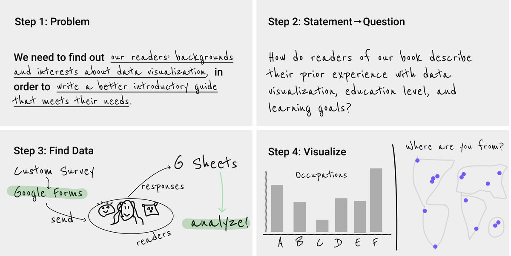{#fig-data-story-panel width=750}

이 연습은 혼자 하든, 그림 [\@fig-data-story-photo-combined]에 나온 것처럼 동료 팀과 함께 하는 편이 훨씬 좋든, 여러 면에서 도움이 됩니다. 첫째, 아이디어를 마음속에서 종이로 옮기면 자신의 생각을 더 명확하게 할 수 있을 뿐만 아니라 다른 사람들도 더 눈에 띄게 볼 수 있습니다. 아이디어를 스케치하면 숙고하고, 피드백을 듣고, 좋지 않은 아이디어는 지우고 새 종이에 더 나은 아이디어로 교체할 수 있습니다. 초기 스케치가 너무 복잡하거나 혼란스럽다면 그 아이디어를 별도의 페이지로 나누어 더 일관되게 만드세요.


{#fig-data-story-photo-combined width=750}

둘째, 종이들을 스토리보드처럼 바라보세요. 테이블 위에 펼쳐 놓고 옮겨 가며 순서를 다시 잡고 이야기의 시작, 중간, 끝이라는 세 가지 필수 단계를 정의해 보세요. 이 페이지들은 프레젠테이션 슬라이드나 보고서, 웹페이지의 단락과 그림처럼 더 많은 청중에게 데이터 이야기를 어떻게 전달할지 생각을 정리하는 데도 도움이 됩니다. 이 연습은 책의 끝부분에 있는 [제15장: 데이터 이야기 전달하고 보여주기](#story)에서 다시 다룰 것이므로 버리지 마세요.

마지막으로 이 스케치 연습은 이 책 본문에서 어떤 장에 집중해야 할지 식별하는 데 도움을 줄 수 있습니다. 데이터를 어디서 검색해야 할지 고민이라면 [제3장: 데이터 찾기 및 질문하기](#find)를 확인해 보세요. 차트나 지도를 만들 생각을 하고 있지만 다양한 유형의 예시가 필요하다면 [제6장: 데이터 차트 만들기](#chart) 및 [제7장: 데이터 지도 만들기](#map)의 시작 부분을 살펴보세요.

이제 전하고 싶은 이야기에 대한 명확한 이해와 만들고 싶은 시각화에 대한 초기 아이디어를 얻었으므로 다음 두 섹션에서는 작업을 수행하는 데 필요한 도구와 선택할 때 고려해야 할 요소에 대해 논의하겠습니다.

## 도구 고려 시 10가지 요소 {- #tool-factors}
끊임없이 이어지는 듯한 디지털 도구 중에서 결정을 내리는 것은 압도적으로 느껴질 수 있습니다. 여러분의 의사 결정 과정을 안내하기 위해 아래에 새로운 시각화 도구나 온라인 서비스를 평가할 때 고려하는 10가지 주요 요소를 나열합니다. 선택지를 비교할 때 많은 결정은 편의성과 광범위한 기능 등 상충되는 요구 사항 사이의 균형 즉 트레이드오프(tradeoff)를 수반합니다. 우리 모두가 다르기 때문에 이러한 핵심 요소를 식별함으로써 각 독자는 어떤 도구가 최상의 트레이드오프를 제공하는지 더 근거 있는 결정을 내릴 수 있다고 믿습니다. 게다가 이러한 범주는 디지털 라이프의 다른 영역에도 적용될 수 있도록 광범위하게 작성되었으며 데이터 시각화와 관련된 구체적인 맥락이 뒤따릅니다.

*1. 배우기 쉬움 (Easy-to-learn)*

새 도구를 익히는 데 시간이 얼마나 걸릴까요? 바쁜 일상에서 이 점은 흔히 가장 중요한 요소로 꼽히는데, 도구를 써 본 경험과 핵심 개념을 익히는 데 들이는 시간과 에너지가 사람마다 다른 탓에 편차도 적지 않습니다. 이 책에서 우리는 초보자에게 가장 적합한 도구(일부 고급 사용자들도 선호하는 도구)를 구분하기 위해 *쉬운 도구(Easy Tools)*라는 라벨을 사용합니다. 이런 도구는 빈 화면에 명령어를 외워 타이핑하는 대신 드롭다운 메뉴나 드래그 앤 드롭 방식을 통해 조작할 수 있는 그래픽 사용자 인터페이스를 제공하는 것이 일반적입니다. 더 좋은 도구들은 사용자가 실수를 했을 때 올바른 방향으로 이끌어 주는 친숙한 오류 메시지도 제공합니다. 책 후반부에서는 시각화를 더욱 세밀하게 제어하고 맞춤 설정할 수 있는 *파워 도구(Power Tools)*를 소개할 것인데, 처음부터 코드를 작성하는 것보다 쉬운 복사 및 편집이 가능한 코드 템플릿과 같은 것입니다. 전체적으로 이 책에 어떤 도구를 포함할지 결정할 때 '배우기 쉬움'을 목록의 최상단에 두었습니다. 사실, 초기 버전의 책에서는 인기 있는 무료 드래그 앤 드롭 도구를 삭제하기도 했는데, 왜냐하면 우리 스스로 그 도구의 사용 지침을 따라가는 데 어려움을 겪었기 때문입니다. 여러 훌륭한 대안들 중에서 고민할 때는 단순함을 선택하세요.

*2. 무료 또는 저렴함 (Free or Affordable)*

이 도구는 무료로 사용할 수 있습니까? 아니면 기본 기능은 무료로 제공하되 유료로 프리미엄 기능을 제공하는 *프리미엄(freemium)* 모델입니까? 혹은 일회성 구매 비용이나 월 구독료를 요구합니까? 물론 저렴함의 기준은 독자마다 다를 것입니다. 많은 소프트웨어 개발사의 비즈니스 모델이 안정적인 수입을 필요로 한다는 것을 충분히 이해하며 저희 두 사람 역시 작업에 필요한 특정 도구를 유료로 이용하고 있습니다. 만약 명확한 대안이 없는 상황에서 정기적으로 특정 도구에 의존해야 한다면, 그들의 지속적인 운영을 재정적으로 지원하는 것이 여러분에게도 가장 이득이 됩니다. 그러나 이 책을 만들면서 우리는 사용자에게 무료로 제공되는 다양한 고품질 데이터 시각화 도구에 깊은 인상을 받았습니다. 모든 독자가 데이터 시각화를 경험할 수 있도록, 이 책에서 추천하는 모든 도구는 전면 무료이거나 핵심 기능을 자유롭게 사용할 수 있습니다.

*3. 강력함 (Powerful)*

그 도구가 당신이 앞으로 필요하게 될 모든 기능을 갖추고 있습니까? 예를 들어 프로젝트에 필요한 여러 유형의 데이터 시각화 제작을 지원합니까? 더 많은 것이 대개 더 좋지만 [레이더 차트(radar charts)](https://en.wikipedia.org/wiki/Radar_chart)나 [폭포 차트(waterfall charts)](https://en.wikipedia.org/wiki/Waterfall_chart)와 같은 일부 차트 유형은 모호하고 거의 사용되지 않습니다. 또한 업로드할 수 있는 데이터 양의 한도나 생성한 시각화의 제한을 주의하세요. 예를 들어 우리는 이전 버전의 책에서 한 회사가 맵 조회수가 웹에서 100회를 초과할 경우 유료 라이선스를 요구하기 시작했을 때 이 프리미엄(freemium) 도구를 삭제한 바 있습니다. 게다가 시각화 외관을 사용자가 얼마나 맞춤 설정할 수 있나요? 드래그 앤 드롭 방식이나 프리미엄 모델 도구는 디스플레이 옵션을 제한하는 경우가 흔하므로 이러한 도구와 더욱 강력하고 사용자 지정이 가능한 도구 사이에서 절충해야 할 수도 있습니다. 이 책에서는 초보용 도구로 시작해 각 장마다 더욱 고급화된 도구를 점진적으로 소개하여 단순성과 강력함 사이에서 자신에게 맞는 최적의 조합을 찾을 수 있도록 돕습니다.

*4. 지원 (Supported)*

개발자가 해당 도구를 정기적으로 유지 및 업데이트하고 질문이나 문제에 답변합니까? 도구를 지원하고 사용에 대한 지식을 공유하는 활발한 사용자 커뮤니티가 있습니까? 우리만큼 오랜 기간 디지털 도구를 다뤄왔다면 개발자가 지원을 중단한 여러 도구를 잃었을 때의 슬픔을 이해할 것입니다. 예를 들어 [Killed By Google](https://killedbygoogle.com) 사이트는 이 수십억 달러 규모의 거대 기업이 폐쇄한 애플리케이션 및 온라인 서비스를 200개 가까이 나열합니다. 그중 하나는 한때 이 책의 이전 버전에서 전체 장 하나를 차지했던 유명 데이터 시각화 도구인 [Google Fusion Tables](https://en.wikipedia.org/wiki/Google_Fusion_Tables)로, 구글이 10년간 운영을 끝으로 2019년에 중단하자 저희 역시 책에서 삭제했습니다. 미래에 어떤 온라인 도구가 살아남을지 예측할 수는 없지만 이 책에 소개하기 전에 정기적인 업데이트 내역, [GitHub](https://github.com) 개발자 사이트에서 얻은 스타 수, [StackOverflow](https://stackoverflow.com) 사용자 포럼에서 응답된 질문 등 활발한 지원의 징후를 찾으려 노력했습니다. 하지만 과거가 미래와 같을 것이라고 절대 장담하지 마세요. 디지털 도구의 끊임없는 진화는 결국 일부가 사라짐을 의미합니다.

*5. 이식성 (Portable)*

이 도구로 데이터를 *가져오고(into)* 도구에서 *내보내는(out of)* 작업이 얼마나 용이한가요? 예를 들어, 한 유명 소프트웨어 회사가 만든 온라인 스토리 맵 도구를 추천 목록에서 제외한 적이 있는데, 사용자가 위치, 텍스트, 사진을 쉽게 업로드할 수 있음에도 자신이 작업한 모든 결과를 내보낼 방법이 없다는 사실을 알았기 때문입니다! 디지털 기술은 필연적으로 변화하며 언젠가는 모든 데이터를 다른 플랫폼으로 마이그레이션해야 하므로 이런 전환에 대비하는 것이 여러분의 과제입니다. 이 문제를 향후 알 수 없는 어떤 플랫폼에서도 당신의 프로젝트가 기능할 수 있도록 확률을 높이기 위한 일종의 역사적 보존 작업으로 생각하세요. 현재 사용 중인 도구의 개발자가 다음 달 서비스 종료를 공지하더라도 공통으로 쓰이는 파일 형식으로 기반 데이터를 모두 추출해 다른 도구로 손쉽게 올릴 수 있나요? 여러분의 시각화를 미래의 변화에 대비하도록 보호하는 핵심 단계는 데이터 파일이 차트나 지도를 생성하는 프레젠테이션 소프트웨어와 쉽게 분리될 수 있게 하는 것입니다. 이 책에 추천할 도구를 고를 때 우리는 장래의 마이그레이션 대비 휴대 가능한 데이터 다운로드를 지원하는 도구를 선호했습니다.

*6. 보안 및 프라이버시 (Secure and Private)*

이 항목은 보안과 개인 정보 보호에 관한 관련 질문을 결합한 것입니다. 첫째, 해당 온라인 도구나 서비스는 악의적인 해커와 멀웨어로부터 개인 정보를 보호하기 위해 합리적인 예방 조처를 하나요? 정보 기반 결정을 내리는 데 도움이 되는 [위키백과의 대형 데이터 침해 사건 목록](https://en.wikipedia.org/wiki/List_of_data_breaches)을 확인해 보세요. 만약 당신이 쓰는 도구 개발사가 최근 데이터 침해 피해를 보았다면 어떻게 대응했는지 파악하세요. 둘째, 브라우저를 통해 도구에 접속할 때 다양한 사이트에서의 웹 활동을 추적하나요? 2019년 4월부터 [위키백과에 대한 모든 접근을 차단](https://en.wikipedia.org/wiki/Censorship_of_Wikipedia)한 중국에서 이 책을 읽고 있지 않다면, 위키백과가 정리한 [전 세계 여러 정부의 인터넷 검열](https://en.wikipedia.org/wiki/Internet_censorship_and_surveillance_by_country) 현황도 주의하세요. 마지막으로, 당신이 입력한 데이터나 생성한 작업물이 비밀로 유지되는지 공개되는지 도구가 분명히 명시하나요? 예를 들어, 일부 회사는 자사 시각화 도구를 무료로 이용할 수 있게 제공하는 대신 여러분의 데이터, 차트, 지도를 공개 접근 상태로 만들 것을 요구합니다. 많은 언론인과 학자들이 흔히 그렇듯, 개방형 공공 데이터로 작업 중이고 이미 시각화를 무료로 공유할 계획이라면 이러한 절충 조건도 받아들일 만할 것입니다. 어느 경우이든 도구를 사용하기 전에 서비스 약관이 명확하게 정의되어 있는지 확인하세요.

*7. 협업 가능 여부 (Collaborative)*

이 도구는 사람들이 데이터 시각화를 공동으로 제작하고 협업할 수 있도록 지원합니까? 지원한다면 팀원들이 우연히 서로의 기여를 덮어쓰는 일을 막을 수 있게 도구 차원에서 엑세스 수준 설정이나 버전 제어 기능을 제공하나요? 이전 세대의 디지털 도구는 주로 개인 사용자를 염두에 두고 설계되었으며 그 일부 이유는 위에서 제기한 보안 및 프라이버시 문제 해결을 위함이었습니다. 그러나 오늘날 많은 데이터 시각화 프로젝트는 다수 팀원의 접근과 입력을 필요로 합니다. 성공을 위해서는 협업이 필수적입니다. 이 책의 본문을 함께 작성하고 수많은 시각화를 공동으로 제작한 공동 저자로서, 우리는 팀 작업 환경에 맞춰 개발된 새로운 세대의 도구를 선호합니다.

*8. 교차 플랫폼 호환성 (Cross-Platform)*

이 범주는 디지털 콘텐츠의 제작과 소비 모두를 지칭합니다. 첫째, 다양한 컴퓨터 운영 체제 환경에서 도구가 원활히 작동합니까? 이 책에서는 최신 웹 브라우저 내에서 구동되는 여러 도구를 집중적으로 조명하며 이 경우 대체로(항상 그런 것은 아니지만) 윈도우(Windows), 맥(Mac), 크롬북(Chromebook), 리눅스(Linux) 등 주요 데스크톱 및 노트북 플랫폼에서 모두 동작합니다. 특정 운영 체제에서만 돌아가는 도구라면 따로 밝혀 두어, 저가형 컴퓨터를 쓰는 독자에게 접근성이 떨어질 수 있음을 알려 드립니다. 둘째, 이 도구가 제작하는 시각화는 다양한 화면 크기에 반응형으로 조정됩니까? 다시 말해, 스마트폰이나 태블릿처럼 작은 화면 기기에서도 만족스럽게 표시되는 차트와 지도를 만듭니까? 이 책에서 우리는 교차 플랫폼 도구 중에서도 작은 화면 기기에서 콘텐츠가 반응형으로 잘 표출되는 도구를 선호하지만 이 기기들을 활용해 시각화를 제작하는 것까지 반드시 염두에 두는 것은 아닙니다. 즉 도구가 최신 웹 브라우저 안에서 실행된다고 말할 때 휴대전화나 태블릿 브라우저를 반드시 의미하지는 않지만 어떨 때는 그곳에서도 작동합니다.

*9. 오픈소스 (Open-Source)*

해당 도구의 소프트웨어 코드는 공개적으로 확인할 수 있습니까? 다른 개발자가 개선안을 제시하거나 새로운 기능이나 확장을 만들어 낼 수 있도록 코드를 수정하고 재배포할 수 있나요? 많은 개발자가 이익을 창출하기 위해 자사 도구를 공개되지 않는 독점 코드로 판매하는 데 의존하고 있으며 그들 중 몇몇 역시 이 책에 등장한다는 점을 인지하고 있습니다. 하지만 그와 동시에 우리는 자원 봉사 개발자 커뮤니티, 비영리 조직, 그리고 오픈소스 코드 개발에 따른 경제적 이점을 인정하는 영리 기업들이 다양한 형태의 오픈소스 라이선스 계약 아래 고품질 데이터 시각화 도구를 제공하는 모습에도 감명받아 왔습니다. 이 책에 도구를 추천할 때 선택지가 있다면 오픈소스 옵션을 우선하여 조명할 것입니다.

*10. 시각 장애 독자를 위한 접근성 (Accessible for Visually-Impaired Readers)*

해당 도구는 시각 장애가 있는 독자들도 접근할 수 있는 형태의 시각화를 생성하나요? 관련 장애 옹호 법안이 통과된 지 수십 년이 지났지만 특히 데이터 시각화 분야의 디지털 기술은 여전히 뒤처져 있으며 그 격차를 서서히 줄여나가고 있습니다. 그러나 일부 도구에는 [색맹 내장 검사](https://blog.datawrapper.de/colorblind-check/)가 포함되어 있으며 그림 [\@fig-colorblind-accessible-combined]에 표시된 것처럼 스크린 리더를 사용하는 [저시력자를 위해 설계된 차트 유형](https://www.highcharts.com/demo/accessible-line)을 제공하기도 합니다.


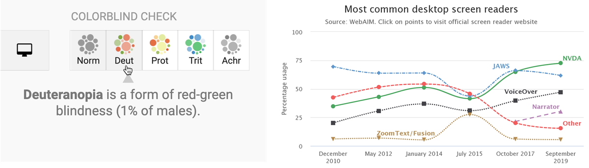{#fig-colorblind-accessible-combined width=750}

이러한 내용들은 디지털 도구함에 또 다른 아이템을 추가할지 여부를 결정할 때 우리가 고려하는 열 가지 요소입니다. 흔히 다음 섹션에서 읽을 수 있듯 타협이 필요합니다. 물론 여러분만의 목록은 다를 수 있으며 소프트웨어 개발자의 윤리적 비즈니스 관행이나 공익에 대한 기여처럼 판단하기 어려울지라도 중요하게 여겨야 할 여타 가치가 포함될 수 있습니다. 어떤 기준을 중시하든 결정을 내리는 과정에서 그 기준을 분명히 하고 여러분의 선택에 영향을 미치는 요소가 무엇인지 다른 사람들에게 알리세요.

또한 다른 사람들의 도구 결정에 대한 관점도 고려해 보세요. 시각화 디자이너인 리사 샬럿 로스트(Lisa Charlotte Rost)는 자신의 [24개의 각기 다른 도구로 한 개의 차트를 재현한 흥미로운 실험](https://source.opennews.org/articles/what-i-learned-recreating-one-chart-using-24-tools/)에 관해 기고하며 "완벽한 도구는 없으며 오직 특정한 목표를 가진 사람들에게 좋은 도구만이 있을 뿐"이라고 결론 내렸습니다. 이와 비슷한 관점에서 디지털 역사가 링컨 뮬런(Lincoln Mullen)은 [디지털 도구를 선택하는 신중한 방법](https://lincolnmullen.com/blog/how-to-make-prudent-choices-about-your-tools/)에 대한 조언을 제공하면서 첫 번째로 제안한 것은 "가장 훌륭한 도구는 당신이 일을 처리하기 위해 이미 사용하고 있는 바로 그 도구다" 였습니다. 또 다른 새 도구를 사용하기만 하면 생산성이 올라갈 것이라는 뻔한 함정에 빠지지 마세요. 뮬런의 두 번째 조언은 다음과 같았습니다. "여러분의 현지 동료들이 쓰는 도구를 더 우선하라." 어떤 도구가 객관적으로 더 뛰어나다 할지라도 각자 일하는 현장에서 그보다 덜 멋진 애플리케이션을 사용하는 사람들과의 상호 지원과 협업에서 오는 혜택이 도구의 객관적 차이를 넘어설 수 있습니다.^[@rostWhatLearnedRecreating2016; @mullenHowMakePrudent2013. 교육용 도구의 기준은 @wattersAudreyTestWhat2012a 도 참조]

이제 도구를 결정하는 여러 요소를 다각도로 고려해 보았습니다. 다음 섹션에서는 이 책의 독자를 위한 저희의 도구 추천 내용을 간략한 설명, 그리고 각 도구가 소개되는 장으로 향하는 링크와 함께 확인할 수 있습니다.

## 우리가 추천하는 도구 {- #recommended-tools}
이 책을 구성하면서 우리는 초보자가 직면할 수 있는 가장 필수적인 데이터 시각화 과제와 그 작업을 해내기 위해 필요한 디지털 도구 세트를 파악하고자 노력했습니다. 이전 장에서 우리는 배우기 쉬운 정도, 가격이 무료거나 저렴한지, 강력한 기능을 갖추었는지와 같이 우리의 도구 선정에 영향을 미친 열 가지 요소를 살펴보았습니다. 이번 섹션에서는 표 [\@tbl-tools]에 보여지듯 이 책에서 다루는 모든 도구를 추천 사용 사례 및 해당 도구가 등장하는 장의 참조와 함께 목록화해 두었습니다. 진행할 데이터 시각화 프로젝트는 이들 중 단 몇 가지 도구, 어쩌면 단 한 가지 도구만으로도 충분할지 모릅니다. 하지만 해당 도구가 존재하는지도 모른다면 여러분에게 어떤 도움이 될지도 알 수 없으므로 다양한 유형의 도구를 인지하고 있는 것은 대단히 중요합니다.

표: (\#tab:tools) 추천 도구 및 용도, 그리고 참조 장(Chapter)

| 도구 | 수집 | 정리 | 차트 | 지오코드 | 지도 | 표 | 코드 | 변환 |
|-|-|-|-|-|-|-|-|-|
| Google Sheets  스프레드시트/차트 | [제2장](#spreadsheet-tools) | [제4장](#clean) | [제6장](#chart-google) | [제2장](#geocode) |  | [제8장](#table) |  |  |
| LibreOffice Calc  스프레드시트/차트 | [제2장](#spreadsheet-tools) |  |  |  |  |  |  |  |
| Airtable  관계형 데이터베이스 | [제2장](#database) |  |  |  |  |  |  |  |
| Tabula PDF 표 추출기 |  | [제4장](#tabula) |  |  |  |  |  |  |
| OpenRefine  데이터 정리기 |  | [제4장](#open-refine) |  |  |  |  |  |  |
| Datawrapper  차트/지도/표 |  |  | [제6장](#chart-datawrapper) | [제7장](#symbolmap-datawrapper) | [제7장](#symbolmap-datawrapper) | [제8장](#table-datawrapper) |  |  |
| Tableau Public  차트/지도/표 |  |  | [제6장](#chart-tableau) |  | [제7장](#map-tableau) | [제8장](#table) |  |  |
| Chart.js  코드 템플릿 |  |  | [제11장](#chartcode) |  |  |  |  |  |
| Highcharts  코드 템플릿 |  |  | [제11장](#chartcode) |  |  |  |  |  |
| Google My Maps  간단한 지도 제작기 |  |  |  | [제7장](#mymaps) | [제7장](#mymaps) |  |  |  |
| Leaflet map  코드 템플릿 |  |  |  |  | [제12장](#leaflet) |  |  |  |
| GitHub  코드 편집 및 호스팅 |  |  |  |  |  |  | [제10장](#github) |  |
| GitHub Desktop & 코드 편집기 |  |  |  |  |  |  | [제10장](#github-desktop-editor) |  |
| GeoJson.io 지리 데이터 편집 및 그리기 |  |  |  |  |  |  |  | [제13장](#geojsonio) |
| Mapshaper  지리 데이터 편집 및 조인 |  |  |  |  |  |  |  | [제13장](#mapshaper) |
| Map Warper  이미지 지오레퍼런싱 |  |  |  |  |  |  |  | [제13장](#mapwarper) |

이 목록이 처음에는 너무 방대해 보일지라도 걱정하지 마세요! 처음 접하는 사용자도 배우기 쉬운 도구 단 두 가지만 활용해 이 책의 12개 입문 수준 챕터의 대부분을 마무리할 수 있습니다. [Google Sheets에서 스프레드시트와 기본 차트](#spreadsheet-tools)로 시작하고 그 다음 [Datawrapper로 한층 더 발전된 차트와 지도](#chart-datawrapper)로 넘어가세요. 이 두 도구만으로도 놀라운 데이터 시각화를 빚어낼 수 있습니다. 또한, 이 둘은 서로 완벽하게 호환되어 Datawrapper에서 Google Sheets의 데이터를 직접 가져와 바로바로 최신 상태로 유지할 수 있게 해줍니다.

표 [\@tbl-tools]의 추천 도구 이외에도 텍스트에는 [지도 색상을 선택할 수 있는 ColorBrewer](#map-design), [Google Sheets용 SmartMonkey 지오코딩 애드온](#geocode), [W3Schools TryIt iframe 페이지](https://www.w3schools.com/tags/tryit.asp?filename=tryhtml_iframe) 등 수많은 유용한 추가 기능 및 어시스턴트가 언급되어 있습니다. 또한 [Electronic Frontier Foundation의 무료 Privacy Badger 브라우저 확장 프로그램](https://privacybadger.org/)을 설치하여 자신을 누가 추적하는지 확인하고 제어력을 발휘함으로써 웹 보안을 한층 높이는 것도 권장합니다. 함께 [EFF의 보안 자가 방어 가이드 (Surveillance Self-Defense Guide)](https://ssd.eff.org/)를 읽어보는 것도 좋습니다.

우리는 특정 기준에서는 훌륭하지만 다른 기준에서는 그렇지 못한 도구들과 타협을 하는 경우도 많습니다. 예를 들어, 이 책의 튜토리얼에서 가장 자주 소개되는 도구는 [Google Sheets](https://www.google.com/sheets/about/)인데, 배우기 쉬우면서도 무료이며 성능 또한 강력하기 때문입니다. 하지만 Google Sheets는 오픈소스가 아니며 구글이 너무 많은 사용자 정보에 접근하는 것 아니냐고 우려를 표하는 분들도 있습니다. 후자와 관련된 문제를 타협할 만한 대안으로는 데이터 시각화 작업 전용 Google 계정을 별도로 생성해 개인 생활의 계정과 분리하는 방법을 들 수 있습니다.

마지막으로, 디지털 도구는 계속해서 변화하고 진화하고 있음을 인식하고 있습니다. 어떤 도구는 우리가 이 책을 쓰는 동안 다른 사람이 언급하거나 트윗한 덕분에 비로소 알게 된 것도 있습니다. 시간이 흐르면서 어떤 도구들은 지원이 끊기기도 하고 데이터를 매력적인 이야기로 더 효과적으로 변환시켜 줄 새로운 도구들을 만나리라 기대합니다. 현재 목록에 없는 훌륭한 도구를 추천하고 싶다면, [저자에게 연락하여](#authors) 위에서 언급한 10가지 도구 선정 기준에서 그 도구가 어떻게 평가될 수 있을지 알려주시기 바랍니다.

## 비밀번호 관리자 사용하기 {- #password-manager}

마지막으로 우리는 비밀번호 관리자(Password manager)의 사용을 강력히 권장합니다. 모든 도구를 지배하는 단 하나의 도구로 생각하세요! 이 도구는 위에서 추천한 다수의 온라인 도구에 회원가입 시 생성되는 계정 정보를 쉽게 추적하고 관리하도록 돕습니다. 우리는 윈도우, 맥, 리눅스 시스템과 모든 주요 웹 브라우저, iOS 및 안드로이드 휴대 기기 등에서 핵심 기능을 무료로 제공하는 오픈소스 비밀번호 관리자인 [Bitwarden](https://bitwarden.com) 설치를 권합니다. Bitwarden을 설치할 때 하나의 마스터 비밀번호를 생성하게 되며(절대 잊어버리지 않도록 주의하세요), 이 단일 비밀번호를 통해 저장해 둔 모든 계정 아이디와 비밀번호에 접근하게 됩니다. 또한 즐겨 쓰는 웹 브라우저에 Bitwarden 확장 프로그램을 설치할 수 있습니다. 웹 브라우저에서 새로운 서비스 계정을 등록하면, 비밀번호 관리자는 보통 종단 간 암호화(end-to-end encryption)된 개인 금고에 해당 정보를 저장할 것인지 묻습니다. 덧붙여 그림 [\@fig-bitwarden-annotated]에서 확인할 수 있듯, 향후 해당 사이트를 다시 방문할 경우 비밀번호 관리자가 보통 이를 인식하고 원클릭만으로 로그인 정보를 입력해 줍니다.


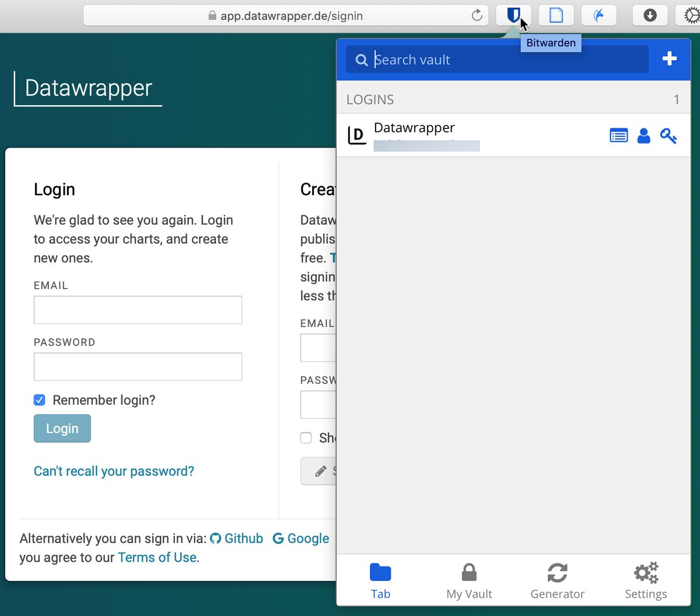{#fig-bitwarden-annotated width=500}

우리는 (Chrome이나 Firefox 같은) 특정 웹 브라우저에 바로 비밀번호를 저장하기보다는 Bitwarden과 같은 전용 도구 내에 보관하기를 두 가지 이유로 권장합니다. 첫째, Bitwarden을 설정하면 노트북과 휴대폰을 아우르는 *다양한* 브라우저와 *다중* 기기 간에 비밀번호를 원활하게 동기화하고 이용할 수 있습니다. 둘째, 주 브라우저나 컴퓨터가 고장 나더라도 안전한 온라인 Bitwarden 금고에는 계속 접속할 수 있으므로, 다른 컴퓨터에서 작업을 이어 나가는 데 지장이 없습니다.

### 요약 {- #summary1}
이제 이 책에서 추천하는 광범위한 데이터 시각화 도구를 파악하였고 전반적인 도구를 선택할 때의 현명한 의사결정 방식에 관해 한결 선명하게 이해하셨을 것입니다. 언제나 전달하려는 데이터 이야기를 마음속 전면에 간직하세요. 도구란 결국 그 목적을 달성하게 돕는 수단에 불과하기 때문입니다. 다음 장은 우리의 데이터 시각화 작업함 중 가장 핵심 도구인 스프레드시트에 대한 기량을 향상하기 위해 마련되었습니다.
<!-- BEGIN FILE: 02-spreadsheet.Rmd -->

# 스프레드시트 기술 강화하기 {#spreadsheet}
데이터 시각화 디자인을 시작하기 전에 스프레드시트 기술을 충분히 갖추는 것이 중요합니다. 이 주제를 가르치면서 많은 사람들이 정규 교육이나 직장 교육에서 스프레드시트 도구 사용법을 "제대로 배운 적이 없다"고 말하는 것을 들었습니다. 하지만 스프레드시트 기술은 지루한 작업 시간을 엄청나게 줄여줄 뿐만 아니라, 더 중요하게는 데이터 속에 숨겨진 이야기를 발견하는 데 도움을 주기 때문에 필수적으로 배워야 합니다.

이 책 후반부에서 만들 대화형 차트와 지도는 데이터 테이블을 기반으로 하며 일반적으로 Google Sheets, LibreOffice, 또는 Microsoft Excel과 같은 스프레드시트 도구로 엽니다. 스프레드시트에는 주로 숫자나 텍스트 데이터의 열(column)과 행(row)이 포함되어 있습니다(\@fig-spreadsheet-terms 그림 참조). 첫 번째 행에는 대개 각 열의 데이터를 설명하는 레이블인 헤더(header)가 포함됩니다. 또한 열은 문자로, 행은 숫자로 자동 지정되므로 `C2`와 같이 그리드의 모든 셀(cell)이나 상자를 참조할 수 있습니다. 셀을 클릭하면 다른 셀을 참조하여 자동으로 계산을 실행하는 수식(formula)이 표시될 수 있습니다. 수식은 항상 등호(=)로 시작하며 단순히 다른 셀을 더하거나(`=C2+C3+C4` 등) 특정 연산을 수행하는 함수(function)를 포함할 수 있습니다(예: 특정 셀 범위의 평균 계산: `=average(C2:C7)`). 일부 스프레드시트 파일에는 여러 시트(때로는 워크북이라고도 함)가 포함되어 있으며 하단의 탭을 클릭하여 특정 시트를 엽니다.


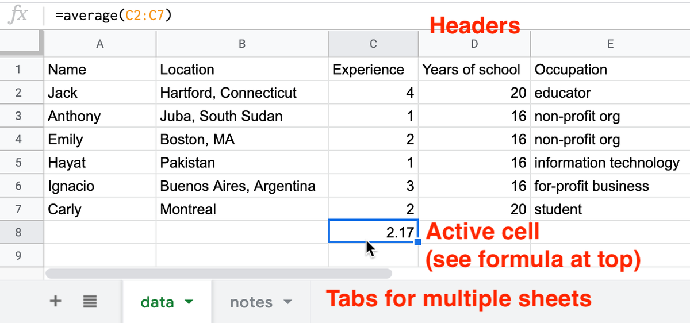{#fig-spreadsheet-terms width=600}

이 장에서는 먼저 [공유](#share), [업로드](#upload), [애드온 도구로 지오코딩](#geocode), [온라인 폼으로 데이터 수집](#forms) 등 기본 단계를 살펴봅니다. 그런 다음 [정렬 및 필터링](#sort), [수식으로 계산](#calculate), [피벗 테이블로 요약](#pivot) 등 데이터를 구성하고 분석하는 방법으로 넘어갑니다. 마지막으로 [조회 테이블(lookup table)로 열 일치시키기](#xlookup)와 [관계형 데이터베이스(relational database)](#database) 등 서로 다른 시트를 연결하는 방법을 살펴봅니다. 이 모든 방법은 사전 지식이 필요 없는 초보자를 염두에 두고 설명합니다.

이 기술 중 일부는 여러분과 같은 사람들의 정보가 포함되어 있어 흥미로울 수 있는 샘플 데이터를 사용하여 연습해 보겠습니다. 지금까지 이 책의 독자 3,000명 이상이 일반적인 위치, 사전 경험 및 교육 수준, 데이터 시각화 학습 목표에 대한 간단한 공개 설문조사에 응답했습니다. 아직 참여하지 않았다면 [간단한 설문조사 양식을 작성](https://forms.gle/yn5QwTzfQkYcppQn9)하여 본인의 응답을 추가하고 질문이 어떻게 구성되었는지 확인해 보세요. 그런 다음 [공개 샘플 데이터셋](https://docs.google.com/spreadsheets/d/1egX_akJccnCSzdk1aaDdtrEGe5HcaTrlOW-Yf6mJ3Uo)에서 결과를 확인하십시오.

컴퓨터가 지루한 데이터 준비 작업을 더 많이 대신하도록 하는 방법을 배우고 싶다면 이 장이 확실히 도움이 될 것입니다. 또는 이미 스프레드시트에 매우 익숙하다고 느끼더라도 이 장을 가볍게 읽어보는 것이 좋습니다. 책의 후반부에서 차트와 지도를 더 효율적으로 만드는 데 도움이 될 몇 가지 요령을 배울 수도 있습니다.

## 스프레드시트 도구 선택하기 {- #spreadsheet-tools}
어떤 스프레드시트 도구를 사용해야 할까요? [1장: 스토리를 전달할 도구 선택하기](#choose)에서 자세히 논의했듯이, 정답은 작업에 대한 여러 질문에 어떻게 답하느냐에 따라 다릅니다. 첫째, 데이터가 공개(public)되어 있나요, 아니면 비공개(private)인가요? 비공개인 경우, 데이터를 자동으로 클라우드에 저장하는 온라인 스프레드시트 도구를 사용할 때 발생할 수 있는 우발적인 데이터 유출 위험을 줄이려면 컴퓨터에서 실행되는 다운로드 가능한 스프레드시트 도구를 사용하는 것을 고려하세요. 둘째, 혼자 작업할 것인가요, 아니면 다른 사람들과 함께 작업할 것인가요? 공동 프로젝트의 경우 다른 팀원들이 동시에 데이터를 보거나 편집할 수 있도록 설계된 온라인 스프레드시트 도구 사용을 고려해 보세요. 셋째, CSV(Comma Separated Values) 등 특정 형식으로 데이터를 가져오거나(import) 내보내야(export) 하나요(이에 대해서는 다음 섹션에서 설명)? 그렇다면 해당 형식을 지원하는 스프레드시트 도구를 선택하십시오. 마지막으로 무료 도구를 선호하시나요, 아니면 기꺼이 비용을 지불하거나 오픈소스 개발을 지원하기 위해 자금을 기부할 의향이 있으신가요?

다음은 이러한 질문을 바탕으로 세 가지 일반적인 스프레드시트 도구를 비교한 내용입니다.

- [Google Sheets](https://www.google.com/sheets/about/)는 모든 최신 웹 브라우저에서 작동하며 데이터를 클라우드에 자동으로 저장하는 무료 온라인 스프레드시트 도구입니다. 업로드한 데이터는 기본적으로 비공개이지만 특정 개인 또는 인터넷의 모든 사람과 공유하도록 선택할 수 있으며 Google Documents와 유사하게 실시간 공동 작업을 위해 보기 또는 편집을 허용할 수 있습니다. Google Sheets는 CSV, ODS, Excel 및 기타 형식으로 데이터를 가져오고 내보냅니다. Google Mail 계정과 동일한 사용자 이름으로 무료 개인용 [Google Drive](https://drive.google.com) 계정에 가입하거나, Google의 사생활 침해를 줄이기 위해 새 사용자 이름으로 별도의 계정을 만들 수 있습니다. 또 다른 옵션은 대규모 조직이나 교육 기관을 위해 설계된 공유 설정을 갖춘 거의 동일한 도구를 제공하는 [Google Workspace](https://workspace.google.com/) 비즈니스 계정(이전의 G Suite) 구독 비용을 지불하는 것입니다.
- [LibreOffice](https://www.libreoffice.org/)는 Calc 스프레드시트를 포함하여 Mac, Windows, Linux 컴퓨터에서 사용할 수 있는 무료 다운로드 도구 모음이며 Microsoft Office의 점점 더 인기 있는 대안입니다. LibreOffice를 다운로드할 때 후원 조직인 Document Foundation은 오픈소스 소프트웨어 개발을 계속하기 위해 기부를 요청합니다. Calc 스프레드시트 도구는 데이터를 고유한 ODS 형식은 물론 CSV, Excel 등 다양한 형식으로 가져오고 내보냅니다. 온라인 협업 플랫폼은 개발 중이지만 아직 광범위하게 사용할 수는 없습니다.
- [Microsoft Excel](https://support.microsoft.com/en-us/excel)은 Microsoft Office 제품군의 스프레드시트 도구입니다. 시간이 지남에 따라 회사에서 제품 이름을 변경하여 종종 혼동되긴 하지만 여러 버전으로 사용할 수 있습니다. [Microsoft 365](https://www.microsoft.com/en-us/microsoft-365) 유료 구독은 두 가지 버전을 제공합니다. Windows나 Mac 컴퓨터 및 기타 장치용 기능을 모두 갖춘 다운로드 가능한 버전의 Excel(대부분의 사람들이 단순히 "Excel"이라고 할 때 의미하는 것)과, Microsoft의 온라인 호스팅 서비스를 통해 공동 작업자와 파일 공유를 포함하여 브라우저를 통한 더 단순한 온라인 Excel 액세스입니다. 구독료를 지불하고 싶지 않은 경우 누구나 Microsoft의 [Office on the Web](https://office.com)에서 무료 버전의 온라인 Excel에 가입할 수 있지만 여기에는 기능을 모두 갖춘 다운로드 가능한 버전은 포함되어 *있지 않습니다*. 온라인 Excel 도구에는 한계가 있습니다. 예를 들어, 온라인 Excel의 유료 또는 무료 버전 모두 단일 시트 범용 CSV(.csv) 형식으로 파일을 저장할 수 없으며 이는 이 책의 뒷부분에서 일부 데이터 시각화 도구에 필요한 중요한 기능입니다. 현재 유료 Microsoft 365 구독에서만 사용할 수 있는 다운로드 가능한 Excel 도구를 사용하여 CSV 형식으로만 내보낼 수 있습니다.

사용할 스프레드시트 도구를 결정하는 것은 간단한 선택이 아닙니다. 비용, 데이터 형식, 개인정보 보호 문제, 공동 작업자의 개인적 선호도에 따라 프로젝트마다 결정이 달라지는 경우가 많습니다. 때로는 동료나 클라이언트가 협업을 위해 설계된 스프레드시트 도구 플랫폼을 통해 공유하는 대신, 민감하지 않은 스프레드시트 데이터를 이메일에 첨부하여 보내달라고 구체적으로 요청하는 경우도 있습니다. 따라서 위의 세 가지 일반적으로 사용되는 스프레드시트 도구에 모두 익숙해지고 각각의 장단점을 이해하는 것이 가장 좋습니다.

이 책에서는 대부분의 예제에 주로 Google Sheets를 사용합니다. 이 책을 통해 배포하는 모든 데이터는 공개되어 있습니다. 또한, 여러분과 같은 독자들과 데이터 파일 링크를 공유하여 여러분이 원본 버전을 확인하고 자신의 Google Drive에서 편집할 사본을 만들거나 LibreOffice 또는 Excel에서 사용할 다른 형식으로 다운로드할 수 있도록 협업을 위해 설계된 스프레드시트 도구를 원했습니다. 우리가 가르치는 대부분의 스프레드시트 방법은 모든 스프레드시트 도구에서 동일하게 보이며 관련이 있는 경우 예외 사항을 지적합니다.

### 사이드바: 일반적인 데이터 형식 {-}
스프레드시트 도구는 데이터를 다양한 형식으로 구성합니다. 스프레드시트 데이터를 컴퓨터로 다운로드하면 일반적으로 파일 이름 뒤에 마침표와 3자리 또는 4자리 약어 확장자가 표시되며 이는 \@fig-data-formats 그림과 같이 데이터 형식을 나타냅니다. 이 책에서 사용하는 가장 일반적인 데이터 형식은 다음과 같습니다.

- `.csv`는 Comma Separated Values를 의미하며 단일 시트의 단순 데이터를 위한 범용 형식으로 수식이나 스타일을 저장하지 않습니다.
- `.ods`는 OpenDocument Spreadsheet를 의미하며 다중 탭 시트, 수식, 스타일 등을 저장하는 표준화된 개방형 형식입니다.
- `.xlsx` 또는 이전의 `.xls`는 Excel을 의미하며 다중 탭 시트, 수식, 스타일 등을 지원하는 Microsoft 형식입니다.
- `.gsheet`는 다중 탭 시트, 수식, 스타일 등도 지원하는 Google Sheets 형식이지만 주로 온라인에 존재하도록 설계되었기 때문에 일반적으로 컴퓨터에서는 볼 수 없습니다.


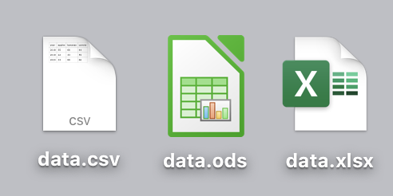{#fig-data-formats width=350}

팁: Mac 컴퓨터는 기본적으로 파일 이름 확장자를 숨기므로 `data.csv` 또는 `map.geojson`과 같이 마침표 뒤의 약어 파일 형식을 볼 수 없을 수도 있습니다. \@fig-mac-file-extensions 그림에 표시된 대로 Finder > 설정(Settings) > 고급(Advanced)으로 이동하여 *모든 파일 이름 확장자 표시(Show all filename extensions)* 상자를 선택하여 이 설정을 변경하는 것이 좋습니다. 구형 Mac 운영 체제에서는 단계가 Finder > 환경설정(Preferences) > 고급이었습니다.


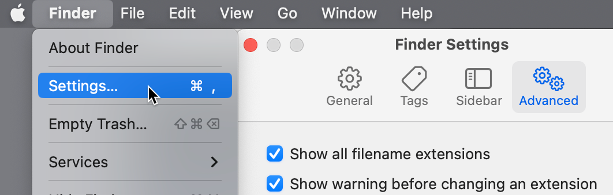{#fig-mac-file-extensions width=400}

## CSV 또는 ODS 형식으로 다운로드하기 {- #csv}
[1장: 스토리를 전달할 도구 선택하기](#choose)에서 데이터 이동성을 지원하는 소프트웨어를 권장하는 이유를 배웠으므로, 기술이 발전함에 따라 데이터를 다른 플랫폼으로 마이그레이션할 수 있습니다. 데이터를 쉽게 다시 꺼낼 수 없는 도구에 중요한 데이터를 절대 업로드하지 마십시오. 이상적으로 스프레드시트 도구는 다른 플랫폼으로 마이그레이션할 수 있는 옵션을 극대화하기 위해 CSV(Comma Separated Values) 및 ODS(OpenDocument Spreadsheet)와 같은 범용 또는 개방형 데이터 파일 형식으로 작업을 내보낼 수 있도록 허용해야 합니다.

경고: 여러 탭과 수식이 있는 스프레드시트에서 작업하는 경우, CSV 내보내기는 *활성화된* 시트(즉, 현재 보고 있는 시트)와 해당 시트의 *데이터*만 저장합니다(계산을 실행하기 위해 수식을 삽입한 경우 수식이 아닌 결과만 나타남). 이 책의 뒷부분에서 데이터 시각화 도구로 가져오기 위해 CSV 파일을 만들어야 할 수 있으므로, 원본이 수식이 있는 다중 탭 스프레드시트인 경우 원본을 계속 추적하십시오.

이 책에서 Google Sheets를 다루는 한 가지 이유는 몇 가지 일반적인 형식으로 데이터를 내보낼 수 있기 때문입니다. 이를 시도해 보려면 이 [Google Sheets 샘플 데이터 파일](https://docs.google.com/spreadsheets/d/1eXWG6sSb6ZL4pKvCsCjcqeJ8l4vqbckuYEBj8T-uefo/)을 새 탭에서 열고 *파일(File) > 다운로드(Download)*로 이동하여 \@fig-sheets-download 그림과 같이 CSV 형식(활성 시트의 데이터에 대해서만) 또는 ODS 형식(데이터 및 다중 탭 스프레드시트의 대부분의 수식 유지), 또는 Excel 등 기타 형식으로 내보냅니다. 마찬가지로 다운로드 가능한 LibreOffice와 그 Calc 스프레드시트 도구에서 *파일 > 다른 이름으로 저장(Save As)*을 선택하여 기본 ODS 형식으로 데이터를 저장하거나 CSV, Excel 또는 기타 형식으로 내보냅니다.


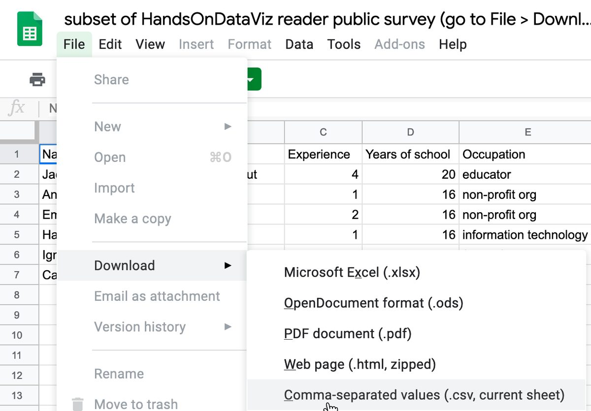{#fig-sheets-download width=600}

하지만 Microsoft Excel에서 데이터를 내보내는 것은 더 까다로울 수 있습니다. 브라우저에서 온라인 Excel 도구(무료 또는 유료 버전)를 사용하면 이 책의 뒷부분에 나오는 일부 데이터 시각화 도구에 필요한 단계인 범용 단일 시트 CSV 형식으로 파일을 저장할 수 *없습니다*. 다운로드 가능한 Excel 도구(현재는 유료 구독 필요)만이 이 책 후반부의 데이터 시각화 도구에서 요구하는 단계인 CSV 형식으로 내보낼 수 있습니다. 그리고 다운로드 가능한 Excel 도구를 사용하여 CSV 형식으로 저장할 때 단계가 때때로 사람들을 혼란스럽게 합니다. 첫째, 여러 CSV 옵션이 표시되면 다른 컴퓨터 플랫폼에서 가장 잘 작동하는 *CSV UTF-8*을 선택하십시오. 둘째, Excel 워크북에 여러 시트나 수식이 포함되어 있는 경우 CSV 형식으로 저장할 수 없다는 경고가 표시될 수 있습니다. 이는 활성 시트에 포함된 데이터(수식 아님)만 저장하고 모든 시트를 저장하지는 않습니다. 이를 이해했다면 *확인(OK)*을 클릭하여 계속 진행하십시오. 셋째, 다음 화면에서 Excel은 위에서 설명한 이유로 인해 Excel 파일을 CSV 형식으로 저장할 때 "데이터 손실 가능성"에 대해 경고할 수 있습니다. 전반적으로 다운로드 가능한 Excel 도구로 작업할 때, 단일 시트를 CSV 형식으로 내보내기 전에 먼저 XLSX 형식으로 Excel 파일의 전체 버전을 저장하십시오.

스프레드시트 데이터를 개방형 형식으로 내보내는 방법을 배웠으면 이 책의 뒷부분에서 소개할 다른 데이터 시각화 도구나 플랫폼으로 마이그레이션할 준비가 된 것입니다. 데이터 이동성은 차트와 지도가 미래에도 오래 지속되도록 보장하는 핵심 요소입니다.

## Google Sheet 사본 만들기 {- #copy}
이 책에서는 Google Sheets를 사용하는 여러 데이터 파일을 제공합니다. 우리의 링크는 온라인 파일을 가리키며 공유 설정을 모든 사람이 원본 버전을 볼 수는 있지만 편집할 수는 없도록 지정했습니다. 이를 통해 모든 사람이 데이터에 액세스할 수 있지만 아무도 실수로 내용을 수정할 수는 없습니다. 이 장의 여러 연습을 완료하려면, 원본을 변경하지 않고도 편집할 수 있는 여러분만의 Google Sheets 사본을 만드는 방법을 배워야 합니다.

1. 브라우저의 새 탭에서 이 [Hands-On Data Visualization 독자 공개 설문조사 응답 Google Sheet](https://docs.google.com/spreadsheets/d/1egX_akJccnCSzdk1aaDdtrEGe5HcaTrlOW-Yf6mJ3Uo)를 엽니다. 인터넷상의 누구든지 내용을 볼 수는 있지만 원본 파일을 편집할 수는 없도록 "보기 전용(View only)"으로 설정했습니다. 장 상단에서 설문조사에 대해 자세히 알아보세요.

2. 오른쪽 상단의 파란색 버튼을 클릭하여 Google 계정에 로그인합니다.

3. \@fig-file-make-copy 그림과 같이 *파일 > 사본 만들기(Make a Copy)*로 이동하여 Google Drive에 이 Google Sheet의 복제본을 만듭니다. "사본..."을 제거하도록 파일 이름을 바꿀 수 있습니다.


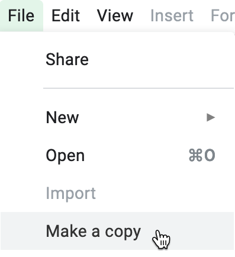{#fig-file-make-copy width=200}

4. Google Drive 파일을 깔끔하게 관리하려면 찾기 쉽도록 관련 이름이 있는 폴더에 저장하십시오. 예를 들어 \@fig-my-drive-new-folder 그림에 표시된 대로 *내 드라이브(My Drive)* 버튼과 *새 폴더(New folder)* 버튼을 클릭하여 데이터용 폴더를 만든 후 *확인*을 클릭할 수 있습니다.


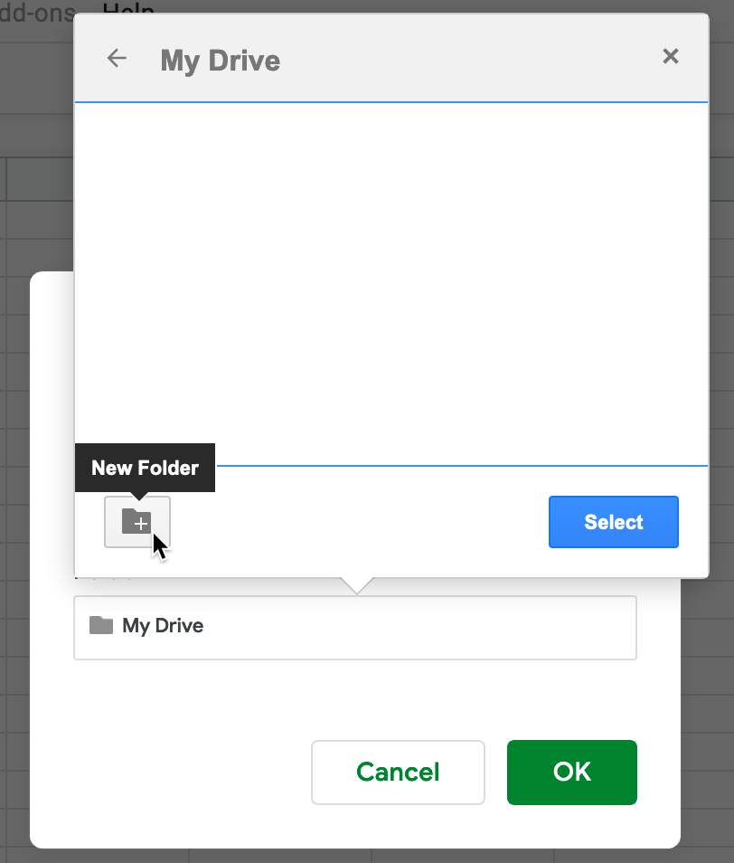{#fig-my-drive-new-folder width=300}

사용자의 Google Sheet 사본은 기본적으로 본인에게만 비공개로 유지됩니다. 다음 섹션에서는 다른 사람과 Google Sheet 데이터를 공유하기 위한 다양한 옵션에 대해 알아봅니다.

## Google Sheets 공유하기 {- #share}
다른 사람과 공동 프로젝트를 수행하는 경우, Google Sheets는 Google 계정이 없는 사람과도 온라인으로 데이터를 공유할 수 있는 여러 가지 방법을 제공합니다. 새 Sheet를 만들면 기본 설정이 비공개이므로 자신만 그 내용을 보거나 편집할 수 있습니다. 이 섹션에서는 *공유(Share)* 버튼을 사용하여 이러한 옵션을 확장하는 방법을 배웁니다.

1. [Google Drive 계정](https://drive.google.com)에 로그인하고 *새로 만들기(New)* 버튼을 클릭한 다음 *Google Sheets*를 선택하여 빈 스프레드시트를 만듭니다. 다음 단계를 진행하려면 파일의 이름을 지정해야 합니다.

2. 오른쪽 상단의 *공유* 버튼을 클릭하면 \@fig-share-screen 그림과 같이 옵션이 나타납니다.

3. 화면 위쪽 절반에서 *사용자 및 그룹 추가(Add people and groups)* 필드에 Google 사용자 이름을 입력하여 특정 개인과 액세스 권한을 공유할 수 있습니다. 추가하는 각 사용자 또는 그룹에 대해 다음 화면에서 드롭다운 메뉴를 선택하여 파일의 *뷰어(Viewer)*, *댓글 작성자(Commenter)*, 또는 *편집자(Editor)*로 지정합니다. 파일 링크와 선택적 메시지로 그들에게 알릴지 여부를 결정하십시오.

4. 화면 아래쪽 절반에서 설정을 *제한됨(Restricted)*에서 *링크가 있는 모든 사용자(Anyone with the link)*로 변경하여 일반적인 액세스 권한을 더 폭넓게 공유할 수 있으며 다른 사람이 파일을 *보기*, *댓글 작성* 또는 *편집*할 수 있는 권한을 부여할 수 있습니다. 또한 *링크 복사(Copy link)*를 클릭하여 이메일이나 공개 웹사이트에 데이터의 웹 주소를 붙여넣을 수 있습니다.


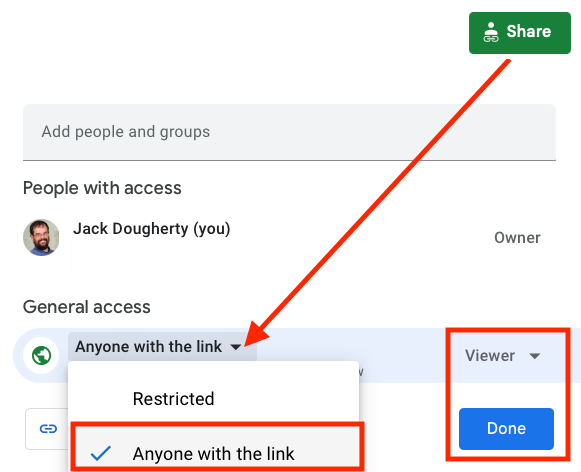{#fig-share-screen width=600}

팁: 사람들에게 다음과 같이 매우 길고 보기 흉한 Google Sheet 웹 주소를 보내고 싶지 않다면,

`https://docs.google.com/spreadsheets/d/1egX_akJccnCSzdk1aaDdtrEGe5HcaTrlOW-Yf6mJ3Uo`

[TinyURL](https://tinyurl.com)과 같은 무료 링크 단축 서비스를 이용하세요. 예를 들어, (이전에는 무료였던) [Bitly.com](https://bitly.com) 계정을 사용하여 긴 URL을 붙여넣고 후반부를 \@fig-link-shortening 그림과 같이 [bit.ly/reader-responses](https://bit.ly/reader-responses)처럼 더 짧은 이름으로 사용자 지정했습니다. 누군가 이미 원하는 사용자 지정 이름을 차지했다면 다른 이름을 생각해야 합니다. 단축된 링크는 대소문자를 구분할 수 있으므로 앞부분과 일치하도록 뒷부분을 모두 소문자로 사용자 지정하는 것이 좋습니다.


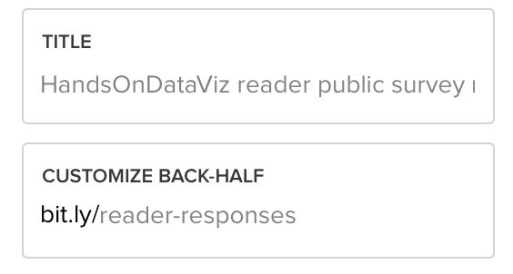{#fig-link-shortening width=300}

이제 Google Sheet를 공유하기 위한 다양한 옵션을 알았으니 다른 형식의 데이터를 업로드하고 변환하는 방법을 알아봅시다.

## Google Sheets로 업로드 및 변환하기 {- #upload}
이 책에서 Google Sheets를 다루는 이유는 여러 일반적인 형식의 파일을 가져오고 내보낼 수 있는 데이터 마이그레이션을 지원하기 때문입니다. 그러나 가져오기는 \@fig-drive-settings 그림과 같이 Google Drive 설정 톱니바퀴 기호 안에 숨겨져 있는 *업로드된 파일 변환(Convert uploads)* 상자를 선택할 때 가장 잘 작동합니다. 이 상자를 선택하면 Microsoft Excel 시트가 자동으로 Google Sheets 형식으로(그리고 Microsoft Word 및 PowerPoint 파일도 Google Documents 및 Slides 형식으로) 변환되어 더 쉽게 편집할 수 있습니다. 이 상자를 선택하지 않으면 Google은 파일을 원래 형식으로 유지하므로 편집하기가 더 어렵습니다. Google은 새 계정에서 기본적으로 이 변환 설정을 끄지만 우리는 이 설정을 켜는 방법과 그 이점을 설명합니다.

1. 컴퓨터에서 사용할 수 있는 샘플 Excel 파일을 찾으세요. 없으면 이 [Hands-On Data Visualization 독자 공개 설문조사 응답의 하위 집합인 Excel 파일](data/subset-reader-survey.xlsx)을 열어서 컴퓨터에 저장하여 다운로드합니다.

2. [Google Drive](https://drive.google.com) 계정에 로그인하고 오른쪽 상단의 *톱니바퀴 기호*를 클릭하여 \@fig-drive-settings 그림과 같이 설정 화면을 엽니다. 이 글로벌 *톱니바퀴 기호 > 설정(Settings)*은 각 Google Sheet 내부가 *아니라* Google Drive 수준에서 나타납니다.


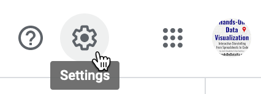{#fig-drive-settings width=300}

3. 설정 화면에서 \@fig-convert-uploads 그림과 같이 *업로드된 파일을 Google Docs 편집기 형식으로 변환(Convert uploaded files to Google Docs editor format)* 상자를 선택하고 *완료(Done)*를 클릭합니다. 이렇게 하면 전역적으로 변환 설정이 켜지며 해제하지 않는 한 앞으로 업로드하는 Microsoft Excel, Word, PowerPoint 등을 포함하여 가능한 모든 파일을 변환합니다.


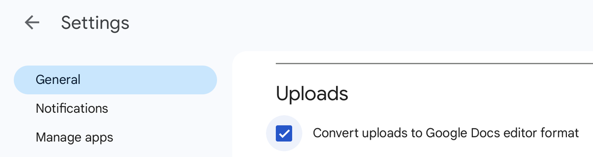{#fig-convert-uploads width=750}

4. 컴퓨터에서 Google Drive로 샘플 Excel 파일을 업로드합니다. \@fig-upload-file 그림과 같이 원하는 폴더로 드래그 앤 드롭하거나 *새로 만들기* 버튼을 사용하여 *파일 업로드(File upload)*를 선택합니다.


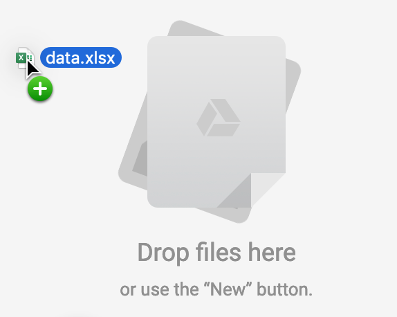{#fig-upload-file width=300}

*업로드된 파일 변환* 상자를 선택하는 것을 잊은 경우 Google Drive는 업로드된 파일을 원래 형식으로 유지하고 \@fig-drive-file-icons 그림과 같이 `.xlsx` 또는 `.csv`와 같은 아이콘과 파일 이름 확장자를 표시합니다.


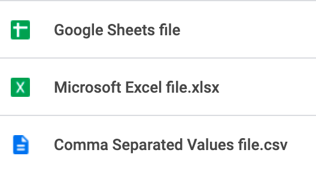{#fig-drive-file-icons width=300}

팁: 이제 Google Drive에서 Microsoft Office 파일 형식을 편집할 수 있지만 플랫폼 간에 모든 기능이 보장되는 것은 아닙니다. 또한 이제 Google Drive를 사용하면 *파일 > Google Sheets로 저장(Save as Google Sheets)* 메뉴를 사용하여 특정 업로드된 Excel 파일을 Google 형식으로 변환할 수 있습니다. 마지막으로 전역 변환 설정을 끈 상태에서 개별 파일을 Google Drive로 변환하려면, 모든 Google Sheet 내에서 *파일 > 가져오기(Import) > 업로드*를 선택할 수 있습니다. 그러나 Excel 형식의 파일을 편집하기 위해 Google Drive를 의도적으로 사용하고 일부 기능이 작동하지 않을 수 있음을 이해하는 경우를 제외하고는, 대부분의 사용자에게 위에서 설명한 대로 전역 변환 설정을 켤 것을 권장합니다.

이제 기존 데이터셋을 업로드하고 변환하는 방법을 알았으므로 다음 섹션에서는 주소 데이터를 위도 및 경도 좌표로 지오코딩하는 Google Sheets 애드온 도구를 설치하고 사용하는 방법을 배웁니다.

## Google Sheets에서 주소 지오코딩하기 {- #geocode}
이 섹션에서는 무료 Google Sheets 애드온 도구를 설치하여 데이터를 지오코딩하는 방법을 알아봅니다. 이를 통해 스프레드시트 내에서 직접 주소를 지오코딩할 수 있으며 이는 [12장의 Leaflet 지도 코드 템플릿](#leaflet)을 사용할 때 매우 유용합니다.

지오코딩이란 \@fig-geocode-data 그림과 같이 주소나 위치 이름을 지도에 그릴 수 있는 지리 좌표(또는 x, y 좌표)로 변환하는 것을 의미합니다. 예를 들어, 뉴욕시 인근의 자유의 여신상은 *40.69, -74.04*에 위치해 있습니다. 첫 번째 숫자는 위도이고 두 번째 숫자는 경도입니다. 적도는 위도 0도이므로 양의 위도는 북반구이고 음의 위도는 남반구입니다. 마찬가지로 본초 자오선은 영국 그리니치를 지나는 경도 0도입니다. 따라서 양의 경도는 자오선의 동쪽이고 음의 경도는 서쪽이며 태평양의 국제 날짜 변경선 부근 대략 반대편에 도달할 때까지 계속됩니다.


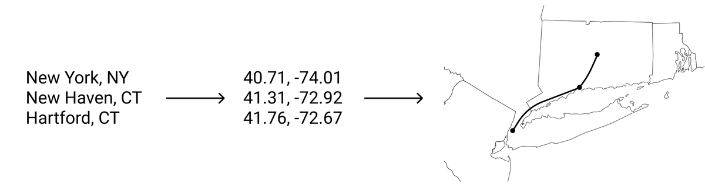{#fig-geocode-data}

주소가 한두 개뿐이라면 [Google Maps](https://www.google.com/maps)를 사용하여 빠르게 지오코딩할 수 있습니다. 주소를 검색하고 해당 지점을 마우스 오른쪽 버튼으로 클릭한 다음 첫 번째 항목을 선택하여 \@fig-gmaps-coordinates 그림과 같이 위도와 경도를 복사합니다.


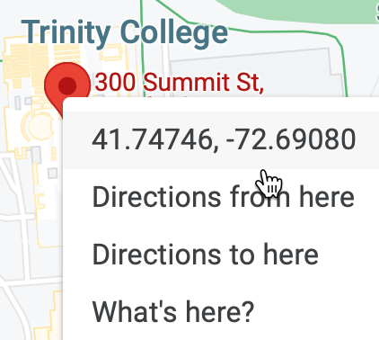{#fig-gmaps-coordinates width=200}

하지만 주소를 12개나 100개 지오코딩해야 한다면 어떨까요? 스프레드시트 안에서 여러 주소를 지오코딩하려면, 스페인 바르셀로나에 있는 지리적 경로 계획 회사인 [SmartMonkey](https://www.smartmonkey.io/)의 CEO인 Xavier Ruiz가 만든 [Geocoding by SmartMonkey](https://gsuite.google.com/marketplace/app/geocoding_by_smartmonkey/1033231575312)라는 무료 Google Sheets 애드온을 설치하십시오. 애드온은 타사 회사에서 Google Sheets, Google Documents 및 관련 도구의 기능을 확장하기 위해 만듭니다. 애드온은 Google의 요구 사항을 충족하는지 확인을 거쳐 [G Suite Marketplace](https://gsuite.google.com/marketplace)를 통해 배포됩니다.

1. Google Drive 계정에 로그인하고 [Geocoding by SmartMonkey 애드온 페이지](https://gsuite.google.com/marketplace/app/geocoding_by_smartmonkey/1033231575312)로 이동하여 파란색 버튼을 클릭하여 Google Sheets에 설치합니다. 애드온을 설치하기 전에 권한을 요청하며 동의하면 *계속(Continue)*을 누릅니다. 다음 창에서 Google Drive 계정을 선택하고 조건에 동의하면 *허용(Allow)*을 클릭하여 설치를 완료합니다. Google은 귀하의 계정에 접근할 수 있는 이 타사 앱을 설치했음을 확인하는 이메일을 보냅니다. 원할 경우 언제든지 향후에 [권한을 검토하고 액세스 권한을 취소](https://myaccount.google.com/permissions)할 수 있습니다.

2. [Google Drive](https://drive.google.com)로 이동하여 새 Google Sheet를 만듭니다. *확장 프로그램(Extensions)* 메뉴를 선택하여 새로운 *Geocoding by SmartMonkey* 옵션을 보고 *Geocode Details* 메뉴를 선택합니다. 지오코딩 도구는 샘플 데이터가 있는 새 시트를 만들고 \@fig-geocode-details 그림과 같이 세 개의 새 열(*Latitude*, *Longitude*, *Address found*)에 대한 결과를 표시합니다. 항상 원본 *Address* 입력값과 *Address found* 열을 비교하여 지오코딩된 결과의 품질을 검토하십시오.


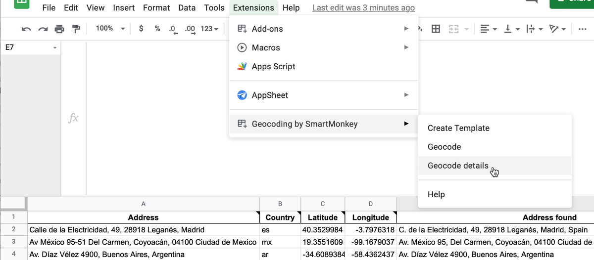{#fig-geocode-details}

3. 시트의 샘플 데이터를 교체하기 위해 고유한 주소 데이터를 붙여넣고 위의 단계에서 한 것처럼 지오코딩합니다. 결과 품질을 개선하려면 다음 지침을 따르세요.

- *Address* 열에서 행을 건너뛰지 마십시오.
- 해당 국가의 우편 서비스 형식을 사용하여 전체 주소를 삽입하십시오. 공백으로 항목을 구분합니다.
- *Country* 열을 비워 둘 수 있지만 기본값은 미국입니다. 다른 국가를 지정하려면 스페인의 경우 `es`와 같이 [최상위 인터넷 도메인 코드](https://en.wikipedia.org/wiki/List_of_Internet_top-level_domains)를 사용하십시오.
- 원래 데이터가 길거리, 도시, 주 및 우편번호를 별도의 열로 분할하는 경우 [4장: 지저분한 데이터 정리하기의 데이터를 단일 열로 결합하기](#combine-data) 방법을 참조하세요.
- 도구가 작동할 시간을 주세요. 예를 들어 주소를 50개 입력했다면 지오코딩 결과를 얻기까지 최소 15초 이상 기다려야 합니다.
- 지오코딩 결과는 계정당 하루에 약 500개 주소로 제한될 수 있습니다.
- 항상 결과의 품질을 검사하고 제공업체의 지오코딩 서비스가 정확하다고 가정하지 마십시오.

한 번의 업로드로 최대 10,000건의 요청을 처리할 수 있는 미국 주소에 대한 더 빠른 지오코딩 서비스가 필요한 경우 13장: 지도 데이터 변환하기의 [미국 인구조사국을 이용한 대량 지오코딩](#bulk-geocode)을 참조하세요.

이제 Google Sheets 애드온을 사용하여 주소를 지오코딩하는 방법을 알았으므로 다음 섹션에서는 온라인 폼을 사용하여 데이터를 수집하고 이를 스프레드시트로 액세스하는 방법을 알아봅니다.

## Google Forms로 데이터 수집하기 {- #forms}
이 장의 첫머리에서 우리는 여러분과 이 책의 다른 독자들이 [간단한 온라인 설문조사](https://forms.gle/yn5QwTzfQkYcppQn9)를 작성하도록 초대했습니다. 이 설문조사는 [샘플 데이터셋의 모든 응답을 공개적으로 공유](https://docs.google.com/spreadsheets/d/1egX_akJccnCSzdk1aaDdtrEGe5HcaTrlOW-Yf6mJ3Uo)하여 여러분과 같은 사람들에 대해 더 자세히 알아보고 기대에 부응하도록 계속 수정할 수 있도록 합니다. 이 섹션에서는 고유한 온라인 양식을 만들고 그 결과를 라이브 Google Sheet에 연결하는 방법을 알아봅니다.

Google Drive 계정 내부에서 *새로 만들기* 버튼을 클릭하고 \@fig-forms-new 그림과 같이 *Google Forms*를 선택합니다.


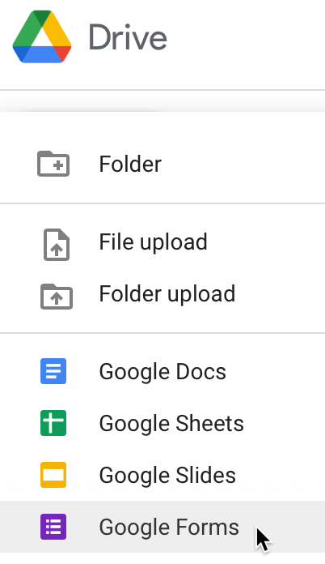{#fig-forms-new width=150}

Google Forms *질문(Questions)* 탭을 사용하면 단답형 및 단락형 답변, 객관식, 체크박스, 파일 업로드 등 다양한 유형의 응답으로 질문을 설계할 수 있습니다(\@fig-forms-questions 그림 참조). 또한 Google Forms는 입력하는 질문을 해석하여 질문 유형을 예측하여 할당하려고 시도합니다.


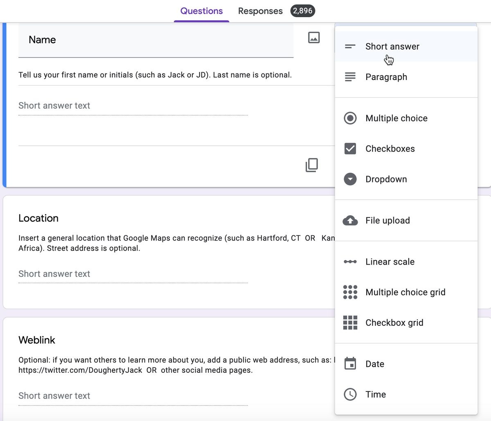{#fig-forms-questions width=700}

아래에 만들 연결된 스프레드시트에 열 헤더로 나타날 것이므로 각 질문에 매우 짧은 제목을 지정하세요. 질문에 더 많은 설명이나 예가 필요한 경우, 오른쪽 하단 모서리의 점 3개 메뉴(케밥 메뉴)를 클릭하여 *표시(Show) > 설명(Description)*으로 이동하면 \@fig-forms-description 그림과 같이 세부 정보를 더 입력할 수 있는 텍스트 상자가 열립니다. 또한 사용자가 이메일 주소나 전화번호 같은 특정 형식을 따르도록 요구하는 *표시 > 응답 유효성 검사(Response validation)*를 설정할 수도 있습니다. 나아가 *필수(Required)* 필드를 선택하면 진행하기 전에 사용자가 특정 질문에 반드시 답하도록 요구할 수 있습니다. 추가 옵션은 [Google Forms 고객센터 페이지](https://support.google.com/a/users/answer/9991170)를 참조하세요.


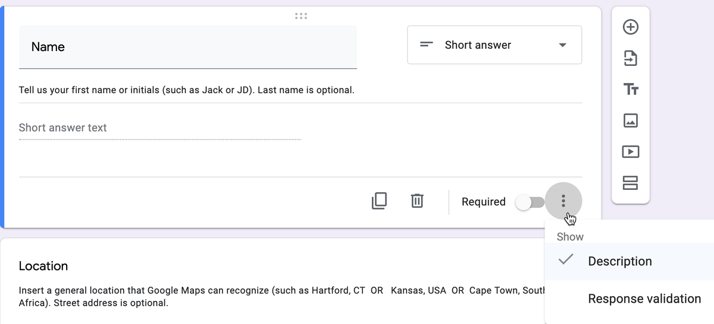{#fig-forms-description width=700}

참고: 점 3개 메뉴 기호는 중동 음식인 꼬치구이를 닮아 "케밥 메뉴(kebab menu)"라고도 불립니다. 이는 \@fig-menu-hamburger-kebab 그림과 같이 많은 모바일 기기에서 볼 수 있는 세 줄짜리 "햄버거 메뉴(hamburger menu)"와 대조됩니다. 소프트웨어 개발자들이 배가 고팠나 봅니다.


{#fig-menu-hamburger-kebab}

수신자에게 온라인 양식이 어떻게 보일지 미리 보려면 \@fig-forms-preview 그림과 같이 페이지 상단 근처에 있는 *눈 모양 기호(Eyeball symbol)*를 클릭합니다. 폼을 완성한 후 *보내기(Send)* 버튼을 클릭하여 이메일, 링크로 배포하거나 웹 페이지에 iframe으로 라이브 양식을 삽입할 수 있습니다. 후자 옵션에 대한 자세한 내용은 [9장: 웹에 삽입하기](#embed)를 참조하세요.


{#fig-forms-preview width=350}

Google Forms *응답(Responses)* 탭은 수신한 개별 결과를 보여주며 \@fig-forms-responses 그림과 같이 연결된 Google Sheet에서 데이터를 여는 강력한 버튼도 포함되어 있습니다.


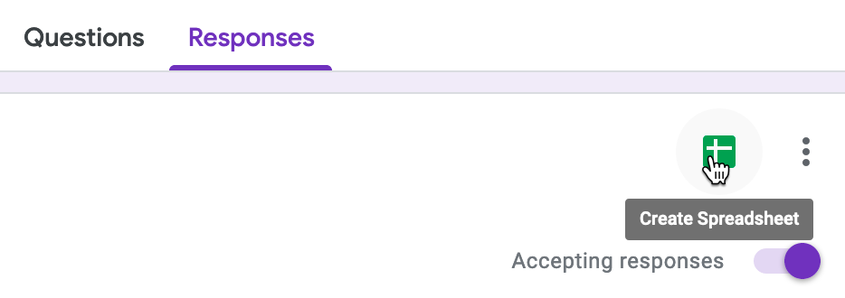{#fig-forms-responses width=500}

지금까지 온라인 폼과 연결된 스프레드시트를 이용해 데이터를 수집하는 법을 배웠습니다. 다음 두 섹션에서는 데이터를 정렬, 필터링, 피벗 테이블화하여 데이터 내용과 그 속의 이야기를 분석하기 시작하는 법을 배울 것입니다.

## 데이터 정렬 및 필터링 {- #sort}
스프레드시트 도구는 데이터를 더 깊이 파고들어 찾아낸 스토리를 수면 위로 끌어올리는 데 도움을 줍니다. 데이터를 구성하는 기본 단계는 특정 열을 기준으로 테이블을 *정렬(sort)*하여 최소값과 최대값, 그리고 그 사이의 범위를 빠르게 확인하는 것입니다. 이와 짝을 이루는 방법은 전체 테이블을 *필터링(filter)*하여 특정 값이 든 행만 골라 보여 주는 것입니다. 그러면 수많은 항목 가운데 추가 분석 대상을 눈에 띄게 좁힐 수 있습니다. 두 방법 모두 스프레드시트에 수백, 수천 행의 데이터가 있을 때 더욱 강력해집니다. 정렬과 필터링을 배우기 위해, 이 장 앞부분에서 설명한 독자 설문조사 샘플 데이터셋을 살펴보겠습니다.

1. 브라우저의 새 탭에서 이 [Hands-On Data Visualization 독자 공개 설문조사 응답 Google Sheet](https://docs.google.com/spreadsheets/d/1egX_akJccnCSzdk1aaDdtrEGe5HcaTrlOW-Yf6mJ3Uo)를 엽니다.

2. Google Sheets 계정에 로그인하고 *파일 > 사본 만들기*로 이동하여 편집할 수 있는 자신만의 버전을 만듭니다.

3. 정렬하기 전에 시트의 왼쪽 상단 모서리를 클릭하여 \@fig-sheets-select-all 그림과 같이 모든 셀을 선택합니다. 전체 시트가 연한 파란색이 되고 모든 알파벳 열과 숫자 행 헤더가 진한 회색이 되면 모든 셀이 선택되었음을 나타냅니다.


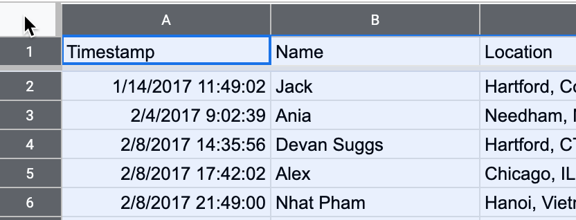{#fig-sheets-select-all width=400}

경고: 모든 셀을 선택하는 것을 잊어버리면 실수로 다른 열과 관계없이 한 열만 정렬하게 되어 데이터셋이 뒤섞이고 무의미해질 수 있습니다. 정렬하기 전에는 항상 모든 셀을 선택하세요!

4. 상단 메뉴에서 *데이터(Data) > 범위 정렬(Sort Range) > 고급 범위 정렬 옵션(Advanced Range Sorting Options)*으로 이동하여 모든 정렬 옵션을 검토합니다. 다음 화면에서 *데이터에 헤더 행이 있음(Data has header row)* 상자를 선택하여 데이터의 열 헤더를 봅니다. \@fig-sheets-sort-range 그림과 같이 *Experience with data visualization(데이터 시각화 경험)* 열을 오름차순(A-Z)으로 정렬하여 상단에 최소값, 하단에 최대값, 그 사이 범위를 표시해 봅시다.


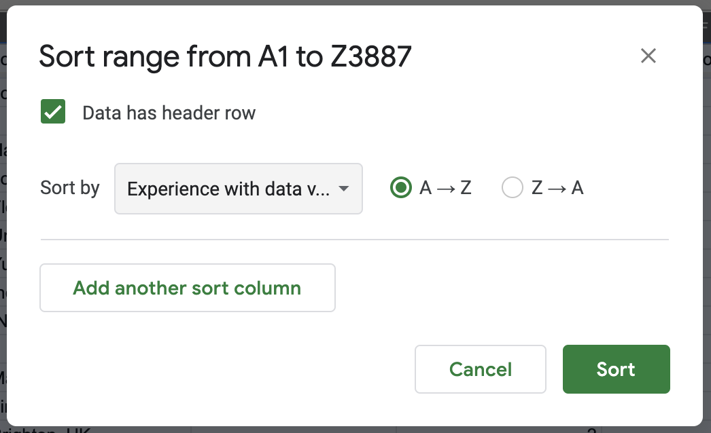{#fig-sheets-sort-range width=400}

정렬된 데이터를 스크롤해 보면 1,000명이 넘는 독자가 자신의 데이터 시각화 수준을 초보자(레벨 1)로 평가한 것을 볼 수 있습니다.

팁: 큰 스프레드시트 작업 시 아래로 스크롤해도 열 헤더가 계속 표시되도록 첫 번째 행을 "고정(freeze)"할 수 있습니다. Google Sheets에서는 *보기(View) > 고정(Freeze)*으로 이동하여 \@fig-sheets-view-freeze 그림과 같이 1행을 선택합니다. 옆으로 스크롤할 때 계속 표시할 열을 한 개 이상 고정할 수도 있습니다. LibreOffice에는 *보기 > 행과 열 고정(Freeze Rows and Columns)*이라는 동일한 옵션이 있지만 Excel에는 *창(Window) > 틀 고정(Split)*이라는 다른 이름의 옵션이 있습니다.


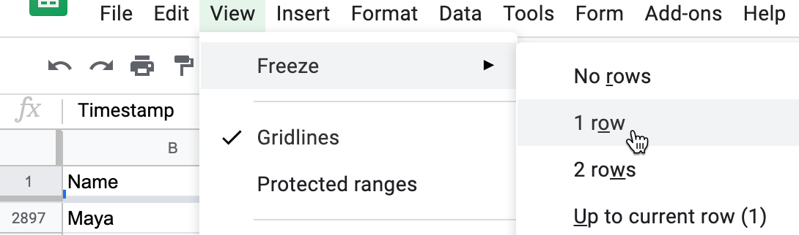{#fig-sheets-view-freeze width=500}

5. 이제 시트를 필터링해 보겠습니다. *데이터 > 필터 만들기(Create a Filter)*로 이동하면 각 열 헤더에 아래쪽 화살표가 삽입됩니다. *Occupation(직업)* 열의 아래쪽 화살표 모양 토글을 클릭하면 데이터 행 표시 또는 숨기기 옵션을 볼 수 있습니다. 예를 들어, *값별 필터링(Filter by values)* 아래에서 "지우기(Clear)" 버튼을 클릭하여 모든 옵션을 취소한 다음 *educator(교육자)*만 클릭하여 해당 응답이 있는 행만 표시합니다(\@fig-sheets-filter 그림 참조). "확인"을 클릭합니다.


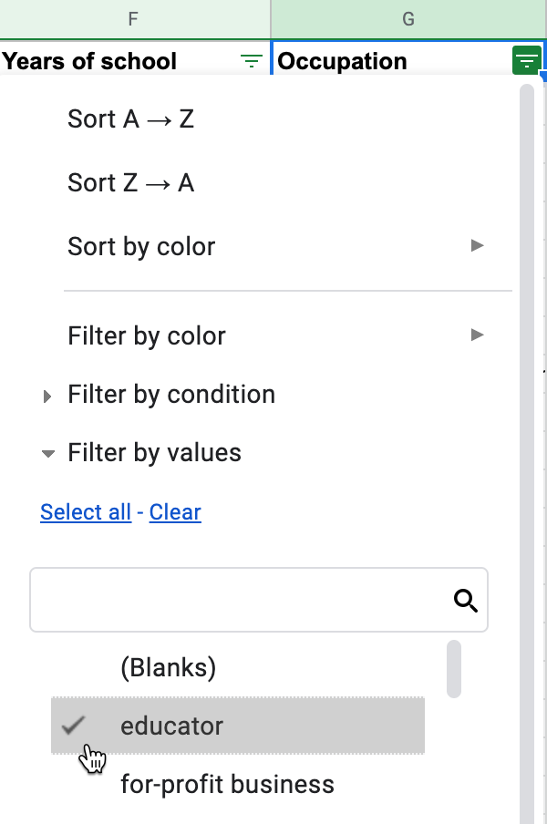{#fig-sheets-filter width=300}

이제 독자 응답 보기가 경험 순으로 정렬되고 교육자만 표시하도록 필터링되었습니다. 데이터 시각화 학습에 대한 이들의 한 문장짜리 목표를 스크롤해 보세요. 여러분의 목표와 어떻게 비교되나요? 다음 섹션에서는 간단한 수식과 함수를 사용하여 데이터를 분석하기 시작하는 방법을 알아봅니다.

## 수식으로 계산하기 {- #calculate}
스프레드시트 도구는 전체 데이터 행과 열에 걸쳐 자동으로 계산을 수행하는 간단한 수식과 함수를 삽입하여 많은 시간을 절약할 수 있습니다. 이 섹션에서는 샘플 데이터셋에서 수식과 함수를 작성하는 방법을 알아봅니다.

수식을 시작할 때는 일반 텍스트나 숫자가 아니라 계산을 삽입하고 있음을 스프레드시트 도구에 알리기 위해 항상 등호 기호(`=`)로 시작하십시오. 간단한 수식은 특정 셀 간의 수학 연산 기호를 사용합니다.

- 덧셈은 더하기 기호(`+`): `= B2 + B3`
- 뺄셈은 빼기 기호(`-`): `= B2 - B3`
- 곱셈은 별표 기호(`*`): `= B2 * B3`
- 나눗셈은 슬래시 기호(`/`): `= B2 / B3`

또한 스프레드시트 도구에는 긴 수식을 작성할 필요가 없어 시간을 절약해 주는 기본 제공 함수가 있습니다. 두 가지 간단한 함수는 `=SUM()`과 `=AVERAGE()`로, 괄호 안의 셀에 대해 계산을 실행합니다. 콜론 기호(`:`)는 연속된 셀 범위를 나타냅니다. 예를 들어 B2, B3, B4, B5, B6 셀은 `(B2:B6)`과 같이 나타낼 수 있습니다.

- 5개 셀을 더하려면 다음과 같이 입력할 수 있습니다. `= B2 + B3 + B4 + B5 + B6`
- 하지만 이 함수가 더 빠릅니다. `=SUM(B2:B6)`

- 5개 셀의 평균을 구하려면 숫자의 개수로 나누기 전에 괄호를 사용하여 합계를 더하는 방식을 입력할 수 있습니다. `= ( B2 + B3 + B4 + B5 + B6 ) / 5`
- 하지만 이 함수가 더 빠릅니다. `=AVERAGE(B2:B6)`

팁: 수식 및 함수에 문자를 일일이 입력하는 대신, 특정 셀이나 열 헤더를 클릭하거나 셀 범위를 클릭하고 드래그하여 원하는 명령을 자동으로 입력해 보세요. 예를 들어, `=AVERAGE()` 함수를 입력하기 시작할 때 괄호 안에 `B2:B6`를 입력하는 대신, B2 셀을 클릭하고 마우스나 트랙패드 버튼을 누른 채 B6까지 드래그할 수 있습니다. 스프레드시트 도구는 자동으로 `=AVERAGE(B2:B6)` 수식을 생성해야 합니다.

이제 이 장 첫머리에 설명한 독자 설문조사 샘플 데이터셋을 활용하여 수식 기술을 연습해 보겠습니다. 하나의 함수를 사용하여 평균 숫자 값을 계산하고 다른 함수를 사용하여 특정 텍스트 응답의 빈도를 계산합니다.

1. 브라우저의 새 탭에서 이 [Hands-On Data Visualization 독자 공개 설문조사 응답 Google Sheet](https://docs.google.com/spreadsheets/d/1egX_akJccnCSzdk1aaDdtrEGe5HcaTrlOW-Yf6mJ3Uo)를 엽니다.

2. Google Drive 계정에 로그인하고 *파일 > 사본 만들기*로 이동하여 고유한 버전을 편집합니다.

3. 계산할 공간을 만들기 위해 헤더 바로 아래에 빈 행을 추가합니다. 1행을 마우스 오른쪽 버튼으로 클릭하고 *아래에 1행 삽입(Insert 1 below)*을 선택하여 \@fig-sheets-insert-row 그림과 같이 새 행을 추가합니다.


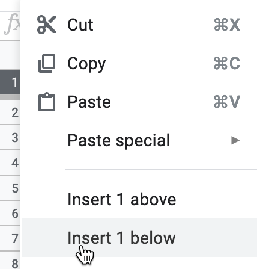{#fig-sheets-insert-row width=200}

4. 데이터 시각화에 대한 독자 경험의 평균 수준을 계산해 봅시다. 방금 만든 새 빈 행의 E2 셀을 클릭하고 등호 기호(`=`)를 입력하여 수식을 시작합니다. Google Sheets는 문맥을 기반으로 가능한 수식을 자동으로 제안하며 여기서 열의 현재 값에 대한 평균을 표시하는 수식(예: `=AVERAGE(E3:E2894)`)을 선택한 다음 키보드에서 *Return* 또는 *Enter*를 누릅니다(\@fig-sheets-average 그림 참조).


{#fig-sheets-average width=300}

라이브 스프레드시트에서는 설문 응답 수가 점점 늘어나므로, 버전에 모든 항목을 포함하려면 마지막 셀 참조에 더 큰 숫자가 있어야 합니다. 현재 독자의 데이터 시각화 경험 평균 수준은 1(초보자)에서 5(전문가) 척도에서 약 2이지만 더 많은 독자가 설문 조사에 참여하면 이 값은 달라질 수 있습니다. 독자가 이 질문을 비워 두면 스프레드시트 도구는 계산할 때 빈 셀을 무시합니다.

팁: Google Sheets에서 위 수식을 작성하는 또 다른 방법은 `=AVERAGE(E3:E)`인데, 이는 마지막 셀 참조를 지정하지 않고 E3 셀로 시작하여 E 열의 *모든* 값을 평균화합니다. 이 구문을 사용하면 행이 추가되어도 계산이 최신 상태로 유지되지만 LibreOffice나 Excel에서는 작동하지 *않습니다*.

5. 스프레드시트의 장점 중 하나는 내장된 길게 누르고 드래그(hold-and-drag) 기능을 사용하여 수식을 다른 열이나 행에 복사해서 붙여넣을 수 있으며 셀 참조가 자동으로 업데이트된다는 점입니다. E2 셀을 클릭한 다음 해당 셀의 오른쪽 하단에 있는 파란색 점을 길게 누르면 커서가 십자선 기호로 바뀝니다. \@fig-sheets-drag-calc 그림과 같이 커서를 F2 셀로 드래그하고 놓습니다. 위에서 수식을 입력한 방식에 따라 새 열에 맞게 수식이 `=AVERAGE(F3:F2894)` 또는 `AVERAGE(F3:F)`로 자동으로 붙여넣어지고 업데이트됩니다. 다시 한 번 말하지만 이는 응답 수가 점점 늘어나는 라이브 스프레드시트이므로 마지막 셀 참조에 더 큰 숫자가 시트에 표시될 것입니다.


::: {.content-visible when-format="html"}

<video src="images/02-spreadsheet/sheets-drag-calc.mp4" width="100%" height="185px" style="border:none;" autoplay loop muted playsinline></video>
<p class="caption">E2 셀의 오른쪽 하단 파란색 점을 클릭하고 F2 셀에서 십자선 커서를 길게 누르고 드래그한 다음 놓으면 수식이 자동으로 붙여넣어지고 업데이트됩니다.</p>

:::


6. *Occupation* 열에는 정의된 텍스트 응답 세트가 포함되어 있으므로 다른 함수를 사용하여 *if 문*을 적용하여 계산해 봅시다. 예를 들어 독자가 "educator"라고 적은 응답 수를 구합니다. G2 셀을 클릭하고 등호 기호(`=`)를 입력하여 새 수식을 시작합니다. Google Sheets는 상황에 따라 가능한 수식을 자동으로 제안하며 전체 열의 현재 값에 대해 응답이 *educator*인 경우 개수를 표시하는 수식을 선택할 수 있습니다. 직접 `=COUNTIF(G3:G2894,"=educator")` 수식을 입력할 수 있으며 이 경우 여러분의 버전에 있는 모든 행을 반영하기 위해 마지막 셀 참조가 더 큰 숫자가 됩니다. 또는 \@fig-sheets-countif 그림과 같이 특정 끝점을 지정하지 않고 전체 열을 대상으로 계산하는 Google Sheets 구문 `=COUNTIF(G3:G,"=educator")`를 입력할 수 있습니다.


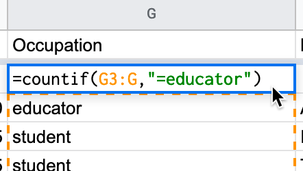{#fig-sheets-countif width=250}

스프레드시트 도구에는 수치 계산을 수행하고 텍스트를 수정하는 더 많은 함수가 포함되어 있습니다. 함수에 대한 자세한 내용은 [Google Sheets](https://support.google.com/docs/topic/9054603), [LibreOffice](https://help.libreoffice.org/Calc/Functions_by_Category), 또는 [Microsoft Excel 지원 페이지](https://support.microsoft.com/en-us/office/excel-functions-by-category-5f91f4e9-7b42-46d2-9bd1-63f26a86c0eb)를 참조하세요.

[4장: 지저분한 데이터 정리하기(Clean Up Messy Data)](#clean)에서 [공백으로 찾기 및 바꾸기](#find-and-replace), [데이터를 별도의 열로 분할하기](#split-data), [데이터를 하나의 열로 결합하기](#combine-data) 등 책 후반부 장에서 추가적인 스프레드시트 기술을 확인해 보세요. 또한 5장의 [데이터 정규화 방법](#normalize)과 [13장: 지도 데이터 변환하기(Transform Your Map Data)](#transform)의 [주소 포인트를 다각형으로 피벗하는 방법](#pivot-point-to-polygon)도 참조하세요.

한 가지 유형의 설문 조사 응답을 계산하는 방법을 알았으니, 다음 섹션에서는 모든 응답을 여러 범주로 요약하는 피벗 테이블로 데이터를 재구성하는 방법을 배웁니다.

## 피벗 테이블로 데이터 요약하기 {- #pivot}
피벗 테이블은 데이터를 재구성하고 새로운 방식으로 요약하는 데 도움이 되도록 스프레드시트 도구에 내장된 또 다른 강력한 기능으로, "피벗(pivot)"이라는 이름이 붙은 이유입니다. 하지만 정식으로 배워 볼 기회가 없었거나 이 기능을 아직 발견하지 못한 사람들은 피벗 테이블을 자주 지나칩니다. 이 장 첫머리에 설명한 독자 설문조사 샘플 데이터셋을 사용하여 이 기술을 배워봅시다. 각 행은 직업과 데이터 시각화 사전 경험 수준 등 개인 독자를 나타냅니다. 이 개인 수준 데이터를 '피벗'하여 직업과 경험 수준이라는 두 가지 범주별로 독자 응답의 총 수를 표시하는 새 테이블을 만드는 방법을 배우게 됩니다.

1. 브라우저의 새 탭에서 이 [Hands-On Data Visualization 독자 공개 설문조사 응답 Google Sheet](https://docs.google.com/spreadsheets/d/1egX_akJccnCSzdk1aaDdtrEGe5HcaTrlOW-Yf6mJ3Uo)를 엽니다. Google Drive 계정에 로그인하고 *파일 > 사본 만들기*로 이동하여 자신의 버전을 편집합니다.

2. 또는 수식 및 함수에 대한 이전 섹션을 위해 이미 사본을 만든 경우 계산 내용이 포함된 2행을 삭제합니다. 이 계산 결과가 피벗 테이블에 섞이는 것을 원하지 않기 때문입니다.

3. *삽입(Insert) > 피벗 테이블(Pivot Table)*로 이동하고 다음 화면에서 \@fig-sheets-pivot-create 그림과 같이 새 시트에서 *만들기(Create)*를 선택합니다. 새 시트의 하단에는 피벗 테이블 탭이 포함됩니다.


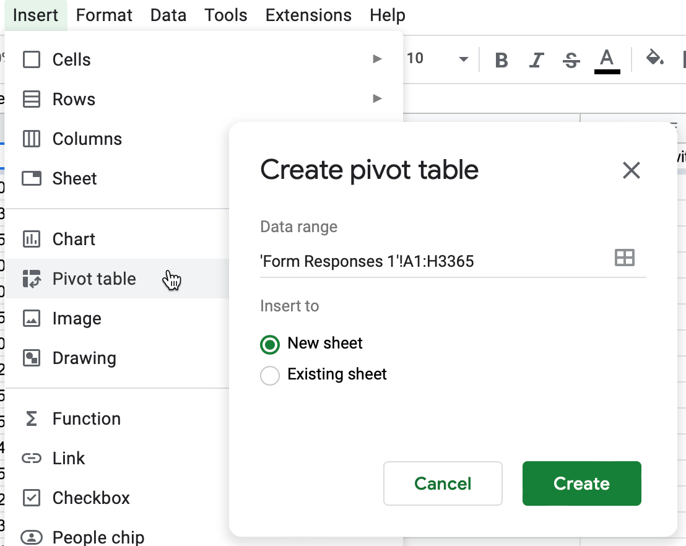{#fig-sheets-pivot-create width=550}

4. *피벗 테이블 편집기(Pivot table editor)* 화면에서 행, 열 및 값을 추가하여 첫 번째 시트의 데이터를 다시 그룹화할 수 있습니다. 먼저 행 *추가(Add)* 버튼을 클릭하고 *Occupation*을 선택하면 \@fig-sheets-pivot-rows 그림과 같이 해당 열의 고유 항목이 표시됩니다.


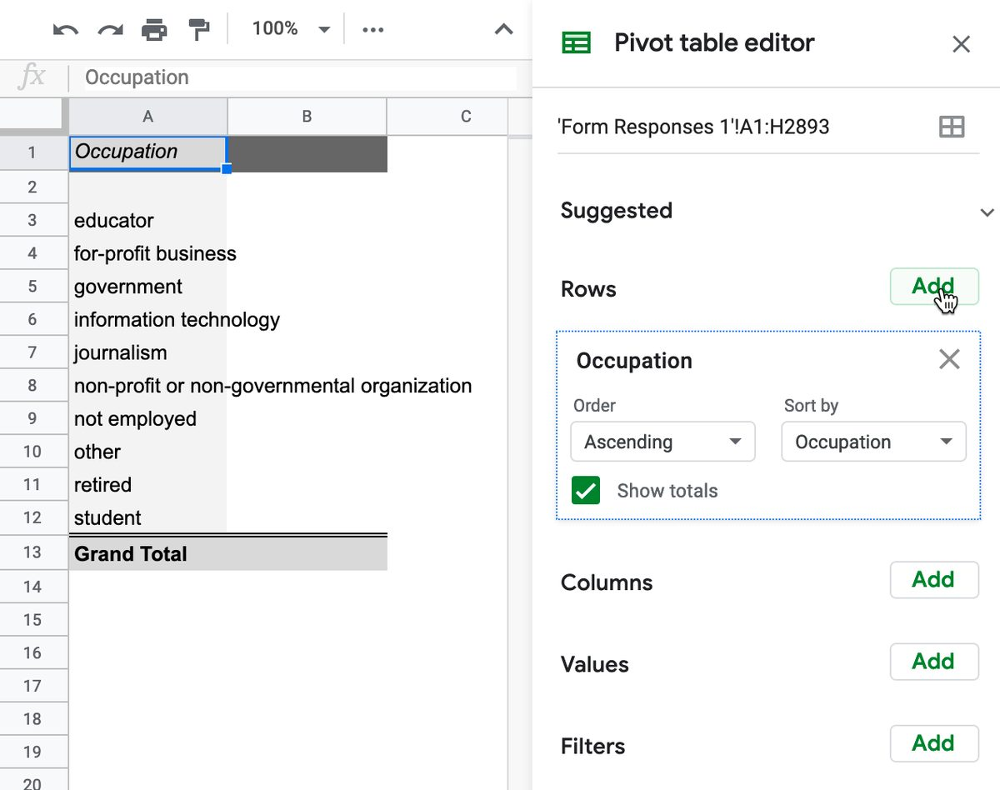{#fig-sheets-pivot-rows width=600}

5. 다음으로 각 항목에 대한 응답 수를 계산하려면 값 *추가* 버튼을 클릭하고 다시 *Occupation*을 선택합니다. Google Sheets는 값을 *COUNTA* 기준으로 자동 요약합니다. 즉, \@fig-sheets-pivot-values 그림과 같이 각 텍스트 응답의 빈도를 표시합니다.


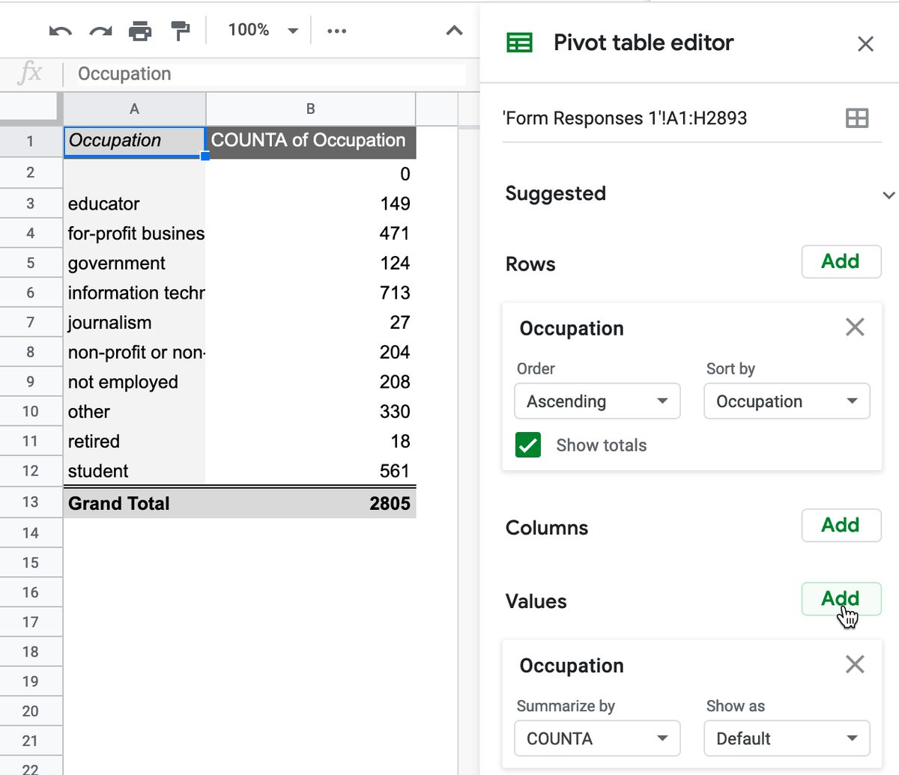{#fig-sheets-pivot-values width=600}

현재 독자가 나열한 상위 세 가지 직업은 정보 기술(IT), 영리 비즈니스, 학생입니다. 이는 라이브 스프레드시트이므로 더 많은 독자가 설문에 응답함에 따라 순위가 바뀔 수 있습니다.

6. 나아가 독자 응답 중 직업과 경험을 교차 집계하는 고급 피벗을 만들 수 있습니다. *열(Columns)* 버튼을 클릭하여 \@fig-sheets-pivot-columns 그림과 같이 *Experience with data visualization*을 추가합니다.


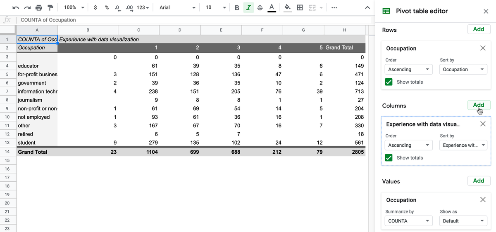{#fig-sheets-pivot-columns}

한 단계 더 나아가 데이터를 *필터링(Filter)*하여 다른 범주를 기준으로 피벗 테이블 결과를 제한할 수 있습니다. 예를 들어, 드롭다운 메뉴에서 필터 *추가* 버튼을 클릭하고 *Years of school(학력)*을 선택한 다음 *값별 필터링*에서 *지우기*를 선택하고 *20*을 체크하여 학력을 20년 이상으로 기록한 독자만 표시하도록 할 수 있습니다.

*피벗 테이블 편집기*에서 *값(Values)*을 추가하는 방법을 결정하는 것은 어려울 수 있습니다. \@fig-sheets-pivot-summarize 그림과 같이 데이터를 요약하는 다양한 옵션이 있기 때문입니다. Google Sheets는 문맥을 기반으로 자동 추측을 제공하지만 원하는 대로 데이터를 가장 잘 나타내는 옵션을 수동으로 선택해야 할 수도 있습니다. 값을 요약하는 가장 일반적인 세 가지 옵션은 다음과 같습니다.

- SUM: 숫자 응답의 총계 (독자들의 총 교육 연수는 얼마인가?)
- COUNT: 숫자 응답의 빈도 (20년의 학력을 기재한 독자는 몇 명인가?)
- COUNTA: 텍스트 응답의 빈도 ("educator"로 직업을 기재한 독자는 몇 명인가?)

Google Sheets 피벗 테이블은 기본적으로 원시 숫자를 표시하지만 *다음으로 표시(Show as)* 드롭다운 메뉴에서 숫자들을 행, 열 또는 총계의 백분율로 표시하도록 선택할 수 있습니다.


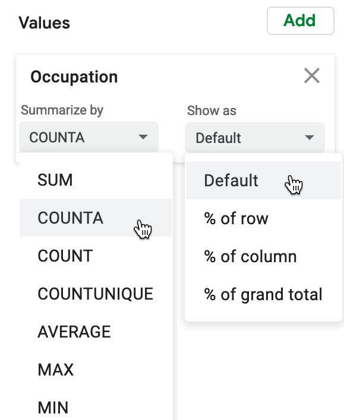{#fig-sheets-pivot-summarize width=250}

피벗 테이블을 디자인하는 방식은 다른 스프레드시트 도구에서는 다르게 보일 수 있지만 개념은 동일합니다. 피벗 테이블 작동 방식에 대한 자세한 내용은 [Google Sheets 지원 페이지](https://support.google.com/docs/topic/9054603)나 [LibreOffice](https://help.libreoffice.org/Calc/Creating_Pivot_Tables) 또는 [Microsoft Excel](https://support.microsoft.com/en-us/office/create-a-pivottable-to-analyze-worksheet-data-a9a84538-bfe9-40a9-a8e9-f99134456576)을 참조하세요. Google Sheets 데이터를 다운로드하고 ODS 또는 Excel 형식으로 내보내 다른 도구에서 피벗 테이블을 실험해 볼 수 있다는 점을 기억하십시오.

피벗 테이블을 사용하여 데이터를 재그룹화하고 요약하는 방법을 배웠으므로, 다음 섹션에서는 XLOOKUP을 사용하여 다른 스프레드시트에서 일치하는 데이터 열을 연결하는 관련된 방법을 배울 것입니다.


## XLOOKUP으로 열 일치시키기 {- #xlookup}
스프레드시트 도구를 사용하면 한 시트의 데이터를 "조회(look up)"하고 다른 시트에서 일치하는 데이터를 자동으로 찾아 붙여넣을 수도 있습니다. 이 섹션에서는 XLOOKUP 함수를 소개합니다. 여기서 "X"는 교차(cross)를 의미하며 열을 가로지르는 일치를 뜻하는데, 이는 데이터를 조회하는 가장 일반적인 방법입니다. 한 시트에서 두 번째 시트의 선택된 열에서 일치하는 셀을 찾고 관련 데이터를 첫 번째 시트의 새 열에 붙여넣는 함수를 작성하는 방법을 배웁니다. 서로 다른 두 스프레드시트 간에 데이터를 수동으로 찾아서 일치시키는 지루한 작업을 경험한 적이 있다면, 이 자동화된 방법이 많은 시간을 절약해 줄 것입니다.

팁: 이 책의 이전 판에서는 VLOOKUP이라는 유사한 함수를 설명했지만 XLOOKUP 함수가 설정이 더 간단하고 유연합니다. 둘 다에 대한 자세한 내용은 [XLOOKUP에 대한 Google Sheets 도움말 페이지](https://support.google.com/docs/answer/12405947)와 [VLOOKUP에 대한 도움말 페이지](https://support.google.com/docs/answer/3093318)를 참조하세요.

XLOOKUP 함수를 사용하는 이유와 방법을 보여주는 시나리오입니다. \@fig-xlookup-setup 그림은 미국의 여러 지역에서 굶주린 사람들에게 음식을 제공하는 푸드 뱅크에 대한 샘플 데이터가 있는 두 개의 서로 다른 시트를 보여주며 이는 [Feeding America: Find Your Local Food Bank](https://www.feedingamerica.org/find-your-local-foodbank)에서 가져온 것입니다. 첫 번째 시트에는 각 푸드 뱅크의 개인이 나열되어 있고 두 번째 시트에는 각 푸드 뱅크의 주소가 나열되어 있으며 두 시트는 *organization(기관)*이라는 공통 열을 공유합니다. 목표는 각 행에 개인의 이름, 조직 및 전체 우편 주소가 포함된 메일링 리스트 역할을 하는 시트를 만드는 것입니다. 이 튜토리얼을 단순화하기 위해 작은 데이터 샘플을 사용하고 있으므로 데이터를 수동으로 복사하여 붙여넣고 싶을 수 있습니다. 그러나 200개 이상의 미국 푸드 뱅크와 더 많은 개인 정보가 포함된 실제 사례를 상상해 보십시오. 이런 경우 일치시키고 데이터를 붙여넣는 자동화된 방법을 사용하는 것은 필수적입니다.


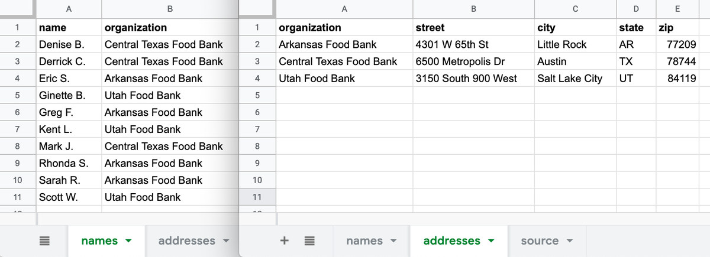{#fig-xlookup-setup width=750}

1. 브라우저의 새 탭에서 이 [Food Bank 샘플 이름 및 주소 Google Sheet](https://docs.google.com/spreadsheets/d/1bcvOJayycijIbf8e-u_cMq0kPbEp29MFQr_FXK6igs4)를 엽니다. Google Drive에 로그인하고 *파일 > 사본 만들기*로 이동하여 편집 가능한 본인의 버전을 만듭니다.

우리는 두 테이블을 동일한 Google Sheet에 배치하여 이 두 시트 문제를 단순화했습니다. *names*라는 첫 번째 탭과 *addresses*라는 두 번째 탭을 클릭합니다. 향후 별개의 두 Google Sheets를 동일한 파일로 이동해야 하는 경우, 한 시트의 탭으로 이동하여 탭을 마우스 오른쪽 버튼으로 클릭하고 *복사(Copy to) > 기존 스프레드시트(Existing spreadsheet)*로 이동한 다음 다른 시트의 이름을 선택합니다.

2. 편집 가능한 Google Sheet 사본에서 *names* 탭은 우리가 만들 메일링 리스트의 대상이 됩니다. *addresses* 시트로 이동하여 *street - city - state - zip*의 열 헤더를 복사하여 \@fig-xlookup-headers 그림과 같이 *names* 시트의 C1~F1 셀에 붙여넣습니다. 이렇게 하면 조회 결과가 자동으로 붙여넣어질 새 열 헤더가 생성됩니다.


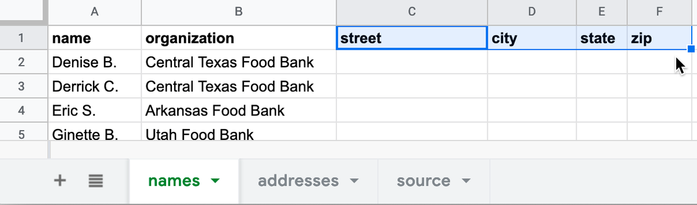{#fig-xlookup-headers width=500}

3. *names* 시트의 C2 셀을 클릭하고 `=XLOOKUP`을 입력하면 Google Sheets에서 다음 형식으로 전체 수식을 작성하도록 제안합니다.

```
XLOOKUP(search_key, lookup_range, result_range,...)
```

세 가지 *필수* 부분의 의미는 다음과 같습니다.

- search_key = 1번째 시트에서 일치시키려는 셀
- lookup_range = 일치하는 항목을 찾기 위해 검색할 2번째 시트의 열 또는 행
- result_range = 원하는 결과를 포함하는 2번째 시트의 열 또는 행

이후에는 3개의 *선택 사항*이 있으며 대부분의 경우 생략하고 기본값을 사용할 수 있습니다.
- missing_value = 일치 항목을 찾을 수 없는 경우 반환할 값(기본적으로 #N/A)
- match_mode = 일치 항목을 찾는 정밀도 수준(기본값은 정확히 일치를 의미하는 0)
- search_mode = 일치 항목을 검색하는 방향(기본값은 처음부터 끝까지를 의미하는 1)

4. 하나의 방법은 쉼표 구분 기호를 사용하여 C2 셀에 수식을 직접 입력하는 것이지만 `=XLOOKUP(B2,'addresses'!A:A, 'addresses'!B:B)`처럼 매우 깁니다.

더 나은 방법은 Google Sheets가 제안하는 *XLOOKUP 교차 조회(cross lookup)* 녹색 상자를 클릭하고 관련된 셀, 열, 시트를 클릭하여 수식이 자동으로 입력되도록 하는 것입니다(\@fig-xlookup-solution 그림 참조). 여기서 새로운 점은 *names* 시트의 이 수식이 *addresses* 시트의 A 및 B 열에 있는 모든 행의 *범위(range)*를 참조한다는 것입니다. 키보드의 *Return* 또는 *Enter* 키를 누릅니다.


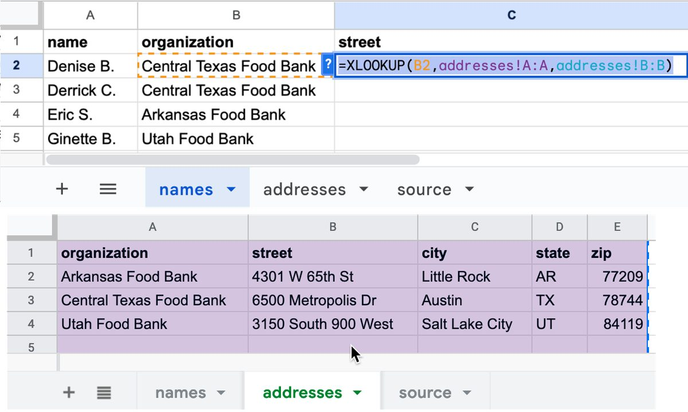{#fig-xlookup-solution width=700}

*names* 시트의 C2 셀에 입력한 수식의 각 부분을 분석해 보겠습니다.

- `B2` = 검색 키(search_key): *names* 시트의 *organization* 열에서 일치시키려는 셀
- `'addresses'!A:A` = 조회 범위(lookup range): *addresses* 시트의 *organization* 열에서 일치하는 항목을 검색하는 범위
- `'addresses'!B:B` = 결과 범위(result range): 원하는 결과가 포함된 *addresses* 시트의 *street* 열

5. 전체 XLOOKUP 수식을 입력하면 첫 번째 조직인 Central Texas Food Bank의 정확한 일치 항목(주소 6500 Metropolis Dr.)이 표시됩니다. C2 셀의 오른쪽 하단에 있는 파란색 점을 클릭한 채 D~F 열에 걸쳐 십자선 커서를 드래그하고 놓으면 \@fig-xlookup-drag 그림과 같이 city, state 및 zip 열에 수식이 자동으로 붙여넣어지고 업데이트됩니다.


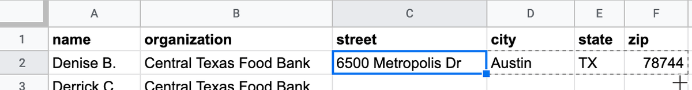{#fig-xlookup-drag width=500}

6. 마지막으로, \@fig-xlookup-final 그림과 같이 동일한 길게 누르고 드래그(hold-and-drag) 방법을 사용하여 수식을 아래로 붙여넣고 업데이트하여 모든 행을 채웁니다.


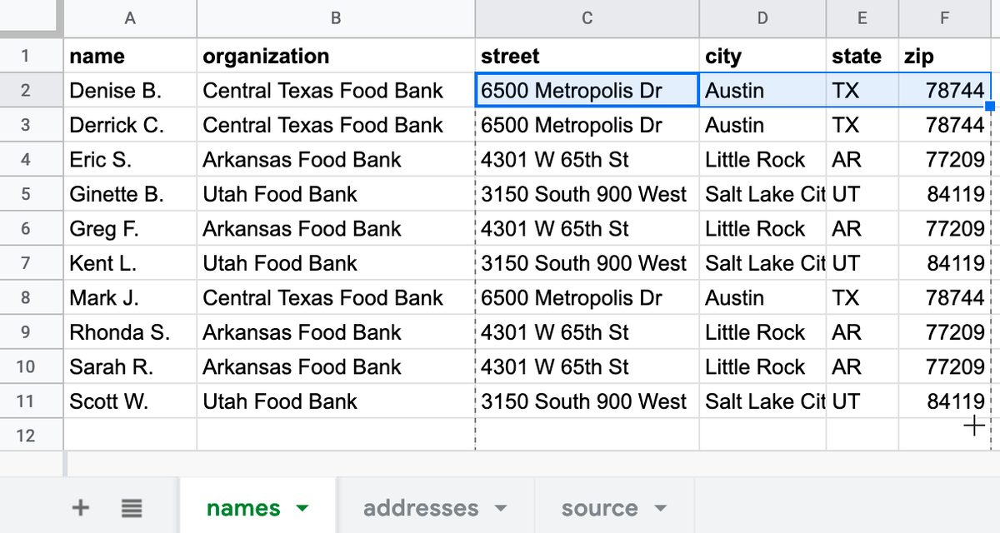{#fig-xlookup-final width=500}

경고: 이 스프레드시트를 CSV 형식으로 저장하면 계산 결과는 CSV 시트에 표시되지만 해당 결과를 생성하기 위해 만든 모든 수식은 사라집니다. 항상 원래 스프레드시트를 추적하여 수식을 어떻게 구성했는지 기억해 두십시오.

XLOOKUP 함수를 사용하여 두 시트에서 일치시키고 데이터를 붙여넣음으로써 각 개인의 이름, 조직, 전체 우편 주소를 포함하는 메일링 리스트를 성공적으로 만들었습니다. 수식을 사용하여 서로 다른 스프레드시트를 연결하는 방법을 이해했으므로 다음 섹션에서는 관계형 데이터베이스의 도움으로 스프레드시트 간의 다중 관계를 관리하는 방법을 배웁니다.


## 스프레드시트 대 관계형 데이터베이스 {- #database}
이전 섹션에서는 XLOOKUP 함수가 스프레드시트 간의 열에서 일치하는 데이터를 검색하고 자동으로 결과를 붙여넣는 방법을 배웠습니다. 그 개념을 바탕으로 스프레드시트와 관계형 데이터베이스를 구분하고 어떤 상황에서 후자를 사용하는 것이 더 현명한지 알아봅시다.

스프레드시트는 모든 레코드가 단일 테이블의 행과 열에 저장되기 때문에 종종 "플랫 파일 데이터베이스(flat-file database)"라고 불립니다. 예를 들어 미국 푸드 뱅크 직원의 단일 스프레드시트를 보관하는 경우, 모든 행에는 이전 섹션 XLOOKUP에서 그림 [\@fig-xlookup-final]로 만든 메일링 리스트처럼 개인, 조직 및 주소가 나열됩니다.

하지만 모든 데이터를 단일 스프레드시트에 보관하면 문제가 생길 수 있습니다. 예를 들어, 중복된 항목이 많아집니다. 동일한 푸드 뱅크에서 근무하는 사람들의 경우 각 행에는 해당 조직의 주소 중복 항목이 포함됩니다. 조직이 새 위치로 이동하는 경우 해당 주소가 포함된 모든 행을 업데이트해야 합니다. 또는 두 조직이 새 이름으로 합병하는 경우 해당 변경 사항의 영향을 받는 개인의 모든 행을 업데이트해야 합니다. 처음에는 모든 정보를 단일 스프레드시트에 정리하는 것이 좋은 생각처럼 들리지만 데이터셋 크기가 커지고 내부 관계(예: 조직에 연결된 사람을 추적하는 등)가 늘어남에 따라 매번 모든 행을 고쳐야 하는 부담이 계속 불어납니다.

단일 스프레드시트 대신, 정보를 별도의 시트(테이블이라고도 함)로 구성하면서도 해당 시트 간의 관련 연결을 지속적으로 유지하는 관계형 데이터베이스(relational database) 사용을 고려해 보세요. XLOOKUP 섹션의 시작 부분에 있는 \@fig-xlookup-setup 그림에서 제시한 두 시트 문제를 되돌아보십시오. 첫 번째 시트에는 각 푸드 뱅크의 개인이 나열되어 있고 두 번째 시트에는 각 푸드 뱅크의 주소가 나열되어 있으며 이 두 시트는 둘 사이의 관계를 보여주는 *organization*이라는 열을 공유합니다. 관계형 데이터베이스는 시간을 절약해 줄 수 있습니다. 예를 들어 한 시트에서 조직의 주소를 업데이트하면 연결된 시트는 해당 조직에서 일하는 직원에 대한 모든 행에 이 변경 사항을 자동으로 반영합니다.

Google Sheets는 훌륭한 스프레드시트이지만 관계형 데이터베이스는 아닙니다. 대신 웹 브라우저에서 기존 템플릿이나 직접 설계한 디자인을 사용하여 최대 1,200개의 무료 레코드(또는 유료 버전의 경우 그 이상)가 포함된 관계형 데이터베이스를 만들 수 있는 [Airtable](https://airtable.com)과 같은 더 나은 도구를 고려하십시오. Airtable은 모든 레코드를 CSV 형식으로 가져오거나 내보내서 데이터 마이그레이션을 가능하게 하며 동료와 실시간 편집자 협업도 지원합니다.

이를 증명하기 위해 위의 두 Google Sheets를 [Food Banks 샘플이라는 이 라이브 Airtable 데이터베이스](https://airtable.com/shrOlb4XT11Xy2LP2)로 가져왔습니다. 링크가 있는 사람은 누구나 이 데이터베이스를 볼 수 있지만 편집은 당사자만 가능합니다. 맨 위에는 *people*과 *food banks*라는 이름의 각 시트를 보기 위한 탭이 있습니다. 이를 관계형 데이터베이스로 변환하기 위해 우리는 Airtable 설정을 사용하여 \@fig-airtable-link 그림과 같이 *people* 시트의 *organization* 열을 주소가 저장된 *food banks* 시트에 연결했습니다. 편집 가능한 버전에서는 열 이름을 두 번 클릭한 다음 드롭다운 메뉴에서 *다른 레코드에 연결(Link to another record)*을 선택하여 다른 탭에 연결했습니다.


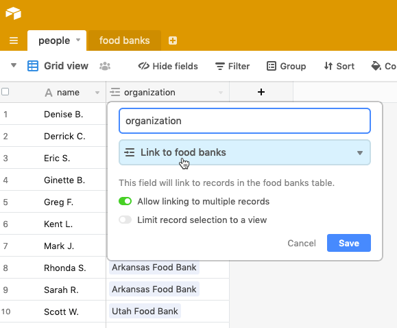{#fig-airtable-link width=500}

Airtable 샘플에서 연결된 행을 클릭하여 확장하고 관련 데이터를 봅니다. 예를 들어 *people* 시트의 첫 번째 행을 클릭하고 확장하면 \@fig-airtable-expand 그림과 같이 *food banks* 시트에서 해당 조직의 전체 주소가 나타납니다. 편집 가능한 버전에서 *food banks* 시트의 한 조직 주소를 업데이트하면 *people* 시트의 해당 조직에 연결된 모든 직원에 대해 자동으로 변경됩니다. 또한 Airtable을 사용하면 데이터를 정렬, 필터링하여 만들고 다른 사람과 공유할 수 있는 데이터의 여러 뷰를 생성할 수 있는데, 이 주제는 [9장: 웹에 삽입하기](#embed)에서 다룹니다. 기능에 대한 자세한 내용은 [Airtable 지원 페이지](https://support.airtable.com)를 참조하세요.


::: {.content-visible when-format="html"}

<iframe src="https://airtable.com/embed/shrOlb4XT11Xy2LP2?backgroundColor=yellow" width="100%" height="533px" style="border:none;"></iframe>
<p class="caption">이 [Airtable 데모](https://airtable.com/shrOlb4XT11Xy2LP2)에서 한 시트의 행을 클릭하여 확장하고 다른 시트에 연결된 데이터를 확인하세요.</p>

:::


한 도구를 다른 도구 대신 언제 사용해야 하는지 판단하는 데 도움을 얻으려면 "플랫 파일" 스프레드시트와 관계형 데이터베이스의 개념적 차이를 이해하는 것이 중요합니다. 위 섹션에서 배웠듯 스프레드시트는 정렬, 필터링, 피벗, 조회 같은 방법으로 데이터를 정돈하고 분석을 시작하는 최선의 선택이며 시각화하려는 기본 스토리를 드러내는 데 도움이 됩니다. 반면에 관계형 데이터베이스는 직원이 여러 명인 조직과 같이 일대다 관계와 같은 내부 링크가 있는 방대한 양의 데이터를 유지 관리할 때 최선의 선택입니다.

### 요약 {- #summary2}
학교나 직장에서 스프레드시트에 대해 "제대로 배운 적이 없는" 많은 사람들 중 한 명이거나 그동안 조금씩 혼자서 배워온 분이라면, 이 장을 통해 여러분의 기술이 성공적으로 강화되었기를 바랍니다. 이 책의 이후의 모든 장, 특히 [6장의 대화형 차트](#chart) 및 [7장의 대화형 지도](#map) 디자인에 대한 장에서는 기본적인 수준의 스프레드시트 친숙도가 필요합니다. 지루한 데이터 작업에서 엄청난 시간을 아껴 줄 뿐 아니라, 위에서 다룬 스프레드시트 도구와 방법은 데이터 스토리를 시각화한다는 더 넓은 목표 아래 데이터를 공유, 정렬, 계산, 피벗, 조회하는 데 도움을 주도록 설계되었습니다.

다음 장에서는 데이터, 특히 정부 및 비영리 기관이 운영하는 공개 데이터 사이트에서 공공 정보를 찾고 질문하는 전략을 설명합니다. 이 사이트에서 공공 정보를 다운로드하고 구성하려면 스프레드시트 기술이 필요합니다.
<!-- BEGIN FILE: 03-find.Rmd -->

# 데이터 찾고 의문 품기 {#find}
시각화 프로젝트의 초기 단계에서 우리는 종종 두 가지 상호 연관된 문제에서 출발합니다: *신뢰할 수 있는 데이터를 어디서 찾을 수 있을까?* 그리고 무언가를 찾은 후에는, *이 데이터가 진정으로 나타내는 것은 무엇일까?* 이 두 가지 큰 문제를 깊이 따져 보지 않은 채 섣불리 차트나 지도를 만들기 시작하면, 의미 없거나 어쩌면 더 나쁘게 오해를 부를 수 있는 시각화가 나올 위험이 있습니다. 이 장에서는 이 광범위한 두 가지 문제를 나누어, [데이터 검색 가이드](#guiding), [공공 및 민간 데이터](#public)에 관한 논쟁 이해, [민감한 데이터의 마스킹 및 집계](#mask-aggregate), 점점 늘어나는 [오픈 데이터 저장소](#opendata) 탐색, [데이터 출처 파악](#source), 그리고 [나쁜 데이터 식별](#bad-data) 방법에 대한 구체적인 전략을 제공합니다. 마지막으로, 파일을 찾고 나면 [데이터의 한계를 인지하고 질문을 던지는](#question) 몇 가지 방법을 제안합니다.

정보는 허공에서 마술처럼 나타나지 않습니다. 사람들은 자신이 속한 시대의 권력 구조와 사회적 맥락 안에서 명시적이거나 암묵적인 목적을 가지고 데이터를 수집하고 게시합니다. 데이터 시각화 옹호자로서, 우리는 정보가 부족한 대안보다는 증거에 기반한 추론을 강력히 지지합니다. 하지만 숫자와 다른 형태의 데이터가 결코 중립적이지 않기 때문에 이른바 데이터 객관성이라는 것을 맹신하지 말라고 경고합니다. 그러므로 데이터를 다룰 때는 잠시 멈추고 *누구의 이야기가 전해지고 있는가?* 그리고 *누구의 관점이 말해지지 않고 있는가?*라는 질문을 깊이 파고들어야 합니다. *[Data Feminism](https://data-feminism.mitpress.mit.edu/)*의 저자인 Catherine D'Ignazio와 Lauren Klein에 따르면, 이러한 종류의 질문을 던져야만 "특권이 어떻게 우리의 데이터 관행과 데이터 산출물에 뿌리박혀 있는지 깨닫기 시작"할 것입니다.[@dignazioDataFeminism2020]

## 데이터 검색을 위한 가이드 질문 {- #guiding}
많은 사람들에게 데이터 검색은 단순히 웹에서 키워드를 구글링하는 것입니다. 때로는 효과가 있지만 그렇지 않을 때도 많습니다. 키워드 검색이 실패할 때는 재능 있는 사서, 저널리스트, 연구자들과 함께 일하며 배운 데이터 사냥의 여러 교훈을 되새깁니다. 그들은 데이터 검색 방법에 대해 더 깊이 고민할 수 있도록 도와주는 일련의 핵심 질문들을 공통적으로 알려주었습니다:

*데이터를 통해 답을 구하고자 하는 질문은 정확히 무엇인가?*

자신의 생각을 명확히 하고 도움을 줄 사람들에게 정확히 전달하기 위해, 질문 형태(끝에 물음표 포함)로 문자 그대로 적어보세요. 우리는 너무도 자주, 답의 폭을 함부로 좁히지 않으면서 질문을 어떻게 다듬을지 돌아보지 않은 채 정답 찾기부터 급하게 서두르곤 합니다.

깊은 인상을 주었던 데이터 시각화 프로젝트를 되돌아보며 그 프로젝트의 동기가 된 근본적인 질문을 파악해 보세요. 워싱턴 포스트(*Washington Post*)와 웨스트버지니아 찰스턴 가제트-메일(*Charleston Gazette-Mail*)은 미국 내 오피오이드 유행성(opioid epidemic)을 취재하면서 연방 정부와 제약 업계가 비밀로 유지하고자 했던 미국 마약단속국(DEA)의 데이터베이스를 얻기 위해 치열한 법적 공방을 벌였습니다. 2019년에 데이터 저널리스트 팀은 그들의 핵심 질문 중 하나에 대한 답을 찾기 위해 대화형 지도와 함께 이 데이터베이스를 공개했습니다: *각 미국 카운티로 보내진 처방 오피오이드 알약의 1인당 수량은 얼마이며 어느 회사와 유통업체가 책임이 있는가?* 그들의 [지도 결과](https://www.washingtonpost.com/graphics/2019/investigations/dea-pain-pill-database/)는 애팔래치아 시골의 여러 카운티가 2006년부터 2014년까지 매년 1인당 평균 150알이 넘는 오피오이드 알약을 받았다는 밀집 지역을 보여주었습니다. 게다가 이 기간 동안 미국 전역에 유통된 1,000억 개의 옥시코돈과 하이드로코돈 알약 중 4분의 3 이상을 McKesson Corp., Walgreens, Cardinal Health, AmerisourceBergen, CVS, Walmart 등 단 6개 회사가 유통했습니다.^[@DrillingDEAPain2019] 여러분이 다루는 데이터가 이처럼 방대하거나 논쟁적이지 않더라도, 더 큰 교훈은 여러분이 대답하고자 하는 질문을 명확하게 파악하라는 것입니다.

또한, 연구가 진행됨에 따라 질문을 수정하는 것은 매우 자연스러운 일입니다. 예를 들어, Jack과 그의 학생들은 순진하게 *1960년대 코네티컷 공립학교의 시험 점수는 어땠을까?*라는 질문으로 데이터 프로젝트를 시작한 적이 있습니다. 하지만 곧 오늘날 우리가 알고 있는 형태의 주 단위 표준화 학교 평가는 1980년대 중반 학교 책무성 운동이 시작될 때까지 코네티컷 같은 주에 존재하지 않았다는 사실을 알게 되었습니다. 당시에도 1990년대에 신문들이 연 1회 지면에 결과를 싣기 전까지는 대중이 쉽게 결과를 확인할 수 없었습니다. 이후 1990년대 후반부터 2000년대 초반 인터넷이 확산되면서 부동산 업체, 학교 평가 기업, 정부 기관들이 웹에 데이터를 지속적으로 게시하기 시작했습니다. 이러한 사실을 바탕으로 우리는 연구 질문을 *코네티컷 주택 구매자들은 언제부터 어떻게 학교 시험 점수를 알게 되었으며 특정 공립학교 학군에 접근하기 위해 지불할 의사가 있는 가격에 이러한 점수가 어떤 영향을 미쳤는가?*로 수정했습니다.[@doughertySchoolChoiceSuburbia2009] 증거가 여러분을 더 나은 방향으로 이끌 때 언제든 질문을 수정할 준비를 하세요.

*여러분이 찾는 데이터를 수집하거나 게시했을 만한 조직은 어떤 곳이 있는가?*

만약 정부 기관이 관여했다면, 어느 수준입니까: 지방, 지역, 주/지방, 국가, 아니면 국제? 행정부, 입법부, 사법부 중 어느 부처입니까? 또는 이 정보를 수집하고 배포할 책임이 있는 특정 정부 부서는 어디입니까? 이토록 다양한 구조가 혼란스러울 수 있으므로, [주 정부 도서관](https://libguides.ala.org/mailing-lists)이나 [미국 연방 예탁 도서관 프로그램](https://www.doi.gov/library/collections/federal-documents)에 참여하는 지역 기관에서 정부 문서 및 데이터베이스를 다루는 훈련을 받은 사서들에게 연락을 취하세요. 아니면 여러분이 찾는 데이터를 학술 기관, 언론인, 비영리 단체, 영리 기업 같은 비정부 조직이 수집했을 수도 있을까요? 데이터를 수집하고 게시했을 가능성이 있는 *조직이 어디인지* 알아내면, 해당 기관이 흔히 발행하는 디지털 또는 인쇄 자료와 특정 분야의 검색 범위를 좁힐 수 있는 가장 적합한 도구를 찾는 데 도움이 됩니다.

*어느 수준의 데이터를 이용할 수 있는가?*

정보가 개별 사례로 세분화되어 있나요, 아니면 더 큰 그룹으로 집계되어 있나요? 작은 데이터 단위를 통해 보다 세분화된 해석이 가능한 반면, 큰 단위를 사용하면 더 넓은 패턴을 식별하는 데 도움이 될 수 있습니다. 사서들은 조직이 어떻게 그리고 왜 데이터를 다른 수준에서 게시하는지 해독하는 데 도움을 줄 수 있습니다. 예를 들어, 미국 인구조사국(US Census)은 매 10년마다 미국에 거주하는 각 개인에 대한 데이터를 수집합니다. 법에 따라 각 개인에 대한 개인 수준 데이터는 72년 동안 기밀로 유지된 후 일반에 공개됩니다. 현재는 그림 [\@fig-census-1940-excerpt]에서 보여지듯, [미국 국립문서기록관리청(US National Archives)](https://www.archives.gov/research/genealogy/census/about) 및 다른 웹사이트에서 1940년 인구조사 및 그 이전 수십 년간의 특정 개인을 검색할 수 있습니다.


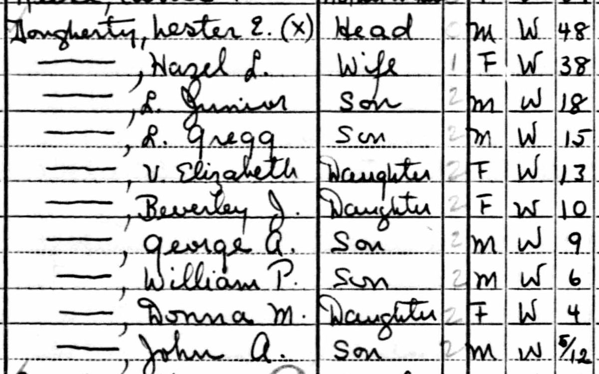{#fig-census-1940-excerpt width=350}

한편 미국 인구조사국은 사람들의 개인정보를 보호하기 위해 현재 연도 데이터를 더 큰 지리적 영역으로 집계하여 게시합니다. [미국 인구조사 지리 엔터티 표준 계층구조(Standard Hierarchy of US Census Geographic Entities)](https://www2.census.gov/geo/pdfs/reference/geodiagram.pdf)를 사용하여 코네티컷 주 하트퍼드의 가장 흔한 지리적 영역들 사이의 관계를 보여주기 위해 그림 [\@fig-census-divisions-hartford]와 같은 단순화된 지도를 만들었습니다:

- 주(State)
- 카운티(County)
- 카운티 하위 구역 (코네티컷의 타운 및 도시와 동일)
- 인구조사 트랙트 (지정 지역, 약 1,200~8,000명)
- 블록 그룹 (트랙트의 하위 단위, 약 600~3,000명)
- 인구조사 블록 (블록 그룹의 하위 단위이나, 반드시 도시 블록과 일치하지는 않음)^[@rossiterWhatAreCensus2011]


::: {.content-visible when-format="html"}

<iframe src="https://handsondataviz.github.io/census-divisions-hartford/" width="100%" height="700px" style="border:none;"></iframe>
<p class="caption">2019년 코네티컷 주 하트퍼드 주변의 일반적인 미국 인구조사 지리. 카운티 및 주 경계를 보려면 [대화형 버전](https://handsondataviz.github.io/census-divisions-hartford/)에서 축소하세요.</p>

:::


*이전 출판물에서 유사한 데이터를 인용한 적이 있으며 있다면 그 출처를 어떻게 추적할 수 있는가?*

우리의 가장 좋은 아이디어 중 일부는 근거의 출처를 설명하는 기사나 책을 읽을 때 시작되었으며 우리는 그 데이터를 시각화할 새로운 방법들을 상상했습니다. 종종 인쇄물이나 오래된 웹 페이지에서 데이터 표를 우연히 발견했고 이는 더 새로운 버전을 추적해 탐구하고 싶은 흥미를 불러일으켰습니다. 심지어 *과거의* 데이터일지라도 과거 특정 시점에 누군가가 이를 어떻게 수집했는지 보여줌으로써 도움이 됩니다. 주석을 따라 그 출처를 추적하세요. 이전에 출판된 데이터의 출처를 추적하려면 [Google Scholar](https://google.com/scholar)와 더 전문화된 연구 데이터베이스를 활용하세요(필요한 경우 사서에게 도움을 요청하십시오). 한 가지 보너스는 더 최신 데이터를 찾을 수 있다면, 시간 경과에 따른 변화를 비교하는 시각화를 설계할 수 있다는 것입니다.

*여러분이 찾는 데이터를 아무도 수집하지 않았다면 어떻게 해야 할까요?*

때로는 이것이 단순한 감독 부실 이상의 이유로 발생합니다. *[Data Feminism](https://data-feminism.mitpress.mit.edu/)*에서 Catherine D'Ignazio와 Lauren Klein은 테니스 스타 세레나 윌리엄스의 이야기를 통해 데이터 수집 문제가 "어떻게 권력 및 특권의 더 큰 문제와 직접적으로 연결되어 있는지"를 강조합니다. 윌리엄스는 2017년 딸을 출산하는 과정에서 생명을 위협받는 합병증을 겪었을 때, 흑인 여성으로서 병원에서 자신을 대변해야 했던 방식에 대한 사회적 주의를 환기시켰습니다. 그런 경험 이후, 그녀는 소셜 미디어에 미국 질병통제예방센터(CDC)의 자료를 인용하여 "흑인 여성은 백인 여성에 비해 임신이나 출산과 관련된 원인으로 사망할 확률이 3배 이상 높다"고 썼습니다. 언론인들이 후속 취재에 나섰을 때, 그들은 모성 사망률에 대한 상세한 데이터가 부재하며 2014년 UN 보고서가 미국 의료 시스템의 데이터 수집에서 "특히 취약한" 측면이라고 설명한 부분을 발견했습니다. 기자들은 심장 발작이나 인공 고관절 치환술과 같은 다른 건강 문제에 대한 비교 가능한 시스템에도 불구하고 "임신 및 출산 과정에서 발생하는 합병증을 추적하는 국가적 시스템은 여전히 존재하지 않는다"고 보도했습니다. 권력 구조는 생명의 가치를 높이 평가받거나, 고도의 감시 하에 있는 사람들의 숫자를 세도록 설계됩니다. D'Ignazio와 Klein은 이러한 권력 시스템을 비판적으로 검토하고, 그 영향을 상쇄하기 위해 데이터를 수집하며 이 과정에서 모든 사람들의 노력을 더 가시적으로 만들 것을 우리에게 촉구합니다.[@dignazioDataFeminism2020, chapter 1] 만약 아무도 여러분이 찾는 데이터를 수집하지 않았다면, 아마도 여러분이 이 문제를 공개적으로 인지시키는 가치 있는 단계를 밟을 수 있고, 어쩌면 스스로 데이터를 수집할 수도 있을 것입니다.

데이터 사냥에는 단순히 키워드를 구글링하는 것 이상의 과정이 포함됩니다. 사서, 언론인 및 다른 연구자들이 가르쳐 준 이런 유형의 질문을 반추하며 검색의 깊이를 더해 보세요: 어떤 종류의 기관들이 이 데이터를 수집했을까아니면 하지 않았을까? 어떤 수준에서? 이전의 어떤 시점에서? 그리고 어떤 사회적, 정치적 맥락에서 수집되었을까? 다음 섹션에서는 공공 및 민간 데이터와 관련된 문제에 대해 더 자세히 알아볼 것입니다.

## 공공 및 민간 데이터 {- #public}
데이터를 찾을 때는 공공 및 민간 데이터에 관한 논쟁에 대해서도 알아야 합니다. 이러한 논쟁은 여러분이 시각화에 합법적으로 사용할 수 있는 데이터의 종류에 영향을 미칠 뿐만 아니라, 누구나 개인에 대한 사적인 정보를 수집하거나 유통할 수 있도록 허용해야 하는 정도에 대해 더 깊은 윤리적 문제를 제기합니다. 이 섹션은 주로 미국이라는 맥락에 기초하여 이러한 논쟁에 대한 우리의 일반적인 관찰을 제공합니다. 저희는 변호사가 아니기 때문에(다행스럽게도!), 필요한 경우 특정 사례에 대해 법률 전문가와 상담하시기 바랍니다.

첫 번째 논쟁은 묻습니다: *민간 개인에 대한 데이터 수집을 어디까지 허용해야 하는가?* "빅데이터" 비평가들 중 몇몇은 디지털 시대에 정부가 개별 시민에 대한 데이터를 더 많이 수집함에 따라 전체주의적인 "빅 브라더"처럼 변하고 있다고 우려합니다. 미국에서는 2013년에 내부고발자 에드워드 스노든이 국가안보국(NSA)이 통신 회사로부터 제공받은 미국 시민의 이메일 및 전화 기록을 사용해 전 세계적인 감시를 수행한 방법을 공개하면서 우려가 커졌습니다. 하버드 경영대학원 교수이자 *감시 자본주의의 시대(The Age of Surveillance Capitalism)*의 저자인 Shoshana Zuboff는 대기업들이 수익을 창출하기 위해 식별 가능한 막대한 개인 데이터를 수집하고 상품화하는 동일한 위협에 대해 경고합니다.[@zuboffAgeSurveillanceCapitalism2019] 디지털 상거래의 증가로 인해 강력한 기술 기업들이 여러분과 다른 사람들이 비공개라고 생각하는 데이터를 소유하고 있습니다:

- 구글은 여러분이 검색 엔진에 어떤 단어를 입력했는지 알고 있으며 이는 [Google Trends](https://trends.google.com/trends/)에서 집계된 형태로 나타납니다. 또한 워싱턴 포스트(*Washington Post*) 기술 전문 기자 Geoffrey Fowler가 [설명한 바와 같이](https://www.washingtonpost.com/technology/2019/06/21/google-chrome-has-become-surveillance-software-its-time-switch/), 구글 크롬 브라우저는 쿠키를 통해 여러분의 웹 활동을 추적합니다.^[@fowlerGoodbyeChromeGoogle2019]
- [Fowler가 역시 기록한 바에 따르면](https://www.washingtonpost.com/technology/2019/05/06/alexa-has-been-eavesdropping-you-this-whole-time/), 아마존은 가정용 어시스턴트인 알렉사 주변에서 하는 대화를 도청하고 녹음합니다.^[@fowlerAlexaHasBeen2019]
- 페이스북은 여러분이 어떤 친구와 정치적 명분을 선호하는지 추적하며 [Fowler는 또한](https://www.washingtonpost.com/technology/2020/01/28/off-facebook-activity-page/) 타겟 광고를 개선하기 위해 여러분이 다른 기업에서 구매한 내역 등 페이스북 외부에서의 활동을 어떻게 추적하는지 보고합니다.^[@fowlerFacebookWillNow2020]

어떤 이들은 대기업이 수집하는 "빅데이터"가 공익적 혜택을 제공할 수 있다고 지적합니다. 예를 들어, [애플은 아이폰 사용자로부터 수집한 집계된 이동성 데이터](https://covid19.apple.com/mobility)를 공유하여 코로나 팬데믹 기간 중 어떤 인구 집단이 이동하는 대신 집에 머물렀는지 공중 보건 당국이 비교할 수 있도록 도왔습니다. 그러나 다른 이들은 기업들이 데이터를 수집하는 방식과 그 활용법에 대해 대체로 스스로 조건을 정하고 있다고 지적합니다. 캘리포니아주가 개인이 자신에 대해 기업이 수집하는 데이터를 검토하고 삭제할 권리를 보장하는 [소비자 개인정보 보호법을 2020년에 시행](https://www.washingtonpost.com/technology/2020/01/21/ccpa-transparency/)하기 시작했지만 미국 주 정부와 연방 정부는 아직 이 정책 분야에 전면적으로 진입하지 않았습니다. 공공 또는 민간 기관이 개인으로부터 수집한 데이터를 다룬다면, 시각화에 포함할 내용에 대해 현명하고 윤리적인 선택을 내릴 수 있도록 이러한 논란에 대해 배우십시오.

두 번째 질문은 다음과 같습니다: *정부가 데이터를 수집할 때, 어느 정도까지 대중에게 공개해야 하는가?* 미국에서는 투명성을 높임으로써 공공의 감시가 강화되고 관료들이 긍정적인 변화를 만들도록 압박할 수 있다는 관점에서 1966년 [정보자유법(Freedom of Information Act)](https://en.wikipedia.org/wiki/Freedom_of_Information_Act)과 그 이후의 개정안들이 연방 정부 내 정보에 대한 접근을 개방하기 위해 노력해왔습니다. 또한 주 정부들은 "공개 기록(open records)" 또는 "햇살법(sunshine laws)"이라고도 불리는 자체 정보자유법에 따라 운영됩니다. 사람들이 "FOI"를 제출했다고 말할 때, 그것은 법률에 따라 공개되어야 한다고 생각하는 정보를 위해 정부 기관에 서면 요청을 보냈다는 의미입니다. 그러나 연방 및 주의 FOIA 법률은 복잡하며 언론자유기자위원회(Reporters Committee for Freedom of the Press)의 [오픈 거버먼트 가이드(Open Government Guide)](https://www.rcfp.org/open-government-guide/) 및 [국가정보자유연합(National Freedom of Information Coalition)](https://www.nfoic.org/)에 요약된 바와 같이 법원은 시간에 따라 다양한 방식으로 사건을 해석해 왔습니다. 정부 기관은 때때로 FOI 요청에 신속히 동의하고 준수하지만 다른 때에는 이를 지연하거나 거부할 수 있으며 이로 인해 요청자가 시간을 많이 소비하는 소송을 통해 문제를 해결하려고 압박받을 수 있습니다. 전 세계적으로 [100개국 이상이 자체 버전의 정보자유법](https://en.wikipedia.org/wiki/Freedom_of_information_laws_by_country)을 보유하고 있으며 스웨덴의 1766년 언론자유법(Freedom of the Press Act)이 가장 오래되었지만 이러한 법률은 국가마다 크게 다릅니다.

대부분의 경우 미국 연방 및 주 정부가 수집한 개인 수준 데이터는 비공개로 간주되며 공공 절차를 통해 이를 대중에게 공개함으로써 더 넓은 이익에 기여한다고 결정된 경우는 예외입니다. 이러한 구분을 설명하기 위해 미국 연방법이 개인 수준 데이터의 프라이버시를 보호하는 두 가지 사례부터 시작해 보겠습니다:

- 환자 수준의 건강 데이터는 일반적으로 HIPAA로 흔히 알려진 [건강 보험 이식성 및 책임 법률의 프라이버시 규칙(Privacy Rule of the Health Insurance Portability and Accountability Act)](https://en.wikipedia.org/wiki/Health_Insurance_Portability_and_Accountability_Act#Privacy_Rule)에 따라 보호됩니다. 공중 보건 당국이 인구 집단의 질병에 관한 광범위한 동향을 추적하려면 특정 사람들의 기밀을 보호하는 방식으로 개별 환자 데이터를 더 큰 규모의 익명화된 데이터세트로 집계해야 합니다.

- 유사하게 학생 수준의 교육 데이터는 일반적으로 FERPA로 널리 알려진 [가족 교육 권리 및 프라이버시 법률(Family Educational Rights and Privacy Act)](https://en.wikipedia.org/wiki/Family_Educational_Rights_and_Privacy_Act)에 따라 보호됩니다. 공교육 공무원들은 정기적으로 개별 학생 기록을 더 큰 규모의 익명화된 공개 데이터세트로 집계하여 개인을 식별할 수 있는 데이터는 드러내지 않은 채 학교, 교육구 및 주의 광범위한 발전 상황을 추적합니다.

반면, 다음은 정부가 대중에게 개인 수준 데이터를 광범위하게 제공함으로써 공공 이익에 봉사한다고 판결한 세 가지 사례입니다:

- 정치 후보자에 대한 개인의 기부금은 [미국 연방 선거 관리 위원회(US Federal Election Commission) 데이터베이스](https://www.fec.gov/data/receipts/individual-contributions/)를 비롯해 국립 정치 자금 연구소(National Institute on Money in Politics)의 [Follow The Money](https://www.followthemoney.org/) 및 대응 정치 센터(Center for Responsive Politics)의 [Open Secrets](https://www.opensecrets.org/)과 같은 비영리 단체의 관련 데이터베이스에서 확인할 수 있는 공개 정보입니다. 후자의 두 사이트는 정치 활동 위원회를 통해 제출된 기부금에 관한 더 자세한 정보와 선거 자금법에 대한 논란의 여지가 있는 예외 사항들을 설명합니다. 미국 전역에서 주 수준의 정치 기부금 법률은 크게 다르며 이러한 공공 기록은 별도의 데이터베이스에 저장됩니다. 예를 들어 누구나 [코네티컷 캠페인 보고 정보 시스템(Connecticut Campaign Reporting Information System)](https://seec.ct.gov/Portal/eCRIS/eCrisSearch)을 검색하여 제1 저자가 주 수준의 정치 캠페인에 기부한 내역을 찾을 수 있습니다.

- 개인 재산 소유권 기록은 공개되어 있으며 점점 더 많은 지방 정부에서 온라인으로 제공하고 있습니다. 한 민간 자금으로 운영되는 회사가 가능한 경우 카운티 및 시 정부 재산 기록의 링크가 포함된 [미국 공공 기록 디렉토리(US public records directory)](https://publicrecords.netronline.com/)를 컴파일했습니다. 예를 들어 누구나 [코네티컷주 웨스트 하트퍼드 타운의 재산 평가 데이터베이스(property assessment database for the Town of West Hartford, Connecticut)](https://gis.vgsi.com/westhartfordct/)를 검색하여 제1 저자가 소유한 재산, 평방피트(면적), 그리고 구매 가격을 확인할 수 있습니다.

- 면세 기관 임원의 개인 연봉 정보는 매년 공개되며 각 기관은 연마다 국세청(IRS)의 990 양식을 제출해야 합니다. 예를 들어, 누구나 ProPublica의 [Nonprofit Explorer](https://projects.propublica.org/nonprofits)에서 990 양식을 검색할 수 있으며 제1 저자의 고용주와 제2 저자의 모교인 코네티컷 주 하트퍼드의 트리니티 대학 최고 책임자들의 급여 및 기타 보상을 볼 수 있습니다.

사회적, 정치적 압력은 정부가 수집한 개인 수준 데이터 중 어떤 유형이 대중에게 공개되어야 하는지에 대한 경계를 지속적으로 변화시키고 있습니다. 예를 들어 흑인의 목숨도 소중하다(Black Lives Matter) 운동은 점진적으로 경찰관의 폭력에 관한 개별 수준 데이터를 대중에게 더 널리 공개하게 만들었습니다. 일례로 2001년 뉴저지주는 지역 경찰서들이 총기 발사와 같이 사소한 것이든 중대한 것이든 상관없이 경찰관의 "무력 사용"을 문서화하도록 의무화했습니다. 그러나 NJ Advance Media의 언론인 팀이 500건 이상의 공공 기록 요청을 제출하고 누구든 개별 경찰관을 검색하여 폭력 행동의 패턴을 조사할 수 있는 [The Force Report 디지털 데이터베이스](https://force.nj.com/)를 컴파일하기 전까지는 아무도 이 서류 양식을 쉽게 검색할 수 없었습니다. 유사하게, ProPublica 언론인 팀은 누구나 이름이나 관할 서 단위로 뉴욕시 경찰관에 대해 종결된 민간인 불만 사례를 검색해 입증된 혐의의 패턴을 조사할 수 있도록 하는 [The NYPD Files 데이터베이스](https://projects.propublica.org/nypd-ccrb/)를 만들었습니다.

데이터로 작업하는 모든 사람은 어떤 것이 공적이어야 하고 사적이어야 하는지에 대한 핵심적인 논쟁에 대해 정보를 얻고 누구의 이익이 기여하고 있는지에 대한 정책 토론에 적극적으로 참여하며 긍정적인 변화를 만드는 데 기여해야 합니다. 다음 섹션에서는 민감한 개인 수준 데이터를 사용할 때 고려해야 할 윤리적인 선택 사항에 대해 배우게 될 것입니다.

## 민감한 데이터 마스킹 및 집계 {- #mask-aggregate}

개인 수준의 데이터가 합법적이고 대중에게 접근 가능하더라도, 데이터 시각화를 만들 때 해당 데이터를 사용할지 여부와 활용 방법에 관하여 윤리적 결정을 내릴 책임은 우리 각자에게 있습니다. 민감한 데이터로 작업할 때 물어봐야 할 몇 가지 윤리적 질문은 다음과 같습니다: *개인 수준 데이터를 공개적으로 공유함으로써 얻는 이익보다 초래될 수 있는 해로움의 위험은 무엇인가?* 그리고 *개인 사생활을 침해할 수 있는 구체적인 사항을 널리 공개하지 않고 동일한 데이터 스토리를 전달할 방법은 없는가?* 이러한 윤리적 질문에 대한 간단한 답은 없는데, 모든 상황은 서로 다르며 개인에게 가해질 피해의 위험과 중대한 공공 문제에 대한 광범위한 지식의 이점 사이에서 경중을 따져봐야 하기 때문입니다. 그러나 이 섹션은 민감한 정보를 맹목적으로 재배포하는 대안, 즉 개인 수준의 데이터를 마스킹하고 집계하는 방식 등 일부 대안을 명확히 합니다.

범죄 데이터를 탐색하고 여러 지역에 걸쳐 다양한 유형의 911 경찰 호출 빈도에 대한 대화형 지도를 만들고 싶다고 상상해 보세요. 이 장의 [오픈 데이터 섹션](#opendata)에 설명된 바와 같이, [경찰 호출에 관한 공공 데이터](https://www.opendatanetwork.com/search?q=police)를 검색하면 콜센터가 개별 데이터를 공개하는 방침 및 관행이 각기 다르다는 점을 알 수 있습니다. 미국의 많은 주에서는 성범죄나 아동 학대 피해자에 관한 정보(경찰이 출동한 주소 등)가 기밀로 취급되어 대중 공개에서 제외되며 오픈 데이터에 포함되지 않습니다. 그러나 일부 경찰서는 다른 유형의 범죄 신고에 대한 호출 오픈 데이터를 아래와 같은 형식으로 상세 주소와 함께 게시합니다:

```
| Date  | Full Address | Category           |
| Jan 1 | 1234 Main St | Aggravated Assault |
```

이러한 정보가 널리 대중에게 공개되지만 특정 폭력 범죄에 대한 상세 정보를 그들의 전체 주소와 함께 데이터 시각화로 재배포함으로써 피해자에게 신체적 혹은 정서적 위해를 초래할 가능성이 있습니다.

하나의 대안은 민감한 데이터의 상세 정보를 *마스킹(mask)*하는 것입니다. 예를 들어 일부 경찰서는 개인의 사생활을 보호하기 위해 오픈 데이터 보고서에서 지번의 마지막 몇 자리를 숨기지만 아래와 같은 형식으로 일반적인 위치는 여전히 보여줍니다:

```
| Date  | Masked Address | Category           |
| Jan 1 | 1XXX Main St   | Aggravated Assault |
```

[4장: 지저분한 데이터 정리하기](#clean)에서 스프레드시트 도구를 이용해 '찾기 및 바꾸기' 방법과 유사한 방식을 적용하여 상황에 맞게 개인 수준 데이터를 마스킹할 수도 있습니다.

또 다른 전략은 개인 단위의 데이터를 더 큰 그룹으로 *집계(aggregate)*하는 것으로, 이 방식은 개인 정보는 보호하면서 폭넓은 경향성을 보여줄 수 있습니다. 위의 사례처럼 여러 동네에 걸친 범죄 데이터를 탐색한다면 개별 911 출동 데이터를 인구조사 트랙트나 지역명과 같이 더 넓은 지리적 영역으로 집계하여 아래와 같은 형식으로 묶습니다:

```
| Neighborhood | Crime Category     | Frequency |
| East Side    | Aggravated Assault | 13        |
| West Side    | Aggravated Assault | 21        |
```

개별 정보를 더 크면서 의미 있는 범주로 집계하는 것은 보다 폭넓은 맥락에서 데이터 스토리를 전하는 데에도 유용한 방식입니다. 간단한 스프레드시트 데이터 집계 방법은 [2장의 피벗 테이블로 요약하기 섹션](#pivot)을 참조하세요. 미국 주소를 [인구조사 구역 단위로 지오코딩](#bulk-geocode)하거나, [주소 지점을 폴리곤 지도로 피벗](#pivot-point-to-polygon)하거나, 데이터를 보다 의미 있게 만들기 위해 [정규화](#normalize)하려면 [13장: 지도 데이터 변환하기](#transform)를 참조하십시오.

다음 섹션에서는 정부 및 비정부 기관이 의도적으로 대중과 공유한 데이터세트를 탐색하는 방법에 대해 알아봅니다.

## 오픈 데이터 저장소 {- #opendata}
지난 10년간 전 세계적으로 점점 더 많은 정부 및 비정부 기관들이 오픈 데이터 저장소를 통해 공공 데이터를 주도적으로 공유하기 시작했습니다. 이전에 이러한 데이터세트 중 일부는 고립된 웹사이트에 개별 파일로만 제공되었지만 이러한 성장하는 네트워크를 통해 오픈 데이터를 찾기가 훨씬 쉬워졌고 기관의 업데이트도 빈번해졌으며 때로는 다른 컴퓨터와의 실시간 상호 작용도 지원하게 되었습니다. 오픈 데이터 저장소에는 종종 다음과 같은 기능들이 포함됩니다:

- 보기 및 내보내기: 오픈 데이터 저장소는 기본적으로 사용자가 CSV, ODS, XLSX 등 일반적인 스프레드시트 형식으로 데이터를 보고 내보낼 수 있도록 합니다. 일부 저장소는 지도를 작성하기 위한 지리적 경계 파일을 제공하기도 합니다.
- 내장된 시각화 도구: 일부 플랫폼에서는 사용자가 웹사이트상에서 바로 대화형 차트나 지도를 생성할 수 있는 도구를 제공합니다. 어떤 저장소는 사용자가 자신의 웹사이트에 이 내장된 시각화 도구를 포함할 수 있도록 코드 스니펫을 제공하는데, 이에 대해서는 [9장: 웹에 포함하기](#embed)에서 자세히 배울 수 있습니다.
- 애플리케이션 프로그래밍 인터페이스 (API): 일부 저장소는 외부 사이트나 온라인 시각화에서 플랫폼의 데이터를 직접 가져올 수 있도록 코드 명령이 포함된 엔드포인트를 제공합니다. 저장소가 데이터를 지속적으로 업데이트하고 API 엔드포인트를 게시하는 경우, 실시간 또는 "거의 실시간" 데이터를 시각화로 나타내는 데 매우 이상적인 방법이 됩니다. 이에 대해서는 [12장: 리플렛 지도 템플릿](#leaflet)에서 더 자세히 배울 수 있습니다.

특히 정부 정책 및 과학 연구 분야에서 오픈 데이터 저장소가 최근 성장함에 따라, 이 모든 정보를 나열한 단일 웹사이트는 존재하지 않습니다. 대신 독자들의 호기심을 자극하고 더 깊이 파고들도록 격려하기 위해 미국과 전 세계에서 몇 개의 사이트만 나열합니다:

- [Data.gov](https://www.data.gov/), 미국 연방 정부 기관을 위한 공식 저장소.
- [Data.census.gov](https://data.census.gov), 미국 인구조사국 데이터에 접근할 수 있는 메인 플랫폼. 10년 주기 인구조사(Decennial Census)는 10년마다 실시하는 전체 인구조사이며 미국 지역사회 조사(American Community Survey, ACS)는 오차 범위와 함께 다양한 인구조사 지리에 대한 1년 단위 및 5년 단위 추정치를 산출하는 연례 표본조사입니다.
- [Eurostat](https://ec.europa.eu/eurostat), 유럽 연합의 통계청.
- [Federal Reserve Economic Research](https://fred.stlouisfed.org/), 미국 및 국제 데이터.
- [Global Open Data Index](https://index.okfn.org/dataset/), Open Knowledge Foundation 제공.
- [Google Dataset Search](https://datasetsearch.research.google.com/).
- [Harvard Dataverse](https://dataverse.harvard.edu), 어떤 분야든 모든 연구자들에게 개방된 곳.
- [Humanitarian Data Exchange](https://data.humdata.org), UN 인도주의 업무 조정 사무소 제공.
- [IPUMS](https://www.ipums.org), Integrated Public Use Microdata Series, 세계 최대 규모의 개인 수준 인구 데이터베이스로, 미국 및 전 세계 인구조사 기록과 설문조사 기반의 미시데이터(microdata) 샘플을 미네소타 대학교에서 호스팅합니다.
- [openAfrica](https://africaopendata.org/), Code for Africa 제공.
- [Open Data Inception](https://opendatainception.io/), 지도 중심의 글로벌 디렉토리.
- [Open Data Network](https://www.opendatanetwork.com/), Socrata가 제공하는 디렉토리로 주로 미국 주 및 시립 오픈 데이터 플랫폼이 등록되어 있습니다.
- [United Nations data](https://data.un.org/).
- [World Bank Open Data](https://data.worldbank.org/), 경제 개발 데이터의 전 세계적 컬렉션.
- [World Inequality Database](https://wid.world/), 전 세계 소득 및 자산 불평등 데이터.

더 많은 선택 사항을 보려면, [로체스터 대학교(University of Rochester)](https://libguides.lib.rochester.edu/c.php?g=384429), [SUNY 제네세오(SUNY Geneseo)](https://libguides.geneseo.edu/data), [브라운 대학교(Brown University)](https://libguides.brown.edu/opendata) 등 여러 도서관의 직원들이 구성하고 유지 관리하는 *Open Data* 목록을 참조하세요.

또한 재정 상황이 좋은 대학 도서관 및 기타 조직은 학생과 직원이 "폐쇄된" 데이터 저장소에 접근할 수 있도록 구독료를 지불할 수 있습니다. 예를 들어, [Social Explorer](https://www.socialexplorer.com/)는 주로 미국, 캐나다, 유럽의 지역 및 국가별 지리에 대한 인구, 경제, 건강, 교육, 종교 및 범죄 데이터를 수십 년간 제공합니다. 예전에는 대중이 많은 파일을 열람할 수 있었지만 이제는 유료 구독 또는 14일 무료 평가판을 요구합니다. 또 [Policy Map](https://www.policymap.com/)은 미국 내 지역에 대한 인구 통계, 경제, 주택 및 삶의 질 데이터를 제공하고 있으며 그 중 일부를 [오픈 맵 뷰(Open Map view)](https://www.policymap.com/maps)에 공개하고 있지만 이를 다운로드하려면 구독이 필요합니다.

이 책에서 지도를 만드는 데 사용하는 개방형 데이터 표준인 [GeoJSON 형식의 지리적 경계 파일 찾기](#find-geojson)에 대해서도 13장: 지도 데이터 변환하기를 참조하십시오.

오픈 데이터 저장소를 탐색하는 방법에 대해 더 많이 배웠으므로 다음 섹션에서는 발견한 데이터를 올바르게 소싱하는 방법을 배우게 될 것입니다.

## 데이터 출처 파악 {- #source}
데이터를 찾으면 다운로드한 파일이나 새로 만든 파일 안에 출처 정보를 기록하세요. 기원(origin)에 대한 핵심 세부 사항을 추가하여 미래의 여러분이나 다른 누군가가 그 단계를 재현할 수 있도록 만드세요. 우리는 두 가지 방법, 즉 스프레드시트 파일 이름과 출처 노트를 기록하는 탭(tab)에 이 작업을 수행하는 것을 권장합니다. 세 번째 단계로 데이터의 백업 시트를 만듭니다.

첫 번째 단계는 다운로드하거나 생성하는 모든 데이터 파일에 라벨을 붙이는 것입니다. 피해야 할 "나쁜 파일명"의 예는 모두가 경험해본 적 있을 것입니다:

- data.csv
- file.ods
- download.xlsx

짧지만 의미 있는 파일 이름을 지정하세요. 완벽한 체계는 없지만 좋은 전략은 출처를 줄여 쓰고 (`census`나 `worldbank` 혹은 `eurostat`와 같이), 주제어와 날짜 또는 기간을 추가하는 것입니다. 여러분이나 동료가 다운로드한 파일의 다른 버전들을 작업할 경우 YYYY-MM-DD(연-월-일) 형식으로 현재 날짜를 포함시키세요. 파일을 웹에 업로드할 계획이라면 모든 파일명을 소문자로 입력하고 빈칸은 대시(`-`)나 밑줄(`_`)로 대체하세요. 더 나은 파일명은 다음과 같습니다:

- town-demographics-2019-12-02.csv
- census2010_population_by_county.ods
- eurostat-1999-2019-co2-emissions.xlsx

두 번째 단계는 데이터의 출처에 대한 더 상세한 메모를 스프레드시트 안의 별도 탭에 저장하는 것인데, 이는 Google Sheets, LibreOffice, Excel 등 여러 개의 탭이 지원되는 스프레드시트 도구에서 유용합니다. Google Sheets의 경우, 하단 탭의 플러스 기호를 클릭하여 새 탭을 만든 다음, 그림 [\@fig-sheets-with-tabs]에 표시된 것처럼 이름을 *notes*로 변경하세요. 데이터의 출처를 설명하고 축약된 라벨이 있다면 긴 설명을 추가하며 파일이 마지막으로 수정된 날짜와 본인의 이름을 남기고 함께 작업한 동료들을 언급하십시오. 이 데이터를 바탕으로 CSV 파일을 만들어야 한다면, 다중 탭이 있는 스프레드시트 파일과 비슷한 파일명으로 만들어 나중에 원본 데이터 노트를 쉽게 다시 찾을 수 있도록 하세요.


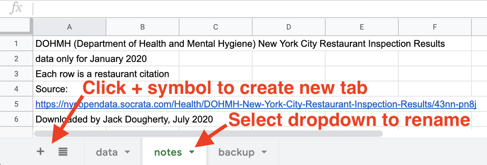{#fig-sheets-with-tabs width=600}

세 번째 단계는 데이터를 정리하거나 수정하기 전에 원본 데이터를 백업해 두는 것입니다. 다중 탭 스프레드시트 도구 내의 간단한 단일 시트 파일의 경우, 데이터가 들어 있는 탭을 마우스 오른쪽 버튼으로 클릭해 다른 탭으로 복제본을 만드세요. 그림 [\@fig-sheets-with-tabs]에 나온 것처럼 말이죠. 새로운 탭의 이름을 백업으로 명확하게 지정하고 그대로 내버려 두십시오! CSV 파일이나 더 복잡한 스프레드시트는 별도의 백업 파일을 만드세요. 확실히 이 간단한 백업 전략은 원본 데이터를 수정 불가능한 상태로 편집하는 것을 방지하는 데만 도움이 됩니다. 여러분의 컴퓨터나 클라우드 계정이 삭제되거나 충돌하는 상황에 대비하여 데이터를 백업할 더 광범위한 전략이 마련되어 있는지 확인하십시오.

파일 이름, 노트 및 백업과 같은 세 가지 소싱 전략을 사용하는 습관을 들이면 데이터 시각화의 신뢰성과 재현 가능성이 향상됩니다. 다음 섹션에서는 "나쁜 데이터" 오류를 줄일 수 있는 방법에 대해 더 살펴볼 것입니다.

## 나쁜 데이터 식별 {- #bad-data}
데이터 검색 결과가 나타나면 또 다른 핵심 단계는 파일을 열고 내용을 빠르게 스크롤하여 "나쁜 데이터(bad data)"가 포함되어 있을 수 있다는 징후를 찾는 것입니다. 초기 단계에서 데이터의 문제를 포착하지 못하면 잘못된 결론으로 이어져 전체 작업의 신뢰성이 저하될 수 있습니다. 다행스럽게도 데이터 시각화 커뮤니티의 구성원들은 이전에 마주쳤던 여러 가지 문제 사례를 공유하여 새로 진입한 이들이 부끄러운 실수를 되풀이하지 않도록 돕고 있습니다. 데이터 저널리스트들이 크라우드소싱하여 만든 자료 중 인기 있는 한 가지는 [The Quartz Guide to Bad Data](https://github.com/Quartz/bad-data-guide)입니다. 다음과 같은 "나쁜 데이터"의 경고 신호를 포함하는 스프레드시트가 있는지 주의하세요:

- 결측값(Missing values): 공백이나 "null" 항목이 표시된다면, 이는 데이터가 수집되지 않았음을 의미합니까? 아니면 응답자가 대답하지 않았을까요? 잘 모르겠다면 데이터 작성자에게 문의하십시오. 또한 사람이 빈값을 표현하기 위해 `0`이나 `-1`을 입력하여 SUM이나 AVERAGE처럼 스프레드시트 수식을 실행할 때 초래되는 결과를 생각하지 못한 경우에도 주의해야 합니다.
- 사라진 선행 0(Missing leading zeros): 코네티컷 주 하트퍼드의 우편번호 중 하나는 `06106`입니다. 누군가가 우편번호 열을 숫자로 변환하면 앞의 0이 제거되어 `6106`으로 나타날 것입니다. 유사하게 미국 인구조사국(US Census Bureau)은 각 지역을 FIPS 코드를 사용해 나열하며 그 중 일부는 유의미한 0 문자부터 시작합니다. 예를 들어 캘리포니아 주 로스앤젤레스 카운티의 FIPS 코드는 `037`입니다. 하지만 누군가가 실수로 텍스트 열을 숫자로 변환하면 0이 삭제되어 `37`로 변경되는데, 이렇게 되면 이 코드가 3자리 숫자여야 제대로 작동하는 기능들이 고장나거나, 몇몇 사람은 이를 노스캐롤라이나 주를 의미하는 2자리 코드로 해석하게 될 수도 있습니다.
- 65,536행 또는 255열: 이것들은 각각 구형 엑셀 스프레드시트가 지원하는 최대 행 수, 또는 애플 Numbers 스프레드시트가 지원하는 최대 열 수입니다. 스프레드시트가 정확히 이 한도에서 멈추면 부분적인 데이터만 있을 확률이 높습니다. 이 글을 쓰는 시점에 [BBC 보도에 따르면 구형 엑셀 스프레드시트의 이러한 행 제한 때문에 Public Health England가 수천 건의 코로나 검사 결과를 잃어버렸다고](https://www.bbc.com/news/technology-54423988) 합니다.
- 일관성 없는 날짜 형식: 예를 들어 2020년 11월 3일은 미국 내 스프레드시트에서 보통 `11/3/2020`(월-일-연도) 형식으로 입력되지만 다른 국가 사람들은 이를 대개 `3/11/2020`(일-월-연도) 형식으로 입력합니다. 출처를 확인하세요.
- 1900년 1월 1일, 1904년, 또는 1970년과 같은 날짜: 이는 Excel 스프레드시트나 Unix 운영체제에서의 기본 타임스탬프이며 실제 날짜 항목이 공백이었거나 덮어써졌을 가능성을 시사합니다.
- `43891`과 유사한 날짜 형식: 2020년도에 Microsoft Excel에 `March 1`을 입력하면 자동으로 `1-Mar`로 표시되지만 엑셀 내부 날짜 시스템에 따르면 내부적으로 `43891`로 저장됩니다. 누군가가 이 열을 날짜 형식에서 텍스트 형식으로 변환할 경우 여러분이 예상했던 날짜가 아닌 엑셀의 5자리 숫자가 표시됩니다.

어떤 스프레드시트 열에서든 데이터 입력의 품질을 검토하는 또 다른 방법은 2장에 설명된 대로 데이터를 [정렬(sort)](#sort) 또는 [피벗(pivot)](#pivot)하거나 6장에서 배울 내용처럼 [히스토그램(histogram)](#histogram-google)을 생성하는 것입니다. 이러한 방법은 특정 열에 나타나는 값의 범위를 빠르게 파악해 나쁜 데이터를 확인하는 데 도움을 줍니다.

위치가 신뢰할 수 없는 위도와 경도 좌표로 번역되는 부실한 [지오코딩(geocoding)](#geocode)으로 인한 나쁜 데이터 역시 조심하세요. 예를 들어 시각화 전문가인 Alberto Cairo는 데이터가 캔자스 주 거주자가 미국 다른 주보다 더 많은 온라인 포르노를 시청한 것처럼 *보이는* 상황을 설명했습니다. 하지만 자세히 분석한 결과, 많은 시청자의 인터넷 프로토콜(IP) 주소가 정확하게 지오코딩되지 않은 이유가 있었습니다. 아마도 가상 사설망(VPN)을 사용하여 위치를 위장함으로써 프라이버시를 보호하고자 했기 때문일 것입니다. 그 결과 지오코딩 도구는 방대한 수의 사용자들을 미국 본토 중심부인 캔자스주 한가운데로 자동 배치하게 된 것입니다.^[@cairoHowChartsLie2019, pp. 99-102] 유사하게 글로벌 데이터가 부실하게 지오코딩될 때, 대서양 본초자오선과 적도가 교차하는 지점(위도 및 경도 좌표가 0, 0인 곳)에 위치한 기상 관측용 부표인 상상의 공간 "[Null Island](https://en.wikipedia.org/wiki/Null_Island)"에 인구가 폭발하게 됩니다. 이러한 이유 때문에 결과를 미국 본토 지리적 중심부 등에 자동으로 잘못 배치하는 도구들로 인해 발생한 지오코딩 오류를 유심히 관찰하십시오(그림 \@fig-bad-geocoding).


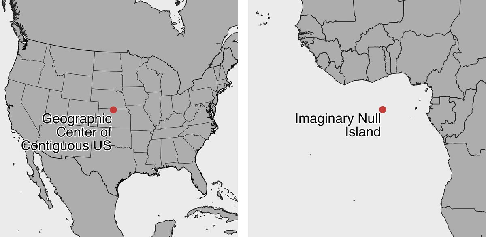{#fig-bad-geocoding width=600}

여러분의 프로젝트에서 나쁜 데이터를 발견했을 때 어떻게 해야 할까요? 때로는 사소한 문제는 비교적 단순하며 전체 데이터세트의 무결성을 훼손하지 않습니다. [4장: 지저분한 데이터 정리하기](#clean)에서 설명한 방법을 사용하여 때때로 이를 해결할 수 있습니다. 그러나 규모가 큰 문제일 경우 더 심각할 수 있습니다. 데이터의 출처 경로를 거슬러 올라가 문제가 어디서 비롯되었는지 파악하십시오. 자체적으로 문제를 찾아 고칠 수 없다면 데이터 제공 업체에 문의하여 조언을 구하십시오. 그들에게 데이터 질을 향상시키고자 하는 강력한 관심이 있어야 하기 때문입니다. 만일 그들이 중요한 데이터 문제를 해결하지 못한다면, 여러분은 멈추어 서서 주의 깊게 고민해야 합니다. 이 경우, 문제가 있는 데이터로 계속 작업하면서 독자들에게 경고문을 덧붙이는 것이 현명할까요? 아니면 데이터 사용을 완전히 중단하고 근본적인 문제를 알리는 것이 더 현명할까요? 이는 쉬운 결정이 아니며 동료들의 의견을 구해야 합니다. 어떠한 경우에도 나쁜 데이터에 대한 경고 신호를 무시하지 마십시오.

마지막으로, 앞서 개략적으로 설명한 주요 단계를 따르면 애초에 나쁜 데이터가 발생하는 것을 막는 데 도움을 받을 수 있습니다. 데이터 파일에 의미 있는 이름을 부여하고 파일 내 별도의 탭을 통해 언제 어디서 얻었는지, 데이터 정의 또는 측정하려는 대상 및 기록 방법 등에 관한 세부 사항 등 관련 출처 노트를 추가하십시오. 공백이나 null 값이 무엇을 의미하는지 설명하고 0이나 다른 기호로 대체하지 마십시오. 데이터를 입력하거나 스프레드시트 수식을 실행할 때 발생할 수 있는 포맷 문제에 항상 주의하십시오.

다음 섹션에서는 데이터를 더 깊은 수준으로 이해하는 데 도움이 되는 더 많은 질문들에 대해 배울 것입니다.

## 데이터에 의문 품기 {- #question}
이제 파일들을 찾고, 출처를 파악하고, 검토했으므로 다음 단계는 표면적으로 드러나는 것 이상으로 깊이 살펴 *데이터에 의문을 제기*하는 것입니다. 메타데이터(metadata)를 읽어보십시오. 메타데이터는 데이터와 그 출처를 설명하는 참고 사항입니다. 데이터를 면밀히 살펴 기원, 맥락, 한계를 더 잘 이해하기 위해 무엇이 명시적으로 언급되어 있고 혹은 언급되지 않았는지 반영해보십시오. 모니터상의 글자와 숫자를 넘어 생각하는 비판적 사고 능력이 필요하기 때문에 컴퓨터가 대신해 주도록 프로그래밍할 수는 없습니다.

한 가지 시작점은 *이 데이터 라벨들은 정말로 무엇을 뜻하는가?*라고 질문하며 잠재적 문제점을 고려해 보는 것입니다:

*축약된 열 제목에 대한 전체 정의는 무엇인가?*

스프레드시트는 흔히 *Elevation(고도)*이나 *Income(소득)* 같은 축약된 열 제목을 포함하고 있습니다. 때때로 원본 소프트웨어가 입력할 수 있는 문자 수를 제한했거나, 제목을 만든 사람이 그저 간략하게 두길 원했을 수도 있습니다. 하지만 *고도*의 단위가 미터입니까 아니면 피트입니까? 축약된 데이터 라벨만으로는 이 핵심 질문에 답할 수 없으므로 출처 노트를 확인하거나, 그것이 불가하다면 측정 단위가 명시된 알려진 출처의 특정 위치 고도와 데이터를 비교해보아야 합니다. 마찬가지로 미국 인구조사 데이터를 다루는 경우, *소득*이라는 약어는 개인당, 가족당, 아니면 가구당 소득 중 무엇을 의미합니까? 나아가 그 값은 *중간값(median)* (숫자 범위 내의 중간 지점)입니까, 아니면 *평균(mean)* (전체 합계를 값의 개수로 나눈 결과)입니까? 출처 노트에서 정의를 확인하십시오.

*데이터는 정확히 어떻게 수집되었는가?*

예를 들어 특정 위치의 *고도*를 지상에 있는 GPS 단말기를 통해 측정했습니까? 아니면 고도 데이터가 포함된 디지털 지도상에 지오코딩되었습니까? 대부분의 경우 이 두 방식은 서로 다른 결과를 산출할 것이며 어느 것이 중요한지는 여러분의 작업에서 요구하는 정밀도에 달렸습니다. 비슷하게 미국 인구조사국이 매년 발표하는 미국 지역사회 조사(ACS)의 *소득* 및 다른 변수에 대한 추정치는 약 4,000명의 인구가 거주하는 인구조사 트랙트 같은 소규모 지역 응답자의 작은 표본에 기반을 두며 이는 매우 큰 오차를 발생시킬 수 있습니다. 예를 들어 평균 가족 소득이 $50,000임에도 불구하고 오차 범위가 $25,000에 이르는 인구조사 트랙트의 [ACS 추정치를 보는 것은 드문 일이 아닙니다](data/ct-tract-income-moe-acs2018.xlsx). 이 말인즉슨 실제 값이 $25,000와 $75,000 사이에 있다는 의미입니다. 결과적으로 이와 같은 작은 지리 단위를 기반으로 한 ACS의 추정치는 사실상 큰 의미가 없게 됩니다. 출처 노트에서 어떻게 데이터가 기록되었는지 확인하고 기재된 어떠한 형태의 오차 범위라도 주의를 기울이십시오. 관련해서는 [6장: 데이터 차트화하기](#chart)에서 오차 막대(error bar)를 생성하는 방법도 참고하십시오.

*데이터가 사회적으로 구성된 정도는 어떠한가?*

데이터 라벨은 지역 및 시간대에 따라 다른 사회적 정치적 맥락 안에서 사람들이 다양한 카테고리를 어떻게 정의했는지를 어떻게 폭로하거나 감춥니까? 예를 들어, 우리는 100년 이상의 미국 인구조사 데이터를 사용해 코네티컷 주 하트퍼드 카운티의 [인종 변화 대화형 역사 지도](https://ontheline.github.io/otl-racial-change/index-caption.html)를 설계했습니다. 하지만 이 수십 년 동안 인구조사의 인종 및 민족 범주는 크게 변화했습니다. 권력을 쥐고 있던 이들이 논쟁의 여지가 있는 용어들을 재정의하고 사람들을 여러 그룹에 다시 배치했기 때문입니다.^[더 심층적인 분석을 원한다면 @andersonAmericanCensusSocial2015 를 참조하세요] 1930년대에 이르기까지 인구조사 관계자들은 보고서에서 "본토 출생 백인(Native White)"과 "외국 출생 백인(Foreign-born White)"을 분리했다가 이후에는 이를 묶어서 대체로 "백인(White)"으로 표기했습니다. 또한 인구조사 관계자들은 1930년에 "멕시코계"를 "기타 인종"으로 분류했다가 1940년에는 다시 "백인"으로 돌려놓았고 1960년에는 "푸에르토리코계 또는 스페인 성씨" 자료를 보고했습니다. 이후 수십 년에 걸쳐 "히스패닉 또는 라티노"를 인종과 분리된 민족 범주로 제시했습니다. 마지막으로 인구조사국은 1980년에 "니그로(Negro)"를 "흑인(Black)"으로 변경했으며 마침내 2000년에는 사람들이 하나 이상의 인종을 선택할 수 있도록 상호 배타적인 인종 구분을 폐지했습니다. 인종과 민족에 대한 사회적 구성이 겪은 이러한 역사적 변화는 우리의 지도 디자인에 영향을 미쳤으며 그에 따라 팝업 창에 각 십 년 단위마다 인구조사와 관련된 범주와 함께 시간이 흐름에 따라 변화하는 "백인" 또는 "백인 단독" 등의 지표를 표기하고 관련된 고민을 설명문과 출처 노트에 명시하도록 이끌었습니다. 여러 시대에 걸쳐 정의가 변화할 때 이처럼 사회적으로 형성된 데이터를 시각화하는 데 단 하나의 유일한 정답은 없습니다. 그러나 데이터에 관한 어떤 선택을 할 때는 노트나 추가 텍스트를 통해 사고의 과정을 설명하십시오.

*데이터의 어느 부분이 불명확하거나 불확실한 채로 남아있는가?*

여기 데이터 작업 시 맞닥뜨리는 역설이 있습니다. 이 데이터를 본인이 아닌 타인이, 특히 먼 곳, 예전 시대 또는 상이한 사회적 계층 출신의 사람이 수집했다면 위 질문들에 전부 답하지 못할 수도 있습니다. 그러나 여러분이 그 질문들에 완전한 답을 얻을 수 없다 할지라도, 여러분이 수집한 정보의 출처, 맥락 및 기본 의미에 대해 좋은 질문을 제기하는 것을 멈추지 마십시오. 우리의 목적은 데이터를 통해 사실적이고 유의미한 스토리를 전하는 것이지만 그 과정은 우리가 수집한 정보에 관해 우리가 아는 것과 모르는 것을 분명히 하는 데서 시작됩니다. 때때로 우리는 [6장의 차트 디자인](#chart-design)에서 배우게 될 오차 막대를 통해 시각적으로 한계를 묘사할 수 있으며 어떨 때는 [15장에서 다루게 될 것처럼 데이터 스토리에서 불확실성을 인정](#sources-uncertainty)해야 합니다.

### 요약 {- #summary3}


이 장에서는 시각화 프로젝트 초기 단계에서 누구나 물어보아야 할 두 가지 광범위한 질문을 검토했습니다: *데이터를 어디서 찾을 수 있는가?*와 *나는 그 데이터에 대해 진정으로 무엇을 알고 있는가?* 우리는 데이터 검색의 가이드 질문, 공공 및 민간 데이터 논쟁에 참여하기, 민감한 데이터의 마스킹 및 집계, 오픈 데이터 저장소 탐색, 데이터 출처 찾기, 나쁜 데이터 인식, 겉으로 보이는 수준 이상으로 데이터에 대한 깊이 있는 질문 제기 등 여러분의 지식과 기술을 향상시키기 위해 이 두 질문을 여러 개의 구체적인 부분으로 나누어 설명했습니다. 이어지는 데이터를 정리하고 대화형 차트 및 지도를 생성하는 장으로 넘어갈 때 이 교훈들을 기억하십시오. [14장: 거짓말 탐지와 편향 줄이기](#detect)에서 이와 관련된 이슈들을 다시 다룰 예정입니다.


<!-- BEGIN FILE: 04-clean.Rmd -->

# 지저분한 데이터 정리하기 {#clean}

데이터세트는 대부분 지저분하고 즉시 시각화하기 어렵습니다.
결측값이 있거나, 서로 다른 형식의 날짜, 숫자 전용 열에 포함된 텍스트, 동일한 열 안의 여러 항목, 같은 이름의 다양한 맞춤법 및 예상치 못한 여러 문제가 나타납니다. 영감을 얻기 위해 그림 [\@fig-clean-up-messy-data]를 참조하십시오. 데이터를 분석하고 시각화하는 시간보다 이를 정리하는 데 더 많은 시간을 쓴다 하더라도 놀라지 마십시오.


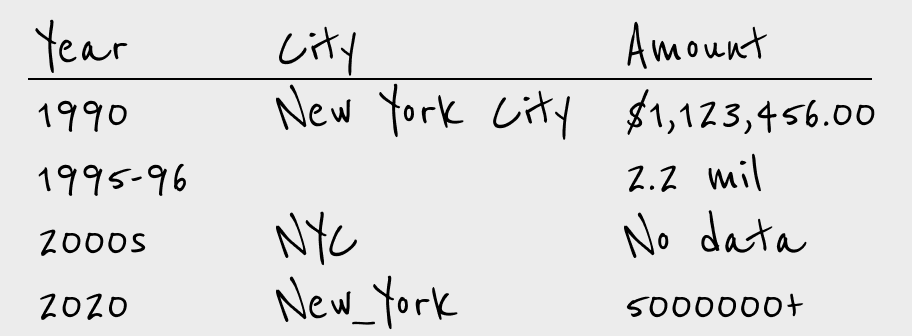{#fig-clean-up-messy-data width=500}

이 장에서는 데이터를 효율적으로 정리하기 위해 사용할 수 있는 여러 도구를 살펴보고 각기 다른 목적에 따라 선택할 수 있도록 합니다. 우선, 불일치하는 데이터를 수정하고 중복을 제거해 주는 [스마트 정리 기능(Smart Cleanup)](#smart-cleanup), [공백을 활용한 찾기 및 바꾸기](#find-and-replace), [행과 열 전치](#transpose), [데이터를 분리하여 서로 다른 열로 만들기](#split-data), [여러 열을 하나로 결합하기](#combine-data), 그리고 [숫자를 텍스트로 변환 및 문자 제거하기](#numbers-to-text) 등 Google Sheets를 사용한 기본적인 데이터 정리 방식을 알아봅니다. 우리는 Google Sheets를 예시로 들지만 이러한 원칙(또는 여러 경우에 동일한 함수)은 Microsoft Excel, LibreOffice Calc, Mac의 Numbers 또는 기타 스프레드시트 패키지에도 적용됩니다. 그런 다음, 전 세계의 데이터 저널리스트 및 연구원들이 소비 데이터, 의료 보고서 등 텍스트 기반 PDF 내 갇힌 다양한 데이터를 분석하는 데 사용하는 무료 도구인 [Tabula를 이용해 PDF 문서에서 표를 추출하는 방법](#tabula)을 배웁니다. 마지막으로, 한 이름에 수십 개의 다른 철자가 들어있는 것처럼 [가장 지저분한 스프레드시트를 정리할 수 있는 다목적의 강력한 툴 OpenRefine](#open-refine)을 소개할 것입니다.

## Google Sheets를 활용한 스마트 정리 {- #smart-cleanup}

데이터 작업을 할 때 Google Sheets를 선택해야 하는 최신 이유 중 하나는 데이터의 오류를 파악해 교정을 제안하는 스마트 정리(Smart Cleanup) 기능입니다. 이 도구는 측면 메뉴를 열고 잠재적 문제점들을 지목하며 사용자는 그 제안을 승인할지 말지 선택할 수 있습니다.

우리가 의도적으로 오류를 심어놓은 인구 상위 10개국 예제 데이터를 사용해, 스마트 정리 기능이 잡아내는 문제와 놓치는 문제가 어떤 종류인지 알아보겠습니다.

1. [Google Sheets의 스마트 정리 예제 데이터 파일](https://docs.google.com/spreadsheets/d/1N06Xv87K9A-veKyQ2FPlT68fzbsN9q6lWv8hAb36K_E/edit#gid=0)을 열고 자신의 계정으로 로그인한 다음, *파일 > 사본 만들기(File > Make a Copy)*로 이동하여 내 Google Drive에 편집할 수 있는 사본을 저장하세요.

2. *데이터 > 데이터 정리 > 정리 제안(Data > Data Cleanup > Cleanup suggestions)*으로 이동하여 그림 [\@fig-sheets-cleanup-suggestions]처럼 사이드바에 나타나는 항목을 확인하세요.


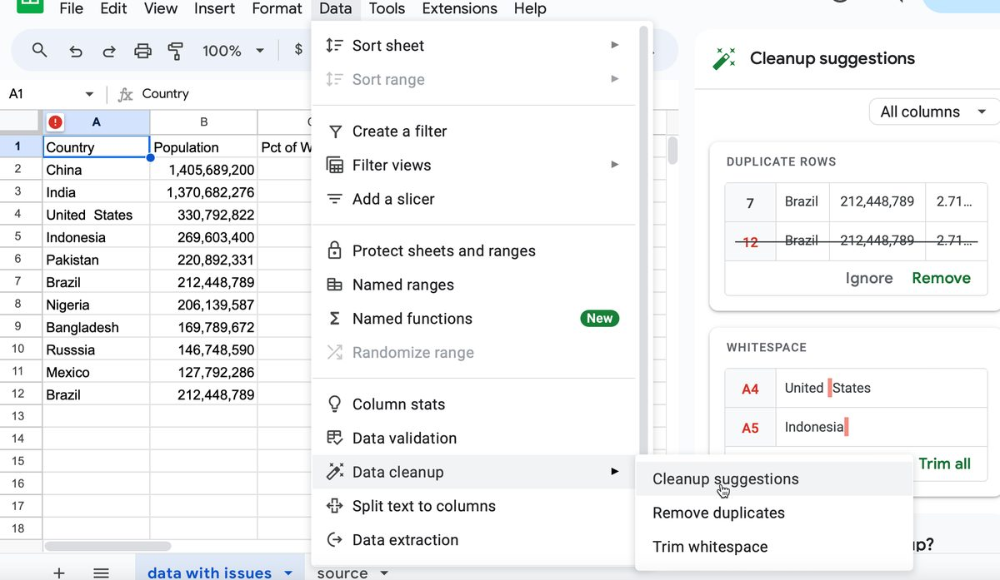{#fig-sheets-cleanup-suggestions width=650}

스마트 정리 기능이 중복 입력(12행)과 셀 A4 및 A5의 공백 문자를 성공적으로 잡아냈습니다. 녹색의 *제거(Remove)* 및 *모두 여백 자르기(Trim all)* 버튼을 눌러 Google Sheets가 이를 정리하도록 승인하세요.

하지만 스마트 정리가 놓친 또 다른 오류를 발견할 수 있나요?

- 셀 A10에 *Russsia*는 문자 *s*가 하나 더 추가되어 오기재되었습니다.
- 셀 C6에 파키스탄의 세계 인구 비중은 백분율이 아니라 십진수(소수) 형태로 나타나 있습니다.
- 셀 D4에 날짜 형식이 다른 입력 내용과 다른 형태로 되어 있습니다. 서로 다른 국제 날짜 형식을 알고 있다면, `12/10/2020`이 미국에서 흔히 쓰이는 MM/DD/YYYY(월/일/연도) 형식인지, 다른 곳에서 쓰이는 DD/MM/YYYY(일/월/연도) 형식인지 궁금할 것입니다. 스마트 정리는 이에 대해 답해 줄 수 없습니다.

Google Sheets의 스마트 정리 기능은 시작하기에 매우 좋습니다. 그러나 데이터가 너무 엉망이라면 이 장의 뒷부분에서 설명할 [OpenRefine](#open-refine)과 같이 좀 더 정교한 툴로 전환해야 할 수 있습니다. 다음 섹션에서는 모든 스프레드시트에서 작동하는 또 다른 정리 방식인 공백을 이용한 찾기 및 바꾸기를 살펴봅니다.

## 공백을 이용한 찾기 및 바꾸기 {- #find-and-replace}

모든 스프레드시트 안에서 활용할 수 있는 가장 간단하면서도 강력한 정리 도구 중 하나는 *찾기 및 바꾸기(Find and Replace)* 명령어입니다. 국가 이름 축약(예: *Republic of India*를 *India*로), 국가명 확장(예: *US*를 *United States*로), 또는 이름 번역(예: *Italy*를 *Italia*로)과 같은 이름의 다양한 철자를 한 번에 바꾸는 용도로 사용할 수 있습니다. 또한 이 찾기 및 바꾸기는 숫자 셀에 덧붙은 단위명을 지울 때(*321 kg*을 *321*로 변경)도 쓸 수 있습니다.

*찾기 및 바꾸기*를 실제로 살펴보겠습니다. 미국 인구조사 데이터의 흔한 문제는 지명에 불필요한 단어들이 포함된다는 것입니다. 예를 들어 코네티컷 타운 인구 데이터를 다운로드 받으면, location(위치) 열 내 각각의 이름 뒤에 "town"이라는 단어가 들어 있습니다.

```
Hartford town
New Haven town
Stamford town
```

하지만 여러분은 대개 데이터 차트를 생성하거나 다른 데이터세트에 통합하기 위해 다음처럼 깔끔한 타운 이름을 원합니다:

```
Hartford
New Haven
Stamford
```

169개의 코네티컷 타운 이름과 그 인구가 기재된 예제 파일을 사용해 각 장소 이름 뒤에 원치 않게 붙은 "town"이라는 단어를 *찾기 및 바꾸기*를 통해 삭제해 보겠습니다.

1. [Google Sheets의 CT Town Geonames 파일](https://docs.google.com/spreadsheets/d/1kJI0xFedPUQBRfT9CEMAfIsggOmJv4wz_AdenraFDP4/edit#gid=1055822816)을 열고 자신의 계정으로 로그인한 후 *파일 > 사본 만들기(File > Make a Copy)*를 선택하여 Google Drive에서 편집할 수 있는 사본을 만드세요.

2. 열 헤더를 클릭하여 수정할 열을 선택하세요. 열을 선택하지 않으면 스프레드시트 전체를 대상으로 찾기 및 바꾸기가 수행됩니다.

3. *수정(Edit)* 메뉴에서 *찾기 및 바꾸기(Find and replace)*를 선택합니다. 그림 [\@fig-sheets-find-replace]처럼 창이 나타납니다.

4. *찾기(Find)* 영역에 ` town`이라고 입력합니다. 반드시 해당 단어 전에 공백을 추가하십시오. 공백을 입력하지 않으면 *Newtown*과 같은 이름에서 실수로 *town* 부분을 함께 제거하게 될 수 있습니다. 또한 선행 공백을 주지 않을 경우 다른 문자 뒤에 빈 공간만 덩그러니 남는 후행 공백(trailing space)이 생성되어 훗날 문제를 유발할 수 있습니다.

5. *바꿀 내용(Replace with)* 영역은 공백인 상태로 둡니다. 공백 문자조차 입력하지 마세요. 비워두기만 하십시오.

6. *검색(Search)* 필드는 2번 단계에서 선택한 범위(혹은 범위를 지정하지 않았다면 *모든 시트(All sheets)*)로 설정되어야 합니다.

7. 당신에게는 *대소문자 일치(match case)*를 선택할 수 있는 옵션이 있습니다. 이것이 선택되어 있다면 `town`과 `Town`과 `tOwN`은 다르게 취급될 것입니다. 이 예제에서는 *대소문자 일치*를 선택 해제(언체크) 상태로 두면 됩니다.

8. *모두 바꾸기(Replace all)* 버튼을 누릅니다. 예제 파일은 총 169개의 마을 이름을 담고 있으므로 "town"이라는 169개의 인스턴스가 바뀌었다는 안내 창이 뜰 것입니다.

9. 결과를 확인해 보십시오. *Newtown*과 같이 지명 자체에 *town*이 들어간 단어가 아무런 문제 없이 잘 남았는지 파악하십시오.


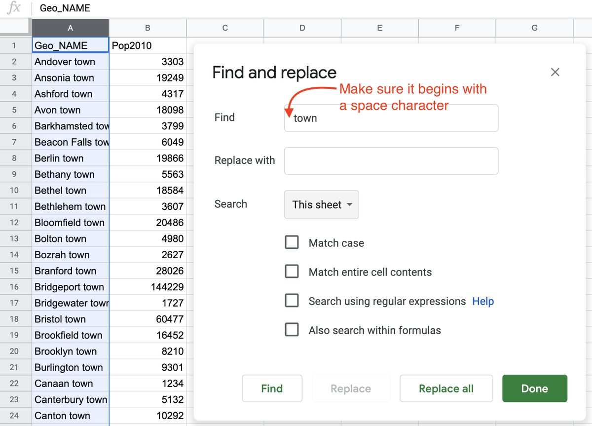{#fig-sheets-find-replace width=500}

## 행과 열 전치 {- #transpose}
때때로 유용한 데이터를 다운로드했음에도 원하는 차트나 지도를 생성하기 위해 행과 열을 서로 맞바꾸거나 전치(transpose)해야 하는 상황이 발생합니다. 이는 종종 시계열이나 역사 데이터를 다룰 때 생기는데, 표와 차트에서는 이를 정반대 방식으로 다루기 때문입니다. 표를 기획할 때는 왼쪽에서 오른쪽으로 읽을 수 있도록 날짜를 열 헤더로 수평 배치하는 것이 올바른 방법입니다.^[@fewShowMeNumbers2012, p. 166]

```
| Year    | 2000 | 2010 | 2020 |
|---------|------|------|------|
| Series1 |  333 |  444 |  555 |
| Series2 |  777 |  888 |  999 |
```

하지만 [6장: 데이터 차트화하기](#chart)에서 배울 Google Sheets 및 유사 도구를 활용한 꺾은선형 차트(line chart) 기획 시에는 소프트웨어가 이를 데이터 시리즈를 묘사하는 라벨로 읽을 수 있도록 다음과 같이 날짜를 첫 번째 열에 수직으로 전치해야 합니다.

```
| Year | Series1 | Series2 |
|------|---------|---------|
| 2000 |     333 |     777 |
| 2010 |     444 |     888 |
| 2020 |     555 |     999 |
```

예제 데이터에서 행과 열을 전치하는 방법을 배워보세요:

1. [Google Sheets의 행렬 전치(Transpose) 예제 데이터 파일](https://docs.google.com/spreadsheets/d/1s7MwJMY_vNkvNNJDAl0HJMO6fzxCNj4eMA5fBZ1pZgU/edit#gid=0)을 열고 자신의 계정으로 로그인한 다음, *파일 > 사본 만들기(File > Make a Copy)*로 이동하여 편집할 수 있는 복사본을 Google Drive에 만드세요.

2. 전치하려는 모든 행과 열을 선택하고 *수정 > 복사(Edit > Copy)*로 이동하세요.

3. 스프레드시트의 아래쪽으로 더 스크롤하여 셀 하나를 클릭하거나 새 탭을 열고 *수정 > 선택하여 붙여넣기 > 행/열 바꿈(Edit > Paste Special > Paste Transposed)*으로 이동하세요(그림 \@fig-sheets-transpose 참조).


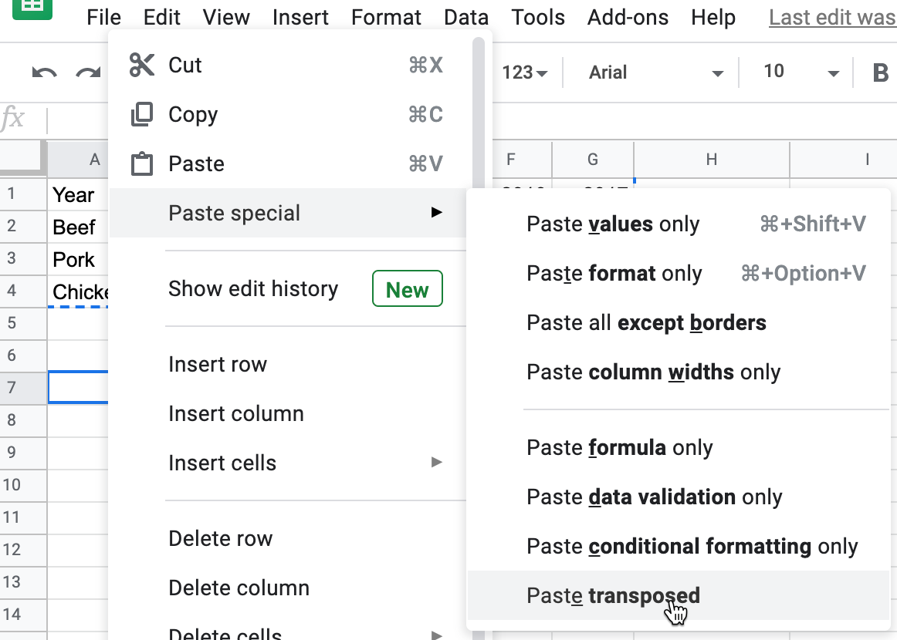{#fig-sheets-transpose width=450}

팁: Google Sheets는 *=transpose( -삽입 범위- )* 기능도 제공하는데, *선택하여 붙여넣기 > 행/열 바꿈*과 달리 스프레드시트의 기존 데이터를 덮어쓰는 것을 방지합니다.

데이터를 다듬기 위해 행과 열을 교차하는 방식을 알게 되었으므로 다음 장에서는 서로 다른 열로 데이터 분할하기를 배워보겠습니다.

## 데이터를 서로 다른 열로 분할하기 {- #split-data}

성 이름(`John Doe`), 지리 좌표(`40.12,-72.12`) 혹은 주소(`300 Summit St, Hartford, CT, 06106`) 등 한 셀에 다양한 데이터가 함께 나타나는 경우가 있습니다.
분석하려면 이것들을 별개의 항목으로 나눠야 할 때가 있습니다. *FullName* 열(안에 `John Doe` 기재)을 *FirstName* (`John`)과 *LastName* (`Doe`) 열로 나누고,
좌표를 *Latitude*와 *Longitude* 열로 나누며 *FullAddress* 열을
*Street*, *City*, *State* 및 *Zip*(우편번호)의 4개 열로 나누는 식으로 말입니다.

### 예시 1: 단순 분할 {-}

가장 먼저 다룰 내용은 지리적 좌표 쌍이 콤마를 통해 구분되어 있을 때, 각각의 열로 나누는 방식입니다.

1. [Google Sheets 내 단순 좌표 쌍 분할 샘플 데이터(Split Coordinate Pairs sample data)](https://docs.google.com/spreadsheets/d/1VmY9aS7I7UstXeI2xsJ-Ep2Q0CW8tnFHWTCga4EaJRk/edit#gid=1670822958)를 열고 본인 계정 로그인 후, 내 드라이브에 저장해 편집할 수 있도록 *파일 > 사본 만들기(File > Make a Copy)*로 이동하세요.

2. 열 전체든 몇몇 행이든 구분하고 싶은 데이터를 선택하세요.
참고로 분할은 한 번에 1개의 열만 가능합니다.

3. 분할하려는 열의 우측에 어떠한 데이터도 존재해서는 안 됩니다.
분할 데이터로 기존 정보를 덮어쓸 것이기 때문입니다.

4. 그림 [\@fig-sheets-split]처럼 *데이터(Data)*로 간 뒤 *텍스트를 열로 분할(Split text to columns)*을 선택하십시오.

5. Google Sheets는 어떠한 구문자(separator)를 써야 할지 스스로 파악할 것입니다. 구문자는 드롭다운 목록에서 *자동 감지(Detect automatically)*로 잡히며 좌표 쌍은 콤마를 중심으로 나눠졌습니다. 이외에 콤마(`,`), 세미콜론(`;`), 마침표(`.`), 공백 문자 혹은 당신이 원하는 여러 개별 문자(섹션 예시 2에서 논의하게 될 특수 문자 배열 등)를 활용하여 수동으로 변경할 수 있습니다.

6. 새롭게 생성된 열의 이름을 *Longitude*(첫 번째 숫자)와 *Latitude*(두 번째 숫자)로 정할 수 있습니다.


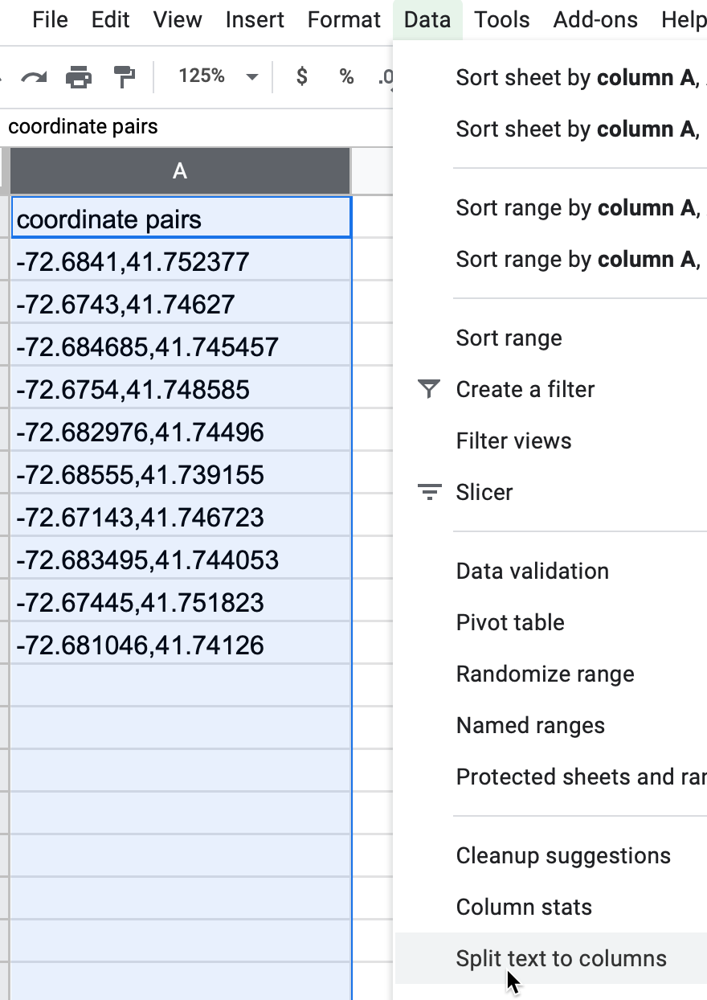{#fig-sheets-split width=350}

### 예시 2: 복합 분할 {-}
이제 조금 더 복잡한 예시를 살펴봅시다. 각 셀에 Street, City, State, 그리고 Zipcode(우편번호) 등 4가지 열로 나눠져야 할 전체 주소가 담겨있습니다. 하지만 구분자가 서로 다릅니다. 길과 시는 콤마로, 시와 주는 빈 공간으로, 주와 우편번호는 두 줄 대시로 나뉩니다. 이런 경우에는 데이터가 각자의 열로 나눠질 수 있도록 특정 지시를 수동으로 제공해야 합니다.

```
| Location                          |
| --------------------------------- |
| 300 Summit St, Hartford CT--06106 |
| 1012 Broad St, Hartford CT--06106 |
| 37 Alden St, Hartford CT--06114   |
```

1. [Google Sheets 안 복잡 주소 분할 예시 파일(Split Complex Address sample file)](https://docs.google.com/spreadsheets/d/1XkWrHBCK5HedAWskkb5lligWoozBVXc6w7_FRuYebPI/edit#gid=0)을 열어 로그인 후, 내 드라이브 안에서 편집할 수 있도록 *파일 > 사본 만들기(File > Make a Copy)*로 가 파일을 저장하세요.

2. 열을 선택하고 분할을 왼쪽에서 오른쪽으로 시작하기 위해 *데이터(Data)* > *텍스트를 열로 분할(Split text to columns)*로 이동하십시오.

3. Google Sheets는 자동적으로 셀 안 내용을 `300 Summit St` 및 `Hartford CT--06106`과 같이 콤마를 기점으로 나눕니다. (만약 이렇게 되지 않는다면 뜬 드롭다운 메뉴 안에서 콤마(Comma)를 설정하십시오).

4. 두 번째 열 부분만 따로 선택한 뒤에 다시금 *텍스트를 열로 분할*을 수행합니다. 자동적으로 공백 문자를 구분자로 잡아내 주와 우편번호로부터 도시 부분을 나눠줄 것입니다. (만일 그렇게 되지 않는다면 드롭다운 메뉴에서 *공백(Space)*을 선택하십시오).

4. 마지막으로, 세 번째 열을 선택하고 한 번 더 *텍스트를 열로 분할*을 실행하세요. Google Sheets는 두 줄 대시를 구분자로 자동 인식하지 않기 때문에, 사용자가 수동으로 *맞춤(Custom)*을 선택하고 *맞춤 구분자(Custom separator)* 입력 창에 그림 [\@fig-sheets-split-complex]처럼 대시 2개(`--`)를 타이핑한 후 엔터키를 눌러야 합니다. 이제 4가지의 분리된 열 안에 전체 주소를 성공적으로 나누었습니다.


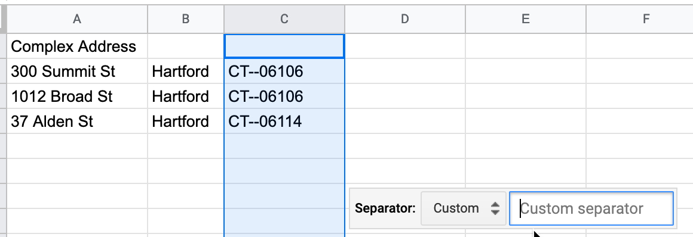{#fig-sheets-split-complex width=550}

팁: Google Sheets는 우편번호를 숫자로 취급하고 선행하는 숫자 0을 전부 지울 것입니다(따라서 06106이 6106으로 잡히게 됨). 이를 방지하기 위해서 열을 누른 후 *서식 > 숫자 > 일반 텍스트(Format > Number > Plain text)* 순서로 이동하십시오. 이렇게 되면 숫자 0이 다시 생겨날 수 있습니다. 데이터의 규모가 매우 방대하다면 [이후 설명되는 섹션](#combine-data)에 나타난 공식을 활용해 숫자 0을 다시 나타낼 수 있습니다.

## 여러 열을 하나로 결합하기 {- #combine-data}
앰퍼샌드 기호(`&`)를 사용해 스프레드시트 수식으로 데이터를 한 열로 합치는(또는 연쇄시키는) 역동작을 해봅시다. 만일 길거리 주소, 시, 주, 우편번호 4개 열로 분할된 주소 데이터를 받았다고 상상해보세요.

```
| Street        | City       | State  | Zip   |
| ------------- | ---------- | ------ | ----- |
| 300 Summit St | Hartford   | CT     | 06106 |
```

하지만 모든 데이터를 아래와 같이 하나의 열로 통합할 필요가 있는 [2장에서 설명한 것 같은 도구를 사용해 주소를 지오코딩](#geocode)해야 한다고 상상해보세요.

```
| Location                          |
| --------------------------------- |
| 300 Summit St, Hartford, CT 06106 |
```

모든 스프레드시트에서, 앰퍼샌드(`&`) 기호를 사용해 
항목을 통합하거나 이어 붙이는(concatenate) 단순한 공식을 쓸 수 있습니다. 또한, 인용 부호가 포함된 공백(`" "`), 공백 및 콤마(`", "`) 등의 구분자를 수식 안에 결합해 활용 가능합니다. 몇 가지 예시를 함께 봅시다.

1. [Google Sheets의 개별 열 결합(Combine Separate Columns) 샘플 데이터](https://docs.google.com/spreadsheets/d/1DGKYquQ0nKiBCE_KbQk24Zvjrxb0zKk8gC-FpObY7LM/edit#gid=0)를 열고 본인의 계정 로그인 후, 개인의 구글 드라이브 안에서 편집할 수 있도록 *파일 > 사본 만들기(File > Make a Copy)*로 가십시오. 시트에는 street(길), city(시), state(주), zip(우편번호) 4가지 열로 나눠진 주소가 포함되어 있습니다.

2. E열에 *location*이라는 새로운 제목을 입력합니다.

3. E2 셀에서, `=A2 & ", " & B2 & ", " & C2 & " " & D2`를 치십시오. 그림 [\@fig-sheets-combine]처럼 이 수식은 4개의 항목을 앰퍼샌드 기호를 통해 합치며 각 내용을 인용 부호 속 콤마와 띄어쓰기로 분리해 줍니다. 그러고 나서 *Enter*키를 누르세요.

4. E2 셀을 선택한 뒤 셀 오른쪽 하단 구석의 십자가 아이콘을 드래그해 열 아래로 모두 드래그하십시오.


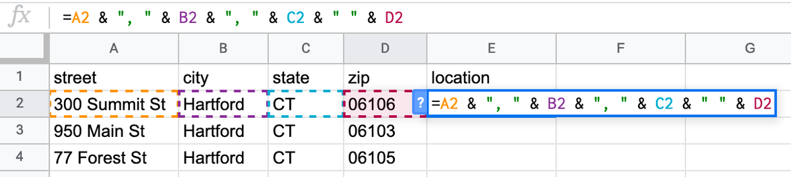{#fig-sheets-combine}

이제 location 열에 단어들을 성공적으로 통합하였으며 위도 및 경도 좌표를 찾기 위해 [2장에서 묘사한 SmartMonkey Google Sheets 애드온 지오코딩 툴](#geocode)을 사용하여 [7장에서 토론할 방식으로 여러분의 데이터 지도를 제작할](#map) 수 있습니다.

보다 깊은 학습을 위해 데이터 분석 및 시각화를 목적으로 스프레드시트를 정리하고 채비하는 법이 담긴 Lisa Charlotte Rost의 훌륭한 [Datawrapper 블로그 게시물](https://blog.datawrapper.de/prepare-and-clean-up-data-for-data-visualization/)을 읽어볼 것을 추천합니다.^[@rostHowPrepareYour2019]

스프레드시트는 각 열을 통합하는 데 탁월한 수단을 제공합니다. 다음 섹션에서는 숫자를 문자 데이터로 바꾸는 다른 스프레드시트 함수의 역할에 대해 안내합니다.

## 숫자를 텍스트로 변환 및 문자 제거 {- #numbers-to-text}

미국 인구조사 데이터나 지리 파일을 유사하게 활용할 때는 데이터 정리 능력이 종종 필요합니다. 미국 인구조사국(US Census)은 본 서적의 [데이터 검색을 위한 가이드 질문 섹션](#guiding)에서 다룬 대로 주, 카운티 및 인구조사 트랙트 같은 상이한 형태의 경계에 관한 데이터를 배포합니다. 이 지리 항목들에는 각각 고유한 미 연방 정보 처리 표준(FIPS) 코드가 붙어 있습니다. 주 단위의 코드는 2개의 숫자(예시: 코네티컷주는 09)로 이루어졌고 카운티 코드는 5개 숫자(예시: 코네티컷주 하트퍼드 카운티 09003 - 처음 2개 숫자는 주 단위 의미)로 되어 있습니다. 계층을 좀 더 파고들자면 인구조사 트랙트는 11개의 숫자(예시: 09003503102 - 주의 의미인 2자리 숫자 + 카운티 의미인 3자리 숫자 + 트랙트 의미인 6자리 숫자 조합)로 존재합니다. 아울러 미국의 인구조사 트랙트 경계는 시간이 흐름에 따라 변화한다는 점을 짚고 넘어가야겠습니다. FIPS 코드들은 시간의 경과에 상관없이 늘 비슷하게 생겨왔으나 좀 더 들여다보면 2010년에서 2020년 사이 넘버링 규칙이나 지리적 경계에 크나큰 차이점들이 있을 수 있습니다. 예를 들면 일리야(Ilya)가 2010년에서 2020년 사이의 CT 데이터 콜라보레이티브(CT Data Collaborative) 블로그에 올린 [코네티컷 인구조사 구역 경계가 변화하고 있다(Connecticut Census Tract Boundaries are Changing)](https://www.ctdata.org/blog/2020-census-geography-connecticut)는 내용의 다채로운 게시물을 살펴보세요.

미국 인구조사 트랙트 데이터 관련 지도를 준비하려면 대개 스프레드시트 상의 기나긴 FIPS 코드를 활용할 매핑 도구 속 상응하는 코드에 일치시킬 필요가 있습니다. 가끔씩 열의 데이터 라인과 매핑이 맞지 않는 순간이 있다면 약간의 정리가 필요합니다. 한 가지 예로 아래 그림 [\@fig-census-code-mismatch]의 좌측에 나온 미국 인구조사 트랙트 스프레드시트와 Datawrapper 맵 도구가 제공하는 우측의 트랙트 코드를 비교해 봅니다. 왼쪽의 가장 처음 항목 `9001010101`이 오른쪽의 첫 번째 항목 `001010101`과 제대로 일치하지 않습니다. 데이터 열을 매치시켜 매핑을 시작하려면 먼저 약간의 데이터를 정리해야 합니다.


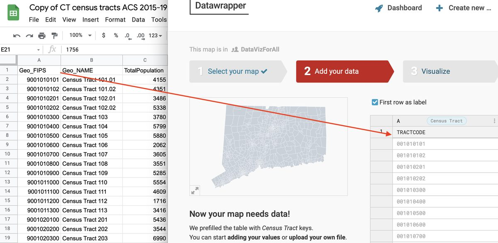{#fig-census-code-mismatch}

이 상황에서 우리는 형식(format)과 길이(length), 데이터 정리가 필요한 두 가지 문제와 마주칩니다. 첫 번째 애로사항은 왼쪽의 FIPS 코드들이 *숫자(numbers)* 형태(대개 스프레드시트에서 우측 정렬로 됨)인 반면, 오른쪽 코드들은 *텍스트(text)* 또는 *문자열 데이터(string data)* (주로 좌측으로 정렬됨) 형태로 설정되었다는 점입니다. 오로지 이 문제뿐이라면 해당 열을 묶어서 Format > Number > Plain Text(서식 > 숫자 > 일반 텍스트)로 손쉽게 바꿀 수 있습니다.

허나 2번째 오류로 인해 우측 데이터는 10자리 숫자인데 좌측은 9자리 텍스트 문자로 구성되어 있습니다. 자세히 들여다본다면 왼쪽의 스프레드시트 데이터 첫 머리글자에 나오는 숫자 `9`가 매핑 도구의 리스트에는 존재하지 않는 것을 깨닫게 됩니다. 초기 설정에 따르면 좌측 데이터 전부가 코네티컷주의 FIPS 코드를 나타내는 `09`로 시작했지만 스프레드시트가 이를 수치로 치환해 버리면서 앞의 0을 지워버렸고 이는 왜 11자리 FIPS 코드가 10자리로 변환되어 나타나게 되었는지 설명해 줍니다.

다행히도 수식 하나로 두 문제를 한꺼번에 해결할 수 있습니다. Google Sheets의 `=RIGHT` 공식은 숫자 형태의 값을 문자열(문자) 값으로 치환함과 동시에 지정된 문자의 자릿수만큼 우측으로부터 세어 남겨지도록 만듭니다. 이번 예시에서 우리는 10자리 숫자인 `9001010100`을 앞의 문자 `9`를 뺀 9자리의 숫자로 이루어진 `001010100` 문자로 변환하려 합니다. `=RIGHT(A2,9)` 공식을 B2 셀에 넣게 되면, `9`라는 수식이 오른쪽에서부터 9자리의 숫자를 남기겠다는 의미가 되어 그림 [\@fig-census-code-cleaned]과 같이 열 전체에 적용됩니다.


{#fig-census-code-cleaned}

이제 2개의 데이터 열이 모두 일치하게 되며 [7장: 데이터 지도화(Map Your Data)](#map)에 나온 대로 코로플레스 지도(choropleth map) 제작을 위해 스프레드시트 인구조사 트랙트 데이터를 지도 제작 툴과 연동시킬 수 있습니다. 연관된 자세한 내용은 [Google Sheet 공식을 참고하십시오](https://support.google.com/docs/topic/9054603).

스프레드시트는 데이터를 찾아 변경하고 특정 문자를 삭제하거나 숫자를 여러 문자 데이터로 치환하는 것은 물론 여러 열의 데이터를 하나로 통합 및 다수로 세분화하는 데 유용합니다. 하지만 원하는 데이터 테이블이 PDF 안에 갇혀 있는 형태라면 어떨까요? 다가오는 섹션에선 Tabula라는 프로그램을 소개하여 텍스트형 PDF 문서를 표 형태의 데이터로 도출하여 스프레드시트 안에서 분석하는 방식을 알리겠습니다.

## Tabula를 사용해 PDF에서 표 추출하기 {- #tabula}

우리가 흥미를 느끼는 데이터세트가 PDF 문서 형태로만 제공되는 경우가 종종 있습니다. 낙담하지 마세요. *아마도* Tabula를 사용하여 표를 추출하고 CSV 파일로 저장할 수 있을 것입니다. PDF는 대개 텍스트 기반과 이미지 기반 두 가지 형태로 제공된다는 것을 명심하세요. PDF에서 커서로 텍스트를 드래그해 복사-붙여넣기 할 수 있다면 이는 텍스트 기반이라는 의미이며 Tabula를 적용하기 수월합니다. 반면 PDF 내에서 각 항목을 복사하거나 붙여넣을 수 없다면 이미지 형태일 확률이 높고 이는 곧 원본 문서를 스캔하여 제작했음을 뜻합니다. 이미지 기반 PDF를 텍스트 기반으로 변환하기 위해서는 광학식 문자 판독(OCR) 소프트웨어, 예컨대 Adobe Acrobat Pro나 다른 도구를 써야 합니다. 게다가 Tabula는 오로지 표에서 데이터를 가져올 수 있을 뿐 차트나 다른 형태의 시각화 도구에서는 자료를 추출해 낼 수 없습니다.

Tabula는 브라우저 안에서 자바로 실행되는 무료 툴이며 맥, 윈도우 및 리눅스 컴퓨터 체제 모두에 사용 가능합니다. 사용자의 기기에 직접 돌아가며 클라우드로 데이터를 내보내지 않아 개인적인 문서 이용 시에도 알맞습니다.

시작하기에 앞서, [가장 최신 형태의 Tabula를 다운로드하십시오](https://tabula.technology/).
페이지의 좌측면에 있는 내려받기 버튼을 클릭하거나 플랫폼에 맞는 복사본을 받기 위해 밑으로 마우스를 내려 *Download & Install Tabula* 섹션을 누르십시오. 대부분의 다른 소프트웨어들과 다르게 별도 인스톨을 요하지 않으며 압축된 다운로드 파일을 풀어 아이콘을 누르면 됩니다.

맥 이용자의 경우 Tabula 첫 실행 시 "Tabula는 인터넷에서 다운로드된 앱입니다. 열기를 진행하시겠습니까?"라는 문구가 뜰 수 있습니다. 만약 그렇다면 그림 [\@fig-tabula-mac-alert]과 같이 *열기(Open)*를 클릭하십시오.


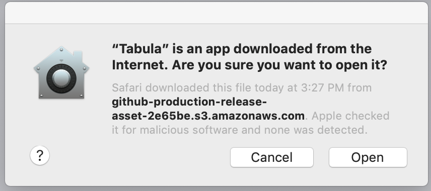{#fig-tabula-mac-alert width=350}

Tabula가 구동되면 기본설정된 웹 브라우저 안에서 `http://127.0.0.1/` 와 같이 별도의 URL 링크로 접속할 수 있으며 또는 `:8080` 포트의 접속도 그림 [\@fig-tabula-welcome]같이 가능합니다. Tabula는 로컬 컴퓨터에서 돌아가며 인터넷 연결과는 무관하게 작동합니다. Safari나 Edge 같은 웹 브라우저를 쓰고 있다면 이를 지원하는 타 웹 사이트(예: Firefox, Chrome)로 옮겨 해당 URL 주소를 붙여 넣으십시오.


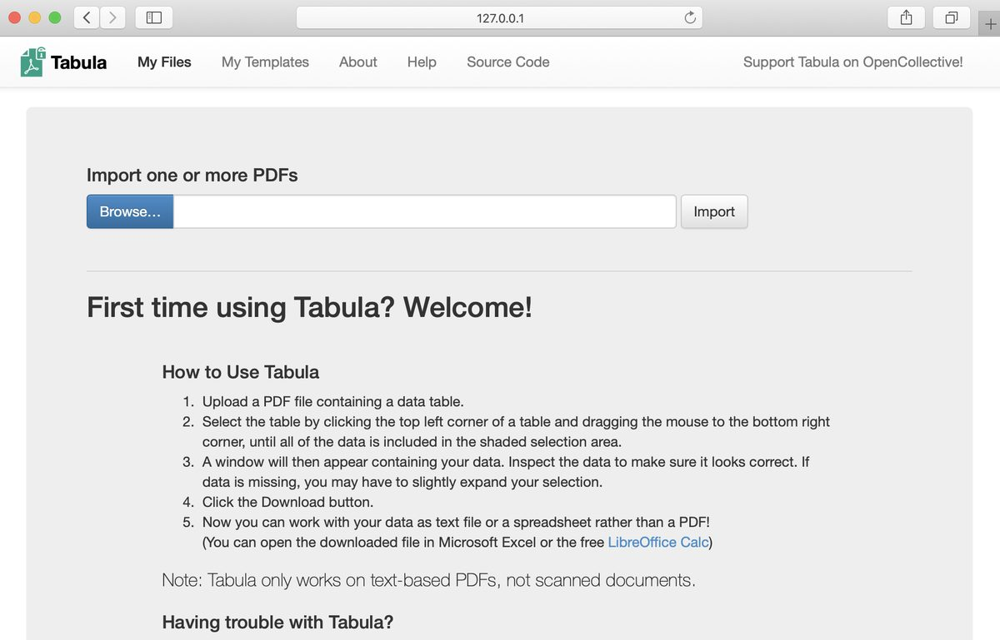{#fig-tabula-welcome}

이제 우리의 텍스트 기반 PDF를 업로드하여 어떠한 종류의 표를 추출해낼 수 있을지 찾아봅시다. Covid-19 범유행의 시작 단계에서 코네티컷 주 공공보건부(Department of Public Health)는 코로나19 감염 사례 및 사망자를 오직 PDF 폼으로만
배포한 적 있습니다.
이번 데모 시연을 위해 우리는 2020년 5월 31일 자의 [텍스트 기반 PDF 예시 폼](data/ct-dph-covid-2020-05-31.pdf)을 차용하거나 각자의 것을 씁니다.

1. 데이터 추출을 원하시는 해당 PDF를 *찾아보기...(Browse...)* 버튼을 통해 골라 주십시오.

2. *Import* 키를 누르면 Tabula가 파일을 해석하기 시작합니다.

3. Tabula가 PDF 문서 열람을 끝마치고 나면 각 페이지의 개별 PDF 내역을 보여줍니다. 인터페이스는 아주 간결하며 메인창 위에 4개의 항목만 보입니다.

4. *표 자동 감지(Autodetect Tables)*를 누르게 되면 Tabula는 각 데이터 내역들을 살펴보게 됩니다. 그림 [\@fig-tabula-autodetect]에서 보듯 해당 툴은 각각의 발견된 데이터 테이블을 붉은 선으로 그려냅니다.


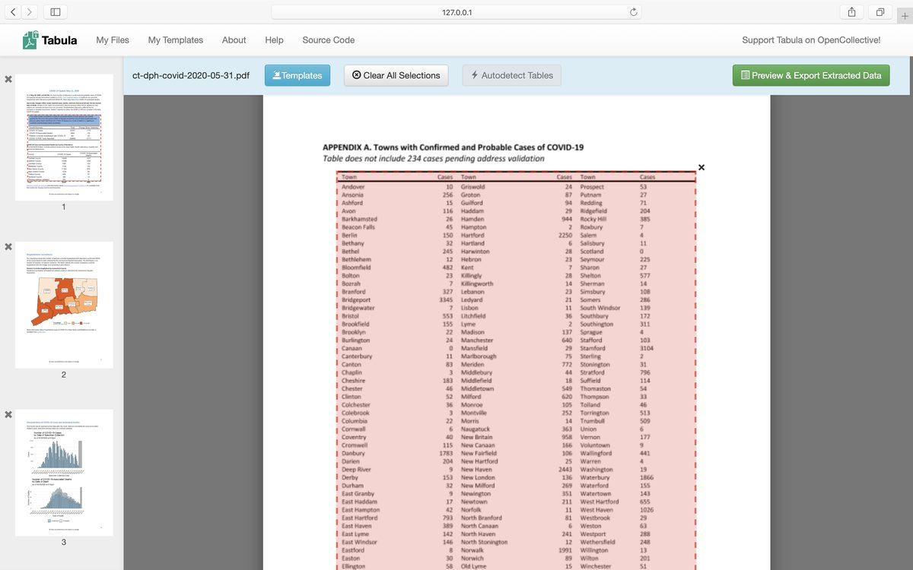{#fig-tabula-autodetect}

이제 각각 선택된 테이블의 세부 사항을 직접 조율하여 밖으로 추출해냅니다.

5. *추출된 데이터 미리보기 및 내보내기(Preview & Export Extracted Data)* 녹색 버튼을 누르면 Tabula가 데이터를 추출할 때 나오는 예상 결과물이 도출됩니다.

6. 만약 표를 검토할 시 원하는 데이터가 포함되지 않았다면, 왼편의 설정 바에 위치한 *스트림(Stream)*이나 *격자(Lattice)* 폼을 변환해 보세요.

7. 변경 후에도 원하는 데이터 형태가 나오지 않았다거나, 자동 감지 기능이 인식한 쓸모없는 표가 들어가 있다면 *선택 수정(Revise selection)* 버튼을 눌러보십시오. 그럴 경우 PDF 열람 기능이 다시 작동합니다.

8. 이제 여러분은 *모든 선택 지우기(Clear All Selections)* 버튼을 클릭해
원하는 표의 부분을 수동으로 체크할 수 있습니다. 마우스의 드래그 앤 드롭 움직임을 통해 필요한 부분에 씌워주면 됩니다.

9. 하나나 다수의 페이지 복사가 필요한 경우에는 선택 영역 우측 하단에 있는 *현재 영역 반복(Repeat this Selection)*의 드롭다운 버튼을 사용하십시오. 이는 여러 유사한 형태의 PDF 문서를 추출해낼 때 강력한 툴로 활용됩니다.

10. 모든 게 원하시는 상태로 맞춰졌다면 추출(export)하시면 됩니다. 저희는 CSV 포맷 방식의 추출을 권고해 드립니다. 그러나 여러 개의 표가 들어있어 다수의 작업을 해야 한다면, 드롭다운 내 추출 방식을 *CSV 모음 압축(zip of CSVs)* 기능으로 바꾸어 보는 것을 권합니다. 이런 방식을 취하면 파일들이 각각 저장될 수 있습니다.

파일들이 여러분의 컴퓨터로 이동되면 각자의 스프레드시트로 문서를 불러와 원하시는 정보 분석이나 데이터 시각화의 활용 용도로 만져볼 수 있습니다.

하지만 PDF 문서에서 표를 추출했다고 하더라도 여전히 지저분할 수 있습니다. 그래서 차후 우리는 아주 강력하고 신뢰성 높은 툴인 OpenRefine을 사용해 어질러진 데이터세트들을 깨끗하게 정리해 보는 시간을 가질 것입니다.

## OpenRefine으로 데이터 정리하기 {- #open-refine}

그림 [\@fig-openrefine-dataset]을 참고하여 [Google Sheets 포맷으로 된 미국 해외 원조(US Foreign Aid) 예제 데이터세트](https://docs.google.com/spreadsheets/d/19BilYJxd0fgi7MTAa2y9NUF65Xqf2_y_dVr1jPbmWeg/edit#gid=1983762503)를 엽니다. 어떠한 문제들이 관측됩니까? 이 데이터는 [미국의 해외 자금 및 군사 원조 제공 내역서(US Overseas Loans and Grants (Greenbook) dataset)](https://catalog.data.gov/dataset/u-s-overseas-loans-and-grants-greenbook)에서 발췌한 것으로 여러 국가에 걸친 경제 및 군사 원조 내용을 보여줍니다.
우리는 이 중에서 2000년에서 2018년 사이 남한과 북한에 주어졌던 자금 내용만을 살펴보기로 합니다. 시연용으로 철자 및 포맷 양식의 오류를 내었으나 기재된 가치를 허위로 부풀리진 않았습니다.


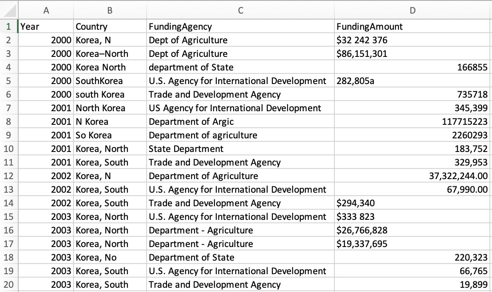{#fig-openrefine-dataset width=600}

*Country(국가)* 란의 열에서 남한 및 북한의 철자 오타들에 대해 주의를 기울이십시오. 더 나아가 자금 원조액인 *FundingAmount* 항목 또한 표기 기준이 없다는 것을 짚고 넘어가야 합니다. 어떤 항목은 수치 간 콤마를 씌웠지만 어떤 항목은 공백 처리되었습니다. 일부는 미국 달러($) 표시가 있지만 다른 것들은 없는 식입니다. 이런 식의 기재 방식은 데이터 분석을 혼란에 빠뜨립니다. 다행히도 OpenRefine을 사용한다면 데이터를 다시 정비하고 표준화하는 것은 어렵지 않습니다.

### OpenRefine 셋업하기 {-}

OpenRefine으로 엉망인 데이터 정리 정돈을 진행해 봅시다. 윈도우, 맥, 그리고 리눅스 사용자들을 위한 [OpenRefine](https://openrefine.org/download.html)을 다운로드하십시오. 앞선 Tabula의 형식처럼 브라우저로 구동이 되고 개별 컴퓨터 속
자료가 남지 않으므로 기밀 유지가 필요한 보안 체계에 아주 유용합니다.

윈도우에서 OpenRefine을 실행시키려면 압축 해제된 *.exe* 파일의 다운로드를 2번 연속 클릭하고 디폴트 브라우저 창에서 진행하십시오.

맥을 통한 실행 시 *.dmg* 다운로드 항목을 두 번 눌러주십시오. 그러면 오픈 소스로 구동된 파일의 작동이라 애플 컴퓨터 측에서 자동적 실행 방지 보안 문구가 뜹니다. 이 경우 *시스템 환경설정 > 보안 및 개인 정보 보호 > 일반(System Preferences > Security and Privacy > General tab)*을 따라간 뒤 그림 [\@fig-openrefine-mac-alert-combined]과 같이 화면의 밑에 놓인 *무조건 열기(Open Anyway)* 버튼을 눌러줍니다. 그 이후 열기를 묻는 문구들이 나오게 되면 동일하게 열기를 누르시면 됩니다.


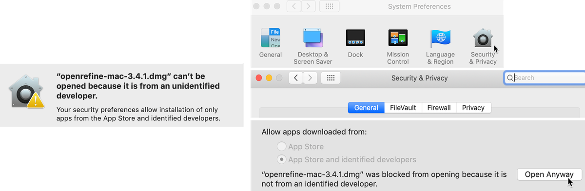{#fig-openrefine-mac-alert-combined}

이 툴이 구동되면 인터넷 브라우저 창 내 그림 [\@fig-openrefine-welcome]과 같은 `127.0.0.1`의 로컬 주소창이 뜰 텐데요, `:3333`의 추가 포트 넘버가 나올 수도 안 나올 수도 있습니다. Safari와 같은 브라우저에서는 호환이 이루어지지 않을 가능성도 있으니 그럴 땐 Firefox, Chrome 같이 다른 형태의 브라우저를 차용하는 것을 추천합니다.


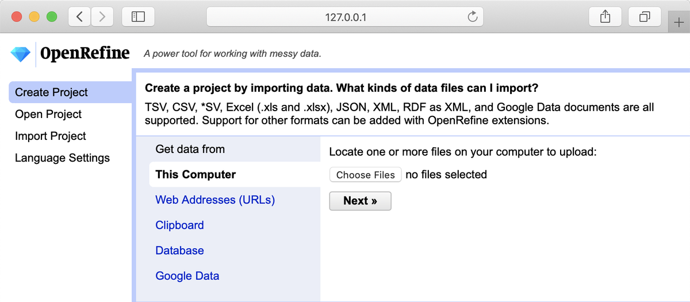{#fig-openrefine-welcome width=500}

### 데이터를 불러와 새로운 프로젝트 개시하기 {-}

지저분한 데이터세트의 청소를 위해 이 정보를 새로운 프로젝트로 구동해야 합니다. OpenRefine은 내 컴퓨터 안의 로컬 저장소 혹은 다른 원격 주소망(예: Google Sheet)의 데이터를 가져올 수 있습니다. 또한 SQL 데이터베이스에서의 직접 추출도 가능하나 이는 당장 필요치 않으니 미루어 두겠습니다.

1. [Google Sheets 안에 있는 미군 해외 파병 펀딩 샘플 데이터(US Foreign Aid sample dataset)](https://docs.google.com/spreadsheets/d/19BilYJxd0fgi7MTAa2y9NUF65Xqf2_y_dVr1jPbmWeg/edit#gid=1983762503)를 눌러 본인 계정에 들어간 뒤, *파일 > 다운로드(File > Download)*를 통해 여러분들의 컴퓨터 안에 CSV 형식으로 파일 저장 방식을 취합니다.

2. OpenRefine에서 *내 컴퓨터 안의 데이터 획득:(Get data from: This computer)* 버튼 하위의 *찾아보기...(Browse...)* 키를 누른 뒤 방금 전 저장한 CSV 포맷의 데이터를 클릭하고 *다음(Next)*을 눌러 줍니다.

3. 세부 정리에 들어가기 전에 OpenRefine은 데이터가 제대로 *분석(parsed)*되었는지 물어봅니다.
이 예시에서 분석이란 데이터를 여러 열로 나누는 방식을 의미합니다. OpenRefine 툴 안의 데이터들이 옳게 나누어졌는지 살펴본 후 그림 [\@fig-openrefine-parse]을 좇아 결과물이 만족스러울 때까지 *데이터 분석 방법(Parse data as)* 항목들을 수정해 보고 화면 위 우측 구석에 있는 *프로젝트 생성(Create Project)* 버튼을 눌러주십시오.


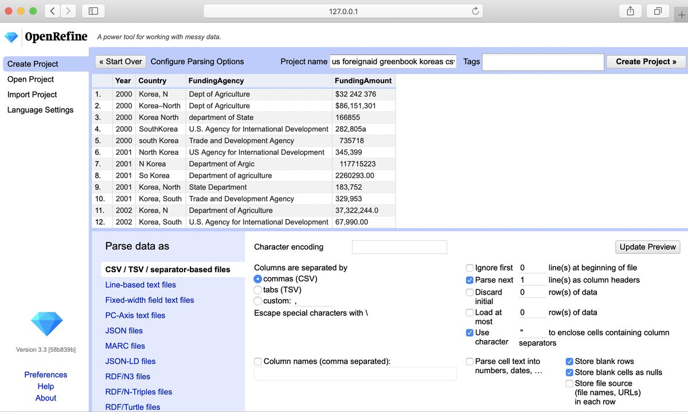{#fig-openrefine-parse}

새로운 프로젝트에 데이터 안착이 완료되었을 시 이제 진짜
본격적으로 재밌는 일이 남아있습니다: 텍스트를 숫자로 치환하기, 불필요한 단어나 문자 등을 제하기,
각양각색의 철자로 기재된 남북한 항목을 올곧게 만들어 주기.

### 달러($) 표시의 문자를 숫자로 통일하기 {-}

프로젝트가 시작됨과 동시에 최초 10개의 가로형 데이터가 나올 텐데요.
헤더에 나타나는 특정 숫자를 누르면 5, 10, 25, 아니면 50가지 항목으로 다양하게 볼 수 있습니다.

열 부분의 헤더는 각기 아래로 화살표 된 메뉴 버튼을 가집니다.
*FundingAmount*의 열이 좌측으로 정렬된 부분은 대개가 숫자를 글자 형태로 받아들여서 일어난 현상이므로 이들을 번호 형태로 맞춰주어야 합니다.

1. 글자를 숫자로 치환하기 위하여 화살표 된 *FundingAmount* 항목을 누르고 다음 그림 [\@fig-openrefine-edit-common]과 같이 *셀 편집 > 공통 변환 > 숫자(Edit cells > Common transforms > To number)*로 지정하십시오.


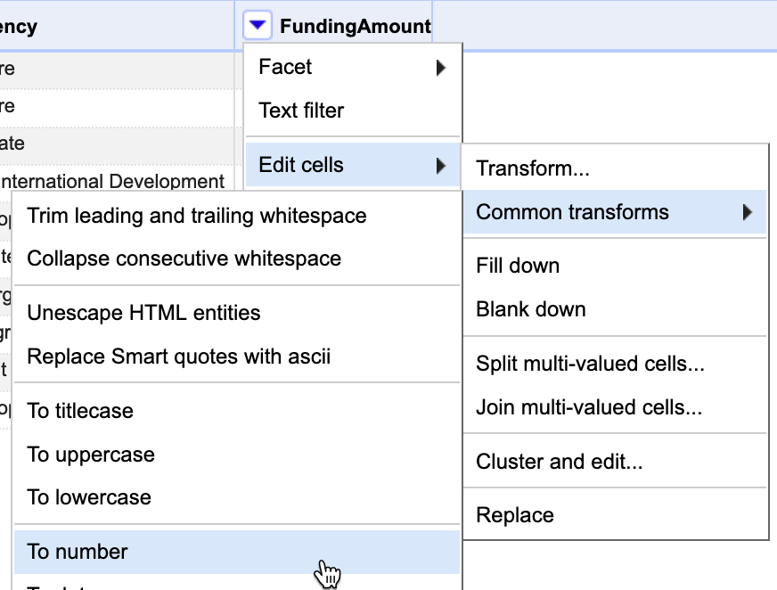{#fig-openrefine-edit-common width=450}

*일부* 숫자는 녹색으로 바뀌고 우측으로 재배치될 텐데요. 반면 바뀌지 않은 다수의 번호들도 존재합니다. 이유는 달러($) 기호 및 콤마(,) 표시 때문에 OpenRefine이 숫자 구별을 어려워한 것입니다.

2. 그럼 이제 남은 콤마(,)와 달러($) 기호들을 지워보겠습니다. 수동형 기입을 위해 해당 열의 메뉴들 안의 *셀 편집 > 변환(Edit cells > Transform)* 항목을 누르십시오. 뜬 수식 창에서 `value.replace(',', '')`라고 치시면 콤마들이
그림 [\@fig-openrefine-edit-expression]과 같이 사라진 프리뷰 창이 뜰 것입니다. 구문에 오류가 없는지 살핀 후 *OK* 버튼을 기입하십시오.


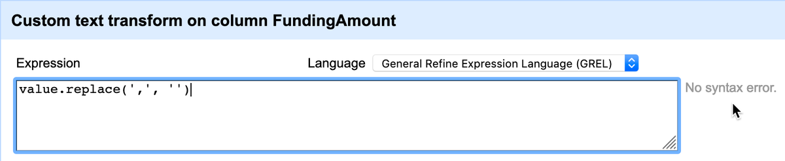{#fig-openrefine-edit-expression}

3. 자, 똑같은 작업을 반복해 봅니다. 이번에는 콤마를 지우는 대신에 달러 표시를 지우는 것입니다. 입력될 항목은 다음과 같습니다: `value.replace('$', '')`), 구문 체크 후 *OK* 버튼을 누릅니다.

4. 스텝 2와 3에서 우리는 특정 형태의 텍스트들을 각기 다른 형태로 바꿔 놓았고,
그 결과 OpenRefine이 이 항목을 단순한 숫자로 인지하지 않게끔 설정했습니다. 결국 모든 데이터가
검은색 그대로 왼쪽 정렬된 채 남습니다. 이제 스텝 1을 다시 해 보면 어떤 항목은 녹색으로 바뀌어 나타날 것입니다. 즉 숫자 데이터로 바뀐 것입니다. 허나 이 가운데 몇몇 비숫자 입력값은 여전히 검게 남아 있을 것입니다.

5. 이 문제를 해소하기 위하여 문자열 사이사이에 끼인 빈 공간이나 숫자의 뒷면에 붙은 `a` 문자 등과 같은 불필요한 단어를 지워주어야 합니다. 각 항목에 커서를 얹고 그림 [\@fig-openrefine-manual-edit]과 같이 *편집(Edit)* 기능 안에서 *데이터 유형(Data type)*을 누른 뒤 이를 *숫자(number)* 항목으로 변환하고 *적용(Apply)*을 클릭하면 됩니다.


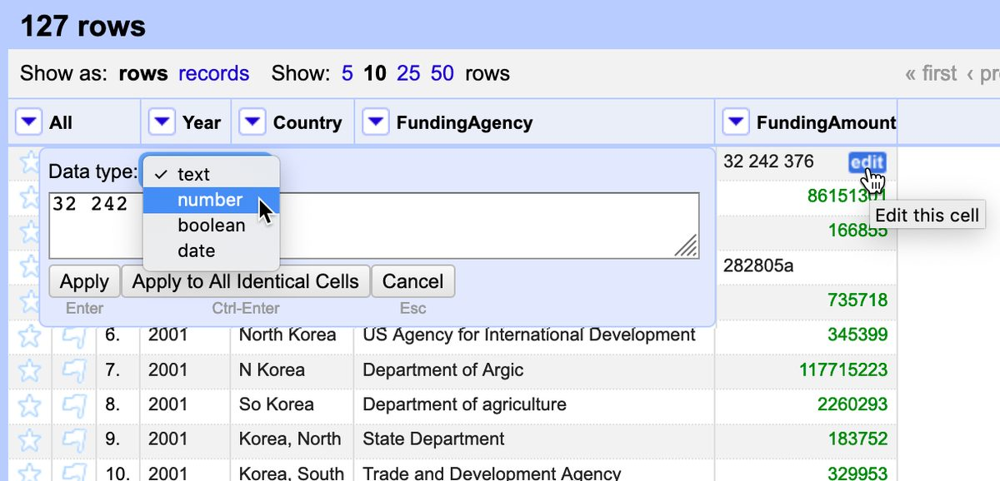{#fig-openrefine-manual-edit width=550}

이러면 모든 원조금의 데이터가 올곧은 숫자 기호로 탈바꿈되어 모두 녹색의 기호와 함께 오른편으로 정렬된 것을 볼 수 있습니다.
이제 남북한의 철자 오타들에 대한 오류 수정을 위하여 *Country* 란으로 다시 옮겨가야 합니다.

### 유사한 철자 묶기 {-}

우리가 다른 데이터의 종류를 받아들이거나 조사 자료를 종합할 시 때때로는
여러 참여자들이 제시된 질문란에 기입 방식 및 명칭 기입 등을 다르게 하여 하나의 항목을 다른 여러 항목으로 쪼개 놓는 일이 빈번히 발생합니다.
이럴 때 OpenRefine은 비슷한 형태의 응답 항목들을 모두 종합해 하나의 큰 범주로 치환해 주는 클러스터링(clustering)이란 막강한 힘을 발휘합니다.

우리가 초기에 기입한 텍스트 기재란을 들여다보면 *Country* 속 수없이 많은 철자 오류의 남북한
모습들이 보여집니다.
*Country* 란의 아래 화살표 된 메뉴 항목을 좇아가다 보면 좌측 편의 *패싯(Facet)* > *텍스트 패싯(Text facet)* 란이 나옵니다. 여기에선 우리 데이터에 기재된 모든 철자 정보들과 각각의 카운팅 횟수가 나옵니다. 북한과 남한, 이 2가지만 기록되어야 할 곳에 자그마치 26개 종류의 항목들이 나온 셈이죠!

1. 철자를 표준화하기 위하여 화살표 된 *Country* 메뉴를 한 번 누른 뒤
*셀 편집 > 클러스터링 및 편집(Edit cells > Cluster and edit)*을 기재하십시오. 그러면 그림 [\@fig-openrefine-cluster]과 같은 창을 마주하게 됩니다.


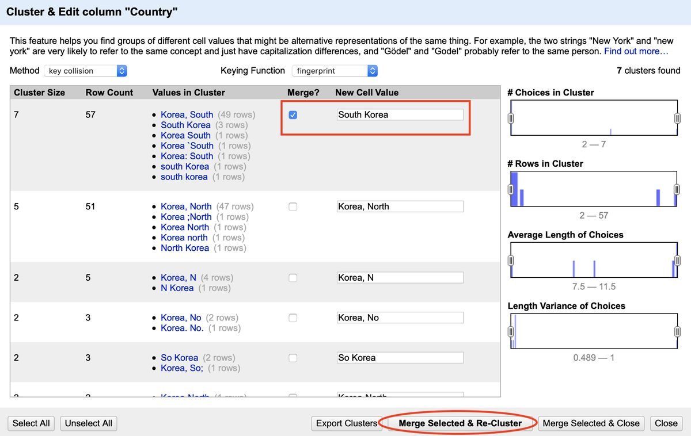{#fig-openrefine-cluster}

클러스터링에서는 *key collision(키 충돌)* 방식과 *nearest neighbor(최근접 이웃)* 방식 중 하나를 고르게 됩니다. 키 충돌은 대량의 데이터세트를 빠르고 효율적으로 다루기 좋지만 유연성은 떨어지며
*nearest neighbor* 방식은 더 세밀하고 유연하지만 상당히 느립니다. 각 방법이 쓰는 함수의 구동 방식이 달라 [프로젝트에 관련된 깃허브 위키 페이지](https://github.com/OpenRefine/OpenRefine/wiki/Clustering-In-Depth) 등을 통하여 관련된 원리를 읽어볼 수 있습니다. 이번 연습을 통하여 우리는 디폴트 값인 *key collision* 내의 *fingerprint(지문)* 함수 방식을 차용해 봅니다.

OpenRefine이 클러스터링을 통하여 리스트화해 줄 것입니다. *클러스터 내 값(Values in Cluster)*이라고 기재된 열을 보면 묶인 항목들의 유사성을 찾을 수 있습니다.

2. 그룹화에 만족하신다면 *병합(Merge?)*을 체크하시어 그림 [\@fig-openrefine-cluster]의 첫 번째 클러스터에 표시된 것처럼 *새 셀 값(New Cell Value)*이라는 빈 상자 안에 *진짜(true)* 값을 집어넣어 줍니다. 이번 예시에서는 `North Korea` 혹은 `South Korea`로 들어가면 됩니다.

3. 여러분은 이 방식을 모든 그룹 묶기에 사용할 수도 있고 아니면 그룹화 중 단지 한두 개의 항목에만 쓴 다음 *선택 병합 및 재-클러스터링(Merge Selected & Re-Cluster)* 항목으로 되돌아가게 할 수도 있습니다. 이렇게 그룹 지어진 방식들은 새롭게 기입된 텍스트들의 카테고리로 다시 그룹화를 시도할 것입니다.
(창이 사라질까 걱정하실 필요는 없어요.) 여러분의 입맛에 맞을 때까지 계속적으로 클러스터 방식을 되풀이하시면 됩니다.

*Keying function(키잉 기능)* 요소 등을 갖고 노는 데 시간을 소비해 보고
각 함수들이 어떠한 방식으로 그들만의 다른 크기와 정확성을 잡아내는지 비교해 보십시오.

4. 묶고 편집하는 방식을 모두 종료하셨다면 
OpenRefine 윈도우 창의 우측 상단 *내보내기(Export)* 버튼을 눌러 데이터를 깔끔하게 내보내십시오.
자유로운 파일 폼 형식을 취할 수 있지만 콤마 방식인 CSV 폼이 선호됩니다.
이제 우리는 완벽하게 분석 및 시각화 준비를 끝마친 셈입니다.

### 요약 {- #summary4}

이번 장을 마무리하며 우리는 Google Sheets 표 다듬기를 넘어
PDF 속 텍스트화된 데이터들을 Tabula를 거쳐 가져오며 아주 막강한 데이터 정비 툴인 
OpenRefine의 활용 가치를 알아보았습니다.
이제 여러분은 이 분석 도구들이 손끝에서 발휘하는 가치를 직접 느끼며 유용하게
사용해 볼 수 있습니다. 우리는 본 저술 내용들을 통하여 
OpenRefine이 아직 보여 주지 못한 가능성과 Google Sheets의 더 강력하고도 유용한 수식을
시간 날 때 배울 것을 당부합니다. 정리 도구를 깊이 익힐수록 복잡한 오류와 문제를 만났을 때
여러분만의 지혜로 해결해 볼 수 있을 것입니다.

데이터 정리 방법에 관해 배웠으니 시각화에 앞서 그 다음 단계를 배워보겠습니다.
이후 장에서는 데이터를 왜 정규화(normalize)해야 하는지 살펴보고 정밀한 비교를 도출해 낼 언어적 활용 능력을 기르는 방식을 배웁니다.
<!-- BEGIN FILE: 05-comparisons.Rmd -->

# 유의미한 비교하기 {#comparisons}
[데이터 스토리 다듬기](#choose), [스프레드시트 기술 향상하기](#spreadsheet), [데이터 찾고 질문하기](#find), [지저분한 부분 정리하기](#clean)를 마친 지금, 이 장에서는 증거를 분석할 때 던져야 할 핵심 질문인 "무엇과 비교할 것인가?"에 초점을 맞춥니다. 통계학자 에드워드 터프티(Edward Tufte)는 이를 "양적 추론의 핵심"이라고 정의했습니다.^[@tufteEnvisioningInformation1990, p. 67]. 우리는 데이터에서 진정으로 눈에 띄는 통찰력 있는 발견을 찾기 위해 항목 간의 중요도를 판단하며 비교합니다. 때로는 데이터를 공정하게 비교하고 있는지, 즉 오렌지와 사과가 아닌 사과와 사과를 비교하고 있는지 확인하기 위해 척도를 조정해야 합니다. 텍스트, 표, 차트, 지도 등 어떤 형식으로든 분석 결과를 소통하기 전에 유의미한 비교를 하고 있는지 반드시 확인해야 합니다. 그렇지 않으면 분석 작업이 무의미해질 수 있기 때문입니다.

이 책에서는 통계적 데이터 분석을 다루지는 않습니다. 이 방대한 연구 분야에 대해서는 이미 훌륭한 자료들이 많이 있기 때문입니다.^[통계적 논리와 그 한계에 대한 읽기 쉬운 입문서로는 @wheelanNakedStatisticsStripping2013; @spiegelhalterArtStatisticsHow2019 참조] 대신 이 장에서는 데이터를 분석할 때 유의미한 비교를 하기 위한 몇 가지 상식적인 전략을 제공하여 여러분의 스토리를 전달하는 진실하고 통찰력 있는 시각화를 디자인할 수 있도록 돕습니다. [비교를 설명할 때 정확하게 단어를 선택하는 방법](#describe-comparisons), [데이터를 정규화하는 이유와 방법](#normalize), 그리고 [편향된 비교](#biased-comparisons)를 주의하는 방법에 대해 배울 것입니다.

## 정확하게 비교 설명하기 {- #describe-comparisons}
때때로 우리는 여러 의미를 가질 수 있는 흔히 쓰이는 단어들의 정의를 명확히 하지 않아서 잘못된 비교를 하곤 합니다. 주의해야 할 세 가지 단어는 *평균(average)*, *퍼센트(percent)*, *원인(causes)*입니다. 일상 대화에서는 이 단어들을 느슨하게 사용하지만 데이터를 다룰 때는 더 정확성이 요구됩니다.

일련의 숫자 1, 2, 3, 4, 5를 상상해 보세요. 손으로 계산하든 [2장에서 설명한 내장 스프레드시트 수식](#calculate)으로 계산하든 *평균(average)*을 계산할 때는 합계를 구한 다음 숫자의 개수로 나눕니다. 더 정확한 용어는 *산술평균(mean)*이며 이 경우 3이 됩니다. 다른 용어로는 정렬된 숫자들의 가운데에 있는 숫자를 가리키는 *중앙값(median)*이 있습니다. 이는 *50백분위수(50th percentile)*로도 알려져 있으며 이 경우 역시 3입니다.

데이터를 다룰 때 비교를 위해 *중앙값*과 *백분위수*가 더 유용한 용어입니다. 극단에 있는 *이상치(outliers)*의 영향을 받지 않기 때문입니다. 예를 들어, 위와 같은 숫자가 있다고 상상해 보되 5를 100으로 바꿔 이상치로 만들어 보세요. 산술평균은 갑자기 22로 뛰어오르지만 중앙값은 3으로 동일하게 유지됩니다(\@fig-mean-vs-median 참조). 억만장자가 방에 들어오면 방에 있던 사람들은 모두 평균적으로 백만장자가 되지만 중앙값은 거의 변하지 않는다는 오래된 농담이 있습니다. 우리 같은 평범한 사람들은 억만장자 이상치가 우리 사이에 있다고 해서 실제로 더 부유해지는 것은 아니므로, 데이터의 전체적인 분포에 대해 유의미한 비교를 하기에는 중앙값이 더 나은 용어입니다.


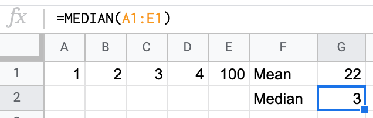{#fig-mean-vs-median width=350}

*퍼센트(Percentage)*도 백분율, 즉 100에 대한 *비율(ratio)*로서 거의 모든 사람이 직관적으로 이해하는 흔한 용어입니다. 예를 들어, [트라이던트 껌의 1970년대 옛 광고](https://en.wikipedia.org/wiki/Trident_gum)는 "설문조사에 참여한 치과의사 5명 중 4명이 껌을 씹는 환자에게 무설탕 껌을 추천합니다"라고 주장했습니다.^[@newmanSellingGumHealth2009] 이 슬로건을 기억하기에 너무 어리거나, 설문조사가 실제로 어떻게 진행되었는지 궁금하거나, 다섯 번째 치과의사가 그 강렬한 동료 압력을 어떻게 견뎌냈는지 의아해하더라도 5명 중 4명이 `4/5 = 0.8 = 80%`와 같다는 것은 모두 이해합니다.

하지만 사람들이 퍼센트를 성급하게 비교할 때 혼란이 발생하기도 하므로 단어 선택에 주의해야 합니다. 한 가지 용어는 *퍼센트 변화(percent change)* (상대적 변화라고도 함)로, *과거 값과 새로운 값*을 비교할 때 가장 적합합니다. 퍼센트 변화는 새로운 값과 과거 값의 차이를 과거 값의 절댓값으로 나누어 계산합니다. 즉 `(새로운 값 - 과거 값) / |과거 값|`입니다. 예를 들어, 1970년에 치과의사 4명이 무설탕 껌을 추천했지만 마침내 동료 압력이 이겨내 2020년에 5명이 추천했다면 퍼센트 변화는 `(5-4)/4 = 1/4 = 0.25 = 25%`로 계산됩니다.

또 다른 용어는 *퍼센트 포인트 차이(percentage point difference)*로, *과거의 퍼센트와 새로운 퍼센트*를 비교할 때 가장 잘 작동하며 한쪽에서 다른 쪽을 빼서 계산합니다. 예를 들어, 1970년에 치과의사의 80%가 무설탕 껌을 추천했지만 2020년에 100%가 추천했다면 이 두 수치를 비교하기 위해 차이를 `새로운 퍼센트 - 과거 퍼센트 = 100% - 80% = 20 퍼센트 포인트 차이`로 계산할 수 있습니다.

각 용어를 정확하게 사용한다면 이 수치들을 비교하는 올바른 방법은 두 가지가 있습니다. 하나는 "무설탕 껌을 추천한 치과의사 수가 시간이 지남에 따라 25퍼센트 증가했다"라고 말하는 것입니다. 다른 하나는 "무설탕 껌을 추천한 치과의사의 비율이 시간이 지남에 따라 20퍼센트 포인트 증가했다"라고 말하는 것입니다. 두 문장 모두 정확합니다. 누군가 두 용어를 혼동하더라도 이 특정 예시에서는 "25퍼센트 변화"와 "20퍼센트 포인트 증가" 사이에 큰 차이가 없습니다.

하지만 누군가가 퍼센트에 대해 부정확한 단어를 사용하여 의도적으로 여러분을 오도하는 다른 예시를 생각해 보세요. 어떤 정치인이 여러분이 구매하는 제품과 서비스의 판매세를 5퍼센트에서 6퍼센트로 올리겠다고 제안한다고 상상해 보십시오. 만약 그 정치인이 "단 1퍼센트 인상일 뿐입니다"라고 말한다면, 그것은 틀린 말입니다. 대신 이 변화를 진실되게 설명하는 두 가지 방법이 있습니다. 하나는 `(6-5)/5 = 0.20`이기 때문에 세금이 "20퍼센트 인상될 것"이라고 말하는 것입니다. 다른 하나는 `6% - 5% = 1 퍼센트 포인트 차이`이기 때문에 세금이 "1퍼센트 포인트 인상될 것"이라고 말하는 것입니다. 그 정치인이 올바른 두 가지 방법 중 하나가 아닌, 왜 오해를 불러일으키는 방식으로 말하고 싶어 했는지 이해하시겠습니까? 퍼센트 변화를 매우 느슨한 단어로 설명하여 아무도 여러분을 속이지 못하게 하고 다른 사람을 혼란스럽게 하지 않기 위해 자신의 작업에서도 그 의미를 정확히 사용하세요.

보다 정확한 언어 사용에 대한 마지막 권장 사항은 데이터에서 *인과 관계(cause-and-effect relationship)*를 시사하는 단어에 주의하라는 것입니다. 일상 대화에서는 어떤 행동이 직접 반응을 낳는 인과 관계를 대충 암시하는 표현이 흔합니다. 예를 들어, 어떤 것이 다른 것으로 "이어진다(leads to)", 성장을 "촉진한다(promotes)", 또는 변화를 "촉발한다(sparks)"고 말할 때, 이런 단어들은 인과관계를 암시합니다. 일상 대화에서는 괜찮지만 데이터를 논의할 때는 세 가지 개념을 사용하여 단어를 더 신중하게 선택해야 합니다. 첫 번째 단계는 두 변수 사이의 *상관관계(correlation)*를 설명하는 것입니다. 이는 그들이 어떻게 연관되거나 상호의존적으로 관련되어 있는지 보여주는 것을 의미합니다. 그러나 통계학자들은 항상 [상관관계는 인과관계를 의미하지 않는다](https://en.wikipedia.org/wiki/Correlation_does_not_imply_causation)고 경고합니다. 두 가지가 관련되어 있다는 사실이 반드시 하나가 다른 하나를 발생시킨다는 것을 의미하지는 않습니다. 인과관계를 보여주기 위해서는 상관관계를 증명하는 것과 더불어 한 요인(종종 독립 변수라고 함)이 다른 요인(종속 변수라고 함)의 변화를 어떻게 만들어내는지에 대한 *설득력 있는 이론(persuasive theory)*을 입증하는 두 번째 단계를 거쳐야 합니다. 세 번째로, 인과 관계에 영향을 미칠 수 있지만 우리가 고려하지 않은 *교란 변수(confounding variables)*를 식별하고 분리해야 합니다. 자세한 내용은 이 책의 범위를 벗어나지만 데이터를 다룰 때 이 개념들을 염두에 두고 단어를 신중하게 선택하세요.

8장: 데이터 표 만들기에서 [데이터 상관관계 및 가능한 인과관계를 보여주기 위한 표 디자인 권장 사항](#table-design)도 참조하십시오.

이제 데이터 관계를 더 정확하게 설명하기 위해 핵심 단어를 사용하는 방법에 대해 더 명확히 이해했으므로, 다음 섹션에서는 이 지식을 바탕으로 더 의미 있는 비교를 만들기 위해 데이터를 조정해 보겠습니다.

## 데이터 정규화하기 {- #normalize}
2018년 플로리다주의 자동차 충돌 사고 사망자 3,133명과 같이 *개수(counts)*로 표시된 데이터를 다룰 때는 데이터를 *정규화(normalize)*하기 전까지는 이 수치들을 비교하는 것이 대체로 무의미합니다. 이는 서로 다른 척도를 사용해 수집된 데이터를 공통 참조 척도로 조정하는 것을 의미합니다. 즉, *원본 데이터(raw data)*를 *비율(rates)*로 변환하여 더 유의미한 비교를 하는 것입니다. 이 용어를 들어본 적이 없더라도, 아마 자신도 모르게 이미 데이터를 정규화하고 있었을 수도 있습니다.

다음은 시각화 전문가인 알베르토 카이로(Alberto Cairo)의 작업에서 영감을 받고 미국 고속도로 안전 보험 협회(IIHS)와 미국 교통부의 [업데이트된 2018년 데이터](https://www.iihs.org/topics/fatality-statistics/detail/state-by-state)를 활용한 자동차 안전에 관한 예입니다.^[@cairoTruthfulArtData2016, pp. 71-74.] 2018년에는 자동차 및 트럭 운전자와 탑승자, 오토바이 운전자, 보행자, 자전거 운전자를 포함하여 36,000명 이상이 자동차 충돌 사고로 사망했습니다. 아래 표에는 이 데이터의 아주 작은 부분만 표시되어 있지만 이 연습을 따라가기 위해 [Google Sheets 형식으로 모든 데이터를 확인](https://docs.google.com/spreadsheets/d/1N7_pHdmXdE3Y4ECnnDyBTSXkklv-u1hLULSO-YaotpA/edit#gid=0)하고 편집 가능한 사본을 Google 드라이브에 저장할 수 있습니다.

단순해 보이는 질문부터 시작해서 더 유의미한 비교를 찾는 여정이 우리를 어디로 이끄는지 살펴보겠습니다.

1. *자동차 충돌 사고 사망자 수가 가장 적은 미국 주는 어디일까요?* 사망자 수로 데이터를 정렬하면, 워싱턴 DC가 법적으로 주로 인정되지 않음에도 불구하고 \@tbl-deaths 표에 나타난 것처럼 사망자가 31명에 불과해 워싱턴 DC가 가장 안전한 주로 *보입니다*.

표: (\#tab:deaths) 2018년 자동차 충돌 사고 사망자 수가 가장 적은 미국 주

| 주 (State) | 사망자 수 |
|:----|--:|
| District of Columbia | 31  |
| Rhode Island         | 59  |
| Vermont              | 68  |
| Alaska               | 80  |
| North Dakota         | 105 |

하지만 잠시만요. 이건 공정한 비교가 아닙니다. 위 5개 주를 다시 보면 모두 전체 데이터 세트의 맨 아래에 표시되는 캘리포니아나 텍사스 같은 대형 주보다 인구가 적다는 것을 알 수 있습니다. 더 정확한 상황을 파악하기 위해 인구 차이를 조정하여 질문을 다시 만들어 보겠습니다.

2. *인구를 조정했을 때 자동차 충돌 사고 사망자 수가 가장 적은 미국 주는 어디일까요?* 이제 각 주의 총 인구를 고려하여 사망자 데이터를 *정규화*해 봅시다. 스프레드시트에서는 이를 `사망자 수 / 인구수 * 100,000`으로 계산합니다. 사망자를 인구로 나누어 *1인당(per capita)* 비율을 구하는 것도 정확하지만 소수점이 매우 작으면 대부분의 사람들이 비교하기 어렵기 때문에 100,000을 곱하여 결과를 더 명확하게 제시합니다. 데이터를 정렬하면, \@tbl-deaths-population 표에 나타난 것처럼 인구 10만 명당 자동차 충돌 사고 사망자가 4.4명에 불과해 워싱턴 DC가 다시 한 번 가장 안전한 것으로 *보입니다*.

표: (\#tab:deaths-population) 2018년 인구당 자동차 충돌 사고 사망자 수가 가장 적은 미국 주

| 주 (State) | 사망자 수 | Population | Deaths per 100,000 population |
|:---|---:|---:|---:|
| District of Columbia | 31  | 702,455    | 4.4 |
| New York             | 943 | 19,542,209 | 4.8 |
| Massachusetts        | 360 | 6,902,149  | 5.2 |
| Rhode Island         | 59  | 1,057,315  | 5.6 |
| New Jersey           | 564 | 8,908,520  | 6.3 |

하지만 잠시만요. 이것 역시 공정한 비교가 아닙니다. 목록에 있는 5개 주를 살펴보면 모두 기차와 지하철 같은 대중교통이 집중되어 있는 미국 북동부 회랑(Northeastern US corridor)을 따라 위치해 있음을 알 수 있습니다. 만약 뉴욕이나 보스턴 같은 도시 지역 사람들이 자동차를 덜 운전하거나, 집들이 멀리 떨어져 있는 농촌 지역 사람들보다 더 짧은 거리를 이동한다면 이것이 우리 데이터에 영향을 미칠 수 있습니다. 더 나은 비교를 위해 이번에는 인구가 아닌 주행 거리의 차이를 조정하여 질문을 다시 한 번 바꿔보겠습니다.

3. *차량 주행 거리를 조정했을 때 자동차 충돌 사고 사망자 수가 가장 적은 미국 주는 어디일까요?* 이번에도 사망자 데이터를 *정규화*하되, 다른 요인을 고려하여 조정합니다. 바로 차량 주행 거리(VMT)입니다. 이는 2018년에 각 주의 모든 도로와 고속도로에서 자동차, 밴, 트럭, 오토바이가 이동한 예상 총 마일 수(백만 마일 단위)입니다. 스프레드시트에서는 이를 `사망자 수 / 차량 주행 마일 * 100`으로 계산하고 결과를 더 명확하게 표시하기 위해 승수를 곱합니다. 이번에는 \@tbl-deaths-miles 표에 나타난 것처럼 주행 거리 1억 마일당 자동차 충돌 사고 사망자가 0.54명에 불과해 매사추세츠가 가장 안전한 주로 *보입니다*. 또한, 워싱턴 DC는 목록 아래로 밀려나고 미네소타가 그 자리를 차지한 것을 주목하세요.

표: (\#tab:deaths-miles) 2018년 주행 거리당 자동차 충돌 사고 사망자 수가 가장 적은 미국 주

| 주 (State) | 사망자 수 | 차량 주행 거리 (백만 마일) | 1억 마일당 사망자 수 |
|:---|---:|---:|---:|
| Massachusetts | 360 | 66,772  | 0.54 |
| Minnesota     | 381 | 60,438  | 0.63 |
| New Jersey    | 564 | 77,539  | 0.73 |
| Rhode Island  | 59  | 8,009   | 0.74 |
| New York      | 943 | 123,510 | 0.76 |

마침내 우리는 자동차 충돌 사고 사망자로 판단할 때 가장 *안전한* 주를 찾았을까요? 반드시 그렇지는 않습니다. 인구와 운전량을 기준으로 원본 데이터를 정규화하긴 했지만 IIHS는 차량 유형, 평균 속도, 교통 법규, 날씨 등과 같은 여러 다른 요인들이 이 수치에 영향을 미칠 수 있다고 상기시킵니다. 하지만 알베르토 카이로가 상기시키듯 더 유의미한 비교를 하기 위해 계산을 정교하게 할수록 우리의 해석은 진실에 더 가까운 표현이 됩니다. "우리가 *완벽한* 모델을 만들 수 있다고 가정하는 것은 비현실적입니다."라고 카이로는 상기시킵니다. "하지만 우리는 분명히 *충분히 좋은* 모델을 생각해 낼 수 있습니다."^[@cairoTruthfulArtData2016, p. 95]

위에서 시연했듯이 데이터를 정규화하는 가장 일반적인 방법은 원시 개수(raw counts)를 백분율이나 1인당(per capita)과 같은 상대적 비율로 조정하는 것입니다. 하지만 데이터를 정규화하는 다른 방법도 많이 있으므로 [3장에서 설명한 것처럼 데이터를 찾고 질문할 때](#find) 다양한 방법에 익숙해져야 합니다. 시계열 데이터 또는 종단 데이터라고도 하는 과거 데이터를 다룰 때는 *시간의 경과에 따른 변화를 조정*해야 할 수도 있습니다. 예를 들어 1970년과 2020년의 가구 중위소득을 직접 비교하는 것은 공정하지 않습니다. 인플레이션과 관련 요인들 때문에 50년 전의 미화 1만 달러가 오늘날보다 훨씬 더 큰 구매력을 가졌기 때문입니다. 마찬가지로 경제학자들은 일반적으로 구매력을 고려하여 더 나은 비교를 할 수 있도록 수치를 특정 연도의 "불변 달러(constant dollars)"로 변환함으로써 *명목 데이터(nominal data)* (조정되지 않음)와 *실질 데이터(real data)* (시간에 따라 조정됨)를 구분합니다.^[@WhatRealWages2018] 또한 경제 데이터는 여름 관광 시즌과 겨울 연휴 쇼핑 시즌의 고용이나 수익과 같이 일 년 내내 정기적으로 변동하는 데이터에 대한 비교를 개선하기 위해 종종 *계절 조정(seasonally adjusted)*을 거칩니다. 또 다른 정규화 방법은 *지수(index)*를 만들어 특정 참조점과 관련하여 시간이 지남에 따라 값이 어떻게 상승하거나 하락했는지 측정하는 것입니다. 더 나아가, 통계학자들은 더 나은 비교를 하기 위해 서로 다른 척도를 사용하여 수집된 데이터를 *표준 점수(standard score)*, 일명 *z-점수(z-score)*로 계산하여 정규화하는 경우가 많습니다. 이러한 방법들은 이 책의 범위를 벗어나지만 오렌지와 사과를 비교하는 것보다 사과와 사과를 비교하는 것이 낫다는 데 모두가 동의하는 더 넓은 개념을 숙지하는 것이 중요합니다.

마지막으로, 데이터 형식이 이미 정규화를 수행하고 있는 경우도 있기 때문에 항상 데이터를 정규화할 필요는 *없습니다*. 원시 수치나 단순 개수와 달리 대부분의 *측정 변수(measured variables)*는 이미 공통 척도에 표시되어 있으므로 정규화가 필요하지 않습니다. 측정 변수의 한 예는 *중위 연령(median age)*입니다. 이는 인구를 가장 어린 사람부터 가장 나이 많은 사람 순으로 정렬했을 때 "가운데"에 있는 사람의 나이입니다. 인간은 0세에서 120세 정도까지 산다는 것을 알고 있으므로 여러 집단의 중위 연령을 직접 비교할 수 있습니다. 마찬가지로 *중위 소득(median income)*도 측정 변수입니다. 동일한 통화와 동일한 기간으로 측정된 경우 여러 모집단에 걸쳐 직접 비교할 수 있는 공통 척도를 제공하기 때문입니다.

데이터를 정규화하는 이유, 시기, 방법에 대해 더 잘 이해하셨을 테니, 다음 섹션에서는 데이터 샘플링 방법에서 편향된 비교를 주의하도록 경고하겠습니다.

## 편향된 비교 주의하기 {- #biased-comparisons}
누구나 데이터를 *체리피킹(cherry-pick)*해서는 안 된다는 것을 알고 있습니다. 체리피킹이란 미리 정해진 결론을 뒷받침하는 증거만 선택하고 나머지는 무시하는 것을 의미합니다. 우리가 진실하고 유의미한 데이터 스토리를 전달하기로 약속할 때, 열린 마음을 유지하고 모든 관련 증거를 검토하며 경쟁하는 해석들의 장단점을 저울질하는 데 동의하는 것입니다. 이러한 원칙에 동의한다면 표면상으로는 합법적으로 보일 수 있지만 실제로는 결과를 왜곡하는 부분적으로 숨겨진 요인들을 포함하는 데이터 수집 절차인 데이터 수집 편향(sampling biases), 특히 *샘플링 편향*을 주의하세요. 열린 마음으로 일하고 있다고 믿을지라도 자신도 모르게 증거를 효과적으로 체리피킹하는 방식을 간과할 수 있습니다.

첫째, *선택 편향(selection bias)*을 주의하세요. 이는 여러분의 연구를 위해 선택된 샘플이 더 큰 모집단과 체계적으로 다름을 의미합니다. 잊을 수 없는 제목을 가진 책, *Calling Bullshit*의 저자인 칼 버그스트롬(Carl Bergstrom)과 제빈 웨스트(Jevin West) 교수는 "무엇을 볼 수 있는지는 어디를 보느냐에 달려 있다"고 경고합니다.^[@bergstromCallingBullshitArt2020, pp. 79, 104-133] 만약 농구 연습을 마치고 체육관을 떠나는 사람들의 키를 무작위로 측정한다면, 인위적으로 더 크게 나온 결과는 \@fig-selection-bias 에 나타난 것처럼 선택 편향 때문일 것입니다.


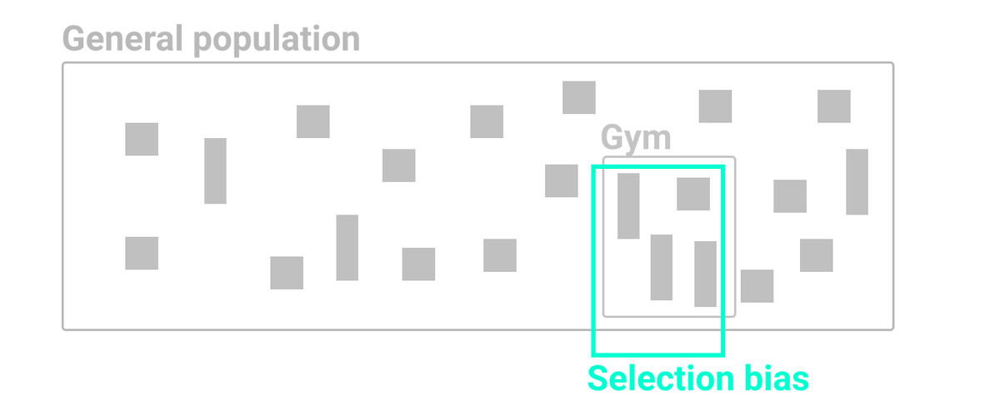{#fig-selection-bias width=500}

둘째, *무응답 편향(non-response bias)*에 주의하세요. 넓은 모집단에 설문조사를 보내지만 모든 사람이 응답하지는 않는다면, 참여를 선택한 사람들이 전체 모집단을 대표하지 못하게 만드는 어떤 특성을 가질 수 있다는 점을 인지해야 합니다. 예를 들어, 미국 인구 조사 연구원들은 2020년 현재 인구 조사(Current Population Survey) 보충 자료에서 저소득층의 무응답률이 평소보다 훨씬 높다는 것을 발견했는데, 이는 개별 설문 조사 결과를 이전 연도와 비교하여 알아낸 것이었습니다. 부유한 사람들이 응답할 가능성이 더 높았기 때문에 보고된 중위 소득 수준이 인위적으로 높아졌고 연구원들은 이를 수정해야 했습니다.^[@rothbaumCoronavirusInfectsSurveys2020] 주별, 카운티별, 조사 구역별 자가 응답률을 시각화한 [US Census Bureau Hard to Count 2020 map](https://www.censushardtocountmaps2020.us)도 확인해 보세요. 무응답 편향을 수정하지 않은 설문 조사를 실시하면 편향된 결과를 얻을 수 있습니다.

셋째, *자기 선택 편향(self-selection bias)*을 주의하세요. 이 편향은 종종 사람들이 참여를 지원하거나 자원한 특정 프로그램이나 치료의 효과를 평가하려고 할 때 나타납니다(\@fig-self-selection-bias 참조). 체중 감량 프로그램이 실제로 효과가 있는지 판단하는 것이 여러분의 임무라면 데이터 샘플이 어떻게 선택되었는지에 대한 깊은 이해가 필요합니다. 자기 선택 편향이 비밀리에 두 그룹의 구성을 형성하여 무의미한 비교를 초래할 수 있기 때문입니다. 예를 들어 비참여자(그룹 A) 대 이 프로그램에 등록한 참여자(그룹 B)의 진행 상황을 비교하는 것은 실수일 수 있습니다. 이 두 그룹은 무작위로 선택된 것이 *아니기* 때문입니다. 참여자는 체중 감량 프로그램에 가입하려는 주도성을 가졌다는 점에서 다르며 비참여자보다 더 자주 운동하고 식단을 개선하려는 동기가 더 높을 가능성이 큽니다. 체중 감량 클리닉, 사회 복지 서비스, 학교 선택 프로그램 등 주제를 막론하고 자발적 참여가 프로그램 효과를 어떻게 왜곡하는지 고려하는 것을 잊고 스스로를 속이는 일이 얼마나 자주 일어나는지 놀라울 따름입니다.^[학교 선택 프로그램의 자기 선택 편향과 관련하여 연구자들은 학생 인구 통계에 대한 전통적인 "정량적 데이터(hard data)"가 참여자와 비참여자 사이의 부모 태도와 동기의 미묘한 차이를 드러내지 못할 수 있다고 지적합니다. 칼렌버그(Kahlenberg)와 포터(Potter)는 다음과 같이 썼습니다: "예를 들어 저소득층 아프리카계 미국인 학생 두 명이 어머니와 함께 많은 양의 숙제와 토요일 수업을 포함하는 강력한 '변명 불가(no excuses)' 프로그램이 있는 차터 스쿨의 오픈 하우스에 참석했다고 상상해 보세요. 설명을 들은 후 두 학생 모두 관련된 추가 과제를 맡고 싶어 하지 않습니다. 한 어머니는 좋다고 말하고 떠나는 반면, 다른 어머니는 자녀에게 당신은 이 도전을 맡게 될 것이며 내가 지원해 주겠다고 말합니다. 이 두 가족 사이에는 인종이나 소득 데이터로는 나타나지 않지만 그럼에도 중요할 수 있는 차이가 있습니다." @kahlenbergSmarterCharterFinding2014, p. 54.]

프로그램 평가 데이터에서 자기 선택 편향을 어떻게 줄일 수 있을까요? [3장에서 배운 것처럼 데이터에 의문을 제기하는 것](#question)이 중요합니다. 즉 표면 아래를 살펴봄으로써 용어가 어떻게 정의되었고 데이터가 어떻게 수집되고 기록되었는지 완전히 이해하는 것입니다. 반대로 잘 설계된 프로그램 평가는 자원한 모든 참가자(그룹 B)를 두 하위 그룹으로 *무작위 분할(randomly dividing)*하여 자기 선택 편향을 줄입니다. 절반은 한 체중 감량 프로그램(그룹 C)에 참여하도록 배정하고 다른 절반은 다른 체중 감량 프로그램(그룹 D)에 참여하도록 배정합니다(\@fig-self-selection-bias 참조). 하위 그룹 C와 D는 동일한 큰 자원자 그룹에서 우연히 선택되었으므로 동기나 기타 눈에 띄지 않는 요인에서 차이가 날 이유가 없기 때문에 비교할 때 더 큰 확신을 가질 수 있습니다. 물론 표본 크기가 충분히 큰지 확인하고 체중 감량 활동 전, 도중, 후에 참여자를 비교하는 등 이 책의 범위를 벗어나는 연구 설계 세부 사항들이 많이 있습니다. 하지만 선택 편향을 피하는 논리는 간단합니다. 지원하거나 자원하는 사람들을 무작위로 하위 그룹으로 나누어, 동기나 발견하기 어려운 특징이 유사한 사람들 사이에서 프로그램 효과를 더 잘 비교하는 것입니다.


 글꼴의 실루엣 이미지.](images/05-comparisons/self-selection-bias.png){#fig-self-selection-bias width=700}

편향에 대한 경고는 이 책의 여러 장에 나타납니다. 데이터 시각화 과정의 여러 단계에서 작업에 부정적인 영향을 미치는 다양한 유형의 편향을 지속적으로 인지해야 하기 때문입니다. 뒷부분의 [14장에서는 인지 편향, 알고리즘 편향, 집단 간 편향, 매핑 편향 등 데이터를 다룰 때 발생할 수 있는 다른 유형의 편향을 인식하고 줄이는 방법](#data-bias)을 배울 것입니다.

### 요약 {- #summary5}

이 책에서 통계적 데이터 분석을 가르친다고 주장하지는 않지만 이번 장에서는 데이터를 분석하면서 유의미한 비교를 하기 위한 몇 가지 상식적인 전략을 논의했습니다. 데이터를 비교하기 위해 단어를 더 정확하게 사용하는 방법, 데이터를 정규화하는 이유와 방법, 그리고 편향된 비교를 주의하는 방법에 대한 조언을 배웠습니다. 이전 장들에서는 데이터 스토리 다듬기, 스프레드시트 작업, 데이터 찾고 질문하기, 지저분한 데이터 정리하기에 대한 기술을 구축했습니다. 이제 이 모든 지식을 종합하여 다음 몇 장에서는 대화형 차트와 지도를 만들기 시작할 수 있습니다.


<!-- BEGIN FILE: 06-chart.Rmd -->

# 데이터 차트 만들기 {#chart}
차트는 독자를 스토리에 더 깊이 빠져들게 합니다. 꺾은선형 차트의 기울기나 분산형 차트의 점 군집과 같은 이미지는 텍스트나 표보다 훨씬 더 효과적으로 독자의 눈에 증거를 전달할 수 있습니다. 하지만 독자의 주의를 데이터의 핵심 통찰력으로 이끄는 의미 있는 차트를 만들려면 디자인 선택에 대한 명확한 고민이 필요합니다.

이 장에서는 [차트 디자인 원칙](#chart-design)을 검토하고 좋은 차트와 나쁜 차트를 식별하는 방법을 배웁니다. 모든 차트에 적용되는 중요한 규칙은 물론 자신만의 디자인을 커스터마이즈할 때 따라야 할 미적 가이드라인도 검토할 것입니다. 많은 도구가 차트를 *정적(static)* 이미지로 다운로드할 수 있게 하지만 이 책에서는 독자가 웹 브라우저에서 데이터를 탐색하도록 유도하는 *대화형(interactive)* 차트를 구성하는 방법도 보여줍니다. 나중에 9장에서는 [대화형 차트를 웹사이트에 임베드하는 방법](#embed)을 배울 것입니다.

이 책에서 만들 수 있는 다양한 차트 유형은 \@tbl-chart-types 표를 참조하세요. 차트 유형에 대한 결정은 두 가지 주요 요인, 즉 데이터의 형식과 전달하고자 하는 이야기의 종류에 따라 달라집니다. 예를 들어 꺾은선형 차트는 연속적인 데이터 포인트(예: 시간에 따른 변화)를 표시하는 데 가장 적합한 반면, 범위 차트는 데이터 카테고리 간의 거리(예: 불평등 격차)를 강조하는 데 더 적합합니다. 차트 유형을 선택한 후에는 우리가 추천하는 도구와 단계별 튜토리얼을 따르세요. 이 장에서는 [Google Sheets](#chart-google), [Datawrapper](#chart-datawrapper), [Tableau Public](#chart-tableau)과 같이 드래그 앤 드롭 메뉴가 있는 *쉬운 도구(Easy Tools)*를 다룹니다. 하지만 이 표는 시각화를 맞춤 설정하고 호스팅할 수 있는 더 많은 제어권을 제공하는 *파워 도구(Power Tools)*, 예를 들어 [11장의 Chart.js 및 Highcharts 코드 템플릿](#chartcode)도 안내합니다. 이러한 고급 도구는 [10장의 GitHub로 코드 템플릿을 편집하고 호스팅하는 방법](#github)에 대한 사전 지식이 필요합니다.

용어에 대한 참고 사항: *막대 차트(bar charts)*와 *세로 막대형 차트(column charts)*는 막대가 수평이냐 수직이냐를 제외하면 본질적으로 같기 때문에 통틀어 지칭합니다. 주요 차이점은 데이터 레이블의 길이입니다. 더 많은 수평 읽기 공간이 필요한 긴 레이블(예: "모카 프라푸치노 24온스" 및 "더블 쿼터 파운더 치즈버거")을 표시할 때는 가로 막대형 차트를 사용하세요. 하지만 공간이 덜 필요한 짧은 레이블(예: "스타벅스" 및 "맥도날드")에는 가로 막대형이나 세로 막대형 차트 중 어느 것을 사용해도 무방합니다. 또한 이 장의 모든 예제가 음식(우리가 이것을 쓸 때 정말 배가 고팠기 때문)과 건강한 식습관(우리도 살을 빼야 하기 때문)에 초점을 맞추고 있다는 점을 눈치채실 것입니다.

표: (\#tab:chart-types) 기본 차트 유형, 최적의 용도 및 이 책의 튜토리얼

| Chart | Best use and tutorials in this book |
| --- | --- |
| 그룹 막대 또는 세로 막대형 차트(Grouped bar or column chart)<br> 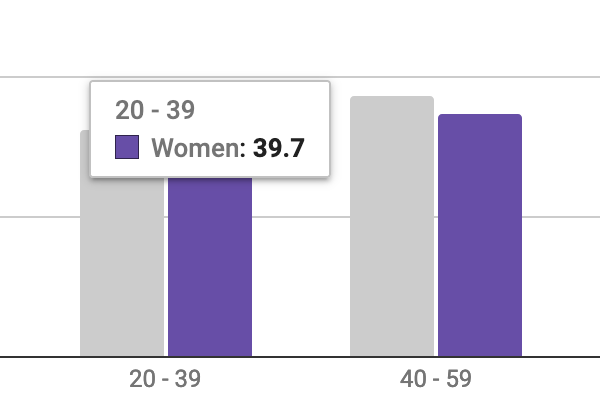 | 범주를 나란히 비교할 때 가장 적합합니다. 레이블이 길면 세로 열 대신 가로 막대를 사용하세요. <br>쉬운 도구: [Google Sheets의 막대 및 세로 막대형 차트 튜토리얼](#bar-column-google) 또는 [Datawrapper 차트](#chart-datawrapper)<br>파워 도구: [12장: Chart.js 및 Highcharts 템플릿](#chartcode) |
| 분할 막대 또는 세로 막대형 차트(Split bar or column chart)<br> 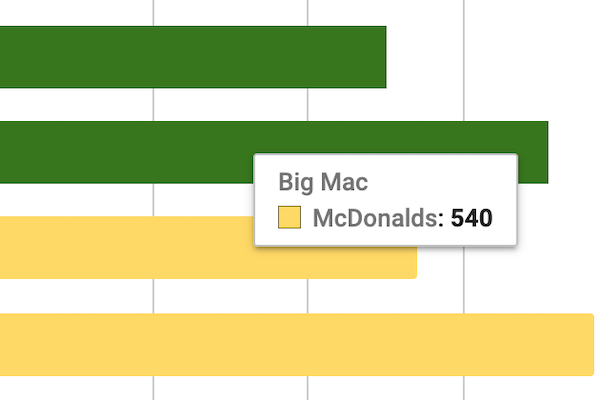 | 분리된 클러스터에서 범주를 비교할 때 가장 적합합니다. 레이블이 길면 세로 열 대신 가로 막대를 사용하세요.<br>쉬운 도구: [Google Sheets의 막대 및 세로 막대형 차트 튜토리얼](#bar-column-google) 또는 [Datawrapper 차트](#chart-datawrapper)<br>파워 도구: [12장: Chart.js 및 Highcharts 템플릿](#chartcode) |
| 누적 막대 또는 세로 막대형 차트(Stacked bar or column chart)<br> 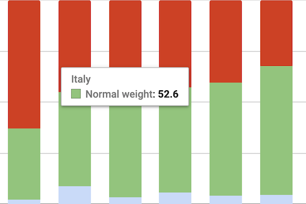 | 하위 범주나 전체의 일부를 비교할 때 가장 적합합니다. 레이블이 길면 세로 열 대신 가로 막대를 사용하세요.<br>쉬운 도구: [Google Sheets의 막대 및 세로 막대형 차트 튜토리얼](#bar-column-google) 또는 [Datawrapper 차트](#chart-datawrapper)<br>파워 도구: [12장: Chart.js 및 Highcharts 템플릿](#chartcode) |
| 막대 또는 세로 막대형 차트의 오차 막대(Error bars in bar or column chart)<br>  | 범주를 나란히 비교할 때 오차 범위 막대를 표시하는 데 가장 적합합니다. 레이블이 길면 세로 열 대신 가로 막대를 사용하세요.<br>쉬운 도구: Google Sheets 차트는 [오차 막대 지원이 제한적](#bar-column-google)입니다 <br>파워 도구: [12장: Chart.js 및 Highcharts 템플릿](#chartcode)  |
| 히스토그램(Histogram)<br> 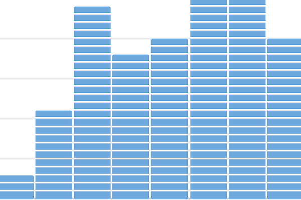 | 각 버킷의 값 개수와 함께 원본 데이터의 분포를 표시할 때 가장 적합합니다.<br>쉬운 도구: [Google Sheets의 히스토그램 차트 튜토리얼](#histogram-google)<br>파워 도구: [12장: Chart.js 및 Highcharts 템플릿](#chartcode) |
| 원형 차트(Pie chart)<br> 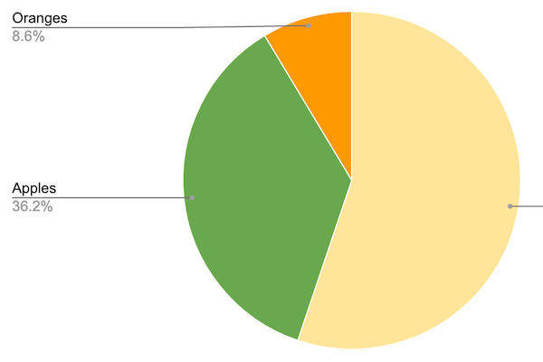 | 전체의 일부를 보여주는 데는 좋지만 조각의 크기를 추정하기는 어렵습니다.<br>쉬운 도구: [Google Sheets의 원형 차트 튜토리얼](#pie-line-area-google) 또는 [Datawrapper 차트](#chart-datawrapper)<br>파워 도구: [12장: Chart.js 및 Highcharts 템플릿](#chartcode) |
| 꺾은선형 차트(Line chart)<br> 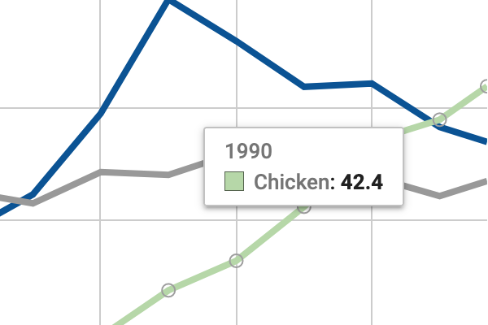 | 시간에 따른 변화와 같은 연속 데이터를 표시하는 데 가장 적합합니다.<br>쉬운 도구: [Google Sheets의 꺾은선형 차트 튜토리얼](#pie-line-area-google) 또는 [Datawrapper 차트](#chart-datawrapper)<br>파워 도구: [12장: Chart.js 및 Highcharts 템플릿](#chartcode) |
| 주석이 달린 꺾은선형 차트(Annotated line chart)<br> 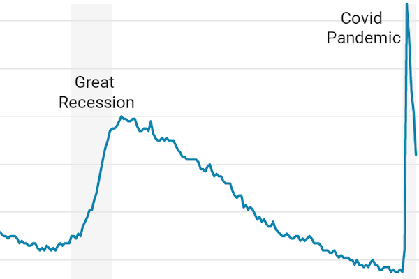 | 꺾은선형 차트에 역사적 맥락을 추가하는 등 메모를 덧붙이거나 차트 내 데이터를 강조할 때 가장 적합합니다.<br>쉬운 도구: [Datawrapper의 주석 달린 차트 튜토리얼](#annotated-datawrapper)<br>파워 도구: [12장: Chart.js 및 Highcharts 템플릿](#chartcode) |
| 필터링된 꺾은선형 차트(Filtered line chart) <br> 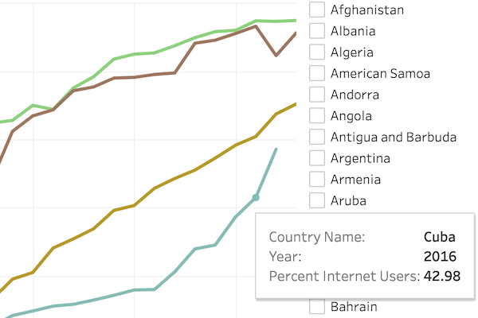 | 사용자가 켜고 끌 수 있는 여러 줄의 연속 데이터를 표시하는 데 가장 적합합니다. <br>쉬운 도구: [Tableau Public의 필터링된 꺾은선형 차트 튜토리얼](#filtered-line-tableau) |
| 누적 영역 차트(Stacked area chart)<br> 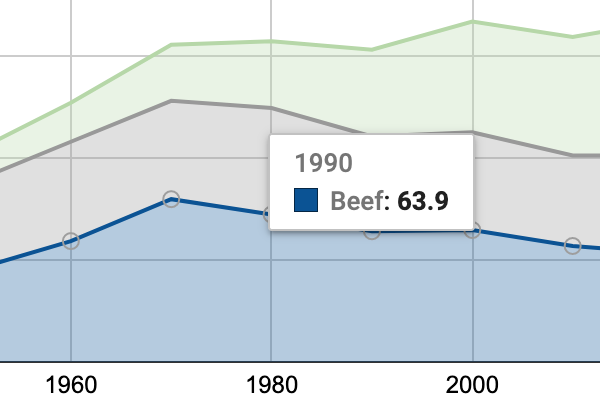 | 시간에 따른 변화와 같은 연속 데이터로 전체의 일부를 표시하는 데 가장 적합합니다. <br>쉬운 도구: [Google Sheets의 누적 영역 차트 튜토리얼](#pie-line-area-google) 또는 [Datawrapper 차트](#chart-datawrapper)<br>파워 도구: [12장: Chart.js 및 Highcharts 템플릿](#chartcode) |
| 범위 차트(Range chart)<br> 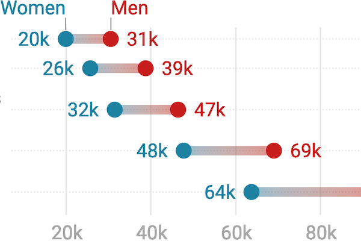 | 불평등과 같은 데이터 포인트 간의 간격을 표시하는 데 가장 적합합니다.<br>쉬운 도구 및 파워 도구: [Datawrapper의 범위 차트 튜토리얼](#range-datawrapper) |
| 분산형 차트(Scatter chart) <br> 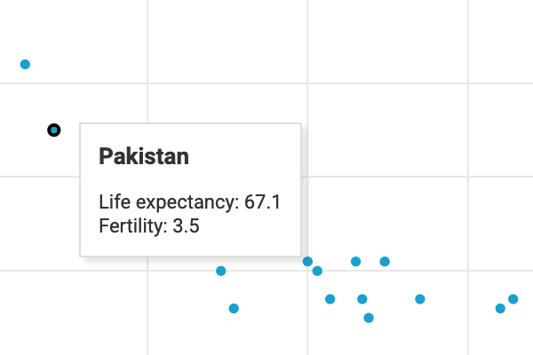 | 두 변수 사이의 관계를 나타내며 각 점이 X와 Y 좌표를 나타내는 방식에 가장 적합합니다. <br>쉬운 도구: [Datawrapper의 분산형 및 거품형 차트 튜토리얼](#scatter-bubble-datawrapper) 또는 [Tableau Public의 분산형 차트 튜토리얼](#scatter-tableau). <br>파워 도구: [12장: Chart.js 및 Highcharts 템플릿](#chartcode) |
| 거품형 차트(Bubble chart) <br> 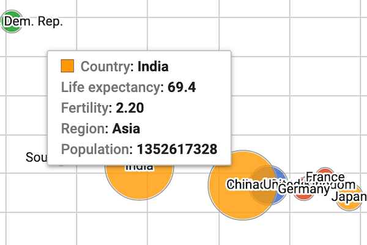 | 세 개 또는 네 개의 데이터 세트 사이의 관계를 나타내는 데 적합하며 XY 좌표, 거품 크기 및 색상으로 나타냅니다.<br>쉬운 도구: [Datawrapper의 분산형 및 거품형 차트 튜토리얼](#scatter-bubble-datawrapper)<br>파워 도구: [12장: Chart.js 및 Highcharts 템플릿](#chartcode) |
| 스파크라인(Sparklines)<br> 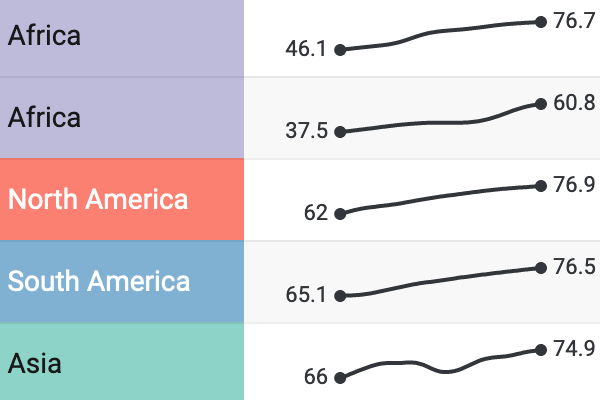 | 테이블 열에 정렬된 아주 작은 꺾은선이나 막대 차트로 데이터 추세를 비교할 때 가장 적합합니다.<br>쉬운 도구: [9장: Datawrapper의 스파크라인이 있는 대화형 표 튜토리얼](#table-datawrapper) |

참고: 더 광범위한 차트 유형 컬렉션과 사용 사례를 보려면 [Financial Times Visual Vocabulary](https://ft.com/vocabulary)를 참조하십시오.

## 차트 디자인 원칙 {- #chart-design}

차트 종류는 *정말* 다양합니다. 하지만 데이터를 차트로 만들 *수* 있다고 해서 반드시 차트로 만들어야 *하는* 것은 아닙니다. 차트를 만들기 전에 잠시 멈춰서 생각해 보세요: *시각화된 데이터 패턴이 내 스토리에 정말로 중요한가요?* 때로는 단순한 표나 텍스트만으로도 독자에게 아이디어를 더 효과적으로 전달할 수 있습니다. 잘 디자인된 차트를 만드는 데는 시간과 노력이 필요하므로, 차트가 진정 데이터 스토리를 향상시키는지 확인하세요.

과학은 아니지만 데이터 시각화에는 진실되고 설득력 있는 차트를 만들기 위한 기초 역할을 하는 일련의 원칙과 모범 사례가 있습니다. 이 섹션에서는 차트 디자인에 대한 몇 가지 중요한 규칙을 파악할 것입니다. 하지만 여러분은 데이터를 정직하게 해석하기만 한다면, 어떤 규칙들은 덜 엄격하고 점을 강조하기 위해 필요할 때 "깰 수 있다"는 사실에 놀랄 수도 있습니다.

데이터 시각화에서 규칙을 따르는 것과 깨는 것 사이의 긴장감을 더 잘 이해하려면 리사 샬럿 로스트(Lisa Charlotte Rost)의 "[데이터 시각화 규칙을 고려할 때 고려해야 할 사항(What To Consider When Considering Data Vis Rules)](https://lisacharlotterost.de/datavisrules)"에 대한 심도 있는 성찰을 참조하세요. 로스트는 좋은 차트 디자인 뒤에 숨겨진 암묵적인 규칙들을 명확히 함으로써, [Datawrapper Academy](https://academy.datawrapper.de)의 많은 게시물에서 각 규칙을 시각화했던 것처럼 공개 영역으로 가져와 자유롭게 논의하고 개선한다면 우리 모두에게 이익이 될 것이라고 주장합니다. 하지만 로스트는 규칙에 단점도 있다는 것을 일깨워 줍니다. 첫째, 규칙을 너무 엄격하게 따르면 디자인 작업 시 난관을 극복할 방법을 찾을 때 창의성과 혁신을 가로막을 수 있습니다. 둘째, 규칙들은 서로 다른 "데이터 시각화 이론"에서 비롯되었기 때문에 때때로 상호 모순되는 경우가 있습니다. 충돌하는 규칙의 한 가지 예는 이해하기 쉬운 데이터 스토리를 만드는 것과 데이터의 복잡성을 드러내는 것 사이의 긴장감으로, 두 가지를 동시에 수행하는 것은 종종 불가능하게 느껴집니다. 로스트는 우리가 따르는 규칙이 우리의 가치관을 반영하며 각자가 스스로에게 "당신의 데이터 시각화가 무엇으로 평가받기를 원하는가?"얼마나 디자인이 멋져 보이는지, 또는 얼마나 진실한지, 혹은 어떻게 감정을 불러일으키고 정보를 제공하며 마음을 바꾸는지물어보아야 한다고 결론지었습니다.^[@rostWhatConsiderWhen2020]

차트 디자인에 대해 더 깊이 파고들기 위해 차트에 대한 공통된 어휘를 설정하는 것부터 시작하겠습니다.

### 차트 분해하기 {-}

\@fig-design-principles-chart-components 그림을 살펴봅시다.
여기에는 대부분의 차트 유형에서 공유하는 기본 차트 구성 요소가 나와 있습니다.


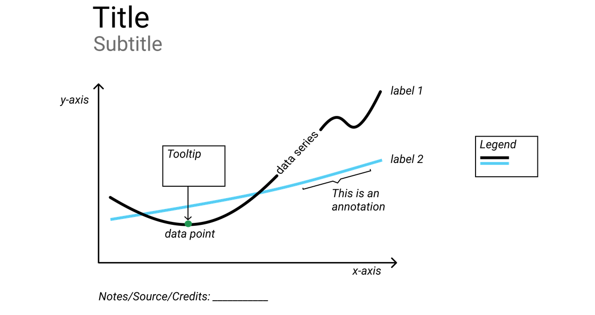{#fig-design-principles-chart-components}

*제목(title)*은 아마도 모든 차트에서 가장 중요한 요소일 것입니다. 좋은 제목은 짧고 명확하며
그 자체로 이야기를 전달합니다. 예를 들어 "팬데믹이 흑인 및 라틴계 인구에 가장 큰 타격을 주다(Pandemic Hits Black and Latino Population Hardest)",
또는 "매년 수백만 톤의 플라스틱이 바다로 흘러들어간다(Millions of Tons of Plastic Enter the Ocean Every Year)"는 더 큰 스토리를 빠르게 전달하는 명확한 제목입니다.

때때로 편집자나 독자는 여러분의 차트에 대해 더 기술적인 제목을 선호할 수도 있습니다. 이 경우 위의 두 제목은 각각 "뉴욕시의 인종별 코로나19 사망자 수, 2020년 봄(Covid-19 Deaths by Race in New York City, Spring 2020)"과 "바다로 흘러들어가는 플라스틱 톤 수, 19502020(Tons of Plastic Entering the Ocean, 19502020)"으로 변경될 수 있습니다.

하이브리드 전략은 스토리를 지향하는 제목과 더 기술적인 부제목을 결합하는 것입니다. 예를 들면 다음과 같습니다: "팬데믹이 흑인 및 라틴계 인구에 가장 큰 타격을 주다: 2020년 봄 뉴욕시의 인종별 코로나19 사망자 수(Pandemic Hits Black and Latino Population Hardest: Covid-19 Deaths by Race in New York City, Spring 2020)". 이 모델을 따른다면 폰트 크기를 줄이거나 폰트 스타일, 색상 등을 변경하여 부제목을 제목보다 덜 눈에 띄게 만드세요.

수평(x) 및 수직(y) *축(axes)*은 척도와 측정 단위를 정의합니다.

*데이터 계열(data series)*은 관찰값의 모음으로, 보통 데이터 세트에서
숫자 또는 *데이터 포인트(data points)*의 행이나 열이 됩니다.

*레이블(Labels)*과 *주석(annotations)*은 종종 더 많은 맥락을 제공하기 위해 차트 전반에 사용됩니다. 예를 들어,
1900년에서 2020년 사이의 미국 실업률을 보여주는 꺾은선형 차트는
1930년대 부근에 "대공황(Great Depression)" 주석을 달고 2020년에 "코로나19 여파(Covid-19 Impact)" 주석을 달아
각각 실업률이 급등한 시점을 나타낼 수 있습니다.
또한 축에 의존하는 대신 항목에 직접 레이블을 지정할 수도 있는데, 이는
막대 차트에서 흔히 쓰입니다. 이 경우 관련 축을 숨겨 차트를 덜 산만하게 보이도록 할 수 있습니다.

*범례(legend)*는 차트에서 사용되는 색상 및 모양과 같은 기호와 그 의미(보통 나타내는 값)를 보여줍니다.

차트 아래에 *참고(Notes)*, *데이터 출처(Data Sources)*, *크레딧(Credits)*을 추가하여 데이터가
어디서 왔는지, 어떻게 처리 및 분석되었는지, 시각화 제작자가 누구인지에 대한 맥락을 제공해야 합니다.
이러한 사항들을 공개하는 것은 신뢰성과 책임감을 구축하는 데 도움이 된다는 점을 기억하세요.

데이터에 불확실성(또는 오차 범위)이 포함되어 있다면 가능한 한 *오차 막대(error bars)*를 사용하여 이를 표시하세요.
불가능하다면, 차트와 함께 "이 데이터에는 최대 20%의 불확실성이 포함되어 있습니다"
또는 "X와 Y 지역의 경우 오차 범위가 10%를 초과합니다"와 같은 문구를 덧붙이세요. 이는 독자가 데이터 출처의 신뢰성을 평가하는 데 도움이 될 것입니다.

대화형 차트에서는 사용자가 데이터 포인트나 데이터 계열 위를 클릭하거나 마우스를 올릴 때
더 많은 데이터나 맥락을 제공하기 위해 종종 *도구 설명(tooltip)*이 사용됩니다.
도구 설명은 차트를 깔끔하게 유지해주기 때문에 다층적 데이터를 가진 복잡한 시각화에
매우 유용합니다. 하지만 스마트폰이나 태블릿처럼 작은 화면에서는 도구 설명과 상호 작용하기 더 어렵고,
차트를 인쇄할 때는 보이지 않기 때문에 부가적으로 있으면 좋은 정보를
전달하는 데만 의존하세요. 핵심 정보는 사용자 상호 작용 없이도
모두 보여야 합니다.

### 어떤 규칙은 다른 규칙보다 더 중요합니다 {-}

데이터 시각화에서 대부분의 규칙은 정직하게 해석하기만 한다면 융통성을 발휘할 수 있지만 절대 어길 수 없는 두 가지 규칙이 있습니다: 막대 및 세로 막대형 차트의 0 기준선(zero-baselines)과 원형 차트의 100퍼센트 기준선입니다.

#### 막대 및 세로 막대형 차트는 반드시 0에서 시작해야 합니다 {-}

막대 및 세로 막대형 차트는 값을 표현하기 위해 *길이(length)*와 *높이(height)*를 사용하므로, 값 축은 *반드시 0 기준선에서 시작해야 합니다*. 그래야 다른 막대 길이의 두 배인 막대가 값의 두 배를 나타낸다는 것을 보장할 수 있습니다. \@fig-design-principles-start-at-zero 그림은 좋은 예와 나쁜 예를 대조하여 보여줍니다. 선 아래 채워진 영역으로 값을 나타내는 영역 차트에도 동일한 규칙이 적용됩니다. 기준선을 0이 아닌 숫자에서 시작하는 것은 [14장: 거짓말 찾아내기 및 편향 줄이기(Detect Lies and Reduce Bias)](#detect)에서 설명하듯 여론 조사나 선거 결과의 차이를 과장하기 위해 흔히 쓰이는 속임수입니다.


{#fig-design-principles-start-at-zero}

하지만 0 기준선 규칙은 꺾은선형 차트에는 적용되지 *않습니다*. 시각화 전문가인 알베르토 카이로(Alberto Cairo)에 따르면, 꺾은선형 차트는 선의 높이나 길이보다는 선의 *위치(position)*와 *각도(angle)*를 통해 값을 나타냅니다. 꺾은선형 차트의 시작을 0이 아닌 숫자로 한다고 해서 반드시 인코딩된 정보가 왜곡되는 것은 *아닙니다*. 우리의 눈은 그 의미를 파악할 때 기준선에 얼마나 가까운지보다는 그 모양에 의존하기 때문입니다.^[@cairoHowChartsLie2019, p. 61.] 예를 들어 두 쪽 다 올바르게 표현된 \@fig-design-principles-baseline-comparison 그림의 오른쪽과 왼쪽을 비교해 보세요.


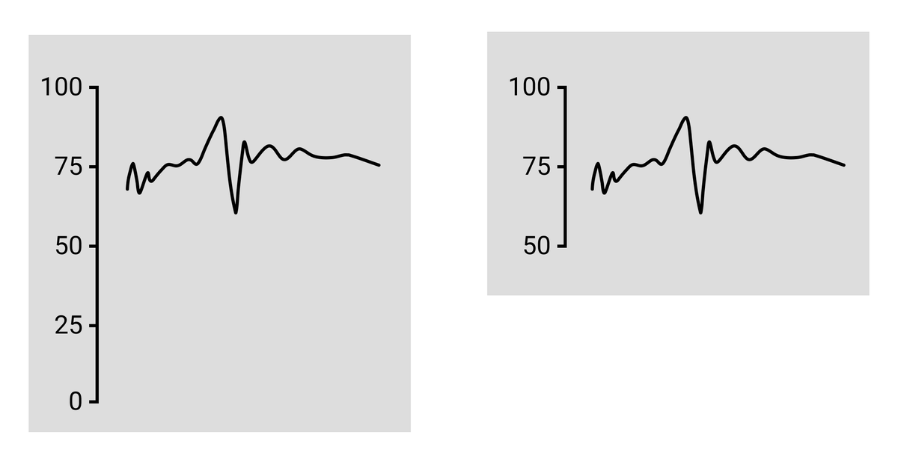{#fig-design-principles-baseline-comparison}

또한, 꺾은선형 차트를 강제로 0 기준선에서 시작하는 것은 허용되지만 데이터 스토리를 위한 최적의 시각화를 만들지 못할 수도 있습니다. \@fig-design-principles-baseline-modified 그림에서 왼쪽은 수직 축이 0에서 시작하는 꺾은선형 차트를 보여주지만 그 결과 차트 상단이 매우 평평하게 나타나 값의 변화를 숨깁니다. 오른쪽은 수직 축을 값의 범위에 맞게 줄인 꺾은선형 차트로, 변화가 더 명확하게 묘사됩니다. 기술적으로 둘 다 맞지만 이 경우에는 오른쪽이 데이터 스토리에 더 적합합니다. 그럼에도 불구하고 조심해야 합니다. [14장의 차트로 거짓말하는 방법 섹션](#how-to-lie-with-charts)에서 배우게 되겠지만 사람들은 수직 축을 수정하여 우리를 속일 수 있으며 꺾은선형 차트에서 수직 축의 위치에 대한 통일된 규칙은 없기 때문입니다.


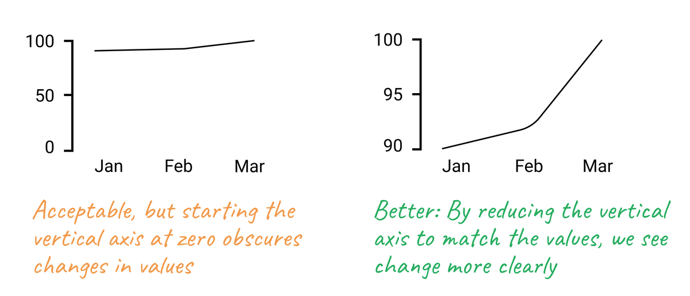{#fig-design-principles-baseline-modified}

#### 원형 차트는 100%를 나타냅니다 {-}
원형 차트는 데이터 시각화에서 논쟁이 가장 많은 문제 중 하나입니다.
대부분의 데이터 시각화 실무자들은 사람들이 각각 다른 조각의 크기를 정확하게 추정하는 데
서투르다고 말하며 원형 차트를 피하라고 권장합니다.
우리는 다음 섹션의 권장 사항을 지키는 조건에서 조금 덜 극단적인 입장을 취합니다.

그러나 데이터 시각화에서 모든 전문가가 완벽히 동의하는 단 한 가지 사실은
*원형 차트는 수량의 100%를 나타낸다*는 것입니다.
조각의 합이 100%가 되지 않는다면, 그것은 범죄와 같습니다.
여러분이 *당신은 고양이 파인가요, 개 파인가요?*라는 설문 조사를 설계하고
"고양이"와 "개" 체크박스를 모두 선택할 수 있도록 허용했다면,
그 결과를 원형 차트에 넣을 생각은 버리십시오.

### 차트의 미학 {-}

차트를 만드는 목적은 독자가 스토리를 이해하도록 돕는 것이지, 그들을 혼란스럽게 하는 것이 아님을 명심하세요.
원시 개수, 퍼센트, 혹은 퍼센트 변화 중 무엇을 보여줄지 결정하고,
독자를 위해 수학적 계산을 수행하세요.

#### 차트 정크(Chart junk) 피하기 {-}
흰색 배경에서 시작하여 적절하다고 생각되는 요소를 추가하세요.
추가하는 모든 요소를 정당화할 수 있어야 합니다. 이를 위해 스스로에게 물어보세요:
이 요소가 차트를 개선하는가, 아니면 가독성을 떨어뜨리지 않고 빼버릴 수 있는가?
이 방식으로 진행하면 \@fig-design-principles-junk 그림에 나타난 이른바 "차트 정크"로 끝나지 않을 것입니다.
차트 정크에는 3D 효과, 그림자 및 불필요한 요소들이 포함됩니다.
초기 Microsoft Office 버전에서는 멋있어 보였을지 몰라도 오늘날에는 피하는 것이 좋습니다.
차트 정크는 시청자를 산만하게 하고 차트의 가독성과 이해도를 떨어뜨립니다.
또한 비전문적으로 보이고 스토리텔러로서의 신뢰성도 더해주지 못합니다.


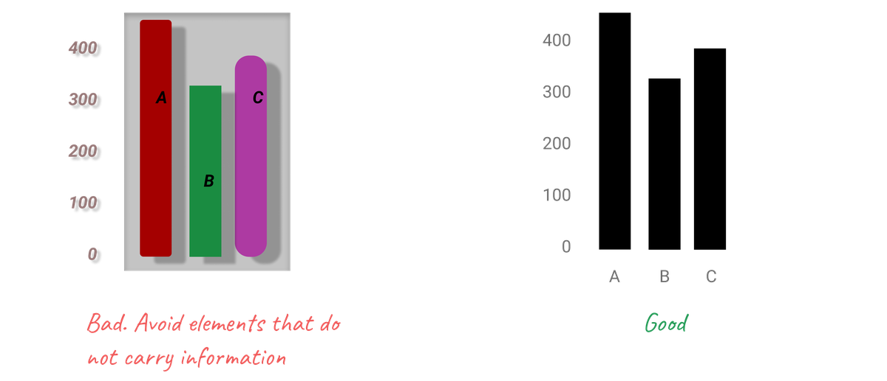{#fig-design-principles-junk}

막대 차트에서는 장식 요소가 차트의 일부라고 착각하게 만들어 막대가
나타내는 값을 잘못 읽을 수 있으므로 그림자나 두꺼운 윤곽선을 사용하지 마세요.

3차원을 사용하는 것이 정당화되는 유일한 경우는 x, y, z 값을 가지는 3차원 데이터를
플로팅할 때뿐입니다. 예를 들어, x와 y값이 위도와 경도를 나타내는
[인구 밀도 3차원 지도](https://blog.mapbox.com/3d-mapping-global-population-density-how-i-built-it-141785c91107)를
구축할 수 있습니다. 하지만 대부분의 경우 3차원은 다양한 모양이나 색상을 가진
거품형 차트나 산점도(scatterplot)로 표현하는 것이 가장 좋습니다.

#### 원형 차트 주의하기 {-}
원형 차트는 전체에 대한 부분의 관계만을 보여주므로 모든 조각이 100%를 더해야 한다는 것을 기억하세요. 일반적으로 조각이 적을수록 더 좋습니다.
조각을 가장 큰 것부터 가장 작은 것 순으로 시계 방향으로 정렬하고 가장 큰 조각을 12시 방향에 놓으세요.
\@fig-design-principles-pie 그림이 이를 보여줍니다.


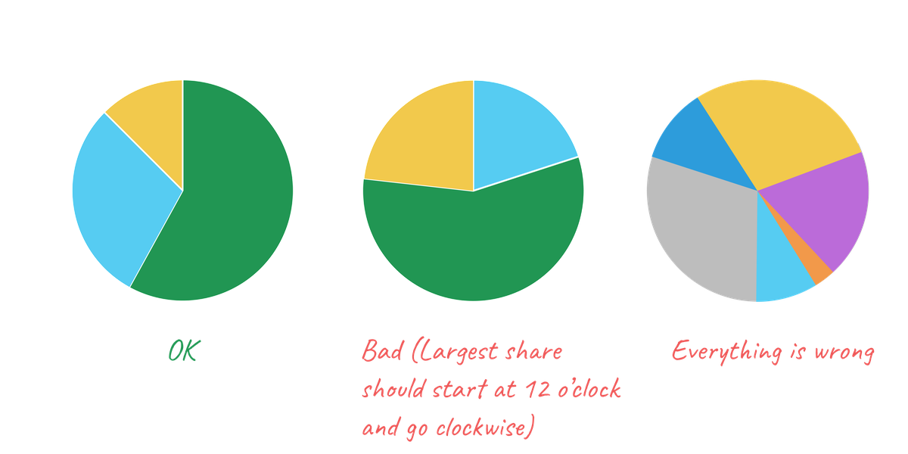{#fig-design-principles-pie}

원형 차트의 조각이 5개 이상인 경우, \@fig-design-principles-pie-to-bar 그림에 표시된 것처럼 데이터를 누적되거나 분할된 막대 차트로 표시하는 것을 고려하세요.


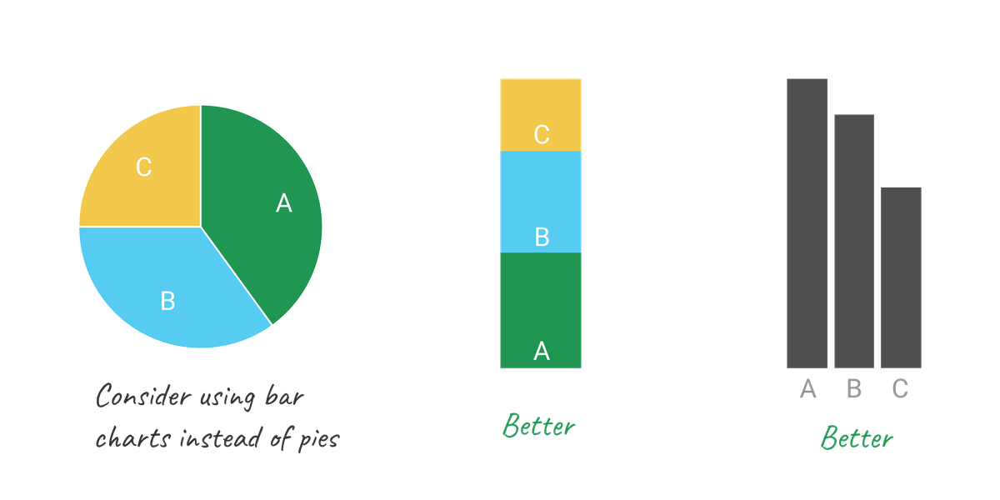{#fig-design-principles-pie-to-bar}

#### 사람들이 레이블을 읽기 위해 고개를 돌리게 만들지 마세요 {-}
세로 막대형 차트에 맞추기 위해 90도 회전해야 하는 긴 x축 레이블이 있는 경우 차트를 90도 돌려 가로 막대 차트로 만드는 것을 고려하세요. 가로 방향 레이블을 읽는 것이 얼마나 더 쉬운지 보려면 \@fig-design-principles-turn-bar 그림을 보세요.


{#fig-design-principles-turn-bar}

#### 요소를 논리적으로 정렬하세요 {-}
막대 차트에 다른 범주가 표시되는 경우 \@fig-design-principles-order-categories 그림과 같이 범주를 순서대로 정렬하는 것을 고려해 보세요. 알파벳 순으로 정렬할 수 있는데, 이는 독자가 거주하는 도시와 같은 항목을 빨리 찾아볼 수 있게 하려는 경우에 유용할 수 있습니다. 범주를 값 순으로 정렬하는 것도 비교를 가능하게 하는 일반적인 기술입니다. 물론 막대가 특정 시점의 무언가의 값을 나타내는 경우 순차적으로 정렬되어야 합니다.


{#fig-design-principles-order-categories}

#### 차트에 너무 많은 정보를 담지 마세요 {-}
축의 레이블을 지정할 때는 [0, 20, 40, 60, 80, 100]처럼 균등한 간격을 갖거나 로그 스케일의 경우 [1, 10, 100, 1000]과 같은 자연스러운 단위(increments)를 선택하세요. 척도에 너무 많은 정보를 담지 마세요.
타이포그래피는 단순하게 유지하고 **굵은 글씨**를 적당히(그러나 과도하지 않게) 사용하여 주요 통찰력을 강조하세요.
가독성을 높이기 위해 천 단위 구분 기호로 쉼표 사용을 고려하세요(`1000000`보다 `1,000,000`이 읽기 훨씬 편합니다).

#### 색상에 주의하세요 {-}
이 섹션에서는 색상에 관한 세 가지 중요한 규칙을 간략하게 소개하고자 합니다. 첫째, 대부분의 경우 단색(단일 색조) 차트로 충분하며 별도의 색상 차원을 도입할 필요가 전혀 없을 수 있다는 점을 기억하세요.

둘째, 색상환(color wheel)과 표준 [조화 규칙(harmony rules)](https://en.wikipedia.org/wiki/Harmony_(color))을 참조하여 팔레트를 선택하세요. 파란색과 주황색 또는 노란색과 보라색처럼 보색(색상환에서 반대되는 색) 규칙을 고려하여 색상 쌍을 찾아보세요. 색상환에서 이웃하는 유사색(예: 주황색, 빨간색, 분홍색)도 좋은 팔레트가 됩니다.

셋째, 순수하고 채도가 높은 색상은 피하고 대신 밝은 녹색 대신 올리브 녹색, 네온 블루 대신 네이비와 같이 "흙빛에 가까운(earthier)" 색상을 선택하세요.

시각화를 위한 색상 팔레트를 선택했다면, 스스로에게 다음과 같이 질문해 보세요:

1. 색상과 그 색상이 나타내는 현상 사이에 의미의 충돌이 있는가? 이익을 나타내기 위해 빨간색을 사용하거나 사망률을 나타내기 위해 녹색을 사용하고 있지는 않은가? 색상은 사회 집단과 문화에 따라 다른 연관성을 가지기 때문에 이 질문은 복잡하지만 최선의 감각을 발휘하도록 노력하세요.

2. 색맹인 사람도 내 차트를 해석할 수 있는가? 빨간색과 녹색, 또는 노란색과 파란색을 포함하는 팔레트는 어려울 수 있습니다. 시각화의 접근성을 확보하기 위해 [Color Oracle](https://www.colororacle.org/)이나 다른 시뮬레이터를 사용해 보세요.

3. 흑백에서도 색상을 구별할 수 있는가? 독자들이 차트를 인쇄하지 않을 것이라 생각하더라도 인쇄할 수도 있습니다. Color Oracle이나 다른 시뮬레이터를 사용하여 색상의 명도 수준이 다르고 회색조에서도 구별할 수 있는지 확인해 보세요. \@fig-design-principles-color 그림은 색상 사용의 좋은 예와 나쁜 예를 보여줍니다.


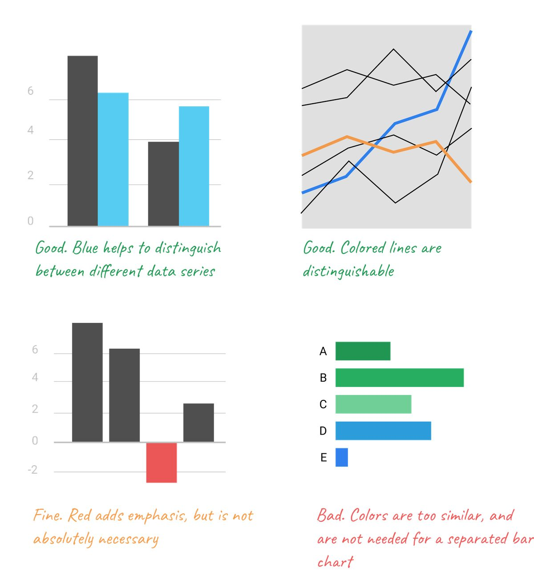{#fig-design-principles-color}

색상 사용은 복잡한 주제이며 이에 관한 책과 연구가 무수히 많습니다. 훌륭한 개요를 보려면 Datawrapper 블로그에 있는 리사 샬럿 로스트의 "[데이터 시각화에서의 색상에 대한 친절한 가이드(Your Friendly Guide to Colors in Data Visualization)](https://blog.datawrapper.de/colorguide/)"와 "[데이터 시각화를 위해 더 아름다운 색상을 고르는 방법(How to Pick More Beautiful Colors for Your Data Visualizations)](https://blog.datawrapper.de/beautifulcolors/index.html)"을 참조하세요.^[@rostYourFriendlyGuide2018; @rostHowPickMore2020]

우리의 조언을 따른다면 \@fig-design-principles-decluttered 그림에 표시된 것처럼 깔끔한 차트를 얻게 될 것입니다. 여러분의 시선이 밝은 색상이나 축 선과 같은 부차적인 구성 요소가 아니라 막대와 해당 값으로 어떻게 이끌리는지 확인해 보세요.


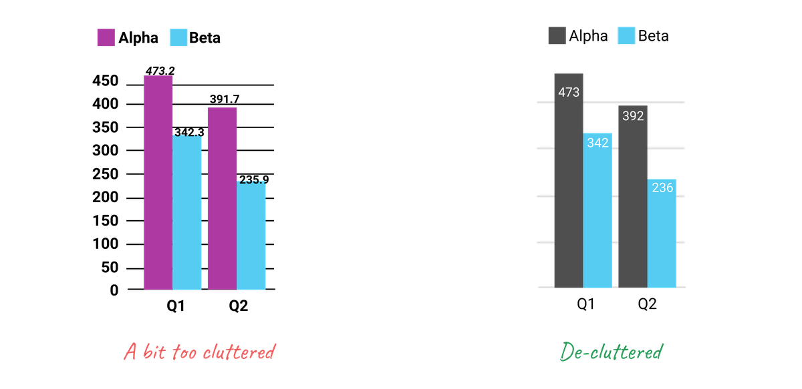{#fig-design-principles-decluttered}

요약하자면 좋은 차트 디자인은 데이터 스토리를 전달할 때 무엇이 효과적이고 무엇이 실패하는지 이해하도록 여러분의 눈과 뇌를 훈련시키는 것을 요구합니다. 나쁜 차트와 좋은 차트를 포함해 다양한 차트를 많이 보면서 데이터 시각화 근육을 키우세요. 예를 들어 Reddit의 [Data Is Beautiful](https://www.reddit.com/r/dataisbeautiful/)과 [Data is Ugly](https://www.reddit.com/r/dataisugly/) 페이지를 탐색해 보세요. 다른 독자의 의견을 읽되 자신만의 의견을 개발해 보세요. 반드시 다른 사람의 의견과 일치할 필요는 없습니다. 또한, 이것은 재미있게 배울 수 있는 방법이기도 합니다!

## Google Sheets 차트 {- #chart-google}
이 섹션에서는 [2장에서 소개한 강력한 스프레드시트 도구](#spreadsheet)인 [Google Sheets](https://sheets.google.com)로 대화형 차트를 만드는 것의 장단점을 배울 것입니다. Google Sheets는 데이터 시각화 초보자에게 많은 이점을 제공합니다. 첫째, Google Sheets를 사용하면 동일한 플랫폼에서 데이터를 정리하고, 분석하고, 공유하고, 차트를 게시할 수 있습니다. 하나의 도구로 모든 작업을 수행하므로 모든 것을 한 곳에 모아두어 작업을 구성하기 더 쉽습니다. 둘째, Google Sheets는 많은 사용자에게 친숙하고 배우기 쉬워 유려한 대화형 차트를 *빠르게* 만드는 데 도움이 될 것입니다. [Google Sheets로 만들 수 있는 차트 유형](https://support.google.com/docs/answer/190718)을 모두 확인해 보세요. 일부 사람들은 차트를 *JPG*나 *PNG* 정적 이미지로 내보내긴 하지만 이 장에서는 브라우저에서 차트 위로 마우스를 올릴 때 데이터에 대한 더 많은 정보를 표시하는 대화형 차트를 만드는 데 초점을 맞춥니다. 나중에 9장에서는 [웹사이트에 대화형 차트를 임베드하는 방법](#embed)을 배울 것입니다.

하지만 Google Sheets에도 한계는 있습니다. 첫째, 차트 부제목에 텍스트로 된 출처 메모를 입력할 수는 있지만 Google Sheets 차트 내에 원본 데이터에 대한 클릭 가능한 링크를 넣는 쉬운 방법이 없으므로, 임베드된 대화형 차트가 포함된 웹 페이지에 출처 세부 정보나 링크를 추가해야 합니다. 둘째, 차트 내에 텍스트 주석을 추가하거나 특정 항목을 강조 표시할 수 없습니다. 마지막으로 차트 디자인, 특히 데이터 시각화 위로 마우스를 올릴 때 나타나는 도구 설명을 사용자 지정하는 데 제한이 있습니다. Google Sheets가 여러분의 요구를 충족하지 못한다면 \@tbl-chart-types 표를 참조하여 [Datawrapper](#chart-datawrapper), [Tableau Public](#chart-tableau), [Chart.js 및 Highcharts 코드 템플릿](#chartcode)과 같은 다른 도구 및 튜토리얼을 확인하세요.

다음 두 섹션에서는 [막대 및 세로 막대형 차트](#bar-column-google)를 사용하는 데 가장 적합한 경우와, 이어지는 [원형, 꺾은선형 및 영역 차트](#pie-line-area-google)에 대해 검토할 것입니다. 각 섹션에는 여러분의 학습을 돕기 위해 샘플 데이터 세트와 함께 실습 예제 및 단계별 지침이 포함되어 있습니다.

## - 막대 및 세로 막대형 차트 {- #bar-column-google}
시작하기 전에 이전 섹션에서 설명한 [Google Sheets로 차트를 디자인하는 것의 장단점](#chart-google)을 반드시 검토하세요. 이 섹션에서는 여러 범주에 걸쳐 값을 비교하는 가장 일반적인 시각화 방법인 막대 및 세로 막대형 차트를 만드는 방법을 배웁니다. 그룹형(grouped), 분할형(split), 누적형(stacked)이라는 세 가지 다른 유형을 만드는 이유와 방법에 초점을 맞출 것입니다. 막대형과 세로 막대형 차트는 방향만 다를 뿐 본질적으로 같으므로, 두 유형의 지침을 함께 설명합니다. 데이터에 긴 레이블이 포함된 경우 가독성을 위해 더 많은 공간을 제공하도록 세로 막대형 차트 대신 가로 막대 차트를 만드세요.

### 그룹 막대 및 세로 막대형 차트 {-}
그룹 막대나 세로 막대형 차트는 범주를 나란히 비교할 때 가장 적합합니다. 예를 들어 연령대별 비만율의 성별 차이를 강조하고 싶다면 \@fig-column-grouped-data 그림에 표시된 것처럼 Google Sheet에서 남성과 여성 데이터 계열을 수직 열로 함께 서식을 지정하세요. 그러면 \@fig-column-grouped 그림과 같이 이러한 데이터 계열을 나란히 표시하는 그룹 세로 막대형 차트를 쉽게 만들 수 있습니다.


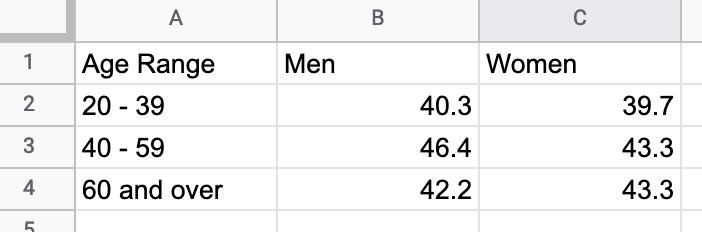{#fig-column-grouped-data width=400}


::: {.content-visible when-format="html"}

<iframe src="https://docs.google.com/spreadsheets/d/e/2PACX-1vSkvNNrgYCpNtsaCRxn7g5o4UR8OJXSxBWvUK531t5vYubt39gecV9yLIfic89DCeJnGNvpRttFfKzn/pubchart?oid=787918829&amp;format=interactive" width="100%" height="400px" style="border:none;"></iframe>
<p class="caption">그룹 세로 막대형 차트: [대화형 버전](https://docs.google.com/spreadsheets/d/e/2PACX-1vSkvNNrgYCpNtsaCRxn7g5o4UR8OJXSxBWvUK531t5vYubt39gecV9yLIfic89DCeJnGNvpRttFfKzn/pubchart?oid=787918829&format=interactive)을 탐색해 보세요. 데이터 출처: [NHANES / State of Childhood Obesity, 2017-18](https://stateofchildhoodobesity.org/monitor/).</p>

:::


대화형 그룹 세로 막대형(또는 가로 막대형) 차트를 직접 만들려면 우리의 템플릿을 사용하고 다음 단계를 따르세요.

1. 성별 및 연령별 미국 비만 데이터가 있는 [Google Sheets의 그룹 세로 막대형 차트 템플릿](https://docs.google.com/spreadsheets/d/1ltA9siijVSDkTE3fzB3UaWHO7dotBIrGH4R9wI_Qyqw/)을 엽니다. 계정에 로그인한 후 *파일(File) > 사본 만들기(Make a Copy)*로 이동하여 \@fig-file-make-copy2 그림에 표시된 대로 편집할 수 있는 버전을 자신의 Google 드라이브에 저장합니다.


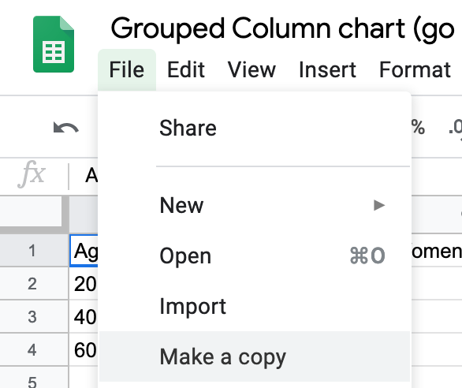{#fig-file-make-copy2 width=250px}

2. 복사한 스프레드시트에서 현재 차트를 제거하려면 커서를 차트의 오른쪽 상단 모서리에 올려 세 점 케밥 메뉴가 나타나게 한 다음 \@fig-delete-chart 그림과 같이 *차트 삭제(Delete)*를 선택합니다.


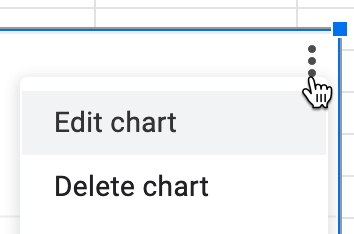{#fig-delete-chart width=180px}

3. \@fig-column-grouped-data 그림과 같이 각 열이 데이터 계열(예: 남성과 여성)이 되도록 데이터 서식을 지정합니다. 이렇게 하면 차트에서 별도의 색상으로 표시됩니다. 열은 두 개 이상 추가해도 됩니다.

4. 커서를 사용하여 차트로 만들 데이터만 선택한 다음 *삽입(Insert)* 메뉴로 이동하여 \@fig-column-grouped-insert 그림에 표시된 것처럼 *차트(Chart)*를 선택합니다.


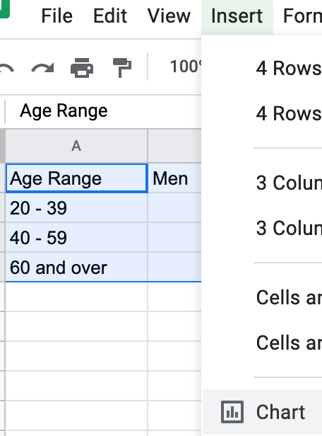{#fig-column-grouped-insert width=250px}

5. 차트 편집기(Chart Editor)에서 기본 선택 항목을 *세로 막대형 차트(Column chart)*로 변경하고 *누적 안함(Stacking none)*으로 설정하여 \@fig-column-grouped-editor 그림과 같이 그룹 막대를 표시합니다. 또는 레이블이 긴 경우 *가로 막대형 차트(Horizontal bar chart)*를 선택합니다.


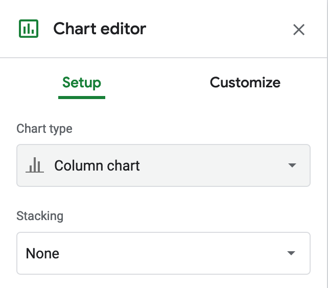{#fig-column-grouped-editor width=250px}

6. 제목, 레이블 등을 맞춤 설정하려면 차트 편집기에서 \@fig-chart-editor-customize 그림과 같이 *맞춤설정(Customize)*을 선택합니다. 또한 차트와 축 제목을 직접 선택하여 편집할 수도 있습니다.


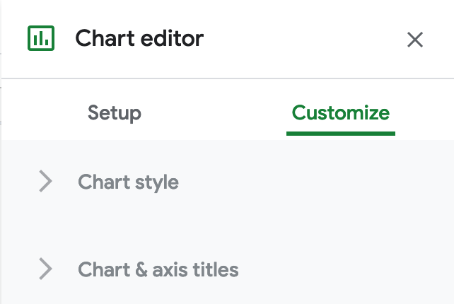{#fig-chart-editor-customize width=250px}

7. 데이터를 공개하려면 시트 오른쪽 상단 모서리로 이동하여 '공유' 버튼을 클릭하고 다음 화면에서 \@fig-share-button-sheet 그림과 같이 "링크가 있는 모든 사용자로 변경(Change to anyone with the link)"이라는 단어를 클릭합니다. 이렇게 하면 시트가 더 이상 사용자 본인에게만 제한되지 않으며 링크가 있는 모든 사람이 볼 수 있습니다. 추가 옵션을 확인해 보세요.


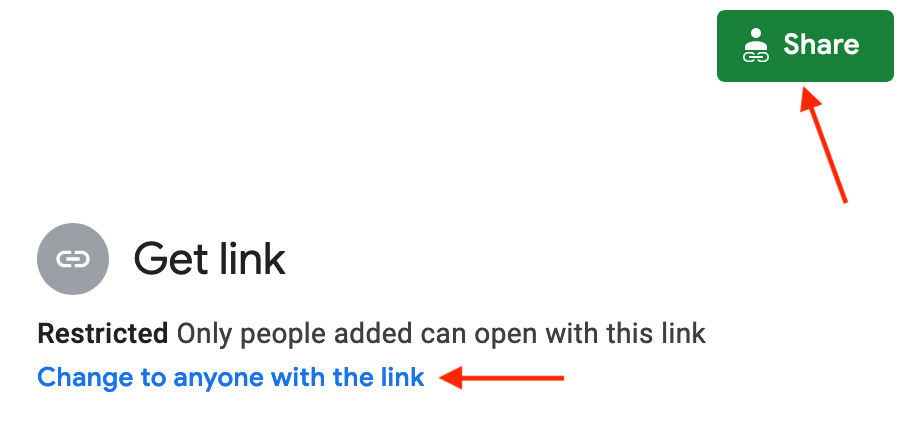{#fig-share-button-sheet width=350px}

8. 대화형 버전의 차트를 다른 웹 페이지에 임베드하려면 차트의 오른쪽 상단 모서리에 있는 케밥 메뉴를 클릭하고 \@fig-chart-publish 그림과 같이 '차트 게시(Publish chart)'를 선택합니다. 다음 화면에서 '삽입(Embed)'을 선택하고 게시 버튼을 누릅니다. iframe 코드로 무엇을 해야 하는지 알아보려면 [9장: 웹에 임베드하기](#embed)를 참조하세요.


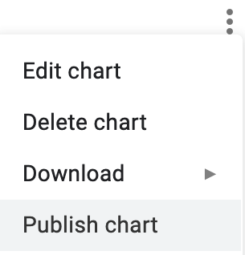{#fig-chart-publish width=150}

안타깝게도 오차 막대나 불확실성을 표시할 때 Google Sheets의 기능은 매우 제한적입니다.
특정 데이터 포인트가 아닌 개별 계열에만 일정한 숫자나 퍼센트 값을 오차 막대 값으로 할당할 수 있습니다. Google Sheets에서 오차 막대를 표시하려면 *차트 편집기*에서 *맞춤설정* 탭을 선택하고 *계열(Series)*로 스크롤한 다음 드롭다운 메뉴에서 계열을 선택합니다. *오차 막대(Error bars)*를 선택하고 \@fig-chart-error-bar 그림과 같이 값을 퍼센트 또는 상수 값으로 맞춤 설정합니다. 이 설정은 해당 계열의 모든 데이터 포인트에 적용됩니다.


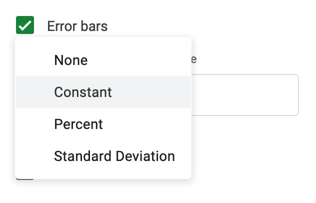{#fig-chart-error-bar width=300}

마지막으로, 데이터 출처를 제공하면 작업에 신뢰성이 더해진다는 점을 기억하세요. Google Sheets의 차트 부제목에 출처를 간략하게 설명할 수 있습니다. 하지만 차트 내에 클릭 가능한 링크를 삽입하는 쉬운 방법이 없으므로, 임베드된 대화형 차트가 포함된 별도의 웹 페이지에 더 많은 세부 정보나 링크를 추가해야 합니다.
### 분할 막대 및 세로 막대형 차트 {-}
분할 세로 막대형(또는 가로 막대형) 차트는 분리된 클러스터에서 범주를 비교할 때 가장 적합합니다. 예를 들어 두 개의 다른 레스토랑인 스타벅스와 맥도날드에서 제공하는 특정 음식의 칼로리 수를 강조하고 싶다고 가정해 봅시다. \@fig-bar-split-data 그림에 표시된 것처럼 Google Sheet에서 식당 데이터를 수직 열 형식으로 지정합니다. 음식 항목은 각 식당에 고유하므로 해당 열에만 칼로리 데이터를 입력하고 다른 셀은 비워둡니다. 이제 \@fig-bar-split 그림과 같이 식당 데이터를 다른 클러스터에 표시하는 분할 막대(또는 세로 막대형) 차트를 쉽게 만들 수 있습니다. 앞서 \@fig-column-grouped 그림에서 보여준 그룹 세로 막대형 차트와 달리, 여기서는 각 식당에 고유한 음식 항목 간에 직접 비교를 끌어내고 싶지 않기 때문에 막대들이 서로 분리되어 있습니다. 또한 데이터 레이블 중 일부가 길기 때문에 차트는 세로 막대가 아닌 가로 막대를 표시합니다.


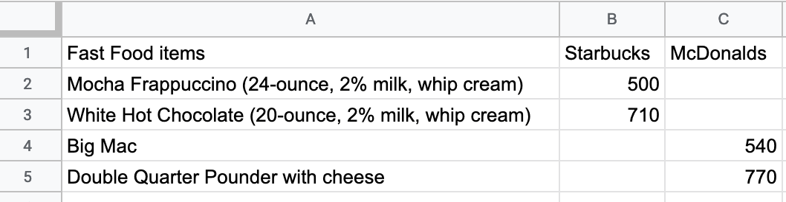{#fig-bar-split-data width=550}


::: {.content-visible when-format="html"}

<iframe src="https://docs.google.com/spreadsheets/d/1LGUYaVLoRcOiB8KcXb3Rn7LRj0exnUQYOy58LrkGPAk/pubchart?oid=1270431574&amp;format=interactive" width="100%" height="400px" style="border:none;"></iframe>
<p class="caption">분할 막대 차트: [전체 화면 대화형 버전](https://docs.google.com/spreadsheets/d/e/2PACX-1vSkvNNrgYCpNtsaCRxn7g5o4UR8OJXSxBWvUK531t5vYubt39gecV9yLIfic89DCeJnGNvpRttFfKzn/pubchart?oid=787918829&format=interactive)을 탐색해 보세요. 데이터 출처: [Starbucks and McDonalds](https://docs.google.com/spreadsheets/d/1LGUYaVLoRcOiB8KcXb3Rn7LRj0exnUQYOy58LrkGPAk/edit#gid=956322126).</p>

:::


스타벅스와 맥도날드 데이터가 있는 [Google Sheets의 분할 막대 차트 템플릿](https://docs.google.com/spreadsheets/d/1LGUYaVLoRcOiB8KcXb3Rn7LRj0exnUQYOy58LrkGPAk/)을 사용하여 자신만의 버전을 만들어 보세요. 차트에서 고유한 색상이 되도록 각 데이터 계열을 세로로 정리합니다. 직접적인 비교가 적절하지 않은 경우 셀을 비워둡니다. 나머지 단계는 위의 그룹 세로 막대형 차트 튜토리얼과 유사합니다.

### 누적 막대 및 세로 막대형 차트 {-}
누적 세로 막대형(또는 가로 막대형) 차트는 하위 범주나 전체의 일부를 비교할 때 가장 적합합니다. 예를 들어 여러 국가 간 과체중 인구 비율을 비교하려는 경우, \@fig-column-stacked-data 그림과 같이 Google Sheet에서 각 체중 수준 데이터 계열의 서식을 수직 열로 지정합니다. 이제 \@fig-column-stacked 그림과 같이 여러 국가에 걸친 체중 수준 하위 범주의 비교를 표시하는 누적 세로 막대형(또는 가로 막대형) 차트를 쉽게 만들 수 있습니다. 종종 여러 개의 원형 차트 대신 누적 차트를 사용하는 것이 더 좋은데, 사람들은 둥근 파이 조각에서보다 직사각형 누적 막대에서 차이를 더 정확하게 볼 수 있기 때문입니다.


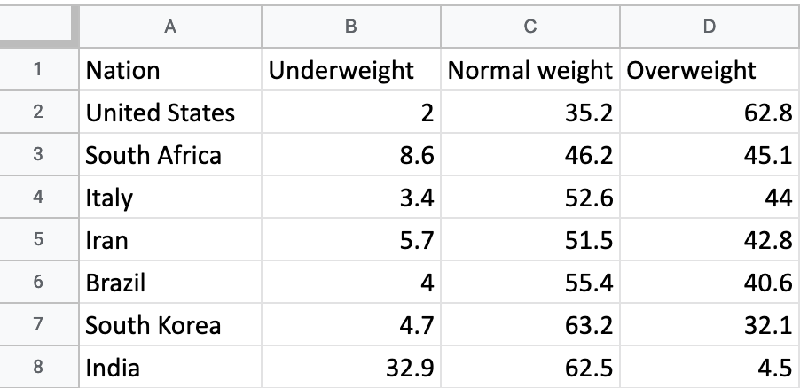{#fig-column-stacked-data width=450}


::: {.content-visible when-format="html"}

<iframe src="https://docs.google.com/spreadsheets/d/e/2PACX-1vSZrCP99EDqmpYc3VxFF5-Fpryh7KOU3GZ39Gl33OmDw4ecWKXxjrfzHDeQKfandKiUwvDkyF6kwK6L/pubchart?oid=307057605&amp;format=interactive" width="100%" height="400px" style="border:none;"></iframe>
<p class="caption">누적 세로 막대형 차트: [대화형 버전](https://docs.google.com/spreadsheets/d/e/2PACX-1vSZrCP99EDqmpYc3VxFF5-Fpryh7KOU3GZ39Gl33OmDw4ecWKXxjrfzHDeQKfandKiUwvDkyF6kwK6L/pubchart?oid=307057605&format=interactive)을 탐색해 보세요. 데이터 출처: [WHO and CDC](https://docs.google.com/spreadsheets/d/1WS11EK33JCmvCRzSDh9UpP6R7Z2sHglF7ve5iJL6eZk/edit#gid=735710691).</p>

:::


국제 체중 수준 데이터가 있는 [Google Sheets의 누적 세로 막대형 차트 템플릿](https://docs.google.com/spreadsheets/d/1WS11EK33JCmvCRzSDh9UpP6R7Z2sHglF7ve5iJL6eZk/)을 사용하여 자신만의 버전을 만들어 보세요. 각 데이터 계열을 세로로 구성하여 차트에서 자체 색상이 되도록 합니다. 차트 편집기 창에서 *차트 유형(Chart Type) > 누적 세로 막대형 차트(Stacked column chart)*를 선택합니다(또는 데이터 레이블이 긴 경우 *누적 가로 막대형 차트(Stacked bar chart)* 선택). 나머지 단계는 위와 유사합니다.

데이터 계열의 색상을 변경하려면(예: 과체중 카테고리를 빨간색으로 표시), 차트의 오른쪽 상단 모서리에 있는 케밥 메뉴를 클릭하고 *차트 편집(Edit Chart) > 맞춤설정(Customize) > 계열(Series)*로 이동합니다. 그런 다음 드롭다운 메뉴에서 적절한 계열을 선택하고 \@fig-column-stacked-edit-series 그림과 같이 드롭다운 메뉴에서 해당 색상을 설정합니다.


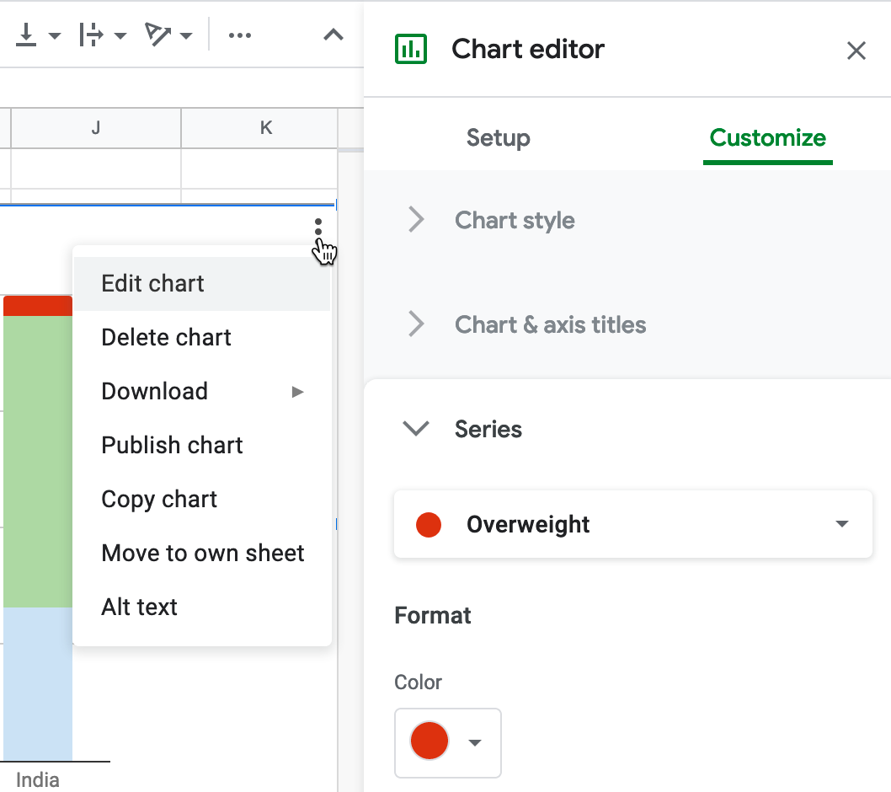{#fig-column-stacked-edit-series width=450}

## - 히스토그램 {- #histogram-google}

히스토그램은 *버킷(buckets)* 또는 *빈(bins)*이라고 불리는 정의된 범위에 속하는 값의 개수를 표시함으로써 원시 데이터의 분포를 보여주는 데 가장 적합합니다. 히스토그램을 만드는 것은 데이터의 형태를 더 잘 이해하여 [7장에서 배울 등치 지역도(choropleth maps)](#design-choropleth)와 같은 더 발전된 시각화를 디자인할 때 의사 결정을 돕는 훌륭한 방법이 될 수 있습니다. 히스토그램이 세로 막대형 차트와 비슷해 보일 수 있지만 둘은 다릅니다. 첫째, 히스토그램은 *연속적인(continuous)* 데이터를 보여주며 빈도 패턴을 탐색하기 위해 버킷 범위를 조정할 수 있는 경우가 많습니다. 예를 들어 히스토그램 버킷을 0-1, 1-2, 2-3 등에서 0-2, 2-4 등으로 이동시킬 수 있습니다. 대조적으로 세로 막대형 차트는 사과, 바나나, 당근의 개수와 같은 *범주형(categorical)* 데이터를 보여줍니다. 둘째, 히스토그램은 연속적인 값이기 때문에 일반적으로 버킷 사이에 공백을 표시하지 않는 반면, 세로 막대형 차트는 각 범주를 구분하기 위해 공백을 표시합니다.

이 섹션에서는 Google Sheets에서 두 가지 유형의 히스토그램을 만들어 볼 것입니다. *열 통계(Column stats)* 메뉴를 사용하는 빠른 히스토그램 대 *차트(Chart)* 메뉴를 사용하는 일반 히스토그램을 만들고 각 방법의 장점을 알아봅니다. 두 튜토리얼 모두 [유엔 식량 농업 기구(FAO)](http://www.fao.org/faostat/en/#data/FBS)가 편집하고 [Our World In Data](https://ourworldindata.org/food-supply)를 통해 접근한 2017년 174개국의 1인당 평균 칼로리 공급량이라는 동일한 데이터를 사용합니다. 식량 공급을 측정하는 방법은 국가마다, 시간이 지남에 따라 다르며 실제 소비량이 아닌 가용 식량의 양을 추정한다는 점에 유의하세요.

### Google Sheets 열 통계로 빠른 히스토그램 만들기 {-}

1. [Google Sheets의 2017년 국가별 1인당 1일 평균 칼로리 공급량(Average Daily Calorie Supply per capita by country 2017)](https://docs.google.com/spreadsheets/d/1V-r1bOWpvyCRhmJa0gRZ1TEchXvrr7UTZ97rKOU1WRo/edit#gid=1132930452) 샘플 데이터를 열고 계정으로 로그인한 후 *파일(File) > 사본 만들기(Make a Copy)*로 이동하여 Google 드라이브에서 편집할 수 있는 버전을 만듭니다.

2. Google Sheets에서 빠른 히스토그램을 만들려면 아무 열이나 선택한 다음 *데이터(Data) > 열 통계(Column stats)*로 이동하고 그림 [\@fig-histogram-quick]과 같이 사이드바에서 *분포(Distribution)* 버튼을 클릭하여 해당 열에 대한 히스토그램을 봅니다. 장점은 이 방법이 매우 빠르며 사이드바 상단 근처의 화살표(`< >`)를 사용하여 같은 시트의 다른 열에 대한 히스토그램을 빠르게 만들 수 있다는 것입니다. 하지만 버킷 범위를 수동으로 조정하거나 이 빠른 히스토그램에 다른 편집을 할 수 없으며 Google Sheets의 일반 차트처럼 웹에 삽입(embed)할 수 없습니다.


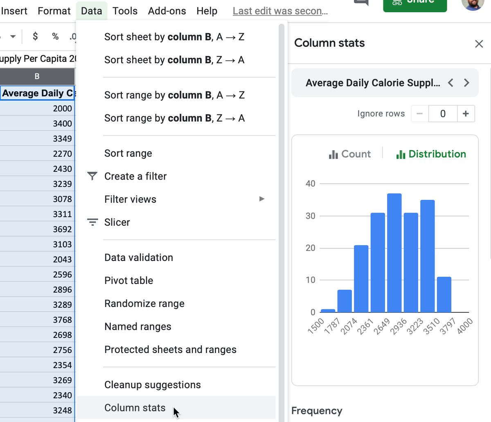{#fig-histogram-quick width=500}

히스토그램은 개별 값이 아닌 데이터 분포의 전반적인 패턴을 보여주기 위해 고안되었습니다. \@fig-histogram-quick 그림의 히스토그램은 대부분의 국가가 1인당 일일 평균 약 2,800칼로리의 공급량을 가지는 반면 8개국은 2,000칼로리 미만, 11개국은 3,500칼로리 이상임을 보여줍니다. 주석이 없다면 히스토그램은 그런 이상치 국가들의 이름을 알려주지 않습니다. 그러나 데이터 분포의 형태에 대해서는 더 나은 감각을 제공합니다.

### Google Sheets 차트로 일반 히스토그램 만들기 {-}

\@fig-histogram-quick 그림의 *열 통계*로 만든 빠른 히스토그램과 \@fig-histogram 그림의 *차트*로 만든 일반 히스토그램을 비교해 보세요. 일반 히스토그램에서는 독자에게 더 많은 문맥을 제공하기 위해 버킷 범위를 정의하고, 구분선을 표시하고, 제목과 레이블을 추가할 수 있음을 알 수 있습니다. 또한 일반 히스토그램의 대화형 버전에서는 사용자가 커서를 올려 각 열의 개수에 대한 기본 데이터를 볼 수 있습니다.


::: {.content-visible when-format="html"}

<iframe src="https://docs.google.com/spreadsheets/d/e/2PACX-1vRyg09UZgGWVHPk3oOKAZ-zlqtDF_RpvOLdAsM-k-ZW5NavcxAyHbErgr-7dt7U_AFSVZONSTZ9sVII/pubchart?oid=480820223&amp;format=interactive" width="100%" height="400px" style="border:none;"></iframe>
<p class="caption">일반 히스토그램 차트: 전체 화면 [대화형 버전](https://docs.google.com/spreadsheets/d/e/2PACX-1vRyg09UZgGWVHPk3oOKAZ-zlqtDF_RpvOLdAsM-k-ZW5NavcxAyHbErgr-7dt7U_AFSVZONSTZ9sVII/pubchart?oid=480820223&amp;format=interactive)을 탐색해 보세요.</p>

:::


1. Google Sheets에서 일반 히스토그램을 만들려면 [Google Sheets의 2017년 국가별 1인당 1일 평균 칼로리 공급량(Average Daily Calorie Supply per capita by country 2017)](https://docs.google.com/spreadsheets/d/1V-r1bOWpvyCRhmJa0gRZ1TEchXvrr7UTZ97rKOU1WRo/edit#gid=1132930452) 샘플 데이터를 열고 계정으로 로그인한 다음 *파일(File) > 사본 만들기(Make a Copy)*로 이동하여 Google 드라이브에 편집 가능한 버전을 만드세요.

2. \@fig-histogram-select-column 그림에 나타난 것처럼 숫자 값이 있는 열을 *단 하나만* 선택합니다.


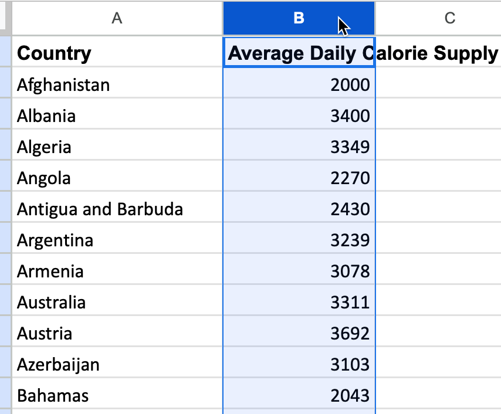{#fig-histogram-select-column width=300}

3. *삽입(Insert) > 차트(Chart)*로 이동합니다. Google Sheets가 차트 편집기의 *차트 유형(Chart type)*으로 *히스토그램 차트(Histogram chart)*를 자동으로 선택하지 않으면 \@fig-histogram-chart-type 그림과 같이 드롭다운을 사용하여 *기타(Other)* 범주의 맨 아래 근처에서 수동으로 선택합니다.


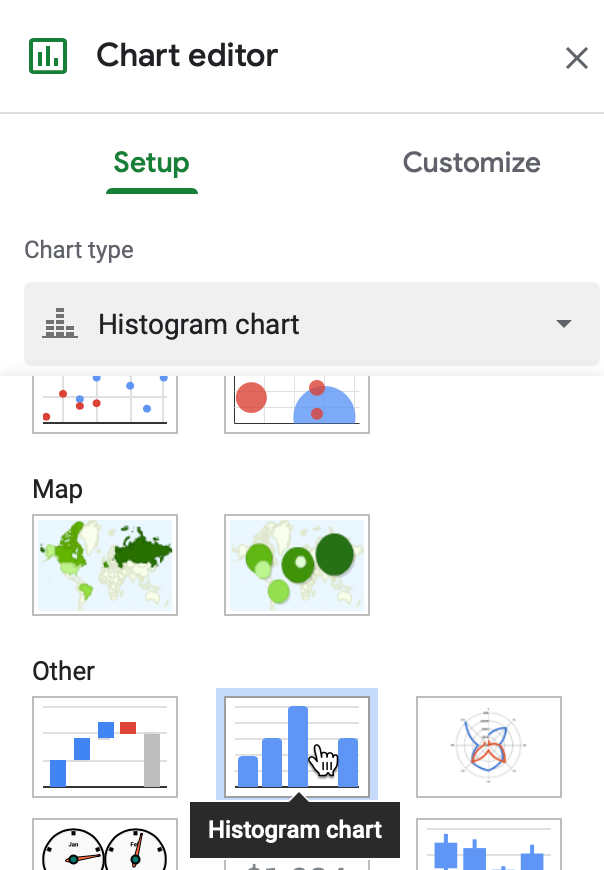{#fig-histogram-chart-type width=300}

4. 데이터 분포를 나타내는 데 적합하다면 각 버킷의 범위를 수동으로 설정하고 구간(breakpoints)을 정수(예: 1, 5 또는 100의 배수)로 반올림할 수 있습니다. 차트 편집기에서 *맞춤설정(Customize) > 히스토그램(Histogram) > 버킷 크기(Bucket size)*로 이동합니다. 간격이 크면 더 많은 데이터 포인트가 포함되어 넓게 나타나고 간격이 작으면 더 적은 포인트가 포함되어 좁게 나타납니다.

참고: 현재 Google Sheets는 모든 구간이 정수일 때도 사용자가 히스토그램의 x축 레이블에서 소수점을 제거하는 것을 허용하지 않습니다.

5. 선택적으로, 흰색 경계선이 있는 블록으로 나타나도록 열을 개별 항목(이 예시에서는 국가)으로 나눌 수 있습니다. 이렇게 하려면 *맞춤설정 > 히스토그램 > 항목 구분선 표시(Show item dividers)*로 이동합니다.

6. 차트 편집기에서 *차트 제목(Chart title)*, 출처를 설명하는 *부제목(subtitle)*을 추가하고 독자가 차트를 해석하는 데 도움이 되도록 세로 및 가로축 제목도 추가하여 추가 맞춤설정을 진행합니다.

일반 히스토그램은 차트 기능을 사용하여 만들어지기 때문에 [9장: 웹에 임베드하기](#embed)에서 배울 것처럼 *게시(Publish)*를 선택하고 대화형 버전에 대한 임베드 코드를 복사할 수 있습니다.

이제 원시 데이터의 분포를 표시하기 위해 히스토그램을 만드는 방법을 배웠으니, 다음 섹션에서는 원형, 꺾은선형 및 영역 차트와 같은 다른 유형의 Google Sheets 차트 유형으로 넘어가 보겠습니다.

## - 원형, 꺾은선형, 및 영역 차트 {- #pie-line-area-google}
이 섹션을 시작하기 전에 이 장의 이전 섹션에서 다룬 [Google Sheets로 차트를 디자인하는 것의 장단점](#chart-google)과 [막대 및 세로 막대형 차트를 만드는 초보자 수준의 단계별 지침](#bar-column-google)을 반드시 검토하세요. 이 섹션에서는 Google Sheets를 사용하여 세 가지 유형의 대화형 시각화를 더 구축하는 이유와 방법에 대해 배울 것입니다. 세 가지는 각각 원형 차트(전체의 일부 표시), 꺾은선형 차트(시간에 따른 변화 표시), 그리고 누적 영역 차트(전체의 일부 표시와 시간에 따른 변화 결합)입니다. Google Sheets나 이러한 차트 유형이 여러분의 요구에 맞지 않는다면, 다른 도구와 튜토리얼은 \@tbl-chart-types 표를 참조하세요.

### 원형 차트 {-}
일부 사람들은 전체에 대한 부분을 보여주기 위해 원형 차트를 사용하지만 아래에 설명된 이유들 때문에 우리는 이 유형의 차트를 사용할 때 주의를 촉구합니다. 예를 들어 상점에서 하루 동안 판매된 여러 과일의 수를 전체 판매 과일의 비율로 표시하려는 경우 \@fig-pie-data 그림에 나타난 것처럼 Google Sheet의 수직 열에 레이블과 값의 서식을 지정합니다. 값은 원시 숫자 또는 퍼센트로 표현될 수 있습니다. 이제 \@fig-pie 그림과 같이 이러한 값을 원의 색상이 칠해진 조각으로 표시하는 원형 차트를 쉽게 만들 수 있습니다. 시청자는 판매된 과일의 절반을 조금 넘는 비율을 바나나가 차지하고 있으며 그 뒤를 사과와 오렌지가 잇고 있다는 것을 알 수 있습니다.


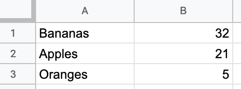{#fig-pie-data width=300}


::: {.content-visible when-format="html"}

<iframe src="https://docs.google.com/spreadsheets/d/e/2PACX-1vQai8YWkqMOHsiwWXpe1jyhBKy5wW6zcMaEIklkF-598h1QaVBrRR0F9JVrsX2Zo5ihXWP-HlnY-KlE/pubchart?oid=760990456&amp;format=interactive" width="100%" height="400px" style="border:none;"></iframe>
<p class="caption">원형 차트: [대화형 버전](https://docs.google.com/spreadsheets/d/e/2PACX-1vQai8YWkqMOHsiwWXpe1jyhBKy5wW6zcMaEIklkF-598h1QaVBrRR0F9JVrsX2Zo5ihXWP-HlnY-KlE/pubchart?oid=760990456&format=interactive)을 탐색해 보세요. 데이터는 가상의 것입니다.</p>

:::


하지만 이 장의 [차트 디자인 섹션](#chart-design)에서 설명했듯이 원형 차트를 사용할 때는 주의해야 합니다. 첫째, 데이터의 합이 100퍼센트가 되도록 하세요. 만약 판매된 과일 중 *전부*가 아닌 *일부*만 표시하는 원형 차트를 만들었다면 이치에 맞지 않을 것입니다. 둘째, 사람들이 작은 조각을 쉽게 구별할 수 없으므로 너무 많은 조각을 만들지 마세요. 이상적으로는 원형 차트에서 5개 이하의 조각을 사용하세요. 마지막으로 원의 맨 위(12시 방향)에서 파이를 시작하여 가장 큰 조각에서 가장 작은 조각 순으로 시계 방향으로 배치하세요.

[Google Sheets의 원형 차트 템플릿](https://docs.google.com/spreadsheets/d/11cn0eysXqXIwhcTKmGuzMDw_RmpDpYLKZN3TeevT-Vg/)을 사용하여 자신만의 버전을 만들어보세요. 단계는 이 장의 이전 Google Sheets 차트 튜토리얼과 유사합니다. *파일 > 사본 만들기*로 이동하여 Google 드라이브에서 편집할 수 있는 버전을 만듭니다. 모든 셀을 선택하고 *삽입 > 차트*로 이동합니다. 만약 Google Sheets가 사용자가 원형 차트를 만들려고 한다는 것을 올바르게 추측하지 못했다면, 차트 편집기 창의 설정 탭에서 *차트 유형* 드롭다운 목록에 있는 *원형 차트*를 선택하세요.

조각들은 스프레드시트에 나타나는 것과 동일한 순서로 정렬됩니다. 시트 전체를 선택하고 값 열을 가장 큰 것에서 가장 작은 것으로 또는 Z에서 A로 *정렬(Sort)*합니다. 차트 편집기의 *맞춤설정* 탭에서 색상을 변경하고 조각에 테두리를 추가할 수 있습니다. 그런 다음 원하는 대로 의미 있는 제목과 레이블을 추가하세요.

### 꺾은선형 차트 {-}
꺾은선형 차트는 시간에 따른 변화와 같은 연속적인 데이터를 표현하는 가장 좋은 방법입니다. 예를 들어 지난 1세기 동안 미국의 1인당 다양한 육류 가용성을 비교하고 싶다고 상상해 보세요. Google Sheet에서 시간 단위(예: 연도)가 수평 X축에 표시되므로 첫 번째 열로 구성합니다. 또한 각 데이터 계열(소고기, 돼지고기, 닭고기 등)을 수직 시간 단위 열 옆에 배치하면 \@fig-line-data 그림과 같이 각 계열이 자체적인 선이 됩니다. 이제 \@fig-line 그림에 표시된 것처럼 시간이 지남에 따라 각 데이터 계열이 어떻게 변했는지를 강조하는 꺾은선형 차트를 쉽게 만들 수 있습니다. 미국에서는 1인당 닭고기 양이 꾸준히 증가하여 2000년경 돼지고기와 소고기를 앞질렀습니다.


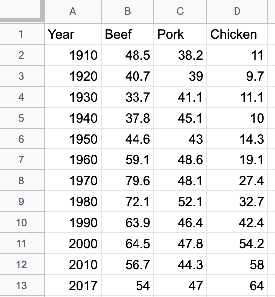{#fig-line-data width=300}


::: {.content-visible when-format="html"}

<iframe src="https://docs.google.com/spreadsheets/d/e/2PACX-1vS38EC_34L8gKK9NStS8S322BzvBRbnRNpu9KXQ4oHHpaDmVMBAhEu4SXtCC6CD2yv_V6brX8s386Nf/pubchart?oid=2073830845&amp;format=interactive" width="100%" height="400px" style="border:none;"></iframe>
<p class="caption">꺾은선형 차트: [대화형 버전](https://docs.google.com/spreadsheets/d/e/2PACX-1vS38EC_34L8gKK9NStS8S322BzvBRbnRNpu9KXQ4oHHpaDmVMBAhEu4SXtCC6CD2yv_V6brX8s386Nf/pubchart?oid=2073830845&format=interactive)을 탐색해 보세요. 데이터 출처: [US Department of Agriculture](https://docs.google.com/spreadsheets/d/1wkWxxZ2-N5hqkcp7in8bxwdEcT1-XMnt1A8qUXxUSjw/edit?usp=sharing).</p>

:::


[Google Sheets의 꺾은선형 차트 템플릿](https://docs.google.com/spreadsheets/d/1wkWxxZ2-N5hqkcp7in8bxwdEcT1-XMnt1A8qUXxUSjw/)을 사용하여 자신만의 버전을 만들어 보세요. 단계는 이 장의 이전 Google Sheets 차트 튜토리얼과 유사합니다. *파일 > 사본 만들기*로 이동하여 Google 드라이브에서 편집할 수 있는 버전을 만드세요. 데이터를 선택하고 *삽입 > 차트*를 선택합니다. 만약 Google Sheets가 꺾은선형 차트를 만들려고 한다는 것을 올바르게 추측하지 못했다면 차트 편집기의 설정 탭에서 차트 유형 드롭다운 목록에 있는 *꺾은선형 차트*를 선택하세요.

사이드바: 표와 차트는 시계열 데이터에 정반대 방향으로 접근합니다. 표를 디자인할 때는 날짜를 가로로 열 머리글로 배치하여 다음처럼 왼쪽에서 오른쪽으로 읽도록 하는 것이 올바른 방법입니다:^[@fewShowMeNumbers2012, p. 166]

| Year    | 2000 | 2010 | 2020 |
|---------|------|------|------|
| Series1 | ...  | ...  | ...  |
| Series2 | ...  | ...  | ...  |

하지만 Google Sheets나 여러 다른 도구에서 꺾은선형 차트를 디자인할 때는 날짜를 첫 번째 열의 세로 방향으로 내려가도록 스프레드시트를 구성하여 다음처럼 도구가 이를 데이터 계열의 레이블로 읽도록 합니다:

| Year | Series1 | Series2 |
|------|---------|---------|
| 2000 | ...     | ...     |
| 2010 | ...     | ...     |
| 2020 | ...     | ...     |

표의 데이터를 차트용으로 변환하려면 [4장: 지저분한 데이터 정리하기에서 행과 열을 바꾸는 방법](#transpose)을 배우세요.

### 누적 영역 차트 {-}
영역 차트는 그 아래 공간이 채워진 꺾은선형 차트와 비슷합니다. 가장 유용한 유형은 누적 영역 차트인데, 위에서 언급한 두 가지 개념, 즉 (원형 차트처럼) 전체의 일부를 보여주는 것과 (꺾은선형 차트처럼) 시간에 따른 연속 데이터를 결합하는 데 가장 적합합니다. 예를 들어 위의 꺾은선형 차트는 시간에 따라 세 가지 육류의 가용성이 어떻게 변했는지 보여줍니다. 그러나 이러한 결합된 육류의 전체 가용성이 시간에 따라 어떻게 오르내렸는지도 보여주고 싶다면 꺾은선형 차트에서는 이를 확인하기 어렵습니다. 대신 누적 영역 차트를 사용하여 시간이 지남에 따라 1인당 각 육류의 가용성*과* 전체 가용성 합계를 시각화하세요. 누적 꺾은선형(영역) 차트는 데이터의 두 가지 측면을 동시에 보여줍니다.

누적 영역 차트를 만들려면 \@fig-line-data 그림의 꺾은선형 차트와 같은 방식으로 데이터를 정리하세요. 이제 \@fig-stacked-area 그림과 같이 시간이 지남에 따라 각 육류의 가용성그리고 그 합계을 표시하는 누적 영역 차트를 쉽게 만들 수 있습니다. 전반적으로 우리는 1930년대 대공황 이후 1인당 이용 가능한 전체 육류가 증가했으며 닭고기가 1970년 이후 전체에서 더 큰 부분을 꾸준히 차지하게 되었음을 알 수 있습니다.


::: {.content-visible when-format="html"}

<iframe src="https://docs.google.com/spreadsheets/d/e/2PACX-1vSotrM_zZDo0MT--JgXwA3nBQudzIwmt8TGwmZxvUxNUzPrfBgqso5glLn05ObJxdTTmKoT_fQWQMx-/pubchart?oid=1976471326&amp;format=interactive" width="100%" height="400px" style="border:none;"></iframe>
<p class="caption">누적 영역 차트: [대화형 버전](https://docs.google.com/spreadsheets/d/e/2PACX-1vSotrM_zZDo0MT--JgXwA3nBQudzIwmt8TGwmZxvUxNUzPrfBgqso5glLn05ObJxdTTmKoT_fQWQMx-/pubchart?oid=1976471326&format=interactive)을 탐색해 보세요. 데이터 출처: [US Department of Agriculture](https://docs.google.com/spreadsheets/d/16QR4prVUoztW6bFVyj_q0n8GjNWqkcW6sgAkIyHQIJc/edit?usp=sharing).</p>

:::


[Google Sheets의 누적 영역 차트 템플릿](https://docs.google.com/spreadsheets/d/16QR4prVUoztW6bFVyj_q0n8GjNWqkcW6sgAkIyHQIJc/)을 사용하여 자신만의 버전을 만들어 보세요. 단계는 이 장의 이전 Google Sheets 차트 튜토리얼과 유사합니다. *파일 > 사본 만들기*로 이동하여 Google 드라이브에서 편집할 수 있는 버전을 만드세요. 데이터를 꺾은선형 차트와 동일하게 첫 번째 열은 X축의 시간 단위로, 각 데이터 계열은 고유한 열에 배치하여 설정합니다. 데이터를 선택하고 *삽입 > 차트*를 선택합니다. 차트 편집기의 설정 탭에 있는 차트 유형 드롭다운 목록에서 *누적 영역 차트(Stacked area chart)*를 선택하세요.

이제 Google Sheets에서 몇 가지 기본 차트를 구축했으므로, 다음 섹션에서는 Datawrapper라는 다른 도구를 통해 조금 더 발전된 차트를 만들어 볼 것입니다.

## Datawrapper 차트 {- #chart-datawrapper}

대화형 차트를 만들기 위한 또 다른 무료이자 협업 도구로는 [Datawrapper](https://www.datawrapper.de/)가 있으며 이는 Google Sheets에 비해 여러 장점이 있습니다. 첫째, 계정을 만들지 않고도 브라우저에서 바로 Datawrapper 창작을 시작할 수 있으며 4단계 프로세스는 많은 신규 사용자에게 직관적입니다. 둘째, 온라인에 게시하는 Datawrapper 시각화 내부에 크레딧 바이라인(bylines), 데이터 출처 링크를 추가할 수 있고 방문자가 버튼을 눌러 데이터를 다운로드하도록 허용할 수도 있어 작업의 신뢰성과 접근성이 향상됩니다. 셋째, Datawrapper는 Google Sheets보다 더 광범위한 대화형 차트 유형을 지원하며 [7장에서 논의할 지도(maps)](#map)와 [8장의 표(tables)](#table)도 지원합니다. Datawrapper를 사용하면 이 장에서 지금까지 작성한 모든 기본 차트를 구축할 수 있을 뿐만 아니라 아래에서 다룰 세 가지 새로운 유형인 [주석이 달린 차트](#annotated-datawrapper), [범위 차트](#range-datawrapper), 그리고 [분산형 및 거품형 차트](#scatter-bubble-datawrapper)도 만들 수 있습니다. 나중에 9장에서는 [웹사이트에 대화형 Datawrapper 차트를 임베드하는 방법](#embed)을 배울 것입니다.

모든 것을 다 해주는 단일 도구는 없지만 Google Sheets와 Datawrapper를 함께 써서 이 만만한 도구 쌍을 든든한 시각화 조합으로 만들어 보길 권합니다. 첫째, Google Sheets를 스프레드시트로 사용하여 [2장에서 설명한 대로 데이터를 정리하고 분석하며](#spreadsheet), [3장에서 설명한 대로 자세한 소스 메모를 기록하고 원시 데이터 파일을 저장하며](#find), [4장에서 설명한 대로 데이터를 정리하세요](#clean). Datawrapper가 데이터의 조옮김(행과 열 스왑)은 할 수 있지만 스프레드시트처럼 피벗 테이블을 만들거나 데이터를 검색하고 병합할 수는 없습니다. 둘째, Google Sheets에서 Datawrapper로 데이터를 가져와 시각화를 만드세요. 후자의 도구가 시각화의 모양, 주석 및 아래 설명된 추가 기능에 대해 더 많은 제어권을 제공하기 때문입니다. Datawrapper는 Google Sheets에 저장된 데이터에 대한 직접 링크를 수용하여 원활하게 상호작용한다는 것을 알게 될 것입니다. Google Sheets와 Datawrapper는 매우 강력한 조합입니다.

또한, 고품질의 [Datawrapper Academy 지원 페이지](https://academy.datawrapper.de/), 광범위한 [예제 갤러리](https://www.datawrapper.de/charts/), 잘 설계된 [교육 자료](https://www.datawrapper.de/training-materials/)를 적극 권장합니다. 이를 읽으면 어떤 버튼을 누를지 배울 뿐만 아니라, 더 중요하게는 데이터에 대한 진실하고 의미 있는 이야기를 전달하는 더 나은 시각화를 디자인하는 방법을 배우게 될 것입니다. 이 책을 쓰는 동안 우리는 Datawrapper Academy로부터 많은 것을 배웠으며 아래 섹션들에 출처와 특정 링크를 제공합니다. 마지막으로 또 다른 장점은 차트와 지도를 만드는 대부분의 플랫폼 플러그인에는 적용되지 않더라도 [Datawrapper Core는 오픈 소스 코드](https://github.com/datawrapper/datawrapper)라는 점입니다.

이제 Datawrapper를 사용하여 기본을 넘어서는 새로운 유형의 차트를 만들 준비가 되었습니다. 하지만 Datawrapper나 이 섹션의 차트 유형이 여러분의 요구에 맞지 않는다면, \@tbl-chart-types 표에서 다른 도구 및 튜토리얼을 참고하거나 스프레드시트, 데이터 확보 및 정리에 관한 이전 장을 참조하세요.

## - 주석이 달린 차트 {- #annotated-datawrapper}
주석이 달린 차트(Annotated chart)는 특정 데이터를 강조하거나 시각화 내부에 맥락적 메모를 추가하는 데 가장 적합합니다. 잘 디자인된 주석은 차트에서 데이터의 중요성을 간략히 기록하고 이어지는 문장이나 단락에 자세한 내용을 담아 "그래서 어쩌라고?(so what?)"라는 질문에 답하는 데 도움을 줄 수 있습니다. 이 장의 [차트 디자인 원칙 섹션](#chart-design)에서 설명했듯이 불필요한 "차트 정크"를 추가하는 것을 피하는 것이 중요하므로 주석 사용 시 주의해야 합니다.

Datawrapper로 만든 모든 차트에 주석을 추가할 수 있으며 2000-2020년 미국 실업 데이터를 보여주는 꺾은선형 차트를 통해 그 방법을 설명할 것입니다. 역사적 맥락을 조금 더하면 종종 독자가 시간에 따른 변화에 관한 데이터 스토리를 더 잘 이해하는 데 도움이 되기 때문입니다. Datawrapper에서 꺾은선형 차트를 만들려면 위의 [Google Sheets 꺾은선형 차트 튜토리얼](#pie-line-area-google)에서 했던 것과 같은 방식으로 데이터를 정리하세요. 첫 번째 열에 시간 단위(예: 월-연도)를 배치하고 두 번째 열에 숫자 데이터 값(예: 실업률)을 배치합니다. 이제 \@fig-datawrapper-annotated 그림에 표시된 것처럼 주석이 달린 대화형 꺾은선형 차트를 만들 준비가 되었습니다. 2000년 이후 실업률은 세 번 정점을 찍었지만 가장 높은 정점은 코로나 팬데믹으로 촉발된 2020년 경제 위기 때 발생했습니다.


::: {.content-visible when-format="html"}

<iframe src="https://datawrapper.dwcdn.net/vHuob/" width="100%" height="400px" style="border:none;"></iframe>
<p class="caption">주석이 달린 꺾은선형 차트: [대화형 버전](https://datawrapper.dwcdn.net/vHuob/)을 탐색해 보세요. 데이터 출처: [US Federal Reserve Open Data](https://docs.google.com/spreadsheets/d/1mjUu4OfMjWfFP-miPiObi6vXzJUIMi1TSuoaT61FU6U/edit#gid=821851972).</p>

:::


이 튜토리얼에 따라 Datawrapper에서 주석이 달린 꺾은선형 차트를 직접 만들어보세요:

1. [Google Sheets의 2000-2020 미국 계절조정 실업(US Unemployment Seasonally Adjusted 2000-2020)](https://docs.google.com/spreadsheets/d/1mjUu4OfMjWfFP-miPiObi6vXzJUIMi1TSuoaT61FU6U/edit#gid=821851972) 샘플 데이터를 열고 *파일(File) > 사본 만들기(Make a Copy)*로 이동하여 Google 드라이브에 자신만의 버전을 만드세요. 또는 *파일 > 다운로드*로 이동하여 CSV 또는 Excel 버전을 컴퓨터로 내보내세요.

2. 브라우저에서 [Datawrapper](https://www.datawrapper.de)를 열고 *시작하기(Start Creating)*를 클릭합니다. 시각화를 더 잘 관리하려면 무료 계정을 만드는 것을 권장하지만 필수 사항은 아닙니다.

3. *데이터 업로드(Upload Data)* 화면에서 *Google Spreadsheet 가져오기(Import Google Spreadsheet)*를 클릭하고 위의 공유된 Google Sheet에 있는 데이터 링크를 그림 \@fig-datawrapper-annotated-upload 와 같이 붙여넣은 다음 *진행(Proceed)*을 클릭합니다. Google Sheet를 업로드하려면 공유 설정이 기본 설정인 *제한됨(Private)*에서 최소한 *링크가 있는 모든 사용자 보기 가능*으로 변경되어야 합니다. 또한 Google Sheet의 셀을 업데이트하면 연결된 Datawrapper 차트에서 자동으로 업데이트되지만 차트가 온라인에 게시된 후에는 자동으로 반영되지 않습니다. 다른 방법으로는 데이터를 데이터 테이블 창에 복사하여 붙여넣거나 Excel 또는 CSV 파일을 업로드할 수도 있습니다.


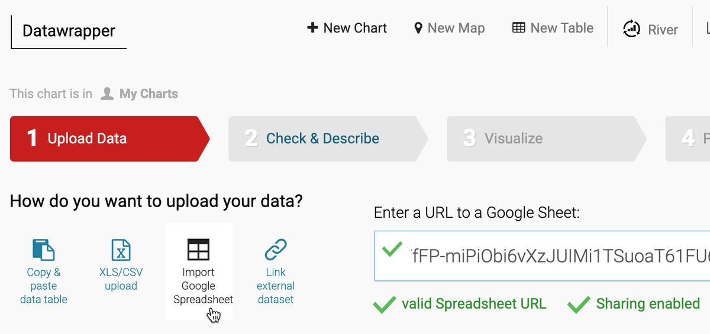{#fig-datawrapper-annotated-upload width=550}

4. *확인 및 설명(Check and Describe)* 화면에서 데이터를 검사하여 숫자는 파란색, 날짜는 초록색, 텍스트는 검정색 글씨로 표시되는지 확인하고 *진행(Proceed)*을 클릭합니다.

팁: 필요한 경우 *확인 및 설명* 화면 하단에 데이터의 조옮김(행과 열 교환)을 할 수 있는 버튼이 있습니다. 이는 수신한 데이터가 Datawrapper가 예상하는 방향과 반대로 구성된 경우 유용합니다. 하지만 샘플 데이터는 올바르게 구성되어 있으므로 조옮김할 필요가 없습니다.

5. *시각화(Visualize)* 화면에서 Datawrapper는 데이터 형식을 기반으로 여러분이 원하는 차트 유형을 추측하려고 시도할 것입니다. 샘플 데이터를 올바르게 입력했다면 꺾은선형 차트가 바르게 표시될 것입니다. 그렇지 않은 경우 다른 차트 유형을 선택할 수 있습니다.

6. *시각화* 화면 왼쪽 상단 부근에 있는 *주석 달기(Annotate)* 탭을 클릭합니다. "2000-2020 미국 계절조정 실업률(US Unemployment Rate, Seasonally Adjusted, 2000-2020)"과 같이 의미 있는 제목을 입력하세요. 또한 "미국 연방 준비 은행 오픈 데이터(US Federal Reserve Open Data)"와 같은 데이터 출처를 추가하고 [공유된 Google Sheet](https://docs.google.com/spreadsheets/d/1mjUu4OfMjWfFP-miPiObi6vXzJUIMi1TSuoaT61FU6U/edit#gid=821851972) 또는 [연방 준비 은행 오픈 데이터 웹 페이지](https://fred.stlouisfed.org/series/UNRATE)와 같이 출처로 연결되는 링크도 추가하세요. 마지막으로 바이라인 줄에 여러분의 이름이나 조직을 추가하여 이 차트를 만든 사람들에게 크레딧을 줍니다. 이러한 모든 세부 정보와 링크가 차트 하단에 자동으로 표시되어 여러분의 작업에 신뢰성을 더해줄 것입니다.

7. *주석 달기* 탭에서 조금 더 아래로 스크롤하여 *텍스트 주석(Text annotations)* 섹션으로 이동하고 버튼을 클릭하여 하나를 추가합니다. 차트에 분홍색 사각형을 그려 2008년부터 2010년까지 실업률이 급등한 곳에 주석을 배치하고 \@fig-datawrapper-annotated-text 그림과 같이 텍스트 필드에 "대침체(Great Recession)"를 입력하세요. 이는 독자가 [대침체](https://en.wikipedia.org/wiki/Great_Recession_in_the_United_States)를 역사적 맥락에 배치하는 데 도움이 됩니다. 버튼을 두 번째로 클릭하여 다른 텍스트 주석을 추가하고 이를 2020년 두 번째 실업 정점 근처에 배치한 다음 텍스트 필드에 "코로나 팬데믹(Covid Pandemic)"을 입력하여 독자에게 비교를 제공하세요. 화면 아래쪽의 추가 옵션을 사용하여 주석의 스타일과 위치를 미세하게 조정할 수 있습니다.


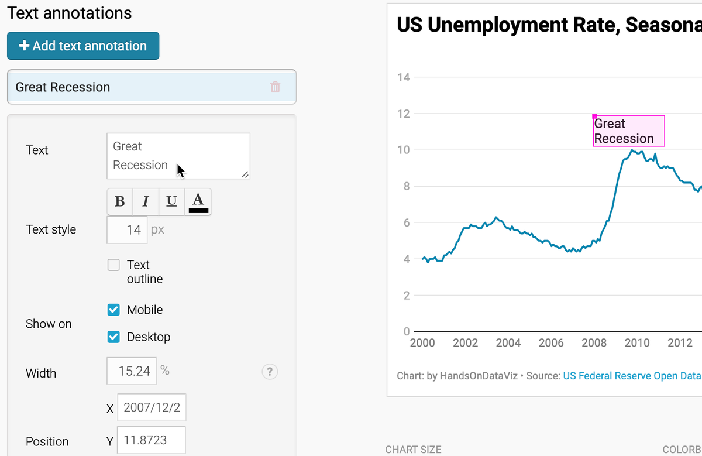{#fig-datawrapper-annotated-text}

8. *주석 달기* 탭에서 조금 더 아래로 스크롤하여 *강조 범위(Highlight range)* 섹션으로 이동하고 버튼을 클릭하여 차트에 하나를 추가합니다. 차트 내부를 클릭하여 2007년 12월부터 2009년 6월까지 분홍색 선을 그리면, \@fig-datawrapper-annotated-range 그림과 같이 차트의 해당 부분이 회색으로 강조 표시됩니다. 일반 대중의 실업률은 계속해서 증가했지만 이 기간은 경제학자들의 눈에 미국의 대침체가 공식적으로 시작되고 끝난 기간을 나타냅니다. 다른 공식적인 침체기를 강조하려면 2001년 3월~11월, 2020년 2월~10월(이 글을 쓰는 시점에서 가장 최신 데이터) 등 범위를 두 개 더 그리세요. 역시 화면 아래의 추가 옵션을 사용하여 강조 표시된 범위의 스타일과 위치를 미세 조정할 수 있습니다.


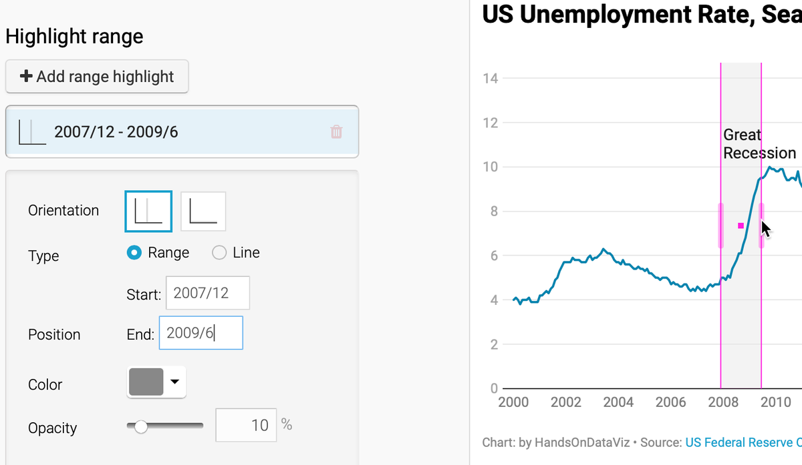{#fig-datawrapper-annotated-range width=600}

9. *진행(Proceed)*을 클릭하거나 *게시 및 임베드(Publish & Embed)* 화면으로 이동하여 작업을 다른 사람과 공유하세요. 무료 Datawrapper 계정에 로그인한 경우 작업은 화면 오른쪽 상단 모서리의 *내 차트(My Charts)* 메뉴에 자동으로 저장됩니다. 또한 파란색 *게시(Publish)* 버튼을 클릭하여 웹사이트에 대화형 차트를 임베드하는 코드를 생성할 수 있습니다. 자세한 내용은 [9장: 웹에 임베드하기](#embed)에서 배우게 될 것입니다. 추가적으로 *River에 차트 추가(add your chart to River)*를 선택하면 다른 Datawrapper 사용자가 차트를 채택하고 재사용할 수 있도록 하여 작업을 더 널리 공유할 수 있습니다. 더 아래로 스크롤하여 *PNG 다운로드(Download PNG)* 버튼을 클릭하면 차트의 정적 이미지를 내보낼 수 있습니다. 추가 내보내기 및 게시 옵션을 사용하려면 유료 Datawrapper 계정이 필요합니다. 또는 계정을 만들고 싶지 않은 경우 이메일을 입력하여 임베드 코드를 받을 수 있습니다.

팁: 오차 막대와 유사한 [신뢰 구간을 사용하는 꺾은선형 차트를 만드는 방법에 대한 이 Datawrapper Academy 문서](https://academy.datawrapper.de/article/205-how-to-show-confidence-intervals-in-datawrapper-line-charts)를 확인해 보세요.

첫 번째 대화형 Datawrapper 차트를 완성하신 것을 축하합니다. 이제 Datawrapper를 사용하여 범위 차트(range chart)라는 새로운 유형의 차트를 만들어 보겠습니다.

## - 범위 차트 {- #range-datawrapper}

점 차트(dot chart)의 특정 유형으로 분류될 수 있는 범위 차트는 데이터 포인트 간의 간격을 강조하며 종종 불평등을 부각시킬 때 사용됩니다. 이 튜토리얼에서는 Datawrapper를 사용하여 미국의 성별 임금 격차에 관한 범위 차트를 구축할 것입니다. 차트는 \@fig-datawrapper-range 그림과 같이 2019년 American Community Survey에 따른 미국 남성과 여성의 교육 수준별 중위 소득을 비교합니다. 우리는 [Datawrapper Academy 범위 플롯 튜토리얼](https://academy.datawrapper.de/article/111-how-to-create-a-range-plot)에서 영감을 얻었으며 더 최신 데이터를 사용하여 우리의 버전을 만들었습니다. 전반적으로 범위 차트는 남성이 평균적으로 모든 교육 수준에서 여성보다 더 많이 번다는 것을 보여줍니다. 사실 학사 학위를 가진 미국 남성 평균이 대학원 학위를 가진 미국 여성 평균보다 더 많이 법니다.


::: {.content-visible when-format="html"}

<iframe src="https://datawrapper.dwcdn.net/lVGnz/" width="100%" height="260px" style="border:none;"></iframe>
<p class="caption">범위 차트: [대화형 버전](https://datawrapper.dwcdn.net/lVGnz/)을 탐색해 보세요. 데이터 출처: [US Census 2019 American Community Survey](https://docs.google.com/spreadsheets/d/1qAfMHBegOz1-ZlN9UurZ_wsesmLGYlu_ch7M3Anwdsg/edit#gid=0).</p>

:::


이 범위 차트를 구축하기 위해 \@fig-datawrapper-range-data 그림과 같이 데이터를 구성했습니다. 첫 번째 열에는 가장 낮은 수준(*고등학교 졸업 미만*)부터 가장 높은 수준(*대학원 또는 전문 학위*)까지 5개의 학력 수준이 포함됩니다. 두 번째와 세 번째 열에는 각각 *남성(Men)*과 *여성(Women)*의 중위 소득 숫자 값이 포함됩니다.


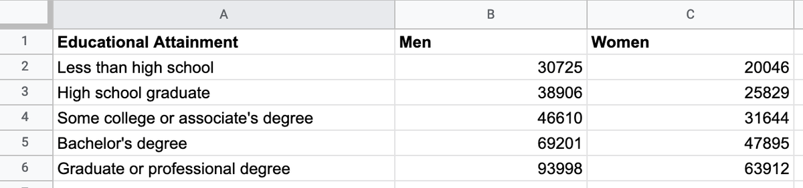{#fig-datawrapper-range-data width=500}

이제 Datawrapper에 익숙해졌을 것이므로 범위 차트를 만드는 단계는 이전의 주석이 달린 꺾은선형 차트 튜토리얼보다 덜 상세합니다. 길을 잃었다면 위 섹션에서 Datawrapper 차트에 대한 더 자세한 단계를 참조하세요.

1. [Google Sheets의 교육 수준별 성별 미국 소득 데이터(US Earnings by Gender by Education Level data)](https://docs.google.com/spreadsheets/d/1qAfMHBegOz1-ZlN9UurZ_wsesmLGYlu_ch7M3Anwdsg/edit#gid=0)를 열고 *파일(File) > 사본 만들기(Make a Copy)*로 이동하여 Google 드라이브에 자신만의 버전을 만드세요.

2. 브라우저에서 [Datawrapper](https://www.datawrapper.de)를 열고 *시작하기(Start Creating)*를 클릭합니다. 시각화를 더 잘 관리하려면 무료 계정을 만드는 것을 권장하지만 필수 사항은 아닙니다.

3. *데이터 업로드(Upload Data)* 화면에서 *Google Spreadsheet 가져오기(Import Google Spreadsheet)*를 클릭하고 위의 공유된 Google Sheet의 데이터 링크를 붙여넣은 다음 *진행(Proceed)*을 클릭합니다. 대안으로 데이터 테이블 창에 데이터를 복사하여 붙여넣거나 Excel 또는 CSV 파일을 업로드하여 데이터를 업로드할 수도 있습니다.

4. *확인 및 설명(Check and Describe)* 화면에서 데이터를 검사한 다음 *진행(Proceed)*을 클릭합니다.

5. *시각화(Visualize)* 화면에서 Datawrapper는 데이터 형식을 바탕으로 사용자가 원하는 차트 유형을 추측하려고 시도하지만 *범위 플롯(Range Plot)*을 선택해야 합니다.

6. *시각화* 화면의 왼쪽 상단에 있는 *주석 달기(Annotate)* 탭을 클릭하여 의미 있는 제목, 데이터 출처 및 작성자(bylines) 크레딧을 추가합니다.

7. 범위 차트의 외양을 수정하려면 *시각화* 화면의 *다듬기(Refine)* 탭을 클릭합니다. 여러 가지 옵션이 있지만 이 경우 가장 중요한 옵션은 다음과 같습니다. 첫째, *레이블(Labels)* 섹션에서 값의 표시 설정을 *시작(start)*에서 *양쪽(both)*으로 변경하여 각 범위의 양쪽 끝에 숫자를 배치합니다. 둘째, 슬라이더를 *첫 번째 범위 레이블 달기(Label first range)*로 밀어 *남성(Men)*과 *여성(Women)*이라는 단어를 첫 번째 범위 위에 배치합니다. 셋째, *숫자 형식(Number format)*을 *123k*로 변경하여 달러 금액을 가장 가까운 천 단위로 반올림하고 \@fig-datawrapper-range-labels 그림에 표시된 것처럼 천 단위를 *k*로 바꿉니다.


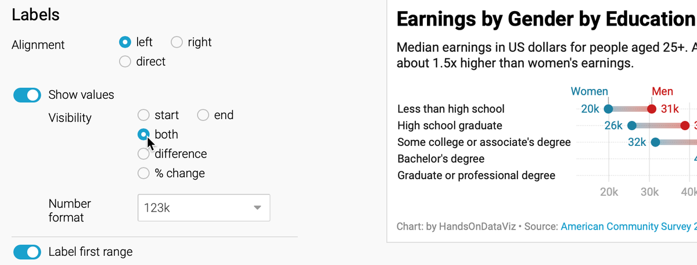{#fig-datawrapper-range-labels width=600}

8. *다듬기* 탭에서 조금 더 아래로 스크롤하여 *모양(Appearance)* 섹션으로 이동해 색상을 개선합니다. *범위 끝(Range end)* 드롭다운 메뉴를 선택하여 빨간색과 같은 더 나은 색상을 고릅니다. *범위 색상(Range color)* 설정을 *그래디언트(gradient)*로 변경하여 \@fig-datawrapper-range-appearance 그림과 같이 범위를 강조합니다.


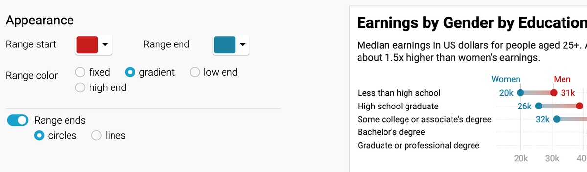{#fig-datawrapper-range-appearance width=600}

팁: *다듬기* 탭에는 데이터 행을 재정렬하거나 그룹화하고 다양한 기기에 맞게 차트 크기를 변경하며 색맹 독자를 위해 가시성을 확인하는 옵션이 포함되어 있습니다.

9. 시각화를 수정한 후 *게시 및 임베드(Publish and Embed)* 화면으로 진행하여 프롬프트에 따라 작업을 공유하거나, 이전의 자세한 Datawrapper 튜토리얼을 참조하세요.

팁: 공유 폴더를 통해 팀원에게 Datawrapper 시각화에 대한 접근 권한을 부여할 수도 있습니다. 먼저 *메뉴 > 내 팀(My Teams) > 팀 만들기(Create a Team)*로 이동하여 멤버를 초대합니다. 둘째, *아카이브 > 최근 편집 항목(Recently Edited)*으로 이동하여 왼쪽 여백에 있는 공유 폴더를 확인한 다음, 시각화를 폴더로 끌어다 놓으면 \@fig-datawrapper-shared-folders 그림과 같이 해당 팀원과 공유할 수 있습니다.


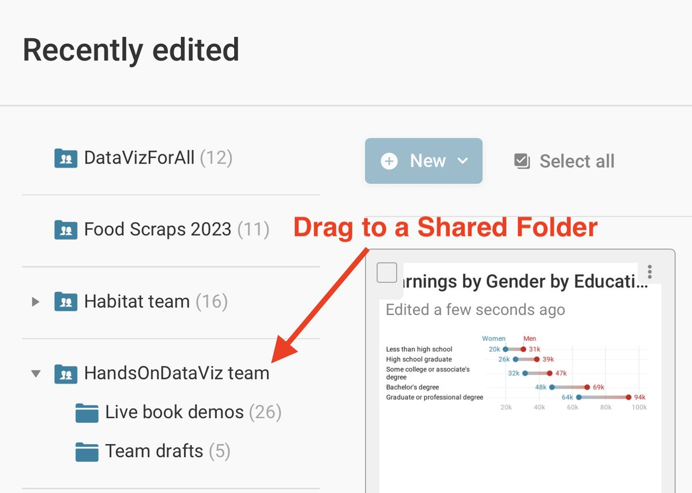{#fig-datawrapper-shared-folders width=400}

범위 차트를 완성했으니, 이제 Datawrapper를 사용하여 둘 이상의 변수 간의 관계를 보여주는 분산형 차트와 거품형 차트를 작성하는 방법을 살펴보겠습니다.


## - 분산형 차트 및 거품형 차트 {- #scatter-bubble-datawrapper}
분산형 차트(산점도라고도 함)는 두 데이터 세트 간의 관계를 파악하는 데 가장 좋으며 XY 좌표를 점으로 표시하여 상관관계의 가능성을 드러냅니다. 아래의 분산형 차트 예제에서 각 점은 국가를 나타내며 가로 X축에는 기대 수명, 세로 Y축에는 출산율(여성 1인당 출생아 수)이 표시되어 있습니다. 전반적인 점의 패턴은 이 두 데이터 세트 사이의 상관관계를 보여줍니다: 출산율이 낮아질수록 기대 수명이 증가하는 경향이 있습니다.

거품형 차트(Bubble charts)는 점의 크기와 색상이라는 두 가지 시각적 요소를 추가하여 세 번째 또는 네 번째 데이터 세트를 표현함으로써 분산형 차트보다 한 단계 더 나아갑니다. 아래의 거품형 차트 예제는 이전 분산형 차트에서 본 각 국가의 동일한 기대 수명과 출산율 데이터로 시작하지만 각 원형 점의 크기는 세 번째 데이터 세트(인구)를 나타내고 색상은 네 번째 데이터 세트(세계의 지역)를 나타냅니다. 결과적으로 거품형 차트는 시각화에 훨씬 더 많은 정보를 압축하기 때문에 강력해진 분산형 차트라 할 수 있습니다.

더 멋진 거품형 차트는 시간의 경과에 따른 변화 같은 다섯 번째 데이터 세트를 표현하기 위해 애니메이션이라는 시각적 요소를 하나 더 도입합니다. 애니메이션 거품형 차트를 만드는 것은 이 책의 범위를 벗어나지만 글로벌 보건 분야의 저명한 스웨덴 교수인 한스 로슬링(Hans Rosling)의 [유명한 TED 강연](https://www.ted.com/talks/hans_rosling_the_best_stats_you_ve_ever_seen)을 보고 애니메이션 거품형 차트가 실제로 작동하는 것을 확인하고 [갭마인더 재단(Gapminder Foundation)](https://www.gapminder.org/)에서 그의 연구에 대해 더 자세히 알아보세요.

이 섹션에서는 Datawrapper에서 분산형 차트와 거품형 차트를 만드는 이유와 방법을 배울 것입니다. 이전 섹션에서 설명한 [Datawrapper로 차트를 디자인하는 것의 장단점](#chart-datawrapper)에 대해 반드시 읽어보세요.

### 분산형 차트 {-}
분산형 차트는 그리드상의 XY 좌표로 두 데이터 세트 간의 관계를 보여주는 데 가장 적합합니다. 다양한 국가의 기대 수명과 출산율 데이터를 비교하고 싶다고 상상해 보세요. \@fig-scatter-data 그림과 같이 데이터를 3개의 열로 구성하세요. 첫 번째 열은 *국가(Country)* 레이블을 포함하고 두 번째 열인 *기대 수명(Life Expectancy)*은 가로 x축에 표시되며 세 번째 열인 *출산율(Fertility)*은 세로 y축에 나타납니다. 이제 \@fig-scatter 그림에 나타난 것처럼 이들 데이터 세트 간의 관계를 보여주는 분산형 차트를 쉽게 만들 수 있습니다. 이 차트를 요약하면 출산율이 낮은(여성 1인당 출산 횟수가 적은) 국가일수록 기대 수명이 높은 경향이 있다는 것입니다. 하지만 이를 다르게 표현하자면 태어날 때 기대 수명이 더 높은 국가는 출산율이 낮다는 것입니다. 상관관계가 인과관계를 의미하지 않는다는 점을 기억하세요. 이 차트를 통해 적게 태어나면 수명이 늘어난다거나 더 오래 사는 여성이 자녀를 더 적게 낳는다고 주장할 수는 없습니다.


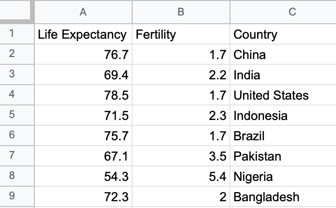{#fig-scatter-data width=350}


::: {.content-visible when-format="html"}

<iframe src="https://datawrapper.dwcdn.net/8OQz7/" width="100%" height="400px" style="border:none;"></iframe>
<p class="caption">분산형 차트: [대화형 버전](https://datawrapper.dwcdn.net/8OQz7/)을 탐색해 보세요. 데이터 출처: [World Bank](https://docs.google.com/spreadsheets/d/1LJCj3RaVgaQsAZriV_JDQhBrIBSvnH_N1LBCkZK1bqs/).</p>

:::


Datawrapper에서 대화형 분산형 차트를 직접 만들고 도구 설명을 편집하여 데이터를 올바르게 표시해 보세요:

1. [Google Sheets의 분산형 차트 샘플 데이터(Scatter Chart sample data)](https://docs.google.com/spreadsheets/d/1bKY6RSNOXnwUMbLclEwHC_E9meLmwlfTcnxOF85wUjA/edit#gid=0)를 열거나 비슷한 형식의 여러분 데이터를 사용하세요.

2. [Datawrapper](https://www.datawrapper.de)를 열고 새 차트 만들기를 클릭합니다.

3. Datawrapper의 *데이터 업로드(Upload Data)* 화면에서 위의 Google Sheet 데이터 탭 링크를 복사하여 붙여넣거나 직접 데이터를 복사하여 붙여넣으세요. *진행(Proceed)*을 클릭합니다.

4. *확인 및 설명(Check and Describe)* 화면에서 데이터를 검사하여 *Life Expectancy*와 *Fertility* 열이 숫자 데이터를 나타내는 파란색으로 표시되는지 확인합니다. *진행*을 클릭하세요.

5. *시각화(Visualize)* 화면의 *차트 유형(Chart type)* 탭 아래에서 *산점도(Scatter Plot)*를 선택합니다. 오른쪽 창에 나타나는 분산형 차트 위로 커서를 올리면 각 점에 대해 데이터를 올바르게 표시하려면 도구 설명(tooltips)을 편집해야 한다는 것을 알게 될 것입니다.

6. *시각화* 화면의 *주석 달기(Annotate)* 탭 아래에서 *도구 설명 맞춤 설정(Customize tooltip)* 섹션으로 스크롤을 내리고 *도구 설명 표시(Show tooltips)*를 선택한 다음 *도구 설명 맞춤 설정(Customize tooltips)* 버튼을 클릭하여 창을 엽니다. 도구 설명 *제목(Title)*을 나타내는 첫 번째 필드 안쪽을 클릭하고 그 아래의 파란색 *Country* 버튼을 클릭하여 그곳에 `{{ Country }}`가 들어가게 하세요. 이렇게 하면 각 점 위로 커서를 올릴 때 도구 설명 제목에 올바른 국가 이름이 표시됩니다. 또한 도구 설명 *본문(Body)*을 나타내는 두 번째 필드 안쪽을 클릭하고 `Life expectancy: `라고 입력한 다음 이름이 같은 파란색 버튼을 클릭하여 그 뒤에 `{{ Life_expectancy }}`가 나타나게 하세요. 키보드에서 *엔터(return)* 키를 두 번 누르고 `Fertility: `를 입력한 다음 같은 이름의 파란색 버튼을 클릭하여 \@fig-scatter-tooltip-editor 그림과 같이 바로 뒤에 `{{ Fertility }}`가 나타나게 하세요. *저장(Save)*을 눌러 도구 설명 편집기 창을 닫습니다.


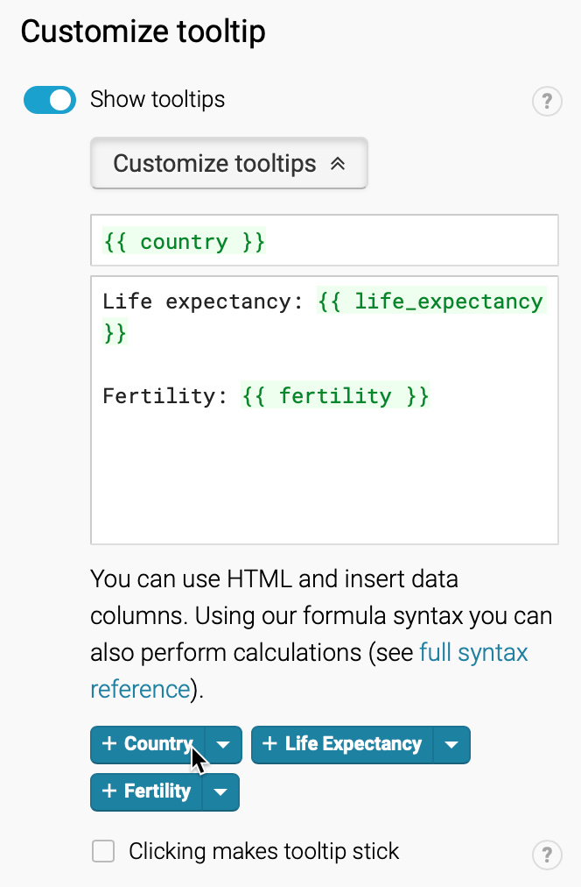{#fig-scatter-tooltip-editor width=350}

7. *시각화* 화면으로 돌아가서 점 위에 커서를 올리면 위의 편집기 설정에 따라 도구 설명이 \@fig-scatter-tooltip 그림과 같이 데이터를 올바르게 표시할 것입니다.


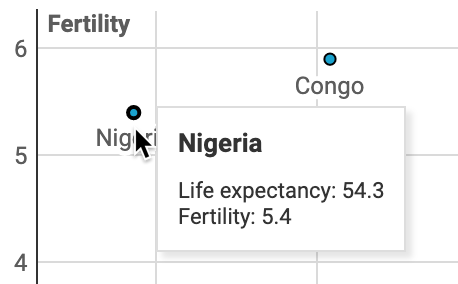{#fig-scatter-tooltip width=350}

8. 제목과 데이터 출처를 추가하기 위해 주석을 마무리하고 위에서 설명한 자세한 Datawrapper 튜토리얼을 읽거나 프롬프트에 따라 차트를 게시하고 임베드하는 단계로 넘어갑니다. 다음 단계에 대해 알아보려면 [9장: 웹에 임베드하기](#embed)를 배우세요.

팁: Google Sheet에서 두 데이터 열(또는 범위)의 셀 쌍 사이 연관성의 강도를 수치로 표시하는 `=CORREL()` 함수를 사용하여 상관계수를 계산할 수 있습니다. \@fig-sheets-correlation 그림을 참조하세요. 상관계수는 -1에서 0, 그리고 1까지의 척도로 나타나며 극한값은 (음이든 양이든) 매우 강력한 관계를 보여주고 0에 가까운 값은 관계가 없음을 보여줍니다. 이 개념에 대해서는 어떤 통계 책에서든 더 자세히 배울 수 있습니다. [5장: 유의미한 비교하기](#comparisons)에서 논의한 바와 같이 상관관계는 인과관계와 같지 않다는 점을 명심하세요.


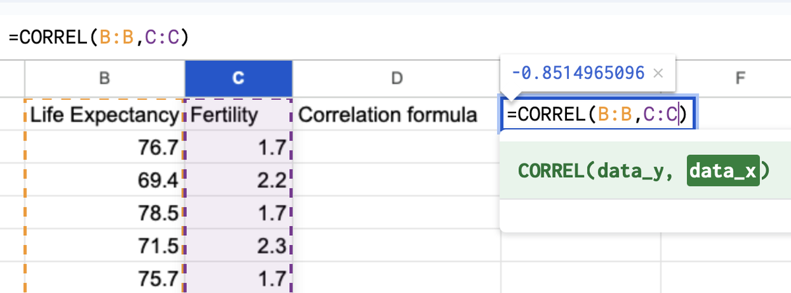{#fig-sheets-correlation width=600}

### 거품형 차트 {-}
위의 분산형 차트에서 기대 수명(X축 좌표)과 출산율(Y축 좌표)이라는 두 데이터 세트 간의 관계를 시각화하는 방법을 배웠습니다. 이제 두 가지 데이터 세트를 추가하여 거품형 차트(bubble chart)를 만들어 이 개념을 확장해 봅시다. 인구(각 점 또는 거품의 크기로 표시)와 세계의 지역(각 거품의 색상으로 표시)을 추가합니다. 앞서와 비슷한 World Bank 데이터를 사용하되 \@fig-bubble-data 그림처럼 두 개의 추가 열이 있습니다. 거품 크기에는 숫자 데이터(인구)를 사용하지만 색상에는 범주형 데이터(지역)를 사용한다는 점에 유의하세요. 이제 \@fig-bubble 그림에 나타난 것처럼 이 네 가지 데이터 세트 간의 관계를 표시하는 거품형 차트를 쉽게 만들 수 있습니다.


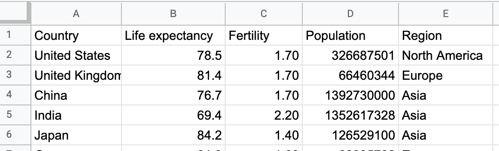{#fig-bubble-data width=500}


::: {.content-visible when-format="html"}

<iframe src="https://datawrapper.dwcdn.net/ZX9QR/" width="100%" height="400px" style="border:none;"></iframe>
<p class="caption">거품형 차트: [대화형 버전](https://datawrapper.dwcdn.net/ZX9QR/)을 탐색해 보세요. 데이터 출처: [World Bank](https://docs.google.com/spreadsheets/d/1yiZ975_uXOTOd0OCAdrR_s-bQFs7za3dar69IXPo6Xg).</p>

:::


Datawrapper에서 대화형 거품형 차트를 직접 만들고 도구 설명, 거품 크기 및 색상을 편집하여 데이터를 표시해 보세요:

1. [Google Sheets의 분산형 차트 샘플 데이터(Scatter Chart sample data)](https://docs.google.com/spreadsheets/d/1yiZ975_uXOTOd0OCAdrR_s-bQFs7za3dar69IXPo6Xg/edit#gid=0)를 열거나 비슷한 형식의 여러분 데이터를 사용하세요.

2. [Datawrapper](https://www.datawrapper.de)를 열고 새 차트 만들기를 클릭합니다.

3. 위의 3-5단계에 따라 데이터를 업로드하고 확인한 다음 *산점도(Scatter Plot)* 차트 유형으로 시각화합니다.

4. *시각화* 화면의 *주석 달기* 탭 아래에서 *도구 설명 맞춤 설정(Customize tooltip)*으로 내려가 *도구 설명 템플릿 편집(edit tooltip template)*을 클릭하세요. *사용자 지정 도구 설명 HTML(Customize tooltip HTML)* 창에서 필드에 텍스트를 입력하고 파란색 열 이름을 클릭하여 도구 설명이 국가, 기대 수명, 출산율 및 인구를 표시하도록 \@fig-bubble-tooltip-editor 그림과 같이 맞춤 설정합니다. *저장(Save)*을 눌러 도구 설명 편집기 창을 닫습니다.


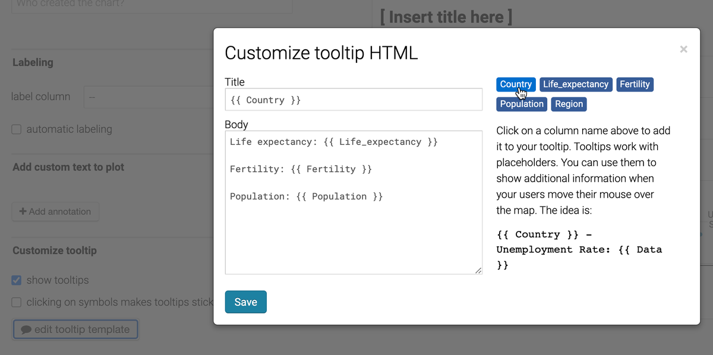{#fig-bubble-tooltip-editor}

5. *시각화* 화면으로 다시 돌아와 *다듬기(Refine)* 탭 아래에서 *색상(Color)*으로 스크롤하고 *Region* 열을 선택한 다음 *색상 맞춤 설정(customize colors)* 버튼을 클릭하여 각 지역에 고유한 색상을 지정하세요. 그런 다음 *크기(Size)*로 내려가 크기를 *변수(variable)*로 변경하는 상자에 체크 표시를 하고 *Population* 열을 선택한 다음 \@fig-bubble-color-size 그림과 같이 최대 크기 슬라이더를 높이세요. *진행(Proceed)*을 클릭합니다.


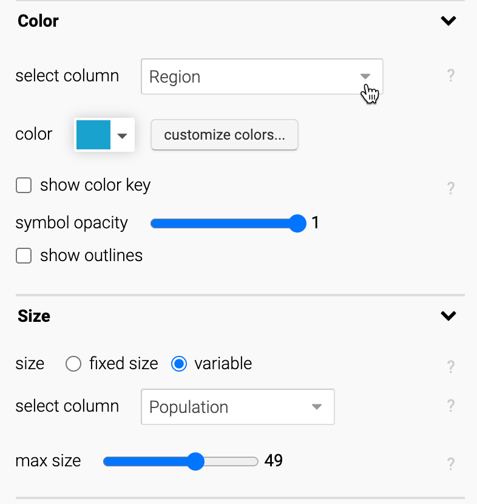{#fig-bubble-color-size width=350}

6. 시각화 도구 설명을 테스트합니다. 그런 다음 주석을 완성하여 제목과 데이터 출처를 추가하고 위의 더 상세한 Datawrapper 튜토리얼을 읽거나 프롬프트에 따라 차트를 게시하고 임베드합니다. [9장: 웹에 임베드하기](#embed)에서 다음 단계를 확인하세요.

분산형 차트와 거품형 차트를 만드는 데 대한 자세한 내용은 [Datawrapper Academy 지원 사이트](https://academy.datawrapper.de/)를 참조하세요.

이제 Datawrapper에서 분산형 차트를 만드는 방법을 배웠으므로, 다음 섹션에서는 완전히 다른 도구인 Tableau Public으로 동일한 차트 유형을 만드는 방법을 배우고 기술을 향상시켜 이 강력한 도구로 더 복잡한 차트를 만들 수 있게 될 것입니다.

## Tableau Public 차트 {- #chart-tableau}
Tableau는 데이터 분석과 표시에 있어 많은 전문가 및 조직이 사용하는 강력한 데이터 시각화 도구입니다. 이 책에서는 이메일 주소를 제공하면 무료로 다운로드할 수 있는 Mac 또는 Windows 컴퓨터용 데스크톱 애플리케이션인 무료 버전 [Tableau Public](https://public.tableau.com)에 중점을 둡니다. 무료 Tableau Public 도구는 회사에서 판매하는 고가의 Tableau 버전과 한 가지 중요한 차이점을 제외하면 매우 유사합니다. 제품 이름에서 알 수 있듯이 게시하는 모든 데이터 시각화는 공개되므로, 다른 사람과 공유하고 싶지 않은 민감하거나 기밀인 데이터에는 Tableau Public을 사용하지 마세요.

Tableau Public에는 이 책의 다른 드래그 앤 드롭 도구들 중에서 돋보이게 하는 여러 기능이 있습니다. 첫째, [2장의 스프레드시트 기술](#spreadsheet), [4장의 데이터 정리 방법](#clean), 그리고 [13장에서 다룰 지도 데이터 변환 도구](#transform)와 유사하게 Tableau Public 내부에서 데이터를 준비하고, 피벗하고, 조인할 수 있습니다. 둘째, Tableau Public은 다른 무료 도구보다 더 다양한 차트 유형을 제공합니다. 마지막으로 Tableau Public을 사용하면 여러 시각화(표, 차트, 지도 포함)를 대화형 대시보드 또는 스토리에 결합하여 웹사이트에 게시하고 임베드할 수 있습니다. [Tableau Public 리소스 페이지](https://public.tableau.com/en-us/s/resources)에서 이 모든 기능에 대해 자세히 알아보세요.

하지만 Tableau Public에도 단점은 있습니다. 첫째, 처음 애플리케이션을 설치하고 시작하는 데 몇 분이 걸릴 수 있습니다. 둘째, 디자인 인터페이스에 압도당하는 느낌이 든다면 여러분만 그런 것이 아닙니다. 차트와 지도를 만들기 위한 드래그 앤 드롭 레이아웃은 처음 봤을 때 헷갈릴 수 있으며 내부 데이터 용어 어휘가 익숙하지 않을 수 있습니다. Tableau Public이 강력한 도구인 만큼 옵션이 지나치게 많은 탓일 수도 있습니다.

다음 섹션에서는 두 가지 다른 유형의 차트를 만드는 단계별 튜토리얼을 통해 Tableau Public의 기본 사항부터 시작하여 작업을 단순하게 유지하겠습니다. 첫째, 위 섹션에서 이미 배운 기술을 기반으로 [Tableau Public의 분산형 차트](#scatter-tableau)를 구축해 볼 것입니다. 둘째, 대화형 시각화 디자인에서 이 도구의 강점을 더 잘 보여주는 [필터링된 꺾은선형 차트](#filtered-line-tableau)를 만드는 방법을 배웁니다.

## - 분산형 차트 {- #scatter-tableau}
분산형 차트(Scatter charts)는 x축과 y축에 배치된 두 데이터 세트 간의 관계를 표시하여 상관관계 가능성을 밝히는 데 가장 적합합니다. Tableau Public을 사용하면 커서를 점 위로 올려 데이터에 대한 세부 정보를 볼 수 있는 대화형 분산형 차트를 만들 수 있습니다. [Datawrapper 분산형 차트 튜토리얼](#scatter-bubble-datawrapper)과 동일한 방식, 즉 세 개의 열로 데이터를 구성하세요: 데이터 레이블을 위한 첫 번째 열, x축을 위한 두 번째 열, y축을 위한 세 번째 열입니다. 그런 다음 \@fig-tableau-scatter 그림에 표시된 것과 같은 대화형 분산형 차트를 만들 수 있습니다. 이 차트는 코네티컷주 공립 학군의 가구 소득과 시험 점수(6학년 수학 및 영어의 전국 평균 상회 또는 하회) 간의 강력한 관계를 보여줍니다. 데이터 및 관련 시각화에 대해 자세히 알아보려면 스탠포드 교육 데이터 아카이브(Stanford Education Data Archive)의 [Sean Reardon et al.](https://purl.stanford.edu/db586ns4974), 뉴욕 타임스의 [Motoko Rich et al.](https://www.nytimes.com/interactive/2016/04/29/upshot/money-race-and-success-how-your-school-district-compares.html), CT Mirror/TrendCT의 [Andrew Ba Tran](https://web.archive.org/web/20190129101923/http://trendct.org/2016/05/06/wealth-and-grades-compare-connecticuts-school-districts/) 및 이 [TrendCT GitHub 저장소(repo)](https://github.com/trendct-data/stanford-cepa)를 참조하세요.


::: {.content-visible when-format="html"}

<iframe src="https://public.tableau.com/views/CTSchoolDistrictsbyIncomeandGradeLevels2009-13/Sheet1?:showVizHome=no&:embed=true" width="100%" height="500px" style="border:none;"></iframe>
<p class="caption">Tableau Public 분산형 차트: [대화형 버전](https://public.tableau.com/profile/jackdougherty#!/vizhome/CTSchoolDistrictsbyIncomeandGradeLevels2009-13/Sheet1)을 탐색해 보세요. 데이터 출처: [CT Mirror/TrendCT and Stanford CEPA](https://github.com/trendct-data/stanford-cepa).</p>

:::


이 샘플 데이터를 사용하여 Tableau Public에서 고유한 분산형 차트를 만들려면 이 튜토리얼을 따르세요.

#### Tableau Public을 설치하고 데이터 연결하기 {-}

1. [CT 학군-소득-등급 엑셀 형식 샘플 데이터(CT Districts-Income-Grades sample data in Excel format)](data/ct-districts-income-grades-2009-13.xlsx)를 다운로드하거나, [Google Sheets 버전을 보고 다운로드](https://docs.google.com/spreadsheets/d/1mfZymUnbEQ8I1YUzqXWeiqA5JS1PIhnX7zdhwwvMmsk/edit#gid=840790465)하세요. 데이터 파일은 학군, 가구 중위소득, 시험 점수 등급의 세 가지 열로 구성되어 있습니다.

2. Mac 또는 Windows용 무료 [Tableau Public](https://public.tableau.com) 데스크톱 애플리케이션을 설치하고 시작합니다. 이 프로세스를 완료하는 데 몇 분이 걸릴 수 있습니다. Tableau Public의 시작 페이지에는 연결(Connect), 열기(Open), 검색(Discover)의 세 섹션이 포함되어 있습니다.

3. *연결(Connect)*에서 Microsoft Excel 파일을 업로드하거나, *텍스트 파일(Text file)*을 선택해 CSV 파일을 업로드하는 등 여러 옵션을 선택할 수 있습니다. 또는 Google Sheets와 같은 서버에 연결하려면 *자세히...(More...)*를 클릭하여 계정에 연결합니다. 데이터 소스 연결에 성공하면 *데이터 원본(Data Source)* 탭의 *연결(Connections)* 아래에 나타납니다. *시트(Sheets)* 아래에 *data*와 *notes*라는 두 개의 테이블이 표시됩니다.

4. \@fig-tableau-connect 그림과 같이 *data* 시트를 *테이블을 여기로 끌어오세요(Drag tables here)* 영역으로 드래그합니다. 드래그 앤 드롭 영역 아래에 테이블 미리 보기가 표시될 것입니다. Tableau Public에 데이터 소스를 하나 성공적으로 연결했으며 첫 번째 차트를 만들 준비가 되었습니다.


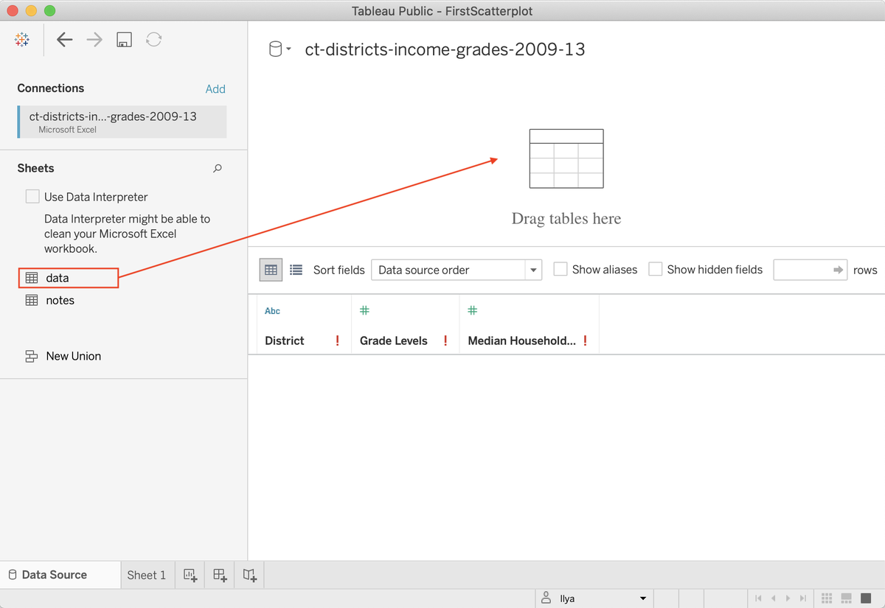{#fig-tableau-connect}

#### 워크시트에서 분산형 차트 만들기 {-}

1. *데이터 원본* 화면에서 왼쪽 하단 모서리에 있는 주황색 *시트 1(Sheet 1)* 탭을 클릭하여 차트를 작성할 워크시트로 이동합니다.

처음에는 압도당하는 기분이 들 수 있지만 핵심은 데이터 창(왼쪽)에서 항목을 기본 워크시트로 드래그할 위치를 배우는 것입니다. Tableau는 모든 데이터 필드를 파란색(불연속형 값, 주로 텍스트 필드나 숫자 레이블) 또는 녹색(연속형 값, 주로 숫자)으로 표시합니다.

2. 워크시트에서 *Grade Levels* 필드를 위쪽 차트 작성 영역인 *행(Rows)* 필드로 드래그합니다. 지금은 그냥 빈 공간입니다. 드래그 단계와 이후의 두 단계를 보려면 \@fig-tableau-scatter-dragging 그림을 참조하세요. Tableau가 이에 합계(summation) 함수를 적용하여 *행* 열에 `합계(Grade Levels)` 즉 `SUM(Grade Levels)`가 나타나고 차트 작성 영역에 파란색 막대가 표시될 것입니다. 아직은 별로 의미가 없으므로 다른 데이터 필드를 플롯해 보겠습니다.

3. *Median Household Income*을 *행* 필드 바로 위에 있는 *열(Columns)* 필드로 드래그합니다. 일반적으로 행 선반과 열 선반 중에서 선택하는 것은 까다로울 수 있지만 *열* 선반을 x축으로, *행* 선반을 y축으로 간주하는 것이 편리합니다. 다시 한 번 Tableau가 합계 함수를 적용하여 *열* 선반에 `합계(Median Household Income)` 즉 `SUM(Median Household Income)`이 나타납니다. 두 데이터 모두 집계되었기 때문에(합계 함수 기억) 막대 차트가 자동으로 오른쪽 상단 모서리에 단 하나의 데이터 포인트가 있는 분산형 차트로 변환됩니다.

6. 이제 Tableau에 가구 소득 및 등급 수준 변수를 분리(disaggregate)하라고 지시하고 싶습니다. 다시 말해 시각화에 추가적인 세분성 수준, 즉 *세부 정보(detail)*를 도입하고 싶습니다. 그렇게 하려면 *District* 차원을 *마크(Marks)* 카드의 *세부 정보(Detail)* 선반으로 드래그합니다. 이제 차트 작성 영역에 실제 분산형 차트가 나타날 것입니다. 점 위에 커서를 올리면 점들과 연결된 세 가지 값이 모두 표시됩니다.


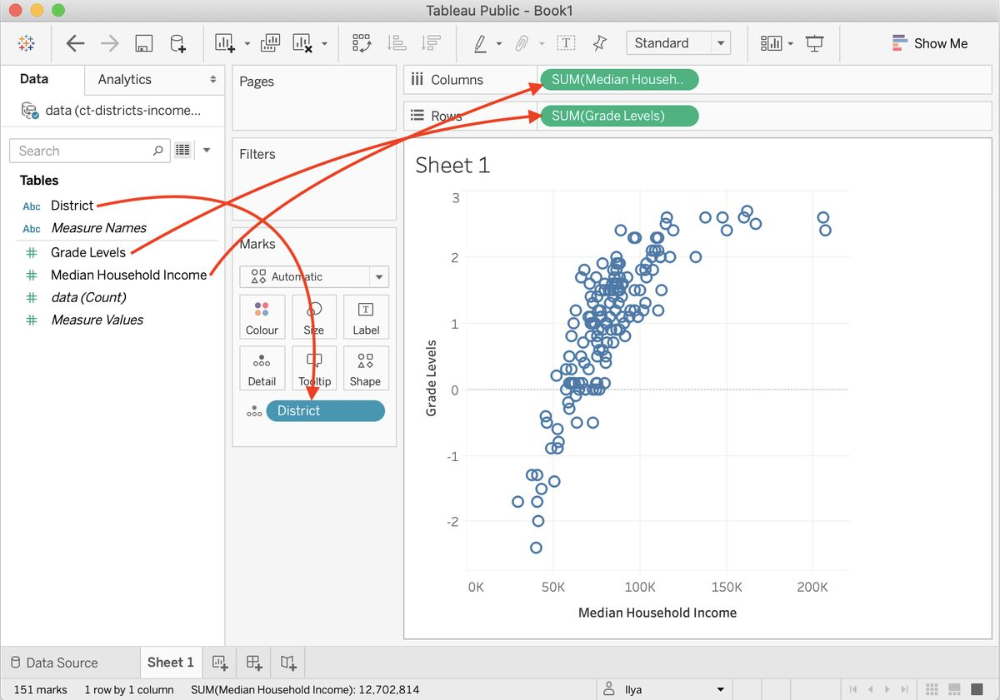{#fig-tableau-scatter-dragging}

#### 제목 및 캡션 추가, 그리고 게시하기 {-}
차트 작성 영역 위의 기본 제목인 *시트 1(Sheet 1)*을 두 번 클릭하여 분산형 차트에 의미 있는 제목을 지정하세요. 데이터 출처와 시각화를 구축한 사람, 시간 등 차트에 대한 추가 정보를 캡션에 덧붙여 작업의 신뢰성을 높이세요. Tableau 차트와 함께 제공되는 텍스트 블록인 *캡션(Caption)* 안에서 이 작업을 할 수 있습니다. 메뉴에서 *워크시트(Worksheet) > 캡션 표시(Show Caption)*로 이동합니다. 나타나는 캡션 블록을 두 번 클릭하고 텍스트를 편집합니다. 결과적으로 최종 워크시트는 \@fig-tableau-scatter-final 그림처럼 보일 것입니다.


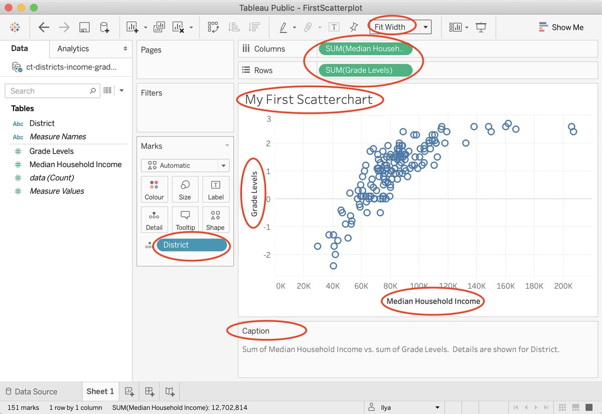{#fig-tableau-scatter-final}

팁: *열* 선반 위 드롭다운에서 *표준(Standard)*을 *전체 보기(Fit Width)*로 변경하여 차트가 사용 가능한 가로 공간의 100%를 차지하도록 하세요.

1. 대화형 차트를 공개 웹에 게시하려면 *파일(File) > Tableau Public에 저장(Save to Tableau Public As...)*으로 이동합니다. 계정에 로그인하라는 창이 팝업될 것입니다. 계정이 없다면 맨 아래의 *지금 무료로 만들기(Create one now for free)*를 클릭하고 암호 관리자에 로그인 세부 정보를 저장하세요.

2. 로그인하면 통합 문서 제목을 설정하는 창이 나타납니다. 기본 제목인 *Book1*을 의미 있는 이름으로 변경하세요. 이 이름은 게시된 작업의 공개 웹 주소에 나타나기 때문입니다. *저장(Save)*을 클릭합니다.

3. 통합 문서를 공개 웹에 저장한 후 Tableau Public은 시각화가 포함된 창을 기본 브라우저에서 엽니다. 차트 위 녹색 배너에서 *세부 정보 편집(Edit Details)*을 클릭하여 제목이나 설명을 편집하세요. *도구 모음 설정(Toolbar Settings)* 아래에서 *다른 사람이 이 통합 문서 및 해당 데이터를 다운로드하거나 살펴보고 복사하도록 허용(Allow others to download or explore and copy this workbook and its data)* 확인란을 확인하고 \@fig-tableau-toolbar-settings 그림과 같이 원하는 설정을 선택하세요. 시각화를 웹에 게시하는 경우 다른 사람이 데이터를 다운로드하고 구축 방식을 확인하여 모두의 데이터 접근성을 향상시킬 수 있도록 이 확인란을 선택 상태로 유지하는 것을 권장합니다.


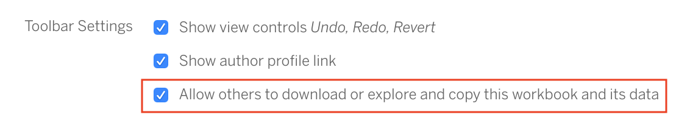{#fig-tableau-toolbar-settings}

팁: 여러분의 전체 Tableau Public 시각화 포트폴리오는 온라인 `https://public.tableau.com/profile/USERNAME`에서 볼 수 있으며 `USERNAME`은 여러분의 고유 사용자 이름입니다.

직접 제어하는 웹 페이지에 차트의 대화형 버전을 삽입하려면 9장의 [임베드 코드 받기(Get the Embed Code)](#embed-code) 섹션을 참조하세요.

## - 필터링된 꺾은선형 차트 {- #filtered-line-tableau}
Tableau Public에서 분산형 차트를 만드는 방법을 배웠으니, 이제 도구의 강점을 돋보이게 하는 새로운 유형의 차트로 이동해 보겠습니다. 인쇄물이나 PDF에 나타나는 *정적인(static)* 차트 대신 이 책에서는 더 많은 데이터를 표시할 수 있는 *대화형(interactive)* 차트를 다룹니다. 하지만 대화형 차트가 원하는 양의 데이터만 표시하도록 디자인할 수도 있습니다. 즉, 여러분의 대화형 시각화는 사용자에게 한 번에 너무 많은 정보를 제공해 압도하지 않으면서도 사용자가 직접 데이터를 "파고들어(dig)" 특정 데이터 지점과 패턴을 찾아볼 수 있도록 허용하는 데이터 탐색 도구가 될 수 있습니다.

이 튜토리얼에서는 시간이 지남에 따라 여러 국가의 인터넷 접근성이 어떻게 변했는지 시각화하기 위해 Tableau Public으로 대화형 필터링 꺾은선형 차트를 구축해 볼 것입니다. \@fig-tableau-filtered-data 그림과 같이 데이터를 세 열로 구성합니다. 첫 번째 열인 *Country Name*은 색깔이 지정된 선이 되는 데이터 레이블입니다. 두 번째 열인 *Year*는 가로 x축에 표시됩니다. 세 번째 열인 *Percent Internet Users*는 세로 y축에 표시되는 숫자 값입니다. 이제 체크박스가 있는 필터링된 꺾은선형 차트를 만들어, 시작 시 사용자를 압도하지 않도록 선택한 선만 표시하면서 사용자가 다른 선을 켜고 끄거나 각 선 위로 커서를 올려 더 자세한 내용을 확인할 수 있게 설정할 수 있습니다. \@fig-tableau-filtered 그림을 참고하세요.


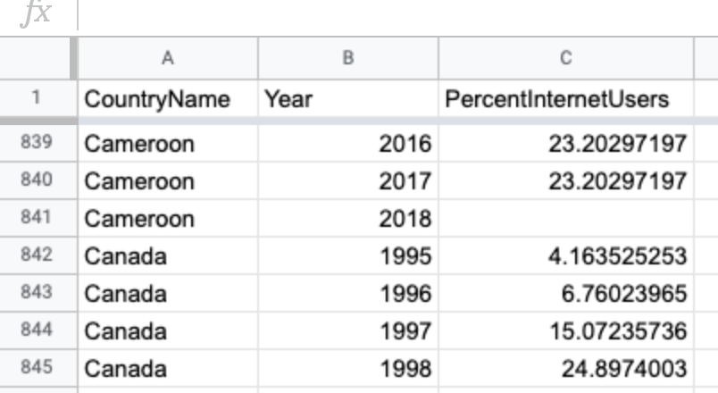{#fig-tableau-filtered-data width=350}


::: {.content-visible when-format="html"}

<iframe src="https://public.tableau.com/views/InternetAccessbyCountry/Sheet1?:showVizHome=no&:embed=true" width="100%" height="500px" style="border:none;"></iframe>
<p class="caption">필터링된 꺾은선형 차트: [대화형 버전](https://public.tableau.com/profile/ilya7257#!/vizhome/InternetAccessbyCountry/Sheet1)을 탐색해 보세요. 데이터 출처: [World Bank](https://docs.google.com/spreadsheets/d/1nrfd8Cr-wpm5N9WGA2YO6d1XLuwk-VK8kCvDwoTdeWM/edit#gid=600173793).</p>

:::


이 샘플 데이터를 사용하여 Tableau Public에서 직접 필터링된 꺾은선형 차트를 만들려면 다음 튜토리얼을 따르세요. 아래 단계는 요약되어 있으므로, 여러분이 이미 Mac이나 Windows용 무료 [Tableau Public](https://public.tableau.com) 데스크톱 애플리케이션을 설치했으며 이전의 [Tableau Public 분산형 차트 튜토리얼](#scatter-tableau)을 완료하여 도구에 익숙해졌다고 가정합니다.

#### Tableau Public에 데이터 연결하기 {-}

1. [엑셀 형식의 세계은행 인터넷 사용자 1995-2018년 샘플 데이터(World Bank Internet Users 1995-2018 sample data in Excel format)](data/world-bank-internet-users-1995-2018.xlsx)를 다운로드하거나, [Google Sheets 버전을 확인하고 다운로드](https://docs.google.com/spreadsheets/d/1nrfd8Cr-wpm5N9WGA2YO6d1XLuwk-VK8kCvDwoTdeWM/edit#gid=600173793)하세요. 이 파일은 데이터 레이블, 연도, 숫자 값이라는 세 가지 열로 구성되어 있습니다.

2. Tableau Public을 열고 *연결(Connect)* 메뉴에서 데이터를 Microsoft Excel 파일로 업로드하거나, *텍스트 파일(Text file)*을 선택해 CSV 파일로 업로드할 수 있으며 또는 *자세히...(More...)*를 클릭해 서버에 연결하여 계정에서 Google Sheet를 가져올 수 있습니다. 데이터 소스 연결에 성공하면 *데이터 원본* 탭의 *연결* 아래에 나타납니다. *시트* 아래에 `data`와 `notes`라는 두 개의 테이블이 표시됩니다. `data` 시트를 *테이블을 여기로 끌어오세요(Drag tables here)* 영역으로 드래그하여 미리 봅니다.

3. *데이터 원본* 화면에서 왼쪽 하단 모서리의 주황색 *시트 1(Sheet 1)* 탭을 클릭해 차트를 작성할 워크시트로 이동합니다.

워크시트에서 여러분의 변수는 왼쪽의 *테이블(Tables)* 아래에 나열됩니다. 원본 변수는 일반 글꼴로 표시되고 *생성된(generated)* 변수는 *이탤릭체*로 표시됩니다(Tableau가 국가 이름에서 추측해 낸 *Latitude* 및 *Longitude*와 같은 변수). 이제 대화형 차트를 만들기 시작할 준비가 되었습니다.

#### 필터링된 꺾은선형 차트 만들고 게시하기 {-}

1. *Year* 변수를 *열(Columns)* 선반으로 드래그합니다. 그러면 x축을 따라 연도가 표시됩니다.

2. *Percent Internet Users* 변수를 *행(Rows)* 선반으로 드래그하여 y축에 위치시킵니다. 선반의 값이 `합계(Percent Internet Users)` 즉 `SUM(Percent Internet Users)`로 변경될 것입니다. 각 연도의 백분율을 합산한 단일 꺾은선형 차트가 표시될 텐데, 이는 완전히 잘못된 것이므로 수정해 봅시다.

3. 이러한 집계를 "깨기" 위해 \@fig-tableau-filtered-filters 그림과 같이 *Country Name*을 *마크(Marks)* 카드의 *색상(Color)* 선반으로 드래그 앤 드롭합니다. Tableau가 권장 색상 수가 20개를 초과해서는 안 된다는 경고를 표시할 것입니다. 필터링 체크박스를 추가할 예정이므로 이 경고를 무시하고 그냥 *모든 멤버 추가(Add all members)* 버튼을 누르세요.


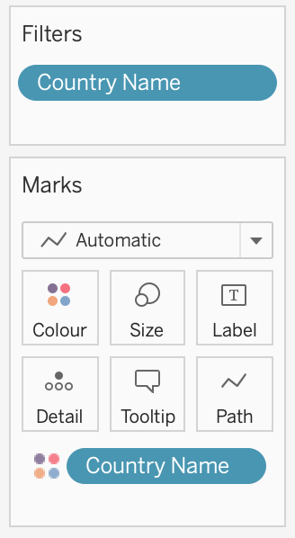{#fig-tableau-filtered-filters width=220}

4. 처음에는 모든 것이 선과 색상이 뒤엉킨 스파게티 접시처럼 보일 것입니다! 필터링을 추가하려면 *Country Name*을 *필터(Filters)* 카드로 드래그하세요. 필터 창에서 모든 국가가 선택되어 있는지 확인하고 *확인(OK)*을 클릭합니다.

5. *필터* 카드에서 *Country Name* 기호의 드롭다운 화살표를 클릭한 다음, 아래로 스크롤하여 \@fig-tableau-filtered-show-filter 그림과 같이 '필터 표시(Show Filter)'를 선택합니다.

6. 차트 오른쪽에 체크박스가 있는 모든 옵션 목록이 표시됩니다.
*(전체)* 즉 *(All)*를 클릭하여 모든 옵션을 추가/제거하고 대화형 필터링이 어떻게 작동하는지 확인하기 위해 국가 몇 개를 선택해 보세요. 이 단계에서 선택한 체크박스들은 게시된 지도에 "켜짐(on)" 상태로 표시됩니다.
미리 선택한 국가 중 일부에 같은 색상이 지정된 것을 알 수 있습니다. 다행히 Tableau에서는 개별 데이터 포인트(여기서는 국가)의 색상을 변경할 수 있습니다. *마크* 카드에서 *색상* 선반을 클릭한 다음 *색상 편집...(Edit Colors...)*을 클릭합니다. *데이터 항목 선택(Select Data Item:)* 목록에서 국가를 더블 클릭하여 색상 선택기 창을 열고 좋아하는 색상을 선택한 후 확인을 클릭합니다. 미리 선택한 국가들이 고유한 색상으로 칠해지도록 확실히 할 수는 있지만 팔레트가 20개 색상으로 제한되어 있기 때문에 다른 국가들 사이에서는 중복이 발생할 것입니다. 안타깝게도 이 문제를 피하기 위해 여러분이 할 수 있는 일은 거의 없습니다.


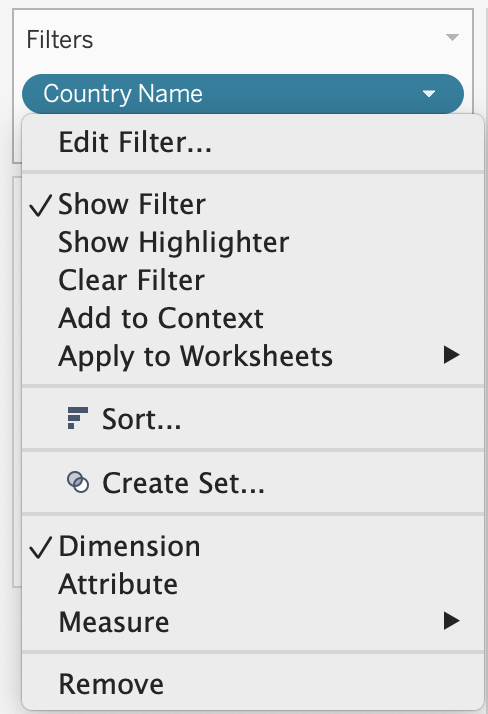{#fig-tableau-filtered-show-filter width=220}

7. 차트 위의 *시트 1* 제목을 두 번 클릭하고 "국가별 인터넷 접속, 19952018(Internet Access by Country, 19952018)"과 같이 좀 더 의미 있는 제목으로 바꿉니다. 메뉴에서 *워크시트(Worksheet) > 캡션 표시(Show Caption)*로 이동해 차트 아래에 캡션 블록을 추가하세요. 이 공간을 이용해 데이터 출처(World Bank)를 추가하고 이 시각화의 저자로 여러분을 명시하세요.

8. *열* 선반 위의 드롭다운 메뉴에서 *표준(Standard)*을 *전체 보기(Fit Width)*로 변경합니다.

9. 우리 데이터는 19952018년에 해당하지만 x축(Year)이 1994년으로 시작하여 2020년으로 끝나는 것을 알 수 있습니다. x축을 두 번 클릭하고 *범위(Range)*를 *자동(Automatic)*에서 *고정(Fixed)*으로 변경한 후, 고정 시작을 *1995*로, 고정 끝을 *2018*로 설정합니다. 창을 닫으면 양 끝의 빈 공간이 사라진 것을 볼 수 있습니다.

10. 필터링된 꺾은선형 차트가 그림 \@fig-tableau-filtered-ready 와 같은 모양이 되면, 게시할 준비가 된 것입니다. *파일 > Tableau Public에 저장*으로 이동하여 계정에 로그인하거나, 아직 계정이 없다면 하나를 만드세요. 프롬프트에 따라 차트를 공개 웹에 게시하거나, 자세한 내용은 앞서 언급한 [Tableau Public 분산형 차트 튜토리얼](#scatter-tableau)을 확인하세요.


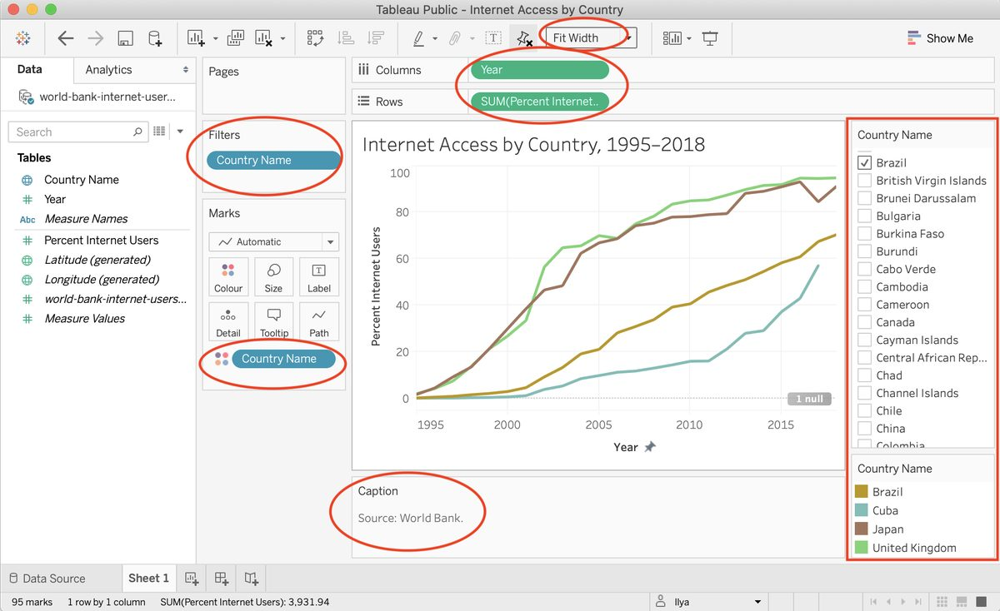{#fig-tableau-filtered-ready}

직접 제어하는 웹 페이지에 차트의 대화형 버전을 삽입하려면 9장의 [임베드 코드 받기](#embed-code) 섹션을 참조하세요.

### 요약 {- #summary6}

독자를 이야기에 더 깊이 빠져들게 하고 이면의 데이터를 탐색하도록 장려하는 대화형 차트를 만드신 것을 축하합니다! 앞으로 더 많은 차트를 만들 때마다 항상 여러분의 데이터 형식과 강조하려는 스토리에 맞게 차트 유형을 선택하세요. 또한, 이 장의 앞부분에서 설명한 원칙과 미적 지침을 바탕으로 차트를 디자인하세요. 요즘은 누구나 몇 개의 버튼만 클릭하면 차트를 빠르게 만들 수 있지만 청중은 데이터에서 의미 있는 패턴으로 주의를 사려 깊게 환기시키는 잘 디자인된 차트를 매우 높이 평가할 것입니다.

이 장에서는 Google Sheets, Datawrapper, Tableau Public을 사용하여 다양한 유형의 대화형 차트를 만드는 방법을 배웠습니다. 오픈소스 코드를 사용한 보다 고급스러운 차트 디자인에 대해서는 [11장: Chart.js 및 Highcharts 템플릿](#chartcode)을 참조하세요. 이 도구들은 데이터를 디자인하고 표시하는 방법에 대해 더 많은 제어권을 제공하지만 10장에서 [GitHub로 코드 템플릿을 편집하고 호스팅하는 방법](#github)을 배워야 합니다.

데이터 매핑에 관한 다음 장([데이터 매핑하기](#map))도 유사한 형식으로 진행되어 다양한 지도 유형과 디자인 원칙을 소개하고 공간 데이터를 사용한 대화형 시각화를 만드는 실습 튜토리얼을 제공합니다. 이후 9장에서는 [웹에 대화형 차트를 임베드하는 방법](#embed)을 배울 것입니다.

<!-- BEGIN FILE: 07-map.Rmd -->

# 데이터 지도로 나타내기 {#map}
지도(Map)는 독자들이 공간적 차원이 포함된 데이터에 빠져들게 하는 동시에 더 강한 장소감을 형성하게 합니다. 지도 상의 점들 간의 상대적인 거리를 보거나 *코로플레스(choropleth)* 지도(색칠된 다각형으로 데이터 값을 나타내는 지도)에서 지리적 패턴을 식별하는 것은 텍스트, 표, 차트보다 더 효과적으로 독자의 눈에 정보를 전달합니다. 하지만 데이터의 주요 인사이트로 주의를 끄는 의미 있는 지도를 만들려면 디자인 선택에 대한 명확한 사고가 필요합니다.

이 장에서는 [지도 디자인 원칙](#map-design)을 살펴보고 좋은 지도와 나쁜 지도를 구별합니다. 모든 지도에 적용되는 규칙과 코로플레스 지도를 만들기 위한 구체적인 지침에 대해 배우게 될 것입니다. 많은 도구가 지도를 *정적(static)* 이미지로 다운로드할 수 있게 해주지만 이 책에서는 독자들이 웹 브라우저에서 지도를 확대하고 데이터를 탐색할 수 있도록 유도하는 *대화형(interactive)* 차트를 구성하는 방법도 보여줍니다. 나중에 [9장: 웹에 포함하기](#embed)에서 웹사이트에 대화형 차트를 임베드하는 방법을 배울 것입니다.

지도 유형에 대한 결정은 주로 두 가지 요소, 즉 데이터의 형식과 전달하고자 하는 이야기의 종류에 따라 달라집니다. 이 책에서 만들 수 있는 다양한 지도 유형에 대해서는 \@tbl-map-types 표에서 알아보세요. 예를 들어, 점 지도(point map)는 특정 위치를 카테고리(예: 병원)를 나타내는 색상 마커로 보여주는 데 가장 적합하고 코로플레스 지도는 지역(예: 미국 주별 출생률)의 상대적 값을 표시하는 데 가장 적합합니다. 지도 유형을 선택한 후에는 다음 섹션들에 나오는 도구 권장 사항과 단계별 튜토리얼을 따르세요. 이 장에서는 드래그 앤 드롭 메뉴가 있는 *쉬운 도구(Easy Tools)*인 [Datawrapper](#symbolmap-datawrapper), [Google My Maps](#mymaps), [Tableau Public](#map-tableau) 및 지속적으로 업데이트되는 지도를 만들 수 있는 [Socrata Open Data 플랫폼](#map-socrata)을 다룹니다. 하지만 표에는 맞춤 설정과 시각화 호스팅에 더 많은 제어력을 제공하는 *파워 도구(Power Tools)*인 [13장의 Leaflet 코드 템플릿](#leaflet) 등도 소개되어 있습니다. 이러한 고급 도구를 사용하려면 [10장의 GitHub로 코드 템플릿 편집 및 호스팅하기](#github)에 대한 사전 지식이 필요합니다.

Table: (\#tab:map-types) 기본 지도 유형, 최적의 용도 및 이 책의 튜토리얼

| 지도 | 최적의 용도 및 이 책의 튜토리얼 |
| --- | --- |
| 기본 다각형이 있는 로케이터 점 지도(Locator point map)<br> 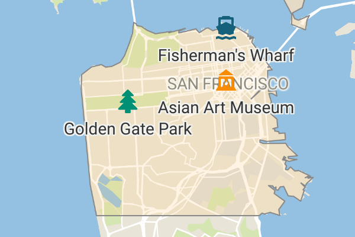 | 맞춤형 마커로 특정 장소와 그 지역 내 위치를 표시할 때 가장 적합합니다. <br>쉬운 도구: [Datawrapper를 사용한 로케이터 점 지도 튜토리얼](#locatormap-datawrapper), 또는 그룹화된 마커 카테고리나 맞춤 마커 이미지를 위한 [Google My Maps 튜토리얼](#mymaps). <br>파워 도구: [13장: Google Sheets를 사용한 Leaflet 지도 튜토리얼](#leaflet-maps-with-google-sheets) |
| 심볼 점 지도(Symbol point map)<br> 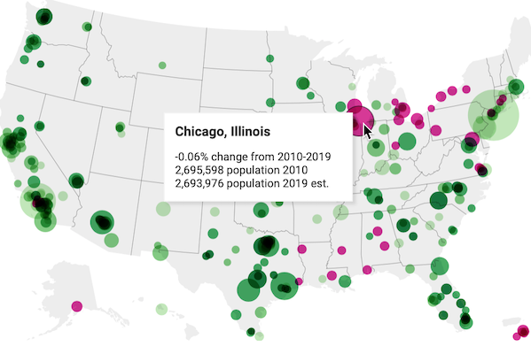 | 데이터 값(예: 인구 증가)을 나타내기 위해 크기나 색상이 다양한 도형으로 특정 위치(예: 도시)를 표시할 때 가장 적합합니다. <br>쉬운 도구: [Datawrapper를 사용한 심볼 점 지도 튜토리얼](#symbolmap-datawrapper) |
| 코로플레스(색칠된 다각형) 지도 <br> 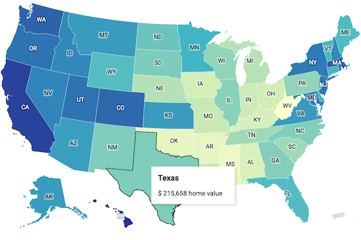 | 데이터 값을 나타내기 위해 다각형을 칠하여 지리적 영역(예: 동네 또는 국가) 전체의 패턴을 보여줄 때 가장 적합합니다. <br>쉬운 도구: [Datawrapper를 사용한 코로플레스 지도 튜토리얼](#choropleth-datawrapper) 또는 [Tableau Public을 사용한 코로플레스 지도 튜토리얼](#map-tableau) <br>파워 도구: [13장: Google Sheets를 사용한 Leaflet 지도 튜토리얼](#leaflet-maps-with-google-sheets) |
| 히트 점 지도(Heat point map) <br> 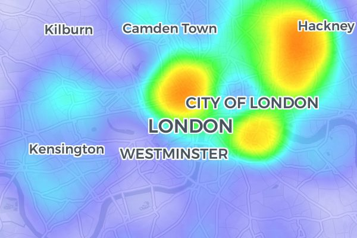 | 점들의 군집을 색칠된 핫스팟으로 보여주어 높은 빈도나 사례 밀도를 강조할 때 가장 적합합니다. <br>파워 도구: [13장: Leaflet 히트맵 코드 템플릿](#leaflet-heatmap) |
| 스토리 지도(Story map) <br> 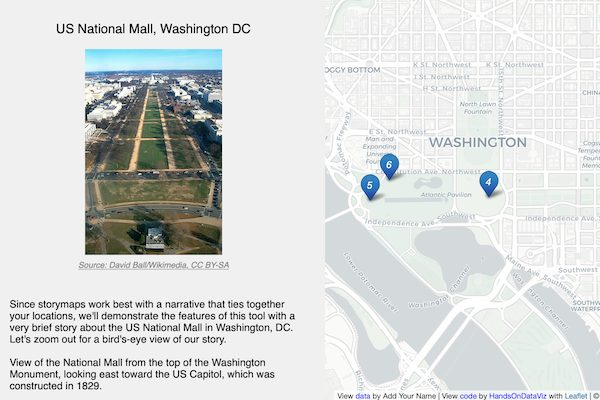 | 스크롤되는 내러티브를 통해 텍스트, 이미지, 오디오, 비디오, 스캔한 지도 배경을 표시하며 점별 가이드 투어를 보여줄 때 가장 적합합니다. <br> 파워 도구: [13장: Google Sheets를 사용한 Leaflet 스토리맵 튜토리얼](#leaflet-storymaps-with-google-sheets) |
| 폴리라인 지도(Polyline map) <br> 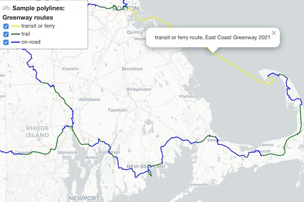 | 경로(예: 트레일이나 대중교통)를 보여주며 카테고리별로 색상을 다르게 표시할 때 가장 적합합니다. <br>쉬운 도구: [Google My Maps 튜토리얼](#mymaps) <br>파워 도구: [13장: Google Sheets를 사용한 Leaflet 지도 튜토리얼](#leaflet-maps-with-google-sheets)|
| 맞춤형 점-폴리라인-다각형 지도 <br>  | 점, 폴리라인, 다각형을 마음대로 조합하여 표시하고 카테고리별 맞춤 아이콘과 데이터 값을 나타내는 색칠된 영역을 보여줄 때 가장 적합합니다. <br>파워 도구: [13장: Google Sheets를 사용한 Leaflet 지도 튜토리얼](#leaflet-maps-with-google-sheets) |
| 검색 가능한 점 지도(Searchable point map)<br> 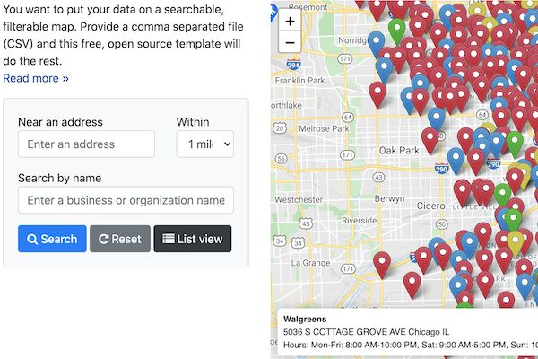 | 사용자가 이름이나 근접성을 기준으로 검색하거나 카테고리별로 필터링할 수 있는 특정 위치를 (선택적인 목록 뷰와 함께) 보여줄 때 가장 적합합니다.<br> 파워 도구: [13장: Leaflet 검색 가능한 점 지도 코드 템플릿](#leaflet-searchable-map) |
| 오픈 데이터 리포지토리의 최신 지도<br> 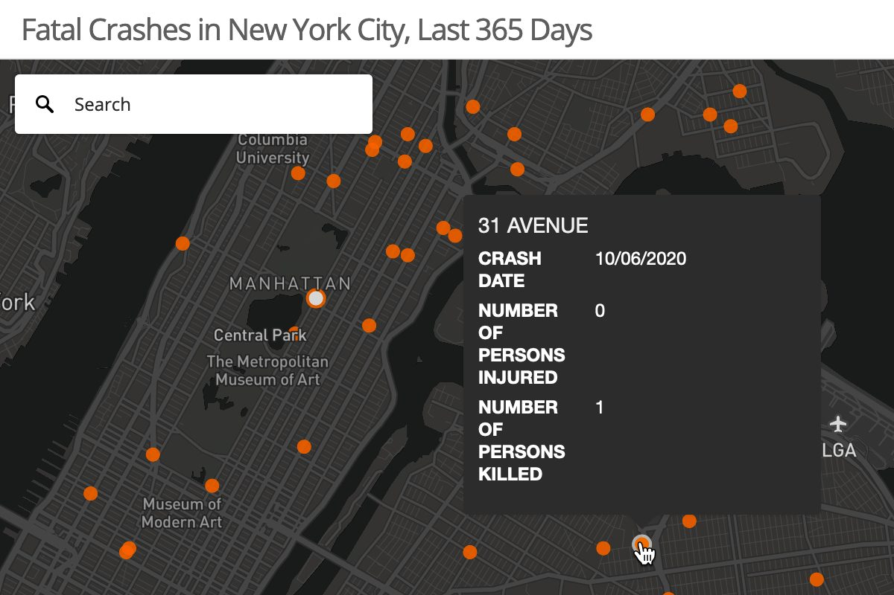 | Socrata 등의 오픈 데이터 리포지토리에서 직접 가져온 최신 정보를 보여줄 때 가장 적합합니다. <br>쉬운 도구: [Socrata 오픈 데이터를 활용한 최신 지도 튜토리얼](#map-socrata)<br>파워 도구: [13장: 오픈 데이터 API를 사용한 Leaflet 지도 코드 템플릿](#leaflet-maps-open-data-apis) |

## 지도 디자인 원칙 {- #map-design}
오늘날 수집되는 많은 데이터에는 지도에 표시할 수 있는 공간적 요소가 포함되어 있습니다. 도시 주소를 검색하든 숲속의 나무 사진을 찍든, 둘 다 지도의 점으로 지오코딩(geocode)될 수 있습니다. 또한 동네나 국가의 지리적 경계를 나타내기 위해 선과 도형을 그릴 수 있으며 인구나 소득과 같은 다양한 값을 나타내기 위해 색을 칠할 수 있습니다.

그러나 데이터를 지도화할 수 *있다*고 해서 항상 지도화*해야 하는* 것은 아닙니다. 지도를 만들기 전에 멈춰서 스스로에게 물어보세요: *위치가 여러분의 이야기에 정말로 중요한가요?* 데이터에 지리적 정보가 포함되어 있더라도, 때로는 지도보다 차트가 이야기를 더 잘 전달합니다. 예를 들어, 막대 차트로 지리적 영역 간의 차이를 명확하게 보여줄 수 있고 꺾은선 차트로 시간에 따른 다양한 비율의 오르내림을 추적할 수 있으며 분산형 차트(scatter chart)로 각 지역의 두 변수를 비교할 수 있습니다. 때로는 단순한 표나 텍스트 자체만으로도 요점을 대상 청중에게 더 효과적으로 전달할 수 있습니다. 잘 디자인된 지도를 만드는 데는 시간과 에너지가 필요하므로, 지도가 실제로 여러분의 데이터 스토리를 향상시키는지 확인하세요.

이전 장인 차트에서 배웠듯이, 데이터 시각화는 과학이 아니라 진실되고 의미 있는 지도를 만들기 위한 기초 역할을 하는 일련의 원칙과 모범 사례를 수반합니다. 이 섹션에서는 지도 디자인에 관한 몇 가지 규칙을 알아볼 것입니다. 하지만 데이터를 정직하게 해석하고 있다면, 어떤 규칙은 다른 규칙보다 덜 엄격하며 요점을 강조하기 위해 필요할 때 "깰" 수 있다는 사실을 알게 되면 놀라실 수도 있습니다. 차이점을 이해하기 위해, 지도를 요소별로 분석하여 지도에 관한 공통된 어휘를 확립하는 것부터 시작해 보겠습니다.

### 지도의 구성 요소 {-}
이 책에서는 사용자가 기저 지도(basemap) 타일의 이음새 없는 집합 위에서 지도 데이터 레이어를 확대하고 이동하며 탐색할 수 있는 *대화형(interactive)* 웹 지도(또는 *타일 지도(tiled maps)*나 *슬리피 지도(slippy maps)*라고도 함)를 만드는 방법을 다룹니다. 항공 사진 이미지를 표시하는 기저 지도를 *래스터(raster)* 타일이라고 하며 도로와 건물의 그림 이미지를 표시하는 타일은 *벡터(vector)* 데이터로 만들어집니다. 래스터 지도 데이터는 원본 이미지 해상도의 한계 때문에 가까이 갈수록 흐릿해집니다. 반면에 그림 [\@fig-raster-vs-vector-zoom]에서 보듯이 시각적 품질 저하 없이 벡터 지도 데이터는 아주 가까이 확대할 수 있습니다. 13장의 [GeoJSON 및 지리 공간 데이터(GeoJSON and Geospatial Data)](#geojson) 섹션에서 이러한 개념에 대해 더 자세히 배울 것입니다.


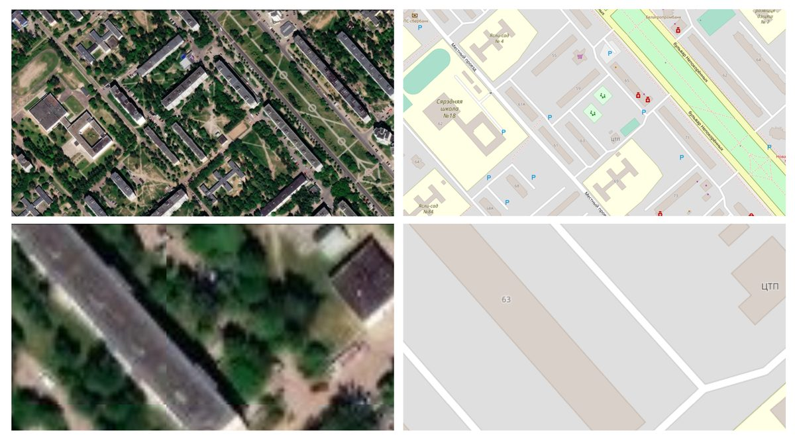{#fig-raster-vs-vector-zoom width=750}

이 장에서 만들 대화형 지도의 기본 요소에 대해 알아보려면 그림 [\@fig-map-principles-map]을 보세요. 최상위 레이어는 일반적으로 *점(points)*, *폴리라인(polylines)*, *다각형(polygons)*의 어떤 조합을 표시합니다. 점은 집이나 회사의 거리 주소와 같은 특정 장소를 보여주며 때로는 위치 마커를 사용하기도 하고 각 점은 위도와 경도 좌표의 쌍으로 표현됩니다. 예를 들어, `40.69, -74.04`는 뉴욕시 자유의 여신상 위치를 나타냅니다. 폴리라인은 도로나 교통망과 같이 연결된 점들의 선이며 여러 가지 분기를 가질 수 있음을 상기시키기 위해 "선(lines)" 앞에 "폴리(poly-)" 접두사를 붙입니다. 다각형은 선들이 모여 만든 닫힌 형태이며 건물 발자국(footprints), 인구 조사구, 주 또는 국가 경계 등이 있습니다. 점, 폴리라인, 다각형은 기본적으로 위도와 경도 좌표로 구성되므로 모두 벡터 데이터입니다.


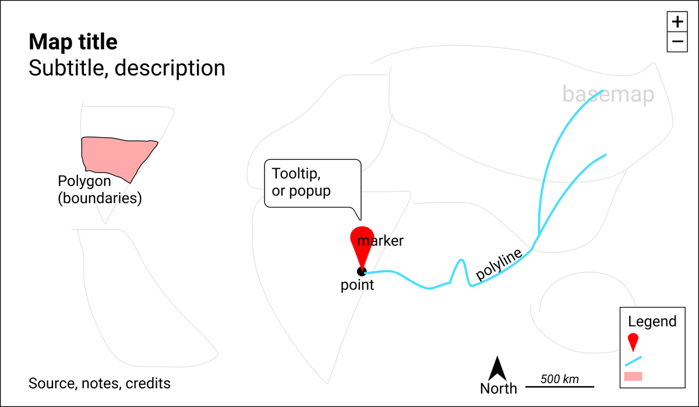{#fig-map-principles-map}

대화형 지도에는 일반적으로 기저 지도 타일의 표시를 변경하고 다양한 거리에서 표면을 보는 듯한 효과를 주는 *확대/축소(zoom)* 컨트롤(`+` 및 `-` 버튼)이 포함됩니다. 최상위 레이어 지도 데이터는 속성에 대한 추가 정보를 드러내는 (마우스 커서를 올렸을 때 나타나는) 숨겨진 *툴팁(tooltip)*이나 (클릭했을 때 나타나는) *팝업(popup)*을 표시할 수 있습니다. 전통적인 정적 지도와 마찬가지로, *범례(legend)*는 기호, 모양, 색상의 의미를 식별합니다. 또한 지도에는 방향과 상대적 거리에 대한 독자의 이해를 돕기 위한 *방위표(north arrow)*나 *축척(scale)*이 포함될 수 있습니다. 차트와 비슷하게, 좋은 지도는 무엇을 보여주는지에 대한 맥락을 제공하는 제목과 간략한 설명, 데이터 출처, 명확한 참고 사항, 그리고 지도를 만드는 데 도움을 준 개인이나 조직에 대한 출처 표기를 포함해야 합니다.

### 점 데이터와 다각형 데이터 구분하기 {-}

지도를 만들기 전에, 데이터 형식이 무엇이고 무엇을 나타내는지 이해해야 합니다. 다음 질문을 멈춰서 던져보며 초보자의 실수를 피하세요. 첫째, *데이터를 지도화할 수 있습니까?* 우리가 수집하는 정보 가운데는 지리적 요소가 없거나 일관성이 없어 지도에 표시하기 어렵거나 불가능한 경우도 있습니다. 답이 예라면, 두 번째 질문으로 넘어갑니다. *데이터를 점 또는 다각형으로 매핑할 수 있습니까?* 경로와 루트를 나타내는 다소 덜 흔한 세 번째 옵션인 폴리라인과 대조적으로, 이 두 가지가 가장 가능성 높은 경우(종종 혼동되기도 함)입니다.

차이를 이해하기 위해 몇 가지 예를 살펴보겠습니다. 아래에 나열된 항목은 점 데이터인가요, 다각형 데이터인가요?

1. 36.48, -118.56 (캘리포니아 조슈아 트리 국립공원의 위도와 경도)
2. 2800 E Observatory Rd, Los Angeles, CA
3. Haight and Ashbury Street, San Francisco, CA
4. Balboa Park, San Diego, CA
5. Census tract 4087, Alameda County, CA
6. City of Los Angeles, CA
7. San Diego County, CA
8. State of California

대부분의 경우 1-4번 항목은 지도의 점 마커로 표시될 수 있는 *특정 위치*를 주로 가리키므로 *점* 데이터를 나타냅니다. 반면 5-8번 항목은 일반적으로 지도의 닫힌 모양으로 표시될 수 있는 *지리적 경계*를 나타내므로 보통 *다각형* 데이터에 해당합니다. 이전 \@tbl-map-types 표에서 점과 다각형 지도의 예를 모두 확인하세요.

이 점과 다각형의 구분은 *대부분의* 경우 적용되지만 데이터 스토리에 따라 예외가 항상 적용되지는 않습니다. 첫째, 흔하지는 않지만 1-8번 항목을 모두 지도에 *점* 데이터로 나타낼 수 있습니다. 예를 들어, 캘리포니아 도시들의 인구 증가에 대한 데이터 스토리를 전달하려면, 각 도시의 데이터를 나타내기 위해 크기가 다른 원을 사용하는 심볼 점 지도를 만드는 것이 타당합니다. 이렇게 하려면 지도 도구가 로스앤젤레스 시 다각형 경계의 중심점을 찾아 지도상의 특정 점에 인구 원을 배치해야 합니다. 두 번째로 점과 다각형의 구분이 모호해지는 이유는 우리가 일반적으로 특정 점이라고 여기는 장소 중 일부는 다각형 모양의 경계를 *또한* 지니고 있기 때문입니다. 예를 들어 Google 지도에 "Balboa Park, San Diego CA"를 입력하면, 결과를 점 데이터임을 암시하는 지도 마커로 표시합니다. 그러나 발보아 공원은 또한 1.8제곱마일(4.8제곱킬로미터)에 달하는 지리적 경계까지 갖고 있습니다. 샌디에이고에서 공공장소로 할당된 토지의 양에 대한 데이터 스토리를 들려준다면, 발보아 공원을 점이 아닌 다각형으로 표시하는 코로플레스 지도를 만드는 것이 타당할 것입니다. 세 번째로, [2장에서 소개한 피벗 테이블(pivot tables)](#pivot)을 사용하여 점 데이터를 다각형 데이터로 변환할 수도 있습니다. 예를 들어 캘리포니아 각 카운티의 병상 수에 대한 데이터 스토리를 전달하려는 경우, 각 병원의 병상에 대한 점 수준 데이터를 얻은 다음 피벗하여 각 카운티의 총 병상 수를 합산하고 이 다각형 수준 결과를 코로플레스 지도에 표시할 수 있습니다. 자세한 예시는 [13장 지도 데이터 변환하기의 점을 다각형 데이터로 피벗하기(Pivot Points into Polygon Data)](#pivot-point-to-polygon) 섹션을 참조하세요.

요약하자면, 점과 다각형은 종종 혼동되므로 공간 데이터가 점을 나타내야 하는지 아니면 다각형을 나타내야 하는지 명확히 하세요. 점이라고 구상한다면 점 스타일의 지도를 만들고 다각형이라면 코로플레스 지도를 만드세요. 이들은 지도 제작자가 가장 일반적으로 사용하는 방법들이지만 데이터 스토리에 따라 예외도 많습니다. 이 장의 후반부에서는 [Google MyMaps에서 기본 점 지도(basic point map)](#mymaps)와 [Datawrapper에서 심볼 점 지도(symbol point map)](#symbolmap-datawrapper)를 만드는 방법을 배울 것이며 그 다음 다각형 수준 데이터를 시각화하는 방법을 [Datawrapper의 코로플레스 지도(choropleth map)](#choropleth-datawrapper)와 [Tableau Public의 코로플레스 지도(choropleth map)](#map-tableau)를 통해 시연할 것입니다.

### 두 개가 아닌 하나의 변수만 지도화하기 {-}
데이터 시각화 초보자는 종종 지도에 한 변수를 배치하는 데 너무 자부심을 느낀 나머지 두 변수를 배치하면 두 배로 좋을 것이라고 여깁니다. 하지만 이는 대개 사실이 아닙니다. 이러한 잘못된 결론에 도달하는 사고 과정은 다음과 같습니다. 여러분 주의 8개 카운티에서 소득과 교육 사이의 관계를 비교하고 싶다고 가정해 봅시다. 첫째, 소득에 대한 코로플레스 지도를 만들어 서북쪽 구석에 짙은 파란색 영역이 나타나 소득 수준이 높음을 나타내기로 결정합니다. 이는 그림 \@fig-map-two-variables(a)에 나와 있습니다. 둘째, 대학교 학위를 가진 인구 비율이 높음을 더 큰 원으로 나타내는 심볼 점 지도를 만들기로 결정합니다. 이는 그림 \@fig-map-two-variables(b)에 나와 있습니다. 이 두 지도는 모두 훌륭하지만 여전히 소득과 교육 사이의 관계를 명확히 강조하지는 않습니다.

흔한 실수 중 하나는 코로플레스 지도 레이어 위에 심볼 점 레이어를 겹쳐 놓는 것입니다. 이는 그림 \@fig-map-two-variables(c)에 나와 있습니다. 이렇게 하면 지도가 정보로 과부하됩니다. 같은 지도에 서로 다른 기호법(symbologies)으로 두 변수를 표시하는 것은 권장하지 않습니다. 이렇게 하면 시각화가 복잡해지고 대부분의 독자가 여러분의 데이터 스토리를 이해하는 데 도움이 되는 패턴을 인식하기 매우 어려워지기 때문입니다.


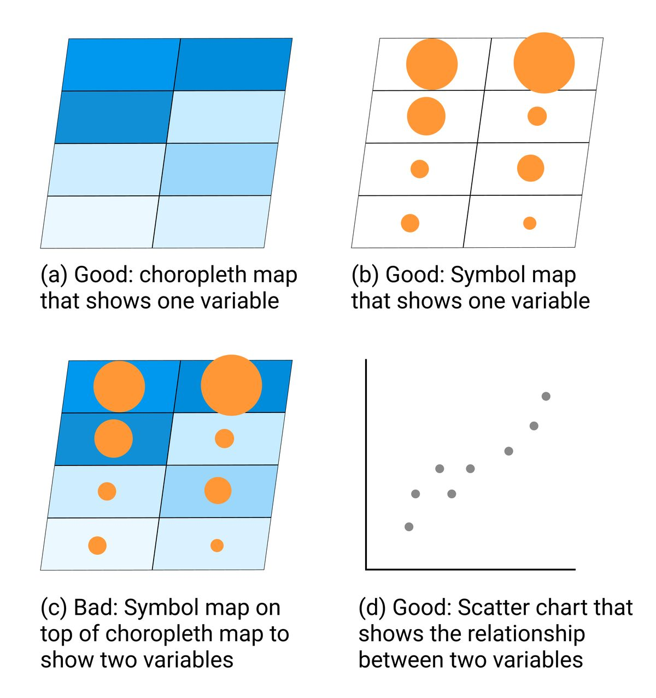{#fig-map-two-variables width=450}

대신 두 변수 사이의 관계가 여러분의 데이터 스토리에서 가장 중요한 측면이라면 그림 \@fig-map-two-variables(d)에 표시된 것처럼 분산형 차트를 만드세요. 또는 변수 중 하나에 대해 지리적 패턴이 중요하다면 그림 \@fig-map-two-variables(a 및 d)를 결합하여 해당 변수의 코로플레스 지도를 두 변수의 분산형 차트 옆에 짝을 지을 수 있습니다. 전반적으로, 데이터를 지도화할 수 *있다*고 해서 항상 지도화*해야 하는* 것은 아니라는 점을 기억하세요. 위치가 중요한지 곰곰이 생각해보세요. 때로는 지도를 사용하는 것보다 차트가 여러분의 데이터 스토리를 더 잘 말해줄 수도 있습니다.

### 코로플레스 지도를 위해 더 작은 지리 단위 선택하기 {-}
코로플레스 지도는 데이터 값을 나타내기 위해 다각형에 색을 칠하여 지역 전반의 지리적 패턴을 보여주는 데 가장 적합합니다. 따라서 일반적으로 우리는 더 *작은* 지리적 단위를 선택하여 더 *세분화된(granular)* 패턴을 표시할 것을 권장합니다. 큰 지리적 단위는 하위 수준에서 일어나는 일을 숨길 수 있는 집계 데이터를 표시하기 때문입니다. 지리학자들은 이 개념을 [수정 가능한 면적 단위 문제(modifiable aerial unit problem)](https://en.wikipedia.org/wiki/Modifiable_areal_unit_problem)라고 부르며 이는 데이터를 분할하는 방식이 지도에서 보여지는 그 분석 형태에 영향을 미친다는 것을 의미합니다. 작게 분할된 여러 조각들을 모아두면 하나의 큰 조각보다 훨씬 더 상세한 정보를 드러낼 수 있습니다.

예를 들어, 2020년 9월 미국 북동부 지역의 전형적인 주택 가치에 대한 두 개의 코로플레스 지도를 비교해 보세요. 이 지도는 [Zillow 리서치 데이터](https://www.zillow.com/research/data/)를 기반으로 합니다. Zillow는 전형적인 가치를 모든 단독 주택, 콘도, 코옵 아파트 중 35~65 백분위수(percentile) 범위 내에 해당하는 매끄럽고(smoothed) 계절 조정된 주택 가격으로 정의하며 50 백분위수의 중간 가치와 유사하게 일부 더 낮고 높은 가치의 주택을 포함합니다. 두 코로플레스 지도는 같은 척도를 사용합니다. 핵심적인 차이점은 지리적 단위의 크기입니다. 그림 [\@fig-zillow-northeast]에서 왼쪽 지도는 주(state) 단위의 큰 지역에 대한 주택 가치를 보여주고 오른쪽 지도는 카운티(county) 단위의 작은 지역별 주택 가치를 보여줍니다.


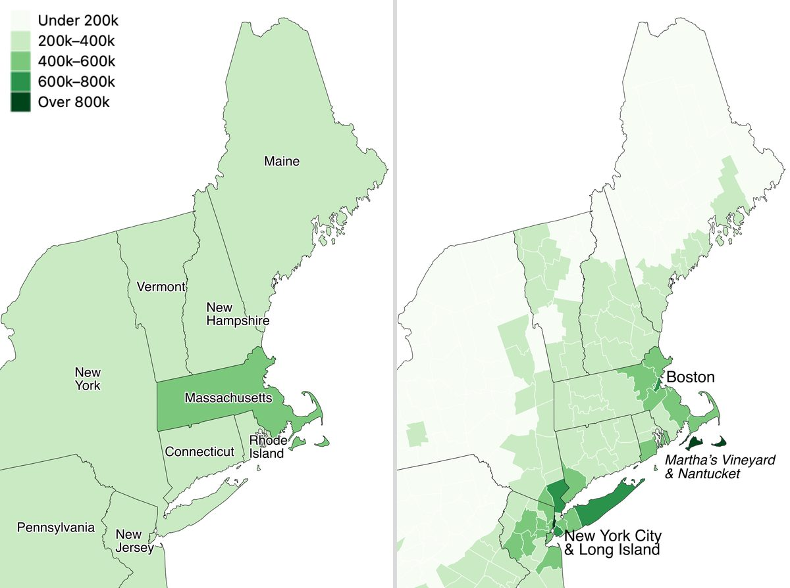{#fig-zillow-northeast width=500}

어느 지도가 더 낫나요? 두 지도 모두 데이터를 정직하게 묘사하고 있으므로 정답은 전달하고자 하는 스토리에 달려 있습니다. 주 간의 차이를 강조하고 싶다면 첫 번째 지도를 선택하세요. 첫 번째 지도는 매사추세츠 주의 일반적인 주택 가격이 주변 북동부 주에 비해 어떻게 높은지를 명확히 강조합니다. 또는 주 내부의 변동성을 강조하고 싶다면 두 번째 지도를 선택하세요. 이 지도는 뉴욕시 및 보스턴 대도시 지역이 이 두 주의 시골 카운티에 비해 주택 가격이 높다는 점을 보여줍니다. 잘 모르겠다면 보통은 더 작은 지리적 단위를 지도화하는 것이 더 낫습니다. 적절한 레이블과 지리적 윤곽선을 사용한 디자인이라면 주 수준과 주 내부 변동성을 동시에 볼 수 있기 때문입니다. 하지만 '작을수록 좋다'는 엄격한 규칙으로 여기지 마세요. 척도에서 더 아래로 내려갈수록 그 규칙은 적용되지 않기 때문입니다. 예를 들어, 북동부 미국의 개별 주택 매매 건수까지 표시하는 세 번째 지도를 만든다면 의미 있는 패턴을 보기에는 *너무 상세*할 것입니다. 데이터 스토리를 명확하게 전달하기 위한 딱 적절한 수준의 지리를 찾아보세요.

## 코로플레스 색상 및 구간 디자인하기 {- #design-choropleth}

이 섹션에서는 코로플레스 지도의 지도 디자인 원칙을 더 깊이 살펴봅니다. 색상을 사용해 데이터를 어떻게 표현할지에 대한 여러분의 선택은 지도의 모양을 크게 결정하므로, 진실되고 의미 있는 이야기를 전달하는 지도를 만들기 위해서는 핵심 개념을 배우는 것이 매우 중요합니다. 훌륭한 코로플레스 지도는 종이에 흑백으로 인쇄되든 컴퓨터 화면에 컬러로 표시되든 간에, 진실되고 통찰력 있는 지리적 패턴을 독자들에게 명확하게 보여줍니다. 나아가 가장 훌륭한 코로플레스 지도는 색맹인 사람도 지도를 제대로 이해할 수 있게 디자인됩니다. 시각화 색상 전반에 대한 훌륭한 개요는 Datawrapper 블로그의 리사 샬롯 로스트(Lisa Charlotte Rost)가 쓴 "[Your Friendly Guide to Colors in Data Visualization](https://blog.datawrapper.de/colorguide/)"와 "[How to Pick More Beautiful Colors for Your Data Visualizations](https://blog.datawrapper.de/beautifulcolors/index.html)"를 참조하세요.^[@rostYourFriendlyGuide2018; @rostHowPickMore2020]

색상 선택이 코로플레스 지도 디자인에 어떤 영향을 미치는지 설명하는 가장 좋은 방법은 신시아 브루어(Cynthia Brewer)와 마크 해로워(Mark Harrower)가 만든 [ColorBrewer](https://colorbrewer2.org/)라는 멋진 온라인 디자인 어시스턴트를 활용하는 것입니다.^[참조 @brewerDesigningBetterMaps2016] 이 책의 다른 도구들과 달리, ColorBrewer는 시각화를 생성하기 위해 데이터를 직접 업로드하는 방식이 아닙니다. 대신 코로플레스 지도에 표시하고자 하는 데이터 유형을 선택하면 ColorBrewer가 여러분의 데이터 스토리와 가장 잘 맞는 색상 팔레트를 추천하여 도와줍니다. 그런 다음 아래의 [Datawrapper](#choropleth-datawrapper) 및 [Tableau Public](#map-tableau) 튜토리얼에서 보여준 것처럼 이 색상 코드를 원하는 코로플레스 지도 도구로 내보낼 수 있습니다. 그림 [\@fig-map-colorbrewer]에서 ColorBrewer 인터페이스를 확인하세요.


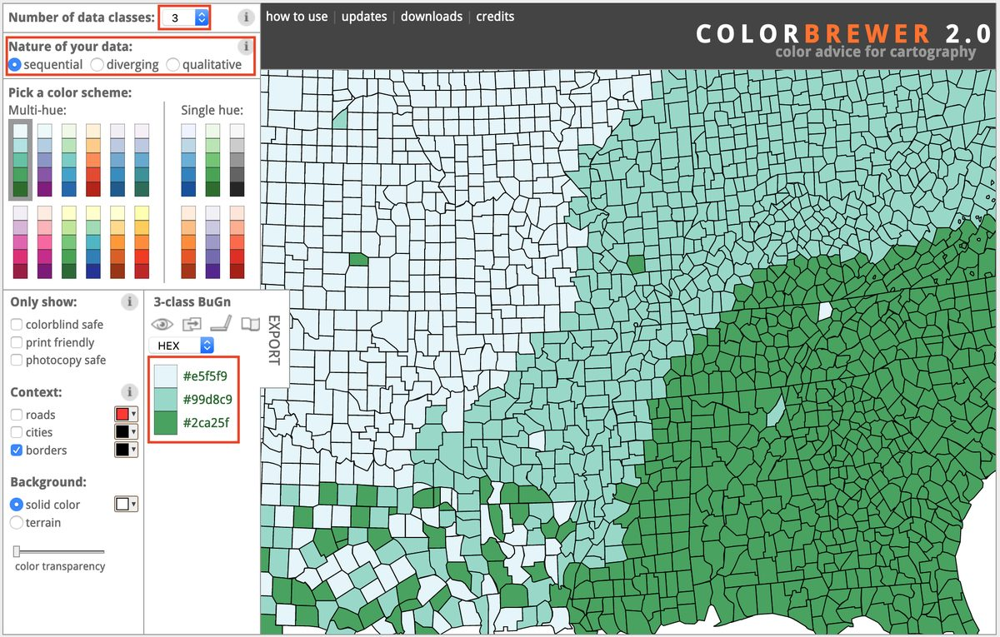{#fig-map-colorbrewer}

이 섹션에서는 코로플레스 지도를 디자인할 때 ColorBrewer의 도움을 받을 수 있는 두 가지 중요한 결정에 중점을 둘 것입니다: 색상 팔레트의 유형(순차적, 발산적 또는 질적)과 비슷한 색상의 데이터 포인트를 묶기 위한 구간(intervals) 선택.

[ColorBrewer](https://colorbrewer2.org/)를 열면, 맨 윗줄에서 코로플레스 지도의 색상 범위 내 데이터 클래스(구간 또는 단계라고도 함) 수를 선택하라고 요청합니다. ColorBrewer는 선택한 구성표 유형에 따라 최대 12개의 데이터 클래스에 대해 구별되는 색상을 추천할 수 있습니다. 하지만 지금은 기본 설정인 3을 사용하고 아래에서 구간에 대해 좀 더 자세히 논의할 때 이 주제로 다시 돌아오겠습니다.

### 데이터에 맞는 코로플레스 팔레트 선택하기 {-}
코로플레스 지도를 디자인할 때 가장 중요한 결정 중 하나는 팔레트 유형을 선택하는 것입니다. 이는 단순히 색상을 고르는 것을 넘어 독자가 정보를 올바르게 해석할 수 있도록 돕는 *색상의 배치(arrangement of colors)*를 선택하는 것입니다. 규칙은 간단합니다: 데이터 형식과 전달하려는 이야기에 맞는 적절한 색상 팔레트를 선택하는 것입니다.

그림 [\@fig-map-principles-color-schemes]에서 볼 수 있듯이 ColorBrewer는 팔레트를 순차적(sequential), 발산적(diverging), 질적(qualitative)의 세 가지 유형으로 그룹화합니다.


의 순차적(Sequential), 발산적(diverging), 질적(qualitative) 색상 팔레트.](images/07-map/map-principles-color-schemes.png){#fig-map-principles-color-schemes}

*순차적 팔레트(Sequential palettes)*는 낮은 숫자 값에서 높은 숫자 값을 나타내는 데 가장 적합합니다. 중간 소득, 강수량 또는 이전 선거 투표 인구 비율 등 척도(scale)에 따라 순차적으로 배치할 수 있는 모든 것이 그 예입니다. 순차적 팔레트는 단일 색조(파란색의 다양한 음영 등)이거나 다중 색조(노랑-주황-빨강 등)일 수 있습니다. 어두운 색상은 *일반적으로* 높은 값을 나타내지만 항상 그런 것은 아닙니다.

*발산적 팔레트(Diverging palettes)*는 기준 수준(예: 0, 평균 또는 중앙값) 이상 및 이하의 수치를 표시하는 데 가장 적합합니다. 일반적으로 양수 방향과 음수 방향을 나타내기 위해 확연히 구별되는 두 가지 색조를 사용하며 양극단으로 갈수록 어두운 색상이고 중간에는 중립적인 색상이 위치합니다. 예로는 중앙값 수준보다 높거나 낮은 소득, 계절 평균보다 많거나 적은 강수량, 또는 표준보다 높거나 낮은 유권자 비율 등이 있습니다.

*질적 팔레트(Qualitative palettes)*는 숫자 척도가 아닌 범주형(categorical) 데이터를 나타내는 데 가장 적합합니다. 이 팔레트는 대개 차이를 강조하기 위해 서로 구별되는 고유한 색상들로 구성됩니다. 예로는 여러 가지 토지 이용 유형(주거, 상업, 개방 공간, 물) 또는 신호등 색 경고 시스템(초록, 노랑, 빨강)과 같은 범주를 들 수 있습니다.

*순차적* 수치와 *발산적* 수치의 차이를 보여주기 위해 2018년 미국 인접 주(contiguous states)의 1인당 소득(income per capita)에 대한 동일한 데이터를 표시하는 두 지도를 비교해 보겠습니다(그림 \@fig-map-principles-classification). 순차적 색상 팔레트는 낮음에서 높음까지 소득 수준 범위를 다섯 가지 푸른색 음영으로 나타냅니다. 메릴랜드부터 매사추세츠까지 북동부 연안을 따라 더 짙은 푸른색으로 나타나는 것처럼, 이 지도는 가장 높은 소득 수준을 강조하는 데이터 스토리에 가장 적합합니다. 반면, 발산적 색상 팔레트는 평균 이하 주에 짙은 주황색을, 평균 이상 주에 짙은 보라색을 사용하고 중간에 중립적인 색상을 표시합니다. 이 지도는 상대적으로 소득이 낮은 남부 주들과 소득이 높은 동부 및 서부 연안 주들 간의 경제적 분할을 강조하는 데이터 스토리에 가장 잘 맞습니다.


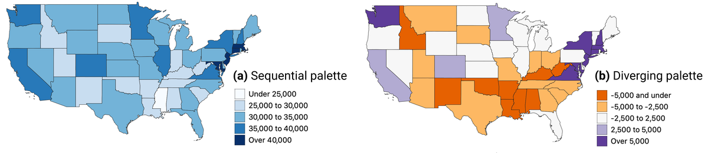{#fig-map-principles-classification width=750}

데이터 클래스와 색상 팔레트를 선택하면 ColorBrewer는 웹 브라우저가 색상으로 해석할 수 있는 영숫자 코드를 표시합니다. 16진수 코드(`#ffffff`는 흰색), RGB 코드(`255,255,255`는 흰색) 또는 CMYK 코드(`0,0,0,0`은 흰색)를 선택할 수 있으며 선호하는 지도 도구가 색상 팔레트 가져오기를 허용하는 경우 그림 [\@fig-colorbrewer-export]에 나타난 것처럼 다른 형식으로 내보낼 수 있습니다.


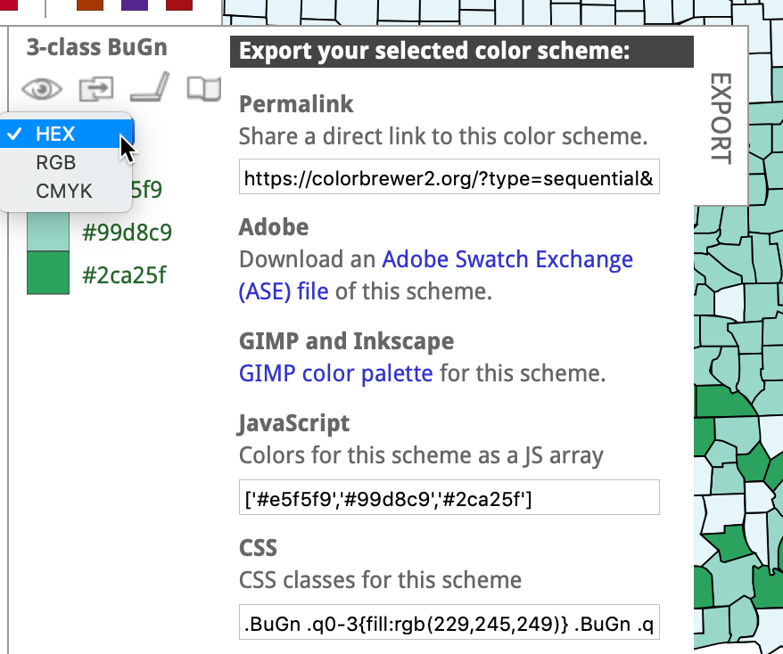{#fig-colorbrewer-export width=435}

### 코로플레스 지도 데이터를 묶기 위한 색상 구간 선택하기 {-}

또 하나의 중요한 디자인 선택은 색상 구간(intervals)입니다. 색상 구간은 코로플레스 지도에서 데이터를 어떻게 그룹화하고 표시할지 결정합니다. 이러한 강력한 결정은 여러분의 지도가 독자들의 눈에 어떻게 보일지, 데이터 스토리가 어떤 메시지를 전달할지에 극적인 영향을 미칩니다. 이 다단계 의사결정 과정에서 여러 옵션을 고려해야 하며 통일된 디자인 규칙은 거의 없지만 저희가 가이드라인과 권장 사항을 제시해 드릴 것입니다. 서로 다른 매핑 도구마다 구간을 선택하는 옵션이 다양하므로, 이 섹션에서는 Datawrapper 및 Tableau Public의 스크린샷과 함께 폭넓은 개념을 설명하고 구체적인 세부 사항은 나중에 해당 튜토리얼에서 다룰 것입니다.

어떤 매핑 도구를 사용하면 데이터 척도에서의 상승 또는 하강을 표현하기 위해 두 가지 다른 *유형의 색상 구간* 중에서 선택할 수 있습니다(그림 \@fig-intervals-type-combined). *단계형(Steps)*은 계단과 같이 색상 구분이 명확하게 드러나며 *연속형(continuous)*은 경사로처럼 점진적인 색상 변화를 보여줍니다. 둘 다 위쪽으로 올라가지만 그곳에 이르는 방식은 다릅니다.


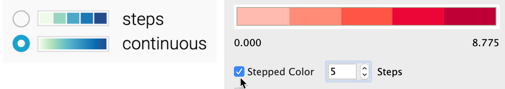{#fig-intervals-type-combined width=500}

두 옵션이 모두 있다면, 단계형과 연속형 중 어떤 색상 구간 유형이 가장 좋을까요? 이에 대한 통일된 지도 디자인 규칙은 없지만 다음과 같은 요소를 고려해 보세요. 한편으로, 해수면이 1미터 상승할 때 물에 잠기게 될 지역처럼 특정 선이나 임계값 아래 또는 위의 영역을 보여주는 데이터 스토리에는 단계형이 가장 잘 맞습니다. 또한 사람의 눈은 항상 색조를 구별하는 데 능숙하지 않기 때문에 단계형은 독자가 지도 범례의 색상과 데이터를 빠르게 연결하도록 도와줄 수 있습니다. 다른 한편으로, 연속형은 광범위한 소득 척도 값처럼 이웃한 지역들 간의 미세한 차이에 주의를 끄는 데이터 스토리에 가장 잘 맞습니다. 코로플레스 지도를 만들 때 고려해야 할 사항에 대해서는 Datawrapper Academy의 기사 [what to consider when creating choropleth maps](https://academy.datawrapper.de/article/134-what-to-consider-when-creating-choropleth-maps)를 읽어보세요. 전반적으로 우리는 정직하면서도 통찰력 있는 디자인 선택을 권장합니다: 데이터에 대한 진실을 말하는 동시에, 여러분의 데이터 스토리에서 중요한 점으로 이목을 집중시키세요.

*단계형(steps)*을 선택한다면, 데이터를 몇 조각으로 나누는 것이 좋을까요? 다시 한번 말하지만 일관된 규칙은 없지만 다음의 옵션과 결과를 생각해 보세요. 단계 수를 줄이면 넓은 차이를 강조하는 *거친(coarse)* 지도가 만들어지고 단계 수를 늘리면 지역 간 지리적 다양성을 강조하는 *세분화된(granular)* 지도가 만들어집니다. 그러나 단순히 단계를 더 많이 추가한다고 해서 지도가 더 나아지는 것은 아닙니다. 인간의 눈이 단계 간의 차이를 인식하기가 점점 힘들어지기 때문입니다. [ColorBrewer](https://colorbrewer2.org) 디자인 어시스턴트는 특별히 단계 전용으로 만들어졌으므로(연속형 옵션은 제공하지 않음), 그림 [\@fig-colorbrewer-steps]에 표시된 것처럼 다양한 디자인 선택의 외형을 시각화하기 위해 *데이터 클래스 수(Number of data classes)*를 올리거나 내려보는 실험을 해 볼 것을 권장합니다. 데이터를 정직하고 통찰력 있는 방식으로 표현하기 위해 독자의 최선의 이익을 염두에 두고 결정을 내리세요.


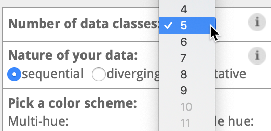{#fig-colorbrewer-steps width=300}

일부 코로플레스 매핑 도구에서는 데이터를 어떻게 *보간(interpolate)*할지, 즉 지도상에서 비슷한 색상을 나타내기 위해 숫자를 어떻게 묶을지에 대한 방법도 선택할 수 있습니다. 예를 들어, 그림 [\@fig-interpolation-datawrapper-combined]에서 볼 수 있듯이 Datawrapper는 단계형 또는 연속형을 선택했는지에 따라 두 가지 다른 드롭다운 보간(interpolation) 메뉴 세트를 제공합니다.


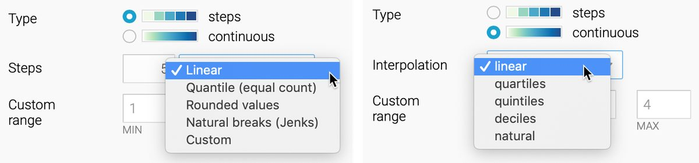{#fig-interpolation-datawrapper-combined width=650}

보간 방식을 선택하기 전에, 데이터가 어떻게 분포되어 있는지 더 깊이 이해하기 위해 [6장에서 설명한 Google Sheets로 히스토그램 차트 만들기(histogram-google.html)](#histogram-google)를 시도해 보세요. 여러분의 히스토그램은 평균(mean)을 중심으로 대칭적인 형태를 띠며 고르게 분포되어 있나요? 아니면 데이터가 한쪽으로 치우쳐 있고 한쪽 꼬리에 아웃라이어(이상치)가 길게 늘어져 있나요? 그림 [\@fig-interpolation-histograms]에 있는 단순화된 히스토그램들을 비교해 보세요. 이 분포 상태가 아래에서 설명할 보간 방법에 대한 결정에 영향을 미칠 수 있습니다.


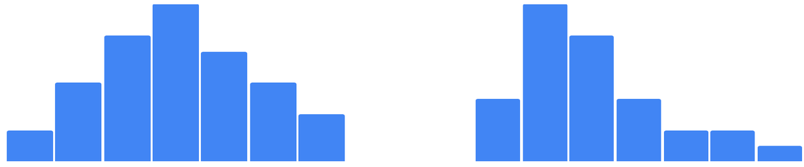{#fig-interpolation-histograms width=500}

이 입문서에서는 가장 일반적인 보간 옵션을 다음의 세 가지 기본 범주로 단순화하여 설명할 수 있습니다:

- *선형(Linear)* 방식은 가장 낮은 값에서 가장 높은 값까지 데이터 값을 직선에 배치합니다. 이 방법은 데이터가 고르게 분포되어 있거나 극단적인 양극단의 데이터를 강조하고 싶을 때 적합합니다. 극값은 가장 밝거나 가장 어두운 색으로 확연히 눈에 띄기 때문입니다.

- *분위수(Quantiles)* 방식은 데이터를 일정한 개수의 그룹으로 나눕니다. 더 구체적으로 말해, *사분위수(quartiles)*, *오분위수(quintiles)*, *십분위수(deciles)*는 데이터 값을 각각 4개, 5개, 10개의 동등한 개수 그룹으로 나눕니다. 이 방법은 데이터가 한쪽으로 치우쳐 있을 때 가장 적합합니다. 그룹을 나누면 극단값보다 데이터 내부의 다양성에 주의를 집중시킬 수 있기 때문입니다. *반올림 값(Rounded values)* 방식도 분위수와 유사하지만 소수점이 독자 눈에 보기 좋게 반올림된 숫자로 바뀝니다.

- *자연 브레이크(Jenks)(Natural breaks)*는 선형과 분위수 방식의 절충안을 제시합니다. 값이 서로 가까운 데이터를 그룹화하면서 동시에 다른 그룹과의 차이는 최대화합니다. 이 방법은 한쪽으로 치우친 데이터에서 극단값과 내부 다양성 양쪽에 모두 주의를 집중시키고자 할 때 가장 적합할 수 있습니다.

어떤 보간 방법이 가장 좋을까요? 통일된 디자인 규칙은 없습니다. 다만, [14장: 거짓 탐지 및 편향 줄이기](#detect)에서 배우게 되겠지만 오해를 불러일으키는 지도를 만들 가능성이 높기 때문에 사용자가 원하는 위치에 수동으로 색상 구간을 지정하는 *Custom(사용자 정의)* 설정은 사용하지 *않는* 것을 권장합니다. 저희의 가장 좋은 조언은 특히 한쪽으로 치우친(skewed) 데이터를 다룰 때 다양한 보간 방법을 직접 테스트해 보는 것입니다. 그러면 이러한 옵션들이 코로플레스 지도의 모습과 이를 통해 전달하는 데이터 스토리를 어떻게 형성하는지 더 잘 이해할 수 있습니다.

전반적으로 [Datawrapper Academy는](https://academy.datawrapper.de/article/134-what-to-consider-when-creating-choropleth-maps) 그림 [\@fig-intervals-datawrapper-montage]에 표시된 대로 독자가 색상 범위를 최대한 활용하여 "데이터의 모든 차이를 볼 수 있도록" 색상 구간을 선택할 것을 권장합니다. 즉, 지도가 가장 밝은 색상과 가장 어두운 색상만 표시한다면, 색상 범위의 중간 부분을 지리적 패턴이나 데이터 내 다양성을 부각하는 데 충분히 쓰지 못하고 있는 것입니다. 이를 달성하려면 기본 설정에서 벗어나 탐색해 보고 어떤 옵션이 가장 정직하고 통찰력 있는 데이터 스토리를 전달하는지 테스트해 봐야 합니다.

팁: 이 주제를 더 깊이 다루려면 Datawrapper Blog, 2022년의 리사 샬롯 무스(Lisa Charlotte Muth) 저 "[How to choose an interpolation for your color scale](https://blog.datawrapper.de/interpolation-for-color-scales-and-maps/)"를 읽어보세요.


 출처이며 허가하에 재인쇄되었습니다.](images/07-map/intervals-datawrapper-montage.jpg){#fig-intervals-datawrapper-montage width=500}

진실하고 의미 있는 코로플레스 지도를 디자인하는 것은 어려운 작업입니다. 저희가 그랬던 것처럼 널리 읽고 다양한 지도를 살펴보고 데이터를 시각화하는 여러 방법을 테스트하면서 여러분의 기술도 향상될 것입니다. 색상 구간에 관한 결정이 데이터가 독자에게 보여지는 방식을 어떻게 극적으로 바꿀 수 있는지 점점 더 인식하게 될 것입니다. 무엇보다 이야기에 초점을 맞추고 데이터를 진실하게 표현하는 지도를 만들어야 합니다.

## 코로플레스 지도 데이터 정규화하기 {- #normalize-choropleth}

우리는 [5장: 의미 있는 비교 만들기(Make Meaningful Comparisons)](#normalize)에서 데이터를 정규화(normalizing)하는 개념을 도입했습니다. 정규화란 서로 다른 척도로 수집된 데이터를 공통된 척도로 조정해 더 적절하게 비교하는 것을 말합니다. 예를 들어 2020년 11월 6일 기준으로 총 코로나 환자 수를 비교할 때, 미국(961만 건, 인구 3억 2,820만 추산)과 벨기에(49만 건, 인구 1,150만 추산)처럼 인구 차이가 큰 국가 간의 총 감염 건수를 단순 비교하는 것은 큰 의미가 없습니다. 인구 수의 차이를 보정하기 위해, 1인당 감염 건수(예: 미국 10만 명당 2,928건 대 벨기에 10만 명당 4,260건)를 비교하여 데이터를 정규화하는 편이 훨씬 더 나은 전략입니다.

코로플레스 지도에서 데이터를 정규화하는 것을 깜빡하고 상대값(예: 비율이나 1인당 발생률)이 아닌 단순 건수(raw counts)를 표시하게 되면, 결국 여러분이 측정하려는 현상이 아니라 인구 중심지를 나타내는 무의미한 지도를 다시 그리게 되는 경우가 많습니다. 예를 들어, 그림 [\@fig-normalize-map-data]에 나온 두 지도를 비교해 보세요. 두 지도 모두 2020년 6월 26일 현재 미국 본토의 코로나19 감염 사례에 대한 지도입니다. 그림 [\@fig-normalize-map-dataa]는 각 주별 총 감염 건수를 보여주고 그림 [\@fig-normalize-map-datab]는 주 인구에 맞춰 조정된 코로나19 감염 사례를 보여줍니다. 더 어두운 색상은 더 높은 값을 나타냅니다. 공간 패턴에서 차이가 느껴지시나요?


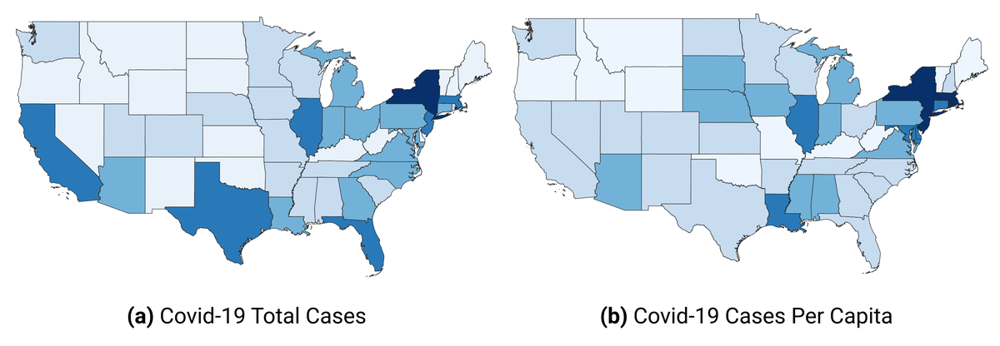{#fig-normalize-map-data}

두 지도는 모두 New York Times가 수집하고 [GitHub](https://github.com/nytimes/covid-19-data)에 게시한 코로나19 데이터를 보여줍니다. 그림 [\@fig-normalize-map-datab]의 지도에서는 2018년 미국 인구조사국의 아메리칸 커뮤니티 서베이(글 작성 당일 이용할 수 있었던 최신 데이터) 인구 수에 기반하여 주별 총 감염 건수를 주 인구로 나누어 값을 정규화했습니다. 독자가 공간 패턴을 해석하는 데 더 집중할 수 있도록 범례 및 기타 중요한 지도 그래픽 요소는 추가하지 않았습니다. 두 경우 모두 분류(classification)를 위해 Jenks 자연 브레이크 방식을 사용했습니다.

코로나19 총 확진자 수를 보여주는 지도(그림 [\@fig-normalize-map-dataa]에 표시됨)에 따르면 최악의 타격을 입은 주는 어디일까요? 미국 지리에 익숙하다면 뉴욕, 뉴저지, 매사추세츠, 플로리다, 일리노이, 텍사스, 캘리포니아임을 쉽게 알 수 있습니다. 하지만 이들 중 5개 주는 우연히도 미국에서 가장 인구가 많은 주이므로 코로나19 확진자 수도 더 많은 것이 논리적으로 타당합니다.

자, 그렇다면 그림 [\@fig-normalize-map-datab]의 지도는 어떨까요? 이 지도에서는 1인당 비율 기준으로 뉴욕과 인접 주(뉴저지와 매사추세츠 포함)가 단연 가장 높다는 것을 알 수 있습니다. 이는 첫 번째 지도에서도 확인했던 내용입니다. 하지만 여러분은 사실 캘리포니아, 텍사스, 플로리다 주가 왼쪽 지도가 시사했던 것보다 영향을 덜 받았다는 사실도 알 수 있습니다. 따라서 1인당(per-capita) 값을 반영한 이 지도가 미국 내 코로나19 위기의 *최초의* 진원지가 뉴욕이었다는 이야기를 훨씬 잘 묘사하고 있습니다.

이 시점에서, 여러분은 지도 디자인의 핵심 원칙과 모범 사례에 대한 더 나은 아이디어를 갖게 되었을 것입니다. 대화형 지도 일반, 특히 코로플레스 지도에 대한 핵심 개념을 다뤘으니, 이제 저희가 추천하는 도구를 이용해 일련의 실습 튜토리얼로 넘어갈 것입니다. 첫 번째 튜토리얼은 [Datawrapper에서 기본 다각형 영역이 포함된 로케이터 점 지도(locator point map)](#locatormap-datawrapper)를 디자인하는 방법을 보여줍니다. 두 번째 튜토리얼에서는 팝업 창에 특정 위치의 정보를 띄우는 [Google MyMaps에서 맞춤형 아이콘이 포함된 점 지도(point map)](#mymaps)를 만들어 볼 것입니다. 마지막 튜토리얼에서는 다양한 크기의 색칠된 원을 사용해 특정 도시의 인구 변화를 나타내는 [Datawrapper 심볼 점 지도(symbol point map)](#symbolmap-datawrapper)를 구축해 보겠습니다. 이 장의 마지막 튜토리얼에서는 두 도구를 비교하기 위해 [Datawrapper에서 코로플레스 지도(choropleth maps)](#choropleth-datawrapper)와 [Tableau Public의 코로플레스 지도(choropleth maps)](#map-tableau)를 디자인하는 주제로 다시 돌아올 것입니다.

## Datawrapper로 위치 점 지도 만들기 {- #locatormap-datawrapper}
우리는 [6장: 차트로 데이터 시각화하기(Chart Your Data)](#chart-datawrapper)에서 무료이며 배우기 쉬운 [Datawrapper 도구](#chart-datawrapper)를 처음 소개했습니다. 이 도구로는 전문적으로 보이는 디자인 요소가 적용된 다양한 유형의 지도도 만들 수 있습니다. Datawrapper를 사용하면 여러분의 작업을 온라인에 저장하고 공유하려는 경우가 아니라면 계정 없이도 브라우저에서 바로 작업을 시작할 수 있습니다.

로케이터 점 지도는 지리적 지역에 대한 참고 기준(frame of reference)을 제공하기 위해 주요 랜드마크와 관련 다각형 영역을 독자에게 소개하는 데 가장 적합합니다. Datawrapper의 로케이터 지도 도구를 사용하면 색상 마커를 선택하여 점을 표시하고 사전 설정된 다각형 지역 목록과 점들의 근접성을 쉽게 보여줄 수 있습니다. 더 고급 사용자는 GeoJSON 형식의 맞춤형 다각형이나 선을 업로드할 수 있는데, 이 개념은 [13장: 지도 데이터 변환하기(Transform Your Map Data)](#transform)에서 설명합니다.

이 섹션에서는 도시 경계(다각형) 내부의 주요 랜드마크(점)를 강조하는 Datawrapper 로케이터 지도를 만들고 완성된 대화형 지도를 발행 및 공유하는 방법을 배우게 될 것입니다. 이는 그림 [\@fig-datawrapper-locatormap]에 나와 있습니다.


::: {.content-visible when-format="html"}

<iframe src="https://datawrapper.dwcdn.net/KwU8I" width="100%" height="600px" style="border:none;"></iframe>
<p class="caption">Datawrapper 로케이터 지도: 캘리포니아주 샌프란시스코의 인기 있는 장소. [대화형 버전(interactive version)](https://datawrapper.dwcdn.net/KwU8I)을 탐색해 보세요.</p>

:::


1. [Datawrapper](https://www.datawrapper.de)를 열고 *Start Creating*을 클릭한 다음, *New Map* 버튼을 누르고 *Locator map*을 선택합니다. 그림 [\@fig-datawrapper-locatormap-create]를 참조하세요.


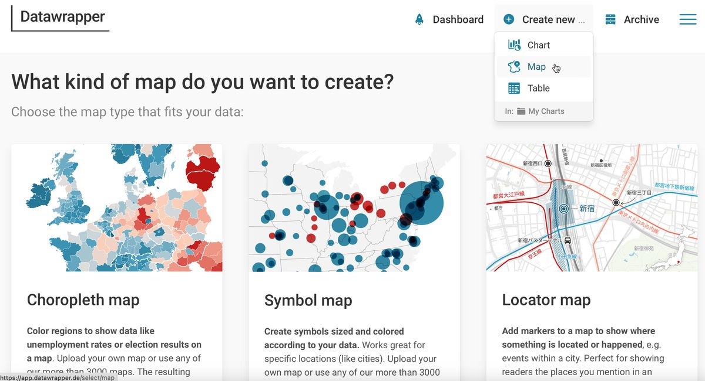{#fig-datawrapper-locatormap-create width=600}

2. 장소 이름이나 주소를 입력하거나 그림 [\@fig-datawrapper-locatormap-add-markers]와 같이 Google Maps 링크를 붙여넣어 지도에 점 마커를 추가합니다.


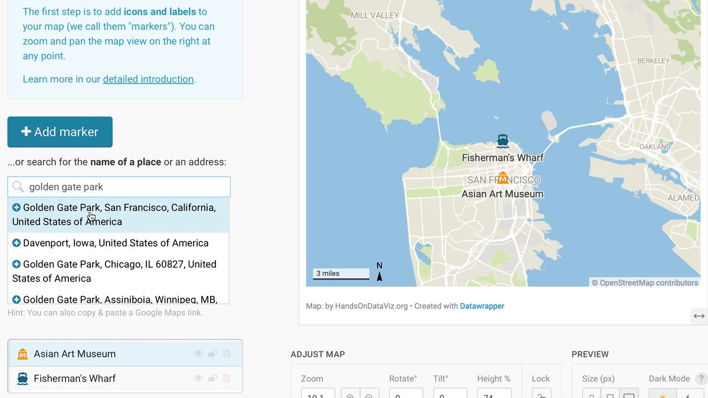{#fig-datawrapper-locatormap-add-markers width=600}

3. 텍스트를 편집할 점 마커를 선택하여 사전 설정된 번호, 기호 또는 색상을 선택하거나, 대화형 툴팁을 추가합니다. 그림 [\@fig-datawrapper-locatormap-edit-markers]를 참조하세요.


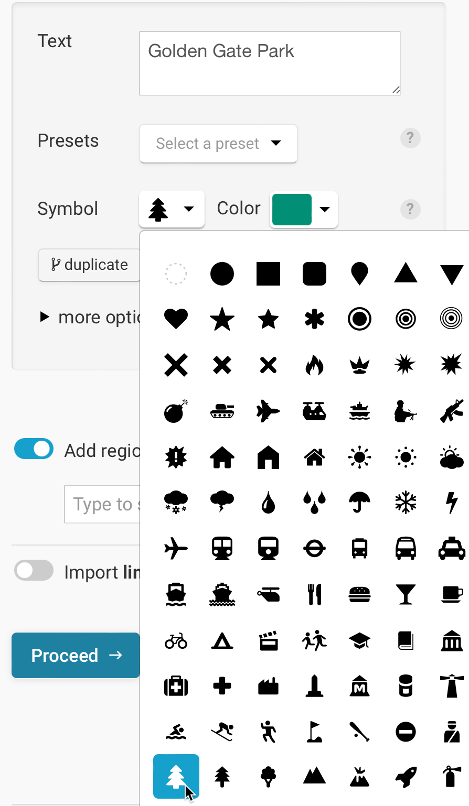{#fig-datawrapper-locatormap-edit-markers width=300}

4. 기본 다각형(사전 설정된 도시 또는 지역 경계 등)을 추가하려면, 아래로 스크롤하여 *Add region as area marker*를 켜고 나열된 영역을 선택한 후 채우기 또는 외곽선 색상을 수정합니다. 그림 [\@fig-datawrapper-locatormap-area-markers]를 참조하세요.


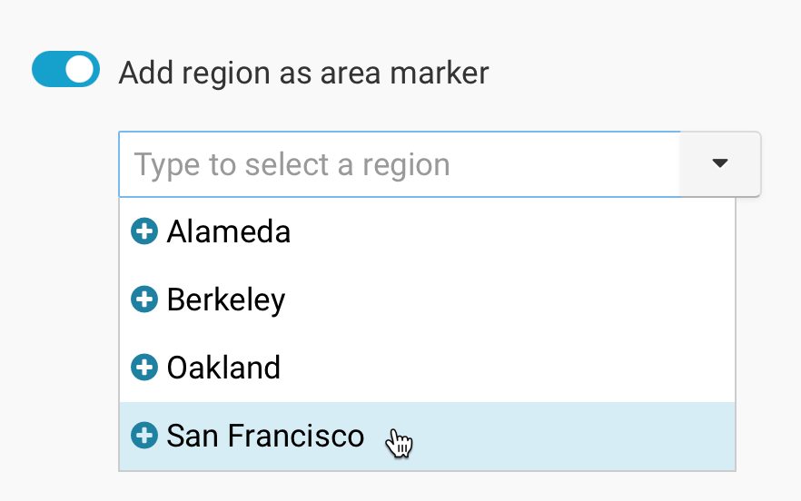{#fig-datawrapper-locatormap-area-markers width=400}

5. 지도의 축소/확대 수준과 중심을 조정하고 더 작은 스마트폰이나 큰 데스크톱 같은 크기가 다른 장치에서 어떻게 보일지 미리보기 합니다. 그림 [\@fig-datawrapper-locatormap-preview]를 참조하세요.


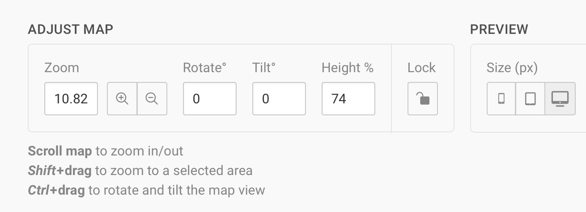{#fig-datawrapper-locatormap-preview width=500}

6. *Design Map* 탭으로 진행하여 배경 지도 스타일과 라벨링을 선택하고 축척(scale bar), 방위표(north arrow) 또는 인셋 지도(inset map)와 같은 추가 요소를 넣을지 선택합니다.

7. *Annotate & Layout* 탭으로 진행하여 제목, 바이라인(byline), 마커 키(marker key)를 삽입합니다.

8. *Publish & Embed* 탭으로 진행하여 지도 링크를 공유하거나 웹 페이지에 임베드합니다. 또한 그림 [\@fig-datawrapper-locatormap-export]와 같이 탭의 아래쪽으로 스크롤하여 정적 PNG 이미지로 시각화를 *Export(내보내기)*하거나 다른 시각화 도구에서 사용할 수 있도록 GeoJSON 형식의 공간 지리 정보를 내보낼 수 있습니다.


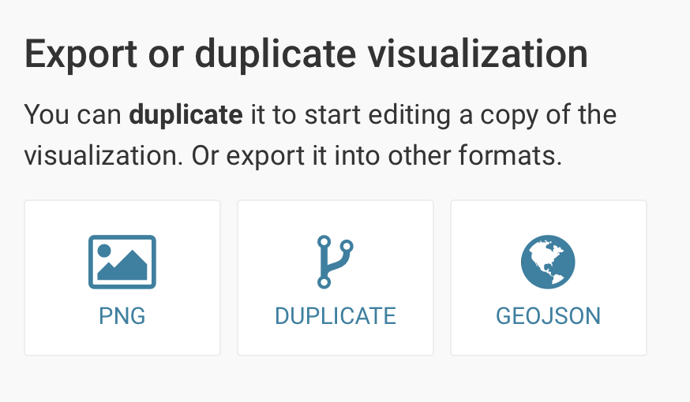{#fig-datawrapper-locatormap-export width=400}

Datawrapper의 로케이터 지도는 지도상의 몇 가지 핵심 지점을 강조하고 그 지점들과 윤곽선으로 그려진 지역과의 관계를 보여주는 쉬운 입문 단계를 제공합니다. 이 기본 튜토리얼 이상의 추가 단계를 배우려면 Datawrapper Academy의 [How to Create a Locator Map](https://academy.datawrapper.de/article/161-how-to-create-a-locator-map)에 설명된 세부 지침을 참조하세요.

다음 섹션에서는 Google My Maps를 사용하여 그룹화된 카테고리의 마커나 맞춤형 이미지가 있는 마커 같은, 더 많은 기능이 포함된 점 지도를 만드는 방법을 살펴보겠습니다. 이 도구는 Datawrapper의 로케이터 점 지도와 유사하지만 다양한 옵션과 유연성을 제공합니다.

## Google 내 지도로 점 지도 만들기 {- #mymaps}

대부분의 사람들은 전 세계 위치와 길 찾기를 검색할 수 있는 웹 매핑 서비스인 [Google Maps](https://www.google.com/maps/)에 이미 익숙합니다. 이 섹션에서는 사용자가 클릭하여 사진, 웹사이트 또는 길 찾기를 포함한 더 많은 데이터를 볼 수 있도록 Google Maps 플랫폼 위에 점 그룹을 표시할 수 있는 관련 도구인 [Google My Maps](https://www.google.com/maps/about/mymaps/)에 대해 배울 것입니다. 점 마커의 색상과 아이콘을 사용자 정의할 수 있으며 사용자가 생성한 모든 지도 레이어 콘텐츠는 [Google Drive](https://drive.google.com)에 저장되어 편집하고 다른 사람과 공동 작업할 수 있습니다. Google My Maps의 기능은 제한적이지만 기본 대화형 점 지도는 물론 원한다면 간단한 폴리라인 및 다각형을 구축하는 방법도 쉽게 배울 수 있는 도구입니다. 마지막으로, 지도에 대한 공개 링크를 공유하거나 여러분의 웹사이트에 포함시킬 수 있습니다. 이는 [9장: 웹에 포함하기(Embed on the Web)](#embed)에서 자세히 다룰 내용입니다.

이 섹션에서는 두 가지 각기 다른 마커 그룹과 사용자 정의 사진 아이콘이 포함된 북미 박물관 및 공원의 점 지도를 구성할 것입니다. 사용자가 마커를 클릭하면 팝업 창에 추가 텍스트, 링크 및 이미지가 나타납니다. 그림 [\@fig-mymaps-final]을 참조하세요.


::: {.content-visible when-format="html"}

<iframe src="https://www.google.com/maps/d/u/3/embed?mid=1W6VujVZzB1Y1D1tktLVhO99ZabyOZABr" width="100%" height="500px" style="border:none;"></iframe>
<p class="caption">Google My Maps로 만든 공원과 박물관의 점 지도. [대화형 버전(interactive version)](https://www.google.com/maps/d/u/1/edit?mid=1W6VujVZzB1Y1D1tktLVhO99ZabyOZABr&usp=sharing)을 탐색해 보세요.</p>

:::


맞춤형 아이콘으로 대화형 점 지도를 만들려면 다음 튜토리얼을 따르세요:

1. 북미의 인기 있는 위치 6곳이 포함된 [Google Sheets의 박물관과 공원 데이터(Parks and Museums data in Google Sheets)](https://docs.google.com/spreadsheets/d/11nSoyGUxDJiBe5VZflDnaaqgWMdWyIUNnjNLMlGOPLk/edit#gid=312385679)를 엽니다. 각 행에는 *그룹(Group)*, *이름(Name)*, *주소(Address)* 및 *URL*이 포함되어 있습니다. Google 계정에 로그인하고 *파일(File) > 사본 만들기(Make a Copy)*로 이동하여 Google Drive에서 편집할 수 있는 버전을 만듭니다.

2. [Google My Maps](https://www.google.com/mymaps/)로 이동합니다. 왼쪽 위 모서리에서 그림 [\@fig-mymaps-create-new]에 표시된 것처럼 *+ 새 지도 만들기(+ Create a New Map)* 버튼을 클릭합니다. 그러면 친숙한 Google Maps 스타일로 빈 지도가 생성됩니다.


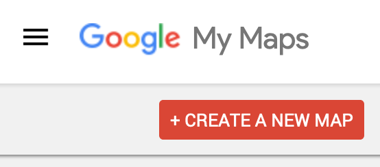{#fig-mymaps-create-new width=300}

3. 현재 제목인 *제목 없는 지도(Untitled map)*를 클릭하고 그림 [\@fig-mymaps-edit-title]에 표시된 것처럼 새 정보를 입력하여 관련된 제목과 설명을 추가합니다.


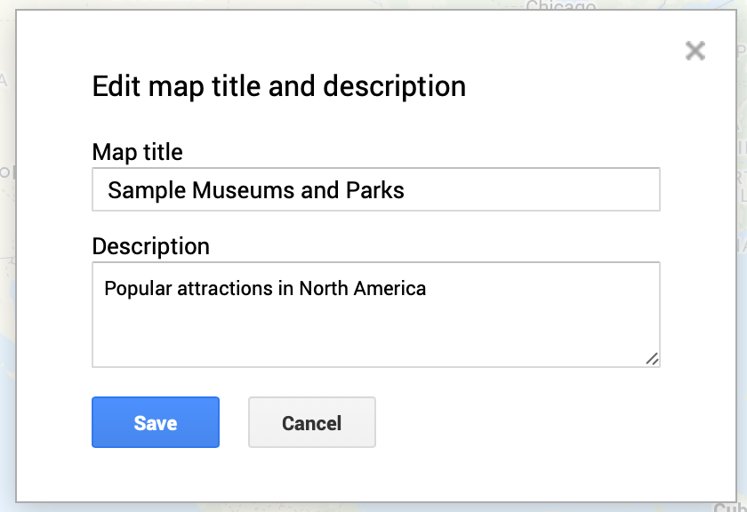{#fig-mymaps-edit-title width=300}

4. 데이터를 여러분의 지도에 추가하려면 그림 [\@fig-mymaps-import]에 표시된 대로 *제목 없는 레이어(Untitled layer)* 항목 아래에 있는 *가져오기(Import)* 버튼을 클릭합니다.


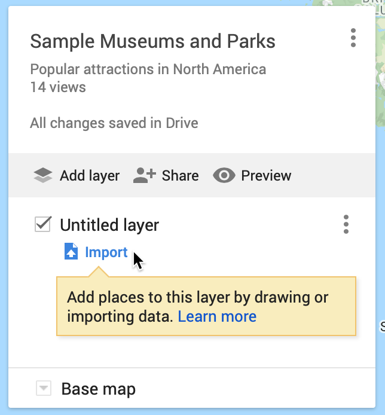{#fig-mymaps-import width=300}

5. *가져올 파일 선택(Choose a file to import)* 화면에는 데이터를 업로드하는 여러 가지 방법이 있습니다. 샘플 데이터가 이미 해당 형식으로 되어 있으므로 *Google Drive*를 선택하고 그림 [\@fig-mymaps-import-gdrive]와 같이 *최근 항목(Recent)* 버튼을 선택하여 Google Drive에 저장한 *Museums and Parks* 파일을 찾습니다. *선택(Select)*을 누릅니다.


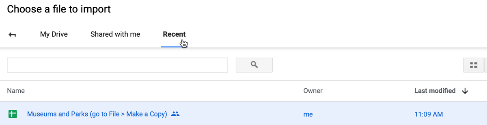{#fig-mymaps-import-gdrive width=750}

6. *위치를 표시할 열 선택(Choose columns to position your placemarks)* 화면에서 그림 [\@fig-mymaps-placemarks]와 같이 *주소(Address)* 열을 선택하여 지도에 점 데이터를 배치합니다. *계속(Continue)*을 누릅니다.


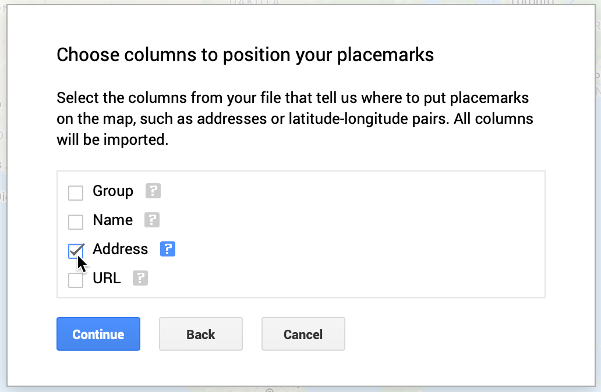{#fig-mymaps-placemarks width=350}

팁: 주소가 *Address*, *City*, *State*, *Zipcode*와 같이 여러 열에 나뉘어 있는 경우 여러 상자를 선택할 수 있습니다. 또한 점 데이터가 이미 지오코딩된 경우 `41.76, -72.69`와 같은 위도 및 경도 쌍을 업로드할 수 있습니다.

7. *마커의 제목으로 사용할 열 선택(Choose a column to title your markers)* 창에서 그림 [\@fig-mymaps-marker-titles]와 같이 *이름(Name)* 열을 선택하여 점 마커의 제목을 지정합니다. 그런 다음 *완료(Finish)*를 클릭합니다.


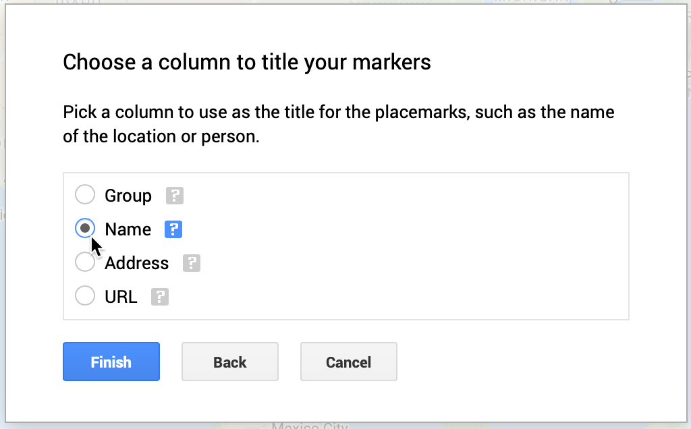{#fig-mymaps-marker-titles width=350}

Google My Maps는 [3장(chapter 3)에서 논의한 대로 주소 데이터를 자동으로 지오코딩(geocode)](#geocode)하고 기본 파란색 마커를 사용하여 표시하며 모든 점이 맞도록 지도의 중심을 맞춥니다.

8. 기본적으로 파일의 전체 이름이 가져와지므로 *Museums and Parks...* 레이어 옆에 있는 3점 케밥 메뉴(kebab menu)를 클릭하여 그림 [\@fig-mymaps-rename-layer]와 같이 이름을 줄이도록 *이름 바꾸기(Rename)*를 선택합니다.


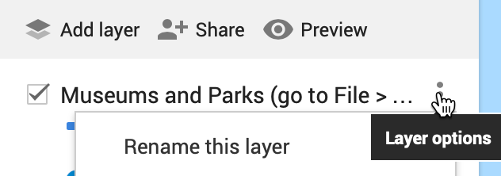{#fig-mymaps-rename-layer width=300}

9. 지도에는 박물관과 공원이라는 두 개의 그룹이 포함되어 있으므로 기본 파란색 마커를 대체할 각 그룹별 사용자 지정 색상 마커를 만들어 보겠습니다. *개별 스타일(Individual styles)*을 클릭하고 *장소 그룹화 기준(Group places by)* 드롭다운에서 값을 그림 [\@fig-mymaps-group-places]와 같이 *데이터 스타일 지정 기준 열: 그룹(Style data by column: Group)*으로 변경합니다. 이 옵션은 샘플 데이터를 설정할 때 의도적으로 박물관과 공원에 대한 *그룹(Group)* 열을 만들었기 때문에 사용할 수 있습니다. 오른쪽 위 *X* 기호를 클릭하여 이 창을 닫습니다.


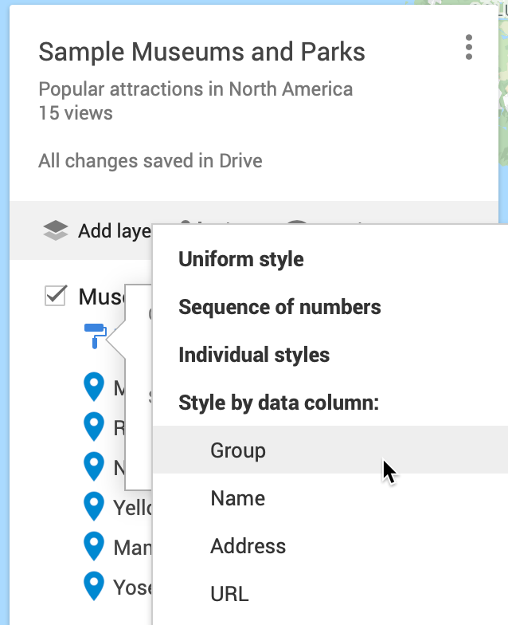{#fig-mymaps-group-places width=300}

10. *그룹별 스타일 지정(Styled by group)* 아래에서 그림 [\@fig-mymaps-customize-marker]와 같이 커서를 *Museum* 라벨 위로 가져가 페인트통 스타일링 기호를 표시하고 이를 클릭합니다.


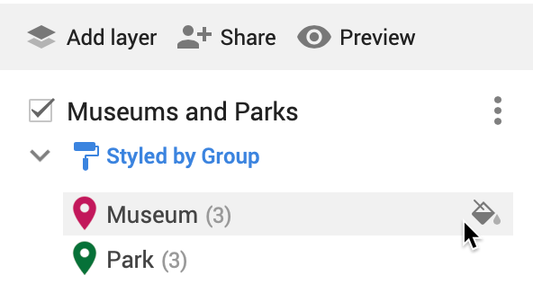{#fig-mymaps-customize-marker width=295}

11. *Museums*에 대한 새 색상을 할당하고 그림 [\@fig-mymaps-colors-icons]와 같이 더 적절한 점 마커 기호를 찾으려면 *아이콘 더보기(More icons)*를 클릭합니다.


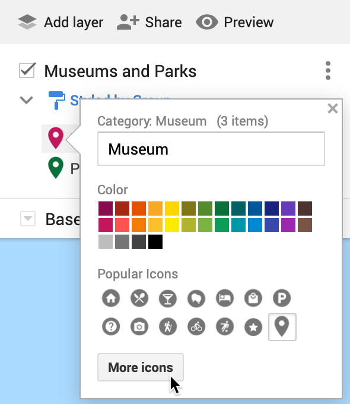{#fig-mymaps-colors-icons width=295}

12. *아이콘 선택(Choose an icon)* 화면에서 오른쪽 위 *필터(Filter)*를 사용하여 그림 [\@fig-mymaps-choose-icon]과 같이 이름(예: "Museum")으로 아이콘 유형을 검색합니다. *Parks*에 대해서도 이 과정을 반복합니다.


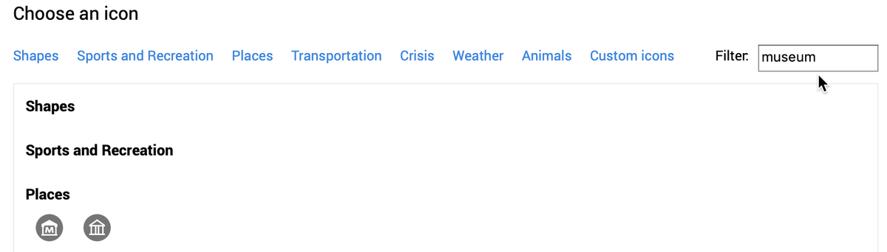{#fig-mymaps-choose-icon width=750}

13. *아이콘 선택(Choose an icon)* 화면에서 왼쪽 아래 *맞춤 아이콘(Custom icon)* 버튼을 클릭하여 이미지를 업로드할 수 있으며 이 이미지는 그림 [\@fig-mymaps-custom-icon]과 같이 썸네일 이미지 아이콘으로 변환됩니다. 이 맞춤 아이콘은 [Washington Monument의 위키미디어 이미지(Wikimedia image of the Washington Monument)](https://commons.wikimedia.org/wiki/File:Washington_Monument_Panorama.jpg)에서 만들어졌습니다.


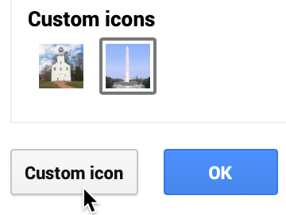{#fig-mymaps-custom-icon width=180}

14. 그림 [\@fig-mymaps-edit-point]와 같이 아무 지도 마커나 클릭하여 해당 데이터를 편집하거나, 팝업 창에 표시될 사진을 삽입하거나, Google 지도의 길 찾기를 추가합니다. 이 사진은 [메트로폴리탄 미술관의 위키미디어 이미지(Wikimedia image of the Metropolitan Museum of Art)](https://commons.wikimedia.org/wiki/File:Metropolitan_Museum_of_Art_entrance_NYC.JPG)에서 가져왔습니다. 그러나 이러한 링크는 데이터 스프레드시트에 미리 로드할 수 없으므로 사진이나 길 찾기는 수동으로 추가해야 합니다.


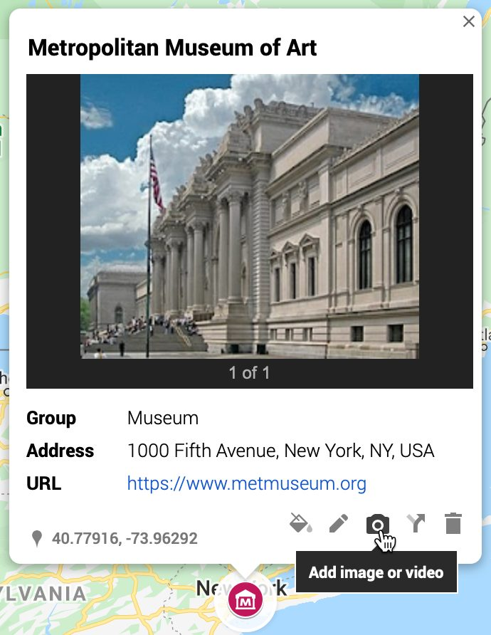{#fig-mymaps-edit-point width=345}

15. 그림 [\@fig-mymaps-style-basemap]의 드롭다운 메뉴에 표시된 대로 기저 지도의 스타일을 Google에서 제공하는 9가지 버전 중 하나로 변경할 수 있습니다. 마커 아이콘 및 기저 지도 배경에 대비가 높은 색상을 선택하세요.


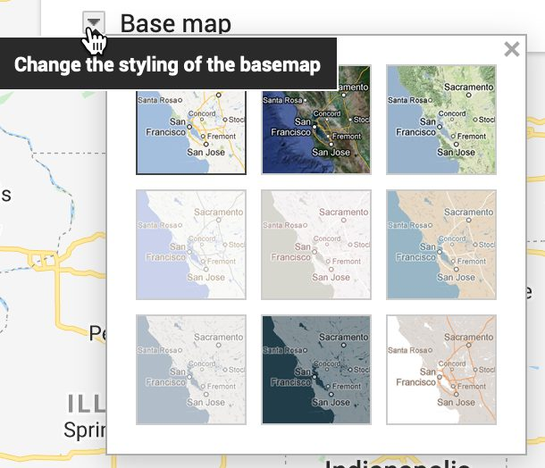{#fig-mymaps-style-basemap width=300}

16. 그림 [\@fig-mymaps-draw-line]에 표시된 대로 지도의 위쪽에서 더 많은 점 마커를 수동으로 추가하거나 선을 그리거나 길 찾기를 추가하거나 거리를 측정하는 버튼을 볼 수 있습니다. 그러나 Google My Maps는 폴리라인과 다각형에 대한 지원이 제한적이며 데이터 값을 나타내는 색상이 칠해진 경계로 코로플레스 지도를 쉽게 만들 수 없습니다.


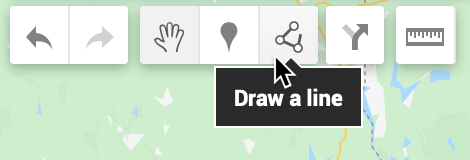{#fig-mymaps-draw-line width=235}

17. 다른 사람들에게 지도가 어떻게 보일지 확인하려면 *미리보기(Preview)*를 클릭합니다. 지도 편집을 마치면 지도 제목과 설명 아래에 있는 *공유(Share)* 버튼을 클릭하고 다음 화면에서 그림 [\@fig-mymaps-share]와 같이 *링크 공유 사용(Enable link sharing)*이 활성화되어 있는지 확인한 후 생성된 링크를 복사합니다. 이 링크를 가진 사람은 누구나 Google 계정 유무에 관계없이 공유할 수 있습니다. 원하는 경우 웹 검색 결과에 지도가 공개적으로 표시되도록 설정할 수도 있습니다.


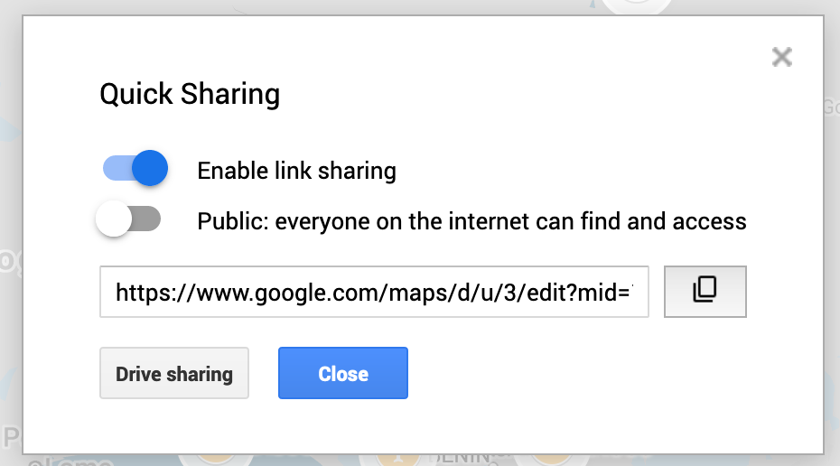{#fig-mymaps-share width=400}

18. 지도를 웹 페이지에 iframe으로 임베드하려는 경우 그림 [\@fig-mymaps-embed]와 같이 지도 제목 오른쪽에 있는 3점 케밥 메뉴를 클릭하고 *내 사이트에 임베드(Embed on my site)*를 선택합니다. 이렇게 하면 HTML 임베드 코드가 생성되며 이는 [9장: 웹에 포함하기(Embed on the Web)](#embed)에서 설명할 것입니다.


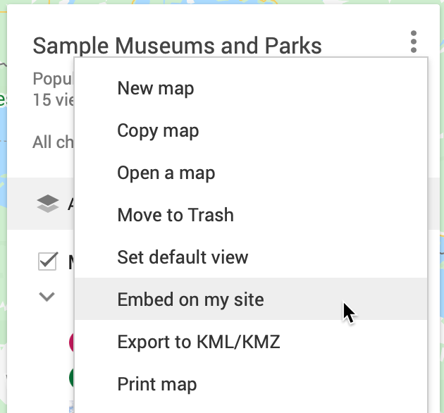{#fig-mymaps-embed width=315}

19. 향후에 지도를 편집하려는 경우 Google 계정에 로그인했을 때 지도에 액세스하는 두 가지 방법이 있습니다. 한 가지 방법은 [Google My Maps 플랫폼을 열어(open the Google My Maps platform)](https://www.google.com/mymaps/) 모든 지도를 보는 것입니다. 두 번째 방법은 [Google Drive](https://drive.google.com)로 이동하여 키워드로 Google My Maps를 검색하는 것입니다. Google Sheet의 데이터로 Google My Map을 만들 때는 그림 [\@fig-mymaps-gdrive]와 같이 향후 편집을 더 쉽게 할 수 있도록 Google Drive의 동일한 폴더에 My Map 및 Sheet 파일을 함께 보관하는 것을 권장합니다.


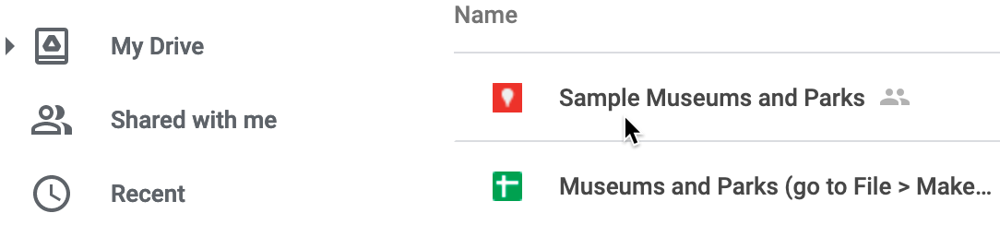{#fig-mymaps-gdrive width=500}

Google My Maps는 맞춤형 아이콘 및 그룹화된 범주로 점 지도를 만들기 위한 기본적인 도구입니다. 필요한 경우 점, 폴리라인 및 기본 다각형의 여러 레이어로 지도를 디자인할 수 있습니다. 하지만 전반적인 지도 디자인과 기능은 Google My Maps 플랫폼이 제공하는 기능으로 제한됩니다. 더 자세한 내용은 [Google My Maps 지원 페이지(Google My Maps support page)](https://support.google.com/mymaps)에서 확인하세요.

다음 섹션에서는 Datawrapper를 사용하여 각 원(또는 기타 모양)의 크기와 색상이 특정 점의 데이터 값을 나타내는 심볼 점 지도를 만드는 방법을 살펴보겠습니다.

## Datawrapper로 심볼 점 지도 만들기 {- #symbolmap-datawrapper}
우리는 [6장: 차트로 데이터 시각화하기(Chart Your Data)](#chart-datawrapper)에서 무료이며 배우기 쉬운 [Datawrapper 도구](#chart-datawrapper)를 처음 소개했습니다. 이 도구로는 전문적으로 보이는 디자인 요소가 적용된 다양한 유형의 지도도 만들 수 있습니다. Datawrapper를 사용하면 여러분의 작업을 온라인에 저장하고 공유하려는 경우가 아니라면 계정 없이도 브라우저에서 바로 작업을 시작할 수 있습니다.

이 섹션에서는 심볼 점 지도를 만드는 방법을 배우게 될 것입니다. [Google MyMaps 튜토리얼의 기본 점 지도(basic point map)](#mymaps)와 달리 심볼 점 지도는 다양한 크기나 색상의 도형을 통해 특정 위치의 데이터를 보여줍니다. 그림 [\@fig-datawrapper-symbolmap]에서 샘플 심볼 지도는 원 크기(2019년 인구 규모)와 원 색상(2010년 이후 백분율 변화)이라는 두 가지 변수를 사용하여 주요 미국 도시 300곳의 인구 변화를 점 위치로 표시합니다. 심볼 지도를 만들 때는 *점(point)* 데이터를 사용하지만 코로플레스 지도를 만들 때는 *다각형(polygon)* 데이터를 사용한다는 점을 기억하세요. 코로플레스 지도를 만드는 방법은 다음 섹션에서 배우게 될 것입니다. 나중에 [9장에서 인터랙티브 Datawrapper 지도를 웹에 임베드하는 방법(how to embed your interactive Datawrapper maps on the web in Chapter 9)](#embed)을 설명할 것입니다.


::: {.content-visible when-format="html"}

<iframe src="https://datawrapper.dwcdn.net/V0V9Y" width="100%" height="550px" style="border:none;"></iframe>
<p class="caption">Datawrapper를 활용한 미국 도시 인구 증가의 심볼 점 지도. [대화형 버전(interactive version)](https://datawrapper.dwcdn.net/V0V9Y)을 탐색해 보세요.</p>

:::


Datawrapper는 지도 생성 프로세스를 4단계(지도 선택, 데이터 추가, 시각화, 발행 및 임베드)로 나눕니다. 자신만의 심볼 점 지도를 만들려면 다음 튜토리얼을 따르세요.

1. [Google Sheets에서 미국 도시 인구 변화 2010-2019 데이터(US Cities Population Change 2010-2019 data in Google Sheets)](https://docs.google.com/spreadsheets/d/1XOhNtvYWaebP4izr0PDJfToRIbl2vki_1JNMYTKCCn0/edit#gid=1709919231)를 엽니다. 메모를 읽고 데이터의 출처와 일부 데이터 문제를 이해하세요. 우리는 [미국 인구조사국에서 2010-2019년 도시 인구 데이터(city population data for 2010-2019 from the US Census)](https://www.census.gov/data/tables/time-series/demo/popest/2010s-total-cities-and-towns.html)를 다운로드했습니다. 하지만 이 기간 동안 일부 도시는 새로 통합되거나 외곽 지역과 합병되어 시간이 지남에 따라 인구 데이터가 왜곡되었습니다. 또한 워싱턴 DC(미국 주에 위치하지 않은 주요 도시)와 푸에르토리코의 5개 주요 도시(주가 아니라 주민이 미국 시민인 미국 영토)에 대한 데이터를 포함했으므로 아래에서 이를 포함할 적절한 지도를 선택할 것입니다.

좋은 지도는 종종 [4장에서 설명한 지저분한 데이터 정리(cleaning up messy data as described in Chapter 4)](#clean)가 필요합니다. 이 스프레드시트에서는 원본 목록을 2010년 또는 2019년에 거주자가 10만 명 이상인 약 300개의 도시로 줄였습니다. 또한 *백분율 변화(Percent Change)*라는 새 열을 만들고 `(2019 - 2010) / 2010 * 100`과 같이 계산했습니다.

팁: 이 튜토리얼을 단순화하기 위해 미리 각 도시의 위도와 경도를 지오코딩했습니다. [2장: Google Sheets에서 주소 지오코딩하기(Chapter 2: Geocode Addresses in Google Sheets)](#geocode)를 참조하세요. Datawrapper 내에서 지오코딩할 때의 장단점에 대해 더 자세히 알아보려면 [주소 및 장소 이름을 사용하는 기호 위치 정확도에 대한 Datawrapper Academy 문서(Datawrapper Academy article about symbol location accuracy using addresses and place names)](https://academy.datawrapper.de/article/193-symbol-location-accuracy-using-addresses-place-names)를 읽어보세요.

2. [Datawrapper](https://www.datawrapper.de)를 열고 *만들기 시작(Start Creating)*을 클릭한 다음 *새 지도(New Map)* 버튼을 누르고 그림 [\@fig-datawrapper-symbolmap-start]와 같이 *심볼 지도(Symbol map)*를 선택합니다.


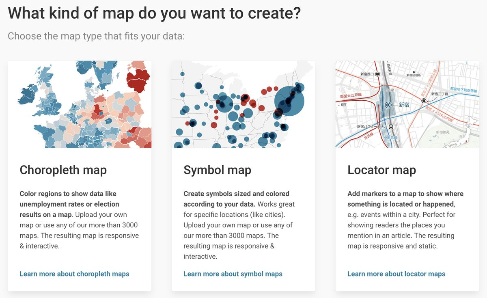{#fig-datawrapper-symbolmap-start width=600}

3. *지도 선택(Select your map)* 화면에서 푸에르토리코를 포함하기 위해 목록 상단에 더 가깝게 나타나는 *USA > States* 옵션이 아닌 *USA > States and Territories*를 검색하고 선택합니다. 다음 화면으로 진행합니다.

4. *데이터 추가(Add your data)* 화면에는 데이터를 업로드하는 여러 옵션이 있습니다. 샘플 데이터가 Google Sheet에 있으므로 *원격 데이터 세트에 연결(Connect to a remote data set)*로 스크롤하고 *Google Sheet 연결(Connect Google Sheet)*을 선택합니다. 이 튜토리얼의 첫 번째 단계에 있는 Google Sheet 링크를 그림 [\@fig-datawrapper-symbolmap-connect]와 같이 복사하여 붙여넣습니다. Google Sheet가 공개되어 있고 읽을 수 있음을 확인하는 녹색 체크 표시가 나타나면 파란색 *연결(Connect)* 버튼을 클릭한 후 *진행(Proceed)*을 눌러 다음 단계로 넘어갑니다.


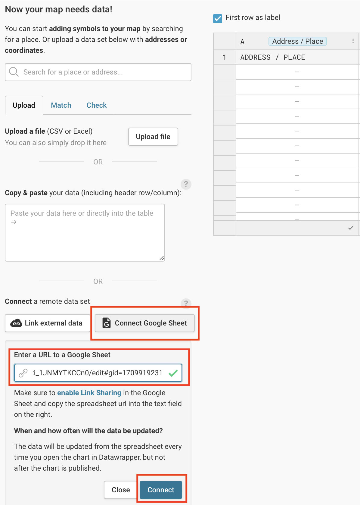{#fig-datawrapper-symbolmap-connect width=400}

5. *시각화(Visualize)* 버튼을 클릭하여 지도를 *세밀하게 조정(Refine)*합니다. 우리의 목표는 두 가지 변수(원 크기는 2019년 인구, 원 색상은 백분율 변화)를 표시하는 것입니다. *기호 모양 및 크기(Symbol shape and size)* 아래에서 *Pop Estimate 2019*를 기준으로 크기가 지정되고 최대 기호 크기가 25픽셀인 *원(circle)* 기호를 선택합니다. *기호 색상(Symbol colors)* 아래에서 그림 [\@fig-datawrapper-symbolmap-refine]과 같이 *Percent Change 2010-2019* 열을 선택합니다.


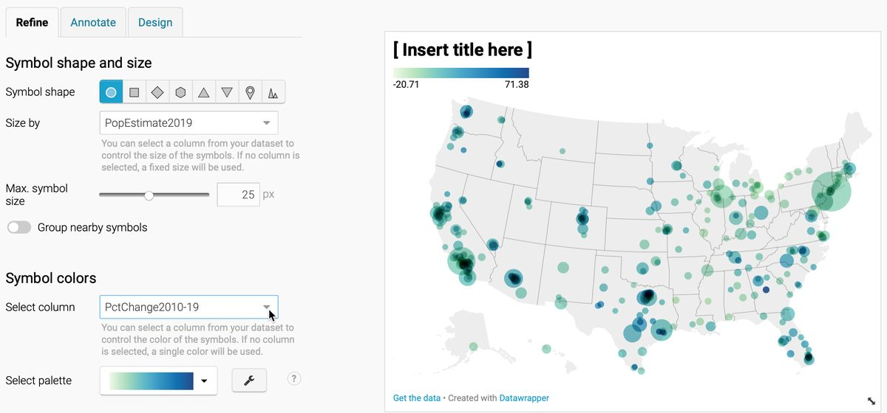{#fig-datawrapper-symbolmap-refine}

6. 선택적으로 예시와 일치하도록 색상 팔레트와 구간을 사용자 지정하려면 팔레트 옆의 *렌치 기호(wrench symbol)*를 클릭합니다. *색상 가져오기(Import colors)* 버튼을 클릭하면 [코로플레스 디자인 섹션(Choropleth Design section)](#design-choropleth)에 설명된 대로 ColorBrewer의 5가지 16진수 코드를 붙여넣을 수 있습니다. 첫 번째 코드는 짙은 분홍색이고 그 다음은 4클래스 순차적 녹색입니다: `#d01c8b,#bae4b3,#74c476,#31a354,#006d2c`. 그림 [\@fig-datawrapper-symbolmap-colors]를 참조하세요.


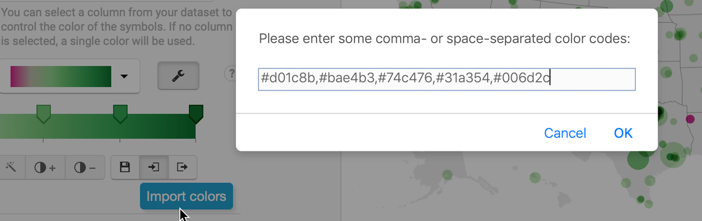{#fig-datawrapper-symbolmap-colors width=600}

7. 예시와 일치하도록 구간을 계속 맞춤 설정하려면 단계를 *5*와 *사용자 정의(Custom)*로 설정합니다. 0% 미만(밝은 분홍색), 0~5%(밝은 녹색) 등 눈금을 따라 사용자 정의 구간을 직접 입력합니다. *옵션 더보기(More options)* 버튼을 클릭하고 *범례(Legend)* 아래에서 *라벨(Labels)*을 *사용자 정의(custom)*로 변경한 후 각 라벨을 클릭하여 그림 [\@fig-datawrapper-symbolmap-intervals]와 같이 지도 메뉴에 나타나는 텍스트를 편집합니다. 이러한 옵션에 대한 자세한 내용은 [심볼 지도 맞춤 설정에 대한 Datawrapper Academy 게시물(Datawrapper Academy post on customizing your symbol map)](https://academy.datawrapper.de/article/120-customizing-your-symbol-map)을 참조하세요.


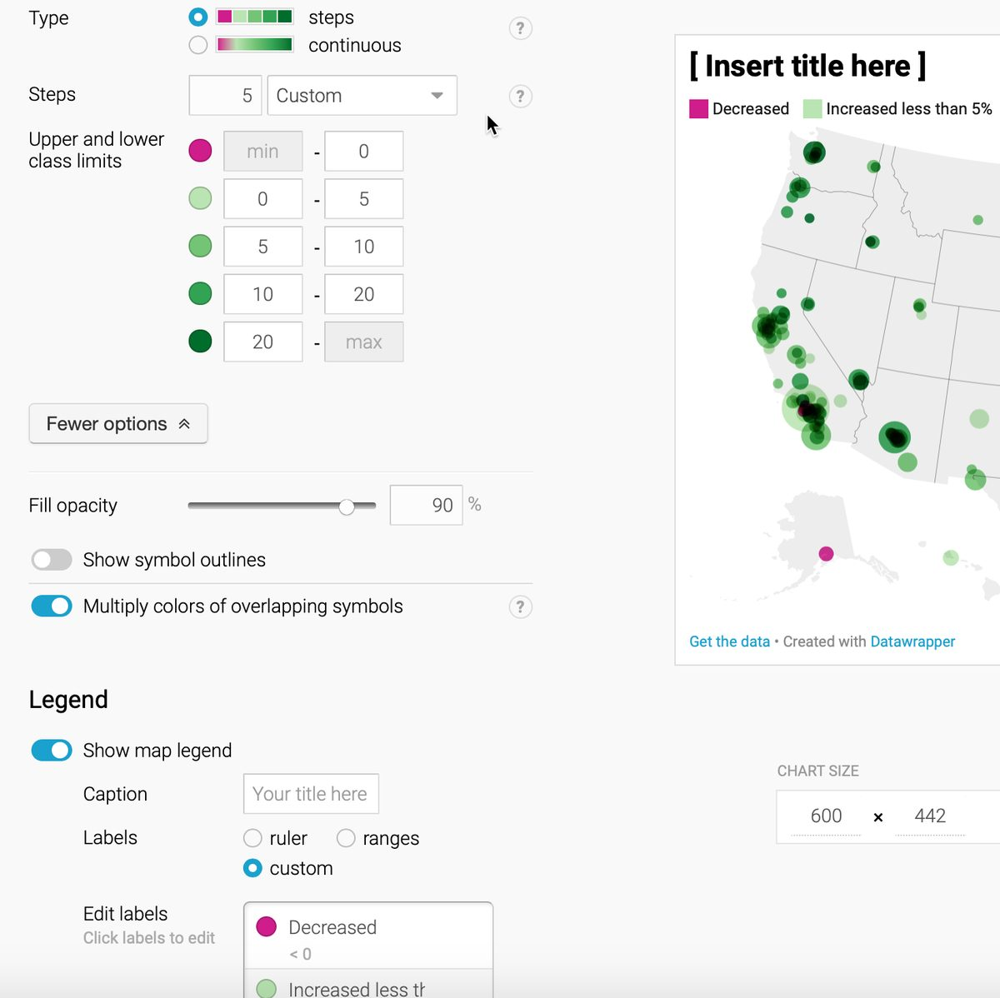{#fig-datawrapper-symbolmap-intervals width=500}

8. *시각화(Visualize)* 화면의 *주석(Annotate)* 탭을 클릭하여 제목, 출처 메모, 출처 표기를 삽입한 다음 [Datawrapper Academy에서 설명한 대로 툴팁 맞춤 설정(customize the tooltips as described by Datawrapper Academy)](https://academy.datawrapper.de/article/237-i-want-to-change-how-my-data-appears-in-tooltips#change-the-number-format) 방법을 따릅니다.

9. *진행(Proceed)*을 클릭하거나 *발행 및 임베드(Publish & Embed)* 화면으로 이동하여 다른 사람들과 작업을 공유합니다. 무료 Datawrapper 계정에 로그인했다면 화면 오른쪽 위 모서리의 *내 차트(My Charts)* 메뉴에 작업이 자동으로 저장됩니다. 또한 파란색 *퍼블리시(Publish)* 버튼을 클릭하면 [9장: 웹에 포함하기(Embed on the Web)](#embed)에서 배울 것처럼 웹사이트에 대화형 지도를 임베드하는 코드를 생성할 수 있습니다. 또한 다른 Datawrapper 사용자가 지도를 수정하고 재사용하도록 허용해 작업을 더 널리 공유하려면 *River에 차트 추가(add your chart to River)*를 선택하면 됩니다. 더불어 끝까지 아래로 스크롤하여 *PNG 다운로드(Download PNG)* 버튼을 클릭하면 지도의 정적 이미지를 내보낼 수 있습니다. 추가 내보내기 및 퍼블리싱 옵션은 유료 Datawrapper 계정이 필요합니다. 또는 계정을 만들고 싶지 않다면 이메일을 입력하여 임베드 코드를 받을 수 있습니다.

지원 및 추가 옵션은 [심볼 지도에 대한 Datawrapper Academy 지원 페이지(Datawrapper Academy support pages on symbol maps)](https://academy.datawrapper.de/category/278-symbol-maps)를 참조하세요.

이제 Datawrapper로 심볼 점 지도를 만들었으니, 다음 섹션에서는 이 도구를 활용한 기술을 더 발전시켜 코로플레스 지도를 만들어 보겠습니다.

## Datawrapper로 코로플레스 지도 만들기 {- #choropleth-datawrapper}

이제 점 지도에서 다각형 지도로 중심을 옮겨 보겠습니다. 앞서 [차트를 디자인하는 방법(Datawrapper to design charts)](#chart-datawrapper)과 [심볼 지도를 만드는 방법(symbol maps)](#symbolmap-datawrapper)을 위해 Datawrapper를 사용하는 방법을 배웠으니, 이번에는 동일한 도구를 사용하여 색칠된 다각형처럼 보이는 코로플레스 지도를 만들어 봅시다. 코로플레스 지도는 다각형을 색칠하여 데이터 값을 나타냄으로써 지역 전반에 걸친 패턴을 보여줄 때 가장 잘 작동합니다. Datawrapper는 세계 지역, 주와 도뿐만 아니라 헥사곤(카토그램), 미국의 카운티, 하원의원 선거구, 인구조사 조사구 등을 포함한 광범위한 공통 지리적 경계를 제공합니다.

이 섹션에서는 그림 [\@fig-datawrapper-map-final]에 나타난 것처럼 [Zillow 주택 가치 지수(Zillow Home Value Index)](https://www.zillow.com/research/data/)에 따른 2020년 8월 미국 주의 전형적인 주택 가치를 보여주는 코로플레스 지도를 만들게 됩니다. 이 지수는 단독 주택, 콘도, 코옵 아파트의 전형적인 주택 가치(중앙값 주변의 35~65 백분위수 범위)를 반영하며 매끄럽게 조정(smoothed)되고 계절별로 조정되었습니다.


::: {.content-visible when-format="html"}

<iframe src="https://datawrapper.dwcdn.net/kSYrw/" width="100%" height="530px" style="border:none;"></iframe>
<p class="caption">Datawrapper를 사용한 미국 주의 2020년 주택 가치 코로플레스 지도. [대화형 버전(interactive version)](https://datawrapper.dwcdn.net/kSYrw/)을 탐색해 보세요.</p>

:::


Datawrapper는 지도 생성 프로세스를 4단계(지도 선택, 데이터 추가, 시각화, 발행 및 임베드)로 나눕니다. 자신만의 코로플레스 지도를 만들려면 다음 튜토리얼을 따르세요.

1. [Zillow 리서치 사이트(Zillow research site)](https://www.zillow.com/research/data/)에서 다운로드한 [Google Sheets의 주택 가치 지수 데이터(Home Value Index data in Google Sheets)](https://docs.google.com/spreadsheets/d/1Rdaf_buH629NmO1BL_x7PMrD0wpuAeAaw0PMIkYqu1U/edit#gid=283507276)를 엽니다. 메모를 읽고 데이터의 출처와 정의를 이해하세요.

좋은 지도는 종종 [4장에서 설명한 지저분한 데이터 정리(cleaning up messy data as described in Chapter 4)](#clean)가 필요합니다. 이 스프레드시트에서는 2019년 8월과 2020년 8월 두 열을 제외한 모든 열을 제거했고 *백분율 변화(Percent Change)* 열도 삽입하여 `(2020 - 2019) / 2019 * 100`으로 계산했습니다. 또한 Datawrapper가 미국 주 이름과 약어를 쉽게 인식하므로 매우 운이 좋습니다.

2. Google Sheet에서 *파일 > 사본 만들기(File > Make a copy)*로 이동하여 내 Google Drive에 자체 버전을 저장하고 누구나 볼 수 있도록 *공유(Share)*합니다.

3. [Datawrapper](https://www.datawrapper.de)를 열고 *만들기 시작(Start Creating)*을 클릭한 다음 *새로 만들기... - 새 지도(Create new...- New Map)* 드롭다운 메뉴를 클릭하고 그림 [\@fig-datawrapper-map-choose]와 같이 *코로플레스 지도(Choropleth map)*를 선택합니다. 지도를 만드는 데 로그인이 필요하지는 않지만 작업을 저장하고 지도를 온라인에 퍼블리시하려면 무료 계정에 가입해야 합니다.


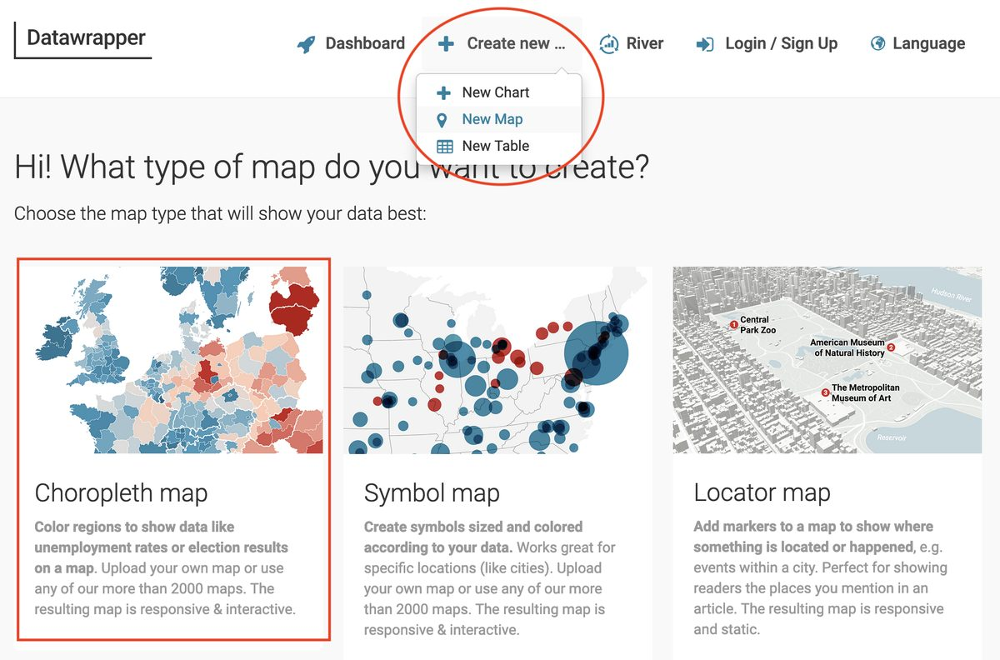{#fig-datawrapper-map-choose width=500}

4. *지도 선택(Select your map)* 화면에서 지리적 경계를 선택합니다. 이 경우에는 그림 [\@fig-datawrapper-map-us-states]와 같이 *USA > States*를 검색하고 선택한 다음 *진행(Proceed)*을 클릭합니다.


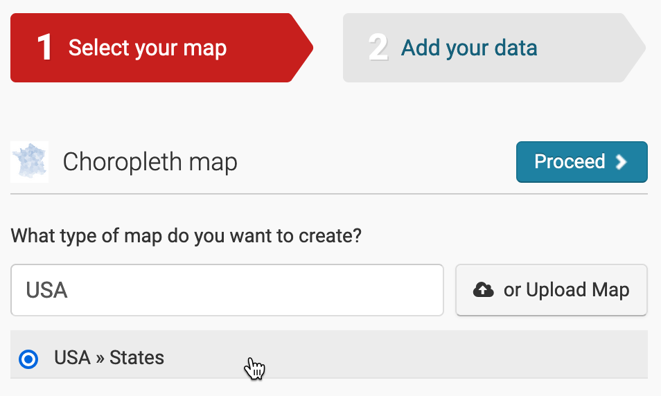{#fig-datawrapper-map-us-states width=350}

팁: 워싱턴 DC(District of Columbia)는 공식적으로 주로 인정받지 않지만 Datawrapper는 *USA - States* 지리에 워싱턴 DC를 포함한다는 점에 유의하세요. 다른 미국 영토에 대한 데이터를 표시하려는 경우 푸에르토리코, 미국령 버진 아일랜드, 괌, 북마리아나 제도, 아메리칸 사모아의 지리가 포함된 *USA - States & Territories*를 선택하세요.

팁: Datawrapper에 선호하는 지도 윤곽선이 나열되어 있지 않은 경우 GeoJSON 또는 TopoJSON 형식의 사용자 정의 지리 데이터를 업로드할 수 있습니다. 이에 대한 자세한 내용은 [13장의 GeoJSON 데이터 섹션(GeoJSON data section of Chapter 13)](#geojson)에서 배울 수 있습니다.

5. *데이터 추가(Add your data)* 화면에서는 각 지역의 데이터를 수동으로 입력할 수 있습니다. 몇 개 정도라면 괜찮겠지만 50개 주 전체를 직접 입력하기엔 무리가 있습니다. 대신 *업로드(Upload)* 탭으로 스크롤하여 데이터를 가져오는 다른 옵션을 살펴보세요. 이 연습을 위한 샘플 데이터가 Google Sheet에 있으므로, 더 아래로 스크롤하여 *Google Sheet 연결(Connect Google Sheet)* 버튼을 클릭하고 *공유된* Google Sheet의 링크를 붙여넣은 다음 그림 [\@fig-datawrapper-upload-google-sheet]와 같이 *연결(Connect)*을 누릅니다.

힌트: Datawrapper 지도를 선택할 때, 지명, 주나 작은 인구조사 단위를 나타내는 FIPS(Federal Information Processing Standards) 코드, ANSI(American National Standards Institute) 알파벳이나 숫자 코드 등 여러분의 데이터와 일치하는 라벨을 찾아보세요. [미국 인구조사국의 ANSI 및 FIPS 코드(US Census Bureau about ANSI and FIPS codes)](https://www.census.gov/library/reference/code-lists/ansi.html)에 대해 자세히 알아보세요. 코드는 지도 유형에 따라 다릅니다. 예를 들어 세계 지도는 국가 이름(철자가 다를 수 있음)이나 [ISO 세 글자 코드(ISO three-letter codes)](https://en.wikipedia.org/wiki/List_of_ISO_3166_country_codes)를 인식할 수 있습니다. 필요한 경우 스프레드시트에 이름과 해당 코드를 복사하여 붙여넣어 데이터를 준비할 수 있습니다. Datawrapper Academy의 [장소 이름 지오코딩(place name geocoding at the Datawrapper Academy)](https://academy.datawrapper.de/article/193-symbol-location-accuracy-using-addresses-place-names)에 대해 자세히 알아보세요.


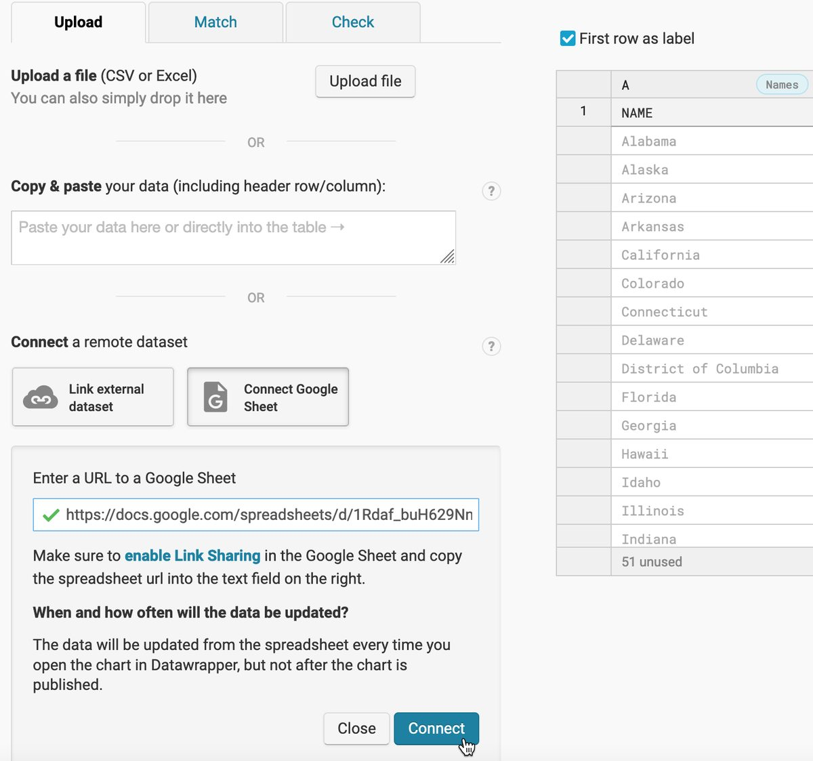{#fig-datawrapper-upload-google-sheet width=600}

6. 데이터 업로드 결과를 신중하게 검토하세요. Datawrapper는 각 행을 지리적 영역에 매칭한 결과를 시각적으로 보여주는 샘플 지도와 표를 표시합니다. 표에서 Datawrapper는 *숫자(numbers)*를 파란색으로, *날짜(dates)*를 초록색으로, *텍스트(text)* 데이터를 검정색으로 표시하며 *빨간색(red)*은 오류 또는 누락된 데이터를 나타냅니다. 필요한 경우 *매치(Match)* 또는 *확인(Check)* 탭을 클릭하여 데이터를 검토하거나 오류를 해결하세요. 데이터 업로드가 승인되면 그림 [\@fig-datawrapper-upload-review]와 같이 *진행(Proceed)*을 클릭하거나 *시각화(Visualize)* 탭으로 이동하세요.


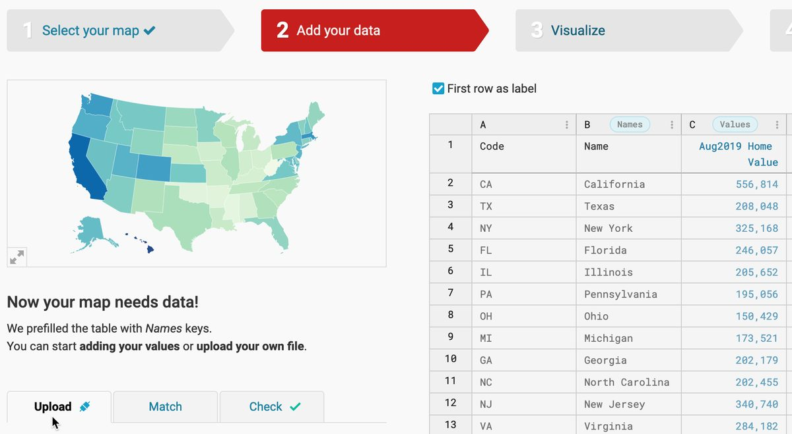{#fig-datawrapper-upload-review width=600}

7. *시각화(Visualize)* 화면의 *세밀하게 조정(Refine)* 탭에서 *Aug2020 Home Values*라는 열을 선택하여 그림 [\@fig-datawrapper-select-column]과 같이 초기 지도를 만듭니다.


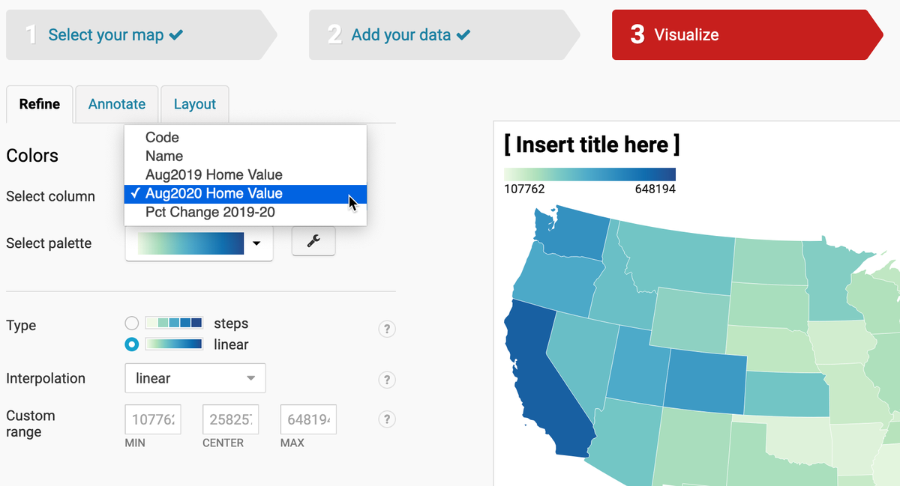{#fig-datawrapper-select-column width=600}

8. 기본 지도를 맹목적으로 받아들이지 마세요. 하지만 요소들이 지도의 외형을 어떻게 형성하는지 탐구하기에는 좋은 출발점입니다. 이 장의 [코로플레스 색상 및 구간 디자인 섹션(Design Choropleth Colors & Intervals section)](#design-choropleth)에서 처음 소개했던 핵심 개념들을 복습해 보겠습니다. 기본 지도는 *선형(linear)* 보간(interpolation)을 쓴 *연속형(continuous)* 그라데이션 경사로 형태로 *순차적인(sequential)* 녹색-파란색 색상 팔레트를 표시합니다. 이는 주택 가치가 눈금 위로 직선 형태로 분포되어 있음을 의미합니다. 이러한 색상과 구간은 극단적으로 낮거나 높은 값을 강조하는 데이터 스토리에 더 적합합니다.

9. *세밀하게 조정(Refine)* 탭에서 설정 변경이 지도의 외형과 데이터를 강조하는 스토리에 어떤 영향을 미치는지 실험해 보세요. 예를 들어 *유형(Type)*을 (경사로 같은) *연속형(continuous)* 색상 그라데이션에서 그림 [\@fig-datawrapper-default-steps]처럼 (계단 같은) *단계형(steps)*으로 변경하면 데이터의 구간(또는 범위)이 더 선명하고 뚜렷해집니다. 이 지도는 높고 낮은 양극단이나 특정 임계값 위아래의 그룹을 강조하는 데이터 스토리에 더 잘 맞습니다.


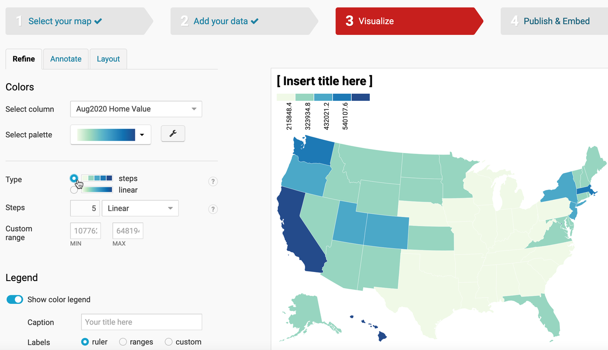{#fig-datawrapper-default-steps width=600}

10. 이제 *유형(Type)*을 다시 *단계형(steps)*에서 *연속형(continuous)* 색상 그라데이션으로 전환하고 다양한 *보간(Interpolation)* 유형을 실험해 봅시다. 이 맥락에서 보간은 값을 색상에 할당하는 함수이며 Datawrapper의 기본값은 선형으로 설정되어 있습니다. 이를 그림 [\@fig-datawrapper-map-quartiles]처럼 값을 동일한 크기의 4개 그룹으로 묶는 *사분위수(quartiles)*로 전환해 보겠습니다. 이 지도는 극단값만 강조하기보다는 중간 범위의 주 간 대비를 더 많이 보여주기 때문에 지리적 다양성을 강조하는 데이터 스토리에 더 잘 맞습니다.


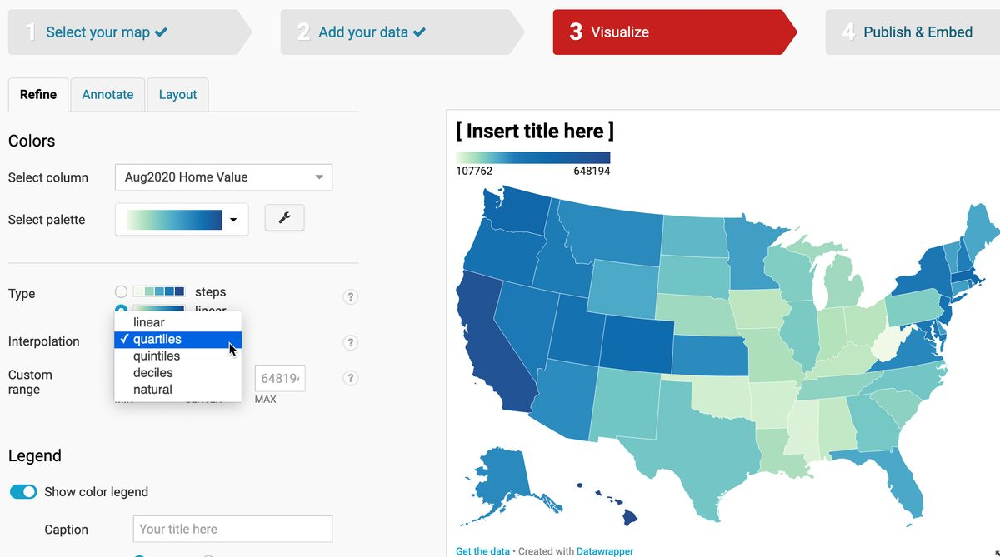{#fig-datawrapper-map-quartiles width=600}

11. 다른 색상, 구간 및 데이터 열로 실험해 보세요. 팔레트를 *순차적(sequential)*에서 중간 범위에 중립적인 색상을 표시하고 양극단에 두 가지 짙은 색상을 표시하는 *발산적(diverging)* 색상으로 변경하세요. 발산적 팔레트는 종종 값의 변화를 나타내는 데 사용되며 *Pct Change 2019-20* 열이 좋은 후보가 될 것입니다. 그림 [\@fig-datawrapper-map-percentchange]는 2019년부터 2020년까지 주택 가치의 백분율 변화를 발산적인 빨강-파랑 5단계 팔레트로 보여주는 지도입니다. 값의 감소를 나타내기 위해 두 가지 빨간색 음영이 할당되었지만 사실 주택 가치 변화가 음수인 유일한 주는 알래스카(-6.66%)입니다. 알래스카는 -5% 미만의 모든 값에 할당된 가장 어두운 빨간색으로 칠해져 있고 밝은 빨간색은 전혀 사용되지 않은 것을 알 수 있습니다. 이는 각 버킷 크기를 5퍼센트 포인트로 동일하게 유지하기 위해서입니다.


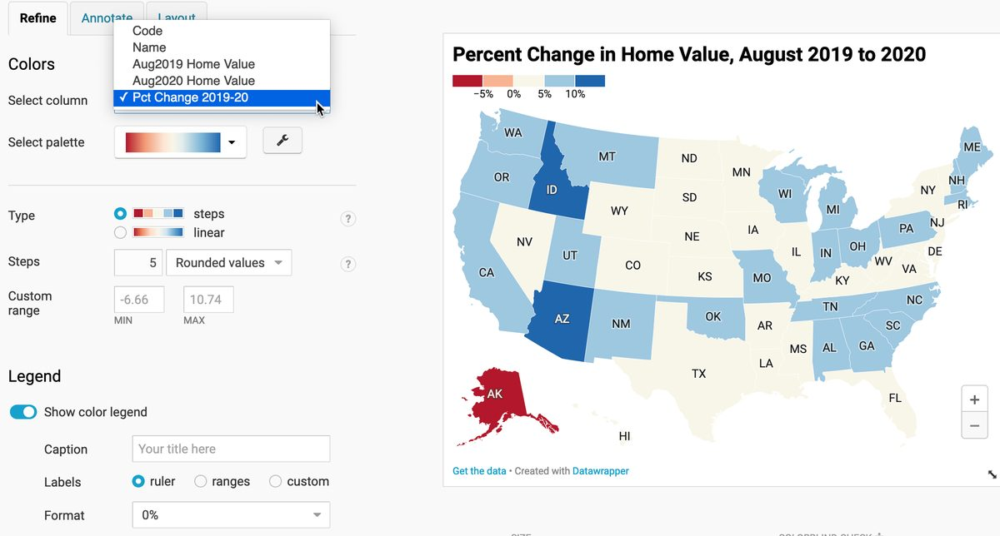{#fig-datawrapper-map-percentchange width=650}

어떤 데이터 열, 색상, 구간이 가장 좋은 지도를 만들까요? 진실하고 의미 있는 지도를 만드는 방법은 한 가지만 있는 것이 아니기 때문에 쉬운 답은 없습니다. 하지만 두 가지 원칙을 명심하세요. 첫째, 데이터를 숨기거나 위장하지 말고 정직하게 보여주세요. 둘째, 디자인 선택은 데이터에 대한 다양한 해석을 강조하므로 전달하고자 하는 데이터 스토리가 무엇인지 신중히 생각하세요. [코로플레스 색상 및 구간 디자인 섹션(Design Choropleth Colors & Intervals section)](#design-choropleth)에 있는 지침을 검토하세요.

이제 지도를 퍼블리시하고 다른 사람들과 공유하기 전에 지도 라벨과 스타일을 마무리하는 단계로 넘어가 보겠습니다.

12. *세밀하게 조정(Refine)* 탭 아래에서 범례 형식을 사용자 지정합니다. 예를 들어, 긴 숫자(예: 107762)를 약어인 달러 기호 형태($ 108 k)로 변환하려면 그림 [\@fig-datawrapper-map-legend-custom]과 같이 *사용자 지정 형식(custom format)*을 선택하고 코드 `($ 0 a)`를 입력합니다. Datawrapper 맞춤 형식에 대한 자세한 내용은 [numeral.js 설명서(numeral.js documentation)](http://numeraljs.com/#format) 링크에서 알아보세요.


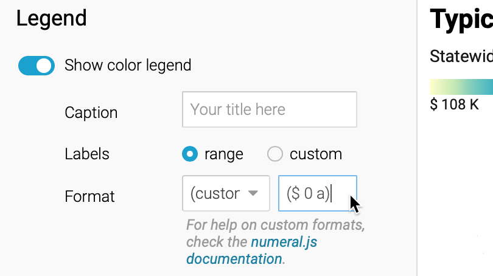{#fig-datawrapper-map-legend-custom width=350}

13. *주석(Annotate)* 탭 아래에서 제목과 설명을 추가하고 출처를 인용하여 작업의 신뢰성을 높이세요. 독자가 다른 주 위로 마우스를 올릴 때 표시될 지도 라벨을 추가하고 툴팁을 사용자 지정할 수도 있습니다. 툴팁을 편집하는 가장 쉬운 방법은 파란색 열 이름을 클릭하거나 드롭다운 메뉴를 사용하여 서식을 지정하여 그림 [\@fig-datawrapper-map-tooltip]과 같이 적절한 코드가 이중 중괄호 안에 표시되게 하는 것입니다. [Datawrapper Academy에서 툴팁 사용자 지정(customizing tooltips from Datawrapper Academy)](https://academy.datawrapper.de/article/116-how-to-create-useful-tooltips-for-your-maps)에 대해 자세히 알아보세요.


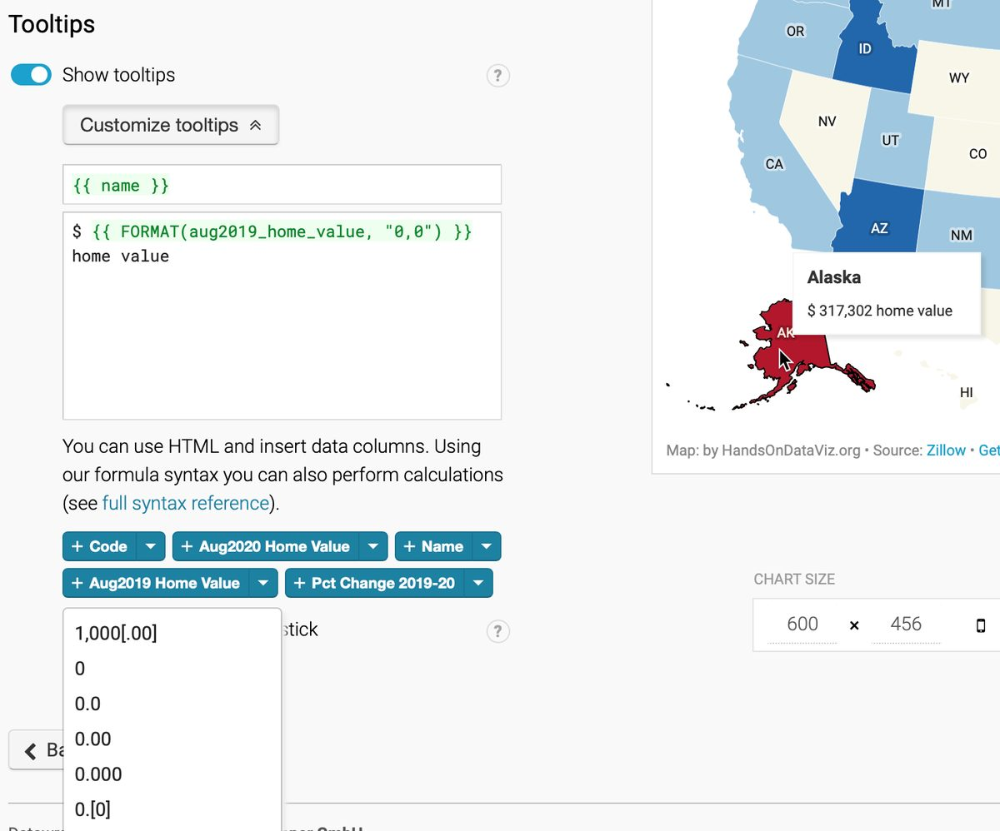{#fig-datawrapper-map-tooltip width=600}

14. 마지막으로 *진행(Proceed)*을 클릭하거나 *발행 및 임베드(Publish & Embed)* 화면으로 넘어가 작업을 다른 사람과 공유하세요. 프롬프트 또는 위의 더 자세한 Datawrapper 튜토리얼을 따라 대화형 지도의 임베드 코드를 가져오고 [9장: 웹에 포함하기(Embed on the Web)](#embed)에서 다음 단계에 대해 알아보세요.

팁: [Datawrapper Academy의 뛰어난 일련의 게시물에서 코로플레스 지도 디자인(choropleth map design in this excellent series of posts by the Datawrapper Academy)](https://academy.datawrapper.de/category/93-maps)에 대해 자세히 알아보세요.

이제 Datawrapper라는 하나의 도구를 사용하여 코로플레스 지도를 만드는 방법을 배웠으니 다른 도구인 Tableau Public을 사용하는 프로세스와 비교해 보겠습니다.

## Tableau Public으로 코로플레스 지도 만들기 {- #map-tableau}

우리는 6장에서 [분산형 차트(scatter charts)](#scatter-tableau)와 [필터링된 꺾은선형 차트(filtered line charts)](#filtered-line-tableau)를 만들 때 무료 데스크톱 애플리케이션인 Tableau Public(Mac 또는 Windows용)을 처음 소개했습니다. 이제 동일한 도구를 사용하여 대화형 코로플레스 지도를 만들고 이전 섹션에서 배운 Datawrapper 도구와 프로세스를 비교해 보겠습니다. 두 도구의 차이점을 보여주기 위해 동일한 유형의 지도를 만드는 방법을 보여드립니다. 한편으로 Datawrapper는 데이터 보간을 더 세밀하게 제어할 수 있고 코로플레스 지도의 색상 구간 외형을 형성하는 데 유리합니다. 반면 인터페이스에 이미 익숙하기 때문에 Tableau Public을 선호하는 사람도 있습니다.

Tableau Public은 국가, 주, 카운티, 공항 등 시스템이 이미 인식하고 있는 지명 또는 ISO 코드에 대해 다양한 유형의 지도를 만들 수 있습니다. 그러나 Tableau Public은 도로 주소를 자체적으로 지오코딩할 수 없으므로 [2장의 지오코드 섹션(geocode section of Chapter 2)](#geocode)에서 설명한 것과 같은 다른 도구를 사용하여 해당 주소의 위도와 경도를 얻어야 합니다. 또한 맞춤형 지도 경계를 업로드하려면 지원 페이지의 [공간 파일에서 Tableau 지도 만들기(Create Tableau Maps from Spatial Files)](https://help.tableau.com/current/pro/desktop/en-us/maps_shapefiles.htm)를 참조하세요.

이 섹션에서는 그림 [\@fig-tableau-polygon-final]과 같이 국내총생산(GDP) 대비 국가별 의료비 지출 비율에 대한 코로플레스 지도를 만들어 볼 것입니다. 코로플레스 지도는 절대 수치보다는 상대 수치를 보여주기 위해 [데이터를 정규화(normalize the data)](#normalize-choropleth)할 때 가장 효과적이라는 점을 기억하세요. 더 큰 국가는 더 큰 경제 규모를 갖는 경향이 있으므로 국가별 총 의료 지출 지도를 만드는 것은 별로 의미가 없을 것입니다. 따라서 이 지도는 경제 규모 대비 의료비 지출 비율을 기반으로 합니다.


::: {.content-visible when-format="html"}

<iframe src="https://public.tableau.com/views/2017HealthcareSpendingbyCountryasofGDP/Dashboard1?:showVizHome=no&:embed=true" width="100%" height="500px" style="border:none;"></iframe>
<p class="caption">Tableau Public을 사용한 의료 지출의 코로플레스 지도. [대화형 버전(interactive version)](https://public.tableau.com/profile/ilya7257#!/vizhome/2017HealthcareSpendingbyCountryasofGDP/Dashboard1)을 탐색해 보세요. 데이터 출처는 World Bank입니다.</p>

:::


그림 [\@fig-tableau-polygon-final]의 코로플레스 지도를 만들기 위한 단계를 자세히 살펴보겠습니다.

1. [World Bank](https://databank.worldbank.org/source/world-development-indicators)에서 다운로드한 [Google Sheets의 GDP 대비 국가별 의료비 지출 데이터(Healthcare Spending by Nation as Percent of GDP data in Google Sheets)](https://docs.google.com/spreadsheets/d/1tr9VrqKnO5tf55_YUCk441bFsZSI4zgMzW5ow3-wioo/edit#gid=490588019)를 엽니다. 데이터와 메모를 확인하세요.

좋은 지도는 종종 [4장에서 설명한 지저분한 데이터 정리(cleaning up messy data as described in Chapter 4)](#clean)가 필요합니다. 이 스프레드시트에서는 데이터를 보고하지 않은 국가의 행을 제거했습니다. Tableau Public은 여러 다양한 지명(예: 도시 및 국가)을 인식하므로, 철자 문제를 도구가 자체적으로 처리하고 지도에 올바르게 배치할 것이라고 믿고 맡기겠습니다.

2. Google Sheet에서 *파일 > 다운로드(File > Download)*로 이동하고 CSV(쉼표로 구분된 값) 형식을 선택하여 로컬 컴퓨터에 데이터를 저장합니다.

3. 아직 수행하지 않은 경우 [무료 Tableau Public 프로필 페이지(free Tableau Public profile page)를 생성](https://public.tableau.com/s/#modal-signup)하거나 [*로그인(Sign In)* 버튼을 클릭하여 기존 프로필에 접속](https://public.tableau.com)한 후, 그림 [\@fig-tableau-create-viz]와 같이 브라우저에서 *시각화 생성(Create a Viz)* 버튼을 클릭합니다.


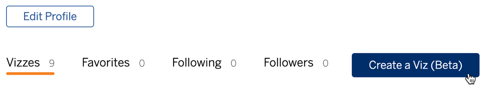{#fig-tableau-create-viz width=500}

팁: 2021년에 Tableau Public은 [브라우저에서 직접 데이터 시각화를 생성할 수 있는 베타 버전(launched its beta version to create data visualizations directly in your browser)](https://public.tableau.com/en-us/s/blog/2021/08/create-data-visualizations-directly-browser-data-connectors-tableau-public)을 출시했습니다(Tableau Public 프로필 페이지에 로그인한 경우). 이전에는 [무료 Tableau Public 데스크톱 애플리케이션(Mac 또는 Windows용)(free Tableau Public desktop application for Mac or Windows)](https://public.tableau.com/en-us/s/download)을 설치해야 했으며 데스크톱 앱을 선호하는 사용자들을 위해 여전히 제공되고 있습니다.

4. 그림 [\@fig-tableau-connect-data]와 같이 *데이터 연결(Connect to Data)* 창이 나타나면, 이전 단계에서 다운로드한 의료비 지출 CSV 데이터 파일을 업로드합니다.

팁: Tableau Public은 *Connectors* 메뉴를 사용하여 외부 서버에서 직접 데이터에 액세스할 수도 있습니다. 따라서 2단계에서 CSV 파일을 다운로드하는 대신 Google Drive의 Google Sheet에 직접 연결할 수도 있었지만 이렇게 하려면 권한을 부여하는 몇 가지 추가 단계가 필요합니다.


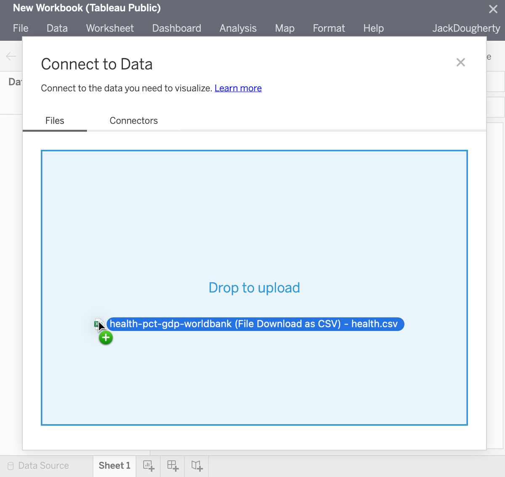{#fig-tableau-connect-data width=600}

5. 데이터를 가져온 후 Tableau Public은 자동으로 다음으로 진행하여 브라우저의 *새 통합 문서(New Workbook)*의 *Sheet 1*을 표시하며 왼쪽 메뉴에는 개별 테이블이 그림 [\@fig-tableau-sheet]와 같이 표시됩니다.


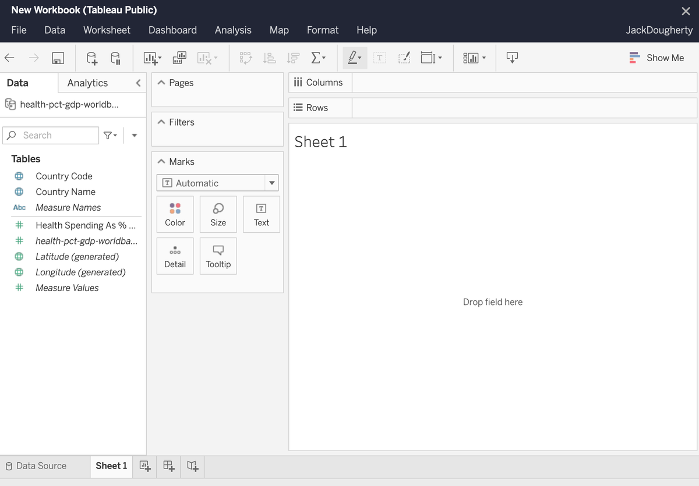{#fig-tableau-sheet}

팁: Country Name과 Country Code 옆에 작은 지구본 아이콘이 표시되는지 확인하세요. 이는 Tableau Public이 이를 문자열이나 텍스트 데이터가 아닌 지리적 데이터로 성공적으로 인식했음을 보여줍니다. Tableau가 지리적 데이터를 자동으로 인식하지 못하는 경우 데이터 유형을 수동으로 변경해야 합니다. 변경하려면 데이터 유형 아이콘(예: 지구본 또는 숫자 값의 경우 녹색 `#`)을 클릭한 후 그림 [\@fig-tableau-data-geographic]과 같이 *지리적 역할 > 국가/지역(Geographic Role > Country/Region)*을 선택합니다. 또한 *데이터 원본(Data Source)* 탭에서 데이터 업로드 상태를 검사할 수 있습니다.


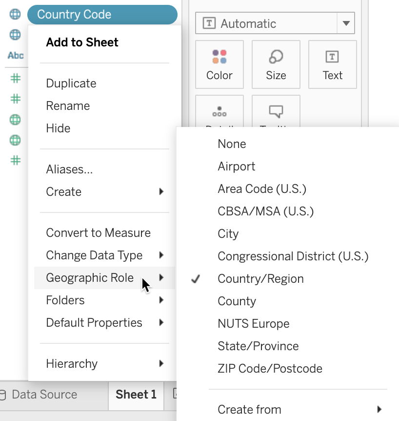{#fig-tableau-data-geographic width=400}

6. 그림 [\@fig-tableau-drag]와 같이 *Sheet 1*에서 2단계 프로세스를 사용하여 코로플레스 지도를 만듭니다. 첫째, *Country Name* 필드를 워크시트 중앙(또는 마크(Marks) 카드의 세부정보 박스)으로 끌어다 놓아 지도를 만듭니다. 기본 보기는 기호 지도이므로 이를 다각형 지도로 교체해야 합니다. 색칠된 다각형을 추가하려면 *Health Spending As % of GDP* 필드를 *마크(Marks)* 카드의 *색상(Color)* 상자로 끌어다 놓아 코로플레스 지도로 변환합니다.


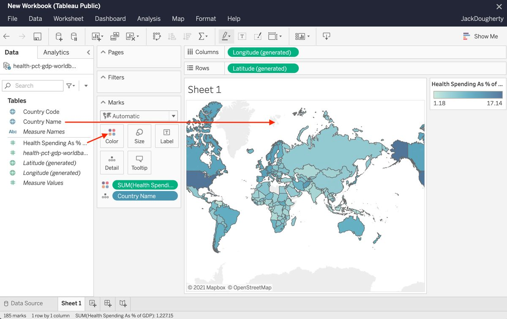{#fig-tableau-drag}

팁: 지도 범례가 보이지 않는 경우 때로는 Tableau Public이 오른쪽 위의 *표현 방식(Show Me)* 메뉴 뒤에 숨겨둘 수 있으므로 필요한 경우 메뉴를 클릭하여 축소하세요.

7. 마크(Marks) 카드의 색상 상자를 클릭한 다음 *색상 편집(Edit colors)*을 선택하여 색상 팔레트를 변경할 수 있습니다. 그림 [\@fig-tableau-polygon-color]와 같이 팔레트를 *녹색(Green)*으로 변경하고 연속형에서 단계형으로 변경합니다.


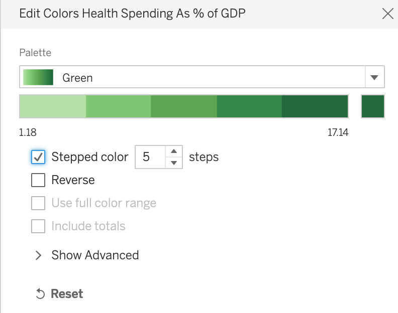{#fig-tableau-polygon-color width=400}

8. 국가 위로 마우스를 가져가면 해당 국가의 이름을 알려주고 백분율 값을 보여주는 툴팁이 표시됩니다. 초기 데이터 표에 적절한 열 머리글이 있었으므로 일반적으로 형식이 잘 지정되어 있습니다. 하지만 이 툴팁을 더 낫게 만들 수 있습니다. 마크 카드의 툴팁 상자를 클릭하고 첫 번째 `Country Name` 인스턴스를 단지 `Country`로 변경한 후 (이들은 변수 이름이므로 `<`와 `>` 안의 텍스트는 변경하지 마세요) 그림 [\@fig-tableau-polygon-tooltip]과 같이 두 번째 줄 끝에 `%` 기호를 추가합니다.


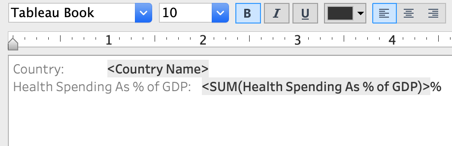{#fig-tableau-polygon-tooltip width=400}

9. 지도의 제목을 더 의미 있게 만들어 보겠습니다. 지도 바로 위에 있는 기본 *Sheet 1* 이름을 두 번 클릭하여 *제목 편집(Edit Title)* 창을 열고 차트 이름을 *2017 Healthcare Spending by Country as % of GDP*로 변경합니다.

10. 이 단계에서 데이터가 로드되었고 올바르게 표시되어야 하므로 지도의 제목과 크레딧, 범례를 포함하고 공유하기에 적합한 최종 레이아웃을 생성할 것입니다. 프로그램 왼쪽 하단에서 그림 [\@fig-tableau-dashboard-create]와 같이 *새 대시보드(New Dashboard)*를 생성합니다. Tableau의 대시보드는 여러 시트의 시각화뿐만 아니라 텍스트 상자, 이미지 및 기타 요소를 포함할 수 있는 레이아웃으로, 풍부한 탐색적 인터페이스를 만듭니다. 이 튜토리얼에서는 코로플레스 지도를 포함하는 단일 시트만 사용하겠습니다.


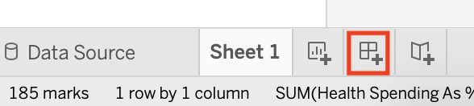{#fig-tableau-dashboard-create width=400}

11. 대시보드 1 탭에서 지도가 반응형이 되도록 대시보드 크기를 자동(Automatic)으로 변경하고 모든 기기에서 너비의 100%를 차지하도록 합니다. 그림 [\@fig-tableau-dashboard]와 같이 Sheet 1을 *여기에 시트 추가(Add sheets here)* 영역으로 드래그 앤 드롭합니다. 이렇게 하면 Sheet 1의 지도, 제목, 범례가 복사됩니다.


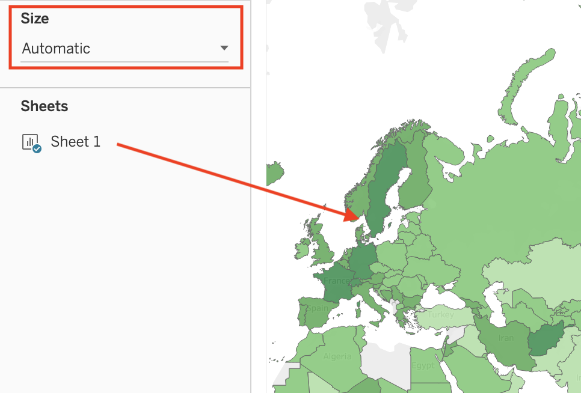{#fig-tableau-dashboard width=400}

12. 지도 범례의 위쪽 부분을 마우스 오른쪽 버튼으로 클릭하고 그림 [\@fig-tableau-dashboard-legend]와 같이 *부동(Floating)*을 선택합니다. 이제 공간을 절약하기 위해 지도의 맨 위에 범례를 직접 배치할 수 있습니다. 지도 모서리 중 한 곳으로 끌어다 놓으세요.


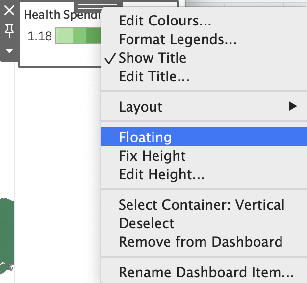{#fig-tableau-dashboard-legend width=400}

13. 마지막으로 지도 아래에 데이터 출처가 포함된 텍스트 블록을 추가해 보겠습니다. 왼쪽의 개체(Objects) 메뉴에서 *텍스트(Text)*를 지도의 하단으로 드래그 앤 드롭합니다. 표시되는 *텍스트 편집(Edit Text)* 창에 *Data by the World Bank, 2017*이라고 입력하고 확인을 클릭합니다. 처음에는 텍스트 영역이 화면 높이의 절반을 차지하므로 컴퓨터의 창 크기를 조정하는 것처럼 크기를 조정하세요. 또한 다른 사람들이 볼 수 있도록 지도의 중심과 확대 수준의 위치를 정하세요. 이 경우 대륙 단위로 확대하고 싶을 수도 있지만 대부분의 국가에 대한 데이터를 보여주므로 세계 지도가 보이게 하는 것이 가장 좋습니다.

14. 지도를 온라인으로 게시할 준비가 되면 *파일 > 다른 이름으로 저장(File > Save As)*으로 이동하여 Tableau Public 프로필에 저장합니다. Healthcare Spending과 같은 제목을 지정하고 저장을 클릭합니다. [9장의 iframe으로 지도 임베드하는 방법(embed the map as an iframe in Chapter 9)](#embed-code)을 참조하세요.

경고: 지도를 처음 Tableau Public 계정에 저장하려고 할 때 "데이터 원본이 추출이어야 합니다"라는 오류가 표시될 수 있으며 [Tableau 도움말에서 데이터 추출에 대해 자세히 읽어볼 수 있습니다(read more about data extracts in Tableau Help)](https://help.tableau.com/current/pro/desktop/en-us/extracting_data.htm). *데이터 원본(Data Source)* 탭으로 돌아가 오른쪽 위의 *추출 생성(Create Extract)* 버튼을 클릭합니다. Tableau는 잠시 원본 CSV 데이터를 조작한 후, 파일 > 다른 이름으로 저장(File > Save As)을 사용하여 프로필에 지도를 성공적으로 저장할 수 있게 됩니다.

팁: 색상 간격을 완전히 제어하고 싶은 코로플레스 지도를 만들 때 Tableau는 최고의 도구가 아닐 수 있습니다. 기본적으로 Tableau는 장 앞부분에서 배운 것처럼 이상값을 강조하는 경향이 있는 선형 색 구성표를 사용하며 분위수와 같은 비선형 방법으로 간격을 변경하는 간단한 방법이 없습니다. 선형 눈금이 데이터를 나타내는 방식이 마음에 들지 않는 경우 [데이터를 필터링하여 지도에서 이상값을 제거(filter your data to remove outliers from the map)](https://help.tableau.com/current/pro/desktop/en-us/filtering.htm)하거나, [테이블 계산을 사용하여 항목을 분위수로 그룹화하는 Andy Kriebel의 VizWiz 튜토리얼(Andy Kriebel's VizWiz tutorial to use table calculations to group items into quantiles)](https://www.vizwiz.com/2018/07/rankpercentile.html)을 보거나, 색상 구간과 보간을 더 세밀하게 제어할 수 있는 [Datawrapper에서 코로플레스 지도 만들기(choropleth map in Datawrapper)](#choropleth-datawrapper)를 사용하면 됩니다.

이전 튜토리얼에서는 모두 스프레드시트의 *정적 데이터(static data)*를 사용하여 대화형 지도를 만들었습니다. 다음 튜토리얼에서는 Socrata 오픈 데이터 리포지토리의 *지속적으로 업데이트되는 데이터(continuously-updated data)*를 사용하여 최신 정보를 항상 표시하는 지도를 구축하는 방법을 알아보겠습니다.

## Socrata 오픈 데이터로 최신 지도 만들기 {- #map-socrata}

이러한 유형의 지도는 가장 최신 정보를 지속적으로 [3장에서 배운 오픈 데이터 리포지토리(open data repository, which you learned about in chapter 3)](#opendata)에서 가져오기 때문에 현재 데이터를 보여줍니다. 오픈 데이터 플랫폼에서 직접 시각화를 만드는 장점은 차트나 지도가 소스와 직접 연결된다는 것입니다. 일부 정부 기관은 소방이나 경찰 신고 부동산 데이터, 공공 재정과 같이 최신 정보가 중요한 오픈 데이터 리포지토리를 자주 업데이트합니다. 관리자가 오픈 데이터 리포지토리의 내용을 수정할 때마다 차트나 지도가 최신 정보를 자동으로 표시하게 됩니다. 그러나 정부 기관이 리포지토리 업데이트를 중지하거나 다른 플랫폼으로 전환하는 경우 시각화에서 더 이상 최신 정보가 표시되지 않거나 완전히 망가질 수 있습니다.

[Socrata](https://www.tylertech.com/products/socrata)는 많은 정부 기관에서 대중에게 오픈 데이터를 제공하는 데 사용하는 오픈 데이터 리포지토리 서비스 회사입니다. 이 플랫폼은 데이터를 보고 필터링하고 내보내는 사용자 친화적인 방법을 제공합니다. 또한 Socrata 플랫폼에는 (사용자 본인의 웹사이트를 포함한) 다른 웹사이트에 임베드될 수 있는 대화형 차트 및 지도를 만드는 기능이 기본 제공됩니다. Socrata의 [오픈 데이터 네트워크(Open Data Network)](https://www.opendatanetwork.com/)에서 공개적으로 사용 가능한 데이터 세트를 검색할 수 있습니다.

이 섹션에서는 그림 [\@fig-socrata-final]에 표시된 것처럼 지난 365일 동안의 포인트를 지속적으로 업데이트하여 표시하는 뉴욕시 자동차 관련 사망 사고의 대화형 점 지도를 구축해 보겠습니다. 이 대화형 지도는 Socrata 플랫폼을 기반으로 뉴욕시 오픈데이터 포털의 [자동차 충돌 - 충돌 사고(Motor Vehicle Collisions - Crashes)](https://data.cityofnewyork.us/Public-Safety/Motor-Vehicle-Collisions-Crashes/h9gi-nx95/data) 공용 리포지토리에서 데이터를 가져옵니다. 정부 관리자가 이 플랫폼에서 이 데이터 세트를 계속 업데이트하는 한 지도는 항상 지난 12개월 동안의 최신 데이터를 표시해야 합니다.


::: {.content-visible when-format="html"}

<iframe src="https://data.cityofnewyork.us/dataset/Fatal-NYC-Crashes/nx4u-jy9t/embed?width=100%25&height=500" width="100%" height="500px" style="border:none;"></iframe>
<p class="caption">지속적으로 업데이트되는 Socrata 오픈 데이터 리포지토리를 기반으로 지난 1년 동안 뉴욕시에서 발생한 치명적인 교통사고 지도. [대화형 버전(interactive version)](https://data.cityofnewyork.us/dataset/Fatal-NYC-Crashes/nx4u-jy9t/embed?width=100%25&height=500)을 확인하세요.</p>

:::


이 Socrata 오픈 데이터 리포지토리를 사용하여 지속적으로 업데이트되는 사용자 고유의 점 지도를 구축하려면 이 튜토리얼을 따르세요. 누구나 Socrata가 호스팅하는 공개 데이터를 사용하여 지도를 만들 수 있지만 지도를 저장하고 공유하려면 등록된 Socrata 사용자여야 합니다. 특별한 위치 열(location column)이 있는 데이터 세트만 매핑할 수 있으며 이는 데이터 세트에서 볼 수 있는 기존의 위치 열(주소나 도시 등)과 다릅니다. 매핑하려는 데이터 세트에 지오코딩된 위치가 누락된 경우 데이터 세트 관리자에게 문의해 보시기 바랍니다.

1. 오른쪽 상단의 *로그인(Sign In)* 버튼을 클릭하여 [NYC OpenData](https://opendata.cityofnewyork.us/)에서 계정을 등록합니다. "아직 계정이 없으신가요? 가입하기(Don't have an account yet? Sign Up)"라고 표시된 곳에서 가입을 진행합니다. 로봇이 아님을 확인하고 라이선스 계약에 동의하는 등의 지침에 따라 무료 계정을 만드세요. 이 계정(사용자 이름 및 비밀번호 포함)은 NYC OpenData 포털에서 유효하지만 Socrata를 사용하는 다른 웹사이트에서는 유효하지 *않습니다*.

2. [자동차 충돌 - 충돌 사고(Motor Vehicle Collisions - Crashes)](https://data.cityofnewyork.us/Public-Safety/Motor-Vehicle-Collisions-Crashes/h9gi-nx95/data) 데이터 세트로 이동합니다. 오른쪽 메뉴에서 그림 [\@fig-socrata-launch-new-viz]와 같이 *시각화 > 새 시각화 시작(Visualize > Launch New Visualization)*을 선택합니다. 지도를 만들 수 있는 *시각화 구성(Configure Visualization)* 스튜디오가 열립니다.


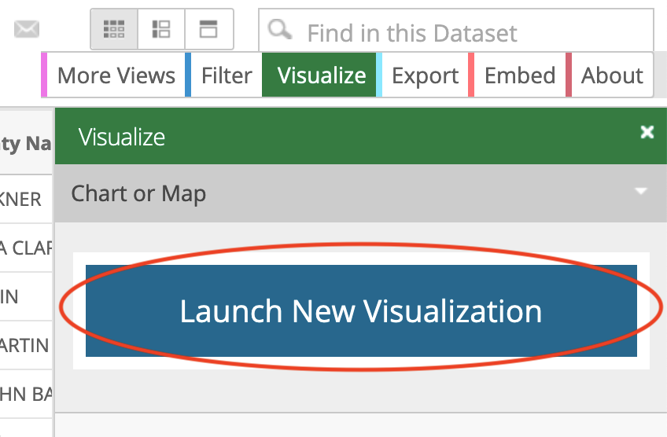{#fig-socrata-launch-new-viz width=300}

3. 상단 메뉴에서 시각화 유형으로 *지도(Map)* (분산형 차트 아이콘과 달력 사이의 지구본 아이콘)를 선택합니다. 몇 초 후 기저 지도가 표시되며 왼쪽 측면 메뉴에 *지도 레이어(Map Layers)* 및 *지도 설정(Map Settings)* 항목이 나타납니다(그림 \@fig-socrata-configure 참조).


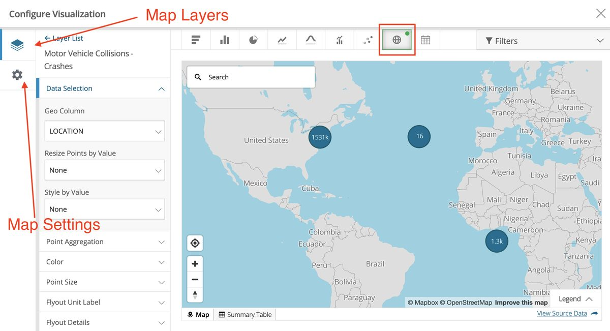{#fig-socrata-configure width=500}

Socrata는 지리 공간적 가치가 있는 열이 어느 것인지 확인하고 그림과 같이 자동으로 *지리 열(Geo Column)* 값을 *LOCATION*으로 설정할 수 있었습니다(*레이어 목록 > 데이터 선택(Layer List > Data Selection)* 참조). 기본적으로 점은 함께 클러스터링됩니다. 그렇기 때문에 개별 사고 대신 그 버블 안에 몇 개의 점이 클러스터되어 있는지 나타내는 숫자가 있는 거품을 보게 됩니다. 클러스터는 지도를 확대 및 축소함에 따라 변경됩니다.

4. 사망자가 있는 충돌만 표시하도록 지도를 제한해야 합니다. 오른쪽 상단에서 *필터 > 필터 추가(Filters > Add filter)*를 클릭합니다. 드롭다운 메뉴에 데이터 세트의 모든 열(또는 필드)이 나열되므로 *NUMBER OF PERSONS KILLED*를 선택해야 합니다. 새로 나타난 드롭다운에서 *보다 큼(Is greater than)*을 선택하고 그림 [\@fig-socrata-filter]와 같이 값을 0으로 설정합니다. 또는 *크거나 같음(Is greater than or equal to)*으로 설정하고 값을 1로 설정할 수 있습니다.

5. 데이터를 정리해야 합니다. 축소하면 모든 충돌이 제대로 지오코딩되지 않았음을 알 수 있습니다. 위도와 경도가 모두 0인 대서양의 가상의 Null Island에 여러 개가 나타납니다. [4장의 불량 데이터(bad data in chapter 4)](#bad-data)를 인식하고 처리하는 방법을 배웠을 것입니다. 잘못 지오코딩된 많은 충돌을 제거하려면 *LATITUDE* 열에 다른 필터를 추가하고 값 0에 *보다 큼(Is greater than)*으로 설정해 보겠습니다. 이렇게 하면 뉴욕시가 위치한 Null Island 북쪽의 북반구에 위치한 충돌을 표시할 수 있습니다. 두 필터를 모두 올바르게 설정하면 지도가 날아가 뉴욕시에 집중됩니다. 원하는 경우 더 많은 필터를 추가하여 데이터를 계속 정리할 수 있습니다.

6. 2012년 이후 기록된 모든 충돌을 표시하는 대신, 지난 1년 동안 발생한 충돌을 지속적으로 업데이트하여 표시해 보겠습니다. *CRASH DATE* 열에 대한 세 번째 필터를 추가하고 이를 *상대적 날짜 > 사용자 지정 > 최근 365일(Relative Date > Custom > Last 365 day(s))*로 설정합니다. 선택한 날짜 범위에 속하지 않아 지도에서 수많은 점이 사라지는 것을 볼 수 있습니다. 이제 *필터(Filters)* 창을 닫아 화면 공간을 확보할 수 있습니다.


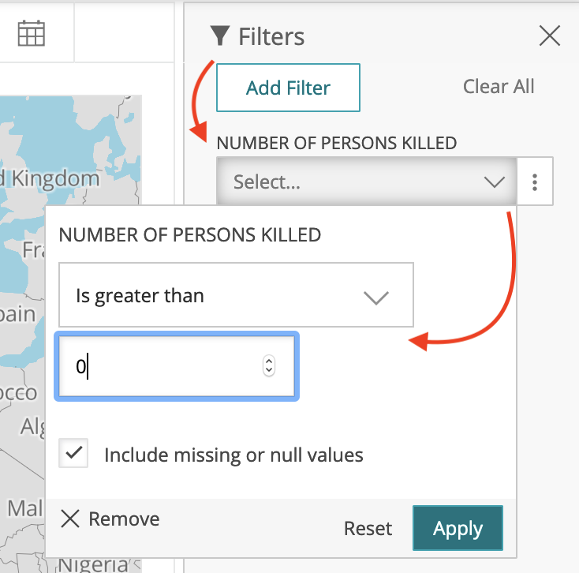{#fig-socrata-filter width=300}

7. 충돌 위치가 개별 점으로 나타나고 클러스터되지 않도록 보장해 보겠습니다. 그림 [\@fig-socrata-uncluster]와 같이 *지도 설정 > 클러스터(Map Settings > Clusters)*로 이동하여 *확대/축소 수준에서 클러스터 중지(Stop Clustering at Zoom Level)* 슬라이더를 1로 가져옵니다. 이제 모든 확대/축소 수준에서 개별 충돌 위치를 볼 수 있어야 합니다.


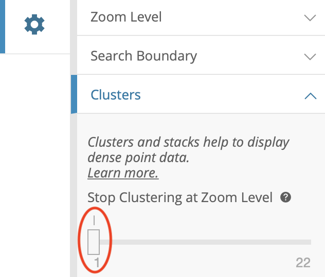{#fig-socrata-uncluster width=300}

8. 동일한 아코디언 메뉴에서 기저 지도의 *유형(Type)*을 기본 *기본(Basic)*에서 *어둡게(Dark)*로 변경하여 점 가시성을 최대화하고 지도에 더 세련된 모양을 부여합니다. *일반(General)*에서 제목을 *뉴욕시의 최근 365일간 치명적인 충돌 사고(Fatal Crashes in New York City, Last 365 Days)*로 설정하고 *시각화 아래에 데이터 테이블 표시(Show data table below visualization)* 상자를 선택 해제하여 지도 아래의 데이터 테이블을 숨깁니다. *지도 컨트롤(Map Controls)*에서 *위치 지정 버튼 표시(Show Locate Button)*는 뉴욕시에서 지도에 액세스하는 사람들에게만 관련이 있으므로 선택 해제합니다. *범례 옵션(Legend Options)*에서 *범례 표시(Show Legend)*를 선택 해제합니다. 다른 설정을 자유롭게 실험해 보세요.

9. 마지막으로 점에 대한 의미 있는 툴팁을 만들어 보겠습니다. 다시 *지도 레이어(Map Layers)* 메뉴로 돌아가 *자동차 충돌 - 충돌 사고(Motor Vehicle Collisions - Crashes)* 점 레이어를 선택합니다. 마우스를 올리거나 점을 클릭할 때 표시되는 항목을 변경하려면 그림 [\@fig-socrata-flyout]과 같이 *플라이아웃 세부 정보(Flyout Details)*로 이동하여 *플라이아웃 제목(Flyout Title)*을 *ON STREET NAME*으로 설정하고 추가 플라이아웃 값으로 *CRASH DATE*, *CRASH TIME*, *NUMBER OF PERSONS INJURED* 및 *NUMBER OF PERSONS KILLED*를 추가합니다.


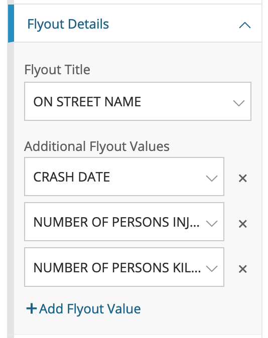{#fig-socrata-flyout width=250}

이 튜토리얼에서 시연하지 않을 지도 수정 방법이 더 있습니다. 예를 들어 데이터 선택 메뉴의 *값에 의한 크기 조정(Resize Points by Value)* 기능을 사용하여 더 큰 원이 더 큰 숫자 값(예: 충돌에서 다친 사람이 더 많음)을 나타내는 기호 지도로 점 지도를 변환할 수 있습니다. 또한 데이터 세트의 *CONTRIBUTING FACTOR VEHICLE 1* 열에 저장된 텍스트 범주형 데이터(예: 너무 가깝게 추월, 운전자 경험 부족 등)를 *값에 의한 스타일 적용(Style by Value)* 기능으로 여러 충돌 범주에 다른 색상을 사용하여 시각화할 수 있습니다.

이 시점에서는 지난 365일 동안 뉴욕시에서 발생한 치명적인 교통사고를 보여주기 위해 지속적으로 업데이트되는 기능적인 대화형 점 지도가 있어야 하며 관리자가 이 플랫폼에서 데이터베이스를 계속 업데이트하는 한 이 지도는 계속 작동해야 합니다. 다른 사람과 지도를 공유하려면 임시 보관함으로 저장하고 퍼블리시해야 합니다.

10. 오른쪽 하단 모서리에서 *임시 저장(Save Draft)* 버튼을 클릭합니다. 지도에 (사용자가 볼 수 있는 지도의 제목과는 다른) 이름을 지정하고 *저장(Save)*을 누릅니다. 상단의 회색 리본에는 아직 임시 상태임을 알려줍니다. 공개할 준비가 되면 계속해서 *게시...(Publish...)*를 누릅니다.

이제 웹사이트에 지도를 iframe으로 임베드할 수 있습니다. 그렇게 하려면 지도의 오른쪽 상단에 있는 *공유(Share)* 버튼(그림 \@fig-socrata-share 참조)을 클릭하고 *임베드 코드(Embed Code)* 텍스트 영역에서 생성된 코드를 복사합니다(그림 \@fig-socrata-share-embed). [9장: 웹에 포함하기(Embed on the Web)](#embed)에서 시각화 임베드에 대해 자세히 살펴보겠습니다.


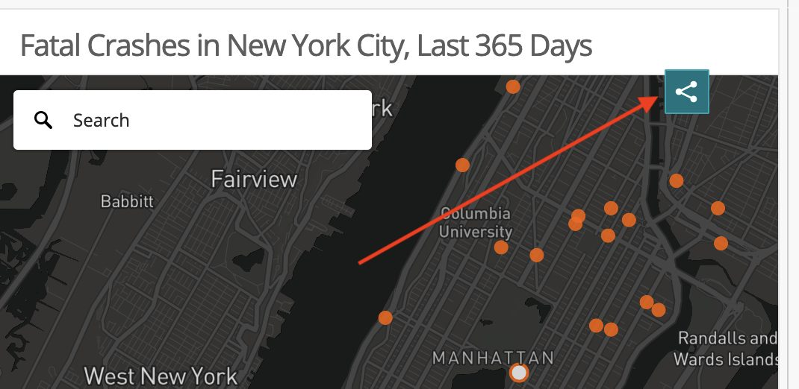{#fig-socrata-share width=400}


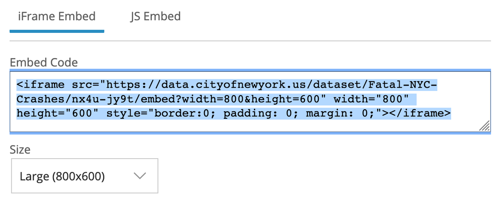{#fig-socrata-share-embed width=400}

오픈 데이터 리포지토리 플랫폼에서 차트나 지도를 만드는 데는 한계가 있습니다. 첫째, 기관이 플랫폼 사용을 중단하거나 기본 데이터의 구조를 변경하면 온라인 지도(또는 차트)가 작동하지 않을 수 있습니다. 사실 이 튜토리얼은 관리자가 지원을 중단한 다른 Socrata 플랫폼을 참조할 때 다시 작성해야 했습니다. 둘째, 해당 플랫폼에 존재하는 데이터 세트와 지리적 경계를 사용하는 것으로 제한됩니다. 이러한 제한 사항이 우려되는 경우, 간단한 대안으로 개방형 리포지토리에서 데이터를 내보내(즉 모든 "라이브" 데이터가 "정적"이 됨) Datawrapper, Google Sheets 또는 Tableau와 같은 선호하는 데이터 시각화 도구로 가져오는 것입니다. 두 번째로 더 고급 대안은 [12장의 오픈 데이터 API를 사용한 Leaflet 지도(Leaflet Maps with Open Data APIs tutorial in Chapter 12)](#leaflet-maps-open-data-apis) 튜토리얼에서 설명한 대로 API(애플리케이션 프로그래밍 인터페이스)를 사용하여 Socrata에서 라이브 데이터를 가져오는 방법을 배우는 것입니다.

### 요약 {- #summary7}

이 장에서는 지도 디자인 원칙을 검토하고 다양한 유형의 데이터 스토리를 설명하는 데 권장되는 도구와 튜토리얼을 살펴보았습니다. 지도를 만들 때는 가장 일반적인 두 가지 옵션인 점 데이터로 작업할지 아니면 다각형 데이터로 작업할지 신중하게 생각하세요. 후자인 경우, 잘 설계된 코로플레스 지도에는 정규화된 데이터와 색상 간격에 대한 신중한 고려가 필요하다는 점을 기억하세요.

우리는 아주 겉부분만 다뤘으며 샘플 지도를 신속하게 만드는 데 도움이 되는 간단한 예를 보여주었습니다. [12장의 Leaflet 지도 코드 템플릿(Leaflet map code templates in Chapter 12)](#leaflet)을 사용하여 더 고급 디자인을 확인하고 [13장에서 지리 공간 데이터 찾기 및 변환하기(find and transform geospatial data in Chapter 13)](#transform)를 알아보세요.


<!-- BEGIN FILE: 08-table.Rmd -->

# 데이터 표로 나타내기 {#table}

차트와 지도를 강조하는 데이터 시각화 책에 표 만들기에 대한 장이 포함되어 있다는 사실에 놀랄 수도 있습니다. 우리는 일반적으로 데이터 표를 시각화의 한 유형으로 생각하지 않습니다. 하지만 데이터와 그 데이터를 통해 들려주고 싶은 이야기에 따라, 특히 그것이 웹 기반의 대화형 표인 경우에는 표가 정보를 제시하는 가장 적절한 방법일 수 있습니다. 표는 독자가 지역 사회나 자신이 속한 조직 등 자신과 밀접한 관련이 있는 데이터의 특정 행을 찾고자 할 때 유용하며 이러한 특정 행은 크고 복잡한 차트나 지도 안에서는 찾아내기 매우 어려울 수 있습니다. 또한, 독자가 각 개별 값을 서로 정밀하게 비교하고자 할 때(하지만 꼭 전체 데이터 세트와 비교할 필요는 없을 때) 표가 가장 적합합니다. 마지막으로, 강조할 만한 광범위한 시각적 패턴이 없을 때는 차트보다 표가 효과적이며 특별한 공간적 패턴이 없는 경우에는 지도보다 표가 효과적입니다. 차트나 지도를 디자인하기 전에 표를 만드는 것이 더 나을지 고려해 보세요. 때로는 잘 만들어진 표가 최고의 시각화일 수 있습니다.

이 장에서는 표 디자인의 원칙에 대해 알아보고 [6장: 차트로 데이터 시각화하기(Chart Your Data)](#chart)와 [7장: 지도 만들기(Map Your Data)](#map)에서 소개한 도구인 [Datawrapper](https://www.datawrapper.de)를 활용하여 스파크라인(sparkline)이 있는 대화형 표를 만드는 방법을 배울 것입니다. 물론 간단한 표를 빨리 만들어야 한다면 뒷부분의 [기타 표 작성 도구 섹션(other table-making tools section)](#other-table-tools)에 설명된 대로 스프레드시트로 정적인 버전을 만드는 것이 타당합니다. 하지만 인쇄물로만 아니라 대량의 표 형식 콘텐츠를 온라인에 퍼블리시해야 할 경우 정적 표에 비해 많은 장점이 있으므로 이 장은 대화형 표에 중점을 둡니다. 첫째, 대화형 표를 사용하면 독자가 관심 있는 특정 세부 정보를 키워드로 검색할 수 있으며 이는 행이 많은 긴 표를 표시할 때 매우 중요합니다. 둘째, 독자가 모든 열에 대해 오름차순 또는 내림차순으로 대화형 표를 정렬할 수 있으므로 긴 목록의 맨 위나 맨 아래에 있는 항목을 빠르게 훑어볼 수 있습니다. 마지막으로, 각 행의 데이터 추세를 시각적으로 요약해 주는 작은 차트인 *스파크라인(sparklines)*을 삽입하여 대화형 표 안에 자동으로 배치하는 방법도 배우게 됩니다. 스파크라인은 표와 차트의 최상의 품질을 혼합하여 독자가 데이터 표의 열을 훑어내려가며 추세를 시각적으로 더 쉽게 스캔할 수 있도록 도와줍니다. 나중에 [9장: 웹에 포함하기(Embed on the Web)](#embed)에서 대화형 표를 웹사이트에 통합하는 방법을 배우게 될 것입니다.

## 표 디자인 원칙 {- #table-design}

[6장에서 다룬 차트 디자인(chart design in Chapter 6)](#chart-design)과 [7장의 지도 디자인(map design in Chapter 7)](#map-design)의 원칙처럼, 좋은 표를 디자인하기 위한 원칙부터 살펴보겠습니다. 정책과 관련된 데이터 시각화를 전문으로 다루는 경제학자 조나단 슈와비시(Jonathan Schwabish)는 다양한 독자층과 명확하게 소통하는 표 만들기에 관한 조언을 제공합니다.^[@schwabishThreadSummarizingTen2020; @schwabishTenGuidelinesBetter2020; @schwabishBetterDataVisualizations2021] 그의 주요 요점을 요약한 내용이 다음과 같으며 이는 그림 [\@fig-table-design]에도 나와 있습니다.

1. 열 제목(header)이 데이터 위에서 눈에 띄게 하세요.

2. 행이나 열을 구분하기 위해 밝은 음영(shading)을 사용하세요.

3. 읽기 쉽도록 텍스트는 왼쪽 정렬, 숫자는 오른쪽 정렬하세요.

4. 반복을 피하기 위해 레이블은 첫 번째 행에만 두세요.

5. 의미 있는 패턴을 강조하기 위해 데이터를 그룹화하고 정렬하세요.


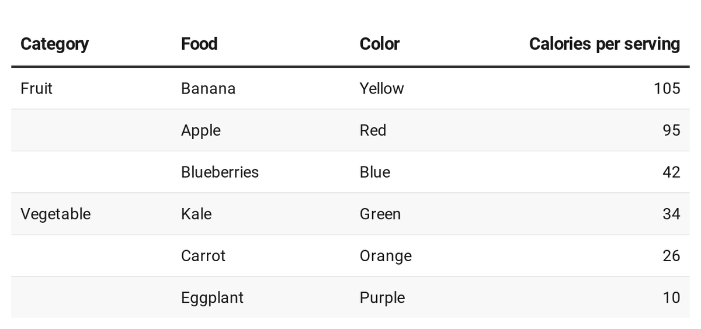{#fig-table-design width=600}

또한 슈와비시를 비롯한 전문가들은 색상을 사용해 핵심 항목이나 데이터의 아웃라이어(이상치)를 강조하는 것을 권장하는데, 이 주제는 [15장: 데이터 이야기 말하고 보여주기(Tell and Show Your Data Story)](#story)에서 다루겠습니다.

데이터 상관관계와 잠재적인 인과 관계를 보여주기 위해 교차표(cross-tabulations)를 만들 때, 통계학자 조엘 베스트(Joel Best)는 두 가지 디자인 권장 사항을 추가로 제시합니다.^[@bestMoreDamnedLies2004, pp. 31-35.]

6. 원인일 가능성이 있는 독립 변수(independent variable)는 상단 열 머리글에 배치하고 결과일 가능성이 있는 종속 변수(dependent variable)는 각 행의 측면에 배치하세요.

7. 각각의 독립 변수(의심되는 원인) 값이 총 100%가 되도록, 원래 숫자(raw numbers)에서 백분율을 아래 방향인 수직으로 계산하세요.

이후의 디자인 원칙을 적용하여 화이자 코로나바이러스 백신 임상시험 결과를 바탕으로 비율을 잘못 계산한 방법과 더 나은 방법이라는 두 가지 서로 다른 표를 만들어 보겠습니다. 이 블라인드 테스트에서 43,661명의 자원자는 약 21,830명씩 두 그룹으로 무작위로 나뉘었습니다. 한 그룹은 백신을 맞고 다른 그룹은 위약을 맞았으므로, 이들이 독립 변수(의심되는 원인 요소)였습니다. 연구자들은 주의 깊게 관찰하여 다음의 종속 변수(발생 가능한 결과)를 확인했습니다. 위약군에서는 162명이 바이러스에 감염된 반면, 백신 그룹에서는 8명이 감염되었습니다.^[@zimmerCompaniesSayTheir2020, @young-saverWhatDoes952020].

표 [\@tbl-vaccine-bad]는 이 시험의 백분율을 *잘못된* 방향인 가로로 계산하여 원인과 결과의 관계, 특히 마지막 행에 대해 독자를 혼란스럽게 합니다.

Table: (\#tab:vaccine-bad) 비율을 가로로 계산하므로 **나쁨(Bad)**

|  | Vaccine | Placebo | Total |
|---|---:|---:|---:|
| 감염(Infected) | 4.7% (8) | 95.3% (162) | 100% (170) |
| 비감염(Not infected) | 50.2% (21,822) | 49.8% (21,668) | 100% (43,490) |

하지만 표 [\@tbl-vaccine-better]는 *올바른* 방향인 세로로 백분율을 계산하여 백신이 어떻게 낮은 감염률과 연관되는지를 더 명확하게 보여줍니다. 연구자들은 이것이 강력한 인과 관계임을 확인하고 백신 배포 승인을 받았습니다.

Table: (\#tab:vaccine-better) 비율을 세로로 계산하므로 **더 좋음(Better)**

|  | Vaccine | Placebo |
|---|---:|---:|
| 감염(Infected) | 0.04% (8) | 0.74% (162) |
| 비감염(Not infected) | 99.96% (21,822) | 99.26% (21,668) |
| Total | 100% (21,830) | 100% (21,830) |

전반적으로 표 디자인의 핵심 원칙은 앞서 차트와 지도 디자인에서 논의했던 개념과 유사합니다. 독자의 시선을 염두에 두고 데이터 프레젠테이션을 구성하여 여러분이 해석한 가장 중요한 요소에 집중하도록 하고 핵심 요점을 파악하도록 도우세요. 독자가 자기 머릿속에서 직접 똑같은 정신적 연관성을 이끌어내도록 의지하지 말고 독자 대신 시각화 작업을 해두세요. 이러한 목표를 가로막는 혼란스러운 요소나 불필요한 반복을 제거하세요. 무엇보다 데이터에 대한 진실되고 의미 있는 이야기를 전해야 합니다.

이제 표 디자인의 몇 가지 핵심 원칙을 이해했으니, 다음 섹션에서 소개할 Datawrapper 도구에 몇 가지 원칙이 어떻게 직접 구축되어 있는지 알아보겠습니다.

## Datawrapper로 스파크라인 표 만들기 {- #table-datawrapper}

이 섹션에서는 우리가 [6장의 차트 생성(to create charts in Chapter 6)](#chart-design) 및 [7장의 지도 생성(maps in Chapter 7)](#map-design)에서 처음 소개했던 무료 온라인 드래그 앤 드롭 시각화 도구인 [Datawrapper](https://www.datawrapper.de)를 사용하여 스파크라인이 있는 대화형 표를 만드는 방법을 배울 것입니다. 계정이 없어도 브라우저에서 바로 Datawrapper 창작을 시작할 수 있지만 무료 계정을 등록하면 시각화를 정리하는 데 도움이 됩니다. 방대한 표를 위해 데이터를 컴파일하고 정리하려면 여전히 Google Sheets와 같은 스프레드시트 도구가 필요할 수 있지만 Datawrapper는 온라인에서 대화형 표를 만들고 퍼블리시하는 데 최고의 도구라는 점을 기억하세요.

또한 데이터 추세를 시각적으로 빠르게 요약하는 작은 꺾은선 차트인 스파크라인(sparkline)을 만드는 방법도 배울 것입니다. 예일 대학교 교수이자 데이터 시각화의 선구자인 에드워드 터프티(Edward Tufte)는 이 차트 형식을 고안해 내며 스파크라인을 "단어 크기의 강렬하고 단순한 데이터 단어(datawords... intense, simple, word-sized graphics)"라고 묘사했습니다.^[@tufteBeautifulEvidence2006, pp. 46-63.] 터프티는 정적인 종이나 PDF 문서에 스파크라인을 사용할 것을 구상했지만 그림 [\@fig-datawrapper-table]에 표시된 것처럼 여러분은 이를 대화형 표 안에 만들게 됩니다. 독자는 키워드로 검색하거나 오름차순 또는 내림차순으로 열을 정렬하고 스파크라인의 페이지를 스크롤하여 기존의 숫자만 있는 표에서는 찾아내기 어려운 데이터 추세를 신속하게 식별할 수 있습니다.


::: {.content-visible when-format="html"}

<iframe src="https://datawrapper.dwcdn.net/0HK4f/" width="100%" height="1007px" style="border:none;"></iframe>
<p class="caption">스파크라인이 있는 표. [대화형 버전(interactive version)](https://datawrapper.dwcdn.net/0HK4f/)을 탐색해 보세요.</p>

:::


이 튜토리얼에서는 전 세계 195개국 이상의 1960년부터 2018년까지 출생 시 기대 수명의 차이를 시각화하기 위해 스파크라인이 있는 대화형 표를 만들게 됩니다. 전반적으로 기대 수명은 대부분 국가에서 점진적으로 증가하지만 일부 국가는 작은 선형 차트에서 두드러지는 "하락(dips)"을 보여줍니다. 예를 들어, 캄보디아와 베트남 모두 기대 수명이 크게 감소했으며 이는 1960년대 후반부터 1970년대 중반까지 두 나라에서 발생한 치명적인 전쟁 및 난민 위기와 맞물려 있습니다. 스파크라인은 이러한 패턴을 시각적으로 감지하는 데 도움이 되며 누구든 대화형 표 하단의 링크를 통해 원시 데이터를 다운로드하여 더 조사해 볼 수 있습니다.

동일한 데이터를 [6장에 표시된 필터링된 꺾은선형 차트(filtered line chart as shown in Chapter 6)](#filtered-line-tableau)로 표시할 수 있지만 한 번에 180개가 넘는 선으로 표시되면 독자가 차이를 파악하기 어려울 것입니다. 마찬가지로 [7장에 표시된 코로플레스 지도(choropleth map as shown in Chapter 7)](#choropleth-datawrapper)에 이 데이터를 표시할 수도 있지만 큰 지리적 영역의 국가와 비교하여 지리적 영역이 작은 국가의 데이터를 파악하는 것은 독자에게 어려울 것입니다. 독자가 모든 국가의 스파크라인을 검색하고 정렬하거나 스크롤할 수 있기를 원할 때 가장 좋은 시각화는 훌륭한 표입니다.

자신만의 스파크라인이 포함된 대화형 표를 만들려면 [Datawrapper 교육 자료(Datawrapper training materials)](https://www.datawrapper.de/training-materials/)와 [예제 갤러리(gallery of examples)](https://www.datawrapper.de/tables/)에서 수정한 이 튜토리얼을 따르세요.

1. [Google Sheets에서 세계은행의 1960~2018년 출생 시 기대 수명 데이터 정리본(cleaned-up World Bank data on life expectancy at birth, 1960 to 2018 in Google Sheets)](https://docs.google.com/spreadsheets/d/1Wev14VaXyq7d7yuYo-7FwRoAjyyaY1v6z_qBoo_4VSo/edit#gid=3466257)을 엽니다.

이 튜토리얼을 단순화하기 위해 [3장: 데이터 찾기 및 의문점 가지기(Chapter 3: Find and Question Your Data)](#find)에서 나열한 오픈 데이터 리포지토리 중 하나인 [World Bank에서 국가별 1960~2018년 출생 시 기대 수명 CSV 형식(life expectancy at birth from 1960 to 2018 by nation, in CSV format, from the World Bank)](https://data.worldbank.org/indicator/SP.DYN.LE00.IN)을 다운로드했습니다. 스프레드시트에서는 Google Sheet의 Notes 탭에 설명된 대로 반세기에 걸쳐 보고된 데이터 연도가 5년 이하인 국가를 제거하는 등 데이터를 정리했습니다. [2장의 XLookup 스프레드시트 방법(XLookup spreadsheet method from Chapter 2)](#xlookup)을 사용하여 [Datawrapper의 두 글자 국가 코드와 대륙(two-letter nation codes and continents from Datawrapper)](https://github.com/datawrapper/datawrapper/wiki/Country-flag-icons) 열을 병합했습니다. 또한 두 개의 새 열을 만들었습니다: 하나는 *Life Expectancy 1960*으로 명명하고 (스파크라인이 들어갈 자리라 의도적으로 공백으로 둠) 다른 하나는 *Difference*로 명명했습니다(사용 가능한 초기 데이터와 가장 최근 데이터 사이의 차이를 계산하며 대부분의 경우 1960년부터 2018년까지 계산됨). 자세한 내용은 Google Sheet의 Notes 탭을 참조하세요.

2. [Datawrapper](https://www.datawrapper.de)로 이동하여 *만들기 시작(Start Creating)*을 클릭하고 상단 탐색에서 *새 표(New Table)*를 선택합니다. 로그인이 필수는 아니지만 작업을 저장하려는 경우 무료 계정을 만드는 것이 좋습니다.

3. 첫 번째 *데이터 업로드(Upload Data)* 탭에서 *Google 스프레드시트 가져오기(Import Google Spreadsheet)*를 선택하고 정리된 Google Sheet의 웹 주소를 붙여넣은 다음 *진행(Proceed)*을 클릭합니다. 다른 사람이 볼 수 있도록 Google Sheet를 *공유*해야 합니다.

4. *확인 및 설명(Check and Describe)* 탭에서 데이터를 검사합니다. *첫 번째 행을 라벨로 사용(First row as label)* 상자가 선택되어 있는지 확인한 다음 *진행(Proceed)*을 클릭합니다.

5. *시각화(Visualize)* 화면의 *표 맞춤 설정(Customize Table)* 아래에서 두 개의 추가 상자를 확인합니다. *검색 가능하게 만들기(Make Searchable)* (사용자가 키워드로 국가를 검색할 수 있도록)와 *표에 줄무늬 적용(Stripe Table)* (줄을 더 읽기 쉽게 만들기 위해).

6. Datawrapper 특수 코드를 사용하여 각 국가 이름 앞에 작은 국기를 표시해 보겠습니다. *Nation* 열에서 각 항목은 `:af: Afghanistan`과 같이 콜론으로 둘러싸인 두 글자 국가 코드로 시작하여 그 뒤에 국가 이름이 옵니다. [4장: 지저분한 데이터 정리하기 중 데이터를 하나의 열로 병합하기 섹션(Combine Data into One Column section of Chapter 4: Clean Up Messy Data)](#combine-data)에 따라 *Nation* 열을 만들었습니다.

참고: 국기 아이콘에 대해 자세히 알아보려면 [해당 주제에 대한 Datawrapper 게시물(Datawrapper post on this topic)](https://academy.datawrapper.de/article/144-how-to-insert-flag-icons-in-tables)과 [GitHub의 국가 코드 및 국기 목록(list of country codes and flags on GitHub)](https://github.com/datawrapper/datawrapper/wiki/Country-flag-icons)을 읽어보세요.

7. *시각화(Visualize)* 화면의 *열 맞춤 설정(Customize columns)* 아래에서 *Nation*이라는 이름의 세 번째 줄을 선택합니다. 그런 다음 아래로 스크롤하여 그림 [\@fig-datawrapper-flag]와 같이 슬라이더를 *국가 코드를 국기로 바꾸기(Replace country codes with flags)*로 이동합니다.


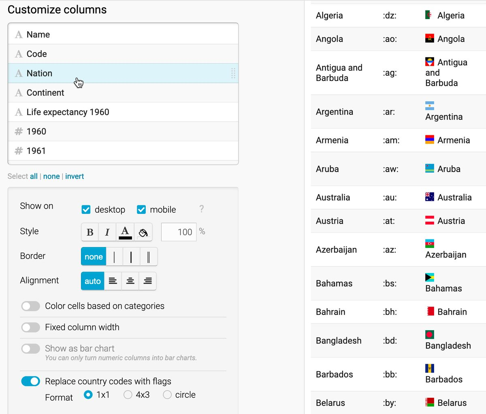{#fig-datawrapper-flag}

8. 첫 두 열은 표시할 필요가 없으므로 숨겨보겠습니다. *시각화(Visualize)* 화면의 *열 맞춤 설정(Customize columns)* 아래에서 *Name* 열을 선택한 다음 아래로 스크롤하여 *데스크톱 및 모바일에 표시(Show on desktop and mobile)* 상자의 선택을 취소합니다. *Code* 열에 대해서도 이 단계를 반복합니다. 맞춤 설정된 각 열 옆에 우리가 해당 열을 숨겼음을 알려주기 위해 "표시되지 않음(not visible)" 기호(눈을 관통하는 빗금)가 나타납니다.

9. 이제 *Continent* 열을 색상으로 구분하여 독자가 대화형 표에서 카테고리별로 정렬하기 쉽도록 만들어 봅시다. *열 맞춤 설정(Customize columns)* 아래의 *시각화(Visualize)* 화면에서 *Continent* 열을 선택한 다음 아래로 스크롤하여 슬라이더를 *카테고리를 기준으로 셀 색상 지정(Color cells based on categories)*으로 밉니다. 드롭다운 메뉴에서 *Continent* 열을 선택하고 *배경: 색상 사용자 지정(Background: customize colors)* 버튼을 클릭합니다. 그림 [\@fig-datawrapper-colors]와 같이 각 대륙을 선택하고 다른 색상을 할당합니다.


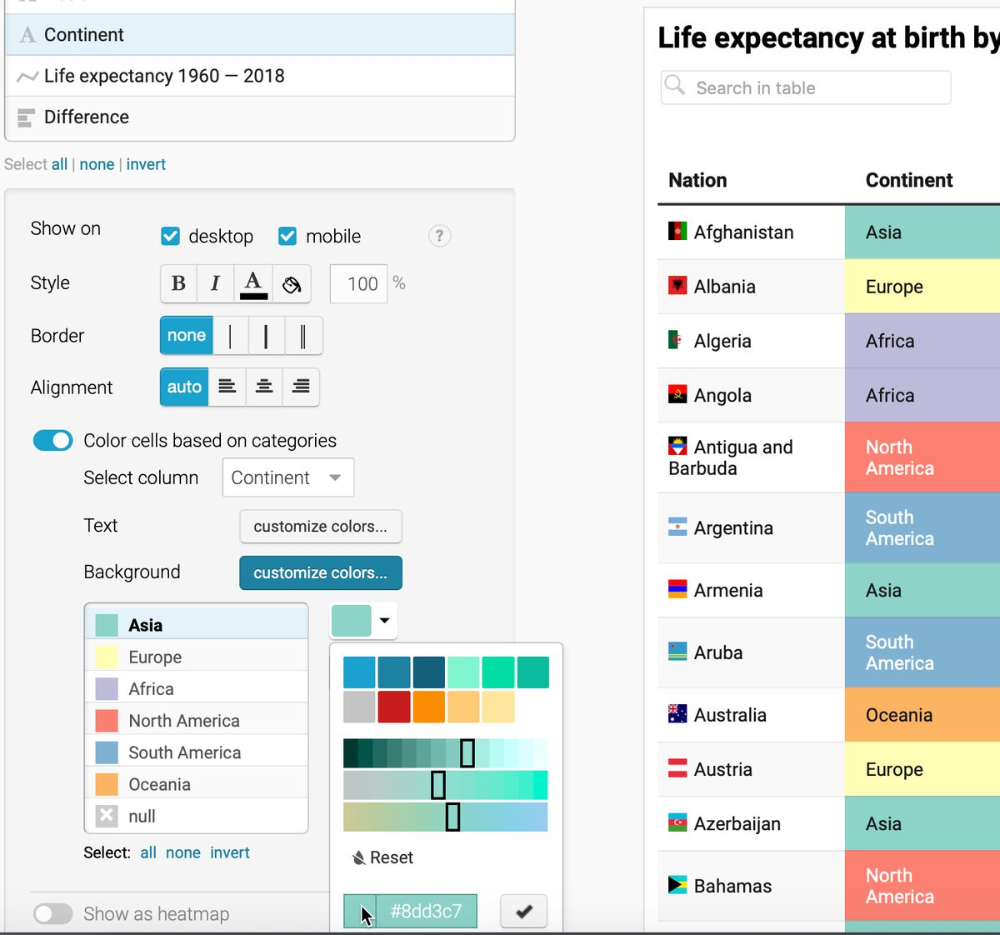{#fig-datawrapper-colors width=600}

팁: 6개 대륙에 대한 색상을 선택하기 위해 우리는 [7장에서 설명한 ColorBrewer 디자인 도구(ColorBrewer design tool as described in Chapter 7)](#design-choropleth)를 사용하여 6클래스 질적 구성표(qualitative scheme)를 선택했습니다. 이 도구는 기본적으로 코로플레스 지도를 위해 디자인되었지만 표와 차트의 색상을 선택하는 데에도 사용할 수 있습니다.

10. 이제 이 단계를 위해 의도적으로 비워 두었던 *Life expectancy 1960* 열의 변화를 시각적으로 나타내는 스파크라인(작은 꺾은선형 차트)을 추가하도록 데이터를 준비해 보겠습니다. 시작하기 전에 이 열을 텍스트 데이터(*열 맞춤 설정* 창의 기호 A로 표시됨)에서 숫자 데이터(기호 #로 표시됨)로 변경해야 합니다. 화면 상단에서 *2. 확인 및 설명(2. Check and Describe)* 화살표를 클릭하여 한 단계 뒤로 이동합니다. (Datawrapper는 작업을 저장합니다.) 이제 표 머리글을 클릭하여 *열 E: Life Expectancy 1960(column E: Life Expectancy 1960)*의 속성을 편집합니다. 왼쪽에서 그림 [\@fig-datawrapper-edit-column]과 같이 드롭다운 메뉴를 사용하여 속성을 *auto (text)*에서 *Number*로 변경합니다. 그런 다음 *진행(Proceed)*을 클릭하여 *시각화(Visualize)* 창으로 돌아갑니다.


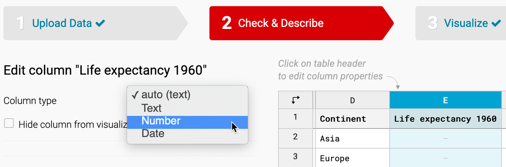{#fig-datawrapper-edit-column}

11. 스파크라인을 만들려면 *열 맞춤 설정(Customize columns)* 아래의 *시각화(Visualize)* 화면에서 *Life expectancy 1960*부터 *2018* 아래까지의 *모든* 열을 선택합니다. 모든 항목을 한 번에 선택하려면 한 열을 클릭한 다음 아래로 스크롤하여 끝에서 두 번째 열을 Shift-클릭합니다. 그런 다음 페이지 아래로 스크롤하고 그림 [\@fig-datawrapper-tiny-chart]와 같이 *선택한 열을 작은 차트로 표시(Show selected columns as tiny chart)* 버튼을 클릭합니다. 이 단계는 열에 스파크라인을 만들고 그림 [\@fig-datawrapper-bar-chart]와 같이 열의 이름을 자동으로 *Life expectancy 1960--2018*로 바꿉니다.

팁: 의도적으로 처음 이 열의 이름을 *Life expectancy 1960*으로 지정했습니다. 스파크라인을 만들기 위해 여러 열을 선택했을 때 이 도구가 새 열 이름 끝에 *--2018*을 추가했기 때문입니다.


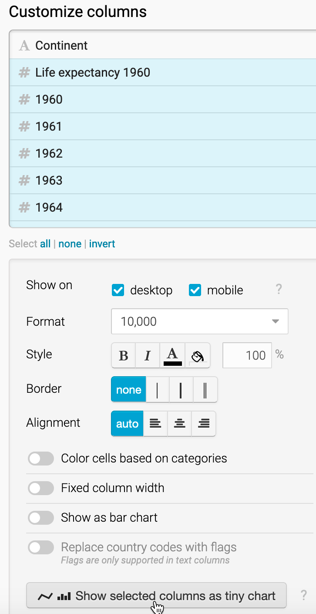{#fig-datawrapper-tiny-chart width=300}

12. 한 가지 더 시각적 요소를 추가해 보겠습니다: 표의 *Difference* 열을 시각적으로 나타내는 막대 차트입니다. *열 맞춤 설정(Customize columns)* 아래의 *시각화(Visualize)* 화면에서 *Difference*를 선택합니다. 그런 다음 그림 [\@fig-datawrapper-bar-chart]와 같이 아래로 스크롤하여 슬라이더를 눌러 *막대 차트로 표시(Show as bar chart)*를 선택합니다. 또한 검은색과 같은 다른 막대 색상을 선택하여 대륙 색상과 구분합니다.


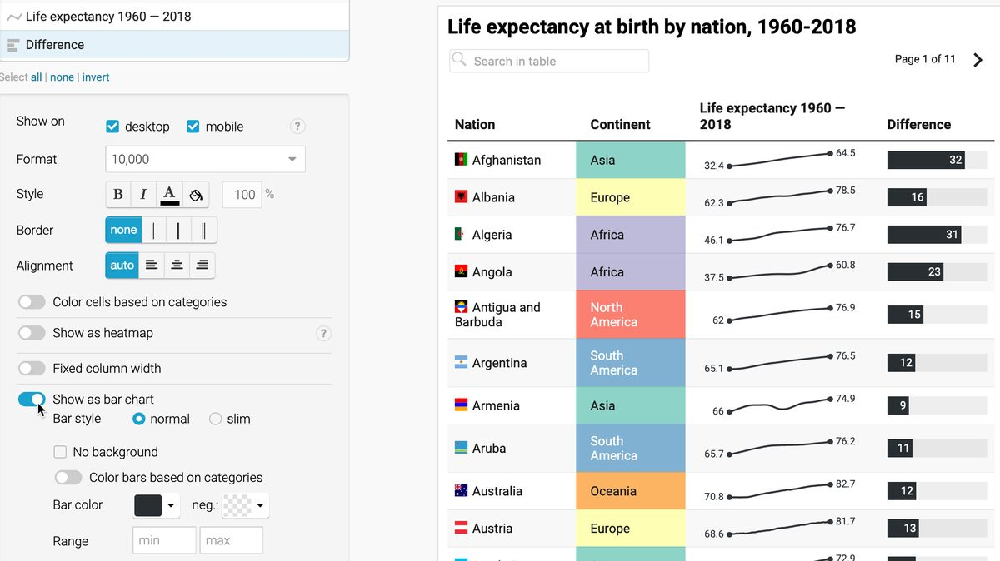{#fig-datawrapper-bar-chart}

13. *시각화(Visualize)* 화면에서 *주석(Annotate)* 탭을 클릭하여 제목, 데이터 출처 및 바이라인을 추가합니다.

14. 이전에 그림 [\@fig-datawrapper-table]에 표시된 것처럼 *발행 및 임베드(Publish & Embed)*를 클릭하여 [대화형 표(interactive table)](https://datawrapper.dwcdn.net/0HK4f/2/) 링크를 공유합니다. 무료 Datawrapper 계정에 로그인했다면 작업이 화면 오른쪽 상단의 *내 차트(My Charts)* 메뉴에 온라인으로 자동 저장됩니다. 또한 [9장: 웹에 포함하기(Embed on the Web)](#embed)에서 다루는 것처럼 파란색 *퍼블리시(Publish)* 버튼을 클릭하여 웹사이트에 대화형 차트를 임베드할 코드를 생성할 수 있습니다. 또한 다른 Datawrapper 사용자가 차트를 수정하고 재사용하도록 허용해 작업을 더 광범위하게 공유하려면 *River에 차트 추가(add your chart to River)*를 선택하면 됩니다. 더불어 끝까지 아래로 스크롤하여 *PNG 다운로드(Download PNG)* 버튼을 클릭하여 정적 이미지로 차트를 내보냅니다. 추가 내보내기 및 게시 옵션을 사용하려면 유료 Datawrapper 계정이 필요합니다. 또는 계정을 만들고 싶지 않은 경우 이메일을 입력하여 임베드 코드를 받을 수 있습니다.

더 자세히 알아보려면 [Datawrapper Academy 지원 페이지(Datawrapper Academy support pages)](https://academy.datawrapper.de/), 광범위한 [예제 갤러리(gallery of examples)](https://www.datawrapper.de/tables/), 그리고 잘 디자인된 [교육 자료(training materials)](https://www.datawrapper.de/training-materials/)를 적극 권장합니다.

## 기타 표 제작 도구 {- #other-table-tools}

Datawrapper는 긴 콘텐츠와 스파크라인이 있는 대화형 표를 만드는 데 좋은 선택이지만 인쇄용이거나 온라인에 퍼블리시할 덜 복잡한 표를 만드는 도구도 많이 있습니다.

짧은 정적 표를 빠르게 만들려면 선호하는 스프레드시트 도구를 사용하세요. 예를 들어 Google Sheets에서는 표 데이터를 배치하고 PDF 문서로 다운로드할 수 있습니다. 그런 다음 이미지 편집기를 사용하여 PDF를 PNG 또는 JPG 파일로 변환하고 크기에 맞게 자른 후 완성된 버전을 정적 문서나 웹 페이지에 삽입합니다. 또한 문서나 웹사이트에 삽입하기 위한 정교한 교차 표를 만들고 이미지로 내보내기 위해 [2장에서 배운 스프레드시트 피벗 테이블 기능(spreadsheet pivot table feature you learned in Chapter 2)](#pivot)을 기억하세요.

Datawrapper에서 *차트(Chart)* 유형으로 간단한 정적 표를 만들고 퍼블리시하여 PNG 버전을 다운로드할 수도 있습니다.

Google Sheets에서는 어떤 표든 온라인에 게시할 수 있으며 [9장에서 논의할 내용처럼 표를 웹 페이지에 임베드(embed them on a web page as we'll discuss in Chapter 9)](#embed)할 수 있습니다. 그렇게 하면 Google Sheet를 업데이트할 때마다 현재 데이터가 자동으로 웹 페이지에 표시됩니다.

[6장(Chapter 6)](#chart-tableau) 및 [7장(Chapter 7)](#map-tableau)에서 이전에 소개한 도구인 Tableau Public에서는 낮은 값과 대비되는 높은 값으로 시선을 끌기 위해 셀 배경을 자동으로 색칠하는 하이라이트 테이블(highlight table)도 만들 수 있습니다.

마지막으로, 표를 웹 페이지 전용으로 디자인하는 경우 표 형태의 내용을 HTML 및 기타 형식으로 변환하는 온라인 [Tables Generator 도구(Tables Generator tool)](https://www.tablesgenerator.com/html_tables)를 사용하는 것을 고려해 보세요.

### 요약 {- #summary8}

이 장에서는 표 디자인 원칙과 Datawrapper 및 기타 도구를 사용하여 스파크라인이 있는 대화형 표를 만드는 방법을 살펴보았습니다. 다음 장에서는 대화형 차트, 지도, 표를 웹사이트에 임베드하여 독자가 데이터를 탐색하고 스토리텔링에 참여하도록 돕는 방법을 배울 것입니다.

<!-- BEGIN FILE: 09-embed.Rmd -->

# 웹에 임베드하기 {#embed}
지금까지 여러분은 [6장에서 차트](#chart), [7장에서 지도](#map), [8장에서 표](#table)를 만드는 방법을 배웠습니다. 이 책은 사용자가 직접 데이터와 상호작용하고 새로운 패턴을 조사하며 필요에 따라 파일을 다운로드하거나 소셜 미디어에 쉽게 공유할 수 있도록 유도함으로써 광범위한 독자를 끌어들이는 *인터랙티브* 시각화 설계의 장점을 강조합니다. 이번 장에서는 독자가 다른 페이지에서 데이터를 능동적으로 탐색할 수 있게 해주는 *iframe*이라는 컴퓨터 코드 태그에 대해 알아봅니다. 액자처럼 iframe은 여러분이 관리하는 두 번째 웹 페이지(개인 또는 조직의 웹사이트 등) 안에 첫 번째 웹 페이지(인터랙티브 데이터 시각화 등)를 실시간으로 표시해 줍니다(\@fig-iframe-illustration 참조). 올바르게 적용하면 iframe은 데이터 시각화를 여러분의 웹 페이지에 자연스럽게 표시하여 독자가 다른 호스트에서 제공되는 것임을 알 필요 없이 콘텐츠를 탐색할 수 있게 합니다. Google Sheets, Datawrapper, Tableau Public 등 지금까지 배운 여러 시각화 도구는 해당 플랫폼에서 만든 온라인 차트나 지도에 대한 iframe을 포함한 *임베드 코드(embed code)*를 생성합니다. 시각화 도구 사이트에서 [임베드 코드나 링크를 가져오는 방법](#embed-code)과 인터랙티브 콘텐츠를 자연스럽게 표시하기 위해 [두 번째 웹사이트에 코드를 붙여넣는 방법](#paste-code)을 시연해 보겠습니다. 이 입문서에서는 코딩 기술이 필요하지 않지만 코딩에 대한 호기심을 갖는 것은 분명 큰 도움이 됩니다.


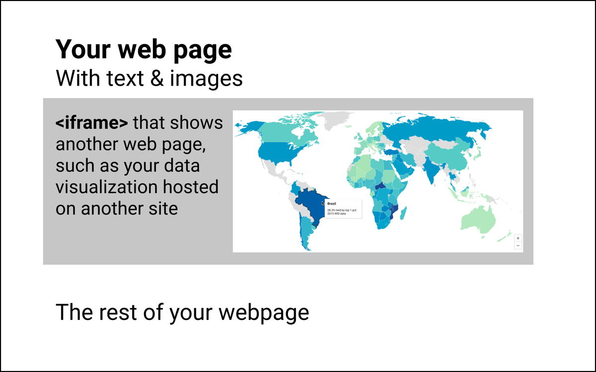{#fig-iframe-illustration width=600}

## 정적 이미지 vs 인터랙티브 iframe {- #static}
먼저 *정적(static)* 시각화와 *인터랙티브(interactive)* 시각화의 차이점을 명확히 짚어보겠습니다. 차트나 지도의 정적 이미지는 고정된 그림입니다. 많은 시각화 도구가 차트나 지도의 정적 이미지를 .JPG, .PNG 또는 .PDF 형식으로 다운로드할 수 있게 해줍니다. 문서나 프레젠테이션 슬라이드, 심지어 웹 페이지에 그림만 삽입하고 싶을 때는 정적 이미지가 유용합니다. 다른 방법으로는 정적 이미지를 붙여넣은 뒤, 인터랙티브 차트나 지도의 웹 주소가 포함된 링크 [또는 맞춤형 단축 링크](#share)를 추가하여 독자들이 온라인에서 탐색하도록 유도할 수도 있습니다.

컴퓨터 화면에서 특정 웹 페이지의 정적 이미지를 캡처해야 한다면, 다음과 같은 내장 단축키를 사용하여 [스크린샷](https://en.wikipedia.org/wiki/Screenshot)을 찍을 수 있습니다:

- 크롬북(Chromebook): *Shift + Ctrl + F5* (창 표시 버튼) 누른 후 십자 커서를 클릭하고 드래그합니다.
- 맥(Macintosh): *Shift + Command + 4* 누른 후 십자 커서를 클릭하고 드래그하여 스크린샷을 캡처합니다.
- 윈도우(Windows): *Windows 로고 키 + Shift + S*를 눌러 *캡처 및 스케치(Snip & Sketch)* 도구를 호출합니다.

이와 관련된 또 다른 전략은 애니메이션 GIF로, 화면의 움직임을 캡처한 정적 이미지들의 연속입니다. 웹 페이지에 애니메이션 GIF 파일을 삽입하여 인터랙티브 시각화를 사용하는 짧은 과정 단계를 보여줄 수 있지만 독자가 반복되는 애니메이션을 다시 재생하는 것 외에는 직접 상호작용할 수 없습니다. [Snagit](https://www.techsmith.com/screen-capture.html) 같은 유료 소프트웨어 도구를 사용하면 드롭다운 메뉴와 커서를 포함한 스크린샷, 애니메이션 GIF 등을 만들 수 있습니다.

반면, *인터랙티브* 시각화는 독자가 웹 브라우저를 통해 데이터 스토리와 직접 상호작용할 수 있게 해줍니다. 방문자는 보통 차트 위에 커서를 올려 툴팁이나 기본 정보를 확인하거나, 지도를 확대하고 이동하며 탐색하고 인터랙티브 표에서 검색어를 입력하거나 열을 정렬할 수 있습니다. 인터랙티브 시각화는 주로 차트나 지도 도구 플랫폼과 같은 온라인에서 호스팅되며 주로 온라인에서 보도록 설계됩니다. 다만 일부 경우에는 로컬 컴퓨터에 다운로드하여 상호작용하는 것도 가능합니다.

이제 핵심 질문으로 넘어가 보겠습니다: 온라인 호스트(주요 사이트)에 있는 인터랙티브 시각화를 우리가 관리하는 다른 웹사이트(보조 사이트)에 어떻게 자연스럽게 나타나게 할 수 있을까요? 보조 사이트에 주요 사이트의 차트나 지도에 대한 링크를 삽입하는 것도 가능하지만 이는 독자가 읽고 있던 웹 페이지에서 벗어나 클릭하게 만들므로 불편합니다. 더 나은 해결책은 웹 브라우저 내에 콘텐츠를 표시하는 하이퍼텍스트 마크업 언어(HTML)로 작성된 [iframe 태그](https://www.w3schools.com/tags/tag_iframe.asp)가 주로 포함된 임베드 코드를 삽입하는 것입니다. 코딩 경험이 없더라도 임베드 코드의 핵심 기능과 작동 방식을 알아두면 장기적으로 큰 도움이 될 것입니다.

가장 단순한 형태의 iframe은 방 안의 벽에 걸린 매끄러운 액자처럼, 보조 사이트에서 출처(source)로 알려진 주요 사이트의 웹 페이지 주소를 표시하도록 지시합니다. 아래의 샘플 iframe 코드는 시작 태그 `<iframe ... >`로 시작하고 주요 사이트의 URL을 홑따옴표나 겹따옴표로 감싼 출처 `src='https://...'`를 포함한 다음, 끝 태그 `</iframe>`로 마무리됩니다. 이 샘플 iframe은 이 책의 [서론](#introduction)에 처음 등장했던 Datawrapper 플랫폼의 미국 소득 불평등 인터랙티브 차트를 가리키며 이는 Figure [\@fig-iframe-sample]에서 확인할 수 있습니다.

`<iframe src='https://datawrapper.dwcdn.net/LtRbj/'></iframe>`


::: {.content-visible when-format="html"}

<iframe src="https://datawrapper.dwcdn.net/LtRbj/" width="100%" height="400px" style="border:none;"></iframe>
<p class="caption">책의 형식에 따라 위에 정적 차트가 표시된다면, [인터랙티브 버전 보기](https://datawrapper.dwcdn.net/LtRbj/)도 가능합니다.</p>

:::


이 책에서 다루는 일부 시각화 도구에서 임베드 코드를 복사할 때, iframe 태그가 위의 간단한 예제보다 *훨씬 더 길 수* 있습니다. 예를 들어, iframe 태그에는 `width`나 `height`와 같은 다른 속성이 포함될 수 있으며 이는 픽셀(`px`)이나 보조 사이트의 크기에 대한 백분율로 측정됩니다. 또한 iframe 콘텐츠와 주변 환경을 자연스럽게 이어주는 `frameborder="0"` 또는 `scrolling="no"`와 같은 다른 iframe 태그 속성도 볼 수 있습니다. 마지막으로, 저희조차도 완전히 이해하지 못하는 십여 줄의 코드가 포함된 *매우 긴* 임베드 코드를 볼 수도 있습니다. 하지만 괜찮습니다. 이것들은 모두 보조 사이트에서 iframe의 모양을 개선하기 위한 선택적인 추가 요소일 뿐입니다. 임베드 코드의 가장 필수적인 구성 요소는 iframe과 그 3가지 핵심 부분, 즉 iframe 시작 태그, 출처 웹 주소, 그리고 끝 태그입니다. 확신이 서지 않을 때는 이 핵심 구성 요소를 찾아보세요.

이제 인터랙티브 시각화, 임베드 코드, iframe 태그에 대해 더 명확히 알게 되었으므로, 다음 섹션에서는 여러 시각화 플랫폼에서 임베드 코드를 복사하는 방법을 알아보겠습니다.

## 임베드 코드나 iframe 태그 가져오기 {- #embed-code}
이 섹션에서는 이 책에서 다루는 다양한 시각화 플랫폼에서 차트나 지도를 게시할 때 자동으로 생성되는 임베드 코드나 iframe 태그를 복사하는 방법을 배웁니다. 임베드 코드는 필수적인 iframe 태그와 함께, 주요 사이트의 차트나 지도를 가져와 보조 사이트에 자연스럽게 표시하는 여러 코드 조각들을 포함하고 있다는 점을 기억하세요.

각 시각화 플랫폼에 대해 이 과정을 세 단계로 나누어 설명하겠습니다. 첫째, Google Sheets, Datawrapper, Tableau Public 및 아래 나열된 기타 플랫폼에서 임베드 코드나 iframe 태그를 복사하는 방법을 보여드립니다. 둘째, 훌륭한 도우미인 [W3Schools TryIt iframe 페이지](https://www.w3schools.com/tags/tryit.asp?filename=tryhtml_iframe)에서 임베드 코드나 iframe 태그를 테스트하는 방법을 보여드립니다(\@fig-w3schools-tryit-iframe 참조). 웹 페이지에 넣기 전에 임베드 코드의 일부를 잘라내야 할 경우 어떻게 되는지 확인하고 제대로 작동하는지 테스트하기에 좋은 방법입니다. 셋째, WordPress, SquareSpace, Wix, Weebly와 같은 일반적인 플랫폼을 포함하여 원하는 웹사이트에 임베드 코드를 올바르게 붙여넣는 방법을 배우기 위해 다음 섹션으로 안내합니다.


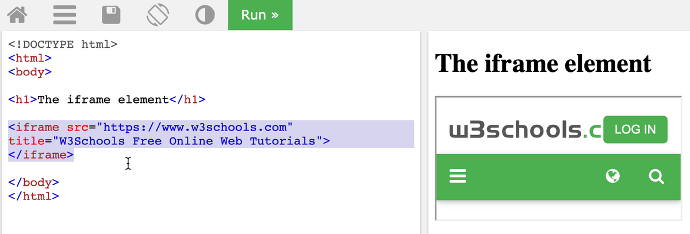{#fig-w3schools-tryit-iframe width=750}

### Google Sheets에서 가져오기 {-}
1. [6장에서 했던 것처럼 Google Sheets 차트](#chart-google)를 만든 후, [\@fig-google-sheets-publish]에서 보듯 차트 우측 상단의 점 3개 케밥 메뉴를 클릭하여 게시(publish)합니다.


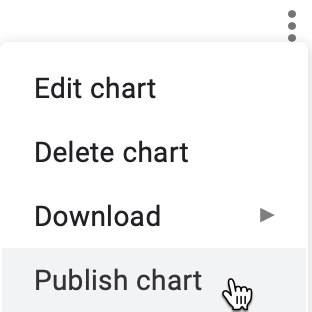{#fig-google-sheets-publish width=150}

2. 다음 화면에서 *임베드(Embed)* 탭과 *대화형(Interactive)* 차트를 선택하고 *게시(Publish)* 버튼을 클릭하여 온라인에 공유합니다. [\@fig-google-sheets-embed-code]에서 보듯 임베드 코드를 선택하고 복사합니다.


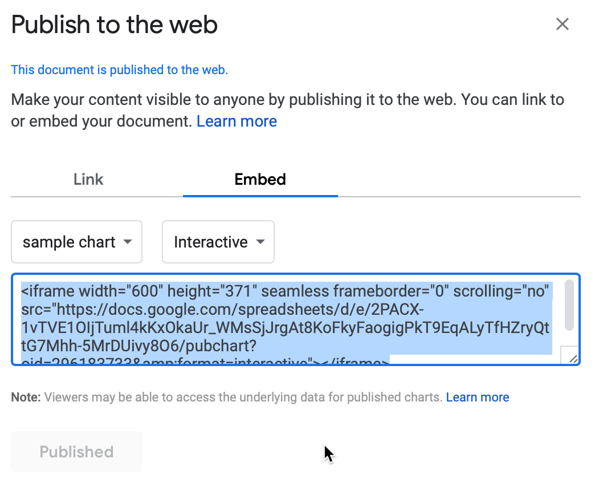{#fig-google-sheets-embed-code width=500}

3. 임베드 코드가 어떻게 작동하는지 더 잘 이해하기 위해 [W3Schools TryIt iframe 페이지](https://www.w3schools.com/tags/tryit.asp?filename=tryhtml_iframe)를 엽니다. 현재 iframe 태그를 선택하고 복사한 임베드 코드를 붙여넣어 바꾼 뒤, 초록색 *Run* 버튼을 누릅니다. 결과는 [\@fig-google-sheets-tryit]과 비슷하겠지만 대신 여러분의 임베드 코드와 인터랙티브 시각화가 표시될 것입니다.


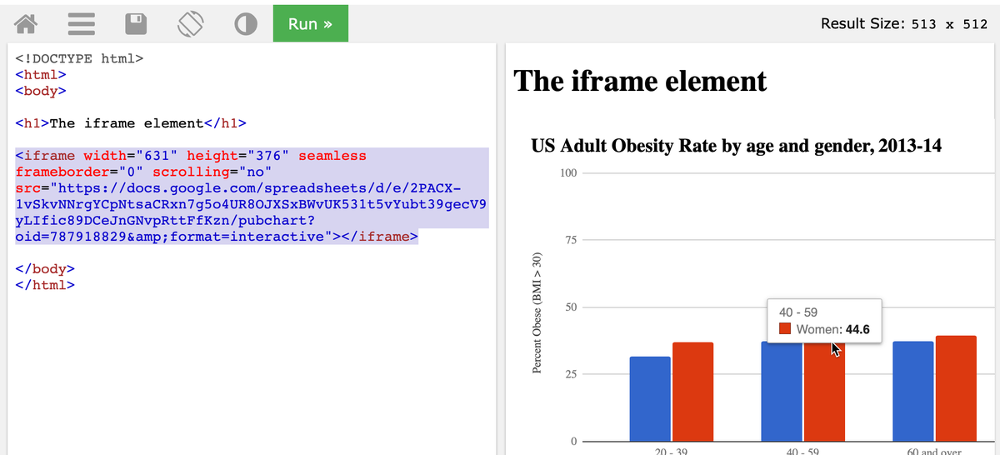{#fig-google-sheets-tryit width=750}

언뜻 보기에 Google Sheets 임베드 코드가 길어 보일 수 있지만 실제로는 긴 출처 링크를 포함한 직관적인 iframe 태그입니다. 자세히 살펴보면 `width`와 `height`(여기서는 픽셀로 측정됨), 모양을 개선하기 위한 `frameborder='0'` 및 `scrolling='no'` 같은 iframe 설정이 보일 것입니다.

4. 이제 선호하는 플랫폼에 임베드 코드를 올바르게 삽입하는 방법을 배우기 위해 이 장의 [웹사이트에 코드 붙여넣기 섹션](#paste-code)으로 넘어가세요.

### Datawrapper에서 가져오기 {-}
1. [6장의 Datawrapper 차트](#chart-datawrapper)나 [7장의 지도](#map), 또는 [8장의 인터랙티브 표](#table)를 만든 후, 마지막 화면으로 이동하여 [\@fig-datawrapper-publish]에서 보듯 *게시(Publish)* 버튼을 클릭합니다. 이렇게 하면 차트나 지도의 인터랙티브 버전이 온라인에 게시됩니다. 원하는 경우 동일한 화면의 더 아래에서 정적 이미지를 내보낼 수도 있습니다.


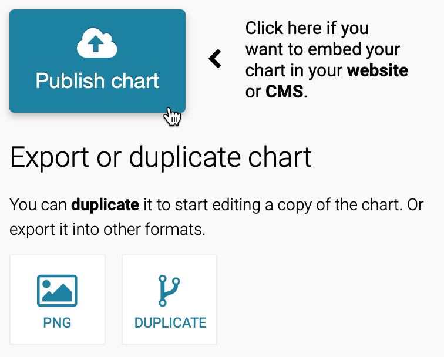{#fig-datawrapper-publish width=300}

2. 다음 화면에서 *복사(copy)*를 클릭하여 Datawrapper 임베드 코드를 가져옵니다(\@fig-datawrapper-embed-code 참조). 기본 *반응형(responsive) iframe* 버전의 임베드 코드에는 작고 큰 기기 화면 모두에서 모양을 개선하기 위한 추가 지침이 포함되어 있습니다.


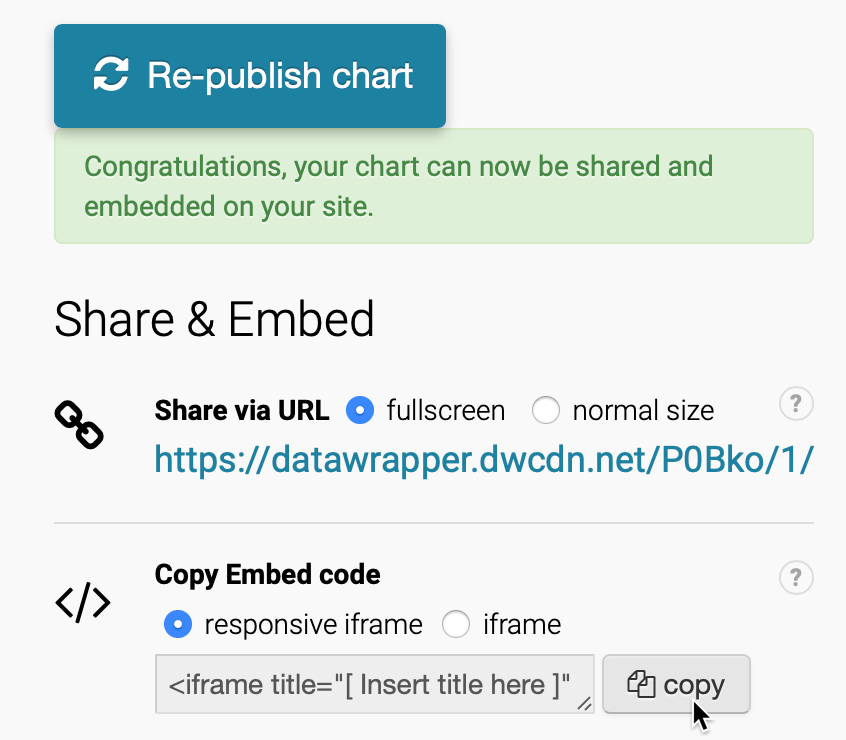{#fig-datawrapper-embed-code width=300}

3. 임베드 코드가 어떻게 작동하는지 더 잘 이해하기 위해 [W3Schools TryIt iframe 페이지](https://www.w3schools.com/tags/tryit.asp?filename=tryhtml_iframe)를 엽니다. 현재 iframe 태그를 선택하고 복사한 임베드 코드를 붙여넣어 바꾼 뒤, 초록색 *Run* 버튼을 누릅니다. 결과는 [\@fig-datawrapper-tryit]과 비슷하겠지만 대신 여러분의 고유한 임베드 코드와 인터랙티브 시각화가 표시될 것입니다.


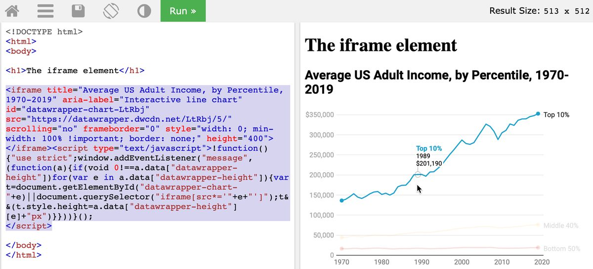{#fig-datawrapper-tryit width=750}

Datawrapper 임베드 코드는 *길지만*, 자세히 보면 전반부에는 `src`, `scrolling`, `frameborder`와 같은 친숙한 속성과 style 태그 내의 `width` 및 `height`를 포함하는 비교적 직관적인 iframe 태그가 있습니다. 임베드 코드의 후반부에는 기기 화면 크기에 따라 iframe이 반응형으로 보이게 만드는 JavaScript 지침이 포함되어 있습니다.

4. 웹 플랫폼에는 항상 *전체 임베드 코드*를 붙여넣으려고 시도해 보세요. 일반적인 웹사이트에 임베드 코드를 올바르게 삽입하는 방법을 배우려면 이 장의 [웹사이트에 코드 붙여넣기 섹션](#paste-code)으로 넘어가세요.

팁: 하지만 작동하지 않는다면 3단계로 돌아가서 실험해 보세요. 임베드 코드를 *단순한 iframe*으로 줄여보고 어떻게 보이는지 다시 실행해 보세요(\@fig-datawrapper-tryit-simple 참조). 때로는 복잡한 임베드 코드보다 단순한 iframe이 여러분의 웹사이트에서 더 잘 작동하기도 합니다.


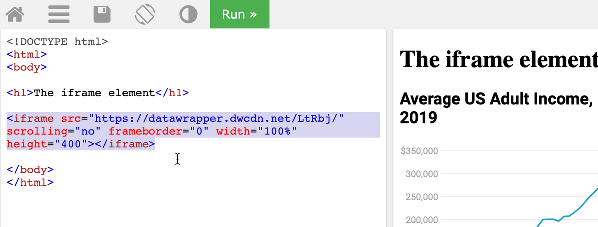{#fig-datawrapper-tryit-simple width=750}

팁: Datawrapper iframe 태그 출처는 일반적인 형식 `https://datawrapper.dwcdn.net/abcdef/1/`을 따르며 여기서 `1`은 게시한 차트나 지도의 첫 번째 버전을 의미합니다. 시각화를 편집하고 다시 게시하면, Datawrapper는 마지막 숫자(예: `2` 등)를 증가시키고 이전 링크를 *현재 버전*으로 *자동 리디렉션*하여 독자가 항상 최신 버전을 볼 수 있게 합니다.

### Tableau Public에서 가져오기 {-}
1. [6장에서 Tableau Public 차트](#chart-tableau)나 [7장에서 지도](#map-tableau)를 생성한 후, [\@fig-tableau-public-publish]에 표시된 것처럼 데스크톱 애플리케이션 메뉴에서 *파일 > Tableau Public에 저장(File > Save to Tableau Public)*을 선택하여 온라인에 워크시트, 대시보드 또는 스토리를 게시합니다.


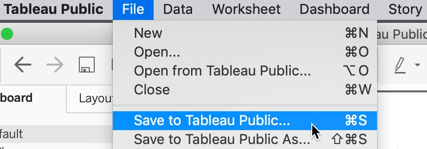{#fig-tableau-public-publish width=428}

2. 온라인 Tableau Public 계정 프로필 페이지에서 [\@fig-tableau-public-view]와 같이 게시된 시각화의 세부 정보를 *보기(View)* 위해 클릭합니다.


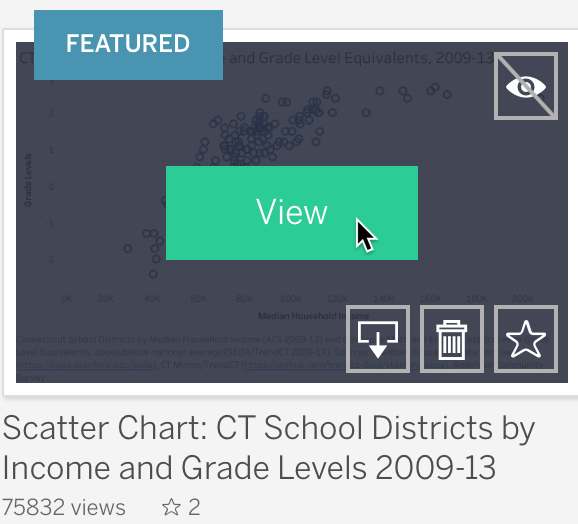{#fig-tableau-public-view width=289}

팁: 게시된 모든 시각화는 [Tableau Public 서버](https://public.tableau.com)의 여러분 사용자 계정 프로필 아래에 나타납니다. 사용자 이름이 기억나지 않는다면 온라인 계정을 만들 때 입력했던 이름과 성으로 Tableau Public 서버에서 검색해 보세요.

3. Tableau Public 온라인 계정에서 게시된 시각화의 세부 정보를 볼 때 아래로 스크롤하여 우측 하단의 *공유(Share)* 기호를 클릭합니다. [\@fig-tableau-public-embed-code]와 같이 해당 임베드 코드를 선택하고 복사합니다.


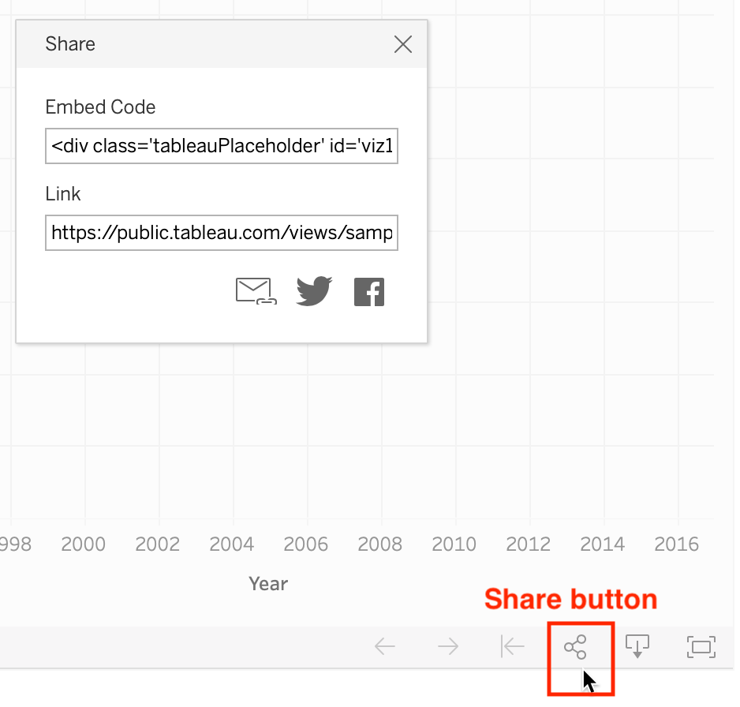{#fig-tableau-public-embed-code width=469}

4. 임베드 코드가 어떻게 작동하는지 더 잘 이해하기 위해 [W3Schools TryIt iframe 페이지](https://www.w3schools.com/tags/tryit.asp?filename=tryhtml_iframe)를 엽니다. 현재 iframe 태그를 선택하고 복사한 임베드 코드를 붙여넣어 바꾼 뒤 초록색 *Run* 버튼을 누릅니다. 결과는 [\@fig-tableau-public-tryit]과 비슷하겠지만 대신 여러분의 임베드 코드와 인터랙티브 시각화가 표시될 것입니다. Tableau Public 임베드 코드는 너무 길어서 이 이미지에 다 들어가지 않는 점에 유의하세요.


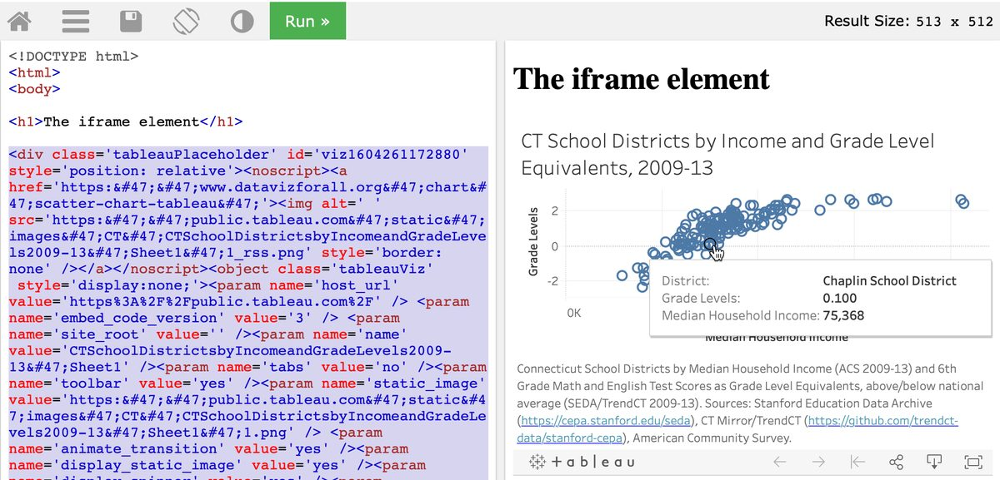{#fig-tableau-public-tryit width=750}

5. 웹 플랫폼에는 항상 *전체 임베드 코드*를 붙여넣으려고 시도해 보세요. 여러 일반적인 웹사이트에 올바르게 삽입하는 방법을 배우려면 이 장의 [웹사이트에 코드 붙여넣기 섹션](#paste-code)으로 넘어가세요.


하지만 여러분의 웹 플랫폼이 Tableau Public의 *전체 임베드 코드*를 허용하지 않는다면, 다음 전략은 시각화에 대한 Tableau Public 링크를 복사하여 *더 단순한 iframe 태그*로 변환한 다음 웹사이트에서 어떻게 작동하는지 확인해 보는 것입니다. 복사 및 변환 방법은 다음과 같습니다.

1. Tableau Public 온라인 계정에 게시된 시각화에서 아래로 스크롤하여 우측 하단의 *공유(Share)* 기호를 클릭합니다(이전의 \@fig-tableau-public-embed-code 참조). 하지만 이번에는 *임베드 코드*가 아닌 *링크(link)*를 선택하여 복사합니다. 전형적인 링크는 다음과 같습니다.

`https://public.tableau.com/views/CTSchoolDistrictsbyIncomeandGradeLevels2009-13/Sheet1?:language=en&:display_count=y&:origin=viz_share_link`

2. 해당 링크를 [W3Schools TryIt iframe 페이지](https://www.w3schools.com/tags/tryit.asp?filename=tryhtml_iframe)에 붙여넣고 물음표(`?`) *이후*에 나타나는 모든 코드를 삭제하여 다음과 같이 만듭니다.

`https://public.tableau.com/views/CTSchoolDistrictsbyIncomeandGradeLevels2009-13/Sheet1?`

3. 마지막에 위에서 삭제한 부분을 대체할 이 코드 조각을 덧붙입니다.

`:showVizHome=no&:embed=true`

4. 이제 편집된 링크는 다음과 같은 모습이 됩니다.

`https://public.tableau.com/views/CTSchoolDistrictsbyIncomeandGradeLevels2009-13/Sheet1?:showVizHome=no&:embed=true`

5. 편집한 링크를 겹따옴표와 함께 iframe 출처 태그 `src=` 안에 넣어 아래와 비슷하게 만듭니다.

`src="https://public.tableau.com/views/CTSchoolDistrictsbyIncomeandGradeLevels2009-13/Sheet1?:showVizHome=no&:embed=true" `

6. iframe 시작 및 끝 태그를 추가하고 `width`, `height`, `frameborder="0"`, `scrolling="no"` 속성도 추가하여 아래와 비슷하게 만듭니다.

`<iframe src="https://public.tableau.com/views/CTSchoolDistrictsbyIncomeandGradeLevels2009-13/Sheet1?:showVizHome=no&:embed=true" width="90%" height="500" frameborder="0" scrolling="no"></iframe>`

팁: 100%가 아니라 `width="90%"`를 삽입하면 독자가 여백을 통해 웹 페이지를 더 쉽게 아래로 스크롤할 수 있습니다.

7. *Run*을 눌러 W3Schools TryIt iframe 페이지에서 어떻게 보이는지 확인하세요(\@fig-tableau-public-tryit-simple 참조). 때로는 복잡한 임베드 코드보다 단순한 iframe이 웹사이트에서 더 잘 작동합니다.


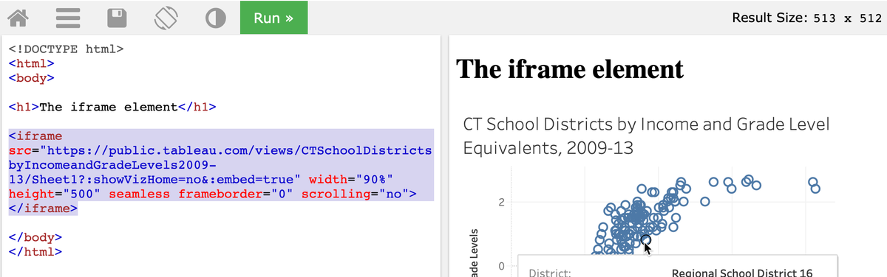{#fig-tableau-public-tryit-simple width=750}

[Tableau Public 지원 페이지에서 iframe 임베드 방법](https://kb.tableau.com/articles/howto/embedding-tableau-public-views-in-iframes)에 대해 더 자세히 알아보세요.


이제 임베드 코드를 복사하고 필요한 경우 더 단순한 iframe으로 축소 편집하는 방법을 알게 되셨을 겁니다. 다음 섹션에서는 더 넓은 독자와 인터랙티브 시각화를 공유하기 위해 일반적인 웹사이트에 코드를 붙여넣는 방법을 배우겠습니다.

## 웹사이트에 코드나 iframe 붙여넣기 {- #paste-code}
이전 섹션에서는 주요 사이트에서 호스팅되는 인터랙티브 시각화를 위해 임베드 코드를 복사하거나 iframe을 만드는 방법을 배웠습니다. 예를 들어, 실시간 차트나 지도가 Google Sheets, Datawrapper 또는 Tableau Public 서버에 호스팅되어 있을 수 있습니다. 이 섹션에서는 여러분이 관리하는 보조 웹사이트에 인터랙티브 차트나 지도를 자연스럽게 표시할 수 있도록 임베드 코드나 iframe을 올바르게 붙여넣는 방법을 시연하며 WordPress, SquareSpace, Wix, Weebly와 같은 일반적인 웹 구축 플랫폼에 중점을 두겠습니다. 여러분의 웹사이트가 다른 플랫폼에서 실행된다 하더라도 원리는 같을 것입니다.

### WordPress.com 사이트에 붙여넣기 {-}
만약 여러분이 `anyone.wordpress.com` 형식의 웹 주소를 쓰는 *무료* 또는 개인용, 프리미엄 [WordPress.com](https://wordpress.com) 사이트를 소유하고 있다면, 그들의 [지원 페이지](https://wordpress.com/support/troubleshooting-embed-links-and-shortcodes/)에 설명된 대로 보안 문제 때문에 iframe이나 Javascript가 포함된 임베드 코드를 삽입할 수 *없습니다*. 즉, 이 책에서 만든 데이터 시각화를 WordPress.com 사이트에 표시하고 싶다면 두 가지 선택지가 있습니다. 첫째, 무료, 개인용, 또는 프리미엄 요금제에서는 차트나 지도의 *정적 이미지*와 인터랙티브 사이트로 연결되는 링크를 삽입할 수 있지만 이는 당연히 이상적인 방법이 아닙니다. 둘째, WordPress.com에서는 아래의 자체 호스팅 WordPress 사이트와 유사한 방법으로 iframe이나 Javascript가 포함된 임베드 코드를 지원하는 [유료 비즈니스 또는 전자상거래(eCommerce) 요금제로 업그레이드](https://wordpress.com/support/plan-features/)할 것을 제안합니다.

### 자체 호스팅 WordPress 사이트에 붙여넣기 {-}
위의 WordPress.com 사이트와 자체 호스팅 WordPress 사이트 간의 [차이점을 이해](https://wordpress.com/support/com-vs-org/)해야 합니다. 후자는 누구나 해당 주소에서 소프트웨어를 무료로 다운로드하여 *자신의 웹서버에서 호스팅*할 수 있거나, 더 흔하게는 학교나 직장을 통해 자체 호스팅 WordPress 서버에 접속하거나, 공급업체의 웹서버 공간을 임대하여 사용하기 때문에 종종 WordPress.org 사이트라고도 불립니다. 그러나 자체 호스팅 WordPress 사이트의 웹 주소가 반드시 `.org`로 끝나야 하는 것은 아닙니다. `.com`이나 `.edu` 등 다른 형태일 수도 있으니 혼동하지 마세요.

자체 호스팅 WordPress 사이트에 임베드 코드나 iframe을 삽입하는 방법은 두 가지가 있지만 성공 여부는 WP 버전, 접근 권한 수준, 그리고 코드의 복잡성에 따라 달라질 수 있습니다. 방법 A(더 간단하지만 항상 신뢰할 수는 없음)와 방법 B(단계는 더 많지만 더 안정적임)를 모두 보여드리겠습니다. 여러분의 자체 호스팅 WordPress 사이트에 어느 방법이 가장 잘 맞는지 확인해 보세요.

#### 방법 A: 간단하지만 항상 신뢰할 수는 없음 {-}
신형 블록 에디터가 탑재된 자체 호스팅 WordPress 5.0 이상의 버전을 사용 중이며 사이트에 대한 편집자 또는 관리자 권한이 있다고 가정합니다. (이 방법은 저자 권한 이하에서는 안정적으로 작동하지 않습니다.)

1. 블록 에디터에서 *사용자 정의 HTML(custom HTML)* 블록을 선택하고 [\@fig-wordpress-custom-html]과 같이 임베드 코드나 iframe을 직접 삽입합니다.  


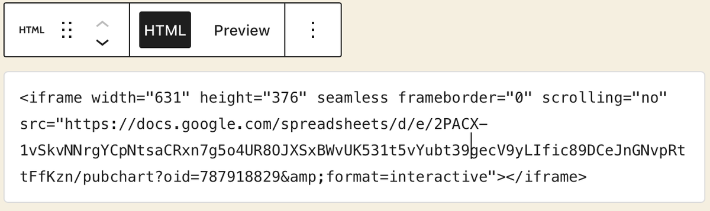{#fig-wordpress-custom-html width=700}

2. WordPress 페이지나 게시물을 미리 보기하여 iframe이 나타나면 게시한 다음, 다른 브라우저에서 확인하여 독자에게 어떻게 보이는지 테스트합니다.

#### 방법 B: 단계는 더 많지만 더 안정적임 {-}
클래식 또는 블록 에디터를 사용하는 모든 버전의 자체 호스팅 WordPress를 사용 중이며 사이트에 대해 저자 권한 이상을 보유하고 있다고 가정합니다.

1. 먼저, 사이트 관리자가 [\@fig-wordpress-iframe-plugin]과 같이 [iframe 플러그인](https://wordpress.org/plugins/iframe/)을 설치하고 활성화해야 합니다. 이 플러그인을 사용하면 저자가 `[iframe...]`과 같은 일반적인 형식의 대괄호로 둘러싸인 수정된 "숏코드(shortcode)" 형식으로 iframe 코드를 임베드할 수 있습니다.


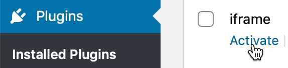{#fig-wordpress-iframe-plugin width=287}

2. WordPress 블록 에디터에서 *사용자 정의 HTML* 블록을 클릭하여 추가합니다(또는 클래식 에디터에서는 *텍스트* 탭을 클릭하여 HTML 코드를 봅니다). 이전의 [\@fig-wordpress-custom-html]과 비슷한 형태여야 하는 임베드 코드나 iframe을 붙여넣습니다.

3. 처음 붙여넣은 코드에는 HTML iframe 태그의 시작 부분(`<iframe...`)과 끝 부분(`...></iframe>`)이 포함되어 있었을 것입니다. 시작 태그의 꺾쇠괄호 기호(`<`)를 여는 대괄호(`[`)로 바꾸어 수정합니다. 뒷부분은 닫는 꺾쇠괄호 기호와 끝 태그 전체(`> </iframe>`)를 지우고 이 두 가지를 하나의 닫는 대괄호(`]`)로 바꾸어 [\@fig-wordpress-insert-brackets]와 같이 만듭니다. 두 그림을 자세히 비교하여 이 작은 코드 편집이 어떻게 보이는지 확인해 보세요.


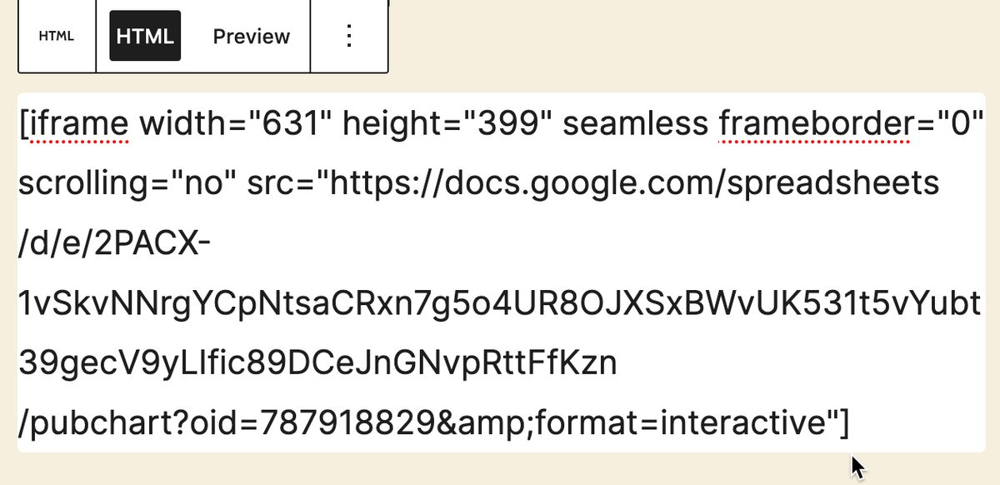{#fig-wordpress-insert-brackets width=700}

팁: Datawrapper 및 Tableau Public의 긴 임베드 코드의 경우, 이전 섹션에 설명된 대로 [W3Schools TryIt iframe 페이지](https://www.w3schools.com/tags/tryit.asp?filename=tryhtml_iframe)를 사용하여 iframe의 가장 관련 있는 부분으로 잘라낸 다음, WordPress 에디터에 붙여넣고 대괄호를 사용하여 앞뒤를 수정하는 실험이 필요할 수도 있습니다.

4. WordPress 페이지나 게시물을 미리 보기하여 iframe이 나타나면 게시한 다음, 다른 브라우저에서 확인하여 독자에게 어떻게 보이는지 테스트합니다.

### SquareSpace, Wix, Weebly 또는 기타 웹 구축 사이트에 붙여넣기 {-}
다른 웹 구축 사이트에서도 데이터 시각화 iframe이나 임베드 코드를 붙여넣는 과정은 WordPress 사이트와 비슷하지만 부분 유료화(freemium) 대 유료 구독 등급 및 저자-관리자 권한 상태에 따라 세부 사항이 달라집니다. 가장 인기 있는 웹 구축 서비스 세 곳에 대한 세부 정보는 다음과 같습니다.

SquareSpace의 [임베드 블록](https://support.squarespace.com/hc/en-us/articles/206543617-Embed-Blocks)과 [사이트에 사용자 지정 코드 추가](https://support.squarespace.com/hc/en-us/articles/205815928-Adding-custom-code-to-your-site#toc-code-blocks-vs--embed-blocks)에 대한 지원 페이지를 참조하세요.

Wix의 [iframe을 사용하여 사이트에 콘텐츠 표시](https://support.wix.com/en/article/wix-editor-using-iframes-to-display-visible-content-on-your-site)에 대한 지원 페이지를 참조하세요.

Weebly의 [외부 콘텐츠와 위젯을 임베드 코드로 추가](https://www.weebly.com/app/help/us/en/topics/create-widgets-embed-code-and-add-external-content)에 대한 지원 페이지를 참조하세요.

팁: 길거나 복잡한 임베드 코드를 다룰 때는 [W3Schools TryIt iframe 페이지](https://www.w3schools.com/tags/tryit.asp?filename=tryhtml_iframe)에 붙여넣어 iframe의 가장 관련 있는 부분으로 잘라낸 후, 해당 부분을 웹 빌더 플랫폼에 붙여넣는 실험이 필요할 수 있습니다.

### 요약 {- #summary9}

이번 장에서는 iframe과 임베드 코드, 그리고 이를 활용해 기본 사이트에 있는 인터랙티브 데이터 시각화를 여러분이 직접 관리하는 두 번째 웹사이트에 자연스럽게 표시하는 방법에 대해 배웠습니다. 이러한 개념은 다음 장에서 매우 유용하게 쓰일 텐데, 오픈소스 코드 템플릿을 GitHub 플랫폼에서 편집하고 호스팅하는 방법을 배우면서 해당 차트와 지도를 여러분의 웹사이트에 매끄럽게 표시하기 위해 iframe을 만드는 법도 익히게 될 것이기 때문입니다.


<!-- BEGIN FILE: 10-github.Rmd -->

# GitHub로 코드 편집 및 호스팅하기 {#github}
이 책의 전반부에서는 Google이나 Tableau 같은 회사에서 제공하는 무료 드래그 앤 드롭 도구 플랫폼을 통해 인터랙티브 차트와 지도를 만들었습니다. 이러한 플랫폼은 초보자에게 아주 훌륭하지만 미리 설정된 도구로 인해 시각화를 디자인하고 맞춤 설정하는 옵션이 제한되며 데이터와 작업물을 호스팅하기 위해 해당 서버와 서비스 약관에 의존해야 합니다. 만약 이들 회사가 도구나 약관을 변경하면 여러분은 계정을 삭제하고 서비스를 바꾸는 것 외에는 다른 선택지가 거의 없으며 결과적으로 여러분의 온라인 차트와 지도는 독자에게 깨진 링크로 표시될 것입니다.

이 책의 후반부에서는 큰 도약을 할 준비를 하세요(저희가 모든 단계를 도와드리겠습니다). 코드 템플릿을 복사하고, 편집하고, 호스팅하는 방법을 배우게 될 것입니다. 이러한 템플릿은 여러분이 데이터를 업로드하고 디자인을 수정하며 인터랙티브 차트와 지도를 직접 관리하는 웹사이트에 표시할 수 있게 해주는 미리 작성된 소프트웨어 명령어 모음입니다. 사전 코딩 경험은 필요하지 않지만 코딩에 대한 *호기심*을 가지고 컴퓨터로 여러 가지 실험을 시도해 보려는 마음가짐이 있다면 큰 도움이 됩니다.

코드 템플릿은 요리책의 레시피와 비슷합니다. 여러분이 주방에 서서 브라우니를 만들기 위해 저희가 공개적으로 공유한 즐겨 찾는 레시피를 보고 있다고 상상해 보세요(맛있겠죠!). 이 레시피는 `버터를 녹이고, 설탕을 추가하고, 코코아를 섞는다`는 3단계로 시작합니다. 레시피가 곧 템플릿이라는 말은, 여러분이 레시피를 그대로 따르거나 취향에 맞게 수정할 수 있다는 뜻입니다. 예를 들어 저희의 레시피를 복사(또는 코더들의 용어로 "포크(fork)")해서 `호두 추가`라는 새로운 단계를 넣었다고 해봅시다. 만약 여러분도 그 레시피를 공개적으로 공유한다면, 이제 브라우니에 견과류가 들어간 것을 강력히 선호하거나 싫어하는 사람 모두를 만족시킬 수 있는 두 가지 버전의 지침이 생기게 됩니다. (저희는 이 깊이 양극화된 논쟁에서 어느 편도 들지 않습니다.)

현재 코더들 사이에서 가장 인기 있는 요리책은 4,000만 명 이상의 사용자와 1억 개 이상의 레시피(또는 "코드 저장소(code repository)", 줄여서 "repo")를 보유한 [GitHub](https://github.com)입니다. 무료 계정에 가입한 후 저장소를 비공개(마치 할머니의 비밀 레시피처럼)로 설정할지, 아니면 공개(저희가 아래에서 공유하는 것들처럼)로 설정할지 선택할 수 있습니다. GitHub는 기본적으로 공개를 목적으로 설계되었으므로, 다른 사람과 공유해서는 안 되는 기밀 사항이나 민감한 정보를 업로드하기 전에 한 번 더 신중히 생각하세요. GitHub는 *오픈소스 코드(open-source code)* 공유를 장려합니다. 이는 창작자가 자신이 선택한 라이선스 조건에 따라 다른 사람들이 이를 자유롭게 배포하고 수정할 수 있도록 허락한다는 의미입니다.

새로운 저장소를 만들 때 GitHub는 [라이선스 선택(Choose a License)](https://choosealicense.com/)을 권유합니다. 가장 인기 있는 오픈소스 소프트웨어 라이선스 두 가지는 매우 허용적인 [MIT 라이선스(MIT License)](https://choosealicense.com/licenses/mit/)와 수정 사항을 동일한 라이선스 하에 공유하도록 강제하는 [GNU 일반 공중 사용 허가서 버전 3(GNU General Public License version 3)](https://choosealicense.com/licenses/gpl-3.0/)입니다. 후자의 버전은 종종 원본 코드의 모든 파생물이 대중에게 지속적으로 공개되도록 요구하는 *카피레프트(copyleft)* 라이선스로 설명되며 사적 소유를 지지하는 전통적인 *카피라이트(copyright)*와 대조됩니다. GitHub에서 다른 사람의 오픈소스 코드를 포크할 때는 그들이 선택한 라이선스 유형(있는 경우)을 확인하고 자신의 버전에도 이를 유지하며 해당 조건을 존중하세요.

분명히 해두자면, GitHub 플랫폼 또한 대기업(마이크로소프트가 2018년에 인수함) 소유이며 코드를 공유하거나 호스팅하는 용도로 사용할 때 여러분은 회사의 도구와 약관에 의존하게 됩니다. 하지만 코드 템플릿의 마법은 작업물을 웹의 어디로든 마이그레이션하고 호스팅할 수 있다는 점입니다. 경쟁 저장소 호스팅 서비스인 [GitLab](https://gitlab.com)으로 이동하거나, 수많은 웹 호스팅 서비스 중 하나를 통해 자신만의 도메인 이름과 서버 공간을 구매할 수 있습니다. 또는 코드는 GitHub에 호스팅하고 사용자 정의 도메인 옵션을 선택하여 인터넷 서비스 제공업체에서 구매한 도메인 이름 아래에 코드를 표시하는 하이브리드 방식을 선택할 수도 있습니다.

이 장의 다음 섹션에서는 기본 단계로서 [간단한 Leaflet 지도 코드 템플릿을 GitHub에서 복사, 편집, 호스팅하는 방법](#copy-leaflet)을 소개합니다. 차트나 지도 코드 템플릿을 GitHub Pages에 호스팅하여 게시할 때마다 [9장에서 논의한 것처럼 해당 온라인 링크를 iframe으로 쉽게 변환](#gh-pages-link-to-iframe)하여 [보조 웹사이트에 임베드](#embed)할 수 있습니다. 나중에 [새로운 GitHub 저장소를 만들고 코드 파일을 업로드하는 방법](#create-repo)도 배우게 될 것입니다.

이번 장에서는 초보자에게 가장 적합한 웹 브라우저 인터페이스를 이용해 GitHub를 소개합니다. 추후 개인 컴퓨터에서 코드 저장소를 더욱 효율적으로 다루기 위한 [GitHub Desktop 및 코드 에디터](#github-desktop-editor) 같은 중급 도구에 대해서도 배우게 될 것입니다.

문제가 생기면 부록의 [일반적인 문제 해결(Fix Common Problems)](#fix) 섹션을 참고하세요. 우리 모두는 실수를 하고 가끔은 "코드를 망가뜨리기도" 하지만 이는 코드가 어떻게 작동하는지, 그리고 작동하지 않을 때 어떻게 대처해야 하는지 배우는 훌륭한 방법입니다!

## 간단한 Leaflet 지도 템플릿 복사, 편집, 호스팅하기 {- #copy-leaflet}
이제 [GitHub](https://github.com) 코드 저장소가 누구나 복사하고 수정할 수 있는 공개 요리책과 같다는 것을 이해하셨으니, 주방으로 들어가 본격적으로 베이킹을 시작해 봅시다! 이 섹션에서는 언론, 비즈니스, 정부 및 고등 교육 분야에서 인터랙티브 지도를 만들 때 매우 인기 있는 오픈소스 코드 라이브러리인 [Leaflet](https://leafletjs.com)을 기반으로 한 아주 간단한 코드 템플릿을 소개합니다. 많은 사람이 Leaflet을 선택하는 이유는 코드가 모두에게 무료로 제공되고 사용하기 비교적 쉬우며 정기적으로 업데이트를 내놓는 활발한 지원 커뮤니티가 있기 때문입니다. 하지만 앞서 [7장: 데이터 지도 만들기(Map Your Data)](#map)에서 다뤘던 드래그 앤 드롭 도구와는 달리, Leaflet 템플릿을 사용하려면 웹에 호스팅하기 전에 코드 몇 줄을 복사하고 편집해야 합니다. 코딩 경험이 없어도 되지만 이 코드 템플릿들이 브라우저와 통신하는 3가지 핵심 언어, 즉 HTML(HyperText Markup Language), CSS(Cascading Style Sheets), 자바스크립트(JavaScript)를 기반으로 한다는 것을 알면 도움이 됩니다. 나아가 최신 웹 브라우저가 있는 컴퓨터(Mac, Windows, Chromebook 등)라면 GitHub 웹 인터페이스를 사용해 이 코드 템플릿을 쉽게 편집할 수 있습니다.

이 섹션에서 배우게 될 GitHub 관련 핵심 단계는 다음과 같습니다.

- 간단한 Leaflet 지도 코드 템플릿 복사하기
- 지도 제목, 시작 위치, 배경 레이어, 마커 편집하기
- 수정한 지도 코드의 실시간 온라인 버전을 공개 웹에 호스팅하기

여러분의 목표는 이 간단한 인터랙티브 지도에 수정을 가해 여러분만의 버전을 만드는 것입니다(\@fig-leaflet-simple 참조).


::: {.content-visible when-format="html"}

<iframe src="https://handsondataviz.github.io/leaflet-map-simple/" width="100%" height="400px" style="border:none;"></iframe>
<p class="caption">이 [간단한 인터랙티브 Leaflet 지도](https://handsondataviz.github.io/leaflet-map-simple/)의 여러분만의 버전을 만들어 보세요.</p>

:::


1. [GitHub](https://github.com)에서 무료 계정을 만드세요. 여러분이 로봇이 아님을 증명하기 위한 간단한 퀴즈를 풀어야 할 수도 있습니다! 이메일에서 확인 메시지가 보이지 않으면 스팸 폴더를 확인해 보세요.

팁: 비교적 짧고 나중에 온라인에 게시할 차트와 지도의 웹 주소에서 봐도 만족스러울 만한 GitHub 사용자 이름을 선택하세요. 다시 말해 `BrownieChef`를 쓸 수 있다면 `DrunkBrownieChef6789` 같은 사용자 이름은 별로 현명한 선택이 아닐 수 있습니다.

2. 브라우저에서 GitHub 계정에 로그인한 후, 간단한 Leaflet 지도 템플릿 주소(https://github.com/HandsOnDataViz/leaflet-map-simple)로 이동하세요.

3. 초록색 *이 템플릿 사용하기(Use this template)* 버튼을 클릭하여 저장소의 여러분만의 복사본을 만드세요(\@fig-leaflet-simple-template 참조).


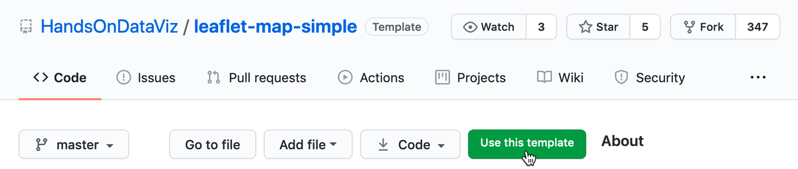{#fig-leaflet-simple-template}

4. 다음 화면에서 소유자로 여러분의 계정이 표시될 것입니다. 저장소 복사본 이름을 저희와 동일하게 `leaflet-map-simple`로 지정하세요(\@fig-leaflet-simple-name 참조). 하단의 초록색 *템플릿에서 저장소 만들기(Create repository from template)* 버튼을 클릭하세요.


{#fig-leaflet-simple-name width=600}

참고: 사용자가 템플릿의 복사본을 쉽게 만들 수 있도록 GitHub의 템플릿 기능을 사용하여 저장소를 설정했습니다. 만약 다른 사람의 GitHub 저장소를 복사하려는데 *템플릿(Template)* 버튼이 보이지 않는다면, *포크(Fork)* 버튼을 클릭하세요. 이는 다른 방식으로 복사본을 만듭니다. 차이점은 다음과 같습니다. *템플릿*은 각각 다른 이름을 부여하여 동일한 저장소의 복사본을 *여러 개* 만들 수 있게 해 주지만 *포크*는 원본과 동일한 이름을 사용해야 하므로 저장소의 복사본을 *단 하나만* 생성할 수 있습니다. GitHub는 이름이 같은 두 개의 저장소를 생성하지 못하게 막고 있습니다. GitHub 저장소의 두 번째 포크를 만들어야 한다면 이 장의 [GitHub에서 새 저장소를 만들고 파일 업로드하기](#create-repo) 섹션을 참조하세요.

다음 화면의 왼쪽 상단 모서리에 여러분의 GitHub 계정 사용자 이름을 나타내는 `USERNAME`이 포함된 `USERNAME/leaflet-map-simple`이 `HandsOnDataViz/leaflet-map-simple`로부터 생성되었다고 표시될 것입니다. 이것은 여러분의 GitHub 계정에 저희의 템플릿이 성공적으로 복사되었음을 확정하는 것이며 다음 3개의 파일만 포함되어 있습니다.

- `LICENSE`: 누구나 원하는 대로 코드를 복사하고 수정할 수 있도록 허용하는 MIT 라이선스를 채택했음을 보여줍니다.
- `README.md`: 실시간 데모에 대한 간단한 설명과 링크를 제공하며 이에 대해서는 나중에 다시 설명합니다.
- `index.html`: 지도 코드가 포함되어 있기 때문에 이 템플릿에서 가장 핵심적인 파일입니다.

5. `index.html` 파일을 클릭하여 코드를 봅니다(\@fig-leaflet-simple-index 참조).


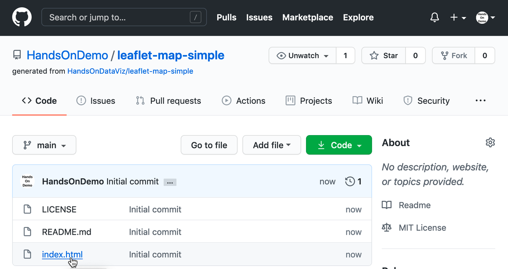{#fig-leaflet-simple-index width=600}

처음 컴퓨터 코드를 본다면 압도당하는 느낌이 들 수 있지만 안심하세요! 어떤 작업이 이루어지는지 설명하기 위해 여러 개의 "코드 주석(code comments)"을 삽입해 두었습니다. 첫 번째 코드 블록은 웹 브라우저에 페이지 나머지 부분의 형식을 어떻게 적용할지 알려줍니다. 두 번째 블록은 대화형 지도를 구성하는 오픈소스 소프트웨어인 [Leaflet](https://leafletjs.com) 코드 라이브러리를 로드하도록 브라우저에 지시합니다. 세 번째 블록은 화면에서 지도와 제목이 표시될 위치를 설명합니다. 좋은 소식은 이 코드 블록들을 전혀 건드릴 필요가 없다는 것입니다. 그냥 그대로 두면 됩니다. 하지만 그 아래에 있는 코드 몇 줄은 수정하고 싶을 것입니다.

6. 코드를 편집하려면 우측 상단의 연필 기호를 클릭합니다(\@fig-leaflet-simple-edit 참조).


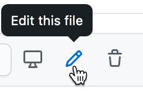{#fig-leaflet-simple-edit}

가장 먼저 21-23번째 줄의 HTML 구분(division) 태그 블록에 나타나는 지도 제목을 수정하여 이제 *여러분이* 편집한 지도라는 것을 모두에게 보여줍시다.

7. `<div id="map-title">EDIT your map title</div>` 줄에서 `EDIT your map title`이라는 단어 대신 여러분의 새로운 지도 제목을 입력하세요. 양쪽 `< >` 기호 안의 HTML 태그를 지우지 않도록 조심하세요.

8. 편집 내용을 저장하려면 페이지 맨 아래로 스크롤하여 초록색 *변경 사항 커밋(Commit Changes)* 버튼을 클릭합니다(\@fig-leaflet-simple-commit 참조).


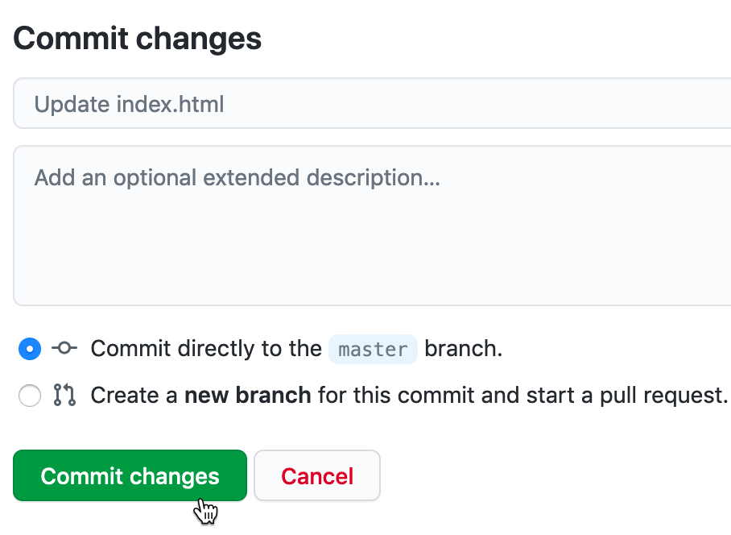{#fig-leaflet-simple-commit width=450}

코더들의 언어로 말하자면 우리는 대부분의 사람이 문서를 "저장(save)"하는 것과 같은 방식으로 변경 사항을 "커밋(commit)"합니다. 나중에 GitHub가 각각의 코드 커밋을 추적하여 필요한 경우 롤백(되돌리기)할 수 있는 방법을 알게 될 것입니다. 기본적으로 GitHub는 커밋의 짧은 설명을 "Update index.html"로 삽입하는데, 작업 내역을 파악하기 위해 여러 커밋을 만들 때 이 설명을 사용자가 마음대로 수정할 수 있는 옵션이 있습니다. 또한 GitHub는 변경 사항을 코드의 기본 브랜치(default branch)에 직접 커밋하며 이에 대해서는 나중에 설명하겠습니다.

이제 편집한 지도를 공개 웹에 게시하여 웹 브라우저에서 어떻게 보이는지 확인해 봅시다. GitHub는 오픈소스 코드를 저장할 뿐만 아니라 내장된 [GitHub Pages](https://pages.github.com/) 기능을 통해 HTML 기반 코드의 실시간 온라인 버전을 호스팅할 수 있게 해주어 웹 주소만 알면 누구나 브라우저에서 볼 수 있게 합니다. GitHub Pages는 무료로 사용할 수 있지만 [사용량, 파일 크기, 콘텐츠에 대한 일부 제한](https://help.github.com/en/github/working-with-github-pages/about-github-pages)이 있으며 온라인 비즈니스나 상업적 거래용으로 설계되지 않았습니다. 하지만 코드 템플릿의 장점 중 하나는 여러분이 관리하는 어떤 웹 서버에든 코드를 호스팅할 수 있다는 점입니다. 이미 GitHub를 사용하여 코드 템플릿을 저장하고 편집하고 있으므로 이를 온라인에 호스팅하도록 GitHub Pages 기능을 켜는 것은 쉽습니다.

팁: 코드는 GitHub에 보관하고 상업적 수준의 대용량 웹 호스트로 규모를 확장하려면 [Netlify](https://www.netlify.com) 같은 부분 유료화 서비스를 살펴보세요. 이 서비스는 여러분의 GitHub 저장소에 푸시(push)된 변경 사항을 자동으로 감지하여 온라인 사이트에 배포해 줍니다.

9. GitHub Pages에 접속하려면 저장소 페이지 맨 위로 스크롤하고 [\@fig-leaflet-simple-settings]와 같이 *설정(Settings)* 버튼을 클릭합니다.


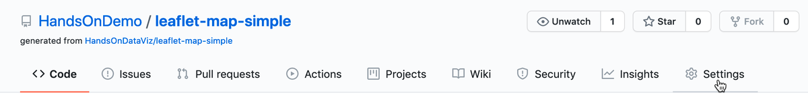{#fig-leaflet-simple-settings}

10. 설정 화면 좌측 메뉴에서 Pages 탭으로 이동합니다. Pages 탭에서 출처(*Source*)를 *None*에서 *main*으로 변경하고 가운데의 기본 옵션인 */(root)*를 유지한 다음 [\@fig-leaflet-github-pages-main]과 같이 *저장(Save)*을 누릅니다. 이 단계는 웹 주소만 알면 누구나 브라우저에서 접근할 수 있는 공개 웹에 실시간 지도를 게시하도록 GitHub에 지시하는 것입니다.


{#fig-leaflet-github-pages-main width=300}

팁: 2020년 흑인의 생명도 소중하다(Black Lives Matter) 운동에 대응하여 [GitHub는 기본 브랜치의 이름을 변경](https://github.com/github/renaming)하여 컴퓨터 과학에서 흔히 쓰이던 [주인-노예 메타포(master-slave metaphor)](https://en.wikipedia.org/wiki/Master/slave_%28technology%29)인 *master*를 *main*으로 바꿨습니다.

11. 페이지가 자동으로 새로고침되며 온라인에 게시된 실시간 지도의 웹 주소가 표시될 것입니다. 해당 링크를 마우스 오른쪽 버튼으로 클릭하고 새 브라우저 탭에서 엽니다(\@fig-leaflet-github-pages-link 참조).


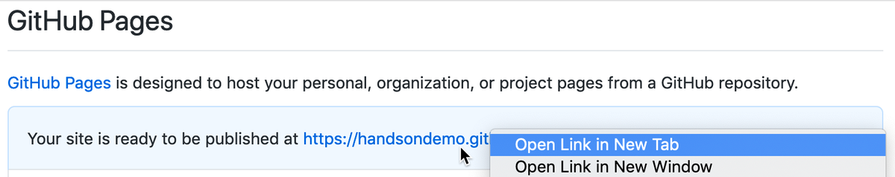{#fig-leaflet-github-pages-link width=600}

이제 브라우저에 최소 두 개의 탭이 열려 있을 것입니다. 첫 번째 탭에는 다음 형식의 웹 주소가 포함된, 코드를 편집하는 GitHub 저장소가 표시되며 `USERNAME`과 `REPOSITORY`를 여러분의 것으로 교체하세요.

`https://github.com/USERNAME/REPOSITORY`

두 번째 탭에는 편집한 코드가 온라인으로 표시되는 GitHub Pages 라이브 웹사이트가 포함되어 있습니다. GitHub Pages는 자동으로 다음과 같은 형식의 공개 웹 주소를 생성합니다.

`https://USERNAME.github.io/REPOSITORY`

참고: 코드의 실시간 버전은 기본적으로 `index.html` 페이지를 가리키므로 웹 주소에 이를 포함할 필요가 없습니다.

이전에 저희가 왜 `DrunkBrownieChef6789` 같은 사용자 이름으로 계정을 만들지 말라고 했는지 기억하시나요? GitHub는 공개 웹 주소에 여러분의 사용자 이름을 자동으로 배치하기 때문입니다.

코드 편집과 실시간 온라인 결과 확인을 쉽게 오갈 수 있도록 두 탭을 모두 열어두세요.

팁: GitHub Pages는 보통 실시간 지도를 30초 안에 표시하지만 경우에 따라 몇 분 정도 걸릴 수도 있습니다. 1분이 지나도 변화가 없으면 다음 단축키 조합 중 하나로 [캐시 저장된 콘텐츠를 무시하는(bypass any saved content in your cache)](https://en.wikipedia.org/wiki/Wikipedia:Bypass_your_cache) "강력 새로고침(hard refresh)"을 실행해 서버에서 전체 웹 페이지를 다시 다운로드하세요.

  - Ctrl + F5 (Windows 또는 Linux의 대부분 브라우저)
  - Command + Shift + R (Mac용 Chrome 또는 Firefox)
  - Shift + 새로고침 도구 모음 버튼 (Mac용 Safari)
  - Ctrl + Shift + Backspace (Chromebook)

이제 GitHub 저장소를 수정하여 *저희의* 실시간 지도가 아닌 *여러분의* 실시간 지도를 링크가 가리키도록 해봅시다.

12. 두 번째 브라우저 탭에서 여러분의 실시간 지도의 웹 주소를 복사합니다.

13. GitHub 저장소가 열려 있는 첫 번째 브라우저 탭으로 돌아가, 상단의 저장소 제목을 클릭해 저장소 홈 페이지로 돌아갑니다(\@fig-leaflet-click-title 참조).


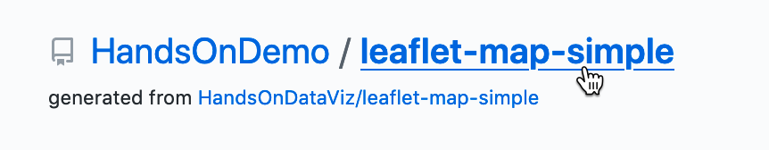{#fig-leaflet-click-title width=450}

14. 저장소 페이지에서 `README.md` 파일을 클릭해 열고 다시 연필 버튼을 눌러 편집합니다(\@fig-leaflet-paste-link 참조). *(replace with link to your site)*라는 레이블 아래에 여러분의 실시간 웹 링크를 붙여넣고 아래로 스크롤하여 변경 사항을 커밋합니다.


{#fig-leaflet-paste-link width=600}

이제 성공적으로 간단한 편집을 마치고 실시간 지도를 게시했으니, 지도를 좀 더 멋지게 꾸미고 Leaflet 코드가 작동하는 방식에 대해 더 알아보기 위해 추가 수정을 해 봅시다.

15. 저장소 홈 페이지에서 `index.html` 파일을 열고 연필 모양 기호를 클릭해 더 많은 코드를 편집합니다.

코드 안에서 `EDIT`라는 주석이 보이면, 그곳이 쉽게 수정할 수 있는 부분을 의미합니다. 예를 들어, 지도의 초기 중심점과 확대 수준(zoom level)을 설정하는 아래의 코드 블록을 찾아보세요. 새로운 중심점을 설정하려면 새로운 위도 및 경도 좌표를 입력하면 됩니다. 좌표를 찾려면 [2장의 지오코딩 섹션](#geocode)에 설명된 대로 [Google 지도](https://google.com/maps)에서 아무 지점이나 우클릭한 다음 *이곳이 궁금한가요?(What's here?)*를 선택하세요.

```
  var map = L.map('map', {
    center: [41.77, -72.69], // EDIT coordinates to re-center map
    zoom: 12,  // EDIT from 1 (zoomed out) to 18 (zoomed in)
    scrollWheelZoom: false,
    tap: false
  });
```

다음 코드 블록은 지도 배경 역할을 하는 베이스맵(basemap) 타일 레이어를 표시합니다. 저희 템플릿은 OpenStreetMap의 크레딧이 들어간, 모든 라벨이 표시된 CARTO의 밝은(light) 지도를 사용합니다. 가장 간단한 편집은 `light_all`을 `dark_all`로 바꾸는 것입니다. 이렇게 하면 색상이 반전된 다른 CARTO 베이스맵으로 바뀝니다. 또는 복사 후 붙여넣어 쓸 수 있는 [다른 여러 Leaflet 베이스맵 코드 옵션들을 미리 확인해 보세요](https://leaflet-extras.github.io/leaflet-providers/preview/). 이때 출처를 명시해야 하며 또한 이 베이스맵을 표시하는 코드 블록 끝에 `}).addTo(map);`를 그대로 두어야 합니다.

```
 L.tileLayer(
   'https://{s}.basemaps.cartocdn.com/light_all/{z}/{x}/{y}{r}.png', {
     attribution: '&copy; <a href="https://osm.org/copyright">\
      OpenStreetMap</a> contributors, &copy;\
        <a href="https://carto.com/attribution">CARTO</a>'
 }).addTo(map);
```

마지막 코드 블록은 지도 위에 단일 마커를 표시합니다. Leaflet의 기본 설정인 파란색으로 표시되며 사용자가 클릭하면 팝업 메시지가 나타납니다. 마커의 좌표를 수정하거나 팝업 텍스트를 입력할 수 있으며 이 코드 블록을 복사해서 붙여넣어 두 번째 마커를 만들 수도 있습니다.

```
L.marker([41.77, -72.69]).addTo(map) // EDIT marker coordinates
.bindPopup("Insert pop-up text here"); // EDIT pop-up text message
```

15. 편집을 마친 후 잊지 말고 아래로 스크롤하여 *커밋(Commit)* 버튼을 눌러 변경 사항을 저장하세요. 그런 다음 실시간 지도가 열려 있는 브라우저 탭으로 가서 "강력 새로고침"을 하여 변경 사항을 확인하세요. 지도에 대한 편집 사항은 일반적으로 30초 내에 나타나지만 GitHub Pages에서 코드 커밋을 처리하는 데 가끔 더 오래 걸릴 수도 있다는 점을 기억하세요. 문제가 있다면 부록의 [일반적인 문제 해결(Fix Common Problems)](#fix) 섹션을 참조하세요.

축하합니다! 컴퓨터 코드를 편집하고 이를 온라인에 호스팅한 것이 이번이 처음이라면, 이제 자신을 "코더(coder)"라고 부르셔도 됩니다. 브라우니의 첫 번째 배치 작업을 마치고 스스로를 "셰프(chef)"라고 부를 수 있는 것처럼, 코드를 요리책 레시피에 비유하여 수정하는 과정도 이와 비슷합니다. 비록 이런 초기 단계에서 여러분을 정규 급여를 받는 코더(혹은 셰프)로 고용할 사람은 거의 없겠지만 이제 여러분은 코드를 온라인에 복사, 편집 및 호스팅하는 데 필요한 몇 가지 기초 기술을 이해했습니다. 이제 한발 더 나아가, [11장의 Chart.js 및 Highcharts 템플릿](#chartcode)과 [12장의 Leaflet 지도 템플릿](#leaflet)과 같은 고급 버전으로 뛰어들 준비가 되었습니다.

## GitHub Pages 링크를 iframe으로 변환하기 {- #gh-pages-link-to-iframe}
[9장: 웹에 임베드하기](#embed)에서 주요 사이트의 인터랙티브 콘텐츠를 보조 사이트에 자연스럽게 표시하는 것에 대한 장점을 다루었습니다. 또한 매우 긴 Datawrapper나 Tableau Public 임베드 코드를 보조 웹사이트에 더 쉽게 임베드할 수 있도록 필요한 경우 더 짧은 iframe 태그로 변환하는 방법도 배웠습니다.

동일한 개념이 GitHub Pages에도 적용됩니다. 차트나 지도(또는 어떤 콘텐츠든)의 코드 템플릿을 GitHub Pages에 게시하면, 보조 웹사이트에 임베드할 수 있는 온라인 링크가 생성되며 위와 같은 원리로 이 링크를 iframe 태그로 변환할 수 있습니다. 다음 단계를 따라 해보세요:

1. 온라인에 게시된 아무 GitHub 저장소에 들어가서 *설정(Settings)* 페이지로 이동한 뒤 아래로 스크롤하여 다음 일반적인 형식으로 표시된 GitHub Pages 웹 주소를 복사합니다.

`https://USERNAME.github.io/REPOSITORY`

2. 링크를 큰따옴표로 둘러싸 출처로 삼고 시작 태그와 끝 태그를 추가하여 다음 일반적인 형식으로 만들어 iframe으로 변환합니다.

`<iframe src="https://USERNAME.github.io/RESPOSITORY"></iframe>`

3. 원하는 경우 `width`나 `height`(기본적으로 픽셀 단위로 측정되거나 백분율 사용), 또는 `frameborder="0"`, `scrolling="no"`와 같은 선택적 속성을 추가하여 다음 일반적인 형식처럼 보조 사이트에서 iframe 모양을 개선할 수 있습니다.

`<iframe src="https://USERNAME.github.io/RESPOSITORY" width="100%" height="400" frameborder="0" scrolling="no"></iframe>`

팁: iframe 코드에서 홑따옴표(`'`)나 겹따옴표(`"`)를 모두 사용할 수 있지만 한 가지로 일관되게 사용하고 실수로 둥근 따옴표(curly quotes)를 붙여넣지 않도록 주의하세요.

이제 GitHub Pages에 게시한 인터랙티브 차트나 지도 템플릿을 표시하기 위해, 9장에서 설명한 방법으로 선호하는 [웹사이트에 iframe을 붙여넣을](#paste-code) 준비가 되었습니다.

이제 GitHub에서 코드 저장소를 편집하고 호스팅하는 방법을 더 잘 이해하게 되셨을 것입니다. 다음 섹션에서는 새로운 저장소를 만들고 파일을 업로드하여 GitHub 기술을 한층 강화하는 방법에 대해 설명합니다. 이는 코드 템플릿의 두 번째 복사본을 만들거나, 다음 두 장에서 더 발전된 템플릿으로 작업하기 위해 꼭 필요한 단계입니다.

## GitHub에서 새 저장소 생성 및 파일 업로드하기 {- #create-repo}
저희의 GitHub 템플릿을 복사하는 방법을 익혔다면, 다음 단계는 완전히 새로운 저장소를 만들고 파일을 업로드하는 방법을 배우는 것입니다. 이러한 기술은 여러 상황에서 유용합니다. 첫째, 한 번만 허용되는 GitHub의 리포지토리 포크(fork) 기능을 쓸 때 이 방식을 알면 복사본을 추가로 더 만들 수 있습니다. 둘째, [11장의 Chart.js 및 Highcharts 템플릿](#chartcode)과 [12장의 Leaflet 지도 템플릿](#leaflet)을 사용하여 데이터 시각화를 만들 때는 여러분 소유의 파일 중 일부를 업로드해야 합니다. 다시 한번 초보자를 위한 GitHub 브라우저 인터페이스에서 이 모든 단계를 수행하는 방법을 보여드리겠지만 코드 템플릿 작업에 더 효율적인 중급 수준의 인터페이스를 원하신다면 다음의 [GitHub Desktop](#github-desktop-editor) 섹션을 참조하세요.

이전 섹션에서는 *이 템플릿 사용하기(Use this template)* 버튼을 통해 저장소 복사본을 만들었는데, 이는 사용자가 여러 복사본을 만들고 각자 다른 이름을 지정하도록 돕는 의도적인 최신 기능입니다. 하지만 이 *템플릿* 버튼이 없는 다른 많은 GitHub 저장소를 복사하려면 *포크(Fork)* 버튼을 클릭해야 하며 이 버튼은 원본과 동일한 저장소 이름으로 복사본을 자동 생성합니다. 그렇다면 누군가의 저장소를 두 번째로 포크하려면 어떻게 해야 할까요? GitHub는 사용자의 작업물을 덮어써서 지워지는 불상사를 방지하기 위해 계정 내 모든 저장소의 이름이 고유해야 한다는 중요한 규칙을 지키고자 두 번째 포크 생성을 막습니다.

따라서 *이 템플릿 사용하기* 버튼이 없을 때 어떻게 GitHub 저장소의 두 번째 포크를 만들 수 있을까요? 다음 세 가지 단계로 요약되는 저희의 권장 대안을 따르십시오.

- 기존 GitHub 저장소를 로컬 컴퓨터로 다운로드
- 새 이름으로 완전히 새로운 GitHub 저장소 생성
- 기존 코드 저장소 파일을 새로 만든 저장소에 업로드

1. [\@fig-repo-code-download]와 같이 저장소에서 *Code > Download Zip* 드롭다운 메뉴 버튼을 클릭합니다. 브라우저가 저장소 내용물이 포함된 압축 폴더(zip 폴더)를 로컬 컴퓨터로 다운로드할 것이며 저장할 위치를 물어볼 수 있습니다. 위치를 결정하고 확인(OK)을 클릭합니다.


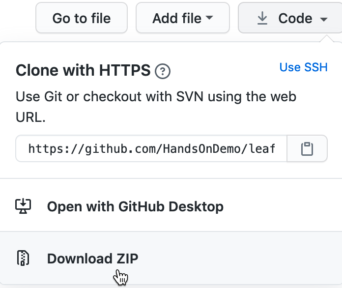{#fig-repo-code-download width=350}

2. 컴퓨터에 폴더를 저장한 위치로 이동합니다. 파일 이름은 `.zip`으로 끝나야 하며 이 폴더를 두 번 클릭하여 "압축 해제(unzip)" 해야 합니다. 압축을 해제하면 저장소 파일이 포함된 새로운 폴더가 나타나는데, 그 이름은 `REPOSITORY-BRANCH` 형식으로 되어 있습니다(예: `leaflet-map-simple`과 같은 저장소 이름 및 `main`과 같은 브랜치 이름). 이 중 하나가 `index.html` 파일로, 몇 단계 뒤에 사용할 것입니다.

3. 웹 브라우저에서 GitHub 계정으로 다시 돌아와 계정의 우측 상단 모서리에 있는 더하기(+) 기호를 클릭하고 [\@fig-repo-create-new]와 같이 *새 저장소(New repository)*를 선택합니다.


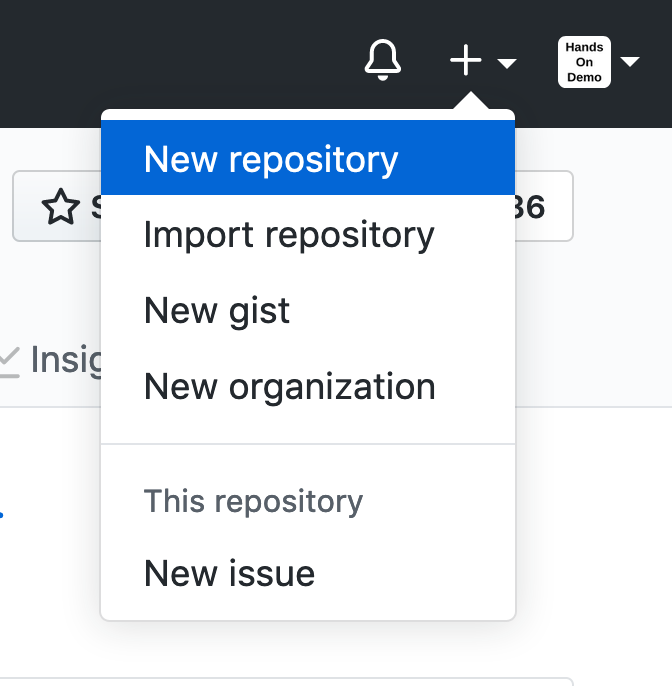{#fig-repo-create-new width=300}

4. 다음 화면에서 GitHub는 새로운 저장소 이름을 입력하라고 요청합니다. 짧고 가급적 소문자만 사용하며 필요한 경우 하이픈으로 단어를 구분하는 이름을 고르세요. 이 튜토리얼이 끝나면 삭제할 것이므로 `practice`라고 이름 지어 봅시다.

다음 단계를 간소화하기 위해 *README로 이 저장소 초기화하기(Initialize this repository with a README)* 상자를 선택합니다.

또한 업로드할 코드에 맞는 라이선스를 선택해야 하는데, 이 경우 *MIT 라이선스(MIT License)*가 해당합니다. 다른 필드는 선택 사항입니다. 설정이 끝나면 하단의 초록색 *저장소 만들기(Create Repository)* 버튼을 클릭합니다(\@fig-repo-create-options 참조).


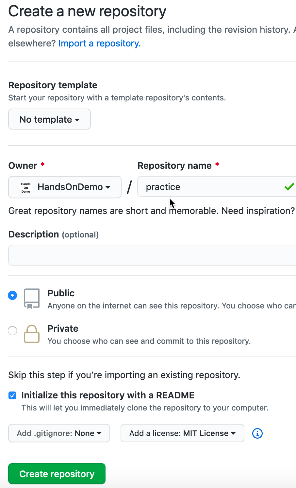{#fig-repo-create-options width=400}

새 저장소는 `https://github.com/USERNAME/practice`와 같은 웹 주소를 갖게 됩니다.

5. 새로운 저장소 홈 페이지의 화면 가운데쯤에 있는 *파일 추가 > 파일 업로드(Add File > Upload Files)* 드롭다운 메뉴 버튼을 클릭합니다(\@fig-repo-upload-files 참조).


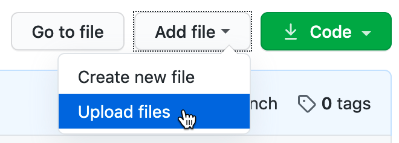{#fig-repo-upload-files width=350}

6. 로컬 컴퓨터에서 이전에 다운로드하고 압축을 풀었던 저장소 폴더 내부의 `index.html` 파일을 브라우저의 GitHub 저장소 업로드 화면으로 드래그 앤 드롭합니다(\@fig-repo-drag-index 참조). 새 저장소에는 이미 `LICENSE`와 `README.md`가 포함되어 있으므로 이 두 파일은 업로드하지 마세요. 아래로 스크롤하여 초록색 *변경 사항 커밋(Commit Changes)* 버튼을 클릭합니다.


{#fig-repo-drag-index}

업로드가 완료되면 이전에 `leaflet-map-simple` 템플릿에서 다운로드한 `index.html` 코드를 포함하여 이제 저장소에는 총 세 개의 파일이 있어야 합니다. 이렇게 하면 새 저장소를 만들고 코드의 두 번째 복사본을 수동으로 업로드하여 GitHub의 1-포크 규칙을 회피한다는 목표를 달성한 것입니다.

이 장의 [간단한 Leaflet 지도 템플릿 복사, 편집, 호스팅하기](#copy-leaflet) 섹션에서 설명한 대로 선택적으로 GitHub Pages를 사용하여 코드의 실시간 버전을 온라인에 게시할 수 있으며 이 실시간 버전 링크를 저장소 상단과 README.md 파일에 붙여넣을 수 있습니다.

7. 이것은 단지 `practice` 저장소일 뿐이므로 GitHub에서 삭제해 봅시다. 브라우저의 저장소 화면에서 우측 상단의 *설정(Settings)* 버튼을 클릭하고 맨 아래의 *위험 구역(Danger Zone)*까지 스크롤하여 *이 저장소 삭제(Delete this repository)*를 클릭합니다(\@fig-repo-delete 참조). GitHub는 저장소를 정말로 삭제하고자 하는지, 여러분이 술 취한 브라우니 요리사가 아님을 증명하기 위해 사용자 이름과 저장소 이름을 입력하도록 요구할 것입니다.


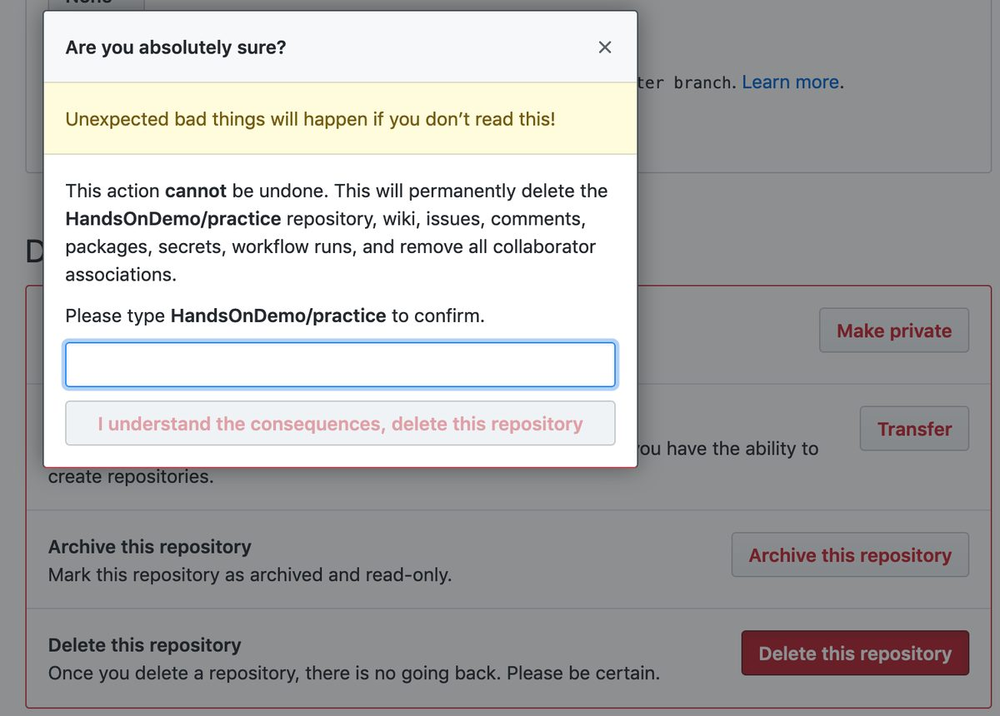{#fig-repo-delete width=600}

지금까지 GitHub 웹 인터페이스를 사용하여 코드를 복사하고 편집하며 호스팅하는 방법을 배웠습니다. 초보자에게 아주 훌륭한 시작입니다. 이제 GitHub를 더욱 효율적으로 다루기 위해 GitHub Desktop이나 코드 에디터 같은 도구로 넘어가 전체 저장소를 로컬 컴퓨터로 빠르게 옮기고 코드를 수정한 뒤 다시 온라인으로 올리는 과정을 배우게 될 것입니다.

## 효율적인 작업을 위한 GitHub Desktop 및 코드 에디터 {- #github-desktop-editor}
특히 저장소에 몇 가지 수정 사항만 적용하거나 파일 두어 개를 업로드하는 경우라면, GitHub 웹 인터페이스를 통한 코드 편집은 훌륭한 시작 방법입니다. 하지만 저장소에 여러 파일을 수정하거나 업로드할 때는 이 방식이 무척 느리게 느껴질 것입니다. Mac이나 Windows 환경에서 작업 속도를 높이려면 무료 도구인 [GitHub Desktop](https://desktop.github.com)을 다운로드하고 이에 더하여 여러 코드 에디터 중 하나를 사용하시길 추천합니다. 예컨대 예전 Atom 에디터 툴을 계승한 인기 있는 오픈소스인 [Pulsar](https://pulsar-edit.dev) 같은 도구를 권하지만 다른 선택지도 있습니다. GitHub 데스크톱에 여러분의 GitHub 웹 계정을 연동하면, 최신 버전 코드를 여러분의 로컬 컴퓨터 하드드라이브로 "당겨(pull)" 와서 편집 후 테스트하고 변경 내용(커밋)을 다시 GitHub 웹 계정으로 "밀어(push)" 넣을 수 있게 해 줍니다. 또한 텍스트 에디터를 이용하면 GitHub 웹 인터페이스보다 로컬 컴퓨터에서 코드 저장소를 조회하고 편집하기가 훨씬 더 수월해집니다.

팁: Microsoft Word와 같은 워드 프로세서 프로그램은 코드 에디터로 사용하기에 *좋지 않은* 선택입니다. 더불어, [Pulsar](https://pulsar-edit.dev)처럼 애초에 코드 편집을 위해 설계된 툴이 Mac의 TextEdit나 Windows의 NotePad 같이 운영 체제에 딸려 나오는 일반 텍스트 에디터보다 훨씬 유용합니다.

팁: 현재 GitHub Desktop은 크롬북(Chromebook)을 지원하지 않지만 [크롬 웹스토어(Chrome's Web Store)](https://chrome.google.com/webstore)에 있는 Text나 Caret 같은 여러 텍스트 에디터가 아래 설명된 기능 일부를 제공하고 있습니다.

GitHub Desktop을 활용하여 `leaflet-map-simple` 템플릿의 복사본을 로컬 컴퓨터로 가져오고 코드 에디터에서 일부를 수정한 후, 변경 내역을 다시 GitHub에 푸시해 봅시다.

1. 로컬 컴퓨터에 복사할 GitHub 웹 저장소로 이동합니다. [간단한 Leaflet 지도 템플릿 복사, 편집, 호스팅하기](#copy-leaflet) 섹션에서 앞서 생성한 저장소에 접근하기 위해 브라우저에 `https://github.com/USERNAME/leaflet-map-simple` 주소(여러분의 GitHub 사용자 이름으로 대체)를 입력하세요. 그리고 [\@fig-desktop-open]에서 보는 바와 같이 화면 가운데쯤의 *Code > Open with GitHub Desktop* 드롭다운 메뉴 버튼을 클릭합니다. 다음 화면에서 GitHub Desktop 웹 페이지 링크가 표시되며 해당 앱을 다운로드하고 설치해야 합니다.


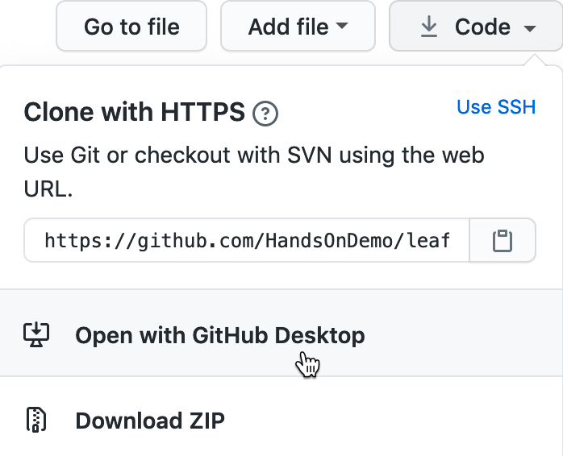{#fig-desktop-open width=350}

2. 처음으로 GitHub Desktop을 열면, 앞서 본 장에서 생성했던 여러분의 GitHub 웹 계정을 연동시켜야 합니다. 시작(Welcome) 화면에서 [\@fig-desktop-signin]과 같이 파란색의 *Sign in to GitHub.com* 버튼을 누른 다음 GitHub 사용자 이름과 비밀번호로 로그인합니다. 그다음 화면에서 GitHub는 초록색의 *Authorize desktop* 버튼을 눌러 계정 연결을 허가할지 물어볼 것입니다.


{#fig-desktop-signin width=500}

3. 이어지는 설정 화면에서 GitHub Desktop은 GitHub의 기반 소프트웨어인 Git을 환경설정하라고 요구할 것입니다. 사용자 이름이 제대로 표시되는지 확인하고 *Continue* 버튼을 클릭하세요(\@fig-desktop-configure 참조).


{#fig-desktop-configure width=500}

4. GitHub Desktop의 "Let's Get Started" 화면에서 오른쪽의 *Your Repositories*를 눌러 여러분의 `leaflet-map-sample`을 선택한 다음, 더 아래쪽에 있는 파란색 버튼을 눌러 저장소를 로컬 컴퓨터로 *복제(Clone)*합니다(\@fig-desktop-start 참조).


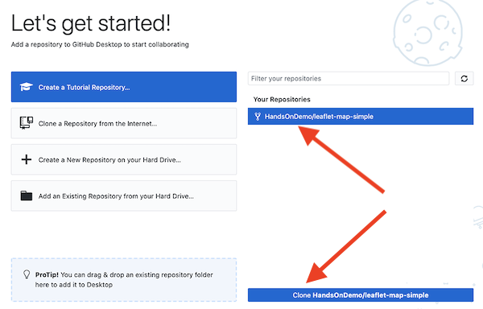{#fig-desktop-start}

5. 저장소를 클론(clone)할 때, GitHub Desktop은 로컬 경로(Local Path), 즉 로컬 컴퓨터 어디에 GitHub 저장소 복사본을 보관할지 물어봅니다(\@fig-desktop-clone-path 참조). 나중에 찾아야 하므로 *Clone* 버튼을 클릭하기 전에 이 경로를 꼭 기억해두세요.


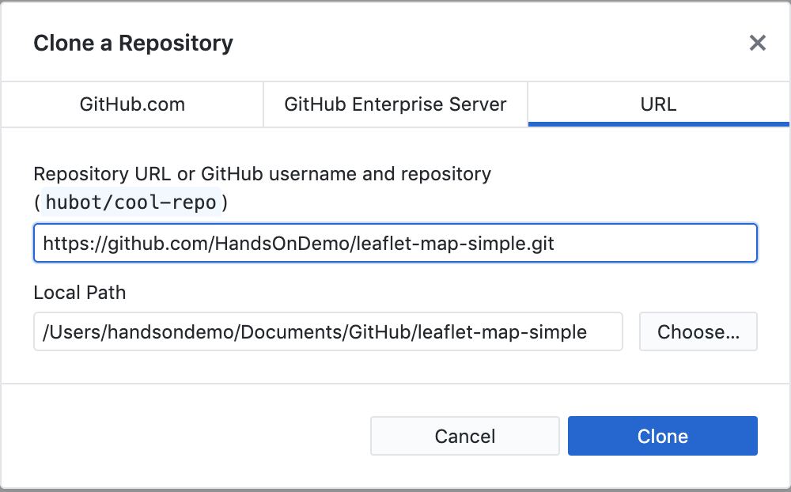{#fig-desktop-clone-path width=500}

6. 다음 화면에서 GitHub Desktop이 "이 포크를 어떻게 활용할 계획이신가요(How are you planning to use this fork)?"라고 물을 수도 있습니다. 여기서 기본 항목인 "상위 프로젝트에 기여(To contribute to the parent project)"를 선택하고 *Continue*를 누르세요. 이는 편집 내용을 다시 귀하의 GitHub 웹 계정으로 보내겠다는 뜻입니다(\@fig-desktop-fork 참조).


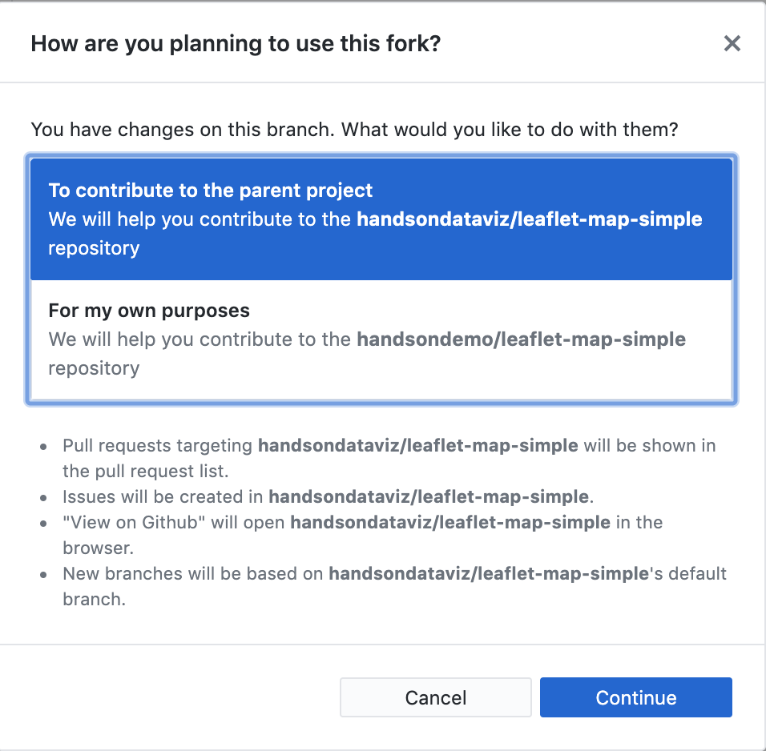{#fig-desktop-fork width=500}

7. 이제 GitHub 저장소 복사본이 GitHub 웹 계정과 로컬 컴퓨터 이렇게 두 군데에 존재하게 됩니다(\@fig-desktop-finder 참조). 화면 구성은 사용 중인 운영체제(Windows 혹은 Mac)와 파일을 저장하도록 지정한 로컬 경로에 따라 다르게 보일 수 있습니다.


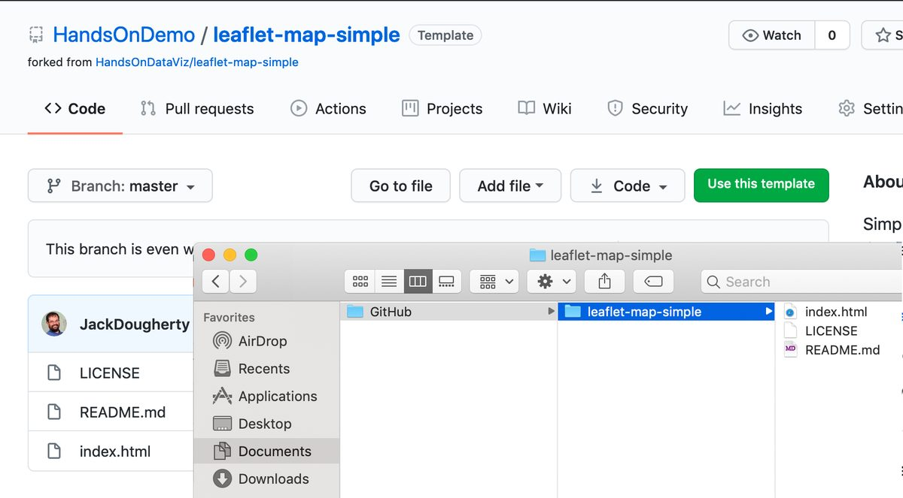{#fig-desktop-finder width=500}

8. 로컬 컴퓨터의 코드를 수정하기 앞서 [Pulsar](https://pulsar-edit.dev) 같은 자신이 선호하는 코드 에디터를 다운로드 및 설치하세요. 그런 뒤 GitHub Desktop 화면으로 돌아가서 'Current Repository(현재 저장소)'가 `leaflet-map-simple`인지 확인한 후, [\@fig-desktop-atom]과 같이 *Open in Editor* 버튼을 클릭하세요(그림은 이전에 많이 쓰던 Atom 에디터를 보여줍니다).


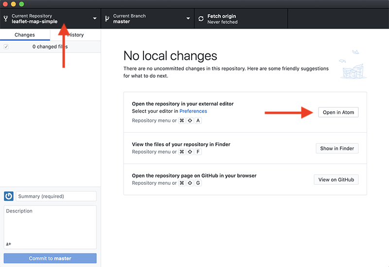{#fig-desktop-atom}

9. 잘 디자인된 코드 에디터는 프로젝트 형태로 전체 저장소를 열어줍니다. 좌측 창에서 파일을 클릭하여 새 탭으로 열어 코드를 확인하고 고칠 수 있습니다(\@fig-atom-project 참조). `index.html` 파일을 열고 22번째 줄 근처의 지도 제목을 수정한 뒤 작업을 저장하세요.


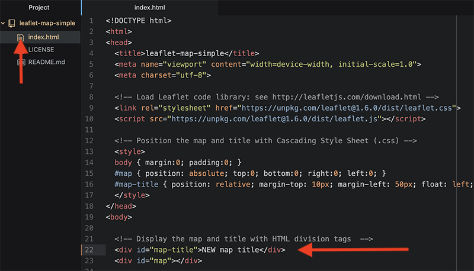{#fig-atom-project}

10. 코드 수정을 저장한 뒤에는 코드 에디터의 작업 공간(workspace)을 정리하는 버릇을 들이는 것이 좋습니다. 열려 있는 현재 프로젝트에서 우클릭한 후 메뉴의 *Remove Project Folder*를 선택하세요(\@fig-atom-remove-project 참조). 나중에 에디터를 다시 열 때는 우클릭하여 *Add Project Folder*를 누른 뒤 여러분의 로컬 컴퓨터에 복사해 둔 GitHub 저장소 중 어느 것이든 선택할 수 있습니다.


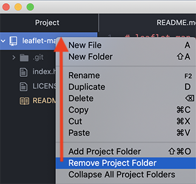{#fig-atom-remove-project}

11. 로컬 컴퓨터 상에서 지도 코드를 고쳤으니, GitHub로 코드를 올리기 전에 결과물을 미리 테스트해 봅시다. 컴퓨터에 저장소를 저장했던 경로로 찾아가서 `index.html` 파일 위에 마우스 오른쪽 버튼을 클릭하고 '다음으로 열기(Open With)'를 누른 뒤 자신이 평소 쓰는 웹 브라우저를 선택하세요(\@fig-finder-open-with 참조).  


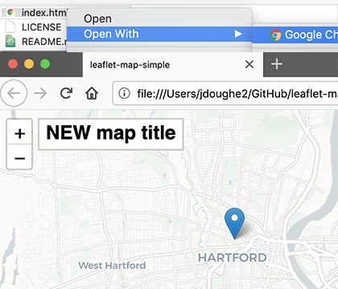{#fig-finder-open-with}

참고: 브라우저가 사용자 로컬 컴퓨터에 저장된 코드만을 구동하고 있기 때문에 웹 주소창의 시작 부분은 GitHub Pages의 온라인 지도 주소(https://...)와 다르게 `file:///...`로 표시될 것입니다. 더불어 코드 내에 외부 온라인 자원 등과 연계된 요소가 있다면 로컬 환경에서는 제대로 동작하지 않을 수 있습니다. 그래도 이번 Leaflet 지도 템플릿의 경우 수정된 지도 제목이 나타나 웹에 수정된 코드를 올리기(push) 전에 시각적 변화를 미리 확인할 수 있을 것입니다.

사이드바: 복잡한 웹 코드를 화면에 구현하기 위해 로컬 웹 서버 실행하기
여러분의 로컬 브라우저에서 특정 [11장의 Chart.js 혹은 Highcharts 템플릿](#chartcode), [12장의 Leaflet 템플릿](#leaflet)을 비롯해 여러 복잡한 코드가 포함된 템플릿들을 제대로 표시하려면 로컬 컴퓨터에 작은 웹 서버를 구축해야 오류 없이 제대로 볼 수 있습니다. Mac 및 Windows 사용자는 이 [Python 다운로드 사이트](https://www.python.org/downloads/)에서 받을 수 있는 무료 Python 코드 라이브러리(버전 3 이상)에 내장된 웹 서버를 손쉽게 실행할 수 있습니다. 첫 번째로, [Mac 터미널 애플리케이션](https://support.apple.com/guide/terminal/welcome/mac)이나 [Windows 터미널 애플리케이션](https://apps.microsoft.com/detail/9n0dx20hk701)을 열고 다음의 명령어를 입력하세요: `python -m http.server`. 두 번째로, 선호하는 웹 브라우저를 열어 검색창에 로컬 컴퓨터 주소인 `localhost:8000`을 입력하세요. 이어서 로컬 컴퓨터의 폴더 색인이 보일 텐데, [\@fig-terminal-server]에서 볼 수 있듯 미리 보기 하려던 웹 코드가 있는 폴더로 이동합니다. 잘 안된다면 [Real Python 도움말 페이지](https://realpython.com/python-http-server/)를 살펴보세요. 작업이 다 끝나면 CTRL+C를 입력하여 터미널을 종료한 다음 웹 브라우저를 종료하시면 됩니다.


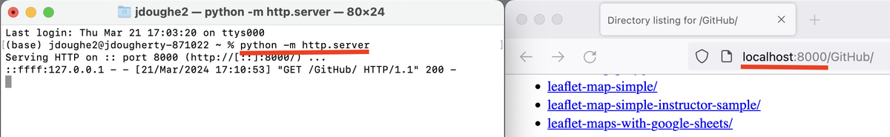{#fig-terminal-server}

이제 앞서 GitHub Desktop 설정 당시에 연동했던 귀하의 GitHub 웹 계정으로 수정 사항들을 전송해 보겠습니다.

12. GitHub Desktop으로 들어가서 현재 저장소(Current Repo)가 `leaflet-map-simple`인지 확인하면 화면에 여러분의 코드 수정 요약이 표시될 것입니다. 다음과 같은 두 가지 단계를 거칩니다. 먼저 하단의 파란색 *Commit* 버튼을 클릭하여 수정된 사항을 로컬 저장소에 저장합니다. (여러 파일을 수정했다면, 작업 내역 추적을 돕기 위해 GitHub Desktop이 수정 사항에 대한 요약을 적도록 요구할 것입니다.) 그 후 파란색 *Push origin* 버튼을 눌러 GitHub 웹 계정에 있는 상위 저장소로 해당 수정 사항을 복사해 전송합니다. 이 2단계 과정은 [\@fig-desktop-commit-push]에 잘 나와 있습니다.


::: {.content-visible when-format="html"}

<video src="images/10-github/desktop-commit-push.mp4" width="100%" height="500px" style="border:none;" autoplay loop muted playsinline></video>
<p class="caption">이 [애니메이션 GIF](https://handsondataviz.org/images/10-github/desktop-commit-push.gif)에 묘사된 2단계 과정을 통해 *Commit*을 누른 다음 *Push origin*을 클릭해 여러분의 로컬 컴퓨터에서 GitHub 웹 계정으로 수정 내역을 저장하고 복사하세요.</p>

:::


축하합니다! 여러분은 GitHub 계정에서 출발하여 로컬 컴퓨터로 왔다가 다시 GitHub로 되돌아가는 코드의 둥근 여정을 훌륭하게 완주했습니다. 아까 GitHub Pages 설정을 활용하여 코드의 온라인 버전을 만들었으니 공개 웹 사이트에 바뀐 지도 제목이 나타났는지 확인해 보십시오. 설정했던 주소 형식은 `https://USERNAME.github.io/REPOSITORY`이며 여러분의 GitHub 사용자 이름과 저장소 이름으로 대체해야 합니다.

물론 그 정도의 자그마한 코드 수정은 GitHub 웹 인터페이스 상에서도 가능했겠지만 GitHub Desktop 및 Atom Editor를 사용해 코드를 고치고 컴퓨터에서 커밋 사항을 전송(push)하는 것이 얼마나 장점이 많은지 깨닫게 되셨기를 바랍니다. 첫째, 에디터 툴을 사용하면 검색, 찾기 및 바꾸기 등의 여타 기능들 덕분에 더 복잡한 코드들도 보다 효율적으로 다룰 수 있습니다. 둘째, 로컬 컴퓨터에 저장소를 복사해 뒀으므로 데이터나 지리 정보, 이미지 등 다소 구조가 복잡한 시각화를 작업할 때 여러 개의 파일과 하위 폴더들을 신속하게 드래그 앤 드롭으로 추가할 수 있습니다. 셋째, 코드의 종류에 따라서는 수정사항을 공개 웹상에 업로드(push)하기 전에 로컬 브라우저 환경에서 정상 작동 여부를 미리 테스트해 볼 수도 있습니다.

팁: Pulsar에는 코드를 편집하는 데 도움이 되는 많은 내장 명령어가 있습니다. 첫 번째로 긴 코드 문자열들을 모니터 화면 크기에 맞게 자동으로 우측 여백을 조절해 주는 기능이 있습니다. *View > Toggle Soft Wrap* 기능을 켜면 됩니다. 두 번째는 코딩 언어를 자동으로 감지해 블록 지정한 텍스트를 실행 코드 상태 혹은 실행을 막는 주석 상태로 재빨리 전환하는 *Edit > Toggle Comments* 기능입니다. 세 번째 명령어는 들여쓰기를 정돈하여 가독성을 높이는 *Edit > Lines > Auto Indent* 기능입니다. 그리고 마지막으로 환경설정(Preferences) 메뉴를 통해 [Pulsar의 여타 패키지](https://web.pulsar-edit.dev)들을 많이 다운받아 사용할 수 있습니다.

GitHub는 여러 사람이 함께 진행하는 협업 프로젝트를 다룰 때에도 매우 강력한 플랫폼입니다. 여러 사람이 공유하는 저장소로 작업할 때, 한 작업자는 GitHub Desktop을 사용하여 로컬 컴퓨터로 최신 코드 버전을 "가져오기(pull)"한 다음 수정한 뒤(커밋) GitHub 온라인 저장소로 다시 "내보내기(push)" 할 수 있습니다. 물론 협업하는 동료 역시 동일한 저장소에 동시다발적으로 "풀(pull)"이나 "푸시(push)"를 할 수는 있겠지만 웬만하면 각자 다른 파일이나 별개의 영역 코드를 다루는 편이 복잡함을 피할 수 있습니다. 각자 어떤 부분을 수정했는지는 GitHub의 저장소 화면에서 *Code* 탭에 있는 특정 커밋을 눌러볼 때 녹색(추가)이나 붉은색(삭제)으로 한 줄씩 세밀히 살펴볼 수 있습니다(\@fig-compare-commits 참조).


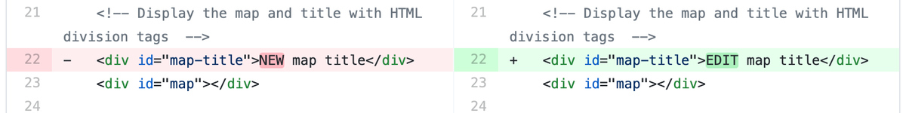{#fig-compare-commits width=750}

비록 구글 문서(Google Documents)처럼 사람들의 실시간 수정 내역이 화면에 그대로 표시되진 않지만 협업 환경에서 코드를 다룰 때 GitHub 플랫폼은 여러 가지 장점을 갖췄습니다. 우선 앞서 이야기한 대로 매번의 수정(커밋) 내역을 남기기 때문에 필요하다면 언제든 아주 구체적인 이전 코드 상태로 되돌릴(restore) 수 있습니다. 두 번째 장점은 GitHub 저장소를 공개 모드로 전환했을 시 제3자가 코드를 읽어보고 해당 코드를 소유한 주체에게 여러 의견을 제안하거나 에러 상황을 알리는 "이슈(issue)" 메시지를 전송하거나 수정 방안을 담은 "풀 리퀘스트(pull request)"를 남길 수 있는데 방장의 권한으로 제안사항을 받아들이거나 반려할 수 있습니다. 셋째로 코드 수정 과정에서 기존 브랜치(branch)로부터 새로운 분기를 나눌 수 있으며 향후 수정한 내용을 반영하고자 할 때는 그 여러 가닥의 브랜치를 원래 상태로 다시 "병합(merge)"하는 것도 허용됩니다. 그런데 간혹 서로 어울리지 않거나 배치되는 수정 내용들을 한꺼번에 푸시(push)하려는 시도가 감지될 때면 모두의 작업물이 손상되지 않도록 "충돌 발생(Merge Conflict)" 경고를 띄워 어떻게 교통정리를 할지 사용자에게 결정할 것을 묻기도 합니다.

많은 프로그래머가 Mac이나 Windows의 터미널 앱 상에서 특정한 명령어를 외워서 일일이 타이핑하는 방식인 CLI(Command Line Interface) 방식을 사용해 GitHub를 조작하지만 이것은 본 입문서가 추구하는 난이도와 방향성을 다소 넘어가는 것입니다.

### 요약 {- #summary10}
여러분이 코드를 포크하고 편집하고 라이브 코드로 공개 웹에 호스팅해 본 것이 이번이 처음이라면 프로그래머의 세계에 들어오신 것을 진심으로 환영합니다! 아울러 GitHub가 이 모든 과정을 관리하고 타인과 무언가를 공유하기 위해 얼마나 강력하고 유용한 플랫폼인지 실감하셨길 바랍니다. 확실히 초심자들에게는 GitHub 웹 인터페이스의 환경이 더 만족스럽게 다가오겠지만 이후 [11장의 Chart.js 및 Highcharts 코드 템플릿](#chartcode)과 [12장의 Leaflet 지도 템플릿](#leaflet)에서는 GitHub Desktop이나 Atom 에디터와 같은 툴을 활용해야 코드 작성이 훨씬 수월하다는 점을 느끼실 것입니다. 자 이제 이 새로 얻게 된 코딩 스킬을 통해 향후 다음 2개 챕터에서 좀 더 본격적이고 사용자 입맛에 맞는 맞춤형 차트와 지도를 제작해 봅시다.


<!-- BEGIN FILE: 11-chartcode.Rmd -->

# Chart.js 및 Highcharts 템플릿 {#chartcode}

[6장: 데이터 차트 만들기(Chart Your Data)](#chart)에서는 [Google Sheets](#chart-google), [Datawrapper](#chart-datawrapper), [Tableau Public](#chart-tableau)과 같은 인터랙티브 차트를 구축하기 위한 강력한 드래그 앤 드롭 툴들을 둘러보았습니다.

본 장에서는 대중적으로 널리 쓰이는 두 종류의 자바스크립트 라이브러리인 [Chart.js](https://www.chartjs.org/)와 [Highcharts](https://www.highcharts.com/)를 사용하여 어떻게 인터랙티브 차트를 그릴 수 있는지 알아보겠습니다.
다만 저희는 독자 여러분이 자바스크립트나 타 프로그래밍 언어에 대한 전문적인 지식을 지니고 있을 거라 전제하진 않으므로, 여러분 본인의 GitHub 계정으로 복사해서 데이터 파일만 교체하면 코드 한 줄 손대지 않고도 웹상에 떡 하니 결과물을 만들어 낼 수 있는 템플릿들을 준비해 놓았습니다. 그러나 한편으로 코딩 세계에 호기심 가득한 분들을 위해 템플릿 안의 자바스크립트 코드를 좀 더 커스터마이징 하는 방법도 함께 알려드릴 생각입니다.

그런데 'Datawrapper나 Tableau같이 쓰기 쉽고 편리한 툴 대신 왜 굳이 자바스크립트 방식을 고집해야 하느냐'라고 의문을 가질 분들도 있을 겁니다. 여기엔 몇 가지 이유가 있습니다. 일단 자바스크립트 코드는 처음 맞닥뜨렸을 때 엄청난 두려움과 압도당할 것 같은 위압감을 줄 수 있긴 하지만 막상 적응하고 나면 제3의 업체가 제공하는 그 어떠한 툴과 비교해도 색상, 여백 지정(padding), 인터랙티브 효과, 다방면의 데이터 처리 등에서 극강의 자율성과 커스터마이징을 자랑합니다. 더욱이 그 어떤 앱이나 서비스도 언제까지고 무료 혜택과 프리 티어를 평생 보장할 것이라 확신할 수 없지만 이들 오픈 소스 툴들은 코드의 업데이트를 관리하는 이들이 존재하는 한 계속해서 공짜로, 언제나 우리의 곁을 지킬 것이기 때문입니다.

참고: 두 라이브러리 모두 오픈 소스 기반이기는 하지만 Highcharts 쪽의 라이선스 정책은 개인 용도나 학술적인 목적 혹은 비영리 조직의 웹사이트 등 [비상업적 용도에만](https://www.highcharts.com/products/highcharts/#non-commercial) 무료 이용을 허락하는 다소 깐깐한 제한이 있습니다. 이러한 점을 염두에 두고 저희 책에서는 상업적인 프로젝트 용도로 쓰기에도 지장 없는 MIT 라이선스 규약을 지닌 Chart.js 위주로 설명을 진행하겠습니다.

표 [\@tbl-chart-templates]는 이번 장에서 다룰 모든 종류의 차트를 열거한 것입니다. 두 종류의 라이브러리 모두 [Chart.js 샘플 모음집](https://www.chartjs.org/samples/latest/) 및 [Highcharts 데모 페이지](https://www.highcharts.com/demo)에 들러보시면 확인할 수 있듯 훨씬 더 다채로운 종류의 디폴트 차트 디자인들을 품고 있습니다. 하지만 3차원 차트처럼 일부 현란한 디자인 차트의 경우 이전에 [6장 데이터 차트 디자인 원칙](chart-design)에서 설명해 드린 바와 같은 여러 요인 때문에 사용하지 않기를 강력히 권장합니다.

표: (\#tab:chart-templates) 차트 코드 템플릿, 활용 방안, 및 튜토리얼 안내

| 차트 | 이 책의 활용 방안 및 튜토리얼 |
| --- | --- |
| 막대(Bar) 혹은 컬럼형(Column) 차트<br> 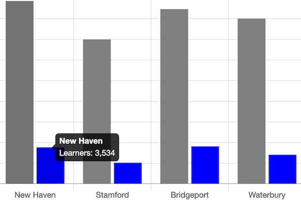 | 카테고리별 특성을 나란히 놓고 비교하기 적합함. 만일 이름 등 라벨이 너무 길어질 것 같으면 수직형(컬럼형)보다는 수평 방향 막대(Bar) 형태를 사용하는 편이 나음. <br>파워 툴: [CSV 데이터를 활용해 Chart.js 템플릿 코드로 그려내는 막대/컬럼형 차트 및 튜토리얼](#chartjs-bar-column) |
| 오차 막대(Error Bars)가 포함된 막대/컬럼형 차트<br> 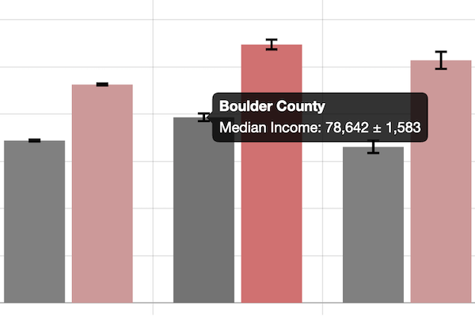 | 카테고리를 나란히 놓고 비교할 때 오차 범위(margin of error)를 표시하고 싶을 때 적합함. 라벨이 길다면 수직형보다는 수평형 막대(Bar) 차트를 활용하는 것을 추천. <br>파워 툴: [CSV 데이터를 활용해 Chart.js 코드 템플릿으로 오차 범위 막대를 그려내는 튜토리얼](#chartjs-error-bars) |
| 꺾은선 차트 (Line Chart)<br> 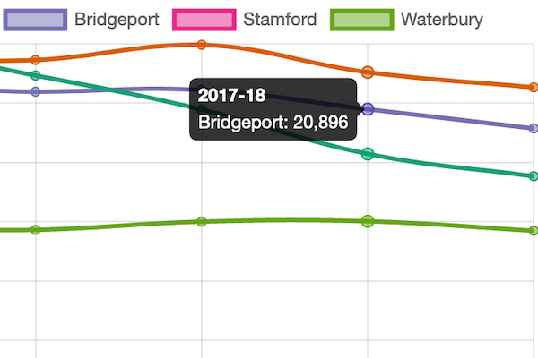 | 시간의 흐름에 따른 값의 추이 변화 등 연속되는 속성의 데이터들을 나열하는 데 가장 적합함.<br>파워 툴: [CSV 데이터를 이용한 Chart.js 기반 꺾은선 차트 코드 템플릿 및 튜토리얼](#chartjs-line). 꺾은선 차트를 누적 영역(stacked area) 형태의 차트로 변환하는 법은 해당 튜토리얼 노트를 참조. |
| 주석이 달린(Annotated) 꺾은선 차트<br> 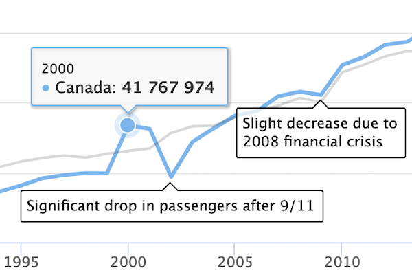 | 꺾은선 차트 안에서 시간의 흐름에 따른 추이 변화 등에 대한 맥락이나 부가적인 설명글들을 달고 싶을 때 활용함.<br>파워 툴: [CSV 데이터를 기반으로 Highcharts 템플릿과 코드로 주석 달린 꺾은선 차트를 그리는 튜토리얼](#highcharts-annotated-line) |
| 산점도 차트(Scatter Chart)<br> 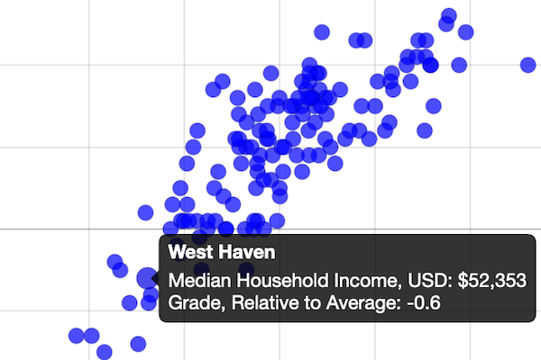 | 각 데이터의 상관관계 유무를 확인하고자 두 묶음의 데이터 세트가 지니는 관계성을 X축, Y축 좌표 내에 표시할 때 쓰임.<br>파워 툴: [Chart.js 템플릿과 코드를 이용해 CSV 데이터로 산점도를 그리는 튜토리얼](#chartjs-scatter) |
| 버블 차트(Bubble Chart)<br> 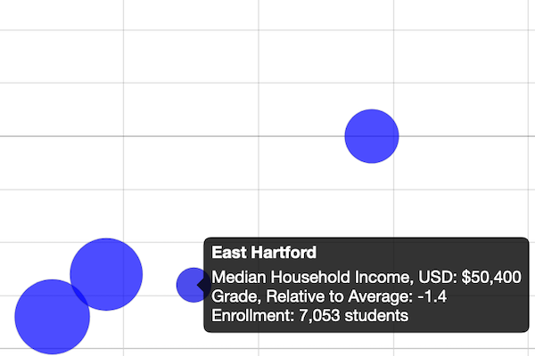 | 통상 X, Y 좌표 및 그곳에 맺힌 원(버블)의 색상이나 반경의 크기에 따라 세 개에서 네 개에 달하는 데이터 세트가 지니는 연관관계를 보여줄 때 사용함. <br>파워 툴: [Chart.js 템플릿 및 코드로 CSV 데이터 기반 버블 차트 그리기 튜토리얼](#chartjs-bubble) |


## Chart.js로 그리는 막대 혹은 컬럼형 차트 {- #chartjs-bar-column}
이번 섹션에서는 여러분이 Chart.js를 이용해 어떻게 막대 및 컬럼 형태의 차트를 그려낼 수 있는지 보여드리고자 합니다. 구체적인 방법을 살펴보기 위해, 우리는 CSV 파일로부터 데이터를 끄집어내는 방식으로 Chart.js 코드 템플릿을 활용해 볼 예정입니다. 완성본의 예시는 [\@fig-chartjs-demo-bar]에 제시된 차트를 참조해 주십시오. 해당 컬럼 차트는 2018-2019학년도 코네티컷주의 5개 학군에서 영어를 배우는 비영어권 학생 수를 보여줍니다.


::: {.content-visible when-format="html"}

<iframe src="https://handsondataviz.github.io/chartjs-bar/index.html" width="100%" height="500px" style="border:none;"></iframe>
<p class="caption">Chart.js 기반 막대 차트: [인터랙티브 버전 보기](https://handsondataviz.github.io/chartjs-bar/index.html).</p>

:::


우리가 배포한 Chart.js 템플릿과 CSV 데이터를 토대로 나만의 멋진 막대 혹은 컬럼 형태 차트를 만들고자 한다면 다음 순서를 따르십시오.

1. [\@fig-chartjs-demo-bar]의 차트 생성 코드를 담고 있는 [저희의 GitHub 저장소](https://github.com/HandsOnDataViz/chartjs-bar)로 가셔서 귀하의 계정으로 로그인한 뒤, *이 템플릿 사용하기(Use this template)* 버튼을 꾹 눌러 마음껏 코드를 수정할 수 있는 복사본을 생성하십시오.

참고: 만약 GitHub 사용법이 가물가물하시다면 [10장: GitHub로 코드 편집 및 호스팅하기](#github) 챕터로 잠시 다녀오길 권장합니다.


해당 저장소 안에는 차트 제작과 관련된 세 가지 핵심 파일들이 수록되어 있습니다.

* `index.html` 파일에는 브라우저에게 해당 차트를 포함한 문서 구조를 어떻게 그려내고 디자인할지, 그리고 또 어떤 라이브러리들을 끄집어낼 것인지를 말해주는 HTML(마크다운 언어)과 CSS(스타일시트 언어) 코드가 수록되어 있습니다.
* `script.js` 파일에는 CSV 파일에 기재된 데이터 정보들을 파악해 인터랙티브 차트를 구축해 내는 핵심적인 자바스크립트 언어가 들어 있습니다.
* `data.csv`는 쉼표로 분리된 수치들의 조합 파일이며 향후 완성될 차트에 등장할 온갖 데이터들을 보관합니다. 당연히 해당 파일은 문서 편집 프로그램이나 Google Sheets 혹은 Excel 등에서도 수정이 가능합니다.

남아있는 두 개의 파일은 이 저장소가 어떠한 콘텐츠를 품고 있는지를 설명하는 문서인 `README.md`이고 그다음은 README 상에서 묘사되는 단순한 이미지 파일 하나인 `bar.png`입니다. 이번 챕터에서 등장할 모든 종류의 GitHub 템플릿들은 지금 보시는 바와 유사한 구조를 지니고 있을 것입니다.

2. 귀하가 지닌 데이터를 `data.csv` 파일 양식에 맞게 다듬은 후 업로드하십시오. 이 차트의 좌표 축 부분에 해당하는 라벨을 가장 첫 열에 두시고 나머지 데이터 시리즈들이 기재된 항목들은 순서대로 그다음 각각의 열을 차지하도록 합니다. 여러분의 CSV 파일 안에는 적어도 2개 열(라벨용 열 1개, 기타 데이터 시리즈 열 1개)의 구조는 반드시 존재해야 합니다. 물론 얼마든지 원하는 만큼 새로운 데이터를 담은 열을 기재해 넣을 수 있습니다.

```
| district  | nonlearner | learner |
| Hartford  | 15656      | 4111    |
| New Haven | 17730      | 3534    |
```

3. `script.js` 파일 내에 위치한 변수값(variables)들의 설정을 맞춤화해 보십시오. 자바스크립트라는 프로그래밍 언어 자체가 처음일 수 있으니 이 파일 속의 변수가 어떤 역할을 하는지 짤막하게 설명을 덧붙이겠습니다.

```javascript
// `false` for vertical column chart, `true` for horizontal bar chart
var HORIZONTAL = false;
```

앞쪽의 `//` 기호로 시작되는 첫 번째 줄은 주석이며 바로 다음 줄에서 정의할 변수가 무슨 역할을 맡고 있는지를 설명해 줍니다. 코드가 구동될 때에는 이 주석 처리가 무시되므로 전체적인 로직에 하등의 영향을 미치지 않습니다. 눈으로 보시다시피 만일 HORIZONTAL이란 변수를 `false`로 지정한다면 이 차트는 수직 방향으로 자라난 막대들(흔히 컬럼형 차트라 부름)을 화면에 띄울 것입니다. 반면에 `true` 값을 입력한다면 차트 안의 막대들은 좌우 방향인 수평 형태로 표시됩니다. 두 번째 줄은 이 변수에 대한 정의 및 값을 대입하는 명령을 품고 있습니다. 등호 표시(`=`)는 그 오른쪽에 적힌 값(위에서는 *false*)을 좌측에 정의된 `HORIZONTAL`이라는 변수명(`var`) 안에 욱여넣겠다는(할당하겠다는) 의미입니다. 그리고 맨 뒤 꼬리 부분에 세미콜론(`;`)이 달리며 문장이 완결됩니다.

자 그럼 아래를 통해 `script.js` 파일에서 여러분 입맛대로 가지고 놀아볼 수 있는 여타 변수 항목들을 차례차례 구경해 볼까요?

```javascript
var TITLE = 'English Learners by Select School Districts in CT, 2018-19';

// `false` for vertical column chart, `true` for horizontal bar chart
var HORIZONTAL = false;

// `false` for individual bars, `true` for stacked bars
var STACKED = false;  

// Which column defines 'bucket' names?
var LABELS = 'district';  

// For each column representing a data series, define its name and color
var SERIES = [  
  {
    column: 'nonlearner',
    name: 'Non-Learners',
    color: 'grey'
  },
  {
    column: 'learner',
    name: 'Learners',
    color: 'blue'
  }
];

// x-axis label and label in tooltip
var X_AXIS = 'School Districts';

// y-axis label, label in tooltip
var Y_AXIS = 'Number of Enrolled Students';

// `true` to show the grid, `false` to hide
var SHOW_GRID = true;

// `true` to show the legend, `false` to hide
var SHOW_LEGEND = true;
```

위의 가장 기본적인 변수들만 다룰 줄 알아도 어엿한 시작으로 충분할 겁니다. 당연히 여러분은 기호에 따라 범례(legend)의 위치를 이리저리 바꿔본다든가, 툴팁(tooltip)의 모습을 매만진다든가 그도 아니면 모눈종이 같은 격자 줄무늬 선들의 색깔마저 취향대로 손보고 싶어 할 텐데요. 그러기 위해 공식 배포된 [Chart.js 관련 문서자료](https://www.chartjs.org/docs/latest/) 등을 살펴보시길 추천해 드립니다.

## Chart.js 기반 오차 막대형 차트 {- #chartjs-error-bars}
만약 귀하의 데이터에 뭔가 불확실성(오차 한계, margin of error 등)이 녹아져 있다면 오차 막대 디자인 요소(error bars)를 이용해 그 시각화의 불명확함마저 솔직하게 노출하는 편을 권장합니다. 아래 [\@fig-chartjs-demo-error-bars]에 제시된 막대형 템플릿의 경우 콜로라도주 전체, 볼더 카운티, 볼더시, 그리도 해당 도시 내의 특정 통계청(census tract) 구역 등 각기 다른 규모의 여러 인구 지리통계 구획마다 측정된 중앙 소득(median)과 평균(mean) 수치를 함께 표시하고 있습니다.


::: {.content-visible when-format="html"}

<iframe src="https://handsondataviz.github.io/chartjs-templates/bar-chart-with-error-bars/index.html" width="100%" height="500px" style="border:none;"></iframe>
<p class="caption">오차 막대가 추가된 인터랙티브 Chart.js 막대 차트: [인터랙티브 버전 보기](https://handsondataviz.github.io/chartjs-error-bars/index.html).</p>

:::


우리만의 고유한 Chart.js 템플릿을 활용해 오차 범위가 반영된 막대 및 컬럼 차트를 구축하고자 할 때, CSV 파일에서 어떻게 수치들을 뽑아내는지 다음 절차를 살펴봅시다.

1. \@fig-chartjs-demo-error-bars 안 차트 디자인에 상응하는 소스 코드 등이 담긴 [오차 막대형 Chart.js 템플릿용 GitHub 저장소](https://github.com/HandsOnDataViz/chartjs-error-bars)로 이동해 본인 계정으로 접속한 후 *이 템플릿 사용하기(Use this template)* 탭을 눌러 자유롭게 입맛에 맞출 사본을 하나 장만하십시오.

2. 원본 데이터 소스가 든 CSV 포맷의 파일을 엮어내 이를 `data.csv` 이름으로 저장합니다. 축과 나란히 배열할 카테고리 속성 이름값들은 가장 좌측의 첫 번째 열을 채우도록 하시고 그다음 기타 데이터 시리즈들은 그것에 연계되는 오차 불확실 수치 칼럼과 함께 쌍을 지어 배치합니다. 여러분의 CSV 파일은 반드시 다음과 같은 양식으로 된 3개의 기초 열(라벨 1열 + 수치 1열 + 불확실값 수치 1열)을 포함하고 있어야 구동이 됩니다. 덧붙여 말하자면, 데이터 시리즈 양에 한도가 정해져 있지는 않으니 여러분이 희망하는 바에 맞춰 원하는 만큼 추가해 넣으면 됩니다.

```
| geo            | median | median_moe | mean   | mean_moe |
| Colorado       | 68811  | 364        | 92520  | 416      |
| Boulder County | 78642  | 1583       | 109466 | 2061     |
| Boulder city   | 66117  | 2590       | 102803 | 3614     |
| Tract 121.02   | 73396  | 10696      | 120588 | 19322    |
```

3. 그런 다음 `script.js` 파일 쪽으로 넘어가 아래에 발췌한 일련의 코드 항목별로 적절한 변수 값을 부여해 맞춤화를 진행해 주십시오.

```javascript
var TITLE = 'Household Income for Select US Geographies, 2018';

// `false` for vertical (column) chart, `true` for horizontal bar
var HORIZONTAL = false;

// `false` for individual bars, `true` for stacked bars
var STACKED = false;  

// Which column defines "bucket" names?
var LABELS = 'geo';

// For each column representing a series, define its name and color
var SERIES = [
  {
    column: 'median',
    name: 'Median Income',
    color: 'grey',
    errorColumn: 'median_moe'
  },
  {
    column: 'mean',
    name: 'Mean Income',
    color: '#cc9999',
    errorColumn: 'mean_moe'
  }
];

// x-axis label and label in tooltip
var X_AXIS = 'Geography';

// y-axis label and label in tooltip
var Y_AXIS = 'US Dollars';

// `true` to show the grid, `false` to hide
var SHOW_GRID = true;

// `true` to show the legend, `false` to hide
var SHOW_LEGEND = true;
```

더욱 고차원적인 설정이 필요하다면 이 [Chart.js 관련 공식 문서 모음집](https://www.chartjs.org/docs/latest/)을 참조하시기 바랍니다.


## Chart.js 기반 꺾은선 차트 {- #chartjs-line}

시간과 시간 사이에 벌어진 수치의 추이와 그 변화폭을 나타내야 할 때는 흔히 꺾은선형 차트를 사용하곤 합니다.
따라서 가로인 X축에는 일정 간격의 시간대를 열거하고 Y축에는 관측되거나 수집된 변숫값의 정도를 위치시킵니다.
컬럼이나 막대형 차트와 구별되는 주요 특징 중 하나는, 선이 지니는 기울기와 변화하는 폭 등에 기대어 데이터를 해석하므로 Y축 값이 꼭 기계적으로 0(제로)의 지점에서부터 시작할 필요가 없다는 것입니다.
[\@fig-chartjs-demo-line]에서 엿볼 수 있는 꺾은선 차트는 2012-2013학년도부터 시작하여 2018-19 학년도 사이에 벌어진 코네티컷주의 특정 학군별 재학생 수의 증가와 감소 추이를 나타내 줍니다.
각각의 꺾은선별로 구분된 색상이 매겨져 있어, 범례를 훑어보는 것만으로 각 학군 간의 차이와 경향성들을 대번에 포착해 낼 수 있습니다.


::: {.content-visible when-format="html"}

<iframe src="https://handsondataviz.github.io/chartjs-line/" width="100%" height="500px" style="border:none;"></iframe>
<p class="caption">Chart.js 기반 인터랙티브 꺾은선 차트: [인터랙티브 버전 보기](https://handsondataviz.github.io/chartjs-line/).</p>

:::


Chart.js와 준비해 둔 CSV 데이터 원본을 사용해 이 꺾은선 형태의 차트를 구현해 보고자 한다면 아래 지시 사항을 따르십시오.

1. [\@fig-chartjs-demo-line]과 똑 닮은 꺾은선 차트를 코딩한 소스가 담긴 [해당 템플릿의 GitHub 저장소](https://github.com/HandsOnDataViz/chartjs-line)로 진입한 후 본인의 계정으로 로그인하고 *이 템플릿 사용하기(Use this template)* 탭을 눌러 마음대로 요리할 수 있는 사본 복제 작업을 마칩니다.

2. 데이터 더미를 CSV 확장자 형식으로 묶어낸 다음 그것을 `data.csv`란 파일명으로 바치십시오. 축상에 곁들일 라벨 항목들을 최좌측 1열에 기재하고 그다음 우측 열부터 다른 속성의 시리즈들을 하나씩 순차적으로 할당합니다. 그리고 이 모든 것이 들어 있는 CSV 문서에는 최소한 2개 열(라벨 1개, 데이터 1개)의 내용물은 담겨 있어야 합니다.

팁: 독자분 원하시는 대로 무한정 열을 쪼개고 새 데이터를 밀어 넣을 순 있지만 우리들 인간의 안구가 뿜어내는 색상 식별 능력에는 분명한 한계가 존재하기에 어느 정도 합리적인 수준에서 선을 긋는 자제력을 권합니다. 정말로 엄청난 양의 꺾은선들을 그 안에 우겨 넣어야 한다면 차라리 가장 주인공 격인 메인 스토리를 대변하는 핵심 선 한 개 정도에만 뚜렷한 색상(강조색)을 몰아주고 나머지는 주변의 회색빛 배경과 어스름하게 동화시키기를 추천해 드립니다. 이는 나중에 [15장의 디자인 기법 섹션인 '의미 부여와 시선 끌기'](#draw-attention) 등을 통해 구체적으로 학습하게 될 것입니다.

```
| year    | Hartford | New Haven | Bridgeport | Stamford | Waterbury |
| 2013-14 | 21820    | 21420     | 20929      | 15927    | 18706     |
| 2014-15 | 21953    | 21711     | 21244      | 16085    | 18878     |
| 2015-16 | 21463    | 21725     | 21191      | 15946    | 18862     |
| 2016-17 | 20891    | 21981     | 21222      | 16100    | 19001     |
| 2017-18 | 20142    | 21518     | 20896      | 15931    | 19007     |
| 2018-19 | 19767    | 21264     | 20572      | 16053    | 18847     |
```

3. 그런 다음 `script.js` 파일 내 해당 변숫값들을 수정할 차례입니다.

```javascript
var TITLE = 'Hartford School District is No Longer Largest in Connecticut';

// x-axis label and label in tooltip
var X_AXIS = 'Academic Year';

// y-axis label and label in tooltip
var Y_AXIS = 'Number of Students';

// Should y-axis start from 0? `true` or `false`
var BEGIN_AT_ZERO = false;

// `true` to show the grid, `false` to hide
var SHOW_GRID = true;

 // `true` to show the legend, `false` to hide
var SHOW_LEGEND = true;
```

참고: 평범한 꺾은선형 차트를 일련의 영역형 차트인 이른바 누적 면적형(stacked area chart) 차트 포맷으로 바꾸어 변모시키고 싶다면 [Chart.js Stacked Area 공식 문서](https://www.chartjs.org/docs/latest/charts/line.html?h=stacked)를 정독하십시오. 모든 `dataset` 부분의 꼬리말에 `fill: true` 설정값(property)을 박아두고 아울러 `yAxes` 설정 파트 속에도 `stacked` 특성값이 `true`로 켜져 있는지 거듭 확인해야 할 것입니다.

추가하고픈 속성 등이 생길 때면 제일 먼저 공식 [Chart.js 문서 가이드](https://www.chartjs.org/docs/latest/) 등을 살펴보는 습관을 기르세요. 혹여나 뭔가 코드가 꼬여 먹통이 되었다면, 십중팔구 여러분 말고도 누군가 예전에 똑같은 헛발질을 했을 공산이 크니 [StackOverflow 홈페이지](https://stackoverflow.com/search?q=chartjs) 같은 커뮤니티 질의 공간으로 건너가 검색부터 해보는 것도 삶의 지혜입니다.

## Highcharts 기반 주석 달린 꺾은선 차트 {- #highcharts-annotated-line}

비록 어느 형태의 차트이든지 간에 부가 설명을 곁들이는 주석 달기(annotations) 기법이 유용할 때가 많긴 하지만 특별히 꺾은선형 차트에서는 그 진가가 유감없이 발휘됩니다. 주석은 선과 선들이 지니는 역사적 배경 맥락을 짚어주고 급격히 솟구치거나 바닥으로 꺼지는 이상 지점에서의 숱한 질문들에 속 시원한 해답을 내려주는 역할을 담당합니다. [\@fig-highcharts-demo-annotated-line]에 있는 차트는 세계은행 자료를 근거로 1970년부터 2018년 사이의 캐나다와 호주의 항공 여객 교통량의 변화 추이를 그린 것입니다. 자세히 뜯어보면 두 국가 공통으로 2009년 부근에 갑작스러운 수치 급감이 발생한 현상을 볼 수 있는데, 이는 주석을 통해 그것이 2008년에 촉발된 글로벌 금융 위기와 밀접한 연관이 있음을 넌지시 알려줍니다.


::: {.content-visible when-format="html"}

<iframe src="https://handsondataviz.github.io/highcharts-line-annotated/index.html" width="100%" height="400px" style="border:none;"></iframe>
<p class="caption">Highcharts 기반의 주석 처리된 인터랙티브 차트: [인터랙티브 버전 보기](https://handsondataviz.github.io/highcharts-line-annotated/).</p>

:::


다만 Chart.js는 이러한 주석(annotations) 기능을 구현하기가 다소 까다롭습니다. 따라서 이 실습에서는 Highcharts 라이브러리를 활용해 주석 달린 꺾은선 차트를 만듭니다. Highcharts 역시 앞서 살펴본 Chart.js 템플릿과 유사한 방식으로 동작하므로 쉽게 따라 할 수 있습니다.

CSV 데이터로 Highcharts 기반의 주석 달린 꺾은선 차트를 만드는 과정은 다음과 같습니다.

1. \@fig-highcharts-demo-annotated-line 차트 코드가 포함된 [GitHub 저장소](https://github.com/HandsOnDataViz/highcharts-line-annotated)로 이동하여 로그인한 후, *Use this template(이 템플릿 사용하기)*을 클릭해 자신의 계정으로 사본을 만듭니다.

2. 데이터를 CSV 형식(`data.csv`)으로 준비하여 업로드합니다. 첫 번째 열에는 레이블을 지정하고 이어지는 열에는 데이터셋 값을 입력합니다. 정상적으로 작동하려면 최소 3개의 열(레이블, 데이터 값, 주석)이 필요합니다. 열은 필요한 만큼 추가할 수 있지만 주석(마지막 열)은 각 행마다 하나씩만 지정할 수 있습니다.

```
| Year | Canada   | Australia | Note                  |
| 1980 | 22453000 | 13648800  |                       |
| 1981 | 22097100 | 13219500  |                       |
| 1982 | 19653800 | 13187900  | Early 1980s recession |
```

3. `script.js` 쪽에선 아래에 등장한 발췌문 코드 안의 여러 변수 설정을 조금씩 튜닝해 줍니다.

```javascript
var TITLE = 'Air Transport, Passengers Carried (19702018)';

// Caption underneath the chart
var CAPTION = 'Source: The World Bank';

// x-axis label and label in tooltip
var X_AXIS = 'Year';

// y-axis label and label in tooltip
var Y_AXIS = 'Passengers';

// Should y-axis start from 0? `true` or `false`
var BEGIN_AT_ZERO = true;

// `true` to show the legend, `false` to hide
var SHOW_LEGEND = true;
```

만일 여러분이 이 차트를 한 꺼풀 더 매만지며 개조해보고 싶다면 모든 종류의 설정과 속성값 기능들을 총망라한 [Highcharts API 관련 공식 매뉴얼 모음집](https://api.highcharts.com/highcharts/)을 파헤쳐 보기를 강력히 추천합니다.


## Chart.js 기반 산점도 차트 {- #chartjs-scatter}

자, 지금까지 Highcharts의 유려한 퍼포먼스를 잠깐 구경하셨으니 이제 다시 Chart.js 고향으로 돌아와 매력적인 산점도(scatter chart) 인터랙티브 차트를 구축해 내는 과정을 훑어볼까 합니다. 다들 잊지 않으셨겠지만 산점도(또는 *분산형 차트, scatterplots*)는 대개 2차원 이상의 데이터를 나열할 때 진가를 보입니다. [\@fig-chartjs-demo-scatter]에 표기된 산점도 표는 코네티컷 내 각 구역별 학군의 성적과 가구 소득 수준을 매칭시킨 것입니다. x, y축으로 이어지는 두 가지 변수의 관계를 이용하면, 가계의 수입이 증가할수록 학생의 학업성취도가 어떻게 비례해서 올라가는지 손쉽게 파악할 수 있죠.


::: {.content-visible when-format="html"}

<iframe src="https://handsondataviz.github.io/chartjs-scatter/" width="100%" height="450px" style="border:none;"></iframe>
<p class="caption">Chart.js 기반 산점도 차트: [인터랙티브 버전 보기](https://handsondataviz.github.io/chartjs-scatter/).</p>

:::


자신의 데이터 묶음을 토대로 CSV 연계형 Chart.js 산점도 템플릿을 요리하고자 한다면 아래 순서를 따르십시오.

1. [\@fig-chartjs-demo-scatter]와 일치하는 형태의 차트 관련 코드 원본을 숨기고 있는 [우리 측 GitHub 저장소 창고](https://github.com/HandsOnDataViz/chartjs-scatter)로 건너간 다음 여느 때처럼 로그인 과정을 밟아 *이 템플릿 사용하기(Use this template)* 탭을 꾹 누르고 수정용 사본의 지휘봉을 건네받습니다.

2. 데이터 원천을 담은 CSV 파일 구조를 손본 뒤 `data.csv`란 간판을 달아 줍니다. 첫 번째와 두 번째 세로 열에는 각각 X축 및 Y축으로 파생될 핵심 값들을 욱여넣으십시오. 그리고 세 번째 열에 해당하는 곳에는 시각화 도표 내에서 마우스가 각 지점에 닿았을 때 화면에 표출해 줄 팝업용 표식(이름) 정보들을 하나하나 챙겨 주면 끝납니다.

```
| income | grades | district |
| 88438  | 1.7    | Andover  |
| 45505  | -0.4   | Ansonia  |
| 75127  | 0.5    | Ashford  |
| 115571 | 2.6    | Avon     |
```

3. 언제나 그랬듯 `script.js` 파일 내로 들어가 하단의 코드 블록 부분을 참고해 각종 변수를 입맛대로 조정하면 됩니다.

```javascript
var TITLE = 'Income and Test Scores in Connecticut School Districts, 2009-13';

var POINT_X = 'income'; // column name for x values in data.csv
var POINT_X_PREFIX = '$'; // prefix for x values, eg '$'
var POINT_X_POSTFIX = ''; // postfix for x values, eg '%'

var POINT_Y = 'grades'; // column name for y values in data.csv
var POINT_Y_PREFIX = ''; // prefix for x values, eg 'USD '
var POINT_Y_POSTFIX = ''; // postfix for x values, eg ' kg'

var POINT_NAME = 'district'; // point names that appear in tooltip
var POINT_COLOR = 'rgba(0,0,255,0.7)'; // eg `black` or `rgba(10,100,44,0.8)`
var POINT_RADIUS = 5; // radius of each data point

var X_AXIS = 'Median Household Income, USD'; // x-axis label, label in tooltip
var Y_AXIS = 'Grade, Relative to Average'; // y-axis label, label in tooltip

var SHOW_GRID = true; // `true` to show the grid, `false` to hide
```

놀랍게도 [Highcharts 기술로도 몹시 비슷한 수준의 아름다운 인터랙티브 차트](https://www.highcharts.com/demo/scatter)의 제작이 가능하긴 하지만 그 과제는 독자 여러분의 자발적 도전 과제로 남겨두고 넘어가겠습니다. 여하튼 간에 차트를 세밀하게 조정하고 고쳐나가려면 [Chart.js 관련 공식 가이드 문서](https://www.chartjs.org/docs/latest/) 등을 수시로 살피며 도움을 얻는 것을 잊지 마십시오.

혹여라도 여러분 중에 동일한 산점도 표 위에 제3의 주요 변수 요소인 각 학군별 학생 수치 같은 걸 기입해 표현하길 원하시는 분도 있으리라 여겨집니다. 그런 경우에는 해당 차트의 작은 점들의 지름 크기를 조절하여 규모가 방대한 학군 쪽을 좀 더 비대하고 거대한 원으로 부풀려 띄워주고 상대적으로 미니멀한 학군 쪽에는 조막만 한 크기의 점들을 찍어주면 쉽게 해결할 수 있습니다. 점들의 모양과 굵기로 사이즈의 비례감을 나타내는 이런 기법은 흔히 *버블 차트(bubble chart)*라 불리는데, 이 챕터의 다음 토막 주제가 마침 그 부분이니 거기에서 자세히 다뤄봅시다.

## Chart.js 기반 버블 차트 {- #chartjs-bubble}

버블 차트는 이전에 본 [산점도(scatter plots)](#chartjs-scatter) 기법과 판박이처럼 빼닮았지만 거기에다가 새로운 차원의 차별화 변수 하나를 떡 하니 얹어 놨습니다. 바로 각각의 점(마커)의 '크기'에도 나름의 독특한 가치와 의미를 실어주는 겁니다.

아래 [\@fig-chartjs-demo-bubble]에 등장한 버블 차트를 뜯어보면 X축은 가구 중앙 소득액을 가리키고 Y축은 시험 점수 등급을 가리키는데 코네티컷 안의 6개 학군이 어떻게 포지셔닝 되는지를 단번에 조망하게 해 줍니다. 또한 원 크기(점 굵기)의 부피에 해당 구역 학생 인구라는 새로운 차원의 데이터 값도 할당했습니다. 다시 말해 원형 크기가 거대할수록 더 많은 재학생을 보유한 학교 구역이라는 뜻입니다.


::: {.content-visible when-format="html"}

<iframe src="https://handsondataviz.github.io/chartjs-bubble/" width="100%" height="500px" style="border:none;"></iframe>
<p class="caption">Chart.js 기반 인터랙티브 버블 차트: [인터랙티브 버전 보기](https://handsondataviz.github.io/chartjs-bubble/).</p>

:::


여러분의 데이터로 CSV 기반의 Chart.js 버블 차트를 생성하고 싶다면 아래 과정을 따라 해 보십시오.

1. 우선 [이 버블 템플릿의 소스가 잠든 GitHub 저장소 진영](https://github.com/HandsOnDataViz/chartjs-bubble)으로 돌격하여 여러분 계정의 인증 권한을 동원한 후 *이 템플릿 사용하기(Use this template)* 탭을 눌러 무한 편집 가능한 카피본 사본을 소환합니다.

2. CSV 구조에 맞춰 여러분 고유의 데이터 소스를 잘 반죽하여 `data.csv` 란 이름표로 저장해 파일란에 올려둡니다. 맨 앞의 1열과 2열엔 차례대로 X축, Y축을 담당할 핵심 값들을 기입하십시오. 3열 쪽에는 커서가 스쳐 지나갈 시에 말풍선 모양으로 나타날 텍스트 명칭을 기재해 줍니다. 그리고 가장 우측의 종착역 같은 4열에는 시각화될 거품 모양의 원형 사이즈, 곧 크기와 부피를 좌지우지할 데이터 값들을 할당해 주십시오.

```
| income | grades | district      | enrollment |
| 29430  | -1.7   | Hartford      | 21965      |
| 82322  | 1.5    | West Hartford | 10078      |
| 50400  | -1.4   | East Hartford | 7053       |
```

3. 마지막으로 `script.js`로 들어가 아래 예시 코드 블록 안에 담긴 각종 변수 설정값들을 원하는 형태로 조금씩 튜닝해 줍니다.

```javascript
var TITLE = 'Income, Test Scores, and Enrollment in Select \
  Connecticut School Districts, 2009-13';

var POINT_X = 'income'; // column name for x values in data.csv
var POINT_X_PREFIX = '$'; // prefix for x values, eg '$'
var POINT_X_POSTFIX = ''; // postfix for x values, eg '%'

var POINT_Y = 'grades'; // column name for y values in data.csv
var POINT_Y_PREFIX = ''; // prefix for x values, eg 'USD '
var POINT_Y_POSTFIX = ''; // postfix for x values, eg ' kg'

var POINT_R = 'enrollment'; // column name for radius in data.csv
var POINT_R_DESCRIPTION = 'Enrollment'; // description of radius value
var POINT_R_PREFIX = ''; // prefix for radius values, eg 'USD '
var POINT_R_POSTFIX = ' students'; // postfix for radius values, eg ' kg'
var R_DENOMINATOR = 800;  // use this to scale the dot sizes, or set to 1
                          // if your dataset contains precise radius values

var POINT_NAME = 'district'; // point names that appear in tooltip
var POINT_COLOR = 'rgba(0,0,255,0.7)'; // eg `black` or `rgba(10,100,44,0.8)`

var X_AXIS = 'Median Household Income, USD'; // x-axis label, label in tooltip
var Y_AXIS = 'Grade, Relative to Average'; // y-axis label, label in tooltip

var SHOW_GRID = true; // `true` to show the grid, `false` to hide
```

팁: 주변의 큰 원에 가려진 작은 점들을 명확히 보여주고 싶다면 RGBA 색상 체계를 사용해 보세요. 앞의 세 자리는 기본 색상인 빨강, 초록, 파랑(Red, Green, Blue)의 강도를 뜻하며 마지막 'a'는 0.0(완전 투명)부터 1.0(완전 불투명) 사이의 투명도를 나타내는 `alpha`의 약자입니다. 예를 들어 `rgba(160, 0, 0, 0.5)`는 반투명한 붉은색을 만듭니다. 자세한 내용은 [W3Schools의 RGBA Color 실습 페이지](https://www.w3schools.com/css/css_colors_rgb.asp)를 참고하세요.

버블 차트에 3개 이상의 변수를 표현하고 싶다면 원형 기호 외에 다른 형태의 기호(glyphs)나 색상을 활용해 추가 정보를 전달할 수 있습니다. 예를 들어 페어필드 카운티(주로 코네티컷주의 부유한 지역)는 파란색으로 강조하고 그 외 지역은 회색조로 단순하게 표시할 수 있습니다. 또한 원(circles), 사각형(squares), 삼각형(triangles) 기호로 성별이나 범주별 데이터를 구분하는 것도 방법입니다. 코드 몇 줄만 수정하면 이러한 기능을 손쉽게 구현할 수 있습니다.

Chart.js는 자유롭게 맞춤 설정할 수 있는 폭이 매우 넓지만 차트에 너무 많은 요소를 넣어 독자를 혼란스럽게 만들기보다는 핵심 데이터에 집중하는 것이 좋습니다.

### 요약 {- #summary11}

이 장에서는 GitHub에 코드를 호스팅하여 웹 어디에나 손쉽게 삽입할 수 있는 Chart.js 및 Highcharts 기반 인터랙티브 차트 템플릿을 살펴보았습니다. 이 템플릿을 기초로 삼으면 다양한 인터랙티브 시각화 작업을 수월하게 확장해 나갈 수 있습니다. Chart.js의 세부 설정 방법이나 문제 해결 사례는 [Chart.js 샘플 저장소](https://www.chartjs.org/samples/latest/) 및 [Chart.js 공식 문서](https://www.chartjs.org/docs/latest/)를 참고하세요. 또한 [Highcharts 실습 갤러리](https://www.highcharts.com/demo)에서는 바로 쓸 수 있는 다양한 차트 예제를 제공하며 세부 기능은 [Highcharts API 참조 문서](https://api.highcharts.com/highcharts/)에서 확인할 수 있습니다. 단, Highcharts를 상업적 목적으로 활용할 때는 반드시 공식 [라이선스(license)](https://shop.highsoft.com/)를 취득해야 합니다.

다음 장에서는 이번 장에서 다룬 차트 템플릿과 유사한 구조로 이루어진 Leaflet.js 기반 지도 템플릿을 살펴봅니다. 널리 쓰이는 오픈소스 지도 라이브러리인 Leaflet으로 GitHub를 통해 웹에 손쉽게 공유할 수 있는 완성도 높은 인터랙티브 지도를 만들 수 있습니다.


<!-- BEGIN FILE: 12-leaflet.Rmd -->
# Leaflet 지도 템플릿 {#leaflet}
[7장: 데이터 지도 작성](#map)에서는 [Google My Maps](#mymaps) 및 [Datawrapper](#symbolmap-datawrapper)와 같이 배우기 쉬운 드래그 앤 드롭 도구를 사용하여 몇 가지 기본적인 상호작용형 지도를 만드는 방법을 설명했습니다. 하지만 이러한 도구 플랫폼의 범위를 넘어 더 맞춤화되거나 고급화된 지도를 만들고 싶다면, 이 장에서 데스크톱이나 모바일 장치에서 상호작용형 지도를 표시하기 위한 강력한 오픈소스 라이브러리인 [Leaflet](https://leafletjs.com) 기반의 몇 가지 코드 템플릿을 제공합니다. Leaflet은 [10장의 GitHub에서 코드 편집 및 호스팅하기](#github)에서 처음 소개했습니다.

이 장의 모든 Leaflet 지도 템플릿은 표 \@tbl-map-templates 에 요약되어 있습니다. 처음 두 개의 템플릿은 연결된 Google Sheets 표에서 지도 데이터를 가져오며 코딩 기술이 필요하지 않으므로 초보자에게 적합합니다. 단, 자세한 GitHub 지침을 따라야 합니다. 첫 번째 템플릿인 [Google Sheets를 활용한 Leaflet 지도](#leaflet-maps-with-google-sheets)는 원하는 사용자 지정 아이콘과 색상으로 포인트, 폴리라인 또는 폴리곤의 조합을 표시하고 지도 아래에 포인트 데이터의 요약 표를 표시하는 옵션을 제공하는 데 가장 적합합니다. 두 번째 템플릿인 [Google Sheets를 활용한 Leaflet 스토리맵](#leaflet-storymaps-with-google-sheets)은 스크롤 내러티브를 통해 텍스트, 이미지, 오디오, 비디오 또는 스캔된 지도 배경을 표시하여 시청자를 포인트별 투어로 안내하는 데 가장 적합합니다. 호스팅 플랫폼에서 제공하는 지도의 공백을 메우기 위해 이 책의 독자를 위해 두 가지 코드 템플릿을 특별히 제작했습니다.

나머지 Leaflet 템플릿은 코딩 기술을 향상시키고 더 특수한 경우에 적용하도록 설계되었습니다. 코딩 경험이 전혀 없더라도 지침을 따를 수 있고 코딩에 관심이 있다면, [CSV 데이터가 포함된 Leaflet 포인트 지도 템플릿](#leaflet-maps-with-csv)으로 시작하여 쉼표로 구분된 값 파일에서 포인트 데이터를 가져오는 기본 사항을 알아보세요. 그런 다음 포인트 클러스터를 핫스팟으로 표시하는 [Leaflet 히트맵 템플릿](#leaflet-heatmap), 사용자가 여러 위치를 검색하고 필터링할 수 있는 [Leaflet 검색 가능한 포인트 지도 템플릿](#leaflet-searchable-map), [3장에서 소개](#opendata)하고 [7장에서 다시 언급](#map-socrata)한 주제인 오픈 리포지토리에서 가장 최신 정보를 지속적으로 직접 가져오는 [오픈 데이터 API가 포함된 Leaflet 지도 템플릿](#leaflet-maps-open-data-apis)과 같은 더 고급 예제로 넘어가세요.

이러한 Leaflet 템플릿은 웹에서 가장 일반적인 세 가지 코딩 언어로 작성되었습니다. 웹 페이지의 콘텐츠를 구조화하는 HTML(일반적으로 `index.html`이라는 파일), 페이지에 콘텐츠가 표시되는 방식을 결정하는 CSS(`index.html` 내부 또는 `style.css`와 같은 별도 파일), 오픈소스 Leaflet 코드 라이브러리를 사용하여 상호작용형 지도를 만드는 JavaScript(`index.html` 내부 또는 `script.js`와 같은 별도 파일)입니다. 이 Leaflet 템플릿에는 [다양한 오픈 액세스 온라인 제공업체](https://leaflet-extras.github.io/leaflet-providers/preview/)의 확대/축소 가능한 베이스맵 타일과 같은 다른 온라인 구성 요소에 대한 링크도 포함되어 있습니다. 또한 [13장: 지도 데이터 변환](#transform)에서 만드는 방법을 배울 `map.geojson` 파일의 폴리곤 경계와 같은 공간 데이터를 가져옵니다.

코딩이 처음이라면 Leaflet 지도를 만드는 것은 시작하기 좋고 배운 결과물을 빠르게 확인할 수 있는 훌륭한 출발점이 될 수 있습니다. 발생할 수 있는 문제를 해결하는 데 도움을 받으려면 부록의 [일반적인 문제 해결](#fix)을 참조하세요. 또는 Leaflet이 의존하는 언어인 JavaScript에 대해 더 깊이 파고들고 싶다면 인쇄물과 예제를 시도해 볼 수 있는 대화형 코딩 샌드박스가 포함된 [오픈소스 온라인 책](https://eloquentjavascript.net/)으로 모두 제공되는 Marijn Haverbeke의 *Eloquent JavaScript*를 강력히 추천합니다.^[@haverbekeEloquentJavaScriptModern2018]

Table: (\#tab:map-templates) 지도 코드 템플릿, 최적의 용도 및 튜토리얼

| 지도 템플릿 | 최적의 용도 및 이 책의 튜토리얼 |
| --- | --- |
| Google Sheets를 활용한 Leaflet 지도<br> 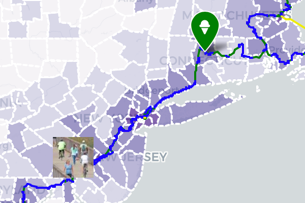 | 연결된 Google Sheet(또는 CSV 파일) 및 GitHub 리포지토리에 로드된 데이터를 기반으로, 원하는 색상, 스타일 및 아이콘을 사용하여 상호작용형 포인트, 폴리곤 또는 폴리라인을 표시하는 데 가장 적합합니다. 지도 옆에 포인트 지도 마커의 표를 표시하는 옵션이 포함되어 있습니다. <br>튜토리얼이 포함된 템플릿: [Google Sheets를 활용한 Leaflet 지도](#leaflet-maps-with-google-sheets) |
| Google Sheets를 활용한 Leaflet 스토리맵<br>  | 연결된 Google Sheet(또는 CSV 파일) 및 GitHub 리포지토리에 로드된 텍스트, 이미지, 오디오, 비디오 및 스캔된 지도 배경을 표시하는 스크롤 내러티브와 함께 포인트별 가이드 투어를 표시하는 데 가장 적합합니다.<br>튜토리얼이 포함된 템플릿: [Google Sheets를 활용한 Leaflet 스토리맵](#leaflet-storymaps-with-google-sheets) |
| CSV 데이터가 포함된 Leaflet 포인트 지도<br>  | GitHub 리포지토리의 CSV 파일에서 데이터를 가져오는 자신만의 Leaflet 포인트 지도를 코딩하는 방법을 알아봅니다.<br>튜토리얼이 포함된 템플릿: [CSV 데이터가 포함된 Leaflet 지도](#leaflet-maps-with-csv) |
| CSV 데이터가 포함된 Leaflet 히트맵 포인트<br>  | 포인트 클러스터를 색상이 있는 핫스팟으로 표시하여 사건의 높은 빈도나 밀도를 강조하는 데 가장 적합합니다.<br>튜토리얼이 포함된 템플릿: [Leaflet 히트맵](#leaflet-heatmap) |
| CSV 데이터가 포함된 Leaflet 검색 가능한 포인트 지도<br>  | 사용자가 이름이나 근접성으로 검색하거나 카테고리별로 필터링할 수 있는 여러 위치를 선택적 목록 보기와 함께 표시하는 데 가장 적합합니다. DataMade의 [Derek Eder](https://derekeder.com/)가 개발했습니다.<br>튜토리얼이 포함된 템플릿: [CSV가 포함된 Leaflet 검색 가능한 지도](#leaflet-searchable-map) |
| 오픈 데이터 API가 포함된 Leaflet 지도<br> 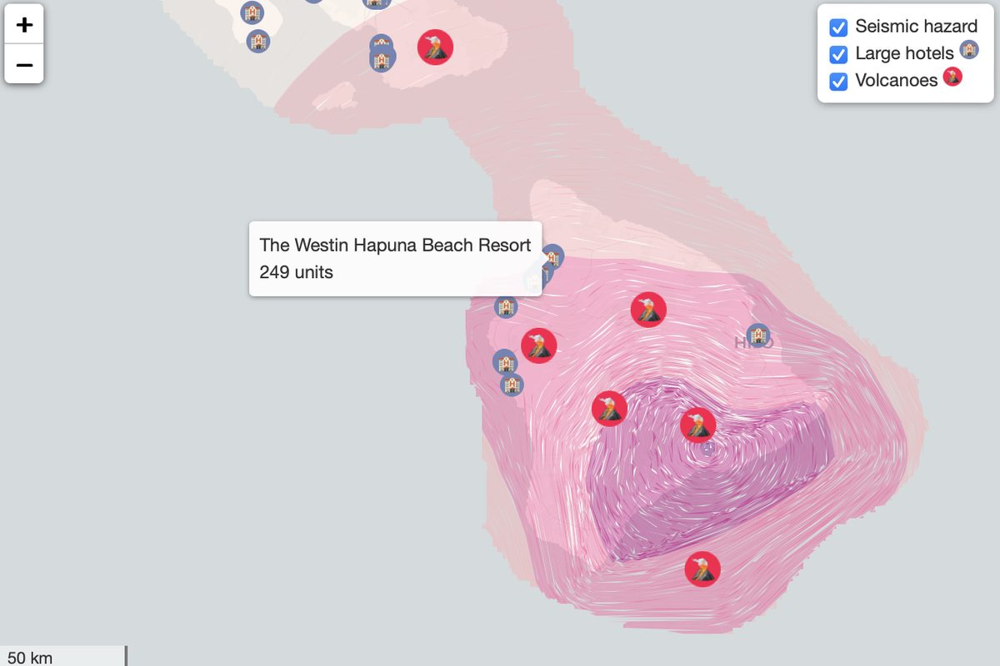 | Socrata 및 기타 플랫폼과 같은 오픈 데이터 리포지토리에서 가장 최신 정보를 지속적으로 직접 가져오는 애플리케이션 프로그래밍 인터페이스(API)를 사용하여 자신만의 Leaflet 지도를 코딩하는 방법을 알아봅니다.<br>튜토리얼이 포함된 템플릿: [오픈 데이터 API가 포함된 Leaflet 지도 템플릿](#leaflet-maps-open-data-apis) |

## Google Sheets를 활용한 Leaflet 지도 {- #leaflet-maps-with-google-sheets}
모양을 맞춤 설정하거나 포인트, 폴리곤 또는 폴리라인 데이터의 조합을 표시해야 해서 드래그 앤 드롭 도구로는 쉽게 만들 수 없는 지도가 필요할 때가 있습니다. 한 가지 해결책은 Google Sheets를 활용한 Leaflet 지도 코드 템플릿을 기반으로 지도를 작성하는 것입니다. 이 템플릿을 사용하면 사용자 지정 포인트 아이콘을 표시하고, 코로플레스(choropleth) 색상 팔레트를 선택하고, 그림 \@fig-lmwgs-map 에 표시된 것처럼 다양한 지도 데이터 레이어의 조합을 쌓을 수 있습니다. 이 책의 이전 장들을 탐색해 보셨다면, 이 템플릿은 초보 사용자에게 적합합니다. 왜냐하면 그림 \@fig-lmwgs-sheet 에 표시된 것처럼 연결된 Google Sheet에 지도 데이터와 설정을 입력하고 GitHub 리포지토리의 폴더에 이미지나 지리적 파일을 업로드하기 때문입니다. 입력한 모든 데이터는 [1장의 도구 선택 방법 섹션](#choose)에서 논의한 것처럼 향후 시각화 기술이 계속 진화함에 따라 쉽게 내보내고 다른 플랫폼으로 마이그레이션할 수 있습니다. 또한 지도 디자인은 반응형이므로 작은 화면이나 큰 화면에서도 보기 좋게 자동으로 크기가 조정됩니다. 마지막으로 Leaflet Maps 템플릿은 웹에서 매우 일반적인 코딩 언어인 JavaScript로 주로 작성된 유연한 오픈소스 소프트웨어를 기반으로 구축되었으므로, 개발자의 기술이나 지원이 있다면 더욱 맞춤 설정할 수 있습니다.


::: {.content-visible when-format="html"}

<iframe src="https://handsondataviz.github.io/leaflet-maps-with-google-sheets/" width="100%" height="500px" style="border:none;"></iframe>
<p class="caption">[Google Sheets를 활용한 대화형 Leaflet 지도](https://handsondataviz.github.io/leaflet-maps-with-google-sheets/)를 살펴보세요. 이 데모 버전은 메인주와 플로리다주 간의 도시를 연결하는 걷기 및 자전거 경로인 East Coast Greenway를 보여줍니다. 2021년 기준으로 3,000마일 경로의 3분의 1 이상이 차량이 없는 트레일입니다. 자세한 내용은 [공식 Greenway 지도](https://www.greenway.org/route-map)를 참조하세요.</p>

:::


::: {.content-visible when-format="html"}

<iframe src="https://docs.google.com/spreadsheets/d/1ZxvU8eGyuN9M8GxTU9acKVJv70iC3px_m3EVFsOHN9g/pubhtml?widget=true&amp;headers=false" width="100%" height="500px" style="border:none;"></iframe>
<p class="caption">위의 Leaflet Maps 데모에 데이터를 제공하는 [온라인 Google Sheet 템플릿](https://docs.google.com/spreadsheets/d/1ZxvU8eGyuN9M8GxTU9acKVJv70iC3px_m3EVFsOHN9g)을 봅니다.</p>

:::


### 튜토리얼 요구 사항 및 개요 {-}
시작하기 전에 [Google 드라이브 계정](https://drive.google.com)이 있어야 하며 [2장에 설명된 대로 Google Sheets에서 사본 만들기](#copy)를 아는 것이 좋습니다. 또한 [GitHub 계정](https://github.com)이 있어야 하며 [10장에 설명된 대로 GitHub로 코드 편집 및 호스팅하기](#github)를 아는 것이 좋습니다. 이전에 다루었던 단계를 설명하는 일부 스크린샷은 아래에서 생략되었으므로, 길을 잃었다면 해당 장으로 돌아가세요.

이 튜토리얼에는 여러 단계가 포함되어 있으므로 전체적인 개요를 제공하기 위해 이 윤곽선을 만들었습니다. 첫 번째 부분에서는 GitHub용 템플릿과 연결된 Google Sheet용 템플릿의 사본 두 개를 만들고 게시합니다.

- A) GitHub 템플릿을 복사하고 GitHub Pages로 사용자 버전을 게시합니다.
- B) 파일 > Google Sheet 템플릿의 사본 만들기, 공유 및 게시.
- C) GitHub 리포지토리의 두 곳에 Google Sheet 브라우저 주소를 붙여넣습니다.
- D) Google Sheet *Options* 탭 정보를 업데이트하고 라이브 지도를 새로 고칩니다.

두 번째 부분에서는 연결된 Google Sheet에 데이터를 입력하고 GitHub 리포지토리에 파일을 업로드하여 포인트, 폴리곤 및 폴리라인과 같은 다양한 유형의 지도 데이터를 업로드 및 표시하고 색상, 아이콘 및 이미지를 편집하는 방법을 알아봅니다.

- E) *Points* 탭에서 위치를 지오코딩하고 새 마커를 맞춤 설정합니다.
- F) 포인트, 폴리곤 또는 폴리라인 데이터와 범례를 제거하거나 표시합니다.

세 번째 부분에서는 지도를 공개적으로 공유하기 전에 지도를 마무리하는 두 가지 옵션이 있습니다.

- G) 각 Google Sheets 탭을 CSV 파일로 저장하고 GitHub에 업로드합니다.
- 또는
- H) 코드에 삽입할 자체 Google Sheets API 키를 가져옵니다.

문제가 발생하면 부록의 [일반적인 문제 해결](#fix) 섹션을 참조하세요.

이제 전체적인 그림을 더 잘 이해했으니 튜토리얼의 첫 번째 부분부터 시작하겠습니다.

#### A) GitHub 템플릿을 복사하고 GitHub Pages로 사용자 버전을 게시합니다 {-}

1. 새 탭에서 [GitHub 코드 템플릿](https://github.com/handsondataviz/leaflet-maps-with-google-sheets)을 엽니다.

2. 코드 템플릿의 오른쪽 위 모서리에서 무료 GitHub 계정에 로그인합니다.

3. 오른쪽 위 모서리에서 녹색 *Use this template* 버튼을 클릭하여 GitHub 계정에 리포지토리 사본을 만듭니다. 다음 화면에서 리포지토리 이름을 `leaflet-maps-with-google-sheets`로 지정하거나 모두 소문자로 된 다른 의미 있는 이름을 선택합니다. *Create repository from template* 버튼을 클릭합니다. 코드 리포지토리의 사본은 다음과 같은 형식을 따릅니다.

`https://github.com/USERNAME/leaflet-maps-with-google-sheets`

4. 새 코드 리포지토리 사본에서 오른쪽 상단의 *Settings* 버튼을 클릭하고 GitHub Pages 영역으로 쭉 아래로 스크롤합니다. 그림 \@fig-leaflet-github-pages-main2 에 표시된 대로 드롭다운 메뉴에서 *Source*를 *None*에서 *Main*으로 변경하고 기본 `/(root)` 설정을 유지한 후 *Save*를 누릅니다. 이 단계는 누구나 웹 주소가 있으면 브라우저에서 액세스할 수 있는 공개 웹에 지도의 라이브 버전을 게시하도록 GitHub에 지시합니다.


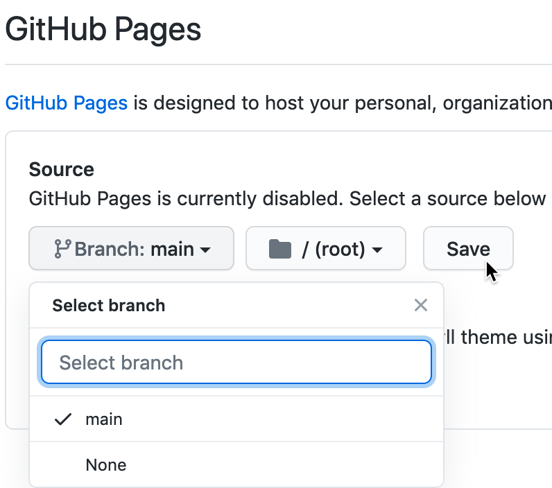{#fig-leaflet-github-pages-main2 width=300}

5. 다시 GitHub Pages 섹션으로 아래로 스크롤하여 게시된 웹 사이트에 대한 링크를 복사합니다. 링크는 다음과 같은 형식으로 표시됩니다.

`https://USERNAME.github.io/leaflet-maps-with-google-sheets`

6. 위로 스크롤하여 리포지토리 이름을 클릭하면 기본 페이지로 돌아갑니다.

7. 리포지토리 기본 페이지의 최상위 수준에서 README.md를 클릭하고 연필 아이콘을 클릭하여 이 파일을 편집합니다.

8. 그림 \@fig-leaflet-readme-link-top 에 표시된 것처럼 *저희* 라이브 사이트에 대한 링크를 삭제하고 *사용자*의 게시된 사이트에 대한 링크를 붙여넣습니다. 아래로 스크롤하여 변경 사항을 *Commit*합니다.


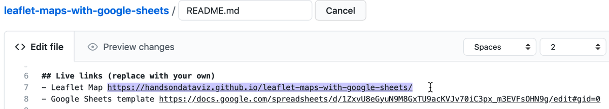{#fig-leaflet-readme-link-top}

9. 리포지토리 기본 페이지에서 링크를 마우스 오른쪽 버튼으로 클릭하여 새 탭에서 라이브 지도를 엽니다. *인내심을 가지세요*. GitHub Pages는 일반적으로 30초 이내에 라이브 지도를 표시하지만 때로는 나타나는 데 몇 분이 걸릴 수 있습니다.

#### B) 파일 > Google Sheet 템플릿의 사본 만들기, 공유 및 게시 {-}

1. 새 탭에서 [Google Sheets 템플릿](https://docs.google.com/spreadsheets/d/1ZxvU8eGyuN9M8GxTU9acKVJv70iC3px_m3EVFsOHN9g)을 엽니다.

2. Google 계정에 로그인하고 *파일 > 사본 만들기*를 선택하여 Google 드라이브에 이 Google Sheet의 자체 버전을 저장합니다.

3. 파란색 *공유* 버튼을 클릭하고 *링크가 있는 모든 사용자로 변경*을 클릭한 다음 *완료*를 클릭합니다. 이렇게 하면 지도 데이터가 공개적으로 공유되며 이 템플릿이 작동하는 데 필요합니다.

4. *파일 > 웹에 게시*로 이동하여 녹색 *게시* 버튼을 클릭하여 전체 문서를 게시하면 Leaflet 코드가 문서를 읽을 수 있습니다. 그런 다음 오른쪽 상단의 *X* 기호를 클릭하여 이 창을 닫습니다.

5. 그림 \@fig-sheets-publish 에 표시된 것처럼 브라우저 맨 위에서 Google Sheet 주소 또는 URL(일반적으로 `...XYZ/edit#gid=0`으로 끝남)을 복사합니다. 이 템플릿에서는 약간 다른 주소인 *웹에 게시된* 주소(일반적으로 `...XYZ/pubhtml`로 끝남)는 복사하지 마세요.


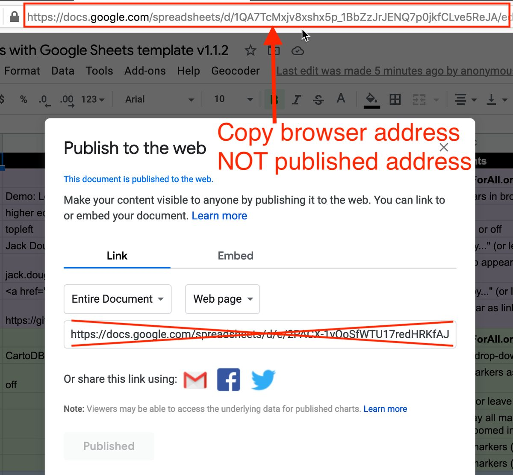{#fig-sheets-publish width=500}

#### C) GitHub 리포지토리의 두 곳에 Google Sheet 브라우저 주소를 붙여넣습니다 {-}
게시된 Google Sheet를 GitHub의 Leaflet 코드와 연결해 지도가 시트에서 데이터를 가져오도록 만드는 것이 다음 과제입니다.

1. GitHub 리포지토리 맨 위에서 `google-doc-url.js`라는 파일을 클릭하여 열고 연필 기호를 클릭하여 편집합니다.

2. 그림 \@fig-google-doc-url 에 표시된 것처럼 *사용자*의 Google Sheet 주소 또는 URL(일반적으로 `...XYZ/edit#gid=0`으로 끝남)을 붙여넣어 *저희* 기존 URL을 바꿉니다. 작은따옴표나 끝의 세미콜론이 지워지지 않도록 *주의*하세요. 아래로 스크롤하여 변경 사항을 *Commit*합니다. Google API 키에 대한 자세한 지침은 아래에서 확인하세요.


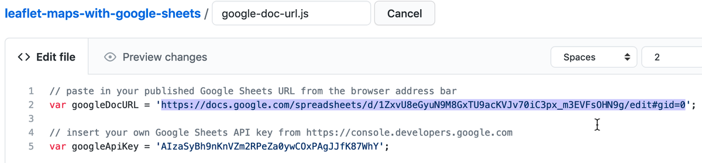{#fig-google-doc-url}

3. 또한 참조하기 쉽도록 Google Sheet URL을 두 번째 장소에 붙여넣어 보겠습니다. GitHub 리포지토리에서 README.md 파일을 클릭하여 열고, 연필 기호를 클릭하여 편집하고, 그림 \@fig-leaflet-readme-link-bottom 에 표시된 것처럼 *사용자*의 Google Sheet URL을 붙여넣어 *저희* 기존 URL을 바꿉니다. 아래로 스크롤하여 변경 사항을 *Commit*합니다.


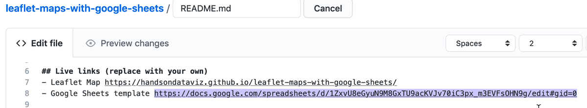{#fig-leaflet-readme-link-bottom}

유지하지 않으려는 다른 내용은 README 페이지에서 자유롭게 제거하세요.

#### D) Google Sheet *Options* 탭 정보를 업데이트하고 라이브 지도를 새로 고칩니다 {-}

이제 게시된 Google Sheet가 라이브 지도에 연결되었으므로 *Options* 탭으로 이동하여 다음 설정을 업데이트합니다.

- Map Title
- Map Subtitle
- Author Name
- Author Email or Website
- Author Code Repo
- 등등

라이브 지도를 표시하는 브라우저 탭을 열고 페이지를 새로 고쳐서 변경 사항을 확인합니다. 몇 초 내에 변경 사항이 나타나지 않으면 부록의 [일반적인 문제 해결](#fix) 섹션을 참조하세요.

팁: Google Sheet Options > Map Settings > Basemap Tiles의 기본 옵션은 CartoDB.Positron 베이스맵입니다. [다른 Leaflet 베이스맵 제공업체](https://leaflet-extras.github.io/leaflet-providers/preview/)의 옵션을 선택하는 경우 해당 서비스를 사용하기 위해 [가입하고 API 키를 삽입](https://github.com/leaflet-extras/leaflet-providers#providers-requiring-registration)해야 할 수 있습니다. Stadia 베이스맵을 선택한 경우 그림 \@fig-stadia-domain 에 표시된 것처럼 [도메인 기반 인증을 사용하기 위해 계정에 가입](https://docs.stadiamaps.com/authentication)하세요.


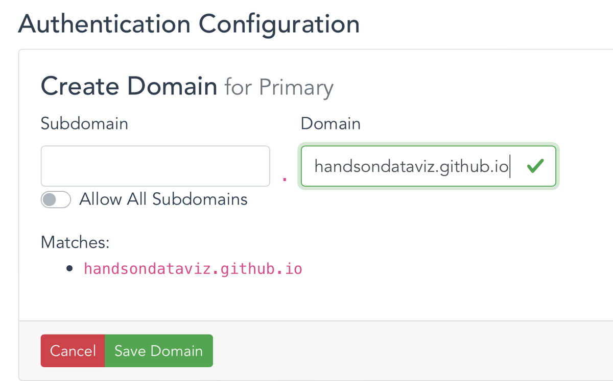{#fig-stadia-domain width=500}

#### E) *Points* 탭에서 위치를 지오코딩하고 새 마커를 맞춤 설정합니다 {-}
이제 지도에 새 콘텐츠를 추가하기 시작할 수 있습니다. Google Sheet의 *Points* 탭에서 대화형 마커를 체계화하고 지도에 표시하는 열 머리글을 볼 수 있습니다. 데모 데이터를 여러분의 데이터로 바꾸되, Leaflet 코드는 이러한 특정 이름을 찾기 때문에 열 머리글을 삭제하거나 이름 변경하지 *마십시오*.

- Group: 범례에서 마커 그룹을 분류하기 위해 모든 레이블을 생성합니다.
- Marker Icon: `fa-ice-cream`이나 `fa-coffee`와 같은 [Font Awesome 무료 및 솔리드 아이콘 이름](https://fontawesome.com/icons?d=gallery&s=solid&m=free)이나 그림 \@fig-icon-combined 에 표시된 `rowing` 또는 `where_to_vote`와 같은 [Material Design 아이콘 이름](https://material.io/resources/icons/?style=baseline)을 삽입합니다. 마커 안에 아이콘을 표시하지 않으려면 공백으로 둡니다. Font Awesome 프로 또는 브랜드 아이콘은 이 템플릿과 함께 작동하지 않습니다. 자신만의 맞춤형 아이콘을 만들려면 아래를 참조하세요.
- Marker Color: `blue` 또는 `darkblue`와 같은 표준 웹 색상 이름을 삽입하거나 `#775307` 또는 `rgba(200,100,0,0.5)`와 같은 웹 색상 코드를 삽입합니다. [W3Schools 색상 이름](https://www.w3schools.com/colors/colors_names.asp)에서 옵션을 확인하세요.
- Icon Color: 마커 안의 아이콘 색상을 설정합니다. 기본값은 `white`이며 어두운 색상의 마커 안에서 잘 어울립니다.
- Custom Size: 아래에서 자신만의 맞춤형 아이콘을 만들지 않는 한 공백으로 둡니다.


{#fig-icon-combined width=400}

다음 열 세트에는 사용자가 포인트 마커를 클릭할 때 나타나는 항목이 포함되어 있습니다.

- Name: 마커 팝업 창에 표시할 제목을 추가합니다.
- Description: 마커 팝업 창에 나타날 텍스트를 추가합니다. HTML 태그를 삽입하여 줄바꿈(`<br>` 등)을 추가하거나 외부 링크를 `<a href='https://www.w3schools.com/' target='_blank'>Visit W3Schools</a>`와 같이 새 탭에서 열 수 있습니다. [W3Schools](https://www.w3schools.com/html/html_links.asp)에서 HTML 구문에 대해 알아보세요.
- Image: 이미지를 표시하는 두 가지 옵션이 있습니다. `https`(보안)로 시작하고 `.jpg` 또는 `.png`로 끝나는 한 온라인 서비스(예: Flickr)에서 호스팅하는 이미지에 대한 외부 링크를 삽입할 수 있습니다. 또는 그림 \@fig-leaflet-media-upload 에 표시된 것처럼 GitHub 리포지토리의 `media` 하위 폴더에 이미지를 업로드하고 Google Sheet에 `media/image.jpg` 또는 `...png`와 같은 형식으로 경로 이름을 입력할 수 있습니다.


{#fig-leaflet-media-upload width=400}

경고: 미디어 파일 경로 이름은 대소문자를 구분하며 접미사 끝을 포함하여 *모두 소문자*를 사용하는 것이 좋습니다. 또한 코드 템플릿은 자동으로 이미지를 맞게 크기 조정하므로, 지도가 원활하게 작동하도록 업로드하기 전에 모든 이미지의 크기를 600x400 픽셀 이하로 *줄이는* 것이 좋습니다.

팁: 일부 사람들은 `media` 폴더 전체를 실수로 지우기도 합니다. 예를 들어, GitHub 리포지토리 폴더의 모든 내용을 삭제하면 GitHub는 빈 폴더를 추적하지 않으므로 폴더도 삭제됩니다. GitHub 리포지토리에 새 폴더를 만들려면 *Add file - Create new file*로 이동한 다음 슬래시가 붙은 폴더 이름(예: `media/`)을 입력하고 새 폴더가 비어 있지 않도록 임시 파일 이름(예: `temp.md`)을 자리 표시자로 입력합니다. 이제 새 GitHub 리포지토리 폴더에 파일을 업로드할 수 있습니다.

- Location, Latitude, Longitude: 지도 위의 점에 마커를 배치합니다. 코드 템플릿에는 Latitude 및 Longitude만 필요하지만 숫자 좌표와 대응시키기 위한 알림으로 위치 이름이나 주소를 Location 열에 붙여넣는 것이 현명합니다. [2장의 Geocoding by SmartMonkey 부가기능](#geocode)을 사용하여 *Add-ons > Geocoding by SmartMonkey > Geocode Details*를 선택하면 그림 \@fig-geocode-details2 에 표시된 것처럼 샘플 데이터가 포함된 새 시트를 만들고 *Latitude*, *Longitude* 및 *Address found*라는 세 개의 새 열에 대한 결과를 표시합니다. 자신의 주소 데이터를 붙여넣고 위의 단계를 반복하여 지오코딩한 다음, 결과를 복사하여 *Points* 시트에 붙여넣습니다.


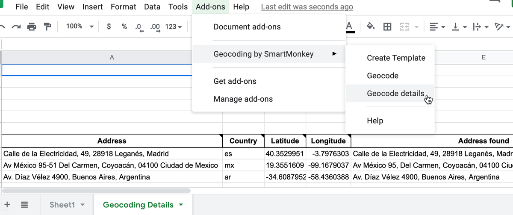{#fig-geocode-details2}

볼 수 있는 마커의 선택적 표: 그림 \@fig-leaflet-map-with-table 에 표시된 것처럼 지도의 맨 아래에 대화형 표를 표시합니다. *Options* 탭에서 *Display Table*(셀 B30)을 *On*으로 설정합니다. 또한 *Table Height*를 조정하고 열 머리글을 쉼표로 구분하여 입력하여 *Table Columns* 표시를 수정할 수 있습니다.


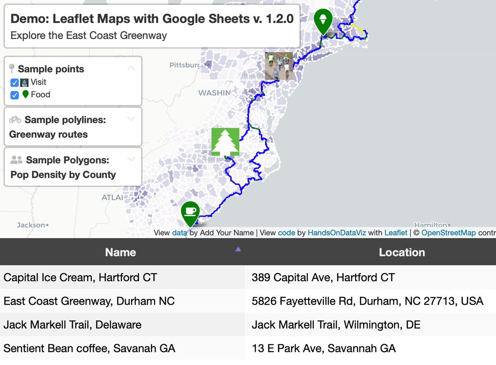{#fig-leaflet-map-with-table width=500}

선택적 맞춤형 마커: 그림 \@fig-leaflet-map-custom-marker 에 표시된 썸네일 사진 아이콘과 같이 자신만의 맞춤형 마커를 만들려면 이미지 편집 도구를 사용하여 사진을 64 x 64 픽셀의 정사각형으로 줄입니다. PNG 형식으로 저장하고 공백이 없는 모두 소문자를 사용하여 파일 이름을 선택합니다. 위에서 설명한 대로 GitHub 리포지토리의 *media* 폴더에 이미지를 업로드합니다. *Marker Icon* 열에서 파일 경로 이름을 `media/imagename-small.png` 형식으로 입력합니다. *Custom Size* 열에서 치수를 `64x64` 또는 원하는 경우 `40x40` 등 유사하게 설정합니다.


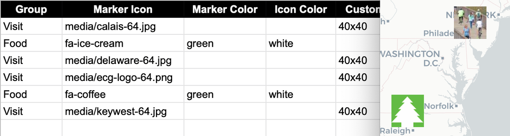{#fig-leaflet-map-custom-marker width=600}

라이브 지도를 표시하는 브라우저 탭을 열고 페이지를 새로 고쳐 변경 사항을 확인합니다. 몇 초 내에 변경 사항이 나타나지 않으면 부록의 [일반적인 문제 해결](#fix) 섹션을 참조하세요.

#### F) 포인트, 폴리곤 또는 폴리라인 데이터와 범례를 제거하거나 표시합니다 {-}
기본적으로 데모 지도는 포인트, 폴리곤, 폴리라인 등 세 가지 유형의 데이터와 그 범례를 표시합니다. 연결된 Google Sheet를 수정하여 지도에서 이 중 하나를 제거할 수 있습니다.

포인트 제거하기:

- *Options* 탭에서 *Point Legend Position*(셀 B27)을 *Off*로 설정하여 숨깁니다.
- *Points* 탭에서 포인트 데이터의 모든 행을 삭제합니다.

폴리라인 제거하기:

- *Options* 탭에서 *Polyline Legend Position*(셀 B36)을 *Off*로 설정하여 숨깁니다.
- *Polylines* 탭에서 폴리라인 데이터의 모든 행을 삭제합니다.

폴리곤 제거하기:

- *Polygons* 탭에서 *Polygon Legend Position*(셀 B4)을 *Off*로 설정하여 숨깁니다.
- 또한 *Polygons* 탭에서 *Polygon GeoJSON URL*(셀 B6)을 설정하여 지도에서 해당 데이터를 제거합니다.
- 다음 탭인 *Polygons1*에서 탭 드롭다운 메뉴를 사용하여 *Delete*를 선택하여 전체 시트를 제거합니다.

위에서 설명한 대로 *Points* 탭에서 마커를 더 추가하는 방법은 이미 배웠습니다. 하지만 새로운 폴리곤 또는 폴리라인 데이터를 추가하려면 13장에 설명된 대로 [GeoJson.io 도구 튜토리얼](#geojsonio) 또는 [MapShaper 도구 튜토리얼](#mapshaper)을 사용하여 GeoJSON 형식으로 해당 파일을 준비해야 합니다.

GeoJSON 데이터를 준비한 후 파일 이름을 모두 소문자로 공백 없이 지정하고 GitHub 리포지토리의 `geojson` 하위 폴더에 업로드합니다. 그런 다음 연결된 Google Sheet에서 다음 설정을 업데이트합니다.

폴리라인 표시하기:

- *Options* 탭에서 *topleft* 또는 유사한 위치를 선택하여 *Polyline Legend Position*(셀 B36)이 표시되는지 확인합니다.
- *Polylines* 탭에서 `geodata/polylines.geojson`과 같이 GitHub 리포지토리에 업로드한 파일의 GeoJSON URL 경로를 입력합니다. 그런 다음 Display Name, Description, 및 Color를 삽입합니다.

폴리곤 표시하기:

- *Polygons* 탭에서 *topleft* 또는 유사한 위치를 선택하여 *Polygon Legend Position*(셀 B4)이 표시되는지 확인합니다.
- *Polygon GeoJSON URL*(셀 B6)에 `geodata/polygons.geojson`과 같이 GitHub 리포지토리에 업로드한 파일의 경로를 입력합니다.
- *Polygon Legend Title*(셀 B3)을 변경하고 선택적 *Polygon Legend Icon*(셀 B5)을 추가할 수 있습니다.
- *Polygon Data* 및 *Color Settings* 섹션을 편집하여 GeoJSON 파일의 속성과 일치하도록 레이블과 범위를 수정합니다. *Property Range Color Palette*에서 [7장의 지도 디자인 섹션](#map-design)에서 설명한 ColorBrewer 도구에서 색상 구성을 자동으로 선택하거나 아래 셀에서 원하는 색상을 수동으로 삽입할 수 있습니다.
- 데이터 입력 방법에 대한 팁은 *Polygons* 시트의 *Hints* 열을 참조하세요.
- 여러 폴리곤 레이어를 표시하려면 *Polygons* 탭 드롭다운 메뉴를 사용하여 시트를 *Duplicate*(복제)하고 *Polygons1*, *Polygons2* 등의 형식으로 추가 시트 이름을 지정합니다.

### 대중과 공유하기 전에 지도 완성하기 {-}
이제 지도를 완성할 준비가 되었습니다. 지도 링크를 대중과 공유하려면 아래 옵션을 읽고 G 단계 *또는* H 단계를 선택하세요.

경고: 당사는 특히 다른 사람들이 과도하게 사용하거나 남용하는 경우 언제든지 *당사의* Google Sheets API 키를 변경할 권리를 보유합니다. 즉, 당사가 키를 변경하면 지도가 *작동을 멈추기* 때문에 공개적으로 공유하기 전에 아래의 G 단계 또는 H 단계를 사용하여 지도를 완성*해야* 합니다.

#### G) 각 Google Sheets 탭을 CSV 파일로 저장하고 GitHub에 업로드합니다 {-}
대부분의 데이터를 Google Sheets에 모두 입력했다면 이를 별도의 CSV 파일로 다운로드하여 GitHub 리포지토리에 업로드하는 것이 *가장 좋은* 장기 보존 전략입니다. 이 접근 방식을 사용하면 지도와 데이터가 동일한 GitHub 리포지토리에 함께 유지되며 Google 서비스 중단으로 인해 지도가 손상될 위험이 없어집니다. 게다가 여전히 지도 데이터를 편집할 수 있습니다. 이 접근 방식이 타당하다고 생각되면 다음 단계를 따르세요.

1. Google Sheets에서 각 탭으로 이동하여 그림 \@fig-sheets-download-csv 에 표시된 대로 CSV 형식으로 *파일 > 다운로드*를 선택하여 각 탭에 대한 별도의 파일을 만듭니다.


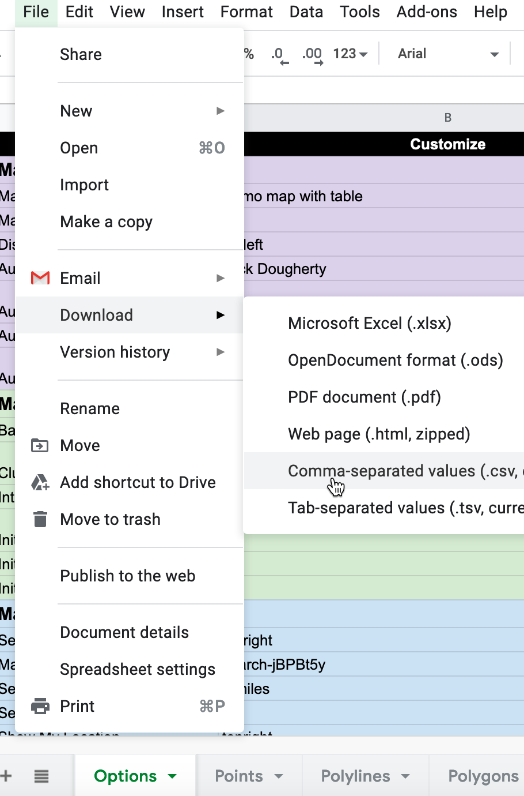{#fig-sheets-download-csv width=350}

2. 표시된 대로 각 파일 이름을 줄입니다. 아래 첫 번째 파일(Options.csv)만 필수이며 데이터에 따라 다른 파일은 선택 사항입니다. 파일 이름은 *Options.csv*의 첫 글자 대문자 등 표시된 것과 *정확히* 같아야 합니다.

- Options.csv
- Points.csv
- Polylines.csv
- Polygons.csv (추가 파일이 있는 경우 Polygons1.csv, Polygons2.csv 등으로 이름 지정)
- Notes.csv (또는 .txt) 데이터와 함께 메모를 보관하는 것이 좋지만 필수는 아닙니다.

3. GitHub 리포지토리에서 `csv` 하위 폴더를 클릭하여 열고 *Add file > Upload files*를 선택한 다음 그림 \@fig-leaflet-upload-csv 에 표시된 대로 위의 모든 CSV 파일을 이 하위 폴더에 업로드합니다. Leaflet 템플릿 코드는 먼저 여기서 데이터를 확인하고 위 이름의 CSV 파일을 찾으면 Google Sheets 대신 파일에서 직접 지도 데이터를 가져옵니다. 이 시점부터 Google Sheet의 모든 수정 사항은 지도에 *더 이상 자동으로 나타나지 않는다는 점을 기억*하세요.


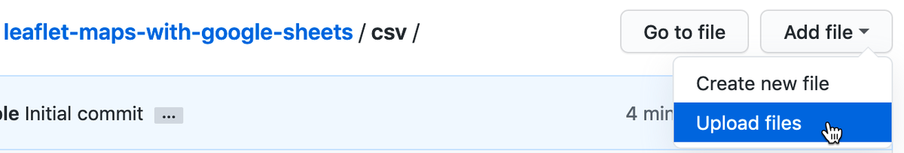{#fig-leaflet-upload-csv width=400}

4. Google Sheet에서 GitHub의 *csv* 하위 폴더로 데이터를 마이그레이션한 후 `google-doc-url.js` 파일로 이동하여 아래와 같이 따옴표 없이 googleDocURL 값을 `null`로 변경합니다. 이렇게 하면 지도의 맨 아래에 있는 "data by" 귀속 링크가 이전 데이터 소스(게시된 Google Sheet)에서 새 소스(GitHub의 *csv* 파일)로 변경됩니다. 아래와 같이 알림으로 코드 주석을 업데이트합니다.

```
// data stored in csv folder on GitHub, not Google Sheets
var googleDocURL = null;
```

5. CSV 파일을 업로드한 후 지도를 편집하려면 두 가지 옵션이 있습니다. GitHub 웹 인터페이스에서 CSV 파일을 열어 직접 작게 편집할 수 있습니다. 또는 Google Sheet에서 크게 편집하고 위의 단계를 반복하여 CSV 형식으로 다운로드한 다음 업로드하여 GitHub의 기존 파일을 바꿀 수 있습니다.


#### H) 코드에 삽입할 자체 Google Sheets API 키를 가져옵니다 {-}
G 단계의 대안으로 온라인에 게시된 Google Sheets에 지도 데이터를 계속 저장하려면 이 장의 [고유한 Google Sheets API 키 가져오기](#google-sheets-api-key) 섹션으로 이동하여 설명된 대로 Leaflet 지도 코드에 삽입하여 당사의 키를 과도하게 사용하지 않도록 하세요. Google Sheets는 해당 서비스에서 합리적인 [사용 한도](https://developers.google.com/sheets/api/limits)를 유지하기 위해 API 키가 필요합니다. 학교나 직장에서 제공하는 Google Workspace 계정이 *아닌* 개인 Google 계정이 있는 경우 무료 Google Sheets API 키를 받을 수 있습니다.

문제가 발생하면 부록의 [일반적인 문제 해결](#fix) 섹션을 참조하세요.

## Google Sheets를 활용한 Leaflet 스토리맵 {- #leaflet-storymaps-with-google-sheets}
Leaflet Storymaps 코드 템플릿은 그림 \@fig-storymap-demo 에 표시된 것처럼 텍스트, 이미지, 오디오, 비디오 및 스캔된 지도 배경을 표시하기 위한 스크롤 내러티브와 함께 포인트별 가이드 투어를 보여주도록 설계되었습니다. 그림 \@fig-storymap-sheet 에 표시된 것처럼 연결된 Google Sheet(또는 CSV 파일)에 모든 지도 데이터를 입력하거나 GitHub 리포지토리에 업로드합니다. 또한 Leaflet Storymaps 템플릿을 사용하면 데이터 모양을 맞춤 설정하고 [13장: 지도 데이터 변환](#transform)에서 준비하는 방법을 배울 과거 지도 및 지리적 경계와 같은 레이어를 더 추가할 수 있습니다. 뿐만 아니라 스토리맵 디자인은 반응형이므로 작은 화면(너비가 768픽셀 미만)에서는 위아래로 나타나고 큰 화면에서는 자동으로 나란히 전환됩니다. 마지막으로 Leaflet 템플릿은 웹에서 매우 일반적인 코딩 언어인 JavaScript로 주로 작성된 유연한 오픈소스 소프트웨어를 기반으로 구축되었으므로, 개발자의 기술이나 지원이 있다면 더욱 맞춤 설정할 수 있습니다.


::: {.content-visible when-format="html"}

<video src="images/12-leaflet/storymap-demo.mp4" width="100%" height="400px" style="border:none;" autoplay loop muted playsinline></video>
<p class="caption">[Google Sheets를 활용한 대화형 Leaflet 스토리맵](https://handsondataviz.github.io/leaflet-storymaps-with-google-sheets/)을 살펴보세요. 이 데모 버전은 워싱턴 DC의 미국 내셔널 몰에 대한 짧은 이야기를 들려주면서 코드 템플릿의 기능을 보여줍니다.</p>

:::


::: {.content-visible when-format="html"}

<iframe src="https://docs.google.com/spreadsheets/d/e/2PACX-1vSqxGs67j80rAPDZdQaS5jI0avn1qs2y5N8fOaeHUGvyrnIwBmWomlfAuujtvPrxtF-5FBZxi_KdTUm/pubhtml?widget=true&amp;headers=false" width="100%" height="500px" style="border:none;"></iframe>
<p class="caption">위의 Leaflet Storymaps 데모에 데이터를 제공하는 [온라인 Google Sheet 템플릿](https://docs.google.com/spreadsheets/d/1AO6XHL_0JafWZF4KEejkdDNqfuZWUk3SlNlQ6MjlRFM/)을 봅니다.</p>

:::


Google Sheets를 활용한 Leaflet 스토리맵 템플릿은 다른 도구가 다루지 않은 공백을 메우기 위해 마련되었습니다. 명확히 하자면, 일부 스토리맵 플랫폼은 초보자가 바로 시작하기에 더 쉬울 수 있습니다. 예를 들어, 무료 오픈소스 [Knight Lab StoryMap 플랫폼](https://storymap.knightlab.com/)에는 고급 기능이 없지만 초보자를 위한 기본적인 소개를 제공합니다. 또한 Knight Lab StoryMap 플랫폼에서는 그림 \@fig-knightlab-export 에 표시된 것처럼 스토리맵 콘텐츠를 HTML 및 소스 파일 패키지로 *Share > Export*(공유 > 내보내기)하여 고유한 서버(GitHub Pages 리포지토리 등)에서 호스팅할 수 있습니다.


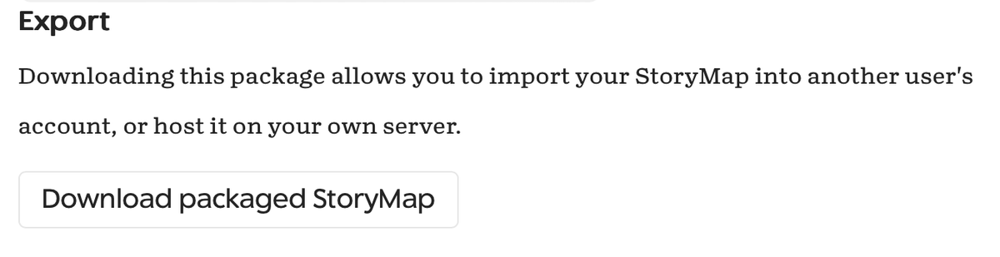{#fig-knightlab-export width=600}

하지만 [Storymaps.com](https://storymaps.com)(30일 무료 평가판을 사용하는 개인용, 이후 유료 구독)이나 [ArcGIS StoryMaps 플랫폼](https://storymaps.arcgis.com)(사이트 라이선스를 사용하는 전문가용)과 같은 독점적 Esri 스토리맵 도구를 사용하는 것은 권장하지 않습니다. 이 두 가지 Esri 스토리맵 도구에는 모두 *데이터 이식성*이 없습니다. 즉, 텍스트, 이미지 또는 지도 데이터를 플랫폼 밖으로 쉽게 내보낼 수 없어서 영원히 갇혀 있게 됩니다. 이는 [1장에서 도구를 현명하게 선택하는 방법](#choose)을 논의할 때 주의하라고 경고했던 부분입니다. 반면, Leaflet Storymaps의 연결된 Google Sheet와 GitHub 리포지토리에 입력하는 모든 데이터는 다른 플랫폼으로 쉽게 마이그레이션할 수 있어 향후 시각화 기술이 계속 진화함에 따라 데이터를 보존할 수 있습니다.

표 \@tbl-storymaps-gallery 에 있는 Google Sheets를 활용한 Leaflet 스토리맵 갤러리를 탐색하여 다른 사람들이 이 템플릿으로 무엇을 만들었는지 확인해 보세요.

Table: (\#tab:storymaps-gallery) Google Sheets를 활용한 Leaflet 스토리맵 갤러리

|  |  |
| --- | --- |
| <br>Elizabeth Rose가 제작한 [Synagogue Map, Past and Present](https://jhsgh.org/synagogue-map/), Jewish Historical Society of Greater Hartford | 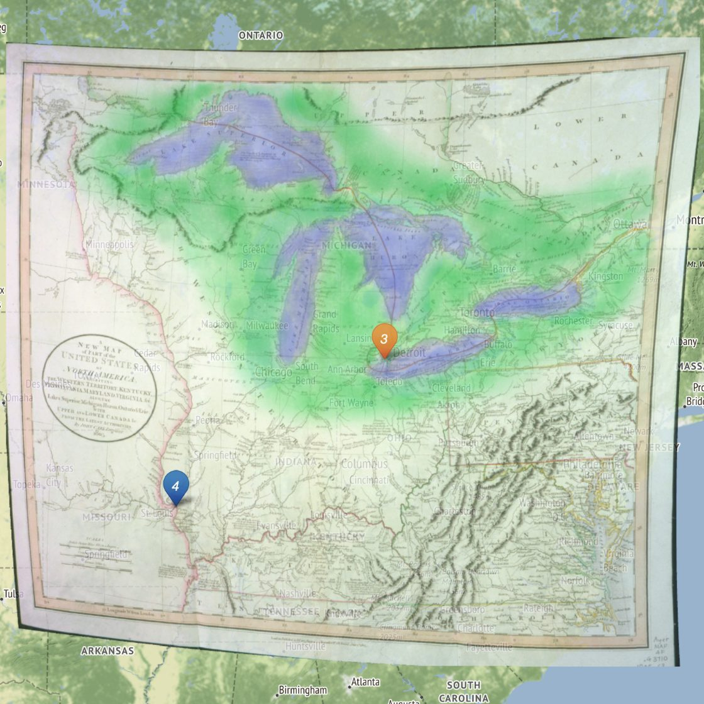<br>Jen Andrella가 제작한 [Mapping the Upper Missouri](https://www.mappingtheuppermissouri.com/) |
| <br>Gordon Coonfield, Erica Hayes, James Parente, David Uspal, Cheyenne Zaremba가 제작한 [Kensington Remembers](https://kensingtonremembers.org) | 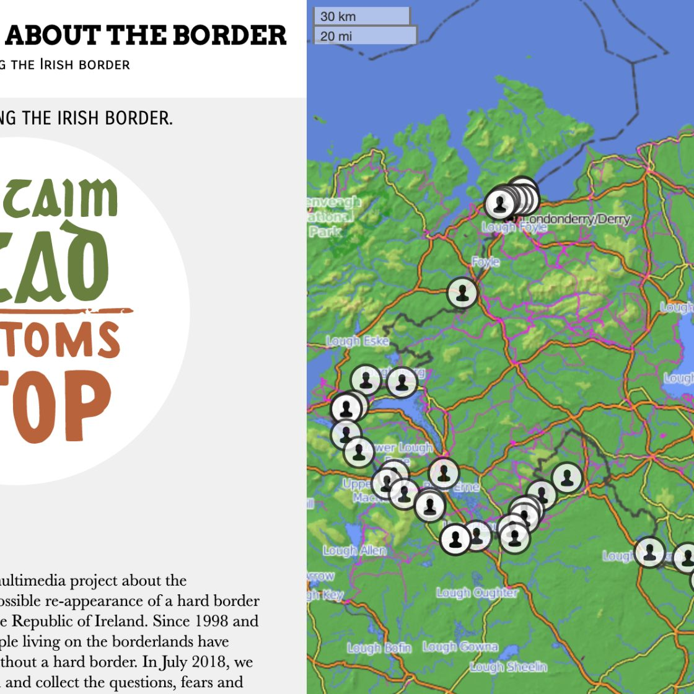<br>Elisabeth Blanchet 및 Laurent Gontier가 제작한 [We Need to Talk about the Border](https://www.weneedtotalkabouttheborder.eu) |

### 튜토리얼 요구 사항 및 개요 {-}
시작하기 전에 [Google 드라이브 계정](https://drive.google.com)이 있어야 하며 [2장에 설명된 대로 Google Sheets에서 사본 만들기](#copy)를 아는 것이 좋습니다. 또한 [GitHub 계정](https://github.com)이 있어야 하며 [10장에 설명된 대로 GitHub로 코드 편집 및 호스팅하기](#github)를 아는 것이 좋습니다. 이전에 다루었던 단계를 설명하는 일부 스크린샷은 아래에서 생략되었으므로, 길을 잃었다면 해당 장으로 돌아가세요.

팁: 이 튜토리얼 윤곽선은 이전 섹션과 매우 비슷해 보이지만 첫 번째 부분의 링크가 다르고 두 번째 부분의 몇 가지 단계가 새롭습니다.

이 튜토리얼에는 여러 단계가 포함되어 있으므로 전체적인 개요를 제공하기 위해 이 윤곽선을 만들었습니다. 첫 번째 부분에서는 GitHub용 템플릿과 연결된 Google Sheet용 템플릿의 사본 두 개를 만들고 게시합니다.

- A) GitHub 템플릿을 복사하고 GitHub Pages로 사용자 버전을 게시합니다.
- B) 파일 > Google Sheet 템플릿의 사본 만들기, 공유 및 게시.
- C) GitHub 리포지토리의 두 곳에 Google Sheet 브라우저 주소를 붙여넣습니다.
- D) Google Sheet *Options* 탭 정보를 업데이트하고 라이브 지도를 새로 고칩니다.

두 번째 부분에서는 연결된 Google Sheet의 포인트 데이터를 지오코딩 및 사용자 정의하고, 이미지 및 다른 지도 데이터를 GitHub 리포지토리에 업로드하고, 필요한 경우 스캔된 배경 지도 레이어를 추가하는 방법을 배웁니다.

- E) Google Sheet *Chapters* 탭에서 텍스트, 미디어, 마커를 추가하고 위치를 지오코딩합니다.
- F) 선택 사항: 지오레퍼런싱된 역사적 지도 이미지 또는 GeoJSON 오버레이를 추가합니다.

세 번째 부분에서는 지도를 공개적으로 공유하기 전에 지도를 마무리하는 두 가지 옵션이 있습니다.

- G) 각 Google Sheets 탭을 CSV 파일로 저장하고 GitHub에 업로드합니다.
- 또는
- H) 코드에 삽입할 자체 Google Sheets API 키를 가져옵니다.

문제가 발생하면 부록의 [일반적인 문제 해결](#fix) 섹션을 참조하세요.

이제 전체적인 그림을 더 잘 이해했으니 튜토리얼의 첫 번째 부분부터 시작하겠습니다.

#### A) GitHub 템플릿을 복사하고 GitHub Pages로 사용자 버전을 게시합니다 {-}

1. 새 탭에서 [GitHub 코드 템플릿](https://github.com/handsondataviz/leaflet-storymaps-with-google-sheets)을 엽니다.

2. 코드 템플릿의 오른쪽 위 모서리에서 무료 GitHub 계정에 로그인합니다.

3. 오른쪽 위 모서리에서 녹색 *Use this template* 버튼을 클릭하여 GitHub 계정에 리포지토리 사본을 만듭니다. 다음 화면에서 리포지토리 이름을 `leaflet-storymaps-with-google-sheets`로 지정하거나 모두 소문자로 된 다른 의미 있는 이름을 선택합니다. *Create repository from template* 버튼을 클릭합니다. 코드 리포지토리의 사본은 다음과 같은 형식을 따릅니다.

`https://github.com/USERNAME/leaflet-storymaps-with-google-sheets`

4. 새 코드 리포지토리 사본에서 오른쪽 상단의 *Settings* 버튼을 클릭하고 GitHub Pages 영역으로 쭉 아래로 스크롤합니다. 그림 \@fig-leaflet-github-pages-main3 에 표시된 대로 드롭다운 메뉴에서 *Source*를 *None*에서 *Main*으로 변경하고 기본 `/(root)` 설정을 유지한 후 *Save*를 누릅니다. 이 단계는 누구나 웹 주소가 있으면 브라우저에서 액세스할 수 있는 공개 웹에 지도의 라이브 버전을 게시하도록 GitHub에 지시합니다.


{#fig-leaflet-github-pages-main3 width=300}

5. 다시 GitHub Pages 섹션으로 아래로 스크롤하여 게시된 웹 사이트에 대한 링크를 복사합니다. 링크는 다음과 같은 형식으로 표시됩니다.

`https://USERNAME.github.io/leaflet-maps-with-google-sheets`

6. 위로 스크롤하여 리포지토리 이름을 클릭하면 기본 페이지로 돌아갑니다.

7. 리포지토리 기본 페이지의 최상위 수준에서 README.md를 클릭하고 연필 아이콘을 클릭하여 이 파일을 편집합니다.

8. 그림 \@fig-storymap-readme-link-top 에 표시된 것처럼 *저희* 라이브 사이트에 대한 링크를 삭제하고 *사용자*의 게시된 사이트에 대한 링크를 붙여넣습니다. 아래로 스크롤하여 변경 사항을 *Commit*합니다.


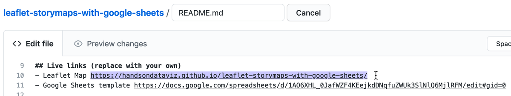{#fig-storymap-readme-link-top}

9. 리포지토리 기본 페이지에서 링크를 마우스 오른쪽 버튼으로 클릭하여 새 탭에서 라이브 지도를 엽니다. *인내심을 가지세요*. GitHub Pages는 일반적으로 30초 이내에 라이브 지도를 표시하지만 때로는 나타나는 데 몇 분이 걸릴 수 있습니다.

#### B) 파일 > Google Sheet 템플릿의 사본 만들기, 공유 및 게시 {-}

1. 새 탭에서 [Google Sheets 템플릿](https://docs.google.com/spreadsheets/d/1AO6XHL_0JafWZF4KEejkdDNqfuZWUk3SlNlQ6MjlRFM/)을 엽니다.

2. Google 계정에 로그인하고 *파일 > 사본 만들기*를 선택하여 Google 드라이브에 이 Google Sheet의 자체 버전을 저장합니다.

3. 파란색 *공유* 버튼을 클릭하고 *링크가 있는 모든 사용자로 변경*을 클릭한 다음 *완료*를 클릭합니다. 이렇게 하면 지도 데이터가 공개적으로 공유되며 이 템플릿이 작동하는 데 필요합니다.

4. *파일 > 웹에 게시*로 이동하여 녹색 *게시* 버튼을 클릭하여 전체 문서를 게시하면 Leaflet 코드가 문서를 읽을 수 있습니다. 그런 다음 오른쪽 상단의 *X* 기호를 클릭하여 이 창을 닫습니다.

5. 그림 \@fig-sheets-publish2 에 표시된 것처럼 브라우저 맨 위에서 Google Sheet 주소 또는 URL(일반적으로 `...XYZ/edit#gid=0`으로 끝남)을 복사합니다. 이 템플릿에서는 약간 다른 주소인 *웹에 게시된* 주소(일반적으로 `...XYZ/pubhtml`로 끝남)는 복사하지 마세요.


{#fig-sheets-publish2 width=500}

#### C) GitHub 리포지토리의 두 곳에 Google Sheet 브라우저 주소를 붙여넣습니다 {-}
다음 과제는 게시된 Google Sheet를 GitHub의 Leaflet 코드에 연결하여 지도를 표시하기 위해 시트에서 데이터를 가져올 수 있도록 하는 것입니다.

1. GitHub 리포지토리 맨 위에서 `google-doc-url.js`라는 파일을 클릭하여 열고 연필 기호를 클릭하여 편집합니다.

2. 그림 \@fig-google-doc-url2 에 표시된 것처럼 *사용자*의 Google Sheet 주소 또는 URL(일반적으로 `...XYZ/edit#gid=0`으로 끝남)을 붙여넣어 *저희* 기존 URL을 바꿉니다. 작은따옴표나 끝의 세미콜론이 지워지지 않도록 *주의*하세요. 아래로 스크롤하여 변경 사항을 *Commit*합니다. Google API 키에 대한 자세한 지침은 아래에서 확인하세요.


{#fig-google-doc-url2}

3. 또한 참조하기 쉽도록 Google Sheet URL을 두 번째 장소에 붙여넣어 보겠습니다. GitHub 리포지토리에서 README.md 파일을 클릭하여 열고, 연필 기호를 클릭하여 편집하고, 그림 \@fig-storymap-readme-link-bottom 에 표시된 것처럼 *사용자*의 Google Sheet URL을 붙여넣어 *저희* 기존 URL을 바꿉니다. 아래로 스크롤하여 변경 사항을 *Commit*합니다.


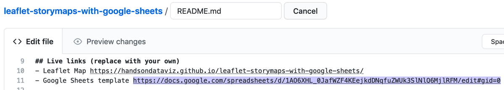{#fig-storymap-readme-link-bottom}

유지하지 않으려는 다른 내용은 README 페이지에서 자유롭게 제거하세요.

#### D) Google Sheet *Options* 탭 정보를 업데이트하고 라이브 지도를 새로 고칩니다 {-}

이제 게시된 Google Sheet가 라이브 지도에 연결되었으므로 *Options* 탭으로 이동하여 다음 설정 중 하나를 업데이트합니다.

- Storymap Title
- Storymap Subtitle -- 아래쪽 화살표에 대한 코드 포함: `<br><small>Scroll down <i class='fa fa-chevron-down'></i></small>`
- Author Name
- Author Email or Website
- Author GitHub Repo Link
- 등등

라이브 지도를 표시하는 브라우저 탭을 열고 페이지를 새로 고쳐서 변경 사항을 확인합니다. 몇 초 내에 변경 사항이 나타나지 않으면 부록의 [일반적인 문제 해결](#fix) 섹션을 참조하세요.

팁: Google Sheet Options > Map Settings > Basemap Tiles의 기본 옵션은 CartoDB.Positron 베이스맵입니다. [다른 Leaflet 베이스맵 제공업체](https://leaflet-extras.github.io/leaflet-providers/preview/)의 옵션을 선택하는 경우 해당 서비스를 사용하기 위해 [가입하고 API 키를 삽입](https://github.com/leaflet-extras/leaflet-providers#providers-requiring-registration)해야 할 수 있습니다. Stadia 베이스맵을 선택한 경우 그림 \@fig-stadia-domain2 에 표시된 것처럼 [도메인 기반 인증을 사용하기 위해 계정에 가입](https://docs.stadiamaps.com/authentication)하세요.


{#fig-stadia-domain2 width=500}

#### E) *Chapters* 탭에서 텍스트, 미디어, 마커를 추가하고 위치를 지오코딩합니다. {-}
이제 지도에 새 콘텐츠를 추가하기 시작할 수 있습니다. Google Sheet의 *Chapters* 탭에서 대화형 마커를 체계화하고 지도에 표시하는 열 머리글을 볼 수 있습니다. 데모 데이터를 여러분의 데이터로 바꾸되, Leaflet 코드는 이러한 특정 이름을 찾기 때문에 열 머리글을 삭제하거나 이름 변경하지 *마십시오*.

- Chapter: 스크롤 내러티브의 각 섹션 상단에 나타나는 제목입니다.

- Media Link: 각 챕터에 이미지, 오디오 또는 비디오를 표시하는 여러 가지 옵션이 있습니다. 이미지의 경우 `https`(보안)로 시작하고 `.jpg` 또는 `.png`로 끝나는 한 온라인 서비스(예: Flickr)에 대한 외부 링크를 삽입할 수 있습니다. 템플릿의 [YouTube 섹션](https://handsondataviz.github.io/leaflet-storymaps-with-google-sheets/#9)에 표시된 지침에 따라 YouTube 비디오 포함 링크를 삽입할 수도 있습니다. 또는 그림 \@fig-storymap-media-upload 에 표시된 것처럼 GitHub 리포지토리의 `media` 하위 폴더에 이미지 파일을 업로드하고 Google Sheet에 `media/your-file-name.jpg` 또는 `...png`와 같은 형식으로 경로 이름을 입력할 수 있습니다. 마찬가지로 `.mp3`(권장), `.ogg` 또는 `.wav` 형식의 오디오 파일을 업로드할 수 있습니다.


{#fig-storymap-media-upload width=400}

경고: 미디어 파일 경로 이름은 대소문자를 구분하며 접미사 끝을 포함하여 *모두 소문자*를 사용하는 것이 좋습니다. 또한 코드 템플릿은 자동으로 이미지를 맞게 크기 조정하므로, 스토리맵이 빠르게 스크롤되도록 업로드하기 전에 모든 이미지의 크기를 600x400 픽셀 이하로 *줄이는* 것이 좋습니다.

팁: 일부 사람들은 `media` 폴더 전체를 실수로 지우기도 합니다. 예를 들어, GitHub 리포지토리 폴더의 모든 내용을 삭제하면 GitHub는 빈 폴더를 추적하지 않으므로 폴더도 삭제됩니다. GitHub 리포지토리에 새 폴더를 만들려면 *Add file - Create new file*로 이동한 다음 슬래시가 붙은 폴더 이름(예: `media/`)을 입력하고 새 폴더가 비어 있지 않도록 임시 파일 이름(예: `temp.md`)을 자리 표시자로 입력합니다. 이제 새 GitHub 리포지토리 폴더에 파일을 업로드할 수 있습니다.


팁: 챕터 및 위치 정보를 시리즈의 첫 번째 행에만 나열하고 나머지는 비워 두어 일련의 행을 만들면 한 위치에 대해 여러 이미지를 표시할 수 있습니다.

- Media Credit: "출처:..."와 같이 미디어의 출처에 대한 텍스트를 표시합니다.
- Media Credit Link: 위의 Media Credit 텍스트에 있는 출처 정보에 대한 직접 링크를 추가합니다.
- Description: 챕터에 대해 약 한 단락 이하의 텍스트를 표시하도록 설계되었습니다. HTML 태그를 삽입하여 줄바꿈(`<br>` 등)을 추가하거나 외부 링크를 `<a href='https://www.w3schools.com/' target='_blank'>Visit W3Schools</a>`와 같이 새 탭에서 열 수 있습니다. [W3Schools](https://www.w3schools.com/html/html_links.asp)에서 HTML 구문에 대해 알아보세요.

- Zoom: Leaflet의 기본 확대/축소 수준은 0(세계 보기)에서 18(개별 건물) 사이이며 기본 CartoDB 공급자가 제공하는 것과 같은 대부분의 무료 베이스맵 타일은 이 범위의 각 수준에서 사용할 수 있습니다. 더 높은 값을 사용할 수 있는 더 자세한 베이스맵도 존재합니다. 확대/축소 수준을 실험하여 스토리에 가장 적합한 보기를 얻으세요. 동일한 확대/축소 수준에서 큰 화면은 스마트폰과 같은 작은 화면에 비해 더 넓은 영역을 표시한다는 점을 기억하세요.
- Marker: 버전 1.3.0부터 다음 네 가지 옵션을 삽입할 수 있습니다.
  - `Numbered` (자동 증가: 1, 2, 3 등)
  - `Hidden` (여러 챕터가 한 위치에 초점을 맞출 때 마커가 서로 쌓이지 않도록 표시하지 않음)
  - `Plain` (마커는 표시되지만 내부에 레이블이 없음)
  - 또는 숫자, 문자, 이모티콘을 삽입하여 맞춤 설정합니다. 자동 증가가 원하는 출력을 표시하지 않을 때 가장 잘 작동합니다.
- Marker Color: `blue` 또는 `darkblue`와 같은 표준 웹 색상 이름을 삽입하거나 `#775307` 또는 `rgba(200,100,0,0.5)`와 같은 웹 색상 코드를 삽입합니다. [W3Schools 색상 이름](https://www.w3schools.com/colors/colors_names.asp)에서 옵션을 확인하세요.

- Location, Latitude, Longitude: 지도 위의 점에 마커를 배치합니다. 코드 템플릿에는 Latitude 및 Longitude만 필요하지만 숫자 좌표와 대응시키기 위한 알림으로 위치 이름이나 주소를 Location 열에 붙여넣는 것이 현명합니다. [2장의 Geocoding by SmartMonkey 부가기능](#geocode)을 사용하여 *Add-ons > Geocoding by SmartMonkey > Geocode Details*를 선택하면 그림 \@fig-geocode-details3 에 표시된 것처럼 샘플 데이터가 포함된 새 시트를 만들고 *Latitude*, *Longitude* 및 *Address found*라는 세 개의 새 열에 대한 결과를 표시합니다. 자신의 주소 데이터를 붙여넣고 위의 단계를 반복하여 지오코딩한 다음, 결과를 복사하여 *Points* 시트에 붙여넣습니다.


{#fig-geocode-details3}

라이브 지도를 표시하는 브라우저 탭을 열고 페이지를 새로 고쳐서 변경 사항을 확인합니다. 몇 초 내에 변경 사항이 나타나지 않으면 부록의 [일반적인 문제 해결](#fix) 섹션을 참조하세요.

#### F) 선택 사항: 역사적 지도 이미지 또는 GeoJSON 오버레이 추가 {-}
이 코드 템플릿을 사용하면 배경 지도 위에 지오레퍼런싱된 지도 이미지(예: 역사적 지도)와 GeoJSON 지리 데이터(예: 경로, 경계선 또는 색상 코딩된 코로플레스 지도)라는 두 가지 다른 유형의 레이어를 배치하여 스토리를 풍부하게 할 수 있습니다. 두 유형의 레이어를 특정 챕터 또는 전체 스토리에 추가할 수 있습니다. 또한 투명도 수준을 조정하여 현재의 배경 지도를 표시하거나 숨길 수 있습니다. 두 유형의 레이어를 모두 준비하려면 [13장: 지도 데이터 변환](#transform)으로 넘어가야 하지만 여기서는 스토리맵 템플릿에 레이어를 삽입하는 단계를 설명합니다.

하나 이상의 스토리맵 챕터에 역사적 지도 오버레이를 추가하려면 먼저 *지오레퍼런싱*(지오렉티파이(georectify)라고도 함) 작업을 거쳐야 합니다. 즉, 정적 지도 이미지를 보다 정확한 현재의 상호작용형 지도와 디지털 방식으로 정렬해야 합니다. 역사적 지도의 고품질 정적 이미지가 있는 경우 13장에 설명된 대로 [Map Warper 도구](#mapwarper)를 사용하여 알려진 여러 점을 현재 상호작용형 지도의 점과 정렬하세요. Map Warper는 정적 지도 이미지를 상호작용형 지도 타일로 변환하고 `https://mapwarper.net/maps/tile/14781/{z}/{x}/{y}.png`와 유사한 Google/OpenStreetMap 형식의 링크와 함께 온라인에서 공개적으로 호스팅합니다. 또는 [Map Warper](https://mapwarper.net) 및 [New York Public Library Map Warper](http://maps.nypl.org/warper/)와 같은 플랫폼에서 이미 지오레퍼런싱되어 타일로 변환된 역사적 지도를 검색할 수 있습니다(지도를 정렬하는 크라우드소싱 노력에 자원할 수도 있음). 지도 타일 링크는 일반 브라우저에서 볼 수 *없지만* Leaflet Storymaps 코드로 표시할 수 있습니다. 그림 \@fig-storymap-overlay 에 표시된 것처럼 Google Sheet 템플릿의 *Chapters* 탭에 있는 Overlay 열에 타일 링크와 원하는 투명도 수준을 입력합니다.

- Overlay: 위의 샘플과 유사한 Google/OpenStreetMap 형식의 지도 타일 링크를 입력합니다.
- Overlay Transparency: 0(투명)에서 1(불투명) 사이의 숫자를 입력합니다. 기본값은 0.7입니다.


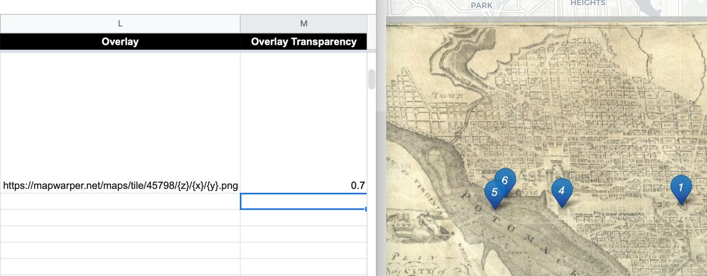{#fig-storymap-overlay width=600}

스토리에 보이는 경로, 지리적 경계 또는 채워진 코로플레스 지도를 추가하려면 하나 이상의 챕터에 GeoJSON 데이터 레이어를 추가하는 것을 고려해 보세요. 13장에서 [GeoJSON 및 공간 데이터 형식](#geojson)에 대해 읽어보세요. 여기에서 [기존 GeoJSON 경계 파일을 찾는 방법](#find-geojson)을 배우거나 [GeoJson.io 도구](#geojsonio) 또는 [Mapshaper 도구](#mapshaper)를 사용하여 직접 지리 데이터를 그리거나 편집할 수 있습니다. GeoJSON 파일의 이름은 소문자로 공백 없이 지정하는 것이 좋습니다. `geojson` 폴더를 열고 *Add file - Upload files*를 선택하여 파일을 GitHub 리포지토리에 업로드합니다. Google Sheet 템플릿에서 그림 \@fig-storymap-geojson 에 표시된 것처럼 *GeoJSON Overlay* 열에 `geojson/your-file-name.geojson`과 같은 형식으로 경로 이름을 입력합니다.


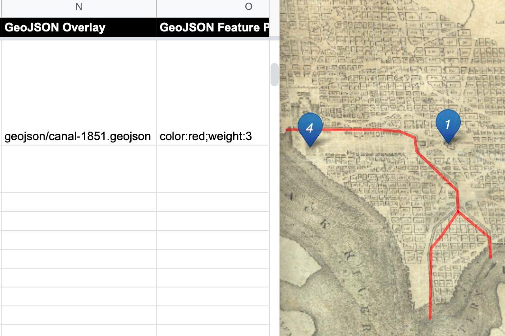{#fig-storymap-geojson width=600}

[GeoJson.io](#geojsonio)와 같은 도구를 사용하여 GeoJSON 데이터를 생성하거나 편집할 때 기능 속성을 직접 편집할 수 있습니다. GeoJSON 파일에 할당한 것과 동일한 속성을 스토리맵에 표시하려면 다음과 같이 이름을 지정하는 것이 좋습니다.

- weight (선 또는 폴리곤 테두리의 너비, 스토리맵 템플릿 기본값은 1px)
- color (선 또는 폴리곤 테두리, 기본값은 gray)
- opacity (선 또는 폴리곤 테두리, 기본값은 0.5)
- fillColor (폴리곤, 기본값은 white)
- fillOpacity (폴리곤, 기본값은 0.7)

또는 *GeoJSON Feature Properties* 템플릿 열에 속성과 CSS 코드를 세미콜론으로 구분하여 인용 부호 없이 `weight:3;color:red;opacity:1;fillColor:orange;fillOpacity:0.9`와 같은 형식으로 입력할 수 있습니다. [W3Schools 색상 선택기](https://www.w3schools.com/colors/colors_picker.asp)에 설명된 대로 표준 이름, 16진수 코드 또는 RGBA 값으로 색상을 할당할 수 있습니다.

템플릿 내부에서 스토리맵을 맞춤 설정하는 더 많은 방법을 찾을 수 있습니다. 예를 들면 다음과 같습니다.

- 스토리맵 브랜드화를 위한 로고 삽입(Google Sheets의 Options 탭 참조)
- 사용량을 보기 위해 Google Analytics 추적 ID 추가(Options 탭 참조)
- API 키가 필요한 제공업체를 위해 API 키를 삽입하는 옵션을 사용하여 Basemap Tiles 배경 지도 변경. 예를 들어 [Stadia에 무료 계정](https://stadiamaps.com)을 만들어 넉넉한 한도까지 배경 타일 지도를 사용하고 Stadia API 키를 삽입할 수 있습니다(Options 탭 참조).
- 제목 크기 및 글꼴 조정(GitHub의 css/styles.css 파일로 이동)
- 챕터 텍스트에 가로 구분선 삽입(이 텍스트를 복사하여 Google Sheets의 Description 필드에 붙여넣고 작은따옴표를 둥근 아포스트로피로 변경하지 마세요)
`<span style='display:block;width:100%;height:1px;background-color: silver; margin: 20px 0;'></span>`

### 대중과 공유하기 전에 스토리맵 완성하기 {-}
이제 지도를 완성할 준비가 되었습니다. 지도 링크를 대중과 공유하려면 아래 옵션을 읽고 G 단계 *또는* H 단계를 선택하세요.

경고: 다른 사람들이 *당사의* Google Sheets API 키를 과도하게 쓰거나 남용하면, 당사는 언제든지 그 키를 바꿀 수 있습니다. 즉, 당사가 키를 변경하면 지도가 *작동을 멈추기* 때문에 공개적으로 공유하기 전에 아래의 G 단계 또는 H 단계를 사용하여 지도를 완성*해야* 합니다.

#### G) 각 Google Sheets 탭을 CSV 파일로 저장하고 GitHub에 업로드합니다 {-}
대부분의 데이터를 Google Sheets에 모두 입력했다면 이를 별도의 CSV 파일로 다운로드하여 GitHub 리포지토리에 업로드하는 것이 *가장 좋은* 장기 보존 전략입니다. 이 접근 방식을 사용하면 지도와 데이터가 동일한 GitHub 리포지토리에 함께 유지되며 Google 서비스 중단으로 인해 지도가 손상될 위험이 없어집니다. 게다가 여전히 지도 데이터를 편집할 수 있습니다. 이 접근 방식이 타당하다고 생각되면 다음 단계를 따르세요.

1. Google Sheets에서 각 탭으로 이동하여 그림 \@fig-storymap-download-csv 에 표시된 대로 CSV 형식으로 *파일 > 다운로드*를 선택하여 각 탭에 대한 별도의 파일을 만듭니다.


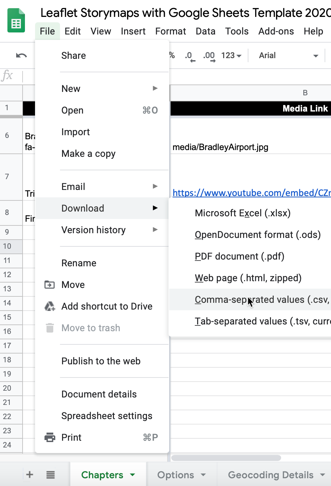{#fig-storymap-download-csv width=350}

2. 표시된 대로 각 파일 이름을 줄입니다. 아래의 처음 두 파일은 필수이며 다른 파일은 선택 사항입니다. 파일 이름은 *Chapters.csv*의 첫 글자 대문자 등 표시된 것과 *정확히* 같아야 합니다.

- Chapters.csv
- Options.csv
- Notes.csv (또는 .txt) 데이터와 함께 메모를 보관하는 것이 좋지만 필수는 아닙니다.

3. GitHub 리포지토리에서 `csv` 하위 폴더를 클릭하여 열고 *Add file > Upload files*를 선택한 다음 그림 \@fig-storymap-upload-csv 에 표시된 대로 위의 모든 CSV 파일을 이 하위 폴더에 업로드합니다. Leaflet 템플릿 코드는 먼저 여기서 데이터를 확인하고 위 이름의 CSV 파일을 찾으면 Google Sheets 대신 파일에서 직접 지도 데이터를 가져옵니다. 이 시점부터 Google Sheet의 모든 수정 사항은 지도에 *더 이상 자동으로 나타나지 않는다는 점을 기억*하세요.


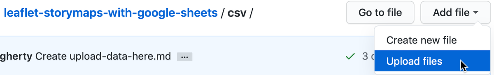{#fig-storymap-upload-csv width=400}

4. Google Sheet에서 GitHub의 *csv* 하위 폴더로 데이터를 마이그레이션한 후 `google-doc-url.js` 파일로 이동하여 아래와 같이 따옴표 없이 googleDocURL 값을 `null`로 변경합니다. 이렇게 하면 지도의 맨 아래에 있는 "data by" 귀속 링크가 이전 데이터 소스(게시된 Google Sheet)에서 새 소스(GitHub의 *csv* 파일)로 변경됩니다. 아래와 같이 알림으로 코드 주석을 업데이트합니다.

```
// data stored in csv folder on GitHub, not Google Sheets
var googleDocURL = null;
```

4. CSV 파일을 업로드한 후 지도를 편집하려면 두 가지 옵션이 있습니다. GitHub 웹 인터페이스에서 CSV 파일을 열어 직접 작게 편집할 수 있습니다. 또는 Google Sheet에서 크게 편집하고 위의 단계를 반복하여 CSV 형식으로 다운로드한 다음 업로드하여 GitHub의 기존 파일을 바꿀 수 있습니다.

#### H) 코드에 삽입할 자체 Google Sheets API 키를 가져옵니다 {-}
G 단계의 대안으로 온라인에 게시된 Google Sheets에 지도 데이터를 계속 저장하려면 이 장의 [고유한 Google Sheets API 키 가져오기](#google-sheets-api-key) 섹션으로 이동하여 설명된 대로 Leaflet 지도 코드에 삽입하여 당사의 키를 과도하게 사용하지 않도록 하세요. Google Sheets는 해당 서비스에서 합리적인 [사용 한도](https://developers.google.com/sheets/api/limits)를 유지하기 위해 API 키가 필요합니다. 학교나 직장에서 제공하는 Google Workspace 계정이 *아닌* 개인 Google 계정이 있는 경우 무료 Google Sheets API 키를 받을 수 있습니다.

문제가 발생하면 부록의 [일반적인 문제 해결](#fix) 섹션을 참조하세요.

## Google Sheets API 키 가져오기 {- #google-sheets-api-key}
[Google Sheets를 활용한 Leaflet 지도](#leaflet-maps-with-google-sheets) 또는 [Google Sheets를 활용한 Leaflet 스토리맵](#leaflet-storymaps-with-google-sheets)의 자체 버전을 만든 후, 위에서 설명한 것처럼 지도를 완성하는 두 가지 방법이 있습니다. Google Sheets 탭을 CSV 형식으로 저장하거나 자체 Google Sheets API 키를 가져와 GitHub의 Leaflet 코드에 붙여넣는 것입니다. 이 섹션에서는 후자의 방법에 대해 알아봅니다.

2021년 1월부터 Google Sheets 버전 4는 서비스 이용에 대한 [합리적인 한도를 유지](https://developers.google.com/sheets/api/limits)하기 위해 코드가 데이터를 읽을 수 있도록 허용하는 API(애플리케이션 프로그래밍 인터페이스) 키를 요구합니다. Google Sheets의 경우 한도는 프로젝트당 100초당 500회 요청, 사용자당 100초당 100회 요청입니다. 일일 사용 한도는 없습니다.

아래 단계에 따라 자체 무료 Google Sheets API 키를 얻을 수 있습니다. 전반적으로 Google Cloud 프로젝트를 만들고 이름을 지정하고, Google Sheets API를 활성화하여 컴퓨터가 Google Sheet에서 데이터를 읽을 수 있도록 허용하고, 새 API 키를 복사하여 당사의 키 대신 Leaflet 코드에 붙여넣습니다.

시작하기 전에:

- 학교나 직장에서 발급한 Google Workspace 계정이 *아닌* 개인 Google 계정이 필요합니다.
- 이 튜토리얼은 이미 위의 [Google Sheets를 활용한 Leaflet 지도](#leaflet-maps-with-google-sheets) 또는 [Google Sheets를 활용한 Leaflet 스토리맵](#leaflet-storymaps-with-google-sheets) 템플릿을 완료했으며 지도를 완성하고 싶다고 가정합니다.
- 위의 템플릿 중 하나에 대한 Google Sheets API 키를 이미 만든 경우 해당 키를 다른 템플릿에도 사용할 수 있습니다.

경고: 화면의 지침은 아래에 나열된 것과 다를 수 있습니다.

1. https://console.developers.google.com/ 의 Google Developers Console로 이동하여 Google 계정에 로그인합니다. Google에서 국가를 확인하고 서비스 약관에 동의하라고 요청할 수 있습니다.

2. 그림 \@fig-google-api-create 에 표시된 것처럼 시작 화면에서 *Create a Project*를 클릭합니다. 또는 왼쪽 상단의 드롭다운 메뉴로 이동하여 *Select a project > New project*를 선택합니다.


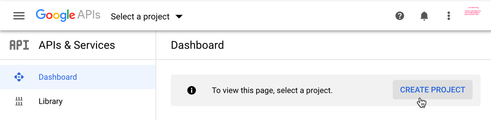{#fig-google-api-create width=600}

3. 다음 화면에서 새 프로젝트에 `handsondataviz`와 같이 목적을 상기시킬 수 있는 의미 있는 짧은 이름을 지정합니다. 조직이나 상위 폴더를 만들 필요는 없습니다. 그런 다음 그림 \@fig-google-api-name 에 표시된 것처럼 *Create*를 클릭합니다.


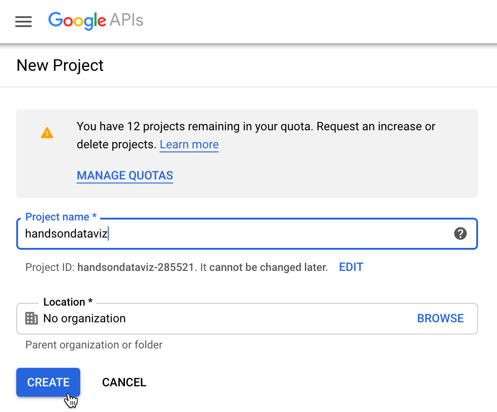{#fig-google-api-name width=450}

4. 다음 화면에서 그림 \@fig-google-api-enable 에 표시된 것처럼 메뉴 상단의 *+ Enable APIs and Services*를 누릅니다. 새 프로젝트 이름이 맨 위에 나타나는지 확인합니다.


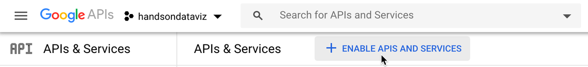{#fig-google-api-enable width=500}

5. 다음 화면에서 검색 창에 *Google Sheets*를 입력하고 그림 \@fig-google-api-search 에 표시된 대로 이 결과를 선택합니다.


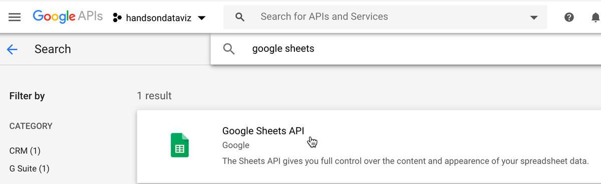{#fig-google-api-search width=500}

6. 다음 화면에서 그림 \@fig-google-api-select 에 표시된 것처럼 *Enable* 버튼을 선택하여 프로젝트의 Google Sheets API를 켭니다.


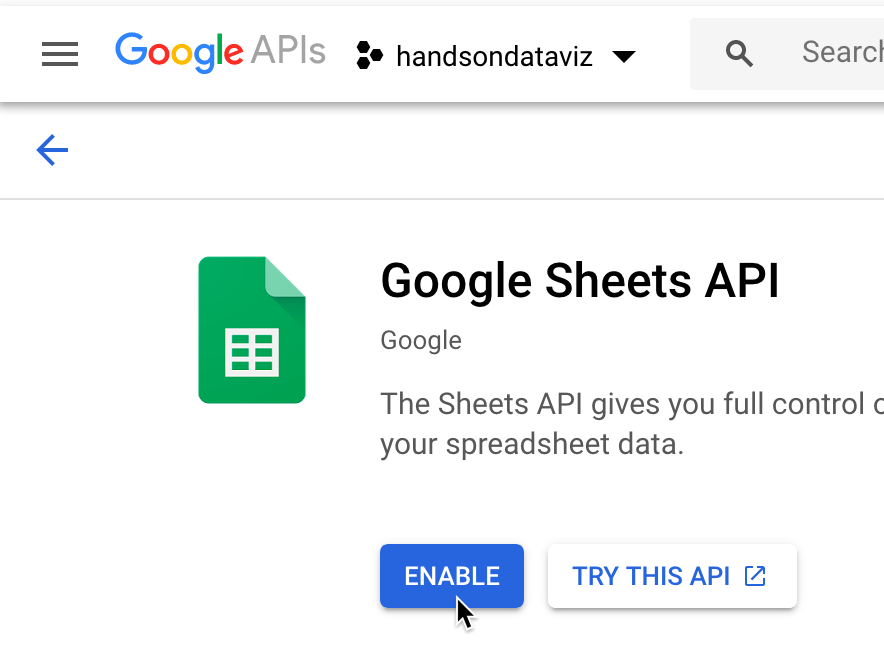{#fig-google-api-select width=350}

7. 왼쪽 사이드바 메뉴에서 *Credentials*를 클릭한 다음 *+ Create Credentials*를 클릭하고 그림 \@fig-google-api-credentials 에 표시된 것처럼 *API key*를 선택합니다.


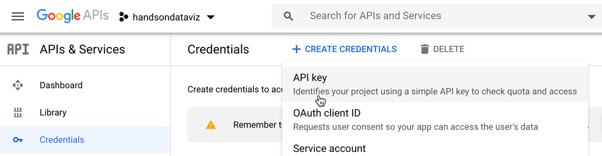{#fig-google-api-credentials}

8. 다음 화면의 콘솔에서 API 키가 생성됩니다. 이를 복사한 다음 그림 \@fig-google-api-key 에 표시된 것처럼 *Restrict key*를 누릅니다.


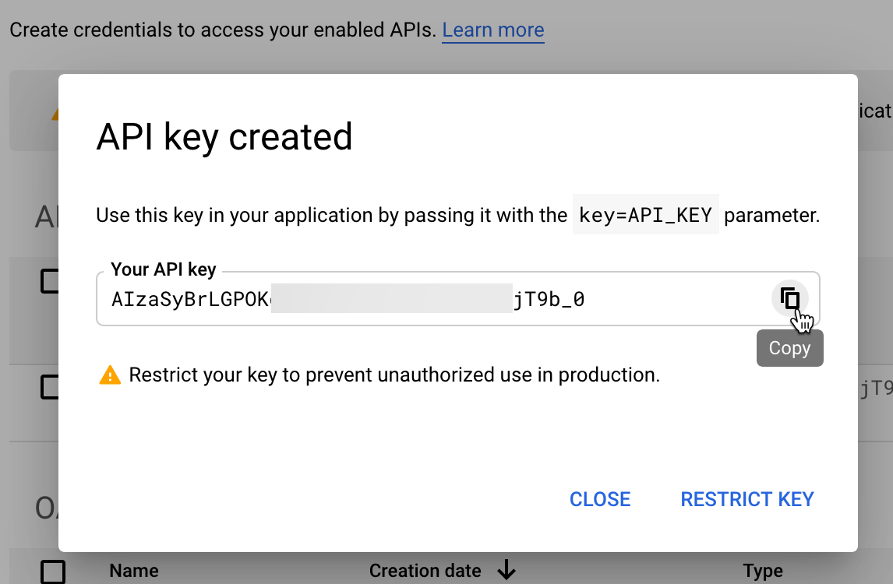{#fig-google-api-key width=500}

9. 새 창의 *API restrictions* 아래에서 *Restrict key* 라디오 버튼을 선택합니다. 나타나는 드롭다운에서 *Google Sheets API*를 선택한 다음 그림 \@fig-google-api-restrict 에 표시된 것처럼 *Save*를 클릭합니다.


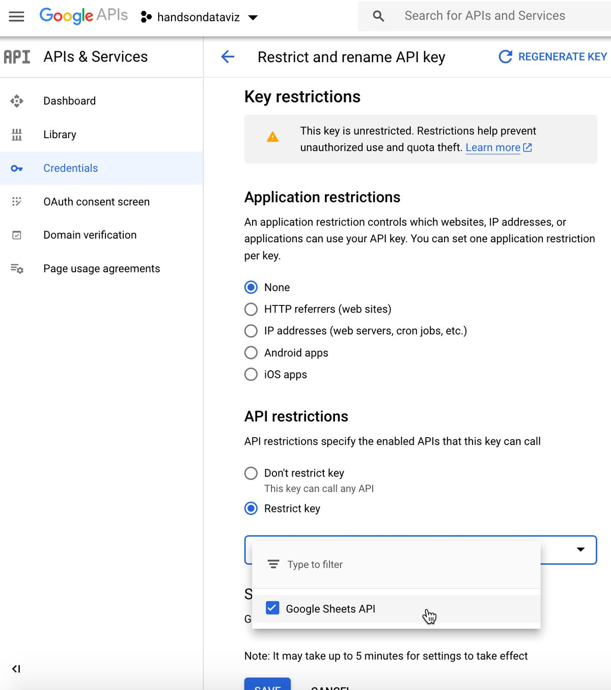{#fig-google-api-restrict width=600}

10. GitHub 리포지토리의 Leaflet 지도 코드에서 `google-doc-url.js` 파일을 열고 연필 기호를 클릭하여 편집한 후 그림 \@fig-google-api-paste 에 표시된 것처럼 *사용자*의 Google Sheets API 키를 붙여넣어 *당사*의 키를 바꿉니다. 작은따옴표나 세미콜론을 지우지 않도록 주의하세요. 아래로 스크롤하여 변경 사항을 *Commit*합니다.


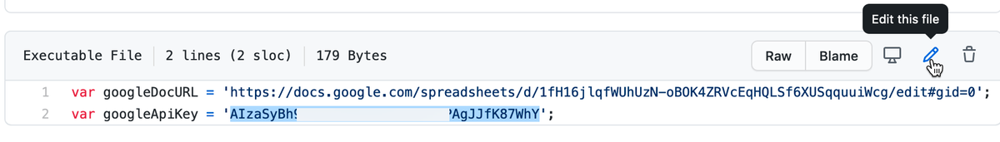{#fig-google-api-paste}

노출된 API 키가 있다는 알림을 GitHub에서 받을 수 있지만 걱정하지 마세요. 이 키는 Google Sheets에서만 사용할 수 있고 무료로 받았으며 청구 정보를 첨부하지 않았으므로 Google에서 사용 요금을 청구할 수 없습니다.

Google Sheets를 활용한 Leaflet 지도 또는 Google Sheets를 활용한 Leaflet 스토리맵과 함께 사용할 Google Sheets API 키를 만드는 방법을 배웠으므로, 다음 섹션에서는 다른 유형의 Leaflet 지도 템플릿에 대해 자세히 알아보겠습니다.


## CSV 데이터가 포함된 Leaflet 지도 {- #leaflet-maps-with-csv}
이 오픈소스 템플릿은 GitHub 리포지토리에 있는 CSV 파일에서 데이터를 가져오는 Leaflet 포인트 지도를 만드는 방법을 시연하여 코딩 기술을 향상하도록 설계되었습니다. [7장에 설명된 Google My Maps](#mymaps)와 같은 다른 플랫폼에서 동일한 유형의 지도를 만들 수 있지만 직접 해보면서 Leaflet 코드 라이브러리가 작동하는 방식을 더 잘 알게 될 것입니다.

그림 \@fig-leaflet-map-csv 는 코네티컷의 일부 대학의 간단한 포인트 지도를 보여줍니다.
하지만 Leaflet의 `L.marker()` 함수를 사용하여 JavaScript에서 마커를 개별적으로 만드는 대신, 포인트 데이터는 텍스트 편집기나 스프레드시트에서 쉽게 수정할 수 있는 로컬 CSV 파일(`data.csv`)에 저장됩니다.
브라우저에서 지도가 로드될 때마다
CSV 파일의 포인트 데이터를 읽고 "즉석에서" 마커가 생성됩니다.


::: {.content-visible when-format="html"}

<iframe src="https://handsondataviz.github.io/leaflet-map-csv/" width="100%" height="500px" style="border:none;"></iframe>
<p class="caption">[CSV 데이터가 포함된 대화형 Leaflet 포인트 지도](https://handsondataviz.github.io/leaflet-map-csv/)를 살펴보세요.</p>

:::


다음 지침에 따라 이 템플릿을 조정하여 고유한 포인트 지도를 만들 수 있습니다.

1. 이 템플릿의 코드가 저장된 [GitHub 리포지토리](https://github.com/HandsOnDataViz/leaflet-map-csv)를 방문합니다. 로그인되어 있는지 확인하고
*Use this template button*을 눌러 자신의 GitHub 계정에 이 리포지토리의 사본을 만듭니다.
2. 포인트 데이터를 `data.csv` 안에 넣습니다. 템플릿이 읽는 유일한 관련 열은 *Latitude*, *Longitude* 및 *Title*입니다.
처음 두 열은 마커의 위치를 결정하고 마지막 열은 팝업에 표시됩니다. 열의 순서는 중요하지 않습니다. 데이터 세트에 다른 열이 있을 수 있지만
무시됩니다.

데이터는 다음과 같을 수 있습니다.
```
Title,Latitude,Longitude
Trinity College,41.745167,-72.69263
Wesleyan University,41.55709,-72.65691
```

3. 포인트의 지리적 위치에 따라 지도의 기본 시작 위치를 변경해야 합니다.
`index.html`에서 `<script>` 태그를 찾아 다음
코드 덩어리를 편집합니다.

```javascript
var map = L.map('map', {
  center: [41.57, -72.69], // 시작 시 기본 위도 및 경도
  zoom: 9,  // 1에서 18 사이. 축소하려면 줄이고 확대하려면 늘립니다.
  scrollWheelZoom: false
});
```

코드 단순성을 위해 기본 Leaflet 마커를 사용했지만
사용자 정의 아이콘을 대신 사용할 수도 있습니다. 아래 코드 스니펫은 GitHub 리포지토리에서 설정하는 방법에 대한 아이디어를 제공할 수 있으며 여기에 샘플 대신 아이콘의 고유한 경로 이름을 삽입합니다.

```javascript
var marker = L.marker([row.Latitude, row.Longitude], {
  opacity: 1,
  // 아이콘 맞춤 설정
  icon: L.icon({
    iconUrl: 'path/to/your/icon.png',
    iconSize: [40, 60]
  })
}).bindPopup(row.Title);
```

자세한 내용은 [사용자 지정 아이콘에 대한 이 유용한 Leaflet 설명서 예제](https://leafletjs.com/examples/custom-icons/)를 참조하세요.

## CSV 데이터가 포함된 Leaflet 히트맵 포인트 {- #leaflet-heatmap}
히트맵은 개별 포인트를 핫스팟 또는 클러스터로 전환하여
시청자가 인구 밀도가 높고 낮은 지역이나 범죄 발생 건수 같은 사건의 공간적 분포를 탐색할 수 있게 합니다. 그림 \@fig-leaflet-heatmap 은 2020년 1월부터 7월까지 런던의 자전거 도난 위치를 담은 대화형 히트맵입니다. 기본
데이터는 신고된 각 자전거 도난의 좌표이며
[`Leaflet.heat`](https://github.com/Leaflet/Leaflet.heat) 플러그인이 이를 밀도 높낮이에 따른 영역으로 바꿔줍니다. 빨간색은 범죄 밀도가 가장 높은 곳, 즉 자전거 도난이 가장 자주 일어난 영역을 나타냅니다. 지도를 확대하면 영역이 재계산되어 더 뚜렷한 클러스터가 만들어집니다.


::: {.content-visible when-format="html"}

<iframe src="https://handsondataviz.github.io/leaflet-heatmap/" width="100%" height="500px" style="border:none;"></iframe>
<p class="caption">[대화형 Leaflet 히트맵](https://handsondataviz.github.io/leaflet-heatmap/)을 살펴보세요.</p>

:::


이 런던 히트맵에 사용한 코드를 조정하여 고유한 히트맵을 만들 수 있습니다.

1. [당사 코드가 있는 GitHub 리포지토리](https://github.com/HandsOnDataViz/leaflet-heatmap)를 방문하여 로그인되어 있는지 확인하고 *Use this template* 버튼을 클릭하여 이 리포지토리의 개인 사본을 만듭니다.
2. `index.html` 내에서 지도의 제목과 설명을 수정합니다.
3. 포인트 좌표 데이터를 `data.csv` 내에 배치합니다. 열 머리글을 삽입하지 *마십시오*. 전통적인 순서 대신 다음과 같이 한 줄에 한 쌍씩 *latitude,longitude*(또는 y,x) 순서로 작성해야 합니다.
```
51.506585,-0.139387
51.505467,-0.14655
51.507758,-0.141284
```

4. 데이터 밀도에 따라 `index.html`의 `<script>` 태그 내에서 *radius* 및 *blur* 매개변수를 조정할 수 있습니다.
```javascript
var heat = L.heatLayer(data, {
  radius: 25,
  blur: 15,
})
```

5. 다음 코드 덩어리를 편집하여 지도의 기본 위치 및 확대/축소 수준을 설정합니다.
```javascript
var map = L.map('map', {
  center: [51.5, -0.1], // 초기 지도 중심
  zoom: 10, // 초기 확대/축소 수준
})
```

어떤 이유로 클러스터가 표시되지 않으면 포인트 데이터가 반대가 아니라 `latitude,longitude` 순서로 표시되는지 확인하세요. 점이 적은 경우 `L.heatLayer`의 `radius` 속성 값을 늘려 보세요.

## Leaflet 검색 가능한 포인트 지도 {- #leaflet-searchable-map}

검색 가능한 포인트 지도는 사용자가 이름이나 위치 근접성으로 검색하거나 카테고리별로 필터링할 수 있는 여러 위치를 선택적 목록 보기와 함께 표시하는 데 가장 적합합니다. 그림 \@fig-searchable-map 은 시카고에 있는 DataMade의 [Derek Eder](https://derekeder.com/)가 개발한 CSV 데이터 파일에서 가져오는 강력한 검색 및 필터링 가능한 포인트 지도 Leaflet 템플릿을 보여줍니다. 이 지도를 사용하면 관심 지점을 표시하고 *이름으로 검색* 기능을 사용하여 필터링하고 지도의 점 대신 목록으로 표시할 수 있습니다. 또한 *About*(정보) 페이지에는 지도의 목적과 내용을 설명할 충분한 공간이 제공됩니다.


을 살펴보세요.](images/12-leaflet/searchable-map.jpg){#fig-searchable-map}

이 템플릿은 Leaflet.js와 Google Maps API를 결합해 주소 검색을 지원합니다.

자신의 프로젝트에 템플릿을 사용하려면 [템플릿의 GitHub 페이지](https://github.com/HandsOnDataViz/searchable-map-template-csv)를 방문하여 고유한 사본을 얻을 수 있도록 포크합니다(포크에 대해 상기하려면 [GitHub로 코드 편집 및 호스팅하기](#github) 장 참조).

### 1단계: 데이터 준비 {-}
이 템플릿은 [CSV](#csv) 및 [GeoJSON](#geojson) 형식의 데이터에서 작동합니다. Excel 파일이 있는 경우 스프레드시트 도구를 사용하여 CSV 형식으로 저장합니다. CSV 파일에는 위도 열과 경도 열이 있어야 하며 모든 행이 지오코딩되어야 합니다. 주소 또는 위치 데이터만 있는 경우 2장에서 [지오코딩](#geocode)하는 방법을 알아보세요.

### 2단계: 이 템플릿 다운로드 및 편집 {-}
1. 이 프로젝트를 다운로드하거나 복제하고 원하는 텍스트 편집기를 실행합니다. `/js/map.js`를 열고 `SearchableMapLib.initialize` 함수에서 지도 옵션을 설정합니다.
  - `map_centroid` - 지도의 중심으로 설정할 위도/경도입니다.
  - `filePath` - 지도 데이터 파일의 경로입니다. 이 파일은 csv 또는 geojson 형식이어야 하며 `data` 폴더에 배치해야 합니다. 이 파일의 첫 번째 줄은 머리글이어야 하며 위도 열과 경도 열이 있어야 합니다.
  - `fileType` - `csv` 또는 `geojson` 파일을 로드하는지 설정합니다.
2. 데이터를 표시하는 방법에 대해 `templates` 폴더의 템플릿을 편집합니다. 이러한 템플릿은 EJS를 사용하므로 조건부 논리뿐만 아니라 HTML로 변수를 표시할 수 있습니다. 자세한 내용은 [EJS 설명서](https://ejs.co/#docs)를 읽어보세요.
  - `/templates/hover.ejs` - 지도의 점 위에 마우스를 올렸을 때의 템플릿
  - `/templates/popup.ejs` - 지도의 점을 클릭했을 때의 템플릿
  - `/templates/table-row.ejs` - 목록 보기의 각 행에 대한 템플릿
3. 사용자 지정 필터를 제거하고 고유한 필터를 추가합니다.
  - `index.html` - 필터에 대한 사용자 지정 HTML은 112번째 줄 부근에서 시작합니다.
  - `/js/searchable_map_lib.js` - 사용자 지정 필터에 대한 논리는 265번째 줄 부근에서 시작합니다.

### 3단계: 지도 게시 {-}
1. 게시하기 전에 [이 장의 Google Sheets API 키 가져오기 섹션](#google-sheets-api-key)과 비슷하지만 다른 [무료 Google Maps API 키](https://developers.google.com/maps/documentation/javascript/get-api-key)를 얻어야 합니다. `index.html`의 이 줄에 있는 Google Maps API 키를 여러분의 키로 바꿉니다. `<script type="text/javascript" src="https://maps.google.com/maps/api/js?libraries=places&key=[YOUR KEY HERE]"></script>`
2. 이 지도와 모든 지원 파일 및 폴더를 사이트에 업로드합니다. 이 지도에는 백엔드 코드가 필요하지 않으므로 [10장에 설명된 GitHub Pages](#github), [Netlify](https://www.netlify.com) 또는 고유한 웹 서버와 같은 모든 호스트에서 작동합니다.

## 오픈 데이터 API가 포함된 Leaflet 지도 {- #leaflet-maps-open-data-apis}

[7장에서 배운 Socrata 오픈 데이터 지도](#map-socrata)와 유사하게 오픈 데이터 리포지토리에서 가장 최신 정보를 지속적으로 직접 가져오는 애플리케이션 프로그래밍 인터페이스(API)를 사용하여 자신만의 Leaflet 지도를 코딩하는 방법을 알아봅니다. Leaflet 지도는 API를 사용하여 다양한 오픈 데이터 리포지토리에서 데이터를 가져와 표시할 수 있습니다.
그림 \@fig-leaflet-open-data 는 하와이의 대화형 지도를 보여주며 지진 위험도에 따라 색상이 지정되어 있고 화산과 대형 호텔의 위치가 함께 표시되어 있습니다.

이 지도 템플릿은 다음 세 가지 오픈 리포지토리 소스에서 데이터를 가져옵니다.

- 화산 위치는 [USGS Volcano API](https://volcanoes.usgs.gov/vsc/api/volcanoApi/)에서 제공합니다.
- 지진 위험 레이어는 [Homeland Infrastructure Foundation-Level Data](https://hifld-geoplatform.hub.arcgis.com/maps/geoplatform::seismic-hazard-model-pga-with-2-5-or-10-probability-in-50-years/about)의 일부로 미국 국토안보부(DHS)에서 운영하는 Esri/ArcGIS FeatureServer에서 가져옵니다.
- 객실이 100개 이상인 호텔은 [Hawaii Geospatial Data Portal](https://geoportal.hawaii.gov/)에서 호스팅하는 Esri MapServer에서 가져옵니다.


::: {.content-visible when-format="html"}

<iframe src="https://handsondataviz.github.io/leaflet-maps-open-data-apis/index.html" width="100%" height="500px" style="border:none;"></iframe>
<p class="caption">[오픈 데이터가 포함된 대화형 Leaflet 지도](https://handsondataviz.github.io/leaflet-maps-open-data-apis/index.html)를 살펴보세요.</p>

:::


*참고: 원본 2021년 지도는 Medicare.gov 웹사이트에서 제공하는 노스다코타주의 병원 위치를 보여주었습니다. 2022년 3월에 Medicare.gov가 Socrata를 다른 데이터베이스 시스템으로 교체했을 때 지도를 업데이트하고 대신 노스다코타주의 AmeriCorps NCCC 프로젝트를 표시했습니다. 2024년 8월에 노스다코타 데이터베이스가 이동했을 때 지도를 한 번 더 업데이트했으며 이제 하와이의 대형 호텔, 화산, 지진 위험을 표시합니다. 전반적으로 이러한 시간 경과에 따른 지도 수정은 타사 데이터 제공업체 및 웹 시스템의 동적 특성을 보여줍니다.*

무료 [`esri-leaflet`](https://github.com/Esri/esri-leaflet) 플러그인을 사용하여 Leaflet이 MapServer 또는 FeatureServer를 비롯한 다양한 ArcGIS 서비스에서 데이터를 가져오도록 할 수 있습니다. USGS Volcano API 또는 Socrata의 [SODA API](https://dev.socrata.com/)와 같은 일반 JSON 엔드포인트의 데이터는 jQuery의 `$.getJSON()` 함수를 사용하여 가져올 수 있습니다.

자신의 프로젝트에 맞게 이 템플릿을 조정하려면:

1. 그림 \@fig-leaflet-open-data 에 있는 지도의 코드가 포함된 [GitHub 리포지토리](https://github.com/HandsOnDataViz/leaflet-maps-open-data-apis)를 방문하여 *Use this template* 버튼을 눌러 리포지토리를 자신의 GitHub 계정으로 복사합니다.
1. 모든 데이터는 `index.html`의 `<script>` 태그 내부 코드에서 가져옵니다. Socrata 또는 다른 JSON/GeoJSON 엔드포인트에서 데이터를 가져오려면 적절한 URL 및 아이콘으로 다음 코드 스니펫을 수정하세요.

```javascript
$.getJSON('https://volcanoes.usgs.gov/vsc/api/volcanoApi/volcanoesUS', function(apiResults) {

    // Leaflet 마커를 저장할 빈 배열을 생성합니다.
    let volcanoMarkers = [];

    // Volcanoes API에서 반환한 배열의 모든 요소를 살펴봅니다.
    for (var i in apiResults) {

        // 하와이 주변에 있는 화산만 추가해 보겠습니다.
        if (apiResults[i].subregion === 'Hawaii') {

        // 화산 객체에서 좌표를 추출합니다.
        var lat = apiResults[i].latitude;
        var lon = apiResults[i].longitude;

        // 사용자 지정 이미지로 Leaflet 마커를 생성합니다.
        var marker = L.marker([lat, lon], {
            icon: L.icon({
            iconUrl: 'images/volcano.png',
            iconSize: [24, 24],
            iconAnchor: [12, 12],
            opacity: 0.5
            })
        }).bindTooltip(apiResults[i].vName); // 화산 이름이 있는 도구 설명을 추가합니다.

        // 다른 모든 마커 배열에 화산 마커를 추가합니다.
        volcanoMarkers.push(marker);

        }
    }

    // 마커 배열에서 Leaflet 레이어 그룹을 생성합니다.
    var volcanoLayer = L.layerGroup(volcanoMarkers);
    volcanoLayer.addTo(map); // 지도에 레이어를 추가합니다.

    // 작은 아이콘과 함께 범례에 레이어를 추가합니다.
    legend.addOverlay(
        volcanoLayer,
        'Volcanoes '
    )

})
```

다음 코드 스니펫은 `esri-leaflet` 플러그인을 사용하여 ArcGIS FeatureServer에서 폴리곤 데이터를 가져오고 각 폴리곤 기능의 `low_cont` 변수에 저장된 모델링된 위험도 값을 기반으로 코로플레스 레이어를 생성합니다.

```javascript
var seismicHazardLayer = L.esri.featureLayer({
    url: 'https://services1.arcgis.com/Hp6G80Pky0om7QvQ/ArcGIS/rest/services/Seismic_Ground_Motion_Hazards_with_2_5_or_10_Percent_Probability_in_50_years/FeatureServer/5',
    style: function(feature) {
        return {
            fillOpacity: 0.5,
            weight: 0, // 폴리곤이 매우 촘촘하므로 경계를 그리지 않겠습니다.
            fillColor: getHazardColor(feature.properties.low_cont)
        }
    }
}).addTo(map)

legend.addOverlay(seismicHazardLayer, 'Seismic hazard')
```

여기서 `getHazardColor()` 함수는 사전 정의된 임계값을 기반으로 지정된 값에 대한 색상을 반환합니다. 이 경우 5개의 버킷을 정의하고 1.5가 넘는 값(가장 큰 힐로 섬 중앙의 화산 주위에 중심을 둠)에 가장 어두운 빨간색을 할당하고 0.2 이하의 값에 가장 연한 빨간색을 할당합니다.

```javascript
var getHazardColor = function(d) {
    return d > 1.5   ? '#7a0177' :
            d > 1.0  ? '#c51b8a' :
            d > 0.5  ? '#f768a1' :
            d > 0.2  ? '#fbb4b9' :
                        '#feebe2'
}
```

소스 데이터베이스에서 직접 데이터를 가져오는 것이 편리하지만 해당 리소스는 사용자가 통제할 수 없다는 점을 기억하세요(물론 사용자가 관리하지 않는 한). 데이터 변경은 종종 예고 없이 이루어집니다. 예를 들어, 데이터 세트 소유자가 값 필드 이름을 `low_cont`에서 `hazard_value`로 변경하기로 결정하면 지도는 더 이상 값을 올바르게 표시하지 않습니다. 데이터 세트가 다른 도메인 이름으로 이동되거나 완전히 삭제될 수 있으므로(두 가지를 모두 경험했습니다!), 백업 파일을 로컬에 저장해 두는 것이 현명합니다.

최신 버전의 데이터 세트를 표시하는 것보다 지도의 장기적인 작동에 대해 더 염려된다면 대신 로컬 GeoJSON 파일에서 데이터를 제공하는 것을 고려하세요(하지만 먼저 데이터 라이선스에서 허용하는지 확인하세요).

### 요약 {- #summary12}

이 장에서는 스크롤 가능한 인터페이스를 사용하여 장소에 대한 스토리를 알리고, ArcGIS/Esri MapServer 및 JSON API 엔드포인트와 같은 소스의 포인트 및 폴리곤 데이터를 표시하고, 이벤트 밀도가 높은 지역을 시각화하기 위한 히트맵을 생성하는 것과 같은 일반적인 지도 문제에 대한 Leaflet 지도 템플릿을 소개했습니다.

이러한 템플릿을 기반으로 사용하여 고유한 매핑 프로젝트를 시작할 수 있습니다. Leaflet.js는 [문서화가 잘 되어 있으며](https://leafletjs.com/reference), 더 많은 영감을 얻으려면 [튜토리얼](https://leafletjs.com/examples.html)을 살펴보는 것이 좋습니다.

다음 장에서는 공간 데이터에 대해 이야기하고 공간 파일을 변환, 생성 및 편집할 수 있는 몇 가지 도구를 소개합니다.


<!-- BEGIN FILE: 13-transform.Rmd -->

# 지도 데이터 변환하기 {#transform}

[7장: 데이터 지도화](#map)에서는 다양한 데이터 레이어로 구성된 인터랙티브 웹 지도의 기본 개념을 소개했습니다. 사용자가 인터랙티브 지도를 탐색할 때 보통 가장 위쪽 레이어를 클릭하게 되며 이 레이어는 래스터 또는 벡터 데이터로 구축된 매끄러운 기본 지도(basemap) 타일 세트 위에 포인트(points), 폴리라인(polylines), 다각형(polygons)의 조합을 표시하는 경우가 많습니다. [Datawrapper와 같은 드래그 앤 드롭 도구로 지도를 만들든](#choropleth-datawrapper), [Leaflet 지도 코드 템플릿을 커스터마이징하든](#leaflet), 이러한 유형의 지도 레이어 중 하나와 작동하도록 데이터를 변환해야 할 수 있습니다.

이 장에서는 이 책에서 가장 널리 사용되는 오픈 표준 포맷인 GeoJSON과 같은 [공간 데이터 및 다양한 포맷](#geojson)에 대한 주제를 더 깊이 다룹니다. 크라우드소싱 기반의 OpenStreetMap 플랫폼에서 [이러한 포맷의 지리적 경계 파일을 찾고 추출하는 방법](#find-geojson)을 배우게 됩니다. 또한, [GeoJson.io 도구](#geojsonio)를 사용하여 최상위 지도 레이어 데이터를 변환하거나 직접 만드는 방법과, [Mapshaper 도구](#mapshaper)를 사용하여 스프레드시트 데이터와 함께 이 레이어들을 편집하는 방법을 살펴봅니다. 나아가 [Map Warper 도구](#mapwarper)를 사용하여 고품질 정적 지도 이미지를 지리 참조하고 이를 인터랙티브 지도 타일로 변환하는 방법도 배웁니다. 이 모든 무료 웹 기반 지리 데이터 도구는 배우기 쉽고 많은 경우에 상용 ArcGIS 및 오픈소스 QGIS 데스크톱 애플리케이션과 같이 비용이 많이 들거나 복잡한 지리 정보 시스템(GIS)을 대체할 수 있습니다. 마지막으로, [대규모 주소 데이터를 일괄 지오코딩](#bulk-geocode)하고 [포인트를 다각형 데이터로 피벗](#pivot-point-to-polygon)하여 이 정보를 코로플레스 지도(choropleth maps)에 표시할 수 있도록 하는 전략으로 마무리합니다. 이 장이 끝날 때쯤이면 조금 압도적으로 느껴질 수 있는 공간 데이터의 세계를 탐색하는 데 훨씬 더 자신감을 가지게 될 것입니다.

공간 데이터의 일반적인 개요부터 시작하여 여러분이 지도 데이터를 만들고, 사용하고, 공유할 준비가 되었는지 확인하기 위해 다양한 파일 포맷을 소개하겠습니다.

## 공간 데이터와 GeoJSON {- #geojson}

이 장의 뒷부분에서 만들고 편집하게 될 지도 레이어를 더 잘 이해할 수 있도록 공간 데이터의 기본 사항부터 살펴보겠습니다. 공간 데이터에서 가장 먼저 알아야 할 점은 *위치(location)*와 *속성(attribute)*이라는 두 구성 요소로 이루어져 있다는 것입니다.
구글 지도(Google Maps)를 사용하여 식당을 검색하면, `41.7620891, -72.6856295`와 같은 위도 및 경도 좌표로 식당의 위치를 가리키는 빨간색 마커가 화면에 표시됩니다. 속성에는 식당 이름, 사람이 읽기 쉬운 주소, 고객 리뷰 댓글과 같은 추가 정보가 포함됩니다. 이러한 모든 속성은 위치 데이터에 가치를 더합니다.

두 번째로, [7장의 지도 디자인 원칙 섹션](#map-design)에서 이전에 소개한 개념인 공간 데이터는 *래스터(raster)* 또는 *벡터(vector)*일 수 있습니다. 디지털 지도에서 래스터 데이터는 종종 위성 및 항공 이미지로 나타나며 품질은 이를 캡처한 카메라의 해상도에 따라 달라집니다. 위성 카메라의 해상도가 1미터인 경우, 캡처된 다양한 색상은 각 변이 1미터인 셀 격자로 표시됩니다. 이 각각의 셀은 우리 컴퓨터 화면에서 색상으로 코딩된 픽셀로 나타납니다. 래스터 이미지를 너무 가까이 확대하면 원본 이미지의 해상도 한계로 인해 흐릿하거나 픽셀화되어 보일 수 있습니다(그림 \@fig-geospatial-raster-vector 참조).

대조적으로, 벡터 데이터는 종종 디지털 지도에서 건물, 강 및 지역을 나타내는 그림 이미지로 나타납니다. 벡터 지도는 사람이나 알고리즘이 래스터 위성 또는 항공 이미지에서 포인트, 폴리라인, 다각형을 그리거나, 달리기 또는 하이킹을 기록하는 GPS 추적기 등의 다른 출처에서 만들어질 수 있습니다. 예를 들어, [OpenStreetMap](https://www.openstreetmap.org)의 대부분은 위성 이미지에서 객체의 윤곽을 추적하는 자원 봉사자들이 구축했으며 누구나 이 크라우드소싱 기반 세계 지도를 확장하는 데 도움을 주기 위해 가입할 수 있습니다. 래스터 지도와 달리 벡터 지도는 모든 포인트와 선이 정밀한 소수점으로 표현될 수 있는 위도 및 경도 좌표로 나타나기 때문에 어떠한 줌 레벨에서도 선명한 초점을 유지합니다. 게다가 래스터 데이터는 일반적으로 셀당 하나의 값(전통적인 위성 이미지의 색상이나 디지털 고도 모델의 해발 고도 등)으로 제한되지만 벡터 데이터는 각 객체에 대한 여러 속성(이름, 주소, 댓글 등)을 포함할 수 있습니다. 또한 벡터 지도 파일은 래스터 파일보다 파일 크기가 더 작은 경향이 있는데, 이는 온라인에서 지도를 공유하고 표시하기 위해 생성 및 업로드할 때 중요합니다.


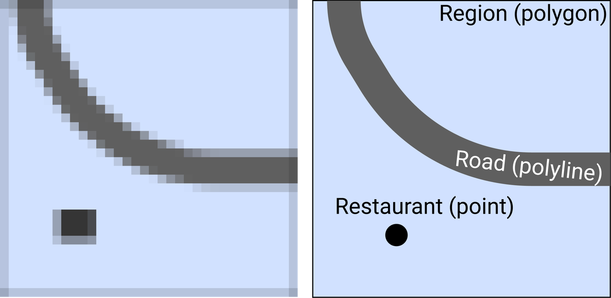{#fig-geospatial-raster-vector width=750}

이 장의 여러 섹션에서 벡터 데이터에 초점을 맞추므로, 이 책에서 권장하는 도구와 가장 잘 작동하는 포맷인 GeoJSON을 시작으로 가장 일반적인 몇 가지 파일 포맷을 살펴보겠습니다.

#### GeoJSON {-}
[GeoJSON](https://geojson.org)은 2016년에 생성된 오픈 표준에 기반을 둔 인기 있는 지도 데이터 포맷으로, 파일 확장자는 `.geojson` 또는 `.json`으로 끝납니다. 아래의 코드 스니펫은 위도 41.76, 경도 -72.67을 가지며 값이 *Hartford*인 *name* 속성(프로퍼티라고도 함)을 갖는 단일 포인트를 GeoJSON 포맷으로 나타냅니다.

```
{
  "type": "Feature",
  "geometry": {
    "type": "Point",
    "coordinates": [-72.67, 41.76]
  },
  "properties": {
    "name": "Hartford"
  }
}
```

위에 표시된 `Point` 피처 유형 외에도 다른 GeoJSON 유형으로는 포인트들의 배열로 표현되는 `LineString`(선 또는 폴리라인)이나 `Polygon`이 될 수 있습니다. GeoJSON의 단순성과 가독성 덕분에 [10장에서 설명한 Pulsar 편집기 도구](#github-desktop-editor)와 같은 가장 단순한 텍스트 편집기에서도 편집할 수 있습니다.

이 책에서 권장하는 지도 도구(예: Datawrapper 및 Leaflet)와 수십 개의 다른 도구에서 지원하는 GeoJSON 포맷으로 지도 데이터를 생성하고 편집할 것을 강력히 권장합니다. 공간 데이터를 GeoJSON으로 저장하고 공유하면 파일 크기가 크거나 비싼 GIS 데스크톱 애플리케이션을 설치하지 않고도 다른 사람들이 파일을 사용할 수 있습니다. 또 다른 장점은 그림 [\@fig-geojson-github]에서 볼 수 있듯이 GitHub 리포지토리가 모든 GeoJSON 파일의 지도 미리보기를 자동으로 표시한다는 것입니다.


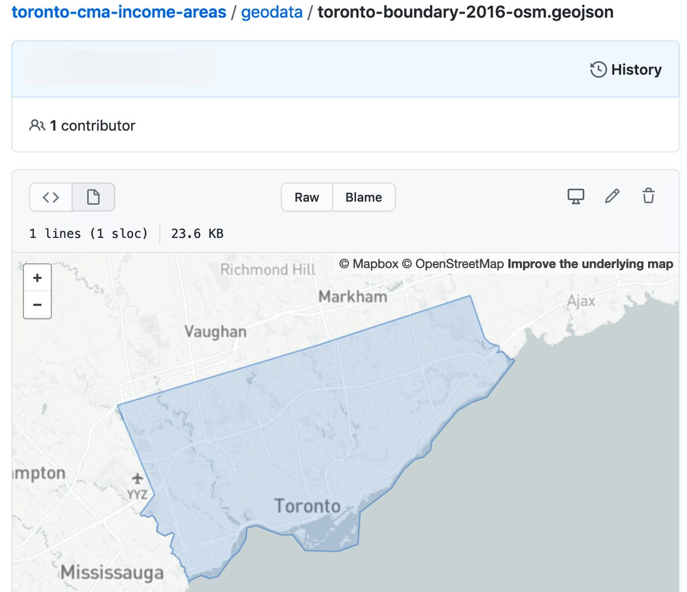{#fig-geojson-github width=600}

경고: GeoJSON 포맷에서 좌표는 수학의 X-Y 좌표와 동일한 *경도-위도* 포맷으로 정렬됩니다. 그러나 이는 *위도-경도* 포맷으로 좌표 값을 배치하는 구글 지도 및 기타 일부 웹 지도 도구와는 반대입니다. 예를 들어, 코네티컷 주 하트퍼드(*Hartford, Connecticut*)는 GeoJSON에 따르면 (-72.67, 41.76)에 위치하지만 구글 지도에서는 (41.76, -72.67)에 위치합니다. 어느 표기법이 맞거나 틀린 것은 아닙니다. 여러분이 어떤 표기법을 다루고 있는지 반드시 알아두세요. Tom MacWright는 [다양한 공간 포맷 및 기술의 위도/경도 순서를 보여주는 훌륭한 요약표](https://macwright.com/lonlat/)를 만들었습니다.

이제 GeoJSON 공간 파일 포맷을 소개했으니, 다른 몇 가지 포맷과 비교해 보겠습니다.

#### 셰이프파일 (Shapefiles) {-}
셰이프파일 포맷은 ArcGIS 소프트웨어를 개발하는 Esri에서 1990년대에 만들었습니다. 셰이프파일은 보통 `.shp`, `.shx`, `.dbf`와 같은 확장자를 가진 파일들이 폴더에 담겨 나타나며 이 폴더는 `.zip` 파일로 압축되어 있을 수 있습니다.

정부 기관은 일반적으로 셰이프파일 포맷으로 지도 데이터를 배포합니다. 그러나 셰이프파일을 편집하기 위한 표준 도구인 ArcGIS와 그 무료 오픈소스 사촌인 QGIS는 이 책의 다른 도구들만큼 배우기 쉽지 않습니다. 이러한 이유로 셰이프파일을 가능하다면 GeoJSON 파일로 변환할 것을 권장하며 이는 이 장의 뒷부분에서 논의될 [Mapshaper 도구](#mapshaper)를 사용하여 수행할 수 있습니다.

#### GPS Exchange Format (GPX) {-}

달리기나 자전거 타기를 GPS 기기로 기록한 적이 있다면 `.gpx` 파일이 생성되었을 가능성이 큽니다.
GPX는 XML 마크업 언어를 기반으로 하는 오픈 표준입니다.
GeoJSON과 마찬가지로 모든 단순한 텍스트 편집기에서 GPX 파일의 내용을 검사할 수 있습니다. 아마도 GPS 기기가 특정 시간에 기록한 타임스탬프와 위도/경도 좌표의 모음을 보게 될 것입니다. 이 장 뒷부분에서 설명할 [GeoJson.io 도구](#geojsonio)를 사용하여 GPX를 GeoJSON 포맷으로 변환할 수 있습니다.

#### Keyhole Markup Language (또는 KML) {-}

KML 포맷은 무료이면서 2차원 및 3차원 지리적 데이터를 보고 편집하기 쉬운 [Google Earth](https://www.google.com/earth/)를 위해 개발된 2000년대 후반에 인기를 얻었습니다. KML 파일은 구글 퓨전 테이블(Google Fusion Tables) 기반의 지도와 함께 사용되기도 했지만 이 도구는 [2019년 말에 구글이 중단했습니다](https://killedbygoogle.com/).
이 장의 뒷부분에서 설명할 [GeoJson.io 도구](#geojsonio)를 사용하여 KML 파일을 GeoJSON 포맷으로 변환할 수 있습니다.

팁: 때때로 `.kml` 파일은 압축된 `.kmz` 포맷으로 배포됩니다. 이를 변환하는 방법을 배우려면 이 장의 [KMZ에서 KML 포맷으로 변환하기](#convert-kmz) 섹션을 참조하세요.

#### MapInfo TAB {-}
독점적인 TAB 포맷은 Esri의 경쟁사인 MapInfo가 만들고 지원하며 MapInfo Pro GIS 소프트웨어와 잘 작동하도록 설계되었습니다. Esri의 셰이프파일과 유사하게 MapInfo TAB 파일은 대개 `.tab`, `.dat`, `.ind` 및 기타 확장자를 갖는 파일들과 함께 하나의 폴더에 나타납니다. 유감스럽게도 이를 셰이프파일이나 GeoJSON 포맷으로 변환하려면 MapInfo Pro, QGIS 또는 ArcGIS가 필요할 가능성이 큽니다.

가장 일반적인 공간 파일 포맷 중 몇 가지만 언급했지만 수많은 [덜 알려진 포맷](https://en.wikipedia.org/wiki/GIS_file_formats)들이 존재합니다. GeoJSON은 *벡터* 데이터를 위한 가장 훌륭하고 범용적인 포맷 중 하나라는 점을 기억하고 포인트, 폴리라인 및 다각형 데이터를 이 포맷으로 저장하고 공유할 것을 강력히 권장합니다.
다음 섹션에서는 전 세계 여러 지역의 GeoJSON 경계 파일을 찾는 방법을 설명합니다.

## GeoJSON 경계 파일 찾기 {- #find-geojson}
사용자 정의 지도를 만들기 위해 GeoJSON 포맷의 지리적 경계 파일을 찾고 있을 수 있습니다. 예를 들어, [7장에서 설명한 Datawrapper 도구](#choropleth-datawrapper)와 [13장에서 설명한 Leaflet 지도 코드 템플릿](#leaflet) 모두 여러분 자신의 GeoJSON 파일을 업로드할 수 있게 해줍니다. GeoJSON은 오픈 데이터 표준이므로 [3장에서 나열된 여러 오픈 데이터 저장소](#opendata)에서 이러한 파일을 찾을 수 있습니다.

GeoJSON 파일을 찾고 다운로드하는 또 다른 방법은 Hans Hack이 개발한 영리한 [Gimme Geodata 도구](https://hanshack.com/geotools/)로, [OpenStreetMap](https://openstreetmap.org) 경계 파일의 여러 레이어에 빠르게 접근할 수 있도록 해줍니다. 도구를 열면 위치를 검색하고 지도에서 특정 지점을 클릭합니다. 이 도구는 해당 지점 주변으로 OpenStreetMap에 업로드된 다양한 지리적 경계의 이름과 윤곽을 표시하며 이를 선택하여 GeoJSON 포맷으로 다운로드할 수 있습니다. 예를 들어, 토론토 센터(Toronto Centre)를 검색하고 클릭하면 그림 [\@fig-gimme-geodata]와 같이 이 도구는 여러 동네 수준의 경계, 올드 토론토 시 경계, 현재의 토론토 시 경계, 지역 및 주 경계를 표시합니다. 각 레이어에 대한 자세한 내용을 읽어 정확성을 평가한 다음, 다운로드할 레이어를 선택하여 GeoJSON 포맷으로 저장하세요. 이 도구에는 물 영역을 경계 파일에서 제거할 수 있는 편집기(가위 기호)도 포함되어 있습니다(예: 토론토에서 온타리오 호수 삭제). OpenStreetMap에서 다운로드한 모든 유형의 데이터를 사용할 때는 항상 최종 결과물에 `© OpenStreetMap contributors`와 같이 출처를 표기해야 합니다. [OpenStreetMap 저작권 및 라이선스 정책](https://www.openstreetmap.org/copyright)에 대해 더 알아보세요.


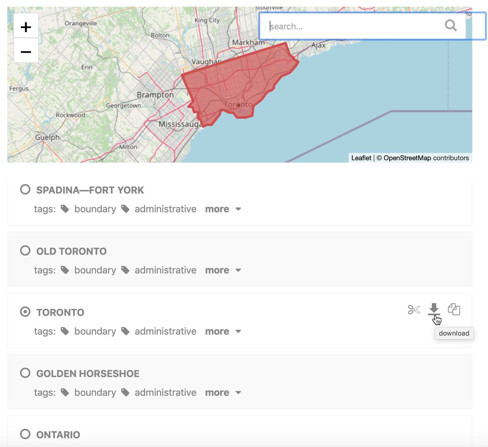{#fig-gimme-geodata}

팁: 이름에 공백이 포함된 GeoJSON 파일(예: `Old Toronto.geojson`)을 다운로드할 때 공백을 하이픈이나 밑줄(예: `Old-Toronto.geojson`)로 교체하세요. 이렇게 하면 파일 이름에 공백이 포함되어 있을 때 이를 인식하지 못하는 이 책의 시각화 도구에서 발생하는 문제를 방지할 수 있습니다.

이제 지리 데이터를 찾는 방법을 알았으니, GeoJSON 파일을 다른 유형의 데이터와 함께 생성, 변환, 편집 및 결합할 수 있는 무료 온라인 도구를 살펴보겠습니다.

## GeoJson.io로 그리고 편집하기 {- #geojsonio}

[GeoJson.io](https://geojson.io)는 GeoJSON 파일을 변환, 편집, 생성할 수 있는 인기 있는 오픈소스 웹 도구입니다. 이 도구는 2013년 [Tom MacWright](https://macwright.org/about/)가 처음 개발했으며 공간 데이터 실무자들 사이에서 필수 도구로 빠르게 자리 잡았습니다.

이 튜토리얼에서는 기존 KML, GPX, TopoJSON은 물론 위도/경도 데이터가 포함된 CSV 파일도 GeoJSON 파일로 변환하는 방법을 보여줍니다. 또한 속성 데이터를 편집하고, GeoJSON 파일에 새 피처를 추가하고, 위성 이미지를 따라 그려 완전히 새로운 지리 데이터를 만드는 방법도 알아봅니다.

#### KML, GPX 및 기타 포맷을 GeoJSON으로 변환하기 {-}

[GeoJson.io 도구](https://geojson.io)로 이동하세요. 왼쪽에는 지도, 오른쪽에는 Table/JSON 속성 보기가 표시됩니다. 처음에는 비어 있는 피처 컬렉션을 나타냅니다. 피처가 포인트, 폴리라인, 다각형임을 기억하세요.

공간 데이터 파일을 도구 왼쪽 지도 영역으로 드래그 앤 드롭하세요.
대안으로, *Open > File* 메뉴에서 파일을 가져올 수도 있습니다.
공간 파일이 없는 경우 [KML 포맷의 토론토 동네 샘플 파일](data/toronto-neighborhoods-sample.kml)을 컴퓨터에 다운로드하여 GeoJson.io 도구에 업로드하세요. 이 단순화된 샘플 KML 파일은 [토론토 오픈 데이터 포털](https://open.toronto.ca/dataset/neighbourhoods/)에서 생성되었습니다.

GeoJson.io가 지리 데이터 파일을 인식하고 가져올 수 있다면, 왼쪽 상단 모서리에 몇 개의 피처를 가져왔는지 알려주는 초록색 팝업 메시지가 나타납니다. 예를 들어, 그림 [\@fig-geojson-io-import]는 토론토 동네 샘플 KML 파일에서 140개의 피처를 성공적으로 가져왔으며 이 다각형들이 지도 뷰 상단에 표시되는 모습을 보여줍니다.

참고: GeoJson.io가 파일을 가져올 수 없는 경우 파일 유형을 감지할 수 없다는("Could not detect file type") 빨간색 팝업이 나타납니다. 이 경우, 아래에 설명된 [Mapshaper 도구](#mapshaper)를 사용하여 파일을 GeoJSON 포맷으로 변환해 보세요.


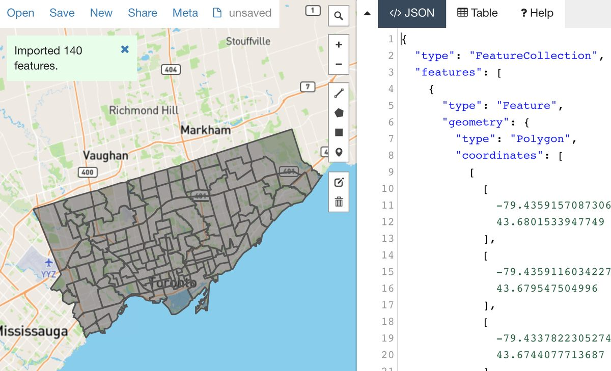{#fig-geojson-io-import width=600}

변환된 GeoJSON 파일을 컴퓨터에 다운로드하려면 *Save > GeoJSON*으로 이동하세요.

경고: GeoJson.io 도구는 다운로드된 파일의 이름을 자동으로 `map.geojson`으로 지정하므로 혼동을 피하기 위해 이름을 변경하세요.

#### CSV 파일에서 GeoJSON 만들기 {-}

GeoJson.io는 *위도*(또는 *lat*) 및 *경도*(또는 *lon*) 열이 있는 CSV 스프레드시트를 포인트 피처로 구성된 GeoJSON 파일로 변환할 수 있습니다. 스프레드시트의 각 행은 개별 포인트가 되며 *lat* 및 *lon* 이외의 모든 열은 포인트 피처의 *속성*(또는 *properties*)이 됩니다. 이 연습을 위해 컴퓨터에 [토론토 위치 샘플 CSV 파일](data/toronto-locations-sample.csv)을 다운로드할 수 있습니다. 이 파일에는 그림 [\@fig-geojson-io-csv-data]에 표시된 것처럼 세 행의 데이터가 포함되어 있습니다.


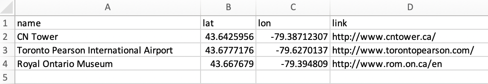{#fig-geojson-io-csv-data}

1. *New*를 선택하여 이전 연습의 데이터를 GeoJson.io 도구에서 지운 다음 위에서 다운로드한 토론토 위치 CSV 파일을 도구의 지도 영역으로 드래그 앤 드롭하세요. 3개의 피처를 성공적으로 가져왔다는 알림 초록색 팝업이 나타납니다.

참고: GeoJson.io의 기존 데이터에 새 데이터를 추가하면 도구가 이들을 하나의 파일로 결합하며 이는 특정 작업에 유용할 수 있습니다.

2. 마커를 클릭하여 포인트 속성이 포함된 팝업을 확인하세요. 토론토 위치 샘플 파일을 사용한 경우, 도구의 기본값인 *marker-color*, *marker-size*, *marker-symbol* 필드와 함께 *name* 및 *link* 피처가 표시됩니다. Map 뷰에서 속성을 편집하고 삭제할 수 있습니다.

3. 그림 [\@fig-geojson-io-points]와 같이 개별 마커 팝업 대신 한 번에 모든 데이터를 확인하려면 지도 오른쪽에 있는 *Table* 탭을 클릭하세요. Table 뷰와 JSON 코드 뷰에서 모두 속성을 편집하고 삭제할 수 있습니다.

4. 지도 데이터를 편집했다면 *Save > GeoJSON*으로 이동하여 파일을 컴퓨터에 다운로드하세요. 파일 이름은 자동으로 `map.geojson`으로 지정되므로 혼동을 피하기 위해 이름을 변경하세요. 선택 사항으로, GitHub 계정으로 GeoJson.io에 로그인하여 리포지토리에 직접 저장할 수도 있습니다.


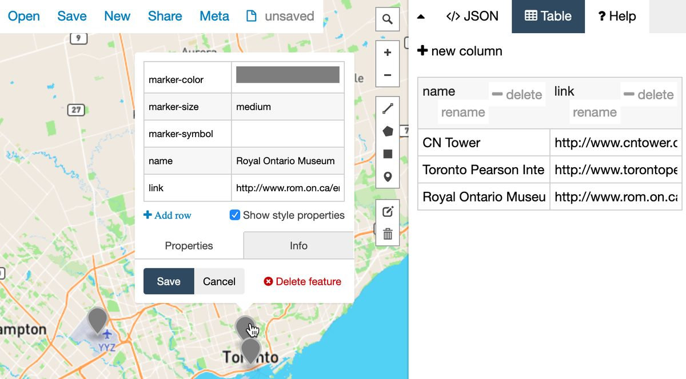{#fig-geojson-io-points}

#### 그리기 도구로 새로운 GeoJSON 데이터 만들기 {-}

GeoJson.io를 사용하면 지도에 포인트, 폴리라인 또는 다각형을 배치하는 간단한 그리기 도구를 사용하여 처음부터 공간 파일을 만들 수 있습니다. 이는 작업할 원본 파일이 없을 때 유용합니다. 새로운 데이터를 만들어 보겠습니다.

1. *New*를 클릭하여 이전 연습의 데이터를 GeoJson.io 도구에서 지우세요.

2. 왼쪽 하단에서 Mapbox(벡터 타일)를 Satellite(래스터 데이터)로 전환하세요.

3. 지도 오른쪽 상단의 검색(Search) 도구를 사용하여 관심 영역을 찾습니다. 이 연습에서는 그림 [\@fig-geojson-io-draw]에 표시된 것처럼 토론토의 운동장 주변 지형을 따라 그립니다.


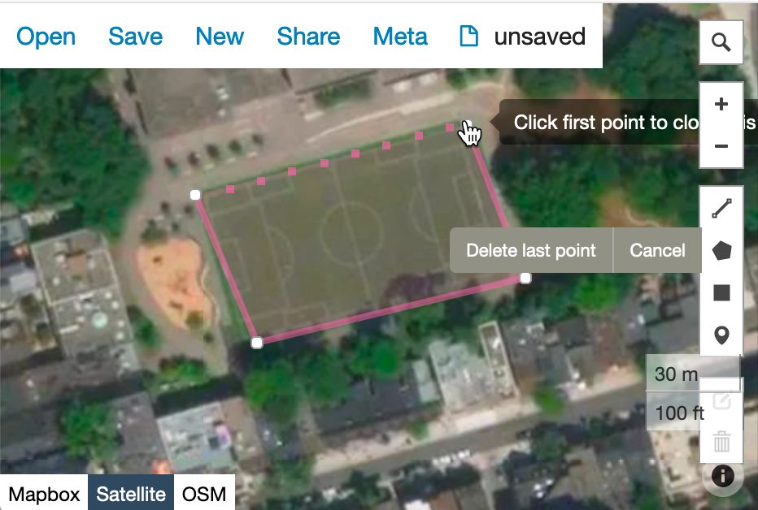{#fig-geojson-io-draw width=450}

4. 툴바에서는 폴리라인(선으로 연결된 점의 연속이지만 다각형처럼 닫혀 있지 않음), 다각형, 사각형(다각형의 한 예), 포인트 마커 등 네 가지 그리기 도구 중 하나를 선택할 수 있습니다.

5. *Draw a marker* 버튼을 선택하고 지도의 아무 곳이나 클릭하여 마커를 배치하세요. 지도의 일부가 된 회색 마커가 나타납니다. 인터랙티브 팝업에서 속성을 수정하거나 삭제할 수 있습니다.

6. *Draw a polyline* 버튼을 선택하고 지도 여러 곳을 클릭하여 연결된 선이 나타나는 것을 확인하세요. 폴리라인은 일반적으로 도로와 경로에 사용됩니다. 생성을 완료하려면 마지막 지점을 한 번 더 클릭하세요.

7. *Draw a polygon* 버튼을 선택하세요. 폴리라인 그리기와 비슷하지만 첫 번째 점과 같은 위치에 마지막 점을 찍어 피처를 완성해야 합니다. 다각형은 작고 큰 지리적 영역을 포함하여 경계를 정의하는 데 사용됩니다.

8. (*Delete* 위에 있는) *Edit layers* 도구를 사용하여 마커를 더 나은 위치로 이동하거나 피처의 모양을 조정하세요.

9. 피처와 그 물리적 경계를 생성한 후 의미 있는 속성 데이터를 추가하세요. 인터랙티브 팝업이나 Table 뷰를 사용하여 객체에 이름 및 기타 속성을 부여합니다. 완료되면 GeoJSON 파일을 컴퓨터에 저장하세요.

그리기 도구를 사용하여 기존 GeoJSON 파일을 편집할 수도 있습니다. 예를 들어 CSV 파일에서 GeoJSON을 만든 경우, 위도와 경도 값을 수정하는 대신 *Edit layers* 도구를 사용하여 일부 마커를 이동할 수 있습니다. 또는 위성 이미지를 따라 다각형을 더 정밀하게 만들 수도 있습니다.

다음 섹션에서는 공간 파일을 변환하고 수정할 수 있는 또 다른 무료 온라인 도구인 Mapshaper를 소개합니다.

## Mapshaper로 편집하고 결합하기 {- #mapshaper}

[GeoJson.io](#geojsonio)와 마찬가지로 [Mapshaper](https://mapshaper.org)는 공간 파일을 변환하고, 속성 데이터를 편집하고, 피처를 필터링 및 용해(dissolve)하고, 파일 크기를 줄이기 위해 경계를 단순화하는 등의 작업을 할 수 있는 무료 오픈소스 편집기입니다. Mapshaper의 편집 및 결합 명령어는 GeoJson.io 도구보다 훨씬 더 강력합니다. 그러나 GeoJson.io와 달리 Mapshaper에는 그리기 도구가 없으므로 처음부터 공간 파일을 만들 수는 없습니다.

Mapshaper는 [GitHub의 Matthew Bloch](https://github.com/mbloch/mapshaper)가 개발하고 유지 관리합니다. 이 배우기 쉬운 웹 도구는 이전에는 비싸고 배우기 어려웠던 ArcGIS 소프트웨어나 무료지만 여전히 배우기 어려운 사촌 QGIS가 필요했던 많은 지도 준비 작업들을 대체했습니다. 숙련된 GIS 사용자라도 Mapshaper가 일상적이지만 시간이 많이 걸리는 몇 가지 작업에 빠르고 효과적인 대안이 될 수 있음을 깨닫게 될 것입니다.

#### 지도 경계 파일 가져오기, 변환하기 및 내보내기 {-}

Mapshaper를 사용하여 공간 파일 포맷을 변환할 수 있습니다. GeoJson.io와 달리 Mapshaper는 Esri 셰이프파일을 업로드할 수 있어 웹 친화적인 GeoJSON 포맷으로 쉽게 변환할 수 있습니다. 다음 단계에서는 공간 파일을 Mapshaper로 가져와서 다른 파일 유형으로 내보내어 변환해 봅니다.

팁: Mapshaper는 KML이나 KMZ 파일과는 작동하지 않지만 [GeoJson.io](#geojson)를 사용하여 먼저 GeoJSON 포맷으로 변환한 다음 Mapshaper에 업로드할 수 있습니다.

1. [Mapshaper.org](https://mapshaper.org)로 이동합니다. 시작 페이지에는 파일을 가져오는 데 사용할 수 있는 큰 드래그 앤 드롭 영역 두 개가 있습니다. 하단의 작은 영역인 *Quick import*는 기본 가져오기 설정을 사용하며 시작하기에 좋은 방법입니다.

2. 공간 파일을 *Quick import* 영역으로 드래그 앤 드롭합니다. 이 연습에서는 네 개의 셰이프파일이 포함된 압축 아카이브인 [미국 주 셰이프파일(.zip 포맷)](data/us-states-shapefile.zip)을 다운로드할 수 있습니다.

참고: 셰이프파일 폴더를 가져오려면 해당 폴더 안의 모든 파일을 선택하고 한꺼번에 가져오기 영역으로 놓거나, 모든 파일을 압축된 `.zip` 아카이브 내에 넣어 업로드해야 합니다.

3. 가져온 각 파일은 레이어가 되며 브라우저 창 상단 중앙에 있는 드롭다운 메뉴에서 액세스할 수 있습니다. 거기서 각 레이어에 몇 개의 피처가 있는지 확인하고 가시성을 전환하거나 삭제할 수 있습니다.

4. 내보내려면 오른쪽 상단의 *Export*로 이동하여 원하는 파일 포맷을 선택합니다. 선택 가능한 내보내기 포맷은 그림 [\@fig-mapshaper-export]에 표시되어 있습니다. 현재 사용 가능한 포맷은 Shapefile, GeoJSON, TopoJSON(GeoJSON과 유사하지만 위상 데이터 포함), JSON 레코드, CSV, SVG(웹 및 인쇄용 확장 가능한 벡터 그래픽)입니다. 한 번에 여러 레이어를 내보내면 Mapshaper가 먼저 이를 아카이브화하여 내보낸 모든 레이어가 포함된 `output.zip`을 다운로드하게 됩니다.


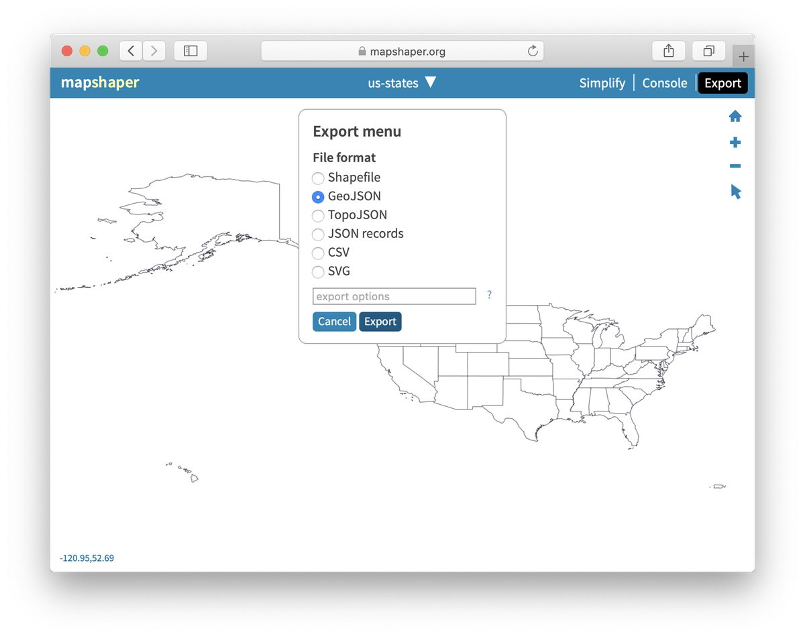{#fig-mapshaper-export}

팁: Mapshaper에서 GeoJSON 포맷으로 파일을 내보낼 때 다운로드된 파일은 기본적으로 `.json` 포맷으로 나타나지만 이 책의 일부 도구와 템플릿은 올바르게 명명된 `.geojson` 파일만 인식합니다. 이 문제를 해결하는 두 가지 방법이 있습니다. 첫 번째 방법은 Mapshaper에서 파일을 *Export*할 때 그림 [\@fig-mapshaper-export-options]와 같이 *GeoJSON*을 선택하고 내보내기 메뉴 하단의 *command line options* 필드에 `extension='.geojson'`을 추가로 입력하는 것입니다. 두 번째 방법은 그림 [\@fig-mapshaper-json-geojson]과 같이 내보낸 후 확장자를 `.json`에서 `.geojson` 포맷으로 변경하여 파일 이름을 단순히 바꾸는 것입니다.


{#fig-mapshaper-export-options width=350}


{#fig-mapshaper-json-geojson width=350}

#### 특정 다각형의 데이터 편집하기 {-}

그림 [\@fig-mapshaper-edit]와 같이 Mapshaper에서 개별 다각형(포인트 및 선 포함)의 속성 데이터를 편집할 수 있습니다.

1. 다각형 속성을 편집하려는 파일을 가져옵니다.

2. 커서 도구(cursor tool)에서 *edit attributes*를 선택합니다.

3. 편집하려는 다각형을 클릭합니다. 왼쪽 상단에 다각형의 모든 속성과 값을 나열하는 팝업이 나타납니다.

4. 밑줄이 그어진 파란색 값을 클릭하여 편집합니다.

5. 완료되면 *Export*를 클릭하고 원하는 파일 형식을 선택하여 공간 파일을 내보냅니다.


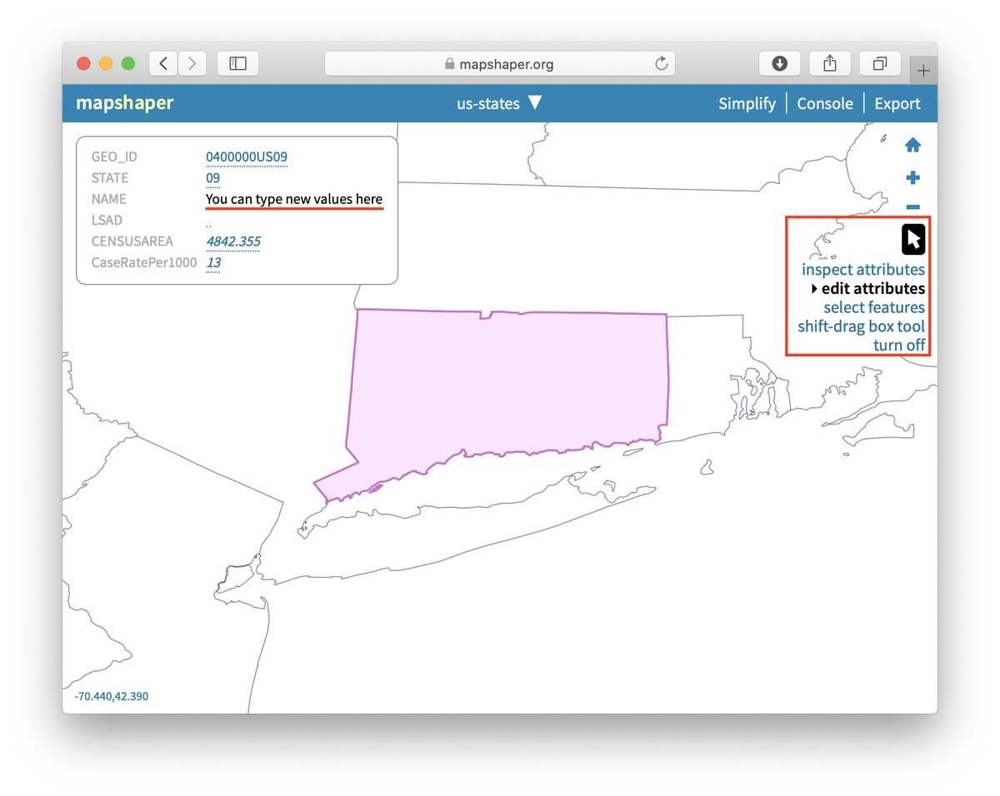{#fig-mapshaper-edit}

#### 데이터 필드 이름 바꾸기 {-}
Mapshaper의 가장 강력한 도구는 상단의 *Console* 버튼을 통해 사용할 수 있으며 여기에서 일반적인 지도 편집 작업을 위한 명령어를 입력할 수 있는 창이 열립니다.

때로는 지도 피처(포인트, 폴리라인, 다각형 등)가 길거나 혼란스러운 이름을 가진 *속성*(데이터 필드 또는 열)을 포함하기도 합니다. Mapshaper *Console*에서 일반적인 포맷으로 rename 명령어를 입력하여 필드 이름을 쉽게 변경할 수 있습니다:

`-rename-fields NewName=OldName`

먼저 Mapshaper에서 *inspect features* 화살표 기호를 선택하고 지도 피처 위로 커서를 이동하여 필드 이름을 확인한 다음, 그림 [\@fig-mapshaper-rename]과 같이 *Console* 창을 클릭하여 엽니다. 이 예에서 긴 필드 이름(`STATE_TITLE`)을 더 짧은 이름(`name`)으로 변경하려면 콘솔에 다음 명령어를 입력하세요:

`-rename-fields name=STATE_TITLE`


{#fig-mapshaper-rename}

#### 원치 않는 데이터 필드 제거하기 {-}

때때로 지도 피처에는 제거하고 싶은 원치 않는 속성(데이터 필드 또는 열)이 포함되어 있는데, 이는 Mapshaper 콘솔의 `-filter-fields` 명령어로 쉽게 할 수 있습니다.

예를 들어 다음 명령어는 *town*을 제외한 모든 필드를 제거합니다:

`-filter-fields town`

둘 이상의 필드를 남기고 싶다면 다음과 같이 쉼표로 구분하되 공백 없이 입력하세요:

`-filter-fields town,state`

경고: 쉼표 뒤에 공백을 남기면 *Command expects a single value* 오류가 발생합니다.

#### 파일 크기를 줄이기 위해 지도 경계 단순화하기 {-}

웹에서 GeoJSON 지도를 찾을 때, 특히 해안선 주변의 정밀한 경계가 포함되어 있어 파일 크기가 커지고 온라인 웹 지도의 로딩 성능이 느려질 수 있습니다. 축소된 지리를 사용하는 데이터 시각화 프로젝트에서는 매우 정밀한 경계가 항상 필요한 것은 아니므로 Mapshaper를 사용하여 지도 경계를 단순화하는 것을 고려해 보세요. 결과물은 덜 정밀하지만 사용자 브라우저에서 더 빨리 로드됩니다.

지도 경계를 단순화하는 방법을 이해하기 위해 그림 [\@fig-mapshaper-simplify-demo]에 표시된 인접한 미국 주 지도를 고려해 보세요. (알래스카를 제외한 하위 48개 주, 공동 저자 Ilya가 2018년 알래스카를 여행하며 배운 용어).
그림 [\@fig-mapshaper-simplify-demoa]의 지도는 더 정밀하고 약 230킬로바이트지만 그림 [\@fig-mapshaper-simplify-demob]의 지도는 37킬로바이트에 불과하여 6배나 작습니다! 그러나 중요한 피처를 제거할 만큼 경계를 너무 단순화하지 않도록 주의하세요.


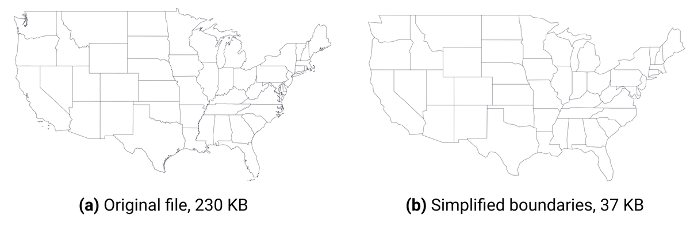{#fig-mapshaper-simplify-demo}

Mapshaper에서 지도 경계를 단순화하려면 다음 단계를 따르세요.

1. 지리 데이터 파일을 Mapshaper로 가져옵니다. [GeoJSON 포맷의 인접한 미국 주 샘플](data/lower-48.geojson)을 사용할 수 있습니다.

2. 오른쪽 상단 모서리에 있는 *Simplify* 버튼을 클릭합니다. 세 가지 방법 중 하나를 선택할 수 있는 단순화 메뉴가 나타납니다. *prevent shape removal*을 확인하고 기본값인 *Visvalingam / weighted area*를 유지하는 것을 권장합니다. *Apply*를 클릭하세요.

3. 상단에 `100%`가 표시된 슬라이더가 나타나며 레이어 선택 드롭다운을 대체합니다(그림 \@fig-mapshaper-simplify 참조). 슬라이더를 오른쪽으로 이동하면서 지도의 모양이 단순화되는 것을 확인하세요. 지도가 적절해 보일 때(모양을 여전히 알아볼 수 있을 때) 멈추세요.

4. Mapshaper가 왼쪽 상단 모서리에서 선 교차 복구를 제안할 수 있습니다. *Repair*를 클릭하세요.

5. 이제 *Export* 기능을 사용하여 파일을 내보낼 수 있습니다. 내보낸 GeoJSON 파일의 포맷을 `.json`에서 `.geojson`으로 이름을 바꾸는 것을 잊지 마세요.


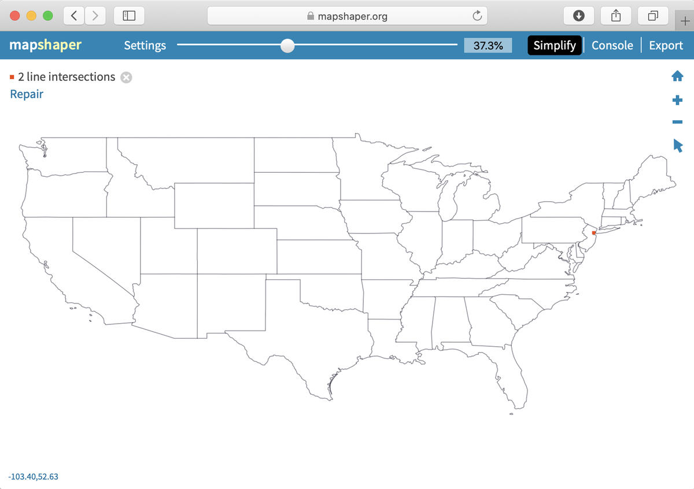{#fig-mapshaper-simplify}

팁: Mapshaper에 지리 파일을 업로드할 때 시각화 도구나 관련 지리 데이터에 맞추기 위해 투영법(projection)을 변경해야 할 수도 있습니다. *Console*을 열고 `-proj wgs84` (또는 `-proj EPSG:4326`)를 입력하여 전 세계의 지리 좌표를 표시하기 위해 지구 위치 파악 시스템(GPS)에서 사용하는 포맷인 World Geodetic System 84(wgs84)로 투영법을 변경하세요.

#### 지도 레이어 병합 및 이름 바꾸기 {-}
일반적인 지도 편집 작업은 별도의 두 지도 레이어를 하나로 결합하는 것인데, Mapshaper의 간단한 콘솔 명령어로 쉽게 할 수 있습니다.

1. 첫 번째 지도 파일을 Mapshaper로 가져옵니다(예: [코네티컷주 하트퍼드 카운티 GeoJSON 파일 샘플](data/hartford-county.geojson)).

2. 그림 [\@fig-mapshaper-two-layers]와 같이 별도의 두 레이어가 생성되도록 두 번째 지도 파일을 가져옵니다(예: [코네티컷주 톨랜드 카운티 GeoJSON 파일 샘플](data/tolland-county.geojson)).


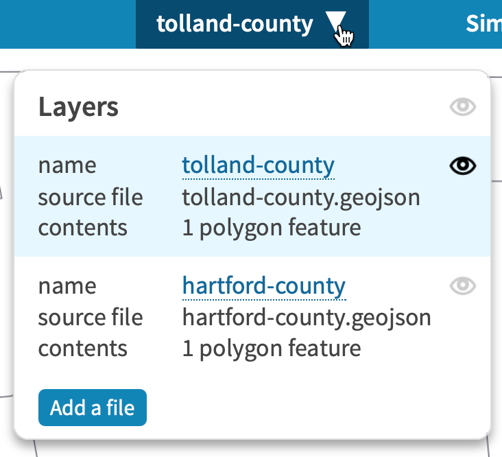{#fig-mapshaper-two-layers width=350}

3. 명령어를 입력할 수 있는 창을 열려면 *Console*을 클릭하세요. 아래와 같이 *merge* 명령어를 입력하고 병합하려는 *대상(target)* 레이어를 쉼표로 구분하여 *공백 없이* 지정한 다음, *Return* 또는 *Enter* 키를 누릅니다.

`-merge-layers target=hartford-county,tolland-county`

4. 새로 병합된 지도가 `[unnamed layer]`로 나타납니다. *Console* 창에서 아래와 같이 *rename-layers* 명령어를 입력하여 새 이름(예: `hartford-tolland`, *공백 없이*)을 지정한 후, 그림 [\@fig-mapshaper-merge-rename]과 같이 *Return* 또는 *Enter* 키를 누릅니다.

`-rename-layers hartford-tolland`


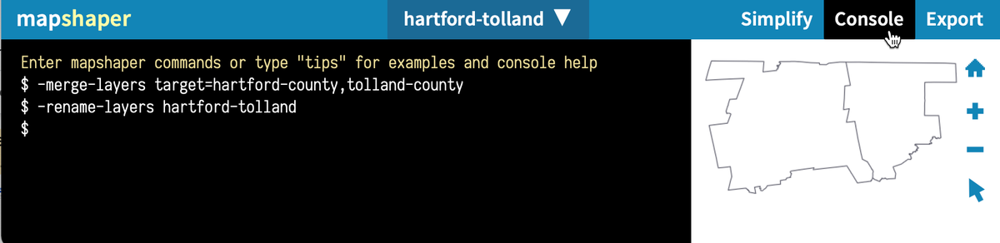{#fig-mapshaper-merge-rename}

새로 병합된 다각형 지도 레이어 간의 내부 선을 용해(dissolve)해야 하는 경우 다음 섹션의 *dissolve* 명령어를 참조하세요.

#### 내부 다각형을 용해(dissolve)하여 윤곽선 지도 만들기 {-}

또 다른 일반적인 지도 편집 작업은 내부 경계를 제거하여 윤곽선 지도를 만드는 것입니다. 예를 들어 그림 [\@fig-mapshaper-dissolve]와 같이 이전 연습에서 미국 지도의 주 경계를 용해하여 국가의 윤곽을 얻을 수 있습니다.


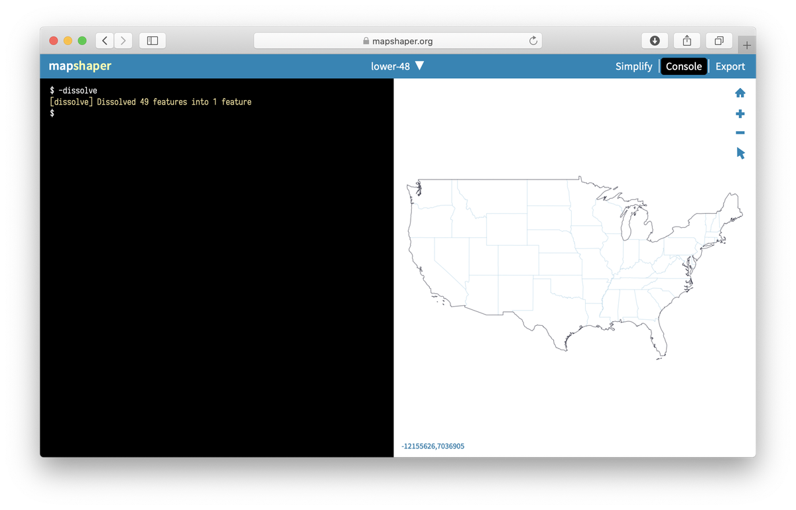{#fig-mapshaper-dissolve}

명령어를 입력할 수 있는 창을 여는 *Console*을 클릭하세요. 아래와 똑같이 *dissolve* 명령어를 입력한 다음 *Return* 또는 *Enter* 키를 누르세요.

`-dissolve`

내부 경계가 더 밝은 색으로 바뀐 것을 보게 될 것이며 이는 Mapshaper가 더 이상 그것들이 존재하지 않는다는 것을 말해주는 방식입니다.
이제 윤곽 모양을 내보낼 수 있습니다. 내보낸 GeoJSON 파일의 형식을 `.json`에서 `.geojson`으로 이름을 바꾸는 것을 잊지 마세요.

#### 윤곽선 레이어에 맞게 지도 자르기 (Clip) {-}

또 다른 일반적인 지도 편집 작업은 필요한 부분만 얻기 위해 큰 지도의 작은 부분을 잘라내는("clip") 것입니다. 예를 들어, 코네티컷주는 8개의 카운티로 구성되며 이 카운티들은 총 169개의 마을(town)로 나뉩니다.
여러분이 [169개 모든 마을의 경계 파일](data/ct-towns.geojson)과 [하트퍼드 카운티의 윤곽선](data/hartfordcounty-outline.geojson)을 받았다고 상상해 보세요.
코네티컷의 특정 부분인 하트퍼드 카운티 내에 있는 마을만 포함하도록 원래 마을 지도를 "잘라내야" 합니다.

Mapshaper는 하나의 간단한 `-clip` 명령어를 사용하여 그 작업을 할 수 있게 해줍니다.

1. 두 개의 경계 파일을 Mapshaper로 가져옵니다. 하나는 잘라낼 큰 파일(샘플 파일을 사용할 경우 *ct-towns*)이고 다른 하나는 원하는 최종 모양(*hartfordcounty-outline*)입니다. 후자는 ArcGIS에서 "클립 피처(clip feature)"라고 부르는 것입니다.

2. 활성 레이어가 잘라낼 지도(*ct-towns*)로 설정되어 있는지 확인하세요.

3. *Console*에서 다음과 같이 `-clip` 뒤에 클립 레이어의 이름을 입력하세요:

`-clip hartfordcounty-outline`

4. 활성 레이어가 잘린 것을 확인해야 합니다. 때때로 테두리를 따라 작은 조각("slivers")이 남게 되는 경우가 있습니다.
만약 그렇다면, 다음과 같은 관련 명령어를 사용하여 제거하세요:

`-clip hartfordcounty-outline -filter-slivers`

5. 여러분의 Mapshaper 상태는 그림 [\@fig-mapshaper-clip]에 표시된 것과 같아야 합니다. 이제 *Export* 버튼을 사용하여 파일을 컴퓨터에 저장할 수 있습니다. 내보낸 GeoJSON 파일의 포맷을 `.json`에서 `.geojson`으로 변경하는 것을 잊지 마세요.


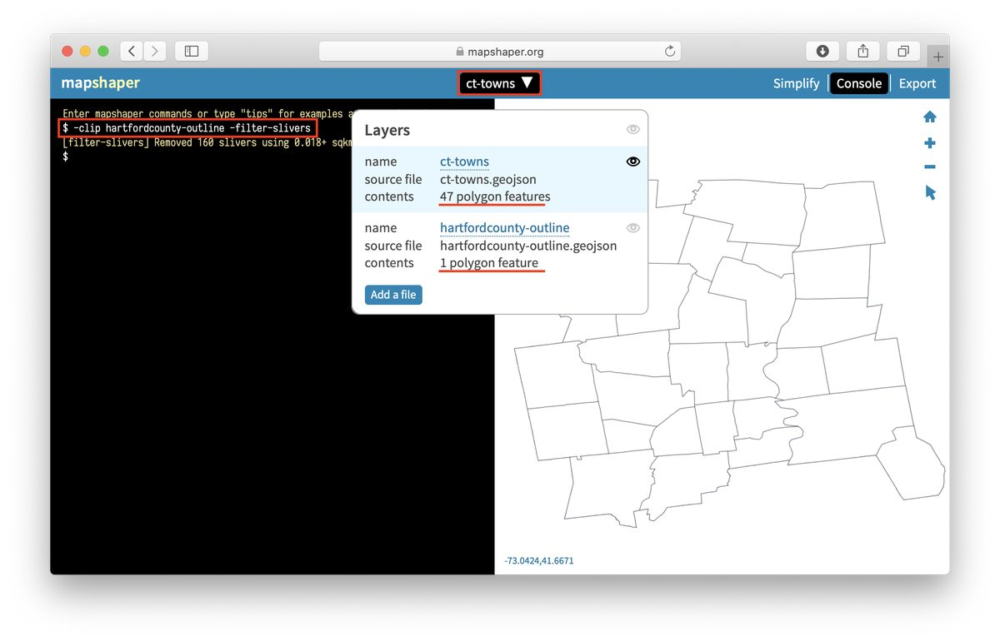{#fig-mapshaper-clip}

#### 다각형 지도에 포인트 결합하기 {-}
위도-경도 좌표가 있는 포인트 데이터 스프레드시트와 지리적 경계를 결합하는 것은 *공간 결합(spatial join)*이라고도 하며 데이터 시각화에서 일반적인 작업입니다. 아래에서는 두 개의 파일을 다운로드합니다. 하나는 위도-경도 좌표를 가진 포인트의 CSV 테이블이고 다른 하나는 인구조사구(census tract) 경계의 GeoJSON 파일입니다. 우리의 목표는 Mapshaper의 강력한 `-join` 명령어를 사용하여 "각 충전소가 어느 인구조사구에 위치하는가?"라는 질문에 답하는 것입니다.

시작하기 전에 [CSV 형식으로 된 각 위치의 위도 및 경도 좌표를 포함한 코네티컷 전기차 충전소 데이터](data/ct-stations.csv) 테이블을 다운로드하세요. 참고: Safari 브라우저 사용자는 CSV 포맷으로 다운로드하기 위해 *File > Save As > Format: Page Source*를 선택해야 할 수 있습니다.

또한 [GeoJSON 포맷의 코네티컷 인구조사구 2018 경계](data/ct-census-tracts-2018.geojson)를 다운로드하세요. 참고: Safari 브라우저 사용자는 GeoJSON 포맷으로 다운로드하기 위해 *File > Save As > Format: Page Source*를 선택해야 할 수 있습니다.

1. 위에서 다운로드한 CSV 포인트 데이터 파일을 *Quick import* 상자를 사용하여 Mapshaper로 가져옵니다. *inspect features* 화살표 도구를 클릭하고 셀 위로 마우스를 가져가 그림 [\@fig-mapshaper-inspect-csv]와 같이 *Latitude* 및 *Longitude* 데이터 열이 포함되어 있는지 확인하세요.


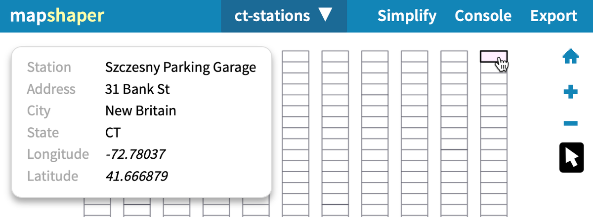{#fig-mapshaper-inspect-csv width=500}

2. Mapshaper에서 *Console* 창을 열고 도구가 *Longitude* 및 *Latitude* 열을 XY 좌표로 지정하도록 아래 표시된 *points* 명령어를 입력한 다음 *Return* 또는 *Enter*를 누르세요. 아래 순서를 따르고 데이터에 표시된 것과 정확히 똑같이 열 머리글 철자를 입력하세요. 그림 [\@fig-mapshaper-points-xy]에 표시된 것처럼 Mapshaper가 이들을 지도의 포인트로 표시합니다.

`-points x=Longitude y=Latitude`


{#fig-mapshaper-points-xy}

3. 위에서 다운로드한 코네티컷 인구조사구 2018 GeoJSON 데이터를 Mapshaper로 드래그하여 가져옵니다. *inspect features* 화살표 도구를 클릭하여 다각형 위로 마우스를 이동해 그림 [\@fig-mapshaper-inspect-tracts]에 표시된 것처럼 인구조사구 이름의 다양한 포맷을 나타내는 *GEOID*와 *NAME*이라는 데이터 열이 포함되어 있는지 확인합니다.


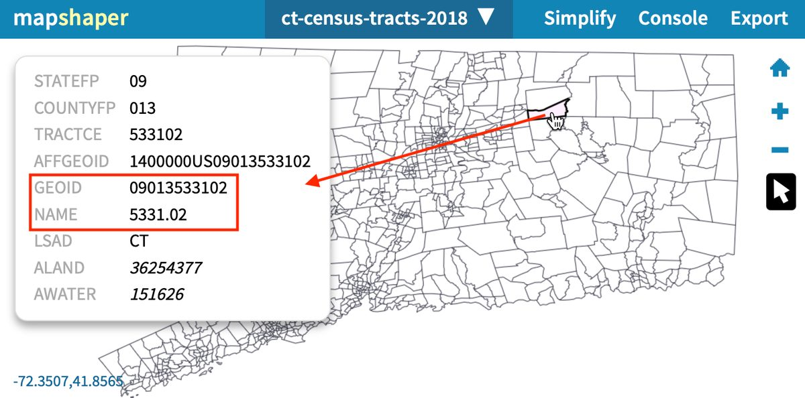{#fig-mapshaper-inspect-tracts width=500}

4. Mapshaper 상단의 드롭다운 메뉴를 클릭하여 활성 레이어를 포인트, 즉 이 경우 *ct-stations*로 다시 변경합니다. *Console*을 열고 다각형 레이어(*ct-census-tracts-2018*)를 각 포인트에 일치시키고 두 개의 새로운 데이터 열(*GEOID*와 *NAME*)을 CSV에 추가하는 `join` 명령어를 아래 포맷으로 입력합니다(그림 \@fig-mapshaper-spatial-join 참조).

`-join ct-census-tracts-2018 fields='GEOID,NAME'`


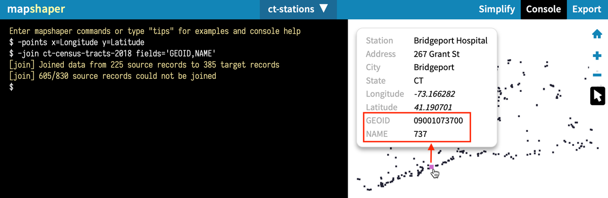{#fig-mapshaper-spatial-join}

팁: Mapshaper 콘솔은 조인 상태에 대한 유용한 정보도 제공합니다. 이 예제에서는 225개의 소스 레코드(인구조사구)에서 385개의 타깃 레코드(포인트)로 데이터를 결합했습니다. 그러나 830개의 소스 레코드(인구조사구) 중 605개는 어떠한 포인트와도 일치하지 않아 조인될 수 없었습니다.

5. 스프레드시트에서 결과를 분석하기 위해 업데이트된 포인트 데이터(이 경우 *ct-stations*)를 CSV 포맷으로 내보냅니다.

#### 다각형 지도에 스프레드시트 데이터 결합하기 {-}

스프레드시트 데이터와 지리적 경계를 결합하는 것은 데이터 시각화의 또 다른 일반적인 작업입니다. 이 연습에서는 코로플레스 지도를 만들기 위해 [GeoJson 포맷의 코네티컷 마을 경계 지도](data/ct-towns.geojson)와 [CSV 포맷의 코네티컷 마을 인구 데이터](data/ct-towns-popdensity.csv)를 다운로드하여 둘을 결합합니다.

Mapshaper는 이 두 파일을 연결할 수 있는 강력한 `-join` 명령어를 제공합니다. 두 파일을 조인하려면 두 데이터 세트에 모두 공통 키(예: *마을 이름*, *주* 또는 *국가*)가 있어야 한다는 점을 기억하세요. 공통 필드가 없으면 Mapshaper는 어떤 숫자가 어떤 다각형에 속하는지 알 방법이 없습니다.

1. 위에서 다운로드한 GeoJSON 파일과 CSV 파일을 모두 Mapshaper의 *Quick import* 상자를 사용하여 가져옵니다.

2. 두 파일 모두 레이어 드롭다운 목록에 나타나는지 확인합니다.
여러분의 CSV 데이터는 테이블처럼 보일 것입니다. 데이터가 올바르게 가져와졌는지 확인하기 위해 *Cursor > inspect features* 도구를 사용하세요. 샘플 코네티컷 데이터를 사용하는 경우 *ct-towns* 레이어에는 마을 이름이 있는 *name* 속성이 있고 *ct-towns-popdensity*에는 *town* 열에 마을 이름이 있습니다.

3. 공간 레이어(*ct-towns*)를 활성 레이어로 설정합니다.

4. *Console*을 열고 아래와 같이 `-join` 명령어를 입력합니다.

`-join ct-towns-popdensity keys=name,town`

이 명령어에서 `ct-towns-popdensity`는 여러분이 병합하려는 CSV 레이어이고 `keys`는 결합 기준으로 사용할 값이 포함된 속성입니다.
우리의 샘플 데이터에서는 마을 이름이 지도 파일의 `name` 속성과 CSV 파일의 `town` 열에 저장되어 있습니다.

5. 조인이 성공적으로 수행되었는지, 또는 Mapshaper에 오류가 발생했는지 알려주는 메시지가 콘솔에 표시됩니다.

6. 그림 [\@fig-mapshaper-join]과 같이 CSV 열이 다각형의 필드로 나타나는지 확인하기 위해 *Cursor > inspect features* 도구를 사용하세요.

7. 이제 *Export* 버튼을 클릭하여 파일을 컴퓨터에 저장할 수 있습니다. 내보낸 GeoJSON 파일의 포맷을 `.json`에서 `.geojson`으로 이름을 변경하는 것을 잊지 마세요.


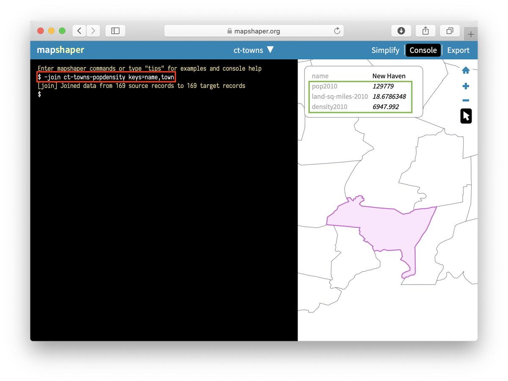{#fig-mapshaper-join}

팁: 혼동을 피하기 위해 지도의 키 속성 이름과 일치하도록 키 값을 포함하는 CSV 데이터에 `-rename-fields` 명령어를 사용하는 것을 고려해 보세요.
이 예제에서는 먼저 CSV 파일에 `-rename-fields name=town`을 적용하게 됩니다. 이 CSV 필드를 `name`으로 바꾸면 조인 명령어가 `keys=name,name`으로 끝나기 때문에 두 번째 단계에서의 혼동을 피할 수 있습니다.


#### Mapshaper로 다각형 안의 포인트 개수 세기 {-}

Mapshaper를 사용하면 다각형 안의 포인트 개수를 세고 그 숫자를 `-join` 명령어를 사용하여 다각형 속성에 기록할 수 있습니다.

1. [미국 병원 포인트](data/hospitals-points.geojson) 등 집계하고자 하는 포인트와 [미국 주 경계](data/us-states.geojson) 같은 다각형 경계를 나타내는 샘플 GeoJSON 파일 두 개를 컴퓨터에 다운로드합니다. 이들을 Mapshaper로 가져오세요.

2. 드롭다운 메뉴에서 포인트가 아닌 "다각형(polygons)"을 활성 레이어로 선택했는지 확인합니다.

3. *Console*에서 `count()` 함수를 사용하여 `-join` 명령어를 다음과 같이 실행합니다:

`-join hospitals-points calc='hospitals = count()' fields=`

이 명령어는 Mapshaper에게 *hospitals-points* 레이어 안의 포인트 수를 세어 다각형의 *hospitals* 속성에 기록하도록 지시합니다.
`fields=` 부분은 우리의 경우 다대일(many-to-one) 매칭, 즉 주당 많은 병원을 다루기 때문에 포인트에서 어떠한 필드도 복사하지 않도록 Mapshaper에 지시합니다.

4. 그림 [\@fig-mapshaper-count-points]와 같이 포인트 수가 기록된 새 필드가 다각형에 추가되었는지 확인하려면 *Cursor > inspect features* 도구를 사용하세요.

5. *Export* 버튼을 사용하여 새 파일을 저장하고 원하는 출력 형식을 선택하세요. 아래 섹션에서는 결합(join)되지 않은 객체에 무슨 일이 일어나는지 이야기할 것입니다.


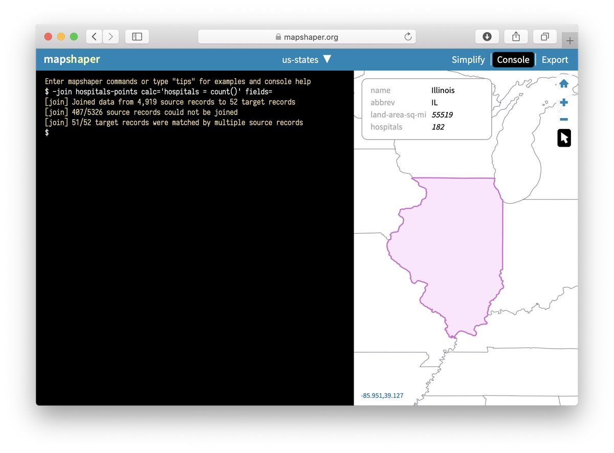{#fig-mapshaper-count-points}

#### 결합(Joins)에 대한 추가 정보 {-}

위의 "다각형 안의 포인트 개수 세기" 섹션에서는 포인트와 다각형이라는 두 지리적 레이어 사이의 위치를 결합하기 위해 *키(keys)*를 지정할 필요가 없었습니다. 그러나 결합하려는 파일 중 하나가 CSV 데이터 세트인 경우에는 *키*가 필요합니다.

경계 지도 데이터의 열과 일치하는 CSV 데이터 세트가 없는 경우 쉽게 만들 수 있습니다.
경계 지도를 Mapshaper에 업로드하고 CSV 포맷으로 내보냅니다. 다운로드한 CSV 파일을 스프레드시트 도구에서 엽니다.
CSV 스프레드시트의 데이터 열을 일치시키려면 [XLOOKUP](#xlookup) 함수를 사용하세요.

실제 상황에서는 1:1로 완벽하게 일치하는 파일을 가지는 경우가 드뭅니다. 따라서 일치하지 않은 피처에 대한 자세한 정보를 파악하여 데이터를 수정하는 것이 좋습니다.
Mapshaper는 제대로 조인되거나 일치하지 않은 데이터를 추적하는 데 도움을 줍니다. 예를 들어, 다각형 지도는 169개의 피처(코네티컷의 각 마을당 하나)를 포함하지만 CSV 테이블에는 168행의 데이터만 포함된 경우 Mapshaper는 일치하는 키를 가진 모든 항목을 조인하고 다음과 같은 메시지를 표시합니다:

```
[join] Joined data from 168 source records to 168 target records
[join] 1/169 target records received no data
[join] 1/169 source records could not be joined
```

어떤 값이 조인되지 않았는지에 대한 더 자세한 내용을 보려면 아래와 같이 조인 명령어에 `unjoined unmatched -info` 플래그를 추가하세요:

`-join ct-towns-popdensity keys=name,town unjoined unmatched -info`

`unjoined` 플래그는 소스 테이블의 각 조인되지 않은 레코드의 복사본을 *unjoined*라는 다른 레이어에 저장합니다. `unmatched` 플래그는 대상 테이블의 일치하지 않는 각 레코드의 사본을 *unmatched*라는 새 레이어에 저장합니다. 마지막으로 `-info` 플래그는 결합 절차에 대한 몇 가지 추가 정보를 콘솔에 출력합니다.


#### join과 dissolve 명령어로 선택한 다각형 병합하기 {-}

Mapshaper에서는 `-join`과 `-dissolve` 명령어를 사용하여 선택한 다각형을 더 큰 군집(cluster)으로 병합할 수 있습니다. 여러분이 코네티컷주 공중보건부에 고용되어 169개의 타운을 20개의 [공중 보건 지구(public health districts)](https://portal.ct.gov/DPH/Local-Health-Admin/LHA/Local-Health-Administration---Site-Map)로 나누고 새로운 지리 파일을 생성하는 임무를 맡았다고 상상해 보세요.

먼저 타운과 그 보건 지구의 *크로스워크(crosswalk)*를 만들어야 합니다. 이는 우편번호와 그것이 위치한 타운과 같은 두 데이터 세트를 일치시키는 어떤 방법을 의미합니다. 이 경우 크로스워크는 단순히 새 줄마다 타운과 지구를 나열하는 2열 CSV 목록처럼 간단할 수 있습니다. 상사가 타운 목록을 스프레드시트 형식으로 주지 않고 마을 경계가 있는 GeoJSON 파일을 주었으므로 거기에서 마을 목록을 추출해 봅시다.

1. *Quick import* 상자를 사용하여 Mapshaper로 [ct-towns.geojson](data/ct-towns.geojson)을 가져옵니다.

2. *Cursor > inspect features* 도구를 사용하여 각 다각형에 마을 이름이 있는 *name* 속성이 있는지 확인합니다.

3. *Export* 버튼을 사용하여 속성 데이터를 CSV 파일로 저장합니다. 아무 스프레드시트 도구에서나 파일을 엽니다. 데이터가 169개의 마을을 나열하는 *name* 열이 하나인 파일임을 보게 될 것입니다.

4. 스프레드시트에서 *merged*라는 두 번째 열을 만들고 첫 번째 *name* 열의 값을 복사하여 붙여넣습니다. 이 시점에서 스프레드시트는 동일한 값을 가진 두 개의 열을 포함합니다.

5. *West Hartford* 및 *Bloomfield*와 같은 몇 개의 마을을 선택하고 그림 [\@fig-mapshaper-merge-csv]와 같이 그들의 *merged* 열에 "Bloomfield-West Hartford"를 할당합니다. 여기서 멈추고 다음 단계로 넘어가거나 몇 개의 다른 이웃 마을에 지구 이름을 계속 할당할 수 있습니다.


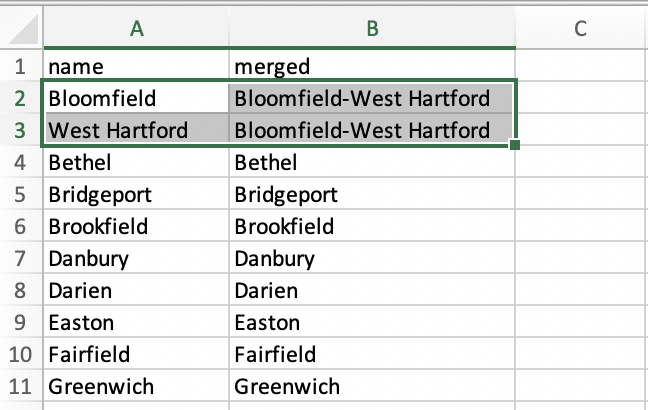{#fig-mapshaper-merge-csv width=350}

6. 이 새 스프레드시트 파일을 *ct-towns-merged.csv*로 저장하고 Mapshaper의 *ct-towns* 레이어 위로 드래그 앤 드롭합니다. *Import*를 클릭하세요.

7. Mapshaper에서 이 *ct-towns-merged*라는 새로운 CSV 레이어는 일련의 표 셀(table cells)로 나타납니다. 드롭다운 메뉴에서 지도로 돌아가기 위해 *ct-towns*를 선택합니다.

8. 이제 다음 명령어를 입력하여 특정 타운을 지구로 병합할 준비가 되었습니다:

`-join ct-towns-merged keys=name,name`

화면에 보이는 경계 레이어와 CSV 레이어를 결합합니다.

그런 다음 다음과 같이 입력합니다:

`-dissolve merged`

CSV 파일의 *merged* 열에 따라 타운 다각형들을 용해(dissolve)합니다.

우리의 예제에서는 블룸필드(Bloomfield)와 웨스트 하트퍼드(West Hartford)만이 하나의 "Bloomfield-West Hartford" 지역 보건 지구로 통합되어 이 두 타운 사이의 공유 경계선이 회색으로 변하고 다른 모든 다각형은 동일하게 유지됩니다. 그림 [\@fig-mapshaper-merge]는 최종 결과를 보여줍니다.


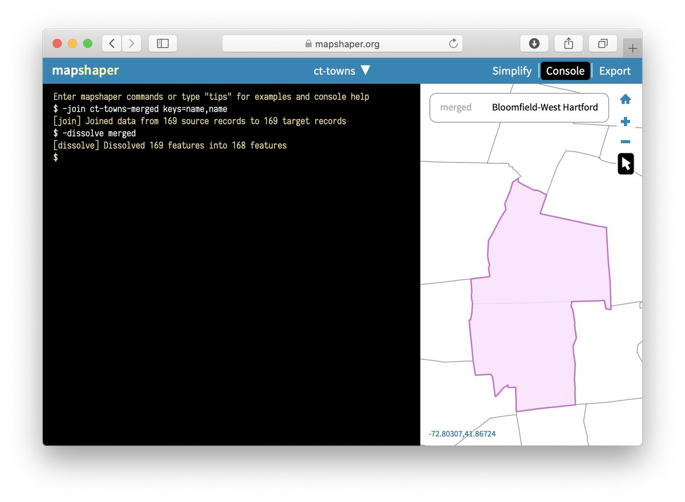{#fig-mapshaper-merge}

*Cursor > inspect features* 도구를 사용하여 다각형의 속성 데이터를 검사하고 *Export* 버튼을 사용하여 생성된 파일을 저장할 수 있습니다. 내보낸 GeoJSON 파일의 포맷을 `.json`에서 `.geojson`으로 변경하는 것을 잊지 마세요.

전반적으로 Mapshaper는 훨씬 더 유용한 명령어들이 많이 있는 강력한 지리 데이터 편집 도구입니다. 이 중 일부에는 프로젝션 변경, JavaScript 표현식을 사용한 피처 필터링, 값에 따른 다각형 색상 할당 등이 포함됩니다. 더 많은 명령어를 배우고 예제를 보려면 [GitHub의 MapShaper Wiki](https://github.com/mbloch/mapshaper/wiki/Command-Reference)를 살펴보세요.

## 압축된 KMZ를 KML로 변환하기 {- #convert-kmz}

이전 두 섹션에서는 [Geojson.io 도구](#geojsonio)와 [Mapshaper 도구](#mapshaper)를 사용하여 공간 파일을 한 포맷에서 다른 포맷으로 변환하는 방법을 시연했습니다. 그러나 이러한 도구들로 모든 파일 유형을 변환할 수 있는 것은 아닙니다.
이 장에서는 널리 요청되는 `.kmz` 및 `.kml` 포맷 간의 변환에 대한 구체적인 예를 무료인 Google Earth Pro 데스크톱 애플리케이션을 사용하여 보여줍니다. KMZ는 Google Earth의 네이티브 포맷인 KML 파일의 압축 버전입니다.

1. Mac, Windows 또는 Linux용 [Google Earth Pro](https://www.google.com/earth/versions/) 데스크톱 애플리케이션을 다운로드하고 설치합니다.

2. `.kmz` 파일을 두 번 클릭하여 Google Earth Pro에서 엽니다. 대안으로, 먼저 Google Earth Pro를 연 다음 *File > Open*으로 이동하여 KMZ 파일을 선택합니다.

3. *Places* 메뉴 아래의 KMZ 레이어를 마우스 오른쪽 버튼으로 클릭(또는 Control-클릭)하고 그림 [\@fig-kmz-earth]와 같이 *Save Place As...*를 선택합니다.


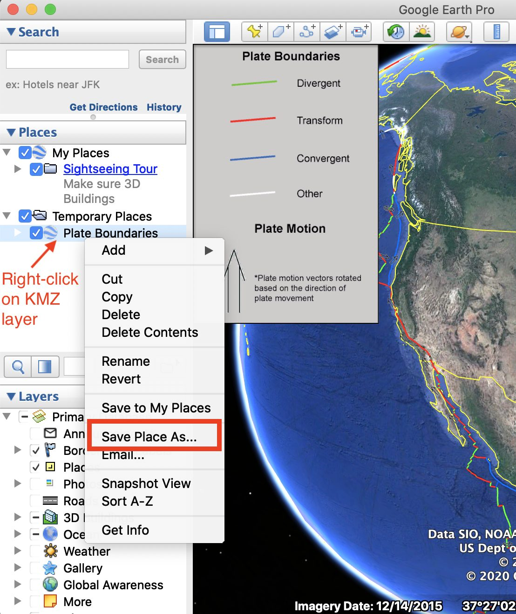{#fig-kmz-earth width=400px}

4. *Save file...* 창의 드롭다운 메뉴에서 그림 [\@fig-kmz-save-as]와 같이 *KML* 포맷을 선택합니다.


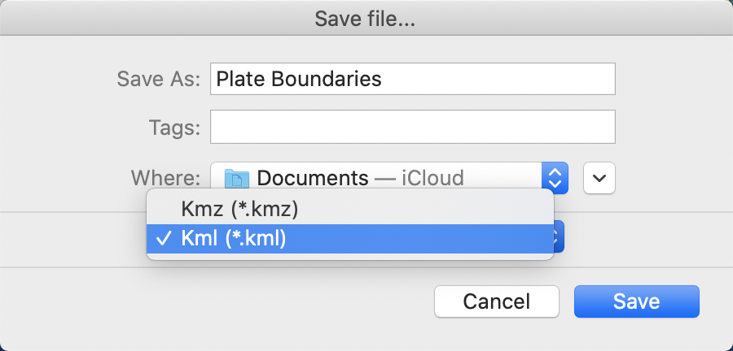{#fig-kmz-save-as width=350px}

대안으로 KMZ는 단순히 KML 파일의 *압축(zipped)* 버전이기 때문에 압축 유틸리티를 사용하여 KMZ에서 KML 파일을 추출할 수도 있습니다!


## Map Warper로 지리 참조하기 {- #mapwarper}

Tim Waters가 만들고 호스팅하는 오픈 소스 도구인 [Map Warper](https://mapwarper.net)를 통해 사용자는 스캔한 지도 이미지를 업로드하고 지리 참조(georeferencing, 혹은 georectifying)할 수 있습니다. 이는 정적 지도 이미지를 현재의 인터랙티브 지도 위에 정확하게 정렬하는 것을 의미합니다. 이 과정을 거치면 과거 지도 이미지는 종종 디지털 시대에 맞게 업데이트될 때 "왜곡(warped)"되어 보입니다. 지도 이미지가 지리 참조되고 이 사이트에서 호스팅된 후에는 특별한 링크를 사용하여 [12장에서 설명한 Google 스프레드시트를 사용한 Leaflet 스토리맵](#leaflet-storymaps-with-google-sheets)과 같이 이 래스터 데이터를 인터랙티브 지도 위의 오버레이로 배치할 수 있습니다. 누구나 무료 계정을 만들어 개발자의 공개 Map Warper 사이트에서 지도를 업로드하고 지리 참조할 수 있습니다. [뉴욕 공립 도서관의 디지털 지도 컬렉션](http://maps.nypl.org) 같은 조직에서 이 도구를 어떻게 쓰는지 살펴보세요.

경고: Map Warper는 훌륭한 오픈 소스 플랫폼이지만 서비스가 불안정할 수 있습니다. 2020년 7월 업데이트에 따르면: "디스크 공간이 부족합니다. 2년 이상 된 지도는 제대로 작동하려면 다시 워핑(re-warping)이 필요합니다. 다운타임이 또 발생할 것입니다." 사용자는 플랫폼의 한계를 인지하는 동시에, 이 오픈 소스 프로젝트를 계속하기 위해 개발자에게 자금을 기부하는 것을 고려할 것을 권장합니다.

[디지털 사서 Erica Hayes와 Mia Partlow의 더 상세한 버전](https://github.com/ericayhayes/georeferencingtutorial)에 기초한 이 요약된 튜토리얼을 따라 지리 참조된 오버레이 지도를 만드세요.^[@hayesTutorialGeoreferencingDisplaying2020]

1. [Map Warper](https://mapwarper.net)에서 무료 계정을 만듭니다.

2. 아직 지리 참조되지 않은 고품질 지도 이미지나 스캔본(예: 과거 종이 지도의 이미지)을 업로드하고 다른 사람들이 찾을 수 있도록 메타데이터를 입력합니다. 공정 이용 저작권(fair-use copyright)이나 퍼블릭 도메인 저작물에 대한 가이드라인을 따르세요.

3. 이미지를 업로드한 후 Map Warper 인터페이스의 *Rectify* 탭을 클릭하고 지도를 이동하는 연습을 하세요.

4. 과거 지도 창을 클릭하여 기준점(control point)을 추가한 다음 현대 지도 창에서 그에 일치하는 기준점을 클릭하여 두 이미지를 정렬합니다(그림 \@fig-mapwarper 참조). 좋은 기준점은 두 지도 사이의 기간 동안 변하지 않은 안정적인 장소나 랜드마크입니다. 예를 들어 주요 도시, 철로 또는 도로 교차로는 지도 축척과 역사적 상황에 따라 1900년대 초의 지도와 현재 지도를 정렬하는 좋은 방법이 될 수 있습니다.


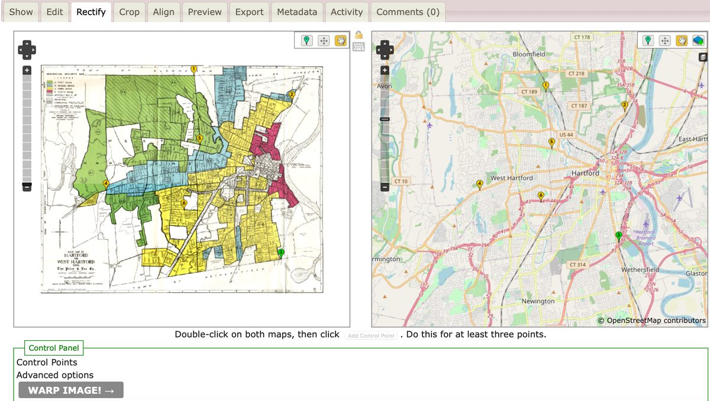{#fig-mapwarper width=750}

5. 최소 4개 또는 5개의 기준점을 추가하여 두 지도를 맞추고 이를 널리 퍼뜨리세요. 만족스러우면 페이지 하단의 *Warp Image* 버튼을 클릭합니다. Map Warper는 정적 지도 이미지를 지리 참조된 지도 타일 세트로 변환하며 이는 이제 현대 지도 위에 레이어로 나타납니다.

6. *Export* 탭을 클릭하고 *Map Services* 아래에서 다음과 유사한 Google/OpenStreetMap 포맷으로 나타나는 Tiles URL을 복사합니다:

`https://mapwarper.net/maps/tile/14781/{z}/{x}/{y}.png`

7. 이 특수 Tiles URL을 복사하여 [12장에서 설명한 Google 스프레드시트를 사용한 Leaflet 스토리맵 템플릿](#leaflet-storymaps-with-google-sheets)이나 이 포맷으로 오버레이 지도를 표시하는 기타 웹 지도 도구 또는 코드 템플릿에 붙여넣을 수 있습니다. 일반 웹 브라우저에 붙여넣으면 작동하지 않습니다.

이미 지리 참조되어 타일로 변환된 역사 지도를 검색하거나 [Map warper](https://mapwarper.net) 및 [뉴욕 공립 도서관 Map Warper](http://maps.nypl.org/warper/) 같은 플랫폼에서 지도를 정렬하는 크라우드소싱 노력에 기여할 수 있습니다.

## 미국 인구조사국(US Census) 데이터로 일괄 지오코딩하기 {- #bulk-geocode}
2장: 스프레드시트 기술 향상하기에서는 [Geocoding by SmartMonkey](https://gsuite.google.com/marketplace/app/geocoding_by_smartmonkey/1033231575312)라는 구글 스프레드시트 애드온을 사용하여 [주소를 지오코딩하는 방법](#geocode)을 배웠습니다. 지오코딩은 거리 주소를 지도에 표시할 수 있는 위도-경도 좌표로 변환합니다(예: *300 Summit St, Hartford CT, USA*를 *41.75, -72.69*로). Google 스프레드시트용 Geocoding by SmartMonkey 애드온은 중간 규모 배치의 주소에 잘 작동하지만 때로는 더 큰 작업 시 훨씬 더 빠른 지오코딩 서비스가 필요합니다.

한 번에 최대 10,000개의 미국 주소를 지오코딩하는 가장 빠른 방법 중 하나는 [미국 인구조사국 지오코더(US Census Geocoder)](https://geocoding.geo.census.gov/geocoder/locations/addressbatch?form)를 사용하는 것입니다. 먼저 5개의 열로 구성된 CSV 파일을 만듭니다. 파일에는 머리글 행이 포함되어서는 안 되며 다음과 같은 형식이어야 합니다:

```
| 1 | 300 Summit St | Hartford | CT | 06106 |
| 2 | 1012 Broad St | Hartford | CT | 06106 |
```

- 1열: 1, 2, 3 등 각 주소에 대한 고유 ID입니다. 반드시 1부터 시작하거나 연속된 순서일 필요는 없지만 그것이 가장 쉽습니다. 대부분의 스프레드시트에서 연속적인 숫자 열을 빠르게 만들려면 `1`을 입력하고 셀의 오른쪽 하단 모서리를 선택한 다음, Option 또는 Control 키를 누른 상태에서 마우스를 아래로 드래그하세요.
- 2열: 도로명 주소(Street address).
- 3열: 도시(City).
- 4열: 주(State).
- 5열: 우편번호(Zip Code).

일부 데이터(예: 우편번호나 주)가 누락되어도 지오코더가 위치를 인식하고 지오코딩할 수 있지만 각 행(주소)에 고유 ID를 포함하는 것은 절대적으로 필요합니다.

팁: 원래 데이터가 주소, 도시, 주, 우편번호를 하나의 셀에 결합한 경우 [4장: 지저분한 데이터 정리하기의 데이터를 별도의 열로 분할하기](#split-data)를 참조하세요. 단, 도로명 주소에 아파트 번호가 포함되어 있다면 그대로 두어도 됩니다.

두 번째로 CSV 파일을 [미국 인구조사국 지오코더 주소 배치 양식(US Census Geocoder address batch form)](https://geocoding.geo.census.gov/geocoder/locations/addressbatch?form)에 업로드합니다. *Find Locations Using... > Address Batch*를 선택한 다음 업로드할 파일을 선택하세요. 벤치마크로 *Public_AR_Current*를 선택하고 *Get Results*를 클릭합니다.

참고: 각 주소의 GeoID와 같은 추가 정보를 얻으려면 왼쪽 메뉴에서 *Find Locations*를 *Find Geographies*로 전환할 수 있습니다.
미국 인구조사국은 모든 장소에 고유한 15자리 GeoID를 할당하며 샘플(예: `090035245022001`)은 주(09), 카운티(003), 인구조사구(524502 또는 더 관용적인 표기인 5245.02), 블록 그룹(2), 그리고 마지막으로 블록(001)으로 구성됩니다.

잠시 후 이 도구는 지오코딩된 결과가 포함된 *GeocodeResults.csv*라는 파일을 반환합니다. 더 큰 파일일수록 보통 더 오래 걸립니다.
이를 저장하고 선호하는 스프레드시트 도구에서 검사해 보세요. 결과 파일은 원래의 ID 및 주소, 일치 유형(정확함, 정확하지 않음, 동률(tie), 또는 일치 항목 없음), 위도-경도 좌표를 포함하는 8열 CSV 파일입니다. *tie*는 주소에 대해 가능한 여러 결과가 있다는 의미입니다. *tie*를 받은 주소의 가능한 모든 일치 항목을 보려면 왼쪽 메뉴의 *One Line* 또는 *Address* 도구를 사용하여 해당 주소를 검색하세요.

팁: 일치하지 않는 주소가 몇 개 있는 경우, 스프레드시트의 필터링 기능을 사용하여 일치하지 않는 주소를 걸러내 수동으로 수정하고 별도의 CSV 파일로 저장한 다음 다시 업로드하세요. 단일 파일이 10,000개의 레코드를 초과하지 않는 한 미국 인구조사국 지오코더를 원하는 만큼 여러 번 사용할 수 있습니다.

이 서비스에 대해 자세히 알아보려면 [미국 인구조사국 지오코더의 개요 및 문서(Overview and Documentation) 섹션](https://www.census.gov/programs-surveys/geography/technical-documentation/complete-technical-documentation/census-geocoder.html)을 읽어보세요.

어떤 이유로 주소 수준의 데이터를 지오코딩할 수 없지만 지도 결과물을 만들어야 하는 경우, 피벗 테이블을 사용하여 타운이나 주와 같은 특정 지역에 대한 포인트 수를 얻을 수 있습니다. 다음 섹션에서는 미국의 병원 주소를 살펴보고 피벗 테이블을 사용하여 주별로 이를 세는 방법을 살펴보겠습니다.

## 포인트 데이터를 다각형 데이터로 피벗하기 {- #pivot-point-to-polygon}

지리적 데이터를 다루는 경우 다각형 지도로 표시하고 영역별로 계산(*집계*)해야 하는 주소 목록이 있을 때가 있습니다. 이럴 때는 스프레드시트 소프트웨어의 간단한 피벗 테이블로 문제를 해결할 수 있습니다.

참고: 다각형 지도의 한 특별한 사례는 내재된 값을 나타내기 위해 특정한 방식으로 다각형을 색칠한 *코로플레스(choropleth)* 지도입니다.
다수의 다각형 지도가 결과적으로 *코로플레스* 지도가 되기 때문에 이 책에서는 이 용어를 자주 사용할 것입니다.

메디케어 및 메디케이드 서비스 센터에서 제공하는 미국 내 메디케어 프로그램에 등록된 모든 병원 목록(https://data.cms.gov/provider-data/dataset/xubh-q36u)을 살펴보겠습니다. 이 데이터 세트에는 각 병원의 이름, 위치(Address, City, State 및 ZIP Code 열로 깔끔하게 나뉘어 있음), 전화번호, 사망률 및 환자 경험과 같은 기타 지표가 포함되어 있습니다.

미국 주별 전체 병원 수의 코로플레스 지도를 만들라는 요청을 받았다고 상상해 보세요.
개별 병원을 점으로 표시하는 대신, 그림 [\@fig-pivot-address]와 같이 더 짙은 파란색 음영이 병원이 더 많은 주를 나타내도록 하고 싶을 것입니다.


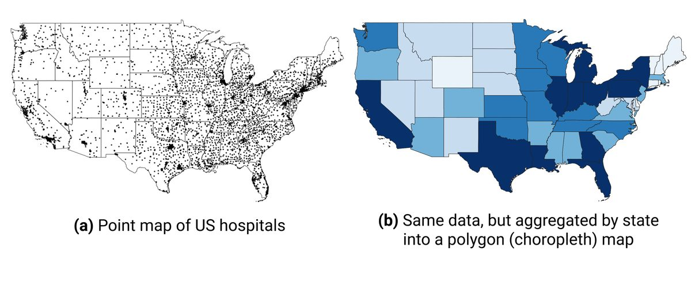{#fig-pivot-address}

먼저, 그림 [\@fig-pivot-address-export]에 표시된 대로 테이블 오른쪽의 "Download this dataset" 버튼을 클릭하여 데이터베이스를 로컬 머신에 저장합니다.


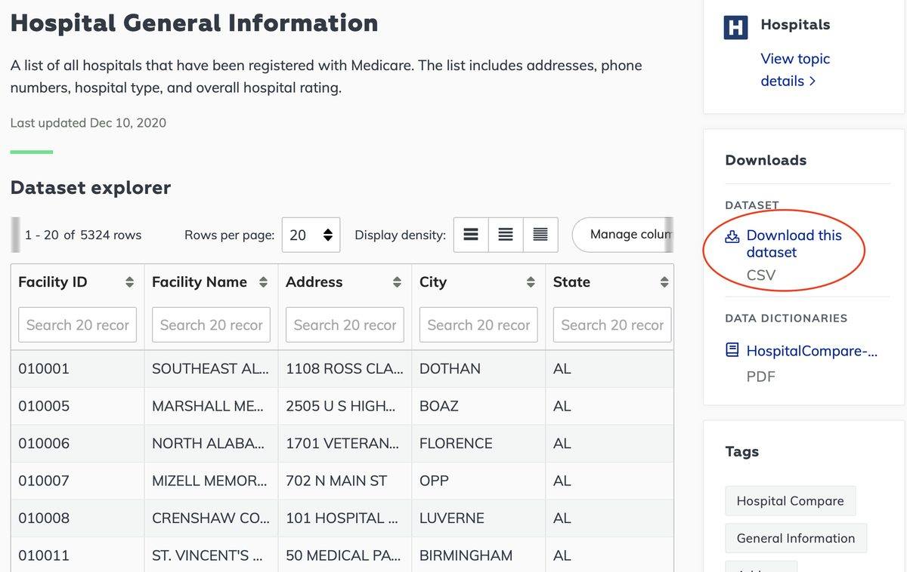{#fig-pivot-address-export width=600}

다음으로, 선호하는 스프레드시트 도구에서 파일을 엽니다. 구글 스프레드시트를 사용하는 경우
*File > Import > Upload*를 사용하여 CSV 데이터를 가져오세요. 주소 열이 있는지 확인하고 피벗 테이블을 만드는 작업으로 넘어갑니다(구글 스프레드시트에서는 *Data > Pivot table*로 이동하여 전체 데이터 범위가 선택되었는지 확인하고 *Create*를 클릭합니다). 주별로 개수를 계산할 것이므로 피벗 테이블에서 *Rows*를 *State*로 설정하세요. 그런 다음 피벗 테이블의 *Values*를 누락된 값이 없는 *State* 열(또는 어떤 열이든 상관없음)로 설정하고 *Summarize by: COUNTA*를 선택하세요. 짜잔!


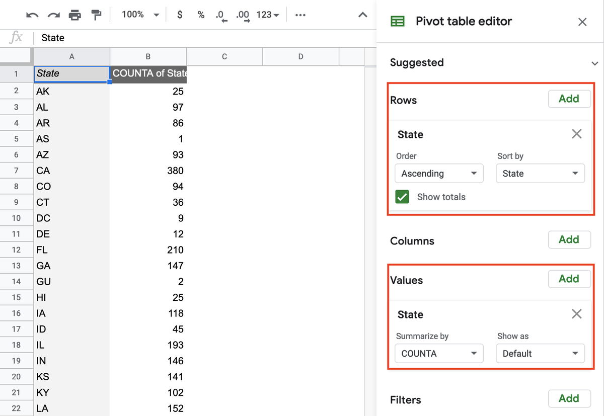{#fig-pivot-address-sheet}

집계된 데이터 세트가 준비되었으니 CSV로 저장하세요. 구글 스프레드시트를 사용하는 경우 *File > Download > Comma-separated values (.csv, current sheet)*로 이동하세요.
이제 [GeoJson.io](#geojsonio)의 편집 기능을 사용해 수동으로 이 데이터 세트를 다각형과 병합하거나 강력한 [Mapshaper](#mapshaper)를 사용하여 한 번에 결합할 수 있습니다.


### 요약 {- #summary13}

이 장에서는 공간 데이터와 GeoJSON 포맷에 대해 깊이 다루었습니다. 또한 다양한 오픈 소스 도구를 사용하여 지리 데이터를 찾고 벡터 데이터를 변환하고 생성하며 이 레이어들을 스프레드시트 데이터와 편집하고 결합하는 방법을 배웠습니다. 더불어 과거 래스터 지도 이미지를 지리 참조하여 현대 지도에 맞게 "왜곡(warp)"하기도 했습니다. 마지막으로 미국 주소의 대규모 일괄 처리를 위한 지오코딩 기법과 포인트 수준 데이터를 코로플레스 지도에 사용할 다각형으로 피벗하는 추가 전략을 얻었습니다.

다음 장에서는 차트와 지도에서 거짓말을 찾아내고 편향을 줄이는 방법을 논의하여 여러분이 시각화의 더 비판적인 소비자이자 더 훌륭한 데이터 스토리텔러가 될 수 있도록 돕겠습니다.


<!-- BEGIN FILE: 14-detect.Rmd -->

# 거짓말 감지 및 편향 줄이기 {#detect}
데이터 시각화의 목표는 정보를 이미지로 인코딩하여 진실되고 통찰력 있는 이야기를 포착하는 것입니다. 하지만 시각화로 거짓말을 하는 사람들을 조심하라고 당부드린 바 있습니다. 이 책의 [도입부](#introduction)에 있는 소득 불평등 예시를 다시 보면, 우리는 의도적으로 그림 [\@fig-us-income-chart1]과 그림 [\@fig-us-income-chart2]의 차트, 그림 [\@fig-world-income-map1]과 그림 [\@fig-world-income-map2]의 지도를 조작하여 동일한 데이터가 재배열될 때 얼마나 다르게 현실을 묘사할 수 있는지 증명했습니다. 그렇다면 모든 데이터 시각화가 올바를까요? 절대 아닙니다. 자세히 살펴보면 우리는 미국 소득 불평등에 대한 두 차트 중 두 번째 차트가 진실을 숨기기 위해 의도적으로 부적절한 축척을 사용했기 때문에 *오해를 불러일으킨다(misleading)*고 선언했습니다. 하지만 우리는 두 세계 지도가 비록 미국이 다른 것보다 더 어두운 색(더 높은 수준의 불평등을 나타냄)으로 표시되었더라도 *동일하게 진실을 말하고 있다(equally truthful)*고 털어놓았습니다.

어떻게 두 개의 서로 다른 시각화가 똑같이 옳을 수 있을까요? 우리의 응답은 자신들의 작업에 유일한 정답만 존재하는 객관적인 세계를 시사하는 *데이터 과학(data science)*이라는 꼬리표를 선호하는 이들과는 충돌할 수 있습니다. 그 대신, 우리는 데이터 시각화가 증거에 의존하지만 현실에 대한 여러 묘사가 타당할 수 있는 *해석적 기술(interpretative skill)*로 가장 잘 이해된다고 주장합니다. 앞서 회상하듯, 우리 분야에는 시각화를 어떻게 해서는 *안 되는지*에 대한 몇 가지 확정적인 규칙만 있으며 이는 [6장 차트 디자인](#chart-design)과 [7장 지도 디자인](#map-design)에서 소개한 바 있습니다. 우리는 이분법적인 세계 대신 시각화가 세 가지 범주로 나뉜다고 주장합니다.

첫째, 증거를 잘못 진술하거나 엄격한 디자인 규칙 중 하나를 위반하는 경우 시각화가 *틀렸다(wrong)*고 합니다. 후자의 예로, 막대 차트나 세로 막대 차트가 0이 아닌 다른 숫자에서 시작하면 틀린 것입니다. 이러한 유형의 차트는 기준선이 잘려 있으면 독자가 정확히 측정할 수 없는 *길이(length)*나 *높이(height)*를 통해 값을 나타내기 때문입니다. 비슷하게, 파이 차트의 조각들을 모두 합쳐 100%를 초과하는 경우 시각화는 틀린 것인데 독자가 차트를 정확하게 해석할 수 없을뿐더러 데이터도 잘못 표시하기 때문입니다.

둘째, 시각화가 기술적으로는 디자인 규칙을 따르지만 관련 데이터의 모습을 불합리하게 감추거나 왜곡하는 경우 *오해를 불러일으킨다(misleading)*고 합니다. "불합리하게"라는 단어가 논쟁의 여지가 있을 수 있다는 점을 인정하지만 이 장에서는 부적절한 척도를 사용하거나 가로세로 비율을 왜곡하는 등 몇 가지 예를 검토할 것입니다. 마술사가 손놀림 속임수를 수행하는 동안 관객을 잘못 인도할 줄 아는 것처럼, 이 범주를 *틀린(wrong)* 것과 *진실한(truthful)* 것 사이에 넣음으로써 차트와 지도가 데이터를 정확하게 표시하고 디자인 규칙을 따르면서도 어떻게 우리를 진실에서 멀어지게 하는지를 강조합니다.

셋째, 시각화가 정확한 데이터를 보여주고 디자인 규칙을 따른다면 *진실하다(truthful)*고 합니다. 그럼에도 불구하고 이 범주 안에는 넓은 스펙트럼의 품질이 존재합니다. 동일하게 타당한 두 가지 시각화를 볼 때, 때로는 하나가 우리가 아직 인식하지 못했던 의미 있는 데이터 패턴을 더 잘 조명하기 때문에 *더 낫다(better)*고 말합니다. 또는 하나가 다른 것보다 이러한 패턴을 더 아름답게, 혹은 잉크를 덜 사용하고 더 단순하게 묘사하기 때문에 더 낫다고 말할 수 있습니다. 어쨌든 우리의 목표가 품질 스펙트럼의 더 나은 쪽을 선호하는 진실한 시각화임을 동의합시다.

이 장에서는 틀린(wrong), 오해를 부르는(misleading), 진실한(truthful)이라는 세 가지 범주 사이의 차이를 구별하는 방법을 배웁니다. 거짓말 감지 기술을 향상하는 가장 좋은 방법은 데이터 기만의 기술에 대한 체험형 튜토리얼을 통해 [차트로 거짓말하는 방법](#how-to-lie-with-charts)과 [지도로 거짓말하는 방법](#how-to-lie-with-maps)을 더 잘 이해하는 것입니다. 속담에도 있듯이, 도둑은 도둑이 잡는 법입니다. *거짓말하는 법*을 배우면 사람들이 여러분을 속이는 것을 더 어렵게 만들 뿐만 아니라 여러 경로가 존재함을 인식하면서 *진실을 말하는* 시각화 디자인의 윤리적 결정에 대해서도 더 깊이 교육받게 됩니다. 마지막으로, 표본 추출, 인지, 알고리즘, 그룹 간 편향이라는 [네 가지 일반적인 데이터 편향 범주를 인식하고 줄이는 방법](#data-bias)과 지도를 다룰 때 더 구체적으로 발생하는 [공간 편향(spatial biases)](#spatial-bias)에 대해 논의합니다. 편향을 완전히 멈추게 할 수는 없더라도, 이 장에서는 다른 사람들의 작업에서 이를 식별하는 방법과 우리 시각화 작업에서 그 존재를 줄이는 전략을 배울 것입니다.^[거짓말하는 방법 튜토리얼은 데이터 시각화 분야의 여러 훌륭한 저작에서 영감을 받았습니다: @cairoTruthfulArtData2016; @cairoHowChartsLie2019; @huffHowLieStatistics1954; @monmonierHowLieMaps2018; @yauHowSpotVisualization2017; @nasajplEducatorGuideGraphing2017]

## 차트로 거짓말하는 방법 {- #how-to-lie-with-charts}
이 섹션에서는 오해를 불러일으키는 차트에 속지 않는 방법과, 동일한 데이터를 의도적으로 조작해 반대 이야기를 함으로써 자신의 차트를 더 정직하게 만드는 방법을 배웁니다. 첫째, 세로 막대 차트에서 작은 차이를 *과장하여(exaggerate)* 더 크게 보이도록 할 것입니다. 둘째, 꺾은선형 차트에서 성장률을 *축소하여(diminish)* 더 완만하게 보이도록 할 것입니다. 이 튜토리얼은 함께 여러분이 다른 사람의 차트를 읽을 때 수직 축과 가로세로 비율 같은 핵심 세부 사항을 주의해서 보도록 가르칠 것입니다. 역설적이게도 *거짓말하는 방법*을 보여줌으로써 우리의 목표는 여러분에게 *진실을 말하는 법*을 가르치고 데이터 스토리 디자인의 윤리에 대해 더 신중하게 생각하게 하는 것입니다.

### 차트에서 변화 과장하기 {-}
먼저 경제에 대한 데이터를 살펴볼 텐데, 이는 정치인들이 종종 자신들의 관점에 더 유리하게 묘사하기 위해 왜곡하는 주제입니다. 국내 총생산(GDP)은 한 국가에서 생산된 최종 재화와 서비스의 시장 가치를 측정하며 많은 경제학자들이 이를 경제 건강의 기본 지표로 여깁니다. (흥미롭게도 GDP는 자녀 돌보기와 같은 무급 가사 노동을 계산하지 않고 국가 인구 전반에 걸친 부의 분배도 고려하지 않기 때문에 모두가 동의하는 것은 아닙니다.) 우리는 분기별로 수집되고 수십억 달러 단위로 측정된 미국 GDP 데이터를 [미국 연방준비제도 공개 데이터 저장소](https://fred.stlouisfed.org/series/GDP)에서 다운로드했습니다. 이 데이터에는 여름철 농업과 관광, 겨울철 휴가철 쇼핑과 같이 연중 계절 변화에 따라 변동하는 산업 간 비교를 위해 계절 조정이 포함되어 있습니다. 여러분의 과제는 작은 차이를 *과장하여* 독자의 눈에 더 커 보이게 만드는 기만적인 세로 막대 차트를 만드는 것입니다.

1. [Google 스프레드시트의 2019년 중반 미국 GDP 데이터](https://docs.google.com/spreadsheets/d/1teB2Pw2lNpFjE_GCNmeqVNURSid36IMrWUROpPZMScA/edit#gid=0)를 열고 *File > Make a Copy*로 이동하여 자신의 Google Drive에서 편집할 수 있는 사본을 만듭니다. 차트는 구글 스프레드시트에서 만들지만 원하는 다른 차트 도구가 있다면 데이터를 다운로드해 사용할 수도 있습니다.

2. 데이터를 살펴보고 노트를 읽어보세요. 이 예제를 단순화하기 위해 우리는 2019년 2분기(4월-6월)와 3분기(7월-9월)의 미국 GDP 수치 두 개만 표시합니다. 2분기 GDP는 약 21.5조 달러였고 3분기는 약간 상승한 21.7조 달러였습니다. 즉, 분기별 GDP는 1%에 약간 못 미치게 올랐으며 이는 다음과 같이 계산됩니다: `(21747 - 21540)/21540 = 0.0096 = 0.96%`.

3. 진실의 가장 좋은 표현이라고 무턱대고 수용하지는 않겠지만 *기본(default)* 설정을 사용하여 동일한 시트 내에 Google 스프레드시트 세로 막대 차트를 만듭니다. [6장에서 구글 스프레드시트를 활용한 차트](#chart-google)를 소개할 때 배운 대로, *data* 시트에서 두 열을 선택하고 *Insert > Chart*로 이동합니다. 도구는 여러분의 데이터를 인식하고 자동으로 세로 막대 차트를 생성할 것입니다(그림 [\@fig-gdp-baseline-merged]의 왼쪽 부분 참조). 수직 축에 영점 기준선이 있는 이 기본 뷰에서 21.5조 달러와 21.7조 달러 간의 차이는 독자에게 상대적으로 작게 보입니다.

4. *수직 축을 잘라서 차이를 과장합니다.* 영점 기준선 대신 척도를 조작하여 GDP의 1% 변화가 훨씬 더 크게 보이도록 합시다. 케밥 메뉴(점 세 개)를 클릭하여 *Chart editor*를 열고 *Customize* 탭을 선택합니다. 수직 축 설정(vertical axis settings)으로 아래로 스크롤하여 최소값을 0(영점 기준선)에서 21500으로, 최대값도 21800으로 변경하여 척도를 줄입니다(그림 [\@fig-gdp-baseline-merged]의 오른쪽 참조). 비록 데이터는 그대로 유지되지만 두 기둥 간의 작은 차이는 이제 우리 눈에 훨씬 크게 다가옵니다. 오직 차트를 자세히 읽는 사람만이 이 속임수를 눈치챌 것입니다. 경제 성장을 공약으로 내건 정치인이 여러분에게 감사할 것입니다!


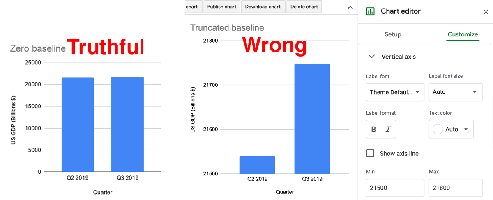{#fig-gdp-baseline-merged width=750}

여기서 볼 수 있듯이, 기준선이 잘린 막대 차트는 *틀렸습니다(wrong)*. 왜냐하면 여러분은 [6장에서 다룬 차트 디자인의 핵심 규칙](#chart-design) 중 하나를 위반했기 때문입니다. 세로 및 가로 막대 차트는 반드시 0의 기준선에서 시작해야 합니다. 이들은 *높이(height)*와 *길이(length)*로 가치를 나타내므로, 기준선이 잘려 있다면 독자들은 어떤 기둥이 다른 기둥보다 두 배 더 높은지 판단할 수 없기 때문입니다. 대조적으로 0의 기준선을 갖는 기본 차트는 진실합니다. 그러나 규칙이 그렇게 명확하지 않은 다른 예제로 넘어가 봅시다.

### 차트에서 변화 축소하기 {-}
다음으로 우리는 지구상에서 우리가 직면한 가장 시급한 문제 중 하나인 기후 변화에 대한 데이터를 살펴볼 것입니다. 하지만 부인자들은 계속해서 새로운 현실에 저항하고 있고 그들 중 일부는 사실을 왜곡합니다. 이 튜토리얼에서는 1880년부터 현재까지 [미국 항공우주국(NASA)에서 다운로드한](https://climate.nasa.gov/vital-signs/global-temperature/) 지구 온도 데이터를 분석합니다. 이는 지구 평균 온도가 지난 50년 동안 섭씨 약 1도(또는 화씨 약 2도) 상승했으며 이러한 온난화가 이미 빙하 융해와 해수면 상승을 유발하기 시작했음을 보여줍니다. 여러분의 임무는 독자의 눈에 띄는 지구 온도 변화 상승의 모습을 *축소(diminish)*하는 *오해를 불러일으키는(misleading)* 꺾은선형 차트를 만드는 것입니다.^[잘못된 기후 변화 데이터에 대한 튜토리얼은 미 항공우주국 제트추진연구소(NASA JPL)가 만든 고등학교 교실 활동과 기후 변화 부인자들의 차트에 대한 Alberto Cairo의 분석에서 영감을 받았습니다. @nasajplEducatorGuideGraphing2017; @cairoHowChartsLie2019, pp. 65-67, 135-141.]

1. [Google 스프레드시트의 1880-2019년 지구 온도 변화 데이터](https://docs.google.com/spreadsheets/d/1Npc7ozRjlsgRLLEV_B5zBvqyRqL6akE2qrEIGegHfGU/edit#gid=0)를 열고 *File > Make a Copy*로 이동하여 자신의 Google Drive에서 편집할 수 있는 사본을 만듭니다.

2. 데이터를 살펴보고 노트를 읽으세요. 온도 변화는 1951년에서 1980년 사이의 온도(약 14°C 또는 57°F)를 기준으로, 지구 전체의 다양한 표본에서 추정한 평균 육상-해양 표면 온도의 섭씨 변화를 의미합니다. 즉, 2019년 값인 0.98은 그 해 지구 온도가 정상보다 약 1°C 높았다는 의미입니다. 과학자들은 NASA 및 미국 국립 기상청의 표준과 더불어 이 기간에 자란 많은 오늘날의 성인들에게 친숙한 기준이라는 이유로 1951-80년 기간을 "정상(normal)"으로 정의합니다. 온도 변화를 측정하는 다른 방법도 있지만 NASA 고다드 우주 연구소(NASA/GISS)의 이 데이터는 [기후 연구 유닛(Climatic Research Unit)](https://sites.uea.ac.uk/cru/) 및 [국립 해양 대기청(NOAA)](https://www.ncdc.noaa.gov/cag/global/time-series)의 과학자들이 컴파일한 데이터와 일반적으로 일치합니다.

3. *data* 시트에서 두 열을 선택한 다음 *Insert > Chart*를 눌러 Google 스프레드시트 꺾은선형 차트를 만드세요. 도구가 시계열 데이터를 인식하고 *기본(default)* 꺾은선형 차트를 생성하겠지만 진실을 가장 잘 표현하는 방식이라고 무턱대고 신뢰해서는 안 됩니다. 케밥 메뉴(점 세 개)를 클릭하여 *Chart editor*를 열고 *Customize* 탭을 선택하세요. 그림 [\@fig-temperature-default]와 같이 노트를 활용하여 온도 변화의 측정 출처 및 방식을 명확히 할 수 있도록 더 나은 제목과 수직 축 라벨을 추가하세요.


::: {.content-visible when-format="html"}

<iframe src="https://docs.google.com/spreadsheets/d/e/2PACX-1vRBJy0vWBN1z49hE8c7vxF_ZiTNKF5RjQ2vpJ-aVfsdNpNYgcMu1cH2zAh90v713vcMmrs6kVlSgQkV/pubchart?oid=557710802&amp;format=interactive" width="100%" height="400px" style="border:none;"></iframe>
<p class="caption">지구 온도 변화의 기본 꺾은선형 차트. [인터랙티브 버전](https://docs.google.com/spreadsheets/d/e/2PACX-1vRBJy0vWBN1z49hE8c7vxF_ZiTNKF5RjQ2vpJ-aVfsdNpNYgcMu1cH2zAh90v713vcMmrs6kVlSgQkV/pubchart?oid=557710802&format=interactive) 탐색하기.</p>

:::


이제 같은 데이터를 사용하여 다른 방법으로 3개의 차트를 더 만들어보고 기술적인 측면에서 왜 이들이 *틀린(wrong)* 것은 아니지만 덜 *오해를 불러일으키는(misleading)* 것도 아닌지에 대해 논의해 봅시다.

#### 수직 축을 늘려 선을 평평하게 만들기 {-}
위의 [차트에서 변화 과장하기 섹션](#how-to-lie-with-charts)에서 보여준 것과 동일한 방법을 사용하되, 이번엔 반대 방향으로 만듭니다. Google 스프레드시트 차트 편집기에서 그림 [\@fig-temperature-axis-annotated]와 같이 최소값을 -5로, 최대값을 양수 5로 변경하여 수직 축을 사용자 정의합니다. 수직 축척 길이를 늘림으로써 우리는 상승하는 선에 대한 인식을 평평하게 만들고 기후 위기를 취소했습니다... 그러나 실제로는 그렇지 않습니다.


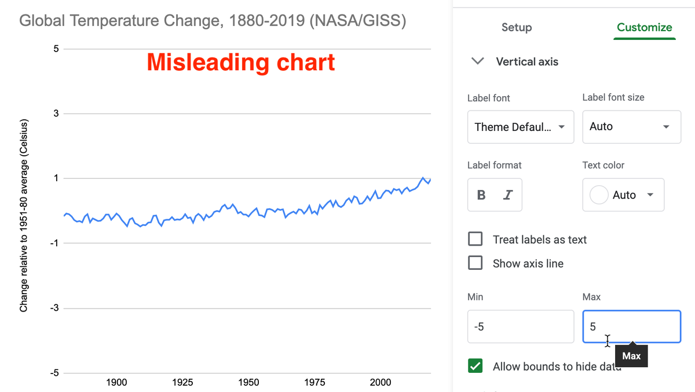{#fig-temperature-axis-annotated}

무엇이 이 평평한 꺾은선형 차트를 *틀린* 것이 아닌 *오해를 불러일으키는* 것으로 만들까요? 튜토리얼 전반부에서 미국 GDP 차트의 수직 축을 축소했을 때 여러분은 영점 기준선 규칙을 위반했습니다. 세로 및 가로 막대 차트는 [6장 차트 디자인 섹션](#chart-design)에서 설명한 바와 같이, 독자들이 *높이* 및 *길이*를 판단해야 하므로 반드시 0에서 시작해야 하기 때문입니다. 그러나 영점 기준선 규칙이 꺾은선형 차트에는 적용되지 않는다는 사실에 놀랄지도 모릅니다. 시각화 전문가 Albert Cairo는 꺾은선형 차트가 선의 *위치(position)*와 *각도(angle)*로 가치를 나타낸다는 것을 상기시켜줍니다. 독자는 높이가 아닌 차트의 형태(shape)로 그 의미를 해석하므로 기준선은 무의미합니다. 따라서 온도 변화 꺾은선형 차트를 평평하게 만드는 것은 독자를 오도할 수 있지만 정확하게 라벨을 지정하는 한 기술적으로 틀린 것은 아닙니다.^[@cairoHowChartsLie2019, p. 61.]

#### 차트를 넓혀서 가로세로 비율 왜곡하기 {-}
Google 스프레드시트에서 그림 [\@fig-temperature-aspect-annotated]와 같이 차트를 클릭하고 옆면을 끌어 짧고 넓게 만드세요. 이미지 측정 단위는 너비×높이(width by height)이며 가로세로 비율(aspect ratio)은 너비를 높이로 나눈 값입니다. 기본 차트는 600 x 370 픽셀이므로 가로세로 비율이 약 1.6:1입니다. 그러나 늘려진 차트는 1090 x 191 픽셀이며 그 비율은 약 5.7:1입니다. 가로세로 비율을 높임으로써 우리는 상승하는 선에 대한 인식을 다시금 평평하게 하고 기후 위기를 취소했습니다... 그러나 이번에도 실제로는 그렇지 않습니다.


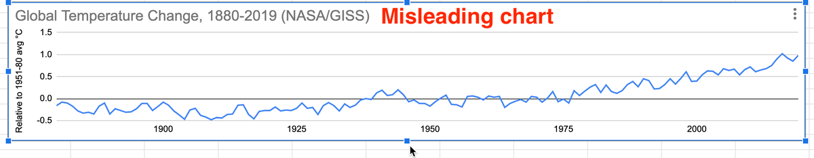{#fig-temperature-aspect-annotated}

무엇이 이 뒤틀린 선형 차트를 *틀린* 것이 아닌 *오해를 불러일으키는* 것으로 만들까요? 거듭 말씀드리지만 꺾은선형 차트의 가로세로 비율을 변경하는 것은 명확하게 정의된 데이터 시각화의 규칙을 위반하는 것은 아니므로 정확하게 라벨이 지정되어 있다면 기술적으로 틀린 것은 아닙니다. 그러나 분명히 오해의 소지가 있습니다. Cairo는 차트를 "변화를 과장하지도, 축소하지도 않는" 가로세로 비율로 디자인해야 한다고 주장합니다. 구체적으로 무엇을 제안하는 걸까요? Cairo는 "차트 디자인의 보편적 규칙은 아니다"라고 명확히 밝히면서도, 차트에 나타나는 변화율(퍼센트)이 대략 그 가로세로 비율과 일치해야 한다고 권장합니다. 예를 들어 어떤 차트가 33% 증가, 즉 33/100이나 1/3을 나타낸다면 3:1의 가로세로 비율(높이보다 너비가 먼저 오도록 분수가 반전되므로)을 사용할 것을 추천합니다. 다시 말해 높이보다 너비가 세 배인 선형 차트를 권하는 것입니다.^[@cairoHowChartsLie2019, p. 69.]

그러나 매우 작거나 매우 큰 값에서는 그 방식이 실패함을 인지하기 때문에 Cairo는 자신의 가로세로 비율 권장 사항을 *보편적 규칙*으로 제안하지는 않습니다. 예를 들어 만약 우리가 이 권장 사항을 지구 온도 변화 차트에 적용한다면 가장 낮은 값과 가장 높은 값(-0.5°에서 1°C)의 차이는 300% 증가를 나타냅니다. 이 경우 우리는 초기값인 0°C 대신에 가장 낮은 값인 -0.5°C를 이용해 퍼센트 변화를 계산합니다. 0으로 나누는 것은 정의되지 않기 때문에 `(1°C- (-0.5°C)) / |-0.5°C| = 3 = 300%`가 됩니다. Cairo의 일반적인 권장 사항을 따르면 300% 증가는 1:3의 가로세로 비율을 시사하며 이는 그림 [\@fig-temperature-aspect-cairo]와 같이 너비보다 3배 더 높은 꺾은선형 차트가 됩니다. 비록 이 아주 높은 차트가 기술적으로는 옳지만 *변화를 과장(exaggerates change)*하기 때문에 *오해를 불러일으킵니다(misleading)*. Cairo의 주된 메시지와는 상반되는 것입니다. 0에 아주 가까운 숫자로 나눌 때 가로세로 비율 권장 사항은 터무니없어집니다.


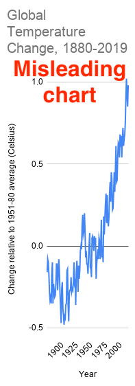{#fig-temperature-aspect-cairo}

Cairo는 그의 가로세로 비율 권장 사항이 반대로 *변화를 축소*함으로써 *오해를 불러일으키는* 차트를 만들 수도 있음을 인정합니다. 예를 들어, 0°C에서 1°C로 상승한 *지구 온도 변화(global temperature change)* 대신 시간이 지남에 따라 13°C에서 14°C(또는 55°F에서 57°F)로 상승한 *지구 온도(global temperature)*를 나타내는 차트를 상상해 보세요. 비록 평균 지구 온도의 1°C 차이가 우리 신체에는 크게 느껴지지 않을지 모르지만 지구에는 막대한 결과를 초래합니다. 우리는 변화율을 다음과 같이 계산할 수 있습니다: `(14°C - 13°C) / 13°C = 0.08 = 8% 증가`, 즉 약 1/12입니다. 이것은 12:1의 가로세로 비율로 해석될 수 있으며 이는 그림 [\@fig-temperature2-aspect-cairo]와 같이 높이보다 너비가 12배인 꺾은선형 차트를 의미합니다. Cairo는 이러한 심각한 지구 온도 상승이 "기만적일 정도로 작게" 보인다고 경고하므로, 모든 경우에 그의 가로세로 비율 권장 사항을 적용하지 않도록 주의합니다.^[@cairoHowChartsLie2019, p. 70.]


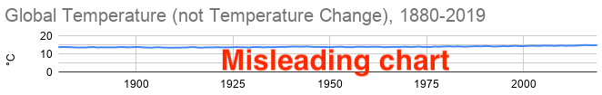{#fig-temperature2-aspect-cairo}

참고: 일부 전문가는 꺾은선형 차트의 가로세로 비율이 개별 분절(segment)을 구별하기 위해 선형 세그먼트의 평균 방향이 위나 아래로 45도와 같아야 한다는 *banking to 45 degrees* 원칙을 따라야 한다고 조언합니다. 그러나 이를 위해선 모든 선의 기울기를 계산하는 통계 소프트웨어가 필요하며 여전히 모든 사례에 들어맞는 "규칙"은 아닙니다. Robert Kosara의 [훌륭한 개요](https://eagereyes.org/basics/banking-45-degrees)를 읽어보세요.^[@kosaraAspectRatioBanking2013]

그렇다면 우리는 어떻게 해야 할까요? 여러분이 헷갈리신다면 그건 데이터 시각화 분야에 *가로세로 비율에 대한 보편적인 규칙이 없기* 때문입니다. 무엇을 해야 할까요? 첫째, 기본 차트를 맹목적으로 받아들이지 마세요. 둘째, 다른 가로세로 비율이 시각적 외양에 어떤 영향을 미치는지 탐구하세요. 마지막으로 Cairo조차도 모든 상황에 들어맞는 가로세로 비율 규칙은 없기 때문에 모든 경우에 자신의 권고를 따르기보다 자신의 판단력을 사용해야 한다고 주장합니다. 데이터를 정직하게 해석하고 독자에게 분명한 이야기를 들려주는 선택을 하세요.

#### 더 많은 데이터와 이중 수직 축 추가하기 {-}
오해를 불러일으키는 또 다른 흔한 방법은 더 많은 데이터를 추가하는 것입니다. 꺾은선형 차트의 오른쪽에 있는 두 번째 수직 축과 일치하는 두 번째 데이터 시리즈를 추가하는 방식처럼 말입니다. 이중 축 차트를 기술적으로 구성하는 것은 가능하지만 독자를 호도하도록 쉽게 조작될 수 있으므로 강력하게 지양합니다. 이전 두 데이터 세트(지구 온도 변화 및 미국 국내 총생산)를 하나의 이중 축 차트에 결합한 예제를 통해 이유를 설명하겠습니다. 구글 스프레드시트의 *temp+GDP* 시트로 가면 온도 변화뿐 아니라 [미국 연방준비제도(US Federal Reserve)](https://fred.stlouisfed.org/series/GDPA)에서 다운로드한 1929년부터 2019년까지의 수십억 달러 단위의 미국 국내총생산(GDP)이 새로운 열에 포함되어 있음을 확인할 수 있습니다. 이 예제를 단순화하기 위해 우리는 이용 가능한 GDP 데이터와 더 일치시키고자 1929년 이전의 온도 데이터를 삭제했습니다.

1. 세 열을 모두 선택하고 *Insert > Chart*를 눌러 온도(파란색)와 미국 GDP(빨간색)의 두 데이터 시리즈가 있는 기본 꺾은선형 차트를 만듭니다.

2. *Chart editor*에서 *Customize*를 선택하고 *Series*로 스크롤을 내립니다. 드롭다운 메뉴를 *Apply to all series*에서 *US GDP*로 바꿉니다. 그림 [\@fig-temperature-gdp-axis-setup]과 같이 그 아래의 *Format* 영역에서 *Axis* 메뉴를 *Left axis*에서 *Right Axis*로 변경하면 미국 GDP 데이터에만 연결된 새로운 수직 축이 차트 오른쪽에 생성됩니다.


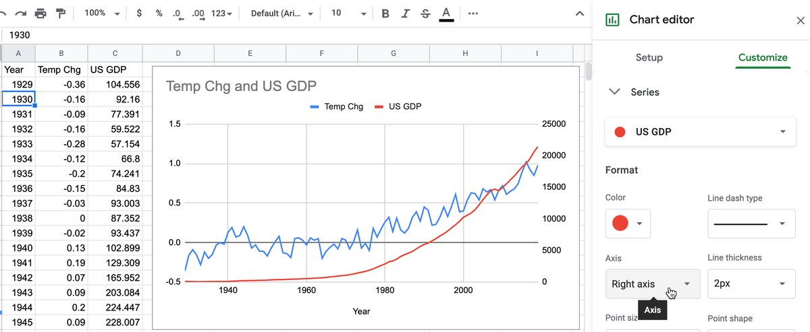{#fig-temperature-gdp-axis-setup}

3. 그림 [\@fig-temperature-right-axis]와 같이 *Chart editor > Customize* 탭에서 아래로 스크롤하면, 온도 변화 전용인 *Vertical Axis*(왼쪽)와 오로지 미국 GDP만을 위한 새로운 *Right Axis* 메뉴가 분리되어 나타납니다.


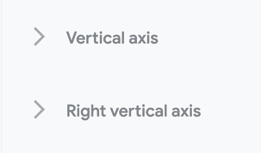{#fig-temperature-right-axis width=250}

4. 이전 섹션 "수직 축을 늘려 선을 평평하게 만들기"에서 했던 것보다 훨씬 더 심하게 온도 변화에 대한 *Vertical Axis*를 조정하여 차트를 완성합니다. 이번에는 최소값을 0(미국 GDP를 나타내는 오른쪽 축의 기준선과 맞추기 위해)으로 변경하고 최대값을 10으로 하여 온도 선을 더 평평하게 합니다. 그림 [\@fig-temperature-gdp-final-annotated]와 같이 권위 있게 보이도록 제목, 출처 및 라벨을 추가합니다.


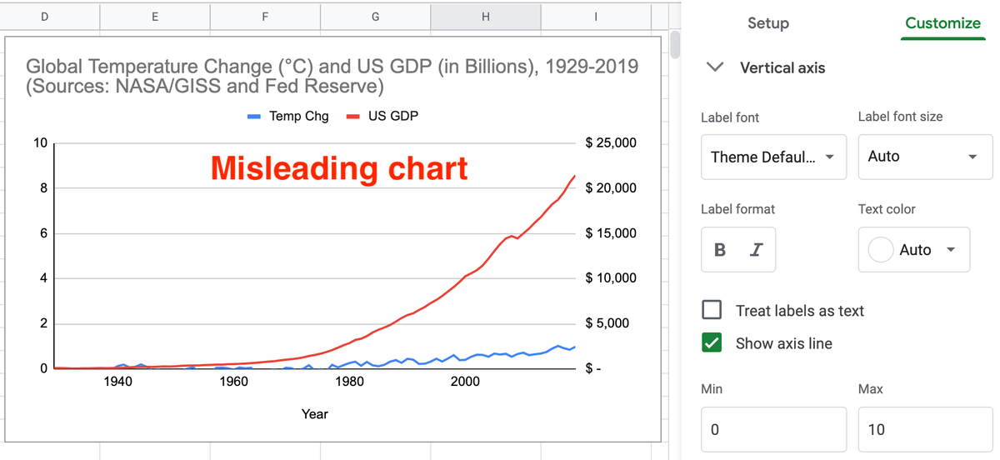{#fig-temperature-gdp-final-annotated}

무엇이 이 이중 축 차트를 *틀린* 것이 아니라 *오해를 불러일으키는* 것으로 만들까요? 명확하게 정의된 시각화 디자인 규칙을 위반한 것은 아니므로 이 차트가 틀린 것은 아닙니다. 하지만 많은 시각화 전문가들이 대부분의 독자를 혼란스럽게 하며 두 변수 간의 관계를 명확히 보여주지 못하고 때로는 장난으로 이어지기 때문에 이중 축 차트를 몹시 반대합니다. 그림 [\@fig-temperature-gdp-final-annotated]에서 두 축이 모두 0에서 시작함에도 불구하고 왼쪽 온도 척도의 상한선은 10°C이며 온도 선이 단지 1°C 상승했다는 점을 감안하면 이는 비합리적입니다. 따라서 꾸준히 오르는 GDP 선에 비해 온도 상승 선에 대한 인식을 낮춤으로써 우리가 장기적인 경제 호황을 즐기는 동안 기후 변화의 결과를 무시하도록 오도한 것입니다! 또 다른 두 가지 문제도 이 차트를 문제가 되게 합니다. GDP 데이터는 물가 인상이 반영되지 *않았기* 때문에 우리가 [5장 의미 있는 비교하기(Make Meaningful Comparisons)](#comparisons)에서 경고했던 주제처럼 1929년 가치의 달러를 2019년 가치의 달러와 비교하게 하여 독자에게 혼란을 줍니다. 나아가 구글 스프레드시트가 지정한 기본 색상을 받아들임으로써 기후 데이터를 시원한(cool) 파란색으로 표시하고 상승하는 기온과 빙하 해빙에 대해 우리 뇌에 정반대의 메시지를 전달합니다. 요약하면 이 차트는 비합리적인 수직 축, 비교할 수 없는 데이터, 색상 선택 등 세 가지 방식으로 독자들을 오도합니다.

이중 축 꺾은선형 차트에 대한 더 나은 대안은 무엇일까요? 여러분의 목표가 지구 온도와 미국 GDP라는 두 변수 간의 관계를 시각화하는 것이라면 [6장에서 소개했던 것처럼 산점도(scatter chart)에 표시](#scatter-bubble-datawrapper)하는 것이 좋습니다. [미국 실질 GDP(US real GDP)](https://fred.stlouisfed.org/series/GDPCA)를 기준 연도인 2012년 달러 가치로 조정하여 2019년 지구 온도 변화와 함께 [이 구글 스프레드시트](https://docs.google.com/spreadsheets/d/1Npc7ozRjlsgRLLEV_B5zBvqyRqL6akE2qrEIGegHfGU/edit#gid=374640985)에 입력해 더 의미 있는 비교를 할 수 있습니다. 우리는 [Datawrapper Academy 튜토리얼](https://academy.datawrapper.de/article/260-how-to-connect-scatterplot-dots-with-lines)을 따라 모든 점들을 관통하는 선을 그려 그림 [\@fig-real-gdp-temperature-scatter]와 같이 시간에 따른 *연결된 산점도(connected scatter chart)*를 만들었습니다. 전반적으로 미국 경제의 성장은 1929년부터 현재까지 지구 온도 변화 상승과 강력히 연관되어 있습니다. 게다가 산점도 축은 데이터의 전체 범위를 표시하도록 설계되어 있으며 가로세로 비율에 얽매이지 않고 우리가 관계의 강도를 해석할 수 있기 때문에 산점도로 독자를 호도하는 것은 더 어렵습니다.


::: {.content-visible when-format="html"}

<iframe src="https://datawrapper.dwcdn.net/Zleaq/" width="100%" height="400px" style="border:none;"></iframe>
<p class="caption">1929년부터 2019년까지의 미국 실질 GDP와 지구 온도 변화 간의 관계를 나타낸 연결된 산점도. [인터랙티브 버전](https://datawrapper.dwcdn.net/Zleaq/) 탐색하기.</p>

:::


요약하자면 이 튜토리얼에서 우리는 지구 온도 변화에 대한 여러 차트를 만들었습니다. 그중 기술적으로 틀린 것은 없었으며 어떤 것은 진실했지만 데이터에서 중요한 패턴을 숨기거나 위장하여 독자들을 속이기 위해 과도하게 조작된 경우가 대부분이었습니다. 우리는 차트가 어떻게 독자를 기만할 수 있는지 여러 가지 방법을 증명했지만 모든 선택지를 소진하지는 않았습니다. 예를 들어 독자가 막대 또는 꺾은선형 차트의 상대적 높이를 잘못 판단하게 만드는 3차원 차트를 만들고 독자의 시선을 기준선 아래로 기울이는 추가 자료를 참조하세요.^[@cairoHowChartsLie2019, p. 58.]

우리가 수학, 과학, 문법 교과서를 읽으면서 익숙해진 명확히 정의된 데이터 시각화의 디자인 규칙이 없다는 점에 실망감을 느낄 수도 있습니다. 대신 중요한 시각화 규칙은 *세 단계 과정*임을 명심하세요. 절대 기본값을 맹목적으로 받아들이지 마시고 다양한 디자인이 여러분의 해석과 시각적 외양에 어떤 영향을 미치는지 탐구하며 최선의 판단력을 동원해 진실하고 의미 있는 데이터 스토리를 전달하세요.

차트로 어떻게 거짓말을 하는지 배웠으니, 다음 섹션에서는 이 기술을 바탕으로 지도로 거짓말하는 방법을 알아보겠습니다.

## 지도로 거짓말하는 방법 {- #how-to-lie-with-maps}
거짓말을 간파하는 방법을 배우는 가장 좋은 방법 중 하나는 의도적으로 지도를 조작하여 동일한 데이터를 기반으로 두 가지(또는 그 이상의) 정반대되는 이야기를 만들어보는 것입니다. 다른 사람들의 지도를 볼 때 무엇을 주의해야 할지 배우게 되며 자신의 지도를 디자인할 때 윤리적인 문제에 대해 더 신중하게 생각하게 될 것입니다. 엄청난 장난의 주제가 될 수 있는 지리적 영역의 값을 표현하기 위해 음영이나 색상을 사용하는 코로플레스(choropleth) 지도에 주의를 집중하겠습니다. 이 연습은 원래 1991년에 출판되어 지금 3판이 발간된 지리학자 Mark Monmonier의 고전적인 동명 도서 *How to Lie with Maps*에서 영감을 받았습니다.[@monmonierHowLieMaps2018]

시작하기 전에, 코로플레스 지도를 디자인할 때 일반적인 실수를 피하기 위해 [7장의 지도 디자인 원칙](#map-design)을 검토하세요. 예를 들어, (질병에 걸린 사람의 총수와 같은) 원시 수치 개수를 매핑하는 것을 피하고 대신 (질병에 걸린 사람의 비율과 같은) 상대적 비율을 보여주어야 합니다. 왜냐하면 원시 데이터 개수 지도는 대개 농촌보다 도시 지역에 대부분의 사람들이 살고 있음을 보여주는 것으로 끝날 것이기 때문입니다. 또한 이 섹션은 독자가 이미 [7장에서 Datawrapper로 코로플레스 지도를 만드는 단계](#choropleth-datawrapper)에 익숙하다고 가정합니다.

이 책의 [도입부](#introduction)에 있는 두 개의 지도로 돌아가 봅시다. 그곳에서 우리는 세계 소득 불평등에 대한 두 가지 다른 해석을 제시했습니다. 특히 그림 [\@fig-world-income-map1]은 미국의 불평등 수준이 다른 국가와 유사함을 시사하는 중간 톤의 파란색으로 매핑한 반면, 그림 [\@fig-world-income-map2]는 가장 심각한 불평등 층에 속해 눈에 띄게 진한 파란색으로 미국을 돋보이게 했습니다. 우리는 둘 다 *진실한* 해석이라고 주장했습니다. 이 튜토리얼을 통해 두 개의 지도를 다시 만들고 추가로 하나를 더 만들면 개념을 더 분명하게 이해하게 될 것입니다. 먼저 코로플레스 지도 작성을 시작하기 위해 데이터를 검토하고 Datawrapper에 업로드해 봅시다.

1. [Google 스프레드시트의 전 세계 소득 상위 1퍼센트 데이터](https://docs.google.com/spreadsheets/d/1IomO4pyGziTZnQrlSnlO11zqgdohwwTm2olR2-tGPfI/edit#gid=1463939565)를 열고 *File > Make a Copy*로 이동하여 자신의 Google Drive에서 편집할 수 있는 버전을 만드세요.

2. 데이터를 살펴보고 노트를 읽어보세요. 전체적으로 이 데이터는 각 국가 인구의 가장 부유한 1퍼센트가 차지하는 "파이 조각의 크기"를 담고 있어, 소득 분배를 나라별로 비교하는 한 가지 방법이 됩니다. 각 행에는 국가와 3자리 국가 코드, 소득 상위 1% 인구가 차지하는 세전 국민 소득 점유율(percent share), 그리고 세계 불평등 데이터베이스(World Inequality Database)가 가장 최근에 수집한 연도가 적혀 있습니다. 예를 들어, 브라질의 경우 2015년에 상위 1퍼센트 인구가 전체 소득의 28.3퍼센트를 차지했고 미국의 경우 2018년에 상위 1퍼센트가 20.5퍼센트를 차지했습니다.

참고: 분명히 하자면 사회과학자들은 국가 간 소득이나 부의 분배를 비교하는 다른 많은 방법을 개발했으며 이 주제는 본 서적의 범위를 벗어납니다. 이 튜토리얼에서는 각 국가의 소득 상위 1% 인구가 차지하는 세전 국민 소득 점유율이라는 이해하기 쉬운 하나의 변수를 사용해 이 복잡한 개념을 포착합니다.

3. 이 Google 스프레드시트를 Datawrapper 매핑 도구로 직접 가져올 수는 없으므로 *File > Download*로 이동하여 첫 번째 탭을 컴퓨터에 *CSV 형식*으로 내보냅니다.

4. 브라우저에서 [Datawrapper 시각화 도구](https://www.datawrapper.de)를 열고 CSV 지도 데이터를 업로드하세요. *New Map*, *Choropleth map*을 선택한 다음 *World*, *Proceed*를 차례로 선택하세요. *Add your data* 화면에서 테이블 아래로 스크롤한 뒤 *Import your dataset* 버튼을 선택하고 *Start Import* 버튼을 누른 다음 *click here to upload a CSV file*을 클릭하여 앞서 단계에서 생성한 CSV 파일을 업로드합니다. 첫 번째 열이 *Matched as ISO code*인지 확인하여 클릭하고 *Continue*를 누른 뒤 *Percent Share* 열이 *Matched as Values*로 맞춰졌는지 클릭하여 확인한 다음, 지도를 시각화하기 위해 *Go*와 *Proceed*를 클릭하세요.

5. *Visualize* 화면의 *Refine* 탭 *Select palette* 안에 있는 *Colors* 섹션에서 그림 [\@fig-map-color-settings]와 같이 렌치 기호(wrench symbol)를 클릭하여 색상 설정을 엽니다. 나중에 수정할 수 있는 밝은 녹색에서 파란색으로 이어지는 색상 팔레트(color palette)는 건너뛰고 색상 범위(color ranges) 설정에 집중하겠습니다.


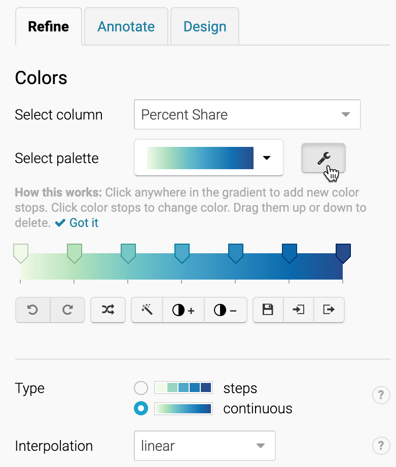{#fig-map-color-settings width=350}

### 지도 색상 범위 수정하기 {-}
비록 기본 시각화 결과물을 맹목적으로 받아들이지는 않지만 이는 시작하기에 좋은 출발점입니다. 기본 지도는 *선형(linear)* 데이터 값 보간법(interpolation)을 사용하여 *연속형(continuous)* 범위를 표시합니다. 이는 그림 [\@fig-map-continuous-linear]와 같이 지도가 최소 5%에서 최대 31%까지의 모든 값을 직선상에 배치하고 그레디언트를 따라 각 값을 색상에 할당한다는 의미입니다. 미국(20.5%)은 이 범위의 중간 바로 위인 중간 톤의 파란색에 섞여 있다는 점에 유의하세요.


::: {.content-visible when-format="html"}

<iframe src="https://datawrapper.dwcdn.net/aetEM/" width="100%" height="450px" style="border:none;"></iframe>
<p class="caption">연속형 범위와 선형 보간법을 적용한 소득 불평등 지도. [인터랙티브 버전](https://datawrapper.dwcdn.net/aetEM/) 탐색하기.</p>

:::


같은 데이터지만 설정이 다른 두 번째 지도를 만드세요. 그림 [\@fig-map-3steps-naturalbreaks]와 같이 *Type* 설정을 *steps*로 변경하고 *Natural breaks (Jenks)* 보간법을 사용하여 *3*개의 스텝(단계)으로 조정하세요. 이는 지도가 이제 모든 값을 3개의 오름차순 그룹으로 배치한다는 뜻입니다. Natural breaks(자연적 단절) 방식은 극단값을 눈에 띄게 할 것인지 범위 내의 다양성을 강조할 것인지 사이에서 절충안을 제공합니다. 미국(여전히 20.5%)이 이제 상위 3분의 1에 속해 짙은 파란색 색상(19% 이상)으로 돋보이는 것을 확인하세요.


::: {.content-visible when-format="html"}

<iframe src="https://datawrapper.dwcdn.net/VSfdZ/" width="100%" height="450px" style="border:none;"></iframe>
<p class="caption">3단계 및 자연적 단절 보간법을 적용한 소득 불평등 지도. [인터랙티브 버전](https://datawrapper.dwcdn.net/VSfdZ/) 탐색하기.</p>

:::


첫 번째 지도는 미국의 소득 불평등이 대부분의 국가와 비슷하다는 인상을 주는 반면, 두 번째 지도는 미국을 색상 척도의 더 높은 곳에 위치시킵니다. 어떤 지도가 오해를 부르고 어떤 것이 진실일까요? 지도 디자인에 대한 명확하고 확고한 규칙을 선호한다면 이 질문의 대답은 실망스러울지도 모릅니다. 비록 두 지도가 우리 눈에는 매우 다른 인상을 만들더라도 합리적이고 진실한 데이터 해석에 기반하여 명확하게 라벨이 지정된 정확한 데이터를 보여주기 때문입니다.

시각화 전문가 Alberto Cairo는 코로플레스 지도 이면에서 어떤 일이 벌어지고 있는지 이해하기 위해 데이터의 분포를 더 잘 이해할 수 있는 히스토그램 작성을 권장합니다. [Google 스프레드시트의 데이터](https://docs.google.com/spreadsheets/d/1IomO4pyGziTZnQrlSnlO11zqgdohwwTm2olR2-tGPfI/edit#gid=1463939565)로 돌아가 [7장에서 설명한 히스토그램](#histogram-google)을 생성해 보세요. 점유율 기준으로 정렬된 국가들이 "버킷(buckets)"에 나뉘어 그림 [\@fig-map-data-histogram]과 같이 빈도로 나타납니다. 대부분의 국가가 중앙값 주변에 몰려 있지만 이는 소수의 국가들이 30퍼센트 표기선 근처에 이상치로 존재하는 정규 분포 곡선이 아닙니다. 연속형(continuous) 유형과 선형(linear) 보간법을 사용한 첫 번째 지도에서는 미국이 중앙값에 가까워 중간 톤의 파란색과 어우러졌습니다. 반면 두 번째 지도는 3개의 스텝(steps)과 자연적 단절(natural breaks) 방식을 사용하여 미국이 최고 범위에 포함돼 어두운 파란색으로 돋보이게 했습니다.


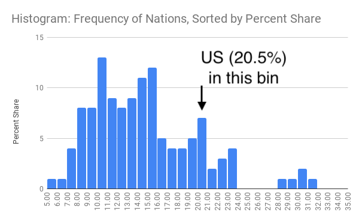{#fig-map-data-histogram}

그렇다면 우리는 어떻게 코로플레스 지도 디자인에 관한 결정을 내려야 *할까요*? 차트 섹션과 유사하게 보편적인 규칙은 거의 없지만 여러 가지 지혜로운 권장 사항이 있습니다. 다른 무엇보다도, 지도 색상 범위로 데이터를 감추는 대신 데이터의 진실되고 의미 있는 차이를 드러내는 *더 나은* 방법을 항상 찾으세요. [Datawrapper Academy는 권장합니다](https://academy.datawrapper.de/article/117-color-palette-for-your-map): 코로플레스 지도를 만들 때 "정직성과 유용성 사이의 타협점(a compromise between honesty and usefulness)"을 찾으라고 말이죠. 즉, 증거를 제시할 때는 진실을 말해야 *하며* 동시에 데이터 스토리에서 가장 중요한 내용으로 독자의 이목을 집중시키는 해석을 강조하는 디자인 선택을 앞세우세요. 예를 들어 극단적인 최저값과 최고값을 강조할 때는 *선형(linear)* 보간이 제일 적합하며 분위수(quantiles) 또는 기타 비선형 그룹화 방식은 중간 범위의 지리적 다양성을 드러냅니다. [또한 Datawrapper Academy는 권고합니다](https://academy.datawrapper.de/article/134-what-to-consider-when-creating-choropleth-maps): 특정 임계값 위나 아래 지역을 강조하기 위해 명확히 구분되는 여러 *단계(steps)*를 나타낼 만한 강력한 이유가 데이터 스토리에 없다면 데이터의 미묘함을 보여주기 위해 *연속형(continuous)* 컬러 팔레트를 사용하라고 말입니다. *단계*를 선택한 경우 *단계의 개수*를 늘리면 지도에서 더 뚜렷한 차이가 드러나겠지만 *너무 많은 단계*는 밝고 어두운 지역의 실제 편차가 단지 미미할 수 있음에도 매우 다르다는 잘못된 인상을 심어줄 수 있습니다. 여러분이 어떠한 결정을 내리든 간에, 미리 생각한 관점에 맞추어 지도의 외양을 수동으로 조정하려는 유혹은 피해야 합니다. 즉 이야기를 들려주되 진실을 말하세요. 어느 것이 제일 나은 절충안인지 결정하기 위해 다양한 설정을 지닌 여러 개의 지도를 제작해 봐야 할 수도 있습니다.

이제 차트와 지도로 거짓말하는 방법에 대해 명확하게 파악했으므로 이와 관련된 데이터 편향을 인식하고 줄이는 주제에 관해 검토해 보겠습니다.

## 데이터 편향 인식 및 줄이기 {- #data-bias}
우리는 편향을 하나의 관점이 다른 관점보다 부당하게 선호되는 것이라고 정의합니다. 데이터를 다루거나 시각화를 디자인할 때 다른 유형의 편향들을 인지하는 것은 여러분의 인식에 잠재적으로 영향을 미칠 수 있는 요인으로서 이를 파악하고 여러분의 시각화 작업에서 그러한 부분을 줄일 수 있다는 점에서 중요합니다. 편향을 줄이는 첫 번째 단계는 처음엔 숨겨져 있는 것처럼 보일 수 있는 다양한 종류의 편향을 올바르게 식별하여 이를 찾아내는 것입니다. 이 섹션에서는 데이터를 다루는 사람이라면 누구나 인지해야 하는 4가지 편향, 즉 표본 추출 편향, 인지적 편향, 알고리즘 편향 및 그룹 간 편향에 대해 논의합니다. 다음 섹션에서는 지도 데이터 작업을 하는 사람 누구에게나 관련 깊은 여러 편향을 이어서 다룹니다.

*표본 추출 편향(Sampling biases)*은 데이터가 공정하게 선택되었다고 믿었음에도 막후에 있는 특정 과정이 구성에 영향을 주어 결과를 왜곡할 때 발생합니다. 우리는 이전에 [5장 편향된 비교 주의하기(Beware of Biased Comparisons)](#biased-comparisons) 섹션에서 피해야 할 몇몇 표본 편향의 종류를 여러분에게 이미 경고한 적이 있습니다. 피해야 할 한 유형은 여러분의 연구를 위해 선택된 표본이 더 넓은 모집단과 체계적으로 차이를 보일 때 발생하는 *선택 편향(selection bias)*인데 농구 연습 후 체육관에서 빠져나오는 사람들의 키를 무작위로 재는 것과 같습니다. 두 번째 유형은 조사의 특정 하위 집단이 설문에 응답할 가능성이 적어짐으로써 덜 대표적인 결과를 초래하는 *무응답 편향(non-response bias)*입니다. 참가자의 신청이나 자원에 의한 프로그램 참여가 비슷한 동기를 지니지 않은 이들과의 비교를 막기 위해 더욱 면밀한 평가를 요하는 *자기 선택 편향(self-selection bias)*을 방지해야 한다고도 당부했습니다. 항상 의미 있는 비교를 하려 하기 전에는 [3장에서 서술한 질문 방식(question.html)](#question)처럼 여러분의 데이터에 의구심을 표하세요. 어떤 표본적 맹점이 수집 과정에 스며들었으리라 의심된다면 아예 자료를 사용하지 말거나 시각화 노트나 첨부 텍스트에서 그러한 우려를 정확히 묘사하여 해당 문제점을 명시해야 합니다.

*인지적 편향(Cognitive biases)*은 어떻게 우리가 데이터를 해석하는지를 왜곡시키는 인간 행동의 한 범주를 이릅니다. 한 예는 세상이 돌아가는 방식에 대해 우리가 이미 품은 관념에 맞는 주장만 받아들이는 경향을 의미하는 *확증 편향(confirmation bias)*입니다. 대안적인 해석을 적극적으로 모색하고 열린 눈으로 상충되는 결과를 고려하여 이에 대처하세요. 두 번째 예시는 숫자가 무작위로 선택되었음에도 사람들이 자료 속 의미 있는 관계성을 발견하려는 성향인 *패턴 편향(pattern bias)*입니다. 독자들에게 (그리고 자신에게도) 데이터에는 노이즈(noise)가 끼어 있으며 우리 뇌는 그 어떤 것이 존재하지 않는 상황에서도 패턴을 찾게끔 구성되어 있음을 환기함으로써 대항하십시오. 여러분의 데이터 속 겉보기 패턴들이 요행이라 할 수 있는 수준보다 더 높은 확률로 존재하는지 판단하기 위한 적절한 테스트를 익히기 위해 [5장](#comparisons)에서 언급한 통계 분석 추가 자료들을 살펴보세요. 세 번째 사례는 부정적 또는 긍정적 라벨이, 또 개념적 범주들이 우리가 정보를 읽어내는 방향성에 미치는 영향을 가리키는 *프레이밍 편향(framing bias)*입니다. 영국 통계학자 David Spiegelhalter는 미국 병원들은 대개 *사망률(mortality rates)*을, 영국 병원들은 *생존율(survival rates)*을 보고하려는 습성에 관해 레이블의 권력(power of labels)이라고 평가합니다. 여러분 가족 구성원을 위한 수술의 위협 요소를 가늠할 때 비록 그 수치가 완벽히 동일할지라도 5퍼센트 사망률의 가능성이 95퍼센트 생존 확률보다 끔찍해 보일 테니까요. 심지어 Spiegelhalter는 어떠한 수치들에 우리가 날것 그대로의 수를 더할 때 위험에 대한 우리의 인상이 한층 증가한다고도 논평합니다. 예를 들자면 만일 한 의료 시술이 지닌 5퍼센트 사망률에다 *그에 더하여* 환자 400명 중 20명이 숨을 거두었다고 덧붙인다면 우리들이 실존 인물과 삶을 상상해 보게끔 하므로 단지 추상적 숫자로서의 비중일 때보다 결론이 덜컥 끔찍하게 다가온다는 것입니다.^[@spiegelhalterArtStatisticsLearning2019, pp. 22-5] 잠재적으로 사람의 마음을 뒤흔드는 이 효과에 관해 인지하고 또 주의를 불러일으킴으로써 프레이밍 편향에 대응하세요.

*알고리즘 편향(Algorithmic biases)*은 컴퓨터 시스템이 특정 사회 집단의 성과를 우선시하면서 생겨나며 때로는 주류 집단이 누리던 특권을 고착화하는 형태로 나타납니다. 최근 사회적 이목이 쏠린 사례가 몇 가지 있습니다. 예컨대 미국 법원 체제에서의 여러 알고리즘은 인종 편향이 초래되는 데 꽤나 공헌했습니다. Equivant로 사명을 바꾼 Northpointe 소프트웨어 회사는 판사들의 감옥 수감 처분 판결이나 집행유예 기각 등에 조력하고자 재소자의 재범 가능성 위험을 측정하는 분석 알고리즘 시스템을 구축했습니다. 하지만 탐사 보도 전문 비영리 매체 프로퍼블리카(ProPublica) 기자들은 알고리즘상 과거 그들이 저지른 범죄 유형을 통제하는 와중에도 백인들보다는 흑인들을 거의 두 배 높은 재범 우려 집단으로 오판했다는 것을 확인했습니다.^[@angwinMachineBias2016] 금융 산업의 젠더 편향에도 여러 알고리즘이 크게 기여해 왔습니다. 애플과 골드만삭스가 제휴하여 신규 신용카드 대출 모델을 설계했을 때 여러 소비자는 지원자를 심사하는 공식 프로세스가 부부 사이이자 자산 수준과 과거 신용 평가 점수마저 흡사할지라도 툭하면 여성보다 남성에게 10배 내지는 20배 높은 채무 대출액을 제시한다는 걸 발견했습니다.^[@vigdorAppleCardInvestigated2019] 양쪽 사건 모두에서 사측은 알고리즘적 편향이라는 책임을 불허하면서도 소프트웨어 수식 배후에 감춰진 평가 과정을 세상에 밝히는 것도 독점 자산이라는 사유를 들어 공히 거부했습니다. 우리 모두가 여러 데이터 남용 사례를 경계해야 하는 건 이 때문입니다.

*그룹 간 편향(Intergroup biases)*이란 계급이나 젠더, 인종, 억압적 성 윤리와 같은 사회적 카테고리에 얽혀 많은 이에게 특권을 수여하거나 멸시를 강제하는 여러 양태를 아우릅니다. 이러한 그룹 사이의 다툼 속 편향은 명백하게도 디지털 시대를 거슬러 오르는 오랜 연원을 가졌습니다. 하지만 최근 흑인의 목숨도 소중하다(Black Lives Matter)는 대중의 봉기 이후 일부 저자들은 데이터 시각화의 세계 속에 그룹 간의 갈등과 편향이 만연함을 꼬집으면서 그 영향을 희석시키기 위해 우리가 대응할 방식을 주창하기도 했습니다. Jonathan Schwabish와 Alice Feng 두 저자는 인종 간 평등 의식 렌즈를 투영한 [어번 인스티튜트 부설 데이터 시각화 스타일 가이드(Urban Institute's Data Visualization Style Guide)](https://urbaninstitute.github.io/graphics-styleguide/)를 편찬할 때 겪었던 과정들을 잘 풀어 설명합니다.^[@schwabishApplyingRacialEquity2020. 또한 이 글의 웹 포스트 요약을 원하시면 @schwabishApplyingRacialEquity2020a, 및 @urbaninstituteUrbanInstituteData2020 을 살펴보세요] 두 필자는 예컨대 무심코 차트의 서열화 기준 상위값에 "백인(White)"과 "남성(Men)"을 놓기보단 차트나 그룹의 레이블화된 질서가 데이터 스토리텔링에 융화되게끔 배치할 것을 가이드라인에서 권장합니다. 그들은 더 나아가 미국 연방 데이터에서 수시로 제외당하곤 하는 무성애자 및 트랜스젠더 사람들과 같은 부재에 침묵으로 순응하기보다 그러한 다종다양한 이들의 불참을 능동적으로 직시하여 여러 인지되지 못했던 구성 집단을 우리에게 일깨우고 있습니다. 이에 더하여 차트 속 여러 사람들을 기호화할 수 있는 색상을 선정할 땐 사회적 전형으로 굳어진 스테레오타입 기호 색들을 피하고 흑인, 라틴계, 아시아인 등 유색인종들을 백인의 대립되는 정반대의 기호색 층위에 편입시키지도 않도록 당부하고 있습니다.

Schwabish와 Feng의 평등한 데이터 시각화를 위한 제언은 인종 평등 문제를 다루는 데 매우 훌륭하지만 어쩌면 아주 논쟁적일 수 있는 그들의 제안은 도리어 더 치열한 논란과 토론을 불러일으킬 소지가 있습니다. 그들은 가령 [코로나19(Covid-19) 대유행 속 데이터를 각기 다르게 조명하는 방식](https://medium.com/@urban_institute/applying-racial-equity-awareness-in-data-visualization-bd359bf7a7ff)을 상술하면서 민족적이거나 인종적으로 구분된 데이터 수치들을 차트의 단일 화면 속에 합산하려 드는 것을 중단하자고 주창합니다. 그 방식이 차트상 성취 수치가 가장 높은 그룹만의 잣대로 모든 집단을 계량하여 평가하는, 그림 [\@fig-schwabish-feng1]과 같은 이른바 "결핍에 기조를 둔 관점(deficit-based perspective)"을 조성하기 때문입니다. 이러한 방식 대신 Schwabish와 Feng은 우리가 인종 그룹 및 민족 배경 그룹으로 분류된 데이터를 각각 독립적이나 차트상의 인접 구역에 배치하길 권장합니다. 그림 [\@fig-schwabish-feng2]가 보이듯이 그 각각의 차트들 또한 미국 내 주 및 국가 기준의 신뢰 구간이나 평균치가 독립되어 있는 형식 말입니다.


의 이미지 사용 허가 아래 게재됨.](images/14-detect/schwabish-feng1.png){#fig-schwabish-feng1 width=500}


의 이미지 사용 허가 아래 게재됨.](images/14-detect/schwabish-feng2.png){#fig-schwabish-feng2 width=500}

차트 구성의 양쪽 방식 모두를 곰곰이 비교하노라면 도대체 데이터 시각화의 궁극적 승자는 누구의 이익이 되는 건지에 관해 폭넓은 질문이 떠오르게 됩니다. 첫째로 특권을 쥔 지배 세력이 사회 인종 그룹 차이를 이용해 *피해자 탓*에 몰두하는 경우, 유구한 집단 그룹 행동의 고착화된 인종 차별적 스테레오타입을 깨뜨려 동일 화면 속에 상이한 집단끼리의 차트를 덧그리는 시각화 방식부터 탈피하는 것이 일견 합당합니다. 또 다른 한편 만일 양질의 주거 환경이 부재하며 적절한 일자리나 건강의 수급에서 소외된 계층이 처한 인종 및 계층 집단적 불균형을 야기하는 원흉이 사회의 *구조적 모순에 기반*한 탓이라면 독립적으로 나열된 여섯 패널 체제의 시각화 방식은 구조적 부조리를 배태하는 인종 그룹 차별적 부당함 등을 독자들이 꿰뚫어보기에 방해물이 되지 않겠습니까? Schwabish와 Feng이 역설하는 여러 관점에는 그 의의가 상당하나 그것이 정녕 소수자나 유색 그룹에 대한 분리된 데이터를 독점하는 것만이 형평성과 공정성의 발현을 보증해 준다는 그들의 고견을 우리가 다 수긍할 수 있을지는 미지수입니다. 그럼에도 필자인 우리들도 데이터 시각화상에서 불거진 불합리한 모순과 편향을 배제하여 우리의 결과물을 향상시켜 나가는 기조엔 십분 동감합니다. 또한 여전히 부당한 세상 속에 방치된 많은 사람들이 우리의 차트나 지도로 하여금 더 명쾌하게 세계의 맥락들을 음미할 수 있을지에 깊이 숙고하여 그들로 하여금 참되고 의미가 깊은 여러 진실 어린 이야기의 증언들을 발굴하는 데 노력해야 할 것입니다.

데이터 시각화를 그려내는 우리 모두는 앞서 살핀 다양한 편견, 즉 표본 추출 편향과 인지적 편향, 그리고 알고리즘에 기초한 편향이나 그로 인한 그룹 간 분란과 편향이라는 포괄적 문제의 폐해 등을 축소하려 노력해야만 할 것입니다. 이어지는 논의에서는 오로지 지리적 지도 정보를 편집하고 디자인하는 업무에 특화된 공간상의 편향(spatial biases)이란 또 다른 갈래의 여러 모순에 주의를 집중할까 합니다.

## 공간 편향 인식 및 줄이기 {- #spatial-bias}
일반적인 데이터 편향을 인식하고 줄이는 것 외에도 우리가 지도를 생성하고 해석하는 방식에 부정적인 영향을 미치는 공간 편향도 주의해야 합니다. 이 섹션에서는 지도 면적(map area), 투영법(projection), 분쟁 영토(disputed territory) 및 배제(exclusion) 편향이라는 네 가지 유형의 공간 편향을 식별합니다. 또한 시각화를 만들 때 이러한 편향에 대응할 수 있는 구체적인 방법도 제안합니다.

*지도 면적 편향(Map area bias)*은 우리의 눈이 지도의 더 넓은 지역에 주로 집중하고 더 좁은 지역에는 덜 주의를 기울이는 경향을 말합니다. 이에 대한 전형적인 예는 4년마다 돌아오는 미국 대통령 선거의 코로플레스 지도에서 찾을 수 있습니다. 그림 [\@fig-conventional-cartogram-combined]에서 볼 수 있듯이, 이러한 지도는 인구 규모나 선거인단 수가 아니라 미국 주들의 지리적 면적에 눈을 쏠리게 합니다. 기존의 지도는 더 넓은 지리적 면적을 가진 농촌 주(인구 60만 명 미만의 넓은 와이오밍 주 등)의 정치적 영향력을 과장하고 좁은 지역을 가진 도시 주(인구 백만 명 이상인 작은 로드아일랜드 주 등)의 역할은 축소시킵니다. 와이오밍의 면적이 로드아일랜드보다 80배나 크지만 미국 대통령 선거에서 할당된 선거인단 수는 3명에 불과한 반면 로드아일랜드는 4명의 선거인단을 배정받습니다. 하지만 기존 지도를 볼 때 우리의 눈은 인구가 아닌 지리적 면적이 넓은 주에 끌리기 때문에 대다수 독자가 이러한 차이를 쉽게 구분하지 못합니다.

*투영 편향(Projection bias)*은 지도가 지리적 영역을 어떻게 묘사하는가와 관련된 문제입니다. 시간이 지남에 따라 지도 제작자들은 3차원의 지구본을 2차원의 평면에 표시하기 위해 다양한 투영 시스템을 개발했습니다. 가장 흔한 투영 시스템 중 하나인 메르카토르(Mercator) 도법은 많은 유럽과 북미 국가의 크기를 부풀리고 적도에 가까운 중앙아프리카와 중앙아메리카 국가들의 상대적 크기(및 중요성)를 축소시킵니다. 메르카토르 투영 지도 편향과 다른 시스템과의 비교에 대한 인터랙티브 시각화는 [Engaging Data 사이트](https://engaging-data.com/country-sizes-mercator/) 및 Maps Mania의 [How Map Projections Lie](https://googlemapsmania.blogspot.com/2020/09/how-map-projections-lie.html)에서 확인하세요. 지난 15년 동안 Google Maps와 유사한 온라인 서비스의 인기가 커지면서 그들의 기본 투영 시스템인 [Web Mercator](https://en.wikipedia.org/wiki/Web_Mercator_projection)가 웹에서 보편화되었고 우리 마음속에 왜곡된 지리를 더욱 굳혔습니다. (2018년에 Google Maps는 화면을 축소하는 데스크톱 사용자에게 Web Mercator 대신 3D 지구본 보기를 활성화할 수 있도록 허용했지만 이것이 기본 설정이 아닐 수 있으며 켜야 할 수 있습니다.)

국가 또는 세계 지도에서 지도 면적과 투영 편향을 모두 해결하는 한 가지 방법은 전통적인 지도 윤곽선을 *카토그램(cartograms)*으로 대체하는 것입니다. 카토그램은 일부 플랫폼에서 육각형 지도나 인구 사각형 지도로 불리기도 합니다. 카토그램은 지리적 지역의 크기를 상대적 중요성에 따라 표시합니다. 이 경우 인구가 기준이 되지만 데이터 스토리에 따라 경제 규모나 다른 요소가 될 수도 있습니다. 한 가지 이점은 그림 [\@fig-conventional-cartogram-combined]에 표시된 것처럼 카토그램이 선거인단 수 등 데이터 스토리의 가장 연관성 깊은 측면에 독자의 주의를 고르게 집중시킬 수 있다는 것입니다. 그러나 카토그램은 인구 기준으로 그리기 때문에 익숙한 메르카토르식 지리 지도와 모습이 완전히 같지 않아, 독자에게 친숙한 경계 대신 추상적인 형태를 읽어 내도록 요구한다는 단점이 있습니다. [2020년 미국 선거 결과를 시각화하는 방법](https://blog.datawrapper.de/how-to-visualize-the-us-election-2020-with-datawrapper/)에 대한 Lisa Charlotte Rost의 Datawrapper Academy 포스트도 참조하세요.


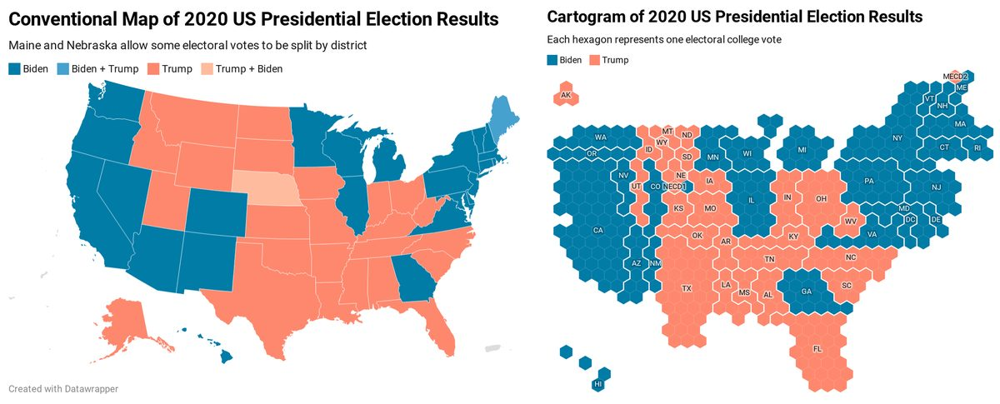{#fig-conventional-cartogram-combined width=750}

참고: Datawrapper에서 그림 [\@fig-conventional-cartogram-combined]의 카토그램 지도를 재현하려면 사용자가 메인주와 네브래스카주의 선거구를 분할할 수 있게 해주는 *USA > Electoral College (hexagon)*라는 파일을 선택하세요.

이 장의 [지도로 거짓말하는 방법 섹션](#how-to-lie-with-maps)에서는 Datawrapper를 사용해 세계 불평등 데이터를 코로플레스 지도로 만들었습니다. 이를 전통적인 세계 지도에서 인구 사각형(population square) 지도로 변환하려면 다음 튜토리얼을 따르세요:

1. Datawrapper 계정에 저장되어 있는 기존 세계 불평등 지도를 수정하려면 *My Charts*로 이동하여 지도를 선택하고 마우스 오른쪽 버튼을 클릭하여 사본(duplicate)을 만들어 편집하세요. 또는 이전 섹션의 단계에 따라 새 지도를 만들 수도 있습니다.

2. *Select your map* 화면으로 이동하여 "squares"를 입력하면 사용 가능한 모든 유형(World population squares 포함)을 볼 수 있습니다. 마찬가지로 "hexagons"를 입력하면 이용 가능한 카토그램(미국 주 포함)이 전부 표시됩니다. 원하는 지도를 선택하고 그림 [\@fig-map-world-pop-square]와 같이 다른 Datawrapper 코로플레스 지도와 같은 방식으로 데이터를 시각화하는 과정을 진행하세요.


::: {.content-visible when-format="html"}

<iframe src="https://datawrapper.dwcdn.net/YfNDe/" width="100%" height="600px" style="border:none;"></iframe>
<p class="caption">소득 불평등 데이터가 있는 세계 인구 사각형 지도. [인터랙티브 버전](https://datawrapper.dwcdn.net/YfNDe/) 탐색하기.</p>

:::


*분쟁 영토 편향(Disputed territory bias)*은 웹 지도 제공업체들이 때로는 사용자가 접속하는 위치에 따라 서로 다른 세계 뷰를 표시하는 방식을 의미합니다. 예를 들어 2014년 러시아가 무력으로 우크라이나로부터 크림 반도를 빼앗았을 때 지정학적 분쟁이 촉발되었습니다. Google은 러시아에서 수익 창출을 지속하기를 원했기 때문에 Google Maps 플랫폼상 우크라이나와의 국경선을 두 가지 버전으로 만들었습니다. 러시아 IP 주소에서 접속하면 영토가 러시아의 통제 아래 있음을 나타내는 실선(solid-line) 국경이 표시됩니다. 세계 다른 어느 곳에서나 접속할 때는 분쟁 영토임을 뜻하는 점선 국경이 보입니다. Google은 "지정학적 분쟁에서 중립을 지킨다"고 주장하지만 Washington Post에 따르면 러시아 접속자에게 실선 국경을 표시함으로써 기업이 명백히 한쪽 편을 든 셈입니다.^[@bensingerGoogleRedrawsBorders2020] Google과 여러 다른 웹 지도 제공업체들은 인도-파키스탄 국경 분쟁, 이란과 사우디아라비아 수로, 일본과 한국 사이의 바다 등에서도 이와 유사한 조치를 취해 왔습니다.

일반 사람들도 Google Maps 및 기타 독점 서비스에서 분쟁 지역 편향을 알아차릴 수 있지만 이런 플랫폼의 결정을 곧이곧대로 탓하거나 기본 지도를 고치도록 압력을 넣기는 어렵습니다. 하지만 이러한 편향을 완화하기 위해 우리는 다른 전략을 사용할 수 있습니다. 예를 들어 크라우드 소싱 기반 세계 지도인 OpenStreetMap의 기여자들은 [그들의 플랫폼에서 분쟁 지역을 인지하는 것](https://wiki.openstreetmap.org/wiki/Disputed_territories)에 대한 [다양한 접근 방식](https://wiki.openstreetmap.org/wiki/Proposed_features/Mapping_disputed_boundaries)을 논의해 왔습니다. 나아가 독점적 지도 레이어 위에 우리만의 서로 다른 경계를 그리기 위해 데이터 시각화 도구를 활용할 수도 있습니다. 캐나다 비영리 단체가 만든 [Native Land map](https://native-land.ca)을 한 예로 들면 현대 지도상에 식민주의 정책이나 원주민 강제 이주 정책과 맞물린 과거 원주민들의 영토 경계와 언어를 드러냄으로써 제국주의 식민 정책의 폐해를 사람들에게 널리 경각시키고 있습니다. 구글 지도라는 거대 플랫폼에 맞서는 한 가지 방법은 우리 스스로 대안적 지도 자료를 공개하고 다듬어 가는 일입니다.

*지도 배제 편향(Map exclusion bias)*은 데이터를 빠뜨리는 생략을 통하여 여러 사람이나 토지를 시각화 작업에서 배제시키는 양태를 뜻합니다. 이는 때론 Google Maps 등 독점 플랫폼 제공자들이 취하는 일일 수도 있고 우리들이 데이터를 구축하는 일상에서 벌이는 작고 사소한 여러 결정들 속에서 행하는 일일 수도 있습니다. 최근 여러분이 만든 지도들을 면밀히 검토해 보고 그들이 주장하는 바들을 과연 스스로가 정말 정확하게 대변하는지 의구심을 표하세요. 예컨대 당신이 주(state) 수준의 데이터가 담긴 미국 지도를 제작했을 때 과연 컬럼비아 특별구(District of Columbia, D.C.)는 어디에 포함했습니까? 미합중국의 수도인 그곳은 주로 헤아려지지 않으며 미 의회에서 투표권마저 부여받지 못하는 곳입니다. 하지만 워싱턴 D.C.에는 와이오밍주나 버몬트주 인구 총량보다 더 많은 70만 명 이상의 시민들이 기거하고 있으며 미국 수정헌법 제23조는 그 지역 시민들에게 비록 최소 규모 인구 수준일지언정 여타 일반 주와 매한가지의 선거인단 권한을 수여합니다. 그뿐일까요? 미국 영토인 푸에르토리코 주민 약 300만 명은 엄연한 미국 시민권자임에도 불구하고 미연방 의회 상하원 어디나 미국 대통령 선출 등에 그 어떠한 의결 및 참정권조차 소유하지 못했는데, 과연 여러분의 미국 지도는 그곳을 어떻게 반영하고 있습니까? 아메리칸 사모아, 괌, 북마리아나 제도, 미국령 버진 아일랜드처럼 자국민이 기거하고 있는 미국의 다른 자치령들 사정은 또 어떻습니까? 미국령 기거민에 대한 자료나 수치들이 분명하게 존재할 터인데 그곳이 여러분의 차트에서는 나타납니까, 아니면 사라지고 맙니까? 혹시 차트에서 이들의 존재가 완벽히 소외되었다면 유색 흑인과 라틴계 및 태평양 제도 출신이 워싱턴 D.C.나 그런 자치령 영토 기거민의 다수를 차지하는 사실과 연결 지어 볼 때 여러분의 이러한 생략이 결국 어떠한 집단적 기저의 편향성을 노출하는 셈인지도 면밀히 고찰해 보아야 할 사안입니다.

물론 분명한 건 오늘날 일부 데이터 시각화 도구들은 오랫동안 우리의 옛 지도 작업 속에서 배제당했던 여러 무리의 사람들이나 토지를 아우르게끔 작업하는 절차를 오히려 번거롭게 만들곤 한다는 것입니다. 때로 문제는 작업 과정 이면에서 설정된 플랫폼들의 디폴트 값(기본 옵션)에서 비롯된 것이라거나 이러한 옵션 변경을 등한시한 우리들의 책임으로 판명 나기도 합니다. 가장 선호하는 툴을 켜 두고 "미국"을 시각화 대상으로 세팅할 시 툴이 기본 설정으로 구획한 주 경계를 다시 한번 살펴 보세요. D.C. 및 미 자치령 등을 아우르는 여러 다채로운 지표들이 담긴 통계 자료를 이용해 지도를 그리려 해도 도구가 미국 땅 위 단 50개의 공식 주만을 화면에 출력한다면 이 생략은 미국 영토상 거주하는 어림잡아 400만 명이나 되는 시민들의 실존을 지도 위에서 삭제하고 말 것입니다. 보다 포용적인 지도를 지향하기 위하여 이러한 세팅 도구 내면에 또 어떠한 방식이 더 허용될 수 있는지 샅샅이 파고드세요. 다행히 그림 [\@fig-usa-states-territories]와 같이 Datawrapper는 그간 지적되어온 바를 감안하여 상징 심벌과 코로플레스 형식 시각화 두 갈래 모두에서 워싱턴 D.C. 및 대륙과 분리된 장소들을 더 매끄럽게 처리하도록 자사의 *USA > States and Territories* 맵 디스플레이 기능을 최근 정비했습니다. 아직은 Datawrapper가 포함하지 않는 구역 데이터를 원한다면 [13장에서 서술하였듯](#geojson) 그 지역 경계 파일 자료를 GeoJSON 포맷으로 직접 작성하여 여러분만의 데이터를 업로드할 수 있습니다. 피치 못할 시스템 장애나 툴 한계에 묶여 특정 사연이나 사실의 일부가 거세된 상태로 여러분의 통계를 가시화해야 한다면, 시각화에 따르는 텍스트 기록이나 각주 등에서 차트 구성 속 이처럼 어쩔 도리 없이 사라진 기저를 노출시켜 애초의 데이터적 차별 요소를 덮어두는 행위를 경계해야만 합니다. 데이터 시각화라는 매체가 마땅히 실현해야 하는 우리의 의무이자 소명은 다름 아니라 참되고 의미를 북돋는 이야기를 그려내는 것이므로 그들의 존재를 그저 소멸하게 방치하기보단 부당한 세계의 지평선 안에 당연한 몫으로 남을 수 있도록 모든 소외된 계층과 억압받는 영토를 지도 속에 품으십시오.


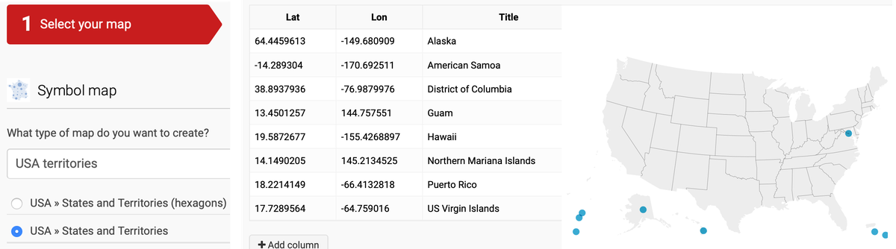{#fig-usa-states-territories width=750}

### 요약 {- #summary14}

이 장에서는 틀린(wrong) 것, 오해를 부르는(misleading) 것, 그리고 진실한(truthful) 시각화 사이의 차이점을 구별하는 방법을 배웠으며 거짓말 탐지기 기술을 강화하여 여러분 자신의 데이터 스토리를 들려줄 때 정직해지는 것의 중요성을 이해했습니다. 또한 데이터를 다룰 때 나타나는 일반적인 네 가지 편향과, 구체적으로는 지도 작업 시 발생하는 공간 편향을 인지하고 이를 축소시키는 방식에 대해 학습했습니다.

다음 장에서는 이 책 곳곳에서 다룬 개념을 한데 묶어 데이터 시각화에서 스토리텔링이 왜 중요한지 짚겠습니다.
<!-- BEGIN FILE: 15-story.Rmd -->

# 데이터 스토리텔링과 시각화 {#story}
이 마지막 장에서는 이 책을 읽으며 여러분이 개발한 지식과 기술을 바탕으로, 진실하고 의미 있는 데이터 스토리를 만들기 위한 최종 권장 사항을 제공합니다. 여기서는 *스토리텔링(storytelling)*을 강조합니다. 데이터 시각화의 목표는 단순히 숫자에 대한 그림을 만드는 것이 아니라, 독자에게 여러분의 해석이 어떻게, 그리고 왜 중요한지 설득하는 진실한 내러티브를 정교하게 만드는 것입니다.

작가들에게는 오래된 격언이 있습니다---"말하지 말고 보여주라(show, don't tell)"---이는 작가의 내레이션이 아니라 등장인물의 행동과 감정을 통해 독자가 스토리를 경험하게 하라는 뜻입니다. 하지만 우리는 장 제목에서 보여주듯 다른 입장을 취합니다: 여러분의 데이터 스토리를 "말하고 보여주라(tell and show)". 다음 세 단계를 규칙적인 습관으로 만드세요: 청중에게 데이터에서 발견한 흥미로운 점을 말하고 여러분의 주장을 뒷받침하는 시각적 증거를 보여주며 그것이 왜 중요한지 상기시키세요. 세 단어로 요약하면: 말하고---보여주고---이유를 설명하라(tell---show---why)입니다. 무엇을 하든, 수많은 그림을 보여주고 그것이 의미하는 바를 추측하도록 청중에게 맡기는 나쁜 습관은 피하세요. 스토리텔러인 여러분이 데이터를 통해 우리를 이끌고 어떤 측면에 주목해야 하는지 안내해 줄 것이라 믿기 때문입니다. 모든 나무가 아닌 숲을 설명하되, 숲의 다른 부분들이 어떻게 눈에 띄는지 이해하도록 돕기 위해 몇 그루의 특별한 나무를 예시로 가리키세요.

이 장에서는 책의 시작 부분에서 시작했던 [스토리보드의 내러티브에 시각화를 구축하는 방법](#storyboard)을 설명합니다. 또한, 텍스트와 색상을 통해 데이터에서 [가장 의미 있는 부분에 주의를 끄는 방법](#draw-attention)과 [출처 및 불확실성을 인정하는 방법](#sources-uncertainty)을 시도해 봅니다. 마지막으로, 정적인 이미지보다 대화형 시각화를 공유하는 것을 지속적으로 강조하면서 [데이터 스토리의 형식](#story-format)에 대해 내려야 할 결정 사항을 논의합니다.^[이 장의 영감은 시각화 전문가 Cole Nussbaumer Knaflic과 Alberto Cairo의 훌륭한 저서에서 얻었습니다: @knaflicStorytellingDataData2015; @knaflicStorytellingDataLet2019; @cairoTruthfulArtData2016; @cairoHowChartsLie2019]

## 스토리보드에 내러티브 구축하기 {- #storyboard}

[1장의 데이터 스토리 스케치하기 연습](#sketch)으로 돌아가 보겠습니다. 종이에 단어를 휘갈겨 쓰고 그림을 스케치하여 스토리를 구성하는 최소 4가지 초기 요소를 배치하도록 권장했습니다:

- 프로젝트의 동기가 되는 *문제(problem)*를 파악합니다.
- 문제를 연구 가능한 *질문(question)*으로 재구성합니다.
- 질문에 답하기 위한 데이터를 *찾을(find)* 계획을 설명합니다.
- 가상의 데이터를 사용하여 만들 수 있는 하나 이상의 *시각화(visualizations)*를 상상해 봅니다.

그림 [\@fig-data-story-panel2]에 나타난 것처럼, 내러티브의 순서를 정의하기 위해 이 종이들을 *스토리보드(storyboard)*처럼 펼쳐보세요. 청중에게 프로세스를 어떻게 설명할 것인지 보여주는 프레젠테이션의 예비 슬라이드, 또는 서면 보고서나 웹페이지의 단락 및 그림으로 상상해 보세요. 스토리보드를 디지털 방식으로 구성하는 것을 선호한다면, 종이에 적힌 텍스트 블록과 이미지를 [Google Slides 프레젠테이션](https://www.google.com/slides/about/)이나 [초안 Google Document](https://www.google.com/docs/about/), 또는 데이터 스토리를 전달하기 위해 선호하는 도구로 변환하는 것도 한 가지 옵션입니다. 물론, 프로젝트 초기에 만든 시트를 최신 생각의 변화를 반영하여 업데이트하는 것은 지극히 정상입니다. 예를 들어, 연구 질문을 구체화했거나, 검색 중에 새로운 출처를 찾았거나, 상상했던 시각화를 실제 데이터를 활용한 실제 표, 차트 또는 지도로 바꾸었을 수 있습니다.


{#fig-data-story-panel2 width=750}

데이터를 검색하고, 정리하고, 분석하고, 시각화하는 과정에서 발견한 내용에 대한 콘텐츠를 추가하여 스토리보드를 풍성하게 만들어 보겠습니다. 가장 의미 있는 표, 차트 또는 지도를 선택하세요. 별도의 종이에 인쇄하거나 [정적 이미지 또는 스크린샷 캡처](#static)를 다운로드하여 초안 슬라이드나 문서에 배치하세요. 데이터 스토리를 전달하기 위해 각 표, 차트 또는 지도의 상단과 하단에 글을 쓸 수 있는 공간을 남겨두세요.

다음 단계는 데이터가 드러내는 가장 중요한 메시지를 *요약*하고 표, 차트, 지도가 포함된 각 페이지 상단에 한 문장의 요약으로 작성하는 것입니다. 가장 중요한 시각화에서 여러분의 눈에 가장 통찰력 있는 발견으로 보이는 것을 언어로 표현하세요. 우리의 안내자가 되어 개별 나무가 아닌 데이터 숲에 집중하게 해주세요. 두 문장도 괜찮지만 간결한 한 문장이 더 좋습니다. 글이 너무 길어지면, 첫 문장은 "헤드라인" 스타일로 쓰고 두 번째 문장은 더 설명적인 후속 문장으로 써보세요. 백문이 불여일견이라는 옛말이 무색하게도, 데이터 시각화는 *스스로* 말하지 않습니다. 청중을 위해 그 의미를 해석하는 것이 여러분의 역할입니다. 차트나 지도를 말로 번역하는 가장 좋은 방법 중 하나는 디자이너로서 자신의 눈을 사로잡은 것이 무엇인지 정확히 설명하고 처음 그것을 보며 여러분의 안내에 의존하는 독자에게 이를 전달하는 것입니다. 모든 경우에 단어와 이미지의 이상적인 조합을 결정해야 합니다.

각 시각화의 하단에는 *왜 그것이 중요한지*를 말해주고 청중이 어떻게 다시 생각하거나 반응해야 하는지를 이끌어내세요. 데이터 스토리의 의미를 논의하는 좋은 방법은 이 새로운 정보가 *우리를 어떻게 변화시키는지*에 집중하는 것입니다. 데이터 시각화에서 흥미로운 패턴을 발견했을 때, 여러분(또는 여러분의 조직)이 해결하려고 했던 문제에 대해 어떤 느낌이 들었나요? 연구 질문에 대한 답변이 문제에 대해 새롭거나 다른 방식으로 생각하게 만들었나요? 전반적으로, 데이터 스토리가 여러분이나 다른 사람들이 어떤 방식으로 행동을 취하도록 영감을 주나요? 다시 한번 청중의 입장에서 이 질문들을 생각해 보고, 데이터 스토리가 어떻게 우리의 사고방식을 바꾸고, 습관을 변경하거나, 다음 단계에 영향을 미쳐야 하는지 포착하는 단어를 찾으세요.

예를 들어, 우리는 문제 선언문을 정의하기 위해 [2장에서 자체 데이터 스토리보드 스케치하기](#sketch)를 시작했습니다: *독자의 요구를 충족하는 더 나은 입문서를 작성하기 위해 데이터 시각화에 대한 독자들의 배경과 관심사를 알아내야 합니다.* 이 책의 초기 초안을 읽은 3,000명 이상의 독자로부터 데이터를 수집했습니다. 이들은 [온라인 설문조사](https://forms.gle/yn5QwTzfQkYcppQn9)에 응답했고 [2장](#spreadsheet)에서 논의한 바와 같이 [설문조사 결과를 공개적으로 공유](https://docs.google.com/spreadsheets/d/1egX_akJccnCSzdk1aaDdtrEGe5HcaTrlOW-Yf6mJ3Uo)하는 데 동의했습니다. 일부 응답이 부분적으로 비어 있거나 정확하게 지오코딩할 수 없는 위치가 포함되어 있었기 때문에 [4장에서 설명한 대로 데이터를 정리](#clean)했습니다. 그런 다음 [5장에서 설명한 대로 의미 있는 비교](#comparisons)를 찾고 두 가지 방식으로 가장 흥미로운 결과를 시각화했습니다. [6장에서 설명한 대로 분산형 차트](#chart)를 만들고 [7장에서 설명한 대로 점 지도](#map)를 만들었습니다. 이 장에서는 각 시각화의 상단에 짧은 요약을 작성하고 하단에 그 의미를 설명함으로써 위에서 언급한 우리 자신의 조언을 따랐습니다.

이 책의 초기 초안에 대한 독자 설문조사에서 우리는 무엇을 발견했을까요? 그리고 주요 데이터 결과에 어떻게 대응했을까요? 첫째, 설문조사에 응답한 독자의 70% 이상이 북미 외 지역에 거주합니다. 가장 눈에 띄는 점은 그림 [\@fig-survey-combined-annotated]의 왼쪽에 나타난 것처럼 아시아에 35%, 유럽에 20%, 아프리카와 남미에 각각 6%, 오세아니아에 3%가 거주한다는 것입니다. 책의 첫 번째 초안에는 주로 우리 두 사람이 일했던 코네티컷주 하트퍼드의 예시가 포함되어 있었습니다. 책의 독자가 전 세계적이라는 것은 알고 있었지만 설문조사에 응답한 사람 중 얼마나 많은 독자가 미국 외 지역에 거주하는지 보고 놀랐습니다. 더 포용적이고 해외 독자를 확대하기 위해 책을 수정하여 전 세계 다른 지역의 샘플 차트와 지도를 더 추가했습니다. 둘째, 설문에 응답한 독자들은 교육 수준은 비교적 높지만 데이터 시각화 경험은 제한적이라는 것을 알게 되었습니다. 구체적으로, 그림 [\@fig-survey-combined-annotated]의 오른쪽에 나타난 것처럼 89%가 대학 학위 취득(16년 이상의 정규 교육)을 보고했으며 이 중 64%는 자신을 데이터 시각화 초보자(5점 만점의 경험 척도에서 1점 또는 2점)로 평가했습니다. 책의 초기 초안에서 우리의 주요 독자는 대학 학부생이었으며 다른 독자들의 독서 수준과 배경에 대해서는 불확실했습니다. 설문조사 응답을 바탕으로 데이터 시각화에 대한 더 깊은 개념을 추가하도록 원고를 수정했습니다. 대부분의 독자가 이를 이해할 수 있다고 믿으면서도, 고등학교나 대학 저학년 이상의 사전 지식이 없다고 가정하는 입문 수준으로 계속해서 작성하고 있습니다. 이제 이 새로운 시트를 스토리보드에 추가할 수 있습니다.


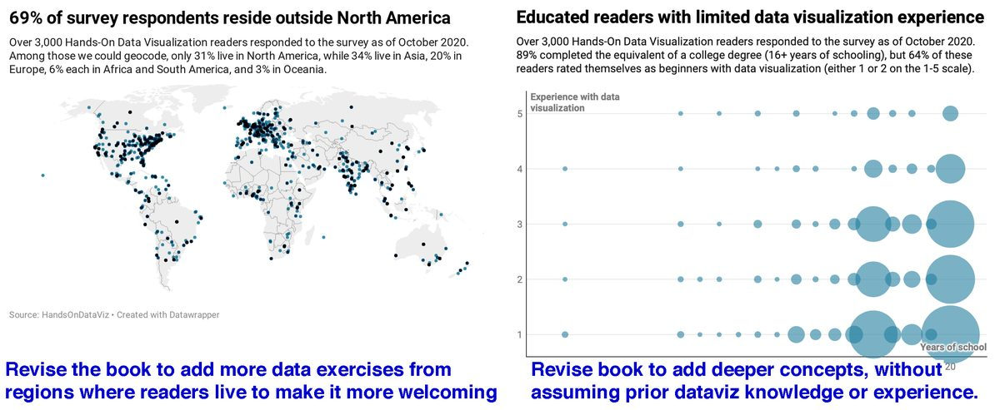{#fig-survey-combined-annotated width=750}

스토리보드로 다시 돌아가 보겠습니다. 새로운 데이터 시각화 시트(또는 슬라이드, 텍스트 블록과 이미지)를 이미 조립한 페이지에 삽입하세요. 작업을 완료하면 레이아웃이 다음과 같을 수 있습니다:

- 문제 선언문
- 연구 질문
- 데이터를 찾은 방법
- 첫 번째 데이터 통찰력 말하기---증거 보여주기---왜 중요한지 설명하기
- 두 번째 데이터 통찰력 말하기---증거 보여주기---왜 중요한지 설명하기
- ...요약 결론을 향해 계속 진행

스토리텔러로서 이 모든 콘텐츠를 처음 볼 가능성이 높은 *청중에게* 합리적인 방식으로 데이터 내러티브를 구성하는 것이 여러분의 임무입니다. 스토리를 전달하는 단 하나의 방법은 없지만 초보적인 실수를 피하기 위해 다음 조언을 고려하세요:

- 답을 제시하기 *전에* 문제와 질문을 먼저 말해주세요. 우리의 뇌는 그 순서대로 듣기를 기대하기 때문입니다.
- 뒷받침하는 증거를 보여주기 *전에* 각 통찰력을 요약하세요. 다시 말하지만 정상적인 순서를 뒤집으면 주장을 따라가기가 더 어려워지기 때문입니다.
- 청중은 여러분이 한 가지 질문을 하고 다른 질문에 답하면 혼란스러워할 것이므로, 연구 질문과 핵심 통찰력이 서로 *일치*하는지 확인하세요. 데이터를 깊이 파고든 후에 연구 질문의 문구를 수정하거나 완전히 다시 작성하는 것은 지극히 정상입니다. 때로는 발견하기 전까지 무엇을 찾고 있는지 정말로 모를 때가 있기 때문입니다.

이제 스토리보드가 내러티브와 데이터를 결합하는 데 어떻게 도움이 되는지 더 분명하게 이해하셨을 것입니다. 다음 섹션에서는 텍스트와 색상을 사용하여 가장 중요한 것에 주의를 끌어 시각화를 세분화하는 방법을 배웁니다.

## 의미 있는 부분 강조하기 {- #draw-attention}
시각화를 마무리할 때, 데이터에서 가장 의미 있는 측면에 주의를 끄는 마무리 터치를 추가하세요. 차트와 지도에 수반되는 텍스트를 작성하는 것 외에도, 데이터 스토리에서 가장 중요한 것을 지적하기 위해 일부 시각화 유형 *내부*에 주석을 추가하고 색상을 사용할 수 있습니다. [6장에서 처음 소개한 도구인 Datawrapper](#chart-datawrapper)에서 이러한 기능을 사용하여 시각화를 변환하는 방법을 보여드리겠습니다.

오늘날 우리가 직면한 환경 문제 중 하나는 플라스틱 생산량의 끊임없는 증가입니다. 이 저렴하고 가벼운 소재는 삶을 여러모로 편하게 해주지만 우리는 종종 이를 강과 바다로 흘러가게 하는 잘못 관리된 폐기물 처리장에 버립니다. 플라스틱의 증가를 이해하기 위해 [Our World In Data](https://ourworldindata.org/plastic-pollution)를 참조했으며 [1950-2015년의 연간 글로벌 생산 데이터를 Google Sheets 형식으로 볼 수 있습니다](https://docs.google.com/spreadsheets/d/1H3OwmiLQy5DugT-iArhuqHryzcWJi1kLocpGp7v-1VM/edit#gid=339613035).^[이 예시는 전문 팁에 관한 Datawrapper Academy 기사에서 영감을 받았습니다: https://academy.datawrapper.de/article/256-a-collection-of-datawrapper-pro-tips.]

먼저 단일 열 형식의 데이터를 Datawrapper에 업로드해 보겠습니다. 기본적으로 이 도구는 그림 [\@fig-plastic-line-chart]와 같이 이 시계열 데이터를 꺾은선형 차트로 변환하여 시간이 지남에 따라 전 세계 플라스틱 생산량이 어떻게 증가했는지 보여줍니다.

```
| year | plastics |
| 1950 |        2 |
| 1951 |        2 |
...
```


::: {.content-visible when-format="html"}

<iframe src="https://datawrapper.dwcdn.net/5y13d/" width="100%" height="475px" style="border:none;"></iframe>
<p class="caption">Datawrapper의 과거 플라스틱 생산량 기본 꺾은선형 차트.</p>

:::


하지만 그림 [\@fig-plastic-line-chart]는 아직 더 큰 이야기, 즉 세계 역사상 제조된 플라스틱의 총량에 초점을 맞추지 못하고 있습니다. 우리의 데이터 분석에 따르면 세계에서 제조된 모든 플라스틱의 60% 이상이 2000년 이후, 즉 이 차트의 지난 15년 동안 만들어졌습니다. 차트를 수정하고 이전 장에서 배운 기술을 바탕으로 이 더 넓은 요점을 강조해 보겠습니다. 첫째, 데이터를 *before 2000*과 *since 2000*이라는 두 개의 열로 나누어 각 데이터 계열에 다른 색상을 적용할 수 있게 하세요. 새 차트가 연속적으로 보이도록 2000년의 동일한 데이터를 두 열 모두에 삽입하세요. 둘째, 시간이 지남에 따라 제조된 플라스틱의 총량에 주의를 끌기 위해 차트 유형을 기본 *line chart*에서 곡선 아래의 공간을 채우는 *area chart*로 변경하세요. 셋째, *Refine* 탭에서 누적 영역형 차트를 원하지 *않으므로* *stack areas* 상자의 선택을 취소하세요. 2000년 이후 데이터 계열에 더 많은 주의를 끌기 위해 진한 파란색을 지정하고 2000년 이전 데이터 계열의 모양을 축소하기 위해 회색을 지정하세요. 이는 그림 [\@fig-plastic-refine]에 나와 있습니다.

```
| year | before 2000 | since 2000 |
| 1999 |         202 |            |
| 2000 |         213 |        213 |
| 2001 |             |        218 |
...
```


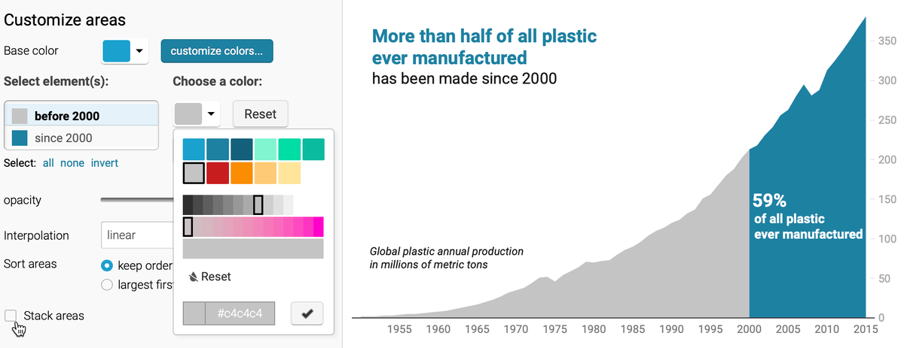{#fig-plastic-refine}

마지막으로 이전 제목을 숨기고 [6장의 Datawrapper로 주석이 달린 차트 섹션](#annotated-datawrapper)에서 배운 대로 주석을 추가하여 바꿉니다. 그림 [\@fig-plastic-area-chart]와 같이 영역형 차트 안에 색상 있는 텍스트를 사용하여 새로운 해석을 강조하고 독자가 볼 만한 위치에 배치합니다. 전반적으로 차트를 다시 디자인하면 글로벌 플라스틱 생산량이 증가하고 있으며 *그리고* 우리 세계가 지난 15년 동안 역사적 총량의 절반 이상을 제조했다는 더 의미 있는 데이터 스토리를 전달하는 데 도움이 됩니다.


::: {.content-visible when-format="html"}

<iframe src="https://datawrapper.dwcdn.net/1TyyZ/" width="100%" height="475px" style="border:none;"></iframe>
<p class="caption">색상과 주석을 사용하여 2000년 이후의 전 세계 플라스틱 생산량에 주의를 끄는 [새 영역형 차트의 대화형 버전](https://datawrapper.dwcdn.net/1TyyZ/)을 탐색해 보세요.</p>

:::


이제 데이터 스토리의 가장 의미 있는 측면에 독자의 주의를 끌어야 하는 이유와 방법에 대해 더 분명한 아이디어를 얻었으므로, 다음 섹션에서는 출처와 모호한 데이터를 인정하는 방법에 대해 그 기술을 바탕으로 설명하겠습니다.

## 출처 및 불확실성 인정하기 {- #sources-uncertainty}
우리의 목표는 의미 있고 진실된 데이터 스토리를 전달하는 것이므로, 다음과 같은 여러 가지 방법으로 여러분의 작업에 신뢰성을 구축하세요:

첫째, 항상 데이터를 진실되게 표현하세요. 관련 증거를 숨기거나 모호하게 만들지 말고 [편향을 줄이고 거짓을 탐지하는 14장](#detect)에서 논의한 것처럼 청중을 오도할 수 있는 시각화 방법을 피하세요. 우리는 데이터의 의미를 공정하게 해석하는 여러분을 신뢰합니다. 데이터에서 너무 많은 것을 읽거나, 실제로 존재하지 않는 것을 보아 잘못 해석할 위험이 있다면 우리에게 경고해 주세요.

둘째, [3장: 데이터 찾기 및 질문하기](#find)에서 설명한 대로 [데이터 출처의 크레딧과 출처를 명시하세요](#source). 이 책에 소개된 일부 시각화 도구와 템플릿은 온라인 소스에 대한 링크를 표시하기 쉽게 만들어 주므로 가능할 때마다 해당 기능을 사용하세요. 그렇지 않은 경우 이러한 중요한 세부 정보를 표, 차트 및 지도에 수반되는 텍스트에 작성하세요. 또한 시각화를 만든 사람을 청중에게 알리고 프로젝트에 도움을 준 공동 작업자 및 다른 사람들의 크레딧을 명시하세요.

셋째, 프로세스의 여러 단계에서 데이터 작업을 저장하고 보여주세요. 데이터를 다운로드, 정리 또는 변환할 때 메모와 데이터 복사본을 저장하고 과정에서 내린 중요한 결정을 기록하세요. 간단한 방법 중 하나는 [2장에 표시된 것처럼 별도의 스프레드시트 탭](#spreadsheet)에 다양한 버전의 데이터를 저장하는 것입니다. 더 복잡한 프로젝트의 경우 [10장에 표시된 것처럼 공개 GitHub 저장소](#github)에서 데이터를 공유하고 방법을 문서화하는 것을 고려하세요. 누군가 여러분의 작업에 의문을 제기하거나 업데이트된 데이터 세트로 작업을 복제해야 하는 경우 역추적할 수 있는 메모가 있다는 사실에 감사하게 될 것입니다.

마지막으로, 데이터의 한계를 인정하고 불확실성을 공개하세요. 여러분이 알지 *못하는* 것을 인정하거나 대안적인 해석을 고려할 때 작업의 신뢰성이 높아집니다. 우리가 추천하는 [6장의 차트 도구](#chart)와 [11장의 차트 코드 템플릿](#chartcode) 중 일부는 오차 막대를 삽입하여 데이터의 신뢰 수준을 보여줄 수 있으므로 적절할 때 이를 사용하세요. 게다가 이전 섹션에서 보여준 2열 방식은 그림 [\@fig-observed-vs-projected]의 Google Sheets 차트 편집기에 나타난 것처럼 관측 데이터와 예상 데이터를 각각 실선과 점선으로 시각적으로 구분하는 데에도 효과적입니다.


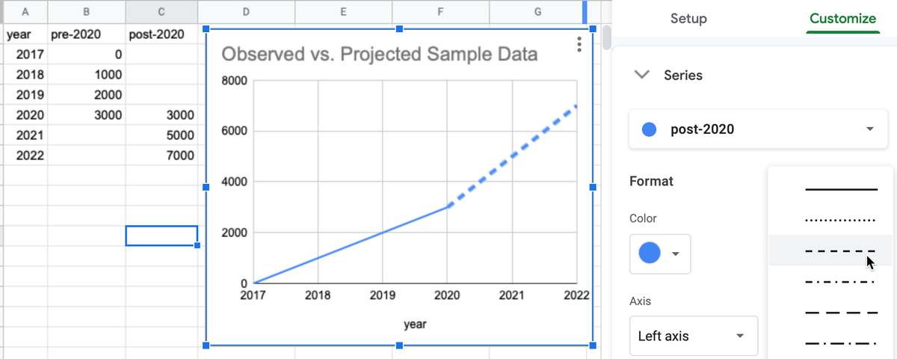{#fig-observed-vs-projected}

작업의 신뢰성을 구축하는 방법을 검토했으므로, 이제 다양한 형식으로 데이터 스토리를 전달하는 데 필요한 결정으로 넘어가겠습니다.

## 데이터 스토리 형식 결정하기 {- #story-format}
대부분의 데이터 시각화 책과 워크숍은 여러분이 이사회실 주변에 앉아 있는 사람들에게 종이 문서로 최종 제품을 전달하거나, 어쩌면 이메일로 보내거나 온라인에 게시된 PDF 문서로 전달할 것이라고 가정합니다. 이러한 *정적인* 형식도 괜찮지만 디지털 시대의 더 넓은 청중과 스토리를 공유하는 다양한 방법을 완전히 반영하지는 못합니다. 더욱이, 실내 테이블에 둘러앉는 것이 선택지가 아닌 코로나19 팬데믹 기간 동안 이 글을 쓰고 있으므로, 우리는 데이터 스토리를 소통할 더 창의적인 형식을 찾아야 합니다.

커서를 차트와 지도 위로 올림으로써 독자가 데이터와 상호 작용하도록 초대하는 대화형 시각화를 만드는 이점을 강조해 온 우리 책을 고려할 때, 스토리에 대해 다음과 같은 더 대화형 형식도 고려해 보시기 바랍니다:

- iframe을 사용하여 텍스트 내러티브와 대화형 시각화를 결합한 웹사이트.
- 라이브 시각화에 연결되는 온라인 프레젠테이션 슬라이드
- 라이브 또는 보이스오버 내레이션과 대화형 시각화 스크린캐스트를 결합한 비디오
- 지역사회 이해관계자들이 돌아다니며 자신들의 생생한 경험과 데이터 스토리 사이의 연결성에 대해 논의하는 [데이터 워크(data walk) 형식](https://www.urban.org/sites/default/files/publication/72906/2000510-data-walks-an-innovative-way-to-share-data-with-communities.pdf).

물론 다양한 스토리텔링 방법은 형식에 맞게 콘텐츠를 조정해야 합니다. 더욱이 모든 형식이 대화형 시각화를 필요로 하는 것은 아니며 항상 가장 적절한 선택도 아닙니다. 세부 사항은 이 책의 범위를 벗어나지만 우리는 여러분이 전통적인 사고방식에 빠지지 않고 진실하고 의미 있는 데이터 스토리를 전달하는 방법에 대해 다르게 생각하기를 권장합니다.

### 요약 {- #summary15}

이 마지막 장에서는 진실하고 의미 있는 *스토리텔링*이 데이터 시각화를 주도한다는 생각을 강화하기 위해 책 전반의 개념과 실용적인 기술을 한데 모았습니다. 우리는 숫자에 대한 그림을 만드는 것을 좋아하지만 우리의 더 넓은 임무는 우리의 데이터 해석이 어떻게 그리고 왜 중요한지 청중에게 확신시키는 내러티브를 만드는 것입니다. 스토리보드 구축, 텍스트와 색상을 통해 의미 있는 데이터에 주의 끌기, 출처와 불확실성 인정하기, 청중에게 맞는 스토리텔링 형식에 대해 창의적으로 생각하기 등 이 목표를 달성하기 위한 다양한 전략을 배웠습니다.

이 책이 여러분이 데이터를 다루는 방법과 진실되고 의미 있는 스토리를 전달하는 더 나은 시각화를 만드는 방법을 더 잘 이해하는 데 도움이 되었기를 바랍니다. 우리의 목표 중 하나는 지식을 넓히고 데이터 프로젝트를 완료하는 데 도움이 되는 다양하고 강력한 무료 도구를 독자들에게 소개하는 것입니다. 이 책이 도움이 되었다면, [소셜 미디어에서 저자들과 공유](#authors)하고 싶은 데이터 프로젝트를 보게 되어 매우 기쁠 것입니다. 마지막으로 이 책에서 언급하지 않은 다른 입문 수준의 도구나 방법도 자유롭게 공유해 주시기 바랍니다.


<!-- BEGIN FILE: 16-fix.Rmd -->

# (APPENDIX) 부록 {-}

# 일반적인 문제 해결 {#fix}
온라인 도구, 공공 데이터세트 및 코드 템플릿으로 데이터 시각화를 만들 때, 예상대로 작동하지 않게 만드는 간헐적인 문제가 발생하는 것은 드문 일이 아닙니다. 문제의 원인을 찾는 것이 실망스럽게 느껴질 수 있다는 점을 이해합니다. 하지만 왜 작동이 중지되었는지, 그리고 어떻게 고칠 수 있는지 파악하는 것은 이면에서 어떤 일이 일어나고 있는지 배울 수 있는 좋은 방법이 될 수 있습니다.

다른 사람에게 문제 해결에 대한 조언을 구하고 그들이 여러분을 돕기 쉽게 만드세요. 문제를 명확하게 설명하고 컴퓨터 운영 체제 및/또는 브라우저 버전을 언급하며 그림 [\@fig-screenshot-mac]에 표시된 것처럼 기본 제공 명령을 사용하여 [스크린샷](https://en.wikipedia.org/wiki/Screenshot)을 포함하는 것을 고려하세요:

- 크롬북: *Shift + Ctrl + F5*(*창 표시* 버튼), 그런 다음 십자형 커서를 클릭하여 드래그합니다.
- 매킨토시: *Shift + Command + 4*, 그런 다음 십자형 커서를 클릭하여 드래그하여 스크린샷을 캡처합니다.
- Windows: *Windows 로고 키 + Shift + S*를 눌러 *캡처 및 스케치* 도구를 불러옵니다.


::: {.content-visible when-format="html"}

<video src="images/16-fix/screenshot-mac.mp4" width="100%" height="360px" style="border:none;" autoplay loop muted playsinline></video>
<p class="caption">Mac에서 스크린샷을 만드는 방법.</p>

:::


아래 섹션을 검토하여 직면한 문제 유형을 진단하는 데 도움을 얻고 우리가 관찰한 가장 일반적인 문제에 대한 권장 해결책을 확인하세요. 가장 골치 아픈 문제 중 일부는 두 개 이상의 별개 문제로 인해 발생할 수 있다는 점을 기억하세요.

- [도구 또는 플랫폼 문제](#fix-tool)
- [다른 브라우저 시도하기](#fix-browser)
- [개발자 도구로 진단하기](#fix-developer-tools)
- [Mac 또는 크롬북 문제](#fix-computer)
- [잘못된 데이터 주의하기](#fix-data)
- [일반적인 iframe 오류](#fix-iframe)
- [GitHub에서 코드 수정하기](#fix-code)

## 도구 또는 플랫폼 문제 {#fix-tool}

권장 디지털 도구 중 하나에 문제가 있고 이 책에서 답을 찾지 못한 경우 도구의 지원 페이지(알파벳순)로 이동하세요:

- [Airtable 관계형 데이터베이스 지원](https://support.airtable.com)
- [Pulsar 코드 편집기 문서](https://web.pulsar-edit.dev)
- [Chart.js 코드 라이브러리 문서](https://www.chartjs.org/)
- [Datawrapper Academy 지원](https://academy.datawrapper.de/)
- [GeoJson.io 지리 데이터 편집기 - 도움말 메뉴 참조](https://geojson.io/)
- [GitHub.com 및 GitHub Desktop 문서](https://docs.github.com)
- [Google My Maps 지원](https://support.google.com/mymaps)
- [Google Sheets 지원](https://support.google.com/docs)
- [Highcharts 코드 라이브러리 - 데모 및 지원](https://www.highcharts.com)
- [Leaflet 지도 코드 라이브러리 - 튜토리얼 및 문서](https://leafletjs.com)
- [LibreOffice Calc 지원](https://help.libreoffice.org)
- [Mapshaper 지리 데이터 편집기 - 문서 위키](https://github.com/mbloch/mapshaper/wiki/Command-Reference)
- [Map Warper 지리 정류기 도움말](https://mapwarper.net/help) 및 [제한된 디스크 공간에 대한 참고 사항 확인](https://mapwarper.net)
- [OpenRefine 데이터 클리너 - 문서](https://openrefine.org)
- [Tabula PDF 표 추출기 - 사용 방법](https://tabula.technology)
- [Tableau Public 리소스 페이지](https://public.tableau.com/en-us/s/resources).

물론 온라인 도구 또는 웹 플랫폼을 사용할 때 문제가 발생하면 항상 인터넷 연결을 확인하세요. 드문 경우지만 온라인 도구와 플랫폼이 모든 사용자를 위해 오프라인 상태가 될 수 있습니다. 여러분뿐만 아니라 모든 사용자를 위해 온라인 서비스가 다운되었는지 확인하려면 다음과 같은 사이트에서 장애 보고서를 확인하세요:

- [Downdetector.com](https://downdetector.com)
- [Down for Everyone or Just Me?](https://downforeveryoneorjustme.com)

또한 일부 온라인 서비스는 자체 상태 페이지를 운영합니다:

- [GitHub Status](https://www.githubstatus.com)
- [Google Workspace Status](https://www.google.com/appsstatus)

마지막으로, [2020년 11월 Amazon Web Services가 직면한 문제](https://www.washingtonpost.com/business/economy/amazon-web-services-outage-stymies-businesses/2020/11/25/b54a6106-2f4f-11eb-860d-f7999599cbc2_story.html)와 같은 대규모 제공업체의 드문 장애는 다른 온라인 도구 플랫폼에 영향을 미칠 수 있습니다.

## 다른 브라우저 시도하기 {#fix-browser}

온라인 도구와 코드 템플릿에서 만나는 많은 문제는 도구나 템플릿 자체가 아니라 브라우저 탓으로 드러납니다. 이 장에서 제공하는 *가장 중요한 조언*은 문제를 진단하기 위해 *항상 다른 브라우저를 시도하라*는 것입니다. [Chrome](https://www.google.com/chrome/), [Firefox](https://www.mozilla.org/en-US/firefox/), [Microsoft Edge](https://www.microsoft.com/en-us/edge) 또는 [Safari(Mac 전용)](https://www.apple.com/safari/)와 같은 선호하는 브라우저에서 모든 작업을 정상적으로 수행하는 경우, 테스트 목적으로 두 번째 브라우저를 다운로드하세요. 단, [Microsoft가 2020년에 발표한 바와 같이](https://docs.microsoft.com/en-us/lifecycle/faq/internet-explorer-microsoft-edge) 앞으로 두 브라우저 모두 지원되지 않으므로, 단종된 Internet Explorer 또는 Edge Legacy 브라우저 사용은 중단하시기 바랍니다.

사실 일반 사용자의 눈에 어떻게 보이는지 확인하려면, 시각화를 생성한 도구나 서비스의 온라인 계정에 로그인되어 있지 *않은* 두 번째 브라우저에서 데이터 시각화 결과물을 *항상* 테스트해야 합니다. 우리 컴퓨터에는 특히 테스트를 위해 두 번째 브라우저를 설치했으며 브라우저를 열 때마다 처음 사용하는 것처럼 작동하도록 *방문 기록 절대 기억하지 않음*으로 설정을 변경했습니다.

선호하는 브라우저에서 디지털 도구나 웹 서비스를 사용할 때 문제가 발생하면 다음과 같은 키 조합 중 하나를 사용하여 [캐시에 저장된 콘텐츠를 우회하고](https://en.wikipedia.org/wiki/Wikipedia:Bypass_your_cache) 서버에서 전체 웹 페이지를 다시 다운로드하는 "강제 새로고침(hard refresh)"을 실행하세요:

- Ctrl + F5 (대부분의 Windows 또는 Linux 브라우저)
- Shift + Ctrl + R (크롬북)
- Command + Shift + R (Mac용 Chrome 또는 Firefox)
- Option + Command + R (Mac용 Safari)

## 개발자 도구로 진단하기 {#fix-developer-tools}

이 부록의 뒷부분에서 설명하는 [일반적인 iframe 오류](#fix-iframe) 또는 [코드 템플릿 문제](#fix-code)와 같은 다른 유형의 문제를 진단하기 위해 브라우저를 사용하는 방법을 배우는 것을 권장합니다. 대부분의 브라우저에는 웹 페이지의 소스 코드를 보고 경고하는 모든 오류를 확인할 수 있는 *개발자 도구(developer tools)*가 포함되어 있습니다. 소프트웨어 개발자가 아니더라도 브라우저의 개발자 도구를 여는 방법을 배우면 내부를 들여다보고 제대로 작동하지 않는 부분에 대해 보다 정보에 입각한 추측을 할 수 있습니다. 다양한 브라우저에서 개발자 도구를 여는 방법은 다음과 같습니다:

- Chrome의 경우 *보기 > 개발자 정보 > 개발자 도구*로 이동합니다.
- Firefox의 경우 *도구 > 웹 개발자 도구 > 도구 끄기/켜기*로 이동합니다.
- Microsoft Edge의 경우 *설정 및 기타(...) 아이콘 > 기타 도구 > 개발자 도구*로 이동합니다.
- Mac용 Safari의 경우, 먼저 *Safari > 환경설정 > 고급 > 메뉴 막대에서 개발자용 메뉴 보기*로 이동한 다음, *개발자용 > JavaScript 콘솔 가리기/보기*로 이동합니다.

브라우저의 개발자 도구를 열면, 특히 코드 템플릿 관련 문제를 진단하는 데 도움이 되는 오류 메시지를 보여주는 *콘솔(console)* 창이 표시됩니다. 예를 들어 10장에서 [GitHub에서 간단한 Leaflet 지도 템플릿 편집하는 방법](#copy-leaflet)을 배웠습니다. 지도 중심의 위도와 경도 좌표 사이에 쉼표를 삭제하는 등 실수로 오류를 범하면, 코드가 "깨져서" 화면에 빈 회색 상자가 나타납니다. 브라우저 개발자 도구를 켜면 그림 [\@fig-firefox-dev-tools]에 표시된 것처럼, 콘솔에 `index.html` 파일의 29번째 줄에서 시작하는 문제를 알려주는 오류를 포함하여 여러 오류가 표시됩니다. 오류 메시지에 명확하게 30번째 줄에 쉼표가 누락되었다고 나오지는 않지만 코드의 해당 영역 주변에 문제가 있다는 것을 알려주는 최고의 단서입니다. 개발자 도구는 이것 말고도 쓰임이 많으니, 브라우저마다 어떻게 다른지 여러 기능을 직접 탐색해 보세요.


{#fig-firefox-dev-tools width=500}

## Mac 또는 크롬북 문제 {#fix-computer}

Mac 컴퓨터를 사용하는 경우 파일명 확장자(예: `data.csv` 또는 `map.geojson`과 같이 마침표 뒤에 나타나는 축약된 파일 형식)가 보이도록 설정해야 합니다. Mac 운영 체제는 기본적으로 이러한 확장자를 숨기며 확장자가 보이지 않으면 이 책의 여러 도구가 제대로 작동하지 않습니다. Mac에서 이를 보이게 하려면 그림 [\@fig-mac-file-extensions2]와 같이 *Finder > 환경설정 > 고급*으로 이동하여 *모든 파일 확장자 보기* 상자를 선택합니다.


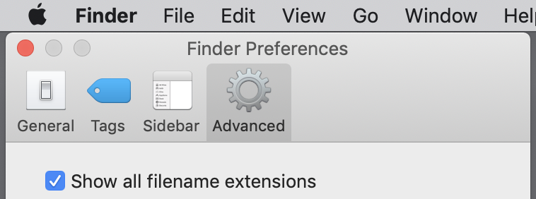{#fig-mac-file-extensions2 width=400}

크롬북 컴퓨터를 사용하는 경우 이 책에서 권장하는 도구 중 일부는 설치하고 실행하기가 어렵거나 불가능할 수 있다는 점에 유의하세요. 크롬북에서 현재 지원되지 *않는* 도구에는 Atom 편집기, GitHub Desktop, LibreOffice Calc, OpenRefine 데이터 클리너, Tableau Public, Tabula PDF 표 추출기와 같은 대부분의 다운로드 가능한 데스크톱 애플리케이션이 포함됩니다. 하지만 크롬북은 Google Sheets, Google My Maps, Datawrapper, GitHub.com 웹 인터페이스 및 기타 여러 도구와 같이 Chrome 브라우저를 통해 실행되는 대부분의 도구를 계속 작동할 수 있습니다. 또한 크롬북에서 코드 템플릿을 편집하려면 Thomas Wilburn의 오픈소스 [Chrome용 Caret 텍스트 편집기](https://thomaswilburn.net/caret/)를 확인해 보세요.

## 잘못된 데이터 주의하기 {#fix-data}

때로는 데이터 시각화 도구나 서비스의 문제가 잘못된 데이터로 인해 발생합니다. [3장의 잘못된 데이터 인식하기](#bad-data)와 [4장의 데이터 정리하기](#clean)의 다양한 방법을 알아보세요. 특히 [11장의 Chart.js 및 Highcharts 코드 템플릿](#chartcode)과 [12장의 Leaflet 지도 코드 템플릿](#leaflet)으로 작업할 때 데이터 파일에 오류를 일으킬 수 있는 흔한 실수를 피하세요.

첫째, 그림 [\@fig-header-blank]에 나타난 것처럼 스프레드시트 항목(특히 열 헤더)에 빈 공백을 입력하지 마세요. 빈 공백은 사람의 눈에는 무해해 보일 수 있지만 추가 공백 없이 약속된 대로 정확하게 철자가 지정된 열 헤더를 찾을 것으로 예상하는 디지털 도구와 코드 템플릿을 혼란스럽게 할 수 있습니다.


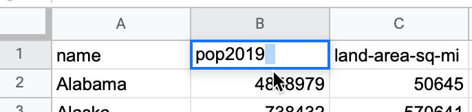{#fig-header-blank width=300}

둘째, 데이터 파일에 빈 행을 남기지 마세요. 예를 들어, Google Sheets가 포함된 Leaflet Maps나 Google Sheets가 포함된 Leaflet Storymaps와 같은 코드 템플릿을 사용할 때, 그림 [\@fig-blank-row]에 표시된 것처럼 Google Sheets에 빈 행을 남겨두면 온라인 지도가 깨집니다.


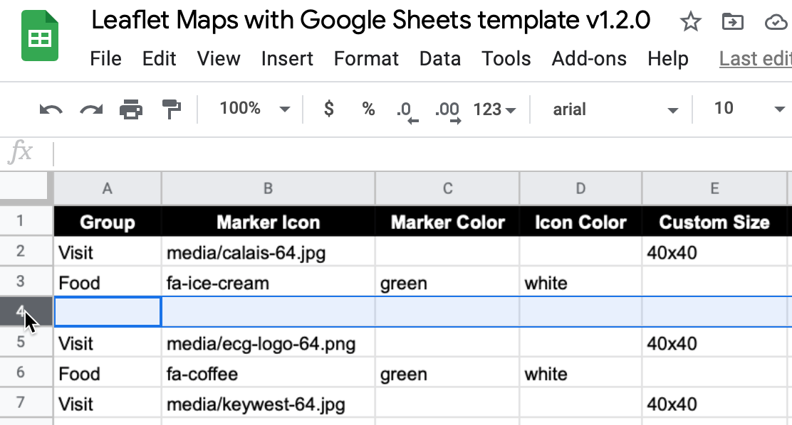{#fig-blank-row width=500}

이와 관련하여 위에서 설명한 두 Leaflet 코드 템플릿 모두 미디어 파일 경로명은 대소문자를 구분합니다. 즉, `media/filename.jpg`는 `media/filename.JPG`와 동일하지 않습니다. 따라서 접미사 끝부분을 포함하여 *모든 소문자*를 사용하는 것을 권장합니다.

마지막으로, 13장에서 설명한 대로 GeoJSON 데이터 파일을 호출하는 Leaflet 코드 템플릿으로 작업할 때 지리 데이터의 null(빈) 필드 오류에 주의하세요. 위의 섹션에서 설명한 브라우저 콘솔 진단 창에서 이 오류는 다음과 유사한 `NaN` 오류 메시지를 표시할 수 있습니다:

`Uncaught Error: Invalid LatLng object: (NaN, NaN)`

브라우저 콘솔에서 `NaN` 오류를 해결하려면 [13장의 GeoJson.io 도구](#geojsonio)를 사용하여 지리 데이터에 null 필드가 있는지 면밀히 조사하세요.


## 일반적인 iframe 오류 {#fix-iframe}

[9장: 웹에 퍼가기](#embed)의 단계를 따랐는데도 iframe 내용이 브라우저에 표시되지 않으면 다음과 같은 일반적인 문제가 있는지 확인하세요:

- iframe에 나열된 항목(URL, 너비, 높이 등)은 직선 형태의 작은따옴표(`'`, *어포스트로피*라고도 함) 또는 큰따옴표(`"`, *인용 부호*라고도 함)로 묶어야 합니다. 둘 중 하나를 선택하되 일관성을 유지하세요.

- 항상 *직선* 따옴표를 사용하고 워드 프로세서에서 코드를 붙여넣을 때 실수로 발생하는 *둥근 따옴표*(또는 *스마트 따옴표*, *기울어진 따옴표*라고도 함)는 입력하지 마세요. 여는 작은따옴표(`‘`), 닫는 작은따옴표(`’`), 여는 큰따옴표(`“`), 닫는 큰따옴표(`”`)와 같은 둥근 따옴표를 피하세요.

- iframe에서는 `http`가 아닌 `https`(추가 "s"는 "안전함(secure)"을 의미)를 항상 사용하세요. 일부 웹 브라우저는 *https*와 *http* 리소스가 혼합되어 있으면 콘텐츠를 차단합니다. 이 책의 모든 코드 템플릿은 *https*가 필요합니다.

iframe 퍼가기 코드를 테스트하려면(특히 코드를 편집해야 할 때) 잘못된 문장 부호를 확인하는 데 유용한 방법이므로 [W3Schools TryIt iframe 페이지](https://www.w3schools.com/tags/tryit.asp?filename=tryhtml_iframe)를 사용하세요. 그림 [\@fig-iframe-incorrect]는 단순한 iframe의 세 가지 일반적인 문제인 둥근 큰따옴표(`src=` 뒤), `https` 대신 `http` 사용, 큰따옴표와 작은따옴표의 혼합을 보여줍니다. 이 세 가지 문제는 모두 그림 [\@fig-iframe-correct]에서 수정되었으며 이는 iframe이 예상대로 나타나게 합니다.


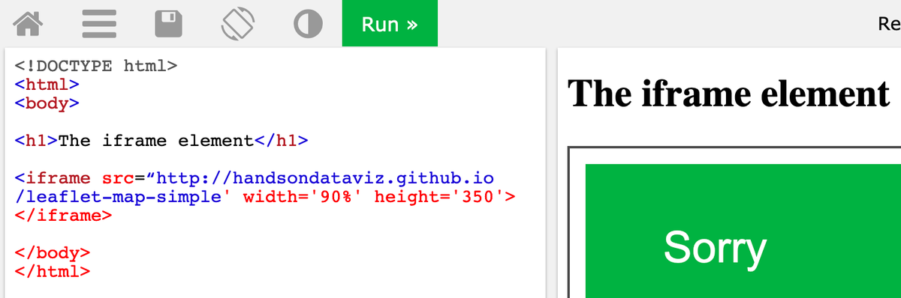{#fig-iframe-incorrect}


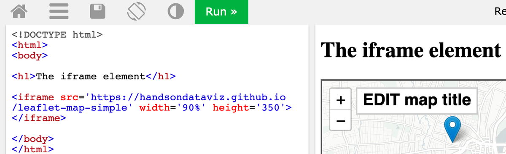{#fig-iframe-correct}

## GitHub에서 코드 수정하기 {#fix-code}

[10장: GitHub로 코드 편집 및 호스팅하기](#github)에서 논의했듯이 오픈소스 코드 템플릿으로 작업하면 데이터 시각화가 어떻게 보이고 온라인 어디에 호스팅되는지 더 많이 제어할 수 있습니다. 하지만 이는 코드가 깨질 때 직접 수정하거나 자격을 갖춘 사람을 찾아(아마도 비용을 지불하고) 수정해야 한다는 뜻이기도 합니다. 코드를 수정하거나 무료 GitHub 플랫폼에 호스팅하는 데 문제가 발생하면 이 책의 관련 장을 검토하고 아래 나열된 일반적인 문제를 주의하세요.

- 코드를 편집할 때 주의하세요. 쉼표, 세미콜론, 따옴표, 괄호 누락과 같은 단 하나의 오타가 시각화를 망가뜨릴 수 있습니다. 이런 일이 발생했을 때 얼마나 실망스러울지 이해합니다. 우리에게도 일어났던 일이니까요. 짧은 휴식을 취하고 나중에 신선한 눈으로 화면에 돌아와 문제를 찾는 데 도움을 받으세요.

- 인내심을 가지세요. GitHub Pages는 일반적으로 30초 내에 시각화 편집을 처리하지만 때로는 몇 분이 걸릴 수 있습니다. 다음 키 조합 중 하나를 사용하여 [캐시에 저장된 콘텐츠를 우회하고](https://en.wikipedia.org/wiki/Wikipedia:Bypass_your_cache) 서버에서 전체 웹 페이지를 다시 다운로드하는 "강제 새로고침(hard refresh)"을 실행하세요:

  - Ctrl + F5 (대부분의 Windows 또는 Linux 브라우저)
  - Shift + Ctrl + R (크롬북)
  - Command + Shift + R (Mac용 Chrome 또는 Firefox)
  - Option + Command + R (Mac용 Safari)

- 게시된 시각화 링크는 항상 *다른* 브라우저에서 테스트하세요. 때로는 문제가 실제 코드 자체가 아니라 브라우저 결함으로 인해 발생할 수 있습니다.

- 간혹 GitHub 플랫폼에 중단이 발생하거나 사용자 코드에서 GitHub Pages를 빌드하는 것과 관련하여 알려진 문제가 보고될 수 있습니다. [GitHub Status 사이트](https://status.github.com)를 확인하세요.

[11장의 Chart.js 및 Highcharts 코드 템플릿](#chartcode)과 [12장의 Leaflet 지도 코드 템플릿](#leaflet)으로 작업할 때, 특히 데이터 파일 구조를 편집하는 것에 주의하세요. 예를 들어, 그림 [\@fig-header-name]에 표시된 것처럼 Google Sheets가 포함된 Leaflet Maps 코드 템플릿의 경우, 데이터를 처리하기 위해 이 정확한 이름을 코드 템플릿이 찾으므로 자신이 무엇을 하고 있는지 알지 못하는 한 각 열 상단의 이름을 변경하지 마세요.


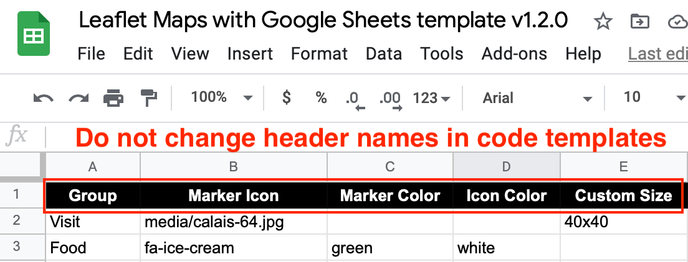{#fig-header-name width=600}

GitHub 리포지토리 폴더의 모든 콘텐츠를 삭제하면 GitHub는 빈 폴더를 추적하지 않으므로 폴더 자체도 삭제됩니다. GitHub 리포지토리에 새 폴더를 만들려면 *Add file - Create new file*로 이동하여 폴더 이름 뒤에 슬래시(예: `media/`)를 입력하고 새 폴더가 비어 있지 않게 하는 자리 표시자 역할의 임시 파일 이름(예: `temp.md`)을 입력합니다. 이제 새 GitHub 리포지토리 폴더에 파일을 업로드할 수 있습니다.

온라인 GitHub에서 보기 위해 변경 사항을 일일이 업로드하는 것보다 *로컬* 컴퓨터에서 코드 템플릿을 편집하고 테스트하는 것이 더 효율적이라는 점을 기억하세요. [10장에서 설명한 대로 GitHub Desktop 및 Atom 편집기 도구](#github-desktop-editor)를 사용하세요. *로컬* 컴퓨터에서 더 복잡한 Leaflet 코드 템플릿을 완전히 보려면 브라우저의 CORS 인터넷 보안 설정을 일시적으로 관리해야 할 수 있습니다.

시간이 지남에 따라 기술이 진화해도 코드 템플릿이 계속 작동하도록 유지 관리가 필요합니다. 예를 들어, 이 책에 소개된 코드 템플릿에는 모두 *코드 종속성(code dependencies)*이 있는데, 이는 작동하기 위해 다른 코드나 온라인 서비스에 의존한다는 뜻입니다. 이러한 종속성에는 Chart.js, Leaflet 등과 같이 차트 및 지도를 생성하는 온라인 코드 라이브러리가 포함됩니다. 또한 지도 코드 템플릿은 CARTO, Stamen, OpenStreetMap과 같은 제공업체의 온라인 지도 타일에 의존합니다. *온라인 코드 종속성 중 하나라도 더 이상 작동하지 않으면*, 코드 템플릿의 작동도 멈출 가능성이 높습니다.

코드 템플릿에 온라인 코드 종속성 문제가 있는지 확인하려면 복사본을 만들었던 원래 GitHub 리포지토리로 돌아가세요. 현재 온라인 데모 차트나 지도가 제대로 작동하는지 확인하세요. 제대로 작동한다면 문제 해결을 위한 최근 코드 업데이트가 원래 GitHub 리포지토리에 있었는지 확인하세요. 일부 코드 업데이트는 매우 간단하며 GitHub 웹 인터페이스를 통해 리포지토리에 직접 입력할 수 있습니다. 그러나 다른 코드 업데이트는 더 복잡하므로 [10장의 GitHub Desktop](#github-desktop-editor)과 같은 도구를 사용하여 리포지토리에서 로컬 컴퓨터로 코드를 "가져오기(pull)"하는 방법을 검토하세요.

코드 템플릿을 복사한 원본 GitHub 리포지토리의 온라인 데모 버전이 작동하지 않으면 오픈소스 소프트웨어 개발자에게 문의하세요. 이를 위한 가장 좋은 방법은 해당 GitHub 리포지토리에 *이슈(Issue)*를 만드는 것입니다. 오픈소스 소프트웨어 개발자가 향후에도 코드를 계속 유지 관리할 것이라는 보장은 없습니다. 하지만 오픈소스 코드의 한 가지 이점은 누구나 새로운 포크 복사본을 만들어 오픈소스 코딩 커뮤니티의 다른 공동 작업자와 함께 독자적으로 유지 관리할 수 있다는 것입니다.

마지막으로, 위에서 문제에 대한 답변을 찾지 못한 경우 질문을 올릴 다른 곳을 고려하세요. 우리가 [권장하는 도구 지원 페이지](#fix-tool) 중 일부에는 커뮤니티 도움말 포럼 링크가 포함되어 있으며 여기서 사용자가 질문을 게시하고 다른 사용자로부터 도움이 되는 답변을 받을 수 있습니다. 또한 [StackExchange 네트워크](https://stackexchange.com)는 특정 주제에 대한 전문가의 답변을 제공하는 170개 이상의 온라인 커뮤니티를 모아놓은 곳으로, Google Sheets와 같은 온라인 도구에 대해서는 [Web Applications Stack Exchange](https://webapps.stackexchange.com)가, 소프트웨어 코딩에 대해서는 [Stack Overflow](https://stackoverflow.com)가 있습니다. 이러한 공개 포럼에 질문을 올릴 때는 가이드라인을 따르고 문제를 명확하게 설명하며 사용하는 컴퓨터 운영 체제 및/또는 브라우저 버전을 언급하세요.


<!-- BEGIN FILE: 20-bookdown.Rmd -->

# Bookdown으로 출판하기 {#bookdown}
이 책은 주로 [Bookdown](https://bookdown.org), [GitHub](https://github.com), [Zotero](https://zotero.org) 등 무료로 사용할 수 있는 오픈소스 도구를 사용하여 만들었습니다. 이 장에서는 다른 사람들도 자신만의 책을 만들고 과정을 개선하는 방법에 대한 지식을 공유할 수 있도록, 왜 그리고 어떻게 이러한 도구를 결합하여 출판 워크플로를 개발했는지 설명합니다.

왜 기존 워드 프로세서로 책을 쓰지 않았을까요? 우리는 그림 [\@fig-workflow]에 나와 있는 것처럼 각기 다른 목적의 다양한 책 형태를 지속적으로 생성할 수 있는 하나의 원고를 공동 집필하는 효율적인 워크플로를 원했습니다.

- 대화형 차트 및 지도를 위한 iframe이 포함된 오픈 액세스 책용 HMTL 웹 에디션
- 정적 이미지 및 책 스타일 레이아웃의 PDF 인쇄 에디션
- 정적 이미지를 활용하여 이러한 방식으로 피드백을 제공하려는 편집자를 위한 Microsoft Word 에디션
- 출판사 플랫폼으로 쉽게 변환할 수 있도록 정적 이미지의 경로명이 포함된 풀사이즈 책의 Markdown 파일

기존의 워드 프로세서는 이러한 모든 형태를 지속적으로 생성할 수 없었으며 이는 아마도 다른 에디션에 대해 완전히 별개의 파일과 코드를 생성하는 결과를 초래했을 것입니다. 그러나 우리의 통합된 Bookdown 워크플로를 사용하면 모든 집필이 하나의 원고에서 이루어집니다. 편집을 할 때마다 몇 개의 버튼을 눌러 HTML, PDF, MS Word, Markdown 형식으로 업데이트된 책 산출물을 출판할 수 있습니다.


, [RStudio](https://github.com/rstudio/hex-stickers/), [Zotero](https://www.zotero.org/support/brand)의 이미지.](images/20-bookdown/workflow.png){#fig-workflow}

다음은 이 과정을 보여주는 3분짜리 영상입니다:


::: {.content-visible when-format="html"}

<iframe src="https://www.youtube.com/embed/8uFABzUG6Lw" width="100%" height="400px" style="border:none;"></iframe>
<p class="caption">Bookdown 워크플로의 짧은 영상. [YouTube](https://youtu.be/8uFABzUG6Lw)에서 시청.</p>

:::


### Bookdown 개요: 왜 그리고 어떻게? {-}
우리는 RStudio의 Yihui Xie가 만든 [R 코드 프로젝트](https://www.r-project.org/)를 위한 오픈소스 패키지인 [Bookdown](https://bookdown.org)을 중심으로 솔루션을 구축했습니다. 많은 사람들이 통계 분석을 위해 R을 사용하지만 무료인 [RStudio 데스크톱 애플리케이션](https://rstudio.com/)은 여러 가지 혁신적인 출판 솔루션도 지원합니다. 워크플로에 대한 개요는 다음과 같습니다:

- Bookdown 파일을 설정하고 쓰기 쉬운 [Markdown 구문](https://en.wikipedia.org/wiki/Markdown)의 R 버전인 [R Markdown](https://rmarkdown.rstudio.com)으로 원고를 작성했습니다. 각 장은 정적 이미지 및 대화형 시각화에 대한 링크가 있는 하나의 .Rmd 파일로 구성되었습니다.
- 파일을 무료 [GitHub](https://github.com) 리포지토리에 업로드하여 여러 작성자가 동시에 책의 *다른* 장을 작업하고 공유 온라인 리포지토리로 수정 사항("커밋"이라고 함)을 푸시할 수 있도록 했으며 여기서 작성자는 서로의 편집 내용을 볼 수 있습니다. 또는 Google Documents에서 *동일한* 장을 동시에 작성하고 의견을 남길 수 있으며 R Markdown과 유사한 [Docs to Markdown 애드온](https://github.com/evbacher/gd2md-html/wiki)을 사용하여 Markdown 형식으로 한 번에 변환할 수도 있습니다.
- George Mason 대학교의 Roy Rosenzweig 역사 및 뉴미디어 센터에서 제공하는 무료 [Zotero 서지 관리자](https://zotero.org)를 사용하여 출처를 정리했습니다. 또한 Emiliano Heynes가 제작한 무료 [Better BibTeX](https://github.com/retorquere/zotero-better-bibtex) 확장 기능을 설치하여 Bookdown에서 원활하게 작동하는 Zotero 인용 키를 만들었습니다.
- 매일 글을 쓴 후, Bookdown을 사용하여 책 결과물을 자동으로 짜맞추고(knit) 컴파일했습니다. Bookdown은 이면에서 [PanDoc](https://pandoc.org/) 범용 문서 변환기와 [LaTeX](https://www.latex-project.org) 문서 준비 소프트웨어를 사용하여 에디션을 빌드하므로 복잡한 형식을 배울 필요가 없습니다.
- 출판사와의 오픈 액세스 계약에 따라, 독자를 개발하고 독자 피드백을 해결하기 위해 책을 집필하는 과정에서 공개적으로 오픈했습니다. 매일 수정할 때마다 책을 다시 빌드하여 모든 에디션을 공개 GitHub 리포지토리에 출판하고 무료 [GitHub Pages](https://pages.github.com) 기능을 활용하여 오픈 액세스 HTML 웹 에디션을 호스팅했습니다. (원한다면 GitHub 리포지토리를 비공개로 유지할 수도 있습니다.)
- [Reclaim Hosting](https://reclaimhosting.com)을 통해 구매하고 설정한 사용자 지정 도메인 이름(https://HandsOnDataViz.org)을 사용하여 GitHub에서 오픈 액세스 웹 버전을 호스팅했습니다.
- 책 원고 작업을 하는 동안 개발 편집자는 공개 GitHub 리포지토리에서 PDF 버전을 다운로드하여 피드백을 남겼습니다. (일부 편집자는 MS Word 버전에 수정 내용을 기록하여 피드백을 삽입하는 것을 선호합니다.)
- 최종 원고를 제출할 준비가 되었을 때, Bookdown을 사용하여 전체 책을 포함하는 하나의 전체 길이 Markdown 파일을 만들었으며 이는 출판사의 [Atlas 프로덕션 플랫폼](https://docs.atlas.oreilly.com/writing_in_asciidoc.html)과 호환되었습니다. 하지만 이것은 일회성 파일 변환이었으며 Bookdown 워크플로에서 수행한 편집은 출판사가 새 파일을 요청하고 변환하지 않는 한 출판사의 플랫폼에 나타나지 않습니다.

기본 워크플로의 두 가지 변형 스크린샷이 그림 \@fig-workflow-desktop 및 그림 [\@fig-workflow-atom]에 나타나 있습니다. 첫 번째는 R Studio 내장 편집기를 사용하여 책을 구성하는 방법을 보여주고 두 번째는 우리가 선호하는 [Atom 텍스트 편집기](https://atom.io)를 사용하는 매우 유사한 과정을 보여줍니다. [10장의 GitHub Desktop 및 Atom 텍스트 편집기](#github-desktop-editor)에 대해 더 자세히 알아보세요.


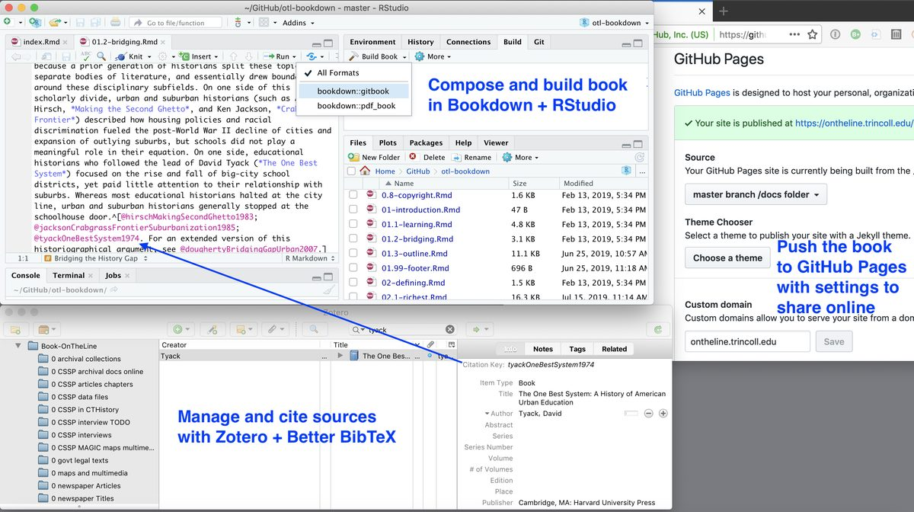{#fig-workflow-desktop}


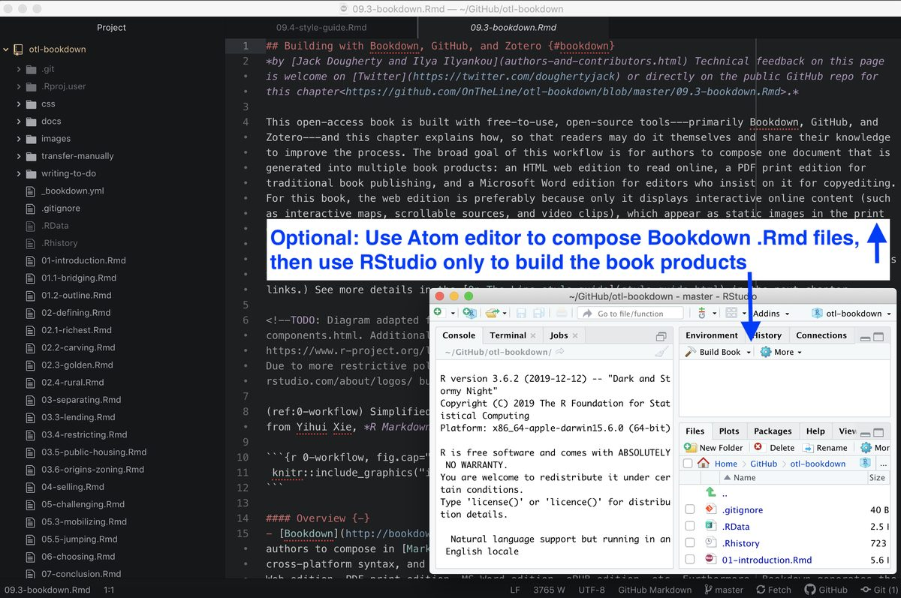{#fig-workflow-atom}

우리의 Bookdown 워크플로는 여러 가지 형태의 책 산출물을 효율적이고 지속적으로 생산한다는 목표를 달성했습니다. 하지만 초보 컴퓨터 사용자에게는 적합하지 않을 수도 있습니다. 설치 및 설정에는 다음 섹션에서 설명하는 여러 단계가 필요합니다:

- [Bookdown 설치 및 설정](#install)
- [파일 구조 및 헤더](#structure)
- [*Hands-On Data Visualization* 스타일 가이드](#style-guide)
- [이미지 및 R 코드 청크 형식](#images)
- [Markdown 형식의 표](#tables)
- [메모 및 서지를 위한 Zotero 및 Better BibTeX](#zotero)

Bookdown이나 관련 도구로 넘어가기 전에, [대체 책 출판 도구](#alternative) 섹션도 참조하세요.

Bookdown에 대한 기술적 세부 정보와 이 도구로 구축된 다른 출판물의 예는 https://bookdown.org 에서 확인할 수 있습니다:

- Xie, Yihui. *Bookdown: Authoring Books and Technical Documents with R Markdown*. Chapman & Hall/CRC, 2018. https://bookdown.org/yihui/bookdown/.
- Xie, Yihui, J. J. Allaire, and Garrett Grolemund. *R Markdown: The Definitive Guide*. Chapman & Hall/CRC, 2020. https://bookdown.org/yihui/rmarkdown/.
- Xie, Yihui, Christophe Dervieux, and Emily Riederer. *R Markdown Cookbook*. Chapman & Hall/CRC, 2020. https://bookdown.org/yihui/rmarkdown-cookbook/.


<!-- BEGIN FILE: 20.1-install.Rmd -->

## Bookdown 설치 및 설정 {- #install}
다음은 Macintosh OS 10.14 컴퓨터를 사용하여 이 책의 Bookdown 출판 플랫폼 및 관련 도구를 설정하기 위해 따른 단계입니다. 동일한 일반 원칙이 Windows 컴퓨터에도 적용되어야 합니다. 특별한 지식은 필요하지 않지만 이러한 도구가 초보 컴퓨터 사용자에게 이상적이지 않을 수 있습니다. 컴퓨터 탐색에 익숙하거나 텍스트 편집기, GitHub 또는 R Studio에 어느 정도 익숙하다면 설치 단계와 불가피하게 발생하는 문제가 더 쉬워집니다.

1. Bookdown에 필요한 R Project 통계 프로그래밍 언어 <https://www.r-project.org>를 설치합니다. [스크린샷 참조](images/20-bookdown/r-download.png)

2. R을 시각적 편집기로 사용하기 더 쉽게 만드는 RStudio Desktop의 무료 버전을 설치합니다. [스크린샷 참조](images/20-bookdown/rstudio-download.png). 일부 저자는 RStudio에서 책을 작성하지만 여러분은 텍스트 편집기를 사용할 수 있습니다. 우리의 개인적인 선호는 GitHub에서 제공하는 [Atom 편집기](https://atom.io/)입니다.

3. RStudio 내부에서 Packages 탭을 선택하고 Install을 선택합니다. [스크린샷 참조](images/20-bookdown/packages-install.jpg)

4. RStudio 내부에서 책을 빌드할 "bookdown" 패키지를 설치하고 Install Dependencies를 선택합니다. [스크린샷 참조](images/20-bookdown/bookdown-install.png)

5. 이제 RStudio에 Bookdown이 성공적으로 설치되어야 합니다. [스크린샷 참조](images/20-bookdown/bookdown-installed.jpg)

6. Bookdown에서 책의 PDF 에디션을 생성하려면 일반 텍스트, 인용, 이미지가 형식화된 페이지로 구성된 Markdown을 준비하기 위해 [LaTeX](https://en.wikipedia.org/wiki/LaTeX) 엔진을 설치해야 합니다. 풀사이즈 [LaTeX 프로젝트](https://www.latex-project.org/get/)는 매우 크기 때문에 Bookdown은 더 작은 TinyTeX 패키지를 추천합니다. RStudio 내에서 Packages 탭을 선택하고 Install을 선택한 다음 "tinytex"를 입력하여 패키지를 찾아 업로드합니다. [스크린샷 참조](images/20-bookdown/tinytex-install.png)

7. tinytex 설치를 마치려면 RStudio 콘솔에서 `tinytex::install_tinytex()`를 입력하고 리턴을 누릅니다. [스크린샷 참조](images/20-bookdown/tinytex-finish.png)

8. RStudio를 설치하면 파일을 Markdown 형식에서 HTML 및 기타 형식으로 변환하는 패키지인 자체 버전의 Pandoc도 설치되었을 것입니다. Pandoc 설치 및 버전 번호를 확인하려면 RStudio 콘솔에서 `rmarkdown::pandoc_version()`을 입력하고 리턴을 누릅니다. 결과 버전 번호는 `2.3.1` 이상이어야 합니다. 최신 버전의 Pandoc을 설치하려면 <https://pandoc.org>로 이동하는 것이 좋습니다.

### 샘플 Bookdown 책 다운로드, 빌드, 호스팅 {-}
Bookdown에서 꼭 GitHub를 사용할 필요는 없지만 다음 단계들은 직접 샘플 Bookdown 책의 복사본을 만들기 위해 이러한 도구를 통합하는 방법을 보여줍니다.

1. 무료 [GitHub](https://github.com) 계정을 만들어 다음 두 섹션의 단계를 간소화하세요. Bookdown이 GitHub를 꼭 필요로 하는 것은 아니지만 아래에 설명된 워크플로는 샘플 Bookdown 템플릿을 복사하고 자체 Bookdown 버전을 온라인으로 호스팅하기 위한 기능으로 GitHub를 사용합니다. 이 도구의 기초에 대한 자세한 내용은 [10장: GitHub로 코드 편집 및 호스팅하기](#github)를 참조하세요.

2. 웹 브라우저에서 GitHub 계정에 로그인하고 Bookdown 개발자의 `bookdown-minimal` 리포지토리 <https://github.com/yihui/bookdown-minimal>로 이동하여 GitHub 계정으로 복사본을 포크합니다.

3. 온라인 GitHub 리포지토리와 로컬 컴퓨터 간에 파일을 전송하기 위해 GitHub Desktop <https://desktop.github.com>을 설치합니다. 소프트웨어 개발자는 단말기(terminal)에 명령어를 입력하여 GitHub에 접근하는 것을 선호할 수 있지만 GitHub Desktop은 대부분의 사용자가 더 쉽게 마우스로 클릭하여 접근할 수 있도록 도와줍니다.

4. 웹 브라우저에서 자신이 포크한 `bookdown-minimal` 복사본으로 이동하여 녹색 `Code` 버튼을 클릭한 다음 `Open in Desktop`을 선택합니다. 이렇게 하면 GitHub Desktop 애플리케이션이 자동으로 열리고 로컬 컴퓨터의 폴더에 코드 리포지토리 복사본을 저장할 위치로 이동할 수 있습니다.

5. RStudio의 오른쪽 상단 모서리에서 Project > Open Project를 선택하여 로컬 컴퓨터에서 `bookdown-minimal` 폴더를 엽니다. [스크린샷 참조](images/20-bookdown/project-open.png)

6. RStudio에서 `index.Rmd` 파일을 열고 최소한의 이 책 텍스트를 간단히 수정합니다. 예를 들어 PDF 책 옵션에 대한 주석 처리를 해제하고 활성화하려면 8번째 줄의 해시태그 `#` 주석 기호를 제거합니다. 수정 사항을 저장합니다. [스크린샷 참조](images/20-bookdown/edit-book.jpg)

7. 선택 사항: 원한다면 Atom 편집기 <https://atom.io>와 같이 선호하는 텍스트 편집기를 사용하여 RStudio 외부에서 `bookdown-minimal` 파일을 수정할 수 있습니다.

8. RStudio의 오른쪽 상단 모서리에서 Build 탭을 선택하고 Build Book을 선택한 다음 All Formats를 선택하여 gitbook 스타일의 정적 웹 에디션과 PDF 에디션을 모두 빌드합니다.

9. RStudio가 최소한의 책 에디션 두 가지를 성공적으로 빌드하면, 출력 파일은 이 샘플이 그렇게 구성되어 있으므로 `bookdown-minimal` 폴더의 `_book`이라는 하위 폴더에 저장됩니다. RStudio 내부 브라우저가 웹 버전을 자동으로 열어야 합니다. (하지만 아주 좋은 브라우저는 아니기 때문에 일반적으로 해당 브라우저를 닫고 일반 브라우저로 `index.html` 파일을 수동으로 엽니다.)

10. 또한 하위 폴더를 열고 책의 PDF 에디션을 살펴보세요. 프로세스 중에 오류가 발생하면 RStudio Build 뷰어에 빨간색 글씨로 오류 메시지가 나타나며 지시된 대로 오류를 디버깅하고 임시 파일을 삭제해야 할 수도 있습니다. [스크린샷 참조](images/20-bookdown/build-successful.jpg).

팁: 향후 RStudio 세션에서는 Packages 탭을 선택하고 Update를 클릭하여 Bookdown 및 기타 소프트웨어 패키지를 최신 상태로 유지해야 합니다. [스크린샷 참조](images/20-bookdown/update-packages.png)

11. 프로젝트를 닫고 RStudio를 종료합니다. 다음 단계는 GitHub Desktop 도구를 사용하여 편집한 책을 GitHub 리포지토리로 푸시하는 데 중점을 둡니다.

12. GitHub Desktop을 열고 로컬 컴퓨터의 `bookdown-minimal` 폴더로 이동합니다. 위에서 만든 변경 사항을 커밋(또는 저장)하는 간단한 요약을 작성하여 마스터 브랜치에 저장하고 이 버전을 온라인 GitHub 리포지토리로 푸시합니다.

13. 웹 브라우저에서 `https://github.com/USERNAME/bookdown-minimal`과 유사한 웹 주소가 있는 온라인 GitHub 리포지토리로 이동합니다.

14. GitHub 리포지토리에서 Settings를 선택하고 GitHub Pages 섹션으로 아래로 스크롤합니다. 이는 공개 웹에 코드 및 책 에디션을 출판하기 위한 무료 웹 호스팅 서비스입니다. Source를 None에서 Main으로 변경하고 가운데 부분은 기본 */root* 옵션을 유지한 다음 Save를 누릅니다.

15. 다시 GitHub Pages 섹션으로 아래로 스크롤하면 게시된 사이트의 웹 주소가 `https://USERNAME.github.io/bookdown-minimal`과 같이 나타날 것입니다.

16. 위에서 출판된 웹 주소를 복사하여 새 브라우저 탭에 붙여넣고 끝에 `_book/index.html`을 추가하세요. 샘플 책은 기본적으로 웹 및 PDF 에디션을 모두 `_book` 하위 폴더에 저장하고 `index.html`을 홈페이지로 사용하도록 구성되어 있기 때문입니다. 따라서 새 브라우저 탭의 전체 웹 주소는 다음과 유사해야 합니다: `https://USERNAME.github.io/bookdown-minimal/_book/index.html`

팁: 온라인 GitHub 리포지토리에 대한 수정 사항이 해당 GitHub Pages 웹 주소에 활성화되어 나타나기까지 최대 1분 정도 기다려야 할 수도 있습니다. 또한 GitHub Pages가 변경 작업을 한 후, 브라우저의 내부 캐시가 아니라 GitHub Pages 서버에서 직접 업데이트할 수 있도록 웹 브라우저의 "강제 새로고침(force reload)" 또는 "강제 새로고침(hard refresh)"을 실행해야 합니다.


<!-- BEGIN FILE: 20.2-structure.Rmd -->

## 파일 구조 및 헤더 {- #structure}
우리 파일 구조를 이해하려면 이 책의 GitHub 리포지토리 <https://github.com/handsondataviz/book>을 참조하세요.

일반적으로 각 장은 별도의 .Rmd 파일입니다. 공동 저자로서 우리는 각기 다른 장을 나누어 작업하고 주기적으로 우리의 커밋을 리포지토리로 푸시하도록 주의를 기울입니다. 코드 병합 충돌을 피하기 위해 우리 중 한 명만 Bookdown으로 정기적으로 책을 빌드합니다.

이 책의 GitHub 리포지토리에 있는 루트 파일 구조의 간소화된 개요는 다음과 같습니다:

- 번호가 없는 섹션으로 된 이 책의 서문: `index.Rmd`
- 이러한 형식의 1단계 헤더가 있는 장: `01-chapter.Rmd`
- 간혹 다음과 같은 형식의 2단계 헤더를 갖춘 일부 하위 장을 사용하기도 합니다: `01.1-subchapter.Rmd`. Bookdown은 이를 섹션으로 참조하지만 우리는 하위 장이라고 부릅니다.
- 장에 표시할 PNG, JPG 및 PDF 이미지가 위치한 `images` 폴더.
- 웹 에디션(`index.html`, `introduction.html` 등), PDF 에디션(`HandsOnDataViz.pdf`) 등 출판된 책 결과물을 포함하는 `docs` 폴더.
- 아래에 설명된 추가 도우미 파일.

장/섹션의 이름을 변경하면 Bookdown은 그 새로운 이름을 바탕으로 새로운 HMTL 페이지를 구축하지만 이전 장/섹션의 이름을 바탕으로 생성되었던 이전 HMTL 페이지가 동일한 하위 폴더 내에 여전히 존재할 수 있습니다. 혼동을 피하기 위해 이름을 눈에 띄게 변경하고 책의 새 버전을 구축할 때는 `docs`에 있는 이전 HTML 페이지를 주의해서 삭제하는 것이 좋습니다.

Bookdown은 각 헤더에 기본 ID를 할당하며 이를 상호 참조에 사용할 수 있습니다. `# Topic`의 기본 ID는 `{#topic}`이고 `## Section Name`의 기본 ID는 `{#section-name}`이며 공백은 대시로 교체됩니다. 하지만 편집으로 인해 변경되거나 책 전체에 중복되는 항목이 포함될 수 있기 때문에 우리는 기본 ID에 의존하지 *않습니다*.

대신 다음과 같은 방식으로 1단계 및 2단계 헤더에 *고유한 ID를 수동으로 할당합니다*. 자체적으로 사용되거나 공백을 *포함하여* 고유한 ID와 결합되어 사용되는 `{-}` 기호는 2단계부터 4단계까지의 헤더에서 자동 번호 매기기를 방지합니다:

```
# Top-level chapter title {#unique-name}
## Second-level section title {- #unique-name}
### Third-level subhead {-}
#### Fourth-level subhead {-}
```

또한 우리의 작업을 구조화된 상태로 유지하기 위해 이런 방식으로 1단계 장의 고유한 ID 키워드를 파일 이름에 일치시킵니다: `01-keyword.Rmd`. 고유한 이름은 영숫자 문자(a-z, A-Z, 0-9) 또는 대시(-)만 포함해야 합니다.

중복된 참조와 관련된 Bookdown 오류를 피하기 위해 하위 헤더에는 반드시 고유한 이름이나 ID가 있어야 합니다. 반복되는 하위 헤더(예: "Summary")에서 이 문제가 발생하는 것을 피하려면 각 장의 마지막 부분에 3단계 요약 하위 헤더를 삽입하되, 각 장 번호와 일치하는 고유한 ID를 다음과 같이 사용하세요: `### Summary {- #summary17}`

이 책의 특수 헤더는 `(APPENDIX)`로 시작하는 번호가 매겨지지 않은 헤더로, 그 이후에 나타나는 모든 장이 부록임을 나타냅니다. [Bookdown](https://bookdown.org/yihui/bookdown/markdown-extensions-by-bookdown.html)에 따르면 넘버링 스타일은 HTML과 LaTeX/PDF 출력 파일에는 정확하게 표시되지만 Word나 전자책에는 표시되지 않습니다.

```
# Chapter One

# Chapter Two

# (APPENDIX) Appendix {-}

# Appendix A

# Appendix B
```

HTML 책 출력 파일과 PDF 출력 파일을 생성하기 위한 Bookdown `index.Rmd` 안에서 `toc_depth: 2` 설정은 책의 목차에 장과 섹션 헤더를 2단계 아래까지 표시합니다.

`split_by: section` 설정은 HTML 페이지를 2단계 헤더를 기준으로 분할하여 독자들의 스크롤을 줄여주는 더 짧은 웹 페이지를 생성합니다. 고유한 ID는 각 웹 페이지의 파일 이름이 되고 `docs` 하위 폴더에 저장됩니다.

HTML 및 PDF 에디션의 경우 `number_sections` 설정이 true이며 `toc_depth: 2`가 주어지면 목차에 2단계의 장-섹션 번호 매기기(1.1, 1.2 등)가 표시됨을 의미합니다. 이 책에서 원하는 바와 같이 x.x 형식으로 그림과 표 번호를 표시하려면 `number_sections`가 참(true)이어야 합니다. `index.Rmd`에서 발췌한 내용의 관련 설정들을 참조하세요:

```
output:
  bookdown::gitbook:
    ...
    toc_depth: 2
    split_by: section
    number_sections: true
    split_bib: false
    ...
bookdown::pdf_book:
  toc_depth: 2
  number_sections: true
```

MS Word 출력 파일은 [RMarkdown 가이드](https://bookdown.org/yihui/rmarkdown/word-document.html)와 이 [Stack Overflow 질문](https://stackoverflow.com/questions/52924766/numbering-and-referring-sections-in-bookdown)에 설명된 바와 같이, reference.docx 파일을 제공하지 않는 한 장과 섹션 번호가 자동으로 표시되지 *않는다는* 점에 유의하세요.

`_bookdown.yml` 설정 안에서 다음과 같은 발췌 내용과 같이 모든 책의 출력 파일은 GitHub 리포지토리의 `docs` 하위 폴더에 빌드됩니다:

```
output_dir: "docs"
delete_merged_file: true
book_filename: "HandsOnDataViz"
language:
  label:
    fig: "Figure "
    tab: "Table "
chapter_name: "Chapter "
```
방문자들이 루트 레벨에서 소스 파일을 탐색하고 `docs` 하위 폴더에 호스팅된 HTML 웹 페이지를 볼 수 있도록 GitHub 리포지토리 안에서 GitHub Pages가 `main/docs`를 사용하여 웹에 출판되도록 설정했습니다. 또한 HTML 버전이 https://HandsOnDataViz.org 로 제공되도록 GitHub Pages 커스텀 도메인 설정을 활용합니다.

`docs` 하위 폴더에는 Bookdown이 생성하지 *않은* 다음 항목들도 들어갈 수 있으므로 직접 만들어 주어야 합니다:

- 커스텀 도메인에 관해 GitHub Pages에서 생성한 `CNAME` 파일.
- GitHub Pages가 HTML 파일을 신속하게 처리하도록 보장하는 보이지 않는 빈 `.nojekyll` 파일.
- 참고: Bookdown은 현재 `404.html` 리디렉션 파일을 생성하므로 사용자가 맞춤 버전을 만들고 수동으로 전송해야 했던 이전의 필요성을 대체합니다.

웹상의 책에 대한 Google Analytics 코드를 복사하고 책 리포지토리 안의 HTML 파일에 붙여넣은 다음 `index.Rmd` 코드 내에 이 참조를 포함하는 방법은 하나의 추가적인 옵션입니다:

```
output:
  bookdown::gitbook:
  ...
  includes:
    in_header: google-analytics.html
```


<!-- BEGIN FILE: 20.3-style-guide.Rmd -->

## *Hands-On Data Visualization* 스타일 가이드 {- #style-guide}
이 페이지가 어떻게 구성되었는지 이해하려면 기본 소스 코드를 참조하세요: https://github.com/HandsOnDataViz/book/blob/main/20.3-style-guide.Rmd

우리는 주로 [O'Reilly Style Guide](https://oreillymedia.github.io/production-resources/styleguide/)를 기반으로 *Hands-On Data Visualization*을 구성했으며 R Markdown(.Rmd)에서 작성하고 Bookdown을 통해 여러 책 결과물을 생성하려는 우리의 요구도 함께 맞췄습니다. 챕터 초안을 작성하면서 온라인 차트 및 지도에 포함된 iframe을 표시하는 웹용 HTML 에디션을 제작하고자 했습니다. 또한 개발 편집자가 피드백을 표시하고 제공할 수 있도록 정적 이미지만 표시하는 PDF 또는 Word 버전을 만들어야 했습니다. 마지막으로, O'Reilly 출판 플랫폼을 위해 정적 이미지에 대한 모든 텍스트, 캡션, 경로명을 쉽게 변환해주는 전체 책의 Markdown 파일(.md)을 제작해야 했습니다. 아래에 기재한 노트들 가운데 일부는 우리가 16개 챕터와 400개가 넘는 이미지에 대해 작업할 때 일관되게 작성하기 위한 문체적, 기술적 알림입니다.

일반적으로 각 챕터는 별도의 R Markdown(.Rmd) 파일입니다. 각 단락은 별도의 줄에서 시작합니다. O'Reilly 스타일 가이드는 굵은 글씨보다 *이탤릭체*를 선호합니다. 고정 폭의 `code` 단어를 표시하려면 단일 백틱을 사용하세요. `TODO`를 삽입하여 완료할 항목이나 공동저자, 편집자와 검토할 항목에 표시해 둡니다.

O'Reilly 지침은 글을 쓸 때 가능한 대화하듯 작성할 것을 권장합니다. 다수 그룹을 대상으로 공식 강의를 하는 것이 아니라 누군가와 1대1로 대화하고 있다고 상상하세요. 단일 저자가 쓴 책은 독자를 "여러분(you)"으로, 저자 자신을 "나(I)"로 지칭하고 공동저자가 쓴 책에서는 "우리(we)"로 씁니다. 수동태가 아니라 능동태를 사용하세요.

챕터 구조에 대한 더 많은 O'Reilly 지침: 각 챕터는 챕터의 내용과 그 내용이 책 전체 주제에 관해 얼마나 중요한지를 요약한 하나나 두 개의 단락으로 시작해야 합니다. 후속 섹션에서는 독자들에게 여러분이 제시하는 정보로 안내해야 합니다. "4장에서 배운 것처럼"이나 "이 주제는 이번 챕터의 후반부에서 더 자세히 논의하겠습니다"와 같이 안내 표시를 넣어서 독자가 방향을 잃지 않도록 유지합니다.

전환에 대한 더 많은 O'Reilly 지침: "X를 이해했으니, 이제 Y 주제를 탐구할 준비가 되었습니다"처럼 서술하여 X 섹션을 종료하고 해당 내용이 X 주제와 어떻게 연관되는지를 설명하면서 Y 섹션을 시작합니다. 데이지 체인(Daisy-chaining) 기법은 독자들이 개념들이 어떻게 연결되는지와 왜 이런 순서로 다루고 있는지 이해하는 데 도움을 줍니다. 마지막으로 각 챕터가 끝날 때, 그 장에서 논의한 내용을 요약하고 다음 챕터에서 다룰 내용을 언급하세요.

O'Reilly는 팁, 주의사항, 경고문의 사용을 장려하며 책에 기재할 때 각각에 동물 아이콘(각각 원숭이, 까마귀, 전갈)을 할당합니다. 이 책의 원고에서는 나중에 찾아 바꾸기를(find-and-replace) 쉽게 할 수 있도록 콜론 뒤에 시작하는 키워드 단락을 사용하여 단순하게 구성합니다:

- 팁(Tip): 유용한 정보와 일을 더 잘하는 빠른 방법을 전달하는 한 두 문장.
- 주의사항(Note): 추가 정보를 제공하는 한 두 문장. 독자가 작업할 때 명심하길 바라는 내용을 설명하므로 메모를 활용해 따로 구분하고 독자들이 확실히 보도록 합니다.
- 경고(Warning): 메모나 팁과 유사하지만 특별히 독자가 실수를 하거나 문제에 빠지는 것을 피할 수 있도록 돕는 데 집중합니다.

추가:

- 사이드바(Sidebar): 편집자가 박스 형태로 된 사이드바를 요청한 위치를 적을 때 사용합니다. 한 단락 이상 길어질 경우 닫기 위해 "End Sidebar"를 추가합니다.

포함된 외부 링크 예시: [O'Reilly](https://www.oreilly.com/). 이는 HTML 에디션과 Word 에디션에서 클릭 가능한 컬러 링크로 나타나며 PDF 버전에서는 색상은 없지만 클릭이 가능한 링크로 나타납니다. O'Reilly Atlas 문서에 따르면 AsciiDoc 버전은 인쇄 에디션의 경우 자동으로 주소가 펼쳐져서 기재되어야 합니다.

포함된 내부 링크의 짧은 경로명 예시를 보면 Bookdown이 파일들을 `data` 하위 폴더에서 `docs` 하위 폴더로 안전하게 복사할 수 있도록 [이 샘플 CSV 파일 다운로드](data/data.csv)와 같은 형식을 갖춥니다.

[이 샘플 PDF 파일 다운로드](data/ct-dph-covid-2020-05-31.pdf)처럼 링크는 문장에 직접 포함하세요. "여기"나 "이 웹페이지" 같이 단어를 링킹하는 것은 피하세요. 또한 샘플 파일을 다운로드할 때 등 주요 텍스트에 "여기를 클릭하여..."라고 쓰는 것은 피하세요. 왜냐하면 독자가 인쇄본에서는 클릭할 수 없기 때문입니다. 다만 소프트웨어와 상호 작용하는 과정을 튜토리얼로 다룰 때는 "클릭"이나 "우클릭"을 쓰더라도 무방합니다.

지시사항이 소프트웨어 메뉴 항목을 가리킬 때에는 이탤릭체를 사용하세요. 예: 자신의 Google Drive에 자기 버전을 저장하려면 *File > Make a Copy*를 선택하세요.

목록 작성 시, 해시태그 헤더 직후에 나타나는 경우가 아니라면 항상 항목 *앞에* 빈 줄을 삽입하세요.

- 정렬되지 않음
- 리스트

1. 정렬된
2. 리스트

대시 기호:

- 하이픈(1개 대시)은 two-thirds 혹은 dog-friendly hotel 처럼 단어를 붙일 때 사용합니다.
- en-대시(2개 대시)는 5월-9월(May--September) 잡지 호처럼 범위에 사용합니다.
- em-대시(3개 대시)는 문장에 덧붙이는 부가적인 생각---이렇게---을 삽입할 때 사용합니다.

아래와 같이 [O'Reilly 스타일 가이드](https://oreillymedia.github.io/production-resources/styleguide/#line-length)의 Animal 스타일 책 본문에 대한 글자수 제한(81자) 내에서 코드 블록을 삽입하려면 세 개의 백틱을 사용하세요.

```
<link rel="stylesheet" href="https://unpkg.com/leaflet@1.7.1/dist/leaflet.css" />
<script src="https://unpkg.com/leaflet@1.7.1/dist/leaflet.js"></script>
```

### 조건부 포매팅 {-}
조건부 포매팅은 텍스트나 이미지를 일부 Bookdown 에디션에만 표시하고 다른 곳에는 표시하지 않도록 하는 옵션을 제공합니다. 조건부 포매팅을 사용하는 몇 가지 방법은 다음과 같습니다:

1. 일부 텍스트 줄을 숨기려면 .Rmd 파일 안에 HTML 코드 주석 `<!-- Comment -->`를 삽입합니다. 이 텍스트는 HTML 및 .md 형식에서 주석 처리된 상태로 보이며 HTML 브라우저에는 표시되지 않고 PDF 또는 MS Word 포맷에서는 어떠한 방법으로도 나타나지 않습니다.

데모:

<!-- This comment is visible in the .MD source text, but not visible in the HTML browser, nor PDF or MSWord outputs. -->

2. R 패키지 함수인 `is_[html/latex]_output`은 텍스트가 HTML 버전에만 표시되고 PDF 버전에는 나타나지 않거나, 그 반대로 나타나는 등 다른 책 결과물에 따라 다르게 나타나도록 조건부 출력을 지원합니다.

데모:


::: {.content-visible when-format="html"}

이 줄은 HTML, Word, Markdown 버전에서 표시되고 PDF 버전에서 주석 처리됩니다.

:::

3. HTML 책에 관한 `style.css` 코드를 커스터마이즈하는 옵션입니다.

4. 머리글, 바닥글, 서문을 HTML 또는 LaTeX 버전에 추가하는 옵션입니다.

5. 다음과 같이 각 챕터를 `_bookdown.yml` 파일에 나열된 순서로 나열하여 다른 챕터로 구성된 HTML 및 LaTeX/PDF 버전을 빌드하는 옵션입니다. 이 방식을 활용하여 모든 챕터/서브챕터는 HTML 에디션을 위해 출판하고 특정 챕터는 PDF 및 O'Reilly용 전체 분량 Markdown 버전으로 출판했습니다:

```
# HTML 책용으로 전체 장을 빌드할 때 아래 항목을 주석 처리하고 ORM용 PDF 및 원문 마크다운 파일에 대해 아래 나열되지 않은 챕터를 건너뛰려면 주석 처리를 취소합니다.
# rmd_files: [
#   "index.Rmd",
#   "0.0-introduction.Rmd",
#   "01-choose.Rmd",
#   "02-spreadsheet.Rmd",
#   "03-find.Rmd",
#   "04-clean.Rmd",
#   "05-comparisons.Rmd",
#   "06-chart.Rmd",
#   "07-map.Rmd",
#   "08-table.Rmd",
#   "09-embed.Rmd",
#   "10-github.Rmd",
#   "11-chartcode.Rmd",
#   "12-leaflet.Rmd",
#   "13-transform.Rmd",
#   "14-detect.Rmd",
#   "15-story.Rmd",
#   "16-fix.Rmd",
#   "21-references.Rmd"
# ]
```

### 상호 참조 {-}
Bookdown에서 상호 참조하기 위해서는 각 챕터, 섹션, 그림 및 테이블에 고유한 이름이나 R 코드 청크 라벨을 할당합니다. 고유한 이름과 라벨은 *영숫자* (a-z, A-Z, 0-9) 혹은 대시(-)만 포함해야 합니다.

[Bookdown 매뉴얼](https://bookdown.org/yihui/bookdown/cross-references.html)의 방식과 다르게 챕터나 섹션을 상호 참조할 때에는 Bookdown의 기본 고유 ID 링크의 사용을 *피하세요*. 왜냐하면 섹션이나 서브 챕터에서 쓸데없는 해시태그를 포함하여 부정확한 URL을 생성하기 때문입니다.

모든 *챕터나 섹션*을 상호 참조하고 독자가 해당 위치로 점프할 수 있게 하려면 `index.html` 또는 `style-guide.html`과 같은 고유한 이름의 HTML 링크를 사용하세요. 데모:

- [소개](#audience-overview) 참조
- 챕터 x의 ["스타일 가이드"](#style-guide) 참조.

그림과 표를 상호 참조하고 거기에 자동 넘버를 표시하며 독자가 해당 위치로 이동하게 하려면 `Figure [\@fig-sample-image]를 참조하세요` 또는 `Table [\@tbl-left-table]을 참조하세요`와 같이 코드 청크 레이블에 관해 Bookdown 레퍼런스를 포함한 콜아웃(call-out)을 작성합니다. 데모:

- 그림 [\@fig-sample-image]를 참조하세요.
- 표 [\@tbl-left-table]을 참조하세요.

상호 참조의 상호작용은 출력 결과마다 다릅니다:

- HTML 형식에서는 모든 상호 참조가 클릭 가능합니다.
- PDF 파일 안에서는 챕터 레벨의 HTML 링크를 제외한 모든 상호 참조가 클릭 가능합니다.
- Word 파일 내에서는 클릭 가능한 상호 참조가 없습니다(reference.docx를 바탕으로 설정이 달라지는 경우 제외).

텍스트 안에서 상호 참조 내용을 기술할 때 [O'Reilly Style Guide](https://oreillymedia.github.io/production-resources/styleguide/#considering_electronic_formats)는 실시간 상호 참조를 권장하지만(예. "그림 2-1 참조"), 만약 그것이 실현 불가능할 시에는 "이전"이나 "다음"이라는 표현을 사용하세요. 왜냐하면 인쇄 형태나 디지털 형태에 따라 요소의 물리적인 위치가 달라질 수 있기 때문입니다. "위" 혹은 "아래" 등의 표현은 *사용하지 마세요*.


<!-- BEGIN FILE: 20.4-images.Rmd -->

## 이미지 및 R 코드 청크 포매팅 {- #images}
이 페이지가 어떻게 구성되었는지 이해하려면 기본 소스 코드를 참조하세요: https://github.com/HandsOnDataViz/book/blob/main/20.4-images.Rmd

일반적으로 유료 SnagIt 도구(커서 캡처를 위한)를 사용하여 고해상도 Retina 모니터(144ppi)에서 촘촘하게 크롭한 고해상도 컬러 스크린샷을 생성하고 PNG 포맷(이미지 손실로 인하여 JPG보다 PNG 선호)으로 저장하세요. 저장 시 각 챕터에 해당하는 `images` 하위 폴더에 저장하세요. 인쇄용 서적의 경우에는 출판사가 이미지를 흑백(Grayscale)으로 바꾸기 때문에 컬러 이미지는 명암비와 음영이 뚜렷해야 합니다. 관련 이미지가 그룹핑되어 있도록 파일의 이름은 띄어쓰기 대신에 대시 문자가 들어간 소문자를 사용하고 연관된 섹션의 키워드로 시작해야 합니다. 분리된 폴더 안에 위치하더라도 전체 책 분량을 통틀어 중복되는 이미지 파일 이름은 피하세요. 번호가 들어간 이미지의 이름은 최종본의 순서와 일치하지 않을 수 있으므로 번호가 들어간 파일 이름 또한 피하세요.

만일 우리가 나란한 두 이미지를 생성해야 하는 상황이라면, 원본 파일명과 접미사를 사용하여 각 구성 요소를 저장하고 포토샵이나 https://Photopea.com을 사용하여 이미지를 병합한 다음, images 하위 폴더 내부에 포토샵 파일 형식(.psd)으로 별도로 저장하세요.

만일 스크린샷이 HTML 에디션에서 추가적인 작업물이나 텍스트를 필요로 하는 경우 원본 파일의 카피를 만들고 그래픽 툴을 사용해서 그 파일을 수정하세요. 그리고 접미사 `-annotated`를 붙여 이 버전이 주석이 달려있음을 나타내고 같은 루트 파일 이름을 사용하여 동일한 폴더에 저장한 뒤, 이를 코드 청크 이미지의 경로명에 사용하세요. 출판사의 Figure Log에서는 원본 이미지를 기재하고 출판사가 재작업하고자 하는 아트워크들을 위한 가이드라인으로 주석 처리된 이미지의 주석을 덧붙일 것입니다.

대용량 PNG 이미지는 PDF 에디션에서 지나치게 크게 보이는 경우가 있으므로 크기가 더 작은 PDF 이미지로 복사본을 변환하여 알맞게 맞추세요. 대량의 PNG 이미지 일괄 처리 과정:

- 모든 PNG 복사본을 만들어서 별도의 폴더에 드래그하여 두세요.
- 복제된 모든 PNG 파일을 선택하고 Mac Preview로 엽니다.
- Preview 안에 있는 이미지의 섬네일을 모두 고른 다음 모든 이미지 사이즈를 반이나 그 이상으로 줄이고 저장하세요.
- Preview에서 이미지 섬네일을 전부 고른 다음 옵션을 통해 파일 형식을 PDF로 변경하지만 파일 이름은 기존의 PNG 파일과 같이 유지하면서 File > Export합니다.
- 축소된 PDF 파일을 전부 기존 이미지의 폴더로 되돌립니다.

이러한 결과로 단순한 이미지들은 images 폴더 안에 파일 한 개만을 가질 수도 있지만 크고 복잡한 이미지들은 여러 파일들로 구성될 수도 있습니다:

```
images/chapter/image.png
images/chapter/image-annotated.png
images/chapter/image-annotated.pdf
images/chapter/image-combined.psd
images/chapter/image-part1.png
images/chapter/image-part2.png

```

이 책을 쓰면서 우리가 꼽은 주요 목표 중 하나는 Bookdown 버전마다 알맞은 이미지를 표시하도록 R 마크다운 구문을 만드는 것이었습니다. 각각의 이미지들에 대해 HTML 웹 에디션에 내장된 iframe을 사용한 대화형 차트/지도/비디오로 보여주기 위한 설명서 한 세트를 만들고 싶었지만 마크다운 풀버전에는 정적인 형태의 PNG 이미지를 보이게 하거나, 또는 PDF로 출판된 버전에서 작은 형태의 PDF 정적 이미지가 존재할 때 이를 대체해서 보이도록 구성하고 싶었습니다. 더불어, 장별로 자동으로 넘버링되는 이미지를 원했습니다.

우리의 솔루션은 몇 가지 예외를 제외하고 *대부분*의 이미지에 대해서 R 코드 청크 포맷에 의존합니다. 이런 R Markdown/Bookdown 구문들은 일반적인 Markdown 이미지 포맷보다 복잡하지만 에디션 전반에 걸친 조건부 포맷과 캡션, HMTL 및 LaTeX/PDF 에디션의 자동 넘버링을 지원합니다. 여기서 설명하는 우리의 *보편적* R 코드 청크의 이미지 포맷은 단순화하기 위해 제거된 몇몇 개의 코드 백틱 기호를 뺀, *대략* 다음 방식처럼 보일 것입니다:

```
...그림 [\@fig-keyword]에 표시된 것과 같습니다.


Quarto에서는 대화형 버전과 정적 버전을 각각 일반적인 HTML 및 Markdown 이미지 요소로 삽입합니다.
```

첫 번째 줄은 자동 번호 매기기와 클릭이 가능한 그림 상호 참조 콜아웃(call-out)을 생성합니다. 자동 번호는 HTML, PDF 및 Word 환경에서는 `Figure x.x` 형태로 생성되지만 Markdown 상에서는 `Figure x`로 보일 것입니다. (Word 내장 자동 번호 매기기 서식은 reference.docx 파일을 통해 변경할 수 있습니다.) PDF 상의 이미지는 의도적으로 "유동적(float)"으로 구현되며 독자가 원하는 페이지 이전 또는 이후에 나타날 수 있으므로 이러한 설명은 중요합니다.

두 번째 줄은 Markdown 포맷 안의 옵션 형식의 링크들과 캡션을 포함합니다. 하지만 Zotero 인용 키가 포함된 미주(endnotes)를 삽입하지는 마세요. 그 미주는 PDF 환경에 오류를 야기할 수 있습니다. 이미지의 소스에 대한 구체적인 미주 정보는 텍스트의 본문에 넣으시고 간단히 "출처: "로 표기하는 언급은 캡션을 이용하세요.

세 번째 블록은 과거 Bookdown에서 사용하던 R 코드 청크였습니다. 이 Quarto 장에서는 코드를 실행하지 않고 대화형 버전은 HTML `iframe`으로, 정적 버전은 일반적인 Markdown 이미지로 삽입합니다.

[R Markdown Cookbook](https://bookdown.org/yihui/rmarkdown-cookbook/latex-html.html)에 설명된 대로, `markdown` 형식이 HTML 형식의 하나로 간주되기 때문에, HTML 결과를 위한 if 조건 서술문은 `(excludes="markdown")`을 포함하게 됩니다. 출판사의 플랫폼은 대화형 시각화 대신 정적인 이미지가 나타나는 마크다운의 풀버전 형태를 허용하기 때문에 HTML 웹 버전과는 다르게 "markdown" 파일을 생성해야 합니다.

R 코드 청크의 라벨을 기재할 때는 이미지 파일명과 동일하게 연도와 키워드를 사용하세요. 책 내용 안에서의 중복 라벨 사용은 피해야 합니다. (밑줄이 아닌) 숫자와 글자 그리고 하이픈만을 사용해서 작성하세요:

```
ref:keywords-with-hyphens

images/07-chart/keywords-with-hyphens.png
```

캡션을 쓰기 위한 `ref:chunk-label` 서술문 안에는 띄어쓰기를 넣지 마세요. 그러나 코드 청크와의 구분을 위해 빈 줄 하나를 추가하세요. "정의되지 않은 참조(undefined reference)" Bookdown 오류를 방지하기 위해 코드 청크 서술문 이후에 공백 라인 하나를 *추가로* 넣어주세요.

R 코드 청크 ref 캡션 안에서 Markdown의 출력 이미지 속에 HTML 에러를 불러일으키는 못된 글자(예. `<` 나 `>` 또는 `"`)는 사용하지 마세요. 대신 컴퓨터 지침 표기(예: *File - Make a Copy*)를 위해 안전한 글자 기호(`*` 와 `-` 같은 형태)들을 사용하세요.

Bookdown의 `index.Rmd` 파일은 첫 번째 헤더 뒤에 오는 전역 R 코드 청크 설정을 포함하고 있습니다. 한 설정에 따르면 각각의 코드 청크 이미지는 코드 에코 없이 표기됩니다. 즉 시각적 이미지만 나타나며 해당 이미지를 불러오는 코드는 표시되지 않습니다. 또 다른 설정 덕분에 PDF 출력일 때는 같은 그림의 PDF 버전이 있으면 PNG나 JPG 대신 그쪽을 보여주므로, PDF 안의 용량 큰 이미지 파일을 손으로 줄여 넣을 수 있습니다. 해당 Bookdown 챕터에 관한 옵션을 더 알아보시려면 이 링크에서 살펴보세요: https://bookdown.org/yihui/bookdown/figures.html.

### 데모: 모든 에디션용 정적 이미지를 위한 R 코드 청크: HTML, PDF, DOCX, MD {-}
...그림 [\@fig-sample-image]에 표시된 것과 같습니다.


의 "Hippo and crocodile", CC-BY.](images/20-bookdown/sample-image.jpg){#fig-sample-image}

### 데모: 모든 에디션의 정적 이미지 크기를 줄이기 위한 R 코드 청크 {-}
첫 번째, 기존 PNG 파일의 복사본을 만듭니다. Preview 혹은 이미지 에디터를 이용하여 크기를 기존에서 50% 정도 혹은 더 줄이고 필요하다면 해상도를 올려서(72부터 144 dpi 혹은 그 이상) 저장합니다. 두 개의 파일 keyword.png(기존본) 그리고 keyword.pdf(더 작은 크기)로 만들기 위해 PNG 파일과 동일한 이름으로 PDF 이미지를 추출하세요. 이 전역 설정 덕분에 작은 PDF 이미지가 원래 PNG 이미지 자리에 자동으로 들어갑니다.

두 번째, HTML 에디션에서 필요시 사용되는 PNG의 사이즈를 줄이기 위해 두 번째 줄에서 `out.width=...` 코드를 삽입하세요. 이 방식은 PNG 원본의 해상도와 품질을 그대로 유지해 주므로, 원본 이미지 크기가 알맞을 때 간편합니다. 3MB가 넘어가는 이미지의 경우에는 HTML 웹 환경 안에서 이미지를 출력할 때 인터넷 연결이 느린 사용자가 열기에 지연이 생길 수 있습니다.

...그림 [\@fig-sample-image2]에 표시된 것과 같습니다.


의 "Hippo and crocodile", CC-BY.](images/20-bookdown/sample-image2.jpg){#fig-sample-image2 width=300}

R 코드 청크는 조금 더 복잡한 조건부 포맷 서식을 가능하게 합니다. HTML 버전에서는 대화형 지도와 GIF 애니메이션, 스트리밍 비디오 클립을 나타나게 만들며 수동으로 기재된 정적인 이미지는 내장된 링크들과 함께 PDF, MS Word, 풀 버전 마크다운 안에서만 보이게 만듭니다. 예시에서 보여지듯 400px의 기본 iframe 사이즈를 변경하려면, `include_url` 코드를 추가하세요. (참고: 기존 675px 넓이의 기본 사이즈 iframe을 100퍼센트보다 작게 만들기 위해서는 `custom-scripts.html` 파일 내부 코드 라인의 추가와 `index.Rmd` 파일에서의 포함을 요합니다.)

### 데모: HTML에서의 iframe, PDF/DOCX/MD에서의 정적 이미지를 위한 R 코드 청크 {-}
...그림 [\@fig-sample-map]에 표시된 것과 같습니다.


::: {.content-visible when-format="html"}

<iframe src="https://handsondataviz.github.io/leaflet-map-simple/" width="100%" height="375px" style="border:none;"></iframe>
<p class="caption">비 HTML 에디션 독자도 볼 수 있도록 제공되는 [대화형 지도](https://handsondataviz.github.io/leaflet-map-simple/)를 탐색해 보세요.</p>

:::


### 데모: HTML에서의 애니메이션 GIF, PDF/DOCX/MD에서의 정적 이미지를 위한 R 코드 청크 {-}
적절한 경우 루프 버전의 끝점을 표시하기 위해 페이드 투 블랙 효과 추가 옵션이 포함된 무료 [Giphy Capture](https://giphy.com/apps/giphycapture) 또는 유료 [Camtasia](https://www.techsmith.com/video-editor.html) 애플리케이션을 사용하여 애니메이션 GIF 파일을 만드세요.

...그림 [\@fig-sample-gif]에 표시된 것과 같습니다.


::: {.content-visible when-format="html"}

<video src="images/20-bookdown/sample-gif.mp4" width="100%" height="250px" style="border:none;" autoplay loop muted playsinline></video>
<p class="caption">비 HTML 에디션 독자도 볼 수 있도록 제공되는 [애니메이션 GIF](https://handsondataviz.org/images/20-bookdown/sample.gif)를 봅니다.</p>

:::


### 데모: HTML에서의 스트리밍 비디오, PDF/DOCX/MD에서의 정적 이미지를 위한 R 코드 청크 {-}
YouTube 또는 Vimeo의 *공유* 버튼을 통해 제공되는 *퍼가기* 링크를 사용해야 합니다.

...비디오 [\@fig-sample-video]에 표시된 것과 같습니다.


::: {.content-visible when-format="html"}

<iframe src="https://www.youtube.com/embed/M3_TWyva5yc" width="100%" height="400px" style="border:none;"></iframe>
<p class="caption">비 HTML 에디션 독자도 볼 수 있도록 제공되는 [YouTube 비디오](https://youtu.be/M3_TWyva5yc)를 시청합니다.</p>

:::


### 데모: HTML에서만 스트리밍되는 비디오를 위한 R 코드 청크 {-}
이 옵션은 다른 에디션에는 스크린샷이 없고 HTML 에디션에만 비디오를 표시하려는 경우 유용합니다. 이렇게 하면 HTML 에디션과 다른 에디션 간의 그림 자동 번호 매기기가 달라질 수 있다는 점에 유의하세요. 자동 번호 매기기 문제를 피하려면 R 코드 청크를 사용하지 않고 기존의 일반적인 iframe 포매팅을 사용하세요.


::: {.content-visible when-format="html"}

<iframe src="https://www.youtube.com/embed/_hmhEr1s7F0" width="100%" height="400px" style="border:none;"></iframe>
<p class="caption">캡션은 HTML 버전에만 나타납니다. [YouTube 비디오](https://youtu.be/_hmhEr1s7F0) 링크 보기.</p>

:::


### 데모: 모든 에디션을 위해 자동 번호가 없는 마크다운 이미지 포매팅 {-}
우리는 대개 R 코드 청크 이미지 포매팅을 사용하지만 몇 가지 예외의 경우도 존재합니다. 예를 들면 상대적으로 그 크기가 작고 자동 넘버링이 되지 않아 캡션도 쓰일 필요 없는 표 형태나 격자무늬 형식의 이미지는 마크다운 포매팅을 적용합니다.

여러 개의 이미지 사이즈를 통일시켜 일렬로 생성할 경우에는 200px 넓이 버전이라는 사실을 본래 원본 사이즈와 구별 짓기 위해서 아래와 같이 그림의 너비, 높이 그리고 해상도를 일치시킨 코드 주석(code-comment)과 숫자 접미사 표기(image-200.png)를 기입하여 (JPG 형태가 아닌) PNG 이미지로 만드세요.

`<!-- Images below are 200x200 at 300 resolution -->`

| 공동 저자      | About Us      |
| --------------- | ------------- |
|  | About [Jack Dougherty](https://jackdougherty.org) |
|  | About [Ilya Ilyankou](https://github.com/ilyankou) |   


<!-- BEGIN FILE: 20.5-tables.Rmd -->

## Markdown 형식의 표 {- #tables}
이 페이지가 어떻게 구성되었는지 이해하려면 기본 소스 코드를 참조하세요: https://github.com/HandsOnDataViz/book/blob/main/20.5-tables.Rmd

HTML, PDF, Word, Markdown 모두에서 우수한 출력을 생성하므로 Markdown 형식으로 표를 만드세요. [Tables Generator](https://www.tablesgenerator.com/markdown_tables)와 같은 도구를 사용하여 중요한 표 데이터를 CSV 형식으로 불러오고 원하는 대로 열 정렬 형식을 지정한 뒤 Generate 버튼을 눌러 Markdown 형식으로 표를 만드세요. 중요한 표 데이터의 경우 향후 사용할 수 있도록 CSV 버전을 GitHub 리포지토리에 저장해두세요.

HTML, PDF, Word에서 자동으로 번호를 매기려면(표 x) 아래 표시된 Markdown 표 코드를 추가하세요.

...표 [\@tbl-left-table]에 표시된 것과 같습니다.

Table: (\#tab:left-table) 텍스트를 왼쪽으로 정렬하고 빈 줄 남기는 것을 잊지 마세요

| 훨씬 더 긴 헤더 | 짧은 헤더 | 짧은 헤더 |
|:---------|:---|:---|
| 텍스트 콘텐츠를 왼쪽 콜론으로 좌측 정렬 | 덜  | 여기 |
| 특정 열에 공간을 넓게 부여하려면 하이픈을 더 씁니다 | 덜 | 여기 |

Table: (\#tab:right-table) 오른쪽 정렬을 위한 텍스트를 기입하고 빈 줄 남기는 것을 잊지 마세요

| 헤더1 | 헤더2 | 헤더3 |
|-----:|-----:|-----:|
| 123 | 456 | 789 |
| 숫자 텍스트를 | 오른쪽 콜론으로 | 오른쪽으로 정렬합니다 |
| 모든 열에 동일한 | 공백을 지정하려면 | 하이픈을 동일하게 적용합니다 |

Bookdown은 Markdown 형식이 아닌 HTML 형식으로 표가 포함된 Markdown 파일을 만든다는 점에 유의하세요. 필요하다면 해결 방법 중 하나는 .Rmd에서 직접 Markdown 형식으로 된 개별 표를 복사하여 수정된 책 전체의 .md 파일 안에 붙여넣는 것입니다.


<!-- BEGIN FILE: 20.6-notes.Rmd -->

## Zotero 및 Better BibTeX를 활용한 메모와 참고 문헌 {- #zotero}

우리 Bookdown 작업 방식(workflow)은 오픈 소스 기반 [Zotero 서지 관리자](https://zotero.org)와 [Better BibTeX 확장 기능](https://retorque.re/zotero-better-bibtex/)을 이용해 출처 인용과 참고 문헌 작성 과정을 단순화합니다. 본문에 전체 출처를 직접 입력하는 대신, 책의 원고에 짧은 인용 키를 삽입하면 도구가 자동으로 원하는 포맷(우리는 시카고 스타일의 미주를 선호합니다)에 맞게 원하는 참조 문헌을 생성하며 끝에 인용한 모든 자료가 알파벳 순으로 정렬된 참고 문헌 목록도 작성합니다.

도구 설치 후 다음은 작업 과정 요약입니다:

- 책, 학술지 논문, 문서 등 각각의 자료에 대한 항목을 Zotero 라이브러리에 만듭니다.
- 선호하는 인용 서식을 `.csl` 형식으로 선택하고 업로드합니다.
- 각 소스에 대해 Better BibTeX는 `tyackOneBestSystem1974`와 같이 고유한 인용 키를 생성하며 이를 책의 원고에 서식을 맞춰 붙여넣어 메모를 작성할 수 있습니다.
- Bookdown 내부에서 책을 빌드하기 전마다 Zotero 라이브러리나 컬렉션을 `.bib` 형식으로 Bookdown 리포지토리에 내보내면 본문의 인용 키와 일치하는 참조 데이터가 제공됩니다.


이하 Bookdown 작업 환경에서 Zotero 및 Better BibTeX를 설치, 설정, 사용하는 방법에 관한 상세 지침입니다. 이 과정은 컴퓨터에 능숙하지 않은 사용자에게는 쉽지만은 않을 수 있다는 점에 유의하세요. 그러나 텍스트 편집기, GitHub 또는 R Studio에 어느 정도 익숙하다면 설치 단계와 불가피하게 발생하는 문제가 더 쉬워지며 다수의 인용 정보가 필요한 환경이라면 장기적으로 시간 절감 효과를 기대할 수 있을 것입니다.

1. Mac, Windows 또는 Linux 운영체제에 적합한 [Zotero](https://zotero.org)를 다운로드하여 설치합니다. 자주 활용하는 브라우저의 경우 출처의 서지 데이터를 자동으로 업로드할 수 있는 커넥터를 추가합니다.

2. [Better BibTeX 확장 기능](https://retorque.re/zotero-better-bibtex/installation/)을 설치하고 초기 설정을 완료하기 위해 웹페이지에 안내된 모든 지침을 따릅니다.

3. 해당 확장 기능은 Zotero 내부 항목의 최상단에 `tyackOneBestSystem1974`와 같이 각 항목마다 부여되는 고유 인용 코드를 생성합니다.

4. 위에서 생성된 인용 코드를 복사하여 작성 중인 마크다운 텍스트의 적절한 위치에 붙여넣습니다. 꺽쇠 기호(caret), 대괄호, 앳(@) 기호를 함께 기입하여 `^[@tyackOneBestSystem1974]` 형식과 같이 표기합니다. 이 방식과 관련한 세부 사항은 스타일 가이드에서 추가적으로 살펴볼 수 있습니다. 혹은 Zotero 기본 설정(Preferences) > 내보내기(Export) > Better BibTeX 빠른 복사(Quick Copy) 옵션에 들어가면 Zotero의 드래그 앤 드롭 방식의 빠른 복사 기능을 사용할 수도 있습니다.

팁: R Studio에 내장된 텍스트 에디터를 활용 중이라면, 해당 에디터가 [어떻게 Zotero 인용 기능을 지원하는지 안내하는 블로그 게시물](https://blog.rstudio.com/2020/11/09/rstudio-1-4-preview-citations/)을 확인하시길 바랍니다.

5. [Zotero 스타일 리포지토리(Zotero Style Repository)](https://www.zotero.org/styles)에 접속하여 본인이 선호하는 특정한 인용 스타일(예: `chicago-fullnote-bibliography.csl`)을 찾습니다. 이 파일을 Bookdown 리포지토리에 업로드하고 책의 `index.Rmd` 설정 파일에도 명시하여 HTML 에디션과 PDF 에디션 모두에 적용되게 합니다.

6. Bookdown을 실행하여 책을 빌드할 때마다 이에 앞서 Zotero 보관함이나 컬렉션으로부터 갱신된 Zotero 서지 정보 파일(`.bib` 형식)을 내보내기하여 준비합니다. 이후 이 파일을 아래의 지침에 맞춰 자신의 Bookdown 리포지토리에 업로드합니다:

  - A. 라이브러리(Library) 선택 > 마우스 우클릭 후 해당 컬렉션 내보내기 진행
  - B. 파일 형식 선택 > Better BibLaTeX (*중요*: "Better BibTex" 방식 대신 이 방식을 필히 채택하는 이유는, "Better BibLaTex"의 경우 신문 기사의 온전한 일자 정보나 URL을 포함하기 때문입니다). 아울러 내보내기 과정을 거칠 때 화면상에 나타나는 체크박스 항목들은 전부 비워둔 상태로 유지하며 "업데이트 유지(keep updated)" 항목 또한 선택하지 않습니다. 이러한 설정은 Zotero 상에서 저자, 책 제목, 출판 연도 등의 변경 사유로 Better BibTex의 기존 인용 코드가 갑작스럽게 뒤바뀔 경우 저자가 본문의 책 내용에서 찾기-바꾸기(find-and-replace) 기능을 실행하여 이러한 편집을 수행할 책임이 있음을 뜻합니다.
  - C. 출력 파일을 `.bib` 형식으로 저장하고 책 리포지토리 내부에 저장합니다. 다음 발췌문과 동일하게 `index.Rmd` 설정 부분에 똑같은 파일명 기재를 잊지 마세요:

```
  bibliography: dataviz.bib
  citation-style: chicago-fullnote-bibliography.csl
  ...
  output:
    bookdown::gitbook:
      ...
      pandoc_args: [ "--csl", "chicago-fullnote-bibliography.csl" ]

    bookdown::pdf_book:
      ...
      citation_package: none
      pandoc_args: [ "--csl", "chicago-fullnote-bibliography.csl" ]
```

시카고 스타일 기반 전체 각주 참고문헌(Chicago full-note bibliography style)을 채택하고 있는 우리의 Bookdown 워크플로 안에서는 Zotero에 기록된 출처 유형이 아래와 같이 형식화되어 올바르게 표시됩니다:

- 책(Book)
- 책의 한 챕터(Book chapter)
- 학술지 논문(Journal article)
- 신문(Newspaper)
- 학위 논문(Thesis)
- 보고서(Report)
- 웹 페이지(Web page)
- 블로그 포스트(Blog post) -- 단, Zotero 시카고 스타일 항목이 인용 제목에 "(blog)"라는 문구를 삽입하므로 이 유형은 피합니다. 대신 웹 페이지 유형으로 재설정하는 것을 선호합니다.
- 문서(Document) -- 법원 판례(Law case), 프레젠테이션(Presentation), 인터뷰(Interview), 영상 녹화물(Video recording), 텔레비전 방송(Television broadcast) 등의 다른 유형 대신 이 다목적 항목을 사용합니다. 아카이브 위치 정보와 같은 중요한 세부 사항은 출판사(Publisher) 필드에 삽입합니다.

다른 연구자들이 이 책에 인용된 항목을 쉽게 찾을 수 있도록, 관례에 따라 요구되지 않더라도 가능한 한 Zotero 항목에 URL을 포함시키세요. 예를 들어, 인쇄본으로만 된 일부 책과 문서는 찾기가 어려우므로 찾기 쉽게 하기 위해 OCLC WorldCat 영구 링크를 포함합니다(예: https://www.worldcat.org/oclc/20683509). 또한 인쇄본이 HathiTrust, Google Books 또는 인터넷 아카이브(Internet Archive)에서 디지털화된 경우, 이러한 URL 중 하나를 Zotero 항목에 추가하세요.

주의: 시카고 전체 각주는 설계된 대로 정확히 작동합니다. 즉, 첫 번째 인용 이후 두 번째 인용부터는 단축된 메모(저자, 적절한 경우 제목과 함께)로 표시됩니다.

데모:
여기에 Zotero 인용 없이 텍스트로만 이루어진 메모(note)가 있습니다.^[이것은 서지 참조가 없는 메모입니다.]

인용으로만 구성된 주석을 작성하려면 Zotero/BibTeX 인용 키를 세미콜론으로 구분합니다: ^[@huffHowLieStatistics1954; @monmonierHowLieMaps1996]

주석에는 마크다운 구문의 텍스트와 구두점도 포함될 수 있으므로, 항상 대괄호 앞에 캐럿(caret) 기호를 삽입하여 주석을 구분하세요:^["lying"이 어떻게 정당화되는지 @huffHowLieStatistics1954, pp. 10-11과 @monmonierHowLieMaps1996, pp. 11-12에서 비교해 보세요.]

`chicago-fullnote-bibliography.csl` 형식은 첫 번째 참조 이후 자동으로 주석을 짧게 줄이도록 설계되었음을 기억하세요.


<!-- BEGIN FILE: 20.7-alternative.Rmd -->

## 대안적인 책 출판 도구 {- #alternative}

우리는 *Hands-On Data Visualization*을 집필하면서 책 출판 도구에 대한 경험을 쌓았습니다. 초기에는 인터넷 아카이브(Internet Archive)와 GitHub에 스냅샷과 코드 커밋을 저장하며 여러 플랫폼에서 다양한 제목과 도메인 이름으로 책을 마이그레이션했습니다:

- [2014 자체 호스팅 Pressbooks에서의 *Data Visualization: book-in-progress*](https://web.archive.org/web/20140418093523/http://epress.trincoll.edu/dataviz)
- [2015 *Data Visualization for All* GitBook으로 이전](https://web.archive.org/web/20150608174937/http://www.datavizbook.org/)
- [2016 GitBook의 *Data Visualization for All* 다른 도메인으로 이전](https://web.archive.org/web/20160331084618/http://www.datavizforall.org/)
- [2019 *Data Visualization for All* GitHub의 Bookdown으로 이전](https://github.com/HandsOnDataViz/book/commit/46cedda17941d42020b4e0ff3bc6336bc9e3da92)
- [2020 출판사에서 요청한 새 제목인 *Hands-On Data Visualization*을 새 도메인 이름으로 이전](https://web.archive.org/web/20200605005118/https://handsondataviz.org/)

책 분량의 저작물을 작성하거나 출판하기 위해 [Bookdown](https://bookdown.org)이나 다른 도구로 도약하기 전에 목표를 명확히 하고 다양한 접근 방식의 비용과 이점을 고려하세요. 다음은 우리가 테스트하거나 고려한 대안 도구의 짧은 목록과 이러한 도구가 특정한 우리의 목표를 어떻게 다루었는지에 대한 메모입니다. 여러분의 경험은 다를 수 있으며 도구는 지속적으로 발전하고 있으므로 [저자들에게 피드백](#authors)을 주시면 환영합니다.

- 전통적인 워드 프로세서: 대부분의 저자는 주로 텍스트 작업을 하며 Microsoft Word 또는 LibreOffice에서 초안을 작성한 후 검토, 카피에디팅, 레이아웃 및 배포를 위해 출판사에 넘기는 전통적인 책 출판 워크플로에 만족합니다. 그러나 이 책은 텍스트와 대화형 디지털 미디어를 결합하고 여러 형식(HTML, PDF, DOCX, Markdown)으로 책 결과물을 출판하도록 설계되었습니다. 전통적인 워드 프로세서는 이 목표를 효율적으로 달성하지 못합니다.

- 고급 워드 프로세서: Literature & Latte의 [Scrivener](https://www.literatureandlatte.com/scrivener)는 저자가 책 분량 원고의 "숲과 나무"를 모두 볼 수 있도록 설계된 강력한 워드 프로세서이자 아웃라이닝 도구입니다. Scrivener가 다른 버전의 마크다운을 지원하지만 이 도구는 대화형 지도와 차트를 텍스트에 통합하도록 설계되지 않았으며 여러 저자의 공동 작업을 지원하거나 공개 리포지토리에서 파일을 공유하는 기능도 없습니다.

- 클라우드 기반 워드 프로세서: [Google Docs](https://docs.google.com) 및 기타 클라우드 기반 워드 프로세서는 작성자가 실시간으로 공동 작성하고 서로의 작업에 코멘트를 남기며 초기 독자 피드백을 위해 반공개 또는 공개 공간에 초안을 공유할 수 있도록 해줍니다. 또한 Ed Bacher의 [Docs to Markdown 애드온](https://github.com/evbacher/gd2md-html/wiki)을 설치하면 Google Doc 파일을 마크다운 형식(Bookdown 등 다른 플랫폼으로의 쉬운 변환을 위해)이나 HTML 형식(웹 배포용)으로 변환할 수 있습니다. Google Docs가 대화형 지도와 비디오의 정적인 이미지를 보여주거나 온라인 버전 링크를 제공할 수는 있지만 대화형 iframe을 띄우거나 책 분량의 에디션을 웹 또는 PDF 형식으로 출판하도록 설계되지는 않았습니다.

- [GitBook](https://www.gitbook.com)은 주로 온라인 문서를 생성하기 위해 설계된 협업 출판 플랫폼입니다. 저자는 일부 대화형 콘텐츠를 삽입할 수 있고 GitHub 리포지토리를 통해 작업물을 공유하며 버전 관리를 실행할 수 있습니다. 접을 수 있는 목차를 갖춘 GitBook 레이아웃은 잘 설계되어 있으며 Bookdown에도 하나의 스타일로 통합되었습니다. 그러나 GitBook은 내보낼 수 있는 책 파일을 생성하도록 설계되지 않았으며 (PDF 내보내기는 유료 비즈니스 구독자를 위한 베타 기능으로만 제공됩니다), 일부 저자에게 필요한 인용 도구를 지원하지 않습니다.

- [WordPress.org](https://wordpress.org)는 2019년 기준 상위 천만 개 웹사이트 중 무려 33퍼센트 이상이 사용하는 오픈 소스 웹 저작 플랫폼입니다. 사용자는 [WordPress.com](https://wordpress.com)에 무료 계정을 만들거나, WordPress 소프트웨어를 무료로 다운로드하여 서버에서 자체 호스팅 버전을 실행할 수 있는데 이 경우 개발 전문 지식이나 [ReclaimHosting.com](https://reclaimhosting.com)과 같은 타사 서비스가 필요합니다. WordPress가 웹 페이지를 생성하기는 하지만 PDF 또는 인쇄본 책을 생성하도록 설계되지는 않았으며 저자가 WordPress 플랫폼에서 책 분량의 원고를 편집하는 것은 쉽지 않습니다.

- [Pressbooks](https://pressbooks.com)는 WordPress Multisite의 오픈 소스 파생 버전을 기반으로 구축된 오픈북 출판 플랫폼으로 웹, 인쇄본(PDF), 전자책(ePUB) 등 다양한 형식으로 책을 만듭니다. 저자는 Pressbooks.com 플랫폼이나 [ReclaimHosting.com](https://reclaimhosting.com)과 같은 타사 서비스에서 비용을 지불하고 출판하거나, 서버에서 실행할 [소프트웨어를 무료로 다운로드](https://github.com/pressbooks)할 수 있지만 개발 지식이 필요합니다. Pressbooks가 강력한 도구이긴 하지만 플랫폼, 종속성 및 업데이트를 설치하고 유지 관리하는 데 시간과 리소스 투자가 필요합니다. 또한 Pressbooks에서 책을 만들려면 저자가 WordPress 스타일 편집기에서 직접 작성하거나 워드 프로세서에서 웹 플랫폼으로 콘텐츠를 복사해서 붙여넣어야 하는데, 두 버전을 동일하게 유지하려면 계속해서 앞뒤로 업데이트해야 합니다. 반면 Bookdown에서 작성하는 것은 단일 버전의 책 원고에서 모든 책 결과물이 생성되기 때문에 더 간단합니다.

- [Scalar](https://scalar.me/)는 동맹 네트워크 시각 문화 연구소(Alliance for Networking Visual Culture)가 멜론 재단(Mellon Foundation) 및 국립인문학기금(National Endowment for the Humanities)의 후원을 받아 개발한 오픈 소스 학술 저작 및 출판 플랫폼입니다. 이 플랫폼은 주로 저자가 다양한 출처의 미디어와 함께 온라인에서 처음부터 책 분량의 디지털 저작물을 조립할 수 있도록 만들어졌으며 다자간 공동 작업을 허용합니다. 그러나 이 플랫폼은 PDF 또는 인쇄본 책을 생성하도록 설계되지 않았으므로 이 책에서는 고려되지 않았습니다. 온라인 전용 저작물의 예는 <https://scalar.me/anvc/scalar/showcase/>에서 참조하세요. 사용자는 남캘리포니아 대학교(University of Southern California)가 <https://scalar.usc.edu/works/>에 호스팅하는 Scalar 플랫폼에 무료로 등록하여 저작물을 만들 수 있습니다.

- [Manifold](https://manifoldapp.org)는 미네소타 대학교 출판부(University of Minnesota Press), 뉴욕 시립 대학교 대학원 센터(Graduate Center at the City University of New York), 카스트 아이언 코딩(Cast Iron Coding)이 멜론 재단의 후원을 받아 공동 개발한 오픈 소스 학술 출판 플랫폼입니다. 이 플랫폼은 주로 저자가 텍스트에 디지털 미디어를 통합하고 독자가 온라인에서 초안과 완성된 책을 보고 주석을 달 수 있도록 설계되었습니다. 인쇄본 책 생산은 별도로 처리되는 것으로 보입니다. 서버에 Manifold를 설치하는 것은 개발 기술이 필요하므로 대부분의 저자는 이 도구에 접근하기 위해 참여 출판사와 직접 협력해야 할 것입니다. Manifold 플랫폼은 마크다운, Microsoft Word 및 기타 형식으로 작성된 텍스트를 수집할 수 있습니다.

- [Fulcrum](https://www.fulcrum.org/)은 멜론 재단의 초기 후원을 받아 미시간 대학교 도서관 및 출판부(University of Michigan Library and Press)가 다수의 파트너와 협력하여 제작한 오픈 소스 학술 출판 플랫폼입니다. 이 플랫폼은 주로 저자가 책 분량의 저작물에 디지털 미디어를 통합할 수 있도록 설계되었으며 독자는 온라인이나 전자책 형식 또는 인쇄 형식으로 이를 볼 수 있습니다. Fulcrum 플랫폼은 출판사의 서버에 호스팅되므로 저자가 이 도구에 접근하려면 참여 출판사와 직접 협력해야 합니다.

다시 한번 말하지만 여러분의 경험은 저희의 것과 다를 수 있고 도구들은 계속해서 진화하고 있으므로 [저자들에게의 피드백](#authors)을 환영합니다.


\backmatter

::: {.content-visible when-format="html"}

# 참고문헌 {.unnumbered}

:::
