# 시작하기 {#getting-started}

Rust 프로젝트에 기여하는 데 관심을 가져주셔서 감사합니다!
Rust 프로젝트에 기여할 수 있는 방법은 다양하며 여러분의 모든 참여를 진심으로 환영합니다.

처음 기여하시는 분이라면 [단계별 안내(walkthrough)] 장을 통해 일반적인 기여 과정이 어떻게 진행되는지 좋은 예시를 확인하실 수 있습니다.

본 문서는 모든 내용을 포괄하는 상세 명세서가 아니라, 가장 유용한 핵심 내용을 빠르게 파악할 수 있도록 작성된 요약 가이드입니다. 자세한 정보는 [컴파일러 빌드 및 실행 방법](#building-how-to-build-and-run)을 참고하시기 바랍니다.

[internals]: https://internals.rust-lang.org
[rust-zulip]: https://rust-lang.zulipchat.com
[coc]: https://www.rust-lang.org/policies/code-of-conduct
[walkthrough]: #walkthrough
[Getting Started]: #getting-started

## 질문하기

궁금한 점이 있다면 [Rust Zulip 서버][rust-zulip]나 [internals.rust-lang.org][internals]에 글을 남겨주세요. 더 다양한 정보를 얻으려면 공식 웹사이트의 [팀 및 작업 그룹 목록][governance]과 [커뮤니티 페이지][community]를 살펴보시기 바랍니다.

[governance]: https://www.rust-lang.org/governance
[community]: https://www.rust-lang.org/community

참고로 모든 기여자는 Rust의 [행동 강령(Code of Conduct)][coc]을 준수해야 합니다.

컴파일러 팀(`t-compiler`)은 주로 Zulip의 [#t-compiler 채널][z-t-compiler]에서 활동하며 컴파일러 작동 방식에 관한 질문은 [#t-compiler/help][z-help] 채널을 이용하시면 됩니다.

[z-t-compiler]: https://rust-lang.zulipchat.com/#narrow/channel/131828-t-compiler
[z-help]: https://rust-lang.zulipchat.com/#narrow/channel/182449-t-compiler.2Fhelp

**부담 없이 언제든 질문해 주세요!** 많은 분들이 "전문가의 시간을 빼앗는 것은 아닐까" 걱정하시곤 하지만 `t-compiler` 팀원 중 어느 누구도 그렇게 생각하지 않습니다. 기여자 여러분의 참여는 저희에게 매우 소중합니다.

또한 괜찮으시다면 개인 메시지보다는 공개 채널(public topic)을 이용해 주시기를 권장합니다. 다른 기여자들도 질문과 답변을 함께 확인하여 학습할 수 있고 나아가 그 내용이 이 가이드 문서에 다듬어져 반영될 수도 있기 때문입니다. :)

**팁**: 영어가 익숙하지 않으시더라도 번역 도구를 활용해 편하게 작성해 보세요. 다만 길고 복잡한 단어를 생성하는 LLM 도구는 가급적 피하는 것이 좋습니다. 일상적인 팀 협업에서는 **명확하고 쉬운 단어**를 사용하는 것이 의사소통에 가장 효과적입니다. 사소한 오타나 문법적 실수가 있더라도 오히려 친근한 인간적인 인상을 주며 사람들은 사람 냄새 나는 커뮤니케이션에 훨씬 더 잘 공감합니다.

### 전문가 찾기

`rustc`는 규모가 매우 큰 프로젝트이므로 `t-compiler` 팀원이라고 해서 컴파일러의 모든 부분을 전부 잘 아는 것은 아닙니다. 컴파일러의 특정 부문에 대한 전문가를 찾고 싶다면 [`triagebot` 할당 그룹 목록][map]을 확인해 보세요. `triagebot.toml` 파일에서 `[assign*`으로 시작하는 섹션을 참고하시면 됩니다. 적절한 멘션을 찾기 어렵더라도 주저하지 말고 자유롭게 질문해 주시기 바랍니다.

특정 영역의 담당자를 찾는 또 다른 방법은 최근 해당 코드에 커밋을 남긴 기여자를 확인하는 것입니다. 예를 들어 1.68.2 버전 이후 이름 분석(name resolution) 파트를 다룬 기여자를 찾으려면 `git shortlog -n 1.68.2.. compiler/rustc_resolve/` 명령을 실행해 볼 수 있습니다. ("Rollup merge"로 시작하는 커밋이나 `bors`가 남긴 커밋은 제외하세요.)

[map]: https://github.com/rust-lang/rust/blob/HEAD/triagebot.toml

### 에티켓

질문하실 때는 가능한 한 유용한 맥락 정보를 함께 포함해 주시기를 부탁드립니다. 다만 Rust 기여가 처음이신 분들에게는 어떤 정보를 포함해야 할지 판단하기 어려울 수 있음을 잘 알고 있습니다.

아무런 맥락 설명 없이 특정인을 태그(ping)하는 행동은 상대방에게 번거로움을 주고 피로도를 높일 수 있습니다. `t-compiler` 팀원들은 하루에도 수많은 알림을 받는다는 점을 고려하여 배려해 주시면 감사하겠습니다.

## 어떤 작업부터 시작해야 할까요?

Rust 프로젝트는 규모가 매우 커서 어느 부분에 손길이 필요한지, 초보자가 시작하기에 좋은 과제는 무엇인지 파악하기 어려울 수 있습니다. 아래에 추천하는 시작점들을 정리해 두었습니다.

### 쉬운 문제 및 멘토링 이슈

어디서부터 시작할지 고민된다면 [이슈 검색 목록][help-wanted-search]을 확인해 보세요. 라벨에 대한 자세한 설명은 [이슈 트리아지(Triage)] 섹션을 참고하시기 바랍니다. 관심 있는 영역으로 검색 조건을 필터링할 수도 있습니다.
예를 들면 다음과 같습니다.

- `repo:rust-lang/rust-clippy`: Clippy 관련 이슈만 표시
- `label:T-compiler`: 컴파일러 관련 이슈만 표시
- `label:A-diagnostics`: 진단(diagnostics) 관련 이슈만 표시

중요하거나 초보자에게 적합한 작업이라도 별도의 라벨이 붙어있지 않은 경우가 있습니다. 라벨이 없는 작업을 찾는 방법은 아래 항목을 참고해 주세요.

[help-wanted-search]: https://github.com/rust-lang/rust/issues?q=is%3Aopen%20is%3Aissue%20org%3Arust-lang%20no%3Aassignee%20label%3AE-easy%2CE-medium%2CE-help-wanted%2CE-mentor%20-label%3AS-blocked%20-linked%3Apr
[Triage]: #issue-triage

### 정기/연속 작업 (Recurring work)

혼자서 진행하기에는 규모가 너무 큰 작업도 있습니다. 이런 경우에는 기여자 간의 작업을 조율하기 위해 "추적 이슈(Tracking issue)"를 활용하는 것이 일반적입니다. 대대적인 시간 투입 없이도 비교적 쉽게 시작해 볼 수 있는 대표적인 연속 작업 예시는 다음과 같습니다.

- *여기에 정기 작업 항목을 추가해 주세요.*

새로운 정기 작업을 발견하시면 이곳에 자유롭게 추가해 주세요!

### Clippy 이슈

[Clippy] 프로젝트는 신규 기여자가 프로젝트에 쉽게 적응할 수 있도록 기여 프로세스를 매우 친절하게 다듬어 왔습니다. 프로세스 및 컴파일러 내부 구조에 익숙해지기 위한 첫 단계로 Clippy 작업을 먼저 경험해 보시는 것을 추천합니다.

시작하는 지침은 [Clippy 기여 가이드][clippy-contributing]를 참고하세요.

[Clippy]: https://doc.rust-lang.org/clippy/
[clippy-contributing]: https://github.com/rust-lang/rust-clippy/blob/master/CONTRIBUTING.md

### 진단(Diagnostic) 이슈

진단 메시지 개선 이슈는 대부분 독자적(self-contained)이며 컴파일러 내부에 대한 깊은 배경지식을 요구하지 않는 경우가 많습니다. 진단 관련 이슈 목록은 [여기][diagnostic-issues]에서 확인하실 수 있습니다.

[diagnostic-issues]: https://github.com/rust-lang/rust/issues?q=is%3Aissue+is%3Aopen+label%3AA-diagnostics+no%3Aassignee

### 중단된 Pull Request 이어받기

간혹 기여자가 PR을 제출한 후 시간이 부족해지거나 더 이상 흥미를 느끼지 못해 작업이 중단되는 경우가 있습니다. 이러한 PR은 보통 닫히면서 `S-inactive` 라벨이 부여됩니다. 이러한 PR들을 검토하여 작업을 이어받아 보실 수 있습니다. 중단된 PR 목록은 [여기][abandoned-prs]에서 확인할 수 있습니다.

그사이 해당 기능이 다른 방식으로 이미 구현되었다면 `S-inactive` 라벨을 제거해야 합니다. 아직 구현되지 않았고 해당 변경 사항이 여전히 유효하다면, 최신 `main` 브랜치 기반으로 rebase를 진행한 뒤 새 PR을 올려 개발을 이어가실 수 있습니다.

[abandoned-prs]: https://github.com/rust-lang/rust/pulls?q=is%3Apr+label%3AS-inactive+is%3Aclosed

### 테스트 작성하기

해결되었으나 회귀 테스트(regression test)가 누락된 이슈에는 `E-needs-test` 라벨이 붙습니다. 단위 테스트 작성은 위험도가 낮고 우선순위가 상대적으로 낮은 작업이지만 신규 기여자가 테스트 인프라와 기여 워크플로를 자연스럽게 익힐 수 있는 훌륭한 기회가 됩니다. 테스트가 필요한 이슈 목록은 [여기][needs-test-issues]에서 확인하세요.

[needs-test-issues]: https://github.com/rust-lang/rust/issues?q=is%3Aissue%20is%3Aopen%20label%3AE-needs-test%20no%3Aassignee

### 표준 라이브러리(std) 기여하기

[std-dev-guide](https://std-dev-guide.rust-lang.org/)를 참고하세요.

### 기타 Rust 프로젝트 코드 기여

`rust-lang/rust` 저장소 외에도 `cargo`, `miri`, `rustup` 등 기여할 수 있는 수많은 주변 프로젝트가 존재합니다.

해당 저장소들은 자체적인 기여 가이드라인과 절차를 가지고 있을 수 있습니다. 많은 프로젝트가 전담 작업 그룹(working group)에 의해 관리됩니다. 자세한 정보는 각 저장소의 README 문서를 참고하시기 바랍니다.

### 기타 기여 방법

대규모 `rust-lang/rust` 코드베이스에 바로 뛰어드는 것이 부담스러우시다면, 다음과 같은 다양한 방법으로 프로젝트에 기여하실 수 있습니다.

깊은 배경지식 없이도 시작할 수 있지만 프로젝트에는 엄청난 도움이 되는 작업들입니다.

- [문서 작성][wd]: 코드의 일부를 읽고 이에 대한 문서 주석(doc comment)을 작성해 보세요. 컴파일러 구조를 학습하는 동시에 유용한 결과물을 남길 수 있습니다!
- [이슈 트리아지(Triage)][triage]: 이슈 분류, 재현, 최소화(minimization) 작업은 Rust 유지관리자들에게 큰 힘이 됩니다.
- [작업 영역(Working areas)][wa]: Rust와 관련된 다양한 주제의 작업 영역들이 존재합니다.
- [users.rust-lang.org][users] 또는 [Stack Overflow][so]에서 질문에 답변해 보세요.
- [RFC 절차](https://github.com/rust-lang/rfcs)에 참여해 보세요.
- [요청된 커뮤니티 라이브러리][community-library]를 찾아 직접 구현하고 [Crates.io](http://crates.io)에 배포해 보세요. 말처럼 쉽지는 않지만 대단히 가치 있는 기여입니다!

[users]: https://users.rust-lang.org/
[so]: http://stackoverflow.com/questions/tagged/rust
[community-library]: https://github.com/rust-lang/rfcs/labels/A-community-library
[wd]: #writing-documentation
[wa]: https://forge.rust-lang.org/compiler/working-areas.html
[triage]: #issue-triage

## 클론 및 빌드

[컴파일러 빌드 및 실행 방법](#building-how-to-build-and-run)을 참고하세요.

## 기여자 절차

이 섹션은 ["기여 절차"](#contributing) 장으로 이동되었습니다.

## 기타 리소스

이 섹션은 ["이 가이드에 대하여"][more-links] 장으로 이동되었습니다.

[more-links]: #other-places-to-find-information


# 이 가이드에 대하여 {#about-this-guide}

<!-- date-check: Jul 2026 -->

본 가이드는 Rust 컴파일러인 `rustc`가 어떻게 작동하는지 문서화하고 신규 기여자가 `rustc` 개발에 원활히 참여할 수 있도록 돕기 위해 작성되었습니다.

이 가이드는 다음과 같은 파트로 구성되어 있습니다.

1. [`rustc` 빌드 및 디버깅][p1]:
   빌드, 디버깅, 프로파일링 등 기여 방식에 관계없이 유용한 기본 정보를 제공합니다.
1. [Rust 기여하기][p2]:
   기여 절차, Git 및 GitHub 활용법, 기능 안정화(stabilization) 절차 등 필수 가이드를 다룹니다.
1. [부트스트래핑(Bootstrapping)][p3]:
   이전 버전의 컴파일러를 사용해 Rust 컴파일러가 스스로를 빌드하는 과정과 부트스트랩 디버깅 방법을 설명합니다.
1. [고수준 컴파일러 아키텍처][p4]:
   컴파일러의 전반적인 구조와 컴파일 단계별 흐름을 논의합니다.
1. [소스 코드 표현 방식][p5]:
   소스 코드를 읽어 들여 컴파일러가 처리하기 용이한 다양한 형태(AST, HIR, MIR 등)로 변환하는 과정을 다룹니다.
1. [지원 인프라][p6]:
   명령줄 인자 규칙, `rustc_driver` 및 `rustc_interface`와 같은 진입점, 그리고 진단 오류 및 린트(lint)의 설계·구현을 다룹니다.
1. [분석(Analysis)][p7]:
   코드의 다양한 특성을 검증하고 후속 컴파일 단계를 준비하기 위한 분석 기법(예: 타입 검사)을 다룹니다.
1. [MIR에서 바이너리로][p8]: 링크된 실행 가능한 기계어 코드가 생성되는 과정을 설명합니다.
1. [부록][p9]: 용어집을 비롯해 유용한 참고 정보를 제공합니다.

[p1]: ./building/how-to-build-and-run.html
[p2]: #contributing
[p3]: #building-bootstrapping-intro
[p4]: #part-2-intro
[p5]: #part-3-intro
[p6]: #cli
[p7]: #part-4-intro
[p8]: #part-5-intro
[p9]: #appendix-background

### 지속적인 변화

`rustc`는 수많은 기여자들이 지속적으로 발전시켜 나가는 실무 프로덕션 수준의 프로젝트입니다.
따라서 코드베이스의 변경 속도가 빠르고 기술 부채도 일정 부분 존재합니다.
또한 본 가이드에서 다루는 구상 중 일부는 아직 완전히 구현되지 않은 이상적인 설계안일 수 있습니다.
이로 인해 가이드의 모든 내용을 항상 완벽하게 최신 상태로 유지하는 것은 현실적으로 큰 도전 과제입니다.

이 가이드 문서 역시 오픈 소스로 운영되며
소스 코드는 [GitHub 저장소]에서 관리됩니다.
내용 중 오류를 발견하시면 이슈를 등록해 주세요.
직접 수정 PR을 올려주신다면 더욱 감사하겠습니다!

가이드 작성에 기여하고자 하신다면
[본 가이드의 문서 작성 관련 소섹션]을 참고해 주시기 바랍니다.

[본 가이드의 문서 작성 관련 소섹션]: #contributing-to-rustc-dev-guide

> "‘모든 형성된 것(諸行)은 무상하다’ 
> 지혜로 이를 통찰할 때 괴로움에서 벗어나게 되리라."
> _법구경(Dhammapada), 277구_

## 기타 유용한 자료 목록

현재 읽고 계신 이 가이드는
컴파일러의 작동 원리와 기여 방법에 대한 정보를 담고 있습니다.

추가로 다음 사이트들도 개발에 큰 도움이 됩니다.

- [rustc API 문서] -- 컴파일러, 내부 도구 및 툴링에 대한 rustdoc API 명세서
- [Forge] -- Rust 인프라, 팀 운영 절차 등에 대한 가이드
- [compiler-team] -- Rust 컴파일러 팀의 홈베이스 (팀 절차, 활성 작업 그룹 및 일정 안내)
- [std-dev-guide] -- 표준 라이브러리 개발을 위한 개발 가이드
- [rust-analyzer book] -- rust-analyzer 관련 문서
- [t-compiler Zulip 채널][z]
- [Rust Internals 포럼][rif]: Rust 내부 구조에 대해 질문하고 논의하는 커뮤니티 공간
- [Rust 레퍼런스][rr]: 컴파일러 내부를 다루지는 않지만 언어 명세를 파악하기 위한 훌륭한 참조 자료
- [Tom Lee의 블로그 아티클][tlgba]: 다소 이전 자료이지만 컴파일러 구조 이해에 매우 유용한 글
- [Rust 컴파일러 테스트 문서][rctd]
- [bors 치트시트][cheatsheet]: 자동 통합 도구인 bors 사용을 위한 안내서
- 구글 검색: [모든 Rust 공식 문서 통합 검색][gsearchdocs] (표준 라이브러리, 컴파일러, 가이드북 등)
- Rustdoc 자체 검색: 타입 구조체나 함수 이름을 직접 검색할 수 있으며 타입 시그니처 검색(예: `* -> vec`)도 지원합니다. (Rustdoc 페이지에서 `?`를 누르면 팁을 볼 수 있습니다!)


[rustc dev guide]: #about-this-guide
[gsearchdocs]: https://www.google.com/search?q=site:doc.rust-lang.org+your+query+here
[stddocs]: https://doc.rust-lang.org/std
[rif]: http://internals.rust-lang.org
[rr]: https://doc.rust-lang.org/reference/
[rustforge]: https://forge.rust-lang.org/
[tlgba]: https://tomlee.co/2014/04/a-more-detailed-tour-of-the-rust-compiler/
[ro]: https://www.rustaceans.org/
[rctd]: #tests-intro
[cheatsheet]: https://bors.rust-lang.org/help
[Miri]: https://github.com/rust-lang/miri
[bors-repo]: https://github.com/rust-lang/bors
[a GitHub repository]: https://github.com/rust-lang/rustc-dev-guide/
[rustc API 문서]: https://doc.rust-lang.org/nightly/nightly-rustc/rustc_middle
[Forge]: https://forge.rust-lang.org/
[compiler-team]: https://github.com/rust-lang/compiler-team/
[std-dev-guide]: https://std-dev-guide.rust-lang.org/
[rust-analyzer book]: https://rust-analyzer.github.io/book/
[z]: https://rust-lang.zulipchat.com/#narrow/stream/131828-t-compiler


# `rustc` 빌드 및 디버깅

## 컴파일러 빌드 및 실행 방법 {#building-how-to-build-and-run}

<div class="warning">

`profile = "library"`를 사용하거나 `download-rustc = true | "if-unchanged"` 설정을 사용하는 분들께 안내해 드립니다.
현재 `download-rustc`가 활성화된 상태(즉, 컴파일러 코드 변경 없음)에서 `./x test library/std` 흐름을 실행하면 오류가 발생하는 이슈가 있습니다.
이 현상은 <https://github.com/rust-lang/rust/issues/142505> 에서 추적 중입니다.
이 경우 `./x test` 흐름만 영향받으며 `./x {check,build} library/std` 명령어는 정상 작동합니다.

당분간 `./x test library/std` 실행 시 `download-rustc` 옵션을 비활성화해야 할 수 있습니다.
다음 두 가지 방법 중 하나로 설정해 주세요.

1. `./x test library/std --set rust.download-rustc=false`
2. 혹은 `bootstrap.toml` 파일에 `rust.download-rustc = false`로 지정

다만 이 옵션을 끌 경우 stage 1 컴파일러를 직접 빌드해야 합니다.
부트스트랩 팀이 지속 가능한 해결책을 모색하고 있습니다.

</div>


Rust 컴파일러는 `x.py`라는 자체 빌드 도구를 통해 빌드됩니다.
실행하려면 시스템에 파이썬(Python)이 설치되어 있어야 합니다.

### 빠른 시작 (Quick Start)

컴파일러 실행에 대한 간략한 개요는 [빠른 시작](#building-quickstart) 섹션을 참고하세요.


### 소스 코드 가져오기

메인 저장소는 [`rust-lang/rust`][repo]입니다.
이곳에는 컴파일러 본체,
표준 라이브러리(`core`, `alloc`, `test`, `proc_macro` 등),
그리고 각종 도구(`rustdoc`, 부트스트래핑 인프라 등)가 포함되어 있습니다.

[repo]: https://github.com/rust-lang/rust

`rustc` 개발의 첫 단계는 저장소를 클론(clone)하는 것입니다.

```bash
git clone https://github.com/rust-lang/rust.git
cd rust
```

> **참고**: 윈도우(Windows) 환경에서는 실시간 백신 스캔으로 인해 대용량 저장소의 Git 및 빌드 속도가 현저히 느려질 수 있습니다.
> 성능 저하가 심할 경우 Rust 저장소 디렉터리만을
> [Windows 보안 제외 목록][windows-security-exclusions]에 추가하는 것을 고려해 보세요.
> 필요 이상으로 넓은 범위에 제외 설정을 하지 않도록 주의해 주세요.

#### 부분이력 클론 (Partial Clone)

저장소 용량이 큼에 따라 인터넷 속도가 느린 환경에서는 전체 클론에 시간이 오래 걸리고 모든 파일의 전체 변경 이력을 저장할 디스크 공간이 필요합니다.
이에 대한 대안으로 Git의 _부분 클론(partial clone)_ 기능을 사용할 수 있습니다.
이 방식은 현재 상태의 파일 내용만 먼저 내려받고 과거 이력을 탐색할 때 필요한 데이터를 자동으로 추가 수집합니다.
모든 Git 명령은 기존과 동일하게 작동하며 아직 로드되지 않은 과거 지점에 접근할 때만 인터넷 연결이 필요합니다.

```bash
git clone --filter='blob:none' https://github.com/rust-lang/rust.git
cd rust
```

> **참고**: [이 링크](https://github.blog/open-source/git/get-up-to-speed-with-partial-clone-and-shallow-clone/)에서
> 이러한 클론 유형에 대해 더욱 자세히 설명하고 있습니다.

#### 얕은 클론 (Shallow Clone)

부분 클론 외의 또 다른 대안은 저장소를 얕게(shallow) 클론하는 것입니다.
`git clone` 실행 시 `--depth N` 옵션을 주어 최근 `N`개의 커밋 이력만 잘라내어 클론할 수 있습니다.

`--depth 1` 옵션을 주면 `main` 브랜치의 최신 커밋 하나만 가져오므로 소스 코드를 둘러보거나 컴파일러를 단순히 빌드해 볼 때 매우 유용합니다.

```bash
git clone --depth 1 https://github.com/rust-lang/rust.git
cd rust
```

> **참고**: 얕은 클론을 사용할 경우 일부 Git 명령어 사용이 제한됩니다.
> 따라서 컴파일러를 지속적으로 개발하고 기여하고자 하신다면 [전체 클론](#get-the-source-code) 또는 [부분 클론](#partial-clone-the-repository) 방식을 권장합니다.

### `x.py`란 무엇인가요?

`x.py`는 `rust` 저장소의 통합 빌드 도구입니다.
문서 생성, 테스트 실행, 컴파일러 및 표준 라이브러리 빌드 등 프로젝트 전반의 작업을 수행합니다.

이 장에서는 생산성을 높이기 위한 기본 내용에 집중합니다.
`x.py`에 대해 자세히 알아보려면 [부트스트랩 장][bootstrap]을 참고하세요.

[bootstrap]: #building-bootstrapping-intro
[windows-security-exclusions]: https://support.microsoft.com/windows/add-an-exclusion-to-windows-security-811816c0-4dfd-af4a-47e4-c301afe13b26

또한 `x.py`를 직접 호출하기보다는 `./x` 형태의 스크립트 실행을 권장합니다.

본 가이드 전반에서는 `x.py` 대신 `./x` 형태의 명령 표기를 사용합니다.

```bash
./x check
```

다음과 같이 대체할 수 있습니다:

```bash
./x.py check
```

#### `x.py` 실행 방법

대부분의 Unix 시스템에서는 다음과 같은 형식으로 `x.py` 명령을 직접 실행할 수 있습니다:

```sh
./x <subcommand> [flags]
```

본 문서와 예제에서는 여러분이 이 방식으로 `x.py`를 실행하고 있다고 가정합니다.
다른 대체 실행 방식은 다음과 같습니다:

```sh
# 필요한 `python3` 명령이 없는 Unix 셸인 경우
./x <subcommand> [flags]

# Windows PowerShell 환경인 경우 (PowerShell에서 스크립트 실행이 허용된 경우)
./x <subcommand> [flags]
./x.ps1 <subcommand> [flags]

# Windows 명령 프롬프트 환경인 경우 (.py 파일이 Python 실행으로 연결되어 있는 경우)
x.py <subcommand> [flags]

# 다음과 같이 Python을 직접 실행할 수도 있습니다:
python x.py <subcommand> [flags]
```

Windows의 PowerShell 환경에서는 다음과 같은 오류가 발생할 수 있습니다:
```
PS C:\Users\vboxuser\rust> ./x
./x : File C:\Users\vboxuser\rust\x.ps1 cannot be loaded because running scripts is disabled on this system. For more
information, see about_Execution_Policies at https://go.microsoft.com/fwlink/?LinkID=135170.
At line:1 char:1
+ ./x
+ ~~~
    + CategoryInfo          : SecurityError: (:) [], PSSecurityException
    + FullyQualifiedErrorId : UnauthorizedAccess
```

PowerShell에서 로컬 스크립트 실행을 허용하면 이 오류를 방지할 수 있습니다:
```
Set-ExecutionPolicy -ExecutionPolicy RemoteSigned -Scope CurrentUser
```

##### `x.py`를 조금 더 편리하게 실행하는 방법

`src/tools/x`에는 `x.py`를 감싸는 `x`라는 바이너리가 있습니다.
이 바이너리가 하는 일은 단순히 `x.py`를 실행하는 것이지만 시스템 전역에 설치하여 클론한 저장소의 모든 하위 디렉터리에서 실행할 수 있습니다.
또한 사용에 적절한 `python` 버전을 자동으로 탐색해 줍니다.

`cargo install --path src/tools/x` 명령으로 설치할 수 있습니다.

참고로 이것은 [`x.py`란 무엇인가요?](#what-is-xpy) 섹션에서 설명한 유틸리티와 비슷하지만 시스템 전역에 설치되는 또 다른 바이너리 유틸리티로, 플랫폼 관련 스크립트를 실행하기 위해 셸을 호출하는 대신 `x.py`를 직접 실행하는 독립 프로세스로 동작합니다.

### `bootstrap.toml` 파일 생성하기

시작하려면 `./x setup`을 실행하고 `compiler` 기본 설정을 선택하세요.
이렇게 하면 몇 가지 초기화 작업이 진행되고 적절한 기본값이 담긴 `bootstrap.toml` 파일이 생성됩니다.
만약 다른 기본 프로필을 사용하는 경우(컴파일러 이외에 rustdoc 등 Rust의 다른 영역에 기여하려는 경우 해당될 수 있음), 해당 프로필별로 빌드 절차가 다를 수 있으므로 해당 기본 프로필 정보(`src/bootstrap/defaults`에 위치)를 반드시 읽어보시기 바랍니다.

또는 `bootstrap.toml`을 직접 수동으로 작성할 수도 있습니다.
사용 가능한 모든 설정 항목과 기능은 `bootstrap.example.toml`을 참고하세요.
자주 변경되는 공통 설정은 `src/bootstrap/defaults`를 참고하시기 바랍니다.

이미 `rustc`를 빌드한 상태에서 LLVM 관련 설정을 변경했다면, 변경된 설정 내용을 적용하기 위해 `./x clean --all`을 실행해야 할 수 있습니다.
`./x clean`만 실행하는 것은 LLVM 재빌드를 유발하지 않는다는 점에 유의하세요.

### 자주 사용하는 `x` 명령어

`rustc`, `std`, `rustdoc` 및 기타 도구를 개발할 때 가장 자주 사용되는 `x` 명령어의 기본 호출 방법은 다음과 같습니다.

| 명령어     | 사용 시점                                                                                                   |
| ----------- | ------------------------------------------------------------------------------------------------------------ |
| `./x check` | 대부분의 코드가 컴파일되는지 빠르게 확인; [rust-analyzer가 이를 자동으로 실행하도록 설정할 수도 있음][rust-analyzer] |
| `./x build` | `rustc`, `std`, `rustdoc`을 빌드                                                                             |
| `./x test`  | 모든 테스트 실행                                                                                             |
| `./x fmt`   | 모든 코드의 포맷팅 정렬                                                                                      |

언급된 기본 명령어들은 개발을 시작하기 위한 적절한 발판입니다.
하지만 실제 깊이 있는 개발 작업을 위해서는 각 명령어의 다양한 추가 옵션과 인자를 익히는 것이 큰 도움이 됩니다.
특히 `./x build`와 `./x test`는 코드의 일부만을 선택적으로 컴파일하거나 테스트하는 다양한 방식을 제공하여 개발 시간을 대폭 단축해 줍니다.

또한 `x` 도구는 `compiler`, `library`, `src/tools` 디렉터리에 대한 다양한 경로 접미사(suffix) 단축 입력을 지원합니다.
따라서 `x test src/tools/tidy` 대신 단순히 `x test tidy`로 실행할 수 있으며 `x build library/std` 대신 `x build std` 형태로 간결하게 실행할 수 있습니다.

[rust-analyzer]: suggested.html#configuring-rust-analyzer-for-rustc

자세한 내용은 [테스트 실행](#tests-running) 및 [rustdoc](#rustdoc) 장을 참고하세요.

#### 컴파일러 빌드하기

컴파일러 빌드에는 생각보다 큰 저장 공간이 필요합니다. 컴파일러를 안정적으로 빌드하려면 최소 10~15GB 이상의 여유 디스크 공간을 확보해 두는 것이 좋습니다.

`bootstrap.toml` 파일 생성을 마쳤다면 이제 `x`를 실행할 준비가 되었습니다. 수많은 옵션이 존재하지만 로컬 컴파일러를 빌드할 때 가장 자주 쓰이는 핵심 기본 명령어로 시작해 보겠습니다.

```console
./x build library
```

이 명령어가 수행하는 내부 과정은 다음과 같습니다.
- stage0 컴파일러와 stage0 `std`를 사용하여 `rustc`를 빌드합니다.
- 방금 만들어진 stage1 컴파일러를 이용해 `library`(표준 라이브러리)를 빌드합니다.
- stage1 컴파일러와 stage1 표준 라이브러리를 하나로 묶어 실제 작동하는 stage1 sysroot 환경을 구성합니다.

이 최종 결과물(stage1 컴파일러 + 해당 컴파일러로 빌드된 라이브러리)이 다른 Rust 프로그램을 빌드할 때 쓰이는 실체입니다 (`#![no_std]`나 `#![no_core]`를 사용하는 특수 경우가 아니라면 필수적입니다).

처음에는 stage1 `std`를 빌드하는 과정이 개발 속도의 병목처럼 느껴질 수 있습니다. 하지만 걱정하지 마세요. 이를 우회할 수 있는 팁이 존재합니다. [std 재빌드를 피하는 방법][keep-stage] 섹션을 참고해 보세요.

[keep-stage]: #faster-rebuilds-with---keep-stage-std

항상 전체 빌드가 필요한 것은 아닙니다. 메서드 이름을 변경하거나 함수 시그니처를 수정하는 등의 "타입 기반 리팩터링"을 수행할 때는 `./x check`를 실행하여 훨씬 빠르게 컴파일 검증을 마칠 수 있습니다.

참고로 위의 `./x build library` 명령어는 전체 `rustc` 빌드 과정 중 일부 구역만을 수행하는 것입니다. 전체 **완전한** `rustc` 빌드(`./x build --stage 2 rustc` 실행 시)는 다음과 같은 추가 단계를 거칩니다.

- stage1 컴파일러를 사용해 `rustc`를 다시 빌드합니다.
  - 여기서 생성된 컴파일러를 "stage2" 컴파일러라고 부르며 이전 단계의 stage1 std를 기반으로 동작합니다.
- stage2 컴파일러를 사용해 `librustdoc` 및 기타 관련 도구를 빌드합니다.

일반적인 기여 과정에서 stage2 전체 빌드가 필요한 경우는 매우 드뭅니다.

#### 특정 컴포넌트 빌드하기

표준 라이브러리를 다루는 중이라면 굳이 다른 기본 컴포넌트까지 전부 빌드할 필요는 없습니다. 대신 다음과 같이 원하는 특정 컴포넌트의 이름을 지정하여 빌드할 수 있습니다.

```bash
./x build --stage 1 library
```

`x setup` 실행 시 `library` 프로필을 선택했다면 `--stage 1` 옵션을 생략해도 됩니다 (기본값으로 적용됨).

특정 도구를 빌드하고 싶다면 다음과 같이 실행합니다.

```bash
./x build src/tools/cargo
```

자세한 사항은 [도구 테스트 섹션][tool-tests-link]도 함께 확인해 보세요.

[tool-tests-link]: #tool-tests

### rustup 툴체인 생성하기

`rustc` 빌드에 성공하고 나면 `build` 디렉터리 내에 수많은 빌드 결과 파일이 생성됩니다.
이렇게 생성된 `rustc`를 실제 개발 환경에서 손쉽게 호출해 사용하기 위해 `rustup` 툴체인으로 연결하는 것을 권장합니다.
아래 첫 번째 명령어는 위 단계에서 빌드된 stage1 툴체인을 `stage1`이라는 이름으로 연결합니다.
두 번째 명령어는 stage1 컴파일러를 바탕으로 만들어지는 stage2 툴체인을 연결합니다. (stage2는 추후 전체 테스트 스위트를 구동할 때 필요하며 본 문서 단계에서는 아직 빌드되지 않습니다.)

```bash
rustup toolchain link stage1 build/host/stage1
rustup toolchain link stage2 build/host/stage2
```

이제 툴체인 이름을 지정하여 방금 빌드한 `rustc`를 직접 실행할 수 있습니다.
`-vV` 플래그를 붙여 실행했을 때 버전 끝에 `-dev`가 붙는다면 로컬 환경에서 빌드된 컴파일러가 성공적으로 인식된 것입니다.

```bash
$ rustc +stage1 -vV
rustc 1.48.0-dev
binary: rustc
commit-hash: unknown
commit-date: unknown
host: x86_64-unknown-linux-gnu
release: 1.48.0-dev
LLVM version: 11.0
```

연결된 rustup 툴체인은 `build` 디렉터리의 특정 빌드 경로를 그대로 가리키므로, 해당 툴체인/단계에 대해 `./x build`나 `./x test`를 실행할 때마다 툴체인도 자동으로 최신 상태로 업데이트됩니다.

**참고:** 우리가 방금 빌드한 툴체인에는 `cargo`가 포함되어 있지 않습니다. 이 경우 `rustup`은 시스템에 설치된 기존 툴체인(`nightly`, `beta`, `stable` 순)의 `cargo`를 자동으로 활용합니다. 언스타블(unstable) `cargo` 플래그를 사용해야 한다면 사전에 `rustup install nightly`를 실행해 두었는지 확인하세요. 자세한 내용은 [커스텀 툴체인 관련 rustup 문서](https://rust-lang.github.io/rustup/concepts/toolchains.html#custom-toolchains)를 참고하시기 바랍니다.

**참고:** rust-analyzer 및 IntelliJ Rust 플러그인은 procedural macro 처리를 위해 `rust-analyzer-proc-macro-srv`라는 컴포넌트를 사용합니다. 프로젝트에서 커스텀 툴체인을 적용할 계획이라면 (예: `rustup override set stage1`), 해당 컴포넌트도 함께 빌드해 두는 것이 좋습니다.

```bash
./x build proc-macro-srv-cli
```

### 크로스 컴파일 타겟 빌드하기

다른 타겟 플랫폼으로 크로스 컴파일할 수 있는 컴파일러를 만들려면 `x build` 실행 시 `--target` 플래그를 필요한 만큼 전달하면 됩니다.
예를 들어 호스트 플랫폼이 `x86_64-unknown-linux-gnu`이고 크로스 컴파일 타겟이 `wasm32-wasip1`인 경우 다음과 같이 빌드할 수 있습니다.

```bash
./x build --target x86_64-unknown-linux-gnu,wasm32-wasip1
```

크로스 컴파일러로 proc-macro나 빌드 스크립트(build.rs)를 포함하는 크레이트를 빌드하려면, 호스트 플랫폼(`x86_64-unknown-linux-gnu`)용 타겟 지원도 명시적으로 함께 빌드해야 함을 유의하세요.

매번 `x build`에 플래그를 전달하지 않고 항상 지정한 타겟을 함께 빌드하고 싶다면 `bootstrap.toml` 파일의 `[build]` 섹션에 아래와 같이 설정할 수 있습니다.

```toml
build.target = ["x86_64-unknown-linux-gnu", "wasm32-wasip1"]
```

일부 타겟 빌드에는 외부 의존성 패키지가 필요할 수 있습니다 (예: musl 타겟 빌드 시 로컬 musl 라이브러리 필요). 이러한 타겟별 전용 경로 설정은 `bootstrap.toml`에 기재해야 합니다. 타겟 설정 키에 관한 상세 내용은 `bootstrap.example.toml`을 참고하세요.

특정 타겟을 빌드하는 데 필요한 전체 설정 예시는 [rustc 교재](https://doc.rust-lang.org/rustc/platform-support.html)를 방문하여 왼쪽 "Platform Support" 메뉴에서 원하는 타겟을 선택한 뒤 관련 빌드 가이드를 참고하세요. 해당 문서 페이지가 없는 타겟의 경우, Rust 인프라 팀이 크로스 컴파일 환경을 구성할 때 사용하는 [Dockerfiles](#tests-docker)를 직접 살펴보는 것도 유용한 방법입니다.

앞서 소개한 rustup 툴체인 연결 과정을 마쳤다면, 빌드된 컴파일러를 이용해 다음과 같이 간편하게 크로스 컴파일을 수행할 수 있습니다.

```bash
cargo +stage1 build --target wasm32-wasip1
```

### 기타 유용한 `x` 명령어

실무에서 유용하게 쓰이는 몇 가지 추가 `x` 명령어입니다. 상세 내용은 관련 장에서 깊이 다룹니다.

- 빌드 관련:
  - `./x build`  단순히 `std`까지만이 아니라 stage 1 컴파일러를 이용해 전체 구성 요소를 빌드합니다.
  - `./x build --stage 2`  `rustdoc`을 포함하여 stage 2 컴파일러 기반으로 모든 요소를 빌드합니다.
- 테스트 실행 관련 (자세한 내용은 [테스트 구동 가이드](../tests/running.html) 참고):
  - `./x test library/std`  `std`의 단위 테스트 및 통합 테스트를 실행합니다.
  - `./x test tests/ui`  전체 `ui` 테스트 수트를 구동합니다.
  - `./x test tests/ui/const-generics` - `ui` 테스트 수트 중 `const-generics/` 하위 디렉터리의 테스트만 실행합니다.
  - `./x test tests/ui/const-generics/const-types.rs` - `ui` 테스트 수트 중 `const-types.rs` 단일 테스트 파일만 실행합니다.

#### 빌드 디렉터리 청소하기 (Clean)

간혹 빌드 상태를 완전 초기화해야 하는 상황이 발생할 수 있지만 일반적인 경우에는 거의 필요하지 않습니다. 청소가 자주 필요하다면 부트스트랩 시스템에 문제가 있을 가능성이 높으므로 버그 리포트를 제출해 주시기 바랍니다. 모든 빌드 아티팩트를 초기화해야 할 때는 다음 단일 명령어로 충분합니다.

```bash
./x clean
```

`rm -rf build` 명령도 작동하지만 이 경우 fast PC에서도 오랜 시간이 걸리는 LLVM 전체 재빌드가 다시 일어납니다.

### 디스크 공간 관련 참고 사항

컴파일러 빌드(특히 stage 1을 넘어가는 빌드)에는 상당한 양의 여유 디스크 공간(최대 100GB 가량)이 요구될 수 있습니다.
rust-analyzer 전용 별도 빌드 디렉터리(예: `build-rust-analyzer`)를 함께 운용할 경우 디스크 사용량은 더욱 늘어납니다. 디스크 할당 용량이 제한된 개발용 데스크톱 환경뿐만 아니라 로컬 개발 환경에서도 쉽게 직면할 수 있는 상황입니다. 디스크 공간이 부족해지면 다음 조치를 취해 보세요.

- `build/` 디렉터리 삭제
- `build-rust-analyzer/` 디렉터리 삭제 (별도 사용 중인 경우)[^ra-disk]
- `cargo-bisect-rustc` 사용 시 불필요한 오래된 툴체인 삭제 (`rustup toolchain list`로 확인 가능)

[^ra-disk]: issue[#1707](https://github.com/rust-lang/rustc-dev-guide/issues/1707)


### 빠른 시작 (Quickstart) {#building-quickstart}

컴파일러 구동을 빠르게 시작해 볼 수 있는 요약 가이드입니다. 각 단계별 상세 정보는 본 장의 다른 세부 페이지들을 참고하세요.

첫째, 저장소를 클론합니다.

```sh
git clone https://github.com/rust-lang/rust.git
cd rust
```

컴파일러를 빌드할 때 우리는 `cargo`를 직접 호출하지 않고 `./x`로 실행되는 "x" 래퍼 도구를 사용합니다.

프로젝트 빌드에 필요한 설정을 만듭니다. `./x setup`을 실행하여 권장 기본 설정을 적용하세요.

```sh
./x setup
```

이제 컴파일러를 빌드할 수 있습니다. `./x build`를 실행하면 컴파일러, 표준 라이브러리 및 주요 도구가 빌드됩니다. 빌드 없이 검증만 하려면 `./x check`를 사용하세요. 특정 컴포넌트 경로를 인자로 전달할 수도 있습니다 (예: `./x check compiler`).

```sh
./x build
```

> 컴파일러 코드를 수정하되 표준 라이브러리 컴파일 방식에 영향을 주지 않는 단순 수정(예: 에러 메시지 문구 변경 등) 시에는 `--keep-stage-std 1` 옵션을 붙여 std 재컴파일 시간을 절약할 수 있습니다.

컴파일러와 표준 라이브러리 빌드가 완료되면 사용할 수 있는 컴파일러 툴체인이 준비된 것입니다. `rustup`에 연결하여 사용해 보세요.

```sh
rustup toolchain link stage1 build/host/stage1
```

**참고**: `./x setup` 실행 시 `tools` 프로필을 선택했다면 기본 단계가 1이 아니라 2로 설정됩니다. 이에 맞추어 명령어를 조정하세요.
```sh
rustup toolchain link stage2 build/host/stage2
```

이제 `stage1`이라는 이름의 툴체인이 연결되었습니다. 이 툴체인으로 테스트 파일을 직접 컴파일해 볼 수 있습니다.

```sh
rustc +stage1 testfile.rs
```

코드 수정 후에는 `./x test` 명령으로 컴파일러 테스트 수트를 실행할 수 있습니다.

전체 `./x test`는 구동 시간이 매우 느리므로 보통 컴파일러 수정 직후에는 `./x test tests/ui`를 실행하여 특정 테스트 파일에 대한 컴파일 출력 결과를 검증하는 [UI 테스트](#tests-ui)를 수행하는 것이 일반적입니다.

```sh
./x test tests/ui
```

출력 결과 변경 사항을 기존 `.stderr` 파일에 자동 반영(업데이트)하고 싶다면 `--bless` 플래그를 추가하세요.

축하합니다! 이제 컴파일러를 직접 수정하고 검증할 준비가 되었습니다. 추가 질문이 있다면 [전체 가이드 장](#building-how-to-build-and-run)을 참고하시거나 [Zulip 채널](https://rust-lang.zulipchat.com/#narrow/stream/182449-t-compiler.2Fhelp)에 자유롭게 문의해 주세요.

VSCode, Vim, Emacs, Helix, Zed 에디터를 사용 중이라면 `./x setup` 실행 과정에서 에디터 자동 설정 여부를 묻는 안내가 나타납니다. 자세한 정보는 [권장 워크플로](#building-suggested)를 참고하세요.


### 사전 요구 사항 (Prerequisites) {#building-prerequisites}

#### 의존성 패키지

[rust-lang/rust INSTALL 가이드](https://github.com/rust-lang/rust/blob/HEAD/INSTALL.md#dependencies)를 참고하세요.

#### 하드웨어 요구 사양

빌드 과정을 수행하려면 인터넷 연결이 필요합니다. 부트스트랩 과정에서 Git 서브모듈 업데이트 및 베타 버전 컴파일러 다운로드가 진행되기 때문입니다.

엄격한 하드웨어 제한은 없지만 컴파일러 빌드는 컴퓨팅 자원 소비가 매우 큰 작업이므로 고성능 컴퓨터일수록 개발 속도가 훨씬 빨라집니다. 라즈베리 파이 같은 소형 기기에서의 빌드는 권장하지 않습니다. 권장 사양은 다음과 같습니다.
* 30GB 이상의 여유 디스크 공간 (공간이 부족하면 증분 캐시를 지속적으로 비워줘야 함)
* 8GB 이상의 RAM
* 2코어 이상의 CPU (코어 수가 많을수록 대폭 유리함)

사양이 다소 낮은 환경이라면 로컬 컴퓨터에서는 `./x check` 위주로 빠르게 검증하고 실제 전체 빌드는 PR 제출 후 CI 환경에 맡기는 전략을 추천합니다.

중간 사양의 노트북에서도 전체 컴파일러 빌드에는 30분 이상 소요될 수 있습니다. 소스코드 직접 빌드 대신 CI에서 사전에 생성된 LLVM을 다운로드하여 사용하는 설정을 권장합니다 ([설정 안내 참고][config]).

`cargo`와 마찬가지로 빌드 시스템은 가능한 모든 CPU 코어를 활용합니다. 이로 인해 메모리가 부족해질 경우 `-j` 옵션으로 동시 작업 수(job)를 제한할 수 있습니다. (메모리 스왑 현상으로 빌드가 45분 이상 걸린다면 `-j1` 옵션을 시도해 보세요.)

디스크 공간이 부족하다면 증분 컴파일(incremental compilation) 옵션을 끄는 것이 좋습니다 ([설정 안내 참고][config]). 재빌드 시간은 다소 늘어나지만 대용량 증분 캐시 파일 생성을 방지할 수 있습니다.

[config]: #create-a-bootstraptoml


### 권장 워크플로 {#building-suggested}

전체 부트스트래핑 과정은 꽤 오랜 시간이 걸립니다. 개발 편의를 위한 유용한 팁을 소개합니다.

#### pre-push 훅(Git hook) 설치하기

코드 품질 검사 도구인 `tidy` 테스트를 통과하지 못하면 CI 빌드가 자동으로 실패합니다.
코드 푸시 전에 자동으로 `./x test tidy`를 구동하여 코드 품질을 사전 검증해 주는 [Git hook](https://git-scm.com/book/en/v2/Customizing-Git-Git-Hooks)을 설치해 사용하는 것을 권장합니다.
훅 검사에 실패하면 `./x test tidy --bless`를 실행하여 포맷 및 룰을 자동 교정한 뒤 커밋하세요.
추후 훅 기능을 끄고 싶다면 `.git/hooks/pre-push` 파일을 삭제하면 됩니다.

사전 구성된 Git 훅 파일은 [`src/etc/pre-push.sh`] 경로에 존재합니다. 이 파일을 `.git/hooks/pre-push` 경로로 복사하여 사용할 수 있습니다 (확장자 `.sh` 제외!).

`./x setup` 명령 실행 단계에서도 훅 설치 옵션을 선택할 수 있습니다.

#### 설정 확장 (Config extensions)

서로 다른 개발 작업을 진행하다 보면 여러 부트스트랩 설정 파일을 전환해야 할 때가 있습니다.
설정값들을 매번 복사해 붙여넣는 방식은 관리가 유해해지기 쉽습니다.

이를 간소화하기 위해 설정 확장(config extension) 기능을 활용할 수 있습니다.

예를 들어 `cross.toml`이라는 이름의 확장 설정 파일을 만듭니다.

```toml
[build]
build = "x86_64-unknown-linux-gnu"
host = ["i686-unknown-linux-gnu"]
target = ["i686-unknown-linux-gnu"]


[llvm]
download-ci-llvm = false

[target.x86_64-unknown-linux-gnu]
llvm-config = "/path/to/llvm-19/bin/llvm-config"
```

그리고 기본 `bootstrap.toml`에 이를 포함시킵니다.

```toml
include = ["cross.toml"]
```

확장 파일 내부에서 또 다른 확장을 재귀적으로 불러올 수도 있습니다.

**참고:** `include` 필드 내에서 오버라이딩 우선순위는 우측에서 좌측 순서로 적용됩니다. 예컨대 `include = ["a.toml", "b.toml"]` 설정 시 `b.toml`의 값이 `a.toml`을 덮어씁니다. 또한 상위 설정은 항상 내부 확장 설정보다 우선권을 갖습니다.

#### `rustc` 개발을 위한 `rust-analyzer` 설정

##### "library" 트리 검사 제어

"library" 트리를 검사하려면 stage1 컴파일러가 필요하므로 사양에 따라 다소 무거운 작업이 될 수 있습니다.
이 때문에 부트스트랩에는 `rust.download-rustc`를 사용할 수 없는 경우 "library" 트리 검사를 건너뛰는 `--skip-std-check-if-no-download-rustc` 플래그가 존재합니다.
`rust-analyzer`로 인한 시스템 과부하를 방지하고 싶다면 rust-analyzer 설정의 `./x check` 명령어에 `--skip-std-check-if-no-download-rustc` 플래그를 추가하세요.

##### 프로젝트 로컬 rust-analyzer 구성

`rust-analyzer`는 파일 저장 시 코드 검사 및 포맷팅을 자동으로 수행해 줍니다.
기본적으로 `rust-analyzer`는 `cargo check`와 `rustfmt`를 구동하지만 `rustc` 개발 시에는 이를 커스텀 `x` 명령어(예: `./x check`, stage 0 rustfmt)로 대체하여 커스텀 최적화할 수 있습니다.

기본 `rust-analyzer.check.overrideCommand` 설정은 저장소 내 모든 크레이트와 도구를 검사합니다. 특정 파트 작업 시 검사 시간을 단축하고 싶다면 명령어를 오버라이드할 수 있습니다. 예컨대 컴파일러 작업 중이라면 `x check compiler --json-output`으로 지정하여 컴파일러 부문만 빠르게 검사할 수 있습니다. 사용 가능한 파트 목록은 `x check --help --verbose`로 확인 가능합니다.

`./x setup editor`를 실행하면 사용 중인 에디터에 맞는 프로젝트 로컬 LSP 설정 파일 생성을 자동으로 안내해 줍니다.

##### rust-analyzer용 별도 빌드 디렉터리 활용

기본적으로 rust-analyzer가 검사/포맷 명령을 실행할 때 수동 커맨드라인 빌드와 동일한 빌드 디렉터리를 공유합니다. 이는 다음과 같은 문제를 야기할 수 있습니다.
- 빌드 프로세스 간 디렉터리 락(lock)이 발생해 한쪽 작업이 끝날 때까지 대기해야 함
- 빌드 플래그 차이로 인해 이전 빌드 결과물이 덮어씌워져 불필요한 재빌드가 빈번해짐

이러한 불편을 방지하려면:
- 에디터 rust-analyzer 설정의 모든 커스텀 `x` 명령어에 `--build-dir=build-rust-analyzer` 옵션을 추가합니다.
- `rust-analyzer.rustfmt.overrideCommand` 항목이 해당 전용 빌드 디렉터리 내의 `rustfmt`를 바라보도록 수정합니다.
- `rust-analyzer.procMacro.server` 항목이 해당 전용 빌드 디렉터리 내의 `rust-analyzer-proc-macro-srv`를 바라보도록 수정합니다.

별도 빌드 디렉터리 운용 시 추가 디스크 공간이 소요됩니다.

##### Visual Studio Code

`./x setup editor`에서 `vscode`를 선택하면 `.vscode/settings.json` 설정 파일 생성을 안내합니다. 권장 설정은 [`src/etc/rust_analyzer_settings.json`]에 위치해 있습니다.

저장 시마다 `./x check`가 구동되는 것이 다소 불편하다면 VS Code의 [Build Task] 기능을 대신 활용할 수도 있습니다.

```JSON
// .vscode/tasks.json
{
    "version": "2.0.0",
    "tasks": [
        {
            "label": "./x check",
            "command": "./x check",
            "type": "shell",
            "problemMatcher": "$rustc",
            "presentation": { "clear": true },
            "group": { "kind": "build", "isDefault": true }
        }
    ]
}
```

[Build Task]: https://code.visualstudio.com/docs/editor/tasks


##### Neovim

Neovim 사용자의 경우 다음 옵션들을 선택할 수 있습니다.

1. 가장 간편한 방식은 [neoconf.nvim][neoconf.nvim]을 이용하는 것이지만 neovim 0.11+ 버전에서는 경고가 출력될 수 있습니다.
2. `coc.nvim`을 활용하는 방법도 있으나 Node.js 설치가 필요합니다.
3. 커스텀 스크립트를 작성하여 rust-analyzer 설정을 로드하는 방식이 있습니다.

###### neoconf.nvim

[neoconf.nvim][neoconf.nvim]을 사용하면 네이티브 LSP 환경에서 프로젝트 로컬 설정 파일을 운용할 수 있습니다.
미리 Neovim에 rust-analyzer가 설정되어 있어야 합니다 ([안내 링크 참고][r-a nvim lsp]).

1. 플러그인을 설치합니다.
2. `./x setup editor`를 실행하고 `vscode`를 선택해 `.vscode/settings.json`을 생성합니다. `neoconf`가 이 설정 파일을 감지하여 프로젝트 오픈 시 rust-analyzer 설정을 자동 업데이트해 줍니다.

###### coc.nvim

`coc.nvim`을 사용하는 경우 `./x setup editor`에서 `vim`을 선택하여 `.vim/coc-settings.json`을 생성하세요. `:CocLocalConfig` 명령으로 편집할 수 있습니다.

###### 커스텀 LSP 설정

Neovim 0.11+ 이상 버전에서는 [nvim-lspconfig](https://github.com/neovim/nvim-lspconfig)와 간단한 커스텀 스크립트만으로 rust-analyzer를 손쉽게 구성할 수 있습니다.

1. [rust-analyzer LSP][r-a nvim lsp]가 설정되어 있는지 확인합니다.
2. `$HOME/.config/nvim/after/plugged/rust_analyzer.lua` 경로에 커스텀 Lua 스크립트를 작성하여 연동합니다.
    filetypes = { "rust" },
    -- To support rust-lang/rust, we need to detect when we're in the rust repo and use the git root
    -- instead of cargo project root.
    root_dir = function(bufnr, on_dir)
        local git_root = vim.fs.root(bufnr, { ".git" })
        if git_root then
            if vim.uv.fs_stat(vim.fs.joinpath(git_root, "src/etc/rust_analyzer_zed.json")) then
                on_dir(git_root)
                return
            end
        end
        -- For anything that doesn't match rust-lang/rust, fallback to default root_dir
        default_root_dir(bufnr, on_dir)
    end,
    before_init = function(init_params, config)
        -- When inside rust-lang/rust, we need to use the special rust-analyzer settings.
        local settings = vim.fs.joinpath(config.root_dir, "src/etc/rust_analyzer_zed.json")
        if vim.uv.fs_stat(settings) then
            local file = io.open(settings)
            -- nvim 0.12+ supports comments otherwise you'll need content:gsub("//[^\n]*", "").
            local json = vim.json.decode(file:read("*a"), { skip_comments = true })
            file:close()
            config.settings["rust-analyzer"] = vim.tbl_deep_extend(
                "force", -- Overwrite with the special settings when there is a conflict.
                config.settings["rust-analyzer"] or {},
                json.lsp["rust-analyzer"].initialization_options
            )
        end
        default_before_init(init_params, config)
    end,
})

vim.lsp.enable("rust_analyzer")

위에서 설명한 빌드 태스크(build task)를 사용하고 싶다면 설정에 자신만의 명령어를 직접 만들거나, [VSCode의 `task.json` 파일을 읽을 수 있는](https://github.com/stevearc/overseer.nvim/blob/master/doc/guides.md#vs-code-tasks) [overseer.nvim](https://github.com/stevearc/overseer.nvim) 같은 플러그인을 설치한 후 위의 지침을 따르면 됩니다.

[neoconf.nvim]: https://github.com/folke/neoconf.nvim/
[r-a nvim lsp]: https://rust-analyzer.github.io/book/other_editors.html#nvim-lsp

##### Emacs

Emacs는 [Eglot](https://www.gnu.org/software/emacs/manual/html_node/eglot/)을 통해 프로젝트 로컬 설정으로 rust-analyzer를 지원합니다.
Eglot과 rust-analyzer 연동 설정 단계는 [여기](https://rust-analyzer.github.io/manual.html#eglot)에서 확인하실 수 있습니다.
Rust 개발을 위해 Emacs와 Eglot 설정을 마친 후, `./x setup editor`를 실행하고 `emacs`를 선택하면 Eglot용 권장 설정이 포함된 `.dir-locals.el` 파일 생성을 안내합니다.
권장 설정은 [`src/etc/rust_analyzer_eglot.el`]에 있습니다.
프로젝트별 Eglot 설정에 대한 자세한 정보는 [매뉴얼](https://www.gnu.org/software/emacs/manual/html_node/eglot/Project_002dspecific-configuration.html)을 참고하세요.

##### Helix

Helix는 LSP 및 rust-analyzer 지원이 내장되어 있습니다.
[여기](https://docs.helix-editor.com/languages.html)에 설명된 대로 `languages.toml`을 통해 설정할 수 있습니다.
`./x setup editor`를 실행하고 `helix`를 선택하면 Helix용 권장 설정이 담긴 `languages.toml` 생성을 안내합니다.
권장 설정은 [`src/etc/rust_analyzer_helix.toml`]에 위치해 있습니다.

##### Zed

Zed는 LSP 및 rust-analyzer 지원이 내장되어 있습니다.
[여기](https://zed.dev/docs/configuring-languages)에 설명된 대로 `.zed/settings.json`을 통해 설정할 수 있습니다.
`./x setup editor`에서 `zed`를 선택하면 Zed용 권장 설정으로 구성된 `.zed/settings.json` 파일 생성을 안내합니다.
권장 `rust-analyzer` 설정은 [`src/etc/rust_analyzer_zed.json`]에 위치해 있습니다.

#### 검사하고 또 검사하기

단순한 리팩터링을 진행할 때는 지속적으로 `./x check`를 실행하는 것이 유용합니다.
앞서 설명한 대로 `rust-analyzer`를 설정했다면 파일을 저장할 때마다 자동으로 실행됩니다.
이 단계에서는 컴파일러가 **빌드** 가능한지만 검사하지만 메서드 이름 변경 등 단순 작업 시에는 그것만으로 충분할 때가 많습니다.
실제 테스트 구동이 필요할 때 `./x build`를 실행하면 됩니다.

사실 코드가 동작할지 100% 확신이 들지 않더라도 일단 테스트를 뒤로 미루는 것이 유용할 때가 있습니다.
리팩터링 커밋들을 차곡차곡 쌓아 올린 후 나중에 한 번에 테스트를 구동할 수 있습니다.
그런 다음 `git bisect`를 사용하여 어떤 커밋이 문제를 일으켰는지 **정확히** 찾아낼 수 있습니다.
이러한 작업 스타일의 좋은 부수 효과는, 결과적으로 빌드가 성공하고 테스트를 통과하는 잘게 분할된 정돈된 커밋 세트를 얻을 수 있다는 점입니다.
이는 코드 리뷰에도 큰 도움이 됩니다.

#### 나이틀리를 사용하도록 `rustup` 설정하기

부트스트랩 프로세스의 일부 단계에서는 rustfmt와 같은 도구의 고정된(pinned) 나이틀리 버전을 사용합니다.
저장소에서 `cargo fmt` 등이 올바르게 작동하도록 하려면 rustup으로 [나이틀리 툴체인을 설치][install a nightly toolchain]한 후 다음 명령어를 실행하세요:

```console
cd <rustc 저장소 경로>
rustup override set nightly
```

[작업 트리를 설정한][setup a worktree for] 모든 디렉터리에 대해 이 작업을 수행하는 것을 잊지 마세요.
`src/stage0`에 고정된 나이틀리 버전을 사용해야 할 수도 있지만 대부분 일반적인 `nightly` 채널로도 정상 동작합니다.

**참고** `x`가 사용하는 실제 rustfmt로 VS Code를 설정하는 방법은 [vscode 관련 섹션][the section on vscode]을, 부트스트랩된 컴파일러용 `rustup` 툴체인을 구성하는 방법은 [rustup 관련 섹션][the section on rustup]을 참고하세요.

**참고** 그렇다고 해서 cargo로 `rustc`를 직접 빌드할 수 있게 되는 것은 아닙니다.
컴파일러나 표준 라이브러리 작업을 할 때는 여전히 `x`를 사용해야 하며 이 설정은 단지 `cargo fmt`를 사용할 수 있게 해 줄 뿐입니다.

[install a nightly toolchain]: https://rust-lang.github.io/rustup/concepts/channels.html?highlight=nightl#working-with-nightly-rust
[setup a worktree for]: #working-on-multiple-branches-at-the-same-time
[the section on vscode]: #configuring-rust-analyzer-for-rustc
[the section on rustup]: how-to-build-and-run.md?highlight=rustup#creating-a-rustup-toolchain

#### CI-rustc를 활용한 빠른 빌드

컴파일러 자체를 수정하는 작업이 아니라면 컴파일러 트리를 매번 직접 빌드할 필요는 없습니다.
예를 들어 컴파일러 빌드는 건너뛰고 `library` 트리나 `src/tools` 하위의 도구들만 빌드할 수 있습니다.
이를 사용하려면 설정에서 `download-rustc` 옵션을 활성화해야 합니다.
이 옵션은 부트스트랩이 `stage > 0` 단계에서 최신 나이틀리 컴파일러를 다운로드하여 사용하도록 지시합니다. 즉, stage0 컴파일러와 `stage > 0` 단계용 `download-rustc` 컴파일러라는 사전 컴파일된 두 개의 컴파일러를 사용하게 됩니다.
이 방식을 사용하면 소스 트리 내 컴파일러를 직접 빌드할 필요가 전혀 없으므로 빌드 시간이 현저히 단축됩니다.

#### `--keep-stage-std`를 활용한 빠른 재빌드

때로는 컴파일러가 정상적으로 빌드되는지 검증하는 것만으로는 부족할 때가 있습니다.
상태값을 확인하거나 문제를 더 잘 이해하기 위해 `debug!` 구문을 추가해야 하는 경우가 대표적입니다.
이 경우 전체 재빌드는 필요하지 않습니다.
부트스트랩의 캐시 무효화 과정을 건너뛰면 이러한 재빌드를 훨씬 빠르게 완료할 수 있습니다.
다만 약간의 위험 요소가 존재하며 간혹 동작하지 않는 컴파일러가 생성될 수 있습니다 (하지만 쉽게 감지하고 해결할 수 있습니다).

권장하는 명령어 실행 순서는 다음과 같습니다:

- 최초 빌드: `./x build library`
- 이후 재빌드: `./x build library --keep-stage-std=1`

앞서 언급했듯이 `--keep-stage-std=1` 옵션의 효과는 기존 표준 라이브러리를 그대로 재사용한다고 _가정_하는 것입니다.
컴파일러 코드만 수정 중이라면 표준 라이브러리를 변경하지 않았으므로 이 가정이 맞을 때가 많습니다.
하지만 컴파일러가 타입 및 기타 상태를 `rlib` 파일로 인코딩하는 방식을 제어하는 "메타데이터" 부분을 수정하거나, 메타데이터에 포함되는 내용(예: MIR 정의)을 수정하는 경우에는 이 가정이 성립하지 않습니다.

즉, `--keep-stage-std=1`을 사용할 때 이상한 [ICE](../appendix/glossary.html#ice)나 기타 패닉 등 컴파일러의 이상 동작이 발생할 수 있습니다.
이런 경우에는 명령에서 `--keep-stage-std=1`을 제거하고 다시 빌드하면 됩니다.

테스트 실행 시에도 `--keep-stage-std=1`을 함께 사용할 수 있습니다:

- 최초 테스트 실행: `./x test tests/ui`
- 이후 테스트 실행: `./x test tests/ui --keep-stage-std=1`

#### 증분 컴파일 활용하기 (Using incremental compilation)

다음과 같이 `--incremental` 플래그를 추가하면 이후 재빌드 시간을 더욱 단축할 수 있습니다:

```bash
./x test tests/ui --incremental --test-args issue-1234
```

매번 플래그를 붙이지 않고 기본 적용하고 싶다면 `bootstrap.toml` 파일에 다음과 같이 설정할 수 있습니다.

```toml
[rust]
incremental = true
```

증분 컴파일은 평소보다 많은 디스크 공간을 사용합니다. 디스크 여유 공간이 중요하다면 주기적으로 `build` 디렉터리의 용량을 점검해 보세요.

#### 최적화 세부 조정 (Fine-tuning optimizations)

`optimize = false`로 설정하면 컴파일러 속도가 너무 느려져 테스트 진행이 불가능에 가까워집니다. 하지만 재빌드가 필요한 특정 크레이트에 대해서만 선택적으로 최적화를 끄면 테스트 주기를 단축할 수 있습니다. 예를 들어 `rustc_mir_build` 관련 작업을 할 때, 증분 재빌드 시 `rustc_mir_build`와 `rustc_driver` 크레이트가 가장 많은 시간을 차지합니다. 이 경우 루트 `Cargo.toml` 파일에 다음과 같이 지정할 수 있습니다.

```toml
[profile.release.package.rustc_mir_build]
opt-level = 0
[profile.release.package.rustc_driver]
opt-level = 0
```

#### 여러 브랜치에서 동시에 작업하기

여러 브랜치에서 동시에 작업을 진행할 때, 한 브랜치에서 컴파일러를 빌드하면 이전 빌드 아티팩트와 증분 캐시가 덮어씌워져 유쾌하지 않을 수 있습니다. 한 가지 해결책은 저장소를 여러 개 클론하는 것이지만 이는 Git 메타데이터를 불필요하게 중복 저장하고 각 클론을 개별 업데이트해야 하는 번거로움이 있습니다.

다행히 Git에는 [worktree]라는 훨씬 뛰어난 기능이 존재합니다. 하나의 Git 데이터베이스를 공유하면서 여러 개의 "작업 트리(working tree)"를 생성할 수 있게 해 줍니다. 또한 모든 worktree가 동일한 객체 데이터베이스를 공유하므로, 특정 브랜치(예: `main`)를 업데이트하면 다른 모든 worktree에서도 새 커밋을 즉시 활용할 수 있습니다. 단, 서브모듈은 공유되지 않고 개별 클론된다는 점에 유의하세요.

[worktrees]: https://git-scm.com/docs/git-worktree

Rust 저장소 루트 디렉터리에서 다음 명령을 실행하면 `rust2`라는 새 디렉터리에 "연결된 작업 트리"를 생성할 수 있습니다.

```bash
git worktree add ../rust2
```

`main` 브랜치 기반의 새 브랜치용 worktree를 만드려면 다음과 같이 실행합니다.

```bash
git worktree add -b my-feature ../rust2 main
```

이제 생성된 `rust2` 폴더를 `rustc` 수정 및 빌드를 위한 별도 독립 작업 공간으로 자유롭게 활용할 수 있습니다!

#### Nix 개발 환경 활용하기

`src/tools/nix-dev-shell`에 여러 Nix 환경 설정이 구현되어 있습니다.

direnv를 사용하는 경우 `src/tools/nix-dev-shell/envrc-flake` 또는 `src/tools/nix-dev-shell/envrc-shell` 파일로 심볼릭 링크를 생성해 사용할 수 있습니다.

```bash
ln -s ./src/tools/nix-dev-shell/envrc-flake ./.envrc # flake 사용 시
```
또는
```bash
ln -s ./src/tools/nix-dev-shell/envrc-shell ./.envrc # nix-shell 사용 시
```

flake 사용 시 아래 명령으로 환경을 최신 상태로 업데이트하세요.

```bash
nix flake update --flake ./src/tools/nix-dev-shell
```

해당 셸은 의존성
```console
./x test distcheck
```

#### 도구 테스트 (Tool tests)

Rust에 기본 포함된 패키지들의 테스트도 함께 실행됩니다 (Cargo, Clippy, Rustfmt, Miri, 부트스트랩 테스트 등).

대부분의 도구는 [`src/tools`] 디렉터리에 있습니다. 특정 도구의 테스트를 구동하려면 `./x test`에 해당 경로를 넘겨주면 됩니다.

> 예시: `./x test src/tools/cargo`

일반적으로 이들 도구의 테스트는 도구 디렉터리 내부에서 `cargo test`를 실행하는 방식으로 작동합니다.

특정 테스트 세트만 골라 실행하고 싶다면 명령어 뒤에 `--test-args FILTER_NAME`을 추가합니다.

> 예시: `./x test src/tools/miri --test-args padding`

CI 환경에서 일부 도구의 테스트 실패는 허용되도록 설정되어 있습니다. 실패 발생 시 관련 팀으로 알림이 전송되며 [toolstate 웹사이트]에서 추적됩니다. 상세 정보는 [toolstate 문서]를 참고하세요.

[`src/tools`]: https://github.com/rust-lang/rust/tree/HEAD/src/tools/
[toolstate 문서]: https://forge.rust-lang.org/infra/toolstate.html
[toolstate 웹사이트]: https://rust-lang-nursery.github.io/rust-toolstate/

#### 생태계 테스트 (Ecosystem testing)

Rust는 회귀(regression) 버그를 방지하고 언어 발전에 대한 합리적 의사결정을 내리기 위해 실제 현업 코드베이스와의 통합 테스트를 수행합니다. Crater를 비롯한 다양한 생태계 테스트가 포함되며 상세한 정보는 [생태계 테스트 장](#tests-ecosystem)을 참조하세요.

#### 성능 테스트 (Performance testing)

컴파일러의 성능 측정 및 추적을 위한 전용 인프라가 별도로 운영됩니다. 자세한 정보는 [성능 테스트 장](#tests-perf)을 참고하세요.

#### 코드 생성 백엔드 테스트 (Codegen backend testing)

[코드 생성 백엔드 테스트 소개](#tests-codegen-backend-tests-intro) 장을 참고하세요.

### 기타 정보

테스트 관련 유용한 기타 정보는 [기타 정보 장](#tests-misc)에서 확인할 수 있습니다.

### 더 읽어보기

다음 블로그 글도 함께 살펴보시면 도움이 됩니다.

- brson의 명작 포스팅: ["How Rust is tested"][howtest]

[howtest]: https://brson.github.io/2017/07/10/how-rust-is-tested


### 테스트 실행하기 (Running tests) {#tests-running}

`x`를 통해 전체 테스트 수트를 구동할 수 있습니다.
그러나 *전체* 테스트 수트를 실행하는 것은 엄청나게 많은 시간이 소요되므로 로컬 개발 과정에서는 거의 권장되지 않습니다.
선택적으로 일부 테스트만 실행하는 방법은 아래 하위 섹션을 참고하세요.

<div class="warning">

순수 `./x test` 명령을 구동하면 stage 1 컴파일러를 빌드한 뒤 전체 테스트 수트를 실행합니다.
여기에는 `tests/`뿐만 아니라 `library/`, `compiler/`, `src/tools/` 패키지 테스트 등이 모두 포함됩니다.

보통은 수정 사항을 검증할 수 있는 일부 테스트 수트(또는 더 좁은 범위의 파일)만 구동하게 됩니다.
PR CI는 선택적 테스트 세트를 구동하고 병합 큐(Merge queue) CI에서 전체 테스트 세트를 검증합니다.

</div>

```text
./x test
```

테스트 결과는 캐시되므로 이전에 성공한 테스트는 재실행 시 `ignored`로 건너뜁니다.
각 테스트의 stdout/stderr 출력 내용과 타임스탬프 파일은 `build/<target-tuple>/test/` 경로에서 확인할 수 있습니다. 테스트를 강제로 재실행해야 할 경우(예: 러너가 변경 사항을 감지하지 못할 때) `--force-rerun` CLI 옵션을 붙여 실행하세요.

> **외부 의존 패키지 요구 사항 참고**
>
> 일부 테스트 수트는 외부 의존성 패키지를 필요로 합니다. 특히 디버그 정보(debuginfo) 테스트가 대표적입니다. 특정 debuginfo 테스트는 Python 기능이 활성화된 GDB를 요구합니다. 사용 중인 GDB의 Python 지원 여부는 GDB 내부에서 `python` 명령어를 입력해 확인할 수 있습니다. 명령 구동 후 Python 코드(예: `print("hi")`)를 입력하고 엔터를 누른 뒤 `CTRL+D`로 실행해 보세요. 소스코드에서 GDB를 직접 빌드하는 경우 `--with-python=<python-binary-path>` 옵션으로 설정해야 합니다.

#### 일부 테스트 수트만 선택하여 구동하기

특정 PR 작업을 진행할 때는 보통 범위가 적은 테스트 세트를 구동하게 됩니다.
예를 들어 컴파일러 수정 후 전반적인 동작을 확인하기 위한 좋은 "스모크 테스트"는 `ui` 테스트 수트([`tests/ui`])를 구동하는 것입니다.

```text
./x test tests/ui
```

물론 작업 성격에 맞게 적절한 수트를 선택하는 것이 좋습니다. 예컨대 debuginfo 관련 작업 중이라면 debuginfo 테스트 수트를 구동하는 것이 훨씬 유리합니다.

```text
./x test tests/debuginfo
```

특정 테스트 수트 내의 특정 하위 디렉터리만 구동하고 싶다면 `./x test`에 디렉터리 필터 경로를 전달합니다.

```text
./x test tests/ui/const-generics
```

> **MSYS2 환경 참고**
>
> MSYS2 환경에서는 경로 인식이 정상적으로 되지 않아 `./x test`가 `tests/ui/const-generics` 경로를 감지하지 못할 수 있습니다. 이 경우 `./x test ui --test-args="tests/ui/const-generics"` 형태로 우회하여 실행할 수 있습니다.

마찬가지로 단일 파일의 경로를 전달하여 해당 파일만 테스트할 수 있습니다.

```text
./x test tests/ui/const-generics/const-test.rs
```

도구(tool) 테스트의 경우 아직 `x`에서 직접 경로를 넘겨 단일 구동하는 방식을 지원하지 않습니다. [아래 서술된 방식](#running-an-individual-test)처럼 `--test-args` 인자를 조합해야 합니다.

```text
./x test src/tools/miri --test-args tests/fail/uninit/padding-enum.rs
```

##### tidy 스크립트만 구동하기

```text
./x test tidy
```

##### 표준 라이브러리 테스트만 구동하기

```text
./x test --stage 0 library/std
```

참고: 위 명령은 `std` 테스트만 구동합니다. `core`나 기타 크레이트를 테스트하려면 인자에 명시적으로 추가해야 합니다.

##### tidy 스크립트 및 표준 라이브러리 테스트 구동

```text
./x test --stage 0 tidy library/std
```

##### stage 1 컴파일러 기반으로 표준 라이브러리 테스트 구동

```text
./x test --stage 1 library/std
```

구동할 테스트 수트를 명시함으로써 변경하지 않은 컴포넌트까지 불필요하게 테스트 구동되는 시간을 대폭 줄일 수 있습니다.

<div class="warning">

Bors 메인 테스트는 stage 2 전체 빌드를 기반으로 수행되므로 stage 1 기반 테스트가 **대부분** 잘 작동하더라도 약간의 차이가 존재할 수 있음에 유의하세요.

</div>

##### stage 2 컴파일러 기반으로 전체 테스트 구동

```text
./x test --stage 2
```

<div class="warning">
이 명령을 직접 실행해야 하는 경우는 매우 드뭅니다. CI에서 알아서 이 과정을 검증해 줍니다.
</div>

#### 컴파일러/라이브러리 단위 테스트 구동하기

특정 파일에 대해 단위 테스트를 구동할 때 아래처럼 실행하고 싶겠지만

```text
./x test compiler/rustc_data_structures/src/thin_vec/tests.rs
```

안타깝게도 해당 방식은 지원되지 않습니다. 대신 다음과 같이 구동해야 합니다.

```text
./x test compiler/rustc_data_structures/ --test-args thin_vec
```

#### 개별 테스트 단독 구동하기 (Running an individual test)

수정 중인 **특정 테스트 하나**를 빠르게 구동해야 할 때가 많습니다. 앞서 언급한 대로 파일 전체 경로를 넘겨주거나 다음과 같이 `--test-args` 옵션을 활용할 수 있습니다.

```text
./x test tests/ui --test-args issue-1234
```

내부적으로 테스트 러너는 Rust 표준 테스트 러너(`#[test]` 기본 러너)를 구동하므로, 이름에 "issue-1234"가 포함된 테스트들만 필터링하여 실행하게 됩니다. 따라서 `--test-args`는 관련된 테스트 묶음을 선택 구동할 때 매우 유용합니다.

#### 테스트 구동 시 `rustc`에 인자 전달하기

언스타블 기능 개발 시 `-Z` 플래그 등 specific한 컴파일러 인자를 테스트 구동 과정에 넘겨야 할 때가 있습니다 (`RUSTFLAGS` 환경 변수를 건드리지 않고).

이는 `./x test` 명령의 `--compiletest-rustc-args` 옵션을 통해 구현 가능합니다.

#### 참조 파일(stderr/stdout) 편집 및 업데이트

컴파일러 출력을 의도적으로 변경했거나 새로운 테스트를 만드는 경우 테스트 서브명령에 `--bless` 옵션을 넘겨줄 수 있습니다.

예를 들어 `tests/ui` 하위의 일부 테스트가 실패하고 있다면 다음 명령을 구동합니다.

```text
./x test tests/ui --bless
```

이 옵션은 실패한 모든 `tests/ui` 테스트의 `.stderr`, `.stdout`, `.fixed` 참조 출력 파일들을 최신 결과물로 자동 갱신해 줍니다. 물론 특정 테스트 이름만 지정하여 `--test-args your_test_name`과 함께 사용할 수도 있습니다.

#### 테스트 구동 설정 옵션

테스트 구동을 제어하는 몇 가지 옵션입니다.

* `bootstrap.toml` 파일의 `rust.verbose-tests` 옵션:
  `false`로 설정하면 개별 테스트마다 점(`.`) 하나만 출력됩니다 (기본값).
  `true`로 설정하면 모든 테스트의 이름이 출력됩니다. 이는 [Rust test harness](https://doc.rust-lang.org/rustc/tests/)의 `--quiet` 옵션과 대조됩니다.
* `RUST_TEST_THREADS` 환경 변수를 지정하여 동시 테스트 실행 스레드 수를 제어할 수 있습니다.

#### `--pass $mode` 전달하기

Pass UI 테스트는 `check-pass`, `build-pass`, `run-pass` 3가지 모드를 지원합니다.
`--pass $mode` 플래그를 전달하면 파일 내에 `//@ no-pass-override` 지시어가 없는 한 지정한 `$mode`로 강제 실행됩니다.
예를 들어 `tests/ui` 내의 모든 테스트를 `check-pass` 모드로 구동할 수 있습니다.

```text
./x test tests/ui --pass check
```

`--pass $mode`를 활용하면 전체 테스트 구동 시간을 대폭 단축할 수 있습니다. 각 모드에 관한 상세 내용은 [합격/불합격 기댓값 제어](#controlling-passfail-expectations) 섹션을 참조하세요.

#### 비교 모드(compare modes)를 지정하여 테스트 구동하기

UI 테스트는 컴파일러가 어떤 "모드"에 있는지에 따라 출력이 달라질 수 있습니다. 예컨대 Polonius 모드 사용 시 `foo.rs` 테스트는 일차적으로 `foo.polonius.stderr` 참조 파일에서 기댓값을 찾고 없으면 기존 `foo.stderr`로 폴백합니다.
Polonius 모드로 UI 테스트 수트를 구동하려면 다음과 같이 실행합니다.

```text
./x test tests/ui --compare-mode=polonius
```

자세한 사항은 [비교 모드](#compare-modes) 섹션을 참조하세요.

#### 테스트 수동 직접 구동하기

때로는 테스트 파일을 직접 핸들링하여 수동 구동하는 것이 훨씬 간편하고 빠릅니다. अधिकांश의 테스트는 단순한 `.rs` 파일이므로, [rustup 툴체인 연결](#creating-a-rustup-toolchain) 후 다음과 같이 커맨드라인에서 직접 구동해 볼 수 있습니다.

```text
rustc +stage1 tests/ui/issue-1234.rs
```

이 방식은 수치상 가장 빠르지만 항상 성공하는 것은 아닙니다. 일부 테스트는 특정 컴파일러 플래그 지시어를 포함하거나 다른 외부 크레이트에 의존하므로 플래그 없이 단순 구동할 경우 다르게 동작할 수 있습니다.

#### 원격 기기(Remote Machine)에서 테스트 구동하기

다른 아키텍처용 빌드를 검증하기 위해 원격 기기 상에서 테스트를 구동할 수 있습니다.
빌드 머신에서 `remote-test-client`를 실행해 원격 머신에서 구동 중인 `remote-test-server`로 테스트 프로그램을 전송하는 방식으로 수행됩니다.
`remote-test-server`는 테스트를 수행한 뒤 그 결과를 빌드 머신으로 되돌려 보냅니다.
`remote-test-server`는 **인증되지 않은 원격 코드 실행(unauthenticated remote code execution)**을 허용하므로 보안에 각별히 유의해야 합니다.

이를 실행하려면 원격 머신용 `remote-test-server`를 먼저 빌드합니다 (RISC-V 예시):

```text
./x build src/tools/remote-test-server --target riscv64gc-unknown-linux-gnu
```

생성된 바이너리는 `./build/host/stage2-tools/$TARGET_ARCH/release/remote-test-server`에 위치합니다. 이를 원격 머신으로 복사합니다.

원격 머신에서 `--bind 0.0.0.0:12345` 플래그를 붙여 `remote-test-server`를 실행합니다 (필요 시 `--verbose` 추가).
출력 형태는 다음과 같습니다.

```console
$ ./remote-test-server --verbose --bind 0.0.0.0:12345
starting test server
listening on 0.0.0.0:12345!
```

`0.0.0.0` 바인딩 시 네트워크 접속이 가능한 모든 호스트가 해당 기기에서 임의의 코드를 실행할 수 있게 되므로, 방화벽 설정으로 12345 포트를 차단하거나 특정 IP 주소로만 바인딩하는 것을 강력히 권장합니다.

서버 접속 후 `ping\n`을 전송해 정상 동작 여부를 테스트할 수 있습니다 (`pong` 응답 확인).

```console
$ nc $REMOTE_IP 12345
ping
pong
```

원격 러너로 테스트를 수행하려면 `TEST_DEVICE_ADDR` 환경 변수를 설정하고 평소처럼 `x`를 실행합니다. 예컨대 IP가 `1.2.3.4`인 RISC-V 머신에 대해 `ui` 테스트를 구동하려면 다음과 같이 실행합니다.

```text
export TEST_DEVICE_ADDR="1.2.3.4:12345"
./x test tests/ui --target riscv64gc-unknown-linux-gnu
```

테스트 빌드는 원격 머신이 아닌 `x`를 실행 중인 로컬 머신에서 일어납니다. 컴파일에 실패하는 테스트는 원격 머신으로 전송되지 않고 로컬에서 즉시 실패 처리됩니다.

원격 접속 불가 시 30초 기본 타임아웃이 적용되며 `TEST_DEVICE_CONNECT_TIMEOUT_SECONDS` 환경 변수로 타임아웃을 변경할 수 있습니다.

#### 에뮬레이터 환경에서 테스트하기

직접적인 하드웨어 조달이 어려운 아키텍처의 경우 에뮬레이터를 이용해 테스트합니다. 표준 라이브러리 지원이 안정적이고 TCP/IP 네트워크를 지원하는 OS 기반 아키텍처라면 위의 원격 기기 테스트 절차(에뮬레이트된 원격 기기)를 동일하게 적용할 수 있습니다.

또한 에뮬레이터 내 테스트 구동을 자동 조율하는 전용 도구 세트도 제공됩니다. `arm-android`, `arm-unknown-linux-gnueabihf` 등의 타겟은 GitHub Actions 상에서 에뮬레이션 방식으로 자동 테스트 구동되도록 설정되어 있습니다.

[armhf-gnu]의 Docker 이미지에는 ARM CPU 아키텍처를 에뮬레이트하기 위한 [QEMU]가 기본 탑재되어 있습니다. Rust 소스 트리 내에는 테스트 프로그램과 라이브러리를 에뮬레이터로 전송하고 실행 및 결과를 수신하는 [remote-test-client] 및 [remote-test-server] 도구가 들어있습니다.

iOS/tvOS/watchOS/visionOS 시뮬레이터 구동 시에도 동일하게 "원격" 기기로 간주해 처리할 수 있습니다. 이 경우 시뮬레이터와 호스트 macOS 간 네트워크가 공유되므로 루프백 주소(`127.0.0.1`)를 바로 활용할 수 있습니다.

```sh
# iOS 시뮬레이터용 테스트 서버 빌드:
./x build src/tools/remote-test-server --target aarch64-apple-ios-sim

# 실행 중인 시뮬레이터 UUID 확인:
xcrun simctl list devices booted
UDID=01234567-89AB-CDEF-0123-456789ABCDEF

# 시뮬레이터 12345 포트로 서버 러너 실행:
xcrun simctl spawn $UDID ./build/host/stage2-tools/aarch64-apple-ios-sim/release/remote-test-server -v --bind 127.0.0.1:12345

# 별도 터미널에서 러너를 지정하여 테스트 구동:
export TEST_DEVICE_ADDR="127.0.0.1:12345"
./x test --host='' --target aarch64-apple-ios-sim --skip tests/debuginfo
```

[armhf-gnu]: https://github.com/rust-lang/rust/tree/HEAD/src/ci/docker/host-x86_64/armhf-gnu/Dockerfile
[QEMU]: https://www.qemu.org/
[remote-test-client]: https://github.com/rust-lang/rust/tree/HEAD/src/tools/remote-test-client
[remote-test-server]: https://github.com/rust-lang/rust/tree/HEAD/src/tools/remote-test-server
[src/bootstrap/src/core/build_steps/test.rs]: https://github.com/rust-lang/rust/blob/HEAD/src/bootstrap/src/core/build_steps/test.rs

#### WASI (wasm32-wasip1) 타겟 테스트 구동하기

WASM 타겟 전용 테스트의 경우 `x test` 구동 시 `--target wasm32-wasip1` 옵션을 전달해야 합니다. 또한 WASI SDK가 필요합니다. [wasi sdk repository] 안내에 따라 개발 PC에 sysroot를 설치합니다.

설치 후 `bootstrap.toml`에 sysroot 경로를 지정해 줍니다.

```toml
[target.wasm32-wasip1]
wasi-root = "<wasi-sdk 위치>/build/sysroot/install/share/wasi-sysroot"
```

이제 추가 설정 없이 WASM 타겟 테스트 구동이 가능합니다.

[wasi sdk repository]: https://github.com/WebAssembly/wasi-sdk
[wasm32-wasip1 target support page]: https://github.com/rust-lang/rust/blob/HEAD/src/doc/rustc/src/platform-support/wasm32-wasip1.md#building-the-target.
[`tests/ui`]: https://github.com/rust-lang/rust/tree/HEAD/tests/ui


#### Docker를 이용한 테스트 환경 {#tests-docker}

[`src/ci/docker`] 디렉터리에는 GitHub Actions에서 구동되는 Linux 기반 도커 이미지 정의가 들어있습니다. 로컬 개발 머신에서 이를 직접 실행해 보면 다양한 OS/환경에서의 컴파일 동작을 미리 검증할 수 있습니다.

CI 작업을 로컬에서 가장 간편하게 재현하려면 보조 도구인 `citool`을 사용할 수 있습니다.

```bash
cargo run --manifest-path src/ci/citool/Cargo.toml run-local <job-name>
# 예시:
cargo run --manifest-path src/ci/citool/Cargo.toml run-local dist-x86_64-linux-alt
```

##### `run.sh` 스크립트 활용

[`src/ci/docker/run.sh`] 스크립트는 특정 Docker 이미지를 빌드하고 가동하여 내부에서 Rust를 빌드 및 테스트하는 도구입니다.

`src/ci/docker/run.sh <image-name>` 명령을 직접 실행할 수 있습니다.

###### 대화형(Interactive) 모드

도커 이미지 내부에서 커스텀 명령을 자유롭게 실행해 보고 싶다면 `--dev` 옵션을 활용합니다.

```bash
src/ci/docker/run.sh --dev <image-name>
```

컨테이너 내부에 들어가면 `../x test tests/ui`와 같은 개별 테스트 명령을 원하는 대로 자유롭게 실행해 볼 수 있습니다.


#### Tidy 코드 스타일 검사

Tidy는 소스코드 스타일, 긴 라인 제한 등 코드 작성 규칙을 검증하기 위한 커스텀 도구입니다. 상세 정보는 [코딩 스타일 가이드](#formatting) 또는 [Tidy 문서]를 참조하세요.

> 예시: `./x test tidy`

[Tidy 문서]: https://github.com/rust-lang/rust/blob/HEAD/src/tools/tidy/Readme.md


#### 포맷팅 (Formatting)

컴파일러 전반에 일관된 코드 스타일을 유지하기 위해 Rustfmt가 빌드 시스템에 통합되어 있습니다. 포맷팅 검사는 위에서 언급한 Tidy 도구에 의해 자동 구동됩니다.

주요 명령어:

| 명령어                  | 설명                                                               |
|-------------------------|--------------------------------------------------------------------|
| `./x fmt --check`       | 코드 포맷 상태를 검사하며 수정이 필요한 경우 오류를 발생시키고 종료합니다. |
| `./x fmt`               | 코드베이스 전체에 대해 rustfmt를 구동하여 자동 포맷팅을 수행합니다. |
| `./x test tidy --bless` | 먼저 rustfmt로 포맷팅을 정돈한 후 Tidy 검사를 순차 구동합니다.     |

#### 서적(Book) 문서 테스트

게시되는 모든 서적 문서들은 작성된 예제 코드들의 동작 여부를 검증하기 위한 전용 테스트를 포함합니다. 내부적으로 마크다운 파일 상에서 `rustdoc --test`를 구동하는 방식입니다. 서적 디렉터리 경로를 넘겨 구동할 수 있습니다.

> 예시: `./x test src/doc/book`

#### 문서 링크 검사기 (Documentation link checker)

전체 문서 구조에 포함된 링크 유효성을 검사 도구(linkchecker)로 검증할 수 있습니다.

```console
./x test linkchecker
```

이 과정은 모든 문서를 먼저 빌드해야 하므로 구동에 다소 시간이 걸릴 수 있습니다.

#### `distcheck` 검사

`distcheck`는 빌드 시스템이 생성한 소스 배포용 타르볼(tarball)이 정상적으로 압축 해제되고 빌드되며 모든 테스트를 통과하는지 검증합니다.

```console
./x test distcheck
```

#### CI 환경에서 테스트 검증하기 {#tests-ci}

우리 CI 시스템의 최우선 목표는 `rust-lang/rust` 저장소의 `main` 브랜치가 테스트 수트를 항상 통과하여 안정적인 상태를 유지하도록 하는 것입니다.

고수준에서 살펴보면, `rust-lang/rust`에 풀 리퀘스트(PR)를 개시할 때 다음 과정이 진행됩니다:

- PR에 커밋을 푸시할 때마다 작은 범위의 [일부 테스트 및 검사 수트](#pull-request-builds)가 구동되어 일반적인 오류를 사전에 걸러냅니다.
- PR이 승인되면 [bors] 봇이 PR을 [병합 큐(merge queue)]에 등록합니다.
- PR이 큐의 맨 앞에 도달하면 bors가 머지 커밋을 생성하고 이에 대해 [전체 테스트 수트](#auto-builds)를 구동합니다. 이 머지 커밋은 단일 PR만 포함하거나, CI 비용과 병합 지연을 줄이기 위해 여러 PR을 하나로 묶은 ["롤업(rollup)"](#rollups) 커밋일 수 있습니다.
- 전체 테스트 수트가 완료되면 두 가지 결과가 발생할 수 있습니다. CI가 실패하여 개발자가 해결해야 하는 오류가 보고되거나, CI가 성공하여 해당 머지 커밋이 `main` 브랜치로 실제 푸시(병합)됩니다.

CI에서 실행되는 항목을 수정하고 싶다면 [CI 작업 수정하기](#modifying-ci-jobs) 섹션을 참고하세요.

##### CI 워크플로

<!-- date-check: Oct 2024 -->

우리 CI는 주로 [GitHub Actions] 기반으로 실행되며 [`.github/workflows/ci.yml`] 파일에 모든 CI 작업에 통용되는 일련의 단계들이 단일 워크플로로 정의되어 있습니다.
해당 브랜치나 PR에 커밋이 푸시되면 워크플로가 [`src/ci/citool`] 크레이트를 실행하여 실행해야 할 특정 CI 작업들을 동적으로 생성합니다.
이 스크립트는 모든 CI 작업의 선언적 설정이 담긴 [`jobs.yml`] 파일을 입력값으로 활용합니다.

> 거의 모든 빌드 단계는 별도의 스크립트를 호출해 실행됩니다. 이를 통해 CI가 플랫폼 독립적으로 유지됩니다 (즉, GitHub Actions에 과도하게 의존하지 않습니다). GitHub Actions는 CI 프로세스의 부트스트래핑과 전체 스크립트 실행 조율을 위해서만 사용됩니다.

본질적으로 모든 CI 작업은 다양한 운영체제, 타겟, 플랫폼 전반에 걸쳐 서로 다른 설정으로 `./x test`, `./x dist` 또는 기타 명령어를 구동합니다.
실행되는 작업은 크게 `dist` 작업과 non-`dist` 작업의 두 가지 카테고리로 나뉩니다.

- Dist 작업: 특정 플랫폼을 위해 rustup으로 배포되는 모든 도구를 포함하여 컴파일러의 전체 릴리스 바이너리를 빌드합니다. 해당 빌드 결과물은 `rust-lang-ci2` S3 버킷에 업로드되어 [rustup-toolchain-install-master] 도구를 통해 로컬에 설치해 사용할 수 있습니다. 또한 이 동일한 빌드가 실제 공식 릴리스에 사용됩니다. 우리의 릴리스 절차는 기본적으로 이 아티팩트들을 `rust-lang-ci2`에서 프로덕션 엔드포인트로 복사하고 서명하는 과정으로 구성됩니다.
- Non-dist 작업: 해당 플랫폼 상에서 전체 테스트 수트 및 rustup으로 제공되는 모든 도구의 테스트 수트를 구동합니다. 테스트 범위는 플랫폼에 따라 달라지며 (예: 일부 테스트는 Tier 1 플랫폼에서만 구동됨), CI 자원 낭비를 막기 위해 실행 속도가 빠른 일부 플랫폼들은 동일한 빌더에 그룹화되어 처리됩니다.

입력 이벤트(보통 브랜치 푸시)에 따라 다음 세 가지 종류의 빌드(작업 세트) 중 하나를 실행합니다.

1. PR 빌드
2. Auto 빌드
3. Try 빌드

[rustup-toolchain-install-master]: https://github.com/kennytm/rustup-toolchain-install-master

###### Pull Request 빌드

풀 리퀘스트에 커밋이 푸시될 때마다 일련의 `pr` 작업들이 실행됩니다.
현재 이 작업들은 모두 Linux 환경에서 `x86_64-gnu-llvm-X`, `x86_64-gnu-tools`, `pr-check-1`, `pr-check-2`, `tidy` 작업을 구동합니다.
이는 일반적인 문제를 사전에 포착할 수 있는 비교적 짧고(~40분) 가벼운 테스트 수트를 실행합니다.
구체적으로는 일련의 린트를 실행하고 Windows mingw 타겟으로 아티팩트 생성 없이 크로스 컴파일 검사 빌드를 시도하며 *시스템* 버전의 LLVM을 사용하여 컴파일러를 테스트합니다.
안타깝게도 모든 PR의 모든 커밋마다 전체 테스트 수트를 구동하는 것은 너무 많은 자원이 소요됩니다.

> **문서 주석(Doc comment) 관련 참고 사항**
>
> 2024년 10월 기준 <!-- datecheck --> PR CI는 기본적으로 `./x doc xxx`를 실행하지 않습니다. 따라서 `./x doc xxx` 실패를 유발하는 잘못된 내부 문서 링크(intradoc link)가 있더라도, 병합 큐 CI 파이프라인의 극후반부에 가서야 오류가 발견됩니다.
>
> 따라서 문서 주석을 수정한 경우 로컬에서 미리 `./x doc xxx`를 실행하여 이러한 오류를 사전에 포착하는 것이 좋습니다.

PR 작업은 [`jobs.yml`] 파일의 `pr` 섹션에 정의되어 있습니다.
그 결과는 PR 페이지 하단의 "CI checks" 섹션에서 직접 확인할 수 있습니다.

###### Auto 빌드

커밋이 `main` 브랜치에 병합되려면 전체 테스트 수트를 완벽히 통과해야 합니다.
이를 `auto` 빌드라고 부릅니다.
이 빌드는 다양한 운영체제와 타겟에 걸쳐 수십 개의 CI 작업을 실행하며 다각도로 테스트를 수행합니다.
전체 테스트 수트는 매우 느려서 모든 `auto` CI 작업이 완료될 때까지 수 시간이 걸릴 수 있습니다.

대부분의 플랫폼은 빌드 단계만 구동하고 일부는 제한된 테스트 세트를 실행하며 일부 플랫폼만 전체 테스트 수트를 실행합니다 (Rust의 [플랫폼 티어(platform tiers)] 참고).

Auto 작업은 [`jobs.yml`] 파일의 `auto` 섹션에 정의되어 있습니다.
이 작업들은 `rust-lang/rust` 저장소의 [`automation/bors/auto`][auto] 브랜치에서 실행되며 최종 결과는 해당 PR에 bors가 작성하는 코멘트를 통해 보고됩니다.
실시간 실행 결과는 [GitHub Actions 워크플로 페이지]에서 확인할 수 있습니다.

동시 시점에는 최대 단 하나의 `auto` 빌드만 실행됩니다.
자세한 내용은 [bors를 통한 순차적 PR 병합](#merging-prs-serially-with-bors) 섹션을 참고하세요.

보통 auto 작업이 하나라도 실패하면 전체 CI 워크플로가 즉시 중단됩니다.
하지만 해당 작업으로 인해 병합이 블로킹되기 전에 당분간 CI에서 테스트해 볼 수 있도록 "non-blocking" 또는 선택적(optional) auto 작업을 생성하는 것이 유용할 때가 있습니다.
이는 결과가 불안정한(flaky) 작업에 유용하게 활용할 수 있습니다.

이를 구성하려면 작업 이름 앞에 `optional-` 접두사를 붙이고 [`jobs.yml`] 파일에서 해당 작업에 `continue_on_error: true`를 설정하세요.

[platform tiers]: https://forge.rust-lang.org/release/platform-support.html#rust-platform-support
[auto]: https://github.com/rust-lang/rust/tree/automation/bors/auto

###### Try 빌드

때로는 PR을 실제 병합하지 않으면서 해당 PR에 대해 CI 상에서 테스트 수트의 일부를 구동하거나 컴파일러 아티팩트를 빌드하고 싶을 때가 있습니다.
이를 "try 빌드"라고 부릅니다.
적절한 권한을 가진 사용자가 PR 코멘트로 `@bors try` 명령어를 입력하면 try 빌드가 시작됩니다.

try 빌드는 다음과 같은 유즈케이스에 활용됩니다:

- [rustc-perf] 벤치마크 수트를 사용해 일련의 성능 벤치마크를 구동할 때: 이를 위해 작동 가능한 컴파일러 빌드가 필요하며 Linux 상에서 컴파일러의 최적화 버전을 빌드하는 [dist-x86_64-linux] CI 작업을 try 빌드로 구동하여 생성할 수 있습니다 (이 작업은 try 빌드 시작 시 기본적으로 실행됩니다). try 빌드를 생성하고 성능 벤치마크를 스케줄링하려면 `@bors try @rust-timer queue` 명령 조합을 사용할 수 있습니다.
- [Crater](#tests-crater) 구동을 통해 Rust 생태계 전반에 미치는 PR의 영향을 검증할 때: 이 경우에도 동작하는 컴파일러 빌드가 필요하며 [dist-x86_64-linux] CI 작업을 통해 생성할 수 있습니다.
- PR에 대해 특정 CI 작업(예: Windows 테스트)을 구동하여 해당 작업의 테스트 수트를 통과하는지 빠르게 검증할 때.

기본적으로 `@bors try` 코멘트를 작성하면 [`jobs.yml`] 파일의 `try` 섹션에 정의된 작업들이 실행됩니다.
이 모드를 "빠른 try 빌드(fast try build)"라고 부릅니다.
이러한 try 빌드는 어떤 테스트도 구동하지 않으며 컴파일 경고를 허용합니다.
이는 완전 작동하지 않을 수 있더라도 Crater 구동이나 성능 벤치마크를 위해 최적화된 툴체인을 가능한 한 빨리 확보하고 싶을 때 유용합니다.

빠른 try 빌드에서 실행되는 CI 작업은 기본 try 작업의 전체 빌드와 구분하기 위해 특수한 접미사(`-quick`)가 붙습니다.
대신 전체 빌드를 수행하려면 작업 패턴(아래 설명)에 해당 작업 이름을 지정하세요.

try 빌드에서 커스텀 CI 작업을 실행하고 모든 테스트를 통과하며 컴파일 경고가 발생하지 않는지 검증하고 싶다면, *작업 패턴(job pattern)*을 지정하여 실행할 CI 작업을 선택할 수 있으며 다음 두 가지 방식 중 하나로 사용할 수 있습니다:
- PR 설명란에 `try-job: <작업 패턴>` 지시어 세트를 추가한 후(아래 설명) 단순 `@bors try`를 구동할 수 있습니다. CI는 이 지시어들을 읽어 지정된 작업들을 구동합니다. 이는 PR을 단계별로 수정하면서 동일한 try 작업 세트를 여러 번 재실행하려 할 때 유용합니다.
- try 명령의 `jobs` 파라미터를 사용하여 작업 패턴을 직접 지정할 수 있습니다: `@bors try jobs=<작업 패턴>`. 이는 특정 작업으로 일회성 try 빌드를 구동할 때 유용합니다. `jobs` 파라미터는 PR 설명란 지시어보다 더 높은 우선순위를 갖는다는 점에 유의하세요.
  - `@bors try jobs=job1,job2,job3`과 같이 여러 패턴을 한 번에 지정할 수도 있습니다.

각 작업 패턴은 작업의 정확한 이름이거나 여러 작업과 매칭되는 글롭(glob) 패턴일 수 있습니다 (예: `*msvc*` 또는 `*-alt`).
단일 try 빌드에서 최대 20개의 작업을 동시에 구동할 수 있습니다.
PR 설명란에서 글롭 패턴을 사용할 때 에스테리스크(*) 등이 포함된 경우 GitHub가 마크다운으로 렌더링하는 것을 방지하기 위해 백틱(`` ` ``)으로 감쌀 수 있습니다. 다만 `@bors jobs=` 파라미터를 사용할 때는 이 이스케이프가 작동하지 않음을 유의하세요.

작업 패턴은 [`jobs.yml`] 파일의 `auto` 또는 `optional` 섹션에 정의된 하나 이상의 작업과 매칭되어야 합니다:

- `auto` 작업: 커밋이 `main` 브랜치에 병합되기 전에 실행되는 작업입니다.
- `optional` 작업: try 빌드를 통해 명시적으로 요청될 때만 실행되는 작업입니다. 주로 티어 2 및 티어 3 타겟에 사용됩니다.

try 빌드를 실행하는 이유 중 하나는 앞서 설명했듯이 `@rust-timer queue` 명령을 사용해 성능 측정을 구동하는 것입니다.
이 성능 빌드는 main 브랜치의 특정 커밋 결과와 비교됩니다.
`@bors try parent=<sha>` 명령을 사용하면 try 빌드 및 이어진 성능 측정을 `main` 브랜치의 특정 커밋 기반으로 설정하여 성능 비교를 가능한 한 공정하게 만들 수 있습니다.

> **PR 설명란에서 `try-job` 지시어 활용하기**
>
> 1. 구동하려는 try 작업 세트를 확인합니다. CI 작업 이름은 [`jobs.yml`]에서 찾을 수 있습니다.
>
> 2. PR 설명란을 수정하여 패턴 세트를 추가합니다 (보통 PR 설명 맨 끝에 작성):
>
>    ```text
>    This PR fixes #123456.
>
>    try-job: x86_64-msvc
>    try-job: test-various
>    try-job: `*-alt`
>    ```
>
>    각 `try-job` 패턴은 반드시 별도의 라인에 작성해야 합니다.
>
> 3. `@bors try`를 실행하여 지정된 try 작업을 구동합니다. 앞서 언급했듯이 이 명령을 실행하려면 (1) `try` 권한을 보유하고 있거나 (2) `try` 권한을 가진 사람으로부터 `@bors delegate try`를 통해 권한을 위임받아야 합니다.
>
> 이 방식은 보통 [`jobs.yml`]을 수동으로 편집하는 것보다 간편합니다. 다만 이 방법으로는 구동되는 테스트 세트를 미세 조정할 수 없어 다소 유연성이 떨어질 수 있습니다.

try 빌드는 `rust-lang/rust` 저장소의 [`automation/bors/try`][try] 브랜치에서 실행되며 그 결과는 [GitHub Actions 워크플로 페이지]에서 볼 수 있습니다 (보통은 해당 PR에 bors가 작성하는 코멘트를 통해 결과 알림을 받게 됩니다).

서로 다른 PR 간에는 여러 try 빌드가 동시에 실행될 수 있지만 단일 PR에 대해서는 동시 시점에 최대 하나의 try 빌드만 구동될 수 있습니다.

[rustc-perf]: https://github.com/rust-lang/rustc-perf
[try]: https://github.com/rust-lang/rust/tree/automation/bors/try

###### CI 작업 수정하기

우리 CI에서 실행되는 내용을 수정하고 싶다면 [`jobs.yml`] 파일의 `pr`, `auto`, `try` 섹션을 수정하기만 하면 됩니다.

로컬에서 테스트하기 까다로운 특정 플랫폼이나 설정을 임시로 테스트하기 위해 실행 항목을 변경할 수도 있습니다 (예: Windows 빌드가 실패하는데 로컬에 Windows 머신이 없는 경우).
이러한 상황에서는 주저하지 말고 CI 자원을 활용하세요.

다음과 같은 두 가지 방법으로 임의의 CI 작업을 수행할 수 있습니다:
- [try 빌드](#try-builds) 기능을 활용하여 try 빌드 시 실행하려는 CI 작업을 PR 설명란에 지정합니다.
- `jobs.yml`의 [`pr`](#pull-request-builds) 섹션을 수정하여 PR에 커밋을 푸시할 때마다 어떤 CI 작업이 실행될지 지정합니다. 이는 try 빌드를 반복 실행하는 것보다 더 빠를 수 있습니다.

PR 푸시 후 실행되는 작업을 수정하려면 `auto` 섹션의 작업 정의 중 하나를 `pr` 섹션으로 복사하기만 하면 됩니다.
예를 들어 `x86_64-msvc` 작업은 64비트 MSVC 테스트 실행을 담당합니다.
다음과 같이 `pr` 섹션으로 복사하여 PR에 커밋이 푸시된 후 해당 작업이 구동되도록 만들 수 있습니다:

```yaml
pr:
  ...
  - image: x86_64-gnu-tools
    <<: *job-linux-16c
  # 이 항목은 `auto` 섹션에서 복사해 온 것입니다
  # vvvvvvvvvvvvvvvvvv
  - image: x86_64-msvc
    env:
      RUST_CONFIGURE_ARGS: --build=x86_64-pc-windows-msvc --enable-profiler
      SCRIPT: make ci-msvc
    <<: *job-windows-8c
```

그런 다음 파일을 커밋하고 GitHub의 PR 브랜치로 푸시하세요. 그러면 GitHub Actions가 PR에 커밋이 푸시될 때마다 해당 CI 작업을 실행하게 됩니다.

<div class="warning">

**실험을 마친 후에는 임시 테스트 목적으로 `jobs.yml`에 가한 수정 사항을 삭제하는 것을 잊지 마세요!**

좋은 관행은 try 작업을 실행하는 동안 PR 제목에 `[WIP]` 접두사를 붙이고 테스트 목적으로 CI 작업을 수정하는 커밋에 `[DO NOT MERGE]`를 기재해 두는 것입니다.
</div>

CI 자원을 자유롭게 활용하는 것은 좋지만 이는 동시성이 제한된 공유 자원이라는 점을 유념해 주세요.
한 번에 너무 많은 작업을 활성화하지 않도록 주의하세요. 대부분의 경우 1개나 2개면 충분합니다.

##### bors를 통한 순차적 PR 병합

일반적인 CI 서비스는 `main` 브랜치의 최신 커밋과 병합된 PR 브랜치의 최신 커밋을 테스트합니다. 이는 기능이 단독으로 잘 작동하는지 확인하는 데는 훌륭하지만 일단 병합된 후에 코드 동작을 완벽히 보장하지는 못합니다.
이러한 파손(breakage)은 빌드가 수행된 후 호환되지 않는 다른 PR이 병합될 때 주로 발생합니다.

항상 정상 작동하는 `main` 브랜치를 보장하기 위해 우리는 수동 병합을 금지합니다.
대신 모든 PR은 우리의 봇인 [bors]를 통해 승인되어야 합니다.
승인된 모든 PR은 [병합 큐(merge queue)]에 들어가 (우선순위 및 생성 날짜순으로 정렬됨) 한 번에 하나씩 자동으로 테스트됩니다.
모든 빌더가 성공(green)하면 PR이 병합되고 그렇지 않으면 실패 기록이 남고 해당 PR은 다시 승인 과정을 거쳐야 합니다.

Bors는 CI 서비스와 직접 상호작용하지 않고 테스트하려는 머지 커밋을 CI 검사가 실행되도록 설정된 특정 브랜치(예: `automation/bors/auto` 또는 `automation/bors/try`)로 푸시하는 방식으로 동작합니다.
그런 다음 Bors는 커밋 상태(Commit Statuses) 또는 체크 실행(Check Runs) 알림을 감지하여 빌드 결과를 파악합니다.
머지 커밋은 최신 `main` 기반이며 동시 시점에는 하나만 테스트될 수 있으므로, 결과가 성공이면 `main` 브랜치가 해당 머지 커밋으로 패스트 포워드(fast-forward) 병합됩니다.

안타깝게도 한 번에 하나의 PR만 테스트하는 방식과 긴 CI 구동 시간(전체 실행 시 ~2시간)이 결합되어 하루에 많은 수의 PR을 병합하기 어렵고 단 한 번의 실패도 병합 처리량에 큰 영향을 미칩니다.
하루에 병합할 수 있는 최대 PR 수는 약 10개 안팎입니다.

긴 CI 실행 시간과 대규모 빌더 풀이 필요한 주된 이유는 `dist-` 빌더에서 전체 릴리스 아티팩트를 직접 빌드하기 때문입니다. 그럼에도 이러한 릴리스 아티팩트를 빌드하는 것은 가치가 있습니다:

- 추후 시점에도 성능 테스트를 수행할 수 있게 해 줍니다.
- 나중에 버그가 발견되었을 때 이분 탐색(bisection)을 수행할 수 있게 해 줍니다.
- 항상 릴리스를 수행함으로써 문제를 조기에 발견하고 릴리스 품질을 보장합니다.

###### 롤업 (Rollups)

일부 PR은 전체 테스트 수트를 구동할 필요가 없습니다. 오타 수정이나 README 개선 같은 사소한 변경 사항은 빌드를 깨뜨리지 *않아야* 하며 이를 매번 2시간 이상 테스트하는 것은 낭비입니다.
이를 해결하기 위해 우리는 대기 중인 사소한 PR 여러 개를 합쳐 함께 테스트하는 "롤업(rollup)" PR을 정기적으로 생성합니다.
롤업은 팀원이 [병합 큐(merge queue)]의 "create a rollup" 버튼을 눌러 수동으로 생성합니다.
팀원은 자신의 판단에 따라 특정 PR이 위험 요소가 있는지 여부를 결정합니다.

##### 도커 (Docker)

macOS 및 Windows를 제외한 모든 CI 작업은 해당 플랫폼의 커스텀 [도커 컨테이너(Docker container)] 내부에서 실행됩니다.
이는 우리에게 다음과 같은 많은 장점을 제공합니다:

- 기반 이미지 변경에 상관없이 빌드 환경이 일관되게 유지됩니다 (trusty 이미지에서 xenial로 전환할 때 큰 문제없이 진행되었습니다).
- 바이너리 호환성을 극대화하기 위해 오래된 빌드 환경을 활용할 수 있습니다. 예를 들어 Linux 빌더에서 [구버전 CentOS 릴리스를 사용][dist-x86_64-linux]하는 것이 대표적입니다.
- 도커 이미지 캐싱 덕분에 매번 도구(QEMU나 Android 에뮬레이터 등)를 재설치하는 것을 방지할 수 있습니다.
- 개발자가 로컬에서 다음 명령어를 구동하여 동일한 환경에서 동일한 테스트를 실행해 볼 수 있습니다:

      cargo run --manifest-path src/ci/citool/Cargo.toml run-local <job-name>

  이는 실패 원인을 디버깅할 때 매우 유용합니다.
  라이선스 및 기타 제약으로 인해 로컬에서는 Linux 도커 이미지만 사용할 수 있음을 유의하세요.

`dist-` 접두사가 붙은 도커 이미지는 아티팩트 빌드에 사용되며 해당 접두사가 없는 이미지는 테스트 및 검사를 실행합니다.

또한 CI 상에서 자주 쓰이지 않는 아키텍처(주로 Tier 2 및 Tier 3 플랫폼)에 대한 테스트도 구동합니다.
해당 플랫폼들은 x86 아키텍처가 아니므로 모든 작업을 QEMU 내부에서 구동하거나, 테스트 구동을 원치 않을 경우 단순 크로스 컴파일만 수행합니다.

이 빌더들은 GitHub이 우리를 위해 구축하고 유지 관리하는 전용 빌더 풀 상에서 구동됩니다.

[Docker container]: https://github.com/rust-lang/rust/tree/HEAD/src/ci/docker

##### 캐싱 (Caching)

우리 CI 워크플로는 주로 두 가지 목적을 위해 다양한 캐싱 메커니즘을 사용합니다:

###### 도커 이미지 캐싱

대부분의 Linux 기반 빌더를 구동하는 데 사용되는 도커 이미지는 전체 빌드에 *매우 긴* 시간이 걸립니다.
빌드 속도를 높이기 위해 [도커 레지스트리 캐싱][Docker registry caching]을 사용하여 캐시하며 중간 아티팩트는 [ghcr.io]에 저장됩니다.
또한 빌드된 도커 이미지를 ghcr에 푸시하여 다른 도구(rustup)나 로컬에서 도커 빌드를 수행하는 개발자가 재사용할 수 있도록 합니다 (빌드 시간 단축).

서로 다른 여러 브랜치(`main`, `beta`, `stable`)를 테스트하므로 단일 이미지 캐시에만 의존할 수 없습니다. 그렇지 않으면 한 브랜치의 빌드가 다른 브랜치의 캐시를 덮어쓰게 됩니다.
대신 모든 Dockerfile 및 관련 스크립트의 내용으로 생성한 커스텀 해시를 통해 구분하여 이미지들을 서로 다른 태그로 저장합니다.

CI는 해시 키를 계산하므로, 다음 중 하나라도 변경되면 도커 이미지 캐시가 무효화됩니다:

- Dockerfile
- Dockerfile 내부로 복사되는 파일들
- GitHub 러너의 아키텍처 (x86 또는 ARM)

[ghcr.io]: https://github.com/rust-lang/rust/pkgs/container/rust-ci
[Docker registry caching]: https://docs.docker.com/build/cache/backends/registry/

###### Sccache를 이용한 LLVM 캐싱

여러 CI 작업에서 C/C++ 코드를 빌드하며 중간 LLVM 아티팩트를 캐싱하기 위해 [Sccache]를 활용합니다.
Sccache는 Mozilla에서 개발한 분산 ccache 도구로, 오브젝트 스토리지 버킷을 스토리지 백엔드로 사용할 수 있습니다.

Sccache를 사용하면 해시 키를 직접 계산할 필요가 없습니다.
Sccache는 소스 코드, 컴파일러 버전, 주요 환경 변수 등 관련 입력값의 변경 사항을 감지하면 자동으로 캐시를 무효화합니다.
따라서 우리는 Cargo 위에 Sccache 래퍼를 적용하기만 하면 나머지 작업은 Sccache가 처리합니다.

지속성 아티팩트는 S3 버킷인 `rust-lang-ci-sccache2`에 저장합니다.
따라서 CI가 구동될 때 Sccache가 동일한 C/C++ 컴파일러 및 동일한 LLVM 소스 코드로 LLVM이 컴파일되는 것을 확인하면, S3에서 개별 컴파일된 번역 단위(translation unit)들을 가져옵니다.

[sccache]: https://github.com/mozilla/sccache

##### CI 관련 커스텀 툴링

그동안 우리는 CI 경험을 개선하기 위해 몇 가지 커스텀 도구를 개발해 왔습니다.

###### PR에 에러 메시지를 표시하는 Rust Log Analyzer

`rust-lang/rust`의 빌드 로그는 엄청나게 방대하여 로그를 일일이 살펴보며 빌드 실패 원인을 찾는 것은 현실적으로 불가능합니다.
그래서 우리는 빌드 실패 시 로그를 수신하여 에러 메시지를 자동으로 추출한 뒤 PR 스레드에 게시하는 [Rust Log Analyzer][rla] (RLA)라는 봇을 개발했습니다.

이 봇은 특정 에러 문자열을 찾도록 하드코딩된 것이 아니라, 수많은 빌드 실패 사례를 학습하여 빌드 간 공통적인 라인과 그렇지 않은 라인을 구분하도록 훈련되었습니다.
생성된 스니펫이 간혹 어색할 수 있지만 봇은 이전에 본 적 없는 새로운 에러라도 관련 라인을 꽤 잘 찾아냅니다.

[rla]: https://github.com/rust-lang/rust-log-analyzer

###### 허용된 실패를 지원하기 위한 Toolstate

`rust-lang/rust` 저장소는 CI에서 컴파일러뿐만 아니라 다양한 도구와 문서도 함께 테스트합니다.
일부 문서는 git 서브모듈을 통해 가져옵니다.
만약 문서 수정을 이유로 rustc PR 병합을 블로킹한다면 닭이 먼저냐 계란이 먼저냐의 문제에 빠지게 됩니다. 문서를 업데이트하려면 아직 병합되지 않은 rustc 버전으로 테스트해야 하는데 문서 CI가 통과하지 못하기 때문입니다 (그리고 보통 CI 통과를 필수 조건으로 요구함).

이 문제를 방지하기 위해 서브모듈의 실패는 허용되며 그 상태는 [rust-toolstate]에 기록됩니다.
서브모듈이 파손되면 봇이 유지관리자에게 자동으로 핑(ping)을 보내 파손 사실을 알리고 toolstate 저장소에 실패 상태를 기록합니다.
릴리스 절차에서는 나이틀리 빌드에서 파손된 도구를 무시하고 해당 나이틀리 배포본에서 해당 도구를 제거합니다.

도구 실패는 평소에는 대부분 허용되지만 릴리스 일주일 전부터는 자동으로 금지됩니다. 나이틀리에서 도구가 파손되는 것은 괜찮지만 beta 및 stable에서는 반드시 작동해야 하므로, 나이틀리를 beta로 승격하기 며칠 전부터는 나이틀리에서도 정상 작동해야 하기 때문입니다.

자세한 정보는 [toolstate 문서]에서 확인할 수 있습니다.

[rust-toolstate]: https://rust-lang-nursery.github.io/rust-toolstate

##### 대중 공개 CI 대시보드

Rust CI 상태를 모니터링하려면 인프라 팀에서 유지 관리하는 [대중 공개 대시보드][public dashboard]를 살펴볼 수 있습니다.

대시보드의 유용한 패널은 다음과 같습니다:

- 파이프라인 구동 시간: auto 빌드가 완료될 때까지 걸리는 시간 확인.
- 가장 느린 작업 상위 목록: 실행하는 데 가장 오래 걸리는 작업 확인.
- 작업 소요 시간 중앙값 변화: 이전보다 더 느려진 작업 확인 (성능 회귀 버그 감지에 유용).
- 가장 많이 실패한 작업 상위 목록: 가장 자주 실패하는 작업 확인.

대시보드에 대한 자세한 내용은 [Datadog CI 문서][Datadog CI docs]를 참고하세요.

[Datadog CI docs]: https://docs.datadoghq.com/continuous_integration/
[public dashboard]: https://p.datadoghq.com/sb/3a172e20-e9e1-11ed-80e3-da7ad0900002-b5f7bb7e08b664a06b08527da85f7e30

##### CI 설정 확인하는 방법

특정 작업에 대해 CI에서 어떤 `bootstrap.toml` 설정이 사용되는지 확인하고 싶다면 빌드 로그를 직접 보는 것이 가장 간단합니다.
방법은 다음과 같습니다:

1. [Rust CI 성공 워크플로 실행 페이지][workflow runs]로 이동하여 가장 최근 실행 건을 클릭합니다.
2. 좌측 메뉴에서 관심 있는 작업을 선택합니다.
3. 톱니바퀴 아이콘을 클릭하고 "View raw logs"를 선택합니다.
4. "Configure the build" 문자열을 검색합니다.
5. `build.configure-args` 텍스트가 포함된 라인에 모든 빌드 설정이 나열되어 있습니다.

[GitHub Actions]: https://github.com/rust-lang/rust/actions
[`jobs.yml`]: https://github.com/rust-lang/rust/blob/HEAD/src/ci/github-actions/jobs.yml
[`.github/workflows/ci.yml`]: https://github.com/rust-lang/rust/blob/HEAD/.github/workflows/ci.yml
[`src/ci/citool`]: https://github.com/rust-lang/rust/blob/HEAD/src/ci/citool
[bors]: https://github.com/rust-lang/bors
[merge queue]: https://bors.rust-lang.org/queue/rust
[dist-x86_64-linux]: https://github.com/rust-lang/rust/blob/HEAD/src/ci/docker/host-x86_64/dist-x86_64-linux/Dockerfile
[the GitHub Actions workflows page]: https://github.com/rust-lang/rust/actions
[workflow runs]: https://github.com/rust-lang/rust/actions?query=branch%3Aautomation%2Fbors%2Fauto+is%3Asuccess


### 신규 테스트 추가하기 (Adding new tests) {#tests-adding}

**원칙적으로 rustc의 버그를 수정하는 모든 PR에는 버그 회귀를 방지하기 위한 테스트 코드가 함께 첨부되어야 합니다.** 이 테스트는 `main` 브랜치에서는 실패하지만 PR 수정 사항 적용 후에는 성공해야 합니다. 과거의 실수를 되풀이하지 않도록 방지하는 데 매우 유용합니다.

어떤 종류의 테스트를 추가할지 결정하는 가이드라인:

- 컴파일러 기능 테스트의 대다수는 [compiletest]로 수행됩니다.
  - compiletest의 대부분은 [`tests/ui`] 디렉터리에 위치한 [UI 테스트](#tests-ui)입니다.
- 표준 라이브러리 변경 사항은 표준 라이브러리 내부 테스트로 작성됩니다.
  - 대다수의 라이브러리 테스트는 API 사용법을 보여주는 독테스트(doctest) 형태입니다.
  - 추가적인 [단위 테스트](#package-tests)는 `library/${crate}/tests`에 작성합니다 (보통 `${crate}`는 `std`).
  - `alloc` 또는 `core` 크레이트용 테스트는 별도의 `alloctests`, `coretests` 크레이트에 작성해야 합니다.
    - 참고: 언스타블 기능용 단위 테스트 추가 시 `#![feature(...)]` 선언은 `library/${crate}tests/tests/lib.rs`에 추가해야 합니다.
- 독립된 모듈의 로직만을 검증할 때(컴파일러 출력이 아닌 경우)는 [단단위/통합 테스트](#package-tests)를 고려합니다.
- rustdoc 검증이 필요하다면 `rustdoc` 또는 `rustdoc-ui` 테스트를 활용합니다.
- 그 외 특수 목적 테스트 수트:
  - GDB/LLDB 검증 시: `debuginfo`
  - LLVM IR 또는 MIR IR 검증 시: `codegen` 또는 `mir-opt`
  - 최종 바이너리 형태를 세밀히 디버깅할 때: `run-make` (Cargo 연동 필요 시 `run-make-cargo`)

[compiletest]: #tests-compiletest

#### UI 테스트 튜토리얼 (UI test walkthrough)

가장 보편적인 [UI 테스트](#tests-ui) 작성 절차를 단계별로 설명합니다. 본 튜토리얼에서는 `async` 에러 메시지에 대한 테스트를 추가해 보겠습니다.

##### 1단계: 테스트 파일 추가

[`tests/ui`] 하위의 적절한 위치에 새 Rust 소스 파일을 작성합니다.

`tests/ui/async-await/await-without-async.rs` 경로에 파일을 작성해 봅니다.

```rust,ignore
// 비-`async` 함수 내에서 `await`를 사용했을 때 적절한 진단 에러 메시지를 제공하는지 검증합니다.
//@ edition:2018

async fn foo() {}

fn bar() {
    foo().await
}

fn main() {}
```

파일 작성 시 주의할 점:
- 파일 최상단에는 [테스트 목적을 설명하는 주석](#explanatory_comment)을 추가합니다.
- `//@ edition:2018` 구문은 compiletest에 빌드 지시를 내리는 [지시어(directive)](#tests-directives)입니다. `async` 구동을 위해 2018 에디션 설정이 필요합니다.
- 테스트 코드는 핵심에 맞게 간결히 유지합니다.
- UI 테스트의 기본 크레이트 타입은 바이너리(`bin`)이므로 "main 함수 없음" 에러를 방지하기 위해 빈 `fn main`을 추가해 두거나 `#![crate_type="lib"]`를 선언합니다.

##### 2단계: 기댓값 참조 파일(stderr) 자동 생성

다음으로 컴파일러의 기댓값 스냅샷을 생성합니다. `--bless` 옵션을 붙여 실행하면 됩니다.

```sh
./x test tests/ui/async-await/await-without-async.rs --bless
```

이 명령어는 테스트를 컴파일한 뒤 컴파일러 출력 결과를 `tests/ui/async-await/await-without-async.stderr` 파일로 자동 생성해 줍니다.

단, 소스 파일 내에 주석으로 에러 위치를 표기해 두지 않았다면 불합격 에러가 발생합니다!

##### 3단계: 에러 주석 표기 (Error annotations)

컴파일 과정에서 발생하는 에러 위치에는 주석으로 에러 텍스트를 명시해 주어야 합니다. 소스 파일의 해당 라인에 아래 주석을 추가합니다.

```rust,ignore
fn bar() {
    foo().await
    //~^ ERROR `await` is only allowed inside `async` functions and blocks
}
```

`//~^` 구문은 compiletest에 바로 *이전* 라인에서 에러가 발생해야 함을 알리는 지시어입니다.

저장 후 다시 테스트를 구동합니다.

```sh
./x test tests/ui/async-await/await-without-async.rs
```

이제 테스트가 합격하는 것을 확인할 수 있습니다!

##### 4단계: 생성된 출력 내용 검토

생성된 `.stderr` 파일을 열어 에러 메시지가 가독성 높고 의도한 대로 출력되었는지 최종 확인합니다.

예시로 사용된 `tests/ui/async-await/await-without-async.stderr` 파일의 형태:

```text
error[E0728]: `await` is only allowed inside `async` functions and blocks
  --> $DIR/await-without-async.rs:7:10
   |
LL | fn bar() {
   |    --- this is not `async`
LL |     foo().await
   |          ^^^^^^ only allowed inside `async` functions and blocks

error: aborting due to previous error

For more information about this error, try `rustc --explain E0728`.
```

일반 컴파일러 출력과 약간 다른 점을 발견할 수 있습니다.

- `$DIR`: 시스템 환경마다 달라지는 파일 경로 정보를 정규화하여 제거합니다.
- `LL`: 실제 라인 번호를 `LL` 표기로 대체하여 소스 코드의 미세한 라인 수 변경으로 인해 대규모 diff가 발생하는 것을 방지합니다 ([정규화(Normalization)](#normalization) 섹션 참조).

이 단계에서 테스트 코드를 수정하거나, `--bless`로 참조 출력을 재갱신하며 결과를 지속 점검합니다.

##### 5단계: 다른 테스트 수트 영합 검토

진단 메시지를 신규 추가하거나 수정할 경우 기존의 다른 테스트들에 영향을 줄 수 있습니다. PR을 생성하기 전 마지막 단계는 의도치 않은 영향이 없는지 검증하는 것입니다. 일반적으로 UI 테스트 수트 구동으로 검증을 시작합니다.

```sh
./x test tests/ui
```

다른 테스트들이 실패하기 시작하면 원인을 파악하고 변경된 출력이 타당한지 검토한 후, 필요한 경우 `--bless` 플래그로 참조 출력을 갱신합니다.

<a id="explanatory_comment"></a>

#### 테스트 목적을 설명하는 주석 (Explanatory Comment)

테스트 파일의 첫 주석은 **해당 테스트의 핵심 목적을 요약**하고 중요 포인트를 명시해야 합니다. 이슈 번호가 존재하는 경우 주석에 이슈 번호를 포함합니다.

거창할 필요는 없으며 다음 예시 정도로 충분합니다.
"Regression test for #18060: match arms were matching in the wrong order"

이러한 설명 주석은 추후 테스트가 실패하거나 리팩터링이 필요할 때 작성자의 최초 의도를 정확히 파악할 수 있게 돕는 매우 유용한 자산이 됩니다.


### 테스트 작성 모범 사례 {#tests-best-practices}

본 장에서는 테스트 작성 및 수정에 관한 모범 사례(Best practices)를 설명합니다. 수년이 지난 후 원작자나 Git 이력을 복잡하게 찾아보지 않고도 누구나 쉽게 이해하고 수정할 수 있는 테스트를 작성하는 것을 목표로 합니다.

내가 아닌 다른 기여자가 수년 후 아무런 사전 맥락 없이 이 테스트를 보았을 때 어떻게 느껴질지 상상하며 코드를 검토해 보세요 (몇 일, 몇 달 후의 나 자신에게도 큰 도움이 됩니다!).

역발상으로 "다른 기여자의 개발 삶을 가장 힘들게 만드는 테스트 작성법"을 통해 유용한 교훈을 얻을 수 있습니다.

> **참고: 단순 테스트 방해 지침 (Test Sabotage Field Manual)**
>
> 동료 기여자를 괴롭히는 테스트 작성의 나쁜 예시:
>
> - 아무런 맥락 없이 이슈 번호만으로 파일 이름을 지음 (`issue-123456.rs`).
> - 테스트가 무엇을 검증하는지에 대한 주석이나 관련 링크가 전혀 없음.
> - 최소화되지 않은 대규모 코드를 그대로 넣어 핵심 테스트 검증 포인트를 가림.
> - 핵심 검증 항목과 무관한 다른 구문 에러나 무관한 코드 잔재들을 방치함.
> - 코드 포맷팅을 엉망으로 작성함.
> - 테스트 목적과 무관한 불필요한 기능(feature)들을 잔뜩 포함함.
> - `ignore-windows` 지시어를 사용하면서 *왜* 제외해야 하는지 이유를 설명하지 않음.

#### 테스트 이름 지정 (Test naming)

독자가 이슈 번호를 일일이 GitHub에서 검색하지 않고도 테스트 이름을 보는 즉시 무엇을 검증하는지 파악할 수 있도록 작성하세요. 또한 `--test-args`로 관련 테스트 묶음을 쉽게 필터링할 수 있는 이점도 있습니다.

- 검증하려는 기능이나 방지하려는 회귀 버그의 명칭으로 이름을 지으세요.
- 명확하고 간결하게 작성하세요.
- 단순 이슈 번호만으로 이름을 짓는 것은 피하세요.
- 탭 자동완성을 방해하는 `issue-xxxxx` 접두사로 시작하는 이름을 지양하세요.

> **테스트 이름에 이슈 번호만 단독으로 사용하는 것을 피하세요**
>
> 이슈 번호는 테스트 주석 내의 링크나 `#123456` 형태로 표기하는 것을 권장합니다. 이슈 번호를 파일명에 포함해야 하는 경우 `macro-external-span-ice-123956.rs`와 같이 핵심 키워드를 앞에 배치하세요.
>
> ```text
> tests/ui/typeck/issue-123456.rs                              // 나쁜 예시
> tests/ui/typeck/issue-123456-asm-macro-external-span-ice.rs  // 나쁜 예시 (탭 자동완성 불리)
> tests/ui/typeck/asm-macro-external-span-ice-123456.rs        // 좋은 예시
> tests/ui/typeck/asm-macro-external-span-ice.rs               // 좋은 예시
> ```
>
> `issue-123456.rs`라는 이름은 무엇을 테스트하는지 직관적인 정보를 전혀 주지 못합니다. 또한 `issue-`로 시작하는 파일이 디렉터리에 많아지면 탭 자동완성 기능의 유용성이 크게 떨어집니다. 이슈 정보는 주석에 명시해 주세요.
>
> ```rs
> //! 외부 크레이트에서 발생한 중첩 매크로를 포함하는 `asm!` 매크로 구동 시 
> //! 코드포인트 경계 어설션 ICE가 발생하지 않는지 검증합니다.
> //!
> //! 회귀 테스트 이슈: <https://github.com/rust-lang/rust/issues/123456>.
> ```
>
> 단, [크래시 테스트(crash tests)] 수트는 예외입니다. 해당 수트는 이슈 기반 ICE/크래시 스니펫 추적이 전용 목적이므로 이슈 번호 단독 명명이 표준 관례입니다.

#### 테스트 구조화 및 디렉터리 배치 (Test organization)

- 대부분의 테스트 수트에서는 의미 있는 하위 디렉터리를 찾아 테스트를 배치하세요.
    - 예: RFC 2093 전용 구현 테스트 모음은 `tests/ui/rfc-2093-infer-outlives/` 하위에 그룹화합니다. 디렉터리 이름에 RFC의 핵심 주제를 포함하세요.
- [`run-make`]/`run-make-support` 테스트 수트의 경우 각 `rmake.rs` 파일은 `tests/run-make/` 또는 `tests/run-make-cargo/` 직속 하위 디렉터리 내에 위치해야 합니다 (더 깊은 중첩 구조는 현재 미지원).

#### 테스트 설명 주석 작성 (Test descriptions)

다른 기여자가 수정을 진행할 때 테스트가 실패하더라도 왜 실패했는지 쉽게 파악할 수 있도록, 테스트의 의도/목적, 관련 링크(이슈 번호, Zulip 논의 링크) 및 관련 참조 자료(예: Win32 API 링크 등)를 충분히 기술해 주는 것이 좋습니다.

**좋은 주석을 포함한 테스트 예시**

```rust,ignore
//! 테스트가 검증하려는 내용에 대한 간략한 요약.
//! 예시: 이슈 #123456에 대한 회귀 테스트: coverage 속성을 아이템이 아닌 곳에 
//!     적용했을 때 ICE가 발생하지 않는지 검증합니다.
//!
//! 선택 사항: 관련 테스트/이슈, 외부 API/도구, 크래시 발생 메커니즘, 
//!     수정 방식, FIXME, 제약 사항 등에 대한 보충 설명.
//! 예시: 이 테스트는 `tests/attrs/linkage.rs`와 유사하지만 `#[coverage]`를 
//!     특정 검증하여 다른 코드 경로를 수행합니다. 
//!
//! 관련 이슈 및 논의 링크 예시:
//! 회귀 테스트 이슈: <https://github.com/rust-lang/rust/issues/123456>.
//! 참고 이슈: <https://github.com/rust-lang/rust/issues/101345>.
//! Zulip 토론: <https://rust-lang.zulipchat.com/#narrow/stream/131828-t-compiler/topic/123456-example-topic>.
//! 참고 API: [`clone(2)`].
//!
//! [`clone(2)`]: https://man7.org/linux/man-pages/man2/clone.2.html

//@ ignore-windows
// 이유: (왜 이 테스트가 Windows 환경에서 제외되었는가? windows-gnu나 windows-msvc 중 특정 환경에 해당하는가?)

// 선택 사항: 테스트 케이스 요약 (어떤 긍정적/부정적 케이스를 검증하는가?)

fn main() {
    #[coverage]
    //~^ ERROR coverage attribute can only be applied to function items.
    let _ = {
        // 독자의 주의가 필요한 핵심 포인트에 대한 주석
        fn foo() {}
    };
}
```

설명의 상세 정도는 작성자와 리뷰어의 판단에 따릅니다. 다만 직관적이지 않은 테스트 내용이나 특이사항은 추후 다른 기여자의 이해를 돕기 위해 설명을 덧붙이는 것이 바람직합니다.

- ICE 발생 조건 및 메커니즘 설명
- 연관 이슈 및 유사 테스트와의 차이점
- 특정 플랫폼 전용 동작 특성
- 외부 의존성/시스템 콜/링커/도구 동작 방식

#### 테스트 본문 작성 (Test content)

- 테스트 소스 코드는 가능한 한 최대로 **최소화(Minimize)**하세요.
- 비핵심 코드를 최소화하고 특히 stderr 스냅샷을 더럽히는 불필요한 구문 에러나 타입 에러를 제거하세요.
- 본문과 무관한 경고(warning)를 억제하기 위해 `#![allow(...)]` 또는 `#![expect(...)]`를 활용하세요.
- 단순 `foo`, `bar` 대신 의미가 담긴 명칭(예: `fn bare_coverage_attributes() {}`)을 사용하세요.

#### 불안정한 테스트 방지 (Flaky tests)

모든 테스트는 재현 가능하고 신뢰할 수 있어야 합니다.
결과가 들쑥날쑥한 불안정한 테스트(Flaky test)는 테스트가 아예 없는 것보다 해로울 수 있습니다.
place.

- 불안정한 테스트는 PR 수정과 전혀 무관하게 실패하여 개발자의 혼란을 일으키고 시간을 낭비시킵니다.
- 테스트 결과에 대한 신뢰성을 크게 떨어뜨립니다 (합격해도 운이 좋아서 통과한 것인지 불안감을 줌).
- 전체 테스트 수트에 대한 신뢰도를 낮추며 메인 CI 자원을 낭비시킵니다.

#### Compiletest 지시어 작성 규칙 (Compiletest directives)

지시어 전체 목록은 [compiletest directives]를 참고하세요.

- `ignore-*`/`needs-*`/`only-*` 지시어 사용 시, 사유가 매우 명확한 경우를 제외하고 지시어를 선언하는 이유를 주석으로 명시하세요 (예: `//@ ignore-wasi (wasi codegens the main symbol differently)`).
- `//@ ignore-auxiliary` 사용 시 어떤 주요 테스트 파일에서 사용되는지 명시하세요 (예: `//@ ignore-auxiliary (used by ./foo.rs)`).

#### FileCheck 사용 모범 사례 (FileCheck best practices)

상세 내용은 [LLVM FileCheck 가이드][FileCheck]를 참고하세요.

- 테스트의 핵심이 아닌 이상 특정 레지스터 번호나 기본 블록(basic block) 번호에 대한 엄격한 매칭을 피하세요. 대신 패턴(pattern) 매칭을 활용하는 것을 권장합니다.

[compiletest]: #tests-compiletest
[compiletest directives]: #tests-directives
[`run-make`]: #run-make-tests
[FileCheck]: https://llvm.org/docs/CommandGuide/FileCheck.html
[crash tests]: #crash-tests


### Compiletest 프레임워크 {#tests-compiletest}

#### 소개 (Introduction)

`compiletest`는 Rust 테스트 수트를 구동하는 핵심 테스트 하네스(harness)입니다.
수만 개에 달하는 컴파일러 테스트들을 체계적으로 구조화하고 병렬 실행을 통해 효율적으로 구동하며 개별/집단 테스트의 구동 조건 및 기댓값을 유연하게 설정할 수 있도록 돕습니다.

> **macOS 사용자 참고 사항**
>
> macOS에서는 `SIP` (System Integrity Protection)로 인해 생성된 바이너리를 매번 검증하며 Apple 서버와 통신하면서 테스트 속도가 현저히 느려지는 현상이 일어날 수 있습니다.
>
> 이를 해결하려면 다음 설정 경로로 이동하여 사용 중인 에디터나 터미널을 등록하세요: `개인정보 보호 및 보안 -> 개발자 도구 -> Terminal (또는 VSCode 등) 추가`.

[zulip]: https://rust-lang.zulipchat.com/#narrow/stream/182449-t-compiler.2Fhelp/topic/.E2.9C.94.20Is.20there.20any.20performance.20issue.20for.20MacOS.3F

`compiletest`는 코드의 컴파일 시점 및 런타임 시점의 성공/실패 여부를 검증합니다.

테스트 코드는 주로 소스코드 상단이나 코드 내부의 주석 지시어(annotation) 형태로 작성됩니다. 지시어는 `compiletest`에 테스트 구동 방식과 기대 동작을 지시하는 역할을 합니다. 상세 지시어 내용은 아래의 [지시어 섹션](#tests-directives) 및 수트 문서를 참고하세요.

신규 테스트 작성법은 [신규 테스트 추가](#tests-adding) 및 [테스트 모범 사례](#tests-best-practices) 장을, 테스트 실행법은 [테스트 실행하기](#tests-running) 장을 참고하세요.

`compiletest`에 직접 인자를 전달하려면 `--test-args` 또는 `--` 구문을 사용합니다.
- `x test --test-args --force-rerun`
- `x test -- --force-rerun`

또한 부트스트랩은 `x test --no-capture --force-rerun --run --pass`와 같이 자주 쓰이는 CLI 플래그들을 직접 지원합니다.

`compiletest`는 관련 아티팩트(주로 컴파일러)에 변경이 없을 때 불필요한 테스트 재실행을 자동으로 방지합니다.
입력 파일에 아무런 변경 사항이 없더라도 테스트를 강제로 재실행하려면 `x test --test-args --force-rerun` 명령을 사용할 수 있습니다.

#### 테스트 수트 (Test suites)

모든 테스트는 [`tests`] 디렉터리에 들어있습니다.
테스트는 "수트(suite)"로 구조화되어 있으며 각 수트는 독립된 하위 디렉터리에 위치합니다.
각 테스트 수트는 서로 다른 컴파일러 동작 방식 및 정당성 검사 룰을 가지며 조금씩 다르게 동작합니다.
예를 들어 [`tests/incremental`] 디렉터리는 증분 컴파일 관련 테스트들을 포함합니다.
다양한 테스트 수트들은 [`src/tools/compiletest/src/common.rs`] 파일의 `pub enum Mode` 선언부에 정의되어 있습니다.

제공되는 테스트 수트 목록과 관련 상세 링크는 다음과 같습니다:

[`tests`]: https://github.com/rust-lang/rust/blob/HEAD/tests
[`src/tools/compiletest/src/common.rs`]: https://github.com/rust-lang/rust/tree/HEAD/src/tools/compiletest/src/common.rs

##### 컴파일러 전용 테스트 수트 (Compiler-specific test suites)

| 테스트 수트                               | 목적                                                                                                                 |
|-------------------------------------------|---------------------------------------------------------------------------------------------------------------------|
| [`ui`](#tests-ui)                         | 컴파일 및/또는 결과 실행 파일의 stdout/stderr 스냅샷 출력 검증                                                      |
| `ui-fulldeps`                             | `rustc` 연결(link)이 필요한 UI 테스트 (`extern crate rustc_span;` 사용 또는 플러그인 구동)                        |
| [`pretty`](#pretty-printer-tests)         | 프리티 프린팅(Pretty printing) 출력 검증                                                                             |
| [`incremental`](#incremental-tests)       | 증분 컴파일(Incremental compilation) 동작 검증                                                                      |
| [`debuginfo`](#debuginfo-tests)           | 디버거를 통한 디버그 정보(debuginfo) 생성 검증                                                                      |
| [`codegen-*`](#codegen-tests)             | 코드 생성(Code generation) 결과 검증                                                                                 |
| [`codegen-units`](#codegen-units-tests)   | 코드 생성 단위(Codegen unit) 분할 검증                                                                               |
| [`assembly`](#assembly-tests)             | 어셈블리 출력 코드 검증                                                                                             |
| [`mir-opt`](#mir-opt-tests)               | MIR 생성 및 최적화 검증                                                                                             |
| [`coverage`](#coverage-tests)             | 커버리지 계측 코드 검증                                                                                             |
| [`coverage-run-rustdoc`](#coverage-tests) | 계측된 독테스트(doctest)를 포함 구동하는 `coverage` 테스트                                                          |
| [`crashes`](#crash-tests)                 | 컴파일러가 특정 입력에서 ICE/패닉/크래시를 유발하는지 추적하여 의도치 않은 임의 수정 방지                            |

##### 범용 테스트 수트 (General purpose test suite)

[`run-make`](#run-make-tests)는 Rust 프로그램을 활용하는 범용 테스트 수트입니다.

##### build-std 테스트 수트

[`build-std`](#build-std-tests)는 `-Zbuild-std` 옵션의 작동 여부를 검증합니다.

##### Rustdoc 테스트 수트

| 테스트 수트                          | 목적                                                                     |
|--------------------------------------|--------------------------------------------------------------------------|
| [`rustdoc-html`][rustdoc-html-tests] | `rustdoc`의 HTML 출력검증                                                |
| [`rustdoc-gui`][rustdoc-gui-tests]   | 웹 브라우저 기반 `rustdoc` GUI 동작 검증                                  |
| [`rustdoc-js`][rustdoc-js-tests]     | `rustdoc` 검색 엔진 및 색인 검증                                         |
| [`rustdoc-js-std`][rustdoc-js-tests] | 표준 라이브러리 문서 대상 `rustdoc` 검색 엔진 및 색인 검증               |
| [`rustdoc-json`][rustdoc-json-tests] | `rustdoc`의 JSON 출력 검증                                               |
| `rustdoc-ui`                         | `rustdoc`의 터미널 출력 검증 ([UI 테스트 참고](#tests-ui))               |

`ui/rustdoc/` 디렉터리에도 rustdoc 전용 테스트가 포함됩니다. 이 테스트들은 rustdoc 실행 시 발행되는 특정 린트들이 rustc 구동 시에도 정상 동작하는지 보장합니다.

`run-make/rustdoc/` 경로에는 rustdoc 관련 run-make 테스트가 들어있습니다.

[rustdoc-html-tests]: #rustdoc-internals-rustdoc-html-test-suite
[rustdoc-gui-tests]: #rustdoc-internals-rustdoc-gui-test-suite
[rustdoc-js-tests]: #testing-the-search-engine
[rustdoc-json-tests]: #rustdoc-internals-rustdoc-json-test-suite

##### 프리티 프린터 테스트 (Pretty-printer tests)

[`tests/pretty`]에 위치한 테스트들은 `rustc`의 "프리티 프린팅(pretty-printing)" 기능을 검증합니다.
`rustc`의 `-Z unpretty` CLI 옵션은 입력 소스코드를 매크로 확장 후 Rust 소스코드 등 다양한 포맷 형태로 변환해 줍니다.

프리티 프린터 테스트는 별도 지시어가 없는 한 기본적으로 다음 순서로 검증을 진행합니다:

1. 소스 파일에 대해 `rustc -Zunpretty=normal` 구동.
2. 1단계의 출력 결과물에 대해 다시 `rustc -Zunpretty=normal` 구동.
3. 두 단계의 프리티 프린팅 출력 결과가 완벽히 동일한지 비교 (안정성 검증).
4. 결과물에 대해 `rustc -Zno-codegen`을 실행해 타입 검사(Type check)가 정상 통과하는지 검증 (`cargo check`와 유사).

위 단계 중 하나라도 실패하면 해당 테스트는 실패 처리됩니다.

프리티 프린팅 전용 주요 지시어:

- `pretty-mode`: 프리티 프린트 구동 모드를 지정합니다 (`-Zunpretty` 인자값). 기본값은 `normal`입니다.
- `pretty-compare-only`: 프리티 프린팅 출력 결과 비교(위 3단계)까지만 수행하고 컴파일 및 타입 검사(4단계)는 건너뜁니다. 유효한 Rust 코드로 확장되지 않는 모드 등에 사용됩니다.
- `pp-exact`: 프리티 프린팅 결과가 특정 파일 내용과 정확히 일치해야 함을 지정합니다. 값이 없으면 원본 소스코드와 일치해야 하며 `//@ pp-exact:foo.pp`와 같이 값을 주면 지정한 파일 내용과 일치하는지 비교합니다. 지정하지 않은 경우 2회차 프린팅을 추가 수행하여 안정적인 형태(steady state)로 수렴하는지 검증합니다.

[`tests/pretty`]: https://github.com/rust-lang/rust/tree/HEAD/tests/pretty

##### 증분 컴파일 테스트 (Incremental tests)

[`tests/incremental`] 디렉터리의 테스트들은 증분 컴파일 동작을 검증합니다. [`revisions` 지시어](#revisions)를 사용해 compiletest가 여러 일련의 단계로 컴파일러를 구동하도록 설정합니다.

Compiletest는 `-C incremental` 플래그가 지정된 빈 디렉터리에서 시작하여 이전 단계들의 증분 컴파일 결과물들을 재가공하면서 각 리비전(revision)별로 컴파일러를 순차 실행합니다.

각 리비전 이름은 다음 중 하나로 시작해야 합니다:

* `cpass` - 컴파일 통과 필수 (체크 빌드, 코드 생성 없음)
* `bfail` 컴파일 실패 필수 (전체 빌드, 코드 생성 포함)
* `bpass` 컴파일 통과 필수 (전체 빌드, 코드 생성 포함)
* `rpass` 컴파일 및 실행 성공 필수

리비전 구분을 위해 `rpass1`, `rpass2`와 같이 접미사를 붙여 고유하게 명명합니다.

소스 코드의 변경 상황을 시뮬레이트하기 위해 compiletest는 현재 리비전 이름을 `--cfg` 플래그로 전달합니다.

함수 변경을 시뮬레이트하는 예시:

```rust,ignore
//@ revisions: rpass1 rpass2

#[cfg(rpass1)]
fn foo() {
    println!("one");
}

#[cfg(rpass2)]
fn foo() {
    println!("two");
}

fn main() { foo(); }
```

증분 테스트는 컴파일러 출력에 특정 문자열이 포함되어서는 안 됨을 지정하는 `forbid-output` 지시어를 지원합니다.

또한 증분 테스트는 `#[rustc_clean(...)]` 속성을 사용할 수 있습니다. 이 속성은 현재 컴파일 세션의 핑거프린트(fingerprint)를 이전 세션과 비교합니다. (첫 번째 리비전은 항상 dirty 상태이므로 `rustc_clean` 속성을 활성화하지 않아야 합니다.)

속성이 받는 인자 목록:

* `cfg="<cond>"` `<cond>` 조건식을 체크하여 참일 때만 `rustc_clean` 검사를 구동합니다.
* `except="<query1>,<query2>,..."` 지정한 쿼리 결과들이 이전과 동일하지 않고 **달라져야 함**을 검증합니다.
* `loaded_from_disk="<query1>,<query2>,..."` 지정한 쿼리 결과들이 디스크로부터 실제로 로드되었음을 검증합니다. 쿼리 결과의 역직렬화(deserialization) 로직을 검증할 때 유용합니다. `except`와 조합 가능합니다.

단순 사용 예시는 [hello_world 테스트]에서 확인할 수 있습니다.

[`tests/incremental`]: https://github.com/rust-lang/rust/tree/7b42543/tests/incremental
[hello_world 테스트]: https://github.com/rust-lang/rust/blob/646a3f8c15baefb98dc6e0c1c1ba3356db702d2a/tests/incremental/hello_world.rs

##### 디버그 정보 테스트 (Debuginfo tests)

[`tests/debuginfo`] 테스트는 디버그 정보(debuginfo) 생성을 검증합니다. 프로그램을 빌드하고 디버거를 가동한 후 디버거 명령을 실행하는 방식으로 수행됩니다. 단일 테스트로 CDB, GDB, LLDB를 모두 지원할 수 있습니다.

대부분의 테스트는 적절한 디버그 정보 생성을 위해 `//@ compile-flags: -g` 지시어 등을 포함합니다.

특정 라인에 브레이크포인트(breakpoint)를 설정하려면 해당 라인에 `// #break` 주석을 추가합니다.

디버그 정보 테스트는 일련의 디버거 명령어와 기댓값을 지정하는 "check" 라인으로 구성됩니다.

명령어는 `// $DEBUGGER-command:$COMMAND` 형식의 주석으로 작성하며 `$DEBUGGER`는 대상 디버거를, `$COMMAND`는 실행할 디버거 커맨드를 의미합니다.

대상 디버거 구분값:

- `cdb`
- `gdb`
- `gdbg` Rust 미지원 구버전 GDB (7.11 미만)
- `gdbr` Rust 지원 GDB
- `lldb`
- `lldbg` Rust 미지원 LLDB

출력 검증 명령어는 `// $DEBUGGER-check:$OUTPUT` 형태입니다.

예시: 디버거 실행, 브레이크포인트 설정, 변수 출력 및 검증

```rust,ignore
//@ compile-flags: -g

//@ lldb-command: run
//@ lldb-command: print foo
//@ lldb-check: $0 = 123

fn main() {
    let foo = 123;
    b(); // #break
}

fn b() {}
```

디버거 버전에 따라 테스트 구동을 제어하는 [지시어(directives)](#tests-directives):

- `min-cdb-version: 10.0.18317.1001` CDB 버전이 지정 버전 미만일 경우 테스트 제외
- `min-gdb-version: 8.2` GDB 버전이 지정 버전 미만일 경우 테스트 제외
- `ignore-gdb-version: 9.2` GDB 버전이 지정 버전과 일치할 경우 제외
- `ignore-gdb-version: 7.11.90 - 8.0.9` 지정 범위 내 GDB 버전일 경우 제외 (범위 포함)
- `min-lldb-version: 310` LLDB 버전이 지정 버전 미만일 경우 제외

Compiletest에 `--debugger` 옵션을 전달하여 특정 디버거에 대해서만 테스트를 구동할 수도 있습니다 (예: `./x test tests/debuginfo -- --debugger gdb`).

> **Windows 상에서 사전 빌드된 LLDB로 디버그 정보 테스트 구동 시 참고**
>
> Windows 환경에서 로컬 LLDB 디버그 정보 테스트 구동 시 다음 파이썬 조건이 필요합니다:
>
> - **LLDB 21**: Python 3.10 설치 및 `python310.dll` 파일이 `PATH` 환경 변수에 등록되어 있어야 합니다.
> - **LLDB 22**: Python 3.11 설치 및 `python311.dll` 파일이 `PATH` 환경 변수에 포함되어야 합니다.
>
> 미설정 시 LLDB 원인 불명의 크래시가 일어날 수 있습니다.

[`tests/debuginfo`]: https://github.com/rust-lang/rust/tree/HEAD/tests/debuginfo

> **Windows 11 환경에서 `cdb.exe` 구득 안내**
>
> `cdb.exe`는 Visual Studio 설치 관리자에서 "C++를 사용한 데스크톱 개발" 구성 요소의 "Windows 11 SDK" 항목과 함께 설치됩니다.
>
> 단, 기본 설치만으로는 부족할 수 있으므로 '설치된 앱' 항목에서 최신 "Windows Software Development Kit" 선택 후 [수정] -> [Change]를 클릭하여 추가 구성 요소를 확인해야 합니다.
> `cdb.exe`를 확보하려면 "Debugging Tools for Windows" 항목을 반드시 선택해야 합니다.

##### 코드 생성 테스트 (Codegen tests)

[`tests/codegen-llvm`] 디렉터리의 테스트는 LLVM 코드 생성을 검증합니다. `--emit=llvm-ir` 플래그로 LLVM IR을 추출한 후 LLVM [FileCheck] 도구를 실행하여 `// CHECK` 주석과 대조 검증합니다.

유사 수트로 [어셈블리 테스트](#assembly-tests)가 있습니다.

기본적으로 코드 생성 테스트는 소스 파일에 `#![no_std]`/`#![no_core]` 속성이 없는 한 `//@ needs-target-std` 지시어가 암묵적으로 적용됩니다 (타겟의 std 지원 필요).

`#![no_std]` 크로스 컴파일 테스트가 필요한 경우 [`minicore` 테스트 보조 도구](#tests-minicore) 장을 참고하세요.

[`tests/codegen-llvm`]: https://github.com/rust-lang/rust/tree/HEAD/tests/codegen-llvm

##### 어셈블리 테스트 (Assembly tests)

[`tests/assembly-llvm`] 테스트는 LLVM 어셈블리 출력을 검증합니다. `--emit=asm` 플래그로 어셈블리 파일(`.s`)을 생성한 후 [FileCheck] 도구로 검증을 구동합니다.

각 테스트는 `emit-asm` 또는 `ptx-linker`를 명시하는 `//@ assembly-output:` 지시어를 지녀야 하며 `// CHECK` 주석을 통해 결과를 검증합니다.

[`tests/assembly-llvm`]: https://github.com/rust-lang/rust/tree/HEAD/tests/assembly-llvm

##### 코드 생성 단위 테스트 (Codegen-units tests)

[`tests/codegen-units`] 테스트는 [단형화(monomorphization)](#backend-monomorph) 수집기 및 CGU(Codegen Unit) 분할을 검증합니다.

단형화 수집 패스 결과를 출력하는 `-Zprint-mono-items` 플래그를 구동하여 파일 내 특수 주석과 대조합니다.

`//~ MONO_ITEM name` 주석 형식으로 검증하며 `name`에는 `fn <u32 as Trait>::foo`와 같이 rustc가 출력한 단형화 문자열을 명시합니다.

CGU 분할 검증 시에는 `//~ MONO_ITEM name @@ cgu` 공백 구분 리스트 주석을 사용합니다 (예: `//~ MONO_ITEM static function::FOO @@ statics[Internal]`).

[`tests/codegen-units`]: https://github.com/rust-lang/rust/tree/HEAD/tests/codegen-units

##### Mir-opt 테스트 (Mir-opt tests)

[`tests/mir-opt`] 테스트는 생성된 MIR의 정확성과 최적화 동작을 검증합니다. 상세 내용은 [MIR 최적화](#mir-optimizations) 장을 참고하세요.

Compiletest는 MIR 덤프 출력 및 최적화 기준을 위해 아래 플래그들로 테스트를 빌드합니다:

* `-Copt-level=1`
* `-Zdump-mir=all`
* `-Zmir-opt-level=4`
* `-Zvalidate-mir`
* `-Zdump-mir-exclude-pass-number`

테스트 파일에는 덤프 파일과 대조할 `// EMIT_MIR` 주석을 추가합니다.
기댓값 MIR 출력을 포함하게 됩니다.
`x test --bless`를 사용하여 초기 기댓값 파일들을 자동 생성할 수 있습니다.

`EMIT_MIR` 주석은 다음과 같은 여러 형태를 취할 수 있습니다:

- `// EMIT_MIR $MIR_PATH.mir` 지정한 파일명이 MIR 덤프 출력 결과와 정확히 일치하는지 검증합니다.
  예를 들어 `my_test.main.SimplifyCfg-elaborate-drops.after.mir`는 해당 파일을 테스트 디렉터리에서 로드하여 rustc의 덤프 출력과 비교합니다.

  최적화 이후 상태인 "after" 파일을 검사하는 것은 최적화 적용 후의 최종 상태에 관심이 있을 때 유용합니다.
  완전성을 위해 드물게 "before" 파일을 함께 검사하는 경우도 있습니다.

- `// EMIT_MIR $MIR_PATH.diff` `$MIR_PATH`는 `my_test_name.my_function.EarlyOtherwiseBranch`와 같은 MIR 덤프 파일명입니다. Compiletest는 `.before.mir`와 `.after.mir`의 diff를 생성해 기댓값 `.diff` 파일과 비교합니다. 최적화 전후의 변화를 확인할 때 유용합니다.
- `// EMIT_MIR $MIR_PATH.dot` `-Z dump-mir-graphviz` 플래그 등으로 생성된 `.dot` 그래프 파일 출력을 검증합니다.

기본적으로 32비트와 64비트 타겟은 동일한 덤프 파일을 공유하나, 포인터 크기나 비트 폭에 의존적인 경우 `// EMIT_MIR_FOR_EACH_BIT_WIDTH` 주석을 추가해 32비트/64비트 시스템용 파일이 별도 생성되도록 할 수 있습니다.

[`tests/mir-opt`]: https://github.com/rust-lang/rust/tree/HEAD/tests/mir-opt


##### `run-make` 테스트 (`run-make` tests)

[`tests/run-make`] 및 [`tests/run-make-cargo`] 디렉터리의 테스트들은 Rust *레시피(recipe)*(`rmake.rs`)를 기반으로 구동되는 범용 테스트 수트입니다. 임의의 Rust 코드를 실행할 수 있으며 [`run_make_support`] 라이브러리의 조력을 받습니다. 최상의 유연성을 제공합니다.

다른 테스트 수트로 표현하기 어려운 복잡한 조건의 테스트 시 `run-make`를 활용합니다.

`run-make-cargo` 수트는 트리카르고(in-tree `cargo`)와 트리카음 컴파일러(`rustc`)의 조합 검증이 필요할 때 사용됩니다. 일반 `run-make` 수트는 트리카르고에 접근하지 않고 빠르게 반복 구동할 수 있습니다.

##### `build-std` 테스트 (`build-std` tests)

[`tests/build-std`] 테스트는 `-Zbuild-std` 기능의 동작을 검증합니다. 단일 레시피로 구성된 run-make 형태 수트이며 병렬로 검증을 실행합니다.

[`tests/build-std`]: https://github.com/rust-lang/rust/tree/HEAD/tests/build-std

###### Rust 레시피 사용법 (Using Rust recipes)

각 테스트는 `rmake.rs` 파일(레시피)이 담긴 전용 디렉터리를 가집니다. 레시피는 compiletest에 의해 `run_make_support` 라이브러리와 링크되어 컴파일 및 실행됩니다.

새로운 헬퍼 기능이 필요한 경우 [`run_make_support`] 라이브러리를 확장하는 것을 권장합니다.

`rmake.rs`에서도 UI 테스트처럼 `//@ only-<target>` 또는 `//@ ignore-<target>` 같은 지시어가 지원됩니다. (단, 리비전이나 보조 빌드 지시어는 미지원).

`rmake.rs` 및 `run-make-support`는 stage 0 룰(베타 또는 스테이블 컴파일러)로 컴파일되어야 하므로 나이틀리/언스테이블(unstable) 기능을 사용할 수 없습니다.

기본적으로 run-make 테스트는 각 서브프로세스 명령과 stdout/stderr를 출력합니다. 통과한 테스트의 출력을 억제하려면 `--verbose-run-make-subprocess-output=false` 옵션을 전달하세요:

```bash
./x test tests/run-make --no-capture --verbose-run-make-subprocess-output=false
```

###### `rmake.rs` 빠른 컴파일 검증 방법

stage1 rustc 전체를 빌드하지 않고 stage0 컴파일러를 강제 활용하여 `rmake.rs` 파일의 컴파일 성공 여부만 빠르게 점검할 수 있습니다:

```bash
$ COMPILETEST_FORCE_STAGE0=1 x test --stage 0 tests/run-make/<test-name>
```

(단, 일부 테스트의 경우 런타임 실행은 실패할 수 있습니다.)

###### `rmake.rs` 작성 시 rust-analyzer 연동하기

기본적으로 `rmake.rs` 스크립트에는 rust-analyzer 연동이 제공되지 않습니다.

특정 테스트 작성 시 rust-analyzer 지원을 받으려면 해당 테스트 디렉터리(예: `tests/run-make/sysroot-crates-are-unstable/Cargo.toml`)에 임시로 `Cargo.toml` 파일의 내용을 다음과 같이 생성합니다:

<div class="warning">

Be careful not to add this `Cargo.toml` or its `Cargo.lock` to your actual PR!

</div>

```toml
# Convince cargo that this isn't part of an enclosing workspace.
[workspace]

[package]
name = "rmake"
version = "0.1.0"
edition = "2021"

[dependencies]
run_make_support = { path = "../../../src/tools/run-make-support" }

[[bin]]
name = "rmake"
path = "rmake.rs"
```

Then add a corresponding entry to `"rust-analyzer.linkedProjects"`
(e.g. in `.vscode/settings.json`):

```json
"rust-analyzer.linkedProjects": [
  "tests/run-make/sysroot-crates-are-unstable/Cargo.toml"
],
```

[`tests/run-make`]: https://github.com/rust-lang/rust/tree/HEAD/tests/run-make
[`tests/run-make-cargo`]: https://github.com/rust-lang/rust/tree/HEAD/tests/run-make-cargo
[`run_make_support`]: https://github.com/rust-lang/rust/tree/HEAD/src/tools/run-make-support

##### 커버리지 테스트 (Coverage tests)

[`tests/coverage`] 디렉터리의 테스트들은 다양한 방식으로 코드 커버리지 계측을 검증하는 여러 테스트 모드에 의해 공유됩니다.
`coverage` 테스트 수트를 실행하면 각 테스트가 서로 다른 모든 커버리지 모드에서 자동으로 실행됩니다.

단일 모드 전용 별칭(alias)으로도 커버리지 테스트를 구동할 수 있습니다:

```bash
./x test coverage # 모든 커버리지 모드로 tests/coverage 전체 구동
./x test tests/coverage # 위와 동일

./x test tests/coverage/if.rs # 지정한 테스트를 모든 커버리지 모드로 구동

./x test coverage-map # "coverage-map" 모드로만 tests/coverage 전체 구동
./x test coverage-run # "coverage-run" 모드로만 tests/coverage 전체 구동

./x test coverage-map -- tests/coverage/if.rs # 지정한 테스트를 "coverage-map" 모드로만 구동
```

특정 커버리지 테스트 모드에서 테스트 구동을 제외해야 하는 경우 `//@ ignore-coverage-map` 또는 `//@ ignore-coverage-run` 지시어를 사용하세요.

###### `coverage-map` 수트

`coverage-map` 모드에서는 LLVM에 의해 생성된 소스코드 영역과 커버리지 카운터 간의 매핑을 검증합니다.
`--emit=llvm-ir`로 테스트를 컴파일한 뒤 전용 도구([`src/tools/coverage-dump`])를 이용해 IR에 내장된 커버리지 매핑을 추출하여 프리티 프린팅합니다.
프로파일러 런타임이 필요하지 않으므로 PR CI 작업에서 빠르게 가동되며 로컬에서도 실행/갱신(`--bless`)하기 쉽습니다.

이 테스트는 MIR 로어링이나 최적화 변경 시 출력이 달라질 수 있습니다.

커버리지 전용 코드를 직접 수정하지 않는 일반 PR이라면, `coverage-run` 테스트가 통과하는 한 `coverage-map` 테스트를 안심하고 **재갱신(`--bless`)**해도 무방합니다.

###### `coverage-run` 수트

`coverage-run` 모드에서는 커버리지 리포팅 동작을 엔드투엔드(E2E)로 검증합니다.
커버리지 계측이 포함된 테스트 프로그램을 컴파일한 후 이를 실행해 원시 커버리지 데이터를 생성하고 LLVM 도구를 활용해 사람이 읽을 수 있는 코드 커버리지 보고서로 가공합니다.

계측된 바이너리는 LLVM 프로파일러 런타임과 링크되어야 하므로, `bootstrap.toml` 파일에 프로파일러 설정이 활성화되어 있지 않으면 `coverage-run` 테스트는 **자동으로 건너뜁니다**:

```toml
build.profiler = true
```

이로 인해 PR CI에서는 구동되지 않는 경우가 많지만 PR 병합 시 가동되는 전체 CI 작업 수트에는 포함되어 구동됩니다.

###### `coverage-run-rustdoc` 수트

[`tests/coverage-run-rustdoc`] 수트는 계측된 독테스트(doctest)까지 구동하여 커버리지 보고서에 반영합니다.
기본 `coverage` 수트만 실행할 때 rustdoc까지 빌드해야 하는 부담을 줄이기 위해 분리되어 있습니다.

[`tests/coverage`]: https://github.com/rust-lang/rust/tree/HEAD/tests/coverage
[`src/tools/coverage-dump`]: https://github.com/rust-lang/rust/tree/HEAD/src/tools/coverage-dump
[`tests/coverage-run-rustdoc`]: https://github.com/rust-lang/rust/tree/HEAD/tests/coverage-run-rustdoc

##### 크래시 테스트 (Crash tests)

[`tests/crashes`] 수트는 컴파일러의 ICE, 패닉 또는 크래시를 유발하는 케이스들을 모아두어 의도치 않게 버그가 묻히거나 임의 해결되는 것을 추적합니다. (과거 <https://github.com/rust-lang/glacier> 프로젝트에서 관리되던 것을 내부에 통합했습니다.)

이 수트의 테스트는 rustc 구동 시 반드시 ICE, 패닉 또는 크래시를 일으켜야 합니다. rustc가 종료 코드 0 또는 1이 아닌 다른 실패 코드로 종료될 때 테스트가 "통과(pass)" 처리됩니다.

자세한 stdout/stderr 출력을 확인하려면 `COMPILETEST_VERBOSE_CRASHES=1` 환경 변수를 설정해야 합니다:

```bash
$ COMPILETEST_VERBOSE_CRASHES=1 ./x test tests/crashes/999999.rs --stage 1
```

누구나 이슈 트래커에서 [추적되지 않은 크래시 케이스들]["untracked" crashes]을 추가할 수 있습니다. 단일 PR에 여러 이슈의 테스트 케이스를 묶어 제출하는 것을 적극 권장합니다. 파일명에는 이슈 번호(예: `12345.rs`)를 명시하고 파일 내부에는 `//@ known-bug: #12345` 지시어를 추가하세요. PR이 병합되면 관련 이슈에 `S-bug-has-test` [라벨][labeling]을 부여해 주세요.

크래시 이슈를 해결한 경우, 해당 테스트 파일을 `tests/ui` 하위의 적절한 디렉터리로 이동하고 의미 있는 파일명으로 변경하세요. 파일 상단에 이 테스트가 왜 존재하는지, 이전에 컴파일러가 어떻게 크래시되었고 이를 어떻게 해결했는지 주석으로 기재해 주는 것이 바람직합니다.

PR 설명란에 `Fixes #NNNNN` 구문을 적어두면 PR 병합 시 관련 이슈가 자동으로 닫힙니다.

[`tests/crashes`]: https://github.com/rust-lang/rust/tree/HEAD/tests/crashes
["untracked" crashes]: https://github.com/rust-lang/rust/issues?q=is%3Aissue+state%3Aopen+label%3AI-ICE%2CI-crash+label%3AT-compiler+label%3AS-has-mcve+-label%3AS-bug-has-test
[labeling]: https://forge.rust-lang.org/release/issue-triaging.html#applying-and-removing-labels

#### 보조 크레이트 빌드 (Building auxiliary crates)

테스트 실행 시 별도의 보조(auxiliary) 크레이트 빌드가 필요한 경우가 많습니다. 이를 지원하는 주요 [지시어(directives)](#tests-directives):

- `aux-build`
- `aux-crate`
- `aux-bin`
- `aux-codegen-backend`
- `proc-macro`

`aux-build`는 지정한 소스 파일로부터 별도의 크레이트를 빌드합니다. 해당 소스 파일은 메인 테스트 파일 옆의 `auxiliary` 디렉터리에 위치해야 합니다.

```rust,ignore
//@ aux-build: my-helper.rs

extern crate my_helper;
// ... my_helper 크레이트를 사용 가능.
```

보조 크레이트는 가능한 경우 dylib 동적 라이브러리로 빌드됩니다 (미지원 플랫폼이나 `no-prefer-dynamic` 헤더 지정 시 제외). 외부 크레이트 탐색을 위해 `-L` 플래그가 자동 지정됩니다.

`aux-crate`는 `aux-build`와 매우 유사하지만 `--extern` 플래그를 이용해 크레이트를 외부 프렐류드(extern prelude)로 만듭니다. 이를 통해 의존성 이름 변경 등 `--extern` 플래그의 추가 구문을 지정할 수 있습니다 (예: `//@ aux-crate:foo=bar.rs`는 `auxiliary/bar.rs`를 컴파일하여 테스트 내에서 `foo` 이름으로 사용 가능). 또한 [`--extern` 수식어](https://github.com/rust-lang/rust/issues/98405)도 지정 가능합니다 (예: `//@ aux-crate:noprelude:foo=bar.rs`).

`aux-bin`은 바이너리(executable) 형태로 보조 아티팩트를 빌드합니다. 결과물은 테스트 작업 디렉터리 기준 `auxiliary/bin` 경로에 생성됩니다.

`aux-codegen-backend`는 빌드된 dylib을 메인 파일 컴파일 시 `-Zcodegen-backend` 플래그로 전달합니다. 컴파일러 크레이트 사용이 필요한 `tests/ui-fulldeps` 테스트 수트에서 작동합니다.

##### 보조 절차적 매크로 (Auxiliary proc-macro)

절차적 매크로(proc-macro) 의존성이 필요한 경우 `proc-macro` 지시어를 사용합니다. `aux-build`와 마찬가지로 메인 테스트 파일 부모 폴더 내 `auxiliary` 디렉터리에 소스를 둡니다. 단, 절차적 매크로 전용으로 4가지 사전 설정 동작이 추가 적용됩니다:

1. 보조 테스트 파일은 `--crate-type=proc-macro` 옵션으로 빌드됩니다.
2. 보조 테스트 파일은 `-C prefer-dynamic` 없이 빌드됩니다. 즉, 보조 크레이트용 dylib 동적 라이브러리 생성을 시도하지 않습니다.
3. 보조 크레이트는 `--extern <보조_크레이트_명>`을 통해 외부 프렐류드(extern prelude)로 메인 테스트 파일에서 사용할 수 있게 됩니다.
   UI 테스트는 기본적으로 2015 에디션을 사용하므로, `use` 임포트에서 보조 크레이트 이름을 사용하려면 메인 테스트 파일이 2018 이상 에디션을 사용하지 않는 한 여전히 `extern <보조_크레이트_명>`을 명시해야 합니다.
4. `proc_macro` 크레이트가 외부 프렐류드 모듈로 사용 가능해집니다. `extern proc_macro;` 선언에 대한 2015 에디션 대 최신 에디션 구분 규칙도 동일하게 적용됩니다.

예를 들어 메인 테스트 `tests/ui/cat/meow.rs`와 보조 절차적 매크로 `tests/ui/cat/auxiliary/whiskers.rs`가 다음과 같이 구성됩니다:

```text
tests/ui/cat/
    meow.rs                 # 메인 테스트 파일
    auxiliary/whiskers.rs   # 보조 파일
```

```rs
// tests/ui/cat/meow.rs

//@ proc-macro: whiskers.rs

extern crate whiskers; // UI 테스트는 2015 에디션이 기본이므로 필요합니다

fn main() {
  whiskers::identity!();
}
```

```rs
// tests/ui/cat/auxiliary/whiskers.rs

extern crate proc_macro;
use proc_macro::*;

#[proc_macro]
pub fn identity(ts: TokenStream) -> TokenStream {
    ts
}
```

> **참고**: `proc-macro` 헤더는 현재 rustdoc 테스트의 `build-aux-doc` 헤더와 함께 사용할 수 없습니다. 이 경우 `aux-build` 헤더를 사용하고 proc-macro 파일 내부에 `#![crate_type="proc_macro"]`, `//@ force-host`, `//@ no-prefer-dynamic` 헤더를 명시해야 합니다.

#### 리비전 (Revisions)

리비전(revisions)을 사용하면 단일 테스트 파일 하나로 여러 조건의 테스트를 수행할 수 있습니다.
파일 상단에 특수 지시어를 추가하여 설정합니다:

```rust,ignore
//@ revisions: foo bar baz
```

이 지시어는 테스트를 각각 `--cfg foo`, `--cfg bar`, `--cfg baz` 옵션과 함께 총 3번 컴파일 및 실행합니다. 따라서 테스트 코드 내부에서 `#[cfg(foo)]` 등을 활용해 리비전별 동작을 제어할 수 있습니다.

또한 지시어와 예상 에러 메시지(expected error messages)를 특정 리비전에만 한정 지정할 수도 있습니다. 지시어의 `//@` 뒤나 UI 에러 주석의 `//` 뒤에 `[revision-name]`을 덧붙입니다:

```rust,ignore
// cfg `foo` 리비전에만 전달할 플래그:
//@[foo]compile-flags: -Z verbose-internals

#[cfg(foo)]
fn test_foo() {
    let x: usize = 32_u32; //[foo]~ ERROR mismatched types
}
```

쉼표로 구분하여 여러 리비전을 동시에 지정할 수도 있습니다 (예: `//[foo,bar,baz]~^`).

LLVM [FileCheck] 도구를 사용하는 테스트 수트의 경우, 현재 리비전 이름이 FileCheck 지시어의 추가 접두사(prefix)로 자동 등록됩니다:

```rust,ignore
//@ revisions: NORMAL COVERAGE
//@[COVERAGE] compile-flags: -Cinstrument-coverage
//@[COVERAGE] needs-profiler-runtime

// COVERAGE:   @__llvm_coverage_mapping
// NORMAL-NOT: @__llvm_coverage_mapping

// CHECK: main
fn main() {}
```

모든 지시어가 리비전별 개별 적용을 지원하지는 않는다는 점에 유의하세요. 예를 들어 `ignore-test` 지시어(및 모든 ignore 계열)는 리비전별이 아닌 테스트 전체에 적용됩니다. 리비전별 지정이 지원되는 핵심 항목은 에러 패턴과 컴파일러 플래그입니다.

<!-- date-check Feb 2026 -->
> 아래 테스트 수트들은 리비전을 지원하지 않습니다:
> - `codegen-units`
> - `run-make`
> - `rustdoc-html`
> - `rustdoc-json`

##### 사용하지 않는 리비전 이름 무시하기 (Ignoring unused revision names)

일반적으로 지시어나 에러 주석에 언급된 리비전 이름은 `revisions` 지시어에 선언된 실제 리비전과 일치해야 하며 이는 `./x test tidy` 검사에 의해 강제됩니다.

어떠한 이유로 리비전 이름을 리비전 목록에서 임시 제외해야 하는 경우, 파일 상단에 `//@ unused-revision-names:` 헤더를 추가하여 tidy 검사를 우회할 수 있습니다.

와일드카드 `*`를 지정하면(`//@ unused-revision-names: *`) 임의의 사용되지 않는 리비전 이름이 명시되는 것을 모두 허용합니다.

#### 비교 모드 (Compare modes)

Compiletest는 다양한 컴파일러 플래그가 활성화된 상태에서 모든 테스트의 동작을 비교하는 _비교 모드(compare modes)_ 기능을 제공합니다. 특정 플래그 설정 시 발생하는 동작 차이나 문제점을 탐지하는 데 도움을 줍니다.

비교 모드로 테스트를 실행하려면 CLI에 `--compare-mode` 플래그를 전달합니다:

```bash
./x test tests/ui --compare-mode=next-solver
```

사용 가능한 주요 비교 모드:

- `polonius` `-Zpolonius=next` 플래그로 Polonius 검수기 구동.
- `next-solver` `-Znext-solver` 플래그로 차세대 트레이트 솔버 구동.
- `next-solver-coherence` `-Znext-solver=coherence` 플래그로 차세대 트레이트 솔버 기반 일단성(coherence) 검사 구동.
- `split-dwarf` `-Csplit-debuginfo=unpacked` 플래그로 비압축 split-DWARF 구동.
- `split-dwarf-single` `-Csplit-debuginfo=packed` 플래그로 압축 split-DWARF 구동.

UI 테스트의 모드별 출력 처리 방식에 관한 자세한 내용은 [UI 비교 모드](#compare-modes) 항목을 참조하세요.

CI 환경에서는 Linux 빌더 중 하나에서 다음 설정으로만 비교 모드가 구동됩니다:

- `tests/debuginfo`: `split-dwarf` 모드 사용. split-DWARF 활성화 시 디버그 정보 테스트 영향 여부를 확인합니다.

비교 모드는 [리비전(revisions)](#revisions)과 별개의 기능입니다. `./x test tests/ui` 실행 시 모든 리비전이 구동되는 반면, 비교 모드는 `--compare-mode` 플래그를 통해 개별적으로 명시 구동해야 합니다.

#### 병렬 프론트엔드 (Parallel frontend)

Compiletest는 컴파일러를 병렬 모드로 실행하기 위한 `--parallel-frontend-threads` 플래그를 지원합니다. 병렬 모드에서도 직렬 모드와 동일한 출력이 생성되는지 검증하고 비결정성(non-determinism) 이슈를 포착할 수 있습니다.

병렬 모드로 테스트를 구동하려면 아래 CLI 플래그를 지정합니다:

```bash
./x test tests/ui -- --parallel-frontend-threads=N --iteration-count=M
```

여기서 `N`은 병렬 프론트엔드 스레드 수이고 `M`은 각 테스트의 병렬 반복 실행 횟수입니다 (비결정적 버그 포착 확률 증가).

또한 `--parallel-frontend-threads` 지정 시, 병렬 프론트엔드 출력의 라인 순서가 미세하게 달라질 수 있으므로 모든 테스트에 `compare-output-by-lines` 지시어가 암묵적으로 적용됩니다.

현재 병렬 프론트엔드 모드는 UI 테스트에서만 지원되며 다른 테스트 수트에서는 사용할 수 없습니다.


#### UI 테스트 {#tests-ui}

UI 테스트는 compiletest의 대표적인 [테스트 수트](#test-suites)입니다.

##### 개요 (Introduction)

[`tests/ui`] 디렉터리의 테스트들은 주로 컴파일러의 콘솔 출력(stdout/stderr)을 검증하는 데 주력하는 범용 테스트 모음입니다.
예를 들어 [결과 프로그램 실행 제어](#controlling-passfail-expectations) 설정을 통해 생성된 런타임 프로그램의 실행 동작까지 검증할 수 있습니다.

`tests/ui` 하위 각 디렉터리의 목적에 관한 개요는 [README.md](https://github.com/rust-lang/rust/tree/HEAD/tests/ui/README.md) 파일을 참조하세요.
새로운 테스트를 작성할 때 어떤 카테고리에 배치할지 결정하는 데 유용합니다.

`#![no_std]` 크로스 컴파일 테스트 작업이 필요한 경우 [`minicore` 테스트 보조 도구](#tests-minicore) 장을 참조하세요.


##### 테스트의 기본 구조 (General structure of a test)

테스트는 `tests/ui` 디렉터리에 위치한 Rust 소스 파일로 구성됩니다. **테스트는 목적과 카테고리에 맞는 적절한 하위 디렉터리에 배치해야 하며**, `tests/ui` 루트 디렉터리에 직접 배치하는 것은 허용되지 않습니다.

Compiletest는 `rustc`를 사용해 테스트를 컴파일하고 결과를 소스 옆에 저장된 `.stdout` 또는 `.stderr` 파일의 기댓값과 비교합니다. 자세한 내용은 [출력 비교](#output-comparison)를 참조하세요.

또한 컴파일 에러 및 경고는 소스 파일 내 주석으로 주석 처리(annotate)해야 합니다. 자세한 내용은 [에러 주석](#error-annotations)을 참조하세요.

`//@` 접두사가 붙은 특수 주석 형태의 compiletest [지시어(directives)](#tests-directives)는 테스트 컴파일 방식과 기댓값을 제어합니다.

대부분의 테스트는 컴파일러 에러 발생을 검증하기 때문에 기본적으로 컴파일 실패를 기대합니다. 이 동작은 지시어를 통해 변경할 수 있습니다 ([기대 패스/실패 제어](#controlling-passfail-expectations) 참조).

기본적으로 테스트는 실행 가능한 바이너리(executable binary)로 빌드됩니다. 다른 크레이트 타입이 필요한 경우 `#![crate_type]` 속성을 설정하세요.

##### 출력 비교 (Output comparison)

UI 테스트는 컴파일러 기댓값을 테스트 소스 파일 옆에 `.stderr` 및 `.stdout` 스냅샷 파일 형태로 저장합니다.
일반적으로 CLI 옵션 `--bless`를 사용해 이러한 파일들을 자동으로 생성/갱신한 뒤 내용이 적절한지 직접 검토합니다.

출력 내용은 불필요한 차이점을 무시하도록 정규화(normalize) 처리됩니다 ([정규화](#normalization) 섹션 참조). 스냅샷 파일이 없는 경우 compiletest는 해당 출력이 빈 값(empty)일 것으로 기대합니다.

정규화, 리비전, 기타 도구들을 사용하는 일반적인 이유 중 하나는 플랫폼별 출력 차이를 수용하기 위함입니다. 다만 크로스 컴파일이나 플랫폼별 제약 해결 시 전역적으로 부적절한 ABI(`extern "rust-invalid"` 등)를 활용하는 대안도 고려해 볼 수 있습니다.

출력 스냅샷 파일은 여러 개 존재할 수 있으며 일반적인 파일명 포맷은 다음과 같습니다:

```text
*test-name*`.`*revision*`.`*compare_mode*`.`*extension*
```

- *test-name*: 마침표(`.`)를 포함할 수 없습니다. 이는 남아있는 불필요한 출력 파일을 추적하고 패턴 매칭할 수 있도록 파일명 형태를 예측 가능하게 유지하기 위함입니다.
- *revision*: [리비전](#cfg-revisions) 이름입니다. 리비전을 사용하지 않는 테스트에서는 생략됩니다.
- *compare_mode*: [비교 모드](#compare-modes) 이름입니다. 해당 비교 모드가 활성화되었을 때만 검사하며 해당 모드 파일이 없으면 비교 모드 없는 기본 파일로 검사합니다.
- *extension*: 검사 대상 출력 종류:
  - `stderr` 컴파일러 stderr
  - `stdout` 컴파일러 stdout
  - `run.stderr` 테스트 바이너리 실행 시 stderr
  - `run.stdout` 테스트 바이너리 실행 시 stdout
  - `64bit.stderr` 64비트 타겟에서 `stderr-per-bitwidth` 지시어 적용 시 컴파일러 stderr
  - `32bit.stderr` 32비트 타겟에서 `stderr-per-bitwidth` 지시어 적용 시 컴파일러 stderr

단순 예시: `foo.rs` 옆의 `foo.stderr`.
복합 예시: `foo.my-revision.polonius.stderr`.

Compiletest 출력 검사 방식을 변경하는 몇 가지 [지시어(directives)](#tests-directives):

- `stderr-per-bitwidth` 타겟 포인터 크기(32비트/64비트)에 따라 별도 출력 파일을 검사합니다. 대신 `normalize-stderr` 지시어 활용을 우선 고려하세요 ([정규화](#normalization) 참조).
- `dont-check-compiler-stderr` 컴파일러 stderr 검사를 무시합니다.
- `dont-check-compiler-stdout` 컴파일러 stdout 검사를 무시합니다.
- `compare-output-by-lines` 출력이 비결정적인 경우 라인 단위로 순서 없이 비교합니다.

UI 테스트는 rustc의 진단 중복 제거 메커니즘을 끄는 `-Zdeduplicate-diagnostics=no` 플래그가 지정되어 구동되므로 출력 시 동일 메시지가 중복되어 나타날 수 있습니다.
이는 중복된 진단 메시지가 생성되는 상황을 파악하고 명확히 드러내는 데 도움을 줍니다.

###### 정규화 (Normalization)

컴파일러 출력은 주로 파일명 등 플랫폼 간 출력 차이를 제거하기 위해 정규화(normalize) 처리됩니다.

Compiletest는 컴파일러 출력에 대해 다음과 같은 치환 작업을 수행합니다:

- The directory where the test is defined is replaced with `$DIR`.
  예: `/path/to/rust/tests/ui/error-codes`
- 표준 라이브러리 소스 디렉터리 경로는 `$SRC_DIR`로 대체됩니다.
  예: `/path/to/rust/library`
- `$SRC_DIR` 내부 파일 경로의 라인 및 컬럼 번호는 `LL:COL`로 대체됩니다. 이는 표준 라이브러리 코드 레이아웃 수정이 개별 `.stderr` 파일에 광범위한 변경을 일으키는 것을 방지합니다.
  예: `$SRC_DIR/alloc/src/sync.rs:53:46`
- 테스트 출력 대상 기본 빌드 디렉터리는 `$TEST_BUILD_DIR`로 대체됩니다.
  예: `/path/to/rust/build/x86_64-unknown-linux-gnu/test/ui`
- 실측 표준 라이브러리 경로는 `$SRC_DIR_REAL`, 컴파일러 소스 경로는 `$COMPILER_DIR_REAL`로 대체됩니다.
- 탭 문자는 `\t`로 대체됩니다.
- 경로 내부의 백슬래시(`)는 휴리스틱에 의해 슬래시(`/`)로 변환되어 Windows 경로 스타일과의 차이를 통일합니다.
- CRLF 개행은 LF 개행으로 변환됩니다.
- `//~ ERROR some message` 형태의 에러 라인 주석은 제거됩니다.
- 다양한 v0 및 레거시 심볼 해시는 `[HASH]` 또는 `<SYMBOL_HASH>` 형태의 자리표시자로 대체됩니다.

또한 컴파일러는 `-Z ui-testing` 플래그로 구동되어 진단 출력이 UI 테스트에 적합하도록 컴파일러 자체적으로 일부 출력을 변경합니다.

예를 들어 소스 코드 라인 번호 접두사를 `LL`로 익명화(anonymize)합니다. 극히 드문 환경에서는 `//@ compile-flags: -Z ui-testing=no` 지시어로 이를 비활성화할 수 있습니다.

`-Z ui-testing=no` 사용 시에는 UI 테스트를 구동하는 터미널 폭에 따라 테스트 패스 여부가 달라지는 것을 막기 위해 `--diagnostic-width` 인자를 함께 지정해야 합니다.

참고: 테스트 소스를 가리키는 `-->` 라인의 라인 및 컬럼 번호는 정규화되지 않고 *그대로 유지*됩니다. 이는 컴파일러가 소스 코드의 올바른 위치를 가리키는지 확인하고 stderr 파일의 가독성을 보장합니다.

자체 정규화 규칙만으로 부족한 경우 `normalize-*` 지시어를 사용해 커스텀 정규화 규칙을 지정할 수 있습니다:

```rust,ignore
//@ normalize-stdout: "foo" -> "bar"
//@ normalize-stderr: "foo" -> "bar"
//@ normalize-stderr-32bit: "fn\(\) \(32 bits\)" -> "fn\(\) \($$PTR bits\)"
//@ normalize-stderr-64bit: "fn\(\) \(64 bits\)" -> "fn\(\) \($$PTR bits\)"
```

이는 32비트 타겟에서 컴파일러가 stderr에 `fn() (32 bits)`를 출력하면 이를 `fn() ($PTR bits)`로 정규화하라는 의미입니다 (64비트도 동일). 치환은 `regex` 크레이트의 정규표현식 엔진에 의해 수행됩니다.

이에 대응하는 스냅샷 참조 파일은 정규화된 출력을 사용하여 32비트와 64비트 타겟을 동시에 검증합니다:

```text
...
   |
   = note: source type: fn() ($PTR bits)
   = note: target type: u16 (16 bits)
...
```

구체적인 사용 예시는 [`ui/transmute/main.rs`][mrs] 및 [`main.stderr`] 파일에서 확인하세요.

[mrs]: https://github.com/rust-lang/rust/blob/HEAD/tests/ui/transmute/main.rs
[`main.stderr`]: https://github.com/rust-lang/rust/blob/HEAD/tests/ui/transmute/main.stderr

##### 에러 주석 (Error annotations)

에러 주석은 컴파일러가 발생시킬 것으로 예상되는 에러 메시지를 지정하며 에러가 발생하는 소스 코드 라인에 직접 결합됩니다.

```rust,ignore
fn main() {
    boom  //~ ERROR cannot find value `boom` in this scope [E0425]
}
```

UI 테스트에는 전체 컴파일러 출력을 담은 `.stderr` 파일이 별도 존재하지만 소스 코드 내부에도 에러 주석을 기재해야 합니다. `.stderr` 파일이 주로 자동 생성(`--bless`)되기 때문에 이중 검증을 통해 실수를 방지하기 위함입니다.
또한 `.stderr` 파일과 소스를 비교할 필요 없이 소스 코드 한 곳만으로 에러 영역의 포인팅 위치를 직접 확인할 수 있고 예상치 못한 추가 에러 발생을 확실히 감지할 수 있습니다.

에러 주석은 여러 형태가 존재하지만 기본적으로 진단 등급(예: `ERROR`)과 예상 에러 메시지의 부분 문자열로 구성됩니다. 메시지 전체를 적을 필요는 없지만 가독성과 문서화 효과를 고려해 주요 핵심 구문은 포함시키는 것이 좋습니다.

대부분의 에러 주석은 진단이 생성된 라인과 일치해야 합니다. 라인 결합 방식은 다음과 같습니다:

* `~`: 진단 등급 및 메시지를 *현재* 라인과 결합합니다.
* `~^`: 진단 등급 및 메시지를 주석 위치 기준 *윗 라인*과 결합합니다. 꺾쇠(`^`) 개수만큼 위로 이동하므로 `~^^^`는 3줄 위 라인을 가리킵니다.
* `~|`: *이전 주석*과 *동일한* 라인에 진단을 결합합니다. 동일 라인에 여러 에러 메시지가 발생할 때 꺾쇠를 여러 개 적는 대신 사용하면 유용합니다.
* `~v`: 진단 등급 및 메시지를 주석 위치 기준 *아래 라인*과 결합합니다. `v` 개수만큼 아래로 이동하므로 `~vvv`는 3줄 아래 라인을 가리킵니다.

예시:

```rust,ignore
let _ = same_line; //~ ERROR undeclared variable
fn meow(_: [u8]) {}
//~^ ERROR unsized
//~| ERROR anonymous parameters
```

`//~` (또는 기타 변형) 뒤의 공백은 무시됩니다 (즉, `//~ ERROR`와 `//~ERROR`는 기능적으로 동일하지만 코드베이스 전반에서 전자가 더 자주 사용됩니다).

`~? <diagnostic kind>` (예: `~? ERROR`) 형태는 라인 정보가 완전히 없는 진단이나 라인 정보가 메인 테스트 파일 외부[^main test file]인 경우를 매칭하는 데 사용됩니다. 이 주석은 테스트 파일의 임의의 위치에 배치할 수 있습니다.

[^main test file]: aux 보조 파일이나 외부 제어 불가능 소스와 구분되는 `~?` 주석이 작성된 메인 테스트 파일.

###### 에러 주석 작성 예시

UI 테스트 소스 코드의 다양한 에러 주석 위치 작성 예시입니다.

###### 에러 라인과 동일 위치에 작성

`//~ ERROR` 구문을 사용합니다:

```rust,ignore
fn main() {
    let x = (1, 2, 3);
    match x {
        (_a, _x @ ..) => {} //~ ERROR `_x @` is not allowed in a tuple
        _ => {}
    }
}
```

###### 에러 라인 아래에 작성

에러 라인과의 거리(줄 수)만큼 꺾쇠(`^`)를 붙인 `//~^` 구문을 사용합니다. 아래 예시에서 에러 라인은 주석 위치 기준 4줄 위에 있으므로 4개의 꺾쇠를 표시했습니다.

```rust,ignore
fn main() {
    let x = (1, 2, 3);
    match x {
        (_a, _x @ ..) => {}  // <- 에러 발생 라인
        _ => {}
    }
}
//~^^^^ ERROR `_x @` is not allowed in a tuple
```

###### 바로 위 에러 주석과 동일한 에러 라인 지칭

`//~|` 구문을 사용하여 바로 위 에러 주석이 가리키는 라인과 동일한 위치의 에러를 검증합니다:

```rust,ignore
struct Binder(i32, i32, i32);

fn main() {
    let x = Binder(1, 2, 3);
    match x {
        Binder(_a, _x @ ..) => {}  // <- 에러 발생 라인
        _ => {}
    }
```
}
//~^^^^ ERROR `_x @` is not allowed in a tuple struct
//~| ERROR this pattern has 1 field, but the corresponding tuple struct has 3 fields [E0023]

###### 에러 라인 위에 작성

`v` 개수만큼 아래 라인을 가리키는 `//~v` 구문을 사용합니다. 주로 파일 끝(EOF)에서 닫히지 않은 구분자/리터럴 에러가 발생하는 렉서(lexer)나 파서(parser) 테스트에서 활용됩니다.

```rust,ignore
// ignore-tidy-trailing-newlines
//~v ERROR this file contains an unclosed delimiter
fn main((ؼ
```

###### 라인 정보가 없는 에러

라인 정보가 포함되지 않은 에러를 매칭할 때 `//~?` 구문을 사용합니다.
`//~?`는 엄격하게 라인 정보가 없는 에러만을 대조하므로, 라인 정보가 있는 에러에는 매칭되지 않습니다. `//@ error-pattern`은 모호하고 비완전한 검사를 수행하므로, 컴파일러 진단 메시지를 정확히 검증하려는 경우 `//~?` 지시어를 사용하는 것이 좋습니다.

```rust,ignore
//@ compile-flags: --print yyyy

//~? ERROR unknown print request: `yyyy`
```

###### `error-pattern`

`error-pattern` [지시어](#tests-directives)는 특정 스팬(span) 위치가 없는 런타임 메시지나, 예외적인 상황의 컴파일 타임 메시지를 검증할 때 사용됩니다.

다음 테스트를 예로 들어봅시다:

```rust,ignore
fn main() {
    let a: *const [_] = &[1, 2, 3];
    unsafe {
        let _b = (*a)[3];
    }
}
```

이 코드가 "index out of bounds" 메시지를 출력하는지 확인하고 싶지만 런타임 에러에는 소스 코드 스팬 위치가 존재하지 않으므로 `ERROR` 주석을 사용할 수 없습니다. 이 때 `error-pattern` 지시어를 활용합니다:

```rust,ignore
//@ error-pattern: index out of bounds
fn main() {
    let a: *const [_] = &[1, 2, 3];
    unsafe {
        let _b = (*a)[3];
    }
}
```

컴파일 타임 출력을 엄격히 검증할 때는 라인 정보가 없는 진단의 경우 `//~?`를 포함해 라인 주석 `//~`을 최우선으로 사용하세요.

컴파일 타임 출력이 타겟 플랫폼에 의존적이거나 너무 장황한 경우, `//@ dont-require-annotations: <diagnostic-kind>` 지시어를 통해 라인 주석 검사의 완전성 요구를 완화할 수 있습니다.

런타임 출력을 검증할 때는 `//@ check-run-results` 지시어를 사용하는 것이 더 권장됩니다.

런타임 패닉 출력에서 특정 문자열 패턴을 찾는 경우처럼 다른 방식이 불가능할 때만 `error-pattern`을 사용하세요.

라인 주석 `//~`과 `error-pattern`은 서로 호환되므로 한 테스트 내에서 함께 사용할 수 있습니다.

###### 진단 종류 (Diagnostic kinds / error levels)

지정 가능한 진단 종류는 다음과 같습니다:

- `ERROR`
- `WARN` (또는 `WARNING`)
- `NOTE`
- `HELP`
- `SUGGESTION`
- `RAW`

`SUGGESTION` 종류는 컴파일러가 제시하는 제안 대체 텍스트(replacement text)의 기댓값을 지정하는 데 사용됩니다.
진단 제안(diagnostic suggestion)의 기댓값을 지정하는 데 사용됩니다.
`RAW` 종류는 컴파일러가 구조화된 JSON 대신 또는 이에 추가하여 간혹 출력하는 비구조화된 출력 라인을 매칭하는 데 사용할 수 있습니다.

`ERROR` 및 `WARN` 등급은 기본적으로 라인 주석 `//~`을 이용해 전수 검증(exhaustive coverage)을 수행해야 합니다.

다른 종류의 진단은 테스트 파일 내에 동일 종류의 주석이 1개라도 존재하는 경우에만 전수 검증 대상이 됩니다. 예를 들어 `//~ NOTE`를 1개 기재하면 해당 파일 내의 모든 `//~ NOTE` 진단을 명시적으로 작성해야 합니다.

전수 검증 요구를 해제하려면 `//@ dont-require-annotations` 지시어를 사용하세요 (예: Selective annotate를 위해 `//@ dont-require-annotations: NOTE` 적용). 타겟 플랫폼별 출력이 달라지는 등의 특수한 상황이 아니라면 `ERROR`나 `WARN`에 대해서는 이 지시어 사용을 삼가세요.

진단 종류나 지시어와 무관하게 라인 주석 기재가 요구되지 않는 진단들도 있습니다. 다중 라인 진단의 부속 라인이나 `aborting due to N previous errors` 같은 범용 진단이 이에 해당합니다.

UI 테스트는 미사용 경고에 집중하지 않도록 기본적으로 `-A unused` 플래그를 사용하여 경고를 무시합니다. 테스트 대상 자체가 미사용 경고인 경우 필요한 위치에 `#![warn(unused)]` 속성을 명시하면 됩니다.

###### `cfg` 리비전

[리비전](#revisions) 사용 시 현재 리비전에 따라 서로 다른 에러 메시지를 조건부로 검증할 수 있습니다. 대괄호 안에 리비전 cfg 이름을 명시하는 방식을 사용합니다:

```rust,ignore
//@ edition:2018
//@ revisions: mir thir
://@[thir] compile-flags: -Z thir-unsafeck

async unsafe fn f() {}

async fn g() {
    f(); //~ ERROR call to unsafe function is unsafe
}

fn main() {
    f(); //[mir]~ ERROR call to unsafe function is unsafe
}
```

위 예시에서 두 번째 에러 메시지는 `mir` 리비전에서만 발생하며 `thir` 리비전은 첫 번째 에러 메시지만 발생시킵니다.

`cfg` 설정에 따라 컴파일러 출력이 달라질 때, 테스트 파일은 리비전별로 여러 개의 `.stderr` 파일(`.mir.stderr`, `.thir.stderr`)을 가질 수 있습니다.

> 참고: cfg 리비전은 소스 코드 내에서 `#[cfg]` 속성 형태로도 동일하게 동작합니다.
>
> 관례상 항상 거짓인 구성을 의미할 때는 `FALSE` cfg가 주로 사용됩니다.

##### 패스/실패 기댓값 제어 (Controlling pass/fail expectations)

대부분의 UI 테스트는 부적절한 입력과 에러 진단을 검증하므로 기본적으로 **컴파일 에러가 발생하는 것**을 기대합니다.
하지만 컴파일 성공을 검증하거나 생성된 바이너리를 직접 구동하는 UI 테스트도 작성할 수 있습니다. 다음 [지시어(directives)](#tests-directives) 중 하나를 추가하기만 하면 됩니다:

- 성공(Pass) 지시어:
  - `//@ check-pass` 컴파일 성공을 기대하며 코드 생성(codegen) 단계를 건너뜀 (codegen 비용 절감).
  - `//@ build-pass` 컴파일 및 링크 성공을 기대하되, 바이너리를 실행하지는 않음.
  - `//@ run-pass` 컴파일 성공과 함께 바이너리가 실행되어 종료 코드 0으로 성공 종료됨을 기대함.
- 실패(Fail) 지시어:
  - `//@ check-fail` 컴파일 실패를 기대함 (codegen 단계를 건너뜀). UI 테스트의 기본 동작입니다.
  - `//@ build-fail` codegen 단계에서 컴파일이 실패함을 기대함. rustc를 2회 구동합니다:
    - 1차: codegen 단계 없이 컴파일 자체는 성공하는지 검증
    - 2차: 전체 빌드 시 실패하는지 검증
  - `//@ run-fail` 컴파일 성공 후 바이너리 실행 시 일반 실패 범위인 `1..=127` 사이의 종료 코드로 종료됨을 기대함. 스택 언와인딩을 지원하지 않는 타겟에서는 크래시도 허용됩니다.
  - `//@ run-crash` 컴파일 성공 후 바이너리 실행 시 크래시(Crash)로 실패함을 기대함. 크래시는 "`0..=127` 범위 외 종료 코드"로 정의됩니다 (예: Linux의 `SIGABRT`/`SIGSEGV`, Windows의 `STATUS_ILLEGAL_INSTRUCTION` (`0xC000001D`)).
  - `//@ run-fail-or-crash` 컴파일은 성공하지만 실행 시 `run-fail` 또는 `run-crash`로 종료됨을 기대함. 타겟별로 크래시 여부가 다를 때 유용합니다.

`run-pass`, `run-fail`, `run-crash`, `run-fail-or-crash` 테스트의 경우 프로그램 자체의 콘솔 출력은 기본적으로 검사하지 않습니다.

프로그램의 실행 출력을 검증하고 싶다면 `check-run-results` 지시어를 추가하세요. 결과물과 비교할 `.run.stderr` 및 `.run.stdout` 스냅샷 파일의 존재 여부를 검사하게 됩니다.

`*-pass` 지시어가 설정된 테스트는 CLI의 `--pass` 커맨드라인 옵션으로 동작을 오버라이드할 수 있습니다:

```sh
./x test tests/ui --pass check
```

`--pass` 옵션은 UI 테스트 수트에만 영향을 줍니다. `--pass check`를 사용하면 (테스트 커버리지는 줄어들지만) UI 테스트 수트를 훨씬 빠르게 구동할 수 있습니다.

오버라이드 적용 시 테스트가 제대로 작동하지 않는 경우 `no-pass-override` 지시어를 사용해 CLI `--pass` 플래그를 무시하도록 설정할 수 있습니다.


##### 알려진 버그 (Known bugs)

`known-bug` 지시어는 아직 수정되지 않은 알려진 버그(known bug)를 재현하는 테스트에 사용됩니다.
알려진 버그 테스트를 미리 추가해 두면 다음과 같은 장점이 있습니다:

1. 버그가 수정되었을 때 즉시 재활용 가능한 기능적 테스트를 미리 유지 관리할 수 있습니다.
2. 부수 효과로 버그가 우연히 해결되는 경우 이를 감지하는 파수꾼 역할을 하여 개발자에게 관련 이슈 닫기 가능성을 알려줍니다.

이 지시어는 쉼표로 구분된 이슈 번호나 `"unknown"`을 인자로 받습니다:

- `//@ known-bug: #123, #456` (rust-lang/rust 리포지토리의 이슈인 경우)
- `//@ known-bug: rust-lang/chalk#123456` (`#` 앞에 타 리포지토리 명시 가능)
- `//@ known-bug: unknown` (등록된 이슈가 없는 경우. 가급적 새 이슈를 먼저 생성하는 것을 권장)

`known-bug`가 설정된 테스트에는 [에러 주석](#error-annotations)을 포함하지 마세요. 다만 다른 일반 지시어나 stdout/stderr 스냅샷 파일은 포함해야 합니다.


##### 테스트 구성 (Test organization)

테스트 파일을 배치할 때는 검증하고자 하는 컴파일러 영역과 가장 잘 들어맞는 하위 디렉터리를 탐색해 배치하세요.
구조화된 정리를 유지하는 것이 좋습니다. 일부 테스트는 여러 카테고리에 걸쳐 있을 수 있어 최적의 디렉터리를 정하기 어려울 수도 있습니다.

테스트 파일명은 검증 내용을 간결히 요약한 설명으로 명명하세요. 파일명에 이슈 번호를 직접 포함시키는 것은 피하세요. 자세한 내용은 [모범 사례](#tests-best-practices) 섹션을 참조하세요.

가급적 테스트 대상 코드 영역을 직관적으로 식별할 수 있는 디렉터리에 추가하는 것이 바람직합니다 (예: `tests/ui/borrowck/reject-move-out-of-borrow-via-pat.rs`).

새로운 기능을 구현할 때는 **테스트 전용 하위 디렉터리를 새로 생성**하는 것이 좋습니다. 예를 들어 RFC 1234 ("Widgets") 기능을 구현하는 경우 `tests/ui/rfc1234-widgets/` 디렉터리에 테스트를 모아두는 것이 자연스럽습니다.

기타 일반적인 기능의 경우 이미 적절하게 구성된 디렉터리가 마련되어 있을 수 있습니다.

시간이 지나면서 [`tests/ui`] 디렉터리는 매우 빠르게 증가했습니다. [tidy](#tidy) 도구에는 단일 하위 디렉터리의 항목 수가 1000개를 초과하지 않도록 검사하는 로직이 포함되어 있습니다. 단일 디렉터리에 파일이 너무 많으면 에디터/IDE 성능이 저하되고 GitHub UI에서 1000개 이상의 항목을 표시하지 못하는 문제가 발생합니다. 다만 `tests/ui` (UI 테스트 루트) 및 `tests/ui/issues` 디렉터리는 기존 항목 수가 많아 별도의 한도 제한이 설정되어 있습니다. 따라서 해당 루트 디렉터리에 직접 새 테스트 파일을 추가하는 것은 삼가고 보다 관련된 하위 디렉터리를 탐색하세요.

예를 들어 클로저 관련 테스트라면 `tests/ui/closures`에 배치해야 합니다. 한도 조정이 필요한 경우 [ui test tidy] 코드를 수정하여 증가시킬 수 있습니다.

[ui test tidy]: https://github.com/rust-lang/rust/blob/HEAD/src/tools/tidy/src/ui_tests.rs


##### Rustfix 테스트

UI 테스트는 컴파일러 진단 제안(diagnostic suggestions)이 코드에 올바르게 적용되고 수정된 결과물이 정상적으로 컴파일되는지 검증할 수 있습니다. `run-rustfix` 지시어를 사용해 이를 구동합니다:

```rust,ignore
//@ run-rustfix
//@ check-pass
#![crate_type = "lib"]

pub struct not_camel_case {}
//~^ WARN `not_camel_case` should have an upper camel case name
//~| HELP convert the identifier to upper camel case
//~| SUGGESTION NotCamelCase
```

Rustfix 테스트에는 제안사항 적용 후의 소스 코드를 담은 `.fixed` 확장자 스냅샷 파일이 포함되어야 합니다.

- 테스트 실행 시 compiletest는 먼저 올바른 린트/경고 메시지가 생성되는지 검사합니다.
- 다음으로 제안사항을 적용한 결과가 `.fixed` 스냅샷 파일과 일치하는지 대조합니다.
- 마지막으로 수정된 소스 코드를 컴파일하여 컴파일이 성공적으로 수행되는지 검증합니다.

Rustfix 테스트를 작성할 때는 보통 `x test --bless` 옵션을 사용해 `.fixed` 스냅샷 파일을 자동으로 생성합니다.

`run-rustfix` 지시어는 [`MachineApplicable`](#suggestions) 등급이 아닌 제안까지 포함하여 *모든* 제안사항을 강제로 적용합니다. 이것이 문제가 된다면 `run-rustfix`와 함께 `rustfix-only-machine-applicable` 지시어를 추가하세요. 다양한 등급의 제안이 섞여 있고 기계적 적용 불가능한 제안이 깔끔하게 적용되지 않을 때 유용합니다.


##### 비교 모드 (Compare modes)

[비교 모드](#compare-modes)를 사용하면 기본 설정과 다른 컴파일러 플래그를 적용하여 모든 테스트를 구동할 수 있습니다. 특정 플래그 조합에 따라 컴파일러 출력이 달라질 수 있으므로, 비교 모드 전용 출력 스냅샷 파일을 별도로 저장할 수 있습니다.

예를 들어 Polonius 모드로 구동할 때 `foo.rs` 테스트는 먼저 `foo.polonius.stderr` 스냅샷 파일의 기댓값을 탐색하고 파일이 없을 경우 기본 `foo.stderr` 파일로 대체(fallback) 대조합니다. 모드 간 진단 메시지와 동작 차이를 추적하고 시각적으로 검증하는 데 도움을 줍니다.

비교 모드에서 동작 차이가 발생하는 특수한 경우, 다음과 같이 명령어를 구동하여 대체 stderr 파일을 새로 생성할 수 있습니다:

```sh
./x test tests/ui --compare-mode=polonius --bless
```

현재 CI 환경의 UI 테스트에서는 어떤 비교 모드도 자동 검사되지 않습니다.


##### `rustc_*` 테스트 속성 (rustc_* TEST attributes)

컴파일러는 내부 기능 플래그 `rustc_attrs` 뒤에 숨겨진 여러 영구 미확정(perma-unstable) `#[rustc_*]` 속성들을 제공하여 컴파일러 내부 진단 정보를 덤프할 수 있게 합니다.
자세한 내용은 [컴파일러 디버깅][compiler debugging] 섹션을 참조하세요.

사용자에게 노출되는 일반적인 Rust만으로는 내부 상태 검증이 매우 어려운 케이스에서 컴파일러 내부 상태를 보다 정확하고 직관적이며 쉽게 테스트하기 위해 사용될 수 있습니다.
실제로 이는 "UI" (*사용자* 인터페이스)라는 용어를 약간 오용하여 이러한 UI 테스트를 블랙박스 테스트에서 화이트박스 테스트로 전환하는 것이라고 볼 수도 있습니다.
주의해서 아껴서 사용하세요.

[compiler debugging]: #rustc_-test-attributes

##### UI 테스트 모드 기본 린트 수치 프리셋

기본적으로 UI 테스트 모드 하위 수트들(`tests/ui`, `tests/ui-fulldeps`이며 `tests/rustdoc-ui`는 제외)은 다음 옵션들을 지정합니다:

- `-A unused`
- `-W unused_attributes` (UI 테스트에서 유의미한 경우가 많음)
- `-A internal_features`
- `-A incomplete_features`
- `-A unused_parens`
- `-A unused_braces`

자세한 내용은 [runtest] 코드를 참조하세요.

[runtest]: https://github.com/rust-lang/rust/blob/HEAD/src/tools/compiletest/src/runtest.rs

다음 조건에 해당하는 경우 린트 경고가 너무 장황해지는 것을 막기 위해 위 프리셋이 적용됩니다:

- UI 테스트의 패스 모드가 `run` 미만인 경우 (즉 `check` 또는 `build`).
- 비교 모드가 지정되지 않은 경우.

필요 시 `compile-flags` 린트 수준 플래그나 소스 내 린트 속성을 통해 이 설정을 오버라이드할 수 있습니다.

참고로 `rustfix` 구동 시에는 `-A unused` 플래그가 전달되지 않으므로, rustfix 적용 대상 파일에서 `unused` 린트를 억제하기 위해 `#[allow(unused)]`를 직접 추가해야 할 수 있습니다 (rustfix 자체를 `unused` 린트에 대해 테스트하는 경우 때문).


#### Compiletest 지시어 {#tests-directives}

<!--
FIXME(jieyouxu) completely revise this chapter.
-->

지시어(Directive)는 compiletest가 테스트를 빌드하고 해석하는 방식을 지정하는 특수 주석입니다. [run-make 테스트](#run-make-tests)의 `rmake.rs` 파일 내부에도 나타날 수 있습니다.

보통 테스트 목적을 설명하는 짧은 주석 바로 뒤에 위치시킵니다. Compiletest 테스트 수트는 `//@` 접두사를 사용하여 주석이 지시어임을 나타냅니다. 예를 들어 아래 테스트는 `//@ compile-flags` 명령을 사용해 컴파일 시 rustc에 전달할 커스텀 플래그를 지정합니다:

```rust,ignore
// 오버플로 검사가 비활성화되었을 때 `0 - 1` 연산 동작 테스트.

//@ compile-flags: -C overflow-checks=off

fn main() {
    let x = 0 - 1;
    ...
}
```

지시어는 단독 형태(`//@ run-pass`)이거나 값과 함께 기재되는 형태(`//@ compile-flags: -C overflow-checks=off`)일 수 있습니다.

지시어는 한 줄에 하나씩 작성해야 하며 한 줄에 여러 지시어를 함께 적을 수 없습니다. 예를 들어 `//@ only-x86 only-windows`라고 기재하면 `only-windows`는 별도 지시어가 아닌 주석으로 처리됩니다.

##### Compiletest 지시어 목록

compiletest 지시어 목록입니다. 가능한 경우 지시어가 자세히 설명된 섹션으로 링크 연결됩니다.
목록이 완전하지 않을 수 있으며 compiletest 소스 코드의 [`directives.rs`] 파일에 정의된 `TestProps` 구조체를 탐색하면 전체 지시어를 확인할 수 있습니다.

[`directives.rs`]: https://github.com/rust-lang/rust/tree/HEAD/src/tools/compiletest/src/directives.rs

###### 어셈블리 (Assembly)

<!-- date-check: Oct 2024 -->

| 지시어 | 설명 | 지원 테스트 수트 | 가능한 값 |
|---|---|---|---|
| `assembly-output` | 검사할 어셈블리 출력 종류 | `assembly` | `emit-asm`, `bpf-linker`, `ptx-linker` |

###### 보조 빌드 (Auxiliary builds)

[보조 크레이트 빌드하기](compiletest.html#building-auxiliary-crates) 항목을 참조하세요.

| 지시어 | 설명 | 지원 테스트 수트 | 가능한 값 |
|---|---|---|---|
| `aux-bin` | 테스트 디렉터리 기준 `auxiliary/bin`에 생성되는 보조 바이너리를 빌드함 | `run-make`/`run-make-cargo` 제외 전체 | 보조 `.rs` 파일 경로 |
| `aux-build` | 지정된 소스 파일로부터 별도의 크레이트를 빌드함 | `run-make`/`run-make-cargo` 제외 전체 | 보조 `.rs` 파일 경로 |
| `aux-crate` | `aux-build`와 유사하지만 extern 서문(prelude)으로 사용할 수 있게 함 | `run-make`/`run-make-cargo` 제외 전체 | `[<extern_modifiers>:]<extern_prelude_name>=<path/to/aux/file.rs>` |
| `aux-codegen-backend` | `aux-build`와 유사하지만 메인 파일 빌드 시 컴파일된 dylib를 `-Zcodegen-backend`에 전달함 | `ui-fulldeps` | codegen 백엔드 파일 경로 |
| `proc-macro` | `aux-build`와 유사하지만 보조 빌드 시 호스트를 강제하고 `-Cprefer-dynamic`을 사용하지 않음[^pm]. | `run-make`/`run-make-cargo` 제외 전체 | 보조 절차적 마크로 `.rs` 파일 경로 |
| `build-aux-docs` | 보조 파일에 대한 문서도 함께 빌드함. `aux-crate`가 아닌 `aux-build`에서만 작동함에 유의. | `run-make`/`run-make-cargo` 제외 전체 | N/A |

[^pm]: 자세한 내용은 compiletest 챕터의 [보조 proc-macro 섹션](compiletest.html#auxiliary-proc-macro)을 참조하세요.

###### 결과 기댓값 제어

[패스/실패 기댓값 제어](#controlling-passfail-expectations) 섹션을 참조하세요.

| 지시어 | 설명 | 지원 테스트 수트 | 가능한 값 |
|---|---|---|---|
| `check-pass` | 컴파일 (codegen 제외) 성공을 기대함 | `ui` | N/A |
| `check-fail` | 컴파일 (codegen 제외) 실패를 기대함 | `ui` | N/A |
| `build-pass` | 빌드 성공을 기대함 | `ui` | N/A |
| `build-fail` | 빌드 실패를 기대함 | `ui` | N/A |
| `run-pass` | 프로그램이 종료 코드 `0`으로 종료되어야 함 | `ui` | N/A |
| `run-fail` | 프로그램이 종료 코드 `1..=127`로 종료되어야 함 | `ui` | N/A |
| `run-crash` | 프로그램이 크래시로 종료되어야 함 | `ui` | N/A |
| `run-fail-or-crash` | 프로그램이 `run-fail` 또는 `run-crash`로 종료되어야 함 | `ui` | N/A |
| `no-pass-override` | `--pass` 플래그를 무시함 | `ui` | N/A |
| `dont-check-failure-status` | 정확한 실패 상태 코드(예: `1`)를 검사하지 않음 | `ui`, `incremental` | N/A |
| `failure-status` | 실패 시 컴파일러가 해당 상태 코드로 종료되어야 함 (ICE 예외 시 `//@ failure-status: 101`) | `ui`, `incremental` | 임의의 `u16` 값 |
| `should-fail` | Compiletest 자체 검증용 | 전체 수트 | N/A |

###### 출력 스냅샷 및 정규화 제어

자세한 내용은 [정규화](#normalization), [출력 비교](#output-comparison) 및 [Rustfix 테스트](#rustfix-tests) 섹션을 참조하세요.

| 지시어 | 설명 | 지원 테스트 수트 | 가능한 값 |
|---|---|---|---|
| `check-run-results` | 실행 테스트 바이너리의 `run-{pass,fail}` 출력 스냅샷 검사 | `ui`, `crashes`, `incremental` | N/A |
| `error-pattern` | 출력 내 특정 문자열 포함 여부 검사 | `ui`, `crashes`, `incremental` | 문자열 |
| `regex-error-pattern` | 출력 내 정규표현식 패턴 포함 여부 검사 | `ui`, `crashes`, `incremental` | Regex |
| `check-stdout` | 테스트 바이너리 실행 stdout을 `error-pattern`과 대조 검사[^check_stdout] | `ui`, `crashes`, `incremental` | N/A |
| `normalize-stderr-32bit` | 32비트 플랫폼용 실제 stderr 정규화 규칙 적용 (`"<raw>" -> "<normalized>"`) | `ui`, `incremental` | `"<RAW>" -> "<NORMALIZED>"` (정규표현식 캡처/치환) |
| `normalize-stderr-64bit` | 64비트 플랫폼용 실제 stderr 정규화 규칙 적용 (`"<raw>" -> "<normalized>"`) | `ui`, `incremental` | `"<RAW>" -> "<NORMALIZED>"` (정규표현식 캡처/치환) |
| `normalize-stderr` | 실제 stderr 정규화 규칙 적용 (`"<raw>" -> "<normalized>"`) | `ui`, `incremental` | `"<RAW>" -> "<NORMALIZED>"` (정규표현식 캡처/치환) |
| `normalize-stdout` | 실제 stdout 정규화 규칙 적용 (`"<raw>" -> "<normalized>"`) | `ui`, `incremental` | `"<RAW>" -> "<NORMALIZED>"` (정규표현식 캡처/치환) |
| `dont-check-compiler-stderr` | 실제 컴파일러 stderr와 스냅샷 대조 무시 | `ui` | N/A |
| `dont-check-compiler-stdout` | 실제 컴파일러 stdout와 스냅샷 대조 무시 | `ui` | N/A |
| `dont-require-annotations` | 지정한 진단 종류(`//~ KIND`)의 전수 주석 미요구 | `ui`, `incremental` | `ERROR`, `WARN`, `NOTE`, `HELP`, `SUGGESTION` |
| `run-rustfix` | `rustfix`로 모든 제안을 적용하고 스냅샷 대조 및 수정 코드 빌드 검증 | `ui` | N/A |
| `rustfix-only-machine-applicable` | `run-rustfix` 적용 시 `MachineApplicable` 제안만 선택 적용 | `ui` | N/A |
| `exec-env` | 테스트 실행 시 지정할 환경 변수 설정 | `ui`, `crashes` | `<KEY>=<VALUE>` |
| `unset-exec-env` | 테스트 실행 시 제거할 환경 변수 설정 | `ui`, `crashes` | 환경 변수 이름 |
| `stderr-per-bitwidth` | 비트 폭별로 별도 stderr 스냅샷 생성 | `ui` | N/A |
| `forbid-output` | 컴파일/실행 출력에 특정 문자열이 포함되지 않음을 검증 | `ui`, `incremental` | 문자열 |
| `run-flags` | 테스트 실행 파일에 전달할 인자 플래그 | `ui` | 임의 플래그 문자열 |
| `known-bug` | 알려진 버그로 인해 에러 주석 검사를 건너뜀 | `ui`, `crashes`, `incremental` | 이슈 번호 `#123456` 또는 `unknown` |
| `compare-output-by-lines` | 단일 문자열 대신 라인 단위로 순서 상관없이 출력 비교 | 전체 수트 | N/A |

[^check_stdout]: 현재 테스트 바이너리의 stdout과 stderr가 하나로 합쳐진 뒤 `error-pattern`이 매칭되는 다소 특이한 동작을 가지고 있습니다.

###### 테스트 구동 시점 제어

테스트를 특정 상황에서 무시(ignore)하여 컴파일이나 실행이 이루어지지 않도록 제어하는 지시어들입니다.

* `ignore-X`: 특정 타겟 세부 정보나 조건을 지정해 해당 환경에서 테스트를 무시합니다 (`X` 항목 참조).
* `only-X`: `ignore-X`와 반대로, 지정된 타겟/스테이지에서만 테스트를 *구동*합니다.
* `ignore-auxiliary`: 하나 이상의 다른 메인 테스트 파일에서 보조 파일로 *참여*하지만 compiletest가 해당 파일 자체를 독자 빌드하지 않아야 할 때 사용합니다. 주석에 해당 보조 파일을 사용하는 메인 테스트 경로를 역링크로 표기해야 합니다.
* `ignore-test`: 항상 테스트를 무시합니다. 현재 작동하지 않지만 추후 재활성화하기 위해 소스 트리에 유지할 때 일시 비활성화 용도로 사용합니다.

`ignore-X` 또는 `only-X`에 지정 가능한 `X` 키워드 예시:

- 전체 타겟 트리플: `aarch64-apple-ios`
- 아키텍처: `aarch64`, `arm`, `csky`, `mips`, `mips64`, `wasm32`, `x86_64`, `x86`, ...
- OS: `android`, `emscripten`, `freebsd`, `ios`, `linux`, `macos`, `windows`, ...
- 환경 (타겟 트리플의 4번째 요소): `gnu`, `msvc`, `musl`
- 포인터 크기: `32bit`, `64bit`
- 엔디언: `endian-big`
- 스테이지: `stage1`, `stage2`
- 바이너리 포맷: `elf`
- 채널: `stable`, `beta`
- 크로스 컴파일 시: `cross-compile`
- [원격 테스트] 활용 시: `remote`
- 특정 디버거 검증 시: `cdb`, `gdb`, `lldb`
- 특정 디버거 버전 매칭 시: `ignore-gdb-version`
- [병렬 프론트엔드] 활성화 시: `ignore-parallel-frontend`
- 특정 [비교 모드]: `compare-mode-polonius`, `compare-mode-next-solver`, `compare-mode-next-solver-coherence`, `compare-mode-split-dwarf`, `compare-mode-split-dwarf-single`
- 커버리지 테스트에서 사용하는 2가지 모드: `ignore-coverage-map`, `ignore-coverage-run`
- 배포(dist) 툴체인 테스트 시: `dist`
  - `COMPILETEST_ENABLE_DIST_TESTS=1` 설정이 필요합니다.
- 타겟의 `rustc_abi`: 예: `rustc_abi-x86_64-sse2`

다음 지시어들은 rustc 빌드 설정 및 타겟 설정을 검사합니다:

- `needs-asm-support` **호스트** 아키텍처가 `asm!`을 안정적으로 지원하지 않는 경우 테스트를 무시합니다. `--target`으로 명시적인 타겟에 크로스 컴파일하는 테스트는 `needs-llvm-components`를 사용하여 적절한 백엔드가 존재하는지 검증해야 합니다.
- `needs-asm-ret` 타겟 어셈블리 구문에 `ret` 명령어가 포함되지 않는 경우 무시합니다. 대부분의 아키텍처에는 존재하므로 이식 가능한 인라인 어셈블리 테스트에 유용하지만 일부 아키텍처(예: 32비트 ARM)에는 존재하지 않습니다.
- `needs-profiler-runtime` 타겟에 대해 프로파일러 런타임이 활성화되지 않은 경우 무시합니다 (`bootstrap.toml`에서 `build.profiler = true`).
- `needs-sanitizer-support` 타겟에 대해 새니타이저 지원이 활성화되지 않은 경우 무시합니다 (`bootstrap.toml`에서 `build.sanitizers = true`).
- `needs-sanitizer-{address,hwaddress,leak,memory,thread}` 타겟에 대해 해당 새니타이저(AddressSanitizer, HWAddressSanitizer, LeakSanitizer, MemorySanitizer, ThreadSanitizer)가 활성화되지 않은 경우 무시합니다.
- `needs-run-enabled` 실행 테스트인데 실행 동작 자체가 비활성화된 경우 무시합니다. `x test --run=never` 플래그를 설정하거나 Fuchsia 타겟 구동 시 비활성화될 수 있습니다.
- `needs-unwind` 타겟이 스택 언와인딩(unwinding)을 지원하지 않는 경우 무시합니다.
- `needs-rust-lld` rust lld 지원이 활성화되지 않은 경우 무시합니다 (`bootstrap.toml`에서 `rust.lld = true`).
- `needs-threads` 타겟이 스레딩을 지원하지 않는 경우 무시합니다.
- `needs-subprocess` 타겟이 서브프로세스 생성을 지원하지 않는 경우 무시합니다.
- `needs-symlink` 타겟이 심볼릭 링크를 지원하지 않는 경우 무시합니다. Windows에서 특권 심볼릭 링크 권한을 비활성화한 경우 이에 해당할 수 있습니다.
- `ignore-std-debug-assertions` std가 디버그 어서션(debug assertions)이 켜진 상태로 빌드된 경우 무시합니다.
- `needs-std-debug-assertions` std가 디버그 어서션 없이 빌드된 경우 무시합니다.
- `ignore-std-remap-debuginfo` std가 소스 경로 재매핑(remap-debuginfo)을 켠 채 빌드된 경우 무시합니다.
- `needs-std-remap-debugino` std가 소스 경로 재매핑 없이 빌드된 경우 무시합니다.
- `ignore-rustc-debug-assertions` rustc가 디버그 어서션이 켜진 상태로 빌드된 경우 무시합니다.
- `needs-rustc-debug-assertions` rustc가 디버그 어서션 없이 빌드된 경우 무시합니다.
- `needs-target-has-atomic` 타겟이 쉼표로 구분되어 지정된 아토믹 너비를 지원하지 않는 경우 무시합니다 (예: `//@ needs-target-has-atomic: 8, 16, ptr` 설정 시 해당 아토믹 너비 목록을 모두 지원하는 타겟에서만 테스트가 구동됨).
- `needs-dynamic-linking` 타겟이 동적 링크를 지원하지 않는 경우 무시합니다 (`dylib` 및 `cdylib` 크레이트 타입 생성 불가 여부와는 별개).
- `needs-crate-type` 쉼표로 구분된 지정 크레이트 타입 중 하나 이상을 타겟 플랫폼이 지원하지 않는 경우 무시합니다 (예: `//@ needs-crate-type: cdylib, proc-macro` 설정 시 `proc-macro`를 지원하지 않는 `wasm32-unknown-unknown` 타겟에서 무시됨).
- `needs-target-std` 타겟 플랫폼에 std 지원이 없는 경우 무시합니다.
  - [codegen 테스트에서의 `#![no_std]`/`#![no_core]` 및 암묵적 `needs-target-std`](#codegen-tests) 항목도 함께 참조하세요.
- `ignore-backends` 공백으로 구분하여 명시된 codegen 백엔드들을 무시합니다. 커맨드라인 플래그 `--bypass-ignore-backends=[BACKEND]`로 오버라이드할 수 있습니다.
- `needs-backends` 현재 codegen 백엔드가 목록에 지정되어 있는 경우에만 테스트를 구동합니다.
- `needs-offload` LLVM 백엔드가 offload 지원을 켠 상태로 빌드되지 않은 경우 무시합니다.
- `needs-enzyme` Enzyme 서브모듈이 빌드되지 않은 경우 무시합니다.

다음 지시어들은 LLVM 지원 여부를 검사합니다:

- `exact-llvm-major-version: 19` LLVM 주 버전에 일치하지 않는 경우 무시합니다.
- `min-llvm-version: 13.0` LLVM 버전이 지정한 값 미만인 경우 무시합니다.
- `min-system-llvm-version: 12.0` 시스템 LLVM을 사용 중이고 그 버전이 지정한 값 미만인 경우 무시합니다.
- `max-llvm-major-version: 19` LLVM 주 버전이 지정한 값보다 높은 경우 무시합니다.
- `ignore-llvm-version: 9.0` 특정 LLVM 버전을 무시합니다.
- `ignore-llvm-version: 7.0 - 9.9.9` 범위 내(포함) LLVM 버전을 무시합니다.
- `needs-llvm-components: powerpc` 특정 LLVM 컴포넌트가 빌드되지 않은 경우 무시합니다. (참고: CI에서 `COMPILETEST_REQUIRE_ALL_LLVM_COMPONENTS`가 설정된 경우 컴포넌트가 없으면 테스트 실패가 발생함).
- `needs-forced-clang-based-tests` LLVM과 함께 clang을 함께 빌드하도록 설정하는 환경 변수 `RUSTBUILD_FORCE_CLANG_BASED_TESTS`가 지정되지 않은 경우 무시합니다.
  - 2개의 CI 작업([`x86_64-gnu-debug`] 및 [`aarch64-gnu-debug`])에서만 설정되며 `run-make` 테스트의 일부만 구동합니다. 일반적인 테스트에는 이 지시어를 사용하지 않는 것이 좋습니다.

디버거 무시 지시어는 [디버그정보 테스트](#debuginfo-tests) 섹션을 참조하세요.

[원격 테스트]: #running-tests-on-a-remote-machine
[병렬 프론트엔드]: #parallel-frontend
[비교 모드]: #compare-modes
[`x86_64-gnu-debug`]: https://github.com/rust-lang/rust/blob/ab3dba92db355b8d97db915a2dca161a117e959c/src/ci/docker/host-x86_64/x86_64-gnu-debug/Dockerfile#L32
[`aarch64-gnu-debug`]: https://github.com/rust-lang/rust/blob/20c909ff9cdd88d33768a4ddb8952927a675b0ad/src/ci/docker/host-aarch64/aarch64-gnu-debug/Dockerfile#L32

###### 테스트 빌드 방식에 영향을 주는 지시어

| 지시어 | 설명 | 지원 테스트 수트 | 가능한 값 |
|---|---|---|---|
| `compile-flags` | 테스트 또는 보조 파일 빌드 시 `rustc`에 전달할 플래그 | `run-make`/`run-make-cargo` 제외 전체 | 유효한 `rustc` 플래그 (예: `-Awarnings -Dfoo`). `-Cincremental` 및 `--edition`은 지정할 수 없음 |
| `edition` | 테스트 빌드 시 사용할 Rust 에디션 | `run-make`/`run-make-cargo` 제외 전체 | 유효한 `--edition` 값 |
| `rustc-env` | `rustc` 실행 시 설정할 환경 변수 | `run-make`/`run-make-cargo` 제외 전체 | `<KEY>=<VALUE>` |
| `unset-rustc-env` | `rustc` 실행 시 제거할 환경 변수 | `run-make`/`run-make-cargo` 제외 전체 | 환경 변수 이름 |
| `incremental` | 증분 테스트 수트 외부 테스트에서의 증분 빌드 지원 | `ui`, `crashes` | N/A |
| `no-prefer-dynamic` | `-C prefer-dynamic` 미사용 및 `--crate-type=dylib` 프리셋 플래그를 통한 dylib 빌드 억제 | `ui`, `crashes` | N/A |

<div class="warning">

증분 테스트 수트(`incremental` test-suite) 외부의 테스트에서 증분(incremental) 기능을 검증하려면 `compile-flags`에 `-C incremental`을 직접 전달해서는 안 되며 대신 `//@ incremental` 지시어를 사용해야 합니다.

가급적 적절한 incremental 테스트 수트 아래에 테스트를 작성하는 것을 고려하세요.

</div>

###### edition 지시어 가이드

`//@ edition` 지시어는 정확한 단일 에디션, 상한이 열린 범위, 또는 하한만 지정된 반열린 범위를 인자로 받을 수 있습니다. 이는 `./x test` 구동 시 어떤 에디션으로 테스트가 실행될지 결정합니다.

예시:

- `//@ edition: 2018` 지시어: 2018 에디션에서만 구동됩니다.
- `//@ edition: 2015..2021` 지시어: 2015 및 2018 에디션에서 실행 가능하므로 상한값은 Rust 범위 표현식처럼 제외(exclusive)됩니다 (Rust의 `..=`과 같은 상한 포함 표기법은 지원되지 않음). 단, CI에서는 범위 내 가장 낮은 에디션(이 예시에서는 2015)으로만 테스트를 구동합니다.
- `//@ edition: 2018..` 지시어: 2018 이상 에디션에서 실행됩니다. 단, CI에서는 최저 에디션인 2018로만 구동합니다.

`./x test -- --edition=` 인자를 전달하여 특정 에디션 구동을 강제할 수도 있습니다. 하지만 `//@ edition` 지시어가 설정된 테스트는 이 전달 인자 값을 허용 범위 내로 클램핑(clamp)합니다.
예를 들어 `./x test -- --edition=2015` 구동 시:

- `//@ edition: 2018` 테스트는 2018 에디션으로 실행됩니다.
- `//@ edition: 2015..2021` 테스트는 2015 에디션으로 실행됩니다.
- `//@ edition: 2018..` 테스트는 2018 에디션으로 실행됩니다.

###### Rustdoc

| 지시어 | 설명 | 지원 테스트 수트 | 가능한 값 |
|---|---|---|---|
| `doc-flags` | 테스트 또는 보조 파일 빌드 시 `rustdoc`에 전달할 플래그 | `rustdoc`, `rustdoc-js`, `rustdoc-json` | 유효한 `rustdoc` 플래그 |

<!--
**FIXME(rustdoc)**: what does `check-test-line-numbers-match` do?
Asked in
<https://rust-lang.zulipchat.com/#narrow/stream/266220-t-rustdoc/topic/What.20is.20the.20.60check-test-line-numbers-match.60.20directive.3F>.
-->

###### 테스트 수트 전용 지시어

[`rustdoc-html`][rustdoc-html-tests], [`rustdoc-js`/`rustdoc-js-std`][rustdoc-js-tests], [`rustdoc-json`][rustdoc-json-tests] 테스트 수트는 compiletest 지시어 구문과 유사하지만 독립적인 외부 도구를 통해 해석 및 검증되는 추가 지시어 세트를 제공합니다. 자세한 내용은 위 링크의 해당 챕터를 참조하세요.

[rustdoc-html-tests]: #rustdoc-internals-rustdoc-html-test-suite
[rustdoc-json-tests]: #rustdoc-internals-rustdoc-json-test-suite

###### 프리티 프린팅 (Pretty printing)

[프리티 프린터](#pretty-printer-tests) 섹션을 참조하세요.

###### 기타 지시어

- `no-auto-check-cfg` 자동 check-cfg 비활성화 (`--check-cfg` 테스트 전용)
- [`revisions`](#revisions) 동일 파일을 다양한 리비전 구성으로 다중 컴파일
- [`forbid-output`](#incremental-tests) 출력 내 특정 문자열 미포함 검증
- [`reference`] Rust 레퍼런스 규칙 링크 주석
- `disable-gdb-pretty-printers` 디버그정보 테스트에서 gdb 프리티 프린터 비활성화

[`reference`]: https://github.com/rust-lang/reference/blob/master/docs/authoring.md#test-rule-annotations

###### 도구 전용 지시어 (Tool-specific directives)

다음 지시어들은 전용 외부 커맨드라인 도구를 사용하는 테스트 수트에서 도구 호출 방식을 제어합니다:

- `skip-filecheck` 기본적으로 LLVM `FileCheck` 도구를 구동하여 출력을 검사하는 테스트에서 `FileCheck` 구동을 건너뜀.
  - codegen 테스트, assembly 테스트, mir-opt 테스트에서 사용됨.
- `filecheck-flags` LLVM `FileCheck` 도구 구동 시 추가 플래그 전달.
  - [codegen 테스트](#codegen-tests), [assembly 테스트](#assembly-tests), [MIR-opt 테스트](#mir-opt-tests)에서 사용됨.
- `llvm-cov-flags` LLVM `llvm-cov` 도구 구동 시 추가 플래그 전달.
  - `coverage-run` 모드의 [coverage 테스트](#coverage-tests)에서 사용됨.

###### Tidy 전용 지시어

다음 지시어들은 [tidy 스크립트](#formatting)가 테스트 검증 시 검사하는 항목을 제어합니다.

- `ignore-tidy-target-specific-tests` 테스트가 특정 타겟으로 컴파일될 때(`compile-flags` 지시어의 `--target` 플래그 사용 시) 적절한 LLVM 컴포넌트 요구사항(`needs-llvm-components` 지시어 사용 여부) 검사를 비활성화함.
- [`unused-revision-names`](#ignoring-unused-revision-names) 미사용 리비전 이름 표기 시 tidy 검사 경고 억제.

##### 치환 변수 (Substitutions)

지시어 설정값에는 해당하는 동적 경로/문자열 값으로 치환되는 변수(sentinel)를 사용할 수 있습니다. 예를 들어 특정 파일 경로를 컴파일러 플래그로 전달해야 하는 경우 다음과 같이 지정할 수 있습니다:

```rust,ignore
//@ compile-flags: --remap-path-prefix={{src-base}}=/the/src
```

`{{src-base}}` 변수는 아래 설명된 적절한 실제 경로로 치환됩니다:

- `{{cwd}}`: compiletest가 실행된 현재 작업 디렉터리.
  체크아웃 루트 디렉터리가 아닐 수 있으므로 가급적 사용을 자제하세요.
  - 예시: `/path/to/rust`, `/path/to/build/root`
- `{{src-base}}`: 테스트 소스 파일이 정의된 디렉터리.
  [출력 정규화] 시의 `$DIR`과 동일합니다.
  - 예시: `/path/to/rust/tests/ui/error-codes`
- `{{build-base}}`: 테스트 결과물이 생성되는 베이스 출력 디렉터리.
  [출력 정규화] 시의 `$TEST_BUILD_DIR`과 동일합니다.
  - 예시: `/path/to/rust/build/x86_64-unknown-linux-gnu/test/ui`
- `{{rust-src-base}}`: libstd/libcore/... 등이 위치하는 sysroot 소스 디렉터리
- `{{sysroot-base}}`: 테스트 빌드에 사용된 sysroot 디렉터리 경로.
  - 주로 API를 통해 컴파일러를 실행하는 `ui-fulldeps` 테스트용입니다.
- `{{target-linker}}`: 이 테스트의 `-Clinker`에 전달되는 링커 경로 (링커 오버라이드가 없는 경우 빈 문자열).
  - 주로 API를 통해 컴파일러를 실행하는 `ui-fulldeps` 테스트용입니다.
- `{{target}}`: 테스트 컴파일 대상 타겟 트리플.
  - 예시: `x86_64-unknown-linux-gnu`

이러한 치환 변수를 사용하는 테스트의 예는 [`tests/ui/argfile/commandline-argfile.rs`](https://github.com/rust-lang/rust/blob/HEAD/tests/ui/argfile/commandline-argfile.rs)에서 확인할 수 있습니다.

[출력 정규화]: #normalization


##### 지시어 추가하기

개별 테스트 단위로 특정 테스트 속성이나 동작을 정의해야 할 경우 새 지시어를 추가합니다.
지시어 속성은 런타임에 지시어의 현재 설정값을 저장하는 용도로 구동됩니다.

새로운 지시어 속성을 추가하는 단계는 다음과 같습니다:

1. [`src/tools/compiletest/src/directives.rs`] 파일에서 `pub struct TestProps` 구조체 선언을 찾아 마지막 부분에 새로운 pub 필드를 추가합니다.
2. 구조체 선언 바로 뒤에 나오는 `impl TestProps` 구현 블록을 찾아 새 속성을 기본값(default)으로 초기화합니다.

###### 새 지시어 파서 추가하기

`compiletest`가 테스트 파일을 스캔할 때, [`src/tools/compiletest/src/directives.rs`]의 `Config` 구조체 구현 블록에 정의된 모든 파서를 호출하여 한 줄씩 파일 내용을 파싱합니다 (`Config` 구조체 선언 자체는 [`src/tools/compiletest/src/common.rs`]에 위치합니다).
`TestProps`의 `load_from()` 메서드는 텍스트의 현재 라인을 각 파서로 전달하며 각 파서는 라인이 `//@ must-compile-successfully` 또는 `//@ failure-status`와 같은 주석 지시어(`//@`)로 시작하는지 검사합니다. 주석 마커 뒤의 공백은 선택사항입니다.

파서는 테스트 파일에 지시어가 기재되거나 해당 인자값이 지정되어 있는 경우 `TestProps` 속성의 기본값을 지시어 전달값으로 오버라이드합니다.

`impl Config`에 정의되는 파서의 이름은 보통 `parse_<directive-name>` 형식으로 명명됩니다 (케밥 케이스 `<directive-command>`가 스네이크 케이스 `<directive_command>`로 변환됨).
또한 `impl Config`에는 단순 존재 여부 검사(`parse_name_directive()`), `지시어:파라미터` 형식 파싱(`parse_name_value_directive()`), 특정 `cfg` 속성이 설정된 경우에만 선택 파싱(`has_cfg_prefix()`) 등 공통 패턴을 쉽게 처리할 수 있는 저수준(low-level) 파서도 다양하게 마련되어 있습니다. 저수준 파서들은 `impl Config` 블록 하단부에 위치하므로, 불필요하게 파싱 코드를 중복 작성하지 않도록 기존 파서들을 미리 확인해 보세요.

구체적인 예시로서, [`src/tools/compiletest/src/directives.rs`]에 작성된 `parse_failure_status()` 파서 구현 내역은 다음과 같습니다:

```diff
@@ -232,6 +232,7 @@ pub struct TestProps {
     // customized normalization rules
     pub normalize_stdout: Vec<(String, String)>,
     pub normalize_stderr: Vec<(String, String)>,
+    pub failure_status: i32,
 }

 impl TestProps {
@@ -260,6 +261,7 @@ impl TestProps {
             run_pass: false,
             normalize_stdout: vec![],
             normalize_stderr: vec![],
+            failure_status: 101,
         }
     }

@@ -383,6 +385,10 @@ impl TestProps {
             if let Some(rule) = config.parse_custom_normalization(ln, "normalize-stderr") {
                 self.normalize_stderr.push(rule);
             }
+
+            if let Some(code) = config.parse_failure_status(ln) {
+                self.failure_status = code;
+            }
         });

         for key in &["RUST_TEST_NOCAPTURE", "RUST_TEST_THREADS"] {
@@ -488,6 +494,13 @@ impl Config {
         self.parse_name_directive(line, "pretty-compare-only")
     }

+    fn parse_failure_status(&self, line: &str) -> Option<i32> {
+        match self.parse_name_value_directive(line, "failure-status") {
+            Some(code) => code.trim().parse::<i32>().ok(),
+            _ => None,
+        }
+    }
```

###### Implementing the behavior change

테스트에서 특정 지시어를 지정하면 그에 맞춘 검증 동작 변경이 유도됩니다. 구체적인 동작은 당연히 지시어의 목적에 따라 달라집니다. `failure-status`의 경우, `compiletest`가 기본 실패 코드 대신 지시어로 지정된 실패 상태 코드를 기댓값으로 검사하도록 변경됩니다.

각 지시어마다 동작 구현 방식이 다르지만 참고용 예시로서 `failure-status` 지시어를 추가할 때 [`src/tools/compiletest/src/runtest.rs`] 파일의 `TestCx` 구현 블록 내 `check_correct_failure_status()` 함수가 수정된 내역은 다음과 같습니다:

```diff
@@ -295,11 +295,14 @@ impl<'test> TestCx<'test> {
     }

     fn check_correct_failure_status(&self, proc_res: &ProcRes) {
-        // The value the Rust runtime returns on failure
-        const RUST_ERR: i32 = 101;
-        if proc_res.status.code() != Some(RUST_ERR) {
+        let expected_status = Some(self.props.failure_status);
+        let received_status = proc_res.status.code();
+
+        if expected_status != received_status {
             self.fatal_proc_rec(
-                &format!("failure produced the wrong error: {}", proc_res.status),
+                &format!("Error: expected failure status ({:?}) but received status {:?}.",
+                         expected_status,
+                         received_status),
                 proc_res,
             );
         }
@@ -320,7 +323,6 @@ impl<'test> TestCx<'test> {
         );

         let proc_res = self.exec_compiled_test();
-
         if !proc_res.status.success() {
             self.fatal_proc_rec("test run failed!", &proc_res);
         }
@@ -499,7 +501,6 @@ impl<'test> TestCx<'test> {
                 expected,
                 actual
             );
-            panic!();
         }
     }
```

`self.props.failure_status`를 사용해 지시어 속성에 접근하는 것을 확인해 보세요.
지시어를 별도로 명시하지 않은 테스트에서 `self.props.failure_status`는 기본값인 101로 평가됩니다.
하지만 `//@ failure-status: 1` 지시어가 지정된 테스트의 경우, `parse_failure_status()`가 해당 테스트 전용으로 `TestProps` 기본값을 오버라이드하므로 `self.props.failure_status`는 1로 평가됩니다.

[`src/tools/compiletest/src/directives.rs`]: https://github.com/rust-lang/rust/tree/HEAD/src/tools/compiletest/src/directives.rs
[`src/tools/compiletest/src/runtest.rs`]: https://github.com/rust-lang/rust/tree/HEAD/src/tools/compiletest/src/runtest.rs


#### `minicore` 테스트 보조: `core` 스텁 활용하기 {#tests-minicore}

[`tests/auxiliary/minicore.rs`][`minicore`]는 ui/codegen/assembly/mir-opt 테스트 수트용 보조 파일입니다.
크로스 컴파일 타겟으로 빌드해야 하지만 직접 구동될 필요는 없는 테스트를 위해 `core` 항목들의 최소 스텁을 제공합니다.

<div class="warning">

[`minicore`]는 더 넓은 범위의 테스트에 적용 가능한 `core` 항목만을 대상으로 하며 `std`나 `alloc` 항목은 **포함하지 않습니다**.

</div>

테스트에서 `//@ add-minicore` 지시어를 지정하면 [`minicore`]를 사용할 수 있습니다. 해당 테스트에는 `#![feature(no_core)]` + `#![no_std]` + `#![no_core]` 속성을 지정하고 2015 에디션은 `extern crate minicore;`, 2018+ 에디션은 `use minicore::*;`를 작성하여 크레이트를 불러옵니다.

##### 암묵적으로 설정되는 컴파일러 플래그

이러한 테스트는 `no_std` + `no_core` 성격을 띠기 때문에 `//@ add-minicore` 지정 시 테스트가 `-C panic=abort` 플래그로 빌드될 것을 요구합니다.
**스택 언와인딩(unwinding) 패닉은 지원되지 않습니다.**

또한 어셈블리 테스트에서 CFI 지시어를 유지하기 위해 `-C force-unwind-tables=yes` 플래그도 함께 적용되어 빌드됩니다.

요약하자면 `//@ add-minicore` 지시어는 다음 2가지 컴파일러 플래그를 암묵적으로 포함합니다:

1. `-C panic=abort`
2. `-C force-unwind-tables=yes`

##### `core` 스텁 추가하기

[`minicore`] 스텁에 필요한 `core` 항목이 누락된 경우, 둘 이상의 테스트에서 사용될 가능성이 높거나 당장 필요하다면 보조 파일에 새 스텁을 추가하는 것이 좋습니다.

##### `core`와의 동기화 유지

`minicore` 항목은 항상 실제 `core`와 동기화 상태를 유지해야 합니다. `core`와 `minicore` 사용 시 진단 출력을 동일하게 유지하기 위해 `diagnostic` 속성(예: `on_unimplemented`)을 `minicore`에도 동일하게 복제해야 합니다.

##### `minicore`를 활용한 codegen 테스트 예시

```rust,no_run
//@ add-minicore
//@ revisions: meow bark
//@[meow] compile-flags: --target=x86_64-unknown-linux-gnu
//@[meow] needs-llvm-components: x86
//@[bark] compile-flags: --target=wasm32-unknown-unknown
//@[bark] needs-llvm-components: webassembly

#![crate_type = "lib"]
#![feature(no_core)]
#![no_std]
#![no_core]

extern crate minicore;
use minicore::*;

struct Meow;
impl Copy for Meow {} // 여기서 `Copy` 트레이트는 `minicore`가 제공함

// CHECK-LABEL: meow
#[unsafe(no_mangle)]
fn meow() {}
```

[`minicore`]: https://github.com/rust-lang/rust/tree/HEAD/tests/auxiliary/minicore.rs


### 생태계 테스트 {#tests-ecosystem}

Rust는 언어의 발전 방향에 대해 정보에 입각한 의사 결정을 내리고 회귀(regression) 버그를 조기에 포착하기 위해 생태계의 실제 오픈소스 코드와의 연동 테스트를 수행합니다.

#### 테스트 방법

##### Crater

Crater는 수천 개 이상의 공개 프로젝트를 대상으로 테스트를 수행하는 도구입니다. 실행을 위한 전용 인프라를 별도로 운영하며 CI 빌드의 일환으로 자동 구동되지는 않습니다. 자세한 내용은 [Crater 챕터](#tests-crater)를 참조하세요.

##### `cargotest`

`cargotest`는 몇몇 대표적인 샘플 프로젝트(`servo`, `ripgrep`, `tokei` 등)에서 `cargo test`를 실행하는 소형 도구입니다. CI의 일환으로 자동 구동되어 심각한 성능/기능 회귀가 발생하지 않는지 검증합니다:

```console
./x test src/tools/cargotest
```

##### 대규모 오픈소스 프로젝트 빌더 (Large OSS Project builders)

CI에서 회귀 테스트로 사용되는 대규모 오픈소스 Rust 프로젝트를 빌드하는 CI 작업이 운영되고 있습니다. 통합 작업은 다음 프로젝트를 빌드합니다:

- [Fuchsia](#tests-ecosystem-test-jobs-fuchsia)
- [Rust for Linux](#tests-ecosystem-test-jobs-rust-for-linux)


#### Crater {#tests-crater}

[Crater](https://github.com/rust-lang/crater)는 [crates.io](https://crates.io)의 *모든* 크레이트(및 GitHub의 일부 크레이트)를 컴파일하고 테스트를 실행하기 위한 도구입니다.
주로 하위 호환성을 파괴할 가능성이 있는 변경사항을 구현할 때 파괴 범위를 확인하거나, 베타 및 안정판 컴파일러 버전을 대조 실행하여 호환성 파괴가 없는지 검증하는 데 사용됩니다.

##### Crater 구동 타이밍

작성한 PR이 컴파일러에 대규모 변경을 포함하거나 하위 호환성 파괴를 일으킬 가능성이 있는 경우 Crater 구동을 요청해야 합니다.
확신이 서지 않는 경우 담당 PR 리뷰어에게 편하게 문의하세요.

##### Crater 구동 요청하기

Rust 팀은 PR에 의해 도입된 변경사항을 대상으로 Crater 테스트를 실행할 수 있는 전용 서버들을 운영하고 있습니다.
PR에 Crater 구동이 필요한 경우 PR 스레드에 트라이아지(triage) 팀을 태그하여 댓글을 남기세요.
이때 "check-only" (체크 전용), "build only" (빌드 전용), "build-and-test" (빌드 및 테스트) 중 어떤 Crater 구동이 필요한지 명시해 주세요.
차이는 주로 실행 소요 시간에 있으며 불확실한 경우 build-and-test 구동을 선택하면 됩니다. 컴파일 시점에만 영향을 주는 변경(예: 새 트레이트 구현 등)이라면 check 구동만으로 충분합니다.

트라이아지 팀이 PR을 대기열에 등록하며 준비되면 결과가 댓글로 게재됩니다. Check 구동은 약 3~4일, 나머지 2개 구동은 평균 5~6일 정도 소요됩니다.

Crater는 매우 유용하지만 다음 몇 가지 유의사항을 인지해야 합니다:

- 모든 코드가 crates.io에 존재하는 것은 아닙니다!
  GitHub이나 기타 저장소에 존재하는 수많은 코드가 있으며 기업 내부 코드는 공개되지 않을 수 있습니다. 따라서 Crater 테스트 통과가 다른 곳에서의 절대적인 비파괴를 보장하지는 않으므로 주의가 필요합니다.

- Crater는 x86_64 Linux 환경에서만 실행됩니다. 따라서 다른 아키텍처나 플랫폼(특히 Windows)은 검증되지 않습니다.

- 구동 대상에서 제외되는 크레이트가 많습니다.
  더 이상 컴파일되지 않거나(예: 구형 나이틀리 기능 사용), 테스트가 불안정하거나, 네트워크 접근을 요구하는 등 다양한 원인이 있습니다.

- Crater를 구동하려면 미리 `@bors try` 빌드 아티팩트 생성이 성공해야 합니다.
  즉, 소스 코드가 컴파일되지 않는 상태라면 Crater를 구동할 수 없습니다.


#### Fuchsia 통합 테스트 {#tests-ecosystem-test-jobs-fuchsia}

[Fuchsia](https://fuchsia.dev)는 약 200만 줄 이상의 Rust 코드로 이루어진 오픈소스 운영체제입니다.[^loc] 과거 다수의 [회귀 버그]를 발견했으며 이후 CI 검사 항목에 공식 포함되었습니다.

##### Fuchsia CI 작업이 실패한 경우 대처법

[fuchsia][fuchsia-ping] 핑 그룹에 연락하여 도움을 요청하세요.

```text
@rustbot ping fuchsia
```

##### CI에서 Fuchsia 빌드하기

Fuchsia 빌드는 PR이 머지되기 전에 실행되는 bors 테스트 수트의 일부로 포함되어 구동됩니다.

PR을 제출하기 전에 Fuchsia 빌드 파이프라인 통과 여부를 미리 테스트하고 싶다면 bors에 try 작업을 요청하면 됩니다: `@bors try jobs=x86_64-fuchsia`.

##### 로컬에서 Fuchsia 빌드하기

Fuchsia는 Rust 이외의 언어도 함께 사용하기 때문에 Cargo를 메인 빌드 시스템으로 사용하지 않습니다. 또한 툴체인 빌드가 [특정 방식][build-toolchain]으로 구성되어야 합니다.

Fuchsia를 빌드하는 권장 방법은 Fuchsia 체크아웃 및 빌드를 자동 처리해주는 Docker 스크립트를 사용하는 것입니다. 기존에 Docker 테스트를 실행해 본 적이 있다면 Rust 체크아웃 루트에서 다음 명령어를 실행하여 로컬 Rust 툴체인으로 Fuchsia를 다운로드하고 빌드할 수 있습니다:

```
src/ci/docker/run.sh x86_64-fuchsia
```

Docker를 이용한 작업 구동 및 디버깅에 대한 자세한 내용은 [Docker로 테스트하기](#tests-docker) 챕터를 참조하세요.

참고로 Fuchsia 체크아웃 용량은 *매우 큽니다* (체크아웃 및 빌드 시 약 46GB 공간 필요). 완성까지 시간이 다소 소요됩니다.

###### Fuchsia 체크아웃 수정하기

로컬에서 Fuchsia를 빌드하는 주요 목적은 회귀 버그를 조사하기 위함입니다. Docker 빌드를 실행하고 나면 Rust 체크아웃 내 `obj/fuchsia` 디렉터리에 Fuchsia 소스 코드가 생성됩니다. [build-fuchsia.sh] 스크립트 내 `KEEP_CHECKOUT` 설정을 `KEEP_CHECKOUT=1`로 변경하면 필요에 따라 체크아웃 소스를 직접 수정하고 위 빌드 명령을 재실행할 수 있습니다. 기존 빌드 결과가 재사용됩니다.

Fuchsia 체크아웃 커스터마이징 옵션은 [build-fuchsia.sh] 스크립트에서 추가로 확인할 수 있습니다.

###### Fuchsia 빌드 커스터마이징

Rust CI에서 Fuchsia 빌드 시 사용되는 상세 옵션은 [build-fuchsia.sh]가 호출하는 [build_fuchsia_from_rust_ci.sh] 스크립트에서 확인할 수 있습니다.

Fuchsia 빌드 시스템은 [Ninja] 파일을 생성하고 Ninja에 빌드 실행을 위임하는 메타 빌드 시스템 [GN]을 사용합니다.

Fuchsia 개발자들은 빌드 구동 및 개발 작업을 위해 `fx` 도구를 사용합니다. 이 도구는 Fuchsia 체크아웃의 `.jiri_root/bin` 경로에 위치하며 일부 워크플로를 위해 `$PATH`에 추가해야 할 수 있습니다.

주요 `fx` 하위 명령어 예시:

- `fx set`: 빌드 인자를 전달받아 `out/default/args.gn`에 저장하고 GN을 실행합니다.
- `fx build`는 Ninja를 사용하여 Fuchsia 프로젝트를 빌드합니다. 빌드 인자의 변경 사항을 자동으로 감지하고 GN을 재실행합니다. 기본적으로 모든 항목을 빌드하지만 특정 타겟을 빌드하기 위해 타겟 경로를 지정할 수도 있습니다(아래 참조).
- `fx clippy`는 특정 Rust 타겟(또는 전체 타겟)에 대해 Clippy를 실행합니다. 대부분의 Rust 타겟에서 codegen 구동을 피하기 위해 Rust CI 빌드에서 이 명령을 활용합니다. 내부적으로는 `fx build`와 마찬가지로 Ninja를 호출합니다. Clippy 결과는 출력되기 전에 빌드 출력 디렉터리 내부의 json 파일로 저장됩니다.

###### 타겟 경로 (Target paths)

GN은 빌드 타겟을 식별하기 위해 다음과 같은 경로를 사용합니다:

```
//src/starnix/kernel:starnix_core
```

시작 부분의 `//`는 체크아웃의 루트 디렉터리를 의미하며 이후 슬래시는 디렉터리 이름입니다. `:` 뒤의 문자열은 해당 디렉터리의 `BUILD.gn` 파일에 정의된 타겟의 _타겟 이름_입니다.

타겟 이름이 디렉터리 이름과 동일한 경우 생략할 수 있습니다. 즉, `//src/starnix/kernel`은 `//src/starnix/kernel:kernel`과 동일합니다.

이러한 타겟 경로는 `BUILD.gn` 파일 내부에서 의존성을 참조하는 데 사용되며 `fx build`에서도 사용할 수 있습니다.

###### 컴파일러 플래그 수정하기

타겟에 추가되는 GN `config` 블록 내부에 커스텀 컴파일러 플래그를 배치할 수 있습니다. 간단한 예시:

```
config("everybody_loops") {
    rustflags = [ "-Zeverybody-loops" ]
}

rustc_binary("example") {
    crate_root = "src/bin.rs"
    # ...기존 키 목록...
    configs += [ ":everybody_loops" ]
}
```

이 구성은 `example` 타겟을 빌드할 때 rustc에 `-Zeverybody-loops` 플래그를 전달합니다. 특정 타겟을 의존하는 모든 타겟으로 플래그를 전파시키려면 [`public_configs`]를 사용할 수도 있습니다.

빌드 내 모든 Rust 타겟에 플래그를 추가하려는 경우 [`//build/config:compiler`] 설정이나 해당 파일에서 참조하는 OS 전용 설정 파일에 rustflags를 추가할 수 있습니다. Rust 타겟에서는 `cflags` 및 `ldflags` 설정이 무시됩니다.

###### Ninja 및 rustc 명령 직접 실행하기

한 단계 더 내려가면 `fx build`는 `ninja`를 호출하고 ninja는 최종적으로 `rustc`를 구동합니다. 모든 빌드 작업은 Fuchsia 체크아웃 내 `out/default`와 같은 베이스 출력 디렉터리 안에서 구동됩니다.

ninja가 호출하는 실제 명령어 문을 확인하려면 타겟 소스 파일 중 하나에 구문 에러를 의도적으로 추가하여 해당 명령어가 실패하도록 유도할 수 있습니다. 구문 문맥을 얻고 나면 출력 디렉터리 내부에서 해당 명령을 직접 실행할 수 있습니다.

툴체인을 다르게 수정한 후에는 `fx build`나 `ninja`가 모든 Rust 타겟을 다시 빌드하도록 `out/default/args.gn` 파일 내의 `rustc_version_string` 빌드 설정을 변경해야 합니다. 텍스트 에디터로 수정할 수 있으며 문자열의 내용은 다음 빌드 시 변경되기만 하면 무엇이든 상관없습니다. [build_fuchsia_from_rust_ci.sh] 스크립트는 툴체인 디렉터리를 해시하여 이 과정을 자동 처리합니다.

Fuchsia 웹사이트에서 [빌드 시스템]에 대한 자세한 문서를 확인할 수 있습니다.

###### 기타 팁 및 요령

`build_fuchsia_from_rust_ci.sh`를 사용할 때 초기 1회 실행 후 `fx set` 명령어를 주석 처리해두면 빌드할 때마다 GN이 재실행되는 것을 방지할 수 있습니다. 또한 `version_string` 라인을 주석 처리하여 몇 초를 단축할 수도 있습니다.

`export NINJA_PERSISTENT_MODE=1`을 설정하면 첫 빌드 이후 ninja 시작 속도를 향상시킬 수 있습니다.

##### Fuchsia 타겟 지원

Fuchsia 타겟 지원에 대한 자세한 내용은 [rustc 북의 Fuchsia 챕터][platform-support]를 참조하세요.

[회귀 버그]: https://gist.github.com/tmandry/7103eba4bd6a6fb0c439b5a90ae355fa
[build-toolchain]: https://fuchsia.dev/fuchsia-src/development/build/rust_toolchain
[build-fuchsia.sh]: https://github.com/rust-lang/rust/blob/221e2741c39515a5de6da42d8c76ee1e132c2c74/src/ci/docker/host-x86_64/x86_64-fuchsia/build-fuchsia.sh
[build_fuchsia_from_rust_ci.sh]: https://cs.opensource.google/fuchsia/fuchsia/+/main:scripts/rust/build_fuchsia_from_rust_ci.sh?q=build_fuchsia_from_rust_ci&ss=fuchsia
[platform-support]: https://doc.rust-lang.org/nightly/rustc/platform-support/fuchsia.html
[GN]: https://gn.googlesource.com/gn/+/main#gn
[Ninja]: https://ninja-build.org/
[`public_configs`]: https://gn.googlesource.com/gn/+/main/docs/reference.md#var_public_configs
[`//build/config:compiler`]: https://cs.opensource.google/fuchsia/fuchsia/+/main:build/config/BUILD.gn;l=121;drc=c26c473bef93b33117ae417893118907a026fec7
[빌드 시스템]: https://fuchsia.dev/fuchsia-src/development/build/build_system
[fuchsia-ping]: #notification-groups-fuchsia

[^loc]: 2024년 6월 기준, tokei 측정 결과 Fuchsia는 주석과 공백을 제외하고 약 200만 줄의 서드파티 및 퍼스트파티 Rust 코드를 포함하고 있습니다.


#### Rust for Linux 통합 테스트 {#tests-ecosystem-test-jobs-rust-for-linux}

[Rust for Linux](https://rust-for-linux.com/) (RfL)는 Linux 커널에 Rust 프로그래밍 언어 지원을 추가하는 프로젝트입니다.

##### Rust for Linux CI 작업 실패 시 대처법

PR로 인해 Rust for Linux CI 작업이 실패하는 경우 대처 방법:

- 파괴적인 원인이 의도치 않았고 일시적인 오류로 의심되는 경우, [RfL][rfl-ping]에 알리고 재시도합니다.
    - PR이 시급하고 재시도해도 해결되지 않는 경우 CI 작업을 일시 비활성화합니다 (`src/ci/github-actions/jobs.yml`에서 `image: x86_64-rust-for-linux` 작업 주석 처리).
- 의도하지 않은 실패라면 PR을 수정하여 문제를 해결합니다.
- 의도된 변경(breaking change)이라면 [RfL][rfl-ping]에 알리고 커널 측에서 변경해야 할 사항을 논의합니다.
    - PR이 시급한 경우 CI 작업을 일시 비활성화합니다 (`src/ci/github-actions/jobs.yml`에서 `image: x86_64-rust-for-linux` 주석 처리).
    - PR이며 며칠 대기할 수 있다면, RfL 메인테이너들이 필요한 변경을 마친 신규 Linux 커널 커밋 해시를 제공할 때까지 기다렸다가 PR에 적용해 변경 동작을 확인합니다 (`src/ci/docker/scripts/rfl-build.sh` 내 `LINUX_VERSION` 환경 변수 갱신).

RfL 개발자에게 연락이 필요한 경우 [Rust for Linux][rfl-ping] 핑 그룹을 태그하여 도움을 요청할 수 있습니다:

```text
@rustbot ping rfl
```

##### CI에서 Rust for Linux 빌드하기

Rust for Linux 빌드는 PR 머지 전 실행되는 bors 테스트 파이프라인의 일부로 구동됩니다.
머지되기 전에 구동됩니다.

이 워크플로는 Rust 컴파일러의 stage1 sysroot를 빌드하고 Linux 커널을 다운로드한 후, 이 sysroot를 사용해 여러 Rust for Linux 드라이버와 예제들을 컴파일해 봅니다. RfL은 여러 미확정(unstable) 컴파일러/언어 기능을 사용하므로, 이 워크플로는 특정 컴파일러 변경으로 인해 해당 기능이 파괴될 때 이를 우리에게 알려줍니다.

풀 리퀘스트가 Rust for Linux 빌더를 파괴할까 봐 우려되어 bors 큐에 제출하기 전에 미리 테스트해 보고 싶다면, bors에 Rust for Linux 통합 빌드 try 작업을 실행하도록 요청하기만 하면 됩니다:
`@bors try jobs=x86_64-rust-for-linux`.

[rfl-ping]: #notification-groups-rust-for-linux


### Codegen 백엔드 테스트 {#tests-codegen-backend-tests-intro}

[코드 생성](#backend-codegen) 챕터도 함께 참조하세요.

주요 LLVM codegen 백엔드 외에도, rust-lang/rust CI는 특정 테스트 작업에서 [cranelift][cg_clif] 및 [GCC][cg_gcc] codegen 백엔드의 테스트도 함께 실행합니다.

관련 테스트에 대한 자세한 내용은 다음을 참조하세요:

- [Cranelift codegen 백엔드 테스트](#tests-codegen-backend-tests-cg_clif)
- [GCC codegen 백엔드 테스트](#tests-codegen-backend-tests-cg_gcc)

[cg_clif]: https://github.com/rust-lang/rustc_codegen_cranelift
[cg_gcc]: https://github.com/rust-lang/rustc_codegen_gcc


#### Cranelift codegen 백엔드 테스트 {#tests-codegen-backend-tests-cg_clif}

TODO: 이 페이지에 더 많은 정보를 추가해 주세요.


#### GCC codegen 백엔드 {#tests-codegen-backend-tests-cg_gcc}

CI 파이프라인에서는 컴파일러와 GCC 백엔드 연동을 파괴할 수 있는 변경사항을 찾아내기 위해 컴파일러 테스트 수트의 일부를 GCC codegen 백엔드로 구동합니다.

GCC codegen 백엔드와 관련하여 버그나 문제가 발생하는 경우 언제든지 [`rustc_codegen_gcc` 저장소](https://github.com/rust-lang/rustc_codegen_gcc)에 이슈를 등록해 주세요.

참고로 현재 백엔드는 `x86_64-unknown-linux-gnu` 타겟만 지원합니다.

##### GCC 백엔드 CI 오류 해결하기

CI의 `x86_64-gnu-gcc` 작업에서 GCC codegen 백엔드로 구동되는 테스트 관련 오류가 발생한 경우, CI 환경을 재현하기 위해 로컬에서 GCC 백엔드로 UI 테스트를 구동하는 아래 명령을 실행할 수 있습니다:

```bash
./x test tests/ui \
  --set 'rust.codegen-backends = ["llvm", "gcc"]' \
  --set 'rust.debug-assertions = false' \
  --test-codegen-backend gcc
```

다른 테스트 수트가 실패한 경우 명령어의 `tests/ui` 경로 부분을 해당하는 수트로 변경하세요.

CI 작업 전체를 로컬에서 재현하려면 `cargo run --manifest-path src/ci/citool/Cargo.toml run-local x86_64-gnu-gcc` 명령을 실행할 수 있습니다. 자세한 내용은 [Docker로 테스트하기](#tests-docker) 섹션을 참조하세요.

###### GCC 작업 실패 시 대처법

GCC 작업 테스트가 실패하고 이것이 GCC 백엔드로 인한 오류로 의심되면 `@rust-lang/wg-gcc-backend` 태그를 사용해 [cg-gcc 워킹 그룹](https://github.com/orgs/rust-lang/teams/wg-gcc-backend)에 도움을 요청하세요.

GCC 백엔드 실패 원인을 컴파일러 테스트 수준에서 즉각 수정하기 어렵다면, [compiletest 지시어](#tests-directives)의 `//@ ignore-backends: gcc` 옵션을 추가하여 `cg_gcc` 구동 시 해당 테스트를 무시하도록 처리할 수 있습니다.

##### 빌드 대상 codegen 백엔드 선택하기

부트스트랩의 `rust.codegen-backends = [...]` 옵션은 생성되는 `rustc` sysroot에 포함되어 빌드될 codegen 백엔드 종류를 결정합니다. GCC codegen 백엔드를 사용하려면 `bootstrap.toml` 배열에 `"gcc"`를 포함시켜야 합니다:

```toml
rust.codegen-backends = ["llvm", "gcc"]
```

`bootstrap.toml` 파일의 직접 수정을 원치 않는 경우 `x` 명령 실행 시 `--set 'rust.codegen-backends=["llvm", "gcc"]'` 인자를 함께 전달할 수 있습니다.
예시:

```bash
./x build --set 'rust.codegen-backends=["llvm", "gcc"]'
```

`codegen-backends` 배열의 첫 번째 요소가 빌드된 `rustc`의 *기본 백엔드*로 사용됩니다. 이는 스테이지 1 표준 라이브러리(및 스테이지 2 이상에서 빌드되는 항목)를 컴파일할 백엔드 종류도 결정합니다. 기본적으로 GCC 백엔드를 사용하는 `rustc`를 빌드하려면 배열의 첫 번째 요소로 `"gcc"`를 지정합니다:

```bash
./x build --set 'rust.codegen-backends=["gcc"]' library
```

##### 테스트 구동에 사용할 codegen 백엔드 선택하기

테스트 대상 Rust 프로그램을 빌드할 때 GCC codegen 백엔드를 지정하려면 `--test-codegen-backend` 플래그를 구동합니다:

```bash
./x test tests/ui --test-codegen-backend gcc
```

이 명령이 올바르게 구동되려면 테스트 대상 컴파일러 sysroot 디렉터리에 GCC codegen 백엔드가 [존재](#choosing-which-codegen-backends-are-built)해야 합니다.

##### CI에서 GCC 다운로드하기

`gcc.download-ci-gcc` 부트스트랩 옵션은 GCC 백엔드의 의존성인 GCC를 CI에서 다운로드할지 로컬에서 직접 빌드할지 제어합니다. 기본값은 `true`로, 로컬 GCC 소스에 변경이 없고 호스트 타겟이 CI에서 제공되는 경우 CI에서 다운로드합니다.

##### 직접 준비한 커스텀 GCC 사용하기

`libgccjit.so` 파일을 직접 준비해야 하는 상황이 존재합니다. GCC는 단일 타겟 전용 컴파일러이므로 `rustc`를 다른 타겟으로 크로스 컴파일하려는 경우가 이에 해당합니다. 이 사용 케이스를 지원하기 위해 `gcc.libgccjit-libs-dir` 부트스트랩 옵션이 제공됩니다. 이 옵션은 `gcc.download-ci-gcc`를 오버라이드하므로 부트스트랩이 `libgccjit.so`를 다운로드하거나 로컬 빌드하지 않습니다. 디렉터리 구조는 `<host>/<target>/libgccjit.so` 형태입니다:

```
.
├── m68k-unknown-linux-gnu
│   └── m68k-unknown-linux-gnu
│       └── libgccjit.so
└── x86_64-unknown-linux-gnu
    ├── m68k-unknown-linux-gnu
    │   └── libgccjit.so
    └── x86_64-unknown-linux-gnu
        └── libgccjit.so
```

##### 백엔드 자체 테스트 구동하기

GCC codegen 백엔드를 사용하여 컴파일러 테스트 수트를 구동하는 것 외에도, 백엔드 자체의 테스트 수트를 직접 구동할 수도 있습니다.

다음 명령어를 사용해 구동합니다:

```text
./x test rustc_codegen_gcc
```

이 명령어가 작동하려면 백엔드가 [빌드 대상으로 활성화](#choosing-which-codegen-backends-are-built)되어 있어야 합니다.


### Performance testing {#tests-perf}

#### rustc-perf

컴파일러의 성능을 개선하고 성능 저하(regression)를 방지하기 위해 많은 노력이 투자됩니다.

[rustc-perf](https://github.com/rust-lang/rustc-perf) 프로젝트는 성능 측정 및 추적을 위한 다양한 서비스를 제공합니다. 서비스 형태로 벤치마크를 구동하는 호스팅 인프라를 운영하고 있습니다. 현재는 `x86_64-unknown-linux-gnu` 빌드만 추적 대상으로 관리됩니다.

"perf run"은 다양하고 대중적인 인기 크레이트 묶음을 대상으로 다양한 컴파일러 구성 하에서 빌드 성능을 비교 측정합니다. 구성 차이에는 "신규 빌드(fresh build)", 증분 컴파일(incremental compilation) 적용 빌드 등이 포함됩니다.

perf run의 최종 결과는 두 가지 컴파일러 버전(커밋 해시 기준) 사이의 성능 대조 리포트로 제공됩니다.

또한 `rustc-perf`를 사용하여 [로컬 환경](#profiling-with-rustc-perf)에서 컴파일러를 직접 벤치마크하고 프로파일링할 수 있습니다.

##### 자동 perf run

모든 PR이 머지될 때마다 컴파일러를 대상으로 일련의 벤치마크가 자동 구동됩니다. 결과는 <https://perf.rust-lang.org/> 웹사이트에서 시계열로 추적되며 유의미한 변동사항은 해당 PR의 댓글로 게재됩니다.

##### 수동 perf run

필요에 따라 PR이 머지되기 전에 성능 테스트를 수동으로 구동할 수도 있습니다. 작성한 PR이 컴파일러 성능에 영향을 미치거나 특히 부정적인 성능 저하를 야기할 가능성이 있는 경우 perf run을 요청해야 합니다.

PR의 성능 영향을 평가하려면 PR에 다음 댓글을 남기세요:

`@bors try @rust-timer queue`

> **참고**: perf run 권한을 보유한 사용자만 이 댓글을 게시할 수 있습니다. 사용 가능한 팀 목록은 [Teams 저장소](https://github.com/rust-lang/team)의 `[permissions]` 섹션 내 `perf = true` 항목으로 관리됩니다 (bors 사용 권한도 필수 요구됨). 권한 보유 팀에 속해 있지 않은 경우 [Zulip][perf run] 채널이나 담당 리뷰어에게 구동 요청 댓글 게재를 부탁하세요.

[perf run]: https://rust-lang.zulipchat.com/#narrow/channel/182449-t-compiler.2Fhelp/topic/perf.20run

이 명령은 먼저 bors에게 `x86_64-unknown-linux-gnu` 타겟용 풀 릴리스 빌드를 수행하는 "try" 빌드를 지시합니다. 빌드가 끝나면 벤치마크 봇 큐에 등록되어 성능 테스트 수트가 구동되며 구동 완료 시 요약 보고서와 전체 리포트 링크가 담긴 댓글이 PR에 게시됩니다.

이미 빌드된 아티팩트(예: 기존에 구동했지만 벤치마크되지 않은 try 빌드)에 대해 perf run을 실행하려는 경우 대신 다음 명령을 게재하세요:

`@rust-timer build <commit-sha>`

동일한 아티팩트에 대해 perf run을 두 번 중복 실행할 수는 없습니다.

사용 가능한 perf 봇 명령어에 대한 자세한 내용은 [여기](https://perf.rust-lang.org/help.html)에서 확인할 수 있습니다.

벤치마크 프로세스 자체에 대한 상세한 내용은 [perf collector 문서](https://github.com/rust-lang/rustc-perf/blob/master/collector/README.md)를 참조하세요.


### Autodiff CI 작업 {#tests-autodiff-ci-job}

[`optional-x86_64-gnu-autodiff`] 작업은 실험적인 `autodiff` 기능 및 LLVM Enzyme 연동에 대해 지속적인 테스트 커버리지를 제공합니다. 이 작업은 선택적 [auto 작업](#auto-builds)에 해당하므로 실패하더라도 PR 머지가 차단되지는 않습니다.

기능 배경 정보는 [autodiff 트래킹 이슈] 및 [autodiff 내부 구조](#autodiff-internals) 챕터를 참조하세요.

#### 검증 범위

이 작업은 다음 항목을 검사합니다:

- 순방향 및 역방향 모드 매크로 확장 및 진단 메시지 검증
- autodiff용 LLVM IR 생성 검증
- `autodiff` 기능 게이트(feature gate) 강제 적용 검증

#### 작업 실행 방법

try 빌드에서 작업을 실행하려면 PR에 다음 댓글을 남기세요:

```text
`@bors try jobs=optional-x86_64-gnu-autodiff
```

로컬 환경에서 실행하려면 Rust 체크아웃 루트에서 다음 명령어를 실행합니다:

```console
$ cargo run --manifest-path src/ci/citool/Cargo.toml run-local optional-x86_64-gnu-autodiff
```

CI 작업을 로컬에서 실행하는 법은 [Docker로 테스트하기](#tests-docker) 섹션을 참조하세요.

#### 담당 팀 문의

질문이 있거나 이 작업에서 실패가 발생하여 도움이 필요한 경우 [autodiff Zulip 채널]에 새 토픽을 개설하세요. Enzyme 백엔드로 인한 실패로 의심되는 경우 [autodiff 디버깅 가이드]를 참조하세요.

[autodiff Zulip 채널]: https://rust-lang.zulipchat.com/#narrow/channel/390790-wg-autodiff
[autodiff 디버깅 가이드]: #autodiff-debugging
[autodiff 트래킹 이슈]: https://github.com/rust-lang/rust/issues/124509
[`optional-x86_64-gnu-autodiff`]: https://github.com/rust-lang/rust/blob/HEAD/src/ci/github-actions/jobs.yml


### CI에서의 차세대 트레이트 솔버 및 Polonius 알파 사전 안정화 테스트 {#tests-x86_64-gnu-next-trait-solver-polonius-ci-job}

우리는 2026년에 차세대 트레이트 솔버(next solver)와 Polonius 알파를 안정화하는 것을 목표로 지속적인 테스트 커버리지를 향상시키고자 합니다. 이를 위해 이 미확정(unstable) 기능들이 충분히 테스트되고 지속적으로 검증되어 회귀(regression) 버그가 발생하지 않도록 보장해야 합니다.

이를 위해 회귀 버그를 포착하도록 PR CI 및 Merge CI를 차단(blocking)하는 전용 CI 작업 [`x86_64-gnu-next-trait-solver-polonius`]를 운영합니다.

자세한 맥락은 다음을 참조하세요:

* [MCP 996: Test new solver and polonius alpha on CI](https://github.com/rust-lang/compiler-team/issues/996)
* 트래킹 이슈: <https://github.com/rust-lang/rust/issues/157780>

#### 검증 내용 (What is tested)

* 차세대 트레이트 솔버(next solver):
    * 차세대 솔버를 사용하여 표준 라이브러리를 빌드할 수 있는지 검증합니다.
    * 차세대 솔버를 사용하여 전체 툴체인을 부트스트래핑할 수 있는지 검증합니다.
    * stage 1에서 차세대 솔버를 활성화한 상태로 stage 2 라이브러리를 빌드함으로써 두 항목을 모두 검증합니다.
* Polonius 알파:
    * 차세대 솔버가 활성화된 상태로 빌드된 stage 1 컴파일러/std 환경을 대상으로 Polonius [비교 모드](#compare-modes)에서 UI 테스트 수트를 구동합니다.

> **Note**
>
> To reproduce failures locally:
>
> ```console
> $ RUSTFLAGS_NOT_BOOTSTRAP="-Znext-solver=globally" ./x build library --stage 2
> ```
>
> ```console
> $ RUSTFLAGS_NOT_BOOTSTRAP="-Znext-solver=globally" ./x test tests/ui --compare-mode polonius --stage 1
> ```

#### 이 조합의 특수한 실패 유형 및 해결책

* 표준 라이브러리 또는 컴파일러 내부에서 미확정(unstable) 기능을 사용할 때 새로운 오류가 발생할 수 있습니다.
* 경우에 따라 신규 테스트 스냅샷을 갱신(bless)하거나, 드물게 테스트 주석이나 리비전을 새로 추가해야 할 수 있습니다.

#### 담당 팀 문의

이 작업 실패와 관련하여 질문이나 조언이 필요한 경우 [t-compiler Zulip 채널](https://rust-lang.zulipchat.com/#narrow/channel/131828-t-compiler)에 새 토픽을 개설해 주세요.


[`x86_64-gnu-next-trait-solver-polonius`]: https://github.com/rust-lang/rust/pull/157322


### 기타 테스트 관련 정보 {#tests-misc}

#### `RUSTC_BOOTSTRAP` 및 안정성 검사

부트스트랩/컴파일러 구현 세부사항이지만 테스트에도 매우 유용하게 활용할 수 있습니다:

- `RUSTC_BOOTSTRAP=1`: 표준 안정성 검사를 우회하여 안정판(stable) `rustc`에서도 미확정(unstable) 기능 및 커맨드라인 플래그를 편법으로 사용할 수 있게 합니다.
- `RUSTC_BOOTSTRAP=-1`: 나이틀리(nightly) `rustc`라 할지라도 강제로 안정판 컴파일러처럼 동작하도록 위장시킵니다. 나이틀리 여부에 따라 컴파일러 진단 메시지 등의 동작이 달라지므로 이를 동일하게 맞출 때 유용합니다.

`ui` 테스트 및 `//@ rustc-env`를 지원하는 기타 수트에서는 다음과 같이 지정할 수 있습니다:

```rust,ignore
// 안정판 rustc에서 미확정 기능을 사용하도록 강제
//@ rustc-env:RUSTC_BOOTSTRAP=1

// 또는 나이틀리 rustc가 안정판 rustc처럼 동작하도록 강제
//@ rustc-env:RUSTC_BOOTSTRAP=-1
```

`run-make`/`run-make-cargo` 테스트의 경우 `//@ rustc-env`가 지원되지 않습니다. 개별 `rustc` 호출 시 다음과 같이 코드를 작성하여 적용합니다:

```rust,ignore
use run_make_support::rustc;

fn main() {
    rustc()
        // 안정판으로 동작하도록 설정
        .env("RUSTC_BOOTSTRAP", "-1")
        //...
        .run();
}
```


## 컴파일러 디버깅하기 {#compiler-debugging}

이 챕터에는 컴파일러를 디버깅하기 위한 핵심 팁이 포함되어 있습니다. 어떤 컴파일러 영역을 작업하든 유용하게 활용할 수 있습니다. 특정 컴파일러 영역에 대한 세부 가이드는 [쿼리 디버깅 및 테스트 챕터](./incrcomp-debugging.html)나 [LLVM 디버깅 챕터](#backend-debugging)를 참조하세요.

### 컴파일러 디버그 설정하기

기본적으로 rustc는 디버그 정보 없이 빌드됩니다. 디버그 정보를 활성화하려면 `bootstrap.toml` 파일에 `rust.debug = true`를 설정하세요.

`rust.debug = true`를 설정하면 여러 디버그 옵션(`debug-assertions`, `debug-logging` 등)이 동시에 활성화됩니다. 각 옵션을 개별적으로 조정할 수도 있지만 보통 `rust.debug = true`로 일괄 활성화하여 사용합니다.

GDB를 사용해 rustc를 디버깅하려는 경우 `bootstrap.toml`에 다음 옵션을 설정하세요:

```toml
rust.debug = true
rust.debuginfo-level = 2
```

> **참고**:
> 이 설정은 매우 큰 디스크 공간(약 35GB 이상)을 소요하며 컴파일 시간도 대폭 증가합니다. `debuginfo-level = 1`(`debug = true` 시의 기본값)을 지정하면 실행 경로는 추적할 수 있지만 상세 디버깅용 심볼 정보는 제외됩니다.

기본 설정은 `symbol-mangling-version` v0를 사용합니다. 이 기능을 위해 최소 GDB v10.2 이상 버전이 필요하며 구버전 GDB를 사용하는 경우 `bootstrap.toml`에서 새 심볼 맹글링을 비활성화해야 합니다:

```toml
rust.new-symbol-mangling = false
```

> 자세한 정보는 `bootstrap.example.toml` 주석을 참조하세요.

구성 옵션을 변경한 후에는 컴파일러를 재빌드해야 합니다.

### ICE 파일 생성 억제하기

기본적으로 rustc에서 내부 컴파일러 오류(ICE, Internal Compiler Error)가 발생하면 현재 작업 디렉터리에 `rustc-ice-<timestamp>-<pid>.txt` 형태의 ICE 파일 내용을 덤프합니다.
이 파일 생성을 원치 않는 경우 `RUSTC_ICE=0` 환경 변수를 설정하여 ICE 파일이 생성되는 것을 방지할 수 있습니다.

### 백트레이스(Backtrace) 구하기
[getting-a-backtrace]: #getting-a-backtrace

ICE(컴파일러 패닉)가 발생했을 때, 일반적인 Rust 프로그램과 마찬가지로 `RUST_BACKTRACE=1`을 설정하면 `panic!` 발생 시의 스택 백트레이스를 확인할 수 있습니다.
참고로 MinGW에서는 백트레이스가 **작동하지 않습니다**.
어려움을 겪거나 백트레이스가 `unknown`으로 가득 찬 경우, Linux, Mac 또는 Windows의 MSVC 환경을 이용하는 방안을 고려해 보세요.

In the default configuration (without `debug` set to `true`), you don't have line numbers
enabled, so the backtrace looks like this:

```text
stack backtrace:
   0: std::sys::imp::backtrace::tracing::imp::unwind_backtrace
   1: std::sys_common::backtrace::_print
   2: std::panicking::default_hook::{{closure}}
   3: std::panicking::default_hook
   4: std::panicking::rust_panic_with_hook
   5: std::panicking::begin_panic
   (~~~~ LINES REMOVED BY ME FOR BREVITY ~~~~)
  32: rustc_typeck::check_crate
  33: <std::thread::local::LocalKey<T>>::with
  34: <std::thread::local::LocalKey<T>>::with
  35: rustc::ty::context::TyCtxt::create_and_enter
  36: rustc_driver::driver::compile_input
  37: rustc_driver::run_compiler
```

`debug = true`를 설정하면 스택 백트레이스에 소스 라인 번호가 표시됩니다.
출력되는 백트레이스 형태는 다음과 같습니다:

```text
stack backtrace:
   (~~~~ 간결한 구성을 위해 라인 일부 생략 ~~~~)
             at /home/user/rust/compiler/rustc_typeck/src/check/cast.rs:110
   7: rustc_typeck::check::cast::CastCheck::check
             at /home/user/rust/compiler/rustc_typeck/src/check/cast.rs:572
             at /home/user/rust/compiler/rustc_typeck/src/check/cast.rs:460
             at /home/user/rust/compiler/rustc_typeck/src/check/cast.rs:370
   (~~~~ 간결한 구성을 위해 라인 일부 생략 ~~~~)
  33: rustc_driver::driver::compile_input
             at /home/user/rust/compiler/rustc_driver/src/driver.rs:1010
             at /home/user/rust/compiler/rustc_driver/src/driver.rs:212
  34: rustc_driver::run_compiler
             at /home/user/rust/compiler/rustc_driver/src/lib.rs:253
```

### `-Z` 플래그

컴파일러는 다수의 `-Z *` 플래그를 지원합니다.
나이틀리 채널에서만 활성화되는 미확정(unstable) 플래그들이며 다수가 디버깅 시 유용하게 사용됩니다. 전체 `-Z` 플래그 목록을 확인하려면 `-Z help`를 사용하세요.

유용한 플래그 중 하나인 `-Z verbose-internals`는 디버깅에 유용한 내부 정보를 추가로 상세 출력합니다.

아래에서 대표적인 플래그들에 대한 세부 설명을 확인할 수 있습니다.

#### 에러 발생 지점의 백트레이스 얻기
[getting-a-backtrace-for-errors]: #getting-a-backtrace-for-errors

컴파일러가 오류 메시지를 출력하는 정확한 지점의 스택 백트레이스를 확인하려면 `-Z treat-err-as-bug=n` 플래그를 전달하세요. 컴파일러가 `n`번째 에러 발생 시 패닉(panic)을 유발합니다. `=n`을 생략하면 기본값 1이 적용되어 첫 번째 에러 발견 시 패닉이 발생합니다.

예시:

```bash
$ cat error.rs
```

```rust
fn main() {
    1 + ();
}
```

```
$ rustc +stage1 error.rs
error[E0277]: cannot add `()` to `{integer}`
 --> error.rs:2:7
  |
2 |       1 + ();
  |         ^ no implementation for `{integer} + ()`
  |
  = help: the trait `Add<()>` is not implemented for `{integer}`

error: aborting due to previous error
```

위 오류가 발상한 소스 코드 위치를 확인하려면 아래와 같이 실행합니다:

```
$ RUST_BACKTRACE=1 rustc +stage1 error.rs -Z treat-err-as-bug
error[E0277]: the trait bound `{integer}: std::ops::Add<()>` is not satisfied
 --> error.rs:2:7
  |
2 |     1 + ();
  |       ^ no implementation for `{integer} + ()`
  |
  = help: the trait `std::ops::Add<()>` is not implemented for `{integer}`

error: internal compiler error: unexpected panic

note: the compiler unexpectedly panicked. this is a bug.

note: we would appreciate a bug report: https://github.com/rust-lang/rust/blob/HEAD/CONTRIBUTING.md#bug-reports

note: rustc 1.24.0-dev running on x86_64-unknown-linux-gnu

note: run with `RUST_BACKTRACE=1` for a backtrace

thread 'rustc' panicked at 'encountered error with `-Z treat_err_as_bug',
/home/user/rust/compiler/rustc_errors/src/lib.rs:411:12
note: Some details are omitted, run with `RUST_BACKTRACE=full` for a verbose
backtrace.
stack backtrace:
  (~~~ 무관한 백트레이스 항목 생략 ~~~)
   7: rustc::traits::error_reporting::<impl rustc::infer::InferCtxt<'a, 'tcx>>
             ::report_selection_error
             at /home/user/rust/compiler/rustc_middle/src/traits/error_reporting.rs:823
   8: rustc::traits::error_reporting::<impl rustc::infer::InferCtxt<'a, 'tcx>>
             ::report_fulfillment_errors
             at /home/user/rust/compiler/rustc_middle/src/traits/error_reporting.rs:160
             at /home/user/rust/compiler/rustc_middle/src/traits/error_reporting.rs:112
   9: rustc_typeck::check::FnCtxt::select_obligations_where_possible
             at /home/user/rust/compiler/rustc_typeck/src/check/mod.rs:2192
  (~~~ 무관한 백트레이스 항목 생략 ~~~)
  36: rustc_driver::run_compiler
             at /home/user/rust/compiler/rustc_driver/src/lib.rs:253
```

이제 오류에 대한 스택 백트레이스를 확보했습니다!

#### 지연된 버그 디버깅하기

`-Z eagerly-emit-delayed-bugs` 옵션을 사용하면 지연된 버그(delayed bugs)를 편하게 디버깅할 수 있습니다. 지연된 버그를 일반 에러로 변환하여 화면에 즉시 노출시켜 줍니다. 이 옵션을 `-Z treat-err-as-bug`와 조합하면 특정 지연된 버그에서 컴파일을 멈추고 백트레이스를 추출할 수 있습니다.

#### 에러 생성 소스 위치 얻기

`-Z track-diagnostics` 옵션을 사용하면 오류 메시지가 발출(emit)된 소스 코드의 위치를 명확히 파악할 수 있습니다. `#[track_caller]` 속성을 활용하여 오류 메시지와 함께 생성 위치를 함께 출력합니다:

```
$ RUST_BACKTRACE=1 rustc +stage1 error.rs -Z track-diagnostics
error[E0277]: cannot add `()` to `{integer}`
 --> src\error.rs:2:7
  |
2 |     1 + ();
  |       ^ no implementation for `{integer} + ()`
-Ztrack-diagnostics: created at compiler/rustc_trait_selection/src/traits/error_reporting/mod.rs:638:39
  |
  = help: the trait `Add<()>` is not implemented for `{integer}`
  = help: the following other types implement trait `Add<Rhs>`:
            <&'a f32 as Add<f32>>
            <&'a f64 as Add<f64>>
            <&'a i128 as Add<i128>>
            <&'a i16 as Add<i16>>
            <&'a i32 as Add<i32>>
            <&'a i64 as Add<i64>>
            <&'a i8 as Add<i8>>
            <&'a isize as Add<isize>>
          and 48 others

For more information about this error, try `rustc --explain E0277`.
```

이 옵션은 `-Z treat-err-as-bug`와 유사하지만 다음과 같은 차이점이 있습니다:
- 출력되는 모든 에러의 발출 소스 위치를 명시합니다.
- 디버그 심볼로 빌드된 컴파일러가 아니어도 구동 가능합니다.
- 장대한 스택 백트레이스를 일일이 분석할 필요가 없습니다.

### 로깅 출력 얻기

컴파일러는 로깅을 위해 [`tracing`] 크레이트를 사용합니다.

[`tracing`]: https://docs.rs/tracing

자세한 내용은 [tracing 관련 챕터](#tracing)를 참조하세요.

### 회귀 버그 이분 탐색하기 (Bisecting)

[cargo-bisect-rustc][bisect] 도구를 사용하면 `rustc` 동작 변화를 일으킨 정확한 PR 커밋을 신속하고 손쉽게 찾아낼 수 있습니다.
제공된 대상 프로젝트를 바탕으로 `rustc` PR 아티팩트를 자동으로 다운로드하고 테스트하여 회귀 원인이 되는 지점을 탐색합니다.
탐색 완료 후 해당 PR을 살펴봄으로써 변경 *이유*에 대한 맥락을 파악할 수 있습니다. 도구 사용법은 [이 튜토리얼][bisect-tutorial]을 참조하세요.

[bisect]: https://github.com/rust-lang/cargo-bisect-rustc
[bisect-tutorial]: https://rust-lang.github.io/cargo-bisect-rustc/tutorial.html

### Rust CI에서 아티팩트 다운로드하기

kennytm의 [rustup-toolchain-install-master][rtim] 도구를 사용하면 특정 커밋 SHA1(PR이 최종 머지된 지점)에 대해 Rust CI가 생성한 아티팩트를 다운로드하여 로컬 툴체인 환경으로 설정할 수 있습니다.
`@bors try`로 생성된 아티팩트에서도 동일하게 구동됩니다. 직접 빌드하지 않고도 PR의 최종 빌드 아티팩트를 검증할 때 매우 유용합니다.

[rtim]: https://github.com/kennytm/rustup-toolchain-install-master

### `#[rustc_*]` TEST 속성

컴파일러는 내부 정보를 덤프하여 디버깅을 돕는 다수의 내부(영구 비확정) 속성들을 정의합니다. 이 속성들은 `rustc_` 접두사를 가지며 내부 기능 게이트 `rustc_attrs`(예: `#![feature(rustc_attrs)]`로 활성화)로 제어됩니다.

전체 최신 목록은 [`builtin_attrs`] 파일에서 `TEST`로 마킹된 항목들을 확인하세요. 주요 속성 예시:

| 속성 | 설명 |
|---|---|
| `rustc_dump_def_parents` | 특정 정의의 `DefId` 부모 체인을 덤프합니다. |
| `rustc_dump_def_path` | 아이템의 [`def_path_str`]을 덤프합니다. |
| `rustc_dump_generics` | 아이템의 제네릭 정보를 덤프합니다. |
| `rustc_dump_hidden_type_of_opaques` | 크레이트 내 각 오파크 타입의 [숨겨진 타입(hidden type)][opaq]을 덤프합니다. |
| `rustc_dump_inferred_outlives` | 아이템의 암묵적 바운드(더 정확히는 [`inferred_outlives_of`])를 덤프합니다. |
| `rustc_dump_item_bounds` | 아이템의 [`item_bounds`]를 덤프합니다. |
| `rustc_dump_layout` | [해당 섹션](#debugging-type-layouts)을 참조하세요. |
| `rustc_dump_object_lifetime_defaults` | 아이템의 [객체 수명 기본값(object lifetime defaults)]을 덤프합니다. |
| `rustc_dump_predicates` | 아이템의 [`predicates_of`]를 덤프합니다. |
| `rustc_dump_symbol_name` | 아이템의 맹글링 및 데맹글링된 [`symbol_name`]을 덤프합니다. |
| `rustc_dump_variances` | 아이템의 [변성(variances)]을 덤프합니다. |
| `rustc_dump_vtable` | impl 또는 dyn 타입 별칭의 vtable 레이아웃을 덤프합니다. |
| `rustc_regions` | NLL 클로저 리전 요구사항을 덤프합니다. |

아래에서 대표적인 속성에 대한 상세 설명을 볼 수 있습니다.

[`builtin_attrs`]: https://github.com/rust-lang/rust/blob/HEAD/compiler/rustc_feature/src/builtin_attrs.rs
[`def_path_str`]: https://doc.rust-lang.org/nightly/nightly-rustc/rustc_middle/ty/context/struct.TyCtxt.html#method.def_path_str
[`inferred_outlives_of`]: https://doc.rust-lang.org/nightly/nightly-rustc/rustc_middle/ty/context/struct.TyCtxt.html#method.inferred_outlives_of
[`item_bounds`]: https://doc.rust-lang.org/nightly/nightly-rustc/rustc_middle/ty/context/struct.TyCtxt.html#method.item_bounds
[`predicates_of`]: https://doc.rust-lang.org/nightly/nightly-rustc/rustc_middle/ty/context/struct.TyCtxt.html#method.predicates_of
[`symbol_name`]: https://doc.rust-lang.org/nightly/nightly-rustc/rustc_middle/ty/context/struct.TyCtxt.html#method.symbol_name
[object lifetime defaults]: https://doc.rust-lang.org/reference/lifetime-elision.html#default-trait-object-lifetimes
[opaq]: #opaque-types-impl-trait-inference
[variances]: #variance

#### Graphviz 출력 포맷팅 (.dot 파일)
[formatting-graphviz-output]: #formatting-graphviz-output

특정 기능을 디버깅하기 위한 일부 컴파일러 옵션은 Graphviz 그래프를 생성합니다 -
예를 들어 함수에 지정하는 `#[rustc_mir(borrowck_graphviz_postflow="suffix.dot")]` 속성은 `-Zdump-mir-dataflow`와 함께 구동될 때 다양한 대여 검사기(borrow-checker) 데이터 흐름 그래프를 덤프합니다.

이 옵션들은 모두 `.dot` 파일을 생성합니다. 이 파일들을 확인하려면 Graphviz를 설치한 후(예: `apt-get install graphviz`) 다음 명령어를 실행하세요:

```bash
$ dot -T pdf maybe_init_suffix.dot > maybe_init_suffix.pdf
$ firefox maybe_init_suffix.pdf # Or your favorite pdf viewer
```

#### 타입 레이아웃 디버깅하기

내부 속성 `#[rustc_dump_layout(...)]`를 지정하면 대상 타입의 [`Layout`] 정보를 덤프할 수 있습니다.
예시:

```rust
#![feature(rustc_attrs)]

#[rustc_dump_layout(debug)]
type T<'a> = &'a u32;
```

위 코드는 다음과 같은 출력을 내보냅니다:

```text
error: layout_of(&u32) = Layout {
           size: Size(8 bytes),
           align: AbiAlign {
               abi: Align(8 bytes),
           },
           backend_repr: Scalar(
               Initialized {
                   value: Pointer(
                       AddressSpace(
                           0,
                       ),
                   ),
                   valid_range: 1..=18446744073709551615,
               },
           ),
           fields: Primitive,
           largest_niche: Some(
               Niche {
                   offset: Size(0 bytes),
                   value: Pointer(
                       AddressSpace(
                           0,
                       ),
                   ),
                   valid_range: 1..=18446744073709551615,
               },
           ),
           uninhabited: false,
           variants: Single {
               index: 0,
           },
           max_repr_align: None,
           unadjusted_abi_align: Align(8 bytes),
           randomization_seed: 281492156579847,
       }
 --> src/lib.rs:4:1
  |
4 | type T<'a> = &'a u32;
  | ^^^^^^^^^^^^^^^^^^^^^

error: aborting due to previous error
```

[`Layout`]: https://doc.rust-lang.org/nightly/nightly-rustc/rustc_public/abi/struct.Layout.html


### `rustc` 디버깅을 위한 CodeLLDB 설정하기

VSCode를 사용 중이고 관심 대상 코드 영역을 위해 `bootstrap.toml`에서 디버깅 레벨 1 또는 2를 지정했다면 VSCode의 [CodeLLDB] 확장 프로그램을 활용해 디버깅할 수 있습니다.

다음은 설치 과정 없이 빌드된 디렉터리에서 스테이지 1 컴파일러를 직접 실행하는 sample `launch.json` 구성 파일예시입니다:

```javascript
// .vscode/launch.json
{
    "version": "0.2.0",
    "configurations": [
      {
        "type": "lldb",
        "request": "launch",
        "name": "Launch",
        "args": [],  // 컴파일러에 전달할 커맨드라인 인자 문자열 배열
        "program": "${workspaceFolder}/build/host/stage1/bin/rustc",
        "windows": {  // Windows 사용 시 적용
            "program": "${workspaceFolder}/build/host/stage1/bin/rustc.exe"
        },
        "cwd": "${workspaceFolder}",  // 프로그램 시작 시 작업 디렉터리
        "stopOnEntry": false,
        "sourceLanguages": ["rust"]
      }
    ]
  }
```

[CodeLLDB]: https://marketplace.visualstudio.com/items?itemName=vadimcn.vscode-lldb


### 컴파일러 디버깅에 tracing 활용하기 {#tracing}

컴파일러 코드 곳곳에는 로깅 정보를 출력하는 다수의 [`debug!`](또는 `trace!`) 매크로 호출이 작성되어 있습니다.
이 매크로들은 버그 원인을 완전히 파악하지 못하더라도 최소한 버그가 발생하는 위치를 좁히거나, 컴파일러가 특정 작업을 수행하는 이유를 파악하는 데 매우 유용합니다.

[`debug!`]: https://docs.rs/tracing/0.1/tracing/macro.debug.html

로그를 확인하려면 `RUSTC_LOG` 환경 변수를 로그 필터에 맞춰 설정해야 합니다.
로그 필터의 전체 문법은 [`tracing-subscriber` rustdoc](https://docs.rs/tracing-subscriber/0.2.24/tracing_subscriber/filter/struct.EnvFilter.html#directives)에서 확인할 수 있습니다.

#### 환경 변수 (Environment variables)

This is an overview of the environment variables rustc accepts to customize its tracing output.
로깅 환경 변수 정의는 대부분 `compiler/rustc_log/src/lib.rs` 파일에서 확인할 수 있습니다.

| 이름 | 용도 |
|---|---|
| `RUSTC_LOG` | Tracing 필터 표현식 (이 페이지 아래 항목들 참조) |
| `RUSTC_LOG_COLOR` | `always`, `never`, `auto` 중 선택 |
| `RUSTC_LOG_ENTRY_EXIT` | '0'이 아닌 값으로 설정 시 스판(span) 진입/진출 로깅 |
| `RUSTC_LOG_THREAD_IDS` | '1'로 설정 시 스레드 ID도 함께 로깅 |
| `RUSTC_LOG_BACKTRACE` | 전달된 문자열 값과 일치하는 타겟 trace가 발출될 때 스택 백트레이스를 캡처하고 출력 |
| `RUSTC_LOG_LINES` | `1` 설정 시 깊이(depth)에 따라 로그 라인을 들여쓰기 처리 |
| `RUSTC_LOG_FORMAT_JSON` | `1` 설정 시 로그를 JSON 형식으로 출력. 상세 파라미터는 `rustc_log/src/lib.rs`에 있으나 형식은 *미확정(UNSTABLE)* 상태 |
| `RUSTC_LOG_OUTPUT_TARGET` | 지정 시 stderr 대신 지정한 파일 이름으로 로그 기록 |


#### 함수 레벨 필터

rustc의 많은 함수들에는 다음과 같은 속성이 지정되어 있습니다:

```
#[instrument(level = "debug", skip(self))]
fn foo(&self, bar: Type) {}
```

이를 통해 다음과 같이 `RUSTC_LOG`를 설정하여

```
RUSTC_LOG=[foo]
```

다음 작업들을 한 번에 실행할 수 있습니다:

* `foo` 함수에 대한 모든 호출을 로깅
* 인자 목록을 로깅 (`skip` 목록에 지정된 항목 제외)
* 해당 함수가 리턴될 때까지 (컴파일러의 다른 모든 영역에서 출력되는) 모든 로깅 기록

##### 전수 출력을 원치 않는 경우

함수의 스코프 크기에 따라 함수 본문 내부 전체를 로깅하는 것이 원치 않을 수 있습니다. 예컨대 `do_mir_borrowck` 함수는 간단한 코드를 대여 검사할 때조차 수백 줄의 로그를 덤프합니다.

필터를 서로 조합할 수 있으므로 다음과 같이 크레이트/모듈 경로를 추가할 수 있습니다:

```
RUSTC_LOG=rustc_borrowck[do_mir_borrowck]
```

##### 모든 호출 출력을 원치 않는 경우

libcore를 컴파일하는 중이라면 *모든* borrowck 덤프가 아닌 특정 함수에 대한 덤프만 확인하고 싶을 것입니다.
정규표현식을 사용해 인자 전달값을 조건으로 함수 호출을 필터링할 수 있습니다:

```
RUSTC_LOG=[do_mir_borrowck{id=\.\*from_utf8_unchecked\.\*}]
```

위 설정은 `from_utf8_unchecked` 함수를 대여 검사하는 경우의 로그만 선택 출력합니다. 무시된 `do_mir_borrowck` 호출에 대해서도 간략한 1줄 메시지는 출력되지만 해당 호출 내부 상세 내역은 덤프되지 않습니다. 이는 현재 발생하는 호출들을 둘러보고 정규식 오탈자를 수정하는 데 유용합니다.

#### 쿼리 레벨 필터

모든 [쿼리](#query)에는 로깅 스판이 자동으로 태깅되어 있어 쿼리 실행 과정 중의 모든 로그 메시지를 표시할 수 있습니다. 예를 들어 타입 검사 과정 전체를 로깅하려는 경우:

```
RUSTC_LOG=[typeck]
```

쿼리 인자는 tracing 필드로 포함되므로 인자의 디버그 표현식을 대상으로 필터링을 적용할 수 있습니다.
예를 들어 `typeck` 쿼리는 검사 대상 항목의 `key: LocalDefId` 인자를 포함합니다. 특정 함수에 대한 타입 검사를 로깅하기 위해 `LocalDefId`에 정규식을 매칭시킬 수 있습니다:

```
RUSTC_LOG=[typeck{key=.*name_of_item.*}]
```

쿼리마다 인자 구성이 다릅니다. 쿼리 및 인자 목록은 [`rustc_middle/src/queries.rs`](https://github.com/rust-lang/rust/blob/HEAD/compiler/rustc_middle/src/queries.rs)에서 확인할 수 있습니다.

#### 광범위 모듈 레벨 필터

standard `log` 크레이트와 유사한 필터를 사용하여 특정 모듈 내부의 전체 로그를 활성화할 수도 있습니다.
이 방식은 종종 너무 장황하고 비구조화되므로 가급적 함수 레벨 필터 사용을 권장합니다.

로그 필터로 `debug`만 지정하여 `debug!` 이상 단계(예: `info!` 포함)를 모두 출력하거나, `path::to::module`로 특정 모듈의 *모든* 출력(`trace!` 포함)을 보거나, `path::to::module=debug`로 특정 모듈의 `debug!` 이상 로그를 표시할 수 있습니다.

예를 들어 특정 모듈의 `debug!` 이상 출력을 얻으려면 `RUSTC_LOG=path::to::module=debug rustc my-file.rs` 명령으로 컴파일러를 구동합니다. 모든 `debug!` 로그가 표준 에러로 출력됩니다.

경로의 일부만 지정하더라도 필터가 정상 동작합니다. 예를 들어 `rustdoc::passes::collect_intra_doc_links`의 `info!` 로그만 확인하려는 경우 `RUSTDOC_LOG=rustdoc::passes::collect_intra_doc_links=info`뿐만 아니라 `RUSTDOC_LOG=rustdoc::passes::collect_intra=info`로도 지정 가능합니다.

rustdoc을 개발 중이라면 `RUSTDOC_LOG`를 사용하세요.
Miri를 개발 중이라면 `MIRI_LOG`를 사용하세요.
어떤 방식인지 감이 오실 것입니다 :)

사용 가능한 전체 구문 문법은 [`tracing`] 크레이트 문서, 특히 [`debug!`] 문서를 참조하세요.
(참고: 컴파일러와 달리 [`tracing`] 크레이트 및 그 예제에서는 `RUSTC_LOG` 환경 변수를 기본 사용합니다. rustc, rustdoc 및 기타 도구들은 전용 환경 변수를 설정합니다.)

**매우 엄격한 필터를 사용하지 않는 한 로거가 매우 많은 출력을 내보내므로, 가급적 명확하고 구체적인 모듈 경로를 지정하세요 (여러 개일 경우 쉼표로 구분)**. 보통 표준 에러를 파일로 파이프 연결하여 텍스트 에디터로 로그 출력을 대조하는 것이 권장됩니다.

So, to put it together:

```bash
# This puts the output of all debug calls in `rustc_middle/src/traits` into
# standard error, which might fill your console backscroll.
$ RUSTC_LOG=rustc_middle::traits=debug rustc +stage1 my-file.rs

# This puts the output of all debug calls in `rustc_middle/src/traits` in
# `traits-log` 파일로 저장하여 텍스트 에디터로 확인하는 예시.
$ RUSTC_LOG=rustc_middle::traits=debug rustc +stage1 my-file.rs 2>traits-log

# 비권장! Rust 컴파일러의 모든 `debug!` 출력을 표시하므로
# 양이 엄청나게 많아 원하는 내용을 찾기 매우 어렵습니다.
$ RUSTC_LOG=debug rustc +stage1 my-file.rs 2>all-log

# `rustc_codegen_ssa` 모듈의 모든 `info!` 호출 출력.
#
# `codegen_instance` 함수 내부에는 codegen 대상이 되는 모든 함수를
# 출력하는 `info!` 구문이 있습니다. 어떤 함수가 LLVM 어서션을 발생시키는지
# 파악할 때 유용하며 `debug!`가 아닌 `info!` 로그이므로 공식 배포판
# 컴파일러에서도 정상 작동합니다.
$ RUSTC_LOG=rustc_codegen_ssa=info rustc +stage1 my-file.rs

# `rustc_codegen_ssa` 및 `rustc_resolve` 내의 모든 로그 출력.
$ RUSTC_LOG=rustc_codegen_ssa,rustc_resolve rustc +stage1 my-file.rs

# rustdoc 및 rustdoc이 호출하는 모든 rustc 라이브러리의 `info!` 로그 출력.
$ RUSTDOC_LOG=info rustdoc +stage1 my-file.rs

# `rustc*` 크레이트를 제외하고 rustdoc이 직접 발출하는 `debug!` 로그만 출력.
$ RUSTDOC_LOG=rustdoc=debug rustdoc +stage1 my-file.rs
```

#### 로그 색상 설정

기본적으로 rustc(및 rustdoc, Miri 등의 다른 도구)는 로그 출력 시 ANSI 색상 적용 여부를 지능적으로 판단합니다.
터미널로 직접 출력할 때는 색상을 적용하고 파일로 출력하거나 다른 곳으로 파이프(pipe) 연결할 때는 색상을 비활성화합니다.
하지만 필터링을 매우 타이트하게 설정하지 않는 이상 터미널에서 로그를 바로 읽는 것은 쉽지 않으므로 `less`와 같은 페이저 도구로 출력을 넘겨보는 경우가 많습니다.
이 경우 색상이 사라져 원하는 정보를 식별하기 어려워질 수 있습니다!

`RUSTC_LOG_COLOR` 환경 변수(rustdoc은 `RUSTDOC_LOG_COLOR`, Miri는 `MIRI_LOG_COLOR` 등)를 사용해 로그의 색상 적용 여부를 오버라이드할 수 있습니다. 설정값에는 `auto`(기본값), `always`, `never` 3가지가 있습니다.
따라서 `less`로 파이프 연결할 때 색상을 켠 채로 보려면 다음과 같은 명령어를 실행하세요:

```bash
# `-R` 옵션은 less가 ANSI 색상 코드를 이스케이프하지 않고 색상 그대로 렌더링하게 합니다.
$ RUSTC_LOG=debug RUSTC_LOG_COLOR=always rustc +stage1 ... | less -R
```

참고로 `MIRI_LOG_COLOR`는 Miri 자체가 발출한 로그만 색상을 칠하며 Miri가 호출하는 rustc 함수의 로그는 색상을 칠하지 않습니다. rustc 로그의 색상 설정을 위해서는 `RUSTC_LOG_COLOR`를 사용하세요.

#### 결과 바이너리에 `debug!` 및 `trace!` 호출을 유지하거나 제거하는 방법

`error!`, `warn!`, `info!` 호출은 컴파일러의 모든 빌드에 항상 포함되지만 `debug!` 및 `trace!` 호출은 `bootstrap.toml` 파일에 `rust.debug-logging=true` 옵션이 설정되어 있는 경우에만 프로그램에 포함됩니다 (기본값은 비활성화).
따라서 컴파일러를 `RUSTC_LOG=rustc rustc some.rs`로 구동했음에도 `INFO` 로그만 보이고 `DEBUG` 로그가 보이지 않는다면 `bootstrap.toml`에 `rust.debug-logging=true`가 켜져 있는지 확인해 보세요.

#### 로깅 예절 및 규칙

`debug!` 호출은 기본 빌드에서 자동으로 제거되므로, 필요에 따라 "불필요한" `debug!` 호출을 추가하고 커밋 코드에 남겨두더라도 배포 바이너리의 성능이 저하되지 않습니다.

다만 근처의 다른 로그 호출이나 내부 호출 함수와 내용이 중복되는 과도한 tracing 호출은 피하는 것이 좋습니다. 명확한 정답 기준은 없으므로 커밋 전 `debug!` 구문을 유지할지 제거할지는 리뷰어의 재량 판단에 맡겨집니다.

출력 양이 매우 많은 복잡한 로그의 경우 `debug!`보다 `trace!`를 사용하는 것이 권장됩니다.

일반적인 관례에 따라 함수 `foo`의 시작 지점에서 `debug!("foo(...)")` 대신 `#[instrument(level = "debug")]` 속성([속성 문서 참조](https://docs.rs/tracing-attributes/0.1.17/tracing_attributes/attr.instrument.html))을 사용하는 것이 선호됩니다.
함수 내부에서는 `debug!("xyz = {:?}", variable.field)` 대신 `debug!(?variable.field)` 표기법을, `debug!("bar = {:?}", var.method(arg))` 대신 `debug!(bar = ?var.method(arg))` 표기법을 사용하는 것이 좋습니다. 이 구문에 대한 상세 문서는 [여기](https://docs.rs/tracing/0.1.28/tracing/#recording-fields)에서 확인할 수 있습니다.

로그 내부에서 **연산 비용이 큰(expensive)** 작업을 수행하는 것에 **주의**해야 합니다.

예를 들어 모듈 `rustc::foo` 내부에 다음과 같은 구문이 있다면

```Rust
debug!(x = ?random_operation(tcx));
```

디버그 버전 `rustc`를 `RUSTC_LOG=rustc::foo` 환경 변수와 함께 구동할 때 `random_operation()` 함수가 매번 실행됩니다. 이 debug 구문을 활성화하지 않는 `RUSTC_LOG` 필터에서는 `random_operation`이 실행되지 않습니다.

따라서 로그 내부 표기 구문에 무겁거나 크래시를 야기할 수 있는 작업을 포함시키지 않아야 합니다. 이 규칙을 어기면 해당 모듈 로깅을 이용하려는 다른 동료에게 방해가 될 수 있습니다.


## 컴파일러 프로파일링하기 {#profiling}

이 섹션에서는 컴파일러를 프로파일링하고 컴파일러가 대부분의 실행 시간을 소비하는 위치를 탐색하는 방법을 다룹니다.

측정하려는 목적에 따라 몇 가지 서로 다른 접근 방식이 존재합니다:

- PR이 컴파일러 성능을 개선하는지 혹은 저하시키는지 확인하려는 경우, 벤치마크 구동 요청 방법은 [rustc-perf 챕터](#tests-perf)를 참조하세요.

- `rustc`가 주로 어디에서 시간을 소비하는지 중간-고수준 수준의 개요를 파악하려는 경우:
  - `-Z self-profile` 플래그 및 [measureme](https://github.com/rust-lang/measureme) 도구는 쿼리 기반 프로파일링 방식을 제공합니다.
    자세한 내용은 [관련 문서](https://github.com/rust-lang/measureme/blob/master/summarize/README.md)를 참조하세요.

- 함수 수준의 상세 성능 데이터나 상기 방식보다 더 세밀한 정보가 필요한 경우:
  - [perf](#profiling-with-perf)와 같은 네이티브 코드 프로파일러 사용을 고려하세요.
  - 나노초 단위의 정밀도와 풍부한 그래픽 인터페이스를 제공하는 [tracy](https://github.com/nagisa/rust_tracy_client) 활용도 권장됩니다.

- 크레이트 그래프의 컴파일 시간을 시각적으로 직관적으로 확인하고 싶다면, [cargo의 `--timings` 플래그](https://doc.rust-lang.org/nightly/cargo/reference/timings.html)를 사용하세요 (예: `cargo build --timings`).
  컴파일러 자체에 대해서도 `./x build compiler --timings` 명령으로 이 플래그를 구동할 수 있습니다.

- 메모리 사용량을 프로파일링하려는 경우, 사용하는 운영체제에 따라 다양한 도구를 선택할 수 있습니다.
  - Windows 환경인 경우 [WPA 가이드](#profiling-wpa-profiling)를 참조하세요.

### `cargo-llvm-lines`를 이용한 rustc 부트스트랩 시간 최적화

[cargo-llvm-lines](https://github.com/dtolnay/cargo-llvm-lines)를 사용하면 제네릭 함수의 모든 인스턴스화 전체에 걸친 LLVM IR 코드 라인 수를 측정할 수 있습니다.
rustc 컴파일 시간의 대부분이 LLVM 내부에서 소비되므로, LLVM으로 전달되는 코드 양을 줄임으로써 rustc 컴파일 속도를 향상시키는 원리입니다.

To use `cargo-llvm-lines` together with somewhat custom rustc build process, you can use
`-C save-temps` to obtain required LLVM IR.
The option preserves temporary work products created during compilation.
그중 최적화 파이프라인의 입력이 되는 LLVM IR이 가장 적합합니다. LLVM 비트코드 포맷의 `*.no-opt.bc` 확장자 파일로 저장됩니다.

사용 예시:
```
cargo install cargo-llvm-lines
# 일반 크레이트에서는 `cargo llvm-lines`를 구동하지만 `x` 도구는 특별한 방식으로 구동합니다.

# 이전 빌드 결과와 섞이지 않도록 구동 전 clean을 수행합니다.
./x clean
env RUSTFLAGS=-Csave-temps ./x build --stage 0 compiler/rustc

# 단일 크레이트(예: rustc_middle) 분석 (쉘의 글로브 지원 기능 활용)
# 미최적화 LLVM 비트코드를 cargo-llvm-lines가 수용할 수 있는 사람이 읽기 쉬운 LLVM 어셈블리로 변환합니다.
for f in build/x86_64-unknown-linux-gnu/stage0-rustc/x86_64-unknown-linux-gnu/release/deps/rustc_middle-*.no-opt.bc; do
  ./build/x86_64-unknown-linux-gnu/llvm/bin/llvm-dis "$f"
done
cargo llvm-lines --files ./build/x86_64-unknown-linux-gnu/stage0-rustc/x86_64-unknown-linux-gnu/release/deps/rustc_middle-*.ll > llvm-lines-middle.txt

# 컴파일러의 모든 크레이트 지정 분석.
for f in build/x86_64-unknown-linux-gnu/stage0-rustc/x86_64-unknown-linux-gnu/release/deps/*.no-opt.bc; do
  ./build/x86_64-unknown-linux-gnu/llvm/bin/llvm-dis "$f"
done
cargo llvm-lines --files ./build/x86_64-unknown-linux-gnu/stage0-rustc/x86_64-unknown-linux-gnu/release/deps/*.ll > llvm-lines.txt
```

컴파일러 출력 결과 예시:
```
  Lines            Copies          Function name
  -----            ------          -------------
  45207720 (100%)  1583774 (100%)  (TOTAL)
   2102350 (4.7%)   146650 (9.3%)  core::ptr::drop_in_place
    615080 (1.4%)     8392 (0.5%)  std::thread::local::LocalKey<T>::try_with
    594296 (1.3%)     1780 (0.1%)  hashbrown::raw::RawTable<T>::rehash_in_place
    592071 (1.3%)     9691 (0.6%)  core::option::Option<T>::map
    528172 (1.2%)     5741 (0.4%)  core::alloc::layout::Layout::array
    466854 (1.0%)     8863 (0.6%)  core::ptr::swap_nonoverlapping_one
    412736 (0.9%)     1780 (0.1%)  hashbrown::raw::RawTable<T>::resize
    367776 (0.8%)     2554 (0.2%)  alloc::raw_vec::RawVec<T,A>::grow_amortized
    367507 (0.8%)      643 (0.0%)  rustc_query_system::dep_graph::graph::DepGraph<K>::with_task_impl
    355882 (0.8%)     6332 (0.4%)  alloc::alloc::box_free
    354556 (0.8%)    14213 (0.9%)  core::ptr::write
    354361 (0.8%)     3590 (0.2%)  core::iter::traits::iterator::Iterator::fold
    347761 (0.8%)     3873 (0.2%)  rustc_middle::ty::context::tls::set_tlv
    337534 (0.7%)     2377 (0.2%)  alloc::raw_vec::RawVec<T,A>::allocate_in
    331690 (0.7%)     3192 (0.2%)  hashbrown::raw::RawTable<T>::find
    328756 (0.7%)     3978 (0.3%)  rustc_middle::ty::context::tls::with_context_opt
    326903 (0.7%)      642 (0.0%)  rustc_query_system::query::plumbing::try_execute_query
```

이 작업은 증분 컴파일이나 `./x check`와 함께 작동하지 않으므로 rustc를 _자주_ 재컴파일하게 됩니다.
작업 시간을 단축하기 위해 `bootstrap.toml`의 몇 가지 설정을 변경하는 것을 권장합니다:
```
# 디버그 빌드는 컴파일 시간을 1/3로 줄여주지만
# stage0 rustc 이상을 컴파일할 때는 지나치게 느려질 수 있습니다.
rust.optimize = false

# 어차피 증분 빌드를 사용할 수 없으므로 속도 향상을 위해 비활성화합니다.
rust.incremental = false
# 직접 실행하지 않을 것이므로 디버그 검사를 컴파일할 이유가 없습니다.
rust.debug = false

# 단일 codegen 단위를 사용하면 출력이 적어지지만 컴파일이 더 느려집니다.
rust.codegen-units = 0  # num_cpus
```

llvm-lines의 출력 용량은 여러 옵션에 영향을 받습니다. `rust.optimize = false` 설정 시 2.1GB에서 3.5GB로, `codegen-units = 0` 설정 시 4.1GB로 증가합니다.

MIR 최적화의 영향은 미비합니다. 기본값 `RUSTFLAGS="-Z mir-opt-level=1"` 대비 레벨 0은 0.3GB를 추가하고 레벨 2는 0.2GB를 줄여줍니다. 2022년 7월 기준 인라이닝은 LLVM 및 GCC codegen 백엔드에서 수행되며 Cranelift 백엔드에서만 아직 지원되지 않습니다.


### perf를 이용한 프로파일링 {#profiling-with-perf}

[perf](https://perf.wiki.kernel.org/index.php/Main_Page)를 사용해 rustc를 프로파일링하는 가이드입니다.

#### 초기 단계

- rust-lang/rust clean 체크아웃 받기
- `bootstrap.toml`에 다음 설정 지정:
  - `rust.debuginfo-level = 1` - 소스 라인 debuginfo 활성화
  - `rust.override-allocator` 미설정 상태 유지 - valgrind로 메모리 사용 프로파일링 가능
  - 나머지 설정은 기본값 유지
- `./x build`를 실행하여 풀 빌드 생성
- 해당 결과를 가리키는 rustup 툴체인 연결
  - 상세 방법은 ["빌드 및 구동" 섹션][b-a-r] 참조

[b-a-r]: ../building/how-to-build-and-run.html#toolchain

#### perf 프로파일 수집하기

perf는 모든 종류의 정보를 수집하고 분석할 수 있는 Linux의 훌륭한 도구입니다. 주로 프로그램이 구동되는 시간 소비 위치를 찾는 데 사용되지만 캐시 미스 등의 다른 이벤트 측정에도 유용합니다.

##### 기본 사용법

기본 `perf` 명령어는 다음과 같습니다:

```bash
perf record -F99 --call-graph dwarf XXX
```

`-F99` 옵션은 perf가 99 Hz 주기로 샘플링하도록 지시하여 장시간 구동 시 과도한 데이터가 생성되는 것을 방지합니다.

> 99 Hz는 다른 주기적 활동과 동기화(lockstep)되지 않을 확률이 높아 자주 선택됩니다.

`--call-graph dwarf` 옵션은 perf가 디버그정보로부터 정확한 호출 그래프(call-graph) 정보를 추출하도록 지시합니다.
`XXX`는 프로파일링하려는 커맨드 명령어입니다.
예를 들어 다음과 같이 구동할 수 있습니다:

```bash
perf record -F99 --call-graph dwarf cargo +<toolchain> rustc
```

`cargo`를 구동하기 위한 명령어입니다 (여기서 `<toolchain>`은 초기에 생성한 툴체인 이름으로 교체해야 합니다).
하지만 몇 가지 유의사항이 있습니다:

- 의존성 크레이트를 빌드하는 시간을 프로파일링에 포함시키지 않는 것이 좋습니다.
  따라서 `cargo build; cargo clean --package $crate`와 같은 과정이 유용할 수 있습니다.
  - 보통은 간단히 `touch src/lib.rs`로 재빌드를 유도하곤 합니다.
- 프로파일 결과에 증분 빌드가 섞이는 것을 방지하기 위해 `CARGO_INCREMENTAL=0` 환경 변수를 지정하는 것이 좋습니다.

`cargo`에서 수집된 데이터를 읽을 때 `addr2line xxx/elf: could not read first record` 오류를 방지하기 위해 최신 버전의 `addr2line`을 설치해야 할 수 있습니다:

```bash
cargo install addr2line --features="bin"
```

##### `perf.rust-lang.org` 테스트에서 perf 프로파일 수집하기

종종 `perf.rust-lang.org`에 게재된 특정 벤치마크 테스트를 디버깅하고 분석하려는 경우가 있습니다.
가장 쉬운 방법은 [rustc-perf] 벤치마크 수트를 사용하는 것으로, [여기](#profiling-with-rustc-perf)에서 설명되어 있습니다.

벤치마크 수트 CLI를 사용하는 대신 수동으로 프로파일링할 수도 있습니다.
먼저 [rustc-perf] 저장소를 클론하세요:

```bash
$ git clone https://github.com/rust-lang/rustc-perf
```

그런 다음 프로파일링하려는 테스트 소스 코드를 찾습니다.
테스트 소스는 [`collector/compile-benchmarks` 디렉터리][compile-time dir] 및 [`collector/runtime-benchmarks` 디렉터리][runtime dir]에 있습니다.
`clap-rs`를 예시로 특정 테스트 디렉터리로 이동해 보겠습니다:

[compile-time dir]: https://github.com/rust-lang/rustc-perf/tree/master/collector/compile-benchmarks
[runtime dir]: https://github.com/rust-lang/rustc-perf/tree/master/collector/runtime-benchmarks

```bash
cd collector/compile-benchmarks/clap-3.1.6
```

여기서는 `cargo check` 실행 성능을 프로파일링한다고 가정해 봅시다.
의존성 빌드를 위해 기초 구동 명령을 먼저 실행합니다:

```bash
# 준비: 기존 결과를 깨끗이 지우고 의존성을 미리 빌드합니다:
cargo +<toolchain> clean
CARGO_INCREMENTAL=0 cargo +<toolchain> check
```

(마찬가지로 `<toolchain>`은 1단계에서 생성한 툴체인 이름으로 교체합니다.)

다음으로, `cargo check`를 구동할 때 *clap-rs 크레이트 전용* 실행 시간만을 기록하려 합니다.
추가 컴파일러 플래그 지정이 용이한 `cargo rustc` 명령을 활용하는 것을 권장합니다.

```bash
touch src/lib.rs
CARGO_INCREMENTAL=0 perf record -F99 --call-graph dwarf cargo rustc --profile check --lib
```

마지막 명령어를 유의하세요.
`cargo rustc` 커맨드를 사용해 커스텀 옵션으로 rustc를 구동하며 `--profile check`와 `--lib` 옵션은 바이너리가 아닌 라이브러리 항목에 대해 `cargo check`를 수행함을 지정합니다.

이 지점에서 `perf` 도구를 활용해 결과를 분석할 수 있습니다:

```bash
perf report
```

이 명령은 대화형 TUI 프로그램을 실행합니다.
간단한 케이스 분석에 유용하며 더욱 상세한 분석을 위해 아래 설명하는 [`perf-focus` 도구][pf]를 활용할 수 있습니다.

**주의사항**: 각 rustc-perf 테스트는 고유한 구성을 가집니다. 특히 라이브러리가 아닌 테스트의 경우 `touch src/main.rs`를 실행하고 `--lib` 플래그를 생략해야 할 수 있습니다.

##### NLL 데이터 수집하기

NLL 구동을 프로파일링하려는 경우 `cargo rustc` 명령에 다음과 같이 추가 옵션을 전달할 수 있습니다:

```bash
touch src/lib.rs
CARGO_INCREMENTAL=0 perf record -F99 --call-graph dwarf cargo rustc --profile check --lib -- -Z borrowck=mir
```

[pf]: https://github.com/nikomatsakis/perf-focus

#### `perf focus`를 이용해 perf 프로파일 분석하기

perf 프로파일을 수집한 후 그 내부 정보를 상세 분석해야 합니다.
이를 위해 개인적으로 [perf focus][pf] 도구를 주로 사용합니다. 이 도구는 다음과 같은 질문에 답을 주는 매우 유용한 도구입니다:

- "함수 F에서 소요된 시간은 얼마인가" (어디서 호출되었든 상관없이)
- "함수 G에서 호출되었을 때 함수 F에서 소요된 시간은 얼마인가"
- "G에서 소요된 시간을 *제외*하고 함수 F에서 소요된 시간은 얼마인가"
- "F가 호출하는 함수는 무엇이며 각 함수에서 얼마의 시간을 소요하는가"

작동 방식을 이해하려면 perf에 대한 간단한 기본 지식이 필요합니다. 기본적으로 perf는 일정 주기마다(또는 특정 이벤트 발생 시) 프로세스를 *샘플링*하는 방식으로 동작합니다.
각 샘플마다 perf는 백트레이스를 수집합니다.
`perf focus`를 사용하면 해당 백트레이스 상에 어떤 함수가 나타나는지 정규표현식으로 검사할 수 있으며 해당 정규표현식을 충족하는 백트레이스 샘플의 비율을 알려줍니다.
NLL 성능을 분석하는 실제 과정을 따라가면서 설명하는 것이 가장 명확할 것입니다.

##### `perf-focus` 설치하기

`cargo install` 명령을 사용해 perf-focus를 설치할 수 있습니다:

```bash
cargo install perf-focus
```

##### Example: How much time is spent in MIR borrowck?

테스트에 대해 NLL 데이터를 수집했다고 가정해 봅시다.
MIR 대여 검사기(borrow-checker)에서 시간을 얼마나 소요하는지 확인하려 합니다.
MIR borrowck의 "메인" 함수 이름은 `do_mir_borrowck`이므로 다음 명령어를 실행할 수 있습니다:

```bash
$ perf focus '{do_mir_borrowck}'
Matcher    : {do_mir_borrowck}
Matches    : 228
Not Matches: 542
Percentage : 29%
```

`'{do_mir_borrowck}'` 인자는 **매처(matcher)**라고 부릅니다. 백트레이스에 적용할 조건 매칭 규칙을 지정합니다.
이 경우 `{X}` 표기는 정규표현식 `X`에 부합하는 함수가 백트레이스 상에 *존재*해야 함을 나타냅니다.
여기서 정규식은 탐색하려는 함수의 이름입니다 (실제로는 모듈 경로 등이 포함된 전체 함수의 일부 이름).
이 모드에서 perf-focus는 `do_mir_borrowck`가 스택에 존재하는 샘플의 비율(이 예시의 경우 29%)을 출력합니다.

**c++filt 사용 유의사항**: `perf`로부터 데이터를 추출하기 위해 `perf focus`는 내부적으로 `perf script`를 실행합니다.
  간혹 `perf script`가 C++ 맹글링된 이름을 출력하는 경우가 있습니다. `perf script | head`를 직접 구동했을 때 `rustc::middle` 대신 `5rustc6middle` 형태의 이름이 보인다면 이 증상에 해당합니다.
  다음과 같이 파이프 명령을 사용해 해결할 수 있습니다:

```bash
perf script | c++filt | perf focus --from-stdin ...
```

이 명령은 `perf script` 출력을 `c++filt`로 전달해 읽기 쉬운 표준 이름 형식으로 변환합니다.
`perf focus`의 `--from-stdin` 플래그는 직접 `perf script`를 실행하지 않고 표준 입력(stdin)으로부터 데이터를 받아 처리하게 합니다.

##### 예시: MIR borrowck가 트레이트 해결에 소요하는 시간은 얼마나 되는가?

MIR borrowck가 트레이트 검사기 내부에서 얼마나 많은 시간을 소요하는지 조사해 볼 수 있습니다. 다음과 같이 복합 정규표현식을 지정해 확인할 수 있습니다:

```bash
$ perf focus '{do_mir_borrowck}..{^rustc::traits}'
Matcher    : {do_mir_borrowck},..{^rustc::traits}
Matches    : 12
Not Matches: 1311
Percentage : 0%
```

여기서 사용된 `..` 연산자는 "`do_mir_borrowck`가 스택에 올라온 후 그 하위 호출로 `rustc::traits`로 시작하는 함수(해당 모듈 내 코드)가 호출되는 빈도가 얼마나 되는가?"를 검사합니다.
실행 결과는 "거의 없음"(전체 중 단 12개 샘플만 해당)으로 나타납니다 (샘플이 *0개*로 나타난다면 쿼리 표현식이 잘못되었음을 의미할 수 있습니다).

궁금하다면 `--print-match` 옵션을 사용하여 해당 샘플의 실제 백트레이스를 확인할 수 있습니다.
라인 앞의 `|` 표시는 정규표현식에 매칭된 구간을 나타냅니다.

##### 예시: MIR borrowck는 시간을 어디에 소비하는가?

종종 더욱 "탐색적인" 쿼리를 수행하고자 할 때가 있습니다.
예를 들어 MIR borrowck가 전체의 29%를 차지함을 확인한 후, 그 시간들이 어디에 구체적으로 분배되는지 파악할 때입니다.
이 목적에는 `--tree-callees` 옵션이 가장 적합합니다. 보통 `--tree-min-percent` 또는 `--tree-max-depth` 옵션과 함께 사용합니다.
결과는 다음과 같이 표시됩니다:

```bash
$ perf focus '{do_mir_borrowck}' --tree-callees --tree-min-percent 3
Matcher    : {do_mir_borrowck}
Matches    : 577
Not Matches: 746
Percentage : 43%

Tree
| matched `{do_mir_borrowck}` (43% total, 0% self)
: | rustc_borrowck::nll::compute_regions (20% total, 0% self)
: : | rustc_borrowck::nll::type_check::type_check_internal (13% total, 0% self)
: : : | core::ops::function::FnOnce::call_once (5% total, 0% self)
: : : : | rustc_borrowck::nll::type_check::liveness::generate (5% total, 3% self)
: : : | <rustc_borrowck::nll::type_check::TypeVerifier<'a, 'b, 'tcx> as rustc::mir::visit::Visitor<'tcx>>::visit_mir (3% total, 0% self)
: | rustc::mir::visit::Visitor::visit_mir (8% total, 6% self)
: | <rustc_borrowck::MirBorrowckCtxt<'cx, 'tcx> as rustc_mir_dataflow::DataflowResultsConsumer<'cx, 'tcx>>::visit_statement_entry (5% total, 0% self)
: | rustc_mir_dataflow::do_dataflow (3% total, 0% self)
```

`--tree-callees` 옵션의 작동 원리:

- 정규표현식에 일치하는 각 샘플을 탐색합니다.
- 정규식 매칭 *이후*에 호출되는 하위 코드를 추적하여 호출 트리(call tree)를 구성합니다.

`--tree-min-percent 3` 옵션은 "실행 시간의 3% 이상을 차지하는 항목만 표시"하도록 지시합니다. 이 옵션이 없으면 무작위 malloc 내부 로직 등 노이즈가 과도하게 포함될 수 있습니다. 트리 레벨 깊이를 제한하는 `--tree-max-depth` 옵션도 유용합니다.

각 라인별로 해당 함수 전체에서의 소비 시간 비율("total")과 **하위 피호출 함수(callee) 소비 시간을 제외한 해당 함수 자체의** 소비 시간 비율("self")이 함께 출력됩니다. 보통 "total" 비율이 더욱 의미 있는 수치입니다.

##### 상대적 비율 (Relative percentages)

기본적으로 perf-focus의 모든 수치는 **전체 프로그램 실행 시간**에 대한 상대 비율입니다. 이는 전체적인 시각을 유지하는 데 도움을 줍니다 핫스팟에 수치적으로 깊이 몰입하다 보면 실제 프로그램 전체 실행 측면에서는 영향도가 작은 항목에 집중하는 오류를 방지할 수 있습니다. 또한 서로 다른 쿼리 간의 수치를 정량 비교할 수 있습니다.

하지만 때로는 특정 호출 영역 내에서의 상대 비율을 확인하는 것이 더 유용할 수 있으므로 `perf focus`는 `--relative` 옵션을 제공합니다.
이 옵션을 지정하면 전체 샘플 대비가 아닌 매칭된 샘플 집합 내부에서의 비율로 표시됩니다.
예를 들어 borrowck 자체 실행 시간에 대한 상대적 비율을 다음과 같이 추출할 수 있습니다:

```bash
$ perf focus '{do_mir_borrowck}' --tree-callees --relative --tree-max-depth 1 --tree-min-percent 5
Matcher    : {do_mir_borrowck}
Matches    : 577
Not Matches: 746
Percentage : 100%

Tree
| matched `{do_mir_borrowck}` (100% total, 0% self)
: | rustc_borrowck::nll::compute_regions (47% total, 0% self) [...]
: | rustc::mir::visit::Visitor::visit_mir (19% total, 15% self) [...]
: | <rustc_borrowck::MirBorrowckCtxt<'cx, 'tcx> as rustc_mir_dataflow::DataflowResultsConsumer<'cx, 'tcx>>::visit_statement_entry (13% total, 0% self) [...]
: | rustc_mir_dataflow::do_dataflow (8% total, 1% self) [...]
```

여기서 `compute_regions`가 "47% total"로 노출된 것을 볼 수 있습니다 이는 `do_mir_borrowck` 소비 시간 중 47%가 해당 함수에서 소비됨을 의미합니다.
아까 전에는 20%로 표시되었는데, 이는 `do_mir_borrowck` 자체가 전체 프로그램 실행 시간의 43%에 해당하기 때문입니다 (`0.47 * 0.43 = 0.20`).


### Profiling on Windows {#profiling-wpa-profiling}

#### WPR 및 WPA 소개

메모리 사용량을 포함한 고수준 성능 분석은 Windows Performance Recorder (WPR) 및 Windows Performance Analyzer (WPA)를 활용해 수행할 수 있습니다.
이름에서 알 수 있듯이 WPR은 시스템 통계를 기록하는 용도(이벤트 트레이스 로그, 즉 ETL 파일 형태)이며 WPA는 이 ETL 파일을 분석하는 용도입니다.

WPR은 시스템 전역 통계를 수집하므로 rustc 관련 데이터뿐만 아니라 머신에서 실행 중인 모든 프로세스를 기록합니다.
분석 단계에서 관심 있는 대상 프로세스만 필터링하여 확인할 수 있습니다.

이 도구들은 매우 강력하지만 Rust 컴파일러를 성공적으로 프로파일링하기까지 어느 정도의 익숙해짐이 필요합니다.

여기서는 WPR 및 WPA를 사용해 Rust 컴파일러를 분석하는 방법과 함께 rustc 분석을 훨씬 용이하게 해주는 유용한 "프로파일 설정 파일"(WPR/WPA의 기본값을 조정하는 설정 파일)을 함께 소개합니다.

##### WPR 및 WPA 설치하기

WPR과 WPA는 Windows Assessment and Deployment Kit (ADK) 설치 옵션으로 포함된 Windows Performance Toolkit의 일부로 설치할 수 있습니다.
ADK 인스톨러는 [여기](https://learn.microsoft.com/en-us/windows-hardware/get-started/adk-install)에서 다운로드할 수 있습니다.
설치 항목 중 Windows Performance Toolkit을 반드시 선택해야 합니다 (다른 옵션은 선택할 필요 없음).

#### 프로파일 기록하기 (Recording)

시스템 분석을 수행하려면 먼저 WPR을 사용해 시스템을 녹화해야 합니다.
WPR을 실행하고 창 하단에서 기록하려는 항목의 "프로파일(profiles)"을 선택하세요.
rustc 부트스트랩 프로세스의 메모리 사용량을 조사하려면 다음 항목들을 선택하는 것이 좋습니다:

* CPU usage (CPU 사용량)
* VirtualAlloc usage (가상 메모리 할당 사용량)

"Heap usage(힙 사용량)" 항목도 선택하고 싶겠지만 이 옵션은 모든 단일 힙 할당을 세밀히 기록하므로 부하가 매우 커질 수 있습니다.
고수준 분석 단계에서는 이 항목을 비활성화해 두는 것이 권장됩니다.

이제 기록할 환경을 준비해야 합니다.
메모리 사용량 분석을 위해 디버그 심볼이 포함된 스테이지 1 컴파일러 빌드로 스테이지 2 컴파일러 빌드를 수행하며 기록하는 것이 가장 좋습니다.
rustc 빌드에 사용되는 컴파일러에 심볼이 존재하면 WPA가 Rust 스택 트레이스를 올바르게 해석(demangle)할 수 있어 분석 정확도가 향상됩니다.
안타깝게도 스테이지 0 컴파일러는 심볼이 켜져 있지 않으므로, 먼저 스테이지 1 컴파일러를 직접 빌드한 다음 스테이지 2 컴파일러 빌드를 수행하여 기록해야 합니다.

이를 위해 `bootstrap.toml` 파일에 `rust.debuginfo-level = 1`이 설정되어 있는지 확인하세요.
이 설정은 부트스트랩 시 스택 프레임을 포함한 디버그 정보를 생성하도록 rustc에 지시합니다.

이제 스테이지 1 컴파일러를 빌드합니다: `x build --stage 1 -i library` 또는 선호하는 스테이지 1 빌드 명령을 구동하세요.

스테이지 1 컴파일러 빌드가 완료되었으면 스테이지 2 빌드를 기록할 수 있습니다.
WPR로 돌아가 "start" 버튼을 누른 다음 스테이지 2 컴파일러를 빌드하세요 (예: `x build --stage=2 -i library`).
빌드가 끝나면 기록을 중지합니다.

Save 버튼을 누르고 완결되면 화면에 나타나는 "Open in WPA" 버튼을 클릭합니다.

> 참고: 트레이스 파일 용량이 꽤 크기 때문에 WPA가 파일 열기를 완료하는 데 시간이 다소 소요될 수 있습니다.

#### 결과 분석하기 (Analysis)

ETL 파일이 WPA에 열리면 결과를 분석할 수 있습니다.
먼저 WPA를 rustc 부트스트랩 분석에 최적화된 상태로 만들어 주는 사전 작성된 "프로파일"을 적용해야 합니다.
해당 프로파일을 [여기](https://github.com/wesleywiser/rustc-bootstrap-wpa-analysis/releases/download/1/rustc.generic.wpaProfile)에서 다운로드하세요.
상단의 "Profiles" 메뉴를 선택하고 "apply"를 누른 다음 다운로드한 프로파일을 선택합니다.

다음과 유사한 화면이 나타납니다:

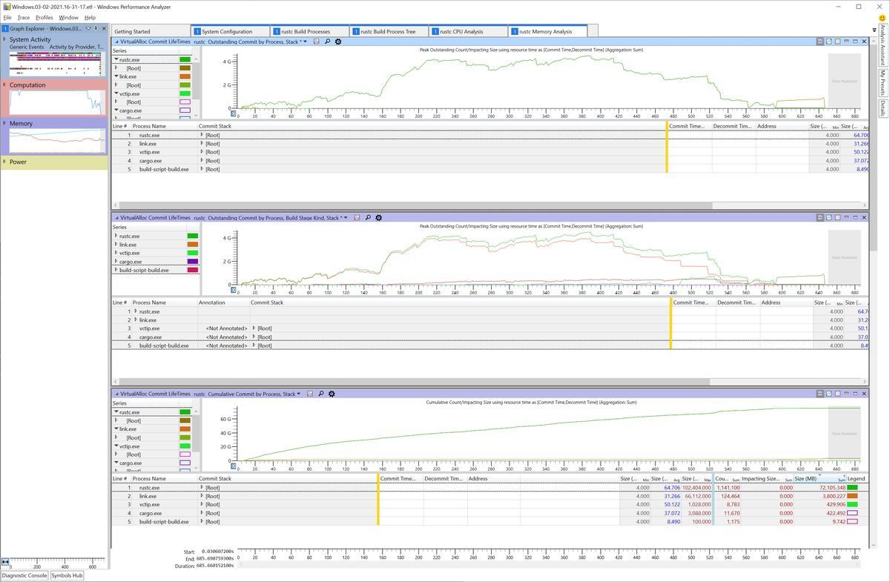

다음으로 WPA가 Rust 스택 트레이스를 정확히 데맹글링할 수 있도록 디버그 심볼을 로드하고 처리하도록 지시해야 합니다.
상단 메뉴에서 "Trace"를 클릭한 다음 "Load Symbols"를 선택하세요.
이 단계는 시간이 다소 걸릴 수 있습니다.

WPA가 rustc 심볼 로딩을 완료하면 rustc.exe 노드를 확장하고 가장 큰 메모리가 할당된 스택 영역을 추적할 수 있습니다.

이를 위해 "Commit Stack" 컬럼의 `[Root]` 노드를 확장하고 유의미한 스택 프레임을 찾을 때까지 하위 항목을 계속 확장하세요.

> 팁: 확장할 노드를 선택한 상태에서 오른쪽 화살표 키를 누르면 해당 노드가 펼쳐지면서 펼쳐진 집합 중 그 다음으로 큰 노드로 선택이 자동 이동합니다. 원하는 스택 프레임에 도달할 때까지 오른쪽 화살표 키를 연속해서 누르면 됩니다.

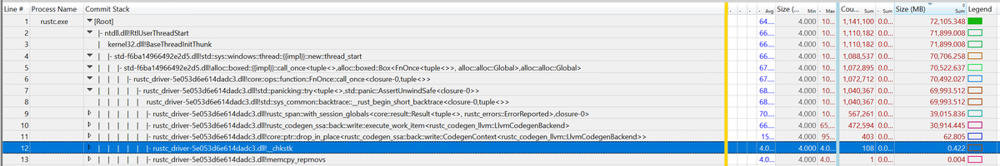

이 샘플에서는 프로파일 전반에 걸쳐 codegen을 통한 호출이 총 약 30GB의 메모리를 할당하고 있음을 확인할 수 있습니다.

#### 기타 분석 탭

프로파일에는 유용하게 활용할 수 있는 몇 가지 다른 탭도 포함되어 있습니다:

- System Configuration
    - 캡처가 기록된 시스템 환경의 일반 정보.
- rustc Build Processes
    - rustc.exe, cargo.exe, link.exe 등 관련 프로세스의 단순 목록.
    - 각 프로세스별 커맨드라인 인자 출력.
    - 특정 rustc 프로세스가 구체적으로 어떤 작업을 수행하고 있었는지 파악할 때 유용함.
- rustc Build Process Tree
    - 프로세스의 시작 및 종료 시점을 보여주는 타임라인 트리를 제공.
- rustc CPU Analysis
    - rustc 내부의 핫스팟을 보여주도록 사전 구성된 차트 포함.
    - rustc가 주로 실행 시간을 소비하는 위치 분석을 지원함.
- rustc Memory Analysis
    - rustc가 메모리를 할당하는 지점을 보여주도록 사전 구성된 차트 포함.


### rustc-perf를 이용한 프로파일링 {#profiling-with-rustc-perf}

[Rust 벤치마크 수트][rustc-perf]는 Rust 컴파일러를 프로파일링하고 벤치마킹할 수 있는 포괄적인 수단을 제공합니다.
수트 사용법에 대한 자세한 지침은 [사용 매뉴얼][rustc-perf-readme]에서 확인할 수 있습니다.

하지만 수트를 수동으로 구동하는 것은 다소 번거로울 수 있습니다.
`rustc` 기여자들이 이를 보다 쉽게 이용할 수 있도록, 컴파일러 빌드 시스템(`bootstrap`)은 벤치마킹 수트와의 내장 통합을 제공합니다. 해당 수트를 자동으로 다운로드 및 빌드하고 로컬 컴파일러 툴체인을 빌드한 후 단순화된 커맨드라인 인터페이스로 프로파일링할 수 있게 해줍니다.

`./x perf <command> [options]` 명령을 사용하여 이 내장 기능을 실행할 수 있습니다.

`--stage 1` 또는 `--stage 2`와 같은 일반적인 부트스트랩 플래그를 이 명령에 적용하여 생성되는 sysroot의 스테이지를 지정할 수 있습니다. 또한 프로파일링 지원을 강화하기 위해 `bootstrap.toml`을 설정하는 것도 유용합니다 (예: 빌드된 컴파일러에 소스 라인 정보를 포함시키기 위해 `rust.debuginfo-level = 1` 설정).

`x perf` currently supports the following commands:
- `benchmark <id>`: Benchmark the compiler and store the results under the passed `id`.
- `compare <baseline> <modified>`: Compare the benchmark results of two compilers with the two passed `id`s.
- `eprintln`: Just run the compiler and capture its `stderr` output.
  Note that the compiler normally does not print
  anything to `stderr`, so you might want to add some `eprintln!` calls to get any output.
- `samply`: Profile the compiler using the [samply][samply] sampling profiler.
- `cachegrind`: Use [Cachegrind][cachegrind] to generate a detailed simulated trace of the compiler's execution.

> 프로파일러에 관한 자세한 설명은 [`rustc-perf` 매뉴얼][rustc-perf-readme-profilers]을 참조하세요.

`x perf` 명령에 수트에서 제공하는 `profile_local` 및 `bench_local` 옵션에 반응하는 다음 옵션들을 사용할 수 있습니다:

- `--include`: 프로파일링/벤치마킹할 대상 벤치마크 선택.
- `--profiles`: 프로파일링/벤치마킹할 대상 프로파일(`Check`, `Debug`, `Opt`, `Doc`) 선택.
- `--scenarios`: 프로파일링/벤치마킹할 대상 시나리오(`Full`, `IncrFull`, `IncrPatched`, `IncrUnchanged`) 선택.

#### 외부 크레이트 프로파일링 diff 예시
외부 크레이트에 대해 컴파일러 두 커밋 간의 로컬 프로파일링 diff를 생성하는 것은 유용한 작업입니다.
시작하려면 `rustc-perf` 저장소에서 벤치마크를 구동하는 collector를 빌드합니다:
```
cargo build --release -p collector
```
빌드된 collector 바이너리를 cargo를 사용해 실행합니다.
이 도구는 다음 인자들을 요구합니다:
- `<PROFILE>`: 성능 측정 방식에 대한 프로파일러 선택 (이 예시에서는 Cachegrind 사용).
- `<RUSTC>`: 벤치마킹할 Rust 컴파일러 리비전 (`rust-lang/rust` 커밋 SHA).
선택 인자를 사용하여 앞서 언급된 프로파일 및 시나리오를 지정할 수 있습니다.
필수 및 선택 인자에 대한 자세한 내용은 [rustc-perf-readme-profilers]에서 확인할 수 있습니다.

`rust-lang/rust` 저장소의 두 커밋 `<SHA1>`과 `<SHA2>`에 대해 `serde_derive-1.0.136` 크레이트의 프로파일 diff를 생성하는 명령어는 다음과 같습니다:
```
cargo run --release --bin collector profile_local cachegrind +<SHA1> --rustc2 +<SHA2> --exact-match serde_derive-1.0.136 --profiles Check --scenarios IncrUnchanged
```


[samply]: https://github.com/mstange/samply
[cachegrind]: https://www.cs.cmu.edu/afs/cs.cmu.edu/project/cmt-40/Nice/RuleRefinement/bin/valgrind-3.2.0/docs/html/cg-manual.html
[rustc-perf-readme]: https://github.com/rust-lang/rustc-perf/blob/master/collector/README.md
[rustc-perf-readme-profilers]: https://github.com/rust-lang/rustc-perf/blob/master/collector/README.md#profiling-local-builds


## crates.io 의존성 {#crates-io}

Rust 컴파일러는 `crates.io`의 일부 외부 의존성을 포함하여 빌드하는 것을 지원합니다.

Rust Forge에는 [새로운 의존성을 검증하기 위한 공식 정책]이 마련되어 있습니다.

### 허용된 의존성

`tidy` 도구는 [허용된 크레이트 목록]을 보유하고 있습니다.
컴파일러에 아직 포함되지 않은 신규 의존성을 추가하려는 경우 이 목록에 해당 크레이트를 추가해야 합니다.

[허용된 크레이트 목록]: https://github.com/rust-lang/rust/blob/9d1b2106e23b1abd32fce1f17267604a5102f57a/src/tools/tidy/src/deps.rs#L73
[새로운 의존성을 검증하기 위한 공식 정책]: https://forge.rust-lang.org/compiler/third-party-out-of-tree#third-party-crates


# Rust 프로젝트에 기여하기

## 기여 절차 {#contributing}

### 버그 리포트 작성

버그는 아쉽지만 소프트웨어 개발에서 피할 수 없는 현실입니다.
제보되지 않은 오류는 수정할 수 없으므로 문제 발견 시 아낌없이 리포트를 작성해 주세요. 버그인지 확실하지 않은 경우라도 부담 없이 이슈를 생성하셔도 됩니다.

**발견한 버그가 Rust 사용자에게 보안 위험을 야기할 수 있다고 판단되는 경우, [보안 취약점 제보 지침][vuln]을 따라 제출해 주세요.**

[vuln]: https://www.rust-lang.org/policies/security

나이틀리 채널을 사용 중이라면 버그 리포트를 작성하기 전에 최신 툴체인 버전에서도 해당 버그가 재현되는지 먼저 확인해 보세요. 이미 해결된 이슈일 수 있습니다.

버그를 제보하기 전 여건이 된다면 [기존 이슈들을 탐색]해 보세요. 이미 다른 사용자가 동일한 오류를 보고했을 가능성이 있습니다.
검색 키워드를 잡기 어려울 수 있으므로 필수는 아닌 추가 권장사항입니다. 실수로 중복 이슈를 작성하시더라도 괜찮습니다.

마찬가지로 동일한 버그를 겪은 다른 사용자가 작성한 이슈를 쉽게 찾을 수 있도록 고유한 정보를 담은 명확한 제목으로 작성해 주세요. 제목에는 사용된 언어/컴파일러 기능, 버그 발생 조건, 오류 메시지 일부 등이 포함될 수 있습니다.
예시: **"impossible case reached" on lifetime inference for impl Trait in return position**.

[이슈 생성 링크][create an issue]를 클릭하고 구비된 템플릿 항목을 작성하면 쉽게 이슈를 등록할 수 있습니다.

### 버그 수정 또는 일반적인 코드 변경

대부분의 PR에는 특별한 절차가 요구되지 않습니다.
[PR을 작성]하면 리뷰, 승인 및 머지 프로세스가 바로 진행됩니다. 이 절차에는 대다수의 버그 수정, 리팩터링 및 사용자에게 노출되지 않는 변경사항이 포함됩니다.
이후 섹션에서는 이 규칙의 예외 사항을 설명합니다.

또한 진행 중인 WIP PR이나 GitHub [Draft PR]을 작성하는 것도 완전히 허용됩니다.
개발 과정에서 조기에 피드백을 얻거나 협력자와 코드를 공유하기 위해 이를 선호하는 기여자들이 있습니다.
(느린 개발 머신 환경 등에서) CI를 이용해 PR을 빌드하고 테스트하기 위해 Draft PR을 활용하는 경우도 있습니다.

[PR을 작성]: #pull-requests
[Draft PR]: https://github.blog/2019-02-14-introducing-draft-pull-requests/

### 신규 기능 추가

Rust는 강력한 하위 호환성을 보증합니다.
따라서 신규 기능이 곧바로 안정판(stable) Rust에 구현될 수 없으며 stable, beta, nightly 3가지 릴리스 채널을 거치게 됩니다.
Rust의 열차형 릴리스 모델에 대한 자세한 내용은 [Rust 북][The Rust Book]을 참조하세요.

- **Stable (안정판)**: 일반 사용자를 위한 최신 안정판 릴리스입니다.
- **Beta (베타)**: 차기 릴리스 버전입니다 (6주 이내에 안정판으로 전환됨).
- **Nightly (나이틀리)**: 저장소의 `main` 브랜치를 추적합니다.
  선택적(opt-in) 기능 게이트를 통해 미확정(unstable) 기능 사용이 허용되는 유일한 채널입니다.

자세한 내용은 [신규 기능 구현 챕터](#implementing-new-features)를 참조하세요.

[The Rust Book]: https://doc.rust-lang.org/book/appendix-07-nightly-rust.html

#### 하위 호환성 파괴 변경 (Breaking changes)

하위 호환성을 파괴하는 변경사항은 dev-guide에 [전용 섹션][Breaking Changes]이 마련되어 있습니다.

#### 주요 변경사항 (Major changes)

컴파일러 팀은 하위 호환성 파괴 여부와 관계없이 규모가 큰 변경사항을 처리하기 위한 특별한 절차를 운용합니다.
이 절차를 Major Change Proposal (MCP)이라 부릅니다.
MCP는 컴파일러에 대한 대규모 변경사항에 대해 (완전한 RFC나 팀 디자인 미팅에 비해) 유연하게 피드백을 수집할 수 있는 경량화된 메커니즘입니다.

MCP 제출이 요구될 수 있는 변경 예시에는 대규모 리팩터링, 핵심 타입 구조 변경, 컴파일러 내부 구동 방식의 주요 변경, 또는 소규모 사용자 노출 변경사항이 포함됩니다.

**확신이 서지 않는 경우 [Zulip에서 문의]하세요.
많은 노력을 기울인 PR이 머지되지 못하는 안타까운 상황을 방지할 수 있습니다!** MCP에 대한 자세한 정보는 [이 문서][mcpinfo]를 참조하세요.

[mcpinfo]: https://forge.rust-lang.org/compiler/proposals-and-stabilization.html#how-do-i-submit-an-mcp
[Zulip에서 문의]: https://rust-lang.zulipchat.com/#narrow/stream/131828-t-compiler

#### 컴파일러 성능

컴파일러 성능은 매우 중요합니다.
지난 몇 년간 컴파일러 성능을 [지속적으로 개선][perfdash]하기 위해 많은 노력이 투자되었습니다.

[perfdash]: https://perf.rust-lang.org/dashboard.html

작성한 변경사항이 성능 저하(또는 향상)를 야기할 것으로 의심되는 경우 "perf run"을 요청할 수 있으며 (리뷰어가 승인 전 요청할 수도 있음), 벤치마크 봇이 해당 변경이 적용된 컴파일러로 벤치마크를 수행합니다.
수치 결과는 [여기][perf]에 보고되어 최신 `main` 커밋 대비 변경 수치를 대조할 수 있습니다.

> rustc 개발 시에도 유용한 Rust 코드 성능에 관한 일반 가이드는 [Rust Performance Book]을 참조하세요.

[perf]: https://perf.rust-lang.org
[Rust Performance Book]: https://nnethercote.github.io/perf-book/

### 풀 리퀘스트 (Pull Requests)

풀 리퀘스트(PR)는 Rust 코드를 변경하는 핵심 메커니즘입니다.
GitHub 자체에 풀 리퀘스트 기능에 대한 [훌륭한 문서][about-pull-requests]가 구비되어 있습니다.
우리는 기여자가 개인 포크(fork)에 변경사항을 푸시하고 소스 저장소로 제출하는 ["포크 앤 풀(fork and pull)" 모델][development-models]을 사용합니다.
Rust 기여 시 Git 활용법은 [해당 챕터](#git)를 참조하세요.

> **대규모, 복잡, 전역적, 또는 전문 분야에 특화된 변경을 작성할 때의 조언**
>
> 로테이션 담당 컴파일러 리뷰어들은 각자 잘 아는 영역과 다소 생소한 영역이 존재합니다. PR이 대규모이거나, 복잡하거나, 여러 영역에 걸쳐 있거나, 고도의 전역 영역에 특화된 변경을 포함한다면 해당 PR 전체를 검토하기에 적합한 리뷰어를 지정하기가 매우 어려워집니다. 이는 표준 라이브러리 팀과 같이 다른 팀 리뷰어의 권한 영역이 함께 포함된 경우에도 동일하게 적용됩니다. [트라이아지 봇][triagebot]이 수정된 파일 경로를 바탕으로 관련 팀에 알림을 보내고 사전 알림을 설정한 담당자들을 핑합니다.
>
> 이러한 대형 변경 작업을 시작하기 전 **컴파일러 팀(및 관련 승인 팀)과 미리 변경안을 충분히 논의**하고 **검토하기 어려운 거대한 PR을 개별 검토 가능한 소규모 PR 시리즈로 나눌 수 있는지** 협력받는 것을 강력히 권장합니다.
>
> [Zulip의 #t-compiler 스레드][t-compiler]를 생성하여 컴파일러 팀과 사전에 소통할 수 있습니다.
>
> 컴파일러 팀과 사전에 소통하면 다음과 같은 장점이 있습니다:
>
> 1. PR이 적시에 검토될 가능성이 크게 높아집니다.
>     - 실제 PR을 열기 *전에* 적절한 리뷰어를 지정받거나, 절차 안내 및 try 작업/perf run/crater run 구동을 지원할 담당 조율자를 찾을 수 있습니다.
> 2. 컴파일러 팀이 변경사항을 추적하는 데 도움이 됩니다.
> 3. 변경 방향이 컴파일러 팀의 지향점과 일치하는지 조기에 지속적으로 검증받을 수 있습니다.
> 4. 컴파일러 팀이 수용하기 어려운 거대 변경에 엄청난 시간과 노력을 헛되이 투자하거나, 뒤늦게 수용 불가능한 방향임을 알게 되는 안타까운 상황을 방지할 수 있습니다.

[about-pull-requests]: https://docs.github.com/en/pull-requests/collaborating-with-pull-requests/proposing-changes-to-your-work-with-pull-requests/about-pull-requests
[development-models]: https://docs.github.com/en/pull-requests/collaborating-with-pull-requests/getting-started/about-collaborative-development-models#fork-and-pull-model
[t-compiler]: https://rust-lang.zulipchat.com/#narrow/stream/131828-t-compiler
[triagebot]: https://github.com/rust-lang/rust/blob/HEAD/triagebot.toml

#### 브랜치 최신 상태 유지하기

rust-lang/rust의 CI 파이프라인은 기여자의 브랜치가 기반한 커밋이 아닌 최신 `main` 커밋에 기여자의 패치를 직접 적용하여 빌드합니다.
따라서 명시적인 머지 충돌이 없더라도 브랜치가 구형 상태라면 예기치 않은 CI 실패가 발생할 수 있습니다.

충돌이 발생하거나, 상류 CI가 깨져 그린 PR이 차단되거나, 메인테이너의 요청이 있는 등 꼭 필요한 경우에만 브랜치를 갱신하세요.
이미 통과(green)된 PR에 대해 리뷰 도중 불필요한 브랜치 갱신을 자제해 주세요.
리뷰 진행 중에는 피드백 반영을 위해 단편적인 증분 커밋을 추가하고 최종 승인 시점이나 리뷰어 요청 시에만 스쿼시/리베이스를 수행하는 것이 좋습니다.

브랜치를 갱신할 때는 `git push --force-with-lease` 명령을 사용하고 변경 내용을 간략한 댓글로 남기세요. 저장소 규칙에 따라 리베이스 대신 `upstream/main` 머지를 선호할 수 있으므로 프로젝트 관례를 따르세요. 상세 안내는 [최신 상태 유지하기](#keeping-things-up-to-date)를 참조하세요.

리베이스를 마친 뒤 CI가 구동되기 전 [관련 테스트를 로컬에서 구동](#tests-intro)하여 문제를 조기 포착하는 것이 좋습니다.

#### r? (리뷰어 지정)

모든 풀 리퀘스트는 다른 담당자의 검토를 거칩니다.
자동 봇인 [rustbot]이 수정된 파일 경로에 기초하여 무작위로 리뷰 담당자를 지정해 줍니다.

특정인에게 리뷰를 직접 요청하려는 경우 PR 설명란이나 댓글에 `r?`을 추가할 수 있습니다.
예를 들어 `@awesome-reviewer`에게 리뷰를 요청하려면 다음과 같이 기재합니다:
add the following to the end of the pull request description:

    r? `@awesome-reviewer`

이 구문을 추가하면 [rustbot]이 무작위 리뷰어 대신 지정된 사람에게 PR을 할당합니다.
이는 완전히 선택사항입니다.

`r? rust-lang/groupname` 구문을 작성하여 특정 팀에서 무작위로 리뷰어를 지정받을 수도 있습니다.
예를 들어 진단 메시지 변경 작업을 진행 중이라면 다음과 같이 진단 팀의 리뷰어를 지정받을 수 있습니다:

    r? rust-lang/diagnostics

지정 가능한 전체 `groupname` 목록은 [triagebot.toml 설정 파일]의 `adhoc_groups` 섹션이나 [rust-lang 팀 데이터베이스]의 팀 목록에서 확인할 수 있습니다.

#### 리뷰 대기하기

> 참고
>
> 풀 리퀘스트 리뷰어들은 대개 본인 업무 한계치까지 작업하고 있으며 상당수가 봉사 차원에서 기여하고 있습니다.
> 리뷰 지연을 최소화하기 위해, PR 작성자와 할당된 리뷰어는 상황에 맞게 다음 명령어를 호출하여 리뷰 라벨(`S-waiting-on-review` 및 `S-waiting-on-author`)이 최신 상태로 유지되도록 해야 합니다:
>
> - `@rustbot author`:
>   리뷰가 완료되었으므로 PR 작성자가 코멘트를 확인하고 그에 따라 조치를 취해야 합니다.
>
> - `@rustbot review`:
>   작성자가 리뷰 받을 준비를 마쳤으므로 이 PR이 리뷰어의 대기열에 다시 등록됩니다.

리뷰어 역시 개인 여유 시간을 쪼개어 `rustc` 개발을 돕는 봉사자라는 점을 유념해 주세요.
따라서 PR 응답과 리뷰까지 어느 정도의 시간이 소요될 수 있습니다.
또한 누락에 의해 할당된 PR의 검토가 지연될 수 있습니다.

PR이 원활히 진행되도록 하기 위해 트라이아지 작업 그룹(Triage WG)은 2주 이상 논의가 진행되지 않은 리뷰 대기 PR을 정기적으로 점검합니다.
2주 이내에 리뷰가 이루어지지 않으면 Zulip의 트라이아지 WG([#t-release/triage]) 채널에 편하게 안내를 요청해 보세요.
담당자 핑 시점이나 휴가 상태 등을 파악하고 조치해 줄 것입니다.

리뷰어는 GitHub 코드 리뷰 인터페이스를 통해 변경을 요청할 수 있습니다.
또한 일부 PR에 대해 특수 검증 절차를 요구할 수도 있습니다.
이러한 절차의 예시는 [Crater] 및 [Breaking Changes] 챕터를 참조하세요.

[r?]: https://github.com/rust-lang/rust/pull/78133#issuecomment-712692371
[#t-release/triage]: https://rust-lang.zulipchat.com/#narrow/stream/242269-t-release.2Ftriage

#### 지속적 통합 (CI)

사람에 의한 코드 리뷰 외에도 풀 리퀘스트는 지속적 통합(CI) 시스템에 의해 자동 테스트됩니다.
PR을 개설하거나 갱신할 때마다 CI가 컴파일러를 빌드하고 [컴파일러 테스트 수트]에 맞춰 테스트하며 Rust 코드 스타일 지침 준수 여부 등을 검증합니다.

지속적 통합 테스트를 구동함으로써 PR 작성자는 1차 리뷰 과정을 거치기 전에 오류를 조기 포착할 수 있고 리뷰어 역시 해당 PR의 상태를 손쉽게 확인할 수 있습니다.

Rust는 충분한 CI 컴퓨팅 자원을 갖추고 있으므로 푸시할 때마다 자원이 낭비될까 걱정하실 필요가 전혀 없습니다.
생산성을 높이기 위해 변경사항 테스트에 CI를 적극적으로 활용하시는 것을 권장합니다.
특히 전체 `./x test` 수트를 로컬에서 무작정 실행하면 엄청난 시간이 소요되므로 비권장합니다.
CI를 활용한 테스트 방법은 [CI로 테스트하기] 챕터를 참조하세요.

[CI로 테스트하기]: #testing-with-ci

#### r+ (승인 및 머지)

리뷰어가 풀 리퀘스트 검토를 완료하면 PR에 `r+` 주석을 추가합니다.
형태는 다음과 같습니다:

    `@bors` r+

이 주석은 통합 봇인 [bors]에게 해당 PR이 최종 승인되었음을 알립니다.
이후 PR은 머지 대기열([merge queue])에 진입하며 [bors]가 지원하는 모든 플랫폼에서 *전체* 테스트 수트를 실행합니다.
모든 플랫폼 테스트를 통과하면 [bors]가 코드를 `main` 브랜치로 자동 머지하고 PR을 닫습니다.

변경 규모에 따라 다음과 같이 약간 다른 형식의 `r+`가 사용될 수 있습니다:

    `@bors` r+ rollup

`rollup` 접미사는 [bors]에게 이 변경을 항상 다른 PR들과 "묶어서(rolled up)" 통합하도록 지시합니다.
롤업된 변경사항은 프로세스 속도를 높이기 위해 다른 PR들과 함께 번들로 테스트 및 머지됩니다.
보통 서로 충돌을 일으키지 않는 소규모 변경에 한해 "always roll up" 설정이 적용됩니다.

머지 대기열이 길어지면 처리에 시간이 소요될 수 있으므로 여유 있게 기다려 주세요.
참고로 PR 코드는 절대로 사람이 직접 수동 머지하지 않습니다.

[rustbot]: https://github.com/rustbot

#### PR 제출하기

이제 풀 리퀘스트(PR)를 제출할 준비가 되었나요?
좋습니다! 제출 전 확인해야 할 몇 가지 사항입니다.

다른 브랜치를 지정해야 할 명확한 사유가 없는 한 모든 PR은 `main` 브랜치를 대상으로 제출해야 합니다.

PR을 제출하기 전 스타일 검사를 구동하세요:

    ./x test tidy --bless

매 PR 제출 전(및 PR 내의 매 신규 커밋 전)에 이 검사를 실행하는 것을 권장합니다. git 커밋 전 자동 실행되도록 [git hooks]를 설정할 수도 있습니다. CI에서도 tidy를 실행하며 통과하지 못하면 빌드가 실패합니다.

Rust는 _병합 커밋 미사용 정책(no merge-commit policy)_을 따릅니다.
즉 머지 충돌이 발생할 경우 merge 커밋을 생성하지 말고 항상 리베이스(rebase)를 수행해야 합니다.
예를 들어 `main` 브랜치의 최신 변경사항을 기능 브랜치로 가져올 때 항상 rebase를 사용하세요.
PR에 병합 커밋이 포함되어 있으면 `has-merge-commits` 라벨이 지정됩니다.
인터랙티브 리베이스 등을 통해 병합 커밋을 제거한 후에는 라벨을 다시 제거해야 합니다:

    `@rustbot` label -has-merge-commits

상세한 내용은 [해당 챕터][labeling]를 참조하세요.

머지 충돌이 발생하거나 리뷰어가 수정을 요청하면 PR 상태가 `S-waiting-on-author`로 변경됩니다.
수정을 완료한 후에는 `@rustbot`을 사용하여 리뷰 대기 상태(`S-waiting-on-review`)로 다시 전환해야 합니다:

    `@rustbot` ready

GitHub은 [키워드를 통한 이슈 자동 닫기][closing-keywords] 기능을 제공합니다.
이 기능은 이슈 트래커를 깔끔하게 관리하는 데 유용하지만 "closes #123" 텍스트는 커밋 메시지보다는 PR 설명란에 적는 것이 일반적으로 선호됩니다.
특히 리베이스 중에 커밋 메시지에 이슈 번호를 언급하면 해당 이슈에 과도한 알림("스팸")이 발생할 수 있습니다.

하지만 제출한 PR이 stable-to-beta 또는 stable-to-stable 회귀 버그를 수정하는 건이고 베타 및/또는 안정판 백포트 승인을 받은 상태라면(`beta-accepted` 및/또는 `stable-accepted` 라벨 표시), `main`에 수정을 머지할 때 연관 이슈가 자동 닫히지 않도록 이슈 자동 닫기 키워드를 *사용하지 마세요*.
이슈 번호는 PR 설명란의 다른 위치에 언급해 주세요.
예를 들어 `Fixes (after beta backport) #NNN.` 형태로 기재할 수 있습니다.

후속 조치로, 제목이 `[beta]` 또는 `[stable]`로 시작하고 해당 PR을 백포트하는 PR이 올라오는지 주의 깊게 살펴봐 주세요.
백포트 PR이 머지되면 관련 이슈를 닫아도 됩니다.
종결 댓글에는 연관된 모든 PR을 명시해야 합니다.
이슈를 닫을 권한이 없는 경우, 원본 PR에 담당 리뷰어에게 이슈 종결을 요청하는 댓글을 남겨주세요.

[issue-relabeling]: #issue-relabeling
[closing-keywords]: https://docs.github.com/en/issues/tracking-your-work-with-issues/linking-a-pull-request-to-an-issue

#### PR 되돌리기 (Reverting a PR)

PR로 인해 오컴파일(miscompile), 심각한 성능 저하 또는 기타 치명적인 문제가 발생하는 경우, 회귀 테스트 케이스와 함께 해당 PR을 되돌릴(revert) 수 있습니다.
Forge 문서의 [리버트 정책][revert policy]을 참조할 수도 있습니다 (주로 리뷰어용이지만 PR 작성자에게도 유용한 정보를 포함함).

PR에 포함된 변경이 너무 광범위한 경우 되돌리기(revert)가 어려워져 후속 패치 리뷰가 까다로워질 수 있습니다.
또한 해당 PR의 코드를 후속 PR들이 강력히 의존하는 경우 되돌리기가 거의 불가능해집니다.

이러한 케이스의 경우 [#128271][#128271] 예시처럼 문제가 되는 코드만 식별하여 특정 입력 조건에서 비활성화시키는 방식을 선택할 수 있습니다.

MIR 최적화의 경우 [#132356][#132356] 예시처럼 `-Zunsound-mir-opt` 옵션을 사용해 mir-opt를 게이팅(gating)할 수도 있습니다.

[리버트 정책]: https://forge.rust-lang.org/compiler/reviews.html?highlight=revert#reverts
[#128271]: https://github.com/rust-lang/rust/pull/128271
[#132356]: https://github.com/rust-lang/rust/pull/132356

### 외부 의존성

이 섹션은 ["외부 저장소 활용하기"](#external-repos)로 이동되었습니다.

### 문서 작성하기

문서 개선 기여는 언제나 환영합니다.
`doc.rust-lang.org` 사이트 소스는 소스 트리 내 [`src/doc`] 경로에 위치하며 표준 API 문서는 소스 코드 자체([`library/std/src/lib.rs`][std-root] 등)에서 자동 생성됩니다. 문서 관련 풀 리퀘스트도 다른 일반 PR과 동일한 방식으로 처리됩니다.

[`src/doc`]: https://github.com/rust-lang/rust/tree/HEAD/src/doc
[std-root]: https://github.com/rust-lang/rust/blob/HEAD/library/std/src/lib.rs#L1

문서 관련 이슈를 탐색하려면 [A-docs 라벨]을 확인하세요.

문서 작성 스타일 지침은 [RFC 1574]에서 확인할 수 있습니다.

표준 라이브러리 문서를 빌드하려면 `x doc --stage 1 library --open` 명령을 실행하세요.
특정 북 문서(예: unstable book)를 빌드하려면 `x doc src/doc/unstable-book` 명령을 구동합니다.
결과물은 `build/host/doc`에 생성되며 기본 브라우저로 자동 열립니다. 자세한 정보는 [문서 빌드하기](#building-documentation) 섹션을 참조하세요.

작은 수정사항을 검증할 때는 `rustdoc`을 직접 사용할 수도 있습니다.
예를 들어 `rustdoc src/doc/reference.md`는 레퍼런스 문서를 `doc/reference.html` 파일로 렌더링합니다. CSS 스타일이 누락되어 보일 수 있지만 HTML 구조 정합성은 확인할 수 있습니다.

참고로 **내부 문서(internal documentation)**에 대한 단순 오탈자/맞춤법 수정 단독 PR은 검토 시간 대비 이점이 낮아 수용되지 않습니다.
내부 문서 예시에는 코드 주석 및 rustc 내부 API 문서 등이 포함됩니다. 단, 동일 PR에 다른 유의미한 코드 개선이 함께 포함되어 있다면 오탈자 수정도 환영받습니다.

#### rustc-dev-guide에 기여하기

[rustc-dev-guide]에 대한 기여는 언제나 환영하며 [rust-lang/rustc-dev-guide 저장소][rdgrepo]에서 직접 진행할 수 있습니다.
해당 저장소의 이슈 트래커는 개선 작업 대상을 탐색하는 훌륭한 길잡이입니다. 초보자와 숙련자 컴파일러 개발자 모두를 위한 이슈가 두루 준비되어 있습니다!

작성 시 유의해야 할 몇 가지 지침:

- 과도하게 긴 라인을 피하고 의미 단위 줄바꿈(문장이 끝나는 시점마다 라인을 구분하는 방식)을 사용하는 것을 권장합니다. 라인 길이에 대한 엄격한 글자 수 제한은 없으며 개별 문장이나 의미 단락이 동일 라인에서 자연스럽게 종결되도록 유도합니다.

  `ci/sembr` 디렉터리의 도구를 사용해 이를 지원받을 수 있습니다. 도움말 출력 명령어:

  ```console
  cargo run --manifest-path ci/sembr/Cargo.toml -- --help
  ```

- 가이드 문서에 텍스트를 기여할 때는 독자가 정보의 신뢰 기간을 파악할 수 있도록 특정 시점/사유 맥락을 함께 작성해 주세요. 적절한 맥락 정보를 제공하기 위해 다음 항목을 고려하세요:

  - 지속적인 프로젝트 변화 외에 해당 텍스트가 오래되어 변경될 수 있는 구체적 사유.

  - 주석 작성 날짜 표기. 예를 들어 _"현재는..."_ 또는 _"지금 기준으로는..."_과 같은 추상적 표현 대신 다음 포맷으로 구체적인 날짜를 포함하세요:
    - Jan 2021
    - January 2021
    - jan 2021
    - january 2021

    CI 액션(`.github/workflows/date-check.yml`)이 6개월 이상 지난 날짜 항목을 감지하여 월간 리포트를 작성합니다 ([예시 리포트](https://github.com/rust-lang/rustc-dev-guide/issues/2052)).

    CI가 날짜를 인식할 수 있도록 날짜 지정 전 특수 주석 주석을 명시하세요:

    ```md
    <!-- date-check --> Jul 2026
    ```

    예시:

    ```md
    As of <!-- date-check --> Jul 2026, the foo did the bar.
    ```

    렌더링된 문서에 날짜가 노출되지 않기를 바라는 경우 다음 주석 형태를 사용하세요:

    ```md
    <!-- date-check: Jul 2026 -->
    ```

  - 관련 WG, 트래킹 이슈, `rustc` rustdoc 페이지 등의 링크를 첨부하여 변경 프로세스에 대한 세부 설명과 정보 만료 여부를 검증할 수 있는 수단을 제공하세요.

- 장 및 섹션 제목에는 문장 스타일 대소문자(sentence case)를 사용하세요.

- 파일명의 단어를 구분할 때는 대시(`-`)를 사용하세요.

##### ⚠️ 참고: `rustc-dev-guide` 기여 위치

rustc-dev-guide 기여 위치 및 그 이점에 대한 자세한 내용은 [rustc-dev-guide 팀 문서][the rustc-dev-guide team documentation]를 참조하세요.

### 이슈 트라이아지 (Issue triage)

<https://forge.rust-lang.org/release/issue-triaging.html> 문서를 참조하세요.

[stable-]: https://github.com/rust-lang/rust/labels?q=stable
[beta-]: https://github.com/rust-lang/rust/labels?q=beta
[I-\*-nominated]: https://github.com/rust-lang/rust/labels?q=nominated
[I-prioritize]: https://github.com/rust-lang/rust/labels/I-prioritize
[tracking issues]: https://github.com/rust-lang/rust/labels/C-tracking-issue
[beta-backport]: https://forge.rust-lang.org/release/backporting.html#beta-backporting-in-rust-langrust
[stable-backport]: https://forge.rust-lang.org/release/backporting.html#stable-backporting-in-rust-langrust
[metabug]: https://github.com/rust-lang/rust/labels/metabug
[regression-]: https://github.com/rust-lang/rust/labels?q=regression
[relnotes]: https://github.com/rust-lang/rust/labels/relnotes
[S-tracking-]: https://github.com/rust-lang/rust/labels?q=s-tracking
[the rustc-dev-guide team documentation]: https://forge.rust-lang.org/rustc-dev-guide/index.html#where-to-contribute-rustc-dev-guide-changes

#### rfcbot 라벨

[rfcbot]은 변경 승인 또는 거부와 같은 비동기적 의사 결정 프로세스를 추적하기 위해 전용 라벨을 사용합니다.
이 기능은 [RFC], 이슈 및 풀 리퀘스트 전반에 사용됩니다.

| 라벨 | 색상 | 설명 |
|---|---|---|
| [proposed-final-comment-period] | <span class="label-color" style="background-color:#ededed;">&#x2003;</span>&nbsp; 회색 | 최종 의견 수렴 기간(FCP)에 진입하기 위해 모든 팀원의 승인을 대기 중인 상태. |
| [disposition-merge] | <span class="label-color" style="background-color:#008800;">&#x2003;</span>&nbsp; 초록색 | 변경사항을 병합(merge)하겠다는 의사를 표시함. |
| [disposition-close] | <span class="label-color" style="background-color:#dd0000;">&#x2003;</span>&nbsp; 빨간색 | 변경사항을 수용하지 않고 이슈/PR을 닫겠다는 의사를 표시함. |
| [disposition-postpone] | <span class="label-color" style="background-color:#ededed;">&#x2003;</span>&nbsp; 회색 | 당장 변경을 수용하지 않고 추후로 연기하겠다는 의사를 표시함. |
| [final-comment-period] | <span class="label-color" style="background-color:#1e76d9;">&#x2003;</span>&nbsp; 파란색 | 병합 또는 종결 전 최종 의견을 수렴 중인 상태. |
| [finished-final-comment-period] | <span class="label-color" style="background-color:#f9e189;">&#x2003;</span>&nbsp; 연노랑색 | 최종 의견 수렴 기간이 종료되어 이슈가 병합 또는 종결될 상태. |
| [postponed] | <span class="label-color" style="background-color:#fbca04;">&#x2003;</span>&nbsp; 노란색 | 이슈 처리가 연기되었음을 나타냄. |
| [closed] | <span class="label-color" style="background-color:#dd0000;">&#x2003;</span>&nbsp; 빨간색 | 이슈 제안이 거부되었음을 나타냄. |
| [to-announce] | <span class="label-color" style="background-color:#ededed;">&#x2003;</span>&nbsp; 회색 | FCP가 완료되어 대외적으로 공지되어야 할 이슈. (참고: rust-lang/rust 저장소에서는 트라이아지 미팅 시 발표할 이슈 라벨로 이 항목을 다르게 활용함). |

[disposition-merge]: https://github.com/rust-lang/rust/labels/disposition-merge
[disposition-close]: https://github.com/rust-lang/rust/labels/disposition-close
[disposition-postpone]: https://github.com/rust-lang/rust/labels/disposition-postpone
[proposed-final-comment-period]: https://github.com/rust-lang/rust/labels/proposed-final-comment-period
[final-comment-period]: https://github.com/rust-lang/rust/labels/final-comment-period
[finished-final-comment-period]: https://github.com/rust-lang/rust/labels/finished-final-comment-period
[postponed]: https://github.com/rust-lang/rfcs/labels/postponed
[closed]: https://github.com/rust-lang/rfcs/labels/closed
[to-announce]: https://github.com/rust-lang/rfcs/labels/to-announce
[rfcbot]: https://github.com/anp/rfcbot-rs/
[RFC]: https://github.com/rust-lang/rfcs

### 유용한 링크 및 정보

이 섹션은 ["가이드 소개"] 챕터로 이동되었습니다.

["가이드 소개"]: #other-places-to-find-information
[기존 이슈들을 탐색]: https://github.com/rust-lang/rust/issues?q=is%3Aissue
[Breaking Changes]: #bug-fix-procedure
[triagebot.toml config file]: https://github.com/rust-lang/rust/blob/HEAD/triagebot.toml
[rust-lang teams database]: https://github.com/rust-lang/team/tree/HEAD/teams
[컴파일러 테스트 수트]: #tests-intro
[git hooks]: https://git-scm.com/book/en/v2/Customizing-Git-Git-Hooks
[A-docs 라벨]: https://github.com/rust-lang/rust/issues?q=is%3Aopen%20is%3Aissue%20label%3AA-docs
[RFC 1574]: https://github.com/rust-lang/rfcs/blob/master/text/1574-more-api-documentation-conventions.md#appendix-a-full-conventions-text
[rustc-dev-guide]: https://rustc-dev-guide.rust-lang.org/
[rdgrepo]: https://github.com/rust-lang/rustc-dev-guide
[이슈 생성 링크]: https://github.com/rust-lang/rust/issues/new/choose


## 컴파일러 팀 소개 {#compiler-team}

> **참고**:
> 팀에 대한 상세 정보는 [Forge 페이지]에 정리되어 있으며 아래 설명의 대부분은 구형 정보입니다.

rustc는 [Rust 컴파일러 팀][team]에 의해 유지 관리됩니다.
팀에 속한 멤버들은 다함께 회귀 버그를 추적하고 신규 기능을 구현합니다.
Rust 컴파일러 팀 멤버는 rustc 발전 및 설계에 실질적이고 유의미한 기여를 한 분들로 구성됩니다.

[Forge 페이지]: https://forge.rust-lang.org/compiler
[team]: https://www.rust-lang.org/governance/teams/compiler

### 토론 채널

현재 컴파일러 팀은 Zulip에서 대화를 나눕니다:

- 팀 대화는 Zulip 인스턴스의 [`t-compiler`][zulip-t-compiler] 스트림에서 진행됩니다.
- rustc 개발 관련 질문과 도움을 요청할 수 있는 [`t-compiler/help`][zulip-help], 주간 트라이아지 및 스티어링 미팅이 열리는 [`t-compiler/meetings`][zulip-meetings] 등 관련 Zulip 채널들이 다양하게 운영됩니다.

### 리뷰어 지도

컴파일러의 특정 영역에 대해 질문에 답해줄 수 있는 담당자를 찾거나 누가 어떤 영역을 다루는지 확인하고 싶다면 [triagebot.toml의 assign 섹션][map]을 확인하세요.
컴파일러의 구성 요소별 리뷰어 담당자 목록이 자세히 정리되어 있습니다.


### Rust 컴파일러 미팅

컴파일러 팀은 신규 버그 및 회귀 현상을 조기에 파악하고 주요 사안을 논의하기 위해 주간 미팅을 갖습니다.
미팅은 [Zulip][zulip-meetings] 채널에서 진행됩니다.
주요 진행 순서:

- **공지사항, MCP/FCP 및 WG 체크인:** 팀 구성원들이 인지해야 할 주요 공유사항을 전달합니다. 또한 MCP 및 FCP의 현황을 공유하고 일부 워킹 그룹(WG)의 작업 경과 업데이트를 청취합니다.
- **beta 및 stable 백포트 노미네이션 검토:** beta 및 stable 채널로 각각 백포트(backport)할 후보 목록을 검토합니다. 기존에 정상 구동되던 코드가 컴파일러 업데이트 후 동작하지 않게 된 신규 회귀 케이스를 탐색합니다. 회귀 버그는 중요한 수정을 요하므로 P-critical 또는 P-high로 태깅될 가능성이 높습니다 (단 단순 버그 수정은 예외이며 이 경우에도 [경고부터 부여하는 절차][procedure]를 고려함).
- **P-critical 및 P-high 버그 검토:** P-critical 및 P-high 버그는 적극적인 진행 추적이 필요한 중요한 사안입니다. 이 문제들은 담당자가 지정되어 있어야 합니다.
- **`S-waiting-on-t-compiler` 및 `I-compiler-nominated` 이슈 점검:** 팀 차원의 의견 피드백이 요구되는 이슈들입니다.
- **성능 트라이아지 리포트 검토:** 성능 저하를 야기한 PR들을 점검하고 해당 성능 저하를 리버트할지
    후속 PR에서 성능 저하를 해결할 수 있는지 논의합니다.

미팅은 현재 보스턴 시간 기준 목요일 오전 10시(보통 UTC-4, 단 일광 절약 시간제에 따라 달라질 수 있음)에 개최됩니다.

[procedure]: #bug-fix-procedure
[zulip-t-compiler]: https://rust-lang.zulipchat.com/#narrow/stream/131828-t-compiler
[zulip-help]: https://rust-lang.zulipchat.com/#narrow/stream/182449-t-compiler.2Fhelp
[zulip-meetings]: https://rust-lang.zulipchat.com/#narrow/stream/238009-t-compiler.2Fmeetings

### 팀 멤버십 (Team membership)

Rust 팀 멤버십은 컴파일러 개발에 얼마간 유의미한 기여를 꾸준히 수행한 경우 부여됩니다.
멤버십은 명예로운 기여 인정인 동시에 의무입니다:
컴파일러 팀 멤버는 코드 리뷰 및 기타 작업뿐만 아니라 프로젝트 유지 관리를 도울 것으로 요구됩니다.

컴파일러 팀 멤버가 되는 데 관심이 있다면, 가장 먼저 할 일은 버그 수정을 시작하거나 워킹 그룹(working group)에 참여하는 것입니다.
버그를 찾는 좋은 방법은 [E-easy 라벨이 지정된 미결 이슈](https://github.com/rust-lang/rust/issues?q=is%3Aopen+is%3Aissue+label%3AE-easy)나 [E-mentor 라벨 이슈](https://github.com/rust-lang/rust/issues?q=is%3Aopen+is%3Aissue+label%3AE-mentor)를 확인하는 것입니다.

또한 [비활동 사유로 닫힌 PR 목록](https://github.com/rust-lang/rust/pulls?q=is%3Apr+label%3AS-inactive)을 탐색해 볼 수 있습니다.
연관 이슈를 참조하면 이들 중 다수는 유용한 기여 작업을 포함하고 있으며 기존 작성자의 시간 부족으로 마무리 마무리 작업만 남겨둔 상태인 경우가 많습니다.

#### r+ 권한 (승인 권한)

rustc에 다수의 개인 PR 기여를 완료하면 r+ 승인 권한이 부여되는 경우가 많습니다.
이는 "bors"(PR을 rustc 소스로 머지 관리하는 자동화 봇)에게 PR 머지를 지시할 수 있는 권한을 보유하게 됨을 의미합니다 ([bors 명령어 사용 가이드][bors-guide] 참조).

[bors-guide]: https://bors.rust-lang.org/

리뷰어를 위한 준수 지침:

- 할당 여부와 관계없이 어떤 PR이든 자유롭게 코드 리뷰에 참여할 수 있습니다.
  다만 다음 조건에 부합하지 않는 한 r+ 명령어를 함부로 남기지 마세요:
  - 해당 코드 영역에 대해 충분한 확신이 있는 경우.
  - 다른 사람이 먼저 검토하기를 원치 않음을 확신하는 경우.
    - 예컨대 민감한 코드를 수정하는 PR의 경우 머지 전 직접 검토하겠다는 의사를 표명한 멤버가 있을 수 있습니다.
- 리뷰 시 항상 예의 바른 언행을 유지하세요. 기여자는 Rust 프로젝트를 대표하는 인물이므로 [행동 강령(Code of Conduct)] 지침을 충실히 모범적으로 준수해야 합니다.

[행동 강령(Code of Conduct)]: https://www.rust-lang.org/policies/code-of-conduct

#### 리뷰어 로테이션 (Reviewer rotation)

r+ 권한을 획득하면 [리뷰어 로테이션]에 추가될 수 있습니다.
[triagebot]은 새로 제출되는 PR을 리뷰어들에게 [자동 할당]해주는 봇입니다.
로테이션에 추가되면 무작위로 PR 리뷰어로 지정됩니다.
직접 검토하기 부담스러운 영역의 PR이 할당된 경우 `r? @so-and-so`와 같이 댓글을 남겨 다른 사람에게 재할당할 수 있습니다. 누구에게 요청해야 할지 모를 경우 `r? @nikomatsakis for reassignment`를 기재하면 `@nikomatsakis`가 적절한 리뷰어를 찾아 지정해 드립니다.

[리뷰어 로테이션]: https://github.com/rust-lang/rust/blob/36285c5de8915ecc00d91ae0baa79a87ed5858d5/triagebot.toml#L528-L577
[자동 할당]: https://forge.rust-lang.org/triagebot/pr-assignment.html

리뷰어 로테이션 참가는 전체 멤버의 리뷰 부담을 낮춰주므로 크게 환영받습니다!
다만 타인의 PR에 대해 적시에 피드백을 제공할 시간적 여유가 부족하다면 명단 등록을 유예하는 것이 좋습니다.


## Git 활용하기 {#git}

Rust 프로젝트는 소스 코드 관리를 위해 [Git]을 사용합니다.
기여를 진행하려면 작성한 변경사항을 컴파일러 소스에 올바르게 합칠 수 있도록 Git 기능에 대한 기본적인 익숙함이 필요합니다.

[Git]: https://git-scm.com

이 페이지의 목적은 신규 기여자가 자주 마주치는 공통 질문과 문제들을 다루는 것입니다.
기초적인 Git 개념이 포함되어 있지만 설명이 다소 빠르게 느껴진다면 [Atlassian Git 튜토리얼][atlassian-git]의 초급/시작하기 섹션을 먼저 읽어보시는 것을 권장합니다.
GitHub에서도 초보자를 위한 [기본 문서][documentation] 및 [가이드][guides]를 제공하고 있으며 더 자세한 내용은 [Git 공식 서적][book from Git]을 참조하세요.

이 가이드는 지속 개선 중입니다.
이 페이지에서 다루지 않는 Git 관련 문제가 발생하는 경우 문서를 보완할 수 있도록 [이슈를 등록][open an issue]해 주세요.

[open an issue]: https://github.com/rust-lang/rustc-dev-guide/issues/new
[book from Git]: https://git-scm.com/book/en/v2/
[atlassian-git]: https://www.atlassian.com/git/tutorials/what-is-version-control
[기본 문서]: https://docs.github.com/en/get-started/quickstart/set-up-git
[가이드]: https://guides.github.com/introduction/git-handbook/

### 사전 준비사항

Git이 설치되어 있고 [rust-lang/rust] 저장소를 포크(fork)한 뒤 포크된 저장소를 로컬 PC로 클론(clone)했다고 가정합니다.
Git 조작에는 커맨드라인 인터페이스를 기준으로 설명하며 동일 기능을 수행하는 다양한 GUI 및 IDE 연동 도구를 활용하셔도 무방합니다.

[rust-lang/rust]: https://github.com/rust-lang/rust

포크된 저장소를 클론했다면 로컬 저장소에서 `origin`이라는 이름으로 해당 포크를 참조할 수 있습니다.
다음 명령을 통해 공식 rust-lang/rust 원격 저장소를 `upstream`으로 등록해두면 편리합니다:

```console
git remote add upstream https://github.com/rust-lang/rust.git
```

(HTTPS 사용 시) 또는

```console
git remote add upstream git@github.com:rust-lang/rust.git
```

(SSH 사용 시).

**참고:** 이 페이지는 `rust-lang/rust` 워크플로에 맞춰져 있으나 Rust 프로젝트의 다른 저장소에 기여할 때도 동일하게 유용합니다.


### 표준 기여 절차

소규모 코드 변경 및 일반 PR 제출 시 구동하게 되는 표준 워크플로입니다:

 1. `main` 브랜치 기반에서 변경을 시작합니다: `git checkout main`.
 2. Rust 저장소로부터 최신 변경사항을 가져옵니다: `git pull upstream main --ff-only`.
 (자세한 내용은 [No-Merge 정책][no-merge-policy] 참조).
 3. 변경 작업을 위한 신규 브랜치를 생성합니다: `git checkout -b issue-12345-fix`.
 4. 저장소에 변경을 적용하고 테스트합니다.
 5. `git add src/changed/file.rs src/another/change.rs` 구문으로 변경사항을 스테이징하고 `git commit`으로 커밋합니다.
 중간 커밋을 작성하는 것도 좋은 방법입니다.
 `git add .`는 서브모듈 업데이트 등 원치 않는 변경이 쉽게 커밋될 수 있으므로 자제하세요.
 `git status`를 사용하여 스테이징을 누락한 파일이 없는지 검사할 수 있습니다.
 6. 변경사항을 개인 포크 저장소로 푸시합니다: `git push --set-upstream origin issue-12345-fix`
 (추가 커밋 반영 시 `git push`를 사용하고 리베이스 후에는 `git push --force-with-lease`를 사용합니다).
 7. 개인 포크 저장소에서 `rust-lang/rust`의 `main` 브랜치를 대상으로 [PR을 개설합니다][ghpullrequest].

[ghpullrequest]: https://guides.github.com/activities/forking/#making-a-pull-request

리베이스가 필요하고 충돌이 발생하는 경우 [리베이스하기](#rebasing) 섹션을 참조하세요.
장기 기능/이슈 작업을 진행하는 동안 상류(upstream)를 추적하고 싶다면 [최신 상태 유지하기][no-merge-policy]를 참조하세요.

If your reviewer requests changes, the procedure for those changes looks much
the same, with some steps skipped:

 1. 소스 코드가 가장 최신 버전인지 확인합니다: `git checkout issue-12345-fix`.
 2. 이전과 동일하게 추가 소스 수정, 스테이징, 커밋을 진행합니다.
 3. 변경사항을 포크 저장소로 푸시합니다: `git push`.

 [no-merge-policy]: #keeping-things-up-to-date

### Git 관련 문제 해결하기

저장소가 구형 상태가 되었다고 해서 `rust-lang/rust`를 처음부터 다시 클론할 필요는 없습니다!
복구 불가능할 정도로 꼬였다고 생각될 때조차 전체 저장소를 새로 다운로드하지 않고 Git 상태를 손쉽게 복원할 수 있는 지혜로운 방법들이 마련되어 있습니다. 자주 발생하는 주요 이슈 상황입니다:

#### 실수로 병합 커밋(merge commit)을 만든 경우

Git에서 최신 변경사항으로 브랜치를 갱신하는 2가지 방법에는 merging과 rebasing이 있습니다.
Rust는 [리베이스 방식][no-merge-policy]을 채택하고 있습니다.
실수로 병합 커밋을 만든 경우에도 `git rebase -i upstream/main` 명령을 통해 쉽게 복구할 수 있습니다.

리베이스에 대한 상세 가이드는 [리베이스하기](#rebasing) 섹션을 참조하세요.

#### GitHub 포크 저장소를 지운 경우

Git 관점에서는 이것이 전혀 문제가 되지 않습니다.
`git remote -v` 명령을 구동하면 다음과 같이 표시됩니다:

```console
$ git remote -v
origin  git@github.com:jyn514/rust.git (fetch)
origin  git@github.com:jyn514/rust.git (push)
upstream        https://github.com/rust-lang/rust (fetch)
upstream        https://github.com/rust-lang/rust (fetch)
```

포크 저장소 이름을 변경한 경우 다음과 같이 URL을 갱신하면 됩니다:

```console
git remote set-url origin <URL>
```

여기서 `<URL>`은 새로 설정된 포크 주소입니다.

#### 실수로 서브모듈을 수정한 경우

보통 rustbot이 GitHub 이슈 스레드에 `cargo` 서브모듈이 수정되었다는 알림 댓글을 남길 때 이를 인지하곤 합니다:

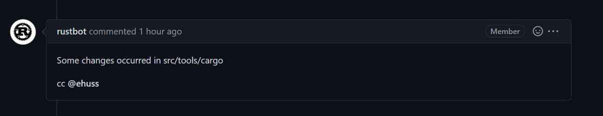

웹 UI 충돌 표시로 확인할 수도 있습니다:

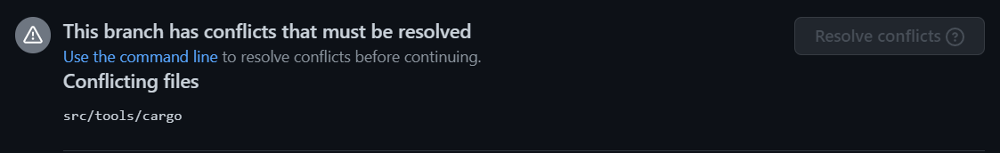

가장 흔한 원인은 리베이스 후 서브모듈을 갱신하는 `x` 명령을 실행하지 않고 `git add .`를 수행한 경우입니다.
또는 `x fmt` 대신 `cargo fmt`를 실행해 서브모듈 내 파일이 자동 수정된 뒤 해당 커밋이 합쳐진 경우입니다.

이를 복구하려면 다음 과정을 진행하세요 (`cargo` 이외의 다른 서브모듈인 경우 `src/tools/cargo` 경로를 해당 서브모듈 경로로 교체):

1. 실수로 변경이 포함된 커밋을 확인합니다: `git log --stat -n1 src/tools/cargo`
2. 해당 커밋의 서브모듈 변경을 되돌립니다: `git checkout <my-commit>~ src/tools/cargo`.
   `~` 문자는 그대로 입력하고 `<my-commit>`은 1단계에서 확인한 커밋 해시로 대체합니다.
3. 변경사항을 자식 커밋으로 등록합니다: `git commit --fixup <my-commit>`
4. 수정된 모든 서브모듈에 대해 1~3단계를 반복합니다.
    - 서브모듈을 여러 커밋에 걸쳐 수정한 경우 수정된 각 커밋마다 1~3 단계를 반복 적용해야 합니다.
    `git log` 명령어에 본인이 작성하지 않은 타인의 커밋이 나타날 때 반복을 중단합니다.
5. 기존 커밋에 스쿼시 처리합니다: `git rebase --autosquash -i upstream/main`
6. [변경사항을 푸시합니다](#standard-process).

#### 리베이스 시 "error: cannot rebase" 오류가 발생하는 경우

리베이스 진행 시 흔히 발생하는 2가지 오류 메시지입니다:
```console
error: cannot rebase: Your index contains uncommitted changes.
error: Please commit or stash them.
```
```console
error: cannot rebase: You have unstaged changes.
error: Please commit or stash them.
```

(두 오류의 차이점은 <https://git-scm.com/book/en/v2/Getting-Started-What-is-Git%3F#_the_three_states> 참조).

이 오류는 마지막 커밋 이후 로컬에 커밋되지 않은 수정사항이 남아있음을 의미합니다.
리베이스를 진행하려면 커밋을 완료하거나, 리베이스 완료 시점까지 작업을 임시 보관하는 "stash" 커밋을 생성해야 합니다.
리베이스 시 자동으로 "stash"를 적용하도록 Git을 설정해두면 이 오류를 거의 완벽히 예방할 수 있습니다:

```console
git config --global rebase.autostash true
```

Stash에 대한 상세 내용은 <https://git-scm.com/book/en/v2/Git-Tools-Stashing-and-Cleaning>을 참조하세요.

#### 'Untracked Files: src/stdarch' 항목이 노출되는 경우

이 항목은 과거 `library/` 디렉터리로 구조 개편이 이뤄진 유산입니다.
안타깝게도 `git rebase`는 서브모듈의 이름 변경을 자동으로 추적하지 못하므로 디렉터리를 수동 삭제해야 합니다:

```console
rm -r src/stdarch
```

#### I see `<<< HEAD`?

You were probably in the middle of a rebase or merge conflict.
See [Conflicts](#rebasing-and-conflicts) for how to fix the conflict.
If you don't care about the changes
and just want to get a clean copy of the repository back, you can use `git reset`:

```console
# WARNING: this throws out any local changes you've made! Consider resolving the conflicts instead.
git reset --hard main
```

#### failed to push some refs 오류가 표시되는 경우

`git push` 구동이 거절되면서 다음과 같은 안내 메시지가 표시될 수 있습니다:

```console
 ! [rejected]        issue-xxxxx -> issue-xxxxx (non-fast-forward)
error: failed to push some refs to 'https://github.com/username/rust.git'
hint: Updates were rejected because the tip of your current branch is behind
hint: its remote counterpart. Integrate the remote changes (e.g.
hint: 'git pull ...') before pushing again.
hint: See the 'Note about fast-forwards' in 'git push --help' for details.
```

이 안내문이 권장하는 해결책은 잘못된 방법입니다!
Rust의 ["no-merge" 정책](#no-merge-policy)에 따라 `git pull`이 생성하는 병합 커밋은 최종 PR에서 수용되지 않으며 리베이스의 취지에도 어긋납니다.
대신 `git push --force-with-lease` 명령을 사용하세요.

#### 직접 작성하지 않은 타인의 커밋들이 리베이스 목록에 나타나는 경우

리베이스 목록에 수많은 커밋이나 병합 커밋, 타인이 작성한 커밋이 노출되는 경우 잘못된 대상 브랜치 위로 리베이스를 시도하고 있을 가능성이 높습니다.
예를 들어 `rust-lang/rust` 원격 저장소가 `upstream`으로 지정되어 있음에도 `git rebase upstream/main` 대신 `git rebase origin/main`을 실행했을 때 발생합니다.
해결책은 리베이스를 중단하고 올바른 브랜치를 지정하는 것입니다:

```console
git rebase --abort
git rebase --interactive upstream/main
```

<details><summary>잘못된 브랜치 위로 리베이스가 구동된 예시 화면 보기</summary>

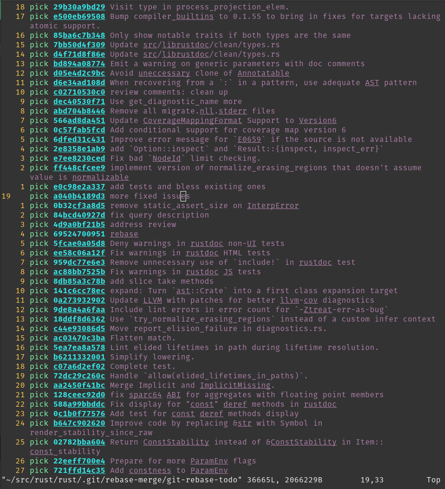

</details>

#### 서브모듈에 대한 간략한 설명

`git pull`로 로컬 저장소를 갱신할 때 본인이 전혀 편집하지 않은 파일들이 수정됨 항목으로 표시되는 것을 볼 수 있습니다.
예를 들어 `git status` 구동 시 다음과 같은 내용이 표시될 수 있습니다 (언급된 `new commits` 참조):

```console
On branch main
Your branch is up to date with 'origin/main'.

Changes not staged for commit:
  (use "git add <file>..." to update what will be committed)
  (use "git restore <file>..." to discard changes in working directory)
	modified:   src/llvm-project (new commits)
	modified:   src/tools/cargo (new commits)

no changes added to commit (use "git add" and/or "git commit -a")
```

이 커밋들은 일반 소스 파일 변경이 아닌 서브모듈 커밋 포인터 변경에 해당합니다 ([후속 섹션](#git-submodules) 참조).
이 항목들을 정리하려면 다음 명령을 구동하세요:

```console
git submodule update
```

일부 서브모듈은 실제 빌드에 요구되지 않습니다. 예컨대 `download-ci-llvm`을 사용하는 경우 `src/llvm-project`를 체크아웃할 필요가 없습니다.
서브모듈 커밋 이력을 매번 패치받지 않으려면 `git submodule deinit -f src/llvm-project`를 실행하여 커밋 포인터 변경 표시를 비활성화할 수 있습니다.

### 리베이스 및 충돌 해결하기 (Rebasing and Conflicts)

로컬에서 코드를 수정할 때는 기능 브랜치를 생성하던 시점의 `rust-lang/rust` 버전을 기반으로 작업하게 됩니다.
따라서 PR을 제출할 때 그 사이 `rust-lang/rust` 상류 소스에 반영된 최신 변경사항이 기여자의 코드 변경과 충돌을 야기할 수 있습니다.
이러한 상황이 발생하면 변경사항이 머지되기 전에 충돌을 해결해야 합니다.
충돌을 해결하려면 작성한 기여 작업을 `rust-lang/rust` 최신 커밋 상단으로 리베이스해야 합니다.

#### 리베이스 (Rebasing)

기능 브랜치를 `rust-lang/rust`의 `main` 브랜치 최신 커밋 상단으로 리베이스하려면 기여자의 브랜치를 체크아웃한 뒤 다음 명령을 구동하세요:

```console
git pull --rebase https://github.com/rust-lang/rust.git main
```

> 다음과 같은 오류를 만난 경우:
> ```console
> error: cannot pull with rebase: Your index contains uncommitted changes.
> error: please commit or stash them.
> ```
> 로컬 작업 트리에 아직 커밋되지 않은 수정 코드가 존재함을 의미합니다. 이 경우 리베이스 실행 전 `git stash`를 수행하고 리베이스 및 충돌 해결 완료 후 `git stash pop`을 실행하여 임시 보관 코드를 다시 적용하세요.

브랜치를 main 위로 리베이스할 때 브랜치의 모든 변경 내역이 최신 `main` 커밋 상단에 차례로 재적용됩니다.
즉 Git은 구버전 `main`에서 수행했던 변경 작업을 최신 `main` 버전 위에서 실행한 것처럼 재생성하는 연산을 시도합니다.
이 과정에서 하나 이상의 "리베이스 충돌(rebase conflict)"이 발생할 수 있습니다.
기여자의 변경 작업이 그 사이 상류에서 일어난 다른 변경사항과 동일 소스 구간에서 상충될 때 일어납니다.
충돌이 발생하면 터미널 출력에 다음과 유사한 형태의 안내 라인이 표시됩니다:

```console
CONFLICT (content): Merge conflict in file.rs
```

이 파일들을 열어보면 다음과 같은 형태의 섹션을 볼 수 있습니다:

```console
<<<<<<< HEAD
Original code
=======
Your code
>>>>>>> 8fbf656... Commit fixes 12345
```

이는 Git이 자동으로 리베이스하는 방법을 파악하지 못한 라인을 나타냅니다.
`<<<<<<< HEAD`와 `=======` 사이의 섹션에는 `main` 브랜치의 코드가 들어 있고 반대편에는 기여자가 작성한 버전의 코드가 들어 있습니다.
충돌을 어떻게 처리할지 결정해야 합니다.
작성한 변경사항을 유지하거나,
`main`의 변경사항을 유지하거나 두 변경을 적절히 결합합니다.

일반적으로 충돌 해결은 2단계 과정으로 이루어집니다: 첫째, 개별 충돌 코드를 수정합니다.
원하는 소스 형태로 파일을 수정하고 그 과정에서 나타난 `<<<<<<<`, `=======`, `>>>>>>>` 충돌 마커 표시 라인들을 깨끗이 삭제합니다.
둘째, 주변 코드를 종합 검토합니다.
코드 충돌이 발생한 지점 주변에는 논리적 에러가 상존할 가능성이 높습니다!
눈에 띄는 명백한 컴파일 에러가 없는지 `x check` 명령을 실행해 확인하는 것이 좋습니다.

충돌 수정 작업이 완료되면 `git add` 명령을 통해 해당 충돌 파일들을 스테이징 영역에 올려줍니다.
이후 `git rebase --continue` 명령을 실행하여 충돌 해결이 완료되었음을 Git에게 알리고 리베이스를 마무리시킵니다.

리베이스가 성공하면 `git push --force-with-lease` 명령을 사용해 포크 저장소의 대상 브랜치 코드를 갱신하세요.

#### 최신 상태 유지하기

[위 섹션](#rebasing)은 리베이스 작업 및 병합 충돌 해결에 관한 세부 가이드였습니다.
다음은 로컬 저장소를 상류(upstream) 변경사항에 맞춰 최신 상태로 유지하기 위한 일반 조언입니다:

로컬 `main` 브랜치에서 `git pull upstream main`을 정기적으로 구동하여 최신 상태로 유지하세요.
또한 기여 중인 기능 브랜치들도 최신 상태로 유지하는 것이 좋습니다. 상류 코드를 pull한 후 기능 브랜치를 체크아웃하여 리베이스를 수행하세요:

```console
git checkout main
git pull upstream main --ff-only # 병합 커밋이 생성되지 않도록 보장
git rebase main feature_branch
git push --force-with-lease # (로컬 상태와 원격 origin을 동기화)
```

[No-Merge 정책](#no-merge-policy)에 따라 병합 커밋 생성을 방지하려면 매번 `--ff-only`나 `--rebase` 플래그를 전달할 필요 없이 `git pull` 구동 시 머지 커밋 작성을 차단하는 `git config pull.ff only` 설정(로컬 저장소 전용 적용)을 권장합니다.

또한 `main` 브랜치에서 `git push --force-with-lease`를 구동하여 기능 브랜치가 GitHub 상의 상태와 올바르게 동기화되어 있는지 이중 확인해 보세요.

### 고급 리베이스 (Advanced Rebasing)

#### 커밋 스쿼시하기 (Squash)

커밋을 "스쿼시(squash)"한다는 것은 여러 커밋 내역을 단일 커밋으로 하나로 합침을 의미합니다.
장점이자 단점은 이력이 단순화된다는 점입니다.
단점으로는 변경이 일어난 세부 단계별 추적이 어려워지지만 전체 커밋 이력을 한눈에 파악하고 다루기는 쉬워집니다.

`rust-lang/rust` 저장소 PR에서 커밋을 스쿼시하는 가장 쉬운 방법은 PR 댓글에 `@bors squash` 명령을 사용하는 것입니다.
기본적으로 [bors]는 PR의 모든 커밋 메시지를 하나로 결합하여 스쿼시 커밋 메시지를 생성합니다.
커밋 메시지를 직접 지정하려면 `@bors squash msg="<commit message>"` 포맷을 사용하세요.
예시: `@bors squash msg="Improve diagnostics for missing lifetime parameter"`.

로컬 Git 명령을 통해 커밋을 직접 스쿼시하려는 경우 아래 가이드를 참조하세요.

충돌이 없고 단순히 이력을 정돈하기 위해 스쿼시하는 경우 `git rebase --interactive --keep-base main` 명령을 사용하세요.
이 명령은 PR의 포크 기준점(fork point)을 그대로 유지해주므로 리베이스 전후의 diff 변동 내역을 리뷰하기 용이해집니다.

스쿼시는 충돌 해결의 일환으로도 매우 유용합니다.
브랜치에 동일 코드에 대한 연속적인 수정 작업이 포함되어 있거나 리베이스 충돌이 심각하게 일어나는 경우, `git rebase --interactive main`을 사용하여 리베이스 프로세스를 세밀히 제어할 수 있습니다.
특정 커밋을 건너뛰거나, 건너뛰지 않은 커밋의 내용을 수정하거나, 적용 순서를 변경하거나, 커밋을 하나로 "스쿼시"할 수 있습니다.

또는 다음과 같이 커밋 이력을 정돈하는 방식을 취할 수도 있습니다:

```console
# 모든 변경을 단일 커밋으로 스쿼시하여 충돌을 한 번만 처리함
git rebase --interactive --keep-base main  # 과정 중 모든 변경사항을 스쿼시
git rebase main
# 모든 머지 충돌을 해결
git rebase --continue
```

실제 기능 변경이 아닌 단순 "수정본(fixup)"에 불과한 직전 몇 개의 커밋만 하나로 스쿼시하려는 경우도 있습니다.
예를 들어 `git rebase --interactive HEAD~2`는 직전 2개의 커밋에 대해서만 인터랙티브 스쿼시 수정을 진행합니다.


#### `git range-diff` 활용법

리베이스를 마치고 갱신 코드를 푸시하기 직전에 구버전 브랜치와 신규 브랜치 사이의 롤백/차이점을 리뷰하는 것이 좋습니다.
`git range-diff main @{upstream} HEAD` 명령으로 이를 수행할 수 있습니다.

`range-diff`의 첫 번째 인자(`main`)는 구버전과 신규 브랜치를 대조 비교할 베이스 리비전입니다.
두 번째 인자는 구버전 브랜치 리비전으로, 이 경우 `@upstream`은 GitHub에 푸시된 기존 버전(풀 리퀘스트에서 타인이 보고 있는 버전)을 나타냅니다.
마지막 세 번째 인자는 신규 리비전 브랜치로, `HEAD`는 현재 로컬 저장소에 체크아웃된 최신 커밋을 의미합니다.

축약형 표기인 `git range-diff main @{u} HEAD` 명령도 동일하게 구동됩니다.

일반 Git diff와 달리 range-diff 출력에는 `-` 또는 `+` 기호 옆에 또 다른 `-` 또는 `+` 기호가 함께 노출됩니다.
좌측 기호는 구버전 브랜치와 신규 브랜치 사이의 변경을 나타내고 우측 기호는 기여자가 새로 커밋한 변경을 나타냅니다.
따라서 range-diff는 구버전 diff와 신규 diff 간의 차이점을 직관적으로 보여주는 "diff의 diff" 역할을 수행합니다.

다음은 `git range-diff` 출력의 예시입니다 ([Git 공식 문서][range-diff-example-docs]에서 가져옴):

```console
-:  ------- > 1:  0ddba11 Prepare for the inevitable!
1:  c0debee = 2:  cab005e Add a helpful message at the start
2:  f00dbal ! 3:  decafe1 Describe a bug
    @@ -1,3 +1,3 @@
     Author: A U Thor <author@example.com>

    -TODO: Describe a bug
    +Describe a bug
    @@ -324,5 +324,6
      This is expected.

    -+What is unexpected is that it will also crash.
    ++Unexpectedly, it also crashes. This is a bug, and the jury is
    ++still out there how to fix it best. See ticket #314 for details.

      Contact
3:  bedead < -:  ------- TO-UNDO
```

(터미널에서 구동 시 `git range-diff` 출력은 색상이 적용되므로 이 예시보다 훨씬 쉽게 읽을 수 있습니다.)

`git range-diff` 또 다른 특징은, `git diff`와 달리 커밋 메시지까지 비교 대조해 준다는 점입니다.
이 기능은 여러 커밋 메시지를 수정할 때 원하는 부분이 올바르게 수정되었는지 검증하는 데 매우 유용합니다.

`git range-diff`는 매우 유용한 명령어이지만 출력 포맷에 익숙해지기까지 시간이 다소 걸릴 수 있습니다.
명령어에 대한 Git 공식 문서, 특히 [예시 섹션][range-diff-example-docs] 항목을 참조하세요.

[range-diff-example-docs]: https://git-scm.com/docs/git-range-diff#_examples

### 병합 커밋 미사용 정책 (No-Merge Policy)

rust-lang/rust 저장소는 이른바 "리베이스 워크플로(rebase workflow)"를 채택하고 있습니다.
이는 PR 내의 병합 커밋(merge commit)을 절대 허용하지 않음을 의미합니다.
따라서 로컬에서 `git merge`를 구동하고 있다면 대신 리베이스를 수행해야 할 가능성이 높습니다.
물론 단순 패스트포워드(fast-forward) 방식의 머지(`git pull`이 수행하는 일반 머지)라면 머지 커밋이 생성되지 않으므로 걱정하실 필요가 없습니다.
`git config merge.ff only` 설정(로컬 저장소 전용 적용)을 한 번 등록해두면 모든 머지가 패스트포워드 타입으로만 구동되어 실수를 미리 방지할 수 있습니다.

이러한 정책 결정에는 몇 가지 이유가 있으며 트레이드오프가 존재합니다.
가장 큰 장점은 전반적으로 깨끗한 선형(linear) 커밋 이력을 유지할 수 있다는 점입니다.
선형 이력은 이분 탐색(bisecting)을 대폭 단순화해주며 커밋 이력 및 로그를 추적하고 이해하기 훨씬 쉽게 만들어 줍니다.

### 코드 리뷰 팁

**참고**: 이 섹션은 PR을 *작성*하는 입장이 아닌 *리뷰*하는 입장을 위한 팁입니다.

#### 공백 변경 숨기기

GitHub에는 리뷰 시 유용한 공백 변경 렌더링 무시 버튼이 존재합니다.
로컬 환경에서 변경을 검토할 때 `git diff -w origin/main` 명령을 사용할 수도 있습니다.

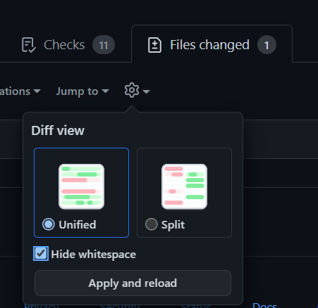

#### PR 로컬로 가져오기

PR 코드를 로컬 브랜치로 가져와 체크아웃하려면 `git fetch upstream pull/NNNNN/head && git checkout FETCH_HEAD` 명령을 구동하세요.

GitHub CLI 도구를 사용할 수도 있습니다.
GitHub PR 페이지에는 로컬 체크아웃 명령을 복사-붙여넣기할 수 있는 버튼이 구비되어 있습니다. 상세 정보는 <https://cli.github.com/>을 참조하세요.

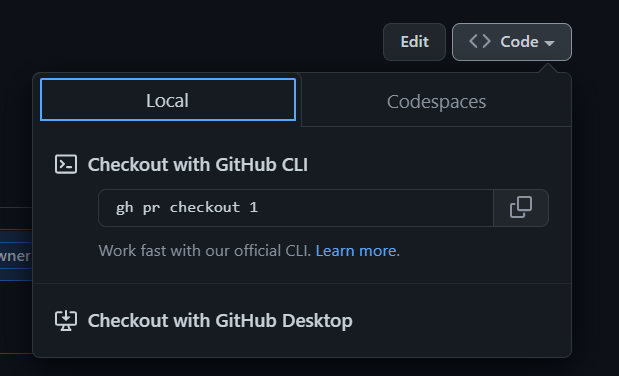

#### GitHub Dev 활용하기

GitHub 웹 UI의 대안으로 GitHub Dev는 저장소 및 PR을 브라우징할 수 있는 웹 기반 에디터를 제공합니다.
URL에서 `github.com`을 `github.dev`로 변경하거나 GitHub 페이지에서 `.` 키를 누르면 바로 실행할 수 있습니다.
자세한 내용은 [github.dev 에디터 문서](https://docs.github.com/en/codespaces/the-githubdev-web-based-editor)를 참조하세요.

#### 대규모 코드 이동 검토하기

단일 파일 *내에서* 이뤄진 대규모 코드 위치 이동에 대해 Git 및 GitHub의 기본 diff 뷰는 시각화가 다소 미흡합니다. 각 라인을 삭제 및 추가 라인으로 각각 표기하므로 각 라인을 수동 대조해야 합니다.
Git에는 이동된 라인을 다른 색상으로 강조 출력하는 옵션이 존재합니다:

```console
git log -p --color-moved=dimmed-zebra --color-moved-ws=allow-indentation-change
```

상세 옵션은 [`--color-moved` 문서](https://git-scm.com/docs/git-diff#Documentation/git-diff.txt---color-movedltmodegt)를 참조하세요.

#### range-diff 활용

[PR 작성자용 관련 섹션](#git-range-diff)을 참조하세요.
포스 푸시(force-push)된 PR 코드에 예기치 않은 추가 변경이 섞이지 않았는지 대조할 때 매우 유용합니다.

#### 특정 파일 변경 무시하기

저장소 내 다수의 대형 파일들은 자동 생성된 결과물입니다.
해당 파일들(예: Cargo.lock)의 변동 내역을 제외하고 diff를 조회하려면 다음 구문을 사용할 수 있습니다:

```console
git log -p ':!Cargo.lock'
```

임의의 와일드카드 패턴도 지원됩니다 (예: `:!compiler/*`). 패턴 구문은 `.gitignore`와 동일하며 앞에 `:`을 부가하여 패턴임을 지정합니다.

### Git 서브모듈 (Git Submodules)

**참고**: 서브모듈 지식은 알아두면 유용하지만 `rustc` 기여의 필수 전제 조건은 *아닙니다*.
Git을 처음 접하시는 경우 이 섹션을 읽기 전에 Git의 기본 핵심 개념들을 먼저 숙지하시는 것을 권장합니다.

`rust-lang/rust` 저장소는 `rust` 저장소 내부에서 다른 외부 Rust 프로젝트를 함께 활용하는 방법으로 [Git 서브모듈]을 채택하고 있습니다.
대표적인 예시로 `llvm-project` 포크, `cargo`, 그리고 `stdarch`, `backtrace`와 같은 외부 라이브러리들이 있습니다.

이들 프로젝트는 독립적인 별개의 Git(및 GitHub) 저장소에서 개발 및 관리되며 자체적인 Git 커밋 이력, 이슈 트래커, PR을 유지합니다.
서브모듈을 활용하면 `rust` 저장소 내부에 중첩된 하위 저장소를 배치하고 마치 `rust` 저장소의 디렉터리인 것처럼 투명하게 다룰 수 있습니다.

`llvm-project`를 예로 들어보겠습니다.
`llvm-project` 소스는 [`rust-lang/llvm-project`] 저장소에서 관리되지만 `rust-lang/rust` 저장소 내부에서 코드 생성 및 최적화를 위한 컴파일러 내부 모듈로 연동되어 활용됩니다.
우리는 이를 `rust` 내부에 `src/llvm-project` 폴더의 서브모듈로 불러옵니다.

서브모듈의 내용은 Git에서 무시됩니다: 서브모듈은 어떤 의미에서 저장소의 나머지 부분과 격리되어 있습니다.
하지만 `cd src/llvm-project`로 이동한 뒤 `git status`를 실행하면 다음과 같습니다:

```console
HEAD detached at 9567f08afc943
nothing to commit, working tree clean
```

Git 입장에서는 더 이상 `rust` 저장소가 아닌 `llvm-project` 저장소에 있는 셈입니다.
우리가 특정 브랜치가 아닌 특정 커밋에 위치하는 "detached HEAD" 상태에 있음을 확인할 수 있습니다.

이는 다른 의존성과 마찬가지로 사용할 버전을 제어할 수 있기를 원하기 때문입니다.
서브모듈을 사용하면 바로 그 작업을 수행할 수 있습니다: 모든 서브모듈은 수동으로 수정하지 않는 한 변하지 않는 특정 커밋에 "고정(pinned)"됩니다.
`llvm-project` 디렉터리에서 `git checkout <commit>`을 사용한 뒤 `rust` 디렉터리로 돌아오면, `git add src/llvm-project`를 실행하여 다른 파일과 마찬가지로 이 변경사항을 스테이징할 수 있습니다. (만약 이 변경사항을 커밋하도록 스테이징하지 *않으면*, `x` 실행 시 서브모듈을 자동으로 "갱신"하면서 이전 커밋으로 다시 전환하여 작업 내역이 취소될 수 있음에 유의하세요.)

서브모듈의 버전 지정은 보통 프로젝트 메인테이너들에 의해 이뤄지며 [이 예시][llvm-update] 형태를 가집니다.

Git 서브모듈 개념에 적응하기까지 약간의 시간이 소요될 수 있으므로 아직 명확히 이해되지 않더라도 걱정하지 마세요. 서브모듈을 직접 다루어야 하는 경우는 흔치 않으며 거듭 강조하지만 서브모듈의 모든 세부 구조를 파악하지 않아도 Rust 개발 기여에 아무런 지장이 없습니다.
다만 서브모듈이 존재하고 있으며 Git이 편리하게 관리해 주는 일종의 중첩 하위 저장소 의존성임을 인지해 두시면 충분합니다.

#### 서브모듈 하드 리셋하기 (Hard-resetting)

간혹 `git status` 구동 시 다음과 같은 항목이 나타나고

```console
Changes not staged for commit:
  (use "git add <file>..." to update what will be committed)
  (use "git restore <file>..." to discard changes in working directory)
  (commit or discard the untracked or modified content in submodules)
        modified:   src/llvm-project (new commits, modified content)
```

`git submodule update` 명령을 실행할 때 아래와 같은 오류 메시지가 심각하게 발생할 수 있습니다:

```console
error: RPC failed; curl 92 HTTP/2 stream 7 was not closed cleanly: CANCEL (err 8)
error: 2782 bytes of body are still expected
fetch-pack: unexpected disconnect while reading sideband packet
fatal: early EOF
fatal: fetch-pack: invalid index-pack output
fatal: Fetched in submodule path 'src/llvm-project', but it did not contain 5a5152f653959d14d68613a3a8a033fb65eec021. Direct fetching of that commit failed.
```

`(new commits, modified content)` 메시지가 보이는 경우 다음 명령을 구동하세요:

```console
git submodule foreach git reset --hard
```

이후 `git submodule update`를 다시 실행해 보세요.

#### Git 서브모듈 등록 해제하기 (Deinit)

위 방법으로도 해결되지 않는 경우 모든 서브모듈의 등록을 일시 해제할 수 있습니다:

```console
git submodule deinit -f --all
```

안타깝게도 로컬 Git 서브모듈 설정이 어떤 사유로 완전히 꼬여버리는 상황이 간혹 일어날 수 있습니다.

#### `fatal: not a git repository: <submodule>/../../.git/modules/<submodule>` 오류 해결

간혹 원인을 알 수 없는 이유로 다음과 같은 오류가 발생할 수 있습니다:

```console
fatal: not a git repository: src/gcc/../../.git/modules/src/gcc
```

이 경우 해당 서브모듈 경로(예시의 경우 `<submodule_path> = src/gcc`)에 대해 다음 단계를 실행하세요:

1. `rm -rf <submodule_path>/.git`
2. `rm -rf .git/modules/<submodule_path>/config`
3. `.gitconfig` 락 파일이 고립된 경우 `rm -rf .gitconfig.lock` 실행.

이후 `./x fmt`와 같은 명령을 구동하면 부트스트랩이 서브모듈 체크아웃을 자동으로 재정리해 줍니다.

### `git blame` 시 특정 커밋 무시하기

일부 커밋은 실제 기능 변경 없이 코드 전체의 대규모 포맷팅만 수정한 내역을 가집니다.
[`.git-blame-ignore-revs`](https://github.com/rust-lang/rust/blob/HEAD/.git-blame-ignore-revs) 파일을 통해 `git blame` 구동 시 해당 커밋들을 무시하도록 설정할 수 있습니다:

1. `git blame` 구동 시 무시할 커밋 목록으로 `.git-blame-ignore-revs`를 사용하도록 Git을 설정합니다: `git config blame.ignorerevsfile .git-blame-ignore-revs`
2. `git blame`에서 제외하려는 커밋 해시를 해당 파일에 추가합니다.

`.git-blame-ignore-revs` 파일에 커밋을 추가할 때 다른 사람들이 커밋을 제외하는 *이유*를 쉽게 이해할 수 있도록 주석 설명을 반드시 첨부해 주세요.

[Git 서브모듈]: https://git-scm.com/book/en/v2/Git-Tools-Submodules
[`rust-lang/llvm-project`]: https://github.com/rust-lang/llvm-project
[llvm-update]: https://github.com/rust-lang/rust/pull/99464/files


## `@rustbot` 정복하기 {#rustbot}

`@rustbot`(`triagebot`으로도 불림)은 본래 `rust-lang` GitHub 조직 멤버십 권한이 요구되는 여러 작업들을 일반 기여자들이 직접 수행할 수 있도록 돕는 도우미 로봇입니다.
`rustc` 기여자들에게 가장 유용한 기능은 이슈 담당자 지정(claiming)과 라벨 관리(relabeling)입니다.

### 이슈 담당자 지정 (Issue claiming)

`@rustbot`은 누구든 이슈 담당자로 본인을 지정할 수 있는 명령어를 제공합니다.
작업하고 싶은 이슈를 찾았다면 해당 이슈 스레드에 다음 주석을 댓글로 게시하세요:

    `@rustbot` claim

아직 담당자가 지정되지 않은 이슈인 경우 `@rustbot`이 이슈 담당자로 사용자를 등록해 줍니다.
GitHub 시스템 제약으로 인해 `@rustbot`이 일시적으로 보조 플레이스홀더 담당자로 등록된 뒤 상단 본문 주석을 수정하여 해당 이슈가 사용자에게 할당되었음을 표시하는 간접적인 방식으로 할당될 수 있습니다.

이슈 담당 지정을 해제하려는 경우 `@rustbot`의 해제 명령을 사용할 수 있습니다:

    `@rustbot` release-assignment

### Issue relabeling

Changing labels for an issue or PR is also normally reserved for members of the organization.
However, `@rustbot` allows you to relabel an issue yourself, only with a few restrictions.
This is mostly useful in two cases:

**Helping with issue triage**: Rust's issue tracker has more than 5,000 open
issues at the time of this writing, so labels are the most powerful tool that we
have to keep it as tidy as possible.
You don't need to spend hours in the issue tracker
to triage issues, but if you open an issue, you should feel free to label it if
you are comfortable with doing it yourself.

**PR 상태 갱신**: PR 상태를 반영하기 위해 "상태 라벨"을 사용합니다.
예를 들어 제출한 PR에 병합 충돌이 있는 경우 자동으로 `S-waiting-on-author` 라벨이 부여되며 PR을 리베이스하기 전까지 리뷰어가 검토하지 않을 수 있습니다.
브랜치를 리베이스한 후 기여자가 라벨을 수정하여 `S-waiting-on-author`를 제거하고 `S-waiting-on-review`를 다시 추가해야 합니다.
이 경우 `@rustbot` 명령어 구문은 다음과 같습니다:

    `@rustbot` label -S-waiting-on-author +S-waiting-on-review

이 명령어 구문 규칙은 꽤 유연하여 동일한 동작을 수행하는 여러 변형이 존재합니다.
라벨을 갱신하는 숏컷 명령어도 마련되어 있으며 예컨대 `@rustbot` ready`는 위 명령어와 완전히 동일하게 작동합니다.
상세한 정보는 [라벨 관련 문서][labeling] 및 [단축키 문서][shortcuts]를 참조하세요.

[shortcuts]: https://forge.rust-lang.org/triagebot/shortcuts.html

### 기타 봇 명령어

`@rustbot`이 제공하는 전체 기능에 관심이 있다면 [공식 문서]를 참조하세요. 봇 기능이 업데이트될 때마다 지속 관리되는 기술 레퍼런스 문서입니다.

`@rustbot`은 릴리스(Release) 팀에 의해 관리됩니다.
기존 명령어에 대한 피드백이나 신규 기능 제안이 있는 경우 [Zulip에서 문의]하시거나 [triagebot 저장소]에 이슈를 올려 주세요.

[공식 문서]: https://forge.rust-lang.org/triagebot/index.html
[triagebot 저장소]: https://github.com/rust-lang/triagebot/


## 워크스루: 대표적인 기여 과정 따라보기 {#walkthrough}

버그 수정, 성능 개선, 기능 설계 지원, 기존 기능 피드백 제공 등 Rust 컴파일러에 기여할 수 있는 방법은 *매우 다양합니다*.
이 챕터는 컴파일러 기여의 전체를 아우르기보다는 신규 기능의 설계부터 구현까지의 전 과정을 구체적 워크스루 형태로 설명합니다.
여기서 설명하는 모든 단계와 절차가 매 기여마다 꼭 요구되는 것은 아니며 상황에 맞춰 필요한 부분을 짚어드리겠습니다.

일반적으로 기여에 관심은 있지만 어디서부터 시작해야 할지 확신이 서지 않는다면 언제든지 편하게 질문해 주세요!

### 개요

이 챕터에서 다룰 예시 기능은 매크로의 클리니(Kleene) `?` 반복 연산자입니다.
기본적으로 다음과 같은 코드를 작성할 수 있는 기능을 의미합니다:

```rust,ignore
macro_rules! foo {
    ($arg:ident $(, $optional_arg:ident)?) => {
        println!("{}", $arg);

        $(
            println!("{}", $optional_arg);
        )?
    }
}

fn main() {
    let x = 0;
    foo!(x); // 정상! "0" 출력
    foo!(x, x); // 정상! "0 0" 출력
}
```

즉 매크로 내부의 `$(pat)?` 매처는 정규식 표기법과 유사하게 "해당 패턴이 0회 또는 1회 등장할 수 있음"을 의미합니다.

하나의 아이디어가 안정판(stable) Rust 기능으로 완성되기까지는 여러 단계가 존재합니다.
아래에 요약 목록을 정리했습니다. 각 단계를 차례대로 살펴보겠습니다.
앞서 언급했듯이 모든 기여에 이 전체 과정이 요구되는 것은 아닙니다.

- **아이디어 논의 및 Pre-RFC** Pre-RFC는 신규 기능에 대한 초기 초안 또는 설계 논의입니다.
  이 단계의 목적은 설계 공간을 다듬고 아이디어의 다양한 장단점 및 난관을 파악하는 데 있습니다.
  광범위한 커뮤니티에 공개하기 전 아이디어에 대한 초기 피드백을 수집하는 훌륭한 방법입니다.
  원래 진행된 초기 논의는 [여기][prerfc]에서 확인할 수 있습니다.
- **RFC** 아이디어를 정식으로 커뮤니티에 제출하여 검토받는 단계입니다.
  해당 RFC 문서는 [여기][rfc]에서 볼 수 있습니다.
- **구현 (Implementation)** 아이디어를 컴파일러 내에 미확정(unstable) 상태로 구현합니다.
  최초 구현 PR은 [여기][impl1]에서 확인할 수 있습니다.
- **반복 검증 및 정제 (Iterate/Refine)** 커뮤니티가 나이틀리 컴파일러 및 `std`에서 해당 기능을 사용해 보면서 설계 선택에 대한 추가 피드백이 수집되고 정제 작업이 일어납니다.
  이 특정 기능은 [여러 번][impl2]의 [추가][impl3] [반복 수정][impl4]을 거쳤습니다.
- **안정화 (Stabilization)** 기능이 충분히 성숙하고 검증되면 Rust 팀 멤버가 [안정화를 제안][merge]할 수 있습니다.
  팀 합의가 이뤄지면 안정판으로 최종 전환됩니다.
- **휴식 (Relax)** 작성한 기능이 이제 정식 안정판 Rust 기능이 되었습니다!

[prerfc]: https://internals.rust-lang.org/t/pre-rfc-at-most-one-repetition-macro-patterns/6557
[impl1]: https://github.com/rust-lang/rust/pull/47752
[impl2]: https://github.com/rust-lang/rust/pull/49719
[impl3]: https://github.com/rust-lang/rust/pull/51336
[impl4]: https://github.com/rust-lang/rust/pull/51587
[merge]: https://github.com/rust-lang/rust/issues/48075#issuecomment-433177613

### Pre-RFC 및 RFC

> **참고**: 일반적으로 _새로운_ 기능이나 Rust 생태계의 중대한 변경을 제안하는 것이 아니라면 RFC 절차를 거칠 필요가 없습니다.
> 대신 바로 [구현 단계](#impl)로 이동하시면 됩니다.
>
> RFC 작성이 요구되는 기준에 대한 공식 가이드는 [여기][rfcwhen]에서 확인할 수 있습니다.

[rfcwhen]: https://github.com/rust-lang/rfcs#when-you-need-to-follow-this-process

RFC는 제안하려는 기능이나 변경사항을 세부적으로 설명하는 문서입니다.
누구나 RFC를 작성할 수 있으며 Rust 팀 멤버를 포함해 모든 사람에게 동일한 절차가 적용됩니다.

RFC를 개설하려면 GitHub의 [rust-lang/rfcs](https://github.com/rust-lang/rfcs) 저장소에 PR을 제출하세요.
[README](https://github.com/rust-lang/rfcs#what-the-process-is)에서 상세 지침을 확인할 수 있습니다.

RFC를 개설하기 전 아이디어를 구체화하기 위한 조사 연구를 진행해야 합니다.
성급히 제안된 RFC는 채택되지 않는 경향이 있습니다.
동기, 영향, 단점 및 다른 기능과의 잠재적 상호작용에 대해 유용한 설명을 구비해야 합니다.

If that sounds like a lot of work, it's because it is.
But no fear!
Even if you're not a compiler hacker, you can get great feedback by doing a _pre-RFC_.
This is an _informal_ discussion of the idea.
Pre-RFC를 논의하기에 가장 좋은 공간은 [internals.rust-lang.org](https://internals.rust-lang.org) 포럼입니다.
작성글이 특정 포맷을 반드시 따를 필요는 없습니다.
완벽히 연결된 완성형 구조가 아니어도 괜찮습니다.
일반적으로 유용한 RFC로 완성시키는 데 필요한 엄청난 양의 피드백을 수집할 수 있습니다.

(추가 팁: RFC 저장소 및 internals 포럼에서 이전에 논의되었던 관련 제안들을 미리 탐색해 보세요.
생각한 아이디어가 이전에 검토되었다가 거절되었거나 나중으로 연기된 케이스를 종종 만날 수 있습니다.
미리 검색해 보는 것으로 기여자와 커뮤니티 모두의 시간을 아낄 수 있습니다.)

우리의 예시 케이스에서도 Pre-RFC 스레드의 한 참여자가 문법적 모호성과 그 해결 방안을 짚어주었습니다.
또한 전반적인 커뮤니티 피드백도 매우 긍정적이었습니다.
이 예시의 경우 논의가 꽤 신속히 수렴되었지만 일부 아이디어는 훨씬 더 많은 논의 과정을 거치기도 합니다 (예: 684개의 엄청난 댓글이 달린 [해당 RFC][nonascii] 참조!).
논의가 길어지더라도 좌절하지 마세요. 이는 커뮤니티가 해당 제안에 큰 관심을 가지고 있음을 의미하며 단지 약간의 정제가 필요함을 나타낼 뿐입니다.

[nonascii]: https://github.com/rust-lang/rfcs/pull/2457

`?` 매크로 기능 RFC 역시 스레드에서 몇 가지 논의가 진행되었습니다.
대다수 RFC와 마찬가지로 스레드 논의만으로는 결론을 내리기 어려운 질문들이 존재했으며 기능을 실제 사용해 보고 경험을 쌓는 판단 과정이 필요했습니다.
이러한 문제들은 RFC의 "미해결 질문(Unresolved Questions)" 섹션에 정리됩니다.
또한 RFC 논의가 진행되는 동안 새 대안이나 선행 작업이 추가되거나 제안 자체의 일부가 수정되는 등 논의 경과를 반영하여 RFC 문서 자체를 지속적으로 업데이트해야 합니다.

결국 논의가 합의점에 도달하고 다소 진정되면, Rust 팀 멤버가 3가지 의사결정 수순(disposition) 중 하나를 정해 "최종 의견 수렴 기간(FCP)"으로의 전환을 제안할 수 있습니다.
이는 관련 팀의 다른 멤버들에게 해당 RFC에 대한 최종 검토 및 의견 표명을 요청함을 의미합니다.
추가 논의가 이어져 추가 수정이나 미해결 질문이 보완될 수 있습니다.
모두가 만족하는 시점이 되면 RFC는 FCP에 진입하며 이 기간은 이의를 제기할 수 있는 마지막 기회가 됩니다.
FCP가 종료되면 해당 결정 수순이 정식 수용됩니다. 3가지 최종 결정 수순입니다:

- _병합 (Merge)_: 해당 기능을 수용함.
  [`?` 매크로 기능 병합 제안][rfcmerge]을 확인해 보세요.
- _종결 (Close)_: 현재 형태의 이 기능은 Rust 프로젝트 지향점에 부합하지 않음.
  제안된 RFC가 종결 처리되더라도 개인적인 낙담으로 받아들이지 마세요.
  이는 기여자에 대한 평가가 아닌 Rust가 다른 방향성을 택하겠다는 커뮤니티 차원의 결정일 뿐입니다.
- _연기 (Postpone)_: 제시된 방향에 동의하지만 당장은 진행하지 않음.
  대개 담당 Rust 팀이 해당 기능을 안정화까지 이끌 여력이 부족할 때 발생합니다.
  팀의 로드맵 방향과 일치하지 않는 경우에도 자주 일어납니다. 연기된 아이디어는 추후 다시 논의될 수 있습니다.

[rfcmerge]: https://github.com/rust-lang/rfcs/pull/2298#issuecomment-360582667

RFC가 머지되면 해당 PR이 RFCs 저장소로 통합됩니다.
그리고 해당 기능의 진행 상황을 추적하고 미해결 질문, 구현 경과 및 차단 요소(blocker) 등을 논의하기 위해 [rust-lang/rust] 저장소에 신규 _트래킹 이슈(tracking issue)_가 생성됩니다.
[`?` 매크로 기능 트래킹 이슈][tracking]를 확인해 보세요.

[tracking]: https://github.com/rust-lang/rust/issues/48075

### 실험적 RFC (eRFC)

eRFC는 고수준의 필요성은 명확하지만 사전에 세부 명세를 확정하기에는 설계 공간이 너무 넓은 복잡한 기능에 적용되는 RFC 변형 절차입니다.
완성된 최종 설계를 제시하는 대신 eRFC는 활발한 실험적 기간을 승인하기 위한 고수준 전략을 설명합니다.
이를 통해 팀은 기능 게이트 뒤에서 해당 기능을 구현하고 실전 데이터를 수집한 후 안정화를 위한 정식 RFC 논의에 활용합니다.
이 절차는 코루틴([RFC 2033][rfc2033] 참조)과 같은 주요 기능에 사용되었으나, 오늘날에는 명시적인 "eRFC" 라벨이 거의 쓰이지 않습니다.
현재 프로젝트는 초기 버전에 대해 표준 RFC를 승인한 뒤 최종 안정화 전 나이틀리 채널을 통해 지속 정제하는 방식을 일반적으로 선호합니다.

[rfc2033]: https://github.com/rust-lang/rfcs/pull/2033#issuecomment-309057591

<a id="impl"></a>

### 구현 (Implementation)

컴파일러 변경 작업을 진행하려면 [rust-lang/rust] 저장소를 대상으로 PR을 작성하세요.


기능/변경/버그 수정/개선 작업의 특성에 따라 구현은 상대적으로 직관적일 수도 있고 대규모 작업이 될 수도 있습니다.
숙련된 컴파일러 개발자에게 언제든지 도움이나 멘토링을 요청할 수 있습니다.
또한 직접 기능을 구현해야 할 의무는 없으나, 본인이 직접 하지 않는다면 다른 사람이 작업을 시작하기까지 상당한 시간이 소요될 수 있음을 염두에 두어야 합니다.

`?` 매크로 기능의 경우 컴파일러 내 매크로 확장 관련 소스를 파악해야 했습니다.
개인적으로는 코드 내 [주석을 보완하는 작업][comments]이 소스 이해도를 점검하는 매우 유용한 방법이었으나 꼭 이렇게 하실 필요는 없습니다.

[comments]: https://github.com/rust-lang/rust/pull/47732

이후 RFC 문서에 설명된 대로 최초 기능을 [구현][impl1]했습니다.
신규 기능이 구현될 때 해당 기능은 _기능 게이트(feature gate)_ 뒤에 배치되며 이에 따라 해당 기능을 사용하려면 `#![feature(my_feature_name)]`을 명시해야 합니다.
기능 게이트는 해당 기능이 안정화(stabilized)되는 시점에 제거됩니다.

**대다수 버그 수정 및 일반 개선사항**은 기능 게이트를 요구하지 않습니다.
자유롭게 코드 변경/개선 작업을 진행하시면 됩니다.

[rust-lang/rust] 저장소에 PR을 생성하면 봇이 PR 리뷰어를 자동 지정해 줍니다.
함께 협력 중인 특정 Rust 팀 멤버가 있다면 스레드 댓글에 `r? @reviewer-github-id` (예: `r? @eddyb`)를 기재하여 해당 리뷰어를 직접 요청할 수 있습니다. 누구를 지정해야 할지 모른다면
누구도 지정하지 마세요. 봇이 수정된 파일들을 바탕으로 리뷰어를 자동 지정해 드립니다.

리뷰어가 PR을 승인하기 전 수정을 요청할 수 있으며 코멘트를 남긴 후 `S-waiting-on-author` 라벨로 표시할 수 있습니다. 이는 요청된 수정을 반영하기 전까지 PR 작업이 작성자에게 차단되어 있음을 의미합니다.
수정 작업을 마치면 `@rustbot` ready` 코멘트를 남겨 PR을 다시 `S-waiting-on-review` 상태로 전환할 수 있습니다. 이 구문은 `S-waiting-on-author` 라벨을 제거하고 `S-waiting-on-review` 라벨을 부가합니다.

이해되지 않거나 동의하지 않는 부분에 대해서는 부담 없이 질문하거나 의견을 제시하세요.
다만 Rust 팀원이 승인하지 않는 한 PR이 머지되지 않는다는 점을 인지해 주세요.
리뷰어가 `r=me after fixing ...`과 같은 코멘트를 남겼다면, 이는 사소한 이슈 수정 후 PR 승인을 미리 의사 표명한 것이므로 사소한 수정 완료 후 `@bors r=reviewer-github-id` (예: `bors r=eddyb`) 코멘트를 통해 머지할 수 있음을 의미합니다.
단, `r=someone` 지정은 승인 권한을 요하므로 권한이 없으면 "🔑 Insufficient privileges..." 메시지가 나타날 수 있습니다.
이 경우 리뷰어에게 PR을 재방문하여 승인해 줄 것을 요청해야 합니다.

리뷰어가 PR을 승인하면 `@bors`라는 또 다른 봇의 대기열로 진입합니다.
`@bors`는 CI 빌드/머지 대기열을 관리합니다.
PR이 `@bors` 대기열 최상단에 도달하면, `@bors`는 GitHub Actions에서 작성된 PR을 대상으로 모든 테스트를 구동하여 머지 테스트를 수행합니다.
이 작업은 완료까지 꽤 많은 시간이 소요됩니다.
모든 테스트를 통과하면 PR이 머지되고 다음 나이틀리 컴파일러의 일부가 됩니다!

There are a couple of things that may happen for some PRs during the review process

- If the change is substantial enough, the reviewer may request an FCP on the PR.
  This gives all members of the appropriate team a chance to review the changes.
- 작성한 변경이 생태계 코드 하위 호환성을 파괴할 가능성이 있는 경우 리뷰어가 [crater] 테스트를 요구할 수 있습니다.
  이는 변경사항이 반영된 컴파일러를 빌드한 뒤 crates.io의 전체 크레이트를 컴파일하여 검증을 시도하는 스모크 테스트입니다.
  컴파일러 동작 변경이 생태계의 상당 부분에 미치는 영향을 조기 파악하는 데 적합합니다.
- PR diff 용량이 크거나 리뷰어가 바쁜 경우, 먼저 머지된 다른 PR들로 인해 머지 충돌이 발생할 수 있습니다.
  표준 Git 절차에 따라 이 머지 충돌들을 해결해야 합니다.


신규 기능이 아닌 단순 버그 수정과 같은 작업이라면 이것으로 절차가 완료됩니다!
기여에 감사드립니다 :)

### 구현 정제하기 (Refining your implementation)

나이틀리 채널에서 사용자들이 신규 기능을 경험함에 따라 약간의 변경이 제안되고 미해결 질문들이 해결될 수 있습니다.
개선/변경 작업은 앞서 설명한 일반 PR 제출 절차(PR 작성, 리뷰 진행, `@bors` 대기 등)와 동일하게 구동됩니다.

일부 대형 변경사항의 경우 FCP 진행 및 Rust 팀 멤버들의 추가 검토를 요구할 수 있습니다.

`?` 매크로 기능의 경우 최초 구현 이후 몇 번의 반복 정제 과정([1][impl2], [2][impl3], [3][impl4])을 거쳤습니다.

이 과정에서 RFC에 미해결 질문으로 기재되어 있던 `?`에 구분자를 사용하지 않기로 최종 결정했습니다.
또한 모호성 해소 전략도 수정되었습니다: 다른 반복 연산자(`+` 또는 `*`)에 대한 구분자 토큰으로 `?`를 사용하는 기능을 제거하기로 결정했습니다. 다만 이는 이전 코드와의 하위 호환성을 파괴하는 변경(breaking change)에 해당하므로 에디션 경계(edition boundary)를 가로질러 적용하기로 결정했습니다.
이에 따라 신규 기능은 2018 에디션 환경에서만 활성화됩니다. 원래 RFC 명세로부터의 이러한 이탈 과정은 [추가 FCP](https://github.com/rust-lang/rust/issues/51934) 진행을 필요로 했습니다.

### 안정화 (Stabilization)

마침내 해당 기능이 나이틀리 채널에서 충분히 익혀지고 검증되었을 때, 언어 팀 멤버가 [안정화를 발의][stabilizefcp]했습니다.

[stabilizefcp]: https://github.com/rust-lang/rust/issues/48075#issuecomment-433177613

다음 내용을 포함하는 _안정화 리포트(stabilization report)_ 작성이 요구됩니다:

- 동작 특성 및 RFC 대비 변경점 간략 설명
- 영항을 받는 에디션 및 영향 범위
- 주요 동작 양상을 보여주는 검증 테스트 링크

이 예시 기능의 안정화 리포트는 [여기][stabrep]에서 확인할 수 있습니다.

[stabrep]: https://github.com/rust-lang/rust/issues/48075#issuecomment-433243048

이후 기능 게이트를 제거하여 해당 기능을 기본적으로 활성화(2018 에디션 기준)하는 [PR이 생성][stab]되었습니다.
그리고 [릴리스 노트][relnotes]에 해당 기능 명세가 기재됩니다.

[stab]: https://github.com/rust-lang/rust/pull/56245

기능 안정화를 위한 세부 단계는 [기능 안정화하기](#stabilization-guide) 섹션을 참조하세요.


## 신규 언어 기능 구현하기 {#implementing-new-features}

컴파일러 내부에서 유의미한 신규 기능을 구현하려는 경우, 모든 과정이 원활히 구동되도록 정해진 프로세스를 준수해야 합니다.

**참고: 이 섹션은 라이브러리 기능이 아닌 *언어(language)* 기능 구현을 대상으로 합니다 (라이브러리는 [별도 절차]를 따름).**

언어 변경 제안을 위한 [Rust 언어 디자인 팀 지침][lang-propose]도 함께 참조하세요.

[별도 절차]: #stability
[lang-propose]: https://lang-team.rust-lang.org/how_to/propose.html

### `@rfcbot` FCP 절차

변경사항이 소규모이고, 논란의 여지가 없으며 하위 호환성을 파괴하지 않고, 사용자 노출 언어 명세에 영향을 주지 않으며 신규 미확정 기능을 부가하지 않는 경우 해당 코드 영역 담당자로부터 r+를 받는 일반 PR 제출만으로 구현이 진행됩니다.
하지만 그렇지 않은 경우 더 많은 절차가 수반됩니다.
컴파일러 내부 개선 작업이라 할지라도 팀원 간 합의 없이 논란의 여지가 있는 변경을 구동하는 것은 비권장됩니다 (인지하지 못한 하위 손상을 방지하는 시스템적 관점 및 커뮤니티적 관점 모두 해당).

팀 단위의 합의가 필요한 변경 작업에는 최종 의견 수렴 기간(FCP) 제안 절차가 사용됩니다.
관련 팀에 속해 있지 않아 `@rfcbot` 사용 권한이 없는 경우 해당 권한을 가진 팀원에게 FCP 발의를 요청하세요. 별도 우려사항이 없다면 이청을 수용해 줄 것입니다.

FCP 절차는 팀 합의가 필수적인 경우에만 요구됩니다.
합의가 필요한 프로세스가 아니고 이의를 제기할 사람이 없다고 판단되는 케이스라면 r+ 승인에 의존하셔도 무방합니다.
예를 들어 컴파일러 내부 예약 네임스페이스인 `rustc_` 내부의 미확정 커맨드라인 플래그나 속성을 추가/수정하는 작업은, 나이틀리 생태계 전반에서 폭넓게 사용될 것으로 예상되지 않는 한 FCP 없이 구동해도 괜찮습니다.
일부 팀은 이러한 상황에서 사용할 수 있는 더욱 경량화된 절차를 제공합니다. 예를 들어 컴파일러 팀은 전체 합의 없이 의견 및 지원을 수집할 수 있는 경량화된 수단으로 Major Change Proposal([MCP]) 제안을 권장합니다.

[MCP]: https://forge.rust-lang.org/compiler/proposals-and-stabilization.html#how-do-i-submit-an-mcp


FCP를 제안하기 위해 구현이 r+ 받을 수준으로 완전히 준비될 필요는 없지만 사람들이 무엇에 대해 논의하는지 파악할 수 있도록 최소한의 개념 검증(proof of concept)을 구비하는 것이 좋습니다.

FCP가 제안되면 팀의 모든 멤버가 FCP에 서명(sign off)해야 합니다.
모두가 서명하면, 모든 사람이 의견을 개진할 수 있는 10일간의 "최종 의견 수렴 기간(final comment period)"이 진행되며 별도의 우려사항이 제기되지 않으면 해당 PR/이슈가 FCP 승인을 받게 됩니다.

### 기능 구현의 구체적 절차 (The logistics of writing features)

기능을 올바르게 구현하기 위해 거쳐야 할 몇 가지 "실무적인" 단계들이 존재합니다.

#### 경고 주기 (Warning Cycles)

경우에 따라 기능 구현이나 버그 수정이 일부 엣지 케이스에서 기존 프로그램을 깨뜨릴 수 있습니다.
이 경우 crater 구동을 통해 영향 범위를 평가하고 [에디션 게이트 린트](#edition-gated-lints)와 유사하게 미래 호환성 린트(future-compatibility lint)를 추가할 수 있습니다.

#### 안정성 (Stability)

우리는 [Rust의 안정성을 중요하게 생각합니다][value the stability of Rust].
안정판(stable)에서 작동하는 코드는 (거의) 깨지지 않아야 합니다.
그렇기 때문에 팀 합의와 코드 리뷰만으로 해당 기능을 대외에 바로 출시하고 싶지 않으며 나이틀리 채널에서 해당 기능을 사용하는 실증 경험을 쌓고 그 경험에 기반하여 기능을 변경하고자 합니다.

이를 보장하기 위해 사용자가 예기치 않게 신규 미확정 기능에 의존하는 코드를 작성하는 것을 방지해야 합니다.
그렇지 않고 실험에 장시간이 소요되거나 안정판 열차에 탑승해 버릴 경우, 해당 기능이 사실상(de facto) 안정화된 상태가 되어 향후 사용자의 코드를 깨뜨리지 않고서는 해당 명세를 수정할 수 없게 됩니다.

이를 방지하기 위해 모든 신규 기능은 기능 게이트(feature gate) 뒤에 배치됩니다 - 기능 게이트(`#[feature(foo)]`)를 명시적으로 선언하지 않는 한 해당 기능을 사용할 수 없으며 안정판(stable)/베타(beta) 컴파일러에서는 기능 게이트 선언이 차단됩니다.
기술적 세부사항은 [코드에서의 안정성] 섹션을 참조하세요.

실증 경험을 충분히 축적하고 필요한 수정을 거쳐 만족스러운 단계가 되면, [안정화 프로세스](#stabilization-guide)에 설명된 과정을 통해 해당 기능을 대외에 공식 개방합니다.
그전까지 기능 명세는 절대 확정된 것이 아닙니다: 모든 요소가 수정될 수 있고 전체 코드가 재작성되거나 삭제될 수 있습니다.
미확정 상태로 오랜 기간 방치되었다고 해서 해당 기능이 종신 권리를 얻는 것은 아닙니다.

#### 트래킹 이슈 (Tracking Issues)

미확정 기능의 현황, 나이틀리 채널에서의 사용 경험, 그리고 안정화를 차단하는 우려사항들을 지속적으로 추적하기 위해 모든 기능 게이트에는 트래킹 이슈가 필요합니다.
해당 기능과 연관된 이슈 및 PR을 개설할 때 이 트래킹 이슈를 참조하고 기능 진행 상황이 업데이트될 때 트래킹 이슈에 내용을 게시해야 합니다.

승인된 RFC나 승인된 언어 실험에 속하는 기능의 경우 기존의 해당 트래킹 이슈를 활용합니다.

기타 일반 기능의 경우 해당 전용 트래킹 이슈를 새로 생성하세요.
이슈 제목은 "Tracking issue for YOUR FEATURE" 형식으로 설정합니다.
["Tracking Issue" 이슈 템플릿][template]을 사용하세요.

[template]: https://github.com/rust-lang/rust/issues/new?template=tracking_issue.md

#### 언어 실험 (Lang experiments)

컴파일러 소스에 반영하기 위해 사용자에게 직접 노출되는 영향을 주는 언어 기능(미확정 기능 포함)은 승인된 RFC나 승인된 [언어 실험] 절차를 반드시 거쳐야 합니다.

신규 언어 실험을 제안하려면 동기와 의도한 해결책을 기재하여 `rust-lang/rust`에 이슈를 개설하세요.
제안이 수용되면 이 이슈가 해당 실험의 트래킹 이슈가 되므로 트래킹 이슈 [template] 양식을 기본으로 사용하면서 필요한 세부사항을 보완해 작성합니다.
해당 이슈에 언어 팀 노미네이트 라벨을 부가하고 `@rust-lang/lang` 및 `@rust-lang/lang-advisors`를 CC 처리하세요.
실험이 승인되면 트래킹 이슈에 `B-experimental` 라벨이 부여됩니다.

언어 실험과 관련된 기능 플래그는 정식 RFC가 승인되기 전까지 `incomplete` 상태로 지정되어야 합니다.

[언어 실험]: https://lang-team.rust-lang.org/how_to/experiment.html

### 코드에서의 안정성 (Stability in code)

신규 미확정 기능을 구현할 때 다음 순서대로 단계를 진행해야 합니다:

1. [트래킹 이슈]를 생성하거나 해당 이슈를 식별합니다.
   승인된 RFC나 승인된 언어 실험에 속한 기능인 경우 해당 트래킹 이슈를 지정합니다.

   트래킹 이슈에 `C-tracking-issue` 라벨과 연관된 `F-feature_name` 라벨을 추가합니다 (필요한 경우 새 라벨 추가).

1. 기능 게이트 이름을 결정합니다 (RFC의 경우 RFC에 정의된 이름 사용).

1. `rustc_span/src/symbol.rs` 파일의 `Symbols {...}` 블록에 기능 이름을 추가합니다.

   해당 블록은 알파벳순으로 정렬되어 있어야 합니다.

1. `rustc_feature/src/unstable.rs` 파일의 unstable `declare_features` 블록에 기능 게이트 선언을 추가합니다.

   ```rust ignore
   /// 기능에 대한 설명
   (unstable, $feature_name, "CURRENT_RUSTC_VERSION", Some($tracking_issue_number))
   ```

   아직 트래킹 이슈를 개설하지 않은 상태라면(예: 수용 가능 여부에 대한 초기 피드백 수집 목적), 임시로 `None`을 사용할 수 있으나 PR이 머지되기 전에 트래킹 이슈 번호로 반드시 수정해야 합니다!

   예시:

   ```rust ignore
   /// ASCII 범위를 넘어서는 식별자 정의를 허용함.
   (unstable, non_ascii_idents, "CURRENT_RUSTC_VERSION", Some(55467)),
   ```

   기능의 타입을 `incomplete`로 설정하여 미완성 상태로 지정할 수 있으며 이 경우 기본 경고 플래그인 [`incomplete_features` 린트]가 트리거됩니다:

   [`incomplete_features` 린트]: https://doc.rust-lang.org/rustc/lints/listing/warn-by-default.html#incomplete-features

   ```rust ignore
   /// deref 패턴을 허용함.
   (incomplete, deref_patterns, "CURRENT_RUSTC_VERSION", Some(87121)),
   ```

   언어 실험 관련 기능 플래그는 해당 기능의 RFC가 수용될 때까지 `incomplete`로 지정되어야 합니다.

   [의미적 병합 충돌(semantic merge conflicts)]을 방지하기 위해 `1.70` 등의 명시적 버전 숫자 대신 `CURRENT_RUSTC_VERSION`을 사용하세요.

   [의미적 병합 충돌]: https://bors.tech/essay/2017/02/02/pitch/

1. 기능 게이트가 명시적으로 설정되지 않은 한 신규 기능의 사용을 차단하도록 제어 로직을 작성합니다.
   컴파일러 대부분의 위치에서 `tcx.features().$feature_name()` 표현식을 통해 이를 검사할 수 있습니다.

    기능 게이트가 지정되지 않은 경우, 케이스 성격에 맞게 기능 도입 전 동작을 유지하거나 에러를 발생시켜야 합니다.
    에러 발생 시에는 일반적으로 [`rustc_session::errors::feature_err`]를 사용해야 합니다.
    에러 부가 예시는 [#81015]를 참조하세요.

   신규 문법을 도입하는 기능의 경우 확장 전 게이팅(pre-expansion gating)을 대신 사용해야 합니다.
   구문 분석(parsing) 중 신규 문법이 파싱될 때 `self.psess.gated_spans.gate(sym::my_feature, span)` 구문을 통해 심볼을 현재 크레이트의 [`GatedSpans`]에 삽입해야 합니다.

   게이트 스팬에 삽입된 후, 해당 스팬은 실제 기능을 거부하는 [`rustc_ast_passes::feature_gate::check_crate`] 함수에서 검사되어야 합니다.
   정확한 게이팅 방식은 기능의 세부 유형에 따라 다르지만 대부분 `gate_all!()` 매크로를 사용합니다.

1. `tests/ui/feature-gates/feature-gate-$feature_name.rs` 파일 생성을 통해 기능 게이트 선언 없이 해당 기능을 사용할 수 없음을 검증하는 테스트를 추가합니다.
   `./x test tests/ui/feature-gates/ --bless` 명령을 구동하여 대응하는 `.stderr` 파일을 자동 생성할 수 있습니다.

1. unstable book의 `src/doc/unstable-book/src/language-features/$feature_name.md` 경로에 해당 기능 섹션을 추가합니다.

1. 신규 기능에 대한 충분한 검증 테스트를 작성하세요 (가급적 `tests/ui/$feature_name/` 경로에 추가).
   테스트가 포함되지 않은 PR은 승인되지 않습니다!

1. PR 검토를 받아 머지를 진행하세요.
   축하합니다! 성공적으로 Rust 컴파일러에 신규 기능을 구현하셨습니다!

[`GatedSpans`]: https://doc.rust-lang.org/nightly/nightly-rustc/rustc_session/parse/struct.GatedSpans.html
[#81015]: https://github.com/rust-lang/rust/pull/81015
[`rustc_session::errors::feature_err`]: https://doc.rust-lang.org/nightly/nightly-rustc/rustc_session/errors/fn.feature_err.html
[`rustc_ast_passes::feature_gate::check_crate`]: https://doc.rust-lang.org/nightly/nightly-rustc/rustc_ast_passes/feature_gate/fn.check_crate.html
[value the stability of Rust]: https://github.com/rust-lang/rfcs/blob/master/text/1122-language-semver.md
[코드에서의 안정성]: #stability-in-code
[트래킹 이슈]: #tracking-issues
[add-feature-gate]: #adding-a-feature-gate
[컴파일러 플래그 지침]: https://forge.rust-lang.org/compiler/proposals-and-stabilization.html?highlight=unstable%20flag#compiler-flags
[`UnstableOptions`]: https://doc.rust-lang.org/nightly/nightly-rustc/rustc_session/options/struct.UnstableOptions.html

### 미확정 컴파일러 플래그 부가하기

컴파일러 내부 실험, 진단 출력, 디버깅 보조 기능 및 임시 구현 제어를 위해 언어 기능 게이트보다 `-Z` 플래그를 부가하는 것이 더 적절할 수 있습니다.
사용자에게 노출되는 언어 명세(특히 소스 코드에서 해당 옵션을 선택해야 하는 케이스)의 경우에는 기능 게이트를 지속 채택해야 합니다.

신규 플래그를 부가하기 전 컴파일러 팀의 [컴파일러 플래그 지침]을 확인하세요.
일부 플래그(특히 나이틀리 사용자 워크플로에 직접 영향을 주거나 폭넓은 생태계에서 활용되는 플래그)는 구현 PR의 r+ 승인 외에 추가적인 팀 승인을 요할 수 있습니다.

신규 `-Z` 플래그 추가 절차:

1. `compiler/rustc_session/src/options.rs` 파일의 [`UnstableOptions`] 구체 구조체에 옵션을 추가합니다.
   옵션 필드 이름은 구조체 내에서 snake_case로 작성되고 커맨드라인에는 kebab-case로 노출됩니다.
   파서, 기본값, 그리고 의존성 추적 마커를 신중히 선택하세요.
   진단 또는 디버깅 출력에만 영향을 주는 플래그에는 `[UNTRACKED]`를 사용하고 플래그 변경이 컴파일 결과물을 변동시킬 수 있는 경우 `[TRACKED]`를 지정하세요.

1. `compiler/rustc_interface/src/tests.rs` 파일의 옵션 테스트를 갱신합니다.
   `options.rs` 파일 내 `UnstableOptions` 근처에도 동기화를 유지해야 하는 파일들에 대한 간략 체크리스트가 마련되어 있습니다.

1. 컴파일러 내부에서 `sess.opts.unstable_opts.$flag_name` 또는 `tcx.sess.opts.unstable_opts.$flag_name` 구문을 통해 옵션을 사용합니다.
   부트스트랩이나 rustdoc 내부에서 플래그를 전달해야 하는 경우 동일 커밋 내에서 연관 명령어 생성 코드에 해당 플래그를 인자로 함께 전달하세요.

1. 플래그 동작을 검증하는 전용 테스트를 추가하세요.
   예를 들어 UI 테스트에서는 `//@ compile-flags: -Zyour-flag` 구문을 지정할 수 있으며 rustdoc 관련 테스트는 `tests/rustdoc` 경로에 추가합니다.

1. 해당 플래그가 나이틀리 rustc 또는 rustdoc 사용자를 위한 항목인 경우 `src/doc/unstable-book/src/compiler-flags` 하위의 unstable book에 관련 내용을 문서화하세요.

PR을 개설하기 전 `./x test tidy` 명령 및 신규 플래그를 실행하는 관련 테스트 수트를 구동하세요.

### 테스트 참가 요청 (Call for testing)

구현이 완성되면 해당 기능이 나이틀리 채널 사용자에게 공개되지만 아직 안정판 Rust의 일부는 아닙니다.
이 시점은 [메인 Rust 블로그][rust-blog]에 아티클을 게시하여 커뮤니티에 "테스트 참가 요청(Call for testing)"을 발표하기 좋은 기회입니다.

대표적인 이전 블로그 포스팅 예시:

1. [GATs 안정화 추진 가이드](https://blog.rust-lang.org/2021/08/03/GATs-stabilization-push/)
2. [Rust 2024의 `impl Trait` 변경점](https://blog.rust-lang.org/2024/09/05/impl-trait-capture-rules.html)
3. [Async Closures MVP: 테스트 참여 요청!](https://blog.rust-lang.org/inside-rust/2024/08/09/async-closures-call-for-testing/)

또는 [*This Week in Rust*][twir] 소식지의 [전용 코너][twir-cft]를 활용할 수도 있습니다.
활용 예시:

- [cfg 조건식 내 불리언 리터럴 테스트 참여 요청](https://github.com/rust-lang/rust/issues/131204#issuecomment-2569314526)

언어 변경의 유의미성 규모에 따라 적절한 홍보 채널을 선택할 수 있으나, [*This Week in Rust*][twir] 소식지 코너는 메인 Rust 공식 블로그의 독립 포스팅보다는 노출도가 낮을 수 있습니다.

### 완성도 다듬기 (Polishing)

사용자에게 정제된 경험을 제공한다는 것은 단순히 rustc 내부에 기능을 구현하는 것 이상을 의미합니다.
우리가 함께 제공하는 모든 도구 체인과 생태계 자원을 종합적으로 고려해야 합니다.
이 작업에는 다음 항목들이 포함됩니다:

- [Rust Reference][reference]에 해당 언어 기능을 상세히 문서화.
- 신규 문법이 포함된 경우 [`rustfmt`]를 확장하여 포맷팅 지원.
- 연관된 경우 [`rust-analyzer`] 지원 확장.
  이 작업의 범위는 언어 기능의 특성에 따라 달라지며 일부 기능은 *완전한* 지원이 이뤄질 때까지 차단될 필요는 없습니다.
   - [`rust-analyzer`] 지원이 이뤄지기 전에 단순 기능 존재만으로 사용자 경험이 저해되는 경우 언어 팀이 차단 이슈를 제기할 수 있습니다.
   - [`rust-analyzer`]가 파싱하지 못하는 신규 문법이나 타입 추론 변경으로 인한 잘못된 진단 출력이 발생하는 케이스가 이에 해당합니다.

### 안정화 (Stabilization)

기능 라이프사이클의 최종 단계는 모든 Rust 사용자에게 해당 기능이 공식 개방되는 [안정화(stabilization)][stab] 단계입니다.
이 시점부터는 하위 호환성을 파괴하는 비호환 변경이 원칙적으로 허용되지 않습니다 (상세 내용은 언어 팀의 [semver 정책 정의](https://rust-lang.github.io/rfcs/1122-language-semver.html) 참조).
안정화에 대한 세부 가이드는 [안정화 가이드][stabilization-guide]를 참조하세요.


[stabilization-guide]: #stabilization-guide
[rust-blog]: https://github.com/rust-lang/blog.rust-lang.org/
[twir]: https://github.com/rust-lang/this-week-in-rust
[twir-cft]: https://this-week-in-rust.org/blog/2025/01/22/this-week-in-rust-583/#calls-for-testing
[`rustfmt`]: https://github.com/rust-lang/rustfmt
[`rust-analyzer`]: https://github.com/rust-lang/rust-analyzer
[reference]: https://github.com/rust-lang/reference


## 안정성 보증 {#stability-guarantees}

이 페이지는 우리의 안정성 보증에 대한 개요를 제공합니다.

### RFC 목록

* [RFC 1105 API진화 (api evolution)](https://github.com/rust-lang/rfcs/blob/master/text/1105-api-evolution.md)
* [RFC 1122 언어 semver (language semver)](https://github.com/rust-lang/rfcs/blob/master/text/1122-language-semver.md)

### 블로그 포스트

* [성과물로서의 안정성 (Stability as a Deliverable)](https://blog.rust-lang.org/2014/10/30/Stability/)

### rustc-dev-guide 링크

* [라이브러리 기능 안정화하기](#stability)
* [언어 기능 안정화하기](#stabilization-guide)
* [버그 수정의 요건은 무엇인가?](#what-qualifies-as-a-bug-fix)

### 예외 항목 (Exemptions)

자체 인프라의 일부가 타인에 의해 사용될 수 있더라도 이는 여전히 내부 전용으로 간주되며 안정성 보증이 제공되지 않습니다. 다음은 안정성이 보장되지 않는 컴포넌트의 비완전 목록입니다:

* `remote-test-client` / `remote-test-server`에서 사용하는 CLI 및 환경 변수


## 안정성 속성 (Stability attributes) {#stability}

이 섹션은 rustc 표준 라이브러리 내부에서 안정판 API가 미확정(unstable) API를 사용할 수 있도록 허용하는 안정성 속성 및 스키마를 다룹니다.

**참고**: 이 섹션은 언어 기능이 아닌 *라이브러리(library)* 기능을 대상으로 합니다.
언어 기능 안정화 지침은 [기능 안정화하기](#stabilization-guide)를 참조하세요.

### unstable

`#[unstable(feature = "foo", issue = "1234", reason = "lorem ipsum")]` 속성은 해당 아이템을 미확정(unstable)으로 명시적으로 지정합니다.
"unstable"로 표시된 아이템은 나이틀리 컴파일러 환경이라 할지라도 크레이트에 대응하는 `#![feature]` 속성이 선언되지 않으면 사용할 수 없습니다.
이 제약은 크레이트 경계를 넘어서는 경우에만 적용되며 unstable 아이템은 그것을 정의한 크레이트 내부에서는 자유롭게 사용할 수 있습니다.

`issue` 필드는 연관된 GitHub [이슈 번호]를 지정합니다.
이 필드는 필수 항목이며 모든 unstable 기능에는 대응하는 트래킹 이슈가 존재해야 합니다.
적절한 이슈 번호가 존재하지 않는 드문 케이스의 경우 `issue = "none"`을 지정합니다.

`unstable` 속성은 모든 하위 아이템에 자동 전파되므로 하위 아이템에 속성을 재선언할 필요가 없습니다.
따라서 모듈에 이 속성을 부여하면 해당 모듈 내의 모든 아이템이 unstable 상태가 됩니다.

기능 이름을 변경하는 경우 유용한 에러 메시지를 출력하기 위해 `old_name = "old_name"` 항목을 추가할 수 있습니다.

하위 아이템에 `#[stable]` 속성을 별도 부여하여 해당 특정 아이템만 stable 상태로 지정할 수 있습니다.
안정성 스키마는 `pub` 가시성 작동 방식과 유사하게 구동됩니다.
비공개 모듈 내에 공개 함수를 둘 수 있듯이, unstable 모듈 내에 stable 함수를 배치하거나 그 반대로 구성할 수 있습니다.

과거에는 [rustc 버그]로 인해 unstable 모듈 내부의 stable 아이템이 외부 stable 코드에서 접근 가능했습니다.
<!-- date-check --> 2024년 9월 기준으로, [실수로 안정화된 경로]를 가진 아이템에는 해당 경로를 사용하는 기존 코드의 파괴를 방지하기 위해 `#[rustc_allowed_through_unstable_modules]` 속성이 지정되었습니다.
하위 호환성 파괴 방지 목적이 아니라면 이 속성을 신규 아이템에 절대 부가하지 마세요.

`unstable` 속성에 `soft` 값을 부여할 수 있으며 이 경우 하드 에러 대신 미래 비호환 경고(deny-by-default lint)로 전환됩니다.
과거 실수로 수용되었던 `bench` 속성에 이 방식이 적용되었습니다.
이는 Cargo의 린트 캡핑을 활용하여 의존성 파괴를 방지합니다.

[이슈 번호]: https://github.com/rust-lang/rust/issues
[rustc 버그]: https://github.com/rust-lang/rust/issues/15702
[실수로 안정화된 경로]: https://github.com/rust-lang/rust/issues/113387

### stable
`#[stable(feature = "foo", since = "1.420.69")]` 속성은 해당 아이템이 정식 안정화(stabilized)되었음을 명시적으로 표시합니다.
stable 함수 내부 본문에서 unstable 항목들을 사용할 수 있습니다.

### rustc_const_unstable

`#[rustc_const_unstable(feature = "foo", issue = "1234", reason = "lorem ipsum")]` 속성은 `unstable` 속성과 동일한 인터페이스를 가집니다.
`const fn` 함수의 상수성(constness)이 미확정 상태임을 표시하는 데 사용됩니다.
이 속성은 다음 드문 상황에서만 필요합니다:
- `const fn`이 unstable 언어 기능이나 인트린직(intrinsic)을 사용하는 경우 (이 상황 발생 시 컴파일러가 속성 부가를 안내함).
- `const fn`이 `#[stable]`이지만 아직 const-stable로 노출할 의도가 없는 경우.
- const-unstable 인트린직 호출에 요구되는 기능 게이트를 변경하려는 경우.

const-안정성은 일반 안정성과 달리 *재귀적(recursive)* 특성을 갖습니다: `#[rustc_const_unstable(...)]` 함수는 stable 코드에서 간접적으로조차 호출될 수 없습니다.
이는 unstable 컴파일러 구현 내용이 stable 코드로 예기치 않게 노출되거나 미완성 구현의 예기치 못한 동작에 묶이는 것을 방지하기 위함입니다.
이 검사를 미세 조율하는 방법은 아래의 rustc_const_stable_indirect 및 rustc_allow_const_fn_unstable 속성을 참조하세요.

### rustc_const_stable

`#[rustc_const_stable(feature = "foo", since = "1.420.69")]` 속성은 `const fn`의 constness가 정식 `stable` 상태임을 명시적으로 표시합니다.

### rustc_const_stable_indirect

`#[rustc_const_stable_indirect]` 속성을 `#[rustc_const_unstable(...)]` 함수에 부가하여 `#[rustc_const_stable(...)]` 함수에서 해당 함수를 호출할 수 있도록 허용합니다.
이는 구현 측면에서 해당 함수가 stable 상태가 되었음을 의미하며(즉 unstable 컴파일러 기능을 사용하지 않음), 아직 const-stable이 아닌 유일한 사유가 API 검토 관련 사안임을 나타냅니다.

또한 컴파일러 내부에서 const 호출이 합성되어 일어나는 랑 아이템(lang item)에도 이 속성을 추가하여 해당 호출이 재귀적 const 안정성 규칙을 우회하지 못하도록 보장해야 합니다.

### rustc_intrinsic_const_stable_indirect

인트린직 함수에서 이 속성은 해당 인트린직이 "공개 stable 함수에서 사용될 준비가 되었음"을 표시합니다.
해당 인트린직에 `rustc_const_unstable` 속성이 지정되어 있다면 제거해야 합니다.
**인트린직에 이 속성을 부가하려면 t-lang 및 wg-const-eval 팀의 승인이 반드시 필요합니다!**

### rustc_default_body_unstable

`#[rustc_default_body_unstable(feature = "foo", issue = "1234", reason = "lorem ipsum")]` 속성은 `unstable` 속성과 동일한 인터페이스를 갖습니다.
트레이트 내부 아이템의 기본 구현(default implementation)을 unstable 상태로 마킹하는 데 사용됩니다.
default-body-unstable 아이템을 가진 트레이트는 해당 아이템에 명시적 본문을 구현함으로써 stable하게 구현하거나, 대응하는 `#![feature]`를 활성화하여 기본 본문을 사용할 수 있습니다.

### 라이브러리 기능 안정화하기

기능을 안정화하려면 다음 단계를 진행하세요:

1. **`@T-libs-api`** 멤버에게 트래킹 이슈에 대한 FCP 시작을 요청하고 FCP가 완료될 때까지 기다립니다 (`disposition-merge` 결정 수순).
2. `#[unstable(...)]` 속성을 `#[stable(since = "CURRENT_RUSTC_VERSION")]`으로 변경합니다.
3. 이 API와 연관된 모든 테스트 또는 doc-test에서 `#![feature(...)]`를 제거합니다. 컴파일러나 도구 내부에서 사용 중인 경우 해당 위치에서도 함께 제거합니다.
4. 해당 함수가 `const fn`인 경우 `#[rustc_const_stable(since = "CURRENT_RUSTC_VERSION")]` 속성을 부가합니다. 아직 const-안정화 대상이 아닌 경우 신규 기능 게이트(신규 트래킹 이슈 지정)를 설정하여 `#[rustc_const_unstable(...)]` 속성을 추가합니다.
5. `rust-lang/rust` 저장소를 대상으로 PR을 제출합니다.
   - 적절한 라벨 지정: `@rustbot` modify labels: +T-libs-api`.
   - 트래킹 이슈 링크 첨부 및 "Closes #XXXXX" 기재.

You can see an example of stabilizing a feature with
[FCP가 진행된 트래킹 이슈 #81656](https://github.com/rust-lang/rust/issues/81656) 및 관련 [구현 PR #84642](https://github.com/rust-lang/rust/pull/84642)를 참조하세요.

### allow_internal_unstable

매크로 및 컴파일러 디슈거링(desugaring)은 소스 본문을 호출 지점에 노출시킵니다.
표준 라이브러리 매크로 내부에서 unstable 기능을 사용하지 못하는 제약을 해결하기 위해 지정된 기능을 stable 매크로 내부에서 사용할 수 있도록 허용하는 `#[allow_internal_unstable(feature1, feature2)]` 속성이 마련되어 있습니다.

참고로 매크로가 const 문맥에서 사용되고 `#[rustc_const_unstable(...)]` 함수 호출을 생성하는 경우, `allow_internal_unstable`이 적용되어 있더라도 *여전히 거부*됩니다.
해당 매크로가 재귀적 const 안정성 검사를 예기치 않게 우회하지 못하도록 함수에 `#[rustc_const_stable_indirect]` 속성을 부가하세요.

### rustc_allow_const_fn_unstable

앞서 설명한 바와 같이 stable `const fn` 내부에서는 간접적인 경우라도 unstable const 기능을 사용할 수 없습니다.

그러나 특정 기능이 확정 안정화될 것임이 명확하거나 stable 우회책이 존재하는 케이스가 있을 수 있습니다.
이 경우 `[rustc_allow_const_fn_unstable(feature1, feature2)]` 속성을 사용하여 stable (또는 간접 stable) `const fn` 함수 본문 내부에서 일부 unstable 기능 사용을 예외 허용할 수 있습니다.

또한 런타임 호출과 컴파일 타임 호출 결과가 동일하게 동작해야 한다는 `const fn` 불변성 지침을 철저히 준수해야 합니다 ([블로그 포스팅 참조][blog]).
예를 들어 메모리 주소는 비결정적이며 컴파일 시점에 파악할 수 없으므로 메모리 주소를 정수로 캐스팅(transmute)하는 `const fn`을 작성해서는 안 됩니다.

**`const fn`에 `rustc_allow_const_fn_unstable` 속성을 새로 부가할 때 항상 `@rust-lang/wg-const-eval` 팀을 핑하세요.**

### staged_api

`stable` 또는 `unstable` 속성을 사용하는 모든 크레이트는 크레이트 루트에 `#![feature(staged_api)]` 속성을 반드시 선언해야 합니다.

### deprecated

표준 라이브러리의 기능 사용 중단(Deprecation) 선언은 일반 사용자 코드의 deprecation 처리 방식과 거의 동일합니다.
아이템에 `#[deprecated]` 속성이 사용되는 경우 해당 아이템은 `stable` 또는 `unstable` 속성도 함께 가져야 합니다.

`deprecated` 구문 형태:

```rust,ignore
#[deprecated(
    since = "1.38.0",
    note = "deprecation 사유 설명",
    suggestion = "other_function"
)]
```

`suggestion` 필드는 선택 항목입니다.
지정할 경우 경고 메시지를 자동 수정할 수 있는 기계 적용 가능(machine-applicable) 제안 문자열이어야 합니다.
보통 식별자 이름이 변경되었으나 다른 중대한 코드 변경이 요구되지 않는 경우에 사용됩니다.
`suggestion` 필드가 사용될 때 크레이트 루트에 `#![feature(deprecated_suggestion)]` 선언이 요구됩니다.

사용자 코드와의 또 다른 차이점은 `since` 필드가 실제 `rustc` 버전을 대상으로 검증된다는 점입니다.
`since` 버전이 미래 버전인 경우 기본 `allow` 상태인 `deprecated_in_future` 린트가 트리거되며 표준 라이브러리의 대부분은 `#![warn(deprecated_in_future)]` 선언으로 이를 경고 수준으로 상향합니다.

### unstable_feature_bound
`#[unstable_feature_bound(foo)]` 속성은 `#[unstable]` 속성과 함께 사용되어 stable 타입과 stable 트레이트의 `impl` 구현을 unstable 상태로 지정하는 데 사용됩니다.
std/core 내부에서 `#[unstable_feature_bound(foo)]`로 마킹된 아이템은 동일하게 `#[unstable_feature_bound(foo)]`로 마킹된 다른 아이템에 의해서만 사용될 수 있습니다.
std/core 외부에서 `#[unstable_feature_bound(foo)]` 속성이 지정된 아이템을 사용하려면 크레이트 루트에 `#![feature(foo)]` 속성이 부가되어 있어야 합니다.

현재 `#[unstable_feature_bound]` 속성을 부가할 수 있는 항목:
- `impl`
- 자유 함수 (free function)
- 트레이트 (trait)

### 이름 변경 및 제거된 기능 (renamed and removed features)
unstable 기능은 이름이 변경되거나 제거될 수 있습니다.
기능 이름을 변경하는 경우 `#[unstable]` 속성에 `old_name = "old_name"` 항목을 추가할 수 있습니다.
기능을 제거하는 경우 `#!unstable_removed(feature = "foo", reason = "간단 설명", link = "링크", since = "1.90.0")` 속성을 사용하여 제거된 기능을 사용하는 사용자에게 명확한 에러 메시지를 제공해야 합니다.

`link` 필드는 GitHub 이슈, 댓글, PR 등 기능 제거에 관한 가장 유의미한 정보 링크로 연결하는 데 사용됩니다.

[blog]: https://www.ralfj.de/blog/2018/07/19/const.html


## 기능 안정화 요청 (Request for stabilization) {#stabilization-guide}

**참고**: 이 페이지는 *언어* 기능의 안정화에 관한 가이드입니다.
*라이브러리* 기능 안정화는 [라이브러리 기능 안정화하기] 섹션을 참조하세요.

[라이브러리 기능 안정화하기]: #stabilizing-a-library-feature

미확정 기능이 우려사항 없이 충분히 검증되었다면 누구나 안정화를 추진할 수 있으나, 해당 기능을 개발한 멤버들과 함께 협력하는 것이 바람직합니다.
다음 단계를 이행하세요:

### 필요 시 RFC 작성하기

해당 기능이 [언어 실험(lang experiment)]의 일부였던 경우, 언어 팀은 일반적으로 안정화 이전에 먼저 RFC를 승인하길 원할 것입니다.

[lang experiment]: https://lang-team.rust-lang.org/how_to/experiment.html

### 문서화 PR (Documentation PRs)

<a id="updating-documentation"></a>

해당 기능은 [`src/doc/unstable-book`] 경로에 위치한 [`Unstable Book`]에 문서화되어 있을 수 있습니다.
기능 게이트에 대한 페이지가 존재하는 경우 이를 제거하세요.
해당 문서화에서 유용한 부분들을 다른 장소들에 통합하세요.

문서화 업데이트가 필요할 수 있는 위치는 다음과 같습니다:

- [The Reference][]: 상세한 내용으로 완전히 업데이트되어야 하며 안정화가 머지되기 전에 lang-docs 팀원이 해당 PR을 검토하고 승인해야 합니다.
- [The Book][]: 필요에 따라 업데이트됩니다.
  잘 모르겠는 경우, 해당 저장소에 이슈를 개설하여 논의할 수 있습니다.
- 표준 라이브러리 문서: 필요에 따라 업데이트됩니다.
  언어 기능은 이를 필요로 하지 않는 경우가 많으나, `?`가 언어에 추가되었을 때와 같이 관용적인 예제 작성 방식을 변경하는 기능인 경우 표준 라이브러리 문서의 해당 내용을 업데이트하는 것이 중요합니다.
  언어 변경에 따라 업데이트가 필요한 경우가 있으므로 표준 라이브러리의 키워드 문서 및 ABI 문서도 검토하세요.
- [Rust by Example][]: 필요에 따라 업데이트됩니다.

위에 언급된 저장소들을 대상으로 신규 기능을 다루는 문서화 업데이트 PR을 준비하세요.
해당 저장소들의 메인테이너는 전체 안정화 프로세스가 완료될 때까지 이러한 PR들을 열린 상태로 유지할 것입니다.
그동안 우리는 다음 단계로 진행할 수 있습니다.

### Write a stabilization report

[이 저장소에 있는 템플릿][srt]을 사용하여 안정화 리포트를 작성하세요.

안정화 리포트가 요약 정리하는 항목:

- RFC 승인 이후 발생한 주요 설계 결정 및 변경사항 (FCP 진행 항목, 언어 팀이 수용한 변경, 그리고 언어 팀에 최초 선보이는 변경 모두 포함).
    - 최종 안정화된 언어 기능은 최초 RFC 명세로부터 유의미한 설계 변경을 포함하는 경우가 많습니다. 이는 완전히 지극히 정상적인 과정이며 단지 변동 내역을 명확히 강조하고 친절하게 설명해야 합니다.
- RFC 승인 후 이뤄진 개발 작업 내역 및 해당 언어 기능 발전을 이끌어 준 주요 기여자들에 대한 감사.

[*안정화 템플릿*][srt]은 해당 기능과 lang 팀의 다양한 하위 팀들(types, opsem, lang-docs 등) 간의 연결성을 도출하고 흔히 간과되는 질문 항목을 점검하기 위한 포괄적인 질문 리스트를 구비하고 있습니다.

[srt]: #stabilization-report-template

안정화 리포트는 일반적으로 안정화 PR의 메인 주석 댓글로 게시됩니다 (다음 섹션 참조).

### 안정화 PR (Stabilization PR)

모든 기능은 고유한 구성을 가지므로 일부 기능은 이 가이드에서 논의하는 항목 이상의 단계를 요구할 수 있습니다.

언어 팀이 안정화를 검토하기 전, 해당 기능을 설명하는 완성된 Reference(레퍼런스) PR 제출이 필수적이며 안정화 PR이 머지되기 전 해당 Reference PR이 lang-docs 팀의 검토 및 승인을 완료해야 합니다.

#### 기능 게이트 목록 갱신

[`compiler/rustc_feature/src/unstable.rs`] 경로에 unstable 기능 게이트들의 중앙 목록이 구비되어 있습니다.
`declare_features!` 매크로를 검색하세요.
안정화하려는 대상 기능 항목이 다음과 유사한 형태로 포함되어 있을 것입니다 ([rust-lang/rust#32409] 예시):

```rust,ignore
// pub(restricted) 가시성 선언 (RFC 1422)
(unstable, pub_restricted, "CURRENT_RUSTC_VERSION", Some(32409)),
```

위 항목 라인을 [`compiler/rustc_feature/src/accepted.rs`] 파일로 이동해야 합니다.
`declare_features!` 호출 내부 항목들은 알파벳순 정렬되어 있으므로 적절한 위치를 탐색하세요.
이동이 완료되면 다음과 같은 형태가 됩니다:

```rust,ignore
// pub(restricted) 가시성 선언 (RFC 1422)
(accepted, pub_restricted, "CURRENT_RUSTC_VERSION", Some(32409)),
// 속성 키워드가 accepted로 변경됨에 유의
```

(기존 파일 내 과거 변경 항목에 구체적인 버전 숫자가 적혀 있더라도, 해당 안정화가 이뤄질 것으로 예상하는 rustc 버전 번호 대신 `CURRENT_RUSTC_VERSION`을 사용해야 합니다.)

#### 기존 사용 코드에서 기능 게이트 선언 제거

다음으로 코드베이스 전체에서 해당 기능 문자열(이 예시의 경우 `pub_restricted`)을 검색하여 등장하는 지점들을 탐색합니다.
`std` 및 rustc 제반 크레이트(`library/` 및 `compiler/` 하위 테스트 폴더 포함, 최상위 `tests/` 폴더 제외)의 `#![feature(XXX)]` 선언을 `#![cfg_attr(bootstrap, feature(XXX))]` 형태로 변경합니다.
이는 현재 베타 컴파일러를 사용해 빌드되는 스테이지 1 단계에만 해당 기능 게이트를 포함시킵니다 (현재 베타 환경에서는 해당 기능이 여전히 unstable 상태이므로 필수적임).

또한 테스트 소스(`tests/` 하위)의 해당 선언 문자열들을 삭제하세요. 기능 게이트 존재 자체만을 전용 검증하는 테스트(기능 사용 시 기능 게이트가 요구됨을 확인하는 목적 외에 다른 내용이 없는 테스트)인 경우 해당 테스트 파일을 단순히 삭제합니다.

#### 기능 사용 시 기능 게이트 요구사항 제거

가장 중요한 작업으로, 기능 게이트가 부재할 때 에러를 트리거하는 컴파일러 검사 로직을 제거합니다 (해당 기능이 이제 stable로 간주되므로).
해당 기능이 신규 문법을 채택하여 감지되는 방식이라면, 관련 검사 로직은 보통 `compiler/rustc_ast_passes/src/feature_gate.rs`에 위치합니다.
예를 들어 다음과 같은 코드를 볼 수 있습니다:

```rust,ignore
gate_all!(pub_restricted, "`pub(restricted)` syntax is experimental");
```

`gate_all!` 매크로는 `pub_restricted` 기능이 활성화되지 않은 경우 에러를 보고합니다.
`pub(restricted)`가 stable 상태가 되었으므로 이 매크로 호출은 더 이상 필요하지 않습니다.

더 세밀한 기능 제어 로직의 경우 다음과 같은 코드를 볼 수 있습니다:

```rust,ignore
if self.tcx.features().async_fn_in_dyn_trait() { /* XXX */ }
```

이 `pub_restricted` 필드(기능명을 따서 명명됨)는 기능 플래그가 없으면 false, 포함되어 있으면 true를 가집니다.
따라서 해당 필드가 무조건 true임을 전제로 코드를 변형합니다.
이 경우 `if` 문을 제거하고 내부 `/* XXX */` 로직만 남겨둡니다.

```rust,ignore
if self.tcx.sess.features.borrow().pub_restricted { /* XXX */ }
변환 후:
/* XXX */

if self.tcx.sess.features.borrow().pub_restricted && something { /* XXX */ }
 변환 후:
if something { /* XXX */ }
```

[rust-lang/rust#32409]: https://github.com/rust-lang/rust/issues/32409
[std-guide-stabilization]: https://std-dev-guide.rust-lang.org/feature-lifecycle/stabilization.html
[src-version]: https://github.com/rust-lang/rust/blob/HEAD/src/version
[forge-versions]: https://forge.rust-lang.org/#current-release-versions
[forge-release-process]: https://forge.rust-lang.org/release/process.html
[`compiler/rustc_feature`]: https://doc.rust-lang.org/nightly/nightly-rustc/rustc_feature/index.html
[`compiler/rustc_feature/src/accepted.rs`]: https://github.com/rust-lang/rust/tree/HEAD/compiler/rustc_feature/src/accepted.rs
[`compiler/rustc_feature/src/unstable.rs`]: https://github.com/rust-lang/rust/tree/HEAD/compiler/rustc_feature/src/unstable.rs
[The Reference]: https://github.com/rust-lang/reference
[The Book]: https://github.com/rust-lang/book
[Rust by Example]: https://github.com/rust-lang/rust-by-example
[`Unstable Book`]: https://doc.rust-lang.org/unstable-book/index.html
[`src/doc/unstable-book`]: https://github.com/rust-lang/rust/tree/HEAD/src/doc/unstable-book

### 팀 노미네이션 (Team nominations)

안정화 PR을 개설할 때 lang 팀 및 조율자 그룹(`@rust-lang/lang`, `@rust-lang/lang-advisors`)과 함께 연관성이 있는 다른 담당 팀들을 CC로 지정하세요:

- `@rust-lang/types`: 타입 시스템 상호작용 관련.
- `@rust-lang/opsem`: unsafe 코드 상호작용 관련.
- `@rust-lang/compiler`: 구현 견고성 관련.
- `@rust-lang/libs-api`: 표준 라이브러리 API 변경 및 보증 항목 관련.
- `@rust-lang/lang-docs`: Reference 문서화 지침 관련.

안정화 리포트와 함께 안정화 PR을 작성한 후, 즉각적인 의견 피드백이 있는지 잠시 기다리세요.
그러한 댓글 피드백이 차분히 정리되고 PR이 lang 팀의 검토를 받을 준비가 되었다고 판단되면, 다가오는 lang 회의의 안건으로 상정되도록 [PR을 노미네이트(nominate)](https://lang-team.rust-lang.org/how_to/nominate.html)하세요.

`rust-lang` 조직 멤버가 아닌 경우 지정된 담당 리뷰어에게 본인을 대신해 관련 팀들을 CC 처리해 줄 것을 요청할 수 있습니다.

### PR 상에 FCP 제안하기

lang 팀 및 기타 관련 팀들이 안정화 안건을 검토하고 제기된 질문에 대한 답변이 모두 완료된 후, 팀 멤버 중 한 명이 다음 댓글을 남겨 안정화 수용 FCP를 제안할 수 있습니다:

```text
@rfcbot fcp merge
```

충분한 수의 팀 멤버가 검토를 완료하면 PR은 "최종 의견 수렴 기간(FCP)"으로 이동합니다.
새로운 우려사항이 제기되지 않으면 이 기간이 종료되고 일반적인 구현 검토 과정을 거쳐 PR이 머지될 수 있습니다.

### 안정화 PR 검토 및 머지 지침

안정화 PR에 `r+`를 부여하기 전, 다음 항목들을 반드시 확인해야 합니다:

- 팀이 안정화로 제안한 내용 및 Reference PR에 문서화된 명세와 일치하는지 확인.
- 우려사항 해소 또는 방지를 위해 커뮤니티 논의 과정 중 요청된 변경사항이 모두 반영되었는지 확인.
- 안정화 리포트 및 연관 RFC, 이전 lang FCP 결정사항에 설명된 내용과 정확히 일치하는지 확인.
- 지정된 명세 및 레퍼런스에 포함된 동작 외에 불필요한 비공식 동작이 stable 환경으로 노출되지 않는지 확인.
- 상기 항목들을 확실히 보여주는 충분한 테스트 수트가 구비되어 있는지 확인.
- lang-docs 팀원에 의해 검토 및 승인된 Reference PR이 수반되어 있는지 확인.

특히 PR을 검토할 때 lang 팀이 고려하고 명시하지 못한 사용자 노출 세부사항이 없는지 유심히 점검하세요.
발견할 경우 관련 내용을 서술하고 해당 PR을 lang 팀 노미네이트 처리하세요.


### 안정화 리포트 템플릿 {#stabilization-report-template}

#### 이 템플릿은 무엇인가요?

이 템플릿은 **언어 기능**의 [안정화 리포트](#stabilization-guide)를 위한 표준 템플릿입니다. 질문 항목들은 주로 요구되는 세부 정보를 이끌어내는 데 중점을 둡니다. 이 정보는 리뷰어가 잠재적 문제를 조기 포착하는 데 도움이 됩니다. 템플릿의 모든 부분이 매 안정화마다 적용되는 것은 아닙니다. 특정 질문이 적용되지 않는 경우 간단한 사유를 설명하세요.

구분선 이하의 모든 내용을 복사하여 마크다운으로 편집해 사용하세요. 각 *TODO* 항목을 답변 내용으로 교체합니다.

***

### 안정화 리포트 (Stabilization report)

#### 요약 (Summary)

> 이 기능이 무엇이며 어떤 가치를 제공하는지 상기시켜 주세요. 이 안정화에 도달하기까지의 경과를 설명하세요.
>
> 참고 예시:
>
> - [AFIT/RPITIT 안정화](https://web.archive.org/web/20250329190642/https://github.com/rust-lang/rust/pull/115822)
> - [RTN 안정화](https://web.archive.org/web/20250321214601/https://github.com/rust-lang/rust/pull/138424)
> - [ATPIT 안정화](https://web.archive.org/web/20250124214256/https://github.com/rust-lang/rust/pull/120700)
> - [투명 타입 정밀 캡처링 안정화](https://web.archive.org/web/20250312173538/https://github.com/rust-lang/rust/pull/127672)

*TODO*

트래킹 이슈:

- *TODO* (트래킹 이슈 링크 첨부)

Reference PR:

- *TODO* (Reference PR 링크 첨부)

cc `@rust-lang/lang` `@rust-lang/lang-advisors`

##### 안정화되는 항목 (What is stabilized)

> 안정화되는 각 동작을 서술하고 새로 수용될 허용 코드 예시를 간략히 제시하세요.

```rust
todo!()
```

##### 안정화되지 않는 항목 (What isn't stabilized)

> 안정화 대상에서 제외되는 기능 요소를 서술하세요. 추후 진행할 여지와 이를 위해 열어두는 지향점에 대해 설명하세요. 안정화 제외 항목이 사용자에게 혼란을 줄 가능성이 있다면 이에 대해 특히 상세히 기술하세요.

#### 설계 (Design)

##### 레퍼런스 (Reference)

> Reference 문서에 어떤 업데이트가 필요한가요? 각 PR 링크를 첨부하세요. 이 기능을 설명하는 데 필요한 내용이 Reference 문서에서 누락되어 있다면 이에 대해 논의하세요.

- *TODO*

##### RFC 이력 (RFC history)

> 이 기능을 위해 어떤 RFC들이 승인되었나요?

- *TODO*

##### 미해결 질문에 대한 답변 (Answers to unresolved questions)

> RFC에서 미해결 상태로 남겨진 질문은 무엇이었나요? 어떻게 해결되었나요? 연관된 lang 팀 결정 링크를 첨부하세요.

*TODO*

##### RFC 이후 변경점 (Post-RFC changes)

> RFC 승인 이후 다른 어떤 사용자 노출 변경사항이 일어났나요? lang 팀이 수용한 변경(결정 링크 첨부) 및 이 안정화 리포트에서 팀에 최초 선보이는 변경을 모두 서술하세요.

*TODO*

##### 핵심 포인트 (Key points)

> 가장 결정하기 어려웠던 부분과 안정화 대상 동작 중 가장 논란이 되었던 부분은 무엇인가요? 각 진영의 주요 논거를 요약하고 이전 문서 및 논의 링크를 첨부하세요.

*TODO*

##### 나이틀리 확장 항목 (Nightly extensions)

> 이 기능에 대해 여전히 unstable 상태로 남아있는 확장 기능이 존재하나요? 해당 항목들에 예기치 않게 커밋되지 않음을 어떻게 검증하나요?

*TODO*

##### 차단되는 가능성 (Doors closed)

> 이 안정화가 향후 언어 변경 가능성에 대해 어떤 문을 닫아버리나요? 예컨대 이 안정화로 인해 다른 RFC, 언어 실험 또는 진행 중인 제안이 향후 구동되기 어렵거나 불가능해지나요?

#### 피드백 (Feedback)

##### 테스트 참여 요청 (Call for testing)

> "테스트 참여 요청"이 수행되었나요? 수행되었다면 어떤 피드백이 수집되었나요?

*TODO*

##### 나이틀리 사용 현황 (Nightly use)

> 알려진 나이틀리 사용자가 이 기능을 사용 중인가요? GitHub에서 grep으로 `#![feature(FEATURE_NAME)]` 선언 빈도를 측정하면 도움이 될 수 있습니다.

*TODO*

#### 구현 (Implementation)

##### 주요 부분 (Major parts)

> 구현의 주요 핵심 파트를 요약하고 연관 소스 코드 및 관련 PR 링크를 제시하세요.
>
> 예: 비동기 클로저(async closures)의 주요 파트 분류 참조:
>
> - <https://rustc-dev-guide.rust-lang.org/coroutine-closures.html>

*TODO*

##### 테스트 커버리지 (Coverage)

> 이 기능의 테스트 커버리지를 요약 설명하세요.
>
> 이 기능의 "경계(edge)" 조건이 무엇인지 고려하세요. 안정화 대상에서 제외된 경계 영역 동작들을 명확히 검증하는 테스트가 구비되어 있는지 확인하는 데 관심이 높습니다. 테스트는 당연히 기능이 정상 작동함을 전반적으로 입증해야 합니다. 또한 흔한 실수가 일어났거나 기능을 잘못 사용했을 때 출력되는 진단 메시지 검증에 대해서도 고려하세요.
>
> 각 테스트 파일 최상단에 테스트의 목적과 입증하려는 불변성(invariants) 집합을 서술하는 주석을 포함시키세요. 리뷰에 큰 도움이 됩니다.
>
> 알려져 있거나 의도된 테스트 커버리지 누락 항목이 있다면 서술하세요.
>
> 관련 테스트 폴더 및 개별 테스트 파일 링크와 맥락을 제공하세요.

*TODO*

##### 미해결 버그 (Outstanding bugs)

> 이 기능과 관련된 미해결 버그가 존재하나요? 목록을 작성하세요. 그중 안정화를 차단해야 하는 항목이 있나요? 사유를 논의하세요.

*TODO*

- *TODO*
- *TODO*
- *TODO*

##### 미해결 FIXME 주석 (Outstanding FIXMEs)

> 해당 기능 소스 내에 어떤 FIXME 주석이 남아있으며 그대로 남겨두어도 괜찮은 사유는 무엇인가요?

*TODO*

##### 도구 변경사항 (Tool changes)

> 이 기능을 지원하기 위해 다른 도구들에 어떤 변경이 반영되어야 하나요? 작업이 완결되었나요? 관련 PR 및 이슈 링크를 첨부하세요.

- [ ] rustfmt
  - *TODO*
- [ ] rust-analyzer
  - *TODO*
- [ ] rustdoc (JSON 및 HTML 모두)
  - *TODO*
- [ ] cargo
  - *TODO*
- [ ] clippy
  - *TODO*
- [ ] rustup
  - *TODO*
- [ ] docs.rs
  - *TODO*

*TODO*

##### 파괴적 변경 (Breaking changes)

> 이 안정화가 알려진 파괴적 변경을 수반하는 경우 Crater 리포트, Crater 리포트 분석, 그리고 이 파괴적 변경의 영향을 받는 생태계 프로젝트에 제출한 모든 PR 링크를 첨부하세요. 파악하거나 수정할 수 있는 범위의 한계에 대해 논의하세요.

*TODO*

Crater 리포트:

- *TODO*

Crater 리포트 분석:

- *TODO*

영향받는 크레이트에 대한 PR:

- *TODO*
- *TODO*
- *TODO*

#### 타입 시스템 및 오퍼레이셔널 세맨틱 (Type system, opsem)

##### 컴파일 타임 검사 (Compile-time checks)

> 정의되지 않은 동작(Undefined Behavior)을 방지하기 위해 수행되는 컴파일 타임 검사는 무엇인가요?
>
> 이 검사들이 구동됨을 입증하는 테스트 링크를 첨부하세요.

*TODO*

- *TODO*
- *TODO*
- *TODO*

##### 타입 시스템 규칙 (Type system rules)

> 이 기능을 위해 어떤 타입 시스템 규칙이 강제되며 각 규칙의 목적은 무엇인가요?

*TODO*

##### 기본 상태에서의 사운드성 (Sound by default?)

> 해당 기능 구현이 UB(Undefined Behavior)를 방지하기 위해 특정 검사를 요구하나요, 아니면 기본 상태에서 사운드(sound)하여 위험한/unsafe 작업을 수행할 때만 명시적 선택을 요구하나요? 기본 상태에서 사운드하지 않다면 그 근거는 무엇인가요?

*TODO*

##### 추상화 모델 손상 여부 (Breaks the AM?)

> 사용자가 이 기능을 사용해 정의되지 않은 동작을 유발하거나 Rust의 추상화를 깨뜨리고 하위 어셈블리 수준 구현을 노출할 수 있나요? 그렇다면 이를 설명하세요.

*TODO*

#### 공통 상호작용 (Common interactions)

##### 임시 값 (Temporaries)

> 이 기능이 임시 값을 생성할 수 있는 신규 표현식을 도입하나요? 그 임시 값들의 스코프는 어떻게 되나요?

*TODO*

##### 드롭 순서 (Drop order)

> 이 기능이 값들을 드롭(drop)해야 하는 순서에 대한 질문을 제기하나요? 결정된 사항과 기존 결정사항과의 일관성에 대해 설명하세요.

*TODO*

##### 매크로 확장 전/후 (Pre-expansion / post-expansion)

> 이 기능이 매크로 확장 전 수용될 수 있는 코드(`#[cfg(false)]` 조건에 커버되는 코드 등)와 매크로 확장 후 수용될 수 있는 코드 구분에 대한 질문을 제기하나요? 이에 대해 어떤 결정이 내려졌나요?

*TODO*

##### 에디션 하이진 (Edition hygiene)

> 이 기능이 에디션에 게이팅된 경우, 토큰의 에디션 위생(hygiene) 문맥에서 코드 수용/거부 여부를 어떻게 결정하나요? 예: 판단을 위해 어떤 토큰을 사용하나요?

*TODO*

##### SemVer 파급 효과 (SemVer implications)

> 이 기능이 라이브러리 작성자가 마이너 버전 릴리스 시 하위 프로젝트 파괴를 방지하기 위해 유의해야 할 신규 케이스를 유발하나요? 이를 기술하세요. 이들이 [RFC 1105](https://rust-lang.github.io/rfcs/1105-api-evolution.html) 기준 "주요(major)" 위험인가요, 아니면 "미미한(minor)" 위험인가요?

*TODO*

##### 타 기능 노출 여부 (Exposing other features)

> 이 기능에 의해 어떠한 방식으로든 동작이 노출될 수 있는 다른 unstable 기능이 존재하나요? 어떤 기능이 가장 높은 위험을 보여주나요?

*TODO*

#### 개발 이력 (History)

> 현 단계에 도달하기까지 중요한 이슈 및 PR 목록을 작성하세요.

- *TODO*
- *TODO*
- *TODO*

#### 감사 (Acknowledgments)

> 기여에 대한 명예 표창 및 안정화 알림을 위해 기능 기여자들의 이름을 명시하세요. 이 작업을 수행한 기여자 중 현재 시점에 안정화되어서는 안 된다고 생각하는 분이 계신가요? 계시다면 이에 대해 경청하고자 합니다.

*TODO*

#### 미완료 항목 (Open items)

> 안정화가 이뤄지기 전 완결되어야 할 아직 완료되지 않은 알려진 항목 목록을 작성하세요.

- [ ] *TODO*
- [ ] *TODO*
- [ ] *TODO*


## 기능 게이트 (Feature gates) {#feature-gates}

이 챕터는 기능 게이트의 추가, 제거, 및 수정 작업을 위한 기초 안내를 제공합니다.

컴파일러 파이프라인 내부에서 rustc가 기능 게이트를 강제하고 검사하는 방식에 대해서는 [기능 게이트 검사][feature-gate-check]를 참조하세요.

참고로 이 가이드는 *언어* 기능 게이트에 국한되며 *라이브러리* 기능 게이트는 [별도 메커니즘][libs-gate]을 사용합니다.

[feature-gate-check]: #feature-gate-check
[libs-gate]: #stability

### 기능 게이트 추가하기

"신규 기능 구현하기" 섹션의 ["코드에서의 안정성"][adding] 단원의 지침을 참조하세요.

[adding]: #stability-in-code

### 기능 게이트 제거하기

[removing]: #removing-a-feature-gate

기능 게이트를 제거하려면 다음 단계를 수행하세요:

1. `rustc_feature/src/unstable.rs` 파일의 기능 게이트 선언을 제거합니다.
   다음과 같은 형태입니다:

   ```rust,ignore
   /// 기능 설명
   (unstable, $feature_name, "$version", Some($tracking_issue_number))
   ```

2. 방금 제거한 기능 게이트 선언의 변형본을 `rustc_feature/src/removed.rs` 파일에 추가합니다:

   ```rust,ignore
   /// 기능 설명
   (removed, $old_feature_name, "$version", Some($tracking_issue_number),
    Some("$why_it_was_removed"))
   ```


### 기능 게이트 이름 변경하기

[renaming]: #renaming-a-feature-gate

기능 게이트 이름을 변경하려면 다음 단계를 수행하세요 (최초 2단계는 [기능 게이트 제거][removing] 단계와 동일함):

1. `rustc_feature/src/unstable.rs` 파일의 구형 기능 게이트 선언을 제거합니다.
   다음과 같은 형태입니다:

   ```rust,ignore
   /// 기능 설명
   (unstable, $old_feature_name, "$version", Some($tracking_issue_number))
   ```

2. 방금 제거한 구형 기능 게이트 선언의 변형본을 `rustc_feature/src/removed.rs` 파일에 추가합니다:

   ```rust,ignore
   /// 기능 설명
   /// `$new_feature_name`으로 이름 변경됨
   (removed, $old_feature_name, "$version", Some($tracking_issue_number),
    Some("renamed to `$new_feature_name`"))
   ```

3. `rustc_feature/src/unstable.rs` 파일에 신규 이름의 기능 게이트 선언을 추가합니다.
   구형 선언과 매우 유사한 형태여야 합니다:

   ```rust,ignore
   /// 기능 설명
   (unstable, $new_feature_name, "$version", Some($tracking_issue_number))
   ```


### 기능 안정화하기

안내 지침은 "기능 안정화하기" 챕터의 ["기능 게이트 목록 갱신"] 단원을 참조하세요.
단순 선언 갱신 외에 수행해야 할 추가 단계들이 존재합니다!


["코드에서의 안정성"]: #stability-in-code
["기능 게이트 목록 갱신"]: #updating-the-feature-gate-listing


## 코딩 컨벤션 (Coding conventions) {#conventions}

이 챕터는 [포맷팅](#formatting), [정합성을 위한 코딩](#cc), [crates.io 크레이트 활용](#cio), 그리고 [쉬운 검토를 위한 PR 구조화 팁](#er)을 다룹니다.

<a id="formatting"></a>

### 포맷팅 및 tidy 스크립트

rustc는 [Rust 표준 코딩 스타일][fmt]을 지향하고 있습니다.

하지만 현재는 안정판 `rustfmt` 대신 특수 설정이 적용된 고정(pinned) 버전을 사용하므로 일반적인 [`rustfmt`]와 다른 스타일 결과가 생성될 수 있습니다.
따라서 `cargo fmt`를 사용해 이 저장소를 포맷팅하는 것은 권장되지 않습니다.

대신 포맷팅은 `./x fmt` 명령을 통해 구동해야 합니다.
매 커밋 전 `./x fmt`를 실행하는 습관을 들이는 것이 좋으며 이를 통해 향후 스타일 충돌을 줄일 수 있습니다.

포맷팅 검사는 `tidy` 스크립트에 의해 수행됩니다.
`./x test` 실행 시 자동 구동되며 `./x fmt --check` 명령으로 단독 실행할 수 있습니다.

> **참고: 포맷팅 및 테스트 수트**
>
> `tests/` 디렉터리 하위의 대부분의 Rust 소스 파일들은 공백 감수성, 스냅샷 테스트 특성, 위치 감수성 주석 등의 사유로 포맷팅되지 않습니다.
>
> 포맷팅 대상에서 제외된 테스트 파일 목록은 <https://github.com/rust-lang/rust/blob/main/rustfmt.toml> 파일의 `ignore` 항목을 참조하세요.

에디터에서 format-on-save 기능을 사용하려는 경우, 고정 버전의 `rustfmt`는 `build/<target>/stage0/bin/rustfmt` 경로에 빌드되어 있습니다.

[fmt]: https://github.com/rust-dev-tools/fmt-rfcs

#### C++ 코드 포맷팅

컴파일러에는 안정적인 C API를 갖추지 않은 LLVM 항목들과 연동하기 위한 약간의 C++ 코드가 포함되어 있습니다.
해당 코드를 수정할 때 다음 명령을 사용해 포맷팅하세요:

```console
./x test tidy --extra-checks cpp:fmt --bless
```

이 명령은 로컬 환경에 의존하지 않도록 고정 버전의 `clang-format`을 사용합니다.

#### Python 코드 포맷팅 및 린트

Rust 저장소에는 꽤 많은 양의 Python 코드가 포함되어 있습니다.
우리는 [ruff] 도구를 사용해 Python 코드를 린트하고 포맷팅 상태로 유지합니다.

Python 코드를 수정할 때 다음 명령을 사용해 포맷팅하세요:

```console
./x test tidy --extra-checks py:fmt --bless
```

그리고 린트를 실행하려면 다음 명령을 사용하세요:

```console
./x test tidy --extra-checks py:lint
```

이 명령들은 로컬 환경에 의존하지 않도록 고정 버전의 `ruff`를 사용합니다.

[ruff]: https://github.com/astral-sh/ruff

<a id="copyright"></a>

<!-- REUSE-IgnoreStart -->
<!-- Prevent REUSE from interpreting the heading as a copyright notice -->
#### 저작권 주석 (Copyright notice)
<!-- REUSE-IgnoreEnd -->

과거에는 파일 시작 지점에 저작권 및 라이선스 안내문이 부가되었습니다.
표준 라이선스 조건(MIT 또는 Apache-2.0)을 따르는 신규 파일의 경우 이 주석 생략을 **권장**합니다.

현재 거의 모든 저작권 주석이 정리된 상태이나, rust-lang/rust 저장소 내에서 주석을 발견할 경우 이를 삭제하는 PR을 자유롭게 작성하셔도 됩니다.

#### 라인 글자 수 (Line length)

라인 길이는 최대 100자 이하를 준수해야 합니다.
80자 이내로 유지하는 것은 더욱 좋습니다.

간혹 테스트 코드 등에서 이 글자 수 제한을 제외해야 할 상황이 발생할 수 있습니다.
이 경우 파일 상단에 다음과 같은 주석을 부가할 수 있습니다:

```rust
// ignore-tidy-linelength
```

#### 탭 vs 공백 (Tabs vs spaces)

4칸 공백 들여쓰기를 선호합니다.

<a id="cc"></a>

### 정합성을 위한 코딩 (Coding for correctness)

포맷팅 외에도 준수할 가치가 있는 몇 가지 팁입니다.

#### 명시적 match 패턴 선호

match 문에서 `_` 와일드카드를 사용하는 것은 편리하지만 enum에 신규 배리언트(variant)가 추가될 때 해당 배리언트가 올바르게 처리되지 않는 문제가 발생할 수 있습니다.
스스로에게 물어보세요: 이 enum에 신규 배리언트가 추가되었을 때 해당 배리언트가 별도 처리 대신 `_` 와일드카드 로직을 그대로 따를 가능성이 높은가?
답이 "낮음"이 아니라면 명시적(exhaustive) match 패턴 작성을 선호하세요.

동일한 조언이 단일 배리언트를 검사하는 `if let` 및 `while let` 구문에도 적용됩니다.

#### 잊지 않아야 할 항목에 "TODO" 주석 활용

PR을 머지하기 전 다시 돌아와 수정을 보완해야 하는 지점에 `// TODO` 주석을 활용할 수 있습니다:

```rust,ignore
fn do_something() {
    if something_else {
        unimplemented!(); // TODO 이 위치 구현 작성
    }
}
```

tidy 스크립트는 `// TODO` 주석에 대해 에러를 보고하므로 해당 TODO가 해결(또는 삭제)되기 전까지 코드 머지가 차단됩니다.

이 방식은 이전 커밋에서 버그를 남겨두고 후속 커밋에서 수정할 예정임을 표시하는 신호로 PR 내에서 유용하게 사용될 수도 있습니다:

```rust,ignore
if foo {
    return true; // TODO 잘못되었으나 후속 커밋에서 수정될 예정
}
```

코드베이스에 지속 노출되는 일반 메모를 남기고 싶다면 `// FIXME` 주석을 사용하세요.

<a id="cio"></a>

### crates.io 크레이트 활용

[crates.io 의존성][crates] 섹션을 참조하세요.

<a id="er"></a>

### PR 구조화 지침

PR의 커밋 내역을 구성하는 방식은 리뷰어의 검토 작업에 큰 차이를 가져옵니다. 몇 가지 유용한 팁입니다.

**"순수 리팩터링" 작업은 별도 커밋으로 분리하세요.** 예를 들어 메서드 이름을 변경하는 경우 호출 지점 수정 내역과 함께 해당 이름 변경 작업만 단독 커밋으로 작성하세요.

**커밋을 세분화할수록 일반적으로 좋습니다.** 대규모 작업을 진행할 때 독립적으로 이해 가능한 소규모 단위 커밋들로 분할하는 것이 거의 항상 우수합니다.
단 한 가지 유의할 점은 첫 커밋에서 특정 전략으로 코드를 도입한 뒤 후속 커밋에서 완전히 엎어버리는(기존 코드 보완이 아닌) 식의 커밋 구성은 리뷰어에게 혼란을 줄 수 있다는 점입니다.

**포맷팅을 정기적으로 적용하세요.** 최종 PR 커밋만 올바르게 포맷팅되어 있으면 되지만 `./x fmt` 명령을 구동해 개별 커밋마다 포맷팅을 미리 진행해 주는 것이 리뷰하기 훨씬 쉽고 노이즈를 줄여줍니다.

**병합 커밋 금지.** bors에 의한 머지를 제외하고 이력 내에 병합 커밋(merge commit) 작성을 불허합니다.
머지 충돌이 발생하는 경우 원격 저장소 이름이 `rust-lang`이라고 가정할 때 `git rebase --interactive rust-lang/main`과 같은 명령을 통한 리베이스를 구동하세요.

**개별 커밋이 반드시 빌드될 필요는 없음 (단, 빌드되면 좋습니다).** 중간 커밋들이 전부 성공적으로 빌드되어야 한다는 엄격한 요구조건은 없습니다 - PR 단위에서의 이분 탐색(bisect)이 가능한 수준이면 충분합니다.
하지만 개별 커밋이 성공적으로 빌드되도록 작성할 수 있다면 항상 큰 도움이 됩니다.

### 명명 규칙 (Naming conventions)

일반적인 Rust 스타일 및 명명 규칙 외에도 컴파일러에 특화된 몇 가지 규칙이 있습니다.

- `cx`는 "context"(문맥)의 줄임말인 경우가 많으며 주로 접미사로 사용됩니다.
  예를 들어, `tcx`는 [타이핑 문맥(Typing Context)][tcx]의 흔한 이름입니다.

- [`'tcx`][tcx]는 타이핑 문맥의 라이프타임 이름으로 사용됩니다.

- `crate`가 키워드이므로 크레이트 관련 항목을 나타내는 변수가 필요한 경우 종종 스펠링을 `krate`로 변경하여 표현합니다.

[tcx]: #ty

[crates]: #crates-io


## 파괴적 변경에 대한 절차 {#bug-fix-procedure}

이 페이지는 기존 코드의 컴파일을 중단시킬 수 있는 버그 수정이나 컴파일러의 사운드성(soundness) 교정을 다루는 권장 모범 사례 절차를 정의합니다. 이 내용은 [RFC 1589](https://github.com/rust-lang/rfcs/blob/master/text/1589-rustc-bug-fix-procedure.md)에 기초합니다.

## 동기

[motivation]: #motivation

수시로 컴파일러에서 버그 수정, 사운드성 보완 또는 기존 코드의 컴파일을 중단시키는 기타 변경을 적용해야 하는 상황에 직면합니다. 이러한 케이스가 발생했을 때 Rust 사용자들에게 매끄러운 전이 과정을 제공하는 방식으로 변경을 처리하는 것이 매우 중요합니다. 기존 프로그램이 불명확한 에러 메시지와 함께 갑자기 컴파일에 실패하는 불상사를 방지해야 하며 문제의 원인과 수정 방법, 그리고 변경 사유에 대한 명확한 지침을 담은 단계적 경고 기간을 거치는 것이 바람직합니다. 이 RFC는 이러한 부드러운 전이를 달성하기 위해 발전시켜 온 파괴적 변경 처리 절차를 설명합니다.

이 정책의 핵심 포인트는 (a) 가능한 한 즉각적인 하드 에러 대신 초기에는 경고(warning)를 발생시키고 (b) 기존 코드 컴파일을 차단하는 모든 변경에 대해 대응하는 전용 트래킹 이슈를 동반한다는 점입니다.
이 트래킹 이슈는 해당 변경의 파급 결과에 대한 피드백을 수집하는 공간 역할을 수행합니다.
간혹 변경이 예기치 않게 커다란 파급을 가져오거나 고려되지 않았던 다른 회피 방안이 발견될 수 있습니다. 이 경우 방향을 수정하여 변경을 되돌리거나 다른 대안을 모색할 수 있습니다 (경고 방식을 적용 중이었다면 전환 작업이 특히 쉽습니다).

#### 버그 수정의 요건은 무엇인가?

이 RFC는 파괴적 변경이 허용되는 조건 자체를 정의하려 하지 않습니다.
해당 기준은 이미 [RFC 1122][]에서 정의하고 있습니다. 이 문서는 진행되는 변경이 해당 정책들을 준수하고 있음을 전제합니다. RFC 1122에서 제시된 조건들의 요약입니다:

- **사운드성 변경 (Soundness changes):** 타입 시스템에서 발견된 허점이나 결함에 대한 수정.
- **컴파일러 버그 (Compiler bugs):** RFC나 언어 팀 결정에 정의된 지정 세맨틱을 컴파일러가 제대로 구현하지 못하고 있던 항목 수정.
- **불명확했던 언어 세맨틱 (Underspecified language semantics):** 컴파일러 동작이 일관되지 못하고 이전에 공식 동작이 결정되지 않았던 애매한 회색 영역에 대한 명확화.

전체 세부 기준은 [RFC 1122 문맥][rfc 1122]을 참조하세요!

## 상세 설계

[design]: #detailed-design

파괴적 변경을 적용하는 표준 절차는 다음과 같습니다 (각 단계의 세부사항은 아래에서 설명함):

1. 변경 파급력을 평가하기 위해 **crater run**을 구동합니다.
2. 해당 변경만을 전용으로 추적하는 **특수 트래킹 이슈**를 생성합니다.
3. 곧바로 하드 에러를 보고하지 마세요. 대신 **미래 호환성 린트 경고(forwards-compatibility lint warnings)**를 발급합니다.
   - 직관적으로 경고로 전환하기 어려운 경우가 있습니다. 과거 적용했던 다양한 기법들에 대한 조언은 아래 텍스트를 참조하세요.
   - 경고 방식 적용이 불가능한 케이스의 경우:
     - 에러를 보고하되, 사용자를 트래킹 이슈로 안내하는 명확한 맞춤형 에러 메시지를 제공하기 위해 최선을 다합니다.
     - 영향을 받는 것으로 알려진 모든 크레이트에 문제를 수정하는 PR을 직접 제출하거나,
       - 최소한 해당 크레이트 소유자에게 문제를 알리고 트래킹 이슈로 안내합니다.
4. 해당 변경이 최소 1 릴리스 주기 이상 대외에 노출된 후, 경고를 에러로 전환하여 **변경을 정식 안정화**할 수 있습니다.

마지막으로 플러그인에 영향을 주는 `rustc_ast` 변경의 경우 이러한 변경들을 하나로 묶어 처리(batching)하는 것이 일반적 정책입니다. 이에 대해서는 아래에서 자세히 다룹니다.

#### 트래킹 이슈 (Tracking issue)

모든 파괴적 변경에는 해당 변경을 다루는 **전용 트래킹 이슈**가 부가되어야 합니다. 이 이슈의 메인 설명문에는 사용자가 코드를 수정하기 위해 이행해야 할 조치 사항에 초점을 맞춰 진행 중인 변경을 설명해야 합니다. 이슈 본문은 친절하고 실용적이어야 하며 세부사항 확인을 위해 RFC나 관련 이슈 링크로 사용자를 안내하는 것이 좋습니다. 또한 이 이슈는 사용자들이 질문이나 우려사항을 댓글로 게시하는 소통 공간 역할을 수행합니다.

이러한 파괴적 변경 트래킹 이슈를 위한 표준 템플릿은 [여기][template]에서 확인할 수 있습니다. 이슈의 구성 예시는 [여기][breaking-change-issue]를 참조하세요.


#### 미래 호환성 경고 발급하기

파괴적 변경을 다루는 가장 훌륭한 방법은 미래 호환성 경고(future-compatibility warnings)를 발급하며 시작하는 것입니다. 이는 린트 경고의 특수 카테고리에 속합니다.
신규 미래 호환性 경고는 다음과 같이 추가할 수 있습니다:

```rust
// 1. `compiler/rustc_lint/src/builtin.rs` 파일에 린트를 정의하고 
//    미래 비호환성에 대한 메타데이터를 추가합니다:
declare_lint! {
    pub YOUR_LINT_HERE,
    Warn,
    "illegal use of foo bar baz"
    @future_incompatible = FutureIncompatibleInfo {
        reason: fcw!(FutureReleaseError #1234) // 해당 트래킹 이슈 번호 지정!
    },
}

// 2. 해당 린트를 위한 전용 린트 패스(lint pass)를 추가합니다.
//    기존 패스의 일부로 린트를 출력하는 경우 이 단계는 생략 가능합니다.

#[derive(Default)]
pub struct MyLintPass {
    ...
}

impl {Early,Late}LintPass for MyLintPass { 
    ...
}

impl_lint_pass!(MyLintPass => [YOUR_LINT_HERE]);

// 3. 린트 패스의 적절한 지점에서 린트를 발급합니다:
cx.emit_span_lint(
    YOUR_LINT_HERE,
    pat.span,
    // some diagnostic struct
    MyDiagnostic {
        ...
    },
);

```

마지막으로 `compiler/rustc_lint/src/lib.rs` 파일에 린트를 등록합니다. 
해당 파일에는 이를 어떻게 수행하는지 보여주는 수많은 예시가 이미 존재합니다.

##### 유용한 기법 (Helpful techniques)

이전에 이미 존재하는 구형 에러들로부터 신규 경고를 걸러내는 것은 종종 어려울 수 있습니다. 과거에 사용되었던 한 가지 기법은 구형 코드를 변경 없이 그대로 구동하여 그 코드가 보고했을 에러들을 수집하는 것입니다. 그런 다음 해당 원본 세트에 나타나지 않는 에러들에 대해서만 경고를 발급할 수 있습니다.
또 다른 옵션은 에러가 보고된 경우 원본 코드가 완료된 후 컴파일을 중단시키는 것입니다. 그러면 이전에 에러가 없었던 경우에만 신규 코드가 실행됨을 보장할 수 있습니다.

##### Crater and crates.io

[Crater]는 모든 crates.io 크레이트들과 수많은
변경된 내용이 반영된 컴파일러로 GitHub의 공개 저장소들을 테스트합니다. 이후 기여자의 변경사항으로 인해 컴파일이 실패하거나 반대로 성공하게 된 크레이트 목록 리포트가 리포팅됩니다. Crater 테스트 실행에는 며칠 정도의 시간이 소요될 수 있습니다.


파급력을 정확히 평가하기 위해 항상 crater run을 수행해야 합니다. 파괴적 변경에 영향을 받는 크레이트 작성자에게 문제를 미리 통지해 주는 것이 상호 예의이자 배려입니다. 문제를 해결하는 PR까지 직접 작성해 제출할 수 있다면 더욱 좋습니다.

##### 하드 에러 보고로 직행하는 것이 허용되는 경우가 있나요?

영향도가 미미한 것으로 판단되는 변경은 린트 경고 단계를 건너뛰고 곧바로 하드 에러 발급으로 직행할 수 있습니다. 한 가지 판단 기준은 `crates.io` 생태계 대조입니다: 영향받는 전체 프로젝트가 **총 10개** 미만인 경우(하위 의존성 에러 제외), 경고 없이 곧바로 하드 에러 단계로 진행할 수 있습니다. 이 경우에도 이전과 동일하게 파괴적 변경 안내 페이지를 개설하고 컴파일러 에러 메시지가 사용자를 이 페이지로 명확히 안내하도록 설정해야 합니다. 즉 사용자가 경고 대신 에러를 받게 된다는 점을 제외하고 모든 절차가 동일합니다. 아울러 영향을 받는 프로젝트에 PR을 직접 제출해야 합니다 (이상적으로는 해당 변경 PR이 rustc에 머지되기 전).

영향도가 미미하지 않은 것으로 판단되는 경우(예: 10개 이상의 크레이트 영향), 린트 경고 발급이 필수적입니다 (컴파일러 팀이 예외적인 특수 사유를 승인하지 않는 한). 린트 경고 구현이 기술적으로 불가능한 경우, 변경이 반영되기 전 영향을 받는 크레이트들을 사전에 수동 마이그레이션하여 영향도를 최소화하는 적극적 전략을 펼쳐야 합니다. 이 시나리오에 접근하는 기법들입니다:

1. 문제의 하위 영역별로 경고를 나누어 발급하고 최신 에러 적용 범위를 가장 최소한의 케이스로 제한합니다.
2. 문제 해결 방안을 명시하고 사용자를 트래킹 이슈로 안내하는 매우 정밀한 에러 메시지를 제공합니다.
3. 단계별 수정을 계층화(layer)합니다:
   - 먼저 가능한 부분에 경고를 추가하고 머지시킨 후 에러 발급 단계를 구동합니다.
   - 영향받는 크레이트 작성자들과 협력하여 수정된 크레이트 버전이 상류 fix 머지 *전에* 등록될 수 있도록 유도해 하위 사용자들이 즉시 이용할 수 있게 조치합니다.

#### 안정화 (Stabilization)

변경이 이뤄진 후, 미확정 기능에 적용했던 것과 동일한 절차를 통해 해당 변경을 **안정화**합니다:

- 신규 릴리스가 이뤄진 후, 파괴적 변경에 해당하는 트래킹 이슈들을 점검하고 그중 일부를 **최종 의견 수렴 기간**(FCP) 안건으로 지정합니다.
- 이러한 이슈들의 FCP 기간은 1 릴리스 주기 동안 지속됩니다. 해당 주기의 마지막 1~2주 동안 사용자 댓글을 종합 검토하여 최종 결정을 내립니다:

  - 에러로 전환 (Convert to error): 해당 경고를 하드 에러로 상향 전환합니다.
  - 리버트 (Revert): 경고를 삭제하고 구형 코드가 계속 컴파일되도록 허용 상태를 유지합니다.
  - 유예 (Defer): 당장 결정하기 어려운 경우 대기 시간을 연장하거나 다른 방안을 탐색합니다.

이상적으로 파괴적 변경사항은 최종 확정되기 전 컴파일러의 **stable 브랜치**에 이미 착륙해 있어야 합니다.

<a id="guide"></a>

#### 린트 제거하기 (Removing a lint)

"미래 경고"를 하드 에러로 전환하기로 최종 결정되면 해당 커스텀 린트를 코드에서 삭제하는 PR이 필요합니다. 예시로 `overlapping_inherent_impls` 호환성 린트를 제거하는 데 필요한 단계입니다. 먼저 린트 이름을 대문자(`OVERLAPPING_INHERENT_IMPLS`)로 변환한 후 소스 전체에서 ripgrep 검색을 수행합니다. 이 린트 이름이 언급된 모든 지점을 제거/수정합니다 (컴파일러 내부에서는 대문자 이름을 사용하며 매크로가 소문자 문자열을 자동 생성하므로, 소문자 `overlapping_inherent_impls`로 검색하면 원하는 지점을 찾기 어렵습니다).

> 참고: 이 예시의 파일 경로가 현재 구조로 개편되었으나 절차 자체는 동일합니다.

##### 린트 정의 삭제

가장 먼저 발견하게 되는 참조는 [`rustc_session/src/lint/builtin.rs` 파일의 린트 정의][defsource]입니다:

[defsource]: https://github.com/rust-lang/rust/blob/085d71c3efe453863739c1fb68fd9bd1beff214f/src/librustc/lint/builtin.rs#L171-L175

```rust
declare_lint! {
    pub OVERLAPPING_INHERENT_IMPLS,
    Deny, // Warning으로 표기되어 있을 수도 있음
    "two overlapping inherent impls define an item with the same name were erroneously allowed",
    @future_incompatible = FutureIncompatibleInfo {
        reason: fcw!(FutureReleaseError #1234), // 트래킹 이슈 번호 지정!
    },
}
```

이 `declare_lint!` 매크로는 관련 데이터 구조를 생성합니다. 해당 정의를 제거하세요. 또한 동일 파일 하단의 [`lint_array!` 매크로 항목][lintarraysource]에서도 `OVERLAPPING_INHERENT_IMPLS` 언급을 제거해야 합니다.

[lintarraysource]: https://github.com/rust-lang/rust/blob/085d71c3efe453863739c1fb68fd9bd1beff214f/src/librustc/lint/builtin.rs#L252-L290

##### 제거된 린트 목록에 등록

`compiler/rustc_lint/src/lib.rs` 파일에는 "이름 변경 및 제거된 린트 목록"이 존재합니다.
해당 목록에 이 린트를 추가하세요:

```rust
store.register_removed("overlapping_inherent_impls", "converted into hard error, see #36889");
```

여기서 `#36889`는 해당 린트의 트래킹 이슈 번호입니다.

##### 린트를 발급하던 소스 위치 갱신

마지막으로 린트를 실제로 발급하던 소스 코드 위치들을 수정합니다.
**trigger** the lint itself (i.e., what causes the warnings to appear). These
you do not want to delete. Instead, you want to convert them into errors. 이 경우 [`add_lint` 호출][addlintsource]은 다음과 같은 모습입니다:

```rust
self.tcx.sess.add_lint(lint::builtin::OVERLAPPING_INHERENT_IMPLS,
                       node_id,
                       self.tcx.span_of_impl(item1).unwrap(),
                       msg);
```

이 목적으로 `node_span_lint`가 사용된 경우도 흔히 볼 수 있습니다.

우리는 이것을 에러로 전환하고자 합니다. 어떤 경우에는 이 시나리오에 대한 기존 에러가 존재할 수 있습니다. 다른 경우에는 신규 진단 코드를 할당해야 할 것입니다. [신규 진단 코드 할당 지침은 여기에서 확인할 수 있습니다.](#diagnostics-error-codes) 확장 설명에 이 시점에서 컴파일러 동작이 변경되었음을 언급하고 해당 변경에 대한 트래킹 이슈 참조를 포함하는 것이 좋습니다.

우리가 코드 값으로 `E0592`를 채택했다고 가정해 봅시다. 그러면 위의 `add_lint()` 호출을 다음과 같이 변경할 수 있습니다:

```rust
struct_span_code_err!(self.dcx(), self.tcx.span_of_impl(item1).unwrap(), E0592, msg)
    .emit();
```

또는 더 좋게는 다음과 같은 구조화된 진단을 사용할 수 있습니다:

```rust
#[derive(Diagnostic)]
struct MyDiagnostic {
    #[label]
    span: Span,
    ...
}
```

##### 테스트 코드 갱신

마지막으로 테스트 수트를 구동하세요. 이전 `overlapping_inherent_impls` 린트를 참조하던 기존 테스트들이 존재하며 이들 테스트를 갱신해야 합니다. 일반적으로 테스트에 `#[deny(overlapping_inherent_impls)]` 선언이 포함되어 있었다면 해당 속성을 삭제해 주시면 됩니다.

```
./x test
```

##### 모든 작업 완료!

PR을 작성해 제출합니다. =)

[addlintsource]: https://github.com/rust-lang/rust/blob/085d71c3efe453863739c1fb68fd9bd1beff214f/src/librustc_typeck/coherence/inherent.rs#L300-L303
[futuresource]: https://github.com/rust-lang/rust/blob/085d71c3efe453863739c1fb68fd9bd1beff214f/src/librustc_lint/lib.rs#L202-L205

<!-- -Links--------------------------------------------------------------------- -->

[rfc 1122]: https://github.com/rust-lang/rfcs/blob/master/text/1122-language-semver.md
[breaking-change-issue]: https://gist.github.com/nikomatsakis/631ec8b4af9a18b5d062d9d9b7d3d967


## 외부 저장소 활용하기 {#external-repos}

`rust-lang/rust` Git 저장소는 `rust-lang` 조직에 속한 몇몇 다른 저장소들에 의존합니다.
의존성을 활용하는 주요 3가지 방식입니다:
1. crates.io를 통한 Cargo 의존성 (예: `rustc-rayon`)
2. Git (예: `clippy`) 또는 [josh] (예: `miri`) 서브트리 (subtree)
3. Git 서브모듈 (예: `cargo`)

일반적인 채택 기준 지침:
- 생태계의 다른 사용자들에게도 유용한 일반 라이브러리에는 crates.io를 채택
- 컴파일러 내부에 직접 의존하며 파괴적 변경 시 동시 갱신이 필요한 도구에는 서브트리(subtree)를 채택
- 컴파일러와 독립적으로 작동하는 도구에는 서브모듈(submodule)을 채택

### 외부 의존성 (서브트리 / subtrees)

다음 외부 프로젝트들은 일종의 `subtree` 방식으로 관리됩니다:

* [clippy](https://github.com/rust-lang/rust-clippy)
* [miri](https://github.com/rust-lang/miri)
* [portable-simd](https://github.com/rust-lang/portable-simd)
* [rustfmt](https://github.com/rust-lang/rustfmt)
* [rust-analyzer](https://github.com/rust-lang/rust-analyzer)
* [rustc_codegen_cranelift](https://github.com/rust-lang/rustc_codegen_cranelift)
* [rustc_codegen_gcc](https://github.com/rust-lang/rustc_codegen_gcc)
* [rustc-dev-guide](https://github.com/rust-lang/rustc-dev-guide)
* [compiler-builtins](https://github.com/rust-lang/compiler-builtins)
* [stdarch](https://github.com/rust-lang/stdarch)

`submodule` 의존성(아래 참조)과 달리, `subtree` 의존성은 소스 트리 내부에서 직접 수정 및 갱신이 가능한 일반 파일 및 디렉터리로 존재합니다. 단 여건이 된다면 기능 개선, 버그 수정 등 각 도구에 국한된 항목은 해당 도구의 상류(upstream) 저장소에 직접 이슈/PR을 제출하는 것이 원칙입니다.
단 예외적으로 신규 도구 기능이나 테스트 구현을 위해 rustc 내부 변경이 수반되는 경우, 단일 집합 rustc PR 내에서 함께 다루어져야 합니다.

마찬가지로 작성한 rustc 변경이 일부 서브트리 의존성의 빌드를 깨뜨리는 경우, 해당 서브트리의 수정 코드도 rustc PR에 함께 포함시켜야 합니다.

`subtree` 의존성은 현재 두 가지 고유한 방식으로 관리됩니다:

* `git subtree` 사용 방식
    * `clippy` ([동기화 가이드](https://doc.rust-lang.org/nightly/clippy/development/infrastructure/sync.html#performing-the-sync-from-rust-langrust-to-clippy))
    * `portable-simd` ([동기화 스크립트](https://github.com/rust-lang/portable-simd/blob/master/subtree-sync.sh))
    * `rustfmt`
    * `rustc_codegen_cranelift` ([동기화 스크립트](https://github.com/rust-lang/rustc_codegen_cranelift/blob/113af154d459e41b3dc2c5d7d878e3d3a8f33c69/scripts/rustup.sh#L7))
    * `rustc_codegen_gcc` ([동기화 가이드](https://github.com/rust-lang/rustc_codegen_gcc/blob/master/doc/subtree.md))
* [josh](#synchronizing-a-josh-subtree) 도구 사용 방식
    * `miri`
    * `rust-analyzer`
    * `rustc-dev-guide`
    * `compiler-builtins`
    * `stdarch`

#### Josh 서브트리

[josh] 도구는 Git 이력을 다른 방식으로 다루며 대형 저장소에 대한 확장이 용이한 git subtree의 우수한 대안입니다.
Josh를 다루려면 전용 툴링이 요구됩니다.
[아래](#synchronizing-a-josh-subtree)에 설명된 동기화 보조 도구인 [`rustc-josh-sync`][josh-sync]를 함께 제공합니다.

#### Josh 서브트리 동기화하기

Josh 서브트리 갱신을 수행하기 위해 [`rustc-josh-sync`][josh-sync]라는 전용 도구를 사용합니다.
아래 명령어들은 모든 Josh 서브트리에 적용 가능하나, `miri`의 경우 pull 시 [추가 단계](https://github.com/rust-lang/miri/blob/master/CONTRIBUTING.md#advanced-topic-syncing-with-the-rustc-repo)가 필요함을 유념하세요.

다음 명령을 사용하여 해당 도구를 설치할 수 있습니다:
```
cargo install --locked --git https://github.com/rust-lang/josh-sync
```

Pull 작업(rust-lang/rust의 변경사항을 서브트리로 동기화)과 Push 작업(서브트리의 변경사항을 rust-lang/rust로 동기화) 모두 서브트리 저장소 경로에서 구동되므로 터미널에서 서브트리 체크아웃 디렉터리로 먼저 이동하세요.

##### Pull 작업 수행 단계
1. 서브트리 저장소로 PR을 생성할 때 사용할 신규 브랜치를 체크아웃합니다.
2. pull 명령을 실행합니다:
    ```
    rustc-josh-sync pull
    ```
3. 해당 브랜치를 포크 저장소로 푸시하고 서브트리 저장소를 대상으로 PR을 작성합니다.
    - gh CLI가 설치되어 있는 경우 `rustc-josh-sync`가 대신 PR을 생성해 줄 수 있습니다.

##### Push 작업 수행 단계

> 참고:
> 진행하기 전, [josh-sync README]의 Git 연관 안내 지침을 확인하세요.

1. push 명령을 실행하여 `<gh-username>` 계정의 `rustc` 포크에 `<branch-name>`이라는 이름의 브랜치를 생성합니다.
    ```
    rustc-josh-sync push <branch-name> <gh-username>
    ```
2. `<branch-name>`에서 `rust-lang/rust`로의 PR을 생성합니다.

#### 신규 Josh 서브트리 의존성 생성하기

의존성 저장소를 `git subtree` 또는 `git submodule`에서 josh로 마이그레이션하려는 경우 [이 가이드](https://hackmd.io/7pOuxnkdQDaL1Y1FQr65xg)를 참조하세요.

#### git subtree 동기화하기

주기적으로 서브트리 기반 의존성들에 반영된 변경사항을 이 저장소와 상류 도구 저장소 간에 동기화해야 합니다.

서브트리 동기화는 보통 각 도구 메인테이너들에 의해 다루어집니다.
일반 사용자들도 동기화 PR을 제출하는 것을 환영하지만 이를 이행하려면 로컬 git 환경을 수정하고 정밀한 안내 단계를 준수해야 합니다.
이 가이드 지침은 유용한 팁 및 트릭과 함께 Clippy 기여 가이드의 [서브트리 변경 동기화하기][clippy-sync-docs] 섹션에 문서화되어 있습니다.
이 지침은 모든 서브트리 기반 도구에 적용 가능하며 대상 서브트리 디렉터리 경로와 원격 저장소를 올바르게 지정하시면 됩니다.

동기화 프로세스는 두 가지 방향으로 진행됩니다: `subtree push` 및 `subtree pull`.

`subtree push`는 이 저장소의 서브트리 복사본에 반영된 모든 변경사항을 추출하여 원격 저장소에 로컬 변경에 대응하는 커밋을 생성합니다.
서브트리를 수정한 모든 로컬 커밋은 원격 저장소에 커밋을 생성하지만 지정된 디렉터리의 파일들을 도구 저장소 루트 경로로 이동시키도록 변형됩니다.

`subtree pull`은 지난 `subtree pull` 이후 도구 저장소에 새로 반영된 모든 변경사항을 가져와서 해당 도구 변경을 Rust 저장소의 지정 디렉터리로 이동시키는 병합 커밋과 함께 rustc 저장소로 커밋들을 추가합니다.

항상 push를 먼저 수행하여 도구의 기본 브랜치로 병합되도록 조치하는 것을 권장합니다.
이후 pull을 구동하면 병합이 충돌 없이 진행됩니다.
pull 구동 중 충돌 해결이 물론 가능하긴 하지만 작성한 PR이 빠르게 머지되지 못해 신규 충돌이 중첩될 경우 충돌 해결 작업을 재수행해야 할 수 있습니다.
`git subtree pull` 결과물을 함부로 리베이스(rebase)하지 마세요. 병합 커밋에 대한 리베이스는 일반적으로 매우 나쁜 선택입니다.

항상 서브트리 디렉터리 경로와 대응 원격 저장소를 `-P` 프레픽스로 명시해야 합니다.
디렉터리나 저장소 경로를 잘못 지정하면 잘못된 디렉터리를 엉뚱한 원격 저장소로 푸시하려는 비정상 머지가 발생합니다.
다행히 rustc에서 pull된 커밋이나 원격에 push된 브랜치를 버리고 작업을 중단한 후 다시 시도하면 되므로 아무런 피해 없이 복구할 수 있습니다.
수천 개의 무작위 커밋이 예기치 않게 동기화 대상에 포함되므로 이 상황이 일어났음을 직관적으로 쉽게 알 수 있습니다.

[clippy-sync-docs]: https://doc.rust-lang.org/nightly/clippy/development/infrastructure/sync.html

#### 신규 서브트리 의존성 생성하기

기존 저장소로부터 신규 서브트리 의존성을 구성하려면 저장소 루트 디렉터리 위치에서 다음 명령을 구동하세요:

```
git subtree add -P src/tools/clippy https://github.com/rust-lang/rust-clippy.git master
```

이 명령은 신규 커밋을 생성하며 이 커밋은 어떠한 경우에도 리베이스해서는 안 됩니다!
리베이스가 필요한 경우 해당 커밋을 삭제하고 작업을 처음부터 다시 구동하세요.

작업이 완료되면 `src/tools/clippy` 디렉터리는 마치 Clippy가 rustc 모노레포의 일부인 것처럼 투명하게 동작하므로, 동기화를 전담하는 담당자를 제외한 일반 개발자는 `git subtree` 명령을 신경 쓸 필요가 없습니다.

### 외부 의존성 (서브모듈 / submodules)

Rust 빌드 과정에서는 [git 서브모듈] 형태로 추적되는 외부 git 저장소들도 함께 활용됩니다.
전체 목록은 [`.gitmodules`] 파일에서 확인할 수 있습니다.
이들 중 일부 프로젝트는 필수 항목이며(표준 라이브러리를 위한 `stdarch` 등), 일부는 선택 항목입니다(`src/doc/book` 등).

서브모듈 활용법에 대해서는 [Git 활용하기 챕터](#git-submodules)에서 자세히 설명합니다.

일부 서브모듈(예: [Rust Reference] 등 문서 북 프로젝트)은 빌드가 깨지거나 테스트가 실패하는 "broken" 상태가 일시 허용됩니다.
해당 프로젝트 메인테이너들은 프로젝트가 broken 상태에 진입할 때 알림을 받게 되며 가능한 조속히 이를 수정해야 합니다.
현재 현황은 [toolstate 웹사이트]에서 추적됩니다. 세부 정보는 Forge의 [Toolstate 챕터]를 참조하세요.
실제 운용 환경에서 문서 서브모듈의 toolstate가 깨지는 경우는 극히 드뭅니다.

베타(beta) 및 안정판(stable) 채널에서는 이러한 모듈 파손이 절대 허용되지 않으며 PR 머지 전 반드시 해결되어야 합니다.
또한 베타 분기 직전 1주일 동안은 `main` 브랜치에서도 모듈 파손이 금지됩니다.

[`.gitmodules`]: https://github.com/rust-lang/rust/blob/HEAD/.gitmodules
[Rust Reference]: https://github.com/rust-lang/reference/
[Toolstate 챕터]: https://forge.rust-lang.org/infra/toolstate.html
[josh]: https://josh-project.github.io/josh/intro.html
[josh-sync]: https://github.com/rust-lang/josh-sync
[on josh-sync README]: https://github.com/rust-lang/josh-sync#git-peculiarities


## 퍼징 (Fuzzing) {#fuzzing}

<!-- date-check: Mar 2023 -->

이 가이드의 목적상 *퍼징(fuzzing)*은 rustc 컴파일러 내부의 버그를 발굴하기 위해 매우 다양한 형태의 프로그램 코드를 무작위 생성하여 컴파일해 보는 모든 테스트 방법론을 의미합니다.
퍼징은 컴파일러 내부 에러(ICE, Internal Compiler Error)를 탐지하는 데 주로 활용됩니다.
사용자가 실제 개발 중 버그에 직면하기 전에 미리 버그를 포착할 수 있다는 점에서 퍼징은 매우 유용합니다.
또한 버그 추적을 용이하게 해주는 작고 자폐적인 자립형 프로그램 코드를 제공합니다.
그러나 흔히 저지르는 몇 가지 실수로 인해 퍼징의 유용성이 저하되고 기여자의 부담을 가중시킬 수 있습니다.
Rust 프로젝트에 기여하는 시너지 효과를 극대화하기 위해 퍼저(fuzzer)가 생성한 버그를 리포트하기 전 이 가이드를 반드시 읽어보시기 바랍니다!

### 가이드라인 (Guidelines)

#### 요약 (In a nutshell)

*권장 사항:*

- 최신 nightly rustc에서 버그가 여전히 발생하는지 확인하세요
- 버그 리포트와 함께 합리적으로 최소화된 독립형 예제를 포함하세요
- 버그 리포트 템플릿에서 요청하는 모든 정보를 포함하세요
- 동일한 메시지 및 쿼리 스택을 가진 기존 리포트를 검색하세요
- `rustfmt`를 사용해 테스트 케이스를 포맷팅하세요
- 퍼징을 통해 버그가 발견되었음을 명시하세요

*금지 사항:*

- `custom_mir`, `lang_items`, `no_core`, `rustc_attrs`를 포함되나 이에 국한되지 않는 내부 기능을 사용하는 버그들을 대량으로 리포트하지 마세요.
- 이미 rustc를 크래시시키는 것으로 알려진 입력들로 퍼저의 시드를 구동하지 마세요 (상세 내용은 아래 참조).

#### 상세 논의 (Discussion)

발생한 ICE가 이미 보고된 버그의 중복인지 확실하지 않은 경우, 일단 리포트하고 연관이 있을 것으로 생각되는 이슈들에 링크를 걸어주세요.
일반적으로 동일한 라인에서 발생하더라도 서로 다른 *쿼리 스택(query stacks)*을 가진 ICE는 보통 별개의 버그입니다.
예를 들어 [#109020]과 [#109129]는 유사한 에러 메시지를 가졌습니다:

```
error: internal compiler error: compiler/rustc_middle/src/ty/normalize_erasing_regions.rs:195:90: Failed to normalize <[closure@src/main.rs:36:25: 36:28] as std::ops::FnOnce<(Emplacable<()>,)>>::Output, maybe try to call `try_normalize_erasing_regions` instead
```

```
error: internal compiler error: compiler/rustc_middle/src/ty/normalize_erasing_regions.rs:195:90: Failed to normalize <() as Project>::Assoc, maybe try to call `try_normalize_erasing_regions` instead
```

하지만 두 에러의 패닉 쿼리 스택(query stack)이 서로 다릅니다:
```
query stack during panic:
#0 [fn_abi_of_instance] computing call ABI of `<[closure@src/main.rs:36:25: 36:28] as core::ops::function::FnOnce<(Emplacable<()>,)>>::call_once - shim(vtable)`
end of query stack
```
```
query stack during panic:
#0 [check_mod_attrs] checking attributes in top-level module
#1 [analysis] running analysis passes on this crate
end of query stack
```

[#109020]: https://github.com/rust-lang/rust/issues/109020
[#109129]: https://github.com/rust-lang/rust/issues/109129

### 코퍼스(Corpus) 구축하기

퍼징 코퍼스를 구축할 때 이미 rustc를 충돌시키는 것으로 알려진 테스트 파일들을 수집에 포함시키지 않도록 주의해야 합니다.
그러한 크래시 테스트 파일들이 시드로 들어간 퍼저는 동일 근본 원인을 가진 중복 버그만 계속 생성할 확률이 높습니다.
이를 피하는 가장 간단한 방법은 코퍼스 내 모든 파일을 루프 구동하여 ICE를 유발하는지 검사하고 충돌을 일으키는 파일을 미리 삭제 제거하는 것입니다.

코퍼스를 구축하기 위해 다음 소스를 활용할 수 있습니다:

- rustc/rust-analyzer/clippy 테스트 수트 (또는 일반 소스 코드) --- 단 `//@ failure-status: 101` 또는 `//@ known-bug: #NNN` 주석으로 시작하여 이미 실패를 일으키는 것으로 알려진 테스트들은 제외하세요.
- 아카이브된 [Glacier] 저장소 내 이미 수정 완료된 ICE들 --- 단 `ices/` 하위의 미수정 파일들은 제외하세요!

[glacier]: https://github.com/rust-lang/glacier

### 추가 가산점 기여 (Extra credit)

ICE 이슈를 등록한 후 Rust 프로젝트에 기여할 수 있는 몇 가지 좋은 행동입니다:

- 버그가 도입된 시점을 파악하기 위해 [이분 탐색(bisect)][bisect]을 수행하세요.
  회귀를 유발한 PR / 커밋을 찾아내면 해당 이슈에 `S-has-bisection` 라벨을 부가할 수 있습니다.
  찾지 못한 경우 `E-needs-bisection` 라벨 적용을 고려하세요.
- ICE 발생과 무관한 테스트 케이스 내의 "노이즈 요인"(문법 에러, 대여 검사 에러 등)을 깨끗이 정리하세요.
- 테스트 케이스를 최적으로 축소(Minimize)하세요 (아래 참조).
  성공 시 해당 이슈에 `S-has-mcve` 라벨을 지정할 수 있습니다.
  그렇지 않은 경우 `E-needs-mcve` 라벨을 부가하세요.
- 축소된 최소 테스트 케이스를 [크래시 테스트(crash test)]의 일환으로 rust-lang/rust 저장소에 추가하세요.
  진행 시 PR에 다른 "추적되지 않은" 크래시 케이스들을 함께 포함시키는 것도 고려해보세요.
  PR이 머지되면 관련 모든 이슈들에 `S-bug-has-test` 라벨을 잊지 말고 부여해 주세요.

[라벨 부가 및 제거 방법][labeling]을 함께 참조하세요.

[크래시 테스트]: tests/compiletest.html#crash-tests

### 최소화 (Minimization)

퍼저가 생성한 입력 코드를 신중히 *최소화(minimize)*하는 것은 개발자들에게 큰 도움이 됩니다.
최소화를 진행할 때 원래의 에러 양상을 그대로 유지해야 하며 문법/타입 검사/대여 검사 에러 등 노이즈 문제를 유발하지 않도록 주의하세요.

최소화를 지원하는 다양한 도구들이 마련되어 있습니다.
이러한 도구를 사용하는 동안 문법/타입/대여 검사 에러 발생을 막는 방법을 잘 모르겠다면 원본 전체 테스트와 최소화된 테스트 케이스를 모두 함께 게시하세요.
일반적으로 *문법 인지형(syntax-aware)* 도구가 가장 짧은 시간 내에 우수한 결과를 보여줍니다.
[`treereduce-rust`][treereduce]와 [picireny][picireny]가 문법 인지형 도구입니다.
[`halfempty`][halfempty]는 비인지형 도구이지만 전반적으로 매우 우수한 품질을 보여주는 도구입니다.

[halfempty]: https://github.com/googleprojectzero/halfempty
[picireny]: https://github.com/renatahodovan/picireny
[treereduce]: https://github.com/langston-barrett/treereduce

### 효과적인 퍼징 기법

rustc를 퍼징할 때 기계어 코드 생성은 주로 LLVM이 담당하므로 머신 코드 생성을 건너뛰는 것이 좋을 수 있습니다.
대신 `--emit=mir` 옵션을 시도해 보세요.

다양한 컴파일러 플래그 조합이 숨겨진 문제를 도출할 수 있습니다.
`-Zmir-opt-level=4` 옵션은 기본 구동되지 않는 MIR 최적화 패스들을 활성화하여 유의미한 버그를 찾아냅니다.
`-Zvalidate-mir` 옵션도 이러한 버그 발견에 유용합니다.

직접 빌드한 컴파일러로 퍼징을 진행하는 경우 초당 실행 횟수를 극대화하기 위해 `-C target-cpu=native` 플래그나 PGO/BOLT 최적화를 적용해 빌드하는 것이 좋습니다.
물론 여러 빌드 구성을 시도해 보며 어떤 구성이 우수한 처리량을 보이는지 대조 검증하는 것이 가장 좋습니다.

추가적인 버그를 탐지하기 위해 디버그 어설션(debug assertions)을 켜고 rustc를 소스 빌드할 수 있으나, 매 실행마다 검사 부하가 증가하여 퍼징 속도가 다소 느려질 수 있습니다.
디버그 어설션을 활성화하려면 rustc 컴파일 시 `bootstrap.toml` 파일에 다음 항목을 추가하세요:

```toml
rust.debug-assertions = true
```

재현에 디버그 어설션이 요구되는 ICE 이슈에는 [`requires-debug-assertions`] 라벨을 부여해야 합니다.

[`requires-debug-assertions`]: https://github.com/rust-lang/rust/labels/requires-debug-assertions

### 기존 프로젝트 (Existing projects)

- [fuzz-rustc][fuzz-rustc]는 libfuzzer를 사용해 rustc를 퍼징하는 방식을 시연합니다
- [icemaker][icemaker]는 ICE를 포착하기 위해 다양한 플래그와 함께 수많은 소스 파일에서 rustc 및 기타 도구들을 구동합니다
- [tree-splicer][tree-splicer]는 올바른 문법을 유지하면서 기존 파일들을 조합하여 신규 소스 파일들을 생성합니다

[fuzz-rustc]: https://github.com/dwrensha/fuzz-rustc
[icemaker]: https://github.com/matthiaskrgr/icemaker/
[tree-splicer]: https://github.com/langston-barrett/tree-splicer/


## Notification groups {#notification-groups-about}

**알림 그룹(notification groups)**은 대규모 프로젝트 참여 부담 없이 단편적인 자율 참여로 rustc 개발을 도울 수 있는 손쉬운 방법입니다.
알림 그룹은 **[가입이 매우 쉬우며](#join)** (단순히 PR 제출!), 가입 시 특정 의무가 부여되지 않습니다.

[알림 그룹에 가입](#join)하면 해당 알림 그룹 조건에 부합하는 신규 이슈가 파악될 때마다 GitHub 핑을 수신받는 목록에 등록됩니다.
관심이 있는 이슈인 경우 [이슈 담당을 신청][claim the issue]하여 바로 개발을 시작할 수 있습니다.

물론 신규 이슈가 태깅되기까지 기다리실 필요도 없습니다!
원하는 경우 알림 그룹의 GitHub 라벨을 사용해 아직 담당자가 없는 기존 이슈들을 직접 검색할 수 있습니다.

[이슈 담당을 신청]: https://forge.rust-lang.org/triagebot/issue-assignment.html

### 알림 그룹 목록

알림 그룹 목록입니다:
- [Apple](#notification-groups-apple)
- [ARM](#notification-groups-arm)
- [Emscripten](#notification-groups-emscripten)
- [Fuchsia](#notification-groups-fuchsia)
- [LoongArch](#notification-groups-loongarch)
- [RISC-V](#notification-groups-risc-v)
- [WASI](#notification-groups-wasi)
- [WebAssembly](#notification-groups-wasm)
- [Windows](#notification-groups-windows)
- [Rust for Linux](#notification-groups-rust-for-linux)
- [GPU target](#notification-groups-gpu-target)

### 어떤 이슈가 알림 그룹에 적합한가요?

알림 그룹은 주로 **독립적이며(isolated)** **중간 정도의 우선순위(middle priority)**를 가진 버그들에 대해 핑을 받습니다:

- **독립적(isolated)**이라는 것은 버그를 수정하기 위해 대규모 리팩터링이 요구되지 않을 것으로 예상됨을 의미합니다.
- **중간 우선순위(middle priority)**는 해결을 바라지만 다른 중요한 작업들을 중단하고 달려들어야 할 정도의 시급한 사안은 아님을 의미합니다.
  물론 이러한 버그들의 위험성은 시간이 흐르면서 누적될 수 있다는 점이며 알림 그룹의 역할은 이러한 누적 현상을 막는 데 있습니다!

<a id="join"></a>

### 알림 그룹 가입하기

알림 그룹에 가입하려면 Rust 팀 저장소의 적절한 파일에 본인의 GitHub 사용자 이름을 추가하는 PR을 제출하기만 하면 됩니다.
수정할 파일 위치와 감을 잡기 위해 아래 "PR 예시"를 참조하세요.

또한 아직 Rust 팀 멤버가 아닌 경우 파일에 이름을 추가하는 것 외에, 해당 저장소를 체크아웃하고 다음 명령을 구동해야 합니다:

```bash
cargo run add-person $your_user_name
```

PR 예시:

* [Apple 그룹에 자신을 추가하는 예시 PR](https://github.com/rust-lang/team/pull/1434)
* [ARM 그룹에 자신을 추가하는 예시 PR](https://github.com/rust-lang/team/pull/358)
* [Emscripten 그룹에 자신을 추가하는 예시 PR](https://github.com/rust-lang/team/pull/1579)
* [LoongArch 그룹에 자신을 추가하는 예시 PR](https://github.com/rust-lang/team/pull/2176)
* [RISC-V 그룹에 자신을 추가하는 예시 PR](https://github.com/rust-lang/team/pull/394)
* [WASI 그룹에 자신을 추가하는 예시 PR](https://github.com/rust-lang/team/pull/1580)
* [WebAssembly 그룹에 자신을 추가하는 예시 PR](https://github.com/rust-lang/team/pull/1581)
* [Windows 그룹에 자신을 추가하는 예시 PR](https://github.com/rust-lang/team/pull/348)

### 알림 그룹 이슈 태깅하기

이슈가 알림 그룹에 적합함을 표시하려면 [rustbot]에게 알림 그룹 이름을 인자로 하는 [`ping`] 명령을 전달합니다.
예시:

```text
@rustbot ping apple
@rustbot ping arm
@rustbot ping emscripten
@rustbot ping risc-v
@rustbot ping wasi
@rustbot ping wasm
@rustbot ping windows
```

명령어를 축약하고 기억하기 쉽게 만들어 주는 별칭(aliases)이 [`triagebot.toml`] 파일에 정의되어 있습니다.
예를 들어 아래 명령어들은 모두 동일하게 Apple 그룹에 핑을 전송합니다:

```text
@rustbot ping apple
@rustbot ping macos
@rustbot ping ios
```

이러한 별칭들은 기여자의 사용 편의를 위한 장치임을 유념해 주세요. 추후 변경될 수도 있습니다.
명령어의 항구적인 동작을 보장해야 하는 경우 별칭 대신 원형 명령을 사용하세요.

**참고: 핑 태깅은 컴파일러 팀 멤버나 기존 기여자에 의해 수행되어야 하며 보통 컴파일러 팀 트라이아지 과정의 일부로 구동됩니다.**

[`ping`]: https://forge.rust-lang.org/triagebot/pinging.html
[`triagebot.toml`]: https://github.com/rust-lang/rust/blob/HEAD/triagebot.toml


### Apple 알림 그룹 {#notification-groups-apple}

**GitHub 라벨:** [O-macos], [O-ios], [O-tvos], [O-watchos] 및 [O-visionos] <br>
**핑 명령어:** `@rustbot ping apple`

이 명단은 Apple 연관 이슈를 진단 및 테스트하는 것을 돕고 macOS/iOS/tvOS/watchOS/visionOS 지원에 관한 흥미로운 질문들의 해결책 조언을 수집하는 데 활용됩니다.

To get a better idea for what the group will do, here are some examples of the
kinds of questions where we would have reached out to the group for advice in
determining the best course of action:

* 최소 지원 버전 상향 (예: [#104385])
* 추가 Apple 타겟 (예: [#121419])
* 모호한 Xcode 링커 세부사항 (예: [#121430])

[O-macos]: https://github.com/rust-lang/rust/labels/O-macos
[O-ios]: https://github.com/rust-lang/rust/labels/O-ios
[O-tvos]: https://github.com/rust-lang/rust/labels/O-tvos
[O-watchos]: https://github.com/rust-lang/rust/labels/O-watchos
[O-visionos]: https://github.com/rust-lang/rust/labels/O-visionos
[#104385]: https://github.com/rust-lang/rust/pull/104385
[#121419]: https://github.com/rust-lang/rust/pull/121419
[#121430]: https://github.com/rust-lang/rust/pull/121430

#### 디플로이먼트 타겟 (Deployment targets)

Apple 플랫폼은 `*_DEPLOYMENT_TARGET` 환경 변수로 제어되며 바이너리가 구동되는 최소 타겟 OS 버전을 지정하는 "디플로이먼트 타겟(deployment target)" 개념을 갖추고 있습니다.

`rustc`의 기본 지정 버전보다 높은 최신 OS 버전의 API를 표준 라이브러리에서 사용하게 되면 정적 또는 동적 링커 에러가 발생합니다.
이러한 사유로 `extern "C"` API를 작성할 때 해당 API가 처음 도입된 OS 버전을 주석으로 문서화하도록 안내하고 해당 버전이 `rustc` 기본 버전보다 높다면 약한 링킹(weak linking) 방식을 채택하도록 권장하세요.

#### App Store와 비공개(Private) API

Apple은 비공개(미문서화) API 사용을 매우 엄격하게 금지하므로, 소스 변경 시 새로 도입하는 함수가 실제 공개(public) API인지 확실히 검증하는 것이 매우 중요합니다. 바이너리 내에 비공개 API 이름을 단순 표기(직접 호출하지 않더라도)하는 것만으로도 App Store 심사 거절 사유가 될 수 있습니다.

예를 들어 Darwin / XNU 커널에는 실제 futex 시스템 콜이 존재하지만 공개 API가 아니기 때문에 `std` 내부에서 이를 사용할 수 없습니다.

Apple에 의해 API가 공개 항목으로 간주되기 위한 일반 조건:
- 공개 헤더 파일에 등장해야 함 (즉 Xcode와 함께 배포되고 `xcrun --show-sdk-path --sdk $SDK` 경로 아래의 특정 플랫폼 헤더에서 파악 가능한 항목).
- 해당 헤더 항목에 가용성 속성(`__API_AVAILABLE`, `API_AVAILABLE` 등)이 명시되어 있어야 함.


### ARM 알림 그룹 {#notification-groups-arm}

**GitHub 라벨:** [O-ARM] <br>
**핑 명령어:** `@rustbot ping arm`

[O-ARM]: https://github.com/rust-lang/rust/labels/O-ARM

이 명단은 ARM 관련 이슈 진단 및 테스트를 돕고 ARM 지원에 관한 흥미로운 질문들의 해결책 조언을 수집하는 데 활용됩니다.

또한 질문을 게시하고 ARM 전용 주제를 논의할 수 있는 전용 Zulip 채널([`#t-compiler/arm`])이 운영됩니다.

참여에 관심이 있으시다면 ARM 그룹에 가입해 보세요!
[rust-lang/team] 저장소를 대상으로 PR을 작성하면 됩니다.
[이 예시 PR][eg]을 참고하되 사용자 이름을 본인 것으로 변경하시면 됩니다!

[`#t-compiler/arm`]: https://rust-lang.zulipchat.com/#narrow/stream/242906-t-compiler.2Farm
[rust-lang/team]: https://github.com/rust-lang/team
[eg]: https://github.com/rust-lang/team/pull/358


### Emscripten 알림 그룹 {#notification-groups-emscripten}

**GitHub 라벨:** [O-emscripten] <br>
**핑 명령어:** `@rustbot ping emscripten`

[O-emscripten]: https://github.com/rust-lang/rust/labels/O-emscripten

이 명단은 Emscripten 관련 이슈 진단 및 테스트를 돕고 Emscripten 지원에 관한 흥미로운 질문들의 해결책 조언을 수집하는 데 활용됩니다.

또한 질문을 게시하고 Emscripten 전용 주제를 논의할 수 있는 전용 Zulip 채널([`#t-compiler/wasm`])이 운영됩니다.

참여에 관심이 있으시다면 Emscripten 그룹에 가입해 보세요!
[rust-lang/team] 저장소를 대상으로 PR을 작성하면 됩니다.
[이 예시 PR][eg]을 참고하되 사용자 이름을 본인 것으로 변경하시면 됩니다!

[`#t-compiler/wasm`]: https://rust-lang.zulipchat.com/#narrow/stream/463513-t-compiler.2Fwasm


### Fuchsia 알림 그룹 {#notification-groups-fuchsia}

**GitHub 라벨:** [O-fuchsia] <br>
**핑 명령어:** `@rustbot ping fuchsia`

[O-fuchsia]: https://github.com/rust-lang/rust/labels/O-fuchsia

이 명단은 컴파일러나 표준 라이브러리 변경이 [Fuchsia][fuchsia] 연동을 깨뜨릴 수 있는 양상으로 일어날 때 Fuchsia 메인테이너들에게 알림을 전송하는 데 사용됩니다.

[fuchsia]: #tests-ecosystem-test-jobs-fuchsia


### LoongArch 알림 그룹 {#notification-groups-loongarch}

**GitHub 라벨:** [O-loongarch] <br>
**핑 명령어:** `@rustbot ping loongarch`

[O-loongarch]: https://github.com/rust-lang/rust/labels/O-loongarch

이 명단은 LoongArch 관련 이슈 진단 및 테스트를 돕고 LoongArch 지원에 관한 흥미로운 질문들의 해결책 조언을 수집하는 데 활용됩니다.

또한 질문을 게시하고 LoongArch 전용 주제를 논의할 수 있는 전용 Zulip 채널([`#t-compiler/loong-arch`])이 운영됩니다.

참여에 관심이 있으시다면 LoongArch 그룹에 가입해 보세요!
[rust-lang/team] 저장소를 대상으로 PR을 작성하면 됩니다.
[이 예시 PR][eg]을 참고하되 사용자 이름을 본인 것으로 변경하시면 됩니다!

[`#t-compiler/loong-arch`]: https://rust-lang.zulipchat.com/#narrow/channel/551512-t-compiler.2Floong-arch


### RISC-V 알림 그룹 {#notification-groups-risc-v}

**GitHub 라벨:** [O-riscv] <br>
**핑 명령어:** `@rustbot ping risc-v`

[O-riscv]: https://github.com/rust-lang/rust/labels/O-riscv

이 명단은 RISC-V 관련 이슈 진단 및 테스트를 돕고 RISC-V 지원에 관한 흥미로운 질문들의 해결책 조언을 수집하는 데 활용됩니다.

또한 질문을 게시하고 RISC-V 전용 주제를 논의할 수 있는 전용 Zulip 채널([`#t-compiler/risc-v`])이 운영됩니다.

참여에 관심이 있으시다면 RISC-V 그룹에 가입해 보세요!
[rust-lang/team] 저장소를 대상으로 PR을 작성하시면 됩니다.
[이 예시 PR][eg]을 참고하되 사용자 이름을 본인 것으로 변경하시면 됩니다!

[`#t-compiler/risc-v`]: https://rust-lang.zulipchat.com/#narrow/stream/250483-t-compiler.2Frisc-v


### Rust for Linux 알림 그룹 {#notification-groups-rust-for-linux}

**GitHub Label:** [A-rust-for-linux] <br>
**Ping command:** `@rustbot ping rfl`

[A-rust-for-linux]: https://github.com/rust-lang/rust/labels/A-rust-for-linux

이 명단은 여러 unstable 플래그 및 기능들에 의존하는 [Rust for Linux (RfL)][rfl]의 특성상 컴파일러나 표준 라이브러리 변경이 Rust for Linux를 깨뜨릴 수 있는 양상으로 일어날 때 RfL 메인테이너들에게 알림을 전송하는 데 사용됩니다. 그러면 RfL 메인테이너는 이상적으로 파손 문제 해결을 위한 지원을 제공하거나 파손을 일시 수용하고 또한 RfL CI 작업들을 일시 제거하여 CI 차단을 해제하는 역할을 지원합니다.

또한 질문을 게시하고 Rust for Linux 관련 주제를 논의할 수 있는 전용 Zulip 채널([`#rust-for-linux`])이 운영됩니다.

참여에 관심이 있으시다면 [Zulip의 `#rust-for-linux` 채널][`#rust-for-linux`]을 통해 Rust for Linux 그룹에 등록해 보세요!

[rfl]: https://rust-for-linux.com/
[`#rust-for-linux`]: https://rust-lang.zulipchat.com/#narrow/stream/425075-rust-for-linux


### WASI 알림 그룹 {#notification-groups-wasi}

**GitHub 라벨:** [O-wasi] <br>
**핑 명령어:** `@rustbot ping wasi`

[O-wasi]: https://github.com/rust-lang/rust/labels/O-wasi

이 명단은 WASI 관련 이슈 진단 및 테스트를 돕고 WASI 지원에 관한 흥미로운 질문들의 해결책 조언을 수집하는 데 활용됩니다.

또한 질문을 게시하고 WASI 전용 주제를 논의할 수 있는 전용 Zulip 채널([`#t-compiler/wasm`])이 운영됩니다.

참여에 관심이 있으시다면 WASI 그룹에 가입해 보세요!
[rust-lang/team] 저장소를 대상으로 PR을 작성하면 됩니다.
[이 예시 PR][this example]을 참고하되 사용자 이름을 본인 것으로 변경하시면 됩니다!

[this example]: https://github.com/rust-lang/team/pull/1580


### WebAssembly (WASM) 알림 그룹 {#notification-groups-wasm}

**GitHub 라벨:** [O-wasm] <br>
**핑 명령어:** `@rustbot ping wasm`

[O-wasm]: https://github.com/rust-lang/rust/labels/O-wasm

이 명단은 WebAssembly 관련 이슈 진단 및 테스트를 돕고 WASM 지원에 관한 흥미로운 질문들의 해결책 조언을 수집하는 데 활용됩니다.

또한 질문을 게시하고 WASM 전용 주제를 논의할 수 있는 전용 Zulip 채널([`#t-compiler/wasm`])이 운영됩니다.

참여에 관심이 있으시다면 WASM 그룹에 가입해 보세요!
[rust-lang/team] 저장소를 대상으로 PR을 작성하면 됩니다.
[이 예시 PR][this example]을 참고하되 사용자 이름을 본인 것으로 변경하시면 됩니다!


### Windows 알림 그룹 {#notification-groups-windows}

**GitHub 라벨:** [O-Windows] <br>
**핑 명령어:** `@rustbot ping windows`

[O-Windows]: https://github.com/rust-lang/rust/labels/O-Windows

이 명단은 Windows 관련 이슈 진단 및 테스트를 돕고 Windows 지원에 관한 흥미로운 질문들의 해결책 조언을 수집하는 데 활용됩니다.

또한 질문을 게시하고 Windows 전용 주제를 논의할 수 있는 전용 Zulip 채널([`#t-compiler/windows`])이 운영됩니다.

알림 그룹이 수행하는 역할을 직관적으로 이해할 수 있도록 최고의 대응 방향을 결정하는 과정에서 그룹의 조언을 구했던 대표적인 질문 사례입니다:

* 어떠한 버전의 MinGW를 지원해야 하는가?
* 구형 InnoSetup GUI 인스톨러를 제거해야 하는가? [#72569]
* Windows 환경의 정적 라이브러리에 어떤 이름을 사용해야 하는가? [#29520]

참여에 관심이 있으시다면 Windows 그룹에 가입해 보세요!
[rust-lang/team] 저장소를 대상으로 PR을 작성하면 됩니다.
[이 예시 PR][eg]을 참고하되 사용자 이름을 본인 것으로 변경하시면 됩니다!

[`#t-compiler/windows`]: https://rust-lang.zulipchat.com/#streams/242869/t-compiler.2Fwindows
[#72569]: https://github.com/rust-lang/rust/pull/72569
[#29520]: https://github.com/rust-lang/rust/pull/29520


### GPU 타겟 알림 그룹 {#notification-groups-gpu-target}

**Github 라벨:** 없음 <br>
**핑 명령어:** `@rustbot ping gpu-target`

이 알림 그룹은 링커 관련 이슈 및 컴파일러 내부 연동 사안을 담당합니다.

또한 질문을 게시하고 GPU 관련 주제 및 이슈를 논의할 수 있는 전용 Zulip 스트림([`#t-compiler/gpgpu-backend`])이 운영됩니다.

참여에 관심이 있으시다면 편하게 이 그룹에 가입하세요!
[rust-lang/team] 저장소를 대상으로 PR을 작성하고 [이 파일][gpu-target-team]에 본인의 GitHub 사용자 이름을 추가하시면 됩니다.

[`#t-compiler/gpgpu-backend`]: https://rust-lang.zulipchat.com/#narrow/channel/422870-t-compiler.2Fgpgpu-backend
[gpu-target-team]: https://github.com/rust-lang/team/blob/main/teams/gpu-target.toml


## `rust-lang/rust` 라이선스 {#licenses}

`rustc` 컴파일러 소스 및 표준 라이브러리는 별도 명시가 없는 한 [Apache License v2.0](https://github.com/rust-lang/rust/blob/HEAD/LICENSE-APACHE) 및 [MIT License](https://github.com/rust-lang/rust/blob/HEAD/LICENSE-MIT)로 이중 라이선스가 부여됩니다.

상세한 라이선스 정보는 `rust-lang/rust` 저장소의 [COPYRIGHT 문서](https://github.com/rust-lang/rust/blob/HEAD/COPYRIGHT)에서 확인할 수 있습니다.

### 가이드라인 (Guidelines) for reviewers

일반적으로 리뷰어는 기여 코드의 품질뿐만 아니라 적절한 라이선스가 부여되었는지도 함께 점검해야 합니다.
리뷰 시 주의해야 할 사항에 대한 몇 가지 팁이 아래에 준비되어 있으나, 일부 코드가 올바르게 라이선스 부여되었는지 불확실하다면 안전한 방향을 선택하여 이사회(Council)나 컴파일러 팀 리더에게 피드백을 요청하세요!

주의 깊게 살펴봐야 할 사항들:

- PR 작성자가 코드 일부를 다른 출처에서 복사, 포팅 또는 응용했다고 언급함.
- 소스 코드 주석에 웹페이지 링크가 걸려 있거나 알고리즘 출처가 서술되어 있음.
- 알고리즘이나 코드 패턴이 외부 소스에서 복사되었을 가능성이 높아 보임.
- 신규 의존성을 추가할 때 해당 의존성의 라이선스를 재차 이중 점검함.

이 모든 케이스에서 해당 소스 라이선스가 Rust 프로젝트 라이선스와 상호 호환되는지 확인해야 합니다.

대표 사례:

- GNU binutils와 같은 GPL 프로젝트의 C 코드를 포팅하는 것은 불허됩니다. 이는 Rust 자체를 GPL 라이선스로 전환시켜야 함을 요구하게 됩니다.
- 알고리즘 교재의 코드를 복사하는 것은 허용될 수 있으나 일부 알고리즘은 특허로 보호될 수 있습니다.

### 포팅 (Porting)

rustc에 대한 기여(특히 플랫폼 및 컴파일러 인트린직 연관)는 타 프로젝트(주로 LLVM 및 GCC)의 작업을 포팅하는 과정을 자주 포함합니다.

몇 가지 일반 원칙이 적용됩니다:

- 외부 작업을 복사할 때 원본 라이선스를 따라야 함
    - 이는 직접적인 복사 & 붙여넣기에 적용됨
    - 이는 참조하여 포팅한 소스 코드에도 그대로 적용됨

일반적으로 다른 코드베이스에서 영감을 얻는 것은 괜찮으나 코드를 포팅할 때는 주의를 기울여 주세요.

전체 라이브러리의 포팅(LLVM과 함께 배포되는 C 라이브러리 등)은 원본 라이브러리의 라이선스를 유지해야 합니다.


## 에디션 (Editions) {#guides-editions}

이 챕터는 rustc에서 에디션(Edition) 지원이 작동하는 방식의 개요를 제공합니다.
독자가 에디션의 개념을 이미 숙지하고 있음을 전제로 합니다 ([에디션 가이드] 참조).

[에디션 가이드]: https://doc.rust-lang.org/edition-guide/

### 에디션 정의

`--edition` CLI 플래그는 크레이트에 적용할 에디션을 지정합니다.
이 정보는 [`Session::edition`]을 통해 접근할 수 있습니다.
크레이트의 에디션을 검사하기 위해 [`Session::at_least_rust_2021`]과 같은 편의 함수들이 구비되어 있으나, 전역 session을 검사하는지 아니면 특정 span을 검사하는지 신중히 유의해야 합니다 ([에디션 하이진] 참조).

`at_least_rust_20xx` 편의 메서드의 대안으로 [`Edition`] 타입도 `span.edition() >= Edition::Edition2021`과 같이 범위 검사를 위한 비교 연산을 지원합니다.

[`Session::edition`]: https://doc.rust-lang.org/nightly/nightly-rustc/rustc_session/struct.Session.html#method.edition
[`Session::at_least_rust_2021`]: https://doc.rust-lang.org/nightly/nightly-rustc/rustc_session/struct.Session.html#method.at_least_rust_2021
[`Edition`]: https://doc.rust-lang.org/nightly/nightly-rustc/rustc_span/edition/enum.Edition.html

#### 신규 에디션 추가하기

신규 에디션을 추가하는 작업은 주로 [`Edition`] enum에 신규 배리언트를 추가하고 그로 인해 발생하는 코드 수정점들을 해결하는 과정으로 이뤄집니다. 예시로 [#94461](https://github.com/rust-lang/rust/pull/94461)을 참조하세요.

#### 기능 및 에디션 안정성

[`Edition`] enum은 특정 에디션의 stable 여부를 정의합니다.
에디션이 stable 상태가 아닌 경우 이를 활성화하기 위해 `-Zunstable-options` CLI 옵션을 명시해야 합니다.

신규 기능을 추가할 때 미래 에디션과의 안정성을 처리하는 2가지 옵션을 선택할 수 있습니다:

- `span.at_least_rust_20xx()` ([에디션 하이진] 참조) 또는 [`Session::edition`]을 사용해 span의 에디션을 직접 검사합니다. 이는 해당 기능의 사용 가능 여부를 표기하기 위해 에디션 자체의 안정성에 암묵적으로 의존합니다.
- 작성한 신규 동작을 [기능 게이트] 뒤에 배치합니다.

상대적으로 단순한 변경의 경우 현재 에디션만 검사하는 것으로 충분할 수 있습니다.
하지만 더 대규모 언어 변경의 경우 기능 게이트 작성을 고려해야 합니다. 기능 게이트 채택의 주요 장점입니다:

- 기능 게이트를 활용하면 신규 기능을 작업하고 실험하기가 훨씬 쉬워집니다.
- `#![feature(…)]` 속성이 사용될 때 신규 기능이 활성화되고 있음을 명확히 표시해 줍니다.
- 에디션 테스트가 용이해져 아직 미완성된 기능이 정식으로 준비 완료된 에디션 전용 기능 테스트를 방해하지 않습니다.
- 기능을 에디션과 분리(decouple)해 주어, 기능이 완수되었을 때 다음 에디션에 해당 기능을 포함시킬지 여부를 팀이 신중히 결정할 수 있게 해줍니다.

기능이 완수되고 준비가 끝나면 기능 게이트를 제거할 수 있습니다 (이후 코드에서는 span 또는 `Session` 에디션만 검사하여 활성화 여부를 판단).

기능 검사를 진행하는 몇 가지 옵션입니다:

- 에디션 포함 여부가 확정되지 않은 고도의 실험적 기능의 경우, 에디션을 일단 무시하고 `tcx.features().my_feature`와 같이 일반 기능 게이트를 구현할 수 있습니다.

- 에디션에 포함될 *수도 있는* 실험적 기능의 경우, `tcx.features().my_feature && span.at_least_rust_20xx()` 형태의 게이트를 구현해야 합니다.
  이는 준비가 완료되고 에디션에 수용된 다른 에디션 기능들의 검증을 방해하지 않기 위해 사용자가 `#![feature(my_feature)]`를 여전히 명시하도록 요구합니다.

- 에디션의 일원으로 포함되기로 최종 졸업한 실험적 기능의 경우, `tcx.features().my_feature || span.at_least_rust_20xx()` 형태의 게이트를 구현하거나, 기능 검사를 완전히 제거하고 `span.at_least_rust_20xx()` 조건만 검사합니다.

여러 위치에서 기능 게이트 검사가 필요한 경우 갱신 지점을 하나로 단순화하기 위해 단일 함수 내부로 검사를 캡슐화하는 것을 고려하세요. 예시:

```rust,ignore
// 에디션 2021 분리 클로저 캡처의 예시.

fn enable_precise_capture(tcx: TyCtxt<'_>, span: Span) -> bool {
    tcx.features().capture_disjoint_fields || span.rust_2021()
}
```

린트가 안정성을 처리하는 방식에 대한 세부사항은 아래 [린트 및 안정성](#lints-and-stability) 섹션을 참조하세요.

[feature gate]: #feature-gates

### 에디션 파싱 (Edition parsing)

대부분의 경우 렉서(lexer)는 에디션에 무관(edition-agnostic)합니다.
[`Lexer`] 내부에서 에디션 전용 동작에 따라 토큰을 수정할 수 있습니다.
예를 들어 `c"foo"`와 같은 C-문자열 리터럴은 2021 이전 에디션에서 여러 토큰으로 분할됩니다.
또한 2021 에디션의 예약된 프레픽스(reserved prefixes) 같은 사항들도 이곳에서 처리됩니다.

에디션 전용 파싱은 상대적으로 드뭅니다. 한 가지 예시는 `async fn`으로, 토큰의 span을 검사하여 2015 에디션인지 확인하고 그 경우 에러를 발급합니다.
이는 해당 구문이 이미 유효하지 않은 경우에만 이행할 수 있습니다.

파서에서 에디션 검사를 수행해야 하는 경우, 일반적으로 토큰의 에디션을 살펴보고자 할 것입니다 ([에디션 하이진] 참조).
드문 경우 전역 에디션을 [`ParseSess::edition`]으로부터 대신 검사해야 할 수도 있습니다.

대부분의 에디션 전용 파싱 동작은 파서 대신 [마이그레이션 린트][migration lints]로 처리됩니다.
이는 (신규 구문과 반대로) 구문에 *변경*이 있을 때 적합합니다.
이를 통해 구형 구문이 이전 에디션에서 계속 작동하도록 허용할 수 있습니다.
그런 다음 린트가 동작의 변경을 검사합니다.
이전 에디션에서는 린트 패스가 신규 에디션으로의 마이그레이션을 돕기 위해 마이그레이션 린트를 발급해야 합니다.
최신 에디션에서는 코드에서 `emit_err`를 통해 하드 에러를 대신 발급해야 합니다.
예를 들어 더 이상 사용되지 않는 `start...end` 패턴 구문은 2021 이전 에디션에서는 [`ellipsis_inclusive_range_patterns`] 린트를 발급하고 2021에서는 `emit_err` 메서드를 통해 하드 에러가 됩니다.

[`Lexer`]: https://doc.rust-lang.org/nightly/nightly-rustc/rustc_parse/lexer/struct.Lexer.html
[`ParseSess::edition`]: https://doc.rust-lang.org/nightly/nightly-rustc/rustc_session/parse/struct.ParseSess.html#structfield.edition
[`ellipsis_inclusive_range_patterns`]: https://doc.rust-lang.org/nightly/rustc/lints/listing/warn-by-default.html#ellipsis-inclusive-range-patterns

#### 키워드 (Keywords)

신규 키워드는 에디션 경계를 통해 도입될 수 있습니다.
이는 키워드가 정의된 순서에 의존하는 [`Symbol::is_used_keyword_conditional`]과 같은 함수들에 의해 구현됩니다.

신규 키워드가 도입될 때, 해당 키워드를 일반 식별자로 사용하고 있었을 코드가 자동 마이그레이션될 수 있도록 [`keyword_idents`] 린트를 갱신해야 합니다 ([`KeywordIdents`] 참조).
고려해 볼 수 있는 대안으로, 해당 키워드가 사용되는 구문 위치만으로도 구분이 충분한 경우 약한 키워드(weak keyword)로 구현하는 방안이 있습니다.

추가로 고려할 수 있는 옵션은 [RFC 3101]에서 도입된 `k#` 프레픽스입니다.
이는 키워드가 정식 도입되는 에디션 *이전* 에디션에서 해당 키워드를 사용할 수 있도록 해줍니다. 이 기능은 현재 미구현 상태입니다.

[`Symbol::is_used_keyword_conditional`]: https://doc.rust-lang.org/nightly/nightly-rustc/rustc_span/symbol/struct.Symbol.html#method.is_used_keyword_conditional
[`keyword_idents`]: https://doc.rust-lang.org/nightly/rustc/lints/listing/allowed-by-default.html#keyword-idents
[`KeywordIdents`]: https://doc.rust-lang.org/nightly/nightly-rustc/rustc_lint/builtin/struct.KeywordIdents.html
[RFC 3101]: https://rust-lang.github.io/rfcs/3101-reserved_prefixes.html

#### 에디션 하이진 (Edition hygiene)
[edition hygiene]: #edition-hygiene

Span에는 해당 Span이 유래한 크레이트의 에디션 정보가 마킹됩니다.
사용자 관점에서의 상세 의미 설명은 에디션 가이드의 [매크로 하이진(Macro hygiene)]을 참조하세요.

전역 `Session` 에디션을 참조하는 대신 토큰 Span의 에디션을 사용하는 것이 일반적 규칙입니다.
예를 들어 `sess.at_least_rust_2021()` 대신 `span.edition().at_least_rust_2021()`을 사용하세요.
이는 크레이트 경계를 넘어 매크로가 사용될 때 올바르게 동작하도록 보장해 줍니다.

[매크로 하이진(Macro hygiene)]: https://doc.rust-lang.org/nightly/edition-guide/editions/advanced-migrations.html#macro-hygiene

### 린트 (Lints)

린트는 에디션과 상호작용하는 몇 가지 옵션을 지원합니다.
린트는 새로운 에디션으로의 [마이그레이션][migration lints]을 지원하는 *미래 비호환 에디션 마이그레이션 린트*가 될 수 있습니다.
또는 특정 에디션부터 기본 경고 수준이 변경되는 [에디션 전용 린트](#edition-specific-lints)가 될 수 있습니다.

#### 마이그레이션 린트 (Migration lints)
[migration lints]: #migration-lints
[migration lint]: #migration-lints

*마이그레이션 린트*는 프로젝트를 다음 에디션으로 마이그레이션하는 데 사용됩니다.
이 린트들은 **이전 에디션과 다음 에디션 모두에서 성공적으로 컴파일되는 소스로 코드를 재작성**하는 기계 적용 가능(`MachineApplicable`) [제안(suggestion)](#suggestions)과 함께 구현됩니다.
예를 들어 [`keyword_idents`] 린트는 신규 키워드와 충돌하는 식별자를 날(raw) 식별자 구문으로 전환(예: `async`를 `r#async`로 변경)하여 충돌을 회피합니다.

마이그레이션 린트는 린트 선언부의 [미래 비호환 옵션](#future-incompatible-lints)에 [`FutureIncompatibilityReason::EditionError`] 또는 [`FutureIncompatibilityReason::EditionSemanticsChange`]를 지정하여 선언되어야 합니다:

```rust,ignore
declare_lint! {
    pub KEYWORD_IDENTS,
    Allow,
    "detects edition keywords being used as an identifier",
    @future_incompatible = FutureIncompatibleInfo {
        reason: fcw!(EditionError 2018 "slug-of-edition-guide-page")
    };
}
```

이렇게 선언되면 해당 린트는 적절한 `rust-20xx-compatibility` 린트 그룹에 자동 포함됩니다.
사용자가 `cargo fix --edition`을 구동하면 Cargo가 `--force-warn rust-20xx-compatibility` 플래그를 전달하여 에디션 마이그레이션 동안 이 린트들이 모두 노출되도록 강제합니다.
또한 Cargo는 다른 린트가 마이그레이션을 방해하지 않도록 `--cap-lints=allow` 옵션도 전달합니다.

예시 코드 스니펫에 올바른 에디션 설정이 포함되었는지 확인하세요. 예시는 이전 에디션을 렌더링하고 마이그레이션 경고가 어떻게 표시될지 보여주어야 합니다. 예를 들어 2024 마이그레이션용 이 린트는 2021 에디션 예시를 제시합니다:

```rust,ignore
declare_lint! {
    /// `keyword_idents_2024` 린트는 ... 감지합니다.
    ///
    /// ### 예시
    ///
    /// ```rust,edition2021
    /// #![warn(keyword_idents_2024)]
    /// fn gen() {}
    /// ```
    ///
    /// {{produces}}
}
```

마이그레이션 린트는 기본적으로 `Allow` 또는 `Warn` 수준으로 설정될 수 있습니다.
`Allow`인 경우 사용자가 수동 마이그레이션을 구동하거나 과정에 문제가 발생하지 않는 한 보통 이 경고가 노출되지 않습니다.
대부분의 마이그레이션 린트는 `Allow`로 설정됩니다.

기본값이 `Warn`인 경우 모든 에디션의 사용자에게 이 경고가 노출됩니다.
모든 사람이 변경사항을 인지하는 것이 매우 중요하며 모든 에디션에서 코드를 미리 수정하도록 독려하고 싶은 경우에만 `Warn`을 사용하세요.
수많은 프로젝트에 노출되는 신규 warn-by-default 린트는 사용자에게 큰 혼란을 줄 수 있음에 유의하세요.
에디션이 정식 안정화되고 수년이 지난 후 `Allow`를 `Warn`으로 전환하는 방안을 고려할 수 있습니다. 이렇게 하면 신규 에디션으로 아직 갱신하지 않은 상대적으로 적은 잔여 프로젝트들에 한해 경고가 노출됩니다.

[`FutureIncompatibilityReason::EditionError`]: https://doc.rust-lang.org/nightly/nightly-rustc/rustc_lint_defs/enum.FutureIncompatibilityReason.html#variant.EditionError
[`FutureIncompatibilityReason::EditionSemanticsChange`]: https://doc.rust-lang.org/nightly/nightly-rustc/rustc_lint_defs/enum.FutureIncompatibilityReason.html#variant.EditionSemanticsChange

#### 에디션 전용 린트 (Edition-specific lints)

특정 에디션부터 린트가 다른 수준을 갖도록 마킹할 수 있습니다.
린트 선언에서 `@edition` 마커를 사용하세요:

```rust,ignore
declare_lint! {
    pub SOME_LINT_NAME,
    Allow,
    "my lint description",
    @edition Edition2024 => Warn;
}
```

Here, `SOME_LINT_NAME` defaults to `Allow` on all editions before 2024, and then becomes `Warn`
afterwards.

다른 대안 옵션들이 존재하므로 이러한 직접 경고 방식은 보통 절제해서 사용해야 합니다:

- 에디션과 무관한 영향이 미미한 코딩 스타일 변경은 모든 에디션에서 린트를 `Warn`으로 설정하면 됩니다. 사용자가 다른 코딩 방식을 채택하기를 강력히 바란다면 모든 프로젝트에 이 경고가 노출되도록 반영하세요.

  단 신규 warn-by-default 린트가 다수 프로젝트에 노출되면 사용자에게 큰 좌절감을 줄 수 있음을 유의하세요.

- 신규 에디션에서 새로운 스타일을 하드 에러(hard error)로 만들고 [마이그레이션 린트]를 사용해 기존 프로젝트들을 새로운 스타일로 자동 전환하세요. 예를 들어 [`ellipsis_inclusive_range_patterns`]는 2021 에디션에서 하드 에러이며 이전 모든 에디션에서는 경고를 발생시킵니다.

  단 이러한 설정은 에디션이 정식 안정화된 후에는 추가될 수 없음을 유념하세요.

- 마이그레이션 린트는 시간이 지나면서 동작을 변경할 수도 있습니다.
  예를 들어 마이그레이션 린트의 기본값을 `Allow`로 시작할 수 있습니다.
  에디션 마이그레이션을 수행하는 사람들에게는 신규 코드로 자동 갱신됩니다.
  이후 몇 년이 지난 시점에 이전 에디션들에서 해당 린트 수준을 `Warn`으로 상향할 수 있습니다.

  예를 들어 [`anonymous_parameters`]는 2018 에디션 마이그레이션 린트(2018 에디션에서는 하드 에러)로 이전 에디션에서는 기본값이 `Allow`였습니다.
  그 후 3년이 지나 이전 모든 에디션에서 `Warn`으로 변경되어 이 구문 스타일이 단계적 폐기(phase out)되는 과정을 알리는 경고를 모든 사용자가 수신하게 되었습니다.
  만약 처음부터 `Warn` 경고였다면 수많은 프로젝트에 파급되어 큰 불편을 주었을 것입니다.
  이를 에디션의 일환으로 다룸으로써 대부분의 사용자는 결국 신규 에디션으로 전환하여 마이그레이션에 의해 자동 처리되었습니다.
  `Warn`으로 상향 변경된 순간 영향받은 프로젝트는 에디션 갱신을 진행하지 않은 극소수의 잔여 프로젝트에 불과했습니다.

[`anonymous_parameters`]: https://doc.rust-lang.org/nightly/rustc/lints/listing/warn-by-default.html#anonymous-parameters

#### 린트 및 안정성 (Lints and stability)

린트는 unstable 상태로 마킹할 수 있으며 이는 신규 에디션 기능을 개발할 때 마이그레이션 린트를 테스트해 보는 데 유용할 수 있습니다.
기능 게이트는 다음과 같이 린트 선언부에 지정할 수 있습니다:

```rust,ignore
declare_lint! {
    pub SOME_LINT_NAME,
    Allow,
    "my cool lint",
    @feature_gate = sym::my_feature_name;
}
```

이렇게 하면 사용자가 적절한 `#![feature(my_feature_name)]` 속성을 명시했을 때만 해당 린트가 작동합니다.
단 마이그레이션을 검증하기 위한 crater run 테스트 시점이 오면 해당 기능 게이트가 제거되어야 함을 유념하세요.

또 다른 대안으로 기능 게이트 없이 다가오는 unstable 에디션에 대한 기본 allow(`Allow`) [마이그레이션 린트]를 구현할 수도 있습니다.
에디션이 정식 안정화되기 전 사용자가 기술적으로 린트를 직접 활성화할 수는 있지만 대다수 사용자는 신규 린트의 존재를 인지하지 못하므로 파손이나 혼란을 일으키지 않습니다.

#### 관용구 린트 (Idiom lints)

2018 에디션에는 `rust-2018-idioms` 린트 그룹이라는 "관용구 린트(idiom lints)" 개념이 존재했습니다.
이 개념은 `rust-2018-compatibility` 그룹의 강제 마이그레이션과 분리된 별도의 린트 그룹 아래 신규 이디엄 스타일을 도입하여 사용자가 특정 에디션 변경을선택 수용(opt-in)할 수 있는 유연성을 제공하기 위함이었습니다.

전반적으로 이 방식은 기대만큼 효과를 내지 못한 것으로 평가되며 향후 이디엄 그룹을 다시 채택할 가능성은 희박합니다.

### 표준 라이브러리 변경사항

#### 프렐류드 (Preludes)

각 에디션은 표준 라이브러리의 전용 프렐류드(prelude)를 동반합니다.
이들은 [`core::prelude`] 및 [`std::prelude`] 내부의 일반 모듈 형태로 구현됩니다.
프렐류드에 신규 항목을 추가할 수 있으나, 기존 사용자 코드와 명칭 충돌을 일으킬 수 있음에 주의해야 합니다.
일반적으로 충돌 회피를 위해 기존 코드를 마이그레이션하는 [마이그레이션 린트]를 함께 채택해야 합니다.
예를 들어 [`rust_2021_prelude_collisions`] 린트는 2021 에디션의 신규 트레이트와의 충돌을 처리하는 데 활용되었습니다.

[`core::prelude`]: https://doc.rust-lang.org/core/prelude/index.html
[`std::prelude`]: https://doc.rust-lang.org/std/prelude/index.html
[`rust_2021_prelude_collisions`]: https://doc.rust-lang.org/nightly/rustc/lints/listing/allowed-by-default.html#rust-2021-prelude-collisions

#### 커스터마이징된 언어 동작 (Customized language behavior)

일반적으로 표준 라이브러리에 대해 파괴적 변경을 가하는 것은 불가능합니다.
매우 희귀한 경우 언어 팀이 동작 변경의 가치가 이 규칙을 깰 만큼 충분히 중요하다고 결정할 수 있습니다.
단점은 컴파일러가 구형 및 신규 시그니처나 동작을 구별하여 채택할 수 있도록 특수 처리를 구현해야 한다는 점입니다.

한 가지 예시는 [배열의 `into_iter()`][into-iter] 메서드 디스패치 해소 변경입니다.
이는 `IntoIterator` 트레이트 위에 `#[rustc_skip_array_during_method_dispatch]` 속성을 부여하여 컴파일러가 에디션에 기초해 대체 트레이트 해소 선택 항목을 고려하도록 지시하는 방식으로 구현되었습니다.

또 다른 예시는 [`panic!` 매크로 변경사항][panic-macro]입니다.
이는 복수의 패닉 매크로들을 정의하고 내장 패닉 매크로 구현이 에디션에 적절한 매크로 확장 방식을 결정하도록 요구했습니다.
이 과정에는 구형 코드를 신규 형태로 조정하기 위해 패닉 매크로 사용 지점을 탐지하는 `rustc_diagnostic_item` 속성을 필요로 했던 [`non_fmt_panics`] [마이그레이션 린트]가 포함되었습니다.

일반적으로 매우 가치가 높은 특수한 시나리오를 제외하고 이러한 예외적 처리를 피하는 것이 권장됩니다.

[into-iter]: https://doc.rust-lang.org/nightly/edition-guide/rust-2021/IntoIterator-for-arrays.html
[panic-macro]: https://doc.rust-lang.org/nightly/edition-guide/rust-2021/panic-macro-consistency.html
[`non_fmt_panics`]: https://doc.rust-lang.org/nightly/rustc/lints/listing/warn-by-default.html#non-fmt-panics

#### 표준 라이브러리 에디션 마이그레이션

표준 라이브러리 자체의 에디션을 갱신하는 절차는 대략 다음 단계를 거칩니다:

- 새로 안정화된 에디션이 베타에 도달하고 부트스트랩 컴파일러가 업데이트될 때까지 기다립니다.
- 마이그레이션 린트를 적용합니다. 일부 코드는 외부 서브모듈[^std-submodules]에 있고 표준 라이브러리는 조건부 컴파일을 많이 사용하므로 복잡한 프로세스가 될 수 있습니다. 또한 표준 라이브러리 자체에 `cargo fix --edition`을 구동하는 것은 비실용적일 수 있습니다. 한 가지 접근법은 각 린트에 대해 각 크레이트 상단에 `#![warn(...)]`을 개별적으로 추가하고, `./x check library`를 구동하고, 마이그레이션을 적용한 후, `#![warn(...)]`을 제거하고 각 마이그레이션을 별도로 커밋하는 것입니다. 완전한 커버리지를 얻으려면 여러 다른 타겟을 대상으로 `--target`을 지정하여 `./x check`를 실행해야 할 가능성이 높습니다 (그렇지 않으면 CI를 통과시키는 데 며칠 또는 몇 주가 걸릴 수 있습니다)[^ed-docker]. 더 많은 팁은 [고급 마이그레이션 가이드(advanced migration guide)]를 참조하세요.
    - [`backtrace-rs`]에 마이그레이션을 적용합니다. [2024년 예시](https://github.com/rust-lang/backtrace-rs/pull/700). 이것이 크레이트 자체의 에디션을 업데이트하지는 않는다는 점에 유의하세요. 이는 crates.io에 독립적으로 게시되며 그렇지 않으면 최소 Rust 버전을 제한하기 때문입니다. 에디션이 업데이트될 때까지 회귀를 방지하기 위해 일부 `#![deny()]` 속성을 추가하는 것을 고려하세요.
    - [`stdarch`]에 마이그레이션을 적용하고 에디션 및 포맷팅을 업데이트합니다. [2024년 예시](https://github.com/rust-lang/stdarch/pull/1710).
    - backtrace 및 stdarch 서브모듈을 업데이트하는 PR을 개설하고 이것이 랜딩될 때까지 기다립니다.
    - 표준 라이브러리 크레이트들에 마이그레이션 린트를 적용하고 에디션을 업데이트합니다. `core`부터 시작하여 한 번에 하나의 크레이트씩 작업하는 것을 권장합니다. [2024년 예시](https://github.com/rust-lang/rust/pull/138162).

[^std-submodules]: 이 서브모듈들을 `rust-lang/rust`로 끌어오도록 향후 변경되기를 희망합니다.
[^ed-docker]: 다양한 타겟에 대한 많은 테스트를 수행해야 할 가능성도 높으며 이때 [도커 테스트(docker testing)](#tests-docker)가 유용하게 쓰입니다.

[advanced migration guide]: https://doc.rust-lang.org/nightly/edition-guide/editions/advanced-migrations.html
[`backtrace-rs`]: https://github.com/rust-lang/backtrace-rs/
[`stdarch`]: https://github.com/rust-lang/stdarch/

### 에디션 안정화하기 (Stabilizing an edition)

에디션 팀의 승인이 완료된 후 에디션을 안정화하는 절차는 대략 다음과 같습니다:

- [`LATEST_STABLE_EDITION`]을 업데이트합니다.
- [`Edition::is_stable`]을 업데이트합니다.
- 번호로 에디션을 참조하는 문서를 모두 찾아 업데이트합니다:
    - [`--edition` 플래그](https://github.com/rust-lang/rust/blob/HEAD/src/doc/rustc/src/command-line-arguments.md#--edition-specify-the-edition-to-use)
    - [Rustdoc 속성](https://github.com/rust-lang/rust/blob/HEAD/src/doc/rustdoc/src/write-documentation/documentation-tests.md#attributes)
- `//@ edition` 헤더를 사용하는 테스트들을 정리하여 `-Zunstable-options` 플래그를 제거함으로써 해당 기능이 실제 stable 상태인지 확인합니다. 참고: 이상적으로는 이 작업이 자동화되어야 함 ([#133582] 참조).
- 변경된 테스트의 스냅샷을 축복(bless)합니다.
- `lint-docs`가 기본적으로 신규 에디션을 지향하도록 갱신합니다.

[2024 에디션 적용 예시](https://github.com/rust-lang/rust/pull/133349)를 참조하세요.

[`LATEST_STABLE_EDITION`]: https://doc.rust-lang.org/nightly/nightly-rustc/rustc_span/edition/constant.LATEST_STABLE_EDITION.html
[`Edition::is_stable`]: https://doc.rust-lang.org/nightly/nightly-rustc/rustc_span/edition/enum.Edition.html#method.is_stable
[#133582]: https://github.com/rust-lang/rust/issues/133582


# 부트스트래핑 (Bootstrapping)

## 컴파일러 부트스트래핑하기 {#building-bootstrapping-intro}

[*부트스트래핑(Bootstrapping)*]은 컴파일러가 자기 자신을 컴파일하기 위해 자기 자신의 이전 버전을 사용하는 과정입니다.
더 정확히 말하면, 특정 컴파일러의 더 최신 버전을 컴파일하기 위해 이전 버전의 동일 컴파일러를 활용하는 것을 의미합니다.

이는 닭이 먼저냐 계란이 먼저냐는 패러독스를 유발합니다: 최초의 컴파일러는 어디서 만들어졌을까?
당연히 다른 프로그래밍 언어로 작성되었을 것입니다.
Rust의 경우 초기 컴파일러는 [OCaml로 작성]되었습니다.
그러나 이 OCaml 컴파일러는 이미 아주 오래전에 폐기되었으며 현대 버전의 rustc를 빌드하는 유일한 방법은 약간 이전 버전의 rustc를 사용하는 것뿐입니다.

이것이 정확히 `x.py`가 작동하는 방식입니다: `x.py`는 현재 베타(beta) 릴리스 버전의 rustc를 다운로드한 후, 이를 사용해 신규 컴파일러를 컴파일합니다.

이 섹션에서는 [부트스트랩이 수행하는 일](#building-bootstrapping-what-bootstrapping-does)에 대한 고수준 개요를 다루고 이어 [부트스트랩의 작동 구조](#building-bootstrapping-how-bootstrap-does-it)에 대한 고수준 소개를 진행합니다.

추가로 디버깅 기법을 알아보려면 [부트스트랩 디버깅하기](#building-bootstrapping-debugging-bootstrap) 단원을 참조하세요.

[*부트스트래핑(Bootstrapping)*]: https://en.wikipedia.org/wiki/Bootstrapping_(compilers)
[OCaml로 작성]: https://github.com/rust-lang/rust/tree/ef75860a0a72f79f97216f8aaa5b388d98da6480/src/boot


## 부트스트랩이 수행하는 일 {#building-bootstrapping-what-bootstrapping-does}

[*부트스트래핑(Bootstrapping)*][boot]은 컴파일러가 자기 자신을 컴파일하기 위해 자기 자신의 이전 버전을 사용하는 과정입니다.
더 정확히 말하면, 특정 컴파일러의 더 최신 버전을 컴파일하기 위해 이전 버전의 동일 컴파일러를 활용하는 것을 의미합니다.

이는 닭이 먼저냐 계란이 먼저냐는 패러독스를 유발합니다: 최초의 컴파일러는 어디서 만들어졌을까?
당연히 다른 프로그래밍 언어로 작성되었을 것입니다.
Rust의 경우 초기 컴파일러는 [OCaml로 작성][ocaml-compiler]되었습니다.
그러나 이 OCaml 컴파일러는 이미 아주 오래전에 폐기되었으며 현대 버전의 `rustc`를 빌드하는 유일한 방법은 약간 이전 버전의 `rustc`를 사용하는 것뿐입니다.

이것이 정확히 [`./x.py`]가 작동하는 방식입니다: [`./x.py`]는 현재 베타(beta) 릴리스 버전의 `rustc`를 다운로드한 후, 이를 사용해 신규 컴파일러를 컴파일합니다.

[`./x.py`]: https://github.com/rust-lang/rust/blob/HEAD/x.py

이 문서 항목은 주로 사용자 관점 정보를 다룹니다.
부트스트랩 내부 구현에 대해서는 [bootstrap/README.md][bootstrap-internals]를 참조하세요.

[bootstrap-internals]: https://github.com/rust-lang/rust/blob/HEAD/src/bootstrap/README.md

### 부트스트래핑의 단계들 (Stages)

#### 개요

- Stage 0: 사전 컴파일된 컴파일러 및 표준 라이브러리 (사전 다운로드)
- Stage 1: 이전 컴파일러에 의해 현 소스 코드로부터 빌드된 컴파일러
- Stage 2: 진정한 의미의 최신 컴파일러
- Stage 3: 결과 동일성 검증 테스트

`rustc`를 컴파일하는 과정은 여러 단계(stage)를 거쳐 진행됩니다.
아래 다이어그램은 RustConf 2022에서 발표된 Jynn Nelson의 [부트스트래핑 강연][rustconf22-talk]에서 발췌한 것으로 상세 설명이 이어집니다.

`A`, `B`, `C`, `D`는 부트스트래핑 단계의 순서를 표시합니다.
<span style="background-color: lightblue; color: black">파란색</span> 노드는 사전 다운로드된 항목이고 <span style="background-color: yellow; color: black">노란색</span> 노드는 `stage0` 컴파일러로 빌드된 항목이며 <span style="background-color: lightgreen; color: black">초록색</span> 노드는 `stage1` 컴파일러로 빌드된 항목입니다.

[rustconf22-talk]: https://www.youtube.com/watch?v=oUIjG-y4zaA

```mermaid
graph TD
    s0c["stage0 컴파일러 (1.86.0-beta.1)"]:::downloaded -->|A| s0l("stage0 std (1.86.0-beta.1)"):::downloaded;
    s0c & s0l --- stepb[ ]:::empty;
    stepb -->|B| s0ca["stage0 컴파일러 아티팩트 (1.87.0-dev)"]:::with-s0c;
    s0ca -->|복사| s1c["stage1 컴파일러 (1.87.0-dev)"]:::with-s0c;
    s1c -->|C| s1l("stage1 std (1.87.0-dev)"):::with-s1c;
    s1c & s1l --- stepd[ ]:::empty;
    stepd -->|D| s1ca["stage1 컴파일러 아티팩트 (1.87.0-dev)"]:::with-s1c;
    s1ca -->|복사| s2c["stage2 컴파일러"]:::with-s1c;

    classDef empty width:0px,height:0px;
    classDef downloaded fill: lightblue;
    classDef with-s0c fill: yellow;
    classDef with-s1c fill: lightgreen;
```

#### Stage 0: 사전 컴파일된 컴파일러

stage0 컴파일러는 기본적으로 매우 최근의 _베타(beta)_ `rustc` 컴파일러 및 동적 라이브러리로 `./x.py`가 이를 자동으로 다운로드합니다.
(물론 `./x.py` 설정을 변경하여 stage0의 대상을 다른 버전으로 바꿀 수도 있습니다.)

사전 컴파일된 stage0 컴파일러는 사전 컴파일된 stage0 std와 조합되어 오직 [`src/bootstrap`]과 [`compiler/rustc`]를 컴파일하는 용도로만 사용됩니다.

stage1 컴파일러를 빌드할 때 사전 컴파일된 stage0 컴파일러와 std를 사용한다는 점에 유의하세요.
따라서 소스 트리로부터 갓 빌드된 최신 std를 적용한 컴파일러를 이용하려면 stage2 컴파일러를 빌드해야 합니다.

여기에는 2가지 개념이 작용합니다: 컴파일러(의존성 세트 포함)와 그것의 '타겟' 또는 '객체' 라이브러리들(`std` 및 `rustc`). 둘 다 단계별로 구축되지만 시차를 두고(staggered) 진행됩니다.

[`compiler/rustc`]: https://github.com/rust-lang/rust/tree/HEAD/compiler/rustc
[`src/bootstrap`]: https://github.com/rust-lang/rust/tree/HEAD/src/bootstrap

#### Stage 1: 이전 컴파일러에 의해 현 소스 코드로부터 빌드된 컴파일러

그런 다음 rustc 소스 코드는 `stage0` 컴파일러로 컴파일되어 `stage1` 컴파일러를 생성합니다.

#### Stage 2: 진정한 의미의 최신 컴파일러

그런 다음 소스 트리 내부의 std와 함께 `stage1` 컴파일러를 사용해 컴파일러를 재빌드함으로써 `stage2` 컴파일러를 생성합니다.

`stage1` 컴파일러 자체는 사전 컴파일된 `stage0` 컴파일러 및 std에 의해 빌드된 것이며 작업 디렉터리의 최신 소스 트리에 의해 빌드된 것이 아닙니다.
이는 `stage0` 컴파일러가 생성한 ABI가 `stage1` 컴파일러에 의해 생성될 ABI와 일치하지 않을 수 있음을 의미하며 이로 인해 동적 라이브러리, 테스트 및 `rustc_private`을 사용하는 도구들에서 문제가 발생할 수 있습니다.

참고로 `proc_macro` 크레이트는 `proc_macro::bridge`라는 `C` FFI 레이어를 통해 이 문제를 회피하므로 `stage1` 단계에서도 정상 사용이 가능합니다.

`stage2` 컴파일러는 `rustup` 및 기타 모든 설치 방식으로 배포되는 컴파일러입니다.
하지만 구형 컴파일러로 신규 컴파일러를 먼저 빌드한 후 해당 컴파일러를 사용해 자기 자신을 다시 빌드해야 하므로 빌드에 매우 오랜 시간이 소요됩니다.

일반적인 개발 과정에서는 보통 `--stage 1` 플래그만 지정하여 빌드를 수행합니다.
[컴파일러 빌드하기](../how-to-build-and-run.html#building-the-compiler) 단원을 참조하세요.

#### Stage 3: 동일 결과 검증 테스트

Stage 3 단계는 선택 사항입니다.
신규 컴파일러의 정합성을 검증하기 위해 `stage2` 컴파일러로 라이브러리들을 빌드할 수 있습니다.
무언가 파손되지 않은 한 그 결과물은 이전 단계와 완전히 동일해야 합니다.

#### 각 단계별 빌드

[`./x`] 스크립트는 개발 편의를 위해 각 하위 명령마다 개발자가 가장 의도했을 법한 스테이지를 자동으로 선택해 줍니다.
다음은 주요 `x` 명령어들과 해당 기본 스테이지 목록입니다:

- `check`: `--stage 1`
- `clippy`: `--stage 1`
- `doc`: `--stage 1`
- `build`: `--stage 1`
- `test`: `--stage 1`
- `dist`: `--stage 2`
- `install`: `--stage 2`
- `bench`: `--stage 2`

`--stage N` 옵션을 명시적으로 전달하여 언제든 이 기본 스테이지 설정을 덮어쓸 수 있습니다.

스테이지 단계에 대한 세부사항은 [아래 설명](#understanding-stages-of-bootstrap)을 참조하세요.

[`./x`]: https://github.com/rust-lang/rust/blob/HEAD/x

### 부트스트래핑의 복잡성

빌드 시스템이 `stage1` 부트스트래핑 컴파일러를 빌드할 때 현재 베타 컴파일러를 사용하기 때문에, 해당 신규 기능이 베타 채널에 도달하기 전까지 컴파일러 소스 코드 내부에서 일부 신규 언어 기능을 사용할 수 없습니다 (그렇지 않으면 베타 컴파일러가 해당 구문을 해소하지 못하기 때문).
반면 [컴파일러 인트린직][intrinsics]이나 내부 기능들의 경우 컴파일러 소스에서 해당 기능을 *반드시* 사용해야만 하는 상황이 발생합니다.
또한 컴파일러는 나이틀리 전용 기능(`#![feature(...)]`)을 적극적으로 활용합니다.
이 문제를 어떻게 해결할 수 있을까요?

두 가지 해결 기법이 활용됩니다:

1. 빌드 시스템이 `stage0`으로 빌드할 때 `--cfg bootstrap`을 부여하므로, `cfg(not(bootstrap))` 조건을 통해 `stage1`으로 빌드될 때만 특정 기능을 사용하도록 분기할 수 있습니다.
   이 방식으로 `--cfg bootstrap`을 설정하는 것은 막 안정화된 기능에 대해 `stage0`으로 빌드할 때는 `#![feature(...)]`를 사용하고 `stage1` 빌드 시에는 요구하지 않도록 처리하는 데 활용됩니다.
2. 빌드 시스템이 `RUSTC_BOOTSTRAP=1` 환경변수를 설정합니다.
   이 특수 변수는 Rust의 *안정성 보장 체계를 파괴*하는 역할을 수행하여: `nightly` 컴파일러가 아닌 일반 컴파일러에서도 `#![feature(...)]`를 사용할 수 있게 해줍니다.
   _`RUSTC_BOOTSTRAP=1` 설정은 컴파일러를 부트스트래핑할 때를 제외하고 절대로 사용해서는 안 됩니다._

[boot]: https://en.wikipedia.org/wiki/Bootstrapping_(compilers)
[intrinsics]: #intrinsic
[ocaml-compiler]: https://github.com/rust-lang/rust/tree/ef75860a0a72f79f97216f8aaa5b388d98da6480/src/boot

### 부트스트랩 단계들의 이해

#### 개요

분리된 부트스트랩 스테이지들에 대한 상세 내용입니다.

`./x`가 사용하는 명명 규칙 지침:

- `--stage N` 플래그는 stage N 컴파일러(`stageN/rustc`)를 구동함을 의미합니다.
- "stage N 아티팩트"는 stage N 컴파일러에 의해 *생성된* 빌드 아티팩트를 의미합니다.
- stage N+1 컴파일러는 stage N *아티팩트*들을 조합하여 조립됩니다. 이 조립 프로세스를 *업리프팅(uplifting)*이라 부릅니다.

##### 빌드 아티팩트

`./x`로 빌드할 수 있는 모든 것은 *빌드 아티팩트(build artifact)*에 해당합니다.
빌드 아티팩트에는 다음 항목들이 포함됩니다 (단 이에 국한되지 않음):

- 바이너리 파일 (`stage0-rustc/rustc-main` 등)
- 동적 라이브러리/공유 객체 (`stage0-sysroot/rustlib/libstd-6fae108520cf72fe.so` 등)
- [rlib] 파일 (`stage0-sysroot/rustlib/libstd-6fae108520cf72fe.rlib` 등)
- rustdoc으로 생성된 HTML 파일 (`doc/std` 등)

[rlib]: #serialization

##### 예시

- `./x test tests/ui` 명령은 `stage1` 컴파일러를 빌드하고 그 위에서 `compiletest`를 실행함을 의미합니다.
  컴파일러를 개발 중이라면 일반적으로 이 테스트 명령을 원하실 것입니다.
- `./x test --stage 0 library/std` 명령은 소스로부터 `rustc`를 빌드하지 않고 표준 라이브러리에 대한 테스트를 구동함을 의미합니다 ('`stage0`으로 빌드 후 아티팩트 검증').
  표준 라이브러리를 개발 중이라면 일반적으로 이 테스트 명령을 원하실 것입니다.
- `./x build --stage 0` 명령은 stage0 `rustc`를 사용해 빌드함을 의미합니다.
- `./x doc --stage 1` 명령은 stage0 `rustdoc`을 사용해 문서를 렌더링함을 의미합니다.

##### 해서는 안 되는 잘못된 권장 예시

- `./x test --stage 0 tests/ui`는 유용하지 않습니다: 이는 _베타_ 컴파일러에서 테스트를 구동하며 소스로부터 `rustc`를 빌드하지 않습니다. 대신 소스로부터 `stage1`을 빌드하는 `test tests/ui`를 사용하세요.
- `./x test --stage 0 compiler/rustc`는 컴파일러를 빌드하지만 테스트를 구동하지 않습니다: 이는 `cargo test -p rustc`를 구동하지만 `cargo`는 Rust의 테스트를 이해하지 못합니다. 이것을 사용할 필요는 없으며 인자 없이 `test`를 대신 사용하세요.
- `./x build --stage 0 compiler/rustc` builds the compiler, but does not build
  `libstd` or even `libcore`.
  Most of the time, you'll want `./x build library`
  instead, which allows compiling programs without needing to define lang items.

#### 빌드 vs. 실행 (Building vs. running)

요약하자면, _stage 0은 stage0 컴파일러를 사용해 stage0 아티팩트를 생성하고 이들은 나중에 업리프트되어 stage1 컴파일러가 됩니다_.

Stage 0을 제외한 각 스테이지에서는 두 가지 주요 단계가 수행됩니다:

1. stage N 컴파일러를 통해 `std`가 컴파일됩니다.
2. 해당 `std`는 stage N+1 컴파일러(stage N 컴파일러 아티팩트)를 포함하여 stage N 컴파일러로 빌드되는 프로그램들에 링킹됩니다.

stage N 아티팩트를 stage N 컴파일러로 빌드하는 "일반" 프로그램의 하나로 생각한다면 직관적입니다: `build --stage N compiler/rustc` 명령은 stage N 컴파일러로 빌드된 `std`를 stage N 아티팩트에 링킹합니다.

#### 스테이지 및 `std`

이 과정에서 2가지 서로 다른 `std` 라이브러리가 관여한다는 점에 유의하세요:

1. `stageN/rustc` 자체에 _링킹된_ 라이브러리 (stage N-1 컴파일러로 빌드됨 = stage N-1 `std`)
2. `stageN/rustc`를 사용해 다른 프로그램들을 _컴파일할 때 쓰이는_ 라이브러리 (stage N 컴파일러로 빌드됨 = stage N `std`).

stage N `std`는 stage N 컴파일러를 다루는 모든 유의미한 작업에 필수 불가결합니다.
stage N `std`가 없다면 `#![no_core]`가 선언된 프로그램만 컴파일할 수 있습니다 --- 실용성이 거의 없습니다!

이 2가지 `std`가 달라야 하는 이유는 서로 ABI 호환성을 항상 보장하지는 않기 때문입니다: `nightly` 컴파일러에는 베타 컴파일러에 존재하지 않는 신규 메모리 레이아웃 최적화, `MIR` 변경사항, 또는 기타 Rust 메타데이터 변경이 포함될 수 있습니다.

이 지점에서 `--keep-stage 1 library/std` 플래그의 유용성이 빛을 발합니다.
컴파일러 소스의 대부분의 변경사항이 실제 ABI까지 변화시키지는 않으므로, `stage1` 단계에서 `std`가 일단 한번 생성되었다면 컴파일러가 달라지더라도 해당 `std`를 그대로 재사용하는 것이 가능합니다.
ABI가 변하지 않았다면 문제없이 구동되며 `std`를 재컴파일하느라 시간에너지를 낭비할 필요가 없습니다.
`--keep-stage` 플래그는 이전 컴파일 결과물이 유효하다고 가정한 채 `cargo` 호출을 스킵하고 해당 아티팩트들을 적절한 경로로 복사하도록 빌드 스크립트에 지시합니다.

#### rustc 교차 컴파일

*교차 컴파일(Cross-compiling)*은 타겟 아키텍처에서 구동될 코드를 다른 아키텍처 환경에서 컴파일하는 과정입니다.
예를 들어 x86 머신 환경에서 ARM 버전의 rustc를 빌드하려는 상황을 들 수 있습니다.
교차 컴파일 환경에서는 `stage2` `std` 빌드 과정이 다르게 구동됩니다.

이는 `./x` 스크립트가 다음 로직을 적용하기 때문입니다: `HOST`와 `TARGET` 환경이 동일한 경우, `stage2`를 위해 `stage1` `std`를 재사용합니다!
`stage1` `std`는 현재 체크아웃한 소스 코드를 사용하는 `stage1` 컴파일러로 컴파일된 결과물이므로 이는 정합성이 보장됩니다.
따라서 `stage2/rustc`가 새로 컴파일할 `std`와 동일(즉 ABI 호환 가능)해야 합니다.

하지만 교차 컴파일 환경에서는 `stage1` `std`가 호스트 머신에서만 실행될 수 있습니다.
따라서 `stage2` 컴파일러는 타겟 아키텍처를 위한 `std`를 새로 재컴파일해야만 합니다.

(테이블에서 `stage2`가 비호스트 타겟에 대해 `std`를 새로 빌드하는 방식을 참조하세요).

#### sysroot란 무엇인가요?

`cargo`를 사용해 프로젝트를 빌드할 때 의존성의 빌드 아티팩트들은 보통 `target/debug/deps` 경로에 저장됩니다.
이곳에는 `cargo`가 인지하고 있는 의존성들만 저장되며 특히 표준 라이브러리는 포함되지 않습니다.
그렇다면 `std`나 `proc_macro`는 어디서 공급되는 것일까요?
이들은 컴파일러가 런타임에 빌드 아티팩트들을 로드하는 최상위 디렉터리들인 **sysroot**로부터 도급됩니다.
단 `sysroot`에 표준 라이브러리만 저장되는 것은 아닙니다 - 런타임 시점에 로드되어야 할 모든 항목들이 포함됩니다.
포함 항목 예시 (단 이에 국한되지 않음):

- 라이브러리 파일 (`libstd`/`libtest`/`libproc_macro`).
- `rustc_private`을 사용할 때 컴파일러 자신의 크레이트들.
  저장소 소스 트리 내부에서는 항상 존재하며 외부 환경에서는 `rustup`으로 `rustc-dev` 컴포넌트를 설치해야 합니다.
- LLVM 프로젝트를 위한 공유 객체 파일 `libLLVM.so`.
  저장소 내부에서는 소스로 빌드되거나 CI에서 다운로드되며 외부 환경에서는 `rustup`으로 `llvm-tools-preview` 컴포넌트를 설치해야 합니다.

지금까지 기술된 모든 아티팩트들은 *컴파일러* 런타임 의존성에 해당합니다.
`rustc --print sysroot` 명령을 구동하여 이를 조망할 수 있습니다:

```
$ ls $(rustc --print sysroot)/lib
libchalk_derive-0685d79833dc9b2b.so  libstd-25c6acf8063a3802.so
libLLVM-11-rust-1.50.0-nightly.so    libtest-57470d2aa8f7aa83.so
librustc_driver-4f0cc9f50e53f0ba.so  libtracing_attributes-e4be92c35ab2a33b.so
librustc_macros-5f0ec4a119c6ac86.so  rustlib
```

또한 표준 라이브러리를 위한 런타임 의존성들도 존재합니다!
이들은 `lib/` 직접 하위가 아닌 `lib/rustlib/` 디렉터리에 위치합니다.

```
$ ls $(rustc --print sysroot)/lib/rustlib/x86_64-unknown-linux-gnu/lib | head -n 5
libaddr2line-6c8e02b8fedc1e5f.rlib
libadler-9ef2480568df55af.rlib
liballoc-9c4002b5f79ba0e1.rlib
libcfg_if-512eb53291f6de7e.rlib
libcompiler_builtins-ef2408da76957905.rlib
```

`lib/rustlib/` 디렉터리에는 표준 라이브러리의 공개 API 일부는 아니지만 내부 구현을 위해 활용되는 `hashbrown` 및 `cfg_if`와 같은 라이브러리들이 포함됩니다.
또한 `lib/rustlib/`은 링커의 검색 경로(search path)에 포함되는 반면, `lib` 디렉터리는 링커의 검색 경로에 포함되지 않습니다.

##### `-Z force-unstable-if-unmarked`

`lib/rustlib/` 경로가 링커의 검색 경로에 포함되기 때문에 어떤 크레이트들이 그곳에 포함될지 신중히 관리해야 합니다.
특히 표준 라이브러리를 제외한 모든 크레이트들은 `-Z force-unstable-if-unmarked` 플래그로 빌드되는데, 이는 항상 이용 가능한 표준 라이브러리와 달리 해당 크레이트들을 로드하려면 `#![feature(rustc_private)]`를 선언해야 함을 의미합니다.

`-Z force-unstable-if-unmarked` 플래그는 도움을 주기 위한 다양한 목적을 가집니다
올바른 크레이트들이 `unstable`로 마킹되도록 강제합니다.
이 플래그는 주로 `rustc`와 표준 라이브러리가 `staged_api`를 직접 사용하지 않는 crates.io의 임의 크레이트에 링킹할 수 있도록 허용하기 위해 도입되었습니다.
또한 `rustc`는 각 크레이트마다 `unstable` 마킹을 일일이 신경 쓸 필요가 없도록 이 플래그에 의존하여 모든 크레이트를 `rustc_private` 기능을 갖춘 `unstable`로 마킹합니다.

이 플래그는 부트스트랩 스크립트에 의해 `rustc` 및 표준 라이브러리 전체에 자동 적용됩니다.
컴파일러와 모든 의존성이 모든 사용자에게 `sysroot` 형태로 배포되기 때문에 이것이 필요합니다.

이 플래그는 다음과 같은 효과를 가집니다:

- 크레이트 자체가 `stable` 또는 `unstable`로 마킹되지 않은 경우 `rustc_private` 기능과 함께 "`unstable`"로 마킹합니다.
- 이러한 크레이트들이 속성 없이도 다른 강제 unstable 크레이트에 접근할 수 있도록 허용합니다.
  일반적으로 크레이트가 다른 `unstable` 크레이트를 사용하려면 `#![feature(rustc_private)]` 속성이 필요합니다.
  
  그러나 그렇게 하면 crates.io의 크레이트는 `feature(rustc_private)` 속성을 갖지 않으므로 자체 의존성에 접근하는 것이 불가능해지지만 *모든 것*이 `-Z force-unstable-if-unmarked`로 컴파일되기 때문에 접근이 가능해집니다.

`-Z force-unstable-if-unmarked`를 사용하지 않는 코드는 이러한 강제 unstable 크레이트에 접근하기 위해 `#![feature(rustc_private)]` 크레이트 속성을 명시해야 합니다.
이는 `Miri`나 `clippy`와 같이 `rustc` 자체에 링킹되는 도구들에 필수적입니다.

sysroot에 관한 추가 정보는 다음 링크들을 참조하세요:
- `sysroot`에서 로드되는 의존성에 대해 `extern crate`를 사용하는 이유를 설명한 [rustdoc PR]
- [Zulip에서의 sysroot 관련 논의](https://rust-lang.zulipchat.com/#narrow/stream/182449-t-compiler.2Fhelp/topic/deps.20in.20sysroot/)
- [트리 외부에서 rustdoc을 빌드하는 작업 논의](https://rust-lang.zulipchat.com/#narrow/stream/182449-t-compiler.2Fhelp/topic/How.20to.20create.20an.20executable.20accessing.20.60rustc_private.60.3F)

[rustdoc PR]: https://github.com/rust-lang/rust/pull/76728

### `bootstrap`이 구동하는 명령어에 플래그 전달하기

유용하게도 `./x` 스크립트는 부트스트래핑 진행 중 `rustc` 및 `cargo`로 전달할 스테이지 전용 플래그를 지정할 수 있게 해줍니다.
`RUSTFLAGS_BOOTSTRAP` 환경 변수는 부트스트랩 단계(`stage0`)에 `RUSTFLAGS`로 전달되며 `RUSTFLAGS_NOT_BOOTSTRAP` 환경 변수는 후속 스테이지용 아티팩트를 빌드할 때 전달됩니다.
`RUSTFLAGS` 환경 변수를 직접 사용하는 것도 동작하지만 이는 `bootstrap` 자체의 빌드에도 파급을 미치므로 직접 쓸 일은 드뭅니다.
마지막으로 `MAGIC_EXTRA_RUSTFLAGS` 변수는 모든 의존성을 재컴파일하지 않고 rustc로 플래그를 바로 전달하기 위해 `cargo` 캐시를 우회합니다.

- `RUSTDOCFLAGS`, `RUSTDOCFLAGS_BOOTSTRAP`, `RUSTDOCFLAGS_NOT_BOOTSTRAP` 변수는 `RUSTFLAGS`와 유사하게 `rustdoc`을 위해 동작합니다.
- `CARGOFLAGS` 변수는 cargo 자체에 인자를 전달합니다.
  `CARGOFLAGS_BOOTSTRAP` 및 `CARGOFLAGS_NOT_BOOTSTRAP` 변수도 `RUSTFLAGS_BOOTSTRAP`과 유사하게 작동합니다.
- `--test-args` 옵션은 테스트 러너(test runner)로 인자를 그대로 전달합니다.
  `tests/ui` 테스트의 경우 대상은 `compiletest`입니다.
  단위 테스트 및 doc 테스트의 경우 대상은 `libtest` 러너입니다.

대부분의 테스트 러너들은 `--help` 옵션을 수용하므로, 해당 옵션으로 러너가 지원하는 상세 플래그 목록을 조회할 수 있습니다.

### 환경 변수 (Environment Variables)

부트스트래핑 진행 동안 일련의 컴파일러 내부 환경 변수들이 사용됩니다.
만약 중간 버전의 `rustc`를 수동 구동하려는 경우 이러한 환경 변수들 중 일부를 직접 설정해야 할 수 있습니다.
그렇지 않으면 다음과 같은 패닉 에러가 발생합니다:

```text
thread 'main' panicked at 'RUSTC_STAGE was not set: NotPresent', library/core/src/result.rs:1165:5
```

`./stageN/bin/rustc`가 환경 변수 관련 에러를 출력한다면 이는 환경 변수에 의존하는 `rustc`나 `std`를 수동 컴파일하려 하는 등 뭔가 크게 잘못되었음을 의미합니다.
이러한 상황에서 실제로 `rustc`를 직접 호출해야 하는 매우 드문 케이스가 발생한다면, `x` 명령에 `-vvv` 옵션을 추가하여 부트스트랩 림(shim)이 모든 `env` 변수를 출력하도록 지시할 수 있습니다.

마지막으로 부트스트랩은 환경 변수로 `C` 컴파일러 및 `C` 플래그를 설정하는 [자체 방법][env-vars]을 갖춘 [cc-rs 크레이트]를 내부 활용합니다.

[cc-rs 크레이트]: https://github.com/rust-lang/cc-rs
[env-vars]: https://docs.rs/cc/latest/cc/#external-configuration-via-environment-variables

### 빌드 명령 `stdout` 출력에 대한 명확한 해설

이 파트에서는 실제 동작 중 나타나는 빌드 명령의 `stdout` 출력 내용을 탐구해 보겠습니다.
`x build --dry-run` 명령을 실행할 때 출력 메시지는 다음과 같은 양상을 보입니다:

```text
Building stage0 library artifacts (x86_64-unknown-linux-gnu -> x86_64-unknown-linux-gnu)
Copying stage0 library from stage0 (x86_64-unknown-linux-gnu -> x86_64-unknown-linux-gnu / x86_64-unknown-linux-gnu)
Building stage0 compiler artifacts (x86_64-unknown-linux-gnu -> x86_64-unknown-linux-gnu)
Copying stage0 rustc from stage0 (x86_64-unknown-linux-gnu -> x86_64-unknown-linux-gnu / x86_64-unknown-linux-gnu)
Assembling stage1 compiler (x86_64-unknown-linux-gnu)
Building stage1 library artifacts (x86_64-unknown-linux-gnu -> x86_64-unknown-linux-gnu)
Copying stage1 library from stage1 (x86_64-unknown-linux-gnu -> x86_64-unknown-linux-gnu / x86_64-unknown-linux-gnu)
Building stage1 tool rust-analyzer-proc-macro-srv (x86_64-unknown-linux-gnu)
Building rustdoc for stage1 (x86_64-unknown-linux-gnu)
```

#### stage0 {std, compiler} 아티팩트 빌드

이 단계들은 제공된 (보통 사전 다운로드된) 컴파일러를 사용해 로컬 Rust 소스를 활용 가능한 라이브러리들로 컴파일합니다.

#### stage0 \{std, rustc\} 복사

이는 `cargo`로부터 생성된 라이브러리 및 컴파일러 아티팩트들을 `stage0-sysroot/lib/rustlib/{target-triple}/lib` 디렉터리로 복사합니다.

#### stage1 컴파일러 조립 (Assembling stage1 compiler)

이는 "stage0 ... 아티팩트 빌드" 단계에서 생성된 라이브러리들을 `stage1` 컴파일러의 `lib/` 디렉터리로 복사합니다.
이들은 컴파일러 자체가 구동되기 위해 사용하는 호스트 라이브러리들입니다.
신규 컴파일러가 생성해 내는 아티팩트들에는 실제 사용되지 않는 라이브러리들입니다.
이 단계에서는 생성된 `rustc` 및 `rustdoc` 바이너리들을 `build/$HOST/stage/bin` 경로로 복사하는 작업도 함께 이뤄집니다.

`stage1/bin/rustc`는 stage0 (사전 컴파일된) 컴파일러 및 std로 빌드된 완전한 기능을 갖춘 컴파일러입니다.
소스 트리 내부의 컴파일러와 std만으로 완전히 빌드된 컴파일러를 사용하려면, stage1 (소스 트리 내) 컴파일러와 std를 사용해 컴파일되는 stage2 컴파일러를 빌드해야 합니다.


## 부트스트랩의 작동 구조 {#building-bootstrapping-how-bootstrap-does-it}

부트스트랩의 핵심 개념은 빌드 [`Step`]이며 이들은 [`Builder::ensure`]에 의해 사슬처럼 체이닝 연결됩니다.
[`Builder::ensure`]는 [`Step`]을 입력으로 받아서 해당 [`Step`]이 아직 구동되지 않은 경우에만 실행합니다.
[`Step`]의 구조를 더 자세히 살펴보겠습니다.

### [`Step`]에 대한 대강의 개요

A [`Step`] represents a granular collection of actions involved in the process
of producing some artifact.
It can be thought of like a rule in Makefiles.
The [`Step`] trait is defined as:

```rs,no_run
pub trait Step: 'static + Clone + Debug + PartialEq + Eq + Hash {
    type Output: Clone;

    const DEFAULT: bool = false;
    const ONLY_HOSTS: bool = false;

    // Required methods
    fn run(self, builder: &Builder<'_>) -> Self::Output;
    fn should_run(run: ShouldRun<'_>) -> ShouldRun<'_>;

    // Provided method
    fn make_run(_run: RunConfig<'_>) { ... }
}
```

- `run`은 작업을 수행할 책임이 있는 함수입니다.
  [`Builder::ensure`]가 내부 `run`을 호출합니다.
- `should_run`은 커맨드 라인 인터페이스 역할로 `x build foo`와 같은 실행 요청이 지정된 [`Step`]을 실행해야 하는지 판단합니다.
  경로가 지정되지 않은 "기본" 컨텍스트의 경우 `make_run`이 직접 호출됩니다.
- `make_run`은 CLI를 통해 직접 요청된 항목들에 대해서만 호출되며 타 스텝의 의존성인 스텝에 대해서는 호출되지 않습니다.

### 진입점 (The entry points)

핵심 부트스트랩 코드에 도달하기 전 몇 가지 사전 예비 단계가 진행됩니다:

1. 쉘 스크립트 또는 `make`: [`./x`](https://github.com/rust-lang/rust/blob/HEAD/x) 또는 [`./x.ps1`](https://github.com/rust-lang/rust/blob/HEAD/x.ps1) 또는 `make`
2. 편의 래퍼 스크립트: [`x.py`](https://github.com/rust-lang/rust/blob/HEAD/x.py)
3. [`src/bootstrap/bootstrap.py`](https://github.com/rust-lang/rust/blob/HEAD/src/bootstrap/bootstrap.py)
4. [`src/bootstrap/src/bin/main.rs`](https://github.com/rust-lang/rust/blob/HEAD/src/bootstrap/src/bin/main.rs)

구현 세부사항에 대한 더 정밀한 설명은 [src/bootstrap/README.md](https://github.com/rust-lang/rust/blob/HEAD/src/bootstrap/README.md)를 참조하세요.

[`Step`]: https://doc.rust-lang.org/nightly/nightly-rustc/bootstrap/core/builder/trait.Step.html
[`Builder::ensure`]: https://doc.rust-lang.org/nightly/nightly-rustc/bootstrap/core/builder/struct.Builder.html#method.ensure


## 부트스트랩 내부 도구 작성하기 {#building-bootstrapping-writing-tools-in-bootstrap}

부트스트랩 내부에서 작성 가능한 도구 유형은 3가지가 있습니다:

- **`Mode::ToolBootstrap`**

  소스 트리 내부의 컴파일러 기능이 전혀 필요 없고 stage0 `rustc`만으로 구동 가능한 도구들에 채택합니다.
  출력 파일은 "bootstrap-tools" 디렉터리에 위치합니다.
  이 모드는 타겟 라이브러리들을 포함하여 stage0 컴파일러만으로 전적으로 빌드되는 일반 도구를 위한 것이며 오직 stage 0 단계에만 유효합니다.

- **`Mode::ToolStd`**

  로컬에서 빌드된 std에 의존하는 도구들에 채택합니다.
  출력 파일은 "stageN-tools" 디렉터리로 저장됩니다.
  이 모드는 거의 쓰이지 않으며 주로 `libtest`를 필요로 하는 `compiletest` 도구를 위해 활용됩니다.

- **`Mode::ToolRustcPrivate`**

  `rustc_private` 메커니즘을 사용함으로써 로컬 빌드된 `rustc` 및 rlib 아티팩트들에 의존하는 도구들에 채택합니다.
  도구가 `rustc`에 쓰인 동일 컴파일러로 빌드되어 "stageN-tools" 디렉터리에 배치되어야 하므로 다른 모드들보다 복잡합니다.
  `Mode::ToolRustcPrivate` 모드를 고르면 `ToolBuild` 구현체가 이 작업을 자동으로 처리해 줍니다.
  특정 목적을 위해 빌더의 컴파일러를 다뤄야 하는 경우 도구의 [`Step`]이 반환하는 `ToolBuildResult`로부터 추출할 수 있습니다.

도구의 유형과 무관하게,
도구의 [`Step`] 구현체로부터 `ToolBuildResult`를 반환해야 하며 내부에서 `ToolBuild`를 채택해야 합니다.


## 부트스트랩 디버깅하기 {#building-bootstrapping-debugging-bootstrap}

부트스트랩을 디버깅(및 프로파일링)하는 주요 방법은 2가지입니다.
첫 번째는 println 로깅이고 두 번째는 `tracing` 기능입니다.

### `println` 로깅

부트스트랩에는 광범위한 비구조화(unstructured) 로깅이 구비되어 있습니다.
대부분 `--verbose` 플래그 뒤에 가려져 있습니다 (더 상세한 로그는 `-vv` 전달).

실행되는 Cargo 명령어 및 기타 상세 로그들을 관찰하고 싶다면 부트스트랩 구동 시 `-v` 또는 `-vv` 플래그를 전달하세요.
단 로그가 비구조화되어 있어 양이 압도적일 수 있습니다.

```
$ ./x dist rustc --dry-run -vv
learning about cargo
running: RUSTC_BOOTSTRAP="1" "/home/jyn/src/rust2/build/x86_64-unknown-linux-gnu/stage0/bin/cargo" "metadata" "--format-version" "1" "--no-deps" "--manifest-path" "/home/jyn/src/rust2/Cargo.toml" (failure_mode=Exit) (created at src/bootstrap/src/core/metadata.rs:81:25, executed at src/bootstrap/src/core/metadata.rs:92:50)
running: RUSTC_BOOTSTRAP="1" "/home/jyn/src/rust2/build/x86_64-unknown-linux-gnu/stage0/bin/cargo" "metadata" "--format-version" "1" "--no-deps" "--manifest-path" "/home/jyn/src/rust2/library/Cargo.toml" (failure_mode=Exit) (created at src/bootstrap/src/core/metadata.rs:81:25, executed at src/bootstrap/src/core/metadata.rs:92:50)
...
```

### 부트스트랩의 `tracing`

부트스트랩은 다음 기능들을 제공하는 조건부 `tracing` 기능을 갖추고 있습니다:
- [`tracing`][tracing] 이벤트 및 스판(span)을 통한 구조화된 로깅 활성화.
- 실행된 스텝들과 명령어들의 계층 구조 및 소요 시간을 시각화할 수 있는 [Chrome trace 파일] 생성.
  - 생성된 `chrome-trace.json` 파일은 Chrome 브라우저의 `chrome://tracing` 탭이나 [Perfetto] 도구 등을 이용해 열 수 있습니다.
- 실행된 스텝들 간의 의존관계를 시각화하는 [GraphViz] 그래프 생성.
  - 생성된 `step-graph-*.dot` 파일을 [xdot] 등을 사용해 열거나 `dot -Tsvg` 명령을 구동해 SVG 파일로 전환할 수 있습니다.
- 어떤 명령어가 실행되었는지, 몇 개의 실행 결과가 캐시되었는지, 실행 속도가 가장 느렸던 명령어가 무엇인지 보여주는 명령어 실행 요약 리포트 생성.
  - 생성된 `command-stats.txt` 파일은 가독성이 뛰어난 텍스트 형태입니다.

구조화된 로그는 표준 에러 출력(`stderr`)으로 전송되는 반면, 나머지 출력 결과물들은 `<build-dir>/bootstrap-trace/<pid>` 디렉터리의 파일들로 저장됩니다.
개발 편의를 위해 부트스트랩은 최신 생성된 트레이스 출력 디렉터리를 가리키는 심볼릭 링크를 `<build-dir>/bootstrap-trace/latest` 경로에 자동 생성합니다.

> 참고: 부트스트랩을 `--dry-run` 옵션으로 실행하면 트레이스 출력 디렉터리가 변경될 수 있습니다. 부트스트랩은 실행 종료 시 트레이스 결과 파일들이 저장된 경로를 항상 출력해 줍니다.

[tracing]: https://docs.rs/tracing/0.1.41/tracing/index.html
[Chrome trace 파일]: https://www.chromium.org/developers/how-tos/trace-event-profiling-tool/
[Perfetto]: https://ui.perfetto.dev/
[GraphViz]: https://graphviz.org/doc/info/lang.html
[xdot]: https://github.com/jrfonseca/xdot.py

#### `tracing` 출력 활성화하기

조건부 `tracing` 기능을 활성화하려면 `BOOTSTRAP_TRACING` 환경 변수를 부여하여 부트스트랩을 구동하세요.

[tracing_subscriber filter]: https://docs.rs/tracing-subscriber/latest/tracing_subscriber/filter/struct.EnvFilter.html

```bash
$ BOOTSTRAP_TRACING=trace ./x build library --stage 1
```

출력 예시[^unstable]:

```
$ BOOTSTRAP_TRACING=trace ./x build library --stage 1 --dry-run
Building bootstrap
    Finished `dev` profile [unoptimized] target(s) in 0.05s
15:56:52.477  INFO > tool::LibcxxVersionTool {target: x86_64-unknown-linux-gnu} (builder/mod.rs:1715)
15:56:52.575  INFO > compile::Assemble {target_compiler: Compiler { stage: 0, host: x86_64-unknown-linux-gnu, forced_compiler: false }} (builder/mod.rs:1715)
15:56:52.575  INFO > tool::Compiletest {compiler: Compiler { stage: 0, host: x86_64-unknown-linux-gnu, forced_compiler: false }, target: x86_64-unknown-linux-gnu} (builder/mod.rs:1715)
15:56:52.576  INFO  > tool::ToolBuild {build_compiler: Compiler { stage: 0, host: x86_64-unknown-linux-gnu, forced_compiler: false }, target: x86_64-unknown-linux-gnu, tool: "compiletest", path: "src/tools/compiletest", mode: ToolBootstrap, source_type: InTree, extra_features: [], allow_features: "internal_output_capture", cargo_args: [], artifact_kind: Binary} (builder/mod.rs:1715)
15:56:52.576  INFO   > builder::Libdir {compiler: Compiler { stage: 0, host: x86_64-unknown-linux-gnu, forced_compiler: false }, target: x86_64-unknown-linux-gnu} (builder/mod.rs:1715)
15:56:52.576  INFO    > compile::Sysroot {compiler: Compiler { stage: 0, host: x86_64-unknown-linux-gnu, forced_compiler: false }, force_recompile: false} (builder/mod.rs:1715)
15:56:52.578  INFO > compile::Assemble {target_compiler: Compiler { stage: 0, host: x86_64-unknown-linux-gnu, forced_compiler: false }} (builder/mod.rs:1715)
15:56:52.578  INFO > tool::Compiletest {compiler: Compiler { stage: 0, host: x86_64-unknown-linux-gnu, forced_compiler: false }, target: x86_64-unknown-linux-gnu} (builder/mod.rs:1715)
15:56:52.578  INFO  > tool::ToolBuild {build_compiler: Compiler { stage: 0, host: x86_64-unknown-linux-gnu, forced_compiler: false }, target: x86_64-unknown-linux-gnu, tool: "compiletest", path: "src/tools/compiletest", mode: ToolBootstrap, source_type: InTree, extra_features: [], allow_features: "internal_output_capture", cargo_args: [], artifact_kind: Binary} (builder/mod.rs:1715)
15:56:52.578  INFO   > builder::Libdir {compiler: Compiler { stage: 0, host: x86_64-unknown-linux-gnu, forced_compiler: false }, target: x86_64-unknown-linux-gnu} (builder/mod.rs:1715)
15:56:52.578  INFO    > compile::Sysroot {compiler: Compiler { stage: 0, host: x86_64-unknown-linux-gnu, forced_compiler: false }, force_recompile: false} (builder/mod.rs:1715)
    Finished `release` profile [optimized] target(s) in 0.11s
Tracing/profiling output has been written to <src-root>/build/bootstrap-trace/latest
Build completed successfully in 0:00:00
```

[^unstable]: This output is always subject to further changes.

##### 트레이싱 출력 제어하기

`BOOTSTRAP_TRACING` 환경 변수는 [`tracing_subscriber` 필터][tracing-env-filter] 표현식을 수용합니다.
`BOOTSTRAP_TRACING=trace`로 설정하면 모든 로그가 활성화되지만 양이 너무 많아 부담스러울 수 있습니다.
따라서 필터를 사용해 로깅되는 데이터 양을 적절히 줄일 수 있습니다.

원하는 종류의 트레이싱 로그를 제어하는 직교하는 2가지 방법이 있습니다:

1. 로그 **수준(level)**을 지정할 수 있습니다 (예: `debug` 또는 `trace`).
   - 수준을 지정하면 지정된 수준과 같거나 더 높은 우선순위 수준의 모든 이벤트/스판이 표시됩니다.
2. 로그 **대상(target)**을 제어할 수 있습니다 (예: `bootstrap`, `bootstrap::core::config`, 또는 `CONFIG_HANDLING`, `STEP`과 같은 커스텀 대상).
    - 커스텀 대상은 `BOOTSTRAP_TRACING=trace` 출력이 매우 장황하기 때문에 관심 있는 스판 유형만 제한하기 위해 사용됩니다.
      현재 다음 커스텀 대상들을 이용할 수 있습니다:
        - `CONFIG_HANDLING`: 설정 처리와 연관된 스판 표출.
        - `STEP`: 실행된 모든 스텝(step) 표출.
          실행된 명령어들은 `info` 이벤트 수준을 가집니다.
        - `COMMAND`: 실행된 모든 명령어 표출.
          실행된 명령어들은 `trace` 이벤트 수준을 가집니다.
        - `IO`: 수행된 입출력(I/O) 작업 표출.
          실행된 명령어들은 `trace` 이벤트 수준을 가집니다.
            - 참고: 현재 상당수의 I/O 작업은 트레이싱 대상에 포함되어 있지 않습니다.

당연히 두 방식을 조합하여 전달할 수 있습니다 (커스텀 대상 로그들은 보통 `TRACE` 로그 수준 뒤에 추가로 가려짐):

```bash
$ BOOTSTRAP_TRACING=CONFIG_HANDLING=trace,STEP=info,COMMAND=trace ./x build library --stage 1
```

[tracing-env-filter]: https://docs.rs/tracing-subscriber/0.3.19/tracing_subscriber/filter/struct.EnvFilter.html

`BOOTSTRAP_TRACING`을 사용해 지정하는 수준이 Chrome trace 파일에 기록되는 스판들에도 파급을 미친다는 점에 유의하세요.

###### FIXME(#96176): `compiler()` vs `compiler_for()` 전용 특수 트레이싱

`COMPILER` 및 `COMPILER_FOR` 추가 대상들은 `builder.compiler()` 및 `builder.compiler_for()`의 동작을 트레이스하는 데 활용됩니다.
이 항목들은 [#96176][cleanup-compiler-for] 이슈가 해결되면 제거되어야 합니다.

[cleanup-compiler-for]: https://github.com/rust-lang/rust/issues/96176

#### 부트스트랩 내부에서 `tracing` 활용하기

`tracing::*` 매크로들과 `tracing::instrument` 속성 매크로 모두 `tracing` 기능 게이트 뒤에 배치되어야 합니다.
예시:

```rs
#[cfg(feature = "tracing")]
use tracing::instrument;

struct Foo;

impl Step for Foo {
    type Output = ();

    #[cfg_attr(feature = "tracing", instrument(level = "trace", name = "Foo::should_run", skip_all))]
    fn should_run(run: ShouldRun<'_>) -> ShouldRun<'_> {
        trace!(?run, "entered Foo::should_run");

        todo!()
    }

    fn run(self, builder: &Builder<'_>) -> Self::Output {
        trace!(?run, "entered Foo::run");

        todo!()
    }
}
```

`#[instrument]` 사용 시 다음 사항들을 권장합니다:

- 미세 세분성을 위해 `trace` 수준 뒤에 가려두고 핵심 함수의 경우 `debug` 수준 고려.
- 서로 다른 스텝들의 `run` 동작을 구별할 수 있도록 `name = ".."`을 통해 인스트루멘테이션 이름을 명시적으로 지정.
- 트레이싱 인프라가 켜졌을 때만 추가 항목이 빌드되는 등 트레이싱으로 인해 동작이 달라지는 분기 현상이 발생하지 않도록 주의.

#### rust-analyzer 연동 문제

아쉽게도 부트스트랩이 `rust-analyzer.linkedProjects` 구조를 띠고 있어, <https://github.com/rust-lang/rust-analyzer/issues/8521> 이슈에서 서술된 기능 미지원 사유로 인해 관련 자동완성을 획득하기 위해 `tracing` 기능을 활성화하여 부트스트랩 자체를 검사/빌드하도록 r-a에 요청할 수 없습니다.


## 컴파일러 의존성 내부의 `cfg(bootstrap)` {#building-bootstrapping-bootstrap-in-dependencies}

Rust 컴파일러는 컴파일러 자신과 순환 의존성에 빠질 수 있는 일부 외부 크레이트들을 사용합니다:
컴파일러는 빌드를 위해 갱신된 크레이트를 요구하지만 해당 크레이트는 빌드를 위해 갱신된 컴파일러를 필요로 하는 상황입니다.
이 페이지는 이 순환 고리를 끊기 위해 `#[cfg(bootstrap)]`을 활용하는 방식을 설명합니다.

### `#[cfg(bootstrap)]` 활성화하기

보통 외부 크레이트 내부에서 `#[cfg(bootstrap)]`을 사용하면 다음과 같은 경고 메시지가 발생합니다:

```
warning: unexpected `cfg` condition name: `bootstrap`
 --> src/main.rs:1:7
  |
1 | #[cfg(bootstrap)]
  |       ^^^^^^^^^
  |
  = help: expected names are: `docsrs`, `feature`, and `test` and 31 more
  = help: consider using a Cargo feature instead
  = help: or consider adding in `Cargo.toml` the `check-cfg` lint config for the lint:
           [lints.rust]
           unexpected_cfgs = { level = "warn", check-cfg = ['cfg(bootstrap)'] }
  = help: or consider adding `println!("cargo::rustc-check-cfg=cfg(bootstrap)");` to the top of the `build.rs`
  = note: see <https://doc.rust-lang.org/nightly/rustc/check-cfg/cargo-specifics.html> for more information about checking conditional configuration
  = note: `#[warn(unexpected_cfgs)]` on by default
```

이 경고는 프로젝트의 `Cargo.toml` 파일에 다음 라인들을 추가하여 억제할 수 있습니다:

```toml
[lints.rust]
unexpected_cfgs = { level = "warn", check-cfg = ['cfg(bootstrap)'] }
```

이제 컴파일러 내부에서 사용하는 것과 마찬가지로 크레이트 내에서 `#[cfg(bootstrap)]`을 채택할 수 있습니다: 부트스트랩 컴파일러가 구동될 때 `#[cfg(bootstrap)]`으로 주석이 달린 코드가 컴파일되며 그렇지 않은 경우 `#[cfg(not(bootstrap))]`으로 주석이 달린 코드가 컴파일됩니다.

### 갱신 프로세스 단계 (The update dance)

구체적인 예시로 `#[naked]` 속성이 unsafe 속성으로 변경되면서 `compiler-builtins` 크레이트와 순환 의존성을 유발했던 케이스를 살펴보겠습니다.

#### 1단계: 컴파일러 내부에서 신규 동작 수용 ([#139797](https://github.com/rust-lang/rust/pull/139797))

이 예시에서는 에러를 비활성화하여 구형 동작과 신규 동작을 동시에 수용하는 것이 가능합니다.

#### 2단계: 크레이트 갱신 ([#821](https://github.com/rust-lang/compiler-builtins/pull/821))

이제 해당 크레이트 내부에서 `#[cfg(bootstrap)]`을 사용해 구형 동작을 지정하거나, `#[cfg(not(bootstrap))]`을 사용해 신규 동작을 지정합니다.

#### 3단계: 컴파일러가 사용하는 크레이트 버전 갱신 ([#139934](https://github.com/rust-lang/rust/pull/139934))

`compiler-builtins` 크레이트의 경우 이는 버전 범프(bump)를 의미하며 다른 케이스의 경우 Git 서브모듈 갱신을 의미할 수 있습니다.

#### 4단계: 컴파일러 내부에서 구형 동작 삭제 ([#139753](https://github.com/rust-lang/rust/pull/139753))

이제 갱신된 크레이트를 바로 사용할 수 있게 됩니다.
이 예시의 경우 컴파일러 내부에서 구형 동작을 완전히 제거했음을 의미합니다.


# 고수준 컴파일러 아키텍처 (High-level compiler architecture)

## 고수준 컴파일러 아키텍처 {#part-2-intro}

이 가이드의 나머지 파트들에서는 컴파일러가 작동하는 방식을 다룹니다.
컴파일러의 고수준 구조부터 각 컴파일 단계의 구동 방식까지 전반을 차근차근 점검합니다.
컴파일의 엔드투엔드 전체 프로세스에 관심이 있는 독자들과, 본인이 기여하고자 하는 특정 시스템에 대해 학습하길 원하는 독자들 모두에게 친절하게 작성되었습니다.
모호한 내용이 있다면 [rustc-dev-guide 저장소](https://github.com/rust-lang/rustc-dev-guide/issues)에 이슈를 개설하거나, [Part 1의 컴파일러 팀 챕터](#compiler-team)에 서술된 대로 컴파일러 팀에 편하게 연락을 취하세요.

이 파트에서는 컴파일러의 고수준 아키텍처를 조망합니다.
특히 전체 컴파일러에 영향을 주는 3가지 포괄적 설계 선택 항목인 쿼리 시스템(query system), 증분 컴파일(incremental compilation), 그리고 인터닝(interning)을 다룹니다.


## 컴파일러 개요 {#overview}

이 챕터는 프로그램을 컴파일하는 전체 프로세스 -- 모든 요소들이 서로 조화를 이루는 방식에 대한 내용을 다룹니다.

Rust 컴파일러는 2가지 측면에서 특별합니다: 다른 컴파일러들이 수행하지 않는 작업(예: 대여 검사 / borrow-checking)을 소스 코드에 가한다는 점과 독창적인 선택의 구현 방식(예: 쿼리)을 다수 갖추고 있다는 점입니다.
이 챕터에서 이 내용들을 차례로 설명할 것이며 가이드의 나머지 파트들에서 개별 구성요소들을 더 자세히 탐구하게 됩니다.

### 컴파일러가 소스 코드에 가하는 작업

먼저 컴파일러가 작성된 소스 코드에 어떤 작업을 구동하는지 알아보겠습니다.
지금 단계에서는 필요가 발생하지 않는 한 컴파일러가 각 단계를 어떻게 구현하는지 세부내용을 설명하는 것은 피하겠습니다.

#### 호출 (Invocation)

컴파일은 사용자가 텍스트 형태로 Rust 소스 프로그램을 작성하고 이에 대해 `rustc` 컴파일러를 호출(invoke)하면서 시작됩니다.
컴파일러가 수행해야 할 작업은 커맨드 라인 옵션에 의해 정의됩니다.
예를 들어 나이틀리 전용 기능(`-Z` 플래그)을 활성화하거나, `check` 단독 빌드를 수행하거나, 실행 가능한 기계어 코드 대신 LLVM 중간 표현(`LLVM-IR`)을 출력하는 것이 가능합니다.
`rustc` 실행 파일 호출은 `cargo`를 통해 간접적으로 유발될 수 있습니다.

커맨드 라인 인자 파싱은 [`rustc_driver`] 내부에서 일어납니다.
이 크레이트는 사용자가 요청한 컴파일 구성을 정의하고 이를 [`rustc_interface::Config`] 형태로 컴파일의 남은 프로세스에 전달합니다.

#### 어휘 분석 및 파싱 (Lexing and parsing)

날(raw) Rust 소스 텍스트는 [`rustc_lexer`]에 위치한 저수준 *어휘 분석기(lexer)*에 의해 분석됩니다.
이 단계에서 소스 텍스트는 *토큰(tokens)*으로 알려진 원자 단위의 소스 코드 스트림으로 전환됩니다.
`lexer`는 유니코드(Unicode) 문자 인코딩을 지원합니다.

토큰 스트림은 컴파일 프로세스의 다음 단계를 준비하기 위해 [`rustc_parse`]에 위치한 고수준 lexer를 통과합니다.
이 단계에서 [`Lexer`] `struct`가 사용되어 일련의 검증 작업을 수행하고 문자열을 인터닝된 심볼(interned symbol)로 전환합니다 (*인터닝*에 대해서는 나중에 설명함).
[문자열 인터닝(String interning)]은 고유한 각 문자열 값의 불변 복사본을 단 하나만 저장하는 방식입니다.

lexer는 작은 인터페이스를 가지며 `rustc` 내부의 진단 인프라에 직접 의존하지 않습니다.
대신 진단 메시지를 평문 데이터 형태로 제공하여 [`rustc_parse::lexer`]에서 실제 진단 메시지로 출력하도록 해줍니다.
`lexer`는 IDE 및 절차적 매크로(procedural macros, "proc-macros"로 칭하기도 함) 모두를 위해 완전한 충실도(full fidelity) 정보를 보존합니다.

*파서(parser)*는 [`lexer`로부터 넘어온 토큰 스트림을 추상 구문 트리(AST)로 변환합니다][parser].
구문 분석을 위해 재귀 하강(top-down) 접근 방식을 사용합니다.
`parser`를 위한 크레이트 진입점은 [`rustc_parse::parser::Parser`]에 위치한 [`Parser::parse_crate_mod`][parse_crate_mod] 및 [`Parser::parse_mod`][parse_mod] 메서드들입니다.
외부 모듈 파싱 진입점은 [`rustc_expand::module::parse_external_mod`][parse_external_mod]입니다.
그리고 매크로-파서 진입점은 [`Parser::parse_nonterminal`][parse_nonterminal]입니다.

파싱은 [`bump`], [`check`], [`eat`], [`expect`], [`look_ahead`]를 포함한 일군의 [`parser`] 유틸리티 메서드들에 의해 수행됩니다.

파싱은 세맨틱 구조(semantic construct)별로 조직화되어 있습니다.
독립적인 `parse_*` 메서드들은 [`rustc_parse`][rustc_parse_parser_dir] 디렉터리에서 찾아볼 수 있습니다.
소스 파일 이름은 구조 이름을 따릅니다.
예를 들어 파서 내부에서 다음 파일들을 발견할 수 있습니다:

- [`expr.rs`](https://github.com/rust-lang/rust/blob/HEAD/compiler/rustc_parse/src/parser/expr.rs)
- [`pat.rs`](https://github.com/rust-lang/rust/blob/HEAD/compiler/rustc_parse/src/parser/pat.rs)
- [`ty.rs`](https://github.com/rust-lang/rust/blob/HEAD/compiler/rustc_parse/src/parser/ty.rs)
- [`stmt.rs`](https://github.com/rust-lang/rust/blob/HEAD/compiler/rustc_parse/src/parser/stmt.rs)

이러한 파일 명명 체계는 컴파일러의 여러 단계 전반에 걸쳐 유기적으로 채택되어 사용됩니다.
파싱, 로어링, 타입 검사, [타입화된 고수준 중간 표현(`THIR`)][thir] 로어링, 그리고 [중수준 중간 표현(`MIR`)][mir] 빌드 소스 전반에서 동일한 이름의 파일이나 디렉터리를 찾아볼 수 있습니다.

매크로 확장, `AST` 검증, 이름 해소, 그리고 조기 린트 작업도 어휘 분석 및 파싱 단계 동안에 일어납니다.

파서로부터 [`rustc_ast::ast`]::{[`Crate`], [`Expr`], [`Pat`], ...} `AST` 노드들이 반환되는 반면, 에러 처리를 위해 표준 [`Diag`] API가 활용됩니다.
일반적으로 Rust 컴파일러는 Rust 문법의 슈퍼셋(superset)을 파싱하는 동시에 에러 타입을 출력함으로써 문법 에러로부터 최대한 복구(recover)를 시도합니다.

#### `AST` 로어링 (AST lowering)

다음으로 `AST`는 `AST`보다 컴파일러 친화적인 표현 방식인 [고수준 중간 표현(`HIR`)][hir-docs]으로 전환됩니다.
이 프로세스는 "로어링(lowering)"이라 불리며 루프(loop)나 `async fn`과 같은 구문들에 대한 수많은 디슈가링(desugaring, 축약되거나 압축된 구문 구조를 원래 표준 구문으로 확장 정식화하는 과정)을 포함합니다.

이후 `HIR`을 활용해 [*타입 추론(type inference)*](표현식의 타입을 자동 포착하는 과정), [*트레이트 해소(trait solving)*](각 `trait` 참조와 실제 impl을 짝짓는 과정), 그리고 [*타입 검사(type checking)*]를 수행합니다.
타입 검사는 사용자가 서술한 소스 표현 방식을 나타내는 `HIR` 내부 타입([`hir::Ty`])을 컴파일러가 사용하는 내부 표현 방식([`Ty<'tcx>`])으로 전환하는 작업입니다.
프로그램 내에 사용된 타입들의 타입 안전성, 정합성 및 코히런스를 검증하는 데 관련 정보가 활용되므로 타입 검사라 부릅니다.

#### `MIR` 로어링 (MIR lowering)

`HIR`은 패턴 및 완결성 검사를 위해 더한층 디슈가링된 `HIR`인 `THIR`을 거쳐, [대여 검사(borrow checking)]에 활용되는 `MIR`로 추가 로어링됩니다.

`MIR`은 제네릭(generic)한 형태를 유지하므로, 후속 코드 생성 및 컴파일 속도를 향상시키기 위해 [MIR 레벨에서 다양한 최적화][mir-opt]를 구동합니다.
`LLVM-IR` 레벨보다 `MIR` 레벨에서 일부 최적화를 구동하는 것이 훨씬 수월합니다.
예를 들어 LLVM은 [`simplify_try`] `MIR` 최적화 패스가 감지해내는 패턴을 제대로 최적화하지 못하는 것으로 알려져 있습니다.

또한 Rust 코드는 코드 생성 과정 동안 [_모노모피제이션(monomorphized)_] 과정을 거치게 되며 이는 제네릭 타입 파라미터를 구체적(concrete) 타입으로 대체하여 제네릭 코드의 개별 복사본들을 생성해 내는 것을 의미합니다.
이를 이행하기 위해 코드를 생성할 구체적 타입 목록을 수집해야 합니다.
이를 _모노모피제이션 수집(monomorphization collection)_이라 부르며 `MIR` 레벨에서 일어납니다.

[_모노모피제이션(monomorphized)_]: https://en.wikipedia.org/wiki/Monomorphization

#### 코드 생성 (Code generation / Codegen)

다음으로 단순히 _코드 생성(code generation)_ 또는 _codegen_이라 불리는 단계를 구동합니다.
[코드 생성 단계][codegen]는 소스의 고수준 표현식들이 실행 가능한 바이너리로 전환되는 순간입니다.
`rustc`는 코드 생성을 위해 LLVM을 내부 활용하므로, 첫 번째 단계는 `MIR`을 `LLVM-IR`로 전환하는 것입니다.
이 지점에서 `MIR`이 실제 모노모피제이션(단일형화)됩니다.
`LLVM-IR`이 LLVM으로 전달되면 LLVM은 그 위에서 더 많은 최적화를 수행하여 추가적인 저수준 타입 및 어노테이션이 부여된 어셈블리 코드 형태의 기계어 코드(ELF 객체 또는 `WASM` 등)를 생성해 냅니다.
이후 개별 라이브러리/바이너리들이 한데 링킹되어 최종 바이너리를 생성합니다.

[*트레이트 해소*]: #traits-resolution
[*타입 검사*]: #hir-typeck-summary
[*타입 추론*]: #type-inference
[`bump`]: https://doc.rust-lang.org/nightly/nightly-rustc/rustc_parse/parser/struct.Parser.html#method.bump
[`check`]: https://doc.rust-lang.org/nightly/nightly-rustc/rustc_parse/parser/struct.Parser.html#method.check
[`Crate`]: https://doc.rust-lang.org/beta/nightly-rustc/rustc_ast/ast/struct.Crate.html
[`diag`]: https://doc.rust-lang.org/nightly/nightly-rustc/rustc_errors/struct.Diag.html
[`eat`]: https://doc.rust-lang.org/nightly/nightly-rustc/rustc_parse/parser/struct.Parser.html#method.eat
[`expect`]: https://doc.rust-lang.org/nightly/nightly-rustc/rustc_parse/parser/struct.Parser.html#method.expect
[`Expr`]: https://doc.rust-lang.org/beta/nightly-rustc/rustc_ast/ast/struct.Expr.html
[`hir::Ty`]: https://doc.rust-lang.org/nightly/nightly-rustc/rustc_hir/hir/struct.Ty.html
[`look_ahead`]: https://doc.rust-lang.org/nightly/nightly-rustc/rustc_parse/parser/struct.Parser.html#method.look_ahead
[`Parser`]: https://doc.rust-lang.org/nightly/nightly-rustc/rustc_parse/parser/struct.Parser.html
[`Pat`]: https://doc.rust-lang.org/beta/nightly-rustc/rustc_ast/ast/struct.Pat.html
[`rustc_ast::ast`]: https://doc.rust-lang.org/beta/nightly-rustc/rustc_ast/index.html
[`rustc_driver_intro`]: #rustc-driver-intro
[`rustc_interface::Config`]: https://doc.rust-lang.org/nightly/nightly-rustc/rustc_interface/interface/struct.Config.html
[`rustc_lexer`]: https://doc.rust-lang.org/nightly/nightly-rustc/rustc_lexer/index.html
[`rustc_parse::lexer`]: https://doc.rust-lang.org/nightly/nightly-rustc/rustc_parse/lexer/index.html
[`rustc_parse::parser::Parser`]: https://doc.rust-lang.org/nightly/nightly-rustc/rustc_parse/parser/struct.Parser.html
[`rustc_parse`]: https://doc.rust-lang.org/nightly/nightly-rustc/rustc_parse/index.html
[`simplify_try`]: https://github.com/rust-lang/rust/pull/66282
[`Ty<'tcx>`]: https://doc.rust-lang.org/nightly/nightly-rustc/rustc_middle/ty/struct.Ty.html
[대여 검사]: #borrow-check
[codegen]: #backend-codegen
[hir-docs]: https://doc.rust-lang.org/nightly/nightly-rustc/rustc_hir/index.html
[lex]: #the-parser
[mir-opt]: #mir-optimizations
[mir]: #mir-index
[parse_crate_mod]: https://doc.rust-lang.org/nightly/nightly-rustc/rustc_parse/parser/struct.Parser.html#method.parse_crate_mod
[parse_external_mod]: https://doc.rust-lang.org/nightly/nightly-rustc/rustc_expand/module/fn.parse_external_mod.html
[parse_mod]: https://doc.rust-lang.org/nightly/nightly-rustc/rustc_parse/parser/struct.Parser.html#method.parse_mod
[parse_nonterminal]: https://doc.rust-lang.org/nightly/nightly-rustc/rustc_parse/parser/struct.Parser.html#method.parse_nonterminal
[parser]: https://doc.rust-lang.org/nightly/nightly-rustc/rustc_parse/index.html
[rustc_parse_parser_dir]: https://github.com/rust-lang/rust/tree/HEAD/compiler/rustc_parse/src/parser
[문자열 인터닝]: https://en.wikipedia.org/wiki/String_interning
[thir]: #thir

### 작동 방식 개요

컴파일러가 소스 코드에 가하는 작업들을 고수준에서 조망했으므로, 이제 이러한 작업들을 컴파일러가 *어떻게* 구동하는지에 대한 내부 작동 방식을 고수준에서 조망해 보겠습니다.
컴파일러가 충족하고 최적화해야 하는 수많은 제약 사항과 상충되는 목표들이 존재합니다.
예를 들어,

- 컴파일 속도: 프로그램을 컴파일하는 데 얼마나 빠른가?
  더 많은/더 우수한 컴파일 타임 분석은 흔히 컴파일 속도가 더 느려짐을 의미합니다.
  - 또한 증분 컴파일을 지원하길 원하므로 이를 고려해야 합니다.
    사용자가 프로그램을 수정할 때 어떤 작업을 재수행해야 하고 어떤 작업을 재사용할 수 있는지 어떻게 추적할 수 있을까요?
    - 또한 증분 캐시에 너무 많은 내용을 저장할 수 없는데, 디스크에서 로드하는 데 오랜 시간이 걸리고 사용자 시스템에서 많은 공간을 차지할 수 있기 때문입니다...
- 컴파일러 메모리 사용량: 프로그램을 컴파일하는 동안 필요 이상의 메모리를 사용하고 싶지 않습니다.
- 프로그램 속도: 컴파일된 프로그램이 얼마나 빠른가?
  더 많은/더 우수한 컴파일 타임 분석은 흔히 컴파일러가 더 나은 최적화를 수행할 수 있음을 의미합니다.
- 프로그램 크기: 컴파일된 바이너리가 얼마나 큰가?
  이전 포인트와 유사합니다.
- 컴파일러 자체의 컴파일 속도: 컴파일러를 컴파일하는 데 얼마나 걸리는가?
  이는 기여자들과 컴파일러 유지보수에 영향을 줍니다.
- 구현 복잡성: 컴파일러를 구축하는 것은 개인/그룹이 할 수 있는 가장 어려운 일 중 하나이며 Rust는 그리 단순한 언어가 아니므로 컴파일러의 코드베이스를 어떻게 관리하기 쉽게 만들 수 있을까요?
- 컴파일러 정확성: 컴파일러가 생성한 바이너리는 입력 프로그램이 지시하는 바를 수행해야 하며 지속적으로 일어나는 엄청난 양의 변경에도 불구하고 이를 계속 수행해야 합니다.
- 연동성: 타 도구들(예: `cargo`, `clippy`, `Miri`)이 다양한 방식으로 컴파일러를 활용해야 하며 이를 지속 지원해야 함.
- 컴파일러 안정성: 컴파일러가 stable 채널에서 비정상 종료되거나 패닉하지 않아야 함.
- Rust 언어 안정성: 컴파일러 내부 구현에 대한 수많은 변경에도 불구하고 기존에 컴파일되던 프로그램이 파손되지 않도록 Rust의 안정성 보장 기준을 준수해야 함.
- 타 도구들의 한계: `rustc`는 백엔드로 LLVM을 채택하며 LLVM이 가진 강점을 활용하는 동시에 우회(workaround)해야 할 일부 특성들도 존재함.

가이드의 나머지 단원을 읽어 나갈 때 이러한 목표와 제약 사항들을 항상 염두에 두세요. 이들이 우리의 설계 및 구현 결정에 중요한 영향을 미칩니다.

#### 중간 표현 (Intermediate representations)

대다수의 컴파일러와 마찬가지로 `rustc`도 연산을 용이하게 처리하기 위해 몇 가지 중간 표현(IR)을 채택합니다.
일반적으로 소스 코드 텍스트를 직접 다루는 것은 매우 비효율적이며 에러를 유발하기 쉽습니다.
소스 코드는 사람 친화적이면서 명확하게 전달되도록 설계되었으나, 타입 검사와 같은 구체적인 작업을 구동하기에는 부적합합니다.

따라서 `rustc`를 포함한 대부분의 컴파일러는 소스 코드로부터 분석하기 용이한 형태의 IR을 구성합니다.
`rustc`는 각기 다른 목적에 맞게 최적화된 몇 가지 IR들을 구비하고 있습니다:

- 토큰 스트림 (Token stream): 어휘 분석기(lexer)가 소스 코드 텍스트로부터 직접 생성해 내는 토큰들의 스트림입니다. 이 토큰 스트림은 파서가 날 텍스트보다 다루기 훨씬 수월합니다.
- 추상 구문 트리 (`AST`): 어휘 분석기가 출력한 토큰 스트림으로부터 구축되는 추상 구문 트리입니다. 사용자가 서술한 내용 그대로를 거의 정직하게 표현합니다. 구문론적 정합성 검사(예: 사용자가 구문을 서술한 위치에 타입이 위치하는지 확인)를 돕습니다.
- 고수준 IR (HIR): 일종의 디슈가링된 `AST`입니다. 구문적으로 여전히 사용자가 서술한 소스에 가깝지만 생략된 수명(elided lifetimes) 등 일부 암묵적 요소들이 구체화됩니다. 이 IR은 타입 검사를 구동하기에 적합합니다.
- 타입화된 `HIR` (THIR, _구 HAIR_): `HIR`과 `MIR` 사이에 위치하는 중간 표현입니다. `HIR`과 유사하지만 완전히 타입 정보가 부여되어 있으며 조금 더 디슈가링되어 있습니다 (메서드 호출 및 암묵적 역참조 등이 명시화됨). 결과적으로 HIR보다 `THIR`에서 `MIR`로 로어링하는 편이 훨씬 쉽습니다.
- 중수준 IR (`MIR`): 이 IR은 기본적으로 제어 흐름 그래프(CFG, Control-Flow Graph) 구조를 띱니다. CFG는 프로그램의 기본 블록(basic blocks)들과 블록 간에 제어 흐름이 순환 이동하는 양상을 보여주는 일종의 다이어그램입니다. 이와 유사하게 `MIR`도 내부에 단순 타입화된 문장들(대입, 단순 연산 등)을 포함하는 기본 블록들과 타 기본 블록으로 이동하는 제어 흐름 엣지(호출, 값 드롭 등)들을 갖춥니다. `MIR`은 대여 검사 및 미초기화 값 검사와 같이 데이터 흐름에 기초한 중요한 검사들에 채택됩니다. 또한 일련의 최적화 패스 및 상수 평가(`Miri`를 통한)에도 채택됩니다. `MIR`이 여전히 제네릭 상태를 유지하므로 모노모피제이션 이후보다 이곳에서 수많은 분석을 훨씬 효율적으로 수행할 수 있습니다.
- `LLVM-IR`: LLVM 컴파일러로 전달되는 모든 입력의 표준 형태입니다. `LLVM-IR`은 다양한 어노테이션이 부가된 일종의 타입화된 어셈블리 언어 형태입니다. LLVM을 채택하는 모든 컴파일러(clang C 컴파일러 등)에서 공통으로 사용되는 표준 포맷입니다. `LLVM-IR`은 다른 컴파일러들이 생성해 내기 쉽도록 설계되었으며 LLVM이 그 위에서 수많은 최적화를 수행할 수 있을 만큼 풍부한 구조를 선사합니다.

한 가지 추가로 유념할 점은 컴파일러 내부의 수많은 값들이 _인터닝(interned)_된다는 사실입니다.
이는 _[아레나(arena)]_라 불리는 특수 할당기 내부 메모리에 값들을 할당하는 성능 및 메모리 최적화 기법입니다.
이후 아레나에 할당된 값들에 대한 참조(pointer)만을 주고받으며 연산합니다.
이를 통해 동일한 값들(예: 프로그램 내부의 타입 정의들)이 단 한번만 메모리에 할당되도록 보장하고 포인터 비교를 통해 매우 빠르게 비교 연산을 수행할 수 있습니다. 수많은 중간 표현 값들이 인터닝 처리됩니다.

[아레나]: https://en.wikipedia.org/wiki/Region-based_memory_management

#### 쿼리 (Queries)

첫 번째 커다란 구현 선택은 컴파일러 내부에 _쿼리(query)_ 시스템을 채택했다는 점입니다.
Rust 컴파일러는 소스 코드 위에서 순차적으로 실행되는 일련의 패스(pass) 구조로 조직되어 있지 *않습니다*.
Rust 컴파일러가 쿼리 방식을 취하는 이유는 증분 컴파일(incremental compilation)을 가능하게 만들기 위함입니다 --- 즉 사용자가 소스 코드를 수정하고 재컴파일할 때 신규 바이너리를 출력하기 위한 중복 작업을 최소화하려는 목적입니다.

`rustc` 내부의 주요 단계들은 서로를 호출하는 수많은 쿼리 집합으로 조직됩니다.
예를 들어 특정 항목의 타입을 조회하는 쿼리와 함수의 최적화된 `MIR`을 조회하는 쿼리가 각각 존재합니다.
이들 쿼리는 서로를 호출할 수 있으며 쿼리 시스템에 의해 추적 관리됩니다.
쿼리의 결과는 디스크에 캐싱되므로 컴파일러는 지난 컴파일 대비 어떤 쿼리의 결과가 변경되었는지 판별하여 변동된 쿼리만 재구동합니다. 이것이 증분 컴파일이 구동되는 비밀입니다.

원칙적으로 쿼리화된 단계들에서는 개별 아이템 항목마다 상기 단계들을 각각 개별적으로 구동합니다.
예를 들어 특정 함수의 `HIR`을 가져와 쿼리를 사용해 해당 HIR의 `LLVM-IR`을 조회합니다.
이 요청이 최적화된 `MIR` 생성을 유발하고 이것이 대여 검사기를 구동시키며 이것이 `MIR` 생성을 구동시키는 식입니다.

... 단 이는 내용을 이해하기 쉽게 대폭 단순화한 설명입니다.
실제로 일부 쿼리는 디스크에 캐싱되지 않으며 컴파일러의 일부 구성요소들은 미사용 코드(dead code)라 할지라도 정합성을 위해 전체 코드에 대해 무조건 실행되어야 합니다 (대여 검사기 등). 예를 들어 [현재 `mir_borrowck` 쿼리는 크레이트의 모든 함수에 대해 먼저 구동됩니다][passes]. 이후 codegen 백엔드가 `collect_and_partition_mono_items` 쿼리를 호출하고 이 쿼리가 도달 가능한 모든 함수에 대해 `optimized_mir`을 재귀 요청하며 이 과정에서 해당 함수에 대한 `mir_borrowck`을 구동한 후 codegen unit을 생성합니다. 도달 불가능한 함수라 하더라도 내부 에러가 정상 출력되도록 보장하기 위해 이러한 분리 구조가 유지되어야 합니다.

[passes]: https://github.com/rust-lang/rust/blob/e69c7306e2be08939d95f14229e3f96566fb206c/compiler/rustc_interface/src/passes.rs#L791

게다가 컴파일러는 원래 쿼리 시스템을 사용하도록 구축되지 않았습니다. 쿼리 시스템이 컴파일러에 사후 적용되었으므로 일부 파트는 아직 쿼리화되지 않았습니다.
또한 LLVM은 우리의 코드가 아니므로 쿼리화되지 않았습니다.
계획은 결국 이전 섹션에 나열된 모든 단계를 쿼리화하는 것이지만 2022년 11월 기준으로 `HIR`과 `LLVM-IR` 사이의 단계만 쿼리화되어 있습니다.
즉, 어휘 분석, 파싱, 이름 해소 및 매크로 확장은 전체 프로그램에 대해 한 번에 모두 수행됩니다.

여기서 언급할 한 가지 다른 사항은 모든 것의 중심에 있는 거대한 구조체인 매우 중요한 "타이핑 문맥(typing context)" [`TyCtxt`]입니다.
(이 이름은 주로 역사적인 이유에서 유래했다는 점에 유의하세요. 이는 타입 이론의 `Γ` 또는 `Δ`의 의미에서의 "타이핑 문맥"이 _아닙니다_. 소스 코드의 구조체 이름이 그것이기 때문에 이름이 유지됩니다.) 모든 쿼리는 [`TyCtxt`] 타입의 메서드로 정의되며 메모리 내 쿼리 캐시도 그곳에 저장됩니다.
코드에서는 보통 타이핑 문맥의 핸들인 `tcx`라는 변수가 존재합니다.
또한 `'tcx`라는 이름의 라이프타임도 보게 될 텐데, 이는 무언가가 [`TyCtxt`]의 라이프타임에 묶여 있음을 의미합니다 (보통 그곳에 저장되거나 인터닝됨).

[`TyCtxt`]: https://doc.rust-lang.org/nightly/nightly-rustc/rustc_middle/ty/struct.TyCtxt.html

For more information about queries in the compiler, see [the queries chapter][queries].

[queries]: #query

#### `ty::Ty` (타입 표현)

타입은 Rust에서 매우 중요하며 수많은 컴파일러 분석의 핵심을 형성합니다.
(사용자 프로그램의) 타입을 나타내는 (컴파일러 내부의) 메인 타입은 [`rustc_middle::ty::Ty`][ty]입니다.
이것은 매우 중요해서 [`ty::Ty`][ty]에 대한 전체 챕터를 구비하고 있으나, 지금은 이것이 존재하며 rustc가 타입을 표현하는 방식이라는 점만 언급하고자 합니다!

또한 [`rustc_middle::ty`] 모듈이 앞서 언급한 [`TyCtxt`] 구조체를 정의한다는 점에 유의하세요.

[ty]: https://doc.rust-lang.org/nightly/nightly-rustc/rustc_middle/ty/struct.Ty.html
[`rustc_middle::ty`]: https://doc.rust-lang.org/beta/nightly-rustc/rustc_middle/ty/index.html

#### 병렬 처리 (Parallelism)

컴파일러 성능은 우리가 개선하고자 하는(그리고 항상 작업 중인) 문제입니다.
그 한 가지 측면은 rustc 자체를 병렬화하는 것입니다.

현재 기본적으로 병렬로 동작하는 rustc 파트는 단 하나뿐입니다:
[code generation](#Codegen).

하지만 컴파일러의 나머지 부분은 아직 병렬화되지 않았습니다.
이에 많은 노력이 쓰였지만 이는 일반적으로 어려운 문제입니다.
현재의 접근 방식은 [`RefCell`]을 [`Mutex`]로 변환하는 것입니다 -- 즉, 스레드 안전한 내부 가변성으로 전환합니다.
그러나 락 경합(lock contention), 동시성 하에서 쿼리 시스템 불변성 유지, 그리고 코드베이스의 복잡성으로 인한 과제가 계속되고 있습니다.
`bootstrap.toml`에서 병렬 컴파일을 활성화하여 현재 작업을 직접 시도해볼 수 있습니다.
아직 초기 단계이지만 이미 유망한 성능 향상이 관찰되고 있습니다.

[`RefCell`]: https://doc.rust-lang.org/std/cell/struct.RefCell.html
[`Mutex`]: https://doc.rust-lang.org/std/sync/struct.Mutex.html

#### 부트스트래핑 (Bootstrapping)

`rustc` 자체는 Rust 언어로 작성되어 있습니다.
그렇다면 컴파일러를 어떻게 컴파일할까요? 더 이전 버전의 컴파일러를 사용해 신규 컴파일러를 컴파일합니다.
이 과정을 [_부트스트래핑_]이라 부릅니다.

부트스트래핑은 수많은 유의미한 시사점을 가져옵니다.
예를 들어 Rust의 가장 주요한 사용자 중 하나가 바로 Rust 컴파일러 자신임을 의미하므로, 우리는 자신이 만든 소프트웨어를 끊임없이 실전 테스트("자신의 개사료 먹기 / eating our own dogfood")하고 있는 셈입니다.

부트스트래핑에 대한 세부사항은 [가이드의 부트스트래핑 섹션][rustc-bootstrap]을 참조하세요.

[_부트스트래핑_]: https://en.wikipedia.org/wiki/Bootstrapping_(compilers)
[rustc-bootstrap]: #building-bootstrapping-intro

<!--
## 미해결 질문들

- LLVM이 디버그 빌드에서도 최적화를 수행하는가?
- 본인 소스 코드에서 컴파일 프로세스 단계들(lexer, parser, HIR 등)을 탐색하는 방법은? - 예: `cargo rustc -- -Z unpretty=hir-tree`를 구동해 `HIR` 표현식 조회 가능
- `X` 기능의 주요 소스 진입점은 어디인가?
- 서로 다른 플랫폼 간 기계어 코드 교차 컴파일 시 컴파일 단계가 달라지는 지점은 어디인가?
-->

## 참고자료 목록 (References)

- 커맨드 라인 파싱
  - 가이드: [Rustc 드라이버 및 인터페이스](#rustc-driver-intro)
  - 드라이버 정의: [`rustc_driver`](https://doc.rust-lang.org/nightly/nightly-rustc/rustc_driver/)
  - 메인 진입점: [`rustc_session::config::build_session_options`](https://doc.rust-lang.org/nightly/nightly-rustc/rustc_session/config/fn.build_session_options.html)
- 어휘 분석(Lexical Analysis): 사용자 프로그램을 토큰 스트림으로 Lexing
  - 가이드: [어휘 분석 및 파싱](#the-parser)
  - Lexer 정의: [`rustc_lexer`](https://doc.rust-lang.org/nightly/nightly-rustc/rustc_lexer/index.html)
  - 메인 진입점: [`rustc_lexer::Cursor::advance_token`](https://doc.rust-lang.org/nightly/nightly-rustc/rustc_lexer/struct.Cursor.html#method.advance_token)
- 파싱(Parsing): 토큰 스트림을 추상 구문 트리(AST)로 파싱
  - 가이드: [어휘 분석 및 파싱](#the-parser)
  - 가이드: [매크로 확장](#macro-expansion)
  - 가이드: [이름 해소](#name-resolution)
  - Parser 정의: [`rustc_parse`](https://doc.rust-lang.org/nightly/nightly-rustc/rustc_parse/index.html)
  - 메인 진입점:
    - [크레이트 최초 파일 진입점](https://doc.rust-lang.org/nightly/nightly-rustc/rustc_interface/passes/fn.parse.html)
    - [외부 모듈 파싱 진입점](https://doc.rust-lang.org/nightly/nightly-rustc/rustc_expand/module/fn.parse_external_mod.html)
    - [매크로 조각 진입점][parse_nonterminal]
  - `AST` 정의: [`rustc_ast`](https://doc.rust-lang.org/nightly/nightly-rustc/rustc_ast/ast/index.html)
  - 기능 게이트: [기능 게이트 검사](#feature-gate-check)
  - 조기 린트: **TODO**
- 고수준 중간 표현 (HIR)
  - 가이드: [HIR](#hir)
  - 가이드: [HIR 내부 식별자](#identifiers-in-the-hir)
  - 가이드: [`HIR` 맵](#the-hir-map)
  - 가이드: [`AST`에서 `HIR`로의 로어링](#hir-lowering)
  - 코드의 `HIR` 표현식 조회 명령: `cargo rustc -- -Z unpretty=hir-tree`
  - Rustc `HIR` 정의: [`rustc_hir`](https://doc.rust-lang.org/nightly/nightly-rustc/rustc_hir/index.html)
  - 메인 진입점: **TODO**
  - 후기 린트: **TODO**
- 타입 추론 (Type Inference)
  - 가이드: [타입 추론](#type-inference)
  - 가이드: [ty 모듈: 타입의 표현 방식](#ty) (세맨틱)
  - 메인 진입점 (타입 추론): [`InferCtxtBuilder::enter`](https://doc.rust-lang.org/nightly/nightly-rustc/rustc_infer/infer/struct.InferCtxtBuilder.html#method.enter)
  - 메인 진입점 (본문 타입 검사): [the `typeck` query](https://doc.rust-lang.org/nightly/nightly-rustc/rustc_middle/ty/struct.TyCtxt.html#method.typeck)
    - 이 2개 함수는 서로 분리될 수 없습니다.
- 중수준 중간 표현 (MIR)
  - 가이드: [`MIR` (중수준 IR)](#mir-index)
  - 정의: [`rustc_middle/src/mir`](https://doc.rust-lang.org/nightly/nightly-rustc/rustc_middle/mir/index.html)
  - MIR 조작 소스 정의: [`rustc_mir_build`](https://doc.rust-lang.org/nightly/nightly-rustc/rustc_mir_build/index.html), [`rustc_mir_dataflow`](https://doc.rust-lang.org/nightly/nightly-rustc/rustc_mir_dataflow/index.html), [`rustc_mir_transform`](https://doc.rust-lang.org/nightly/nightly-rustc/rustc_mir_transform/index.html)
- 대여 검사기 (The Borrow Checker)
  - 가이드: [MIR 대여 검사](#borrow-check)
  - 정의: [`rustc_borrowck`](https://doc.rust-lang.org/nightly/nightly-rustc/rustc_borrowck/index.html)
  - 메인 진입점: [`mir_borrowck` 쿼리](https://doc.rust-lang.org/nightly/nightly-rustc/rustc_borrowck/fn.mir_borrowck.html)
- `MIR` 최적화
  - 가이드: [MIR 최적화](#mir-optimizations)
  - 정의: [`rustc_mir_transform`](https://doc.rust-lang.org/nightly/nightly-rustc/rustc_mir_transform/index.html)
  - 메인 진입점: [`optimized_mir` 쿼리](https://doc.rust-lang.org/nightly/nightly-rustc/rustc_mir_transform/fn.optimized_mir.html)
- 코드 생성 (Code Generation)
  - 가이드: [코드 생성](#backend-codegen)
  - LLVM을 활용해 `LLVM-IR`로부터 기계어 코드 생성 - **TODO: reference?**
  - 메인 진입점: [`rustc_codegen_ssa::base::codegen_crate`](https://doc.rust-lang.org/nightly/nightly-rustc/rustc_codegen_ssa/base/fn.codegen_crate.html)
    - 이 단계를 통해 모노모피제이션이 일어나며 1개 codegen unit을 위한 `LLVM-IR`을 생성합니다. 이후 백그라운드 스레드를 구동해 LLVM을 실행하며 추후 조인되어야 합니다.
    - 모노모피제이션은 [`FunctionCx::monomorphize`](https://doc.rust-lang.org/nightly/nightly-rustc/rustc_codegen_ssa/mir/struct.FunctionCx.html#method.monomorphize) 및 [`rustc_codegen_ssa::base::codegen_instance `](https://doc.rust-lang.org/nightly/nightly-rustc/rustc_codegen_ssa/base/fn.codegen_instance.html)를 통해 지연(lazy) 구동됩니다.


## 컴파일러 소스의 고수준 개요 {#compiler-src}

컴파일러가 [어떤 작업을 수행하는지 확인][orgch]했으므로, rustc 소스 코드가 거주하는 [`rust-lang/rust`] 저장소의 구조를 살펴보겠습니다.

[`rust-lang/rust`]: https://github.com/rust-lang/rust

> 본 장을 시작하기 전, 컴파일러 구동 원리를 설명한 ["컴파일러 개요"][orgch] 챕터를 미리 일독하시면 큰 도움이 될 것입니다.

[orgch]: #overview

### 워크스페이스 구조

[`rust-lang/rust`] 저장소는 컴파일러, 표준 라이브러리들([`core`], [`alloc`], [`std`], [`proc_macro`] 등), 그리고 [`rustdoc`]을 비롯해 정식 Rust 배포판을 빌드하기 위한 빌드 시스템 및 일군의 도구/서브모듈들을 포함하는 단일 대형 cargo 워크스페이스로 구성됩니다.

저장소는 3가지 주요 디렉터리로 구성됩니다:

- [`compiler/`] 디렉터리는 `rustc` 소스 코드를 포함합니다. 컴파일러를 이루는 수많은 크레이트들로 구성됩니다.
  
- [`library/`] 디렉터리는 표준 라이브러리들([`core`], [`alloc`], [`std`], [`proc_macro`], [`test`])과 Rust 런타임([`backtrace`], [`rtstartup`], [`lang_start`])을 포함합니다.
  
- [`tests/`] 디렉터리는 컴파일러 테스트들을 포함합니다.
  
- [`src/`] 디렉터리는 [`rustdoc`], [`clippy`], [`cargo`], 빌드 시스템, 언어 문서 등의 소스 코드를 포함합니다.

[`alloc`]: https://github.com/rust-lang/rust/tree/HEAD/library/alloc
[`backtrace`]: https://github.com/rust-lang/backtrace-rs/
[`cargo`]: https://github.com/rust-lang/cargo
[`clippy`]: https://github.com/rust-lang/rust/tree/HEAD/src/tools/clippy
[`compiler/`]: https://github.com/rust-lang/rust/tree/HEAD/compiler
[`core`]: https://github.com/rust-lang/rust/tree/HEAD/library/core
[`etc`]: https://github.com/rust-lang/rust/tree/HEAD/src/etc
[`lang_start`]: https://github.com/rust-lang/rust/blob/HEAD/library/std/src/rt.rs
[`library/`]: https://github.com/rust-lang/rust/tree/HEAD/library
[`proc_macro`]: https://github.com/rust-lang/rust/tree/HEAD/library/proc_macro
[`rtstartup`]: https://github.com/rust-lang/rust/tree/HEAD/library/rtstartup
[`rustdoc`]: https://github.com/rust-lang/rust/tree/HEAD/src/tools/rustdoc
[`src/`]: https://github.com/rust-lang/rust/tree/HEAD/src
[`std`]: https://github.com/rust-lang/rust/tree/HEAD/library/std
[`test`]: https://github.com/rust-lang/rust/tree/HEAD/library/test
[`tests/`]: https://github.com/rust-lang/rust/tree/HEAD/tests

### 컴파일러 (Compiler)

컴파일러는 여러 [`compiler/`] 디렉터리 내의 크레이트들로 구현됩니다.
[`compiler/`] 하위 크레이트들은 모두 `rustc_*`로 시작하는 명칭을 가집니다. 이들은 소규모부터 대규모 크레이트까지 약 50여 개의 상호 의존적 크레이트들로 이루어진 집합체입니다. 또한 실제 실행 바이너리(`main` 함수)에 해당하는 `rustc` 크레이트가 존재합니다; 이 크레이트는 다른 크레이트들 내부의 여러 컴파일 단계들을 주도하는 [`rustc_driver`] 크레이트를 호출하는 것 외에 특별한 구동을 직접 수행하지는 않습니다.

이 크레이트들의 의존성 순서는 매우 복잡하지만 대략 다음과 같은 구도를 형성합니다:

1. `rustc` (바이너리)가 [`rustc_driver::main`][main]을 호출합니다.
1. [`rustc_driver`]는 수많은 타 크레이트들에 의존하지만 핵심 대상은 [`rustc_interface`]입니다.
1. [`rustc_interface`]는 대부분의 타 컴파일러 크레이트들에 의존합니다. 전체 컴파일을 주도하는 상당히 일반적인(generic) 인터페이스를 선사합니다.
1. 대부분의 다른 `rustc_*` 크레이트들은 컴파일러 내부의 핵심 중앙 데이터 구조들을 다수 정의하는 [`rustc_middle`]에 의존합니다.
1. [`rustc_middle`] 및 대부분의 타 크레이트들은 컴파일러의 초반 단계(예: 파서), 근본 데이터 구조(예: [`Span`]), 또는 에러 리포팅을 담당하는 소수의 크레이트들([`rustc_data_structures`], [`rustc_span`], [`rustc_errors`] 등)에 의존합니다.

[`rustc_data_structures`]: https://doc.rust-lang.org/nightly/nightly-rustc/rustc_data_structures/index.html
[`rustc_driver`]: https://doc.rust-lang.org/nightly/nightly-rustc/rustc_driver/index.html
[`rustc_errors`]: https://doc.rust-lang.org/nightly/nightly-rustc/rustc_errors/index.html
[`rustc_interface`]: https://doc.rust-lang.org/nightly/nightly-rustc/rustc_interface/index.html
[`rustc_middle`]: https://doc.rust-lang.org/nightly/nightly-rustc/rustc_middle/index.html
[`rustc_span`]: https://doc.rust-lang.org/nightly/nightly-rustc/rustc_span/index.html
[`Span`]: https://doc.rust-lang.org/nightly/nightly-rustc/rustc_span/struct.Span.html
[main]: https://doc.rust-lang.org/nightly/nightly-rustc/rustc_driver/fn.main.html

일반적인 Rust 패키지와 마찬가지로 `cargo tree` 명령을 실행하여 정확한 의존성 구조를 조회할 수 있습니다:

```console
cargo tree --package rustc_driver
```

마지막 사항: [`src/llvm-project`]는 우리가 포크한 LLVM 프로젝트의 서브모듈입니다.
부트스트래핑 과정 동안 LLVM이 빌드되며 [`compiler/rustc_llvm`] 크레이트가 LLVM(C++로 작성됨)을 둘러싼 Rust 래퍼들을 포함하고 있어 컴파일러가 LLVM과 연동될 수 있도록 지원합니다.

이 책의 대부분은 컴파일러를 다루므로 여기서는 이 크레이트들에 대한 추가적인 세부 설명은 다루지 않겠습니다.

[`compiler/rustc_llvm`]: https://github.com/rust-lang/rust/tree/HEAD/compiler/rustc_llvm
[`src/llvm-project`]: https://github.com/rust-lang/rust/tree/HEAD/src/
[`Cargo.toml`]: https://github.com/rust-lang/rust/blob/HEAD/Cargo.toml

#### 전체적 구도 (Big picture)

컴파일러의 의존성 구조는 2가지 주요 요인의 영향을 받습니다:

1. 조직화 (Organization). 컴파일러는 *거대한* 코드베이스입니다; 단일 크레이트로 구성하는 것은 불가능에 가깝습니다. 부분적으로 의존성 구조는 컴파일러의 소스 코드 구조를 반영합니다.
2. 컴파일 타임 (Compile-time). 컴파일러를 여러 크레이트로 분할함으로써 Cargo를 통한 증분/병렬 컴파일의 이점을 더 크게 취할 수 있습니다. 특히 한 크레이트를 수정했을 때 재빌드해야 하는 크레이트 수를 줄이기 위해 크레이트 간 의존성을 가능한 한 최소화하려고 노력합니다.

의존성 트리의 최하단에는 전체 컴파일러에 의해 널리 사용되는 소수의 크레이트들(예: [`rustc_span`])이 거주합니다. 컴파일 프로세스의 매우 초기 단계들(예: [파싱 및 추상 구문 트리(`AST`)][parser])은 이러한 최하단 크레이트들에만 의존합니다.

[`AST`][parser]가 구축되고 여타 조기 분석이 완수된 후, 컴파일러의 [쿼리 시스템][query]이 초기화 배치됩니다. 쿼리 시스템은 함수 포인터를 활용하는 영리한 방식으로 구현되어 있습니다. 이를 통해 크레이트 간의 강한 의존성을 차단하여 더 많은 병렬 컴파일을 가능하게 만들어 줍니다. 쿼리 시스템은 [`rustc_middle`] 내에 정의되어 있으므로, 컴파일러의 거의 모든 후속 구성요소들이 이 크레이트에 의존합니다. 이 크레이트는 실제로 매우 거대하여 긴 컴파일 타임을 유발합니다. 이를 일부 분리해 내기 위한 시도들이 지속되어 왔습니다. 또 다른 부작용으로 연관 기능들이 서로 다른 크레이트들에 산재되는 현상이 발생하기도 합니다. 예를 들어 린팅(linting) 기능은 크레이트 초반 파트들, [`rustc_lint`], [`rustc_middle`] 및 기타 장소들 전반에 걸쳐 분산되어 존재합니다.

이상적으로는 소수의 결합도가 높은 크레이트 구조로 정리하고 증분 및 병렬 컴파일을 통해 컴파일 타임을 적정 수준으로 유지하는 것이 바람직합니다. 그러나 아직 증분 및 병렬 컴파일이 그 수준에 도달하지 못했기 때문에 크레이트를 개별 분할하는 방식이 지금까지의 해결책으로 기능해 왔습니다.

다양한 방식으로 이 인터페이스를 활용할 수 있습니다 (예: [`rustdoc`] 또는 궁극적으로 `rust-analyzer`). [`rustc_driver`] 크레이트는 먼저 커맨드 라인 인자들을 파싱한 후 [`rustc_interface`]를 사용해 컴파일이 완료될 때까지 프로세스를 구동합니다.

[`rustc_lint`]: https://doc.rust-lang.org/nightly/nightly-rustc/rustc_lint/index.html
[query]: #query

### rustdoc

[`rustdoc`]의 핵심 로직 대부분은 [`librustdoc`]에 위치합니다. 그러나 [`rustdoc`] 바이너리 자체는 [`src/tools/rustdoc`] 경로에 거주하며 [`rustdoc::main`]을 호출하는 것 외에 별도 작업을 직접 수행하지는 않습니다.

또한 문서 생성을 위한 `JavaScript` 및 `CSS` 파일들이 [`src/tools/rustdoc-js`] 및 [`src/tools/rustdoc-themes`]에 들어 있습니다. `--output-format=json` 옵션을 위한 타입 정의는 [`src/rustdoc-json-types`] 경로의 별도 크레이트에 들어 있습니다.

[`rustdoc`]에 대해 더 자세한 내용은 [이 챕터][rustdoc-chapter]를 참조하세요.

[`librustdoc`]: https://doc.rust-lang.org/nightly/nightly-rustc/rustdoc/index.html
[`rustdoc::main`]: https://doc.rust-lang.org/nightly/nightly-rustc/rustdoc/fn.main.html
[`src/tools/rustdoc-js`]: https://github.com/rust-lang/rust/tree/HEAD/src/tools/rustdoc-js
[`src/tools/rustdoc-themes`]: https://github.com/rust-lang/rust/tree/HEAD/src/tools/rustdoc-themes
[`src/tools/rustdoc`]:  https://github.com/rust-lang/rust/tree/HEAD/src/tools/rustdoc
[`src/rustdoc-json-types`]: https://github.com/rust-lang/rust/tree/HEAD/src/rustdoc-json-types
[rustdoc-chapter]: #rustdoc

### 테스트 (Tests)

상기 언급된 모든 요소들에 대한 테스트 수트는 [`tests/`] 디렉터리에 위치합니다. 테스트 수트에 대한 세부사항은 [이 챕터][testsch]를 참조하세요.

테스트 하네스(harness)는 [`src/tools/compiletest/`][`compiletest/`] 디렉터리에 위치합니다.

[testsch]: #tests-intro

### 빌드 시스템 (Build System)

저장소 내에는 전체 Rust 배포판을 빌드하고 테스트하는 작업과 더불어 컴파일러, 표준 라이브러리, [`rustdoc`] 등을 빌드하기 위한 수많은 도구들이 포함되어 있습니다.

가장 주된 핵심 도구 중 하나는 [`src/bootstrap/`]입니다. 부트스트래핑에 대한 세부사항은 [이 챕터][bootstch]를 참조하세요. 빌드 과정에서 [`src/tools/`] 하위의 [`tidy/`] 또는 [`compiletest/`]와 같은 다른 도구들도 함께 활용될 수 있습니다.

[`compiletest/`]: https://github.com/rust-lang/rust/tree/HEAD/src/tools/compiletest
[`src/bootstrap/`]: https://github.com/rust-lang/rust/tree/HEAD/src/bootstrap
[`src/tools/`]: https://github.com/rust-lang/rust/tree/HEAD/src/tools
[`tidy/`]: https://github.com/rust-lang/rust/tree/HEAD/src/tools/tidy
[bootstch]: #building-bootstrapping-intro

### 표준 라이브러리 (Standard library)

이 코드는 불안정([`nightly`]) 언어 기능을 사용할 수 있도록 특수한 방식으로 빌드되어야 한다는 점을 제외하고는 일반적인 Rust 크레이트들과 매우 유사합니다. 표준 라이브러리는 간혹 [`libstd 또는 "표준 파사드(standard facade)"`]로 칭해집니다.

[`libstd 또는 "표준 파사드(standard facade)"`]: https://rust-lang.github.io/rfcs/0040-libstd-facade.html
[`nightly`]: https://doc.rust-lang.org/nightly/nightly-rustc/

### 기타 (Other)

`rust-lang/rust` 저장소에는 정식 Rust 배포판을 빌드하는 것과 관련된 기타 수많은 요소들이 포함되어 있습니다. 보통 개발 과정에서 이들에 대해 걱정하실 필요는 없습니다.

포함 항목:
- [`src/ci`]: CI 구성 정보. 수많은 플랫폼 상에서 수많은 테스트를 구동하므로 그 규모가 매우 큽니다.
- [`src/doc`]: 몇몇 서브모듈 북을 포함하여 다양한 문서들.
- [`src/etc`]: 기타 유틸리티 스크립트들.

[`src/ci`]: https://github.com/rust-lang/rust/tree/HEAD/src/ci
[`src/etc`]: https://github.com/rust-lang/rust/tree/HEAD/src/etc


## 쿼리: 수요 기반 컴파일 (Queries: demand-driven compilation) {#query}

[컴파일러 개요] 단원에서 서술된 바와 같이, Rust 컴파일러는 전통적인 "패스 기반(pass-based)" 구조에서 "수요 기반(demand-driven)" 시스템으로 계속해서 전환을 이행해 오고 있습니다.
컴파일러 쿼리 시스템은 rustc의 수요 기반 구조를 가능케 하는 핵심적 기틀입니다.
개념은 매우 직관적입니다.
독립된 패스들(파싱, 타입 검사 등)을 완전히 순차 구동하는 대신, 일군의 함수형 *쿼리(queries)*들이 입력 소스에 대한 정보를 필요에 따라 계산합니다.
예를 들어 특정 항목의 [`DefId`]가 주어질 때 해당 항목의 타입을 계산하여 반환해 주는 `type_of`라는 쿼리가 존재합니다.

[`DefId`]: https://doc.rust-lang.org/nightly/nightly-rustc/rustc_span/def_id/struct.DefId.html
[컴파일러 개요]: #queries

쿼리 실행은 *메모이제이션(memoized)*됩니다. 쿼리를 최초 호출할 때 실제 연산을 구동하지만 그 다음 호출 시에는 해시테이블 캐시로부터 즉각 결과를 반환합니다.
나아가 쿼리 실행은 *증분 연산(incremental computation)*과 완벽하게 부합합니다; 직관적인 메커니즘은 쿼리를 호출할 때 디스크에 저장된 데이터를 로드함으로써 결과를 *반환*받을 수 있다는 점입니다.[^incr-comp-detail]

궁극적으로 컴파일러의 전체 제어 흐름이 쿼리에 의해 완전히 주도되기를 지향합니다.
크레이트에 대한 컴파일을 구동하는 최고위 최상단 쿼리(`compile`)가 존재하고 이 쿼리가 *마지막 단계*부터 시작하여 해당 크레이트에 대한 정보들을 연쇄적으로 요구하는 양상입니다.

예를 들어:

- `compile` 쿼리는 codegen-unit 목록(즉 LLVM에 의해 컴파일되어야 할 모듈들)을 요구할 수 있습니다.
- 그러나 codegen-unit 목록을 계산하는 작업은 Rust 소스에 정의된 모든 모듈 목록을 반환하는 하위 쿼리를 호출합니다.
- 그 쿼리는 다시 HIR을 요구하는 하위 쿼리를 호출합니다.
- 이러한 요구 연쇄가 점점 더 거슬러 올라가 마침내 실제 파싱을 수행하는 단계에 다다릅니다.

이 비전이 아직 100% 완전 완결된 것은 아니지만 컴파일러의 거대한 영역들(예: [MIR] 생성)은 현재 정확히 이와 같은 방식으로 작동합니다.

[^incr-comp-detail]: [증분 컴파일 세부사항] 챕터는 쿼리가 무엇이며 어떻게 동작하는지 더 상세한 설명을 제공합니다. 본인의 커스텀 쿼리를 직접 작성하려 한다면 일독을 권장합니다.

[증분 컴파일 세부사항]: #queries-incremental-compilation-in-detail

### 쿼리 호출하기

쿼리를 호출하는 방법은 매우 간단합니다.
[`TyCtxt`]("타입 컨텍스트") 구조체는 정의된 각 쿼리에 대한 전용 메서드를 구비하고 있습니다.
예를 들어 `type_of` 쿼리를 호출하려면 다음과 같이 서술합니다:

```rust,ignore
let ty = tcx.type_of(some_def_id);
```


### 컴파일러의 쿼리 실행 방식

그렇다면 쿼리 메서드를 호출할 때 컴파일러 내부에서 무슨 일이 벌어지는지 궁금하실 것입니다.
해답은 각 쿼리마다 컴파일러가 캐시(cache)를 유지한다는 점입니다 -- 쿼리가 이미 실행된 적이 있다면 해답은 명확합니다: 캐시로부터 반환 값을 클론(clone)하여 곧바로 반환합니다 (따라서 쿼리의 반환 타입들이 저렴하게 클론 가능한지 항상 확인해야 하며 필요한 경우 `Rc`로 감쌉니다).

#### 프로바이더 (Providers)

그러나 쿼리가 캐시에 *존재하지 않는* 경우, 컴파일러는 대응하는 **프로바이더(provider)** 함수를 호출합니다.
프로바이더는 특정 모듈 내부에서 구현되며 컴파일러 초기화 동안 [`Providers`][providers_struct] 구조체(로컬 크레이트 쿼리용) 또는 [`ExternProviders`][extern_providers_struct] 구조체(외부 크레이트 쿼리용) 내부로 **수동 등록**되는 함수입니다.
매크로 시스템이 두 구조체를 모두 자동 생성하며 이들은 각 필드가 실제 프로바이더 함수 포인터를 가리키는 모든 쿼리 구현체들의 함수 테이블 역할을 수행합니다.
**참고:** `Providers` 및 `ExternProviders` 구조체는 모두 매크로에 의해 생성되며 모든 쿼리 구현체에 대한 함수 테이블 역할을 수행합니다.
이들은 Rust 트레이트가 **아니라** 함수 포인터 필드를 가진 일반 구조체입니다.

**프로바이더는 크레이트 단위로 정의됩니다.** 컴파일러는 내부적으로 개념상 모든 크레이트에 대한 프로바이더 테이블을 유지 관리합니다.
두 가지 프로바이더 세트가 존재합니다:
- **로컬 크레이트**(즉 컴파일 중인 크레이트)에 대한 쿼리를 위한 `Providers` 구조체
- **외부 크레이트**(즉 로컬 크레이트의 의존성)에 대한 쿼리를 위한 `ExternProviders` 구조체

쿼리가 타겟팅하는 크레이트를 결정하는 것은 쿼리의 *종류*가 아니라 *키(key)*라는 점에 유의하세요.
예를 들어, when you invoke `tcx.type_of(def_id)`, that could be a
local query or an external query, depending on what crate the `def_id`
(이것이 어떻게 작동하는지에 대한 자세한 내용은 [`self::keys::QueryKey`][QueryKey] 트레이트를 참조하세요).

Providers always have the same signature:

```rust,ignore
fn provider<'tcx>(
    tcx: TyCtxt<'tcx>,
    key: QUERY_KEY,
) -> QUERY_RESULT {
    ...
}
```

프로바이더는 `tcx`와 쿼리 키(key), 2개의 인자를 전달받습니다.
이들은 쿼리의 연산 결과를 반환합니다.

참고: 대부분의 `rustc_*` 크레이트들은 오직 **로컬 프로바이더(local providers)**만을 제공합니다. 거의 모든 **외부 프로바이더(extern providers)**는 크레이트 메타데이터로부터 정보를 로드하는 [`rustc_metadata` 크레이트][rustc_metadata]를 거쳐 처리됩니다.
그러나 일부 크레이트의 경우 로컬과 외부 크레이트 *모두*를 위한 쿼리 프로바이더를 구비하여 [`wasm_import_module_map`][wasm_import_module_map]을 거쳐 `rustc_driver`가 호출할 수 있는 `provide` 및 `provide_extern` 함수를 함께 정의하기도 합니다.

[rustc_metadata]: https://doc.rust-lang.org/nightly/nightly-rustc/rustc_metadata/index.html
[wasm_import_module_map]: https://doc.rust-lang.org/nightly/nightly-rustc/rustc_codegen_ssa/back/symbol_export/fn.wasm_import_module_map.html

#### 프로바이더 설정 구조

tcx가 생성될 때 tcx 생성을 담당한 주체가 `rustc_middle::util` 모듈의 `Providers` 구조체를 활용해 로컬 및 외부 프로바이더를 모두 전달합니다.
이 구조체는 로컬 및 외부 프로바이더를 함께 보관합니다:

```rust,ignore
pub struct Providers {
    pub queries: crate::query::Providers,        // 로컬 크레이트 프로바이더
    pub extern_queries: crate::query::ExternProviders,  // 외부 크레이트 프로바이더
    pub hooks: crate::hooks::Providers,
}
```

이들 각각의 프로바이더 구조체는 매크로에 의해 자동 생성되며 각 쿼리에 대응하는 함수 포인터를 가집니다.

##### 프로바이더는 어떻게 등록되나요?

`util::Providers` 구조체는 컴파일러 초기화 동안 `DEFAULT_QUERY_PROVIDERS` 스태틱으로부터 `rustc_interface` 크레이트에 의해 채워집니다.
실제 프로바이더 함수들은 다양한 `rustc_*` 크레이트들(`rustc_middle`, `rustc_hir_analysis` 등) 전반에 정의됩니다.

프로바이더를 등록하기 위해 각 크레이트는 다음과 같은 형태의 [`provide`][provide_fn] 함수를 대외에 노출시킵니다:

[provide_fn]: https://doc.rust-lang.org/nightly/nightly-rustc/rustc_middle/hir/fn.provide.html

```rust,ignore
pub fn provide(providers: &mut query::Providers) {
    *providers = query::Providers {
        type_of,
        // ... 이곳에 프로바이더 추가
        ..*providers
    };
}
```

이 함수가 `util::Providers`가 아닌 `query::Providers`를 인자로 받는다는 점에 유의하세요.
`query::Providers`를 전달받지 않는 `provide` 함수가 필요한 경우는 지극히 드뭅니다.
`util::Providers` 구조체의 `queries` 필드 외에 추가 항목을 갱신해야 하는 특수한 경우 `util::Providers`를 대신 받아 처리할 수 있습니다:

```rust,ignore
pub fn provide(providers: &mut rustc_middle::util::Providers) {
    providers.queries.type_of = type_of;
    // ... 이곳에 로컬 프로바이더 추가

    providers.extern_queries.type_of = extern_type_of;
    // ... 이곳에 외부 프로바이더 추가

    providers.hooks.some_hook = some_hook;
    // ... 이곳에 후크(hook) 추가
}
```

##### 신규 프로바이더 추가하기

`fubar`라는 신규 쿼리를 추가하고자 한다고 가정해 봅시다.
이 섹션은 프로바이더를 연결하는 작업에 초점을 맞추며; 대형 `rustc_queries!` 매크로 내에 쿼리 자체를 선언하는 방법은 아래 [신규 쿼리 추가하기](#adding-a-new-query)를 참조하세요.

실제 개발 시 작업 순서:

1. 쿼리를 소유할 적절한 크레이트를 결정합니다 (예: `rustc_hir_analysis`, `rustc_mir_build`, 또는 다른 `rustc_*` 크레이트).
2. 해당 크레이트 내부에서 기존 `provide` 함수를 검색합니다:
    ```rust,ignore
    pub fn provide(providers: &mut query::Providers) {
        // 기존 프로바이더 할당 구문들
    }
    ```
   존재하는 경우 신규 쿼리의 필드를 설정하도록 함수를 확장합니다.
   크레이트에 아직 `provide` 함수가 존재하지 않는다면 신규 함수를 추가하고 초기화 시 실제로 구동되도록 `rustc_interface` 크레이트의 `DEFAULT_QUERY_PROVIDERS` 항목에 포함시켜야 합니다 (상기 논의 참조).
3. 프로바이더 함수 자체를 구현합니다:
    ```rust,ignore
    fn fubar<'tcx>(tcx: TyCtxt<'tcx>, key: LocalDefId) -> Fubar<'tcx> { ... }
    ```
4. 크레이트의 `provide` 함수 내에 등록합니다:
    ```rust,ignore
    pub fn provide(providers: &mut query::Providers) {
        *providers = query::Providers {
            fubar,
            ..*providers
        };
    }
    ```

#### 쿼리와 외부 크레이트 메타데이터 간 상호작용

외부 크레이트(즉 의존성 크레이트)를 대상으로 쿼리가 구동될 때 쿼리 시스템은 해당 크레이트의 메타데이터로부터 정보를 로드해야 합니다.
이는 `.rmeta` 파일 내에 저장된 정보를 디코딩하고 제공하는 책임을 지닌 [`rustc_metadata` 크레이트][rustc_metadata]에 의해 다루어집니다.
프로세스는 다음과 같이 구동됩니다:

1. 쿼리가 수행될 때 쿼리 시스템은 먼저 `def_id.krate == LOCAL_CRATE`인지를 확인하여 `DefId`가 로컬 크레이트를 참조하는지 외부 크레이트를 참조하는지 검사합니다.
   이는 [`Providers`][providers_struct]의 로컬 프로바이더를 사용할지 또는 [`ExternProviders`][extern_providers_struct]의 외부 프로바이더를 사용할지를 결정합니다.

2. 외부 크레이트의 경우 쿼리 시스템은 [`ExternProviders`][extern_providers_struct] 구조체에서 프로바이더를 탐색합니다.
    `rustc_metadata` 크레이트는 `rustc_metadata/src/rmeta/decoder/cstore_impl.rs` 파일의 `provide_extern` 함수를 통해 이러한 외부 프로바이더들을 등록합니다.
    다음과 같은 형태입니다:
     ```rust
     pub fn provide_extern(providers: &mut ExternProviders) {
         providers.foo = |tcx, def_id| {
             // 외부 크레이트에 대한 메타데이터를 로드하고 디코딩함
             let cdata = CStore::from_tcx(tcx).get_crate_data(def_id.krate);
             cdata.foo(def_id.index)
         };
         // 기타 외부 프로바이더 등록...
     }
     ```

3. 메타데이터는 외부 크레이트에 대한 사전 연산 정보(타입, 함수 시그니처, 트레이트 구현체 및 컴파일러에 요구되는 기타 정보)를 담은 바이너리 형태 포맷으로 `.rmeta` 파일 내에 저장됩니다.
   외부 쿼리가 구동될 때 `rustc_metadata` 크레이트는:
   - 외부 크레이트의 `.rmeta` 파일을 로드함
   - `Decodable` 트레이트를 사용해 메타데이터를 디코딩함
   - 디코딩된 정보를 쿼리 시스템으로 반환함

이 방식은 외부 크레이트를 재컴파일하는 낭비를 방지하고 의존성 크레이트들의 빠른 컴파일을 가능하게 하며 크레이트 경계를 넘어 증분 컴파일이 작동하도록 이끌어 줍니다.
외부 크레이트에 정의된 타입을 대상으로 `tcx.type_of(def_id)`를 호출할 때 쿼리 시스템이 구동되는 간략한 과정 예시입니다:
1. `def_id.krate != LOCAL_CRATE` 조건을 검사하여 `def_id`가 외부 크레이트를 가리키고 있음을 포착함
2. `rustc_metadata`에 의해 등록된 `ExternProviders`로부터 적절한 프로바이더를 호출함
3. 프로바이더가 외부 크레이트의 메타데이터로부터 타입 정보를 로드하고 디코딩함
4. 디코딩된 타입을 호출자에게 반환함

이것이 대부분의 `rustc_*` 크레이트들이 로컬 프로바이더만 제공하면 되는 이유입니다 - 외부 프로바이더는 메타데이터 시스템이 전담 처리합니다.
단 하나의 예외는 크레이트가 외부 쿼리에 대해 특수 처리를 제공해야 하는 경우이며 이 경우 로컬 및 외부 프로바이더를 모두 구현합니다.

크레이트 경계를 넘어 구동되어야 하는 신규 쿼리를 정의할 때, `rustc_queries!`에 등록되었다고 해서 자동으로 크로스 크레이트 쿼리가 되는 것은 아닙니다.
일반적으로 다음 단계들을 이행해야 합니다:

- 적절한 수식자(modifier, 예: 디스크 캐싱 여부)와 함께 `rustc_queries!`에 쿼리를 추가합니다.
- 소유권을 가진 크레이트 내에 로컬 프로바이더를 구현하고 해당 크레이트의 `provide` 함수를 통해 등록합니다.
- `provide_extern`을 통해 `rustc_metadata` 내에 외부 프로바이더를 추가하고 쿼리 결과가 크레이트 메타데이터에서 인코딩/디코딩되도록 구성합니다.

이러한 크로스 크레이트 쿼리를 도입하는 대표적 예시는 `rust-lang/rust` 저장소의 커밋 [`996a185`](https://github.com/rust-lang/rust/commit/996a185)에서 확인할 수 있습니다.

[providers_struct]: https://doc.rust-lang.org/nightly/nightly-rustc/rustc_middle/queries/struct.Providers.html
[extern_providers_struct]: https://doc.rust-lang.org/nightly/nightly-rustc/rustc_middle/queries/struct.ExternProviders.html

***

### 신규 쿼리 추가하기 (Adding a new query)

신규 쿼리는 어떻게 추가하나요?
쿼리를 정의하는 작업은 2단계로 일어납니다:

1. 쿼리 이름, 인자 및 설명을 선언합니다.
2. 필요한 곳에 쿼리 프로바이더를 공급합니다.

쿼리 이름과 인자를 선언하려면 [`compiler/rustc_middle/src/query/mod.rs`][query-mod] 파일의 대형 매크로 호출 구문에 항목을 추가하면 됩니다.
그런 다음 해당 항목 위에 *내부 개발용* 설명을 담은 문서 주석을 부여해야 합니다.
그 후 *사용자 관점*의 쿼리 설명을 포함하는 `desc` 속성을 지정합니다.
`desc` 속성은 쿼리 순환 사이클이 일어났을 때 사용자에게 표시되는 문구입니다.

다음과 같은 형태입니다:

[query-mod]: https://doc.rust-lang.org/nightly/nightly-rustc/rustc_middle/query/index.html

```rust,ignore
rustc_queries! {
    /// 모든 아이템의 타입을 기록합니다.
    query type_of(key: DefId) -> Ty<'tcx> {
        desc { |tcx| "computing the type of `{}`", tcx.def_path_str(key) }
        cache_on_disk
        separate_provide_extern
    }
    ...
}
```

쿼리 정의는 다음과 같은 구조 형식을 띱니다:

```rust,ignore
query type_of(key: DefId) -> Ty<'tcx> { ... }
^^^^^ ^^^^^^^      ^^^^^     ^^^^^^^^   ^^^
|     |            |         |          |
|     |            |         |          쿼리 수식자 (query modifiers)
|     |            |         결과 타입 (result type)
|     |            쿼리 키 타입 (query key type)
|     쿼리 이름 (name of query)
쿼리 키워드
```

이 구성 요소들을 하나씩 살펴보겠습니다:

- **쿼리 키워드 (Query keyword):** 쿼리 정의의 시작을 나타냅니다.
- **쿼리 이름 (Name of query):** 쿼리 메서드의 명칭입니다 (`tcx.type_of(..)`). 또한 이 쿼리를 표현하기 위해 자동 생성될 구조체의 이름으로도 사용됩니다 (`ty::queries::type_of`).
- **쿼리 키 타입 (Query key type):** 이 쿼리에 전달되는 인자의 타입입니다. 이 타입은 해당 키를 특정 크레이트로 매핑하는 방식 등을 정의하는 [`ty::query::keys::QueryKey`][QueryKey] 트레이트를 구현해야 합니다.
- **쿼리 결과 타입 (Result type of query):** 이 쿼리가 출력해 내는 결과의 타입입니다. 이 타입은 (a) `RefCell`이나 다른 내부 가변성(interior mutability) 구조를 사용하지 않아야 하며 (b) 저렴하게 클론 가능한 타입이어야 합니다. 복잡한 데이터 타입의 경우 인터닝 처리하거나 `Rc` 또는 `Arc`를 사용하는 것이 권장됩니다.[^steal]
- **쿼리 수식자 (Query modifiers):** 쿼리가 처리되는 방식을 커스터마이징하는 다양한 플래그 및 옵션들입니다 (주로 [증분 컴파일][incrcomp] 항목과 연관됨).

[QueryKey]: https://doc.rust-lang.org/nightly/nightly-rustc/rustc_middle/query/keys/trait.QueryKey.html
[incrcomp]: queries/incremental-compilation-in-detail.html#query-modifiers

요약하자면, 신규 쿼리를 추가하는 절차:

- 상기 포맷을 채택하여 `rustc_queries!` 매크로 내에 항목을 추가합니다.
- 적절한 `provide` 메서드를 수정하여 프로바이더를 연결합니다;
  또는 필요한 경우 신규 프로바이더를 추가하고 `rustc_driver`가 이를 호출하도록 처리합니다.

[^steal]: 상기 규칙들의 한 가지 예외는 MIR을 제자리에서 저렴하게 수정하는 데 채택되는 `ty::steal::Steal` 타입입니다. 세부사항은 `Steal` 정의를 참조하세요. `@rust-lang/compiler` 팀에 알리지 않고 `Steal`을 새로 채택해서는 **안 됩니다**.

### 외부 링크 (External links)

연관 설계 아이디어 및 트래킹 이슈:

- 설계 문서: [On-demand Rustc incremental design doc]
- 트래킹 이슈: ["Red/Green" dependency tracking in compiler]

추가 논의 및 이슈:

- [GitHub issue #42633]
- [Incremental Compilation Beta]
- [Incremental Compilation Announcement]

[On-demand Rustc incremental design doc]: https://github.com/nikomatsakis/rustc-on-demand-incremental-design-doc/blob/master/0000-rustc-on-demand-and-incremental.md
["Red/Green" dependency tracking in compiler]: https://github.com/rust-lang/rust/issues/42293
[GitHub issue #42633]: https://github.com/rust-lang/rust/issues/42633
[Incremental Compilation Beta]: https://internals.rust-lang.org/t/incremental-compilation-beta/4721
[Incremental Compilation Announcement]: https://blog.rust-lang.org/2016/09/08/incremental.html


### 쿼리 평가 모델 상세 {#queries-query-evaluation-model-in-detail}

이 챕터는 쿼리가 기반을 두고 있는 추상 모델에 대해 심층적으로 다룹니다.
구현 세부사항으로 깊이 진입하기보다는 근본적인 추상 로직을 설명하는 데 초점을 맞춥니다. 따라서 여기에 등장하는 예시들은 이해를 돕기 위해 축약/단순화되었으며 컴파일러 내부 API를 직접 대변하지는 않습니다.

#### 쿼리란 무엇인가요?

추상적으로 컴파일러가 특정 크레이트에 대해 갖는 지식을 일종의 "데이터베이스"로 간주하며 쿼리는 데이터베이스에게 팩트(fact)를 묻는 방식입니다. 즉 컴파일러 데이터베이스에게 팩트를 "질의(query)"합니다.

그러나 이 컴파일러 데이터베이스에는 한 가지 특별한 점이 있습니다: 데이터베이스는 비어있는 상태로 시작하며 쿼리가 구동될 때 필요에 따라(on-demand) 채워집니다. 따라서 데이터베이스가 결과를 아직 포함하지 않은 경우 쿼리는 본인의 결과를 어떻게 직접 연산해 낼지 방법을 알고 있어야 합니다. 이를 위해 데이터베이스 생성 시 사전에 미리 채워진 특정 입력 값들과 타 쿼리들에 접근할 수 있습니다.

따라서 쿼리는 다음 요소들로 구성됩니다:

 - 쿼리를 식별하는 이름 (Name)
 - 조회하려는 대상을 지정하는 "키 (Key)"
 - 쿼리가 생성할 결과의 종류를 지정하는 결과 타입 (Result type)
 - 연산 결과가 데이터베이스 캐시에 아직 존재하지 않을 때 결과를 어떻게 계산할지 명시하는 함수인 "프로바이더 (Provider)"

예를 들어 `type_of` 쿼리의 이름은 `type_of`이고, 쿼리 키는 타입을 알고 싶어 하는 아이템을 식별하는 `DefId`이며 결과 타입은 `Ty<'tcx>`이고, 프로바이더는 쿼리 키와 데이터베이스의 나머지 항목에 대한 접근권이 부여될 때 키가 식별하는 아이템의 타입을 연산할 수 있는 함수입니다.

따라서 어떤 의미에서 쿼리는 쿼리 키를 대응하는 결과로 매핑하는 함수에 지나지 않습니다. 단 사운드성(soundness)을 담보하기 위해 몇 가지 제한 조건이 적용되어야 합니다:

 - 키와 결과는 불변(immutable) 값이어야 합니다.
 - 프로바이더 함수는 동일 키에 대해 항상 동일한 결과를 연산해 내야 한다는 의미에서 순수 함수(pure function)여야 합니다.
 - 프로바이더 함수가 받아들이는 유일한 파라미터는 키와 "쿼리 컨텍스트"(데이터베이스의 나머지 파트에 대한 접근권을 제공함)에 대한 참조뿐입니다.

데이터베이스는 쿼리를 호출함으로써 느긋하게(lazily) 구축됩니다. 쿼리 프로바이더들은 다른 쿼리들을 호출할 것이며 그 쿼리들의 결과는 이미 캐싱되어 있거나 다른 쿼리 프로바이더를 호출함으로써 연산될 것입니다. 이러한 쿼리 프로바이더 호출들은 개념적으로 방향성 비순환 그래프(DAG, directed acyclic graph)를 형성하며 그 리프(leaf) 노드들에는 쿼리 컨텍스트가 생성될 때 이미 알려진 입력 값들이 위치합니다.


#### 캐싱/메모이제이션 (Caching/Memoization)

쿼리 호출의 결과는 "메모이제이션(memoized)"되며 이는 쿼리 컨텍스트가 내부 테이블에 결과를 캐싱해 두고 동일한 쿼리 키로 쿼리가 재호출될 때 프로바이더를 재구동하는 대신 캐시로부터 결과를 즉각 반환함을 의미합니다.

이 이러한 캐싱은 쿼리 엔진의 효율성을 보장하기 위한 핵심 요소입니다. 메모이제이션이 없더라도 시스템의 사운드성(즉 동일 결과 출력)은 유지되겠지만 동일한 연산이 거듭 반복 구동되어 심각한 성능 저하가 발생할 것입니다.

메모이제이션은 쿼리 프로바이더가 순수 함수여야 하는 가장 주된 사유입니다. 프로바이더 함수 호출이 각 호출마다 다른 결과들을 낼 수 있다면(전역 가변 상태 등에 접근하여), 해당 결과를 메모이제이션 캐싱하는 것이 불가능해지기 때문입니다.


#### 입력 데이터 (Input data)

쿼리 컨텍스트가 생성되는 순간에는 여전히 비어있습니다: 어떠한 쿼리도 구동되지 않았으며 결과도 캐싱되어 있지 않습니다. 그러나 컨텍스트는 이미 "입력" 데이터 -- 컨텍스트가 생성되기 전 계산되어 쿼리들이 연산을 위해 접근할 수 있는 불변 데이터 조각들에 대한 접근권을 제공합니다.

이 입력 데이터는 주로 HIR 맵, 업스트림 크레이트 메타데이터, 그리고 컴파일러 호출 시 부여된 커맨드 라인 옵션들로 구성됩니다; 향후 입력 항목은 커맨드 라인 옵션과 소스 파일 목록만으로 단순화될 예정이며 -- HIR 맵 자체도 소스 파일들을 처리하는 쿼리에 의해 도급될 것입니다.

입력 데이터가 없다면 쿼리들은 연산의 기점이 되는 대상을 상실하게 됩니다 (쿼리 프로바이더는 오직 타 쿼리들과 컨텍스트에만 접근할 수 있을 뿐 외부 상태나 정보에는 접근할 수 없음을 유념하세요).

쿼리 프로바이더 관점에서 입력 데이터와 타 쿼리의 연산 결과는 완전히 동일하게 보입니다: 단지 컨텍스트에게 "X의 값을 나에게 다오"라고 요청할 뿐입니다. 입력 데이터가 불변 상태이므로 프로바이더는 쿼리 결과와 마찬가지로 다른 쿼리 호출 동안에 동일한 상태가 유지됨에 의존할 수 있습니다.


#### 쿼리들의 대표적 실행 트레이스 예시

쿼리 호출들의 이러한 DAG는 어떻게 생겨날까요? 어느 시점에 컴파일러 드라이버가 아직은 비어 있는 쿼리 컨텍스트를 생성합니다. 그런 다음 쿼리 시스템 외부로부터 자신의 작업을 수행하는 데 필요한 쿼리들을 호출합니다. 다음과 같은 모습입니다:

```rust,ignore
fn compile_crate() {
    let cli_options = ...;
    let hir_map = ...;

    // Create the query context `tcx`
    let tcx = TyCtxt::new(cli_options, hir_map);

    // Do type checking by invoking the type check query
    tcx.type_check_crate();
}
```

`type_check_crate` 쿼리 프로바이더는 다음과 같은 모습일 것입니다:

```rust,ignore
fn type_check_crate_provider(tcx, _key: ()) {
    let list_of_hir_items = tcx.hir_map.list_of_items();

    for item_def_id in list_of_hir_items {
        tcx.type_check_item(item_def_id);
    }
}
```

`type_check_crate` 쿼리가 입력 데이터(`tcx.hir_map.list_of_items()`)에 접근하고 타 쿼리(`type_check_item`)를 호출하는 양상을 확인해 봅시다. `type_check_item` 호출들 자체도 입력 데이터에 접근하거나 타 쿼리를 호출할 것이며 따라서 결과적으로 쿼리 호출들의 DAG는 최초 실행된 노드로부터 역방향으로 구축됩니다:

```ignore
         (2)                                                 (1)
  list_of_all_hir_items <----------------------------- type_check_crate()
                                                               |
    (5)             (4)                  (3)                   |
  Hir(foo) <--- type_of(foo) <--- type_check_item(foo) <-------+
                                      |                        |
                    +-----------------+                        |
                    |                                          |
    (7)             v  (6)                  (8)                |
  Hir(bar) <--- type_of(bar) <--- type_check_item(bar) <-------+

// (x) 표기는 호출 실행 순서를 의미함
```

또한 쿼리 결과가 캐시로부터 자주 읽힐 수 있음을 확인할 수 있습니다:
`type_of(bar)`는 `type_check_item(foo)`에 의해 연산되었으므로 `type_check_item(bar)`가 해당 결과를 필요로 할 때 이미 캐시 내에 존재하게 됩니다.

쿼리 결과들은 쿼리 컨텍스트가 살아있는 동안 계속 캐싱되어 유지됩니다.
따라서 컴파일러 드라이버가 나중에 또 다른 쿼리를 호출하더라도 상기 그래프는 그대로 유지되어 이미 구동된 쿼리들이 재구동되지 않습니다.


#### 순환 사이클 (Cycles)

앞서 쿼리 호출들이 DAG를 형성한다고 서술했습니다. 그러나 예를 들어 다음과 같은 쿼리 프로바이더를 작성하면 순환 그래프를 형성하기가 매우 쉽습니다:

```rust,ignore
fn cyclic_query_provider(tcx, key) -> u32 {
  // 동일한 키로 동일한 쿼리를 다시 재호출함
  tcx.cyclic_query(key)
}
```

쿼리 프로바이더가 일반 함수에 지나지 않으므로 이 코드는 예상대로 동작할 것입니다: 연산 평가가 무한 재귀에 빠지게 됩니다. 당연히 이와 같은 쿼리는 유용하지 않을 것입니다. 그러나 때때로 사용자의 잘못된 소스 코드가 입력될 경우 쿼리들이 순환 형태로 호출되는 결과가 빚어질 수 있습니다. 쿼리 엔진은 동일한 입력 인자를 갖는 쿼리의 순환 호출을 감지하는 검사 기능을 포함합니다.
그리고 순환은 복구 불가능한 에러이므로 사용자가 읽기 편한 "순환 에러 (cycle error)" 메시지와 함께 실행을 즉각 중단합니다.

한때 컴파일러는 "순환 복구(cycle recovery)" 개념을 보유하여 쿼리 구동을 "시도"하고 순환이 유발되면 다른 방식으로 우회 이행하도록 시도했습니다. 그러나 이것의 이론적 영향(특히 증분 컴파일과 연관하여)이 모호하다는 이유로 나중에 삭제되었습니다.


#### "훔치기" 쿼리 ("Steal" Queries)

일부 쿼리들은 그 결과가 `Steal<T>` 구조체로 감싸져 있습니다. 이들 쿼리는 한 가지 예외를 제외하고 일반 쿼리와 정확히 동일하게 동작합니다: 이들의 결과는 어느 시점에 캐시로부터 "훔쳐지는(stolen)" 것으로 간주되어 프로그램의 다른 영역이 그 소유권을 완전히 이전받아 캐시를 통한 결과 접근이 더 이상 불가능해짐을 의미합니다.

이 훔치기 메커니즘은 순전히 성능 최적화 목적으로 존재하는데, 일부 결과 값들(예: 함수의 MIR)을 클론하는 비용이 너무 막대하기 때문입니다. 결과 훔치기가 쿼리 결과는 불변이어야 한다는 조건을 위반하는 것처럼 보이지만(어쨌든 캐시로부터 결과 값을 밖으로 빼내는 셈이므로), 이 가변 상태 변경을 사용자가 관찰할 수 없는 한 사운드성에는 문제가 없습니다. 이는 다음 2가지 조치로 달성됩니다:

- 결과가 훔쳐지기 전에 해당 결과를 읽어야 할 가능성이 있는 모든 쿼리들을 사전에 수동으로 미리 실행시켜 둡니다. 이 쿼리들을 직접 호출해 주는 방식으로 이행됩니다.
- 이미 훔쳐진 결과에 쿼리가 접근하려 시도할 때마다 ICE(Internal Compiler Error)를 발생시켜 실수가 묵인되지 않도록 처리합니다.

이는 수동 개입이 요구되므로 이상적인 구성 방식은 아니며 특정 결과를 접근할 쿼리들이 명확히 알려져 있는 경우에만 매우 절제하여 제한적으로 채택되어야 합니다. 그러나 실제 운용상 훔치기 메커니즘이 큰 유지보수 부담을 초래하지는 않는 것으로 확인되었습니다.

요약: "Steal 쿼리"는 통제된 방식으로 일부 규칙을 우회합니다. 묵인되는 실수가 발생하지 않도록 촘촘한 감시 장치가 마련되어 있습니다.


### 증분 컴파일 (Incremental compilation) {#queries-incremental-compilation}

증분 컴파일 체계는 본질적으로 전체 쿼리 시스템 위에 얹어진 놀라울 정도로 직관적인 확장 기능입니다. 실제 체계의 약간 단순화된 변형인 -- "기본 알고리즘" -- 을 먼저 설명한 후, 몇 가지 개선 사항들을 다루겠습니다.

#### 기본 알고리즘 (The basic algorithm)

기본 알고리즘은 **적-녹(red-green)** 알고리즘이라 불립니다[^salsa]. 고수준 개념은 컴파일러가 매 구동된 후 구동된 모든 쿼리의 결과와 함께 **쿼리 DAG (query DAG)**를 보관 저장하는 것입니다.
**쿼리 DAG**는 어떤 쿼리가 또 다른 어떤 쿼리를 구동시켰는지 인덱싱하는 [DAG]입니다. 따라서 예를 들어 Q1을 계산하는 데 Q2 계산이 요구되었다면 쿼리 Q1에서 타 쿼리 Q2로 향하는 [엣지(edge)]가 형성됩니다 (쿼리는 자기 자신에게 의존할 수 없으므로 일반 그래프가 아닌 DAG가 형성됨을 유념하세요).

[DAG]: https://en.wikipedia.org/wiki/Directed_acyclic_graph
> **참고**: 쿼리를 단순히 쿼리의 정의로 생각할 수도 있습니다.
> 함수와 유사하여 호출할 수 있고 캐싱된 결과를 반환하거나 실제로 코드를 실행하는 무언가로 말입니다.
> 
> 쿼리에 대해 그렇게 생각하고 계시다면, 이하의 텍스트에서 쿼리가 색상을 가질 것이라고 서술됨을 알아두는 것이 좋습니다. 하지만 여기서 쿼리라는 단어는 특정 입력에 대한 쿼리의 특정 호출을 가리키기도 한다는 점을 명심하세요. 나중에 읽게 되겠지만 쿼리는 인자를 기반으로 핑거프린트 처리됩니다. 쿼리의 결과는 하나의 인자를 줄 때 변경되어 빨간색으로 표시될 수 있는 반면, 다른 인자에 대해서는 동일하게 유지되어 녹색으로 표시될 수 있습니다.
> 
> 요약하자면, 여기서 쿼리라는 단어는 단순히 쿼리의 정의만을 의미하는 것이 아니라 주어진 인자를 가진 특정 쿼리 인스턴스를 의미하기도 합니다.

그렇다면 컴파일러의 다음 구동 시 쿼리의 재실행을 회피하기 위해 이러한 쿼리 결과들을 때때로 재사용할 수 있습니다. 각 쿼리에 **색상(color)**을 할당함으로써 이를 이행합니다:

- 쿼리가 **빨간색(red)**으로 표식되면 이번 컴파일 동안의 결과가 이전 컴파일과 비교하여 **변경되었음**을 의미합니다.
- 쿼리가 **녹색(green)**으로 표식되면 결과가 이전 컴파일과 **동일함**을 의미합니다.

여기서 2가지 핵심 인사이트를 얻을 수 있습니다:

- 첫째, 쿼리 Q의 모든 입력이 녹색으로 표식되면 쿼리 Q는 지난번과 무조건 동일한 값을 결과로 내므로 재실행될 필요가 없습니다 (그렇지 않다면 컴파일러가 결정론적이지 않은 셈임).
- 둘째, 쿼리의 일부 입력이 변경되더라도 이전 컴파일과 **여전히** 동일한 결과를 낼 수 있습니다. 특히 쿼리가 입력의 일부만 사용하는 경우 그러합니다.
  - 따라서 쿼리를 실행한 후에는 이전과 동일한 결과를 생성했는지 항상 확인합니다. **동일한 결과를 생성했다면** 해당 쿼리를 녹색으로 표시할 수 있으며 이에 따라 이 쿼리에 의존하는 하위 쿼리들의 재실행을 회피할 수 있습니다.

##### try-mark-green 알고리즘

증분 컴파일의 핵심에는 "try-mark-green"이라 불리는 알고리즘이 존재합니다. 이 알고리즘은 주어진 쿼리 Q(아직 재실행되지 않은 상태여야 함)의 색상을 판별하는 역할을 수행합니다. Q의 입력들 중 빨간색(red) 항목이 존재하는 경우 Q의 색상을 판별하기 위해 Q를 직접 재실행하여 출력을 비교해야 할 수 있지만 Q의 모든 입력이 녹색(green)인 경우 Q를 재실행하거나 값을 검사할 필요 없이 Q가 무조건 녹색이어야 한다고 판별할 수 있습니다. 컴파일러 내부에서 이 메커니즘을 통해 필요하지 않은 결과를 디스크로부터 역직렬화하는 비용을 회피할 수 있으며 나아가 결과의 *직렬화* 자체를 생략할 수 있게 해줍니다 (아래 개선 사항 섹션 참조).

Try-mark-green 구동 방식:

- 먼저 쿼리 Q가 이전 컴파일 구동 동안 실행되었었는지 확인합니다.
  - 구동된 적이 없다면 쿼리를 평소대로 정상 재실행하고 빨간색(red)으로 색상을 할당합니다.
- 이전 컴파일에서 구동된 적이 있다면 Q의 '의존 쿼리들'을 로드합니다.
- 저장된 결과가 존재하는 경우 쿼리 DAG로부터 `reads(Q)` 벡터를 로드합니다. "reads"는 Q가 실행되는 동안 호출했던 쿼리들의 집합입니다.
  - `reads(Q)` 내의 각 쿼리 R에 대해 try-mark-green을 사용해 R의 색상을 재귀적으로 요구합니다.
    - 참고: `reads(Q)` 내부의 각 노드들을 이전 최초 컴파일 시 발생했던 동일한 순서대로 방문하는 것이 매우 중요합니다. 아래 [쿼리 DAG 섹션](#dag)을 참조하세요.
    - `reads(Q)` 내부의 노드들 중 **단 하나라도** **빨간색(red)**으로 판단되면 Q는 오염된(dirty) 상태입니다.
      - Q를 재실행하고 연산 결과의 해시를 이전 컴파일 결과의 해시와 비교합니다.
      - 해시가 변경되지 않았다면 Q를 **녹색(green)**으로 표식하고 반환할 수 있습니다.
    - 그렇지 않고 `reads(Q)` 내부의 **모든** 노드들이 **녹색(green)**이라면, Q를 **녹색(green)**으로 결정하여 반환할 수 있습니다.

<a id="dag"></a>

##### 쿼리 DAG (The query DAG)

쿼리 DAG 코드는 [`compiler/rustc_middle/src/dep_graph`][dep_graph]에 저장되어 있습니다. DAG의 구축은 쿼리 실행 과정에 트레이싱 인스트루멘테이션을 부여함으로써 이행됩니다.

한 가지 핵심은 쿼리 DAG가 순서(ordering) 또한 추적한다는 점입니다; 즉 각 쿼리 Q에 대해 Q가 읽어들인 쿼리 목록뿐만 아니라 그들이 읽혀진 **순서**까지 함께 추적합니다. 이를 통해 try-mark-green이 동일한 순서로 해당 쿼리들을 거슬러 올라갈 수 있게 됩니다. 이는 일단 하위 쿼리가 빨간색으로 반환되고 나면 Q가 이전과 동일한 실행 경로를 밟을 것인지 더 이상 확신할 수 없기 때문에 매우 중요합니다. 예를 들어 다음과 같은 쿼리를 상상해 보세요:

```rust,ignore
fn main_query(tcx) {
    if tcx.subquery1() {
        tcx.subquery2()
    } else {
        tcx.subquery3()
    }
}
```

최초 컴파일 시 `main_query`가 `subquery1`을 실행하면서 구동을 시작하고 이것이 true를 반환했다고 가정해 봅시다. 이 경우 `main_query`가 실행할 다음 쿼리는 `subquery2`가 될 것이며 `subquery3`은 전혀 실행되지 않습니다.

그러나 **다음** 컴파일 시 입력이 변경되어 `subquery1`이 **false**를 반환한다고 상상해 보세요. 이 경우 `subquery2`는 절대 실행되지 않아야 합니다. 만약 try-mark-green이 `reads(main_query)`를 순서를 무시하고 방문한다면 `subquery1`보다 앞서 `subquery2`를 방문하여 구동시켜 버릴 수 있습니다.
이는 컴파일러 내부에서 ICE 및 다양한 심각한 오류를 유발할 수 있습니다.

[dep_graph]: https://doc.rust-lang.org/nightly/nightly-rustc/rustc_middle/dep_graph/index.html

#### 기본 알고리즘 개선 사항 (Improvements to the basic algorithm)

기본 알고리즘 설명에서 컴파일이 완료될 때 구동된 모든 쿼리의 결과를 저장한다고 서술했습니다. 그러나 실제 운용상 이는 막대한 낭비가 될 수 있습니다 -- 수많은 결과들은 재연산하는 비용이 매우 저렴하며 그 결과들을 직렬화하고 역직렬화하는 것이 특별한 이점을 주지 못하기 때문입니다. 실제 개발 시 이행하는 방식은 구동했던 모든 하위 쿼리들의 **해시(hashes)**를 저장하는 것입니다. 그리고 엄선된 특정 케이스들에 대해서만 결과 값을 **함께** 저장합니다.

이것이 증분 알고리즘이 노드의 **결과** 연산과 (결과 값이 없어도 자주 판단 가능한) 노드의 **색상** 연산을 명확히 분리하는 사유입니다. 노드의 결과 연산은 다음과 같은 단순 알고리즘으로 이행됩니다:

- Q에 대해 저장된 결과가 존재하는지 확인합니다. 존재한다면 Q의 색상을 연산합니다. Q가 녹색이면 저장된 결과를 역직렬화하여 반환합니다.
- 그렇지 않다면 Q를 실행합니다.
  - 실행 후 결과의 해시를 비교하여 변동이 없다면 Q를 녹색으로 표식합니다.

#### 참고자료 (Resources)
최초 설계 문서는 [이곳][initial-design]에서 확인할 수 있으며 메모이제이션 세부사항과 고수준 개요 및 도입 동기들을 더한층 확장하여 설명하고 있습니다.

### 각주 (Footnotes)

[^salsa]: 저는 오랫동안 이 알고리즘을 Salsa 알고리즘이라 개명하고 싶었으나 널리 퍼지지 못했습니다. -`@nikomatsakis`

[edge]: https://en.wikipedia.org/wiki/Glossary_of_graph_theory_terms#edge
[initial-design]: https://github.com/nikomatsakis/rustc-on-demand-incremental-design-doc/blob/master/0000-rustc-on-demand-and-incremental.md


### 증분 컴파일 세부사항 {#queries-incremental-compilation-in-detail}

증분 컴파일 체계는 본질적으로 전체 쿼리 시스템 위에 얹어진 놀라울 정도로 직관적인 확장 기능입니다.
이는 다음 사실들에 의존합니다:

  1. 쿼리는 순수 함수입니다 -- 동일한 입력이 주어지면 쿼리는 항상 동일한 결과를 출력합니다.
  2. 쿼리 모델은 개별 연산 간의 의존성을 명확하게 만드는 비순환 그래프 구조로 컴파일을 구성합니다.

이 챕터에서는 증분 컴파일을 구축하기 위해 이러한 특성을 활용하는 방법을 설명하고 이어서 버전 구현 이슈들을 다룹니다.

#### 증분 쿼리 평가를 위한 기본 알고리즘 (A Basic Algorithm For Incremental Query Evaluation)

As explained in the [query evaluation model primer][query-model], query
invocations form a directed-acyclic graph.
Here's the example from the previous chapter again:

```ignore
  list_of_all_hir_items <----------------------------- type_check_crate()
                                                               |
                                                               |
  Hir(foo) <--- type_of(foo) <--- type_check_item(foo) <-------+
                                      |                        |
                    +-----------------+                        |
                    |                                          |
                    v                                          |
  Hir(bar) <--- type_of(bar) <--- type_check_item(bar) <-------+
```

Since every access from one query to another has to go through the query
context, we can record these accesses and thus actually build this dependency graph in memory.
With dependency tracking enabled, when compilation is done,
we know which queries were invoked (the nodes of the graph) and for each
invocation, which other queries or input has gone into computing the query's
result (the edges of the graph).

Now suppose we change the source code of our program so that
HIR of `bar` looks different than before.
Our goal is to only recompute those queries that are actually affected by the change while re-using
the cached results of all the other queries.
Given the dependency graph we can do exactly that.
For a given query invocation, the graph tells us exactly
연산 결과를 가져오기 위해 어떤 데이터가 입력되었는지 확인하려면 변경된 대상을 만날 때까지 엣지를 따라가기만 하면 됩니다.
변경 대상을 만나지 못했다면 해당 쿼리는 캐시 내에 이미 보관된 결과와 완전히 동일하게 평가될 것임을 확실히 알 수 있습니다.

앞서 서술했던 `type_of(foo)` 호출을 예로 들어보면, 입력 항목으로 통하는 엣지를 거슬러 올라감으로써 캐싱된 결과가 여전히 유효한지 검사할 수 있습니다.
유일한 엣지는 이번 변경에 아무런 영향을 받지 않은 입력 항목인 `Hir(foo)`로 이어집니다.
따라서 `type_of(foo)`의 캐싱 결과가 여전히 유효하다는 사실을 판별할 수 있습니다.

`type_check_item(foo)`의 경우는 양상이 약간 다릅니다: 엣지를 다시 거슬러 올라가면서 `type_of(foo)`가 유효함을 먼저 확인합니다.
그 다음 아직 검사하지 않은 `type_of(bar)`를 만나게 되고 `type_of(bar)`의 엣지를 따라 올라가 *실제로 변경된* `Hir(bar)`를 포착합니다.
결과적으로 `type_of(bar)`의 연산 결과는 캐시에 보관된 내용과 달라졌을 *가능성*이 있으며 이어서 파급적으로 `type_check_item(foo)`의 결과 또한 변경되었을 *가능성*이 존재하게 됩니다.
따라서 `type_check_item(foo)`를 재실행하게 되고 이는 다시 최신의 `Hir(bar)` 버전을 읽어들임으로써 최신 결과를 출력할 `type_of(bar)`의 재실행을 유발합니다.
마찬가지로 `type_of(bar)`의 결과가 달라졌을 수 있으므로 `type_check_item(bar)` 또한 재실행합니다.


#### 기본 알고리즘의 문제점: 위양성 (False positives)

이전 단락의 내용을 주의 깊게 읽어보셨다면 입력 항목 중 하나가 변경되었기 때문에 `type_of(bar)`의 결과가 변경되었을 *가능성이 존재함*을 언급했음을 포착하셨을 것입니다.
입력 항목이 변경되었음에도 *불구하고* 여전히 정확히 동일한 결과를 출력할 가능성 또한 공존합니다.
정수의 부호를 계산하는 직관적인 단순 쿼리 예시를 고려해 봅시다:

```ignore
  IntValue(x) <---- sign_of(x) <--- some_other_query(x)
```

`IntValue(x)`가 처음에는 `1000`이었다가 나중에 `2000`으로 변경되었다고 가정해 봅시다.
두 경우 모두에서 `IntValue(x)` 값 자체는 다르지만 `sign_of(x)` 쿼리는 두 경우 모두 `+`라는 동일한 결과를 반환합니다.

그러나 기본 알고리즘을 그대로 이행하면 `some_other_query(x)`는 변경된 입력 항목에 불변 의존하므로 (불필요하게) 재평가되어야만 합니다.
이 경우 변경 감지 시스템이 변경된 입력에 의해 `some_other_query(x)`가 영향을 받을 수 있다고 보수적으로 가정해야 하기 때문에 "위양성(false positive)"을 빚어내게 됩니다.

아쉽게도 컴파일러 내부의 실제 쿼리들 전반에는 이와 같은 케이스들이 다수 상재해 있어, 입력에 가해진 아주 작은 변경이 잠재적으로 출력 바이너리의 거대한 파트에 영향을 주게 됩니다.
결과적으로 변경 감지 시스템을 훨씬 더 똑똑하고 정확하게 개선해야만 했습니다.


#### 정확도 향상: 적-녹 알고리즘 (The red-green algorithm)

"위양성" 문제점은 변경 감지 작업과 쿼리 재평가 구동을 인터리빙(interleaving, 상호 배치)함으로써 해결할 수 있습니다.
캐싱된 결과의 유효성을 판별할 때 입력 단까지 그래프 전체를 매번 거슬러 올라가는 대신, 어쩔 수 없이 쿼리를 재평가하도록 강제된 직후 실제 결과가 *참으로* 변경되었는지를 확인하는 방식입니다.

우리는 이 알고리즘을 적-녹(red-green) 알고리즘이라 부르는데, 의존성 그래프 상의 노드에 대해 캐싱된 결과가 유효함을 증명한 경우 녹색(green)을 할당하고 재평가 구동 후 실제 결과가 달라진 것으로 확인된 경우 빨간색(red)을 할당하기 때문입니다.

적-녹 변경 추적의 핵심은 try-mark-green 알고리즘으로 구현되어 있으며 짐작하셨듯이 주어진 노드를 녹색으로 표식하기 위해 시도합니다:

```rust,ignore
fn try_mark_green(tcx, current_node) -> bool {

    // `current_node`의 입력 항목들을 가져옵니다. 즉 `node`에서 직접 이어지는
    // 엣지들이 가리키는 노드들을 획득합니다.
    let dependencies = tcx.dep_graph.get_dependencies_of(current_node);

    // 이제 모든 입력 항목들의 변경 여부를 확인합니다
    for dependency in dependencies {

        match tcx.dep_graph.get_node_color(dependency) {
            Green => {
                // 이 입력 항목은 이전에 이미 검사되었으며 변경되지 않았습니다;
                // 따라서 다음 입력 항목 검사로 진행할 수 있습니다
            }
            Red => {
                // 변경된 입력 항목을 포착했습니다. 대응하는 쿼리를
                // 재구동하지 않고는 `current_node`를 녹색으로 표식할 수 없습니다.
                return false
            }
            Unknown => {
                // 이 노드를 최초 검사하는 순간입니다. try_mark_green()을 재귀
                // 호출하여 녹색으로 표식하도록 시도해 봅시다.
                if try_mark_green(tcx, dependency) {
                    // 입력 항목을 녹색으로 성공적으로 표식했으므로 다음 항목으로 진행합니다.
                } else {
                    // 입력 항목을 녹색으로 표식할 수 *없었습니다*. 이는 값이 변경되었는지
                    // 여부를 알 수 없음을 의미합니다. 이를 판별하기 위해 대응하는
                    // 쿼리를 지금 재구동합니다!
                    tcx.run_query_for(dependency);

                    // 노드 색상을 다시 가져와 검사합니다. 쿼리 실행으로 인해
                    // 빨간색(캐시와 다른 결과를 낸 경우) 또는 녹색(동일 결과를 낸 경우)으로
                    // 강제 결정되었을 것입니다.
                    match tcx.dep_graph.get_node_color(dependency) {
                        Red => {
                            // 입력 항목이 빨간색으로 확인되었으므로 `current_node`를
                            // 녹색으로 표식할 수 없습니다.
                            return false
                        }
                        Green => {
                            // 쿼리를 재구동한 보람이 있었습니다! 연산 결과가 이전과 동일하므로
                            // 이 특정 입력 항목은
                            // not invalidate `current_node`.
                        }
                        Unknown => {
                            // There is no way a node has no color after
                            // re-running the query.
                            panic!("unreachable")
                        }
                    }
                }
            }
        }
    }
    // 전체 루프를 차질 없이 통과했다면 모든 입력 항목이 녹색으로 판단되었음을 의미합니다.
    // 모든 입력이 변경되지 않았다면 `current_node`에 대응하는 쿼리 결과 또한 변경되었을 리 없습니다.
    tcx.dep_graph.mark_green(current_node);

    true
}
```

> 참고:
> 실제 구현은 [`compiler/rustc_middle/src/dep_graph/graph.rs`][try_mark_green]에서 확인할 수 있습니다.

적-녹 표식 기법을 채택함으로써 변경 감지 시 발생하는 파멸적인 위양성 누적 효과를 완벽히 차단할 수 있습니다.
증분 모드로 쿼리가 구동될 때마다 이미 녹색 상태인지 먼저 점검합니다.
녹색이 아니라면 `try_mark_green()`을 구동합니다.
구동 후에도 여전히 녹색이 아니라면 비로소 쿼리 프로바이더를 구동하여 결과를 재연산합니다.
쿼리를 재연산하는 과정에서 다시 타 쿼리들이 재귀 호출될 수 있으며 이는 의존 항목들을 대상으로 `try_mark_green()` 알고리즘이 재귀적으로 구동됨을 의미합니다.


#### 실세계의 문제: 영속성이 초래하는 제반 복잡성

상기 섹션들은 증분 컴파일을 이행하기 위한 근본 알고리즘을 설명했습니다. 그러나 컴파일러 프로세스는 구동이 완수된 후 종료되면서 쿼리 컨텍스트와 결과 캐시를 메모리 상에서 소멸시키기 때문에, 다음 컴파일 세션이 이를 활용할 수 있도록 디스크에 데이터를 영속(persist) 저장해야만 합니다.
이로 인해 일군의 새로운 구현 과제들이 수반됩니다:

- 쿼리 결과 캐시가 디스크에 저장되므로 변경 내역을 즉각 비교하는 데 곧바로 사용될 수 없습니다.
- 후속 컴파일 세션은 임의의 소스 변경이 적용된 완전히 새로운 코드로 구동을 시작합니다.
  전역 순차 카운터로부터 생성되는 모든종류의 ID와 인덱스들(`NodeId`, `DefId` 등)이 위치 이동(shift)을 겪었을 수 있으며 디스크에 영속 보관된 결과 내의 숫자 ID/인덱스가 신규 컴파일 세션에서 완전히 다른 대상을 가리킬 수 있어 즉각 재사용이 불가능해집니다.
- 디스크에 데이터를 영속 저장하는 작업 자체에 막대한 비용이 수반되므로, 미세한 정보 조각들 하나하나까지 전부 컴파일 세션 사이에 캐싱하는 것은 불가능합니다.
  비싼 (역)직렬화 과정을 통과해야 하는 복잡한 구조체보다 고정 크기의 단순 데이터(plain-old-data)를 보관하는 것이 선호됩니다.

이어지는 섹션들은 컴파일러가 이러한 이슈들을 어떻게 해결하는지 설명합니다.

##### 안정성의 문제: 컴파일 세션 간 격차 메우기

앞서 언급했듯이 다양한 ID들(`DefId` 등)은 컴파일되는 소스 코드 내용에 의존하는 방식으로 컴파일러에 의해 생성됩니다.
ID 할당은 보통 결정론적(deterministic)입니다.
즉 완전히 동일한 코드를 두 번 컴파일하면 동일한 항목들에 동일한 ID가 부여됩니다.
그러나 예컨대 파일 중간에 함수가 하나 추가되는 등 무언가 변경되면, 이전과 동일한 ID가 계속 유지되리라는 보장이 상실됩니다.

결과적으로 memory 상의 데이터 표현 방식 그대로 디스크 캐시에 데이터를 보관하는 것이 불가능합니다.
예를 들어 메모리에서처럼 `TyKind::FnDef(DefId, GenericArgsRef<'tcx>)`라는 타입 정보 조각을 그대로 저장했다가 신규 컴파일 세션에서 내부 `DefId`가 완전히 다른 함수를 가리키게 된다면 대혼란이 유발될 것입니다.

이 문제의 해결책은 컴파일 세션 간에 안정적으로 유효성이 보존되는 ID 형태("stable" forms)를 채택하는 것입니다.
가장 중요한 케이스인 `DefId`의 경우 이른바 `DefPath`라 불리는 대체 형태를 활용합니다.
각 `DefId`는 대응하는 `DefPath`를 보유하며 숫자 ID 대신 식별 대상 아이템의 경로(예: `std::collections::HashMap`)를 기반으로 구성됩니다.
이러한 ID의 장점은 연관 없는 코드 변경에 영향을 받지 않는다는 점입니다.
예를 들어 `std::collections`에 신규 함수를 추가하더라도 `std::collections::HashMap`은 여전히 `std::collections::HashMap`으로 고정 보존됩니다.
`DefPath`는 소스 코드 변경에 대해 "안정(stable)"적인 반면 `DefId`는 그렇지 않습니다.

또한 `DefPath`에 대해 128비트 해시 값을 취한 `DefPathHash`가 존재합니다.
두 항목은 동일한 정보를 담고 있으며 `Copy`를 지원하고 독립적이어서 다루기 수월한 `DefPathHash`를 컴파일러 내부에서 주로 사용합니다.

이 식별자 안정성 원칙은 디스크 캐시 데이터를 소스 코드 변경에 강건하게 만드는 데 채택됩니다.
`DefId`를 직접 저장하는 대신 `DefPathHash`를 저장하고 캐시로부터 역직렬화할 때 `DefPathHash`를 *현재* 컴파일 세션의 대응하는 `DefId`로 매핑합니다 (단순 해시테이블 조회 방식).

자체 `DefId`를 가지지 않는 HIR 구성요소들을 식별하는 데 사용되는 `HirId` 또한 이러한 안정적인 ID 중 하나입니다.
이는 (개념적으로) `DefPath`와 `LocalId`의 쌍으로 구성되며 `LocalId`는 소유자(`hir::Item` 등) 내부에서 지역적으로 대상(`hir::Expr` 등)을 식별합니다. 소유자가 다른 위치로 이동하더라도 내부 `LocalId`들은 변함없이 유지됩니다.


##### 쿼리 결과 변경 검사: `StableHash`와 `Fingerprint`

적-녹 표식을 이행하기 위해 지난 컴파일 세션 동안 가졌던 결과와 비교하여 쿼리 결과가 변경되었는지 확인해야 합니다.
그러나 여기에는 2가지 성능상의 걸림돌이 존재합니다:

- 단지 비교 작업을 이행할 목적으로 이전 결과를 디스크로부터 불러오는 비용을 회피하고자 합니다.
  이미 신규 결과를 계산했으므로 그것을 사용할 것입니다.
  또한 디스크에서 결과를 불러오면 거의 재사용되지 않을 데이터로 인터너(interner) 메모리가 오염(pollute)됩니다.
- 모든 결과를 전부 디스크 캐시에 보관 저장하고 싶지는 않습니다.
  예를 들어 이미 업스트림 크레이트에서 이용 가능한 것들을 디스크에 영속 보관하는 것은 낭비가 될 것입니다.

컴파일러는 이른바 `Fingerprint`를 채택하여 이러한 문제들을 회피합니다.
신규 쿼리 결과가 연산될 때마다 쿼리 엔진은 결과의 128비트 해시 값을 연산합니다.
우리는 이 해시 값을 "쿼리 결과의 `Fingerprint`"라 부릅니다.
이 해싱 작업은 "안정적인 방식(in a stable way)"으로 수행됩니다 (수행되어야만 함).
This means that whenever something is hashed that might change in between compilation
sessions (e.g. a `DefId`), we instead hash its stable equivalent
(e.g. the corresponding `DefPath`). That's what the whole `StableHash`
infrastructure is for.
이 방식으로 서로 다른 두 컴파일 세션에서 연산된 `Fingerprint`는 여전히 상호 비교 가능하게 됩니다.

다음 단계는 의존성 그래프와 함께 이러한 핑거프린트들을 보관하는 것입니다.
핑거프린트는 단순 복사 가능한 바이트에 지나지 않으므로 저렴합니다.
또한 의존성 그래프와 함께 핑거프린트 전체 세트를 로드하는 것도 저렴합니다.

이제 적-녹 표식이 결과의 변경 여부를 검사해야 하는 시점에 도달하면, (이미 로드된) 이전 핑거프린트를 신규 결과의 핑거프린트와 단순 비교하면 됩니다.

이 접근 방식은 꽤 훌륭하게 구동되지만 단점이 전혀 없는 것은 아닙니다:

- 해시 충돌(hash collisions)의 아주 미미한 가능성이 존재합니다.
  즉, 두 개의 서로 다른 결과가 동일한 핑거프린트를 가질 수 있으며 이로 인해 시스템이 결과가 변경되지 않았다고 잘못 가정하여 업데이트를 누락할 수 있습니다.

  우리는 고품질 해시 함수와 128비트 크기의 해시 값을 사용함으로써 이 위험을 완화합니다.
  이러한 조치 덕분에 실제 해시 충돌 위험은 무시할 수 있는 수준입니다.

- 핑거프린트를 연산하는 비용이 꽤 막대합니다.
  이것이 증분 컴파일이 비증분 컴파일보다 더 느려질 수 있는 가장 주요한 사유입니다.
  우수하고 비싼 해시 함수를 강제로 채택해야 하며 해싱을 구동하는 동안 안정적인 형태로 대응 요소들을 매핑해야만 하기 때문입니다.


##### 두 개의 `DepGraph` 이야기: 구형과 신규 (A tale of two `DepGraph`s: the old and the new)

의존성 추적에 대한 최초 설명은 몇 가지 세부사항을 생략하고 넘어갔는데
실제 구현을 이행할 때 머리를 아프게 만드는 현상이 수반됩니다.
특히 우리가 실제로는 *두 개의* 의존성 그래프를 다루고 있다는 사실을 간과하기 쉽습니다: 이전 컴파일 세션 동안 구축했던 그래프와 현재 컴파일 세션을 위해 새로 구축 중인 그래프가 바로 그것입니다.

컴파일 세션이 시작될 때 컴파일러는 이전 의존성 그래프를 메모리 상에 불변 데이터 조각 형태로 로드합니다.
이후 쿼리가 호출될 때 먼저 이전 그래프 상의 대응 노드를 녹색으로 표식하려고 시도합니다.
이는 *현재* 세션의 쿼리 키에 대응하는 *이전* dep-graph 상의 노드를 녹색으로 표식하고자 시도하고 있음을 의미합니다.
그렇다면 현재의 쿼리 키와 이전 `DepNode` 간의 이 매핑은 어떻게 수행할까요?
해답은 다시 `Fingerprint`에 있습니다: 의존성 그래프 상의 노드들은 쿼리 키의 핑거프린트에 의해 식별됩니다.
핑거프린트가 컴파일 세션 간에 안정적으로 유지되므로, 현재 세션에서 핑거프린트를 연산함으로써 이전 세션의 의존성 그래프 내에서 대응 노드를 찾아낼 수 있습니다.
주어진 핑거프린트를 갖는 노드를 찾지 못했다면 해당 쿼리 키가 이전 세션에는 존재하지 않았던 신규 항목을 가리키고 있음을 의미합니다.

따라서 이전 의존성 그래프에서 dep-node를 찾아냈다면 해당 의존성 항목들(마찬가지로 이전 그래프 상의 dep-node들)을 조회하고 try-mark-green 알고리즘의 남은 단계를 이어나갈 수 있습니다.
다음으로 유의할 순간은 노드를 녹색으로 성공적으로 표식했을 때 일어납니다.
그 시점에 이전 그래프로부터 해당 노드와 의존성 엣지들을 신규 그래프 복사본으로 복제합니다.
신규 dep-graph는 일반적인 의존성 추적 메커니즘을 통해서는 노드와 엣지를 획득할 수 없기 때문에 수동 복제를 수행해야만 합니다.
추적 시스템은 실제로 쿼리를 구동하는 동안에만 엣지들을 기록할 수 있는데 -- 이미 캐싱된 결과가 존재함에도 불구하고 쿼리를 구동하는 것 자체가 우리가 회피하고자 하는 바이기 때문입니다.

컴파일 세션이 완료되면 변경되지 않은 모든 파트들이 구형 그래프로부터 신규 의존성 그래프로 복사되어 넘어오고 변경된 파트들은 추적 시스템에 의해 신규 그래프에 추가 배치됩니다.
이 시점에 신규 그래프는 쿼리 결과 캐시와 함께 디스크로 직렬화되어 출력되며 다음 후속 컴파일 세션에서 이전 dep-graph 역할을 이행하게 됩니다.


##### 깜빡 잊은 것은 없나요?: 캐시 프로모션 (cache promotion)

지금까지 서술된 시스템에는 다소 미묘한 특성이 존재합니다: dep-node의 모든 입력이 녹색이라면 대응하는 쿼리 결과를 계산하거나 로드할 필요 없이 dep-node 자체를 녹색으로 표식할 수 있다는 점입니다.
이 특성을 재귀적으로 적용하면 다음과 같은 예시에서처럼 일부 중간 결과들이 실제로 디스크에서 절대 로드되지 않는 상황이 자주 발생하게 됩니다:

```ignore
   input(A) <-- intermediate_query(B) <-- leaf_query(C)
```

컴파일러는 특정 출력 아티팩트를 생성하기 위해 `leaf_query(C)` 값을 필요로 할 수 있습니다.
`leaf_query(C)`를 녹색으로 표식할 수 있다면 디스크 캐시로부터 그 결과를 로드할 것입니다.
그러나 `intermediate_query(B)` 결과는 로드되지 않습니다.
결과적으로 컴파일러가 메모리 상의 모든 쿼리 결과를 디스크에 기록하여 *신규* 결과 캐시를 영속 보존할 때, `intermediate_query(B)`는 메모리에 존재하지 않으므로 신규 결과 캐시에서 누락되어 버립니다.

이후 `intermediate_query(B)` 결과를 실제로 요구하는 또 다른 컴파일 세션이 구동되면, 방금 전까지만 해도 캐시 내에 완전히 유효한 결과가 존재했음에도 불구하고 이를 불필요하게 재연산해야만 합니다.

이러한 현상을 방지하기 위해 컴파일러는 "캐시 프로모션(cache promotion)"이라 불리는 작업을 이행합니다: 신규 결과 캐시를 출력하기 전에 모든 녹색 dep-node들을 순회하며 해당 쿼리 결과가 메모리에 로드되어 있는지 확인하고 강제 로드시킵니다.
이 방식을 통해 결과 캐시가 불필요하게 다시 축소되는 낭비를 차단합니다.


### 증분 컴파일과 컴파일러 백엔드 {#queries-incremental-compilation-and-the-compiler-backend}

LLVM과 연관된 컴파일러 백엔드 파트는 쿼리 시스템을 활용하지만 쿼리 자체로 구현되어 있지는 않습니다.
결과적으로 의존성 추적 작업에 자동으로 참여하지 않습니다.
그러나 추적 시스템과의 수동 연동은 상당히 직관적입니다.
컴파일러는 각 codegen unit (CGU)의 최초 LLVM 버전을 생성할 때 어떤 쿼리들이 호출되는지 추적하며 이는 각 CGU에 대응하는 dep-node 형성으로 이어집니다.
후속 컴파일 세션에서 컴파일러는 CGU에 대한 dep-node를 녹색으로 표식하려고 시도합니다.
성공하면 디스크 상의 대응하는 객체(object) 및 비트코드(bitcode) 파일들이 여전히 유효함을 파악합니다.
실패하면 CGU 전체를 재컴파일해야 합니다.

이는 일반 쿼리에 적용되는 방식과 동일합니다.
주요 차이점은:

 - (C++ 객체인 불투명 특성으로 인해) LLVM 모듈에 대한 핑거프린트를 손쉽게 연산할 수 없다는 점,

 - 공통 결과 캐시 파일 내에 직렬화된 Rust 값들 대신 디스크 상의 비트코드 및 객체 파일들을 보관하므로, 캐싱된 값을 다루는 로직이 일반 쿼리와 상당히 다르다는 점,

 - LLVM 연동 작업은 연산 시간 및 메모리 소비 측면에서 비용이 매우 막대하므로 어떤 작업이 언제 구동되고 메모리에 얼마 동안 유지될지 엄격히 통제해야 한다는 점입니다.

쿼리 시스템을 확장하여 상기 상황들을 처리하는 범용 메커니즘을 갖추는 것도 가능하겠지만 지금까지는 그렇게 이행하는 이점보다 공수가 더 컸던 것으로 평가되었습니다.


#### 쿼리 수식자 (Query modifiers)

> FIXME: [`rustc_middle::query::modifiers`]를 쿼리 수식자 문서의 기본 거주지로 삼고 정보의 정합성을 검증한 후 유용한 타 수식자 문서들을 그곳으로 이관하세요.

[`rustc_middle::query::modifiers`]:
    https://doc.rust-lang.org/nightly/nightly-rustc/rustc_middle/query/modifiers/index.html

쿼리 시스템은 쿼리에 [수식자(modifiers)][mod]를 적용하는 것을 허용합니다.
이 수식자들은 시스템이 증분 컴파일과 관련하여 쿼리를 처리하는 방식의 특정 측면에 영향을 줍니다:

 - `eval_always` - `eval_always` 속성이 부여된 쿼리는 증분 컴파일 동안 무조건 재실행됩니다.
   즉, 시스템은 쿼리의 dep-node를 녹색으로 표식하려는 시도조차 하지 않습니다.
   이 속성은 2가지 유스케이스를 갖습니다:

    - `eval_always` 쿼리는 입력(파일, 전역 상태 등)을 읽을 수 있습니다.
      또한 파일 쓰기나 전역 상태 변경과 같은 부작용(side effect)을 생성할 수도 있습니다.

    - 일부 쿼리는 결과가 전체 소스 코드에 의존하기 때문에 재평가될 가능성이 매우 높습니다.
      이 경우 시스템이 처음부터 의존성 기록을 생략할 수 있어 `eval_always`를 최적화 목적으로 채택할 수 있습니다.

 - `no_force` - 쿼리의 키 타입이 복구 가능(recoverable)하더라도 이 쿼리에 대한 dep-node를 절대로 "강제(force)"하지 않습니다.

 - `no_hash` - 쿼리에 `no_hash`를 적용하면 쿼리 결과의 핑거프린트를 연산하지 않도록 시스템에 지시합니다.
   이는 2가지 결과를 가져옵니다:

    - 핑거프린트를 연산하지 않음으로써 특히 크고 복잡한 값의 경우 핑거프린트 연산 비용이 비싸기 때문에 꽤 많은 시간을 절약할 수 있습니다.

    - 핑거프린트가 없으면 시스템은 쿼리의 결과가 변경되었다고 무조건 가정해야 합니다.
      결과적으로 `no_hash` 쿼리에 의존하는 모든 항목은 항상 재실행됩니다.

   쿼리에 `no_hash`를 사용하는 것은 2가지 상황에서 유의미할 수 있습니다:

    - If the result of the query is very likely to change whenever one of its
      inputs changes, e.g. a function like `|a, b, c| -> (a * b * c)`. In such
      이와 같은 케이스는 입력 중 하나가 빨간색일 때 쿼리를 재연산하더라도 무조건 빨간색 노드를 출력하므로 수고를 덜고 즉시 빨간색으로 기본 지정할 수 있습니다.
      반대 예시는 `a`의 대부분의 변경에 대해 연산 결과가 바뀌지 않는 `|a| -> (a == 42)`와 같은 함수입니다.

    - 쿼리 연산 결과가 거대하고 단일체 형태인 컬렉션(예: `index_hir`)이고 해당 컬렉션으로부터 투사(project)하여 값을 읽는 "투사 쿼리(projection queries)"(예: `hir_owner`)들이 존재하는 경우입니다. 이러한 케이스에서 거대 컬렉션은 상기 조건(변경된 입력은 전체 컬렉션의 재연산을 의미함)을 충족할 가능성이 크며 투사 쿼리들의 결과는 어차피 해시 처리됩니다.
      컬렉션 쿼리까지 해시 처리한다면 실질적으로 동일한 데이터를 두 번 해시하는 셈이 됩니다: 컬렉션 해시 시 한 번, 모든 투사 쿼리 결과 해시 시 또 한 번.
      `no_hash`를 사용해 이 이중 낭비를 회피할 수 있으며 투사 쿼리들은 무조건적인 빨간색 `no_hash` 노드로부터 하위 의존 항목들을 보호하는 "방화벽" 역할을 이행합니다.

 - `cache_on_disk` - 쿼리의 반환 값들을 디스크에 캐싱하여 대응 dep-node가 녹색일 때 후속 세션에서 로드할 수 있도록 합니다.
   `separate_provide_extern` 수식자가 함께 부여된 경우 외부 크레이트 값들은 크레이트 메타데이터로부터 로드되어야 하므로 오직 "로컬" 키들에 대해서만 디스크에 캐싱됩니다.

[mod]: ../query.html#adding-a-new-kind-of-query


#### 투사 쿼리 패턴 (The projection query pattern)

이른바 "투사 쿼리(projection query)" 패턴에서 `eval_always`와 `no_hash`가 함께 결합되어 활용되는 사례를 관찰하는 것은 매우 흥미롭습니다.
컴파일러의 입력 전체에 의존하는 단일 쿼리(예: 인덱싱된 HIR)가 존재하고 이 단일체(monolithic) 값으로부터 개별 값들을 투사(project)해 내는 또 다른 쿼리(예: 특정 `DefId`를 갖는 HIR 아이템)가 존재하는 상황이 자주 유발됩니다. 이러한 투사 쿼리들은 변경 파급을 차단하는 "방화벽(firewalls)"을 구축할 수 있도록 지원해주는데, 단일체 쿼리의 결과가 변경되더라도(매우 빈번히 일어남) 소규모 투사 항목들은 대부분 녹색으로 표식될 수 있기 때문입니다.


```ignore
  +------------+
  |            |           +---------------+           +--------+
  |            | <---------| projection(x) | <---------| foo(a) |
  |            |           +---------------+           +--------+
  |            |
  | 단일체     |           +---------------+           +--------+
  | (monolithic)| <---------| projection(y) | <---------| bar(b) |
  | 쿼리       |           +---------------+           +--------+
  |            |
  |            |           +---------------+           +--------+
  |            | <---------| projection(z) | <---------| baz(c) |
  |            |           +---------------+           +--------+
  +------------+
```

`monolithic_query`의 결과가 변경되어 `projection(x)`의 결과까지 변경되었다고 가상해 봅시다. 즉 두 항목의 dep-node가 모두 빨간색으로 표식됩니다.
그 결과 `foo(a)`는 재실행되어야 하지만; `bar(b)`와 `baz(c)`는 녹색으로 표식될 수 있습니다.
그러나 만약 `foo`, `bar`, `baz`가 `monolithic_query`에 직접 의존했다면 3개 모두 불필요하게 재평가되어야만 했을 것입니다.

이 패턴은 `eval_always`와 `no_hash` 없이도 구동되지만 두 수식자를 활용해 불필요한 오버헤드를 완벽히 회피할 수 있습니다.
단일체 쿼리가 컴파일러 입력의 사소한 변경에도 무조건적으로 달라지는 특성을 띤다면 `eval_always`로 표식하여 의존성 추적 비용을 즉각 차단하는 것이 합리적입니다.
또한 투사 쿼리들이 가능 한 녹색 상태를 보존해 주는 책임을 이행하므로 단일체 쿼리를 `no_hash`로 표식하는 것이 항상 유리합니다.


### 현 시스템의 단점 (Shortcomings of the current system)

여전히 개선되어야 할 수많은 요소들이 존재합니다.

#### 디스크 데이터 구조의 증분성 부족

현재 시스템은 디스크 캐시 및 의존성 그래프를 제자리(in-place) 갱신하지 못합니다.
대신 매 컴파일 세션마다 각 파일을 완전히 새로 다시 작성해야 합니다.
이로 인한 오버헤드는 전체 컴파일 타임의 수 %를 차지합니다.

#### 불필요한 데이터 의존성

쿼리 결과로 사용되는 데이터 구조들을 적절히 분리하여 의존성 그래프 상의 엣지들을 제거할 수 있습니다.
특히 "span"(소스 위치) 정보는 변동성이 지극히 높기 때문에, 이를 쿼리 결과에 직접 포함하면 결과의 재사용 가능성이 현저히 떨어지게 됩니다.
자세한 내용은 <https://github.com/rust-lang/rust/issues/47389> 이슈를 참조하세요.


[query-model]: ./query-evaluation-model-in-detail.html
[try_mark_green]: https://doc.rust-lang.org/nightly/nightly-rustc/src/rustc_middle/dep_graph/graph.rs.html


### 의존성 디버깅 및 테스트 {#incrcomp-debugging}

#### 의존성 그래프 테스트

의존성 그래프에 대한 테스트를 작성하는 다양한 방법이 존재합니다. 가장 단순한 메커니즘은 `#[rustc_if_this_changed]` 및 `#[rustc_then_this_would_need]` 주석(annotation) 속성을 활용하는 것입니다. 이들은 의존성 그래프 내에 예상되는 경로 집합이 정상 존재하는지 검증하기 위해 [ui] 테스트에서 활용됩니다.

[`tests/ui/dep-graph/dep-graph-caller-callee.rs`]: https://github.com/rust-lang/rust/blob/HEAD/tests/ui/dep-graph/dep-graph-caller-callee.rs
[ui]: tests/ui.html

예시로 [`tests/ui/dep-graph/dep-graph-caller-callee.rs`] 파일 또는 아래의 테스트 코드를 참조하세요.
#[rustc_if_this_changed]
fn foo() { }

#[rustc_then_this_would_need(TypeckTables)] //~ ERROR OK
fn bar() { foo(); }

이는 다음과 같이 해석되어야 합니다:
> 만약 이것(`foo`)이 변경되면, 이것(즉, `bar`)의 TypeckTables도 변경되어야 함을 의미합니다.

엄밀히 말해 발생 구동되는 현상은 해당 라인과 연관되어 테스트가 표준 에러(stderr)로 "OK" 문자열을 출력할 것으로 기대된다는 점입니다.

다음 라인들을 추가할 수도 있습니다:

```rust,ignore
#[rustc_then_this_would_need(TypeckTables)] //~ ERROR no path
fn baz() { }
```

이의 의미는 다음과 같습니다:
> 만약 `foo`가 변경되어도 `baz`의 TypeckTables는 변경될 필요가 없음을 의미합니다.
> 해당 매크로는 에러를 발생시켜야 하며 에러 메시지에는 "no path"가 포함되어야 합니다.

`//~ ERROR OK`는 우리가 테스트하는 Rust 코드 관점에서는 주석이지만 테스트 자체의 관점에서는 의미가 있다는 점을 상기하세요.

#### 의존성 그래프 디버깅 (Debugging the dependency graph)

##### 그래프 덤프하기 (Dumping the graph)

컴파일러는 디버깅 편의를 위해 의존성 그래프를 덤프 출력하는 기능도 지원합니다. 이를 수행하려면 `-Z dump-dep-graph` 플래그를 전달하세요. 그래프는 현재 디렉터리의 `dep_graph.{txt,dot}` 파일로 덤프됩니다. `RUST_DEP_GRAPH` 환경 변수를 사용해 파일명을 오버라이드할 수 있습니다.

그러나 전체 dep 그래프는 유입되는 정보량이 너무 방대하여 크게 도움이 되지 않는 경우가 빈번합니다. 따라서 컴파일러는 그래프를 필터링하는 기능을 선사합니다. 3가지 방식으로 필터링할 수 있습니다:

1. 특정 노드 집합(보통 단일 노드)에서 시작하는 모든 엣지.
2. 특정 노드 집합에 도달하는 모든 엣지.
3. 주어진 시작 노드와 끝 노드 사이에 위치하는 모든 엣지.

필터링하려면 다음 예시와 같은 형태로 `RUST_DEP_GRAPH_FILTER` 환경 변수를 설정합니다:

```text
source_filter     // source_filter에서 출발하는 노드들
-> target_filter  // target_filter에 도달하는 노드들
source_filter -> target_filter // source_filter와 target_filter 사이에 위치하는 노드들
```

`source_filter` 및 `target_filter`는 `&` 문자로 구분된 문자열 목록입니다.
노드의 라벨에 이 문자열들이 전부 포함되어 있는 경우 필터에 일치하는 것으로 판단됩니다. 예를 들어:

```text
RUST_DEP_GRAPH_FILTER='-> TypeckTables'
```

상기 설정은 모든 `TypeckTables` 노드들의 선행(predecessors) 항목들을 선택합니다. 그러나 보통 특정 함수의 `TypeckTables` 노드를 원하므로 다음과 같이 서술합니다:

```text
RUST_DEP_GRAPH_FILTER='-> TypeckTables & bar'
```

이 설정은 이름에 `bar`가 들어간 함수들에 대한 `TypeckTables` 노드들의 선행 항목만 선택합니다.

`foo`를 변경했을 때 `bar`에 대해 불필요하게 재-타입-검사가 요구된다고 판단되는 경우 다음과 같이 설정할 수 있습니다:

```text
RUST_DEP_GRAPH_FILTER='Hir & foo -> TypeckTables & bar'
```

이 설정은 `Hir(foo)`에서 `TypeckTables(bar)`로 통하는 모든 노드들을 덤프 출력해 주며 이를 통해 잘못된 엣지의 근원지를 (희망하건대) 포착할 수 있습니다.

##### 잘못된 엣지 추적하기 (Tracing invalid edges)

때때로 의존성 그래프를 덤프한 후 존재해서는 안 될 경로를 발견하지만 어떻게 생성되었는지 모호할 수 있습니다. **컴파일러가 디버그 어설션(debug assertions)이 활성화된 상태로 빌드된 경우,** 이를 추적하는 데 큰 도움이 됩니다. 단순하게 `RUST_FORBID_DEP_GRAPH_EDGE` 환경 변수를 필터로 설정하기만 하면 됩니다. dep-graph에 생성되는 모든 엣지가 필터에 대해 테스트되며 -- 일치하는 경우 `bug!` 에러를 리포트하므로 백트레이스(`RUST_BACKTRACE=1`)를 손쉽게 확인할 수 있습니다.

이 필터들의 구문은 전 섹션에서 서술된 바와 동일합니다. 단 이 필터는 이전 섹션과 달리 그래프의 장기 경로를 다루지 않고 개별 **엣지(edge)** 단위로 적용됨에 유의하세요.

예시:

`foo`의 `Hir`에서 `bar`의 타입 검사로 통하는 경로를 발견하고 이것이 존재해서는 안 된다고 판단합니다. 전 섹션 서술대로 dep-graph를 덤프하고 `dep-graph.txt`를 열어 다음과 같은 내용을 확인합니다:

```text
Hir(foo) -> Collect(bar)
Collect(bar) -> TypeckTables(bar)
```

첫 번째 엣지가 수상해 보입니다. 따라서 `RUST_FORBID_DEP_GRAPH_EDGE`를 `Hir&foo -> Collect&bar`로 설정하고 재구동한 후 백트레이스를 확인합니다. 짜잔, 버그 해결!


### Salsa 동작 원리 (How Salsa works) {#queries-salsa}

이 챕터는 Niko Matsakis가 [Salsa](https://github.com/salsa-rs/salsa) 프로젝트에 대해 설명한 [동영상](https://www.youtube.com/watch?v=_muY4HjSqVw)에 기초합니다. 더 자세한 내용을 알아보려면 마찬가지로 Niko Matsakis가 진행한 [Salsa In More Depth](https://www.youtube.com/watch?v=i_IhACacPRY)를 시청하시길 권장합니다.

> Salsa가 (타 요소들과 더불어) rustc의 쿼리 시스템에서 영감을 얻어 제작되었으나 rustc 내부에서 직접 채택되어 사용되지는 않습니다. Rust의 트레이트 시스템 구현체인 [chalk] 및 Rust용 공식 LSI 프로토콜 구현체인 [`rust-analyzer`] 내부에서 광범위하게 활용되지만 컴파일러 내부에 이를 직접 통합할 중장기적인 구체 계획은 존재하지 않습니다.

[chalk]: https://rust-lang.github.io/chalk/book/what_is_chalk.html

#### Salsa란 무엇인가요? (What is Salsa?)

Salsa는 증분 재연산을 위한 라이브러리입니다. 이는 미래 연산의 효율성을 극대화하기 위해 과거 이행되었던 연산 결과를 재사용할 수 있도록 지원함을 의미합니다.

Salsa의 목표:
 * 상기 기능을 자동화 방식으로 선사하여 과거 연산의 재사용이 라이브러리에 의해 자동으로 이행되도록 처리.
 * 이를 "사운드(sound)"하고 "정확(correct)"하게 이행하여 처음부터 실행한 것과 완전히 동일한 파생 결과를 보장합니다.

Salsa의 실제 모델은 훨씬 풍부하여 수많은 종류의 입력과 다채로운 출력을 허용합니다. 예를 들어 Salsa를 IDE에 통합할 경우, 입력은 매니페스트(`Cargo.toml`, `rust-toolchain.toml`), 소스 파일 전체(`foo.rs`), 코드 조각(snippet) 등이 될 수 있습니다. 이러한 통합의 출력은 바이너리 실행 파일부터 린트, 타입(예: 사용자가 특정 변수를 선택하고 해당 타입을 확인하고자 할 때), 자동 완성 등 다양할 수 있습니다.

#### 어떻게 동작하나요? (How does it work?)

Salsa가 수행해야 하는 첫 번째 작업은 계산되는 값이 아닌 입력으로 주어지는 "기본 입력(base inputs)"을 식별하는 것입니다.

그다음 Salsa는 라이브러리가 생성하는 중간 "파생(derived)" 값들도 식별해야 하지만 각 파생 값에 대해 해당 파생 값을 계산하는 "순수(pure)" 함수가 존재합니다.

예를 들어 `ast(x: Path) -> AST` 함수가 있을 수 있습니다. 생성된 추상 구문 트리(`AST`)는 최종 값이 아니라, 라이브러리가 연산을 위해 사용하는 중간 값입니다.

이는 라이브러리로 연산을 수행할 때 Salsa가 다양한 파생 값들을 계산하고 최종적으로 입력을 읽어 요청된 연산의 결과를 생성함을 의미합니다.

연산 과정에서 Salsa는 어떤 입력에 접근했는지, 그리고 어떤 값들이 파생되었는지를 추적합니다. 이 정보는 입력이 변경될 때 어떤 일이 일어날지(파생된 값들이 여전히 유효한지) 판별하는 데 사용됩니다.

이것이 입력의 하류(downstream)에 있는 모든 연산을 매번 검사해야 함을 의미하지는 않으며 이는 많은 비용이 소모될 수 있습니다. Salsa는 변경되지 않은 연산을 발견할 때까지의 하류 연산만 검사하면 됩니다. 그 시점에서는 다른 파생 연산들을 검사하지 않는데, 이들은 변경될 필요가 없기 때문입니다.

이를 노드가 있는 그래프로 생각하면 도움이 됩니다. 각 파생 값은 다른 값들에 대한 의존성을 가지며 이 값들 자체도 기본(base) 값 또는 파생(derived) 값일 수 있습니다. 베이스(base) 값들은 의존성을 갖지 않습니다.

```ignore
I <- A <- C ...
          |
J <- B <--+
```

입력 `I`가 변경될 때 파생된 값 `A`도 변경될 수 있습니다. `I`, `A` 또는 `A`/`I`로부터 파생된 그 어떤 값에도 의존하지 않는 파생 값 `B`는 변경 대상이 아닙니다. 따라서 Salsa는 다시 재연산할 필요 없이 과거 `B`에 대해 수행되었던 연산 결과를 재사용할 수 있습니다.

또한 연산이 일찍 종료(terminate early)될 수 있습니다. 상기 동일 그래프를 유지하며 입력 `I`가 변경되었으나(입력 `J`는 안 됨) `A`를 재연산할 때 `A`의 값이 이전 연산 대비 변경되지 않은 것으로 판별되었다고 가정해 봅시다. `C`의 두 직접 입력인 `A`와 `B` 모두 변경되지 않았으므로 `C`의 변경 필요 여부를 검사할 필요가 소멸하여 "조기 종료(early termination)"로 이어집니다.

#### 핵심 Salsa 개념 (Key Salsa concepts)

##### 쿼리 (Query)

쿼리는 연산 과정에서 Salsa가 접근할 수 있는 특정 값입니다. 각 쿼리는 여러 키(0개에서 수개까지)를 가질 수 있으며 함수와 유사하게 모든 쿼리는 결과를 반환합니다. `0-key` 쿼리들을 "입력(input)" 쿼리라 부릅니다.

##### 데이터베이스 (Database)

데이터베이스는 기본적으로 전체 연산을 이행하는 컨텍스트로서, Salsa의 내부 상태, 각 쿼리의 모든 중간 값들, 그리고 연산에 요구되는 기타 모든 요소들을 보관 저장하는 용도입니다. 데이터베이스가 구축되기 전 라이브러리가 실행할 모든 쿼리들을 알고 있어야 하지만 단일 장소에 전부 명시될 필요는 없습니다.

데이터베이스가 형성된 후, 함수와 매우 유사한 쿼리들을 통해 접근할 수 있습니다. 각 쿼리의 결과가 데이터베이스에 보관되므로, 쿼리가 `N`번 호출되면 (입력이 재연산을 요구하는 방식으로 변경되지 않은 한) 쿼리를 재연산하지 않고 `N`개의 **클론된(cloned)** 결과를 반환합니다.

각 입력 쿼리(`0-key`)에 대해 "set" 메서드가 자동 생성되어 사용자가 해당 쿼리의 출력을 변경하고 사전에 메모이제이션된 값들을 잠재적으로 무효화할 수 있도록 지원합니다.

##### 쿼리 그룹 (Query Groups)

쿼리 그룹은 단일 단위로 함께 정의된 일군의 쿼리 집합입니다. 데이터베이스는 쿼리 그룹들을 조합함으로써 형성됩니다. 쿼리 그룹은 일종의 "Salsa 모듈"에 해당합니다.

쿼리 그룹 내부의 쿼리 집합은 트레이트(trait) 내부의 메서드 집합에 지나지 않습니다.

쿼리 그룹을 생성하려면 특수 속성어 어노테이션(`#[salsa::query_group(...)]`)이 부여된 트레이트를 정의해야 합니다.

해당 속성어에 인자 또한 전달해야 하며 이는 추후 데이터베이스가 생성될 때 사용될 `struct` 구조체를 생성하기 위해 Salsa 내부에서 채택됩니다.

입력 쿼리 그룹 예시:

```rust,ignore
/// 이 속성어는 이 구문 트리를 처리하고 이 트리를 출력으로 생성하며 Salsa가 사용하는
/// 일군의 중간 요소들을 생성해 냅니다. 그중 하나가 속성어 인자로 명시한 "StorageStruct"입니다.
///
/// 이 쿼리 그룹은 파생 입력에 의존하지 않는 일군의 **입력** 쿼리들입니다.
#[salsa::query_group(InputsStorage)]
pub trait Inputs {
    /// 이 속성어(`#[salsa::input]`)는 이 쿼리가 기본 입력임을 명시하며
    /// 이에 따라 `set_manifest`가 자동 생성됩니다
    #[salsa::input]
    fn manifest(&self) -> Manifest;

    #[salsa::input]
    fn source_text(&self, name: String) -> String;
}
```

**파생(derived)** 쿼리 그룹을 생성하려면 아래 예시에서처럼 수퍼트레이트(supertraits)로 지정함으로써 이 쿼리 그룹이 의존하는 타 쿼리 그룹들을 명시해야 합니다:

```rust,ignore
/// 이 쿼리 그룹은 파생된 값들에 의존하는 쿼리들을 포함하게 됩니다.
/// 쿼리 그룹은 의존성을 수퍼트레이트로 지정함으로써 타 쿼리 그룹의 쿼리들에 접근할 수 있습니다.
/// 이 패턴을 채택하여 쿼리 그룹들을 필요한 만큼 스택처럼 쌓아 올릴 수 있습니다.
#[salsa::query_group(ParserStorage)]
pub trait Parser: Inputs {
    /// 이 `ast` 쿼리는 입력 쿼리가 아니며 파생 쿼리이므로
    /// 별도의 정의 구현체가 필수적입니다.
    fn ast(&self, name: String) -> String;
}
```

파생 쿼리를 생성할 때 해당 쿼리의 구현 정의체는 트레이트 외부에서 정의되어야 합니다. 정의체는 다른 키 항목들 외에 해당 정의가 속하는 쿼리 그룹 트레이트를 `impl Trait`(또는 `dyn Trait`) 형태의 데이터베이스 파라미터로 전달받아야 합니다.

```rust,ignore
/// 이 코드는 `Parser` 트레이트 내부 `ast` 쿼리의 정의체입니다.
/// 따라서 `ast` 쿼리가 호출되어 재연산이 필요한 경우, Salsa는 이 함수를 호출하고
/// `impl Parser` 형태로 데이터베이스를 전달합니다. 이 함수는 모든 쿼리 그룹의
/// 모든 쿼리들을 굳이 인지할 필요가 없습니다
fn ast(db: &impl Parser, name: String) -> String {
    //! 참고로 여기서는 `impl Parser`가 사용되었으나 `dyn Parser`를 써도 동일하게 구동됩니다
    /* 코드 */
    /// `impl Parser`를 전달함으로써 이 구문이 허용됩니다
    let source_text = db.input_file(name);
    /* 실제 파싱 구동 */
    return ast;
}
```

궁극적으로 모든 쿼리 그룹이 정의된 후 `struct`를 선언하여 데이터베이스를 생성할 수 있습니다.

어떤 쿼리 그룹이 데이터베이스의 일부가 될지 지정하려면 속성어(`#[salsa::database(...)]`)를 추가해야 합니다. 해당 속성어의 인자는 쿼리 그룹 **저장소(storages)**를 지정하는 식별자(identifier) 목록입니다.

```rust,ignore
/// 이 속성어는 어떤 쿼리 그룹들이 데이터베이스에 포함될지 지정합니다
#[salsa::database(InputsStorage, ParserStorage)]
#[derive(Default)] // 선택사항!
struct MyDatabase {
    /// 이 하나의 필드도 필요합니다
    runtime : salsa::Runtime<MyDatabase>,
}
/// 그리고 이 트레이트를 구현해야 합니다
impl salsa::Database for MyDatabase {
    fn salsa_runtime(&self) -> &salsa::Runtime<MyDatabase> {
        &self.runtime
    }
}
```

사용 예시:

```rust,ignore
fn main() {
    let db = MyDatabase::default();
    db.set_manifest(...);
    db.set_source_text(...);
    loop {
        db.ast(...); //연산 결과를 재사용함
        db.set_source_text(...);
    }
}
```


## rustc의 메모리 관리 (Memory management in rustc) {#memory}

일반적으로 rustc는 메모리 관리 방식에 매우 세심한 주의를 기울입니다.
컴파일러는 컴파일 과정 전반에 걸쳐 *엄청나게 많은* 데이터 구조들을 할당하며 주의를 기울이지 않으면 막대한 연산 시간과 메모리 공간을 소모하게 됩니다.

컴파일러가 메모리를 관리하는 가장 주된 방식 중 하나는 [아레나(arena)]와 [인터닝(interning)]을 채택하는 것입니다.

[인터닝]: https://en.wikipedia.org/wiki/String_interning

### 아레나와 인터닝 (Arenas and Interning)

컴파일 과정 동안 *막대한 양*의 데이터 구조들이 생성되므로, 성능상의 이유로 이들을 전역 메모리 풀로부터 할당합니다.
각 구조체들은 장수명 *아레나(arena)*로부터 단 한번씩 할당됩니다.
이를 _아레나 할당(arena allocation)_이라 부릅니다.
이 시스템은 메모리의 할당/해제 횟수를 획기적으로 줄여줍니다.
또한 타입 간의 동등성 비교를 매우 손쉽게 처리할 수 있도록 지원합니다(타입에 대한 세부사항은 [이곳](#ty) 참조):
인터닝 처리되는 각 타입 `X`에 대해 [`PartialEq for X`][peqimpl]를 구현해 두었으므로, 단순 포인터 비교만으로 동등성 검사를 구동할 수 있습니다.
[`CtxtInterners`] 타입은 인터닝된 타입들의 맵과 아레나 자체를 보관합니다.

[`CtxtInterners`]: https://doc.rust-lang.org/nightly/nightly-rustc/rustc_middle/ty/struct.CtxtInterners.html#structfield.arena
[peqimpl]: https://doc.rust-lang.org/nightly/nightly-rustc/rustc_middle/ty/struct.Ty.html#implementations

#### 예시: `ty::TyKind`

컴파일러 내부의 타입을 표현하는 [`ty::TyKind`]를 예로 들어보겠습니다([이곳](#ty)에서 더 다룸). 타입을 생성하고자 할 때마다 컴파일러가 버퍼로부터 단순 할당을 구동하지는 않습니다. 대신 해당 타입이 이미 생성되었었는지 먼저 확인합니다. 이미 존재하는 경우 이전에 확보했던 동일 포인터를 획득하고 그렇지 않은 경우 신규 포인터를 생성합니다. 이 메커니즘을 채택하면 두 타입이 동일한지 판단하고자 할 때 포인터만 비교하면 되므로 지극히 효율적입니다. [`ty::TyKind`]는 스택 위에 절대 직접 생성되지 않아야 하며 그렇게 사용할 경우 정상 구동이 불가능합니다.
항상 아레나로부터 할당하고 인터닝하여 유일성(uniqueness)이 보장되도록 유지해야 합니다.

컴파일 시작 시점에 메모리 버퍼를 생성하고 타입을 할당해야 할 때마다 이 메모리 버퍼의 일부를 사용합니다. 공간이 부족해지면 다른 버퍼를 추가 할당받습니다. 해당 버퍼의 수명은 `'tcx`입니다. 내부 타입들이 이 수명과 바인딩되므로 컴파일이 완수되면 버퍼와 연관된 모든 메모리가 일괄 해제되어 `'tcx` 참조들이 무효화됩니다.

타입 외에도 본 모듈에서 확인할 수 있는 아레나 할당 데이터 구조들이 다수 존재합니다. 몇 가지 예시:

- [`GenericArgs`][]: [`mk_args`]를 통해 할당됨  제네릭 인자(generic args)에 대입될 치환 타입 슬라이스를 인터닝합니다 (예: `HashMap<i32, u32>`는 `&'tcx [tcx.types.i32, tcx.types.u32]` 슬라이스로 표현됨).
- [`TraitRef`]: 주로 값으로 전달됨  **트레이트 참조(trait reference)**는 `i32: Display`와 같이 트레이트 참조 및 다양한 타입 파라미터(`Self` 포함)들로 구성됩니다 (여기서 def-id는 `Display` 트레이트를 가리키며 args는 `i32`를 포함함). `def-id`는 [`AdtDef 및 DefId`][adtdefid] 섹션에서 상세히 서술됩니다.
- [`Predicate`]: 트레이트 시스템이 증명해야 할 조건을 정의합니다 ([traits] 모듈 참조).

[`GenericArgs`]: #the-genericargs-type
[adtdefid]: #adtdef-and-defid
[`TraitRef`]: https://doc.rust-lang.org/nightly/nightly-rustc/rustc_middle/ty/type.TraitRef.html
[`AdtDef` 및 `DefId`]: #adts-representation
[`def-id`]: https://doc.rust-lang.org/nightly/nightly-rustc/rustc_hir/def_id/struct.DefId.html
[`mk_args`]: https://doc.rust-lang.org/nightly/nightly-rustc/rustc_middle/ty/context/struct.TyCtxt.html#method.mk_args
[adtdefid]: #adtdef-and-defid
[`Predicate`]: https://doc.rust-lang.org/nightly/nightly-rustc/rustc_middle/ty/struct.Predicate.html
[`ty::TyKind`]: https://doc.rust-lang.org/nightly/nightly-rustc/rustc_middle/ty/sty/type.TyKind.html
[traits]: #traits-resolution

### `tcx`와 수명 활용 방식 (The `tcx` and how it uses lifetimes)

타입 컨텍스트(`tcx`)는 컴파일러 내부의 핵심 중앙 데이터 구조입니다. 모든 형태의 쿼리를 수행할 때 사용하는 컨텍스트입니다. [`TyCtxt`] 구조체는 이 공유 컨텍스트에 대한 참조를 정의합니다:

```rust,ignore
tcx: TyCtxt<'tcx>
//          ----
//          |
//          아레나 수명 (arena lifetime)
```

확인할 수 있듯이 `TyCtxt` 타입은 수명 파라미터를 받아들입니다. `'tcx`와 같은 수명을 갖는 참조를 목격했다면 그것이 아레나에 할당된 데이터(또는 어쨌든 아레나만큼 오랫동안 살아남는 데이터)를 가리키고 있음을 즉시 알 수 있습니다.


#### 수명에 대한 유의사항 (Notes on lifetimes)

Rust 컴파일러는 거대한 데이터 구조들([추상 구문 트리(AST)][ast], [고수준 중간 표현(`HIR`)][hir-docs], 타입 시스템 등)을 다수 포함하는 상당히 거대한 프로그램이며 불필요한 메모리 소모를 최소화하기 위해 아레나와 참조에 막대하게 의존합니다. 이는 외부 사용자가 컴파일러에 연동되는 방식([드라이버](#rustc-driver-intro))에도 영향을 주어 Rust다운 "풀(pull)" 스타일(`Iterator` 트레이트 생각) 대신 "푸시(push)" 스타일의 API(콜백)를 선호하도록 만듭니다.

스레드 로컬 저장소(Thread-local storage)와 인터닝은 중복을 줄이는 동시에 만연한 수명(lifetime) 문제로 인한 수많은 인체공학적(ergonomic) 불편을 방지하기 위해 컴파일러 전반에서 널리 사용됩니다. [`rustc_middle::ty::tls`][tls] 모듈은 이러한 스레드 로컬에 접근하는 데 사용되나, 이를 직접 다뤄야 할 일은 거의 없습니다.

[ast]: #ast-validation
[tls]: https://doc.rust-lang.org/nightly/nightly-rustc/rustc_middle/ty/tls/index.html


## rustc의 직렬화 (Serialization in rustc) {#serialization}

rustc는 컴파일 도중 다양한 데이터를 [직렬화(serialize)]하고 역직렬화해야 합니다.
구체적으로:

- 주로 쿼리 출력으로 구성되는 "크레이트 메타데이터"는 라이브러리 크레이트를 컴파일할 때 출력되는 `rlib` 및 `rmeta` 파일로 바이너리 포맷 직렬화됩니다. 이 `rlib` 및 `rmeta` 파일들은 해당 라이브러리에 의존하는 크레이트들에 의해 역직렬화됩니다.
- 특정 쿼리 출력들은 [증분 컴파일 결과 보존]을 위해 바이너리 포맷으로 직렬화됩니다.
- [`CrateInfo`]는 `-Z no-link` 플래그 사용 시 `JSON`으로 직렬화되고 `-Z link-only` 플래그 사용 시 `JSON`으로부터 역직렬화됩니다.

[`CrateInfo`]: https://doc.rust-lang.org/nightly/nightly-rustc/rustc_codegen_ssa/struct.CrateInfo.html
[증분 컴파일 결과 보존]: #the-real-world-how-persistence-makes-everything-complicated
[직렬화(serialize)]: https://en.wikipedia.org/wiki/Serialization

### `Encodable` 및 `Decodable` 트레이트 (The `Encodable` and `Decodable` traits)

[`rustc_serialize`] 크레이트는 직렬화 가능한 타입들을 위한 2가지 트레이트를 정의합니다:

```rust,ignore
pub trait Encodable<S: Encoder> {
    fn encode(&self, s: &mut S) -> Result<(), S::Error>;
}

pub trait Decodable<D: Decoder>: Sized {
    fn decode(d: &mut D) -> Result<Self, D::Error>;
}
```

또한 정수형, 부동 소수점형, `bool`, `char`, `str` 등 흔히 사용되는 표준 라이브러리 [기본 타입들(primitives)](https://doc.rust-lang.org/std/#primitives)에 대해 상기 트레이트 구현체들을 기본 구비하고 있습니다.

이러한 기본 타입들로부터 조립되는 구조체/열거형의 경우, [디라이브(derives)]를 통해 `Encodable` 및 `Decodable`을 주로 구현합니다. 이들은 역직렬화를 구조체나 열거형의 필드로 전달하는 구현체를 자동 생성합니다. 구조체의 경우 구현 코드는 다음과 같은 형태입니다:

```rust,ignore
#![feature(rustc_private)]
extern crate rustc_serialize;
use rustc_serialize::{Decodable, Decoder, Encodable, Encoder};

struct MyStruct {
    int: u32,
    float: f32,
}

impl<E: Encoder> Encodable<E> for MyStruct {
    fn encode(&self, s: &mut E) -> Result<(), E::Error> {
        s.emit_struct("MyStruct", 2, |s| {
            s.emit_struct_field("int", 0, |s| self.int.encode(s))?;
            s.emit_struct_field("float", 1, |s| self.float.encode(s))
        })
    }
}

impl<D: Decoder> Decodable<D> for MyStruct {
    fn decode(s: &mut D) -> Result<MyStruct, D::Error> {
        s.read_struct("MyStruct", 2, |d| {
            let int = d.read_struct_field("int", 0, Decodable::decode)?;
            let float = d.read_struct_field("float", 1, Decodable::decode)?;

            Ok(MyStruct { int, float })
        })
    }
}
```
[`rustc_serialize`]: https://doc.rust-lang.org/nightly/nightly-rustc/rustc_serialize/index.html

### 아레나 할당 타입의 인코딩 및 디코딩 (Encoding and decoding arena-allocated types)

rustc는 [아레나 할당 타입들]을 수없이 많이 포함합니다.
이러한 타입들을 역직렬화하는 것은 이들이 할당되어야 하는 아레나에 대한 접근권 없이는 불가능합니다.
[`TyDecoder`] 및 [`TyEncoder`] 트레이트는 [`TyCtxt`]에 대한 접근권을 허용하는 [`Decoder`] 및 [`Encoder`]의 서브트레이트들입니다.

아레나 할당 타입을 포함하는 구조체들은 본인들의 [`Encodable`] 및 [`Decodable`] 구현체의 타입 파라미터를 이들 트레이트로 바운딩(bound)할 수 있습니다.
예시:

```rust,ignore
impl<'tcx, D: TyDecoder<'tcx>> Decodable<D> for MyStruct<'tcx> {
    /* ... */
}
```

[`TyEncodable`] 및 [`TyDecodable`] [디라이브 매크로][derives]가 이와 같은 형태로 전개 생성됩니다.

실제 아레나 할당 타입을 디코딩하는 것은 더 까다로운데, [고아 규칙(orphan rules)] 사유로 일부 구현체들을 직접 작성할 수 없기 때문입니다. 이 문제를 우회하기 위해 [`RefDecodable`] 트레이트가 [`rustc_middle`] 내에 정의되어 있습니다. 이 트레이트는 임의의 타입에 대해 구현될 수 있습니다. `TyDecodable` 매크로는 참조(reference)를 디코딩하기 위해 `RefDecodable`을 호출하지만 다양한 제네릭 코드들은 타입들이 특정 디코더와 함께 실제 `Decodable` 상태일 것을 요구합니다.

인터닝된 타입들의 경우 `RefDecodable`을 수동 구현하는 대신, [`ty::Predicate`]와 같은 신규 타입 래퍼를 사용하고 `Encodable` 및 `Decodable`을 수동 구현하는 편이 훨씬 직관적일 수 있습니다.

[`Decodable`]: https://doc.rust-lang.org/nightly/nightly-rustc/rustc_serialize/trait.Decodable.html
[`Decoder`]: https://doc.rust-lang.org/nightly/nightly-rustc/rustc_serialize/trait.Decoder.html
[`Encodable`]: https://doc.rust-lang.org/nightly/nightly-rustc/rustc_serialize/trait.Encodable.html
[`Encoder`]: https://doc.rust-lang.org/nightly/nightly-rustc/rustc_serialize/trait.Encoder.html
[`RefDecodable`]: https://doc.rust-lang.org/nightly/nightly-rustc/rustc_middle/ty/codec/trait.RefDecodable.html
[`ty::Predicate`]: https://doc.rust-lang.org/nightly/nightly-rustc/rustc_middle/ty/predicate/struct.Predicate.html
[`TyDecodable`]: https://doc.rust-lang.org/nightly/nightly-rustc/rustc_macros/derive.TyDecodable.html
[`TyDecoder`]: https://doc.rust-lang.org/nightly/nightly-rustc/rustc_middle/ty/codec/trait.TyDecoder.html
[`TyEncodable`]: https://doc.rust-lang.org/nightly/nightly-rustc/rustc_macros/derive.TyEncodable.html
[`TyEncoder`]: https://doc.rust-lang.org/nightly/nightly-rustc/rustc_middle/ty/codec/trait.TyEncoder.html
[아레나 할당 타입들]: #memory
[디라이브(derives)]: #derive-macros
[고아 규칙]: https://doc.rust-lang.org/reference/items/implementations.html#orphan-rules

### 디라이브 매크로 (Derive macros)

[`rustc_macros`] 크레이트는 `Decodable` 및 `Encodable` 구현을 돕는 다양한 디라이브 매크로들을 정의합니다.

- `Encodable` 및 `Decodable` 매크로는 모든 `Encoder` 및 `Decoder`에 적용되는 구현체들을 생성합니다. 이들은 [`rustc_middle`]에 의존하지 않거나, `TyEncoder`를 구현하지 않는 타입에 의해 직렬화되어야 하는 크레이트들에서 사용해야 합니다.
- [`MetadataEncodable`]은 [`rustc_metadata::rmeta::encoder::EncodeContext`]에 의해서만 디코딩이 허용되는 구현체를 생성합니다.
- [`BlobDecodable`] 및 [`LazyDecodable`]은 `MetadataEncodable`의 디코딩 대응물 역할을 합니다. 이들은 `rustc_metadata::rmeta` 내부의 메타데이터 블롭 디코더로 디코딩하는 구현체를 생성합니다. 타입에 지연(lazy) 메타데이터 핸들이 없으면 `BlobDecodable`을 사용하고 있는 경우 `LazyDecodable`을 사용합니다.
- `TyEncodable` 및 `TyDecodable`은 임의의 `TyEncoder` 또는 `TyDecoder`에 적용되는 구현체를 생성합니다. 이들은 크레이트 메타데이터 및/또는 증분 캐시에서만 직렬화되는 타입들에 대해 사용되어야 하며 이는 `rustc_middle` 내부의 대부분의 직렬화 가능 타입에 해당합니다.

[`BlobDecodable`]: https://doc.rust-lang.org/nightly/nightly-rustc/rustc_macros/derive.BlobDecodable.html
[`LazyDecodable`]: https://doc.rust-lang.org/nightly/nightly-rustc/rustc_macros/derive.LazyDecodable.html
[`MetadataEncodable`]: https://doc.rust-lang.org/nightly/nightly-rustc/rustc_macros/derive.MetadataEncodable.html
[`rustc_macros`]: https://github.com/rust-lang/rust/tree/HEAD/compiler/rustc_macros
[`rustc_metadata::rmeta`]: https://doc.rust-lang.org/nightly/nightly-rustc/rustc_metadata/rmeta/index.html
[`rustc_metadata::rmeta::encoder::EncodeContext`]: https://doc.rust-lang.org/nightly/nightly-rustc/rustc_metadata/rmeta/encoder/struct.EncodeContext.html

### 축약표현 (Shorthands)

`Ty`는 심각한 재귀 구조를 띨 수 있어 각 `Ty`를 날것 그대로 직렬화하면 크레이트 메타데이터가 비정상적으로 팽창하게 됩니다. 이를 해결하기 위해 각 `TyEncoder`는 이미 직렬화했던 타입들의 파일 내 위치 캐시를 보관합니다. 인코딩 대상 타입이 캐시 내에 존재하는 경우 타입을 원래대로 직렬화하는 대신 출력 파일 내의 바이트 오프셋을 대신 인코딩합니다. `ty::Predicate`에 대해서도 유사한 기법을 적용합니다.

### `LazyValue<T>`

크레이트 메타데이터는 최초 `TyCtxt<'tcx>`가 생성되기 전에 로드되므로, 일부 역직렬화 작업은 최초 메타데이터 로드 시점 이후로 지연(defer)되어야 합니다.
[`LazyValue<T>`] 타입은 `T`가 직렬화된 크레이트 메타데이터 내부의 (상대) 오프셋을 감쌉니다. 유사한 변형 타입으로 [`LazyArray<T>`] 및 [`LazyTable<I, T>`]도 존재합니다.

`LazyArray<[T]>` 및 `LazyTable<I, T>` 타입은 `Lazy<Vec<T>>` 및 `Lazy<HashMap<I, T>>` 대비 다음과 같은 우월한 기능을 선사합니다:

- `Vec<T>`로 사전에 수집(collect)할 필요 없이 `Iterator`로부터 `LazyArray<T>`를 직접 인코딩할 수 있습니다.
- `LazyTable<I, T>` 항목을 인덱싱할 때 읽어 들이려는 대상 외의 타 항목들을 디코딩할 필요가 없습니다.

**참고**: `LazyValue<T>`는 최초 역직렬화된 직후 그 결과 값을 내부 캐싱하지 않습니다. 대신 쿼리 시스템 자체가 해당 결과를 캐싱하는 메인 주체 역할을 이행합니다.

[`LazyArray<T>`]: https://doc.rust-lang.org/nightly/nightly-rustc/rustc_metadata/rmeta/struct.LazyValue.html
[`LazyTable<I, T>`]: https://doc.rust-lang.org/nightly/nightly-rustc/rustc_metadata/rmeta/struct.LazyValue.html
[`LazyValue<T>`]: https://doc.rust-lang.org/nightly/nightly-rustc/rustc_metadata/rmeta/struct.LazyValue.html

### 특수화 (Specialization)

`DefId`와 같은 소수의 타입들은 각기 다른 `Encoder`들에 대해 특수화된 별도 구현체를 가져야만 합니다. 이는 현재 임시 특수화 방식으로 다루어지는데, 예를 들어: `DefId`는 `Encodable<E>`에 대해 기본(`default`) 구현체를 가지는 동시에 `Encodable<CacheEncoder>`를 위한 특수화 구현체를 별도 구비합니다.


## 병렬 컴파일 (Parallel compilation) {#parallel-rustc}

<div class="warning">
2024년 11월 기준, 병렬 프론트엔드가 활발한 구조 변경을 겪고 있으므로 본 페이지의 일부 내용이 오래되었을 수 있습니다.

트래킹 이슈: <https://github.com/rust-lang/rust/issues/113349>
</div>

2024년 11월 기준, Rust 컴파일러의 대부분의 파트들이 현재 병렬화(parallelized)되었습니다.

- 코드 생성(codegen) 파트는 기본적으로 병렬 동시 실행됩니다.
  `-C codegen-units=n` 옵션을 사용해 동시 구동 태스크 수량을 제어할 수 있습니다.
- HIR 로어링 이후부터 codegen에 이르는 단계들(타입 검사, 대여 검사, MIR 최적화 등)은 나이틀리 버전에 병렬화 구현이 포함되어 있습니다.
  현재는 기본적으로 순차(serial) 실행되며 사용자가 `-Z threads=n` 옵션을 지정하여 병렬화를 직접 활성화할 수 있습니다.
- 어휘 파싱, HIR 로어링, 매크로 확장 등 타 파트들은 여전히 순차 모드로 실행됩니다.

<div class="warning">
아래 섹션들은 정보 보존을 위해 남겨두었으나 다소 이전 정보에 해당합니다.
</div>

***

[codegen]: #backend-codegen

### 코드 생성 (Code generation)

모노모피제이션(단일형화) 동안 컴파일러는 생성할 모든 코드를 _codegen units_라 불리는 더 작은 조각들로 분할합니다.
이 조각들은 병렬 구동되는 독립된 LLVM 인스턴스들에 의해 생성됩니다.
마지막에 링커가 구동되어 모든 codegen unit들을 단일 바이너리로 결합합니다.
이 프로세스는 [`rustc_codegen_ssa::base`] 모듈 내부에서 일어납니다.

[`rustc_codegen_ssa::base`]: https://doc.rust-lang.org/nightly/nightly-rustc/rustc_codegen_ssa/base/index.html

### 데이터 구조 (Data structures)

병렬 컴파일러 내부에서 채택되는 근본적인 스레드 안전(thread-safe) 데이터 구조들은 [`rustc_data_structures::sync`] 모듈에서 찾아볼 수 있습니다.
이 데이터 구조들은 `parallel-compiler` 설정 플래그의 활성화 여부에 따라 다르게 구현됩니다.

| 데이터 구조 | 병렬 모드 (parallel) | 비병렬 모드 (non-parallel) |
| -------------------------------- | --------------------------------------------------- | ------------ |
| Lock\<T> | (parking_lot::Mutex\<T>) | (std::cell::RefCell) |
| RwLock\<T> | (parking_lot::RwLock\<T>) | (std::cell::RefCell) |
| ReadGuard | parking_lot::RwLockReadGuard | std::cell::Ref |
| MappedReadGuard | parking_lot::MappedRwLockReadGuard | std::cell::Ref |
| WriteGuard | parking_lot::RwLockWriteGuard | std::cell::RefMut |
| MappedWriteGuard | parking_lot::MappedRwLockWriteGuard | std::cell::RefMut |
| LockGuard | parking_lot::MutexGuard | std::cell::RefMut |

- 이러한 스레드 안전 데이터 구조들은 컴파일 도중 도처에서 산재되어 호출되므로, 스레드 수량이 4개를 넘어 증가함에 따라 락 경합(lock contention)을 유발하여 성능을 저하시킬 가능성이 존재합니다. 따라서 이러한 데이터 구조의 사용 실태를 면밀히 감사(audit)하여 공유 상태 채택을 줄이도록 리팩터링하거나 원자성(atomicity) 및 락 순서를 명시하는 문서를 작성합니다.
- 반면, 병렬 컴파일 환경에서 작동하지 않을 수 있는 다른 불변성(invariants) 요소들이 컴파일 중에 존재하는지 규명해야 합니다.

[`rustc_data_structures::sync`]: https://doc.rust-lang.org/nightly/nightly-rustc/rustc_data_structures/sync/index.html

#### WorkerLocal

[`WorkerLocal`]은 병렬 컴파일러를 위해 구현된 특수 데이터 구조입니다.
스레드 풀 내부의 각 스레드별 작업자 로컬(worker-local) 값들을 보관합니다.
해당 스레드 풀이 생성된 환경의 `Deref` `impl`을 통해서만 작업자 로컬 값에 접근할 수 있으며
그렇지 않은 경우 패닉이 발생합니다.

`WorkerLocal`은 병렬 쿼리에서 지극히 중요한 병렬 환경의 `Arena` 할당자를 구현하는 데 사용됩니다.
이의 구현체는 [`rustc_data_structures::sync::worker_local`] 모듈에 위치해 있습니다.
그러나 비병렬 컴파일러에서는 `(OneThread<T>)`로 구현되어 있으며 이의 `T`는 `Deref::deref`를 통해 직접 접근할 수 있습니다.

[`rustc_data_structures::sync::worker_local`]: https://doc.rust-lang.org/nightly/nightly-rustc/rustc_data_structures/sync/worker_local/index.html
[`WorkerLocal`]: https://doc.rust-lang.org/nightly/nightly-rustc/rustc_data_structures/sync/worker_local/struct.WorkerLocal.html

### 병렬 이터레이터 (Parallel iterator)

[`rayon`] 크레이트에서 제공하는 병렬 이터레이터는 병렬성을 구현하는 쉬운 방법입니다.
병렬 컴파일러의 현재 구현체에서는 테스크를 병렬로 실행하기 위해 [`rayon`의 커스텀 포크][rustc-rayon]를 사용합니다.

`parallel-compiler`가 true일 때 루프를 병렬로 실행하도록 일부 이터레이터 함수들이 구현되어 있습니다.

| 함수 (`Send` 및 `Sync` 생략) | 소개 | 소유 모듈 |
| ------------------------------------------------------------ | ------------------------------------------------------------ | -------------------------- |
| **par_iter**\<T: IntoParallelIterator>(t: T) -> T::Iter | 병렬 이터레이터를 생성합니다 | rustc_data_structure::sync |
| **par_for_each_in**\<T: IntoParallelIterator>(t: T, for_each: impl Fn(T::Item)) | 병렬 이터레이터를 생성하고 각 요소에 대해 `for_each`를 실행합니다 | rustc_data_structure::sync |
| **Map::par_body_owners**(self, f: impl Fn(LocalDefId)) | 크레이트 내 모든 hir 소유자(owner)에 대해 `f`를 실행합니다 | rustc_middle::hir::map |
| **Map::par_for_each_module**(self, f: impl Fn(LocalDefId)) | 크레이트 내 모든 모듈 및 하위 모듈에 대해 `f`를 실행합니다 | rustc_middle::hir::map |
| **ModuleItems::par_items**(&self, f: impl Fn(ItemId)) | 모듈 내 모든 아이템에 대해 `f`를 실행합니다 | rustc_middle::hir |
| **ModuleItems::par_trait_items**(&self, f: impl Fn(TraitItemId)) | 모듈 내 모든 트레이트 아이템에 대해 `f`를 실행합니다 | rustc_middle::hir |
| **ModuleItems::par_impl_items**(&self, f: impl Fn(ImplItemId)) | 모듈 내 모든 impl 아이템에 대해 `f`를 실행합니다 | rustc_middle::hir |
| **ModuleItems::par_foreign_items**(&self, f: impl Fn(ForeignItemId)) | 모듈 내 모든 외래(foreign) 아이템에 대해 `f`를 실행합니다 | rustc_middle::hir |

컴파일러 내부에는 이러한 함수들을 사용해 병렬화할 수 있는 루프가 다수 존재합니다. <!-- date-check--> 2022년 8월 기준 병렬 이터레이터 함수가 채택된 시나리오는 다음과 같습니다:

| 호출자 (caller) | 시나리오 (scenario) | 피호출자 (callee) |
| ------------------------------------------------------- | ------------------------------------------------------------ | ------------------------ |
| rustc_metadata::rmeta::encoder::prefetch_mir | 향후 메타데이터 인코딩 시 필요하게 될 쿼리들을 프리페치(prefetch) | par_iter |
| rustc_monomorphize::collector::collect_crate_mono_items | 비-제네릭 아이템에서 도달 가능한 모노모피제이션 아이템 수집 | par_for_each_in |
| rustc_interface::passes::analysis | match 문의 유효성 검사 | Map::par_body_owners |
| rustc_interface::passes::analysis | MIR 대여 검사 | Map::par_body_owners |
| rustc_typeck::check::typeck_item_bodies | 타입 검사 | Map::par_body_owners |
| rustc_interface::passes::hir_id_validator::check_crate | hir의 유효성 검사 | Map::par_for_each_module |
| rustc_interface::passes::analysis | 루프 본문, 속성, naked 함수, 불안정 ABI, const 본문의 유효성 검사 | Map::par_for_each_module |
| rustc_interface::passes::analysis | MIR의 생명성(Liveness) 및 내장(intrinsic) 검사 | Map::par_for_each_module |
| rustc_interface::passes::analysis | 사멸성(Deathness) 검사 | Map::par_for_each_module |
| rustc_interface::passes::analysis | 가시성/프라이버시(Privacy) 검사 | Map::par_for_each_module |
| rustc_lint::late::check_crate | 모듈별 린트 실행 | Map::par_for_each_module |
| rustc_typeck::check_crate | 잘 구성됨(Well-formedness) 검사 | Map::par_for_each_module |
여전히 병렬 이터레이터를 활용할 가능성이 있는 많은 루프가 존재합니다.

### 쿼리 시스템 (Query system)

쿼리 모델은 큰 작업 없이도 다수의 쿼리를 병렬로 평가하는 것을 실제로 가능하게 하는 몇 가지 특성을 가지고 있습니다:

- 쿼리 제공자(provider)가 접근할 수 있는 모든 데이터는 쿼리 컨텍스트를 통하므로, 쿼리 컨텍스트가 접근 동기화를 담당할 수 있습니다.
- 쿼리 결과는 불변(immutable)이어야 하므로 서로 다른 스레드가 동시에 안전하게 사용할 수 있습니다.

쿼리 `foo`가 평가될 때, `foo`에 대한 캐시 테이블이 잠깁니다(locked).

- 이미 결과가 있는 경우, 이를 클론하고 락을 해제하면 완료됩니다.
- 캐시 항목이 없고 동일한 결과를 계산하는 다른 활성 쿼리 호출이 없으면, 해당 키를 "진행 중(in progress)"으로 표시하고 락을 해제한 뒤 평가를 시작합니다.
- 동일한 키에 대한 다른 쿼리 호출이 이미 진행 중인 경우, 락을 해제하고 우리가 기다리는 결과를 다른 호출이 계산할 때까지 해당 스레드를 차단(block)합니다.
  병렬 컴파일러에서 **순환 에러 감지(Cycle error detection)**는 단일 스레드 모드보다 더 복잡한 로직이 필요합니다.
  병렬 쿼리의 작업자 스레드가 상호 의존성으로 인해 진행을 멈추면, 컴파일러는 별도의 스레드*(deadlock handler라 불림)*를 사용하여 순환 에러를 감지, 제거 및 리포트합니다.

병렬 쿼리 기능은 아직 구현해야 할 부분이 남아 있으며 대부분은 이전의 `데이터 구조(Data Structures)` 및 `병렬 이터레이터(Parallel Iterators)`와 관련이 있습니다.
[이 열린 기능 트래킹 이슈][tracking]를 참조하세요.

### Rustdoc

<!-- date-check--> 2022년 11월 기준, `rustdoc` 렌더링을 병렬화하기 위해 완료해야 할 단계가 아직 몇 가지 남아 있습니다([병렬 `rustdoc`][parallel-rustdoc]에 대한 열린 논의 참조).

### 참고 자료 (Resources)

다음은 더 많은 정보를 배우는 데 활용할 수 있는 몇 가지 참고 자료입니다:

- [성능에 관한 alexchricton의 IRLO 스레드][irlo1]
- [이 작업의 선구자 중 한 명인 Zoxc의 IRLO 스레드][irlo0]
- [컴파일러 내 내부 가변성에 관한 nikomatsakis의 목록][imlist]

[`rayon`]: https://crates.io/crates/rayon
[imlist]: https://github.com/nikomatsakis/rustc-parallelization/blob/master/interior-mutability-list.md
[irlo0]: https://internals.rust-lang.org/t/parallelizing-rustc-using-rayon/6606
[irlo1]: https://internals.rust-lang.org/t/help-test-parallel-rustc/11503
[monomorphization]: #backend-monomorph
[parallel-rustdoc]: https://github.com/rust-lang/rust/issues/82741
[rustc-rayon]: https://github.com/rust-lang/rust/issues/113349


## Rustdoc 내부 구조 (Rustdoc internals) {#rustdoc-internals}

이 페이지는 [`rustdoc`]'의 패스(pass)와 모드에 대해 설명합니다.
`rustdoc`에 대한 개요는 ["Rustdoc 개요" 챕터](#rustdoc)를 참조하세요.


### 크레이트에서 clean 구조로 (From crate to clean)

[`core.rs`]에는 두 개의 핵심 아이템이 있습니다: [`rustdoc::core::DocContext`] `struct`와 [`rustdoc::core::run_global_ctxt`] 함수입니다.
후자는 `rustdoc`이 `rustc`를 호출하여 `rustdoc`이 인계받을 수 있는 시점까지 크레이트를 컴파일하는 곳입니다.
전자는 문서화를 수집하기 위해 크레이트를 순회할 때 사용되는 상태 컨테이너입니다.

크레이트 순회의 주요 프로세스는 [`clean/mod.rs`]에서 `clean_`으로 시작하는 이름의 여러 함수를 통해 수행됩니다.
각 함수는 `hir` 또는 `ty` 데이터 구조를 받아 `rustdoc`에서 사용되는 `clean` 구조를 출력합니다.
예를 들어 [수명을 변환하는 이 함수]:

```rust,ignore
fn clean_lifetime<'tcx>(lifetime: &hir::Lifetime, cx: &mut DocContext<'tcx>) -> Lifetime {
    if let Some(
        rbv::ResolvedArg::EarlyBound(did)
        | rbv::ResolvedArg::LateBound(_, _, did)
        | rbv::ResolvedArg::Free(_, did),
    ) = cx.tcx.named_bound_var(lifetime.hir_id)
        && let Some(lt) = cx.args.get(&did).and_then(|arg| arg.as_lt())
    {
        return lt.clone();
    }
    Lifetime(lifetime.ident.name)
}
```

또한 `clean/mod.rs`는 나중에 문서 페이지를 렌더링하는 데 사용되는 "정리된(cleaned)" [추상 구문 트리(`AST`)][ast]의 타입을 정의합니다.
각각은 보통 `rustc`에서 일부 [`AST`][ast] 또는 [고수준 중간 표현(`HIR`)][hir-docs] 타입을 가져와 적절한 "정리된" 타입으로 변환하는 `clean_*` 함수를 동반합니다.
모듈이나 연관 아이템 같은 "거대한" 아이템은 `clean` 함수에서 몇 가지 추가 처리를 거칠 수 있지만 대부분의 경우 이러한 `impl`은 직관적인 변환입니다.
이 모듈의 "진입점"은 [`clean::utils::krate`][ck0]이며 이는 [`run_global_ctxt`]에 의해 호출됩니다.

[`clean::utils::krate`][ck1]의 첫 번째 단계는 [`visit_ast::RustdocVisitor`]를 호출하여 모듈 트리를 중간 [`visit_ast::Module`]로 처리하는 것입니다.
이는 실제로 [`rustc_middle::hir::Crate`]를 순회하며 이름 분해(name resolution)의 다양한 측면을 정규화하는 단계로, 다음과 같은 작업을 수행합니다:

  * `#[doc(inline)]` 및 `#[doc(no_inline)]` 처리
  * 임포트 글로브(glob) 및 순환 참조를 처리하여 중복이나 무한 디렉터리 트리가 생기지 않도록 함
  * 비공개(private) 아이템의 공개(public) `use` 내보내기를 인라인화하거나, 모듈 페이지에 "Reexport" 라인을 표시함
  * 베이스 아이템이 숨겨져 있지만 `#[doc(hidden)]` 속성이 있는 아이템 인라인화
  * 재내보내기로 정의되었는지 여부와 상관없이 크레이트 루트에 `#[macro_export]`된 매크로를 표시함

이 단계 후에 `clean::krate`는 [`clean_doc_module`]을 호출하여 `HIR` 아이템을 정리된 [`AST`][ast]로 실제로 변환합니다.
이 단계는 교차 크레이트 인라인화가 수행되는 단계이기도 하며 이를 위해 `rustc_middle` 데이터 구조를 정리된 [`AST`][ast]로 변환해야 합니다.

`clean/mod.rs`에서 일어나는 다른 주요 작업은 직접 작성된 문서가 있는 모든 항목에 존재하는 [`Attributes`] `struct`의 별도 필드로 doc 코멘트와 `#[doc=""]` 속성을 수집하는 것입니다.
이는 프로세스 나중에 이 문서를 더 쉽게 수집할 수 있도록 해줍니다.

이 프로세스의 주된 출력은 대상 크레이트에서 공개적으로 문서화 가능한 아이템들을 설명하는 [`Item`] 트리를 가진 [`clean::types::Crate`]입니다.

[`Attributes`]: https://doc.rust-lang.org/nightly/nightly-rustc/rustdoc/clean/types/struct.Attributes.html
[`clean_doc_module`]: https://doc.rust-lang.org/nightly/nightly-rustc/rustdoc/clean/fn.clean_doc_module.html
[`clean::types::Crate`]: https://doc.rust-lang.org/nightly/nightly-rustc/rustdoc/clean/types/struct.Crate.html
[`clean/mod.rs`]: https://github.com/rust-lang/rust/blob/HEAD/src/librustdoc/clean/mod.rs
[`core.rs`]: https://github.com/rust-lang/rust/blob/HEAD/src/librustdoc/core.rs
[`Item`]: https://doc.rust-lang.org/nightly/nightly-rustc/rustdoc/clean/types/struct.Item.html
[`run_global_ctxt`]: https://doc.rust-lang.org/nightly/nightly-rustc/rustdoc/core/fn.run_global_ctxt.html
[`rustc_middle::hir::Crate`]: https://doc.rust-lang.org/nightly/nightly-rustc/rustc_middle/hir/struct.Crate.html
[`rustdoc::core::DocContext`]: https://doc.rust-lang.org/nightly/nightly-rustc/rustdoc/core/struct.DocContext.html
[`rustdoc::core::run_global_ctxt`]: https://doc.rust-lang.org/nightly/nightly-rustc/rustdoc/core/fn.run_global_ctxt.html
[`visit_ast::Module`]: https://doc.rust-lang.org/nightly/nightly-rustc/rustdoc/visit_ast/struct.Module.html
[`visit_ast::RustdocVisitor`]: https://doc.rust-lang.org/nightly/nightly-rustc/rustdoc/visit_ast/struct.RustdocVisitor.html
[ck0]: https://doc.rust-lang.org/nightly/nightly-rustc/rustdoc/clean/utils/fn.krate.html#
[ck1]: https://doc.rust-lang.org/nightly/nightly-rustc/src/rustdoc/clean/utils.rs.html#31-77
[수명을 변환하는 이 함수]: https://doc.rust-lang.org/nightly/nightly-rustc/src/rustdoc/clean/mod.rs.html#256-267

#### 주유소 외의 모든 것을 거치는 과정 (또는: [Hot Potato](https://www.youtube.com/watch?v=WNFBIt5HxdY))

다음 주요 단계로 이동하기 전에, 정리된 [`AST`][ast]에 대해 몇 가지 중요한 "패스(pass)"가 수행됩니다.
이들 패스 중 일부는 `lint` 및 리포트이지만 일부는 새로운 아이템을 변경하거나 생성합니다.

이들은 모두 [`librustdoc/passes`] 디렉터리에 구현되어 있으며 패스당 하나의 파일로 작성되어 있습니다.
기본적으로 이러한 모든 패스는 크레이트에서 실행되지만 비공개/숨겨진 아이템을 제거하는 패스는 `rustdoc`에 `--document-private-items`를 전달하여 건너뛸 수 있습니다.
이전의 [`AST`][ast] 변환 세트와 달리, 이 패스들은 _정리된(cleaned)_ 크레이트에서 실행된다는 점에 유의하세요.

<!-- date-check --> 2023년 3월 기준 패스 목록은 다음과 같습니다:

- `calculate-doc-coverage`는 `--show-coverage` 플래그에 사용되는 정보를 계산합니다.

- `check-doc-test-visibility`는 `doctest` 가시성 관련 `lint`를 실행합니다.
  이 패스는 `strip-private` 전에 실행되므로 `run-lints`와 분리되어야 합니다.

- `collect-intra-doc-links`는 [문서 내부 링크(intra-doc links)](https://doc.rust-lang.org/nightly/rustdoc/write-documentation/linking-to-items-by-name.html)를 분해(resolve)합니다.

- `collect-trait-impls`는 크레이트의 각 아이템에 대한 `trait` `impl`을 수집합니다.
  예를 들어 `trait`를 구현하는 `struct`를 정의하면, 이 패스는 해당 `struct`가 그 `trait`를 구현함을 기록합니다.

- `propagate-doc-cfg`는 `#[doc(cfg(...))]`를 하위 아이템으로 전파합니다.

- `run-lints`는 `passes/lint`에 정의된 `rustdoc`의 일부 `lint`를 실행합니다.
  이것이 실행되는 마지막 패스입니다.

  - `bare_urls`는 링크 처리되지 않은 링크를 감지합니다(예: Markdown의 `Go to https://example.com/.`). 링크로 만들기 위해 `Go to <https://example.com/>.`처럼 꺾쇠괄호로 감싸도록 제안합니다.
    이것은 <!-- date-check: may 2022 --> `rustdoc::bare_urls` `lint` 뒤에 있는 코드입니다.

  - `check_code_block_syntax`는 Rust 코드 블록(<code>```rust</code>) 내부의 구문을 검증합니다.

  - `html_tags`는 doc 코멘트에서 유효하지 않은 `HTML`(닫히지 않은 `<span>` 등)을 감지합니다.

- `strip-hidden` 및 `strip-private`은 출력에서 모든 `doc(hidden)` 및 비공개 아이템을 제거합니다.
  `strip-private`은 `strip-priv-imports`를 포함합니다.
  기본적인 목표는 공개 문서와 관련이 없는 아이템을 제거하는 것입니다.
  이 패스는 `--document-hidden-items`가 전달되면 건너뜁니다.

- `strip-priv-imports`는 크레이트에서 모든 비공개 임포트 문(`use`, `extern crate`)을 제거합니다.
  이는 `rustdoc`이 아이템의 문서를 모듈로 인라인화하거나 임포트가 포함된 "Reexports" 섹션을 생성하여 *공개* 임포트를 처리하기 때문에 필요합니다.
  이 패스는 모든 임포트가 실제로 문서와 관련이 있는지 확인합니다.
  엄밀히 말해 `--document-private-items`가 전달될 때만 실행되지만 `strip-private`도 동일한 목적을 달성합니다.

- `strip-private`은 외부에서 볼 수 없는 크레이트의 모든 비공개 아이템을 제거합니다.
  이 패스는 `--document-private-items`가 전달되면 건너뜁니다.

또한 `librustdoc/passes`에는 [`stripper`] 모듈이 있지만 이는 `strip-*` 패스를 위한 유틸리티 함수 모음이며 패스 자체는 아닙니다.

[`librustdoc/passes`]: https://github.com/rust-lang/rust/tree/HEAD/src/librustdoc/passes
[`stripper`]: https://doc.rust-lang.org/nightly/nightly-rustc/rustdoc/passes/stripper/index.html

### Clean 구조에서 HTML로 (From clean to HTML)

여기에서 `rustdoc`의 "두 번째 단계"가 시작됩니다.
이 단계는 주로 [`librustdoc/formats`] 및 [`librustdoc/html`] 폴더에 위치하며 모든 것은 [`formats::renderer::run_format`]에서 시작됩니다.
이 코드는 `impl FormatRenderer`를 구현하는 타입을 설정하는 역할을 하며 `HTML`의 경우 [`Context`]입니다.

이 구조체에는 다음을 포함하여 문서 렌더링을 구동하기 위해 `run_format`에 의해 호출되는 메서드가 포함되어 있습니다:

* `init`는 `static.files`뿐만 아니라 검색 인덱스 및 `src/`를 생성합니다
* `item`은 아이템 `HTML` 파일 자체를 생성합니다
* `after_krate`는 `all.html`과 같은 다른 전역 리소스를 생성합니다

`item`에서는 [`html/layout.rs`]에서 시작하여 [Askama] 템플릿과 수동 `write!()` 호출이 혼합되어 "페이지 렌더링"이 발생합니다.
템플릿으로 변환되지 않은 부분은 일련의 `std::fmt::Display` 구현체와 `&mut std::fmt::Formatter`를 전달하는 함수 내부에서 일어납니다.

아이템과 문서에서 실제로 `HTML`을 생성하는 부분은 [`html/render/print_item.rs`]에 정의된 [`print_item`]으로 시작하며 렌더링되는 `Item`의 종류에 따라 여러 `item_*` 함수 중 하나로 전환됩니다.

찾고 있는 렌더링 코드의 종류에 따라, "struct 페이지에 어떤 섹션을 출력해야 하는가"와 같은 주요 아이템의 경우 [`html/render/mod.rs`], "다른 아이템의 일부로서 where 절을 어떻게 출력해야 하는가"와 같은 더 작은 구성 요소의 경우 [`html/format.rs`]에서 찾을 수 있을 것입니다.

`rustdoc`은 직접 작성된 문서와 함께 출력해야 하는 아이템을 만날 때마다 Markdown 파서와 인터페이스하는 [`html/markdown.rs`]를 호출합니다.
이는 Markdown 문자열을 감싸는 일련의 타입으로 노출되며 `fmt::Display`를 구현하여 `HTML` 텍스트를 내보냅니다.
Markdown 파서를 실행하기 전에 각주 및 테이블과 같은 특정 기능을 활성화하고 Rust 코드 블록에 구문 강조를 추가하는 데 세심한 주의를 기울입니다(`html/highlight.rs`를 통해).
또한 `find_testable_codes`에 의해 호출되는 [`find_codes`] 함수가 있어 Rust 코드 블록을 특별히 스캔하므로 테스트 러너 코드가 크레이트의 모든 `doctest`를 찾을 수 있습니다.

[`find_codes`]: https://doc.rust-lang.org/nightly/nightly-rustc/src/rustdoc/html/markdown.rs.html#749-818
[`formats::renderer::run_format`]: https://doc.rust-lang.org/nightly/nightly-rustc/rustdoc/formats/renderer/fn.run_format.html
[`html/format.rs`]: https://github.com/rust-lang/rust/blob/HEAD/src/librustdoc/html/format.rs
[`html/layout.rs`]: https://github.com/rust-lang/rust/blob/HEAD/src/librustdoc/html/layout.rs
[`html/markdown.rs`]: https://github.com/rust-lang/rust/blob/HEAD/src/librustdoc/html/markdown.rs
[`html/render/mod.rs`]: https://github.com/rust-lang/rust/blob/HEAD/src/librustdoc/html/render/mod.rs
[`html/render/print_item.rs`]: https://github.com/rust-lang/rust/blob/HEAD/src/librustdoc/html/render/print_item.rs
[`librustdoc/formats`]: https://github.com/rust-lang/rust/tree/HEAD/src/librustdoc/formats
[`librustdoc/html`]: https://github.com/rust-lang/rust/tree/HEAD/src/librustdoc/html
[`print_item`]: https://doc.rust-lang.org/nightly/nightly-rustc/rustdoc/html/render/print_item/fn.print_item.html
[Askama]: https://docs.rs/askama/latest/askama/

#### 통째로 파악하기 (또는: ["최초의 `Cell`들로부터 우리에게까지 끊어지지 않은 실이 이어져 있다"][video])

[video]: https://www.youtube.com/watch?v=hOLAGYmUQV0

`rustdoc`이 `HTML` 생성 중에도 컴파일러에 직접 타입 정보를 요청할 수 있다는 점을 유의하는 것이 중요합니다.
[예전에는 그렇지 않았으며], `rustdoc` 건축 구조의 상당 부분이 그렇게 하지 않는 방향으로 설계되었으나, 이제는 `TyCtxt`가 `formats::renderer::run_format`에 전달되어 `HTML`과 (<!-- date-check --> 2026년 5월 기준 불안정한) JSON 포맷 모두의 생성을 구동하는 데 사용됩니다.

이 변경을 통해 `TyCtxt` 쿼리에서 쉽게 파생할 수 있는 데이터를 "clean" [`AST`][ast]에서 제거하는 다른 변경이 가능해졌으며 "clean"에서 필드를 제거하는 PR을 일반적으로 수용하지만(deprecated 처리됨), 이는 `rustdoc`이 작동하는 다른 두 가지 제약 조건으로 인해 복잡합니다:

* 실제 타입 검사를 통과하지 못하는 크레이트에 대해서도 문서를 생성할 수 있습니다.
  이는 `libstd`가 지원되는 모든 운영 체제를 포괄하는 단일 문서 패키지를 갖는 것과 같이 상호 배타적인 플랫폼 구성을 다루는 문서를 생성하는 데 사용됩니다.
  이는 `rustdoc`이 `HIR`로부터 문서를 생성할 수 있어야 함을 의미합니다.
* 문서는 크레이트 전반에 걸쳐 인라인화할 수 있습니다.
  크레이트 메타데이터에는 `HIR`이 포함되어 있지 않으므로, `rustc_middle` 데이터로부터 인라인된 문서를 생성할 수 있어야 합니다.

"clean" [`AST`][ast]는 두 입력 포맷 모두에 대한 공통 출력 포맷 역할을 합니다.
또한 auto trait에 대한 합성 `impl` 및 `collect-trait-impls` 패스에 의해 생성된 blanket `impl`과 같이 `HIR`에 직접 대응하지 않는 일부 데이터도 clean에 포함되어 있습니다.

일부 추가 데이터는 `html::render::context::{Context, SharedContext}`에 저장됩니다.
이 두 타입은 멀티스레드 문서 생성으로 나아갈 향후 환경을 대비해 `rustdoc`의 데이터를 격리하고 정리 상태를 유지하는 역할을 합니다:

* [`Context`]는 경로, 사용된 `HTML` ID 목록(`id=""` 중복 방지용), `SharedContext` 포인터 등 현재 페이지 생성에 사용되는 데이터를 저장합니다.
* [`SharedContext`]는 `tcx` 포인터 및 모든 타입 목록과 같이 페이지별로 변하지 않는 데이터를 저장합니다.

[`Context`]: https://doc.rust-lang.org/nightly/nightly-rustc/rustdoc/html/render/context/struct.Context.html
[예전에는 그렇지 않았으며]: https://github.com/rust-lang/rust/pull/80090
[`SharedContext`]: https://doc.rust-lang.org/nightly/nightly-rustc/rustdoc/html/render/context/struct.SharedContext.html

### 기타 기능들 (Other tricks up its sleeve)

이 모든 과정은 Rust 크레이트에서 `HTML` 문서를 생성하는 프로세스를 설명하지만 `rustdoc`이 실행되는 몇 가지 다른 주요 모드가 있습니다.
독립형 Markdown 파일에서 실행할 수도 있고 Rust 코드나 독립형 Markdown 파일에서 `doctest`를 실행할 수도 있습니다.
전자의 경우 `html/markdown.rs`로 바로 이동하며 선택적으로 출력 `HTML`에 목차(Table of Contents)를 삽입하는 모드를 포함합니다.

후자의 경우 `rustdoc`은 `test.rs`에서 관련 문서를 가져오기 위해 유사한 부분 컴파일을 실행하지만 전체 clean 및 렌더링 프로세스를 거치는 대신 아주 단순한 크레이트 순회를 실행하여 *직접 작성된 문서만* 가져옵니다.
앞서 언급한 `html/markdown.rs` 내의 "`find_testable_code`"와 결합하여 테스트 러너에 전달하기 전에 실행할 테스트 컬렉션을 구축합니다.
`test.rs`에서 주목할 만한 한 위치는 `make_test` 함수로, 여기서 직접 작성된 `doctest`가 실행 가능한 형태로 변환됩니다.

`make_test`에 관한 추가 읽을거리는 [여기](https://quietmisdreavus.net/code/2018/02/23/how-the-doctests-get-made/)에서 확인할 수 있습니다.

### 로컬에서 테스트하기 (Testing locally)

생성된 `HTML` 문서의 일부 기능은 페이지 간에 로컬 저장소(local storage)를 사용해야 할 수 있으며 이는 `HTTP` 서버 없이는 잘 작동하지 않습니다.
이러한 기능을 로컬에서 테스트하려면 다음과 같이 로컬 `HTTP` 서버를 구동할 수 있습니다:

```console
$ ./x doc library
# 문서는 `build/[YOUR ARCH]/doc`에 생성됩니다.
$ python3 -m http.server -d build/[YOUR ARCH]/doc
```

이제 인터넷에 호스팅된 것처럼 문서를 탐색할 수 있습니다.
예를 들어 `std`의 URL은 `rust/std/`가 됩니다.

### 관련 항목 (See also)

- [`rustdoc` API 문서][`rustdoc` api docs]
- [`rustdoc` 개요](#rustdoc)
- [rustdoc 사용자 가이드][The rustdoc user guide]

[`rustdoc` api docs]: https://doc.rust-lang.org/nightly/nightly-rustc/rustdoc/
[The rustdoc user guide]: https://doc.rust-lang.org/nightly/rustdoc/


### Rustdoc 검색 (Rustdoc search) {#rustdoc-internals-search}

Rustdoc Search는 `search_index.rs`와 `search.js`라는 두 개의 프로그램입니다.
첫 번째 프로그램은 문서 번들의 크레이트에 있는 아이템과 함수 시그니처의 전체 목록이 담긴 복잡한 JSON 파일을 생성하고 두 번째 프로그램은 이를 읽어 메모리 내 구조체로 변환한 후 선형적으로 스캔하여 검색합니다.

#### 검색 인덱스 포맷 (Search index format)

`search.js`는 로드 후 더 일반적인 객체 트리를 생성하므로 이를 Raw라고 부릅니다.
공간 절약을 위해 줄바꿈이나 공백 없이 작성됩니다.

```json
[
    [ "crate_name", {
        // name
        "n": ["function_name", "Data"],
        // type
        "t": "HF",
        // parent module
        "q": [[0, "crate_name"]],
        // parent type
        "i": [2, 0],
        // type dictionary
        "p": [[1, "i32"], [1, "str"], [5, "Data", 0]],
        // function signature
        "f": "{{gb}{d}}`", // [[3, 1], [2]]
        // impl disambiguator
        "b": [],
        // deprecated flag
        "c": "OjAAAAAAAAA=", // empty bitmap
        // empty description flag
        "e": "OjAAAAAAAAA=", // empty bitmap
        // aliases
        "a": [["get_name", 0]],
        // description shards
        "D": "g", // 3
        // inlined re-exports
        "r": [],
    }]
]
```

[`src/librustdoc/html/static/js/rustdoc.d.ts`]는 TypeScript `type`으로 실제 스키마를 정의합니다.

| 키 | 이름 | 설명 |
| --- | -------------------- | ------------ |
| `n` | Names | 아이템 이름들 |
| `t` | Item Type | 1글자 아이템 타입 코드 |
| `q` | Parent module | `Map<index, path>` |
| `i` | Parent type | 인덱스 목록 |
| `f` | Function signature | [인코딩됨](#i-f-and-p) |
| `b` | Impl disambiguator | `Map<index, string>` |
| `c` | Deprecation flag | [roaring bitmap](#roaring-bitmaps) |
| `e` | Description is empty | [roaring bitmap](#roaring-bitmaps) |
| `p` | Type dictionary | `[[item type, path]]` |
| `a` | Alias | `Map<string, index>` |
| `D` | description shards | [인코딩됨](#how-descriptions-are-stored) |

위 인덱스는 `Data`라는 구조체와 `Data, i32 -> str` 타입 시그니처를 가진 `function_name`이라는 자유 함수, 그리고 동등하게 `function_name`을 가리키는 `get_name` 별칭(alias)을 가진 `crate_name` 크레이트를 정의합니다.

[`src/librustdoc/html/static/js/rustdoc.d.ts`]: https://github.com/rust-lang/rust/blob/2f92f050e83bf3312ce4ba73c31fe843ad3cbc60/src/librustdoc/html/static/js/rustdoc.d.ts#L344-L390

검색 인덱스는 `rustdoc` 컴파일러와 `search.js` 프론트엔드의 요구 사항을 충족해야 하며 압축적이고 빠르게 디코딩할 수 있어야 합니다.
이는 많은 타협점을 가집니다:

* `rustdoc` 컴파일러는 한 번에 하나의 크레이트에서 실행되므로 각 크레이트는 본질적으로 별도의 검색 인덱스를 가집니다.
  각 크레이트를 한 줄에 두고 첫 번째 큰따옴표로 감싸진 문자열을 확인하여 이를 [병합(merge)][merges]합니다.
* 검색 인덱스의 이름은 원본 대소문자와 밑줄(_)이 있는 상태로 제공됩니다.
  검색 인덱스가 로드될 때 `search.js`는 표시를 위해 원본 이름을 저장하지만 검색을 위해 소문자로 변환하고 밑줄을 제거합니다.
  이들을 `normalized`라고 부릅니다.
* `f` 배열은 타입을 `p` 배열로의 오프셋으로 저장합니다.
  이 타입들은 실제로 다른 크레이트의 것일 수 있으므로, 동일한 인덱스의 여러 크레이트가 동일한 타입을 언급하는 경우 `search.js`는 숫자를 이름으로 변환한 다음 다시 숫자로 변환하여 중복을 제거해야 합니다.
* JSON 파일이지만 사람이 읽을 수 있도록 설계되지 않았습니다.
  브라우저에는 이미 최적화된 JSON 디코더가 포함되어 있으므로 `search.js` 코드를 절약하고 소형 크레이트에 대해 더 우수한 성능을 발휘하지만 일반적인 JSON 포맷처럼 객체를 사용하는 대신 [DEFLATE]가 사용하는 슬라이딩 윈도우가 중복성을 찾을 수 있도록 동일한 타입의 데이터를 서로 인접하게 배치하려고 시도합니다.
  `search.js`가 자체 압축을 수행하는 부분은 디스크 크기나 네트워크 전송뿐만 아니라 파일이 최종 로드될 때 메모리를 절약하도록 설계되었습니다.

[merges]: https://github.com/rust-lang/rust/blob/79b710c13968a1a48d94431d024d2b1677940866/src/librustdoc/html/render/write_shared.rs#L151-L164
[DEFLATE]: https://en.wikipedia.org/wiki/Deflate

##### 병렬 배열 및 인덱싱된 맵 (Parallel arrays and indexed maps)

추상적으로 Rustdoc Search 데이터는 열 우선(column-major) 형태로 저장된 테이블입니다.
인덱스의 대부분 데이터는 동일한 위치에 있는 경우 동일한 데이터를 참조하는 병렬 배열("열") 집합을 나타냅니다.

예를 들어 위 검색 인덱스는 다음과 같은 테이블로 변환될 수 있습니다:

|   | n | t | [d] | q | i | f | b | c |
|---|---|---|-----|---|---|---|---|---|
| 0 | `crate_name`    | `D` | Documentation | NULL | 0 | NULL | NULL | 0 |
| 1 | `function_name` | `H` | This function gets the name of an integer with Data | `crate_name` | 2 | `{{gb}{d}}` | NULL | 0 |
| 2 | `Data` | `F` | The data struct | `crate_name` | 0 | `` ` `` | NULL | 0 |

[d]: #how-descriptions-are-stored

크레이트 행은 대부분의 열에서 암시되는데, 타입을 알 수 있고(크레이트임), 부모를 가질 수 없으며(크레이트는 모듈 트리의 루트를 형성함), 이름이 맵 키로 지정되고 impl disambiguator와 같은 함수 전용 데이터가 적용될 수 없기 때문입니다.
그러나 여전히 설명을 가질 수 있고 파기(deprecated)될 수도 있습니다.
따라서 크레이트는 기본 키 `0`을 가집니다.

위 코드는 파기된 인덱스를 보관하는 `c`나 인덱스를 문자열에 매핑하는 `b`를 사용하지 않습니다.
`crate_name::function_name`이 둘 다 사용하는 경우 다음과 같이 보일 수 있습니다.

```json
        "b": [[0, "impl-Foo-for-Bar"]],
        "c": "OjAAAAEAAAAAAAIAEAAAABUAbgZYCQ==",
```

이는 인덱스 1에 구별자(disambiguator)를 첨부하고 파기됨으로 표시합니다.

이 레이아웃의 장점은 이러한 API에 rustdoc이 가정할 수 없지만 DEFLATE가 활용할 수 있는 암묵적 구조가 자주 존재한다는 점입니다.
이름이 일반적으로 CamelCase나 snake_case인 반면 설명은 그렇지 않은 것과 같습니다.
또한 불리언 플래그와 같은 항목에 대해 희소 데이터(sparse data)를 더 쉽게 사용할 수 있도록 해줍니다.

`q`는 *첫 번째로 적용 가능한* ID에서 부모 모듈 경로로의 맵입니다.
이는 이상한 기법이지만 의소 코드로 보면 더 이해하기 쉽습니다:

```rust
let mut parent_module = "";
for (i, entry) in search_index.iter().enumerate() {
    if q.contains(i) {
        parent_module = q.get(i);
    }
    // ... `entry`로 다른 작업 수행 ...
}
```

모든 항목에는 부모 모듈이 존재하고(단순히 크레이트 자체일지라도), rustdoc 생성기가 직렬화 전에 경로별로 정렬하기 때문에 쉽게 조합할 수 있으므로 이 방식은 유효합니다.
이렇게 하면 rustdoc이 검색 인덱스를 더 작게 만들 수 있을 뿐만 아니라 메모리 내의 여러 아이템에서 부모 경로를 나타내는 동일한 문자열을 재사용할 수 있습니다.

##### 희소 열 표현하기 (Representing sparse columns)

###### VLQ Hex

이 포맷은 내가 아는 한 rustdoc 외에는 어디에서도 사용되지 않습니다.
다음 문법을 따릅니다:

```ebnf
VLQHex = { VHItem | VHBackref }
VHItem = VHNumber | ( '{', {VHItem}, '}' )
VHNumber = { '@' | 'A' | 'B' | 'C' | 'D' | 'E' | 'F' | 'G' | 'H' | 'I' | 'J' | 'K' | 'L' | 'M' | 'N' | 'O' }, ( '`' | 'a' | 'b' | 'c' | 'd' | 'e' | 'f' | 'g' | 'h' | 'i' | 'j' | 'k ' | 'l' | 'm' | 'n' | 'o' )
VHBackref = ( '0' | '1' | '2' | '3' | '4' | '5' | '6' | '7' | '8' | '9' | ':' | ';' | '<' | '=' | '>' | '?' )
```

VHNumber는 가변 길이의 자체 종료 base16 숫자입니다(마지막 헥싯(hexit)이 소문자이고 나머지는 모두 대문자이기 때문에 종료됨).
부호 비트는 [지그재그 인코딩(zig-zag encoding)]을 사용하여 표현됩니다.

이 알파벳이 선택된 이유는 ASCII 인코딩의 마지막 4비트를 마스킹하여 문자를 헥싯으로 변환할 수 있기 때문입니다.

rustdoc에서 수행되는 모든 "압축"과 마찬가지로 이 인코딩의 주요 특징은 *실행 시 메모리에서도* 압축된 포맷을 유지할 수 있다는 점입니다.
이것이 `HBackref`가 최상위 수준에서만 사용되는 이유이며 모든 항목에 [Flate]를 사용하지 않는 이유이기도 합니다. search.js의 디코더는 역참조(backref)가 보일 때마다 디코딩된 전체 객체를 재사용하여 디코딩 작업과 메모리를 절약합니다.

[지그재그 인코딩(zig-zag encoding)]: https://en.wikipedia.org/wiki/Variable-length_quantity#Zigzag_encoding
[Flate]: https://en.wikipedia.org/wiki/Deflate

###### Roaring Bitmaps

파기 상태 및 빈 설명과 같은 플래그 스타일 데이터는 [런(run)이 포함된 표준 Roaring Bitmap 직렬화 포맷]을 사용하여 저장됩니다.
데이터는 작성 시 base64로 인코딩됩니다.

간략한 개요: roaring bitmap은 [이 논문]에 설명된 비트의 청크 배열입니다.
청크는 정수 목록, 비트필드 또는 런 목록일 수 있습니다.
어쨌든 검색 엔진은 이를 base64 디코딩하고 청크 인덱스 자체를 읽어야 하지만 페이로드 데이터는 그대로 유지됩니다.

현재 rustdoc의 모든 roaring bitmap은 각 아이템 인덱스에 대한 플래그를 저장합니다.
크레이트는 아이템 0이고 다른 모든 아이템은 1부터 시작합니다.

[런(run)이 포함된 표준 Roaring Bitmap 직렬화 포맷]: https://github.com/RoaringBitmap/RoaringFormatSpec
[이 논문]: https://arxiv.org/pdf/1603.06549.pdf

##### 설명 저장 방식 (How descriptions are stored)

가장 많은 양의 데이터이자 실제로 검색에 사용되지 않지만 Rustdoc Search가 다루는 주요 항목은 설명(description)입니다.
SERP 테이블에서 이는 가장 오른쪽 열에 나타나는 내용입니다.

> | item type | item path             | ***description*** (이 부분)                         |
> | --------- | --------------------- | --------------------------------------------------- |
> | function  | my_crate::my_function | This function gets the name of an integer with Data |

누군가 rustdoc에서 처음으로 검색을 실행할 때 브라우저는 3단계의 "샌드위치 워크로드"를 통해 작동합니다:

1. search-index.js 및 search.js 파일 다운로드 (네트워크 병목)
2. 실제 검색 수행 (CPU 및 메모리 대역폭 병목)
3. 설명 데이터 다운로드 (또 다른 네트워크 병목)

여기서 다운로드되는 데이터의 양을 줄이면 다른 작업 뒤로 다운로드 결정을 지연시키거나 다른 항목을 먼저 다운로드하지 않고는 다운로드할 수 없는 데이터 의존성을 추가하여 거의 항상 지연 시간(latency)이 증가합니다.
이 경우 검색이 완료될 때까지 설명 다운로드를 시작할 수 없는데, 그래야 *어떤* 설명을 다운로드할지 결정할 수 있기 때문입니다(결과를 정렬한 다음 200개로 자름).

이를 위해 Roaring Bitmaps과 VLQ Hex를 모두 기반으로 하는 두 개의 열이 검색 인덱스에 저장됩니다.

* `e`는 **빈(empty)** 설명의 인덱스입니다.
  각 아이템의 [roaring bitmap]입니다(크레이트 자체는 아이템 0이고 나머지는 1부터 시작함).
* `D`는 평탄한 정수 목록으로 [VLQ hex]에 저장된 샤드(shard) 목록입니다.
  각 정수는 샤드의 설명 수량을 제공합니다.
  디코더가 인덱스를 순회하면서 설명이 비어 있는지 확인합니다.
  비어 있지 않다면 "현재" 샤드에 있는 것입니다.
  모든 아이템이 소진되면 다음 샤드로 이동합니다.
각 샤드 내부에는 JSONP 스타일 함수 호출로 감싸진 줄바꿈으로 구분된 설명 목록이 있습니다.

[roaring bitmap]: #roaring-bitmaps
[VLQ hex]: #vlq-hex

##### `i`, `f`, 및 `p`

`i`와 `f`는 모두 부모 아이템의 배열인 `p`를 인덱싱합니다.

`i`는 1부터 시작하는 숫자입니다(0은 부모 아이템이 없는 아이템에 사용되므로 0부터 시작하지 않음).
`q`는 모든 아이템이 가지는 부모 *모듈 또는 크레이트*를 나타내는 반면, `i`/`q`는 메서드와 같은 *타입 및 트레이트 연산 아이템*에 사용된다는 점에서 `q`와 다릅니다.

`f`(함수 시그니처)는 [VLQ hex] 트리를 사용합니다.
숫자는 `p`를 참조하는 1부터 시작하는 인덱스이거나, 제네릭을 나타내는 음수이거나, null을 나타내는 0입니다.

(내부 객체 표현 또한 디코딩 후에도 제네릭을 표현하기 위해 음수를 사용합니다).

예를 들어 `{{gb}{d}}`는 json `[[3, 1], [2]]`와 동등합니다.
지그재그 인코딩으로 인해 `` ` ``는 +0, `a`는 -0(사용되지 않음), `b`는 +1, `c`는 -1입니다.

#### 이름으로 검색하기 (Searching by name)

이름으로 검색하는 기능은 검색 인덱스를 루프 순회하며 각 항목에 대해 다음 함수들을 실행하여 작동합니다:

* [`editDistance`]는 항상 일치 항목을 판별하는 데 사용됩니다
  (따옴표가 지정되어 단순 동등성 비교를 사용하는 경우는 제외).
  쿼리 이름을 항목 이름으로 변환하는 데 필요한 교환(swap), 삽입(insert), 제거(remove) 횟수를 계산합니다.
  예를 들어 `foo`는 자신과의 거리가 0이지만 `ofo`(1회 교환) 및 `foob`(1회 삽입)과의 거리는 1입니다.
  휴리스틱 임계값과 비교 검사한 후, 해당 임계값 이내이면 랭킹을 위해 거리를 저장합니다.
* [`String.prototype.indexOf`]는 항상 일치 항목을 판별하는 데 사용됩니다.
  -1 이외의 값을 반환하면 `editDistance`가 임계값을 초과하더라도 결과가 추가되고 랭킹을 위해 인덱스가 저장됩니다.
* [`checkPath`]는 쿼리에 부모 경로가 지정된 경우에만 사용됩니다.
  예를 들어 `vec`에는 부모 경로가 없지만 `vec::vec`에는 존재합니다.
  checkPath 내부에서는 editDistance 및 indexOf가 사용되며 경로 쿼리에도 자체적인 휴리스틱 임계값이 있습니다.
  임계값 이내가 아니면 처음 두 검사를 통과하더라도 항목이 거부됩니다.
  임계값 이내이면 랭킹을 위해 경로 거리가 저장됩니다.
* [`checkType`]은 `struct:vec`의 struct와 같이 타입 필터가 있는 경우에만 사용됩니다.
  실패할 경우 항목이 거부됩니다.

네 가지 기준(기술적으로 쿼리의 일부가 아닌 크레이트 필터 포함)을 모두 통과하면 결과가 [`sortResults`]에 의해 정렬됩니다.

[`editDistance`]: https://github.com/rust-lang/rust/blob/79b710c13968a1a48d94431d024d2b1677940866/src/librustdoc/html/static/js/search.js#L137
[`String.prototype.indexOf`]: https://developer.mozilla.org/en-US/docs/Web/JavaScript/Reference/Global_Objects/String/indexOf
[`checkPath`]: https://github.com/rust-lang/rust/blob/79b710c13968a1a48d94431d024d2b1677940866/src/librustdoc/html/static/js/search.js#L1814
[`checkType`]: https://github.com/rust-lang/rust/blob/79b710c13968a1a48d94431d024d2b1677940866/src/librustdoc/html/static/js/search.js#L1787
[`sortResults`]: https://github.com/rust-lang/rust/blob/79b710c13968a1a48d94431d024d2b1677940866/src/librustdoc/html/static/js/search.js#L1229

#### 타입으로 검색하기 (Searching by type)

타입으로 검색하는 작업은 두 단계로 나눌 수 있으며 두 번째 단계에는 두 개의 세부 단계가 있습니다.

* 쿼리의 이름을 숫자로 변환합니다.
* 검색 인덱스의 각 항목에 대해 루프를 실행합니다:
   * 불룸 필터(bloom filter)를 사용한 빠른 거부.
   * 재귀적 타입 단일화(type unification) 알고리즘을 사용한 완만한 거부.

이름->숫자 변환 단계에서 쿼리에 이름이 하나만 있는 경우 정확히 일치하는 항목이 없을 때 근사 일치 항목을 찾기 위해 editDistance 함수가 사용되지만 쿼리에 여러 아이템이 있는 경우 일치하지 않는 아이템은 대신 제네릭으로 처리됩니다.
이는 `hahsmap` 단독으로는 hashmap과 일치하지만 `hahsmap, u32`는 `T, u32`가 일치하는 동일한 항목들과 일치함을 의미합니다(단, rustdoc은 이 특정 문제를 감지하여 경고를 출력함).

그런 다음 실제로 각 아이템에 대해 루프를 실행할 때 블룸 필터는 쿼리에 언급된 모든 타입을 가지고 있지 않은 항목들을 거부할 것입니다.
예를 들어 블룸 쿼리를 사용하면 `i32 -> u32` 쿼리가 `i32, u32 -> bool` 타입을 가진 함수와 일치할 수 있지만 단일화(unification) 단계에서 나중에 이를 거부합니다.

단일화 필터는 다음 사항이 준수되도록 보장합니다:

* 다중집합(Bag) 의미론이 준수됩니다.
  쿼리에 `i32, i32`라고 서술된 경우 함수는 단 하나가 아닌 *두 개*의 i32를 언급해야 합니다.
* 중첩 의미론이 준수됩니다.
  쿼리에 `vec<option>`이라고 서술된 경우 `vec<option<i32>>`는 괜찮지만 `option<vec<i32>>`는 일치하지 *않습니다*.
* 반환 타입과 파라미터 간의 구분이 준수됩니다.
  `i32 -> u32`와 `u32 -> i32`는 완전히 다릅니다.

블룸 필터는 이러한 사항을 전혀 검사하지 않으며 게다가 위양성(false positive)을 가질 수 있습니다.
하지만 빠르고 메모리를 매우 적게 소모하므로 블룸 필터가 도움을 줍니다.

#### 재내보내기 (Re-exports)

[재내보내기 인라인화(Re-export inlining)]를 사용하면 동일한 아이템을 여러 이름으로 찾을 수 있습니다.
검색은 동일한 아이템에 여러 항목을 부여하고 주어진 경로와 다를 경우 모든 아이템에 대해 정식 경로(canonical path)를 추적함으로써 이를 지원합니다.

예를 들어 다음 샘플 인덱스에는 두 경로에서 내보낸 단일 구조체가 있습니다:

```json
[
    [ "crate_name", {
        "doc": "Documentation",
        "n": ["Data", "Data"],
        "t": "FF",
        "d": ["The data struct", "The data struct"],
        "q": [[0, "crate_name"], [1, "crate_name::submodule"]],
        "i": [0, 0],
        "p": [],
        "f": "``",
        "b": [],
        "c": [],
        "a": [],
        "r": [[0, 1]],
    }]
]
```

이 예시의 중요한 부분은 `q` 배열의 경로 항목 1이 아이템 0의 정식 경로임을 나타내는 `r` 배열입니다.
즉, `crate_name::Data`의 정식 경로는 `crate_name::submodule::Data`입니다.

이것은 중복 데이터를 가지고 있기 때문에 이상한 구조처럼 들릴 수 있습니다.
인라인화는 별도로 컴파일되고 문서에 모두 존재하지 않을 수 있는 크레이트 전반에 걸쳐 일어날 수 있기 때문에 이러한 방식으로 처리됩니다.

```json
[
  [ "crate_name", ... ],
  [ "crate_name_2", { "q": [[0, "crate_name::submodule"], [5, "core::option"]], ... }]
]
```

위 예시에서 정식 경로는 실제 의존성에서 비롯되며 다른 경로는 인라인된 표준 라이브러리 아이템에서 비롯됩니다: 정식 경로는 인덱스에조차 없습니다!
정식 경로는 비공개일 수도 있습니다.
어느 경우든 사용자에게 절대 표시되지 않으며 중복 제거용으로만 사용됩니다.

메서드와 같은 연산 타입(associated types)은 이를 다르게 저장합니다.
이러한 타입들은 `p` 항목("부모")과 연결되며 각각 옵션 형태의 세 번째 튜플 요소를 가집니다:

    "p": [[5, "Data", 0, 1]]

이는 다음과 같습니다:

- 5: 구조체(struct)임
- "Data": 이름
- 0: 표시 경로, "crate_name"
- 1: 정식 경로, "crate_name::submodule"

두 경우 모두 정식 경로는 전혀 공개되지 않거나 문서에 없는 다른 크레이트의 것일 수 있으므로 사용자에게 절대 표시되지 않지만 중복 제거에 사용됩니다.

[재내보내기 인라인화(Re-export inlining)]: https://doc.rust-lang.org/nightly/rustdoc/write-documentation/re-exports.html

#### 검색 엔진 테스트하기 (Testing the search engine)

생성된 UI는 `rustdoc-gui` 테스트를 사용해 테스트되는 반면, 검색 엔진이 테스트되는 주된 방법은 `rustdoc-js` 및 `rustdoc-js-std` 테스트입니다.
이들은 NodeJS에서 실행됩니다.

`rustdoc-js` 테스트에는 동일한 이름의 `.rs` 및 `.js` 파일이 있습니다.
`.rs` 파일은 검색을 실행할 가상의 라이브러리 크레이트를 지정합니다(찾아야 하는 모든 항목을 `pub`으로 표시해야 함).
`.js` 파일은 실제 검색을 지정합니다.
`rustdoc-js-std` 테스트도 동일하지만 표준 라이브러리를 사용하므로 `.rs` 파일이 필요하지 않습니다.

`.js` 파일은 모듈과 유사합니다(로더가 `exports`를 대신 처리해 주는 경우 제외).
다음 변수들을 사용합니다:

| 이름 | 타입 | 설명
| -------------- | ------------------------------ | -------------------------------------------------------------------------------------------------------------
| `FILTER_CRATE` | `string` | 지정된 크레이트의 결과만 포함합니다. GUI에서는 "<kbd>crate</kbd>의 결과" 드롭다운 메뉴입니다.
| `EXPECTED` | `[ResultsTable]\|ResultsTable` | 실행할 테스트 목록으로, 가상의 사용자가 검색창에 입력하고 탭에서 보는 내용을 지정합니다.
| `PARSED` | `[ParsedQuery]\|ParsedQuery` | 실제 검색을 실행하지 않고 실행할 파서 테스트 목록입니다.

`FILTER_CRATE`는 생략할 수 있지만("모든 크레이트" 검색과 동등함), `EXPECTED` 또는 `PARSED`를 지정해야 합니다.


기본적으로 테스트 케이스에 지정된 결과 중 하나라도 검색 실행 후 발견되지 않거나, 검색 실행 후 발견된 결과가 테스트에 표시된 순서대로 나타나지 않으면 테스트가 실패합니다.
그러나 실제 검색 결과에는 테스트에 없는 결과가 포함될 수 있습니다.
이를 오버라이드하려면 다음 매직 코멘트 중 하나를 지정하세요.
들여쓰기 없이 별도의 줄에 배치하세요.

* `// exact-check`: 테스트 케이스에 포함되지 않은 검색 결과가 나타나면 실패합니다.
* `// ignore-order`: 검색 결과가 어떤 순서로든 나타나도록 허용합니다.
* `// should-fail`: 음성(negative) 테스트를 작성하는 데 사용됩니다.

표준 라이브러리 테스트는 일반적으로 `// exact-check`를 지정하지 않아야 하는데, 라이브러리 팀이 관련 없는 테스트 실패를 유발하지 않고 새 아이템을 추가할 수 있기를 원하기 때문이지만 독립형 테스트는 이를 더 자주 사용합니다.

`ResultsTable` 및 `ParsedQuery` 타입은 [`rustdoc.d.ts`](https://github.com/rust-lang/rust/blob/HEAD/src/librustdoc/html/static/js/rustdoc.d.ts)에 지정되어 있습니다.

예를 들어 `constructor`라는 이름의 함수를 찾을 수 없는 버그를 수정해야 한다고 가정해 보겠습니다.
이를 수행하려면 두 개의 파일을 작성하세요:

```rust
// tests/rustdoc-js/constructor_search.rs
// 테스트 케이스가 이 결과를 찾아야 합니다.
pub fn constructor(_input: &str) -> i32 { 1 }
```

```js
// tests/rustdoc-js/constructor_search.js
// exact-check
// 이 테스트는 자체 크레이트에 대해 실행되므로
// 새로운 아이템이 검색 결과에 나타나지 않아야 합니다.
const EXPECTED = [
  // 이 첫 번째 테스트는 이름 기반 검색을 목표로 합니다.
  {
    query: "constructor",
    others: [
      { path: "constructor_search", name: "constructor" },
    ],
    in_args: [],
    returned: [],
  },
  // 이 테스트는 두 번째 탭을 목표로 합니다.
  {
    query: "str",
    others: [],
    in_args: [
      { path: "constructor_search", name: "constructor" },
    ],
    returned: [],
  },
  // 이 테스트는 세 번째 탭을 목표로 합니다.
  {
    query: "i32",
    others: [],
    in_args: [],
    returned: [
      { path: "constructor_search", name: "constructor" },
    ],
  },
  // 이 테스트는 고급 타입 기반 검색을 목표로 합니다.
  {
    query: "str -> i32",
    others: [
      { path: "constructor_search", name: "constructor" },
    ],
    in_args: [],
    returned: [],
  },
]
```

[`//@ revisions`] 지시어가 사용되면 JS 파일은 `REVISION`이라는 변수에 접근할 수 있습니다.

```js
const EXPECTED = [
  // 이 첫 번째 테스트는 이름 기반 검색을 목표로 합니다.
  {
    query: "constructor",
    others: REVISION === "has_constructor" ?
      [
        { path: "constructor_search", name: "constructor" },
      ] :
      [],
    in_args: [],
    returned: [],
  },
];
```

[`//@ revisions`]: #revisions


### `rustdoc-html` 테스트 스위트 {#rustdoc-internals-rustdoc-html-test-suite}

이 페이지는 `rustdoc`의 HTML 출력을 테스트하는 데 사용되는 `rustdoc-html`이라는 테스트 스위트에 관한 것입니다.
다른 rustdoc 전용 테스트 스위트에 대해서는 [Rustdoc 테스트 스위트](#rustdoc-test-suites)를 참조하세요.

이 테스트 스위트의 각 테스트 파일은 일반 Rust 코드 주석 내에 배치된 이른바 *지시어(directive)*가 흩뿌려진 단순한 Rust 소스 파일 `file.rs`입니다.
이들은 *Compiletest*와 *HtmlDocCk*라는 두 가지 유형으로 제공됩니다.

전자에 대해 자세히 알아보려면 [Compiletest 지시어](#tests-compiletest)를 읽어보세요.
후자에 대해서는 계속 읽어보세요.

내부적으로 [`compiletest`]는 보조 체커 스크립트인 [`htmldocck.py`]를 호출합니다.

[Rustdoc 테스트 스위트]: #rustdoc-test-suites
[`compiletest`]: #tests-compiletest
[`htmldocck.py`]: https://github.com/rust-lang/rust/blob/HEAD/src/etc/htmldocck.py

#### HtmlDocCk 지시어 (HtmlDocCk Directives)

HtmlDocCk 지시어는 생성된 HTML에 제약 조건을 부과하는 단언(assertion)입니다.
`//@` 주석 형태를 취한다는 점에서 `compiletest`에 제공되는 것과 유사해 보이지만 궁극적으로 완전히 별개이며 다른 프로그램에 의해 처리됩니다.

HTML 문서 트리의 일부를 쿼리하는 데 [XPath]가 사용됩니다.

**입문 예시**:

```rust,ignore (illustrative)
//@ has file/type.Alias.html
//@ has - '//*[@class="rust item-decl"]//code' 'type Alias = Option<i32>;'
pub type Alias = Option<i32>;
```

여기서 우리는 `file` 크레이트에 대해 생성된 문서에 상단에서 발견되는 코드 블록이 아이템의 예상 렌더링을 포함하는 공개 타입 별칭 `Alias`에 대한 페이지가 포함되어 있는지 확인합니다.
`//*[@class="rust item-decl"]//code`는 XPath 표현식입니다.

관례적으로 이러한 지시어는 테스트하려는 대상 바로 위에 배치합니다.
그러나 기술적으로 말하자면 HtmlDocCk는 지시어만 찾으므로 반드시 그럴 필요는 없습니다.

모든 지시어는 `PATH` 인자를 받습니다.
반복을 피하기 위해 `-`를 전달하여 이전 `PATH` 인자를 재사용할 수 있습니다.
경로에 크레이트 이름이 포함되어 있으므로, 결과 경로를 단축하기 위해 크레이트 루트에 `#![crate_name = "foo"]` 속성을 추가하는 것이 관례입니다.

모든 인자는 `COUNT` 및 `PATH` 특수 폼 `-`를 제외하고 쉘 스타일(단일 또는 이중) 따옴표로 감싸진 문자열 형태를 취합니다.

모든 지시어(`files` 제외)는 이름 앞에 `!`를 붙여 *부정(negated)* 처리할 수 있습니다.
부정 지시어를 추가하기 전에 [주의사항](#caveats)에 대해 읽어보세요.

쉘 명령과 유사하게 지시어의 마지막 문자가 `인 경우 여러 줄에 걸쳐 확장될 수 있습니다.
이 경우 다음 줄의 시작 부분은 `@` 없이 `//`여야 합니다.

compiletest 지시어와 유사하게 공백 외에도 콜론 `:`을 사용하여 지시어 이름과 인자를 구분할 수 있지만 HtmlDocCk 지시어에는 공백이 선호됩니다.

현재 릴리스 채널(예: `stable` 또는 `nightly`)을 가리키는 URL `https://doc.rust-lang.org/CHANNEL`을 참조하려는 경우 XPath, `PATTERN` 인자 및 [스냅샷 파일](#snapshot)에서 특수 문자열 `{{channel}}`을 사용하세요.

아래에 가능한 모든 지시어가 나열되어 있습니다:

[XPath]: https://en.wikipedia.org/wiki/XPath

##### `has`

> 사용법 1: `//@ has PATH`

`PATH`로 지정된 파일이 존재하는지 확인합니다.

> 사용법 2: `//@ has PATH XPATH PATTERN`

`PATH`로 지정된 공백 정규화된[^htmldoc-ws] 파일에서 `XPATH`에 의해 선택된 각 요소/속성/텍스트의 텍스트가 (역시 공백 정규화된) 문자열 `PATTERN`과 일치하는지 확인합니다.

**팁**: 공백 정규화를 피하고 싶거나 정규식과 일치시키려면 대신 `matches`를 사용하세요.

##### `hasraw`

> 사용법: `//@ hasraw PATH PATTERN`

`PATH`로 지정된 공백 정규화된[^htmldoc-ws] 파일의 내용이 (역시 공백 정규화된) 문자열 `PATTERN`과 일치하는지 확인합니다.

**팁**: 공백 정규화를 피하고 싶거나 정규식과 일치시키려면 대신 `matchesraw`를 사용하세요.

##### `matches`

> 사용법: `//@ matches PATH XPATH PATTERN`

`PATH`로 지정된 파일에서 `XPATH`에 의해 선택된 각 요소/속성/텍스트의 텍스트가 Python 스타일[^htmldoc-re] 정규식 `PATTERN`과 일치하는지 확인합니다.

##### `matchesraw`

> 사용법: `//@ matchesraw PATH PATTERN`

`PATH`로 지정된 파일의 내용이 Python 스타일[^htmldoc-re] 정규식 `PATTERN`과 일치하는지 확인합니다.

##### `count`

> 사용법: `//@ count PATH XPATH COUNT`

`PATH`로 지정된 파일 내에서 `XPATH`에 대해 정확히 `COUNT`개의 일치 항목이 있는지 확인합니다.

##### `snapshot`

> 사용법: `//@ snapshot NAME PATH XPATH`

`PATH`로 지정된 파일에서 `XPATH`에 의해 선택된 요소/텍스트가 `FILE_STEM.NAME.html` 파일의 사전 기록된 하위 트리 또는 텍스트("스냅샷")와 일치하는지 확인합니다. 여기서 `FILE_STEM`은 테스트 파일의 파일 줄기입니다.

현재 하위 트리/텍스트를 예상대로 수용하려면 `compiletest`에 `--bless` 옵션을 전달하세요.
이렇게 하면 앞서 언급한 파일을 덮어씁니다(존재하지 않는 경우 생성함).
채널 자율적인 URL `https://doc.rust-lang.org/CHANNEL`을 특수 문자열 `{{channel}}`로 자동 정규화합니다.

##### `has-dir`

> 사용법: `//@ has-dir PATH`

`PATH`로 지정된 디렉터리의 존재 여부를 확인합니다.

##### `files`

> 사용법: `//@ files PATH ENTRIES`

`PATH`로 지정된 디렉터리에 `ENTRIES`가 정확히 포함되어 있는지 확인합니다.
`ENTRIES`는 따옴표로 감싸진 문자열 내의 Python 스타일 문자열 목록입니다.

**예시**: `//@ files "foo/bar" '["index.html", "sidebar-items.js"]'`

[^htmldoc-ws]: 공백 정규화는 연속된 공백의 모든 범위가 단일 공백으로 대체됨을 의미합니다.
[^htmldoc-re]: 유니코드를 인식하고(플래그 `UNICODE`가 설정됨), 대소문자를 구분하며 단일 행 모드에서 일치합니다.

#### Compiletest 지시어 (간략) (Compiletest Directives (Brief))

소개에서 언급했듯이 [compiletest 지시어](#tests-directives)도 사용할 수 있습니다.
가장 중요하게는 보조 크레이트를 등록하고 테스트 중인 `rustdoc` 바이너리에 플래그를 전달할 수 있습니다.
아직 아무것도 모른다면 그 챕터를 읽어보는 것을 *강력히 권장*합니다.

여기 특히 이 테스트 스위트와 관련된 몇 가지 세부 사항이 있습니다:

* `//@ compile-flags`와 `//@ doc-flags`를 모두 사용하여 `rustdoc`에 플래그를 전달할 수 있지만 의도를 보여주기 위해 후자를 사용하는 것을 선호합니다.
  전자는 `rustc`를 위한 것입니다.
* `rustc`로 보조 항목을 컴파일할 뿐만 아니라 `rustdoc`으로 문서화하려면 보조 크레이트가 있는 테스트 파일에 `//@ build-aux-docs`를 추가하세요.

#### 주의사항 (Caveats)

요소나 텍스트 조각의 부재(absence)를 테스트하는 것은 매우 취약하며 미래 보장적이지 않습니다.

생성된 HTML 문서 트리의 *모양(shape)*이 때때로 변경되는 것은 흔한 일입니다.
여기에는 예를 들어 CSS 클래스의 이름 변경이 포함됩니다.

그런 일이 일어날 때마다 *양성(positive)* 검사는 의도한 요소/속성/텍스트와 계속 일치하거나(XPath 표현식이 충분히 일반적/느슨한 경우) 계속 올바른 것을 테스트하거나, 그렇지 않은 경우 실패하여 변경 작성자가 이를 살펴보도록 강제합니다.

XPath 표현식이 "더 이상" 일치하지 않더라도 실패하지 않는 *부정(negative)* 검사(예: `//@ !has PATH XPATH PATTERN`)와 비교해 보세요.
따라서 "모양"을 변경한 작성자는 알림을 받지 못하며 결과적으로 원래 부정 검사가 실패하지 않고 다른 사람이 생성된 문서에 `PATTERN`을 실수로 다시 도입할 수 있습니다.

**참고**: *부정* 검사의 사용을 피하세요!

**팁**: 피할 수 없는 경우 작성자가 "모양"을 변경할 때 알아채고 부정 검사를 업데이트할 수 있도록 **항상** 바로 근처에 유사한 양성 검사와 함께 구성하세요!

#### 한계 (Limitations)

HtmlDocCk는 Python 표준 라이브러리의 XPath 구현을 사용합니다.
이로 인해 몇 가지 한계가 발생합니다:

* 모든 `XPATH` 인자는 구현 결함으로 인해 `//`로 시작해야 합니다.
* 많은 XPath 기능(함수, 축 등)이 지원되지 않습니다.
* 잘 형식화된(well-formed) HTML만 파싱할 수 있습니다(rustdoc이 일치하지 않는 태그를 출력하지 않기를 바랍니다).

또한 compiletest [개정판(revisions)]은 지원되지 않습니다.

[revisions]: #revisions
[compiletest directives]: #tests-directives


### `rustdoc-gui` 테스트 스위트 {#rustdoc-internals-rustdoc-gui-test-suite}

> **FIXME**: 이 섹션은 스텁입니다. 구체화할 수 있도록 도와주세요!

이 페이지는 브라우저에 렌더링된 HTML/JS/CSS 등 `rustdoc`의 "GUI"를 테스트하는 데 사용되는 `rustdoc-gui`라는 테스트 스위트에 관한 것입니다.
rustdoc 전용 다른 테스트 스위트는 [Rustdoc 테스트 스위트](#rustdoc-test-suites)를 참조하세요.

이들은 [puppeteer]를 사용하여 헤드리스 브라우저에서 테스트를 실행하고 렌더링 및 상호 작용을 확인하는 [`browser-UI-test`]라는 NodeJS 기반 도구를 사용합니다.
이러한 형태의 테스트를 작성하는 방법에 대한 자세한 내용은 [`.goml` 포맷에 대한 설명][goml-script]뿐만 아니라 [`tests/rustdoc-gui/README.md`][rustdoc-gui-readme]를 참조하세요.

[Rustdoc test suites]: #rustdoc-test-suites
[`browser-UI-test`]: https://github.com/GuillaumeGomez/browser-UI-test/
[puppeteer]: https://pptr.dev/
[rustdoc-gui-readme]: https://github.com/rust-lang/rust/blob/HEAD/tests/rustdoc-gui/README.md
[goml-script]: https://github.com/GuillaumeGomez/browser-UI-test/blob/main/goml-script.md


### `rustdoc-json` 테스트 스위트 {#rustdoc-internals-rustdoc-json-test-suite}

이 페이지는 특히 rustdoc의 [json 출력]을 테스트하는 `rustdoc-json`이라는 테스트 스위트에 관한 것입니다.
rustdoc 테스트에 사용되는 다른 테스트 스위트는 [Rustdoc 테스트 스위트](#rustdoc-test-suites)를 참조하세요.

테스트는 compiletest로 실행되며 일반적인 [지시어 세트](#tests-directives)에 접근할 수 있습니다.
여기서 자주 사용되는 지시어는 다음과 같습니다:

- 의존성을 갖기 위한 [`//@ aux-build`][aux-build].
- `//@ edition: 2021` (또는 다른 에디션).
- [비공개 아이템 문서화]를 활성화하기 위한 `//@ compile-flags: --document-hidden-items`.

각 크레이트의 json 출력은 [jsondoclint](#jsondocck) 및 [jsondocck](#jsondocck) 두 프로그램에 의해 검사됩니다.

#### jsondoclint

[jsondoclint]는 모든 [`Id`]가 `index`(또는 `paths`)에 존재하는지 확인합니다.
이렇게 하면 매달린(dangling) [`Id`]가 없도록 보장합니다.

#### jsondocck

[jsondocck]는 주석에 제공된 지시어를 처리하여 출력의 값이 예상대로인지 확인합니다.
그런 점에서 [htmldocck](#rustdoc-internals-rustdoc-html-test-suite)와 매우 유사합니다.

경로를 받아 해당 경로가 일치하는 것으로 전해지는 값 *목록*을 반환하는 쿼리 언어로 [JSONPath]를 사용합니다.

##### 지시어 (Directives)

- `//@ has <path>`: `<path>`가 존재하는지, 즉 최소 1개 값에 일치하는지 확인합니다.
- `//@ !has <path>`: `<path>`가 존재하지 않는지, 즉 0개 값에 일치하는지 확인합니다.
- `//@ has <path> <value>`: `<path>`가 존재하고 최소 1개의 일치 항목이 주어진 `<value>`와 같은지 확인합니다.
- `//@ !has <path> <value>`: `<path>`가 존재하지만 일치 항목 중 어느 것도 주어진 `<value>`와 같지 않은지 확인합니다.
- `//@ is <path> <value>`: `<path>`가 정확히 하나의 값과 일치하고 주어진 `<value>`와 같은지 확인합니다.
- `//@ is <path> <value> <value>...`: `<path>`가 주어진 모든 `<value>`와 정확히 일치하는지 확인합니다. 순서는 여기서 상관없습니다.
- `//@ !is <path> <value>`: `<path>`가 정확히 하나의 값과 일치하고 그 값이 주어진 `<value>`와 같지 않은지 확인합니다.
- `//@ count <path> <number>`: `<path>`가 `<number>`개의 값과 일치하는지 확인합니다.
- `//@ set <name> = <path>`: `<path>`가 정확히 하나의 값과 일치하는지 확인하고 해당 값을 `<name>`이라는 변수에 저장합니다.

이들은 [`directive.rs`]에 정의되어 있습니다.

##### 값 (Values)

값은 JSON 값이거나 변수일 수 있습니다.

- JSON 값은 JSON 리터럴입니다(예: `true`, `"string"`, `{"key": "value"}`).
  이들은 1개 값으로 처리되기 위해 `'`를 사용하여 따옴표로 감싸야 하는 경우가 많습니다.
  [인자 분할](#argument-splitting) 섹션을 참조하세요.
- 변수는 한 경로의 값을 저장하고 나중에 쿼리에서 사용하는 데 사용할 수 있습니다.
  `//@ set <name> = <path>` 지시어로 설정하고 `$<name>`으로 접근합니다.

  ```rust
  //@ set foo = $some.path
  //@ is $.some.other.path $foo
  ```

##### 인자 분할 (Argument splitting)

지시어에 대한 인자는 POSIX 쉘 이스케이프를 구현하는 [shlex] 크레이트를 사용하여 분할됩니다.
이는 [지시어](#directives)에 대한 `<path>` 및 `<value>` 인자 모두에 공백과 따옴표가 자주 포함되기 때문입니다.

`$.index[?(@.docs == "foo")].some.field`의 `<path>` 및 `"bar"`의 값으로 `@ is`를 사용하려면 다음과 같이 작성합니다:

```rust
//@ is '$.is[?(@.docs == "foo")].some.field' '"bar"'
```

[json output]: https://doc.rust-lang.org/nightly/rustdoc/unstable-features.html#json-output
[jsondocck]: https://github.com/rust-lang/rust/tree/HEAD/src/tools/jsondocck
[jsondoclint]: https://github.com/rust-lang/rust/tree/HEAD/src/tools/jsondoclint
[aux-build]: #building-auxiliary-crates
[`Id`]: https://doc.rust-lang.org/nightly/nightly-rustc/rustdoc_json_types/struct.Id.html
[비공개 아이템 문서화]: https://doc.rust-lang.org/nightly/rustdoc/command-line-arguments.html#--document-private-items-show-items-that-are-not-public
[`directive.rs`]: https://github.com/rust-lang/rust/blob/HEAD/src/tools/jsondocck/src/directive.rs
[shlex]: https://docs.rs/shlex/1.3.0/shlex/index.html
[JSONPath]: https://www.rfc-editor.org/rfc/rfc9535.html


## std::offload {#offload-internals}

이 모듈은 활발히 개발 중입니다.
업스트림에 반영되면 Rust 개발자가 GPU에서 Rust 코드를 실행할 수 있게 될 것입니다.
우리는 기본적으로 안전하고 편리하며 충분히 빠른 `rusty` GPU 프로그래밍 인터페이스를 개발하는 것을 목표로 합니다.
여기에는 효율적인 방식으로 GPU와의 자동 데이터 이동이 포함됩니다.
우리는 또한 (나중에) 더 높은 수준의 제어를 허용하는 더 고급의, 잠재적으로 안전하지 않은(unsafe) 인터페이스도 제공할 것입니다.
구현은 LLVM의 "offload" 프로젝트에 기초하며 이는 이미 OpenMP에서 Fortran 또는 C++ 코드를 GPU에서 실행하는 데 사용되고 있습니다.
프로젝트가 개발되는 동안 사용자는 컴파일 프로세스를 완료하기 위해 clang과 같은 다른 컴파일러를 호출해야 합니다.

### 고수준 컴파일 설계 (High-level compilation design):

우리는 단일 소스, 2-패스(two-pass) 컴파일 접근 방식을 사용합니다.

먼저 디바이스(예: nvptx64, amdgcn-amd-amdhsa, 향후 intel)용으로 오프로드해야 하는 모든 함수를 컴파일합니다.
현재는 번거로운 `#cfg(target_os="")` 어노테이션이 필요하지만 향후 오프로드 내장(intrinsic)을 기반으로 이를 인식할 예정입니다.
이 첫 번째 컴파일은 현재 rustc의 내부 쿼리 시스템을 활용하지 않으므로 현재로서는 커널을 항상 재컴파일합니다.
이 문제는 쉽게 해결될 수 있으나, 현재는 기능 및 런타임 성능 향상에 우선순위를 두고 있습니다.
구현하고 싶으시다면 언제든 연락해 주세요!

그런 다음 오프로딩 로직의 대부분이 일어나는 호스트(예: x86-64)용 코드를 컴파일합니다.
호스트 측에서는 타입의 레이아웃(자동 미분 TypeTree의 단순화된 버전)에 대해 알리기 위해 openmp 오프로드 런타임에 대한 호출을 생성합니다.
또한 타입 시스템을 사용하여 커널 인자를 디바이스로만 이동해야 하는지(예: `&[f32;1024]`), 디바이스로부터 이동해야 하는지, 혹은 둘 다 필요한지(예: `&mut [f64]`) 파악합니다.
그런 다음 커널을 실행하고 실행 후 런타임에 이 환경을 종료하고 데이터를 다시 이동하도록 알립니다(필요한 만큼).

호스트용 두 번째 패스는 이전 컴파일에서 생성된 커널 아티팩트를 로드합니다.
일반적으로 rustc는 빌드 디렉터리 레이아웃을 "추측"하거나 하드코딩할 수 없으므로, 두 번째 호출에서 커널 아티팩트의 경로를 전달받아야 합니다.
이를 위한 로직은 cargo에 통합될 수 있지만 사소한 cargo 래퍼만 필요하므로 대규모 채택이 이루어질 때까지 crates.io를 통해 사소하게 제공할 수 있습니다.

단일 소스, 단일 패스 컴파일 접근 방식을 생각하는 것이 유혹적일 수 있습니다.
그러나 rustc 프론트엔드의 상당 부분(예: AST)은 데드 코드(예: 비활성 `cfg` 뒤의 코드)를 삭제합니다.
프론트엔드가 두 타겟에 대해 코드를 확장하고 로어링하도록 단순하게 만드는 것은 동일한 심볼의 중복 정의(및 기타 문제)를 초래할 수 있습니다.
모든 rustc 미들엔드 및 백엔드가 이제 모든 심볼에 두 개의 구현이 포함될 수 있음을 인식하도록 다듬으려는 것은 막대한 작업이며 대안이 ~5줄짜리 cargo 래퍼라면 왜 전체 컴파일러를 더 복잡하게 만들어야 하는지 의문입니다.
우리는 여전히 전체 컴파일 파이프라인을 제어하고 호스트 및 디바이스 코드를 모두 사용할 수 있으므로 두 접근 방식 간에 런타임 성능 차이가 없어야 합니다.


### 설치 (Installation) {#offload-installation}

`std::offload`는 사용자를 위해 나이틀리 빌드에서 부분적으로 제공됩니다.
그러나 현재로서는 모든 기능을 사용하려면 누구나 여전히 소스에서 rustc를 빌드해야 합니다.

#### 빌드 지침 (Build instructions)

먼저 Rust 리포지토리를 클론하고 설정해야 합니다:
```console
git clone git@github.com:rust-lang/rust
cd rust
./configure --enable-llvm-link-shared --release-channel=nightly --enable-llvm-assertions --enable-llvm-offload --enable-llvm-enzyme --enable-clang --enable-lld --enable-option-checking --enable-ninja --disable-docs
```

그 후 다음을 사용하여 rustc를 빌드할 수 있습니다:
```console
./x build --stage 1 library
```

그 후 rustc 툴체인 링크를 통해 cargo를 사용할 수 있습니다:
```console
rustup toolchain link offload build/host/stage1
rustup toolchain install nightly # enables -Z unstable-options
```


#### LLVM 자체 빌드 지침 (Build instruction for LLVM itself)
```console
git clone git@github.com:llvm/llvm-project
cd llvm-project
mkdir build
cd build
cmake -G Ninja ../llvm -DLLVM_TARGETS_TO_BUILD="host;AMDGPU;NVPTX" -DLLVM_ENABLE_ASSERTIONS=ON -DLLVM_ENABLE_PROJECTS="clang;lld" -DLLVM_ENABLE_RUNTIMES="offload;openmp" -DLLVM_ENABLE_PLUGINS=ON -DCMAKE_BUILD_TYPE=Release -DCMAKE_INSTALL_PREFIX=.
ninja
ninja install
```
이렇게 하면 작동하는 LLVM 빌드가 준비됩니다.


#### 테스트 (Testing)
오프로드 전용 테스트를 위해 이 테스트 스크립트를 구동하세요:
```console
./x test --stage 1 tests/codegen-llvm/gpu_offload
```

CI를 로컬에서 테스트하려면 [Docker로 테스트하기](#tests-docker)에 서술된 명령을 사용할 수 있습니다:
```console
cargo run --manifest-path src/ci/citool/Cargo.toml run-local dist-x86_64-linux
```
이 명령은 모든 컴파일러 아티팩트를 `obj` 디렉터리에 저장하지만 rustc 전용 코드를 수정하는 경우 Docker 이미지에 상태가 캐싱되므로 이 디렉터리를 삭제해야 할 수 있습니다.

이 시점에서 서브모듈도 체크아웃되어 있어야 합니다.


### 사용법 (Usage) {#offload-usage}

이 기능은 진행 중인 작업이며 아직 사용할 준비가 되지 않았습니다.
여기 지침은 기여자 또는 최신 진행 상황을 따르는 데 관심이 있는 사람들을 위한 것입니다.
현재 GPU에서 다음 Rust 커널을 구동하는 작업을 진행 중입니다.
따라 해보려면 `src/lib.rs` 파일에 복사하세요.

```rust
#![allow(internal_features)]
#![feature(gpu_offload)]
#![cfg_attr(target_os = "linux", feature(core_intrinsics))]
#![cfg_attr(target_arch = "amdgpu", feature(stdarch_amdgpu, abi_gpu_kernel))]
#![cfg_attr(target_arch = "nvptx64", feature(stdarch_nvptx, abi_gpu_kernel))]
#![no_std]

#[cfg(target_os = "linux")]
extern crate libc;

use core::offload::offload_kernel;

#[panic_handler]
fn panic(_: &core::panic::PanicInfo) -> ! {
    loop {}
}

#[cfg(target_arch = "amdgpu")]
use core::arch::amdgpu::{workgroup_id_x as block_idx_x, workitem_id_x as thread_idx_x};
#[cfg(target_arch = "nvptx64")]
use core::arch::nvptx::{
    _block_dim_x as block_dim_x, _block_idx_x as block_idx_x, _thread_idx_x as thread_idx_x,
};

#[offload_kernel]
fn kernel(x: *mut [f64; 256]) {
    unsafe {
        let n = (*x).len();
        let i = (thread_idx_x() + block_idx_x() * block_dim_x()) as usize;
        if i < n {
            (*x)[i] = i as f64;
        }
    }
}

#[cfg(target_os = "linux")]
#[unsafe(no_mangle)]
fn main() {
    let mut x = [0.0f64; 256];
    core::intrinsics::offload::<_, _, ()>(kernel, [256, 1, 1], [1, 1, 1], (&mut x as *mut [f64; 256],));
    for i in 0..x.len() {
        assert_eq!(x[i], i as f64);
    }
    unsafe { libc::printf(c"all checks passed".as_ptr()); }
}
```

#### 컴파일 지침 (Compile instructions)
rustc와 동일한 LLVM에서 빌드된 clang 컴파일러를 사용하는 것이 중요합니다.
전체 경로 없이 clang을 호출하면 시스템 clang이 사용될 가능성이 높으며 호환되지 않을 것입니다.
따라서 아래의 clang/lld 호출을 절대 경로로 대체하거나 그에 맞게 `PATH`를 설정하세요.

먼저 디바이스(GPU) 코드를 생성합니다.

<div class="warning">

`target-cpu`(gfx90a)를 사용하는 GPU에 맞는 코드로 교체하세요.
이들은 자주 "LLVM 타겟 이름"[^list]이라고 불립니다.

</div>

```
RUSTFLAGS="-Ctarget-cpu=gfx90a --emit=llvm-bc,llvm-ir -Zoffload=Device -Csave-temps -Zunstable-options" cargo +offload build -Zunstable-options -r -v --target amdgcn-amd-amdhsa -Zbuild-std=core
```
그 다음 다음 단계로 넘어가기 전에 target/release/deps/<lib_name>.bc를 lib.bc로 복사해야 할 수 있습니다.

이제 호스트(CPU) 코드를 생성합니다.
```
RUSTFLAGS="--emit=llvm-bc,llvm-ir -Csave-temps -Zoffload=Host=/p/lustre1/drehwald1/prog/offload/r/target/amdgcn-amd-amdhsa/release/deps/device.bin -Zunstable-options" cargo +offload build -r
```
이 호출도 많은 작업을 수행하고 LLVM 오프로드에 대한 여러 중간 파일을 생성합니다.
대부분의 오프로드 단계를 rustc에 통합했지만 현재로서는 하나의 바이너리 호출이 여전히 남아 있습니다:

```
"clang-linker-wrapper" "--should-extract=gfx90a" "--device-compiler=amdgcn-amd-amdhsa=-g" "--device-compiler=amdgcn-amd-amdhsa=-save-temps=cwd" "--device-linker=amdgcn-amd-amdhsa=-lompdevice" "--host-triple=x86_64-unknown-linux-gnu" "--save-temps" "--linker-path=/ABSOlUTE_PATH_TO/rust/build/x86_64-unknown-linux-gnu/lld/bin/ld.lld" "--hash-style=gnu" "--eh-frame-hdr" "-m" "elf_x86_64" "-pie" "-dynamic-linker" "/lib64/ld-linux-x86-64.so.2" "-o" "main" "/lib/../lib64/Scrt1.o" "/lib/../lib64/crti.o" "/ABSOLUTE_PATH_TO/crtbeginS.o" "-L/ABSOLUTE_PATH_TO/rust/build/x86_64-unknown-linux-gnu/llvm/bin/../lib/x86_64-unknown-linux-gnu" "-L/ABSOLUTE_PATH_TO/rust/build/x86_64-unknown-linux-gnu/llvm/lib/clang/21/lib/x86_64-unknown-linux-gnu" "-L/lib/../lib64" "-L/usr/lib64" "-L/lib" "-L/usr/lib" "target/<GPU_DIR>/release/host.o" "-lstdc++" "-lm" "-lomp" "-lomptarget" "-L/ABSOLUTE_PATH_TO/rust/build/x86_64-unknown-linux-gnu/llvm/lib" "-lgcc_s" "-lgcc" "-lpthread" "-lc" "-lgcc_s" "-lgcc" "/ABSOLUTE_PATH_TO/crtendS.o" "/lib/../lib64/crtn.o"
```

시스템에서 해당 파일의 경로를 찾아볼 수 있습니다.
그러나 경로를 고정하지 말고 베어 모드 OpenMP 예시를 복사하고 clang으로 컴파일하여 재생성하는 것을 권장합니다.
clang 호출에 `-###`를 추가하면 개별 단계를 볼 수 있습니다.
여러 단계가 표시될 것이며 clang-linker-wrapper 예시를 찾으세요.
`host.o` 파일의 경로는 여전히 포함되어야 하며 다음 호출로 c++ 예시를 컴파일할 때 얻은 임시 파일이 아니어야 합니다.
```
myclang++ -fuse-ld=lld -O3 -fopenmp  -fopenmp-offload-mandatory --offload-arch=gfx90a omp_bare.cpp -o main -###
```

마지막 단계에서 이제 바이너리를 실행할 수 있습니다.

```
./main
all checks passed!
```

메모리 전송에 대한 자세한 정보를 받으려면 다음과 같이 정보 출력을 활성화할 수 있습니다.
```
LIBOMPTARGET_INFO=-1  ./main
```

[^list]: https://rocm.docs.amd.com/en/latest/reference/gpu-arch-specs.html 또 https://developer.nvidia.com/cuda/gpus 를 참조하세요. 또는 `rustc --print target-cpus`를 확인하세요.


### 기여하기 (Contributing) {#offload-contributing}

기여는 언제나 환영합니다.
이 프로젝트는 실험적이므로 문서와 코드가 불완전할 가능성이 높습니다.
막히거나 문서가 명확하지 않은 경우 [Zulip](https://rust-lang.zulipchat.com/#narrow/channel/422870-t-compiler.2Fgpgpu-backend) (선호됨) 또는 Rust Community Discord에 도움을 요청하세요.

우리는 일반적으로 사용자를 위해 컴파일 프로세스를 가능한 한 많이 자동화하려고 시도합니다.
그러나 기여자로서 매번 rustc를 다시 컴파일할 필요 없이 변경 사항을 빠르게 반복하기 위해 LLVM-IR 모듈(.ll)을 직접 다시 작성하고 컴파일하는 것이 때때로 더 쉬울 수 있습니다.
따라서 LLVM에 익숙한 분들을 위해 아래 쉘 스크립트가 준비되어 있습니다.
IR 변경 사항에 만족한 경우에만 새롭게 원하는 출력을 생성하도록 rustc를 업데이트하는 작업을 진행할 수 있습니다.

```sh
set -e
# set -e to avoid continuing on errors, which would likely use stale artifacts
# inputs:
# lib.ll (host code) + host.out (device)

# You only need to run the first three commands once to generate lib.ll and host.out from your rust code.

# RUSTFLAGS="-Ctarget-cpu=gfx90a --emit=llvm-bc,llvm-ir -Zoffload=Device -Csave-temps -Zunstable-options" cargo +offload build -Zunstable-options -v --target amdgcn-amd-amdhsa -Zbuild-std=core -r
#
# RUSTFLAGS="--emit=llvm-bc,llvm-ir -Csave-temps -Zoffload=Host=/absolute/path/to/project/target/amdgcn-amd-amdhsa/release/deps/host.out -Zunstable-options" cargo +offload build -r
#
# cp target/release/deps/<project_name>.ll lib.ll

opt lib.ll -o lib.bc

"clang-21" "-cc1" "-triple" "x86_64-unknown-linux-gnu" "-S" "-save-temps=cwd" "-disable-free" "-clear-ast-before-backend" "-main-file-name" "lib.rs" "-mrelocation-model" "pic" "-pic-level" "2" "-pic-is-pie" "-mframe-pointer=all" "-fmath-errno" "-ffp-contract=on" "-fno-rounding-math" "-mconstructor-aliases" "-funwind-tables=2" "-target-cpu" "x86-64" "-tune-cpu" "generic" "-resource-dir" "/<path>/rust/build/x86_64-unknown-linux-gnu/llvm/lib/clang/21" "-ferror-limit" "19" "-fopenmp" "-fopenmp-offload-mandatory" "-fgnuc-version=4.2.1" "-fskip-odr-check-in-gmf" "-fembed-offload-object=host.out" "-fopenmp-targets=amdgcn-amd-amdhsa" "-faddrsig" "-D__GCC_HAVE_DWARF2_CFI_ASM=1" "-o" "host.s" "-x" "ir" "lib.bc"

"clang-21" "-cc1as" "-triple" "x86_64-unknown-linux-gnu" "-filetype" "obj" "-main-file-name" "lib.rs" "-target-cpu" "x86-64" "-mrelocation-model" "pic" "-o" "host.o" "host.s"

"/<path>/rust/build/x86_64-unknown-linux-gnu/llvm/bin/clang-linker-wrapper" "--should-extract=gfx90a" "--device-compiler=amdgcn-amd-amdhsa=-g" "--device-compiler=amdgcn-amd-amdhsa=-save-temps=cwd" "--device-linker=amdgcn-amd-amdhsa=-lompdevice" "--host-triple=x86_64-unknown-linux-gnu" "--save-temps" "--linker-path=/<path>/rust/build/x86_64-unknown-linux-gnu/lld/bin/ld.lld" "--hash-style=gnu" "--eh-frame-hdr" "-m" "elf_x86_64" "-pie" "-dynamic-linker" "/lib64/ld-linux-x86-64.so.2" "-o" "a.out" "/lib/../lib64/Scrt1.o" "/lib/../lib64/crti.o" "/opt/rh/gcc-toolset-12/root/usr/lib/gcc/x86_64-redhat-linux/12/crtbeginS.o" "-L/<path>/rust/build/x86_64-unknown-linux-gnu/llvm/bin/../lib/x86_64-unknown-linux-gnu" "-L/<path>/rust/build/x86_64-unknown-linux-gnu/llvm/lib/clang/21/lib/x86_64-unknown-linux-gnu" "-L/opt/rh/gcc-toolset-12/root/usr/lib/gcc/x86_64-redhat-linux/12" "-L/opt/rh/gcc-toolset-12/root/usr/lib/gcc/x86_64-redhat-linux/12/../../../../lib64" "-L/lib/../lib64" "-L/usr/lib64" "-L/lib" "-L/usr/lib" "host.o" "-lstdc++" "-lm" "-lomp" "-lomptarget" "-L/<path>/rust/build/x86_64-unknown-linux-gnu/llvm/lib" "-lgcc_s" "-lgcc" "-lpthread" "-lc" "-lgcc_s" "-lgcc" "/opt/rh/gcc-toolset-12/root/usr/lib/gcc/x86_64-redhat-linux/12/crtendS.o" "/lib/../lib64/crtn.o"

LIBOMPTARGET_INFO=-1 OFFLOAD_TRACK_ALLOCATION_TRACES=true ./a.out
```

`clang-linker-wrapper` 호출 시 `<path>` 플레이스홀더를 업데이트하세요.
라이브러리 경로도 조정해야 할 수 있습니다.
자세한 내용은 링크된 사용법 섹션을 참조하세요: [사용법](#compile-instructions)


## Autodiff 내부 구조 (Autodiff internals) {#autodiff-internals}

Rust의 `std::autodiff` 모듈은 자동 미분 프로그래밍(differentiable programming)을 허용합니다:

```rust
#![feature(autodiff)]
use std::autodiff::*;

// f(x) = x * x, f'(x) = 2.0 * x
// 따라서 bar는 (x * x, 2.0 * x)를 반환함
#[autodiff_reverse(bar, Active, Active)]
fn foo(x: f32) -> f32 { x * x }

fn main() {
    assert_eq!(bar(3.0, 1.0), (9.0, 6.0));
    assert_eq!(bar(4.0, 1.0), (16.0, 8.0));
}
```

`std::autodiff` 모듈에 대한 자세한 문서는 [std::autodiff](https://doc.rust-lang.org/nightly/std/autodiff/index.html)에서 확인할 수 있습니다.

자동 미분 프로그래밍은 수치 연산, [고체 역학][ratel], [계산 화학][molpipx], [유체 역학][waterlily]과 같은 다양한 분야나 역전파를 통한 신경망 학습, [ODE 솔버][diffsol], [자동 미분 렌더링][libigl], [양자 연산][catalyst] 및 기후 시뮬레이션에 사용됩니다.

[ratel]: https://gitlab.com/micromorph/ratel
[molpipx]: https://arxiv.org/abs/2411.17011
[waterlily]: https://github.com/WaterLily-jl/WaterLily.jl
[diffsol]: https://github.com/martinjrobins/diffsol
[libigl]: https://github.com/alecjacobson/libigl-enzyme-example?tab=readme-ov-file#run
[catalyst]: https://github.com/PennyLaneAI/catalyst


`std::autodiff`는 현재 자동 미분을 위한 LLVM 기반 도구인 Enzyme에 기반합니다.
컴파일러 기반 자동 미분에 의존하는 세 가지 주요 이유는 다음과 같습니다:

- **사용성**: 현재의 autodiff 크레이트는 일반 Rust 프로그램을 지원하지 않습니다. 이들은 커스텀 DSL을 강제하거나, (슬라이스나 배열 대신) 라이브러리 제공 타입의 사용을 요구하거나, 스칼라 함수로 제한됩니다. 컴파일러 기반 autodiff를 통해 사용자는 배열, 슬라이스, 사용자 정의 구조체 및 열거형, 제어 흐름 등을 포함한 일반 Rust 코드를 작성할 수 있습니다.
- **성능**: 기존의 대부분의 Rust autodiff 접근 방식은 연산당 상수 오버헤드가 발생합니다.
  이는 대형 텐서에 대한 비싼 연산이 적은 ML 애플리케이션에서는 쉽게 상쇄될 수 있습니다.
  그러나 HPC나 과학 연산 분야의 애플리케이션에서는 허용되지 않는 경우가 많습니다.
  (최적화된) LLVM IR에서 작동함으로써 컴파일러 기반 autodiff는 이러한 경우에 [현저히 더 우수한][Enzyme] 성능을 달성할 수 있습니다.
- **기능**: 이러한 낮은 수준에서 작동하고 다른 LLVM 기반 언어와 구현을 공유함으로써 Enzyme 프로젝트에서 이미 수행된 막대한 양의 작업을 활용할 수 있습니다.
  예를 들어 MPI 루틴을 호출하는 Rust 코드나 CuBLAS와 같은 라이브러리를 포함한 GPU 코드를 지원할 수 있습니다.

[Enzyme]: https://dl.acm.org/doi/10.5555/3495724.3496770


### 설치 (Installation) {#autodiff-installation}

다음 플랫폼 중 하나를 사용하는 경우 대부분의 사용자는 rustup으로 `enzyme` 컴포넌트를 설치하여 최신 nightly 툴체인에서 `std::autodiff`를 활성화할 수 있습니다:

- **Linux**: `x86_64-unknown-linux-gnu` 또는 `aarch64-unknown-linux-gnu`
- **macOS**: `aarch64-apple-darwin` 또는 `x86_64-apple-darwin`
- **Windows**: `x86_64-llvm-mingw` 또는 `aarch64-llvm-mingw`

rustc/enzyme/autodiff 기여자이거나 다른 플랫폼이 필요한 경우 소스에서 autodiff를 포함하여 rustc를 빌드할 수 있습니다.
선호하는 타겟에 대해 자동 빌드를 활성화하는 데 도움이 필요한 경우 이슈를 열어주세요.

#### 설치 가이드 (Installation guide)

Linux, macOS 또는 Windows에서 `std::autodiff`를 사용하고 프로젝트에 PR을 기여할 계획이 없다면 기존 nightly 설치를 사용하고 누락된 컴포넌트를 다운로드하는 것이 좋습니다.
다음을 실행하세요:

```console
rustup +nightly component add enzyme
```

이전 rustup 버전은 이 컴포넌트를 인식하지 못하므로 문제가 발생하면 rustup 자체를 업데이트해 보세요:
```console
rustup self update
rustup +nightly component add enzyme
```

#### Nix용 설치 가이드 (Installation guide for Nix)

[Nix]에서는 [oxalica rust-overlay]를 사용하여 Enzyme 컴포넌트가 포함된 nightly Rust 툴체인을 선언할 수 있습니다.

예시:

```nix
rust-bin.selectLatestNightlyWith (toolchain: toolchain.default.override {
  extensions = [ "enzyme" ];
})
```

또는 다음과 같이 Enzyme 컴포넌트를 선언하는 [toolchain file]을 생성할 수 있습니다.

```toml
[toolchain]
channel = "nightly-2026-06-23"
components = [ "enzyme" ]
```

그리고 오버레이에서 이를 소비합니다

```nix
rust-bin.fromRustupToolchainFile ./rust-toolchain.toml
```

#### 빌드 지침 (Build instructions)

먼저 Rust 리포지토리를 클론하고 설정해야 합니다.
기호에 따라 `--enable-clang` 또는 `--enable-lld`를 원할 수도 있습니다.
```console
git clone git@github.com:rust-lang/rust
cd rust
./configure --release-channel=nightly --enable-llvm-enzyme --enable-llvm-link-shared --enable-llvm-assertions --enable-ninja --enable-option-checking --disable-docs --set llvm.download-ci-llvm=false
```

그 후 다음을 사용하여 rustc를 빌드할 수 있습니다:
```console
./x build --stage 1 library
```

그 후 rustc 툴체인 링크를 통해 cargo를 사용할 수 있습니다:
```console
rustup toolchain link enzyme build/host/stage1
rustup toolchain install nightly # enables -Z unstable-options
```

그런 다음 테스트 케이스를 구동할 수 있습니다:

```console
./x test --stage 1 tests/codegen-llvm/autodiff
./x test --stage 1 tests/pretty/autodiff
./x test --stage 1 tests/ui/autodiff
./x test --stage 1 tests/run-make/autodiff
./x test --stage 1 tests/ui/feature-gates/feature-gate-autodiff.rs
```

Autodiff는 아직 실험적이므로 자체 프로젝트에서 사용하려면 Cargo.toml에 `lto="fat"`를 추가하고 `cargo` 또는 `cargo +nightly` 대신 `RUSTFLAGS="-Zautodiff=Enable" cargo +enzyme`을 사용해야 합니다.

#### Compiler Explorer 및 dist 빌드 (Compiler Explorer and dist builds)

우리의 compiler explorer 인스턴스도 유사한 방식으로 더 새로운 rustc로 업데이트될 수 있습니다.
먼저 docker 인스턴스를 준비합니다.
```console
docker run -it ubuntu:22.04
export CC=clang CXX=clang++
apt update
apt install wget vim python3 git curl libssl-dev pkg-config lld ninja-build cmake clang build-essential
```
그런 다음 약간 변경된 방식으로 rustc를 빌드합니다:
```console
git clone https://github.com:rust-lang/rust
cd rust
./configure --release-channel=nightly --enable-llvm-enzyme --enable-llvm-link-shared --enable-llvm-assertions --enable-ninja --enable-option-checking --disable-docs --set llvm.download-ci-llvm=false
./x dist
```
그런 다음 타르볼을 호스트에 복사합니다.
dockerid는 `docker ps -a` 아래의 가장 최신 항목입니다.
```console
docker cp <dockerid>:/rust/build/dist/rust-nightly-x86_64-unknown-linux-gnu.tar.gz rust-nightly-x86_64-unknown-linux-gnu.tar.gz
```
그 후 EnzymeAD/rust 리포지토리에 새 (pre-release) 태그를 생성하고 EnzymeAD/enzyme-explorer 리포지토리에 태그를 업데이트하는 PR을 생성할 수 있습니다.
PR에서 `tgymnich`를 핑하여 업데이트 스크립트를 실행하도록 하세요.
참고: EnzymeAD/rust를 아카이브하고 여기 지침을 업데이트해야 합니다.
explorer는 곧 공식 rust 서버에서 rustc 툴체인을 얻을 수 있을 것입니다.


#### Enzyme 자체 빌드 지침 (Build instruction for Enzyme itself)

위의 Rust 빌드 지침을 따르면 Rust 컴파일러와 함께 LLVMEnzyme, LLDEnzyme 및 ClangEnzyme이 빌드됩니다.
어느 것이든 사용하고 싶고 cmake 경험이 없는 경우 이 방식을 권장합니다.
그러나 Rust 없이 Enzyme만 빌드하려는 경우 다음 지침이 도움이 될 수 있습니다.

```console
git clone git@github.com:llvm/llvm-project
cd llvm-project
mkdir build
cd build
cmake -G Ninja ../llvm -DLLVM_TARGETS_TO_BUILD="host" -DLLVM_ENABLE_ASSERTIONS=ON -DLLVM_ENABLE_PROJECTS="clang;lld" -DLLVM_ENABLE_RUNTIMES="openmp" -DLLVM_ENABLE_PLUGINS=ON -DCMAKE_BUILD_TYPE=Release -DCMAKE_INSTALL_PREFIX=.
ninja
ninja install
```
이렇게 하면 작동하는 LLVM 빌드가 준비되며 이제 Enzyme 빌드를 계속할 수 있습니다.
`llvm-project` 폴더를 나와 다음 명령을 실행하세요:
```console
git clone git@github.com:EnzymeAD/Enzyme
cd Enzyme/enzyme
mkdir build
cd build
cmake .. -G Ninja -DLLVM_DIR=<YourLocalPath>/llvm-project/build/lib/cmake/llvm/ -DLLVM_EXTERNAL_LIT=<YourLocalPath>/llvm-project/llvm/utils/lit/lit.py -DCMAKE_BUILD_TYPE=Release -DCMAKE_EXPORT_COMPILE_COMMANDS=YES -DBUILD_SHARED_LIBS=ON
ninja
```
이렇게 하면 Enzyme이 빌드되며 `Enzyme/enzyme/build/lib/<LLD/Clang/LLVM/lib>Enzyme.so`에서 찾을 수 있습니다.
(OS에 따라 확장자가 다를 수 있습니다).

[`Repo`]: https://github.com/rust-lang/rust/
[Nix]: https://nixos.org/
[oxalica rust-overlay]: https://github.com/oxalica/rust-overlay
[toolchain file]: https://rust-lang.github.io/rustup/overrides.html#the-toolchain-file


### 백엔드 크래시 리포트하기 (Reporting backend crashes) {#autodiff-debugging}

컴파일 실패 후 대량의 llvm-ir 코드가 표시된다면 enzyme 백엔드가 코드를 컴파일하지 못했을 가능성이 높습니다.
이러한 사례는 디버깅하기가 더 어려우므로 여러분의 도움이 대단히 감사하겠습니다.
또한 릴리스 빌드가 현재로서는 일반적으로 상시 작동할 가능성이 훨씬 높다는 점을 염두에 두세요.

여기서 최종 목표는 [Enzyme](https://github.com/enzymead/enzyme/issues) 리포지토리에 버그 리포트를 생성하기 위해 enzyme [compiler explorer](https://enzyme.mit.edu/explorer/)에서 버그를 재현하는 것입니다.

이를 돕기 위해 `rustflags`에 전달할 수 있는 `autodiff` 플래그가 있습니다.
이는 몇 가지 `__enzyme_fwddiff` 또는 `__enzyme_autodiff` 호출과 함께 전체 llvm-ir 모듈을 출력합니다.
linux에서 잠재적인 워크플로는 다음과 같을 수 있습니다:

#### llvm-ir 생성 제어하기 (Controlling llvm-ir generation)

llvm-ir을 생성하기 전에 관련 rust 코드가 디버깅에 나타나도록 하는 데 도움이 될 수 있는 두 가지 기술을 염두에 두세요:

- **`std::hint::black_box`**: rust 변수 또는 표현식을 `std::hint::black_box()`로 감싸 rust 및 llvm이 이를 최적화하여 제거하지 않도록 합니다.
  이는 llvm-ir에서 특정 값을 검사하거나 수동으로 다루어야 할 때 유용합니다.
- **`extern "rust"` 또는 `extern "c"`**: 특정 함수 선언이 llvm-ir로 로어링되는 방식을 확인하려면 `extern "rust"` 또는 `extern "c"`로 선언할 수 있습니다.
  또한 예시를 위해 생성된 모듈 내의 기존 `__enzyme_autodiff` 또는 유사한 선언을 찾아볼 수도 있습니다.

#### 1) llvm-ir 재현 코드 생성 (Generate an llvm-ir reproducer)

```sh
RUSTFLAGS="-Z autodiff=Enable,PrintModBefore" cargo +enzyme build --release &> out.ll
```

이 코드는 모듈 위와 아래의 몇 가지 경고 및 정보 메시지도 캡처합니다. out.ll을 열고 `; moduleid = <somehash>` 위의 모든 줄을 제거합니다. 이제 파일 끝을 보고 llvm-ir의 일부가 아닌 모든 것(즉, 에러 및 경고)을 제거합니다. llvm-ir의 마지막 줄은 이제 `!<somenumber> = `로 시작해야 합니다. 즉, `!40831 = !{i32 0, i32 1037508, i32 1037538, i32 1037559}` 또는 `!43760 = !dilocation(line: 297, column: 5, scope: !43746)`입니다.

실제 숫자는 작성한 코드에 따라 달라집니다.

#### 2) llvm-ir 재현 코드 검사 (Check your llvm-ir reproducer)

이전 단계가 제대로 작동했는지 확인하기 위해 llvm의 `opt` 도구를 사용합니다.
`<some_dir>/rust/build/<x86/arm/...-target-triple>/ci-llvm/bin/opt`와 유사한 경로로 opt 바이너리 경로를 찾으세요.
소스에서 LLVM을 빌드하는 경우 `ci-llvm`을 `build`로 교체해야 할 가능성이 높습니다.
또한 `/rust/build/target-triple/enzyme/build/enzyme/llvmenzyme-21`과 유사한 `llvmenzyme-21.<so/dll/dylib>` 경로를 찾으세요.
llvm은 자주 llvm 백엔드를 업데이트하므로 버전 번호가 더 높을 수 있습니다(20, 21, ...).
둘 다 준비되면 다음 명령을 실행합니다:

```sh
<path/to/opt> out.ll -load-pass-plugin=/path/to/build/<target-triple>/stage1/lib/libEnzyme-21.so -passes="enzyme" -enzyme-strict-aliasing=0  -S
```
이 명령은 향후 버전이나 시스템에서 실패할 수 있으며 이 경우 libEnzyme-21.so를 LLVMEnzyme-21.so로 교체해야 합니다.
빌드 방법에 대한 지침은 Enzyme 문서를 참조하세요.
LLVM 버전의 빌드 방법도 조정해야 할 수 있습니다.

이전 단계가 성공했다면 cargo로 rust 코드를 컴파일했을 때 보았던 동일한 에러가 표시될 것입니다.

동일한 에러가 발생하지 않으면 rust 리포지토리에 이슈를 열어주세요.
성공했다면 축하합니다!
파일이 여전히 거대하므로 자동으로 최소화해 봅시다.

#### 3) llvm-ir 재현 코드 최소화 (Minimize your llvm-ir reproducer)

먼저 `llvm-extract` 바이너리를 찾으세요.
opt 바이너리와 동일한 폴더에 있어야 합니다.
그런 다음 실행합니다:

```sh
<path/to/llvm-extract> -S --func=<name> --recursive --rfunc="enzyme_autodiff*" --rfunc="enzyme_fwddiff*" --rfunc=<fnc_called_by_enzyme> out.ll -o mwe.ll
```

이 명령은 최소한의 작동 예시(minimal working example)인 `mwe.ll`을 생성합니다.

마지막 `--func` 플래그로 전달된 이름을 조정하세요.
미분하는 함수에 `#[no_mangle]` 속성을 적용한 다음 rust 이름으로 교체할 수 있습니다.
그렇지 않으면 맹글링된 함수 이름을 조회해야 합니다.
이를 수행하려면 `out.ll`을 열고 `__enzyme_fwddiff` 또는 `__enzyme_autodiff`를 검색하세요.
해당 함수 호출의 첫 번째 문자열이 함수의 이름입니다.
예시:

```llvm-ir
define double @enzyme_opt_helper_0(ptr %0, i64 %1, double %2) {
  %4 = call double (...) @__enzyme_fwddiff(ptr @_zn2ad3_f217h3b3b1800bd39fde3e, metadata !"enzyme_const", ptr %0, metadata !"enzyme_const", i64 %1, metadata !"enzyme_dup", double %2, double %2)
  ret double %4
}
```

여기서 `_zn2ad3_f217h3b3b1800bd39fde3e`가 올바른 이름입니다.
앞에 붙은 `@`는 복사하지 않도록 주의하세요.
`out.ll` 대신 `mwe.ll`을 입력 파일로 전달하여 `opt` 명령을 다시 실행함으로써 2) 단계를 다시 수행하세요.
이 최소화된 예시가 여전히 크래시를 재현하는지 확인하세요.

#### 4) (선택 사항) llvm-ir 재현 코드 추가 최소화 (Minimize your llvm-ir reproducer further)

이전 단계 후에 약 5k줄의 `mwe.ll` 파일이 준비되었을 것입니다.
이를 50줄로 줄여봅시다. `opt` 및 `llvm-extract` 옆에서 `llvm-reduce` 바이너리를 찾으세요.
에러 메시지의 첫 번째 줄을 복사합니다. 예시는 다음과 같습니다:

```sh
opt: /home/manuel/prog/rust/src/llvm-project/llvm/lib/ir/instructions.cpp:686: void llvm::callinst::init(llvm::functiontype*, llvm::value*, llvm::arrayref<llvm::value*>, llvm::arrayref<llvm::operandbundledeft<llvm::value*> >, const llvm::twine&): assertion `(args.size() == fty->getnumparams() || (fty->isvararg() && args.size() > fty->getnumparams())) && "calling a function with bad signature!"' failed.
```

단순히 `segfault`만 발생하는 경우 의미 있는 에러 메시지가 없고 자동으로 할 수 있는 부분이 많지 않으므로 5)로 진행하세요.

그렇지 않은 경우 다음 내용이 포함된 `script.sh` 파일을 생성합니다.

```sh
#!/bin/bash
<path/to/your/opt> $1 -load-pass-plugin=/path/to/llvmenzyme-19.so -passes="enzyme" \
    |& grep "/some/path.cpp:686: void llvm::callinst::init"
```

grep에 전달할 에러 메시지를 약간 실험해 보세요.
에러가 고유하다는 것을 확신할 수 있을 만큼 충분히 길어야 합니다.
그러나 `(` 또는 `)`가 포함된 더 긴 에러의 경우 이들을 올바르게 이스케이프해야 하므로 번거로울 수 있습니다.
실행:

```sh
<path/to/llvm-reduce> --test=script.sh mwe.ll
```

`input isn't interesting! verify interesting-ness test`가 보이면 script.sh의 에러 메시지가 잘못된 것이므로 grep이 실제 에러와 일치하는지 확인해야 합니다.
모든 것이 잘 해결되면 많은 반복이 표시되고 새로운 `reduced.ll` 파일로 끝납니다.
동일한 에러가 여전히 발생하는지 `opt`로 확인하세요.

##### 고급 디버깅: 수동 llvm-ir 조사 (Advanced debugging: manual llvm-ir investigation)

최소화된 재현 코드(`mwe.ll` 또는 `reduced.ll`)가 준비되면 더 깊이 탐구할 수 있습니다:

- **수동 편집:** llvm-ir을 수동으로 다시 작성해 보세요.
  간접 호출과 관련된 문제와 같은 특정 문제의 경우 `__enzyme_virtualreverse`와 같은 enzyme 전용 내장(intrinsic)을 조사할 수 있습니다.
  이들의 사용법을 이해하려면 enzyme의 문서나 소스 코드를 참조해야 할 수 있습니다.
- **enzyme 테스트 케이스:** 문제와 관련된 기능이나 내장의 올바른 사용법을 시연할 수 있는 [enzyme 리포지토리에](https://github.com/enzymead/enzyme/tree/main/enzyme/test) 내 관련 테스트 케이스를 찾아보세요.

#### 5) 버그 리포트하기 (Report your bug)

그 후 `mwe.ll`(또는 `reduced.ll`) 예시를 당사의 [compiler explorer](https://enzyme.mit.edu/explorer/)에 복사하여 붙여넣을 수 있습니다.

- 언어로 `llvm ir`, 컴파일러로 `opt 20`을 선택합니다.
- 아직 설정되지 않은 경우 컴파일러 오른쪽 필드를 `-passes="enzyme"`으로 교체합니다.
- 이제 익숙해진 에러가 다시 한번 표시되기를 바랍니다.
- 공유 버튼을 사용하여 해당 링크를 복사해 주세요.
- [https://github.com/enzymead/enzyme/issues](https://github.com/enzymead/enzyme/issues)에 이슈를 생성하고 `mwe.ll` 및 (있는 경우) `reduced.ll`과 함께 compiler explorer 링크를 공유해 주세요.
  Rust 코드나 링크를 자유롭게 추가하셔도 좋습니다.

###### 조사 결과 문서화 (Documenting findings)

`"attempting to call an indirect active function whose runtime value is inactive"`와 같은 일부 enzyme 에러는 역사적으로 혼란을 일으켰습니다.
완전한 해결책을 찾지 못하더라도 이러한 문제를 조사하는 경우 조사 결과를 문서화하는 것을 고려해 주세요.
통찰 내용이 enzyme 전반에 일반적이고 Rust 사용에 국한되지 않는 경우, 주 [enzyme 문서](https://github.com/enzymead/www)에 기여하는 것이 가장 좋은 첫 단계인 경우가 많습니다.
관련 enzyme github 이슈에서 조사 결과를 언급하거나 적절한 경우 이 문서에 업데이트를 제안할 수도 있습니다.
이는 다른 사람들이 처음부터 시작하는 것을 방지하는 데 도움이 됩니다.

명확한 재현 코드와 문서가 있다면 enzyme 개발자가 버그를 수정할 수 있을 것입니다.
그렇게 되면 rust 컴파일러 내부의 enzyme 서브모듈이 업데이트되어 Rust 코드를 미분할 수 있게 될 것입니다.
rust-ad를 개선하는 데 도움을 주셔서 감사합니다.

### Rust 코드 최소화 (Minimize rust code)

최소한의 llvm-ir 재현 코드를 갖는 것 외에도 의존성이 없는 최소한의 rust 재현 코드를 갖는 것도 도움이 됩니다.
이를 통해 버그를 수정한 후 CI에 테스트 케이스로 추가할 수 있어 향후 회귀(regression)를 방지할 수 있습니다.

rust 재현 코드를 최소화하는 데 도움이 되는 몇 가지 솔루션이 있습니다.
이것이 아마도 가장 단순한 자동화된 접근 방식일 것입니다: [cargo-minimize](https://github.com/nilstrieb/cargo-minimize).

그렇지 않으면 [`treereduce`](https://github.com/langston-barrett/treereduce), [`halfempty`](https://github.com/googleprojectzero/halfempty), 또는 [`picireny`](https://github.com/renatahodovan/picireny), 잠재적으로 [`creduce`](https://github.com/csmith-project/creduce)를 포함한 다양한 대안이 있습니다.


### 지원되는 `RUSTFLAGS` (Supported `RUSTFLAGS`) {#autodiff-flags}

디버깅이나 프로파일링 시 도움을 주기 위해 rustc를 다시 컴파일하지 않고도 Enzyme의 동작을 변경할 수 있는 실험적인 `-Z autodiff` rustc 플래그(cargo에 `RUSTFLAGS`를 통해 전달할 수 있음)에 대한 지원을 추가했습니다. 현재 `autodiff`에 대해 다음 값들을 지원합니다.

##### 디버그 플래그 (Debug Flags)

```text
PrintTA // TypeAnalysis 정보를 출력합니다
PrintTAFn // 특정 함수에 대한 TypeAnalysis 정보를 출력합니다
PrintAA // ActivityAnalysis 정보를 출력합니다
Print // 미분된 함수가 생성되고 최적화되는 동안 이를 출력합니다
PrintPerf // AD 관련 성능 경고를 출력합니다
PrintModBefore // AD를 실행하기 직전에 전체 LLVM-IR 모듈을 출력합니다
PrintModAfter // AD를 실행한 후 최적화 전 전체 LLVM-IR 모듈을 출력합니다
PrintModFinal // 최적화 및 AD를 실행한 후 전체 LLVM-IR 모듈을 출력합니다
LooseTypes // 타입 정보가 누락되었을 때 중단하는 대신 부정확한 도함수 위험을 감수합니다
```

<div class="warning">

`LooseTypes`는 `Can not deduce type of <X>`를 명시하는 Enzyme 에러를 제거하고 일부 코드를 실행할 수 있도록 하는 데 종종 도움이 됩니다. 하지만 이 플래그는 절대적으로 잘못된 기울기(gradient)를 유발할 가능성이 있다는 점을 염두에 두세요. 더 심각하게는 기울기가 특정 입력값에 대해서는 정확하지만 다른 값에 대해서는 정확하지 않을 수 있습니다. 따라서 이러한 버그에 대해 이슈를 생성하고 버그가 수정되기를 기다리는 동안 임시로만 이 플래그를 사용하세요.

</div>

##### 벤치마크 플래그 (Benchmark flags)

성능 실험 및 벤치마킹을 위해 다음 플래그도 지원합니다:

```text
NoPostopt // AD 후 LLVM-IR 모듈을 최적화하지 않습니다
RuntimeActivity // Enzyme의 런타임 활동(runtime activity) 기능을 활성화합니다 
Inline // LLVM의 기본값을 넘어 가능한 한 인라인화를 극대화하도록 Enzyme에 지시합니다
```

구분 기호로 쉼표를 사용하여 여러 `autodiff` 값을 조합할 수 있습니다:

```bash
RUSTFLAGS="-Z autodiff=Enable,LooseTypes,PrintPerf" cargo +enzyme build
```

`-Zautodiff=Enable`을 사용하면 autodiff를 사용할 수 있고 일반 rustc 컴파일 파이프라인이 업데이트됩니다:

1. 선택한 컴파일 파이프라인을 실행합니다. 릴리스 빌드를 선택한 경우 벡터화 및 루프 언롤링(loop unrolling)을 비활성화합니다.
2. 함수를 미분합니다.
3. 전체 모듈에서 선택한 컴파일 파이프라인을 다시 실행합니다. 이번에는 벡터화나 루프 언롤링을 비활성화하지 않습니다.


### Autodiff를 위한 TypeTree (TypeTrees for Autodiff) {#autodiff-type-trees}

#### TypeTree란 무엇인가요? (What are TypeTrees?)
Enzyme을 위한 메모리 레이아웃 기술자입니다. Enzyme에 메모리에서 타입이 어떻게 구조화되어 있는지 정확히 알려주어 도함수를 효율적으로 계산할 수 있도록 합니다.

#### 구조 (Structure)
```rust
TypeTree(Vec<Type>)

Type {
    offset: isize,  // byte offset (-1 = everywhere)
    size: usize,    // size in bytes
    kind: Kind,     // Float, Integer, Pointer, etc.
    child: TypeTree // nested structure
}
```

#### 예시: `fn compute(x: &f32, data: &[f32]) -> f32`

**입력 0: `x: &f32`**
```rust
TypeTree(vec![Type {
    offset: -1, size: 8, kind: Pointer,
    child: TypeTree(vec![Type {
        offset: 0, size: 4, kind: Float,  // Single value: use offset 0
        child: TypeTree::new()
    }])
}])
```

**입력 1: `data: &[f32]`**
```rust
TypeTree(vec![Type {
    offset: -1, size: 8, kind: Pointer,
    child: TypeTree(vec![Type {
        offset: -1, size: 4, kind: Float,  // -1 = all elements
        child: TypeTree::new()
    }])
}])
```

**출력: `f32`**
```rust
TypeTree(vec![Type {
    offset: 0, size: 4, kind: Float,  // Single scalar: use offset 0
    child: TypeTree::new()
}])
```

#### 왜 필요한가요? (Why Needed?)
- Enzyme은 LLVM IR에서 복잡한 타입 레이아웃을 추론할 수 없습니다
- 느린 메모리 패턴 분석을 방지합니다
- 중첩 구조체에 대해 올바른 도함수 계산을 활성화합니다
- Enzyme에 미분 가능한 비트와 메타데이터 비트를 구분하여 알려줍니다

#### Enzyme이 이 정보로 수행하는 작업 (What Enzyme Does With This Information):

TypeTree 미사용 시:
```llvm
; Enzyme sees generic LLVM IR:
define float @distance(ptr %p1, ptr %p2) {
; Has to guess what these pointers point to
; Slow analysis of all memory operations
; May miss optimization opportunities
}
```

TypeTree 사용 시:
```llvm
define "enzyme_type"="{[-1]:Float@float}" float @distance(
    ptr "enzyme_type"="{[-1]:Pointer, [-1,0]:Float@float}" %p1, 
    ptr "enzyme_type"="{[-1]:Pointer, [-1,0]:Float@float}" %p2
) {
; Enzyme knows exact type layout
; Can generate efficient derivative code directly
}
```

### TypeTrees - 오프셋과 -1 설명 (TypeTrees - Offset and -1 Explained)

#### 타입 구조 (Type Structure)

```rust
Type {
    offset: isize, // WHERE this type starts
    size: usize,   // HOW BIG this type is
    kind: Kind,    // WHAT KIND of data (Float, Int, Pointer)
    child: TypeTree // WHAT'S INSIDE (for pointers/containers)
}
```

#### 오프셋 값 (Offset Values)

##### 일반 오프셋 (0, 4, 8 등)
**구조체 내의 특정 바이트 위치**

```rust
struct Point {
    x: f32, // offset 0, size 4
    y: f32, // offset 4, size 4
    id: i32, // offset 8, size 4
}
```

`&Point`에 대한 TypeTree (내부 표현):
```rust
TypeTree(vec![
    Type { offset: 0, size: 4, kind: Float },   // x at byte 0
    Type { offset: 4, size: 4, kind: Float },   // y at byte 4
    Type { offset: 8, size: 4, kind: Integer }  // id at byte 8
])
```

LLVM 생성:
```llvm
"enzyme_type"="{[-1]:Pointer, [-1,0]:Float@float, [-1,4]:Float@float, [-1,8]:Integer, [-1,9]:Integer, [-1,10]:Integer, [-1,11]:Integer}"
```

##### 오프셋 -1 (특수: "모든 위치")
**"이 패턴이 모든 요소에 대해 반복됨"을 의미함**

###### 예시 1: 직접 배열 `[f32; 100]` (포인터 간접 참조 없음)
```rust
TypeTree(vec![Type {
    offset: -1, // ALL positions
    size: 4,    // each f32 is 4 bytes
    kind: Float, // every element is float
}])
```

LLVM 생성: `"enzyme_type"="{[-1]:Float@float}"`

###### 예시 1b: 배열 참조 `&[f32; 100]` (포인터 간접 참조 있음)
```rust
TypeTree(vec![Type {
    offset: -1, size: 8, kind: Pointer,
    child: TypeTree(vec![Type {
        offset: -1, // ALL array elements
        size: 4,    // each f32 is 4 bytes
        kind: Float, // every element is float
    }])
}])
```

LLVM 생성: `"enzyme_type"="{[-1]:Pointer, [-1,-1]:Float@float}"`

오프셋 `0,4,8,12...396`을 가진 100개의 별도 타입을 나열하는 대신 이 방식을 사용합니다.

###### 예시 2: 슬라이스 `&[i32]`
```rust
// Pointer to slice data
TypeTree(vec![Type {
    offset: -1, size: 8, kind: Pointer,
    child: TypeTree(vec![Type {
        offset: -1, // ALL slice elements
        size: 4,    // each i32 is 4 bytes
        kind: Integer
    }])
}])
```

LLVM 생성: `"enzyme_type"="{[-1]:Pointer, [-1,-1]:Integer}"`

###### 예시 3: 혼합 구조체
```rust
struct Container {
    header: i64,        // offset 0
    data: [f32; 1000],  // offset 8, but elements use -1
}
```

```rust
TypeTree(vec![
    Type { offset: 0, size: 8, kind: Integer }, // header
    Type { offset: 8, size: 4000, kind: Pointer,
        child: TypeTree(vec![Type {
            offset: -1, size: 4, kind: Float // ALL array elements
        }])
    }
])
```

#### 핵심 구분: 단일 값 vs 배열 (Key Distinction: Single Values vs Arrays)

**단일 값**은 정밀도를 위해 오프셋 `0`을 사용합니다:
- `&f32`는 오프셋 0에 정확히 하나의 f32 값을 가집니다.
- -1("모든 위치")을 사용하는 것보다 더 정밀합니다.
- 생성: `{[-1]:Pointer, [-1,0]:Float@float}`

**배열**은 효율성을 위해 오프셋 `-1`을 사용합니다:
- `&[f32; 100]`은 100번 반복되는 동일한 패턴을 가집니다.
- -1을 사용하면 100개의 별도 오프셋을 나열하는 것을 피할 수 있습니다.
- 생성: `{[-1]:Pointer, [-1,-1]:Float@float}`

# 소스 코드 표현 (Source code representation)

## 소스 코드 표현 (Source Code Representation) {#part-3-intro}

이 파트는 사용자로부터 원시 소스 코드를 받아 컴파일러가 쉽게 작업할 수 있는 다양한 형태로 변환하는 프로세스를 설명합니다.
이들을 _중간 표현(IR: Intermediate Representations)_이라 부릅니다.

이 프로세스는 컴파일러가 사용자가 요청한 내용을 이해하는 것부터 시작됩니다: 제공된 명령줄 인자를 파싱하고 컴파일할 대상을 결정합니다.
그 후 컴파일러는 사용자 입력을 사용자가 작성한 것과 점진적으로 덜 닮은 일련의 IR로 변환합니다.


## 구문 및 AST (Syntax and the AST) {#syntax-intro}

소스 코드를 직접 다루는 것은 매우 불편하고 에러가 발생하기 쉽습니다.
따라서 다른 작업을 수행하기 전에 원시 소스 코드를 [추상 구문 트리(AST)][ast-parse-docs]로 변환합니다.
이 작업을 수행하려면 [어휘 분석, 구문 분석], [매크로 확장], [이름 분해], 조건부 컴파일, [피처 게이트 검사], [AST][ast-parse-docs]의 [검증] 등 막대한 작업이 수반되는 것으로 밝혀졌습니다.
이 챕터에서는 이러한 모든 단계를 살펴봅니다.

특히 이들 작업 사이에 항상 깔끔한 순서가 존재하는 것은 아닙니다.
예를 들어 매크로 확장은 매크로 및 임포트의 이름을 분해하기 위해 이름 분해에 의존합니다.
그리고 구문 분석에는 매크로 확장이 필요하며 이는 다시 매크로의 출력을 구문 분석해야 할 수 있습니다.

[ast-parse-docs]: https://doc.rust-lang.org/nightly/nightly-rustc/rustc_parse/index.html
[macro expansion]: #macro-expansion
[feature-gate checking]: #feature-gate-check
[lexing, parsing]: #the-parser
[name resolution]: #name-resolution
[validation]: #ast-validation


### 어휘 분석 및 구문 분석 (Lexing and parsing) {#the-parser}

컴파일러가 가장 먼저 하는 일은 프로그램(UTF-8 유니코드 텍스트)을 받아 컴파일러가 문자열보다 더 편리하게 작업할 수 있는 데이터 포맷으로 변환하는 것입니다.
이는 어휘 분석(Lexing)과 구문 분석(Parsing)의 두 단계로 일어납니다.

  1. _어휘 분석(Lexing)_은 문자열을 받아 [토큰] 스트림으로 변환합니다. 예를 들어 `foo.bar + buz`는 토큰 `foo`, `.`, `bar`, `+`, `buz`로 변환됩니다. 이는 [`rustc_lexer`][lexer]에 구현되어 있습니다.

[tokens]: https://doc.rust-lang.org/nightly/nightly-rustc/rustc_ast/token/index.html
[lexer]: https://doc.rust-lang.org/nightly/nightly-rustc/rustc_lexer/index.html

  2. _구문 분석(Parsing)_은 토큰 스트림을 받아 컴파일러가 다루기 더 쉬운 구조화된 형태인 [*추상 구문 트리*(AST)][ast]로 변환합니다.

#### AST

AST는 메모리 내 Rust 프로그램의 구조를 반영하며 `Span`을 사용하여 특정 AST 노드를 원시 소스 텍스트에 다시 연결합니다. AST는 토큰 및 토큰 스트림에 대한 일부 정의, AST를 변경하기 위한 데이터 구조/트레이트, 컴파일러의 기타 AST 관련 파트(어휘 분석기 및 매크로 확장 등)에 대한 공유 정의와 함께 [`rustc_ast`][rustc_ast]에 정의되어 있습니다.

AST의 모든 노드는 구조체와 같은 최상위 아이템뿐만 아니라 개별 문(statement) 및 표현식(expression)을 포함하여 자체적인 [`NodeId`]를 가집니다. [`NodeId`]는 크레이트 내에서 AST 노드를 고유하게 식별하는 식별자 숫자입니다.

그러나 크레이트 내에서 절대적이기 때문에 AST에서 단일 노드를 추가하거나 제거하면 이후의 모든 [`NodeId`]가 변경됩니다. 이로 인해 변경 사항을 가능한 한 적게 유지하려는 증분 컴파일에서 [`NodeId`]는 거의 쓸모가 없게 됩니다.

[`NodeId`]는 매크로 확장 및 이름 분해와 같이 AST에서 직접 작동하는 모든 `rustc` 부분에서 사용됩니다(다음 두 챕터에서 이에 대해 자세히 다룸).

[`NodeId`]: https://doc.rust-lang.org/nightly/nightly-rustc/rustc_ast/node_id/struct.NodeId.html

#### 구문 분석 (Parsing)

파서는 어휘 분석기에 대한 고수준 인터페이스 및 매크로 확장 후 실행되는 일부 검증 루틴과 함께 [`rustc_parse`][rustc_parse]에 정의되어 있습니다. 특히 [`rustc_parse::parser`][parser]에는 파서 구현체가 포함되어 있습니다.

파서의 메인 진입점은 [rustc_parse][rustc_parse]의 다양한 `parse_*` 함수 및 기타 함수들을 통하는 것입니다. 이들을 통해 [`SourceFile`][sourcefile](예: 단일 파일의 소스)을 토큰 스트림으로 변환하고 토큰 스트림에서 파서를 생성한 다음, 파서를 실행하여 [`Crate`](루트 AST 노드)를 얻는 등의 작업을 수행할 수 있습니다.

수행되는 복사 양을 최소화하기 위해 [`Lexer`]와 [`Parser`] 모두 부모 [`ParseSess`]에 바인딩하는 수명을 가집니다. 이는 구문 분석 중에 필요한 모든 정보와 [`SourceMap`] 자체를 포함합니다.

구문 분석 중에 매크로 정의나 호출을 만날 수 있음을 유의하세요. 우리는 이들을 확장하기 위해 제쳐둡니다([매크로 확장](#macro-expansion) 참조). 확장 자체에 매크로의 출력을 구문 분석하는 작업이 필요할 수 있으며 이로 인해 확장할 매크로가 더 나타날 수 있습니다.

#### 어휘 분석에 관한 추가 사항 (More on lexical analysis)

어휘 분석을 위한 코드는 두 크레이트로 나뉩니다:

- [`rustc_lexer`] 크레이트는 `&str`을 토큰을 구성하는 조각으로 나누는 역할을 합니다. 어휘 분석기를 생성된 유한 상태 머신으로 구현하는 것이 일반적이지만 [`rustc_lexer`]의 어휘 분석기는 수동 작성되었습니다.

- [`Lexer`]는 [`rustc_lexer`]를 `rustc` 전용 데이터 구조와 통합합니다. 구체적으로 [`rustc_lexer`]가 반환한 토큰에 `Span` 정보를 추가하고 식별자를 인터닝합니다.

[`ParseSess`]: https://doc.rust-lang.org/nightly/nightly-rustc/rustc_session/parse/struct.ParseSess.html
[`SourceMap`]: https://doc.rust-lang.org/nightly/nightly-rustc/rustc_span/source_map/struct.SourceMap.html
[ast module]: https://doc.rust-lang.org/nightly/nightly-rustc/rustc_ast/ast/index.html
[rustc_ast]: https://doc.rust-lang.org/nightly/nightly-rustc/rustc_ast/index.html
[rustc_errors]: https://doc.rust-lang.org/nightly/nightly-rustc/rustc_errors/index.html
[rustc_parse]: https://doc.rust-lang.org/nightly/nightly-rustc/rustc_parse/index.html
[sourcefile]: https://doc.rust-lang.org/nightly/nightly-rustc/rustc_span/struct.SourceFile.html
[visit module]: https://doc.rust-lang.org/nightly/nightly-rustc/rustc_ast/visit/index.html


### 매크로 확장 (Macro expansion) {#macro-expansion}

Rust는 매우 강력한 매크로 시스템을 가지고 있습니다.
이전 챕터에서 파서가 (임시 [플레이스홀더]를 사용하여) 확장할 매크로를 어떻게 제쳐두는지 보았습니다.
이 챕터는 확장되지 않은 매크로가 없는(또는 컴파일 에러가 발생할 때까지) 크레이트의 완전한 [*추상 구문 트리*(AST)][ast]를 가질 때까지 이러한 매크로를 반복적으로 확장하는 프로세스에 관한 것입니다.

[placeholders]: https://doc.rust-lang.org/nightly/nightly-rustc/rustc_expand/placeholders/index.html

먼저 매크로 출력을 확장하고 AST에 통합하는 알고리즘을 논의합니다.
다음으로 위생(hygiene) 데이터가 수집되는 방식을 살펴봅니다.
마지막으로 다양한 유형의 매크로를 확장하는 세부 사항을 살펴봅니다.

아래에 서술된 많은 알고리즘과 데이터 구조는 [`rustc_expand`]에 있으며 근본적인 데이터 구조는 [`rustc_expand::base`][base]에 있습니다.

또한 `cfg` 및 `cfg_attr`은 다른 매크로와 다르게 특수 처리되며 [`rustc_expand::config`][cfg]에서 다룹니다.

[`rustc_expand`]: https://doc.rust-lang.org/nightly/nightly-rustc/rustc_expand/index.html
[base]: https://doc.rust-lang.org/nightly/nightly-rustc/rustc_expand/base/index.html
[cfg]: https://doc.rust-lang.org/nightly/nightly-rustc/rustc_expand/config/index.html

#### 확장 및 AST 통합 (Expansion and AST Integration)

첫째, 확장은 크레이트 수준에서 일어납니다.
크레이트의 원시 소스 코드가 주어지면 컴파일러는 모든 매크로가 확장되고 모든 모듈이 인라인화된 거대한 AST를 생성합니다. 이 프로세스의 주요 진입점은 [`MacroExpander::fully_expand_fragment`][fef] 메서드입니다.
소수의 예외를 제외하고 전체 크레이트에서 이 메서드를 사용합니다(엣지 케이스 확장 이슈에 대한 자세한 논의는 아래 ["조기 확장(Eager Expansion)"](#eager-expansion) 참조).

[`rustc_builtin_macros`]: https://doc.rust-lang.org/nightly/nightly-rustc/rustc_builtin_macros/index.html
[reb]: https://doc.rust-lang.org/nightly/nightly-rustc/rustc_expand/build/index.html

고수준에서 [`fully_expand_fragment`][fef]는 반복(iteration)으로 작동합니다.
우리는 미해결 매크로 호출(즉, 아직 정의를 찾지 못한 매크로)의 대기열(`queue`)을 유지합니다.
대기열에서 매크로를 선택하고, 분해하고, 확장하고, 다시 통합하는 시도를 반복합니다.
한 반복에서 진행할 수 없는 경우 컴파일 에러를 나타냅니다.
알고리즘은 다음과 같습니다:

[fef]: https://doc.rust-lang.org/nightly/nightly-rustc/rustc_expand/expand/struct.MacroExpander.html#method.fully_expand_fragment
[original]: https://github.com/rust-lang/rust/pull/53778#issuecomment-419224049

1. 미해결 매크로의 `queue`를 초기화합니다.
2. `queue`가 빌 때까지 (또는 에러인 진행이 없을 때까지) 반복합니다:
   1. 부분 구축된 크레이트에서 가능한 한 임포트를 [분해](#name-resolution)합니다.
   2. 부분 구축된 크레이트에서 가능한 한 많은 매크로 [`Invocation`][inv](`fn` 스타일, 속성, 디라이브)을 수집하여 대기열에 추가합니다.
   3. 첫 번째 요소를 대기열에서 제거하고 분해를 시도합니다.
   4. 분해된 경우:
      1. [`TokenStream`] 또는 AST를 소비하고 (매크로 종류에 따라) [`TokenStream`] 또는 [`AstFragment`]를 생성하는 매크로의 확장 함수를 실행합니다.
         ([`TokenStream`]은 [`TokenTree`][tt]의 컬렉션이며 각각은 토큰(문장 부호, 식별자 또는 리터럴) 또는 구분된 그룹(`()`/`[]`/`{}` 내부의 모든 것)입니다).
         - 이 시점에서 매크로 자체에 대한 모든 것을 알게 되며 전역 데이터에 프로퍼티를 채우기 위해 [`set_expn_data`]를 호출할 수 있습니다. 즉, [`ExpnId`]와 연관된 위생 데이터입니다(아래 [위생(Hygiene)](#hygiene-and-hierarchies) 참조).
      2. 해당 AST 조각을 현재 존재하지만 부분 구축된 AST에 통합합니다.
         이는 본질적으로 "토큰 유사 덩어리"가 사이드 테이블을 가진 적절한 완벽한 AST가 되는 위치입니다.
         다음과 같이 일어납니다:
         - 매크로가 토큰을 생성하는 경우(예: 절차적 매크로) AST로 파싱하며 이 과정에서 파싱 에러가 발생할 수 있습니다.
         - 확장 중에 [`SyntaxContext`](계층 2)를 생성합니다(아래 [위생(Hygiene)](#hygiene-and-hierarchies) 참조).
         - 이 두 패스는 매크로에서 새롭게 확장된 모든 AST 조각에서 연달아 발생합니다:
           - [`InvocationCollector`]에 의해 [`NodeId`]가 할당됩니다.
             또한 이 새로운 AST 조각에서 새 매크로 호출을 수집하여 대기열에 추가합니다.
           - [`DefCollector`]는 ["Def 경로"][defpath]를 생성하고 해당하는 [`DefId`]를 할당하며 축소된 그래프도 구축합니다(리졸버 관점에서 이름들을 모듈에 배치함).
      3. 단일 매크로를 확장하고 출력을 통합한 후 [`fully_expand_fragment`][fef]의 다음 반복을 계속합니다.
   5. 분해되지 않은 경우:
      1. 매크로를 대기열에 다시 넣습니다.
      2. 다음 반복 계속...

[`AstFragment`]: https://doc.rust-lang.org/nightly/nightly-rustc/rustc_expand/expand/enum.AstFragment.html
[`DefCollector`]: https://doc.rust-lang.org/nightly/nightly-rustc/rustc_resolve/def_collector/struct.DefCollector.html
[`ExpnId`]: https://doc.rust-lang.org/nightly/nightly-rustc/rustc_span/hygiene/struct.ExpnId.html
[`InvocationCollector`]: https://doc.rust-lang.org/nightly/nightly-rustc/rustc_expand/expand/struct.InvocationCollector.html
[`set_expn_data`]: https://doc.rust-lang.org/nightly/nightly-rustc/rustc_span/hygiene/struct.LocalExpnId.html#method.set_expn_data
[`SyntaxContext`]: https://doc.rust-lang.org/nightly/nightly-rustc/rustc_span/hygiene/struct.SyntaxContext.html
[`TokenStream`]: https://doc.rust-lang.org/nightly/nightly-rustc/rustc_ast/tokenstream/struct.TokenStream.html
[defpath]: #identifiers-in-the-hir
[hybelow]: #hygiene-and-hierarchies
[hygiene]: https://doc.rust-lang.org/nightly/nightly-rustc/rustc_span/hygiene/index.html
[inv]: https://doc.rust-lang.org/nightly/nightly-rustc/rustc_expand/expand/struct.Invocation.html
[tt]: https://doc.rust-lang.org/nightly/nightly-rustc/rustc_ast/tokenstream/enum.TokenTree.html

##### 에러 복구 (Error Recovery)

한 반복에서 진행할 수 없는 경우 컴파일 에러(예: 정의되지 않은 매크로)에 도달한 것입니다. 진단 정보를 생성하려는 의도로 실패(즉, 미해결 매크로 또는 임포트)에서 복구를 시도합니다.
실패 복구는 미해결 매크로를 [`ExprKind::Err`][err]로 확장하여 일어납니다. 이를 통해 컴파일이 첫 번째 에러를 지나 계속 진행될 수 있으므로 `rustc`가 원래 실패보다 더 많은 에러를 리포트할 수 있습니다.

[err]: https://doc.rust-lang.org/nightly/nightly-rustc/rustc_ast/ast/enum.ExprKind.html#variant.Err

##### 이름 분해 (Name Resolution)

여기서 이름 분해가 포함되는 것에 유의하세요: 위 알고리즘에서 임포트 및 매크로 이름을 분해해야 합니다.
이는 매크로 경로를 분해하고 이러한 분해를 검증하며 다양한 에러(예: "찾을 수 없음", "찾았지만 불안정함", "x를 예상했지만 y를 찾음")를 리포트하는 [`rustc_resolve::macros`][mresolve]에서 수행됩니다.
그러나 다른 이름은 아직 분해하지 않습니다.
이는 [이름 분해](#name-resolution) 챕터에서 다루듯 나중에 일어납니다.

[mresolve]: https://doc.rust-lang.org/nightly/nightly-rustc/rustc_resolve/macros/index.html

##### 조기 확장 (Eager Expansion)

_조기 확장(Eager expansion)_은 매크로 호출 자체보다 먼저 매크로 호출의 인자를 확장함을 의미합니다.
이는 리터럴을 예상하는 몇 가지 특수 내장 매크로에 대해서만 구현되어 있습니다. 이러한 매크로 일부에 대해 인자를 먼저 확장하면 사용자가 더 원활한 경험을 할 수 있습니다.
예를 들어 다음을 고려하세요:

```rust,ignore
macro bar($i: ident) { $i }
macro foo($i: ident) { $i }

foo!(bar!(baz));
```

지연 확장(lazy-expansion)은 `foo!`를 먼저 확장합니다.
조기 확장(eager-expansion)은 `bar!`를 먼저 확장합니다.

조기 확장은 Rust에서 일반적으로 사용할 수 있는 기능이 아닙니다.
조기 확장을 더 일반적으로 구현하는 것은 까다로우므로 사용자 경험을 위해 몇 가지 특수 내장 매크로에 대해서만 구현합니다.
내장 매크로는 표준 라이브러리 임포트 주입 또는 테스트 하네스 생성과 같은 일부 기타 초기 코드 생성 기능과 함께 [`rustc_builtin_macros`]에 구현되어 있습니다.
[`rustc_expand::build`][reb]에 AST 조각을 구축하기 위한 몇 가지 추가 헬퍼가 있습니다.
조기 확장은 일반적으로 지연(정상) 확장이 수행하는 작업의 서브셋을 수행합니다.
크레이트의 일부에서만 [`fully_expand_fragment`][fef]를 호출하여 실행됩니다(정상적으로 수행하는 것처럼 전체 크레이트 대신).

##### 기타 데이터 구조 (Other Data Structures)

다음은 확장 및 통합에 포함되는 몇 가지 다른 주요 데이터 구조입니다:
- [`ResolverExpand`] - 크레이트 의존성을 깨는 데 사용되는 `trait`입니다.
  이를 통해 [`rustc_resolve`] 및 다른 거의 모든 항목이 [`rustc_ast`]에 의존함에도 불구하고 리졸버 서비스를 [`rustc_ast`]에서 사용할 수 있습니다.
- [`ExtCtxt`]/[`ExpansionData`] - 다양한 중간 확장 인프라 데이터를 보관합니다.
- [`Annotatable`] - 매크로에 의해 생성될 수 있지만 속성으로 어노테이션할 수 없는 타입과 패턴을 제외하고 [`AstFragment`]와 거의 동일한 속성 타겟이 될 수 있는 AST 조각입니다.
- [`MacResult`] - [`AstFragmentKind`](즉, 아이템, 표현식, 패턴 등)에 따라 다른 [`AstFragment`]로 변환될 수 있는 "다형적" AST 조각입니다.

[`rustc_ast`]: https://doc.rust-lang.org/nightly/nightly-rustc/rustc_ast/index.html
[`rustc_resolve`]: https://doc.rust-lang.org/nightly/nightly-rustc/rustc_resolve/index.html
[`ResolverExpand`]: https://doc.rust-lang.org/nightly/nightly-rustc/rustc_expand/base/trait.ResolverExpand.html
[`ExtCtxt`]: https://doc.rust-lang.org/nightly/nightly-rustc/rustc_expand/base/struct.ExtCtxt.html
[`ExpansionData`]: https://doc.rust-lang.org/nightly/nightly-rustc/rustc_expand/base/struct.ExpansionData.html
[`Annotatable`]: https://doc.rust-lang.org/nightly/nightly-rustc/rustc_expand/base/enum.Annotatable.html
[`MacResult`]: https://doc.rust-lang.org/nightly/nightly-rustc/rustc_expand/base/trait.MacResult.html
[`AstFragmentKind`]: https://doc.rust-lang.org/nightly/nightly-rustc/rustc_expand/expand/enum.AstFragmentKind.html

#### 위생 및 계층 (Hygiene and Hierarchies)

C/C++ 전처리기 매크로를 사용해 본 적이 있다면 성가시고 디버깅하기 힘든 문제점이 있음을 알고 있을 것입니다!
예를 들어 다음 C 코드를 고려하세요:

```c
#define DEFINE_FOO struct Bar {int x;}; struct Foo {Bar bar;};

// 그런 다음 다른 곳에서
struct Bar {
    ...
};

DEFINE_FOO
```

대부분의 사람들은 이와 같이 C를 작성하는 것을 피하며 타당한 이유가 있습니다: 컴파일되지 않습니다.
매크로에 의해 정의된 `struct Bar`는 코드에 정의된 `struct Bar`와 이름이 충돌합니다.
다음 예시도 고려하세요:

```c
#define DO_FOO(x) {\
    int y = 0;\
    foo(x, y);\
    }

// 그런 다음 다른 곳에서
int y = 22;
DO_FOO(y);
```

문제가 보이시나요?
우리는 `foo(22, 0)` 호출을 생성하고 싶었지만 매크로가 자체 `y`를 정의했기 때문에 대신 `foo(0, 0)`을 얻었습니다!

이 둘은 모두 _매크로 위생(macro hygiene)_ 문제의 예시입니다.
_위생(Hygiene)_은 _매크로 내에_ 정의된 이름을 다루는 방법과 관련이 있습니다.
특히 위생적인 매크로 시스템은 매크로 내에 도입된 이름으로 인한 에러를 방지합니다.
Rust 매크로는 위생적이어서 위와 같은 종류의 버그를 작성하는 것을 허용하지 않습니다.

고수준에서 Rust 컴파일러 내의 위생은 이름이 도입되고 사용되는 컨텍스트를 추적함으로써 완수됩니다.
그런 다음 해당 컨텍스트를 기반으로 이름의 모호함을 해소할 수 있습니다.
매크로 시스템의 향후 버전에서는 매크로 작성자가 해당 컨텍스트를 사용할 수 있는 더 큰 제어 권한을 허용할 것입니다.
예를 들어 매크로 작성자는 매크로가 호출된 컨텍스트에 새로운 이름을 도입하기를 원할 수 있습니다.
대안으로 매크로 작성자는 매크로 내에서만 사용할 변수를 정의할 수도 있습니다(즉, 매크로 외부에서는 보이지 않아야 함).
[code_dir]: https://github.com/rust-lang/rust/tree/HEAD/compiler/rustc_expand/src/mbe
[code_mp]: https://doc.rust-lang.org/nightly/nightly-rustc/rustc_expand/mbe/macro_parser
[code_mr]: https://doc.rust-lang.org/nightly/nightly-rustc/rustc_expand/mbe/macro_rules
[code_parse_int]: https://doc.rust-lang.org/nightly/nightly-rustc/rustc_expand/mbe/macro_parser/struct.TtParser.html#method.parse_tt
[parsing]: ./the-parser.html

문맥(context)은 AST 노드에 첨부됩니다.
매크로에 의해 생성된 모든 AST 노드에는 문맥이 첨부되어 있습니다.
또한 일부 디슈가링(desugared)된 구문과 같이 문맥이 첨부된 다른 노드들이 있을 수 있습니다(매크로로 확장되지 않은 노드는 아래에서 설명하듯이 그냥 "루트(root)" 문맥을 가진 것으로 간주됩니다).
컴파일러 전반에 걸쳐 코드 위치를 참조할 때 [`rustc_span::Span`s][span]을 사용합니다.
이 구조체에는 나중에 살펴보겠지만 하이진(hygiene, 위생) 정보도 첨부되어 있습니다.

[span]: https://doc.rust-lang.org/nightly/nightly-rustc/rustc_span/struct.Span.html

매크로 호출과 정의는 중첩될 수 있으므로, 노드의 구문 문맥(syntax context)은 계층 구조(hierarchy)를 형성해야 합니다.
예를 들어 매크로를 확장할 때 생성된 출력에 또 다른 매크로 호출이나 정의가 있다면, 구문 문맥은 이러한 중첩 관계를 반영해야 합니다.

하지만 서로 다른 목적을 위해 추적해야 하는 문맥의 유형이 실제로는 몇 가지 존재한다는 점이 밝혀졌습니다.
따라서 하나가 아닌 _세 가지_ 확장 계층 구조가 존재하며 이들이 함께 크레이트의 하이진 정보를 구성합니다.

이 모든 계층 구조에는 확장 체인(chain of expansions)에서 개별 요소를 식별하기 위한 일종의 "매크로 ID"가 필요합니다.
이 ID가 바로 [`ExpnId`]입니다.
새로운 매크로 호출을 발견함에 따라 모든 매크로는 0부터 시작하여 연속적으로 할당되는 정수 ID를 받습니다.
모든 계층 구조는 자기 자신을 부모로 두는 [`ExpnId::root`][rootid]에서 시작합니다.

[`rustc_span::hygiene`][hy] 크레이트에는 전역 데이터에 유지되는 하이진 및 확장 관련 구조체와 (내부적인 편법인 [`Resolver::resolve_crate_root`][hacks]의 일부 예외를 제외한) 모든 하이진 관련 알고리즘이 포함되어 있습니다.

실제 계층 구조는 [`HygieneData`][hd]에 저장됩니다.
이것은 어떤 문맥 없이도 임의의 [`Ident`]에서 접근할 수 있는, 하이진 및 확장 정보를 담고 있는 전역 데이터 조각입니다.


[rootid]: https://doc.rust-lang.org/nightly/nightly-rustc/rustc_span/hygiene/struct.ExpnId.html#method.root
[hd]: https://doc.rust-lang.org/nightly/nightly-rustc/rustc_span/hygiene/struct.HygieneData.html
[hy]: https://doc.rust-lang.org/nightly/nightly-rustc/rustc_span/hygiene/index.html
[hacks]: https://doc.rust-lang.org/nightly/nightly-rustc/rustc_resolve/struct.Resolver.html#method.resolve_crate_root
[`Ident`]: https://doc.rust-lang.org/nightly/nightly-rustc/rustc_span/symbol/struct.Ident.html

##### 확장 순서 계층 구조 (The Expansion Order Hierarchy)

첫 번째 계층 구조는 확장 순서, 즉 매크로 호출이 다른 매크로의 출력 내에 존재하는 순서를 추적합니다.

여기서 계층 구조의 자식(children)은 가장 "안쪽(innermost)" 토큰이 됩니다.
[`ExpnData`] 구조체 자체는 전역 데이터를 통해 사용할 수 있는 매크로 정의와 매크로 호출 모두의 속성 집합 일부를 포함합니다.
[`ExpnData::parent`][edp]는 이 계층 구조에서 자식에서 부모로의 링크를 추적합니다.

[`ExpnData`]: https://doc.rust-lang.org/nightly/nightly-rustc/rustc_span/hygiene/struct.ExpnData.html
[edp]: https://doc.rust-lang.org/nightly/nightly-rustc/rustc_span/hygiene/struct.ExpnData.html#structfield.parent

예를 들어:

```rust,ignore
macro_rules! foo { () => { println!(); } }

fn main() { foo!(); }
```

이 코드에서 최종적으로 생성되는 AST 노드들은 `root -> id(foo) -> id(println)` 계층 구조를 갖게 됩니다.

##### 매크로 정의 계층 구조 (The Macro Definition Hierarchy)

두 번째 계층 구조는 매크로 정의의 순서, 즉 한 매크로를 확장하는 동안 그 출력에서 또 다른 매크로 정의가 드러나는 순서를 추적합니다.
이 계층 구조는 다른 두 계층 구조보다 약간 까다롭고 복잡합니다.

[`SyntaxContext`][sc]는 ID를 통해 이 계층 구조의 전체 체인을 나타냅니다.
[`SyntaxContextData`][scd]는 주어진 [`SyntaxContext`][sc]와 관련된 데이터를 포함하며 주로 해당 체인을 다양한 방식으로 필터링한 결과를 캐싱하는 역할을 합니다.
[`SyntaxContextData::parent`][scdp]는 여기서 자식에서 부모로의 링크이며 [`SyntaxContextData::outer_expns`][scdoe]는 체인의 개별 요소들입니다.
컴파일러 코드에서 "체인 연산자"는 [`SyntaxContext::apply_mark`][am]입니다.

위에서 언급한 [`Span`][span]은 실제로는 코드 위치와 [`SyntaxContext`][sc]의 압축된 표현일 뿐입니다.
마찬가지로 [`Ident`]는 단순 인턴(intern)된 [`Symbol`] + `Span`(즉, 인턴된 문자열 + 하이진 데이터)입니다.

[`Symbol`]: https://doc.rust-lang.org/nightly/nightly-rustc/rustc_span/symbol/struct.Symbol.html
[scd]: https://doc.rust-lang.org/nightly/nightly-rustc/rustc_span/hygiene/struct.SyntaxContextData.html
[scdp]: https://doc.rust-lang.org/nightly/nightly-rustc/rustc_span/hygiene/struct.SyntaxContextData.html#structfield.parent
[sc]: https://doc.rust-lang.org/nightly/nightly-rustc/rustc_span/hygiene/struct.SyntaxContext.html
[scdoe]: https://doc.rust-lang.org/nightly/nightly-rustc/rustc_span/hygiene/struct.SyntaxContextData.html#structfield.outer_expn
[am]: https://doc.rust-lang.org/nightly/nightly-rustc/rustc_span/hygiene/struct.SyntaxContext.html#method.apply_mark

내장(built-in) 매크로의 경우 `[`SyntaxContext::empty().apply_mark(expn_id)`]` 문맥을 사용하며 이러한 매크로는 계층 구조의 루트(root)에서 정의된 것으로 간주됩니다.
절차적 매크로(`proc macro`)의 경우에도 아직 크레이트 간(cross-crate) 하이진을 구현하지 않았기 때문에 동일하게 처리합니다.

[`SyntaxContext::empty().apply_mark(expn_id)`]: https://doc.rust-lang.org/nightly/nightly-rustc/rustc_span/hygiene/struct.SyntaxContext.html#method.apply_mark

토큰이 매크로에 의해 생성되기 전 문맥 `X`를 가졌다면, 매크로에 의해 생성된 후에는 `X -> macro_id` 문맥을 갖게 됩니다.
다음은 몇 가지 예시입니다:

예시 0:

```rust,ignore
macro m() { ident }

m!();
```

여기서 처음에 [`SyntaxContext::root`][scr] 문맥을 가진 `ident`는 `m`에 의해 생성된 후 `ROOT -> id(m)` 문맥을 가집니다.

[scr]: https://doc.rust-lang.org/nightly/nightly-rustc/rustc_span/hygiene/struct.SyntaxContext.html#method.root

예시 1:

```rust,ignore
macro m() { macro n() { ident } }

m!();
n!();
```

이 예시에서 `ident`는 처음에 `ROOT` 문맥을 갖고 첫 번째 확장 후 `ROOT -> id(m)`, 그다음 `ROOT -> id(m) -> id(n)` 문맥을 가집니다.

예시 2:

이러한 체인이 마지막 요소에 의해 전체가 결정되는 것은 아니라는 점에 유의하세요. 다시 말해 [`ExpnId`]는 [`SyntaxContext`][sc]와 동형(isomorphic)이 아닙니다.

```rust,ignore
macro m($i: ident) { macro n() { ($i, bar) } }

m!(foo);
```

모든 확장이 끝난 후, `foo`는 `ROOT -> id(n)` 문맥을 갖고 `bar`는 `ROOT -> id(m) -> id(n)` 문맥을 가집니다.

현재 매크로 정의를 추적하는 이 계층 구조는 이른바 ["문맥 이식 헥(context transplantation hack)"][hack]의 적용 대상입니다. 현대적(즉, 실험적인) 매크로는 기존의 "예제 기반 매크로(Macros By Example, MBE)" 시스템보다 더 강력한 하이진을 가지고 있어 두 시스템 간에 이상한 상호작용이 발생할 수 있습니다.
이 헥은 당분간 문제들을 "그냥 작동하게" 만들기 위한 것입니다.

[hack]: https://github.com/rust-lang/rust/pull/51762#issuecomment-401400732

##### 호출 지점 계층 구조 (The Call-site Hierarchy)

세 번째이자 마지막 계층 구조는 매크로 호출의 위치를 추적합니다.

이 계층 구조에서는 [`ExpnData::call_site`][callsite]가 `child -> parent` 링크 역할을 합니다.

[callsite]: https://doc.rust-lang.org/nightly/nightly-rustc/rustc_span/hygiene/struct.ExpnData.html#structfield.call_site

예시는 다음과 같습니다:

```rust,ignore
macro bar($i: ident) { $i }
macro foo($i: ident) { $i }

foo!(bar!(baz));
```

최종 출력에서 `baz` AST 노드의 경우, 확장 순서 계층 구조는 `ROOT -> id(foo) -> id(bar) -> baz`인 반면, 호출 지점 계층 구조는 `ROOT -> baz`입니다.

##### 매크로 백트레이스 (Macro Backtraces)

매크로 백트레이스는 [`rustc_span::hygiene`][hy]의 하이진 메커니즘을 사용하여 [`rustc_span`]에 구현되어 있습니다.


#### 매크로 출력 생성하기 (Producing Macro Output)

위에서 우리는 매크로의 출력이 크레이트의 AST에 어떻게 통합되는지 보았고 크레이트의 하이진 데이터가 어떻게 생성되는지도 보았습니다.
하지만 실제로는 매크로의 출력을 어떻게 생성할까요?
이는 매크로의 유형에 따라 달라집니다.

Rust에는 두 가지 유형의 매크로가 있습니다:
  1. `macro_rules!` 매크로 (일명 "예제 기반 매크로(Macros By Example, MBE)"), 그리고
  2. 절차적 매크로 (proc macro); 커스텀 파생(custom derive) 포함.

구문 분석(parsing) 단계 동안, 일반 Rust 파서는 매크로와 그 호출의 내용을 떼어 놓습니다(set aside).
나중에 코드의 이러한 부분들을 사용하여 매크로를 확장합니다.

여기서 주요한 데이터 구조/인터페이스는 다음과 같습니다:
- [`SyntaxExtension`] - 하향 변환(lowered)된 매크로 표현으로, [`TokenStream`] 또는 AST를 다른 [`TokenStream`] 또는 AST로 변환하는 확장기(expander) 함수와 함께 안정성, 매크로 내부에서 허용되는 미확정(unstable) 기능 목록과 같은 추가 데이터를 포함합니다.
- [`SyntaxExtensionKind`] - 확장기 함수는 여러 가지 시그니처(하나의 토큰 스트림을 받거나, 둘을 받거나, AST 조각을 받는 등)를 가질 수 있습니다.
  이것은 이들을 나열하는 `enum`입니다.
- [`BangProcMacro`]/[`TTMacroExpander`]/[`AttrProcMacro`]/[`MultiItemModifier`] - 확장기 함수의 시그니처를 나타내는 `trait`들입니다.

[`SyntaxExtension`]: https://doc.rust-lang.org/nightly/nightly-rustc/rustc_expand/base/struct.SyntaxExtension.html
[`SyntaxExtensionKind`]: https://doc.rust-lang.org/nightly/nightly-rustc/rustc_expand/base/enum.SyntaxExtensionKind.html
[`BangProcMacro`]: https://doc.rust-lang.org/nightly/nightly-rustc/rustc_expand/base/trait.BangProcMacro.html
[`TTMacroExpander`]: https://doc.rust-lang.org/nightly/nightly-rustc/rustc_expand/base/trait.TTMacroExpander.html
[`AttrProcMacro`]: https://doc.rust-lang.org/nightly/nightly-rustc/rustc_expand/base/trait.AttrProcMacro.html
[`MultiItemModifier`]: https://doc.rust-lang.org/nightly/nightly-rustc/rustc_expand/base/trait.MultiItemModifier.html

#### 예제 기반 매크로 (Macros By Example)

MBE는 Rust 파서와 구별되는 자체 파서를 가집니다.
매크로가 확장될 때, 매크로를 구문 분석하고 확장하기 위해 MBE 파서를 호출할 수 있습니다.
MBE 파서는 매크로 호출 내용을 구문 분석하는 동안 메타변수(예: `$my_expr`)를 바인딩해야 할 때 역으로 Rust 파서를 호출할 수 있습니다.
매크로 확장을 위한 코드는 [`compiler/rustc_expand/src/mbe/`][code_dir]에 있습니다.

##### 예시

```rust,ignore
macro_rules! printer {
    (print $mvar:ident) => {
        println!("{}", $mvar);
    };
    (print twice $mvar:ident) => {
        println!("{}", $mvar);
        println!("{}", $mvar);
    };
}
```

여기서 `$mvar`를 _메타변수(metavariable)_ 라고 부릅니다.
일반 변수와 달리, 메타변수는 _실행 시점(runtime)_ 에 값에 바인딩되는 것이 아니라 _컴파일 시점(compile time)_ 에 _토큰_ 트리에 바인딩됩니다.
_토큰(token)_ 은 식별자(예: `foo`)나 문장 부호(예: `=>`)와 같은 문법의 단일 "단위"입니다. 또한 토큰이 더 이상 없음을 나타내는 `EOF`와 같은 다른 특별한 토큰도 있습니다.
쌍을 이루는 괄호 모양의 문자(`(`...`)`, `[`...`]`, `{`...`}`)에서 발생하는 토큰 트리가 있습니다. 이들은 여는 괄호, 닫는 괄호 및 그 사이의 모든 토큰을 포함합니다(Rust에서는 괄호류 문자의 균형이 맞아야 합니다).
소스 파일의 날것(raw) 바이트 대신 토큰 스트림에서 매크로 확장이 작동하도록 하면 많은 복잡성을 추상화할 수 있습니다.
매크로 확장기(및 컴파일러의 다른 대부분의 부분)는 코드 내 구문 구조의 정확한 줄과 열을 고려하지 않고 코드에서 어떤 구조가 사용되는지를 고려합니다.
토큰을 사용하면 _어디에(where)_ 보다는 _무엇을(what)_ 에 집중할 수 있습니다.
토큰에 관한 자세한 정보는 이 책의 [구문 분석(Parsing)][parsing] 장을 참조하세요.

```rust,ignore
printer!(print foo); // `foo`는 변수입니다
```

매크로 호출을 구문 트리 `println!("{}", foo)`로 확장한 다음 구문 트리를 `Display::fmt` 호출로 확장하는 과정은 _매크로 확장_의 한 가지 흔한 예입니다.

##### MBE 파서 (The MBE parser)

매크로 파서에 의해 수행되는 MBE 확장에는 두 부분이 있습니다:
  1. 정의 구문 분석, 그리고
  2. 호출 구문 분석.

우리는 MBE 파서를 비결정적 유한 오토마톤(NFA) 기반의 정규식 파서로 생각하는데, 이는 취지상 [Earley 구문 분석 알고리즘(Earley parsing algorithm)](https://en.wikipedia.org/wiki/Earley_parser)과 유사한 알고리즘을 사용하기 때문입니다.
매크로 파서는 [`compiler/rustc_expand/src/mbe/macro_parser.rs`][code_mp]에 정의되어 있습니다.

매크로 파서의 인터페이스는 다음과 같습니다(약간 단순화됨):

```rust,ignore
fn parse_tt(
    &mut self,
    parser: &mut Cow<'_, Parser<'_>>,
    matcher: &[MatcherLoc]
) -> ParseResult
```

매크로 파서에서는 다음 항목들을 사용합니다:

- `parser` 변수는 토큰 스트림과 파싱 세션을 포함하는 일반 Rust 파서 상태에 대한 참조입니다.
  토큰 스트림은 우리가 MBE 파서에게 파싱하도록 요청하려는 대상입니다.
  우리는 원시 토큰 스트림을 소비하고 메타변수와 해당 토큰 트리 간의 바인딩을 출력할 것입니다.
  파싱 세션은 파서 오류를 보고하는 데 사용될 수 있습니다.
- `matcher` 변수는 토큰 스트림과 매칭하려는 [`MatcherLoc`]의 시퀀스입니다.
  이들은 매칭 전에 매크로 정의의 원래 토큰 트리로부터 변환됩니다.

[`MatcherLoc`]: https://doc.rust-lang.org/nightly/nightly-rustc/rustc_expand/mbe/macro_parser/enum.MatcherLoc.html

정규식 파서의 비유에서, 토큰 스트림은 입력이고 우리는 이것을 matcher에 의해 정의된 패턴과 매칭시킵니다.
우리의 예시를 사용하면, 토큰 스트림은 예시 호출 `print foo` 내부를 포함하는 토큰 스트림일 수 있고 matcher는 토큰(트리) 시퀀스 `print $mvar:ident`일 수 있습니다.

파서의 출력은 [`ParseResult`]이며 다음 세 가지 경우 중 어느 것이 발생했는지 나타냅니다:

- **성공(Success)**: 토큰 스트림이 주어진 matcher와 일치하며 메타변수에서 해당 토큰 트리로의 바인딩을 생성했습니다.
- **실패(Failure)**: 토큰 스트림이 matcher와 일치하지 않으며 "No rule expected token ..."과 같은 오류 메시지를 생성합니다.
- **오류(Error)**: _파서 내부에서_ 치명적인 오류가 발생했습니다.
  예를 들어 하나 이상의 패턴 매치가 존재하는 경우 발생하는데, 이는 매크로가 모호함을 의미하기 때문입니다.

전체 인터페이스는 [여기][code_parse_int]에 정의되어 있습니다.

매크로 파서는 한 가지 예외를 제외하고는 일반 정규식 파서와 거의 정확히 동일하게 동작합니다. `ident`, `block`, `expr` 등과 같은 다양한 유형의 메타변수를 파싱하기 위해 매크로 파서는 일반 Rust 파서를 역으로 호출(call back)해야 합니다.

매크로 정의를 파싱하는 코드는 [`compiler/rustc_expand/src/mbe/macro_rules.rs`][code_mr]에 있습니다.
매크로 파서 구현에 대한 자세한 정보는 [`compiler/rustc_expand/src/mbe/macro_parser.rs`][code_mp]의 주석을 참조하세요.

예시를 사용하면, 호출에서 얻은 토큰 스트림 `print foo`를 이전에 매크로 정의의 규칙에서 추출한 matcher인 `print $mvar:ident` 및 `print twice $mvar:ident`에 매칭시키려고 시도할 것입니다.
매크로 파서가 현재 matcher에서 _터미널이 아닌 기호(non-terminal)_(예: `$mvar:ident`)를 매칭해야 하는 위치에 도달하면, 해당 non-terminal의 내용을 얻기 위해 일반 Rust 파서를 되호출합니다.
이 경우 Rust 파서는 `ident` 토큰을 찾고 이를 찾아내어(`foo`) 매크로 파서에 반환합니다.
그런 다음 매크로 파서는 파싱을 계속합니다.

다양한 규칙 중에서 정확히 하나의 matcher만 호출과 일치해야 한다는 점에 유의하세요. 일치하는 항목이 둘 이상이면 파싱이 모호해지고 일치하는 항목이 전혀 없으면 구문 오류가 발생합니다.

정확히 하나의 규칙이 일치한다고 가정하면, 매크로 확장은 규칙의 오른쪽(RHS)을 *전사(transcribe)* 하여 왼쪽(LHS)과 매칭할 때 캡처한 모든 매치 값을 대체합니다.

#### 절차적 매크로 (Procedural Macros)

절차적 매크로도 구문 분석 중에 확장됩니다.
그러나 컴파일러 내에 파서를 두는 대신, 절차적 매크로는 커스텀 서드파티 크레이트로 구현됩니다.
컴파일러는 절차적 매크로 크레이트와 내부의 특별히 주석이 달린 함수(즉, 절차적 매크로 자체)를 컴파일하고 이들에게 토큰 스트림을 전달합니다.
그런 다음 절차적 매크로는 토큰 스트림을 변환하고 새로운 토큰 스트림을 출력하며 이는 AST로 합성됩니다.

절차적 매크로에서 사용되는 토큰 스트림 타입은 _안정적(stable)_ 이므로 `rustc`는 이를 내부적으로 사용하지 않습니다.
컴파일러의 (비안정) 토큰 스트림은 [`rustc_ast::tokenstream::TokenStream`][rustcts]에 정의되어 있습니다.
이것은 [`rustc_expand::proc_macro`][pm] 및 [`rustc_expand::proc_macro_server`][pms]에서 안정적인 [`proc_macro::TokenStream`][stablets]으로 변환되었다가 다시 돌아옵니다.
Rust ABI는 현재 불안정하므로 이 변환에는 C ABI를 사용합니다.

[tsmod]: https://doc.rust-lang.org/nightly/nightly-rustc/rustc_ast/tokenstream/index.html
[rustcts]: https://doc.rust-lang.org/nightly/nightly-rustc/rustc_ast/tokenstream/struct.TokenStream.html
[stablets]: https://doc.rust-lang.org/proc_macro/struct.TokenStream.html
[pm]: https://doc.rust-lang.org/nightly/nightly-rustc/rustc_expand/proc_macro/index.html
[pms]: https://doc.rust-lang.org/nightly/nightly-rustc/rustc_expand/proc_macro_server/index.html
[`ParseResult`]: https://doc.rust-lang.org/nightly/nightly-rustc/rustc_expand/mbe/macro_parser/enum.ParseResult.html

<!-- TODO(rylev): more here. [#1160](https://github.com/rust-lang/rustc-dev-guide/issues/1160) -->

##### 커스텀 파생 (Custom Derive)

커스텀 파생은 절차적 매크로의 특별한 유형입니다.

##### 예제 기반 매크로 및 매크로 2.0 (Macros By Example and Macros 2.0)

더 많은 하이진 관련 기능, 더 나은 스코프 지정 및 가시성 규칙 등을 제공하여 MBE 시스템을 개선하려는 오래되고 대부분 문서화되지 않은 노력이 있습니다. 내부적으로 이것은 약간의 추가적인 구문 설탕(syntactic sugar)과 함께 오늘날의 MBE와 동일한 메커니즘을 사용하며 네임스페이스에 위치할 수 있습니다.

<!-- TODO(rylev): more? [#1160](https://github.com/rust-lang/rustc-dev-guide/issues/1160) -->


### 이름 분해 {#name-resolution}

이전 장들에서 우리는 모든 매크로가 확장된 상태에서 [*추상 구문 트리* (`AST`)][ast]가 어떻게 구축되는지 보았습니다.
또한 이를 위해 임포트(import)와 매크로 이름을 분해(resolve)하는 이름 분해 작업이 일부 필요하다는 것도 보았습니다.
이 장에서는 이것이 실제로 어떻게 수행되는지 그 이상을 보여줍니다.


사실, 매크로 확장 중에는 완전한 이름 분해를 수행하지 않고 이 시점에는 임포트와 매크로만 분해합니다.
이것은 무엇을 확장해야 할지조차 알기 위해 필수적입니다.
나중에 전체 AST를 확보한 후, 크레이트 내의 모든 이름을 분해하기 위해 완전한 이름 분해를 수행합니다.
이 작업은 [`rustc_resolve::late`][late]에서 일어납니다.
매크로 확장 시와 달리 이 늦은 확장(late expansion) 단계에서는 더 이상 새로운 이름이 추가될 수 없으므로 이름 분해를 한 번만 시도하면 됩니다.
이름을 분해하는 데 실패하면 컴파일러 오류가 됩니다.

이름 분해는 복잡합니다. 서로 다른 네임스페이스(예: 매크로, 값, 타입, 수명)가 존재하며 이름은 서로 다른 (중첩된) 스코프에서 유효할 수 있습니다.
또한 이름의 종류에 따라 분해 실패 양상이 다를 수 있고 스코프마다 실패가 다르게 발생할 수 있습니다.
예를 들어 모듈 스코프에서 실패란 해당 모듈에 미확장 매크로가 없고 미분해 와일드카드(glob) 임포트가 없음을 의미합니다.
반면에 함수 본문 스코프에서 실패하려면 해당 이름이 우리가 속한 블록, 모든 외부 스코프, 전역 스코프 모두에 존재하지 않아야 합니다.

[late]: https://doc.rust-lang.org/nightly/nightly-rustc/rustc_resolve/late/index.html

#### 기본 사항 (Basics)

프로그램에서는 변수, 타입, 함수 등에 이름을 부여하여 이들을 참조합니다.
이러한 이름이 항상 유일한 것은 아닙니다.
예를 들어 유효한 다음 Rust 프로그램을 보겠습니다:

```rust
type x = u32;
let x: x = 1;
let y: x = 2;
```

3번째 줄에서 `x`가 타입(`u32`)인지 값(1)인지 어떻게 알 수 있을까요?
이러한 충돌은 이름 분해 과정에서 해결됩니다.
이 특정 사례에서 이름 분해는 타입 이름과 변수 이름이 서로 다른 네임스페이스에 살고 있으므로 공존할 수 있다고 정의합니다.

Rust의 이름 분해는 2단계 프로세스입니다.
`macro` 확장 중에 실행되는 첫 번째 단계에서는 모듈 트리를 구축하고 임포트를 분해합니다.
매크로 확장과 이름 분해는 [`ResolverAstLoweringExt`] 트레이트를 통해 서로 통신합니다.

두 번째 단계의 입력은 입력 파일을 구문 분석하고 `macro`를 확장하여 생성된 구문 트리입니다.
이 단계는 소스의 모든 이름에서 해당 이름이 도입된 관련 위치로의 링크를 생성합니다.
또한 오타 제안, 임포트할 트레이트, 사용되지 않은 항목에 대한 린트(lint)와 같은 유용한 오류 메시지도 생성합니다.

두 번째 단계([`Resolver::resolve_crate`])의 성공적인 실행은 컴파일의 나머지 부분이 현재 이름에 대해 물어볼 수 있도록 일종의 인덱스를 생성합니다(`hir::lowering::Resolver` 인터페이스를 통해).

이름 분해는 [`rustc_resolve`] 크레이트에 존재하며 대다수는 `lib.rs`에 있고 일부 헬퍼나 심볼 타입별 로직은 다른 모듈에 있습니다.

[`Resolver::resolve_crate`]: https://doc.rust-lang.org/nightly/nightly-rustc/rustc_resolve/struct.Resolver.html#method.resolve_crate
[`ResolverAstLoweringExt`]: https://doc.rust-lang.org/nightly/nightly-rustc/rustc_ast_lowering/trait.ResolverAstLoweringExt.html

#### 네임스페이스 (Namespaces)

서로 다른 종류의 심볼은 서로 다른 네임스페이스에 존재합니다. 예를 들어 타입은 변수와 충돌하지 않습니다.
일반적으로 변수는 소문자로 시작하고 타입은 대문자로 시작하므로 충돌이 잘 일어나지 않지만 이는 관례일 뿐입니다.
다음은 컴파일되는(경고는 발생하지만) 합법적인 Rust 코드입니다:

```rust
type x = u32;
let x: x = 1;
let y: x = 2; // 보이죠? x는 여기서 여전히 타입입니다.
```

이를 다루고 이러한 네임스페이스 간의 약간 다른 스코프 규칙을 처리하기 위해, 리졸버(resolver)는 네임스페이스를 분리하여 유지하고 이에 대해 별도의 구조를 구축합니다.

다시 말해 코드가 네임스페이스에 대해 이야기할 때 모듈 계층 구조를 의미하는 것이 아니라, 타입 대 값 대 매크로를 의미합니다.

#### 스코프와 리브 (Scopes and ribs)

이름은 소스 코드의 특정 영역에서만 보입니다.
이것은 계층 구조를 형성하지만 반드시 단순한 형태는 아닙니다. 한 스코프가 다른 스코프의 일부라고 해서 외부 스코프에서 보이는 이름이 내부 스코프에서도 보인다거나 동일한 것을 가리킨다는 뜻은 아닙니다.

이를 다루기 위해 컴파일러는 [`Rib`]라는 개념을 도입합니다.
이것은 스코프의 추상화입니다.
가시적인 이름의 집합이 변경될 가능성이 있을 때마다, 새로운 [`Rib`]가 스택에 푸시됩니다.
이것이 발생할 수 있는 위치의 예는 다음과 같습니다:

[`Rib`]: https://doc.rust-lang.org/nightly/nightly-rustc/rustc_resolve/late/struct.Rib.html

* 명백한 위치들 ‒ 블록을 둘러싸는 중괄호, 함수 경계, 모듈.
* `let` 바인딩 도입 ‒ 동일한 이름을 가진 다른 바인딩을 가릴(shadow) 수 있습니다.
* 매크로 확장 경계 ‒ 매크로 하이진을 다루기 위함.

이름을 검색할 때, [`ribs`] 스택은 가장 안쪽부터 바깥쪽으로 순회합니다.
이는 이름의 가장 가까운 의미(다른 것에 의해 가려지지 않은 의미)를 찾는 데 도움이 됩니다.
외부 [`Rib`]로의 전환은 사용할 수 있는 이름에도 영향을 미칠 수 있습니다. 예를 들어 중첩된 함수(클로저가 아닌)가 있는 경우, 일반적인 스코프 지정 규칙에 의해 보여야 함에도 불구하고 내부 함수는 외부 함수의 매개변수나 지역 바인딩에 접근할 수 없습니다.
예시:

[`ribs`]: https://doc.rust-lang.org/nightly/nightly-rustc/rustc_resolve/late/struct.LateResolutionVisitor.html#structfield.ribs

```rust
fn do_something<T: Default>(val: T) { // <- 타입과 값 모두에서 새로운 rib 생성 (1)
    // `val` 및 헬퍼 함수에 접근 가능
    // `T`에 접근 가능
   let helper = || { // 블록에서 새로운 rib 생성 (2)
        // `val`에 여기서 접근 가능
    }; // (2)의 끝, `helper`에 새로운 rib 생성 (3)
    // `val`에 접근 가능, `helper` 변수가 `helper` 함수를 가림
    fn helper() { // <- 타입과 값 모두에서 새로운 rib 생성 (4)
        // `val`은 여기서 접근 불가, (4)는 지역 변수에 대해 투명하지 않음
        // `T`는 여기서 접근 불가
    } // (4)의 끝
    let val = T::default(); // 새로운 rib 생성 (5)
    // 여기서 `val`은 매개변수가 아니라 변수임
} // (5), (3), (1)의 끝
```

서로 다른 네임스페이스에 대한 규칙이 약간 다르기 때문에, 각 네임스페이스는 다른 스택과 병렬로 구축되는 독립적인 [`Rib`] 스택을 가집니다.
또한 지역 레이블(예: 루프나 블록의 이름)을 위한 [`Rib`] 스택도 있지만 이것은 그 자체로 완전한 네임스페이스는 아닙니다.

#### 전반적 전략 (Overall strategy)

전체 크레이트의 이름 분해를 수행하기 위해, 구문 트리를 위에서 아래로 순회하며 마주치는 모든 이름을 분해합니다.
이름을 사용하는 시점에 이미 [`Rib`] 계층 구조에 해당 이름이 도입되어 있기 때문에, 대부분의 이름 종류에 대해 이 방식이 잘 작동합니다.

여기에는 몇 가지 예외가 있습니다.
아이템(Item)은 마주치기 전에도 사용될 수 있기 때문에 약간 까다롭습니다. 따라서 모든 블록은 그 [`Rib`]를 채우기 위해 먼저 아이템을 스캔해야 합니다.

더더욱 문제가 되는 다른 항목은 재귀적 고정점(fixed-point) 분해가 필요한 임포트와, 코드의 나머지 부분을 처리하기 전에 분해되고 확장되어야 하는 매크로입니다.

따라서 분해 작업은 여러 단계로 나누어 수행됩니다.

#### 추측적 크레이트 로딩 (Speculative crate loading)

유용한 오류를 제공하기 위해, rustc는 이름을 찾을 수 없을 때 스코프로 경로를 임포트하도록 제안합니다.
이를 어떻게 수행할까요?
모든 크레이트의 모든 모듈을 훑어보며 일치할 가능성이 있는 항목을 찾습니다.
여기에는 아직 로드되지 않은 크레이트도 포함됩니다!

아직 로드되지 않은 임포트 제안을 포함하기 위해 크레이트를 조기에 열성적으로 로드하는 것을 _추측적 크레이트 로딩(speculative crate loading)_ 이라고 합니다. 마주치는 오류는 보고되지 않아야 하기 때문입니다(사용자가 아닌 [`rustc_resolve`]가 로드하기로 결정했음).
이 작업을 수행하는 함수는 [`lookup_import_candidates`]이며 [`rustc_resolve::diagnostics`]에 존재합니다.

[`lookup_import_candidates`]: https://doc.rust-lang.org/nightly/nightly-rustc/rustc_resolve/struct.Resolver.html#method.lookup_import_candidates
[`rustc_resolve::diagnostics`]: https://doc.rust-lang.org/nightly/nightly-rustc/rustc_resolve/diagnostics/index.html

추측적 로드와 사용자가 시작한 로드를 구별하기 위해, [`rustc_resolve`]는 `record_used` 매개변수를 전달하며 로드가 추측적일 때는 이 값이 `false`입니다.

#### TODO: [#16](https://github.com/rust-lang/rustc-dev-guide/issues/16)

이것은 코드를 파악하는 첫 번째 패스의 결과입니다.
분명 불완전하고 충분히 자세하지 않습니다.
또한 몇몇 부분은 부정확할 수 있습니다.
그럼에도 불구하고 내부에서 일어나는 일에 대한 유용한 첫 번째 이정표를 제공할 것입니다.

* 정확히 무엇에 링크되고 이것이 컴파일의 다음 단계에서 어떻게 게시되고 소비되는가?
* 누가 이것을 호출하며 실제로 어떻게 사용되는가?
* 이것이 패스(pass)이고 그 결과만 사용되는가, 아니면 증분(incrementally)으로 계산될 수 있는가?
* 전반적인 전략 설명이 약간 모호함.
* `Rib`라는 이름은 어디서 유래했는가?
* 이것이 자체적인 테스트를 가지고 있는가, 아니면 일부 e2e 테스트의 일환으로만 테스트되는가?
### 속성 (Attributes) {#attributes}

속성에는 두 가지 유형이 있습니다: *비활성(inert)* (또는 *내장(built-in)*) 및 *활성(active)* (*비내장(non-builtin)*).

#### 내장/비활성 속성 (Builtin/inert attributes)

이러한 속성들은 컴파일러 자체의 [`compiler/rustc_feature/src/builtin_attrs.rs`][builtin_attrs] 및 [속성 파서들][attr_parsing]에 정의되어 있습니다.

예로는 `#[allow]` 및 `#[macro_use]`가 있습니다.

[builtin_attrs]: https://doc.rust-lang.org/nightly/nightly-rustc/rustc_feature/builtin_attrs/index.html
[attr_parsing]: https://doc.rust-lang.org/nightly/nightly-rustc/rustc_attr_parsing/index.html

이 속성들은 몇 가지 중요한 특성을 가지고 있습니다:
* 항상 스코프 내에 존재하며 일반적인 경로 기반 이름 분해에 참여하지 않습니다.
* 이름을 변경할 수 없습니다.
  예를 들어 `use allow as foo`는 컴파일되지만 `#[foo]`라고 작성하면 오류가 발생합니다.
* '비활성(inert)'입니다. 즉, 매크로 확장 코드에 의해 있는 그대로 남아있게 됩니다.
  결과적으로 모든 동작은 컴파일러가 이들의 존재 여부를 명시적으로 검사함으로써 일어납니다.
  예를 들어 린트(lint) 관련 코드는 속성의 확장 자체에서 동작이 오는 것이 아니라 `#[allow]`, `#[warn]`, `#[deny]`, `#[forbid]`의 존재를 명시적으로 검사합니다.

이 속성들에 대한 자세한 정보는 [속성 구문 분석][attr-parsing-chapter] 장을 참조하세요.

[attr-parsing-chapter]: #hir-attribute-parsing

##### 새로운 내장 속성 추가 시 주의사항

<div class="warning">

**경고: 새로운 내장 속성을 추가할 때의 이름 분해 모호성 위험**

**(이름이 예약되지 않은, 즉 `rustc`로 시작하지 않는 이름의) 새로운 내장 속성**을 추가하는 것은, 비록 *미확정(unstable)* 게이트로 보호되더라도 (1) 안정(stable) 코드에 재공개(re-export)되는 동일한 이름의 매크로가 있거나 (2) 동일한 이름의 proc-macro derive 헬퍼 속성이 있는 경우, 안정 코드에서 이름 분해 모호성으로 인한 빌드 파손(breakage)을 일으킬 수 있음을 유의하세요.

일반적으로 사용자 정의 매크로 및 proc-macro 헬퍼 속성과의 충돌을 피하기 위해 내장 속성은 처음에는 `#[foo]` 대신 `#[rustc_foo]`로 시작해야 합니다.
그런 다음 안정화 직전에 영향도를 평가하기 위해 crater 실행과 함께 `#[foo]`로의 이름 변경을 별도로 수행해야 하며 T-lang 팀이 고려할 수 있도록 의도적 파손 FCP(Final Comment Period) 제안을 진행해야 합니다.

또한 crater는 *완벽하지 않으며* 기존의 모든 안정 코드를 포함하지는 않는다는 점을 기억하세요.

참조:
- [Built-in attributes are treated differently vs prelude attributes, unstable built-in attributes
  can name-collide with stable macro, and built-in attributes can break back-compat
  #134963](https://github.com/rust-lang/rust/issues/134963) 및 이 이슈 내의 백링크(이러한 파손 위험을 해결하기 위한 설계 논의 포함).
- [Broken build after updating: coverage is ambiguous; ambiguous because of a name conflict with a
  builtin attribute #121157](https://github.com/rust-lang/rust/issues/121157).
- [Regression: align is ambiguous #143834](https://github.com/rust-lang/rust/issues/143834).
</div>

#### '비내장'/'활성' 속성 ('Non-builtin'/'active' attributes)

이 속성들은 크레이트(표준 라이브러리 또는 proc-macro 크레이트)에 의해 정의됩니다.

**중요**: `#[derive]`와 같은 많은 비내장 속성은 여전히 핵심 Rust 언어의 일부로 간주됩니다.
그러나 표준 라이브러리에 해당 정의가 존재하므로 '내장 속성'으로 **불리지 않습니다**.

비내장 속성의 정의는 두 가지 형태를 취합니다:

1. proc-macro 크레이트에서 `#[proc_macro_attribute]`가 지정된 함수를 통해 정의되는 Proc-macro 속성.
2. 표준 라이브러리에 정의된 AST 기반 속성.
   이 속성들은 [`library/core/src/macros/mod.rs`][core_macros]와 같은 위치에 특별한 '스텁(stub)' 매크로가 정의되어 있습니다.

[core_macros]:  https://github.com/rust-lang/rust/blob/HEAD/library/core/src/macros/mod.rs

이러한 정의는 매크로가 일반적인 경로 기반 이름 분해에 참여할 수 있도록 하기 위해 존재하며 다른 아이템 정의와 마찬가지로 임포트, 재공개 및 이름 변경이 가능합니다.
그러나 정의 본문은 비어 있습니다.
대신 매크로에는 `#[rustc_builtin_macro]` 속성이 지정되어 있어, 컴파일러에게 `rustc_builtin_macros`에 있는 해당 함수를 실행하도록 지시합니다.

모든 비내장 속성은 다음과 같은 특성을 가집니다:
* 다른 모든 정의(예: 구조체)와 마찬가지로 임포트를 통해 스코프 내로 가져와야 합니다.
  많은 표준 라이브러리 속성이 프렐류드(prelude)에 포함되어 있으므로, `#[derive]`를 쓸 때 임포트 없이 작동하는 이유가 바로 이것입니다.
* 매크로 확장에 참여합니다.
  매크로 구현은 속성 대상을 변경하지 않고 그대로 둘 수도 있고 대상을 수정하거나, 새로운 AST 노드를 생성하거나, 대상을 완전히 제거할 수도 있습니다.


### `#[test]` 속성 {#test-implementation}

많은 Rust 프로그래머는 `#[test]`라는 내장 속성에 의존합니다. 다음과 같이 함수에 표시하고 몇 가지 단언문(assert)을 포함하기만 하면 됩니다:

```rust,ignore
#[test]
fn my_test() {
    assert!(2+2 == 4);
}
```

이 프로그램을 `rustc --test` 또는 `cargo test`를 사용하여 컴파일하면 이 테스트 함수 및 기타 모든 테스트 함수를 실행할 수 있는 실행 파일이 생성됩니다. 이 테스트 방식을 통해 테스트가 코드와 함께 유기적으로 존재할 수 있습니다. 비공개(private) 모듈 내부에도 테스트를 둘 수 있습니다:

```rust,ignore
mod my_priv_mod {
    fn my_priv_func() -> bool {}

    #[test]
    fn test_priv_func() {
        assert!(my_priv_func());
    }
}
```

따라서 비공개 아이템을 외부 테스트 장치에 어떻게 노출할지 걱정할 필요 없이 쉽게 테스트할 수 있습니다. 이는 Rust 테스트 인체공학(ergonomics)의 핵심입니다. 그러나 구문론적으로는 다소 특이합니다.
외부에서 보이지 않는 이 테스트 함수들을 어떻게 `main` 함수가 호출할 수 있을까요?
`rustc --test`는 정확히 무엇을 하는 걸까요?

`#[test]`는 컴파일러의 [`rustc_ast`][rustc_ast] 내부에서 구문 변환으로 구현됩니다. 본질적으로 이 크레이트를 3단계로 다시 작성하는 근사한 [`macro`]입니다:

#### 1단계: 재공개 (Re-Exporting)

앞서 언급했듯이 테스트는 비공개 모듈 내에 존재할 수 있으므로, 기존 코드를 깨뜨리지 않으면서 main 함수에 이를 노출할 방법이 필요합니다. 이를 위해 [`rustc_ast`][rustc_ast]는 테스트를 재귀적으로 재공개하는 `__test_reexports`라는 지역 모듈을 생성합니다. 이 확장은 위 예시를 다음과 같이 변환합니다:

```rust,ignore
mod my_priv_mod {
    fn my_priv_func() -> bool {}

    pub fn test_priv_func() {
        assert!(my_priv_func());
    }

    pub mod __test_reexports {
        pub use super::test_priv_func;
    }
}
```

이제 우리의 테스트는 `my_priv_mod::__test_reexports::test_priv_func`로 접근할 수 있습니다. 더 깊은 모듈 구조의 경우 `__test_reexports`는 테스트를 포함하는 모듈을 재공개하므로, `a::b::my_test` 위치의 테스트는 `a::__test_reexports::b::__test_reexports::my_test`가 됩니다. 이 과정은 매우 안전해 보이지만 이미 기존의 `__test_reexports` 모듈이 있다면 어떻게 될까요?
정답은 아무 일도 일어나지 않는다 입니다.

이를 설명하려면 Rust의 [추상 구문 트리(AST)][ast]가 [식별자(Ident)][Ident]를 표현하는 방식을 이해해야 합니다. 모든 함수, 변수, 모듈 등의 이름은 문자열로 저장되지 않고 각 식별자에 대한 ID 번호에 해당하는 불투명한 [Symbol][Symbol]로 저장됩니다. 컴파일러는 필요한 경우(구문 오류 출력 등) Symbol에서 사람이 읽을 수 있는 이름을 복원할 수 있는 별도의 해시 테이블을 유지합니다. 컴파일러가 `__test_reexports` 모듈을 생성할 때 식별자에 대한 새로운 [Symbol][Symbol]을 생성하므로, 컴파일러가 생성한 `__test_reexports`가 직접 작성한 것과 이름을 공유하더라도 동일한 [Symbol][Symbol]을 공유하지는 않습니다. 이 기법은 코드 생성 중 이름 충돌을 방지하며 Rust의 [`macro`] 하이진(위생)의 기초가 됩니다.

#### 2단계: 하네스(Harness) 생성

이제 테스트를 크레이트의 루트에서 접근할 수 있으므로, [`rustc_ast`][ast]를 사용하여 이들을 다루는 모듈을 다음과 같이 생성해야 합니다:

```rust,ignore
#[main]
pub fn main() {
    extern crate test;
    test::test_main_static(&[&path::to::test1, /*...*/]);
}
```

여기서 `path::to::test1`은 [`test::TestDescAndFn`][tdaf] 타입의 상수입니다.

이 변환은 단순하지만 테스트가 실제로 어떻게 실행되는지에 대한 많은 통찰을 제공합니다. 테스트들은 배열로 취합되어 `test_main_static`이라는 테스트 러너에 전달됩니다. [`TestDescAndFn`][tdaf]이 정확히 무엇인지 나중에 다시 살펴보겠지만 지금 핵심적인 사실은 테스트를 위한 모든 런타임을 구현하는 [`test`][test]라는 크레이트가 Rust core의 일부로 존재한다는 점입니다. [`test`][test]의 인터페이스는 불안정하므로 이를 조작하는 유일한 안정적인 방법은 `#[test]` 매크로를 통한 것입니다.

#### 3단계: 테스트 객체 생성

이전에 Rust로 테스트를 작성해 본 적이 있다면 테스트 함수에 사용할 수 있는 일부 선택적 속성에 익숙할 것입니다. 예를 들어 테스트가 패닉을 일으킬 것으로 예상되는 경우 `#[should_panic]` 속성을 지정할 수 있습니다. 다음과 같은 모습입니다:

```rust,ignore
#[test]
#[should_panic]
fn foo() {
    panic!("intentional");
}
```

이는 우리의 테스트가 단순히 함수 이상으로 설정 정보도 가지고 있음을 의미합니다. `test`는 이 설정 데이터를 [`TestDesc`]라는 `struct`에 인코딩합니다. 크레이트의 각 테스트 함수에 대해 [`rustc_ast`][rustc_ast]는 해당 속성을 파싱하고 [`TestDesc`] 인스턴스를 생성합니다. 그런 다음 [`TestDesc`]와 테스트 함수를 조합하여 [`test_main_static`]이 조작하는 예측 가능한 이름의 [`TestDescAndFn`][tdaf] `struct`를 만듭니다.
주어진 테스트에 대해 생성된 [`TestDescAndFn`][tdaf] 인스턴스는 다음과 같습니다:

```rust,ignore
self::test::TestDescAndFn{
  desc: self::test::TestDesc{
    name: self::test::StaticTestName("foo"),
    ignore: false,
    should_panic: self::test::ShouldPanic::Yes,
    allow_fail: false,
  },
  testfn: self::test::StaticTestFn(||
    self::test::assert_test_result(::crate::__test_reexports::foo())),
}
```

이러한 테스트 객체의 배열을 구성하고 나면, 2단계에서 생성된 하네스를 통해 테스트 러너로 전달됩니다.

#### 생성된 코드 검사하기 (Inspecting the generated code)

`nightly` `rustc`에는 [`macro`] 확장 후 모듈 소스를 출력하는 데 사용할 수 있는 `unpretty`라는 미확정 플래그가 존재합니다:

```bash
$ rustc my_mod.rs -Z unpretty=hir
```

[`macro`]: #macro-expansion
[`TestDesc`]: https://doc.rust-lang.org/test/struct.TestDesc.html
[Ident]: https://doc.rust-lang.org/nightly/nightly-rustc/rustc_span/symbol/struct.Ident.html
[Symbol]: https://doc.rust-lang.org/nightly/nightly-rustc/rustc_span/symbol/struct.Symbol.html
[test]: https://doc.rust-lang.org/test/index.html
[tdaf]: https://doc.rust-lang.org/test/struct.TestDescAndFn.html
[`test_main_static`]: https://doc.rust-lang.org/test/fn.test_main_static.html


### Rust에서의 패닉 (Panicking in Rust) {#panic-implementation}

#### 1단계: `panic!` 매크로 호출

실제로는 두 개의 패닉 매크로가 존재합니다 - 하나는 `core`에 정의되어 있고 다른 하나는 `std`에 정의되어 있습니다.
이는 `core` 내부의 코드도 패닉을 일으킬 수 있다는 사실 때문입니다.
`core`는 `std`보다 먼저 빌드되지만 패닉이 `core`에서 시작되든 `std`에서 시작되든 런타임 시 동일한 메커니즘을 사용하도록 하고자 합니다.

##### core의 panic! 정의

`core` `panic!` 매크로는 결국 다음 호출을 수행합니다([`library/core/src/panicking.rs`] 내):

```rust
// 참고: 이 함수는 FFI 경계를 넘지 않습니다. Rust 대 Rust 호출입니다.
extern "Rust" {
    #[lang = "panic_impl"]
    fn panic_impl(pi: &PanicInfo<'_>) -> !;
}

let pi = PanicInfo::new(
    &fmt,
    Location::caller(),
    /* can_unwind */ true,
    /* force_no_backtrace */ false,
);
unsafe { panic_impl(&pi) }
```

실제로 이것을 해석(resolve)하는 것은 여러 단계의 간접 참조(indirection)를 거칩니다:

1. [`compiler/rustc_hir/src/weak_lang_items.rs`]에서 `panic_impl`은 심볼 `rust_begin_unwind`를 가진 '약한 lang 아이템(weak lang item)'으로 선언됩니다.
   이것은 `rustc_hir_analysis/src/collect.rs`에서 실제 심볼 이름을 `rust_begin_unwind`로 설정하는 데 사용됩니다.

   `panic_impl`은 `extern "Rust"` 블록에 선언되어 있으므로, core는 `rust_begin_unwind`라는 외래 심볼을 호출하려고 시도합니다(링크 시점에 해소됨).

2. [`library/std/src/panicking.rs`]에는 다음 정의가 있습니다:

```rust
/// Entry point of panics from the core crate (`panic_impl` lang item).
#[cfg(not(any(test, doctest)))]
#[panic_handler]
pub fn panic_handler(info: &core::panic::PanicInfo<'_>) -> ! {
    ...
}
```

특수한 `panic_handler` 속성은 [`compiler/rustc_passes/src/lang_items.rs`]를 통해 해소됩니다.
[`extract_ast`] 함수는 `panic_handler` 속성을 `panic_impl` lang 아이템으로 변환합니다.

이제 `std`에 일치하는 `panic_handler` lang 아이템이 존재합니다.
이 함수는 `core`의 `extern { fn panic_impl }` 정의와 동일한 프로세스를 거쳐 심볼 이름이 `rust_begin_unwind`가 됩니다.
링크 시점에 `core`에서의 심볼 참조는 `std`에서의 정의(Rust 소스에서 `panic_handler`라는 함수)로 해소됩니다.

따라서 제어 흐름은 런타임에 core에서 std로 전달됩니다.
이를 통해 `core`로부터의 패닉이 다른 패닉들이 사용하는 것과 동일한 인프라(패닉 훅, 언와인딩 등)를 거칠 수 있게 됩니다.

##### std의 panic! 구현

이곳이 실제 패닉 관련 로직이 시작되는 곳입니다.
[`library/std/src/panicking.rs`]에서 제어 흐름은 `panic_with_hook`으로 전달됩니다.
이 메서드는 전역 패닉 훅을 호출하고 이중 패닉(double panic)을 검사할 책임이 있습니다.
마지막으로, 패닉 런타임에 의해 제공되는 `__rust_start_panic`을 호출합니다.

`__rust_start_panic` 호출은 매우 독특합니다 - `usize`로 변환된 `*mut &mut dyn PanicPayload`를 전달받습니다.
이 타입을 분해해 보겠습니다:

1. `PanicPayload`는 내부 트레이트입니다.
   이는 `PanicPayload`(사용자가 제공한 페이로드 타입을 감싸는 래퍼)에 대해 구현되어 있으며 `fn take_box(&mut self) -> *mut (dyn Any + Send)` 메서드를 가집니다.
   이 메서드는 사용자가 제공한 페이로드(`T: Any + Send`)를 받아 박스(box)화하고 박스를 원시 포인터(raw pointer)로 변환합니다.

2. `__rust_start_panic`을 호출할 때 `&mut dyn PanicPayload`를 가집니다.
   그러나 이것은 뚱뚱한 포인터(fat pointer, `usize` 크기의 두 배)입니다.
   FFI 경계를 넘어 패닉 런타임에 이것을 전달하기 위해, *이 가변 참조에 대한* 가변 참조(`&mut &mut dyn PanicPayload`)를 취하고 이것을 원시 포인터(`*mut &mut dyn PanicPayload`)로 변환합니다.
   외부 원시 포인터는 `Sized` 타입(가변 참조)을 가리키므로 얇은 포인터(thin pointer)입니다.
   따라서 이 얇은 포인터를 FFI 경계를 넘어 전달하기에 적합한 `usize`로 변환할 수 있습니다.

마지막으로 이 `usize`와 함께 `__rust_start_panic`을 호출합니다.
이제 우리는 패닉 런타임에 진입했습니다.

#### 2단계: 패닉 런타임 (The panic runtime)

Rust는 두 가지 패닉 런타임인 `panic_abort`와 `panic_unwind`를 제공합니다.
사용자는 `Cargo.toml`을 통해 빌드 시점에 둘 중 하나를 선택합니다.

`panic_abort`는 매우 단순합니다: `__rust_start_panic` 구현은 예상대로 그냥 중단(abort)합니다.

`panic_unwind`가 더 흥미로운 경우입니다.

`panic_unwind` 구현의 `__rust_start_panic`에서는 `usize`를 받아 다시 `*mut &mut dyn PanicPayload`로 변환하고 이를 역참조한 다음 `&mut dyn PanicPayload`에 대해 `take_box`를 호출합니다.
이 시점에서 우리는 페이로드 자체에 대한 원시 포인터(`*mut (dyn Send + Any)`), 즉 `panic!`을 호출한 사용자가 제공한 실제 값에 대한 원시 포인터를 가지게 됩니다.

이 시점에서 플랫폼 독립적인 코드가 끝납니다.
이제 플랫폼 전용 언와인딩 로직(예: `unwind`)을 호출합니다.
이 코드는 스택을 언와인딩하고 각 프레임과 관련된 '랜딩 패드(landing pad)'를 실행하며(현재는 소멸자 실행), 제어 흐름을 `catch_unwind` 프레임으로 전달할 책임이 있습니다.

모든 패닉은 프로세스를 중단시키거나 `catch_unwind` 호출에 의해 포착된다는 점에 유의하세요.
특히 std의 [런타임 서비스(runtime service)][runtime service]에서 사용자가 제공한 `main` 함수 호출은 `catch_unwind`로 감싸져 있습니다.

[runtime service]: https://github.com/rust-lang/rust/blob/HEAD/library/std/src/rt.rs
[`library/core/src/panicking.rs`]: https://doc.rust-lang.org/core/panicking/index.html
[`compiler/rustc_hir/src/weak_lang_items.rs`]: https://github.com/rust-lang/rust/blob/HEAD/compiler/rustc_hir/src/weak_lang_items.rs
[`library/std/src/panicking.rs`]: https://github.com/rust-lang/rust/blob/HEAD/library/std/src/panicking.rs
[`compiler/rustc_passes/src/lang_items.rs`]: https://doc.rust-lang.org/nightly/nightly-rustc/rustc_passes/lang_items/index.html
[`extract_ast`]: https://doc.rust-lang.org/nightly/nightly-rustc/rustc_passes/lang_items/fn.extract_ast.html


### AST 검증 (AST validation) {#ast-validation}

_AST 검증_은 트리의 각 아이템을 방문하여 단순한 검사를 수행하는 별도의 AST 패스입니다.
이 패스는 복잡한 분석이나 타입 검사, 이름 분해를 수행하지 않습니다.

검증을 수행하기 전에 컴파일러는 먼저 매크로를 확장합니다.
그런 다음 이 패스는 각 AST 아이템이 올바른 상태인지 확인하는 검증을 수행합니다.
그리고 이 패스가 끝나면 컴파일러는 크레이트 이름 분해 패스를 실행합니다.

#### 검증 항목들 (Validations)

검증은 `rustc_ast_passes` 크레이트에 위치한 `AstValidator` 타입에 정의되어 있습니다.
이 타입은 특정 언어 규칙이 위반될 때 오류를 발출하는 다양한 단순 검사들을 구현합니다.

또한 `AstValidator`는 AST 아이템(함수, 트레이트, 열거형 등이 될 수 있음)을 방문하는 방법을 정의하는 `Visitor` 트레이트를 구현합니다.

각 아이템에 대해 비지터는 특정 검사를 수행합니다.
예를 들어 함수 선언을 방문할 때 `AstValidator`는 함수가 다음과 같은지 검사합니다:

* 매개변수가 `u16::MAX` 개 이하인지;
* c-variadic 인자가 선언의 마지막에 오는지;
* 문서화 주석이 함수 매개변수에 적용되지 않았는지;
* 기타 검증 항목들.


### 기능 게이트 검사 (Feature Gate Checking) {#feature-gate-check}

기능 게이트를 추가, 제거, 이름 변경 또는 안정화하는 방법 절차는 [기능 게이트(Feature gates)][feature-gates]를 참조하세요.

기능 게이트는 nightly 전용 `#![feature(...)]` 옵트인(opt-in) 없이 미확정(unstable) 언어 및 라이브러리 기능을 사용하는 것을 방지합니다.
이 장에서는 기능 게이팅의 구현, 즉 게이트가 어디에 정의되고 어떻게 활성화되며 사용이 어떻게 검증되는지 문서화합니다.

<!-- date-check: Feb 2026 -->

#### 기능 정의 (Feature Definitions)

모든 기능 게이트 정의는 `rustc_feature` 크레이트에 위치해 있습니다:

- **미확정 기능(Unstable features)** 은 `declare_features!` 매크로를 통해 [`rustc_feature/src/unstable.rs`]에 선언되어 있습니다.
  이것은 기능을 이슈 번호 및 추적 메타데이터와 연결합니다.
- **수용된 기능(Accepted features, 안정화됨)** 은 [`rustc_feature/src/accepted.rs`]에 나열되어 있습니다.
- **제거된 기능(Removed features, 명시적으로 금지됨)** 은 [`rustc_feature/src/removed.rs`]에 나열되어 있습니다.
- **게이트로 보호되는 내장 속성 및 cfgs**는 [`rustc_feature/src/builtin_attrs.rs`]에 선언되어 있습니다.

[`rustc_feature::Features`] 타입은 크레이트의 **활성 기능 집합(active feature set)** 을 나타냅니다.
`enabled`, `incomplete`, `internal`과 같은 헬퍼가 컴파일 중에 상태를 확인하기 위해 사용됩니다.

#### 기능 수집 (Collecting Features)

AST 검증이나 확장 이전에, `rustc`는 크레이트 수준의 `#![feature(...)]` 속성을 수집하여 활성 `Features` 집합을 구축합니다.

- 수집은 [`rustc_expand/src/config.rs`] 내 [`features`]에서 일어납니다.
- 각 `#![feature]` 항목은 `unstable`, `accepted`, `removed` 테이블과 대조하여 분류됩니다:
  - **제거된(Removed)** 기능은 즉시 오류를 일으킵니다.
  - **수용된(Accepted)** 기능은 기록되지만 nightly를 요구하지 않습니다.
    stable/beta 채널에서는 [`rustc_ast_passes/src/feature_gate.rs`] 내 `maybe_stage_features`가 비-nightly 진단을 발출하고 안정화된 기능을 나열하는데, 이것이 바로 "이미 안정화됨(already stabilized)" 메시지가 나오는 출처입니다.
  - **미확정(Unstable)** 기능은 활성화된 것으로 기록됩니다.
  - 알 수 없는 기능은 **라이브러리 기능**으로 취급되어 나중에 검증됩니다.
- `-Z allow-features=...`가 설정된 경우, 허용 목록에 없는 **미확정** 또는 **알 수 없는** 기능은 거부됩니다.
- [`RUSTC_BOOTSTRAP`]은 `UnstableFeatures::from_environment`로 들어갑니다.
  이 변수는 컴파일러가 "nightly"로 취급될지 여부를 제어하여 부트스트래핑 중에 기능 게이트를 우회하거나 명시적으로 비활성화(`-1`)할 수 있도록 합니다.

#### 파서 게이팅 (Parser Gating)

일부 구문은 구문 분석(parsing) 중에 감지되어 게이트로 보호됩니다.
파서는 진단의 일관성을 유지하고 파싱이 끝날 때까지 검사를 연기하기 위해 나중에 검사할 스팬(span)을 기록합니다.

- [`rustc_session/src/parse.rs`]는 [`GatedSpans`] 및 `gate` 메서드를 정의합니다.
- 파서는 게이트가 필요한 구문(예: `async for`, `yield`, 실험적 패턴)을 마주칠 때 [`rustc_parse/src/parser/*`]에서 이를 사용합니다.

#### 검사 패스 (Checking Pass)

중심 로직은 [`rustc_ast_passes/src/feature_gate.rs`]에 위치하며 주로 `check_crate` 및 해당 AST 비지터에 존재합니다.

##### `check_crate`

`check_crate`는 고수준 검증을 수행합니다:

- `maybe_stage_features`: stable/beta에서 `#![feature]`를 거부합니다.
- `check_incompatible_features`: (`rustc_feature::INCOMPATIBLE_FEATURES`에 선언된) 호환되지 않는 기능 조합이 함께 사용되지 않도록 확인합니다.
- `check_new_solver_banned_features`: 다음 트레이트 솔버를 위한 컴파일러 모드와 호환되지 않는 기능을 금지합니다.
- `check_features_requiring_new_solver`: 이전 솔버와 호환되지 않는 기능에 대해 새 트레이트 솔버를 요구합니다.
- **파서 게이트 스팬**: 파싱 중 기록된 `GatedSpans`를 처리합니다([`GatedSpans` 검사](#checking-gatedspans) 참조).

##### `GatedSpans` 검사

`check_crate`는 `sess.psess.gated_spans`를 순회합니다:

- `gate_all!` 매크로는 기능이 활성화되어 있지 않으면 각 게이트 스팬에 대해 진단을 발출합니다.
- 일부 게이트에는 추가 로직이 있습니다(예: `yield`는 `coroutines` 또는 `gen_blocks`에 의해 허용될 수 있음).
- 레거시 게이트(예: `box_patterns`, `try_blocks`)는 하드 에러 대신 향후 호환성 경고를 발출하는 별도의 경로를 사용할 수 있습니다.

##### AST 비지터 (AST Visitor)

`PostExpansionVisitor`는 확장된 AST를 순회하며 확장 후에 검사하기 더 쉬운 구조체들을 검사합니다.

- 비지터는 헬퍼 매크로(`gate!`, `gate_alt!`, `gate_multi!`)를 사용하여 다음을 검사합니다:
  1. 기능이 활성화되어 있는가?
  2. (내부 컴파일러 매크로의 경우) `span.allows_unstable`이 이를 허용하는가?
- 예시로는 `trait_alias`, `decl_macro`, `extern types` 및 다양한 `impl Trait` 형태가 있습니다.

#### 속성 및 `cfg` (Attributes and `cfg`)

구문을 넘어 rustc는 속성과 `cfg` 옵션도 게이트로 보호합니다.

##### 내장 속성 (Built-in attributes)

- [`rustc_ast_passes::check_attribute`]는 `BUILTIN_ATTRIBUTE_MAP`과 대조하여 속성을 검사합니다.
- 속성이 `AttributeGate::Gated`이고 기능이 활성화되어 있지 않으면 `feature_err`가 발출됩니다.

##### `cfg` 옵션 (`cfg` options)

- [`rustc_attr_parsing/src/attributes/cfg.rs`]는 `gate_cfg`를 정의하고 [`rustc_feature::find_gated_cfg`]를 사용하여 게이트 보호된 `cfg`를 거부합니다.
- `gate_cfg`는 `Span::allows_unstable`을 존중하므로, 내부 컴파일러 매크로가 `#[allow_internal_unstable]`로 표시되어 있을 때 `cfg` 게이트를 우회할 수 있도록 허용합니다.
- 게이트 보호된 cfg 목록은 [`rustc_feature/src/builtin_attrs.rs`]에 정의되어 있습니다.

#### 진단 (Diagnostics)

진단 헬퍼는 [`rustc_session/src/parse.rs`]에 위치합니다.

- `feature_err` 및 `feature_warn`은 표준화된 진단을 발출하며 가능한 경우 추적 이슈 번호를 첨부합니다.
- [`rustc_span/src/lib.rs`] 내 `Span::allows_unstable`은 스팬이 `#[allow_internal_unstable]`로 표시된 매크로에서 유래했는지 검사합니다.
  이를 통해 내부 매크로는 사용자 코드에 대해 게이트를 강제 적용하면서 stable 채널에서 미확정 기능을 사용할 수 있습니다.

[`rustc_feature/src/unstable.rs`]: https://github.com/rust-lang/rust/blob/HEAD/compiler/rustc_feature/src/unstable.rs
[`rustc_feature/src/removed.rs`]: https://github.com/rust-lang/rust/blob/HEAD/compiler/rustc_feature/src/removed.rs
[`rustc_feature/src/accepted.rs`]: https://github.com/rust-lang/rust/blob/HEAD/compiler/rustc_feature/src/accepted.rs
[`rustc_feature/src/builtin_attrs.rs`]: https://github.com/rust-lang/rust/blob/HEAD/compiler/rustc_feature/src/builtin_attrs.rs
[`rustc_feature::Features`]: https://doc.rust-lang.org/nightly/nightly-rustc/rustc_feature/struct.Features.html
[`rustc_expand/src/config.rs`]: https://github.com/rust-lang/rust/blob/HEAD/compiler/rustc_expand/src/config.rs
[`features`]: https://doc.rust-lang.org/nightly/nightly-rustc/rustc_expand/config/fn.features.html
[`RUSTC_BOOTSTRAP`]: https://doc.rust-lang.org/beta/unstable-book/compiler-environment-variables/RUSTC_BOOTSTRAP.html
[`rustc_session/src/parse.rs`]: https://github.com/rust-lang/rust/blob/HEAD/compiler/rustc_session/src/parse.rs
[`rustc_ast_passes/src/feature_gate.rs`]: https://github.com/rust-lang/rust/blob/HEAD/compiler/rustc_ast_passes/src/feature_gate.rs
[`rustc_parse/src/parser/*`]: https://doc.rust-lang.org/nightly/nightly-rustc/rustc_parse/parser/index.html
[`rustc_ast_passes::check_attribute`]: https://doc.rust-lang.org/nightly/nightly-rustc/rustc_ast_passes/feature_gate/fn.check_attribute.html
[`rustc_attr_parsing/src/attributes/cfg.rs`]: https://github.com/rust-lang/rust/blob/HEAD/compiler/rustc_attr_parsing/src/attributes/cfg.rs
[`rustc_feature::find_gated_cfg`]: https://doc.rust-lang.org/nightly/nightly-rustc/rustc_feature/fn.find_gated_cfg.html
[`rustc_span/src/lib.rs`]: https://github.com/rust-lang/rust/blob/HEAD/compiler/rustc_span/src/lib.rs
[feature-gates]: #feature-gates


### Lang 아이템 (Lang items) {#lang-items}

컴파일러에는 플러그 가능한 특정 연산들, 즉 언어 자체에 하드코딩되지 않고 라이브러리로 구현되며 컴파일러에게 해당 존재를 알리는 특별한 마커가 있는 기능들이 존재합니다.
이 마커가 바로 `#[lang = "..."]` 속성이며 `...`에는 다양한 값들, 즉 다양한 'lang 아이템'들이 올 수 있습니다.

많은 이러한 lang 아이템들은 `add` (`trait core::ops::Add`) 또는 `future_trait` (`trait core::future::Future`)처럼 단 하나의 합리적인 방식으로만 구현될 수 있습니다.
다른 것들은 특정 목표를 달성하기 위해 재정의(override)될 수 있습니다; 예를 들어 바이너리의 진입점(entrypoint)을 제어할 수 있습니다.

Lang 아이템에 의해 제공되는 기능은 다음과 같습니다:

- 트레이트를 통한 오버로드 가능한 연산자: `==`, `<`, 역참조 (`*`), `+` 등에 해당하는 트레이트들은 모두 lang 아이템으로 표시됩니다; 이 4가지에 특화된 lang 아이템은 각각 `eq`, `ord`, `deref`, `add`입니다.
- 패닉 및 스택 언와인딩; `eh_personality`, `panic`, `panic_bounds_checks` lang 아이템.
- 컴파일러가 사용하는 타입의 속성을 나타내는 데 사용되는 `std::marker`의 트레이트; lang 아이템 `send`, `sync`, `copy`.
- `core::marker`에 존재하는 변성(variance) 표시기에 사용되는 특별 마커 타입; lang 아이템 `phantom_data`.

Lang 아이템은 컴파일러에 의해 게으르게(lazily) 로드됩니다; 예를 들어 `Box`를 전혀 사용하지 않는다면 `exchange_malloc` 및 `box_free`를 위한 함수를 정의할 필요가 없습니다.
`rustc`는 아이템이 필요한데 현재 크레이트나 의존하는 크레이트에서 찾을 수 없을 때 오류를 발출합니다.

대부분의 lang 아이템은 `core` 라이브러리에 정의되지만 `#![no_std]`로 실행 파일을 빌드하려는 경우 보통 `std`에서 제공하는 몇 가지 lang 아이템을 여전히 정의해야 합니다.
#### 언어 아이템 검색하기 (Retrieving a language item)

[`tcx.lang_items()`]를 호출하여 lang 아이템을 검색할 수 있습니다.

다음은 `trait Sized {}` 언어 아이템을 검색하는 간단한 예시입니다:

```rust
// `#![no_core]`의 경우 트레이트를 사용할 수 없음을 유의하세요.
if let Some(sized_trait_def_id) = tcx.lang_items().sized_trait() {
    // `sized_trait_def_id`로 무언가 수행
}
```

`sized_trait()`는 `DefId` 자체가 아닌 `Option`을 반환한다는 점에 유의하세요.
이는 언어 아이템이 표준 라이브러리에 정의되어 있으므로 누군가 `#![no_core]` (또는 일부 lang 아이템의 경우 `#![no_std]`)로 컴파일할 경우 lang 아이템이 존재하지 않을 수 있기 때문입니다.
다음 중 하나를 수행할 수 있습니다:

- 작업을 계속하는 데 lang 아이템이 필수적인 경우 하드 에러를 냅니다(사용자 코드에서 일어날 수 있으므로 패닉을 발생시키지는 마세요).
- `DefId`로 하려던 작업을 단순히 생략함으로써 제한된 기능으로 진행합니다.

[`tcx.lang_items()`]: https://doc.rust-lang.org/nightly/nightly-rustc/rustc_middle/ty/struct.TyCtxt.html#method.lang_items

#### 모든 언어 아이템 목록 (List of all language items)

다음 위치에서 언어 아이템을 찾을 수 있습니다:
- 컴파일러 문서의 상세한 레퍼런스: [`rustc_hir::LangItem`]
- ripgrep을 사용한 소스 위치 포함 자동 생성 목록: `rg '#\[.*lang =' library/`

언어 아이템은 명시적으로 미확정(unstable) 상태이며 새로운 릴리스에서 변경될 수 있다는 점에 유의하세요.

[`rustc_hir::LangItem`]: https://doc.rust-lang.org/nightly/nightly-rustc/rustc_hir/lang_items/enum.LangItem.html


## HIR {#hir}

HIR  "고수준 중간 표현(High-Level Intermediate Representation)"  은 rustc 대부분에서 사용되는 주된 IR입니다.
파싱, 매크로 확장 및 이름 분해 후에 생성되는 추상 구문 트리(AST)의 컴파일러 친화적인 표현입니다(HIR이 생성되는 방식은 [하향 변환(Lowering)](#hir-lowering) 참조).
HIR의 많은 부분은 Rust의 일부 표현식이 디슈가링되었다는 점을 제외하면 Rust 표면 구문과 매우 유사합니다.
예를 들어 `for` 루프는 `loop`로 변환되며 HIR에 나타나지 않습니다.
이로 인해 HIR은 일반 AST보다 분석에 더 적합합니다.

이 장에서는 HIR의 주요 개념을 다룹니다.

rustc에 `-Z unpretty=hir-tree` 플래그를 전달하여 코드의 HIR 표현을 확인할 수 있습니다:

```bash
cargo rustc -- -Z unpretty=hir-tree
```

또한 `-Z unpretty=hir` 옵션을 사용하여 원래 소스 코드 표현식에 더 가까운 HIR을 생성할 수도 있습니다:

```bash
cargo rustc -- -Z unpretty=hir
```

### 아웃오브밴드 저장소와 `Crate` 타입 (Out-of-band storage and the `Crate` type)

HIR의 최상위 데이터 구조는 현재 컴파일 중인 크레이트의 내용을 저장하는 [`Crate`]입니다(우리는 항상 현재 크레이트에 대해서만 HIR을 구축합니다).
AST에서 크레이트 데이터 구조가 기본적으로 루트 모듈만 포함하는 것과 달리, HIR `Crate` 구조체는 더 쉬운 접근을 위해 크레이트의 내용을 구성하는 데 도움이 되는 여러 맵과 기타 항목들을 포함합니다.


예를 들어 HIR의 개별 아이템(예: 모듈, 함수, 트레이트, impl 등) 내용은 부모에서 즉시 접근할 수 없습니다.
따라서 `bar()` 함수를 포함하는 모듈 아이템 `foo`가 있는 경우:

```rust
mod foo {
    fn bar() { }
}
```

HIR에서 모듈 `foo`의 표현([`Mod`] 구조체)은 `bar()`의 **`ItemId`** `I`만 가집니다.
`bar()` 함수의 세부 정보를 얻으려면 `items` 맵에서 `I`를 조회해야 합니다.

[`Mod`]: https://doc.rust-lang.org/nightly/nightly-rustc/rustc_hir/hir/struct.Mod.html

이 표현 방식의 한 가지 장점은 (전체 HIR을 훑어볼 필요 없이) 이러한 맵의 키-값 쌍을 순회함으로써 크레이트의 모든 아이템을 순회할 수 있다는 것입니다.
트레이트 아이템 및 impl 아이템, 그리고 "본문(bodies)"(아래 설명)에 대한 유사한 맵들이 존재합니다.

이 방식으로 표현을 설정하는 또 다른 이유는 증분 컴파일(incremental compilation)과의 더 나은 통합을 위해서입니다.
이 방식을 사용하면 (예: 모듈 `foo`에 대해) [`&rustc_hir::Item`]에 접근하더라도 `bar()` 함수의 내용에 즉시 접근하지 못합니다.
대신 `bar()`의 **ID**에만 접근할 수 있으며 ID가 주어진 `bar()`의 내용을 조회하기 위해 어떤 함수를 호출해야 합니다. 이로 인해 컴파일러는 여러분이 `bar()`의 데이터에 접근했음을 관찰하고 의존성을 기록할 기회를 얻게 됩니다.

[`&rustc_hir::Item`]: https://doc.rust-lang.org/nightly/nightly-rustc/rustc_hir/hir/struct.Item.html

<a id="hir-id"></a>

### HIR의 식별자들 (Identifiers in the HIR)

HIR은 공존하며 서로 다른 목적을 수행하는 수많은 식별자를 사용합니다.

- [`DefId`]는 이름에서 알 수 있듯이 주어진 크레이트 내의 특정 정의 또는 최상위 아이템을 식별합니다.
  두 부분으로 구성됩니다: 정의가 시작된 크레이트를 식별하는 [`CrateNum`], 그리고 크레이트 내의 정의를 식별하는 [`DefIndex`].
  [`HirId`]와 달리 모든 표현식마다 [`DefId`]가 존재하는 것은 아니므로 컴파일 전반에 걸쳐 더 안정적입니다.

- [`LocalDefId`]는 기본적으로 현재 크레이트에서 발생한 것으로 알려진 [`DefId`]입니다.
  이를 통해 [`CrateNum`] 부분을 삭제하고 타입 시스템을 사용하여 로컬 정의를 기대하는 함수에 로컬 정의만 전달되도록 보장할 수 있습니다.

- [`HirId`]는 현재 크레이트 HIR 내의 노드를 고유하게 식별합니다.
  두 부분으로 구성됩니다: `owner` 및 `owner` 내에서 고유한 `local_id`.
  이 조합은 증분 컴파일에 도움이 되는 더 안정적인 값을 만듭니다.
  [`DefId`]와 달리 [`HirId`]는 표현식과 같은 [세밀한 엔티티][Node]를 참조할 수 있지만 현재 크레이트에 국한됩니다.

- [`BodyId`]는 현재 크레이트 내의 HIR [`Body`]를 식별합니다.
  현재는 [`HirId`]를 감싸는 래퍼일 뿐입니다.
  HIR 본문에 대한 자세한 정보는 [HIR 장][hir-bodies]을 참조하세요.

이 이러한 식별자들은 `TyCtxt`를 통해 서로 변환될 수 있습니다.

[`LocalDefId`]: https://doc.rust-lang.org/nightly/nightly-rustc/rustc_hir/def_id/struct.LocalDefId.html
[`HirId`]: https://doc.rust-lang.org/nightly/nightly-rustc/struct.HirId.html
[`BodyId`]: https://doc.rust-lang.org/nightly/nightly-rustc/rustc_hir/hir/struct.BodyId.html
[Node]: https://doc.rust-lang.org/nightly/nightly-rustc/rustc_hir/hir/enum.Node.html
[`CrateNum`]: https://doc.rust-lang.org/nightly/nightly-rustc/rustc_hir/def_id/struct.CrateNum.html
[`DefIndex`]: https://doc.rust-lang.org/nightly/nightly-rustc/rustc_hir/def_id/struct.DefIndex.html
[`Body`]: https://doc.rust-lang.org/nightly/nightly-rustc/rustc_hir/hir/struct.Body.html
[hir-bodies]: #hir-bodies

### HIR 연산 (HIR Operations)

HIR로 작업할 때는 대부분 `TyCtxt`를 통해 수행하게 됩니다.
여기에는 다양한 종류의 ID 간 변환을 수행하고 HIR 노드와 관련된 데이터를 조회하기 위해 `hir::map` 모듈에 정의되고 주로 `hir_` 접두사가 붙은 여러 메서드가 포함되어 있습니다.


예를 들어 [`LocalDefId`]가 있고 이를 [`HirId`]로 변환하려면 [`tcx.local_def_id_to_hir_id(def_id)`][local_def_id_to_hir_id]를 사용할 수 있습니다.
로컬 아이템만 HIR 노드를 가지므로 `DefId`가 아닌 `LocalDefId`가 필요합니다.

[local_def_id_to_hir_id]: https://doc.rust-lang.org/nightly/nightly-rustc/rustc_middle/ty/struct.TyCtxt.html#method.local_def_id_to_hir_id

마찬가지로 [`tcx.hir_node(n)`][hir_node]를 사용하여 [`HirId`]에 대한 노드를 조회할 수 있습니다.
이것은 `Option<Node<'hir>>`를 반환하며 여기서 [`Node`]는 맵에 정의된 enum입니다.
이에 대해 매칭함으로써 `HirId`가 어떤 종류의 노드를 참조하는지 알아내고 데이터 자체에 대한 포인터도 얻을 수 있습니다. 종종 노드 `n`이 어떤 종류인지 이미 알고 있는 경우(예: `n`이 HIR 표현식이어야 함을 알고 있는 경우) [`tcx.hir_expect_expr(n)`][expect_expr]를 사용할 수 있으며 이는 `n`이 실제로 표현식이 아닌 경우 패닉을 일으키면서 [`&hir::Expr`][Expr]를 추출하여 반환합니다.

[hir_node]: https://doc.rust-lang.org/nightly/nightly-rustc/rustc_middle/ty/struct.TyCtxt.html#method.hir_node
[`Node`]: https://doc.rust-lang.org/nightly/nightly-rustc/rustc_hir/hir/enum.Node.html
[expect_expr]: https://doc.rust-lang.org/nightly/nightly-rustc/rustc_middle/ty/struct.TyCtxt.html#method.expect_expr
[Expr]: https://doc.rust-lang.org/nightly/nightly-rustc/rustc_hir/hir/struct.Expr.html

마지막으로 [`tcx.parent_hir_node(n)`][parent_hir_node]과 같은 호출을 통해 노드의 부모를 찾을 수 있습니다.

[parent_hir_node]: https://doc.rust-lang.org/nightly/nightly-rustc/rustc_middle/ty/struct.TyCtxt.html#method.parent_hir_node


### HIR 본문 (HIR Bodies)

[`rustc_hir::Body`]는 함수/클로저의 본문이나 상수의 정의와 같은 일종의 실행 가능한 코드를 나타냅니다.
본문은 **소유자(owner)** 와 연결되어 있으며 소유자는 일반적으로 일종의 아이템(예: `fn()` 또는 `const`)이지만 클로저 표현식(예: `|x, y| x + y`)일 수도 있습니다. `TyCtxt`를 사용하여 주어진 def-id와 관련된 본문을 찾거나([`hir_maybe_body_owned_by`]), 본문의 소유자를 찾을 수 있습니다([`hir_body_owner_def_id`]).

[`rustc_hir::Body`]: https://doc.rust-lang.org/nightly/nightly-rustc/rustc_hir/hir/struct.Body.html
[`hir_maybe_body_owned_by`]: https://doc.rust-lang.org/nightly/nightly-rustc/rustc_middle/ty/struct.TyCtxt.html#method.hir_maybe_body_owned_by
[`hir_body_owner_def_id`]: https://doc.rust-lang.org/nightly/nightly-rustc/rustc_middle/ty/struct.TyCtxt.html#method.hir_body_owner_def_id


### AST 하향 변환 (AST lowering) {#hir-lowering}

AST 하향 변환 단계는 AST를 [HIR](#hir)로 변환합니다.
이는 타입 분석이나 유사한 구문 독립적 분석과 관련이 없는 많은 구조들이 제거됨을 의미합니다.
이러한 구조의 예는 다음과 같습니다(이에 국한되지 않음):

* 괄호
    * 대체 없이 제거됨, 트리 구조가 순서를 명시적으로 나타냄
* `for` 루프
    * `match` + `loop` + `match` 로 변환됨
* 보편적(Universal) `impl Trait`
    * 제네릭 인자로 변환됨
      (단, 사용자가 직접 작성하지 않았음을 알기 위한 일부 플래그 포함)
* 존재론적(Existential) `impl Trait`
    * 가상 `existential type` 선언으로 변환됨

AST 하향 변환의 구현은 [`rustc_ast_lowering`] 크레이트에 있습니다.
진입점은 [`lower_to_hir`]로, [`TyCtxt`]에서 확장 후 AST 및 리졸버 데이터를 가져와 전체 크레이트에 대한 [`hir::Crate`]를 만듭니다.

하향 변환은 HIR 소유자를 중심으로 구성됩니다.
[`lower_to_hir`]는 먼저 크레이트를 인덱싱한 다음, [`ItemLowerer::lower_node`]가 각 크레이트, 아이템, 관련 아이템 및 외래 아이템을 하향 변환합니다.

대부분의 하향 변환 로직은 [`LoweringContext`]에 상주합니다.
구현은 `item.rs`, `expr.rs`, `pat.rs`, `path.rs` 등 [`rustc_ast_lowering`] 크레이트 내 여러 파일로 나뉘어 있지만 모두 동일한 [`LoweringContext`] 상태와 ID 하향 변환 메커니즘을 공유합니다.

각 소유자는 자체 [`with_hir_id_owner`] 스코프 내에서 하향 변환됩니다.
이것이 아래 `HirId` 불변성이 중요한 이유입니다: `lower_node_id`는 AST `NodeId`를 현재 소유자 내로 매핑하는 반면, `next_id`는 디슈가링 중 도입된 신규 HIR 전용 노드를 만듭니다.

하향 변환은 [`compiler/rustc_passes/src/hir_id_validator.rs`][hir_id_validator]의 정합성 검사를 트리거하지 않기 위해 몇 가지 불변성(invariants)을 유지해야 합니다:

1. `HirId`가 생성되면 반드시 사용되어야 합니다.
   따라서 `lower_node_id`를 사용하는 경우 결과로 나오는 `NodeId` 또는 `HirId`를 *반드시* 사용해야 합니다(`HIR`의 모든 `NodeId`는 기존 `HirId`가 있는지 확인되므로 둘 중 어느 것이든 괜찮음).
2. `HirId`의 하향 변환은 *소유하는* 아이템의 스코프 내에서 수행되어야 합니다.
   즉, 현재 하향 변환 중인 아이템 이외의 아이템 일부를 생성하는 경우 `with_hir_id_owner`를 사용해야 합니다.
   이는 예를 들어 존재론적 `impl Trait` 하향 변환 중에 발생합니다.
3. HIR 구조체에 배치될 `NodeId`는 해당 `HirId`가 사용되지 않더라도 하향 변환되어야 합니다.
   `let _ = self.lower_node_id(node_id);`를 호출하는 것은 지극히 정당합니다.
4. `AST`에 존재하지 않았던 새로운 노드를 생성하는 경우 해당 노드에 대한 새로운 ID를 *반드시* 생성해야 합니다.
   이는 `next_id` 메서드를 호출하여 수행되며 이 메서드는 새로운 `NodeId`를 생성함과 동시에 자동으로 하향 변환해주므로 `HirId`도 얻을 수 있습니다.

[`rustc_ast_lowering`]: https://doc.rust-lang.org/nightly/nightly-rustc/rustc_ast_lowering/index.html
[`lower_to_hir`]: https://doc.rust-lang.org/nightly/nightly-rustc/rustc_ast_lowering/fn.lower_to_hir.html
[`hir::Crate`]: https://doc.rust-lang.org/nightly/nightly-rustc/rustc_middle/hir/struct.Crate.html
[`ItemLowerer::lower_node`]: https://doc.rust-lang.org/nightly/nightly-rustc/rustc_ast_lowering/item/struct.ItemLowerer.html
[`LoweringContext`]: https://doc.rust-lang.org/nightly/nightly-rustc/rustc_ast_lowering/struct.LoweringContext.html
[`with_hir_id_owner`]: https://doc.rust-lang.org/nightly/nightly-rustc/rustc_ast_lowering/struct.LoweringContext.html#method.with_hir_id_owner
[hir_id_validator]: https://github.com/rust-lang/rust/blob/HEAD/compiler/rustc_passes/src/hir_id_validator.rs

새로운 `DefId`를 생성하는 경우 각 `DefId`마다 해당하는 `NodeId`가 있어야 하므로, 하향 변환 중 새로 생성할 필요가 없도록 이 `NodeId`를 `AST`에 추가하는 것이 권장됩니다.
이는 `NodeId`를 통해 무언가의 `DefId`를 찾는 방법을 만드는 장점이 있습니다.
하향 변환에서 여러 위치에 이 `DefId`가 필요한 경우 모든 위치에서 새 `NodeId`를 생성할 수 없는데, 이 경우 새로운 `DefId`도 얻게 되기 때문입니다. `AST`의 `NodeId`를 사용하면 문제가 발생하지 않습니다.

`NodeId`를 보유하면 하향 변환 중에 이를 할 수 없이 처리하는 대신 `DefCollector`가 `DefId`를 생성할 수 있게 됩니다. `DefId` 생성을 한곳에 집중하면 리팩터링하고 추론하기가 더 쉬워집니다.


### 속성 구문 분석 (Attribute Parsing) {#hir-attribute-parsing}

속성에는 두 가지 유형이 있습니다: *비활성(inert)* (또는 *내장(built-in)*) 및 *활성(active)* (*비내장(non-builtin)*).
비활성 속성은 AST가 HIR로 하향 변환되는 동안 파싱되는 반면, 활성 속성은 확장 단계 동안 확장됩니다.
차이점에 대한 자세한 내용은 [속성에 대한 페이지][attributes_page]를 참조하세요.

[AST 하향 변환][lowering] 동안 비활성 속성은 파싱되지 않은 `TokenStream`에서 파싱된 표현으로 변환됩니다.
파싱된 형태는 `rustc_hir` 크레이트에 [정의되어 있고][hir_attrs], 파서는 `rustc_attr_parsing` 크레이트에 [정의되어 있습니다][attr_parsing].

#### 새로운 비활성 속성 파서 추가 가이드

1. [BUILTIN_ATTRIBUTES]에 속성 이름을 추가합니다.
   이 목록은 비활성 속성 집합을 정의합니다.
2. [속성의 hir 정의][hir_attrs] 내 `AttributeKind`에 배리언트(variant)를 추가합니다.
   이는 속성 파서가 생성할 파싱된 속성 형태를 정의합니다.
3. `rustc_hir/attrs/encode_cross_crate.rs`의 match 문에 여러분의 배리언트를 추가합니다. 이 문은 해당 속성이 의존 크레이트에서 보여야 하는지 여부를 반환해야 합니다.
   보통 코드 생성(codegen) 관련 속성은 `No`이고 분석 관련 속성은 `Yes`입니다.
4. `rustc_attr_parsing/attributes/*.rs`에 속성 파서의 상태를 보관할 새 구조체를 만듭니다.
   대부분의 파서의 경우 비어 있는 구조체가 됩니다.
5. 이 구조체에 대해 다음 속성 파싱 트레이트 중 하나를 구현합니다:
   * `NoArgsAttributeParser`: 아이템당 한 번만 나타날 수 있고 인자를 받지 않는 속성용.
     예: `#[no_mangle]`.
   * `SingleAttributeParser`: 아이템당 한 번만 나타날 수 있고 인자를 받을 수 있는 속성용.
     예: `#[inline(...)]`.
   * `CombineAttributeParser`: 아이템당 여러 번 나타날 수 있고 그 출현들이 하나의 파싱된 속성으로 결합되는 속성용.
     예: `#[feature(...)]`.
   * `AttributeParser`: 위의 트레이트 중 하나에 깔끔하게 들어맞지 않는 속성용.
     예를 들어 여러 개의 다른 속성이 하나의 파싱된 속성으로 결합되어야 하는 경우(예: `#[stable]` 및 `#[unstable]`).
6. 선택한 속성 파서 트레이트의 연관 상수를 구현합니다.
   이러한 상수가 모두 모든 트레이트에 적용되는 것은 아닙니다.
   * `PATH`: 추가되는 속성의 이름
   * `TEMPLATE`: 진단 안내용으로만 사용되는 속성의 구조적 설명.
     이 타입을 구성하려면 [template!] 매크로를 사용하세요.
   * `STABILITY`: 속성이 안정적(게이트 없음)인지 미확정(기능 게이트 필요)인지 여부.
   * `ALLOWED_TARGETS`: 속성이 나타날 수 있는 대상.
     새 속성의 경우 잘못된 모든 대상에 오류를 내야 하므로 새 속성에는 `AllowedTargets::AllowList`를 사용하고 대상을 허용하려면 `Policy::Allow`만 사용하세요.
   * `ON_DUPLICATE`: 속성이 잘못하여 여러 번 나타날 때의 동작 제어.
     새 속성의 경우 일반적으로 `OnDuplicate::Error`여야 하며 이것이 기본값입니다.
   * `SAFETY`: `#[unsafe(no_mangle)]`처럼 속성 사용 시 unsafe 표시가 필요한지 제어.
     일반적으로 `AttributeSafety::Normal`이어야 하며 이것이 기본값입니다.
7. 연관 파싱 함수를 구현합니다.
   일반적으로 속성이 사용되는 문맥을 제공하는 `AcceptContext`와 속성에 제공된 인자를 포함하는 `ArgParser`가 제공됩니다.
   인자가 올바르지 않은 경우 `cx.adcx().expected_*` 함수 모음을 사용하여 오류를 내보낸 다음 `None`을 반환해야 합니다.
   때때로 이 두 단계를 `cx.expect_*` 함수 모음을 사용하여 결합할 수 있으며 이 함수 모음에서는 `?` 연산자를 사용하여 일찍 반환할 수 있습니다.
   속성 파서는 파싱된 속성을 반환하기 전에 속성이 유효한지 확인하기 위해 가능한 모든 검사를 수행해야 합니다.
8. 속성 파서를 [속성 파서 목록][attribute_parsers]에 추가하여 등록합니다.
9. 정보가 충분하지 않아 속성 파서에서 모든 검증을 수행할 수 없는 경우 `rustc_passes/check_attr.rs`에 추가 검증 단계를 추가합니다.
   이 코드는 HIR이 완전히 구축된 직후에 실행되므로 분석을 위해 전체 HIR에 접근할 수 있습니다.

#### 속성 파서 사용하기 (Using the attribute parsers)

속성 파서를 사용하는 방법에는 `Early` 및 `Late` 속성 파싱으로 불리는 두 가지 방법이 있습니다.

##### Late (일반적인 방식)
HIR이 구축된 후 파싱된 표현을 사용하려면 [여기에 정의된][find_attr] `find_attr!` 매크로를 사용하세요.
이 매크로는 다음과 같은 방식으로 사용할 수 있습니다:
* `find_attr!(tcx, <def_id>, Variant(...))`: def id에서 속성을 찾음.
* `find_attr!(tcx, <hir_id>, Variant(...))`: HIR id에서 속성을 찾음.
* `find_attr!(tcx, crate, Variant(...))`: 현재 크레이트에서 속성을 찾음.
* `find_attr!(attrs, Variant(...))`: `&[hir::Attribute]`인 attrs에서 속성을 찾음.

`Variant`는 `AttributeKind` 배리언트 중 하나와 매칭되는 패턴이며 다음과 같은 형태 중 하나를 취할 수 있습니다:
* `find_attr!(..., Variant)`: 속성이 존재하는지 여부를 나타내는 불리언을 반환함.
* `find_attr!(..., Variant(a, b, _) => (a, b))`: 패턴에 의해 바인딩된 필드로 구성되어 `=>` 뒤의 값을 반환함.

##### Early ("제한적(limited)"으로도 불림)
HIR이 구축되기 전에 파싱된 표현을 사용해야 하는 경우 일반적으로 [`AttributeParser::parse_limited`][parse_limited] 함수를 사용해야 합니다.
이 함수는 `&[ast::Attribute]` 슬라이스와 관심 있는 속성의 이름을 받아서 속성이 존재하는 경우 파싱합니다.

제한적 파싱 시에는 진단이 발출되지 않습니다.
린트는 전혀 발출되지 않는 반면 오류는 지연된 버그(delayed bugs)로 발출됩니다.
다시 말해 `parse_limited`로 파싱된 속성은 나중에 오류를 발출하는 AST 하향 변환 중에 다시 파싱될 것으로 예상합니다.


[attributes_page]: #attributes
[lowering]: #hir-lowering
[hir_attrs]: https://doc.rust-lang.org/nightly/nightly-rustc/rustc_hir/attrs/index.html
[attribute_parsers]: https://doc.rust-lang.org/nightly/nightly-rustc/rustc_attr_parsing/context/static.ATTRIBUTE_PARSERS.html
[builtin_attributes]: https://doc.rust-lang.org/nightly/nightly-rustc/rustc_feature/builtin_attrs/static.BUILTIN_ATTRIBUTES.html
[template!]: https://doc.rust-lang.org/nightly/nightly-rustc/rustc_attr_parsing/macro.template.html
[find_attr]: https://doc.rust-lang.org/nightly/nightly-rustc/rustc_hir/macro.find_attr.html
[parse_limited]: https://doc.rust-lang.org/nightly/nightly-rustc/rustc_attr_parsing/interface/struct.AttributeParser.html#method.parse_limited


### HIR 디버깅 (HIR Debugging) {#hir-debugging}

`-Z unpretty=hir` 플래그를 사용하여 사람이 읽을 수 있는 HIR 표현을 생성합니다.
Cargo 프로젝트의 경우 `cargo rustc -- -Z unpretty=hir`로 이를 수행할 수 있습니다.
이 출력은 AST 하향 변환 중에 코드가 어떻게 디슈가링되고 변환되었는지 한눈에 봐야 할 때 유용합니다.

HIR 데이터의 전체 `Debug` 덤프를 보려면 `-Z unpretty=hir-tree` 플래그를 사용하세요.
이는 컴파일러 관점에서 HIR의 전체 구조를 봐야 할 때 유용할 수 있습니다.

`NodeId` 또는 `DefId`를 소스 코드와 연관시키려는 경우 `-Z unpretty=expanded,identified` 플래그가 유용할 수 있습니다.

TODO: 추가할 항목이 더 있는가? [#1159](https://github.com/rust-lang/rustc-dev-guide/issues/1159)


## 모호한/명확한 타입과 상수 (Ambig/Unambig Types and Consts) {#ambig-unambig-ty-and-consts}

AST/HIR의 Types 및 Consts 인자는 모호한(ambig, ambiguous) 위치 또는 명확한(unambig, unambiguous) 위치라는 두 가지 종류의 위치에 있을 수 있습니다.
모호한 위치는 타입이나 상수를 파싱하는 것이 모두 유효한 위치입니다.
명확한 위치는 오직 한 종류만 파싱하는 것이 유효한 위치입니다.

```rust
fn func<T, const N: usize>(arg: T) {
    //                          ^ 명확한(Unambig) 타입 위치
    let a: _ = arg;
    //     ^ 명확한(Unambig) 타입 위치

    func::<T, N>(arg);
    //     ^  ^
    //     ^^^^ 모호한(Ambig) 위치

    let _: [u8; 10];
    //      ^^  ^^ 명확한(Unambig) 상수 위치
    //      ^^ 명확한(Unambig) 타입 위치
}

```

모호한 위치의 대부분의 타입/상수는 파싱 중에 타입 또는 상수로 명확히 해결(disambiguate)될 수 있습니다.
이에 대한 유일한 예외는 경로(paths)와 추론된 제네릭 인자(inferred generic arguments)입니다.

### 경로 (Paths)

```rust
struct Foo<const N: usize>;

fn foo<const N: usize>(_: Foo<N>) {}
```

파싱 시점에 중괄호가 없는 모든 제네릭 인자는 *타입*으로 파싱됩니다(즉, [`ast::GenericArg::Ty`]가 됨).
위 예시에서 이는 `Foo`에 대한 제네릭 인자를 [`ast::Ty::Path(N)`]을 감싸는 `ast::GenericArg::Ty`로 파싱함을 의미합니다.

그 후 이름 분해 동안:
- 제네릭 인자 위치에서 제네릭 인자가 없는 단일 세그먼트 경로를 마주치면 먼저 타입 네임스페이스에서 분해를 시도하고 실패하면 값 네임스페이스에서 분해를 시도합니다.
- 다른 모든 종류의 경로는 타입 네임스페이스에서만 분해를 시도합니다.

이것이 구현된 위치는 [`LateResolutionVisitor::visit_generic_arg`]를 참조하세요.

마지막으로 AST 하향 변환 동안 타입 인자를 하향 변환하려고 할 때, 먼저 그것이 `Ty::Path`인지 그리고 값 네임스페이스의 무언가로 분해되었는지 확인합니다.
그렇다면 타입 인자 대신 익명 상수(anon const)를 생성하고 상수 인자로 하향 변환합니다.

이것이 구현된 위치는 [`LoweringContext::lower_generic_arg`]를 참조하세요.

경로에 대한 모호성은 HIR로 전파되지 않습니다; HIR 타입 하향 변환 중 `Ty` 또는 `Const`로 변환되는 `hir::GenericArg::Path` 같은 것은 존재하지 않습니다(그렇게 할 수도 있겠지만).

### 추론 인자 (`_`, Inferred arguments)

```rust
struct Foo<const N: usize>;

fn foo() {
    let _unused: Foo<_>;
}
```

하향 변환 후에도 모호함이 남는 유일한 제네릭 인자는 경로 세그먼트의 추론된 제네릭 인자(`_`)입니다.
위 예시에서
`Foo`에 대한 `_` 인자가 추론된 타입 인자인지
추론된 상수 인자인지 파싱 시점에는 불분명합니다.

모호한 AST 위치에서 추론된 인자는 [`ast::Ty::Infer`]를 감싸는 [`ast::GenericArg::Ty`]로 파싱됩니다.
그런 다음 AST 하향 변환 중에 `ast::GenericArg::Ty`를 하향 변환할 때
그것이 추론된 타입인지 확인하고 그렇다면 [`hir::GenericArg::Infer`]로 하향 변환합니다.

명확한 AST 위치에서 추론된 인자는 `ast::Ty::Infer` 또는 [`ast::AnonConst`]로 파싱됩니다.
`AnonConst` 사례는 매우 이상합니다;
실제로는 HIR에서 이를 익명 상수로 하향 변환하지 않음에도 불구, "anon const"의 "본문"을 나타내기 위해 [`ast::ExprKind::Underscore`]를 사용합니다.

`AnonConst`의 이 중복된 의미와 모호한 위치에서의 `ast::Ty::Infer` 재사용을 없애기 위해 AST를 리팩터링하여 `ast::GenericArg::Infer`를 가질 수 있는지 살펴볼 가치가 있을 수 있습니다.

명확한 AST 위치에서, AST 하향 변환 동안 우리는 추론된 인자를 각각 타입 또는 상수 위치인지에 따라 [`hir::TyKind::Infer`][ty_infer] 또는 [`hir::ConstArgKind::Infer`][const_infer]로 하향 변환합니다.
모호한 AST 위치에서, AST 하향 변환 동안 우리는 추론된 인자를 [`hir::GenericArg::Infer`][generic_arg_infer]로 하향 변환합니다.
이것이 구현된 위치는 [`LoweringContext::lower_generic_arg`]를 참조하세요.

이를 단순하게 구현하면 HIR의 구조를 보았을 때 HIR에서 추론된 타입/상수를 찾을 수 있다고 생각할 수 있는 위치가 잠재적으로 5곳 존재하게 됩니다:
1. 명확한 타입 위치에서 `TyKind::Infer`로 존재
2. 명확한 상수 인자 위치에서 `ConstArgKind::Infer`로 존재
3. 모호한 위치에서 [`GenericArg::Type(TyKind::Infer)`][generic_arg_ty]로 존재
4. 모호한 위치에서 [`GenericArg::Const(ConstArgKind::Infer)`][generic_arg_const]로 존재
5. 모호한 위치에서 `GenericArg::Infer`로 존재

제네릭 인자 위치에서는 항상 `GenericArg::Infer`로 하향 변환하므로 3번과 4번 위치는 실제로는 마주치는 것이 불가능합니다.

이로 인해 몇 가지 오류 모드가 발생합니다:
- 사람들이 `GenericArg::Infer`를 검사하지만 `hir::TyKind/ConstArgKind::Infer` 검사를 잊어버려 우연히 모호한 위치의 추론만 처리하는 비지터를 작성할 수 있습니다.
- 사람들이 `TyKind/ConstArgKind::Infer`를 검사하지만 `GenericArg::Infer` 검사를 잊어버려 우연히 명확한 위치의 추론만 처리하는 비지터를 작성할 수 있습니다.
- 사람들이 모호한 위치의 추론 타입/상수를 `GenericArg::Type/Const`로 표현하지 않는다는 점을 깨닫지 못하고 `GenericArg::Type/Const(TyKind/ConstArgKind::Infer)` 및 `GenericArg::Infer`를 검사하는 비지터를 작성할 수 있습니다.
- 사람들이 추론된 상수 인자도 존재한다는 사실을 잊고 `ConstArgKind::Infer`가 아닌 *오직* `TyKind::Infer`만 검사하는 비지터를 작성할 수 있습니다(반대의 경우도 마찬가지).

추론된 타입/상수에 관심이 있을 때 HIR 비지터를 더 적은 오류로 작성할 수 있도록 비교적 복잡한 시스템을 갖추고 있습니다:

1. 컴파일러에는 타입 또는 상수가 명확한 위치에 있는지 모호한 위치에 있는지에 따라 서로 다른 타입인 `Ty<AmbigArg>` 및 `Ty<()>`가 있습니다.
   [`AmbigArg`][ambig_arg]는 모호한 위치에 있는 경우 "비활성화"하기 위해 `TyKind` 및 `ConstArgKind` 의 `Infer` 배리언트에 사용하는 비어 있는(uninhabited) 타입입니다.

2. HIR 비지터의 [`visit_ty`][visit_ty] 및 [`visit_const_arg`][visit_const_arg] 메서드는 타입/상수의 모호한 위치 버전만 허용합니다.
   명확한 타입/상수는 순회 과정에서 암묵적으로 모호한 타입/상수로 변환되며 `Infer` 배리언트는 전용 [`visit_infer`][visit_infer] 메서드에 의해 처리됩니다.

이것은 여러 가지 장점을 가집니다:
- `GenericArg::Type/Const`가 추론된 타입/상수 인자를 나타낼 수 없음이 명확해집니다.
- `visit_ty` 및 `visit_const_arg` 구현자는 추론된 타입/상수를 마주치지 않게 되므로 올바르게 동작하는 것처럼 보이지만 엣지 케이스를 잘못 처리하는 비지터를 작성하는 것이 불가능해집니다.
- `visit_infer` 메서드는 HIR에서 추론된 타입/상수의 *모든* 경우를 처리하므로 비지터가 추론된 타입/상수를 케이스를 잊지 않고 전용 장소 한 곳에서 쉽게 처리할 수 있습니다.

[ty_infer]: https://doc.rust-lang.org/nightly/nightly-rustc/rustc_hir/hir/enum.TyKind.html#variant.Infer
[const_infer]: https://doc.rust-lang.org/nightly/nightly-rustc/rustc_hir/hir/enum.ConstArgKind.html#variant.Infer
[generic_arg_ty]: https://doc.rust-lang.org/nightly/nightly-rustc/rustc_hir/hir/enum.GenericArg.html#variant.Type
[generic_arg_const]: https://doc.rust-lang.org/nightly/nightly-rustc/rustc_hir/hir/enum.GenericArg.html#variant.Const
[generic_arg_infer]: https://doc.rust-lang.org/nightly/nightly-rustc/rustc_hir/hir/enum.GenericArg.html#variant.Infer
[ambig_arg]: https://doc.rust-lang.org/nightly/nightly-rustc/rustc_hir/hir/enum.AmbigArg.html
[visit_ty]: https://doc.rust-lang.org/nightly/nightly-rustc/rustc_hir/intravisit/trait.Visitor.html#method.visit_ty
[visit_const_arg]: https://doc.rust-lang.org/nightly/nightly-rustc/rustc_hir/intravisit/trait.Visitor.html#method.visit_const_arg
[visit_infer]: https://doc.rust-lang.org/nightly/nightly-rustc/rustc_hir/intravisit/trait.Visitor.html#method.visit_infer
[`LateResolutionVisitor::visit_generic_arg`]: https://doc.rust-lang.org/nightly/nightly-rustc/rustc_resolve/late/struct.LateResolutionVisitor.html#method.visit_generic_arg
[`LoweringContext::lower_generic_arg`]: https://doc.rust-lang.org/nightly/nightly-rustc/rustc_ast_lowering/struct.LoweringContext.html#method.lower_generic_arg
[`ast::GenericArg::Ty`]: https://doc.rust-lang.org/nightly/nightly-rustc/rustc_ast/ast/enum.GenericArg.html#variant.Type
[`ast::Ty::Infer`]: https://doc.rust-lang.org/nightly/nightly-rustc/rustc_ast/ast/enum.TyKind.html#variant.Infer
[`ast::AnonConst`]: https://doc.rust-lang.org/nightly/nightly-rustc/rustc_ast/ast/struct.AnonConst.html
[`hir::GenericArg::Infer`]: https://doc.rust-lang.org/nightly/nightly-rustc/rustc_hir/hir/enum.GenericArg.html#variant.Infer
[`ast::ExprKind::Underscore`]: https://doc.rust-lang.org/nightly/nightly-rustc/rustc_ast/ast/enum.ExprKind.html#variant.Underscore
[`ast::Ty::Path(N)`]: https://doc.rust-lang.org/nightly/nightly-rustc/rustc_ast/ast/enum.TyKind.html#variant.Path


## THIR {#thir}

THIR ("타입 지정 고수준 중간 표현, Typed High-Level Intermediate Representation")은 이전에 "고수준 추상 IR"을 의미하는 HAIR로 불렸으며 [타입 검사][type checking] 이후에 생성되어 rustc에서 사용하는 또 다른 IR입니다. 이는 (<!-- date-check --> 2024년 1월 기준) [MIR 생성][MIR construction], [망라성 검사(exhaustiveness checking)][exhaustiveness checking], 및 [안전성 미보장 검사(unsafety checking)][unsafety checking]에 사용됩니다.

[type checking]: #hir-typeck-summary
[MIR construction]: #mir-construction
[exhaustiveness checking]: #pat-exhaustive-checking
[unsafety checking]: #unsafety-checking

이름에서 알 수 있듯이 THIR은 타입 검사가 완료된 후 모든 타입이 채워진 [HIR](#hir)의 하향 변환 버전입니다.
하지만 HIR과 구별되는 몇 가지 다른 흥미로운 특징이 있습니다:

- MIR과 마찬가지로 THIR은 본문(body), 즉 "실행 가능한 코드"만 나타냅니다. 여기에는 함수 본문뿐만 아니라 `const` 이니셜라이저 등도 포함됩니다.
  구체적으로 모든 [본문 소유자(body owners)]에 대해 THIR이 생성됩니다.
  결과적으로 THIR에는 `struct`나 `trait`과 같은 아이템에 대한 표현이 없습니다.

- 컴파일 프로세스가 끝날 때까지 저장되는 HIR과 달리, 각 THIR 본문은 임시로만 저장되며 더 이상 필요하지 않게 되면 즉시 삭제됩니다.

- 모든 노드의 타입을 사용할 수 있게 하는 것 외에도 THIR에는 HIR에 비해 추가적인 디슈가링이 있습니다.
  예를 들어 자동 참조 및 역참조가 명시적으로 만들어지고 메서드 호출 및 오버로드된 연산자가 일반 함수 호출로 변환됩니다.
  소멸자 스코프(Destruction scopes)도 명시적으로 만들어집니다.

- 문(Statement), 표현식(Expression), 매치 암(match arm), 블록, 매개변수가 별도로 저장됩니다.
  예를 들어 `stmts` 배열의 문은 `exprs` 배열의 인덱스([`ExprId`]로 표현됨)로 표현식을 참조합니다.

[`ExprId`]: https://doc.rust-lang.org/nightly/nightly-rustc/rustc_middle/thir/struct.ExprId.html
[body owners]: https://doc.rust-lang.org/nightly/nightly-rustc/rustc_hir/hir/enum.BodyOwnerKind.html

THIR은 [`rustc_mir_build::thir`][thir-docs]에 위치합니다.
[`thir::Expr`]를 구성하려면 THIR이 할당될 메모리 아레나(arena)를 전달하여 [`thir_body`] 함수를 사용할 수 있습니다.
이 아레나를 삭제하면 THIR이 파괴되므로 최대 메모리 사용량을 제어하는 데 유용합니다.
크레이트의 모든 본문에 대한 THIR 표현을 메모리에 동시에 가지고 있는 것은 매우 부담스럽습니다.

`rustc`에 `-Zunpretty=thir-flat` 플래그를 전달하여 THIR의 디버그 표현을 얻을 수 있습니다.

시연을 위해 다음 예시를 사용해 보겠습니다:

```rust
fn main() {
    let x = 1 + 2;
}
```

이것이 THIR에서 어떻게 표현되는지 다음과 같습니다(<!-- date-check --> 2026년 7월 기준):

```rust,no_run
DefId(0:3 ~ main[26fd]::main):
Thir {
    body_type: Fn(
        fn(),
    ),
    attributes: {},
    // no match arms
    arms: [],
    blocks: [
        Block {
            targeted_by_break: false,
            region_scope: Node(1),
            span: main.rs:1:11: 3:2 (#0),
            stmts: [
                s0,
            ],
            expr: None,
            safety_mode: Safe,
        },
    ],
    exprs: [
        // expression 0, a literal with a value of 1
        Expr {
            kind: Literal {
                lit: Spanned {
                    node: Int(
                        Pu128(
                            1,
                        ),
                        Unsuffixed,
                    ),
                    span: main.rs:2:13: 2:14 (#0),
                },
                neg: false,
            },
            ty: i32,
            temp_scope_id: 4,
            span: main.rs:2:13: 2:14 (#0),
        },
        // expression 1, scope surrounding literal 1
        Expr {
            kind: Scope {
                region_scope: Node(4),
                hir_id: HirId(DefId(0:3 ~ main[26fd]::main).4),
                // reference to expression 0 above
                value: e0,
            },
            ty: i32,
            temp_scope_id: 4,
            span: main.rs:2:13: 2:14 (#0),
        },
        // expression 2, literal 2
        Expr {
            kind: Literal {
                lit: Spanned {
                    node: Int(
                        Pu128(
                            2,
                        ),
                        Unsuffixed,
                    ),
                    span: main.rs:2:17: 2:18 (#0),
                },
                neg: false,
            },
            ty: i32,
            temp_scope_id: 5,
            span: main.rs:2:17: 2:18 (#0),
        },
        // expression 3, scope surrounding literal 2
        Expr {
            kind: Scope {
                region_scope: Node(5),
                hir_id: HirId(DefId(0:3 ~ main[26fd]::main).5),
                // reference to expression 0 above
                value: e2,
            },
            ty: i32,
            temp_scope_id: 5,
            span: main.rs:2:17: 2:18 (#0),
        },
        // expression 4, represents 1 + 2
        Expr {
            kind: Binary {
                op: Add,
                // references to scopes surrounding literals above
                lhs: e1,
                rhs: e3,
            },
            ty: i32,
            temp_scope_id: 3,
            span: main.rs:2:13: 2:18 (#0),
        },
        // expression 5, scope surrounding expression 4
        Expr {
            kind: Scope {
                region_scope: Node(3),
                hir_id: HirId(DefId(0:3 ~ main[26fd]::main).3),
                value: e4,
            },
            ty: i32,
            temp_scope_id: 3,
            span: main.rs:2:13: 2:18 (#0),
        },
        // expression 6, block around statement
        Expr {
            kind: Block {
                block: b0,
            },
            ty: (),
            temp_scope_id: 8,
            span: main.rs:1:11: 3:2 (#0),
        },
        // expression 7, scope around block in expression 6
        Expr {
            kind: Scope {
                region_scope: Node(8),
                hir_id: HirId(DefId(0:3 ~ main[26fd]::main).8),
                value: e6,
            },
            ty: (),
            temp_scope_id: 8,
            span: main.rs:1:11: 3:2 (#0),
        },
    ],
    stmts: [
        Stmt {
            kind: Let {
                remainder_scope: Remainder { block: 1, first_statement_index: 0},
                init_scope: Node(2),
                pattern: Pat {
                    ty: i32,
                    span: main.rs:2:9: 2:10 (#0),
                    extra: None,
                    kind: Binding {
                        name: "x",
                        mode: BindingMode(
                            No,
                            Not,
                        ),
                        var: LocalVarId(
                            HirId(DefId(0:3 ~ main[26fd]::main).7),
                        ),
                        ty: i32,
                        subpattern: None,
                        is_primary: true,
                        is_shorthand: false,
                    },
                },
                initializer: Some(
                    e5,
                ),
                else_block: None,
                hir_id: HirId(DefId(0:3 ~ main[26fd]::main).6),
                span: main.rs:2:5: 2:18 (#0),
            },
        },
    ],
    params: [],
}
```
[thir-docs]: https://doc.rust-lang.org/nightly/nightly-rustc/rustc_mir_build/thir/index.html
[`thir::Expr`]: https://doc.rust-lang.org/nightly/nightly-rustc/rustc_middle/thir/struct.Expr.html
[`thir_body`]: https://doc.rust-lang.org/nightly/nightly-rustc/rustc_middle/ty/context/struct.TyCtxt.html#method.thir_body


## MIR (중간 중간 표현, Mid-level IR) {#mir-index}

MIR은 Rust의 _중간 중간 표현(Mid-level Intermediate Representation)_ 입니다.
이는 [HIR](../hir.html)로부터 생성됩니다.
MIR은 [RFC 1211]에서 도입되었습니다.
이것은 특정 흐름 민감(flow-sensitive) 안전성 검사  특히 빌림 검사기(borrow checker)!  및 최적화와 코드 생성에 사용되는 근본적으로 단순화된 형태의 Rust입니다.

MIR에 대한 매우 고수준의 소개와 이것이 의존하는 몇 가지 컴파일러 개념(제어 흐름 그래프 및 디슈가링 등)을 알고 싶다면 [MIR을 소개한 rust-lang 블로그 포스트][blog]를 읽어보는 것이 좋습니다.


### MIR 소개 (Introduction to MIR)

MIR은 [`compiler/rustc_middle/src/mir/`][mir] 모듈에 정의되어 있지만 이를 조작하는 대부분의 코드는 [`compiler/rustc_mir_build`][mirmanip_build], [`compiler/rustc_mir_transform`][mirmanip_transform] 및 [`compiler/rustc_mir_dataflow`][mirmanip_dataflow]에서 찾을 수 있습니다.

[RFC 1211]: https://rust-lang.github.io/rfcs/1211-mir.html

MIR의 주요 특징은 다음과 같습니다:

- [제어 흐름 그래프(control-flow graph)][cfg]에 기반합니다.
- 중첩된 표현식이 없습니다.
- MIR의 모든 타입은 완전히 명시적(explicit)입니다.

[cfg-bg]: #cfg

### 주요 MIR 용어 (Key MIR vocabulary)

이 섹션에서는 여기에 요약된 MIR의 핵심 개념을 소개합니다:

- **기본 블록(Basic blocks)**: 다음으로 구성된 제어 흐름 그래프의 단위:
  - **문(statements):** 하나의 후속(successor)을 가지는 동작
  - **종단자(terminators):** 잠재적으로 여러 개의 후속을 가지는 동작; 항상 블록의 끝에 위치함
  - (*기본 블록*이라는 용어가 익숙하지 않다면 [배경 장][cfg]을 참조하세요)
- **지역 변수(Locals):** (적어도 개념적으로는) 스택에 할당된 메모리 위치로, 함수 인자, 지역 변수, 임시 변수 등이 있습니다.
  이들은 `_1`과 같이 밑줄이 붙은 인덱스로 식별됩니다.
  반환 값을 저장하기 위해 할당된 특수한 "지역 변수"(`_0`)도 존재합니다.
- **장소(Places):** `_1` 또는 `_1.f`와 같이 메모리 내의 위치를 식별하는 표현식.
- **R-값(Rvalues):** 값을 생성하는 표현식.
  "R"은 이들이 할당의 "오른쪽 변(right-hand side)"이라는 사실에서 유래합니다.
  - **피연산자(Operands):** r-값에 대한 인자로, 상수(예: `22`) 또는 장소(예: `_1`)가 될 수 있습니다.

간단한 프로그램을 MIR로 변환하고 예쁘게 출력된(pretty printed) 결과를 읽어봄으로써 MIR이 어떻게 구성되는지 감을 잡을 수 있습니다.
사실 플레이그라운드는 프로그램의 MIR을 보여주는 MIR 버튼을 제공하므로 이를 쉽게 확인할 수 있습니다.
이 프로그램을 플레이그라운드에 넣거나([이 링크 클릭][sample-play]), 상단의 "MIR" 버튼을 클릭해 보세요:

[sample-play]: https://play.rust-lang.org/?gist=30074856e62e74e91f06abd19bd72ece&version=stable&edition=2021

```rust
fn main() {
    let mut vec = Vec::new();
    vec.push(1);
    vec.push(2);
}
```

다음과 유사한 결과를 볼 수 있습니다:

```mir
// WARNING: This output format is intended for human consumers only
// and is subject to change without notice. Knock yourself out.
fn main() -> () {
    ...
}
```

이것이 `main` 함수에 대한 MIR 형식입니다.
위 링크에서 보여주는 MIR은 최적화된 상태입니다.
`StorageLive`와 같은 일부 문은 최적화 과정에서 제거됩니다.
이는 컴파일러가 코드에서 해당 값이 결코 접근되지 않는다는 것을 감지하기 때문에 일어납니다. `rustc [filename].rs -Z mir-opt-level=0 --emit mir`를 사용하여 최적화되지 않은 MIR을 볼 수 있습니다.
이 작업에는 nightly 툴체인이 필요합니다.


**변수 선언.** 조금 더 자세히 살펴보면 일련의 변수 선언으로 시작하는 것을 볼 수 있습니다.
다음과 같은 형태입니다:

```mir
let mut _0: ();                      // return place
let mut _1: std::vec::Vec<i32>;      // in scope 0 at src/main.rs:2:9: 2:16
let mut _2: ();
let mut _3: &mut std::vec::Vec<i32>;
let mut _4: ();
let mut _5: &mut std::vec::Vec<i32>;
```

MIR의 변수에는 이름이 없고 `_0` 또는 `_1`과 같은 인덱스가 있음을 볼 수 있습니다. 또한 사용자의 변수(예: `_1`)와 임시 값(예: `_2` 또는 `_3`)이 섞여 있습니다. 사용자 정의 변수는 자신과 관련된 디버그 정보(debuginfo)를 가지고 있으므로 구별할 수 있습니다(아래 참조).

**사용자 변수 디버그 정보.** 변수 선언 아래에서 `_1`이 사용자 변수를 나타냄을 알려주는 유일한 힌트를 찾을 수 있습니다:
```mir
scope 1 {
    debug vec => _1;                 // in scope 1 at src/main.rs:2:9: 2:16
}
```
각 `debug <Name> => <Place>;` 어노테이션은 이름이 지정된 사용자 변수와 디버거가 해당 변수의 데이터를 찾을 수 있는 위치(즉, place)를 설명합니다.
여기서 매핑은 단순하지만 최적화에 의해 장소가 복잡해지거나 여러 사용자 변수가 동일한 장소를 공유하게 될 수 있습니다.
또한 클로저 캡처는 동일한 시스템을 사용하여 설명되므로 최적화가 없어도 다음과 같이 복잡합니다: `debug x => (*((*_1).0: &T));`.

"스코프" 블록(예: `scope 1 { .. }`)은 소스 프로그램의 어휘적 구조(어떤 시점에 어떤 이름이 스코프 내에 있었는지)를 설명하므로, 예를 들어 디버거에서 코드를 한 단계씩 실행할 때 `// in scope 0`으로 어노테이션이 달린 부분에는 `vec`이 빠져 있게 됩니다.

**기본 블록.** 더 읽다 보면 첫 번째 **기본 블록(basic block)** 이 나타납니다(당연히 직접 볼 때는 약간 다르게 보일 수 있으며 일부 주석은 무시하고 있습니다):

```mir
bb0: {
    StorageLive(_1);
    _1 = const <std::vec::Vec<T>>::new() -> bb2;
}
```

기본 블록은 일련의 **문(statements)** 과 최종 **종단자(terminator)** 에 의해 정의됩니다. 이 경우 하나의 문이 존재합니다:

```mir
StorageLive(_1);
```

이 문은 변수 `_1`이 "라이브(live)" 상태임을 나타냅니다. 즉, 나중에 사용될 수 있음을 의미하며 이는 변수 `_1`의 사용이 끝났음을 나타내는 `StorageDead(_1)` 문을 만날 때까지 유지됩니다.
이러한 "스토리지 문"은 LLVM이 스택 공간을 할당하는 데 사용됩니다.

블록 `bb0`의 **종단자**는 `Vec::new` 호출입니다:

```mir
_1 = const <std::vec::Vec<T>>::new() -> bb2;
```

종단자는 둘 이상의 후속(successor)을 가질 수 있다는 점에서, 즉 제어 흐름이 다른 여러 곳으로 갈 수 있다는 점에서 문과 다릅니다. `Vec::new` 호출과 같은 함수 호출은 언와인딩(unwinding)의 가능성이 있기 때문에 항상 종단자이지만 `Vec::new`의 경우 실제로는 언와인딩이 불가능함을 알 수 있으므로 단 하나의 후속 블록인 `bb2`만 나열합니다.

앞서 작성된 `bb2`를 살펴보면 다음과 같은 모습을 볼 수 있습니다:

```mir
bb2: {
    StorageLive(_3);
    _3 = &mut _1;
    _2 = const <std::vec::Vec<T>>::push(move _3, const 1i32) -> [return: bb3, unwind: bb4];
}
```

여기에는 두 개의 문이 있습니다: 임시 변수 `_3`을 도입하는 또 다른 `StorageLive`와 할당문입니다:

```mir
_3 = &mut _1;
```

일반적으로 할당문은 다음과 같은 형태를 가집니다:

```text
<Place> = <Rvalue>
```

장소는 `_3`, `_3.f` 또는 `*_3`과 같은 표현식으로 메모리 위치를 나타냅니다.
**R-값(Rvalue)** 은 값을 생성하는 표현식입니다. 이 경우 r-값은 `&mut <Place>`와 같이 생긴 가변 빌림 표현식입니다.
따라서 r-값에 대한 문법을 다음과 같이 정의할 수 있습니다:

```text
<Rvalue>  = & (mut)? <Place>
          | <Operand> + <Operand>
          | <Operand> - <Operand>
          | ...

<Operand> = Constant
          | copy Place
          | move Place
```

이 문법에서 볼 수 있듯이 r-값은 중첩될 수 없으며 장소와 상수만 참조할 수 있습니다.
또한 장소를 사용할 때는 해당 장소를 **복사(copying) 중인지**(장소가 `T: Copy`인 타입 `T`를 가져야 함) 아니면 **이동(moving) 중인지**(모든 타입의 장소에 작동함)를 나타냅니다.
따라서 예를 들어 Rust에 `x = a + b + c`라는 표현식이 있다면 두 개의 문과 하나의 임시 변수로 컴파일됩니다:

```mir
TMP1 = a + b
x = TMP1 + c
```

([직접 해보세요][play-abc]. 오버플로 검사를 건너뛰려면 릴리스 모드를 사용하는 것이 좋습니다.)

[play-abc]: https://play.rust-lang.org/?gist=1751196d63b2a71f8208119e59d8a5b6&version=stable

### MIR 데이터 타입 (MIR data types)

MIR 데이터 타입은 [`compiler/rustc_middle/src/mir/`][mir] 모듈에 정의되어 있습니다.
이전 섹션에서 언급된 각각의 핵심 개념은 Rust 타입에 매우 직관적으로 매핑됩니다.

주요 MIR 데이터 타입은 [`Body`]입니다.
단일 함수에 대한 데이터를 포함합니다("승격된 상수(promoted constants)"에 대한 Mir의 하위 인스턴스와 함께 포함되지만 [이에 대해서는 아래에서 읽어볼 수 있습니다](#promoted-constants)).

- **기본 블록(Basic blocks)**: 기본 블록은 [`Body::basic_blocks`][basicblocks] 필드에 저장됩니다; 이것은 [`BasicBlockData`] 구조체의 벡터입니다.
  아무도 기본 블록을 직접 참조하지 않으며 대신 이 벡터로의 [뉴타입(newtype)] 인덱스인 [`BasicBlock`] 값을 전달합니다.
- **문(Statements)** 은 [`Statement`] 타입으로 표현됩니다.
- **종단자(Terminators)** 는 [`Terminator`]로 표현됩니다.
- **지역 변수(Locals)** 는 [뉴타입] 인덱스 타입인 [`Local`]로 표현됩니다.
  지역 변수의 데이터는 [`Body::local_decls`][localdecls] 벡터에서 찾을 수 있습니다.
  또한 반환 값을 나타내는 특수한 "지역 변수"를 식별하는 특수 상수 [`RETURN_PLACE`]가 존재합니다.
- **장소(Places)** 는 [`Place`] 구조체로 식별됩니다.
  몇 가지 필드가 있습니다:
  - `_1`과 같은 지역 변수
  - **투영(Projections)**: 베이스 장소로부터 "돌출/투영"되는 필드나 기타 요소.
    이들은 [뉴타입] 타입인 [`ProjectionElem`]으로 표현됩니다. 예를 들어 장소 `_1.f`는 투영이며 `f`는 "투영 요소"이고 `_1`은 베이스 경로입니다. `*_1` 역시 투영이며 `*`는 [`ProjectionElem::Deref`] 요소로 표현됩니다.
- **R-값(Rvalues)** 은 [`Rvalue`] enum으로 표현됩니다.
- **피연산자(Operands)** 는 [`Operand`] enum으로 표현됩니다.

### 상수의 표현 (Representing constants)

코드가 MIR 단계에 도달하면 상수는 일반적으로 *MIR 상수*([`mir::Constant`])와 *타입 시스템 상수*([`ty::Const`])의 두 가지 형태로 제공될 수 있습니다.
MIR 상수는 피연산자로 사용됩니다: `x + CONST`에서 `CONST`는 MIR 상수이고 마찬가지로 `x + 2`에서 `2`는 MIR 상수입니다.
타입 시스템 상수는 타입 시스템에서 사용되며 특히 배열 길이 및 상수 제네릭(const generics)에 사용됩니다.

일반적으로 두 종류의 상수는 모두 "평가되지 않음(unevaluated)" 또는 "이미 평가됨(already evaluated)" 상태일 수 있습니다.
평가되지 않은 상수는 이 결과를 계산하기 위해 평가해야 할 대상의 `DefId`를 저장할 뿐입니다.
평가된 상수("값")는 이미 계산이 완료된 상태입니다. 이들의 표현은 타입 시스템 상수와 MIR 상수 간에 다릅니다: MIR 상수는 `mir::ConstValue`로 평가되고 타입 시스템 상수는 `ty::ValTree`로 평가됩니다.

타입 시스템 상수는 상수 제네릭을 지원하기 위해 몇 가지 배리언트가 더 존재합니다: 지역 상수 제네릭 매개변수를 참조할 수 있으며 추론 대상이 됩니다.
또한 `mir::Constant::Ty` 배리언트를 사용하면 임의의 타입 시스템 상수를 MIR 상수로 사용할 수 있습니다. 이는 상수 제네릭 매개변수가 피연산자로 사용될 때마다 일어납니다.

#### MIR 상수 값 (MIR constant values)

일반적으로 MIR 상수 값(`mir::ConstValue`)은 사용자가 작성한 상수를 평가하여 계산됩니다.
이 [상수 평가(const evaluation)](#const-eval)는 개별 바이트 측면에서 결과의 매우 낮은 수준의 표현을 생성합니다.
값이 메모리 내에 저장되므로 이를 "간접" 상수(`mir::ConstValue::Indirect`)라고 부릅니다.

하지만 모든 것을 메모리 내에 저장하는 것은 지독하게 비효율적입니다.
따라서 `mir::ConstValue`에는 특정 단순하고 흔한 값을 보다 효율적으로 나타낼 수 있는 다른 배리언트들이 존재합니다.
특히 Rust에서 리터럴로 직접 쓸 수 있는 모든 것(정수, 부동 소수점, 문자, 불리언뿐만 아니라 `"문자열 리터럴"` 및 `b"바이트 문자열 리터럴"`)은 메모리 내 표현의 완전한 오버헤드를 피하는 최적화된 배리언트를 갖습니다.

#### ValTree (ValTrees)

평가된 타입 시스템 상수는 "valtree"입니다. `ty::ValTree` 데이터 구조를 통해 다음을 나타낼 수 있습니다:

* 배열,
* 많은 구조체,
* 튜플,
* 열거형 및,
* 대부분의 기본 타입(primitives).

이 표현 방식에서 가장 중요한 규칙은 모든 값이 고유하게 표현되어야 한다는 점입니다.
다시 말해 특정 값은 오직 하나의 특정 방식으로만 표현될 수 있어야 합니다.
예를 들어 두 정수의 배열을 `ValTree`로 나타내는 방법은 단 하나뿐입니다: `Branch([Leaf(first_int), Leaf(second_int)])`.
이론적으로 `[u32; 2]`를 `u64`에 인코딩하여 단순히 `Leaf(bits_of_two_u32)`로 만들 수 있더라도, 그것은 `ValTree` 규칙상 올바른 구성이 아닙니다(그리고 그렇게 하는 것은 매우 복잡하므로 유혹에 빠질 가능성도 적습니다).

이러한 규칙은 일부 값을 표현할 수 없음을 의미하기도 합니다.
활성 배리언트(active variant)를 알 수 없기 때문에 타입 수준 상수에 `union`이 존재할 수 없으며 어떻게 표현해야 할지 불명확합니다.
마찬가지로 컴파일 시점에 주소를 알 수 없으므로 원시 포인터를 나타낼 방법이 없으며 따라서 이들에 대해 어떠한 가정도 할 수 없습니다.
반면에 참조(reference)는 값에 대한 동등성으로 정의되므로 *표현 가능*하며 따라서 주소를 무시하고 백킹 값(backing value)만 바라봅니다.
컴파일 시점에 참조의 포인터 값을 관찰할 수 없도록 보장해야 합니다.
따라서 `&42`를 `42`와 정확히 동일하게 인코딩합니다.
valtree에서 MIR 상수 값으로 다시 변환할 때에는 실제 간접 참조를 다시 도입해야 합니다.
코드 생성 시점에 주소는 임의의 최적화 선택에 따라 여러 사용처 간에 중복 제거될 수도 있고 그렇지 않을 수도 있습니다.

결과적으로 `ValTree` 디코딩은 먼저 타입에 대한 매칭을 수행하고 그에 따라 결정을 내림으로써 이루어져야 합니다.
속한 타입 정보가 없으면 값 자체는 유용한 정보를 제공하지 않습니다.

#### 승격된 상수 (Promoted constants)

const-eval 워킹 그룹의 [승격에 관한 문서](https://github.com/rust-lang/const-eval/blob/master/promotion.md)를 참조하세요.


[mir-middle]: https://doc.rust-lang.org/nightly/nightly-rustc/rustc_middle/mir/index.html
[mirmanip_build]: https://doc.rust-lang.org/nightly/nightly-rustc/rustc_mir_build/index.html
[mirmanip_transform]: https://doc.rust-lang.org/nightly/nightly-rustc/rustc_mir_transform/index.html
[mirmanip_dataflow]: https://doc.rust-lang.org/nightly/nightly-rustc/rustc_mir_dataflow/index.html
[newtype'd]: ../appendix/glossary.html#newtype
[basicblocks]: https://doc.rust-lang.org/nightly/nightly-rustc/rustc_middle/mir/struct.Body.html#structfield.basic_blocks
[`BasicBlock`]: https://doc.rust-lang.org/nightly/nightly-rustc/rustc_middle/mir/struct.BasicBlock.html
[`BasicBlockData`]: https://doc.rust-lang.org/nightly/nightly-rustc/rustc_middle/mir/struct.BasicBlockData.html
[`Statement`]: https://doc.rust-lang.org/nightly/nightly-rustc/rustc_middle/mir/struct.Statement.html
[`Terminator`]: https://doc.rust-lang.org/nightly/nightly-rustc/rustc_middle/mir/terminator/struct.Terminator.html
[`Local`]: https://doc.rust-lang.org/nightly/nightly-rustc/rustc_middle/mir/struct.Local.html
[localdecls]: https://doc.rust-lang.org/nightly/nightly-rustc/rustc_middle/mir/struct.Body.html#structfield.local_decls
[`RETURN_PLACE`]: https://doc.rust-lang.org/nightly/nightly-rustc/rustc_middle/mir/constant.RETURN_PLACE.html
[`Place`]: https://doc.rust-lang.org/nightly/nightly-rustc/rustc_middle/mir/struct.Place.html
[`ProjectionElem`]: https://doc.rust-lang.org/nightly/nightly-rustc/rustc_middle/mir/enum.ProjectionElem.html
[`ProjectionElem::Deref`]: https://doc.rust-lang.org/nightly/nightly-rustc/rustc_middle/mir/enum.ProjectionElem.html#variant.Deref
[`Rvalue`]: https://doc.rust-lang.org/nightly/nightly-rustc/rustc_middle/mir/enum.Rvalue.html
[`Operand`]: https://doc.rust-lang.org/nightly/nightly-rustc/rustc_middle/mir/enum.Operand.html
[`mir::Constant`]: https://doc.rust-lang.org/nightly/nightly-rustc/rustc_middle/mir/enum.Const.html
[`ty::Const`]: https://doc.rust-lang.org/nightly/nightly-rustc/rustc_middle/ty/struct.Const.html


### MIR 구축 (MIR construction) {#mir-construction}

[HIR](#hir)에서 [MIR](#mir-index)로의 하향 변환은 다음 아이템 목록(아마도 불완전함)에 대해 발생합니다:

* 함수 및 클로저 본문
* `static` 및 `const` 아이템의 이니셜라이저
* enum 판별자(discriminant)의 이니셜라이저
* 모든 종류의 글루(glue) 및 쉼(shim)
    * 튜플 구조체 이니셜라이저 함수
    * 드롭 코드 (`Drop::drop` 함수가 직접 호출되지 않음)
    * 명시적 `Drop` 구현이 없는 타입의 드롭 구현

하향 변환은 [`mir_built`] 쿼리를 호출함으로써 트리거됩니다.
MIR 빌더는 실제로는 HIR을 사용하지 않고 [THIR]을 대상으로 동작하며 THIR 표현식을 재귀적으로 처리합니다.

하향 변환은 시그니처에 지정된 모든 인자에 대해 지역 변수를 생성합니다.
다음으로 지정된 각 바인딩에 대해 지역 변수를 생성하여(예: `(a, b): (i32, String)`은 3개의 바인딩을 생성: 인자에 대해 1개, 바인딩에 대해 2개) 인자로부터 필드를 읽는 필드 접근을 생성하고 바인딩 변수에 값을 씁니다.

이러한 초기화 작업이 끝나면, 하향 변환은 본문(`Block` 표현식)에 대한 MIR을 생성하고 결과를 `RETURN_PLACE`에 쓰는 함수에 대한 재귀 호출을 트리거합니다.

#### 모든 것에 `unpack!` 적용하기

MIR을 생성하는 함수는 일반적으로 두 가지 패턴 중 하나에 해당합니다.
첫째, 함수가 문만 생성하는 경우 해당 문을 추가해야 하는 기본 블록을 인자로 받습니다. 그런 다음 평소와 같이 결과를 반환할 수 있습니다:

```rust,ignore
fn generate_some_mir(&mut self, block: BasicBlock) -> ResultType {
   ...
}
```

그러나 새로운 기본 블록을 함께 생성할 수 있는 다른 함수들도 있습니다.
예를 들어 `if foo { 22 } else { 44 }`와 같은 표현식을 하향 변환하려면 작은 "다이아몬드 모양의 그래프"를 생성해야 합니다.
이 경우 함수는 코드가 시작되는 기본 블록을 받아 코드 생성이 끝나는 (잠재적으로) 새로운 기본 블록을 반환합니다. `BlockAnd` 타입이 이를 나타내는 데 사용됩니다:

```rust,ignore
fn generate_more_mir(&mut self, block: BasicBlock) -> BlockAnd<ResultType> {
    ...
}
```

이러한 함수를 호출할 때 효율적으로 "커서" 역할을 하는 지역 변수 `block`을 가지는 것이 일반적입니다.
이는 우리가 새로운 MIR을 추가하고 있는 지점을 나타냅니다 `generate_more_mir`를 호출할 때 이 커서를 업데이트하고 싶을 것입니다. 수동으로 할 수 있지만 번거롭습니다:

```rust,ignore
let mut block;
let v = match self.generate_more_mir(..) {
    BlockAnd { block: new_block, value: v } => {
        block = new_block;
        v
    }
};
```

이러한 이유로 `let v = unpack!(block = self.generate_more_mir(...))`와 같이 쓸 수 있는 매크로를 제공합니다.
이 매크로는 새로운 블록을 추출하고 `unpack!`에서 지정한 변수 `block`을 덮어씁니다.

#### 원하는 MIR로 표현식 하향 변환하기

표현식에 대해 얻고자 하는 표현 방식에는 기본적으로 네 가지 종류가 있습니다:

* `Place`는 이미 존재하는 메모리 위치(지역, 정적, 승격됨) 또는 그 일부를 참조함
* `Rvalue`는 `Place`에 할당될 수 있는 대상임
* `Operand`는 예: `+` 연산이나 함수 호출에 대한 인자임
* 값의 복사본을 포함하는 임시 변수

다음 이미지는 이러한 표현 간의 상호작용에 대한 일반적인 개요를 보여줍니다:


[더 자세한 뷰를 보려면 여기를 클릭하세요](images/mir_detailed.svg)

우리는 `RETURN_PLACE`로의 할당을 생성할 수 있도록 함수 본문을 `Rvalue`로 하향 변환하는 것으로 시작합니다. 이 `Rvalue` 하향 변환은 다시 인자(있는 경우)에 대해 `Operand`로의 하향 변환을 트리거합니다. `Operand` 하향 변환은 `const` 피연산자를 생성하거나 `Place`에서 값을 이동/복사해 오므로 `Place` 하향 변환을 트리거합니다. `Place`로 하향 변환되는 표현식에 연산이 포함되어 있는 경우 임시 변수가 생성되도록 트리거할 수 있습니다. 여기서 뱀이 자신의 꼬리를 물게 되며 지역 변수에 쓰일 표현식에 대해 `Rvalue` 하향 변환을 트리거해야 합니다.

#### 연산자 하향 변환 (Operator lowering)

내장 타입의 연산자는 함수 호출로 하향 변환되지 않습니다(그렇게 하면 트레이트 impl이 작업 자체를 다시 포함하므로 무한 재귀 호출이 됨).
대신 이항 및 단항 연산자와 인덱스 연산에 대한 `Rvalue`가 존재합니다.
이러한 `Rvalue`는 나중에 llvm 원시 연산 또는 llvm 내장 함수로 코드가 생성됩니다.

다른 모든 타입의 연산자는 연산자의 해당 트레이트 `impl`에 대한 함수 호출로 하향 변환됩니다.

하향 변환 종류에 관계없이 연산자에 대한 인자는 `Operand`로 하향 변환됩니다.
이는 모든 인자가 상수이거나 지역 변수 또는 정적 변수의 기존 값을 참조함을 의미합니다.

#### 메서드 호출 하향 변환 (Method call lowering)

메서드 호출은 함수 호출과 동일한 `TerminatorKind`로 하향 변환됩니다. [MIR]에서는 더 이상 메서드 호출과 함수 호출 간의 차이가 존재하지 않습니다.

#### 조건문 (Conditions)

`if` 조건문과 필드가 없는 배리언트를 가지는 `enum`에 대한 `match` 문은 `TerminatorKind::SwitchInt`로 하향 변환됩니다.
가능한 각 값(`if` 조건의 경우 `0` 및 `1`)에는 코드가 계속되는 해당 `BasicBlock`이 존재합니다.
분기 대상이 되는 인자는 (다시 한번) if 조건의 값을 나타내는 `Operand`입니다.

##### 패턴 매칭 (Pattern matching)

필드가 있는 배리언트를 가지는 `enum`에 대한 `match` 문도 `TerminatorKind::SwitchInt`로 하향 변환되지만 `Operand`는 값의 판별자(discriminant)를 찾을 수 있는 `Place`를 참조합니다.
이것은 판별자를 새로운 임시 변수로 읽어오는 작업을 수반하는 경우가 많습니다.

#### 집합체 생성 (Aggregate construction)

모든 종류의 집합체 값(예: 구조체 또는 튜플)은 `Rvalue::Aggregate`를 통해 구축됩니다.
모든 필드는 `Operator`로 하향 변환됩니다.
이는 본질적으로 집합체 필드당 하나의 할당문과 `enum`의 경우 판별자로의 할당문이 결합된 것과 동일합니다.

[THIR-doc]: https://doc.rust-lang.org/nightly/nightly-rustc/rustc_mir_build/thir/index.html

[`rustc_mir_build::thir::cx::expr`]: https://doc.rust-lang.org/nightly/nightly-rustc/rustc_mir_build/thir/cx/expr/index.html
[`mir_built`]: https://doc.rust-lang.org/nightly/nightly-rustc/rustc_mir_transform/fn.mir_built.html


### MIR 비지터 {#mir-visitor}

MIR 비지터는 MIR을 순회하며 어떤 항목을 찾거나 변경을 수행하기에 유용한 도구입니다.
비지터 트레이트는 [`rustc_middle::mir::visit` 모듈][m-v]에 정의되어 있으며 단일 매크로를 통해 두 가지가 생성됩니다: `Visitor`(`&Mir`에서 동작하며 공유 참조를 반환함) 및 `MutVisitor`(`&mut Mir`에서 동작하며 가변 참조를 반환함).

[m-v]: https://doc.rust-lang.org/nightly/nightly-rustc/rustc_middle/mir/visit/index.html

비지터를 구현하려면 비지터를 나타내는 타입을 만들어야 합니다.
일반적으로 이 타입은 MIR을 처리하는 동안 필요한 상태를 담고 있게 됩니다:

```rust,ignore
struct MyVisitor<...> {
    tcx: TyCtxt<'tcx>,
    ...
}
```

그런 다음 해당 타입에 대해 `Visitor` 또는 `MutVisitor` 트레이트를 구현합니다:

```rust,ignore
impl<'tcx> MutVisitor<'tcx> for MyVisitor {
    fn visit_foo(&mut self, ...) {
        ...
        self.super_foo(...);
    }
}
```

위에서 보이듯 impl 내부에서 `foo`가 발견될 때마다 실행될 코드를 작성하기 위해 `visit_foo` 메서드(예: `visit_terminator`) 중 하나를 오버라이드할 수 있습니다. `foo`의 내용을 재귀적으로 순회하려는 경우 `super_foo` 메서드를 호출합니다. `super_foo`는 결코 오버라이드하지 말아야 합니다.

비지터의 매우 간단한 예시는 [`LocalFinder`]에서 찾을 수 있습니다. `visit_local` 메서드를 구현함으로써 이 비지터는 재정렬 후보가 될 수 있는 지역 변수를 식별합니다.

[`LocalFinder`]: https://doc.rust-lang.org/nightly/nightly-rustc/rustc_mir_transform/prettify/struct.LocalFinder.html

#### 순회 (Traversal)

비지터 외에도 [`rustc_middle::mir::traversal` 모듈][t]에는 [다양한 표준 순서][traversal](예: 전위 순회(pre-order), 역후위 순회(reverse post-order) 등)로 MIR CFG를 순회하기 위한 유용한 함수가 포함되어 있습니다.

[t]: https://doc.rust-lang.org/nightly/nightly-rustc/rustc_middle/mir/traversal/index.html
[traversal]: https://en.wikipedia.org/wiki/Tree_traversal


### MIR 쿼리 및 패스 (MIR queries and passes) {#mir-passes}

MIR을 얻고자 할 때:

- 함수의 경우 - `optimized_mir` 쿼리(일반적으로 코드 생성에 사용됨) 또는 `mir_for_ctfe` 쿼리(일반적으로 컴파일 시점 함수 평가, 즉 *CTFE*에 사용됨)를 사용할 수 있습니다;
- 승격된 상수의 경우 - `promoted_mir` 쿼리를 사용할 수 있습니다.

이들은 최종 최적화된 MIR을 반환합니다.
외래 def-id의 경우 단순히 다른 크레이트의 메타데이터에서 MIR을 읽어옵니다.
하지만 로컬 def-id의 경우 쿼리가 업스트림 쿼리의 파이프라인을 요청하여 최적화된 MIR을 구성합니다[^query].
각 쿼리에는 일련의 패스가 포함됩니다.
이 섹션에서는 이러한 쿼리와 패스가 작용하는 방식과 확장하는 방법을 설명합니다.

주어진 def-id `D`에 대해 최적화된 MIR을 생성하기 위해 `optimized_mir(D)`는 쿼리별로 그룹화된 여러 패스 모음을 거칩니다.
각 모음은 린팅, 분석, 변환 또는 최적화를 수행하는 패스로 구성됩니다.
각 쿼리는 타입 검사 또는 기타 목적을 위해 MIR 방언(dialect)에 접근할 수 있는 유용한 중간 지점을 나타냅니다:

- `mir_built(D)`  생성된 직후의 초기 MIR을 반환합니다;
- `mir_const(D)`  MIR이 const 자격 증명을 가질 준비가 되도록 단순 변환 패스를 적용합니다;
- `mir_promoted(D)` - 승격 가능한 임시 변수를 별도의 MIR 본문으로 추출하고 MIR이 빌림 검사를 받을 준비가 되도록 만듭니다;
- `mir_drops_elaborated_and_const_checked(D)` - 빌림 검사를 수행하고 주요 변환 패스(드롭 상세화 등)를 실행하고 MIR이 최적화를 받을 준비가 되도록 만듭니다;
- `optimized_mir(D)`  활성화된 모든 최적화를 수행하고 최종 상태에 도달합니다.

[^query]: 쿼리의 일반적인 개념에 대해서는 [쿼리](#query) 장을 참조하세요.
#### 패스 구현 및 등록하기 (Implementing and registering a pass)

`MirPass`는 MIR을 처리하며 도중에 그것을 어떤 방식으로든 변환하는 코드 조각입니다. 그러나 린팅([`CheckPackedRef`][lint1], [`CheckConstItemMutation`][lint2], [`FunctionItemReferences`][lint3] 등 `MirLint`를 구현함)이나 최적화([`SimplifyCfg`][opt1], [`RemoveUnneededDrops`][opt2] 등)와 같은 다른 작업도 수행할 수 있습니다. 대부분의 MIR 패스는 [`rustc_mir_transform`][mirtransform] 크레이트에 정의되어 있지만 `MirPass` 트레이트 자체는 `rustc_middle` 크레이트에서 [찾을 수 있으며][mirpass], 기본적으로 `&mut Body`와 `tcx`를 인자로 받는 하나의 주 메서드 `run_pass`로 구성됩니다.
따라서 MIR은 제자리에서(in-place) 수정됩니다(이는 효율성을 유지하는 데 도움이 됨).

MIR 패스의 기본 예시는 [`RemoveStorageMarkers`]로, MIR을 순회하며 코드 생성 중에 보낼 필요가 없는 모든 스토리지 마크를 제거합니다.
소스에서 볼 수 있듯이 MIR 패스는 필드가 없는 구조체인 더미 타입을 먼저 정의함으로써 만들어집니다:

```rust
pub struct RemoveStorageMarkers;
```

그리고 이 타입에 대해 `MirPass` 트레이트를 구현합니다.
그런 다음 `mir_built`, `optimized_mir` 등과 같은 쿼리에서 찾을 수 있는 적절한 패스 목록에 이 패스를 삽입할 수 있습니다. (최적화 패스인 경우 `optimized_mir` 목록에 들어가야 합니다.)

간단한 MIR 패스의 또 다른 예시는 [`CleanupPostBorrowck`][cleanup-pass]로, MIR을 순회하며 코드 생성과 관련이 없는 모든 문을 제거합니다.
[소스][cleanup-source]에서 볼 수 있듯이, 필드가 없는 구조체인 더미 타입을 먼저 정의함으로써 만들어집니다:

```rust
pub struct CleanupPostBorrowck;
```

그리고 이 타입에 대해 `MirPass` 트레이트를 구현합니다:

```rust
impl<'tcx> MirPass<'tcx> for CleanupPostBorrowck {
    fn run_pass(&self, tcx: TyCtxt<'tcx>, body: &mut Body<'tcx>) {
        ...
    }
}
```

우리는 이 패스를 `mir_drops_elaborated_and_const_checked` 쿼리 내에 [등록][pass-register]합니다.
(최적화 패스인 경우 `optimized_mir` 목록에 들어가야 합니다.)

패스를 작성하는 경우 [MIR 비지터][MIR visitor]를 사용할 가능성이 큽니다.
MIR 비지터는 무언가를 검색하거나 구체적인 수정 작업을 수행하기 위해 MIR의 모든 부분을 순회하기에 편리한 방법입니다.

#### 스틸링 메커니즘 (Stealing)

중간 쿼리 `mir_const()` 및 `mir_promoted()`는 `tcx.alloc_steal_mir()`를 사용하여 할당된 `&'tcx Steal<Body<'tcx>>`를 양도(yield)합니다.
이는 결과를 후속 쿼리에서 **훔쳐갈(stolen)** 수 있음을 의미합니다  이는 MIR을 복사(clone)하는 것을 피하기 위한 최적화입니다.
훔쳐간 결과를 사용하려고 시도하면 컴파일러에서 패닉이 발생합니다.
따라서 MIR 처리 파이프라인의 의존성을 고려하지 않고 이러한 중간 쿼리로부터 우연히 읽지 않도록 주의해야 합니다.

이러한 스틸링 메커니즘으로 인해, 처리 파이프라인의 특정 단계에 있는 MIR이 훔쳐지기 전에, 해당 MIR을 읽고자 하는 모든 주체가 이미 읽기를 완료했는지 확인하기 위한 주의가 필요합니다.

구체적으로 이는 `mir_promoted(D)`의 결과에 접근하려는 쿼리 `foo(D)`가 있는 경우, `foo(D)`가 `mir_const(D)` 쿼리를 먼저 호출하도록 해야 함을 의미합니다.
이를 통해 결과를 직접 필요로 하지 않더라도 강제로 실행하도록 만듭니다.

> 이 메커니즘은 다소 미심쩍은 면이 있습니다. [rust-lang/rust#41710]에 더 우아한 대안에 대한 논의가 있습니다.

##### 개요 (Overview)

아래는 MIR 처리 파이프라인의 스틸링 의존성 개요입니다[^part]:

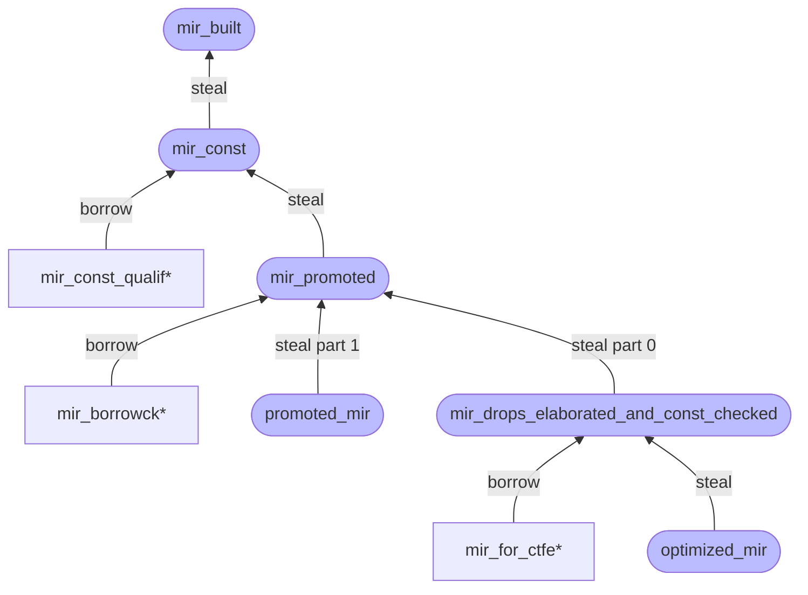

진한 색상의 경기장 모양 쿼리(예: `mir_built`)는 파이프라인의 주 쿼리이고 옅은 색상의 사각형 모양 쿼리(예: `mir_const_qualif*`[^star])는 `&'tcx Steal<Body<'tcx>>`에서 결과를 읽어야 하는 후속 쿼리입니다.
스틸링 메커니즘을 사용하면, 의존성 트리에서 높이가 같거나 더 높은 경기장 모양 쿼리가 실행되기 전에 사각형 모양 쿼리가 먼저 수행되어야 합니다.

[^part]: `mir_promoted` 쿼리는 튜플 `(&'tcx Steal<Body<'tcx>>, &'tcx Steal<IndexVec<Promoted, Body<'tcx>>>)`를 반환합니다. `promoted_mir`는 파트 1(`&'tcx Steal<IndexVec<Promoted, Body<'tcx>>>`)을 훔쳐가고 `mir_drops_elaborated_and_const_checked`는 파트 0(`&'tcx Steal<Body<'tcx>>`)을 훔쳐갑니다.
그리고 이들의 훔치기 연산은 서로 무관하므로, 즉 따로 수행될 수 있습니다.

[^star]: 쿼리의 `*` 접미사는 동일한 접두사를 가진 쿼리 집합을 나타냅니다.
예를 들어 `mir_borrowck*`는 `mir_borrowck`, `mir_borrowck_const_arg` 및 `mir_borrowck_opt_const_arg`를 나타냅니다.

##### 예시

예를 들어 MIR const 자격 증명을 생각해 보세요.
이것은 `mir_const` 쿼리에 의해 생성된 결과를 읽고자 합니다.
그러나 해당 결과는 파이프라인의 특정 시점에 `mir_promoted` 쿼리에 의해 **훔쳐지게** 됩니다. `mir_promoted`가 쿼리되기 전에 `mir_const_qualif` 쿼리를 호출하는 것은, `mir_const`가 `Steal` 결과를 생성하거나(처음 쿼리될 때) 캐시할 것이고(여러 번 쿼리될 때) 결과가 아직 훔쳐지지 않았으므로 성공합니다. `mir_promoted`가 쿼리된 후에는 결과가 훔쳐진 상태가 되므로 결과를 읽기 위해 `mir_const_qualif` 쿼리를 호출하면 패닉이 발생합니다.

따라서 이러한 스틸링 메커니즘을 사용할 때, `mir_promoted`는 실제로 훔쳐가기 전에 모든 `mir_const_qualif*` 쿼리가 먼저 호출되도록 보장해야 하며 이를 통해 읽기 작업이 이미 일어났음을 보장해야 합니다([쿼리는 메모이제이션(memoized)되므로](../query.html) 동일한 쿼리를 두 번 실행하면 두 번째에는 캐시에서 읽어옴).

[rust-lang/rust#41710]: https://github.com/rust-lang/rust/issues/41710
[mirpass]: https://doc.rust-lang.org/nightly/nightly-rustc/rustc_mir_transform/pass_manager/trait.MirPass.html
[lint1]: https://doc.rust-lang.org/nightly/nightly-rustc/rustc_mir_transform/check_packed_ref/struct.CheckPackedRef.html
[lint2]: https://doc.rust-lang.org/nightly/nightly-rustc/rustc_mir_transform/check_const_item_mutation/struct.CheckConstItemMutation.html
[lint3]: https://doc.rust-lang.org/nightly/nightly-rustc/rustc_mir_transform/function_item_references/struct.FunctionItemReferences.html
[opt1]: https://doc.rust-lang.org/nightly/nightly-rustc/rustc_mir_transform/simplify/enum.SimplifyCfg.html
[opt2]: https://doc.rust-lang.org/nightly/nightly-rustc/rustc_mir_transform/remove_unneeded_drops/struct.RemoveUnneededDrops.html
[mirtransform]: https://doc.rust-lang.org/nightly/nightly-rustc/rustc_mir_transform/
[`RemoveStorageMarkers`]: https://doc.rust-lang.org/nightly/nightly-rustc/rustc_mir_transform/remove_storage_markers/struct.RemoveStorageMarkers.html
[cleanup-pass]: https://doc.rust-lang.org/nightly/nightly-rustc/rustc_mir_transform/cleanup_post_borrowck/struct.CleanupPostBorrowck.html
[cleanup-source]: https://github.com/rust-lang/rust/blob/e2b52ff73edc8b0b7c74bc28760d618187731fe8/compiler/rustc_mir_transform/src/cleanup_post_borrowck.rs#L27
[pass-register]: https://github.com/rust-lang/rust/blob/e2b52ff73edc8b0b7c74bc28760d618187731fe8/compiler/rustc_mir_transform/src/lib.rs#L413
[MIR visitor]: ./visitor.html


## 인라인 어셈블리 (Inline assembly) {#asm}

### 개요 (Overview)

rustc의 인라인 어셈블리는 대부분 `asm!` 매크로 호출을 취하여 LLVM 코드 생성에 이르기까지 모든 컴파일러 레이어로 배관(plumbing)하는 작업을 중심으로 이루어집니다.
다양한 단계를 거치는 동안 `InlineAsm`은 일반적으로 3가지 구성 요소로 이뤄집니다:

- 템플릿 문자열: `InlineAsmTemplatePiece` 배열로 저장됩니다.
  각 조각은 리터럴 또는 피연산자에 대한 자리 표시자(placeholder)를 나타냅니다(format 문자열과 마찬가지임).

  ```rust
  pub enum InlineAsmTemplatePiece {
      String(String),
      Placeholder { operand_idx: usize, modifier: Option<char>, span: Span },
  }
  ```

- `asm!`에 대한 피연산자 목록 (`in`, `[late]out`, `in[late]out`, `sym`, `const`).
  이들은 하향 변환 단계마다 다르게 표현되지만 공통 패턴을 따릅니다:
  - `in`, `out` 및 `inout`은 모두 관련 레지스터 클래스(`reg`) 또는 명시적 레지스터(`"eax"`)를 가집니다.
  - `inout`에는 두 가지 형태가 있습니다:
    읽고 쓰는 단일 표현식이 있는 형태와 입출력 부분에 대한 두 개의 별도 표현식이 있는 형태.
  - `out` 및 `inout`은 레지스터 할당자가 이 출력에 대해 입력 레지스터를 재사용할 수 있도록 허용함을 나타내는 `late` 플래그(`lateout` / `inlateout`)를 가집니다.
  - `out` 및 `inout`의 분할 배리언트는 출력에 대해 `_`가 지정되는 것을 허용하며 이는 출력이 버려짐을 의미합니다.
    이것은 어셈블리 코드를 위한 스크래치 레지스터를 할당하는 데 사용됩니다.
  - `const`는 익명 상수를 참조하며 일반적으로 인라인 const처럼 작동합니다.
  - `sym`은 `static` 또는 `fn`을 가리켜야 하는 경로 표현식만 허용하므로 약간 특별합니다.

- `asm!` 매크로 끝에 설정된 옵션들.
  rustc에 특별히 흥미로운 옵션은 `asm!`이 `()` 대신 `!`를 반환하게 만드는 `NORETURN`과 format 문자열 구문 분석을 비활성화하는 `RAW`뿐입니다.
  나머지 옵션은 거의 처리되지 않고 LLVM으로 전달됩니다.

  ```rust
  bitflags::bitflags! {
      pub struct InlineAsmOptions: u16 {
          const PURE = 1 << 0;
          const NOMEM = 1 << 1;
          const READONLY = 1 << 2;
          const PRESERVES_FLAGS = 1 << 3;
          const NORETURN = 1 << 4;
          const NOSTACK = 1 << 5;
          const ATT_SYNTAX = 1 << 6;
          const RAW = 1 << 7;
          const MAY_UNWIND = 1 << 8;
      }
  }
  ```

### AST

`InlineAsm`은 AST에서 [`ast::InlineAsm` 타입][inline_asm_ast]의 표현식으로 표현됩니다.

`asm!` 매크로는 `rustc_builtin_macros`에 구현되어 있으며 `InlineAsm` AST 노드를 출력합니다.
템플릿 문자열은 `fmt_macros`를 사용하여 파싱되며 위치 및 이름 지정 피연산자는 명시적 피연산자 인덱스로 해소됩니다.
매크로 호출 시점에는 타깃 정보를 이용할 수 없으므로 레지스터 및 레지스터 클래스의 검증은 AST 하향 변환 단계로 연기됩니다.

[inline_asm_ast]: https://doc.rust-lang.org/nightly/nightly-rustc/rustc_ast/ast/struct.InlineAsm.html

### HIR

`InlineAsm`은 HIR에서 [`hir::InlineAsm` 타입][inline_asm_hir]의 표현식으로 표현됩니다.

AST 하향 변환은 `InlineAsmRegOrRegClass`가 `Symbol`에서 실제 레지스터 또는 레지스터 클래스로 변환되는 위치입니다.
템플릿 문자열 자리 표시자에 수정자가 지정된 경우 해당 피연산자 타입에 허용된 집합에 대해 검증됩니다.
마지막으로 입력 및 출력에 대한 명시적 레지스터에 충돌(서로 다른 피연산자에 동일한 레지스터 사용)이 있는지 검사합니다.

[inline_asm_hir]: https://doc.rust-lang.org/nightly/nightly-rustc/rustc_hir/hir/struct.InlineAsm.html

### 타입 검사 (Type checking)

각 레지스터 클래스에는 함께 사용할 수 있는 타입의 허용 목록이 있습니다.
모든 피연산자의 타입이 결정되면 `intrinsicck` 패스는 이러한 타입이 허용 목록에 있는지 검사합니다.
또한 분할 `inout` 피연산자가 호환되는 타입을 가졌는지, `const` 피연산자가 정수 또는 부동 소수점인지 검사합니다.
전달된 타입을 기반으로 피연산자에 템플릿 수정자를 사용해야 하는 경우 제안 사항이 발출됩니다.

### THIR

`InlineAsm`은 THIR에서 [`InlineAsmExpr` 타입][inline_asm_thir]의 표현식으로 표현됩니다.

HIR과 비교한 유일한 유의미한 변화는 `Sym`이 `expr`이 `fn`의 `Literal` ZST인 `SymFn` 또는 `static`의 `DefId`를 가리키는 `SymStatic`으로 하향 변환되었다는 점입니다.

[inline_asm_thir]: https://doc.rust-lang.org/nightly/nightly-rustc/rustc_middle/thir/struct.InlineAsmExpr.html

### MIR

`InlineAsm`은 MIR에서 [`TerminatorKind::InlineAsm` 배리언트][inline_asm_mir]를 가진 `Terminator`로 표현됩니다.

THIR 하향 변환의 일환으로 `InOut` 및 `SplitInOut` 피연산자는 별도의 `in_value` 및 `out_place`를 가진 분할 형태로 하향 변환됩니다.

구문론적으로 `InlineAsm` 종단자는 `Call` 종단자가 단일 반환 장소 출력만 가지는 반면 여러 출력 장소를 가질 수 있다는 점을 제외하면 `Call` 종단자와 유사합니다.

[inline_asm_mir]: https://doc.rust-lang.org/nightly/nightly-rustc/rustc_middle/mir/enum.TerminatorKind.html#variant.InlineAsm

### 코드 생성 (Codegen)

피연산자는 LLVM 코드 생성으로 전달되기 전에 한 번 더 하향 변환됩니다.
이는 `rustc_codegen_ssa`의 [`InlineAsmOperandRef` 타입][inline_asm_codegen]으로 표현됩니다.

피연산자는 LLVM 필요에 따라 다음과 같이 LLVM 피연산자 및 제약 조건 코드로 하향 변환됩니다:
- LLVM 요구 사항에 따라 `out` 및 `inout` 피연산자의 출력 부분이 먼저 추가됩니다.
  Late 출력 피연산자는 제약 조건 코드에 `=` 접두사가 붙고 비-late 출력 피연산자는 제약 조건 코드에 `=&` 접두사가 붙습니다.
- `in` 피연산자는 정상적으로 추가됩니다.
- `inout` 피연산자는 일치하는 출력 피연산자에 연결됩니다.
- `sym` 피연산자는 `"s"` 제약 조건을 사용하여 함수 포인터 또는 포인터로 전달됩니다.
- `const` 피연산자는 문자열로 포맷팅되어 템플릿 문자열에 직접 삽입됩니다.

템플릿 문자열은 LLVM 형태로 변환됩니다:
- `$` 문자는 `$$`로 이스케이프 처리됩니다.
- `const` 피연산자는 문자열로 변환되어 직접 삽입됩니다.
- 자리 표시자는 `${X:M}`으로 포맷팅되며 여기서 `X`는 피연산자 인덱스이고 `M`은 수정자 문자입니다.
  수정자는 Rust 형태에서 LLVM 형태로 변환됩니다.

다양한 옵션들은 클로버(clobber) 제약 조건 또는 LLVM 속성으로 변환됩니다; 자세한 내용은 [RFC]를 참조하세요.

LLVM은 특정 제약 조건 코드에 대해 수용하는 타입에 대해 다소 까다로울 때가 있으므로 때때로 지원되는 타입으로/으로부터의 변환을 삽입해야 한다는 점에 유의하세요.
각 레지스터 클래스에 대해 지원되는 타입의 자세한 내용은 LLVM의 타깃 전용 ISelLowering.cpp 파일을 참조하세요.

[inline_asm_codegen]: https://doc.rust-lang.org/nightly/nightly-rustc/rustc_codegen_ssa/traits/enum.InlineAsmOperandRef.html

### 새로운 아키텍처에 대한 지원 추가하기 (Adding support for new architectures)

아키텍처에 인라인 어셈블리 지원을 추가하는 것은 주로 해당 아키텍처에 대한 레지스터 및 레지스터 클래스를 정의하는 작업입니다.
레지스터 클래스에 대한 모든 정의는 `compiler/rustc_target/asm/`에 위치합니다.

또한 `compiler/rustc_codegen_llvm/asm.rs`에서 이러한 레지스터 클래스를 LLVM 제약 조건 코드로 하향 변환하는 것을 구현해야 합니다.

새로운 아키텍처를 추가할 때 LLVM 소스 코드와 교차 검증해야 합니다:
- LLVM은 특정 제약 조건 코드와 함께 사용할 수 있는 타입에 제한을 두고 있습니다. `lib/Target/${ARCH}/${ARCH}ISelLowering.cpp` 내 `getRegForInlineAsmConstraint` 함수를 참조하세요.
- LLVM은 내부 용도로 특정 레지스터를 예약해 두어 인라인 어셈블리 블록 주변에서 해당 레지스터가 제대로 저장/복원되지 않도록 만듭니다. 이러한 레지스터는 `lib/Target/${ARCH}/${ARCH}RegisterInfo.cpp` 내 `getReservedRegs` 함수에 나열되어 있습니다.
  프레임/베이스 포인터와 같은 모든 "조건부" 예약 레지스터는 함수에 프레임/베이스 포인터가 필요한지 여부를 사전에 알 수 없으므로 Rust 목적으로 항상 예약된 것으로 처리해야 합니다.

### 테스트 (Tests)

인라인 어셈블리에 대한 다양한 테스트를 사용할 수 있습니다:

- `tests/assembly-llvm/asm`
- `tests/ui/asm`
- `tests/codegen-llvm/asm-*`

인라인 어셈블리가 지원하는 모든 아키텍처는 레지스터 클래스와 타입의 모든 조합을 테스트하는 엄격한 테스트를 `tests/assembly-llvm/asm`에 포함해야 합니다.


# 지원 인프라 (Supporting infrastructure)

## 커맨드라인 인자 (Command-line Arguments) {#cli}

커맨드라인 플래그는 [rustc 북][cli-docs]에 문서화되어 있습니다. 모든 *안정(stable)* 플래그는 여기에 문서화되어야 합니다. 미확정 플래그는 [unstable 북][unstable book]에 문서화되어야 합니다.

새로운 커맨드라인 인자를 추가하는 *절차*에 대한 세부사항은 [새 옵션을 위한 forge 가이드][forge guide for new options]를 참조하세요.

### 지침 (Guidelines)

- 플래그는 서로 직교적(orthogonal)이어야 합니다. 예를 들어 여러 작업 `foo` 및 `bar`에 대해 JSON을 출력하는 배리언트가 필요한 경우, `--foo-json` 및 `--bar-json`을 추가하는 것보다 추가 `--json` 플래그를 두는 것이 좋습니다.
- `no-` 접두사가 붙은 플래그를 피하세요. 대신 `-C embed-bitcode=no`와 같이 [`parse_bool`] 함수를 사용하세요.
- 플래그가 여러 번 전달되는 경우의 동작을 고려하세요. 어떤 상황에서는 값이 (순서대로!) 누적되어야 합니다. 다른 상황에서는 후속 플래그가 이전 플래그를 오버라이드해야 합니다(예: 린트 수준 플래그). 그리고 일부 플래그(예: `-o`)는 여러 플래그가 무엇을 의미하는지 너무 모호한 경우 오류를 발생시켜야 합니다.
- 이해하기 쉬운 컴파일러 스크립트를 위해서라도 항상 길고 설명적인 이름을 사용하세요.
- `--verbose` 플래그는 `rustc` 출력에 세부 정보를 추가하기 위한 것입니다. 예를 들어 `--version` 플래그와 함께 사용하면 컴파일러 코드의 해시에 대한 정보를 제공합니다.
- 실험적 플래그 및 옵션은 `-Z unstable-options` 플래그 뒤에 보호되어야 합니다.

[cli-docs]: https://doc.rust-lang.org/rustc/command-line-arguments.html
[forge guide for new options]: https://forge.rust-lang.org/compiler/proposals-and-stabilization.html#compiler-flags
[unstable book]: https://doc.rust-lang.org/nightly/unstable-book/
[`parse_bool`]: https://github.com/rust-lang/rust/blob/e5335592e78354e33d798d20c04bcd677c1df62d/src/librustc_session/options.rs#L307-L313


## `rustc_driver` 및 `rustc_interface` {#rustc-driver-intro}

### `rustc_driver`

[`rustc_driver`]는 본질적으로 `rustc`의 `main` 함수입니다.
이것은 [`rustc_interface`] 크레이트에 정의된 인터페이스를 사용하여 컴파일러의 다양한 단계를 올바른 순서로 실행하기 위한 접착제(glue) 역할을 합니다. 가능한 경우 [`rustc_interface`]보다는 [`rustc_driver`]를 사용하는 것이 권장됩니다.

[`rustc_driver`]의 주요 진입점은 [`rustc_driver::run_compiler`][rd_rc]입니다.
이 빌더는 rustc와 동일한 커맨드라인 인자 및 [`Callbacks`] 구현체와 몇 가지 기타 선택적 옵션을 받습니다. [`Callbacks`]는 커스텀 컴파일러 설정을 허용할 뿐만 아니라 컴파일의 여러 단계 이후에 커스텀 코드가 실행될 수 있도록 하는 `trait`입니다.

### `rustc_interface`

[`rustc_interface`] 크레이트는 외부 사용자에게 컴파일 프로세스를 수동으로 이끌 수 있는 저수준 API를 제공하여 서드파티가 크레이트를 분석하기 위한 라이브러리로 `rustc` 내부를 효과적으로 사용하거나 [`rustc_driver`]가 충분히 유연하지 않은 경우(예: `rustdoc`이 코드를 컴파일하고 출력을 제공하는 경우) 컴파일러를 임시로 에뮬레이트할 수 있도록 해줍니다.

[`rustc_interface`]의 주요 진입점([`rustc_interface::run_compiler`][i_rc])은 컴파일러에 대한 설정 변수와 아직 미해결 상태인 [`Compiler`]를 받는 `closure`를 받습니다. [`run_compiler`][i_rc]는 설정으로부터 `Compiler`를 생성하고 이를 `closure`에 전달합니다. `closure` 내부에서 `Compiler`를 사용하여 크레이트를 컴파일하고 결과를 얻기 위해 다양한 함수를 호출할 수 있습니다. [`rustc_interface`]를 사용하는 방법에 대한 최소한의 예시는 [여기][example]에서 볼 수 있습니다.

[`rustc_interface`]가 필요로 하는 다양한 함수를 사용하는 예시는 `rustc_driver` 구현체, 특히 [`rustc_driver_impl::run_compiler`][rdi_rc]([`rustc_interface::run_compiler`][i_rc]와 혼동하지 말 것)를 살펴봄으로써 확인할 수 있습니다.

> **경고:** 본질적으로 내부 컴파일러 API는 항상 불안정합니다. 그럼에도 불구하고 불필요하게 파손을 일으키지 않도록 노력하고 있습니다.


[`Compiler`]: https://doc.rust-lang.org/nightly/nightly-rustc/rustc_interface/interface/struct.Compiler.html
[`Callbacks`]: https://doc.rust-lang.org/nightly/nightly-rustc/rustc_driver/trait.Callbacks.html
[example]: https://github.com/rust-lang/rustc-dev-guide/blob/main/examples/rustc-interface-example.rs
[i_rc]: https://doc.rust-lang.org/nightly/nightly-rustc/rustc_interface/interface/fn.run_compiler.html
[rd_rc]: https://doc.rust-lang.org/nightly/nightly-rustc/rustc_driver/fn.run_compiler.html
[rdi_rc]: https://doc.rust-lang.org/nightly/nightly-rustc/rustc_driver_impl/fn.run_compiler.html


### 외부 `rustc_driver`들 {#rustc-driver-external-rustc-drivers}

#### `rustc_private`

##### 개요 (Overview)

`rustc_private` 기능은 외부 크레이트가 컴파일러 내부를 사용할 수 있도록 해줍니다.

##### 공식 툴체인과 함께 `rustc_private` 사용하기

rustup을 통해 배포되는 공식 Rust 툴체인과 함께 `rustc_private` 기능을 사용할 때는 두 가지 추가 구성 요소를 설치해야 합니다:

1. **`rustc-dev`**: 컴파일러 라이브러리를 제공함
2. **`llvm-tools`**: 링크 작업에 필요한 LLVM 라이브러리를 제공함

###### 설치 단계

rustup을 사용하여 두 구성 요소를 모두 설치합니다:

```text
rustup component add rustc-dev llvm-tools
```

###### 일반적인 오류

`llvm-tools` 구성 요소가 없으면 다음과 같은 링킹 오류가 발생합니다:

```text
error: linking with `cc` failed: exit status: 1
  |
  = note: rust-lld: error: unable to find library -lLLVM-{version}
```

##### 커스텀 툴체인과 함께 `rustc-private` 사용하기

커스텀 빌드 툴체인이나 rustup을 사용하지 않는 환경의 경우 일반적으로 추가 설정이 필요합니다:

###### 요구 사항

- LLVM 라이브러리가 시스템 라이브러리 검색 경로에서 사용 가능해야 함
- LLVM 버전이 Rust 툴체인을 빌드하는 데 사용된 버전과 일치해야 함

###### 문제 해결 단계

1. LLVM이 설치되어 있고 접근 가능한지 확인
2. 라이브러리 경로가 설정되어 있는지 확인:
   ```sh
   export LD_LIBRARY_PATH=/path/to/llvm/lib:$LD_LIBRARY_PATH
   ```
3. LLVM 버전이 Rust 툴체인과 호환되는지 확인

##### 트리 외부(out-of-tree) 프로젝트를 위한 `rust-analyzer` 설정

`rustc_private` 크레이트를 사용하는 트리 외부 프로젝트를 개발할 때 이러한 크레이트를 인식하도록 `rust-analyzer`를 설정할 수 있습니다.

###### 설정 단계

1. 에디터 설정에서 `rust-analyzer.rustc.source`를 `"discover"`로 설정합니다.

   VS Code의 경우 `rust_analyzer_settings.json`에 다음을 추가합니다:
   ```json
   {
       "rust-analyzer.rustc.source": "discover"
   }
   ```

2. `rustc_private`을 사용하는 모든 크레이트의 `Cargo.toml`에 다음을 추가합니다:
   ```toml
   [package.metadata.rust-analyzer]
   rustc_private = true
   ```

이 설정을 통해 `rust-analyzer`가 트리 외부 프로젝트에서 `rustc_private` 크레이트를 올바르게 인식하고 IDE 지원을 제공할 수 있습니다.

##### `rustc_private`용 nightly 문서 얻기

###### 최신 nightly

최신 nightly의 경우 `rustc-docs` 구성 요소를 설치하고 브라우저에서 직접 열 수 있습니다:

```sh
rustup component add rustc-docs
rustup doc --rustc-docs
```

> 참고: `rustc-docs` 구성 요소는 최근 nightly 툴체인에서만 사용할 수 있으며 모든 nightly 날짜에 대해 존재하지 않을 수 있습니다. [PR #75560](https://github.com/rust-lang/rust/pull/75560)(2020년 8월)에 처음 도입되었습니다.

###### 이전 nightlies

이전 nightly의 컴파일러 내부에 의존하는 경우 해당 특정 nightly의 내부 문서를 참조하고 싶을 수 있습니다.
이를 수행하는 유일한 방법은 문서를 로컬에서 생성하는 것입니다.
예를 들어 `nightly-2025-11-08`에 대한 문서를 얻으려면:

해당 nightly의 Git 커밋 해시를 얻습니다:

```sh
rustup toolchain install nightly-2025-11-08
rustc +nightly-2025-11-08 --version --verbose
```

출력에는 정확한 소스 리비전을 식별하는 `commit-hash` 줄이 포함됩니다. 해당 커밋에서 `rust-lang/rust`를 체크아웃한 다음 [컴파일러 문서화 단계](#building-compiler-documenting)를 따르세요.


##### 추가 리소스

- [GitHub Issue #137421]은 `llvm-tools`가 설치되어 있지 않아 `rustc_private` 링커 실패가 자주 발생한다는 점을 설명합니다.

[GitHub Issue #137421]: https://github.com/rust-lang/rust/issues/137421


### 예시: `rustc_driver`를 통한 타입 검사 {#rustc-driver-interacting-with-the-ast}

[`rustc_driver`]를 통해 컴파일의 다양한 단계에서 Rust 코드와 상호작용할 수 있습니다.

#### 표현식의 타입 얻기

표현식의 타입을 얻으려면 [`after_analysis`] 콜백을 사용하여 [`TyCtxt`]를 구합니다.

```rust
{{#include ../../examples/rustc-driver-interacting-with-the-ast.rs}}
```
[`after_analysis`]: https://doc.rust-lang.org/nightly/nightly-rustc/rustc_driver/trait.Callbacks.html#method.after_analysis


### 예시: `rustc_interface`를 통해 진단 메시지 얻기 {#rustc-driver-getting-diagnostics}

[`rustc_interface`]를 사용하면 그렇지 않았다면 stderr로 출력되었을 진단 메시지를 가로챌 수 있습니다.

#### 진단 메시지 구하기

컴파일러로부터 진단 메시지를 얻으려면 버퍼로 진단 메시지를 출력하도록 [`rustc_interface::Config`]를 설정하고 각 아이템에 대해 [`TyCtxtEnsureOk::typeck`]를 실행합니다.

```rust
{{#include ../../examples/rustc-interface-getting-diagnostics.rs}}
```

[`TyCtxtEnsureOk::typeck`]: https://doc.rust-lang.org/nightly/nightly-rustc/rustc_middle/query/struct.TyCtxtEnsureOk.html#method.typeck


## 오류 및 린트 (Errors and lints) {#diagnostics}

`rustc`가 훌륭한 오류 메시지를 가질 수 있도록 많은 노력이 주어졌습니다.
이 장에서는 컴파일러에서 컴파일 오류 및 린트를 발출하는 방법에 대한 설명입니다.

### 진단 구조 (Diagnostic structure)

진단 오류의 주요 부분은 다음과 같습니다:

```
error[E0000]: main error message
  --> file.rs:LL:CC
   |
LL | <code>
   | -^^^^- secondary label
   |  |
   |  primary label
   |
   = note: note without a `Span`, created with `.note`
note: sub-diagnostic message for `.span_note`
  --> file.rs:LL:CC
   |
LL | more code
   |      ^^^^
```

- 수준(`error`, `warning` 등). 메시지의 심각도를 나타냅니다.
  ([진단 수준](#diagnostic-levels) 참조)
- 코드 (예를 들어 "타입 불일치"의 경우 `E0308`임).
  사용자가 오류 코드 인덱스의 문제에 대한 확장된 설명을 통해 현재 오류에 대한 자세한 정보를 얻는 데 도움이 됩니다.
  모든 진단에 코드가 있는 것은 아닙니다.
  예를 들어 린트에 의해 생성된 진단 메시지에는 코드가 없습니다.
- 메시지.
  문제에 대한 주된 설명입니다.
  일반적이어야 하며 독립적으로 존재할 수 있어야 고립된 상태에서도 의미가 통합니다.
- 진단 창.
  여기에는 몇 가지 항목이 포함됩니다:
  - 기본 스팬의 시작 부분에 대한 경로, 줄 번호 및 열 번호.
  - 영향을 받는 사용자의 코드 및 그 주변 코드.
  - 사용자의 코드 바탕에 깔려 있는 기본 및 보조 스팬.
    이 이러한 스팬에는 선택적으로 하나 이상의 레이블이 포함될 수 있습니다.
  - 기본 스팬은 표시되는 것이 그것뿐인 경우에도(예: IDE에서) 여전히 의미를 이해할 수 있을 만큼 충분한 텍스트를 포함해야 합니다.
    코드를 직접 가리키고 있기 때문에 일반적으로 오류 메시지보다 더 간결할 수 있습니다.
  - 여러 스팬 레이블이 겹쳐서 난잡한 출력이 예상되는 경우 출력을 적절히 조정하는 것이 좋습니다.
    예를 들어 `if/else arms have incompatible types` 오류는 분기가 모두 동일한 줄에 있는지, 분기 중 하나가 비어 있는지, 이러한 사례 중 어느 것도 적용되지 않는지에 따라 서로 다른 스팬을 사용합니다.
- 하위 진단.
  모든 오류는 오류의 주요 부분과 유사하게 보이는 여러 하위 진단을 가질 수 있습니다.
  이들은 설명 순서가 코드 순서와 일치하지 않을 수 있는 경우에 사용됩니다.
  설명 순서가 "순서 독립적"일 수 있다면, 주요 진단에서 보조 레이블을 지렛대 삼아 활용하는 편이 일반적으로 덜 장황하므로 선호됩니다.
The text should be matter of fact and avoid capitalization and periods, unless
multiple sentences are _needed_:

```txt
error: the fobrulator needs to be krontrificated
```

When code or an identifier must appear in a message or label, it should be
surrounded with backticks:

```txt
error: the identifier `foo.bar` is invalid
```

#### 에러 코드 및 설명

대부분의 에러에는 관련 에러 코드가 있습니다.
에러 코드는 에러를 유발하는 예시와 에러에 대한 심층적인 세부 정보가 포함된 긴 형식의 설명으로 링크됩니다.
`--explain` 플래그를 사용하거나 [error index]를 통해 확인할 수 있습니다.

일반적인 규칙으로서, 설명이 에러 자체보다 더 많은 정보를 제공하는 경우 에러에 코드(및 관련 설명)를 부여하세요.
대부분의 경우 출력되는 에러 자체에 모든 정보를 담는 것이 더 좋습니다.
하지만 이로 인해 에러가 장황해지거나 가능한 유발 조건이 너무 많아 에러 메시지에 모든 경우에 대한 유용한 정보를 포함하기 어려운 경우도 있으며 이런 경우에는 설명을 추가하는 것이 좋습니다.[^estebank]
언제나 그렇듯, 확실하지 않다면 리뷰어에게 문의하세요!

관련 에러 코드가 있는 새 에러를 추가하기로 결정했다면 프로세스에 대한 가이드 및 중요한 세부 사항은 [이 섹션][error-codes]을 읽어보세요.

[^estebank]: 이 경험칙은 **`@estebank`**가 [여기][estebank-comment]에서 제안했습니다.

[error index]: https://doc.rust-lang.org/error-index.html
[estebank-comment]: https://github.com/rust-lang/rustc-dev-guide/pull/967#issuecomment-733218283
[error-codes]: #diagnostics-error-codes

#### 린트 대 고정 진단

일부 메시지는 사용자가 단계를 제어할 수 있는 [린트](#lints)를 통해 출력됩니다.
대부분의 진단은 사용자가 단계를 제어할 수 없도록 하드코딩되어 있습니다.

진단을 "고정(fixed)"으로 할지 린트로 할지 명확한 경우가 많지만 약간의 회색 지대도 존재합니다.

몇 가지 예시는 다음과 같습니다:

- 빌림 검사기(Borrow checker) 에러: 고정 에러입니다.
  사용자는 빌림 검사기를 침묵시키기 위해 이러한 진단의 단계를 조정할 수 없습니다.
- 사코드(Dead code): 린트입니다.
  사용자가 크레이트에 사코드가 포함되는 것을 원치 않더라도, 이를 하드 에러(hard error)로 만들면 리팩토링과 개발 과정이 매우 고통스러워집니다.
- [future-incompatible lints][]: 무시할 수 있는 린트입니다.
  이를 고정 에러로 만들면 너무 많은 파손(breakage)이 발생할 것이라고 판단되어 대신 경고가 출력되며 최종적으로는 고정(하드) 에러로 전환될 예정입니다.

일반적인 코드에서는 하드코딩된 경고(`span_warn`과 같은 메서드를 사용하는 경고)를 피하고 대신 린트를 사용하는 것이 좋습니다.
CLI 플래그와 관련된 경고 등 일부 경우에는 하드코딩된 경고의 사용이 필요합니다.

고정 에러 대신 에러 수준 린트를 사용해야 하는 시기에 대한 가이드라인은 아래의 `deny` [린트 단계](#diagnostic-levels)를 참조하세요.

[future-incompatible lints]: #future-incompatible-lints

### 진단 출력 스타일 가이드

- 평이하고 간단한 영어로 작성하세요.
  오래 청소하지 않은 (어쩌면 작은) 화면에 표시되었을 때 밤새 파티를 마치고 방금 침대에서 나온 일반적인 프로그래머가 이해할 수 없는 메시지라면 너무 복잡한 것입니다.
- `Error`, `Warning`, `Note`, `Help` 메시지는 소문자로 시작하며 문장 부호로 끝나지 않습니다.
- 에러 메시지는 간결해야 합니다.
  사용자는 이러한 에러 메시지를 수없이 보게 되며 더 자세한 설명은 `--explain` 플래그로 볼 수 있습니다.
  그렇다고 이해하기 힘들 정도로 너무 간략하게 만들지는 마세요.
- "illegal"이라는 단어의 사용은 금지됩니다("illegal" is illegal).
  대신 "invalid"나 더 구체적인 단어를 사용하세요.
- 에러는 발생한 코드의 스팬(span)을 기록해야 합니다(이를 쉽게 수행하려면 [`rustc_errors::DiagCtxt`][DiagCtxt]의 `span_*` 메서드나 진단 구조체의 `#[primary_span]`을 사용하세요).
  또한 스팬이 너무 크지 않다면 에러 원인이 된 다른 스팬도 `note`로 알리세요.
- 스팬과 함께 메시지를 출력할 때는 문제를 충분히 가리키면서도 가능한 한 가장 작은 영역으로 스팬을 줄이도록 노력하세요.
- 동일한 에러에 대해 여러 에러 메시지를 출력하지 않도록 하세요.
  이를 위해 중복 검출이 필요할 수 있습니다.
- 특정 에러 메시지에 대한 정보가 컴파일러에 너무 부족한 경우, 더 많은 정보를 추가할 수 있도록 라이브러리 코드용 새 속성을 추가하는 방안을 컴파일러 팀과 논의하세요.
  예를 들어 [`#[rustc_on_unimplemented]`](#rustc_on_unimplemented)를 참조하세요.
  사용 가능한 경우 이러한 어노테이션을 활용하세요!
- 러스트의 학습 곡선이 꽤 가파르며 컴파일러 메시지가 중요한 학습 도구라는 점을 명심하세요.
- 컴파일러를 언급할 때는 `Rust`나 `rustc`가 아니라 `the compiler`라고 부르세요.
- 항목 목록을 작성할 때는 [옥스퍼드 콤마(Oxford comma)](https://en.wikipedia.org/wiki/Serial_comma)를 사용하세요.
- 속성을 언급할 때는 가능하면 항상 "the `inline` attribute" 형태를 사용하세요.
  관련이 있는 경우가 아니라면 메시지나 스팬에 `#[`/`#![`/`]` 구분자나 속성 인수를 포함하지 마세요.

#### 린트 명명 규약

[RFC 0344]에 따라 린트 이름은 일관성이 있어야 하며 다음 가이드라인을 따릅니다:

기본 규칙은: 린트 이름이 "allow *lint-name*" 또는 "allow *lint-name* items"로 읽혔을 때 자연스러워야 한다는 것입니다.
예를 들어 "allow `deprecated` items" 및 "allow `dead_code`"는 자연스러운 반면, "allow `unsafe_block`"은 문법적으로 맞지 않습니다(복수형이어야 함).

- 린트 이름은 검사 대상이 되는 바람직하지 않은 항목을 명시해야 합니다(예: `deprecated`).
  그래야 `#[allow(deprecated)]` (items)가 올바르게 읽힙니다.
  따라서 `ctypes`는 적절한 이름이 아니며 `improper_ctypes`가 적절합니다.

- 임의의 항목에 적용되는 린트(안정성 린트 등)는 검사 항목만 명시해야 합니다. `deprecated_items` 대신 `deprecated`를 사용하세요.
  이는 린트 이름을 짧게 유지해 줍니다.
  (다시 한 번 강조하지만 "allow *lint-name* items"를 떠올리세요.)

- 린트가 특정 문법적 클래스에 적용되는 경우 해당 클래스를 언급하고 복수형을 사용하세요. `unused_variable` 대신 `unused_variables`를 사용하세요.
  이렇게 하면 `#[allow(unused_variables)]`가 올바르게 읽힙니다.

- 불필요하거나 쓰이지 않는 코드 요소를 감지하는 린트는 `unused`라는 용어를 사용해야 합니다(예: `unused_imports`, `unused_typecasts`).

- 함수 이름에 사용하는 방식과 동일하게 스네이크 케이스(snake_case)를 사용하세요.

[RFC 0344]: https://github.com/rust-lang/rfcs/blob/master/text/0344-conventions-galore.md#lints

#### 진단 단계 (Diagnostic levels)

다양한 진단 단계에 대한 가이드라인:

- `error`: 프로그램이 유효하지 않거나 프로그래머가 특정 `warning`을 에러로 다루기로 결정하여 컴파일러가 프로그램을 컴파일할 수 없는 문제를 감지했을 때 출력됩니다.

- `warning`: 컴파일러가 프로그램에서 이상한 점을 감지했을 때 출력됩니다.
  경고 피로(warning fatigue)를 방지하고 코드에 실제로 문제가 없는 오탐(false-positive)을 피하기 위해 경고를 추가할 때는 주의해야 합니다.
  경고를 발행하는 것이 적절한 몇 가지 예시는 다음과 같습니다:

  - 사용자가 사용 중단된(deprecated) 항목을 교체하거나 `Result`를 사용하는 등 조치를 취해야 하지만 컴파일 자체를 막지는 않는 상황.
  - 코드의 의미론(semantics)에 영향을 주지 않고 제거할 수 있는 불필요한 구문.
    예를 들어 사용되지 않는 코드나 불필요한 `unsafe`.
  - 오류가 있거나 위험하거나 혼란스러울 가능성이 매우 높지만 언어 사양상 기술적으로는 허용되며 아직 에러로 처리할 준비가 되지 않았거나 확신이 부족한 코드.
    예로는 `unused_comparisons` (범위 벗어남 비교)나 `bindings_with_variant_name` (사용자가 패턴에서 바인딩을 생성할 의도가 없었을 가능성이 높은 경우)이 있습니다.
  - [하위 호환성 비호환 린트(Future-incompatible lints)](#future-incompatible): 과거에 실수나 오류로 허용되었지만 거부할 경우 생태계에 과도한 파손(breakage)이 발생하는 경우입니다.
  - 스타일상의 선택.
    예를 들어 카멜 케이스/스네이크 케이스, 또는 2018 에디션의 `dyn` 트레이트 경고 등이 해당합니다.
    이러한 린트를 추가하기 위한 기준은 높으며 예외적인 상황에서만 사용해야 합니다.
    다른 스타일 선택 사항은 기본 허용(allow-by-default) 린트로 만들거나 Clippy 또는 rustfmt 같은 다른 도구의 일부여야 합니다.

- `help`: `error`나 `warning` 다음에 출력되어 문제를 해결하는 방법에 대해 사용자에게 추가 정보를 제공합니다.
  이러한 메시지에는 도구에 의한 자동 소스 수정을 안내하기 위해 제안 문자열과 [`rustc_errors::Applicability`] 신뢰 수준이 포함되는 경우가 많습니다.
  자세한 내용은 [제안(Suggestions)](#suggestions) 섹션을 참조하세요.

  에러나 경고 본문 부분은 문제를 고치는 방법을 제안해서는 *안 되며*, "help" 하위 진단만 제안해야 합니다.

- `note`: 경고나 에러를 발생시킨 추가적인 상황 및 코드 부분을 식별하고 더 많은 컨텍스트를 제공하기 위해 출력됩니다.
  예를 들어 빌림 검사기는 이전의 충돌하는 빌림을 `note`로 제시합니다.

  `help` 대 `note`: `help`는 사용자가 문제를 해결하기 위해 적용할 수 있는 변경 사항을 나타내는 데 사용되어야 합니다.
  `note`는 기타 컨텍스트, 정보 및 사실, 읽어볼 온라인 리소스 등 다른 모든 용도로 사용되어야 합니다.

*린트 단계(lint levels)*와 혼동하지 마세요. 린트 단계의 가이드라인은 다음과 같습니다:

- `forbid`: 린트의 기본값이 `forbid`가 되어서는 안 됩니다.
- `deny`: `error` 진단 단계와 동일합니다.
  몇 가지 예시:

  - 경고 단계를 거쳐 졸업한 하위 호환성 비호환(future-incompatible) 또는 에디션 기반 린트.
  - 오류일 가능성이 매우 높지만 통과를 허용할 수 있는 탈출구(escape hatch)를 여전히 제공하고자 하는 경우.

- `warn`: `warning` 진단 단계와 동일합니다.
  가이드라인은 위 `warning`을 참조하세요.
- `allow`: 기본값이 `allow`여야 하는 린트의 종류 예시:

  - 린트의 오탐률(false positive rate)이 너무 높은 경우.
  - 린트의 기준이 너무 주관적/주장형(opinionated)인 경우.
  - 린트가 실험적인 경우.
  - 일반적으로는 강제되지 않는 사항을 강제하기 위해 사용되는 린트.
    예를 들어 `unsafe_code` 린트는 unsafe 코드 사용을 방지하는 데 사용될 수 있습니다.

린트 단계에 대한 자세한 정보는 [rustc 북][rustc-lint-levels]과 [참조 문서][reference-diagnostics]에서 찾아볼 수 있습니다.

[`rustc_errors::Applicability`]: https://doc.rust-lang.org/nightly/nightly-rustc/rustc_errors/enum.Applicability.html
[reference-diagnostics]: https://doc.rust-lang.org/nightly/reference/attributes/diagnostics.html#lint-check-attributes
[rustc-lint-levels]: https://doc.rust-lang.org/nightly/rustc/lints/levels.html

### 유용한 팁 및 옵션

#### 에러 소스 위치 찾기

주어진 에러가 출력되는 위치를 찾는 방법에는 세 가지 주요 방법이 있습니다:

- 에러 메시지/라벨의 일부 문자열이나 에러 코드로 `grep` 검색을 합니다.
  이 방법은 보통 잘 작동하며 직관적이지만 에러를 출력하는 코드가 상대적으로 깊은 호출 스택에 가려져 에러가 생성되는 코드와 떨어져 있는 경우가 있습니다.
  그럼에도 전반적인 감을 잡기에는 좋은 방법입니다.
- 나이틀리 전용 플래그인 `-Z treat-err-as-bug=1`을 지정하여 `rustc`를 호출하면 첫 번째로 출력되는 에러가 내부 컴파일러 에러(ICE)로 처리되어 에러가 출력된 시점의 스택 트레이스(stack trace)를 얻을 수 있습니다.
  나중에 발생하는 에러에서 트리거하려면 `1`을 다른 숫자로 변경하세요.

  이 방식에는 몇 가지 한계가 있습니다:
  - 컴파일된 `rustc`에서 인라인화되어 스택 트레이스에서 일부 호출이 생략됩니다.
  - 에러의 _생성_ 위치가 에러가 _출력_되는 위치와 멀리 떨어져 있을 수 있어, `grep` 방식에서 겪는 문제와 유사한 상황이 발생합니다.
    어떤 경우에는 에러를 순서대로 출력하기 위해 여러 에러를 버퍼링하기도 합니다.
- `-Z track-diagnostics` 플래그로 `rustc`를 호출하면 에러 출력 시 에러가 생성된 위치가 함께 인쇄됩니다.

일반적인 개발 모범 사례가 적용됩니다: 일어나는 일의 순서를 파악하기 위해 `debug!()` 문을 적절히 활용하고 디버거를 사용해 중단점(breakpoint)을 설정하세요.

### `Span`

[`Span`][span]은 컴파일 중인 코드의 위치를 나타내기 위해 `rustc`에서 사용하는 기본 데이터 구조입니다.
`Span`은 HIR과 MIR의 대부분 구문 요소에 부착되어 더 풍부한 정보를 담은 에러 보고를 가능하게 합니다.


[`SourceMap`][sourcemap]에서 `Span`을 조회하여 `SourceMap`의 [`span_to_snippet`][sptosnip] 및 기타 유사한 메서드를 통해 에러 표시에 유용한 "스니펫(snippet)"을 얻을 수 있습니다.

[sourcemap]: https://doc.rust-lang.org/nightly/nightly-rustc/rustc_span/source_map/struct.SourceMap.html
[sptosnip]: https://doc.rust-lang.org/nightly/nightly-rustc/rustc_span/source_map/struct.SourceMap.html#method.span_to_snippet

### 에러 메시지

[`rustc_errors`][errors] 크레이트는 에러 보고에 사용되는 대부분의 유틸리티를 정의합니다.

[errors]: https://doc.rust-lang.org/nightly/nightly-rustc/rustc_errors/index.html

진단은 `Diagnostic` 트레이트를 구현하는 타입으로 구현할 수 있습니다.
이는 진단 출력 로직과 메인 코드 경로 간의 분리를 강제하므로 새 진단을 작성할 때 선호됩니다.
덜 복잡한 진단의 경우 `Diagnostic` 트레이트를 파생(derive)할 수 있습니다 -- [진단 구조체(Diagnostic structs)][diagnostic-structs]를 참조하세요.
트레이트 구현 내부에서는 아래에 설명된 API를 평소처럼 사용할 수 있습니다.

[diagnostic-structs]: #diagnostics-diagnostic-structs

[`DiagCtxt`][DiagCtxt]에는 에러를 생성하고 출력하는 메서드가 있습니다.
이러한 메서드는 보통 `span_err`, `struct_span_err`, `span_warn` 등의 이름을 가집니다.
경고 에러, 치명적 에러, 제안 등 서로 다른 유형의 "에러"를 출력하는 수많은 메서드가 존재합니다.

[DiagCtxt]: https://doc.rust-lang.org/nightly/nightly-rustc/rustc_errors/struct.DiagCtxt.html

일반적으로 이러한 메서드에는 에러를 직접 출력하는 메서드와 출력 내용을 더 정밀하게 제어할 수 있는 메서드의 두 가지 클래스가 있습니다.
예를 들어 [`span_err`][spanerr]는 지정된 `Span`에 지정된 에러 메시지를 출력하지만 [`struct_span_err`][strspanerr]는 대신 [`Diag`][diag]를 반환합니다.

이러한 메서드 중 대부분은 문자열을 인수로 받지만 새 진단의 경우 번역 가능한 진단을 위한 타입화된 식별자(typed identifier)를 사용하는 것이 권장됩니다([번역(Translation)] 참조).

[translation]: #diagnostics-translation

`Diag`를 사용하면 [`emit`] 메서드를 호출하여 출력하기 전에 관련 노트와 제안을 에러에 추가할 수 있습니다.
(`Diag`를 출력하거나 [취소(cancel)][cancel]하지 않으면 ICE가 발생합니다.) 수행 가능한 작업에 대한 자세한 정보는 [문서][diag]를 참조하세요.

[spanerr]: https://doc.rust-lang.org/nightly/nightly-rustc/rustc_errors/struct.DiagCtxt.html#method.span_err
[strspanerr]: https://doc.rust-lang.org/nightly/nightly-rustc/rustc_errors/struct.DiagCtxt.html#method.struct_span_err
[`emit`]: https://doc.rust-lang.org/nightly/nightly-rustc/rustc_errors/struct.Diag.html#method.emit
[cancel]: https://doc.rust-lang.org/nightly/nightly-rustc/rustc_errors/struct.Diag.html#method.cancel

```rust,ignore
// `Diag`를 가져옵니다. 아직 에러를 출력하지는 _않습니다_.
let mut err = sess.dcx.struct_span_err(sp, fluent::example::example_error);

// 일부 경우에는 매크로로 생성된 코드에 대해 이상한 에러가 인쇄되는 것을 방지하기 위해
// `sp`가 매크로에서 생성되었는지 확인해야 할 수 있습니다.

if let Ok(snippet) = sess.source_map().span_to_snippet(sp) {
    // 스니펫을 사용하여 제안된 수정 사항을 생성합니다
    err.span_suggestion(suggestion_sp, fluent::example::try_qux_suggestion, format!("qux {}", snippet));
} else {
    // 스니펫을 생성할 수 없었다면 구체적인 "제안(suggestion)" 대신 "도움말(help)" 메시지를
    // 출력합니다. 실제 상황에서 이 코드에 도달할 가능성은 낮습니다.
    err.span_help(suggestion_sp, fluent::example::qux_suggestion);
}

// 에러를 출력합니다
err.emit();
```

```fluent
example-example-error = oh no! this is an error!
  .try-qux-suggestion = try using a qux here
  .qux-suggestion = you could use a qux here instead
```

### 제안 (Suggestions)

사용자에게 코드가 왜 틀렸는지 정확히 알려주는 것 외에도, 해결 방법을 알려줄 수 있는 경우가 많습니다.
이를 위해 [`Diag`][diag]는 구조화된 제안 API를 제공하며 터미널에 코드 제안을 깔끔하게 포맷팅하여 출력하거나 (`--error-format json` 플래그가 전달된 경우) [`rustfix`][rustfix]와 같은 도구에서 소비할 수 있는 JSON 형태로 출력합니다.

[rustfix]: https://github.com/rust-lang/rustfix

모든 제안을 기계적으로 적용할 수 있는 것은 아닙니다.
제안된 코드에는 높음(`Applicability::MachineApplicable`)부터 낮음(`Applicability::MaybeIncorrect`)까지 신뢰도가 존재합니다.
단계를 선택할 때 보수적으로 설정하세요.
제안을 하려면 `Diag`의 [`span_suggestion`][span_suggestion] 메서드를 사용하세요.
마지막 인수는 제안이 기계적으로 적용 가능한지 여부에 대한 힌트를 도구에 제공합니다.

제안은 현재 내용을 대체할 해당 코드와 함께 하나 이상의 스팬을 가리킵니다.

제안에 수반되는 메시지는 다음 컨텍스트에서 이해할 수 있어야 합니다:

- 독립적인 하위 진단으로 표시되는 경우 (기본 출력)
- 영향을 받는 스팬을 가리키는 라벨로 표시되는 경우 (장황함에 대한 특정 휴리스틱을 충족하면 자동으로 수행됨)
- 내용이 없는 `help` 하위 진단으로 표시되는 경우 (텍스트만으로도 제안이 명확하지만 도구가 이를 적용할 수 있도록 허용하려는 경우에 사용됨)
- 표시되지 않는 경우 (_매우_ 명확한 사례에 사용되지만 여전히 도구가 적용할 수 있도록 허용하려는 경우)

[span_suggestion]: https://doc.rust-lang.org/nightly/nightly-rustc/rustc_errors/struct.Diag.html#method.span_suggestion

예를 들어 `qux` 제안을 기계적으로 적용할 수 있도록 만들려면 다음과 같이 합니다:

```rust,ignore
let mut err = sess.dcx.struct_span_err(sp, fluent::example::message);

if let Ok(snippet) = sess.source_map().span_to_snippet(sp) {
    err.span_suggestion(
        suggestion_sp,
        fluent::example::try_qux_suggestion,
        format!("qux {}", snippet),
        Applicability::MachineApplicable,
    );
} else {
    err.span_help(suggestion_sp, fluent::example::qux_suggestion);
}

err.emit();
```

이 코드는 다음과 같은 에러를 출력할 수 있습니다:

```console
$ rustc mycode.rs
error[E0999]: oh no! this is an error!
 --> mycode.rs:3:5
  |
3 |     sad()
  |     ^ help: try using a qux here: `qux sad()`

error: aborting due to previous error

For more information about this error, try `rustc --explain E0999`.
```

제안이 여러 줄에 걸쳐 있거나 제안이 여러 개인 경우와 같은 일부 상황에서는 제안이 별도로 표시됩니다:

```console
error[E0999]: oh no! this is an error!
 --> mycode.rs:3:5
  |
3 |     sad()
  |     ^
help: try using a qux here:
  |
3 |     qux sad()
  |     ^^^

error: aborting due to previous error

For more information about this error, try `rustc --explain E0999`.
```

[`Applicability`][appl]의 가능한 값은 다음과 같습니다:

- `MachineApplicable`: 기계적으로 적용할 수 있습니다.
- `HasPlaceholders`: 제안에 플레이스홀더 텍스트가 포함되어 있어 기계적으로 적용할 수 없습니다.
  예시: ```try adding a type: `let x: <type>` ```.
- `MaybeIncorrect`: 제안이 올바를 수도 있고 아닐 수도 있으므로 기계적으로 적용할 수 없습니다.
- `Unspecified`: 위의 사례 중 어디에 해당하는지 알 수 없으므로 기계적으로 적용할 수 없습니다.

[appl]: https://doc.rust-lang.org/nightly/nightly-rustc/rustc_errors/enum.Applicability.html

#### 제안 스타일 가이드

- 제안은 질문 형태여서는 안 됩니다.
  특히 "did you mean(이것을 의미하셨나요)"과 같은 표현은 피해야 합니다.
  때로는 특정 제안이 이루어지는 이유가 불분명할 수 있습니다.
  이럴 때는 제안 내용이 무엇인지 솔직하게 제시하는 것이 좋습니다.

  "did you mean: `Foo`"와 "there is a struct with a similar name: `Foo`"를 비교해 보세요.

- 메시지에는 "the following(다음과 같은)", "as shown(표시된 바와 같이)" 등과 같은 문구가 포함되어서는 안 됩니다.
  다루고자 하는 바를 전달하기 위해 스팬을 사용하세요.
- 메시지에는 "xyz를 수행하려면 ...을 사용하세요" 또는 "xyz를 수행하려면 abc를 사용하세요"와 같은 추가 지시가 포함될 수 있습니다.
- 메시지에 함수, 변수 또는 타입의 이름이 포함될 수 있지만 전체 표현식은 피하세요.

### 린트 (Lints)

컴파일러의 린트 인프라는 [`rustc_middle::lint`][rlint] 모듈에 정의되어 있습니다.

[rlint]: https://doc.rust-lang.org/nightly/nightly-rustc/rustc_middle/lint/index.html

#### 린트는 언제 실행되는가?

서로 다른 린트는 작업을 수행하는 데 필요한 정보에 따라 각기 다른 시점에 실행됩니다.
일부 린트는 하나의 비지터(visitor)를 통해 패스 내의 린트들이 함께 처리되는 *패스(pass)*로 그룹화됩니다.
대표적인 패스는 다음과 같습니다:

- 매크로 확장 전 패스(Pre-expansion pass): [매크로 확장] 이전의 [AST 노드]에 대해 작동합니다.
  일반적으로 이 패스는 피하는 것이 좋습니다.
  - 예시: [`keyword_idents`]는 미래 에디션에서 키워드가 될 식별자를 검사하지만 매크로 내부에서 사용되는 식별자에 민감합니다.

- 조기 린트 패스(Early lint pass): [매크로 확장] 및 이름 확인(name resolution) 후, [AST 로어링] 직전의 [AST 노드]에 대해 작동합니다.
  이 린트들은 순수하게 구문적인(syntactical) 린트를 위한 것입니다.
  - 예시: [`unused_parens`] 린트는 `if` 조건식처럼 괄호가 필요하지 않은 상황에서 괄호로 둘러싸인 표현식을 검사합니다.

- 후기 린트 패스(Late lint pass): [분석] 막바지(빌림 검사 이후 등)의 [HIR 노드]에 대해 작동합니다.
  이 린트들은 전체 타입 정보를 사용할 수 있습니다.
  대부분의 린트는 후기 린트입니다.
  - 예시: [`invalid_value`] 린트(명백히 유효하지 않은 미초기화 값을 검사함)는 타입이 미초기화 상태로 남겨지는 것을 허용하는지 파악하기 위해 타입 정보가 필요하므로 후기 린트입니다.

- MIR 패스: [MIR 노드]에 대해 작동합니다.
  이는 다른 패스들과 완전히 같지는 않으며 MIR 노드에 대해 작동하는 린트는 실행을 위한 고유한 메서드를 가집니다.
  - 예시: [`arithmetic_overflow`] 린트는 오버플로우가 발생할 수 있는 상수 값을 감지했을 때 출력됩니다.

대부분의 린트는 패스 시스템을 통해 잘 작동하며 상당히 직관적인 인터페이스와 용이한 통합 방식(대부분 특정 `check` 함수 구현)을 제공합니다.
그러나 일부 린트는 컴파일러 내부의 특정 코드 경로에 위치할 때 작성하기가 더 쉽습니다.
예를 들어 [`unused_mut`] 린트는 빌림 검사기 내부의 정보와 상태가 필요하기 때문에 빌림 검사기 내에 구현되어 있습니다.

이러한 인라인 린트 중 일부는 린트 시스템이 준비되기 전에 발생합니다.
이러한 린트들은 린트 시스템이 준비되는 컴파일러의 후반 단계까지 *버퍼링(buffered)*되어 보관됩니다.
[컴파일러 초기 단계에서의 린팅](#linting-early-in-the-compiler)을 참조하세요.


[AST nodes]: #the-parser
[AST lowering]: #hir-lowering
[HIR nodes]: #hir
[MIR nodes]: #mir-index
[macro expansion]: #macro-expansion
[analysis]: #part-4-intro
[`unused_parens`]: https://doc.rust-lang.org/rustc/lints/listing/warn-by-default.html#unused-parens
[`invalid_value`]: https://doc.rust-lang.org/rustc/lints/listing/warn-by-default.html#invalid-value
[`arithmetic_overflow`]: https://doc.rust-lang.org/rustc/lints/listing/deny-by-default.html#arithmetic-overflow
[`unused_mut`]: https://doc.rust-lang.org/rustc/lints/listing/warn-by-default.html#unused-mut

#### 린트 정의 용어

린트는 [`LintStore`][LintStore]를 통해 관리되며 다양한 방식으로 등록됩니다.
다음 용어들은 일반적으로 어떻게 등록되는지에 따른 린트의 다양한 클래스를 나타냅니다.

- *내장(Built-in)* 린트는 컴파일러 소스 내부에서 정의됩니다.
- *드라이버 등록(Driver-registered)* 린트는 외부 드라이버에 의해 컴파일러 드라이버가 생성될 때 등록됩니다.
  예를 들어 Clippy가 사용하는 메커니즘입니다.
- *도구(Tool)* 린트는 `clippy::`나 `rustdoc::`과 같은 경로 접두사를 가진 린트입니다.
- *내부(Internal)* 린트는 rustc 소스 트리 자체에서만 실행되는 `rustc::` 스코프 도구 린트로, 일반 내장 린트처럼 컴파일러 소스에 정의됩니다.

린트 등록에 대한 자세한 정보는 [LintStore] 장에서 찾을 수 있습니다.

[LintStore]: #diagnostics-lintstore

#### 린트 선언하기

내장 컴파일러 린트는 [`rustc_lint`][builtin] 크레이트에 정의되어 있습니다.
다른 크레이트에서 구현되어야 하는 린트는 [`rustc_lint_defs`]에 정의됩니다.
가능하면 `rustc_lint`에 린트를 배치하는 것이 좋습니다.
한 가지 장점은 의존성 루트에 가까워 작업 속도가 훨씬 빨라질 수 있다는 점입니다.

[builtin]: https://doc.rust-lang.org/nightly/nightly-rustc/rustc_lint/index.html
[`rustc_lint_defs`]: https://doc.rust-lang.org/nightly/nightly-rustc/rustc_lint_defs/index.html

모든 린트는 `LintPass` `trait`를 구현하는 `struct`를 통해 구현됩니다(린트 실행에 가장 적절한 시점에 따라 더 구체적인 린트 패스 트레이트인 `EarlyLintPass` 또는 `LateLintPass` 중 하나를 구현할 수도 있습니다).
트레이트 구현을 통해 린터가 AST를 순회할 때 특정 구문 구조를 검사할 수 있습니다.
그런 다음 컴파일 에러와 매우 유사한 방식으로 린트를 출력하도록 선택할 수 있습니다.

또한 [`declare_lint!`] 매크로를 통해 특정 린트의 메타데이터를 선언합니다.
이 매크로에는 이름, 기본 단계, 짧은 설명 및 몇 가지 세부 사항이 포함됩니다.

린트와 린트 패스는 컴파일러에 등록되어야 함에 유의하세요.

예를 들어 다음 린트는 `while true { ... }` 사용을 검사하고 대신 `loop { ... }`을 사용할 것을 제안합니다.

```rust,ignore
// `WHILE_TRUE`라는 린트를 선언합니다
declare_lint! {
    WHILE_TRUE,

    // 기본적으로 경고(warn)
    Warn,

    // 이 문자열은 린트에 대한 설명입니다
    "suggest using `loop { }` instead of `while true { }`"
}

// 이것은 구조체와 린트 패스를 선언하며 관련 린트 목록을 제공합니다. 컴파일러는 현재
// 관련 린트를 직접 사용하지는 않습니다(예: 패스를 실행하지 않거나 패스가 적절한
// 린트 세트를 출력하는지 검사하지 않음). 하지만 이 매크로가 생성하는
// 린트 패스의 get_lints 메서드를 통해 린트를 등록할 가능성이 있으므로
// 여기서 정확하게 작성하는 것이 좋습니다.
declare_lint_pass!(WhileTrue => [WHILE_TRUE]);

// `WhileTrue` 린트를 위한 도우미 함수.
// 괄호를 얼마든지 순회하여 괄호가 아닌 첫 번째 표현식을 반환합니다.
fn pierce_parens(mut expr: &ast::Expr) -> &ast::Expr {
    while let ast::ExprKind::Paren(sub) = &expr.kind {
        expr = sub;
    }
    expr
}

// `EarlyLintPass`에는 수많은 메서드가 있습니다. 이 린트에서는 필요한 전부인 `check_expr`의
// 정의만 오버라이드하지만 자체 린트에 맞춰 다른 메서드를 오버라이드할 수도 있습니다.
// 메서드의 전체 목록은 rustc 문서를 참조하세요.
impl EarlyLintPass for WhileTrue {
    fn check_expr(&mut self, cx: &EarlyContext<'_>, e: &ast::Expr) {
        if let ast::ExprKind::While(cond, ..) = &e.kind
            && let ast::ExprKind::Lit(ref lit) = pierce_parens(cond).kind
            && let ast::LitKind::Bool(true) = lit.kind
            && !lit.span.from_expansion()
        {
            let condition_span = cx.sess.source_map().guess_head_span(e.span);
            cx.struct_span_lint(WHILE_TRUE, condition_span, |lint| {
                lint.build(fluent::example::use_loop)
                    .span_suggestion_short(
                        condition_span,
                        fluent::example::suggestion,
                        "loop".to_owned(),
                        Applicability::MachineApplicable,
                    )
                    .emit();
            })
        }
    }
}
```
```fluent
example-use-loop = denote infinite loops with `loop {"{"} ... {"}"}`
  .suggestion = use `loop`
```

[`declare_lint!`]: https://doc.rust-lang.org/nightly/nightly-rustc/rustc_lint_defs/macro.declare_lint.html

#### 에디션 제한 린트 (Edition-gated lints)

때때로 새로운 에디션에서 린트의 동작을 변경하고 싶을 때가 있습니다.
이를 수행하려면 `declare_lint!` 호출에 전이(transition)를 추가하면 됩니다:

```rust,ignore
declare_lint! {
    pub ANONYMOUS_PARAMETERS,
    Allow,
    "detects anonymous parameters",
    Edition::Edition2018 => Warn,
}
```

이렇게 하면 `ANONYMOUS_PARAMETERS` 린트는 2015 에디션에서는 기본 허용(allow-by-default)되고 2018 에디션에서는 기본 경고(warn-by-default)로 적용됩니다.

자세한 정보는 [에디션별 린트](#edition-specific-lints)를 참조하세요.

#### 기능 게이트 린트 (Feature-gated lints)

특정 기능(feature)에 속한 린트는 크레이트에서 해당 기능이 활성화된 경우에만 사용할 수 있어야 합니다.
이를 지원하기 위해 린트 선언에는 다음과 같이 기능 게이트(feature gate)를 포함할 수 있습니다:

```rust,ignore
declare_lint! {
    pub SOME_LINT_NAME,
    Warn,
    "a new and useful, but feature gated lint",
    @feature_gate = sym::feature_name;
}
```

#### 하위 호환성 비호환 린트 (Future-incompatible lints)

컴파일러 내부에서 사용되는 `future-incompatible`이라는 용어는 rustc가 컴파일러 사용자에게 노출하는 의미보다 약간 더 넓은 의미를 갖습니다.

rustc 내부에서 future-incompatible 린트는 사용자가 작성한 코드가 향후에는 컴파일되지 않을 수 있음을 알리기 위한 것입니다.
일반적으로 future-incompatible 코드가 존재하는 이유는 다음 두 가지입니다:
* 사용자가 컴파일러가 실수로 수용한 건전하지 못한(unsound) 코드를 작성한 경우.
  건전성 허점(soundness hole)을 수정하는 것은 러스트의 하위 호환성 보장 범위 내에 존재하지만(사용자의 코드가 파손됨), 린트는 *코드가 어떤 에디션을 사용하든 관계없이* 향후 rustc 버전에서 이러한 수정이 이루어질 것임을 사용자에게 경고하기 위해 존재합니다.
  이것이 바로 rustc가 사용자에게 "future incompatible"로서 전적으로 노출하는 의미입니다.
* 사용자가 향후 *에디션*에서 더 이상 컴파일되지 않거나* 의미가 변경될 코드를 작성한 경우.
  이들은 흔히 "에디션 린트(edition lints)"라고 불리며 사용자가 크레이트의 에디션을 업데이트할 경우 파손될 코드에 대해 린트를 수행하는 다양한 "에디션 호환성" 린트 그룹(예: `rust_2021_compatibility`)에서 주로 찾아볼 수 있습니다.
  자세한 내용은 [마이그레이션 린트](#migration-lints)를 참조하세요.

future-incompatible 린트는 추가적인 `@future_incompatible` "필드"와 함께 선언되어야 합니다:

```rust,ignore
declare_lint! {
    pub ANONYMOUS_PARAMETERS,
    Allow,
    "detects anonymous parameters",
    @future_incompatible = FutureIncompatibleInfo {
        reason: fcw!(EditionError 2018 "slug-of-edition-guide-page")
    };
}
```

하위 호환 비호환 변경이 일어나는 이유를 설명하는 `reason` 필드에 유의하세요.
이는 사용자가 받는 진단 메시지를 변경할 뿐만 아니라 린트가 추가되는 린트 그룹을 결정합니다.
위의 예시에서 린트는 "에디션 린트"이며(`reason`이 `EditionError`이기 때문), 이는 익명 매개변수 사용이 Rust 2018 이상에서는 더 이상 컴파일되지 않음을 사용자에게 알립니다.

[LintStore::register_lints][fi-lint-groupings] 내부에서 `future_incompatible` 필드를 가진 린트는 에디션 기반 린트 그룹(`reason`이 에디션에 묶여 있는 경우)이나 `future_incompatibility` 린트 그룹에 배치됩니다.

[fi-lint-groupings]: https://github.com/rust-lang/rust/blob/51fd129ac12d5bfeca7d216c47b0e337bf13e0c2/compiler/rustc_lint/src/context.rs#L212-L237

`declare_lint!` 매크로에서 지원되지 않는 옵션 조합이 필요한 경우, 언제든지 `declare_lint!` 매크로를 수정하여 이를 지원하도록 변경할 수 있습니다.

#### 린트 이름 변경 또는 제거

린트의 이름이 부적절하거나 더 이상 필요하지 않다고 판단되는 경우, 해당 린트는 이름 변경 또는 제거를 위해 등록되어야 하며 사용자가 이전 린트 이름을 사용하려고 시도하면 경고가 발생합니다.
이름 변경/제거를 선언하려면 [`rustc_lint::register_builtins`] 함수의 코드에 [`store.register_renamed`] 또는 [`store.register_removed`]가 있는 줄을 추가하세요.

```rust,ignore
store.register_renamed("single_use_lifetime", "single_use_lifetimes");
```

[`store.register_renamed`]: https://doc.rust-lang.org/nightly/nightly-rustc/rustc_lint/struct.LintStore.html#method.register_renamed
[`store.register_removed`]: https://doc.rust-lang.org/nightly/nightly-rustc/rustc_lint/struct.LintStore.html#method.register_removed
[`rustc_lint::register_builtins`]: https://doc.rust-lang.org/nightly/nightly-rustc/rustc_lint/fn.register_builtins.html

#### 린트 그룹

린트는 그룹 단위로 활성화할 수 있습니다.
이러한 그룹은 [`rustc_lint::lib`][builtin]의 [`register_builtins`][rbuiltins] 함수에 선언됩니다.
새로운 그룹을 선언하는 데는 `add_lint_group!` 매크로가 사용됩니다.

[rbuiltins]: https://doc.rust-lang.org/nightly/nightly-rustc/rustc_lint/fn.register_builtins.html

예를 들어,

```rust,ignore
add_lint_group!(sess,
    "nonstandard_style",
    NON_CAMEL_CASE_TYPES,
    NON_SNAKE_CASE,
    NON_UPPER_CASE_GLOBALS);
```

이는 나열된 린트를 활성화하는 `nonstandard_style` 그룹을 정의합니다.
사용자는 소스 코드에서 `#![warn(nonstandard_style)]` 속성을 사용하거나 커맨드 라인에서 `-W nonstandard-style`을 전달하여 이러한 린트를 활성화할 수 있습니다.

일부 린트 그룹은 `LintStore::register_lints`에서 자동으로 생성됩니다.
예를 들어 이유가 `FutureIncompatibilityReason::FutureReleaseError`인 `FutureIncompatibleInfo`로 선언된 모든 린트(`declare_lint!`에서 `@future_incompatible`이 사용될 때 기본값)는 `future_incompatible` 린트 그룹에 추가됩니다.
또한 에디션별로 지정된 에디션에서 파손될 하위 호환 비호환 코드를 신호하는 린트를 위해 자체 린트 그룹(예: `rust_2021_compatibility`)이 자동으로 생성됩니다.

#### 컴파일러 초기 단계에서의 린팅

때때로 린팅 시스템이 초기화되기 전(예: 구문 분석 또는 매크로 확장 중)에 실행되는 린트를 정의해야 할 수 있습니다.
경고나 에러를 출력해야 하는지, 아니면 아무것도 출력하지 말아야 하는지 알기 위해 계산된 린트 단계가 필요하기 때문에 이는 문제가 됩니다.

이 문제를 해결하기 위해 린팅 시스템이 처리될 때까지 린트를 버퍼링합니다.
[`Session`][sessbl]과 [`ParseSess`][parsebl] 모두 나중을 위해 린트를 버퍼링할 수 있는 `buffer_lint` 메서드를 제공합니다.
린팅 시스템은 나중에 버퍼링된 린트를 자동으로 처리합니다.

[sessbl]: https://doc.rust-lang.org/nightly/nightly-rustc/rustc_session/struct.Session.html#method.buffer_lint
[parsebl]: https://doc.rust-lang.org/nightly/nightly-rustc/rustc_session/parse/struct.ParseSess.html#method.buffer_lint

따라서 컴파일 초기에 실행되는 린트를 정의하려면 평소처럼 린트를 정의하되 `buffer_lint`를 사용하여 린트를 호출합니다.

##### 컴파일러의 더 이전 단계에서의 린팅

파서(`rustc_ast`)는 다른 `rustc*` 크레이트에 대한 의존성을 가질 수 없다는 점에서 흥미롭습니다.
특히 모든 컴파일러 린팅 인프라가 정의되어 있는 `rustc_middle::lint`나 `rustc_lint`에 의존할 수 없습니다.
이는 곤란한 문제입니다!

이를 해결하기 위해 `rustc_ast`는 `ParseSess::buffer_lint`가 사용하는 자체 버퍼링 린트 타입을 정의합니다.
매크로 확장 후 이러한 버퍼링된 린트는 컴파일러의 나머지 부분에서 사용하는 `Session::buffered_lints`로 덤프됩니다.

### JSON 진단 출력

컴파일러는 진단을 JSON 객체로 출력하는 `--error-format json` 플래그를 제공합니다(`cargo fix`와 같은 도구를 위해).
출력 형태는 다음과 같습니다:

```console
$ rustc json_error_demo.rs --error-format json
{"message":"cannot add `&str` to `{integer}`","code":{"code":"E0277","explanation":"\nYou tried to use a type which doesn't implement some trait in a place which\nexpected that trait. Erroneous code example:\n\n```compile_fail,E0277\n// here we declare the Foo trait with a bar method\ntrait Foo {\n    fn bar(&self);\n}\n\n// we now declare a function which takes an object implementing the Foo trait\nfn some_func<T: Foo>(foo: T) {\n    foo.bar();\n}\n\nfn main() {\n    // we now call the method with the i32 type, which doesn't implement\n    // the Foo trait\n    some_func(5i32); // error: the trait bound `i32 : Foo` is not satisfied\n}\n```\n\nIn order to fix this error, verify that the type you're using does implement\nthe trait. Example:\n\n```\ntrait Foo {\n    fn bar(&self);\n}\n\nfn some_func<T: Foo>(foo: T) {\n    foo.bar(); // we can now use this method since i32 implements the\n               // Foo trait\n}\n\n// we implement the trait on the i32 type\nimpl Foo for i32 {\n    fn bar(&self) {}\n}\n\nfn main() {\n    some_func(5i32); // ok!\n}\n```\n\nOr in a generic context, an erroneous code example would look like:\n\n```compile_fail,E0277\nfn some_func<T>(foo: T) {\n    println!(\"{:?}\", foo); // error: the trait `core::fmt::Debug` is not\n                           //        implemented for the type `T`\n}\n\nfn main() {\n    // We now call the method with the i32 type,\n    // which *does* implement the Debug trait.\n    some_func(5i32);\n}\n```\n\nNote that the error here is in the definition of the generic function: Although\nwe only call it with a parameter that does implement `Debug`, the compiler\nstill rejects the function: It must work with all possible input types. In\norder to make this example compile, we need to restrict the generic type we're\naccepting:\n\n```\nuse std::fmt;\n\n// Restrict the input type to types that implement Debug.\nfn some_func<T: fmt::Debug>(foo: T) {\n    println!(\"{:?}\", foo);\n}\n\nfn main() {\n    // Calling the method is still fine, as i32 implements Debug.\n    some_func(5i32);\n\n    // This would fail to compile now:\n    // struct WithoutDebug;\n    // some_func(WithoutDebug);\n}\n```\n\nRust only looks at the signature of the called function, as such it must\nalready specify all requirements that will be used for every type parameter.\n"},"level":"error","spans":[{"file_name":"json_error_demo.rs","byte_start":50,"byte_end":51,"line_start":4,"line_end":4,"column_start":7,"column_end":8,"is_primary":true,"text":[{"text":"    a + b","highlight_start":7,"highlight_end":8}],"label":"no implementation for `{integer} + &str`","suggested_replacement":null,"suggestion_applicability":null,"expansion":null}],"children":[{"message":"the trait `std::ops::Add<&str>` is not implemented for `{integer}`","code":null,"level":"help","spans":[],"children":[],"rendered":null}],"rendered":"error[E0277]: cannot add `&str` to `{integer}`\n --> json_error_demo.rs:4:7\n  |\n4 |     a + b\n  |       ^ no implementation for `{integer} + &str`\n  |\n  = help: the trait `std::ops::Add<&str>` is not implemented for `{integer}`\n\n"}
{"message":"aborting due to previous error","code":null,"level":"error","spans":[],"children":[],"rendered":"error: aborting due to previous error\n\n"}
{"message":"For more information about this error, try `rustc --explain E0277`.","code":null,"level":"","spans":[],"children":[],"rendered":"For more information about this error, try `rustc --explain E0277`.\n"}
```

출력 결과는 각 줄이 JSON 객체인 여러 줄의 연속이지만 아쉽게도 이 여러 줄 전체를 하나로 취합한 결과는 유효한 JSON이 아니므로 이를 필요로 하는 도구 및 트릭(예: [`python3 -m json.tool`로 파이프 연결](https://docs.python.org/3/library/json.html#module-json.tool))이 작동하지 않습니다.
(각 줄/객체가 플러시되는 즉시 전송될 수 있도록 LSP 성능 목적으로 의도된 것 추측됩니다.)

또한 문자열로 된 "사람이 읽을 수 있는(human)" 출력을 담고 있는 "rendered" 필드에 유의하세요.
이는 UI 테스트가 모든 것을 두 번 컴파일할 필요 없이 구조화된 JSON을 활용하는 동시에 (색상은 _제외된_) "사람이 읽을 수 있는" 출력을 확인할 수 있도록 도입되었습니다.

사람이 읽을 수 있는 형태와 JSON 포맷 출력기(emitter)는 `rustc_errors` 아래에서 찾을 수 있으며 둘 다 `rustc_ast` 크레이트에서 [rustc_errors 크레이트](https://doc.rust-lang.org/nightly/nightly-rustc/rustc_errors/index.html)로 이동되었습니다.

JSON 출력기는 JSON 직렬화를 위해 [자체 `Diagnostic` 구조체](https://doc.rust-lang.org/nightly/nightly-rustc/rustc_errors/json/struct.Diagnostic.html)(및 하위 구조체)를 정의합니다.
이를 [`errors::Diag`](https://doc.rust-lang.org/nightly/nightly-rustc/rustc_errors/struct.Diag.html)와 혼동하지 마세요!

### `#[rustc_on_unimplemented]`

이 속성을 사용하면 트레이트 정의 시 구현체가 기대되었으나 발견되지 않았을 때의 에러 메시지를 수정할 수 있습니다.
속성 내부의 문자열 리터럴은 포맷 문자열이며 이름 있는 매개변수로 포맷팅할 수 있습니다.
허용되는 매개변수에 대해서는 아래 포맷팅(Formatting) 섹션을 참조하세요.

```rust,ignore
#[rustc_on_unimplemented(message = "an iterator over \
    elements of type `{A}` cannot be built from a \
    collection of type `{Self}`")]
trait MyIterator<A> {
    fn next(&mut self) -> A;
}

fn iterate_chars<I: MyIterator<char>>(i: I) {
    // ...
}

fn main() {
    iterate_chars(&[1, 2, 3][..]);
}
```

사용자가 이를 컴파일하면 다음과 같이 표시됩니다;

```txt
error[E0277]: an iterator over elements of type `char` cannot be built from a collection of type `&[{integer}]`
  --> src/main.rs:13:19
   |
13 |     iterate_chars(&[1, 2, 3][..]);
   |     ------------- ^^^^^^^^^^^^^^ the trait `MyIterator<char>` is not implemented for `&[{integer}]`
   |     |
   |     required by a bound introduced by this call
   |
note: required by a bound in `iterate_chars`
```

다음의 내용을 수정할 수 있습니다:
 - 메인 에러 메시지 (`message`)
 - 라벨 (`label`)
 - 노트 (`note`)

예를 들어 다음 속성은

```rust,ignore
#[rustc_on_unimplemented(message = "message", label = "label", note = "note")]
trait MyIterator<A> {
    fn next(&mut self) -> A;
}
```

다음과 같은 출력을 생성합니다:

```text
error[E0277]: message
  --> <file>:10:19
   |
10 |     iterate_chars(&[1, 2, 3][..]);
   |     ------------- ^^^^^^^^^^^^^^ label
   |     |
   |     required by a bound introduced by this call
   |
   = help: the trait `MyIterator<char>` is not implemented for `&[{integer}]`
   = note: note
note: required by a bound in `iterate_chars`
```

지금까지 논의한 기능은 [`#[diagnostic::on_unimplemented]`](https://doc.rust-lang.org/nightly/reference/attributes/diagnostics.html#the-diagnosticon_unimplemented-attribute)에서도 사용 가능합니다.
가능하다면 대신 해당 속성을 사용해야 합니다.

#### 필터링

더 타겟팅된 에러 메시지를 제공하기 위해 `on`을 사용하여 이러한 필드의 적용을 필터링할 수 있습니다.

다음 불리언(boolean) 플래그에 대해 필터링할 수 있습니다:
 - `crate_local`: 트레이트 바운드가 충족되지 않도록 만든 코드가 사용자의 크레이트에 속해 있는지 여부.
   이는 의존성을 수정해야 하는 코드 변경 제안을 피하기 위해 사용됩니다.
 - `direct`: 파생된 의무(obligation)가 아니라 사용자가 지정한 의무인지 여부.
 - `from_desugaring`: `?`나 `try` 블록과 같은 특정 디슈가링(desugaring) 내부인지 여부.
   이 플래그는 매칭도 가능합니다(아래 참조).

`name = "value"`를 사용하여 다음 이름과 값에 대해 매칭할 수 있습니다:
 - `cause`: `ObligationCauseCode` 열거형의 한 배리언트에 대해 매칭합니다.
   `"MainFunctionType"`만 지원됩니다.
 - `from_desugaring`: `DesugaringKind` 열거형의 특정 배리언트에 대해 매칭합니다.
   디슈가링은 배리언트 이름으로 식별됩니다(예: `?` 디슈가링의 경우 `"QuestionMark"`, `try` 블록의 경우 `"TryBlock"`).
 - `Self` 및 트레이트의 임의의 제네릭 인수(예: `Self = "alloc::string::String"` 또는 `Rhs="i32"`).

컴파일러는 매칭을 위해 다음과 같은 여러 값을 제공할 수 있습니다:
  - 타입 인수가 해석된 상태 및 미해석된 상태로 프리티 프린트된 self_ty.
  - 타입을 알 수 있는 정수형 타입인 경우 `"{integral}"`.
  - 해당 시 적용 가능한 `"[]"`, `"[{ty}]"`, `"[{ty}; _]"`, `"[{ty}; $N]"`.
  - 해당 슬라이스 및 배열에 대한 참조.
  - self가 함수인 경우 `"fn"`, `"unsafe fn"`, 또는 `"#[target_feature] fn"`.
  - 타입이 숫자이지만 아직 추론되지 않은 경우 `"{integer}"` 및 `"{float}"`.
  - self를 ADT로서 매칭하기 위한 `"{struct}"`, `"{enum}"`, `"{union}"`.
  - 위 값들의 조합(예: `"[{integral}; _]"`).

예를 들어 `Iterator` 트레이트는 다음과 같은 방식으로 필터링할 수 있습니다:

```rust,ignore
#[rustc_on_unimplemented(
    on(Self = "&str", note = "call `.chars()` or `.as_bytes()` on `{Self}`"),
    message = "`{Self}` is not an iterator",
    label = "`{Self}` is not an iterator",
    note = "maybe try calling `.iter()` or a similar method"
)]
pub trait Iterator {}
```

이는 다음과 같은 출력을 생성합니다:

```text
error[E0277]: `Foo` is not an iterator
 --> src/main.rs:4:16
  |
4 |     for foo in Foo {}
  |                ^^^ `Foo` is not an iterator
  |
  = note: maybe try calling `.iter()` or a similar method
  = help: the trait `std::iter::Iterator` is not implemented for `Foo`
  = note: required by `std::iter::IntoIterator::into_iter`

error[E0277]: `&str` is not an iterator
 --> src/main.rs:5:16
  |
5 |     for foo in "" {}
  |                ^^ `&str` is not an iterator
  |
  = note: call `.chars()` or `.bytes() on `&str`
  = help: the trait `std::iter::Iterator` is not implemented for `&str`
  = note: required by `std::iter::IntoIterator::into_iter`
```

`on` 필터는 `cfg` 속성과 유사하게 `all`, `any`, `not` 술어(predicate)를 허용합니다:

```rust,ignore
#[rustc_on_unimplemented(on(
    all(Self = "&str", T = "alloc::string::String"),
    note = "you can coerce a `{T}` into a `{Self}` by writing `&*variable`"
))]
pub trait From<T>: Sized {
    /* ... */
}
```

#### 포맷팅

문자열 리터럴은 중괄호로 둘러싸인 매개변수를 받는 포맷 문자열이지만 위치 지정(positional) 및 나열된 매개변수는 허용되지 않습니다.
다음 매개변수 이름이 유효합니다:
- `Self` 및 트레이트의 모든 제네릭 매개변수.
- `This`: 제네릭을 제외한 속성이 적용된 트레이트의 이름.
- `This:path`: 미해석된 제네릭을 포함하는 속성이 적용된 트레이트의 전체 경로.
- `This:resolved`: 해석된 제네릭을 포함하는 속성이 적용된 트레이트의 전체 경로.
  추가로 이는 `Fn(...)` 트레이트를 시각적으로 단순화("sugar")합니다.
- `ItemContext`: 현재 위치한 `hir::Node`의 종류(예: `"an async block"`, `"a function"`, `"an async function"` 등).

다음과 같은 코드는:

```rust,ignore
#![feature(rustc_attrs)]

#[rustc_on_unimplemented(message = "Self = `{Self}`, \
    T = `{T}`, this = `{This}`, trait = `{Trait}`, \
    context = `{ItemContext}`")]
pub trait From<T>: Sized {
    fn from(x: T) -> Self;
}

fn main() {
    let x: i8 = From::from(42_i32);
}
```

메시지를 다음과 같이 포맷팅합니다
```text
"Self = `i8`, T = `i32`, this = `From`, trait = `From<i32>`, context = `a function`"
```

[diag]: https://doc.rust-lang.org/nightly/nightly-rustc/rustc_errors/struct.Diag.html


### 진단 및 하위 진단 구조체 {#diagnostics-diagnostic-structs}
rustc에는 진단을 만드는 데 사용할 수 있는 두 가지 진단 트레이트가 있습니다: `Diagnostic` 및 `Subdiagnostic`.

간단한 진단의 경우 파생 구현체(derived impls)를 사용할 수 있습니다(예: `#[derive(Diagnostic)]`).
이는 추가 하위 진단을 더할지 여부를 결정하는 데 많은 로직이 필요하지 않은 단순한 진단에만 적합합니다.

하위 진단을 조건부로 추가하거나, 렌더링 로직을 커스텀하거나, 런타임에 메시지를 선택하는 등 진단에 더 복잡하거나 동적인 동작이 필요한 경우 해당 트레이트(`Diagnostic` 또는 `Subdiagnostic`)를 수동으로 구현해야 합니다.
이 방식은 더 큰 유연성을 제공하며 단순하고 정적인 구조를 넘어서는 진단에 권장됩니다.

진단은 다른 언어로 번역될 수 있습니다.

#### `#[derive(Diagnostic)]`

아래에 표시된 "필드가 이미 선언됨" 진단의 [정의][defn]를 살펴보세요:

```rust,ignore
#[derive(Diagnostic)]
#[diag("field `{$field_name}` is already declared", code = E0124)]
pub struct FieldAlreadyDeclared {
    pub field_name: Ident,
    #[primary_span]
    #[label("field already declared")]
    pub span: Span,
    #[label("`{$field_name}` first declared here")]
    pub prev_span: Span,
}
```

`Diagnostic`은 구조체와 열거형에만 파생(derive)될 수 있습니다.
구조체의 타입 위에 놓이는 속성은 열거형의 각 배리언트 위에 놓입니다(반대의 경우도 마찬가지).
각 `Diagnostic`에는 구조체 또는 각 열거형 배리언트에 적용되는 하나의 `#[diag(...)]` 속성이 반드시 있어야 합니다.

에러에 에러 코드(예: "E0624")가 있는 경우 `code` 하위 속성을 사용하여 지정할 수 있습니다.
`code` 지정이 필수사항은 아니지만 `Diag`를 사용하는 진단을 `Diagnostic`을 사용하도록 포팅하는 경우 기존 코드가 있었다면 유지해야 합니다.

`#[diag(..)]`는 첫 번째 위치 인수로 메시지를 제공해야 합니다.
메시지는 영어로 작성되지만 사용자가 요청한 로케일로 번역될 수 있습니다.
번역 가능한 에러 메시지가 어떻게 작성되고 생성되는지에 대한 자세한 내용은 [번역 문서](#diagnostics-translation)를 참조하세요.

어노테이션이 없는 `Diagnostic`의 모든 필드는 위 예시의 `field_name`처럼 Fluent 메시지에서 변수로 사용할 수 있습니다.

(`Span` 타입을 가진) 필드에 `#[primary_span]` 속성을 사용하면 진단의 주 메시지를 가질 진단의 주 스팬(primary span)을 나타냅니다.

진단은 주 메시지 이상의 의미를 가지며 라벨, 노트, 도움말 메시지 및 제안을 포함하는 경우가 많으며 이들 모두 `Diagnostic`에서 지정할 수 있습니다.

`#[label]`, `#[help]`, `#[warning]`, `#[note]`는 모두 `Span` 타입을 가진 필드에 적용할 수 있습니다.
이러한 속성 중 하나를 적용하면 해당 `Span`을 가진 상응하는 하위 진단이 생성됩니다.
이 속성들은 진단 메시지를 인수로 받습니다.

다른 타입들은 `Diagnostic` 파생에서 특수한 동작을 가집니다:

- `Option<T>`에 적용된 모든 속성은 옵션이 `Some(..)`인 경우에만 하위 진단을 출력합니다.
- `Vec<T>`에 적용된 모든 속성은 벡터의 각 요소에 대해 반복됩니다.

`#[help]`, `#[warning]`, `#[note]`는 구조체 자체에도 적용할 수 있으며 이 경우 하위 진단에 `Span`이 없다는 점을 제외하면 필드에 적용할 때와 동일하게 작동합니다.
또한 동일한 효과를 위해 `()` 타입의 필드에도 이러한 속성을 적용할 수 있으며 이는 `Option` 타입과 결합하여 선택적인 `#[note]`/`#[help]`/`#[warning]` 하위 진단을 나타내는 데 사용될 수 있습니다.

제안은 다음 네 가지 필드 속성 중 하나를 사용하여 출력할 수 있습니다:

- `#[suggestion("message", code = "...", applicability = "...")]`
- `#[suggestion_hidden("message", code = "...", applicability = "...")]`
- `#[suggestion_short("message", code = "...", applicability = "...")]`
- `#[suggestion_verbose("message", code = "...", applicability = "...")]`

제안은 `Span` 필드 또는 `(Span, MachineApplicability)` 필드에 적용되어야 합니다.
다른 필드 속성과 마찬가지로 사용자에게 표시될 메시지를 제공해야 합니다.
`code`는 대체물로 제안될 코드를 지정하며 포맷 문자열입니다(예: `{field_name}`은 구조체의 `field_name` 필드 값으로 대체됨).
`applicability`는 속성에서 적용 가능성을 지정하는 데 사용할 수 있으며 필드 타입에 `Applicability`가 포함된 경우에는 사용할 수 없습니다.

결국 `Diagnostic` 파생은 다음과 같은 `Diagnostic` 구현체를 생성합니다:

```rust,ignore
impl<'a, G: EmissionGuarantee> Diagnostic<'a> for FieldAlreadyDeclared {
    fn into_diag(self, dcx: &'a DiagCtxt, level: Level) -> Diag<'a, G> {
        let mut diag = Diag::new(dcx, level, "field `{$field_name}` is already declared");
        diag.set_span(self.span);
        diag.span_label(
            self.span,
            "field already declared"
        );
        diag.span_label(
            self.prev_span,
            "`{$field_name}` first declared here"
        );
        diag
    }
}
```

진단을 정의했으니, 이제 어떻게 [사용할까요][use]?
매우 간단합니다. 구조체의 인스턴스를 생성하여 `emit_err`(또는 `emit_warning`)에 전달하기만 하면 됩니다:

```rust,ignore
tcx.dcx().emit_err(FieldAlreadyDeclared {
    field_name: f.ident,
    span: f.span,
    prev_span,
});
```

##### `#[derive(Diagnostic)]` 레퍼런스
`#[derive(Diagnostic)]`는 다음 속성들을 지원합니다:

- `#[diag("message", code = "...")]`
  - _구조체 또는 열거형 배리언트에 적용._
  - _필수_
  - 진단과 관련된 텍스트 및 에러 코드를 정의합니다.
  - 메시지 (_필수_)
    - 사용자에게 표시될 진단 메시지.
    - [번역 문서](#diagnostics-translation)를 참조하세요.
  - `code = "..."` (_선택_)
    - 에러 코드를 지정합니다.
- `#[note("message")]` (_선택_)
  - _구조체 또는 `Span`, `Option<()>` 또는 `()` 타입의 구조체 필드에 적용._
  - 노트 하위 진단을 추가합니다.
  - 값은 노트 메시지입니다.
  - `Span` 필드에 적용하면 스팬이 있는 노트를 생성합니다.
- `#[help("message")]` (_선택_)
  - _구조체 또는 `Span`, `Option<()>` 또는 `()` 타입의 구조체 필드에 적용._
  - 도움말 하위 진단을 추가합니다.
  - 값은 도움말 메시지입니다.
  - `Span` 필드에 적용하면 스팬이 있는 도움말을 생성합니다.
- `#[label("message")]` (_선택_)
  - _`Span` 필드에 적용._
  - 라벨 하위 진단을 추가합니다.
  - 값은 라벨 메시지입니다.
- `#[warning("message")]` (_선택_)
  - _구조체 또는 `Span`, `Option<()>` 또는 `()` 타입의 구조체 필드에 적용._
  - 경고 하위 진단을 추가합니다.
  - 값은 경고 메시지입니다.
- `#[suggestion{,_hidden,_short,_verbose}("message", code = "...", applicability = "...")]`
  (_선택_)
  - _`(Span, MachineApplicability)` 또는 `Span` 필드에 적용._
  - 제안 하위 진단을 추가합니다.
  - 메시지 (_필수_)
    - 사용자에게 표시될 제안 메시지.
    - [번역 문서](#diagnostics-translation)를 참조하세요.
  - `code = "..."`/`code("...", ...)` (_필수_)
    - 대체물로 제안될 코드를 나타내는 하나 이상의 포맷 문자열. 여러 값은 가능한 여러 대안을 의미합니다.
  - `applicability = "..."` (_선택_)
    - `machine-applicable`, `maybe-incorrect`, `has-placeholders`, `unspecified` 중 하나여야 하는 문자열.
- `#[subdiagnostic]`
  - _(`#[derive(Subdiagnostic)]`으로부터) `Subdiagnostic`을 구현하는 타입에 적용._
  - 하위 진단 구조체로 표현된 하위 진단을 추가합니다.
- `#[primary_span]` (_선택_)
  - _`Subdiagnostic`의 `Span` 필드에 적용._
  - 진단의 주 스팬(primary span)을 나타냅니다.

#### `#[derive(Subdiagnostic)]`
컴파일러에서는 적용 가능한 경우 에러에 특정 하위 진단을 조건부로 추가하는 함수를 작성하는 것이 일반적입니다.
전체 진단은 진단 구조체로 표현할 수 없더라도 이러한 하위 진단은 구조체로 표현할 수 있는 경우가 많습니다.
이러한 상황에서는 `Subdiagnostic` 파생을 사용하여 부분 진단(예: 노트, 라벨, 도움말, 제안)을 구조체로 표현할 수 있습니다.

아래에 표시된 "기대되는 반환 타입" 라벨의 [정의][subdiag_defn]를 살펴보세요:

```rust
#[derive(Subdiagnostic)]
pub enum ExpectedReturnTypeLabel<'tcx> {
    #[label("expected `()` because of default return type")]
    Unit {
        #[primary_span]
        span: Span,
    },
    #[label("expected `{$expected}` because of return type")]
    Other {
        #[primary_span]
        span: Span,
        expected: Ty<'tcx>,
    },
}
```

`Diagnostic`과 마찬가지로 `Subdiagnostic`도 구조체 또는 열거형에 파생될 수 있습니다.
구조체의 타입 위에 놓이는 속성은 열거형의 각 배리언트 위에 놓입니다(반대의 경우도 마찬가지).
각 `Subdiagnostic`에는 구조체 또는 각 배리언트에 다음 중 하나의 속성이 하나 적용되어야 합니다:
- 라벨 정의를 위한 `#[label(..)]`
- 노트 정의를 위한 `#[note(..)]`
- 도움말 정의를 위한 `#[help(..)]`
- 경고 정의를 위한 `#[warning(..)]`
- 제안 정의를 위한 `#[suggestion{,_hidden,_short,_verbose}(..)]`

위의 모든 항목은 첫 번째 위치 인수로 진단 메시지를 제공해야 합니다.
번역 가능한 에러 메시지가 어떻게 생성되는지에 대한 자세한 내용은 [번역 문서](#diagnostics-translation)를 참조하세요.

(`Span` 타입을 가진) 필드에 `#[primary_span]` 속성을 사용하면 하위 진단의 주 스팬(primary span)을 나타냅니다.
주 스팬은 스팬 없이 존재할 수 없는 라벨이나 제안에만 필요합니다.

어노테이션이 없는 타입/배리언트의 모든 필드는 Fluent 메시지에서 변수로 사용할 수 있습니다.

`Diagnostic`과 마찬가지로 `Subdiagnostic`은 `Option<T>` 및 `Vec<T>` 필드를 지원합니다.

제안은 타입/배리언트에 다음 네 가지 속성 중 하나를 사용하여 출력할 수 있습니다:

- `#[suggestion("...", code = "...", applicability = "...")]`
- `#[suggestion_hidden("...", code = "...", applicability = "...")]`
- `#[suggestion_short("...", code = "...", applicability = "...")]`
- `#[suggestion_verbose("...", code = "...", applicability = "...")]`

제안은 필드에 `#[primary_span]`이 설정되어야 하며 다음 하위 속성을 가질 수 있습니다:

- 첫 번째 위치 인수는 사용자에게 표시될 메시지를 지정합니다.
- `code`는 대체물로 제안될 코드를 지정하며 Fluent 식별자가 아닌 포맷 문자열입니다(예: `{field_name}`은 구조체의 `field_name` 필드 값으로 대체됨).
- `applicability`는 속성에서 적용 가능성을 지정하는 데 사용할 수 있으며 필드 타입에 `Applicability`가 포함된 경우에는 사용할 수 없습니다.

적용 가능성은 `#[applicability]` 속성을 사용하여 (`Applicability` 타입의) 필드로 지정할 수도 있습니다.

결국 `Subdiagnostic` 파생은 다음과 같은 `Subdiagnostic` 구현체를 생성합니다:

```rust
impl<'tcx> Subdiagnostic for ExpectedReturnTypeLabel<'tcx> {
    fn add_to_diag(self, diag: &mut rustc_errors::Diagnostic) {
        use rustc_errors::{Applicability, IntoDiagArg};
        match self {
            ExpectedReturnTypeLabel::Unit { span } => {
                diag.span_label(span, "expected `()` because of default return type")
            }
            ExpectedReturnTypeLabel::Other { span, expected } => {
                diag.set_arg("expected", expected);
                diag.span_label(span, "expected `{$expected}` because of return type")
            }
        }
    }
}
```

하위 진단이 정의되면, 진단 객체의 `subdiagnostic` 함수에 전달하거나([예시 1][subdiag_use_1] 및 [예시 2][subdiag_use_2]) 진단 구조체의 `#[subdiagnostic]` 어노테이션이 달린 필드에 할당하여 사용할 수 있습니다.

##### 인수 공유 및 격리

하위 진단은 정보를 렌더링하기 전에 자체 인수(즉, 해당 구조체의 특정 필드)를 `Diag` 구조체에 추가합니다.
`Diag` 구조체는 메인 진단의 인수도 저장하므로, 하위 진단 역시 메인 진단의 인수를 사용할 수 있습니다.

그러나 `#[derive(Subdiagnostic)]`을 구현하여 하위 진단이 메인 진단에 추가될 때, [rust-lang/rust#142724](https://github.com/rust-lang/rust/pull/142724)에서 도입된 다음 규칙들이 인수(즉, Fluent 메시지에서 사용되는 변수) 처리에 적용됩니다:

**하위 진단 간 인수 격리**:
하위 진단에 의해 설정된 인수는 해당 하위 진단이 렌더링되는 동안에만 사용할 수 있습니다.
하위 진단 렌더링이 완료된 후, 해당 하위 진단이 도입한 모든 인수는 메인 진단의 상태로 복원됩니다.
이를 통해 여러 하위 진단이 서로의 인수 스코프를 오염시키지 않도록 보장합니다.
예를 들어 `Vec<Subdiag>`를 사용할 때, 각 하위 진단은 동일한 인수를 반복해서 추가할 수 있습니다.

**하위 진단과 메인 진단 간 동일 인수 오버라이드**:
하위 진단이 메인 진단에 이미 존재하는 인수와 동일한 이름의 인수를 설정하는 경우, 두 값이 완전히 동일하지 않다면 런타임에 에러를 보고합니다.
이는 두 가지 장점이 있습니다:
- 메인 진단의 인수가 하위 진단의 속성에 나타날 수 있는 유연성을 유지합니다.
  예를 들어 하위 진단의 `#[suggestion("...", code = "{new_vis}")]`와 같은 속성은 메인 진단 구조체의 필드인 `new_vis`를 참조할 수 있습니다.
- 메인 진단이나 다른 하위 진단에서 필요한 인수가 실수로 덮어씌워지거나 삭제되는 것을 방지합니다.

이러한 규칙은 하위 진단에 의해 주입된 인수가 해당 하위 진단의 렌더링 범위 내로 엄격히 제한됨을 보장합니다.
메인 진단의 인수는 이름 충돌이 발생하는 경우에도 하위 진단 로직의 영향을 받지 않고 유지됩니다.
또한 필요한 경우 하위 진단은 동일한 이름의 메인 진단 인수에 접근할 수 있습니다.

##### `#[derive(Subdiagnostic)]` 레퍼런스
`#[derive(Subdiagnostic)]`는 다음 속성을 지원합니다:

- `#[label("message")]`, `#[help("message")]`, `#[warning("message")]` 또는 `#[note("message")]`
  - _구조체 또는 열거형 배리언트에 적용. 구조체/열거형 배리언트 속성과 상호 배타적임._
  - _필수_
  - 해당 타입을 라벨, 도움말 또는 노트를 나타내는 타입으로 정의합니다.
  - 메시지 (_필수_)
    - 사용자에게 표시될 진단 메시지.
    - [번역 문서](#diagnostics-translation)를 참조하세요.
- `#[suggestion{,_hidden,_short,_verbose}("message", code = "...", applicability = "...")]`
  - _구조체 또는 열거형 배리언트에 적용. 구조체/열거형 배리언트 속성과 상호 배타적임._
  - _필수_
  - 해당 타입을 제안을 나타내는 타입으로 정의합니다.
  - 메시지 (_필수_)
    - 사용자에게 표시될 진단 메시지.
    - [번역 문서](#diagnostics-translation)를 참조하세요.
  - `code = "..."`/`code("...", ...)` (_필수_)
    - 대체물로 제안될 코드를 나타내는 하나 이상의 포맷 문자열. 여러 값은 가능한 여러 대안을 의미합니다.
  - `applicability = "..."` (_선택_)
    - _필드의 `#[applicability]`와 상호 배타적임._
    - 값은 제안의 적용 가능성입니다.
    - 다음 중 하나여야 하는 문자열:
      - `machine-applicable`
      - `maybe-incorrect`
      - `has-placeholders`
      - `unspecified`
- `#[multipart_suggestion{,_hidden,_short,_verbose}("message", applicability = "...")]`
  - _구조체 또는 열거형 배리언트에 적용. 구조체/열거형 배리언트 속성과 상호 배타적임._
  - _필수_
  - 해당 타입을 다중 파트 제안(multipart suggestion)을 나타내는 타입으로 정의합니다.
  - 메시지 (_필수_): `#[suggestion]` 참조
  - `applicability = "..."` (_선택_): `#[suggestion]` 참조
- `#[primary_span]` (라벨 및 제안의 경우 _필수_; 그 외의 경우 _선택_; 다중 파트 제안에는 적용 불가)
  - _`Span` 필드에 적용._
  - 하위 진단의 주 스팬(primary span)을 나타냅니다.
- `#[suggestion_part(code = "...")]` (_필수_; 다중 파트 제안에만 적용 가능)
  - _`Span` 필드에 적용._
  - 해당 스팬이 다중 파트 제안의 한 일부분임을 나타냅니다.
  - `code = "..."` (_필수_)
    - 값은 대체물로 제안될 코드를 나타내는 포맷 문자열입니다.
- `#[applicability]` (_선택_; (단일 및 다중 파트) 제안에만 적용 가능)
  - _`Applicability` 필드에 적용._
  - 제안의 적용 가능성을 나타냅니다.

[defn]: https://github.com/rust-lang/rust/blob/6201eabde85db854c1ebb57624be5ec699246b50/compiler/rustc_hir_analysis/src/errors.rs#L68-L77
[use]: https://github.com/rust-lang/rust/blob/f1112099eba41abadb6f921df7edba70affe92c5/compiler/rustc_hir_analysis/src/collect.rs#L823-L827

[subdiag_defn]: https://github.com/rust-lang/rust/blob/f1112099eba41abadb6f921df7edba70affe92c5/compiler/rustc_hir_analysis/src/errors.rs#L221-L234
[subdiag_use_1]: https://github.com/rust-lang/rust/blob/f1112099eba41abadb6f921df7edba70affe92c5/compiler/rustc_hir_analysis/src/check/fn_ctxt/suggestions.rs#L670-L674
[subdiag_use_2]: https://github.com/rust-lang/rust/blob/f1112099eba41abadb6f921df7edba70affe92c5/compiler/rustc_hir_analysis/src/check/fn_ctxt/suggestions.rs#L704-L707


### 번역 {#diagnostics-translation}

<div class="warning">
rustc의 현재 진단 번역 인프라(2024년 10월 기준)는 안타깝게도 컴파일러 기여자들에게 약간의 마찰을 일으키고 있으며 현재 인프라는 컴파일러 기여자와 번역 팀 모두의 요구를 더 잘 다룰 수 있는 재설계를 앞두고 있는 상태입니다.
현재(2024년 10월 기준) 활발히 진행 중인 재설계 제안은 없습니다!

상태 업데이트는 추적 이슈 <https://github.com/rust-lang/rust/issues/132181>를 확인하세요.

번역 인프라는 아직 제안되지 않은 재설계 및 재작업을 기다리는 중이므로 현재 번역 인프라 사용을 강제하지 않습니다.
*원하거나* 코드가 더 깔끔해지는 경우에 인프라를 사용하고 더 큰 유연성이 필요한 경우에는 번역 인프라를 우회하세요.
</div>

rustc의 진단 인프라는 [Fluent]를 사용한 번역 가능한 진단을 지원합니다.

#### 번역 가능한 진단 작성하기

번역 가능한 진단을 작성하는 방법에는 두 가지가 있습니다:

1. 간단한 진단의 경우, 진단 (또는 하위 진단) 파생(derive)을 사용합니다.
   ("간단한" 진단이란 하위 진단 출력 여부를 결정하는 데 많은 로직이 필요하지 않아 진단 구조체로 표현할 수 있는 진단을 의미합니다).
   [진단 및 하위 진단 구조체 문서](#diagnostics-diagnostic-structs)를 참조하세요.
2. `Diagnostic` 또는 `Subdiagnostic` 구현체에서 `Diag` API와 함께 타입화된 식별자(typed identifier)를 사용합니다.

번역 가능한 진단을 추가하거나 변경할 때 번역에 대해 걱정할 필요는 없습니다.
원래의 영어 메시지만 업데이트하면 됩니다.

#### Fluent

Fluent는 "비대칭 지역화(asymmetric localization)" 개념을 바탕으로 구축되었으며 이는 번역의 표현력을 소스 언어(rustc의 경우 영어)의 문법으로부터 분리하는 것을 목표로 합니다.
번역 도입 전, rustc의 진단은 사용자에게 보여주는 메시지를 생성하기 위해 보간법(interpolation)에 크게 의존했습니다.
보간된 문자열은 영어 문자열보다 더 많거나 적거나 다른 보간이 필요할 수 있어 자연스러운 번역을 작성하기 어렵고 이 모든 것을 지원하려면 컴파일러 소스 코드를 수정해야 했습니다.

진단 메시지는 Fluent 리소스에 정의됩니다.
특정 로케일(예: `en-US`)에 대한 Fluent 리소스의 조합 세트를 Fluent 번들이라고 합니다.

```fluent
typeck_address_of_temporary_taken = cannot take address of a temporary
```

위의 예시에서 `typeck_address_of_temporary_taken`은 Fluent 메시지의 식별자이며 영어 진단 메시지에 해당합니다.
다른 언어의 메시지에 해당하는 다른 Fluent 리소스를 작성할 수 있습니다.
따라서 각 진단에는 최소 하나의 Fluent 메시지가 존재합니다.

```fluent
typeck_address_of_temporary_taken = cannot take address of a temporary
    .label = temporary value
```

관례상 하위 진단에 대한 진단 메시지는 Fluent 메시지의 "속성(attribute)"으로 지정됩니다(`.<attribute-name>` 구문으로 나타내는 추가적인 관련 메시지).
위의 예시에서 `label`은 `typeck_address_of_temporary_taken`의 속성이며 이 진단에 추가된 라벨용 메시지에 해당합니다.

진단 메시지는 타입 이름이나 변수 이름과 같은 추가적인 컨텍스트를 사용자에게 표시되는 메시지에 보간하는 경우가 많습니다.
Fluent 메시지에 대한 추가 컨텍스트는 진단의 "인수(argument)"로 제공됩니다.

```fluent
typeck_struct_expr_non_exhaustive =
    cannot create non-exhaustive {$what} using struct expression
```

위의 예시에서 Fluent 메시지는 존재할 것으로 기대되는 `what`이라는 이름의 인수를 참조합니다(진단에 인수를 제공하는 방법은 나중에 자세히 논의합니다).

Fluent 및 그 구문의 다른 사용 예시는 [Fluent] 문서를 참조할 수 있습니다.

##### 메시지 명명 가이드라인

일반적으로 Fluent는 메시지 이름 내부의 단어를 구분하기 위해 `-`를 사용합니다.
하지만 Fluent는 `_`도 허용합니다.
Rust 측 식별자에서도 `_`를 사용하므로 `_`가 Rust의 사용 사례에 더 잘 맞기 때문에, rustc 내부에서는 단어 구분을 위한 `-` 사용이 허용되지 않으며 대신 `_` 사용이 권장됩니다.
유일한 예외는 `-passes_see_issue`와 같은 메시지 이름의 맨 앞 `-`입니다.

##### 번역 가능한 메시지 작성 가이드라인

메시지가 다른 언어로 번역 가능하려면, (영어 메시지에 필요한 정보뿐만 아니라) 모든 언어에서 필요로 하는 전체 정보가 인수로 진단에 제공되어야 합니다.

컴파일러 팀이 다른 언어로 번역하기에 충분한 모든 정보를 담은 진단을 작성하는 경험을 더 쌓음에 따라, 이 페이지는 더 많은 지침으로 업데이트될 예정입니다.
현재로서는 [Fluent] 문서에 메시지를 다른 로케일로 번역하는 훌륭한 예시와 이를 위해 코드에서 제공해야 하는 정보에 대해 잘 설명되어 있습니다.

##### 컴파일 타임 검증 및 타입화된 식별자

rustc의 `#[derive(Diagnostic)]` 매크로는 Fluent 메시지의 컴파일 타임 검증을 수행합니다.
Fluent 리소스의 컴파일 타임 검증은 컴파일러를 빌드하는 동안 Fluent 리소스의 구문 분석 에러를 출력하여 잘못된 Fluent 리소스로 인해 컴파일러에서 패닉이 발생하는 것을 방지합니다.
또한 컴파일 타임 검증은 여러 Fluent 메시지가 동일한 식별자를 가질 경우 에러를 출력합니다.

#### 내부 메커니즘 (Internals)

번역을 지원하기 위해 rustc의 진단 내부 여러 부분이 수정되었습니다.

##### 메시지

rustc의 모든 전통적인 진단 API(예: `struct_span_err` 또는 `note`)는 `DiagMessage`로 변환 가능한 모든 메시지를 인수로 받습니다.

[`rustc_error_messages::DiagMessage`]는 레거시 번역 불가능 진단 메시지와 번역 가능 메시지를 모두 나타낼 수 있습니다.
번역 불가능 메시지는 단순한 `String`입니다.
번역 가능 메시지는 Fluent 메시지의 식별자를 가진 `&'static str`(때로는 속성이 포함된 추가 `&'static str`)일 뿐입니다.

`DiagMessage`와 직접 상호작용할 필요는 없습니다.
Fluent 리소스의 각 진단 메시지에 대해 `DiagMessage` 상수가 생성되거나(아래에 자세히 설명됨), 진단 파생의 매크로 생성 코드 내에서 `DiagMessage`가 생성됩니다.

`DiagMessage`는 문자열로 변환될 수 있는 모든 타입에 대해 `Into`를 구현하여 이를 번역 불가능 진단으로 변환하므로, 기존의 모든 진단 호출이 정상 작동하도록 유지합니다.

##### 인수

메시지 내용에 보간되는 Fluent 메시지용 추가 컨텍스트는 번역 가능한 진단에 제공되어야 합니다.

진단에는 이러한 추가 컨텍스트를 제공하는 데 사용할 수 있는 `set_arg` 함수가 있습니다.

인수는 이름(예: 이전 예시의 "what")과 값을 모두 가집니다.
인수 값은 `DiagArgValue` 타입을 사용하여 표현되며 이는 문자열 또는 숫자입니다.
rustc 타입은 문자열이나 숫자로의 변환을 제공하는 `IntoDiagArg`를 구현할 수 있으며 `Ty<'tcx>`와 같은 일반적인 타입은 이미 이러한 구현을 가지고 있습니다.

`set_arg` 호출은 진단 파생에 의해 투명하게 처리되지만 진단 빌더 API를 사용할 때는 수동으로 추가해야 합니다.

[Fluent]: https://projectfluent.org
[`compiler/rustc_borrowck/messages.ftl`]: https://github.com/rust-lang/rust/blob/HEAD/compiler/rustc_borrowck/messages.ftl
[`compiler/rustc_parse/messages.ftl`]: https://github.com/rust-lang/rust/blob/HEAD/compiler/rustc_parse/messages.ftl
[`rustc_error_messages::DiagMessage`]: https://doc.rust-lang.org/nightly/nightly-rustc/rustc_error_messages/enum.DiagMessage.html


### 린트 {#diagnostics-lintstore}

이 페이지는 린트 등록과 컴파일러에서 린트를 실행하는 방식에 관한 메커니즘을 설명합니다.

[`LintStore`]는 모든 것이 이를 중심으로 회전하는 핵심 인프라 요소입니다.
`LintStore`는 [`Session`]의 일부로 유지되며 `Session`이 생성된 직후 린트 목록으로 채워집니다.

#### 린트 대 린트 패스

컴파일러 내의 린팅 메커니즘에는 두 가지 부분이 있습니다: 린트와 린트 패스.
안타깝게도 우리가 가진 문서의 상당수가 이 둘 모두를 단지 "린트"라고 지칭합니다.

첫째, 린트 선언 자체입니다.
이름, 기본 린트 단계 및 기타 메타데이터가 여기서 나옵니다.
이들은 보통 [`declare_lint!`] 매크로를 통해 정의되며 이는 결국 [`&rustc_lint_defs::Lint`] 타입을 가진 static으로 귀결됩니다(모든 매크로가 그렇듯 새로운 필드를 추가하기가 다소 번거롭기 때문에 향후 변경될 수도 있습니다).

매크로를 사용하지 않는 직접 선언에 대해서는 린트를 수행합니다.

린트 선언은 아무런 "상태(state)"를 가지지 않으며 단순한 전역 식별자이자 린트에 대한 설명입니다.
린트 이름 기준으로 두 번 등록되지 않도록 런타임에 단정(assert)합니다.

린트 패스는 모든 린트의 핵심(meat)입니다.
특히 린트와 린트 패스 간에 1대 1 관계가 성립하는 것은 아닙니다.
린트를 출력하는 린트 패스가 아예 없을 수도 있고 여러 개일 수도, 하나만 있을 수도 있습니다.
컴파일러는 패스가 특정 린트와 연관되어 있는지 여부를 추적하지 않으며 린트는 종종 다른 작업(예: 타입 검사 등)의 일부로서 출력됩니다.

#### 등록 (Registration)

##### 고수준 개요

[`rustc_interface::run_compiler`]에서 [`LintStore`]가 생성되고 모든 린트가 등록됩니다.

린트의 '소스'에는 세 가지가 있습니다:

* 내부 린트(internal lints): rustc 코드베이스에서만 사용되는 린트
* 내장 린트(builtin lints): 외부에 의해 제공되지 않고 컴파일러에 내장된 린트
* `rustc_interface::Config`[`register_lints`]: 컴파일러 생성 시 전달되는 린트

린트는 [`LintStore::register_lint`] 함수를 통해 등록됩니다.
이는 임의의 린트에 대해 단 한 번만 일어나야 하며 그렇지 않으면 ICE가 발생합니다.

등록이 완료되면 `LintStore`를 `Arc`에 넣어 "동결(freeze)"합니다.

린트 패스는 범주(매크로 확장 전, 조기, 후기, 후기 모듈) 중 하나로 별도 등록됩니다.
패스는 클로저(즉, `impl Fn() -> Box<dyn X>`, 여기서 `dyn X`는 조기 또는 후기 린트 패스 트레이트 객체)로 등록됩니다.
린트 패스를 실행할 때 클로저를 실행한 다음 린트 패스 메서드를 호출합니다.
린트 패스 메서드는 내부적으로 상태를 추적할 수 있도록 `&mut self`를 인수로 받습니다.

###### 내부 린트 (Internal lints)

이들은 컴파일러 자체나 `clippy`와 같은 드라이버에서만 사용되는 린트입니다.
[`rustc_lint::internal`]에서 찾아볼 수 있습니다.

이러한 린트의 예로는 린트 패스가 수동이 아닌 `declare_lint_pass!` 매크로를 사용하여 구현되었는지 검사하는 것입니다.
이는 `LINT_PASS_IMPL_WITHOUT_MACRO` 린트를 통해 이루어집니다.

이러한 린트의 등록은 [`rustc_lint::new_lint_store`] 내부에서 새 린트 스토어를 생성할 때 호출되는 [`rustc_lint::register_internals`] 함수에서 일어납니다.

###### 내장 린트 (Builtin Lints)

이들은 주로 `rustc_lint_defs::builtin`과 `rustc_lint::builtin` 두 곳에 서술되어 있습니다.
흔히 전자가 린트 자체의 정의를 제공하고 후자가 린트 패스 정의(및 구현)를 제공하지만 항상 그런 것은 아닙니다.

내장 린트 등록은 [`rustc_lint::register_builtins`] 함수에서 일어납니다.
내부 린트와 마찬가지로 이는 [`rustc_lint::new_lint_store`] 내부에서 일어납니다.

###### 드라이버 린트 (Driver lints)

이들은 콜백 필드인 `rustc_interface::Config` [`register_lints`] 필드를 통해 드라이버가 제공하는 린트입니다.
드라이버는 이미 설정되어 있는 경우 자신이 추가하는 콜백 내에서 현재 설정된 함수를 호출해야 합니다.
드라이버가 여기에 접근하는 가장 좋은 방법은 `Config` 구조체에 직접 접근할 수 있도록 해주는 `Callbacks::config` 함수를 오버라이드하는 것입니다.

#### 컴파일러 린트 패스는 하나의 패스로 결합됨

컴파일러 내부에서는 성능상의 이유로 수십 개의 린트 패스를 개별 등록하지 않습니다.
대신 각 유형별로 단일 린트 패스(예: `BuiltinCombinedLateLintModPass`)를 두어 내부적으로 모든 개별 린트 패스를 호출하도록 합니다.
이렇게 하면 (대개 비어 있는) 각 트레이트 메서드에 대해 동적 디스패치 대신 정적 디스패치의 이점을 얻을 수 있기 때문입니다.

코드를 이해하는 복잡성이 늘어나므로 이상적으로는 이렇게 하지 않는 것이 좋겠지만 현재의 타입 소거된(type-erased) 린트 스토어 접근 방식에서는 성능상 이렇게 하는 것이 유리합니다.

[`LintStore`]: https://doc.rust-lang.org/nightly/nightly-rustc/rustc_lint/struct.LintStore.html
[`LintStore::register_lint`]: https://doc.rust-lang.org/nightly/nightly-rustc/rustc_lint/struct.LintStore.html#method.register_lints
[`rustc_lint::register_internals`]: https://doc.rust-lang.org/nightly/nightly-rustc/rustc_lint/fn.register_internals.html
[`rustc_lint::new_lint_store`]: https://doc.rust-lang.org/nightly/nightly-rustc/rustc_lint/fn.new_lint_store.html
[`declare_tool_lint!`]: https://doc.rust-lang.org/nightly/nightly-rustc/rustc_session/macro.declare_tool_lint.html
[`register_lints`]: https://doc.rust-lang.org/nightly/nightly-rustc/rustc_interface/interface/struct.Config.html#structfield.register_lints
[`&rustc_lint_defs::Lint`]: https://doc.rust-lang.org/nightly/nightly-rustc/rustc_lint_defs/struct.Lint.html
[`Session`]: https://doc.rust-lang.org/nightly/nightly-rustc/rustc_session/struct.Session.html
[`rustc_interface::run_compiler`]: https://doc.rust-lang.org/nightly/nightly-rustc/rustc_interface/index.html#reexport.run_compiler
[`rustc_lint::internal`]: https://doc.rust-lang.org/nightly/nightly-rustc/rustc_lint/internal/index.html


### 에러 코드 {#diagnostics-error-codes}

우리는 일반적으로 각 에러 메시지에 `E0123`과 같은 고유 코드를 할당하려고 노력합니다.
이러한 코드는 각 크레이트에 존재하는 `diagnostics.rs` 파일에서 컴파일러에 정의되며 기본적으로 매크로로 구성됩니다.
모든 에러 코드는 관련 설명을 가지고 있으며 새 에러 코드는 이를 반드시 포함해야 합니다.
모든 _역사적(더 이상 출력되지 않는)_ 에러 코드가 설명을 가지고 있는 것은 아님에 유의하세요.

#### 에러 설명

설명은 마크다운으로 작성되며(구문 관련 세부사항은 [CommonMark 사양][CommonMark Spec] 참조), 전부 [`rustc_error_codes`] 크레이트에 링크되어 있습니다.
긴 에러 코드를 서식화하고 작성하는 방법에 대한 세부사항은 [RFC 1567]을 읽어보세요.
2026년 3월 기준, 이 오래된 RFC를 더 유연한 새 표준으로 대체하려는 노력[^new-explanations]이 진행 중입니다.

에러 설명은 에러 메시지를 보완하고 에러가 발생하는 _이유_에 대한 세부정보를 제공해야 합니다.
빠른 수정 코드를 복사-붙여넣기하는 것은 사용자에게 도움이 되지 않으며 설명은 컴파일러가 왜 해당 코드를 수용할 수 없는지 사용자가 이해하도록 도와야 합니다.
러스트는 유용한 에러 메시지를 자랑스럽게 생각하며 긴 형식의 설명도 예외가 아닙니다.
하지만 에러 설명이 개편되기 전까지는 정확히 어떻게 작성되어야 하는지가 약간 열려 있으므로, 언제나 그렇듯 리뷰어에게 물어보거나 Rust Zulip에서 주변에 문의하세요.

[^new-explanations]: 드래프트 RFC는 [여기][new-explanations-rfc]를 참조하세요.

[`rustc_error_codes`]: https://doc.rust-lang.org/nightly/nightly-rustc/rustc_error_codes/index.html
[CommonMark Spec]: https://spec.commonmark.org/current/
[RFC 1567]: https://github.com/rust-lang/rfcs/blob/master/text/1567-long-error-codes-explanation-normalization.md
[new-explanations-rfc]: https://github.com/rust-lang/rfcs/pull/3370

#### 새 에러 코드 할당하기

에러 코드는 `compiler/rustc_error_codes`에 저장됩니다.

새 에러를 생성하려면 먼저 사용 가능한 다음 코드를 찾아야 합니다.
`rustc_error_codes/src/lib.rs`를 열고 `error_codes!` 매크로 선언의 끝까지 스크롤하여 찾을 수 있습니다.

현재 사용 중인 가장 높은 에러 코드가 `E0805`인 것을 보았다면, 아마도 `E0806`을 원할 것입니다.
확실히 하기 위해 `rg E0806`을 실행하여 참조가 없는지 확인하세요.

에러에 대한 확장된 설명을 작성하여 `rustc_error_codes/src/error_codes/E0806.md`에 배치해야 합니다.
에러를 등록하려면 다음과 같이 코드를 올바른 숫자 순서에 맞춰 `error_codes!` 매크로에 추가하세요:

```rust
macro_rules! error_codes {
...
0806,
}
```

실제로 에러를 발행하려면 `struct_span_code_err!` 매크로를 사용하면 됩니다:

```rust
struct_span_code_err!(self.dcx(), // `DiagCtxt`에 대한 특정 경로
                 span, // 소스에서 원하는 스팬
                 E0806, // 새로운 에러 코드
                 fluent::example::an_error_message)
    .emit() // 실제로 에러를 발행함
```

노트나 다른 스니펫을 추가하고 싶다면 `.emit()`을 호출하기 전에 메서드를 호출하면 됩니다:

```rust
struct_span_code_err!(...)
    .span_label(another_span, fluent::example::example_label)
    .span_note(another_span, fluent::example::separate_note)
    .emit()
```

에러 코드를 추가하는 PR 예시는 [#76143]을 참조하세요.

[#76143]: https://github.com/rust-lang/rust/pull/76143

#### 에러 코드 독테스트(doctest) 실행하기

`rustc_error_codes/src/error_codes`에 추가된 예시를 테스트하려면 다음 명령어로 에러 인덱스 생성기를 실행하세요:

```
./x test ./src/tools/error_index_generator
```


### 진단 항목 (Diagnostic Items) {#diagnostics-diagnostic-items}

린트를 작성할 때 특정 타입, 트레이트, 함수를 검사하는 일이 흔히 발생합니다.
이로 인해 이들을 어떻게 검사할 것인가 하는 질문이 생깁니다.
타입은 전체 타입 경로로 검사할 수 있습니다.
하지만 이는 경로를 하드코딩해야 하고 일부 엣지 케이스에서 잘못된 분류를 유발할 수 있습니다.
이를 방지하기 위해 rustc는 [`Symbol`]을 통해 타입을 식별하는 데 사용되는 진단 항목(diagnostic items)을 도입했습니다.

#### 진단 항목 찾기

진단 항목은 `rustc_diagnostic_item` 속성을 사용하여 `rustc`/`std`/`core`/`alloc` 내부의 항목에 추가됩니다.
특정 타입에 대한 항목은 문서에서 소스 코드를 열어 이 속성을 찾아서 확인할 수 있습니다.
테스트 중 컴파일 에러를 방지하기 위해 `cfg_attr` 속성과 함께 추가되는 경우가 많음에 유의하세요.
정의는 흔히 다음과 같습니다:

```rs
// 이 타입에 대한 진단 항목입니다         vvvvvvv
#[cfg_attr(not(test), rustc_diagnostic_item = "Penguin")]
struct Penguin;
```

진단 항목은 보통 트레이트, 타입, 독립형(standalone) 함수에만 추가됩니다.
연관 타입이나 메서드를 검사하는 것이 목표인 경우, 해당 항목이 유래된 타입의 진단 항목을 사용하고 [*진단 항목 사용하기*](#using-diagnostic-items)를 참조하세요.

#### 진단 항목 추가하기

새로운 진단 항목은 다음 두 단계를 통해 추가할 수 있습니다:

1. Rust 리포지토리 내부에서 대상 항목을 찾습니다.
   이제 `rustc_diagnostic_item` 속성을 통해 진단 항목을 문자열로 추가합니다.
   이는 때때로 테스트 실행 중 컴파일 에러를 유발할 수 있습니다.
   이러한 에러는 `not(test)` 조건과 함께 `cfg_attr` 속성을 사용함으로써 회피할 수 있습니다(예방 차원에서 모든 `rustc_diagnostic_item` 속성에 추가하는 것도 괜찮습니다).
   최종적으로 다음과 같은 형태가 되어야 합니다:

    ```rs
    // 이것이 새로운 진단 항목이 됩니다          vvv
    #[cfg_attr(not(test), rustc_diagnostic_item = "Cat")]
    struct Cat;
    ```

    진단 항목의 명명 규약에 대해서는 [*명명 규약*](#naming-conventions)을 참조하세요.

2. <!-- date-check: Jul 2026 -->
   코드 내부의 진단 항목은 [`rustc_span::symbol::sym`]의 심볼을 통해 접근합니다.
   새롭게 생성된 진단 항목을 추가하려면 해당 모듈 파일을 열고 이 경우 `Cat`이라는 이름을 목록의 올바른 위치에 추가하기만 하면 됩니다.

이제 변경 사항으로 풀 리퀘스트(PR)를 생성할 수 있습니다.

> 참고:
> Clippy와 같은 다른 프로젝트에서 진단 항목을 사용하는 경우 리포지토리가 동기화될 때까지 시간이 다소 걸릴 수 있습니다.

#### 명명 규약 (Naming conventions)

진단 항목에는 아직 명명 규약이 정립되어 있지 않습니다.
다음은 향후 사용되어야 할 지침이지만 기존 이름과 다를 수 있습니다:

* 타입, 트레이트, 열거형은 어퍼카멜케이스(UpperCamelCase)를 사용하여 명명합니다(예시: `Iterator` 및 `HashMap`).
* `Writer`와 같이 여러 번 사용되는 타입 이름의 경우 모듈 이름을 추가하는 등 더 정밀한 이름을 선택하는 것이 좋습니다(예시: `IoWriter`).
* 연관 항목(associated items)은 자체 진단 항목을 갖지 않고 그 항목이 유래된 타입의 진단 항목을 통해 간접적으로 접근해야 합니다.
* `std::mem::swap()`과 같은 독립 함수는 하나의 주요 (내보내기) 모듈을 접두사로 사용하는 `snake_case`로 명명해야 합니다(예시: `mem_swap` 및 `cmp_max`).
* 모듈에는 일반적으로 진단 항목을 부착하지 않아야 합니다.
  진단 항목은 경로 사용을 피하기 위해 도입되었으므로, 모듈에 사용하는 것은 역효과를 낼 가능성이 높습니다.
#### 진단 항목 사용하기

rustc에서 진단 항목은 [`rustc_span::symbol::sym`] 모듈 내부의 [`Symbol`]을 통해 조회됩니다.
그 후 [`TyCtxt::get_diagnostic_item()`]을 사용하여 [`DefId`]로 매핑하거나, [`TyCtxt::is_diagnostic_item()`]을 사용하여 [`DefId`]와 일치하는지 검사할 수 있습니다.
진단 항목에서 [`DefId`]로 매핑할 때, 메서드는 `Option<DefId>`를 반환합니다.
심볼이 진단 항목이 아니거나 `#[no_std]`로 컴파일하는 경우처럼 타입이 등록되지 않은 경우 이는 `None`이 될 수 있습니다.
다음 예시들은 모두 [`DefId`]와 그 사용법을 기반으로 합니다.

##### 예시: 타입 검사

```rust
use rustc_span::symbol::sym;

/// 이 예시는 `TyCtxt::is_diagnostic_item()`을 사용하여 주어진 타입(`ty`)이
/// `HashMap` 타입인지 검사합니다.
fn example_1(cx: &LateContext<'_>, ty: Ty<'_>) -> bool {
    match ty.kind() {
        ty::Adt(adt, _) => cx.tcx.is_diagnostic_item(sym::HashMap, adt.did()),
        _ => false,
    }
}
```

##### 예시: 트레이트 구현 검사

```rust
/// 이 예시는 메서드의 주어진 [`DefId`]가 진단 항목으로 정의된 트레이트
/// 구현체의 일부인지 검사합니다.
fn is_diag_trait_item(
    cx: &LateContext<'_>,
    def_id: DefId,
    diag_item: Symbol
) -> bool {
    if let Some(trait_did) = cx.tcx.trait_of_item(def_id) {
        return cx.tcx.is_diagnostic_item(diag_item, trait_did);
    }
    false
}
```

##### 연관 타입 (Associated Types)

진단 항목의 연관 타입은 먼저 트레이트의 [`DefId`]를 구한 다음 [`TyCtxt::associated_items()`]를 호출하여 간접적으로 접근할 수 있습니다.
이는 추가적인 검사에 사용할 수 있는 [`AssocItems`] 객체를 반환합니다.
이에 대한 사용 예시는 [`clippy_utils::ty::get_iterator_item_ty()`]를 확인하세요.

##### Clippy에서의 사용법

Clippy는 가능한 한 진단 항목을 사용하려고 노력하며 몇 가지 래퍼 및 유틸리티 함수를 개발했습니다.
Clippy에서 진단 항목을 사용할 때 해당 문서도 참조하세요.
([*린트 작성을 위한 공통 도구*] 참조).

#### 관련 이슈

주제를 심도 있게 파헤치고자 하는 분들에게 흥미로울 것입니다 :)

* [rust#60966][]: 진단 항목을 도입한 Rust PR
* [rust-clippy#5393][]: 하드코딩된 경로에서 진단 항목으로 이동하기 위한 Clippy의 추적 이슈

<!-- Links -->

[`rustc_span::symbol::sym`]: https://doc.rust-lang.org/nightly/nightly-rustc/rustc_span/symbol/sym/index.html
[`TyCtxt::get_diagnostic_item()`]: https://doc.rust-lang.org/nightly/nightly-rustc/rustc_middle/ty/context/struct.TyCtxt.html#method.get_diagnostic_item
[`TyCtxt::is_diagnostic_item()`]: https://doc.rust-lang.org/nightly/nightly-rustc/rustc_middle/ty/context/struct.TyCtxt.html#method.is_diagnostic_item
[`TyCtxt::associated_items()`]: https://doc.rust-lang.org/nightly/nightly-rustc/rustc_middle/ty/context/struct.TyCtxt.html#method.associated_items
[`AssocItems`]: https://doc.rust-lang.org/nightly/nightly-rustc/rustc_middle/ty/assoc/struct.AssocItems.html
[`clippy_utils::ty::get_iterator_item_ty()`]: https://github.com/rust-lang/rust-clippy/blob/305177342fbc622c0b3cb148467bab4b9524c934/clippy_utils/src/ty.rs#L55-L72
[*Common tools for writing lints*]: https://doc.rust-lang.org/nightly/clippy/development/common_tools_writing_lints.html
[rust#60966]: https://github.com/rust-lang/rust/pull/60966
[rust-clippy#5393]: https://github.com/rust-lang/rust-clippy/issues/5393


### `ErrorGuaranteed` {#diagnostics-error-guaranteed}
이전 섹션들은 컴파일러 사용자가 보게 되는 에러 메시지에 대한 내용이었습니다.
하지만 에러를 출력하는 것은 컴파일러 소스 코드 내부에서 중요한 두 번째 부작용(side effect)을 가질 수 있습니다: 바로 [`ErrorGuaranteed`][errorguar]를 생성하는 것입니다.

`ErrorGuaranteed`는 [`rustc_errors`][rerrors] 크레이트 외부에서는 생성할 수 없는 크기가 0인 타입(zero-sized type)입니다.
이는 사용자에게 에러가 보고될 때마다 생성되므로, 컴파일러 코드가 `ErrorGuaranteed` 타입의 값을 마주치는 경우 해당 컴파일은 _정적으로 실패함이 보장됩니다_.
이는 에러 코드 경로가 실패로 이어지는지 정적으로 검사할 수 있어 건전하지 못한 버그(unsoundness bug)를 방지하는 데 유용합니다.

`ErrorGuaranteed` 사용에 대한 몇 가지 중요한 고려 사항이 있습니다:

* 에러의 _종류_에 대한 정보를 전달하지는 _않습니다_.
  예를 들어 에러는 지연된 버그(delayed bug)나 다른 컴파일러 에러 때문일 수 있습니다(간접적으로).
  따라서 에러를 출력할지 여부나 어떤 종류의 에러를 출력할지 결정할 때 `ErrorGuaranteed`에 의존해서는 안 됩니다.
* `ErrorGuaranteed`는 컴파일이 향후 에러를 _출력할 것임_을 나타내는 데 사용되어서는 안 됩니다.
  이는 에러가 _이미 출력되었음_ -- 즉, [`emit()`][emit] 함수가 이미 호출되었음을 나타내는 데 사용되어야 합니다.
  예를 들어 컴파일러의 향후 부분에서 에러가 발생할 것임을 감지하더라도, 우리가 먼저 에러나 지연된 버그를 직접 출력하지 않는 한 `ErrorGuaranteed`를 사용할 수 _없습니다_.

다행히도 대부분의 경우 `ErrorGuaranteed`를 남용하는 것은 정적으로 불가능해야 합니다.

[errorguar]: https://doc.rust-lang.org/nightly/nightly-rustc/rustc_errors/struct.ErrorGuaranteed.html
[rerrors]: https://doc.rust-lang.org/nightly/nightly-rustc/rustc_errors/index.html
[emit]: https://doc.rust-lang.org/nightly/nightly-rustc/rustc_errors/diagnostic/struct.Diag.html#method.emit


# 분석 (Analysis)

## 분석 {#part-4-intro}

이 파트에서는 컴파일러가 코드의 다양한 속성을 검사하고 후속 단계에 정보를 전달하기 위해 사용하는 수많은 분석에 대해 다룹니다.
흔히 사람들이 "Rust의 타입 시스템"에 대해 이야기할 때 의미하는 바가 바로 이것입니다.
여기에는 타입의 표현, 추론, 검사, 트레이트 시스템, 빌림 검사기 등이 포함됩니다.
이러한 분석들은 하나의 거대한 패스나 연속된 패스 세트로 일어나는 것이 아닙니다.
오히려 컴파일 과정의 여러 부분에 걸쳐 분산되어 나타나며 서로 다른 중간 표현(intermediate representation)을 사용합니다.
예를 들어 타입 검사는 HIR에서 일어나는 반면, 빌림 검사는 MIR에서 일어납니다.
그럼에도 설명의 편의를 위해 이 가이드의 이 파트에서 이러한 모든 분석에 대해 논의할 것입니다.


## 제네릭 매개변수 정의 {#generic-parameters-summary}

이 장에서는 rustc가 어떤 제네릭 매개변수가 도입되는지 추적하는 방법에 대해 설명합니다.
예를 들어 어떤 `struct Foo<T>`가 주어졌을 때, rustc는 `Foo`가 타입 매개변수 `T`를 정의함(그리고 다른 제네릭 매개변수는 정의하지 않음)을 어떻게 추적할까요?

이는 `for<'a>` 구문을 통해 도입되는 제네릭 매개변수(예: where 절 또는 `fn` 타입)를 추적하는 방법은 다루지 *않으며*, 해당 내용은 [`Binder` 장][ch_binders]에서 다룹니다.

## `ty::Generics`

항목에 의해 도입된 제네릭 매개변수는 [`ty::Generics`] 구조체에 의해 추적됩니다.
때때로 항목은 부모 항목에 정의된 제네릭의 사용을 허용하는데, 이는 `ty::Generics` 구조체가 제네릭 매개변수를 상속받을 부모 항목을 지정하는 선택적 필드를 가짐으로써 달성됩니다.
예를 들어 다음 코드가 주어졌을 때:

```rust,ignore
trait Trait<T> {
    fn foo<U>(&self);
}
```

`foo`에 사용된 `ty::Generics`는 `[U]`와 `Some(Trait)`이라는 부모를 포함합니다.
`Trait`는 부모가 `None`이고 `[Self, T]`를 포함하는 `ty::Generics`를 가지게 됩니다.

[`GenericParamDef`] 구조체는 `ty::Generics` 목록의 각 개별 제네릭 매개변수를 나타내는 데 사용됩니다.
`GenericParamDef` 구조체는 제네릭 매개변수에 대한 정보, 예를 들어 이름, defid, 매개변수의 종류(즉, 타입, 상수, 라이프타임)를 포함합니다.

`GenericParamDef`는 (가장 바깥쪽 부모부터 시작하여) 해당 매개변수가 몇 번째 위치인지를 나타내는 `u32` 인덱스도 포함하고 있으며 이는 제네릭 매개변수의 사용을 나타내는 데 사용되는 값입니다([타입 표현 장][ch_representing_types]에서 자세히 다룸).

흥미롭게도 `ty::Generics`는 현재 항목에 정의된 _모든_ 제네릭 매개변수를 포함하지는 않습니다.
함수의 경우 _조기 바인딩(early bound)_ 매개변수만 포함합니다.

[ch_representing_types]: #ty
[`ty::Generics`]: https://doc.rust-lang.org/nightly/nightly-rustc/rustc_middle/ty/struct.Generics.html
[`GenericParamDef`]: https://doc.rust-lang.org/nightly/nightly-rustc/rustc_middle/ty/generics/struct.GenericParamDef.html
[ch_binders]: #ty-module-binders


### `EarlyBinder` 및 매개변수 인스턴스화 {#ty-module-early-binder}

제네릭 매개변수 `T`를 도입하는 항목이 주어졌을 때, `foo` 외부에서 `foo` 내부의 타입(즉, 반환 타입 또는 인수 타입)을 참조할 때마다 `foo`에 정의된 제네릭 매개변수를 처리하도록 주의해야 합니다.
예를 들어:

```rust,ignore
fn foo<T, U>(a: T, _b: U) -> T { a }

fn main() {
    let c = foo::<i32, u128>(1, 2);
}
```

`main`에 대해 타입 검사를 수행할 때 `foo`의 반환 타입을 단순히 순진하게 살펴보고 변수 `c`에 타입 `T`를 할당할 수 없습니다.
`main` 함수는 어떠한 제네릭 매개변수도 정의하지 않으므로, 이 컨텍스트에서 `T`는 완전히 무의미합니다.
보다 일반적으로 어떤 항목이 제네릭 매개변수를 도입(바인딩)할 때마다 외부에서 항목 내부의 타입에 접근하는 경우, 제네릭 매개변수는 외부 항목의 값으로 인스턴스화(instantiated)되어야 합니다.

rustc에서는 이를 [`EarlyBinder`] 타입을 통해 추적합니다.
`foo`의 반환 타입은 `EarlyBinder<Ty>`로 표현되며 `Ty`에 접근하는 유일한 방법은 `Ty`가 사용 중일 수 있는 모든 제네릭 매개변수에 대한 인수를 제공하는 것입니다.
이는 제공된 인수로 모든 제네릭 매개변수가 대체된 내부 값을 반환하여 바인더를 해제(discharge)하는 [`EarlyBinder::instantiate`] 메서드를 통해 구현됩니다.

다시 예시로 돌아가서, `main`의 타입을 검사할 때 `foo`의 반환 타입은 `EarlyBinder(T/#0)`으로 표현될 것입니다.
그런 다음 제네릭 인수로 `i32, u128`을 지정하여 함수를 호출했기 때문에, 인수로 `[i32, u128]`을 전달하여 반환 타입에 대해 `EarlyBinder::instantiate`를 호출하게 됩니다.
이로 인해 지역 변수 `c`의 타입으로 사용할 수 있는 인스턴스화된 반환 타입 `i32`를 얻게 됩니다.

몇 가지 예시가 더 있습니다:

```rust,ignore
fn foo<T>() -> Vec<(u32, T)> { Vec::new() }
fn bar() {
    // 인스턴스화하기 전 `foo`의 반환 타입은 다음과 같습니다:
    // `EarlyBinder(Adt(Vec, &[Tup(&[u32, T/#=0])]))`
    // 그런 다음 `[u64]`로 바인더를 인스턴스화하면 다음 타입이 됩니다:
    // `Adt(Vec, &[Tup(&[u32, u64])])`
    let a = foo::<u64>();
}
```

```rust,ignore
struct Foo<A, B> {
    x: Vec<A>,
    ..
}

fn bar(foo: Foo<u32, f32>) { 
    // 인스턴스화하기 전 `foo`의 `x` 필드 타입은 다음과 같습니다:
    // `EarlyBinder(Vec<A/#0>)`
    // 그런 다음 `Foo` 구조체에 대한 제네릭 인수인 `[u32, f32]`로 바인더를
    // 인스턴스화합니다. 결과적으로 다음 타입이 됩니다:
    // `Vec<u32>`
    let y = foo.x;
}
```

컴파일러에서 이에 대한 `instantiate` 호출은 [`FieldDef::ty`] ([소스][field_def_ty_src])에서 이루어지며 `bar`에 대한 타입 검사 도중 어느 시점에 `foo.x`의 타입을 얻기 위해 `FieldDef::ty(x, &[u32, f32])`를 호출하게 됩니다.

**인덱스에 관한 주의사항:** `Param`의 인덱스가 `EarlyBinder`가 바인딩하는 내용과 일치하지 않는 것은 버그입니다.
예를 들어 인덱스가 범위를 벗어나거나 라이프타임 인덱스가 타입 매개변수에 대응하는 경우가 해당합니다.
이러한 종류의 에러는 컴파일러 내부의 이전 단계인 이름 확인(name resolution) 중에 포착되며 내부 항목에서 이름을 지정할 수 없는 항목이 도입한 제네릭 매개변수에 대한 참조를 금지합니다.

[`FieldDef::ty`]: https://doc.rust-lang.org/nightly/nightly-rustc/rustc_middle/ty/struct.FieldDef.html#method.ty
[field_def_ty_src]: https://github.com/rust-lang/rust/blob/44d679b9021f03a79133021b94e6d23e9b55b3ab/compiler/rustc_middle/src/ty/mod.rs#L1421-L1426
[`EarlyBinder`]: https://doc.rust-lang.org/nightly/nightly-rustc/rustc_middle/ty/type.EarlyBinder.html
[`EarlyBinder::instantiate`]: https://doc.rust-lang.org/nightly/nightly-rustc/rustc_middle/ty/type.EarlyBinder.html#method.instantiate

***

앞서 언급했듯이 항목 _외부_에 있을 때는 내부 값에 접근하기 전에 제네릭 인수로 `EarlyBinder`를 인스턴스화하는 것이 중요하지만 개념적으로 이미 바인더 내부 구역에 있을 때는 설정이 약간 다릅니다.

예를 들어:
```rust
impl<T> Trait for Vec<T> {
    fn foo(&self, b: Self) {}
}
```

`b` 매개변수 타입을 나타내는 `Ty`를 생성할 때, 현재 위치한 impl의 `Self` 타입을 구해야 합니다.
이는 `impl`의 `DefId`와 함께 [`type_of`] 쿼리를 호출하여 얻을 수 있습니다.
그러나 impl 블록은 impl 외부에 있을 경우 해제해야 할 수 있는 제네릭 매개변수를 바인딩하므로 이는 `EarlyBinder<Ty>`를 반환합니다.

`EarlyBinder` 타입은 "이미 바인더 내부에 있을 때" 바인더를 해제하기 위한 [`instantiate_identity`] 함수를 제공합니다.
이는 실제적으로 `EarlyBinder::instantiate(GenericArgs::identity_for_item(..))`을 작성하는 것보다 성능이 뛰어난 버전입니다.
개념적으로 이는 루트 유니버스의 플레이스홀더(placeholder)로 인스턴스화하여 바인더를 해제합니다(다음 몇 장에서 이것이 무엇을 의미하는지 논의할 것입니다).
그러나 실제로는 변경 없이 내부 값을 단순히 반환합니다.

[`type_of`]: https://doc.rust-lang.org/nightly/nightly-rustc/rustc_middle/ty/context/struct.TyCtxt.html#method.type_of
[`instantiate_identity`]: https://doc.rust-lang.org/nightly/nightly-rustc/rustc_middle/ty/type.EarlyBinder.html#method.instantiate_identity


## `Binder` 및 고차 영역 (Higher ranked regions) {#ty-module-binders}

때때로 제네릭 매개변수를 항목이 아닌 타입이나 where 절의 일부로서 정의할 때가 있습니다.
예시로, 타입 `for<'a> fn(&'a u32)`나 where 절 `for<'a> T: Trait<'a>`는 모두 `'a`라는 이름의 제네릭 라이프타임을 도입합니다.
현재 `for<T>`나 `for<const N: usize>`에 대한 안정화된 구문은 없지만 나이틀리에서는 `feature(non_lifetime_binders)`를 사용하여 `for<T>`/`for<const N: usize>`를 사용하는 where 절(타입은 안 됨)을 작성할 수 있습니다.

`for`는 새로운 이름을 스코프 안으로 가져오므로 "바인더(binder)"라고 부릅니다.
rustc에서는 `Binder` 타입을 사용하여 이러한 매개변수가 어디에서 도입되는지, 매개변수가 무엇인지(즉, 몇 개인지, 매개변수가 타입/상수/영역(region)인지) 추적합니다.
`for<'a> fn(&'a u32)`와 같은 타입은 rustc에서 다음과 같이 표현됩니다:
```
Binder(
    fn(&RegionKind::Bound(DebruijnIndex(0), BoundVar(0)) u32) -> (),
    &[BoundVariableKind::Region(...)],
)
```

이러한 매개변수의 사용은 `RegionKind::Bound`(또는 `TyKind::Bound`/`ConstKind::Bound` 배리언트)로 표현됩니다.
이러한 바운드 영역/타입/상수는 두 가지 주요 데이터로 구성됩니다:
- 우리가 참조하는 바인더가 어느 것인지 지정하는 [DebruijnIndex](#what-is-a-de-bruijn-index).
- `Binder`가 도입하는 매개변수 중 어느 것을 참조하는지 지정하는 [`BoundVar`].

또한 진단 상의 이유로 [`BoundTyKind`]/[`BoundRegionKind`]를 통해 추가 정보를 보관하기도 하지만 이는 타입 동등성이나 보다 일반적으로는 `Ty`의 의미론(semantics)에 중요하지 않습니다.
(위 예시에서는 생략됨)

디버그 출력에서(그리고 개발자들끼리 구두로 대화할 때도), 우리는 이러한 바운드 변수(bound variable)를 `^DebruijnIndex_BoundVar` 형식으로 작성하는 경향이 있습니다.
위의 예시는 대신 `Binder(fn(&'^0_0), &[BoundVariableKind::Region])`으로 작성될 것입니다.
때때로 `DebruijnIndex`가 `0`일 때는 단순히 생략하고 `^0`으로 쓰기도 합니다.

또 다른 구체적인 예시로, 이번에는 where 절의 `for<'a>`와 타입이 혼합된 경우입니다:
```
where
    for<'a> Foo<for<'b> fn(&'a &'b T)>: Trait,
```
이는 다음과 같이 표현됩니다:
```
Binder(
    Foo<Binder(
        fn(&'^1_0 &'^0 T/#0),
        [BoundVariableKind::Region(...)]
    )>: Trait,
    [BoundVariableKind::Region(...)]
)
```

`'^1_0`이 어떻게 `'a` 매개변수를 참조하는지 유의하세요.
가장 안쪽 바인더보다 한 단계 위의 바인더를 참조하기 위해 `DebruijnIndex` `1`을 사용하고 바인딩된 첫 번째 매개변수인 `'a`를 참조하기 위해 var `0`을 사용합니다.
또한 `'b` 매개변수를 참조하기 위해 `'^0`을 사용합니다. `DebruijnIndex`가 `0`(가장 안쪽 바인더를 참조함)이므로 생략하고 첫 번째 바운드 매개변수인 `'b`를 참조하는 boundvar `0`만 남깁니다.

우리가 항상 각 `Binder`에 의해 도입된 바운드 변수 집합을 명시적으로 추적한 것은 아니었으며 이로 인해 수많은 버그(ICE 이슈들 [#81193](https://github.com/rust-lang/rust/issues/81193), [#79949](https://github.com/rust-lang/rust/issues/79949), [#83017](https://github.com/rust-lang/rust/issues/83017) 참조)가 발생했습니다.
이들을 명시적으로 추적함으로써 고차 where 절/타입을 생성할 때 탈출하는(escaping) 바운드 변수나 다른 바인더의 변수가 없는지 단정할 수 있습니다.
바인더 내부의 유효하지 않은 타입에 대한 다음 예시를 참조하세요:
```
Binder(
    fn(&'^1_0 &'^1 T/#0),
    &[BoundVariableKind::Region(...)],
)
```
이는 영역 `'^1_0`이 가장 바깥쪽 바인더보다 높은 상위 레벨의 바인더를 참조하므로(즉, 탈출하는 바운드 변수임) 온갖 종류의 문제를 유발합니다.
또한 `'^1` 영역(`'^0_1`로도 쓸 수 있음)은 참조하는 바인더가 두 번째 매개변수를 도입하지 않으므로 형식이 잘못되었습니다(ill-formed).
최신 rustc는 이러한 두 가지 이유 때문에 이 바인더를 생성할 때 ICE를 발생시킵니다.
과거에는 이를 단순히 동작하도록 허용한 뒤 코드베이스의 다른 부분에서 문제에 직면하곤 했습니다.

[`Binder`]: https://doc.rust-lang.org/nightly/nightly-rustc/rustc_middle/ty/struct.Binder.html
[`BoundVar`]: https://doc.rust-lang.org/nightly/nightly-rustc/rustc_middle/ty/struct.BoundVar.html
[`BoundRegionKind`]: https://doc.rust-lang.org/nightly/nightly-rustc/rustc_middle/ty/type.BoundRegionKind.html
[`BoundTyKind`]: https://doc.rust-lang.org/nightly/nightly-rustc/rustc_middle/ty/type.BoundTyKind.html


### `Binder` 인스턴스화하기 {#ty-module-instantiating-binders}

[`EarlyBinder`]와 마찬가지로 [`Binder`] 내부 내용에 접근할 때는 먼저 바운드 변수를 다른 값으로 교체하여 바인더를 해제해야 합니다.
이는 `EarlyBinder`와 거의 동일한 이유 때문입니다. `Binder`가 도입한 매개변수를 참조하는 타입은 해당 바인더 외부에서는 아무런 의미가 없습니다.
에러가 발생하는 다음 예시를 참조하세요:
```rust,ignore
fn foo<'a>(a: &'a u32) -> &'a u32 {
    a
}
fn bar<T>(a: fn(&u32) -> T) -> T {
    a(&10)
}

fn main() {
    let higher_ranked_fn_ptr = foo as for<'a> fn(&'a u32) -> &'a u32;
    // Attempt to infer `T=for<'a> &'a u32` which is not satsifiable
    let references_bound_vars = bar(higher_ranked_fn_ptr);
}
```
이 예시에서 우리는 `bar`에 `for<'a> fn(&'^0 u32) -> &'^0 u32` 타입의 인수를 제공하고 있습니다.
우리는 `T`가 `&'^0 u32` 타입으로 추론되는 것을 허용하고 싶지 않은데, 이는 상당히 터무니없고(ICE가 발생하지 않더라도 불건전할 가능성이 높음) `main`은 `'a`에 대해 알지 못하므로 빌림 검사기가 라이프타임 `'a`를 가진 빌림을 처리할 수 없기 때문입니다.

`EarlyBinder`와 달리, 우리는 일반적으로 사용자가 제공한 구체적인 인수 세트(예: `for<'a1, 'a2> fn(&'a1 u32, &'a2 u32)`에 대한 인수로 `['b, 'static]`)로 `Binder`를 인스턴스화하지 않습니다.
대신 보통 추론 변수(inference variable)나 플레이스홀더(placeholder)로 바인더를 인스턴스화합니다.

#### 추론 변수로 인스턴스화하기

바인더의 가능한 인스턴스화를 추론하려고 할 때(예: 고차 함수 포인터를 호출하거나 특정 바운드를 증명하기 위해 고차 where 절을 사용하려고 시도할 때), 바인더를 추론 변수로 인스턴스화합니다. 예를 들어 위 예시의 `higher_ranked_fn_ptr`이 주어졌을 때, 이를 `&10_u32`로 호출한다면 다음과 같이 진행합니다:
- 바인더를 추론 변수로 인스턴스화하여 `fn(&'?0 u32) -> &'?0 u32)` 시그니처를 얻음
- 제공된 인수 `&10_u32` (`&'static u32`)의 타입과 시그니처의 타입 `&'?0 u32`를 동등하게 놓아, `'?0 = 'static`을 추론함
- 제공된 인수의 타입과 fn 포인터 시그니처 내 인수 타입을 성공적으로 단일화(unify)할 수 있었으므로 제공된 인수가 올바름

추론 변수로 인스턴스화하는 또 다른 예로, 어떤 `for<'a> T: Trait<'a>` where 절이 주어졌을 때 `T: Trait<'static>`이 성립하는지 증명하려 한다면:
- 바인더를 추론 변수로 인스턴스화하여 `T: Trait<'?0>` where 절을 얻음
- 목표인 `T: Trait<'static>`과 인스턴스화된 where 절을 동등하게 놓아, `'?0 = 'static`을 추론함
- `T: Trait<'static>`과 `T: Trait<'?0>`을 성공적으로 단일화할 수 있었으므로 목표가 성립함

바인더를 추론 변수로 인스턴스화하는 것은 [`InferCtxt`]의 [`instantiate_binder_with_fresh_vars`] 메서드를 사용하여 수행할 수 있습니다.
바인더의 단 하나의 특정 인스턴스화에만 관심이 있을 때 바인더를 추론 변수로 인스턴스화해야 하며 대신 바인더의 모든 가능한 인스턴스화에 대해 추론하고자 할 때는 플레이스홀더를 사용해야 합니다.

#### 플레이스홀더로 인스턴스화하기

플레이스홀더는 `Ty/ConstKind::Param`/`ReEarlyParam`과 매우 유사하며 자기 자신하고만 동일한 알려지지 않은 타입을 나타냅니다.
`Ty`/`Const` 및 `Region` 모두 [`Universe`]와 [`BoundVar`]로 구성된 [`Placeholder`] 배리언트를 가집니다.

`Universe`는 플레이스홀더가 어느 바인더에서 유래했는지 추적하고 `BoundVar`는 해당 바인더의 어떤 매개변수에 플레이스홀더가 대응하는지 추적합니다.
플레이스홀더의 동등성은 오직 유니버스들이 동일하고 `BoundVar`들이 동일한지 여부에 의해서만 결정됩니다.
자세한 정보는 [플레이스홀더 및 유니버스 장][ch_placeholders_universes]을 참조하세요.

다른 rustc 개발자들과 이야기하거나 `Debug` 포맷팅된 `Ty`/`Const`/`Region`을 볼 때, `Placeholder`는 흔히 `'!UNIVERSE_BOUNDVARS` 형태로 작성됩니다.
예를 들어 `for<'a> fn(&'a u32, for<'b> fn(&'b &'a u32))` 타입이 주어졌을 때, 두 바인더를 모두 인스턴스화한 후(현재 `InferCtxt` 내의 `Universe`가 사전에 `U0`이었다고 가정), `&'b &'a u32` 타입은 `&'!2_0 &!1_0 u32`로 표현될 것입니다.

플레이스홀더의 유니버스가 `0`일 때는 디버그 출력에서 완전히 생략됩니다. 즉, `!0_2`는 `!2`로 인쇄됩니다.
그러나 플레이스홀더로 바인더를 인스턴스화할 때 `InferCtxt`에서 유니버스를 증가시키므로 실제로는 거의 발생하지 않으며 따라서 마주치는 가장 낮은 유니버스 플레이스홀더는 보통 `U1`의 플레이스홀더입니다.

`Binder`는 `InferCtxt`의 [`enter_forall`] 메서드를 통해 플레이스홀더로 인스턴스화할 수 있습니다.
컴파일러가 하나의 구체적인 인스턴스화 대신 바인더의 모든 가능한 인스턴스화에 관심을 가져야 할 때마다 이를 사용해야 합니다.

참고: 이 장의 원래 예시에서 지역 변수가 `&'^0 u32` 타입을 가지도록 추론해서는 안 된다고 언급했습니다.
이 코드는 유니버스를 통해 컴파일이 방지됩니다(링크된 장에서 설명함).

##### 왜 `RePlaceholder`와 `ReBound` 둘 다 존재하는가?

`Placeholder`에 저장되는 데이터가 결국 `ReBound`와 실질적으로 동일한데(어느 바인더인지 추적하는 요소와 `Binder`가 도입한 매개변수를 추적하는 인덱스), 왜 이 두 배리언트가 모두 존재하는지 의아할 수 있습니다.

이에 대한 주요 이유는 `Bound`가 바운드 변수의 보다 구문적인(syntactic) 표현인 반면, `Placeholder`는 보다 의미론적인(semantic) 표현이기 때문입니다.
구체적인 예로:
```rust
impl<'a> Other<'a> for &'a u32 { }

impl<T> Trait for T
where
    for<'a> T: Other<'a>,
{ ... }

impl<T> Bar for T
where
    for<'a> &'a T: Trait
{ ... }
```

이러한 트레이트 구현체가 주어졌을 때, `u32: Bar`는 성립하지 _않아야_ 합니다.
`&'a u32`는 빌림의 라이프타임과 트레이트의 라이프타임이 같을 때만 `Other<'a>`를 구현합니다.
그러나 만약 우리가 `ReBound`만 사용하고 플레이스홀더를 가지지 않는다면, 트레이트 바운드가 성립한다고 실수로 믿기 쉽습니다.
이를 설명하기 위해, rustc에 플레이스홀더가 없는 세계에서 `u32: Bar`를 증명하려는 예시를 살펴보겠습니다:
- `u32: Bar` 증명을 시도하면서 시작함
- `impl<T> Bar for T` impl을 발견하고 `u32`로 `EarlyBinder`를 인스턴스화하게 됨(참고: 먼저 추론 변수로 바인더를 인스턴스화한 다음 이를 `u32`로 추론하므로 이것이 _완전히_ 정확하지는 않지만 여기서 그 차이는 그다지 중요하지 않음)
- impl에 `for<'a> &'^0 T: Trait` where 절이 존재하므로, early binder를 `u32`로 인스턴스화함에 따라 실제로 `for<'a> &'^0 u32: Trait`을 증명해야 함
- `impl<T> Trait for T` impl을 발견하고 `&'^0 u32`로 `EarlyBinder`를 인스턴스화하게 됨
- `for<'a> T: Other<'^0>` where 절이 존재하므로, early binder를 `&'^0 u32`로 인스턴스화함에 따라 실제로 `for<'a> &'^0 u32: Other<'^0>`를 증명해야 함
- `impl<'a> Other<'a> for &'a u32`를 발견하고 빌림과 트레이트 상의 라이프타임이 모두 `'^0`이므로 이 impl이 바운드를 증명하기에 충분함

각자의 제네릭 매개변수를 도입하는 두 개의 별도 바인더가 존재했기 때문에 이 최종 결과는 잘못된 것이며 트레이트 바운드는 `impl<'a> Other<'a> for &'a u32`에 의해 충족되지 _않는_ `for<'a1, 'a2> &'^1 u32: Other<'^0>`와 같은 결과로 끝났어야 합니다.

이론상 이를 작동하게 만들 수는 있겠지만 현재 설정보다 훨씬 번거롭고 복잡할 것이며 우리는 다음과 같이 해야 했을 것입니다:
- `Bound` 타입/상수/영역으로 `Binder`/`EarlyBinder`를 인스턴스화할 때마다 더 높은 `DebruijnIndex`를 가지도록 바운드 변수를 "재작성(rewrite)"
- 추론 변수를 바운드 변수로 추론할 때, 그 바운드 변수가 추론 변수 생성 후 진입한 바인더에서 온 것이라면 변수의 `DebruijnIndex`를 낮춤
- 추론 변수가 어떤 바인더 내부에서 생성되었는지, 그리고 매개변수의 이름을 지정할 수 있는 가장 안쪽 바인더가 무엇인지 별도로 추적 (현재는 후자만 추적하면 됨)
- 추론 변수를 해제(resolve)할 때 infcx의 현재 바인더 깊이에 따라 모든 바운드 변수를 재작성
- 기타 등등 (이 목록 항목을 작성하는 동안에도 항목이 계속 추가되었으므로 이것이 망라적이라고 생각하는 것은 순진한 생각일 것입니다)

근본적으로 이러한 모든 복잡성은, 매개변수를 도입하는 바인더와 그 사용 위치 사이에 얼마나 많은 다른 `Binder`가 존재하는지에 따라 `Bound` 타입/상수/영역이 `Binder` 상의 주어진 매개변수에 대해 서로 다른 표현을 가지기 때문입니다.
예를 들어 다음 코드가 주어졌을 때:
```rust
fn foo<T>()
where
    for<'a> T: Trait<'a, for<'b> fn(&'b T, &'a u32)>
{ ... }
```
해당 where 절은 `for<'a> T: Trait<'^0, for<'b> fn(&'^0 T, &'^1_0 u32)>`로 작성될 것입니다.
`'a` 매개변수에 대한 두 개의 참조가 존재함에도 불구하고 후자의 사용이 내부 함수 포인터 타입을 위한 두 번째 `Binder` 아래 중첩되어 있다는 사실 때문에 둘은 `^0`과 `^1_0`으로 다르게 표현됩니다.

이는 `Universe`가 매개변수의 사용 위치가 아닌 현재 `InferCtxt`에 특정되기 때문에 이러한 제한이 없는 `Placeholder` 타입/상수/영역과 대조됩니다.

`Placeholder`가 어떤 컨텍스트에 있든 동일한 표현을 가지므로, `EarlyBinder`를 인스턴스화하고 기존 `Placeholder`와 추론 변수를 단일화하는 것이 사소하게 가능합니다.
예를 들어 위에서 본 고차 where 절의 바인더를 인스턴스화한다면 `T: Trait<'!1_0, for<'b> fn(&'^0 T, &'!1_0 u32)>`와 같이 표현될 것입니다.
`'a` 두 사용에 대한 `RePlaceholder` 표현은 하나가 다른 `Binder` 아래에 있음에도 불구하고 동일합니다.

그런 다음 함수 포인터 상의 바인더를 인스턴스화한다면 `fn(&'!2_0 T, ^'!1_0 u32)`와 같은 타입을 얻게 되며 `'b` 매개변수에 대한 `RePlaceholder`는 그 바인더가 `'a`용 바인더 이후에 인스턴스화되었다는 사실을 추적하기 위해 더 높은 유니버스에 있게 됩니다.

#### `ReLateParam`으로 인스턴스화하기

[타입 표현에 관한 장][representing-types]에서 논의했듯이, `RegionKind`는 제네릭 매개변수를 나타내기 위해 `ReLateParam`과 `ReEarlyParam` 두 가지 배리언트를 가집니다.
`ReLateParam`은 개념적으로 항상 루트 유니버스(`U0`)에 있는 `Placeholder`입니다.
이는 함수/클로저 내부에 있는 동안 함수/클로저의 지연 바인딩 매개변수를 인스턴스화할 때 사용됩니다.
실제 표현은 `ReEarlyParam` 및 `RePlaceholder` 모두와 비교적 다릅니다:
- 지연 바인딩 제네릭 매개변수를 도입한 항목의 `DefId`
- 제네릭 매개변수의 `DefId` 및 그 이름(`Symbol`을 통해)을 지정하거나, 이 플레이스홀더가 `Fn`/`FnMut` 클로저의 self 빌림에 대한 익명 라이프타임을 나타내고 있음을 지정하는 [`BoundRegionKind`].
  `BrAnon`에 대한 배리언트도 존재하지만 `ReLateParam`에는 사용되지 않습니다.

예를 들어 다음 코드가 주어졌을 때:
```rust,ignore
impl Trait for Whatever {
    fn foo<'a>(a: &'a u32) -> &'a u32 {
        let b: &'a u32 = a;
        b
    }
}
```
함수 본문 내부의 `&'a u32` 타입 상의 라이프타임 `'a`는 다음과 같이 표현될 것입니다:
```
ReLateParam(
    {impl#0}::foo,
    BoundRegionKind::BrNamed({impl#0}::foo::'a, "'a")
)
```

본문 내부에서 함수의 지연 바인딩 제네릭 매개변수를 참조하는 이 특정 사례의 경우, 어딘가에서 `Binder`를 명시적으로 인스턴스화할 때가 아니라 `hir_ty_lowering` 중에 암묵적으로 일어납니다.
그러나 일부 경우에는 `ReLateParam`으로 `Binder`를 명시적으로 인스턴스화합니다.

일반적으로 함수/클로저 상의 지연 바인딩 매개변수에 대한 `Binder`를 가지고 있고 개념적으로 이미 바인더 내부에 있는 경우, [`liberate_late_bound_regions`]를 사용하여 `ReLateParam`으로 인스턴스화합니다.
이로 인해 이 작업은 `EarlyBinder`의 `instantiate_identity`에 해당하는 `Binder`의 등가물이 됩니다.

구체적인 예로, 우리가 타입 검사 중인 함수의 시그니처에 접근하는 것은 `EarlyBinder<Binder<FnSig>>`로 표현될 것입니다.
우리는 이미 이러한 바인더들 "내부"에 있으므로 `instantiate_identity`를 호출한 다음 `liberate_late_bound_regions`를 호출할 것입니다.

[`liberate_late_bound_regions`]: https://doc.rust-lang.org/nightly/nightly-rustc/rustc_middle/ty/context/struct.TyCtxt.html#method.liberate_late_bound_regions
[representing-types]: #ty-module-param-ty-const-regions
[`enter_forall`]: https://doc.rust-lang.org/nightly/nightly-rustc/rustc_trait_selection/infer/struct.InferCtxt.html#method.enter_forall
[ch_placeholders_universes]: #borrow-check-region-inference-placeholders-and-universes
[`instantiate_binder_with_fresh_vars`]: https://doc.rust-lang.org/nightly/nightly-rustc/rustc_trait_selection/infer/struct.InferCtxt.html#method.instantiate_binder_with_fresh_vars
[`InferCtxt`]: https://doc.rust-lang.org/nightly/nightly-rustc/rustc_trait_selection/infer/struct.InferCtxt.html
[`Placeholder`]: https://doc.rust-lang.org/nightly/nightly-rustc/rustc_middle/ty/struct.Placeholder.html
[`Universe`]: https://doc.rust-lang.org/nightly/nightly-rustc/rustc_middle/ty/struct.UniverseIndex.html


## 조기 바인딩 대 지연 바인딩 매개변수 (Early vs Late bound parameters) {#early-late-parameters}

> **참고**: 이 장에서는 주로 조기/지연 바인딩을 함수 항목 타입/함수 정의를 논의할 때만 관련된 것으로 설명합니다. 이는 완전히 사실이 아닐 수 있으며 async 블록과 클로저도 이 장에서 어느 정도 논의되는 것이 바람직합니다.

조기 바인딩 매개변수와 지연 바인딩 매개변수 사이의 구분이 도입되었을 때의 블로그 포스트도 참조하세요: [Intermingled parameter lists] 및 [Intermingled parameter lists, take 2].

[Intermingled parameter lists]: https://smallcultfollowing.com/babysteps/blog/2013/10/29/intermingled-parameter-lists/
[Intermingled parameter lists, take 2]: https://smallcultfollowing.com/babysteps/blog/2013/11/04/intermingled-parameter-lists/

### "조기(early)" 바인딩 또는 "지연(late)" 바인딩이 된다는 것은 무엇을 의미하는가

모든 함수 정의에는 [함수 항목 타입(function item type)][function_item_type]으로 알려진 `Fn*` 트레이트를 구현하는 상응하는 ZST가 존재합니다.
이 파트에서는 조기 바인딩 제네릭 매개변수와 지연 바인딩 제네릭 매개변수의 차이점을 설명하는 유용한 컨텍스트로서 함수 항목 타입의 "디슈가링(desugaring)"에 대해 약간 이야기할 것입니다.

제네릭 매개변수가 포함되지 않은 매우 사소한 예시로 시작해 보겠습니다:

```rust
fn foo(a: String) -> u8 {
    # 1
    /* snip */
}
```

`foo`에 해당하는 함수 항목 타입과 관련 `Fn` impl에 대한 정의를 명시적으로 작성한다면 다음과 같을 것입니다:
```rust,ignore
struct FooFnItem;

impl Fn<(String,)> for FooFnItem {
    type Output = u8;
    /* fn call(&self, ...) -> ... { ... } */
}
```

`FnMut`/`FnOnce` 트레이트를 위한 내장 impl과 `Copy` 및 `Clone`을 위한 impl은 간결함을 위해 생략되었습니다(이러한 트레이트들이 함수 항목 타입에 대해 구현되어 있기는 함).

약간 더 복잡한 예시로 함수에 제네릭 매개변수를 도입하는 경우를 들 수 있습니다:
```rust
fn foo<T: Sized>(a: T) -> T {
    # a
    /* snip */
}
```
정의를 작성해보면 다음과 같을 것입니다:
```rust,ignore
struct FooFnItem<T: Sized>(PhantomData<fn(T) -> T>);

impl<T: Sized> Fn<(T,)> for FooFnItem<T> {
    type Output = T;
    /* fn call(&self, ...) -> ... { ... } */
}
```

함수 항목 타입 `FooFnItem`은 함수 `foo`에 정의된 바와 같이 특정 타입 매개변수 `T`에 대해 제네릭함을 유의하세요.
그러나 여기서 입증되듯 함수에 정의된 모든 제네릭 매개변수가 함수 항목 타입에도 정의되는 것은 아닙니다:
```rust
fn foo<'a, T: Sized>(a: &'a T) -> &'a T {
    # a
    /* snip */
}
```
"디슈가링된" 형태는 다음과 같습니다:
```rust,ignore
struct FooFnItem<T: Sized>(PhantomData<for<'a> fn(&'a T) -> &'a T>);

impl<'a, T: Sized> Fn<(&'a T,)> for FooFnItem<T> {
    type Output = &'a T;
    /* fn call(&self, ...) -> ... { ... } */
}
```

함수 `foo`에서 유래한 라이프타임 매개변수 `'a`는 함수 항목 타입 `FooFnItem`에는 존재하지 않으며 인수 타입을 표현하는 데 전적으로 사용하기 위해 내장 impl에 대신 도입됩니다.

제네릭 매개변수가 모두 함수 항목 타입에 정의되지 않는다는 것은 함수를 호출할 때 제네릭 인수가 제공되는 단계가 두 단계로 나뉜다는 것을 의미합니다.
1. 함수 이름을 지정할 때 (예: `let a = foo;`) `FooFnItem`에 대한 인수가 제공됩니다.
2. 함수를 호출할 때 (예: `a(&10);`) 내장 impl에 정의된 매개변수가 제공됩니다.

이 2단계 시스템에서 조기(early) 대 지연(late) 명명 체계가 유래되었습니다. 조기 바인딩 매개변수는 *가장 초기* 단계(함수 이름 지정)에서 제공되는 반면, 지연 바인딩 매개변수는 *가장 늦은* 단계(함수 호출)에서 제공됩니다.

이전 예시의 디슈가링을 보면 `T`는 함수 항목 타입에 존재하지만 `'a`는 존재하지 않으므로, `T`가 조기 바인딩 타입 매개변수이고 `'a`가 지연 바인딩 라이프타임 매개변수임을 알 수 있습니다.
각 제네릭 매개변수에 인수가 제공되는 위치가 주석으로 처리된 `foo` 호출 예시를 참조하세요:
```rust
fn foo<'a, T: Sized>(a: &'a T) -> &'a T {
    # a
    /* snip */
}

// 여기서 함수 항목 타입 상의 타입 매개변수 `T`에
// 타입 인수 `String`을 제공합니다
let my_func = foo::<String>;

// 여기서 (암묵적으로) 내장 impl 상의 라이프타임
// 매개변수 `'a`에 라이프타임 인수가 제공됩니다.
my_func(&String::new());
```

[function_item_type]: https://doc.rust-lang.org/reference/types/function-item.html

### 조기 바인딩 매개변수와 지연 바인딩 매개변수의 차이점

#### 고차 함수 포인터 및 트레이트 바운드

제네릭 매개변수가 지연 바인딩되면 함수 항목을 더 유연하게 사용할 수 있습니다.
예를 들어 조기 바인딩 라이프타임 매개변수를 가진 함수 `foo`와 지연 바인딩 라이프타임 매개변수 `'a`를 가진 함수 `bar`가 있다면, 다음과 같은 내장 `Fn` impl을 가지게 됩니다:
```rust,ignore
impl<'a> Fn<(&'a String,)> for FooFnItem<'a> { /* ... */ }
impl<'a> Fn<(&'a String,)> for BarFnItem { /* ... */ }
```
`bar` 함수는 함수 항목 타입이 *어떠한* 라이프타임을 가진 빌림으로도 호출될 수 있는 반면, `foo` 함수 항목 타입은 함수 항목 타입 상의 동일한 라이프타임을 가진 빌림으로만 호출될 수 있으므로 엄밀히 더 유연한 시그니처를 가집니다.
서로 다른 라이프타임으로 `foo`의 함수 항목 타입을 여러 번 호출하려고 시도함으로써 이를 쉽게 보여줄 수 있습니다:

```rust
// `'a: 'a` 바운드는 이 라이프타임이 조기 바인딩되도록 강제합니다.
fn foo<'a: 'a>(b: &'a String) -> &'a String { b }
fn bar<'a>(b: &'a String) -> &'a String { b }

// 조기 바인딩 제네릭 매개변수는 함수 `foo`의 이름을 지정할 때 여기서 인스턴스화됩니다.
// `'a`가 조기 바인딩되어 있으므로 인수가 제공됩니다.
let f = foo::<'_>;

// 라이프타임 매개변수가 조기 바인딩되어 `f`가 단 하나의 특정 라이프타임으로만
// 호출 가능하다는 것은 두 함수 인수 모두 동일한 라이프타임을 가져야 함을
// 의미합니다.
//
// 서로 다른 라이프타임의 빌림으로 이를 호출하므로, 빌림 검사기는
// 여기서 에러를 발생시킵니다.
f(&String::new());
f(&String::new());
```

`foo` 상의 라이프타임 매개변수가 조기 바인딩되어 있다는 것은 `f`를 호출하는 모든 호출자가 동일한 라이프타임을 가진 빌림을 제공해야 함을 요구합니다.
이 예시에서 우리는 `foo`의 함수 항목 타입을 임시 객체의 빌림으로 각각 두 번 호출합니다.
임시 객체는 함수 호출 중에만 살아있고 그 이후에는 살아있지 않으므로 이 두 빌림이 겹치는 라이프타임을 갖는 것은 불가능하며 따라서 컴파일 에러가 발생합니다.

만약 `foo` 상의 라이프타임 매개변수가 지연 바인딩되었다면 각 호출자가 빌림에 대해 서로 다른 라이프타임 인수를 제공할 수 있으므로 컴파일이 가능했을 것입니다.
위에 정의된 `bar` 함수를 사용하여 이를 입증하는 다음 예시를 참조하세요:

```rust
# fn foo<'a: 'a>(b: &'a String) -> &'a String { b }
# fn bar<'a>(b: &'a String) -> &'a String { b }
#
// 조기 바인딩 매개변수는 여기서 인스턴스화되지만 `'a`는
// 지연 바인딩이므로 여기 제공되지 않습니다.
let b = bar;

// 지연 바인딩 매개변수는 각 호출 위치에서 별도로 인스턴스화되어
// 각 호출자가 서로 다른 라이프타임을 사용할 수 있도록 해줍니다.
b(&String::new());
b(&String::new());
```

이는 함수 항목 타입을 고차 함수 포인터로 강제 변환(coerce)하고 고차 `Fn` 트레이트 바운드를 증명하는 능력에 반영됩니다.
다음 예시로 이를 보여줄 수 있습니다:
```rust
// `'a: 'a` 바운드는 이 라이프타임이 조기 바인딩되도록 강제합니다.
fn foo<'a: 'a>(b: &'a String) -> &'a String { b }
fn bar<'a>(b: &'a String) -> &'a String { b }

fn accepts_hr_fn(_: impl for<'a> Fn(&'a String) -> &'a String) {}

fn higher_ranked_trait_bound() {
    let bar_fn_item = bar;
    accepts_hr_fn(bar_fn_item);

    let foo_fn_item = foo::<'_>;
    // 에러 발생
    accepts_hr_fn(foo_fn_item);
}

fn higher_ranked_fn_ptr() {
    let bar_fn_item = bar;
    let fn_ptr: for<'a> fn(&'a String) -> &'a String = bar_fn_item;

    let foo_fn_item = foo::<'_>;
    // 에러 발생
    let fn_ptr: for<'a> fn(&'a String) -> &'a String = foo_fn_item;
}
```

이 두 경우 모두 빌림 검사기는 `foo_fn_item`이 임의의 라이프타임을 가진 빌림으로 호출될 수 있다고 고려하지 않으므로 에러를 발생시킵니다.
이는 `foo` 상의 라이프타임 매개변수가 조기 바인딩되어 `foo_fn_item`이 (디슈가링된 `Fn` impl에서 입증되었듯) 동일한 라이프타임 `'_`의 빌림으로만 호출 가능한 `FooFnItem<'_>` 타입을 가지기 때문입니다.

#### 지연 바인딩 매개변수가 존재할 때의 터보피시 (Turbofishing)

앞서 언급했듯이 조기 바인딩 매개변수와 지연 바인딩 매개변수의 구분은 제네릭 매개변수가 인스턴스화되는 위치가 두 곳임을 의미합니다:
- 함수 이름을 지정할 때 (조기)
- 함수를 호출할 때 (지연)

현재 호출 단계에서 지연 바인딩 매개변수에 대해 제네릭 인수를 명시적으로 지정하는 구문은 존재하지 않습니다. 제네릭 인수는 함수 이름을 지정할 때 조기 바인딩 매개변수에 대해서만 지정할 수 있습니다.
`foo::<'static>();` 구문은 함수 호출의 일부임에도 불구하고 `(foo::<'static>)();`처럼 작동하며 함수 항목 타입 상의 조기 바인딩 제네릭 매개변수를 인스턴스화합니다.

다음 예시를 참조하세요:
```rust
fn foo<'a>(b: &'a u32) -> &'a u32 { b }

let f /* : FooFnItem<????> */ = foo::<'static>;
```

위의 예시는 라이프타임 매개변수 `'a`가 지연 바인딩되어 있어 "함수 이름 지정" 단계의 일부로서 인스턴스화할 수 없으므로 에러를 발생시킵니다.
라이프타임 매개변수를 조기 바인딩으로 만들면 이 코드가 컴파일되기 시작하는 것을 볼 수 있습니다:
```rust
fn foo<'a: 'a>(b: &'a u32) -> &'a u32 { b }

let f /* : FooFnItem<'static> */ = foo::<'static>;
```

컴파일러의 현재 구현이 목표로 하는 바는 조기 바인딩 라이프타임 매개변수와 *지연 바인딩 라이프타임 매개변수를 모두* 가진 함수에 라이프타임 인수를 지정할 때 에러를 발생하는 것입니다.
실제로는 과도한 코드 파손을 막기 위해 일부 케이스는 하위 호환성 경고(FCW, [#42868](https://github.com/rust-lang/rust/issues/42868))로만 처리됩니다:
- 라이프타임 인수의 개수가 조기 바인딩 라이프타임 매개변수의 개수와 같을 때, 에러 대신 FCW가 출력됩니다
- 메서드 호출 구문을 사용할 때 에러는 항상 FCW로 다운그레이드됩니다

이를 보여주기 위해 서로 다른 종류의 함수들을 작성하고 각 함수에 지연 바인딩 라이프타임과 조기 바인딩 라이프타임을 모두 부여해 보겠습니다:
```rust,ignore
fn free_function<'a: 'a, 'b>(_: &'a (), _: &'b ()) {}

struct Foo;

trait Trait: Sized {
    fn trait_method<'a: 'a, 'b>(self, _: &'a (), _: &'b ());
    fn trait_function<'a: 'a, 'b>(_: &'a (), _: &'b ());
}

impl Trait for Foo {
    fn trait_method<'a: 'a, 'b>(self, _: &'a (), _: &'b ()) {}
    fn trait_function<'a: 'a, 'b>(_: &'a (), _: &'b ()) {}
}

impl Foo {
    fn inherent_method<'a: 'a, 'b>(self, _: &'a (), _: &'b ()) {}
    fn inherent_function<'a: 'a, 'b>(_: &'a (), _: &'b ()) {}
}
```

그런 다음 첫 번째 사례의 경우 각 함수를 단일 라이프타임 인수(하나의 조기 바인딩 라이프타임 매개변수에 대응함)로 호출할 수 있으며 이것이 하드 에러가 아니라 FCW 결과만 낸다는 점에 유의하세요.
```rust
#![deny(late_bound_lifetime_arguments)]

# fn free_function<'a: 'a, 'b>(_: &'a (), _: &'b ()) {}
#
# struct Foo;
#
# trait Trait: Sized {
#     fn trait_method<'a: 'a, 'b>(self, _: &'a (), _: &'b ());
#     fn trait_function<'a: 'a, 'b>(_: &'a (), _: &'b ());
# }
#
# impl Trait for Foo {
#     fn trait_method<'a: 'a, 'b>(self, _: &'a (), _: &'b ()) {}
#     fn trait_function<'a: 'a, 'b>(_: &'a (), _: &'b ()) {}
# }
#
# impl Foo {
#     fn inherent_method<'a: 'a, 'b>(self, _: &'a (), _: &'b ()) {}
#     fn inherent_function<'a: 'a, 'b>(_: &'a (), _: &'b ()) {}
# }
#
// 조기 바인딩 매개변수의 개수만큼 인수를 지정하는 것은
// 항상 하위 호환성 경고(FCW)입니다
Foo.trait_method::<'static>(&(), &());
Foo::trait_method::<'static>(Foo, &(), &());
Foo::trait_function::<'static>(&(), &());
Foo.inherent_method::<'static>(&(), &());
Foo::inherent_function::<'static>(&(), &());
free_function::<'static>(&(), &());
```

두 번째 사례의 경우 (조기든 지연이든) 존재 라이프타임 매개변수보다 더 많은 라이프타임 인수로 각 함수를 호출하고 하드 에러를 유발하는 자유/연관 함수와 달리 메서드 호출은 FCW 결과를 낸다는 점에 유의하세요:
```rust
# fn free_function<'a: 'a, 'b>(_: &'a (), _: &'b ()) {}
#
# struct Foo;
#
# trait Trait: Sized {
#     fn trait_method<'a: 'a, 'b>(self, _: &'a (), _: &'b ());
#     fn trait_function<'a: 'a, 'b>(_: &'a (), _: &'b ());
# }
#
# impl Trait for Foo {
#     fn trait_method<'a: 'a, 'b>(self, _: &'a (), _: &'b ()) {}
#     fn trait_function<'a: 'a, 'b>(_: &'a (), _: &'b ()) {}
# }
#
# impl Foo {
#     fn inherent_method<'a: 'a, 'b>(self, _: &'a (), _: &'b ()) {}
#     fn inherent_function<'a: 'a, 'b>(_: &'a (), _: &'b ()) {}
# }
#
// 메서드 호출 구문을 사용할 때 조기 바인딩 매개변수보다
// 더 많은 인수를 지정하는 것은 하위 호환성 경고입니다.
Foo.trait_method::<'static, 'static, 'static>(&(), &());
Foo.inherent_method::<'static, 'static, 'static>(&(), &());
// 그러나 메서드 호출 구문을 사용하지 않을 때는 하드 에러입니다.
Foo::trait_method::<'static, 'static, 'static>(Foo, &(), &());
Foo::trait_function::<'static, 'static, 'static>(&(), &());
Foo::inherent_function::<'static, 'static, 'static>(&(), &());
free_function::<'static, 'static, 'static>(&(), &());
```

지연 바인딩 라이프타임 매개변수와 조기 바인딩 라이프타임 매개변수 모두에 대해 충분한 라이프타임 인수를 지정하더라도, 이러한 인수들은 실제로 지연 바인딩 매개변수에 제공되는 라이프타임을 명시하는 데 사용되지 않습니다.
static이 아닌 빌림을 제공하면서 함수에 `'static`을 터보피시(turbofish)함으로써 이를 입증할 수 있습니다:
```rust
struct Foo;

impl Foo {
    fn inherent_method<'a: 'a, 'b>(self, _: &'a (), _: &'b String ) {}
}

Foo.inherent_method::<'static, 'static>(&(), &String::new());
```

`&String::new()` 함수 인수가 `'static` 라이프타임을 가지지 않음에도 불구하고 이 코드는 컴파일되는데, 이는 실제로 함수를 호출할 때 "추가" 라이프타임 인수가 지연 바인딩 매개변수에 고려되는 대신 폐기되기 때문입니다.

#### 지연 바인딩 매개변수가 있는 타입의 생존성 (Liveness)

함수 항목 타입이 포함된 타입 아웃라이브(outlives) 바운드를 검사할 때 조기 바인딩 매개변수를 고려합니다.
예를 들어:

```rust
fn foo<T>(_: T) {}

fn requires_static<T: 'static>(_: T) {}

fn bar<T>() {
    let f /* : FooFnItem<T> */ = foo::<T>;
    requires_static(f);
}
```

타입 매개변수 `T`가 조기 바인딩되어 있으므로 `foo`에 대한 함수 항목 타입의 디슈가링은 `struct FooFnItem<T>`와 같을 것입니다.
따라서 `FooFnItem<T>: 'static`이 성립하려면 그렇지 않을 경우 건전성 버그에 직면하게 되므로 `T: 'static`도 성립하도록 요구해야 합니다.

안타깝게도 컴파일러의 버그로 인해 조기 바인딩 *라이프타임*을 고려하지 않으며 이것이 해결되지 않은 건전성 버그 [#84366](https://github.com/rust-lang/rust/issues/84366)의 원인입니다.
이는 지연 바인딩이 가능한 유일한 종류의 제네릭 매개변수가 잘못 처리되는 라이프타임이기 때문에 생존성/타입 아웃라이브 바운드에 대해 조기/지연 바인딩 매개변수 간의 "차이"를 보여주는 것이 불가능함을 의미합니다.

그럼에도 불구하고 이론상 [#84366](https://github.com/rust-lang/rust/issues/84366)이 수정되면 아래 코드 예시가 이러한 차이를 보여주어야 합니다:
```rust
fn early_bound<'a: 'a>(_: &'a String) {}
fn late_bound<'a>(_: &'a String) {}

fn requires_static<T: 'static>(_: T) {}

fn bar<'b>() {
    let e = early_bound::<'b>;
    // 이는 에러가 발생해야 *하지만* 발생하지 않음
    requires_static(e);

    let l = late_bound;
    // 이는 올바르게 에러가 발생하지 않음
    requires_static(l);
}
```

### 매개변수가 지연 바인딩되기 위한 요구사항

#### 라이프타임 매개변수여야 함

타입 및 상수 매개변수는 `dyn for<T> Fn(Box<T>)`나 `for<T> fn(Box<T>)`와 같은 타입을 지원할 방법이 없으므로 지연 바인딩될 수 없습니다.
이러한 타입을 호출하려면 밑바탕이 되는 함수를 단형화(monomorphize)할 수 있어야 하지만 동적 디스패치를 통한 간접 참조에서는 그것이 불가능합니다.

#### where 절에서 사용되지 않아야 함

현재 제네릭 매개변수가 where 절에서 사용되는 경우 해당 매개변수는 조기 바인딩되어야 합니다.
예를 들어:
```rust
# trait Trait<'a> {}
fn foo<'a, T: Trait<'a>>(_: &'a String, _: T) {}
```

이 예시에서 라이프타임 매개변수 `'a`는 where 절 `T: Trait<'a>`에 나타나므로 조기 바인딩된 것으로 간주됩니다.
이는 `'a: 'a`와 같은 "사소한" where 절이나 함수 인수의 형식이 잘 갖춰짐(wellformedness)에 의해 암시되는 절에 대해서도 마찬가지입니다.
예를 들어:
```rust
fn foo<'a: 'a>(_: &'a String) {}
fn bar<'a, T: 'a>(_: &'a T) {}
```

이 두 함수 모두에서 라이프타임 매개변수 `'a`는 사용된 where 절이 실제로 호출자에게 아무런 제약도 가하지 않는다고 주장할 수 있음에도 불구하고 조기 바인딩된 것으로 간주됩니다.

이러한 제약의 이유는 두 가지의 조합 때문입니다:
- 지연 바인딩 매개변수가 인스턴스화될 때까지 해당 매개변수에 대한 바운드를 증명할 수 없음
- 함수 포인터와 트레이트 객체는 밑바탕이 되는 함수에서 아직 증명되지 않은 where 절을 표현할 방법이 없음

다음 예시를 보세요:
```rust
trait Trait<'a> {}
fn foo<'a, T: Trait<'a>>(_: &'a T) {}

let f = foo::<String>;
let f = f as for<'a> fn(&'a String);
f(&String::new());
```

`String`이 어떠한 라이프타임에 대해서도 `Trait`을 구현하지 않으므로 타입 검사 중 *어느 시점*에 이 코드에 대한 에러가 출력되어야 합니다.

만약 라이프타임 `'a`가 지연 바인딩되었다면 이를 검사하기가 어려워집니다.
`foo` 이름을 지정할 때 아직 인스턴스화되지 않았으므로 `T: Trait<'a>` 트레이트 바운드의 일부로서 어떤 라이프타임이 사용되어야 하는지 알 수 없습니다.
함수 항목 타입을 함수 포인터로 강제 변환할 때 함수를 호출할 때 증명되어야 하는 `String: Trait<'a>` 트레이트 바운드를 추적할 방법이 없습니다.

라이프타임 `'a`가 조기 바인딩된 경우(현재 rustc 구현의 경우), `foo` 함수 이름을 지정할 때 트레이트 바운드를 검사할 수 있습니다.
where 절에 사용되는 매개변수가 조기 바인딩되도록 요구하는 것은 함수에 정의된 where 절을 검사할 자연스러운 장소를 제공합니다.

마지막으로 *암시적 바운드(implied bounds)*에 사용되는 라이프타임인 경우 조기 바인딩될 것을 요구하지 않습니다.
예를 들어:
```rust
fn foo<'a, T>(_: &'a T) {}

let f = foo;
f(&String::new());
f(&String::new());
```

`'a`가 암묵적으로 `T: 'a`가 성립할 것을 요구하는 `&'a T` 타입에 사용되었음에도 불구하고 이 코드는 컴파일되어 라이프타임 매개변수가 지연 바인딩되었음을 보여줍니다.
암시적 바운드를 도입하는 모든 타입은 함수 포인터 타입의 시그니처에 존재하므로, 암시적 바운드는 특수하게 다루어질 수 있으며 이는 함수를 호출할 때 `T: 'a`를 증명해야 함을 알 수 있음을 의미합니다.

#### 인수 타입에 의해 제약되어야 함

함수 항목 타입 상의 내장 impl이 제약되지 않은(unconstrained) 제네릭 매개변수를 가지지 않도록 하는 것은 중요하며 그렇지 않으면 불건전성으로 이어질 수 있기 때문입니다.
이는 사용자가 작성한 impl에 적용되는 것과 동일한 종류의 제약으로, 예를 들어 다음 코드는 에러를 유발합니다:
```rust
trait Trait {
    type Assoc;
}

impl<'a> Trait for u8 {
    type Assoc = &'a String;
}
```

함수 항목 상의 내장 impl에 대한 유사한 예시는 다음과 같습니다:
```rust,ignore
fn foo<'a>() -> &'a String { /* ... */ }
```
만약 라이프타임 매개변수 `'a`가 지연 바인딩된다면 제약되지 않은 라이프타임을 가진 내장 impl을 가지게 될 것이며 이를 입증하기 위해 `'a`가 지연 바인딩된 상태에서 함수 항목 타입과 그 impl에 대한 디슈가링을 수동으로 작성할 수 있습니다:
```rust,ignore
// 참고: 이는 시연을 위한 것일 뿐이며 실제로는 `'a`가 조기 바인딩됩니다
struct FooFnItem;

impl<'a> Fn<()> for FooFnItem {
    type Output = &'a String;
    /* fn call(...) -> ... { ... } */
}
```

이러한 상황을 방지하기 위해 우리는 `'a`를 조기 바인딩된 것으로 간주하며 이로 인해 impl 상의 라이프타임이 self 타입에 의해 제약받도록 만듭니다:
```rust,ignore
struct FooFnItem<'a>(PhantomData<fn() -> &'a String>);

impl<'a> Fn<()> for FooFnItem<'a> {
    type Output = &'a String;
    /* fn call(...) -> ... { ... } */
}
```


## `ty` 모듈: 타입 표현 {#ty}

`ty` 모듈은 Rust 컴파일러가 내부적으로 타입을 표현하는 방법을 정의합니다.
또한 컴파일러의 핵심 데이터 구조인 *타이핑 컨텍스트(typing context)* (`tcx` 또는 `TyCtxt`)를 정의합니다.

### `ty::Ty`

rustc가 타입을 표현하는 방법에 대해 대화할 때, 우리는 보통 `Ty`라는 타입을 지칭합니다.
컴파일러에는 `Ty`에 대한 꽤 많은 모듈과 타입이 존재합니다([Ty 문서][ty]).


우리가 지칭하는 특정 `Ty`는 [`rustc_middle::ty::Ty`][ty_ty]입니다([`rustc_hir::Ty`][hir_ty]가 아님).
이 구분이 중요하므로 `ty::Ty`의 세부사항에 들어가기 전에 먼저 이에 대해 논의할 것입니다.

[ty_ty]: https://doc.rust-lang.org/nightly/nightly-rustc/rustc_middle/ty/struct.Ty.html
[hir_ty]: https://doc.rust-lang.org/nightly/nightly-rustc/rustc_hir/hir/struct.Ty.html

### `rustc_hir::Ty` 대 `ty::Ty`

rustc의 HIR은 고수준 중간 표현(high-level intermediate representation)으로 생각할 수 있습니다.
이는 사용자가 작성한 구문을 표현하므로 거의 AST에 가까우며(이 [장](#hir) 참조), 구문 분석 및 약간의 *디슈가링* 후에 얻어집니다.
HIR은 타입의 표현을 가지고 있지만 실제로는 사용자가 그 타입을 표현하기 위해 작성한 내용(사용자가 작성한 바)을 더 많이 반영합니다.

반면에 `ty::Ty`는 타입의 의미론(semantics), 즉 사용자가 작성한 바의 *의미*를 나타냅니다.
예를 들어 `rustc_hir::Ty`는 사용자가 프로그램에서 `u32`라는 이름을 두 번 사용했다는 사실을 기록하지만 `ty::Ty`는 두 사용이 모두 동일한 타입을 참조한다는 사실을 기록합니다.

**예시: `fn foo(x: u32) → u32 { x }`**

이 함수에서 `u32`가 두 번 나타나는 것을 봅니다.
우리는 이것이 동일한 타입임을 알고 있습니다(즉, 함수가 인수를 받고 동일한 타입의 인수를 반환함).
그러나 HIR 관점에서는 이들이 프로그램의 두 위치에서 발생하기 때문에 두 개의 서로 다른 타입 인스턴스가 존재하게 됩니다.
즉, 이들은 두 개의 서로 다른 [`Span`][span](위치)을 가집니다.


**예시: `fn foo(x: &u32) -> &u32`**

또한 HIR에는 정보가 생략되어 있을 수 있습니다.
전체 Rust 타입에는 실제로 라이프타임이 존재하지만 우리는 그 라이프타임을 적을 필요가 없었으므로, 이 `&u32` 타입은 미완성 상태입니다.
정보를 삽입하는 몇 가지 생략(elision) 규칙도 존재합니다.
그 결과는 `fn foo<'a>(x: &'a u32) -> &'a u32`와 같이 될 수 있습니다.

HIR 레벨에서는 이러한 사항들이 명시되어 있지 않아 그림이 꽤 불완전하다고 말할 수 있습니다.
그러나 `ty::Ty` 레벨에서는 이러한 세부사항이 추가되어 완성됩니다.
나아가 `rustc_hir::Ty`와 달리 `u32`와 같이 주어진 타입에 대해 정확히 단 하나의 `ty::Ty`만 존재하며 그 `ty::Ty`는 특정 사용이 아닌 전체 프로그램 내의 모든 `u32`에 사용됩니다.

요약은 다음과 같습니다:

| [`rustc_hir::Ty`][hir_ty] | [`ty::Ty`][ty_ty] |
| ------------------------------------------------------------------------------------------------------------------------------------------------------------------------------ | ------------------------------------------------------------------------------------------------------------------------------------------------------------------------- |
| 타입의 *구문*을 설명함: 사용자가 작성한 내용 (약간의 디슈가링 포함). | 타입의 *의미론*을 설명함: 사용자가 작성한 내용의 의미. |
| 각 `rustc_hir::Ty`는 프로그램의 해당 위치에 대응하는 자체 스팬을 가짐. | 사용자의 프로그램 내 단일 위치에 대응하지 않음. |
| `rustc_hir::Ty`는 제네릭과 라이프타임을 가짐. 그러나 그중 일부 라이프타임은 [`LifetimeKind::Implicit`][implicit]와 같은 특수 마커임. | `ty::Ty`는 사용자가 생략했더라도 제네릭과 라이프타임을 포함한 전체 타입을 가짐 |
| `fn foo(x: u32) -> u32 { }` - `u32` 각 사용을 나타내는 두 개의 `rustc_hir::Ty`. 각자 고유한 `Span`을 가지며 `rustc_hir::Ty`는 둘이 동일한 타입인지 알려주지 않음 | `fn foo(x: u32) -> u32 { }` - 프로그램 전체의 모든 `u32` 인스턴스에 대해 하나의 `ty::Ty`. `ty::Ty`는 `u32` 두 사용이 동일한 타입을 의미함을 알려줌. |
| `fn foo(x: &u32) -> &u32 { }` - 다시 두 개의 `rustc_hir::Ty`. 참조에 대한 라이프타임은 특수 마커인 [`LifetimeKind::Implicit`][implicit]를 사용하여 `rustc_hir::Ty`에 나타남. | `fn foo(x: &u32) -> &u32 { }`- 단일 `ty::Ty`. `ty::Ty`는 숨겨진 라이프타임 매개변수를 포함함. |

[implicit]: https://doc.rust-lang.org/nightly/nightly-rustc/rustc_hir/hir/enum.LifetimeKind.html#variant.Implicit

**순서**

HIR은 AST로부터 직접 빌드되므로 어떠한 `ty::Ty`가 생성되기 전에 일어납니다.
HIR이 빌드된 후 몇 가지 기본적인 타입 추론과 타입 검사가 수행됩니다.
타입 추론 중에 우리는 모든 것의 `ty::Ty`가 무엇인지 파악하고 어떤 것의 타입이 모호한지도 검사합니다.
그런 다음 `ty::Ty`는 모든 것이 기대하는 타입을 가지는지 확인하면서 타입 검사에 사용됩니다.
[`hir_ty_lowering` 모듈][hir_ty_lowering]은 `rustc_hir::Ty`를 `ty::Ty`로 로어링(lowering)하는 코드 위치입니다.
사용되는 기본 루틴은 `lower_ty`입니다.
이는 타입 검사 단계에서 발생하지만 "이 함수가 어떤 인수 타입을 기대하는가?"와 같은 질문을 하고자 하는 컴파일러의 다른 부분에서도 발생합니다.

[hir_ty_lowering]: https://doc.rust-lang.org/nightly/nightly-rustc/rustc_hir_analysis/hir_ty_lowering/index.html

**의미론이 두 `Ty` 인스턴스를 이끄는 방식**

HIR을 가장 적은 것을 가정하는 타입 정보 관점으로 생각할 수 있습니다.
우리는 두 요소가 동일하다고 증명될 때까지 별개의 것으로 가정합니다.
달리 말해, 그들에 대해 아는 바가 적으므로 가정하는 바도 적어야 합니다.

구문적으로 그들은 N행 20열의 `"u32"`와 N행 35열의 `"u32"`라는 두 문자열입니다.
우리는 아직 그들이 동일한지 알지 못합니다.
따라서 HIR에서는 서로 다른 것처럼 다룹니다.
나중에 의미론적으로 동일한 타입임을 판단하며 그것이 우리가 사용하는 `ty::Ty`입니다.

또 다른 예시를 생각해 보세요: `fn foo<T>(x: T) -> u32`.
누군가 `foo::<u32>(0)`을 호출한다고 가정해 봅시다.
이는 (이 호출에서) `T`와 `u32`가 실제로 동일한 타입임이 밝혀졌음을 의미하므로 결국 끝에서는 동일한 `ty::Ty`가 되지만 구별되는 `rustc_hir::Ty`를 가집니다.
(다만 타입 검사 중에는 함수를 제네릭하게 검사하여 `u32`와 구분되는 `T`를 여전히 가지고 있으므로 이는 약간 단순화된 설명입니다.
나중에 코드 생성을 수행할 때 각 함수의 "단형화된"(전체 치환된) 버전을 항상 처리하게 되므로 `T`가 무엇을 나타내는지(특히 `u32`라는 점을) 알게 됩니다.)

예시가 하나 더 있습니다:

```rust
mod a {
    type X = u32;
    pub fn foo(x: X) -> u32 { 22 }
}
mod b {
    type X = i32;
    pub fn foo(x: X) -> i32 { x }
}
```

여기서 타입 `X`는 명확히 컨텍스트에 따라 달라집니다.
`rustc_hir::Ty`를 살펴보면 두 경우 모두 `X`가 별칭(alias)이라는 답을 얻게 됩니다(이름 확인을 통해 별개의 별칭으로 매핑되기는 함).
그러나 `ty::Ty` 시그니처를 살펴보면 (타입 별칭이 완전히 확장되어) `fn(u32) -> u32` 또는 `fn(i32) -> i32` 중 하나가 됩니다.

### `ty::Ty` 구현

[`rustc_middle::ty::Ty`][ty_ty]는 실제로는 [`Interned<WithCachedTypeInfo<TyKind>>`][tykind]의 래퍼입니다.
일반적으로 `Interned`는 무시할 수 있으며 명시적으로 접근할 일은 거의 없습니다.
우리는 항상 이들을 `Ty` 내부에 숨기고 `Deref` impl이나 메서드를 통해 건너뜁니다.
`TyKind`는 수많은 다양한 Rust 타입(예: 원시 타입, 참조, 데이터 타입 ADT, 제네릭, 라이프타임 등)을 나타내는 배리언트들이 있는 거대한 열거형입니다.
`WithCachedTypeInfo`는 `flags` 및 `outer_exclusive_binder`와 같은 몇 가지 캐시된 값을 포함합니다.
이들은 효율성을 위한 편리한 팁이며 우리가 알고 싶어 할 수 있는 타입 정보 요약을 제공하지만 여기서는 그리 많이 다루어지지 않습니다.
마지막으로 [`Interned`](#memory)는 `ty::Ty`가 가벼운 포인터 유사 타입이 되도록 해줍니다.
이를 통해 인턴(interning)의 다른 이점들과 함께 저렴한 동등성 비교를 수행할 수 있습니다.

[tykind]: https://doc.rust-lang.org/nightly/nightly-rustc/rustc_type_ir/ty_kind/enum.TyKind.html

### 타입 할당 및 작업

새로운 타입을 할당하려면 [`Ty`](https://doc.rust-lang.org/nightly/nightly-rustc/rustc_middle/ty/struct.Ty.html)에 정의된 다양한 `new_*` 메서드를 사용할 수 있습니다.
이들은 대부분 다양한 종류의 타입에 대응하는 이름을 가지고 있습니다.
예를 들어:

```rust,ignore
let array_ty = Ty::new_array_with_const_len(tcx, ty, count);
```

이 메서드들은 모두 `Ty<'tcx>`를 반환합니다 -- 반환받는 라이프타임은 이 `tcx`가 접근 권한을 가진 아레나(arena)의 라이프타임임에 유의하세요.
타입은 항상 정규화되고 인턴 처리됩니다(따라서 정확히 동일한 타입을 두 번 할당하지 않음).

`tcx` 자체의 필드에 접근하여 다양한 공통 타입을 찾을 수도 있습니다:
`tcx.types.bool`, `tcx.types.char` 등. (자세한 내용은 [`CommonTypes`] 참조.)

[`CommonTypes`]: https://doc.rust-lang.org/nightly/nightly-rustc/rustc_middle/ty/context/struct.CommonTypes.html

### 타입 비교하기

타입이 인턴 처리되어 있기 때문에 `==`를 사용하여 효율적으로 동등성을 비교할 수 있습니다
-- 그러나 해싱을 하거나 중복을 찾는 경우가 아니라면 거의 수행할 필요가 없습니다.
Rust에서는 특히 추론이 개입되면 동일한 타입을 표현하는 방법이 여러 가지 존재하는 경우가 많기 때문입니다.

예를 들어 `{integer}` 타입(`ty::Infer(ty::IntVar(..))` 정수 추론 변수, `0`과 같은 정수 리터럴의 타입)과 `u8`(`ty::UInt(..)`)은 이들이 서로 할당될 수 있는지 테스트할 때(진단 코드에서 흔한 작업) 자주 동일하게 처리되어야 합니다.
그러나 다른 타입이므로 그들에 대한 `==` 연산은 `false`를 반환합니다.

두 타입을 올바르게 비교하는 가장 간단한 방법은 추론 컨텍스트(`infcx`)를 필요로 합니다.
추론 컨텍스트가 있다면 `infcx.can_eq(param_env, ty1, ty2)`를 사용하여 타입이 동일해질 수 있는지 검사할 수 있습니다.
이는 두 타입이 컴파일러의 타입 검사 레이어에서 동일하게 표현되는지가 아니라 서로 할당될 수 있는지 여부와 같은 질문에 관심을 두는 진단 수행 시 보통 확인하고자 하는 내용입니다.

추론 컨텍스트로 작업할 때는 타입 내부의 잠재적인 추론 변수가 실제로 해당 추론 컨텍스트에 속하는지 신중히 확인해야 합니다.
이미 추론 컨텍스트에 접근 가능한 함수 내에 있다면 당연히 이에 해당합니다.
구체적으로 HIR 타입 검사나 MIR 빌림 검사 중에 이에 해당합니다.

또 다른 고려 사항은 정규화(normalization)입니다.
두 타입이 실제로 동일하지만 하나가 연관 타입 뒤에 숨어 있을 수 있습니다.
그들을 올바르게 비교하려면 먼저 타입을 정규화해야 합니다.
이는 주로 HIR 타입 검사 중과 `TyCtxt` 쿼리의 모든 타입(예: `tcx.type_of()`의 타입)에서 주의해야 할 사항입니다.

타입 검사 중 `FnCtxt` 또는 `ObligationCtxt`를 사용할 수 있는 경우, 타입을 정규화하기 위해 그들에 대해 `.normalize(ty)`를 사용해야 합니다.
타입 검사 후 진단 코드는 `tcx.normalize_erasing_regions(ty)`를 사용할 수 있습니다.

`Ty`에 `==`를 사용하는 것이 괜찮은 경우도 존재합니다.
예를 들어 후기 린트 내부나 단형화 후가 이에 해당하며 타입 검사가 완료되어 모든 추론 변수가 해제되고 모든 영역이 소거(erase)되었음을 의미하기 때문입니다.
이러한 경우 추론 변수나 정규화가 문제가 되지 않음을 안다면 린트에 대해 `#[allow]` 또는 `#[expect]`를 사용하는 것이 권장됩니다.

진단 코드가 추론 컨텍스트에 접근할 수 없을 때, 특정 장소(타입 검사 중 등)에서 사용할 수 있다면 함수 호출을 통해 전달되어야 합니다.

추론 컨텍스트를 전혀 사용할 수 없는 경우 [type-inference]에 설명된 대로 새로 생성할 수 있습니다.
하지만 이는 관련된 타입(예: `tcx.type_of()`와 같은 쿼리에서 온 경우)이 [`fresh_args_for_item`]을 사용하여 신선한(fresh) 추론 변수로 실제로 치환될 때만 유용합니다.
이는 "임의의 `T`에 대한 `Vec<T>`가 `Vec<u32>`와 단일화될 수 있는가?"와 같은 질문에 답하는 데 사용될 수 있습니다.

[type-inference]: #creating-an-inference-context
[`fresh_args_for_item`]: https://doc.rust-lang.org/beta/nightly-rustc/rustc_infer/infer/struct.InferCtxt.html#method.fresh_substs_for_item

### `ty::TyKind` 배리언트

참고: `TyKind`는 함수형 프로그래밍에서의 *Kind(종)* 개념이 **아닙니다**.

컴파일러에서 `Ty`로 작업할 때 타입의 종류(kind)에 대해 매칭하는 것이 일반적입니다:

```rust,ignore
fn foo(x: Ty<'tcx>) {
  match x.kind {
    ...
  }
}
```

`kind` 필드는 `TyKind<'tcx>` 타입이며 이는 컴파일러 내의 모든 다양한 타입 종류를 정의하는 열거형입니다.

> N.B. 타입 추론 중에 타입 상의 `kind` 필드를 검사하는 것은 위험할 수 있습니다.
> 고려해야 할 추론 변수와 다른 요소들이 있을 수 있거나, 때로는 타입을 아직 알지 못하고 나중에 알게 되기 때문입니다.

관련된 수많은 타입이 존재하며 차차 다루게 될 것입니다(예: 영역/라이프타임, "치환(substitutions)" 등).

`TyKind` 열거형에는 수많은 배리언트가 있으며 [문서][tykind]를 통해 확인할 수 있습니다.
다음은 그 중 일부 샘플입니다:

- [**대수적 데이터 타입 (ADTs)**][kindadt] [*대수적 데이터 타입(algebraic data type)*][wikiadt]은 `struct`, `enum`, `union`입니다.
  내부적으로 `struct`, `enum`, `union`은 실제로 동일한 방식으로 구현됩니다: 이들은 모두 [`ty::TyKind::Adt`][kindadt]입니다.
  기본적으로 사용자 정의 타입입니다.
  이에 대해서는 나중에 더 자세히 논의합니다.
- [**Foreign**][kindforeign] `extern type T`에 대응합니다.
- [**Str**][kindstr] str 타입입니다.
  사용자가 `&str`을 쓸 때, `Str`은 해당 타입의 `str` 부분을 나타내는 방식입니다.
- [**Slice**][kindslice] `[T]`에 대응합니다.
- [**Array**][kindarray] `[T; n]`에 대응합니다.
- [**RawPtr**][kindrawptr] `*mut T` 또는 `*const T`에 대응합니다.
- [**Ref**][kindref] `Ref`는 안전한 참조 `&'a mut T` 또는 `&'a T`를 나타냅니다.
  `Ref`는 참조가 가리키는 타입인 `Ty<'tcx>`와 같은 연관 파트를 가집니다.
  `Region<'tcx>`는 참조의 라이프타임 또는 영역이며 `Mutability`는 참조의 가변성 여부입니다.
- [**Param**][kindparam] 타입 매개변수를 나타냅니다(예: `Vec<T>`의 `T`).
- [**Error**][kinderr] 더 나은 진단을 출력할 수 있도록 어디선가 발생한 타입 에러를 나타냅니다.
  이에 대해서는 나중에 더 논의할 것입니다.
- [**그리고 그 외 수많은 종류**...][kindvars]
[wikiadt]: https://en.wikipedia.org/wiki/Algebraic_data_type
[kindadt]: https://doc.rust-lang.org/nightly/nightly-rustc/rustc_type_ir/ty_kind/enum.TyKind.html#variant.Adt
[kindforeign]: https://doc.rust-lang.org/nightly/nightly-rustc/rustc_type_ir/ty_kind/enum.TyKind.html#variant.Foreign
[kindstr]: https://doc.rust-lang.org/nightly/nightly-rustc/rustc_type_ir/ty_kind/enum.TyKind.html#variant.Str
[kindslice]: https://doc.rust-lang.org/nightly/nightly-rustc/rustc_type_ir/ty_kind/enum.TyKind.html#variant.Slice
[kindarray]: https://doc.rust-lang.org/nightly/nightly-rustc/rustc_type_ir/ty_kind/enum.TyKind.html#variant.Array
[kindrawptr]: https://doc.rust-lang.org/nightly/nightly-rustc/rustc_type_ir/ty_kind/enum.TyKind.html#variant.RawPtr
[kindref]: https://doc.rust-lang.org/nightly/nightly-rustc/rustc_type_ir/ty_kind/enum.TyKind.html#variant.Ref
[kindparam]: https://doc.rust-lang.org/nightly/nightly-rustc/rustc_type_ir/ty_kind/enum.TyKind.html#variant.Param
[kinderr]: https://doc.rust-lang.org/nightly/nightly-rustc/rustc_type_ir/ty_kind/enum.TyKind.html#variant.Error
[kindvars]: https://doc.rust-lang.org/nightly/nightly-rustc/rustc_type_ir/ty_kind/enum.TyKind.html#variants

### 임포트 관례

딱 정해진 엄격한 규칙은 없지만 `ty` 모듈은 보통 다음과 같이 사용됩니다:

```rust,ignore
use ty::{self, Ty, TyCtxt};
```

특히 `Ty` 및 `TyCtxt` 타입은 매우 자주 사용되므로 직접 임포트합니다.
다른 타입들은 보통 `ty::` 접두사(예: `ty::TraitRef<'tcx>`)를 명시하여 참조합니다. 하지만 일부 모듈에서는 더 많거나 적은 이름들을 명시적으로 임포트하기도 합니다.

### 타입 에러

사용자가 타입 에러를 발생시켰을 때 생성되는 `TyKind::Error`가 존재합니다.
그 의도는 이 타입을 전파하고 이로 인해 발생하는 다른 연쇄적인 에러들을 억제함으로써, 사용자에게 연달아 폭포수처럼 쏟아지는 컴파일러 에러 메시지가 출력되지 않도록 하는 것입니다.

`TyKind::Error`에는 **중요한 불변성(invariant)**이 있습니다.
컴파일러는 이미 에러가 사용자에게 보고되었음을 **확인**한 경우가 아니라면 절대로 `Error`를 생성해서는 **안 됩니다**.
이는 보통 (a) 해당 지점에서 바로 에러를 보고했거나, (b) 기존 Error 타입을 전파하는 경우(이 경우 해당 에러 타입이 생성되었을 때 이미 에러가 보고되었어야 함)에 해당합니다.

이 불변성을 유지하는 것은 중요한데, `Error` 타입의 전체적인 목적이 다른 에러들을 억제(즉, 보고하지 않음)하는 것이기 때문입니다. 만약 실제로 사용자에게 에러를 발출(emit)하지 않고 `Error` 타입을 생성하게 되면, 이후의 에러들이 억제되어 컴파일이 의도치 않게 성공해버릴 수 있습니다!

세 번째 경우가 존재할 수도 있습니다.
에러가 이미 보고되었다고 믿지만 그것이 국소적으로 보고된 것이 아니라 컴파일 과정의 더 이전에 보고되었을 것이라고 판단하는 경우입니다.
그런 경우에는 [`delayed_bug`] 또는 [`span_delayed_bug`]를 사용하여 "지연된 버그(delayed bug)"를 생성할 수 있습니다.
이는 컴파일 시 에러가 발생할 것임을 기록해 두고 만약 컴파일이 성공적으로 끝나버린다면 컴파일러 버그 리포트(ICE)를 트리거하게 됩니다.

[`delayed_bug`]: https://doc.rust-lang.org/nightly/nightly-rustc/rustc_errors/struct.DiagCtxt.html#method.delayed_bug
[`span_delayed_bug`]: https://doc.rust-lang.org/nightly/nightly-rustc/rustc_errors/struct.DiagCtxt.html#method.span_delayed_bug

안전성을 더하기 위해, [`rustc_middle::ty`][ty] 외부에서는 실제 `TyKind::Error` 값을 직접 생성하는 것이 불가능합니다. `TyKind::Error`에는 비공개(private) 멤버가 있어서 다른 곳에서 생성되는 것을 방지합니다.
대신 [`Ty::new_error`][terr] 또는 [`Ty::new_error_with_message`][terrmsg] 메서드를 사용해야 합니다.
이 메서드들은 `ErrorGuaranteed`를 인수로 받거나 `span_delayed_bug`를 호출한 후 `Error` 종류의 인터닝된 `Ty`를 반환합니다.
이미 [`span_delayed_bug`]를 사용할 계획이었다면, 중복으로 지연된 버그를 생성하는 것을 피하기 위해 span과 메시지를 [`ty_error_with_message`][terrmsg]에 직접 전달할 수도 있습니다.

[terr]: https://doc.rust-lang.org/nightly/nightly-rustc/rustc_middle/ty/struct.Ty.html#method.new_error
[terrmsg]: https://doc.rust-lang.org/nightly/nightly-rustc/rustc_middle/ty/struct.Ty.html#method.new_error_with_message


### `TyKind` 변리언트 약식 구문

`Ty`의 디버그 출력을 보거나 컴파일러 내부의 다양한 타입에 대해 이야기할 때, 정식 Rust 구문은 아니지만 타입에 대한 내부 정보를 간결하게 표현하기 위한 약식 구문을 접할 수 있습니다.
다음은 각 구문이 실제로 무엇을 의미하는지 보여주는 빠른 참조 요약(cheat sheet)입니다:

- 제네릭 매개변수: `{name}/#{index}` (예: `T/#0`), 여기서 `index`는 제네릭 매개변수 목록에서의 위치에 대응됩니다.
- 추론 변수(Inference variables): `?{id}` (예: `?x`/`?0`), 여기서 `id`는 추론 변수를 식별합니다.
- 바인더 변수(Variables from binders): `^{binder}_{index}` (예: `^0_x`/`^0_2`), 여기서 `binder`와 `index`는 어떤 바인더의 어떤 변수를 참조하는지 식별합니다.
- 플레이스홀더(Placeholders): `!{id}` 또는 `!{id}_{universe}` (예: `!x`/`!0`/`!x_2`/`!0_2`), 지정된 유니버스에서의 고유한 타입을 나타냅니다. 유니버스가 `0`인 경우 생략되는 경우가 많습니다.

이 내용들은 후속 장에서 더 자세히 다룹니다.


### ADT와 제네릭 인수 {#ty-module-generic-arguments}

`ADT`라는 용어는 "대수적 데이터 타입(Algebraic data type)"을 의미하며 Rust에서는 구조체(struct), 열거형(enum), 유니온(union)을 가리킵니다.

#### ADT의 표현

`MyStruct`가 다음과 같이 정의되어 있을 때 `MyStruct<u32>`와 같은 타입의 예시를 알아봅시다:

```rust,ignore
struct MyStruct<T> { x: u8, y: T }
```

`MyStruct<u32>` 타입은 `TyKind::Adt`의 인스턴스가 됩니다:

```rust,ignore
Adt(&'tcx AdtDef, GenericArgs<'tcx>)
//  ------------  ---------------
//  (1)            (2)
//
// (1)은 `MyStruct` 부분을 나타냄
// (2)는 `<u32>`, 즉 "치환(substitutions)" / 제네릭 인수를 나타냄
```

두 부분으로 구성됩니다:

- [`AdtDef`][adtdef]는 타입 매개변수 값 없이 구조체/열거형/유니온을 참조합니다.
  우리 예시에서는 `u32` 인수가 *없는* `MyStruct` 부분입니다.
  (HIR에서는 구조체, 열거형, 유니온이 서로 다르게 표현되지만 `ty::Ty`에서는 모두 `TyKind::Adt`로 표현된다는 점에 유의하세요.)
- [`GenericArgs`]는 제네릭 매개변수에 치환될 값들의 목록입니다.
  `MyStruct<u32>` 예시에서는 `[u32]`와 같은 목록이 됩니다.
  제네릭과 치환에 대해서는 잠시 후에 더 자세히 알아보겠습니다.

[adtdef]: https://doc.rust-lang.org/nightly/nightly-rustc/rustc_middle/ty/struct.AdtDef.html
[`GenericArgs-doc`]: https://doc.rust-lang.org/nightly/nightly-rustc/rustc_middle/ty/type.GenericArgs.html

##### **`AdtDef` 및 `DefId`**

소스 코드에 정의된 모든 타입에는 고유한 `DefId`가 있습니다([HIR의 식별자](#identifiers-in-the-hir) 장 참조).
여기에는 ADT와 제네릭이 포함됩니다.
위에서 작성한 `MyStruct<T>` 정의에서는 두 개의 `DefId`가 있습니다: 하나는 `MyStruct`용이고 하나는 `T`용입니다.
위 코드에서는 `u32`에 대한 새로운 `DefId`를 생성하지 않는데, 이는 해당 코드에서 정의된 것이 아니라 단지 참조된 것이기 때문입니다.

`AdtDef`는 기본적으로 수많은 유용한 헬퍼 메서드를 갖춘 `DefId` 래퍼입니다.
`AdtDef`와 `DefId` 사이에는 기본적으로 일대일 관계가 성립합니다.
[`tcx.adt_def(def_id)` 쿼리][adtdefq]를 통해 `DefId`에 대한 `AdtDef`를 가져올 수 있습니다.
`'tcx` 수명으로 알 수 있듯이 `AdtDef`는 모두 인터닝(interning)되어 있습니다.

[adtdefq]: https://doc.rust-lang.org/nightly/nightly-rustc/rustc_middle/ty/struct.TyCtxt.html#method.adt_def

#### 질문: 왜 `AdtDef` "내부"에서 치환하지 않나요?

제네릭 구조체를 `(AdtDef, args)`로 표현함을 상기해보세요.
그렇다면 왜 굳이 이런 방식을 사용하는 걸까요?

타입을 표현하는 대체 방법은 이미 모든 타입이 치환된 새로운 완벽한 치환 형태의 `AdtDef`를 항상 생성하는 방식일 것입니다.
이게 훨씬 번거로움이 적어 보일 수 있습니다.
하지만 `(AdtDef, args)` 방식은 이에 비해 몇 가지 장점이 있습니다.

첫째, `(AdtDef, args)` 방식은 효율성 측면에서 우위가 있습니다:

```rust,ignore
struct MyStruct<T> {
  ... 100여 개의 필드 ...
}

// 수행하려는 작업: MyStruct<A> ==> MyStruct<B>
```

이러한 예시에서 `A`에 대한 참조 하나만 `B`로 교체함으로써 `MyStruct<A>`를 `MyStruct<B>`로 (계속해서) 매우 저렴하게 인스턴스화할 수 있습니다.
하지만 모든 필드를 즉시(eagerly) 인스턴스화해야 한다면 `AdtDef` 내의 모든 필드를 순회하며 그 타입들을 모두 업데이트해야 하므로 훨씬 더 많은 작업이 필요할 수 있습니다.

조금 더 깊이 파고들자면, 이는 Rust의 구조체가 [*명목적 타입 시스템(nominal type system)*][nominal]이라는 점과도 부합합니다. 즉, 구조체는 해당 *이름*에 의해 정의되며(그 내부의 콘텐츠는 해당 이름의 정의로부터 인덱싱되는 것이지 타입 그 자체 "내부"에 가지고 다니는 것이 아닙니다).

[nominal]: https://en.wikipedia.org/wiki/Nominal_type_system


#### `GenericArgs` 타입

제네릭 타입 `MyType<A, B, …>`이 주어지면, `MyType`에 대한 제네릭 인수 목록을 저장해야 합니다.

rustc에서는 [`GenericArgs`]를 사용하여 이를 수행합니다.
`GenericArgs`는 제네릭 항목의 제네릭 인수 목록을 나타내는 [`GenericArg`] 슬라이스에 대한 얇은 포인터(thin pointer)입니다.
예를 들어, 두 개의 타입 매개변수 `K`와 `V`를 가진 `struct HashMap<K, V>`가 주어졌을 때, `HashMap<i32, u32>` 타입을 나타내는 데 사용되는 `GenericArgs`는 `&'tcx [tcx.types.i32, tcx.types.u32]`로 표현됩니다.

`GenericArg`는 개념적으로 타입 인수, 상수(const) 인수, 수명 인수의 세 가지 변리언트를 가진 `enum`입니다.
실제로는 [`GenericArgKind`]로 표현되며 `GenericArg`는 이를 `GenericArgKind`로 변환하는 메서드를 가진 더 메모리 효율적인 버전입니다.

실제 `GenericArg` 구조체는 타입, 수명, 상수를 인터닝된 포인터로 저장하며 판별자(discriminant)는 하위 2비트에 저장합니다.
`GenericArgs` 구현을 직접 다루는 것이 아니라면, 일반적으로 `GenericArg`를 직접 다룰 필요 없이 `GenericArg::unpack()` 메서드를 통해 얻을 수 있는 안전한 [`GenericArgKind`](#genericargkind) 추상화를 활용해야 합니다.

경우에 따라 `GenericArg`를 생성해야 할 수도 있으며 이는 `Ty/Const/Region::into()` 또는 `GenericArgKind::pack`을 통해 수행할 수 있습니다.

```rust,ignore
// 제네릭 인수를 언팩(unpack)하고 팩(pack)하는 예시.
fn deal_with_generic_arg<'tcx>(generic_arg: GenericArg<'tcx>) -> GenericArg<'tcx> {
    // raw `GenericArg`를 안전하게 다루기 위해 언팩합니다.
    let new_generic_arg: GenericArgKind<'tcx> = match generic_arg.unpack() {
        GenericArgKind::Type(ty) => { /* ... */ }
        GenericArgKind::Lifetime(lt) => { /* ... */ }
        GenericArgKind::Const(ct) => { /* ... */ }
    };
    // 제네릭 인수 목록에 저장하기 위해 `GenericArgKind`를 팩합니다.
    new_generic_arg.pack()
}
```

[list]: https://doc.rust-lang.org/nightly/nightly-rustc/rustc_middle/ty/struct.List.html
[`GenericArg`]: https://doc.rust-lang.org/nightly/nightly-rustc/rustc_middle/ty/struct.GenericArg.html
[`GenericArgKind`]: https://doc.rust-lang.org/nightly/nightly-rustc/rustc_middle/ty/type.GenericArgKind.html

정리해보겠습니다:

```rust,ignore
struct MyStruct<T>(T);
type Foo = MyStruct<u32>
```

`Foo` 타입 별칭에 작성된 `MyStruct<U>`의 경우 다음과 같은 방식으로 표현됩니다:

- `MyStruct`에 대한 `AdtDef`(및 해당하는 `DefId`)가 존재합니다.
- `[GenericArgKind::Type(Ty(u32))]` 목록을 포함하는 `GenericArgs`가 존재합니다.
- 그리고 마지막으로 위에서 나열된 `AdtDef`와 `GenericArgs`를 포함하는 `TyKind::Adt`가 존재합니다.

#### 중첩된 제네릭 인수

```rust
struct MyStruct<T>(T);

impl<T> MyStruct<T> {
    fn func<T2, T3>() {}
}

fn main() {
    MyStruct::<u32>::func::<bool, char>();
}
```

`MyStruct::<u32>::func::<bool, char>` 구문은 튜플로 표현됩니다. 즉, `func`를 가리키는 DefId와 포함된 모든 제네릭 매개변수를 "순회(walk)"하는 `GenericArgs` 목록으로 구성되며 이 경우 목록은 `[u32, bool, char]`가 됩니다.

[`generics_of`] 쿼리에 의해 반환되는 [`ty::Generics`] 타입은 중첩된 계층 구조가 단일 목록으로 평탄화(flatten)되는 방식에 대한 정보를 포함하며 `GenericArgs` 목록의 어떤 인덱스가 어떤 제네릭에 해당하는지 파악할 수 있게 해줍니다.
작동 방식의 전반적인 규칙은 가장 바깥쪽에서 가장 안쪽으로(예시에서 `T2` 전의 `T`), 왼쪽에서 오른쪽으로(`T3` 전의 `T2`) 정렬되지만 다음과 같은 몇 가지 복잡한 사항이 있습니다:

- 트레이트에는 첫 번째(즉, 0번째) 제네릭 매개변수인 암묵적 `Self` 제네릭 매개변수가 있습니다. `Self`가 모든 상황에서 제네릭 매개변수를 의미하는 것은 아닙니다. [Res::SelfTyAlias](https://doc.rust-lang.org/nightly/nightly-rustc/rustc_hir/def/enum.Res.html#variant.SelfTyAlias) 및 [Res::SelfCtor](https://doc.rust-lang.org/nightly/nightly-rustc/rustc_hir/def/enum.Res.html#variant.SelfCtor)를 참조하세요.
- 조기 바인딩(early-bound) 제네릭 매개변수만 포함되며 [만기 바인딩(late-bound) 제네릭][late-bound generics]은 포함되지 않습니다.
- ... 등등...

평탄화가 작동하는 정확한 세부 사항은 [`ty::Generics`]를 확인하세요.

[`generics_of`]: https://doc.rust-lang.org/nightly/nightly-rustc/rustc_middle/ty/struct.TyCtxt.html#method.generics_of
[late-bound generics]: #early-late-parameters


### 매개변수 `Ty`/`Const`/`Region` {#ty-module-param-ty-const-regions}

제네릭 항목 내부에서는 스코프 내의 제네릭 매개변수를 사용하는 타입을 작성할 수 있습니다(예: `fn foo<'a, T>(_: &'a Vec<T>)`).
이 특정 사례에서 `&'a Vec<T>` 타입은 내부적으로 다음과 같이 표현됩니다:
```
TyKind::Ref(
  RegionKind::LateParam(DefId(foo), DefId(foo::'a), "'a"),
  TyKind::Adt(Vec, &[TyKind::Param("T", 0)])
)
```

제네릭 매개변수의 사용을 표현하는 방식에는 세 가지가 있습니다:
- 조기 바인딩 제네릭 매개변수의 경우 [`TyKind::Param`]/[`ConstKind::Param`]/[`RegionKind::EarlyParam`] 사용 (참고: 모든 타입 및 상수 매개변수는 조기 바인딩으로 간주됩니다. 자세한 내용은 [조기 대 만기 바인딩 매개변수 장][ch_early_late_bound]을 참조하세요).
- 고차 바인딩(higher ranked bound) 또는 고차 타입(higher ranked type)을 통해 도입된 매개변수 참조의 경우 [`TyKind::Bound`]/[`ConstKind::Bound`]/[`RegionKind::Bound`] 사용 (예: `for<'a> fn(&'a u32)` 또는 `for<'a> T: Trait<'a>`). 이는 [`Binder` 장][ch_binders]에서 다룹니다.
- 만기 바인딩 수명 매개변수의 경우 [`RegionKind::LateParam`] 사용. `LateParam`은 [`Binder` 인스턴스화 장][ch_instantiating_binders]에서 다룹니다.

이 장에서는 `TyKind::Param`, `ConstKind::Param`, `RegionKind::EarlyParam`만 다룹니다.

#### Ty/Const 매개변수

`TyKind::Param`과 `ConstKind::Param`은 동일하게 구현되므로 단순화를 위해 이 섹션에서는 `TyKind::Param`만 언급합니다.
하지만 여기서 설명하는 모든 내용이 `ConstKind::Param`에도 그대로 적용된다는 점을 염두에 두어야 합니다.

각 `TyKind::Param`에는 매개변수 이름과 인덱스라는 두 가지 요소가 포함되어 있습니다.

`TyKind::Param` 사용의 구체적인 예시는 다음과 같습니다:
```rust,ignore
struct Foo<T>(Vec<T>);
```
`Vec<T>` 타입은 `TyKind::Adt(Vec, &[GenericArgKind::Type(Param("T", 0))])`로 표현됩니다.

이름은 다소 직관적입니다. 타입 매개변수의 이름입니다.
타입 매개변수의 인덱스는 스코프 내의 제네릭 매개변수 목록에서의 순서를 나타내는 정수입니다.
여기에는 매개변수가 정의된 항목보다 더 바깥쪽 스코프의 항목에 정의된 매개변수도 포함된다는 점에 유의하세요.
다음 예시를 고려해보세요:

```rust,ignore
struct Foo<A, B> {
  // A는 인덱스 0을 가짐
  // B는 인덱스 1을 가짐

  .. // 일부 필드들
}
impl<X, Y> Foo<X, Y> {
  fn method<Z>() {
    // 이 내부에서는 X, Y, Z가 모두 스코프 내에 존재함
    // X는 인덱스 0을 가짐
    // Y는 인덱스 1을 가짐
    // Z는 인덱스 2를 가짐
  }
}
```

구체적으로 매개변수가 정의된 항목의 `ty::Generics`가 주어졌을 때 인덱스가 `2`이고 루트 `parent`부터 시작하면, 이는 세 번째로 도입된 매개변수가 됩니다.
예를 들어 위 예시에서 `Z`는 인덱스 `2`를 가지며 `impl` 블록부터 시작하여 세 번째로 도입된 제네릭 매개변수입니다.

인덱스는 `Ty`를 완전히 정의하며 우리가 컴파일하는 코드를 추론하는 데 있어 `TyKind::Param`에서 중요한 유일한 부분입니다.

일반적으로 우리는 이름이 무엇인지 상관하지 않고 인덱스만 사용합니다.
이름은 진단(diagnostics) 및 디버그 로그용으로 포함됩니다. 그렇지 않으면 출력을 이해하기가 매우 어려울 것입니다(예: `Vec<Param(0)>: Sized` 대 `Vec<T>: Sized`). 디버그 출력에서 매개변수 타입은 종종 `{name}/#{index}`로 출력되며 예를 들어 `foo` 함수에서 `Vec<T>`를 디버그 출력하면 `Vec<T/#0>`로 작성됩니다.

대안적인 표현 방식은 이름만 사용하는 것입니다.
하지만 인덱스를 사용하면 인수를 사용하여 제네릭 매개변수를 인스턴스화할 때 `GenericArgs`에 인덱스로 접근할 수 있으므로 훨씬 더 효율적입니다.
그렇지 않았다면 제네릭 항목을 사용할 때마다 `GenericArgs`를 `HashMap<Symbol, GenericArg>`로 저장하고 해시맵 조회를 수행해야 했을 것입니다.

이론적으로 인덱스는 동일한 이름을 사용하는 여러 개의 서로 다른 매개변수를 가질 수도 있게 해줍니다(예: `impl<A> Foo<A> { fn bar<A>() { .. } }`).
섀도잉(shadowing)을 금지하는 규칙 때문에 이는 어렵지만 이러한 언어 규칙은 향후 변경될 수 있습니다.

##### 수명 매개변수

`Ty`/`Const`의 단일 `Param` 변리언트와 달리 수명에는 영역 매개변수를 나타내기 위한 두 가지 변리언트, 즉 [`RegionKind::EarlyParam`]과 [`RegionKind::LateParam`]이 있습니다.
그 이유는 이전 장에서 다룬 함수에서 [조기 바인딩 매개변수와 만기 바인딩 매개변수][ch_early_late_bound]를 구분하기 때문입니다(링크 참조).

`RegionKind::EarlyParam`은 `Ty/Const`의 `Param` 변리언트와 동일하게 구조화되어 있으며 단순한 `u32` 인덱스와 `Symbol`입니다.
함수가 아닌 항목에 정의된 수명 매개변수의 경우 항상 `ReEarlyParam`을 사용합니다.
함수의 경우 조기 바인딩 매개변수에는 `ReEarlyParam`을 사용하고 만기 바인딩 매개변수에는 `ReLateParam`을 사용합니다.
`Ty` 및 `Const` 매개변수와 마찬가지로 디버그 포맷팅 시 종종 `'SYMBOL/#INDEX`로 표현된다는 점에 유의하세요.

예시:

```rust,ignore
// 이 함수는 다음과 같이 시그니처가 표현됩니다:
//
// ```
// fn(
//     T/#2,
//     Ref('a/#0, Ref(ReLateParam(...), u32))
// ) -> Ref(ReLateParam(...), u32)
// ```
fn foo<'a, 'b, T: 'a>(one: T, two: &'a &'b u32) -> &'b u32 {
    ...
}
```

`RegionKind::LateParam`은 [바인더 인스턴스화][ch_instantiating_binders] 장에서 더 자세히 다룹니다.

[ch_early_late_bound]: #early-late-parameters
[ch_binders]: #ty-module-binders
[ch_instantiating_binders]: #ty-module-instantiating-binders
[`RegionKind::EarlyParam`]: https://doc.rust-lang.org/nightly/nightly-rustc/rustc_middle/ty/type.RegionKind.html#variant.ReEarlyParam
[`RegionKind::LateParam`]: https://doc.rust-lang.org/nightly/nightly-rustc/rustc_middle/ty/type.RegionKind.html#variant.ReLateParam
[`ConstKind::Param`]: https://doc.rust-lang.org/nightly/nightly-rustc/rustc_middle/ty/type.ConstKind.html#variant.Param
[`TyKind::Param`]: https://doc.rust-lang.org/nightly/nightly-rustc/rustc_middle/ty/type.TyKind.html#variant.Param
[`TyKind::Bound`]: https://doc.rust-lang.org/nightly/nightly-rustc/rustc_middle/ty/type.TyKind.html#variant.Bound
[`ConstKind::Bound`]: https://doc.rust-lang.org/nightly/nightly-rustc/rustc_middle/ty/type.ConstKind.html#variant.Bound
[`RegionKind::Bound`]: https://doc.rust-lang.org/nightly/nightly-rustc/rustc_middle/ty/type.RegionKind.html#variant.ReBound


<!-- date-check: may 2024 -->
## `TypeFoldable` 및 `TypeFolder` {#ty-fold}

[이전 장]에서 바인더 인스턴스화를 다루었습니다.
여기에는 바인딩된 변수를 교체하기 위해 바인딩된 변수의 사용처를 찾고자 `Early(Binder)` 내부의 모든 것을 살펴보는 과정이 포함됩니다.
바인더는 `Ty`뿐만 아니라 임의의 Rust 타입 `T`를 감쌀 수 있습니다.
그렇다면 `Early/Binder` 타입의 `instantiate` 메서드는 어떻게 구현할까요?

정답은 두 개의 트레이트, 즉 [`TypeFoldable`] 및 [`TypeFolder`]입니다.

- `TypeFoldable`은 타입 정보를 내포하는 타입들에 의해 구현됩니다. 이를 통해 `TypeFoldable`의 내용을 재귀적으로 처리하고 해당 내용에 대한 작업을 수행할 수 있습니다.
- `TypeFolder`는 `TypeFoldable`을 처리하는 동안 마주치는 타입으로 무엇을 하고 싶은지를 정의합니다.

예를 들어 `TypeFolder` 트레이트에는 타입을 입력받아 새로운 타입을 결과로 반환하는 [`fold_ty`] 메서드가 있습니다.
`TypeFoldable`은 자기 자신에 대해 `TypeFolder`의 `fold_foo` 메서드를 호출하여 `TypeFolder`에게 자신의 내용(내부에 포함된 타입, 영역 등)에 대한 접근 권한을 제공합니다.

Rust에서 자주 사용되는 이터레이터 콤비네이터와의 비유를 통해 생각할 수 있습니다:

```rust,ignore
vec.iter().map(|e1| foo(e2)).collect()
//             ^^^^^^^^^^^^ `TypeFolder`와 유사함
//         ^^^ `TypeFoldable`과 유사함
```

다시 한번 정리하자면:

- `TypeFolder`는 "map" 연산을 정의하는 트레이트입니다.
- `TypeFoldable`은 타입을 내포하는 요소들에 의해 구현되는 트레이트입니다.

`subst`의 경우 [`ArgFolder`]라는 `TypeFolder`로 구현되어 있음을 알 수 있습니다.
그 구현을 보면 실제로 치환이 일어나는 위치를 확인할 수 있습니다.

하지만 구현부에서 `super_fold_with` 메서드를 호출하는 것을 볼 수 있습니다. 이것은 무엇일까요? `TypeFoldable`의 메서드입니다. 다음과 같은 `TypeFoldable` 타입인 `MyFoldable`을 고려해보세요:

```rust,ignore
struct MyFoldable<'tcx> {
  def_id: DefId,
  ty: Ty<'tcx>,
}
```

`TypeFolder`는 `MyFoldable`의 일부 필드를 새로운 값으로 바꾸고 싶기만 한 경우 `MyFoldable`에서 `super_fold_with`를 호출할 수 있습니다. 만약 전체 `MyFoldable`을 다른 것으로 대체하고자 한다면 대신 `fold_with`(`TypeFoldable`의 또 다른 메서드)를 호출할 것입니다.

거의 모든 경우에 구조체 전체를 교체하고 싶지는 않으며 구조체 내부의 `ty::Ty`만 교체하고 싶어 하므로 보통 `super_fold_with`를 호출합니다. `MyFoldable`이 가질 수 있는 전형적인 구현은 다음과 같은 작업을 수행합니다:

```rust,ignore
my_foldable: MyFoldable<'tcx>
my_foldable.subst(..., subst)

impl TypeFoldable for MyFoldable {
  fn super_fold_with(&self, folder: &mut impl TypeFolder<'tcx>) -> MyFoldable {
    MyFoldable {
      def_id: self.def_id.fold_with(folder),
      ty: self.ty.fold_with(folder),
    }
  }

  fn super_visit_with(..) { }
}
```

여기서 `MyFoldable`의 필드들을 순회하면서 그 필드들에 대해 `fold_with`를 호출하도록 `super_fold_with`를 구현한 것에 주목하세요. 즉, folder는 `def_id` 및 `ty`는 교체할 수 있지만 `MyFoldable` 구조체 전체를 교체할 수는 없습니다.

이해를 돕기 위한 또 다른 예시가 있습니다: `Vec<Vec<X>>`와 같은 타입이 있다고 가정해 봅시다. `ty::Ty`는 `Adt(Vec, &[Adt(Vec, &[Param(X)])])`처럼 보일 것입니다. 만약 `subst(X => u32)`를 수행하려면 먼저 전체 타입을 살펴봅니다. 가장 바깥쪽 수준에서는 할 치환이 없음을 확인하므로 한 단계 내려가 `Adt(Vec, &[Param(X)])`를 살펴봅니다. 여기에도 할 치환이 없으므로 다시 한 단계 내려갑니다. 이제 치환 가능한 `Param(X)`를 보게 되므로 이를 `u32`로 교체합니다. 더 이상 내려갈 수 없으므로 작업이 완료되고 최종 결과는 `Adt(Vec, &[Adt(Vec, &[u32])])`가 됩니다.

마지막으로 언급할 점은 `TypeFoldable`에 대해 폴딩(folding)을 수행할 때 대부분의 요소를 변경하고 싶지 않은 경우가 많다는 것입니다. 타입에 도달했을 때만 무언가를 하고 싶어 합니다. 이는 많은 `TypeFoldable` 타입의 구현이 기본적으로 해당 필드의 `TypeFoldable` 구현으로 전달하기만 한다는 것을 의미합니다. 이러한 `TypeFoldable` 구현은 손으로 직접 작성하기에 oldukça 번거롭습니다. 이러한 이유로 `#![derive(TypeFoldable)]`을 허용하는 `derive` 매크로가 존재하며 이는 [여기]에 정의되어 있습니다.

**`subst`** 치환의 경우 [실제 folder]가 앞서 언급한 인덱싱을 수행합니다.
거기서 `Folder`를 정의하고 `TypeFoldable`에서 `fold_with`를 호출하여 자기 자신을 처리합니다.
그런 다음 각 타입을 처리하는 메서드인 [fold_ty]는 `ty::Param`을 찾고, 그에 대해서는 치환 목록의 요소로 교체하고, 그렇지 않으면 재귀적으로 타입을 처리합니다.
교체하기 위해 [ty_for_param]을 호출하며 이 메서드가 하는 일은 `Param`의 인덱스를 사용하여 치환 목록에 인덱싱하는 것뿐입니다.

[이전 장]: #ty-module-instantiating-binders
[`TypeFoldable`]: https://doc.rust-lang.org/nightly/nightly-rustc/rustc_middle/ty/trait.TypeFoldable.html
[`TypeFolder`]: https://doc.rust-lang.org/nightly/nightly-rustc/rustc_middle/ty/trait.TypeFolder.html
[`fold_ty`]: https://doc.rust-lang.org/nightly/nightly-rustc/rustc_middle/ty/trait.TypeFolder.html#method.fold_ty
[`ArgFolder`]: https://doc.rust-lang.org/nightly/nightly-rustc/rustc_type_ir/binder/struct.ArgFolder.html
[실제 folder]: https://github.com/rust-lang/rust/blob/75ff3110ac6d8a0259023b83fd20d7ab295f8dd6/src/librustc_middle/ty/subst.rs#L440-L451
[fold_ty]: https://github.com/rust-lang/rust/blob/75ff3110ac6d8a0259023b83fd20d7ab295f8dd6/src/librustc_middle/ty/subst.rs#L512-L536
[ty_for_param]: https://github.com/rust-lang/rust/blob/75ff3110ac6d8a0259023b83fd20d7ab295f8dd6/src/librustc_middle/ty/subst.rs#L552-L587


## 별칭과 정규화 {#normalization}

### 별칭

Rust에는 일부 "기저(underlying)" 타입과 동일하다고 간주되는 여러 타입들이 존재합니다.
예로는 자체 연관 타입(inherent associated type), 트레이트 연관 타입, 자유 타입 별칭(`type Foo = u32`), 불투명 타입(opaque type, `-> impl RPIT`)이 있습니다.
우리는 이러한 타입들을 "별칭(alias)"으로 간주합니다.
별칭 타입은 [`TyKind::Alias`] 변리언트로 표현되며 별칭의 종류는 [`AliasTyKind`] enum에 의해 추적됩니다.

정규화(normalization)는 이러한 별칭 타입을 가져와서 그것과 동일한 기저 타입으로 교체하는 과정입니다.
예를 들어 타입 별칭 `type Foo = u32`가 주어졌을 때 `Foo`를 정규화하면 `u32`가 됩니다.

*타입* 외에도 별칭 개념은 상수/상수 제네릭에도 적용됩니다.
다만 현재 컴파일러에서는 상수 별칭을 "일급 개념(first class concept)"으로 제대로 다루지 않고 있으므로, 이 장에서는 개념이 그대로 적용되더라도 주로 타입의 맥락에서 설명합니다.

[`TyKind::Alias`]: https://doc.rust-lang.org/nightly/nightly-rustc/rustc_type_ir/enum.TyKind.html#variant.Alias
[`AliasTyKind`]: https://doc.rust-lang.org/nightly/nightly-rustc/rustc_type_ir/enum.AliasTyKind.html

#### 강체(Rigid), 모호한(ambiguous) 및 미정규화(unnormalized) 별칭

별칭은 "강체(rigid)", "모호함(ambiguous)", 또는 단순히 미정규화(unnormalized) 상태일 수 있습니다.

타입의 "형태(shape)"가 변경되지 않는 경우 해당 타입을 강체로 간주합니다.
예를 들어 `Box`는 아무리 정규화를 거쳐도 `Box`를 `u32`로 바꿀 수 없으므로 강체인 반면, `<vec::IntoIter<u32> as Iterator>::Item`은 `u32`로 정규화될 수 있으므로 강체가 아닙니다.

별칭을 더 이상 정규화할 수 없을 때 해당 별칭은 강체가 됩니다.
*강체* 별칭의 구체적인 예로는 `T: Iterator<Item = ...>` 바운드가 없고 `T: Iterator` 바운드만 존재하는 환경에서의 `<T as Iterator>::Item`을 들 수 있습니다:

```rust
fn foo<T: Iterator>() {
    // 이 별칭은 *강체(rigid)*입니다.
    let _: <T as Iterator>::Item;
}

fn bar<T: Iterator<Item = u32>>() {
    // 이 별칭은 `u32`로 정규화될 수 있으므로 강체가 *아닙니다*.
    let _: <T as Iterator>::Item;
}
```

[현재 환경](#typing-parameter-envs)에서 별칭을 아직 정규화할 수 없지만 정규화 가능해질 수도 있는 경우, 이를 "모호한" 별칭으로 간주합니다.
이는 별칭에 추론 변수가 포함되어 있어서 트레이트가 어떻게 구현되는지 결정할 수 없을 때 발생할 수 있습니다:

```rust
fn foo<T: Iterator, U: Iterator>() {
    // 이 별칭은 "모호함(ambiguous)"으로 간주됩니다.
    let _: <_ as Iterator>::Item;
}
```

이를 "모호한" 별칭이라고 부르는 이유는 이것이 강체 별칭인지 여부가 *모호하기* 때문입니다.

`_: Iterator` 트레이트 구현의 출처가 *모호합니다*(즉, 알 수 없음).
그것이 어떤 `impl Iterator for u32`일 수도 있고 어떤 `T: Iterator` 트레이트 바운드일 수도 있지만 아직 알 수 없습니다.
`_: Iterator`가 성립하는 이유에 따라 별칭은 미정규화 별칭일 수도 있고 강체 별칭일 수도 있습니다. 이것이 어떤 종류의 별칭인지는 *모호합니다*.

마지막으로 별칭은 단순히 미정규화 상태일 수 있습니다.
`<Vec<u32> as IntoIterator>::Iter`는 이미 `std::vec::IntoIter<u32>`로 정규화될 수 있지만 아직 처리되지 않았을 뿐이므로 미정규화 별칭입니다.

***

자유(Free) 별칭 및 자체(Inherent) 별칭은 이를 명명하는 것 자체가 별칭의 기저 타입을 지정하는 별칭 정의를 확인했음을 의미하므로 강체나 모호함이 될 수 없다는 점에 유의할 가치가 있습니다.

#### 발산하는 별칭

별칭의 정의가 정규화할 기저 비-별칭 타입을 지정하지 않는 경우 해당 별칭은 "발산(diverge)"하는 것으로 간주됩니다.
발산하는 별칭의 구체적인 예시는 다음과 같습니다:

```rust
type Diverges = Diverges;

trait Trait {
    type DivergingAssoc;
}
impl Trait for () {
    type DivergingAssoc = <() as Trait>::DivergingAssoc;
}
```

이 예시에서 `Diverges`와 `DivergingAssoc`는 자기 자신과 동일하게 정의된 발산하는 타입 별칭의 "사소한(trivial)" 케이스입니다.
`Diverges`가 정규화될 수 있는 기저 타입은 존재하지 않습니다.

일반적으로 발산하는 별칭이 정의될 때 에러를 발생시키려고 노력하지만 이는 어디까지나 "최선의 노력(best effort)" 검사입니다.
이전 예시에서는 정의가 에러를 감지할 만큼 "충분히 단순"했기 때문에 에러가 발생합니다.
하지만 더 복잡한 경우나 제네릭 매개변수의 일부 인스턴스화에서만 발산하는 별칭이 발생하는 경우에는 에러를 발생시키지 않습니다:

```rust
trait Trait {
    type DivergingAssoc<U: Trait>;
}
impl<T: ?Sized> Trait for T {
    // 이 별칭은 항상 발산하지만 컴파일러가 이를 "볼 수" 없기 때문에
    // 에러를 발생시키지 않습니다.
    type DivergingAssoc<U: Trait> = <U as Trait>::DivergingAssoc<U>;
}
```

궁극적으로 이는 타입 시스템의 별칭이 발산하지 않는다는 보장이 없음을 의미합니다.
별칭은 특정 제네릭 인수에 대해서만 발산할 수 있으므로, 별칭이 완전히 구체화된 후에야 발산 여부를 알 수 있다는 의미이기도 합니다.
이는 코드 생성(codegen)/const 평가(const-evaluation)에서도 발산하는 별칭을 처리해야 함을 의미합니다:

```rust
trait Trait {
    type Diverges<U: Trait>;
}
impl<T: ?Sized> Trait for T {
    type Diverges<U: Trait> = <U as Trait>::Diverges<U>;
}

fn foo<T: Trait>() {
    let a: T::Diverges<T>;
}

fn main() {
    foo::<()>();
}
```
이 예시에서는 `foo::<()>`의 코드 생성 과정에서만 발산하는 별칭에 대한 에러를 마주칩니다.
만약 `foo` 호출을 제거하면 컴파일 에러가 발생하지 않습니다.

#### 불투명 타입 (Opaque types)

불투명 타입은 상대적으로 특별한 종류의 별칭이며 [해당 장](#opaque-types-type-alias-impl-trait)에서 다룹니다.

#### 상수 별칭 (Const aliases)

타입 별칭과 달리 상수 별칭은 타입 시스템에 직접적으로 표현되지 않습니다.
대신 상수 별칭은 항상 상수 항목에 대한 경로 식별자(path expression)를 포함하는 익명 본문(anonymous body)입니다.
이는 타입 시스템의 유일한 "상수 별칭"이 익명의 평가되지 않은 상수 본문임을 의미합니다.

따라서 `ConstKind::Alias(AliasCtKind::Projection/Inherent/Free, _)`라는 것은 존재하지 않습니다.
대신 익명 상수를 나타내는 데 사용되는 `ConstKind::Unevaluated`만 존재합니다.

```rust
fn foo<const N: usize>() {}

const FREE_CONST: usize = 1 + 1;

fn bar() {
    foo::<{ FREE_CONST }>();
    // const 인수는 다음과 같이 의사 익명 상수로 표현됩니다:
    // ```pseudo-rust
    // const ANON: usize = FREE_CONST;
    // foo::<ConstKind::Unevaluated(DefId(ANON), [])>();
    // ```
}
```

이는 상수 제네릭 기능이 개선됨에 따라 변경될 가능성이 높습니다.
예를 들어 `feature(associated_const_equality)` 및 `feature(min_generic_const_args)`는 모두 상수 별칭을 (모든 const 인수를 감싸는 익명 상수 없이) 타입과 유사하게 처리해야 합니다.

### 정규화란 무엇인가

#### 구조적 정규화 vs 심층 정규화

정규화에는 구조적(때로는 *얕은(shallow)*이라고도 부름) 정규화와 심층(deep) 정규화의 두 가지 형태가 있습니다.
구조적 정규화는 타입의 가장 "바깥쪽" 부분만 정규화하는 것으로 이해해야 합니다.
반면에 심층 정규화는 타입 내부의 *모든* 별칭을 정규화합니다.

실제로는 구조적 정규화로 인해 타입의 바깥쪽 레이어 이상이 정규화될 수 있지만 이러한 동작에 의존해서는 안 됩니다.
바인딩된 변수(`for<'a>`)를 사용하는 정규화 불가능한 비-강체 별칭은 두 종류의 정규화 모두로 정규화할 수 없습니다.

예를 들어 개념적으로 `Vec<<u8 as Identity>::Assoc>` 타입을 구조적으로 정규화하면 아무런 변화가 없지만(no-op), 심층 정규화하면 `Vec<u8>`이 됩니다.
실제로는 구조적 정규화를 하더라도 `Vec<u8>`이 되지만 다시 말하지만 이 동작에 의존해서는 안 됩니다.

별칭이 바인딩된 변수를 사용하도록 변경하면 서로 다른 동작이 발생합니다.
`Vec<for<'a> fn(<&'a u8 as Identity>::Assoc)>`은 구조적으로 정규화할 경우 변화가 없지만 심층 정규화할 경우 `Vec<for<'a> fn(&'a u8)>` 결과가 됩니다.

#### 핵심 정규화 로직

별칭을 구조적으로 정규화하는 것은 별칭을 그 정의에서 동일하다고 정의된 것으로 단순히 교체하는 것보다 약간 더 미묘합니다.
별칭을 정규화한 결과는 강체 타입이거나 추론 변수(나중에 강체 타입으로 추론됨)여야 합니다.
이를 달성하기 위해 우리는 두 가지 작업을 수행합니다:

첫째, 모호한 별칭을 정규화할 때는 있는 그대로 두는 대신 추론 변수로 정규화합니다.
이는 두 가지 주요 효과를 가집니다:
- 추론 변수가 강체 타입은 아니지만 항상 강체 타입*으로* 추론되므로, 정규화 결과가 다시 정규화될 필요가 없도록 보장합니다.
- 타입이 비-강체인 모든 경우에 추론 변수가 사용되므로 컴파일러의 나머지 부분이 모호한 별칭과 추론 변수 *둘 다*를 다룰 필요가 없어집니다.

둘째, 별칭의 정의에 지정된 타입을 정규화가 직접 반환하도록 하는 대신, 반환하기 전에 해당 타입을 먼저 정규화합니다[^1].
이렇게 함으로써 정규화가 등멱(idempotent)하도록 만들어 호출자가 루프를 돌며 정규화를 실행할 필요가 없도록 합니다.

```rust
#![feature(checked_type_alias)]

type Foo<T: Iterator> = Bar<T>;
type Bar<T: Iterator> = <T as Iterator>::Item;

fn foo() {
    let a_: Foo<_>;
}
```

이 예시에서:
- `Foo<?x>`를 정규화하면 `Bar<?x>`가 되지만 우리는 `Foo`가 동일하다고 정의된 타입 내부의 별칭을 정규화하고자 합니다.
- `Bar<?x>`를 정규화하면 `<?x as Iterator>::Item`이 되지만 마찬가지로 `Bar`가 동일하다고 정의된 타입 내부의 별칭을 정규화하고자 합니다.
- `<?x as Iterator>::Item`을 정규화하면 `<?x as Iterator>::Item`이 모호한 별칭이므로 새로운 추론 변수 `?y`가 됩니다.
- 최종 결과는 `Foo<?x>`를 정규화하면 `?y`가 됩니다.

### 정규화 방법

타입 시스템과 인터페이스할 때 타입 정규화를 요청해야 하는 경우가 자주 발생합니다.
기저 정규화 로직으로 진입하는 다양한 진입점이 존재하며 각 진입점은 컴파일러의 특정 부분에서만 사용되어야 합니다.

추가적인 복잡점은 컴파일러가 현재 구형 트레이트 솔버(old trait solver)에서 신형 트레이트 솔버(new trait solver)로 전환하는 중이라는 것입니다.
이 전환 과정의 일부로 컴파일러 내 정규화 방식이 상당히 변경되었으며 일부 정규화 진입점은 "구형 솔버 전용"으로 지정되어 신형 솔버가 안정화되면 장기적으로 제거될 예정입니다.
전환 과정은 Github의 [WG-trait-system-refactor 레이블]을 통해 추적할 수 있습니다.

컴파일러 내 다양한 정규화 진입점에 대한 개요는 다음과 같습니다:
- `infcx.at.structurally_normalize`
- `infcx.at.(deeply_)?normalize`
- `infcx.query_normalize`
- `tcx.normalize_erasing_regions`
- `traits::normalize_with_depth(_to)`
- `EvalCtxt::structurally_normalize`

#### 트레이트 솔버 외부

[`InferCtxt`] 타입은 분석 중 정규화를 수행하는 "주요" 방법인 [`normalize`], [`deeply_normalize`], 그리고 [`structurally_normalize`][structurally_normalize]를 노출합니다.
이 함수들은 종종 [`FnCtxt`] 또는 [`ObligationCtxt`]와 같은 다양한 `InferCtxt` 래퍼 타입에서 감싸져 다시 노출되며 일부 인수나 반환 타입의 일부를 자동으로 처리하도록 약간의 API 조정을 거칩니다.

##### 구조적 `InferCtxt` 정규화

[`infcx.at.structurally_normalize`][structurally_normalize]는 추론 변수와 영역을 다룰 수 있는 구조적 정규화를 노출합니다.
일반적으로 타입의 종류(kind)를 검사할 때마다 사용해야 합니다.

HIR Typeck 내부에는 관련 정규화 메서드인 [`fcx.structurally_resolve`]가 존재하며 해결 대상 타입이 해결되지 않은 추론 변수인 경우 에러를 발생시킵니다.
신형 솔버가 활성화된 경우 타입의 구조적 정규화도 시도합니다.

이로 인해 HIR typeck에는 먼저 `normalize`를 통해 타입을 정규화하고(구형 솔버에서만 정규화함) 그 다음 `structurally_resolve`를 수행하는(신형 솔버에서만 정규화함) 패턴이 존재합니다.
`structurally_resolve`는 목표(goal)를 평가하여 추론 진행을 시도하는 반면 `structurally_normalize`는 그렇지 않으므로, HIR typeck 중에 `structurally_normalize`를 호출하는 것보다 이 패턴을 선호해야 합니다.

##### 심층 `InferCtxt` 정규화

###### `infcx.at.(deeply_)?normalize`

`InferCtxt`로 심층 정규화를 수행하는 방법에는 `normalize`와 `deeply_normalize` 두 가지가 있습니다.
그 이유는 `normalize`가 구형 솔버에서만 사용되는 "레거시" 정규화 진입점인 반면, `deeply_normalize`는 장기적으로 심층 정규화를 수행하는 표준 방법으로 전제되어 있기 때문입니다.
두 메서드 모두 영역(region)을 다룰 수 있습니다.

신형 솔버가 안정화되면 `infcx.at.normalize` 함수는 제거될 예정이며 모든 요소가 새로운 심층 또는 구조적 정규화 메서드로 마이그레이션될 것입니다.
이러한 이유로 `normalize` 함수는 신형 솔버 아래에서는 아무 작업도 하지 않는 no-op이므로, 구형 솔버에서는 정규화가 필요하지만 신형 솔버에서는 필요하지 않은 경우에만 적합합니다.

`deeply_normalize`를 사용하면 모호한 별칭을 마주쳤을 때 에러가 발출됩니다[^2]. *모든* 모호한 별칭을 추론 변수로 정규화하는 것을 지원할 수는 없기 때문입니다[^3].
`deeply_normalize`는 일반적으로 항목 시그니처에서 가져온 타입을 다룰 때처럼 모호한 별칭을 마주칠 것으로 예상되지 않는 경우에만 사용해야 합니다.

###### `infcx.query_normalize`

[`infcx.query_normalize`]는 극히 드물게 사용됩니다.
`normalize_erasing_regions`와 거의 모든 제한 사항을 공유하며(추론 변수 처리 불가, 진단 지원 없음), 주요 차이점은 수명 정보를 유지한다는 것입니다.
이 때문에 수명이 지워진(lifetime-erased) 쿼리의 캐싱으로 인해 더 효율적인 `normalize_erasing_regions`가 거의 모든 상황에서 더 나은 선택입니다.

실제로 `query_normalize`는 대여 검사기(borrow checker)의 정규화에 사용되며 다른 곳에서는 `infcx.normalize`보다 뛰어난 성능 최적화용으로 사용됩니다.
신형 솔버가 안정화되면 신형 솔버의 정규화 구현 성능이 충분하여 성능 저하가 발생하지 않을 것이므로 `query_normalize`는 컴파일러에서 제거될 수 있을 것으로 예상됩니다.

###### `tcx.normalize_erasing_regions`

[`normalize_erasing_regions`]는 일반적으로 타입 시스템 분석을 수행하지 않는 컴파일러 부분에서 사용됩니다.
이 정규화 진입점은 추론 변수, 수명, 진단(diagnostics)을 다루지 않습니다.
린트(lint) 및 코드 생성(codegen)은 일반적으로 잘 형성되었음(well-formed)을 가정할 수 있는 완전히 추론된 별칭을 다루므로(최소한 에러를 발생시킬 책임을 지지 않음) 이 진입점을 광범위하게 사용합니다.

[`infcx.query_normalize`]: https://doc.rust-lang.org/nightly/nightly-rustc/rustc_trait_selection/infer/at/struct.At.html#method.query_normalize
[`normalize_erasing_regions`]: https://doc.rust-lang.org/nightly/nightly-rustc/rustc_middle/ty/struct.TyCtxt.html#method.normalize_erasing_regions
[`normalize`]: https://doc.rust-lang.org/nightly/nightly-rustc/rustc_trait_selection/infer/at/struct.At.html#method.normalize
[`deeply_normalize`]: https://doc.rust-lang.org/nightly/nightly-rustc/rustc_trait_selection/traits/normalize/trait.NormalizeExt.html#tymethoz
[structurally_normalize]: https://doc.rust-lang.org/nightly/nightly-rustc/rustc_trait_selection/traits/trait.StructurallyNormalizeExt.html#tymethod.structurally_normalize_ty
[`FnCtxt`]: https://doc.rust-lang.org/nightly/nightly-rustc/rustc_hir_typeck/fn_ctxt/struct.FnCtxt.html
[`ObligationCtxt`]: https://doc.rust-lang.org/nightly/nightly-rustc/rustc_trait_selection/traits/struct.ObligationCtxt.html
[`fcx.structurally_resolve`]: https://doc.rust-lang.org/nightly/nightly-rustc/rustc_hir_typeck/fn_ctxt/struct.FnCtxt.html#method.structurally_resolve_type

#### 트레이트 솔버 내부

[`traits::normalize_with_depth(_to)`] 및 [`EvalCtxt::structurally_normalize`]는 트레이트 솔버(각각 구형 및 신형)의 내부에서만 사용됩니다.
이는 각 트레이트 솔버에 의해 정규화가 구현되는 방식의 내부 로직으로 직접 진입하는 저수준 진입점입니다.
목표(goal) 순환 및 재귀 깊이를 올바르게 다루지 못하므로 트레이트 풀이 내부에서는 다른 정규화 진입점을 사용할 수 없습니다.

[`traits::normalize_with_depth(_to)`]: https://doc.rust-lang.org/nightly/nightly-rustc/rustc_trait_selection/traits/normalize/fn.normalize_with_depth.html
[`EvalCtxt::structurally_normalize`]:  https://doc.rust-lang.org/nightly/nightly-rustc/rustc_next_trait_solver/solve/struct.EvalCtxt.html#method.structurally_normalize_term

### 정규화 시점 및 위치 (구형 vs 신형 솔버)

구형 솔버와 신형 솔버 사이의 큰 차이점 중 하나는 별칭이 정규화될 것으로 기대하는 시점에 대한 우리의 접근 방식입니다.

#### 구형 솔버

모든 타입은 가능한 한 빨리 정규화될 것으로 기대되며 그 결과 타입 시스템에서 마주치는 모든 타입은 강체이거나 추론 변수(나중에 강체 항으로 추론됨)가 됩니다.

구체적인 예로, 별칭의 동등성(equality)은 그것이 강체라고 가정하고 별칭의 제네릭 인수를 재귀적으로 동등 비교함으로써 구현됩니다.

#### 신형 솔버

모든 타입이 모호하거나 미정규화된 별칭을 포함할 수 있을 것으로 기대됩니다.
별칭의 정규화가 필요한 연산이 수행될 때마다 해당 별칭을 정규화하는 것은 해당 로직의 책임입니다.
이는 `ty.kind()`에 대해 매칭할 때 거의 항상 구조적 정규화를 먼저 거쳐야 함을 의미합니다.[^solver-implicit]

구체적인 예로, 별칭의 동등성은 동등 비교되는 모든 별칭 타입이 강체라고 가정하는 대신 별칭 자체의 정규화를 처리할 수 있도록 커스텀 목표 종류([`PredicateKind::AliasRelate`])에 의해 구현됩니다.

이러한 접근 방식에도 불구하고 MIR의 타입이 여전히 심층 정규화되었다고 가정할 수 있도록 성능 및 단순성을 위해 [라이트백(writeback)] 과정 동안 여전히 심층 정규화를 수행합니다.

[`PredicateKind::AliasRelate`]: https://doc.rust-lang.org/nightly/nightly-rustc/rustc_middle/ty/type.PredicateKind.html#variant.AliasRelate
[writeback]: https://doc.rust-lang.org/nightly/nightly-rustc/rustc_hir_typeck/writeback/index.html

***

신형 솔버에서 방식을 변경하게 만든 구형 솔버의 정규화 접근 방식의 주요 문제점은 다음과 같습니다:

#### 누락된 정규화 호출

정규화 호출이 누락되는 일이 빈번하게 발생하여 모든 것이 이미 정규화되었을 것으로 기대하는 API에 미정규화된 타입이 전달되는 결과가 초래되었습니다.
모호하거나 미정규화된 별칭을 강체로 취급하면 별칭이 서로 동등한 것으로 간주되지 않아 온갖 종류의 기이한 에러가 발생하거나, 미정규화된 별칭의 제네릭 인수를 동등 비교함으로 인해 의외의 추론 유도가 이루어졌습니다.

#### 매개변수 환경 정규화

또 다른 문제는 구형 솔버에서는 올바른 결과를 얻기 위해 정규화 자체에 정규화된 `ParamEnv`가 필요했기 때문에 `ParamEnv`를 올바르게 정규화하는 것이 불가능했다는 점입니다.
자세한 내용은 `ParamEnv` 장을 참조하세요: [`Typing/ParamEnv`s: 모든 바운드 정규화](#normalizing-all-bounds)

#### 고차 타입 내의 정규화 불가능한 비-강체 별칭

`for<'a> fn(<?x as Trait<'a>::Assoc>)`와 같은 타입이 주어지면, 구형 솔버의 정규화 접근 방식으로는 이를 올바르게 처리할 수 없습니다.

이를 `for<'a> fn(?y)`로 정규화하고 `for<'a> <?x as Trait<'a>>::Assoc -> ?y`를 정규화하는 목표를 등록한다면, `<?x as Trait<'a>>::Assoc`가 `&'a u32`로 정규화되는 경우 에러가 발생할 것입니다.
추론 변수 `?y`는 `for<'a>` 바인더를 인스턴스화할 때 생성된 플레이스홀더보다 더 낮은 [유니버스(universe)]에 존재하게 됩니다.

별칭을 미정규화된 상태로 두는 것 역시 구형 솔버는 모든 별칭이 강체일 것으로 기대하므로 잘못된 것입니다.
이는 신형 솔버가 일관성(coherence) 검사에서 안정화되기 전에 건전성 버그(soundness bug)였습니다:
[relating projection substs is unsound during coherence](https://github.com/rust-lang/rust/issues/102048).

궁극적으로 이는 값 내부의 모든 별칭이 강체임을 항상 보장할 수는 없음을 의미합니다.[^solver-binder]

[universe]: #what-is-a-universee]
[deeply_normalize]: https://doc.rust-lang.org/nightly/nightly-rustc/rustc_trait_selection/traits/normalize/trait.NormalizeExt.html#tymethod.deeply_normalize

### 발산하는 별칭의 사용 처리

발산하는 별칭은 모호한 별칭과 마찬가지로 추론 변수로 정규화됩니다.[^solver-infer]
발산하는 별칭을 정규화하면 트레이트 솔버 순환이 발생하므로, 구형 솔버에서는 항상 에러가 발생합니다.
신형 솔버에서는 현재 컨텍스트에서 모든 목표가 성립하도록 요구하는 상황이 될 때만 에러가 발생합니다.
예를 들어 HIR typeck 동안 발산하는 별칭을 정규화하면 두 솔버 모두에서 에러가 발생합니다.

별칭의 잘 형성됨(well-formedness)은 별칭이 발산하지 않을 것을 요구하지 않습니다[^solver-eval].
이는 별칭이 잘 형성되었는지 검사하는 것만으로는 발산하는 별칭에 대해 에러를 발출시키기에 충분하지 않으며 실제로 별칭 정규화를 시도하는 과정이 필요함을 의미합니다.

발산하는 별칭에 대해 에러를 발생하는 것이 정규화의 부작용으로 이루어진다는 것은 우리가 실제로 에러를 발출하는지 여부가 매우 *임의적(arbitrary)*임을 의미하며 또한 더 적은 위치에서 정규화를 수행함에 따라 구형 솔버와 신형 솔버 간에도 차이가 발생합니다.

발산하는 별칭에 대한 에러 발생의 임의적 특성이 "문제"를 일으키는 예시:

```rust
trait Trait {
    type Diverges<D: Trait>;
}

impl<T> Trait for T {
    type Diverges<D: Trait> = D::Diverges<D>;
}

struct Bar<T: ?Sized = <u8 as Trait>::Diverges<u8>>(Box<T>);
```

이 예시에서는 발산하는 별칭이 사용되었지만 제네릭 매개변수의 기본값(default)을 명시적으로 정규화하지 않기 때문에 마침 에러가 발출되지 않습니다.
만약 `?Sized` 제외 옵션을 제거하면 `<u8 as Trait>::Diverges<u8>: Sized` 목표를 정규화하게 되고 그 부작용으로 발산하는 별칭에 대한 에러가 발생하여 에러가 발출됩니다.

상수 별칭은 여기서 타입 별칭과 약간 다릅니다. 상수 별칭의 잘 형성됨은 그것이 성공적으로 평가될 수 있을 것을 요구합니다([`ConstEvaluatable`] 목표를 통함).
이는 상수 인수의 잘 형성됨을 검사하는 것만으로도 평가에 실패할 경우 에러를 발생시키기에 충분함을 의미합니다.
타입 별칭에 대해서도 이 방식을 채택하는 것이 의미가 있을지, 아니면 상수 별칭이 잘 형성됨을 위해 이를 요구하는 것을 중단해야 할지는 다소 불분명합니다[^solver-const].

[^solver-implicit]: 신형 솔버에서는 이것이 암묵적으로 수행됩니다.

[^solver-binder]: 구형 솔버와 신형 솔버 간에 바인더 내 모호한 별칭이 처리되는 방식에 미묘한 차이가 있습니다. 구형 솔버에서는 고차 타입 내부의 일부 모호한 별칭에 대해 에러를 발생시키지 못하는 반면 신형 솔버는 올바르게 에러를 발생시킵니다.

[^solver-infer]: 바인더 내부의 모호한 별칭은 추론 변수로 정규화될 수 없으며 이에 대해서는 나중에 더 다룰 예정입니다.

[^solver-eval]: 별칭이 발산하지 않는지 검사하는 것은 별칭이 완전히 구체화될 때까지 수행될 수 없으므로, 이는 코드 생성/const 평가 전에 별칭의 잘 형성됨을 검사할 수 없거나 모노모피제이션(monomorphization) 후에 별칭이 잘 형성됨에서 잘 형성되지 않음으로 변경됨을 의미합니다.

[^solver-const]: 이 작업을 중단하더라도 상수 별칭이 타입 별칭보다 건전성(soundness)이 *떨어지지는* 않을 것입니다.

[`ConstEvaluatable`]: https://doc.rust-lang.org/nightly/nightly-rustc/rustc_middle/ty/type.ClauseKind.html#variant.ConstEvaluatable
[WG-trait-system-refactor label]: https://github.com/rust-lang/rust/labels/WG-trait-system-refactor


## 타이핑/매개변수 환경 {#typing-parameter-envs}

### 타이핑 환경

타입 시스템과 상호작용할 때 트레이트 풀이 결과에 영향을 미칠 수 있는 몇 가지 변수를 고려해야 합니다.
스코프 내 where 절 세트, 그리고 컴파일러의 어떤 단계에서 타입 시스템 연산이 수행되고 있는지(각각 [`ParamEnv`][penv] 및 [`TypingMode`][tmode] 구조체)입니다.

타입 시스템 연산을 수행할 환경이 아직 생성되지 않은 경우, [`TypingEnv`][tenv]를 사용하여 필요한 모든 외부 컨텍스트를 단일 타입으로 묶을 수 있습니다.

타입 시스템 연산을 수행할 컨텍스트가 일단 생성되면(예: [`ObligationCtxt`][ocx] 또는 [`FnCtxt`][fnctxt]), `TypingMode`만 전체 환경의 속성이고 다른 `ParamEnv`는 목표(goal) 단위로 사용될 수 있으므로 `TypingEnv`는 일반적으로 어디에도 저장되지 않습니다.

[ocx]: https://doc.rust-lang.org/nightly/nightly-rustc/rustc_trait_selection/traits/struct.ObligationCtxt.html
[fnctxt]: https://doc.rust-lang.org/nightly/nightly-rustc/rustc_hir_typeck/fn_ctxt/struct.FnCtxt.html

### 매개변수 환경

#### `ParamEnv`란 무엇인가

[`ParamEnv`][penv]는 스코프 내 where-절의 목록으로, 일반적으로 특정 항목의 where 절에 대응됩니다.
일부 한정자(clause)는 명시적으로 작성되지 않고 [`predicates_of`][predicates_of] 쿼리에서 암묵적으로 추가됩니다(예: `ConstArgHasType` 또는 (일부) 암묵적 바운드).

대부분의 경우 `ParamEnv`는 전달된 항목의 where 절에서 파생된 `ParamEnv`를 반환하는 [`param_env` 쿼리][query-param-env]를 통해 초기에 생성됩니다.
또한 impl의 where 절과 트레이트 정의 함수의 where 절로 구성된 하이브리드 `ParamEnv`를 생성하는 [`compare_method_predicate_entailment`][method_pred_entailment]와 같이 특정 항목에서 파생되지 않은 임의의 한정자 세트로 `ParamEnv`를 생성할 수도 있습니다.

***

다음과 같은 함수가 있는 경우:
```rust
// `foo`는 다음과 같은 `ParamEnv`를 가집니다:
// `[T: Sized, T: Trait, <T as Trait>::Assoc: Clone]`
fn foo<T: Trait>()
where
    <T as Trait>::Assoc: Clone,
{}
```
개념적으로 `foo` 내부에 있는 경우(예: 타입 검사 또는 린트 수행 중), 타입 시스템과 상호작용하는 모든 위치에서 이 `ParamEnv`를 사용하게 됩니다.
이를 통해 [정규화](#normalization), 제네릭 상수 평가, where 절/목표 증명 등의 작업이 `T`가 Sized이고 `Trait`를 구현한다는 등의 사실에 의존할 수 있게 됩니다.

더 구체적인 예시:
```rust
// `foo`는 다음과 같은 `ParamEnv`를 가집니다:
// `[T: Sized, T: Clone]`
fn foo<T: Clone>(a: T) {
    // `foo`를 타입 검사할 때 `requires_clone`을 호출하는 것이 합법적이려면
    // 해당 함수에 정의된 모든 where 절이 성립해야 합니다.
    // 이는 `T: Clone`임을 증명해야 함을 의미합니다. `foo`를 타입 검사 중이므로
    // `T: Clone`이 성립하는지 검사할 때 `foo`의 환경을 사용합니다.
    //
    // `[T: Sized, T: Clone]` 환경에서 `T: Clone`을 증명하려고 시도하면
    // 증명하고자 하는 바운드가 환경에 존재하므로 아주 쉽게 성공합니다.
    requires_clone(a);
}
```

반대로 컴파일되지 않는 예시:
```rust
// `foo2`는 다음과 같은 `ParamEnv`를 가집니다:
// `[T: Sized]`
fn foo2<T>(a: T) {
    // `foo2`를 타입 검사할 때 `T: Clone`을 증명하려고 시도합니다.
    // `foo2`를 타입 검사 중이므로 `T: Clone`을 증명하려 할 때
    // `foo2`의 환경을 사용합니다.
    //
    // `[T: Sized]` 환경에서 `T: Clone`을 증명하려고 시도하면
    // `T`가 `Clone`을 구현한다고 트레이트 솔버에 알려주는 내용이 환경에 전혀 없고
    // 적용할 수 있는 사용자 작성 impl도 존재하지 않으므로 실패합니다.
    requires_clone(a);
}
```

[predicates_of]: https://doc.rust-lang.org/nightly/nightly-rustc/rustc_hir_analysis/collect/predicates_of/fn.predicates_of.html
[method_pred_entailment]: https://doc.rust-lang.org/nightly/nightly-rustc/rustc_hir_analysis/check/compare_impl_item/fn.compare_method_predicate_entailment.html
[query-param-env]: https://doc.rust-lang.org/nightly/nightly-rustc/rustc_middle/ty/context/struct.TyCtxt.html#method.param_env
[normalization]: #normalization

#### `ParamEnv` 구하기

타입 시스템과 상호작용할 때 잘못된 [`ParamEnv`][penv]를 사용하면 ICE, 올바르지 않은 프로그램의 컴파일 성공, 또는 에러가 나지 않아야 할 상황에서의 에러 발생으로 이어질 수 있습니다.
올바른 param env를 사용하도록 컴파일러를 수정하여 ICE를 해결한 PR의 예로 [#82159](https://github.com/rust-lang/rust/pull/82159) 및 [#82067](https://github.com/rust-lang/rust/pull/82067)을 참조하세요.

대부분의 경우 `ParamEnv`가 필요할 때 이미 스코프 내 어딘가에 존재하거나 호출 스택 상위에 존재하여 전달받아야 합니다.
기존 `ParamEnv`를 찾을 수 있는 대표적인 위치 목록은 다음과 같습니다:
- typeck 동안 `FnCtxt`는 [`param_env` 필드][fnctxt_param_env]를 가집니다.
- 만기 린트(late lint) 작성 시 `LateContext`는 [`param_env` 필드][latectxt_param_env]를 가집니다.
- 잘 형성됨(well-formedness) 검사 동안 `WfCheckingCtxt`는 [`param_env` 필드][wfckctxt_param_env]를 가집니다.
- MIR Typeck에 사용되는 `TypeChecker`는 [`param_env` 필드][mirtypeck_param_env]를 가집니다.
- 차세대 트레이트 솔버에서 모든 `Goal`은 목표를 증명할 환경을 지정하는 [`param_env` 필드][goal_param_env]를 가집니다.
- 기존 [`TypeRelation`][typerelation]을 수정할 때 그것이 [`PredicateEmittingRelation`][predicate_emitting_relation]을 구현한다면 [`param_env` 메서드][typerelation_param_env]를 사용할 수 있습니다.

사용할 수 있는 `ParamEnv`가 스코프 내에 존재하는지 확신이 서지 않는다면 [`#t-compiler/help`][compiler_help] Zulip 채널에 스레드를 열어 도움을 요청하는 것이 좋으며 누군가가 `ParamEnv`를 어디서 가져올 수 있는지 알려줄 것입니다.

수동으로 `ParamEnv`를 생성하는 것은 일반적으로 최상위 분석(예: hir typeck 또는 borrow checking)의 시작 시점에만 필요합니다.
이러한 경우 다음과 같은 세 가지 방법으로 생성할 수 있습니다:
- 주어진 정의와 관련된 환경을 반환하는 [`tcx.param_env(def_id)` 쿼리][param_env_query] 호출.
- [`ParamEnv::empty`][env_empty]를 사용하여 빈 환경 생성.
- [`ParamEnv::new`][param_env_new]를 사용하여 임의의 where 절 세트로 환경을 생성한 후, [`traits::normalize_param_env_or_error`][normalize_env_or_error]를 호출하여 환경 내의 모든 where 절을 정규화 및 정교화(elaborate)함.

컴파일러는 대부분 특정 정의의 일부로서 분석을 수행하므로 `param_env` 쿼리를 사용하는 것이 `ParamEnv`를 생성하는 가장 일반적인 방법입니다.

`ParamEnv::empty`로 빈 환경을 생성하는 것은 일반적으로 코드 생성(indirectly via [`TypingEnv::fully_monomorphized`][tenv_mono])이나 제네릭 매개변수를 마주칠 것으로 예상되지 않는 일부 분석의 일환으로만 수행됩니다(예: 일관성/고아 검사의 다양한 부분).

임의의 where 절 세트로 환경을 생성하는 것은 일반적으로 불필요하며 필요한 환경이 소스 코드의 실제 항목에 대응되지 않는 경우에만 수행해야 합니다(예: [`compare_method_predicate_entailment`][method_pred_entailment]).

[param_env_new]: https://doc.rust-lang.org/nightly/nightly-rustc/rustc_middle/ty/struct.ParamEnv.html#method.new
[normalize_env_or_error]: https://doc.rust-lang.org/nightly/nightly-rustc/rustc_trait_selection/traits/fn.normalize_param_env_or_error.html
[fnctxt_param_env]: https://doc.rust-lang.org/nightly/nightly-rustc/rustc_hir_typeck/fn_ctxt/struct.FnCtxt.html#structfield.param_env
[latectxt_param_env]: https://doc.rust-lang.org/nightly/nightly-rustc/rustc_lint/context/struct.LateContext.html#structfield.param_env
[wfckctxt_param_env]: https://doc.rust-lang.org/nightly/nightly-rustc/rustc_hir_analysis/check/wfcheck/struct.WfCheckingCtxt.html#structfield.param_env
[goal_param_env]: https://doc.rust-lang.org/nightly/nightly-rustc/rustc_infer/infer/canonical/ir/solve/struct.Goal.html#structfield.param_env
[typerelation_param_env]: https://doc.rust-lang.org/nightly/nightly-rustc/rustc_infer/infer/trait.PredicateEmittingRelation.html#tymethod.param_env
[typerelation]: https://doc.rust-lang.org/nightly/nightly-rustc/rustc_middle/ty/relate/trait.TypeRelation.html
[mirtypeck_param_env]: https://doc.rust-lang.org/nightly/nightly-rustc/rustc_borrowck/type_check/struct.TypeChecker.html#structfield.param_env
[env_empty]: https://doc.rust-lang.org/nightly/nightly-rustc/rustc_middle/ty/struct.ParamEnv.html#method.empty
[param_env_query]: https://doc.rust-lang.org/nightly/nightly-rustc/rustc_hir_typeck/fn_ctxt/struct.FnCtxt.html#structfield.param_env
[predicate_emitting_relation]: https://doc.rust-lang.org/nightly/nightly-rustc/rustc_middle/ty/relate/combine/trait.PredicateEmittingRelation.html
[tenv_mono]: https://doc.rust-lang.org/nightly/nightly-rustc/rustc_middle/ty/struct.TypingEnv.html#method.fully_monomorphized
[compiler_help]: https://rust-lang.zulipchat.com/#narrow/channel/182449-t-compiler.2Fhelp

#### `ParamEnv`는 어떻게 생성되는가

[`ParamEnv`][pe]를 만드는 것은 사용자가 작성한 항목에 정의된 where 절 목록을 단순히 사용하는 것보다 복잡합니다.
상위 트레이트(supertrait)들을 환경으로 정교화(elaborate)해야 하며 모든 별칭을 완벽히 정규화해야 합니다.
이 로직은 [`traits::normalize_param_env_or_error`][normalize_env_or_error]에 의해 처리됩니다(정교화에 대해서는 아무것도 언급되어 있지 않음에도 불구하고).

##### 상위 트레이트 정교화

`fn foo<T: Copy>()`와 같은 함수가 있을 때, `Copy` 트레이트는 `Clone` 상위 트레이트를 가지고 있으므로 함수 내부에서 `T: Clone`을 증명할 수 있기를 바랍니다.
`ParamEnv`를 생성할 때 환경 내의 모든 트레이트 바운드를 살펴보고 해당 트레이트에서 발견된 상위 트레이트에 대해 새로운 where 절을 `ParamEnv`에 명시적으로 추가합니다.

구체적인 예로 다음 함수를 들 수 있습니다:
```rust
trait Trait: SuperTrait {}
trait SuperTrait: SuperSuperTrait {}

// `bar`의 정교화되지 않은 `ParamEnv`는 다음과 같습니다:
// `[T: Sized, T: Copy, T: Trait]`
fn bar<T: Copy + Trait>(a: T) {
    requires_impl(a);
}

fn requires_impl<T: Clone + SuperSuperTrait>(a: T) {}
```

환경을 정교화하지 않는다면 `T: Clone` 또는 `T: SuperSuperTrait`를 증명할 수 없으므로 `requires_impl` 호출의 타입 검사가 실패합니다.
실제로는 환경을 정교화하므로 `bar`의 `ParamEnv`는 실제로 다음과 같습니다:
`[T: Sized, T: Copy, T: Clone, T: Trait, T: SuperTrait, T: SuperSuperTrait]`
이를 통해 `bar`를 타입 검사할 때 `T: Clone`과 `T: SuperSuperTrait`를 증명할 수 있습니다.

`Clone` 트레이트는 `Sized` 상위 트레이트를 갖지만 정교화 과정([`util::elaborate`][elaborate]를 통해 구현됨)이 where 절의 중복을 제거하므로 환경 내에 두 개의 `T: Sized` 바운드가 남지 않습니다(하나는 상위 트레이트용, 하나는 암묵적으로 추가된 `T: Sized` 바운드용).

이로 인해 상위 트레이트의 실제 정교화가 전혀 이루어지지 않더라도 환경 내의 기존 where 절 *또한* 중복이 제거되는 부작용이 있습니다.
다음 예시를 참조하세요:
```rust
trait Trait {}
// 정교화되지 않은 `ParamEnv`는 다음과 같습니다:
// `[T: Sized, T: Trait, T: Trait]`
// 하지만 정교화 후에는 다음과 같이 됩니다:
// `[T: Sized, T: Trait]`
fn foo<T: Trait + Trait>() {}
```

[차세대 트레이트 솔버][next-gen-solver] 역시 이러한 정교화 작업이 수행될 것을 요구합니다.

[elaborate]: https://doc.rust-lang.org/nightly/nightly-rustc/rustc_infer/traits/util/fn.elaborate.html
[next-gen-solver]: #solve-trait-solving

##### 모든 바운드 정규화

구형 트레이트 솔버에서는 `ParamEnv`에 저장된 where 절이 완전히 정규화되어야만 트레이트 솔버가 올바르게 작동합니다.
`ParamEnv`를 정규화해야 하는 구체적인 예시는 다음과 같습니다:
```rust
trait Trait<T> {
    type Assoc;
}

trait Other {
    type Bar;
}

impl<T> Other for T {
    type Bar = u32;
}

// `foo`의 미정규화된 `ParamEnv`는 다음과 같습니다:
// `[T: Sized, U: Sized, U: Trait<T::Bar>]`
fn foo<T, U>(a: U)
where
    U: Trait<<T as Other>::Bar>,
{
    requires_impl(a);
}

fn requires_impl<U: Trait<u32>>(_: U) {}
```

사람은 `<T as Other>::Bar`가 `u32`와 같으므로 `U`에 대한 트레이트 바운드가 `U: Trait<u32>`와 동일함을 쉽게 알 수 있습니다.
실제로 구형 솔버에서 이 환경 하에 `U: Trait<u32>`를 증명하려고 시도하면 `<T as Other>::Bar`가 `u32`와 같다는 것을 알 수 없으므로 실패합니다.

이를 우회하기 위해 생성 후 `ParamEnv`를 정규화하므로 `foo`의 `ParamEnv`는 실제로는 `[T: Sized, U: Sized, U: Trait<u32>]`가 되며 이는 트레이트 솔버가 `ParamEnv` 내의 `U: Trait<u32>`를 사용하여 트레이트 바운드 `U: Trait<u32>`가 성립한다고 판단할 수 있음을 의미합니다.

연관 타입을 정규화하려면 `ParamEnv`가 필요하여 부트스트래핑 문제가 발생하므로, 이 우회책이 모든 경우에 작동하지는 않습니다.
정규화 결과가 올바르려면 정규화된 `ParamEnv`가 필요하지만 그 `ParamEnv`를 얻으려면 정규화를 수행해야 하기 때문입니다.
현재는 미정규화된 param env를 사용하여 `ParamEnv`를 한 번 정규화하며 이것이 깨지는 일부 예시가 존재함에도 불구하고([예시]) 실제로는 대체로 괜찮은 결과를 제공합니다.

차세대 트레이트 솔버에서는 `ParamEnv` 내의 모든 where 절이 완전히 정규화되어야 할 요구 사항이 없으므로 `ParamEnv` 생성 시 정규화를 수행하지 않습니다.

[pe]: https://doc.rust-lang.org/nightly/nightly-rustc/rustc_middle/ty/struct.ParamEnv.html

### 타이핑 모드

타입 시스템 연산을 수행하는 컨텍스트에 따라 서로 다른 동작이 필요할 수 있습니다.
예를 들어 일관성 검사 동안에는 목표가 성립하지 않는다고 보거나 타입이 같지 않다고 볼 수 있는 시점에 대해 더 엄격한 요구 사항이 존재합니다.

타입 시스템 연산이 수행되는 컴파일러의 "단계"를 추적하는 것은 [`TypingMode`][tmode] enum에 의해 수행됩니다.
`TypingMode` enum에 대한 문서화가 매우 잘 되어 있으므로 여기에 그대로 되풀이하는 대신 API 문서를 직접 읽어보는 것을 추천합니다.

[penv]: https://doc.rust-lang.org/nightly/nightly-rustc/rustc_middle/ty/struct.ParamEnv.html
[tenv]: https://doc.rust-lang.org/nightly/nightly-rustc/rustc_middle/ty/struct.TypingEnv.html
[tmode]: https://doc.rust-lang.org/nightly/nightly-rustc/rustc_middle/ty/type.TypingMode.html


## 타입 추론 {#type-inference}

타입 추론(type inference)은 표현식(expression)의 타입을 자동으로 감지하는 과정입니다.

이를 통해 Rust는 타입 어노테이션(명시)을 적게 쓰거나 전혀 쓰지 않고 작동하여 사용자 편의성을 높일 수 있습니다:

```rust
fn main() {
    let mut things = vec![];
    things.push("thing");
}
```

여기서 `things`에 추가하는 값 때문에 `things`의 타입은 `Vec<&str>`로 *추론*됩니다.

타입 추론은 표준 Hindley-Milner (HM) 타입 추론 알고리즘을 기반으로 하지만 서브타이핑(subtyping), 영역 추론(region inference), 고차 타입(higher-ranked types)을 수용하기 위해 다양한 방식으로 확장되었습니다.

### 용어에 대한 참고 사항

우리는 추론 변수(존재 변수, existential variables라고도 함)를 참조하기 위해 `?T` 표기법을 사용합니다.

우리는 "영역(region)"과 "수명(lifetime)"이라는 용어를 혼용하여 사용합니다. 둘 다 `&'a T`에서의 `'a`를 나타냅니다.

"바인딩된 영역(bound region)"이라는 용어는 `for<'a> fn(&'a u32)`에서의 `'a`처럼 함수 시그니처 내에 바인딩된 영역을 말합니다. 영역이 바인딩되지 않은 경우 "자유(free)" 영역이라고 부릅니다.

### 추론 컨텍스트 생성

다음과 같이 수행하여 추론 컨텍스트(inference context)를 생성합니다:

```rust,ignore
let infcx = tcx.infer_ctxt().build();
// 여기서 추론 컨텍스트 `infcx`를 사용합니다.
```

`infcx`는 `InferCtxt<'tcx>` 타입을 가지며 생성에 사용된 `tcx`와 동일한 `'tcx` 수명을 갖습니다.

`tcx.infer_ctxt` 메서드는 실제로 빌더(builder)를 반환하므로 `infcx`가 생성되기 전에 필요한 설정을 구성할 수 있습니다. 자세한 내용은 `InferCtxtBuilder`를 참조하세요.

<a id="vars"></a>

### 추론 변수

추론 컨텍스트의 주요 목적은 수많은 **추론 변수(inference variables)**를 보관하는 것입니다. 이 변수들은 정밀한 값을 아직 알 수 없지만 타입 검사를 수행함에 따라 명확해질 타입이나 영역을 나타냅니다.

H-M 타입 시스템의 단일화(unification) 개념이나 Prolog와 같은 논리 언어의 기본 아이디어에 익숙하다면 동일한 개념입니다. 익숙하지 않다면 H-M 타입 추론 작동 방식에 대한 튜토리얼이나 [Chalk 프로젝트의 단일화]에 대한 블로그 글을 읽어보는 것이 좋습니다.
[Unification in the Chalk project]: http://smallcultfollowing.com/babysteps/blog/2017/03/25/unification-in-chalk-part-1/

요약하자면, 추론 컨텍스트는 다섯 가지 종류의 추론 변수를 저장합니다(<!-- date-check --> 2023년 3월 기준):

- 타입 변수 (세 가지 종류로 나뉨):
  - 일반 타입 변수 (가장 흔함). 모든 타입과 단일화(unify)될 수 있습니다.
  - 정수 타입 변수. 정수 타입과만 단일화될 수 있으며 `22`와 같은 정수 리터럴 표현식에서 발생합니다.
  - 부동소수점 타입 변수. 부동소수점 타입과만 단일화될 수 있으며 `22.0`과 같은 부동소수점 리터럴 표현식에서 발생합니다.
- 영역 변수 (수명을 나타내며 사방에서 발생함).
- 상수 변수 (상수를 나타냄).

모든 타입 변수는 거의 동일한 방식으로 작동합니다: 새로운 타입 변수를 생성하면 미해결 타입 `?T`를 나타내는 `Ty<'tcx>`를 얻게 됩니다. 그런 다음 나중에 동등성이나 서브타이핑과 같이 추론기가 지원하는 다양한 연산을 적용할 수 있으며 그 결과 해당 `?T`를 특정 값으로 **인스턴스화** (또는 **바인딩**)할 수 있습니다.

영역 변수는 조금 다르게 작동하며 아래 별도의 섹션에서 설명합니다.

### 동등성 / 서브타이핑 강제

타입 추론기에서 수행할 수 있는 가장 기본적인 연산은 두 타입 `T`와 `U`가 동일하도록 강제하는 **동등성(equality)**입니다. 동등성 제약을 추가하는 권장 방법은 다음과 같이 `at` 메서드를 사용하는 것입니다:

```rust,ignore
infcx.at(...).eq(t, u);
```

첫 번째 `at()` 호출은 왜 이 단일화를 수행하는지 및 어떤 환경에서 수행하는지에 대한 약간의 컨텍스트를 제공하며 `eq` 메서드는 실제 동등성 제약을 수행합니다.

요소들을 동등 비교할 때 대상들이 정확히 일치하도록 강제합니다. 동등 비교는 `InferResult`를 반환하며 `Err(err)`를 반환하면 동등 비교에 실패한 것이고 내포된 `TypeError`가 무엇이 잘못되었는지 알려줍니다.

성공 사례가 아마도 더 흥미로울 것입니다. `eq`의 "주요" 반환 타입은 `()`입니다. 즉 성공했을 때 딱히 흥미로운 값을 반환하지 않습니다. 오히려 타입 변수를 제약하는 등의 부작용(side-effect)을 위해 실행됩니다. 그러나 실제 반환 타입은 `()`가 아니라 `InferOk<()>`입니다.
`InferOk` 타입은 추가적인 트레이트 의무(trait obligation)를 전달하는 데 사용되며 개발자의 역할은 이러한 의무가 충족되도록 보장하는 것입니다(보통 이행 컨텍스트(fulfillment context)에 등록함). 이에 대한 자세한 배경 지식은 [트레이트 장]을 참조하세요.

[트레이트 장]: traits/resolution.html

유사하게 `infcx.at(..).sub(..)`를 통해 서브타이핑을 강제할 수 있습니다. 위와 동일한 기본 개념이 적용됩니다.

### 동등성 "시도"

때로는 에러 없이 두 타입을 동등 비교하는 것이 *가능한지* 알고 싶을 때가 있습니다. `infcx.can_eq`(또는 서브타이핑의 경우 `infcx.can_sub`)를 사용하여 이를 테스트할 수 있습니다. 이것이 `Ok`를 반환하면 동등 비교가 가능한 것입니다. 단, 모든 경우에 모든 부작용은 원상태로 되돌려집니다(reversed).

그러나 이러한 메서드의 성공 또는 실패는 항상 **영역을 모듈로 함(modulo regions)**에 유의해야 합니다. 즉, 두 타입 `&'a u32`와 `&'b u32`는 `'a != 'b`라 하더라도 `can_eq`에 대해 `Ok`를 반환합니다. 이는 우리가 영역 제약을 해결하는 방식의 "2단계" 특성에서 비롯됩니다.

### 스냅샷

`can_eq`에 관한 이전 섹션에서 설명했듯이, 일련의 연산을 수행한 후 그 부작용을 롤백할 수 있는 기능은 유용할 때가 많습니다. 이는 여러 가지 이유로 수행됩니다. 그중 하나는 어떤 경로를 취할지 결정하기 전에 여러 가능성을 시도해보며 되돌아가기(backtrack)를 하기 위함입니다. 다른 하나는 일련의 작은 변경 사항들이 원자적으로 발생하거나 아예 발생하지 않도록 보장하기 위함입니다.

이를 가능하게 하기 위해 추론 컨텍스트는 `snapshot` 메서드를 지원합니다. 이를 호출하면 수행하는 연산으로 인해 발생하는 변경 사항을 기록하기 시작합니다. 작업이 완료되면 변경 사항을 취소하는 `rollback_to`를 호출하거나, 변경 사항을 영구적으로 적용하는 `confirm`을 호출할 수 있습니다. 스택과 같은 방식을 준수하는 한 스냅샷은 중첩될 수 있습니다.

스냅샷을 직접 사용하는 것보다 고수준 패턴을 캡슐화하는 `commit_if_ok`나 `probe` 같은 메서드를 사용하는 것이 도움이 되는 경우가 많습니다.

### 서브타이핑 의무

논의할 만한 가치가 있는 한 가지는 서브타이핑 의무입니다. `?T <: i32`처럼 두 타입을 서브타입 관계로 강제할 때, 우리는 이를 동등성 제약으로 자주 변환할 수 있습니다. 이는 Rust의 다소 제한적인 서브타이핑 개념에서 비롯됩니다. 따라서 위의 경우 `?T <: i32`는 `?T = i32`와 동일합니다.

그러나 일부 경우에는 더 주의를 기울여야 합니다. 예를 들어 영역이 관련된 경우입니다. 따라서 `?T <: &'a i32`가 있는 경우, 우리가 하는 작업은 먼저 `&'a i32`를 영역 변수를 가진 타입인 `&'?b i32`로 "일반화(generalize)"한 다음, `?T`를 그것과 단일화하는 것입니다(`?T = &'?b i32`). 그런 다음 이 새로운 변수를 원래 바운드와 관련지어 줍니다:

```text
&'?b i32 <: &'a i32
```

이는 `'?b: 'a`라는 영역 제약(아래 참조)을 초래합니다.

마지막 흥미로운 케이스는 `?T <: ?U`와 같이 바인딩되지 않은 두 타입 변수를 관련짓는 것입니다. 이 경우 진행을 할 수 없으므로 `Subtype(?T, ?U)` 의무를 큐에 넣고 `InferOk` 메커니즘을 통해 반환합니다. `?T` 또는 `?U`에 대한 더 자세한 정보가 밝혀지면 다시 시도해야 합니다.

### 영역 제약

영역은 타입과 다소 다르게 추론됩니다. 즉각적으로 단일화를 진행하기보다는 진행하면서 제약을 수집하기만 하고 영역을 풀려고 시도하는 작업은 (almost) 하지 않습니다. 이러한 제약은 "outlives" 제약 형태를 띱니다:

```text
'a: 'b
```

실제 코드는 이를 서브영역(subregion) 관계 관점으로 보는 경향이 있지만 동일한 개념입니다:

```text
'b <= 'a
```

("verifys" 등 다양한 다른 종류의 제약이 존재합니다. 자세한 내용은 [`region_constraints`] 모듈을 참조하세요.)

어느 정도 즉각적인 단일화를 수행하는 한 가지 예외 사례가 있습니다. 두 영역 사이에 동등성 제약이 있는 경우:

```text
'a = 'b
```

우리는 그 사실을 단일화 테이블(unification table)에 기록합니다. 그런 다음 [`opportunistic_resolve_var`]를 사용하여 `'b`를 `'a`로(또는 그 반대로) 변환할 수 있습니다. 이는 부동산/고정점(fixed-point) 알고리즘의 종료를 보장하기 위해 때때로 필요합니다.

[`region_constraints`]: https://doc.rust-lang.org/nightly/nightly-rustc/rustc_infer/infer/region_constraints/index.html
[`opportunistic_resolve_var`]: https://doc.rust-lang.org/nightly/nightly-rustc/rustc_infer/infer/region_constraints/struct.RegionConstraintCollector.html#method.opportunistic_resolve_var

### 영역 제약 풀기

영역 제약은 타입 검사의 맨 마지막 단계, 즉 다른 모든 제약 조건이 알려지고 다른 모든 의무가 증명된 후에야 풀어냅니다. 현재 영역 제약을 푸는 방법에는 어휘적(lexical) 방법과 비어휘적(non-lexical) 방법 두 가지가 있습니다. 결국에는 한 가지만 남게 될 것입니다.

여기서 예외는 트레이트 풀이 중에 사용되며 고차 영역(higher-ranked regions)을 포함하는 영역 제약에 의존하는 누출 검사(leak-check)입니다. 루트 유니버스(즉 `for<'a>`에서 발생하지 않음)의 영역 제약은 코드 생성 중에 이러한 영역이 모두 지워지므로 트레이트 시스템에 영향을 미쳐서는 안 됩니다.

**어휘적(lexical)** 영역 제약을 풀기 위해 [`resolve_regions_and_report_errors`]를 호출합니다. 이는 영역 제약 프로세스를 "종료"하고 [`lexical_region_resolve`] 코드를 호출합니다. 이 작업이 완료된 후 동등 비교나 서브타이핑 관계를 생성하려는 추가 시도는 ICE를 발생시킵니다.

NLL 솔버(실제로는 MIR 타입 검사기)는 작업을 약간 다르게 처리합니다. 트레이트 풀이를 위해 정형 쿼리(canonical queries)를 사용하며 이는 마지막에 [`take_and_reset_region_constraints`]를 사용합니다. 이는 정형 쿼리 동안 추가된 모든 outlives 제약을 추출합니다. NLL 솔버는 어떤 영역이 서로 outlive하는지뿐만 아니라 *어디서* outlive하는지도 알아야 하므로 이 작업이 필요합니다. 마지막으로 NLL 솔버는 [`get_region_var_infos`]를 호출하여 모든 영역 변수를 솔버에 제공합니다.

[`resolve_regions_and_report_errors`]: https://doc.rust-lang.org/nightly/nightly-rustc/rustc_trait_selection/traits/struct.ObligationCtxt.html#method.resolve_regions_and_report_errors
[`lexical_region_resolve`]: https://doc.rust-lang.org/nightly/nightly-rustc/rustc_infer/infer/lexical_region_resolve/index.html
[`take_and_reset_region_constraints`]: https://doc.rust-lang.org/nightly/nightly-rustc/rustc_infer/infer/struct.InferCtxt.html#method.take_and_reset_region_constraints
[`get_region_var_infos`]: https://doc.rust-lang.org/nightly/nightly-rustc/rustc_infer/infer/struct.InferCtxt.html#method.get_region_var_infos

### 어휘적 영역 해동(resolution)

어휘적 영역 해동은 초기에 각 영역 변수를 빈 값으로 할당하여 수행됩니다. 그런 다음 고정점(fixed-point)에 도달할 때까지 각 outlives 제약을 반복적으로 처리하면서 영역 변수를 확장합니다. 영역 격자(region lattice) 상의 최소 상한(least-upper-bound) 관계를 사용하여 매우 직관적인 방식으로 영역 변수를 확장할 수 있습니다.


## 트레이트 해동 / 솔빙 (구형 스타일) {#traits-resolution}

이 장에서는 _트레이트 해동(trait resolution)_의 일반적인 과정을 설명하고 직관적이지 않은 몇 가지 사항을 짚어봅니다.

**참고:** 이 장(및 하위 장)은 트레이트 솔버가 **현재** 작동하는 방식을 설명합니다. 그러나 우리는 새로운 트레이트 솔버를 설계하는 과정에 있습니다. *해당* 내용에 대해 읽고 싶다면 [이 하위 장](./chalk.html)을 참조하세요.

### 주요 개념

트레이트 해동은 트레이트에 대한 각 참조를 impl과 짝짓는 과정입니다. 따라서 예를 들어 다음과 같은 제네릭 함수가 있고:

```rust,ignore
fn clone_slice<T:Clone>(x: &[T]) -> Vec<T> { ... }
```

해당 함수에 대한 호출이 있는 경우:

```rust,ignore
let v: Vec<isize> = clone_slice(&[1, 2, 3])
```

(이 경우) `isize : Clone`의 impl이 존재하는지 파악하는 것이 트레이트 해동이 하는 일입니다.

제네릭 함수와 같은 일부 사례에서는 특정 impl을 찾지 못할 수도 있지만 호출자가 impl을 제공해야 함을 파악할 수 있습니다. 예를 들어 `clone_slice`의 본문을 고려해보세요:

```rust,ignore
fn clone_slice<T:Clone>(x: &[T]) -> Vec<T> {
    let mut v = Vec::new();
    for e in &x {
        v.push((*e).clone()); // (*)
    }
}
```

`(*)`로 표시된 줄은 `T`(`*e`의 타입)가 `Clone` 트레이트를 구현하는 경우에만 유효합니다. 당연히 우리는 `T`가 무엇인지 모르므로 특정 impl을 찾을 수 없지만 `T:Clone` 바운드에 따라 호출자가 제공해야 하는 impl이 존재한다고 말할 수 있습니다.

우리는 impl이 필요한 트레이트 참조를 나타내기 위해 *의무(obligation)*라는 용어를 사용합니다. 기본적으로 트레이트 해동 시스템은 적절한 impl이 실제로 존재함을 증명함으로써 의무를 해동(해결)합니다.

타입 검사 동안에는 트레이트 선택(trait selection) 결과를 저장하지 않습니다. 단지 트레이트 선택이 성공할 것임을 검증하고 싶을 뿐입니다. 그런 다음 나중에 코드 생성 시점에 구체적인 타입을 모두 사용할 수 있게 되면, 트레이트 선택을 반복하여 실제 구현을 선택하고 이를 출력 바이너리에 생성합니다.

### 개요

트레이트 해동은 세 가지 주요 부분으로 구성됩니다:

- **선택(Selection)**: 특정 의무를 어떻게 해동할지 결정합니다. 예를 들어 선택 과정에서 `Self` 타입과 일치하는 impl을 채택하거나 매개변수 바운드(예: `T: Trait`)를 사용하여 특정 의무를 해동할 수 있다고 결정할 수 있습니다. impl의 경우, 하나의 의무를 선택하는 과정에서 impl 자체의 where 절로 인해 *중첩된 의무(nested obligations)*가 생성될 수 있습니다. 또한 모호함을 해결하기 위해 중첩된 의무를 평가해야 할 수도 있습니다.

- **이행(Fulfillment)**: 이행 코드는 의무가 완전히 충족되는지 추적하는 역할을 합니다. 기본적으로 선택할 의무들의 작업 목록(worklist)입니다. 선택이 성공하면 의무는 작업 목록에서 제거되고 중첩된 의무들이 큐에 추가됩니다. 이행은 추론 변수를 제약합니다.

- **평가(Evaluation)**: 추론 변수를 제약하지 않고 의무가 성립하는지 검사합니다. 선택(Selection) 과정에서 사용됩니다.

### 선택 (Selection)

선택은 의무를 해동할 수 있는지 여부와, 그렇다면 어떻게 해동할지(impl, where 절 등을 통해)를 결정하는 과정입니다. 주요 인터페이스는 의무를 받아 `SelectionResult`를 반환하는 `select()` 함수입니다. 세 가지 가능한 결과가 있습니다:

- `Ok(Some(selection))`  예, 의무를 해동할 수 있으며 `selection`이 그 방법을 나타냅니다. impl을 통해 해동된 경우 `selection`은 impl에 의해 요구되는 중첩된 의무를 나타낼 수도 있습니다.

- `Ok(None)`  의무를 해동할 수 있는지 여부를 아직 확신할 수 없습니다. 이는 의무에 바인딩되지 않은 타입 변수가 포함되어 있을 때 가장 흔히 발생합니다.

- `Err(err)`  타입 에러가 발생했거나 적용 가능한 impl이 전혀 존재하지 않기 때문에 의무를 절대로 해동할 수 없습니다.

선택을 위한 기본 알고리즘은 두 개의 큰 단계로 나뉩니다: 후보 수집(candidate assembly)과 확정(confirmation).

수명 추론의 작동 방식 때문에 수명 간의 단일화나 서브타이핑 관계가 성립하는지 여부에 대한 즉각적인 피드백을 제공하는 것은 불가능하다는 점에 유의하세요. 따라서 수명 매칭은 선택 과정에서 고려되지 *않습니다*. 이는 서브영역 할당이 실패하지 않는다는 사실에 반영되어 있습니다. 이로 인해 나중에 에러로 판명될 수명 제약 조건이 생성될 수 있습니다(반면 수명이 아닌 제약 조건은 선택 과정에서 이미 검사되었으며 절대 에러를 일으키지 않지만 하류에서 다른 에러로 이어질 수 있음).

#### 후보 수집 (Candidate assembly)

**TODO**: 왜 서로 다른 후보가 존재하는지, 그리고 왜 이것이 프로브(probe)에서 일어나야 하는지에 대해 이야기할 것.

의무를 충족하는 데 사용될 가능성이 있는 impl/where-clause 등을 검색합니다. 이들 각각을 후보(candidate)라고 부릅니다. 모호함을 피하기 위해 명확히 적용 가능한 단 하나의 후보를 찾고자 합니다. 일부 경우에는 impl/where-clause가 적용되는지 여부를 알 수 없을 수 있습니다. 이는 의무에 바인딩되지 않은 추론 변수가 포함되어 있을 때 발생합니다.

특정 impl/where-clause 등이 특정 의무에 적용되는지 여부를 결정하는 하위 루틴들을 통칭하여 _매칭(matching)_ 과정이라고 부릅니다. `impl` 후보의 경우(<!-- date-check: Oct 2022 -->), 이는 중첩된 의무를 무시하면서 impl 헤더(`Self` 타입 및 트레이트 인수)를 단일화하는 것에 해당합니다. 매칭에 성공하면 후보 세트에 이를 추가합니다. `Copy`, `Sized`, `CoerceUnsized`와 같은 내장 트레이트에 대한 후보를 수집할 때는 다른 규칙들이 적용됩니다.

이 첫 번째 패스가 완료되면 후보 세트를 검사할 수 있습니다. 단 하나의 요소만 포함된 세트라면 완료된 것입니다. 이것이 스코프 내에서 적용 가능한 유일한 impl입니다. 그렇지 않은 경우 where 절과 기타 조건들을 사용하여 후보 세트를 **걸러낼(winnow)** 수 있습니다. 가려내기(winnowing) 과정은 `evaluate_candidate`를 사용하여 중첩된 의무가 적용될 수 있는지 검사합니다.
이 과정 후에도 2개 이상의 후보가 남으면 `fn candidate_should_be_dropped_in_favor_of`를 사용하여 일부 후보를 다른 후보보다 선호하도록 처리합니다.

이 줄어든 세트가 모호하지 않은 단일 항목을 산출하면 진행할 준비가 된 것이며 그렇지 않으면 결과는 모호한 것으로 간주됩니다.

##### 걸러내기 (Winnowing): 모호함 해결

하지만 모든 타입이 단일화되는 여러 impl이 존재하는 경우 어떻게 될까요? 다음 예시를 고려해보세요:

```rust,ignore
trait Get {
    fn get(&self) -> Self;
}

impl<T: Copy> Get for T {
    fn get(&self) -> T {
        *self
    }
}

impl<T: Get> Get for Box<T> {
    fn get(&self) -> Box<T> {
        Box::new(<T>::get(self))
    }
}
```

예를 들어 `get(&Box::new(1_u16))`를 호출하면 어떤 일이 일어날까요? 이 경우 `Self` 타입은 `Box<u16>`이며 이는 두 impl 모두와 단일화됩니다. 첫 번째는 모든 타입 `T`에 적용되고 두 번째는 모든 `Box<T>`에 적용되기 때문입니다. 이것이 모호하지 않도록 컴파일러는 `where` 절을 고려하고 후보를 제거하려고 시도하는 *걸러내기(winnowing)* 패스를 수행합니다. 이 경우 첫 번째 impl은 `Box<u16> : Copy`인 경우에만 적용되는데, 이는 성립하지 않습니다. 따라서 걸러내기 후에 하나의 후보만 남게 되므로 진행할 수 있습니다.

##### `where` 절

impl 외에 의무를 해동하는 또 다른 주요 방법은 where 절을 통한 것입니다. 선택 프로세스에는 항상 기본적으로 충족 가능한 것으로 가정할 수 있는 where 절 목록을 포함하는 [매개변수 환경]이 제공됩니다. 우리는 해당 목록을 순회하면서 현재의 의무가 해당 목록에서 발견될 수 있는지 검사합니다. 그렇다면 충족된 것으로 간주됩니다. 더 정확하게 말하면, 동일한 트레이트(또는 일부 하위 트레이트)에 대한 것이며 의무와 매칭될 수 있는 where-절 의무가 존재하는지 검사하고자 합니다.

[매개변수 환경]: ../typing-parameter-envs.html

다음 단순한 예시를 고려해보세요:

```rust,ignore
trait A1 {
    fn do_a1(&self);
}
trait A2 : A1 { ... }

trait B {
    fn do_b(&self);
}

fn foo<X:A2+B>(x: X) {
    x.do_a1(); // (*)
    x.do_b();  // (#)
}
```

`foo` 본문 내에서 변수 `x`에 대해 `A1`, `A2`, `B`의 메서드를 사용할 수 있음이 명확합니다. `(*)`로 표시된 줄은 `X: A1` 의무를 발생시키고 `(#)`로 표시된 줄은 `X: B` 의무를 발생시킵니다.한편 매개변수 환경에는 두 개의 where-절 `X : A2` 및 `X : B`가 포함됩니다. 각 의무에 대해 이 where-절 목록을 검색합니다. `X: B` 의무는 where-절 `X: B`와 사소하게(trivially) 매칭됩니다. `X:A1` 의무를 해결하기 위해 `X:A2`가 `X:A1`을 내포(imply)함을 알 수 있습니다.

#### 확정 (Confirmation)

_확정_은 트레이트의 출력 타입 매개변수를 의무에서 발견된 값과 단일화하며 이 과정에서 타입 에러가 발생할 수 있습니다.

이전 섹션의 `Convert` 예시에서 다음과 같은 변형이 있다고 가정해 봅시다:

```rust,ignore
trait Convert<Target> {
    fn convert(&self) -> Target;
}

impl Convert<usize> for isize { ... } // isize -> usize
impl Convert<isize> for usize { ... } // usize -> isize

let x: isize = ...;
let y: char = x.convert(); // 참고: 이제 `y: char`임!
```

확정은 impl이 `Target`이 `usize`가 될 것이라고 지정했지만 의무는 `char`를 보고했기 때문에 에러가 보고되는 지점입니다. 따라서 선택의 결과는 에러가 됩니다.

후보 impl은 `Self` 타입을 기준으로 선택되지만 확정은 (이 경우) `Target` 타입 매개변수를 기준으로 수행된다는 점에 유의하세요.

#### 코드 생성 시의 선택

위에서 언급했듯이 타입 검사 중에는 트레이트 선택 결과를 저장하지 않습니다. 코드 생성 시점에 각 메서드 호출에 대한 특정 impl을 선택하기 위해 트레이트 선택을 반복합니다. 이는 `fn codegen_select_candidate`를 사용하여 수행됩니다. 이 두 번째 선택에서는 각 해동(resolution)이 특정 impl로 해결될 것임을 알고 있으므로 스코프 내의 그 어떤 where-절도 고려하지 않습니다.

한 가지 흥미로운 점은 중첩된 의무와 관련이 있습니다. 일반적으로 코드 생성 시에는 어떤 후보가 적용되는지만 파악하면 되며 중첩된 의무는 이미 참이라고 가정하므로 신경 쓰지 않습니다. 그럼에도 불구하고 우리는 현재 이들을 모두 *이행(fulfill)*합니다. 이는 때때로 타입 추론 결과에 정보를 제공할 수 있기 때문입니다. 즉, impl의 타입 변수에 대한 완벽한 치환을 바로 사용할 수 없으므로, 모든 것을 파악하기 위해 트레이트 선택을 실행해야 합니다.


### 고차 트레이트 바운드 (HRTB) {#traits-hrtb}

트레이트 해동에서 더 미묘한 개념 중 하나는 *고차 트레이트 바운드(higher-ranked trait bounds)*입니다. 이러한 바운드의 예로는 `for<'a> MyTrait<&'a isize>`가 있습니다. 고차 트레이트 참조에 대한 선택이 어떻게 작동하는지 차근차근 살펴보겠습니다.

#### 기본 매칭 및 플레이스홀더 누출

트레이트 `Foo`가 있다고 가정해 봅시다:

```rust
trait Foo<X> {
    fn foo(&self, x: X) { }
}
```

임의의 `'a`에 대해 `Foo<&'a isize>`를 구현하는 타입을 원하는 함수 `want_hrtb`가 있다고 가정해 봅시다:

```rust,ignore
fn want_hrtb<T>() where T : for<'a> Foo<&'a isize> { ... }
```

이제 임의의 `'a`에 대해 `Foo<&'a isize>`를 구현하는 구조체 `AnyInt`가 있습니다:

```rust,ignore
struct AnyInt;
impl<'a> Foo<&'a isize> for AnyInt { }
```

질문은 `AnyInt : for<'a> Foo<&'a isize>`가 성립하는가입니다. 우리는 답이 '예'이기를 바랍니다. 이를 파악하는 알고리즘은 고차 타입에 대한 서브타이핑([여기][hrsubtype] 및 [SPJ의 논문]에 설명됨. 고차 서브타이핑을 이해하고 싶다면 해당 논문을 읽는 것을 추천함)과 밀접하게 관련되어 있습니다. 몇 가지 단계가 있습니다:

1. 의무 내의 바인딩된 영역을 플레이스홀더로 교체합니다.
2. [플레이스홀더] 의무에 대해 impl을 매칭합니다.
3. _플레이스홀더 누출(placeholder leaks)_을 검사합니다.

[hrsubtype]: #traits-hrtb
[placeholder]: ../appendix/glossary.html#placeholder
[paper by SPJ]: https://www.microsoft.com/en-us/research/publication/practical-type-inference-for-arbitrary-rank-types

그럼 예시를 통해 작업해봅시다.

1. 가장 먼저 할 일은 의무의 바인딩된 영역을 플레이스홀더로 교체하여 `AnyInt : Foo<&'0 isize>`를 얻는 것입니다(여기서 `'0`은 플레이스홀더 영역 #0을 나타냄). 이제 한정자(quantifiers)가 없음에 주목하세요. 컴파일러 타입 관점에서 이는 `ty::PolyTraitRef`에서 `TraitRef`로 변경됩니다. 그런 다음 바인딩된 영역에 대해 새로운 변수를 사용하여 impl로부터 `TraitRef`를 생성합니다(따라서 `Foo<&'$a isize>`를 얻으며 여기서 `'$a`는 `'a`에 대한 추론 변수임).

2. 다음으로 두 트레이트 참조를 연결하여 `'0 == '$a` 제약 조건이 있는 그래프를 생성합니다.

3. 마지막으로 플레이스홀더 "누출"을 검사합니다. 누출은 기본적으로 플레이스홀더 영역을 다른 플레이스홀더 영역이나 impl 매칭 이전에 존재했던 모든 영역과 관련시키려는 임의의 시도입니다. 누출 검사는 플레이스홀더 영역에서 시작하여 어떤 방식으로든 관련된 영역 세트를 찾음으로써 수행됩니다. 이를 "오염(taint)" 세트라고 부릅니다. 검사를 통과하려면 해당 세트가 *오직* 자기 자신과 impl로부터 유래한 영역 변수로만 구성되어야 합니다. 오염 세트에 다른 영역이 포함되어 있으면 매칭은 실패합니다. 이 경우 `'0`에 대한 오염 세트는 `{'0, '$a}`이므로 검사에 성공합니다.

실패하는 사례를 고려해보겠습니다. 다음과 같은 구조체도 있다고 상상해 보세요:

```rust,ignore
struct StaticInt;
impl Foo<&'static isize> for StaticInt;
```

우리는 `StaticInt : for<'a> Foo<&'a isize>` 의무가 충족되지 않은 것으로 간주되기를 원합니다. 검사는 전과 동일하게 시작됩니다. `'a`는 플레이스홀더 `'0`으로 교체되고 impl 트레이트 참조는 `Foo<&'static isize>`로 인스턴스화됩니다. 이 둘을 관련시키면 `'static == '0`과 같은 제약 조건을 얻습니다. 이는 `'0`에 대한 오염 세트가 `{'0, 'static}`임을 의미하며 이는 누출 검사에 실패합니다.

**TODO**: 이는 `'static`이 영역 변수가 아니지만 오염 세트에 있기 때문이죠, 맞나요?

#### 고차 트레이트 의무

기본 매칭이 완료되면 또 다른 흥미로운 주제에 도달합니다: impl 의무를 다루는 방법입니다. 여기서 단순한 예시를 통해 진행하겠습니다. 트레이트 `Foo`와 `Bar` 및 관련 impl이 있다고 상상해 보세요:

```rust
trait Foo<X> {
    fn foo(&self, x: X) { }
}

trait Bar<X> {
    fn bar(&self, x: X) { }
}

impl<X,F> Foo<X> for F
    where F : Bar<X>
{
}
```

이제 `Baz: for<'a> Foo<&'a isize>` 의무가 있고 이 impl과 매칭된다고 해봅시다. 그 결과 어떤 의무가 생성될까요? 우리는 `Baz: for<'a> Bar<&'a isize>`를 얻고자 하는데, 그것이 어떻게 일어날까요?

매칭 후에 우리는 `X => &'0 isize`와 같은 플레이스홀더 치환이 있는 상황에 처합니다. 이 치환을 impl 의무에 적용하면 `F : Bar<&'0 isize>`를 얻습니다. 플레이스홀더 영역 `'0`은 계산 외부로 누출될 수 없으므로 이는 당연히 직접 사용할 수 없습니다.

우리가 하는 일은 `'0`의 오염 세트에서 `'0`이 유래된 원래 바인딩된 영역(여기서는 `'a`)으로의 역매핑(inverse mapping)을 생성하는 것입니다. (이는 `higher_ranked::plug_leaks`에서 수행됨). 우리는 누출 검사가 통과했음을 알고 있으므로 이 오염 세트는 플레이스홀더 영역 자체와 다양한 중간 영역 변수로만 구성됩니다. 그런 다음 트레이트 참조를 순회하여 해당 오염 세트의 모든 영역을 만기 바인딩(late-bound) 영역으로 다시 변환하므로, 이 경우 `Baz: for<'a> Bar<&'a isize>`로 마무리됩니다.


### 캐싱 및 이에 따른 미묘한 고려 사항 {#traits-caching}

일반적으로 우리는 트레이트 선택 결과를 캐싱하려고 시도합니다. 이는 다소 복잡한 과정입니다. 그 이유 중 일부는 트레이트 참조의 모든 타입을 완벽히 알지 못할 때도 결과를 캐싱할 수 있기를 원하기 때문입니다. 그런 경우 트레이트 선택 프로세스가 타입 변수에도 영향을 미칠 수 있으므로, 선택 프로세스의 *결과*를 캐싱할 수 있을 뿐만 아니라 타입 변수에 미치는 영향을 *재생(replay)*할 수도 있어야 합니다.

#### 예시

캐시가 작동하는 방식에 대한 고수준의 아이디어는 먼저 모든 바인딩되지 않은 추론 변수를 플레이스홀더 버전으로 대체하는 것입니다. 따라서 `$t`가 바인딩되지 않은 추론 변수인 `usize : Foo<$t>` 트레이트 참조가 있는 경우, 이를 `$0`이 플레이스홀더 타입인 `usize : Foo<$0>`으로 대체할 수 있습니다. 그런 다음 캐시에서 이를 조회합니다.

적중(hit)을 찾으면, 적중 결과는 선택 프로세스에서 취해야 할 즉각적인 다음 단계를 알려줍니다(예: impl #22 적용, 또는 `X : Foo<Y>` where 절 적용).

반면에 적중이 없으면 처음부터 [선택 프로세스]를 거쳐야 합니다. 유일하게 가능한 impl이 def-id 22를 가진 아래 impl이라는 결론에 도달했다고 가정해 봅시다:
[selection process]: ./resolution.html#selection

```rust,ignore
impl Foo<isize> for usize { ... } // Impl #22
```

그런 다음 캐시에 `usize : Foo<$0> => ImplCandidate(22)`를 기록합니다. 다음으로 `ImplCandidate(22)`를 [확정][confirm]하며 이는 (부작용으로) `$t`와 `isize`를 단일화합니다.

[confirm-res]: #confirmation

이제 나중에 다시 와서 `usize : Foo<$u>`를 마주칠 수 있습니다. 이를 플레이스홀더로 대체하면 이전과 마찬가지로 `usize : Foo<$0>`을 산출하므로 캐시 조회가 성공하여 `ImplCandidate(22)`를 반환합니다. `ImplCandidate(22)`를 확정하면 (부작용으로) `$u`와 `isize`가 단일화됩니다.

#### where 절 및 로컬 vs 글로벌 캐시

한 가지 미묘한 상호작용은 트레이트 조회 결과가 스코프 내에 있는 where 절에 따라 달라진다는 점입니다. 따라서 우리는 실제로는 로컬 캐시와 글로벌 캐시라는 *두 개*의 캐시를 갖습니다. 로컬 캐시는 [`ParamEnv`]에 첨부되고 글로벌 캐시는 [`tcx`]에 첨부됩니다. 결과가 스코프 내의 where 절에 의존할 가능성이 있을 때마다 로컬 캐시를 사용합니다. 어떤 캐시를 사용할지 결정하는 작업은 `select.rs`의 `pick_candidate_cache` 메서드에 의해 수행됩니다. 현재는 매우 단순하고 보수적인 규칙을 사용합니다: 스코프 내에 where-절이 존재하면 로컬 캐시를 사용합니다. 예전에는 더 정교한 구분을 시도했지만 이는 [#22019] 및 [#18290]과 같은 일련의 짜증나고 기이한 버그로 이어졌습니다. 이 단순한 규칙은 매우 명확히 안전해 보이며 (~95%의 rustc 컴파일 시) 여전히 매우 높은 적중률을 유지합니다.

**TODO**: `pick_candidate_cache`가 더 이상 존재하지 않는 것으로 보입니다. 전반적으로 이 섹션이 여전히 유효한가요?

[`ParamEnv-intro`]: #typing-parameter-envs
[`tcx`]: ../ty.html
[#18290]: https://github.com/rust-lang/rust/issues/18290
[#22019]: https://github.com/rust-lang/rust/issues/22019


### 함의된 바운드 (Implied bounds) {#traits-implied-bounds}

우리는 현재 명시적인 어노테이션을 피하기 위해 함의된 영역 바운드(implied region bounds)를 추가합니다. 예: `fn foo<'a, T>(x: &'a T)`는 명시하지 않고도 `T: 'a`가 성립함을 자유롭게 가정할 수 있습니다.

함의된 바운드에는 명시적 바운드와 암묵적 바운드의 두 종류가 있습니다. 명시적 함의된 바운드는 관련 항목의 `fn predicates_of`에 추가되는 반면, 암묵적 바운드는... 암묵적으로 처리됩니다.

#### 명시적 함의된 바운드

명시적 함의된 바운드는 [`fn inferred_outlives_of`]에서 계산됩니다. ADT와 지연된 타입 별칭(lazy type alias)만 명시적 함의된 바운드를 가지며 이는 [`fn inferred_outlives_crate`] 쿼리의 고정점(fixpoint) 알고리즘을 통해 계산됩니다.

크레이트 내 모든 ADT의 모든 필드에 대해 [`fn insert_required_predicates_to_be_wf`]를 사용합니다. 이 함수는 별도의 구현을 사용하여 필드의 각 구성 요소에 대한 outlives 바운드를 계산합니다.

ADT, 트레이트 오브젝트, 연관 타입의 경우 초기에 요구되는 서술자(predicates)는 [`fn check_explicit_predicates`]에서 계산됩니다. 이는 단순히 정교화하지 않고 `fn explicit_predicates_of`를 사용합니다.

영역 서술자는 [`fn insert_outlives_predicate`]를 통해 추가됩니다. 이 함수는 outlives 서술자를 가져와 분해하고 outlive 대상 영역이 영역 매개변수인 경우에만 구성 요소를 명시적 서술자로 추가합니다. [Static 요구 사항은 추가하지 않습니다][nostatic].

 [`fn inferred_outlives_of`]: https://github.com/rust-lang/rust/blob/5b8bc568d28b2e922290c9a966b3231d0ce9398b/compiler/rustc_hir_analysis/src/outlives/mod.rs#L20
 [`fn inferred_outlives_crate`]: https://github.com/rust-lang/rust/blob/5b8bc568d28b2e922290c9a966b3231d0ce9398b/compiler/rustc_hir_analysis/src/outlives/mod.rs#L83
 [`fn insert_required_predicates_to_be_wf`]: https://github.com/rust-lang/rust/blob/5b8bc568d28b2e922290c9a966b3231d0ce9398b/compiler/rustc_hir_analysis/src/outlives/implicit_infer.rs#L89
 [`fn check_explicit_predicates`]: https://github.com/rust-lang/rust/blob/5b8bc568d28b2e922290c9a966b3231d0ce9398b/compiler/rustc_hir_analysis/src/outlives/implicit_infer.rs#L238
 [`fn insert_outlives_predicate`]: https://github.com/rust-lang/rust/blob/5b8bc568d28b2e922290c9a966b3231d0ce9398b/compiler/rustc_hir_analysis/src/outlives/utils.rs#L15
 [nostatic]: https://github.com/rust-lang/rust/blob/5b8bc568d28b2e922290c9a966b3231d0ce9398b/compiler/rustc_hir_analysis/src/outlives/utils.rs#L159-L165

#### 암묵적 함의된 바운드

바인더 내의 함의(implications)를 아직 다룰 수 없기 때문에 impl 및 함수의 outlives 요구 사항을 명시적 서술자로 단순히 추가할 수는 없습니다.

##### 암묵적 함의된 바운드를 가정으로 사용하기

이 이러한 바운드는 영향을 받는 항목 자체의 `ParamEnv`에 추가되지 않습니다. 어휘적 영역 해동의 경우 [`fn OutlivesEnvironment::from_normalized_bounds`]를 사용하여 추가됩니다. 유사하게 MIR borrowck 동안에는 [`fn UniversalRegionRelationsBuilder::add_implied_bounds`]를 사용하여 추가합니다.

[MIR borrowck에서는 함수 시그니처 및 impl 헤더에 대한 함의된 바운드를 추가합니다][mir]. MIR borrowck 외부에서는 [`fn assumed_wf_types`] 쿼리에 의해 반환된 타입들에 대한 outlives 요구 사항을 추가합니다.

암묵적 바운드에 대해 가정된 outlives 제약 조건은 [`fn implied_outlives_bounds`] 쿼리를 사용하여 계산됩니다. 이는 [‘fn wf::obligations’로부터 필요한 outlives 바운드를 직접 추출합니다][boundsfromty].

MIR borrowck는 정규화된 타입과 미정규화된 타입 모두에 대한 outlives 제약 조건을 추가하는 반면, 어휘적 영역 해동은 [미정규화된 타입만 사용합니다][notnorm].

[`fn OutlivesEnvironment::from_normalized_bounds`]: https://github.com/rust-lang/rust/blob/8239a37f9c0951a037cfc51763ea52a20e71e6bd/compiler/rustc_infer/src/infer/outlives/env.rs#L50-L55
[`fn UniversalRegionRelationsBuilder::add_implied_bounds`]: https://github.com/rust-lang/rust/blob/5b8bc568d28b2e922290c9a966b3231d0ce9398b/compiler/rustc_borrowck/src/type_check/free_region_relations.rs#L316
[`fn assumed_wf_types`]: https://github.com/rust-lang/rust/blob/5b8bc568d28b2e922290c9a966b3231d0ce9398b/compiler/rustc_ty_utils/src/implied_bounds.rs#L21
[`fn implied_outlives_bounds`]: https://github.com/rust-lang/rust/blob/5b8bc568d28b2e922290c9a966b3231d0ce9398b/compiler/rustc_traits/src/implied_outlives_bounds.rs#L18C4-L18C27
[boundsfromty]: https://github.com/rust-lang/rust/blob/5b8bc568d28b2e922290c9a966b3231d0ce9398b/compiler/rustc_trait_selection/src/traits/query/type_op/implied_outlives_bounds.rs#L95-L96
[notnorm]: https://github.com/rust-lang/rust/blob/91cae1dcdcf1a31bd8a92e4a63793d65cfe289bb/compiler/rustc_trait_selection/src/traits/engine.rs#L227-L250

##### 암묵적 함의된 바운드 증명하기

암묵적 함의된 바운드는 `fn predicates_of`에 포함되지 않으므로 실제로 성립하는지 별도로 확인해야 합니다. 우리는 일반적으로 `WellFormed` 서술자를 발출하여 사용된 모든 타입이 잘 형성되었는지 확인함으로써 이를 처리합니다.

impl을 인스턴스화할 때 `WellFormed` 서술자를 발출할 수 없는데, 이는 - 현재 종종 귀납적인 - 트레이트 솔버 순환을 일으킬 수 있기 때문입니다. 또한 바인더의 함의된 바운드가 부족하기 때문에 고차 영역이 포함된 제약 조건은 발출하지 않습니다.

이로 인해 다음과 같은 여러 건전성 문제(unsoundnesses)가 발생합니다:
- 서브타이핑을 사용함으로 인한 문제: [#25860]
- 고차 트레이트 바운드에 대해 수평/상위 트레이트 업캐스팅을 사용함으로 인한 문제: [#84591]
- impl을 사용할 때 사투/투영(projection)을 정규화할 수 있지만 impl을 검사할 때 정규화할 수 없음으로 인한 문제: [#100051]

[#25860]: https://github.com/rust-lang/rust/issues/25860
[#84591]: https://github.com/rust-lang/rust/issues/84591
[#100051]: https://github.com/rust-lang/rust/issues/100051


### 특수화 (Specialization) {#traits-specialization}

**TODO**: Chalk는 어디에 적합한가요? 여기서 언급/논의해야 하나요?

`specialize` 모듈에 정의되어 있습니다.

기본 전략은 일관성 검사(coherence checking은 [중복되는 impl](#coherence)을 찾음) 동안 *특수화 그래프(specialization graph)*를 구축하는 것입니다. 
그래프에 삽입하면 특수화 계층 구조에서 impl을 배치할 적절한 위치를 찾습니다. 적절한 위치가 없으면(부분 중복은 있지만 포함 관계가 없는 경우) 중복(overlap) 에러가 발생합니다. impl을 선택할 때 당연히 특수화가 참조되며 특수화 계층 구조 아래로 기본값을 전파할 때 그래프가 참조됩니다.

선택 과정 중(즉 실제로 특수화를 수행할 때) 특수화 그래프가 사용될 것이라고 기대할 수 있습니다. 그러나 두 가지 이유로 인해 이렇게 수행하지 않습니다:

- 단순한 최적화입니다: 적용되는 후보 세트가 주어지면 그래프를 참조하는 대신 특수화에 대해 직접 비교함으로써 가장 특수화된 후보를 결정할 수 있습니다. 선택 결과를 캐싱한다는 점도 고려할 때 이 최적화의 이점은 의문의 여지가 있습니다.

- 우선 특수화 그래프를 구축하려면 선택을 사용해야 합니다(한 impl이 다른 impl을 특수화하는지 여부를 결정해야 하기 때문). 이러한 재진입성(reentrancy)을 처리하려면 선택을 위한 추가적인 모드 전환이 필요할 것입니다. 그래프를 사용할 강력한 이유가 없어 보이므로 선택 시에는 더 단순한 방식을 유지하고 기본 구현을 전파할 때만 그래프를 사용합니다.

동일한 특수화 패밀리의 일부인 한, 여러 impl이 적용될 수 있는 경우에도 트레이트 impl 선택은 성공할 수 있습니다. 이 경우 성공 시 *단일* impl을 반환하며  이는 적용되는 것으로 *알려진* 가장 특수화된 impl입니다. 그러나 추론 변수가 연관되어 있는 경우 반환된 impl이 코드 생성 시점에 실제로 사용하는 impl이 아닐 수 있습니다. 따라서 (1) 연관 타입이 `default`를 사용하지 않아 재정의할 수 없거나 (2) 모든 입력 타입을 구체적으로 알 수 있는 경우가 아니면 연관 타입을 프로젝션(투영)하지 않도록 특별히 주의합니다.

#### 추가 리소스

`@sunjay`의 [이 강연][talk]이 유용할 수 있습니다. 강연은 문제와 해결책에 대한 광범위한 개요만 제공함을 염두에 두세요(`@sunjay` 작업의 중간쯤 발표됨). 또한 2018년 6월에 진행되었으므로 시청할 시점에는 일부 내용이 변경되었을 수 있습니다.

[talk]: https://www.youtube.com/watch?v=rZqS4bLPL24


### Chalk 기반 트레이트 솔빙 {#traits-chalk}

[Chalk][chalk]는 [Types 팀]에 의해 (<!-- date-check --> 2022년 5월 기준) 개발 중인 실험적인 Rust 트레이트 솔버입니다.
그 목표는 구현하기 어려운 많은 트레이트 시스템 기능 및 버그 수정(예: GAT 또는 특수화)을 가능하게 하는 것입니다. 새로운 솔버 해킹에 도움을 주고 싶다면 rust-lang Zulip의 [`#t-types`] 채널에 들러 인사해 주세요!

[Types team]: https://github.com/rust-lang/types-team
[`#t-types`]: https://rust-lang.zulipchat.com/#narrow/stream/144729-t-types

새로운 스타일의 트레이트 솔버는 [chalk]에서 수행된 작업을 기반으로 합니다. Chalk는 Rust의 트레이트 시스템을 논리 프로그래밍 관점에서 명시적으로 재구성합니다. 이를 위해 Rust 코드를 쿼리를 실행할 수 있는 일종의 논리 프로그램으로 "하강(lower)"시킵니다.

여기서 핵심 관찰은 Rust 트레이트 시스템이 기본적으로 일종의 논리이며 표준 논리 추론 규칙에 매핑될 수 있다는 점입니다. 그런 다음 예를 들어 [Prolog] 솔버가 작동하는 방식과 매우 유사한 방식으로 이러한 추론 규칙에 대한 해법을 찾을 수 있습니다. 우리가 Prolog 규칙(Horn clause라고도 함)을 *완전히* 사용할 수는 없으며 그보다 다소 더 표현력이 풍부한 변형이 필요함이 드러났습니다.

[Prolog]: https://en.wikipedia.org/wiki/Prolog

chalk 자체에 대한 자세한 내용은 [Chalk book](https://rust-lang.github.io/chalk/book/) 섹션에서 읽을 수 있습니다.

#### 진행 중인 작업
새로운 스타일의 트레이트 솔빙 설계는 두 곳에서 일어납니다:

**chalk**. [chalk] 저장소는 트레이트 시스템을 위한 새로운 아이디어와 설계를 실험하는 곳입니다.

**rustc**. 논리 규칙에 만족하면 rustc에 이를 구현하는 단계로 진행합니다. rustc의 하강(lowering) 모듈에서 구조체, 트레이트, impl 선언을 논리 추론 규칙으로 매핑합니다.

[rustc_traits]: https://github.com/rust-lang/rust/tree/HEAD/compiler/rustc_traits


#### 논리로 하강(Lowering to logic) {#traits-lowering-to-logic}

여기서 핵심 관찰은 Rust 트레이트 시스템이 기본적으로 일종 of 논리이며 표준 논리 추론 규칙에 매핑될 수 있다는 점입니다. 그런 다음 예를 들어 [Prolog] 솔버가 작동하는 방식과 매우 유사한 방식으로 이러한 추론 규칙에 대한 해법을 찾을 수 있습니다. 우리가 Prolog 규칙(Horn clause라고도 함)을 *완전히* 사용할 수는 없으며 그보다 다소 더 표현력이 풍부한 변형이 필요함이 드러났습니다.


##### Rust 트레이트와 논리

첫 번째 관찰 중 하나는 Rust 트레이트 시스템이 기본적으로 일종의 논리라는 점입니다. 따라서 구조체, 트레이트, impl 선언을 논리 추론 규칙으로 매핑할 수 있습니다. 대부분 이들은 기본적으로 Horn 절이지만 Rust의 풍부함을 완전히 포착하기 위해  특히 제네릭 프로그래밍을 지원하기 위해  표준 Horn 절보다 약간 더 나아가야 함을 보게 될 것입니다.

이 매핑이 어떻게 작동하는지 보기 위해 예시로 시작해보겠습니다. 다음과 같이 트레이트와 몇 개의 impl을 선언한다고 상상해보세요:

```rust
trait Clone { }
impl Clone for usize { }
impl<T> Clone for Vec<T> where T: Clone { }
```

이러한 선언들을 Prolog 유사 표기법으로 작성된 다음과 같은 일부 Horn 절로 매핑할 수 있습니다:

```text
Clone(usize).
Clone(Vec<?T>) :- Clone(?T).

// `A :- B` 표기법은 "B가 참이면 A는 참이다"를 의미합니다.
// 즉, 달리 말해 B는 A를 내포합니다.
```

Prolog 용어로, `Clone(Foo)`  여기서 `Foo`는 어떤 Rust 타입  는 `Foo` 타입이 `Clone`을 구현한다는 아이디어를 나타내는 *서술자(predicate)*라고 말할 수 있습니다. 이러한 규칙들은 **프로그램 절(program clauses)**입니다. 이들은 해당 서술자가 증명될 수 있는(즉, 참으로 간주될 수 있는) 조건을 나타냅니다. 따라서 첫 번째 규칙은 단순히 "`usize`에 대해 Clone이 구현됨"을 말합니다. 다음 규칙은 "임의의 타입 `?T`에 대해 `?T`에 대해 Clone이 구현되어 있다면 `Vec<?T>`에 대해 Clone이 구현됨"을 말합니다. 따라서 예를 들어 `Clone(Vec<Vec<usize>>)`를 증명하고 싶다면 규칙을 재귀적으로 적용하여 증명합니다:

- `Clone(Vec<Vec<usize>>)`는 다음의 경우 증명 가능함:
  - `Clone(Vec<usize>)`가 다음의 경우 증명 가능함:
    - `Clone(usize)`가 증명 가능함. (실제로 증명 가능하므로 모두 정상입니다.)

하지만 이제 `Clone(Vec<Bar>)`를 증명하려고 시도한다고 가정해봅시다. 이는 실패할 것입니다 (결국 `Bar`에 대한 `Clone` impl을 제공하지 않았기 때문입니다):

- `Clone(Vec<Bar>)`는 다음의 경우 증명 가능함:
  - `Clone(Bar)`가 증명 가능함. (그러나 적용 가능한 규칙이 없으므로 그렇지 않습니다.)

둘 이상의 입력 타입을 가진 제네릭 트레이트를 포함하도록 위 예시를 쉽게 확장할 수 있습니다. 따라서 `Self`가 `T` 타입의 값과 비교하여 동등한지 여부를 선언하는 `Eq<T>` 트레이트를 상상해보세요:

```rust,ignore
trait Eq<T> { ... }
impl Eq<usize> for usize { }
impl<T: Eq<U>> Eq<Vec<U>> for Vec<T> { }
```

이는 다음과 같이 매핑될 수 있습니다:

```text
Eq(usize, usize).
Eq(Vec<?T>, Vec<?U>) :- Eq(?T, ?U).
```

지금까지는 잘 진행되었습니다.

##### 일반 함수 타입 검사

좋습니다. 이제 트레이트가 구현되는 시점을 표현하고 연관 타입을 다룰 수 있는 일부 논리 규칙을 정의했으므로, **타입 검사(type-checking)**에 조금 더 초점을 맞춰봅시다. 타입 검사는 우리가 증명해야 하는 목표(goals)를 제공하기 때문에 흥미롭습니다. 즉, 지금까지 본 모든 내용은 프로그램의 트레이트와 impl로부터 목표를 증명할 수 있는 규칙을 도출하는 방법에 대한 것이었습니다. 하지만 우리는 증명해야 하는 목표를 도출하는 방법에도 관심이 있으며 이는 타입 검사에서 나옵니다.

여기서 `foo()` 함수의 타입 검사를 고려해보세요:

```rust,ignore
fn foo() { bar::<usize>() }
fn bar<U: Eq<U>>() { }
```

이 함수는 물론 매우 단순합니다. 하는 일이라곤 `bar::<usize>()`를 호출하는 것뿐입니다. 이제 `bar()`의 정의를 보면 하나의 where-절 `U: Eq<U>`를 가짐을 볼 수 있습니다. 따라서 이는 `foo()`가 `usize`를 타입 인수로 사용하여 `bar()`를 호출할 수 있음을 보여주기 위해 `usize: Eq<usize>`임을 증명해야 함을 의미합니다.

원한다면 `bar()`가 호출될 수 있는 조건을 정의하는 Prolog 서술자를 작성할 수 있습니다. 해당 조건들이 "잘 형성됨(well-formed)"이라고 말해보겠습니다:

```text
barWellFormed(?U) :- Eq(?U, ?U).
```

그런 다음 `bar::<usize>`에 대한 참조(`usize` 타입에 적용된 `bar()`)가 잘 형성되어 있다면 `foo()`가 타입 검사를 통과한다고 말할 수 있습니다:

```text
fooTypeChecks :- barWellFormed(usize).
```

목표 `fooTypeChecks`를 증명하려고 시도하면 성공할 것입니다:

- `fooTypeChecks`는 다음의 경우 증명 가능함:
  - `barWellFormed(usize)`가 다음의 경우 증명 가능함:
    - `Eq(usize, usize)`가 impl로 인해 증명 가능함.

좋습니다, 지금까지는 무난합니다. 더 복잡한 함수의 타입 검사로 넘어가봅시다.

##### 제네릭 함수 타입 검사: Horn 절을 넘어서

이전 섹션에서는 몇 가지 단순한 Rust 함수를 타입 검사하기 위해 표준 Prolog Horn 절(Rust의 타입 동등성 개념으로 확장됨)을 사용했습니다. 그러나 이는 비제네릭 함수를 타입 검사할 때만 작동합니다. 제네릭 함수를 타입 검사하려면 Prolog가 제공할 수 있는 것보다 더 강력한 목표 개념이 필요함이 드러납니다. 필자가 무엇을 말하는지 보기 위해 `foo`를 제네릭으로 만들기 위해 이전 예시를 개조해봅시다:

```rust,ignore
fn foo<T: Eq<T>>() { bar::<T>() }
fn bar<U: Eq<U>>() { }
```

`foo` 본문을 타입 검사하기 위해 타입 `T`를 "추상적(abstract)" 상태로 유지할 수 있어야 합니다. 즉 특정 타입뿐만 아니라 *모든 타입 `T`에 대해* `foo` 본문이 타입 안전함을 검사해야 합니다. 이를 다음과 같이 표현할 수 있습니다:

```text
fooTypeChecks :-
  // 모든 타입 T에 대해...
  forall<T> {
    // ...만약 Eq(T, T)가 증명 가능하다고 가정한다면...
    if (Eq(T, T)) {
      // ...그러면 `barWellFormed(T)`가 성립함을 증명할 수 있습니다.
      barWellFormed(T)
    }
  }.
```

여기서 사용하는 이 표기법은 필자의 프로토타입 구현에서 사용해 온 표기법입니다. 표준 수학 표기법과 유사하지만 약간 Rust화되었습니다. 어쨌든 문제점은 표준 Horn 절이 목표에서 전칭 공화(universal quantification, `forall`)나 함의(`if`)를 허용하지 않는다는 것입니다(많은 Prolog 엔진이 확장 기능으로 이를 지원하긴 함). 이러한 이유로 우리는 "1차 세습 하롭(first-order hereditary harrop, FOHH)" 절이라 불리는 것을 수용해야 합니다  이 긴 이름은 기본적으로 "본문에 `forall`과 `if`가 포함된 표준 Horn 절"을 의미합니다. 그러나 정식 이름을 알아두는 것이 좋은데, FOHH 절을 효율적으로 다루는 방법을 설명하는 많은 작업이 존재하기 때문입니다. 예를 들어 [Chalk Book 참고 문헌][bibliography]에 있는 Gopalan Nadathur의 뛰어난 논문인 ["A Proof Procedure for the Logic of Hereditary Harrop Formulas"][pphhf]를 참조하세요.

[bibliography]: https://rust-lang.github.io/chalk/book/bibliography.html
[pphhf]: https://rust-lang.github.io/chalk/book/bibliography.html#pphhf

FOHH를 지원하는 것은 실제로는 그리 어렵지 않음이 드러납니다. 일단 이를 수행할 수 있게 되면 당사의 논리에서 `foo`와 같은 제네릭 함수에 대한 타입 검사 규칙을 쉽게 설명할 수 있습니다.

##### 출처

이 페이지는 [Nicholas Matsakis의 블로그 포스트][lrtl]를 약간 각색한 버전입니다.

[lrtl]: http://smallcultfollowing.com/babysteps/blog/2017/01/26/lowering-rust-traits-to-logic/


#### 목표와 절 (Goals and clauses) {#traits-goals-and-clauses}

논리 프로그래밍 용어로 **목표(goal)**는 증명해야 하는 대상이며 **절(clause)**은 참인 것으로 알고 있는 대상입니다. [논리로 하강](./lowering-to-logic.html) 장에서 설명했듯이 Rust의 트레이트 솔버는 세습 하롭(HH) 절의 확장을 기반으로 하며 이는 몇 가지 새로운 강력한 기능으로 전통적인 Prolog Horn 절을 확장합니다.

##### 목표 및 절 메타 구조

Rust의 솔버에서 **목표**와 **절**은 다음과 같은 형태를 가집니다 (두 정의가 서로를 참조함에 유의하세요):

```text
Goal = DomainGoal           // 아래 섹션에 정의됨
        | Goal && Goal
        | Goal || Goal
        | exists<K> { Goal }   // 존재 공화 (existential quantification)
        | forall<K> { Goal }   // 전칭 공화 (universal quantification)
        | if (Clause) { Goal } // 함의 (implication)
        | true                 // 사소하게 참인 것
        | ambiguous            // 절대 증명할 수 없는 것

Clause = DomainGoal
        | Clause :- Goal     // Goal을 증명할 수 있다면 Clause는 참임
        | Clause && Clause
        | forall<K> { Clause }

K = <type>     // "종류(kind)"
    | <lifetime>
```

이러한 종류의 목표에 대한 증명 절차는 실제로 매우 직관적입니다. 본질적으로 일종의 깊이 우선 탐색(DFS)입니다. 논문 ["A Proof Procedure for the Logic of Hereditary Harrop Formulas"][pphhf]에서 세부 사항을 제공합니다.

코드 측면에서 이러한 타입들은 rustc의 [`rustc_middle/src/traits/mod.rs`][traits_mod] 및 chalk의 [`chalk-ir/src/lib.rs`][chalk_ir]에 정의되어 있습니다.

[traits_mod]: https://github.com/rust-lang/rust/blob/HEAD/compiler/rustc_middle/src/traits/mod.rs
[chalk_ir]: https://github.com/rust-lang/chalk/blob/master/chalk-ir/src/lib.rs

<a id="domain-goals"></a>

##### 도메인 목표

*도메인 목표(Domain goals)*는 트레이트 논리의 원자(atoms)입니다. 위에 제시된 정의에서 볼 수 있듯이 일반적인 목표는 기본적으로 도메인 목표의 조합으로 구성됩니다.

또한 이전에 제공된 절의 정의를 약간 평탄화하면 절이 항상 다음과 같은 형태임을 알 수 있습니다:
```text
forall<K1, ..., Kn> { DomainGoal :- Goal }
```
따라서 도메인 목표는 사실상 절의 좌변(LHS)입니다. 즉, 가장 세분화된 수준에서 도메인 목표는 트레이트 솔버가 결국 증명하려고 시도하게 될 대상입니다.

<a id="trait-ref"></a>

당사의 시스템에서 도메인 목표 세트를 정의하기 위해 먼저 몇 가지 단순한 정형화(formulations)를 도입해야 합니다. **트레이트 참조(trait reference)**는 트레이트 이름과 적절한 인수 세트 P0..Pn으로 구성됩니다:

```text
TraitRef = P0: TraitName<P1..Pn>
```

따라서 예를 들어 `u32: Display`는 트레이트 참조이며 `Vec<T>: IntoIterator` 역시 그러합니다. Rust 표면 구문은 연관 타입 바인딩(`Vec<T>: IntoIterator<Item = T>`)과 같이 트레이트 참조의 일부가 아닌 몇 가지 추가 항목도 허용한다는 점에 유의하세요.

<a id="projection"></a>

**프로젝션 / 투영 (Projection)**은 연관 항목 참조와 그 입력 인수 P0..Pm으로 구성됩니다:

```text
Projection = <P0 as TraitName<P1..Pn>>::AssocItem<Pn+1..Pm>
```

이들이 주어지면 다음과 같이 `DomainGoal`을 정의할 수 있습니다:

```text
DomainGoal = Holds(WhereClause)
            | FromEnv(TraitRef)
            | FromEnv(Type)
            | WellFormed(TraitRef)
            | WellFormed(Type)
            | Normalize(Projection -> Type)

WhereClause = Implemented(TraitRef)
            | ProjectionEq(Projection = Type)
            | Outlives(Type: Region)
            | Outlives(Region: Region)
```

`WhereClause`는 Rust 사용자가 실제로 Rust 프로그램에 작성할 수 있는 `where` 절을 말합니다. 이 추상화는 Rust에서 실제로 작성 가능한 도메인 목표만 다루고 싶을 때가 있기 때문에 편의상으로만 존재합니다.

이 각각을 하나씩 하나씩 분해해봅시다.

###### Implemented(TraitRef)
예: `Implemented(i32: Copy)`

주어진 트레이트가 주어진 입력 타입 및 수명에 대해 구현되어 있으면 참입니다.

###### ProjectionEq(Projection = Type)
예: `ProjectionEq<T as Iterator>::Item = u8`

주어진 연관 타입 `Projection`이 `Type`과 같습니다. 이는 정규화(normalization) 또는 플레이스홀더 연관 타입을 사용하여 증명할 수 있습니다. [Chalk Book의 연관 타입 섹션][at]을 참조하세요.

###### Normalize(Projection -> Type)
예: `ProjectionEq<T as Iterator>::Item -> u8`

주어진 연관 타입 `Projection`이 `Type`으로 [정규화][n]될 수 있습니다.

[Chalk Book의 연관 타입 섹션][at]에서 설명했듯이 `Normalize`는 `ProjectionEq`를 내포하지만 그 역은 성립하지 않습니다. 일반적으로 `Normalize(<T as Trait>::Item -> U)`를 증명하려면 `Implemented(T: Trait)` 역시 증명해야 합니다.

[n]: https://rust-lang.github.io/chalk/book/clauses/type_equality.html#normalize
[at]: https://rust-lang.github.io/chalk/book/clauses/type_equality.html

###### FromEnv(TraitRef)
예: `FromEnv(Self: Add<i32>)`

내부 `TraitRef`가 참이라고 *가정*되는 경우(즉, 스코프 내의 where 절로부터 유래될 수 있는 경우) 참입니다.

예를 들어 다음과 같은 함수가 주어진 경우:

```rust
fn loud_clone<T: Clone>(stuff: &T) -> T {
    println!("cloning!");
    stuff.clone()
}
```

함수 본문 내부에서 `FromEnv(T: Clone)`를 갖게 됩니다. 스코프 내의 where 절은 중첩되므로 impl 본문 내부의 함수 본문은 impl 본문의 where 절도 상속받습니다.

이 규칙과 다음 규칙은 [함의된 바운드]를 구현하는 데 사용됩니다. 하강 섹션에서 보게 되겠지만 `FromEnv(TraitRef)`는 `Implemented(TraitRef)`를 내포하지만 그 역은 성립하지 않습니다. 이 구분은 함의된 바운드에 매우 중요합니다.

###### FromEnv(Type)
예: `FromEnv(HashSet<K>)`

내부 `Type`이 잘 형성된 것으로 *가정*되는 경우(즉, 함수나 impl의 입력 타입인 경우) 참입니다.

예를 들어 다음 코드가 주어진 경우:

```rust,ignore
struct HashSet<K> where K: Hash { ... }

fn loud_insert<K>(set: &mut HashSet<K>, item: K) {
    println!("inserting!");
    set.insert(item);
}
```

`HashSet<K>`는 `loud_insert` 함수의 입력 타입입니다. 따라서 이것이 잘 형성되었다고 가정하므로 함수 본문 내부에서 `FromEnv(HashSet<K>)`를 갖게 됩니다. 하강 섹션에서 보게 되겠지만 `HashSet` 선언이 `K: Hash` where 절과 함께 작성되었기 때문에 `FromEnv(HashSet<K>)`는 `Implemented(K: Hash)`를 내포합니다. 따라서 `loud_insert` 함수에서 해당 바운드를 반복할 필요가 없으며 오히려 자동으로 참이라고 가정합니다.

###### WellFormed(Item)
이러한 목표는 주어진 항목이 *잘 형성됨(well-formed)*을 내포합니다.

서로 다른 타입의 항목이 잘 형성되었는지 다룰 수 있습니다:
* `WellFormed(Vec<i32>)`와 같은 *타입* (Rust에서 참임), 또는 `WellFormed(Vec<str>)`와 같은 타입 (`str`이 `Sized`가 아니므로 거짓임).

* `WellFormed(Vec<i32>: Clone)`와 같은 *TraitRefs*.

잘 형성됨(Well-formedness)은 [함의된 바운드]에 중요합니다. 특히 `loud_clone` 예시에서 `FromEnv(T: Clone)`를 가정해도 괜찮은 이유는 `loud_clone` 호출 지점마다 `WellFormed(T: Clone)`를 *또한* 검증하기 때문입니다.
유사하게 `loud_insert` 예시에서 `FromEnv(HashSet<K>)`를 가정해도 괜찮은 이유는 `loud_insert` 호출 지점마다 `WellFormed(HashSet<K>)`를 검증하기 때문입니다.

###### Outlives(Type: Region), Outlives(Region: Region)
예: `Outlives(&'a str: 'b)`, `Outlives('a: 'static)`

좌변의 주어진 타입 또는 영역이 우변의 영역보다 오래 남는 경우(outlives) 참입니다.

<a id="coinductive"></a>

##### 귀납적/여귀납적 목표 (Coinductive goals)

당사 시스템의 대부분의 목표는 "귀납적(inductive)"입니다. 귀납적 목표에서는 순환 논법(circular reasoning)이 금지됩니다. 다음 예시 절을 고려해보세요:

```text
    Implemented(Foo: Bar) :-
        Implemented(Foo: Bar).
```

귀납적으로 다룰 때 이 절은 쓸모없습니다: `Implemented(Foo: Bar)`를 증명하려고 하면 재귀적으로 `Implemented(Foo: Bar)`를 증명해야 하며 이러한 순환은 무한히 계속됩니다(트레이트 솔버는 여기서 종료될 것이며 단지 `Implemented(Foo: Bar)`가 참인지 알 수 없다고 간주할 뿐입니다).

그러나 일부 목표는 *여귀납적(co-inductive)*입니다. 간단히 말해 순환이 허용됨을 의미합니다. 따라서 `Bar`가 여귀납적 트레이트라면 위 규칙은 완벽히 유효하며 `Implemented(Foo: Bar)`가 참임을 나타냅니다.

*자동 트레이트(Auto traits)*는 Rust에서 여귀납적 목표가 사용되는 한 가지 예입니다.
`Send` 트레이트를 고려하고 다음 구조체가 있다고 상상해 보세요:

```rust
struct Foo {
    next: Option<Box<Foo>>
}
```

자동 트레이트의 기본 규칙은 필드들의 타입이 `Send`이면 `Foo`가 `Send`라고 규정합니다. 따라서 다음과 같은 규칙을 갖게 됩니다:

```text
Implemented(Foo: Send) :-
    Implemented(Option<Box<Foo>>: Send).
```

짐작하시겠지만 `Option<Box<Foo>>: Send`를 증명하는 것은 순환적으로 우리에게 `Foo: Send`를 다시 증명할 것을 요구하게 됩니다. 따라서 이는 우리가 순환에 빠지는 예시가 되겠지만  괜찮습니다. 비록 자기 자신을 참조하더라도 `Foo: Send`가 성립한다고 *간주합니다*.

일반적으로 여귀납적 트레이트는 고정된 가능성 세트를 열거하고자 할 때 Rust 트레이트 풀이에서 사용됩니다. 자동 트레이트의 경우 주어진 시작점으로부터 도달 가능한 타입 세트를 열거합니다(즉 `Foo`는 `Option<Box<Foo>>` 타입의 값에 도달할 수 있으며 이는 `Box<Foo>` 타입의 값에 도달할 수 있음을 의미하고 다시 `Foo` 타입에 도달할 수 있어 순환이 완결됩니다).

자동 트레이트 외에도 `WellFormed` 서술자는 여귀납적입니다. 이들은 [함의된 바운드] 섹션에 설명된 대로 유사한 "모든 케이스 열거하기" 패턴을 달성하는 데 사용됩니다.

[implied bounds]: https://rust-lang.github.io/chalk/book/clauses/implied_bounds.html#implied-bounds

##### 미완성 장

작성 예정인 일부 주제:

- 증명 절차 세부화
- SLG 풀이  부정적 추론 도입


#### 정형 쿼리 (Canonical queries) {#traits-canonical-queries}

트레이트 시스템의 "시작"은 **정형 쿼리(canonical query)**입니다 (이들은 단어의 일반적인 의미의 쿼리  알기를 원하는 것  와 [rustc 전용 의미](../query.html) 둘 다에 해당합니다). 타입 검사기나 시스템의 다른 부분들이 작업을 진행하는 과정에서 특정 타입에 대해 특정 트레이트가 구현되어 있는지(예: `u32: Debug`가 참인가?)를 알고 싶어 할 수 있다는 아이디어입니다. 또는 연관 타입을 정규화하기를 원할 수도 있습니다.

이 섹션은 비교적 높은 수준의 추상화에서 쿼리를 다룹니다. 하위 섹션에서는 이러한 아이디어가 rustc에 구현되는 방식을 조금 더 자세히 살펴봅니다.

##### 전통적인 대화형 Prolog 쿼리

전통적인 Prolog 시스템에서는 쿼리를 시작할 때 솔버가 실행되어 찾을 수 있는 모든 가능한 답변을 제공하기 시작합니다. 따라서 다음과 같은 것이 입력되면:

```text
?- Vec<i32>: AsRef<?U>
```

솔버는 다음과 같이 응답할 수 있습니다:

```text
Vec<i32>: AsRef<[i32]>
    continue? (y/n)
```

이 `continue` 부분은 흥미롭습니다. Prolog의 아이디어는 솔버가 참인 쿼리의 **모든 가능한** 인스턴스화를 찾는다는 점입니다. 이 경우 `?U = [i32]`로 인스턴스화하면 쿼리가 참입니다 (전통적인 Prolog 인터페이스가 `?U`에 대한 값을 직접 알려주지는 않지만 반응을 원래 쿼리와 단일화함으로써 인과를 추론할 수 있습니다  Rust 솔버는 대신 치환을 반환함). 우리가 `y`를 누르면 솔버는 또 다른 가능한 답변을 제공할 수 있습니다:

```text
Vec<i32>: AsRef<Vec<i32>>
    continue? (y/n)
```

이 답변은 `AsRef`에 대해 반사적 impl(`impl<T> AsRef<T> for T`)이 존재한다는 사실에서 유래합니다. 다시 `y`를 누르면 부정적인 응답을 받을 수 있습니다:

```text
no
```

당연히 일부 경우에는 가능한 답변이 없을 수 있으므로 솔버가 즉시 `no`를 반환합니다:

```text
?- Box<i32>: Copy
    no
```

일부 경우에는 응답의 개수가 무한할 수 있습니다. 따라서 예를 들어 이 쿼리를 주고 계속 `y`를 누르면 솔버는 끝없이 응답을 계속 줄 것입니다:

```text
?- Vec<?U>: Clone
    Vec<i32>: Clone
        continue? (y/n)
    Vec<Box<i32>>: Clone
        continue? (y/n)
    Vec<Box<Box<i32>>>: Clone
        continue? (y/n)
    Vec<Box<Box<Box<i32>>>>: Clone
        continue? (y/n)
```

상상할 수 있듯이 솔버는 우리가 중단하라고 요청하거나 메모리가 부족해질 때까지 기꺼이 `Box` 레이어를 계속 추가할 것입니다.

또 다른 흥미로운 점은 쿼리에 여전히 변수가 포함될 수 있다는 점입니다. 예를 들어:

```text
?- Rc<?T>: Clone
```

는 다음과 같은 답변을 생성할 수 있습니다:

```text
Rc<?T>: Clone
    continue? (y/n)
```

결국 `Rc<?T>`는 **`?T`가 어떤 타입이든 상관없이** 참이기 때문입니다.

<a id="query-response"></a>

##### rustc에서의 트레이트 쿼리

rustc에서의 트레이트 쿼리는 다소 다르게 작동합니다. 모든 **가능한** 답변을 열거하려고 시도하는 대신 **모호하지 않은(unambiguous)** 답변을 찾습니다. 특히 타입 변수에 대한 값을 알려줄 때, 이는 현재 impl 및 where-절 세트가 주어졌을 때 증명 가능한 **유일한 가능 인스턴스화**임을 의미합니다.

rustc에서 트레이트 쿼리에 대한 응답은 일반적으로 `Result<QueryResult<T>, NoSolution>` 형태입니다 (`T`는 쿼리 자체에 따라 약간씩 달라짐). `Err(NoSolution)` 케이스는 쿼리가 거짓이고 해법이 없음을 나타냅니다(예: `Box<i32>: Copy`). 그렇지 않으면 `QueryResult`가 우리가 찾은 가능한 답변에 대한 정보를 반환합니다. 네 부분으로 구성됩니다:

- **확실성 (Certainty):** 이 답변을 얼마나 확신하는지 알려줍니다. 두 가지 값을 가질 수 있습니다:
  - `Proven`: 결과가 참으로 판명되었음을 의미합니다.
    - 예: `Vec<i32>: Clone` 또는 `Rc<?T>: Clone`을 증명하려고 할 때의 결과일 수 있습니다.
  - `Ambiguous`: 통상 더 많은 타입 정보가 필요했기 때문에 아직 참이나 거짓으로 증명할 수 없는 요소들이 있었음을 의미합니다 (곧 예시를 보게 될 것입니다).
    - 예: `Vec<?T>: Clone`을 증명하려고 할 때의 결과일 수 있습니다.
- **변수 값들 (Var values):** 원래 쿼리에 나타난 바인딩되지 않은 각 추론 변수(예: `?T`)의 값입니다 (Prolog에서는 이를 추론해야 했음을 기억하세요).
  - 아래 예시에서 보듯이 `Ambiguous` 케이스에 대해서도 변수 값을 돌려받을 수 있습니다.
- **영역 제약 조건 (Region constraints):** 입력으로 제공한 수명들 사이에 성립해야 하는 관계입니다. 여기서는 일단 무시합니다.
  - **Value:** 쿼리 결과에는 `T` 타입의 값도 함께 포함됩니다. 연관 타입 정규화와 같은 일부 특수 쿼리의 경우 추가 결과를 다시 전달하는 데 사용되지만 대부분은 단순히 `()`입니다.

###### 예시

모든 부분이 무엇을 의미하는지 알아보기 위해 예시 쿼리를 순회해봅시다. [‘Borrow’ 트레이트][borrow]를 고려해보세요. 이 트레이트에는 수많은 impl이 존재하며 그중 두 개는 다음과 같습니다(명확성을 위해 `Sized` 바운드를 명시적으로 작성함):

[borrow]: https://doc.rust-lang.org/std/borrow/trait.Borrow.html

```rust,ignore
impl<T> Borrow<T> for T where T: ?Sized
impl<T> Borrow<[T]> for Vec<T> where T: Sized
```

**예시 1.** 이 (다소 인공적인) 코드 조각을 타입 검사하고 있다고 상상해 보세요:

```rust,ignore
fn foo<A, B>(a: A, vec_b: Option<B>) where A: Borrow<B> { }

fn main() {
    let mut t: Vec<_> = vec![]; // 타입: Vec<?T>
    let mut u: Option<_> = None; // 타입: Option<?U>
    foo(t, u); // 예시 1: `Vec<?T>: Borrow<?U>` 요구됨
    ...
}
```

주석이 나타내듯 먼저 두 변수 `t`와 `u`를 생성합니다. `t`는 빈 벡터이고 `u`는 `None` 옵션입니다. 두 변수 모두 타입에 바인딩되지 않은 추론 변수를 포함합니다: `?T`는 벡터 `t` 내의 요소를 나타내고 `?U`는 옵션 `u`에 저장된 값을 나타냅니다. 다음으로 `foo`를 호출합니다. `foo`의 시그니처와 인수를 비교하면 `A = Vec<?T>` 및 `B = ?U`로 마감됩니다. 따라서 `foo`의 where 절은 `Vec<?T>: Borrow<?U>`를 요구합니다. 이것이 우리의 첫 번째 예시 트레이트 쿼리입니다.

`Vec<?T>: Borrow<?U>` 쿼리에는 많은 가능한 해법이 존재합니다; 예:

- `?U = Vec<?T>`,
- `?U = [?T]`,
- `?T = u32, ?U = [u32]`
- 기타 등등.

따라서 우리가 돌려받는 결과는 다음과 같을 것입니다(영역 제약과 "value"는 무시함):

- 확실성 (Certainty): `Ambiguous`  이것이 성립하는지 아직 확실하지 않음
- 변수 값들 (Var values): `[?T = ?T, ?U = ?U]`  변수들의 값에 대해 새로 알게 된 내용이 없음

요약하자면 쿼리 결과는 이 트레이트가 증명되었는지에 대해 이야기하기에 너무 이르다고 말합니다. 타입 검사 동안 이는 즉각적인 에러가 아닙니다: 대신 타입 검사기가 이 요구 사항(`Vec<?T>: Borrow<?U>`)을 붙들고 기다립니다. 다음 예시에서 보듯이 `?T`와 `?U`가 다른 출처로부터 제약될 수 있으며 이 경우 트레이트 쿼리를 다시 시도할 수 있습니다.

**예시 2.** 이제 이전 예시를 약간 확장하여 `u`에 값을 할당해 봅시다:

```rust,ignore
fn foo<A, B>(a: A, vec_b: Option<B>) where A: Borrow<B> { }

fn main() {
    // 이전에 본 내용:
    let mut t: Vec<_> = vec![]; // 타입: Vec<?T>
    let mut u: Option<_> = None; // 타입: Option<?U>
    foo(t, u); // `Vec<?T>: Borrow<?U>` => 모호함 (ambiguous)

    // 새로운 내용:
    u = Some(vec![]); // ?U = Vec<?V>
}
```

이 할당의 결과로 `u`의 타입은 `Option<Vec<?V>>`로 강제되며 여기서 `?V`는 벡터의 요소 타입을 나타냅니다. 이는 다시 `?U`가 `Vec<?V>`와 [단일화되도록][unified] 내포합니다.

[unified]: #hir-typeck-summary

타입 검사기가 이전에 본 "아직 증명되지 않은" 트레이트 의무인 `Vec<?T>: Borrow<?U>`를 다시 보려고 결정한다고 가정해 봅시다. `?U`는 더 이상 바인딩되지 않은 추론 변수가 아닙니다. 이제 `Vec<?V>`라는 값을 가집니다. 따라서 해당 값으로 쿼리를 "새로고침(refresh)"하면 다음과 같이 됩니다:

```text
Vec<?T>: Borrow<Vec<?V>>
```

이번에는 단 하나의 impl, 즉 반사적 impl만 적용됩니다:

```text
impl<T> Borrow<T> for T where T: ?Sized
```

따라서 트레이트 검사기는 다음과 같이 답변할 것입니다:

- 확실성 (Certainty): `Proven`
- 변수 값들 (Var values): `[?T = ?T, ?V = ?T]`

여기서 의무가 성립함을 참으로 증명했음을 말하고 있으며 `?T`와 `?V`가 동일한 타입임도 알고 있습니다 (다만 해당 타입이 무엇인지는 아직 알지 못함!).

(실제로 함수가 여기서 끝나므로, `t`와 `u`의 요소 타입이 동일함은 알려졌음에도 아직 구체적인 타입을 모르기 때문에 타입 검사기는 이 지점에서 에러를 발생시킬 것입니다.)


#### 정형화 (Canonicalization) {#traits-canonicalization}

> **참고**: FIXME: 이 장의 내용은 [차세대 트레이트 솔빙 정형화 장](../solve/canonicalization.html)과 일부 중첩되는 내용이 있습니다.
> 향후 이 내용들을 재구성하는 것을 추천합니다.

정형화는 맥락(context)으로부터 추론 값을 **격리(isolating)**하는 과정입니다. 이는 [정형 쿼리][cq]를 구현하는 핵심 부분이며 더 많은 맥락을 얻기 위해 상위 장을 읽어볼 수 있습니다.

정형화는 매우 단순한 개념에 바탕을 두고 있습니다: 모든 [추론 변수](../type-inference.html#vars)는 항상 두 가지 상태 중 하나에 있습니다. 어떤 타입인지 아직 알지 못하는 **미바인딩(unbound)** 상태이거나, 알고 있는 **바인딩(bound)** 상태입니다. 따라서 타입/영역을 포함하는 일부 데이터 구조 T를 환경으로부터 격리하려면, 단순히 내려가면서 T에 나타나는 바인딩되지 않은 변수들을 찾으면 됩니다; 이러한 변수들은 0부터 시작하여 고정된 순서로 번호가 매겨진 "정형 변수(canonical variables)"로 교체됩니다 (대부분 왼쪽에서 오른쪽으로 진행되지만 일관성만 유지된다면 크게 상관없음).

[cq]: ./canonical-queries.html

따라서 예를 들어 `?T`와 `?U`가 서로 다르고 바인딩되지 않은 추론 변수인 `X = (?T, ?U)` 타입이 있다면, `X`의 정형 형태(canonical form)는 `(?0, ?1)`이 되며 여기서 `?0`과 `?1`은 이러한 **정형 플레이스홀더**를 나타냅니다. `Y = (?U, ?T)` 타입 역시 `(?0, ?1)`로 정형화된다는 점에 유의하세요. 그러나 `Z = (?T, ?T)` 타입은 `(?0, ?0)`으로 정형화됩니다 (`(?U, ?U)`와 마찬가지로). 달리 말하면, 변수들이 반복되지 않는 한 추론 변수들의 정확한 식별자는 중요하지 않습니다.

우리는 트레이트 해동 시 순환 및 기타 요소들을 감지하는 것뿐만 아니라 캐싱을 개선하기 위해 이를 사용합니다. 대략적으로 말하자면 아이디어는 두 트레이트 쿼리가 동일한 정형 형태를 가지면 동일한 답변을 받게 된다는 것입니다. 해당 답변은 정형 변수(`?0`, `?1`)의 관점에서 표현되며 이를 원래 변수(`?T`, `?U`)로 다시 매핑할 수 있습니다.

##### 쿼리 정형화하기

이것이 어떻게 작동하는지 보기 위해, `?A`와 `?B`가 바인딩되지 않은 `?A: Foo<'static, ?B>`라는 트레이트 쿼리의 풀이를 요청하고 있다고 상상해 보세요. 이 쿼리는 두 개의 바인딩되지 않은 변수를 포함하지만 수명 `'static`도 포함합니다. 트레이트 시스템은 일반적으로 모든 수명을 무시하고 동일하게 취급하므로, 정형화할 때 [자유 수명(free lifetime)](../appendix/background.html#free-vs-bound) 역시 정형 변수로 교체합니다 (여기서 `'static`은 사실 *자유* 수명 변수라는 점에 유의하세요. 프로그램 전체의 타이핑 맥락에서 다루는 것이 아니라 이 트레이트 참조의 맥락에서만 다룹니다. 수학적으로 프로그램 전체를 양화(quantifying)하는 것이 아니라 이 의무만을 양화하는 것임).
따라서 다음과 같은 결과를 얻습니다:

```text
?0: Foo<'?1, ?2>
```

때때로 다음과 같이 다르게 작성하기도 합니다:

```text
for<T,L,T> { ?0: Foo<'?1, ?2> }
```

이 `for<>` 구문은 내부에 포함된 각 정형 변수에 대한 정보를 제공합니다. 이 경우 각 `T`는 타입 변수를 나타내므로 `?0`과 `?2`는 타입입니다; `L`은 수명 변수를 나타내므로 `?1`은 수명입니다. `canonicalize` 메서드는 정형화된 각 변수에 대한 "원래 값들"이 담긴 `CanonicalVarValues` 배열 OV *또한* 반환합니다:

```text
[?A, 'static, ?B]
```

나중에 쿼리 응답을 처리할 때 이 벡터 OV가 필요하게 될 것입니다.

##### 쿼리 실행하기

정형 쿼리를 구축하고 나면 풀이를 시도할 수 있습니다. 이를 위해 새로운 추론 컨텍스트를 생성하고 해당 컨텍스트에서 정형 쿼리를 **인스턴스화(instantiating)**하게 됩니다. 아이디어는 각 정형 변수에 대해 (적절한 종류의) 새로운 추론 변수를 포함하는 치환 S를 정형 형태로부터 생성하는 것입니다.
따라서 당사의 예시 쿼리의 경우:

```text
for<T,L,T> { ?0: Foo<'?1, ?2> }
```

치환 S는 다음과 같을 것입니다:

```text
S = [?A, '?B, ?C]
```

그런 다음 바인딩된 정형 변수(`?0` 등)를 이러한 추론 변수로 교체하여 완벽히 인스턴스화된 다음 쿼리를 얻을 수 있습니다:

```text
?A: Foo<'?B, ?C>
```

하지만 치환 S를 기억해 두세요! 나중에 이것이 필요하게 될 것입니다.

좋습니다, 이제 새로운 추론 컨텍스트와 인스턴스화된 쿼리가 준비되었으므로 계속 진행하여 풀이를 시도할 수 있습니다. 트레이트 솔버 자체는 [다른 섹션](#solve-the-solver)에서 더 자세히 설명하지만 솔버가 [확실성 값][cqqr](`Proven` 또는 `Ambiguous`)을 계산하고 우리가 생성한 추론 변수에 부작용을 일으킬 것임을 말해두는 것으로 충분합니다. 예를 들어 다음과 같이 `Foo`의 impl이 하나만 존재하는 경우:

[cqqr]: ./canonical-queries.html#query-response

```rust,ignore
impl<'a, X> Foo<'a, X> for Vec<X>
where X: 'a
{ ... }
```

그러면 `Proven`이라는 확실성 값을 얻고 새로운 추론 변수 `'?D` 및 `?E`(impl의 매개변수를 나타냄)를 생성하며 다음과 같이 단일화할 수 있습니다:

- `'?B = '?D`
- `?A = Vec<?E>`
- `?C = ?E`

또한 where 절로 인해 `?E: '?D` 영역 제약 조건도 누적하게 됩니다.

최종 쿼리 결과를 생성하기 위해 쿼리의 추론 컨텍스트에서 이러한 값들을 "끌어올려(lift)" 원래 추론 컨텍스트에 다시 적용할 수 있는 형태로 만들어야 합니다. 우리는 **정형화를 재적용**하지만 **쿼리 결과(query result)**에 대해 이를 수행함으로써 처리합니다.

##### 쿼리 결과 정형화하기

[상위 섹션][cqqr]에서 논의했듯이 대부분의 트레이트 쿼리는 "확실성 값" `certainty`, 결과 치환 `var_values`, 그리고 일부 영역 제약 조건을 함께 가져오는 결과를 낳습니다. 이를 생성하기 위해 쿼리를 처음 인스턴스화할 때 생성했던 치환 S를 다시 사용하게 됩니다. 기억을 되살려보면 다음과 같은 쿼리가 있었습니다:

```text
for<T,L,T> { ?0: Foo<'?1, ?2> }
```

그리고 이에 대한 치환 S를 만들었습니다:

```text
S = [?A, '?B, ?C]
```

그런 다음 이러한 변수들의 일부를 다른 요소들과 단일화하는 작업을 진행했습니다. 최신 결과로 S를 "새로고침"하면 다음과 같이 됩니다:

```text
S = [Vec<?E>, '?D, ?E]
```

이것들은 원래 쿼리로부터 전달된 세 개의 입력 변수에 대한 정확한 새로운 값들입니다. 다만 이들에 새로운 변수들(예: `?E`)이 포함되어 있음에 유의하세요. 다시 정형화함으로써 이 변수들을 사라지게 만들 수 있습니다! 우리는 S만을 정형화하는 것이 아니라 전체 쿼리 응답 QR을 정형화합니다:

```text
QR = {
    certainty: Proven,             // 혹은 기타 값
    var_values: [Vec<?E>, '?D, ?E] // 이것이 S임
    region_constraints: [?E: '?D], // impl로부터 유래
    value: (),                     // 당사 목적상 단순히 (),
                                   // 일부 경우 타입이나 기타 정보를 포함함
}
```

결과는 다음과 같을 것입니다:

```text
Canonical(QR) = for<T, L> {
    certainty: Proven,
    var_values: [Vec<?0>, '?1, ?0]
    region_constraints: [?0: '?1],
    value: (),
}
```

(한 가지 미묘한 지점: 쿼리 **결과**를 정형화할 때는 자유 수명에 대해 어떠한 특별한 처리도 하지 않습니다. 예를 들어 `'?D`에 대한 두 참조가 동일한 정형 변수(`?1`)로 변환된 점에 주목하세요. 이는 매 자유 수명을 새로운 정형 변수로 정형화했던 원래 쿼리와 대비됩니다.)

이제 이 결과는 필요한 각 컨텍스트에 다시 적용되어야 합니다.

##### 정형화된 쿼리 결과 처리하기

이전 섹션에서 정형 쿼리 결과를 생성했습니다. 이제 해당 결과를 원래 컨텍스트에 적용해야 합니다. 처음 시작할 때 우리가 증명하려고 시도했던 쿼리를 기억해보면:

```text
?A: Foo<'static, ?B>
```

이를 다음과 같이 정형화했습니다:

```text
for<T,L,T> { ?0: Foo<'?1, ?2> }
```

그리고 이제 다음과 같은 정형 응답을 받았습니다:

```text
for<T, L> {
    certainty: Proven,
    var_values: [Vec<?0>, '?1, ?0]
    region_constraints: [?0: '?1],
    value: (),
}
```

이제 그 응답을 당사 컨텍스트에 적용하고자 합니다. 개념적으로 이를 수행하는 방법은 (a) 결과의 각 정형 변수를 새로운 추론 변수로 인스턴스화하고 (b) 결과의 값들을 원래 값들과 단일화한 다음, (c) 나중을 위해 영역 제약 조건을 기록하는 것입니다. 단계 (a)를 수행하면 다음과 같은 결과를 얻습니다:

```text
{
      certainty: Proven,
      var_values: [Vec<?C>, '?D, ?C]
                       ^^   ^^^ 새로운 추론 변수들
      region_constraints: [?C: '?D],
      value: (),
}
```

단계 (b)는 다음과 같이 단일화할 것입니다:

```text
?A 와 Vec<?C> 단일화
'static 과 '?D 단일화
?B 와 ?C 단일화
```

그리고 마지막으로 사후 검증을 위해 `?C: 'static` 영역 제약 조건이 기록될 것입니다.

(우리가 *실제로* 하는 작업은 그에 대한 약간 최적화된 변형입니다: 결과의 모든 정형 값들을 변수로 성급하게 인스턴스화하는 대신, 값들의 벡터를 순회하면서 값이 단순한 정형 변수인 경우를 찾습니다. 당사 예시에서 `values[2]`는 `?C`이므로 `?C := ?B` 및 `'?D := 'static`임을 추론할 수 있습니다. 이는 부분적인 값 세트를 제공합니다. 값을 찾지 못한 항목에 대해서는 추론 변수를 생성함.)


### 트레이트 솔빙 (신형) {#solve-trait-solving}

이 장에서는 [`rustc_trait_selection/solve`][solve]에 위치한 개발 중인(WIP) 신형 솔버로 트레이트 풀이가 작동하는 방식을 설명합니다. [현재 솔버](#traits-resolution) 및 [chalk 솔버](#traits-chalk) 문서를 자유롭게 참조하셔도 됩니다.
#### 핵심 개념

트레이트 시스템의 목표는 주어진 트레이트 바운드(trait bound)가 충족되는지 확인하는 것입니다.
특히 - 잠재적으로 제네릭인 - 함수의 본문을 타입 검사할 때 그러합니다.
예를 들어:

```rust
fn uses_vec_clone<T: Clone>(x: Vec<T>) -> (Vec<T>, Vec<T>) {
    (x.clone(), x)
}
```
여기서 `x.clone()` 호출은 `T: Clone`이 참이라는 가정하에 `Vec<T>`가 `Clone`을 구현한다는 점을 증명하도록 요구합니다. `T: Clone`은 이 함수를 호출하는 쪽에서 증명할 것이므로 우리는 `T: Clone`을 가정할 수 있습니다.

"`T: Clone`이라는 가정하에 `Vec<T>: Clone`을 증명하라"는 개념을 [`Goal`]이라고 부릅니다.
`Vec<T>: Clone`과 `T: Clone`은 모두 [`Predicate`]를 사용하여 표현됩니다. 연관 아이템에 대한 동등성 바운드인 `<Vec<T> as IntoIterator>::Item == T`와 같은 다른 서술자(predicate)도 존재합니다. 전체 목록은 `PredicateKind` 열거형을 참조하세요. [`Goal`]은 증명해야 하는 `predicate`와 이 서술자가 성립해야 하는 환경인 `param_env`로 표현됩니다.

우리는 중첩된 목표(nested goals)를 재귀적으로 증명함으로써 주어진 목표에 대해 각각의 가능한 [`Candidate`](후보)가 적용되는지 확인하여 목표를 증명합니다. 예시와 함께 가능한 후보 목록을 보려면 [`CandidateSource`]를 참고하세요. 가장 중요한 후보는 사용자가 작성한 트레이트 구현인 `Impl` 후보와 현재 환경의 가정인 `ParamEnv` 후보입니다.

위의 예시를 보면, `Vec<T>: Clone`을 증명하기 위해 먼저 `impl<T: Clone> Clone for Vec<T>`를 사용합니다. 이 impl을 사용하려면 `T: Clone`이 성립한다는 중첩된 목표를 증명해야 합니다. 이는 중첩된 목표가 없는 `ParamEnv`에서의 가정 `T: Clone`을 사용할 수 있습니다. 따라서 `Vec<T>: Clone`이 성립합니다.

트레이트 풀이기(trait solver)는 [`CanonicalResponse`] 형태로 성공, 모호함(ambiguity) 또는 에러를 반환할 수 있습니다. 성공 및 모호함의 경우 추론 제약 조건(constraints inference)과 리전 제약 조건(region constraints)도 함께 반환합니다.

[solve]: https://doc.rust-lang.org/nightly/nightly-rustc/rustc_trait_selection/solve/index.html
[`Goal`]: https://doc.rust-lang.org/nightly/nightly-rustc/rustc_infer/infer/canonical/ir/solve/struct.Goal.html
[`Candidate`]: https://doc.rust-lang.org/nightly/nightly-rustc/rustc_next_trait_solver/solve/assembly/struct.Candidate.html
[`CandidateSource`]: https://doc.rust-lang.org/nightly/nightly-rustc/rustc_infer/infer/canonical/ir/solve/enum.CandidateSource.html
[`CanonicalResponse`]: https://doc.rust-lang.org/nightly/nightly-rustc/rustc_trait_selection/traits/solve/type.CanonicalResponse.html


#### 타입 시스템의 불변성 {#solve-invariants}

FIXME: 이 파일은 풀이기뿐만 아니라 타입 시스템 전체의 불변성에 대해 다룹니다.

다른 언어 및 타입 시스템에서 바람직하거나 기대되는, 타입 시스템이 항상 참임을 보장하는 수많은 불변성(invariants)이 존재합니다. 안타깝게도 이들 중 상당수는 현재 Rust에서 성립하지 않습니다. 이는 설계상의 근본적인 이유 때문이거나 버그로 인한 것이며 향후 변경될 수 있는 부분입니다.

타입 시스템을 다루거나 작업할 때 가정할 수 있는 사항을 아는 것이 중요하므로, 핵심 타입 시스템의 불변성에 대한 미완성의 비공식 목록을 아래에 정리했습니다:

- ✅: 일부 이상한 예외나 현재 버그를 제외하고는 이 불변성이 대부분 성립함
- ❌: 이 불변성은 성립하지 않으며 향후에도 성립할 가능성이 낮음. 건전성(soundness)을 위해 이에 의존해서는 안 되며 의존할 경우 매우 주의해야 함

###### `wf(X)`는 `wf(normalize(X))`를 함의함 ✅

별칭(alias)을 포함하는 타입이 잘 구성(well-formed)되어 있다면, 해당 별칭을 정규화(normalize)한 후에도 잘 구성되어야 합니다. 그렇지 않으면 이러한 타입에 대해 잘 구성됨 여부를 다시 검사해야 하므로 우리는 이 성질에 의존합니다.

이 성질은 타입 시스템의 불건전성 버그인 [#84533](https://github.com/rust-lang/rust/issues/84533)으로 인해 현재 성립하지 않습니다.

###### 리전을 제외한 구조적 동등성은 의미론적 동등성을 함의함 ✅

어떤 타입이 있을 때 좌변과 우변 양쪽의 리전을 고유한 추론 변수로 교체한 후 자기 자신과 동등하게 놓더라도, 이제 잠재적으로 구조가 달라진 타입들은 여전히 서로 동등해야 합니다.

이는 HIR 타입 검사(typeck)에서 성공한 목표가 MIR 빌림 검사(borrowck)에서 실패하는 것을 방지하기 위해 필요합니다. 이 불변성이 깨지면 MIR typeck가 ICE로 실패하게 됩니다.

###### 목표로부터 얻은 추론 결과를 적용해도 해당 결과가 변경되지 않음 ❌

TODO: 이 불변성은 이상한 방식으로 서술되어 있어 부연 설명이 필요합니다.
요컨대: 풀이기 버그가 있는 경우에만 이 검사가 실패하기를 바랍니다:
<https://github.com/rust-lang/rust/blob/2ffeb4636b4ae376f716dc4378a7efb37632dc2d/compiler/rustc_trait_selection/src/solve/eval_ctxt.rs#L391-L407>.
이 검사를 다시 추가하고 어디서 깨지는지 확인해야 합니다 :3

어떤 목표를 증명하거나 타입을 동등하게 놓거나 한 후 결과 추론 제약 조건을 적용하고 원래 작업을 다시 수행하더라도 결과는 동일해야 합니다.

안타깝게도 몇 가지 번거로운 이유로 인해 (적어도 새 풀이기에서는) 이 성질이 성립하지 않습니다.

###### 트레이트 풀이기는 *국소적으로 건전(locally sound)*해야 함 ✅

이는 `impl`이 존재하지 않는 목표에 대해 결코 *성공(success)*을 반환해서는 안 됨을 의미합니다. 그렇지 않으면 트레이트가 구현되지 않았음에도 구현된 것으로 가정하게 되어 실제 불건전성으로 이어질 가능성이 매우 높습니다. 목표를 증명하기 위해 `where`-바운드를 사용하는 경우, `impl`은 해당 아이템의 사용자에 의해 제공됩니다.

이 불변성은 리전 제약 조건을 검사할 때만 성립합니다. 일관성(coherence)의 암묵적 부적 겹침 검사(implicit negative overlap check) 중에는 리전 제약 조건을 검사하지 않으므로, 거기서는 이 불변성이 깨집니다. 이 검사는 트레이트 풀이기의 *완전성(completeness)*에 의존하므로, 타입 수명(type outlives) 목표 처리가 불완전하여 현재의 리전 제약 조건 검사(`InferCtxt::resolve_regions`)를 사용할 수 없습니다.

###### 빈 환경에서 의미론적으로 동등한 별칭을 정규화하면 고유한 타입이 생성됨 ✅

별칭 타입/상수(const)의 정규화는 고유한 결과를 가져야 합니다. 그렇지 않으면 안전한 코드에서 쉽게 transmute를 구현할 수 있습니다. 다음 함수가 주어졌을 때, 입력 타입과 출력 타입이 항상 동일한 구체적인 타입으로 정규화되는지 확인해야 합니다.

```rust
fn foo<T: Trait>(
    x: <T as Trait>::Assoc
) -> <T as Trait>::Assoc {
    x
}
```

현재 알려진 불건전성 문제 중 다수는 이 불변성이 깨지는 것에 의존합니다. 하지만 이 불변성 없이 건전한 타입 시스템을 상상하기는 매우 어렵기 때문에, 문제는 우리가 이에 잘못 의존하는 것이 아니라 불변성이 깨져 있다는 점입니다.

###### 타입 시스템은 완전(complete)함 ❌

타입 시스템은 완전하지 않습니다.
자주 불필요한 추론 제약 조건을 추가하며 목표가 성립할 수 있음에도 에러를 발생시킵니다.

- 메서드 선택
- 불투명 타입 추론
- 타입 수명 제약 조건 처리
- 트레이트 풀이기의 후보 선택 과정에서 `Impl` 후보보다 `ParamEnv` 후보를 선호함

###### 목표는 HIR typeck 이후에도 결과를 유지함 ✅

HIR typeck 중에는 성공하지만 MIR borrowck 중 재평가될 때 실패하는 목표가 있으면 ICE가 발생합니다(예: [#140211](https://github.com/rust-lang/rust/issues/140211)).

HIR typeck 중에는 성공하지만 인스턴스화된 후 실패하는 목표가 존재하면 불건전합니다(예: [#140212](https://github.com/rust-lang/rust/issues/140212)).

트레이트 풀이기에서 일부 불완전성을 허용하면서도 이러한 제한을 계속 유지한다는 점은 흥미롭습니다. "허용된 불완전성"과 이 불변성을 깨뜨리는 동작을 명확히 구분할 수 있는 방법이 있다면 좋을 것입니다.

###### 정규화가 결과를 변경해서는 안 됨

이 불변성은 제네릭 별칭의 정규화를 허용하기 위해 의존하는 성질입니다. 이 불변성이 깨지면 쉽게 불건전성으로 이어질 수 있습니다(예: [#57893](https://github.com/rust-lang/rust/issues/57893)).

###### 인스턴스화 후에도 목표가 오버플로될 수 있음

이는 재귀 제한에 도달하기 시작할 때 발생합니다.
또한 제대로 작동하지 않는 발산하는 별칭(diverging aliases)도 존재합니다.
이들을 어떻게 처리해야 할지는 불분명합니다 :3

###### 빈 환경에서의 트레이트 목표는 고유한 impl에 의해 증명됨 ✅

빈 환경에서 트레이트 목표가 성립하는 경우 해당 목표를 증명하는 데 사용되는 사용자 정의 또는 내장(builtin) `impl`은 고유해야 합니다. 이는 고유한 메서드 및 연관 아이템을 선택하기 위해 필요합니다.

하지만 몇 가지 경우 이 불변성이 깨지며 그중 일부는 버그 때문이고 일부는 의도된 설계에 따른 것입니다:
- *마커 트레이트(marker traits)*는 연관 아이템이 없으므로 중첩이 허용됩니다.
- *특성화(specialization)*는 특성화하는 impl이 부모 impl과 중첩되는 것을 허용합니다.
- 내장 트레이트 객체 트레이트 구현은 사용자 정의 impl과 중첩될 수 있습니다: [#57893](https://github.com/rust-lang/rust/issues/57893)

###### 비어 있지 않은 환경에서 증명될 수 있는 목표는 모노모피제이션 중에도 성립함 ✅

제네릭 환경에서 목표를 증명할 수 있다면, 스코프 내에 where-절이 없고 완전한 구체 타입으로 인스턴스화한 후에도 해당 목표는 여전히 성립해야 합니다.

이는 codegen이 오버플로가 아닌 모호함을 만났을 때 ICE를 발생하는 근거가 됩니다. 이 불변성은 현재 specialization([#147507](https://github.com/rust-lang/rust/issues/147507))과 마커 트레이트([#149502](https://github.com/rust-lang/rust/issues/149502))에 의해 깨집니다.

###### 일관성 검사의 암묵적 부적 겹침 검사 동안 타입 시스템은 완전함 ✅

겹침 검사에 대한 자세한 내용은 [Coherence chapter]를 참조하세요.

일관성 검사의 암묵적 부적 겹침 검사(implicit negative overlap check) 동안에는 증명할 수 있는 목표에 대해 결코 *에러(error)*를 반환해서는 안 됩니다.
그렇게 되면 잠재적으로 서로 다른 연관 아이템을 가진 겹치는 impl을 허용하게 되어 다른 수많은 불변성을 깨뜨리게 됩니다.

이 불변성은 실제로 우리가 의존하는 부분임에도 불구하고 현재 여러 다양한 방식으로 깨져 있습니다. 다음과 같이 깨뜨리기 매우 쉬우므로 주의해야 합니다:
- 별칭의 일반화(generalization)
- 바인더 서브타이핑 중 일반화(다행히 일관성 검사에서는 악용할 수 없음)

###### 트레이트 풀이는 수명(lifetime)이 서로 다르다는 점에 의존해서는 안 됨 ✅

수명이 서로 다를 때 목표가 성립한다면, 이러한 수명이 동일할 때도 해당 목표가 성립해야 합니다. 그렇지 않으면 codegen 중 모노모피제이션 이후 에러가 발생하거나 유효하지 않은 vtable로 인해 불건전성이 발생할 수 있습니다.

또한 서로 다른 수명으로 목표를 먼저 증명한 다음 나중에 이 수명들이 같도록 제약될 때 일관성 없는 동작이 발생할 수도 있습니다.

###### 본문 내부의 트레이트 풀이는 수명이 같다는 점에 의존해서는 안 됨 ✅

트레이트 풀이기에서 리전의 동등성에 의존하는 것도 주의해야 합니다.
소거된(erased) 모든 리전을 동등하게 취급하므로 codegen에는 문제가 없습니다. 그러나 HIR에서 MIR typeck로 넘어갈 때 동등성 정보를 잃어버릴 수 있습니다.

새 풀이기에서는 이것이 현재 성립하지 않습니다: [trait-system-refactor-initiative#27](https://github.com/rust-lang/trait-system-refactor-initiative/issues/27).

###### 모호함을 제거하면 명확히 더 많은 코드가 컴파일됨 ❌

이상적으로는 코드가 컴파일되는 데 모호함에 의존해서는 *안 됩니다*.
그렇지 않으면 향후 개선 작업이 하위 호환성을 깨뜨리는 변경(breaking change)이 됩니다.

*불완전성*으로 인해 현실은 그렇지 않으며 추론을 개선하는 것이 추론 결과의 변경을 가져와 기존 프로젝트를 깨뜨릴 수 있습니다.

###### 의미론적 동등성은 구조적 동등성을 함의함 ✅

타입 시스템에서 두 타입이 동등하다는 것은 제네릭 매개변수를 구체적인 인수로 인스턴스화한 후 동일한 `TypeId`를 가짐을 의미해야 합니다. 그렇지 않으면 서로 다른 `TypeId`를 사용하여 트레이트 선택에 영향을 줄 수 있습니다.

codegen 중에는 구조적 동등성을 사용해 타입을 검색하지만 이것이 반드시 불건전한 것은 아닙니다:
- 중복된 메서드 codegen이나 백엔드 타입 검사 에러가 발생할 수 있습니다.
- CTFE 어서션에서도 이에 의존합니다.

###### 의미론적으로 다른 타입은 서로 다른 `TypeId`를 가짐 ✅

transmute를 방지하려면 의미론적으로 다른 `'static` 타입이 서로 다른 `TypeId`를 가져야 합니다. 예를 들어 `for<'a> fn(&'a str)`과 `fn(&'static str)`은 서로 다른 `TypeId`를 가져야 합니다.

##### const 아이템의 평가 결과는 결정론적(deterministic)임 ✅

const 아이템의 값은 타입 시스템으로 전달될 수 있으므로, const 아이템의 값이 모든 크레이트에서 항상 동일한 것이 중요합니다. 그렇지 않으면 "동일한" const 인수를 가진 연관 타입이 존재하여 "동일한" 연관 타입이 되었음에도, 서로 다른 크레이트에서 codegen 중에 정규화될 때 실제로는 다른 타입이 될 수 있습니다.

특히 이는 const *함수*에는 적용되지 *않습니다*. 타입 시스템은 const *아이템*의 결과만을 가지고 작업하므로, const 함수의 결과가 const 아이템의 최종 값에 영향을 미치지 않는 한 const 함수가 비결정론적이어도 괜찮습니다.

[coherence chapter]: #coherence


#### 풀이기(Solver) {#solve-the-solver}

[chalk의 재귀적 풀이기(recursive solver)][chalk] 문서도 읽어보는 것을 고려해 보세요. 이 구현과 매우 유사하며 이러한 접근 방식의 한계에 대해서도 설명합니다.


##### 개략적인 동작 과정

풀이기의 진입점은 `InferCtxtEvalExt::evaluate_root_goal`입니다. 이 함수는 루트 `EvalCtxt`를 설정한 다음 `EvalCtxt::evaluate_goal`을 호출하여 트레이트 풀이기에 실제로 진입합니다.

`EvalCtxt::evaluate_goal`은 [정규화(canonicalization)](#solve-canonicalization), 캐싱, 오버플로 및 풀이기 순환(cycle)을 처리합니다. 작업이 완료되면 별도의 로컬 `InferCtxt`가 있는 중첩된 `EvalCtxt`를 생성하고 '실제 풀이기 동작'을 담당하는 `EvalCtxt::compute_goal`을 호출합니다. 여기서는 `PredicateKind`에 대해 패턴 매칭을 수행하고 각 서술자에 대해 별도의 함수로 위임합니다.

`Vec<T>: Clone`과 같은 트레이트 목표의 경우, `EvalCtxt::compute_trait_goal`은 `EvalCtxt::assemble_and_evaluate_candidates`를 통해 이 목표를 증명할 수 있는 모든 가능한 방법을 수집해야 합니다. 다른 후보에 추론 제약 조건이 누출되지 않도록 각 후보는 별도의 "탐색(probe)"에서 처리됩니다. 그런 다음 `EvalCtxt::merge_candidates`를 통해 수집된 후보들을 병합하려고 시도합니다.


##### 중요한 개념 및 디자인 패턴

###### `EvalCtxt::add_goal`

중첩된 목표를 증명할 때 `EvalCtxt::compute_goal`을 직접 호출하지 않고 대신 `EvalCtxt::add_goal`을 통해 목표를 `EvalCtxt`에 추가합니다. 그런 다음 `EvalCtxt::try_evaluate_added_goals` 또는 `EvalCtxt::evaluate_added_goals_and_make_canonical_response` 중 하나에서 중첩된 모든 목표를 함께 증명합니다. 이를 통해 나중에 나오는 목표의 추론 제약 조건을 처리할 수 있습니다.

예를 들어 중첩된 목표로 `?x: Debug`와 `(): ConstrainToU8<?x>`가 모두 있는 경우, `?x: Debug` 증명은 처음에 모호하지만 `(): ConstrainToU8<?x>`를 증명한 후 `?x`를 `u8`로 제약하고 `u8: Debug` 증명이 성공합니다.

###### `TyKind`에 대한 패턴 매칭

풀이기에서는 타입을 느긋하게(lazily) 정규화하므로, 어떤 타입이나 상수든 정규화되지 않았을 수 있다고 항상 가정해야 합니다. 이는 `TyKind`에 대해 직접 매칭을 수행하는 것이 잘못되기 쉬움을 의미합니다.

우리는 정규화를 두 가지 다른 방식으로 처리합니다. 연관 타입을 정규화할 때 `Trait` 목표를 증명하는 경우, self 타입에 구조적으로 일치하는지 여부에 따라 후보를 별도로 수집합니다. self 타입과 일치하는 후보는 `EvalCtxt::assemble_candidates_via_self_ty`에서 처리되며 이는 self 타입을 한 단계 정규화하는 `EvalCtxt::assemble_candidates_after_normalizing_self_ty`를 통해 재귀 호출됩니다. `TyKind`에 대해 매칭해야 하는 다른 모든 경우에는 먼저 `EvalCtxt::try_normalize_ty`를 사용하여 가능한 한 타입을 정규화합니다.

###### 고차 레벨(Higher ranked) 목표

목표가 `for<'a> F: FnOnce(&'a ())`와 같이 고차 레벨인 경우, `EvalCtxt::compute_goal`은 조급하게(eagerly) `'a`를 플레이스홀더(placeholder)로 인스턴스화한 다음 `F: FnOnce(&'!a ())`를 중첩 목표로 재귀 증명합니다.

###### 선택의 처리

일부 목표는 여러 가지 방식으로 증명할 수 있습니다. 이런 경우 각 옵션을 별도의 "탐색(probe)"에서 시도한 다음 `EvalCtxt::try_merge_responses`를 사용하여 결과 응답들을 병합하려 시도합니다. 응답 병합에 실패하면 대신 `EvalCtxt::flounder`를 사용하여 모호함을 반환합니다. 일부 목표의 경우 `EvalCtxt::try_merge_responses`가 실패하면 특정 선택지를 다른 선택지보다 불완전하게 선호하기도 합니다.

##### 더 알아보기

풀이기는 꽤 독립적이어야 합니다. 위 정보가 코드 자체를 살펴볼 때 좋은 토대가 되기를 바랍니다. 작업 중 막히는 부분이 있거나 불명확하여 더 나은 주석이 필요하거나 여기에 언급되어야 할 기이한 동작 및 설계 결정이 있다면 Zulip을 통해 문의해 주세요.


#### 후보 선호도(Candidate preference) {#solve-candidate-preference}

`Trait` 및 `NormalizesTo` 목표를 증명하는 방법에는 여러 가지가 있습니다.
각 옵션을 [`Candidate`](후보)라고 부릅니다.
적용 가능한 후보가 여러 개 있는 경우 일부 후보를 다른 후보보다 선호합니다.
해당 정보는 [`CandidateSource`]에 저장합니다.

이러한 선호는 잘못된 추론이나 리전 제약 조건을 초래할 수 있으므로 일관성(coherence) 검사 중에는 불건전할 수 있습니다.
이 때문에 일관성 검사 중에는 단순히 모든 후보를 병합하려고 시도합니다.

##### `Trait` 목표

트레이트 목표는 [`fn merge_trait_candidates`]에서 적용 가능한 후보를 병합합니다.
이 문서는 왜 현재의 선호도 규칙을 갖게 되었는지 설명하기 위해 추가적인 세부 정보와 참조를 제공합니다.

###### `CandidateSource::BuiltinImpl(BuiltinImplSource::Trivial))`

자명한(Trivial) 내장 impl은 잘 구성된(well-formed) 타입에 대해 항상 적용 가능한 것으로 알려진 내장 impl입니다.
즉 하나가 존재한다면 다른 후보를 사용하더라도 제약 조건이 더 적어질 수는 없습니다.
현재는 `Sized` 및 `MetaSized` impl만 자명한 것으로 간주합니다.

이는 다음 패턴에서 수명 에러를 방지하기 위해 필요합니다:

```rust
trait Trait<T>: Sized {}
impl<'a> Trait<u32> for &'a str {}
impl<'a> Trait<i32> for &'a str {}
fn is_sized<T: Sized>(_: T) {}
fn foo<'a, 'b, T>(x: &'b str)
where
    &'a str: Trait<T>,
{
    // Elaborating the `&'a str: Trait<T>` where-bound results in a
    // `&'a str: Sized` where-bound. We do not want to prefer this
    // over the builtin impl.
    is_sized(x);
}
```

이 선호도는 내장 impl에 매개변수가 아닌(non-param) where-절에 의존하는 중첩 목표가 있는 경우 잘못될 수 있습니다:
```rust
struct MyType<'a, T: ?Sized>(&'a (), T);
fn is_sized<T>() {}
fn foo<'a, T: ?Sized>()
where
    (MyType<'a, T>,): Sized,
    MyType<'static, T>: Sized,
{
    // The where-bound is trivial while the builtin `Sized` impl for tuples
    // requires proving `MyType<'a, T>: Sized` which can only be proven by
    // using the where-clause, adding an unnecessary `'static` constraint.
    is_sized::<(MyType<'a, T>,)>();
    //~^ ERROR lifetime may not live long enough
}
```

###### `CandidateSource::ParamEnv`

최소 하나의 *비전역(non-global)* `ParamEnv` 후보가 존재하면, 다른 후보 종류보다 *모든* `ParamEnv` 후보를 선호합니다.
where-바운드가 고차 레벨이 아니고 제네릭 매개변수를 포함하지 않는 경우 전역(global)입니다.
`'static`은 포함할 수 있습니다.

사용자가 where-바운드를 가장 자유롭게 제어할 수 있으므로, 우리의 후보 선호도가 잘못된 경우 사용자가 가장 쉽게 제약 조건을 조정할 수 있도록 다른 후보보다 where-바운드를 먼저 적용하려고 시도합니다.

###### `Impl` 후보보다 우선함

이는 다음 예시에서 리전 에러를 방지하기 위해 필요합니다:

```rust
trait Trait<'a> {}
impl<T> Trait<'static> for T {}
fn impls_trait<'a, T: Trait<'a>>() {}
fn foo<'a, T: Trait<'a>>() {
    impls_trait::<'a, T>();
}
```

또한 가려진(shadowed) impl이 현재 모호한 풀이기 순환을 일으킬 수 있으므로 이것이 필요합니다: [trait-system-refactor-initiative#76].
우선순위가 없다면 불완전성을 피하기 위해 where-바운드가 리전 제약 조건을 초래할 경우 모호함 에러로 실패할 수밖에 없습니다.
```rust
trait Super {
    type SuperAssoc;
}

trait Trait: Super<SuperAssoc = Self::TraitAssoc> {
    type TraitAssoc;
}

impl<T, U> Trait for T
where
    T: Super<SuperAssoc = U>,
{
    type TraitAssoc = U;
}

fn overflow<T: Trait>() {
    // We can use the elaborated `Super<SuperAssoc = Self::TraitAssoc>` where-bound
    // to prove the where-bound of the `T: Trait` implementation. This currently results in
    // overflow.
    let x: <T as Trait>::TraitAssoc;
}
```

이 선호도는 많은 문제를 일으킵니다.
[#24066]을 참고하세요.
대부분의 문제는 where-바운드가 타입 추론을 안내하는 경우조차 impl보다 where-바운드를 선호하기 때문에 발생합니다:
```rust
trait Trait<T> {
    fn call_me(&self, x: T) {}
}
impl<T> Trait<u32> for T {}
impl<T> Trait<i32> for T {}
fn bug<T: Trait<U>, U>(x: T) {
    x.call_me(1u32);
    //~^ ERROR mismatched types
}
```
하지만 where-바운드가 추론을 안내하지 않는 경우에만 이 선호도를 적용하더라도 여전히 잘못된 수명 제약 조건으로 이어질 수 있습니다:
```rust
trait Trait<'a> {}
impl<'a> Trait<'a> for &'a str {}
fn impls_trait<'a, T: Trait<'a>>(_: T) {}
fn foo<'a, 'b>(x: &'b str)
where
    &'a str: Trait<'b>
{
    // Need to prove `&'x str: Trait<'b>` with `'b: 'x`.
    impls_trait::<'b, _>(x);
    //~^ ERROR lifetime may not live long enough
}
```

###### `AliasBound` 후보보다 우선함

이는 다음 예시에서 리전 에러를 방지하기 위해 필요합니다:
```rust
trait Bound<'a> {}
trait Trait<'a> {
    type Assoc: Bound<'a>;
}

fn impls_bound<'b, T: Bound<'b>>() {}
fn foo<'a, 'b, 'c, T>()
where
    T: Trait<'a>,
    for<'hr> T::Assoc: Bound<'hr>,
{
    impls_bound::<'b, T::Assoc>();
    impls_bound::<'c, T::Assoc>();
}
```
또한 불필요한 제약 조건을 초래할 수도 있습니다:
```rust
trait Bound<'a> {}
trait Trait<'a> {
    type Assoc: Bound<'a>;
}

fn impls_bound<'b, T: Bound<'b>>() {}
fn foo<'a, 'b, T>()
where
    T: for<'hr> Trait<'hr>,
    <T as Trait<'b>>::Assoc: Bound<'a>,
{
    // Using the where-bound for `<T as Trait<'a>>::Assoc: Bound<'a>`
    // unnecessarily equates `<T as Trait<'a>>::Assoc` with the
    // `<T as Trait<'b>>::Assoc` from the env.
    impls_bound::<'a, <T as Trait<'a>>::Assoc>();
    // For a `<T as Trait<'b>>::Assoc: Bound<'b>` the self type of the
    // where-bound matches, but the arguments of the trait bound don't.
    impls_bound::<'b, <T as Trait<'b>>::Assoc>();
}
```

###### 전역 where-바운드를 선호하지 않는 이유

전역 where-바운드는 impl에 의해 완전히 함의되거나 만족 불가능합니다.
만족 불가능한 경우 무슨 일이 일어나는지 상관하지 않습니다.
where-바운드가 완전히 함의된 경우, 트레이트 목표를 증명하기 위해 impl을 사용하는 것이 추가 제약 조건을 초래할 수 없습니다.
트레이트 목표의 경우, 이는 `'static`을 사용하는 where-바운드에 대해서만 유용합니다:

```rust
trait A {
    fn test(&self);
}

fn foo(x: &dyn A)
where
    dyn A + 'static: A, // Using this bound would lead to a lifetime error.
{
    x.test();
}
```
더 중요하게는, 여기서 impl을 사용함으로써 연관 타입을 정규화할 때 전역 where-바운드가 impl을 가리는 것(shadowing)을 방지합니다.
전역 where-바운드보다 impl을 선호하는 것에 대해 알려진 문제는 없습니다.

###### 그럼에도 전역 where-바운드를 고려하는 이유

전역 where-바운드가 존재하더라도 단순히 impl을 사용한다면 왜 이 전역 where-바운드를 완전히 무시하지 않는지 의문이 들 수 있습니다. 우리는 비전역 where-바운드로부터의 추론 안내를 약화하기 위해 이들을 사용합니다.

전역 where-바운드가 없으면 적용 가능한 impl이 있더라도 현재 비전역 where-바운드를 선호합니다.
비전역 where-바운드를 추가하면 이러한 불필요한 추론 안내가 비활성화되어 다음 코드가 컴파일될 수 있게 됩니다:
```rust
fn check<Color>(color: Color)
where
    Vec: Into<Color> + Into<f32>,
{
    let _: f32 = Vec.into();
    // Without the global `Vec: Into<f32>`  bound we'd
    // eagerly use the non-global `Vec: Into<Color>` bound
    // here, causing this to fail.
}

struct Vec;
impl From<Vec> for f32 {
    fn from(_: Vec) -> Self {
        loop {}
    }
}
```

###### `CandidateSource::AliasBound`

우리는 impl보다 별칭 바운드(alias-bound) 후보를 선호합니다.
현재 타입 추론을 안내하기 위해 이 선호도를 사용하므로 다음 코드가 컴파일됩니다.
개인적으로는 이 선호도가 바람직하다고 생각하지 않습니다 🤷
```rust
pub trait Dyn {
    type Word: Into<u64>;
    fn d_tag(&self) -> Self::Word;
    fn tag32(&self) -> Option<u32> {
        self.d_tag().into().try_into().ok()
        // prove `Self::Word: Into<?0>` and then select a method
        // on `?0`, needs eager inference.
    }
}
```
```rust
fn impl_trait() -> impl Into<u32> {
    0u16
}

fn main() {
    // There are two possible types for `x`:
    // - `u32` by using the "alias bound" of `impl Into<u32>`
    // - `impl Into<u32>`, i.e. `u16`, by using `impl<T> From<T> for T`
    //
    // We infer the type of `x` to be `u32` even though this is not
    // strictly necessary and can even lead to surprising errors.
    let x = impl_trait().into();
    println!("{}", std::mem::size_of_val(&x));
}
```
이 선호도는 리전 제약 조건으로 인한 모호함도 방지합니다. 사람들이 실제로 이에 의존하는지는 알 수 없습니다.
```rust
trait Bound<'a> {}
impl<T> Bound<'static> for T {}
trait Trait<'a> {
    type Assoc: Bound<'a>;
}

fn impls_bound<'b, T: Bound<'b>>() {}
fn foo<'a, T: Trait<'a>>() {
    // Should we infer this to `'a` or `'static`.
    impls_bound::<'_, T::Assoc>();
}
```

###### `CandidateSource::BuiltinImpl(BuiltinImplSource::Object(_))`

우리는 사용자가 작성한 impl보다 내장 트레이트 객체 impl을 선호합니다.
이는 **불건전(unsound)**하며 향후 제거되어야 합니다.
자세한 내용은 [#57893] 및 [#141347]을 참고하세요.

##### `NormalizesTo` 목표

정규화 중의 후보 선호 동작은 [`fn assemble_and_merge_candidates`]에 구현되어 있습니다.


###### 우리는 항상 `AliasBound` 후보를 고려함

where-바운드가 연관 아이템을 지정하지 않는 경우, 트레이트 목표가 `ParamEnv` 후보를 통해 증명되었더라도 별칭을 고정(rigid)된 것으로 취급하는 대신 `AliasBound` 후보를 고려합니다.

```rust
trait Super {
    type Assoc;
}
trait Bound {
    type Assoc: Super<Assoc = u32>;
}
trait Trait: Super {}

// Elaborating the environment results in a `T::Assoc: Super` where-bound.
// This where-bound must not prevent normalization via the `Super<Assoc = u32>`
// item bound.
fn heck<T: Bound<Assoc: Trait>>(x: <T::Assoc as Super>::Assoc) -> u32 {
    x
}
```
이러한 별칭을 사용하면 추가적인 리전 제약 조건이 발생할 수 있습니다(참고: [#133044]).
```rust
trait Bound<'a> {
    type Assoc;
}
trait Trait {
    type Assoc: Bound<'static, Assoc = u32>;
}

fn heck<'a, T: Trait<Assoc: Bound<'a>>>(x: <T::Assoc as Bound<'a>>::Assoc) {
    // Normalizing the associated type requires `T::Assoc: Bound<'static>` as it
    // uses the `Bound<'static>` alias-bound instead of keeping the alias rigid.
    drop(x);
}
```
###### `AliasBound`보다 `ParamEnv` 후보를 선호함

where-바운드가 연관 타입을 지정하지 않는 경우 `AliasBound` 후보를 사용하는 반면, 지정하는 경우에는 where-바운드를 선호합니다.
이는 다음 예시에서 필요합니다:
```rust
// Make sure we prefer the `I::IntoIterator: Iterator<Item = ()>`
// where-bound over the `I::Intoiterator: Iterator<Item = I::Item>`
// alias-bound.

trait Iterator {
    type Item;
}

trait IntoIterator {
    type Item;
    type IntoIter: Iterator<Item = Self::Item>;
}

fn normalize<I: Iterator<Item = ()>>() {}

fn foo<I>()
where
    I: IntoIterator,
    I::IntoIter: Iterator<Item = ()>,
{
    // We need to prefer the `I::IntoIterator: Iterator<Item = ()>`
    // where-bound over the `I::Intoiterator: Iterator<Item = I::Item>`
    // alias-bound.
    normalize::<I::IntoIter>();
}
```

###### 우리는 항상 where-바운드를 고려함

트레이트 목표가 impl을 통해 증명되었더라도, `ParamEnv` 후보가 존재하는 경우 이를 여전히 선호합니다.

###### "고아(orphaned)" where-바운드를 선호함

`fn check_type_bounds`에서 GAT 및 RPITIT의 아이템 바운드를 정규화할 때 "고아" `Projection` 절을 `ParamEnv`에 추가합니다.
우리는 이러한 `ParamEnv` 후보를 impl 및 다른 where-바운드보다 선호해야 합니다.
```rust
#![feature(associated_type_defaults)]
trait Foo {
    // We should be able to prove that `i32: Baz<Self>` because of
    // the impl below, which requires that `Self::Bar<()>: Eq<i32>`
    // which is true, because we assume `for<T> Self::Bar<T> = i32`.
    type Bar<T>: Baz<Self> = i32;
}
trait Baz<T: ?Sized> {}
impl<T: Foo + ?Sized> Baz<T> for i32 where T::Bar<()>: Eq<i32> {}
trait Eq<T> {}
impl<T> Eq<T> for T {}
```

이러한 선호가 실제로 필요한 사례에 대해 완전히 이해하지는 못했으며 아직 재미있는 방식으로 이를 악용하지는 못했지만 🤷

###### impl보다 전역 where-바운드를 선호함

이는 다음 코드가 컴파일되는 데 필요합니다.
실제 사용 시 무언가가 이에 의존하는지 여부는 알 수 없습니다 🤷
```rust
trait Id {
    type This;
}
impl<T> Id for T {
    type This = T;
}

fn foo<T>(x: T) -> <u32 as Id>::This
where
    u32: Id<This = T>,
{
    x
}
```
이는 정규화로 인해 추가적인 리전 제약 조건이 발생할 수 있음을 의미합니다(참고: [#133044]).
```rust
trait Trait {
    type Assoc;
}

impl Trait for &u32 {
    type Assoc = u32;
}

fn trait_bound<T: Trait>() {}
fn normalize<T: Trait<Assoc = u32>>() {}

fn foo<'a>()
where
    &'static u32: Trait<Assoc = u32>,
{
    trait_bound::<&'a u32>(); // ok, proven via impl
    normalize::<&'a u32>(); // error, proven via where-bound
}
```

###### 트레이트 where-바운드가 impl을 가림

해당 트레이트 목표가 `ParamEnv` 또는 `AliasBound` 후보를 통해 증명된 경우, 연관 아이템의 정규화는 impl을 고려하지 않습니다.
 이는 연관 타입을 제약하지 않는 where-바운드의 경우 연관 타입이 *고정(rigid)* 상태로 남아 있음을 의미합니다.

###### impl 사용 시 서로 다른 리전 제약 조건이 발생함

이는 impl을 적용할 때 불필요한 리전 제약 조건이 발생하는 것을 방지하기 위해 필요합니다.
```rust
trait Trait<'a> {
    type Assoc;
}
impl Trait<'static> for u32 {
    type Assoc = u32;
}

fn bar<'b, T: Trait<'b>>() -> T::Assoc { todo!() }
fn foo<'a>()
where
    u32: Trait<'a>,
{
    // Normalizing the return type would use the impl, proving
    // the `T: Trait` where-bound would use the where-bound, resulting
    // in different region constraints.
    bar::<'_, u32>();
}
```

###### RPITIT `type_of` 순환(cycles)

RPITIT에 대한 쿼리 순환을 방지하기 위해 where-바운드가 있는 경우 현재 impl 후보를 피해야 합니다. [#139762]를 참고하세요.
이 문제를 제거하기 위해 RPITIT 계산 중 자동 트레이트 누출(auto-trait leakage)에 의존하는 것을 중단하는 것이 바람직하다고 생각됩니다. [#139788]을 참고하세요.

```rust
use std::future::Future;
pub trait ReactiveFunction: Send {
    type Output;

    fn invoke(self) -> Self::Output;
}

trait AttributeValue {
    fn resolve(self) -> impl Future<Output = ()> + Send;
}

impl<F, V> AttributeValue for F
where
    F: ReactiveFunction<Output = V>,
    V: AttributeValue,
{
    async fn resolve(self) {
        // We're awaiting `<V as AttributeValue>::{synthetic#0}` here.
        // Normalizing that one via the the impl we're currently in
        // relies on `collect_return_position_impl_trait_in_trait_tys` which
        // ends up relying on auto-trait leakage when checking that the
        // opaque return type of this function implements the `Send` item
        // bound of the trait definition.
        self.invoke().resolve().await
    }
}
```

<!-- date-check: Mar 2026 -->
###### 트레이트 정의는 항상 적용 가능한 impl의 연관 타입을 사용할 수 없음

트레이트 정의의 `T: Trait` 가정은 blanket impl을 사용하여 `<Self as Trait>::Assoc`을 `T`로 정규화하는 것을 방지합니다.
엄청나지는 않더라도 다소 바람직한 제약 조건으로 느껴집니다.

```rust
trait Eq<T> {}
impl<T> Eq<T> for T {}
struct IsEqual<T: Eq<U>, U>(T, U);

trait Trait: Sized {
    type Assoc;
    fn foo() -> IsEqual<Self, Self::Assoc> {
        //~^ ERROR the trait bound `Self: Eq<<Self as Trait>::Assoc>` is not satisfied
        todo!()
    }
}

impl<T> Trait for T {
    type Assoc = T;
}
```

[`fn merge_trait_candidates`]: https://github.com/rust-lang/rust/blob/e3ee7f7aea5b45af3b42b5e4713da43876a65ac9/compiler/rustc_next_trait_solver/src/solve/trait_goals.rs#L1342-L1424
[`fn assemble_and_merge_candidates`]: https://github.com/rust-lang/rust/blob/e3ee7f7aea5b45af3b42b5e4713da43876a65ac9/compiler/rustc_next_trait_solver/src/solve/assembly/mod.rs#L920-L1003
[trait-system-refactor-initiative#76]: https://github.com/rust-lang/trait-system-refactor-initiative/issues/76
[#24066]: https://github.com/rust-lang/rust/issues/24066
[#133044]: https://github.com/rust-lang/rust/issues/133044
[#139762]: https://github.com/rust-lang/rust/pull/139762
[#139788]: https://github.com/rust-lang/rust/issues/139788
[#57893]: https://github.com/rust-lang/rust/issues/57893
[#141347]: https://github.com/rust-lang/rust/pull/141347


#### 정규화(Canonicalization) {#solve-canonicalization}

정규화는 어떤 값을 컨텍스트로부터 *격리(isolating)*하는 프로세스이며 추론 변수를 포함하는 목표의 전역 캐싱을 위해 필요합니다.

핵심 아이디어는 `?x`와 `?y`가 현재 제약되지 않은 두 개의 서로 다른 추론 변수일 때, `u32: Trait<?x>` 및 `u32: Trait<?y>` 목표에 대해 동일한 결과를 얻어야 한다는 것입니다. 따라서 *정규 질의(canonical query)* `exists<T> u32: Trait<T>`를 한 번 증명하고 그 결과를 재사용할 수 있습니다.

먼저 정규 질의가 어떻게 작동하는지 살펴본 다음 정규화의 구체적인 세부 사항을 파악해 보겠습니다.

##### 정규 질의 개략 살펴보기

이해를 돕기 위해 유일하게 관련된 impl이 `impl<T> Trait<Vec<T>> for u32`라는 가정하에 트레이트 목표 `u32: Trait<?x>`를 예시로 사용해 봅시다.

###### 입력 정규화

목표를 *정규화*하는 것부터 시작하여 추론 변수는 존재 바운드 변수(existentially bound variable)로, 플레이스홀더는 보편 바운드 변수(universally bound variable)로 교체합니다. 이는 *정규 목표(canonical goal)* `exists<T> u32: Trait<T>`를 결과로 냅니다.

원래 컨텍스트에서 모든 바운드 변수의 원래 값을 기억합니다. 여기서는 `T`를 `?x`로 매핑합니다. 이러한 원래 값은 나중에 질의 응답을 처리할 때 사용됩니다.

이제 정규 목표를 사용하여 정규 질의를 호출합니다.

###### 질의 내부에서 정규 목표 인스턴스화

정규 목표를 실제로 증명하려고 시도하기 위해, 바운드 변수를 추론 변수 및 플레이스홀더로 다시 인스턴스화하는 것부터 시작합니다.

이는 질의 내부의 완전히 별개인 `InferCtxt`에서 일어납니다. 질의 내부에서 이제 목표 `u32: Trait<?0>`을 가집니다. 또한 정규 목표에서 바운드 변수를 인스턴스화하는 데 사용한 값을 기억하여 `T`를 `?0`에 매핑합니다.

이제 목표 `u32: Trait<?0>`을 계산하고 이것이 성립한다는 점을 알아내지만 `?0`을 `Vec<?1>`로 제약했습니다. 마지막으로 이 결과를 호출자에게 유용한 형태로 변환합니다.

###### 질의 응답 정규화

목표의 성립 여부뿐만 아니라 질의 내부의 추론 제약 조건까지 호출자에게 반환해야 합니다.

추론 결과를 호출자에게 반환하기 위해 질의 내부에서 바운드 변수부터 인스턴스화된 값까지의 매핑을 정규화합니다. 이는 질의 응답이 `Certainty::Yes` 및 `T`에서 `exists<U> Vec<U>`로의 매핑이 됨을 의미합니다.

###### 질의 응답 인스턴스화

호출자는 이제 질의에 의해 반환된 제약 조건을 적용해야 합니다. 이를 위해 먼저 정규 응답의 바운드 변수를 추론 변수 및 플레이스홀더로 다시 인스턴스화하므로 응답의 매핑은 이제 `T`에서 `Vec<?z>`로 됩니다.

이제 `T`의 원래 값(`?x`)을 응답에서의 `T` 값(`Vec<?z>`)과 동등하게 놓으며 이는 `?x`를 `Vec<?z>`로 올바르게 제약합니다.

##### `ExternalConstraints`

트레이트 목표 계산은 추론 변수를 제약할 뿐만 아니라 리전 의무(region obligations)도 추가할 수 있습니다. 예를 들어 `(): AOutlivesB<'a, 'b>` 목표가 주어지면 `'a: 'b`가 성립해야 한다는 사실을 반환하고 싶을 것입니다.

이는 질의에서 바운드 변수부터 인스턴스화된 값까지의 매핑을 반환할 뿐만 아니라 응답을 구축하는 동안 `InferCtxt` 컨텍스트에서 추가적인 `ExternalConstraints`를 추출함으로써 수행됩니다.

##### 정규화는 정확히 어떻게 작동하는가

TODO: PR이 상용화되면 코드 링크를 추가하고 부연 설명 작성

- 타입 및 상수: 존재적으로 묶인 변수로 추론하고 유니버스(universes)를 고려하여 보편적으로 묶인 변수로 플레이스홀더 설정
- 입력의 제네릭 매개변수는 루트 유니버스에서 플레이스홀더로 취급됨
- 입력의 모든 리전은 모두 존재적으로 묶인 변수로 매핑되며 이들을 "고유화(uniquify)"함.
    `&'a (): Trait<'a>`는 `exists<'0, '1> &'0 (): Trait<'1>`로 정규화됨. 그들의 유니버스는 신경 쓰지 않으며 모든 리전을 입력의 가장 높은 유니버스에 단순히 배치함.
- 출력에서 호출자의 유니버스에 있는 모든 것은 루트 유니버스에 들어가며 변수 값을 호출자의 원래 값과 통일(unify)할 때만 올바른 유니버스를 얻음
- 응답에서 리전을 고유화하지 않으며 `'static`을 정규화하지 않음

#### 여귀납법(Coinduction) {#solve-coinduction}

트레이트 풀이기는 목표를 증명할 때 여귀납법을 사용할 수 있습니다.
여귀납법은 매우 미묘하므로 이에 대한 자체 장을 제공합니다.

##### 여귀납법과 귀납법

귀납법을 사용하면 유한한 증명 트리로 끝날 때까지 증명을 재귀적으로 적용합니다.
다음 트리를 생성하는 `Vec<Vec<Vec<u32>>>: Debug`의 예시를 고려해 보세요.

- `Vec<Vec<Vec<u32>>>: Debug`
    - `Vec<Vec<u32>>: Debug`
        - `Vec<u32>: Debug`
            - `u32: Debug`

이 트리는 유한합니다. 그러나 우리가 성립하기를 바라는 모든 목표가 유한한 증명 트리를 갖는 것은 아니며 다음 예시를 고려해 보세요:

```rust
struct List<T> {
    value: T,
    next: Option<Box<List<T>>>,
}
```

`List<T>: Send`가 성립하려면 해당 모든 필드 역시 재귀적으로 `Send`를 구현해야 합니다.
이는 다음과 같은 증명 트리를 초래합니다:

- `List<T>: Send`
    - `T: Send`
    - `Option<Box<List<T>>>: Send`
        - `Box<List<T>>: Send`
            - `List<T>: Send`
                - `T: Send`
                - `Option<Box<List<T>>>: Send`
                    - `Box<List<T>>: Send`
                        - ...

이 트리는 무한히 클 것이며 이것이 바로 여귀납법이 다루는 내용입니다.

> 목표를 **귀납적으로** 증명하려면 목표에 대해 유한한 증명 트리를 제공해야 합니다.
> 목표를 **여귀납적으로** 증명하려면 제공된 증명 트리가 무한할 수 있습니다.

##### 여귀납법이 올바른 이유

일부 트레이트 목표가 성립하는지 검사할 때 "이 바운드를 충족하는 `impl`이 존재하는가"를 묻습니다. 중첩된 목표의 무한한 사슬이 있더라도 여전히 사용되어야 하는 고유한 `impl`을 가지고 있습니다.

##### 여귀납법 구현 방법

무한한 트리를 구축하려고 시도함으로써 여귀납법을 검사하는 것은 무한한 자원이 필요하므로 우리의 구현이 이를 수행할 수는 없지만 이러한 관점에서 여귀납법을 생각하는 것은 여전히 의미가 있습니다.

무한한 트리를 검사할 수 없으므로 무한한 증명 트리를 초래할 것으로 알고 있는 패턴을 대신 검색합니다. 현재 감지하는 패턴은 (정규) 순환(cycles)입니다. `T: Send`가 `T: Send`에 의존한다면 이것이 영원히 계속될 것임은 꽤 명확합니다.

순환을 다룰 때 캐싱에 주의해야 합니다. 리전 및 추론 변수의 정규화 때문에 순환을 만나는 것이 무한한 증명 트리를 얻게 됨을 의미하지는 않습니다.
다음 예시를 살펴보세요:
```rust
trait Foo {}
struct Wrapper<T>(T);

impl<T> Foo for Wrapper<Wrapper<T>>
where
    Wrapper<T>: Foo
{} 
```
`Wrapper<?0>: Foo` 증명은 `impl<T> Foo for Wrapper<Wrapper<T>>` impl을 사용하여 `?0`을 `Wrapper<?1>`로 제약하고 `Wrapper<?1>: Foo`를 요구합니다. 정규화로 인해 이는 순환으로 감지될 수 있습니다.

이를 해결하는 아이디어는 순환을 감지할 때마다 *임시 결과(provisional result)*를 반환하고 *임시 결과*가 해당 목표의 최종 결과와 같아질 때까지 목표를 반복 재시도하는 것입니다.
우리는 제약 조건이 없는 `Yes`를 결과로 사용하여 시작한 다음 재실행해야 할 때마다 이전 반복의 결과로 이를 업데이트합니다.

TODO: 부연 설명 필요. 여귀납 순환에 대해 chalk와 동일한 접근 방식을 사용합니다.
귀납 순환에 대한 처리는 단순히 `Overflow`를 반환함으로써 현재 다르다는 점에 유의하세요.
chalk 북의 [관련 장][chalk]을 참고하세요.


##### 향후 과제

현재는 auto-trait, `Sized`, 및 `WF` 목표만 여귀납적인 것으로 간주합니다.
향후에는 거의 모든 목표가 여귀납적이 되도록 할 계획입니다.
먼저 더 많은 여귀납적 증명을 허용하는 것이 왜 바람직한지 자세히 설명해 보겠습니다.

###### 재귀적 데이터 타입은 이미 여귀납법에 의존함...

...트레이트 풀이기에서 이를 피하려는 경향이 있을 뿐입니다.

```rust
enum List<T> {
    Nil,
    Succ(T, Box<List<T>>),
}

impl<T: Clone> Clone for List<T> {
    fn clone(&self) -> Self {
        match self {
            List::Nil => List::Nil,
            List::Succ(head, tail) => List::Succ(head.clone(), tail.clone()),
        }
    }
}
```

이 impl에서 `tail.clone()`을 사용하고 있습니다. 이를 위해 `Box<List<T>>: Clone`을 증명해야 하며 이는 `List<T>: Clone`을 요구하지만 이는 우리가 현재 검사 중인 impl에 의존합니다.
[perfect derive]로 수행하듯이 해당 요구 사항을 impl의 `where`-절에 추가하면, 그 순환을 트레이트 풀이기 내부로 이동시켜 [에러가 발생합니다][ex1].

###### 재귀적 데이터 타입

프로젝션(projections)을 포함하는 재귀적 타입에 대해 추론하기 위해서도 여귀납법이 필요합니다.
예를 들어 다음 코드는 유효해야 함에도 현재 컴파일에 실패합니다.
```rust
use std::borrow::Cow;
pub struct Foo<'a>(Cow<'a, [Foo<'a>]>);
```
이 문제는 최소 2015년부터 알려졌으며 자세한 내용을 알고 싶다면 [#23714](https://github.com/rust-lang/rust/issues/23714)를 참고하세요.

###### 명시적으로 검사되는 함의된 바운드(implied bounds)

impl을 검사할 때 impl 헤더의 타입이 잘 구성되어 있다고 가정합니다.
이는 impl을 인스턴스화하여 사용할 때 실제로 그러한지 증명해야 함을 의미합니다.
[#100051](https://github.com/rust-lang/rust/issues/100051)은 그렇지 않은 경우를 보여줍니다.
이를 수정하려면 impl 헤더의 타입에 대해 `WF` 서술자를 추가해야 합니다.
모든 트레이트에 대해 여귀납법이 없으면 이는 `core`조차 깨뜨립니다.

```rust
trait FromResidual<R> {}
trait Try: FromResidual<<Self as Try>::Residual> {
    type Residual;
}

struct Ready<T>(T);
impl<T> Try for Ready<T> {
    type Residual = Ready<()>;
}
impl<T> FromResidual<<Ready<T> as Try>::Residual> for Ready<T> {}
```

`FromResidual`의 impl이 잘 구성되어 있는지 검사할 때 다음 순환이 발생합니다:

`<Ready<T> as Try>::Residual`과 `Ready<T>`가 잘 구성되어 있다면 impl이 잘 구성됩니다.
- `wf(<Ready<T> as Try>::Residual)`은 다음을 요구함:
-  `Ready<T>: Try`, 이는 슈퍼 트레이트로 인해 다음을 요구함:
-  `Ready<T>: FromResidual<Ready<T> as Try>::Residual>`, **impl에 대한 함의된 바운드로 인해**
-  `wf(<Ready<T> as Try>::Residual)` :tada: **순환**

###### 여귀납법을 더 많은 목표로 확장할 때의 문제점

여귀납법을 확장할 때 명심해야 할 몇 가지 추가 문제가 있습니다.
여기서의 문제는 현재 풀이기와 직접 관련된 것은 아닙니다.

###### 함의된 슈퍼 트레이트 바운드

우리의 트레이트 시스템은 현재 `trait Trait: SuperTrait`과 같은 슈퍼 트레이트를 1) `Trait`을 구현하는 모든 타입에 대해 `SuperTrait`이 성립하도록 요구하고 2) `Trait`이 성립하면 `SuperTrait`이 성립한다고 가정함으로써 처리합니다.

1)을 증명하는 동안 2)에 의존하는 것은 불건전합니다. 이는 여귀납 순환의 경우에만 관찰될 수 있습니다. 순환이 없으면 2)에 의존할 때마다 사용된 `Trait`의 impl에 대해 2)에 의존하지 않고 1)을 증명했어야만 합니다.

```rust
trait Trait: SuperTrait {}

impl<T: Trait> Trait for T {}

// Keeping the current setup for coinduction
// would allow this compile. Uff :<
fn sup<T: SuperTrait>() {}
fn requires_trait<T: Trait>() { sup::<T>() }
fn generic<T>() { requires_trait::<T>() }
```
이는 여귀납법에 본질적인 문제가 아니라, 여귀납법으로 인해 불건전해지는 기존의 성질입니다.

###### 가능한 해결책

이를 해결하는 가장 쉬운 방법은 2)를 완전히 제거하고 트레이트 풀이기 외부에서 `T: Trait`을 `T: Trait` 및 `T: SuperTrait`으로 항상 정교화(elaborate)하는 것입니다.
이를 통해 1)도 제거할 수 있지만 트레이트에 대한 일반적인 `where`-바운드를 여전히 증명해야 하므로 이는 단지 추가적인 작업일 뿐입니다.

1)을 검사할 때 2)의 순환적 사용을 비활성화하는 방법을 구상해 볼 수도 있지만 최소한 필자(`@lcnr`)의 아이디어는 모두 합리적이기에는 너무 복잡합니다.

###### `normalizes_to` 목표와 진행(progress)

`normalizes_to` 목표는 `<T as Trait>::Assoc`이 어떤 `U`로 정규화된다는 요구 사항을 나타냅니다. 이는 사실상 먼저 `<T as Trait>::Assoc`을 정규화한 다음 결과 타입을 `U`와 동등하게 놓음으로써 달성됩니다. 각 프로젝션은 정확히 하나의 타입으로 정규화되어야 하므로 이는 매핑이어야 합니다. 무한한 증명 트리를 단순히 허용함으로써 다음 동작을 얻게 됩니다:

```rust
trait Trait {
    type Assoc;
}

impl Trait for () {
    type Assoc = <() as Trait>::Assoc;
}
```

이제 `normalizes_to(<() as Trait>::Assoc, Vec<u32>)`를 계산하면 impl을 해소(resolve)하고 연관 타입 `<() as Trait>::Assoc`을 얻습니다. 그런 다음 이를 예상 타입과 동등하게 놓아 `normalizes_to(<() as Trait>::Assoc, Vec<u32>)`를 다시 검사하게 만듭니다.
이것이 영원히 계속되어 무한한 증명 트리가 발생합니다.

이는 `<() as Trait>::Assoc`이 다른 모든 타입과 동일하다는 것을 의미하며 이는 불건전합니다.

###### 해결 방법

**경고: 이는 미묘하며 틀릴 수 있습니다**

트레이트 목표와 달리 `normalizes_to`는 *생산적(productive)*이어야 합니다[^coq-coinductive]. 프로젝션이 고정(rigid) 타입 생성자로 정규화되면 `normalizes_to` 목표는 생산적입니다. 따라서 `Vec<<() as Trait>::Assoc>`로 정규화되는 `<() as Trait>::Assoc`은 생산적일 것입니다.

`normalizes_to` 목표에는 두 가지 종류의 중첩 목표가 있습니다. 프로젝션을 실제로 정규화하는 데 필요한 중첩 요구 사항과, 정규화된 프로젝션과 예상 타입 간의 동등성입니다. 동등성만이 생산적이어야 합니다. 증명 트리의 가지(branch)는 유한하거나 별칭이 고정 타입 생성자로 해소되는 최소 하나의 `normalizes_to`를 포함하는 경우 생산적입니다.

대안으로 `normalizes_to`의 동등하게 놓는 가지를 항상 귀납적인 것으로 단순히 취급할 수도 있습니다. 모든 순환은 무한한 타입을 초래해야 하며 어차피 지원되지 않으며 codegen을 위해 깊게 정규화할 때 오버플로만 초래할 것입니다.

실험 및 예시: <https://hackmd.io/-8p0AHnzSq2VAE6HE_wX-w?view>

요약 시도 추가.
- 프로젝션 eq에서 우변을 제약하여 진행(progress)을 해야 함
- 순환은 eq를 수행하는 동안 정규화 후 좌변에 고정 타임을 최소 한 번 가질 때만 괜찮음
- `normalizes_to`의 재귀적 `eq` 호출 외부의 순환은 항상 괜찮음

[^coq-coinductive]: 관련 항목: <https://coq.inria.fr/refman/language/core/coinductive.html#top-level-definitions-of-corecursive-functions>

[perfect derive]: https://smallcultfollowing.com/babysteps/blog/2022/04/12/implied-bounds-and-perfect-derive
[ex1]: https://play.rust-lang.org/?version=stable&mode=debug&edition=2021&gist=0a9c3830b93a2380e6978d6328df8f72


#### 새 트레이트 풀이기에서의 캐싱 {#solve-caching}

트레이트 풀이기의 결과를 캐싱하는 것은 성능을 위해 필요합니다.
우리는 이것이 건전한지 확인해야 합니다. 캐싱은 [`SearchGraph`]에 의해 처리됩니다.

[`SearchGraph`]: https://github.com/rust-lang/rust/blob/7606c13961ddc1174b70638e934df0439b7dc515/compiler/rustc_trait_selection/src/solve/search_graph.rs#L102-L117

##### 전역 캐시

기본적으로 캐시는 상당히 단순합니다. 목표를 평가할 때 전역 캐시에 있는지 확인합니다. 있는 경우 해당 항목을 재사용합니다. 없는 경우 목표를 계산한 다음 그 결과를 캐시에 저장합니다.

증분 컴파일을 처리하기 위해 목표의 계산은 이 계산 내부에서 사용된 모든 쿼리에 의존하는 새로운 `DepNode`를 생성하는 [`DepGraph::with_anon_task`][`with_anon_task`] 내부에서 일어납니다. 전역 캐시에 접근할 때 이 `DepNode`를 읽어 사용된 모든 쿼리에 의존성 간선을 수동으로 추가합니다: [소스][wdn].

###### 오버플로 처리

재귀 제한에 도달하는 것은 새 트레이트 풀이기에서 치명적이지 않으며 단순히 모호함을 반환하게 합니다: [소스][overflow]. 따라서 재귀 제한 도달 여부는 컴파일 실패를 초래하지 않고 결과를 변경할 수 있습니다. 이는 캐시 결과에 접근할 때 남은 사용 가능한 깊이를 고려해야 함을 의미합니다.

우리는 캐시 엔트리에 더 많은 정보를 저장함으로써 이를 수행합니다. 평가가 재귀 제한에 도달하지 않은 목표의 경우 도달한 깊이를 단순히 저장합니다: [소스][req-depth]. 이러한 결과는 현재 `available_depth`가 `reached_depth`보다 높은 한 자유롭게 사용될 수 있습니다: [소스][req-depth-ck]. 그런 다음 현재 목표의 도달 깊이를 업데이트하여 전역 캐시 엔트리를 사용했는지 여부를 관찰할 수 없도록 합니다: [소스][update-depth].

재귀 제한에 도달하는 목표의 경우 현재 사용 가능한 깊이가 엔트리의 깊이와 *정확히 일치하는* 경우에만 캐시된 결과를 사용합니다. 따라서 각 목표에 대한 캐시 엔트리는 남아있는 각 깊이에 대한 별도의 결과를 포함합니다: [소스][rem-depth].[^cache-depth]

##### 순환(Cycles) 처리

트레이트 풀이기는 순환을 지원해야 합니다. 이러한 순환은 참여하는 목표에 따라 귀납적이거나 여귀납적입니다. 자세한 내용은 [여귀납법 장]을 참고하세요.
우리는 순환 헤드(cycle head)와 순환 루트(cycle root)를 구분합니다. 스택 엔트리가 재귀적으로 접근되면 순환 헤드가 됩니다. *루트*는 어떠한 순환에도 참여하는 스택 상의 가장 깊은 목표입니다. 다음 의존성 트리가 주어지면 `A`와 `B`는 모두 순환 헤드인 반면 `A`만 루트입니다.

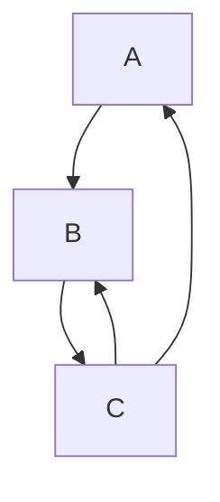

순환 참여자의 결과는 여전히 스택에 있는 목표의 결과에 의존합니다.
그러나 현재 그 결과를 계산 중이므로 결과가 여전히 알려지지 않았습니다. 이는 고정점(fixpoint)에 도달할 때까지 순환 헤드를 평가함으로써 처리됩니다. 첫 번째 반복에서는 순환이 여귀납적인지 여부에 따라 제약 조건이 없는 성공 또는 오버플로를 반환합니다: [소스][initial-prov-result]. 순환의 헤드를 평가한 후 해당 [`provisional_result`]가 이번 반복의 결과와 같은지 검사합니다. 그렇다면 이 순환 평가를 마쳤으며 그 결과를 반환합니다. 그렇지 않다면 임시 결과를 업데이트하고 목표를 재평가합니다: [소스][fixpoint]. 첫 번째 반복 이후에는 순환이 여귀납적인지 귀납적인지 여부가 중요하지 않습니다. 항상 임시 결과를 사용합니다.

###### 순환 루트만 캐싱

순환 루트의 평가를 마칠 때까지 순환 참여자의 결과를 전역 캐시로 이동할 수 없습니다. 그러나 순환을 완전히 평가한 후에도 루트 자체를 제외한 모든 참여자의 결과를 어쩔 수 없이 버려야 합니다.
우리는 모든 전역 캐시 엔트리의 쿼리 의존성을 추적합니다. 이로 인해 순환 참여자의 캐싱은 사소하지 않은 작업이 됩니다. 단순히 순환 루트의 `DepNode`를 재사용할 수는 없습니다.[^cache-cycle] `A -> B -> A` 순환이 있는 경우 `A`의 `DepNode`는 `A -> B`의 의존성을 포함합니다. 소스가 변경되면 `B`에 대해 이 엔트리를 재사용하는 것이 깨질 수 있습니다. `B -> A` 간선이 더 이상 존재하지 않을 수 있고 `A`가 완전히 제거되었을 수도 있습니다. 이는 쉽게 ICE로 이어질 수 있습니다.

그러나 어떤 목표가 루트인지에 따라 순환의 결과가 달라질 수 있어 더욱 악화됩니다: [예시][unstable-result-ex]. 이는 캐싱을 더욱 약화시키도록 강제합니다. 해당 루트가 포함된 순환의 참여자였던 스택 엔트리가 존재한다면 순환 루트의 캐시 엔트리를 사용해서는 안 됩니다. 지정된 루트의 모든 순환 참여자를 전역 캐시 엔트리에 저장하고 이것이 스택의 요소를 포함하지 않는지 확인함으로써 이를 처리합니다: [소스][cycle-participants].

###### 임시 캐시

TODO: 작성 예정 :3

- 임시 결과의 스택 의존성
- 예외 케이스: 임시 캐시가 동작에 영향을 미침


[`with_anon_task`]: https://github.com/rust-lang/rust/blob/7606c13961ddc1174b70638e934df0439b7dc515/compiler/rustc_trait_selection/src/solve/search_graph.rs#L391
[wdn]: https://github.com/rust-lang/rust/blob/7606c13961ddc1174b70638e934df0439b7dc515/compiler/rustc_middle/src/traits/solve/cache.rs#L78
[overflow]: https://github.com/rust-lang/rust/blob/7606c13961ddc1174b70638e934df0439b7dc515/compiler/rustc_trait_selection/src/solve/search_graph.rs#L276
[req-depth]: https://github.com/rust-lang/rust/blob/7606c13961ddc1174b70638e934df0439b7dc515/compiler/rustc_middle/src/traits/solve/cache.rs#L102
[req-depth-ck]: https://github.com/rust-lang/rust/blob/7606c13961ddc1174b70638e934df0439b7dc515/compiler/rustc_middle/src/traits/solve/cache.rs#L76-L86
[update-depth]: https://github.com/rust-lang/rust/blob/7606c13961ddc1174b70638e934df0439b7dc515/compiler/rustc_trait_selection/src/solve/search_graph.rs#L308
[rem-depth]: https://github.com/rust-lang/rust/blob/7606c13961ddc1174b70638e934df0439b7dc515/compiler/rustc_middle/src/traits/solve/cache.rs#L124
[^cache-depth]: 이는 지나치게 제한적입니다. 중첩된 모든 목표가 일부 사용 가능한 깊이 `n`으로 오버플로 응답을 반환하는 경우, `n`보다 작은 모든 깊이에 대해 해당 결과는 동일해야 합니다. 향후에 이 최적화를 구현할 수 있습니다.

[chapter on coinduction]: #solve-coinduction
[`provisional_result`]: https://github.com/rust-lang/rust/blob/7606c13961ddc1174b70638e934df0439b7dc515/compiler/rustc_trait_selection/src/solve/search_graph.rs#L57
[initial-prov-result]: https://github.com/rust-lang/rust/blob/7606c13961ddc1174b70638e934df0439b7dc515/compiler/rustc_trait_selection/src/solve/search_graph.rs#L366-L370
[fixpoint]: https://github.com/rust-lang/rust/blob/7606c13961ddc1174b70638e934df0439b7dc515/compiler/rustc_trait_selection/src/solve/search_graph.rs#L425-L446
[^cache-cycle]: 관련 [Zulip 스레드] 요약

[zulip thread]: https://rust-lang.zulipchat.com/#narrow/stream/364551-t-types.2Ftrait-system-refactor/topic/global.20cache
[unstable-result-ex]: https://github.com/rust-lang/rust/blob/7606c13961ddc1174b70638e934df0439b7dc515/tests/ui/traits/next-solver/cycles/coinduction/incompleteness-unstable-result.rs#L4-L16
[cycle-participants]: https://github.com/rust-lang/rust/blob/7606c13961ddc1174b70638e934df0439b7dc515/compiler/rustc_middle/src/traits/solve/cache.rs#L72-L74


#### 증명 트리 {#solve-proof-trees}

트레이트 풀이기 자체는 목표의 성립 여부와 필요한 제약 조건만을 반환하지만 때로는 목표를 증명하려고 시도하는 동안 어떤 일이 일어났는지 알고 싶을 때가 있습니다. 트레이트 풀이기는 일반적으로 컴파일러의 나머지 부분에 의해 블랙박스로 취급되어야 하지만 그 내부를 완전히 무시할 수는 없으므로 이에 대한 인터페이스로 "증명 트리(proof trees)"를 제공합니다. 이를 사용하려면 [`ProofTreeVisitor`] 트레이트를 구현하며 예시는 기존 구현을 참고하세요. 가장 주요한 용도는 [일관성 오류에 대한 크레이트 간 모호함 원인 계산][intercrate-ambig], [트레이트 풀이기 오류 개선][solver-errors], 및 [클로저 시그니처 조급 추론][closure-sig]입니다.

##### 증명 트리 계산

트레이트 풀이기는 [Canonicalization](#solve-canonicalization)을 사용하며 중첩된 각 목표에 대해 완전히 별개의 `InferCtxt`를 사용합니다. 진단 및 rustdoc의 auto-traits 모두 "중첩된 목표 들여다보기"를 올바르게 처리해야 합니다. `Vec<Vec<?x>>: Debug`와 같은 목표가 주어지면, `exists<T0> Vec<Vec<T0>>: Debug`로 정규화하고, 그 목표를 `Vec<Vec<?0>>: Debug`로 인스턴스화하고, 중첩된 목표 `Vec<?0>: Debug`를 얻고, 이를 정규화하여 `exists<T0> Vec<T0>: Debug`를 얻고, 이를 `Vec<?0>: Debug`로 인스턴스화하여, 모호한 중첩 `?0: Debug` 목표를 결과로 냅니다.

탐색 그래프에 [`ProofTreeBuilder`]를 전달하여 트레이트 풀이기의 평가 단계를 트리 구조로 변환함으로써 증명 트리를 계산합니다. 추론 변수나 플레이스홀더를 사용하여 데이터를 저장할 때, 데이터는 이 계산 중에 생성된 모든 제약되지 않은 추론 변수 목록과 함께 정규화됩니다. 이 [`CanonicalState`]는 증명 트리를 순회하는 동안 부모 추론 컨텍스트에서 인스턴스화되어 추론 변수 목록을 통해 이 평가 중에 생성된 모든 정규화된 값을 연결합니다.

##### 풀이기 디버깅

이전에는 풀이기 구현을 디버깅하기 위해 증명 트리를 사용하려고 시도하기도 했습니다. 이는 프로그램을 통해 분석하는 것과 다른 설계 요구 사항을 가집니다. 트레이트 풀이기를 디버깅하는 권장 방법은 `tracing`을 사용하는 것입니다. 트레이트 풀이기는 일반적인 '모양'에 대해서만 `debug` 트레이싱 레벨을 사용하고 추가 세부 정보에는 `trace`를 사용합니다. 따라서 `RUSTC_LOG=rustc_next_trait_solver=debug`는 개괄적인 윤곽을 제공하며 더 정확한 정보가 필요한 경우 `RUSTC_LOG=rustc_next_trait_solver=trace`를 사용할 수 있습니다.

[`ProofTreeVisitor`]: https://github.com/rust-lang/rust/blob/d6c8169c186ab16a3404cd0d0866674018e8a19e/compiler/rustc_trait_selection/src/solve/inspect/analyse.rs#L403
[`ProofTreeBuilder`]: https://github.com/rust-lang/rust/blob/d6c8169c186ab16a3404cd0d0866674018e8a19e/compiler/rustc_next_trait_solver/src/solve/inspect/build.rs#L40
[`CanonicalState`]: https://github.com/rust-lang/rust/blob/d6c8169c186ab16a3404cd0d0866674018e8a19e/compiler/rustc_type_ir/src/solve/inspect.rs#L31-L47
[intercrate-ambig]: https://github.com/rust-lang/rust/blob/d6c8169c186ab16a3404cd0d0866674018e8a19e/compiler/rustc_trait_selection/src/traits/coherence.rs#L742-L748
[solver-errors]: https://github.com/rust-lang/rust/blob/d6c8169c186ab16a3404cd0d0866674018e8a19e/compiler/rustc_trait_selection/src/solve/fulfill.rs#L343-L356
[closure-sig]: https://github.com/rust-lang/rust/blob/d6c8169c186ab16a3404cd0d0866674018e8a19e/compiler/rustc_hir_typeck/src/closure.rs#L333-L339
[Canonicalization]: #solve-canonicalization

#### 새 풀이기에서의 불투명 타입(Opaque types) {#solve-opaque-types}

새 풀이기에서 [불투명 타입]을 다루는 방식은 기존 구현과 다릅니다.
이는 새 풀이기에서의 동작에 대한 독립적인 설명입니다.

[opaque types]: #opaque-types-type-alias-impl-trait

##### 비정의 용법(Non-Defining Use) vs 정의 용법(Defining Use)

비정의 용법과 정의 용법의 구별은 추론 동작을 결정하며 추상화의 엄격성을 지배합니다. 정의 용법은 숨겨진 타입(hidden type)의 근본 구체 타입을 드러내는 반면, 비정의 용법은 엄격성(rigidity)을 강제하여 해당 타입을 추상 플레이스홀더로 다룹니다.

###### 비정의 용법

이 개념은 불투명 타입을 고정(rigid)되게 만드는 요소입니다. 근본 타입을 알 수 없는 것으로 다룸으로써 풀이기는 추상화를 유지합니다.

```rust
fn foo() -> impl Copy {
    let x: u32 = 56;
    x 
}

fn bar() {
    let x = foo();
    // Even though we know 'foo' returns a u32.The solver enforces 
    // rigidity here and is a NON-DEFINING use.
}
```

###### 정의 용법

불투명 타입이 실제로 정의되는 지점입니다. 정의 용법은 추상화 뒤에 있는 구체적인 타입이 정확히 무엇인지 컴파일러에게 알려줍니다.

```rust
fn foo() -> impl Copy {
    let x: u32 = 56;
    // The return value x defines the hidden type as u32 and is a DEFINING use.
    x
}
```

##### 불투명 타입은 별칭 타입임

불투명 타입은 가능한 한 연관 타입과 같은 다른 별칭들과 동일하게 다루어집니다. 동작상의 이탈은 가능한 한 적어야 합니다.

불투명 타입은 숨겨진 타입으로 정규화될 수 있고 완전성에 대해 동일한 요구 사항을 가진다는 점에서 다른 별칭 타입과 매우 유사하므로 이는 바람직합니다. 불투명 타입을 이러한 방식으로 다루는 것은 코드를 공유하여 타입 시스템의 복잡성을 줄여주기도 합니다. 불투명 타입을 별도로 다루어야 하는 것은 더 복잡한 규칙과 새로운 종류의 상호작용을 초래합니다. 암묵적 부적(implicit-negative) 모드에서 이들을 다른 별칭처럼 다루어야 하므로, 모드 간에 상당한 차이가 존재하는 것 역시 복잡성을 가중시킵니다.

*열린 질문: 인스턴스화할 수 있는 위치가 더 제한된 고정 타입처럼 취급함으로써 여기에 대안적인 접근 방식을 적용할 수 있을까요? 이들은 일관성 검사 동안 여전히 일반적인 별칭이어야 할 것입니다*

###### 불투명 타입에 대한 `normalizes-to`

[소스][norm]

`normalizes-to`는 새 풀이기에서 별칭에 대한 1단계 정규화 동작을 정의하는 데 사용됩니다: `<<T as IdInner>::Assoc as IdOuter>::Assoc`은 먼저 `<T as IdInner>::Assoc`으로 정규화된 후 `T`로 정규화됩니다. 이는 정규화되는 `AliasTy`와 예상되는 `Term`을 모두 취합니다. 실제 정규화를 위해 `normalizes-to`를 사용하기 위해, 예상되는 용어는 단순히 제약되지 않은 추론 변수일 수 있습니다.

정의 스코프 내부 및 암묵적 부적 일관성 모드에서 불투명 타입에 대한 이 작업은 항상 두 단계로 수행됩니다. 정의 스코프 외부에서 불투명 타입에 대한 `normalizes-to`는 항상 `Err(NoSolution)`을 반환합니다.

예상되는 타입을 숨겨진 타입으로 할당하려고 시도하는 것부터 시작합니다.

암묵적 부적 일관성 모드에서 이는 현재 불투명 타입 저장소와 상호작용하지 않고 항상 모호함을 초래합니다. 대신 모든 불투명 타입을 '정의'할 수 있도록 허용하고 끝에서 추론된 타입을 버려 일관성 검사 중에 불투명 타입이 여러 번 사용되는 동작을 변경할 수 있습니다: [예시][coherence-example]

정의 스코프 내부에서는 불투명 타입의 타입 및 상수 인수가 모두 플레이스홀더인지 확인하는 것부터 시작합니다: [소스][placeholder-ck]. 이 검사가 모호하면 모호함을 반환하고 실패하면 `Err(NoSolution)`을 반환합니다. 이 검사는 borrowck의 끝에서만 검사되는 리전을 무시합니다. 성립하면 계속 진행합니다.

그런 다음 불투명 타입의 제네릭 인수를 불투명 타입 저장소에 이미 있는 임의의 불투명 타입 인수와 *의미론적으로* 통일할 수 있는지 검사합니다. 그렇다면 이전에 저장된 타입을 이 `normalizes-to` 호출의 예상 타입과 통일합니다: [소스][eq-prev][^norm-opaque-eq].

그렇지 않다면 예상 타입을 불투명 타입 저장소에 삽입합니다: [소스][insert-storage][^norm-opaque-rigid]. 마지막으로 불투명 타입의 아이템 바운드가 예상 타입에 대해 성립하는지 확인합니다: [소스][item-bounds-ck].

[norm]: https://github.com/rust-lang/rust/blob/384d26fc7e3bdd7687cc17b2662b091f6017ec2a/compiler/rustc_trait_selection/src/solve/normalizes_to/opaque_types.rs#L13
[coherence-example]: https://github.com/rust-lang/rust/blob/HEAD/tests/ui/type-alias-impl-trait/coherence/coherence_different_hidden_ty.rs
[placeholder-ck]: https://github.com/rust-lang/rust/blob/384d26fc7e3bdd7687cc17b2662b091f6017ec2a/compiler/rustc_trait_selection/src/solve/normalizes_to/opaque_types.rs#L33
[check-storage]: https://github.com/rust-lang/rust/blob/384d26fc7e3bdd7687cc17b2662b091f6017ec2a/compiler/rustc_trait_selection/src/solve/normalizes_to/opaque_types.rs#L51-L52
[eq-prev]: https://github.com/rust-lang/rust/blob/384d26fc7e3bdd7687cc17b2662b091f6017ec2a/compiler/rustc_trait_selection/src/solve/normalizes_to/opaque_types.rs#L51-L59
[insert-storage]: https://github.com/rust-lang/rust/blob/384d26fc7e3bdd7687cc17b2662b091f6017ec2a/compiler/rustc_trait_selection/src/solve/normalizes_to/opaque_types.rs#L68
[item-bounds-ck]: https://github.com/rust-lang/rust/blob/384d26fc7e3bdd7687cc17b2662b091f6017ec2a/compiler/rustc_trait_selection/src/solve/normalizes_to/opaque_types.rs#L69-L74

[^norm-opaque-eq]: FIXME: 인수가 플레이스홀더여야 하고 리전이 항상 추론 변수라는 점을 고려하면 이상적으로는 고유한 후보만 나와야 함
[^norm-opaque-rigid]: FIXME: 이를 위해 예상되는 타입이 고정(rigid) 상태인지 검사하는 이유는 무엇인가.

###### 정규화 가능한 별칭의 alias-bound 사용

https://github.com/rust-lang/trait-system-refactor-initiative/issues/77

정규화 가능한 별칭에 대한 `AliasBound` 후보를 사용하는 것은 일반적으로 불가능합니다. 연관 타입은 `ParamEnv` 후보를 통해 정규화할 때 결과 타입보다 더 강력한 바운드를 가질 수 있기 때문입니다.

이러한 후보는 우리의 정확한 정규화 전략이 사용자에게 노출되도록 변경할 것입니다. 그렇지 않으면 조급하게 정규화하는지 여부를 관찰하는 것이 거의 불가능합니다. 정규화 위치는 구형 풀이기 지원을 제거한 후 변경하고 싶어 할 가능성이 높은 부분이므로 이는 바람직하지 않을 것입니다.

##### 불투명 타입은 어디서나 정의될 수 있음

정의 스코프 내의 불투명 타입은 단순히 타입을 연관시킬 때든 트레이트 풀이기에서든 어디서나 정의될 수 있습니다. 이는 순서 의존성과 불완전성을 제거합니다. 이것이 없다면 불투명 타입의 첫 정의 용법 전에 불투명 타입을 사용하여 목표 평가를 시도하는지 여부 등 미묘한 이유로 목표의 결과가 달라질 수 있습니다.

##### 정의 스코프 내의 고차 레벨 불투명 타입

이들은 지원되지 않으며 현재 이들을 정의하려는 시도는 항상 에러가 발생해야 합니다.

FIXME: 불투명 타입 저장소에서 불투명 타입을 찾는 것이 이제 리전을 통일할 수 있으므로, 불투명 타입이 플레이스홀더를 참조하지 않는지 조급하게 확인해야 합니다. 그렇지 않으면 플레이스홀더가 누출됩니다.

##### 멤버 제약 조건(member constraints)

멤버 제약 조건의 처리는 새 풀이기에서 변경되지 않습니다. 이에 대해서는 [관련 기존 장][member-constraints]을 참고하세요.

[member-constraints]: #borrow-check-region-inference-member-constraints

##### 불투명 타입에서 메서드 호출

FIXME: 정의 스코프 내에서 여전히 제약되지 않은 불투명 타입에 대해 메서드를 호출하는 것을 계속 지원해야 합니다. 이를 가장 잘 수행하는 방법은 불명확합니다.

```rust
use std::future::Future;
use futures::FutureExt;

fn go(i: usize) -> impl Future<Output = ()> + Send + 'static {
    async move {
        if i != 0 {
            // This returns `impl Future<Output = ()>` in its defining scope,
            // we don't know the concrete type of that opaque at this point.
            // Currently treats the opaque as a known type and succeeds, but
            // from the perspective of "easiest to soundly implement", it would
            // be good for this to be ambiguous.
            go(i - 1).boxed().await;
        }
    }
}
```


#### 주요 변경 사항 및 기이한 동작들 {#solve-significant-changes}

##### 주요 변경 사항 및 기이한 동작들

아래 항목 중 일부는 이미 별도로 언급되었지만 이 페이지는 기존 트레이트 시스템 구현과의 주요 변경 사항을 추적합니다. 또한 풀이기가 이상적인 구현과 크게 이탈하는 몇 가지 방식에 대해서도 다룹니다. 이 문서는 구체적이고 극단적인 케이스는 단순화하거나 무시합니다. 각 문장에 암묵적인 "대부분"을 추가하여 읽는 것을 권장합니다.

###### 정규화(Canonicalization)

새 풀이기는 중첩된 목표를 평가할 때 [정규화](#solve-canonicalization)를 사용합니다. 가능성 있는 후보가 여러 개 존재하는 경우, 각 후보는 조급하게 정규화됩니다. 그런 다음 그들의 정규 응답을 병합하려고 시도합니다. 이는 트레이트 시스템 내부에서 정규화를 사용하지 않는 기존 구현과 다릅니다.

이는 두 풀이기 모두의 설계에 몇 가지 주요한 영향을 미칩니다. 후보의 제약 조건을 숨기기 위해 정규화를 사용하지 않으면, 후보 선택 시 각 후보의 제약 조건을 버려야 하며 후보가 선택된 후 후보를 재평가함으로써만 제약 조건을 적용해야 합니다: [소스][evaluate_stack]. 정규화 없이는 목표 평가로부터 추론 제약 조건을 캐싱하는 것도 불가능합니다. 이로 인해 기존 구현은 두 개의 시스템을 가지게 됩니다: *평가(evaluate)* 및 *이행(fulfill)*. *평가*는 캐싱되고 추론 제약 조건을 적용하지 않으며 후보를 선택할 때 사용됩니다. *이행*은 추론 및 리전 제약 조건을 적용하고 캐싱되지 않으며 추론 제약 조건을 적용합니다.

정규화를 사용함으로써 새 구현은 *평가*와 *이행*을 병합하여 복잡성과 동작상의 미묘한 차이를 피할 수 있습니다. 이는 캐싱을 크게 단순화하고 추적되지 않은 정보에 실수로 의존하는 것을 방지합니다. 선택 후 후보를 재평가하는 것을 피할 수 있게 해주며 여러 후보의 응답을 병합할 수 있게 해줍니다. 그러나 평가 중 목표를 정규화하면 새 구현은 트레이트 풀이 중 순환을 만났을 때 고정점 알고리즘을 강제로 사용하게 됩니다: [소스][cycle-fixpoint].

[canonicalization]: #solve-canonicalization
[evaluate_stack]: https://github.com/rust-lang/rust/blob/47dd709bedda8127e8daec33327e0a9d0cdae845/compiler/rustc_trait_selection/src/traits/select/mod.rs#L1232-L1237
[cycle-fixpoint]: https://github.com/rust-lang/rust/blob/df8ac8f1d74cffb96a93ae702d16e224f5b9ee8c/compiler/rustc_trait_selection/src/solve/search_graph.rs#L382-L387

###### 지연된 별칭 동등성(Deferred alias equality)

새 구현은 별칭을 연관시킬 때 `AliasRelate` 목표를 내보내는 반면, 기존 구현은 대신 구조적으로 별칭을 연관시킵니다. 이를 통해 새 풀이기는 관련 별칭을 정규화할 수 있을 때까지 동등성 판정을 지연시킬 수 있습니다.

기존 풀이기의 동작은 불완전하며 모호한 별칭을 추론 변수로 대체하는 조급한 정규화에 의존합니다. 이는 바운드 변수를 포함하는 별칭에 대해 불가능하므로, 기존 구현은 바인더 내부의 별칭을 올바르게 처리하지 못합니다(예: [#102048]). 자세한 내용은 [정규화](#normalization) 장을 참고하세요.

[#102048]: https://github.com/rust-lang/rust/issues/102048

###### 중첩된 목표의 조급한 평가

새 구현은 중첩된 목표를 호출자에게 반환하는 대신 조급하게 처리합니다. 기존 구현은 둘 다 수행합니다. 평가 시 중첩된 목표는 [조급하게 처리되는 반면][eval-nested], 이행 시에는 [나중 처리를 위해 단순히 반환합니다][fulfill-nested].

새 구현은 후보 선택을 위해 중첩된 목표를 조급하게 처리할 수 있어야 하므로 항상 그렇게 하는 것이 복잡성을 줄여줍니다. 또한 향후 더 많은 후보를 병합할 수 있게 해줄 수도 있습니다.

[eval-nested]: https://github.com/rust-lang/rust/blob/HEAD/compiler/rustc_trait_selection/src/traits/select/mod.rs#L1271-L1277
[fulfill-nested]: https://github.com/rust-lang/rust/blob/df8ac8f1d74cffb96a93ae702d16e224f5b9ee8c/compiler/rustc_trait_selection/src/traits/fulfill.rs#L708-L712

###### 중첩된 목표는 고정점에 도달할 때까지 평가됨

새 구현은 항상 고정점에 도달할 때까지 루프 내에서 목표를 평가합니다. 기존 구현은 *이행*에서만 그렇게 하고 *평가*에서는 하지 않습니다. 항상 그렇게 하는 것은 추론을 강화하고 트레이트 풀이기의 순서 의존성을 줄여줍니다. [trait-system-refactor-initiative#102]를 참고하세요.

[trait-system-refactor-initiative#102]: https://github.com/rust-lang/trait-system-refactor-initiative/issues/102

###### 증명 트리 및 진단 정보 제공

새 구현은 진단 정보를 직접 추적하지 않고 대신 관련 정보를 느긋하게 계산하는 데 사용되는 [증명 트리][trees]를 제공합니다. 이는 아직 완전히 자리 잡지 않았으며 약간 해키(hacky)합니다. 목표는 성능 향상을 위해 해피 패스에서 이 정보를 추적하는 것을 피하고 동작에 필요한 진단 데이터에 실수로 의존하는 것을 방지하는 것입니다.

[trees]: #solve-proof-trees

##### 새 구현의 주요 기이한 동작들

###### 환경 후보가 있는 경우 impl 숨김

어떤 `Trait` 목표를 증명하기 위한 `ParamEnv` 또는 `AliasBound` 후보가 최소 하나 이상 존재하는 경우, `Trait` 및 `Projection` 목표 모두에 대한 모든 impl 후보를 버립니다: [소스][discard-from-env]. 이는 사용자가 `where`-절에 의해 완전히 커버되는 impl을 사용하는 것을 방지하여 기존 구현의 동작과 일치시키고 몇 가지 이상한 에러를 방지합니다(예: [trait-system-refactor-initiative#76]).

[discard-from-env]: https://github.com/rust-lang/rust/blob/03994e498df79aa1f97f7bbcfd52d57c8e865049/compiler/rustc_trait_selection/src/solve/assembly/mod.rs#L785-L789

###### `NormalizesTo` 목표는 함수임

[정규화](#normalization) 장을 참고하세요. 정규화에 영향을 미치는 것을 방지하기 위해 `NormalizesTo` 목표를 계산하기 전에 예상되는 용어를 제약되지 않은 추론 변수로 교체합니다. 이는 `NormalizesTo` 목표가 다른 모든 목표 종류와 다소 다르게 처리되며 몇 가지 추가적인 풀이기 지원이 필요함을 의미합니다. 특히 그들의 모호한 중첩 목표는 호출자에게 반환되어 호출자가 이를 평가합니다. 자세한 내용은 [#122687]을 참고하세요.

[#122687]: https://github.com/rust-lang/rust/pull/122687
[normalization]: #normalization


#### rust-analyzer와 트레이트 풀이기 공유하기 {#solve-sharing-crates-with-rust-analyzer}

rust-analyzer는 컴파일러 프론트엔드로 볼 수 있습니다: 파싱, 어휘 분석, AST 구축 및 로어링(lowering), HIR 로어링, 심지어 제한된 MIR 구축 및 const 평가 등 코드 생성 이전에 실행되는 rustc 부분과 유사한 작업을 수행합니다.

그러나 rust-analyzer는 주로 언어 서버(language server)이므로 정적 구조가 rustc의 구조와 몇 가지 중요한 방식에서 다릅니다.
이러한 차이점에도 불구하고 책임의 상당 부분(특히 타입 추론 및 트레이트 풀이)이 컴파일러와 겹칩니다.

중복을 피하고 두 구현 간 일관성을 유지하기 위해 rust-analyzer는 가능한 경우 공유된 추상화에 의존하면서 rustc의 여러 크레이트를 재사용합니다.

##### 공유 크레이트

현재 rust-analyzer는 컴파일러의 여러 `rustc_*` 크레이트에 의존합니다:

- `rustc_abi`
- `rustc_ast_ir`
- `rustc_index`
- `rustc_lexer`
- `rustc_next_trait_solver`
- `rustc_parse_format`
- `rustc_pattern_analysis`
- `rustc_type_ir`

이러한 크레이트들은 컴파일러의 일반 배포 프로세스의 일부로 `crates.io`에 게시되지 않으므로, rust-analyzer는 자체 게시 파이프라인을 유지 관리합니다.
[rustc-auto-publish 스크립트][rustc-auto-publish]를 사용하여 `ra-ap-rustc_*` 접두사를 붙여 이러한 크레이트들을 `crates.io`에 게시합니다
(예: https://crates.io/crates/ra-ap-rustc_next_trait_solver).
그런 다음 rust-analyzer는 자체 빌드 시 이러한 재게시된 크레이트들에 의존합니다.

특히 트레이트 풀이의 경우 주요 공유 크레이트는 `rustc_type_ir` 및 `rustc_next_trait_solver`이며 두 컴파일러 프론트엔드 모두에서 사용되는 핵심 IR 및 풀이기 로직을 제공합니다.

##### 추상화 계층(The Abstraction Layer)

rust-analyzer는 언어 서버이므로 자주 변경되는 소스 코드와 부분적으로 유효하지 않거나 불완전한 소스 코드를 처리해야 합니다.
이를 위해 source code와 HIR 사이의 계층(예: `Ty` 및 이를 뒷받침하는 인터너)에서 rustc의 구조와는 꽤 다른 인프라가 필요합니다.

이러한 차이점을 메우기 위해 컴파일러는 rustc와 rust-analyzer 간에 공유되는 추상화 계층으로 `rustc_type_ir`을 제공합니다.
이 크레이트는 타입을 표현하는 데 사용되는 근본적인 인터페이스, 서술자(predicates), 그리고 트레이트 풀이기에 필요한 컨텍스트를 정의합니다.
rustc와 rust-analyzer 모두 자체적인 구체적 타입 표현을 위해 이러한 트레이트들을 구현하며 `rustc_next_trait_solver`는 이러한 추상화에 대해 제네릭하게 작성됩니다.

이러한 인터페이스 외에도 `rustc_type_ir`에는 추상화 계층 위에 구축된 정교화 로직 및 풀이기에서 사용하는 탐색 그래프 메커니즘과 같은 몇 가지 중요한 구성 요소도 포함되어 있습니다.

##### 디자인 개념

`rustc_next_trait_solver`는 `rustc_type_ir`에 정의된 추상 인터페이스에만 의존하도록 의도되었습니다.
이를 지원하기 위해 `rustc_type_ir`의 타입 시스템 트레이트는 풀이기가 요구하는 모든 인터페이스를 노출해야 합니다(예: [새 추론 타입 변수 생성][ir new_infer]
([rustc][rustc new_infer], [rust-analyzer][r-a new_infer])).
컴파일러 전용 표현이 필요하지 않은 아이템의 경우 `rustc_type_ir`은 이러한 트레이트들에 대해 파라미터화된 구조체 또는 열거형으로 직접 정의합니다(예: [`TraitRef`][ir tr]).

다음은 `rustc_type_ir` 크레이트의 몇 가지 주목할 만한 아이템입니다.

###### `trait Interner`

이 설계의 핵심 트레이트는 [`Interner`][ir interner]이며 rustc와 rust-analyzer 모두에 대해 모든 구현에 특화된 세부 사항을 지정합니다.
필수적인 역할은 다음과 같습니다:

- [연관 타입][ir interner assocs]을 통해 구현에 사용되는 구체적인 타입을 **지정**하며 이들은 각 컴파일러 프론트엔드가 공유 IR을 인스턴스화하는 방법의 근간을 형성합니다.
- 풀이기에 필요한 컨텍스트를 제공합니다(예: [lang items][ir require_lang_item] 질의, [트레이트에 대한 모든 blanket impl들][ir for_each_blanket_impl] 열거).
- 포맷팅 및 트레이싱을 위해 [`IrPrint`][ir irprint]를 구현해야 합니다.
  실제로 이러한 `IrPrint` 구현은 단순히 rustc 또는 rust-analyzer 내부의 기존 포맷팅 로직으로 라우팅됩니다.

rustc에서는 [`TyCtxt`가 `Interner`를 구현합니다][rustc interner impl]: 이는 rustc의 쿼리 메서드를 노출하며 필요한 `Interner` 트레이트 메서드는 이러한 쿼리를 호출함으로써 구현됩니다.
rust-analyzer에서 구현하는 타입의 이름은 [`DbInterner`][r-a interner impl]이며 ([salsa] 데이터베이스를 통해 대부분의 인턴 처리를 수행하므로), 대부분의 메서드는 rustc 쿼리가 아닌 salsa 쿼리에 의해 뒷받침됩니다.

###### `mod inherent`

`rustc_type_ir`의 또 다른 주목할 만한 아이템은 [`inherent` 모듈][ir inherent]입니다.
이 모듈은 `Ty` 또는 `GenericArg`와 같은 컴파일러 특화 타입에 존재하는 메서드에 대응하는 내재적 메서드(inherent methods)의 *선언부(forward definitions)*를 트레이트로 표현하여 제공합니다.
이러한 정의를 통해 제네릭 크레이트(예: `rustc_next_trait_solver`)는 rustc와 rust-analyzer에서 다르게 구현된 메서드를 호출할 수 있습니다.

제네릭 크레이트의 코드는 다음과 같이 이러한 정의를 가져와야 합니다:

```rust
use inherent::*;
```

이 이러한 선언부 정의는 **구체적인 구현체 내부에서 직접 사용해서는 안 됩니다**.
`mod inherent`의 트레이트를 구현하는 크레이트는 해당 타입들의 이름을 지정할 수 있게 되면 구체적 타입에 대해 실제 내재적 메서드를 호출해야 합니다.

[rustc_middle::ty::inherent][rustc inherent impl] 모듈에서 이러한 트레이트들의 rustc 구현을 찾을 수 있습니다.
rust-analyzer의 경우 대응하는 구현체들이 `hir_ty::next_solver::region`[r-a inherent impl]과 같이 `hir_ty::next_solver` 아래의 여러 모듈에 걸쳐 위치합니다.

###### `trait InferCtxtLike` 및 `trait SolverDelegate`

이 두 트레이트는 rustc의 [`InferCtxt`][rustc inferctxt] 역할에 대응합니다.

[`InferCtxtLike`][ir inferctxtlike]는 일관성 제약 조건(오판 규칙)으로 인해 `rustc_infer`에 정의되어야 합니다.
결과적으로 `rustc_trait_selection`에 있는 기능을 제공할 수 없습니다.
대신 트레이트 풀이 로직에 의존하는 동작은 별도의 트레이트인 [`SolverDelegate`][ir solverdelegate]로 추상화됩니다.
rustc에서의 구현체는 `rustc_trait_selection`에 있는 [`InferCtxt`를 감싸는 newtype 구조체][rustc solverdelegate impl]입니다.

(rust-analyzer에서도 모든 풀이 관련 로직이 이미 `hir-ty` 크레이트에 존재하므로 엄격히 필요하지는 않지만 주로 rustc의 구조를 미러링하기 위해 자체 [`InferCtxt`][r-a inferctxtlike impl]를 감싸는 newtype 래퍼에 대해 구현됩니다.)

장기적으로 이상적인 설계는 현재 `SolverDelegate`를 통해 표현된 모든 로직을 `rustc_next_trait_solver`로 이동하고 필요한 핵심 작업을 `InferCtxtLike`에 직접 추가하는 것입니다.
이를 통해 풀이기의 더 많은 동작이 공유 풀이기 크레이트 내에 완전히 상주할 수 있게 됩니다.

###### `rustc_type_ir::search_graph::{Cx, Delegate}`

추상화 트레이트인 [`Cx`][ir searchgraph cx impl] 및 [`Delegate`][ir searchgraph delegate impl]는 이미 `rustc_next_trait_solver` 자체 내에 구현되어 있습니다.
따라서 공유 크레이트의 사용자(rustc 및 rust-analyzer 모두)는 자체 구현을 제공할 필요가 없습니다.

이러한 트레이트들은 주로 전체 트레이트 풀이기와 독립적으로 탐색 그래프의 퍼징(fuzzing)을 지원하기 위해 존재합니다.
이 인프라는 외부 퍼징 프로젝트에서 사용됩니다:
<https://github.com/lcnr/search_graph_fuzz>.

##### rust-analyzer 지원을 위한 장기 계획

일반적으로 우리는 이러한 공유 크레이트에서 rustc의 성능이나 유지 관리 가능성을 크게 해치지 않는 한 rust-analyzer를 rustc만큼 잘 지원하는 것을 목표로 합니다.
(예: [#145377][pr 145377], [#146111][pr 146111], [#146182][pr 146182] 및 [#147723][pr 147723])

rust-analyzer는 안정적인 툴체인으로 빌드되므로, 나이틀리 전용 기능이 필요한 공유 크레이트는 해당 코드를 `nightly` 기능 플래그 뒤에 가려두어야 합니다.

앞으로 우리는 더 많은 공유 로직을 `rustc_type_ir`로 승격할 계획입니다.
`ObligationCtxt` ([rustc][rustc oblctxt], [rust-analyzer][r-a oblctxt]) 및 타입 강제 변환(coercion) 로직([rustc][rustc coerce], [rust-analyzer][r-a coerce])과 같이 시간이 지나면서 통일하고 싶은 중복 구현들이 rustc와 rust-analyzer 사이에 여전히 존재합니다.

[rustc-auto-publish]: https://github.com/rust-analyzer/rustc-auto-publish
[ir new_infer]: https://doc.rust-lang.org/1.91.1/nightly-rustc/rustc_type_ir/inherent/trait.Ty.html#tymethod.new_infer
[rustc new_infer]: https://github.com/rust-lang/rust/blob/63b1db05801271e400954e41b8600a3cf1482363/compiler/rustc_middle/src/ty/sty.rs#L413-L420
[r-a new_infer]: https://github.com/rust-lang/rust-analyzer/blob/34f47d9298c478c12c6c4c0348771d1b05706e09/crates/hir-ty/src/next_solver/ty.rs#L59-L92
[ir tr]: https://doc.rust-lang.org/1.91.1/nightly-rustc/rustc_type_ir/struct.TraitRef.html
[ir interner]: https://doc.rust-lang.org/1.91.1/nightly-rustc/rustc_type_ir/trait.Interner.html
[ir interner assocs]: https://doc.rust-lang.org/1.91.1/nightly-rustc/rustc_type_ir/trait.Interner.html#required-associated-types
[ir require_lang_item]: https://doc.rust-lang.org/1.91.1/nightly-rustc/rustc_type_ir/trait.Interner.html#tymethod.require_lang_item
[ir for_each_blanket_impl]: https://doc.rust-lang.org/1.91.1/nightly-rustc/rustc_type_ir/trait.Interner.html#tymethod.for_each_blanket_impl
[ir irprint]: https://doc.rust-lang.org/1.91.1/nightly-rustc/rustc_type_ir/ir_print/trait.IrPrint.html
[rustc interner impl]: https://doc.rust-lang.org/1.91.1/nightly-rustc/rustc_middle/ty/struct.TyCtxt.html#impl-Interner-for-TyCtxt%3C'tcx%3E
[r-a interner impl]: https://github.com/rust-lang/rust-analyzer/blob/a50c1ccc9cf3dab1afdc857a965a9992fbad7a53/crates/hir-ty/src/next_solver/interner.rs
[salsa]: https://github.com/salsa-rs/salsa
[ir inherent]: https://doc.rust-lang.org/1.91.1/nightly-rustc/rustc_type_ir/inherent/index.html
[rustc inherent impl]: https://doc.rust-lang.org/1.91.1/nightly-rustc/rustc_middle/ty/inherent/index.html
[r-a inherent impl]: https://github.com/rust-lang/rust-analyzer/blob/a50c1ccc9cf3dab1afdc857a965a9992fbad7a53/crates/hir-ty/src/next_solver/region.rs
[ir inferctxtlike]: https://doc.rust-lang.org/1.91.1/nightly-rustc/rustc_type_ir/trait.InferCtxtLike.html
[rustc inferctxt]: https://doc.rust-lang.org/1.91.1/nightly-rustc/rustc_infer/infer/struct.InferCtxt.html
[rustc inferctxtlike impl]: https://doc.rust-lang.org/1.91.1/nightly-rustc/src/rustc_infer/infer/context.rs.html#14-332
[r-a inferctxtlike impl]: https://github.com/rust-lang/rust-analyzer/blob/a50c1ccc9cf3dab1afdc857a965a9992fbad7a53/crates/hir-ty/src/next_solver/infer/context.rs
[ir solverdelegate]: https://doc.rust-lang.org/1.91.1/nightly-rustc/rustc_next_trait_solver/delegate/trait.SolverDelegate.html
[rustc solverdelegate impl]: https://doc.rust-lang.org/1.91.1/nightly-rustc/rustc_trait_selection/solve/delegate/struct.SolverDelegate.html
[r-a solverdelegate impl]: https://github.com/rust-lang/rust-analyzer/blob/a50c1ccc9cf3dab1afdc857a965a9992fbad7a53/crates/hir-ty/src/next_solver/solver.rs#L27-L330
[ir searchgraph cx impl]: https://doc.rust-lang.org/1.91.1/nightly-rustc/src/rustc_type_ir/interner.rs.html#550-575
[ir searchgraph delegate impl]: https://doc.rust-lang.org/1.91.1/nightly-rustc/src/rustc_next_trait_solver/solve/search_graph.rs.html#20-123
[pr 145377]: https://github.com/rust-lang/rust/pull/145377
[pr 146111]: https://github.com/rust-lang/rust/pull/146111
[pr 146182]: https://github.com/rust-lang/rust/pull/146182
[pr 147723]: https://github.com/rust-lang/rust/pull/147723
[rustc oblctxt]: https://github.com/rust-lang/rust/blob/63b1db05801271e400954e41b8600a3cf1482363/compiler/rustc_trait_selection/src/traits/engine.rs#L48-L386
[r-a oblctxt]: https://github.com/rust-lang/rust-analyzer/blob/34f47d9298c478c12c6c4c0348771d1b05706e09/crates/hir-ty/src/next_solver/obligation_ctxt.rs
[rustc coerce]: https://github.com/rust-lang/rust/blob/63b1db05801271e400954e41b8600a3cf1482363/compiler/rustc_hir_typeck/src/coercion.rs
[r-a coerce]: https://github.com/rust-lang/rust-analyzer/blob/34f47d9298c478c12c6c4c0348771d1b05706e09/crates/hir-ty/src/infer/coerce.rs

### [`CoerceUnsized`](https://doc.rust-lang.org/std/ops/trait.CoerceUnsized.html) {#traits-unsize}

`CoerceUnsized`는 주로 데이터 컨테이너에 관련된 트레이트입니다. 구조체(일반적으로 스마트 포인터)가 `CoerceUnsized`를 구현한다는 것은 해당 구조체가 가리키는 데이터의 크기 결정이 해제(unsized)되고 있음을 의미합니다.

`CoerceUnsized`의 일부 구현체는 다음과 같습니다:
* `&T`
* `Arc<T>`
* `Box<T>`

이 트레이트는 (궁극적으로) 사용자가 작성한 스마트 포인터에 의해 구현되도록 의도되었으며 해당 트레이트의 문서에는 타입이 `CoerceUnsized`를 구현하도록 허용되는 시기에 대한 규칙이 설명되어 있습니다.

### [`Unsize`](https://doc.rust-lang.org/std/marker/trait.Unsize.html)

대조적으로 `Unsize` 트레이트는 크기 결정 해제가 허용되는 실제 타입에 관련됩니다.

`Unsize`는 타입을 크기 결정 해제하는 *방법*(즉 codegen)을 컴파일러에게 지시하는 것이 아니라 단순히 크기 결정 해제가 허용되는지 여부만 알리므로, 사용자가 구현하도록 의도되지 않았습니다. 이는 타입이 어떻게 표현되고 크기 결정 해제되는지 이해해야 하는 codegen과 다소 긴밀하게 결합되어 있습니다.

#### 원시 크기 결정 해제(Primitive unsizing) 구현들

내장 구현은 다음과 같이 제공됩니다:
* `T: Trait`일 때 (그리고 `T: Sized + 'a`이고 `Trait`이 dyn-compatible[^dyn-compatible]일 때) `T` -> `dyn Trait + 'a`.
* `[T; N]` -> `[T]`

#### 구조적(Structural) 구현들

구조적인 것으로 볼 수 있는 `Unsize` 구현이 하나 존재합니다:
* `TailField<Pi, .., Pj>: Unsize<Ui, .. Uj>`가 주어졌을 때 `Struct<.., Pi, .., Pj, ..>: Unsize<Struct<.., Ui, .., Uj, ..>>`. 이는 구조체의 꼬리 필드가 제네릭 매개변수 `Pi`, .., `Pj`(연속적일 필요는 없음)를 언급하는 유일한 필드인 경우 꼬리 필드의 크기 결정 해제를 허용합니다.

구조체 크기 결정 해제 규칙은 둘 이상의 매개변수를 변경(반드시 크기 결정 해제는 아님)할 수 있도록 허용할 수 있으며 구조체의 꼬리 필드 측면에서 가장 잘 서술되므로 다소 복잡합니다.
(튜플 크기 결정 해제는 이전에는 기능 게이트 `unsized_tuple_coercion` 뒤에서 구현되었으나, [#137728]에 의해 구현이 제거되었습니다.)

[#137728]: https://github.com/rust-lang/rust/pull/137728

#### 업캐스팅(Upcasting) 구현들

컴파일러 내부적으로 두 가지가 "업캐스팅"으로 불립니다:
1. 진정한 업캐스팅 `dyn SubTrait` -> `dyn SuperTrait` (아래와 같이 자동 트레이트 삭제 및 수명 조정을 허용함).
2. *주요 트레이트(principal)[^principal-trait]를 변경하지 않고* dyn 트레이트의 자동 트레이트를 삭제하고 수명을 조정함:
   `AutoTraits` ⊇ `NewAutoTraits`이고 `'a: 'b`일 때
   `dyn Trait + AutoTraits... + 'a` -> `dyn Trait + NewAutoTraits... + 'b`.

(1.)은 dyn 트레이트의 vtable 조정을 포함하는 반면 (2.)는 아무 작업도 수행하지 않는 무작업(no-op)이므로 이들은 서로 다른 연산처럼 보일 수 있습니다. 그러나 타입 시스템의 관점에서는 거의 동일한 코드로 처리됩니다.

`Unsize`에 대한 이러한 내장 구현은 연관 타입의 복잡성을 지원하기 위해 [재작업된](https://github.com/rust-lang/rust/pull/114036) 이후로 특히 가장 복잡합니다.

구체적으로 업캐스팅 알고리즘은 다음 과정을 포함합니다: 소스 dyn 트레이트의 principal의 각 슈퍼트레이트(자기 자신 포함)에 대해...
1. 슈퍼 트레이트 참조를 타겟의 principal과 통일(unify)합니다 (항상 진정한 슈퍼트레이트로만 업캐스팅하고 결코 [impl을 통하지 않도록][via an impl] 보장).
2. 타겟의 모든 자동 트레이트에 대해 소스에 존재하는지 확인합니다 (자동 트레이트를 삭제하는 것은 허용하지만 결코 새로운 자동 트레이트를 얻지는 않음).
3. 타겟의 모든 프로젝션에 대해 소스의 단일 프로젝션과 통일되는지 확인합니다 (`trait Sub: Sup<.., A = i32> + Sup<.., A = u32>`가 주어지면 둘 이상이 존재할 수 있음).

[via an impl]: https://github.com/rust-lang/rust/blob/f3457dbf84cd86d284454d12705861398ece76c3/tests/ui/traits/trait-upcasting/illegal-upcast-from-impl.rs#L19

특히 (3.)은 명확할 때는 추론을 안내할 수 있지만 프로젝션 바운드의 선택이 불필요하게 추론을 안내하는 것을 방지합니다.

[^principal-trait]: principal은 `dyn Trait`의 하나의 비-자동 트레이트입니다.
[^dyn-compatible]: 이전에는 "객체 안전(object safe)"으로 알려졌습니다.


### 분리된 `Trait` 및 `Projection` 바운드 가지기 {#traits-separate-projection-bounds}

`T: Foo<AssocA = u32, AssocB = i32>` where-바운드가 주어지면, 현재 우리는 이를 `Trait(Foo<T>)` 및 분리된 `Projection(<T as Foo>::AssocA, u32)`과 `Projection(<T as Foo>::AssocB, i32)` 바운드로 낮춥니다(lower).
왜 이를 단일 `Trait(Foo[T], [AssocA = u32, AssocB = u32]` 바운드로 표현하지 않을까요?

우리가 `Projection` 바운드를 증명하는 방식은 대응하는 `Trait` 바운드를 증명하는 것에 직접적으로 의존합니다: [구형 풀이기](https://github.com/rust-lang/rust/blob/461e9738a47e313e4457957fa95ff6a19a4b88d4/compiler/rustc_trait_selection/src/traits/project.rs#L898) [신형 풀이기](https://github.com/rust-lang/rust/blob/461e9738a47e313e4457957fa95ff6a19a4b88d4/compiler/rustc_next_trait_solver/src/solve/normalizes_to/mod.rs#L37-L41).

트레이트가 구현되었는지 확인하고 연관 타입을 계산하는 방법(방법)을 반환하는 단일 구현을 갖는 것이 더 이치에 맞을 것처럼 느껴집니다.

안타깝게도 정규화에 대해 대응하는 트레이트 바운드와 다른 후보를 사용할 수 있으므로 이는 꽤 어렵습니다.
[alias-bound 대 where-bound](#we-always-consider-aliasbound-candidates) 및 [전역 where-bound 대 impl](#we-prefer-global-where-bounds-over-impls)을 참고하세요.

그렇게 할 수 없는 다른 미묘한 이유들도 존재합니다.
가장 어처구니없는 이유는 고정(rigid) 별칭 때문입니다;
이들을 정규화하려고 시도하는 것은 트레이트 바운드를 증명하는 것에서 얻는 어떠한 수명 제약 조건도 고려하지 않습니다.
이는 바인더에 대한 가정 부족으로 인해 필요하며 - https://github.com/rust-lang/trait-system-refactor-initiative/issues/177 - 장기적으로 수정되어야 합니다.

별도의 문제는 현재 `Trait` 목표에 대해 `type_of` 연관 타입을 가져오거나 가려진(shadowed) `Projection` 후보에서 가져오는 것이 RPITIT에 대한 쿼리 순환을 일으킬 수 있다는 것입니다.
https://github.com/rust-lang/trait-system-refactor-initiative/issues/185를 참고하세요.

또한 일부 내장 impl 후보 사이에 약간의 차이가 존재하는데, 이들은 모두 일반적으로 바람직하지 않아 보이며 통일된 접근 방식을 취한다면 수정될 버그로 간주합니다.

마지막으로 이 분리가 없으면 where-절을 낮추는(lowering) 것이 더 번거로워집니다.
현재 시스템에서는 중복된 where-절을 가지는 것이 문제가 되지 않으며 슈퍼 트레이트 바운드를 정교화할 때 쉽게 일어날 수 있습니다.
이제 모든 연관 타입 제약 조건을 병합하도록 확인해야 합니다(예:):

```rust
trait Super {
    type A;
    type B;
}

trait Trait: Super<A = i32> {}
// how to elaborate Trait<B = u32>
```
혹은 더 심각하게는
```rust
trait Super<'a> {
    type A;
    type B;
}

trait Trait<'a>: Super<'a, A = i32> {}
// how to elaborate
// T: Trait<'a> + for<'b> Super<'b, B = u32>
```


## 잘 구성됨(Well-Formedness) {#analysis-well-formed}

### 잘 구성됨이란 무엇인가?

"잘 구성됨(Well-formed)"은 "올바르게 지어짐"을 의미합니다[^wf-history].
무언가의 구조가 규칙을 따를 때 그것은 _잘 구성_되었다고 합니다.
Rust 컴파일러에서 이 용어를 사용할 때 우리는 일종의 _내부적 일관성_을 확립하는 데 관심을 둡니다.

### Rust에서의 잘 구성됨

무언가가 잘 구성되었는지 검사하는 것은 "잘 구성됨 검사(Well-formedness check)"를 수행하는 것입니다.

Rust 컴파일러에는 잘 구성됨 검사의 두 가지 다른 형태가 있습니다:

- **타입 레벨 항(Type-Level Term)**[^terms][^terms-abbreviated] 잘 구성됨 검사.
    - "항 잘 구성됨" 또는 "항 잘 구성됨 검사"라고도 불립니다.
    - 별도의 분석 단계가 아니며 분석 전반에 걸쳐 수행됩니다.
- **아이템(Item)**[^items] 잘 구성됨 검사 (item-wfck.)
    - "Item-wfck"는 종종 항이 잘 구성될 것을 요구하지만 일부 영역은 건너뜁니다.
    - 내부의 "항"들이 (잘못되게) 먼저 정규화될 수 있습니다.
    - (여러 곳에서 수행되는) "항 잘 구성됨"보다 컴파일러의 단계로서 더 일관성이 있습니다.

참고: [잘 구성됨이 아닌 것](#what-well-formedness-isnt).

### 타입 레벨 항의 잘 구성됨

항 잘 구성됨 검사는 항이 잘 구성되기 위해 참이어야 하는 항목 목록을 작성하는 것부터 시작합니다.
이들을 "의무(Obligations)"라고 부릅니다[^obligations].

타입 레벨 항은 트레이트 풀이기에 의해 관련 의무가 충족될 때 잘 구성된 것으로 간주됩니다.

#### 잘 구성됨을 위한 의무

구체적인 의무로는 `String: Clone`, `A: usize`, 또는 `<T as Iterator>::Item: Debug`와 같은 것들이 있습니다.

이 페이지에서는 의무와 항/아이템 간의 분리를 다음과 같이 표시합니다:

```rust,ignore
<terms or items>
***
<obligations>
```

잘 구성된 타입 레벨 항의 예시는 다음과 같습니다:

```rust,ignore
Vec<String>
***
// Obligations to fulfill
Vec<T> where T: Sized
// Trait solver says `String: Sized` is true, so this is well-formed.
Vec<String> where String: Sized
```

`Vec<String>`에 대한 의무를 계산할 때 `Vec<T>`가 `T: Sized` 의무를 생성하는 것을 확인합니다.
`Vec<String>`에서 `T`를 `String`으로 대체하므로, 트레이트 풀이기가 성립한다고 결정할 `String: Sized` 의무를 찾습니다.

다음은 잘 구성된 것이 **아닙니다**:

```rust,ignore
Vec<str>
***
// Obligations to fulfill
Vec<T> where T: Sized
// Trait solver says `str: Sized` is not true, so this is not well-formed.
Vec<str> where str: Sized
```

위 코드는 이전과 마찬가지로 `T: Sized` 의무를 계산하지만 `Vec<str>`의 인스턴스에서 `T`를 `str`로 대체하여 `str: Sized` 의무를 찾습니다.
이 의무는 트레이트 풀이기에 의해 _미충족_으로 결정됩니다.

##### 의무 결정

컴파일러에서 항의 의무는 [항 잘 구성됨 모듈](https://doc.rust-lang.org/nightly/nightly-rustc/rustc_trait_selection/traits/wf/index.html)의 [`obligations`](https://doc.rust-lang.org/nightly/nightly-rustc/rustc_trait_selection/traits/wf/fn.obligations.html) 함수를 통해 찾아집니다.

##### 기타 의무들

의무는 단순한 트레이트 및 const 제네릭 바운드 이상이지만 항의 "잘 구성됨 검사"를 수행할 때 관심 있는 대상이므로 지금까지 이러한 특정 의무만 언급했습니다.
의무의 전체 목록은 [`PredicateKind`](https://doc.rust-lang.org/beta/nightly-rustc/rustc_type_ir/predicate_kind/enum.PredicateKind.html) 및 [`ClauseKind`](https://doc.rust-lang.org/beta/nightly-rustc/rustc_type_ir/predicate_kind/enum.ClauseKind.html)를 참조하세요.

#### (아직) 정규화가 필요하지 않음

[정규화](#normalization)는 [타입 별칭](#aliases)을 그 근본 타입으로 해소하는 프로세스입니다.

타입 별칭은 where 절이 충족되면 잘 구성된 것으로 간주됩니다.
근본 타입은 대부분의 정의 및 인스턴스화 위치에서 잘 구성됨 검사를 거치지만 예외가 존재합니다.

#### Const 제네릭 인수

항 잘 구성됨은 const 제네릭 항의 "타입 검사" 의무를 얻는 역할을 합니다[^tyck-const-generics].
const 제네릭의 다음 사용을 살펴보겠습니다:

```rust,ignore
fn use_const_generics<const U: usize>() { /* ... */ }
// call site
use_const_generics::<6>();
***
// call site wfck obligations
const 6: usize
```

호출 위치는 잘 구성됨 검사 동안 `6: usize` 의무를 제공합니다.
트레이트 풀이기는 이름이 암시하는 것보다 더 많은 책임을 가지므로 이 의무는 일반적인 트레이트 스타일 의무와 마찬가지로 트레이트 풀이기로 전달됩니다.

### 아이템의 잘 구성됨

아이템은 일반적으로 "정의되는 항목"입니다.
Item-wfck는 타입과 함수, 메서드, 그리고 트레이트의 정의/구현에 대한 시그니처 레벨에서 일어납니다.

```rust,ignore
// The `Vec<str>` is checked during item wfck
fn foo(_: Vec<str>) {
    // The `Vec<[u8]>` is not handled by item wfck as it's not in the signature
    let _: Vec<[u8]>
}
***
Vec<str>: Sized // Generated
Vec<[u8]>: Sized // Not done at item-wfck. Done elsewhere.
```

Item-wfck는 내부 타입 레벨 항의 의무를 수집하여 트레이트 풀이기에 전달하는 것 이상의 책임을 집니다.
여기서 이들 모두를 다루지는 않지만 [**item-wfck 모듈**](https://doc.rust-lang.org/nightly/nightly-rustc/rustc_hir_analysis/check/wfcheck/index.html)의 개별 `check_*` 함수에서 찾아볼 수 있습니다.

<!-- FIXME: Expand more on item well-formedness that isn't const generic / trait bound obligation based. These are not special cases, but important points! -->

#### 전역 및 자명한 바운드

<!-- TODO later: Cut this into its own page -->

트레이트 바운드는 흔히 발생하는 의무입니다.
전역(Global) 및 자명한(Trivial) 트레이트 바운드는 참인지 거짓인지 판단하기에 충분한 정보를 이미 가지고 있는 트레이트 바운드의 종류입니다.
Item-wfck는 이러한 바운드를 찾고 검사하는 역할을 합니다.

- **전역 바운드(Global bounds)**는 구형 풀이기에서 제네릭 매개변수(`<T>`나 `'a` 같은)나 바운드 변수(`for<'b>` 같은)를 포함하지 않는 정규화 후의 바운드입니다.
- **자명한 바운드(Trivial bounds)**는 잘 구성되었는지 여부를 판단하기 위해 추가 정규화가 필요하지 않은 바운드입니다.

다음 함수 정의를 고려해 보세요:

```rust,ignore
fn apartment_complex<T>(block: T, name: String) where String: Clone { /* ... */ }
***
String: Clone // Trivial & Global bound! There's no aliases to resolve.
// There could be bligations on T but we don't care about them here.
```

이는 _전역_(제네릭 매개변수 없음)이자 _자명한_(잘 구성됨 검사를 위해 정규화가 필요하지 않음) 트레이트 바운드 의무 `String: Clone`을 생성합니다.
트레이트 풀이기가 `String: Clone`의 잘 구성됨 여부를 판단하는 데 추가 정보를 제공할 필요가 없습니다.

거짓인 자명한 바운드는 단순히 성립하지 않는 자명한 바운드입니다.
다음은 기본적인 예시입니다:

```rust,ignore
fn apartment_simple<T>(block: T, name: String) where String: Copy { /* ... */ }
***
String: Copy // Trivial bound again, but this one is false!
```

여기서 `String`이 `Copy`가 아니므로 성립하지 않는 자명한 바운드를 가지게 됩니다.

##### 자명한 바운드가 항상 전역인 것은 아님

자명한 바운드가 전역 바운드의 부분 집합인 것은 아닙니다.
전역이 아닌 자명한 바운드로는 `for<'a> String: Clone` (자명하게 참, 바운드 변수를 가짐) 또는 `&'a str: Copy` (자명하게 거짓, 제네릭 매개변수를 가짐)가 있습니다.

##### Item-wfck 및 자명한/전역 바운드

<!-- When cutting out the subsection on global/trivial bounds, keep this part on the well-formedness page. -->

아이템이 잘 구성되었는지 검사할 때 자명하게 거짓인 전역 바운드가 없는지 검사합니다.

### 잘 구성됨 검사를 완전히 수행하지 않는 경우

잘 구성됨 검사는 타입 검사의 일관된 "단계"가 아닙니다.
잘 구성됨 검사가 수행되는 영역은 많으며 현재 수행 가능한 분석 종류의 한계로 인해 잘 구성됨 검사를 건너뛰는 영역도 일부 존재합니다.
이상적으로는 잘 구성됨 검사를 건너뛰거나 지연시키지 않을 것입니다.

#### (때때로) 정규화가 필요함

아이템의 항이 잘 구성됨 검사를 거치기 전에 아이템의 정규화가 일어나는 위치가 존재합니다.
이는 일부 항이 [항 잘 구성됨 검사를 완전히 우회](https://github.com/rust-lang/rust/issues/100041)할 수 있게 하므로 문제가 있는 것으로 간주됩니다.

#### 트레이트 객체

트레이트 객체가 잘 구성되었는지 결정할 때 트레이트 객체의 where 절이 잘 구성될 것을 요구하지 않습니다.
이 이러한 where 절은 트레이트 객체로 강제 변환(coercion)할 때 증명되지만 이는 잘 구성됨 검사의 구멍으로 남아 있습니다.

예를 들어 구체적 타입으로부터 트레이트 객체를 생성하는 지점이 없으므로 다음 코드는 컴파일됩니다:

```rust,ignore
trait Trait
where
    for<'a> [u8]: Sized {}

fn foo(_: &dyn Trait) {}
***
// This doesn't end up being generated, because it happens within a trait object.
[u8]: Sized
```

`[u8]: Sized` 때문에 위 코드는 컴파일되지 않아야 하지만 실제 사용 시까지 이는 검사되지 않습니다:

```rust
trait Trait
where
    for<'a> [u8]: Sized {}

fn foo(_: &dyn Trait) {}

// We still need to specify the bound here, otherwise `[u8]: Sized` _is_
// checked as an obligation.
impl Trait for u8 where for<'a> [u8]: Sized {}

fn main() {
    // No matter what we do, this boundary between concrete type and trait
    // object will produce the obligation `[u8]: Sized`, which will fail when
    // handed over to the trait solver.
    let object: Box<dyn Trait> = Box::new(42u8);
    foo(&object);
}
```

이 예외는 트레이트 객체의 Const 제네릭 인수에는 적용되지 않습니다:

```rust,ignore
trait Trait<const N: usize> {}
fn foo<const B: bool>(_: &dyn Trait<B>) {}
***
const N: usize
const B: bool
N = B // Substitution
const B: usize + bool
```

앞서 제공한 예시와 달리 위 코드는 컴파일되지 않습니다.
const 제네릭 인수와 관련해서는 여기서 _일부_ 잘 구성됨 검사를 수행하고 있습니다.

#### 바인더 / 고차 레벨 타입

바인더 / 고차 레벨 타입은 항에 대해 수행하는 잘 구성됨 검사의 양을 줄이고 잘 구성됨 검사를 바운드가 인스턴스화될 때로 미룹니다:

```rust,ignore
let _: for<'a> fn(Vec<[&'a ()]>);
***
// This doesn't end up being generated, because it happens within a HRB
[&'a ()]: Sized // slices aren't sized, this would fail!
```

구체적으로 바인더(`for<'a>`)의 변수를 포함하는 의무는 바인더가 인스턴스화될 때만 검사됩니다.
일부 항목은 `for<'a>` 아래에서 여전히 검사되지만 여전히 많은 항목을 건너뜁니다.

이러한 동작과 관련하여 많은 불건전성이 존재합니다.
[#25860](https://github.com/rust-lang/rust/issues/25860), [#84591](https://github.com/rust-lang/rust/issues/84591)을 참고하세요.

다음 코드를 고려해 보세요:

```rust,ignore
for<'a, 'b> fn(&'a &'b ())
```

위의 HRB는 완전히 분리된 두 수명이 아니라 `'b: 'a` (수명 바운드)를 함의합니다.
이는 일반적인 수명 동작이지만 잘 구성됨 검사 동안 이 바운드가 일반적으로 참임을 증명할 수 없으므로[^horrible] 이를 건너뜁니다.

#### 자유 타입 별칭(Free type aliases)

자유 타입 별칭[^fta]의 우변(RHS)은 정의 위치에서 잘 구성되었는지 완전히 검사되지 않으며 우변의 const 제네릭 인수 타입만 검사됩니다.

작성 시점에 다음 자유 타입 별칭은 타입 검사를 통과합니다:

```rust,ignore
type WorksButShouldNot = Vec<str>;
***
// This should fail! But we skip the RHS of free type aliases
str: Sized // Not generated
```

`Vec<T>`에 의해 `T: Sized`, `str: Sized`가 모두 함의되므로 이는 작동해서는 안 됩니다.
자유 타입 별칭의 우변은 _사용될 때까지_ 잘 구성됨 검사를 거치지 않으므로 이것이 item-wfck를 "통과"합니다.
Item-wfck는 이 특정 케이스에 대해 **사용 시점까지 지연**됩니다.

const 제네릭에 대해서는 자유 타입 별칭의 정의 위치에서 여전히 소량의 잘 구성됨 검사를 수행합니다.
이는 where 바운드와 같은 것들을 건너뛸 때의 현재 const 제네릭 잘 구성됨 검사 특수 케이스와 일치합니다.

이는 앞의 예시와 유사한 형태임에도 불구하고 다음 코드가 마땅히 실패해야 하는 대로 실패함을 의미합니다:

```rust,ignore
pub struct Consty<const A: bool>;
type Alias = Consty<42>;
***
// This *is* generated as an obligation, so this (correctly) fails.
42: bool // This is generated!
```

<!-- TODO: Link to something explaining the underlying "why" of the difference between const and trait well-formedness checking in FTAs, or eliminate that difference. Whatever comes first. -->

### "well-formed" 인가 "wellformed" 인가?

논리학 문헌과의 일관성을 위해 "wellformed"보다 "well-formed"를 선호하세요.
이는 개발 가이드 / 문서의 다른 부분에서 WF로 줄여 쓰이기도 합니다.

### 비공식적 사용

대화 중 기여자가 무언가를 "잘 구성된(well-formed)" 것으로 언급할 수 있으며 "잘 구성됨"이 정식 구조의 올바름과 관련된 일반적인 표현이므로 반드시 여기서 다루는 내용을 의미하지 않을 수도 있습니다.
이것이 반드시 오류는 아니지만 주의해서 살펴보아야 합니다.

### 잘 구성됨이 아닌 것

잘 구성됨 검사는 "매개변수 개수"나 "매개변수 타입" 검사가 아닙니다[^kind-checking].
항 잘 구성됨 검사도 item-wfck도 2개의 매개변수를 가진 타입에 1개 또는 3개의 타입이 적용되었는지(기본값이 없다고 가정), 또는 const 제네릭 매개변수에 타입이 적용되었는지 여부에 관심을 두지 않습니다.
이러한 종류의 문제는 wfck가 아닌 HIR-ty Lowering[^hir-ty-lower] 중에 처리됩니다.

잘 구성됨은 수명을 검사하거나 검증하지 않으며 이는 [MIR](#borrow-check)에서 처리됩니다.

Rust 컴파일러에서의 잘 구성됨은 논리학에서처럼 "올바른 구문"에 대응하지 않습니다.
이 용어는 수학적 맥락에서 "주어진 규칙 세트를 따름"이라는 일반적인 사용의 역사를 가지고 있습니다.
Rust에서 우리의 원래 용법은 원본 [프로젝션 및 잘 구성됨 RFC에 대한 명확화](https://github.com/rust-lang/rfcs/blob/master/text/1214-projections-lifetimes-and-wf.md)와 같은 위치에서 타입의 바운드와 관련하여 "이 항목은 내부적으로 일관성이 있음"에 더 가까웠습니다.

[^obligations]: 이들은 문서에서 의무(Obligations), 요구 사항(Requirements), 또는 제약 조건(Constraints)으로 언급됩니다. 선호하는 용어는 타입의 접미사 및 관련 함수의 이름과 일치하는 "의무(obligations)"입니다. 향후 이는 새 풀이기의 용어인 "Goal"로 대체될 수 있습니다.
[^wf-history]: 언어학에서는 "문법적으로 올바름", 논리학에서는 "구문적으로 올바름", 비공식적 수학 용법에서는 더 일반적인 "이 도메인에 대해 우리가 설정한 규칙을 따름"으로 읽을 수 있습니다.
[^horrible]: 대신 이 바운드는 수명이 인스턴스화되는 "MIR borrowck" 동안 검사됩니다.
[^fta]: 아무것과도 연관되지 않은 타입 별칭(즉 모듈 레벨 `type Alias = Vec<u8>;`).
[^items]: Rust의 "정의" 스타일 항목들. [용어집](#appendix-glossary)을 참고하세요.
[^terms]: 특정 구조체나 열거형이 아닌 일반적인 의미의 타입 표현식 및 하위 표현식. [용어집](#appendix-glossary)을 참고하세요.
[^terms-abbreviated]: 이 페이지의 일부 영역에서 "Terms"로 줄여 씀.
[^kind-checking]: Haskell과 같은 언어에서 볼 수 있는 "kind 검사".
[^hir-ty-lower]: <https://doc.rust-lang.org/nightly/nightly-rustc/rustc_hir_analysis/hir_ty_lowering/index.html>
[^tyck-const-generics]: #checking-types-of-const-arguments


## 타입 및 수명 매개변수의 변성(Variance) {#variance}

변성에 대한 더 일반적인 배경지식은 [배경지식][background] 부록을 참고하세요.

[background]: ./appendix/background.html

타입 검사 동안 타입 및 수명 매개변수의 변성을 추론해야 합니다.
알고리즘은 Altidor 등이 작성하고 PLDI'11에 발표되었으며 이하 The Paper로 칭하는 논문 ["Taming the Wildcards: Combining Definition- and Use-Site Variance"][pldi11]의 섹션 4에서 가져왔습니다.

[pldi11]: https://people.cs.umass.edu/~yannis/variance-extended2011.pdf

이 추론은 코드 내에서의 타입 사용을 고려하지 않도록 명시적으로 설계되었습니다.
타입 `X`에 정의된 타입 매개변수의 변성을 결정하기 위해 타입 `X`의 정의와 그것이 참조하는 모든 타입의 정의만을 고려합니다.

구조체 및 열거형과 같은 *데이터 타입*에 존재하는 타입 매개변수에 대해서만 변성을 추론합니다.
이러한 경우 변성이 의미하는 바에 대해 비교적 명확한 설명이 존재합니다.
타입 또는 수명 매개변수의 변성은 `A`와 `B`(`'a`와 `'b`)의 관계에 따라 `T<A>`가 `T<B>`의 서브타입인지(`T<'a>`와 `T<'b>`) 여부를 정의합니다.

트레이트, 함수, 또는 impl에 존재하는 타입 매개변수에 대해서는 변성을 추론하지 않습니다.
트레이트 매개변수의 변성은 실제로 의미가 있을 수 있으며(과거에 이를 계산하곤 했습니다) 실질적인 의미가 다소 미묘하고 실제 유용성이 높지 않아 제거했습니다.
자세한 내용은 [부록][addendum]을 참고하세요.
반면 함수/impl 매개변수의 변성은 이러한 매개변수들이 인스턴스화된 후 잊혀지므로 의미가 없습니다; 이들은 타입이나 컴파일된 부산물에 남아있지 않습니다.

[addendum]: #addendum

> **표기법**
>
> 이 장 전반에 걸쳐 The Paper의 표기법을 사용합니다:
>
> - `+`는 _공변성(covariance)_입니다.
> - `-`는 _반공변성(contravariance)_입니다.
> - `*`는 _쌍변성(bivariance)_입니다.
> - `o`는 _불변성(invariance)_입니다.

### 알고리즘

기본적인 아이디어는 매우 명확합니다.
정의된 타입들을 순회하며 타입 매개변수 `X`가 사용될 때마다 `X`의 변수가 해당 사용 위치의 변성에 대해 유효해야 함을 나타내는 제약 조건을 누적합니다.
그런 다음 모든 제약 조건이 충족될 때까지 `X`의 변성을 반복적으로 정제합니다.
극단적으로는 모든 타입 매개변수를 불변으로 선언하면 모든 제약 조건이 충족되므로 *항상* 솔루션이 존재합니다.

간단한 예시로서 다음을 고려해 보세요:

```rust,ignore
enum Option<A> { Some(A), None }
enum OptionalFn<B> { Some(|B|), None }
enum OptionalMap<C> { Some(|C| -> C), None }
```

여기서 다음 제약 조건을 생성합니다:

```text
1. V(A) <= +
2. V(B) <= -
3. V(C) <= +
4. V(C) <= -
```

이들은 (1) A의 변성이 최대 공변이어야 함; (2) B의 변성이 최대 반공변이어야 함; (3, 4) C의 변성이 최대 공변인 동시에 반공변이어야 함을 나타냅니다.
이러한 모든 결과는 다음과 같이 정의된 변성 격자(variance lattice)에 기반합니다:

```text
   *      Top (bivariant)
-     +
   o      Bottom (invariant)
```

이 격자에 기반하여 솔루션 `V(A)=+`, `V(B)=-`, `V(C)=o`가 최적 솔루션입니다.
단순히 모든 변수를 불변으로 선언하는 단순한 솔루션은 항상 존재함에 유의하세요.

고정점 반복(fixed-point iteration)이 필요한 이유가 궁금할 수 있습니다.
그 이유는 사용 위치의 변성 자체가 다른 타입 매개변수의 변성의 함수일 수 있기 때문입니다.
완전한 일반성에서 우리의 제약 조건은 다음과 같은 형태를 취합니다:

```text
V(X) <= Term
Term := + | - | * | o | V(X) | Term x Term
```

여기서 `V(X)` 표기법은 타입/리전 매개변수 `X`가 정의된 클래스에 대한 변성을 나타냅니다.
`Term x Term`은 논문에 정의된 "변성 변환(variance transform)"을 나타냅니다:

>  타입 표현식 `E`에서 타입 변수 `X`의 변성이 `V2`이고 클래스 `C`에 해당하는 타입 매개변수의 정의 위치 변성이 `V1`이면, 타입 표현식 `C<E>`에서 `X`의 변성은 `V3 = V1.xform(V2)`이다.

### 제약 조건

where 절이 있는 구조체나 열거형이 있는 경우:

```rust,ignore
struct Foo<T: Bar> { ... }
```

`Bar`에 대한 `T`의 변성이 `Foo`에 대한 `T`의 변성에 영향을 미치는지 의문이 들 수 있습니다.
필자는 그렇지 않다고 주장합니다.
이유: `T`가 `Bar`에 대해서는 불변이지만 `Foo`에 대해서는 공변이라고 가정해 봅시다.
그리고 `X <: Y`인 `Foo<Y>`로 업캐스팅되는 `Foo<X>`가 있습니다.
그러나 `X : Bar`인 반면 `Y : Bar`는 성립하지 않습니다.
그러한 경우 업캐스팅은 불법이 되겠지만 변성 실패 때문이 아니라 타겟 타입 `Foo<Y>` 자체가 잘 구성되지 않았기 때문입니다.
기본적으로 변성을 고려하기전에 관련된 모든 타입의 잘 구성됨을 가정할 수 있습니다.

#### 의존성 그래프 관리

변성은 크레이트 전체 추론이므로 주의하지 않으면 의존성 그래프가 상당히 엉킬 수 있습니다.
이를 해결하기 위해 두 개의 쿼리로 리팩토링합니다:

- `crate_variances`는 현재 크레이트의 모든 아이템에 대한 변성을 계산합니다.
- `variances_of`는 개별 읽기에 대한 변성에 접근하며 `crate_variances`를 요청하고 관련 데이터를 추출함으로써 작동합니다.

`variances_of` 읽기로 자신을 제한하면 코드는 해당 특정 아이템의 추론에만 의존하게 됩니다.

궁극적으로 이 구조는 [레드-그린 알고리즘][rga]에 의존합니다.
특히 모든 변성 쿼리는 (`crate_variances`를 통해) 전체 크레이트의 모든 타입 정의에 효과적으로 의존하지만 대부분의 변경 사항이 변성 추론의 실제 결과 변경으로 이어지지는 않으므로 `variances_of` 쿼리는 재평가 후 그린(green) 상태로 간주될 것입니다.

[rga]: ./queries/incremental-compilation.html

<a id="addendum"></a>

### 부적: 트레이트에 대한 변성

위에서 언급했듯이 우리는 과거에 트레이트에 대한 변성을 허용하곤 했습니다.
이는 메서드 시그니처에서 트레이트 타입 매개변수의 출현을 기반으로 계산되었으며 트레이트 객체에서 vtable의 호환성을 표현하는 데 사용되었습니다 (그리고 트레이트 바운드에서 "가상" vtable 또는 딕셔너리에도 적용됨).
한 가지 복잡한 점은 연관 타입의 변성은 연관 타입이 투영되어 수많은 용도로 사용될 수 있으므로 `X<A>::Bar`가 변화하도록 허용하는 것이 언제 안전한지 (또는 실제로 그것이 무엇을 의미하는지) 명확하지 않아 덜 명확하다는 것이었습니다.
게다가 (아래에서 다루듯이) 연관 타입을 가진 모든 트레이트의 모든 입력은 불변이어야 했으므로 적용 가능성이 제한되었습니다.
마지막으로 모든 트레이트 타입 매개변수가 변성을 갖도록 만드는 데 필요한 어노테이션(`MarkerTrait`, `PhantomFn`)은 적은 이점에 비해 혼란스럽고 번거로웠습니다.

역사적 참조를 위해 변성 및 트레이트 매칭을 해석할 수 있는 방법을 나타내는 일부 텍스트를 보존합니다.

#### 변성 및 객체 타입

구조체 및 열거형과 마찬가지로 `A`와 `B`의 관계를 기반으로 두 객체 타입 `&Trait<A>`와 `&Trait<B>` 사이의 서브타이핑 관계를 결정할 수 있습니다.
객체 타입의 경우 (암묵적인) `Self` 타입 매개변수를 무시합니다  이는 알 수 없으며 동적 디스패치의 특성은 항상 적절한 `Self` 타입을 예상하는 함수를 호출하도록 보장합니다.
그러나 다른 타입 매개변수에는 주의해야 합니다. 그렇지 않으면 하나의 타입을 예상하지만 다른 타입을 제공하는 함수를 호출하게 될 수 있습니다.

의미하는 바를 보기 위해 다음과 같은 트레이트를 고려해 보세요:

```rust
trait ConvertTo<A> {
    fn convertTo(&self) -> A;
}
```
직관적으로, 하나의 객체 `O=&ConvertTo<Object>`와 다른 객체 `S=&ConvertTo<String>`가 있다면 `String <: Object`이므로 `S <: O`입니다 (서브타이핑 예시로 자주 쓰이는 Java 스타일의 "string" 및 "object" 타입을 가정할 때).
실제 알고리즘은 (명시적인) 타입 매개변수들을 변성을 존중하면서 쌍별로(pairwise) 비교하는 것입니다: 여기서 타입 매개변수 A는 공변(반환 위치에만 나타남)이므로 `String <: Object`를 요구합니다.

하지만 (암묵적인) `Self` 타입 매개변수에 대한 바인딩은 고려하지 않았음에 유의해야 합니다: 실제로 그 값을 알 수 없으므로 상관없습니다.
이 매개변수를 무시할 수 있는 이유는 호출이 일어날 때까지 그 값을 알 필요가 없기 때문이며 동적 가상 디스패치의 특성상 우리가 실행하는 코드는 메서드가 호출된 특정 객체의 `Self`가 무엇으로 바인딩되어 있든 올바르게 작동할 것이기 때문입니다.
따라서 `Self`는 `A`와 다른데, 호출자가 `convertTo()` 메서드의 반환 타입을 알기 위해서는 `A`가 알려져 있어야 하기 때문입니다.
(여담으로, 객체를 통해 호출될 때 수신자(receiver) 위치 외부에 `Self`가 나타나는 메서드를 방지하는 규칙이 존재합니다.)

#### 트레이트 변성 및 vtable 해소

하지만 트레이트가 객체하고만 사용되는 것은 아닙니다.
주어진 impl이 주어진 트레이트 바운드를 만족하는지 결정할 때도 사용됩니다.
상황을 설정하기 위해 다음과 같은 함수가 있다고 가정해 봅시다:

```rust,ignore
fn convertAll<A,T:ConvertTo<A>>(v: &[T]) { ... }
```

이제 `Object`에 대한 `ConvertTo` 구현이 있다고 가정해 봅시다:

```rust,ignore
impl ConvertTo<i32> for Object { ... }
```

그리고 문자열 배열에 대해 `convertAll`을 호출하고 싶습니다.
어떤 이유로든 타입 매개변수 `T`에 대해 `String` 값을 명시적으로 제공한다고 가정해 봅시다:

```rust,ignore
let mut vector = vec!["string", ...];
convertAll::<i32, String>(vector);
```

이것이 유효할까요?
달리 말해 `Object`에 대한 `impl`을 `String` 타입에 적용할 수 있을까요?
답은 YES이지만 이유를 알아보기 위해 일어날 일을 확장해 보아야 합니다:

- `convertAll`은 벡터의 항목 중 하나에 대한 포인터를 생성할 것이며 이는 `&String` 타입을 가집니다.
- 그런 다음 객체와 함께 사용하도록 의도된 `convertTo()` 구현을 호출할 것입니다.
  이는 `fn(self: &Object) -> i32` 타입을 가집니다.

  `&String <: &Object`이므로 `self`에 대해 `&String` 타입의 값을 제공하는 것은 괜찮습니다.

좋습니다. 직관적으로 이것이 유효하기를 원하므로, 변성으로 돌아와 올바른 결과를 계산하고 있는지 확인해 봅시다.
먼저 "`Object,i32`에 대한 impl을 `String,i32`에 대한 impl이 예상되는 곳에 사용할 수 있는가?"라는 질문을 어떻게 표현할지 파악해야 합니다.

타입 클래스의 딕셔너리 전달 구현을 생각하는 것이 도움이 될 수 있습니다.
이 경우 `convertAll()`은 impl을 나타내는 암묵적 매개변수를 받습니다.
요컨대 우리는 다음과 같은 타입의 impl을 *가지고* 있습니다:

```text
V_O = ConvertTo<i32> for Object
```

그리고 함수 프로토타입은 다음과 같은 타입의 impl을 기대합니다:

```text
V_S = ConvertTo<i32> for String
```

다른 인수와 마찬가지로 주어진 값의 타입(`V_O`)이 예상되는 타입(`V_S`)의 서브타입이면 유효합니다.
그렇다면 `V_O <: V_S`일까요?
답은 여러 매개변수의 변성에 따라 달라집니다.
이 경우 `Self` 매개변수는 반공변이고 `A`는 공변이므로 다음을 의미합니다:

```text
V_O <: V_S iff
    i32 <: i32
    String <: Object
```

이러한 조건들이 충족되므로 만족스럽습니다.

#### 변성 및 연관 타입

연관 타입  또는 최소한 프로젝션 표현식  을 포함하는 트레이트는 모든 입력에 대해 불변이어야 합니다.
이것이 왜 타당한지 보려면 트레이트 참조에 대한 서브타이핑이 의미하는 바를 고려해 보세요:

```text
<T as Trait> <: <U as Trait>
```

이는 내가 `T as Trait`를 안다면 `U as Trait`도 안다는 것을 의미합니다.
게다가 딕셔너리 전달 스타일로 생각하면 `<T as Trait>`에 대한 딕셔너리를 `<U as Trait>`에 대한 딕셔너리가 예상되는 곳에 사용해도 안전함을 의미합니다.

문제는 `<T as Trait>`로부터 타입을 프로젝션할 수 있을 때, `T==U`가 아닌 한 `<U as Trait>`로부터 프로젝션된 타입과의 관계를 전혀 알 수 없다는 점입니다 (자세한 내용은 #21726 참고).
`Trait`를 불변으로 만들면 이것이 참임을 보장합니다.

또 다른 관련된 이유는 연관 타입을 포함하는 트레이트를 불변으로 만들지 않으면 프로젝션이 더 이상 단일 결과를 갖는 함수가 아니게 되기 때문입니다.
다음 예시를 고려해 보세요:

```rust,ignore
trait Identity { type Out; fn foo(&self); }
impl<T> Identity for T { type Out = T; ... }
```

이제 `<&'static () as Identity>::Out`을 가지고 있다면, 이는 임의의 `'a`에 대해 `&'a ()`로 유효하게 도출될 수 있습니다:

```text
<&'a () as Identity> <: <&'static () as Identity>
if &'static () < : &'a ()   -- Identity is contravariant in Self
if 'static : 'a             -- Subtyping rules for relations
```

반면 이 변경은 `<'static () as Identity>::Out`이 항상 `&'static ()`임을 의미합니다 (이는 나중에 별도로 `'a ()`로 업캐스팅될 수 있음).
이는 #21750을 해결하는 데 도움이 되었습니다.


## 일관성(Coherence) {#coherence}

> 참고: 이는 [lcnr의 노트](https://github.com/rust-lang/rust/pull/121848)를 기반으로 합니다.

일관성 검사(Coherence checking)는 트레이트 impl과 inherent impl 모두에 대해 다른 구현과의 겹침(overlap)을 감지합니다.
(참고: [inherent impls](https://doc.rust-lang.org/reference/items/implementations.html#inherent-implementations)는 `impl MyStruct {}`와 같은 구체적인 타입의 impl입니다)

겹치는 트레이트 impl은 항상 에러를 발생시키며
겹치는 inherent impl은 동일한 이름의 메서드를 가질 때만 에러를 발생시킵니다.

겹침 검사는 두 부분으로 나뉩니다.
첫째로 컴파일러가 현재 알고 있는 트레이트와 inherent 구현 사이의 겹침을 찾는 [겹침 검사(overlap check(s))](#overlap-checks)가 있습니다.

그러나 일관성 검사는 현재 알려지지 않았더라도 다른 impl이 존재할 수 있는 **가능성**이 있는 경우에도 에러를 발생시킵니다.
이는 하위 호환성을 유지하면서 상위 크레이트에 추가될 수 있는 impl 및 하위 크레이트의 impl에 영향을 미칩니다.
이를 고아 검사(Orphan check)라고 부릅니다.

### 겹침 검사(Overlap checks)

겹침 검사는 inherent impl과 트레이트 impl 모두에 대해 수행됩니다.
이는 실제로는 두 개의 별도 분석으로 수행되지만 동일한 겹침 검사 코드를 사용합니다.
겹침 검사는 항상 구현 쌍(pairs of implementations)을 고려하여 서로 비교합니다.

Inherent impl 블록에 대한 겹침 검사는 `fn check_item` (coherence/inherent_impls_overlap.rs 내부)을 통해 수행되며 여기서 (최소한 작은 `n`에 대해) 검사가 실제로 impl 간에 `n^2`번의 비교를 수행함을 매우 명확하게 볼 수 있습니다.

트레이트의 경우, 이 검사는 현재 부모 impl과 겹치는 특성화 impl을 처리하기 위해 [특성화 그래프(specialization graph)](#traits-specialization)를 구축하는 과정의 일부로 수행되지만 이는 향후 변경될 수 있습니다.

두 경우 모두 모든 impl 쌍에 대해 겹침 여부를 검사합니다.

겹침은 때때로 부분적으로 허용됩니다:

1. 마커 트레이트(marker traits)의 경우
2. [특성화(specialization)](#traits-specialization) 하에서

일반적으로는 허용되지 않습니다.

겹침 검사에는 다양한 모드가 존재합니다 ([`OverlapMode`] 참고).
중요하게 명시적 부적 impl 검사(explicit negative impl check)와 암묵적 부적 impl 검사(implicit negative impl check)가 있습니다.
둘 다 겹침이 확실히 불가능함을 증명하려고 시도합니다.

[`OverlapMode`]: https://doc.rust-lang.org/beta/nightly-rustc/rustc_middle/traits/specialization_graph/enum.OverlapMode.html

#### 명시적 부적 impl 검사

이 검사는 [`impl_intersection_has_negative_obligation`]에서 수행됩니다.

이 검사는 부적(negative) 트레이트 구현을 찾으려고 시도합니다.
예를 들어:

```rust
struct MyCustomErrorType;

// both in your own crate
impl From<&str> for MyCustomErrorType {}
impl<E> From<E> for MyCustomErrorType where E: Error {}
```

이 예시에서는 다음과 같이 얻게 됩니다:
`MyCustomErrorType: From<&str>` 및 `MyCustomErrorType: From<?E>`, 따라서 `?E = &str`가 됨.

따라서 이 두 구현은 겹칠 것입니다.
그러나 libstd는 `&str: !Error`를 제공하므로 `&str: Error`의 정적(positive) 구현이 결코 존재하지 않을 것임을 보장하므로 겹침이 존재하지 않습니다.

이러한 종류의 부적 impl 검사를 위해서는 명시적인 부적 구현이 제공되어야 함에 유의하세요.
이는 현재 안정을 취하지 못했습니다 (unstable).

[`impl_intersection_has_negative_obligation`]: https://doc.rust-lang.org/beta/nightly-rustc/rustc_trait_selection/traits/coherence/fn.impl_intersection_has_negative_obligation.html

#### 암묵적 부적 impl 검사

이 검사는 [`impl_intersection_has_impossible_obligation`]에서 수행되며
부적 트레이트 구현에 의존하지 않고 안정적(stable)입니다.

다음과 같이 존재한다고 가정해 봅시다:
```rust
impl From<MyLocalType> for Box<dyn Error> {}  // in your own crate
impl<E> From<E> for Box<dyn Error> where E: Error {} // in std
```

이는 다음을 제공합니다: `Box<dyn Error>: From<MyLocalType>` 및 `Box<dyn Error>: From<?E>`,
따라서 `?E = MyLocalType`가 됨.

사용자 크레이트에는 `MyLocalType: Error`가 없으며 하위 크레이트는 원격 타입(`MyLocalType`)에 대해 원격 트레이트(`Error`)를 구현할 수 없습니다.
따라서 이 두 impl은 겹치지 않습니다.
중요한 점은 `impl !Error for MyLocalType`가 존재하지 않더라도 작동한다는 것입니다.

[`impl_intersection_has_impossible_obligation`]: https://doc.rust-lang.org/beta/nightly-rustc/rustc_trait_selection/traits/coherence/fn.impl_intersection_has_impossible_obligation.html


## HIR 타입 검사 {#hir-typeck-summary}

[`hir_analysis`] 크레이트는 "타입 수집(type collection)" 소스와 여러 관련 기능을 포함합니다.
함수 본문 검사는 [`hir_typeck`] 크레이트에 구현되어 있습니다.
이러한 크레이트들은 [타입 추론(type inference)] 및 [트레이트 풀이(trait solving)]에 크게 의존합니다.

[`hir_analysis`]: https://doc.rust-lang.org/nightly/nightly-rustc/rustc_hir_analysis/index.html
[`hir_typeck`]: https://doc.rust-lang.org/nightly/nightly-rustc/rustc_hir_typeck/index.html
[type inference]: #type-inference
[trait solving]: #traits-resolution

### 타입 수집(Type collection)

타입 "수집"은 HIR에 존재하는 타입(`hir::Ty`, 사용자가 작성한 구문적 표현)을 컴파일러가 사용하는 **내부 표현**(`Ty<'tcx>`)으로 변환하는 프로세스입니다.
where 절 및 함수 시그니처의 다른 부분에 대해서도 유사한 변환을 수행함에 유의하세요.

차이점을 이해하기 위해 다음 함수를 고려해 보세요:

```rust,ignore
struct Foo { }
fn foo(x: Foo, y: self::Foo) { ... }
//        ^^^     ^^^^^^^^^
```

두 매개변수 `x`와 `y`는 각각 동일한 타입을 가지지만 서로 다른 `hir::Ty` 노드를 가질 것입니다.
이러한 노드는 서로 다른 스팬(span)을 가지며 경로를 약간 다르게 인코딩합니다.
하지만 `Ty<'tcx>` 노드로 "수집"되고 나면 정확히 동일한 내부 타입으로 표현됩니다.

수집은 컴파일 중인 크레이트 내의 다양한 함수, 트레이트 및 기타 아이템에 대한 정보를 계산하기 위한 [쿼리들(queries)]의 묶음으로 정의됩니다.
각 쿼리는 *프로시저 간(interprocedural)* 사항과 관련이 있습니다  예컨대 함수 정의에 대해 수집은 함수의 타입과 시그니처를 파악하지만 함수의 *본문*을 어떤 방식으로든 방문하거나 로컬 변수의 타입 어노테이션을 검사하지 않습니다 (그것은 타입 *검사*의 역할입니다).

자세한 내용은 [`collect`][collect] 모듈을 참고하세요.

[queries]: #query
[collect]: https://doc.rust-lang.org/nightly/nightly-rustc/rustc_hir_analysis/collect/index.html

**TODO**: 실제로 타입 검사에 대해 다루기... [#1161](https://github.com/rust-lang/rustc-dev-guide/issues/1161)


### 타입 강제 변환(Coercions) {#hir-typeck-coercions}
<!-- date-check: Dec 2025 -->
 
타입 강제 변환(Coercions)은 값을 다른 타입으로 변환하는 암묵적 연산입니다. 강제 변환 *위치(site)*는 암묵적으로 강제 변환이 수행될 수 있는 위치입니다. 두 가지 종류의 강제 변환 위치가 존재합니다: 
- 일대일 (one-to-one)
- 최상위 상한 (LUB, Least-Upper-Bound)

```rust
let one_to_one_coercion: &u32 = &mut 8;

let lub_coercion = match my_bool {
    true => &mut 10,
    false => &12,
};
```

어떤 강제 변환이 존재하고 어떤 표현식이 강제 변환 위치인지에 대한 설명은 타입 강제 변환에 대한 레퍼런스 페이지를 참고하세요: <https://doc.rust-lang.org/reference/type-coercions.html>

#### 일대일 강제 변환

일대일 강제 변환을 사용하면 단일 타입에서 알려진 타겟 타입으로 강제 변환합니다. 위의 예시에서는 `&mut u32`에서 `&u32`로의 강제 변환이 이에 해당합니다.

일대일 강제 변환은 [`FnCtxt::coerce`][fnctxt_coerce]를 호출하여 수행할 수 있습니다.

#### LUB 강제 변환

LUB 강제 변환을 사용하면 일단의 소스 타입들을 알 수 없는 타겟 타입으로 강제 변환합니다. 일대일 강제 변환과 달리 LUB 강제 변환은 모든 소스 타입이 강제 변환되는 타겟 타입을 *생성*합니다.

위의 예시에서는 `&mut i32`와 `&i32` 모두의 LUB 강제 변환이 이에 해당하며 타겟 타입 `&i32`를 생성합니다.

"LUB 강제 변환" (최상위 상한 강제 변환)이라는 이름은 이 강제 변환이 일단의 타입들을 취하여 두 소스 타입 모두 강제 변환/서브타이핑 가능한 가장 적게 강제 변환된/서브타이핑된 타입을 계산하는 방식에서 유래합니다.

LUB 강제 변환을 수행하는 일반적인 프로세스는 다음과 같습니다:

```rust ignore
// * 1
let mut coerce = CoerceMany::new(intial_lub_ty);
for expr in exprs {
    // * 2
    let expr_ty = fcx.check_expr_with_expectation(expr, expectation);
    coerce.coerce(fcx, &cause, expr, expr_ty);
}
// * 3
let final_ty = coerce.complete(fcx);
```

몇 가지 핵심 단계가 존재합니다:
1. [`CoerceMany`][coerce_many] 값을 생성하고 초기 LUB를 선택함
2. 각 표현식을 타입 검사하고 그 타입을 LUB 강제 변환의 일부로 등록함
3. LUB 강제 변환을 완료하여 결과 LUB 타입을 얻음

##### 1단계

먼저 [`CoerceMany`][coerce_many] 값을 생성하는데, 이는 LUB 강제 변환에 필요한 모든 상태를 저장합니다. 일대일 강제 변환과 달리 LUB 강제 변환은 타입 검사와 LUB 강제 변환 진행을 교차로 수행하려고 하므로 단일 함수 호출이 아닙니다.

`CoerceMany`를 생성하는 것은 일부 `initial_lub` 타입을 취합니다. 이는 LUB 강제 변환의 출력인 강제 변환의 *타겟*(일대일 강제 변환과 다름)과 다릅니다.

초기 LUB 타입은 이 LUB 강제 변환이 수행되는 표현식이 무엇이든 해당 표현식에 대한 [`Expectation`][expectation]으로부터 도출되어야 합니다. 이를 통해 LUB 강제 변환 계산으로부터 얻은 추론 제약 조건이 LUB 강제 변환에 참여하는 이후 표현식을 타입 검사하는 데 사용되는 `Expectation`으로 전파될 수 있습니다.

이것이 미치는 영향에 대한 자세한 내용은 ["불필요한 추론 제약 조건"][unnecessary_inference_constraints] 헤더를 참고하세요.

사용할 `Expectation`이 없는 경우 초기 LUB 타입을 위한 새로운 추론 변수가 만들어져야 합니다.

##### 2단계

다음으로 LUB 강제 변환에 참여하는 각 표현식에 대해 타입을 검사한 후 해당 타입으로 [`CoerceMany::coerce`][coerce_many_coerce]를 호출합니다.

LUB 강제 변환에 참여하는 표현식이 실제로 HIR에 존재하지 않는 경우가 있습니다. 예를 들어 피연산자가 없는 `break` 또는 `return` 표현식을 처리할 때 LUB 강제 변환에 `()`가 참여해야 합니다.

이러한 경우 [`CoerceMany::coerce_forced_unit`][coerce_many_coerce_forced_unit] 메서드를 사용할 수 있습니다.

`CoerceMany::coerce` 및 `coerce_forced_unit` 메서드는 새로운 타입으로 인해 LUB 강제 변환이 만족 불가능해지는 경우 모두 오류를 발생시킵니다. 이 경우 LUB 강제 변환의 최종 타입은 오류 타입이 됩니다.

##### 3단계

마지막으로 모든 표현식이 강제 변환되면 [`CoerceMany::complete`][coerce_many_complete]를 호출하여 LUB 강제 변환의 최종 타입을 얻을 수 있습니다.

LUB 강제 변환의 결과 타입은 [`CoerceMany`][coerce_many]를 구축할 때 전달된 초기 LUB 타입과 의미 있게 다릅니다. 항상 LUB 강제 변환의 결과 타입을 취하여 필요한 모든 검사를 수행해야 합니다.

#### 구현 세부 사항

##### 조정(Adjustments)

강제 변환 연산이 성공하면 unsize 강제 변환 또는 autoderef 등과 같이 그것이 어떤 종류의 강제 변환이었는지 기록합니다. 이는 진행 중인 [`TypeckResults`][typeck_results]에 *조정(adjustments)* 목록을 작성함으로써 강제 변환 연산의 일부로 처리됩니다.

THIR을 빌드할 때 `TypeckResults`에 저장된 조정을 취하여 모든 강제 변환 단계를 명시적으로 만듭니다. 컴파일러의 이 시점 이후에는 강제 변환의 개념이 없으며 MIR에서는 명시적 캐스트와 서브타이핑만 존재합니다.

TODO: 여기에 조정 장을 작성하고 링크 연결

##### `CoerceMany` 작동 방식

[`CoerceMany`][coerce_many]는 현재 LUB 타입과 새로운 소스 타입을 반복적으로 취하여 두 타입 모두 강제 변환될 수 있는 새로운 LUB 타입을 계산함으로써 작동합니다. 타입 쌍을 취하여 세 번째 타입을 계산하는 핵심 로직은 [`try_find_coercion_lub`][try_find_coercion_lub]에서 찾아볼 수 있습니다.

```rust
fn foo() {}
fn bar() {}

let a = match my_bool {
    true => foo,
    true if other_bool => foo,
    false => bar,
}
```

이 예시에서 `match` 표현식을 타입 검사할 때 LUB 강제 변환이 수행됩니다. 이 LUB 강제 변환은 let 문이 알려진 타입을 가지지 않으므로 추론 변수 `?x`의 초기 LUB 타입으로 시작합니다.

이 LUB 강제 변환에 참여하는 세 개의 표현식이 존재합니다. LUB 강제 변환의 첫 번째 표현식은 특별한데, 기존 초기 LUB 타입으로 새로운 타입을 계산하는 대신 첫 번째 표현식에서 초기 LUB 타입으로 직접 강제 변환합니다.

1. `true => foo,` 타입 검사 후 `FnDef(Foo)` 타입을 얻습니다. 그런 다음 `FnDef(Foo)`를 `?x`로 일대일 강제 변환할 [`CoerceMany::coerce`][coerce_many_coerce]를 호출합니다. 이는 `?x=FnDef(Foo)`로 추론하여 LUB 강제 변환을 위한 새로운 LUB 타입을 제공합니다.
2. `true if other_bool => foo,` 타입 검사 후 다시 `FnDef(Foo)` 타입을 얻습니다. 이전 LUB 타입 (`FnDef(Foo)`)과 이 표현식의 타입 (`FnDef(Foo)`)으로부터 새로운 LUB 타입을 계산하려고 시도할 `CoerceMany::coerce`를 호출합니다. 이는 `FnDef(Foo)`의 LUB 타입을 제공합니다.
3. `false => bar,` 타입 검사 후 `FnDef(Bar)` 타입을 얻습니다. 이전 LUB 타입 (`FnDef(Foo)`)과 이 표현식의 타입 (`FnDef(Bar)`)으로부터 새로운 LUB 타입을 계산하려고 시도할 `CoerceMany::coerce`를 호출합니다. 이 경우 두 함수 아이템 타입을 함수 포인터로 강제 변환하도록 선택하여 `fn() -> ()` 타입을 얻습니다.

이는 LUB 강제 변환의 최종 타입으로 `fn() -> ()`를 제공합니다.

##### 이행적 강제 변환(Transitive coercions)

현재 LUB 타입을 새로운 타입으로 계속 강제 변환하려는 [`CoerceMany`][coerce_many]의 알고리즘은 현재 "이행적 강제 변환"을 초래합니다. LUB 강제 변환의 한 단계가 표현식을 강제 변환한 다음, 이후 단계가 해당 표현식을 더 강제 변환하는 것이 가능합니다.

```rust
struct Foo;

use std::ops::Deref;

impl Deref for Foo {
    type Target = [u8; 2];
    
    fn deref(&self) -> &[u8; 2] {
        &[1; _]
    }
}

fn main() {
    match () {
        _ if true => &Foo,
        _ if true => &[1_u8; 2],
        _ => &[1_u8; 2] as &[u8],
    };
}
```

여기서 초기 LUB 타입으로 `?x`를 가지는 LUB 강제 변환이 있습니다. 첫 번째 단계에서 `&Foo`를 `?x`로 일대일 강제 변환합니다 (첫 번째 단계는 특별함을 상기하세요).

두 번째 단계에서 `&Foo`의 현재 LUB 타입과 `&[u8; 2]`의 새로운 타입으로부터 새로운 LUB 타입을 계산합니다. 이 새로운 LUB 타입은 첫 번째 표현식에서 `&Foo`를 `&[u8; 2]`로 deref 강제 변환을 수행함으로써 `&[u8; 2]`가 될 것입니다.

세 번째 단계에서 `&[u8; 2]`의 현재 LUB 타입과 `&[u8]`의 새로운 타입으로부터 새로운 LUB 타입을 계산합니다. 이 새로운 LUB 타입은 처음 두 표현식에서 `&[u8; 2]`를 `&[u8]`로 unsize 강제 변환을 수행함으로써 `&[u8]`가 될 것입니다.

첫 번째 표현식이 두 번 강제 변환되는 방식에 주의하세요. 한번은 `&Foo`에서 `&[u8; 2]`로의 deref 강제 변환, 그리고 `&[u8; 2]`에서 `&[u8]`로의 unsize 강제 변환입니다.

이행적 강제 변환의 현재 구현은 깨져 있으며 이전 예시는 실제로 stable에서 ICE를 발생시킵니다. LUB 강제 변환을 수행하는 로직은 이행적 강제 변환을 문제없이 생성할 수 있지만 컴파일러의 나머지 부분은 이를 처리하도록 설정되어 있지 않습니다.

일대일 강제 변환은 LUB 강제 변환이 생성할 수 있는 이행적 강제 변환 종류의 많은 부분을 생성할 능력이 없습니다. 예를 들어 이전 예시를 취해 일대일 강제 변환으로 바꾸면 컴파일 오류가 발생합니다:
```rust
struct Foo;

use std::ops::Deref;

impl Deref for Foo {
    type Target = [u8; 2];
    
    fn deref(&self) -> &[u8; 2] {
        &[1; _]
    }
}

fn main() {
    let a: &[u8] = &Foo;
}
```

여기서 `&Foo`에서 `&[u8]`로 일대일 강제 변환을 시도하지만 deref 강제 변환 *또는* unsize 강제 변환만 수행할 수 있고 두 가지를 합성할 수는 없으므로 실패합니다.

##### `try_find_coercion_lub` 작동 방식

LUB 강제 변환에 대해 새로운 LUB 타입을 계산할 수 있는 세 가지 방법이 있습니다:
1. 현재 LUB 타입과 새로운 타입 모두를 함수 포인터로 강제 변환함
2. 현재 LUB 타입을 새로운 타입으로 강제 변환함 (또는 그 반대)
3. 현재 LUB 타입과 새로운 타입의 상호 슈퍼타입(mutual supertype)을 계산함

안타깝게도 실제 구현은 이를 상당 부분 흐려놓습니다.

상호 슈퍼타입을 계산하는 것은 강제 변환 실패 시 서브타이핑을 이미 처리하는 일대일 강제 변환 로직을 재사용함으로 인해 암묵적으로 일어납니다.

또한 현재 LUB 타입과 새로운 타입 모두를 함수 포인터로 강제 변환하려고 시도할 때 불필요한 강제 변환을 방지하기 위해 상호 슈퍼타입 계산을 조급하게 시도합니다.

이 함수의 구조를 개념 모델과 더 긴밀하게 일치하도록 개선할 여지가 존재합니다.

##### 일대일 강제 변환에서의 `use_lub` 필드

일대일 강제 변환의 구현은 LUB 강제 변환의 일부로 재사용됩니다.

LUB 강제 변환이 시그니처를 연관시킬 때 단방향 서브타이핑을 사용하거나 강제 변환이 불가능한 경우 서브타이핑으로 폴백(fallback)하는 것은 잘못될 것입니다. 대신 두 타입의 상호 슈퍼타입을 계산하고자 합니다.

[`Coerce`][coerce_ty]의 `use_lub` 필드는 일반 서브타이핑(일대일 강제 변환의 경우)을 수행할지, 상호 슈퍼타입을 계산할지(LUB 강제 변환의 경우)를 토글하기 위해 존재합니다.

##### Lubbing

이론상 상호 슈퍼타입을 계산하는 것은 새로운 추론 변수 `?mutual_sup`을 생성한 다음 `lub_ty <: ?mutual_sup` 및 `new_ty <: ?mutual_sup`을 요구하는 것만큼 간단해야 합니다. 현실에서 LUB 강제 변환은 특별한 [`TypeRelation`][type_relation]인 [`LatticeOp`][lattice_op]를 사용합니다.

이는 주로 고차 레벨 타입에 대한 서브타이핑/일반화가 상당 부분 깨져 있는 것을 우회하기 위한 것입니다. 일반 서브타이핑과 달리 고차 레벨 타입을 만날 때 lub 타입 관계는 불변성으로 전환됩니다.

이는 고차 레벨 타입의 바인더들이 동등함을 강제하여 정하기 매우 어려울 "가장 일반적인" 바인더를 선택할 필요성을 피합니다.

또한 상호 슈퍼타입을 계산하는 프로세스가 *순서 의존적*이 되는 것을 피합니다. 타입 `a`와 `b`가 주어졌을 때 `a`와 `b`의 상호 슈퍼타입을 계산하는 것이 `b`와 `a`의 상호 슈퍼타입을 계산하는 것과 동일한 결과를 내는 것이 바람직할 수 있습니다.

고차 레벨 타입 및 서브타이핑과 관련된 현재 문제는 상호 슈퍼타입을 계산하는 단순한 방법을 사용하는 경우 이 성질이 성립하지 않도록 만들 것입니다.

MIR 빌드 중 강제 변환이 명시적 MIR 연산으로 전환되는 것은 LUB 강제 변환의 최종 타입을 계산하는 프로세스가 HIR typeck 중에만 일어남을 의미합니다. 이는 상호 슈퍼타입 계산 동작이 타입 추론에만 영향을 미치며 건전성(soundness)에 관련되지 않음을 의미하기도 합니다.

#### 주의 사항

##### 탐색(Probes)

일대일 강제 변환과 LUB 강제 변환 모두 탐색으로 롤백할 수 없는 부작용을 가지므로 탐색 내부에서 강제 변환할 때 주의해야 합니다.

LUB 강제 변환은 강제 변환 단계가 실패할 때 오류를 내뿜으므로 탐색 내부에서의 사용에 완벽히 적합합니다.

1대1 및 LUB 강제 변환은 성공 시 강제 변환된 표현식에 *조정(adjustments)*을 적용합니다. 이는 탐색 내부에서 강제 변환 시도가 성공하는 경우 탐색이 아무것도 롤백해서는 안 됨을 의미합니다.

따라서 [`FnCtxt::coerce`][fnctxt_coerce] 호출을 [`commit_if_ok`][commit_if_ok] 내부로 감싸는 것은 올바르지만 강제 변환 호출 후 `Err`를 반환한다면 잘못될 것입니다. 또한 [`probe`][probe] 내부에서 `FnCtxt::coerce`를 호출하는 것도 잘못될 것입니다.

[`CoerceMany`][coerce_many]는 `probe`나 `commit_if_ok` 내부에서 결코 사용되어서는 안 됩니다.

##### Never-to-Any 강제 변환

never 타입(`!`)에서 추론 변수로 강제 변환하면 추론 변수의 타겟 타입을 가지는 [`NeverToAny`][never_to_any] 강제 변환이 됩니다. 이는 추론 변수를 never 타입과 *통일(unifying)*하는 것과 미묘하게 다릅니다.

어떤 추론 변수 `?x`를 `!`와 통일하려면 `?x`가 실제로 `!`와 *동등*해야 합니다. 그러나 `NeverToAny` 강제 변환은 `?x`가 모든 가능한 타입으로 추론되는 것을 허용합니다.

이러한 구별은 강제 변환의 초기 LUB 타입이 추론 변수인 경우(예: 초기 LUB 타입에 사용할 [`Expectation`][expectation]이 없는 경우), 서브타이핑 대신 강제 변환을 사용하는 것이 여전히 중요함을 의미합니다.

강제 변환을 거치는 대신 불행히도 항들을 never 타입으로 잘못 추론하던 버그를 수정한 PR [#147834](https://github.com/rust-lang/rust/pull/147834)를 참고하세요.

##### 서브타이핑으로의 폴백

서브타이핑이 강제 변환은 아님에도 불구하고 [`FnCtxt::coerce`][fnctxt_coerce] 및 [`CoerceMany::coerce`][coerce_many_coerce]/[`coerce_forced_unit`][coerce_many_coerce_forced_unit]는 서브타이핑 덕분에 성공할 수 있습니다.

일대일 강제 변환의 경우 소스 타입이 타겟 타입의 서브타입임을 강제하려고 시도합니다. LUB 강제 변환의 경우 기존 모든 타입의 슈퍼타입인 타입을 계산하려고 시도합니다.

예를 들어 `?x`에서 `u32`로의 일대일 강제 변환을 수행하면 서브타이핑으로 폴백하여 `?x eq u32`를 추론합니다. 이는 강제 변환이 실패할 때 나중에 서브타이핑을 시도할 필요가 없음을 의미합니다.

##### 불필요한 추론 제약 조건

[`Expectation`][expectation]의 타입을 초기 LUB 타입으로 사용하는 것은 LUB 강제 변환에 참여하는 표현식 타입에 의해 추론 변수가 제약되도록 만들 수 있습니다. 이러한 추론 변수들은 실제로는 LUB 강제 변환의 최종 타입에 의해서만 제약되면 되므로 이는 항상 바람직하지는 않습니다.

```rust
fn foo<T>(_: T) {}

fn a() {}
fn b() {}

foo::<?x>(match my_bool {
    true => a,
    false => b,
})
```

여기서 첫 번째 표현식이 `FnDef(a)` 타입이고 두 번째 표현식이 `FnDef(b)` 타입인 LUB 강제 변환을 가집니다. `?x`를 LUB 강제 변환의 초기 LUB 타입으로 사용하면 다음 동작을 얻게 됩니다:
- 표현식 1: `?x=FnDef(a)` 추론
- 표현식 2: `FnDef(a), FnDef(b)` 사이의 강제 변환 LUB를 찾아 `fn() -> ()` 결과 생성
- LUB 강제 변환의 최종 타입은 `fn() -> ()`임. `?x eq fn() -> ()`를 동등하게 놓으나, `?x`는 이미 `FnDef(a)`로 추론되었으므로 실제로는 성립하지 않는 `FnDef(a) eq fn() -> ()`를 동등하게 놓게 됨

이러한 바람직하지 않은 추론 제약 조건의 일부(전부는 아님)를 방지하기 위해 LUB 강제 변환의 `Expectation`이 추론 변수인 경우 이를 초기 LUB 타입으로 사용하지 않습니다. 대신 새로운 추론 변수를 만듭니다. 예를 들어 위의 코드 스니펫에서 `?x`를 사용하는 대신 초기 LUB 타입을 위한 새로운 추론 변수 `?y`를 실제 만들 것입니다.
- 표현식 1: `?y=FnDef(a)` 추론
- 표현식 2: `FnDef(a), FnDef(b)` 사이의 강제 변환 LUB를 찾아 `fn() -> ()` 결과 생성
- LUB 강제 변환의 최종 타입은 `fn() -> ()`임. `?x=fn() -> ()` 추론

새로운 추론 변수를 생성하지 않아 발생한 바람직하지 않은 추론 제약 조건 케이스를 수정한 [#140283](https://github.com/rust-lang/rust/pull/140283)을 참고하세요.

이는 *모든* 경우에서 불필요한 제약 조건을 피하지는 않으며 `Expectation`으로 추론 변수를 가지는 가장 흔한 경우만 피합니다. 이론상 모든 케이스에서 이러한 제약 조건을 피하는 것이 바람직하겠지만 이를 수행하는 것은 꽤 복잡할 것입니다.

[coerce_many]: https://doc.rust-lang.org/nightly/nightly-rustc/rustc_hir_typeck/coercion/struct.CoerceMany.html
[coerce_many_coerce]: https://doc.rust-lang.org/nightly/nightly-rustc/rustc_hir_typeck/coercion/struct.CoerceMany.html#method.coerce
[coerce_many_coerce_forced_unit]: https://doc.rust-lang.org/nightly/nightly-rustc/rustc_hir_typeck/coercion/struct.CoerceMany.html#method.coerce_forced_unit
[coerce_many_complete]: https://doc.rust-lang.org/nightly/nightly-rustc/rustc_hir_typeck/coercion/struct.CoerceMany.html#method.complete
[try_find_coercion_lub]: https://doc.rust-lang.org/nightly/nightly-rustc/rustc_hir_typeck/fn_ctxt/struct.FnCtxt.html#method.try_find_coercion_lub
[expectation]: https://doc.rust-lang.org/nightly/nightly-rustc/rustc_hir_typeck/expectation/enum.Expectation.html
[unnecessary_inference_constraints]: #unnecessary-inference-constraints
[typeck_results]: https://doc.rust-lang.org/nightly/nightly-rustc/rustc_middle/ty/struct.TypeckResults.html
[type_relation]: https://doc.rust-lang.org/nightly/nightly-rustc/rustc_infer/infer/canonical/ir/relate/trait.TypeRelation.html
[lattice_op]: https://doc.rust-lang.org/nightly/nightly-rustc/rustc_infer/infer/relate/lattice/struct.LatticeOp.html
[fnctxt_coerce]: https://doc.rust-lang.org/nightly/nightly-rustc/rustc_hir_typeck/fn_ctxt/struct.FnCtxt.html#method.coerce
[coerce_ty]: https://doc.rust-lang.org/nightly/nightly-rustc/rustc_hir_typeck/coercion/struct.Coerce.html
[commit_if_ok]: https://doc.rust-lang.org/nightly/nightly-rustc/rustc_infer/infer/struct.InferCtxt.html#method.commit_if_ok
[probe]: https://doc.rust-lang.org/nightly/nightly-rustc/rustc_infer/infer/struct.InferCtxt.html#method.probe
[never_to_any]: https://doc.rust-lang.org/nightly/nightly-rustc/rustc_middle/ty/adjustment/enum.Adjust.html#variant.NeverToAny


### 메서드 탐색(Method lookup) {#hir-typeck-method-lookup}

메서드 탐색은 self 타입, autoderef, 트레이트 탐색 등의 여러 요소들의 상호작용으로 인해 다소 복잡할 수 있습니다.
이 파일은 프로세스의 개요를 제공합니다. 더 자세한 노트는 당연히 코드 자체에 존재합니다.

메서드 탐색을 생각하는 한 가지 방법은 `receiver.method(...)` 형태의 표현식을 더 명시적인 [완전 정격 구문(fully-qualified syntax)][fully-qualified syntax] (이전에는 [UFCS][]라 불림)으로 변환하는 것입니다:

- 트레이트 호출의 경우 `Trait::method(ADJ(receiver), ...)`
- Inherent 메서드 호출의 경우 `ReceiverType::method(ADJ(receiver), ...)`

여기서 `ADJ`는 일련의 autoderef 후 생성 가능한 autoref(예: `&**receiver`) 등 일종의 조정(adjustment)입니다. 그러나 거치는 과정에서 다른 조정 및 강제 변환을 수행하기도 하며 특히 크기 결정 해제(unsizing, 예: `[T; n]`에서 `[T]`로 변환)가 포함됩니다.

메서드 탐색은 두 개의 주요 단계로 나뉩니다:

1. 탐색 (Probing) ([`probe.rs`][probe]). 탐색 단계는 어떤 메서드를 호출할지, 그리고 수신자(receiver)를 어떻게 조정할지 결정할 때입니다.
2. 확정 (Confirmation) ([`confirm.rs`][confirm]). 확정 단계는 이러한 선택을 "적용"하여 사이드 테이블을 업데이트하고 타입 변수를 통일하며 기타 부작용이 있는 작업들을 수행합니다.

이러한 분리의 한 가지 이유는 캐싱에 더 적합하도록 만들기 위해서입니다. 탐색 단계는 메서드 호출 위치들에 걸쳐 캐시될 수 있도록 설계된 "픽(pick)" (`probe::Pick`)을 생성합니다. 따라서 추론 변수나 기타 정보를 포함하지 않습니다.

[fully-qualified syntax]: https://doc.rust-lang.org/nightly/book/ch19-03-advanced-traits.html#fully-qualified-syntax-for-disambiguation-calling-methods-with-the-same-name
[UFCS]: https://github.com/rust-lang/rfcs/blob/master/text/0132-ufcs.md
[confirm]: https://doc.rust-lang.org/nightly/nightly-rustc/rustc_hir_typeck/method/confirm/
#### 탐색(Probe) 단계

##### 단계 (Steps)

탐색 단계에서 가장 먼저 수행하는 작업은 일련의 *단계(steps)*를 생성하는 것입니다. 이는 수신자(receiver) 타입을 더 이상 역참조(deref)할 수 없을 때까지 계속해서 역참조하고 선택적으로 "크기 미지정(unsize)" 단계를 적용함으로써 이루어집니다. 따라서 수신자가 `Rc<Box<[T; 3]>>` 타입인 경우 다음과 같은 단계들이 생성될 수 있습니다:

1. `Rc<Box<[T; 3]>>`
2. `Box<[T; 3]>`
3. `[T; 3]`
4. `[T]`

##### 후보 조립 (Candidate assembly)

그런 다음 이러한 단계들을 따라 검색하면서 *후보(candidates)* 목록을 생성합니다. `Candidate`는 호출 대상이 될 가능성이 있는 메서드 항목입니다. 각 후보에 대해 명시적 self를 고려한 "변형된 self 타입"을 도출합니다.

후보는 고유(inherent) 후보와 확장(extension) 후보의 두 가지 종류로 분류됩니다.

**고유 후보(Inherent candidates)**는 수신자 타입 자체에서 도출되는 후보입니다. 예를 들어 수신자가 어떤 명목상 타입 `Foo`(예: 구조체)를 갖는 경우, `impl Foo`와 같은 구현 내부에서 정의된 모든 메서드가 고유 메서드입니다. 고유 메서드를 사용하는 데는 아무것도 임포트할 필요가 없으며 타입 자체와 연관되어 있습니다(고유 구현은 해당 타입 자체가 정의된 동일한 크레이트 내에서만 정의될 수 있음에 유의하세요).

<!--
FIXME: Inherent candidates are not always derived from impls.  If you
have a trait object, such as a value of type `Box<ToString>`, then the
trait methods (`to_string()`, in this case) are inherently associated
with it. Another case is type parameters, in which case the methods of
their bounds are inherent. However, this part of the rules is subject
to change: when DST's "impl Trait for Trait" is complete, trait object
dispatch could be subsumed into trait matching, and the type parameter
behavior should be reconsidered in light of where clauses.

Is this still accurate?
-->

**확장 후보(Extension candidates)**는 임포트된 트레이트에서 도출됩니다. `ToString` 트레이트가 임포트되어 있고 메서드로 `to_string()`을 호출하는 경우, `ToString`의 각 impl에 있는 `to_string()` 정의를 후보로 나열합니다. 이러한 종류의 메서드 호출을 "확장 메서드"라고 부릅니다.

그럼 예시를 계속 살펴보겠습니다. 수신자 `Rc<Box<[T; 3]>>`으로 메서드 `foo`를 호출하고 `Rc<U>` 타입에 대해 `&self`로 `foo`를 정의하는 트레이트 `Foo`와, `Box` 타입에서 `&mut self`로 `foo`를 정의하는 메서드가 있다고 가정해 봅시다. 이 경우 두 개의 후보가 있을 수 있습니다:

- 확장 후보로서의 `&Rc<U>`
- 고유 후보로서의 `&mut Box<U>`

##### 후보 탐색 (Candidate search)

마지막으로 실제로 메서드를 선택하기 위해 단계별로 내려가며 수신자 타입을 후보 타입과 매칭해 봅니다. 각 단계에서는 자동 참조(auto-ref) 및 자동 가변 참조(auto-mut-ref)를 통해 후보와 매칭되는지도 확인합니다. 결과로 나온 각 수신자 타입에 대해 확장 후보보다 고유 후보를 먼저 고려합니다. 한 그룹 내에 매칭되는 후보가 여러 개 있는 경우 에러를 보고하지만 동일한 트레이트의 여러 impl은 단일 매칭으로 처리됩니다. 그렇지 않으면 가장 먼저 찾은 매칭 항목을 선택합니다.

우리 예시의 경우, 첫 번째 단계는 `Rc<Box<[T; 3]>>`이며 이 자체는 어떤 후보와도 매칭되지 않습니다. 그러나 이를 자동 참조하면 `&Rc<Box<[T; 3]>>` 타입을 얻게 되며 이는 `&Rc<U>`와 매칭됩니다. 그런 다음 impl에 등장하는 모든 where-절을 재귀적으로 고려합니다. 이것들이 매칭되거나(또는 매칭되지 않음을 배제할 수 없는 경우) 이 메서드가 선택됩니다. 그렇지 않으면 일련의 단계를 따라 계속 내려갑니다.


## 상수 제네릭 (Const generics) {#const-generics}

### 상수 인자의 종류

존재하는 대부분의 `ty::Const` 종류는 존재하는 타입의 종류와 직접적으로 대응됩니다. 예를 들어 `ConstKind::Param`은 `TyKind::Param`과 동일합니다.

여기서 주요한 흥미로운 지점은 다음과 같습니다:
- [`ConstKind::Unevaluated`]: `TyKind::Alias`와 동일하며 장기적으로는 이름이 변경되어야 합니다 (`ty::AliasKind`와 대응되는 `AliasConstKind` 도입과 함께).
- [`ConstKind::Value`]: 모노모피제이션(단구화) 이후의 `ty::Const`의 최종 값입니다. 이는 `TyKind::Str` 또는 `TyKind::ADT`와 같은 완전히 구체적인 타입과 다소 유사합니다.

*모든* 종류의 상수 인자와 이들이 타입 시스템에서 실제로 어떻게 표현되는지에 대한 전체 목록은 [`ConstKind`] 타입을 참조하세요.

추론 변수는 꽤 단조로우며 거의 모든 곳에서 타입 추론 변수와 동일하게 처리됩니다.
상수 파라미터 역시 마찬가지로 단조로우며 거의 모든 곳에서 타입 파라미터의 사용과 동일하게 처리됩니다.
그러나 파싱, 이름 확인(name resolution) 및 AST 하위 변환(lowering) 중에 처리되는 방식에는 몇 가지 흥미로운 미묘함이 있습니다: [ambig-unambig-ty-and-consts].

### 익명 상수 (Anon consts)

익명 상수(Anon consts, anonymous const items의 약자)는 상수 제네릭에서 임의의 표현식을 표현하는 방법입니다. 예를 들어 `1 + 1` 또는 `foo()` 또는 심지어 단순한 `0` 형태의 배열 길이 등이 있습니다.
이것들은 상수 제네릭에만 독특하게 존재하며 실제 대응하는 타입 개념이 없습니다.

#### 디슈가링 (Desugaring)

```rust
struct Foo<const N: usize>;
type Alias = [u8; 1 + 1];
```

이 예제에서는 *익명 상수*로 표현되는 `1 + 1`(배열 길이)이라는 상수 인자가 있습니다. 디슈가링은 다음과 같을 것입니다:

```rust
struct Foo<const N: usize>;

const ANON: usize = 1 + 1;
type Alias = [u8; ANON];
```

여기서 `[u8; ANON]`의 배열 길이는 `ANON` 사용을 포함하는 익명 상수 그 자체라기보다는, `ANON` 상수 항목의 일종의 "직접적" 사용([`ConstKind::Unevaluated`])입니다.

익명 상수는 자신이 포함된 항목의 제네릭 파라미터를 상속받지 않습니다:

```rust
struct Foo<const N: usize>;
type Alias<T: Sized> = [T; 1 + 1];

// 다음과 같이 디슈가링됨:

struct Foo<const N: usize>;

const ANON: usize = 1 + 1;
type Alias<T: Sized> = [T; ANON];
```

`Alias`에 타입 파라미터 `T`와 where 절 `T: Sized`가 모두 있음에도 불구하고 `ANON` 상수에는 제네릭 파라미터나 where 절이 없음에 유의하세요.
이 디슈가링은 익명 상수가 제네릭 파라미터를 사용할 수 없도록 강제하는 방식의 일부입니다.

익명 상수가 실제 상수 항목으로 디슈가링된다고 생각하는 것이 유용하지만 컴파일러가 실제로 이를 이런 방식으로 구현하지는 않습니다.

AST 하위 변환 시점에는 아직 익명 상수의 *타입*을 알지 못하므로 명시적으로 작성된 타입을 가진 실제 HIR 항목으로 디슈가링할 수 없습니다.
이를 우회하기 위해 실제로 디슈가링될 수 없는 이러한 익명 상수 항목을 표현하는 데 사용되는 [`DefKind::AnonConst`] 및 [`hir::Node::AnonConst`]가 있습니다.

이러한 익명 상수의 타입은 [`type_of`] 쿼리에서 얻을 수 있습니다.
그러나 `type_of` 쿼리에는 타입을 계산하는 로직이 실제로 포함되어 있지 않습니다(사실 호출되면 그냥 ICE가 발생합니다).
대신, HIR Ty 하위 변환(lowering)이 하위 변환되는 모든 익명 상수에 대해 `type_of` 쿼리의 값을 *피딩(feeding)*하는 역할을 담당합니다.
HIR Ty 하위 변환은 익명 상수가 인자로 전달되는 상수 파라미터의 타입을 확인함으로써 익명 상수의 타입을 결정할 수 있습니다.

TODO: 쿼리 피딩에 관한 장을 작성하고 여기에 링크 연결하기

어떤 의미에서 이전 예제의 디슈가링은 다음과 같습니다:

```rust
struct Foo<const N: usize>;
type Alias = [u8; 1 + 1];

// 유사 러스트 코드로 의사 디슈가링됨:
struct Foo<const N: usize>;

const ANON = 1 + 1;
type Alias = [u8; ANON];
```

`Alias`의 배열 타입에 대한 HIR ty 하위 변환을 거칠 때 배열 길이도 하위 변환하고 `type_of(ANON) -> usize`를 피딩합니다.
이렇게 하면 HIR을 생성할 때가 아니라 컴파일러의 이후 단계에서 `ANON` 상수 항목의 타입이 효과적으로 설정됩니다.

이 모든 디슈가링이 일어난 후 타입 시스템에서의 최종 표현(즉 `ty::Const`로서)은 `AnonConst`의 `DefId`를 가진 `ConstKind::Unevaluated`입니다. 이는 익명 상수를 거치지 않고 실제 상수 항목의 사용을 표현하는 방식(예: `min_generic_const_args`가 활성화되었을 때)과 동일합니다.

이를 통해 상수 "별칭"에 대한 표현 방식이 `TyKind::Alias`의 표현 방식과 동일해집니다. 적절한 HIR 본문을 가지는 것은 또한 *엄청난* 양의 코드 재사용을 가능하게 합니다. 예를 들어, HIR 타입 검사와 MIR로의 모든 하위 변환 단계를 재사용하여 MIR에서 상수 평가(const eval)를 재사용할 수 있습니다.

#### 제네릭 파라미터 미사용 강제

익명 상수가 제네릭 파라미터를 사용할 수 없도록 강제하는 세 가지 방법이 있습니다:
1. 이름 확인(Name Resolution)은 익명 상수 내부에 있을 때 제네릭 파라미터 경로를 해소하지 않습니다.
2. HIR Ty 하위 변환은 익명 상수 내부에서 제네릭 파라미터를 참조하는 타입에 대한 `Self` 타입 별칭을 만날 때 에러를 발생시킵니다.
3. 익명 상수는 부모 정의로부터 where 절이나 제네릭을 상속받지 않습니다 (즉, [`generics_of`]에는 익명 상수에 대한 부모가 포함되어 있지 않습니다).

```rust
// *1* 이름 확인 에러
type Alias<const N: usize> = [u8; N + 1];
//~^ ERROR: generic parameters may not be used in const operations

// *2* HIR Ty 하위 변환 에러:
struct Foo<T>(T);
impl<T> Foo<T> {
    fn assoc() -> [u8; { let a: Self; 0 }] {}
    //~^ ERROR: generic `Self` types are currently not permitted in anonymous constants
}

// *3* 디슈가링된 익명 상수에 where 절이 없어서 발생하는 에러
trait Trait<T> {
    const ASSOC: usize;
}
fn foo<T>() -> [u8; <()>::ASSOC]
//~^ ERROR: no associated item named `ASSOC` found for unit type `()`
where
    (): Trait<T> {}
```

두 번째 지점은 특히 미묘합니다. HIR Ty 하위 변환을 잘못 작성하여 익명 상수가 제네릭 파라미터를 사용할 수 없도록 제대로 강제하지 못하기가 매우 쉽기 때문입니다.
기존의 검사는 너무 보수적이어서 실수로 일부 제네릭 파라미터가 익명 상수의 본문에 들어가는 것을 허용합니다 [#144547](https://github.com/rust-lang/rust/issues/144547).

익명 상수에 제네릭 파라미터를 잘못 허용하면 때때로 ICE로 이어질 수 있지만 잘 조성되지 않은 프로그램을 수락하게 될 수도 있습니다.

세 번째 지점도 다소 미묘합니다. 부모 항목의 where 절을 상속받지 않음으로써, 트레이트 해석(trait solving)이 스코프 내에 있는 제네릭 파라미터를 언급하는 where 절을 바탕으로 제네릭 파라미터에 대해 추론 변수를 추론해 버리는 상황을 막을 수 있습니다.
예를 들어 표현식 `<() as Trait<?x>>::ASSOC`과 스코프 내의 where 절 `(): Trait<T>`로부터 `?x=T`를 추론하는 것을 방지합니다.

또한 이는 컴파일러가 실수로 익명 상수에 제네릭 파라미터를 *허용했을 때*, 익명 상수가 제네릭 파라미터를 올바르게 처리하는 데 필요한 환경 정보를 전혀 가지지 않기 때문에 컴파일러가 ICE를 일으키거나 최소한 어떤 부수적인 에러를 발생시킬 가능성을 훨씬 높여줍니다.

##### 배열 반복 표현식
위의 모든 사항에 대한 단 하나의 예외는 배열 표현식의 반복 횟수(repeat count)입니다.
*하위 호환성을 위한 굄목(hack)*으로서, 반복 횟수 상수 인자가 제네릭 파라미터를 사용하는 것을 허용합니다.

```rust
fn foo<T: Sized>() {
    let a = [1_u8; size_of::<T>()];
}
```

그러나 익명 상수 인자에서 제네릭 파라미터를 허용함에 따라 발생하는 대부분의 문제를 회피하기 위해, 모노모피제이션 전(예: 타입 검사 중)에 상수가 평가되도록 요구합니다.
어떤 의미에서 우리는 제네릭 파라미터가 의미상 사용되지 않을 때만 여기서 허용하는 셈입니다.

이전 예제에서 익명 상수는 모든 타입 파라미터 `T`에 대해 평가될 수 있는데, 크기가 지정된 타입(sized type)에 대한 날 포인터는 항상 동일한 크기(예: 64비트 플랫폼에서 `8`)를 갖기 때문입니다.

구문상 제네릭 파라미터를 포함하지만 성공적인 평가를 위해 실제로는 거기에 의존하지 않는 익명 상수를 평가했음을 감지했을 때, [`const_evaluatable_unchecked` FCW][cec_fcw]를 방출합니다.
이는 상수 인자에서 제네릭 파라미터를 사용하는 더 많은 방법(예: `min_generic_const_args` 또는 지금은 폐지된 `generic_const_exprs`)이 안정화되면 하드 에러가 되도록 의도되었습니다.

이 FCW에 대한 구현은 다음에서 찾을 수 있습니다: [`const_eval_resolve_for_typeck`]

#### `generic_const_parameter_types`와의 호환성 문제

`const N: [u8; M]` 또는 `const N: Foo<T>`와 같은 상수 파라미터를 지원하는 것은 현재 익명 상수 설정과 잘 들어맞지 않습니다.
여기에는 두 가지 이유가 있습니다:
1. 익명 상수는 제네릭 파라미터를 사용할 수 없으므로, 그 타입 *또한* 제네릭 파라미터를 참조할 수 없습니다.
   이는 아직 제네릭 파라미터를 참조하는 타입을 가진 상수 파라미터의 인자로 익명 상수를 사용하는 것이 근본적으로 불가능함을 의미합니다.

    ```rust
    #![feature(adt_const_params, generic_const_parameter_types)]

    fn foo<const N: usize, const M: [u8; N]>() {}

    fn bar<const N: usize>() {
        // `M`에 대한 상수 인자를 지정할 방법이 없음
        foo::<N, { [1_u8; N] }>();
    }
    ```

2. 현재 우리는 HIR ty 하위 변환 중 익명 상수를 하위 변환할 때 익명 상수의 타입을 알고 있어야 합니다.
   제네릭 상수 파라미터 타입을 사용하는 경우, 현재 알려진 타입에 추론 변수가 포함되어 있을 수 있습니다 (즉, 아직 완전히 알려지지 않았을 수 있음).

    ```rust
    #![feature(adt_const_params, generic_const_parameter_types)]

    fn foo<const N: usize, const M: [u8; N]>() {}

    fn bar() {
        // `N`에 대한 상수 인자는 추론이 가능함에도 불구하고
        // 명시적으로 지정되어야 함
        foo::<_, { [1_u8; 3] }>();
    }
    ```

`generic_const_parameter_types`가 나머지 상수 제네릭과 잘 어우러지도록 만드는 올바른 방법이 무엇인지는 현재 불확실합니다.

`generic_const_exprs`는 제네릭 파라미터를 참조하는 타입을 가진 익명 상수를 허용했을 것이지만 그 설계는 결국 실행 불가능한 것으로 판명되었습니다.

`min_generic_const_args`는 일부 표현식(예: 배열 생성)이 익명 상수 없이 표현될 수 있도록 하여 이러한 문제에 부딪히지 않게 해줄 것입니다. 다만 이것으로 *충분한지*는 아직 지켜봐야 합니다.

### 상수 인자의 타입 검사

상수 인자가 올바르게 형식을 갖추려면(well formed), 인자로 전달되는 상수 파라미터와 동일한 타입을 가져야 합니다.
예를 들어, 배열 길이의 상수 인자로 `bool` 타입을 사용하는 것은 올바른 형식이 아닙니다. 배열의 길이 파라미터는 `usize` 타입을 가지기 때문입니다.

```rust
type Alias<const B: bool> = [u8; B];
//~^ ERROR:
```

이를 검사하기 위해 [`ClauseKind::ConstArgHasType(ty::Const, Ty)`][const_arg_has_type]를 사용합니다. 여기서 항목에 정의된 각 상수 파라미터에 대해, 해당 항목의 where 절 목록에 대응하는 `ConstArgHasType` 절을 디슈가링하여 추가합니다.
이렇게 하면 모든 절을 증명함으로써 어떤 것의 잘 형성됨(well-formedness)을 검사할 때마다 모든 상수 인자가 올바른 타입을 가졌는지도 함께 검사하게 됩니다.

```rust
fn foo<const N: usize>() {}

// 유사 러스트 코드에서의 디슈가링:

fn foo<const N>()
where
//  ConstArgHasType(N, usize)
    N: usize, {}
```

`ConstArgHasType` 목표(goal)를 증명하는 것은 먼저 상수 인자의 타입을 계산한 다음, 이를 제공된 타입과 동일하게 놓는(equate) 방식으로 구현됩니다.
상수 인자의 타입이 계산되는 방식에 대한 대략적인 개요:
- [`ConstKind::Param(N)`][`ConstKind::Param`]은 [`ParamEnv`]에서 찾아 `ConstArgHasType(N, ty)` 절을 찾을 수 있습니다.
- [`ConstKind::Value`]는 내부에 값의 타입을 저장하므로 사소하게 접근할 수 있습니다.
- [`ConstKind::Unevaluated`]는 `type_of` 쿼리를 호출하여 타입을 계산할 수 있습니다.
- 자세한 정보는 `ConstArgHasType` 목표를 증명하는 구현을 참조하세요.

`ConstArgHasType`은 상수 인자가 올바른 타입을 가졌는지 검사하는 *건전성(soundness)상 대단히 중요한* 방식입니다.
그러나 일부 경우에는 다른 방식으로 상수 인자의 타입을 *간접적으로* 검사하기도 합니다.

```rust
type Alias = [u8; true];

// 디슈가링됨

const ANON: usize = true;
type Alias = [u8; ANON];
```

익명 상수의 타입을 상수 파라미터의 타입으로 피딩함으로써, 익명 상수가 포함된 `ConstArgHasType` 목표가 성공할 것임을 보장합니다.
익명 상수의 타입이 상수 파라미터의 타입과 일치하지 않는 경우, 실제로 일어나는 일은 익명 상수의 본문을 타입 검사할 때 *타입 검사* 에러가 발생하는 것입니다.

위의 예시를 보면, 이는 `ANON`이 `usize` 타입을 가지기 때문에 `[u8; ANON]`이 잘 형성된 타입이라는 점에 대응하지만 `true`는 `usize` 타입의 상수 항목에서 반환될 수 없으므로 `ANON`의 *본문*이 잘 형성되지 않아 타입 검사 에러가 발생하는 것입니다.

[ambig-unambig-ty-and-consts]: #ambig-unambig-ty-and-consts
[`ConstKind`]: https://doc.rust-lang.org/nightly/nightly-rustc/rustc_middle/ty/type.ConstKind.html
[`ConstKind::Infer`]: https://doc.rust-lang.org/nightly/nightly-rustc/rustc_middle/ty/type.ConstKind.html#variant.Infer
[`ConstKind::Unevaluated`]: https://doc.rust-lang.org/nightly/nightly-rustc/rustc_middle/ty/type.ConstKind.html#variant.Unevaluated
[`ConstKind::Value`]: https://doc.rust-lang.org/nightly/nightly-rustc/rustc_middle/ty/type.ConstKind.html#variant.Value
[const_arg_has_type]: https://doc.rust-lang.org/nightly/nightly-rustc/rustc_middle/ty/type.ClauseKind.html#variant.ConstArgHasType
[`ParamEnv`]: https://doc.rust-lang.org/nightly/nightly-rustc/rustc_middle/ty/struct.ParamEnv.html
[`DefKind::AnonConst`]: https://doc.rust-lang.org/nightly/nightly-rustc/rustc_hir/def/enum.DefKind.html#variant.AnonConst
[`hir::Node::AnonConst`]: https://doc.rust-lang.org/nightly/nightly-rustc/rustc_hir/hir/enum.Node.html#variant.AnonConst#
[cec_fcw]: https://github.com/rust-lang/rust/issues/76200
[`const_eval_resolve_for_typeck`]: https://doc.rust-lang.org/nightly/nightly-rustc/rustc_middle/ty/struct.TyCtxt.html#method.const_eval_resolve_for_typeck


## 불투명 타입 (타입 별칭 `impl Trait`) {#opaque-types-type-alias-impl-trait}

불투명 타입(Opaque types)은 특정 트레이트 세트만을 인터페이스로 노출하는 불투명 타입 별칭을 선언하는 구문입니다. 배경에 있는 구체적인 타입은 불투명 타입의 특정 사용 지점 세트로부터 추론됩니다.

 이는 타입 별칭 내에서 `impl Trait`를 사용함으로써 표현됩니다. 예를 들면:

```rust,ignore
type Foo = impl Bar;
```

이는 `Bar`를 구현한다는 정보만 알려진 `Foo`라는 이름의 불투명 타입을 선언합니다. 따라서 `Bar`의 인터페이스 중 어떠한 것이든 `Foo` 상에서 사용될 수 있지만 그 외의 것(구체적인 타입이 다른 트레이트를 구현하는지 여부와 상관없이)은 사용할 수 없습니다.

구체적인 배경 타입이 존재해야 하므로, (2025년 5월 기준) "정의적 사용 지점(defining use site)"에서 불투명 타입을 사용함으로써 해당 타입을 표현할 수 있습니다.

```rust,ignore
struct Struct;
impl Bar for Struct { /* stuff */ }
#[define_opaque(Foo)]
fn foo() -> Foo {
    Struct
}
```

다른 어떠한 "정의적 사용 지점"도 정확히 동일한 타입을 생성해야 합니다.

불투명 타입에 대한 타입 별칭을 정의하는 것은 나이트리 전용(unstable) 기능임에 유의하세요.
이를 사용하려면 `nightly`와 파일상의 `#![feature(type_alias_impl_trait)]` 어노테이션, 그리고 불투명 타입을 구체적 타입과 연결하는 메서드 상의 `#[define_opaque(Foo)]` 어노테이션이 필요합니다.
전체 예시:

```rust
#![feature(type_alias_impl_trait)]

trait Bar { /* stuff */ }

type Foo = impl Bar;

struct Struct;

impl Bar for Struct { /* stuff */ }

#[define_opaque(Foo)]
fn foo() -> Foo {
    Struct
}
```

### 정의적 사용 지점 (Defining use site(s))

현재는 함수의 반환값만이 불투명 타입의 정의적 사용 지점이 될 수 있습니다 (해당 함수의 반환 타입에 불투명 타입이 포함되어 있는 경우에 한함).

불투명 타입의 정의적 사용은 불투명 타입 정의의 부모 *내부에* 있는 임의의 코드가 될 수 있습니다. 여기에는 불투명 타입의 형제(sibling) 항목 및 형제의 모든 자식 항목이 포함됩니다.

*"개발자가 타입 시스템의 동작을 이해하려 애쓰다 뇌 속에서 무한 루프가 돌아 치명적인 뇌 손상을 입는 일을 방지하자"*는 이니셔티브에 따라, 불투명 타입의 자식 항목이 정의적 사용 지점이 되는 것은 금지하기로 결정되었습니다.

#### 연관 불투명 타입

연관 불투명 타입은 동일한 트레이트 `impl`의 다른 연관 항목이나 이 연관 항목의 자식에 의해 정의될 수 있습니다. 예컨대:

```rust,ignore
trait Baz {
    type Foo;
    fn foo() -> Self::Foo;
}

struct Quux;

impl Baz for Quux {
    type Foo = impl Bar;
    fn foo() -> Self::Foo { ... }
}
```

이를 위해서도 `nightly`와 (서로 다른) `#![feature(impl_trait_in_assoc_type)]` 어노테이션을 사용해야 합니다.
불투명 타입이 함수 시그니처에 (연관 타입 뒤에) 언급되어 있으므로 메서드에 `#[define_opaque(Foo)]`를 더 이상 사용할 필요가 없음에 유의하세요.
전체 예시:

```rust
#![feature(impl_trait_in_assoc_type)]

trait Bar {}
struct Zap;

impl Bar for Zap {}

trait Baz {
    type Foo;
    fn foo() -> Self::Foo;
}

struct Quux;

impl Baz for Quux {
    type Foo = impl Bar;
    fn foo() -> Self::Foo { Zap }
}
```


### 불투명 타입 (`impl Trait`)의 추론 {#opaque-types-impl-trait-inference}

이 페이지에서는 컴파일러가 [불투명 타입]의 [숨겨진 타입(hidden type)]을 추론하는 방법을 설명합니다.
이러한 종류의 타입 추론은 다른 종류의 타입 추론과 달리 여러 함수 및 함수 본문 전반에 걸쳐 작동할 수 있기 때문에 특히 복잡합니다.

[hidden type]: ./borrow-check/region-inference/member-constraints.html?highlight=%22hidden%20type%22#member-constraints
[opaque type]: #opaque-types-type-alias-impl-trait

#### 실행 예제

이것이 어떻게 작동하는지 설명하는 데 도움을 주기 위해 예제를 살펴보겠습니다.

```rust
#![feature(type_alias_impl_trait)]
mod m {
    pub type Seq<T> = impl IntoIterator<Item = T>;

    #[define_opaque(Seq)]
    pub fn produce_singleton<T>(t: T) -> Seq<T> {
        vec![t]
    }

    #[define_opaque(Seq)]
    pub fn produce_doubleton<T>(t: T, u: T) -> Seq<T> {
        vec![t, u]
    }
}

fn is_send<T: Send>(_: &T) {}

pub fn main() {
    let elems = m::produce_singleton(22);

    is_send(&elems);

    for elem in elems {
        println!("elem = {:?}", elem);
    }
}
```

이 코드에서 *불투명 타입*은 `Seq<T>`입니다.
그 정의 스코프는 모듈 `m`입니다.
그 *숨겨진 타입*은 `Vec<T>`이며
이는 `m::produce_singleton`과 `m::produce_doubleton`으로부터 추론됩니다.

`main` 함수에서 불투명 타입은 정의 스코프 밖에 있습니다.
`main`이 `m::produce_singleton`을 호출하면 불투명 타입 `Seq<i32>`에 대한 참조를 다시 받습니다.
`is_send` 호출은 `Seq<i32>: Send`임을 검사합니다.
`Send`는 impl trait의 바운드에 열거되어 있지 않지만 자동 트레이트 누출(auto-trait leakage) 덕분에 그것이 성립함을 추론할 수 있습니다.
`for` 루프 디슈가링에는 `Seq<T>: IntoIterator`가 필요한데, 이는 `Seq<T>`에 선언된 바운드로부터 증명 가능합니다.

##### `main` 타입 검사

`main`을 타입 검사할 때 어떤 일이 일어나는지 보는 것부터 시작해 봅시다.
처음에 `produce_singleton`을 호출하면 반환 타입은 불투명 타입 [`OpaqueTy`](https://doc.rust-lang.org/nightly/nightly-rustc/rustc_hir/hir/enum.ItemKind.html#variant.OpaqueTy)입니다.

###### for 루프 타입 검사

for 루프는 `in elems` 부분을 `IntoIterator::into_iter(elems)`로 디슈가링합니다.
`elems`는 `Seq<T>` 타입이므로 타입 검사기는 `Seq<T>: IntoIterator` 의무(obligation)를 등록합니다.
`Seq<T>`가 트레이트에 대한 바운드를 가지고 있는 불투명 타입(`impl IntoIterator<Item = T>`)이므로 이 의무는 사소하게 충족됩니다.
`U: Foo` where 바운드가 `U`로 하여금 `Foo`를 사소하게 충족시키도록 하는 것과 유사하게, 불투명 타입의 바운드는 타입 검사기에서 사용 가능하며 의무를 충족하는 데 사용됩니다.

for 루프에서 `elem`의 타입은 `<Seq<T> as IntoIterator>::Item`, 즉 `T`로 추론됩니다.
타입 검사기는 어느 시점에서도 숨겨진 타입에 관심이 없습니다.

###### `is_send` 호출 타입 검사

자동 트레이트 바운드를 증명하려고 할 때,
자동 트레이트가 불투명 타입의 바운드 목록에 있는지 확인하기 위해 먼저 위와 동일한 과정을 반복합니다.
이것이 실패하면 불투명 타입의 숨겨진 타입을 공개(reveal)하지만 일반적인 경우가 아닌 이 특정 트레이트 바운드를 증명하기 위해서만 공개합니다.
공개는 불투명 타입의 `DefId`에 대해 `type_of` 쿼리를 호출하여 수행됩니다.
쿼리는 내부적으로 정의하는 함수(들)로부터 숨겨진 타입을 요청하고 그것을 반환합니다 ([`type_of` 섹션](#within-the-type_of-query)에서 자세한 내용 확인).

###### 타입 검사 단계 플로우차트

```mermaid
flowchart TD
    TypeChecking["`main` 타입 검사"]
    subgraph TypeOfSeq["type_of(Seq<T>) 쿼리"]
        WalkModuleHir["내부의 각 함수/상수/정적 항목으로부터
숨겨진 타입을 찾기 위해 모듈 `m`의 HIR을 순회"]
        VisitProduceSingleton["`produce_singleton` 방문"]
        InterimType["`produce_singleton` 숨겨진 타입은 `Vec<T>`
탐색 계속 진행"]
        VisitProduceDoubleton["`produce_doubleton` 방문"]
        CompareType["`produce_doubleton` 숨겨진 타입도 Vec<T>
이전에 본 것과 일치함 ✅"]
        Done["스코프 내에 더 이상 살펴볼 항목이 없음
`Vec<T>` 반환"]
    end

    BorrowCheckProduceSingleton["`borrow_check(produce_singleton)`"]
    TypeCheckProduceSingleton["`type_check(produce_singleton)`"]

    BorrowCheckProduceDoubleton["`borrow_check(produce_doubleton)`"]
    TypeCheckProduceDoubleton["`type_check(produce_doubleton)`"]

    Substitute["`T => u32` 치환,
숨겨진 타입으로 `Vec<i32>` 산출"]
    CheckSend["`Vec<i32>: Send` 검사 ✅"]

    TypeChecking -- 자동 트레이트를 위한 트레이트 코드 --> TypeOfSeq
    TypeOfSeq --> WalkModuleHir
    WalkModuleHir --> VisitProduceSingleton
    VisitProduceSingleton --> BorrowCheckProduceSingleton
    BorrowCheckProduceSingleton --> TypeCheckProduceSingleton
    TypeCheckProduceSingleton --> InterimType
    InterimType --> VisitProduceDoubleton
    VisitProduceDoubleton --> BorrowCheckProduceDoubleton
    BorrowCheckProduceDoubleton --> TypeCheckProduceDoubleton
    TypeCheckProduceDoubleton --> CompareType --> Done
    Done --> Substitute --> CheckSend
```

##### `type_of` 쿼리 내부

불투명 타입 O에 적용될 때 `type_of` 쿼리는 숨겨진 타입을 반환합니다.
해당 숨겨진 타입은 O의 정의 스코프 내에 있는 각 제약 함수(constraining function)의 결과를 결합하여 계산됩니다.

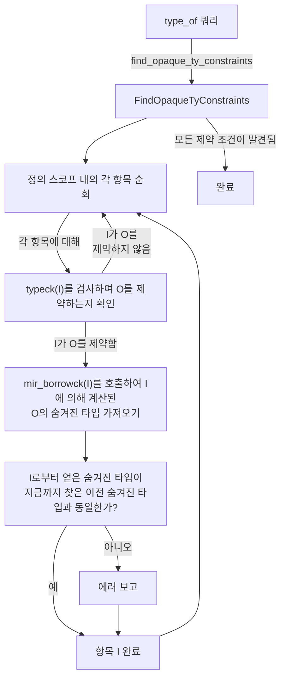

##### 불투명 타입을 다른 타입과 연결하기

불투명 타입의 숨겨진 타입이 제약되는 핵심적인 장소가 하나 있으며 그것은 `handle_opaque_type` 함수입니다.
재미있게도 두 개의 타입을 인자로 받으므로 아무 두 타입을 전달할 수 있지만 둘 중 하나는 불투명 타입이어야 합니다.
순서는 진단 목적으로만 중요합니다.
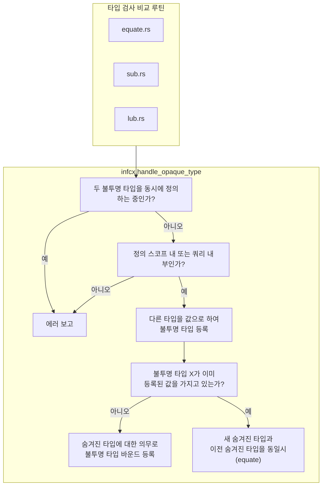

##### 쿼리와의 상호작용

쿼리가 불투명 타입을 처리할 때,
자신이 정의 스코프 내에 있는지 여부를 파악할 수 없으므로,
그저 정의 스코프 내에 있다고 가정합니다.

등록된 숨겨진 타입은 `QueryResponse` 구조체의
`opaque_types` 필드에 저장됩니다 (`take_opaque_types_for_query_response` 함수가 이를 읽어옵니다).

`QueryResponse`가 `query_response_substitution_guess`에서 둘러싸는 infcx로 인스턴스화될 때,
`handle_opaque_type`을 호출하여(위와 같이) 각 숨겨진 타입 제약 조건을 변환합니다.

한 가지 "기묘한" 부분이 있습니다.
인스턴스화된 불투명 타입에는 순서가 있습니다
(한 불투명 타입이 다른 불투명 타입과 비교되고 숨겨진 타입이 할당되는 불투명 타입으로 사용할 하나를 선택해야 하는 경우).
우리는 "기대되는(expected)" 것으로 간주되는 타입을 사용합니다.
그러나 실제로는 두 불투명 타입 모두 정의적 사용을 가질 수 있습니다.
쿼리 결과가 인스턴스화될 때,
이는 쿼리를 사용하는 컨텍스트로부터 재평가됩니다.
최종 컨텍스트(함수의 typeck, mir borrowck 또는 wf-checks)는 어떤 불투명 타입이 실제로 인스턴스화될 수 있는지 알고
그에 따라 올바르게 처리할 것입니다.

##### MIR 빌림 검사기 내부

MIR 빌림 검사기는 `nll_relate`를 통해 항목들을 연결하며 영역(region)에만 관심을 둡니다.
모든 타입 관계는 숨겨진 타입의 바인딩을 유발하므로, 빌림 검사기는 타입 검사기와 동일한 작업을 수행하지만
명백히 죽은 코드(예: 패닉 이후)는 무시합니다.
또한 빌림 검사기는 불투명 타입 선언의 어떤 수명이 숨겨진 타입의 어떤 수명에 대응하는지 올바르게 파악할 수 있는 유일한 존재이므로, 숨겨진 타입에 관한 신뢰할 수 있는 단일 출처(source of truth)입니다.

#### 하위 호환성 굄목 (hacks)

반환 위치에서의 `impl Trait`는 RFC에 포함되지 않았고 실수로 안정화된 것으로 보이는 다양한 특이점(quirk)들을 가지고 있습니다.
이들을 지원하기 위해 이전 동작을 다시 도입하는 용도로 `replace_opaque_types_with_inference_vars`가 사용되고 있습니다.

세 가지 하위 호환성 굄목이 있습니다:

1. 모든 반환 지점이 동일한 추론 변수를 공유하므로,
   다른 반환 지점이 구체적인 타입을 사용할 때만 컴파일되는 반환 지점이 있을 수 있습니다.
    ```rust
    fn foo() -> impl Debug {
        if false {
            return std::iter::empty().collect();
        }
        vec![42]
    }
    ```
2. 불투명한 `impl Trait` 시그니처가 트레이트 바운드를 만족시킬 필요 없이,
   숨겨진 타입이 연관 타입에 대한 트레이트 바운드를 만족시키는 한 `impl Trait`에 대한 연관 타입 동등성 제약 조건을 사용할 수 있습니다.

    ```rust
    trait Duh {}

    impl Duh for i32 {}

    trait Trait {
        type Assoc: Duh;
    }

    // `F`에 대한 `::Output` 프로젝션이 `R`이라는 사실로 인해
    // 중간 추론 변수가 생성되며 이는 나중에
    // 실제로 발견된 `Assoc` 타입과 비교됩니다.
    impl<R: Duh, F: FnMut() -> R> Trait for F {
        type Assoc = R;
    }

    // 여기의 `impl Send`는 나중에 생성된 추론 변수와 비교되며
    // 이로 인해 추론 변수가 숨겨진 타입 대신 `impl Send`로 설정됩니다.
    // 우리는 이미 `Trait::Assoc`의 `: Duh` 바운드를 유지하도록 추론 변수에 등록된 의무를 가지고 있습니다.
    // 불투명 타입은 숨겨진 타입이 `Duh`를 구현하더라도 `Duh`를 구현하지 않습니다.
    // Lazy TAIT는 에러를 내겠지만 다시 작동하도록 굄목을 삽입하여 하위 호환성을 유지했습니다.
    fn foo() -> impl Trait<Assoc = impl Send> {
        || 42
    }
    ```
3. 클로저는 부모 함수의 `impl Trait`에 대한 숨겨진 타입을 생성할 수 없습니다.
   이 지점은 1번 지점이 추론 변수를 도입하기 때문에 거의 무의미합니다.
   따라서 클로저는 추론 변수만 볼 수 있지만 1번 지점을 수정하면 이것이 문제가 될 것입니다.


### 트레이트 내 반환 위치 impl Trait (RPITIT) {#return-position-impl-trait-in-trait}

트레이트 내 반환 위치 impl Trait(RPITIT)는 개념적으로(그리고 [#112988] 이후로는 문자 그대로) 사용자가 트레이트 쪽이나 impl 쪽에 GAT를 직접 정의할 필요 없이, 트레이트 메서드의 RPIT를 제네릭 연관 타입(GAT)으로 변환하는 슈가(sugar)입니다.

RPITIT는 원래 [#101224]에서 구현되었으며 이는 트레이트 내 async fn(AFIT) 지원을 추가했습니다. AFIT 구현의 일부로서 이전에 RFC가 진행되었던 RPITIT 구현이 무료로 따라왔기 때문입니다. 그 후 [RFC 3425]에서 독립적으로 RFC가 제출되었고 최근 T-lang에 의해 승인되었습니다.

#### 어떻게 작동하나요?

이 문서는 주로 컴파일 파이프라인 순서대로 정리되어 있습니다:

1. AST 하위 변환 (AST -> HIR)
2. HIR ty 하위 변환 (HIR -> rustc_middle::ty 데이터 타입)
3. typeck (타입 검사)

##### AST 하위 변환

RPITIT에 대한 AST 하위 변환은 RPIT를 하위 변환하는 것과 거의 동일합니다. 우리는 여전히 이들을
[`hir::ItemKind::OpaqueTy`](https://doc.rust-lang.org/nightly/nightly-rustc/rustc_hir/hir/struct.OpaqueTy.html)로 하위 변환합니다.
두 가지 차이점은 다음과 같습니다:

불투명 타입에 대해 `in_trait`를 기록합니다. 이는 불투명 타입이 HIR ty 하위 변환, HIR을 다루는 진단 등을 위한 RPITIT임을 나타냅니다.

불투명 타입에 대해 아래에 설명된 `lifetime_mapping`을 기록합니다.

###### 여담: 불투명 수명 중복

*모든 불투명 타입*(RPITIT뿐만 아니라)은 캡처된 수명을 불투명 타입 로컬의 새로운 수명 파라미터로 중복 정의하게 됩니다. 이렇게 하는 주된 이유는 RPIT가 캡처된 늦은 바인딩(late-bound) 인자를 "구체화(reify)"[^rpitit-reify]하거나 조기 바인딩(early-bound) 인자로 변환할 수 있어야 하기 때문입니다. 이는 해당 인자들이 불투명 타입의 제네릭 인자로 사용되고 나중에 숨겨진 타입을 인스턴스화하는 데 사용될 수 있도록 하기 위함입니다. AST 하위 변환 중에는 어떤 수명이 조기 바인딩인지 늦은 바인딩인지 알 수 없으므로, 모든 수명에 대해 이를 적용합니다.

[^rpitit-reify]: 이는 compiler-errors팀의 용어이며 정확하다고 주장하는 것은 아닙니다 :^)

RPITIT의 주요 추가 사항은 하위 변환 중에 캡처된 수명과 대응되는 중복 수명 간의 관계를 추가 필드인
[`OpaqueTy::lifetime_mapping`](https://doc.rust-lang.org/nightly/nightly-rustc/rustc_hir/hir/struct.OpaqueTy.html#structfield.lifetime_mapping)에 추적한다는 것입니다.
이 수명 매핑은 나중에 `predicates_of`에서 이러한 GAT를 올바르게 타입 검사하기 위해 이들 중복 수명과 소스 수명 간의 동등성을 강제하는 바운드를 설치하는 데 사용되며 이에 대해서는 아래에서 논의합니다.

###### 참고

중복 없이 하위 변환할 수 있다면 더 좋을 수 있으며 이를 위해 조기 바인딩 수명과 늦은 바인딩 수명을 구분하는 것을 중단해야 할 것으로 생각됩니다. 따라서 [Account for late-bound lifetimes in generics #103448](https://github.com/rust-lang/rust/pull/103448)과 같은 솔루션이 필요하며 또한 [Inherit function lifetimes for impl-trait #103449](https://github.com/rust-lang/rust/pull/103449)와 유사한 PR도 필요할 것입니다.

##### HIR ty 하위 변환

HIR ty 하위 변환의 주요 변경 사항은 RPITIT에 대한 `hir::TyKind::OpaqueDef`를 불투명 타입 대신 프로젝션으로 하위 변환한다는 것입니다. 이때 트레이트 내 새로운 연관 타입을 위해 새롭게 합성된 def-id를 사용합니다. 이 def-id를 정확히 어떻게 얻는지는 다음 섹션에서 설명합니다.

이는 RPITIT에 대해 `lower_ty`를 호출할 때마다 불투명 타입 대신 프로젝션을 다시 받게 됨을 의미합니다. 이 프로젝션은 올바른 값으로 정규화(normalize)될 수 있습니다 -- 트레이트 내부에 있는 경우 원래 불투명 타입으로, impl 내부에 있는 경우 RPITIT의 추론된 타입으로 정규화됩니다.

###### 합성 연관 타입으로의 하위 변환

쿼리 피딩을 사용하여 메서드에 나타나는 RPITIT에 대해 트레이트 쪽과 impl 쪽 모두에 새로운 연관 타입을 합성합니다.

###### 트레이트 내 RPITIT 하위 변환

트레이트의 모든 연관 타입을 수집하기 위해 트레이트에 대해 `tcx.associated_item_def_ids(trait_def_id)`가 호출될 때, 이전에는 쿼리가 트레이트의 자식인 HIR 항목의 def-id만 반환했습니다.
[#112988] 이후에는 추가로 트레이트의 각 메서드에 대해 `tcx.associated_types_for_impl_traits_in_associated_fn(trait_method_def_id)`에 의해 반환된 def-id를 추가합니다. 이 쿼리는 각 트레이트 메서드를 순회하며 시그니처에 나타나는 모든 RPITIT를 수집한 다음, 각 RPITIT에 대해 `associated_type_for_impl_trait_in_trait`를 호출하여 새로운 연관 타입을 합성합니다.

###### impl 내 RPITIT 하위 변환

유사하게, impl의 HIR 항목과 함께 각 impl 메서드에 대해 해당 impl 메서드에 대한 모든 `associated_types_for_impl_traits_in_associated_fn`을 추가합니다. 이는 `associated_type_for_impl_trait_in_impl`을 호출하여 대응하는 트레이트 메서드로부터 온 각 RPITIT에 대해 연관 타입 정의를 합성합니다.

###### 새 연관 타입 합성

쿼리 피딩([`TyCtxtAt::create_def`](https://doc.rust-lang.org/nightly/nightly-rustc/rustc_middle/query/plumbing/struct.TyCtxtAt.html#method.create_def))을 사용하여 각 RPITIT에 대한 합성 GAT에 대한 새 def-id를 합성합니다.

로컬에서 rustc의 대부분의 쿼리는 항목의 HIR에 매칭되어 값을 계산합니다. RPITIT는 연관된 HIR을 실제로 가지고 있지 않거나, 적어도 연관 타입에 대응하는 HIR을 가지고 있지 않기 때문에, 우리는 많은 쿼리들을 조급하게(eagerly) 계산하고 [피딩](https://github.com/rust-lang/rust/pull/104940)해야 합니다. 예를 들어 `opt_def_kind`, `associated_item`, `visibility`, `defaultness` 등이 있습니다.

이러한 쿼리 대부분의 값은 명확한데, RPITIT가 개념적으로 부모 함수로부터 대부분의 정보(예: `visibility`)를 상속받거나, 연관 타입(`opt_def_kind`)이기 때문에 사소하게 알 수 있기 때문입니다.

다른 일부 쿼리들은 더 복잡하거나 피딩될 수 없으며 그중 흥미로운 것들을 아래에 기록합니다:

###### 트레이트에 대한 `generics_of`

RPITIT에 대한 GAT는 개념적으로 출처가 된 RPIT와 동일한 제네릭을 상속받습니다. 그러나 메서드를 제네릭의 부모로 두는 대신, 트레이트가 부모가 됩니다.

현재 우리는 RPIT의 제네릭과 메서드의 제네릭을 가져와 둘 다 새로운 제네릭 목록으로 평탄화(flattening)하여 각 파라미터의 def-id를 보존하는 방식으로 처리하고 있습니다. (이로 인해 def-id가 잘못된 부모를 갖는 문제가 발생할 수 있지만 최악의 경우 진단 문제만 발생합니다. 이것이 문제가 된다면 부모가 GAT인 제네릭 파라미터에 대해 새 def-id를 합성할 수 있습니다.)

<details>
<summary> <b>그림으로 나타낸 예시</b> </summary>

```rust
trait Foo {
    fn method<'early: 'early, 'late, T>() -> impl Sized + Captures<'early, 'late>;
}
```

다음과 같이 디슈가링됩니다...
```rust
trait Foo {
    //       vvvvvvvvv 메서드의 제네릭
    //                  vvvvvvvvvvvvvvvvvvvvvvvv 불투명 타입의 제네릭
    type Gat<'early, T, 'early_duplicated, 'late>: Sized + Captures<'early_duplicated, 'late>;

    fn method<'early: 'early, 'late, T>() -> Self::Gat<'early, T, 'early, 'late>;
}
```
</details>

###### impl에 대한 `generics_of`

impl의 GAT에 대한 제네릭은 다소 더 흥미롭습니다. 이들은 (트레이트 정의로부터 온) RPITIT 자체의 제네릭이 impl 메서드의 제네릭 뒤에 덧붙여져 구성됩니다. 이 역시 위와 동일한 문제를 가지고 있어서 GAT의 제네릭이 잘못된 부모 def-id를 가진 파라미터를 포함하지만 진단에서만 문제를 일으킬 것입니다.

새로운 제네릭 def-id를 합성한다면 유사하게 이를 수정할 수 있으며 관심 있는 새 기여자가 향후 호환 가능한 방식으로 나중에 작업할 수 있습니다.

###### `opt_rpitit_info`

일부 쿼리는 조급하게 피딩할 경우 순환(cycle)을 유발하는 정보를 계산하는 데 의존합니다(예: `explicit_predicates_of`).
따라서 우리는 `predicates_of` 제공자(provider)에 위임하여 RPITIT의 GAT에 대한 올바른 값을 반환하도록 합니다. 이를 위해 연관 타입이 합성 타입인지 여부를 [`opt_rpitit_info`](https://doc.rust-lang.org/nightly/nightly-rustc/rustc_middle/ty/context/struct.TyCtxt.html#method.opt_rpitit_info)를 통해 쿼리 초기에 감지합니다. 이 메서드는 연관 타입이 합성 타입인 경우 `Some`을 반환합니다.

그러면 `explicit_predicates_of`와 같은 쿼리 중에 다음과 같이 연관 타입이 합성 타입인지 감지할 수 있습니다:

```rust
fn explicit_predicates_of(tcx: TyCtxt<'_>, def_id: LocalDefId) -> ... {
    if let Some(rpitit_info) = tcx.opt_rpitit_info(def_id) {
        // RPITIT를 위한 특별한 작업 수행...
        return ...;
    }

    // `def_id`의 HIR 접근에 의존하는 일반 계산.
}
```

###### `explicit_predicates_of`

RPITIT는 트레이트 쪽과 impl 쪽 모두에서 자신을 정의한 메서드의 조건(predicates)을 복사하는 것으로 시작합니다.

추가로, 우리는 "양방향 존속(bidirectional outlives)" 조건을 설치합니다.
구체적으로, 하위 변환 결과로 생성된 중복된 조기 바인딩 수명과 동일하도록 제약하는 캡처된 각 조기 바인딩 수명에 대해 양방향으로 영역 존속 조건(region-outlives predicates)을 추가합니다. 이는 예시로 가장 잘 설명됩니다:

```rust
trait Foo<'a> {
    fn bar() -> impl Sized + 'a;
}

// 다음과 같이 디슈가링됨...

trait Foo<'a> {
    type Gat<'a_duplicated>: Sized + 'a
    where
        'a: 'a_duplicated,
        'a_duplicated: 'a;
    //~^ 구체적으로, 중복된 `'a_duplicated` 수명이
    // 항상 `'a` 수명과 동기화를 유지한다고 가정할 수 있어야 합니다.

    fn bar() -> Self::Gat<'a>;
}
```

###### `assumed_wf_types`

트레이트 및 impl 모두에서의 GAT는 RPITIT를 정의하는 트레이트 메서드의 `assumed_wf_types`를 상속받습니다. 이는 아래 코드가 하위 변환될 때 잘 형성되도록(well formed) 보장하기 위함입니다.

```rust
trait Foo {
    fn iter<'a, T>(x: &'a [T]) -> impl Iterator<Item = &'a T>;
}

// 다음과 같이 하위 변환됨...

trait FooDesugared {
    type Iter<'a, T>: Iterator<Item = &'a T>;
    //~^ 가정된 wf: `&'a [T]`
    // 가정된 wf 타입이 없으면 GAT는 그 자체로 잘 형성되지 않습니다.

    fn iter<'a, T>(x: &'a [T]) -> Self::Iter<'a, T>;
}
```

`assumed_wf_types`는 로컬 def id에 대해서만 정의되어 있으므로, RPIT를 포함하는 외부 트레이트의 impl에 대해 `assumed_wf_types`를 올바르게 구현하기 위해 외부 쿼리인 [`assumed_wf_types_for_rpitit`](https://github.com/rust-lang/rust/blob/a17c7968b727d8413801961fc4e89869b6ab00d3/compiler/rustc_ty_utils/src/implied_bounds.rs#L14)에 RPITIT의 가정된 wf 타입을 인코딩해야 합니다.

##### 타입 검사

###### RPITIT 추론 알고리즘

RPITIT 추론 알고리즘은 [`collect_return_position_impl_trait_in_trait_tys`](https://doc.rust-lang.org/nightly/nightly-rustc/rustc_hir_analysis/check/compare_impl_item/fn.collect_return_position_impl_trait_in_trait_tys.html)에 구현되어 있습니다.

**고수준 개념:** impl 메서드와 트레이트 메서드가 주어지면, 트레이트 메서드를 가져와 시그니처의 각 RPITIT를 추론 변수로 인스턴스화합니다. 그런 다음 이 트레이트 메서드 시그니처를 impl 메서드 시그니처와 동일하게 놓고(equate), 메서드 내 모든 RPITIT의 타입을 추론하기 위해 발생하는 모든 의무를 처리합니다.

이 메서드는 또한 각 RPITIT의 숨겨진 타입이 실제 `impl Trait`의 바운드를 충족하는지, 즉 `impl Trait = Foo`로 추론되면 `Foo: Trait`가 성립하는지 확인하는 책임도 갖습니다.

<details>
    <summary><b>예시...</b></summary>

```rust
#![feature(return_position_impl_trait_in_trait)]

use std::ops::Deref;

trait Foo {
    fn bar() -> impl Deref<Target = impl Sized>;
             // ^- RPITIT ?0        ^- RPITIT ?1
}

impl Foo for () {
    fn bar() -> Box<String> { Box::new(String::new()) }
}
```

결국 `fn() -> ?0`처럼 보이는 트레이트 시그니처와 중첩된 의무 `?0: Deref<Target = ?1>`, `?1: Sized`를 얻게 됩니다. impl 시그니처는 `fn() -> Box<String>`입니다.

이들 시그니처를 동일시하면 `?0 = Box<String>`을 얻게 되고 `Box<String>: Deref<Target = ?1>` 의무를 처리한 후 `?1 = String`을 얻으며 다른 의무인 `String: Sized`는 참으로 평가됩니다.

알고리즘이 끝날 때 연관 타입 def-id와 시그니처로부터 추론된 구체적인 타입 간의 매핑을 얻게 됩니다. 이 매핑은 각 RPITIT에 대해 `type Assoc = ...`에서 `=` 뒤에 와야 하는 타입을 설명하므로, impl 내 합성 연관 타입에 대한 `type_of`를 구현하는 데 사용할 수 있습니다.
</details>

###### RPITIT 숨겨진 타입 추론에서의 함의된 바운드 (Implied bounds)

`collect_return_position_impl_trait_in_trait_tys`가 이행(fulfillment) 및 영역 해소를 수행하므로, `compare_method_predicate_entailment`가 하는 것과 동일한 예상 함의된 바운드로 영역 의무를 증명할 수 있도록 `assumed_wf_types`를 제공해야 합니다.

메서드의 반환 타입은 가정된 WF 타입 중 하나로 이해되며 불투명 타입 추론을 수행하기 위해 반환 타입을 추론 변수로 조급하게 폴딩(fold)하므로, 불투명 타입 추론 후에 반환 타입은 RPITIT의 숨겨진 타입을 포함하도록 해소될 것입니다. 이는 RPITIT의 숨겨진 타입들이 독립적으로 잘 형성됨을 증명하지 않고도 잘 형성된 것으로 가정됨을 의미합니다. 이로 인해 [미묘한 비건전성 버그](https://github.com/rust-lang/rust/pull/116072)가 발생했습니다. 이러한 순환 논리를 방지하기 위해, 우리는 메서드의 반환 타입에 있는 RPITIT의 숨겨진 타입을 *플레이스홀더(placeholders)*로 교체하여 함의된 잘 형성됨 바운드를 이끌어내지 않도록 합니다.

###### 기본 트레이트 본문

다음과 같은 기본 트레이트 본문을 타입 검사하는 경우:

```rust
trait Foo {
    fn bar() -> impl Sized {
        1i32
    }
}
```

한 가지 흥미로운 굄목이 필요합니다. RPITIT의 GAT가 RPITIT의 불투명 타입으로 정규화된다고 가정할 수 있도록 `Foo::bar`의 param-env에 프로젝션 조건(projection predicate)을 설치해야 합니다. 이는 트레이트 메서드와 RPITIT의 GAT가 항상 "동기화"되어 있다는 관찰에 의존합니다. 즉, 둘 중 하나가 오버라이드되면 다른 하나도 오버라이드됩니다.

동일한 가정에 의존할 수 없기 때문에 실패하는 위 코드의 유사한 디슈가링과 비교해 보세요:

```rust
#![feature(impl_trait_in_assoc_type)]
#![feature(associated_type_defaults)]

trait Foo {
    type RPITIT = impl Sized;

    fn bar() -> Self::RPITIT {
        01i32
    }
}
```

하위 impl이 이론적으로 `bar`의 구현을 제공하지 않고 `RPITIT`에 대한 구현만 제공할 수 있기 때문에 실패합니다:

```text
error[E0308]: mismatched types
--> src/lib.rs:8:9
 |
5 |     type RPITIT = impl Sized;
 |     ------------------------- associated type defaults can't be assumed inside the trait defining them
6 |
7 |     fn bar() -> Self::RPITIT {
 |                 ------------ expected `<Self as Foo>::RPITIT` because of return type
8 |         01i32
 |         ^^^^^ expected associated type, found `i32`
 |
 = note: expected associated type `<Self as Foo>::RPITIT`
                       found type `i32`
```

###### 잘 형성됨(Well-formedness) 검사

우리는 일반 연관 타입과 마찬가지로 RPITIT의 잘 형성됨을 검사합니다.

`predicates_of`에 중복된 조기 바인딩 수명을 원래 수명에 연결하는 수명 바운드를 추가했고 RPITIT가 유래한 메서드의 WF 타입을 상속받는 `assumed_wf_types`를 구현했기 때문에([#113704]), 일반 GAT인 것처럼 GAT를 WF 검사하는 데 아무런 문제가 없습니다.

##### 무엇이 고장 났고 무엇이 이상한가 등

###### 특수화(Specialization)가 심각하게 고장 남

위에서 설명한 "기본 트레이트 메서드"는 특수화와 제대로 상호작용하지 않습니다. 이러한 프로젝션 바운드를 impl 메서드가 아닌 트레이트 기본 메서드에만 설치하기 때문입니다. 특수화가 이미 꽤 고장 나 있다는 점을 고려할 때 자세히 설명하지는 않겠지만 현재 다음 파일에서 추적 중인 버그입니다:
    * `tests/ui/impl-trait/in-trait/specialization-broken.rs`

###### 프로젝션에 변이성(variances)이 없음

이 코드는 프로젝션에 변이성이 없기 때문에 실패합니다:
```rust
#![feature(return_position_impl_trait_in_trait)]

trait Foo {
    // 아래 RPITIT는 `'lt`를 캡처하지 *않음*에 유의하세요.
    fn bar<'lt: 'lt>() -> impl Eq;
}

fn test<'a, 'b, T: Foo>() -> bool {
    <T as Foo>::bar::<'a>() == <T as Foo>::bar::<'b>()
    //~^ ERROR
    // (`'a == 'b`일 것을 요구함)
}
```

이는 그들이 수명 파라미터를 캡처하지 않더라도 `<T as Foo>::Rpitit<'a>`와 `<T as Foo>::Rpitit<'b>`를 연결할 수 없기 때문입니다. 일반 불투명 타입을 사용했다면 해당 수명 파라미터에서 이변량(bivariant)이 되기 때문에 작동했을 것입니다:
```rust
#![feature(return_position_impl_trait_in_trait)]

fn bar<'lt: 'lt>() -> impl Eq {
    ()
}

fn test<'a, 'b>() -> bool {
    bar::<'a>() == bar::<'b>()
}
```

하지만 RPITIT는 어차피 스코프 내의 모든 수명을 캡처하도록 캡처 동작이 변경될 가능성이 높으므로 아마 괜찮을 것입니다. 프로젝션을 연결할 때 RPITIT의 변이성을 고려한다면 나중에 향후 호환 가능한 방식으로 완화될 수도 있습니다.

[#112988]: https://github.com/rust-lang/rust/pull/112988
[RFC 3425]: https://github.com/rust-lang/rfcs/pull/3425
[#101224]: https://github.com/rust-lang/rust/pull/101224
[#113704]: https://github.com/rust-lang/rust/pull/113704


### 불투명 타입 영역 추론 제약 {#borrow-check-opaque-types-region-inference-restrictions}

이 장에서는 불투명 타입의 숨겨진 타입
`Opaque<'a, 'b, .., A, B, ..> := SomeHiddenType`을 정의할 때 불투명 타입의 제네릭 인자에 부과하는 다양한 제약 조건에 대해 논의합니다.

이러한 제약 조건은 불투명 타입 추론의 최종 단계이므로 빌림 검사([출처][source-borrowck-opaque])에서 구현됩니다.

[source-borrowck-opaque]: https://github.com/rust-lang/rust/blob/435b5255148617128f0a9b17bacd3cc10e032b23/compiler/rustc_borrowck/src/region_infer/opaque_types.rs

#### 배경: 타입 및 상수 제네릭 인자
타입 인자의 경우 두 가지 제약 조건이 필요합니다: 각 타입 인자는
(1) 타입 파라미터여야 하고,
(2) 제네릭 인자들 사이에서 유일(unique)해야 합니다.
상수 인자에도 동일하게 적용됩니다.

사례 (1)의 예시:
```rust
type Opaque<X> = impl Sized;

// `T`는 타입 파라미터입니다.
// Opaque<T> := ();
fn good<T>() -> Opaque<T> {}

// `()`는 타입 파라미터가 아닙니다.
// Opaque<()> := ();
fn bad() -> Opaque<()> {} //~ ERROR
```

사례 (2)의 예시:
```rust
type Opaque<X, Y> = impl Sized;

// `T`와 `U`는 제네릭 인자에서 유일합니다.
// Opaque<T, U> := T;
fn good<T, U>(t: T, _u: U) -> Opaque<T, U> { t }

// `T`가 제네릭 인자에 두 번 등장합니다.
// Opaque<T, T> := T;
fn bad<T>(t: T) -> Opaque<T, T> { t } //~ ERROR
```
**동기:** 첫 번째 사례 `Opaque<()> := ()`에서, 숨겨진 타입은 모호합니다. 왜냐하면 두 가지 다른 해석인 `Opaque<X> := X`와 `Opaque<X> := ()` 모두와 호환되기 때문입니다.
유사하게 두 번째 사례 `Opaque<T, T> := T`에서도 `Opaque<X, Y> := X`로 해석되어야 하는지 `Opaque<X, Y> := Y`로 해석되어야 하는지 모호합니다.
이러한 모호성 때문에 두 사례 모두 유효하지 않은 정의적 사용으로 거부됩니다.
#### 유일성 제약

각 수명 인자는 인자 목록에서 유일해야 하며 `'static`이 아니어야 합니다.
이는 타입 파라미터의 경우와 유사하게 숨겨진 타입 추론 시의 모호성을 회피하기 위함입니다.
예를 들어 아래의 유효하지 않은 정의적 사용 `Opaque<'static> := Inv<'static>`은
`Opaque<'x> := Inv<'static>` 및 `Opaque<'x> := Inv<'x>` 둘 다와 호환됩니다.

```rust
type Opaque<'x> = impl Sized + 'x;
type Inv<'a> = Option<*mut &'a ()>;

fn good<'a>() -> Opaque<'a> { Inv::<'static>::None }

fn bad() -> Opaque<'static> { Inv::<'static>::None }
//~^ ERROR
```

```rust
type Opaque<'x, 'y> = impl Trait<'x, 'y>;

fn good<'a, 'b>() -> Opaque<'a, 'b> {}

fn bad<'a>() -> Opaque<'a, 'a> {}
//~^ ERROR
```

**의미적 수명 동등성:**
타입 파라미터와 비교하여 수명이 갖는 한 가지 복잡성은 구문상 다른 두 수명이 의미상으로 같을 수 있다는 점입니다.
따라서 수명이 유일한지 검증할 때 주의해야 합니다.

```rust
// `'a`가 *의미상* `'static`과 동일하므로 이 역시 유효하지 않습니다.
fn still_bad_1<'a: 'static>() -> Opaque<'a> {}
//~^ 에러가 발생해야 함!

// `'a`와 `'b`가 *의미상* 동일하므로 이 역시 유효하지 않습니다.
fn still_bad_2<'a: 'b, 'b: 'a>() -> Opaque<'a, 'b> {}
//~^ 에러가 발생해야 함!
```

#### 유일성 규칙에 대한 예외

위의 유일성 규칙에 대한 한 가지 예외는 불투명 타입 정의에서의 바운드가 수명 파라미터가 다른 수명 파라미터 또는 `'static` 수명과 동일할 것을 요구하는 경우입니다.
```rust
// 정의에서 `'x`가 `'static`과 동일할 것을 요구함.
type Opaque<'x: 'static> = impl Sized + 'x;

fn good() -> Opaque<'static> {}
```

**동기:** RPIT에 대해 유일성 제약 조건을 구현하려던 시도가 [크레이터(crater) 테스트에서 파손을 발견](https://github.com/rust-lang/rust/pull/112842#issuecomment-1610057887)했습니다.
이 규칙 예외를 통해 이를 완화할 수 있습니다.
그렇지 않았으면 깨졌을 코드의 예시:
```rust
struct Type<'a>(&'a ());
impl<'a> Type<'a> {
    // `'b == 'a`
    fn do_stuff<'b: 'a>(&'b self) -> impl Trait<'a, 'b> {}
}
```

**이것이 올바른 이유:** `Opaque<'a, 'a> := &'a str`과 같은 정의적 사용의 경우,
`Opaque<'x, 'y> := &'x str` 또는 `Opaque<'x, 'y> := &'y str` 어느 쪽으로 해석되든 상관없습니다. 잘 형성됨 규칙에 따라 `Opaque`를 사용하는 모든 곳에서 두 파라미터가 동일함이 보장되기 때문입니다.

#### 보편적 수명(Universal lifetimes) 제약

불투명 타입 인자에는 보편적으로 정량화된 수명(universally quantified lifetimes)만 허용됩니다.
여기에는 수명 파라미터와 플레이스홀더가 포함됩니다.

```rust
type Opaque<'x> = impl Sized + 'x;

fn test<'a>() -> Opaque<'a> {
    // `Opaque<'empty> := ()`
    let _: Opaque<'_> = ();
    //~^ ERROR
}
```

**동기:**
이는 수명과 타입 인자가 일관되게 동작하도록 만들지만 이는 덤일 뿐입니다.
이 제약 조건 뒤에 있는 진짜 이유는 순전히 기술적인 것인데, [멤버 제약 조건(member constraints)] 알고리즘이 근본적인 한계에 부딪히기 때문입니다:
`Opaque<'?1> := &'?2 u8`이라는 불투명 타입 정의를 만날 때,
멤버 제약 조건 `'?2 member-of ['static, '?1]`이 등록됩니다.
알고리즘이 올바른 선택을 하기 위해서는, 선택 영역들 `['static, '?1]` 간의 "존속(outlives)" 관계의 *전체* 세트가 영역 추론을 수행하기 *전에* 이미 알려져 있어야 합니다. 이는 각 선택 영역이 다음 중 하나일 때만 충족될 수 있습니다:
1. 보편적 영역, 즉 `RegionKind::Re{EarlyParam,LateParam,Placeholder,Static}`. 명시적 및 함의된 바운드로부터 보편적 영역들 간의 관계가 영역 추론 전에 완전히 알려져 있기 때문입니다.
1. 또는 보편적 영역과 "엄격히 동일한" 존재적(existential) 영역.
엄격한 수명 동등성은 아래에 정의되어 있으며 전체 영역 추론 전에 평가될 수 있는 유일한 유형의 동등성이기 때문에 여기서 필요합니다.

**엄격한 수명 동등성:**
두 수명 사이에 양방향 존속 제약 조건이 존재하는 경우 두 수명이 엄격히 동일하다고 말합니다. NLL 용어로 이는 두 수명이 동일한 [SCC]의 일부임을 의미합니다.
중요하게도 이러한 유형의 동등성은 전체 영역 추론 전에(그러나 제약 조건 수집 이후에) 평가될 수 있습니다.
다른 유형의 동등성은 영역 추론 결과 두 수명 변수가 엄격히 동일하지 않더라도 동일한 값을 갖게 되는 경우입니다.
이 차이를 우리가 어떻게 혼용했었는지에 대해서는 [#113971]을 참조하세요.

[#113971]: https://github.com/rust-lang/rust/issues/113971
[SCC]: https://en.wikipedia.org/wiki/Strongly_connected_component
[member constraints]: #borrow-check-region-inference-member-constraints

**"영역 모듈로 1회" 제약과의 상호작용**
위의 예시에서 시그니처의 불투명 타입은 `Opaque<'a>`이고 유효하지 않은 정의적 사용의 불투명 타입은 `Opaque<'empty>`임에 유의하세요.
제안된 MiniTAIT 계획, 즉 ["영역 모듈로 1회"][#116935] 규칙에서는 이를 이미 금지하고 있습니다.
"보편적 수명" 제약 조건이 "MiniTAIT" 제약 조건으로부터 논리적으로 도출되어 중복된 것처럼 보일 수 있지만 수명 동등성 및 클로저에 관한 후속 관련 논의는 여전히 유효합니다.

[#116935]: https://github.com/rust-lang/rust/pull/116935


#### 클로저 제약

불투명 타입이 클로저/코루틴/인라인 const 본문에서 정의될 때, 클로저에 "외부(external)"인 보편적 수명은 불투명 타입 인자로 허용되지 않습니다.
외부 영역은 [`RegionClassification::External`][source-external-region]에 정의되어 있습니다.

[source-external-region]: https://github.com/rust-lang/rust/blob/caf730043232affb6b10d1393895998cb4968520/compiler/rustc_borrowck/src/universal_regions.rs#L201

예시: (이 예시는 현재 나이트리에서 컴파일되지만 더 실용적인 예시들은 이미 혼란스러운 에러와 함께 거부됩니다.)
```rust
type Opaque<'x> = impl Sized + 'x;

fn test<'a>() -> Opaque<'a> {
    let _ = || {
        // `'a`는 클로저에 대해 외부 영역임
        let _: Opaque<'a> = ();
        //~^ 에러가 발생해야 함!
    };
    ()
}
```

**동기:**
클로저 본문에서 외부 수명은 "보편적" 수명으로 분류됨에도 불구하고 수명 간의 관계가 사전에 알려져 있지 않다는 점에서 존재적 수명처럼 동작합니다. 대신 그 값은 존재적 수명처럼 추론되며 요구 사항이 부모 함수로 다시 전파됩니다. 이는 위에서 설명한 멤버 제약 조건 알고리즘을 깨뜨립니다:
> 알고리즘이 올바른 선택을 하기 위해서는, 선택 영역들 `['static, '?1]` 간의 전체 "존속" 관계 세트가 영역 추론을 수행하기 전에 이미 알려져 있어야 합니다.

세부 사항을 보여주는 예시는 다음과 같습니다:

```rust
type Opaque<'x, 'y> = impl Sized;

//
fn test<'a, 'b>(s: &'a str) -> impl FnOnce() -> Opaque<'a, 'b> {
    move || { s }
    //~^ ERROR hidden type for `Opaque<'_, '_>` captures lifetime that does not appear in bounds
}

// 위의 클로저 본문은 다음과 유사하게 디슈가링됩니다:
fn test::{closure#0}(_upvar: &'?8 str) -> Opaque<'?6, '?7> {
    return _upvar
}

// 여기서 `['?8, '?6, ?7]`은 클로저에 *외부*인 보편적 수명입니다.
// 클로저 *내부*에서는 이들 사이에 알려진 관계가 없습니다.
// 그러나 부모 fn에서는 `'?6: '?8`임이 알려져 있습니다.
//
// 불투명 타입 정의 `Opaque<'?6, '?7> := &'8 str`을 만날 때,
// 멤버 제약 조건 알고리즘은 `?8 = '?6`으로 안전하게 결정할 만큼 충분히 알지 못합니다.
// 이러한 이유로 명확한 메시지와 함께 에러를 발생시킵니다:
// "hidden type captures lifetime that does not appear in bounds".
```

이러한 제약 조건이 없으면 에러 메시지가 혼란스럽고 더 중요하게는 클로저에서 멤버 제약 조건이 심각하게 고장 나 있기 때문에 향후 깨질 가능성이 높은 코드를 수락할 위험이 있습니다.

**출력 타입:**
실제 코드에서 이것이 문제를 일으키는 가장 흔한 시나리오는 클로저/async-block 출력 타입이라고 믿습니다. 클로저와 async 블록 사이에 이러한 문제를 더욱 잘 보여주는 불일치가 존재하며 이는 기술적으로 퓨처에만 적용되는 [replace_opaque_types_with_inference_vars 굄목][source-replace-opaques]에 기인한다는 점을 주목할 가치가 있습니다.

[source-replace-opaques]: https://github.com/rust-lang/rust/blob/9cf18e98f82d85fa41141391d54485b8747da46f/compiler/rustc_hir_typeck/src/closure.rs#L743

```rust
type Opaque<'x> = impl Sized + 'x;
fn test<'a>() -> impl FnOnce() -> Opaque<'a> {
    // 클로저의 출력 타입은 Opaque<'a>임
    // -> 숨겨진 타입 정의가 클로저 *내부*에서 발생함
    // -> 거부됨.
    move || {}
    //~^ ERROR expected generic lifetime parameter, found `'_`
}
```
```rust
use std::future::Future;
type Opaque<'x> = impl Sized + 'x;
fn test<'a>() -> impl Future<Output = Opaque<'a>> {
    // async 블록의 출력 타입은 유닛 `()`임
    // -> 숨겨진 타입 정의가 부모 fn에서 발생함
    // -> 수락됨.
    async move {}
}
```


## 이펙트, const 트레이트 및 const 조건 검사 {#effects}

### `HostEffect` 술어

[`HostEffectPredicate`]는 `[const] Tr` 또는 `const Tr` 바운드로부터 온 일종의 술어(predicate)입니다.
이는 트레이트 참조와, 바운드에 따라 `Maybe` 또는 `Const`가 될 수 있는 `constness`를 가집니다.
`[const] Tr` 즉 `Maybe` 바운드는 속한 컨텍스트에 따라 다르게 적용되기 때문에 일반적인 바운드와 다른 동작을 가집니다.
함수의 `T: Tr`과 같은 일반적인 트레이트 바운드가 [`predicates_of`] 쿼리 내에서 수집되어 함수가 호출될 때 증명되고 함수 내에서 가정되는 반면,
`T: [const] Tr`과 같은 바운드는 일반 트레이트 바운드로 작동하여 `predicates_of` 결과에 `T: Tr`을 추가하지만 [`const_conditions`] 쿼리에 `HostEffectPredicate`를 추가하기도 합니다.

반면에 `T: const Tr` 바운드는 컨텍스트에 따라 의미가 변하지 않으므로, `const_conditions`가 아닌 `predicates_of`에 `HostEffect(T: Tr, const)`가 추가되는 결과를 낳습니다.

[`HostEffectPredicate`]: https://doc.rust-lang.org/nightly/nightly-rustc/rustc_type_ir/predicate/struct.HostEffectPredicate.html
[`const_conditions`]: https://doc.rust-lang.org/nightly/nightly-rustc/rustc_middle/ty/struct.TyCtxt.html#method.const_conditions

### `const_conditions` 쿼리

`predicates_of`는 항목을 사용하기 위해 증명되어야 하는 술어 세트를 나타냅니다.
예를 들어 아래 예시에서 `foo`를 사용하려면:

```rust
fn foo<T>() where T: Default {}
```

`T`가 `Default`를 구현한다는 것을 증명할 수 있어야 합니다.
유사하게,
`const_conditions`는 *const 컨텍스트에서* 항목을 사용하기 위해 증명되어야 하는 술어 세트를 나타냅니다. 위의 예시를 `const` 트레이트 바운드를 사용하도록 수정한다면:

```rust
const fn foo<T>() where T: [const] Default {}
```

그러면 `foo`는 `const_conditions` 쿼리에서 `HostEffect(T: Default, maybe)`를 얻게 되며 이는 const 컨텍스트에서 `foo`를 호출하기 위해서는 `T`가 `Default`의 const 구현을 가지고 있음을 증명해야 함을 암시합니다.

### `const_conditions` 강제 실행

`const_conditions`는 현재 여러 장소에서 검사됩니다.

const 컨텍스트(`const fn` 및 `const` 항목 포함)의 모든 HIR 호출은 우리가 호출하는 함수의 `const_conditions`가 성립하는지 검사합니다.
이는 [`FnCtxt::enforce_context_effects`]에서 수행됩니다.
함수가 참조만 되고 호출되지 않는 경우에는 검사하지 않음에 유의하세요. 아래 코드가 컴파일되어야 하기 때문입니다:

```rust
const fn hi<T: [const] Default>() -> T {
    T::default()
}
const X: fn() -> u32 = hi::<u32>;
```

트레이트 `impl`이 잘 형성되기 위해서는 impl의 환경으로부터 트레이트의 `const_conditions`를 증명할 수 있어야 합니다.
이는 [`wfcheck::check_impl`]에서 검사됩니다.

예시는 다음과 같습니다:

```rust
const trait Bar {}
const trait Foo: [const] Bar {}
// `const_conditions`에 `HostEffect(Self: Bar, maybe)`가 포함됨

impl const Bar for () {}
impl const Foo for () {}
// ^ 여기서 impl이 잘 형성되기 위해 `const_conditions`를 검사함
```

트레이트 impl의 메서드는 구현하려는 트레이트의 메서드보다 더 엄격한 바운드를 가질 수 없습니다.
메서드가 호환되는지 검사하기 위해, `impl`의 술어에 트레이트 메서드의 술어를 더한 하이브리드 환경이 구성되며 impl 메서드의 술어를 증명하려고 시도합니다.
`const_conditions`에 대해서도 동일하게 수행합니다:

```rust
const trait Foo {
    fn hi<T: [const] Default>();
}

impl<T: [const] Clone> Foo for Vec<T> {
    fn hi<T: [const] PartialEq>();
    // ^ `T: [const] Clone`과 `T: [const] Default`가 주어진 상태에서
    // `T: [const] PartialEq`를 증명할 수 없으므로, impl의 메서드가
    // 트레이트의 메서드보다 더 엄격함을 알 수 있습니다.
}
```

이러한 검사는 [`compare_method_predicate_entailment`]에서 수행됩니다.
연관 타입에 대해 동일한 검사를 수행하는 유사한 함수는 [`compare_type_predicate_entailment`]라고 불립니다.
이 둘 모두 const 컨텍스트에 있을 때 `const_conditions`를 고려해야 합니다.

MIR에서는 const 검사의 일환으로, 호출되는 항목들의 `const_conditions`가 [`Checker::revalidate_conditional_constness`]에서 다시 검증됩니다.

[`compare_method_predicate_entailment`]: https://doc.rust-lang.org/nightly/nightly-rustc/rustc_hir_analysis/check/compare_impl_item/fn.compare_method_predicate_entailment.html
[`compare_type_predicate_entailment`]: https://doc.rust-lang.org/nightly/nightly-rustc/rustc_hir_analysis/check/compare_impl_item/fn.compare_type_predicate_entailment.html
[`FnCtxt::enforce_context_effects`]: https://doc.rust-lang.org/nightly/nightly-rustc/rustc_hir_typeck/fn_ctxt/struct.FnCtxt.html#method.enforce_context_effects
[`wfcheck::check_impl`]: https://doc.rust-lang.org/nightly/nightly-rustc/rustc_hir_analysis/check/wfcheck/fn.check_impl.html
[`Checker::revalidate_conditional_constness`]: https://doc.rust-lang.org/nightly/nightly-rustc/rustc_const_eval/check_consts/check/struct.Checker.html#method.revalidate_conditional_constness

### 연관 타입 및 트레이트에서의 `explicit_implied_const_bounds`

연관 타입, 불투명 타입 및 수퍼트레이트에 대한 다음과 같은 바운드는 그 바운드가 다르게 표현됩니다:

```rust
trait Foo: [const] PartialEq {
    type X: [const] PartialEq;
}

fn foo() -> impl [const] PartialEq {
    // ^ 아직 구현되지 않은 구문
}
```

호출자에 대해 증명되어야 하고 정의 내부에서 가정될 수 있는 `const_conditions`(예: 함수의 트레이트 바운드)와 달리,
이러한 바운드는 정의 시점(impl 시점 또는 불투명 타입을 반환할 때)에 증명되어야 하지만 호출자에 대해서는 가정될 수 있습니다.
이러한 바운드의 non-const 대응물은 [`explicit_item_bounds`]라고 불립니다.

이러한 바운드는 HIR typeck를 위한 [`compare_impl_item::check_type_bounds`], 이전 솔버의 [`evaluate_host_effect_from_item_bounds`] 및 새 솔버의 [`consider_additional_alias_assumptions`]에서 검사됩니다.

[`explicit_item_bounds`]: https://doc.rust-lang.org/nightly/nightly-rustc/rustc_middle/ty/struct.TyCtxt.html#method.explicit_item_bounds
[`compare_impl_item::check_type_bounds`]: https://doc.rust-lang.org/nightly/nightly-rustc/rustc_hir_analysis/check/compare_impl_item/fn.check_type_bounds.html
[`evaluate_host_effect_from_item_bounds`]: https://doc.rust-lang.org/nightly/nightly-rustc/rustc_trait_selection/traits/effects/fn.evaluate_host_effect_from_item_bounds.html
[`consider_additional_alias_assumptions`]: https://doc.rust-lang.org/nightly/nightly-rustc/rustc_next_trait_solver/solve/assembly/trait.GoalKind.html#tymethod.consider_additional_alias_assumptions

### `HostEffectPredicate` 증명하기

`HostEffectPredicate`는 [이전 솔버] 및 [새 트레이트 솔버] 모두에 구현되어 있습니다.
일반적으로 다음 조건 중 하나라도 충족되면 `HostEffect` 술어를 증명할 수 있습니다:

* 호출자 바운드로부터 술어를 가정할 수 있는 경우;
* 타입이 해당 트레이트에 대한 `const` `impl`을 가지고 있고 *또한* impl의 const 조건이 성립하며 *또한* 트레이트의 `explicit_implied_const_bounds`가 성립하는 경우; 또는
* 타입이 const 컨텍스트에서 트레이트에 대해 내장된(built-in) 구현을 가진 경우.
  예를 들어 `Fn`은 함수의 const 조건이 충족되면 함수 항목에 의해 구현될 수 있고 `Destruct`는 컴파일 타임에 타입이 드롭될 수 있으면 const 컨텍스트에서 구현됩니다.

[old solver]: https://doc.rust-lang.org/nightly/nightly-rustc/src/rustc_trait_selection/traits/effects.rs.html
[new trait solver]: https://doc.rust-lang.org/nightly/nightly-rustc/src/rustc_next_trait_solver/solve/effect_goals.rs.html

### const 트레이트에 대한 추가 정보

추후 확장될 예정입니다.

#### `#[rustc_non_const_trait_method]` 속성

이는 내부(표준 라이브러리) 용도로만 의도되었습니다.
트레이트 메서드에 이 속성이 적용되면 컴파일러는 이 메서드의 기본 본문이 컴파일 타임에 실행 가능한지 여부를 검사하지 않습니다.
트레이트 사용자 역시 const 컨텍스트에서 이 트레이트 메서드를 사용할 수 없게 됩니다.
이 속성은 주로 `Iterator`와 같은 대형 트레이트를 모든 메서드를 동시에 `const`로 만들지 않으면서 const화하기 위해 사용됩니다.

트레이트를 `const`로 안정화할 때는 이 속성이 존재하지 않아야 합니다.


## 패턴 및 망라성(Exhaustiveness) 검사 {#pat-exhaustive-checking}

Rust에서 패턴 매칭 및 바인딩은 매우 유용한 몇 가지 속성을 갖습니다.
컴파일러는 바인딩이 생성될 때 반박 불가능한지(irrefutable) 검사하고 match 분기들이 망라적인지(exhaustive) 검사합니다.

### 패턴 유용성

유용성 검사가 답하는 핵심 질문은 다음과 같습니다:
"이 match 표현식에서 저 분기는 중복되는가?".
더 정확히 말하면, 이미 본 패턴 목록이 주어졌을 때
새로 주어진 패턴이 어떠한 새로운 값과 매칭될 가능성이 있는지 계산하는 문제로 귀결됩니다.

예를 들어 다음 match 표현식에서
각 패턴이 위쪽 패턴들에 의해 매칭되지 않은 무언가와 매칭될 수 있는지 순서대로 묻습니다.
여기서 4번째 패턴은 1번째 패턴과 중복됨을 볼 수 있습니다;
해당 분기는 "unreachable" 경고를 받게 됩니다.
3번째 패턴은 `Foo`가 `Bar` 이외의 다른 변형(variant)을 갖는지 여부에 따라 유용할 수도 있고 아닐 수도 있습니다.
마지막으로, 와일드카드 패턴(`_`)이 이 match의 모든 패턴 목록에 비해 유용한지 물어봄으로써 전체 match가 망라적인지 물을 수 있습니다.
여기서 `_`가 유용함을 볼 수 있습니다 (`(false, None)`을 잡아낼 것입니다);
따라서 이 표현식은 "non-exhaustive match" 에러를 받게 됩니다.

```rust
// x: (bool, Option<Foo>)
match x {
    (true, _) => {} // 1
    (false, Some(Foo::Bar)) => {} // 2
    (false, Some(_)) => {} // 3
    (true, None) => {} // 4
}
```

따라서 유용성은 두 가지 목적으로 사용됩니다: 도달 불가능한 코드 감지(사용자에게 유용함),
그리고 match가 망라적임을 보장(match 표현식이 값을 반환할 수 있으므로 건전성에 중요함).

### 발생하는 위치

이 검사는 패턴을 작성할 수 있는 모든 위치에서 수행됩니다: `match` 표현식, `if let`, `let else`,
일반 `let`, 및 함수 인자.

```rust
// `match`
// 유용성은 도달 불가능한 분기를 감지하고 비망라적 match를 금지할 수 있습니다.
match foo() {
    Ok(x) => x,
    Err(_) => panic!(),
}

// `if let`
// 유용성은 도달 불가능한 분기를 감지할 수 있습니다.
if let Some(x) = foo() {
    // ...
}

// `while let`
// 유용성은 무한 루프 및 사장된(dead) 루프를 감지할 수 있습니다.
while let Some(x) = it.next() {
    // ...
}

// 구조 분해 `let`
// 유용성은 비망라적 패턴을 금지할 수 있습니다.
let Foo::Bar(x, y) = foo();

// 구조 분해 함수 인자
// 유용성은 비망라적 패턴을 금지할 수 있습니다.
fn foo(Foo { x, y }: Foo) {
    // ...
}
```

### 알고리즘

망라성 검사는 MIR 생성 전 [`check_match`]에서 실행됩니다.
이는 [`rustc_pattern_analysis`] 크레이트에 구현되어 있으며
알고리즘의 핵심은 [`usefulness`] 모듈에 있습니다.
해당 파일에 알고리즘에 대한 자세한 설명이 포함되어 있습니다.

### 중요한 개념

#### 생성자 및 필드

`Pair(Some(0), true)` 값에서 `Pair`는 값의 생성자(constructor)라고 불리며 `Some(0)`과 `true`는 필드입니다.
매칭 가능한 모든 값은 이 방식으로 분해될 수 있습니다.
생성자의 예시는 다음과 같습니다:
`Some`, `None`, `(,)` (2-튜플 생성자), `Foo {..}` (`Foo` 구조체의 생성자),
및 `2` (숫자 `2`의 생성자).

각 생성자는 고정된 개수의 필드를 취합니다; 이를 애리티(arity, 항수)라고 부릅니다.
`Pair`와 `(,)`는 애리티 2를 갖고 `Some`은 애리티 1을 가지며 `None`과 `42`는 애리티 0을 갖습니다.
각 타입은 알려진 생성자 세트를 갖습니다.
일부 타입은 많은 생성자(예: `u64`)를 갖거나 심지어 무한히 많은 생성자(예: `&str` 및 `&[T]`)를 가집니다.

패턴도 유사합니다: `Pair(Some(_), _)`는 생성자 `Pair`와 두 개의 필드를 가집니다.
차이점은 패턴 전용 생성자가 추가로 존재한다는 것입니다. 즉:
와일드카드 `_`, 변수 바인딩,
`0..=10`과 같은 정수 범위, 및 `[_, .., _]`와 같은 가변 길이 슬라이스입니다.
or-패턴은 별도로 처리합니다.

이제 값 `v`가 패턴 `p`와 매칭되는지 검사하기 위해, `v`의 생성자가 `p`의 생성자와 매칭되는지 검사한 다음 필요한 경우 재귀적으로 필드를 비교합니다.
몇 가지 대표적인 예시:

- `matches!(v, _) := true`
- `matches!((v0,  v1), (p0,  p1)) := matches!(v0, p0) && matches!(v1, p1)`
- `matches!(Foo { a: v0, b: v1 }, Foo { a: p0, b: p1 }) := matches!(v0, p0) && matches!(v1, p1)`
- `matches!(Ok(v0), Ok(p0)) := matches!(v0, p0)`
- `matches!(Ok(v0), Err(p0)) := false` (불호환 변형)
- `matches!(v, 1..=100) := matches!(v, 1) || ... || matches!(v, 100)`
- `matches!([v0], [p0, .., p1]) := false` (불호환 길이)
- `matches!([v0, v1, v2], [p0, .., p1]) := matches!(v0, p0) && matches!(v2, p1)`

이 개념은 패턴 분석에서 절대적으로 핵심적입니다.
[`constructor`] 모듈은 생성자를 추출, 나열 및 조작하는 함수를 제공합니다.
이는 매우 유용한 개념이어서
이의 변형을 MIR-lowering match 표현식 및 일부 clippy 린트 등 컴파일러의 다른 위치에서도 찾을 수 있습니다.

#### 생성자 그룹화 및 분할

패턴 전용 생성자(`_`, 범위 및 가변 길이 슬라이스)는 각각 일반 생성자 세트를 나타냅니다. 예: `_: Option<T>`는 세트 {`None`, `Some`}을 나타내고 `[_, .., _]`는 애리티 >= 2인 슬라이스 생성자의 무한 세트 {`[,]`, `[,,]`, `[,,,]`, ...}를 나타냅니다.

이러한 생성자들을 관리하기 위해 가능한 한 그룹화된 상태로 유지합니다.
예를 들면:

```rust
match (0, false) {
    (0 ..=100, true) => {}
    (50..=150, false) => {}
    (0 ..=200, _) => {}
}
```

이 예시에서 `0`, `1`, .., `49`는 모두 동일한 분기와 매칭되므로 하나의 그룹으로 처리될 수 있습니다.
사실 이 match에서 고려해야 할 유일한 범위는 `0..50`, `50..=100`, `101..=150`, `151..=200` 및 `201..`입니다.
유사하게:

```rust
enum Direction { North, South, East, West }
# let wind = (Direction::North, 0u8);
match wind {
    (Direction::North, 50..) => {}
    (_, _) => {}
}
```

여기서 `North`가 아닌 모든 생성자를 하나의 그룹으로 처리할 수 있으므로, 두 가지 경우만 다루면 됩니다:
`North`, 그리고 그 외 모든 것.

이를 "생성자 분할(constructor splitting)"이라고 부르며 망라성 검사가 합리적인 시간 내에 실행되도록 하는 데 결정적입니다.

#### 빈 타입 존재 시 유용성 vs 도달 가능성

이는 망라성에서 아마도 가장 미묘한 측면일 것입니다.
완전히 엄밀하게 말하면 match는 값에 대해 작동하지 않으며 장소(place)에 대해 작동합니다.
어떤 안전하지 않은(unsafe) 상황에서는 장소가 자신의 타입에 대해 유효하지 않은 데이터를 포함하는 것이 가능합니다.
이는 빈 타입에 대해 미묘한 결과를 초래합니다.
다음 코드를 보세요:

```rust
enum Void {}
let x: u8 = 0;
let ptr: *const Void = &x as *const u8 as *const Void;
unsafe {
    match *ptr {
        _ => println!("Reachable!"),
    }
}
```

이 예시에서 `ptr`은 유효하지 않은 데이터를 가진 장소를 가리키는 유효한 포인터입니다.
`_` 패턴은 장소 `*ptr`의 내용을 들여다보지 않으므로, 이 코드는 괜찮으며 분기가 선택됩니다.
달리 말해 검사 중인 장소가 `Void` 타입임에도 불구하고 도달 가능한 분기가 존재합니다.
그러나 분기가 바인딩을 가지고 있다면:

```rust
# #[derive(Copy, Clone)]
# enum Void {}
# let x: u8 = 0;
# let ptr: *const Void = &x as *const u8 as *const Void;
# unsafe {
match *ptr {
    _a => println!("Unreachable!"),
}
# }
```

여기서 바인딩은 `*ptr` 장소로부터 `Void` 타입의 값을 로드합니다.
이 예시에서는 데이터가 유효하지 않으므로 UB(정의되지 않은 동작)가 발생합니다.
일반적인 경우 이는 `*ptr`에서 데이터의 유효성을 단증(assert)합니다.
어느 쪽이든 이 분기는 결코 선택되지 않을 것입니다.

마지막으로 빈 match `match *ptr {}`를 고려해 봅시다.
이것이 망라적이라고 본다면 `*ptr`에 유효하지 않은 데이터를 갖는 것은 유효하지 않습니다.
달리 말해 빈 match는 의미상 `_a => ...` match와 동일합니다.
명시성을 존중하여 분기가 존재하는 경우를 선호하므로, 사용자에게 `_a` 분기를 제거하라고 말하지 않을 것입니다.
달리 말해 `_a` 분기는 도달 불가능하지만 중복되지는 않습니다.
이것이 린트 메시지가 "unreachable"이라고 말함에도 불구하고 우리가 도달 불가능한 분기가 아닌 중복 분기에 대해 린트를 방출하는 이유입니다.
이러한 고려 사항은 특정 위치, 즉 UB 없이 유효하지 않은 데이터를 포함할 수 있는 위치에만 영향을 미칩니다.
이들은 포인터 역참조, 참조 역참조, 그리고 유니온 필드 접근입니다.
망라성 검사 동안 우리는 주어진 장소가 유효한 데이터를 포함하는 것으로 알려져 있는지 추적합니다.

이 모든 것을 말했지만 망라성 검사의 현재 구현은 위의 고려 사항을 따르지 않습니다.
stable 채널에서 빈 타입은 대부분 비어있지 않은 것으로 처리됩니다.
[`exhaustive_patterns`] 기능은 반대쪽으로 오차를 냅니다: unsafe 상황에서 도달 가능할 수 있는 분기를 생략할 수 있게 허용합니다.
실험적 기능인 [`never_patterns`]는 이를 수정하고 패턴에서 빈 타입의 올바른 동작을 허용하는 것을 목표로 합니다.

[`check_match`]: https://doc.rust-lang.org/nightly/nightly-rustc/rustc_mir_build/thir/pattern/check_match/index.html
[`rustc_pattern_analysis`]: https://doc.rust-lang.org/nightly/nightly-rustc/rustc_pattern_analysis/index.html
[`usefulness`]: https://doc.rust-lang.org/nightly/nightly-rustc/rustc_pattern_analysis/usefulness/index.html
[`constructor`]: https://doc.rust-lang.org/nightly/nightly-rustc/rustc_pattern_analysis/constructor/index.html
[`never_patterns`]: https://github.com/rust-lang/rust/issues/118155
[`exhaustive_patterns`]: https://github.com/rust-lang/rust/issues/51085


## 비안전성 검사 (Unsafety checking) {#unsafety-checking}

Rust의 특정 표현식은 메모리 안전성을 위반할 수 있으므로 `unsafe` 블록이나 함수 내부에 있어야 합니다.
또한 컴파일러는 대응하는 unsafe 연산 없이 unsafe 블록이 사용되면 경고합니다.

### 개요

비안전성 검사는 [`check_unsafety`] 모듈에 위치합니다.
이는 함수의 [THIR]과 그 모든 클로저 및 인라인 상수를 순회(walk)합니다.
이는 unsafe 컨텍스트(즉 `unsafe` 블록 내부로 들어갔는지 여부)를 추적합니다.
`unsafe` 블록 외부에서 unsafe 연산이 사용되면 에러가 보고됩니다.
`unsafe` 블록 내부에서 unsafe 연산이 사용되면,
해당 블록은 [unused_unsafe 린트](#the-unused_unsafe-lint)를 위해 사용됨으로 표시됩니다.

비안전성 검사에는 타입 정보가 필요하므로, HIR(typeck 결과 이용), THIR, 또는 MIR 상에서 수행될 가능성이 있습니다.
HIR보다 다뤄야 할 케이스가 적기 때문에 THIR이 선택되었습니다. 예를 들어 unsafe 함수 호출과 unsafe 메서드 호출은 THIR에서 동일한 표현을 가집니다.
안전성 검사는 제어 흐름에 의존하지 않으므로 MIR을 사용할 필요가 없어 검사를 MIR에서 수행하지 않습니다.
또한 MIR은 일부 표현식에 대해 충분히 정밀한 스팬(span)을 가지지 않습니다.

대부분의 unsafe 연산은 THIR에서 `ExprKind`를 검사하고 인자의 타입을 검사함으로써 식별될 수 있습니다.
예를 들어 날 포인터(raw pointer) 역참조는 날 포인터 타입을 가진 인자를 갖는 `ExprKind::Deref`에 대응합니다.

unsafe 유니온(Union) 필드 접근을 찾는 것은 다소 더 복잡합니다. 유니온의 필드에 쓰는 것은 안전하기 때문입니다.
검사기(checker)는 할당 표현식의 좌변을 방문 중일 때를 추적하여 유니온 필드가 거기에 직접 나타나는 것을 허용하고 그 외의 모든 경우에는 에러를 발생시킵니다.
유니온 필드 접근은 패턴에서도 일어날 수 있으므로 해당 패턴들 역시 순회해야 합니다.

[`check_unsafety`]: https://doc.rust-lang.org/nightly/nightly-rustc/rustc_mir_build/check_unsafety/index.html

### unused_unsafe 린트

unused_unsafe 린트는 제거될 수 있는 `unsafe` 블록을 보고합니다.
비안전성 검사기는 unsafe를 요구하는 연산을 찾을 때마다 이를 기록합니다.
그 후 다음 중 하나에 해당하면 린트가 보고됩니다:

- `unsafe` 블록에 unsafe 연산이 포함되어 있지 않음
- `unsafe` 블록이 다른 unsafe 블록 내부에 있고 바깥쪽 블록이 미사용으로 간주되지 않음

```rust
#![deny(unused_unsafe)]
let y = 0;
let x: *const u8 = core::ptr::addr_of!(y);
unsafe { // 이 블록에 대해 린트 보고됨
    unsafe {
        let z = *x;
    }
    let safe_expr = 123;
}
unsafe {
    unsafe { // 이 블록에 대해 린트 보고됨
        let z = *x;
    }
    let unsafe_expr = *x;
}
```

### `unsafe`와 관련된 기타 검사

[Unsafe 트레이트]는 구현되기 위해 `unsafe impl`을 요구하며 이에 대한 검사는 [정합성(coherence)]의 일부로 수행됩니다.
`unsafe_code` 린트는 AST 상에서 린트 패스로 실행되어 unsafe 블록, 함수, 구현체 및 특정 unsafe 속성을 탐색합니다.

[Unsafe 트레이트]: https://doc.rust-lang.org/reference/items/traits.html#unsafe-traits
[정합성]: https://github.com/rust-lang/rust/blob/HEAD/compiler/rustc_hir_analysis/src/coherence/unsafety.rs


## 데이터플로우 분석 (Dataflow Analysis) {#mir-dataflow}

MIR 작업을 하다 보면 다양한 형태의 [데이터플로우 분석]을 자주 접하게 됩니다.
`rustc`는 데이터플로우를 사용하여 미초기화 변수를 찾고 제네레이터 `yield` 문을 가로질러 라이브(live) 상태인 변수를 결정하며 제어 흐름 그래프의 특정 지점에서 어떤 `Place`가 빌려졌는지 계산합니다.
데이터플로우 분석은 최신 컴파일러의 근본적인 개념이며 이 주제에 대한 지식은 예비 기여자에게 큰 도움이 될 것입니다.

그러나 이 문서는 데이터플로우 분석에 대한 일반적인 입문서가 아닙니다.
이는 단지 `rustc`에서 이러한 분석을 정의하는 데 사용되는 프레임워크에 대한 설명일 뿐입니다.
독자가 "전이 함수(transfer function)", "고정점(fixpoint)", "격자(lattice)"와 같은 일부 기본 용어뿐만 아니라 핵심 아이디어에 익숙하다고 가정합니다.
이러한 용어가 낯설거나 빠르게 복습하고 싶다면 [*Static Program Analysis*]가 훌륭하고 무료로 이용 가능한 교재입니다.
시각/청각 학습을 선호하시는 분들을 위해 이전에는 괴테 대학교 프랑크푸르트의 유튜브 단기 강좌 시리즈를 추천했으나, 이후 삭제되었습니다.
배경 문맥은 [이 PR][pr-1295]을, 대체 강좌는 [이 댓글][pr-1295-comment]을 참조하세요.

### 데이터플로우 분석 정의하기

데이터플로우 분석은 [`Analysis`] 트레이트에 의해 정의됩니다.
데이터플로우 상태의 타입 외에도, 이 트레이트는 각 블록 진입 시의 해당 상태의 초기값과 분석 방향(순방향 또는 역방향)을 정의합니다.
데이터플로우 분석의 도메인은 올바르게 동작하는 `join` 연산자를 가진 [격자(lattice)](엄밀히 말해 join-반격자(join-semilattice))이어야 합니다.
자세한 내용은 [`lattice`] 모듈 문서 및 [`JoinSemiLattice`] 트레이트를 참조하세요.

#### 전이 함수 및 이펙트 (Effects)

`rustc`의 데이터플로우 프레임워크는 기본 블록 내부의 각 문장( 및 종결자(terminator))이 자신만의 전이 함수를 정의할 수 있도록 허용합니다.
간결성을 위해 이러한 개별 전이 함수는 "이펙트(effects)"로 알려져 있습니다.
각 이펙트는 데이터플로우 순서대로 연속적으로 적용되며 함께 전체 기본 블록에 대한 전이 함수를 정의합니다.
또한 일부 종결자의 특정 나가는 엣지(outgoing edge)에 대한 이펙트를 정의하는 것도 가능합니다 (예: `Call` 종결자의 `success` 엣지에 대한 [`apply_call_return_effect`]).
이들을 통칭하여 "엣지별 이펙트(per-edge effects)"라고 부릅니다.

#### "Before" 이펙트

문서를 주의 깊게 읽은 독자는 각 문장 및 종결자에 대해 실제로 *두 가지* 가능한 이펙트, 즉 "before" 이펙트와 접두사가 붙지 않은(또는 "기본(primary)") 이펙트가 있음을 알아차릴 수 있습니다.
"before" 이펙트는 **분석 방향과 상관없이** 기본 이펙트 바로 직전에 적용됩니다.
다시 말해, 역방향 분석은 순방향 분석과 마찬가지로 기본 블록에 대한 전이 함수를 계산할 때 "before" 이펙트를 적용한 다음 "기본" 이펙트를 적용합니다.

대부분의 분석은 접두사가 붙지 않은 이펙트만 사용해야 합니다: 각 문장에 대해 여러 이펙트가 있으면 소비자가 어디를 봐야 할지 알기 어렵습니다.
그러나 "before" 변형은 할당 문장의 우변의 이펙트를 좌변과 별개로 고려해야 하는 경우와 같은 일부 시나리오에서 유용할 수 있습니다.

#### 수렴 (Convergence)

분석은 "고정점(fixpoint)"으로 수렴해야 하며 그렇지 않으면 영원히 실행될 것입니다.
고정점으로 수렴한다는 것은 "평형에 도달한다"는 것을 다르게 표현한 것일 뿐입니다.
평형에 도달하기 위해 분석은 몇 가지 법칙을 따라야 합니다.
따라야 하는 법칙 중 하나는 바텀(bottom) 값[^bottom-purpose]을 다른 값과 join하면 두 번째 값과 같아진다는 것입니다.
즉 방정식으로 표현하면:

> *bottom* join *x* = *x*

또 다른 법칙은 분석이 다음과 같은 "탑(top) 값"을 가져야 한다는 것입니다:

> *top* join *x* = *top*

탑 값을 가지면 반격자가 한정된 높이를 갖도록 보장하며 위의 법칙은 데이터플로우 상태가 탑에 도달하면 더 이상 변하지 않음을 보장합니다 (고정점이 탑이 됨).

[^bottom-purpose]: 바텀 값의 주요 목적은 초기 데이터플로우 상태로서의 역할입니다.
    각 기본 블록의 진입 상태는 분석이 시작되기 전에 바텀으로 초기화됩니다.

### 간단한 예시

이 섹션에서는 고수준에서의 간단한 데이터플로우 분석의 간단한 예시를 제공합니다.
알아야 할 모든 것을 설명하지는 않지만 이 페이지의 나머지 부분을 더 명확하게 이해할 수 있기를 바랍니다.

프로그램의 특정 지점까지 `mem::transmute`가 호출되었을 수 있는지 확인하는 간단한 분석을 수행하고 싶다고 가정해 봅시다.
분석 도메인은 지금까지 `transmute`가 호출되었는지 여부를 기록하는 `bool`이 될 것입니다.
기본적으로 `transmute`가 호출되지 않았으므로 바텀 값은 `false`가 됩니다.
`transmute`가 호출되었음을 확인하자마자 분석이 완료되므로 탑 값은 `true`가 될 것입니다. 우리의 join 연산자는 보리언 OR (`||`) 연산자가 될 것입니다.
이 경우 때문에 AND가 아닌 OR을 사용합니다:

```rust
# unsafe fn example(some_cond: bool) {
let x = if some_cond {
    std::mem::transmute::<i32, u32>(0_i32) // transmute가 호출됨!
} else {
    1_u32 // transmute가 호출되지 않음
};

// 이 지점까지 transmute가 호출되었나요? 보수적으로 그렇다고 근사하며
// 이것이 우리가 OR 연산자를 사용하는 이유입니다.
println!("x: {}", x);
# }
```

### 데이터플로우 분석 결과 검사하기

분석을 구성했으면 각 블록 진입 시의 고정점 데이터플로우 상태를 포함하는 `Results`를 반환하는 `iterate_to_fixpoint`를 호출해야 합니다.
`Results`를 얻으면 CFG의 임의 지점에서 고정점에서의 데이터플로우 상태를 검사할 수 있습니다.
몇몇 위치(예: 각 `Drop` 종결자)에서만 상태가 필요한 경우 [`ResultsCursor`]를 사용하세요. *모든* 위치에서 상태가 필요한 경우 [`ResultsVisitor`]가 더 효율적입니다.

```text
                         Analysis
                            |
                            | iterate_to_fixpoint()
                            |
                         Results
                         /     \
 into_results_cursor(…) /       \  visit_with(…)
                       /         \
               ResultsCursor  ResultsVisitor
```

예를 들어 다음 코드는 [`ResultsVisitor`]를 사용합니다...

```rust,ignore
// `MyVisitor`가 `ResultsVisitor<FlowState = MyAnalysis::Domain>`을 구현한다고 가정...
let mut my_visitor = MyVisitor::new();

// RPO 순서로 모든 블록 내 모든 위치에 대해 고정점 상태를 검사합니다.
let results = MyAnalysis::new()
    .iterate_to_fixpoint(tcx, body, None);
results.visit_with(body, &mut my_visitor);`
```

반면 이 코드는 [`ResultsCursor`]를 사용합니다:

```rust,ignore
let mut results = MyAnalysis::new()
    .iterate_to_fixpoint(tcx, body, None);
    .into_results_cursor(body);

// 각 `Drop` 종결자 바로 직전의 고정점 상태를 검사합니다.
for (bb, block) in body.basic_blocks().iter_enumerated() {
    if let TerminatorKind::Drop { .. } = block.terminator().kind {
        results.seek_before_primary_effect(body.terminator_loc(bb));
        let state = results.get();
        println!("state before drop: {:#?}", state);
    }
}
```

#### Graphviz 다이어그램

데이터플로우 분석 결과가 예상과 다를 때 이를 시각화하는 것이 도움이 되는 경우가 많습니다.
이는 [MIR 디버깅]에 설명된 `-Z dump-mir` 플래그로 수행할 수 있습니다.
`-Z dump-mir=F -Z dump-mir-dataflow`로 시작하세요. 여기서 `F`는 "all" 또는 관심 있는 MIR 본문의 이름입니다.

이러한 `.dot` 파일은 `mir_dump` 디렉토리에 저장되며 파일 이름의 일부로 분석의 [`NAME`](예: `maybe_inits`)을 갖게 됩니다. 각 시각화는 각 문장 및 종결자에서 발생하는 모든 변경 사항뿐만 아니라 각 블록 진입 및 진출 시의 전체 데이터플로우 상태를 표시합니다.
아래 예시를 참조하세요:

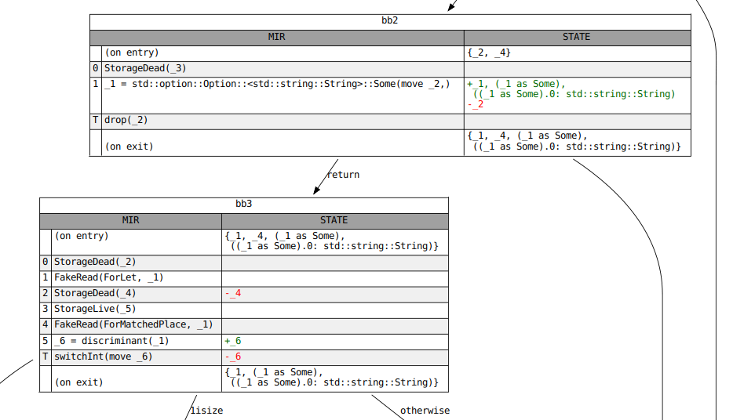

["gen-kill" problems]: https://en.wikipedia.org/wiki/Data-flow_analysis#Bit_vector_problems
[*Static Program Analysis*]: https://cs.au.dk/~amoeller/spa/
[MIR 디버깅]: #mir-debugging
[`Analysis`]: https://doc.rust-lang.org/nightly/nightly-rustc/rustc_mir_dataflow/trait.Analysis.html
[`GenKillAnalysis`]: https://doc.rust-lang.org/nightly/nightly-rustc/rustc_mir_dataflow/trait.GenKillAnalysis.html
[`JoinSemiLattice`]: https://doc.rust-lang.org/nightly/nightly-rustc/rustc_mir_dataflow/lattice/trait.JoinSemiLattice.html
[`NAME`]: https://doc.rust-lang.org/nightly/nightly-rustc/rustc_mir_dataflow/trait.Analysis.html#associatedconstant.NAME
[`ResultsCursor`]: https://doc.rust-lang.org/nightly/nightly-rustc/rustc_mir_dataflow/struct.ResultsCursor.html
[`ResultsVisitor`]: https://doc.rust-lang.org/nightly/nightly-rustc/rustc_mir_dataflow/trait.ResultsVisitor.html
[`apply_call_return_effect`]: https://doc.rust-lang.org/nightly/nightly-rustc/rustc_mir_dataflow/trait.Analysis.html#tymethod.apply_call_return_effect
[`into_engine`]: https://doc.rust-lang.org/nightly/nightly-rustc/rustc_mir_dataflow/trait.Analysis.html#method.into_engine
[`lattice`]: https://doc.rust-lang.org/nightly/nightly-rustc/rustc_mir_dataflow/lattice/index.html
[pr-1295]: https://github.com/rust-lang/rustc-dev-guide/pull/1295
[pr-1295-comment]: https://github.com/rust-lang/rustc-dev-guide/pull/1295#issuecomment-1118131294
[lattice]: https://en.wikipedia.org/wiki/Lattice_(order)
[dataflow analysis]: https://en.wikipedia.org/wiki/Data-flow_analysis#Basic_principles


## 드롭 엘라보레이션 (Drop elaboration) {#mir-drop-elaboration}

### 동적 드롭 (Dynamic drops)

[Rust Reference][reference-drop]에 따르면:

> 초기화된 변수나 임시 객체가 스코프를 벗어나면 소멸자가 실행되거나 드롭됩니다. 할당 시에도 좌변 피연산자가 초기화되어 있다면 소멸자가 실행됩니다. 변수가 부분적으로 초기화된 경우 초기화된 필드만 드롭됩니다.

MIR을 구축할 때 `Drop` 및 `DropAndReplace` 종결자는 드롭이 발생할 수 있는 위치를 나타냅니다.
그러나 이 단계에서 이러한 종결자의 존재가 소멸자 실행을 보장하지는 않습니다.
종결자에 도달하기 전에 드롭 대상이 (보통 이동되었기 때문에) 미초기화 상태일 수 있기 때문입니다.
일반적으로 컴파일 타임에는 변수가 초기화되어 있는지 알 수 없습니다.

```rust
let mut y = vec![];

{
    let x = vec![1, 2, 3];
    if std::process::id() % 2 == 0 {
        y = x; // 조건부로 `x`를 `y`로 이동
    }
} // `x`가 여기서 스코프를 벗어남. 드롭되어야 하나요?
```

이러한 경우 변수가 초기화되어 있는지 여부를 _동적으로_ 추적해야 합니다.
규칙은 [RFC 320: Non-zeroing dynamic drops][RFC 320]에 자세히 설명되어 있습니다.

### 드롭 의무 (Drop obligations)

RFC에서:

> 지역 변수가 초기화되면 "드롭 의무" 세트(예: 지역 변수 `a`, 또는 필드로의 경로 `b.f.y`와 같이 드롭되어야 하는 구조적 경로 세트)를 설정합니다.
>
> 구조체 타입 `T`인 지역 변수 x에 대한 드롭 의무는 `T`의 구조를 분석하여 계산됩니다. `T` 자체가 `Drop`을 구현하면 `x`가 드롭 의무입니다. `T`가 `Drop`을 구현하지 않으면 드롭 의무 세트는 `T` 필드들의 드롭 의무의 합집합입니다.

구조적 경로가 이동되면(따라서 미초기화 상태가 되면), 해당 경로나 그 하위 자식(`path.f`, `path.f.g.h` 등)에 대한 모든 드롭 의무는 해제됩니다.
`Drop` 구현을 갖는 타입은 개별 필드로부터의 이동을 허용하지 않으므로 필드를 통한 초기화 여부를 추적할 필요가 없습니다.

지역 변수가 스코프를 벗어나거나(`Drop`), 할당을 통해 구조적 경로가 덮어씌워질 때(`DropAndReplace`), 해당 변수나 경로에 대한 드롭 의무를 검사합니다.
이 시점까지 해당 의무가 해제되지 않은 한 연관된 `Drop` 구현이 호출될 것입니다.
`enum` 타입의 경우 "활성" 변형에 대응하는 필드만 드롭될 필요가 있습니다.
이러한 타입에 대한 드롭 의무를 처리할 때 활성 변형을 결정하기 위해 먼저 판별자(discriminant)를 검사합니다.
활성 변형 이외의 변형에 대한 모든 드롭 의무는 무시됩니다.

다음은 이러한 규칙을 설명하는 데 도움이 되는 몇 가지 흥미로운 타입입니다:

```rust
struct NoDrop(u8); // `Drop` impl 없음. `Drop` impl을 갖는 필드 없음.

struct NeedsDrop(Vec<u8>); // `Drop` impl은 없으나 `Drop` impl을 갖는 필드 있음.

struct ThinVec(*const u8); // 커스텀 `Drop` impl. 개별 필드는 이동될 수 없음.

impl Drop for ThinVec {
    fn drop(&mut self) { /* ... */ }
}

enum MaybeDrop {
    Yes(NeedsDrop),
    No(NoDrop),
}
```

### 드롭 엘라보레이션 (Drop elaboration)

이러한 규칙에 대한 한 가지 유효한 모델은 함수 내 임의의 지점에서 사용되는 모든 구조적 경로에 대해 불리언 플래그("드롭 플래그")를 유지하는 것입니다.
이 플래그는 해당 경로가 초기화될 때 설정되고 경로가 이동될 때 해제됩니다.
`Drop`이 발생하면 `Drop` 대상과 연관된 모든 의무에 대해 플래그를 검사하고 여전히 해당되는 의무에 대해 연관된 `Drop` impl을 호출합니다.

불명확한 `Drop` 및 `DropAndReplace` 종결자를 갖는 새로 구축된 MIR을 드롭 플래그를 갖는 MIR로 변환하는 이 과정을 드롭 엘라보레이션이라고 부릅니다.
MIR 문장이 변수를 초기화(또는 미초기화) 상태로 만들 때 드롭 엘라보레이션은 해당 변수에 대한 드롭 플래그를 설정(또는 해제)하는 코드를 삽입합니다.
이는 새로 삽입된 드롭 플래그를 검사하는 조건문 내에 `Drop` 종결자를 감쌉니다.

드롭 엘라보레이션은 또한 `DropAndReplace` 종결자를 대상의 `Drop`과 새롭게 드롭된 장소로의 쓰기로 분할합니다.
이는 위에서 논의한 내용과 다소 무관합니다.

이 작업이 완료되면 MIR의 `Drop` 종결자는 드롭되는 장소 타입의 "드롭 글루(drop glue)" 또는 "드롭 심(drop shim)" 호출에 대응하게 됩니다.
타입의 드롭 글루는 해당 타입의 `Drop` impl을 호출한 다음(존재하는 경우), 재귀적으로 해당 타입의 모든 필드에 대한 드롭 글루를 호출합니다.

### `rustc`에서의 드롭 엘라보레이션

위에서 설명한 접근 방식은 필요 이상으로 비용이 많이 듭니다.
몇 가지 최적화를 생각해 볼 수 있습니다:

- `Drop` 대상인(또는 대상을 접두사로 갖는) 경로만 드롭 플래그를 필요로 합니다.
- 일부 변수는 드롭될 때 초기화(또는 미초기화)되어 있음이 알려져 있습니다.
  이들은 드롭 플래그가 필요하지 않습니다.
- 공유 접두사를 통해서만 드롭되거나 이동되는 경로 세트가 있다면, 그 경로들은 단일 드롭 플래그를 공유할 수 있습니다.

이들 중 일부 서브셋이 `rustc`에 구현되어 있습니다.

컴파일러에서 드롭 엘라보레이션은 여러 모듈에 걸쳐 분할되어 있습니다.
패스 자체는 [여기][drops-transform]에 정의되어 있지만 [주요 로직][drops]은 [드롭 심][drops-shim]을 구축하는 데도 사용되기 때문에 다른 곳에 정의되어 있습니다.

드롭 엘라보레이션은 새로 구축된 MIR의 각 `Drop`을 네 가지 종류 중 하나로 지정합니다:

- `Static`, 대상이 항상 초기화되어 있음.
- `Dead`, 대상이 항상 **미**초기화되어 있음.
- `Conditional`, 대상이 전체적으로 초기화되었거나 전체적으로 미초기화되어 있음.
  부분적으로 초기화되어 있지 않음.
- `Open`, 대상이 부분적으로 초기화되어 있을 수 있음.

이를 위해 두 가지 데이터플로우 분석인 `MaybeInitializedPlaces`와 `MaybeUninitializedPlaces`의 쌍을 사용합니다.
장소가 한쪽에 있고 다른 쪽에 없다면 대상의 초기화 여부는 컴파일 타임에 알려져 있습니다 (`Dead` 또는 `Static`).
이 경우 드롭 엘라보레이션은 대상에 플래그를 추가하지 않습니다.
단지 `Drop` 종결자를 제거(`Dead`)하거나 유지(`Static`)할 뿐입니다.

`Conditional` 드롭의 경우 전체로서 변수의 초기화 여부가 필드들의 초기화 여부와 동일함을 압니다.
따라서 해당 드롭의 대상에 대한 드롭 플래그를 생성하고 나면 해당 대상의 드롭 글루를 호출해도 안전합니다.

#### `Open` 드롭

하나의 `Drop` 종결자를 대상의 각 필드(타입이 드롭 글루를 가짐, `Ty::needs_drop`)에 대해 여러 다른 종결자로 분해해야 하므로 `Open` 드롭이 가장 복잡합니다.
대상 자체의 드롭 글루를 호출할 수는 없는데, 대상의 모든 필드가 초기화되어 있어야 하기 때문입니다.
커스텀 `Drop` impl을 갖는 타입을 가진 변수는 필드가 이동될 수 없으므로 `Open` 드롭을 허용하지 않음을 기억하세요.

이는 각 필드를 `Dead`, `Static`, `Conditional`, 또는 `Open`으로 재귀적으로 분류함으로써 달성됩니다.
타입이 드롭 글루를 가지지 않는 필드는 자동으로 `Dead`가 되며 재귀 동안 고려될 필요가 없습니다.
종류가 `Open`이 아닌 필드에 도달하면 위에서 했던 것처럼 처리합니다.
필드가 또 `Open`이면 재귀가 계속됩니다.

enum의 `Open` 드롭을 처리하는 방식은 언급할 가치가 있습니다.
드롭 엘라보레이션 내부에서 enum의 각 변형은 임의의 주어진 시점에 이들 "변형 필드" 중 하나만 초기화될 수 있다는 불변사항(invariant)과 함께 필드처럼 처리됩니다.
일반적인 경우 어떤 변형이 활성 변형인지 알지 못하므로 enum의 드롭 글루(판별자를 검사함)를 호출하거나 정교화된 `Open` 드롭의 일부로 판별자를 직접 검사해야 합니다.
그러나 특정 경우(예: `match` 분기 내부)에는 enum의 어떤 변형이 활성 변형인지 압니다.
이 정보는 비활성 변형에 대응하는 모든 장소를 미초기화 상태로 표시함으로써 `MaybeInitializedPlaces` 및 `MaybeUninitializedPlaces` 데이터플로우 분석에 인코딩됩니다.

#### 정리 경로 (Cleanup paths)

TODO: 드롭 엘라보레이션과 언바인딩(unwinding)에 대해 논의하기.

### 여담: 드롭 엘라보레이션과 상수 평가 (const-eval)

Rust에서 컴파일 타임 평가 자격이 있는 함수는 `const` 키워드를 사용하여 명시적으로 표시되어야 합니다.
여기에는 `const`일 수도 있고 아닐 수도 있는 `Drop` 트레이트 구현이 포함됩니다.
컴파일 타임 평가 자격이 있는 코드는 `const` 함수만 호출할 수 있으므로, 이러한 코드에서 non-const `Drop` 구현 호출은 금지되어야 합니다.

`Drop` impl 호출은 MIR에서 `Drop` 종결자로 인코딩됩니다.
그러나 위에서 논의했듯이 새로 구축된 MIR의 `Drop` 종결자가 반드시 `Drop::drop` 호출로 이어지는 것은 아닙니다.
드롭 대상이 해당 지점에서 미초기화 상태일 수 있기 때문입니다.
이는 새로 구축된 MIR에서 non-const `Drop`을 검사하는 것이 거짓 에러(spurious errors)를 유발할 수 있음을 의미합니다.
대신 우리는 드롭 엘라보레이션이 실행되어 `Dead` 드롭(대상이 미초기화된 것으로 알려진 드롭)을 제거할 때까지 기다린 후 이러한 검사를 실행합니다.

[RFC 320]: https://rust-lang.github.io/rfcs/0320-nonzeroing-dynamic-drop.html
[reference-drop]: https://doc.rust-lang.org/reference/destructors.html
[drops]: https://github.com/rust-lang/rust/blob/HEAD/compiler/rustc_mir_transform/src/elaborate_drops.rs
[drops-shim]: https://github.com/rust-lang/rust/blob/HEAD/compiler/rustc_mir_transform/src/shim.rs
[drops-transform]: https://github.com/rust-lang/rust/blob/HEAD/compiler/rustc_mir_transform/src/elaborate_drops.rs


## MIR 빌림 검사 (MIR borrow check) {#borrow-check}

빌림 검사는 Rust의 "비법 소스(secret sauce)"로, 여러 속성을 강제하는 역할을 담당합니다:

- 모든 변수가 사용되기 전에 초기화되어 있어야 함.
- 동일한 값을 두 번 이동할 수 없음.
- 값이 빌려진 동안에는 이동할 수 없음.
- 장소가 가변으로 빌려진 동안에는 해당 장소에 접근할 수 없음 (참조를 통한 접근 제외).
- 장소가 불변으로 빌려진 동안에는 해당 장소를 수정할 수 없음.
- 기타 등등

빌림 검사기는 MIR 상에서 작동합니다. 이전 구현은 HIR 상에서 작동했습니다. MIR에서 빌림 검사를 수행하는 것은 여러 장점이 있습니다:

- MIR은 HIR보다 *훨씬* 덜 복잡합니다; 급진적인 디슈가링은 빌림 검사기의 버그 방지에 도움이 됩니다. (궁금하다면 [MIR 기반 빌림 검사기가 수정하는 버그 목록을 여기서 확인][47366]할 수 있습니다.)
- 더 중요하게는 MIR을 사용함으로써 제어 흐름 그래프로부터 도출되는 영역인 ["비어휘적 수명(non-lexical lifetimes)"][nll]을 가능하게 합니다.

[47366]: https://github.com/rust-lang/rust/issues/47366
[nll]: https://rust-lang.github.io/rfcs/2094-nll.html

#### 빌림 검사기의 주요 단계

빌림 검사기 소스는 [`rustc_borrowck` 크레이트][b_c]에서 찾을 수 있습니다. 주요 진입점은 [`mir_borrowck`] 쿼리입니다.

[b_c]: https://doc.rust-lang.org/nightly/nightly-rustc/rustc_borrowck/index.html
[`mir_borrowck`]: https://doc.rust-lang.org/nightly/nightly-rustc/rustc_borrowck/fn.mir_borrowck.html

- 먼저 MIR의 **로컬 복사본**을 생성합니다. 향후 단계에서 이 복사본을 제자리 수정하여 타입 등을 수정하고 계산 중인 새 영역에 대한 참조를 포함시킵니다.
- 그런 다음 [`replace_regions_in_mir`]를 호출하여 로컬 MIR을 수정합니다. 무엇보다 이 함수는 MIR의 모든 [영역(#region)]을 새로운 [추론 변수](#inf-var)로 교체합니다.
- 다음으로 데이터가 언제 이동되는지 계산하는 여러 [데이터플로우 분석](#dataflow)을 수행합니다.
- 그 후 MIR 전반에 걸쳐 [두 번째 타입 검사](#borrow-check-type-check)를 수행합니다: 이 타입 검사의 목적은 서로 다른 영역들 간의 모든 제약 조건을 결정하는 것입니다.
- 다음으로 [영역 추론](#borrow-check-region-inference)을 수행하며 이는 각 영역의 값기본적으로 수집된 제약 조건에 따라 각 수명이 유효해야 하는 제어 흐름 그래프상의 지점들을 계산합니다.
- 이 시점에서 각 지점에서 "스코프 내의 빌림(borrows in scope)"을 계산할 수 있습니다.
- 마지막으로 MIR에 대해 두 번째 순회를 수행하여 MIR이 수행하는 동작을 살펴보고 에러를 보고합니다. 예를 들어 `*a + 1`과 같은 문장을 보면 변수 `a`가 초기화되었는지 및 가변으로 빌려지지 않았는지 검사하며 이들 중 하나라도 위반되면 에러 보고를 요구하게 됩니다. 이 검사를 수행하려면 이전 모든 분석의 결과가 필요합니다.

[`replace_regions_in_mir`]: https://doc.rust-lang.org/nightly/nightly-rustc/rustc_borrowck/nll/fn.replace_regions_in_mir.html


### 이동 및 초기화 추적 {#borrow-check-moves-and-initialization}

빌림 검사기 작업의 일부는 임의의 특정 시점에 어떤 변수가 "초기화"되었는지 추적하는 것입니다 -- 이 역시 이동이 일어나는 위치를 알아내고 이를 추적하는 것을 필요로 합니다.

#### 초기화와 이동

사용자 관점에서 초기화(변수에 어떤 값을 부여함)와 이동(소유권을 다른 장소로 이전함)은 서로 다른 주제처럼 보일 수 있습니다. 실제로 빌림 검사기 에러 메시지는 이 둘을 다르게 이야기하곤 합니다. 그러나 **빌림 검사기 내부에서** 이 둘은 그리 분리되어 있지 않습니다. 대략적으로 빌림 검사기는 소스 코드의 임의의 지점에서 "초기화된 장소" 세트를 추적합니다. 이전에 미초기화된 지역 변수에 할당하면 해당 세트에 추가되고 지역 변수로부터 이동하면 해당 세트에서 제거됩니다.

다음 예시를 보세요:

```rust,ignore
fn foo() {
    let a: Vec<u32>;

    // a는 아직 초기화되지 않음

    a = vec![22];

    // a는 여기서 초기화됨

    std::mem::drop(a); // a는 여기서 이동됨

    // a는 여기서 더 이상 초기화 상태가 않음

    let l = a.len(); //~ ERROR
}
```

여기서 `a`가 미초기화 상태로 시작하여 일단 할당되면 초기화 상태가 됨을 볼 수 있습니다. 그러나 `drop(a)`가 호출되면 이는 `a`를 호출 내부로 이동시키고 따라서 다시 미초기화 상태가 됩니다.

#### 세부 섹션
읽기 쉽게 만들기 위해 이 섹션은 여러 세부 섹션으로 나뉘어 있습니다:

- [이동 경로](#borrow-check-moves-and-initialization-move-paths) 어떤 지역 변수(또는 경우에 따라 지역 변수의 일부)가 초기화되었는지 추적하기 위해 사용하는 *이동 경로(move path)* 개념.
- TODO *나머지는 아직 작성되지 않음* =)


#### 이동 경로 {#borrow-check-moves-and-initialization-move-paths}

실제로는 지역 변수의 세분성(granularity)으로 초기화를 추적하는 것만으로는 충분하지 않습니다. Rust는 필드 세분성으로 이동 및 초기화를 수행하는 것도 허용합니다:

```rust,ignore
fn foo() {
    let a: (Vec<u32>, Vec<u32>) = (vec![22], vec![44]);

    // a.0과 a.1은 모두 초기화됨

    let b = a.0; // a.0을 이동함

    // a.0은 초기화되어 있지 않으나 a.1은 여전히 초기화되어 있음

    let c = a.0; // ERROR
    let d = a.1; // OK
}
```

이를 처리하기 위해 우리는 **이동 경로(move path)** 세분성으로 초기화를 추적합니다. [`MovePath`]는 사용자가 초기화, 이동 등을 수행할 수 있는 어떤 위치를 나타냅니다. 따라서 예컨대 지역 변수 `a`를 나타내는 이동 경로가 있고 `a.0`을 나타내는 이동 경로가 있습니다. 이동 경로는 대략 MIR의 [`Place`] 개념에 대응하지만 이동 분석을 더 효율적으로 수행할 수 있는 방식으로 인덱싱됩니다.

[`MovePath`]: https://doc.rust-lang.org/nightly/nightly-rustc/rustc_mir_dataflow/move_paths/struct.MovePath.html

##### 이동 경로 인덱스

[`MovePath`] 데이터 구조가 존재하지만 직접 참조되지는 않습니다. 대신 모든 코드는 [`MovePathIndex`] 타입의 *인덱스*를 전달합니다. 이동 경로에 대한 정보를 얻어야 하는 경우 [`MoveData`의 `move_paths` 필드][move_paths]와 함께 이 인덱스를 사용합니다. 예를 들어 [`MovePathIndex`] `mpi`를 MIR [`Place`]로 변환하려면 다음과 같이 [`MovePath::place`] 필드에 접근할 수 있습니다:

```rust,ignore
move_data.move_paths[mpi].place
```

[move_paths]: https://doc.rust-lang.org/nightly/nightly-rustc/rustc_mir_dataflow/move_paths/struct.MoveData.html#structfield.move_paths
[`MovePath::place`]: https://doc.rust-lang.org/nightly/nightly-rustc/rustc_mir_dataflow/move_paths/struct.MovePath.html#structfield.place
[`MovePathIndex`]: https://doc.rust-lang.org/nightly/nightly-rustc/rustc_mir_dataflow/move_paths/struct.MovePathIndex.html

##### 이동 경로 구축

MIR 빌림 검사에서 가장 먼저 하는 일 중 하나는 이동 경로 세트를 구축하는 것입니다. 이는 [`MoveData::gather_moves`] 함수의 일부로 수행됩니다. 이 함수는 [`MoveDataBuilder`]라는 MIR 방문자(visitor)를 사용하여 MIR을 순회하고 내부의 각 [`Place`]가 어떻게 접근되는지 관찰합니다. 이러한 각 [`Place`]에 대해 대응하는 [`MovePathIndex`]를 구축합니다. 또한 해당 이동 경로가 언제/어디서 이동/초기화되는지 기록하지만 이에 대해서는 나중 섹션에서 다룰 것입니다.

[`MoveDataBuilder`]: https://doc.rust-lang.org/nightly/nightly-rustc/rustc_mir_dataflow/move_paths/builder/struct.MoveDataBuilder.html
[`MoveData::gather_moves`]: https://doc.rust-lang.org/nightly/nightly-rustc/rustc_mir_dataflow/move_paths/struct.MoveData.html#method.gather_moves

###### 불법 이동 경로

사용되는 **모든** [`Place`]에 대해 이동 경로를 실제로 생성하지는 않습니다. 특히 [`Place`]로부터의 이동이 불법인 경우 [`MovePathIndex`]가 필요하지 않습니다. 몇 가지 예시:

- 배열의 개별 요소를 이동할 수 없으므로, 예컨대 `foo: [String; 3]`이 있다면 `foo[1]`에 대한 이동 경로는 없습니다.
- 빌려온 참조 내부로부터 이동할 수 없으므로, 예컨대 `foo: &String`이 있다면 `*foo`에 대한 이동 경로는 없습니다.

이러한 규칙은 [`Place`]를 [`MovePathIndex`]로 변환하는 [`move_path_for`] 함수에 의해 강제됩니다 -- 방금 논의한 것과 같은 에러 케이스에서 이 함수는 `Err`을 반환합니다. 이는 해당 장소들이 초기화되어 있는지 여부를 추적하는 수고를 덜어준다는 뜻입니다 (오버헤드를 줄여줌).

[`move_path_for`]: https://doc.rust-lang.org/nightly/nightly-rustc/rustc_mir_dataflow/move_paths/builder/struct.MoveDataBuilder.html#method.move_path_for

##### 프로젝션 (Projections)

[`PlaceElem`]을 사용하는 대신 이동 경로에서의 프로젝션은 [`MoveSubPath`]로 저장됩니다.
밖으로 이동될 수 없는 프로젝션과 건너뛸 수 있는 프로젝션은 표현되지 않습니다.

배열의 서브슬라이스 프로젝션(슬라이스 패턴에 의해 생성됨)은 특별합니다; 이들은 서브슬라이스의 각 요소에 대해 하나씩 여러개의 [`ConstantIndex`] 서브경로로 변환됩니다.

[`PlaceElem`]: https://doc.rust-lang.org/nightly/nightly-rustc/rustc_middle/mir/type.PlaceElem.html
[`MoveSubPath`]: https://doc.rust-lang.org/nightly/nightly-rustc/rustc_mir_dataflow/move_paths/enum.MoveSubPath.html
[`ConstantIndex`]: https://doc.rust-lang.org/nightly/nightly-rustc/rustc_mir_dataflow/move_paths/enum.MoveSubPath.html#variant.ConstantIndex

##### 이동 경로 조회

[`Place`]를 갖고 있고 이를 [`MovePathIndex`]로 변환하고 싶다면 [`MoveData`]의 [`rev_lookup`] 필드에 있는 [`MovePathLookup`] 구조체를 사용하여 수행할 수 있습니다. 두 가지 방법이 있습니다:

[`MoveData`]: https://doc.rust-lang.org/nightly/nightly-rustc/rustc_mir_dataflow/move_paths/struct.MoveData.html
[`MovePathLookup`]: https://doc.rust-lang.org/nightly/nightly-rustc/rustc_mir_dataflow/move_paths/struct.MovePathLookup.html
[`rev_lookup`]: https://doc.rust-lang.org/nightly/nightly-rustc/rustc_mir_dataflow/move_paths/struct.MoveData.html#structfield.rev_lookup

- 지역 변수를 나타내는 [`mir::Local`]을 인자로 받는 [`find_local`]. 모든 지역 변수에 대해 **항상** [`MovePathIndex`]를 생성하기 때문에 이 방법이 더 쉽습니다.
- 임의의 [`Place`]를 인자로 받는 [`find`]. 모든 [`Place`]에 대해 [`MovePathIndex`]를 가지고 있지는 않기 때문에("불법 이동 경로" 섹션에서 다룸) 이 방법은 사용하기 약간 더 번거롭습니다. 따라서 [`find`]는 존재함을 확인할 수 있었던 가장 가까운 경로를 나타내는 [`LookupResult`]를 반환합니다 (예: `foo[1]`에 대해 `foo`의 경로만 반환할 수 있음).

[`find`]: https://doc.rust-lang.org/nightly/nightly-rustc/rustc_mir_dataflow/move_paths/struct.MovePathLookup.html#method.find
[`find_local`]: https://doc.rust-lang.org/nightly/nightly-rustc/rustc_mir_dataflow/move_paths/struct.MovePathLookup.html#method.find_local
[`mir::Local`]: https://doc.rust-lang.org/nightly/nightly-rustc/rustc_middle/mir/struct.Local.html
[`LookupResult`]: https://doc.rust-lang.org/nightly/nightly-rustc/rustc_mir_dataflow/move_paths/enum.LookupResult.html

##### 상호 참조

위에서 언급했듯이 이동 경로는 거대한 벡터에 저장되고 [`MovePathIndex`]를 통해 참조됩니다. 그러나 이 벡터 내부에서 이들은 트리 구조를 이룹니다. 따라서 예컨대 `a.b.c`에 대한 [`MovePathIndex`]가 있다면 부모 이동 경로인 `a.b`로 이동할 수 있습니다. 또한 모든 자식 경로에 대해 순회할 수도 있습니다: 따라서 `a.b`로부터 순회하여 `a.b.c` 경로를 찾을 수 있습니다 (여기서 당신은 가리킬 수 있었던 모든 **가능한** 경로가 아니라 소스에서 **실제로 참조된** 경로들에 대해서만 순회합니다). 이러한 참조는 예컨대 이동 경로(예: `a.b`) 또는 해당 이동 경로의 자식(예: `a.b.c`)이 주어진 술어와 일치하는지 여부를 결정하는 [`find_in_move_path_or_its_descendants`] 함수 등에서 사용됩니다.

[`find_in_move_path_or_its_descendants`]: https://doc.rust-lang.org/nightly/nightly-rustc/rustc_mir_dataflow/move_paths/struct.MoveData.html#method.find_in_move_path_or_its_descendants


### MIR 타입 검사 {#borrow-check-type-check}

빌림 검사의 핵심 구성 요소는 [MIR 타입 검사](https://doc.rust-lang.org/nightly/nightly-rustc/rustc_borrowck/type_check/index.html)입니다.
이 검사는 MIR을 순회하며 완벽한 "타입 검사"다른 언어에서 볼 수 있는 것과 동일한 종류를 수행합니다. 이 타입 검사를 수행하는 과정에서 프로그램에 적용되는 영역 제약 조건도 밝혀집니다.

TODO -- 더 상세히 설명? 아마도? :)

#### 사용자 타입

MIR 타입 검사 시작 시 본문의 모든 영역을 신규 제약되지 않은 영역으로 교체합니다.
그러나 이렇게 하면 다음 프로그램을 수락하게 될 것입니다:
```rust
fn foo<'a>(x: &'a u32) {
    let y: &'static u32 = x;
}
```
`y` 타입에서 수명을 지움으로써 그것이 `'static`이어야 한다는 사실을 더 이상 알지 못하며 사용자의 의도를 무시하게 됩니다.

이를 처리하기 위해 사용자가 HIR 타입 검사 중에 명시적으로 언급한 모든 타입 위치를 [`CanonicalUserTypeAnnotations`][annot]로 기억합니다.

우리가 신경 쓰는 두 가지 주석이 있습니다:
- 명시적 타입 지정, 예: `let y: &'static u32`는 `UserType::Ty(&'static u32)`를 결과로 냅니다.
- 명시적 제네릭 인자, 예: `x.foo<&'a u32, Vec<String>>`은
`UserType::TypeOf(foo_def_id, [&'a u32, Vec<String>])`를 결과로 냅니다.

HIR 타입 검사의 영역 추론이 MIR typeck에 영향을 미치는 것을 원치 않으므로, HIR로부터 하위 변환한 직후 사용자 타입을 저장합니다.
이는 여전히 추론 변수를 포함할 수 있음을 의미하며 우리가 **정규(canonical)** 사용자 타입 주석을 사용하는 이유가 바로 이것입니다.
대신 모든 추론 변수를 존재적 바인딩 변수로 교체합니다.
`let x: Vec<_>`와 같은 것은 따라서 `exists<T> UserType::Ty(Vec<T>)`를 결과로 낼 것입니다.

`let Foo(x): Foo<&'a u32>`와 같은 패턴은 사용자 타입 `Foo<&'a u32>`를 가지지만 `x`의 실제 타입은 `&'a u32`이어야만 합니다. 이를 위해 [`UserTypeProjection`][proj]을 사용합니다.

MIR에서 사용자 타입을 두 가지 약간 다른 방식으로 다룹니다.

명시적 타입 주석이 있는 패턴의 변수에 대응하는 MIR 로컬이 주어지면, 해당 로컬의 타입이 [`UserTypeProjection`][proj]의 타입과 동일할 것을 요구합니다.
이는 [`LocalDecl`][decl]에 직접 저장됩니다.

또한 피검사자(scrutinee) 표현식의 타입도 제약합니다, 예: `let _: &'a u32 = x;`에서 `x`의 타입.
여기서 `T_x`는 사용자 타입의 서브타입이기만 하면 되므로, 대신 [`StatementKind::AscribeUserType`][stmt]를 사용합니다.

MIR 타입검사기가 타입 및 상수 추론 변수를 다루지 않으므로 사용자 타입을 직접 사용하지 않음에 유의하세요. 대신 HIR 타입 검사기로부터 나온 최종 [`inferred_type`][inf]을 저장합니다. 그 후 MIR typeck 동안 해당 영역을 새 nll 추론 변수로 교체하고 실제 `UserType`과 연관시켜 올바른 영역 제약 조건을 다시 얻습니다.

MIR 타입 검사 후 모든 사용자 타입 주석은 더 이상 필요하지 않으므로 폐기됩니다.

[annot]: https://doc.rust-lang.org/nightly/nightly-rustc/rustc_middle/ty/struct.CanonicalUserTypeAnnotation.html
[proj]: https://doc.rust-lang.org/nightly/nightly-rustc/rustc_middle/mir/struct.UserTypeProjection.html
[decl]: https://doc.rust-lang.org/nightly/nightly-rustc/rustc_middle/mir/struct.LocalDecl.html
[stmt]: https://doc.rust-lang.org/nightly/nightly-rustc/rustc_middle/mir/enum.StatementKind.html#variant.AscribeUserType
[inf]: https://doc.rust-lang.org/nightly/nightly-rustc/rustc_middle/ty/struct.CanonicalUserTypeAnnotation.html#structfield.inferred_ty

### 드롭 검사 (Drop Check) {#borrow-check-drop-check}

일반적으로 로컬 변수가 사용될 때마다 해당 로컬의 타입이 잘 형성될(well-formed) 것을 요구합니다. 여기에는 로컬의 where-바운드를 증명하는 것과 해당 타입에 의해 사용되는 모든 영역이 라이브(live) 상태일 것을 요구하는 것이 포함됩니다.

이에 대한 유일한 예외는 값이 스코프를 벗어날 때 암묵적으로 드롭되는 경우입니다. 이 경우 값이 라이브 상태일 필요는 없습니다:

```rust
fn main() {
    let x = vec![];
    {
        let y = String::from("I am temporary");
        x.push(&y);
    }
    // `x`는 `y`에 대한 참조가 무효화된 후
    // 여기서 스코프를 벗어납니다. 이는 `x`를 드롭하는 동안
    // 그 타입에 라이브 상태가 아닌 영역이 포함되어 있어 잘 형성되지 않음을 의미합니다.
}
```

이는 값을 드롭하는 것이 죽은(dead) 영역에 접근하려고 시도하지 않는 경우에만 건전합니다(sound). 우리는 값의 타입이 drop-live일 것을 요구함으로써 이를 검사합니다.
이를 위한 요구 사항은 `fn dropck_outlives`에서 계산됩니다.

이 섹션의 나머지 부분은 영역 파라미터가 라이브 상태일 것을 요구하는 타입에 대해 다음 타입 정의를 사용합니다:

```rust
struct PrintOnDrop<'a>(&'a str);
impl<'a> Drop for PrintOnDrop<'_> {
    fn drop(&mut self) {
        println!("{}", self.0);
    }
}
```

#### 값이 드롭되는 방식

핵심적으로 `T` 타입의 값은 "드롭 글루"를 실행함으로써 드롭됩니다. 드롭 글루는 컴파일러에 의해 생성되며 먼저 `<T as Drop>::drop`을 호출한 다음 재귀적으로 소유한 모든 값의 드롭 글루를 호출합니다.

- `T`가 명시적 `Drop` impl을 가질 경우 `<T as Drop>::drop`을 호출합니다.
- `T`가 `Drop`을 구현하는지 여부와 상관없이 `T`에 의해 *소유된* 모든 값으로 재귀합니다:
    - 참조, 날 포인터, 함수 포인터, 함수 항목, 트레이트 객체[^traitobj], 및 스칼라는 아무것도 소유하지 않습니다.
    - 튜플, 슬라이스 및 배열은 그 요소들을 소유된 것으로 간주합니다.
      길이가 0인 배열의 경우 요소 타입의 값을 소유하지 않습니다.
    - ADT의 모든 필드(모든 변형의)는 소유된 것으로 간주됩니다. enum의 경우 모든 변형을 고려합니다. 여기서 예외는 `U`를 소유한 것으로 간주되지 않는 `ManuallyDrop<U>`입니다.
      `PhantomData<U>` 역시 아무것도 소유하지 않습니다.
      클로저와 제네레이터는 캡처된 캡처 변수(upvars)를 소유합니다.

타입이 드롭 글루를 갖는지 여부는 [`fn Ty::needs_drop`](https://github.com/rust-lang/rust/blob/320b412f9c55bf480d26276ff0ab480e4ecb29c0/compiler/rustc_middle/src/ty/util.rs#L1086-L1108)에 의해 반환됩니다.

##### 지역 변수의 부분 드롭

자체적으로 `Drop`을 구현하지 않는 타입의 경우 나머지 부분을 드롭하기 전에 값의 일부를 부분적으로 이동할 수도 있습니다. 이 경우 아직 이동되지 않은 값에 대한 드롭 글루만 호출됩니다, 예:

```rust
fn main() {
    let mut x = (PrintOnDrop("third"), PrintOnDrop("first"));
    drop(x.1);
    println!("second")
}
```

MIR 구축 중 *해당 타입에 드롭이 필요한 한* 지역 변수가 스코프를 벗어날 때마다 드롭될 수 있다고 가정합니다. 변수에 대한 정확한 드롭 글루를 계산하는 것은 borrowck **이후** `ElaborateDrops` 패스에서 일어납니다. 이는 지역 변수의 일부가 이전에 드롭되었더라도 dropck가 이 값이 라이브 상태일 것을 여전히 요구함을 의미합니다. 이는 지역 변수를 완전히 이동한 경우에도 마찬가지입니다.

```rust
fn main() {
    let mut x;
    {
        let temp = String::from("I am temporary");
        x = PrintOnDrop(&temp);
        drop(x);
    }
} //~ ERROR `temp` does not live long enough.
```

borrowck 전에 일정량의 드롭 엘라보레이션을 추가하여 이 예시가 컴파일되도록 허용하는 것이 가능해야 합니다. 상수 검사 전에 드롭 엘라보레이션을 수행하기 위한 나이트리 기능이 있습니다: [#73255](https://github.com/rust-lang/rust/issues/73255). borrowck 전에 드롭 엘라보레이션을 수행하기 위한 이러한 기능 게이트는 아직 존재하지 않지만 [관련 MCP](https://github.com/rust-lang/compiler-team/issues/558)가 있습니다.

[^traitobj]: 트레이트 객체는 vtable에 의해 제공되는 `drop_in_place`를 직접 사용하는 내장 `Drop` 구현을 갖는 것으로 간주할 수 있습니다. 이 `Drop` 구현은 그 모든 제네릭 파라미터가 라이브 상태일 것을 요구합니다.

##### `dropck_outlives`

우리가 수행하는 두 가지 구별되는 "라이브 상태(liveness)" 계산이 있습니다:

* 값 `v`가 나중에 "사용"될 수 있다면 위치 `L`에서 *use-live* 상태입니다; 여기서 *사용(use)*은 기본적으로 *드롭*이 아닌 모든 것을 의미합니다.
* 값 `v`가 나중에 드롭될 수 있다면 위치 `L`에서 *drop-live* 상태입니다.

항목들이 *use-live* 상태일 때 그 전체 타입이 `L`에서 유효해야 합니다. *drop-live* 상태일 때는 dropck에 의해 요구되는 모든 영역이 `L`에서 유효해야 합니다. MIR에서 드롭되는 값은 *장소(places)*입니다.

타입에 대해 `dropck_outlives`에 의해 계산된 제약 조건은 해당 타입에 대해 생성된 드롭 글루와 긴밀히 일치합니다. 드롭 글루와 달리 `dropck_outlives`는 값 자체가 아닌 소유된 값의 타입에 신경을 씁니다. `T` 타입의 값에 대해:

- `T`가 명시적 `Drop`을 가지고 있다면, `#[may_dangle]`로 표시되어 완전히 무시되는 경우를 제외하고 모든 제네릭 인자가 라이브 상태일 것을 요구합니다.
- `T`가 명시적 `Drop`을 갖는지 여부와 상관없이 `T`에 의해 *소유된* 모든 타입으로 재귀합니다.
    - 참조, 날 포인터, 함수 포인터, 함수 항목, 트레이트 객체[^traitobj], 및 스칼라는 아무것도 소유하지 않습니다.
    - 튜플, 슬라이스 및 배열은 그 요소 타입을 소유된 것으로 간주합니다.
      **배열의 경우 현재 길이가 0인지 여부를 검사하지 않습니다.**
    - ADT의 모든 필드(모든 변형의)는 소유된 것으로 간주됩니다. 여기서 예외는 `U`를 소유한 것으로 간주되지 않는 `ManuallyDrop<U>`입니다. **우리는 `PhantomData<U>`가 `U`를 소유하는 것으로 간주합니다**.
    - 클로저와 제네레이터는 캡처된 캡처 변수들을 소유합니다.

볼드체로 표시된 섹션은 `Ty::needs_drop`에 의해 무시되지만 `dropck_outlives`가 소유된 것으로 간주하는 타입의 경우입니다. 우리는 감싸는 지역 변수에 대한 `Ty::needs_drop`이 `true`를 반환한 경우에만 `dropck_outlives`에 의존합니다. 이는 더 큰 지역 변수에 타입이 포함되는지 여부에 따라 라이브 상태 요구 사항이 변경될 수 있음을 의미합니다. **이는 일관되지 않으며 수정되어야 합니다: [배열에 관한 예시](https://play.rust-lang.org/?version=stable&mode=debug&edition=2021&gist=8b5f5f005a03971b22edb1c20c5e6cbe) 및 [`PhantomData`에 관한 예시](https://play.rust-lang.org/?version=stable&mode=debug&edition=2021&gist=44c6e2b1fae826329fd54c347603b6c8).**[^core]

이러한 불일치를 수정하는 한 가지 가능한 방법은 아마도 `Ty::needs_drop`을 더 약하게 만듦으로써 MIR 구축이 더 비관적으로 되게 하거나, 대안적으로 `dropck_outlives`를 변경하여 더 정밀하게 만들어 더 적은 영역이 라이브 상태일 것을 요구하도록 하는 것입니다.

[^core]: 이는 [#110288](https://github.com/rust-lang/rust/issues/110288) 및 [RFC 3417](https://github.com/rust-lang/rfcs/pull/3417)의 핵심 가정입니다.


### 영역 추론 (NLL) {#borrow-check-region-inference}

MIR 기반 영역 검사 코드는 [`rustc_mir::borrow_check` 모듈][nll]에 위치합니다.


MIR 기반 영역 분석은 두 가지 주요 함수로 구성됩니다:

- 가장 먼저 호출되는 [`replace_regions_in_mir`]는 두 가지 역할을 수행합니다:
  - 첫째, 함수의 시그니처 내에 나타나는 영역 세트를 찾습니다(예: `fn foo<'a>(&'a u32) { ... }`에서 `'a`). 이들을 "보편적(universal)" 또는 "자유(free)" 영역이라고 부릅니다  특히 함수 본문에서 [자유 상태로 등장하는][fvb] 영역들입니다.
  - 둘째, 함수 본문의 모든 영역을 신규 추론 변수로 교체합니다. 이는 (현재) 이러한 영역들이 어휘적 영역 추론의 결과이므로 별로 관심 대상이 아니기 때문입니다. 향후 어휘적 영역 추론을 전혀 수행하지 않을 것이기 때문에 결국 이들이 "소거된 영역(erased regions)"(즉 정보가 전혀 없음)이 되도록 하는 것이 의도입니다.
- 두 번째로 호출되는 [`compute_regions`]: 이동 분석의 결과가 인자로 제공됩니다. 이는 `replace_regions_in_mir`가 도입한 모든 추론 변수의 값을 계산하는 역할을 맡습니다.
  - 이를 위해 먼저 [MIR 타입 검사기]를 실행합니다. 이는 기본적으로 일반 타입 검사기이지만 당연히 완전한 Rust보다 훨씬 단순한 MIR에 특화되어 있습니다. MIR 타입 검사기를 실행하면 영역 변수들 사이에 잠재적 값과 서로 간의 관계를 나타내는 다양한 [제약 조건][cp]이 생성될 것입니다.
  - 그 후 [`RegionInferenceContext`]를 생성하고 해당 [`solve`] 메서드를 호출하여 [제약 조건 전파][cp]를 수행합니다.
  - [NLL RFC]도 대단히 철저한 (그리고 바라건대 읽기 쉬운) 내용을 담고 있습니다.

[cp]: #borrow-check-region-inference-constraint-propagation
[fvb]: #free-vs-bound
[`compute_regions`]: https://doc.rust-lang.org/nightly/nightly-rustc/rustc_borrowck/nll/fn.compute_regions.html
[`RegionInferenceContext`]: https://doc.rust-lang.org/nightly/nightly-rustc/rustc_borrowck/region_infer/struct.RegionInferenceContext.html
[`solve`]: https://doc.rust-lang.org/nightly/nightly-rustc/rustc_borrowck/region_infer/struct.RegionInferenceContext.html#method.solve
[NLL RFC]: https://rust-lang.github.io/rfcs/2094-nll.html
[MIR 타입 검사기]: #borrow-check-type-check

#### 보편적 영역 (Universal regions)

[`UniversalRegions`] 타입은 어떤 MIR `DefId`에 대응하는 _보편적_ 영역 컬렉션을 나타냅니다. 이는 모든 영역을 신규 추론 변수로 교체할 때 [`replace_regions_in_mir`]에서 구축됩니다. [`UniversalRegions`]는 주어진 MIR의 모든 자유 영역 인덱스와 이들 사이에 _성립한다고 알려진_ 모든 관계(예: 함의된 바운드, where 절 등)를 포함합니다.

예를 들어 다음 함수의 MIR이 주어지면:

```rust
fn foo<'a>(x: &'a u32) {
    // ...
}
```

 우리는 `'a`에 대한 보편적 영역과 `'static`에 대한 보편적 영역을 하나 생성합니다. 클로저 처리를 위한 몇 가지 복잡성도 있을 수 있으나 일단 무시하겠습니다.

TODO: 이러한 영역들이 _어떻게_ 계산되는지 작성하기.

[`UniversalRegions`]: https://doc.rust-lang.org/nightly/nightly-rustc/rustc_borrowck/universal_regions/struct.UniversalRegions.html

<a id="region-variables"></a>

#### 영역 변수

영역의 값은 **세트(set)**로 생각할 수 있습니다. 이 세트는 해당 영역이 유효한 MIR의 모든 지점들과 이 영역에 의해 존속되는(outlived) 모든 영역들을 포함합니다(예: `'a: 'b`이면 `end('b)`는 `'a`의 세트에 포함됨); 이 세트의 도메인을 `RegionElement`라고 부릅니다. 코드에서 모든 영역에 대한 값은 [`rustc_borrowck::region_infer` 모듈][ri]에서 유지 관리됩니다.
각 영역에 대해 해당 값에 어떤 요소가 존재하는지 저장하는 세트를 유지 관리합니다(이를 효율적으로 만들기 위해 각 요소 종류에 인덱스인 `RegionElementIndex`를 부여하고 희소 비트셋(sparse bitsets)을 사용함).

[ri]: https://github.com/rust-lang/rust/tree/HEAD/compiler/rustc_borrowck/src/region_infer

영역 요소의 종류는 다음과 같습니다:

- MIR 제어 흐름 그래프의 각 **[`location`]**: 위치는 기본 블록과 인덱스의 쌍입니다. 이는 해당 인덱스를 갖는 문장에 **진입하는 시점**(또는 인덱스가 `statements.len()`과 같으면 종결자)을 식별합니다.
- 호출자의 (또는 호출자의 호출자 등) 제어 흐름 그래프 일부에 대응하는 각 보편적 영역 `'a`에 대한 요소 `end('a)`가 존재합니다.
- 유사하게 이 함수가 반환된 후의 나머지 프로그램 실행에 대응하는 `end('static)`이라는 요소가 존재합니다.
- 각 플레이스홀더 영역 `!1`에 대한 요소 `!1`이 존재합니다. 이는 (직관적으로) 다른 요소들의 어떤 알려지지 않은 세트에 대응합니다  플레이스홀더에 관한 세부 사항은 [플레이스홀더 및 유니버스](#borrow-check-region-inference-placeholders-and-universes) 섹션을 참조하세요.

#### 제약 조건

영역의 값을 추론하기 전에 영역에 대한 제약 조건을 수집해야 합니다. 제약 조건의 전체 세트는 [제약 조건 전파 섹션][cp]에 설명되어 있지만 가장 일반적인 두 종류의 제약 조건은 다음과 같습니다:

1. 존속(Outlives) 제약 조건. 한 영역이 다른 영역보다 더 오래 산다는 제약 조건입니다(예: `'a: 'b`). 존속 제약 조건은 [MIR 타입 검사기]에 의해 생성됩니다.
2. 라이브 상태(Liveness) 제약 조건. 각 영역은 자신이 사용될 수 있는 지점에서 라이브 상태이어야 합니다.

#### 추론 개요

그렇다면 영역의 내용을 어떻게 계산할까요? 이 과정을 _영역 추론_이라고 부릅니다. 고수준 아이디어는 매우 단순하지만 다뤄야 할 세부 사항이 일부 존재합니다.

고수준 아이디어는 다음과 같습니다: 라이브 상태 제약 조건으로부터 해당 영역에 있어야 한다고 알고 있는 MIR 위치로 각 영역을 시작합니다. 거기서부터 타입 검사기로부터 계산된 모든 존속 제약 조건을 사용하여 제약 조건을 _전파_합니다: 각 영역 `'a`에 대해 `'a: 'b`이면 `end('b)`를 포함하여 `'b`의 모든 요소를 `'a`에 추가합니다. 이 모든 작업은 [`propagate_constraints`]에서 일어납니다.

그 후 에러를 검사합니다. 먼저 [`check_type_tests`]를 호출하여 타입 테스트가 충족되는지 검사합니다. 이는 `T: 'a`와 같은 제약 조건을 검사합니다. 둘째, 보편적 영역이 "너무 크지" 않은지 검사합니다. 이는 [`check_universal_regions`]를 호출하여 수행됩니다. 이는 각 영역 `'a`에 대해 `'a`가 요소 `end('b)`를 포함하는 경우 우리가 이미 `'a: 'b`가 성립함을 알아야 함(예: where 절로부터)을 검사합니다. 만약 아직 이를 알지 못한다면 에러입니다... 거의 에러입니다. 클로저에 대한 몇 가지 특별한 처리가 있으며 이에 대해서는 나중에 다룰 것입니다.

##### 예시

다음 예시를 보세요:

```rust,ignore
fn foo<'a, 'b>(x: &'a usize) -> &'b usize {
    x
}
```

명확히 이것은 컴파일되지 않아야 하는데, `'a`가 `'b`보다 오래 사는지 모르기 때문입니다(그렇지 않다면 반환값이 매달린 참조(dangling reference)가 될 수 있음).

잠시 되돌아가 봅시다. 자유 추론 변수를 도입해야 합니다([`replace_regions_in_mir`]에서 수행되는 바와 같이). 이 예시는 생성된 정확한 영역을 사용하지는 않으나 아이디어를 전달하기에는 (바라건대) 충분합니다.

```rust,ignore
fn foo<'a, 'b>(x: &'a /* '#1 */ usize) -> &'b /* '#3 */ usize {
    x // '#2, location L1
}
```

표기법 몇 가지: `'#1`, `'#3`, 및 `'#2`는 각각 인자, 반환값, 및 표현식 `x`에 대한 보편적 영역을 나타냅니다. 추가로 표현식 `x`의 위치를 `L1`이라고 부르겠습니다.

이제 라이브 상태 제약 조건을 사용하여 다음 출발점을 얻을 수 있습니다:

영역    | 내용
--------|----------
'#1     |
'#2     | `L1`
'#3     | `L1`

이제 존속 제약 조건을 사용하여 각 영역을 확장합니다. 구체적으로 `'#2: '#3`임을 알고 있으므로 ...

영역    | 내용
--------|----------
'#1     | `L1`
'#2     | `L1, end('#3) // '#3의 내용 및 end('#3) 추가`
'#3     | `L1`

... 그리고 `'#1: '#2`이므로 ...

영역    | 내용
--------|----------
'#1     | `L1, end('#2), end('#3) // '#2의 내용 및 end('#2) 추가`
'#2     | `L1, end('#3)`
'#3     | `L1`

이제 어떤 영역도 너무 크지 않은지 검사해야 합니다 (이 경우 검사할 타입 테스트는 없음). `'#1`이 이제 `end('#3)`을 포함하지만 `'a: 'b`라고 말해주는 `where` 절이나 함의된 바운드가 없음에 유의하세요... 그것은 에러입니다!

##### 세부 사항

[`RegionInferenceContext`] 타입은 [`replace_regions_in_mir`]로부터의 보편적 영역과 각 영역에 대해 계산된 제약 조건을 포함하여 추론을 수행하는 데 필요한 모든 정보를 담고 있습니다. 이는 라이브 상태 제약 조건을 계산한 직후 구축됩니다.

다음은 구조체의 일부 필드입니다:

- [`constraints`][]: 모든 존속 제약 조건을 포함합니다.
- [`liveness_constraints`][]: 모든 라이브 상태 제약 조건을 포함합니다.
- [`universal_regions`]: [`replace_regions_in_mir`]에 의해 반환된 `UniversalRegions`를 포함합니다.
- [`universal_region_relations`][]: 보편적 영역에 대해 참으로 알려진 관계들을 포함합니다. 예를 들어 `'a: 'b`라는 where 절이 있다면 해당 관계는 구현을 빌림 검사하는 동안 참으로 가정되므로(호출자에서 검사됨) `universal_region_relations`에 `'a: 'b`가 포함될 것입니다.
- [`type_tests`][]: 추론 후 검사해야 하는 타입에 대한 일부 제약 조건(예: `T: 'a`)을 포함합니다.
- [`closure_bounds_mapping`][]: 클로저로부터의 영역 제약 조건을 클로저 생성자에게 다시 전파하는 데 사용됩니다.

[`constraints`]: https://doc.rust-lang.org/nightly/nightly-rustc/rustc_borrowck/region_infer/struct.RegionInferenceContext.html#structfield.constraints
[`liveness_constraints`]: https://doc.rust-lang.org/nightly/nightly-rustc/rustc_borrowck/region_infer/struct.RegionInferenceContext.html#structfield.liveness_constraints
[`location`]: https://doc.rust-lang.org/nightly/nightly-rustc/rustc_middle/mir/struct.Location.html
[`universal_regions`]: https://doc.rust-lang.org/nightly/nightly-rustc/rustc_borrowck/region_infer/struct.RegionInferenceContext.html#structfield.universal_regions
[`universal_region_relations`]: https://doc.rust-lang.org/nightly/nightly-rustc/rustc_borrowck/region_infer/struct.RegionInferenceContext.html#structfield.universal_region_relations
[`type_tests`]: https://doc.rust-lang.org/nightly/nightly-rustc/rustc_borrowck/region_infer/struct.RegionInferenceContext.html#structfield.type_tests
[`closure_bounds_mapping`]: https://doc.rust-lang.org/nightly/nightly-rustc/rustc_borrowck/region_infer/struct.RegionInferenceContext.html#structfield.closure_bounds_mapping

TODO: 다른 필드도 논의해야 하나요? SCC는 어떤가요?

좋습니다. 이제 `RegionInferenceContext`를 구축했으므로 추론을 수행할 수 있습니다. 이는 컨텍스트의 [`solve`] 메서드를 호출하여 수행됩니다. 위에서 논의했듯이 여기에서 [`propagate_constraints`]를 호출한 후 결과로 나오는 타입 테스트 및 보편적 영역을 검사합니다.
[`propagate_constraints`]: https://doc.rust-lang.org/nightly/nightly-rustc/rustc_borrowck/region_infer/struct.RegionInferenceContext.html#method.propagate_constraints
[`check_type_tests`]: https://doc.rust-lang.org/nightly/nightly-rustc/rustc_borrowck/region_infer/struct.RegionInferenceContext.html#method.check_type_tests
[`check_universal_regions`]: https://doc.rust-lang.org/nightly/nightly-rustc/rustc_borrowck/region_infer/struct.RegionInferenceContext.html#method.check_universal_regions


#### 제약 조건 전파 {#borrow-check-region-inference-constraint-propagation}

영역 추론의 주요 작업은 **제약 조건 전파(constraint propagation)**이며 이는 [`propagate_constraints`] 함수에서 수행됩니다. NLL에서 사용되는 제약 조건에는 세 가지 종류가 있으며 각 제약 조건을 하나씩 "계층화(layering)"하여 `propagate_constraints`가 작동하는 방식을 설명하겠습니다 (각 종류는 다른 것들과 비교적 독립적입니다).

- 라이브니스 제약 조건(`R live at E`): 라이브니스(liveness)에서 발생합니다.
- 아웃라이브(outlives) 제약 조건(`R1: R2`): 서브타이핑(subtyping)에서 발생합니다.
- [멤버 제약 조건][m_c](`member R_m of [R_c...]`): `impl Trait`에서 발생합니다.

[m_c]: #borrow-check-region-inference-member-constraints

이 장에서는 라이브니스 제약 조건과 아웃라이브 제약 조건을 모두 다루면서 제약 조건 전파의 "핵심"을 설명합니다.

##### 표기법 및 고수준 개념

개념적으로 영역 추론은 "고정점(fixed-point)" 계산입니다. 제약 조건 집합 `{C}`가 주어지면, 각 영역 `R`을 요소 집합 `{E}`로 매핑하는 값 집합 `Values: R -> {E}`를 계산합니다 (영역 요소에 대한 자세한 참고 사항은 [여기][riv]를 참조하세요).

- 초기에는 각 영역이 빈 집합에 매핑되므로 모든 영역 `R`에 대해 `Values(R) = {}`입니다.
- 다음으로, 고정점에 도달할 때까지 제약 조건을 반복적으로 처리합니다.
  - 각 제약 조건 C에 대해:
    - 제약 조건을 충족하도록 필요에 따라 `Values`를 업데이트합니다.

[riv]: #region-variables

간단한 예로, 라이브니스 제약 조건 `R live at E`가 있는 경우 `Values(R) = Values(R) union {E}`를 적용하여 제약 조건을 충족시킬 수 있습니다. 마찬가지로 아웃라이브 제약 조건 `R1: R2`가 있는 경우 `Values(R1) = Values(R1) union Values(R2)`를 적용할 수 있습니다. (멤버 제약 조건은 더 복잡하며 [이 섹션][m_c]에서 논의합니다.)

그러나 실제로는 좀 더 영리하게 동작합니다. 루프에서 제약 조건을 반복 적용하는 대신, 제약 조건을 분석하여 적용할 올바른 순서를 파악함으로써 최종 결과를 찾기 위해 각 제약 조건을 한 번만 적용하면 되도록 합니다.

마찬가지로 구현에서 `Values` 집합은 `scc_values` 필드에 저장되지만 *영역*이 아닌 *강결합 요소*(SCC, strongly connected component)로 인덱싱됩니다. SCC는 수많은 중복 저장과 계산을 피할 수 있는 최적화 기법입니다. 이는 아웃라이브 제약 조건 섹션에서 설명합니다.

##### 라이브니스 제약 조건

**라이브니스 제약 조건(liveness constraint)**은 특정 [지점][point] P에서 영역 R을 포함하는 타입을 가진 변수가 라이브(live) 상태일 때 발생합니다. 이는 R의 값이 지점 P를 포함해야 함을 단순하게 의미합니다. 라이브니스 제약 조건은 MIR 타입 검사기에 의해 계산됩니다.

[point]: #point

라이브니스 제약 조건 `R live at E`는 `E`가 `Values(R)`의 요소인 경우 충족됩니다. 따라서 `Values`에 이러한 제약 조건을 "적용"하려면 `Values(R) = Values(R) union {E}`를 계산하기만 하면 됩니다.

라이브니스 값은 타입 검사 중에 계산되어 생성을 거쳐 `liveness_constraints` 인수를 통해 영역 추론으로 전달됩니다. 하지만 이는 `R live at E`와 같은 개별 제약 조건으로 표현되지 않습니다. 대신 영역 변수마다 (희소) 비트셋([`LivenessValues`] 타입)을 저장합니다. 이 방식을 통해 각 라이브니스 제약 조건마다 단 하나의 비트만 필요하게 됩니다.

[`LivenessValues`]: https://doc.rust-lang.org/nightly/nightly-rustc/rustc_borrowck/region_infer/values/struct.LivenessValues.html

한 가지 언급할 가치가 있는 점은, 모든 수명 매개변수는 항상 전체 함수 본문에 걸쳐 라이브 상태인 것으로 간주된다는 것입니다. 이는 수명 매개변수가 *호출자(caller)* 실행의 일부분에 대응하며 호출자가 함수가 반환되기를 기다리고 있으므로 해당 실행에는 이 함수에서 소요된 시간이 명확히 포함되기 때문입니다.

##### 아웃라이브 제약 조건

아웃라이브 제약 조건 `'a: 'b`는 `'a`의 값이 `'b` 값의 **상위 집합(superset)**이어야 함을 나타냅니다. 즉, `Values(R1)`이 `Values(R2)`의 상위 집합이면 아웃라이브 제약 조건 `R1: R2`가 충족됩니다. 따라서 `Values`에 이러한 제약 조건을 "적용"하려면 `Values(R1) = Values(R1) union Values(R2)`를 계산하기만 하면 됩니다.

이로부터 도출할 수 있는 한 가지 관찰은 `R1: R2`와 `R2: R1`이 모두 성립한다면 `R1 = R2`이어야 한다는 점입니다. 마찬가지로 다음을 만족한다면:

```txt
R1: R2
R2: R3
R3: R4
R4: R1
```

`R1 = R2 = R3 = R4`가 성립합니다. 곧 설명하겠지만 우리는 이를 활용하여 성능을 대폭 향상시킵니다.

코드에서 아웃라이브 제약 조건 집합은 생성 시 [`OutlivesConstraintSet`] 타입의 매개변수로 영역 추론 컨텍스트에 전달됩니다. 제약 조건 집합은 기본적으로 `'a: 'b` 제약 조건의 목록에 불과합니다.

###### 아웃라이브 제약 조건 그래프와 SCC

아웃라이브 제약 조건을 보다 효율적으로 다루기 위해 제약 조건을 [그래프 형태로 변환합니다][graph-fn]. 여기서 그래프의 노드는 영역 변수(`'a`, `'b`)이고 각 제약 조건 `'a: 'b`는 간선 `'a -> 'b`를 유도합니다. 이 변환은 추론 컨텍스트를 생성하는 [`RegionInferenceContext::new`] 함수에서 일어납니다.

[`OutlivesConstraintSet`]: https://doc.rust-lang.org/nightly/nightly-rustc/rustc_borrowck/constraints/struct.OutlivesConstraintSet.html
[graph-fn]: https://doc.rust-lang.org/nightly/nightly-rustc/rustc_borrowck/constraints/struct.OutlivesConstraintSet.html#method.graph
[`RegionInferenceContext::new`]: https://doc.rust-lang.org/nightly/nightly-rustc/rustc_borrowck/region_infer/struct.RegionInferenceContext.html#method.new

그래프 표현을 사용할 때 사이클(cycle)을 찾음으로써 반드시 같아야 하는 영역을 찾아낼 수 있습니다. 즉, 다음과 같은 제약 조건이 있는 경우:

```txt
'a: 'b
'b: 'c
'c: 'd
'd: 'a
```

이는 요소 `'a...'d`를 포함하는 그래프의 사이클에 해당합니다.

따라서 영역 값을 전파할 때 가장 먼저 하는 작업 중 하나는 제약 조건 그래프에서 **강결합 요소**(SCC, strongly connected components)를 계산하는 것입니다. 결과는 [`constraint_sccs`] 필드에 저장됩니다. 그 후 `constraint_sccs.scc(r)`을 호출하면 영역 `r`이 속한 SCC를 쉽게 찾을 수 있습니다.

SCC 단위로 작업하면 훨씬 효율적입니다. 단일 SCC의 일부분인 영역 집합 `'a...'d`가 있는 경우, 이들의 값을 별도로 계산/저장할 필요가 없습니다. 모두 같아야 하므로 **해당 SCC에 대해** 하나의 값만 저장하면 됩니다.

영역 추론 코드를 살펴보면 여러 필드가 SCC 관점에서 정의되어 있음을 알 수 있습니다. 예를 들어 [`scc_values`] 필드는 각 SCC의 값을 저장합니다. 특정 영역 `'a`의 값을 가져오려면 먼저 해당 영역이 속한 SCC를 파악한 다음 해당 SCC의 값을 찾습니다.

[`constraint_sccs`]: https://doc.rust-lang.org/nightly/nightly-rustc/rustc_borrowck/region_infer/struct.RegionInferenceContext.html#structfield.constraint_sccs
[`scc_values`]: https://doc.rust-lang.org/nightly/nightly-rustc/rustc_borrowck/region_infer/struct.RegionInferenceContext.html#structfield.scc_values

SCC를 계산할 때 어떤 영역이 각 SCC의 멤버인지 파악할 뿐만 아니라, 그 사이의 간선도 파악합니다. 예를 들어 다음 아웃라이브 제약 조건 집합을 고려해 보세요.

```txt
'a: 'b
'b: 'a

'a: 'c

'c: 'd
'd: 'c
```

여기에는 두 개의 SCC가 있습니다. S0은 `'a`와 `'b`를 포함하고 S1은 `'c`와 `'d`를 포함합니다. 그러나 이 SCC들은 독립적이지 않습니다. `'a: 'c`이므로 이는 `S0: S1`도 성립함을 의미합니다. 즉, `S0`의 값은 `S1` 값의 상위 집합이어야 합니다. 매우 중요한 점은 이 SCC 그래프가 항상 DAG(방향성 비순환 그래프)라는 것입니다. 즉, 절대로 사이클을 가지지 않습니다. 이는 SCC 자체를 형성하면서 모든 사이클이 제거되었기 때문입니다.

###### SCC에 라이브니스 제약 조건 적용하기

타입 검사기로부터 전달된 라이브니스 제약 조건은 영역 관점에서 표현됩니다. 즉, `Liveness: R -> {E}`와 같은 맵을 갖습니다. 하지만 최종 결과가 SCC 관점에서 표현되기를 바라므로, 이 합집합(union)을 취함으로써 라이브니스 제약 조건을 매우 쉽게 통합할 수 있습니다:

```txt
for each region R:
  let S be the SCC that contains R
  Values(S) = Values(S) union Liveness(R)
```

영역 추론기에서 이 단계는 [`RegionInferenceContext::new`]에서 수행됩니다.

###### 아웃라이브 제약 조건 적용하기

SCC의 DAG를 계산하고 나면, 이를 사용하여 전체 계산 구조를 형성합니다. 두 SCC 사이에 `S1 -> S2` 간선이 있다는 것은 `Values(S1) >= Values(S2)`가 성립해야 함을 의미합니다. 따라서 `S1`의 값을 계산하려면 먼저 각 후속(successor) `S2`의 값을 계산합니다. 그런 다음 해당되는 모든 값들의 합집합을 단순 취합니다. 유사 이터레이터(quasi-iterator) 표기법을 사용하자면 다음과 같습니다.

```txt
Values(S1) =
  s1.successors()
    .map(|s2| Values(s2))
    .union()
```

코드에서 이 작업은 모든 SCC를 순회하는 [`propagate_constraints`] 함수에서 시작됩니다. 각 SCC `S1`에 대해, 후속 노드의 값을 먼저 계산하여 그 값을 계산합니다. SCC는 DAG를 형성하므로 사이클을 걱정할 필요가 없지만 특정 SCC를 이미 처리했는지 여부를 추적하기 위해 집합을 유지해야 합니다. 각 후속 노드 `S2`에 대해 `S2`의 값이 계산되면 해당 요소들을 `S1` 값으로 합집합할 수 있습니다. (다만 이 과정에서 [고차 플레이스홀더(higher-ranked placeholders)](#borrow-check-region-inference-placeholders-and-universes)를 올바르게 처리하도록 주의해야 합니다.) `S1`의 값에는 이미 [`RegionInferenceContext::new`]에서 추가된 라이브니스 제약 조건이 포함되어 있습니다.

이 프로세스가 완료되면, 모든 라이브니스 및 아웃라이브 제약 조건을 고려한 `S1`의 "최소 값"을 얻게 됩니다. 그러나 프로세스를 완료하려면 [이후 섹션][m_c]에서 설명할 [멤버 제약 조건][m_c]도 고려해야 합니다.


#### 유니버설 영역 {#borrow-check-region-inference-lifetime-parameters}

"유니버설 영역(Universal regions)"은 코드에서 수명 매개변수나 `'static`과 같은 "이름이 지정된 수명(named lifetimes)"을 가리킬 때 사용하는 이름입니다. 이 이름은 이러한 수명이 "전칭 정량화(universally quantified)"되어 있다는 사실에서 유래되었습니다 (즉, 이러한 수명의 모든 값에 대해 코드가 참인지 확인해야 함을 의미합니다). 영역 추론 중 수명 매개변수가 어떻게 처리되는지 잠시 논의해 볼 가치가 있습니다. 다음 예를 고려해 보세요.

```rust,ignore
fn foo<'a, 'b>(x: &'a u32, y: &'b u32) -> &'b u32 {
  x
}
```

이 예제는 컴파일되지 않도록 의도되었습니다. `&'a u32` 타입을 가진 `x`를 반환하고 있지만 함수 시그니처에서는 `&'b u32` 값을 반환한다고 약속하고 있기 때문입니다. 그렇다면 `'a` 및 `'b`와 같은 수명은 영역 추론에 어떻게 통합되며 이 오류는 어떻게 감지될까요?

##### 유니버설 영역과 이들 간의 관계

영역 추론의 초기 단계에서 우리가 하는 첫 번째 작업 중 하나는 [`UniversalRegions`] 구조체를 생성하는 것입니다. 이 구조체는 특정 함수에 스코프 내에 있는 다양한 유니버설 영역을 추적합니다. 또한 서로 간의 관계를 추적하는 [`UniversalRegionRelations`] 구조체도 생성합니다. 따라서 예를 들어 `where 'a: 'b`가 있는 경우, [`UniversalRegionRelations`] 구조체는 `'a: 'b`가 성립한다는 사실을 추적하게 됩니다 (이는 [`outlives`] 함수로 테스트할 수 있습니다).

[`UniversalRegionRelations`]: https://doc.rust-lang.org/nightly/nightly-rustc/rustc_borrowck/type_check/free_region_relations/struct.UniversalRegionRelations.html
[`outlives`]: https://doc.rust-lang.org/nightly/nightly-rustc/rustc_borrowck/type_check/free_region_relations/struct.UniversalRegionRelations.html#method.outlives

##### 모든 것은 영역 변수입니다

NLL 영역 추론이 작동하는 방식의 중요한 한 가지 측면은 **모든 수명**이 번호가 매겨진 변수로 표현된다는 점입니다. 즉, 우리가 사용하는 [`region_kind::RegionKind`] 변량은 [`ReVar`] 변량뿐입니다. 이 영역 변수들은 인덱스에 따라 두 가지 주요 범주로 나뉩니다.

[`region_kind::RegionKind`]: https://doc.rust-lang.org/nightly/nightly-rustc/rustc_type_ir/region_kind/enum.RegionKind.html
[`ReVar`]: https://doc.rust-lang.org/nightly/nightly-rustc/rustc_type_ir/region_kind/enum.RegionKind.html#variant.ReVar

- 0..N: 유니버설 영역 -- 여기서 다루고 있는 영역입니다. 이 경우 선언된 관계를 만족하는 모든 해당 변수의 값에 대해 코드가 올바라야 합니다.
- N..M: 존재 영역(existential regions) -- 영역 추론기가 *적절한* 어떤 값을 찾도록 수임받는 추론 변수입니다.

실제로 유니버설 영역은 스코프에 도입된 위치에 따라 추가로 세분화될 수 있습니다([`RegionClassification`] 타입 참조). 이러한 세분화는 여기서 다루는 주제에는 중요하지 않지만 [클로저 제약 조건 전파](#borrow-check-region-inference-closure-constraints)를 고려할 때 중요해지므로 해당 부분에서 논의합니다.

[`RegionClassification`]: https://doc.rust-lang.org/nightly/nightly-rustc/rustc_borrowck/universal_regions/enum.RegionClassification.html#variant.Local

##### 영역 값의 요소로서의 유니버설 수명

앞서 언급했듯이 각 영역에 대해 추론하는 값은 집합 `{E}`입니다. 이 집합의 요소는 제어 흐름 그래프의 지점일 수도 있지만 각 유니버설 수명 `'a`에 대응하는 요소 `end('a)`일 수도 있습니다. 어떤 영역 `R0`의 값에 `end('a)`가 포함되어 있다면, 이는 `R0`이 호출자 내에서 `'a`의 끝까지 연장되어야 함을 의미합니다.

##### 유니버설 영역의 "값"

영역 추론 과정에서 다른 영역의 값을 계산하는 것과 동일한 방식으로 각 유니버설 영역의 값을 계산합니다. 이 값은 실질적으로 해당 유니버설 영역의 **하한(lower bound)**, 즉 해당 수명이 지속되어야(outlive) 하는 대상을 나타냅니다. 이제 이 값을 사용해 오류를 검사하는 방법을 설명합니다.

##### 라이브니스와 유니버설 영역

모든 유니버설 영역은 전체 함수 본문을 포함하는 초기 라이브니스 제약 조건을 가집니다. 수명 매개변수는 호출자에 의해 정의되며 이 특정 함수를 호출하는 함수 호출 전체를 포함해야 하기 때문입니다. 또한 각 유니버설 영역 `'a`는 라이브니스 제약 조건에 자기 자신(즉, `end('a)`)을 포함합니다 (즉, `'a`는 자기 자신의 끝까지 연장되어야 함). 코드에서 이러한 라이브니스 제약 조건은 [`init_free_and_bound_regions`]에서 설정됩니다.

[`init_free_and_bound_regions`]: https://doc.rust-lang.org/nightly/nightly-rustc/rustc_borrowck/region_infer/struct.RegionInferenceContext.html#method.init_free_and_bound_regions

##### 유니버설 영역에 대한 아웃라이브 제약 조건 전파

이제 이 섹션의 첫 번째 예제를 살펴보겠습니다.

```rust,ignore
fn foo<'a, 'b>(x: &'a u32, y: &'b u32) -> &'b u32 {
  x
}
```

여기서 `x`를 반환하려면 `&'a u32 <: &'b u32`이어야 하므로 아웃라이브 제약 조건 `'a: 'b`가 발생합니다. 기본 라이브니스 제약 조건과 결합하면 다음과 같이 됩니다.

```txt
'a live at {B, end('a)} // B는 "함수 본문"을 나타냄
'b live at {B, end('b)}
'a: 'b
```

따라서 `'a: 'b` 제약 조건을 처리할 때 `'a`의 값에 `end('b)`를 추가하게 되어 최종 값은 `{B, end('a), end('b)}`가 됩니다.

##### 오류 감지

제약 조건 전파가 끝나면, 유니버설 영역 `'a`에 요소 `end('b)`가 포함되어 있다면 함수의 바운드(bound)에 `'a: 'b`가 선언되어 있어야 한다는 제약 조건을 적용합니다. 예제와 같이 선언되어 있지 않다면 이는 오류입니다. 이 검사는 [`check_universal_regions`] 함수에서 수행되며 이 함수는 단순히 모든 유니버설 영역을 순회하며 최종 값을 검사하고 선언된 [`UniversalRegionRelations`]와 비교해 테스트합니다.


#### 멤버 제약 조건 {#borrow-check-region-inference-member-constraints}

멤버 제약 조건 `'m member of ['c_1..'c_N]`은 영역 `'m`이 특정 **선택 영역(choice regions)** `'c_i`(어떤 `i`에 대해)와 *동일*해야 함을 표현합니다. 이러한 제약 조건은 사용자가 직접 작성할 수는 없지만 수명 캡처 규칙으로 인해 `impl Trait`에서 발생합니다. 다음과 같은 함수를 고려해 보세요.

```rust,ignore
fn make(a: &'a u32, b: &'b u32) -> impl Trait<'a, 'b> { .. }
```

여기서 실제 반환 타입(흔히 "숨겨진 타입(hidden type)"이라 불림)은 수명 `'a` 또는 `'b`만 캡처하도록 허용됩니다. 이 `impl Trait` 반환 타입을 보다 명시적인 형태로 디슈가링(desugaring)하여 더 명확하게 볼 수 있습니다.

```rust,ignore
type MakeReturn<'x, 'y> = impl Trait<'x, 'y>;
fn make(a: &'a u32, b: &'b u32) -> MakeReturn<'a, 'b> { .. }
```

여기서 핵심은 숨겨진 타입이 `impl Trait<'x, 'y>` 위치에 작성될 수 있는 타입이어야 한다는 것입니다. 하지만 해당 타입은 스코프 내에 있는 유일한 이름인 영역 `'x` 또는 `'y`(또는 `'static`!)만 참조할 수 있음이 명백합니다. 이 제한은 `'x` 및 `'y`가 각각 `'a` 및 `'b`로 대체된 `MakeReturn<'a, 'b>`를 반환하기 때문에 `'a` 또는 `'b`에만 접근하도록 하는 제약으로 전환됩니다.

##### 세부 예제

멤버 제약 조건을 보다 자세히 설명하기 위해 `make` 예제를 좀 더 명확히 작성해 보겠습니다.
먼저 더미 트레이트가 있다고 가정합니다.

```rust,ignore
trait Trait<'a, 'b> { }
impl<T> Trait<'_, '_> for T { }
```

그리고 다음은 `make` 함수입니다 (디슈가링된 형태).

```rust,ignore
type MakeReturn<'x, 'y> = impl Trait<'x, 'y>;
fn make(a: &'a u32, b: &'b u32) -> MakeReturn<'a, 'b> {
  (a, b)
}
```

이 경우 발생하는 일은 반환 타입이 `(&'0 u32, &'1 u32)`가 되며 여기서 `'0`과 `'1`은 새로운 영역 변수라는 점입니다.
다음과 같은 영역 제약 조건을 갖게 됩니다.

```txt
'0 live at {L}
'1 live at {L}
'a: '0
'b: '1
'0 member of ['a, 'b, 'static]
'1 member of ['a, 'b, 'static]
```

여기서 "라이브니스 집합" `{L}`은 `'0`과 `'1`이 라이브 상태인 본문의 하위 집합에 해당합니다 -- 기본적으로 반환 튜플이 생성된 시점부터 반환되는 시점까지입니다 (실제로 `'0`과 `'1`은 약간 다른 라이브니스 집합을 가질 수 있지만 여기서 설명하는 핵심에는 별로 중요하지 않습니다).

`'a: '0` 및 `'b: '1` 제약 조건은 서브타이핑에서 비롯됩니다.
`(a, b)` 값을 생성할 때 이 값에는 `(&'0 u32, &'1 u32)` 타입이 할당됩니다 -- 영역 변수는 이 참조들의 수명이 축소될 수 있음을 반영합니다.
하지만 `a`와 `b`로부터 이 값이 생성되려면 다음 요구 사항을 충족해야 합니다.

```txt
(&'a u32, &'b u32) <: (&'0 u32, &'1 u32)
```

이는 결국 `&'a u32 <: &'0 u32`이므로 `'a: '0`임을 의미합니다 (마찬가지로 `&'b u32 <: &'1 u32`, `'b: '1`).

멤버 제약 조건을 무시하면 `'0`의 값은 (명시적으로 작성하지 않은 라이브니스 제약 조건으로부터) 함수 본문의 어떤 하위 집합으로 추론됩니다.
이 값이 `'a`가 될 일은 없는데, 그럴 필요가 없기 때문입니다 -- `'a: '0`이라는 제약 조건이 있지만 이는 `'0`이 얼마나 *커질* 수 있는지에 대한 "상한"을 설정할 뿐입니다.
우리는 계산 가능한 *최소* 값을 계산하므로 `'0`을 라이브니스 집합과 동일하게 두는 것에 만족합니다.
바로 이 지점에서 멤버 제약 조건이 필요해집니다.

##### 선택지는 항상 수명 매개변수입니다

현재 멤버 제약 조건의 "선택" 영역은 항상 현재 함수의 수명 매개변수입니다. <!-- date-check --> 2026년 3월 기준, 이는 impl Trait의 배치에서 기인한 것이지만 향후에는 그렇지 않을 수도 있습니다.
이러한 사실은 현재 코드를 단순화해 주므로 어느 정도 활용하고 있습니다.
특히 `'0`과 `'1`의 값이 모두 추론되고 있어 계속 변화하는 `'0 member of ['1, 'static]`과 같은 케이스는 고려할 필요가 없습니다.
자세한 정보는 [rust-lang/rust#61773][#61773]을 참조하세요.

[#61773]: https://github.com/rust-lang/rust/issues/61773

##### 멤버 제약 조건 적용하기

멤버 제약 조건은 다른 형태의 제약 조건보다 조금 더 복잡합니다.
선택지를 제공하는 "OR" 성격을 지니기 때문입니다 -- 즉 선택해야 하는 여러 옵션을 설명합니다. 예를 들어 예제 제약 조건 `'0 member of ['a, 'b, 'static]`에서는 `'0`이 `'a`, `'b` *또는* `'static`과 같을 수 있습니다.
올바른 선택을 어떻게 해야 할까요?
현재 우리가 하는 방식은 *최소 선택지(minimal choice)*를 찾는 것입니다 -- 최소 선택지를 찾으면 `'0`을 확장하여 그 최소 선택지와 같아지게 만듭니다.
최소 선택지를 찾기 위해 하한(lower bound)과 상한(upper bound)이라는 두 가지 요소를 고려합니다.

###### 하한 (Lower bounds)

*하한*은 `'0`이 *더 오래 지속되어야 하는(must outlive)* 수명들 -- 즉 `'0`보다 작거나 같아야 하는 수명들입니다. 사실 멤버 제약 조건을 적용할 시점이 되면, 이미 `'0`의 최소 값을 계산했기 때문에 (또는 적어도 멤버 제약 조건을 제외한 모든 것을 고려한 하한을 계산했기 때문에) `'0`의 하한을 이미 *계산 완료한 상태*입니다.

`LB`를 `'0`의 현재 값이라고 합시다.
그러면 `'0`의 최종 값이 무엇이든 `'0: LB`가 성립해야 한다는 것을 알고 있습니다.
따라서 `'choice: LB`가 성립하지 않는 모든 선택지 `'choice`를 배제할 수 있습니다.

안타깝게도 우리의 예제에서는 이것이 그리 도움이 되지 않습니다.
`'0`의 하한은 단순히 라이브니스 집합 `{L}`일 것이며 모든 수명 매개변수가 해당 집합보다 오래 지속된다는 것을 우리는 알고 있습니다.
따라서 여기서는 동일한 선택지 집합만 남게 됩니다.
(하지만 다른 예제, 특히 변성(variance)이 다른 예제에서는 하한 제약 조건이 유용할 수 있습니다.)

###### 상한 (Upper bounds)

*상한*은 *`'0`보다 더 오래 지속되어야 하는* 수명들 -- 즉 `'0`보다 *크거나 같아야 하는* 수명들입니다. 예제에서는 `'a: '0`이라는 제약 조건이 있으므로 상한은 `'a`가 됩니다.
더 복잡한 예제에서는 체인이 더 간접적일 수 있습니다.

하한과 매우 유사한 방식으로 상한을 사용해 멤버 선택지를 배제할 수 있습니다.
UB가 어떤 상한이라면 `UB: '0`이 성립해야 함을 알므로, `UB: 'choice`가 성립하지 않는 선택지 `'choice`를 배제할 수 있습니다.

예제에서는 선택지 집합을 `['a, 'b, 'static]`에서 `['a]` 하나로 줄일 수 있습니다.
`'0`은 상한으로 `'a`를 가지며 `'a: 'b`나 `'a: 'static` 중 어느 것도 성립한다고 알려져 있지 않기 때문입니다.

(구현에서 상한을 수집하는 방법에 대한 정보는 [아래 섹션](#collecting)을 참조하세요.)

###### 최소 선택지

하한과 상한을 적용한 후에도 여전히 여러 가능성이 남을 때가 있습니다.
예를 들어 반대 변성을 가진 타입을 사용하는 예제의 변형을 생각해 보세요.
이 경우 `'a: '0` 대신 `'0: 'a` 제약 조건을 갖게 됩니다.
따라서 `'0`의 현재 값은 `{L, 'a}`가 됩니다.
이를 하한으로 사용하면, `'b: 'a`는 성립하는지 알 수 없지만 `'a: 'a` 및 `'static: 'a`는 성립하므로 멤버 선택지를 `['a, 'static]`으로 좁힐 수 있습니다.
상한이 없으므로 이것이 최종 선택지 집합이 됩니다.

이 경우 **최소 선택지(minimal choice)** 규칙을 적용합니다 -- 기본적으로 선택지 중 하나가 다른 것들보다 더 작다면 그것을 사용할 수 있습니다.
이 경우 우리는 (`'static`이 아닌) `'a`를 선택하게 됩니다.

이 선택은 추론되는 영역의 최소 값을 계산하는 것을 항상 목표로 하는 영역 전파의 일반적인 '흐름'과 일치합니다.
그러나 다소 자의적이기는 합니다.

<a id="collecting"></a>

###### 구현 시 상한 수집하기

실제로 상한을 계산하는 것은 데이터 구조가 반대로 설정되어 있기 때문에 조금 번거롭습니다.
우리가 하는 일은 **역방향 SCC 그래프**를 계산하는 것입니다 (이를 지연 계산하고 결과를 캐싱합니다) -- 즉 `'a: 'b`가 간선 `SCC('b) -> SCC('a)`를 유도하는 그래프입니다.
일반 SCC 그래프와 마찬가지로 이 역시 DAG입니다.
그런 다음 이 그래프에서 `SCC('0)`부터 시작하여 깊이 우선 탐색(DFS)을 수행할 수 있습니다.
이렇게 하면 `'0`보다 오래 지속되어야 하는 모든 SCC에 도달할 수 있습니다.

한 가지 주의할 점은 "상한" SCC를 순회할 때 그 값들이 아직 완전히 계산되지 않았을 수 있다는 것입니다.
그러나 라이브니스 제약 조건은 **이미** 적용했으므로 그 값에 대한 일부 정보는 가지고 있습니다.
특히 수명 매개변수를 나타내는 모든 영역에 대해 해당 값은 자기 자신을 포함합니다 (즉, `'a`의 초기 값은 `'a`를 포함하고 `'b`의 값은 `'b`를 포함함).
따라서 우리가 도달 가능한 모든 수명 매개변수를 수집할 수 있으며 이는 바로 우리가 관심을 갖는 대상입니다.


#### 플레이스홀더와 유니버스 {#borrow-check-region-inference-placeholders-and-universes}

때때로 우리가 구체적으로 알 수 없는 영역에 대해 추론해야 할 때가 있습니다. 예를 들어 다음 프로그램을 생각해 보세요.

```rust,ignore
// static 참조가 필요한 함수
fn foo(x: &'static u32) { }

fn bar(f: for<'a> fn(&'a u32)) {
       // ^^^^^^^^^^^^^^^^^^^ **임의의** 참조를 받아들일 수 있는 함수
    let x = 22;
    f(&x);
}

fn main() {
    bar(foo);
}
```

이 프로그램은 타입 검사를 통과해서는 안 됩니다. `foo`는 static 참조를 필요로 하고 `bar`는 **임의의** 참조를 받아서 (예를 들어 자신의 스택에 있는 무언가로 호출할 수 있는) 함수를 인자로 받기를 원하기 때문입니다. 하지만 우리는 *어떻게* 거부하고 *왜* 거부할까요?

##### 서브타이핑과 플레이스홀더

`main`을 타입 검사할 때, 특히 `bar(foo)` 호출 시 다음과 같은 서브타이핑 관계를 얻게 됩니다.

```text
fn(&'static u32) <: for<'a> fn(&'a u32)
----------------    -------------------
`foo`의 타입        `bar`가 기대하는 타입
```
우리는 슈퍼타입(supertype)에 바인딩된 변수를 가져와서 여기서 `!1`과 같이 나타내는 [전칭 정량화(universally quantified)된](#quantified) 대표로 교체함으로써 이러한 서브타이핑을 처리합니다. 이러한 영역을 "플레이스홀더 영역(placeholder regions)"이라 부릅니다  이들은 기본적으로 "알 수 없는 어떤 영역"을 나타냅니다.

이 교체를 수행하고 나면 다음과 같은 관계를 갖게 됩니다.

```text
fn(&'static u32) <: fn(&'!1 u32)
```

여기서 핵심 아이디어는 이 알 수 없는 영역 `'!1`이 다른 어떤 영역과도 관련되어 있지 않다는 점입니다. 따라서 `'!1`에 대해 서브타이핑 관계가 성립함을 증명할 수 있다면, 임의의 영역에 대해서도 성립해야 하며 이것이 우리가 원하던 바입니다.

이제 다음에 일어나는 일을 살펴보겠습니다. 두 함수가 서브타입인지 검사하기 위해 인자가 원하는 관계를 갖는지 검사합니다 (함수 인자는 [반변(contravariant)적](#variance)이므로 여기서는 좌우를 바꿉니다):

```text
&'!1 u32 <: &'static u32
```

참조에 대한 기본 서브타이핑 규칙에 따라, 이는 `'!1: 'static`인 경우 참이 됩니다. 즉  "알 수 없는 어떤 영역 `!1`"이 `'static`보다 오래 지속되는 경우입니다.
이제 이것이 참일 *수도* 있습니다  결국 `'!1`이 `'static`일 수 있기 때문입니다  하지만 그것이 참인지 우리는 *알지 못합니다*. 따라서 이는 (결국) 오류를 발생시켜야 합니다.

##### 유니버스(Universe)란 무엇인가요?

이전 섹션에서 플레이스홀더 영역의 개념을 도입하고 이를 `!1`로 나타냈습니다. 이 숫자 `1`을 **유니버스 인덱스(universe index)**라고 부릅니다. "유니버스"의 개념은 특정 타입 내에서 또는 특정 지점에서 스코프 내에 있는 이름들의 집합입니다. 유니버스는 트리 구조로 형성되며 각 자식은 몇 가지 새로운 이름으로 부모를 확장합니다.
따라서 **루트 유니버스(root universe)**는 개념적으로 수명 `'static`이나 타입 `i32`와 같은 전역 이름들을 포함합니다. 컴파일러에서는 제네릭 타입 매개변수도 이 루트 유니버스에 넣습니다 (이런 의미에서 루트 유니버스는 단 하나만 있는 것이 아니라 아이템당 하나씩 존재합니다). 다음 함수 `bar`를 고려해 보세요.

```rust,ignore
struct Foo { }

fn bar<'a, T>(t: &'a T) {
    ...
}
```

여기서 루트 유니버스는 수명 `'static`과 `'a`로 구성됩니다. 사실 우리는 여기서 수명에 집중하고 있지만 타입에도 동일한 개념을 적용할 수 있으며 이 경우 타입 `Foo`와 `T`가 (`i32`와 같은 다른 전역 타입들과 함께) 루트 유니버스에 있게 됩니다.
기본적으로 루트 유니버스는 `bar`의 본문에서 [자유롭게 나타나는(appear free)](#free-vs-bound) 모든 이름을 포함합니다.

이제 변수 `x`를 추가하여 `bar`를 조금 확장해 보겠습니다.

```rust,ignore
fn bar<'a, T>(t: &'a T) {
    let x: for<'b> fn(&'b u32) = ...;
}
```

여기서 이름 `'b`는 루트 유니버스의 일부가 아닙니다. 대신 이 `for<'b>`에 "진입"할 때 (예: 플레이스홀더로 교체함으로써), 루트의 자식 유니버스를 생성하게 됩니다. 이를 U1이라고 합시다.

```text
U0 (루트 유니버스)
│
└─ U1 (자식 유니버스)
```

이 자식 유니버스 U1은 루트 유니버스 U0을 유니버스 번호인 `!1`로 식별되는 새로운 이름으로 확장한다는 개념입니다.

이제 변수 `y`를 하나 더 추가하여 `bar`를 조금 더 확장해 보겠습니다.

```rust,ignore
fn bar<'a, T>(t: &'a T) {
    let x: for<'b> fn(&'b u32) = ...;
    let y: for<'c> fn(&'c u32) = ...;
}
```

*이* 타입에 진입할 때 다시 `U2`라고 부르는 새 유니버스를 생성합니다. 그 부모는 루트 유니버스가 되며 U1은 형제(sibling) 유니버스가 됩니다.

```text
U0 (루트 유니버스)
│
├─ U1 (자식 유니버스)
│
└─ U2 (자식 유니버스)
```

이는 U2에 있는 동안 U0이나 U2의 대상 이름은 지정할 수 있지만 U1의 이름은 지정할 수 없음을 의미합니다.

**존재 변수에 유니버스 부여하기.** 이제 유니버스라는 개념이 있으므로 이를 사용하여 타입 검사기 등을 확장하고 유효하지 않은 이름이 외부로 누출되는 것을 방지할 수 있습니다. 핵심은 각 추론 (존재) 변수 -- 타입이든 수명이든 -- 에 유니버스를 부여하는 것입니다. 그러면 해당 변수의 값은 해당 유니버스에서 접근할 수 있는 이름만 참조할 수 있습니다. 예를 들어 수명 변수가 U0에서 생성된 경우, `!1`이나 `!2` 값은 유니버스 U0에서 접근할 수 없으므로 해당 변수에 할당될 수 없습니다.

**단순 카운터로 유니버스 표현하기.** 컴파일러가 전체 유니버스 트리를 추적하지 않는다는 사실에 놀라실 수도 있습니다. 대신 단순히 카운터만 유지하며 한 유니버스가 다른 유니버스를 볼 수 있는지 여부를 확인하기 위해 인덱스가 더 큰지만 검사합니다. 예를 들어 U2는 2 >= 0이므로 U0을 볼 수 있습니다. 그러나 U0은 0 >= 2가 거짓이므로 U2를 볼 수 없습니다.

이 방식으로 가능한 이유는 무엇일까요? 이는 U2가 U1도 볼 수 있도록 허용한다는 의미가 아닐까요? 대답은 **그러한 의문이 일어난다면** 허용하게 된다는 것입니다. 하지만 타입 검사기 등의 구조 때문에 그러한 일이 일어날 방법은 없습니다. 유니버스 U1에서 일어나는 일과 U2에서 일어나는 일이 "통신"하려면 공통의 공유 추론 변수 X가 있어야 합니다. 그리고 U1의 모든 것은 U1과 그 자식들로만 스코프가 지정되므로 해당 추론 변수 X는 U0에 있어야 합니다. 그리고 X는 U0에 있으므로 U1 (또는 U2)의 어떤 것도 가리킬 수 없습니다. 이는 일종의 제네릭 "논리" 예제를 통해 확인하는 것이 가장 쉬울 것입니다:

```text
exists<X> {
   forall<Y> { ... /* Y는 U1에 있음 ... */ }
   forall<Z> { ... /* Z는 U2에 있음 ... */ }
}
```

여기서 두 forall이 상호작용하는 유일한 방법은 X를 통해서이지만 X가 선언될 때 Y와 Z 모두 스코프 내에 없으므로 X의 값은 두 어느 것도 참조할 수 없습니다.

##### 유니버스와 플레이스홀더 영역 요소

그러면 이러한 오류는 어디서 오는 걸까요? 일어나는 방식은 다음과 같습니다.
영역 추론 컨텍스트를 구성할 때, 타입 추론 컨텍스트로부터 몇 개의 플레이스홀더 변수가 존재하는지 알 수 있습니다 (`InferCtxt`에 내부 카운터가 존재함). 이들 각각에 대해 대응하는 유니버설 영역 변수 `!n`과 "영역 요소" `placeholder(n)`을 생성합니다. 이는 "알 수 없는 다른 요소들의 어떤 집합"에 해당합니다. `!n`의 값은 `{placeholder(n)}`입니다.

동시에 각 존재 변수에도 (`InferCtxt`에서 가져온) **유니버스**를 부여합니다. 이 유니버스는 변수 값에 나타날 수 있는 플레이스홀더 요소를 결정합니다. 예를 들어 유니버스 U3에 있는 변수는 `placeholder(1)`, `placeholder(2)`, `placeholder(3)`의 이름을 지정할 수 있지만 `placeholder(4)`는 지칭할 수 없습니다. 추론 변수의 유니버스는 값에 나타날 *수 있는* 영역 요소를 제어할 뿐, 영역 요소가 반드시 나타난다는 의미는 아님에 유의하세요.

##### 플레이스홀더와 아웃라이브 제약 조건

영역 추론 엔진에서 아웃라이브 제약 조건은 다음과 같은 형태를 갖습니다.

```text
V1: V2 @ P
```

여기서 `V1`과 `V2`는 영역 인덱스이며 따라서 어떤 영역 변수(전칭 또는 존재 정량화됨)에 매핑됩니다. 여기서 `P`는 제어 흐름 그래프상의 "지점(point)"이며 이 섹션에서는 중요하지 않습니다. 이 변수는 유니버스를 가지므로 해당 유니버스를 각각 `U(V1)`과 `U(V2)`라고 합시다. (실제로 우리가 관심을 둘 유일한 것은 `U(V1)`입니다.)

이 제약 조건을 만날 때 일반적인 절차는 `P`에서 DFS를 시작하는 것입니다. 이동하는 노드가 `value(V2)`에 존재하는 한 계속 순회하며 해당 노드들을 `value(V1)`에 추가합니다. 반환 지점에 도달하면 `end(X)` 요소를 추가합니다. 이 부분은 변경되지 않습니다.

그러나 그 *이후에* V2에 있는 플레이스홀더 `placeholder(x)` 요소들을 순회하려 합니다 (이들 각각은 `U(V2)`에 보여야 하지만 참이라고 가정할 수 있으므로 굳이 검사할 필요는 없습니다). `value(V1)`이 이 각 플레이스홀더 요소보다 오래 지속되는지 확인해야 합니다.

이제 그렇게 될 수 있는 두 가지 방법이 있습니다. 첫째, `U(V1)`이 유니버스 `x`를 볼 수 있다면 (즉 `x <= U(V1)`), `value(V1)`에 `placeholder(x)`를 추가하면 완료됩니다. 그러나 그렇지 않다면 근사화해야 합니다. `placeholder(x)`가 어떤 요소 집합을 나타내는지 알지 못하더라도 `placeholder(x)`보다 오래 지속되는 일종의 **상한** B -- 즉 `placeholder(x)`를 아웃라이브하는 영역 B를 계산할 수 있어야 합니다. 현재는 (모든 것보다 오래 지속되므로) 이를 위해 단순 `'static`을 사용합니다 -- 향후에는 여기서 때때로 더 스마트해질 수 있습니다 (실제로 다른 컨텍스트에서는 이미 이를 위한 코드가 있습니다). 게다가 `'static`은 루트 유니버스 U0에 있으므로 모든 변수가 이를 볼 수 있다는 것을 알고 있습니다 -- 따라서 기본적으로 `V1`이 볼 수 없는 어떤 유니버스 `x`에 대해 `value(V2)`가 `placeholder(x)`를 포함하고 있음을 발견하면 `V1`을 강제로 `'static`으로 만듭니다.

##### "유니버설 영역" 검사 확장하기

모든 제약 조건이 전파된 후 NLL 영역 추론은 각 유니버설 영역에 대해 계산된 값을 순회하며 '너무 커지지' 않았는지 검사하는 최종 검사를 수행합니다. 우리의 경우 각 플레이스홀더 영역을 거치면서 해당 영역이 지속된다고 알려진 `placeholder(u)` 요소*만* 포함하는지 검사합니다. (나중에는 fn 시그니처에서 온 유니버설 영역에 대해 하는 것처럼 두 플레이스홀더 영역 간에 관계가 있음을 알고 이를 고려할 수도 있습니다.)

달리 말해 "유니버설 영역" 검사는 다음과 같은 제약 조건을 검사하는 것으로 볼 수 있습니다.

```text
{placeholder(1)}: V1
```

여기서 `{placeholder(1)}`은 상수 집합과 같으며 V1은 `!1` 영역을 나타내기 위해 만든 변수입니다.

##### 첫 번째 예제로 돌아가기

좋습니다, 지금까지 순조롭습니다. 이제 첫 번째 예제에서 어떤 일이 일어나는지 단계별로 살펴보겠습니다.

```text
fn(&'static u32) <: fn(&'!1 u32) @ P  // 지점 P는 여기서 중요하지 않음
```

영역 추론 엔진은 다음과 같은 영역 요소 도메인을 생성합니다.

```text
{ CFG; end('static); placeholder(1) }
  ---  ------------  ------- 유니버스 `!1`에서 옴
  |    'static은 항상 스코프 내에 있음
  CFG의 모든 지점; 여기서 특별히 관련 없음
```

엔진은 항상 두 개의 유니버설 변수를 생성하는데 하나는 `'static`을, 다른 하나는 `'!1`을 나타냅니다. 이들을 각각 Vs와 V1이라고 합시다. 이들은 다음과 같은 초기 값을 가집니다.

```text
Vs = { CFG; end('static) } // U0에 있으므로 다른 이름은 지정할 수 없음
V1 = { placeholder(1) }
```

위의 서브타이핑 제약 조건으로부터 다음과 같은 아웃라이브 제약 조건을 얻게 됩니다.

```text
'!1: 'static @ P
```

이를 처리하기 위해 V1의 값을 확장하여 Vs의 모든 항목을 포함시킵니다.

```text
Vs = { CFG; end('static) }
V1 = { CFG; end('static), placeholder(1) }
```

이 시점에서 모든 아웃라이브 관계가 충족되므로 제약 조건 전파가 완료됩니다. 그런 다음 어떤 유니버설 영역도 너무 커지지 않았는지 테스트하는 코드의 "유니버설 영역 검사" 부분으로 넘어갑니다.

이 경우 `V1`은 *실제로* 너무 커졌습니다  `end('static)`이나 CFG의 어떤 항목보다도 오래 지속된다고 알려지지 않았으므로 오류를 보고하게 됩니다.

##### 또 다른 예제

다음 서브타이핑 관계는 어떨까요?

```text
for<'a> fn(&'a u32, &'a u32)
    <:
for<'b, 'c> fn(&'b u32, &'c u32)
```

여기서 이전처럼 슈퍼타입의 바운드 영역을 플레이스홀더로 교체하여 다음을 생성합니다.

```text
for<'a> fn(&'a u32, &'a u32)
    <:
fn(&'!1 u32, &'!2 u32)
```

그런 다음 유니버스 U2의 존재 변수로 좌변의 변수를 인스턴스화하여 다음을 산출합니다 (`?n`은 존재 변수에 대한 표기법임).

```text
fn(&'?3 u32, &'?3 u32)
    <:
fn(&'!1 u32, &'!2 u32)
```

그런 다음 이를 더 인자별로 분해합니다.

```text
&'!1 u32 <: &'?3 u32
&'!2 u32 <: &'?3 u32
```

그리고 더 나아가 영역 제약 조건을 산출합니다.

```text
'!1: '?3
'!2: '?3
```

이 경우 `'!1`과 `'!2` 모두 변수 `'?3`보다 오래 지속되어야 하지만 변수 `'?3`은 다른 어떤 것보다 더 오래 지속되도록 강제되지 않는다는 점에 유의하세요. 따라서 단순히 빈 요소 집합으로 시작하고 끝나므로 여기서 타입 검사는 성공합니다.

(이 결과는 조금 놀라울 수 있습니다. 저도 처음 이를 깨달았을 때 놀랐습니다. 우리가 **두 인자가 동일한 영역을 가져야 하는** fn인 경우, **서로 다른 두 영역을 가진 인자**로 호출되는 것을 수용할 수 있다고 말하는 셈입니다. 직관적으로는 건전하지 않아(unsound) 보입니다. 하지만 실제로는 아무 문제 없으며 오래 전 Rust 이슈 트래커의 [이 이슈][ohdeargoditsallbroken]에서 설명하려 시도했었습니다. 그 이유는 두 개의 서로 다른 수명을 가진 인자로 호출되더라도 해당 두 수명에는 약간의 교집합(호출 자체)이 존재하며 그 교집합이 인자의 공통 수명으로 사용하는 `'a` 값이 될 수 있기 때문입니다. -nmatsakis)

[ohdeargoditsallbroken]: https://github.com/rust-lang/rust/issues/32330#issuecomment-202536977

##### 마지막 예제

마지막 예제를 살펴보겠습니다. 이전 예제를 확장하여 반환 타입을 추가해보겠습니다.

```text
for<'a> fn(&'a u32, &'a u32) -> &'a u32
    <:
for<'b, 'c> fn(&'b u32, &'c u32) -> &'b u32
```

이전 예제와 매우 유사해 보임에도 불구하고 이 경우는 오류를 발생시키게 됩니다. 그것이 바람직합니다. 문제는 두 인자 중 하나를 반환하겠다고 약속하는 fn에서 첫 번째 인자를 반환하겠다고 약속하는 fn으로 변경되었다는 점입니다. 이는 건전하지 못합니다(unsound). 어떻게 진행되는지 봅시다.

먼저 슈퍼타입의 바운드 영역을 플레이스홀더로 교체합니다.

```text
for<'a> fn(&'a u32, &'a u32) -> &'a u32
    <:
fn(&'!1 u32, &'!2 u32) -> &'!1 u32
```

그런 다음 서브타입을 (U2에 있는) 존재 변수로 인스턴스화합니다.

```text
fn(&'?3 u32, &'?3 u32) -> &'?3 u32
    <:
fn(&'!1 u32, &'!2 u32) -> &'!1 u32
```

이제 서브타이핑 관계를 생성합니다.

```text
&'!1 u32 <: &'?3 u32 // 인자 1
&'!2 u32 <: &'?3 u32 // 인자 2
&'?3 u32 <: &'!1 u32 // 반환 타입
```

마지막으로 아웃라이브 관계를 생성합니다. 여기서 V1, V2, V3을 각각 `!1`, `!2`, `?3`에 할당하는 변수라고 합시다.

```text
V1: V3
V2: V3
V3: V1
```

이 변수들은 다음과 같은 초기 값을 가집니다.

```text
V1 in U1 = {placeholder(1)}
V2 in U2 = {placeholder(2)}
V3 in U2 = {}
```

이제 `V3: V1` 제약 조건으로 인해 `V3`에 `placeholder(1)`을 추가해야 합니다 (`V3`에서 실제로 볼 수 있음). 따라서 다음을 얻습니다.

```text
V3 in U2 = {placeholder(1)}
```

그런 다음 `V2: V3` 제약 조건이 있으므로, `V2`를 확장하여 (볼 수 있는) `placeholder(1)`을 포함시켜야 합니다.

```text
V2 in U2 = {placeholder(1), placeholder(2)}
```

이제 제약 조건 전파가 완료되었지만 아웃라이브 관계를 검사할 때 `V2`가 이 새로운 요소 `placeholder(1)`을 포함하고 있음을 발견하게 되므로 오류를 보고하게 됩니다.


#### 클로저 제약 조건 전파하기 {#borrow-check-region-inference-closure-constraints}

타입 테스트와 유니버설 영역을 검사할 때, 클로저 본문 내에 있다면 아직 증명할 수 없는 제약 조건을 접할 수 있습니다! 하지만 필요한 제약 조건이 실제로 성립할 수도 있습니다 (아직 알지 못할 뿐입니다). 따라서 클로저 내부에 있는 경우 아직 증명할 수 없는 모든 제약 조건을 수집하여 반환합니다. 나중에 클로저를 생성한 MIR 노드를 대여 검사할 때 이러한 제약 조건이 성립하는지도 함께 검사할 수 있습니다. 그 때 성립함을 증명할 수 없으면 오류를 보고합니다.

##### 구현 방법

`RegionInferenceContext::solve` 내부에서 클로저를 대여 검사하는 동안 지역적으로 증명할 수 없는 경우, 타입-아웃라이브 및 영역-아웃라이브 제약 조건을 부모에게 개별적으로 전파하려 시도합니다.

###### 영역-아웃라이브 제약 조건

`RegionInferenceContext::check_universal_regions`가 아웃라이브 제약 조건 `'longer_fr: 'shorter_fr`을 증명하지 못하면 `fn try_propagate_universal_region_error`에서 이를 전파하려고 시도합니다. 이 두 유니버설 영역은 모두 클로저에 로컬이거나 외부 영역입니다.

`'longer_fr`이 로컬 유니버설 영역인 경우, `'longer_fr`보다 짧은(즉 `'longer_fr: 'fr_minus`인) 가장 큰 외부 영역 `'fr_minus`를 검색합니다. 이러한 영역이 여러 개 있는 경우 `mutual_immediate_postdominator`를 선택합니다: 모든 GLB의 GLB를 반복적으로 계산한 고정점입니다. 자세한 내용은 [TransitiveRelation::postdom_upper_bound](https://doc.rust-lang.org/nightly/nightly-rustc/rustc_data_structures/transitive_relation/struct.TransitiveRelation.html#method.postdom_upper_bound)를 참조하세요.

`'fr_minus`가 존재하는 경우, `'shorter_fr`의 모든 비로컬 상한(non-local upper bounds)보다 지속되도록 요구합니다. 비로컬 상한에는 항상 최소한 하나인 `'static`이 존재합니다.

###### 타입-아웃라이브 제약 조건

타입-아웃라이브 제약 조건은 `check_type_tests`에서 증명됩니다. 이는 아웃라이브 그래프를 계산한 후 발생하며 그래프는 이제 불변(immutable) 상태입니다.

클로저 내부의 `fn eval_verify_bound`를 통해 증명에 실패한 모든 타입 테스트에 대해 `try_promote_type_test`를 호출합니다. `TypeTest`는 `verify_bound`와 함께 타입-아웃라이브 바운드 `generic_kind: lower_bound`를 나타냅니다. `lower_bound`에 대해 `VerifyBound`가 성립하면 제약 조건이 충족됩니다. `try_promote_type_test`는 `verify_bound`에 관심을 두지 않습니다.

이 과정은 `fn try_promote_type_test_subject`를 호출하는 것으로 시작합니다. 이 함수는 `GenericKind`를 받아 클로저에 로컬한 어떠한 것도 더 이상 참조하지 않는 `ClosureOutlivesSubject`로 변환하려 시도합니다. 이는 해당 타입의 모든 자유 영역을 `'static`이나 해당 자유 영역과 동일한 영역 매개변수로 교체함으로써 수행됩니다. `generic_kind`에 교체할 수 없는 영역이 포함되어 있으면 이 작업은 실패합니다.

그런 다음 `lower_bound`를 호출자의 컨텍스트로 승격(promote)시킵니다. 하한이 플레이스홀더와 같으면 `'static`으로 교체합니다.

그런 다음 `lower_bound`에 의해 지속되도록 요구되는(즉 대여 검사에서 영역 제약 조건이 추가된) 모든 유니버설 영역 `uv`를 살펴봅니다. 이들 각각에 대해 `uv`를 아웃라이브한다고 알려진 모든 비로컬 유니버설 영역에 대한 `ClosureOutlivesRequirement`를 발생시킵니다.

이 시점에서 클로저의 영역 그래프를 이미 구축했고 일관성을 개별적으로 확인했으므로, 여기서 아웃라이브 제약 조건 `uv: lower_bound`를 가정할 수도 있습니다.

따라서 증명할 수 없는 타입-아웃라이브 바운드가 있는 경우(예: `T: 'local_infer`), 영역 그래프를 사용하여 `'a: local_infer`인 유니버설 변수 `'a`로 이동합니다. `'a`가 로컬인 경우 가정된 아웃라이브 제약 조건을 사용해 비로컬 변수로 이동합니다.

그런 다음 승격된 타입 테스트 목록을 `BorrowCheckResults`에 저장합니다.
그런 다음 `TypeChecker::prove_closure_bounds`에서 해당 부모를 대여 검사하는 동안 이를 적용합니다.

TODO: 정확히 어떻게 작동하는지 설명하기 :3


#### 영역 오류 보고하기 {#borrow-check-region-inference-error-reporting}

TODO: 이러한 분석 결과로부터 오류를 생성하는 방법에 대해 논의해야 합니다.


### 2단계 대여 (Two-phase borrows) {#borrow-check-two-phase-borrows}

2단계 대여는 `vec.push(vec.len())`과 같은 중첩된 메서드 호출을 허용하는 가변 대여의 보다 관대한 버전입니다. 이러한 대여는 먼저 "예약(reservation)" 단계에서 공유 대여로 작동하며 나중에 완전한 가변 대여로 "활성화(activated)"될 수 있습니다.

오직 특정 암묵적 가변 대여만 2단계 대여가 될 수 있으며 소스 코드상의 모든 `&mut`나 `ref mut`는 절대로 2단계 대여가 되지 않습니다. 2단계 대여를 생성하는 케이스는 다음과 같습니다.

1. 가변 참조 리시버(receiver)로 메서드를 호출할 때의 자동 참조(autoref) 대여.
2. 함수 인자에서의 가변 재대여(reborrow).
3. 오버로딩된 복합 할당 연산자에서의 암묵적 가변 대여.

몇 가지 예시를 들어보겠습니다:

```rust,edition2018
// 소스 코드에서

// 케이스 1:
let mut v = Vec::new();
v.push(v.len());
let r = &mut Vec::new();
r.push(r.len());

// 케이스 2:
std::mem::replace(r, vec![1, r.len()]);

// 케이스 3:
let mut x = std::num::Wrapping(2);
x += x;
```

2단계 대여를 보여줄 수 있을 정도로 확대한 코드:

```rust,ignore
// 케이스 1:
let mut v = Vec::new();
let temp1 = &two_phase v;
let temp2 = v.len();
Vec::push(temp1, temp2);
let r = &mut Vec::new();
let temp3 = &two_phase *r;
let temp4 = r.len();
Vec::push(temp3, temp4);

// 케이스 2:
let temp5 = &two_phase *r;
let temp6 = vec![1, r.len()];
std::mem::replace(temp5, temp6);

// 케이스 3:
let mut x = std::num::Wrapping(2);
let temp7 = &two_phase x;
let temp8 = x;
std::ops::AddAssign::add_assign(temp7, temp8);
```

대여가 2단계 대여가 될 수 있는지 여부는 타입 검사 후 [`AutoBorrow`]의 플래그에 의해 추적되며 이는 MIR 구축 시 [`BorrowKind`]로 [변환됩니다][converted].

각 2단계 대여는 한 번만 사용되는 임시 변수에 할당됩니다. 따라서 다음과 같이 정의할 수 있습니다.

* 임시 변수가 할당되는 지점을 2단계 대여의 *예약(reservation)* 지점이라 부릅니다.
* 사실상 항상 함수 호출인 임시 변수가 사용되는 지점을 *활성화(activation)* 지점이라 부릅니다.

활성화 지점은 [`GatherBorrows`] 비지터(visitor)를 사용해 찾습니다. 그 후 [`BorrowData`]가 대여에 대한 예약 및 활성화 지점을 모두 보관합니다.

[`AutoBorrow`]: https://doc.rust-lang.org/nightly/nightly-rustc/rustc_middle/ty/adjustment/enum.AutoBorrow.html
[converted]: https://doc.rust-lang.org/nightly/nightly-rustc/rustc_mir_build/thir/cx/expr/trait.ToBorrowKind.html#method.to_borrow_kind
[`BorrowKind`]: https://doc.rust-lang.org/nightly/nightly-rustc/rustc_middle/mir/enum.BorrowKind.html
[`GatherBorrows`]: https://doc.rust-lang.org/nightly/nightly-rustc/rustc_borrowck/borrow_set/struct.GatherBorrows.html
[`BorrowData`]: https://doc.rust-lang.org/nightly/nightly-rustc/rustc_borrowck/borrow_set/struct.BorrowData.html

#### 2단계 대여 검사하기

2단계 대여는 다음 예외사항을 제외하고 가변 대여인 것처럼 처리됩니다.

1. MIR의 모든 위치에서 이 위치에서 활성화된 2단계 대여가 있는지 [검사합니다][check]. 라이브 상태인 2단계 대여가 특정 위치에서 활성화된 경우 해당 2단계 대여와 충돌하는 대여가 없는지 검사합니다.
2. 예약 지점에서 충돌하는 라이브 *가변* 대여가 있는 경우 오류를 발생시킵니다. 충돌하는 공유 대여가 있는 경우 린트를 발생시킵니다.
3. 예약 지점과 활성화 지점 사이에서 2단계 대여는 공유 대여로 작동합니다. MIR 그래프에 대해 [`Dominators`]를 사용하여 그러한 지점에 있는지 ([`is_active`]에서) 판별합니다.
4. 활성화 지점 이후에 2단계 대여는 가변 대여로 작동합니다.

[check]: https://doc.rust-lang.org/nightly/nightly-rustc/rustc_borrowck/struct.MirBorrowckCtxt.html#method.check_activations
[`Dominators`]: https://doc.rust-lang.org/nightly/nightly-rustc/rustc_data_structures/graph/dominators/struct.Dominators.html
[`is_active`]: https://doc.rust-lang.org/nightly/nightly-rustc/rustc_borrowck/path_utils/fn.is_active.html


## 클로저 캡처 추론 {#closure}

이 섹션에서는 rustc가 클로저를 처리하는 방법을 설명합니다. Rust에서 클로저는 생성자의 스택 프레임으로부터 사용하는 값(또는 사용하는 값의 참조)을 포함하는 구조체로 실질적으로 "디슈가링"됩니다. rustc는 클로저가 어떤 값을 어떻게 사용하는지 파악하여 특정 변수를 공유 참조, 가변 참조 또는 이동으로 캡처할지 결정하는 역할을 합니다. 또한 rustc는 클로저가 구현할 수 있는 클로저 트레이트([`Fn`][fn], [`FnMut`][fn_mut], 또는 [`FnOnce`][fn_once])가 무엇인지도 파악해야 합니다.

[fn]: https://doc.rust-lang.org/std/ops/trait.Fn.html
[fn_mut]:https://doc.rust-lang.org/std/ops/trait.FnMut.html
[fn_once]: https://doc.rust-lang.org/std/ops/trait.FnOnce.html

몇 가지 예제로 시작하겠습니다:

#### 예제 1

시작을 위해 다음 예제의 클로저가 어떻게 디슈가링되는지 살펴보겠습니다.

```rust
fn closure(f: impl Fn()) {
    f();
}

fn main() {
    let x: i32 = 10;
    closure(|| println!("Hi {}", x));  // 클로저는 x를 읽기만 함.
    println!("Value of x after return {}", x);
}
```

위의 내용이 `immut.rs`라는 파일의 내용이라고 해봅시다. 다음 명령을 사용하여 `immut.rs`를 컴파일하는 경우, [`-Z dump-mir=all`][dump-mir] 플래그를 통해 `rustc`가 [MIR][mir]를 생성하여 `mir_dump`라는 디렉토리에 덤프하도록 만듭니다.
```console
> rustc +stage1 immut.rs -Z dump-mir=all
```

[dump-mir]: #mir-passes
이 명령을 실행한 후 현재 작업 디렉토리에 `mir_dump`라는 새로 생성된 디렉토리가 표시되고 여기에 여러 파일이 포함되어 있습니다.
`rustc.main.-------.mir_map.0.mir` 파일을 살펴보면 다른 항목들과 함께 다음 행도 포함되어 있음을 알 수 있습니다.

```rust,ignore
_4 = &_1;
_3 = [closure@immut.rs:7:13: 7:36] { x: move _4 };
```

이 장의 MIR 예제에서 `_1`은 `x`입니다.

첫 번째 줄 `_4 = &_1;`에서 `mir_dump`는 `x`가 불변 참조로 대여되었음을 알려줍니다. 클로저가 `x`를 읽기만 하므로 이는 우리가 기대했던 바입니다.

#### 예제 2

또 다른 예제가 있습니다:

```rust
fn closure(mut f: impl FnMut()) {
    f();
}

fn main() {
    let mut x: i32 = 10;
    closure(|| {
        x += 10;  // 클로저가 x의 값을 변형함
        println!("Hi {}", x)
    });
    println!("Value of x after return {}", x);
}
```

```rust,ignore
_4 = &mut _1;
_3 = [closure@mut.rs:7:13: 10:6] { x: move _4 };
```
이번에는 `_4 = &mut _1;` 줄에서 대여가 가변 대여로 변경되었음을 확인할 수 있습니다.
타당합니다! 클로저가 `x`를 10만큼 증가시키기 때문입니다.

#### 예제 3

예제 하나 더:

```rust
fn closure(f: impl FnOnce()) {
    f();
}

fn main() {
    let x = vec![21];
    closure(|| {
        drop(x);  // 이 작업 이후 x를 사용할 수 없게 만듦.
    });
    // println!("Value of x after return {:?}", x);
}
```

```rust,ignore
_6 = [closure@move.rs:7:13: 9:6] { x: move _1 }; // bb16[3]: scope 1 at move.rs:7:13: 9:6
```
여기서 `x`는 클로저 내부로 직접 이동(move)되며 클로저 실행 이후에는 `x`에 대한 접근이 허용되지 않습니다.

### 컴파일러에서의 추론

이제 rustc 코드로 뛰어들어 컴파일러가 이러한 모든 추론을 어떻게 수행하는지 살펴보겠습니다.

이후 논의에서 자주 사용할 용어인 **upvar**를 정의하는 것부터 시작합시다. **upvar**는 클로저가 정의된 함수에 로컬(지역적)인 변수입니다. 따라서 위의 예제에서 **x**는 클로저에 대한 upvar가 됩니다. 또한 클로저의 컨텍스트에 바인딩되지 않는다는 의미에서 *자유 변수(free variables)*로 불리기도 합니다.
[`compiler/rustc_passes/src/upvars.rs`][upvars]는 이 목적을 위해 *upvars_mentioned*라는 쿼리를 정의합니다.

[upvars]: https://doc.rust-lang.org/nightly/nightly-rustc/rustc_passes/upvars/index.html

지연 호출(lazy invocation) 외에 클로저가 일반 함수와 구별되는 또 다른 점은 upvar를 사용할 수 있다는 것입니다. 클로저는 둘러싸인 컨텍스트에서 이러한 upvar를 대여하므로 컴파일러는 upvar의 대여 타입을 결정해야 합니다. 컴파일러는 불변 대여 타입을 할당하는 것으로 시작하여 사용 방식에 따라 필요에 따라 제약을 완화(즉 **불변**에서 **가변**, 그리고 **이동**으로 변경)합니다. 위의 예제 1에서 클로저는 변수를 출력하는 데만 사용하고 어떠한 방식으로도 수정하지 않으므로 `mir_dump`에서 upvar `x`의 대여 타입이 불변임을 알 수 있습니다. 그러나 예제 2에서 클로저는 `x`를 수정하고 값을 증가시킵니다. 이 변형으로 인해 `x`를 불변 참조 타입으로 할당하기 시작한 컴파일러는 이를 가변 참조로 조정해야 합니다. 마찬가지로 세 번째 예제에서 클로저는 벡터를 드롭하므로 `x` 변수를 클로저 내부로 이동(move)시켜야 합니다. 대여 종류에 따라 클로저는 적절한 트레이트를 구현해야 합니다: 불변 대여의 경우 `Fn` 트레이트, 가변 대여의 경우 `FnMut`, 이동 시맨틱의 경우 `FnOnce`.

클로저와 관련된 பெரும்பாலான 코드는 [`compiler/rustc_hir_typeck/src/upvar.rs`][upvar] 파일에 있으며 데이터 구조는 [`compiler/rustc_middle/src/ty/mod.rs`][ty] 파일에 선언되어 있습니다.

[upvar]: https://doc.rust-lang.org/nightly/nightly-rustc/rustc_hir_typeck/upvar/index.html

더 진행하기 전에 rustc 코드베이스를 통한 제어 흐름을 검사하는 방법을 논의해 보겠습니다. 클로저의 경우 다음과 같이 `RUSTC_LOG` 환경 변수를 설정하고 출력을 파일에 수집합니다.

```console
> RUSTC_LOG=rustc_hir_typeck::upvar rustc +stage1 -Z dump-mir=all     <컴파일할 .rs 파일> 2> <출력이 덤프될 파일>
```

이는 stage1 컴파일러를 사용하고 `rustc_hir_typeck::upvar` 모듈에 대해 `debug!` 로깅을 활성화합니다.

다른 옵션은 lldb나 gdb를 사용해 코드를 한 단계씩 실행(step through)하는 것입니다.

1. `rust-lldb build/host/stage1/bin/rustc test.rs`
2. lldb 내에서:
    1. `b upvar.rs:134`  // upvar.rs 파일의 특정 줄에 중단점(breakpoint) 설정
    2. `r`  // 중단점에 도달할 때까지 프로그램 실행

[`upvar.rs`][upvar]부터 시작합시다. 이 파일에는 [`euv::ExprUseVisitor`]라는 것이 존재하며 이는 클로저의 소스를 순회하고 대여, 변형 또는 이동되는 각 upvar에 대해 콜백을 호출합니다.

[`euv::ExprUseVisitor`]: https://doc.rust-lang.org/nightly/nightly-rustc/rustc_hir_typeck/expr_use_visitor/struct.ExprUseVisitor.html

```rust
fn main() {
    let mut x = vec![21];
    let _cl = || {
        let y = x[0];  // 1.
        x[0] += 1;  // 2.
    };
}
```

위 예제에서 비지터는 1과 2로 표시된 줄에 대해 두 번 호출되며 한번은 공유 대여, 다른 한번은 가변 대여에 대해 호출됩니다. 또한 무엇이 대여되었는지도 알려줍니다.

콜백은 [`Delegate`] 트레이트를 구현하여 정의됩니다. [`InferBorrowKind`][ibk] 타입은 `Delegate`를 구현하며 각 upvar에 대해 어떤 캡처 모드가 필요했는지 기록하는 맵을 유지합니다. 캡처 모드는 `ByValue`(이동됨) 또는 `ByRef`(대여됨)일 수 있습니다. `ByRef` 대여의 경우 가능한 [`BorrowKind`]는 [`compiler/rustc_middle/src/ty/mod.rs`][middle_ty]에 정의된 대로 `ImmBorrow`, `UniqueImmBorrow`, `MutBorrow`입니다.

[middle_ty]: https://doc.rust-lang.org/nightly/nightly-rustc/rustc_middle/ty/index.html

`Delegate`는 몇 가지 다른 메서드(다양한 콜백)를 정의합니다: 변수의 *이동*에 대해서는 **consume**, 특정 종류(공유 또는 가변)의 *대여*에 대해서는 **borrow**, 그리고 무언가의 *할당*을 볼 때 **mutate**입니다.

이러한 모든 콜백은 Category, Mutability 및 Type을 의미하고 [`compiler/rustc_hir_typeck/src/expr_use_visitor.rs`][cmt]에 정의된 공통 인수 *cmt*를 갖습니다. 코드 주석을 인용하자면, "`cmt`는 값이 어디서 시작되고 어떻게 위치하는지, 그리고 값이 저장된 메모리의 가변성을 나타내는 값의 완전한 범주화"입니다. 콜백(consume, borrow 등)을 기반으로 관련 `adjust_upvar_borrow_kind_for_<something>`을 호출하고 `cmt`를 전달합니다. 대여 타입이 조정되면 이를 테이블에 저장하며 이는 기본적으로 각 클로저에 대해 어떤 대여가 이루어졌는지를 알려줍니다.

```rust,ignore
self.tables
    .borrow_mut()
    .upvar_capture_map
    .extend(delegate.adjust_upvar_captures);
```

[`Delegate`]: https://doc.rust-lang.org/nightly/nightly-rustc/rustc_hir_typeck/expr_use_visitor/trait.Delegate.html
[ibk]: https://doc.rust-lang.org/nightly/nightly-rustc/rustc_hir_typeck/upvar/struct.InferBorrowKind.html
[cmt]: https://doc.rust-lang.org/nightly/nightly-rustc/rustc_hir_typeck/expr_use_visitor/index.html


## 비동기 클로저/"코루틴 클로저" {#coroutine-closures}

이 기능의 일반적인 동기를 이해하려면 [RFC 3668]을 읽어보세요.
이 장은 매우 기술적이고 다소 "수직적(vertical)"인 장입니다.
이상적으로는 이를 분할하여 모든 관련 장에 나누어 배치하겠지만 비동기 클로저를 *전반적(holistically)*으로 이해하기 위한 목적으로 여기 한 장에 모아 정리했습니다.

### 코루틴 클로저 -- 기술 심층 탐구

코루틴 클로저는 비동기 클로저의 일반화로, 코루틴을 반환하는 클로저 표현식을 위한 특별한 구문이며 특히 클로저의 upvar로부터 캡처가 허용되는 특징을 가집니다.

현재 사용할 수 있는 유일한 종류의 코루틴 클로저는 비동기 클로저이며 비동기 클로저를 지원하는 것이 이 PR의 범위입니다. 향후 `gen || {}` 등을 지원할 수 있으며 이 문서에 기술된 대부분의 문제와 특이점은 일반적인 모든 코루틴 클로저에 적용됩니다.

코드가 어느 정도 일반적이기 때문에, 이 문서에서는 "비동기 클로저"와 "코루틴 클로저"라는 명칭을 혼용할 수 있습니다.
비동기 클로저에 의해 반환되는 future는 일반적으로 "코루틴" 또는 "자식 코루틴"이라 불립니다.

#### HIR

비동기 클로저(및 향후 `gen`과 같은 다른 코루틴 종류)는 HIR에서 `hir::Closure`로 표현됩니다.
`hir::Closure`의 클로저 종류는 `ClosureKind::CoroutineClosure(_)`[^k1]이며 이는 async 블록을 감쌉니다. 이 async 블록 역시 HIR에서 `hir::Closure`로 표현됩니다.
async 블록의 클로저 종류는 `ClosureKind::Closure(CoroutineKind::Desugared(_, CoroutineSource::Closure))`[^k2]입니다.

[^k1]: <https://github.com/rust-lang/rust/blob/5ca0e9fa9b2f92b463a0a2b0b34315e09c0b7236/compiler/rustc_ast_lowering/src/expr.rs#L1147>

[^k2]: <https://github.com/rust-lang/rust/blob/5ca0e9fa9b2f92b463a0a2b0b34315e09c0b7236/compiler/rustc_ast_lowering/src/expr.rs#L1117>

`async fn`과 마찬가지로, 비동기 클로저의 본문을 로어링(lowering)할 때 클로저의 모든 인자를 본문으로 무조건 이동시켜 캡처되도록 해야 합니다.
이는 `lower_coroutine_body_with_moved_arguments`[^l1]에 의해 처리됩니다.
이 함수의 유일한 주요 특이점은 최종 생성되는 async 블록이 `CaptureBy::ByRef`[^l2] 종류의 캡처로 생성된다는 점입니다.
나중에 모든 *클로저 인자*를 값에 의한 캡처(by-value)[^l3]로 강제하지만 async 블록 *전체*가 `async move`인 것처럼 동작하기는 원치 않는데, 이는 비동기 클로저의 자기 참조(self-borrowing) 목적을 왜곡할 수 있기 때문입니다.

[^l1]: <https://github.com/rust-lang/rust/blob/5ca0e9fa9b2f92b463a0a2b0b34315e09c0b7236/compiler/rustc_ast_lowering/src/item.rs#L1096-L1100>

[^l2]: <https://github.com/rust-lang/rust/blob/5ca0e9fa9b2f92b463a0a2b0b34315e09c0b7236/compiler/rustc_ast_lowering/src/item.rs#L1276-L1279>

[^l3]: <https://github.com/rust-lang/rust/blob/5ca0e9fa9b2f92b463a0a2b0b34315e09c0b7236/compiler/rustc_hir_typeck/src/upvar.rs#L250-L256>

#### `rustc_middle::ty` 표현

구현을 대부분 향후 호환 가능하게 유지하기 위한 목적(즉 gen `|| {}` 및 `async gen || {}`과의 호환)으로, 이 섹션의 대부분은 비동기 클로저를 "코루틴 클로저"로 부릅니다.

이 PR이 도입하는 주된 것은 `CoroutineClosure`[^t1]라는 새로운 `TyKind` 및 typeck 및 borrowck의 다른 관련 열거형(`UpvarArgs`, `DefiningTy`, `AggregateKind`)의 대응 변량들입니다.

[^t1]: <https://github.com/rust-lang/rust/blob/5ca0e9fa9b2f92b463a0a2b0b34315e09c0b7236/compiler/rustc_type_ir/src/ty_kind.rs#L163-L168>

기존 `TyKind::Closure`를 일반화하는 대신 새로운 `TyKind`를 도입하는데, 이는 타입 상에 주요 표현적 차이가 존재하기 때문입니다.
`CoroutineClosure` 간의 주요 차이점은 코루틴 클로저 제네릭의 "언팩(unpacked)" 표현인 `CoroutineClosureArgsParts`를 먼저 검사하여 살펴볼 수 있습니다.

##### 클로저와의 유사점

클로저와 마찬가지로 `parent_args`, `closure_kind_ty`, `tupled_upvars_ty`를 가집니다. 이들은 클로저의 대응 항목과 동일한 대상을 나타냅니다; 즉, 클로저가 정의된 본문으로부터 상속된 제네릭, 클로저의 최대 "호출 기능(calling capability)" (즉 `FnOnce`처럼 호출을 위해 소비되어야 하는지, 참조로 호출될 수 있는지), 그리고 클로저 자체의 캡처된 upvar들입니다.

##### 시그니처

전통적인 클로저는 클로저의 시그니처를 나타내기 위해 `fn_sig_as_fn_ptr_ty`를 사용합니다.
반면 코루틴 클로저의 시그니처는 다소 "분해된(exploded)" 방식으로 저장되는데, 코루틴 클로저는 이를 호출하는 `AsyncFn*` 트레이트에 따라 *두 개*의 시그니처를 갖기 때문입니다 (아래 섹션 참조).

개념적으로 코루틴 클로저는 참조 호출(by-ref) 또는 이동 호출(by-move)로 호출되는지 여부에 따라 여러 다른 시그니처 타입을 포함하는 것으로 생각할 수 있습니다.

이 두 시그니처를 편리하게 재구성하기 위해, `signature_parts_ty`는 이 코루틴 클로저가 반환하는 코루틴의 모든 관련 부분을 저장합니다.
이 시그니처 부분 타입은 `fn(tupled_inputs, resume_ty) -> (return_ty, yield_ty)` 형태의 일반적 모양을 가지며 여기서 `resume_ty`, `return_ty`, `yield_ty`는 코루틴 클로저가 반환하는 *코루틴*의 각각의 타입입니다[^c1].

[^c1]: <https://github.com/rust-lang/rust/blob/5ca0e9fa9b2f92b463a0a2b0b34315e09c0b7236/compiler/rustc_type_ir/src/ty_kind/closure.rs#L221-L229>

컴파일러는 주로 `CoroutineClosureSignature` 타입[^c2]을 다루며 이는 위에 설명된 `fn()` 포인터 타입에서 관련 타입을 추출하여 생성되고 코루틴 클로저가 궁극적으로 반환하는 *코루틴*을 구축하는 데 사용할 수 있는 메서드를 제공합니다.

[^c2]: <https://github.com/rust-lang/rust/blob/5ca0e9fa9b2f92b463a0a2b0b34315e09c0b7236/compiler/rustc_type_ir/src/ty_kind/closure.rs#L362>

##### `Coroutine` 반환 타입을 생성하기 위해 함께 전달해야 하는 데이터

시그니처에 저장된 데이터와 함께, 반환할 `TyKind::Coroutine`을 생성하려면 코루틴의 "위트니스(witness)"도 저장해야 합니다.

그러면 반환되는 `Coroutine`의 upvar는 어떻게 될까요? `AsyncFnOnce`(즉 이동 호출)의 경우, 이는 단순히 코루틴이 반환하는 것과 동일한 upvar입니다. 하지만 `AsyncFnMut`/`AsyncFn`의 경우, 코루틴 클로저에서 반환된 코루틴은 주어진 "환경(environment)" 수명[^c3]을 가지고 코루틴 클로저의 데이터를 대여합니다. 이는 `AsyncFnMut`/`AsyncFn` 호출 시그니처의 `&self` 수명[^c4] 및 `ByRef`의 GAT 수명[^c5]에 대응합니다.

[^c3]: <https://github.com/rust-lang/rust/blob/5ca0e9fa9b2f92b463a0a2b0b34315e09c0b7236/compiler/rustc_type_ir/src/ty_kind/closure.rs#L447-L455>

[^c4]: <https://github.com/rust-lang/rust/blob/5ca0e9fa9b2f92b463a0a2b0b34315e09c0b7236/library/core/src/ops/async_function.rs#L36>

[^c5]: <https://github.com/rust-lang/rust/blob/5ca0e9fa9b2f92b463a0a2b0b34315e09c0b7236/library/core/src/ops/async_function.rs#L30>

##### 실제로 코루틴 반환 타입(들) 구하기

코루틴 클로저가 반환하는 `Coroutine`을 가장 쉽게 구축하려면, `CoroutineClosureArgs`에서 가져올 수 있는 `CoroutineClosureSignature` 상의 `to_coroutine_given_kind_and_upvars`[^helper] 헬퍼를 사용할 수 있습니다.

[^helper]: <https://github.com/rust-lang/rust/blob/5ca0e9fa9b2f92b463a0a2b0b34315e09c0b7236/compiler/rustc_type_ir/src/ty_kind/closure.rs#L419>

해당 함수에 전달되는 대부분의 인수는 `CoroutineArgs`에서 가져올 수 있는 구성 요소들이지만 `goal_kind: ClosureKind`만 예외로 전달된 `ClosureKind`를 기반으로 어떤 변형의 코루틴을 반환할지 제어합니다 -- 즉 `ClosureKind::Fn | ClosureKind::FnMut`인 경우 참조에 의한 코루틴을 준비하고 `ClosureKind::FnOnce`인 경우 이동에 의한 코루틴을 준비합니다.

#### 트레이트 계층 구조

우리는 구현되는 `Fn*` 트레이트의 병렬 계층 구조를 도입합니다.
도입 동기는 블로그 포스트 [Async Closures](https://hackmd.io/@compiler-errors/async-closures)에서 다루어졌습니다.

현재 안정한 모든 호출 가능 타입(즉 클로저, 함수 아이템, 함수 포인터 및 `dyn Fn*` 트레이트 객체)은 어떤 출력 타입 `Fut`에 대해 `Fn*() -> Fut`를 구현하고 `Fut`가 `Future<Output = T>`를 구현하는 경우 `AsyncFn*() -> T`를 자동 구현합니다[^tr1].

[^tr1]: <https://github.com/rust-lang/rust/blob/7c7bb7dc017545db732f5cffec684bbaeae0a9a0/compiler/rustc_next_trait_solver/src/solve/assembly/structural_traits.rs#L404-L409>

비동기 클로저는 본문이 허용하는 바에 따라 `AsyncFn*`을 구현합니다; 즉 upvar를 호환되는 방식으로 사용하는 경우(즉 upvar를 소비하거나 수정하는 경우 `AsyncFn` 및 `AsyncFnMut` 구현 여부에 영향을 미칠 수 있습니다...)

##### 빌려주기 (Lending)

향후에는 `AsyncFn*`을 보다 일반적인 `LendingFn*` 트레이트 집합으로 이전할 수 있습니다; 그러나 오늘날 컴파일러에서 `LendingFn`을 인공공학적으로 사용하는 능력을 제한하는 몇 가지 구체적인 기술적 구현 세부사항이 있습니다.
이들은 다음과 관련이 있습니다:

- 클로저 시그니처 추론.
- 고차 트레이트 바운드(higher-ranked trait bounds) 주변의 한계.
- 오류 메시지의 미흡함.

이러한 제한사항과 함께 기본 트레이트가 비동기 클로저 및 비동기 `Fn` 트레이트 바운드의 사용자 경험에 영향을 미치지 않아야 한다는 사실로 인해 당분간 `AsyncFn*`을 사용합니다.
궁극적으로 이러한 더 일반적인 트레이트로 이전할 수 있도록 정밀한 `AsyncFn*` 트레이트 정의(연관 타입 포함)는 구현 세부사항으로 남겨둡니다.

##### 비동기 클로저는 언제 일반 `Fn*` 트레이트를 구현하나요?

위에서 "일반" 호출 가능 타입이 `AsyncFn*`을 구현할 수 있다고 언급했는데, 반대로 "비동기 클로저도 `Fn*`을 구현할 수 있을까?"라는 질문이 존재합니다. 짧은 답변은 "유효할 때", 즉 `AsyncFn`/`AsyncFnMut`에서 반환되었을 코루틴에 부모 코루틴 클로저로부터 "빌려준(lent)" upvar가 실제로 존재하지 않을 때입니다.

상세한 답변은 아래의 "후속: 언제..." 섹션을 참조하세요.
전체 답변은 대부분의 비동기 클로저가 "그냥 잘 작동"하도록 보장하는 매우 흥미롭고 철저한 휴리스틱을 설명합니다.

#### 두 개의 본문 이야기...

비동기 클로저가 `AsyncFn`/`AsyncFnMut`로 호출될 때 클로저로부터 대여하는 코루틴을 반환합니다.
그러나 `AsyncFnOnce`를 통해 호출될 때 그 클로저를 소비하며 이제 드롭된 데이터로부터 대여하는 코루틴을 반환할 수 없습니다.

이 제한을 우회하기 위해, 참조로 호출할 수 있는 코루틴 클로저 상에서 `AsyncFnOnce::call_once`를 호출하기 위한 별도의 이동에 의한(by-move) MIR 본문을 합성합니다.

이 본문은 부모 코루틴 클로저로부터 자식 코루틴으로 캡처를 *이동*해야 하므로 서로 다른 upvar 집합을 갖는다는 사실을 제외하고는 코루틴 클로저를 호출하여 반환된 "일반" 코루틴과 동일하게 동작합니다.

##### 이동에 의한 본문 합성하기

코루틴 클로저에 의해 반환된 코루틴의 이동에 의한 본문에 접근하려 할 때, `coroutine_by_move_body_def_id`[^b1] 쿼리를 통해 수행할 수 있습니다.

[^b1]: <https://github.com/rust-lang/rust/blob/5ca0e9fa9b2f92b463a0a2b0b34315e09c0b7236/compiler/rustc_mir_transform/src/coroutine/by_move_body.rs#L1-L70>

이 쿼리는 코루틴의 MIR 본문을 복사하고 추가적인 참조 해제 및 필드 프로젝션[^b2]을 삽입하여 본문의 시맨틱을 보존함으로써 새로운 MIR 본문을 합성합니다.

[^b2]: <https://github.com/rust-lang/rust/blob/5ca0e9fa9b2f92b463a0a2b0b34315e09c0b7236/compiler/rustc_mir_transform/src/coroutine/by_move_body.rs#L131-L195>

새로운 def id를 합성했기 때문에 이 쿼리는 MIR 본문에 대한 다른 수많은 수많은 관련 쿼리를 제공하는 역할도 담당합니다.
이 쿼리는 코루틴의 *구축된* mir 상에서 동작하므로 `mir_promoted` 쿼리 중에 `ensure()`됩니다[^b3].

[^b3]: <https://github.com/rust-lang/rust/blob/5ca0e9fa9b2f92b463a0a2b0b34315e09c0b7236/compiler/rustc_mir_transform/src/lib.rs#L339-L342>

#### 클로저 시그니처 추론

비동기 클로저를 위한 클로저 시그니처 추론 알고리즘은 "전통적인" 클로저의 추론 알고리즘보다 조금 더 복잡합니다.
클로저와 마찬가지로 관련될 수 있는 모든 절(clause)을 (전달된 기대 타입에 대해) 순회합니다[^deduce1].

시그니처를 추출하기 위해 다음 두 가지 상황을 고려합니다.
* `AsyncFnOnce::Output`을 갖는 프로젝션 프레디케이트: 클로저의 입력 및 출력 타입을 추출하는 데 사용합니다.
  이는 `F: AsyncFn*() -> T` 바운드가 존재했던 상황에 해당합니다[^deduce2].
* `FnOnce::Output`을 갖는 프로젝션 프레디케이트: 입력을 추출하는 데 사용합니다.
  출력의 경우 관련 `Future::Output` 프로젝션 프레디케이트를 찾아 출력을 추론하려고 시도합니다.
  이는 `F: Fn*() -> T, T: Future<Output = U>` 바운드가 존재했던 상황에 해당합니다.[^deduce3]
    * `Future` 바운드가 없으면 출력에 새 추론 변수를 단순 사용합니다.
      이는 `Option::map`과 같은 조합기 함수에 비동기 클로저를 전달할 수 있는 케이스에 해당합니다.[^deduce4]

[^deduce1]: <https://github.com/rust-lang/rust/blob/5ca0e9fa9b2f92b463a0a2b0b34315e09c0b7236/compiler/rustc_hir_typeck/src/closure.rs#L345-L362>

[^deduce2]: <https://github.com/rust-lang/rust/blob/5ca0e9fa9b2f92b463a0a2b0b34315e09c0b7236/compiler/rustc_hir_typeck/src/closure.rs#L486-L487>

[^deduce3]: <https://github.com/rust-lang/rust/blob/5ca0e9fa9b2f92b463a0a2b0b34315e09c0b7236/compiler/rustc_hir_typeck/src/closure.rs#L517-L534>

[^deduce4]: <https://github.com/rust-lang/rust/blob/5ca0e9fa9b2f92b463a0a2b0b34315e09c0b7236/compiler/rustc_hir_typeck/src/closure.rs#L575-L590>

우리는 일급 객체로서의 `AsyncFn*` 트레이트를 사용할 수 없던 시기에 설계된 API를 호출할 때도 사용자가 `async || {}` 구문을 손쉽게 바로 사용할 수 있도록 후자의 케이스를 지원합니다.

##### 종류가 추론되기 전에 클로저 호출하기

우리는 typeck가 끝날 때까지 코루틴 클로저의 "종류"(즉 최대 호출 모드: `AsyncFnOnce`/`AsyncFnMut`/`AsyncFn`) 계산을 연기합니다[^call1]. 그러나 typeck가 끝나기 전에 해당 코루틴 클로저를 호출할 수 있기를 원하므로, 그 전에 코루틴 클로저의 반환 타입을 마련해야 합니다.

[^call1]: <https://github.com/rust-lang/rust/blob/705cfe0e966399e061d64dd3661bfbc57553ed87/compiler/rustc_hir_typeck/src/callee.rs#L169-L210>

어떤 `Fn*` 트레이트로 호출하든 반환 타입이 변경되지 않는 일반 클로저와 달리, 코루틴 클로저는 호출에 사용된 `AsyncFn*` 트레이트 변형에 따라 서로 다른 코루틴 타입을 반환하게 됩니다.

구체적으로 반환된 코루틴의 def-id는 변경되지 않는 반면, upvar[^call2] (부모 코루틴 클로저로부터 대여되거나 이동됨) 및 코루틴 종류[^call3]는 호출 모드에 의존합니다.

[^call2]: <https://github.com/rust-lang/rust/blob/705cfe0e966399e061d64dd3661bfbc57553ed87/compiler/rustc_type_ir/src/ty_kind/closure.rs#L574-L576>

[^call3]: <https://github.com/rust-lang/rust/blob/705cfe0e966399e061d64dd3661bfbc57553ed87/compiler/rustc_type_ir/src/ty_kind/closure.rs#L554-L563>

우리는 트레이트 목표를 통해 "이 코루틴 클로저가 이 호출 모드를 지원하는가"[^helper1]라는 질문을 연기하고 연관 타입을 통해 "이 호출 모드의 튜플화된 upvar는 무엇인가"[^helper2]라는 질문을 연기할 수 있게 하는 `AsyncFnKindHelper` 트레이트를 도입합니다. 이는 upvar 분석 중 계산된 upvar 또는 "참조 대여" upvar 중 하나에 코루틴 클로저의 입력 타입을 추가하여 계산할 수 있습니다.

[^helper1]: <https://github.com/rust-lang/rust/blob/7c7bb7dc017545db732f5cffec684bbaeae0a9a0/library/core/src/ops/async_function.rs#L135-L144>

[^helper2]: <https://github.com/rust-lang/rust/blob/7c7bb7dc017545db732f5cffec684bbaeae0a9a0/library/core/src/ops/async_function.rs#L146-L154>

##### 왜 이렇게 하나요?

이 방식은 다소 우회적이고 복잡해 보이며 실제로 그렇음을 인정합니다.
하지만 "아무것도 하지 않는" 대안을 생각해보겠습니다 -- 대신 upvar 분석까지 모든 `AsyncFn*` 목표를 모호한(ambiguous) 것으로 표시할 수 있으며 이 시점에 반환하는 코루틴의 upvar에 무엇을 넣어야 할지 정확히 알게 됩니다.
그러나 이는 실제 프로그램에서 추론에 *매우* 해로운데, 다음과 같은 프로그램이 유효하지 않게 됨을 의미하기 때문입니다:

```rust,ignore
let c = async || -> String { .. };
let s = c().await;
// ^^^ `<{c} as AsyncFn>::call()`을 코루틴으로 프로젝션할 수 없다면 `.await` 내부의 `IntoFuture::into_future` 호출이 정체되고 `s`의 타입이 미제약 추론 변수로 남게 됨.
s.as_bytes();
// ^^^ 즉 코루틴 클로저의 await된 반환값에 대해 그 어떤 메서드도 전혀 호출할 수 없음을 의미함!
```

따라서 *대신* 이 에일리어스(이 경우 프로젝션: `AsyncFnKindHelper::Upvars<'env, ...>`)를 사용하여 *튜플화된 upvar*의 계산을 지연시키고 대신할 대상을 제공하는 동시에, 여전히 `TyKind::Coroutine`(고정된 타입)을 반환할 수 있도록 하고 필요로 하는 내장 트레이트(이 경우 `Future`)를 성공적으로 확정할 수 있게 만듭니다. `Future` 구현은 upvar에 전혀 의존하지 않기 때문입니다.

#### Upvar 분석

대체로 코루틴 클로저와 자식 코루틴에 대한 upvar 분석은 일반 upvar 분석과 동일하게 진행됩니다.
그러나 비동기 클로저의 특별한 특성을 고려하기 위해 발생하는 몇 가지 흥미로운 점이 있습니다:

##### 모든 인자를 캡처하도록 강제하기

async fn과 마찬가지로 모든 입력 인자가 캡처됩니다.
우리는 모든 비동기 클로저가 반환하는 future 코루틴이 본문에서 인자가 *사용*되는지 여부에 의존하지 않도록 이 모든 입력을 이동으로 캡처하도록 명시적으로 강제합니다[^f1]. 이는 흥미로운 셈버(semver) 위험을 지닐 수 있기 때문입니다.

[^f1]: <https://github.com/rust-lang/rust/blob/7c7bb7dc017545db732f5cffec684bbaeae0a9a0/compiler/rustc_hir_typeck/src/upvar.rs#L250-L259>

##### 참조 대여(by-ref) 캡처 계산하기

`AsyncFn`/`AsyncFnMut`를 지원하는 코루틴 클로저의 경우 코루틴 클로저의 캡처와 자식 코루틴의 캡처 간의 관계도 계산해야 합니다.
구체적으로 코루틴 클로저는 upvar를 자신의 캡처로 `move`할 수 있지만 코루틴은 해당 upvar를 대여만 할 수 있습니다.

자식 코루틴의 모든 캡처를 살펴보고 이를 부모 코루틴 클로저의 대응하는 캡처와 비교함으로써 "`coroutine_captures_by_ref_ty`"를 계산합니다[^br1].
이 `coroutine_captures_by_ref_ty`는 결국 `for<'env> fn() -> captures...` 타입으로 표현되며 추가 바인더 수명은 `AsyncFn::async_call` 또는 `AsyncFnMut::async_call_mut` 호출의 "`&self`" 수명을 나타냅니다.
실제로 메서드를 호출할 때 나중에 이 바인더를 인스턴스화합니다.

[^br1]: <https://github.com/rust-lang/rust/blob/7c7bb7dc017545db732f5cffec684bbaeae0a9a0/compiler/rustc_hir_typeck/src/upvar.rs#L375-L471>

부모 코루틴 클로저로부터의 모든 by-ref 캡처가 "빌려주는(lending)" 대여가 되는 것은 아님에 유의하세요.
자세한 정보는 아래의 **후속: 비동기 클로저는 언제 일반 `Fn*` 트레이트를 구현하나요?** 섹션을 참조하세요. 이는 코루틴 클로저가 `Fn*` 트레이트 계열을 구현하도록 허용되는지 여부에 결정적인 영향을 미치기 때문입니다.

##### 이동에 의한(by-move) 본문 + `FnOnce` 특이점

클로저 upvar 분석 결과 코루틴 클로저의 자식 코루틴에 대한 upvar를 너무 완화된 형태로 추론하여 빌림 검사기 오류를 유발하는 몇 가지 상황이 있습니다.
이는 예제를 통해 설명하는 것이 가장 좋습니다.
예를 들어 다음과 같을 때:

```rust
fn force_fnonce<T: async FnOnce()>(t: T) -> T { t }

let x = String::new();
let c = force_fnonce(async move || {
    println!("{x}");
});
```

`x`는 코루틴 클로저 내부로 이동되지만 반환되는 코루틴은 `&x`만 대여하게 됩니다.
그러나 `force_fnonce`가 코루틴 클로저를 *빌려주지 않는(lending)* `AsyncFnOnce`로 강제하기 때문에, 캡처가 이동으로 발생하도록 강제해야 합니다[^bm1].

마찬가지로:

```rust
let x = String::new();
let y = String::new();
let c = async move || {
    drop(y);
    println!("{x}");
};
```

`x`는 코루틴 클로저 내부로 이동되지만 반환되는 코루틴은 `&x`만 대여하게 됩니다. 하지만 `y`도 캡처하여 드롭하기 때문에 코루틴 클로저는 `AsyncFnOnce`가 되도록 강제됩니다. 또한 `x`의 캡처도 이동으로 발생하도록 강제해야 합니다. 특히 이 상황을 확인하기 위해 (이전 예제와 달리 코루틴 종류의 클로저 종류가 아직 제한되지 않았으므로) 코루틴 클로저의 본문을 분석하여 모든 upvar가 어떻게 사용되는지 검사하고 "소비하는(consuming)" 방식으로 사용되었는지 -- 즉 `FnOnce`로 강제될지 여부를 결정해야 합니다[^bm2].

[^bm1]: <https://github.com/rust-lang/rust/blob/7c7bb7dc017545db732f5cffec684bbaeae0a9a0/compiler/rustc_hir_typeck/src/upvar.rs#L211-L248>

[^bm2]: <https://github.com/rust-lang/rust/blob/7c7bb7dc017545db732f5cffec684bbaeae0a9a0/compiler/rustc_hir_typeck/src/upvar.rs#L532-L539>

##### 후속: 비동기 클로저는 언제 일반 `Fn*` 트레이트를 구현하나요?

우선 모든 비동기 클로저는 *최소한 한번*은 언제나 호출할 수 있으므로 `FnOnce`를 구현합니다.

`Fn`/`FnMut`의 경우, 상세한 답변은 관련 질문에 대한 답변을 포함합니다: 코루틴 클로저가 빌려주는(lending) 형태인가?
빌려주는 형태라면 빌려주지 않는 `Fn`/`FnMut` 트레이트를 구현할 수 없기 때문입니다.

코루틴 클로저가 업버를 *빌려주어야* 하는 때를 결정하는 것은 `should_reborrow_from_env_of_parent_coroutine_closure` 헬퍼 함수에 구현되어 있습니다[^u1].
구체적으로 다음 두 지점에서 일어납니다:

[^u1]: <https://github.com/rust-lang/rust/blob/7c7bb7dc017545db732f5cffec684bbaeae0a9a0/compiler/rustc_hir_typeck/src/upvar.rs#L1818-L1860>

1. 부모 클로저가 소유한 데이터를 대여하고 있는가?
    부모 캡처가 by-move인지 확인함으로써 해당 케이스인지 결정할 수 있습니다. 단 deref 프로젝션을 적용하는 경우는 예외로, 이는 by-move로 캡처한 참조를 재대여한다는 의미입니다.

```rust
let x = &1i32; // 이 수명을 `'1`이라고 합시다.
let c = async move || {
    println!("{:?}", *x);
    // 내부 코루틴이 참조로 대여하더라도 `x`가 아닌 `*x`만 캡처하므로
    // 내부 클로저는 `'1` 동안 데이터를 재대여할 수 있습니다.
};
```

2. 코루틴이 부모 캡처로부터 가변 대여하고 있다면, 해당 가변 대여는 부모 *또는* 원본 upvar에 대해 우리가 가진 대여보다 오래 지속될 수 없습니다.
   따라서 우리는 항상 부모 코루틴 클로저의 환경 수명으로 자식 캡처를 대여해야 합니다.

```rust
let mut x = 1i32;
let c = async || {
    x = 1;
    // 부모는 어떤 `&'1 mut i32`에 대해 `x`를 대여함.
    // 하지만 `c()`를 호출할 때 `AsyncFnMut::async_call_mut` 시그니처에 대해 암묵적으로 자동 참조(autoref)함.
    // 그 수명을 `'call`이라고 합시다. `&'call mut &'1 mut i32`가 재대여될 수 있는 최대치는 `&'call mut i32`이므로,
    // 내부 코루틴은 코루틴 클로저의 수명으로 캡처해야 함.
};
```

이 두 케이스 중 하나라도 해당하면 부모 코루틴 클로저 환경의 수명으로 대여를 캡처해야 합니다.
다행히 이 함수가 올바르지 않더라도 이 함수에서 행해진 선택에 대해 여전히 대여 검사(borrowck)하고 검증하므로 프로그램이 건전하지 못하게(unsound) 되지는 않습니다 -- 유일한 부작용은 사용자가 불필요한 대여 검사 오류를 받을 수 있다는 점입니다.

#### 인스턴스 리졸루션 (Instance resolution)

코루틴 클로저의 클로저 종류가 `FnOnce`인 경우, 그 `AsyncFnOnce::call_once` 및 `FnOnce::call_once` 구현은 코루틴 클로저의 본문으로 해소(resolve)되고[^res1], 반환되는 코루틴의 `Future::poll`은 자식 클로저의 본문으로 해소됩니다.

[^res1]: <https://github.com/rust-lang/rust/blob/705cfe0e966399e061d64dd3661bfbc57553ed87/compiler/rustc_ty_utils/src/instance.rs#L351>

코루틴 클로저의 클로저 종류가 `FnMut`/`Fn`인 경우, `AsyncFn` 및 반환되는 코루틴의 대응하는 `Future` 구현에도 동일하게 적용됩니다.[^res1] 그러나 우리는 MIR 쉼(shim)을 사용하여 `AsyncFnOnce::call_once`/`FnOnce::call_once`[^res2] 및 존재하는 경우 `Fn::call`/`FnMut::call_mut` 인스턴스[^res3]의 구현을 생성합니다.

[^res2]: <https://github.com/rust-lang/rust/blob/705cfe0e966399e061d64dd3661bfbc57553ed87/compiler/rustc_ty_utils/src/instance.rs#L341-L349>

[^res3]: <https://github.com/rust-lang/rust/blob/705cfe0e966399e061d64dd3661bfbc57553ed87/compiler/rustc_ty_utils/src/instance.rs#L312-L326>

이는 `ConstructCoroutineInClosureShim`으로 표현됩니다[^i1].
`receiver_by_ref` 불리언 값은 이것이 `Fn::call`/`FnMut::call_mut` 인스턴스인 경우 true가 됩니다.[^i2] 이 모든 인스턴스가 반환하는 코루틴은 이 시점까지 우리가 합성했을 이동에 의한 본문에 대응합니다.[^i3]

[^i1]: <https://github.com/rust-lang/rust/blob/705cfe0e966399e061d64dd3661bfbc57553ed87/compiler/rustc_middle/src/ty/instance.rs#L129-L134>

[^i2]: <https://github.com/rust-lang/rust/blob/705cfe0e966399e061d64dd3661bfbc57553ed87/compiler/rustc_middle/src/ty/instance.rs#L136-L141>

[^i3]: <https://github.com/rust-lang/rust/blob/07cbbdd69363da97075650e9be24b78af0bcdd23/compiler/rustc_middle/src/ty/instance.rs#L841>

#### 대여 검사 (Borrow-checking)

비동기 클로저를 대여 검사하는 것은 상당히 직관적인 것으로 드러났습니다.
새로운 `DefiningTy::CoroutineClosure`[^bck1] 변량을 추가하고 대여 검사기에 코루틴 클로저의 시그니처를 생성하는 방법을 알려준 후[^bck2], 대여 검사는 완전히 정상적으로 진행됩니다.

한 가지 주목할 점은 이동에 의한 코루틴을 위해 우리가 만든 합성 본문은 대여 검사를 하지 않는다는 것인데, 구조상 (및 파생된 참조에 의한 코루틴 본문의 유효성에 따라) 반드시 유효해야 하기 때문입니다.

[^bck1]: <https://github.com/rust-lang/rust/blob/705cfe0e966399e061d64dd3661bfbc57553ed87/compiler/rustc_borrowck/src/universal_regions.rs#L110-L115>

[^bck2]: <https://github.com/rust-lang/rust/blob/7c7bb7dc017545db732f5cffec684bbaeae0a9a0/compiler/rustc_borrowck/src/universal_regions.rs#L743-L790>

[RFC 3668]: https://rust-lang.github.io/rfcs/3668-async-closures.html


# MIR에서 바이너리로

## MIR에서 바이너리로 {#part-5-intro}

이 가이드의 이전 모든 장에는 한 가지 공통점이 있습니다:
우리가 실행 가능한 기계 코드를 전혀 생성하지 않았다는 것입니다!
이 장을 통해 그 모든 것이 바뀝니다.

지금까지
컴파일러가 텍스트 형식의 원시 소스 코드를 가져와서 [MIR]로 변환하는 방법을 보여주었습니다.
또한 컴파일러가 타입이나 수명 오류 같은 것들을 감지하기 위해 코드상에서 다양한 분석을 수행하는 방법도 보여주었습니다.
이제 드디어 MIR을 가지고 실행 가능한 기계 코드를 생성합니다.


> NOTE: 컴파일러의 이 부분을 흔히 _백엔드(backend)_라고 부릅니다.
> 컴파일러 소스에서 이 용어는 보통 "코드 생성 백엔드(codegen backend)"(즉 LLVM, Cranelift 또는 GCC)를 가리키기 때문에 다소 중복되어 사용됩니다.
> 일반적으로 이 파트에서 "백엔드"라는 단어가 보이면 우리는 "코드 생성 백엔드"를 가리키는 것입니다.

그렇다면 우리는 무엇을 해야 할까요?

1. 먼저 코드를 생성할 대상 집합을 수집해야 합니다.
   특히 구체적인 타입에 대한 코드를 생성해야 하므로 제네릭 타입을 어떤 구체적인 타입으로 대체할지 파악해야 합니다.
   구체적인 타입에 대한 코드를 생성하는 것(즉 각 구체적인 타입에 대해 코드 사본을 배출하는 것)을 _단일화(monomorphization, 모노모피제이션)_라 부르며 따라서 모든 구체적인 타입을 수집하는 프로세스를 _단일화 수집(monomorphization collection)_이라 부릅니다.
2. 다음으로 수집한 각 구체적인 타입에 대해 실제로 MIR을 코드 생성 IR(보통 LLVM IR)로 로어링(lowering)해야 합니다.
3. 마지막으로 코드 생성 백엔드를 호출하여 수많은 최적화 패스를 실행하고 실행 가능한 코드를 생성하며 실행 가능한 바이너리로 링크(link)합니다.

[codegen1]: https://doc.rust-lang.org/nightly/nightly-rustc/rustc_codegen_ssa/base/fn.codegen_crate.html

코드 생성을 위한 코드는 몇 가지 요인으로 인해 실제로는 다소 복잡합니다:

- 여러 코드 생성 백엔드(LLVM, Cranelift 및 GCC) 지원.
  우리는 이들 간에 가능한 한 많은 백엔드 코드를 공유하려고 시도하므로, 코드의 많은 부분이 코드 생성 구현에 대해 제네릭합니다.
  이는 종종 수많은 추상화 계층이 존재함을 의미합니다.
- 성능을 위해 코드 생성은 다른 쓰레드에서 비동기적으로 발생합니다.
- 실제 코드 생성은 서드파티 라이브러리(3개 백엔드 중 하나)에 의해 수행됩니다.

일반적으로 [`rustc_codegen_ssa`][ssa] 크레이트는 백엔드에 무관한 코드를 포함하며 [`rustc_codegen_llvm`][llvm] 크레이트는 LLVM 코드 생성에 특화된 코드를 포함합니다.

[ssa]: https://doc.rust-lang.org/nightly/nightly-rustc/rustc_codegen_ssa/index.html
[llvm]: https://doc.rust-lang.org/nightly/nightly-rustc/rustc_codegen_llvm/index.html

매우 고수준에서 진입점은 [`rustc_codegen_ssa::base::codegen_crate`][codegen1]입니다.
이 함수는 이 장의 나머지 부분에서 논의할 프로세스를 시작합니다.


## MIR 최적화 {#mir-optimizations}

MIR 최적화는 코드 생성 전에 더 나은 MIR을 생성하기 위해 [MIR] 상에서 실행되는 최적화입니다.
이는 두 가지 이유에서 중요합니다: 첫째, 최종 생성된 실행 가능 코드를 더 좋게 만들며 둘째, LLVM이 해야 할 작업이 줄어들어 컴파일이 더 빨라집니다.
MIR은 제네릭(아직 [단일화]되지 않음)하므로 이러한 최적화가 특히 효과적입니다. 제네릭 버전을 최적화할 수 있으므로 모든 단일화 결과물이 더 저렴해집니다!

[monomorphized]: #mono

MIR 최적화는 대여 검사 후에 실행됩니다.
MIR을 개선하기 위해 MIR 상에서 일련의 최적화 패스를 실행합니다.
일부 패스는 모든 코드에 대해 필수 실행되며 일부 패스는 실제로 최적화를 수행하지 않고 항목만 검사하며 일부 패스는 `release` 모드에서만 활성화됩니다.

주어진 [`DefId`]에 대해 최적화된 MIR을 생성하기 위해 [`optimized_mir`] [쿼리][query]가 호출됩니다.
이 쿼리는 대여 검사기가 실행되었고 일정 검증이 수행되었는지 확인합니다.
그런 다음 MIR을 [훔쳐와(steals)], 최적화하고 개선된 MIR을 반환합니다.
[`optimized_mir`]: https://doc.rust-lang.org/nightly/nightly-rustc/rustc_mir_transform/fn.optimized_mir.html
[`defid`]: #def-id
[steals]: #stealing

### 새 최적화 추가를 위한 빠른 시작

1. `tests/mir-opt`에 최적화하려는 코드를 보여주는 Rust 소스 파일을 작성합니다.
   최적화에 필요하지 않은 경우 `println!`이나 기타 포맷팅 코드를 피하고 단순하게 유지해야 합니다.
   그 이유는 `println!`, `format!` 등이 최적화가 테스트에 어떤 영향을 미치는지 이해하기 어렵게 만드는 수많은 MIR을 생성하기 때문입니다.

2. `./x test --bless tests/mir-opt/<your-test>.rs`를 실행하여 MIR 덤프를 생성합니다.
   덤프 방법에 대한 설명은 [이 README][mir-opt-test-readme]를 읽어보세요.

3. 현재 작업 디렉토리 상태를 커밋합니다.
   최적화를 구현하기 전에 테스트 출력을 커밋해야 하는 이유는 당신(및 리뷰어)이 최적화가 무엇을 변경했는지 전후 디프(diff)를 확인할 수 있도록 하기 위함입니다.

4. [`compiler/rustc_mir_transform/src`]에 새 최적화를 구현합니다.
   이를 수행하는 가장 빠르고 쉬운 방법은 다음과 같습니다.

   1. 작은 최적화(예: [`remove_storage_markers`])를 선택하여 새 파일로 복사합니다.
   2. [`run_optimization_passes()`] 함수의 목록 중 하나에 작성한 최적화를 추가합니다.
   3. 그리고 복사된 최적화를 수정하기 시작합니다.

5. `./x test --bless tests/mir-opt/<your-test>.rs`를 다시 실행하여 MIR 덤프를 재생성합니다.
   디프가 예상한 대로인지 살펴봅니다.

6. `./x test tests/ui`를 실행하여 최적화가 무엇인가를 망뜨러뜨리지 않았는지 확인합니다.

7. 최적화에 문제가 있는 경우 조금 실험해 보고 5단계와 6단계를 반복합니다.

8. 커밋하고 PR을 엽니다.
   아직 작동하지 않는 부분이 있더라도 PR에 대한 피드백을 요청할 수 있도록 언제든지 이 작업을 수행할 수 있습니다.
   이 경우 "WIP" PR을 엽니다 (PR 제목 앞에 `[WIP]`를 붙이거나 작업 진행 중임을 명시).

   축복받은(blessed) 테스트 출력도 함께 커밋해야 합니다!
   CI가 통과하기 위해 필수적이며 리뷰어에게도 매우 유용합니다.

과정 중에 질문이 있으면 Zulip의 `#t-compiler/wg-mir-opt`에서 주저하지 말고 질문하세요.

[mir-opt-test-readme]: https://github.com/rust-lang/rust/blob/HEAD/tests/mir-opt/README.md
[`compiler/rustc_mir_transform/src`]: https://github.com/rust-lang/rust/tree/HEAD/compiler/rustc_mir_transform/src
[`remove_storage_markers`]: https://github.com/rust-lang/rust/blob/HEAD/compiler/rustc_mir_transform/src/remove_storage_markers.rs
[`run_optimization_passes()`]: https://doc.rust-lang.org/nightly/nightly-rustc/rustc_mir_transform/fn.run_optimization_passes.html

### 최적화 패스 정의하기

실행되는 패스 목록과 실행 순서는 [`run_optimization_passes`][rop] 함수에 의해 정의됩니다.
여기에는 실행할 패스의 배열이 포함되어 있습니다.
배열의 각 패스는 [`MirPass`] 트레이트를 구현하는 구조체입니다.
이 배열은 `&dyn MirPass` 트레이트 객체의 배열입니다.
일반적으로 패스는 [`rustc_mir_transform`][trans] 크레이트의 자체 모듈에 구현됩니다.

[rop]: https://doc.rust-lang.org/nightly/nightly-rustc/rustc_mir_transform/fn.run_optimization_passes.html
[`MirPass`]: https://doc.rust-lang.org/nightly/nightly-rustc/rustc_mir_transform/pass_manager/trait.MirPass.html
[trans]: https://doc.rust-lang.org/nightly/nightly-rustc/rustc_mir_transform/index.html

패스의 몇 가지 예시는 다음과 같습니다:
- `CleanupPostBorrowck`: 코드 생성보다는 분석에만 필요한 일부 정보를 제거합니다.
- `ConstProp`: [상수 전파(constant propagation)][constprop]를 수행합니다.

더 많은 예시는 [`MirPass` rustdoc의 "Implementors" 섹션][impl]에서 확인할 수 있습니다.

[impl]: https://doc.rust-lang.org/nightly/nightly-rustc/rustc_mir_transform/pass_manager/trait.MirPass.html#implementors
[constprop]: https://en.wikipedia.org/wiki/Constant_folding#Constant_propagation

### MIR 최적화 레벨

MIR 최적화는 다양한 준비 상태 레벨로 제공될 수 있습니다.
실험적인 최적화는 오컴파일(miscompilation)을 일으키거나 컴파일 시간을 지연시킬 수 있습니다.
이러한 패스들은 피드백을 수집하고 패스 수정을 용이하게 하기 위해 나이틀리(nightly) 빌드에 여전히 포함됩니다.
느리거나 실험적인 최적화 패스로 작업하려면 `-Z mir-opt-level` 디버그 플래그를 지정할 수 있습니다.
레벨의 정의는 [컴파일러 MCP]에서 찾을 수 있습니다.
MIR 패스를 개발 중이고 최적화 패스가 실행되어야 하는지 질의하려면 [`tcx.sess.opts.unstable_opts.mir_opt_level`][mir_opt_level]을 사용하여 현재 레벨을 확인할 수 있습니다.

[compiler MCP]: https://github.com/rust-lang/compiler-team/issues/319
[mir_opt_level]: https://doc.rust-lang.org/nightly/nightly-rustc/rustc_session/config/struct.UnstableOptions.html#structfield.mir_opt_level


## MIR 디버깅 {#mir-debugging}

`-Z dump-mir` 플래그를 사용하여 MIR의 텍스트 표현을 덤프할 수 있습니다.
`-Z dump-mir`와 조합하여 사용하는 다음 옵션 플래그를 통해 다음과 같은 추가 출력 형식을 활성화할 수 있습니다:

* `-Z dump-mir-graphviz` - MIR을 제어 흐름 그래프로 나타내는 `.dot` 파일을 덤프합니다.
* `-Z dump-mir-dataflow` - 제어 흐름 그래프의 각 지점에서 [데이터 흐름 상태(dataflow state)]를 보여주는 `.dot` 파일을 덤프합니다.

`-Z dump-mir=F`는 컴파일의 각 단계에서 각 함수에 대한 MIR을 볼 수 있게 해주는 유용한 컴파일러 옵션입니다.
`-Z dump-mir`는 관심 있는 함수 및 패스를 제어할 수 있는 **필터** `F`를 인자로 받습니다.
예를 들어:

```bash
> rustc -Z dump-mir=foo ...
```

이 옵션은 이름에 `foo`가 포함된 모든 함수의 MIR을 덤프합니다; 각 패스의 전후에 MIR을 덤프합니다.
이 파일들은 `mir_dump` 디렉토리에 생성됩니다.
상당히 많은 파일이 생성될 것입니다!

```bash
> cat > foo.rs
fn main() {
    println!("Hello, world!");
}
^D
> rustc -Z dump-mir=main foo.rs
> ls mir_dump/* | wc -l
     161
```

파일들은 `rustc.main.000-000.CleanEndRegions.after.mir`와 같은 이름을 가집니다.
이 이름들은 여러 부분으로 구성됩니다:

```text
rustc.main.000-000.CleanEndRegions.after.mir
      ---- --- --- --------------- ----- before 또는 after
      |    |   |   패스 이름
      |    |   패스 내 덤프 인덱스 (보통 0이지만 일부 패스는 중간 상태 덤프)
      |    패스 인덱스
      덤프되는 함수 등의 def-path
```

더 선택적인 필터를 만들 수도 있습니다.
예를 들어 `main & CleanEndRegions`는 `main`과 `CleanEndRegions` 패스 *둘 다* 참조하는 대상을 선택합니다:

```bash
> rustc -Z dump-mir='main & CleanEndRegions' foo.rs
> ls mir_dump
rustc.main.000-000.CleanEndRegions.after.mir	rustc.main.000-000.CleanEndRegions.before.mir
```
<!--- TODO: Change NoLandingPads. [#1232](https://github.com/rust-lang/rustc-dev-guide/issues/1232) -->
필터는 여러 `&`-필터 세트를 조합하기 위해 `|` 부분을 가질 수도 있습니다. 예를 들어 `main & CleanEndRegions | main & NoLandingPads`는 `main`과 `CleanEndRegions` *또는* `main`과 `NoLandingPads` 중 하나를 선택합니다:

```bash
> rustc -Z dump-mir='main & CleanEndRegions | main & NoLandingPads' foo.rs
> ls mir_dump
rustc.main-promoted[0].002-000.NoLandingPads.after.mir
rustc.main-promoted[0].002-000.NoLandingPads.before.mir
rustc.main-promoted[0].002-006.NoLandingPads.after.mir
rustc.main-promoted[0].002-006.NoLandingPads.before.mir
rustc.main-promoted[1].002-000.NoLandingPads.after.mir
rustc.main-promoted[1].002-000.NoLandingPads.before.mir
rustc.main-promoted[1].002-006.NoLandingPads.after.mir
rustc.main-promoted[1].002-006.NoLandingPads.before.mir
rustc.main.000-000.CleanEndRegions.after.mir
rustc.main.000-000.CleanEndRegions.before.mir
rustc.main.002-000.NoLandingPads.after.mir
rustc.main.002-000.NoLandingPads.before.mir
rustc.main.002-006.NoLandingPads.after.mir
rustc.main.002-006.NoLandingPads.before.mir
```

(여기서 `main-promoted[0]` 파일은 `main` 함수 내에 등장한 "승격된 상수(promoted constants)"에 대한 MIR을 가리킵니다.)

`-Z unpretty=mir-cfg` 플래그를 사용하여 전체 크레이트에 대한 Graphviz MIR 제어 흐름 다이어그램을 작성할 수 있습니다:

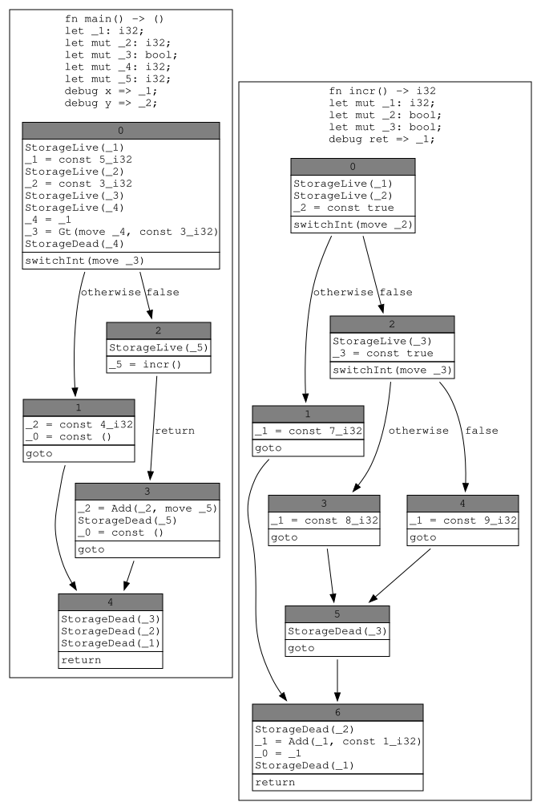

TODO: 추가할 사항이 있나요?

[dataflow state]: ./dataflow.html#graphviz-diagrams


## 상수 평가 (Constant Evaluation) {#const-eval}

상수 평가는 컴파일 타임에 값을 계산하는 프로세스입니다.
특정 아이템(상수/static/배열 길이)의 경우 아이템에 대한 MIR이 대여 검사 및 최적화된 후에 발생합니다.
많은 경우 아이템을 const 평가하려는 시도가 아이템의 MIR을 처음 계산하도록 트리거합니다.

두드러진 예시는 다음과 같습니다:

* `static`의 이니셜라이저(초기화 표현식)
* 배열 길이
    * 스택 또는 힙 공간을 확보하기 위해 알아야 함
* 열거형(enum) 변량 판별자(discriminant)
    * 두 변량이 동일한 판별자를 갖지 않도록 파악해야 함
* 패턴
    * 겹치는 패턴을 검사하기 위해 파악해야 함

또한 상수 평가는 복잡한 연산을 컴파일 타임에 미리 계산하고 결과만 저장함으로써 런타임 작업량이나 바이너리 크기를 줄이는 데 사용할 수 있습니다.

상수 평가의 모든 사용은 "타입 시스템에 영향을 미치는 것"(배열 길이, 열거형 변량 판별자, const 제네릭 매개변수)으로 분류되거나, 런타임에 사용할 표현식을 미리 계산하기 위해서만 수행되는 것으로 분류될 수 있습니다.

상수 평가는 `TyCtxt`의 `const_eval_*` 함수를 호출하여 수행할 수 있습니다.
이들은 `const_eval` 쿼리의 래퍼(wrapper)입니다.

* `const_eval_global_id_for_typeck`는 상수를 valtree로 평가하여 결과 값을 컴파일러가 추가 검사할 수 있도록 합니다.
* `const_eval_global_id`는 상수를 최종 값을 포함하는 "불투명한 블롭(opaque blob)"으로 평가합니다; 이는 코드 생성 백엔드와 CTFE 평가기 엔진 자체에만 유용합니다.
* `eval_static_initializer`는 구체적으로 static의 초기 값을 계산합니다.
  static은 특별합니다; 다른 모든 함수는 static을 올바르게 표현하지 못하므로 static에 대한 사용을 방지하는 단언(assertion)을 갖습니다.

`const_eval_*` 함수는 상수가 평가되는 환경의 [`ParamEnv`](#typing-parameter-envs)(예: 상수가 사용되는 함수 내부) 및 [`GlobalId`]를 사용합니다.
`GlobalId`는 상수 또는 static을 참조하는 `Instance` 또는 함수의 `Instance`와 해당 함수의 `Promoted` 테이블에 대한 인덱스로 구성됩니다.

상수 평가는 타입 시스템 상수의 경우 [`EvalToValTreeResult`]를 반환하거나 오류 또는 평가된 상수의 표현([valtree](#valtrees) 또는 [MIR 상수 값](#mir-constant-values))을 포함하는 [`EvalToConstValueResult`]를 각각 반환합니다.

[`GlobalId`]: https://doc.rust-lang.org/nightly/nightly-rustc/rustc_middle/mir/interpret/struct.GlobalId.html
[`EvalToConstValueResult`]: https://doc.rust-lang.org/nightly/nightly-rustc/rustc_middle/mir/interpret/error/type.EvalToConstValueResult.html
[`EvalToValTreeResult`]: https://doc.rust-lang.org/nightly/nightly-rustc/rustc_middle/mir/interpret/error/type.EvalToValTreeResult.html


### 인터프리터 {#const-eval-interpret}

인터프리터는 기계 코드로 컴파일하지 않고 MIR을 실행하기 위한 가상 머신입니다.
보통 `tcx.const_eval_*` 함수를 통해 호출됩니다.
인터프리터는 컴파일러(컴파일 타임 함수 평가, CTFE용)와 (unsafe) Rust 코드에서 미정의 동작(Undefined Behavior)을 감지하기 위해 동일한 가상 머신을 사용하는 도구인 [Miri](https://github.com/rust-lang/miri/) 간에 공유됩니다.

다음 상수로 시작한다고 해봅시다:

```rust
const FOO: usize = 1 << 12;
```

rustc는 상수가 사용되거나 메타데이터에 기재될 때까지는 실제 아무것도 호출하지 않습니다.

다음과 같은 사용 지점이 생기면:

```rust,ignore
type Foo = [u8; FOO - 42];
```

컴파일러는 해당 타입을 사용하는 아이템(지역 변수, 상수, 함수 인자 등)을 생성할 수 있기 전에 배열 길이를 파악해야 합니다.

(이 경우 비어 있는) 매개변수 환경을 구하기 위해 `let param_env = tcx.param_env(length_def_id);`를 호출할 수 있습니다.
필요한 `GlobalId`는 다음과 같습니다.

```rust,ignore
let gid = GlobalId {
    promoted: None,
    instance: Instance::mono(length_def_id),
};
```

`tcx.const_eval(param_env.and(gid))`를 호출하면 이제 배열 길이 표현식의 MIR 생성이 트리거됩니다.
MIR은 대략 다음과 같은 모습입니다:

```mir
Foo::{{constant}}#0: usize = {
    let mut _0: usize;
    let mut _1: (usize, bool);

    bb0: {
        _1 = CheckedSub(const FOO, const 42usize);
        assert(!move (_1.1: bool), "attempt to subtract with overflow") -> bb1;
    }

    bb1: {
        _0 = move (_1.0: usize);
        return;
    }
}
```

평가에 앞서 평가 결과를 저장하기 위한 가상 메모리 위치(이 경우 기본적으로 `vec![u8; 4]` 또는 `vec![u8; 8]`)가 생성됩니다.

평가 시작 시 `_0`과 `_1`은 `Operand::Immediate(Immediate::Scalar(ScalarMaybeUndef::Undef))`입니다.
다소 길고 복잡합니다: [`Operand`]는 [인터프리터 메모리](#memory) 어딘가에 저장된 데이터(`Operand::Indirect`), 또는 (최적화로서) 인라인으로 저장된 즉시 값(immediate data)을 나타낼 수 있습니다.
그리고 [`Immediate`]는 단일 (초기화되지 않았을 수 있는) [스칼라 값][`Scalar`](정수 또는 얇은 포인터)이거나 그 두 개의 쌍일 수 있습니다.
우리의 경우 단일 스칼라 값은 (아직) 초기화되지 않았습니다.

`_1`의 초기화가 호출될 때 `FOO` 상수의 값이 필요하며 이는 `tcx.const_eval_*`에 대한 또 다른 호출을 트리거하며 이는 여기에 나타내지 않았습니다.
FOO의 평가가 성공하면 `4096` 값에서 `42`가 차감되고 결과가 `Operand::Immediate(Immediate::ScalarPair(Scalar::Raw { data: 4054, .. }, Scalar::Raw { data: 0, .. }))` 형태로 `_1`에 저장됩니다.
쌍의 첫 번째 부분은 계산된 값이고 두 번째 부분은 오버플로가 발생했는지를 나타내는 bool 값입니다.
`Scalar::Raw`는 이 스칼라 값의 크기(바이트 단위)도 저장합니다; 여기서는 이를 생략합니다.

다음 문장은 해당 불리언이 `0`임을 단언(assert)합니다.
단언이 실패하면 해당 오류 메시지가 컴파일 타임 오류를 보고하는 데 사용됩니다.

실패하지 않으므로 `Operand::Immediate(Immediate::Scalar(Scalar::Raw { data: 4054, .. }))`가 평가 전에 할당된 가상 메모리에 저장됩니다.
`_0`은 항상 해당 위치를 직접 참조합니다.

평가가 완료된 후 반환 값은 [`op_to_const`]에 의해 [`Operand`]에서 [`ConstValue`]로 변환됩니다: 이전 표현 방식은 const 평가 *중에* 필요한 부분에 맞춰져 있고 [`ConstValue`]는 const 평가 결과를 소비하는 컴파일러 나머지 부분의 필요성에 맞추어져 있습니다.
이 변환의 일환으로 스칼라 값을 가지는 타입의 경우 결과 [`Operand`]가 `Indirect`이더라도 (일반적인 `ConstValue::Indirect` 대신) 즉시 값인 `ConstValue::Scalar(computed_value)`를 반환합니다.
이는 `usize`와 같이 단순한 대상을 얻기 위해 추가 쿼리를 실행할 필요가 없으므로 결과를 사용하는 것을 훨씬 효율적이고 편리하게 만들어 줍니다.

동일 상수의 향후 평가는 실제 인터프리터를 호출하지 않고 캐시된 결과를 사용하게 됩니다.

[`Immediate`]: https://doc.rust-lang.org/nightly/nightly-rustc/rustc_const_eval/interpret/enum.Immediate.html
[`ConstValue`]: https://doc.rust-lang.org/nightly/nightly-rustc/rustc_middle/mir/consts/enum.ConstValue.html
[`Scalar`]: https://doc.rust-lang.org/nightly/nightly-rustc/rustc_middle/mir/interpret/enum.Scalar.html
[`op_to_const`]: https://doc.rust-lang.org/nightly/nightly-rustc/rustc_const_eval/const_eval/eval_queries/fn.op_to_const.html

#### 데이터 구조

인터프리터의 외부 노출 데이터 구조는 [rustc_middle/src/mir/interpret](https://github.com/rust-lang/rust/blob/HEAD/compiler/rustc_middle/src/mir/interpret)에서 찾을 수 있습니다.
이는 주로 오류 열거형과 [`ConstValue`] 및 [`Scalar`] 타입입니다.
`ConstValue`는 `Scalar`(단일 `Scalar`, 즉 정수 또는 얇은 포인터), `Slice`(패턴 매칭에 필요한 바이트 슬라이스 및 문자열 표현용), 또는 다른 모든 것에 사용되고 가상 할당을 참조하는 `Indirect`일 수 있습니다.
이러한 할당은 `tcx.interpret_interner`의 메서드를 통해 접근할 수 있습니다.
`Scalar`는 `Raw` 정수 또는 포인터입니다; 자세한 내용은 [다음 섹션](#memory)을 참조하세요.

수치 결과를 기대하는 경우 `eval_usize`(`u64`로 표현할 수 없는 경우 패닉 발생) 또는 가능한 경우 `Scalar`를 산출하는 `Option<u64>` 결과를 가져오는 `try_eval_usize`를 사용할 수 있습니다.

#### 메모리

모든 종류의 포인터를 지원하려면 인터프리터는 포인터가 가리킬 수 있는 "가상 메모리"를 가지고 있어야 합니다.
이는 [`Memory`] 타입에 구현되어 있습니다.
가장 단순한 모델에서 모든 전역 변수, 스택 변수 및 모든 동적 할당은 해당 메모리의 [`Allocation`]에 대응합니다.
(실제로 모든 MIR 스택 변수에 대해 할당을 사용하는 것은 매우 비효율적입니다; 이것이 크기가 작고 주소가 수집되지 않는 스택 변수에 대해 `Operand::Immediate`를 갖는 이유입니다. 그러나 이는 순전히 최적화일 뿐입니다.)

이러한 `Allocation`은 기본적으로 이 할당의 각 바이트 값을 저장하는 `u8` 시퀀스입니다.
(약간의 추가 데이터 포함, 아래 참조.) 모든 `Allocation`은 `Memory`에 할당된 전역적으로 유일한 `AllocId`를 가집니다.
그것으로 [`Pointer`]는 `AllocId`(할당을 가리킴)와 할당에 대한 오프셋(포인터가 가리키는 할당의 바이트를 나타냄)의 쌍으로 구성됩니다.
`Pointer`가 단순 정수 주소가 아닌 것이 이상해 보일 수 있지만 const 평가 중에는 할당이 최종적으로 어느 실제 정수 주소에 위치할지 알 수 없으므로 심볼릭 베이스 주소로 `AllocId`를 사용하고 이는 별도의 오프셋이 필요함을 의미함을 기억하세요.
(여담으로, 런타임에서의 포인터도 [단순 정수 이상으로 드러났습니다](https://rust-lang.github.io/unsafe-code-guidelines/glossary.html#pointer-provenance).)

이러한 할당은 참조와 원시 포인터가 가리킬 대상을 갖도록 존재합니다.
대상이 할당되는 전역 선형 힙은 존재하지 않으며 각 할당(지역 변수용이든, static용이든, (향후) 힙 할당용이든)은 정확히 필요한 크기의 자체 작은 메모리를 갖습니다.
따라서 지역 변수 `a`에 대한 할당을 가리키는 포인터가 있다면, 해당 포인터를 다른 지역 변수 `b`를 가리키는 포인터로 변경할 수 있는 (아무리 안전하지 않은 것이라 해도) 작업은 존재하지 않습니다.
`a`에 대한 포인터 연산은 오프셋만 변경할 뿐이며 `AllocId`는 동일하게 유지됩니다.

그러나 이는 `Allocation` 내에 `Pointer`를 저장하려 할 때 문제를 일으킵니다: 이를 올바른 길이의 `u8` 시퀀스로 변환할 수 없습니다!
`AllocId`와 오프셋은 합쳐서 포인터가 "보이는" 크기의 두 배입니다.
이것이 `Allocation`의 `relocation` 필드의 목적입니다: `Pointer`의 바이트 오프셋은 `u8` 모음으로 저장되는 반면, `AllocId`는 밴드 외(out-of-band)로 저장됩니다.
이 둘은 메모리에서 `Pointer`를 읽을 때 다시 조립됩니다.
`Allocation`에 필요한 다른 추가 데이터는 어느 바이트가 초기화되었는지 추적하기 위한 `undef_mask`입니다.

##### 전역 메모리 및 이국적 할당

`Memory`는 평가 중에만 존재합니다; 상수의 최종 값이 계산되면 파괴됩니다.
상수에 포인터가 포함되어 있는 경우, 이들은 "인턴(interned)"되어 `TyCtxt`에 속한 전역 "const eval 메모리"로 이동됩니다.
이러한 할당은 나머지 계산 동안 남아 있으며 최종 출력으로 직렬화됩니다 (의존하는 크레이트가 사용할 수 있도록).

또한 함수 포인터도 지원하기 위해 `TyCtxt`에 있는 전역 메모리는 "가상 할당"도 포함할 수 있습니다: `Allocation` 대신 이들은 `Instance`를 포함합니다.
이를 통해 `Pointer`가 일반 데이터 또는 함수를 가리킬 수 있으며 이는 함수 포인터에서 원시 포인터로의 캐스트를 평가할 수 있게 하는 데 필요합니다.

마지막으로 전역 메모리에 사용되는 [`GlobalAlloc`] 타입에는 특정 `const` 또는 `static` 아이템을 가리키는 `Static` 변량도 포함되어 있습니다.
이는 순환 static을 지원하는 데 필요하며 여기서 아직 값의 바이트를 알지 못하므로 아직 `Allocation`을 가질 수 없는 `static`에 대한 `Pointer`를 가져야 합니다.

[`Memory`]: https://doc.rust-lang.org/nightly/nightly-rustc/rustc_const_eval/interpret/struct.Memory.html
[`Allocation`]: https://doc.rust-lang.org/nightly/nightly-rustc/rustc_middle/mir/interpret/struct.Allocation.html
[`Pointer`]: https://doc.rust-lang.org/nightly/nightly-rustc/rustc_middle/mir/interpret/struct.Pointer.html
[`GlobalAlloc`]: https://doc.rust-lang.org/nightly/nightly-rustc/rustc_middle/mir/interpret/enum.GlobalAlloc.html

##### 포인터 값 vs 포인터 타입

인터프리터에서 혼란을 일으키는 한 가지 일반적인 원인은 포인터 *값*인 것과 포인터 *타입*을 갖는 것이 완전히 독립적인 속성이라는 것입니다.
"포인터 값"은 `Pointer`를 포함하며 인터프리터의 가상 메모리 어딘가를 가리키는 `Scalar::Ptr`을 가리킵니다.
이는 단순히 어떤 구체적인 정수인 `Scalar::Raw`와 대조됩니다.

그러나 `*const T` 또는 `&T`와 같은 포인터 또는 참조 *타입*의 변수가 반드시 포인터 *값*을 가져야 하는 것은 아닙니다: 정수를 포인터로 캐스팅하거나 트랜스뮤트하여 얻어졌을 수 있습니다.
마찬가지로 실제 할당에 대한 참조를 정수로 캐스팅하거나 트랜스뮤트할 때 정수 *타입*(`usize`)에 포인터 *값*(`Scalar::Ptr`)을 갖게 됩니다.
포인터 값에 대해 나눗셈과 같은 정수 연산을 의미 있게 수행할 수 없기 때문에 이는 문제가 됩니다.

#### 해석 (Interpretation)

상수 평가에 대한 주요 진입점은 `tcx.const_eval_*` 함수이지만 `ConstValue`(`Indirect` 또는 다른 형식)의 필드에 접근할 수 있게 하는 추가 함수들이 [rustc_const_eval/src/const_eval](https://doc.rust-lang.org/nightly/nightly-rustc/rustc_const_eval/index.html)에 존재합니다.
컴파일 타겟(현재는 LLVM)으로 변환하는 목적 외에는 `Allocation`에 직접 접근해서는 안 됩니다.

인터프리터는 평가 중인 현재 상수를 위한 가상 스택 프레임을 생성하는 것으로 시작합니다.
이 가이드를 작성하는 시점에 상수가 로컬 (이름 지정된) 변수를 허용하지 않는다는 점을 제외하면, 상수와 인자가 없는 함수 간에는 본질적으로 차이가 없습니다.

스택 프레임은 [rustc_const_eval/src/interpret/eval_context.rs](https://github.com/rust-lang/rust/blob/HEAD/compiler/rustc_const_eval/src/interpret/eval_context.rs)의 `Frame` 타입에 의해 정의되며 모든 지역 변수 메모리(평가 시작 시 `None`)를 포함합니다.
각 프레임은 루트 상수의 평가 또는 `const fn`에 대한 이후 호출을 참조합니다.
다른 상수의 평가는 단순히 teljesen 새롭고 독립적인 스택 프레임을 생성하는 `tcx.const_eval_*`을 호출합니다.

프레임은 단순 `Vec<Frame>`이며 unsafe 코드를 통한 지독한 속임수를 쓰더라도 `Frame`의 메모리를 실제로 참조할 수 있는 방법은 없습니다.
참조할 수 있는 유일한 메모리는 `Allocation`입니다.

인터프리터는 이제 오류를 반환하거나 실행할 구문이 없을 때까지 ([rustc_const_eval/src/interpret/step.rs](https://github.com/rust-lang/rust/blob/HEAD/compiler/rustc_const_eval/src/interpret/step.rs)의) `step` 메서드를 호출합니다.
각 구문은 이제 로컬 변수나 로컬 변수가 참조하는 가상 메모리를 초기화하거나 수정합니다.
이로 인해 다른 상수나 static을 평가해야 할 수 있으며 이는 재귀적으로 `tcx.const_eval_*`을 호출합니다.


## 단일화 (Monomorphization) {#backend-monomorph}

아시다시피 Rust는 제네릭 타입을 광범위하게 지원하는 매우 표현력이 풍부한 타입 시스템을 갖추고 있습니다. 그러나 물론 어셈블리는 제네릭하지 않으므로 코드가 실행되기 전에 모든 제네릭의 구체적인 타입을 파악해야 합니다.

언어마다 이 문제를 다르게 처리합니다. 예를 들어 Java와 같은 일부 언어에서는 런타임까지 값의 가장 정확한 타입을 알지 못할 수 있습니다. Java의 경우 (전부는 아니지만) 거의 모든 변수가 어차피 참조 값(즉 힙 할당 객체에 대한 포인터)이므로 괜찮습니다. 이러한 유연성은 객체에 대한 모든 접근이 포인터를 참조 해제해야 하므로 성능 손실을 대가로 치릅니다.

Rust는 다른 접근 방식을 취합니다: 모든 제네릭 타입을 _단일화(monomorphize)_합니다. 이는 컴파일러가 필요한 각 구체적 타입에 대해 제네릭 함수의 코드 사본을 다르게 도장 찍듯 찍어낸다는 것을 의미합니다. 예를 들어 코드에서 `Vec<u64>`와 `Vec<String>`을 사용하는 경우 생성된 바이너리에는 `Vec`에 대해 생성된 코드의 두 사본, 즉 `Vec<u64>`용 사본 하나와 `Vec<String>`용 사본 하나가 있게 됩니다. 결과는 빠른 프로그램이지만 컴파일 시간(이 모든 사본을 만드는 데 시간이 걸릴 수 있음)과 바이너리 크기(이 모든 사본이 많은 공간을 차지할 수 있음)의 대가를 치릅니다.

단일화는 Rust 컴파일러 백엔드의 첫 번째 단계입니다.

### 수집 (Collection)

먼저 프로그램의 모든 제네릭 항목에 필요한 구체적 타입이 무엇인지 파악해야 합니다. 이를 _수집(collection)_이라 부르며 이 작업을 수행하는 코드를 _단일화 수집기(monomorphization collector)_라 부릅니다.

이 예제를 보세요:

```rust
fn banana() {
   peach::<u64>();
}

fn main() {
    banana();
}
```

단일화 수집기는 `[main, banana, peach::<u64>]` 목록을 제공합니다. 이들은 기계 코드가 생성될 함수들입니다. 수집기는 목록에 static과 같은 것들도 추가합니다.

자세한 내용은 [수집기 rustdoc][collect]을 참조하세요.


단일화 수집기는 MIR 로어링 및 코드 생성 바로 직전에 실행됩니다.
[`rustc_codegen_ssa::base::codegen_crate`][codegen1]는 [`collect_and_partition_mono_items`][mono] 쿼리를 호출하며 이 쿼리는 단일화 수집을 수행한 다음 이들을 [코드 생성 단위](#codegen-unit)로 분할(partition)합니다.

### 코드 생성 단위 (CGU) 분할

더 나은 증분 빌드 시간을 위해 CGU 분할기는 각 소스 레벨 모듈에 대해 두 개의 CGU를 생성합니다. 하나는 "안정적"인 즉 비제네릭 코드용이고 다른 하나는 더 가변적인 코드 즉 단일화/특수화된 인스턴스용입니다.

의존성의 경우 Crate B가 Crate A에 의존하는 Crate A와 Crate B를 고려해 보세요.
다음 표는 Crate B의 하나 이상의 모듈에서 사용될 수 있는 Crate A의 함수에 대한 다양한 시나리오를 나열합니다.

| Crate A 함수 | 동작 |
| - | - |
| 비제네릭 함수 | Crate A 함수는 Crate B의 어떠한 코드 생성 단위에도 나타나지 않음 |
| 비제네릭 `#[inline]` 함수 | Crate A 함수는 Crate B의 단일 CGU 내에 나타나며 포스트 인라이닝 단계 이후에도 존재함 |
| 제네릭 함수 | 인라이닝 여부와 상관없이 Crate A의 모든 단일화된(특수화된) 함수는 <br> Crate B를 위한 단일 코드 생성 단위 내에 나타남. <br> 코드 생성 단위는 포스트 인라이닝 단계 이후에도 존재함. |
| 제네릭 `#[inline]` 함수 | - 동일 - |

분할기에 대한 자세한 내용은 모듈 레벨 [문서][documentation]를 읽어보세요.

[mono]: https://doc.rust-lang.org/nightly/nightly-rustc/rustc_monomorphize/partitioning/fn.collect_and_partition_mono_items.html
[documentation]: https://doc.rust-lang.org/nightly/nightly-rustc/rustc_monomorphize/partitioning/index.html


## MIR을 코드 생성 IR로 로어링하기 {#backend-lowering-mir}

이제 수집기로부터 생성할 심볼 목록을 확보했으므로 일종의 코드 생성 IR을 생성해야 합니다. 이 장에서는 rustc가 주로 사용하므로 LLVM IR을 가정합니다. 실제 단일화는 번역을 수행하면서 진행하는 과정에서 수행됩니다.

백엔드가 [`rustc_codegen_ssa::base::codegen_crate`][codegen1]에 의해 시작된다는 점을 상기하세요. 결국 이는 MIR에서 LLVM IR로의 로어링을 수행하는 [`rustc_codegen_ssa::mir::codegen_mir`][codegen2]에 도달합니다.
[codegen2]: https://doc.rust-lang.org/nightly/nightly-rustc/rustc_codegen_ssa/mir/fn.codegen_mir.html

코드는 특정 MIR 기본 요소(primitives)를 다루는 모듈로 나뉩니다:

- [`rustc_codegen_ssa::mir::block`][mirblk]: 블록과 그 종단자(terminator)의 번역을 다룹니다. 이 모듈이 수행하는 가장 복잡하면서도 흥미로운 작업은 필요한 언와인딩(unwinding) 처리 IR을 포함하여 함수 호출에 대한 코드를 생성하는 것입니다.
- [`rustc_codegen_ssa::mir::statement`][mirst]: MIR 구문(statement)을 번역합니다.
- [`rustc_codegen_ssa::mir::operand`][mirop]: MIR 피연산자(operand)를 번역합니다.
- [`rustc_codegen_ssa::mir::place`][mirpl]: MIR 장소(place) 참조를 번역합니다.
- [`rustc_codegen_ssa::mir::rvalue`][mirrv]: MIR r-value를 번역합니다.

[mirblk]: https://doc.rust-lang.org/nightly/nightly-rustc/rustc_codegen_ssa/mir/block/index.html
[mirst]: https://doc.rust-lang.org/nightly/nightly-rustc/rustc_codegen_ssa/mir/statement/index.html
[mirop]: https://doc.rust-lang.org/nightly/nightly-rustc/rustc_codegen_ssa/mir/operand/index.html
[mirpl]: https://doc.rust-lang.org/nightly/nightly-rustc/rustc_codegen_ssa/mir/place/index.html
[mirrv]: https://doc.rust-lang.org/nightly/nightly-rustc/rustc_codegen_ssa/mir/rvalue/index.html

함수가 번역되기 전에 더 단순하고 효율적인 LLVM IR을 생성하도록 돕기 위해 여러 단순하고 기초적인 분석 패스가 실행됩니다. 이러한 분석 패스의 예로는 어떤 변수가 SSA 스타일인지 파악하여 해당 변수에 대해 LLVM의 `mem2reg`에 의존하기보다는 직접 SSA로 번역할 수 있도록 하는 것이 있습니다. 이 분석은 [`rustc_codegen_ssa::mir::analyze`][mirana]에서 찾을 수 있습니다.

[mirana]: https://doc.rust-lang.org/nightly/nightly-rustc/rustc_codegen_ssa/mir/analyze/index.html

보통 단일 MIR 기본 블록은 아주 적은 예외(내장 함수(intrinsic)나 일반 함수 호출, 그리고 `assert`와 같이 덜 기본적인 MIR 구문은 여러 기본 블록을 유발할 수 있음)를 제외하고 하나의 LLVM 기본 블록으로 매핑됩니다. 이는 코드 생성의 이식 불가능한 LLVM 전용 부분으로 들어가는 완벽한 도입부입니다. 내장 함수 생성은 중간 추상화 계층이 매우 적어 이해하기 꽤 쉬우며 [`rustc_codegen_llvm::intrinsic`][llvmint]에서 찾을 수 있습니다.

[llvmint]: https://doc.rust-lang.org/nightly/nightly-rustc/rustc_codegen_llvm/intrinsic/index.html

그 외 모든 것은 [빌더 인터페이스(builder interface)][builder]를 사용합니다. 이는 위에서 논의한 [`rustc_codegen_ssa::mir::*`][ssamir] 모듈에서 호출되는 코드입니다.

[builder]: https://doc.rust-lang.org/nightly/nightly-rustc/rustc_codegen_llvm/builder/index.html
[ssamir]: https://doc.rust-lang.org/nightly/nightly-rustc/rustc_codegen_ssa/mir/index.html

> TODO: 상수가 생성되는 방식에 대한 논의


## 코드 생성 (Code generation) {#backend-codegen}

코드 생성(또는 "codegen")은 컴파일러에서 실제로 실행 가능한 바이너리를 생성하는 파트입니다.
보통 rustc는 코드 생성을 위해 LLVM을 사용하지만 [Cranelift] 및 [GCC]에 대한 지원도 존재합니다.
핵심은 rustc가 코드 생성 자체를 구현하지 않는다는 것입니다.
다만 Rust 소스 코드에서 백엔드의 많은 파트가 이름에 `codegen`을 포함하고 있다는 점은 주목할 가치가 있습니다 (엄격한 경계는 없음).

[Cranelift]: https://github.com/bytecodealliance/wasmtime/tree/main/cranelift
[GCC]: https://github.com/rust-lang/rustc_codegen_gcc

> NOTE: 코드 생성 버그를 디버깅하는 방법에 대한 힌트를 찾고 계시다면, [디버깅 장의 이 섹션][debugging]을 참조하세요.

[debugging]: #backend-debugging

### LLVM이란 무엇인가요?

[LLVM](https://llvm.org)은 "모듈식이고 재사용 가능한 컴파일러 및 툴체인 기술의 모음"입니다. 특히 LLVM 프로젝트에는 `clang` C 컴파일러 및 우리가 사랑하는 `rustc`를 포함하여 많은 컴파일러 프로젝트에서 사용되는 플러그 가능한 컴파일러 백엔드(역시 "LLVM"이라 부름)가 포함되어 있습니다.

LLVM은 LLVM IR 형태의 입력을 받습니다. 이는 기본적으로 추가적인 저수준 타입과 어노테이션이 추가된 어셈블리 코드입니다. 이러한 어노테이션은 LLVM IR 및 출력된 기계 코드에 대한 최적화를 수행하는 데 유용합니다. 이 모든 것의 최종 결과는 (마침내) 실행 가능한 무언가(예: ELF 객체, EXE 또는 wasm)입니다.

LLVM을 사용함으로써 얻는 몇 가지 이점이 있습니다:

- 컴파일러 백엔드 전체를 작성할 필요가 없습니다. 이는 구현 및 유지 관리 부담을 줄여줍니다.
- LLVM 프로젝트가 수집해 온 방대한 고급 최적화 모음의 이점을 누립니다.
- LLVM이 지원하는 모든 플랫폼으로 Rust를 자동 컴파일할 수 있습니다. 예를 들어 LLVM이 wasm 지원을 추가하자마자 짜잔! rustc, clang 및 다른 수많은 언어가 wasm으로 컴파일할 수 있게 되었습니다! (약간의 추가 작업이 필요하긴 했지만 어쨌든 90%는 완성되어 있었습니다).
- 우리와 다른 컴파일러 프로젝트가 서로에게 이점을 줍니다. 예를 들어 [Spectre 및 Meltdown 보안 취약점][spectre]이 발견되었을 때 LLVM만 패치하면 되었습니다.

[spectre]: https://meltdownattack.com/

### LLVM 실행, 링크 및 메타데이터 생성

모든 함수, static 등의 LLVM IR이 구축되면 LLVM과 해당 최적화 패스를 실행하기 시작할 시간입니다. LLVM IR은 "모듈"로 그룹화됩니다. 멀티 코어 활용을 돕기 위해 여러 "모듈"이 동시에 코드 생성될 수 있습니다. 이러한 "모듈"이 바로 우리가 _코드 생성 단위(codegen units)_라고 부르는 것입니다. 이 단위들은 과거 단일화 수집 단계에서 구성되었습니다.

LLVM이 이 모듈들로부터 객체를 생성하면, 이 객체들은 선택적으로 메타데이터 객체와 함께 링커로 전달되어 아카이브나 실행 파일이 생성됩니다.

최적화를 실행하는 것이 위에 설명된 코드 생성 단계에 국한되는 것은 아닙니다. 특정 종류의 LTO를 사용하면 최적화가 링크 타임에 대신 발생할 수 있습니다. 일부 최적화는 객체가 링커로 전달되기 전에 발생하고 일부는 링크 중에 발생하는 것도 가능합니다.

이 모든 것은 컴파일의 맨 끝부분에서 발생합니다. 이를 위한 코드는 [`rustc_codegen_ssa::back`][ssaback] 및 [`rustc_codegen_llvm::back`][llvmback]에서 찾을 수 있습니다. 안타깝게도 이 코드 조각은 LLVM 의존 코드와 잘 분리되어 있지 않습니다; [`rustc_codegen_ssa`][ssa]에는 LLVM 백엔드에 특화된 상당량의 코드가 포함되어 있습니다.

이러한 구성 요소들이 작업을 완료하면 요청한 출력에 해당하는 수의 파일이 파일 시스템에 남게 됩니다.

[ssaback]: https://doc.rust-lang.org/nightly/nightly-rustc/rustc_codegen_ssa/back/index.html
[llvmback]: https://doc.rust-lang.org/nightly/nightly-rustc/rustc_codegen_llvm/back/index.html


### LLVM 업데이트 {#backend-updating-llvm}

Rust는 여러 LLVM 버전에 대해 빌드하는 것을 지원합니다:

* 현재 LLVM 개발 브랜치의 최신(Tip-of-tree)은 보통 며칠 내에 지원됩니다.
  이러한 수정에 대한 PR에는 `llvm-main` 태그가 붙습니다.
* 가장 최근에 릴리스된 메이저 버전은 항상 지원됩니다.
* 그 전의 1개 또는 2개 이전 메이저 버전은 보통 빌드가 성공하고 대부분의 테스트를 통과할 것이라는 의미에서 지원됩니다.
  그러나 오컴파일에 대한 수정은 이전 LLVM 버전으로 백포트(backport)되지 않는 경우가 많으므로, 이전 버전의 LLVM과 함께 rustc를 사용하는 경우 건전성 버그 위험이 높아집니다.
  최신 버전의 LLVM을 사용할 것을 강력히 권장합니다.

기본적으로 Rust는 [rust-lang/llvm-project repository]의 자체 포크(fork)를 사용합니다.
이 포크는 업스트림 프로젝트의 `release/$N.x` 브랜치를 기반으로 하며 여기서 `$N`은 가장 최근에 릴리스된 메이저 버전이거나 릴리스 후보(RC) 단계의 현재 메이저 버전입니다.
이 포크는 절대로 `main` 개발 브랜치를 기반으로 하지 않습니다.

우리의 LLVM 포크가 수용하는 것은 오직:

* 이미 업스트림에 반영된 변경 사항의 백포트.
* CI 환경에 영향을 미치는 빌드 문제에 대한 워크어라운드(임시 해결책).

SGX 활성화를 위한 하나의 관례적 패치를 제외하고 먼저 업스트림에 반영되지 않은 기능 패치는 수용하지 않습니다.

서로 다른 절차를 가진 세 가지 유형의 LLVM 업데이트가 있습니다:

* 현재 메이저 LLVM 버전이 지원되는 동안의 백포트.
* 현재 메이저 LLVM 버전이 더 이상 지원되지 않는 동안(또는 변경 사항이 업스트림 백포트에 적격하지 않은 경우)의 백포트.
* 새 메이저 LLVM 버전으로의 업데이트.

#### 백포트 (업스트림 지원됨)

현재 메이저 LLVM 버전이 업스트림에서 지원되는 동안에는 먼저 업스트림으로 수정 사항을 백포트해야 하며 그런 다음 릴리스 브랜치를 Rust 포크로 다시 병합해야 합니다.

1. 버그 수정이 업스트림 LLVM에 있는지 확인합니다.
2. 아직 진행되지 않았다면 업스트림 릴리스 브랜치로 백포트를 요청합니다.
   LLVM 커밋 권한이 있는 경우 [백포트 절차][backport process]를 따르세요.
   그렇지 않은 경우 백포트를 요청하는 이슈를 엽니다.
   백포트가 승인되고 병합되면 계속 진행합니다.
3. rustc가 현재 사용 중인 브랜치를 식별합니다.
   `src/llvm-project` 서브모듈은 항상 [rust-lang/llvm-project repository]의 특정 브랜치에 핀(pin)되어 있습니다.
4. rust-lang/llvm-project 리포지토리를 포크합니다.
5. 적절한 브랜치(보통 `rustc/a.b-yyyy-mm-dd` 이름)를 체크아웃합니다.
6. `git remote add upstream https://github.com/llvm/llvm-project.git` 명령으로 업스트림 리포지토리에 대한 리모트를 추가하고 `git fetch upstream`으로 가져옵니다.
7. `upstream/release/$N.x` 브랜치를 병합합니다.
8. 이 브랜치를 포크한 리포지토리에 푸시합니다.
9. 이전과 동일한 브랜치로 rust-lang/llvm-project에 Pull Request를 보냅니다.
   PR 설명에 수정 중인 Rust 및/또는 LLVM 이슈를 반드시 참조하세요.
10. PR이 병합될 때까지 기다립니다.
11. 버그 수정으로 `src/llvm-project` 서브모듈을 업데이트하는 PR을 rust-lang/rust에 보냅니다.
    이는 보통 `git submodule update --remote src/llvm-project`로 로컬에서 수행할 수 있습니다.
12. PR이 병합될 때까지 기다립니다.

예시 PR: [#59089](https://github.com/rust-lang/rust/pull/59089)

#### 백포트 (업스트림 지원 안 됨)

업스트림 LLVM 릴리스는 GA 릴리스 후 2~3개월 동안만 지원됩니다.
업스트림 백포트가 더 이상 수용되지 않으면 변경 사항을 포크로 직접 체리픽(cherry-pick)해야 합니다.

1. 버그 수정이 업스트림 LLVM에 있는지 확인합니다.
2. rustc가 현재 사용 중인 브랜치를 식별합니다.
   `src/llvm-project` 서브모듈은 항상 [rust-lang/llvm-project repository]의 특정 브랜치에 핀(pin)되어 있습니다.
3. rust-lang/llvm-project 리포지토리를 포크합니다.
4. 적절한 브랜치(보통 `rustc/a.b-yyyy-mm-dd` 이름)를 체크아웃합니다.
5. `git remote add upstream https://github.com/llvm/llvm-project.git` 명령으로 업스트림 리포지토리에 대한 리모트를 추가하고 `git fetch upstream`으로 가져옵니다.
6. `git cherry-pick -x`를 사용하여 관련 커밋을 체리픽합니다.
7. 이 브랜치를 포크한 리포지토리에 푸시합니다.
8. 이전과 동일한 브랜치로 rust-lang/llvm-project에 Pull Request를 보냅니다.
   PR 설명에 수정 중인 Rust 및/또는 LLVM 이슈를 반드시 참조하세요.
9. PR이 병합될 때까지 기다립니다.
10. 버그 수정으로 `src/llvm-project` 서브모듈을 업데이트하는 PR을 rust-lang/rust에 보냅니다.
    이는 보통 `git submodule update --remote src/llvm-project`로 로컬에서 수행할 수 있습니다.
11. PR이 병합될 때까지 기다립니다.

예시 PR: [#59089](https://github.com/rust-lang/rust/pull/59089)

#### 새 LLVM 릴리스 업데이트


버그 수정과 달리,
LLVM의 새 릴리스로 업데이트하는 것은 일반적으로 훨씬 더 많은 작업을 필요로 합니다.
이는 역방향으로 커밋을 하염없이 체리픽할 수 없는 부분이며
따라서 전체 업데이트를 수행해야 합니다.
여기에는 해야 할 일이 많으므로 각 항목을 자세히 살펴보겠습니다.

1. LLVM이 최신 릴리스 버전 브랜치를 생성했음을 발표합니다.
   이는 [llvm/llvm-project repository]에 브랜치로 나타나며
   보통 `release/$N.x` 형태 이름입니다 (여기서 `$N`은 릴리스되는 LLVM 버전).

1. 이 `release/$N.x` 브랜치로부터 [rust-lang/llvm-project repository]에 새 브랜치를 생성하고,
   이름을 `rustc/a.b-yyyy-mm-dd`로 지정합니다 (여기서 `a.b`는 브랜치 생성 당시 인트리(in-tree) LLVM의 현재 버전 번호이고 나머지는 현재 날짜).

1. Rust 전용 패치를 llvm-project 리포지토리에 적용합니다.
   모든 기능과 버그 수정은 업스트림에 존재하지만 업스트림에 반영할 의미가 없는 일부 특이한 빌드 관련 패치가 존재하는 경우가 많습니다.
   이러한 패치는 일반적으로 rustc가 현재 사용 중인 rust-lang/llvm-project 브랜치의 최신 패치들입니다.

1. `rust` 리포지토리에서 새 LLVM을 빌드합니다.
   이를 위해 `src/llvm-project` 리포지토리를 작성한 브랜치 및 리비전으로 업데이트하고자 할 것입니다.
   또한 `.gitmodules`를 LLVM 서브모듈의 새 브랜치 이름으로 업데이트하는 것이 보통 좋습니다.
   서브모듈 업데이트가 되돌려지지 않도록 `src/llvm-project` 변경 사항을 커밋했는지 확인하세요.
   실행해야 할 몇 가지 명령은 다음과 같습니다:

   * `./x build src/llvm-project` - LLVM이 여전히 빌드되는지 테스트
   * `./x build` - rustc의 나머지 부분 빌드

   업데이트된 LLVM 바인딩으로 컴파일하려면 [`llvm-wrapper/*.cpp`][`llvm-wrapper`]를 업데이트해야 할 가능성이 높습니다.
   이전 LLVM 버전에서도 바인딩이 여전히 컴파일되도록 `#ifdef` 등을 사용해야 합니다.

   `./x setup`에 의해 설정된 `profile = "compiler"` 및 기타 기본값은 소스에서 빌드하는 대신 CI에서 LLVM을 다운로드합니다.
   변경 사항이 사용되는지 확인하기 위해 이를 임시로 비활성화해야 합니다.
   이는 `bootstrap.toml`에 다음 설정을 두어 수행됩니다:

   ```toml
   llvm.download-ci-llvm = false
   ```

1. 다른 플랫폼 전체에서 회귀(regression)를 테스트합니다.
   LLVM은 티어 1이 아닌 아키텍처에 대해 하나 이상의 버그를 갖는 경우가 많으므로 bors에 보내기 전에 추가 테스트를 수행하는 것이 좋습니다!
   자원이 부족한 경우 지금 있는 그대로 bors에 PR을 보낼 수 있으며 그렇게 해도 어쨌든 테스트가 진행됩니다.

   이상적으로는 몇몇 플랫폼에서 LLVM을 빌드하고 테스트합니다:

   * Linux
   * macOS
   * Windows

   그 후 CI가 수행하는 일부 도커 컨테이너를 실행합니다:

   * `./src/ci/docker/run.sh wasm32`
   * `./src/ci/docker/run.sh arm-android`
   * `./src/ci/docker/run.sh dist-various-1`
   * `./src/ci/docker/run.sh dist-various-2`
   * `./src/ci/docker/run.sh armhf-gnu`

1. `rust-lang/rust`에 대한 PR을 준비합니다.
   `rust-lang/llvm-project` 유지 관리자와 협력하여 커밋을 해당 리포지토리의 브랜치에 넣고 그 후 `rust-lang/rust`에 PR을 보낼 수 있습니다.
   최소한 `src/llvm-project`를 변경하게 되며 [`llvm-wrapper`]도 변경할 가능성이 높습니다.

   <!-- date-check: March 2026 -->
   > 선행 선례로 이전 LLVM 업데이트 목록이 있습니다:
   > - [LLVM 17](https://github.com/rust-lang/rust/pull/115959)
   > - [LLVM 18](https://github.com/rust-lang/rust/pull/120055)
   > - [LLVM 19](https://github.com/rust-lang/rust/pull/127513)
   > - [LLVM 20](https://github.com/rust-lang/rust/pull/135763)
   > - [LLVM 21](https://github.com/rust-lang/rust/pull/143684)
   > - [LLVM 22](https://github.com/rust-lang/rust/pull/150722)

   실제로 `src/llvm-project`를 업데이트하기 전에 [`llvm-wrapper`] 호환성을 PR로 먼저 병합하는 것이 가장 쉬운 경우가 있습니다.
   이렇게 하면 LLVM 문제를 해결하는 동안 새 LLVM을 사용해 보고 싶어하는 다른 사람들이 C++ 바인딩을 업데이트하기 위해 당신이 수행한 작업의 이점을 누릴 수 있습니다.

1. 향후 몇 달 동안,
   LLVM은 `release/a.b` 브랜치에 커밋을 지속적으로 푸시할 것입니다.
   우리도 그러한 버그 수정을 가져오기를 종종 원할 것입니다.
   이에 대한 병합 절차는 `git merge` 자체를 사용하여 LLVM의 `release/a.b` 브랜치를 2단계에서 생성한 브랜치와 병합하는 것입니다.
   이는 보통 LLVM의 릴리스 브랜치가 다듬어지는 동안 필요할 때 여러 번 수행됩니다.

1. 그런 다음 LLVM이 버전 `a.b` 릴리스를 발표합니다.

1. LLVM의 공식 릴리스 이후,
   다시 rust-lang/llvm-project 리포지토리에 새 브랜치를 생성하는 절차를 따릅니다. 이번에는 새 날짜를 사용합니다.
   해당 버전을 사용하도록 Rust를 업데이트하는 PR이 병합되는 것은 바로 그 때입니다.

   순수한 LLVM 릴리스 브랜치 위에 단 몇 개의 Rust 전용 커밋만 쌓이도록 `git rebase`가 수행되면 `rust-lang/llvm-project`의 커밋 히스토리가 훨씬 깔끔해 보일 것입니다.

##### 주의사항 및 함정

이상적으로 위의 지침은 꽤 유끄럽게 진행되지만 진행하는 동안 염두에 두어야 할 몇 가지 주의사항이 있습니다:

* LLVM 버그는 찾기 어렵습니다. 주저하지 말고 도움을 요청하세요!
  이분 탐색(Bisection)은 여기서 확실히 여러분의 친구입니다
  (네, LLVM 빌드에는 영원이 걸리지만 그럼에도 이분 탐색은 여러분의 친구입니다).
  기여자가 강력한 하드웨어에 원격으로 접근할 수 있도록 제공하는 이니셔티브인 [Dev Desktops]를 활용할 수 있음에 유의하세요.
* 일반적인 질문이 있는 경우 [wg-llvm]이 도움을 줄 수 있습니다.
* 브랜치 생성은 GitHub에서 권한이 필요한 작업이므로 브랜치를 대신 생성해 줄 쓰기 권한이 있는 누군가가 필요할 가능성이 높습니다.


[rust-lang/llvm-project repository]: https://github.com/rust-lang/llvm-project
[llvm/llvm-project repository]: https://github.com/llvm/llvm-project
[`llvm-wrapper`]: https://github.com/rust-lang/rust/tree/HEAD/compiler/rustc_llvm/llvm-wrapper
[wg-llvm]: https://rust-lang.zulipchat.com/#narrow/stream/187780-t-compiler.2Fwg-llvm
[Dev Desktops]: https://forge.rust-lang.org/infra/docs/dev-desktop.html
[backport process]: https://llvm.org/docs/GitHub.html#backporting-fixes-to-the-release-branches


#### LLVM 디버깅 {#backend-debugging}

> NOTE: 코드 생성에 대한 정보를 찾고 계신다면 대신 [이 장][codegen]을 참조하세요.

[codegen]: #backend-codegen

이 섹션은 코드 생성 시 컴파일러 버그(예: 컴파일러가 특정 코드 조각을 그렇게 생성한 이유나 LLVM에서 크래시가 난 이유)를 디버깅하는 것에 관한 내용입니다.
LLVM은 자체 디버깅 문서를 가져야 할 정도로 큰 프로젝트지만 다음은 rustc 컨텍스트에서 중요한 몇 가지 팁입니다.

##### 예제 최소화하기

일반적인 규칙으로 컴파일러는 코드를 분석하여 수많은 정보를 생성합니다.
따라서 유용한 첫 번째 단계는 보통 최소한의 예제를 찾는 것입니다.
이를 수행하는 한 가지 방법은

1. 문제를 재현하는 새 크레이트를 생성합니다 (예: 원인이 되는 크레이트가 무엇이든 의존성으로 추가하고 거기서 사용).

2. 외부 의존성을 제거하여 크레이트를 최소화합니다; 즉 관련 모든 것을 새 크레이트로 이동.

3. 코드를 더 짧게 만들어 문제를 더욱 최소화합니다 (`creduce`와 같이 이를 돕는 도구가 존재함).

위의 2단계와 3단계 방법론에 대한 자세한 논의는 특히 Rust 프로그램 최소화에 관한 pnkfelix의 [장문의 블로그 포스트][mcve-blog]가 있습니다.

[mcve-blog]: https://blog.pnkfx.org/blog/2019/11/18/rust-bug-minimization-patterns/

##### LLVM 내부 검사 활성화하기

공식 컴파일러(나이틀리 포함)는 LLVM 단언(assertion)이 비활성화되어 있으므로 LLVM 단언 실패가 컴파일러 크래시(ICE가 아닌 "진짜" 크래시)나 다른 종류의 이상 동작으로 나타날 수 있습니다.
이러한 문제를 겪고 있다면 LLVM 단언이 활성화된 컴파일러("alt" 나이틀리 또는 bootstrap.toml에 `llvm.assertions = true`를 설정하여 직접 빌드한 컴파일러)를 사용하여 무언가 나타나는지 확인해 보는 것이 좋은 방법입니다.

rustc 빌드 프로세스는 LLVM 도구들을 `build/host/llvm/bin`으로 빌드합니다.
이들은 직접 호출할 수 있습니다.
이 도구들에는 다음이 포함됩니다:
 * [`llc`]: 비트코드(`.bc` 파일)를 실행 가능한 코드로 컴파일합니다; 이를 사용해 LLVM 백엔드 버그를 복제할 수 있습니다.
 * [`opt`]: LLVM 최적화 패스를 실행하는 비트코드 변환기입니다.
 * [`bugpoint`]: 거대한 테스트 케이스를 작고 유용한 테스트 케이스로 축소합니다.
 * 및 기타 다수 (일부는 아래 텍스트에서 참조됨).

[`llc`]: https://llvm.org/docs/CommandGuide/llc.html
[`opt`]: https://llvm.org/docs/CommandGuide/opt.html
[`bugpoint`]: https://llvm.org/docs/Bugpoint.html

기본적으로 Rust 빌드 시스템은 LLVM 소스 코드나 빌드 구성 설정 변경 사항을 검사하지 않습니다.
따라서 `rustc`에 링크된 LLVM을 다시 빌드해야 하는 경우 먼저 `build/host/llvm/`에 위치해야 하는 `.llvm-stamp` 파일을 삭제하세요.

기본 rustc 컴파일 파이프라인에는 수동으로 복제하기 어려운 여러 코드 생성 단위가 포함되어 있으며 이는 LLVM이 병렬로 여러 번 호출됨을 의미합니다. 버그가 사라지지 않는 한 `rustc`에 `-C codegen-units=1`을 전달하면 디버깅이 더 쉬워집니다.

##### 원시 LLVM 입력 구하기

rustc가 LLVM IR을 생성하도록 하려면 `--emit=llvm-ir` 플래그를 전달해야 합니다.
cargo를 통해 빌드하는 경우 `RUSTFLAGS` 환경 변수를 사용하세요 (예: `RUSTFLAGS='--emit=llvm-ir'`).
이렇게 하면 rustc가 LLVM IR을 타겟 디렉토리에 뱉어냅니다.

`cargo llvm-ir [options] path`는 `path`에 있는 특정 함수에 대한 LLVM IR을 뱉어냅니다.
(`cargo install cargo-asm`으로 `cargo asm` 및 `cargo llvm-ir` 설치 가능).
`--build-type=debug`는 디버그 빌드용 코드를 배출합니다.
다른 유용한 옵션들도 있습니다.
또한 LLVM IR의 디버그 정보는 출력을 많이 어지럽힐 수 있으므로 `RUSTFLAGS="-C debuginfo=0"`이 정말 유용합니다.

`RUSTFLAGS="-C save-temps"`는 컴파일 중 다양한 단계의 LLVM 비트코드를 출력하며 이는 때때로 유용합니다.
출력 LLVM 비트코드는 `rustc`에 대한 `--out-dir DIR` 인수를 통해 설정된 컴파일러 출력 디렉토리의 `.bc` 파일에 존재합니다.

 * `rustc` 자체를 호출할 때 LLVM 백엔드에서 단언 실패나 세그멘테이션 오류가 발생하는 경우 이 각 `.bc` 파일을 `llc` 명령에 전달하여 동일한 실패가 발생하는지 확인해 보는 것이 좋습니다.
   (LLVM 개발자는 최소 재현을 위해 Rust 크레이트를 사용하는 버그보다 `.bc` 파일로 축소된 버그를 선호하는 경우가 많습니다.)

 * 인간이 읽을 수 있는 버전의 LLVM 비트코드를 구하려면 rustc의 타겟 로컬 컴파일에 존재해야 하는 `llvm-dis`를 사용해 비트코드(`.bc`) 파일을 `.ll` 파일로 변환하기만 하면 됩니다.


rustc는 LLVM 최적화 없이도 `-O` 활성화 여부에 따라 다른 IR을 배출하므로 rustc가 배출하는 IR을 만져보고 싶다면 다음과 같이 해야 합니다:

```bash
$ rustc +local my-file.rs --emit=llvm-ir -O -C no-prepopulate-passes     -C codegen-units=1
$ OPT=build/$TRIPLE/llvm/bin/opt
$ $OPT -S -O2 < my-file.ll > my
```

LLVM 파이프라인 동안의 LLVM IR을 구하여 예컨대 어떤 IR이 최적화 타임 단언 실패를 유발하는지 확인하거나 LLVM이 특정 최적화를 수행하는 시점을 확인하고 싶다면 rustc 플래그 `-C llvm-args=-print-after-all`을 전달하고 필요시 `-C llvm-args='-filter-print-funcs=EXACT_FUNCTION_NAME`을 추가할 수 있습니다 (예: `-C llvm-args='-filter-print-funcs=_ZN11collections3str21_$LT$impl$u20$str$GT$replace17hbe10ea2e7c809b0bE'`).

이는 표준 오류로 엄청나게 많은 출력을 생성하므로 해당 내용을 어떤 파일로 파이프(pipe) 연결하는 것이 좋습니다.
또한 `-filter-print-funcs`도 `-C codegen-units=1`도 사용하지 않는 경우 여러 코드 생성 단위가 병렬로 실행되므로 출력 내용이 섞여서 아무것도 읽을 수 없게 됩니다.

 * 앞서 언급한 방법론에 대한 한 가지 주의사항: LLVM에 대한 `-print` 계열 옵션은 패스가 실행되는 IR 단위(예: 함수만)만 출력하며 참조된 선언, 전역 변수, 메타데이터 등을 포함하지 않습니다. 이는 일반적으로 `-print` 출력을 `llc`로 전달하여 주어진 문제를 재현할 수 없음을 의미합니다.

 * LLVM 자체 내에서 `SafeStackLegacyPass::runOnFunction` 시작 부분에 `F.getParent()->dump()`를 호출하면 전체 모듈이 덤프되어 재현에 더 나은 기반을 제공할 수 있습니다.
   (그러나 `-C save-temps`로 덤프된 `.bc` 파일에서 동일한 덤프를 얻을 수 있을 것입니다.)

특정 함수에 대한 IR만 원하는 경우(예: 단언을 유발하거나 올바르게 최적화되지 않는 이유를 확인하고 싶은 경우) `llvm-extract`를 사용할 수 있습니다. 예:

```bash
$ ./build/$TRIPLE/llvm/bin/llvm-extract     -func='_ZN11collections3str21_$LT$impl$u20$str$GT$7replace17hbe10ea2e7c809b0bE'     -S     < unextracted.ll     > extracted.ll
```

##### LLVM 최적화 패스 조사하기

최적화 패스로 인해 잘못된 동작이 발생하는 경우 매우 유용한 LLVM 옵션은 실행할 가장 높은 패스의 인덱스 값을 나타내는 정수를 인자로 받는 `-opt-bisect-limit`입니다.
실행된 패스의 인덱스 값은 실행 시마다 안정적입니다; 결과 프로그램 기반으로 탐색 공간을 자동 이분 탐색하는 소프트웨어와 이를 결합하면 잘못된 패스를 빠르게 찾아낼 수 있습니다.
`-opt-bisect-limit`가 지정되면 인덱스 및 패스가 실행되었는지 스킵되었는지를 나타내는 출력과 함께 모든 실행이 표준 오류에 표시됩니다. 제한을 인덱스 -1로 설정하면(예: `RUSTFLAGS="-C llvm-args=-opt-bisect-limit=-1"`) 모든 패스와 대응하는 인덱스 값이 표시됩니다.

최적화 파이프라인을 만져보고 싶다면 rustc가 배출한 LLVM IR과 함께 `./build/host/llvm/bin/`의 [`opt`] 도구를 사용할 수 있습니다.

LLVM 자체의 구현을 조사할 때는 [내부 디버그 인프라][llvm-debug]를 숙지해야 합니다.
이는 LLVM Debug 빌드에서 제공되며 bootstrap.toml에서 이 설정을 변경하여 rustc LLVM 빌드에 대해 활성화할 수 있습니다:
```
# LLVM 단언 활성화 여부를 나타냄
llvm.assertions = true

# LLVM 빌드가 Release 빌드인지 Debug 빌드인지 나타냄
llvm.optimize = false
```
빠른 요약:
 * `assertions=true` 설정은 거친 세밀도(coarse-grain) 디버그 메시지를 활성화합니다.
   * 그 이상으로 `optimize=false` 설정은 조밀한 세밀도(fine-grain) 디버그 메시지를 활성화합니다.
 * LLVM에서의 `LLVM_DEBUG(dbgs() << msg)`는 `rustc`에서의 `debug!(msg)`와 같습니다.
 * `-debug` 옵션은 모든 메시지를 켜며 이는 `rustc`에서 환경 변수 `RUSTC_LOG=debug`를 설정하는 것과 같습니다.
 * `-debug-only=<pass1>,<pass2>` 변량은 더 선택적이며 이는 `rustc`에서 환경 변수 `RUSTC_LOG=path1,path2`를 설정하는 것과 같습니다.

[llvm-debug]: https://llvm.org/docs/ProgrammersManual.html#the-llvm-debug-macro-and-debug-option

##### 도움 요청 및 질문하기

질문이 있는 경우 [rust-lang Zulip]으로 이동하여 구체적으로 `#t-compiler/wg-llvm` 채널을 이용하세요.

[rust-lang Zulip]: https://rust-lang.zulipchat.com/

##### 숙지하고 사랑해야 할 컴파일러 옵션

`-C help` 및 `-Z help` 컴파일러 스위치는 유용하다고 느낄 수 있는 다양한 흥미로운 옵션 목록을 보여줍니다.
다음은 LLVM 개발에 관련된 가장 일반적인 옵션 몇 가지입니다 (일부는 위 튜토리얼에서 사용됨):

- `--emit llvm-ir` 옵션은 텍스트 형태의 LLVM IR을 담은 `<filename>.ll` 파일을 배출합니다.
    - `--emit llvm-bc` 옵션은 바이트코드 형태(`<filename>.bc`)로 배출합니다.
- `-C llvm-args=<foo>`를 전달하면 llc 및 opt와 같은 도구가 수용할 거의 모든 옵션을 전달할 수 있습니다; 예: 매 LLVM 패스 전에 IR을 출력하는 `-C llvm-args=-print-before-all`.
- `-C no-prepopulate-passes`는 LLVM 패스 관리자에 패스 목록을 미리 채우는 것을 방지합니다. 이를 통해 최적화 후의 LLVM IR이 아닌 rustc가 생성하는 LLVM IR을 볼 수 있게 됩니다.
- `-C passes=val` 옵션은 실행할 추가 LLVM 패스의 공백으로 구분된 목록을 제공할 수 있게 합니다.
- `-C save-temps` 옵션은 컴파일 중의 모든 임시 출력 파일을 저장합니다.
- `-Z print-llvm-passes` 옵션은 실행되는 LLVM 최적화 패스를 출력합니다.
- `-Z time-llvm-passes` 옵션은 각 LLVM 패스의 시간을 측정합니다.
- `-Z verify-llvm-ir` 옵션은 올바름에 대해 LLVM IR을 검증합니다.
- `-Z no-parallel-backend`는 별개의 컴파일 단위에 대한 병렬 컴파일을 비활성화합니다.
- `-Z llvm-time-trace` 옵션은 LLVM 패스의 세부사항과 타이밍을 포함하는 Chrome 프로파일러 호환 JSON 파일을 출력합니다.
- `-C llvm-args=-opt-bisect-limit=<index>` 옵션은 LLVM 최적화를 이분 탐색(bisecting)할 수 있게 합니다.

##### LLVM 버그 리포트 제출하기

LLVM 버그 리포트를 제출할 때 문제를 제시하는 일종의 최소한의 작업 예제가 필요할 것입니다.
Godbolt 컴파일러 탐색기가 이에 정말 도움이 됩니다.

1. 문제가 되는 코드에 대한 LLVM IR이 구해지면(위 참조), Godbolt로 최소한의 작업 예제를 만들 수 있습니다.
Godbolt에 접속하세요: [llvm.godbolt.org](https://llvm.godbolt.org).

2. 프로그래밍 언어로 `LLVM-IR`을 선택합니다.

3. `llc`를 사용하여 있는 그대로 특정 타겟으로 IR을 컴파일합니다:
    - 몇 가지 유용한 플래그가 있습니다: `-mattr`는 타겟 기능 활성화, `-march=`는 타겟 선택, `-mcpu=`는 CPU 선택 등.
    - `llc -march=help`와 같은 명령은 가능한 모든 아키텍처를 출력하므로 유용한데, 때때로 Rust 아키텍처 이름과 LLVM 이름이 일치하지 않기 때문입니다.
    - 어딘가에 rustc를 직접 컴파일했다면 타겟 디렉토리에 `llc`, `opt` 등의 바이너리가 존재합니다.

4. LLVM-IR을 최적화하고 싶다면 `opt`를 사용해 LLVM 최적화가 어떻게 이를 변환하는지 볼 수 있습니다.

5. 문제를 보여주는 godbolt 링크가 완성되면 LLVM 버그를 접수하기 꽤 쉽습니다.
그들의 [github issues page][llvm-issues]를 방문하세요.
[llvm-issues]: https://github.com/llvm/llvm-project/issues

##### LLVM의 버그 수정 사항 포팅하기

버그가 LLVM 버그임을 확인한 후, 때로는 해당 버그가 이미 LLVM에 보고되고 수정되었지만 아직 우리 쪽에 반영되지 않았음을 발견할 수 있습니다 (또는 LLVM에 충분히 익숙하여 직접 수정할 수도 있습니다).

이러한 경우, rustc가 더 쉽게 사용할 수 있도록 해당 버그 수정 사항을 자체 LLVM 포크로 직접 포팅하는 방법을 선택하기도 합니다.
우리의 LLVM 포크는 [rust-lang/llvm-project]에서 관리됩니다.
거기에 수정 사항을 반영(land)한 후에는 서브모듈 커밋을 수정하는 PR도 제출해야 합니다. 도움이 필요하면 Zulip에서 물어보세요.

[rust-lang/llvm-project]: https://github.com/rust-lang/llvm-project/


### 백엔드 독립적 코드 생성 {#backend-backend-agnostic}

[`rustc_codegen_ssa`]는 모든 백엔드(LLVM, [Cranelift], [GCC])가 구현할 수 있는 추상 인터페이스를 제공합니다.

[`rustc_codegen_ssa`]: https://doc.rust-lang.org/nightly/nightly-rustc/rustc_codegen_ssa/index.html

아래는 이 추상 인터페이스를 만든 리팩토링에 대한 배경 정보입니다.

#### `rustc_codegen_llvm` 리팩토링
작성자: Denis Merigoux, 2018년 10월 23일

##### 리팩토링 전의 코드 상태

MIR을 LLVM IR로 컴파일하는 것과 관련된 모든 코드가 `rustc_codegen_llvm` 크레이트 내부에 포함되어 있었습니다.
가장 중요한 요소들의 세부 내역은 다음과 같습니다:
* `back` 폴더 (7,800 LOC): LLVM을 통해 다양한 오브젝트 파일 및 아카이브를 생성하는 메커니즘뿐만 아니라 병렬 코드 생성을 위한 통신 메커니즘을 구현합니다.
* `debuginfo` 폴더 (3,200 LOC): 디버그 정보를 LLVM으로 전달하는 모든 코드를 포함합니다.
* `llvm` 폴더 (2,200 LOC): C++ API를 사용하여 LLVM과 통신하는 데 필요한 FFI를 정의합니다.
* `mir` 폴더 (4,300 LOC): MIR에서 LLVM IR로의 실제 로어링(lowering)을 구현합니다.
* `base.rs` 파일 (1,300 LOC): 몇 가지 헬퍼 함수와 코드 생성을 시작하고 작업을 분배하는 고수준 코드를 포함합니다.
* `builder.rs` 파일 (1,200 LOC): 기본 블록(basic block) 내부에서 개별 LLVM IR 명령어를 생성하는 모든 함수를 포함합니다.
* `common.rs` 파일 (450 LOC): 다양한 헬퍼 함수와 LLVM 정적(static) 값을 생성하는 모든 함수를 포함합니다.
* `type_.rs` 파일 (300 LOC): LLVM IR로의 대부분의 타입 변환을 정의합니다.

이 리팩토링의 목표는 이 크레이트 내부에서 LLVM 전용 코드와 다른 rustc 백엔드에서 재사용할 수 있는 코드를 분리하는 것입니다.
예를 들어 `mir` 폴더는 거의 전적으로 백엔드 특화적이지만 크레이트의 다른 부분에 크게 의존합니다.
코드 분리가 코드의 로직이나 성능에 영향을 주어서는 안 됩니다.

이러한 이유로 분리 프로세스에는 결과 코드가 컴파일되기 위해 동시에 수행되어야 하는 두 가지 변환이 포함됩니다:

1. 함수 시그니처 및 구조체 정의 내부의 모든 LLVM 전용 타입을 제네릭으로 교체
2. LLVM FFI를 호출하는 모든 함수를 백엔드 독립적 코드와 백엔드 간의 인터페이스를 정의할 트레이트 세트 내부로 캡슐화

LLVM 전용 코드는 `rustc_codegen_llvm`에 남겨두는 한편, 새로운 트레이트와 백엔드 독립적 코드는 모두 `rustc_codegen_ssa`(eddyb가 제안한 이름)로 이동됩니다.

##### 제네릭 타입 및 구조체

`@irinagpopa`는 `rustc_codegen_llvm`의 타입들을 제네릭 `Value` 타입으로 매개변수화하기 시작했으며 이는 LLVM에서 참조 `&'ll Value`로 구현되었습니다.
이 작업은 LLVM의 `BasicBlock` 및 `Type` 타입뿐만 아니라 `mir` 폴더 내부 및 기타 위치의 모든 구조체로 확장되었습니다.

LLVM 코드 생성에 가장 중요한 두 구조체는 `CodegenCx`와 `Builder`입니다.
이들은 여러 라이프타임 매개변수와 `Value` 타입으로 매개변수화됩니다.

```rust,ignore
struct CodegenCx<'ll, 'tcx> {
  /* ... */
}

struct Builder<'a, 'll, 'tcx> {
  cx: &'a CodegenCx<'ll, 'tcx>,
  /* ... */
}
```

`CodegenCx`는 여러 함수를 포함할 수 있는 단일 코드 생성 단위(codegen-unit)를 컴파일하는 데 사용되는 반면, `Builder`는 하나의 기본 블록을 컴파일하기 위해 생성됩니다.

`rustc_codegen_llvm` 코드는 다음과 같이 명시적인 여러 라이프타임 매개변수를 처리해야 합니다:
* `'tcx`: 프로그램의 정보를 포함하는 원래 `TyCtxt`에 해당하는 가장 긴 라이프타임입니다.
* `'a`: 구조체 내부의 `CodegenCx`나 다른 객체의 단명(short-lived) 참조입니다.
* `'ll`: `Value`나 `Type`과 같은 LLVM 객체에 대한 참조 라이프타임입니다.

코드에 이미 많은 라이프타임 매개변수가 존재하지만 이를 제네릭하게 만들면서 조작되는 LLVM 객체의 특수한 성격(외부 포인터임) 덕분에 빌림 검사기(borrow-checker)가 통과되었던 상황들이 드러났습니다.
예를 들어 `analyse.rs`의 `LocalAnalyser`에 추가 라이프타임 매개변수를 추가해야 했으며 그 결과 다음과 같이 정의되었습니다:

```rust,ignore
struct LocalAnalyzer<'mir, 'a, 'tcx> {
  /* ... */
}
```

하지만 가장 중요한 두 구조체인 `CodegenCx`와 `Builder`는 백엔드 독립적 코드에 정의되지 않습니다.
이들의 내용은 백엔드에 매우 특화되어 있으므로, 백엔드 컨텍스트를 위해 제네릭 필드로 좁은 영역만 허용하기보다는 백엔드 구현자에게 이들의 정의를 맡기는 편이 더 타당하기 때문입니다.

##### 트레이트와 인터페이스

백엔드에 의해 정의되어야 하기 때문에, `CodegenCx`와 `Builder`는 백엔드 인터페이스를 정의하는 모든 트레이트를 구현하는 구조체가 될 것입니다.
이 트레이트들은 `rustc_codegen_ssa/traits` 폴더에 정의되어 있으며 모든 백엔드 독립적 코드는 이 트레이트들로 매개변수화됩니다.
예를 들어 `base.rs`에 있는 함수가 어떻게 매개변수화되는지 설명하겠습니다:

```rust,ignore
pub fn codegen_instance<'a, 'tcx, Bx: BuilderMethods<'a, 'tcx>>(
    cx: &'a Bx::CodegenCx,
    instance: Instance<'tcx>
) {
    /* ... */
}
```

이 시그니처에는 앞에서 설명한 두 라이프타임 매개변수와 `Builder` 구조체가 만족하는 인터페이스에 대응되는 `BuilderMethods` 트레이트를 만족하는 마스터 타입 `Bx`가 있습니다.
`BuilderMethods`는 연관 타입 `Bx::CodegenCx`를 정의하며 이 역시 `CodegenCx` 구조체가 구현하는 `CodegenMethods` 트레이트를 만족합니다.

트레이트 측면에서, `traits/builder.rs`의 `BuilderMethods` 정의 일부를 예시로 들어보겠습니다:

```rust,ignore
pub trait BuilderMethods<'a, 'tcx>:
    HasCodegen<'tcx>
    + DebugInfoBuilderMethods<'tcx>
    + ArgTypeMethods<'tcx>
    + AbiBuilderMethods<'tcx>
    + IntrinsicCallMethods<'tcx>
    + AsmBuilderMethods<'tcx>
{
    fn new_block<'b>(
        cx: &'a Self::CodegenCx,
        llfn: Self::Function,
        name: &'b str
    ) -> Self;
    /* ... */
    fn cond_br(
        &mut self,
        cond: Self::Value,
        then_llbb: Self::BasicBlock,
        else_llbb: Self::BasicBlock,
    );
    /* ... */
}
```

마지막으로 `ExtraBackendMethods` 트레이트를 구현하는 마스터 구조체는 `base.rs`의 `codegen_crate`와 같이 고수준 코드 생성을 주도하는 함수에 사용됩니다.
LLVM의 경우 이는 비어 있는 `LlvmCodegenBackend`입니다.
`ExtraBackendMethods`는 `rustc_codegen_ssa/src/traits/backend.rs`에 정의된 `CodegenBackend`를 구현하는 동일한 구조체에 의해 구현되어야 합니다.

트레이트화(traitification) 과정에서 일부 함수는 로컬 구조체의 메서드에서 `CodegenCx` 또는 `Builder`의 메서드로 변환되었으며 이에 맞춰 `self` 매개변수가 추가되었습니다.
실제로 LLVM은 API를 통해 호출될 때 접근할 수 있는 정보를 내부적으로 저장합니다.
이 정보는 이 메서드들이 호출될 때 전달되는 Rust 데이터 구조체에는 나타나지 않습니다.
하지만 `rustc`를 위한 Rust 백엔드를 구현할 때는 이러한 메서드가 `CodegenCx`의 정보가 필요하므로 추가 매개변수(트레이트의 LLVM 구현에서는 사용되지 않음)가 추가되었습니다.

##### 리팩토링 후의 코드 상태

이 트레이트들은 LLVM의 API와 매우 유사한 API를 제공합니다.
LLVM에는 매우 특수한 처리 방식이 존재하기 때문에 이것이 최고의 솔루션은 아닙니다. 다른 백엔드를 추가할 때 더 많은 유연성을 제공하기 위해 트레이트 정의가 변경될 수 있습니다.

그러나 현재 백엔드 독립적 코드와 LLVM 전용 코드 간의 분리를 통해 기존 `rustc_codegen_llvm` 코드의 상당 부분을 재사용할 수 있게 되었습니다.
가장 중요한 요소들에 대한 백엔드 독립적(BA) 코드와 LLVM 간의 새로운 LOC(코드 줄 수) 내역은 다음과 같습니다:

* `back` 폴더: 3,800 (BA) vs 4,100 (LLVM);
* `mir` 폴더: 4,400 (BA) vs 0 (LLVM);
* `base.rs`: 1,100 (BA) vs 250 (LLVM);
* `builder.rs`: 1,400 (BA) vs 0 (LLVM);
* `common.rs`: 350 (BA) vs 350 (LLVM);

`debuginfo` 폴더는 분리 작업 과정에서 거의 수정되지 않았으며 LLVM 전용으로 남아 있습니다.
오직 고수준 기능들만 트레이트화되었습니다.

새로운 `traits` 폴더는 트레이트 정의만을 위해 1500 LOC를 차지합니다.
전체적으로 27,000 LOC 규모였던 구 `rustc_codegen_llvm` 코드는 18,500 LOC 규모의 신규 `rustc_codegen_llvm`과 12,000 LOC 규모의 `rustc_codegen_ssa`로 분할되었습니다.
결과적으로 이 리팩토링 덕분에 `rustc`의 여러 백엔드 간에 중복으로 작성될 뻔한 약 10,000 LOC의 코드를 재사용할 수 있게 되었다고 볼 수 있습니다.

리팩토링된 `rustc` 백엔드 버전은 테스트 수트나 성능 벤치마크에서 아무런 회귀(regression)를 유발하지 않았으며 이는 컴파일 타임 매개변수화만 사용하고(트레이트 객체 미사용) 진행한 리팩토링의 성격과 일치합니다.


### 암시적 호출자 위치 (Implicit caller location) {#backend-implicit-caller-location}

[RFC 2091]에서 승인된 이 기능은 `Option::unwrap`, `Result::expect`, `Index::index`와 같은 함수에서 시작된 패닉 중에 호출자 위치를 정확하게 보고할 수 있도록 해줍니다. 이 기능은 함수용 [`#[track_caller]`][attr-reference] 속성, [`caller_location`][intrinsic] 내장(intrinsic), 그리고 안정화 친화적인 [`core::panic::Location::caller`][wrapper] 래퍼를 추가합니다.

#### 동기 부여 예제

다음 예제 프로그램을 살펴보겠습니다:

```rust
fn main() {
    let foo: Option<()> = None;
    foo.unwrap(); // this should produce a useful panic message!
}
```

Rust 1.42 이전에는 이 `unwrap()`과 같은 패닉이 core 내부의 위치를 출력했습니다:

```
$ rustc +1.41.0 example.rs; example.exe
thread 'main' panicked at 'called `Option::unwrap()` on a `None` value',...core\macros\mod.rs:15:40
note: run with `RUST_BACKTRACE=1` environment variable to display a backtrace.
```

1.42부터는 훨씬 더 유용한 메시지를 얻게 됩니다:

```
$ rustc +1.42.0 example.rs; example.exe
thread 'main' panicked at 'called `Option::unwrap()` on a `None` value', example.rs:3:5
note: run with `RUST_BACKTRACE=1` environment variable to display a backtrace
```

이러한 오류 메시지는 `core::panic::Location::caller`를 활용하도록 `panic!` 내부를 변경한 것과, 호출자 정보를 전파하는 표준 라이브러리의 여러 `#[track_caller]` 어노테이션 결합을 통해 구현됩니다.

#### 호출자 위치 읽기

이전에 `panic!`은 `file!()`, `line!()`, `column!()` 매크로를 사용하여 패닉이 발생한 위치를 가리키는 [`Location`]을 생성했습니다. 이 매크로들에는 재정의된(overridden) 위치를 지정할 수 없었으므로, 의도적으로 `panic!`을 호출하는 함수가 자체 위치를 제공할 수 없어 실제 오류의 원인이 숨겨졌습니다.

내부적으로 `panic!()`은 이제 전개된 위치를 파악하기 위해 [`core::panic::Location::caller()`][wrapper]를 호출합니다. 이 함수 자체도 `#[track_caller]`로 어노테이션되어 있으며 rustc가 구현한 [`caller_location`][intrinsic] 컴파일러 인트린식을 래핑합니다. 이 인트린식은 `const` 컨텍스트에서 어떻게 동작하는지로 설명하는 것이 가장 이해하기 쉽습니다.

#### `const`에서의 호출자 위치

const 컨텍스트에서 호출자 위치를 반환하는 데는 두 가지 주요 단계가 있습니다: 올바른 위치를 찾기 위해 스택을 거슬러 올라가는 단계와 반환할 const 값을 할당하는 단계입니다.

##### 올바른 `Location` 찾기

const 컨텍스트에서는 인트린식이 호출된 위치부터 "스택을 거슬러 올라가며", 해당 속성을 갖고 있지 *않은* 스택 내 첫 번째 함수 호출에 도달하면 멈춥니다. 이 탐색 과정은 [`InterpCx::find_closest_untracked_caller_location()`][const-find-closest]에 구현되어 있습니다.

맨 아래에서 시작하여 [`InterpCx::stack`][const-stack] 내의 스택 [`Frame`][const-frame]들을 위로 반복 탐색하면서 [각 `Frame`의 `Instance`들][frame-instance]에 대해 [`InstanceKind::requires_caller_location`][requires-location]을 호출합니다. `false`를 반환하는 프레임을 찾으면 멈추고 추적 대상이었던 가장 "최상위" 함수인 *이전* 프레임의 span을 반환합니다.

##### 정적 `Location` 할당하기

`Span`을 얻고 나면 `Location`을 위한 정적 메모리를 할당해야 하며 이는 [`TyCtxt::const_caller_location()`][const-location-query] 쿼리에 의해 수행됩니다. 내부적으로 이 쿼리는 [`InterpCx::alloc_caller_location()`][alloc-location]을 호출하여 고유한 [메모리 종류][location-memory-kind](`MemoryKind::CallerLocation`)를 만듭니다. SSA 코드 생성 백엔드는 동일한 값들에 대한 코드를 생성할 수 있으며 이 코드를 여기서도 사용합니다.

정적 메모리에 `Location`이 할당되면 인트린식은 그 참조를 반환합니다.

#### `#[track_caller]` 피호출자(callee)에 대한 코드 생성

추적 대상 함수와 그 호출자에 대해 효율적인 코드를 생성하려면, 런타임에 거슬러 올라갈 스택이 없는 상태에서도 인트린식의 관점에서 동일한 동작을 제공해야 합니다. 우리는 접근 방식을 뒤집어, 인트린식이 호출될 때 스택을 거슬러 올라가는 대신 스택을 아래로 확장해 나갈 때 추적 대상 함수 호출에 추가 인수를 전달합니다. 이 추가 인수는 호출자 위치가 조회되는 모든 곳에서 반환될 수 있습니다.

우리가 덧붙이는 인수의 타입은 `&'static core::panic::Location<'static>`입니다. 포인터 크기가 작성 시점 기준 `std::mem::size_of::<core::panic::Location>() == 24`의 3분의 1 수준이므로, 불필요한 복사를 피하기 위해 참조를 선택했습니다.

추적 대상 함수에 대한 호출을 생성할 때, 위치 인수로 [`FunctionCx::get_caller_location`][fcx-get]의 값을 전달합니다.

호출하는 함수가 추적 대상인 경우, `get_caller_location`은 현재 호출자의 호출자에 의해 채워진 [`FunctionCx::caller_location`][fcx-location] 내의 로컬 변수를 반환합니다. 이 경우 인트린식은 실제로는 자신의 호출자에게 인수로 제공되었던 참조를 "반환"합니다.

호출하는 함수가 추적 대상이 아닌 경우, `get_caller_location`은 현재 `Span`으로부터 `Location` 정적 변수를 할당하고 이에 대한 참조를 반환합니다.

스택을 아래로 확장함에 따라 여러 `FunctionCx`의 `caller_location` 필드를 통해 단일 `&Location` 값을 전달함으로써, 아래에서부터 시작하는 루프와 동일한 동작을 더 효율적으로 달성합니다.

##### 코드 생성 예시

이 변환이 실제로는 어떻게 보일까요? 새 기능을 사용하는 다음 예제를 보세요:

```rust
#![feature(track_caller)]
use std::panic::Location;

#[track_caller]
fn print_caller() {
    println!("called from {}", Location::caller());
}

fn main() {
    print_caller();
}
```

여기서 `print_caller()`는 인수를 받지 않는 것처럼 보이지만 컴파일 시 대략 다음과 같이 컴파일됩니다:

```rust
#![feature(panic_internals)]
use std::panic::Location;

fn print_caller(caller: &Location) {
    println!("called from {}", caller);
}

fn main() {
    print_caller(&Location::internal_constructor(file!(), line!(), column!()));
}
```

##### 동적 디스패치 (Dynamic dispatch)

코드 생성 컨텍스트에서는 이 정보를 스택 아래로 전달하기 위해 피호출자 ABI를 수정해야 하지만 해당 속성은 명시적으로 함수의 타입을 수정하지 *않습니다*. ABI 변경은 타입 검사에 투명(transparent)해야 하며 모든 사용 사례에서 건전성(soundness)을 유지해야 합니다.

추적 대상 함수에 대한 직접 호출은 항상 피호출자의 전체 코드 생성 플래그를 알 수 있으므로 적절한 코드를 생성할 수 있습니다. 간접 호출자는 이 정보를 가지고 있지 않으며 호출하는 함수 포인터의 타입에도 인코딩되어 있지 않으므로, 함수 포인터를 취할 때마다 해당 함수 주변에 [`ReifyShim`]을 생성합니다. 이 쉼(shim)은 간접 호출의 실제 위치를 보고할 수는 없지만(대신 함수의 정의 위치가 보고됨), 오컴파일을 방지하며 완전히 안정화된 타입 시그니처를 수정하지 않고 수행할 수 있는 최선일 것입니다.

> *참고:* 추적 대상 함수 포인터를 취할 때 우리는 항상 [`ReifyShim`]을 내보냅니다. 여기에 걸린 제약 조건은 코드 생성 컨텍스트에 의해 부과된 것이지만 쉼의 MIR 생성 중에는 이것이 const 컨텍스트(쉼 무시 가능)에서 호출될지 아니면 코드 생성 컨텍스트(쉼 무시 불가)에서 호출될지 알 수 없습니다. 설령 안다 하더라도, const 및 코드 생성 컨텍스트의 결과는 일치해야 합니다.

#### 속성

`#[track_caller]` 속성은 함수가 다음 조건을 만족하는지 확인하기 위해 다른 코드 생성 속성들과 함께 검사됩니다:

* `"Rust"` ABI를 가지는가 (예: `"C"`와 대조적으로)
* 클로저가 아닌가
* `#[naked]`가 아닌가

사용이 유효하면 [`CodegenFnAttrsFlags::TRACK_CALLER`][attrs-flags]를 설정합니다. 이 플래그는 [`InstanceKind::requires_caller_location`][requires-location]의 반환 값에 영향을 미치며 이는 올바른 전파를 보장하기 위해 const 및 코드 생성 컨텍스트 모두에서 사용됩니다.

##### 트레이트

트레이트 메서드 구현에 적용될 경우, 이 속성은 일반 함수와 동일하게 동작합니다.

트레이트 메서드 프로토타입에 적용될 경우, 이 속성은 해당 메서드의 모든 구현체에 적용됩니다. 기본 트레이트 메서드 구현에 적용될 경우, 속성은 해당 구현체 *및* 오버라이드된 모든 구현체에 적용됩니다.

예시:

```rust
#![feature(track_caller)]

macro_rules! assert_tracked {
    () => {{
        let location = std::panic::Location::caller();
        assert_eq!(location.file(), file!());
        assert_ne!(location.line(), line!(), "line should be outside this fn");
        println!("called at {}", location);
    }};
}

trait TrackedFourWays {
    /// All implementations inherit `#[track_caller]`.
    #[track_caller]
    fn blanket_tracked();

    /// Implementors can annotate themselves.
    fn local_tracked();

    /// This implementation is tracked (overrides are too).
    #[track_caller]
    fn default_tracked() {
        assert_tracked!();
    }

    /// Overrides of this implementation are tracked (it is too).
    #[track_caller]
    fn default_tracked_to_override() {
        assert_tracked!();
    }
}

/// This impl uses the default impl for `default_tracked` and provides its own for
/// `default_tracked_to_override`.
impl TrackedFourWays for () {
    fn blanket_tracked() {
        assert_tracked!();
    }

    #[track_caller]
    fn local_tracked() {
        assert_tracked!();
    }

    fn default_tracked_to_override() {
        assert_tracked!();
    }
}

fn main() {
    <() as TrackedFourWays>::blanket_tracked();
    <() as TrackedFourWays>::default_tracked();
    <() as TrackedFourWays>::default_tracked_to_override();
    <() as TrackedFourWays>::local_tracked();
}
```

#### 배경 및 이력

광범위하게 말해 이 기능의 목표는 안정성 보장을 깨뜨리거나, 최종 사용자의 소스 코드를 수정하도록 요구하거나, 플랫폼 특화 디버그 정보에 의존하거나, 사용자 정의 타입이 동일한 오류 보고 이점을 누리지 못하게 막지 않으면서 흔히 발생하는 Rust 오류 메시지를 개선하는 것입니다.

이러한 패닉 출력을 개선하는 것은 적어도 2016년 중반부터 수많은 제안들의 목표였습니다 (자세한 내용은 승인된 RFC의 [실현 불가능한 대안들][non-viable alternatives] 참조). RFC 2091이 승인되기까지 2년이 더 걸렸으며 이 기능 디자인의 상당한 [근거들][rationale]은 몇몇 이전 제안들에 대한 논의를 통해 밝혀졌습니다.

원래 RFC의 디자인은 상당한 리팩토링 없이 당시 컴파일러 내부에서 수행할 수 있는 구현으로 스스로를 제한했습니다. 그러나 RFC 승인과 실제 구현 작업 사이의 1년 반 동안, 추적 이슈(tracking issue)에 [수정된 디자인][revised design]이 제안되고 작성되었습니다. 이를 구현하는 과정에서 함수의 MIR 내 인수 개수를 수정하지 않고도 구현이 가능하다는 것이 발견되었으며 이는 후속 단계를 단순화하고 트레이트에서의 활용을 가능하게 만들었습니다.

RFC의 구현 전략이 트레이트를 쉽게 지원할 수 없었기 때문에, 의미론(semantics)이 원래는 명시되지 않았었습니다. 이후 작성자와 검토자들에게 가장 올바른 것으로 보이는 방식을 따라 구현되었습니다.

[RFC 2091]: https://github.com/rust-lang/rfcs/blob/master/text/2091-inline-semantic.md
[attr-reference]: https://doc.rust-lang.org/reference/attributes/codegen.html#the-track_caller-attribute
[intrinsic]: https://doc.rust-lang.org/nightly/core/intrinsics/fn.caller_location.html
[wrapper]: https://doc.rust-lang.org/nightly/core/panic/struct.Location.html#method.caller
[non-viable alternatives]: https://github.com/rust-lang/rfcs/blob/master/text/2091-inline-semantic.md#non-viable-alternatives
[rationale]: https://github.com/rust-lang/rfcs/blob/master/text/2091-inline-semantic.md#rationale
[revised design]: https://github.com/rust-lang/rust/issues/47809#issuecomment-443538059
[attrs-flags]: https://doc.rust-lang.org/nightly/nightly-rustc/rustc_middle/middle/codegen_fn_attrs/struct.CodegenFnAttrFlags.html#associatedconstant.TRACK_CALLER
[`ReifyShim`]: https://doc.rust-lang.org/nightly/nightly-rustc/rustc_middle/ty/enum.InstanceKind.html#variant.ReifyShim
[const-find-closest]: https://doc.rust-lang.org/nightly/nightly-rustc/rustc_const_eval/interpret/struct.InterpCx.html#method.find_closest_untracked_caller_location
[requires-location]: https://doc.rust-lang.org/nightly/nightly-rustc/rustc_middle/ty/instance/enum.InstanceKind.html#method.requires_caller_location
[alloc-location]: https://doc.rust-lang.org/nightly/nightly-rustc/rustc_const_eval/interpret/struct.InterpCx.html#method.alloc_caller_location
[fcx-location]: https://doc.rust-lang.org/nightly/nightly-rustc/rustc_codegen_ssa/mir/struct.FunctionCx.html#structfield.caller_location
[const-location-query]: https://doc.rust-lang.org/nightly/nightly-rustc/rustc_middle/ty/struct.TyCtxt.html#method.const_caller_location
[location-memory-kind]: https://doc.rust-lang.org/nightly/nightly-rustc/rustc_const_eval/interpret/enum.MemoryKind.html#variant.CallerLocation
[const-frame]: https://doc.rust-lang.org/nightly/nightly-rustc/rustc_const_eval/interpret/struct.Frame.html
[const-stack]: https://doc.rust-lang.org/nightly/nightly-rustc/rustc_const_eval/interpret/struct.InterpCx.html#structfield.stack
[fcx-get]: https://doc.rust-lang.org/nightly/nightly-rustc/rustc_codegen_ssa/mir/struct.FunctionCx.html#method.get_caller_location
[frame-instance]: https://doc.rust-lang.org/nightly/nightly-rustc/rustc_const_eval/interpret/struct.Frame.html#structfield.instance


## 디버그 정보 (Debug info) {#debuginfo-intro}

디버그 정보는 프로그램이 실행되는 동안 디버거가 프로그램의 상태를 올바르게 해석할 수 있도록 컴파일러가 생성하는 정보의 집합입니다.
여기에는 명령어 주소를 소스 파일의 코드 줄에 매핑하는 작업이나, 메모리의 바이트를 의미 있는 방식으로 읽고 표시할 수 있도록 하는 타입 레이아웃 정보 등이 포함됩니다.

디버그 정보는 Rust MIR부터 최종 사용자가 화면에서 디버거의 출력을 보는 단계까지의 모든 레이어를 아우르므로 다소 중복적인 의미(overloaded term)로 쓰일 수 있습니다.
간단히 말해, 처음부터 끝까지의 스택은 다음과 같습니다:

1. Rustc가 MIR을 검사하고 관련 소스, 심볼 및 타입 정보를 LLVM에 전달합니다.
2. LLVM은 컴파일 과정에서 이 정보를 타겟 특화 디버그 정보 형식으로 변환합니다.
3. 디버거가 디버그 정보를 읽고 해석하여 소스 줄을 매핑하고 디버깅 대상(debugee)의 메모리 내 변수를 올바른 레이아웃으로 찾아 읽을 수 있게 합니다.
4. 내장된 디버거 서식 및 스타일이 변수에 적용됩니다.
5. 사용자 정의 스크립트가 실행되어 변수의 서식과 스타일을 추가로 적용합니다.
6. 디버거 프론트엔드가 사용자에게 변수를 표시하며 필요한 경우 추가 API 레이어(예: [Debug Adapter Protocol](https://microsoft.github.io/debug-adapter-protocol/)을 통한 VSCode 확장)를 이용할 수 있습니다.


> 참고: 개발 가이드의 이 하위 섹션은 필요 이상으로 상세할 수 있습니다. 흩어져 있는 다량의 정보를 한곳에 모아 독자가 전체 디버그 스택에 대해 가능한 한 확실하게 파악할 수 있도록 돕는 것을 목표로 합니다.
>
> 비주얼라이저(visualizer) 스크립트 작업에만 관심이 있다면 [debugger-visualizers](#debuginfo-debugger-visualizers) 및 [testing](#debuginfo-testing) 섹션의 정보로 충분합니다. Rust의 디버그 노드 생성 부분을 수정해야 한다면 [rust-codegen](#debuginfo-rust-codegen)을 참고하세요. 다른 모든 섹션은 보충 자료이지만 비주얼라이저나 코드 생성이 감수해야 하는 일부 타협점들을 이해하는 데 필수적일 수 있습니다. 또한 어떤 문제가 LLVM이나 디버거 자체에서 해결하는 것이 더 나은지 파악하는 데도 유용합니다.

## DWARF

`*-gnu` 타겟을 위한 주요 디버그 정보 형식입니다.
보통 바이너리 내에 함께 묶여 있지만 [별도의 파일로 생성될 수도 있습니다](https://gcc.gnu.org/wiki/DebugFission).
DWARF 표준은 [여기](https://dwarfstd.org/)에서 확인할 수 있습니다.

> 참고: DWARF 디버그 정보를 검사할 때 프로그래밍 방식으로는 [gimli](https://crates.io/crates/gimli)를 사용할 수 있습니다. GUI를 선호한다면 작성자는 [DWEX](https://github.com/sevaa/dwex)를 추천합니다.

## PDB/CodeView

`*-msvc` 타겟을 위한 주요 디버그 정보 형식입니다.
PDB는 마이크로소프트가 만든 독점 컨테이너 형식으로, 안타깝게도 [여러 의미를 가지고 있습니다](https://docs.rs/ms-pdb/0.1.10/ms_pdb/taster/enum.Flavor.html).
Portable PDB는 주로 .Net 애플리케이션에 사용되므로, 우리가 다루는 것은 일반 PDB 파일입니다.
PDB 파일은 컴파일된 바이너리와 분리되어 있으며 `.pdb` 확장자를 사용합니다.

PDB 파일에는 DWARF의 태그와 동등한 CodeView 객체가 포함되어 있습니다.
CodeView 객체를 사용했던 디버거인 CodeView는 1985년에 처음 출시되었습니다.
원래 목적은 C 디버깅이었으며 나중에 Visual C++를 지원하도록 확장되었습니다.
현대 아키텍처와 언어를 지원하기 위해 해당 형식에 여전히 소폭의 변경이 이루어지고 있지만 이러한 변경 사항 중 다수는 문서화되지 않았거나 드물게 사용됩니다.

CodeView 객체를 다룰 때는 이러한 배경 맥락을 염두에 두는 것이 중요합니다.
그 출신으로 인해 이러한 객체의 "기능 세트"는 매우 제한적이며 C의 핵심 기능에 집중되어 있습니다.
현대 DWARF 표준이 제공하는 편의 기능이나 특성을 많이 갖추고 있지 않습니다.
CodeView의 단점을 보완하기 위해 디버그 정보 스택 내에 상당 수의 우회책(workaround)이 존재합니다.

독점적인 특성 때문에 PDB 및 CodeView에 대한 정보를 찾기가 매우 어렵습니다.
출처 중 다수가 매우 다른 시기에 작성되었으며 불완전하거나 다소 모순된 정보를 포함하고 있습니다.
따라서 이 페이지에서는 가능한 한 많은 출처를 모아 정리하는 것을 목표로 합니다.

* [TIS PE 사양서](https://web.archive.org/web/20260315080740/http://x-ways.net/winhex/kb/ff/PE_EXE.pdf): CodeView 형식의 상당 부분을 상세히 다루는 "Microsoft Symbol and Type Information"이라는 긴 섹션을 포함합니다. 1993년에 작성된 문서지만 정보가 여전히 상세하고 정확하며 유용한 다이어그램을 담고 있습니다.
* LLVM
    * [CodeView Overview](https://llvm.org/docs/SourceLevelDebugging.html#codeview-debug-info-format)
    * [PDB Overview and technical details](https://llvm.org/docs/PDB/index.html)
* Microsoft
    * [microsoft-pdb](https://github.com/microsoft/microsoft-pdb) - PDB 리더의 C/C++ 구현체입니다. 완전한 PDB 또는 CodeView 사양을 포함하지는 않지만 다른 PDB 소비 프로그램을 작성하기에 충분한 정보를 제공합니다. 작성 시점(2025년 11월) 기준으로 이 리포지토리는 수년 전 보관(archive) 처리되었습니다.
    * [pdb-rs](https://github.com/microsoft/pdb-rs/) - 공개된 다른 정보를 기반으로 작성된 Rust 기반 PDB 리더 및 라이터입니다. 안정성이나 사양 준수를 보장하지는 않습니다. PDB 파일을 덤프할 수 있는 `pdbtool`도 포함하고 있습니다(`cargo install pdbtool`).
    * [Debug Interface Access SDK](https://learn.microsoft.com/en-us/visualstudio/debugger/debug-interface-access/getting-started-debug-interface-access-sdk). PDB 형식을 직접 문서화하지는 않지만 인터페이스 자체에서 세부적인 내용을 파악할 수 있습니다.
    * [PDB-Documentation](https://github.com/PascalBeyer/PDB-Documentation) - PDB 및 CodeView에 대해 공개적으로 사용 가능한 많은 정보를 취합한 리소스입니다.

## 디버거 (Debuggers)
Rust는 GDB, LLDB, CDB라는 3가지 주요 디버거를 지원합니다.
각 디버거는 고유한 요구 사항, 제약 사항 및 특이 사항을 가지고 있습니다.
안타깝게도 이로 인해 고려해야 할 영역이 매우 넓어집니다.

> 참고: CDB는 마이크로소프트가 만든 독점 디버거입니다.
> 기본 엔진은 WinDbg, KD, VSCode용 마이크로소프트 C/C++ 확장 및 Visual Studio Debugger의 일부에도 구동력을 제공합니다.
> 이 문서에서는 일관성을 위해 CDB로 칭합니다.

GDB와 LLDB는 Rust의 값 레이아웃을 네이티브로 지원하는 기능을 제공하지만 이것이 완전히 필수적인 것은 아닙니다.
Rust는 현재 C++와 매우 유사한 디버그 정보를 출력하므로 Rust를 지원하지 않는 디버거도 약간 저하된 경험으로 작동할 수 있습니다.
자세한 내용은 이후 섹션에 포함될 예정이지만 각 디버거의 기능에 대한 빠른 요약은 다음과 같습니다:

| 디버거 | 디버그 정보 형식 | 네이티브 Rust 지원 | 표현식 스타일 | 비주얼라이저 스크립트 |
| --- | --- | --- | --- | --- |
| GDB | DWARF | 완전 지원 | Rust | Python |
| LLDB | DWARF 및 PDB | 부분 지원 | C/C++ | Python |
| CDB | PDB | 미지원 | C/C++ | Natvis |

> 중요: CDB는 Windows에서만 실행된다고 가정할 수 있습니다. GDB나 LLDB를 실행하는 OS에 대해서는 어떠한 가정도 할 수 없습니다.

### 미지원 디버거

아래는 향후 미칠 영향 때문에 특히 주목할 만한 미지원 디버거 몇 가지입니다.

* [Bugstalker](https://github.com/godzie44/BugStalker)는 특히 Rust 프로그램을 디버깅하기 위해 Rust로 작성된 x86-64 Linux 디버거입니다.
  유망하지만 아직 초기 개발 단계입니다.
* [RAD Debugger](https://github.com/EpicGamesExt/raddebugger)는 Windows 전용 GUI 디버거입니다.
  PDB가 변환되는 사용자 지정 디버그 정보 형식을 가지고 있습니다.
  이 프로젝트에는 링킹 단계 동안 새로운 디버그 정보 형식을 생성할 수 있는 링커도 포함되어 있습니다.


### Rust 코드 생성 {#debuginfo-rust-codegen}

디버그 정보 생성의 첫 번째 단계는 Rust가 프로그램의 MIR을 검사하고 이를 LLVM에 전달하는 것입니다.
이는 주로 [`rustc_codegen_llvm/debuginfo`][llvm_di]에서 수행되지만 일부 타입 이름 처리 과정은 [`rustc_codegen_ssa/debuginfo`][ssa_di]에 존재합니다.
Rust는 [rustc_llvm]에 있는 LLVM 내부 구현의 얇은 래퍼인 `DIBuilder` API를 통해 LLVM과 통신합니다.

[llvm_di]: https://github.com/rust-lang/rust/tree/main/compiler/rustc_codegen_llvm/src/debuginfo
[ssa_di]: https://github.com/rust-lang/rust/tree/main/compiler/rustc_codegen_ssa/src/debuginfo
[rustc_llvm]: https://github.com/rust-lang/rust/tree/main/compiler/rustc_llvm

### 타입 정보

타입 정보는 일반적으로 타입 이름, 크기, 정렬(alignment)뿐만 아니라 관련이 있는 경우 필드, 제네릭 매개변수, 저장소 수식자(storage modifiers)와 같은 항목으로 구성됩니다.
이 작업의 대부분은 [rustc_codegen_llvm/src/debuginfo/metadata][di_metadata]에서 이루어집니다.

[di_metadata]: https://github.com/rust-lang/rust/blob/main/compiler/rustc_codegen_llvm/src/debuginfo/metadata.rs

목표가 반드시 "Rust에 나타난 그대로 타입을 정확히 표현하는 것"이 아니라, 디버깅 중에 디버거가 데이터를 가장 정확하게 복원할 수 있는 방식으로 표현하는 것임을 염두에 두는 것이 중요합니다.
이 구별은 이 레이어에서 수행되는 핵심 작업을 이해하는 데 필수적입니다. 여기서 이루어지는 많은 변경 사항은 다른 방법이 없을 때 디버거의 한계를 우회하기 위한 목적으로 이루어집니다.

#### 특이 사항 (Quirks)

Rust가 생성하는 DI 노드는 CDB와 LLDB 모두를 위해 C/C++인 것처럼 "시늉을 냅니다".
이로 인해 직관적이지 않고 관용적이지 않은 디버그 정보가 생성될 수 있습니다.

##### 포인터 및 참조

와이드(wide) 포인터/참조/`Box`는 `data_ptr`과 `length`라는 2개의 필드를 가진 구조체로 취급됩니다.

모든 비-와이드 포인터, 참조 및 `Box` 포인터는 포인터 노드로 출력되며 `mut`와 비-`mut` 사이에 구분을 두지 않습니다.
이를 바로잡기 위해 여러 차례 시도가 있었지만 안타깝게도 명확한 해결책이 없습니다.
각 형식의 `reference` DI 노드를 사용하는 것에는 함정이 존재합니다.
C++ 참조와 Rust 참조 사이에는 조율할 수 없는 의미론적 차이가 존재합니다.

>[cppreference](https://en.cppreference.com/w/cpp/language/reference.html) 내용 발췌:
>
>참조는 객체가 아닙니다. **반드시 메모리를 차지하지는 않으며**, 컴파일러는 원하는 의미론을 구현하는 데 필요한 경우 메모리를 할당할 수 있습니다 (예: 참조 타입의 비-정적 데이터 멤버는 일반적으로 메모리 주소를 저장하는 데 필요한 만큼 클래스 크기를 증가시킵니다).
>
>참조는 객체가 아니므로 **참조의 배열, 참조로의 포인터, 참조로의 참조는 존재하지 않습니다.**

현재 제안된 해결책은 단순히 [포인터 노드를 typedef하는 것]입니다.

[포인터 노드를 typedef하는 것]: https://github.com/rust-lang/rust/pull/144394

비-`mut`를 나타내기 위해 `const` 수식자를 사용하는 것은 LLDB의 내부 최적화로 인해 잠재적인 문제를 야기합니다. 간단히 말해 LLDB는 코드를 한 단계씩 실행(step)할 때 변수의 하위 값(예: 구조체 필드, 배열 요소)을 캐싱하려고 시도합니다.
어떤 값이 안전하게 캐싱 가능한지 결정하기 위해 휴리스틱이 사용되며 `const`는 해당 휴리스틱의 일부입니다.
이것이 Rust의 내부 가변성(interior mutability) 구조 등과 어떻게 상호작용할지에 대해서는 조사가 이루어지지 않았습니다.

##### DWARF vs PDB

타입 정보의 대부분은 비교적 간단하지만 한 가지 눈에 띄는 문제는 타겟의 디버그 정보 형식입니다.
각 형식은 서로 다른 의미론과 한계를 가지고 있으므로 경우에 따라 약간씩 다른 디버그 정보를 요구합니다.
이는 [`cpp_like_debuginfo`] 호출을 통해 제어됩니다.

[`cpp_like_debuginfo`]: https://github.com/rust-lang/rust/blob/main/compiler/rustc_codegen_ssa/src/debuginfo/type_names.rs#L813

##### 이름 지정

Rust는 타입 이름을 가능한 한 정확하게 전달하려고 노력하지만 디버거와 디버그 정보 형식이 이를 항상 존중하는 것은 아닙니다.

MSVC의 표현식 파서의 한계로 인해 PDB 디버그 정보에 대해 다음과 같은 이름 변환이 수행됩니다:

| Rust 이름 | MSVC 이름 |
| --- | --- |
| `&str`/`&mut str` | `ref$<str$>`/`ref_mut$<str$>` |
| `&[T]`/`&mut [T]` | `ref$<slice$<T> >`/`ref_mut$<slice$<T> >`[^msvc-shift] |
| `[T; N]` | `array$<T, N>` |
| `RustEnum` | `enum2$<RustEnum>` |
| `(T1, T2)` | `tuple$<T1, T2>`|
| `*const T` | `ptr_const$<T>` |
| `*mut T` | `ptr_mut$<T>` |
| `usize` | `size_t`[^msvc-typedef] |
| `isize` | `ptrdiff_t`[^msvc-typedef] |
| `uN` | `unsigned __intN`[^msvc-typedef] |
| `iN` | `__intN`[^msvc-typedef] |
| `f32` | `float`[^msvc-typedef] |
| `f64` | `double`[^msvc-typedef] |
| `f128` | `fp128`[^msvc-typedef] |

[^msvc-shift]: MSVC의 표현식 파서는 `>>`를 우측 시프트로 취급합니다. 타입 이름에서 연속된 `>` 사이에 공백(`> >`)을 두어야 합니다.

[^msvc-typedef]: 이러한 타입 이름은 디버그 정보 노드의 일부로 생성되지만(그런 다음 Rust 이름을 가진 typedef 노드로 래핑됨), LLVM-IR 노드가 CodeView 노드로 변환되면 타입 이름 정보가 손실됩니다.
이는 CodeView가 기본(primitive) 타입에 대해 특별한 약식 노드를 가지고 있고 해당 약식 노드에는 "name" 필드가 없기 때문입니다.

##### 제네릭

Rust는 제네릭 *타입* 정보(`ArrayVec<T, N: usize>`의 `T`)를 출력하지만 제네릭 *값* 정보(`ArrayVec<T, N: usize>`의 `N`)는 출력하지 않습니다.

CodeView에는 제네릭/C++ 템플릿용 리프(leaf) 노드가 없으므로 PDB 디버그 정보를 생성할 때 모든 제네릭 정보가 손실됩니다.
디버거가 타입 이름을 통해 제네릭 인수를 검색할 수 있도록 하는 우회책이 존재하지만 이는 최선책이라기보다는 취약한 솔루션입니다.
이러한 결함을 바로잡기 위해 마이크로소프트에 연락을 취하거나, 사용되지 않는 CodeView 노드 타입 중 하나를 적절한 대안으로 사용하기 위한 노력이 이루어지고 있습니다.

##### 타입 별칭 (Type aliases)

Rust는 디버거 한계를 보완하기 위해 여러 경우에 typedef 노드를 출력하지만 현재 소스 코드의 [타입 별칭][type_aliases]에 대한 노드는 출력하지 않습니다.

[type_aliases]: https://doc.rust-lang.org/reference/items/type-aliases.html

##### 열거형 (Enums)

Enum DI 노드는 [rustc_codegen_llvm/src/debuginfo/metadata/enums][di_metadata_enums]에서 생성됩니다.

[di_metadata_enums]: https://github.com/rust-lang/rust/tree/main/compiler/rustc_codegen_llvm/src/debuginfo/metadata/enums

###### DWARF

DWARF에는 구분된 유니온(discriminated union)을 위한 전용 노드인 `DW_TAG_variant`가 있습니다.
이는 판별자(discriminant) 값을 포함하거나 포함하지 않을 수 있는 `DW_TAG_variant_part` 노드를 참조하는 컨테이너입니다.
계층 구조는 다음과 같습니다:

```txt
DW_TAG_structure_type      (코루틴을 위한 최상위 타입)
  DW_TAG_variant_part      (변형 부분)
    DW_AT_discr            (판별자 DW_TAG_member에 대한 참조)
    DW_TAG_member          (판별자 멤버)
    DW_TAG_variant         (변형 1)
    DW_TAG_variant         (변형 2)
    DW_TAG_variant         (변형 3)
  DW_TAG_structure_type    (변형 1의 타입)
  DW_TAG_structure_type    (변형 2의 타입)
  DW_TAG_structure_type    (변형 3의 타입)
```

###### PDB
PDB에는 전용 노드가 없으므로 구분된 유니온의 C 동등 형태를 생성합니다:

```c
union enum2$<RUST_ENUM_NAME> {
    enum VariantNames {
        First,
        Second
    };
    struct Variant0 {
        struct First {
            // 필드들
        };
        static const enum2$<RUST_ENUM_NAME>::VariantNames NAME;
        static const unsigned long DISCR_EXACT;
        enum2$<RUST_ENUM_NAME>::Variant0::First value;
    };
    struct Variant1 {
        struct Second {
            // 필드들
        };
        static enum2$<RUST_ENUM_NAME>::VariantNames NAME;
        static unsigned long DISCR_EXACT;
        enum2$<RUST_ENUM_NAME>::Variant1::Second value;
    };
    enum2$<RUST_ENUM_NAME>::Variant0 variant0;
    enum2$<RUST_ENUM_NAME>::Variant1 variant1;
    unsigned long tag;
}
```

중요한 점은 LLDB의 한계로 인해 생성된 `DISCR_*` 값이 해당 값이 `#[repr(u64)]`가 아니더라도 항상 `u64`라는 것입니다.
`DISCR_*` 값과 `tag`는 타입에 상관없이 `uint64_t` 값으로 읽혀지므로 이는 LLDB에서 거의 문제가 되지 않습니다.

### 소스 정보

작성 예정 (TODO)


### LLVM 코드 생성 {#debuginfo-llvm-codegen}

Rust가 LLVM `DIBuilder` 함수를 호출할 때, LLVM은 지정된 정보를 형식 독립적인 ["디버그 레코드"][dbg_record]로 변환합니다.
이 레코드들은 LLVM-IR에서 검사할 수 있습니다.

[dbg_record]: https://llvm.org/docs/SourceLevelDebugging.html#debug-records

디버그 레코드 내의 태그는 **항상 DWARF 태그로 저장된다**는 점에 유의하는 것이 중요합니다.
타겟이 PDB 디버그 정보를 요청하는 경우, 코드 생성 중에 디버그 레코드가 [DWARF 태그를 CodeView 대응 요소로 변환하는 모듈][cv]을 통과하게 됩니다.

[cv]:https://github.com/llvm/llvm-project/blob/main/llvm/lib/CodeGen/AsmPrinter/CodeViewDebug.cpp


### 디버거 내부 구조 {#debuginfo-debugger-internals}

디버그 정보를 메모리 내 표현으로 변환하는 것은 디버거의 역할입니다.
디버그 정보의 해석과 메모리 내 표현 모두 자율적이며 프로그램이 실행되는 동안 의미 있는 정보를 재구성할 수만 있다면 어떠한 방식이든 상관없습니다.
원시 디버그 정보에서 사용 가능한 타입으로 이어지는 파이프라인은 다소 복잡할 수 있습니다.

정보가 사용 가능한 형식으로 갖춰지면, 디버거 프론트엔드는 데이터를 해석하고 표시하는 방법, 사용자가 데이터와 상호작용하는 방법, 그리고 확장성을 위한 API를 제공해야 합니다.

디버거는 거대한 시스템이므로 여기서 모두 다룰 수는 없습니다.
이 섹션에서는 Rust 디버깅 경험과 직접적으로 관련된 서브시스템에 대한 간략한 개요를 제공합니다.

마이크로소프트의 디버깅 엔진은 소스가 공개되어 있지 않으므로 여기서는 다루지 않습니다.


#### LLDB 내부 구조 {#debuginfo-lldb-internals}

LLDB의 디버그 정보 처리는 주로 [lldb/src/Plugins][lldb_plugins]에 정의된 확장 가능한 인터페이스 세트에 의존합니다.
이들은 써드파티 컴파일러 개발자가 LLDB에 의해 런타임 시 로드되는 언어 지원을 추가할 수 있도록 하기 위한 것이지만 작성 시점(2025년 11월) 기준으로 공개 API가 확정되지 않았으므로 플러그인은 LLDB 자체에 존재하거나 LLDB의 독립형 포크에 존재합니다.

[lldb_plugins]: https://github.com/llvm/llvm-project/tree/main/lldb/source/Plugins

일반적으로 언어 지원은 다음과 같은 플러그인 파이프라인으로 작성됩니다: `*ASTParser` -> `TypeSystem` -> `ExpressionParser`/`Language`.

다음은 LLDB 플러그인 API의 몇 가지 기존 구현체입니다:

* [Swift 지원이 포함된 Apple의 포크](https://github.com/swiftlang/llvm-project)
* [Rust 지원이 포함되었던 CodeLLDB의 이전 포크](https://archive.softwareheritage.org/browse/origin/directory/?branch=refs/heads/codelldb/16.x&origin_url=https://github.com/vadimcn/llvm-project&path=lldb/source/Plugins/TypeSystem/Rust&timestamp=2023-09-11T04:55:10Z)
* [Rust 지원 재구현 진행 중인 작업](https://github.com/Walnut356/llvm-project/tree/lldbrust/19.x)
* [Rust 표현식 파서 플러그인](https://github.com/tromey/lldb/tree/a0fc10ce0dacb3038b7302fff9f6cb8cb34b37c6/source/Plugins/ExpressionParser/Rust).
이는 `TypeSystem` API가 생성되기 전에 작성되었습니다. 표현식 파싱의 자유로운 성격 때문에 기본 어휘 분석(lexing), 구문 분석(parsing), 함수 호출 등은 여전히 유용한 통찰을 제공할 것입니다.

##### Rust 지원 및 TypeSystemClang

디버그 정보 개요에서 언급했듯이 LLDB는 부분적인 Rust 지원을 제공합니다.
더 자세히 설명하자면, Rust는 C/C++용으로 구축된 플러그인 파이프라인(Rust 열거형 타입을 위한 일부 헬퍼를 포함함)을 사용하며 이는 `clang` 컴파일러의 타입 표현에 직접 의존합니다.
이로 인해 LLDB의 출력이 우리가 원하는 것과 일치하지 않을 때 변경할 수 있는 양에 상당한 제약이 따릅니다.
몇 가지 우회책이 도움이 될 수 있지만 결국 C 및 C++ 컴파일과 디버깅이 올바르게 작동하도록 보장하는 것에 비해 Rust의 요구 사항은 후순위입니다.

LLDB는 `TypeSystemRust` 추가를 긍정적으로 받아들이고 있지만 이는 엄청난 작업입니다.
이 섹션은 현재 우리가 [`TypeSystemClang`]과 어떻게 상호작용하는지 기록할 뿐만 아니라, 향후 `TypeSystemRust`를 구현하기 위한 간략한 가이드 역할도 합니다.

[`TypeSystemClang`]: https://github.com/llvm/llvm-project/tree/main/lldb/source/Plugins/TypeSystem/Clang

타겟 언어의 컴파일러와 직접 상호작용하는 `TypeSystem`이 의도된 바지만 필수는 아닙니다. 플러그인 구현 내에서 필요한 모든 지원 타입을 직접 생성할 수 있습니다.

> 참고: 소스 코드 내의 주석을 포함하여 LLDB의 문서는 다소 부실합니다. `TypeSystemClang`의 구현을 읽어 언어 지원이 어떻게 작동하는지 이해하려는 것은 `clang` 컴파일러의 내부를 이해해야 하는 추가 요구 사항으로 인해 다소 어렵습니다. 위에 나열된 2개의 `TypeSystemRust` 구현을 살펴보는 것이 좋습니다. 컴파일러의 타입 표현을 활용하지 않고 "처음부터" 작성되었기 때문입니다. 이들은 언어 지원을 구현하는 데 필요한 최소한에 비교적 가깝습니다.

##### DWARF vs PDB

LLDB는 DWARF와 PDB 디버그 정보를 모두 처리할 수 있다는 점에서 독특합니다.
이는 약간의 추가적인 복잡성을 동반합니다.
상황을 더욱 복잡하게 만드는 것은, PDB 지원이 Visual Studio와 함께 배포되는 `msdia140.dll` 라이브러리에 의존하는 `dia`와 공개적으로 이용 가능한 PDB 형식 정보를 바탕으로 처음부터 작성된 `native`로 나누어져 있다는 점입니다.

> 참고: LLDB 버전 21까지는 `dia`가 기본값이었습니다. LLDB 22 릴리스부터 `native`가 새로운 기본값이 되었습니다. `dia` 기반 플러그인을 중단(deprecate)하고 완전히 제거할 계획이 존재합니다. 따라서 이하에서는 `native` 파싱만 설명합니다. 진행 상황은 [이 Discourse 스레드][dia_discourse]와 관련 [추적 이슈][dia_tracking]를 참조하세요.
>
> `native`는 LLDB 22에 추가된 `plugin.symbol-file.pdb.reader` 설정을 통해 또는 환경 변수 `LLDB_USE_NATIVE_PDB_READER=0/1`을 사용하여 전환할 수 있습니다.

[dia_discourse]: https://discourse.llvm.org/t/rfc-removing-the-dia-pdb-plugin-from-lldb/87827
[dia_tracking]: https://github.com/llvm/llvm-project/issues/114906

##### 디버그 노드 구문 분석

첫 번째 단계는 원시 디버그 노드를 사용 가능한 상태로 처리하는 것입니다.
이는 주로 [`DWARFASTParser`][dwarf_ast] 및 [`PdbAstBuilder`][pdb_ast] 클래스에서 이루어집니다.
이 클래스들에는 각각 [`SymbolFileDWARF`][sf_dwarf] 및 [`SymbolFileNativePDB`][sf_pdb]에서 생성된 디버그 정보의 역직렬화 형태가 입력됩니다.
`SymbolFile` 구현자들은 근본적인 디버그 정보를 파서에 전달하기 전에 거의 아무런 변환도 하지 않습니다.
PDB와 DWARF 모두에 대해 디버그 정보는 LLVM의 디버그 정보 핸들러를 사용하여 읽혀집니다.

[dwarf_ast]: https://github.com/llvm/llvm-project/tree/main/lldb/source/Plugins/SymbolFile/DWARF
[pdb_ast]: https://github.com/llvm/llvm-project/tree/main/lldb/source/Plugins/SymbolFile/NativePDB
[sf_dwarf]: https://github.com/llvm/llvm-project/blob/main/lldb/source/Plugins/SymbolFile/DWARF/SymbolFileDWARF.h
[sf_pdb]: https://github.com/llvm/llvm-project/blob/main/lldb/source/Plugins/SymbolFile/NativePDB/SymbolFileNativePDB.h

파서는 노드를 LLDB의 목적에 맞는 더 편리한 형식으로 변환합니다.
`clang`의 경우 이 형식은 `clang::QualType`, `clang::Decl`, `clang::DeclContext`이며 이는 `clang`이 C와 C++를 컴파일할 때 내부적으로 사용하는 타입들입니다.
다시 말하지만 컴파일러의 타입 표현을 사용하는 것이 필수 사항은 아니지만 플러그인 시스템은 이를 가능성으로 두고 작성되었습니다.

> 참고: 위 타입들은 `TypeSystemClang`의 구체적인 구현 세부사항이 관련 없는 경우 언어 독립적으로 `LangType`, `Decl`, `DeclContext`로 지칭됩니다.

`LangType`은 타입을 나타냅니다.
여기에는 타입 이름, 크기 및 정렬, 분류(예: 구조체, 기본 타입, 포인터), 수식자(예: `const`, `volatile`), 템플릿 인수, 함수 인수 및 반환 타입 등의 정보가 포함됩니다. [여기][rust_type]에 `RustType`이 어떻게 보일 수 있는지에 대한 예시가 있습니다.

[rust_type]: https://github.com/Walnut356/llvm-project/blob/13bcfd502452606d69faeea76aec3a06db554af9/lldb/source/Plugins/TypeSystem/Rust/TypeSystemRust.h#L618

`Decl`은 어떤 종류의 선언이든 나타냅니다.
타입, 변수, 구조체의 정적 필드, 정적 또는 const가 초기화되는 값 등이 될 수 있습니다.

`DeclContext`는 다소 스코프(scope)를 나타냅니다.
`DeclContext`는 일반적으로 `Decl`과 다른 `DeclContext`를 포함하지만 관계가 아주 단순하지는 않습니다.
예를 들어 함수는 `Decl`(함수 시그니처가 타입이므로)인 동시에 **또한** `DeclContext`(함수가 변수 선언, 중첩 함수 선언 등을 포함하므로)일 수 있습니다.

변환 과정은 상당히 장황할 수 있지만 보통 명확합니다.
여기서 이루어지는 작업의 상당 부분은 `LangType`, `Decl`, `DeclContext`를 채우는 데 필요한 정확한 정보에 의존합니다.

노드가 변환되면 이에 대한 포인터의 타입이 소거(`void*`)되고 `CompilerType`, `CompilerDecl` 또는 `CompilerDeclContext`로 래핑됩니다.
이 래퍼들은 이들을 소유하는 `TypeSystem`과 연관시킵니다.
이 객체들의 메서드는 `TypeSystem`으로 위임되며 `TypeSystem`은 `void*`를 적절한 `LangType*`/`Decl*`/`DeclContext*`로 다시 캐스팅하여 내부를 조작합니다.
Rust 용어로 나타내면 그 관계는 다음과 같습니다:

```Rust
struct CompilerType {
    inner_type: *mut c_void,
    type_system: Arc<dyn TypeSystem>,
}

impl CompilerType {
    pub fn get_byte_size(&self) -> usize {
        self.type_system.get_byte_size(self.lang_type)
    }

}

...

impl TypeSystem for TypeSystemLang {
    pub fn get_byte_size(lang_type: *mut c_void) -> usize {
        let lang_type = lang_type as *mut LangType;

        // LangType의 내부를 조작하여
        // 그 크기를 결정함
        ...
    }
}
```

##### 타입 시스템

[`TypeSystem` 인터페이스][ts_interface]에는 3가지 주요 목적이 있습니다:

[ts_interface]: https://github.com/llvm/llvm-project/blob/main/lldb/include/lldb/Symbol/TypeSystem.h#L69

1. 언어 타입의 "유일한 권위" 역할을 수행합니다.
   이를 통해 타입 시스템을 LLDB의 타입 시스템 "풀(pool)"에 추가할 수 있습니다.
   실행 파일이 로드되면 타겟 언어가 결정되고 해당 언어를 처리할 수 있다고 주장하는 `TypeSystem`을 찾기 위해 풀이 조회됩니다.
   또한 `TypeSystem`을 사용하여 뒷받침하는 `SymbolFile`을 찾아오고 타입을 검색하며 디버그 정보에 존재하지 않을 수 있는 기본 타입(예: 원시 타입, `T`의 배열, `T`로의 포인터)을 합성할 수 있습니다.
2. `LangType`, `Decl`, `DeclContext` 객체의 라이프타임을 관리합니다.
3. 해당 타입들이 표시되는 방식과 상호작용할 수 있는 방식의 "기본값"을 커스터마이징합니다.

처음 두 기능은 지극히 당연하므로 세 번째 기능에 집중하겠습니다.

비주얼라이저 스크립트로 작업해 본 적이 있다면 `TypeSystem` 인터페이스의 많은 함수들이 익숙해 보일 것입니다.
이 함수들은 일치하는 이름을 가진 `SBType`과 `SBValue` 함수를 뒷받침합니다.
예를 들어 `TypeSystem::GetFormat`은 타입에 커스텀 포맷터가 적용되지 않은 경우 기본 출력 형식을 반환합니다.

특히 주목할 만한 것은 `GetIndexOfChildWithName`과 `GetNumChildren`입니다.
이 함수들의 `TypeSystem` 버전은 `SBValue` 버전과 달리 *타입*에 대해 작동합니다.
`TypeSystem` 함수에서 반환된 값은 구조체의 어떤 부분을 LLDB의 나머지 부분과 *조금이라도* 상호작용할 수 있는지 결정합니다.
필드가 누락된 경우 해당 필드는 LLDB에게 더 이상 존재하지 않는 것이나 다름없습니다.

또한 객체를 다루지 않으므로 검사하거나 해석할 기초 메모리가 없습니다.
본질적으로 이는 이 함수들이 대응되는 `SyntheticProvider` 함수와 동일한 목적을 갖지 않음을 의미합니다.
`Vec`에 몇 개의 요소가 있는지, 혹은 그 요소들이 어떤 주소에 살고 있는지 결정할 방법이 없습니다.
합 타입(sum-type)의 판별자 값을 결정하는 것도 불가능합니다.

이상적으로 `TypeSystem`은 최소한의 변경으로 디버그 정보에 나타난 그대로 타입을 노출해야 합니다.
LLDB의 합성(synthetic) 기능과 프론트엔드가 타입을 예쁘게 만드는 작업을 처리할 수 있습니다.
일부 정보가 쓸모없다면 Rust 컴파일러가 애초에 해당 디버그 정보를 출력하지 않도록 수정되어야 합니다.

##### 표현식 파싱

`TypeSystem`은 일반적으로 표현식 파싱을 처리할 수 있는 대응 상대(counterpart)를 갖도록 작성됩니다.
`TypeSystem` 인터페이스에서 몇 가지 추가 함수를 구현해야 합니다.
표현식 파싱 코드의 대부분은 [lldb/source/Plugins/ExpressionParser][expr]에 위치해야 합니다.


파서에 대해 주목할 점은 그리 많지 않습니다.
(가능하면 단순화된) Rust 구문을 처리할 수 있는 간단한 인터프리터를 구현해야 합니다.
이들은 `SBValue`를 뒷받침하는 객체인 `lldb::ValueObject`에 대해 작동합니다.

##### 언어 (Language)

[`Language` 플러그인][lang_plugin]은 Python 비주얼라이저 스크립트에 대응하는 C++ 성격의 플러그인입니다.
합성 자식(synthetic children) 생성 및 프리티 프린팅이라는 동일한 목적을 위해 `SBValue` 객체에 작동합니다.
LibCxx 타입에 대한 [CPlusPlusLanguage의 구현][cpp_lang]은 비주얼라이저를 어떻게 작성해야 하는지 배울 수 있는 훌륭한 리소스입니다.

[lang_plugin]: https://github.com/llvm/llvm-project/tree/main/lldb/source/Plugins/Language
[cpp_lang]: https://github.com/llvm/llvm-project/tree/main/lldb/source/Plugins/Language/CPlusPlus

이 플러그인들은 LLDB의 비공개 내부(기초가 되는 `TypeSystem` 포함)에 접근할 수 있으므로, `Language` 플러그인으로 작성된 합성/요약 제공자(synthetic/summary provider)는 Python 대응 항목보다 더 높은 품질의 출력을 제공할 수 있습니다.

디버그 노드 구문 분석, 타입 시스템, 표현식 구문 분석은 모두 서로 밀접하게 연결되어 있지만 `Language` 플러그인은 더 많이 캡슐화되어 있어 기존 타입 시스템이 지원하는 언어라면 어떤 언어에 대해서든 "독립형"으로 작성될 수 있습니다.
진입 장벽이 낮기 때문에 `RustLanguage` 플러그인은 LLDB에서 완전한 언어 지원을 향해 가는 훌륭한 디딤돌이 될 수 있습니다.

##### 비주얼라이저

작성 중 (WIP)


#### GDB 내부 구조 {#debuginfo-gdb-internals}

GDB의 Rust 지원은 `gdb/rust-lang.h` 및 `gdb/rust-lang.c`에 위치합니다.
표현식 구문 분석 지원은 `gdb/rust-exp.h` 및 `gdb/rust-parse.c`에서 찾을 수 있습니다.


### 디버거 비주얼라이저 {#debuginfo-debugger-visualizers}

이들은 일반적으로 디버거가 정보를 표시하기 전의 마지막 단계이지만 그 결과는 IDE의 디버거 API와 같은 디버그 어댑터를 통해 전달될 수 있습니다.

"비주얼라이저(Visualizer)"라는 용어는 다소 명칭이 부적절합니다.
진짜 목표는 단지 출력을 예쁘게 가꾸는 것뿐만 아니라 사용자가 상호작용할 수 있는 가능한 한 유용한 인터페이스를 제공하는 것입니다.
많은 경우 이는 원래 타입을 Rust 표현에 가능한 한 가깝게 재구성하는 것을 의미하지만 항상 그렇지는 않습니다.

비주얼라이저 인터페이스를 사용하면 "합성 자식(synthetic children)"을 생성할 수 있습니다. 이는 디버그 정보에는 존재하지 않지만 언어 및 타입 자체의 불변성(invariants)으로부터 도출될 수 있는 필드입니다.
간단한 예로 `Vec<T>`의 `*mut u8` 힙 포인터, 길이, 용량(capacity) 대신 그 요소들과 상호작용할 수 있도록 허용하는 것입니다.

#### `rust-lldb`, `rust-gdb`, 및 `rust-windbg.cmd`

이 지원 스크립트들은 Rust 툴체인과 함께 배포됩니다.
이들은 적절한 디버거와 툴체인의 비주얼라이저 스크립트를 찾아낸 다음, 디버깅 대상이 실행되거나 연결되기 전에 비주얼라이저 스크립트를 로드할 수 있도록 적절한 인수와 함께 디버거를 실행합니다.

#### `#![debugger_visualizer]`

[이 속성][dbg_vis_attr]을 사용하면 Rust 라이브러리 작성자가 라이브러리 자체 내에 타입용 프리티 프린터를 포함시킬 수 있습니다.
이 프리티 프린터는 일반적인 비주얼라이저와 동일한 형식이지만 컴파일된 바이너리에 직접 임베딩됩니다.
이 스크립트들은 디버거에 의해 자동으로 로드되어 사용자에게 매끄러운 경험을 제공합니다.
이 속성은 현재 GDB 및 natvis 스크립트에 대해 작동합니다.

[dbg_vis_attr]: https://doc.rust-lang.org/reference/attributes/debugger.html#the-debugger_visualizer-attribute

GDB python 스크립트는 바이너리의 `.debug_gdb_scripts` 섹션에 임베딩됩니다([자세한 정보]).
Rustc는 [`rustc_codegen_llvm/src/debuginfo/gdb.rs`][gdb_rs]에서 이를 수행합니다.

[자세한 정보]: https://sourceware.org/gdb/current/onlinedocs/gdb.html/dotdebug_005fgdb_005fscripts-section.html
[gdb_rs]: https://github.com/rust-lang/rust/blob/main/compiler/rustc_codegen_llvm/src/debuginfo/gdb.rs

Natvis 파일은 [`/NATVIS` 링커 옵션][linker_opt]을 사용하여 PDB 디버그 정보에 임베딩될 수 있으며 타입이 사용할 비주얼라이저를 정할 때 [가장 높은 우선순위][priority]를 갖습니다.
속성에 의해 지정된 파일들은 [`CrateInfo::natvis_debugger_visualizers`][natvis]에 수집된 다음 [`rustc_codegen_ssa/src/back/linker.rs`][linker_rs]에서 링커 인수로 추가됩니다.

[linker_opt]: https://learn.microsoft.com/en-us/cpp/build/reference/natvis-add-natvis-to-pdb?view=msvc-170
[priority]: https://learn.microsoft.com/en-us/visualstudio/debugger/create-custom-views-of-native-objects?view=visualstudio#BKMK_natvis_location
[natvis]: https://github.com/rust-lang/rust/blob/e0e204f3e97ad5f79524b9c259dc38df606ed82c/compiler/rustc_codegen_ssa/src/lib.rs#L212
[linker_rs]: https://github.com/rust-lang/rust/blob/main/compiler/rustc_codegen_ssa/src/back/linker.rs#L1106

LLDB는 현재 지원되지 않지만 향후 지원을 가능하게 할 수 있는 몇 가지 방법이 있습니다.
공식적으로 의도된 방식은 [포맷터 바이트코드][bytecode]를 통한 것입니다.
이는 전체 Python 스크립트를 임베딩하는 것에 수반되는 안전성 우려 없이 GDB의 것과 비견될 만한 경험을 제공하기 위해 만들어졌습니다.
Opcode는 제한되어 있지만 Python 비주얼라이저 스크립트와 거의 동일한 방식으로 `SBValue` 및 `SBType`과 함께 작동합니다.
이를 구현하려면 일종의 DSL/미니 컴파일러를 작성해야 합니다.

[bytecode]: https://lldb.llvm.org/resources/formatterbytecode.html

대안으로 GDB의 전략을 완전히 복제하는 방법도 가능할 수 있습니다. 즉 바이너리에 전용 섹션을 만들고 거기에 python 스크립트를 임베딩하는 것입니다.
LLDB가 이를 자동으로 로드하지는 않겠지만 Python API를 사용하면 [디버그 정보의 원시 섹션][SBSection]에 접근할 수 있습니다.
이를 통해 우리의 전용 섹션에서 Python 스크립트를 추출한 후 Rust 비주얼라이저 스크립트의 시작 과정 중에 로드하는 것이 가능할 수 있습니다.

[SBSection]: https://lldb.llvm.org/python_api/lldb.SBSection.html#sbsection

#### 성능

비주얼라이저 자체를 다루기 전에, 이들이 성능에 민감한 시스템의 일부라는 점에 유의하는 것이 중요합니다.
격식을 벗어난 표현을 양해해 주신다면: 디버깅에 많은 시간을 보내야 한다면 짜증이 납니다. 하지만 *디버거를 기다려야 한다면* 엄청 화가 납니다.

이 비주얼라이저에서 소비되는 1밀리초마다 사용자가 출력을 보는 시간이 1밀리초 더 늘어납니다.
이는 많은/거대한 컨테이너 타입을 포함하는 대형 스택 프레임의 경우 특히 고통스러울 수 있습니다.
VSCode와 같은 디버거 GUI는 전체 스택 프레임을 한 번에 요청하며 이로 인해 프레임 내의 모든 변수와 상호작용할 수 있기까지 수십 초(또는 몇 분)의 지연이 발생할 수 있습니다.

Python 코드를 최적화한다는 아이디어에 거부감을 느끼는 경향이 있지만 실제로는 상당한 영향을 미칠 수 있습니다.
코드를 빠르게 유지하도록 도와주는 컴파일러가 없다는 점을 기억하세요.
간단한 변환조차 대신 해주지 않습니다.
Python 최적화 따위 신경 쓰지 말라고 제안하는 사람들의 소음 속에서 Python 성능 팁을 찾기가 어려울 수 있으므로, 이 스크립트들과 관련하여 염두에 두어야 할 몇 가지 사항은 다음과 같습니다:
* `int`조차도 모든 것이 할당(allocate)을 유발합니다.
* 가능한 경우 튜플을 사용하세요.
  `list`는 사실상 `Vec<Box<[Any]>>`인 반면, 튜플은 `Box<[Any]>`와 동등합니다.
  간접 참조(indirection) 레이어가 하나 줄어들고 추가 용량을 유지하지 않으며 크기를 늘리거나 줄일 수 없으므로 많은 경우에 유리할 수 있습니다.
  추가적인 이점으로 Python은 크기 20까지의 모든 튜플에 대해 기초 할당을 캐싱하고 재활용합니다.
* 정규표현식(Regex)은 느리므로 단순한 문자열 조작으로 충분할 때는 피해야 합니다.
* 문자열은 불변(immutable)이므로 많은 문자열 연산이 암시적으로 내용을 복사합니다.
* 큰 문자열 리스트를 연결할 때는 일반적으로 `"".join(iterable_of_strings)`가 가장 빠른 방법입니다.
* f-string은 괄호로 문자열을 둘러싸는 것과 같이 작고 단순한 문자열 변환을 수행하는 가장 빠른 방법입니다.
* 함수를 호출하는 행위 자체가 다소 느립니다(함수가 완전히 비어 있어도 마찬가지임).
  코드 섹션이 매우 자주 실행되는 경우(very hot) 함수를 수동으로 인라이닝하는 것을 고려하세요.
* 로컬 변수 접근은 전역 변수 및 내장 함수 접근보다 훨씬 빠릅니다.
* `.` 연산자를 통한 멤버/메서드 접근도 느리므로, 이 비용을 피하기 위해 깊게 중첩된 값을 로컬 변수에 다시 할당하는 것을 고려하세요 (예: `h = a.b.c.d.e.f.g.h`).
* 상속된 메서드 및 필드에 접근하는 것은 베이스 클래스 메서드 및 필드보다 약 2배 느립니다.
  가능한 항상 상속을 피하세요.
* 가능한 모든 곳에서 [`__slots__`](https://wiki.python.org/moin/UsingSlots)를 사용하세요.
  `__slots__`는 클래스의 필드가 변경되지 않을 것임을 Python에 알리는 방법이며 필드 접근 속도를 눈에 띄게 향상시킵니다.
  필드 이름을 미리 지정하고 `__init__`에서 초기화해야 하지만 얻는 이점에 비하면 작은 대가입니다.
* match 문/if..elif..else는 어떠한 방식으로도 최적화되지 않습니다.
  조건문은 순서대로 하나씩 검사됩니다.
  가능하다면 딕셔너리 디스패치나 값 테이블과 같은 대안을 사용하세요.
* 가능할 때 지연 계산(lazy computation)을 수행하세요.
* 리스트 컴프리헨션은 일반적으로 루프보다 빠르며 제너레이터 컴프리헨션은 리스트 컴프리헨션보다 약간 느리지만 메모리를 덜 사용합니다.
  컴프리헨션을 Rust의 `iter.map()`과 동등한 것으로 생각할 수 있습니다.
  리스트 컴프리헨션은 마지막에 실질적으로 `collect::<Vec<_>>`를 호출하는 반면, 제너레이터 컴프리헨션은 그렇지 않습니다.


#### LLDB - Python 제공자 (Python Providers) {#debuginfo-lldb-visualizers}

> 참고: LLDB의 C++<->Python FFI는 LLDB가 컴파일될 때 지정된 버전의 Python을 기대합니다. LLDB는 일반적인 Linux 및 macOS 배포판의 최솟값에 이 버전을 맞추도록 주의를 기울이지만 Windows에서는 쉬운 해결책이 없습니다. `_lldb`가 존재하지 않는다는 임포트 오류가 발생하면 Python 버전 불일치가 원인일 가능성이 높습니다.
>
> LLDB는 이 문제에 대한 해결책을 검토 중입니다. 업데이트는 [이 논의][minimal_python_install] 및 [이 GitHub 이슈][issue_167001]를 참조하세요.

[minimal_python_install]: https://discourse.llvm.org/t/a-minimal-python-install-for-lldb/88658
[issue_167001]: https://github.com/llvm/llvm-project/issues/167001

> 참고: 2025년 11월 기준, LLDB의 최소 지원 Python 버전은 3.8이며 몇 가지 외부 요인에 따라 3.9 또는 3.10으로 업데이트할 계획입니다. 스크립트는 이상적으로 최소 지원 Python 버전에서 이용 가능한 기능만으로 작성되어야 합니다. 자세한 내용은 [이 논의][mrpv]를 참조하세요.

[mrpv]: https://discourse.llvm.org/t/rfc-upgrading-llvm-s-minimum-required-python-version/88605/

> 참고: LLDB의 Python 패키지 경로는 CLI 명령어 `lldb -P`를 통해 찾을 수 있습니다.

LLDB는 출력을 커스터마이징하기 위한 3가지 메커니즘을 제공합니다:
* 포맷 (Formats)
* 합성 제공자 (Synthetic providers)
* 요약 제공자 (Summary providers)

##### 포맷 (Formats)

공식 문서는 [여기](https://lldb.llvm.org/use/variable.html#type-format)에 있습니다.
간단히 말해, 포맷을 사용하면 기본 타입의 기본 출력 포맷을 설정할 수 있습니다(예: `25u8`을 10진수 `25`, 16진수 `0x19`, 또는 2진수 `00011001`로 출력).

Rust는 거의 항상 `unsigned char`, `signed char`, `char`, `u8`, `i8`을 (부호 없는) 10진수 포맷으로 재정의해야 합니다.

##### 합성 제공자 (Synthetic Providers)

공식 문서는 [여기](https://lldb.llvm.org/use/variable.html#synthetic-children)에 있지만 일부 정보는 모호하거나 오래되었거나 완전히 누락되었습니다.

사용자가 변수와 하는 거의 모든 상호작용은 Python API 및 LLDB의 플러그인과 CLI 내부 양쪽에서 사용되는 LLDB의 [`SBValue` 객체][sbvalue]를 통해 이루어집니다.

[sbvalue]: https://lldb.llvm.org/python_api/lldb.SBValue.html

합성 제공자(Synthetic Provider)는 하나 이상의 Rust 타입과 연관된 특정 인터페이스로 작성된 Python 클래스입니다.
합성 제공자는 `SBValue` 객체를 래핑하며 LLDB는 변수를 검사할 때 우리 클래스의 함수를 호출하게 됩니다.

래핑된 값은 여전히 `SBValue`이지만 예를 들어 `SBValue.GetChildAtIndex`를 호출할 때 내부적으로 `SyntheticProvider.get_child_at_index`를 호출합니다.
값에 합성 제공자가 있는지 여부는 `SBValue.IsSynthetic()`을 통해, 어떤 합성 제공자인지는 `SBValue.GetTypeSynthetic()`을 통해 확인할 수 있습니다.
기초가 되는 비합성(non-synthetic) 값과 상호작용하려면 `SBValue.GetNonSyntheticValue()`를 호출하면 됩니다.


기대되는 인터페이스는 다음과 같습니다:

```python
class SyntheticProvider:
    def __init__(self, valobj: SBValue, _lldb_internal): ...

    # 선택 사항
    def update(self) -> bool: ...

    # 선택 사항
    def has_children(self) -> bool: ...

    # 선택 사항
    def num_children(self, max_children: int) -> int: ...

    def get_child_index(self, name: str) -> int: ...

    def get_child_at_index(self, index: int) -> SBValue: ...

    # 선택 사항
    def get_type_name(self) -> str: ...

    # 선택 사항
    def get_value(self) -> SBValue: ...
```

아래는 메서드들에 대한 설명, 그 특이 사항 및 일반적인 사용 방법입니다.
메서드가 `SBValue` 메서드를 오버라이드하는 경우 해당 메서드가 나열됩니다.

###### `__init__`

이 함수는 객체당 한 번 호출되며 다른 곳에서 접근할 수 있도록 `valobj`를 Python 클래스에 저장해야 합니다.
여기서는 그 외의 다른 작업을 거의 수행해서는 안 됩니다.

###### (선택 사항) `update`

이 함수는 LLDB가 변수와 상호작용하기 전, 그러나 `__init__` 이후에 호출됩니다.
LLDB는 `update`가 이미 호출되었는지 여부를 추적합니다.
호출된 적이 있고 변수가 변경되었을 가능성이 없는 경우(예: 코드 진행 없이 동일한 변수를 두 번째 검사하는 경우), `update` 호출을 생략합니다.

이 함수는 2가지 목적을 가집니다:

* `update`가 마지막으로 실행된 이후 변경되었을 수 있는 모든 정보 저장/업데이트
* 자식 요소들에 변경 사항이 있어 자식 캐시를 플러시해야 함을 LLDB에 알림

전형적인 작업에는 `Vec`의 힙 포인터, 길이, 용량 및 요소 타입 저장, 열거형 변수의 변형(variant) 결정, 또는 `HashMap`의 어떤 슬롯이 점유되어 있는지 확인하는 작업 등이 포함됩니다.

이 함수에서 반환되는 bool은 다소 복잡하므로 자세한 내용은 아래 [`update` 캐싱](#update-caching)을 참조하세요.
확실하지 않은 경우 `False`/`None`을 반환하세요.
2025년 11월 기준 비주얼라이저 중 어느 것도 `True`를 반환하지 않지만 디버그 정보 테스트 수트가 개선됨에 따라 변경될 수 있습니다.

###### `update` 캐싱

LLDB는 가능할 때 자식 값을 포함하여 값을 캐싱하려고 시도합니다.
이 캐시는 실질적으로 자식 객체의 개수와 자식 객체가 나타내는 디버깅 대상(debugee) 메모리의 기초 주소입니다.
`True`를 반환함으로써 `update`가 마지막으로 실행된 이후 자식의 개수와 해당 자식들의 주소가 변경되지 않았음을 LLDB에 알리며 이는 캐시된 자식을 재사용할 수 있음을 의미합니다.

**잘못된 상황에서 `True`를 반환하면 디버거가 올바르지 않은 정보를 출력하게 됩니다.**

`False`를 반환하면 변경 사항이 있음을 나타내어 캐시가 플러시되고 자식들을 처음부터 다시 가져옵니다.
확실하지 않은 경우 이것이 더 안전한 옵션입니다.

관련 있는 유일한 관계는 부모와 자식 간의 관계뿐입니다.
손자 요소는 조부모의 `update` 함수가 아니라 직계 부모의 `update` 함수에 의존합니다.

자식 캐시를 메모리로의 포인터로 바라보는 것이 중요합니다.
예를 들어 슬라이스(slice)의 `data_ptr` 값과 `length`가 변경되지 않았다면 `True`를 반환하는 것이 적절합니다.
슬라이스가 가변적이고 그 요소가 덮어씌워지더라도(예: `slice[0] = 15`), 자식 캐시가 *포인터*로 구성되어 있으므로 해당 메모리 위치의 새 데이터를 반영할 것입니다.

반대로 `data_ptr`이 변경되었다면 메모리의 새로운 위치를 가리키고 있음을 의미하므로 자식 포인터가 유효하지 않으며 캐시를 플러시해야 합니다.
`length`가 변경된 경우 새로운 자식 개수를 반영하기 위해 캐시를 플러시해야 합니다.
`length`는 변경되었지만 `data_ptr`은 변경되지 않은 경우, 기존 자식을 `SyntheticProvider` 자체(예: `list[SBValue]`)에 저장해 두고 처음부터 생성하는 대신 나누어 줄 수 있으며 `SyntheticProvider` 리스트에 아직 존재하지 않는 경우에만 새 자식을 생성하면 됩니다.

더 자세한 설명은 [이 논의](https://discourse.llvm.org/t/when-is-it-safe-to-cache-syntheticprovider-update/88608)를 참조하세요.

> 참고: 캐싱 동작을 테스트할 때 단계를 진행(step)할 때 변수를 유지하려는 LLDB의 휴리스틱에 의존하지 마세요. 대신 변수를 Python 객체(예: `v = lldb.frame.var("var_name")`)에 저장하고 한 단계 앞으로 이동한 다음 저장된 변수를 검사하세요.

###### (선택 사항) `has_children`

> `SBValue.MightHaveChildren`을 오버라이드함

이는 얼마나 많은 자식이 있는지 결정하기 위해 비싼 계산을 수행하지 않고(예: 연결 리스트), 값에 자식이 *조금이라도* 있는지 확인하기 위해 LLDB가 사용하는 단축 경로입니다.
흔히 `return True`/`return False` 또는 `return self.valobj.MightHaveChildren()`과 같은 한 줄짜리 코드가 됩니다.

###### (선택 사항) `num_children`

> `SBValue.GetNumChildren`을 오버라이드함

타입을 출력할 때 LLDB가 접근을 시도해야 하는 자식의 총 개수를 반환합니다.
이 숫자가 합성 자식의 총 개수와 일치할 필요는 **없습니다**.

자식 수를 계산하는 작업이 비싸질 수 있는 경우(예: 연결 리스트) `max_children` 인수를 반환할 수 있습니다. 이것이 고려 사항이 아니라면 함수 시그니처에서 `max_children`을 생략할 수 있습니다.

또한 필드를 사용자에게 접근 가능하게 유지하면서 LLDB로부터 의도적으로 "숨길" 수 있습니다.
예를 들어 `vec![1, 2, 3]`이 요소만 표시되도록 하고 싶지만 여전히 요청 시 `len` 및 `capacity` 값에 접근할 수 있도록 하고 싶을 수 있습니다.
`num_children`에서 `3`을 반환함으로써 LLDB가 `[1, 2, 3]`만 표시하도록 제한하는 동시에 사용자는 여전히 `v.len` 및 `v.capacity`에 직접 접근할 수 있습니다.
이 구현을 보려면 [예시 제공자: Vec\<T\>](#example-provider-vect)를 참조하세요.

###### `get_child_index`

> `SBValue.GetIndexOfChildWithName`을 오버라이드함
>
> `SBValue.GetChildMemberWithName`에 영향을 줌

이름이 주어지면 자식에 접근해야 하는 인덱스를 반환합니다.
이 함수의 반환 값은 `get_child_at_index`로 직접 전달될 것으로 기대됩니다.
`num_children`과 마찬가지로 여기서 반환되는 값은 `get_child_at_index`와 적절히 조율되기만 한다면 자의적일 수 있습니다.

한 가지 특별한 값은 `$$dereference$$`입니다.
이 의사 필드(pseudo-field)를 고려하면 LLDB가 LLDB의 표현식 파서를 통해 간접 참조(dereference) 결과로 `get_child_at_index`에서 반환된 `SBValue`를 사용할 수 있게 됩니다 (예: `*val` 및 `val->field`).

###### `get_child_at_index`

> `SBValue.GetChildAtIndex`를 오버라이드함

인덱스가 주어지면 자식 `SBValue`를 반환합니다.
이들은 자주 `SBValue.CreateValueFromAddress`를 통해 생성되지만 드물게 `SBValue.CreateChildAtOffset`, `SBValue.CreateValueFromExpression`, `SBValue.CreateValueFromData`를 통해서도 생성됩니다.
이 함수들은 약간다루기 까다로울 수 있으므로 원하는 출력을 얻으려면 매만질 필요가 있을 수 있습니다.

일부 경우에는 `SBValue.Clone`이 적절합니다.
이는 기존 자식의 정확한 복사본이지만 새 이름을 가진 새 자식을 생성합니다.
이는 `0`, `1` 등으로 이름이 붙기를 바라는 상황에서 `__0`, `__1` 형식의 필드 이름을 가진 튜플과 같은 경우에 유용합니다.

반환되기 전에 결과 자식에 소폭의 수정이 이루어질 수 있습니다.
이는 자식이 단순한 10진수 값이 아니라 `lldb.eFormatBytesWithASCII`로 표시되기를 선호하는 `&str`/`String`에 유용합니다.

###### (선택 사항) `get_type_name`

> `SBValue.GetDisplayTypeName`을 오버라이드함

표시되는 타입 이름을 오버라이드합니다.
타입 이름이 오버라이드된 합성 `SBValue`의 경우, 원래 타입 이름은 여전히 `SBValue.GetTypeName()` 및 `SBValue.GetType().GetName()`을 통해 가져올 수 있습니다.

이는 흔한 표준 라이브러리 타입의 이름을 줄이거나(예: `std::collections::hash::map::HashMap<K, V, std::hash::random::RandomState>` -> `HashMap<K, V>`), MSVC 타입 이름을 정규화하는 데(예: `ref$<str$>` -> `&str`) 도움이 될 수 있습니다.

문자열 조작은 약간 다루기 힘들 수 있으며 특히 타입의 제네릭 매개변수에 편리하게 접근할 수 없는 MSVC에서 더욱 그렇습니다.

###### (선택 사항) `get_value`

> `SBValue.GetValue()`, `SBValue.GetValueAsUnsigned()`, `SBValue.GetValueAsSigned()`, `SBValue.GetValueAsAddress()`를 오버라이드함

반환되는 `SBValue`는 기본 타입 또는 포인터일 것으로 기대되며 표현식에서 변수의 값으로 취급됩니다.

> 중요: 반환되는 `SBValue`는 **반드시 `SyntheticProvider`에 저장되어야 합니다**.
> 2025년 11월 기준, `SBValue`가 `get_value` 내부에서 획득되고 아무 곳에도 저장되지 않으면 LLDB가 값에 접근하려고 할 때 Python에서 세그먼테이션 오류(segfault)가 발생하는 버그가 존재합니다.

##### 요약 제공자 (Summary Providers)

요약 제공자는 다음과 같은 형태의 Python 함수입니다:

```python
def SummaryProvider(valobj: SBValue, _lldb_internal) -> str: ...
```

여기서 반환된 문자열은 사용자에게 그대로 전달됩니다.
반환된 값이 문자열이 아닌 경우 단순히 문자열로 변환됩니다(예: `return None`은 빈 문자열이 아니라 `"None"`을 출력함).

전달된 `SBValue`가 합성 제공자를 가진 타입인 경우 `valobj.IsSynthetic()`은 `True`를 반환하며 합성에 해당하는 함수들이 사용됩니다.
 이것이 바람직하지 않은 경우 원래 값은 `valobj.GetNonSyntheticValue()`를 통해 가져올 수 있습니다.
이는 루프에서 `GetChildAtIndex`를 개별 호출하는 것이 힙 포인터에 접근하여 디버깅 대상 메모리에서 직접 전체 바이트 배열을 읽은 후 Python의 `bytes.decode()`를 사용하는 것보다 훨씬 느린 `String`과 같은 경우에 도움이 될 수 있습니다.

###### 인스턴스 요약 (Instance Summaries)

일반 `SummaryProvider` 함수는 불투명한 `SBValue`를 받습니다.
그 `SBValue`는 타입의 `SyntheticProvider`가 존재하는 경우 이를 반영하지만 `SyntheticProvider` 인스턴스 자체나 그 내부 구현 세부사항에는 접근할 수 없습니다.
이는 요약을 완료하는 데 해당 내부 세부사항 일부가 필요한 경우 손해가 됩니다.
2025년 11월 기준 합성 제공자 내부에서는 단순히 비합성 값을 합성 제공자에 통과시켜 실행하지만(`synth = SyntheticProvider(valobj.GetNonSyntheticValue(), _dict)`), 이는 명백히 최선이 아니며 아래 설명된 방법을 사용할 계획이 있습니다.

대신 Python 모듈의 상태를 활용하여 인스턴스 요약을 허용할 수 있습니다.
이 기법에 대한 선행 사례는 [구 CodeLLDB Rust 비주얼라이저 스크립트](https://github.com/vadimcn/codelldb/blob/cf9574977b80e29c6de2c44d12f1071a53a54caf/formatters/rust.py#L110)에 존재합니다.

간단히 말해, 모든 합성 제공자의 `__init__` 함수는 전역 딕셔너리에 고유 ID와 `self`에 대한 약한 참조(weak reference)를 저장합니다.
합성 제공자 클래스는 `get_summary` 함수도 구현합니다.
타입의 `SummaryProvider`는 이 딕셔너리에서 고유 ID를 조회한 다음 가져온 인스턴스에서 `get_summary`를 호출하는 함수입니다.

```python
import weakref

SYNTH_BY_ID = weakref.WeakValueDictionary()

class SyntheticProvider:
    valobj: SBValue

    # slots는 __weakref__ 옵션을 활성화해야 함
    __slots__ = ("valobj", "__weakref__")

    def __init__(valobj: SBValue, _dict):
        SYNTH_BY_ID[valobj.GetID()] = self
        self.valobj = valobj

    def get_summary(self) -> str:
        ...

def InstanceSummaryProvider(valobj: SBValue, _dict) -> str:
    # InstanceSummaryProvider는 `SyntheticProvider` 인스턴스를 암시하므로 GetNonSyntheticValue가 실패해서는 안 됩니다.
    # 어떤 비합성 타입도 이 요약이 할당되어서는 안 됩니다.
    # 합성 valobj는 고유한 자신만의 ID를 가지므로 GetNonSyntheticValue를 사용합니다.
    return SYNTH_BY_ID[valobj.GetNonSyntheticValue().GetID()].get_summary()
```

예를 들어 Enum 합성 제공자에 이를 사용할 수 있습니다.
요약에서 변형(variant) 이름에 접근하고 싶지만 합성의 타입 이름이나 자식 값을 통해 이를 반영할 편리한 방법이 없습니다.
인스턴스 요약을 구현함으로써 `self.variant.GetTypeName()`과 약간의 문자열 조작을 통해 변형 이름을 가져올 수 있습니다.

#### 비주얼라이저 스크립트 작성하기

> 중요: GDB 및 CDB와 달리 LLDB는 DWARF 또는 PDB 디버그 정보가 있는 실행 파일을 모두 디버깅할 수 있습니다.
> 비주얼라이저는 가능한 항상 두 형식을 모두 고려하여 작성되어야 합니다. 차이점에 대한 개요는 [rust-codegen](#dwarf-vs-pdb)를 참조하세요.

스크립트는 CLI 명령어 `command script import <path-to-script>.py`를 통해 LLDB에 주입됩니다.
주입되고 나면 클래스와 함수를 각각 `type synthetic add` 및 `type summary add`를 사용해 합성/요약 풀에 추가할 수 있습니다.
요약과 합성은 보통 제공자가 대상으로 하는 언어의 이름을 딴 "카테고리"와 연관될 수 있습니다.
우리가 사용하는 카테고리는 `Rust`라고 불립니다.

> 팁: 모든 LLDB 명령어는 간략한 설명, 인수 목록 및 예시를 위해 `help`를 접두사로 붙일 수 있습니다 (예: `help type synthetic add`).

2025년 11월 기준, 우리는 제공자를 추가하기 위해 파일 [`lldb_commands`](https://github.com/rust-lang/rust/blob/main/src/etc/lldb_commands)의 일련의 CLI 명령어를 실행하는 `command source ...`를 사용합니다.
이 파일은 다소 다루기 불편하며 곧 아래에 설명된 Python API 대응 요소로 대체될 예정입니다.

##### `__lldb_init_module`

이는 다음과 같은 형태의 선택적 함수입니다:

```python
def __lldb_init_module(debugger: SBDebugger, _lldb_internal) -> None: ...
```

이 함수는 `command script import ...`의 끝부분에서 호출되지만 제어권이 CLI로 다시 돌아가기 전에 호출됩니다.
이 함수를 통해 스크립트가 자신의 상태를 초기화할 수 있습니다.

결정적으로 디버거 자체에 대한 참조가 전달됩니다.
이를 통해 `Rust` 카테고리를 생성하고 이에 제공자를 추가할 수 있습니다.
또한 스크립트가 감지하는 LLDB 버전에 따라 사용하는 제공자를 조건부로 변경할 수도 있습니다.
인식기(recognizer) 함수가 lldb 19.0에 추가되었으므로 이를 사용하기 시작하면 하위 호환성을 위해 이것이 필수적입니다.

##### 비주얼라이저 해소 (Visualizer resolution)

비주얼라이저가 해소(resolve)되는 순서는 [여기][formatters_101]에 나열되어 있습니다.
간단히 말해:

[formatters_101]: https://lldb.llvm.org/use/variable.html#finding-formatters-101

* 정확히 일치하는 항목(비-정규식 이름, 인식기 함수, 또는 제공자에 이미 매칭된 타입)이 있으면 그것을 사용
* 객체가 포인터/참조인 경우 간접 참조된 타입의 포맷터를 사용 시도
* 객체가 typedef인 경우 기초 타입에서 포맷터 확인
* 위 사항 중 어느 것도 해당하지 않는 경우 정규식 타입 매처를 반복 탐색

이들 각 단계 내에서 **반복은 역순으로 수행**되어 새로운 명령어가 이전 명령어를 "오버라이드"할 수 있도록 허용합니다.
이는 전자의 경우 특수화된 합성을 원하고 후자의 경우 더 일반화된 합성을 원하는 `Box<str>` 대 `Box<T>`와 같은 경우에 중요합니다.

##### 세부 사항 (Minutiae)

LLDB의 API는 매우 강력하지만 몇 가지 "주의 사항"과 직관적이지 않은 동작이 있으며 그 중 일부가 아래에 설명됩니다.
Python 구현은 CLI 명령어 `lldb -P`가 반환하는 경로의 `lldb\__init__.py`에서 볼 수 있습니다.
[lldb 리포지토리의 예시][synth_examples] 외에도 참고 자료로 사용할 수 있는 [C++ 비주얼라이저][plugin_cpp]도 존재합니다(예: [`Vec<T>`의 동등 형태인 LibCxxVector][cxx_vector]). C++의 비주얼라이저는 C++로 작성되었고 LLDB의 내부에 접근할 수 있지만 API와 일반적인 관행은 매우 유사합니다.

[synth_examples]:https://github.com/llvm/llvm-project/tree/main/lldb/examples/synthetic
[plugin_cpp]: https://github.com/llvm/llvm-project/tree/main/lldb/source/Plugins/Language/CPlusPlus
[cxx_vector]: https://github.com/llvm/llvm-project/blob/main/lldb/source/Plugins/Language/CPlusPlus/LibCxxVector.cpp

###### `SBValue`

* 포인터/참조 `SBValue`는 일부 경우에서 사실상 "자동 간접 참조(auto-deref)"하여 가리키는 객체의 자식이 자신의 자식인 것처럼 동작합니다.
* 비-함수 필드는 어차피 함수를 직접 가리키는 [`property()`][property] 필드가 일반적입니다 (예: `SBValue.type = property(GetType, None)`). 이러한 약식 표기법을 통해 접근하는 것은 함수를 직접 호출하는 것보다 다소 느리므로 피해야 합니다.
  일부 프로퍼티는 특별한 프로퍼티를 가진 특별한 객체를 반환합니다 (예: `SBValue.member`는 자식에 접근하기 위해 `dict[str, SBValue]`처럼 동작하는 객체를 반환함).
  내부적으로 이러한 특별한 객체 중 다수는 단순히 새 클래스 인스턴스를 할당하고 어차피 `SBValue`에 대해 함수를 호출하므로 추가적인 성능 손실을 유발합니다 (예: `SBValue.member`는 내부적으로 한 줄짜리 `return self.valobj.GetChildMemberWithName(name)`인 `__getitem__`을 구현함).
* `SBValue.GetID`는 디버그 세션 동안 각 값에 대해 고유한 `int`를 반환합니다.
  합성 `SBValue`는 기초가 되는 `SBValue`와 다른 ID를 가집니다.
  기초가 되는 ID는 `SBValue.GetNonSyntheticValue().GetID()`를 통해 가져올 수 있습니다.
* 수동으로 주소를 계산할 때 [타겟 특화 동작][get_address]으로 인해 `SBValue.GetValueAsUnsigned`보다 `SBValue.GetValueAsAddress`가 선호되어야 합니다.
* `SBValue`의 문자열 표현을 가져오는 것은 다루기 까다로울 수 있습니다. `GetSummary`는 요약 제공자가 필요하고 `GetValue`는 타입이 기본 타입으로 표현될 수 있어야 하기 때문입니다.
  두 조건 모두 충족되지 않는 거의 모든 경우에서 타입은 `StructSummaryProvider`를 통과할 수 있는 사용자 정의 구조체입니다.

[property]: https://docs.python.org/3/library/functions.html#property
[get_address]: https://lldb.llvm.org/python_api/lldb.SBValue.html#lldb.SBValue.GetValueAsAddress

###### `SBType`

* "집합체 타입(Aggregate type)"은 비-기본 구조체/클래스/유니온을 의미합니다.
* "템플릿(Template)"은 "제네릭(Generic)"과 동등합니다.
* 타입은 `SBTarget.FindFirstType(type_name)`을 통해 이름으로 조회할 수 있습니다.
  `SBTarget`은 `SBValue.GetTarget`을 통해 획득할 수 있습니다.
* `SBType.template_args`는 타입에 제네릭이 없는 경우 빈 리스트 대신 `None`을 반환합니다.
* `SBType.GetArrayType` 및 `SBType.GetPointerType`과 같은 함수를 통해 타입을 원하는 타입으로 변환해야 할 때가 있습니다.
  이 함수들은 실패할 수 없습니다.
  이들은 디버그 정보를 완전히 우회하고 기초가 되는 LLVM `TypeSystem` 플러그인에 타입을 요청합니다.
  타입이 디버그 정보에 전혀 존재하지 않더라도 이 함수들은 적절한 타입을 생성할 수 있습니다.
* `SBType.GetCanonicalType`은 실질적으로 `SBType.GetTypedefedType` + `SBType.GetUnqualifiedType`입니다.
  `SBType.GetTypedefedType`과 달리 원래 `SBType`이 typedef인지 여부에 관계없이 항상 유효한 `SBType`을 반환합니다.
* `SBType.GetStaticFieldWithName`은 LLDB 18에 추가되었습니다. 안타깝게도 정적 필드에 그렇지 않으면 전혀 접근할 수 없기 때문에 하위 호환성이 항상 가능한 것은 아닙니다.


#### 예시 제공자: `Vec<T>`

##### SyntheticProvider

알려진 필드가 있으므로 `__slots__`를 사용하여 전형적인 서두로 시작합니다.
객체 자체 외에도 요소의 타입도 저장해야 합니다. `Vec`의 힙 포인터가 `*mut T`가 아니라 `*mut u8`이기 때문입니다.
Rust는 정적 타입 언어이므로 `T`의 타입은 절대 변경되지 않습니다.
즉 초기화 중에 이를 저장할 수 있음을 의미합니다.
그러나 힙 포인터, 길이 및 용량은 변경될 수 있으므로 여기서는 기본값으로 초기화됩니다.

```python
import lldb

class VecSyntheticProvider:
    valobj: SBValue
    data_ptr: SBValue
    len: int
    cap: int
    element_type: SBType

    __slots__ = (
        "valobj",
        "data_ptr",
        "len",
        "cap",
        "element_type",
        "__weakref__",
    )

    def __init__(valobj: SBValue, _dict) -> None:
        self.valobj = valobj
        # `None`보다는 유효하지 않은 타입이 더 나은 기본값입니다.
        self.element_type = SBType()

        # DWARF/PDB 차이를 고려한 특별 처리
        if (arg := valobj.GetType().GetTemplateArgumentType(0)):
            self.element_type = arg
        else:
            arg_name = next(get_template_args(valobj.GetTypeName()))
            self.element_type = resolve_msvc_template_arg(arg_name, valobj.GetTarget())
```

`get_template_args` 및 `resolve_msvc_template_arg` 구현은 [`lldb_providers.py`](https://github.com/rust-lang/rust/blob/main/src/etc/lldb_providers.py#L136)를 참조하세요.

다음으로 update 함수입니다.
포인터나 길이가 변경되었는지 확인합니다.
`len`이 변경되지 않는 한 자식의 수는 동일하게 유지되므로 용량 확인은 생략할 수 있습니다.
용량 변경으로 인해 재할당이 발생한 경우 `data_ptr`의 주소가 달라졌을 것입니다.

`data_ptr`과 `length`가 변경되지 않았다면 LLDB의 캐싱을 활용하여 조기 반환할 수 있습니다.
변경되었다면 새 값을 저장하고 LLDB에 캐시를 플러시하도록 알립니다.

```python
def update(self):
    ptr = self.valobj.GetChildMemberWithName("data_ptr")
    len = self.valobj.GetChildMemberWithName("length").GetValueAsUnsigned()

    if (
        self.data_ptr.GetValueAsAddress() == ptr.GetValueAsAddress()
        and self.len == len
    ):
        # 자식 주소 오프셋과 자식 수에 여전히 유효하므로
        # 캐시된 자식을 재사용할 수 있음
        return True

    self.data_ptr = ptr
    self.len = len

    return False
```

`has_children`과 `num_children`은 둘 다 명확합니다:

```python
def has_children(self) -> bool:
    return True

def num_children(self) -> int:
    return self.len
```

요소에 접근할 때 인덱싱을 흉내 내기 위해 `[0]`, `[1]` 등의 형식 값을 기대합니다.
또한 디버깅 시 매우 유용할 수 있으므로 사용자가 길이와 용량에 신속하게 접근할 수 있기를 여전히 원합니다.
이 값들이 요소 값과 겹치지 않는다고 거의 확실히 보장할 수 있으므로 이 값들에 각각 `u32::MAX - 1` 및 `u32::MAX - 2`를 할당합니다.
전체 이름과 약식 `capacity` 이름 둘 다 고려할 수 있음에 유의하세요.

```python
    def get_child_index(self, name: str) -> int:
        index = name.lstrip("[").rstrip("]")
        if index.isdigit():
            return int(index)
        if name == "len":
            return lldb.UINT32_MAX - 1
        if name == "cap" or name == "capacity":
            return lldb.UINT32_MAX - 2

        return -1
```
이제 요소, 길이 및 용량에 모두 접근할 수 있도록 `get_child_at_index`를 올바르게 조율해야 합니다.

```python
def get_child_at_index(self, index: int) -> SBValue:
    if index == UINT32_MAX - 1:
        return self.valobj.GetChildMemberWithName("len")
    if index == UINT32_MAX - 2:
        return (
            self.valobj.GetChildMemberWithName("buf")
            .GetChildMemberWithName("inner")
            .GetChildMemberWithName("cap")
            .GetChildAtIndex(0)
            .Clone("capacity")
        )
    addr = self.data_ptr.GetValueAsAddress()
    addr += index * self.element_type.GetByteSize()
    return self.valobj.CreateValueFromAddress(f"[{index}]", addr, self.element_type)
```

타입의 표시 이름의 경우 경로 수식자(path qualifier)를 제거할 수 있습니다.
`Vec`이라는 이름의 사용자 정의 타입은 전체 경로가 정식으로 붙게(fully qualified) 되므로 모호성이 발생하지 않아야 합니다.
또한 할당자(allocator) 제네릭은 유용한 경우가 매우 드물므로 제거할 수 있습니다.
`self.element_type.GetName()` 대신 `get_template_args`를 사용하는 3가지 이유는 다음과 같습니다:

1. 어떤 이유로든 요소 타입을 해소하는 데 실패하더라도, `self.valobj`의 타입 이름을 통해 사용자가 요소의 실제 타입을 알 수 있게 합니다.
2. 타입 이름은 DWARF 및 PDB 노드의 한계에 지배받지 않으므로 이름 속의 템플릿 타입이 `*const`/`*mut` 및 `&`/`&mut`과 같은 것들을 반영합니다.
3. 2025년 11월 기준 MSVC 타입 이름을 정규화하지 않지만 정규화하게 되면 어차피 타입의 문자열 이름으로 작업해야 합니다.
   또한 `SBType`-문자열 변환에 비해 문자열-문자열 변환을 캐싱하는 것이 훨씬 쉽습니다.

```python
def get_type_name(self) -> str:
    return f"Vec<{next(get_template_args(self.valobj))}>"
```

`Vec`을 나타낼 적절한 기본값(primitive value)이 없으므로 단순하게 `get_value` 함수를 생략합니다.

##### 요약 제공자 (SummaryProvider)

합성 제공자 덕분에 요약 제공자는 매우 간단합니다.
유일하게 다루기 힘든 점은 객체의 타입이 `SummaryProvider`를 가진 경우에만 `GetSummary`가 값을 반환한다는 점입니다.
그렇지 않은 경우 빈 문자열을 반환하는데 이는 이상적이지 않습니다.
전체 비주얼라이저 스크립트 세트에서는 `GetSummary()`나 `GetValue()`를 가지지 않은 모든 타입이 구조체임을 보장한 다음 일반 `StructSummaryProvider`에 위임할 수 있습니다.
이 시연에서는 해당 세부사항을 생략하겠습니다.

```python
def VecSummaryProvider(valobj: SBValue, _lldb_internal) -> str:
    children = []
    for i in range(valobj.GetNumChildren()):
        child = valobj.GetChildAtIndex(i)
        summary = child.GetSummary()
        if summary is None:
            summary = child.GetValue()
            if summary is None:
                summary = "{...}"

        children.append(summary)

    return f"vec![{", ".join(children)}]"
```

##### 제공자 활성화하기

이 합성이 `lldb_lookup.py`로 임포트되었다고 가정합니다.

CLI 명령어를 사용하는 경우:

```txt
type synthetic add -l lldb_lookup.synthetic_lookup -x "^(alloc::([a-z_]+::)+)Vec<.+>$" --category Rust
type summary add -F lldb_lookup.summary_lookup -x "^(alloc::([a-z_]+::)+)Vec<.+>$" --category Rust
```

`__lldb_init_module`을 사용하는 경우:

```python
def __lldb_init_module(debugger: SBDebugger, _dict: LLDBOpaque):
    # 카테고리가 존재하고 활성화되어 있는지 확인
    rust_cat = debugger.GetCategory("Rust")

    if not rust_cat.IsValid():
        rust_cat = debugger.CreateCategory("Rust")

    rust_cat.SetEnabled(True)

    # Vec 제공자 등록
    vec_regex = r"^(alloc::([a-z_]+::)+)Vec<.+>$"
    sb_name = lldb.SBTypeNameSpecifier(vec_regex, is_regex=True)

    sb_synth = lldb.SBTypeSynthetic.CreateWithClassName("lldb_lookup.VecSyntheticProvider")
    sb_synth.SetOptions(lldb.eTypeOptionCascade)

    sb_summary = lldb.SBTypeSummary.CreateWithFunctionName("lldb_lookup.VecSummaryProvider")
    sb_summary.SetOptions(lldb.eTypeOptionCascade)

    rust_cat.AddTypeSynthetic(sb_name, sb_synth)
    rust_cat.AddSummary(sb_name, sb_summary)
```

##### 출력

제공자가 없는 경우:

```text
(lldb) v vec_v
(alloc::vec::Vec<int, alloc::alloc::Global>) vec_v = {
  buf = {
    inner = {
      ptr = {
        pointer = (pointer = "\n")
        _marker = {}
      }
      cap = (__0 = 5)
      alloc = {}
    }
    _marker = {}
  }
  len = 5
}
(lldb) v vec_v[0]
error: <user expression 0>:1:6: subscripted value is not an array or pointer
   1 | vec_v[0]
     | ^
```

제공자가 있는 경우 (`v <var_name>`은 요약을 출력한 후 모든 자식의 목록을 출력함):

```text
(lldb) v vec_v
(Vec<int>) vec_v = vec![10, 20, 30, 40, 50] {
  [0] = 10
  [1] = 20
  [2] = 30
  [3] = 40
  [4] = 50
}
(lldb) v vec_v[0]
(int) vec_v[0] = 10
```

또한 "숨겨진" 길이와 용량에 여전히 접근할 수 있음을 확인할 수 있습니다:

```text
(lldb) v vec_v.len
(unsigned long long) vec_v.len = 5
(lldb) v vec_v.capacity
(unsigned long long) vec_v.capacity = 5
(lldb) v vec_v.cap
(unsigned long long) vec_v.cap = 5
```


#### GDB - Python 제공자 {#debuginfo-gdb-visualizers}

아래는 GDB 문서의 관련 부분 링크입니다:

* [프리티 프린터 작성 개요](https://sourceware.org/gdb/current/onlinedocs/gdb.html/Writing-a-Pretty_002dPrinter.html#Writing-a-Pretty_002dPrinter)
* [프리티 프린터 API](https://sourceware.org/gdb/current/onlinedocs/gdb.html/Pretty-Printing-API.html#Pretty-Printing-API) (LLDB의 `SyntheticProvider`에 해당)
* [Value API](https://sourceware.org/gdb/current/onlinedocs/gdb.html/Values-From-Inferior.html#Values-From-Inferior) (LLDB의 `SBValue`에 해당)
* [Type API](https://sourceware.org/gdb/current/onlinedocs/gdb.html/Types-In-Python.html#Types-In-Python) (LLDB의 `SBType`에 해당)
* [Type Printing API](https://sourceware.org/gdb/current/onlinedocs/gdb.html/Type-Printing-API.html#Type-Printing-API) (LLDB의 `SyntheticProvider.get_type_name`에 해당)


#### CDB - Natvis {#debuginfo-natvis-visualizers}

Natvis의 공식 문서는 [여기](https://learn.microsoft.com/en-us/visualstudio/debugger/create-custom-views-of-native-objects) 및 [여기](https://code.visualstudio.com/docs/cpp/natvis)에서 찾을 수 있습니다.


### 테스트 {#debuginfo-testing}

디버그 정보 테스트 수트는 대대적인 재작성을 거치고 있습니다. 이 섹션은 재작성이 진행됨에 따라 채워질 예정입니다.

자세한 내용은 [이 추적 이슈][148483]를 참조하세요.

[148483]: https://github.com/rust-lang/rust/issues/148483


### Rust 컴파일러의 디버깅 지원 {#debugging-support-in-rustc}

이 문서는 Rust 컴파일러(rustc)의 디버깅 도구 지원 현황을 설명합니다.
GDB, LLDB, WinDbg/CDB에 대한 개요와 Rust 코드를 디버깅하기 위한 Rust 컴파일러 주변의 인프라를 제공합니다.
Rust 컴파일러 자체를 디버깅하는 방법을 배우고 싶다면 [컴파일러 디버깅하기][Debugging the Compiler]를 참조하세요.

이 자료는 비디오 [Tom Tromey discusses debugging support in rustc]에서 발췌했습니다.

#### 사전 지식 (Preliminaries)

##### 디버거 (Debuggers)

위키백과에 따르면

> [디버거 또는 디버깅 도구][debugger or debugging tool]는 다른 프로그램("타겟" 프로그램)을 테스트하고 디버깅하는 데 사용되는 컴퓨터 프로그램입니다.

언어를 위한 디버거를 처음부터 새로 작성하는 것은 특히 다양한 플랫폼에서 디버거를 지원해야 하는 경우 많은 작업이 필요합니다.
그러나 GDB와 LLDB는 언어 디버깅을 지원하도록 확장될 수 있습니다.
이것이 Rust가 선택한 길입니다.
이 문서의 주요 목표는 Rust 컴파일러에서 상기 디버거들의 지원을 기록하는 것입니다.

##### DWARF

[DWARF] 표준 웹사이트에 따르면

> DWARF는 소스 수준 디버깅을 지원하기 위해 많은 컴파일러와 디버거에서 사용하는 디버깅 파일 형식입니다. C, C++, 포트란과 같은 여러 절차적 언어의 요구 사항을 다루며 다른 언어로 확장할 수 있도록 설계되었습니다. DWARF는 아키텍처에 독립적이며 모든 프로세서나 운영 체제에 적용 가능합니다. 독립형 환경뿐만 아니라 Unix, Linux 및 기타 운영 체제에서 널리 사용됩니다.

DWARF 리더(reader)는 DWARF 형식을 소비하고 디버거와 호환되는 출력을 생성하는 프로그램입니다.
이 프로그램은 컴파일러 자체 내에 존재할 수 있습니다.
DWARF는 디버깅 정보 엔트리(Debugging Information Entry, DIE)라는 데이터 구조를 사용하며 이는 함수, 변수 등을 나타내기 위해 정보를 "태그"로 저장합니다 (예: `DW_TAG_variable`, `DW_TAG_pointer_type`, `DW_TAG_subprogram` 등).
자신만의 태그와 속성을 발명해 만들 수도 있습니다.

##### CodeView/PDB

[PDB] (Program Database)는 마이크로소프트가 만든 디버그 정보를 포함하는 파일 형식입니다.
PDB는 WinDbg/CDB와 같은 디버거 및 기타 도구에서 디버그 정보를 표시하기 위해 소비될 수 있습니다.
PDB에는 지정된 바이너리를 컴파일하는 데 사용된 타입, 심볼, 소스 파일과 같은 특정 바이너리에 대한 디버그 정보를 설명하는 여러 스트림이 포함되어 있습니다.
CodeView는 PDB 스트림 내에 나타나는 [심볼 레코드][symbol records] 및 [타입 레코드][type records]의 구조를 정의하는 또 다른 형식입니다.

#### 지원되는 디버거

##### GDB

###### Rust 표현식 파서

디버그 출력을 보여줄 수 있으려면 표현식 파서가 필요합니다.
이 (GDB) 표현식 파서는 [Bison]으로 작성되었으며 Rust 표현식의 일부 하위 집합만 파싱할 수 있습니다.
GDB 파서는 처음부터 작성되었으며 rustc의 파서를 포함하여 다른 어떤 파서와도 관계가 없습니다.

GDB는 Rust 스타일의 값 및 타입 출력을 가집니다.
출력에서 Rust 구문처럼 보이는 방식으로 값과 타입을 출력할 수 있습니다.
또는 GDB에서 타입을 [ptype]으로 출력할 때도 Rust 소스 코드처럼 보입니다.
[GDB/Rust 매뉴얼][manual for GDB/Rust]의 문서를 확인하세요.

###### 파서 확장

표현식 파서에는 Rust로 할 수 없는 기능을 용이하게 하기 위해 몇 가지 확장이 포함되어 있습니다.
몇 가지 한계 사항은 [GDB/Rust 매뉴얼][manual for GDB/Rust]에 나열되어 있습니다.
확장 기능을 지원하기 위해 GDB의 DWARF 리더에 일부 특별한 코드가 있습니다.

DWARF 리더 지원이 필요한 몇 가지 예시는 다음과 같습니다:

1. 열거형 (Enum): 열거형 타입 지원에 필요합니다.
   Rust 컴파일러는 열거형에 대한 정보를 DWARF에 기록하고 GDB는 DWARF를 읽어 태그 필드가 어디에 있는지, 태그 필드가 존재하는지, 또는 널 포인터 최적화(non-zero optimization) 등으로 태그 슬롯이 공유되는지 등을 이해합니다.

2. 트레이트 객체 해부: DWARF의 트레이트 객체 설명이 해당 vtable의 스텁 설명을 가리키고 vtable 스텁 설명은 다시 이 트레이트 객체가 존재하는 구체적인 타입을 가리키는 DWARF 확장입니다.
   이는 해당 트레이트 객체에 대해 `print *object`를 수행할 수 있음을 의미하며 GDB는 트레이트 객체 내 페이로드의 올바른 타입을 찾는 방법을 이해하게 됩니다.

**TODO**: 중복이 없도록 이 가이드 페이지가 아닌 GDB-Rust 문서에 다음 내용을 언급해야 하는지 파악하기.
이는 다음 주석들과 관련된 내용입니다:

[Tom의 이 주석](https://github.com/rust-lang/rustc-dev-guide/pull/316#discussion_r284027340)
> gdb의 Rust 확장 및 한계 사항은 gdb 매뉴얼(https://sourceware.org/gdb/onlinedocs/gdb/Rust.html)에 문서화되어 있습니다. 하지만 이는 gdb 편의 변수 및 레지스터가 gdb $ 컨벤션을 따르고 Rust 파서가 gdb @ 확장을 구현한다는 사실을 언급하지 않고 있습니다.

[Aman의 이 질문](https://github.com/rust-lang/rustc-dev-guide/pull/316#discussion_r285401353)
> `@tromey` 중복 등을 방지하기 위해 이 문서 대신 GDB-Rust 문서에 이 부분을 언급해야 한다고 생각하시나요?

##### LLDB

###### Rust 표현식 파서

이 표현식 파서는 C++로 작성되었습니다.
[재귀 하강 파서(Recursive Descent parser)]의 일종입니다.
GDB보다 Rust 언어를 약간 덜 구현합니다.
LLDB는 Rust 스타일의 값 및 타입 출력을 가집니다.

###### 개발자 참고 사항

* LLDB에는 플러그인 아키텍처가 있지만 언어 지원에는 작동하지 않습니다.
* GDB는 일반적으로 Linux에서 더 잘 작동합니다.

##### WinDbg/CDB

마이크로소프트는 Rust로 작성된 프로그램 디버깅을 모두 지원하는 Windows Debugger (WinDbg) 및 Console Debugger (CDB)와 같은 [Windows 디버깅 도구][Windows Debugging Tools]를 제공합니다.
이 디버거들은 사용 가능한 경우 `PDB`에서 바이너리의 디버그 정보를 파싱하여 디버거에서 제공할 시각화를 구성합니다.

###### Natvis

WinDbg와 CDB 모두 Natvis 프레임워크를 사용하여 디버거 내에서 주어진 타입에 대한 커스텀 시각화를 정의하고 보는 것을 지원합니다.
Rust 컴파일러는 `std`, `core`, `alloc`과 같은 표준 라이브러리의 타입 하위 집합에 대해 커스텀 시각화를 정의하는 Natvis 파일 세트를 정의합니다.
이 Natvis 파일들은 디버깅 시 이러한 커스텀 시각화를 자동으로 활성화하기 위해 `*-pc-windows-msvc` 타겟 트리플에 의해 생성된 `PDB`에 임베딩됩니다.
이 기본값은 `strip` rustc 플래그를 `debuginfo` 또는 `symbols`로 설정하여 재정의할 수 있습니다.

Rust는 `#[debugger_visualizer]` 속성을 사용하여 표준 라이브러리 외부 크레이트의 Natvis 파일 임베딩을 지원합니다.
디버거 비주얼라이저를 임베딩하는 방법에 대한 자세한 내용은 [`debugger_visualizer` 속성] 섹션을 참조하세요.

#### DWARF와 `rustc`

[DWARF]는 컴파일러가 디버거가 읽을 디버깅 정보를 생성하는 표준 방식입니다.
macOS 및 Linux에서 *주요* 디버깅 형식입니다.
다중 언어 및 확장 가능한 형식이며 대부분 Rust의 목적에 충분히 훌륭합니다.
따라서 현재 구현은 DWARF의 개념을 재사용합니다.
DWARF의 일부 개념이 의미상 Rust와 일치하지 않더라도 일반적으로 둘 사이에 일종의 매핑이 존재할 수 있기 때문에 이는 사실입니다.

우리는 DWARF 표준에 *없는*, Rust 컴파일러가 내보내고 디버거가 이해하는 몇 가지 DWARF 확장을 가지고 있습니다.

* Rust 컴파일러는 가상 테이블에 대한 DWARF를 내보내며 이 `vtable` 객체는 실제 타입을 가리키는 `DW_AT_containing_type`을 가집니다.
  이를 통해 디버거는 트레이트 객체 포인터를 해부하여 페이로드를 올바르게 찾을 수 있습니다.
  다음은 gdb 리포지토리의 테스트 케이스에서 가져온 이러한 DIE의 예입니다:

  ```asm
  <1><1a9>: Abbrev Number: 3 (DW_TAG_structure_type)
     <1aa>   DW_AT_containing_type: <0x1b4>
     <1ae>   DW_AT_name        : (indirect string, offset: 0x23d): vtable
     <1b2>   DW_AT_byte_size   : 0
     <1b3>   DW_AT_alignment   : 8
  ```

* 또 다른 확장은 Rust 컴파일러가 태그 없는 구분된 유니온(tagless discriminated union)을 내보낼 수 있다는 것입니다.
  이 항목에 대해서는 [DWARF 기능 요청][DWARF feature request]을 참조하세요.

##### DWARF의 현재 한계

* 트레이트(Traits) - DWARF에서 트레이트를 표현하는 방법에 대해 평소보다 더 큰 DWARF 변경이 필요합니다.
* DWARF는 구조체(Struct)와 튜플(Tuple)을 구별하는 방법을 제공하지 않습니다.
  Rust 컴파일러는 `__0`으로 필드를 내보내고 디버거는 이 한계를 극복하기 위해 이러한 이름의 시퀀스를 탐색합니다.
  예를 들어 이 경우 디버거는 `x.0` 대신 `x.__0`을 통해 필드를 바라봅니다.
  이는 디버거의 Rust 파서를 통해 해결되므로 이제 `x.0`을 수행할 수 있습니다.

DWARF는 디버거가 플랫폼 ABI에 대한 일부 정보를 알고 있는 것에 의존합니다.
Rust가 항상 이를 수행하는 것은 아닙니다.

#### 개발자 참고 사항

이 섹션은 개발의 특정 측면에 대한 발표 내용입니다.

#### 누락된 사항

##### macOS에서 LLDB 디버그 서버용 코드 서명

위키백과에 따르면 [시스템 무결성 보호(SIP)][System Integrity Protection]는 다음과 같습니다:

> 시스템 무결성 보호(SIP, 때로는 rootless라 칭함)는 OS X El Capitan에 도입된 Apple macOS 운영 체제의 보안 기능입니다. 커널에 의해 강제되는 수많은 메커니즘으로 구성됩니다. 핵심은 루트 사용자나 루트 권한(sudo)을 가진 사용자에 의해 실행되더라도 특정 "자격 증명(entitlement)"이 없는 프로세스에 의한 시스템 소유 파일 및 디렉토리 수정을 보호하는 것입니다.

이는 프로세스가 `ptrace` 시스템 호출을 사용하는 것을 방지합니다.
프로세스가 `ptrace`를 사용하려면 코드 서명되어야 합니다.
서명하는 인증서는 사용자의 머신에서 신뢰할 수 있어야 합니다.

[시스템 무결성 보호에 대한 Apple 개발자 문서][Apple developer documentation for System Integrity Protection]를 참조하세요.

이 서명을 수행하려면 Apple에 등록하고 키를 받아야 할 수도 있습니다.
Tom은 Mozilla가 서명할 수 있는 최대 키 수에 도달하여 이를 수행할 수 없는지 여부를 조사했습니다.
Tom은 Mozilla가 키를 더 얻을 수 있는지 알지 못합니다.

대안으로 Tom은 Apple을 통해 키를 받기 위해 Rust 법인이 필요할 수 있다고 제안합니다.
이 문제는 본질적으로 기술적인 문제가 아닙니다.
이러한 키가 있다면 GDB도 서명하여 배포할 수 있을 것입니다.

##### DWARF와 트레이트

Rust 트레이트는 DWARF로 전혀 내보내지지 않습니다.
이로 인한 영향은 `x.method()` 메서드 호출이 있는 그대로 작동하지 않는다는 것입니다.
그 이유는 해당 메서드가 타입이 아니라 트레이트에 의해 구현되기 때문입니다.
해당 정보가 존재하지 않으므로 트레이트 메서드를 찾는 기능이 누락되어 있습니다.

DWARF는 인터페이스 타입(아마도 Java를 위해 추가됨)의 개념을 가지고 있습니다.
Tom의 아이디어는 이 인터페이스 타입을 트레이트로 사용하는 것이었습니다.

DWARF는 참조 타입이 아닌 구체적인 이름만 다룹니다.
따라서 특정 타입에 대한 트레이트의 주어진 구현은 이러한 인터페이스 중 하나(`DW_tag_interface` 타입)가 될 것입니다.
또한 구현 대상 타입은 이 타입이 구현하는 모든 인터페이스를 설명할 것입니다.
이에는 DWARF 확장이 필요합니다.

GitHub 이슈: [https://github.com/rust-lang/rust/issues/33014]

#### 디버그 정보 변경의 일반적인 프로세스 (LLVM)

LLVM에는 디버그 정보(DI) 빌더가 있습니다.
이는 Rust가 호출하는 주요 대상입니다.
이것이 DWARF를 직접 내보내지 않고 LLVM을 먼저 내보내기 때문에 LLVM을 먼저 변경해야 하는 이유입니다.
이는 구조화하여 LLVM에 전달하는 일종의 메타데이터입니다.
Rustc/LLVM 전달을 위해 타입의 표현을 구성하도록 일부 LLVM DI 빌더 메서드가 호출됩니다.

이 프로세스의 단계는 다음과 같습니다:

1. LLVM 변경 필요.

   LLVM은 인터페이스 타입을 전혀 내보내지 않으므로 이를 먼저 LLVM에 구현해야 합니다.

   이것이 좋은 아이디어라는 것에 대해 LLVM 메인테이너의 승인을 받으세요.

2. DWARF 확장 변경.

3. 디버거 업데이트.

   DWARF 리더, 표현식 평가기를 업데이트합니다.

4. Rust 컴파일러 업데이트.

   이 새 정보를 내보내도록 변경합니다.

##### 절차적 매크로 스텝 실행 (Stepping)

매우 심오한 질문은 실제로 절차적 매크로를 어떻게 디버깅하느냐는 것입니다.
매크로 전개에 대해 내보내는 위치는 어디인가요?
다음과 같은 경우를 고려해 보세요 -

* 매크로 호출 위치를 내보낼 수 있습니다.
* 매크로 정의 위치를 내보낼 수 있습니다.
* 매크로 내용의 위치를 내보낼 수 있습니다.

RFC: [https://github.com/rust-lang/rfcs/pull/2117]

초점은 매크로가 수행할 작업을 결정하도록 하는 것입니다.
이는 매크로가 컴파일러에게 줄 마커가 있어야 할 위치를 알릴 수 있는 일종의 속성을 가짐으로써 달성할 수 있습니다.
이는 중단점(breakpoint)을 설정하는 위치와 스텝 실행 시 발생하는 상황에 영향을 미칩니다.

#### 디버그 정보의 소스 파일 체크섬

DWARF와 CodeView (PDB) 모두 관련된 바이너리에 기여한 각 소스 파일의 암호화 해시를 임베딩하는 것을 지원합니다.

암호화 해시는 소스 파일이 실행 파일과 일치하는지 확인하기 위해 디버거에서 사용될 수 있습니다.
소스 파일이 일치하지 않는 경우 디버거는 사용자에게 경고를 제공할 수 있습니다.

해시는 또한 지정된 소스 파일이 실행 파일을 컴파일하는 데 사용된 이후 수정되지 않았음을 증명하는 데 사용될 수 있습니다.
MD5와 SHA1 모두 취약점이 입증되었으므로 이 애플리케이션에는 SHA256을 사용하는 것이 권장됩니다.

Rust 컴파일러는 `SourceMap`의 대응되는 `SourceFile`에 각 소스 파일의 해시를 저장합니다.
외부 크레이트에 대한 입력 파일의 해시는 `rlib` 메타데이터에 저장됩니다.

기본 해싱 알고리즘은 타겟 사양에 설정됩니다.
모든 타겟이 모든 해시 알고리즘을 지원하는 것은 아니므로 타겟이 사용 가능한 최선의 해시를 지정할 수 있습니다.

타겟의 해싱 알고리즘은 `-Z source-file-checksum=` 커맨드라인 옵션으로 재정의할 수도 있습니다.

###### DWARF 5
DWARF 버전 5는 사용 중인 소스 파일 버전을 검증하기 위해 MD5 해시 임베딩을 지원합니다.
DWARF 5 - Section 6.2.4.1 opcode DW_LNCT_MD5

###### LLVM
LLVM IR은 DIFile 노드에서 MD5 및 SHA1 (그리고 LLVM 11+에서는 SHA256) 소스 파일 체크섬을 지원합니다.

[LLVM DIFile 문서](https://llvm.org/docs/LangRef.html#difile)

###### Microsoft Visual C++ Compiler /ZH 옵션
MSVC 컴파일러는 `/ZH` 컴파일러 옵션을 사용하여 PDB에 MD5, SHA1 또는 SHA256 해시를 임베딩하는 것을 지원합니다.

[MSVC /ZH 문서](https://docs.microsoft.com/en-us/cpp/build/reference/zh)

###### Clang
Clang은 항상 MD5 체크섬을 임베딩하지만 이는 문서에 나타나지 않습니다.

#### 향후 작업

###### 이름 맹글링(Name mangling) 변경 사항

* `libiberty` (gcc 소스 트리의) 내의 새 데맹글러(demangler).
* LLVM 또는 LLDB 내의 새 데맹글러.

**TODO**: 데맹글러 소스의 위치 확인.
[#1157](https://github.com/rust-lang/rustc-dev-guide/issues/1157)

###### 표현식에 Rust 컴파일러 재사용

디버거가 대개 타입 추론을 구현하려고 시도하지 않기 때문에 이는 중요한 아이디어입니다.
실제 소스 코드보다 디버거에 입력할 때 훨씬 더 명시적이어야 합니다.
따라서 소스 코드의 표현식을 디버거에 단순히 복사하여 붙여넣고 동일한 결과를 기대할 수 없지만 그렇게 된다면 좋을 것입니다.
이는 컴파일러를 사용함으로써 도움을 받을 수 있습니다.

확실히 실행 가능하지만 큰 프로젝트입니다.
디버거만이 메모리에 접근할 수 있기 때문에 디버거로의 브릿지가 확실히 필요합니다.
GDB (gcc)와 LLDB (clang) 모두 이 기능을 가지고 있습니다.
LLDB는 Clang을 사용하여 코드를 JIT로 컴파일하고 GDB는 GCC로 동일한 작업을 할 수 있습니다.

두 디버거의 표현식 평가 모두 Rust의 상위 집합이자 하위 집합을 구현합니다.
그들은 표현식 언어만 구현하지만 GDB가 편의 변수를 갖는 것처럼 일부 확장도 추가합니다.
따라서 이 경로를 택하는 경우 이 브릿지를 만들어야 할 뿐만 아니라 컴파일러가 일부 확장을 이해할 수 있도록 일부 모드를 추가해야 할 수도 있습니다.

[Tom Tromey discusses debugging support in rustc]: https://www.youtube.com/watch?v=elBxMRSNYr4
[Debugging the Compiler]: #compiler-debugging
[debugger or debugging tool]: https://en.wikipedia.org/wiki/Debugger
[Bison]: https://www.gnu.org/software/bison/
[ptype]: https://ftp.gnu.org/old-gnu/Manuals/gdb/html_node/gdb_109.html
[rust-lang/lldb wiki page]: https://github.com/rust-lang/lldb/wiki
[DWARF]: http://dwarfstd.org
[manual for GDB/Rust]: https://sourceware.org/gdb/onlinedocs/gdb/Rust.html
[GDB Bugzilla]: https://sourceware.org/bugzilla/
[Recursive Descent parser]: https://en.wikipedia.org/wiki/Recursive_descent_parser
[System Integrity Protection]: https://en.wikipedia.org/wiki/System_Integrity_Protection
[https://github.com/rust-dev-tools/gdb]: https://github.com/rust-dev-tools/gdb
[DWARF feature request]: http://dwarfstd.org/ShowIssue.php?issue=180517.2
[https://docs.python.org/3/c-api/stable.html]: https://docs.python.org/3/c-api/stable.html
[https://github.com/rust-lang/rfcs/pull/2117]: https://github.com/rust-lang/rfcs/pull/2117
[https://github.com/rust-lang/rust/issues/33014]: https://github.com/rust-lang/rust/issues/33014
[https://github.com/rust-lang/rust/issues/34457]: https://github.com/rust-lang/rust/issues/34457
[Apple developer documentation for System Integrity Protection]: https://developer.apple.com/library/archive/releasenotes/MacOSX/WhatsNewInOSX/Articles/MacOSX10_11.html#//apple_ref/doc/uid/TP40016227-SW11
[https://github.com/rust-lang/lldb]: https://github.com/rust-lang/lldb
[https://github.com/rust-lang/llvm-project]: https://github.com/rust-lang/llvm-project
[PDB]: https://llvm.org/docs/PDB/index.html
[symbol records]: https://llvm.org/docs/PDB/CodeViewSymbols.html
[type records]: https://llvm.org/docs/PDB/CodeViewTypes.html
[Windows Debugging Tools]: https://docs.microsoft.com/en-us/windows-hardware/drivers/debugger/
[`debugger_visualizer` 속성]: https://doc.rust-lang.org/nightly/reference/attributes/debugger.html#the-debugger_visualizer-attribute


## 라이브러리 및 메타데이터 {#backend-libs-and-metadata}

컴파일러가 외부 크레이트에 대한 참조를 볼 때 해당 크레이트에 대한 일부 정보를 로드해야 합니다.
이 장에서는 그 프로세스의 개요와 크레이트 라이프러리에 대해 지원되는 파일 형식에 대해 다룹니다.

### 라이브러리 (Libraries)

크레이트 의존성은 `rlib`, `dylib` 또는 `rmeta` 파일에서 로드될 수 있습니다.
이러한 파일 형식의 핵심 포인트는 `rustc` 특화 [*메타데이터*](#metadata)를 포함한다는 것입니다.
이 메타데이터를 통해 컴파일러는 외부 크레이트가 포함하는 항목, 내보내는 매크로 및 *훨씬 더 많은 것*을 이해하기에 충분한 정보를 검색할 수 있습니다.

#### rlib

`rlib`은 tar 파일과 유사한 [아카이브 파일][archive file]입니다.
이 파일 형식은 `rustc`에 특화되어 있으며 시간이 지남에 따라 변경될 수 있습니다.
이 파일에는 다음이 포함됩니다:

* 코드 생성 결과물인 오브젝트 코드.
  이는 일반적인 링킹 중에 사용됩니다.
  각 [코드 생성 단위(codegen unit)][codegen unit]마다 별도의 `.o` 파일이 존재합니다.
  CLI 옵션 [`-C linker-plugin-lto`][linker-plugin-lto]를 사용하여 코드 생성 단계를 건너뛸 수 있으며 이는 각 `.o` 파일에 LLVM 비트코드만 포함됨을 의미합니다.
* LLVM의 중간 표현에 대한 바이너리 표현인 [LLVM 비트코드][LLVM bitcode]. 이는 `.o` 파일 내부 섹션으로 임베딩됩니다.
  이는 [링크 타임 최적화(LTO)][Link Time Optimization]에 사용될 수 있습니다.
  LTO가 필요하지 않은 경우 CLI 옵션 [`-C embed-bitcode=no`][embed-bitcode]를 사용하여 이를 제거함으로써 컴파일 시간을 향상시키고 디스크 공간을 줄일 수 있습니다.
* `lib.rmeta`라는 이름의 파일에 담긴 `rustc` [메타데이터][metadata].
* 심볼 테이블. 본질적으로 해당 심볼을 포함하는 오브젝트 파일로의 오프셋이 있는 심볼 목록입니다.
  이는 아카이브 파일에서 매우 표준적입니다.
[archive file]: https://en.wikipedia.org/wiki/Ar_(Unix)
[LLVM bitcode]: https://llvm.org/docs/BitCodeFormat.html
[Link Time Optimization]: https://llvm.org/docs/LinkTimeOptimization.html
[codegen unit]: #backend-codegen
[embed-bitcode]: https://doc.rust-lang.org/rustc/codegen-options/index.html#embed-bitcode
[linker-plugin-lto]: https://doc.rust-lang.org/rustc/codegen-options/index.html#linker-plugin-lto

#### dylib

`dylib`은 플랫폼 특화 동적 공유 라이브러리(shared library)입니다.
이는 `.rustc`라는 전용 링크 섹션에 `rustc` [메타데이터][metadata]를 포함합니다.

#### rmeta

`rmeta` 파일은 크레이트에 대한 [메타데이터][metadata]를 포함하는 커스텀 바이너리 형식입니다.
이 파일은 모든 코드 생성을 건너뛰어 프로젝트를 빠르게 "검사(check)"하거나(`cargo check`가 하는 방식), 문서화를 위한 충분한 정보를 수집하거나(`cargo doc`이 하는 방식), [파이프라이닝](#pipelining)에 사용될 수 있습니다.
이 파일은 CLI 옵션 [`--emit=metadata`][emit]를 사용할 때 생성됩니다.

`rmeta` 파일은 컴파일된 오브젝트 파일을 포함하지 않으므로 링킹을 지원하지 않습니다.


### 메타데이터 (Metadata)

메타데이터는 광범위하게 다양한 요소들을 포함합니다.
이 가이드에서는 포함된 모든 필드에 대해 자세히 다루지는 않습니다.
포함된 다양한 요소를 파악하려면 [`CrateRoot`] 정의를 탐색해 보는 것을 권장합니다.
메타데이터 인코딩 및 디코딩에 관한 모든 것은 [`rustc_metadata`] 패키지에 있습니다.

포함된 주요 항목 몇 가지는 다음과 같습니다:

* `rustc` 컴파일러 버전.
  컴파일러는 다른 버전의 파일 로드를 거부합니다.
* [엄격한 버전 해시](#strict-version-hash) (Strict Version Hash, SVH).
  올바른 의존성이 로드되도록 보장하는 데 도움이 됩니다.
* [안정적 크레이트 ID](#stable-crate-id) (Stable Crate Id).
  크레이트를 식별하는 데 사용되는 해시입니다.
* 라이브러리의 모든 소스 파일에 대한 정보.
  의존성의 소스를 가리키는 진단 정보 출력 등 다양한 용도로 사용될 수 있습니다.
* 내보내진 매크로, 트레이트, 타입 및 항목에 대한 정보.
  일반적으로 경로가 크레이트 의존성 내부의 무언가를 참조할 때 알아야 하는 모든 항목입니다.
* 인코딩된 [MIR].
  이는 선택 사항이며 코드 생성에 필요한 경우에만 인코딩됩니다.
  `cargo check`는 성능상의 이유로 이를 건너뜁니다.

[`CrateRoot`]: https://doc.rust-lang.org/nightly/nightly-rustc/rustc_metadata/rmeta/struct.CrateRoot.html
[`rustc_metadata`]: https://doc.rust-lang.org/nightly/nightly-rustc/rustc_metadata/index.html

#### 엄격한 버전 해시 (Strict Version Hash)

엄격한 버전 해시([SVH], "크레이트 해시"로도 알려짐)는 올바른 크레이트 의존성이 로드되도록 보장하는 데 사용되는 64비트 해시입니다.
디렉토리에 다른 설정으로 빌드되었거나 다른 소스에서 빌드된 동일 의존성의 여러 사본이 포함되는 것이 가능합니다.
크레이트 로더는 잘못된 SVH를 가진 모든 크레이트를 건너뜁니다.

SVH는 [증분 컴파일(incremental compilation)][incremental compilation] 세션 파일명에도 사용되지만 해당 용도는 거의 역사적인 부분입니다.

해시에는 다양한 요소가 포함됩니다:

* HIR 노드의 해시.
* 모든 상류(upstream) 크레이트 해시.
* 모든 소스 파일명.
* 특정 커맨드라인 플래그의 해시([안정적 크레이트 ID](#stable-crate-id)를 통한 `-C metadata` 및 `[TRACKED]`로 표시된 모든 CLI 옵션).

해시가 실제로 계산되는 위치는 [`compute_hir_hash`]를 참조하세요.

[SVH]: https://doc.rust-lang.org/nightly/nightly-rustc/rustc_data_structures/svh/struct.Svh.html
[incremental compilation]: #queries-incremental-compilation
[`compute_hir_hash`]: https://doc.rust-lang.org/nightly/nightly-rustc/rustc_ast_lowering/fn.compute_hir_hash.html

#### 안정적 크레이트 ID (Stable Crate Id)

[`StableCrateId`]는 잠재적으로 동일한 이름을 가질 수 있는 서로 다른 크레이트를 식별하는 데 사용되는 64비트 해시입니다.
이는 [`StableCrateId::new`]에서 계산되는 크레이트 이름과 모든 [`-C metadata`] CLI 옵션의 해시입니다.
심볼 이름 맹글링, 크레이트 로딩 등 다양한 곳에서 사용됩니다.

기본적으로 모든 Rust 심볼은 맹글링되며 안정적 크레이트 ID를 통합합니다.
이를 통해 동일 크레이트의 여러 버전을 함께 포함할 수 있습니다.
Cargo는 패키지 버전, 소스, 타겟 종류(라이브러리와 테스트는 동일한 크레이트 이름을 가질 수 있으므로 모호성을 해소해야 함)와 같은 다양한 요소를 기반으로 `-C metadata` 해시를 자동으로 생성합니다.

[`StableCrateId`]: https://doc.rust-lang.org/nightly/nightly-rustc/rustc_span/def_id/struct.StableCrateId.html
[`StableCrateId::new`]: https://doc.rust-lang.org/nightly/nightly-rustc/rustc_span/def_id/struct.StableCrateId.html#method.new
[`-C metadata`]: https://doc.rust-lang.org/rustc/codegen-options/index.html#metadata

### 크레이트 로딩 (Crate loading)

크레이트 로딩에는 미묘하게 복잡한 부분이 꽤 있을 수 있습니다.
[이름 해소(name resolution)][name resolution] 동안 외부 크레이트가 참조될 때(`extern crate` 또는 경로를 통해), 해소기(resolver)는 크레이트 라이브러리를 찾고 이에 대한 [메타데이터][metadata]를 로드할 책임이 있는 [`CStore`]를 사용합니다.
의존성이 로드된 후 `CStore`는 해소기가 작업(매크로 전개, 경로 해소 등)을 수행하는 데 필요한 정보를 제공합니다.

각 외부 크레이트를 로드하기 위해 `CStore`는 하나의 특정 크레이트에 대한 올바른 파일을 실제로 찾기 위해 [`CrateLocator`]를 사용합니다.
[`locator`] 모듈에는 로딩이 어떻게 작동하는지 상세히 다루는 훌륭한 문서가 있으며 전체 그림을 파악하기 위해 이를 읽어볼 것을 강력히 권장합니다.

의존성의 위치는 여러 다른 곳에서 올 수 있습니다.
직접 의존성은 보통 `--extern` 플래그로 전달되며 로더는 이를 직접 살펴볼 수 있습니다.
직접 의존성은 종종 그 자체의 의존성(마찬가지로 로드되어야 함)에 대한 참조를 가지고 있습니다.
이들은 통상 메타데이터에 일치하는 크레이트 이름과 [SVH](#strict-version-hash)를 포함하는 파일을 찾기 위해 `-L` 플래그로 전달된 디렉토리를 스캔함으로써 찾아집니다.
로더는 의존성을 찾기 위해 [sysroot]도 살펴봅니다.

크레이트가 로드됨에 따라 `CStore` 내에서 크레이트 메타데이터가 [`CrateMetadata`] 구조체로 래핑되어 유지됩니다.
해소 및 전개 후 `CStore`는 남은 컴파일 과정을 위해 [`GlobalCtxt`]로 들어갑니다.

[name resolution]: #name-resolution
[`CrateLocator`]: https://doc.rust-lang.org/nightly/nightly-rustc/rustc_metadata/locator/struct.CrateLocator.html
[`locator`]: https://doc.rust-lang.org/nightly/nightly-rustc/rustc_metadata/locator/index.html
[`CStore`]: https://doc.rust-lang.org/nightly/nightly-rustc/rustc_metadata/creader/struct.CStore.html
[`CrateMetadata`]: https://doc.rust-lang.org/nightly/nightly-rustc/rustc_metadata/rmeta/decoder/struct.CrateMetadata.html
[`GlobalCtxt`]: https://doc.rust-lang.org/nightly/nightly-rustc/rustc_middle/ty/struct.GlobalCtxt.html
[sysroot]: #what-is-a-sysroot

### 파이프라이닝 (Pipelining)

컴파일 시간을 개선하는 한 가지 요령은 의존성에 대한 메타데이터를 사용할 수 있게 되는 즉시 크레이트 빌드를 시작하는 것입니다.
라이브러리의 경우 의존성의 코드 생성이 끝날 때까지 기다릴 필요가 없습니다.
Cargo는 `rustc`에게 [`rlib`](#rlib)뿐만 아니라 각 의존성에 대해 [`rmeta`](#rmeta) 파일을 내보내도록 지시함으로써 이 기법을 구현합니다.
`rustc`는 가능해지는 대로 코드 생성 단계로 계속 진행하기 전에 `rmeta` 파일을 디스크에 저장합니다.
컴파일러는 빌드 도구에게 가능하면 다음 크레이트 빌드를 시작할 수 있음을 알리기 위해 JSON 메시지를 보냅니다.

[크레이트 로딩](#crate-loading) 시스템은 `rmeta` 파일을 보았을 때 `rlib`이 없더라도(또는 부분적으로만 작성되었더라도) 그것을 사용할 줄 알 만큼 영리합니다.

이 파이프라이닝은 바이너리에는 불가능합니다. 링킹 단계에서 모든 의존성의 코드 생성이 필요하기 때문입니다.
향후 링킹을 별도의 명령으로 분리하여 이 시나리오를 더욱 개선할 수 있을 것입니다 ([#64191] 참조).

[#64191]: https://github.com/rust-lang/rust/issues/64191

[metadata]: #metadata


## 프로필 기반 최적화 (Profile-guided optimization) {#profile-guided-optimization}

`rustc`는 프로필 기반 최적화(PGO) 수행을 지원합니다.
이 장에서는 PGO가 무엇인지, 그리고 `rustc`에서 이에 대한 지원이 어떻게 구현되어 있는지 설명합니다.

### 프로필 기반 최적화란 무엇인가요?

PGO의 기본 개념은 프로그램의 전형적인 실행에 대한 데이터(예: 어떤 분기를 선택할 가능성이 높은지)를 수집한 다음 이 데이터를 사용하여 인라이닝, 기계어 코드 레이아웃, 레지스터 할당 등과 같은 최적화에 정보를 제공하는 것입니다.

프로그램의 실행에 대한 데이터를 수집하는 방법에는 여러 가지가 있습니다.
하나의 방법은 프로파일러(`perf` 등) 내부에서 프로그램을 실행하는 것이고 다른 하나는 데이터 수집 기능이 기본으로 구축된 바이너리인 계측된 바이너리(instrumented binary)를 생성하여 실행하는 것입니다.
후자가 보통 더 정확한 데이터를 제공합니다.

### PGO는 `rustc`에 어떻게 구현되어 있나요?

`rustc` 현재 PGO 구현은 전적으로 LLVM에 의존합니다.
LLVM은 실제로 여러 형태의 PGO를 [지원합니다][clang-pgo]:

[clang-pgo]: https://clang.llvm.org/docs/UsersManual.html#profile-guided-optimization

- 샘플링 기반 PGO: `perf`와 같은 외부 프로파일링 도구를 사용하여 프로그램 실행 데이터를 수집합니다.
- GCOV 기반 프로파일링: 코드 커버리지 인프라를 사용하여 프로파일링 정보를 수집합니다.
- 프론트엔드 기반 계측: 컴파일러 프론트엔드(예: Clang)가 생성하는 LLVM IR에 계측 인트린식을 삽입합니다(단, [^note-instrument-coverage] "참고"를 보십시오).
- IR 수준 계측: LLVM이 최적화 패스 동안 계측 인트린식을 직접 삽입합니다.

`rustc`는 마지막 방식인 IR 수준 계측만 지원하며 이는 주로 거의 전적으로 LLVM에 구현되어 있어 Rust 측에서 유지가 거의 필요 없기 때문입니다. 다행히도 이는 가장 현대적인 접근 방식이기도 하며 최고의 결과를 가져옵니다.

따라서 우리는 계측 기반 접근 방식을 다루고 있습니다. 즉, 프로파일링 데이터는 최적화할 프로그램의 특별히 계측된 버전에 의해 생성됩니다. 계측 기반 PGO에는 컴파일 타임 구성 요소와 런타임 구성 요소라는 두 가지 구성 요소가 있으며 이들이 어떻게 상호작용하는지 보려면 전체 워크플로우를 이해해야 합니다.

[^note-instrument-coverage]: 참고: `rustc`는 이제 실험적 옵션인 [`-C instrument-coverage`](#llvm-coverage-instrumentation)를 통해 프론트엔드 기반 커버리지 계측을 지원하지만 현재 시점에서는 PGO를 위해 이러한 커버리지 결과를 사용하는 시도는 이루어지지 않았습니다.

#### 전체 워크플로우

PGO 최적화 프로그램을 생성하려면 다음 4단계를 거칩니다:

1. 계측이 활성화된 상태로 프로그램 컴파일 (예: `rustc -C profile-generate main.rs`)
2. 계측된 프로그램 실행 (예: `./main`), 그러면 `default-<id>.profraw` 파일이 생성됨
3. LLVM의 `llvm-profdata` 도구를 사용하여 `.profraw` 파일을 `.profdata` 파일로 변환
4. 수집된 프로파일링 데이터를 활용하여 프로그램을 다시 컴파일 (예: `rustc -C profile-use=merged.profdata main.rs`)

#### 컴파일 타임 측면

위 워크플로우의 어느 단계에 있느냐에 따라 컴파일 타임에 두 가지 다른 일이 일어날 수 있습니다:

##### 계측이 포함된 바이너리 생성

위에서 언급했듯이 프로파일링 계측은 LLVM에 의해 추가됩니다.
`rustc`는 LLVM `PassManager`를 생성할 때 [적절한 플래그를 설정하여][pgo-gen-passmanager] LLVM에 이를 지시합니다:

```C
	// `PMBR`은 `LLVMPassManagerBuilderRef`임
    unwrap(PMBR)->EnablePGOInstrGen = true;
    // 계측된 바이너리에는 `.profraw` 파일의 기본 출력 경로가
    // 하드코딩되어 있음:
    unwrap(PMBR)->PGOInstrGen = PGOGenPath;
```

`rustc`는 또한 LLVM의 프로파일링 런타임 심볼 중 일부가 제거되지 않도록 [올바른 내보내기 수준으로 표시해야 합니다][pgo-gen-symbols].

[pgo-gen-passmanager]: https://github.com/rust-lang/rust/blob/1.34.1/src/rustllvm/PassWrapper.cpp#L412-L416
[pgo-gen-symbols]:https://github.com/rust-lang/rust/blob/1.34.1/src/librustc_codegen_ssa/back/symbol_export.rs#L212-L225


##### 최적화가 프로파일링 데이터를 활용하는 바이너리 컴파일

위에서 설명한 워크플로우의 최종 단계에서 최적화 결정을 주도하기 위해 수집된 프로파일링 데이터를 컴파일러가 사용하여 프로그램을 다시 컴파일합니다. `rustc`는 여기서도 작업의 대부분을 LLVM에 맡기며 기본적으로 프로파일링 데이터를 찾을 수 있는 위치를 LLVM `PassManagerBuilder`에 [알려주기만 합니다][pgo-use-passmanager]:

```C
	unwrap(PMBR)->PGOInstrUse = PGOUsePath;
```

[pgo-use-passmanager]: https://github.com/rust-lang/rust/blob/1.34.1/src/rustllvm/PassWrapper.cpp#L417-L420

나머지는 LLVM이 처리합니다 (예: 분기 가중치 설정, 함수를 `cold` 또는 `inlinehint`로 표시 등).


#### 런타임 측면

계측 기반 접근 방식은 항상 런타임 구성 요소도 가집니다. 즉, 일단 계측된 프로그램이 있으면 프로파일링 데이터를 생성하기 위해 해당 프로그램을 실행해야 하며 이 프로파일링 데이터를 수집하고 영구 보관하려면 일부 인프라가 갖추어져 있어야 합니다.

LLVM의 경우 이러한 런타임 구성 요소는 [compiler-rt][compiler-rt-profile]에 구현되어 있으며 모든 계측된 바이너리에 정적으로 링크됩니다.
이에 대한 `rustc` 버전은 `library/profiler_builtins`에서 찾을 수 있으며 이는 기본적으로 `compiler-rt`의 C 코드를 Rust 크레이트로 패킹합니다.

`profiler_builtins`가 빌드되려면 `rustc`의 `bootstrap.toml`에 `profiler = true`가 설정되어 있어야 합니다.

[compiler-rt-profile]: https://github.com/llvm/llvm-project/tree/main/compiler-rt/lib/profile

### PGO 테스트하기

PGO 워크플로우가 여러 컴파일러 호출에 걸쳐 있으므로 대부분의 테스트는 [run-make 테스트][rmake-tests]에서 일어납니다 (관련 테스트는 이름에 `pgo`가 포함되어 있음).
일부 예상되는 계측 아티팩트가 LLVM IR에 나타나는지 확인하는 [코드 생성 테스트][codegen-test]도 있습니다.

[rmake-tests]: https://github.com/rust-lang/rust/tree/HEAD/tests/run-make
[codegen-test]: https://github.com/rust-lang/rust/blob/HEAD/tests/codegen-llvm/pgo-instrumentation.rs

### 추가 정보

Clang 문서에는 [LLVM에서의 PGO][llvm-pgo]에 대한 좋은 개요가 포함되어 있습니다.

[llvm-pgo]: https://clang.llvm.org/docs/UsersManual.html#profile-guided-optimization


## LLVM 소스 기반 코드 커버리지 {#llvm-coverage-instrumentation}

`rustc`는 컴파일 타임에 추가 명령어 및 데이터로 Rust 라이브러리 및 바이너리를 계측하는 커맨드라인 옵션(`-C instrument-coverage`)을 사용하여 상세한 소스 기반 코드 및 테스트 커버리지 분석을 지원합니다.

커버리지 계측은 (MIR 기반 제어 흐름 분석을 바탕으로) 코드 분기에 LLVM 인트린식 명령어 [`llvm.instrprof.increment`][llvm-instrprof-increment]에 대한 호출을 삽입하고 LLVM은 실행 시 이들을 정적 카운터를 증가시키는 명령어 변환합니다.
LLVM 커버리지 계측에는 소스 메타데이터를 인코딩하여 (시작 및 종료 줄/열과 함께) 카운터 ID를 파일 위치에 직접 또는 간접적으로 매핑하는 [커버리지 맵(Coverage Map)][Coverage Map]도 필요합니다.

커버리지 계측 여부와 상관없이 Rust 라이브러리는 계측된 바이너리로 링크될 수 있습니다.
프로그램이 실행되고 깨끗하게 종료되면 LLVM 라이브러리는 최종 카운터 값을 파일(`default.profraw` 또는 환경 변수 `LLVM_PROFILE_FILE`을 통해 설정된 커스텀 파일)에 기록합니다.

개발자는 기존 LLVM 커버리지 분석 도구를 사용하여 (이를 생성한 일치하는 바이너리의) 대응되는 커버리지 맵과 함께 `.profraw` 파일을 디코딩하고 분석을 위한 다양한 리포트를 생성합니다. 예시:


상세한 지침과 예시는 [rustc 북][rustc-book-instrument-coverage]에 문서화되어 있습니다.

[llvm-instrprof-increment]: https://llvm.org/docs/LangRef.html#llvm-instrprof-increment-intrinsic
[coverage map]: https://llvm.org/docs/CoverageMappingFormat.html
[rustc-book-instrument-coverage]: https://doc.rust-lang.org/nightly/rustc/instrument-coverage.html

### 권장 `bootstrap.toml` 설정

커버리지 계측 코드를 작업할 때는 보통 `[build]`에서 `profiler = true`를 설정하여 **프로파일러 런타임을 활성화**하는 것이 필요합니다.
이를 통해 컴파일러가 계측된 바이너리를 생성할 수 있고 전체 커버리지 테스트 수트를 실행할 수 있게 됩니다.

컴파일러와 LLVM에서 디버그 단언(debug assertions)을 활성화하는 것이 권장되지만 필수 사항은 아닙니다.

```toml
# "compiler" 프로필과 유사하지만 LLVM에서 디버그 단언도 활성화합니다.
# 이 단언들은 일부 경우 잘못 형성된 커버리지 매핑을 감지할 수 있습니다.
profile = "codegen"

# 중요: 이 설정은 빌드 시스템에 LLVM 프로파일러 런타임을 빌드하도록 알립니다.
# 이 설정이 없으면 컴파일러가 커버리지 계측 바이너리를 생성할 수 없으며
# 많은 커버리지 테스트가 생략됩니다.
build.profiler = true

# 컴파일러에서 디버그 단언 활성화.
rust.debug-assertions = true
```

### Rust 심볼 맹글링

`-C instrument-coverage`는 일관되고 되돌릴 수 있는 이름 맹글링을 보장하기 위해 자동으로 Rust 심볼 맹글링 `v0`을 활성화합니다 (`rustc` 호출 시 사용자가 `-C symbol-mangling-version=v0` 옵션을 지정한 것처럼).
이는 두 가지 중요한 이점을 가집니다:

1. LLVM 커버리지 도구는 소스 코드에 대한 일부 변경을 포함하여 여러 실행에 걸쳐 커버리지를 분석할 수 있습니다. 따라서 맹글링된 이름은 컴파일에 걸쳐 일관되어야 합니다.
2. LLVM 커버리지 리포트는 함수별 커버리지를 보고할 수 있으며 여러 타입 치환 변형으로 호출된 경우 제네릭 함수의 각 고유 인스턴스화에 대한 커버리지 수도 구분하여 보여줍니다.

### LLVM 프로파일러 런타임

커버리지 데이터는 실행 가능한 Rust 프로그램을 실행함으로써만 생성됩니다.
`rustc`는 `.profraw` 파일에 카운터 값을 기록하기 위해 프로그램 훅(예: `exit` 훅)을 구현하는 LLVM 런타임 코드([compiler-rt][compiler-rt-profile])와 커버리지 계측 바이너리를 정적으로 링크합니다.

`rustc` 소스 트리에서 `library/profiler_builtins`는 LLVM `compiler-rt` 코드를 Rust 라이브러리 크레이트로 묶습니다.
`rustc`를 빌드할 때 `profiler_builtins`는 `bootstrap.toml`에 `build.profiler = true`가 설정된 경우에만 포함됨에 유의하세요.

`-C instrument-coverage`로 컴파일할 때 [`CStore::postprocess()`][crate-loader-postprocess]는 `inject_profiler_runtime()`을 호출하여 `profiler_builtins`를 동적으로 로드합니다.

[crate-loader-postprocess]: https://doc.rust-lang.org/nightly/nightly-rustc/rustc_metadata/creader/struct.CStore.html#method.postprocess

### 커버리지 계측 테스트하기

[(또한 `tests/coverage` 테스트 수트에 대한 compiletest 문서 참조)](#coverage-tests)

MIR에서의 커버리지 계측은 `mir-opt` 테스트인 [`tests/mir-opt/coverage/instrument_coverage.rs`]에 의해 검증됩니다.

LLVM IR에서의 커버리지 계측은 `coverage-map` 모드의 [`tests/coverage`] 테스트 수트에 의해 검증됩니다.
이 테스트들은 테스트 프로그램을 LLVM IR 어셈블리로 컴파일한 다음, [`src/tools/coverage-dump`] 도구를 사용하여 최종 바이너리에 임베딩될 커버리지 매핑을 추출하고 프리티 프린팅합니다.

커버리지 계측 및 커버리지 보고의 엔드투엔드 테스트는 `coverage-run` 모드의 [`tests/coverage`] 테스트 수트 및 [`tests/coverage-run-rustdoc`] 테스트 수트에 의해 수행됩니다.
이 테스트들은 커버리지 계측을 포함하여 테스트 프로그램을 컴파일 및 실행한 다음, LLVM 도구를 사용하여 커버리지 데이터를 사람이 읽을 수 있는 커버리지 리포트로 변환합니다.

> `coverage-run` 모드의 테스트들은 암시적으로 `//@ needs-profiler-runtime` 지시문을 가지므로 프로파일러 런타임이 [`bootstrap.toml`에서 활성화](#recommended-configtoml-settings)되지 않은 경우 생략됩니다.

마지막으로 [`tests/codegen-llvm/instrument-coverage/testprog.rs`] 테스트는 `-C instrument-coverage`로 간단한 Rust 프로그램을 컴파일하고 컴파일된 프로그램의 LLVM IR을 커버리지 활성화 프로그램에 기대되는 LLVM IR 명령어 및 구조화된 데이터와 비교합니다 (Coverage Map 관련 메타데이터 및 런타임 카운터 증가를 위한 LLVM 인트린식 호출에 대한 다양한 검사 포함).

`coverage`, `coverage-run-rustdoc` 및 `mir-opt` 테스트의 기대 결과는 다음을 실행하여 갱신(bless)할 수 있습니다:

```shell
./x test coverage --bless
./x test coverage-run-rustdoc --bless
./x test tests/mir-opt --bless
```

[`tests/mir-opt/coverage/instrument_coverage.rs`]: https://github.com/rust-lang/rust/blob/HEAD/tests/mir-opt/coverage/instrument_coverage.rs
[`tests/codegen-llvm/instrument-coverage/testprog.rs`]: https://github.com/rust-lang/rust/blob/HEAD/tests/mir-opt/coverage/instrument_coverage.rs


## 새니타이저(Sanitizers) 지원 {#sanitizers}

rustc 컴파일러는 다음 새니타이저들에 대한 지원을 포함합니다:

* [AddressSanitizer][clang-asan]: 더 빠른 메모리 오류 감지기. 힙, 스택 및 전역 변수에 대한 경계 외 접근, 사용 후 해제(use after free), 반환 후 사용(use after return), 이중 해제(double free), 유효하지 않은 해제, 메모리 누수를 감지할 수 있습니다.
* [ControlFlowIntegrity][clang-cfi]: LLVM Control Flow Integrity (CFI)는 순방향 제어 흐름 보호(forward-edge control flow protection)를 제공합니다.
* [Hardware-assisted AddressSanitizer][clang-hwasan]: AddressSanitizer와 유사하지만 부분 하드웨어 지원에 기반한 도구입니다.
* [KernelControlFlowIntegrity][clang-kcfi]: LLVM Kernel Control Flow Integrity (KCFI)는 운영체제 커널을 위한 순방향 제어 흐름 보호를 제공합니다.
* [LeakSanitizer][clang-lsan]: 런타임 메모리 누수 감지기.
* [MemorySanitizer][clang-msan]: 초기화되지 않은 읽기 감지기.
* [ThreadSanitizer][clang-tsan]: 빠른 데이터 경합(data race) 감지기.

### 새니타이저는 어떻게 사용하나요?

새니타이저를 활성화하려면 `-Z sanitizer=...` 옵션으로 컴파일하세요. 여기서 값은 `address`, `cfi`, `hwaddress`, `kcfi`, `leak`, `memory` 또는 `thread` 중 하나입니다.
새니타이저 사용법에 대한 자세한 내용은 [The Unstable Book]의 새니타이저 플래그를 참조하세요.

[The Unstable Book]: https://doc.rust-lang.org/unstable-book

### rustc에 새니타이저는 어떻게 구현되어 있나요?

새니타이저 구현(CFI 제외)은 거의 전적으로 LLVM에 의존합니다.
rustc는 LLVM 컴파일 타임 계측 패스 및 런타임 라이브러리를 위한 통합 지점입니다.
구현의 가장 중요한 측면 하이라이트:

* 새니타이저 런타임 라이브러리는 [compiler-rt] 프로젝트의 일부이며 `bootstrap.toml`에서 활성화될 때 [지원되는 타겟][sanitizer-targets]에서 [빌드됩니다][sanitizer-build]:

   ```toml
   build.sanitizers = true
   ```

   런타임은 [타겟 libdir에 위치합니다][sanitizer-copy].

* LLVM 코드 생성 동안 계측 대상 함수는 적절한 LLVM 속성인 `SanitizeAddress`, `SanitizeHWAddress`, `SanitizeMemory` 또는 `SanitizeThread`로 [표시됩니다][sanitizer-attribute].
  기본적으로 모든 함수가 계측되지만 이 동작은 `#[sanitize(xyz = "on|off|<other>")]`로 변경될 수 있습니다.

* 계측 수행 여부에 대한 결정은 함수 단위의 세분성(granularity)에서만 가능합니다.
  함수 간에 이러한 결정이 다른 경우 [MIR 수준][inline-mir]과 [LLVM 수준][inline-llvm] 모두에서 인라이닝을 억제해야 할 수 있습니다.

* rustc에 의해 생성된 LLVM IR은 각 새니타이저마다 다른 [전용 LLVM 패스][sanitizer-pass]에 의해 계측됩니다.
  계측 패스는 최적화 패스 이후에 호출됩니다.

* 실행 파일을 생성할 때 새니타이저 특화 런타임 라이브러리가 [링크 인(linked in)][sanitizer-link] 됩니다.
  라이브러리는 타겟 libdir에서 검색됩니다.
  첫째로 재정의된 시스템 루트에 대해 상대적으로 검색되며 그 다음 기본 시스템 루트에 대해 상대적으로 검색됩니다.
  기본 시스템 루트로의 폴백은 cargo `-Z build-std`나 xargo에 의해 생성된 시스템 루트 재정의를 사용할 때 새니타이저 런타임이 계속 사용 가능한 상태로 유지되도록 보장합니다.

[compiler-rt]: https://github.com/llvm/llvm-project/tree/main/compiler-rt
[sanitizer-build]: https://github.com/rust-lang/rust/blob/1ead4761e9e2f056385768614c23ffa7acb6a19e/src/bootstrap/src/core/build_steps/llvm.rs#L958-L1031
[sanitizer-targets]: https://github.com/rust-lang/rust/blob/1ead4761e9e2f056385768614c23ffa7acb6a19e/src/bootstrap/src/core/build_steps/llvm.rs#L1073-L1111
[sanitizer-copy]: https://github.com/rust-lang/rust/blob/1ead4761e9e2f056385768614c23ffa7acb6a19e/src/bootstrap/src/core/build_steps/compile.rs#L637-L676
[sanitizer-attribute]: https://github.com/rust-lang/rust/blob/1.55.0/compiler/rustc_codegen_llvm/src/attributes.rs#L42-L58
[inline-mir]: https://github.com/rust-lang/rust/blob/1.55.0/compiler/rustc_mir/src/transform/inline.rs#L314-L316
[inline-llvm]: https://github.com/rust-lang/llvm-project/blob/9330ec5a4c1df5fc1fa62f993ed6a04da68cb040/llvm/include/llvm/IR/Attributes.td#L225-L241
[sanitizer-pass]: https://github.com/rust-lang/rust/blob/1.55.0/compiler/rustc_codegen_llvm/src/back/write.rs#L660-L678
[sanitizer-link]: https://github.com/rust-lang/rust/blob/1.55.0/compiler/rustc_codegen_ssa/src/back/link.rs#L1053-L1089

### 새니타이저 테스트하기

새니타이저는 [`tests/codegen-llvm/sanitize*.rs`][test-cg]의 코드 생성 테스트 및 [`tests/ui/sanitizer/`][test-ui] 디렉토리의 엔드투엔드 기능 테스트에 의해 검증됩니다.

새니타이저 기능 테스트에는 새니타이저 런타임(`bootstrap.toml`에서 `build.sanitizer = true`일 때 빌드됨)과 특정 새니타이저에 대한 지원을 제공하는 타겟이 필요합니다.
주어진 타겟에서 새니타이저가 지원되지 않는 경우 새니타이저 테스트는 무시됩니다.
이 동작은 compiletest `needs-sanitizer-*` 지시문에 의해 제어됩니다.

[test-cg]: https://github.com/rust-lang/rust/tree/HEAD/tests/codegen-llvm
[test-ui]: https://github.com/rust-lang/rust/tree/HEAD/tests/ui/sanitizer

### 새로운 타겟에서 새니타이저 활성화하기

LLVM에서 이미 지원하는 새로운 타겟에서 새니타이저를 활성화하려면:

1. [타겟 정의][target-definition]의 `supported_sanitizers` 목록에 새니타이저를 포함합니다.
   `rustc --target .. -Zsanitizer=..`가 이제 새니타이저를 지원되는 것으로 인식해야 합니다.
2. [타겟용 런타임을 빌드하고 libdir에 포함시킵니다.][sanitizer-targets]
3. [타겟이 이제 새니타이저를 지원함을 compiletest에 알립니다.][compiletest-definition]
   `needs-sanitizer-*`로 표시된 테스트가 이제 타겟에서 실행되어야 합니다.
4. 검증을 위해 `./x test --force-rerun tests/ui/sanitize/` 테스트를 실행합니다.
5. 릴리스 프로세스의 일부로 새니타이저 런타임을 빌드하고 배포하도록 [CI 구성에서 --enable-sanitizers][ci-configuration]를 설정합니다.

[target-definition]: https://github.com/rust-lang/rust/blob/1.55.0/compiler/rustc_target/src/spec/x86_64_unknown_linux_gnu.rs#L10-L11
[compiletest-definition]: https://github.com/rust-lang/rust/blob/1.55.0/src/tools/compiletest/src/util.rs#L87-L116
[ci-configuration]: https://github.com/rust-lang/rust/blob/1.55.0/src/ci/docker/host-x86_64/dist-x86_64-linux/Dockerfile#L94

### 추가 정보

* [새니타이저 프로젝트 페이지](https://github.com/google/sanitizers/wiki/)
* [Clang에서의 AddressSanitizer][clang-asan]
* [Clang에서의 ControlFlowIntegrity][clang-cfi]
* [Hardware-assisted AddressSanitizer][clang-hwasan]
* [Clang에서의 KernelControlFlowIntegrity][clang-kcfi]
* [Clang에서의 LeakSanitizer][clang-lsan]
* [Clang에서의 MemorySanitizer][clang-msan]
* [Clang에서의 ThreadSanitizer][clang-tsan]

[clang-asan]: https://clang.llvm.org/docs/AddressSanitizer.html
[clang-cfi]: https://clang.llvm.org/docs/ControlFlowIntegrity.html
[clang-hwasan]: https://clang.llvm.org/docs/HardwareAssistedAddressSanitizerDesign.html
[clang-kcfi]: https://clang.llvm.org/docs/ControlFlowIntegrity.html#fsanitize-kcfi
[clang-lsan]: https://clang.llvm.org/docs/LeakSanitizer.html
[clang-msan]: https://clang.llvm.org/docs/MemorySanitizer.html
[clang-tsan]: https://clang.llvm.org/docs/ThreadSanitizer.html


## 배경 주제 {#appendix-background}

이 섹션은 이 가이드에 등장하는 수많은 일반적인 컴파일러 용어들을 다룹니다. 일반적인 정의를 제공하는 동시에 일부 Rust 특화 맥락을 제공하고자 노력합니다.

<a id="cfg"></a>

### 제어 흐름 그래프란 무엇인가요?

제어 흐름 그래프(CFG)는 컴파일러 분야에서 흔히 쓰이는 용어입니다. 순서도(flow-chart)를 사용해 본 적이 있다면 제어 흐름 그래프의 개념이 꽤 익숙할 것입니다. 이는 근본적인 제어 흐름을 명확하게 드러내는 프로그램의 표현입니다.

제어 흐름 그래프는 에지로 연결된 **기본 블록(basic blocks)**의 세트로 구성됩니다. 기본 블록의 핵심 아이디어는 "함께" 실행되는 문장들의 세트라는 점입니다. 즉 기본 블록으로 분기할 때마다 첫 번째 문장에서 시작하여 나머지 모든 문장을 실행합니다. 오직 블록의 끝에서만 두 곳 이상으로 분기할 가능성이 존재합니다 (MIR에서는 그 최종 문장을 **터미네이터(terminator)**라고 부릅니다):

```mir
bb0: {
    statement0;
    statement1;
    statement2;
    ...
    terminator;
}
```

Rust에서 익숙한 많은 표현식들이 컴파일되면 여러 기본 블록으로 분해됩니다. 예를 들어 if 문을 생각해보세요:
```rust,ignore
a = 1;
if some_variable {
    b = 1;
} else {
    c = 1;
}
d = 1;
```

이는 MIR에서 4개의 기본 블록으로 컴파일됩니다. 텍스트 형태로 나타내면 다음과 같습니다:

```mir
BB0: {
    a = 1;
    if some_variable {
        goto BB1;
    } else {
        goto BB2;
    }
}

BB1: {
    b = 1;
    goto BB3;
}

BB2: {
    c = 1;
    goto BB3;
}

BB3: {
    d = 1;
    ...
}
```

그래픽 형태로 나타내면 다음과 같습니다:

```
                BB0
       +--------------------+
       | a = 1;             |
       +--------------------+
             /       \
  if some_variable   else
            /           \
     BB1  /             \  BB2
    +-----------+   +-----------+
    | b = 1;    |   | c = 1;    |
    +-----------+   +-----------+
            \          /
             \        /
              \ BB3  /
            +----------+
            | d = 1;   |
            | ...      |
            +----------+
```

제오 흐름 그래프를 사용할 때 루프는 단순히 그래프의 사이클(cycle)로 나타나며 `break` 키워드는 해당 사이클을 빠져나가는 경로로 변환됩니다.

<a id="dataflow"></a>

### 데이터 흐름 분석이란 무엇인가요?

Anders Møller와 Michael I. Schwartzbach가 쓴 [*Static Program Analysis*](https://cs.au.dk/~amoeller/spa/)는 정말 훌륭한 자료입니다!

_데이터 흐름 분석(Dataflow analysis)_은 많은 컴파일러에서 보편적으로 사용되는 정적 분석의 일종입니다. 이는 특정 분석이라기보다는 일반적인 기법을 나타냅니다.

기본 아이디어는 [제어 흐름 그래프(CFG)](#cfg)를 탐색하며 어떤 값이 될 수 있는지 추적하는 것입니다. 탐색이 끝날 때 어떤 주장이 참이거나 반드시 참인 것은 아님(예: "이 변수는 반드시 초기화되어야 한다")을 증명할 수 있습니다. MIR이 이미 CFG이므로 `rustc`는 MIR에 대해 데이터 흐름 분석을 수행하는 경향이 있습니다.

예를 들어 다음 코드 조각에서 `x`가 사용되기 전에 초기화되었는지 확인하고 싶다고 가정해 봅시다:

```rust,ignore
fn foo() {
    let mut x;

    if some_cond {
        x = 1;
    }

    dbg!(x);
}
```

이 코드의 CFG는 다음과 같을 수 있습니다:

```txt
 +------+
 | Init | (A)
 +------+
    |   \
    |   if some_cond
  else    \ +-------+
    |      \| x = 1 | (B)
    |       +-------+
    |      /
 +---------+
 | dbg!(x) | (C)
 +---------+
```

다음과 같이 데이터 흐름 분석을 수행할 수 있습니다: 먼저 `x`가 초기화되었는지 알고 있는지 여부를 나타내는 `init` 플래그로 시작합니다. CFG를 탐색하면서 플래그를 업데이트합니다. 마지막에 해당 값을 확인할 수 있습니다.

따라서 먼저 블록 (A)에서 변수 `x`가 선언되었지만 초기화되지 않았으므로 `init = false`입니다. 블록 (B)에서는 값을 초기화하므로 `x`가 초기화되었음을 압니다. 따라서 (B)의 끝에서 `init = true`입니다.

블록 (C)는 흥미로워지는 부분입니다. `some_cond`가 참인지 여부에 대응하여 (A)와 (B)에서 들어오는 두 개의 에지가 존재한다는 점에 유의하세요.
하지만 우리는 그것을 알 수 없습니다! `some_cond`가 항상 참이어서 `x`가 실제로는 항상 초기화되는 케이스일 수도 있습니다. `some_cond`가 무작위적인 것(예: 시간)에 의존하여 `x`가 초기화되지 않을 수도 있는 케이스일 수도 있습니다. 일반적으로 정적으로 이를 알 수는 없습니다([라이스의 정리(Rice's Theorem)][rice]로 인해). 그렇다면 블록 (C)에서 `init`의 값은 무엇이어야 할까요?

[rice]: https://en.wikipedia.org/wiki/Rice%27s_theorem

일반적으로 데이터 흐름 분석에서 블록이 (우리 예제의 (C)처럼) 여러 부모를 가진 경우 데이터 흐름 값은 모든 부모(그리고 물론 (C)에서 일어나는 일)의 어떤 함수가 될 것입니다. 우리가 사용하는 함수는 수행 중인 분석에 따라 달라집니다.

이 경우 사용 전에 `x`가 반드시 초기화되어야 함을 확실하게 증명하고자 합니다. 이는 우리가 보수적으로 접근하여 `some_cond`가 가끔은 거짓일 수 있다고 가정하도록 강제합니다. 따라서 우리의 "병합 함수"는 "and"입니다. 즉 (A) _그리고_ (B)에서 `init = true`인 경우에만 (C)에서 `init = true`가 됩니다 (또는 `x`가 (C)에서 초기화된 경우). 하지만 지금은 그렇지 않습니다. 특히 (A)에서 `init = false`이고 (C)에서 `x`가 초기화되지 않습니다. 따라서 (C)에서 `init = false`가 되며 우리는 "`x`가 사용 전에 초기화되지 않았을 수 있습니다"라는 오류를 보고할 수 있습니다.

데이터 흐름 분석에 대해 말할 수 있는 내용은 훨씬 더 많습니다. 많은 이론을 포함하여 이 주제에 대한 광범위한 연구 문헌이 존재합니다.
우리는 전방향 분석(forwards analysis)만 다루었지만 역방향 데이터 흐름 분석(backwards dataflow analysis)도 유용합니다. 예를 들어 블록 (A)에서 시작하여 앞으로 진행하는 대신 `x` 사용에서 시작하여 그 초기화를 찾기 위해 역방향으로 진행했을 수도 있습니다.

<a id="quantified"></a>

### "전칭 정량화(universally quantified)"란 무엇인가요? "존재 정량화(existentially quantified)"는 어떤가요?

수학에서 서술어(predicate)는 _전칭 정량화(universally quantified)_되거나 _존재 정량화(existentially quantified)_될 수 있습니다:

- _전칭(Universal)_ 정량화:
  - 모든 가능한 입력에 대해 성립하는 경우 서술어가 성립함.
  - 전통적 기호: ∀x: P(x). "모든 x에 대해 P(x)가 성립한다"로 읽음.
- _존재(Existential)_ 정량화:
  - 참이 되는 입력이 하나라도 존재하는 경우 서술어가 성립함. 즉 단 하나의 입력만 있으면 됨.
  - 전통적 기호: ∃x: P(x). "P(x)가 성립하는 x가 존재한다"로 읽음.

Rust에서는 타입 검사 및 트레이트 해소 중에 이들이 등장합니다. 예를 들어,

```rust,ignore
fn foo<T>()
```
이 함수는 모든 타입 `T`에 대해 함수가 올바른 타입(well-typed)임을 주장합니다: `∀ T: well_typed(foo)`.

또 다른 예시:

```rust,ignore
fn foo<'a>(_: &'a usize)
```
이 함수는 (호출자에 의해 결정되는) 임의의 라이프타임 `'a`에 대해 올바른 타입임을 주장합니다: `∀ 'a: well_typed(foo)`.

또 다른 예시:

```rust,ignore
fn foo<F>()
where for<'a> F: Fn(&'a u8)
```
이 함수는 모든 라이프타임 `'a`에 대해 `F: Fn(&'a u8)`을 만족하는 모든 타입 `F`에 대해 함수가 올바른 타입임을 주장합니다: `∀ F: ∀ 'a: (F: Fn(&'a u8)) => well_typed(foo)`.

한 가지 예시 더:

```rust,ignore
fn foo(_: dyn Debug)
```
이 함수는 함수가 올바른 타입이 되도록 하는 `Debug`를 구현하는 어떤 타입 `T`가 존재함을 주장합니다: `∃ T:  (T: Debug) and well_typed(foo)`.

<a id="variance"></a>

### 드 브루인 인덱스(de Bruijn Index)란 무엇인가요?

[드 브루인 인덱스(De Bruijn indices)][wikideb]는 정수만을 사용하여 어떤 바인더(binder)에 어떤 변수가 바인딩되었는지 표현하는 방법입니다. 이들은 원래 람다 계산법 평가에서 사용하기 위해 발명되었습니다(자세한 내용은 [이 위키백과 문서][wikideb] 참조). `rustc`에서는 [제네릭 타입을 표현하기 위해][sub] 드 브루인 인덱스를 사용합니다.

[wikideb]: https://en.wikipedia.org/wiki/De_Bruijn_index
[sub]: #ty-module-generic-arguments

다음은 클로저에 드 브루인 인덱스가 사용될 수 있는 기본 예시입니다(다만 `rustc`에서 실제로 이렇게 하지는 않습니다!):

```rust,ignore
|x| {
    f(x) // `x`는 1단계 위에서 바인딩되었으므로 `x`의 드 브루인 인덱스는 1임

    |y| {
        g(x, y) // `x`의 인덱스는 2단계 위에서 바인딩되었으므로 2임
                // `y`의 인덱스는 1단계 위에서 바인딩되었으므로 1임
    }
}
```

### 공변성(covariance)과 반변성(contravariance)이란 무엇인가요?

[Rust Nomicon의 서브타이핑 장](https://doc.rust-lang.org/nomicon/subtyping.html)을 확인하세요.

타입 검사기가 변성(variance)을 처리하는 방법에 대한 자세한 내용은 이 가이드의 [변성(variance)](../variance.html) 장을 참조하세요.

<a id="free-vs-bound"></a>

### "자유 영역(free region)" 또는 "자유 변수(free variable)"란 무엇인가요? "구속 영역(bound region)"은 어떤가요?

우리가 가장 익숙한 프로그램 변수의 관점에서 자유(free) 대 구속(bound)의 개념을 설명해 보겠습니다.

- 클로저를 생성하는 다음 표현식을 살펴보세요: `|a, b| a + b`.
  여기서 `a + b` 안의 `a`와 `b`는 클로저가 호출될 때 주어질 인수를 참조합니다. 우리는 거기 있는 `a`와 `b`가 클로저에 **구속(bound)**되어 있다고 말하며 클로저 시그니처 `|a, b|`는 이름 `a`와 `b`에 대한 **바인더(binder)**라고 말합니다(내부에서 `a` 또는 `b`에 대한 모든 참조가 그것이 도입하는 변수를 참조하기 때문입니다).
- 다음 표현식을 살펴보세요: `a + b`. 이 표현식에서 `a`와 `b`는 표현식 *외부*에서 정의된 로컬 변수를 참조합니다. 우리는 이러한 변수들이 표현식에서 **자유롭게 나타난다(appear free)**고 말합니다 (즉 이들은 **구속**되지 않고 **자유**롭습니다).

정리하자면 다음과 같습니다: 변수가 표현식/문장/기타 등등의 외부에서 정의된 무언가를 참조할 때 해당 변수는 표현식/문장/기타 등등에서 "자유롭게 나타납니다". 동일하게 표현식의 "자유 변수"(자유롭게 나타나는 변수들의 세트)를 참조할 수 있습니다.

그렇다면 이것이 영역(region)과 무슨 관련이 있을까요? 타입과 영역에 동일한 개념을 적용할 수 있습니다. 예를 들어 타입 `&'a u32`에서 `'a`는 자유롭게 나타납니다. 하지만 타입 `for<'a> fn(&'a u32)`에서는 그렇지 않습니다.

## 컴파일러에 관한 추가 읽을거리 (Further Reading About Compilers)

> 추천을 해주신 공식 Discord의 `mem`, `scottmcm`, `Levi` 님께 감사드리며 더 많은 추천이 담긴 [Graydon Hoare의 트위터 스레드](https://web.archive.org/web/20181230012554/https://twitter.com/graydon_pub/status/1039615569132118016) 링크를 올려주신 `tinaun` 님께 감사드립니다!
>
> 기타 출처: https://gcc.gnu.org/wiki/ListOfCompilerBooks
>
> 다른 제안이 있다면 편하게 이슈나 PR을 열어주세요.

### 도서 (Books)
- [Types and Programming Languages](https://www.cis.upenn.edu/~bcpierce/tapl/)
- [Programming Language Pragmatics](https://www.cs.rochester.edu/~scott/pragmatics/)
- [Practical Foundations for Programming Languages](https://www.cs.cmu.edu/~rwh/pfpl/)
- [Compilers: Principles, Techniques, and Tools, 2nd Edition](https://www.pearson.com/us/higher-education/program/Aho-Compilers-Principles-Techniques-and-Tools-2nd-Edition/PGM167067.html)
- [Garbage Collection: Algorithms for Automatic Dynamic Memory Management](https://www.cs.kent.ac.uk/people/staff/rej/gcbook/)
- [Linkers and Loaders](https://www.amazon.com/Linkers-Kaufmann-Software-Engineering-Programming/dp/1558604960) (무료 버전도 존재하지만 연결했던 버전은 현재 오프라인인 것으로 보입니다.)
- [Advanced Compiler Design and Implementation](https://www.goodreads.com/book/show/887908.Advanced_Compiler_Design_and_Implementation)
- [Building an Optimizing Compiler](https://www.goodreads.com/book/show/2063103.Building_an_Optimizing_Compiler)
- [Crafting Interpreters](http://www.craftinginterpreters.com/)

### 강좌 (Courses)
- [University of Oregon Programming Languages Summer School archive](https://www.cs.uoregon.edu/research/summerschool/archives.html)

### 위키 (Wikis)
- [Wikipedia](https://en.wikipedia.org/wiki/List_of_programming_languages_by_type)
- [Esoteric Programming Languages](https://esolangs.org/wiki/Main_Page)
- [Stanford Encyclopedia of Philosophy](https://plato.stanford.edu/index.html)
- [nLab](https://ncatlab.org/nlab/show/HomePage)

### 기타 논문 및 블로그 포스트
- [Programming in Martin-Löf's Type Theory](https://www.cse.chalmers.se/research/group/logic/book/)
- [Polymorphism, Subtyping, and Type Inference in MLsub](https://dl.acm.org/doi/10.1145/3093333.3009882)


## 용어집 (Glossary) {#appendix-glossary}

용어                                           | 의미
-----------------------------------------------|--------
<span id="1zst">1-ZST</span>                   |  *1-정렬 [크기 0 타입](#zst)* (one-aligned zero-sized type). [정렬][size-align]이 1인 크기 0의 타입.
<span id="arena">아레나, 아레나 할당 (arena, arena allocation)</span> |  *아레나(arena)*는 다른 메모리 할당이 수행되는 대형 메모리 버퍼입니다. 이러한 할당 방식을 *아레나 할당*이라고 부릅니다. 자세한 내용은 [이 장](#memory)을 참조하세요.
<span id="afidt">AFIDT</span>                  |  _async function in `dyn Trait`_의 약어. [AFIT](#afit)도 참조하세요.
<span id="afit">AFIT</span>                    |  _async function in trait_의 약어. [RPITIT](#rpitit)로 디슈가링(desugar)됩니다.
<span id="ast">AST</span>                      |  파서에 의해 생성되는 *추상 구문 트리(abstract syntax tree)* ([IR](#ir)). 표면 / 사용자 구문을 매우 밀접하게 반영합니다.
<span id="apit">APIT</span>                    |  _argument-position `impl Trait`_의 약어. 보편적 `impl Trait`(존재론적과 대조됨) 또는 익명 타입 매개변수로도 알려져 있습니다 ([참조 문서 참조](https://doc.rust-lang.org/reference/types/impl-trait.html#anonymous-type-parameters)).
<span id="atpit">ATPIT</span>                  |  _associated-type-position `impl Trait`_의 약어. [ITIAT](#itiat)로도 알려져 있습니다.
<span id="binder">바인더 (binder)</span>                |  *바인더*는 변수나 타입이 선언되는 위치입니다. 예를 들어 `<T>`는 `fn foo<T>(..)`에서 타입 매개변수 `T`를 위한 바인더이고 `for<'a>`는 라이프타임 매개변수 `'a`를 위한 바인더이며 `|a| …`는 매개변수 `a`를 위한 바인더입니다. 자세한 내용은 [배경 장](#free-vs-bound)을 참조하세요.
<span id="body">바디 (body)</span>                    |  "실행 가능한 코드"를 포함하는 함수나 상수의 정의입니다.
<span id="body-id">`BodyId`</span>             |  크레이트 내의 특정 [바디](#body)를 참조하는 식별자입니다. 자세한 내용은 [HIR 장](#identifiers-in-the-hir)을 참조하세요.
<span id="bound-var">구속 변수 (bound variable)</span>     |  *구속 변수*는 (일반적인 의미에서) 표현식이나 항 내에서 선언된 변수입니다. 예를 들어 변수 `a`는 클로저 표현식 `|a| a * 2` 내에 구속되며 라이프타임 변수 `'a`는 타입 표현식 `for<'a> fn(&'a str) -> bool` 내에 구속됩니다. 자세한 내용은 [배경 장](#free-vs-bound)을 참조하세요.
<span id="codegen">코드 생성 (codegen)</span>              |  _code generation_의 약어. MIR을 LLVM IR로 변환하는 코드입니다.
<span id="codegen-unit">코드 생성 단위 (codegen unit)</span>    |  LLVM IR을 생성할 때 Rust 코드를 여러 코드 생성 단위(약어로 CGU)로 그룹화합니다. 이 단위들은 병렬 처리를 가능하게 하기 위해 LLVM에 의해 서로 독립적으로 처리됩니다. 또한 이들은 증분 재사용의 단위이기도 합니다. ([자세한 정보](#backend-codegen))
<span id="completeness">완전성 (completeness)</span>    |  타입 이론의 기술 용어로, 모든 타입-안전 프로그램이 타입 검사도 통과함을 의미합니다. 건전성과 완전성을 모두 갖추는 것은 매우 어려우며 보통 건전성이 더 중요합니다 ("건전성" 참조).
<span id="cfg">제어 흐름 그래프, CFG (control-flow graph)</span>  |  프로그램의 제어 흐름 표현. 자세한 내용은 [배경 장](#cfg)을 참조하세요.
<span id="ctfe">CTFE</span>                    |  _compile-time function evaluation_(컴파일 타임 함수 평가)의 약어로, 컴파일 타임에 `const fn`을 평가할 수 있는 컴파일러의 능력입니다. 이는 컴파일러의 상수 평가 시스템의 일부입니다. ([자세한 정보](#const-eval))
<span id="cx">`cx`</span>                      |  컨텍스트(_context_)의 약어로 _cx_를 사용하는 경향이 있습니다. `tcx`, `infcx` 등도 참조하세요.
<span id="ctxt">`ctxt`</span>                  |  컨텍스트(_context_)의 약어로 _ctxt_도 사용합니다 (예: [`TyCtxt`](#TyCtxt)). [cx](#cx) 또는 [tcx](#tcx)도 참조하세요.
<span id="dag">DAG</span>                      |  _방향성 비순환 그래프(directed acyclic graph)_는 컴파일 동안 쿼리 간 의존성을 추적하기 위해 사용됩니다. ([자세한 정보](#queries-incremental-compilation))
<span id="data-flow">데이터 흐름 분석 (data-flow analysis)</span> |  프로그램 제어 흐름의 각 지점에서 어떤 속성이 참인지 파악하는 정적 분석. 자세한 내용은 [배경 장](#dataflow)을 참조하세요.
<span id="debruijn">드 브루인 인덱스 (de Bruijn index)</span>     |  정수만을 사용하여 변수가 어떤 바인더에 의해 바인딩되는지 설명하는 기법. 변수 이름 변경에 불변(invariant)이라는 이점이 있습니다. ([자세한 정보](#what-is-a-debruijn-index))
<span id="def-id">`DefId`</span>               |  정의를 식별하는 인덱스입니다 (`rustc_middle/src/hir/def_id.rs` 참조). `DefPath`를 고유하게 식별합니다. 자세한 내용은 [HIR 장](#identifiers-in-the-hir)을 참조하세요.
<span id="discriminant">판별자 (discriminant)</span>    |  열거형 변형이나 제너레이터 상태와 연관되어 그것이 "활성" 상태임을 나타내는 기초 값입니다 (단 ["변형 인덱스"](#variant-idx)와 혼동하지 마세요). 런타임에 활성 변형의 판별자는 [태그](#tag)로 인코딩됩니다.
<span id="double-ptr">이중 포인터 (double pointer)</span>    |  추가 메타데이터가 있는 포인터입니다. 자세한 내용은 [뚱뚱한 포인터](#fat-ptr)를 참조하세요.
<span id="drop-glue">드롭 글루 (drop glue)</span>          |  (내부적) 데이터 타입의 소멸자(`Drop`) 호출을 처리하기 위해 컴파일러가 생성하는 명령어입니다.
<span id="dst">DST</span>                      |  *동적 크기 타입(dynamically-sized type)*의 약어로, 메모리에서의 크기를 컴파일러가 정적으로 알 수 없는 타입입니다 (예: `str` 또는 `[u8]`). 이러한 타입은 `Sized`를 구현하지 않으며 스택에 할당될 수 없습니다. 구조체의 마지막 필드로만 나타날 수 있습니다. 포인터 뒤에서만 사용될 수 있습니다 (예: `&str` 또는 `&[u8]`).
<span id="ebl">조기 바인딩 라이프타임 (early-bound lifetime)</span>     |  정의 위치에서 치환되는 라이프타임 / 영역. 항목의 `Generics`에 바인딩되고 `GenericArgs`를 사용하여 치환/인스턴스화됩니다. **단기 바인딩 라이프타임**과 대조됩니다. ([자세한 정보](https://doc.rust-lang.org/nightly/nightly-rustc/rustc_type_ir/region_kind/enum.RegionKind.html#bound-regions))
<span id="effect">이펙트 (effects)</span>               |  현재는 const 트레이트 및 `~const` 바운드만을 의미합니다. ([자세한 정보](#effects))
<span id="empty-type">비어있는 타입 (empty type)</span>        |  [비거주 타입](#ut)을 참조하세요.
<span id="fat-ptr">뚱뚱한 포인터 (fat pointer)</span>          |  값의 주소와 값을 활용하는 데 필요한 추가 정보를 함께 전달하는 2워드 크기의 값. Rust는 슬라이스에 대한 참조와 트레이트 객체라는 두 가지 종류의 _뚱뚱한 포인터_를 포함합니다. 슬라이스 참조는 슬라이스의 시작 주소와 길이를 전달합니다. 트레이트 객체는 값의 주소와 해당 값에 적절한 트레이트 구현으로의 포인터를 전달합니다. "뚱뚱한 포인터"는 "와이드 포인터(wide pointer)", "이중 포인터(double pointer)"로도 알려져 있습니다.
<span id="free-var">자유 변수 (free variable)</span>       |  _자유 변수_는 (일반적인 의미에서) 표현식이나 항 내에서 바인딩되지 않은 변수입니다. 자세한 내용은 [배경 장](#free-vs-bound)을 참조하세요.
<span id="gac">GAC</span>                      |  _generic associated constant_(제네릭 연관 상수)로, (자신만의) 제네릭 매개변수나 where-절을 가진 연관 상수입니다. [`generic_const_items`] (GCI) 기능의 일부입니다.
<span id="gat">GAT</span>                      |  _generic associated type_(제네릭 연관 타입)으로, (자신만의) 제네릭 매개변수나 where-절을 가진 연관 타입입니다. [RFC 1598]에서 도입되었습니다.
<span id="generics">제네릭 (generics)</span>            |  항목에 정의된 제네릭 매개변수의 목록. 타입, 라이프타임, const 매개변수의 3가지 제네릭 매개변수가 있습니다.
<span id="hir">HIR</span>                      |  AST를 로어링 / 디슈가링하여 생성된 *고수준 [IR](#ir)*입니다. ([자세한 정보](#hir))
<span id="hir-id">`HirId`</span>               |  def-id와 "정의 내 오프셋"을 조합하여 HIR의 특정 노드를 식별합니다. 자세한 내용은 [HIR 장](#identifiers-in-the-hir)을 참조하세요.
<span id="iac">IAC</span>                      |  인허런트 impl `impl Type { … }`의 (대부분 타입 레벨인) _인허런트 연관 상수(inherent associated constant)_. [`min_generic_const_items`] (mGCA, MGCA) 기능의 맥락에서 자주 언급됩니다. IGAC는 인허런트 [GAC](#gac)입니다.
<span id="iat">IAT</span>                      |  인허런트 impl `impl Type { … }`에 정의된 _인허런트 연관 타입(inherent associated type)_. IGAT는 인허런트 [GAT](#gat)이자 제네릭 IAT입니다.
<span id="ice">ICE</span>                      |  _internal compiler error_(내부 컴파일러 오류)의 약어로, 컴파일러가 크래시되는 현상입니다.
<span id="ich">ICH</span>                      |  _incremental compilation hash_(증분 컴파일 해시)의 약어로, 변경 사항이 있는지 확인하기 위해 HIR 및 크레이트 메타데이터와 같은 항목에 대한 지문(fingerprint)으로 사용됩니다. 이는 크레이트 일부가 변경되어 다시 컴파일해야 하는지 확인하기 위해 증분 컴파일에서 유용합니다.
<span id="infcx">`infcx`</span>                |  타입 추론 컨텍스트 (`InferCtxt`). (`rustc_middle::infer` 참조)
<span id="inf-var">추론 변수 (inference variable, infer var)</span> |  타입, 영역, const 추론을 수행할 때 _추론 변수_는 추론하려는 대상을 나타내는 일종의 특별한 타입/영역입니다. 대수학의 X를 생각해 보세요. 예를 들어 프로그램에서 변수의 타입을 추론하려고 할 때, 해당 알 수 없는 타입을 나타내기 위해 추론 변수를 생성합니다.
<span id="intern">인턴 (intern)</span>                |  인턴화(Interning)란 문자열과 같이 자주 사용되는 특정 상수 데이터를 저장한 다음, 메모리 사용량과 할당 횟수를 줄이기 위해 데이터 자체가 아닌 식별자(예: `Symbol`)로 데이터를 참조하는 것을 의미합니다. 자세한 내용은 [이 장](#memory)을 참조하세요.
<span id="interpreter">인터프리터 (interpreter)</span>      |  컴파일 타임에 MIR 코드를 실행하는 상수 평가의 핵심입니다. ([자세한 정보](#const-eval-interpret))
<span id="intrinsic">인트린식 (intrinsic)</span>          |  인트린식은 컴파일러 자체 내에 구현되어 있지만 사용자에게 (흔히 불안정하게) 노출되는 특별한 함수입니다. 마법 같고 위험한 일들을 수행합니다. ([`std::intrinsics`](https://doc.rust-lang.org/std/intrinsics/index.html) 참조)
<span id="ir">IR</span>                        |  컴파일러에서의 일반 용어인 _중간 표현(intermediate representation)_의 약어. 컴파일하는 동안 코드는 원시 소스(ASCII 텍스트)에서 다양한 IR로 변환됩니다. Rust에서 이들은 주로 HIR, MIR, LLVM IR입니다. 각 IR은 일련의 계산 세트에 잘 적합합니다. 예를 들어 MIR은 빌림 검사기에 잘 맞고 LLVM IR은 LLVM이 이를 수용하므로 코드 생성에 잘 맞습니다.
<span id="irlo">IRLO, irlo</span>              |  때때로 [internals.rust-lang.org](https://internals.rust-lang.org)의 약어로 사용됩니다.
<span id="item">항목 (item)</span>                    |  static, const, use 문, 모듈, 구조체 등 언어 내 일종의 "정의". 구체적으로 이는 `Item` 타입에 대응합니다.
<span id="item-sig">항목 시그니처 (item signature)</span>      |  항목(예: 구조체, 함수)의 타입 시그니처 / 어노테이션 / 지정. [바디](#body) 내의 타입과 달리 추론을 수행하지 않는 위치이므로 타입 추론 맥락에서 자주 언급됩니다.
<span id="itiat">ITIAT</span>                  |  _`impl Trait` in associated type_의 약어. [ATPIT](#atpit)로도 알려져 있습니다.
<span id="lang-item">랭 항목 (lang item)</span>          |  `Sync` 및 `Send`와 같은 특별한 내장 트레이트, `Add`와 같은 연산자 트레이트, 컴파일러에 의해 호출되는 함수 등 언어 자체에 내재된 개념을 나타내는 항목들입니다. ([자세한 정보](https://doc.rust-lang.org/1.9.0/book/lang-items.html))
<span id="lbl">단기 바인딩 라이프타임 (late-bound lifetime)</span>      |  호출 위치에서 치환되는 라이프타임 / 영역. HRTB에 바인딩되며 `liberate_late_bound_regions`와 같은 컴파일러의 특정 함수에 의해 치환됩니다. **조기 바인딩 라이프타임**과 대조됩니다. ([자세한 정보](https://doc.rust-lang.org/nightly/nightly-rustc/rustc_type_ir/region_kind/enum.RegionKind.html#bound-regions))
<span id="local-crate">로컬 크레이트 (local crate)</span>      |  현재 컴파일 중인 크레이트. 이는 로컬 크레이트의 의존성을 참조하는 "상류 크레이트(upstream crates)"와 대조됩니다.
<span id="lowering">로어링 (lowering)</span>            |  상위 수준 [IR](#ir)을 하위 수준 IR로 변환하는 행위. 예: AST 로어링([AST](#ast)에서 [HIR](#hir)로) 또는 HIR ty 로어링(HIR에서 [middle ty IR](#middle-ty-ir)로).
<span id="lta">LTA</span>                      |  _지연 타입 별칭(lazy type alias)_으로, [middle ty IR](#middle-ty-ir)에서 별칭으로 "적절하게" 표현되는 타입 별칭. 참조 위치가 HIR ty 로어링 동안 기초 별칭 타입(인스턴스화 후 타입 별칭의 RHS)으로 전개되는 (조급한/eager) 타입 별칭과 달리, 그 참조 위치가 [`AliasTy`]로 [로어링](#lowering)됩니다.
<span id="lto">LTO</span>                      |  *링크 타임 최적화(link-time optimizations)*의 약어로, 최종 바이너리가 링크되기 직전에 발생하는 LLVM이 제공하는 최적화 세트입니다. 예를 들어 최종 프로그램에서 절대 사용되지 않는 함수를 제거하는 최적화 등이 포함됩니다. _ThinLTO_는 약간 더 확장 가능하고 효율적이지만 일부 최적화를 희생할 수 있는 LTO 변형입니다. Rust 리포지토리 이슈에서 non-Thin LTO에 부여된 다정한 별명인 "FatLTO"에 대해 읽을 수도 있습니다. LLVM 문서: [여기][lto] 및 [여기][thinlto].
<span id="llvm">[LLVM]</span>                  |  (사실 약어가 아닙니다 :P) 오픈 소스 컴파일러 백엔드. LLVM IR을 받아 네이티브 바이너리를 출력합니다. 다양한 언어(예: Rust)가 LLVM IR을 출력하는 컴파일러 프론트엔드를 구현하고 LLVM을 사용하여 LLVM이 지원하는 모든 플랫폼으로 컴파일할 수 있습니다.
<span id="memoization">메모이제이션 (memoization)</span>      |  향후 반복 계산을 피하기 위해 (순수 함수 호출과 같은) 순수 계산 결과를 저장하는 프로세스. 이는 일반적으로 실행 속도와 메모리 사용량 사이의 절충안입니다.
<span id="middle-ty-ir">middle ty IR</span>    |  타입 검사기와 트레이트 해소기가 사용하는 모듈 [`rustc_middle::ty`]에 정의된 타입 모음. 이들은 본질적으로 하나의 [IR](#ir)을 형성합니다.
<span id="mir">MIR</span>                      |  타입 검사 후 borrowck 및 코드 생성에 사용하기 위해 생성되는 *중간 수준 [IR](#ir)*입니다. ([자세한 정보](#mir-index))
<span id="miri">Miri</span>                    |  (unsafe) Rust 코드에서 미정의 동작(Undefined Behavior)을 감지하는 도구입니다. ([자세한 정보](https://github.com/rust-lang/miri))
<span id="mono">모노모피제이션 (monomorphization)</span>        |  타입 및 함수의 제네릭 구현을 취해 이들을 구체적인 타입으로 인스턴스화하는 프로세스. 예를 들어 코드에는 `Vec<T>`가 있을 수 있지만 최종 실행 파일에는 프로그램에서 사용된 모든 구체적 타입에 대한 `Vec` 코드 사본(예: `Vec<usize>`용 사본 하나, `Vec<MyStruct>`용 사본 하나 등)이 존재하게 됩니다.
<span id="normalize">정규화 (normalize)</span>          |  더 표준적인(canonical) 형식으로 변환하는 일반 용어이지만 rustc의 경우 일반적으로 [연관 타입 정규화](#normalizeprojection---type)를 참조합니다.
<span id="newtype">뉴타입 (newtype)</span>              |  다른 타입을 둘러싼 래퍼 (예: `struct Foo(T)`는 `T`에 대한 "뉴타입"임). 이는 인덱스에 더 강력한 타입을 부여하기 위해 Rust에서 흔히 사용됩니다.
<span id="niche">틈새 (niche)</span>                  |  레이아웃 최적화를 위해 *사용될 수 있는* 타입의 유효하지 않은 비트 패턴. 일부 타입은 특정 비트 패턴을 가질 수 없습니다. 예를 들어 `NonZero*` 정수나 참조 `&T`는 0 비트문자열로 표현될 수 없습니다. 이는 컴파일러가 유효하지 않은 "틈새 값"을 활용하여 레이아웃 최적화를 수행할 수 있음을 의미합니다. 이것의 예시 적용은 [*`Option` 유사 열거형에서의 판별자 생략*](https://rust-lang.github.io/unsafe-code-guidelines/layout/enums.html#discriminant-elision-on-option-like-enums)으로, 별도의 필드를 요구하지 않고 타입의 틈새를 `enum`의 ["태그"](#tag)로 사용할 수 있게 합니다.
<span id="nll">NLL</span>                      |  [비어휘적 라이프타임(non-lexical lifetimes)](#borrow-check-region-inference)의 약어로, 제어 흐름 그래프에 기반하도록 만든 Rust의 빌림 시스템 확장입니다.
<span id="node-id">노드 ID 또는 `NodeId`</span>  |  AST 또는 HIR의 특정 노드를 식별하는 인덱스. 점진적으로 단계적 폐지되고 `HirId`로 대체되고 있습니다. 자세한 내용은 [HIR 장](#identifiers-in-the-hir)을 참조하세요.
<span id="obligation">의무 (obligation)</span>        |  트레이트 시스템에 의해 증명되어야 하는 사항. ([자세한 정보](#traits-resolution))
<span id="placeholder">플레이스홀더 (placeholder)</span>      |  **참고: skolemization은 플레이스홀더로 대체되어 더 이상 사용되지 않음** "모든~에 대해" 타입(예: `for<'a> fn(&'a u32)`) 주변의 서브타이핑을 처리하고 고차 트레이트 바운드(예: `for<'a> T: Trait<'a>`)를 해소하는 방법. 자세한 내용은 [플레이스홀더 및 유니버스 장](#borrow-check-region-inference-placeholders-and-universes)을 참조하세요.
<span id="point">포인트 (point)</span>                  |  MIR 내 특정 위치를 참조하기 위해 NLL 분석에서 사용됨. 일반적으로 제어 흐름 그래프의 노드를 참조하는 데 사용됩니다.
<span id="projection">프로젝션 (projection)</span>        |  "상대 경로"를 나타내는 일반 용어 (예: `x.f`는 "필드 프로젝션"이고 `T::Item`은 ["연관 타입 프로젝션"](#trait-ref)임).
<span id="pc">승격된 상수 (promoted constants)</span>        |  함수에서 추출되어 정적 스코프로 올려진 상수. 자세한 내용은 [이 섹션](#promoted)을 참조하세요.
<span id="provider">프로바이더 (provider)</span>            |  쿼리를 실행하는 함수. ([자세한 정보](#query))
<span id="quantified">정량화된 (quantified)</span>        |  수학이나 논리학에서 존재 정량화 및 전칭 정량화는 "이것이 참이 되는 타입 T가 존재하는가?" 또는 "이것이 모든 타입 T에 대해 참인가?"와 같은 질문을 던지는 데 사용됩니다. 자세한 내용은 [배경 장](#quantified)을 참조하세요.
<span id="query">쿼리 (query)</span>                  |  컴파일 동안의 하위 계산. 쿼리 결과는 현재 세션 또는 증분 컴파일을 위해 디스크에 캐싱될 수 있습니다. ([자세한 정보](#query))
<span id="recovery">복구 (recovery)</span>            |  파싱 도중 유효하지 않은 구문(예: 누락된 쉼표)을 처리하고 AST 파싱을 계속하는 것. 이는 사용자에게 불필요한 오류(예: 구조체 정의에 오류가 있을 때 '누락된 필드' 오류 표시)가 보여지는 것을 방지합니다.
<span id="region">영역 (region)</span>                |  문헌 및 빌림 검사기에서 자주 사용되는 "라이프타임"의 또 다른 용어.
<span id="rib">립 (rib)</span>                      |  이름 해소기에서 이름의 단일 스코프를 추적하는 데이터 구조입니다. ([자세한 정보](#name-resolution))
<span id="rpit">RPIT</span>                    |  _return-position `impl Trait`_의 약어. [TAIT](#tait) 및 [ATPIT](#atpit)와 같은 존재론적 `impl Trait`(보편적과 대조됨)입니다 ([참조 문서 참조](https://doc.rust-lang.org/reference/types/impl-trait.html#abstract-return-types)).
<span id="rpitit">RPITIT</span>                |  _return-position `impl Trait` in trait_의 약어. [RPIT](#rpit)와 달리 이는 제네릭 연관 타입([GAT](#gat))으로 디슈가링됩니다. [RFC 3425]에서 도입되었습니다. ([자세한 정보](#return-position-impl-trait-in-trait))
<span id="rustbuild">rustbuild 👎</span>          |  Rust로 작성된 부트스트랩 부분을 가리키는 **더 이상 사용되지 않는** 용어
<span id="scrutinee">스크루티니 (scrutinee)</span>          |  스크루티니는 `match` 표현식 및 유사 패턴 매칭 구조에서 매칭 대상이 되는 표현식입니다. 예를 들어 `match x { A => 1, B => 2 }`에서 표현식 `x`가 스크루티니입니다.
<span id="sess">`sess`</span>                  |  컴파일 전반에 걸쳐 사용되는 전역 데이터를 저장하는 컴파일러 _세션(session)_.
<span id="side-tables">사이드 테이블 (side tables)</span>      |  [AST](#ast)와 HIR은 생성되고 나면 불변이므로, 특정 노드의 ID로 인덱싱된 해시 테이블의 형태로 이들에 대한 추가 정보를 전달할 때가 많습니다.
<span id="sigil">시길 (sigil)</span>                  |  키워드와 비슷하지만 완전히 비-영숫자 토큰으로 구성된 기호. 예를 들어 `&`는 참조를 위한 시길입니다.
<span id="soundness">건전성 (soundness)</span>          |  타입 이론의 기술 용어. 대략 타입 시스템이 건전하다면 타입 검사를 통과한 프로그램은 타입-안전합니다. 즉 (Safe Rust에서) 결코 잘못된 타입의 변수로 값을 강제할 수 없습니다 ("완전성" 참조).
<span id="span">스팬 (span)</span>                    |  주로 오류 보고에 사용되는 사용자의 소스 코드 내 위치. 파일명/줄 번호/열 튜플의 강화판으로, 시작/끝 지점을 전달하고 매크로 전개 및 컴파일러 디슈가링도 추적합니다. 단 몇 바이트 내에 압축됩니다 (실제로는 테이블의 인덱스임). 자세한 내용은 [`Span`] 데이터 타입을 참조하세요.
<span id="subst">subst 👎</span>               |  [substs](#substs)를 제공하여 타입, 상수 표현식 내부의 제네릭 매개변수를 구체적인 제네릭 인수들로 *치환(substituting)*하는 행위. 컴파일러에서는 요새 *인스턴스화(instantiating)*라고 불립니다.
<span id="substs">substs 👎</span>             |  주어진 제네릭 항목에 대한 *치환(substitutions)* (예: `HashMap<i32, u32>`의 `i32`, `u32`). 컴파일러에서는 요새 *제네릭 인수 목록(list of generic arguments)*으로 불립니다 (단 엄밀히 말해 이 두 개념은 차이가 있음에 유의하세요).
<span id="sysroot">sysroot</span>              |  런타임에 컴파일러에 의해 로드되는 빌드 아티팩트가 위치하는 디렉토리. ([자세한 정보](../building/bootstrapping/what-bootstrapping-does.html#what-is-a-sysroot))
<span id="tag">태그 (tag)</span>                      |  enum/generator의 "태그"는 활성 변형/상태의 [판별자](#discriminant)를 인코딩합니다. 태그는 "직접적인"(필드에 판별자를 직접 저장) 형태이거나 ["틈새"](#niche)를 사용할 수 있습니다.
<span id="tait">TAIT</span>                    |  _type-alias `impl Trait`_의 약어. [RFC 2515]에서 도입되었습니다.
<span id="tcx">`tcx`</span>                    |  컴파일러의 주요 데이터 구조인 "타이핑 컨텍스트(`TyCtxt`)"의 표준 변수명. ([자세한 정보](#ty))
<span id="lifetime-tcx">`'tcx`</span>          |  `TyCtxt`에 의해 사용되는 할당 아레나의 라이프타임. 컴파일 세션 동안 인턴화되는 대부분의 데이터는 `'hir` 라이프타임을 사용하는 HIR 데이터를 제외하고 이 라이프타임을 사용합니다. ([자세한 정보](#ty))
<span id="token">토큰 (token)</span>                  |  파싱의 가장 작은 단위. 어휘 분석(lexing) 후 토큰이 생성됩니다 ([자세한 정보](#the-parser)).
<span id="tls">[TLS]</span>                    |  _스레드 로컬 저장소(Thread-local storage)_. (모든 스레드가 변수를 공유하는 대신) 각 스레드가 자신만의 사본을 갖도록 변수를 정의할 수 있습니다. 이는 LLVM과 일부 상호작용이 있습니다. 모든 플랫폼이 TLS를 지원하는 것은 아닙니다.
<span id="trait-ref">트레이트 참조, 트레이트 ref (trait reference, trait ref)</span> |  적절한 제네릭 인수 목록과 함께 제시된 트레이트의 이름. ([자세한 정보](#trait-ref))
<span id="trans">trans 👎</span>                  |  MIR을 LLVM IR로 변환하는 코드를 의미하는 _번역(translation)_의 약어. **[codegen](#codegen)으로 이름 변경됨**.
<span id="ty">`Ty`</span>                      |  타입의 내부 표현. ([자세한 정보](#ty))
<span id="tyctxt">`TyCtxt`</span>              |  세션 데이터 및 쿼리 시스템으로의 접근을 제공하는 코드에서 자주 [`tcx`](#tcx)로 지칭되는 데이터 구조.
<span id="type-level-term">타입 레벨 항 (Type-Level Term)</span> | Type이나 Const Generic과 같은 타입 레벨에서의 표현식.
<span id="ufcs">UFCS 👎</span>                 |  _universal function call syntax_(보편적 함수 호출 구문)의 약어로, 메서드를 호출하기 위한 명확한 구문입니다. **더 이상 사용되지 않는 용어!** _완전 정식 경로 / 구문(fully-qualified path / syntax)_을 사용하세요. ([자세한 정보](#hir-typeck-summary), [참조 문서 참조](https://doc.rust-lang.org/reference/expressions/call-expr.html#disambiguating-function-calls))
<span id="ut">비거주 타입 (uninhabited type)</span>          |  값을 *전혀* 가지지 않는 타입. 정확히 1개의 값을 가지는 ZST와는 다릅니다. 비거주 타입의 예시는 변형이 없어 결코 생성될 수 없는 `enum Foo {}`입니다. 사용할 값이 존재하지 않으므로 컴파일러는 비거주 타입을 다루는 코드를 데드 코드로 취급할 수 있습니다. `!`(never 타입)은 비거주 타입입니다. 비거주 타입은 *비어있는 타입(empty types)*이라고도 불립니다.
<span id="upvar">업바 (upvar)</span>                  |  클로저 외부로부터 클로저에 의해 캡처된 변수.
<span id="variance">변성 (variance)</span>            |  제네릭 매개변수의 변경이 서브타이핑에 어떻게 영향을 미치는지 결정합니다. 예를 들어 `T`가 `U`의 서브타입이면 `Vec`이 제네릭 매개변수에 대해 *공변적(covariant)*이므로 `Vec<T>`는 `Vec<U>`의 서브타입이 됩니다. 더 일반적인 설명은 [배경 장](#variance)을 참조하세요. 타입 검사가 변성을 처리하는 방법에 대한 설명은 [변성 장](#variance)을 참조하세요.
<span id="variant-idx">변형 인덱스 (variant index)</span>    |  enum에서 0부터 시작하는 인덱스를 할당하여 변형을 식별합니다. 이는 순전히 내부적인 것으로 사용자에 의해 덮어씌워질 수 있는 ["판별자"](#discriminant)와 혼동해서는 안 됩니다 (예: `enum Bool { True = 42, False = 0 }`).
<span id="wf">적합성 (well-formedness, wfness, wf)</span> |  의미론적으로: 의미 있는 결과로 평가되는 표현식. 타입 시스템에서: 타입 시스템의 규칙을 따르는 타입 관련 구조.
<span id="wide-ptr">와이드 포인터 (wide pointer)</span>        |  추가 메타데이터가 있는 포인터. 자세한 내용은 [뚱뚱한 포인터](#fat-ptr)를 참조하세요.
<span id="zst">ZST</span>                      |  *크기 0 타입(Zero-sized type)*. 그 값이 0바이트 크기를 갖는 타입. `2^0 = 1`이므로 이러한 타입은 정확히 하나의 값을 가질 수 있습니다. 예를 들어 `()` (unit)은 ZST입니다. `struct Foo;`도 ZST입니다. 컴파일러는 ZST 주변에서 훌륭한 최적화를 수행할 수 있습니다.

<https://doc.rust-lang.org/reference/glossary.html#glossary>도 참조하세요.

[RFC 1598]: https://rust-lang.github.io/rfcs/1598-generic_associated_types.html
[RFC 2515]: https://rust-lang.github.io/rfcs/2515-type_alias_impl_trait.html
[`AliasTy`]: https://doc.rust-lang.org/nightly/nightly-rustc/rustc_middle/ty/type.AliasTy.html
[`generic_const_items`]: https://github.com/rust-lang/rust/issues/113521
[`min_generic_const_items`]: https://github.com/rust-lang/rust/issues/132980
[lto]: https://llvm.org/docs/LinkTimeOptimization.html
[size-align]: https://doc.rust-lang.org/reference/type-layout.html#size-and-alignment
[thinlto]: https://clang.llvm.org/docs/ThinLTO.html


## 코드 색인 (Code Index) {#appendix-code-index}

rustc에는 많은 중요한 데이터 구조가 있습니다.
컴파일러의 일부 핵심 데이터 구조에 대해 어디서 더 배울 수 있는지 지침을 제공하려는 시도입니다.

항목            |  종류    | 간략한 설명           | 장            | 선언 위치
----------------|----------|-----------------------------|--------------------|-------------------
`BodyId` | struct | HIR 노드 식별자의 4가지 타입 중 하나 | [Identifiers in the HIR] | [compiler/rustc_hir/src/hir.rs](https://doc.rust-lang.org/nightly/nightly-rustc/rustc_hir/hir/struct.BodyId.html)
`Compiler` | struct | 컴파일러 세션을 나타내며 컴파일을 주도하는 데 사용될 수 있음 | [The Rustc Driver and Interface] | [compiler/rustc_interface/src/interface.rs](https://doc.rust-lang.org/nightly/nightly-rustc/rustc_interface/interface/struct.Compiler.html)
`ast::Crate` | struct | 파싱된 크레이트의 구문 수준 표현 | [The parser] | [compiler/rustc_ast/src/ast.rs](https://doc.rust-lang.org/nightly/nightly-rustc/rustc_ast/ast/struct.Crate.html)
`hir::Crate` | struct | 크레이트 AST의 더 추상적이고 컴파일러 친화적인 형태 | [The Hir] | [compiler/rustc_middle/src/hir/mod.rs](https://doc.rust-lang.org/nightly/nightly-rustc/rustc_middle/hir/struct.Crate.html)
`DefId` | struct | HIR 노드 식별자의 4가지 타입 중 하나 | [Identifiers in the HIR] | [compiler/rustc_hir/src/def_id.rs](https://doc.rust-lang.org/nightly/nightly-rustc/rustc_hir/def_id/struct.DefId.html)
`Diag` | struct | 오류나 린트와 같은 컴파일러 진단 정보를 위한 구조체 | [Emitting Diagnostics] | [compiler/rustc_errors/src/diagnostic.rs](https://doc.rust-lang.org/nightly/nightly-rustc/rustc_errors/struct.Diag.html)
`DocContext` | struct | 크레이트 문서 수집을 위해 탐색할 때 rustdoc이 사용하는 상태 컨테이너 | [Rustdoc] | [src/librustdoc/core.rs](https://github.com/rust-lang/rust/blob/HEAD/src/librustdoc/core.rs)
`HirId` | struct | HIR 노드 식별자의 4가지 타입 중 하나 | [Identifiers in the HIR] | [compiler/rustc_hir_id/src/lib.rs](https://doc.rust-lang.org/nightly/nightly-rustc/rustc_hir/struct.HirId.html)
`Lexer` | struct | 파싱 중 사용되는 어휘 분석기. 컴파일되는 원시 소스 코드에서 문자를 소비하여 나머지 파서가 사용할 토큰 시리즈를 생성함 | [The parser] |  [compiler/rustc_parse/src/lexer/mod.rs](https://doc.rust-lang.org/nightly/nightly-rustc/rustc_parse/lexer/struct.Lexer.html)
`NodeId` | struct | HIR 노드 식별자의 4가지 타입 중 하나. 단계적으로 폐지 중임 | [Identifiers in the HIR] | [compiler/rustc_ast/src/ast.rs](https://doc.rust-lang.org/nightly/nightly-rustc/rustc_ast/node_id/struct.NodeId.html)
`ParamEnv` | struct | 제네릭 매개변수나 `Self`에 대한 정보로 연관 항목이나 제네릭 항목 작업 시 유용함 | [Parameter Environment] | [compiler/rustc_middle/src/ty/mod.rs](https://doc.rust-lang.org/nightly/nightly-rustc/rustc_middle/ty/struct.ParamEnv.html)
`ParseSess` | struct | 파싱 세션에 대한 정보를 포함하는 구조체 | [The parser] | [compiler/rustc_session/src/parse/parse.rs](https://doc.rust-lang.org/nightly/nightly-rustc/rustc_session/parse/struct.ParseSess.html)
`Rib` | struct | 이름의 단일 스코프를 나타냄 | [Name resolution] | [compiler/rustc_resolve/src/lib.rs](https://doc.rust-lang.org/nightly/nightly-rustc/rustc_resolve/late/struct.Rib.html)
`Session` | struct | 컴파일 세션과 연관된 데이터 | [The parser], [The Rustc Driver and Interface] | [compiler/rustc_session/src/session.rs](https://doc.rust-lang.org/nightly/nightly-rustc/rustc_session/struct.Session.html)
`SourceFile` | struct | `SourceMap`의 일부. 단일 소스 파일에 대한 AST 노드를 소스 코드로 매핑함. 이전에는 FileMap으로 불렸음 | [The parser] | [compiler/rustc_span/src/lib.rs](https://doc.rust-lang.org/nightly/nightly-rustc/rustc_span/struct.SourceFile.html)
`SourceMap` | struct | AST 노드를 소스 코드로 매핑함. `SourceFile`들로 구성됨. 이전에는 CodeMap으로 불렸음 | [The parser] | [compiler/rustc_span/src/source_map.rs](https://doc.rust-lang.org/nightly/nightly-rustc/rustc_span/source_map/struct.SourceMap.html)
`Span` | struct  | 주로 오류 보고에 사용되는 사용자의 소스 코드 내 위치 | [Emitting Diagnostics] | [compiler/rustc_span/src/span_encoding.rs](https://doc.rust-lang.org/nightly/nightly-rustc/rustc_span/struct.Span.html)
`rustc_ast::token_stream::TokenStream` | struct | `TokenTree`들로 구성된 토큰의 추상 시퀀스 | [The parser], [Macro expansion] | [compiler/rustc_ast/src/tokenstream.rs](https://doc.rust-lang.org/nightly/nightly-rustc/rustc_ast/tokenstream/struct.TokenStream.html)
`TraitDef` | struct | 타입 정보와 함께 트레이트의 정의를 포함하는 구조체 | [The `ty` modules] |  [compiler/rustc_middle/src/ty/trait_def.rs](https://doc.rust-lang.org/nightly/nightly-rustc/rustc_middle/ty/trait_def/struct.TraitDef.html)
`TraitRef` | struct | 트레이트와 그 입력 타입들의 조합 (예: `P0: Trait<P1...Pn>`) | [Trait Solving: Goals and Clauses]  |  [compiler/rustc_middle/src/ty/sty.rs](https://doc.rust-lang.org/nightly/nightly-rustc/rustc_middle/ty/type.TraitRef.html)
`Ty<'tcx>` | struct | 타입 검사에 사용되는 타입의 내부 표현 | [Type checking] | [compiler/rustc_middle/src/ty/mod.rs](https://doc.rust-lang.org/nightly/nightly-rustc/rustc_middle/ty/struct.Ty.html)
`TyCtxt<'tcx>` | struct | "타이핑 컨텍스트". 컴파일러의 중심 데이터 구조. 온갖 종류의 쿼리를 수행하는 데 사용하는 컨텍스트임 | [The `ty` modules] | [compiler/rustc_middle/src/ty/context.rs](https://doc.rust-lang.org/nightly/nightly-rustc/rustc_middle/ty/struct.TyCtxt.html)

[The HIR]: ../hir.html
[Identifiers in the HIR]: ../hir.html#hir-id
[The parser]: ../the-parser.html
[The Rustc Driver and Interface]: ../rustc-driver/intro.html
[The `ty` modules]: ../ty.html
[Rustdoc]: ../rustdoc.html
[Emitting Diagnostics]: ../diagnostics.html
[Parameter Environment]: ../typing-parameter-envs.html
[Trait Solving: Goals and Clauses]: ../traits/goals-and-clauses.html#domain-goals


## 컴파일러 강좌 시리즈 (Compiler Lecture Series) {#appendix-compiler-lecture}

다양한 전문가들이 컴파일러의 여러 부분에 대해 설명하는 비디오입니다:

### 일반 (General)
- [January 2019: Tom Tromey discusses debugging support in rustc](https://www.youtube.com/watch?v=elBxMRSNYr4)
- [June 2019: Responsive compilers - Nicholas Matsakis - PLISS 2019](https://www.youtube.com/watch?v=N6b44kMS6OM)
- [June 2019: Things I Learned (TIL) - Nicholas Matsakis - PLISS 2019](https://www.youtube.com/watch?v=LIYkT3p5gTs)
- [October 2022: Rustc Explore](https://www.youtube.com/playlist?list=PL85XCvVPmGQj3-MujOJ0jcoSqQ6Yi6Rkk)

### Rust Analyzer
- [January 2019: How Salsa Works](https://www.youtube.com/watch?v=_muY4HjSqVw)
- [January 2019: Salsa In More Depth](https://www.youtube.com/watch?v=i_IhACacPRY)
- [January 2019: Rust analyzer guide](https://www.youtube.com/watch?v=ANKBNiSWyfc)
- [February 2019: Rust analyzer syntax trees](https://www.youtube.com/watch?v=DGAuLWdCCAI)
- [March 2019: rust-analyzer type-checker overview by flodiebold](https://www.youtube.com/watch?v=Lmp3P9WNL8o)
- [March 2019: RLS 2.0, Salsa, and Name Resolution](https://www.youtube.com/watch?v=Xr-rBqLr-G4)

### 타입 시스템 (Type System)
- [July 2015: Felix Klock - Rust: A type system you didn't know you wanted - Curry On](https://www.youtube.com/watch?v=Q7lQCgnNWU0)
- [November 2016: Felix Klock - Subtyping in Rust and Clarke's Third Law](https://www.youtube.com/watch?v=fI4RG_uq-WU)
- [February 2019: Universes and Lifetimes](https://www.youtube.com/watch?v=iV1Z0xYXkck)
- [April 2019: Representing types in rustc](https://www.youtube.com/watch?v=c01TsOsr3-c)
- [March 2019: RFC #2229 Disjoint Field Capture plan](https://www.youtube.com/watch?v=UTXOptVMuIc)

### 클로저 (Closures)
- [October 2018: closures and upvar capture](https://www.youtube.com/watch?v=fMopdkn5-Xw)
- [October 2018: blitzerr closure upvar tys](https://www.youtube.com/watch?v=pLmVhSB-z4s)
- [January 2019: Convert Closure Upvar Representation to Tuples with blitzerr](https://www.youtube.com/watch?v=2QCuNtISoYc)

### Chalk
- [July 2018: Coherence in Chalk by Sunjay Varma - Bay Area Rust Meetup](https://www.youtube.com/watch?v=rZqS4bLPL24)
- [March 2019: rustc-chalk integration overview](https://www.youtube.com/watch?v=MBWtbDifPeU)
- [April 2019: How the chalk-engine crate works](https://www.youtube.com/watch?v=Ny2928cGDoM)
- [May 2019: How the chalk-engine crate works 2](https://www.youtube.com/watch?v=hmV66tB79LM)

### Polonius
- [March 2019: Polonius-rustc walkthrough](https://www.youtube.com/watch?v=i5KdU0ieb_A)
- [May 2019: Polonius WG: Initialization and move tracking](https://www.youtube.com/watch?v=ilv9V-328HI)

### Miri
- [March 2019: oli-obk on miri and constant evaluation](https://www.youtube.com/watch?v=5Pm2C1YXrvM)

### 비동기 (Async)
- [February 2019: async-await implementation plans](https://www.youtube.com/watch?v=xe2_whJWBC0)
- [April 2019: async-await region inferencer](https://www.youtube.com/watch?v=hlOxfkUDLPQ)

### 코드 생성 (Code Generation)
- [January 2019: Cranelift](https://www.youtube.com/watch?v=9OIA7DTFQWU)
- [December 2024: LLVM Developers' Meeting - Rust ❤️ LLVM](https://www.youtube.com/watch?v=Kqz-umsAnk8)


## Rust 서지 목록 (Rust Bibliography) {#appendix-bibliography}

Rust 관련 읽을거리 목록입니다.
Rust 설계에 직간접적으로 영향을 미친 연구와 Rust 관련 출판물이 포함됩니다.

### 타입 시스템 (Type system)

* [Alias burying](https://dl.acm.org/doi/10.1002/spe.370) - 유사한 시도를 했으나 포기했습니다.
* [External uniqueness is unique enough](https://lirias.kuleuven.be/retrieve/35835)
* [Macros that work together](https://www.cs.utah.edu/plt/publications/jfp12-draft-fcdf.pdf)
* [Making ad-hoc polymorphism less ad hoc](https://dl.acm.org/doi/10.1145/75277.75283)
* [Region based memory management in Cyclone](https://www.cs.umd.edu/projects/cyclone/papers/cyclone-regions.pdf)
* [Region Based Memory Management](https://www.cs.ucla.edu/~palsberg/tba/papers/tofte-talpin-iandc97.pdf)
* [Safe manual memory management in Cyclone](https://www.cs.umd.edu/projects/PL/cyclone/scp.pdf)
* [Skolem Normal Form](https://en.wikipedia.org/wiki/Skolem_normal_form)
* [Traits: composable units of behavior](http://scg.unibe.ch/archive/papers/Scha03aTraits.pdf)
* [Uniqueness and Reference Immutability for Safe Parallelism](https://www.microsoft.com/en-us/research/wp-content/uploads/2016/02/msr-tr-2012-79.pdf)

### 동시성 (Concurrency)

* [A Java fork/join calamity](https://web.archive.org/web/20190904045322/http://www.coopsoft.com/ar/CalamityArticle.html) - 비엄격 계산에 대한 워크 스틸링(work stealing) 적용을 중심으로 한 Java fork/join 라이브러리 비판
* [Algorithms for scalable synchronization of shared-memory multiprocessors](https://www.cs.rochester.edu/u/scott/papers/1991_TOCS_synch.pdf)
* [Balanced work stealing for time-sharing multicores](https://web.njit.edu/~dingxn/papers/BWS.pdf)
* [Contention aware scheduling](https://www.blagodurov.net/files/a8-blagodurov.pdf)
* [Dynamic circular work stealing deque](https://patents.google.com/patent/US7346753B2/en) - Chase/Lev 덱
* [Epoch-based reclamation](https://www.cl.cam.ac.uk/techreports/UCAM-CL-TR-579.pdf).
* [Language support for fast and reliable message-based communication in singularity OS](https://www.microsoft.com/en-us/research/wp-content/uploads/2006/04/singsharp.pdf)
* [Non-blocking steal-half work queues](https://www.cs.bgu.ac.il/%7Ehendlerd/papers/p280-hendler.pdf)
* [Reagents: expressing and composing fine-grained concurrency](https://aturon.github.io/academic/reagents.pdf)
* [Scheduling multithreaded computations by work stealing](https://www.lri.fr/~cecile/ENSEIGNEMENT/IPAR/Exposes/cilk1.pdf)
* [Scheduling techniques for concurrent systems](https://www.stanford.edu/~ouster/cgi-bin/papers/coscheduling.pdf)
* [Singularity: rethinking the software stack](https://www.microsoft.com/en-us/research/wp-content/uploads/2016/02/osr2007_rethinkingsoftwarestack.pdf)
* [The data locality of work stealing](http://www.aladdin.cs.cmu.edu/papers/pdfs/y2000/locality_spaa00.pdf)
* [Thread scheduling for multiprogramming multiprocessors](https://dl.acm.org/doi/10.1145/277651.277678)
* [Three layer cake for shared-memory programming](https://dl.acm.org/doi/10.1145/1953611.1953616)
* [Work-first and help-first scheduling policies for async-finish task parallelism](https://dl.acm.org/doi/10.1109/IPDPS.2009.5161079) - 완전 엄격 워크 스틸링보다 더 일반적임

### 기타 (Others)

* [Composing High-Performance Memory Allocators](https://people.cs.umass.edu/~emery/pubs/berger-pldi2001.pdf)
* [Crash-only software](https://www.usenix.org/legacy/events/hotos03/tech/full_papers/candea/candea.pdf)
* [Reconsidering Custom Memory Allocation](https://people.cs.umass.edu/~emery/pubs/berger-oopsla2002.pdf)

### Rust에 *관한* 논문들 (Papers *about* Rust)

* [GPU Programming in Rust: Implementing High Level Abstractions in a Systems Level Language](https://ieeexplore.ieee.org/document/6650903). Eric Holk의 초기 GPU 작업.
* [Parallel closures: a new twist on an old idea](https://www.usenix.org/conference/hotpar12/parallel-closures-new-twist-old-idea) - 완전히 Rust에 관한 것은 아니지만 nmatsakis 작성
* [Patina: A Formalization of the Rust Programming Language](https://dada.cs.washington.edu/research/tr/2015/03/UW-CSE-15-03-02.pdf). Eric Reed에 의한 타입 시스템 하위 집합의 초기 형식화.
* [Experience Report: Developing the Servo Web Browser Engine using Rust](https://arxiv.org/abs/1505.07383). Lars Bergstrom 작성.
* [Implementing a Generic Radix Trie in Rust](https://michaelsproul.github.io/rust_radix_paper/rust-radix-sproul.pdf). Michael Sproul의 학부 논문.
* [Reenix: Implementing a Unix-Like Operating System in Rust](https://scialex.github.io/reenix.pdf). Alex Light의 학부 논문.
* [Evaluation of performance and productivity metrics of potential programming languages in the HPC environment](https://github.com/1wilkens/thesis-ba). Florian Wilkens의 학사 학위 논문. C, Go, Rust 비교.
* [Nom, a byte oriented, streaming, zero copy, parser combinators library in Rust](http://spw15.langsec.org/papers/couprie-nom.pdf). Geoffroy Couprie 작성, VLC 연구.
* [Graph-Based Higher-Order Intermediate Representation](https://compilers.cs.uni-saarland.de/papers/lkh15_cgo.pdf). Rust 유사 언어인 Impala에 구현된 실험적 IR.
* [Code Refinement of Stencil Codes](https://compilers.cs.uni-saarland.de/papers/ppl14_web.pdf). Impala를 사용한 또 다른 논문.
* [Parallelization in Rust with fork-join and friends](http://publications.lib.chalmers.se/records/fulltext/219016/219016.pdf). Linus Farnstrand의 석사 학위 논문.
* [Session Types for Rust](https://munksgaard.me/papers/laumann-munksgaard-larsen.pdf). Philip Munksgaard의 석사 학위 논문. Servo 연구.
* [Ownership is Theft: Experiences Building an Embedded OS in Rust - Amit Levy, et. al.](https://amitlevy.com/papers/tock-plos2015.pdf)
* [You can't spell trust without Rust](https://faultlore.com/blah/papers/thesis.pdf). Aria Beingessner의 석사 학위 논문.
* [Rust-Bio: a fast and safe bioinformatics library](https://rust-bio.github.io/). Johannes Köster
* [Safe, Correct, and Fast Low-Level Networking](https://csperkins.org/research/thesis-msci-clipsham.pdf). Robert Clipsham의 석사 학위 논문.
* [Formalizing Rust traits](https://open.library.ubc.ca/cIRcle/collections/ubctheses/24/items/1.0220521). Jonatan Milewski의 석사 학위 논문.
* [Rust as a Language for High Performance GC Implementation](https://dl.acm.org/doi/pdf/10.1145/3241624.2926707)
* [Simple Verification of Rust Programs via Functional Purification](https://github.com/Kha/electrolysis). Sebastian Ullrich의 석사 학위 논문.
* [Writing parsers like it is 2017](http://spw17.langsec.org/papers/chifflier-parsing-in-2017.pdf) Langsec 워크숍을 위한 Pierre Chifflier 및 Geoffroy Couprie 작성
* [The Case for Writing a Kernel in Rust](https://www.tockos.org/assets/papers/rust-kernel-apsys2017.pdf)
* [RustBelt: Securing the Foundations of the Rust Programming Language](https://plv.mpi-sws.org/rustbelt/popl18/)
* [Oxide: The Essence of Rust](https://arxiv.org/abs/1903.00982). Aaron Weiss, Olek Gierczak, Daniel Patterson, Nicholas D. Matsakis, Amal Ahmed 작성.

## Rust에서의 유머 (Humor in Rust) {#appendix-humorust}

유머 감각이 없는 프로젝트가 무슨 의미가 있을까요? 솔직히 이 중 일부는 깨달음을 주기도 하지 않나요?

- [이상한 표현식 테스트 (Weird exprs test)](https://github.com/rust-lang/rust/blob/HEAD/tests/ui/expr/weird-exprs.rs)
- [Ferris 랩 (Ferris Rap)](https://fitzgen.com/2018/12/13/rust-raps.html)
- [제네릭 싹틈의 창세기 (The Genesis of Generic Germination)](https://github.com/rust-lang/rust/pull/53645#issue-210543221)
- [터보피시의 보루 테스트 (The Bastion of the Turbofish test)](https://github.com/rust-lang/rust/blob/79d8a0fcefa5134db2a94739b1d18daa01fc6e9f/src/test/ui/bastion-of-the-turbofish.rs)
- [Rust 공안 (Rust Koans)](https://users.rust-lang.org/t/rust-koans/2408)
- [`break rust;`](https://play.rust-lang.org/?version=stable&mode=debug&edition=2018&gist=0ab2bd6a9d722e0f05a95e2a5dcf89cc)
- [노미콘 서문 (The Nomicon Intro)](https://doc.rust-lang.org/stable/nomicon/)
- [`rustc-ty` 이름 변경 말장난 축제 (`rustc-ty` renaming punfest)](https://rust-lang.zulipchat.com/#narrow/stream/131828-t-compiler/topic/rustc-ty.20naming.20bikeshed.20.2F.20punfest.20%28was.3A.20design.20meeting.202.2E.2E.2E/near/189906455)
- [대신 그들의 이름 "ferris"를 사용해보기 (try using their name "ferris" instead)](https://github.com/rust-lang/rust/pull/91476)
- [피자에 파인애플 금지하기 (Forbid pineapple on pizza)](https://github.com/rust-lang/rust/pull/70645)


[Crater]: #tests-crater
